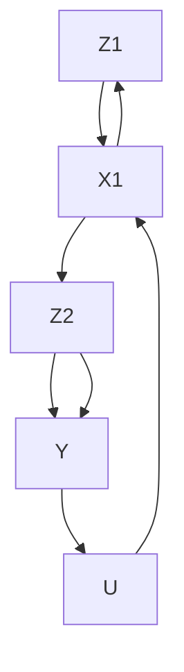
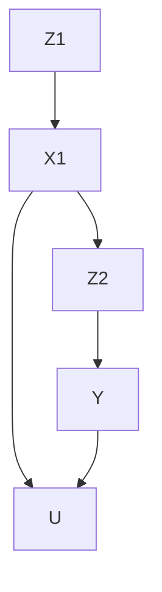

# Time-Varying Treatment and Confounding

Studies with time-varying treatments are common in biomedical and social sciences. James Robins championed the research in biostatistics. A classic example is that HIV patients may take the azidothymidine, an antiretroviral medication, on and off over time (Robins et al., 2000; Hern´an et al., 2000). Similar problems also exist in other fields. In education, a classic example is that students may receive different types of instructions over time (Hong and Raudenbush, 2008). In political science, a classic example is that candidates continuously recalibrate their campaign strategy based on time-varying polls and opponent actions (Blackwell, 2013).

Causal inference with a time-varying treatment is not a simple extension of causal inference with a treatment at a single time point. The main challenge is time-varying confounding. Even if we assume all time-varying confounders are observed, we still face statistical challenges in adjusting for those confounders. One the one hand, we should stratify on these confounders to adjust for confounding; on the other hand, stratifying on post-treatment variables will cause bias. Due to these two conflicting goals, causal inference with time-varying treatments and confounding requires more sophisticated statistical methods. It is the main topic of this chapter.

To minimize the notational burden, I will use the setting with a treatment at two time points to convey the most important ideas. Extensions to treatments at multiple time points can be conceptually straightforward although technical complexities will arise in finite samples. I will discuss the complexities and relegate general results to Problems 29.6–29.9.

## 29.1 Basic setup and sequential ignorability

Start with a treatment at two time points. The temporal order of the variables with two time points is below:

$$
X _ {0} \rightarrow Z _ {1} \rightarrow X _ {1} \rightarrow Z _ {2} \rightarrow Y
$$

where

• $X _ { 0 }$ denotes the baseline pre-treatment covariates;

FIGURE 29.1: Without unmeasured confounding U between $X _ { 1 }$ and Y . The causal diagram conditions on the pre-treatment covariates $X _ { 0 }$ .

• $Z _ { 1 }$ denotes the treatment at time point 1;
• $X _ { 1 }$ denotes the time-varying covariates between the treatments at time points 1 and 2;
• $Z _ { 2 }$ denotes the treatment at time point 2;
• Y denotes the outcome.

With binary treatment $( Z _ { 1 } , Z _ { 2 } )$ , each unit has four potential outcomes

$$
Y (z _ {1}, z _ {2}) \text {   for   } z _ {1}, z _ {2} = 0, 1.
$$

The observed outcome equals

$$
Y = Y \left(Z _ {1}, Z _ {2}\right) = \sum_ {z _ {1} = 0, 1} \sum_ {z _ {2} = 0, 1} 1 \left(Z _ {1} = z _ {1}\right) 1 \left(Z _ {2} = z _ {2}\right) Y \left(z _ {1}, z _ {2}\right).
$$

I will focus on the canonical setting with sequential ignorability, that is, the treatments are sequentially randomized given the observed history.

Assumption 29.1 (sequential ignorability) $( 1 ) \ Z _ { 1 }$ is randomized given $X _ { 0 }$ :

$$
Z _ {1} \bot Y (z _ {1}, z _ {2}) \mid X _ {0} f o r z _ {1}, z _ {2} = 0, 1.
$$

(2) $Z _ { 2 }$ is randomized given $( Z _ { 1 } , X _ { 1 } , X _ { 0 } )$ :

$$
Z _ {2} \bot Y (z _ {1}, z _ {2}) \mid (Z _ {1}, X _ {1}, X _ {0}) f o r z _ {1}, z _ {2} = 0, 1.
$$

Figure 29.1 is a simple causal diagram corresponding to Assumption 29.1, which does not contains any unmeasured confounding.

Figure 29.2 is a more complex causal diagram corresponding to Assumption 29.1. Sequential ignorability rules out only the confounding between the treatment $( Z _ { 1 } , Z _ { 2 } )$ and the outcome $Y$ , but allows for unmeasured confounding between the time-varying covariate $X _ { 1 }$ and the outcome Y . The possible existence of U causes many subtle issues even under sequential ignorability.

FIGURE 29.2: With unmeasured confounding between $X _ { 1 }$ and $Y .$ The causal diagram conditions on the pre-treatment covariates $X _ { 0 }$ .

## 29.2 g-formula and outcome modeling

Recall the outcome-based identification formula with a treatment at a single time point:

$$
E \{Y (z) \} = E \{E (Y \mid Z = z, X) \}.
$$

With discrete X, it reduces to

$$
E \{Y (z) \} = \sum_ {x} E (Y \mid Z = z, X = x) \mathrm{pr} (X = x);
$$

with continuous X, it reduces to

$$
E \{Y (z) \} = \int E (Y \mid Z = z, X = x) f _ {X} (x) \mathrm{d} x.
$$

The following result extends it to the setting with a treatment at two time points.

Theorem 29.1 Under Assumption 29. $^ { 1 , }$

$$
E \{Y (z _ {1}, z _ {2}) \} = E \Big [ E \{E (Y \mid z _ {2}, z _ {1}, X _ {1}, X _ {0}) \mid z _ {1}, X _ {0} \} \Big ]. \tag {29.1}
$$

In Theorem 29.1, I simplify the notation ${ } ^ { \circ } Z _ { 2 } = z _ { 2 } { } ^ { \prime \prime }$ to $^ { 6 } z _ { 2 } ^ { , 5 }$ for simplicity. To void complex formulas in this Chapter, I will use the lower case letter to represent the event that the random variable takes the corresponding value. With discrete $X _ { 0 }$ and $X _ { 1 }$ , the identification formula (29.1) reduces to

$$
E \{Y (z _ {1}, z _ {2}) \} = \sum_ {x _ {0}} \sum_ {x _ {1}} E (Y \mid z _ {2}, z _ {1}, x _ {1}, x _ {0}) \mathrm{pr} (x _ {1} \mid z _ {1}, x _ {0}) \mathrm{pr} (x _ {0}); \tag {29.2}
$$

with continuous $X _ { 0 }$ and $X _ { 1 }$ , the identification formula (29.1) reduces to

$$
E \{Y (z _ {1}, z _ {2}) \} = \int \int E (Y \mid z _ {2}, z _ {1}, x _ {1}, x _ {0}) f (x _ {1} \mid z _ {1}, x _ {0}) f (x _ {0}) \mathrm{d} x _ {1} \mathrm{d} x _ {0}. \tag {29.3}
$$

Compare (29.2) with the formula based on the law of total probability to gain more insights:

$$
\begin{array}{l} E (Y) = \sum_ {x _ {0}} \sum_ {z _ {1}} \sum_ {x _ {1}} \sum_ {z _ {2}} E (Y \mid z _ {2}, z _ {1}, x _ {1}, x _ {0}) \\ \operatorname{pr} (z _ {1} \mid z _ {1}, x _ {1}, x _ {0}) \operatorname{pr} (x _ {1} \mid z _ {1}, x _ {0}) \operatorname{pr} (z _ {1} \mid x _ {0}) \operatorname{pr} (x _ {0}). \tag {29.4} \\ \end{array}
$$

Erasing the probabilities of $z _ { 2 }$ and $z _ { 1 }$ in (29.4), we can obtain the formula (29.3). This is intuitive because the potential outcome $Y ( z _ { 1 } , z _ { 2 } )$ has the meaning of fixing $Z _ { 1 }$ and $Z _ { 2 }$ at $z _ { 1 }$ and $z _ { 2 } .$ respectively.

Robins called (29.2) and (29.3) the g-formulas. Now I will prove Theorem 29.1.

Proof of Theorem 29.1: By the tower property,

$$
E \{Y (z _ {1}, z _ {2}) \} = E \left[ E \{Y (z _ {1}, z _ {2}) \mid X _ {0} \} \right],
$$

so we focus on $E \{ Y ( z _ { 1 } , z _ { 2 } ) \mid X _ { 0 } \}$ . By Assumption 29.1(1) and the tower property,

$$
\begin{array}{l} E \{Y (z _ {1}, z _ {2}) \mid X _ {0} \} = E \{Y (z _ {1}, z _ {2}) \mid z _ {1}, X _ {0} \} \\ = E \left[ E \left\{Y \left(z _ {1}, z _ {2}\right) \mid z _ {1}, X _ {1}, X _ {0} \right\} \mid z _ {1}, X _ {0} \right]. \\ \end{array}
$$

By Assumption 29.1(2),

$$
\begin{array}{l} E \{Y (z _ {1}, z _ {2}) \mid X _ {0} \} = E \Big [ E \{Y (z _ {1}, z _ {2}) \mid z _ {2}, z _ {1}, X _ {1}, X _ {0} \} \mid z _ {1}, X _ {0} \Big ] \\ = E \left[ E \left\{Y \mid z _ {2}, z _ {1}, X _ {1}, X _ {0} \right\} \mid z _ {1}, X _ {0} \right]. \\ \end{array}
$$

The formula (29.1) follows.

## 29.2.1 Plug-in estimation based on outcome modeling

The g-formulas (29.2) and (29.3) suggest that to estimate the means of the potential outcomes, we need to model $E ( Y \mid z _ { 2 } , z _ { 1 } , x _ { 1 } , x _ { 0 } ) , \operatorname { p r } ( x _ { 1 } \mid z _ { 1 } , x _ { 0 } )$ and $\mathrm { p r } ( x _ { 0 } )$ . With these fitted models, we can plug them in the $\mathrm { g } -$ formulas.

With some special functional forms, this task can be simplified. Example 29.1 below gives the results under a linear model for the outcome.

Example 29.1 Assume a linear outcome model

$$
E (Y \mid z _ {2}, z _ {1}, x _ {1}, x _ {0}) = \beta_ {0} + \beta_ {1} z _ {2} + \beta_ {2} z _ {1} + \beta_ {3} x _ {1} + \beta_ {4} x _ {0}.
$$

We can verify that

$$
\begin{array}{l} E \{Y (z _ {1}, z _ {2}) \} = \sum_ {x _ {0}} \sum_ {x _ {1}} (\beta_ {0} + \beta_ {1} z _ {2} + \beta_ {2} z _ {1} + \beta_ {3} x _ {1} + \beta_ {4} x _ {0}) \mathrm{pr} (x _ {1} \mid z _ {1}, x _ {0}) \mathrm{pr} (x _ {0}) \\ = \beta_ {0} + \beta_ {1} z _ {2} + \beta_ {2} z _ {1} + \beta_ {3} \sum_ {x _ {0}} E (X _ {1} \mid z _ {1}, x _ {0}) \mathrm{pr} (x _ {0}) + \beta_ {4} E (X _ {0}). \\ \end{array}
$$

Define

$$
E \{X _ {1} (z _ {1}) \} = \sum_ {x _ {0}} E (X _ {1} \mid z _ {1}, x _ {0}) \mathrm{pr} (x _ {0}) \tag {29.5}
$$

to simplify the formula as

$$
E \{Y (z _ {1}, z _ {2}) \} = \beta_ {0} + \beta_ {1} z _ {2} + \beta_ {2} z _ {1} + \beta_ {3} E \{X _ {1} (z _ {1}) \} + \beta_ {4} E (X _ {0}).
$$

In (29.5), I introduce the potential outcome of $X _ { 1 }$ under the treatment $Z _ { 1 } =$ $z _ { 1 }$ at time point 1. It is reasonable because the right-hand side of $( 2 9 . 5 )$ is the identification formula of $E \{ X _ { 1 } ( z _ { 1 } ) \}$ under ignorability $X _ { 1 } ( z _ { 1 } ) \bot \bot \ Z _ { 1 } \mid X _ { 0 }$ for $z _ { 1 } = 0 , 1$ . We do not really need the potential outcome $X _ { 1 } ( z _ { 1 } )$ and the ignorability, but it is a convenient notation and matches with our discussion before.

Define $\tau _ { Z _ { 1 }  X _ { 1 } } = E \{ X _ { 1 } ( 1 ) - X _ { 1 } ( 0 ) \}$ . We can verify that

$$
E \{Y (1, 0) - Y (0, 0) \} = \beta_ {2} + \beta_ {3} \tau_ {Z _ {1} \rightarrow X _ {1}},
$$

$$
E \{Y (0, 1) - Y (0, 0) \} = \beta_ {1},
$$

$$
E \{Y (1, 1) - Y (0, 0) \} = \beta_ {1} + \beta_ {2} + \beta_ {3} \tau_ {Z _ {1} \to X _ {1}}.
$$

Therefore, we can estimate the effect of $( Z _ { 1 } , Z _ { 2 } )$ on $Y$ based on the above formulas by first estimating the regression coefficients $\beta s$ and the average causal effect of $Z _ { 1 }$ on $X _ { 1 }$ using standard methods.

However, Robins and Wasserman (1997) pointed out a surprising drawback of the plug-in estimation based on outcome modeling. They showed that with model misspecification in this strategy, data analyzers may falsely reject the null hypothesis of zero causal effect of $( Z _ { 1 } , Z _ { 2 } )$ on $Y$ even when the true effect is zero in the data-generating process. They called it the g-null paradox. Perhaps surprisingly, they show that the g-null paradox may even arise in the simple linear outcome model in Example 29.1. McGrath et al. (2021) revisited this paradox. See Problem 29.1 for more details.

## 29.2.2 Recursive estimation based on outcome modeling

The plug-in estimation in Section 29.2.1 involves modeling the time-varying confounder $X _ { 1 }$ and causes the unpleasant g-null paradox. It is not a desirable method.

Recall the outcome regression estimator with a treatment at a single time based on $E \{ Y ( z ) \} = E \{ { \bar { E } } ( Y \mid Z = z , X ) \}$ . We first fit a model of $Y$ on $X$ using the subset of the data with $Z = z .$ and obtain the fitted values $\hat { Y } _ { i } ( z )$ for all units. We then obtain the estimator

$$
\hat {E} \{Y (z) \} = n ^ {- 1} \sum_ {i = 1} ^ {n} \hat {Y} _ {i} (z).
$$

Similarly, the recursive expectation formula in (29.1) motivates a simpler method for estimation. Start from the inner conditional expectation, denoted by

$$
\tilde {Y} _ {2} (z _ {1}, z _ {2}) = E (Y \mid Z _ {2} = z _ {2}, Z _ {1} = z _ {1}, X _ {1}, X _ {0}).
$$

We can fit a model of $Y$ on $( X _ { 1 } , X _ { 0 } )$ using the subset of the data with $( Z _ { 2 } =$ $z _ { 2 } , Z _ { 1 } = z _ { 1 } )$ , and obtain the fitted values $\hat { Y } _ { 2 i } ( z _ { 1 } , z _ { 2 } )$ for all units. Move on to outer conditional expectation, denoted by

$$
\tilde {Y} _ {1} (z _ {1}, z _ {2}) = E \{\tilde {Y} _ {2} (z _ {1}, z _ {2}) \mid Z _ {1} = z _ {1}, X _ {0} \}.
$$

We can fit a model of $\hat { Y } _ { 2 } ( z _ { 1 } , z _ { 2 } )$ on $X _ { 0 }$ using the subset of data with $Z _ { 1 } = z _ { 1 }$ , and obtain the fitted values $\hat { Y } _ { 1 i } ( z _ { 1 } , z _ { 2 } )$ for all units. The final estimator for $E \{ Y ( z _ { 1 } , z _ { 2 } ) \}$ is then

$$
\hat {E} \{Y (z _ {1}, z _ {2}) \} = n ^ {- 1} \sum_ {i = 1} ^ {n} \hat {Y} _ {1 i} (z _ {1}, z _ {2}).
$$

The above recursive estimation does not involve fitting a model for $X _ { 1 }$ and avoids the g-null paradox. See Problem 29.2 for a special case.

## 29.3 Inverse propensity score weighting

Recall the propensity-score-based identification formula with a treatment at a single time point:

$$
E \{Y (z) \} = E \left\{\frac {1 (Z = z) Y}{\operatorname* {p r} (Z = z \mid X)} \right\}.
$$

The following result extends it to the setting with a treatment at two time points. Define

$$
e (z _ {1}, X _ {0}) = \mathrm{pr} (Z _ {1} = z _ {1} \mid X _ {0})
$$

and

$$
e (z _ {2}, Z _ {1}, X _ {1}, X _ {0}) = \mathrm{pr} (Z _ {2} = z _ {2} \mid Z _ {1}, X _ {1}, X _ {0})
$$

as the propensity scores at time points 1 and 2, respectively.

Theorem 29.2 Under Assumption 29. $^ { 1 , }$

$$
E \{Y (z _ {1}, z _ {2}) \} = E \left\{\frac {1 (Z _ {1} = z _ {1}) 1 (Z _ {2} = z _ {2}) Y}{e (z _ {1} , X _ {0}) e (z _ {2} , Z _ {1} , X _ {1} , X _ {0})} \right\}. \tag {29.6}
$$

Theorem 29.2 reveals the omitted overlap assumption:

$$
0 <   e \left(z _ {1}, X _ {0}\right) <   1, \quad 0 <   e \left(z _ {2}, Z _ {1}, X _ {1}, X _ {0}\right) <   1
$$

for all $z _ { 1 }$ and $z _ { 2 } .$ . If some propensity scores are 0 or 1, then the identification formula (29.6) blows up to infinity.

Proof of Theorem 29.2: Conditioning on $( Z _ { 1 } , X _ { 1 } , X _ { 0 } )$ and using Assumption 29.1(2), we can simplify the right-hand side of (29.6) as

$$
\begin{array}{l} E \left\{\frac {1 (Z _ {1} = z _ {1}) 1 (Z _ {2} = z _ {2}) Y (z _ {1} , z _ {2})}{\operatorname{pr} (Z _ {1} = z _ {1} \mid X _ {0}) \operatorname{pr} (Z _ {2} = z _ {2} \mid Z _ {1} , X _ {1} , X _ {0})} \right\} \\ = E \left\{\frac {1 (Z _ {1} = z _ {1}) \mathrm{pr} (Z _ {2} = z _ {2} \mid Z _ {1} , X _ {1} , X _ {0}) E (Y (z _ {1} , z _ {2}) \mid Z _ {1} , X _ {1} , X _ {0})}{\mathrm{pr} (Z _ {1} = z _ {1} \mid X _ {0}) \mathrm{pr} (Z _ {2} = z _ {2} \mid Z _ {1} , X _ {1} , X _ {0})} \right\} \\ = E \left\{\frac {1 (Z _ {1} = z _ {1})}{\operatorname{pr} (Z _ {1} = z _ {1} \mid X _ {0})} E (Y (z _ {1}, z _ {2}) \mid Z _ {1}, X _ {1}, X _ {0}) \right\} \\ = E \left\{\frac {1 (Z _ {1} = z _ {1})}{\operatorname{pr} (Z _ {1} = z _ {1} \mid X _ {0})} Y (z _ {1}, z _ {2}) \right\}, \tag {29.7} \\ \end{array}
$$

where (29.7) follows from the tower property.

Conditioning on $X _ { 0 }$ and using Assumption 29.1(1), we can simplify the right-hand side of (29.7) as

$$
\begin{array}{l} E \left\{\frac {\operatorname{pr} (Z _ {1} = z _ {1} \mid X _ {0})}{\operatorname{pr} (Z _ {1} = z _ {1} \mid X _ {0})} E (Y (z _ {1}, z _ {2}) \mid X _ {0}) \right\} \\ = E \left\{E \left(Y \left(z _ {1}, z _ {2}\right) \mid X _ {0}\right) \right\} \\ = E \{Y (z _ {1}, z _ {2}) \}, \\ \end{array}
$$

where, again, the last line follows from the tower property.

The estimator based on IPW is much simpler which only involves modeling two binary indicators. First, we can fit a model of $Z _ { 1 }$ on $X _ { 0 }$ to obtain the fitted values $\hat { e } _ { 1 } ( z _ { 1 } , X _ { 0 i } )$ and fit a model of $Z _ { 2 }$ on $( Z _ { 1 } , X _ { 1 } , X _ { 0 } )$ to obtain the fitted values $\hat { e } _ { 2 } ( z _ { 2 } , Z _ { 1 i } , X _ { 1 i } , X _ { 0 i } )$ for all units. Then, we obtain the following IPW estimator:

$$
\hat {E} ^ {\mathrm{ht}} \left\{Y \left(z _ {1}, z _ {2}\right) \right\} = n ^ {- 1} \sum_ {i = 1} ^ {n} \frac {1 \left(Z _ {1 i} = z _ {1}\right) 1 \left(Z _ {2 i} = z _ {2}\right) Y _ {i}}{\hat {e} _ {1} \left(z _ {1} , X _ {0 i}\right) \hat {e} _ {2} \left(z _ {2} , Z _ {1 i} , X _ {1 i} , X _ {0 i}\right)}.
$$

Similar to the discussion in Chapter 11, the Horvitz–Thompson-type estimator is not invariant to location shift of the outcome and suffers from instability in finite samples. A modified Hajek-type estimator is $\hat { E } ^ { \mathrm { h a j } } \{ Y ( z _ { 1 } , z _ { 2 } ) \} =$ $\hat { E } ^ { \mathrm { h t } } \{ Y ( z _ { 1 } , z _ { 2 } ) \} / \hat { 1 } ^ { \mathrm { h t } } ( z _ { 1 } , z _ { 2 } )$ , where

$$
\hat {1} ^ {\mathrm{ht}} (z _ {1}, z _ {2}) = n ^ {- 1} \sum_ {i = 1} ^ {n} \frac {1 (Z _ {1 i} = z _ {1}) 1 (Z _ {2 i} = z _ {2})}{\hat {e} _ {1} (z _ {1} , X _ {0 i}) \hat {e} _ {2} (z _ {2} , Z _ {1 i} , X _ {1 i} , X _ {0 i})}.
$$

## 29.4 Multiple time points

Extending the estimation strategies in Sections 29.2 and 29.3 is not immediate with multiple time points. Even with a binary treatment and K time points, the number of treatment combination grows exponentially with K (for example, $2 ^ { 5 } = 3 2$ and $2 ^ { 1 0 } = 1 0 2 4 \rangle$ . Consequently, the outcome regression and IPW estimators in Sections 29.2 and 29.3 are not feasible in finite samples.

## 29.4.1 Marginal structural model

A powerful approach is based on the marginal structural model (MSM) (Robins et al., 2000; Hern´an et al., 2000). For simplicity of notation, I will only present the MSM with $K = 2$ although its main use is in the general case.

Definition 29.1 (MSM) The marginal mean of $Y ( z _ { 1 } , z _ { 2 } )$ equals

$$
E \{Y (z _ {1}, z _ {2}) \} = f (z _ {1}, z _ {2}; \beta).
$$

A leading example of Definition 29.1 is $E \{ Y ( z _ { 1 } , z _ { 2 } ) \} = \beta _ { 0 } + \beta _ { 1 } z _ { 1 } + \beta _ { 2 } z _ { 2 }$ . It is also straightforward to include the baseline covariates in the model. Definition 29.2 below extends Definition 29.1.

Definition 29.2 (MSM with baseline covariates) The mean of $Y ( z _ { 1 } , z _ { 2 } )$ conditional on $X _ { 0 }$ equals

$$
E \{Y (z _ {1}, z _ {2}) \mid X _ {0} \} = f (z _ {1}, z _ {2}, X _ {0}; \beta).
$$

A leading example of Definition 29.2 is

$$
E \{Y (z _ {1}, z _ {2}) \mid X _ {0} \} = \beta_ {0} + \beta_ {1} z _ {1} + \beta_ {2} z _ {2} + \beta_ {3} ^ {\mathsf {T}} X _ {0}. \tag {29.8}
$$

If we observe all potential outcomes, we can solve $\beta$ from the following minimization problem:

$$
\beta = \arg \min _ {b} \sum_ {z _ {2}} \sum_ {z _ {1}} E \{Y (z _ {1}, z _ {2}) - f (z _ {1}, z _ {2}, X _ {0}; b) \} ^ {2}.
$$

For simplicity, I focus on the least squares formulation. We can also extend the discussion to a general loss function.

Under sequential ignorability, we can solve $\beta$ from the following minimization problem that only involves observables.

Theorem 29.3 (IPW under MSM) Under Assumption 29.1 and Definition 29.2,

$$
\beta = \arg \min _ {b} \sum_ {z _ {2}} \sum_ {z _ {1}} E \left[ \frac {1 (Z _ {1} = z _ {1}) 1 (Z _ {2} = z _ {2})}{e (z _ {1} , X _ {0}) e (z _ {2} , Z _ {1} , X _ {1} , X _ {0})} \{Y - f (z _ {1}, z _ {2}, X _ {0}; b) \} ^ {2} \right].
$$

The proof of Theorem 29.3 is similar to that of Theorem 29.2. I relegate it to Problem 29.3.

Theorem 29.3 implies a simple estimation strategy based on weighted regressions. For instance, under (29.8), we can fit WLS of $Y _ { i }$ on $( 1 , Z _ { 1 i } , Z _ { 2 i } , X _ { 0 i } )$ with weights $\hat { e } _ { 1 } ^ { - 1 } ( Z _ { 1 i } , X _ { 0 i } ) \hat { e } _ { 2 i } ^ { - 1 } ( Z _ { 2 i } , Z _ { i 1 } , X _ { 1 i } , X _ { 0 i } )$ .

## 29.4.2 Structural nested model

A key problem of IPW is that it is not applicable if the overlap assumption is violated. To address this challenge, Robins proposed the structural nested model. Again, to simplify the presentation, I only review the version with two time points.

Definition 29.3 (structural nested model) The conditional effect at time point 1 is

$$
E \{Y (z _ {1}, 0) - Y (0, 0) \mid Z _ {1} = z _ {1}, X _ {0} \} = g _ {1} (z _ {1}, X _ {0}; \beta) f o r a l l z _ {1}
$$

and the conditional effect at time point 2 is

$$
E \{Y (z _ {1}, z _ {2}) - Y (z _ {1}, 0) \mid Z _ {2} = z _ {2}, Z _ {2} = z _ {1}, X _ {1}, X _ {0} \} = g _ {2} (z _ {2}, z _ {1}, X _ {1}, X _ {0}; \beta) f o r a l l z _ {1}, z _ {2}.
$$

In Definition 29.3, two logical restrictions are

$$
g _ {1} (0, X _ {0}; \beta) = 0
$$

and

$$
g _ {2} (0, z _ {1}, X _ {1}, X _ {0}; \beta) = 0 \text {   for   all   } z _ {1}.
$$

Two leading choices of Definition 29.3 are below.

Example 29.2 Assume

$$
\left\{ \begin{array}{l} g _ {1} (z _ {1}, X _ {0}; \beta) = \beta_ {1} z _ {1}, \\ g _ {2} (z _ {2}, z _ {1}, X _ {1}, X _ {0}; \beta) = (\beta_ {2} + \beta_ {3} z _ {1}) z _ {2}. \end{array} \right.
$$

Example 29.3 Assume

$$
\left\{ \begin{array}{l} g _ {1} (z _ {1}, X _ {0}; \beta) = (\beta_ {1} + \beta^ {\mathsf {T}} X _ {0}) z _ {1}, \\ g _ {2} (z _ {2}, z _ {1}, X _ {1}, X _ {0}; \beta) = (\beta_ {2} + \beta_ {3} z _ {1} + \beta_ {4} ^ {\mathsf {T}} X _ {1}) z _ {2}. \end{array} \right.
$$

Compare Definitions 29.2 and 29.3. The structural nested model allows for adjusting for the time-varying covariates whereas the marginal structural model only allows for adjusting for baseline covariates. The estimation under Definition 29.3 is more involved. A strategy is to estimate the parameter based on estimating equations.

I first introduce two important building blocks for the discussing the estimation. Define

$$
U _ {2} (\beta) = Y - g _ {2} (Z _ {2}, Z _ {1}, X _ {1}, X _ {0}; \beta)
$$

and

$$
U _ {1} (\beta) = Y - g _ {2} (Z _ {2}, Z _ {1}, X _ {1}, X _ {0}; \beta) - g _ {1} (Z _ {1}, X _ {0}; \beta).
$$

They are not directly computable from the data because they depend on the true value of the parameter $\beta .$ At the true value, they have the following properties.

Lemma 29.1 Under Assumption 29.1 and Definition 29.3, we have

$$
\begin{array}{l} E \{U _ {2} (\beta) \mid Z _ {2}, Z _ {1}, X _ {1}, X _ {0} \} = E \{U _ {2} (\beta) \mid Z _ {1}, X _ {1}, X _ {0} \} \\ = E \left\{Y \left(Z _ {1}, 0\right) \mid Z _ {1}, X _ {1}, X _ {0} \right\} \\ \end{array}
$$

and

$$
\begin{array}{l} E \{U _ {1} (\beta) \mid Z _ {1}, X _ {0} \} = E \{U _ {1} (\beta) \mid X _ {0} \} \\ = E \{Y (0, 0) \mid X _ {0} \}. \\ \end{array}
$$

Lemma 29.1 involves a subtle notation $Y ( Z _ { 1 } , 0 )$ because $Z _ { 1 }$ is random. It should be read as $Y ( Z _ { 1 } , 0 ) = Z _ { 1 } Y ( 1 , 0 ) + ( 1 - Z _ { 1 } ) Y ( 0 , 0 )$ . Based on the definitions and Lemma 29.1, $U _ { 1 } ( \beta )$ acts as the control potential outcome before receiving any treatment and $U _ { 2 } ( \beta )$ acts as the control potential outcome after receiving the treatment at time point 1.

Proof of Lemma 29.1: First, we have

$$
\begin{array}{l} E \{U _ {2} (\beta) \mid Z _ {2} = 1, Z _ {1}, X _ {1}, X _ {0} \} = E \{Y (Z _ {1}, 1) - g _ {2} (1, Z _ {1}, X _ {1}, X _ {0}; \beta) \mid Z _ {2} = 1, Z _ {1}, X _ {1}, X _ {0} \} \\ = E \left\{Y \left(Z _ {1}, 0\right) \mid Z _ {2} = 1, Z _ {1}, X _ {1}, X _ {0} \right\} \\ E \{U _ {2} (\beta) \mid Z _ {2} = 0, Z _ {1}, X _ {1}, X _ {0} \} = E \{Y (Z _ {1}, 0) - g _ {2} (0, Z _ {1}, X _ {1}, X _ {0}; \beta) \mid Z _ {2} = 0, Z _ {1}, X _ {1}, X _ {0} \} \\ = E \left\{Y \left(Z _ {1}, 0\right) \mid Z _ {2} = 0, Z _ {1}, X _ {1}, X _ {0} \right\} \\ \end{array}
$$

so

$$
E \{U _ {2} (\beta) \mid Z _ {2}, Z _ {1}, X _ {1}, X _ {0} \} = E \{Y (Z _ {1}, 0) \mid Z _ {2}, Z _ {1}, X _ {1}, X _ {0} \} = E \{Y (Z _ {1}, 0) \mid Z _ {1}, X _ {1}, X _ {0} \}
$$

where the last identity follows from sequential ignorability. Since the last term does not depend on $Z _ { 2 } ,$ we also have

$$
E \{U _ {2} (\beta) \mid Z _ {2}, Z _ {1}, X _ {1}, X _ {0} \} = E \{U _ {2} (\beta) \mid Z _ {1}, X _ {1}, X _ {0} \}.
$$

Using the above results, we have

$$
\begin{array}{l} E \{U _ {1} (\beta) \mid Z _ {1}, X _ {0} \} = E \{U _ {2} (\beta) - g _ {1} (Z _ {1}, X _ {0}; \beta) \mid Z _ {1}, X _ {0} \} \\ = E \left[ E \left\{U _ {2} (\beta) - g _ {1} \left(Z _ {1}, X _ {0}; \beta\right) \mid X _ {1}, Z _ {1}, X _ {0} \right\} \mid Z _ {1}, X _ {0} \right] \\ = E \left[ E \left\{Y \left(Z _ {1}, 0\right) - g _ {1} \left(Z _ {1}, X _ {0}; \beta\right) \mid X _ {1}, Z _ {1}, X _ {0} \right\} \mid Z _ {1}, X _ {0} \right] \\ = E \{Y (Z _ {1}, 0) - g _ {1} (Z _ {1}, X _ {0}; \beta) \mid Z _ {1}, X _ {0} \} \\ = E \{Y (0, 0) \mid Z _ {1}, X _ {0} \} \\ = E \{Y (0, 0) \mid X _ {0} \} \\ \end{array}
$$

where the last identity follows from sequential ignorability. Since the last term does not depend on $Z _ { 1 }$ , we also have

$$
E \{U _ {1} (\beta) \mid Z _ {1}, X _ {0} \} = E \{U _ {1} (\beta) \mid X _ {0} \}.
$$

With Lemma 29.1, we can prove Theorem 29.4 below.

Theorem 29.4 Under Assumption 29.1 and Definition 29.3,

$$
E \Big [ h _ {2} (Z _ {1}, X _ {1}, X _ {0}) \{Z _ {2} - e (1, Z _ {1}, X _ {1}, X _ {0}) \} U _ {2} (\beta) \Big ] = 0
$$

and

$$
E \Big [ h _ {1} (X _ {0}) \{Z _ {1} - e (1, X _ {0}) \} U _ {1} (\beta) \Big ] = 0.
$$

for any functions $h _ { 1 }$ and $h _ { 2 } ,$ provided that the moments exist.

Proof of Theorem 29.2: Use the tower property by conditioning on $\left( Z _ { 2 } , Z _ { 1 } , X _ { 1 } , X _ { 0 } \right)$ and Lemma 29.1 to obtain

$$
\begin{array}{l} E \left[ h _ {2} (Z _ {1}, X _ {1}, X _ {0}) \{Z _ {2} - e (1, Z _ {1}, X _ {1}, X _ {0}) \} E \{U _ {2} (\beta) \mid Z _ {2}, Z _ {1}, X _ {1}, X _ {0} \} \right] \\ = E \left[ h _ {2} (Z _ {1}, X _ {1}, X _ {0}) \{Z _ {2} - e (1, Z _ {1}, X _ {1}, X _ {0}) \} E \{U _ {2} (\beta) \mid Z _ {1}, X _ {1}, X _ {0} \} \right]. \\ \end{array}
$$

Use the tower property by conditioning on $( Z _ { 1 } , X _ { 1 } , X _ { 0 } )$ to show that the last identity equals 0.

Similarly, use the tower property by conditioning on $( Z _ { 1 } , X _ { 0 } )$ and Lemma 29.1 to obtain

$$
\begin{array}{l} E \left[ h _ {1} (X _ {0}) \{Z _ {1} - e (1, X _ {0}) \} E \{U _ {1} (\beta) \mid Z _ {1}, X _ {0} \} \right] \\ = E \left[ h _ {1} (X _ {0}) \{Z _ {1} - e (1, X _ {0}) \} E \{U _ {1} (\beta) \mid X _ {0} \} \right]. \\ \end{array}
$$

Use the tower property by conditioning on $X _ { 0 }$ to show that the last identity equals 0. □

To use Theorem 29.4, we must specify $h _ { 1 }$ and $h _ { 2 }$ to ensure that there are enough equations for solving $\beta .$ Example 29.4 below revisits Example 29.2.

Example 29.4 Under Example ${ \it 2 9 . 2 , }$ we can choose $h _ { 1 } = 1$ and $h _ { 2 } = \left( 1 , Z _ { 1 } \right)$ 号 to obtain

$$
\begin{array}{l} E \left[ \left\{Z _ {2} - e (1, Z _ {1}, X _ {1}, X _ {0}) \right\} \left\{Y - (\beta_ {2} + \beta_ {3} Z _ {1}) Z _ {2} \right\} \right] = 0, \\ E \left[ Z _ {1} \left\{Z _ {2} - e \left(1, Z _ {1}, X _ {1}, X _ {0}\right) \right\} \left\{Y - \left(\beta_ {2} + \beta_ {3} Z _ {1}\right) Z _ {2} \right\} \right] = 0, \\ E \left[ \{Z _ {1} - e (1, X _ {0}) \} \{Y - (\beta_ {2} + \beta_ {3} Z _ {1}) Z _ {2} - \beta_ {1} Z _ {1} \} \right] = 0. \\ \end{array}
$$

We can then solve for the $\beta ^ { \prime } s$ from the above linear equations; see Problem 29.5. A natural question is that whether alternative choices of $( h _ { 1 } , h _ { 2 } )$ can lead to more efficient estimators. The answer is yes. For example, we can choose many $( h _ { 1 } , h _ { 2 } )$ and use the generalized method of moment (Hansen, 1982). The technical details are beyond this book.

Naimi et al. (2017) and Vansteelandt and Joffe (2014) provided tutorials on the structural nested models.

FIGURE 29.3: With unmeasured confounding between $X _ { 1 }$ and $Y .$ . The causal diagram ignores the pre-treatment covariates $X _ { 0 }$ .

## 29.5 Homework problems

## 29.1 g-null paradox

Consider the simple causal diagram in Figure 29.3 without pre-treatment covariates $X _ { 0 }$ and without the arrows from $( Z _ { 1 } , Z _ { 2 } )$ to $Y$ . So the effect of $( Z _ { 1 } , Z _ { 2 } )$ on $Y$ is zero.

Revisit Example 29.1. Show that the expectation $E \{ Y ( z _ { 1 } , z _ { 2 } ) \}$ does not depend on $( z _ { 1 } , z _ { 2 } )$ if

$$
\beta_ {1} = \beta_ {3} = 0 \mathrm{and} \beta_ {2} = 0
$$

or

$$
\beta_ {1} = \beta_ {3} = 0 \text {   and   } E \{X _ {1} (z _ {1}) \} \text {   does   not   depend   on   } z _ {1}.
$$

holds.

Remark: However, $\beta _ { 2 } = 0$ in the first condition rules out the dependence of $Y$ on $X _ { 1 } .$ , contradicting with the existence of unmeasured confounder U between $X _ { 1 }$ and $Y ;$ the independence of $E \{ X _ { 1 } ( z _ { 1 } ) \}$ } on $z _ { 1 }$ rules out the dependence of $X _ { 1 }$ on $Z _ { 1 }$ , contradicting with the existence of the arrow from $Z _ { 1 }$ on $X _ { 1 }$ . That is, if there is an unmeasured confounder $U$ between $X _ { 1 }$ and Y and there is an arrow from $Z _ { 1 }$ on $X _ { 1 }$ , then the formula of $E \{ Y ( z _ { 1 } , z _ { 2 } ) \}$ in Example 29.1 must depend on $( z _ { 1 } , z _ { 2 } )$ , which leads to a contradiction with the absence of arrows from $( Z _ { 1 } , Z _ { 2 } )$ to $Y$ .

## 29.2 Recursive estimation under the null model

Consider the recursive estimation method in 29.2.2 under the causal diagram in Problem 29.1. Show that based linear models, the estimator converges to 0.

## 29.3 IPW under MSM

Prove Theorem 29.3.

## 29.4 Structural nested model with a single time point

Recall the standard setting of observational studies with IID data draw from $\{ X , Z , Y ( 1 ) , Y ( 0 ) \}$ }. Define the propensity score as $e ( X ) \ = \ \mathrm { p r } ( Z = 1 \mid X )$ . Assume

$$
Z \bot Y (0) \mid X
$$

and the following structural nested model.

Definition 29.4 (structural nested model with a single time point) The conditional mean of the individual effect is

$$
E \{Y (z) - Y (0) \mid Z = z, X \} = g (z, X; \beta).
$$

In Definition 29.4, a logical restriction is $g ( 0 , X ; \beta ) = 0$ . Prove the following results.

1. We have

$$
E \{Y - g (Z, X; \beta) \mid X, Z \} = E \{Y - g (Z, X; \beta) \mid X \} = E \{Y (0) \mid X \}.
$$

2. We have

$$
E \Big [ h (X) \{Z - e (X) \} \{Y - g (Z, X; \beta) \} \Big ] = 0 \tag {29.9}
$$

for any function $h ,$ provided that the moment exists.

Remark: (29.9) is the basis for parameter estimation. Consider a special case of Definition 29.4 with $g ( z , X ; \beta ) = \beta z$ . Choose $h ( X ) = 1$ to obtain

$$
E \{(Z - e (X)) (Y - \beta Z) \} = 0.
$$

Solve for $\beta$ to obtain

$$
\beta = \frac {E \{(Z - e (X)) Y \}}{E \{(Z - e (X)) Z \}}.
$$

That is, $\beta$ equals the coefficient of $Z$ in the two-stage least squares of $Y$ on $Z$ with $Z - e ( X )$ being the instrument variable for $Z$

Consider a special case of Definition 29.4 with $g ( z , X ; \beta ) = ( \beta _ { 0 } + \beta _ { 1 } ^ { \mathsf { T } } X ) z$ . Choose $h ( X ) = ( 1 , X )$ to obtain

$$
E \left\{\binom{Z - e (X)}{(Z - e (X)) X} (Y - \beta_ {0} Z - \beta_ {1} ^ {\mathsf {T}} X Z) \right\} = 0.
$$

That is, $( \beta _ { 0 } , \beta _ { 1 } )$ equal the coefficients in the two-stage least squares of $Y$ on $( Z , X Z )$ with $( \bar { Z } - e ( X ) , ( Z - e ( X ) ) X )$ being the instrument variable for $( Z , X Z )$ .

## 29.5 Estimation under Example 29.4

We can estimate the $\beta \mathrm { { ^ { * } s } }$ by solving the empirical version of the estimating equations in Example 29.4. We first estimate the two propensity scores and obtain the centered treatment

$$
\check {Z} _ {1 i} = Z _ {1 i} - \hat {e} (1, X _ {0 i})
$$

at time point 1 and

$$
\check {Z} _ {2 i} = Z _ {2 i} - \hat {e} (1, Z _ {1 i}, X _ {1 i}, X _ {0 i})
$$

at time point 2.

Show that we can estimate $\beta _ { 2 }$ and $\beta _ { 3 }$ by running two-stage least squares of $Y _ { i }$ on $\left( Z _ { 2 i } , Z _ { 1 i } Z _ { 2 i } \right)$ with $( \check { Z } _ { 2 i } , Z _ { 1 i } \check { Z } _ { 2 i } )$ as the instrumental variable for $\left( Z _ { 2 i } , Z _ { 1 i } Z _ { 2 i } \right)$ , and then we can estimate $\beta _ { 1 }$ by running two-stage least squares of $Y _ { i } - ( \hat { \beta } _ { 2 } + \hat { \beta } _ { 3 } Z _ { 1 i } ) Z _ { 2 i }$ on $Z _ { 1 i }$ with $\check { Z } _ { 1 i }$ as the instrumental variable for $Z _ { 1 i }$ .

## 29.6 g-formula with a treatment at multiple time points

Extend the discussion to the setting with K time points. The temporal ordering of the variables is

$$
X _ {0} \rightarrow Z _ {1} \rightarrow X _ {1} \rightarrow Z _ {2} \rightarrow \dots X _ {K - 1} \rightarrow Z _ {K}.
$$

Introduce the notation ${ \overline { { Z } } } _ { k } = ( Z _ { 1 } , \ldots , Z _ { k } )$ and ${ \overline { { X } } } _ { k } = ( X _ { 0 } , X _ { 1 } , \dots , X _ { k } )$ with lower case $\overline { { z } } _ { k }$ and $\overline { { x } } _ { k }$ denoting the corresponding realized values. With $k = 0$ , we have ${ \overline { { X } } } _ { 0 } = X _ { 0 }$ and $\overline { { Z } } _ { 0 }$ is empty. Each unit has $2 ^ { K }$ potential outcomes:

$$
Y (\overline {{z}} _ {K}) \text {   for   all   } z _ {1}, \ldots , z _ {K} = 0, 1.
$$

Assume sequential ignorability below.

Assumption 29.2 (sequential ignorability at multiple time points) We have

$$
Z _ {k} \bot Y (\overline {{z}} _ {K}) \mid (\overline {{Z}} _ {k - 1}, \overline {{X}} _ {k - 1})
$$

for all $k = 1 , \ldots , K$ and all $z _ { 1 } , \dotsc , z _ { K } = 0 , 1$ .

Prove Theorem 29.5 below.

Theorem 29.5 (g-formula with multiple time points) Under Assumption 29.2,

$$
E \{Y (\overline {{z}} _ {K}) \} = E \left[ \dots E \{E (Y \mid \overline {{z}} _ {K}, \overline {{X}} _ {K - 1}) \mid \overline {{z}} _ {K - 1}, \overline {{X}} _ {K - 2} \} \dots \mid z _ {1}, X _ {0} \right].
$$

Remark: In Theorem 29.5, I use the simplified notation $\overline { { z } } _ { k } \overrightarrow { \mathbf { \Gamma } }$ for $\sqrt [ 6 ] { Z } _ { k } = \overline { { z } } _ { k } . \overline { { \jmath } } ^ { \vphantom { \dag } }$ With discrete X, Theorem 29.5 reduces to

$$
\begin{array}{l} E \{Y (\overline {{z}} _ {K}) \} = \sum_ {x _ {0}} \sum_ {x _ {1}} \dots \sum_ {x _ {K - 1}} E (Y | \overline {{z}} _ {K}, \overline {{x}} _ {K - 1}) \\ \cdot \operatorname{pr} (x _ {K - 1} \mid \overline {{z}} _ {K - 1}, \overline {{x}} _ {K - 2}) \dots \operatorname{pr} (x _ {1} \mid z _ {1}, x _ {0}) \operatorname{pr} (x _ {0}); \\ \end{array}
$$

with continuous X, Theorem 29.5 reduces to

$$
\begin{array}{l} E \{Y (\overline {{z}} _ {K}) \} = \int E (Y | \overline {{z}} _ {K}, \overline {{x}} _ {K - 1}) \\ \cdot f (x _ {K - 1} \mid \overline {{z}} _ {K - 1}, \overline {{x}} _ {K - 2}) \dots f (x _ {1} \mid z _ {1}, x _ {0}) f (x _ {0}) \mathrm{d} \overline {{x}} _ {K - 1}. \\ \end{array}
$$

## 29.7 IPW with a treatment at multiple time points

Inherit the setting of Problem 29.6. Define the propensity score at K time points as

$$
\begin{array}{l} e (z _ {1}, X _ {0}) = \operatorname{pr} (Z _ {1} = z _ {1} \mid X _ {0}), \\ e (z _ {k}, \overline {{Z}} _ {k - 1}, \overline {{X}} _ {k - 1}) = \operatorname{pr} (Z _ {k} = z _ {k} \mid \overline {{Z}} _ {k - 1}, \overline {{X}} _ {k - 1}), \\ e (z _ {K}, \overline {{Z}} _ {K - 1}, \overline {{X}} _ {K - 1}) = \operatorname{pr} (Z _ {K} = z _ {K} \mid \overline {{Z}} _ {K - 1}, \overline {{X}} _ {K - 1}). \\ \end{array}
$$

Prove Theorem 29.7 below assuming overlap implicitly.

Theorem 29.6 (IPW with multiple time points) Under Assumption 29.2,

$$
E \{Y (\overline {{z}} _ {K}) \} = E \left\{\frac {1 (Z _ {1} = z _ {1}) \cdots 1 (Z _ {K} = z _ {K}) Y}{e (z _ {1} , X _ {0}) \cdots e (z _ {K} , \overline {{Z}} _ {K - 1} , \overline {{X}} _ {K - 1})} \right\}.
$$

Based on Theorem 29.7, construct the Horvitz–Thompson and Hajek estimators.

## 29.8 MSM with a treatment at multiple time points

The number of potential outcomes grows exponentially with K. The formulas in Problems 29.6 and 29.7 are not directly applicable in finite samples. We can impose the following structural assumptions on the potential outcomes.

Definition 29.5 (MSM with multiple time points) Assume

$$
E \{Y (\overline {{z}} _ {K}) \mid X _ {0} \} = f (\overline {{z}} _ {K}, X _ {0}; \beta).
$$

Two leading examples of Definition 29.5 are $E \{ Y ( \overline { { { z } } } _ { K } ) ~ \mid ~ X _ { 0 } \} ~ = ~ \beta _ { 0 } ~ +$ $\beta _ { 1 } \sum _ { k = 1 } ^ { K } z _ { k } + \beta _ { 2 } ^ { \mathsf { T } } X _ { 0 }$ and $\begin{array} { r } { E \{ Y ( \overline { { z } } _ { K } ) \mid X _ { 0 } \} = \beta _ { 0 } + \sum _ { k = 1 } ^ { K } \beta _ { k } z _ { k } + \beta _ { K + 1 } ^ { \mathsf { T } } X _ { 0 } } \end{array}$ .

If we know all the potential outcomes, we can solve $\beta$ from the following minimization problem:

$$
\beta = \arg \min _ {b} \sum_ {\overline {{z}} _ {K}} E \{Y (\overline {{z}} _ {K}) - f (\overline {{z}} _ {K}, X _ {0}; \beta) \} ^ {2}.
$$

Theorem 29.7 below shows that under Assumption 29.2, we can solve $\beta$ from a minimization problem that only involves observables.

Theorem 29.7 (IPW for MSM with multiple time points) Under Assumption 29.2,

$$
\beta = \arg \min _ {b} \sum_ {\overline {{z}} _ {K}} E \left[ \frac {1 (Z _ {1} = z _ {1}) \cdots 1 (Z _ {K} = z _ {K})}{e (z _ {1} , X _ {0}) \cdots e (z _ {K} , \overline {{Z}} _ {K - 1} , \overline {{X}} _ {K - 1})} \{Y - f (\overline {{z}} _ {K}, X _ {0}; \beta) \} ^ {2} \right].
$$

## 29.9 Structural nested model with a treatment at multiple time points

Inherit the setting from Problem 29.6 and the notation from Problem 29.7. This problem presents a general structural nested model.

## Definition 29.6 (structural nested model with multiple time points)

The conditional effect at time k is

$$
E \left\{Y (\overline {{z}} _ {k}, 0) - Y (\overline {{z}} _ {k - 1}, 0) \mid \overline {{z}} _ {k}, \overline {{X}} _ {k - 1} \right\} = g _ {k} (\overline {{z}} _ {k}, \overline {{X}} _ {k - 1}; \beta)
$$

for all $\overline { { z } } _ { k }$ and all $k = 1 , \ldots , K$ .

In Definition 29.6, a logical restriction is

$$
g _ {k} (0, \overline {{z}} _ {k - 1}, \overline {{X}} _ {k - 1}; \beta) = 0
$$

for all $\overline { { z } } _ { k - 1 }$ and all $k = 1 , \ldots , K .$ .

Define

$$
U _ {k} (\beta) = Y - \sum_ {s = 1} ^ {k} g _ {s} (\overline {{Z}} _ {s}, \overline {{X}} _ {s - 1}; \beta)
$$

for all $k = 1 , \ldots , K$ . Theorem 29.8 below extends Theorem 29.4.

Theorem 29.8 Under Assumption 29.2 and Definition 29.6,

$$
E \left[ h _ {k} (\overline {{Z}} _ {k - 1}, \overline {{X}} _ {k - 1}) \{Z _ {k} - e (1, \overline {{Z}} _ {k - 1}, \overline {{X}} _ {k - 1}) \} U _ {k} (\beta) \right] = 0
$$

for all $k = 1 , \ldots , K$ .

Remark: Choosing appropriate $h _ { k } \mathrm { ' s } .$ , we can estimate $\beta$ by solving the empirical version of Theorem 29.8.

## 29.10 Recommended reading

Robins et al. (2000) reviewed the MSM. Naimi et al. (2017) reviewed the g-methods.

## Part VII

## Appendices

## A1