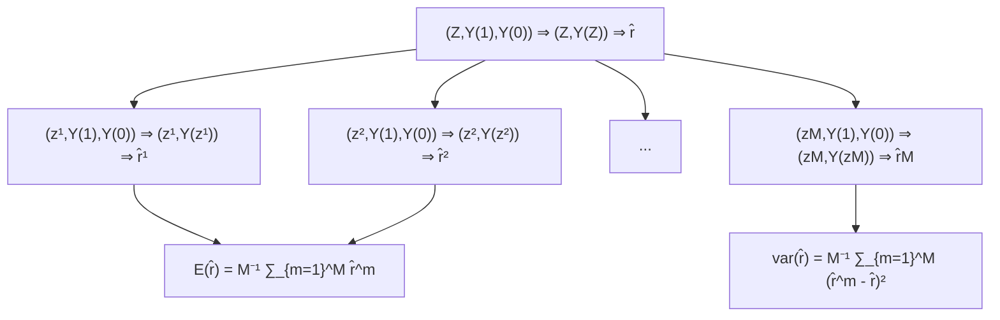

# 完全随机实验中的奈曼重复抽样推断（Neymanian Repeated Sampling Inference in Completely Randomized Experiments）

在其开创性论文中，**奈曼（Neyman, 1923）** 不仅提出了使用**潜在结果（potential outcomes）** 的符号表示法，还推导出了在**完全随机实验（Completely Randomized Experiment, CRE）** 下对**平均因果效应（average causal effect）** 进行推断的严谨数学结果。与费希尔（Fisher）在**尖锐零假设（sharp null hypothesis）** 下计算 **p 值** 的思路不同，奈曼（1923）提出了一个**无偏的点估计量（unbiased point estimator）** 和一个基于该点估计量**抽样分布（sampling distribution）** 的**保守置信区间（conservative confidence interval）**。本章将介绍奈曼（1923）的基本结果，这些结果对于理解本书第二部分后续章节至关重要。

## 4.1 有限总体量（Finite population quantities）

考虑一个包含 $n$ 个单元的完全随机实验，其中 $n _ { 1 }$ 个单元接受处理，$n _ { 0 }$ 个单元接受对照。对于单元 $i = 1 , \ldots , n$，我们有潜在结果 $Y _ { i } ( 1 )$ 和 $Y _ { i } ( 0 )$，以及个体效应 $\tau _ { i } = Y _ { i } ( 1 ) - Y _ { i } ( 0 )$。这些潜在结果具有**有限总体均值（finite population means）**

$$
\bar {Y} (1) = n ^ {- 1} \sum_ {i = 1} ^ {n} Y _ {i} (1), \quad \bar {Y} (0) = n ^ {- 1} \sum_ {i = 1} ^ {n} Y _ {i} (0),
$$

**方差（variances）** 

$$
S ^ {2} (1) = (n - 1) ^ {- 1} \sum_ {i = 1} ^ {n} \left\{Y _ {i} (1) - \bar {Y} (1) \right\} ^ {2}, \quad S ^ {2} (0) = (n - 1) ^ {- 1} \sum_ {i = 1} ^ {n} \left\{Y _ {i} (0) - \bar {Y} (0) \right\} ^ {2},
$$

以及**协方差（covariance）**

$$
S (1, 0) = (n - 1) ^ {- 1} \sum_ {i = 1} ^ {n} \left\{Y _ {i} (1) - \bar {Y} (1) \right\} \left\{Y _ {i} (0) - \bar {Y} (0) \right\}.
$$

个体效应的均值为

$$
\tau = n ^ {- 1} \sum_ {i = 1} ^ {n} \tau_ {i} = \bar {Y} (1) - \bar {Y} (0).
$$

方差为

$$
S ^ {2} (\tau) = (n - 1) ^ {- 1} \sum_ {i = 1} ^ {n} (\tau_ {i} - \tau) ^ {2}.
$$

我们有以下方差与协方差之间的关系。

**引理 4.1** $2 S ( 1 , 0 ) = S ^ { 2 } ( 1 ) + S ^ { 2 } ( 0 ) - S ^ { 2 } ( \tau )$。

引理 4.1 的证明基于初等代数，我将其留作习题 4.1。

这些固定量是**科学表（Science Table）** $\{ Y _ { i } ( 1 ) , Y _ { i } ( 0 ) \} _ { i = 1 } ^ { n }$ 的函数。我们的目标是根据从完全随机实验中获得的数据 $( Z _ { i } , Y _ { i } ) _ { i = 1 } ^ { n }$ 来估计**平均因果效应** $\tau$。

## 4.2 奈曼（1923）定理（Neyman (1923)’s theorem）

基于观测到的结果，我们可以计算**样本均值（sample means）**

$$
\hat {\bar {Y}} (1) = n _ {1} ^ {- 1} \sum_ {i = 1} ^ {n} Z _ {i} Y _ {i}, \quad \hat {\bar {Y}} (0) = n _ {0} ^ {- 1} \sum_ {i = 1} ^ {n} (1 - Z _ {i}) Y _ {i},
$$

**样本方差（sample variances）**

$$
\hat {S} ^ {2} (1) = (n _ {1} - 1) ^ {- 1} \sum_ {i = 1} ^ {n} Z _ {i} \{Y _ {i} - \hat {\bar {Y}} (1) \} ^ {2}, \quad \hat {S} ^ {2} (0) = (n _ {0} - 1) ^ {- 1} \sum_ {i = 1} ^ {n} (1 - Z _ {i}) \{Y _ {i} - \hat {\bar {Y}} (0) \} ^ {2}.
$$

但是，$S ( 1 , 0 )$ 和 $S ^ { 2 } ( \tau )$ 没有样本版本，因为对于每个单元 $i$，潜在结果 $Y _ { i } ( 1 )$ 和 $Y _ { i } ( 0 )$ 从未被同时观测到。奈曼（1923）证明了以下定理。

**定理 4.1** 在完全随机实验下，

1.  **均值之差估计量（difference-in-means estimator）** $\hat { \tau } = \hat { \bar { Y } } ( 1 ) - \hat { \bar { Y } } ( 0 )$ 是 $\tau$ 的无偏估计：

$$
E (\hat {\tau}) = \tau ;
$$

2.  $\hat {\tau}$ 的方差为

$$
\operatorname{var} (\hat {\tau}) = \frac {S ^ {2} (1)}{n _ {1}} + \frac {S ^ {2} (0)}{n _ {0}} - \frac {S ^ {2} (\tau)}{n} \tag {4.1}
$$

$$
= \frac {n _ {0}}{n _ {1} n} S ^ {2} (1) + \frac {n _ {1}}{n _ {0} n} S ^ {2} (0) + \frac {2}{n} S (1, 0); \tag {4.2}
$$

3.  方差估计量

$$
\hat {V} = \frac {\hat {S} ^ {2} (1)}{n _ {1}} + \frac {\hat {S} ^ {2} (0)}{n _ {0}}
$$

对于估计 $\operatorname{var} (\hat {\tau})$ 是**保守的（conservative）**：

$$
E (\hat {V}) - \mathrm{var} (\hat {\tau}) = \frac {S ^ {2} (\tau)}{n} \geq 0
$$

当且仅当对所有单元有 $\tau _ { i } = \tau$ 时，等号成立。

我将在第 4.3 节给出定理 4.1 的证明。澄清定理 4.1 中 $E ( \cdot )$ 和 $\mathrm { v a r } ( \cdot )$ 的含义非常重要。潜在结果都是固定的数值，只有**处理指示变量（treatment indicators）** $Z _ { i }$ 是随机的。因此，期望和方差都是针对 $Z _ { i }$ 的随机性而言的，这些 $Z _ { i }$ 是 $n _ { 1}$ 个 1 和 $n _ { 0}$ 个 0 的**随机排列（random permutations）**。图 4.1 展示了 $\hat { \tau }$ 的随机性，它是一个在 $\{ \hat { \tau } ^ { 1 } , \dots , \hat { \tau } ^ { M } \}$ 上的**离散均匀分布（discrete uniform distribution）**，由 $M = \binom { n } { n _ { 1 } }$ 种可能的处理分配所诱导。比较图 4.1 和图 3.1，可以看出**费希尔随机化检验（Fisher Randomization Test, FRT）** 与奈曼（1923）定理之间的关键区别：

1.  费希尔随机化检验适用于任何**检验统计量（test statistic）**，但奈曼（1923）定理仅针对均值之差。尽管我们可以推导出其他估计量与奈曼（1923）定理类似的性质，但对于一般的估计量，这种数学推导通常相当具有挑战性；
2.  在图 3.1 中，观测到的结果向量 $\mathbf{Y}$ 是固定的，但在图 4.1 中，观测到的结果向量 $\mathbf { Y } ( z ^ { m } )$ 随着 $z ^ { m }$ 的变化而变化；
3.  所有 $T ( z ^ { m } , Y )$ 都可以基于观测数据计算得出，但 $\hat { \tau } ^ { m }$ 是假设性的值，因为并非所有潜在结果都是已知的。

点估计量是标准的，但在潜在结果框架和完全随机实验下，它具有非平凡的方差。方差公式 (4.1) 不同于经典的均值之差方差公式，因为它不仅依赖于潜在结果的有限总体方差，还依赖于个体效应的有限总体方差，或者等价地，依赖于潜在结果的有限总体协方差。




**图 4.1：** 奈曼（1923）定理的说明

不幸的是，$S ^ { 2 } ( \tau )$ 和 $S ( 1 , 0 )$ 无法从数据中**识别（identifiable）**，因为 $Y _ { i } ( 1 )$ 和 $Y _ { i } ( 0 )$ 从未被同时观测到。

由于**缺失一个潜在结果的基本问题（fundamental problem of missing one potential outcome）**，我们最多只能得到一个保守的方差估计量。在统计学中，置信区间的定义允许**过度覆盖（over coverage）**，从而在方差估计中具有保守性。这在某些应用中可能不是一个好主意，例如，关于药物副作用的研究。

公式 (4.1) 有点令人费解，因为个体效应的异质性越大，$\hat { \tau }$ 的变异性反而越小。第 4.5.1 节将使用数值例子来验证 (4.1)。其直观解释是什么？我基于等价形式 (4.2) 给出一个解释。比较潜在结果正相关的情况和负相关的情况。尽管处理组是从包含 $n$ 个单元的有限总体中抽取的一个**简单随机样本（simple random sample）**，但在一次实现的实验中，有可能观测到相对较大的处理潜在结果。如果发生这种情况，那么那些对照单元的处理潜在结果就相对较小。因此，如果 $S ( 1 , 0 ) > 0$，那么对照潜在结果相对较小；如果 $S ( 1 , 0 ) < 0$，那么对照潜在结果相对较大。因此，当潜在结果正相关时，$\hat {\tau}$ 倾向于更大，从而导致 $\hat { \tau }$ 的值更极端。所以，当潜在结果正相关时，$\hat { \tau }$ 的方差更大。

**李和丁（Li and Ding, 2017, 定理 5 和命题 3）** 进一步基于**有限总体中心极限定理（finite population central limit theorem）** 证明了 $\hat {\tau}$ 的以下**渐近正态性（asymptotic Normality）**。

**定理 4.2** 令 $n \to \infty$ 且 $n _ { 1 } \to \infty$。如果 $n _ { 1 } / n$ 在 $( 0 , 1 )$ 内有一个极限值，$\{ S ^ { 2 } ( 1 ) , S ^ { 2 } ( 0 ) , S ( 1 , 0 ) \}$ 有极限值，并且

$$
\max _ {1 \leq i \leq n} \left\{Y _ {i} (1) - \bar {Y} (1) \right\} ^ {2} / n \to 0, \quad \max _ {1 \leq i \leq n} \left\{Y _ {i} (0) - \bar {Y} (0) \right\} ^ {2} / n \to 0,
$$

## 4.3 证明（Proofs）

那么

$$
\frac {\hat {\tau} - \tau}{\sqrt {\operatorname{var} (\hat {\tau})}} \to \mathrm{N} (0, 1)
$$

依分布成立，并且

$$
\hat {S} ^ {2} (1) \to S ^ {2} (1), \quad \hat {S} ^ {2} (0) \to S ^ {2} (0)
$$

依概率成立。

定理 4.2 的证明技术性较强，超出了本书的范围。它确保了当样本量较大且满足某些正则条件时，$\hat {\tau}$ 的抽样分布可以用正态分布来近似。此外，它还确保了结果的样本方差是总体方差的一致估计量，这进一步确保了奈曼（1923）方差估计量的概率极限大于 $\hat {\tau}$ 的真实方差。这为 $\tau$ 的一个保守的大样本置信区间提供了依据：

$$
\hat {\tau} \pm z _ {1 - \alpha / 2} \sqrt {\hat {V}},
$$

该区间在渐近上与标准两样本问题的置信区间相同。当样本量足够大时，该置信区间覆盖 $\tau$ 的概率至少为 $1 - \alpha$。通过对偶性，该置信区间隐含了对 $H _ { \mathrm { 0 N } } : \tau = 0$ 的一个检验。

如果低估处理效应不是一个严重问题，那么奈曼（1923）关于 $\tau$ 的置信区间的保守性就不是一个大问题。但如果结果衡量的是处理的副作用，则可能存在问题。在医学实验中，低估新药的副作用可能会产生严重后果。

## 4.3 证明（Proofs）

在本节中，我将证明定理 4.1。

首先，$\hat {\tau}$ 的无偏性来自于以下表示

$$
\begin{array}{l} \hat {\tau} = n _ {1} ^ {- 1} \sum_ {i = 1} ^ {n} Z _ {i} Y _ {i} - n _ {0} ^ {- 1} \sum_ {i = 1} ^ {n} (1 - Z _ {i}) Y _ {i} \\ = n _ {1} ^ {- 1} \sum_ {i = 1} ^ {n} Z _ {i} Y _ {i} (1) - n _ {0} ^ {- 1} \sum_ {i = 1} ^ {n} (1 - Z _ {i}) Y _ {i} (0) \\ \end{array}
$$

以及期望的线性性质：

$$
\begin{array}{l} E (\hat {\tau}) = E \left\{n _ {1} ^ {- 1} \sum_ {i = 1} ^ {n} Z _ {i} Y _ {i} (1) - n _ {0} ^ {- 1} \sum_ {i = 1} ^ {n} \left(1 - Z _ {i}\right) Y _ {i} (0) \right\} \\ = n _ {1} ^ {- 1} \sum_ {i = 1} ^ {n} E (Z _ {i}) Y _ {i} (1) - n _ {0} ^ {- 1} \sum_ {i = 1} ^ {n} E (1 - Z _ {i}) Y _ {i} (0) \\ = n _ {1} ^ {- 1} \sum_ {i = 1} ^ {n} \frac {n _ {1}}{n} Y _ {i} (1) - n _ {0} ^ {- 1} \sum_ {i = 1} ^ {n} \frac {n _ {0}}{n} Y _ {i} (0) \\ = n ^ {- 1} \sum_ {i = 1} ^ {n} Y _ {i} (1) - n ^ {- 1} \sum_ {i = 1} ^ {n} Y _ {i} (0) \\ = \tau . \\ \end{array}
$$

其次，我们可以进一步将 $\hat { \tau }$ 写为

$$
\hat {\tau} = \sum_ {i = 1} ^ {n} Z _ {i} \left\{\frac {Y _ {i} (1)}{n _ {1}} + \frac {Y _ {i} (0)}{n _ {0}} \right\} - n _ {0} ^ {- 1} \sum_ {i = 1} ^ {n} Y _ {i} (0).
$$

$\hat {\tau}$ 的方差来自**简单随机抽样（simple random sampling）** 的引理 A3.2：

$$
\begin{array}{l} \operatorname{var} (\hat {\tau}) = \frac {n _ {1} n _ {0}}{n (n - 1)} \sum_ {i = 1} ^ {n} \left\{\frac {Y _ {i} (1)}{n _ {1}} + \frac {Y _ {i} (0)}{n _ {0}} - \frac {\bar {Y} (1)}{n _ {1}} - \frac {\bar {Y} (0)}{n _ {0}} \right\} ^ {2} \\ = \frac {n _ {1} n _ {0}}{n (n - 1)} \left[ \frac {1}{n _ {1} ^ {2}} \sum_ {i = 1} ^ {n} \left\{Y _ {i} (1) - \bar {Y} (1) \right\} ^ {2} + \frac {1}{n _ {0} ^ {2}} \sum_ {i = 1} ^ {n} \left\{Y _ {i} (0) - \bar {Y} (0) \right\} ^ {2} \right. \\ \left. + \frac {2}{n _ {1} n _ {0}} \sum_ {i = 1} ^ {n} \left\{Y _ {i} (1) - \bar {Y} (1) \right\} \left\{Y _ {i} (0) - \bar {Y} (0) \right\} \right] \\ = \frac {n _ {0}}{n _ {1} n} S ^ {2} (1) + \frac {n _ {1}}{n _ {0} n} S ^ {2} (0) + \frac {2}{n} S (1, 0). \\ \end{array}
$$

根据引理 4.1，我们也可以将方差写为

$$
\begin{array}{l} \operatorname{var} (\hat {\tau}) = \frac {n _ {0}}{n _ {1} n} S ^ {2} (1) + \frac {n _ {1}}{n _ {0} n} S ^ {2} (0) + \frac {1}{n} \left\{S ^ {2} (1) + S ^ {2} (0) - S ^ {2} (\tau) \right\} \\ = \frac {S ^ {2} (1)}{n _ {1}} + \frac {S ^ {2} (0)}{n _ {0}} - \frac {S ^ {2} (\tau)}{n}. \\ \end{array}
$$

第三，因为处理组是从 $n$ 个单元中抽取的一个大小为 $n _ { 1 }$ 的简单随机样本，引理 A3.3 确保了 $Y _ { i } ( 1 )$ 的样本方差是其总体方差的无偏估计：

$$
E \{\hat {S} ^ {2} (1) \} = S ^ {2} (1).
$$

类似地，$E \{ \hat { S } ^ { 2 } ( 0 ) \} = S ^ { 2 } ( 0 )$。因此，$\hat { V }$ 是 (4.1) 中前两项的无偏估计。

## 4.4 CRE 的回归分析（Regression analysis of the CRE）

实践者通常使用基于回归的推断来估计平均因果效应 $\tau$。一种标准方法是对结果变量关于处理指示变量进行**普通最小二乘（Ordinary Least Squares, OLS）**回归，并包含截距项：

$$
(\hat {\alpha}, \hat {\beta}) = \arg \min _ {(a, b)} \sum_ {i = 1} ^ {n} (Y _ {i} - a - b Z _ {i}) ^ {2},
$$

并使用处理变量的系数 $\hat { \beta }$ 作为平均因果效应的估计量。我们可以证明系数 $\hat { \beta }$ 等于均值差：

$$
\hat {\beta} = \hat {\tau}. \tag {4.3}
$$

然而，来自 OLS 的常用方差估计量，例如 R 语言 `lm` 函数的输出，等于：

$$
\hat {V} _ {\mathrm{OLS}} = \frac {N (N _ {1} - 1)}{(N - 2) N _ {1} N _ {0}} \hat {S} ^ {2} (1) + \frac {N (N _ {0} - 1)}{(N - 2) N _ {1} N _ {0}} \hat {S} ^ {2} (0) \tag {4.4}
$$

$$
\approx \frac {\hat {S} ^ {2} (1)}{N _ {0}} + \frac {\hat {S} ^ {2} (0)}{N _ {1}},
$$

其中近似在 $N _ { 1 }$ 和 $N _ { 0 }$ 较大时成立。即使 $N _ { 1 }$ 和 $N _ { 0 }$ 很大，它也与 $\hat { V }$ 不同。

幸运的是，**Eicker–Huber–White (EHW) 稳健方差估计量** 接近于 $\hat { V }$：

$$
\hat {V} _ {\mathrm{EHW}} = \frac {\hat {S} ^ {2} (1)}{N _ {1}} \frac {N _ {1} - 1}{N _ {1}} + \frac {\hat {S} ^ {2} (0)}{N _ {0}} \frac {N _ {0} - 1}{N _ {0}} \tag {4.5}
$$

$$
\approx \frac {\hat {S} ^ {2} (1)}{N _ {1}} + \frac {\hat {S} ^ {2} (0)}{N _ {0}}
$$

其中近似在 $N _ { 1 }$ 和 $N _ { 0 }$ 较大时成立。它与 $\hat { V }$ 几乎相同。此外，EHW 稳健方差估计量的所谓 HC2 变体与 $\hat { V }$ 完全相同。`car` 包中的 `hccm` 函数返回 EHW 稳健方差估计量及其 HC2 变体。

问题 4.3 提供了关于 (4.3)–(4.5) 的更多技术细节。

## 4.5 示例（Examples）

### 4.5.1 模拟（Simulation）

我首先选择样本量为 $n = 1 0 0$，其中 60 个处理单元和 40 个对照单元，并生成具有恒定个体因果效应的潜在结果。

```txt
n = 100
n1 = 60
n0 = 40
y0 = rexp(n)
y0 = sort(y0, decreasing = TRUE)
y1 = y0 + 1
```

固定科学表（Science Table）后，我重复生成完全随机化实验，并应用定理 4.1 来获得点估计量、保守方差估计量以及基于正态近似的置信区间。图 4.2 的第一个面板显示了在 $10^4$ 次模拟中 $\hat{\tau} - \tau$ 的直方图。

然后我通过按相反顺序排序对照潜在结果来改变潜在结果：

```txt
y0 = sort(y0, decreasing = FALSE)
```

并重复上述模拟。图 4.2 的第二个面板显示了在 $10^4$ 次模拟中 $\hat{\tau} - \tau$ 的直方图。

最后，我随机排列对照潜在结果：

```txt
y0 = sample(y0)
```

并重复上述模拟。图 4.2 的第三个面板显示了在 $10^4$ 次模拟中 $\hat{\tau} - \tau$ 的直方图。

重要的是，在上述三组模拟中，潜在结果之间的相关性不同，但边际分布相同。下表比较了真实方差、保守估计方差以及 95% 置信区间的覆盖率。

<table><tr><td></td><td>constant</td><td>negative</td><td>independent</td></tr><tr><td>var</td><td>0.036</td><td>0.007</td><td>0.020</td></tr><tr><td>estimated var</td><td>0.036</td><td>0.036</td><td>0.036</td></tr><tr><td>coverge rate</td><td>0.947</td><td>1.000</td><td>0.989</td></tr></table>

真实方差取决于潜在结果之间的相关性，正相关的潜在结果对应更大的抽样方差。这验证了 (4.2)。估计方差几乎相同，因为 $\hat{V}$ 的公式仅取决于潜在结果的边际分布。由于真实方差和估计方差之间的差异，三组模拟的覆盖率不同。仅在因果效应恒定时，估计方差才等于真实方差，这验证了定理 4.1 的第 3 点。

图 4.2 还显示了基于 $\hat{\tau}$ 的中心极限定理的正态密度曲线。它们与模拟中的直方图非常接近，验证了定理 4.2。

### 4.5.2 重尾结果与正态近似的失效（Heavy-tailed outcome and failure of Normal approximations）

定理 4.2 中关于 $\hat{\tau}$ 的中心极限定理在某些正则条件下成立。如果潜在结果具有重尾分布，这些条件将被违反。我们可以修改上述模拟研究来说明这一点。假设个体因果效应是恒定的，但对照潜在结果以 0.1、0.3 或 0.5 的概率被柯西分量污染。以下代码生成了污染概率为 0.1 的潜在结果。

```python
combination = rbinom(n, 1, 0.1)
y0 = (1 - combination)*rexp(n) + combination*rcauchy(n)
y1 = y0 + 1
```

图 4.3 和 4.4 显示了 $\hat{\tau} - \tau$ 直方图的两次实现以及相应的正态近似。对于重尾潜在结果，正态近似效果很差。此外，与图 4.2 不同，直方图对模拟的随机种子非常敏感。

### 4.5.3 应用（Application）

我再次使用 `lalonde` 数据来说明该理论。

```txt
> library (Matching)
> data (lalonde)
> z = lalonde$treat
> y = lalonde$re78
```

我们可以根据定理 4.1 中的公式轻松计算点估计量和标准误：

```txt
> n1 = sum(z)
> n0 = length(z) - n1
> tauhat = mean(y[z==1]) - mean(y[z==0])
> vhat = var(y[z==1])/n1 + var(y[z==0])/n0
> sehat = sqrt(vhat)
> tauhat
[1] 1794.343
> sehat
[1] 670.9967
```

实践者经常使用**普通最小二乘法（OLS）**来估计平均因果效应，该方法也会给出标准误。

```txt
> olsfit = lm(y ~ z)
> summary(olsfit)$coef[2, 1: 2]
Estimate Std. Error
1794.3431 632.8536
```

然而，与基于定理 4.1 的标准误相比，上述标准误似乎太小了。不过，这可以通过使用 **Eicker–Huber–White 稳健标准误** 轻松解决。


图 4.3：具有污染潜在结果时 $\hat { \tau } - \tau$ 的抽样分布：实现一


图 4.4：具有污染潜在结果时 $\hat { \tau } - \tau$ 的抽样分布：实现二

```txt
> library(car)
> sqrt(hccm(olsfit)[2, 2])
[1] 672.6823
> sqrt(hccm(olsfit, type = "hc0")[2, 2])
[1] 669.3155
> sqrt(hccm(olsfit, type = "hc2")[2, 2])
[1] 670.9967
```

存在不同版本的稳健标准误。如果样本量较大，它们会产生相似的结果，其中 `hc2` 产生的标准误与定理 4.1 相同。问题 4.3 为基于 OLS 的标准误可能失效以及 Eicker–Huber–White 稳健标准误的渐近有效性提供了理论解释。

## 4.6 家庭作业问题（Homework Problems）

### 4.1 引理 4.1 的证明（Proof of Lemma 4.1）

证明引理 4.1。

### 4.2 定理 4.1 的另一种证明（Alternative proof of Theorem 4.1）

在 CRE 下，计算

$$
\operatorname{var} \{\hat {\bar {Y}} (1) \}, \quad \operatorname{var} \{\hat {\bar {Y}} (0) \}, \quad \operatorname{cov} \{\hat {\bar {Y}} (1), \hat {\bar {Y}} (0) \}
$$

并使用这些公式计算 $\operatorname{var}(\hat{\tau})$。

提示：使用附录 A3 中的结果。

### 4.3 奈曼推断与 OLS（Neymanian inference and OLS）

证明 (4.3)–(4.5)。此外，证明 EHW 稳健方差估计量的 HC2 变体恰好恢复 $\hat{V}$。

提示：附录 A2 回顾了关于 OLS 的一些重要技术结果。

### 4.4 处理效应异质性（Treatment effect heterogeneity）

证明 $S ^ { 2 } ( \tau ) = 0$ 意味着 $S ^ { 2 } ( 1 ) = S ^ { 2 } ( 0 )$。给出一个 $S ^ { 2 } ( 1 ) = \dot { S } ^ { 2 } ( 0 )$ 但 $S ^ { 2 } ( \tau ) \neq 0$ 的反例。

证明 $S ^ { 2 } ( 1 ) < S ^ { 2 } ( 0 )$ 意味着

$$
S (Y (0), \tau) = (n - 1) \sum_ {i = 1} ^ {n} \left\{Y _ {i} (0) - \bar {Y} (0) \right\} \left(\tau_ {i} - \tau\right) <   0.
$$

给出一个 $S ^ { 2 } ( 1 ) > S ^ { 2 } ( 0 )$ 但 $S ( Y ( 0 ) , \tau ) < 0$ 的反例。

注：第一个结果表明，无处理效应异质性意味着处理组和对照组潜在结果的方差相等。但反之则不成立。第二个结果表明，如果处理组潜在结果的方差大于对照组潜在结果的方差，则个体处理效应与对照组潜在结果负相关。但反之则不成立。Gerber 和 Green (2012, 第 293 页) 以及 Ding 等人 (2019, 附录 B.3) 给出了相关讨论。

### 4.5 方差公式的更优界（A better bound of the variance formula）

Neyman (1923) 的保守方差估计量本质上使用了真实方差的以下上界：

$$
\operatorname{var} (\widehat {\tau}) = \frac {S ^ {2} (1)}{n _ {1}} + \frac {S ^ {2} (0)}{n _ {0}} - \frac {S ^ {2} (\tau)}{n} \leq \frac {S ^ {2} (1)}{n _ {1}} + \frac {S ^ {2} (0)}{n _ {0}},
$$

这利用了 $S ^ { 2 } ( \tau ) \geq 0$ 这个平凡事实。证明以下上界：

$$
\operatorname{var} (\widehat {\tau}) \leq \frac {1}{n} \left\{\sqrt {\frac {n _ {0}}{n _ {1}}} S (1) + \sqrt {\frac {n _ {1}}{n _ {0}}} S (0) \right\} ^ {2}. \tag {4.6}
$$

(4.6) 中的等号何时成立？

上界 (4.6) 激发了另一个保守方差估计量：

$$
\hat {V} ^ {\prime} = \frac {1}{n} \left\{\sqrt {\frac {n _ {0}}{n _ {1}}} \hat {S} (1) + \sqrt {\frac {n _ {1}}{n _ {0}}} \hat {S} (0) \right\} ^ {2}.
$$

第 4.5.1 节在使用 R 代码 `NeymanCR.R` 的模拟中使用了 $\hat { V }$。重复该模拟，并额外比较方差估计量 $\hat { V } ^ { \prime }$ 及其相关的置信区间。

注：上界 (4.6) 可以进一步改进。Aronow 等人 (2014) 使用 **Frechet–Hoeffding 不等式** 推导出了 $\mathrm { v a r } ( \widehat { \tau } )$ 的锐界。这些改进在实践中很少使用，主要有两个原因。首先，它们比 $\hat { V }$ 更复杂，而 $\hat { V }$ 可以通过 OLS 方便地实现。其次，基于 $\hat { V }$ 的置信区间在其他公式下也有效，例如在结果变量关于处理变量的真实线性模型下，但这些改进则无效。尽管它们在理论上很有趣，但这些改进对实践影响甚微。

### 4.6 Neyman (1923) 的向量版本（Vector version of Neyman (1923)）

Neyman (1923) 的经典结果是关于标量结果的。在实践中，通常有多个结果。因此，我们可以将潜在结果扩展到向量。我们考虑向量结果 $V \in \mathbb { R } ^ { K }$ 上的平均因果效应：

$$
\tau_ {\boldsymbol {V}} = \frac {1}{n} \sum_ {i = 1} ^ {n} \left\{\boldsymbol {V} _ {i} (1) - \boldsymbol {V} _ {i} (0) \right\},
$$

其中 $V _ { i } ( 1 )$ 和 $V _ { i } ( 0 )$ 是单元 $i$ 的 $V$ 的潜在结果。$\tau _ { V }$ 的奈曼型估计量是处理组和对照组观测结果样本均值向量之差：

$$
\widehat {\boldsymbol {\tau}} _ {\mathbf {V}} = \bar {\mathbf {V}} _ {1} - \bar {\mathbf {V}} _ {0} = \frac {1}{n _ {1}} \sum_ {i = 1} ^ {n} Z _ {i} \mathbf {V} _ {i} - \frac {1}{n _ {0}} \sum_ {i = 1} ^ {n} (1 - Z _ {i}) \mathbf {V} _ {i}.
$$

考虑一个 CRE。证明 $\widehat { \tau } _ { V }$ 是 $\tau _ { V }$ 的无偏估计量。求 $\widehat { \tau } _ { V }$ 的协方差矩阵。找到一个（可能是保守的）方差估计量。

### 4.7 BRE 中的推断（Inference in the BRE）

考虑 BRE，其中 $Z _ { i } \mathrm { ^ { * } s }$ 是独立同分布的 Bernoulli($\pi$) 随机变量，有 $n _ { 1 } = \textstyle \sum _ { i = 1 } ^ { n } Z_i$ 个单元接受处理，$n _ { 0 } = \sum _ { i = 1 } ^ { n } ( 1 - Z _ { i } )$ 个单元接受对照。

首先，我们可以使用 **费希尔随机化检验（Fisher Randomization Test, FRT）** 来分析 BRE。我们如何在 CRE 中检验 $H _ { \mathrm { 0F } }$？如果实际实验是 BRE，我们可以使用与 CRE 中相同的 FRT 程序吗？如果可以，给出理由；如果不行，请解释原因。

其次，我们可以获得 $\tau$ 的点估计量并找到相关的方差估计量，就像 Neyman (1923) 对 CRE 所做的那样。

1. $\hat{\tau}$ 是 $\tau$ 的无偏估计量吗？它是一致的吗？
2. 找到 $\tau$ 的一个无偏估计量。
3. 比较上述无偏估计量的方差和 $\hat{\tau}$ 的渐近方差。

注：估计量 $\hat{\tau}$ 没有有限方差，但其渐近分布的方差是有限的。

### 4.8 推荐阅读（Recommended reading）

Ding (2016) 比较了分析 CRE 的费希尔方法和奈曼方法。

## 5