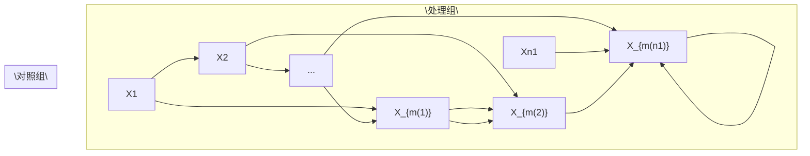

# 观察性研究中的匹配（Matching in Observational Studies）

匹配在实证研究中有着悠久的历史。W. Cochran 和 D. Rubin 将其推广至统计因果推断领域。Cochran 和 Rubin (1973) 是一篇早期的综述论文。Rubin (2006b) 汇集了 Rubin 在该主题上的贡献。本章还讨论了 Abadie 和 Imbens (2006, 2008, 2011) 的现代贡献。

## 15.1 一个简单的起点：更多的对照组单位（A simple starting point: many more control units）




考虑一个简单的情况，其中对照组单位数量 $n_0$ 远大于处理组单位数量 $n_1$。对于处理组中的单位 $i = 1, \ldots, n_1$，我们在对照组中找到一个单位 $m(i)$，使得 $X_i = X_{m(i)}$。在理想情况下，我们得到**精确匹配（exact matches）**。因此，匹配对内的单位具有相同的**倾向得分（propensity score）** $e(X_i) = e(X_{m(i)})$。因此，在给定一个单位接受处理而另一个单位接受对照的条件下，单位 $i$ 接受处理且单位 $m(i)$ 接受对照的概率为

$$
\begin{array}{l} \operatorname{pr} \left(Z _ {i} = 1, Z _ {m (i)} = 0 \mid Z _ {i} + Z _ {m (i)} = 1, X _ {i}, X _ {m (i)}\right) \\ = \frac {\operatorname{pr} (Z _ {i} = 1 , Z _ {m (i)} = 0 \mid X _ {i} , X _ {m (i)})}{\operatorname{pr} (Z _ {i} = 1 , Z _ {m (i)} = 0 \mid X _ {i} , X _ {m (i)}) + \operatorname{pr} (Z _ {i} = 0 , Z _ {m (i)} = 1 \mid X _ {i} , X _ {m (i)})} \\ = \frac {e (X _ {i}) \{1 - e (X _ {m (i)}) \}}{e (X _ {i}) \{1 - e (X _ {m (i)}) \} + \{1 - e (X _ {i}) \} e (X _ {m (i)})} \\ = \frac {1}{2}. \\ \end{array}
$$

也就是说，**处理分配（treatment assignment）**与**匹配配对实验（Matched Pair Experiment, MPE）**在给定协变量以及每对包含一个处理单位和一个对照单位的事件条件下是相同的。因此，我们可以将精确匹配的观察性研究视为 MPE 进行分析，使用第 7 章中的**Fisher随机化检验（Fisher Randomization Test, FRT）**或**Neyman方法（Neymanian approach）**。这使我们能够对处理单位的**因果效应（causal effect）**进行推断。

我们还可以为每个处理单位找到多个对照单位。一般来说，我们可以为处理单位 $i$ 找到 $M_i$ 个匹配的对照单位。当 $M_i$ 变化时，这被称为**变比率匹配（variable-ratio matching）** (Ming and Rosenbaum, 2000, 2001; Pimentel et al., 2015)。在完美匹配的情况下，处理分配机制与第 7.7 节讨论的**一般匹配实验（general matched experiment）**相同。我们可以使用该节中的分析结果来分析匹配后的观察性研究。

## 15.2 一个更复杂但现实的场景（A more complicated but realistic scenario）

即使对照组规模很大，我们通常也无法获得精确匹配。我们能够实现的是 $X_i \approx X_{m(i)}$ 或在某种距离度量下 $X_i - X_{m(i)}$ 较小。因此，我们只有**近似匹配（approximate matches）**。例如，我们定义

$$
m (i) = \arg \min _ {k: Z _ {k} = 0} d (X _ {i}, X _ {k}),
$$

其中 $d(X_i, X_k)$ 度量 $X_i$ 和 $X_k$ 之间的距离。一些常用的距离选择是**欧几里得距离（Euclidean distance）**

$$
d (X _ {i}, X _ {k}) = \| X _ {i} - X _ {k} \| _ {2} ^ {2},
$$

和**马氏距离（Mahalanobis distance）**¹

$$
d (X _ {i}, X _ {k}) = (X _ {i} - X _ {k}) ^ {\mathsf {T}} \Omega^ {- 1} (X _ {i} - X _ {k})
$$

其中 $\Omega$ 是来自总体或仅来自对照组的 $X_i$ 的样本协方差矩阵。

下面我回顾一些关于匹配的微妙问题。有关综述文章，请参见 Stuart (2010)。

1.  **(一对一或一对M匹配)** 上述讨论侧重于一对一匹配。
2.  **（有放回匹配或无放回匹配）** 我侧重于**有放回匹配（matching with replacement）**，但一些实践者更喜欢**无放回匹配（matching without replacement）**。如果对照组的池子很大，这两种方法对最终结果的影响不会太大。有放回匹配在计算上更方便，但无放回匹配涉及计算密集的离散优化。有放回匹配通常能提供更高质量的匹配，但会因多次使用相同单位而引入依赖性。相比之下，无放回匹配的优势在于匹配单位的独立性以及后续数据分析的简便性。
3.  **（协变量调整的必要性）** 由于匹配对内存在残留的协变量不平衡，因此在分析数据时使用**协变量调整（covariate adjustment）**至关重要。在这种情况下，协变量调整不仅是为了提高效率，也是为了**偏差校正（bias correction）**。
4.  **（高维协变量问题）** 如果 $X$ 是“高维的”，则对于处理组中的某个单位 $i$ 以及对照组中的所有单位选择，很可能 $d(X_i, X_k)$ 过大。在这种情况下，我们可能不得不舍弃一些难以找到匹配的单位。这样做实际上改变了我们感兴趣的研究总体。
5.  **（难以避免上述问题）** 很难避免上述问题。例如，如果 $X_i \sim \mathrm{N}(0, I_p)$，$X_k \sim \mathrm{N}(0, I_p)$，并且 $X_i \perp \perp X_k$，那么

$$
\| X _ {i} - X _ {k} \| _ {2} ^ {2} \sim \| \mathrm{N} (0, 2 I _ {p}) \| _ {2} ^ {2} = 2 \chi_ {p} ^ {2}
$$

其均值为 $2p$，方差为 $8p$。理论表明，当 $p$ 很大时，不完美的匹配会在因果效应估计中引起较大的偏差。这表明，如果 $p$ 很大，我们必须在匹配之前进行某种**降维（dimension reduction）**。Rosenbaum 和 Rubin (1983b) 提出基于倾向得分进行匹配。使用估计的倾向得分，我们找到 $\{i, m(i)\}$ 对，使得 $|\hat{e}(X_i) - \hat{e}(X_{m(i)})|$ 或 $|\mathrm{logit}\{\hat{e}(X_i)\} - \mathrm{logit}\{\hat{e}(X_{m(i)})\}|$ 的值很小，即我们有一个一维的匹配问题。

## 15.3 平均因果效应的匹配估计量（Matching estimator for the average causal effect）

在一系列论文中，Abadie 和 Imbens (AI) 严格刻画了**匹配估计量（matching estimator）**的重复抽样性质，并提出了相应的用于平均因果效应的大样本置信区间。他们采用了观察性研究的标准设定，其中 $\{X_i, Z_i, Y_i(1), Y_i(0)\}_{i=1}^n \stackrel{\mathrm{IID}}{\sim} \{X, Z, Y(1), Y(0)\}$。

## 15.3.1 点估计与偏差校正（Point estimation and bias correction）

AI 专注于有放回的 1 对 M 匹配。对于一个处理单位 $i$，我们可以简单地将处理下的潜在结果插补为 $\hat{Y}_i(1) = Y_i$，并将对照下的潜在结果插补为

$$
\hat{Y} _ {i} (0) = M ^ {- 1} \sum_ {k \in J _ {i}} Y _ {k},
$$

其中 $J_i$ 是单位 $i$ 来自对照组的匹配单位集合。例如，我们可以计算所有对照组中 $k$ 的 $d(X_i, X_k)$，然后将 $J_i$ 定义为具有 $M$ 个最小 $d(X_i, X_k)$ 值的 $k$ 的索引。

对于一个对照单位 $i$，我们简单地将对照下的潜在结果插补为 $\hat{Y}_i(0) = Y_i$，并将处理下的潜在结果插补为

$$
\hat{Y} _ {i} (1) = M ^ {- 1} \sum_ {k \in J _ {i}} Y _ {k},
$$

其中 $J_i$ 是单位 $i$ 来自处理组的匹配单位集合。

匹配估计量为

$$
\hat {\tau} ^ {\mathrm{m}} = n ^ {- 1} \sum_ {i = 1} ^ {n} \{\hat {Y} _ {i} (1) - \hat {Y} _ {i} (0) \}.
$$

AI 表明，$\hat{\tau}^{\mathrm{m}}$ 存在不可忽略的偏差，特别是在 $X$ 是多维且对照组单位数量与处理组单位数量相当时。通过一些技术推导，他们提出了以下偏差估计量：

$$
\hat {B} = n ^ {- 1} \sum_ {i = 1} ^ {n} \hat {B} _ {i}
$$

其中

$$
\hat {B} _ {i} = (2 Z _ {i} - 1) M ^ {- 1} \sum_ {k \in J _ {i}} \left\{\hat {\mu} _ {1 - Z _ {i}} \left(X _ {i}\right) - \hat {\mu} _ {1 - Z _ {i}} \left(X _ {k}\right) \right\}
$$

而 $\{\hat{\mu}_1(X_i), \hat{\mu}_0(X_i)\}$ 是通过例如 OLS 拟合得到的预测结果。对于 $Z_i = 1$ 的处理单位，估计偏差为

$$
\hat {B} _ {i} = M ^ {- 1} \sum_ {k \in J _ {i}} \{\hat {\mu} _ {0} (X _ {i}) - \hat {\mu} _ {0} (X _ {k}) \}
$$

这校正了由于协变量不匹配导致的预测对照潜在结果的差异；对于 $Z_i = 0$ 的对照单位，估计偏差为

$$
\hat {B} _ {i} = - M ^ {- 1} \sum_ {k \in J _ {i}} \{\hat {\mu} _ {1} (X _ {i}) - \hat {\mu} _ {1} (X _ {k}) \}
$$

这校正了由于协变量不匹配导致的预测处理潜在结果的差异。

最终的**偏差校正匹配估计量（bias-corrected matching estimator）**为

$$
\hat {\tau} ^ {\mathrm{mbc}} = \hat {\tau} ^ {\mathrm{m}} - \hat {B},
$$

它具有以下线性展开式。

**命题 15.1** 我们有

$$
\hat {\tau} ^ {\mathrm{mbc}} = n ^ {- 1} \sum_ {i = 1} ^ {n} \hat {\psi} _ {i} \tag {15.1}
$$

其中

$$
\hat {\psi} _ {i} = \hat {\mu} _ {1} (X _ {i}) - \hat {\mu} _ {0} (X _ {i}) + (2 Z _ {i} - 1) (1 + K _ {i} / M) \{Y _ {i} - \hat {\mu} _ {Z _ {i}} (X _ {i}) \}
$$

而 $K_i$ 是单位 $i$ 被用作匹配的次数。

命题 15.1 中的线性展开式来自简单但繁琐的代数运算。我将其证明留作问题 15.1。该线性展开式启发了一个简单的方差估计量

$$
\hat {V} ^ {\mathrm{mbc}} = \frac {1}{n ^ {2}} \sum_ {i = 1} ^ {n} (\hat {\psi} _ {i} - \hat {\tau} ^ {\mathrm{mbc}}) ^ {2},
$$

通过将 $\hat{\tau}^{\mathrm{mbc}}$ 视为 $\hat{\psi}_i$ 的样本均值。在文献中，Abadie 和 Imbens (2008) 首次指出，通过重抽样原始数据的简单**自助法（bootstrap）**不适用于估计匹配估计量的方差，但他们提出的方差估计程序不易实现。Otsu 和 Rai (2017) 提出对线性展开式中的 $\hat{\psi}_i$ 进行自助法，从而得到方差估计量 $\hat{V}^{\mathrm{mbc}}$。

## 15.3.2 与双重稳健估计量的联系（Connection with the doubly robust estimators）

**偏差校正匹配估计量（bias-corrected matching estimators）**和**双重稳健估计量（doubly robust estimators）**密切相关。它们都等于在残差基础上进行某些修改后的**结果回归估计量（outcome regression estimator）**。

残差定义为

$$
\hat {R} _ {i} = \left\{ \begin{array}{l l} Y _ {i} - \hat {\mu} _ {1} (X _ {i}) & \text { if } Z _ {i} = 1; \\ Y _ {i} - \hat {\mu} _ {0} (X _ {i}) & \text { if } Z _ {i} = 0. \end{array} \right.
$$

对于平均因果效应 $\tau$，回顾结果回归估计量

$$
\hat {\tau} ^ {\mathrm{reg}} = n ^ {- 1} \sum_ {i = 1} ^ {n} \{\hat {\mu} _ {1} (X _ {i}) - \hat {\mu} _ {0} (X _ {i}) \}
$$

和双重稳健估计量

$$
\hat {\tau} ^ {\mathrm{dr}} = \hat {\tau} ^ {\mathrm{reg}} + n ^ {- 1} \sum_ {i = 1} ^ {n} \left\{\frac {Z _ {i} \hat {R} _ {i}}{\hat {e} (X _ {i})} - \frac {(1 - Z _ {i}) \hat {R} _ {i}}{1 - \hat {e} (X _ {i})} \right\}.
$$

此外，我们可以验证 $\hat{\tau}^{\mathrm{mbc}}$ 的形式与 $\hat{\tau}^{\mathrm{dr}}$ 非常相似。

**命题 15.2** $\tau$ 的偏差校正匹配估计量等于

$$
\hat {\tau} ^ {\mathrm{mbc}} = \hat {\tau} ^ {\mathrm{reg}} + n ^ {- 1} \sum_ {i = 1} ^ {n} \left\{\left(1 + \frac {K _ {i}}{M}\right) Z _ {i} \hat {R} _ {i} - \left(1 + \frac {K _ {i}}{M}\right) (1 - Z _ {i}) \hat {R} _ {i} \right\}.
$$

我将命题 15.2 的证明留作问题 15.2。从命题 15.2 中，我们可以将匹配视为一种估计倾向得分的非参数方法，并将得到的偏差校正匹配估计量视为一种双重稳健估计量。例如，$1 + K_i / M$ 应该类似于 $1 / \hat{e}(X_i)$。当一个处理单位的 $e(X_i)$ 很小时，得到的权重 $1 / \hat{e}(X_i)$ 会很大，同时，它会被匹配到许多对照单位，导致 $K_i$ 很大，从而 $1 + K_i / M$ 也很大。然而，这种联系也引发了一个关于匹配的明显问题。对于固定的 $M$，用 $1 + K_i / M$ 估计 $1 / e(X_i)$ 会非常嘈杂。允许 $M$ 随样本量增长可能会改进基于匹配的倾向得分非参数估计量，从而改善匹配和偏差校正匹配估计量的渐近性质。Lin 等人 (2023) 提供了一个正式的理论。

## 15.4 处理组平均因果效应的匹配估计量（Matching estimator for the average causal effect on the treated）

对于处理组平均因果效应

$$
\tau_ {\mathrm{T}} = E (Y \mid Z = 1) - E \{Y (0) \mid Z = 1 \},
$$

我们只需要为所有处理单位插补对照下缺失的潜在结果，得到以下估计量

$$
\hat {\tau} _ {\mathrm{T}} ^ {\mathrm{m}} = n _ {1} ^ {- 1} \sum_ {i = 1} ^ {n} Z _ {i} \{Y _ {i} - \hat {Y} _ {i} (0) \}.
$$

同样，当 $X$ 是多维时，它是有偏的。Otsu 和 Rai (2017) 提出通过下式估计其偏差

$$
\hat {B} _ {\mathrm{T}} = n _ {1} ^ {- 1} \sum_ {i = 1} ^ {n} Z _ {i} \hat {B} _ {\mathrm{T}, i}
$$

其中

$$
\hat {B} _ {\mathrm{T}, i} = M ^ {- 1} \sum_ {k \in J _ {i}} \{\hat {\mu} _ {0} (X _ {i}) - \hat {\mu} _ {0} (X _ {k}) \}
$$

校正了对于 $Z_i = 1$ 的处理单位因协变量不匹配导致的偏差。

最终的偏差校正估计量为

$$
\hat {\tau} _ {\mathrm{T}} ^ {\mathrm{mbc}} = \hat {\tau} _ {\mathrm{T}} ^ {\mathrm{m}} - \hat {B} _ {\mathrm{T}},
$$

它具有以下线性展开式。

**命题 15.3** 我们有

$$
\hat {\tau} _ {\mathrm{T}} ^ {\mathrm{mbc}} = n _ {1} ^ {- 1} \sum_ {i = 1} ^ {n} \hat {\psi} _ {\mathrm{T}, i}, \tag {15.2}
$$

其中

$$
\hat {\psi} _ {\mathrm{T}, i} = Z _ {i} \{Y _ {i} - \hat {\mu} _ {0} (X _ {i}) \} - (1 - Z _ {i}) K _ {i} / M \{Y _ {i} - \hat {\mu} _ {0} (X _ {i}) \}.
$$

我将证明留作问题 15.1。受 Otsu 和 Rai (2017) 启发，我们可以将 $\hat{\tau}_{\mathrm{T}}^{\mathrm{mbc}}$ 视为 $n / n_1$ 乘以 $\psi_{\mathrm{T}, i}$ 的样本均值，因此一个直观的方差估计量为

$$
\hat {V} _ {\mathrm{T}} ^ {\mathrm{mbc}} = \left(\frac {n}{n _ {1}}\right) ^ {2} \frac {1}{n ^ {2}} \sum_ {i = 1} ^ {n} (\hat {\psi} _ {\mathrm{T}, i} - \hat {\tau} _ {\mathrm{T}} ^ {\mathrm{mbc}} n _ {1} / n) ^ {2} = \frac {1}{n _ {1} ^ {2}} \sum_ {i = 1} ^ {n} (\hat {\psi} _ {\mathrm{T}, i} - \hat {\tau} _ {\mathrm{T}} ^ {\mathrm{mbc}} n _ {1} / n) ^ {2}.
```

与第 15.3.2 节的讨论类似，我们可以比较双重稳健估计量、偏差校正匹配估计量与结果回归估计量。对于处理组平均因果效应 $\tau_{\mathrm{T}}$，回顾结果回归估计量

$$
\hat {\tau} _ {\mathrm{T}} ^ {\mathrm{reg}} = n _ {1} ^ {- 1} \sum_ {i = 1} ^ {n} Z _ {i} \{Y _ {i} - \hat {\mu} _ {0} (X _ {i}) \},
$$

和双重稳健估计量

$$
\hat {\tau} _ {\mathrm{T}} ^ {\mathrm{dr}} = \hat {\tau} _ {\mathrm{T}} ^ {\mathrm{reg}} - n _ {1} ^ {- 1} \sum_ {i = 1} ^ {n} \frac {\hat {e} (X _ {i})}{1 - \hat {e} (X _ {i})} (1 - Z _ {i}) \hat {R} _ {i}.
$$

此外，我们可以验证 $\hat{\tau}_{\mathrm{T}}^{\mathrm{mbc}}$ 的形式与 $\hat{\tau}_{\mathrm{T}}^{\mathrm{dr}}$ 非常相似。

**命题 15.4** $\tau_{\mathrm{T}}$ 的偏差校正匹配估计量等于

$$
\hat {\tau} _ {\mathrm{T}} ^ {\mathrm{mbc}} = \hat {\tau} _ {\mathrm{T}} ^ {\mathrm{reg}} - n _ {1} ^ {- 1} \sum_ {i = 1} ^ {n} \frac {K _ {i}}{M} (1 - Z _ {i}) \hat {R} _ {i}.
$$

我将命题 15.4 的证明留作问题 15.3。命题 15.4 表明，匹配本质上是用 $K_i / M$ 来估计给定协变量下的处理**优势比（odds）**。

## 15.5 案例研究（A case study）

## 15.5.1 实验数据（Experimental data）

现在，我使用 Sekhon (2011) 的 **Matching 包**重新审视 **LaLonde 数据**。我们已经在 `lalonde` 数据集上多次使用这个包，现在我们将使用其关键函数 `Match`。实验部分给出了以下结果：

```diff
> library("car")
> library("Matching")
> y = lalonde$re78
> z = lalonde$treat
> x = as.matrix(lalonde[, c("age", "educ", "black",
+    "hisp", "married", "nodegr",
+    "re74", "re75")])
>
> ## analysis the randomized experiment
> neymanols = lm(y ~ z)
> neymanols$coef[2]
z
1794.343
> sqrt(hccm(neymanols, type = "hc2")[2, 2])
[1] 670.9967
>
> xc = scale(x)
> linols = lm(y ~ z*xc)
> linols$coef[2]
z
1621.584
> sqrt(hccm(linols, type = "hc2")[2, 2])
[1] 694.7217
```

未调整和调整后的估计量都显示，职业培训项目具有显著的正向结果。我们可以将数据视为观察性研究进行分析，得到以下结果：

## 15.5 案例研究（A case study）

```txt
> matchest.adj = Match(Y = y, Tr = z, X = x, BiasAdjust = TRUE)
> summary(matchest.adj)

Estimate... 2119.7
AI SE..... 876.42
T-stat..... 2.4185
p.val..... 0.015583

Original number of observations..... 445
Original number of treated obs..... 185
Matched number of observations..... 185
Matched number of observations (unweighted). 268
```

虽然点估计量和标准误均有所增加，但从定性角度来看，结论保持不变。

## 15.5.2 观测数据（Observational data）

接下来，我重新审视该数据的观测对照部分：

```txt
> dat <- read.table("cps1re74.csv",header=T)
> dat$u74 <- as.numeric(dat$re74==0)
> dat$u75 <- as.numeric(dat$re75==0)
> y = dat$re78
> z = dat$treat
> x = as.matrix(dat[, c("age", "educ", "black",
+    "hispan", "married", "nodegree",
+    "re74", "re75", "u74", "u75")])
```

如果使用简单的 OLS 估计量，得到的结果与实验基准相去甚远：

```txt
> neymanols = lm(y ~ z)
> neymanols$coef[2]
z
-8506.495
> sqrt(hccm(neymanols, type = "hc2")[2, 2])
[1] 583.4426
>
> xc = scale(x)
> linols = lm(y ~ z*xc)
> linols$coef[2]
z
-4265.801
> sqrt(hccm(linols, type = "hc2")[2, 2])
[1] 3211.772
```

然而，如果使用匹配法，结果几乎能够恢复基于实验数据得到的结果：

```julia
> matchest = Match(Y = y, Tr = z, X = x, BiasAdjust = TRUE)
```

```txt
> summary(matchest)
```

```txt
Estimate... 1747.8
```

```txt
AI SE..... 916.59
```

```txt
T-stat..... 1.9068
```

```txt
p.val..... 0.056543
```

```txt
Original number of observations.... 16177
```

```txt
Original number of treated obs.... 185
```

```txt
Matched number of observations.... 185
```

```txt
Matched number of observations (unweighted). 248
```

忽略匹配数据中的结（ties），我们还可以使用匹配对分析，其结果同样与基于实验数据得到的结果相似：

> diff = y[matchest $index.treated$ ] -
+    y[matchest $index.control$ ]
> round(summary(lm(diff ~ 1)) $coef[1, ], 2$ )
    Estimate Std. Error t value Pr(>|t|)
    1581.44    558.55    2.83    0.01
>
> diff.x = x[matchest $index.treated,$ ] -
+    x[matchest $index.control,$ ]
> round(summary(lm(diff ~ diff.x)) $coef[1, ], 2$ )
    Estimate Std. Error t value Pr(>|t|)
    1842.06    578.37    3.18    0.00

## 15.5.3 协变量平衡性检验（Covariate balance checks）

此外，我们可以使用简单的 OLS 来检验协变量的平衡性。在匹配之前，协变量高度不平衡，这体现在系数对应的许多星号上。

```txt
> lm.before = lm(z ~ x)
```

```txt
> summary(lm.before)
```

```txt
Call:
```

```txt
lm(formula = z ~ x)
```

```txt
Residuals:
```

```txt
Min 1Q Median 3Q Max
-0.18508 -0.01057 0.00303 0.01018 1.01355
```

```txt
Coefficients:
```

```txt
Estimate Std. Error t value Pr(>|t|)
(Intercept) 1.404e-03 6.326e-03 0.222 0.8243
xage -4.043e-04 8.512e-05 -4.750 2.05e-06 ***
xeduc 3.220e-04 4.073e-04 0.790 0.4293
```

**15.6 案例研究（A case study）**

<table><tr><td>xblack</td><td>1.070e-01</td><td>2.902e-03</td><td>36.871</td><td>&lt; 2e-16</td><td>***</td></tr><tr><td>xhispan</td><td>6.377e-03</td><td>3.103e-03</td><td>2.055</td><td>0.0399</td><td>*</td></tr><tr><td>xmarried</td><td>-1.525e-02</td><td>2.023e-03</td><td>-7.537</td><td>5.06e-14</td><td>***</td></tr><tr><td>xnodegree</td><td>1.345e-02</td><td>2.523e-03</td><td>5.331</td><td>9.89e-08</td><td>***</td></tr><tr><td>xre74</td><td>7.601e-07</td><td>1.806e-07</td><td>4.208</td><td>2.59e-05</td><td>***</td></tr><tr><td>xre75</td><td>-1.231e-07</td><td>1.829e-07</td><td>-0.673</td><td>0.5011</td><td></td></tr><tr><td>xu74</td><td>4.224e-02</td><td>3.271e-03</td><td>12.914</td><td>&lt; 2e-16</td><td>***</td></tr><tr><td>xu75</td><td>2.424e-02</td><td>3.399e-03</td><td>7.133</td><td>1.02e-12</td><td>***</td></tr></table>

Residual standard error : 0.09935 on 16166 degrees of freedom Multiple R - squared : 0.1274 , Adjusted R - squared : 0.1269 F - statistic : 236.1 on 10 and 16166 DF , p - value : < 2.2 e -16

但在匹配之后，协变量得到了很好的平衡，这体现在所有系数均无星号上。

```txt
> lm.after = lm(z ~ x,
+    subset = c(matchest$index.treated,
+    matchest$index.control))
> summary(lm.after)
```

Call :

lm ( formula = z \~ x , subset = c ( matchest \$ index . treated , matchest \$ index . control ))

Residuals :

```csv
Min 1Q Median 3Q Max
-0.66864 -0.49161 -0.03679 0.50378 0.65122
```

Coefficients :

<table><tr><td></td><td>Estimate</td><td>Std. Error</td><td>t value</td><td>Pr(&gt;|t|)</td></tr><tr><td>(Intercept)</td><td>6.003e-01</td><td>2.427e-01</td><td>2.474</td><td>0.0137 *</td></tr><tr><td>xage</td><td>3.199e-03</td><td>3.427e-03</td><td>0.933</td><td>0.3511</td></tr><tr><td>xeduc</td><td>-1.501e-02</td><td>1.634e-02</td><td>-0.918</td><td>0.3590</td></tr><tr><td>xblack</td><td>6.141e-05</td><td>7.408e-02</td><td>0.001</td><td>0.9993</td></tr><tr><td>xhispan</td><td>1.391e-02</td><td>1.208e-01</td><td>0.115</td><td>0.9084</td></tr><tr><td>xmarried</td><td>-1.328e-02</td><td>6.729e-02</td><td>-0.197</td><td>0.8437</td></tr><tr><td>xnodegree</td><td>-3.023e-02</td><td>7.144e-02</td><td>-0.423</td><td>0.6723</td></tr><tr><td>xre74</td><td>6.754e-06</td><td>9.864e-06</td><td>0.685</td><td>0.4939</td></tr><tr><td>xre75</td><td>-9.848e-06</td><td>1.279e-05</td><td>-0.770</td><td>0.4417</td></tr><tr><td>xu74</td><td>2.179e-02</td><td>1.027e-01</td><td>0.212</td><td>0.8321</td></tr><tr><td>xu75</td><td>-2.642e-02</td><td>8.327e-02</td><td>-0.317</td><td>0.7512</td></tr></table>

Residual standard error : 0.5043 on 485 degrees of freedom Multiple R - squared : 0.005101 , Adjusted R - squared : -0.01541 F - statistic : 0.2487 on 10 and 485 DF , p - value : 0.9909

## 15.6 讨论（Discussion）

当协变量数量较多时，基于原始协变量的匹配可能会遭遇**维度诅咒（curse of dimensionality）**。Rosenbaum 和 Rubin (1983b) 建议使用基于估计的**倾向得分（propensity score）**进行匹配。Abadie 和 Imbens (2016) 为该策略提供了形式化的理论。

## 15.7 作业题（Homework Problems）

**15.1 偏差校正估计量的线性展开（Linear expansions of the bias-corrected estimators）**

证明命题 15.1 和命题 15.3。

**15.2 关于 $\tau$ 的偏差校正匹配估计量的双重稳健形式（Doubly robust form of the bias-corrected matching estimator for $\tau$）**

证明命题 15.2。

**15.3 关于 $\tau_t$ 的偏差校正匹配估计量的双重稳健形式（Doubly robust form of the bias-corrected matching estimator for $\tau_t$）**

证明命题 15.4。

**15.4 数据再分析（Data re-analyses）**

在 OSATE.R 中，我使用回归插补、两种逆概率加权（IPW）和双重稳健估计量分析了两个数据集。请使用**倾向得分分层估计量（propensity score stratification estimator）**和 Abadie–Imbens 匹配估计量重新分析这些数据，并对这些估计量进行比较。

注意，你应为倾向得分分层估计量选择不同的层数，并检验协变量平衡性。你还应为匹配估计量选择不同的匹配个数。你甚至可以尝试将各种估计量应用于匹配后的数据。你的结果是否对这些选择敏感？

**15.5 数据再分析（Data re-analyses）**

在 Matching.R 中，我使用匹配法分析了 LaLonde 观测研究。匹配法表现良好，因为它给出的估计量接近实验金标准。请使用回归插补、倾向得分分层、两种逆概率加权（IPW）和双重稳健估计量重新分析该数据。将结果与匹配估计量以及实验金标准得到的估计量进行比较。

注意，你有很多选择。例如，分层的层数以及基于估计倾向得分对数据进行修剪的阈值。你可以考虑拟合不同的倾向得分模型和结果模型，例如，在基本协变量的基础上加入一些二次项。你甚至可以尝试将这些估计量应用于匹配后的数据。

这是一个经典数据集，已有数百篇论文使用过它。你可以阅读一些参考文献（Dehejia and Wahba, 1999; Hainmueller, 2012），同时也可以在自己的数据分析中发挥创造力。

## 15.6 数据再分析（Data re-analyses）

Ho 等人 (2007) 是政治学领域一篇具有影响力的论文，作者基于该论文开发了 R 包 MatchIt (Ho et al., 2011)。Ho 等人 (2007) 分析了两个数据集，这两个数据集均可从哈佛大学 Dataverse 获取。

请使用目前讨论过的方法重新分析这两个数据集。只要你能够证明其合理性，也可以尝试其他方法。

## 15.7 推荐阅读（Recommended reading）

关于匹配估计量的文献浩如烟海，三篇优秀的综述论文分别是 Sekhon (2009)、Stuart (2010) 和 Imbens (2015)。

## 第四部分（Part IV）