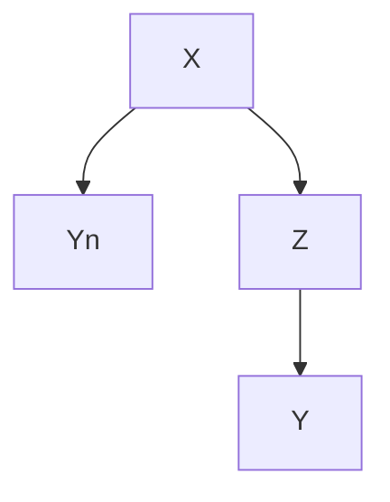
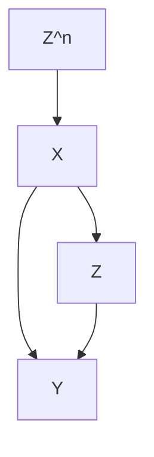
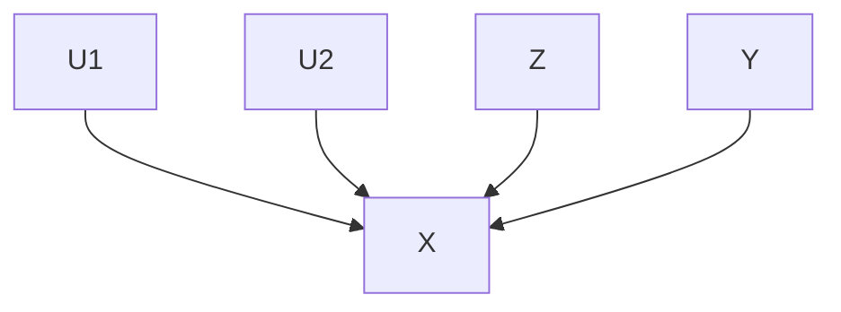
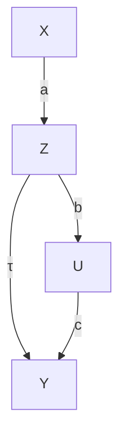
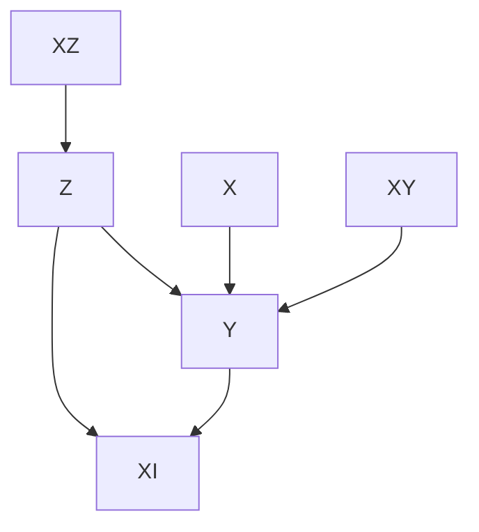

# 观察性研究中因果效应的无混杂性难题（Difficulties of Unconfoundedness in Observational Studies for Causal Effects）

本书第三部分讨论了在**无混杂性（unconfoundedness）**和**重叠性（overlap）**两个假设下，基于观察性研究进行的因果推断。这两个假设都是强假设，在实践中很可能被违反。本章将讨论无混杂性假设的难题。第17-19章将讨论在存在未测量混杂因素时，观察性研究中进行敏感性分析的各种策略。第20章将讨论重叠性假设的难题。

## 16.1 因果图基础（Some basics of the causal diagram）

**Pearl（1995）**引入了**因果图（causal diagram）**，作为实证研究中因果推断的有力工具。Pearl（2000）是一本关于因果图的教材。在此，我将因果图作为一种直观工具来介绍，用于说明变量之间的因果关系。

例如，如果我们有因果图


并关注 $Z$ 对 $Y$ 的因果效应，我们可以将其解读为

$$
\left\{ \begin{array}{c} X \sim F _ {X} (x), \\ Z = f _ {Z} (X, \varepsilon_ {Z}), \\ Y (z) = f _ {Y} (X, z, \varepsilon_ {Y} (z)), \end{array} \right.
$$

其中，对于 $z = 0 , 1$ 两种情况，都有 $\varepsilon _ { Z } \bot \bot \varepsilon _ { Y } ( z )$ 。在上述方程中，协变量 $X$ 从一个分布 $F _ { X } ( x )$ 中生成，处理分配是 $X$ 的一个函数并带有随机误差项 $\varepsilon _ { Z }$ ，潜在结果 $Y ( z )$ 是 $X$ 、 $z$ 和随机误差项 $\varepsilon _ { Y } ( z )$ 的函数。我们可以很容易地从这些方程中读出 $Z \bot \lfloor Y ( z ) \mid X$ ，即无混杂性假设成立。

如果我们有因果图


我们可以将其解读为

$$
\left\{ \begin{array}{l l} X \sim F _ {X} (x), \\ U \sim F _ {U} (u), \\ Z = f _ {Z} (X, U, \varepsilon_ {Z}), \\ Y (z) = f _ {Y} (X, U, z, \varepsilon_ {Y} (z)), \end{array} \right.
$$

其中，对于 $z = 0 , 1$ 两种情况，都有 $\varepsilon _ { Z } \bot \bot \varepsilon _ { Y } ( z )$ 。我们可以很容易地从这些方程中读出 $Z \bot \bot Y ( z ) \mid ( X , U )$ ，但 $Z \not \sqcup Y ( z ) \mid X$ ，即在给定 $( X , U )$ 的条件下，无混杂性假设成立，但仅给定 $X$ 时则不成立。在这种情况下， $U$ 是一个**未测量的混杂因素（unmeasured confounder）**。在该图中， $U$ 被称为未测量的混杂因素。

## 16.2 评估可忽略性（Assessing ignorability）

**弱可忽略性（weak ignorability）**

$$
Z \bot Y (1) \mid X, \quad Z \bot Y (0) \mid X
$$

意味着

$$
\operatorname{pr} \{Y (1) \mid Z = 1, X \} = \operatorname{pr} \{Y (1) \mid Z = 0, X \},
$$

$$
\operatorname{pr} \{Y (0) \mid Z = 1, X \} = \operatorname{pr} \{Y (0) \mid Z = 0, X \}.
$$

因此，可忽略性假设基本上要求反事实分布 $\operatorname{pr} \{ Y ( 1 ) \mid Z = 0 , X \}$ 等于观测分布 $\operatorname{pr} \{ Y ( 1 ) \mid Z = 1 , X \}$ ，并且反事实分布 $\operatorname{pr} \{ Y ( 0 ) \mid Z = 1 , X \}$ 等于观测分布 $\operatorname{pr} \{ Y ( 0 ) \mid Z = 0 , X \}$ 。由于反事实分布无法直接从数据中识别，因此在没有额外假设的情况下，可忽略性假设根本上是不可检验的。我将讨论两种评估可忽略性的策略。此处，"评估"是一个比"检验"更弱的概念。前者指的是支持或削弱初始分析的补充性分析，而后者指的是正式的统计检验。

### 16.2.1 使用阴性结局（Using negative outcomes）

假设 $Y ^ { \mathrm { n } }$ 是一个与 $Y$ 相似的结局，并且理想情况下，与 $Y$ 共享相同的混杂结构。如果我们相信 $Z \bot Y ( z ) \mid X$ ，那么我们也倾向于相信 $Z \bot Y ^ { \mathrm { n } } ( z ) \mid X$ 。此外，我们先验地知道 $Z$ 对 $Y ^ { \mathrm { n } }$ 的效应：

$$
\tau (Z \to Y ^ {\mathrm{n}}) = E \{Y ^ {\mathrm{n}} (1) - Y ^ {\mathrm{n}} (0) \}.
$$

一个重要的例子是 $\tau ( Z \to Y ^ { \mathrm { n } } ) = 0$ 。满足这些要求的因果图如下：




**例16.1** Cornfield 等人（1959）基于观察性研究，研究了吸烟对肺癌的因果作用。他们控制了许多重要的背景变量，但仍可能存在一些未测量的混杂因素使观察到的效应产生偏倚。为了加强证据，他们还报告了吸烟对车祸的影响，该效应接近于零，这符合基于生物学的预期效应。因此，即使他们无法在分析中排除未测量的混杂因素，这项基于阴性结局的补充分析也使得吸烟对肺癌因果效应的证据更加有力。

**例16.2** Imbens 和 Rubin（2015）建议将**滞后结局（lagged outcome）**作为阴性结局。在大多数情况下，有理由相信滞后结局和当前结局具有相似的混杂结构。由于滞后结局发生在处理之前，其对滞后结局的平均因果效应必须为0。然而，他们的建议应谨慎使用，因为在大多数研究中，我们只是将滞后结局视为一个已观测的混杂因素。

从某种意义上说，第11章中的**协变量平衡检验（covariate balance check）**是使用阴性对照的一个特例。与使用滞后结局作为阴性对照的问题类似，这些协变量通常是可忽略性假设的一部分。因此，协变量平衡检验的失败并非真正否定了可忽略性假设，而是否定了**倾向得分（propensity score）**的模型设定。

**例16.3** 针对老年人的观察性研究表明，在调整了已测量的协变量后，接种流感疫苗能显著降低一个人在接下来季节中因肺炎/流感住院和全因死亡的风险。Jackson 等人（2006）对这种大幅度的效应持怀疑态度，因此对阴性结局进行了补充分析。疫苗接种通常在秋季开始，但流感传播通常在冬季之前都很轻微。基于生物学，疫苗接种的效果在流感季节期间应最为显著。但 Jackson 等人（2006）发现在流感季节之前效果反而更大，这表明观察到的效应是由未测量的混杂因素造成的。

## 20416 观察性研究中因果效应的无混杂性难题

Jackson 等人（2006）的研究似乎是最有说服力的，因为流感季节前后与流感相关的结局应具有相似的混杂模式。Cornfield 等人（1959）的额外证据似乎较弱，因为车祸和肺癌在吸烟方面的因果机制差异很大。事实上，Fisher（1957）的批评是，吸烟与肺癌之间的关系可能是由一个未观测到的遗传因素造成的。这种遗传因素可能同时影响吸烟和肺癌，但它似乎不太可能也影响车祸。

Lipsitch 等人（2010）是一篇关于阴性结局的最新文章。Rosenbaum（1989）讨论了已知效应在因果推断中的作用。

### 16.2.2 使用阴性暴露（Using negative exposures）

**阴性暴露（negative exposures）**是**阴性结局（negative outcomes）**的对偶概念。假设 $Z ^ { \mathrm { n } }$ 是一个与 $Z$ 相似的处理变量，并且与 $Z$ 共享相同的混杂结构。如果我们相信 $Z \bot \bot Y ( z ) \mid X$ ，那么我们倾向于相信 $Z ^ { \mathrm { n } } \bot \bot { \bar { Y ( z ) } } \mid X$ 。此外，我们先验地知道 $Z ^ { \mathrm { n } }$ 对 $Y$ 的效应：

$$
\tau (Z ^ {\mathrm{n}} \to Y) = E \{Y (1 ^ {\mathrm{n}}) - Y (0 ^ {\mathrm{n}}) \}.
$$

一个重要的例子是 $\tau ( Z ^ { \mathrm { n } } \to Y ) = 0$ 。满足这些要求的因果图如下：




**例16.4** Sanderson 等人（2017）给出了许多关于阴性暴露的例子，通过比较孕期母亲暴露与感兴趣结局的关联，以及父亲暴露与同一结局的关联，来确定**宫内暴露（intrauterine exposure）**对后期结局的影响。他们回顾了关于父母吸烟对后代结局影响、父母BMI对后代BMI和自闭症谱系障碍影响的研究。在这些例子中，我们预期母亲暴露与结局的关联大于父亲暴露与结局的关联。

### 16.2.3 总结（Summary）

在缺乏额外假设的情况下，无混杂性假设根本上是不可检验的。尽管观察性研究中的阴性结局和阴性对照无法证明或反驳无混杂性，但在补充分析中使用它们可以加强因果关系的证据。然而，进行这类补充分析通常并非易事，因为它涉及更多数据，更重要的是，需要更深入地理解因果问题，以便找到令人信服的阴性结局和阴性对照。

## 16.3 过度调整的问题（Problems of over adjustment）

我们已经讨论了许多在可忽略性假设下估计因果效应的方法：

$$
Z \bot \{Y (1), Y (0) \} \mid X.
$$

这是一个以 $X$ 为条件的假设。选择正确的 $X$ 集合以确保条件独立性至关重要。Rosenbaum（2002b）写道："没有理由避免调整描述处理前状态的变量。" 类似地，Rubin（2007）写道："通常，假设的条件性越强，其可接受性就越高。" 两人都主张我们应该控制所有已观测的处理前协变量。VanderWeele 和 Shpitser（2011）将其称为**处理前准则（pretreatment criterion）**。Pearl 不同意这一建议，并给出了两个反例。

## 16.3.1 M-偏倚（M-bias）

M-偏倚出现在以下具有M结构的因果图中：




我们可以从该图中读出数据生成过程：

$$
\left\{ \begin{array}{l} U _ {1} \text {卄} U _ {2}, \\ X = f _ {X} (U _ {1}, U _ {2}, \varepsilon_ {X}), \\ Z = f _ {Z} (U _ {1}, \varepsilon_ {Z}), \\ Y = Y (z) = f _ {Y} (U _ {2}, \varepsilon_ {Y}), \end{array} \right.
$$

其中 $( \varepsilon _ { X } , \varepsilon _ { Z } , \varepsilon _ { Y } )$ 是独立的随机误差项。在上述因果图中，$X$ 是可观测的，但 $U _ { 1 }$ 和 $U _ { 2 }$ 是不可观测的。如果我们改变 $Z$ 的值，$Y$ 的值将完全不会改变。因此，$Z$ 对 $Y$ 的真实因果效应必须为 0。从数据生成方程中，我们可以轻松读出 $Z \bot \bot Y$，

## 20616 观察性研究中因果效应无混杂性（Unconfoundedness）的困难

所以 $Z$ 和 $Y$ 之间的关联为 0，并且特别地，

$$
\tau_ {\mathrm{PF}} = E (Y \mid Z = 1) - E (Y \mid Z = 0) = 0.
$$

这意味着，在不调整协变量 $X$ 的情况下，简单估计量对于真实参数是无偏的。

然而，如果我们以 $X$ 为条件，那么 $U _ { 1 } \not \mu U _ { 2 } \mid X$，因此，$Z \not \bot Y \mid$ | X 并且

$$
\int \{E (Y \mid Z = 1, X = x) - E (Y \mid Z = 0, X = x) \} F (\mathrm{d} x) \neq 0
$$

一般情况下如此。为了获得直观理解，我们考虑高斯线性模型的情况：

$$
\left\{ \begin{array}{l} X = a U _ {1} + b U _ {2} + \varepsilon_ {X}, \\ Z = c U _ {1} + \varepsilon_ {Z}, \\ Y = Y (z) = d U _ {2} + \varepsilon_ {Y}, \end{array} \right.
$$

其中 $( U _ { 1 } , U _ { 2 } , \varepsilon _ { X } , \varepsilon _ { Z } , \varepsilon _ { Y } ) \stackrel { \mathrm { I I D } } { \sim } \mathrm { N } ( 0 , 1 )$ 。我们有

$$
\operatorname{cov} (Z, Y) = \operatorname{cov} \left(c U _ {1} + \varepsilon_ {Z}, d U _ {2} + \varepsilon_ {Y}\right) = 0,
$$

但根据问题 1.2 的结果，给定 $X$ 时 $Z$ 和 $\check { Y }$ 之间的**偏相关系数（partial correlation coefficient）**为

$$
\rho_ {Z Y | X} = \frac {\rho_ {Z Y} - \rho_ {Z X} \rho_ {Y X}}{\sqrt {1 - \rho_ {Z X} ^ {2}} \sqrt {1 - \rho_ {Y X} ^ {2}}} \propto - \rho_ {Z X} \rho_ {Y X} \propto - \operatorname{cov} (Z, X) \operatorname{cov} (Y, X) = - a b c d,
$$

即从 $Z$ 到 $Y$ 路径上系数的乘积。因此，未调整的估计量是无偏的，但调整后的估计量具有与 $abcd$ 成比例的偏倚。

下面的简单示例说明了 M-偏倚。

```txt
> n = 10^6
>
> ## M bias
> U1 = rnorm(n)
> U2 = rnorm(n)
> X = U1 + U2 + rnorm(n)
> Z = U1 + rnorm(n)
> Y = U2 + rnorm(n)
>
> round(summary(lm(Y ~ Z))$coef[2, 1], 3)
[1] -0.001
> round(summary(lm(Y ~ Z + X))$coef[2, 1], 3)
[1] -0.201
>
```

> Z = (Z >= 0)
> round(summary(lm(Y ~ Z))$coef[2, 1], 3)
[1] -0.002
> round(summary(lm(Y ~ Z + X))$coef[2, 1], 3)
[1] -0.421

## 16.3.2 Z-偏倚（Z-bias）

考虑以下因果图：




其数据生成过程为：

$$
\left\{ \begin{array}{l} Z = a X + b U + \varepsilon_ {Z}, \\ Y (z) = \tau z + c U + \varepsilon_ {Y}, \end{array} \right.
$$

其中 $( U , X , \varepsilon _ { Z } , \varepsilon _ { Y } ) \stackrel { \mathrm { I I D } } { \sim } \mathrm { N } ( 0 , 1 )$ 。在此数据生成过程中，我们有 $X \bot \bot U , X \bot Z$，并且 $X$ 仅通过 $Z$ 影响 $Y$。

未调整的估计量为：

$$
\tau_ {\mathrm{unadj}} = \frac {\operatorname{cov} (Z , Y)}{\operatorname{var} (Z)} = \frac {\operatorname{cov} (Z , \tau Z + c U)}{\operatorname{var} (Z)} = \tau + \frac {c \operatorname{cov} (a X + b U , U)}{\operatorname{var} (Z)} = \tau + \frac {c b}{a ^ {2} + b ^ {2} + 1},
$$

其偏倚为 $b c / ( a ^ { 2 } + b ^ { 2 } + 1 )$ 。通过 $Y$ 对 $( Z , X )$ 进行 **OLS（普通最小二乘法）** 得到的调整后估计量满足：

$$
\left\{ \begin{array}{l} E \{Z (Y - \tau_ {\mathrm{adj}} Z - \alpha X) \} = 0, \\ E \{X (Y - \tau_ {\mathrm{adj}} Z - \alpha X) \} = 0, \end{array} \right.
$$

这等价于：

$$
\left\{ \begin{array}{l} E (Z Y) = \tau_ {\mathrm{adj}} \mathrm{var} (Z) + \alpha E (X Z), \\ E (X Y) = \tau_ {\mathrm{adj}} E (X Z) + \alpha \mathrm{var} (X). \end{array} \right.
$$

我们需要从上述两个线性方程中解出 $( \tau _ { \mathrm { a d j } } , \alpha )$：

$$
\begin{array}{l} \tau_ {\mathrm{adj}} = \frac {\left| \begin{array}{c c} E (Z Y) & E (X Z) \\ E (X Y) & \operatorname{var} (X) \end{array} \right|}{\left| \begin{array}{c c} \operatorname{var} (Z) & E (X Z) \\ E (X Z) & \operatorname{var} (X) \end{array} \right|} = \frac {E (Z Y) \operatorname{var} (X) - E (X Z) E (X Y)}{\operatorname{var} (Z) \operatorname{var} (X) - E (X Z) ^ {2}} \\ = \frac {\tau (a ^ {2} + b ^ {2} + 1) + b c - a \tau a}{(a ^ {2} + b ^ {2} + 1) - a ^ {2}} = \frac {\tau (b ^ {2} + 1) + b c}{b ^ {2} + 1} = \tau + \frac {b c}{b ^ {2} + 1}, \\ \end{array}
$$

其偏倚为 $bc/(b^2 + 1)$。

因此，未调整的估计量比调整后的估计量具有更小的偏倚。更有趣的是，$X$ 和 $Z$ 之间的关联越强（由 $a$ 衡量），调整后估计量的偏倚就越大。

数学推导并不非常困难。但这种类型的偏倚似乎相当神秘。以下是其直观解释。处理变量是 $X$、$U$ 和其他随机误差的函数。如果我们以 $X$ 为条件，它仅仅是 $U$ 和其他随机误差的函数。因此，条件化使得 $Z$ 的随机性降低，更关键的是，使得未测量的混杂因素 $U$ 在 $Z$ 中扮演更重要的角色。因此，由 $U$ 引起的混杂偏倚通过以 $X$ 为条件而被放大。这个理想化的例子说明了过度调整某些协变量的危险性。

**赫克曼（Heckman）**和**纳瓦罗-洛萨诺（Navarro-Lozano）** (2004) 在模拟研究中观察到了这一现象，**伍德里奇（Wooldridge）** (2016，技术报告于2006年) 在线性模型中验证了它。**珀尔（Pearl）** (2010, 2011) 使用因果图进行了解释。这种类型的偏倚被称为 Z-偏倚，因为在珀尔的原始论文中，他使用符号 $Z$ 来表示我们的变量 $X$。然而，在本书中，$Z$ 被用于表示处理变量。在本书的第五部分，如果某个变量满足本小节中提出的因果图，我们将称 $Z$ 为**工具变量（instrumental variable）**。这证明了工具变量偏倚作为这种偏倚类型的另一个名称是合理的。

下面的简单示例说明了 Z-偏倚。

```txt
> X = rnorm(n)
> U = rnorm(n)
> Z = X + U + rnorm(n)
> Y = U + rnorm(n)
>
> round(summary(lm(Y ~ Z))$coef[2, 1], 3)
[1] 0.334
> round(summary(lm(Y ~ Z + X))$coef[2, 1], 3)
[1] 0.501
>
> Z = 2*X + U + rnorm(n)
> round(summary(lm(Y ~ Z))$coef[2, 1], 3)
[1] 0.167
> round(summary(lm(Y ~ Z + X))$coef[2, 1], 3)
[1] 0.5
>
> Z = 10*X + U + rnorm(n)
> round(summary(lm(Y ~ Z))$coef[2, 1], 3)
[1] 0.01
> round(summary(lm(Y ~ Z + X))$coef[2, 1], 3)
[1] 0.5
```

## 16.3.3 在观察性研究中我们应该调整哪些协变量？

我们永远无法知道真实的基础数据生成过程，它可能非常复杂。然而，下面的因果图有助于澄清许多想法。它已经排除了第 16.3.1 节中讨论的 M-偏倚的可能性。




$X _ { R }$

上述协变量具有不同的特征：

1.  $X$ 同时影响处理变量和结果变量。以 $X$ 为条件确保了**可忽略性（ignorability）**，因此我们应该控制 $X$。
2.  $X _ { R }$ 是纯粹的随机噪声，既不影响处理变量也不影响结果变量。将其包含在分析中不会使估计产生偏倚，但会在有限样本中引入不必要的变异性。
3.  $X _ { Z }$ 是一个**工具变量**，它仅通过处理变量影响结果变量。在上图中，将其包含在分析中不会使估计产生偏倚，尽管它会增加变异性。然而，在存在未测量混杂的情况下，如第 16.3.1 节所示，将其包含在分析中会放大偏倚。
4.  $X _ { Y }$ 仅影响结果变量，但不影响处理变量。不以其为条件，可忽略性仍然成立。由于它们对结果变量具有预测性，将它们包含在分析中通常会提高精度。
5.  $X _ { I }$ 受处理变量和结果变量的影响。它是一个**处理后变量（post-treatment variable）**，而不是**处理前协变量（pretreatment covariate）**。如果目标是推断处理变量对结果变量的影响，我们不应将其包含在内。我们将在本书第六部分讨论因果推断中处理后变量的问题。

如果我们相信上述因果图，那么我们应该至少调整 $X$ 以消除偏倚，更理想的是，进一步调整 $X _ { Y }$ 以减少方差。

## 16.4 课后作业

## 16.1 科克伦公式（Cochran’s formula）或遗漏变量偏倚公式（omitted variable bias formula）

**大卫·考克斯爵士（Sir David Cox）**将以下结果称为科克伦公式 (Cochran, 1938; Cox, 2007)，而计量经济学家称之为遗漏变量偏倚公式 (Angrist and Pischke, 2008)。一个特例出现在 Fisher (1925) 中。它也是附录 A2.3 中**弗里施-沃-洛弗尔定理（Frisch–Waugh–Lovell Theorem）**的姊妹公式。

该公式有两个版本。以下所有向量均为列向量。

1.  (总体版本) 假设 $( y _ { i } , x _ { 1 i } , x _ { 2 i } ) _ { i = 1 } ^ { n }$ 是独立同分布的，其中 $y _ { i }$ 是一个标量，$x _ { i 1 }$ 的维度为 K，$x _ { i 2 }$ 的维度为 L。

    我们对随机变量有以下 OLS 分解：

    $$
    y _ {i} = \beta_ {1} ^ {\mathsf {T}} x _ {i 1} + \beta_ {2} ^ {\mathsf {T}} x _ {2 i} + \varepsilon_ {i}, \tag {16.1}
    $$

    $$
    y _ {i} = \gamma^ {\mathsf {T}} x _ {i 1} + e _ {i}, \tag {16.2}
    $$

    $$
    x _ {i 2} = \delta^ {\mathsf {T}} x _ {i 1} + v _ {i}. \tag {16.3}
    $$

    方程 (16.1) 被称为**长回归（long regression）**，方程 (16.2) 被称为**短回归（short regression）**。在方程 (16.3) 中，$\delta$ 是一个矩阵，因为它是一个向量对另一个向量的回归。你可以将 (16.3) 视为 $x _ { i 2 }$ 的每个分量对 $x _ { i 1 }$ 的回归。

    证明 $\gamma = \beta _ { 1 } + \delta \beta _ { 2 }$ 。

2.  (样本版本) 我们有一个 $n \times 1$ 的向量 $Y$，一个 $n \times K$ 的矩阵 $X _ { 1 }$，和一个 $n \times L$ 的矩阵 $X _ { 2 }$。我们不假设任何随机性。以下结果纯粹是线性代数。

    我们可以得到以下 OLS 拟合：

    $$
    { Y } { = } { X _ { 1 } \hat { \beta } _ { 1 } + X _ { 2 } \hat { \beta } _ { 2 } + \hat { \varepsilon } , }
    $$

    $$
    Y = X _ {1} \hat {\gamma} + \hat {e},
    $$

    $$
    {X _ {2}} = {X _ {1} \hat {\delta} + \hat {v},}
    $$

    其中 $\hat{\varepsilon}, \hat{e}, \hat{v}$ 是残差。再次说明，最后一个 OLS 拟合意味着 $X _ { 2 }$ 的每一列对 $X _ { 1 }$ 的 OLS 拟合，因此残差 $\hat{v}$ 是一个 $n \times L$ 的矩阵。

    证明 $\hat { \gamma } = \hat { \beta } _ { 1 } + \hat { \delta } \hat { \beta } _ { 2 }$ 。

备注：乘积项 $\delta \beta _ { 2 }$ 和 $\hat { \delta } \hat { \beta } _ { 2 }$ 通常分别被称为总体层面和样本层面的**遗漏变量偏倚（omitted-variable bias）**。

## 16.2 推荐阅读

**因本斯（Imbens）** (2020) 回顾并比较了**潜在结果（potential outcomes）**和因果图在因果推断中的作用。