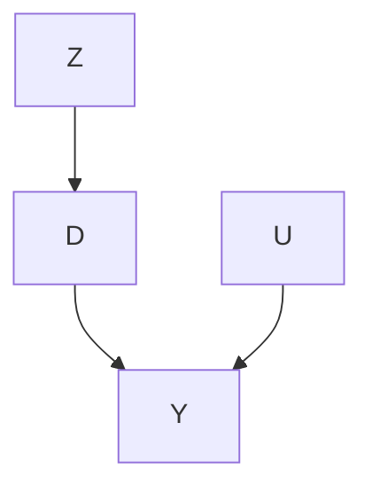

# 实验视角（An Experimental Perspective）

**工具变量方法（Instrumental variable method）**一直是计量经济学中的有力工具。它在处理变量与结果变量之间不存在无混杂性（unconfoundedness）的研究中识别因果效应。该方法依赖于一个额外的变量，称为**工具变量（instrumental variable, IV）**，该变量需满足特定条件。初次阅读时，这些条件可能不易理解。从某种意义上说，IV 是一种魔法。本章基于**鼓励设计（encouragement design）**提出一个不那么神奇的视角。这再次呼应了 Dorn（1953）的建议：观察性研究的规划者应始终问自己以下问题：

如果可以通过受控实验来进行研究，那么研究将如何开展？

IV 方法的实验类比是鼓励设计（Zelen, 1979; Powers and Swinton, 1984; Holland, 1986）。

## 21.1 鼓励设计与不依从性（Encouragement Design and Noncompliance）

考虑一个实验，其中实验单元由 $i = 1 , \ldots , n$ 索引。令 $Z _ { i }$ 为分配的**处理（treatment）**，1 表示处理组，0 表示对照组。令 $D _ { i }$ 为实际接受的**处理（treatment）**，1 表示处理组，0 表示对照组。当某个单元 $i$ 出现 $Z _ { i } \neq D _ { i }$ 时，便产生了**不依从问题（noncompliance problem）**。不依从是一个非常普遍的问题，尤其是在以人类为实验单元的鼓励设计中。在这些情况下，实验者无法强制实验单元接受处理，而只能鼓励他们这样做。令 $Y _ { i }$ 为感兴趣的**结果变量（outcome）**。

现在考虑 $Z$ 的完全随机化，并暂时忽略协变量 $X$。我们拥有关于实际接受处理的潜在值 $\{ D _ { i } ( 1 ) , D _ { i } ( 0 ) \}$ 和关于结果的潜在值 $\{ Y _ { i } ( 1 ) , Y _ { i } ( 0 ) \}$，均相对于处理分配水平 1 和 0。它们的观测值分别为 $D _ { i } = Z _ { i } D _ { i } ( 1 ) + ( 1 - Z _ { i } ) D _ { i } ( 0 )$ 和 $Y _ { i } = Z _ { i } Y _ { i } ( 1 ) + ( 1 - Z _ { i } ) Y _ { i } ( 0 )$。为简化符号，我们假设 $\{ Z _ { i } , D _ { i } ( 1 ) , D _ { i } ( 0 ) , Y _ { i } ( 1 ) , Y _ { i } ( 0 ) \} _ { i = 1 } ^ { n } \stackrel { \mathrm { I I D } } { \sim }$ 独立同分布（IID）于 $\{ Z , D ( 1 ) , D ( 0 ) , Y ( 1 ) , Y ( 0 ) \}$，有时在不引起混淆的情况下省略下标 $i$。

我们从完全随机化实验开始。

**假设 21.1（随机化，randomization）** $Z \bot \bot \{ D ( 1 ) , D ( 0 ) , Y ( 1 ) , Y ( 0 ) \}$。

随机化允许识别 $D$ 和 $Y$ 的平均因果效应：

$$
\tau_ {D} = E \{D (1) - D (0) \} = E (D \mid Z = 1) - E (D \mid Z = 0)
$$

以及

$$
\tau_ {Y} = E \{Y (1) - Y (0) \} = E (Y \mid Z = 1) - E (Y \mid Z = 0).
$$

我们可以使用简单的**均值差异估计量（difference-in-means estimators）** $\hat { \tau } _ { D }$ 和 $\hat { \tau } _ { Y }$ 分别估计 $\tau _ { D }$ 和 $\tau _ { Y }$。

报告估计值 $\hat { \tau } _ { Y }$ 及其相应的标准误被称为**意向性治疗分析（intention-to-treat, ITT analysis）**。它估计了处理分配对结果的影响，而假设 21.1 中的完全随机化为该分析提供了依据。然而，它可能无法回答科学问题，即实际接受的处理对结果的因果效应。

## 21.2 潜在依从状态与效应（Latent Compliance Status and Effects）

### 21.2.1 非参数识别（Nonparametric identification）

遵循 Imbens and Angrist（1994）和 Angrist et al.（1996），我们根据 $\{ D _ { i } ( 1 ) , D _ { i } ( 0 ) \}$ 的联合潜在值对总体进行分层。由于 $D$ 是二值的，我们有四种可能的组合：

$$
U _ {i} = \left\{ \begin{array}{l l} \mathrm{a,} & \mathrm{if} D _ {i} (1) = 1 \mathrm{and} D _ {i} (0) = 1; \\ \mathrm{c,} & \mathrm{if} D _ {i} (1) = 1 \mathrm{and} D _ {i} (0) = 0; \\ \mathrm{d,} & \mathrm{if} D _ {i} (1) = 0 \mathrm{and} D _ {i} (0) = 1; \\ \mathrm{n,} & \mathrm{if} D _ {i} (1) = 0 \mathrm{and} D _ {i} (0) = 0, \end{array} \right.
$$

其中 $\mathrm { ^ { 6 } a } ^ { \mathrm { 9 } }$ 表示“始终接受者（always taker）”，$\begin{array} { r l } { \mathfrak { N } } & { { } ^ { 6 6 } \mathrm { c } ^ { \mathfrak { N } } } \end{array}$ 表示“依从者（complier）”，$\mathrm { ^ { 6 } d } ^ { \mathrm { 3 } }$ 表示“违抗者（defier）”，$\mathrm { ^ { 6 6 } n } \mathrm { ^ { \circ } }$ 表示“从不接受者（never taker）”。由于我们无法同时观测到 $D _ { i } ( 1 )$ 和 $D _ { i } ( 0 )$，$U _ { i }$ 是单元 $i$ 依从行为的**潜在变量（latent variable）**。

基于 $U$，我们可以使用全概率公式将 $Y$ 的平均因果效应分解为四项：

$$
\begin{array}{l} \tau_ {Y} = E \{Y (1) - Y (0) \mid U = \mathrm{a} \} \operatorname{pr} (U = \mathrm{a}) \\ + E \{Y (1) - Y (0) \mid U = c \} \mathrm{pr} (U = c) \\ + E \{Y (1) - Y (0) \mid U = \mathrm{d} \} \operatorname{pr} (U = \mathrm{d}) \\ + E \{Y (1) - Y (0) \mid U = \mathrm{n} \} \operatorname{pr} (U = \mathrm{n}). \tag {21.1} \\ \end{array}
$$

因此，$\tau _ { Y }$ 是四个潜在子组效应的加权平均值。下面我们将更详细地探讨这些潜在组。

下面的假设 21.2 将 (21.1) 中的第三项限制为零。

**假设 21.2（单调性，monotonicity）** $\mathrm { p r } ( U = \mathrm { d } ) = 0 ~ o r ~ D _ { i } ( 1 ) \geq D _ { i } ( 0 )$，即不存在违抗者。

当分配到对照组的单元无法获得处理时，即对于所有单元 $D _ { i } ( 0 ) = 0$，假设 21.2 在**单侧不依从（one-sided noncompliance）**下自动成立。在随机化下，假设 21.2 有一个可检验的推论：

$$
\operatorname{pr} (D = 1 \mid Z = 1) \geq \operatorname{pr} (D = 1 \mid Z = 0).
$$

但假设 21.2 远比上述不等式更强。前者在个体层面限制 $D _ { i } ( 1 )$ 和 $D _ { i } ( 0 )$，而后者仅在平均意义上限制它们。然而，当这个可检验的推论成立时，我们无法使用观测数据来反驳假设 21.2。

下面的假设 21.3 基于处理分配仅通过实际接受的处理影响结果的机制，将 (21.1) 中的第一项和最后一项限制为零。

**假设 21.3（排他性约束，exclusion restriction）** 对于 $U _ { i } = \mathbf { a }$ 的始终接受者和 $U _ { i } = \mathrm { n }$ 的从不接受者，有 $Y _ { i } ( 1 ) = Y _ { i } ( 0 )$。

假设 21.3 要求处理分配只有在影响实际接受的处理时才会影响结果。在双盲临床试验中，这在生物学上是合理的，因为结果仅取决于实际接受的处理。也就是说，如果处理分配没有改变实际接受的处理，它也不会改变结果。如果处理分配通过实际接受的处理之外的途径对结果产生直接影响，则该假设可能被违反。例如，一些随机对照试验并非双盲，处理分配可能通过某些未知途径影响结果。

在假设 21.2 和 21.3 下，分解式 (21.1) 仅保留第二项：

$$
\tau_ {Y} = E \{Y (1) - Y (0) \mid U = \mathrm{c} \} \mathrm{pr} (U = \mathrm{c}). \tag {21.2}
$$

类似地，我们可以将 $D$ 的平均因果效应分解为四项：

$$
\begin{array}{l} \tau_ {D} = E \{D (1) - D (0) \mid U = \mathrm{a} \} \operatorname{pr} (U = \mathrm{a}) \\ + E \{D (1) - D (0) \mid U = c \} \operatorname{pr} (U = c) \\ + E \{D (1) - D (0) \mid U = \mathrm{d} \} \operatorname * {p r} (U = \mathrm{d}) \\ + E \{D (1) - D (0) \mid U = \mathrm{n} \} \mathrm{pr} (U = \mathrm{n}) \\ = 0 \times \operatorname{pr} (U = \mathrm{a}) + 1 \times \operatorname{pr} (U = \mathrm{c}) + (- 1) \times \operatorname{pr} (U = \mathrm{d}) + 0 \times \operatorname{pr} (U = \mathrm{n}), \\ \end{array}
$$

在假设 21.2 下，上式简化为：

$$
\tau_ {D} = \mathrm{pr} (U = \mathrm{c}). \tag {21.3}
$$

这是一个有趣的事实：**依从者比例（proportion of the compliers）** $\pi _ { \mathrm { c } }$ 等于分配处理对 $D$ 的平均因果效应，后者在完全随机化下是一个可识别的量。虽然我们无法根据观测数据识别出所有依从者，但我们可以基于 (21.3) 识别他们在总体中的比例。结合 (21.2) 和 (21.3)，我们得到以下结果。

**定理 21.1** 在假设 21.2–21.3 下，如果 $\tau_ {D} \neq 0$，则有：

$$
E \{Y (1) - Y (0) \mid U = \mathrm{c} \} = \frac {\tau_ {Y}}{\tau_ {D}}
$$

遵循 Imbens and Angrist（1994）和 Angrist et al.（1996），我们在下面定义一个新的因果效应。

**定义 21.1（CACE 或 LATE）** 定义

$$
\tau_ {\mathrm{c}} \equiv E \{Y (1) - Y (0) \mid U = \mathrm{c} \}
$$

为**依从者平均因果效应（complier average causal effect, CACE）**或**局部平均处理效应（local average treatment effect, LATE）**。它还有其他形式：

$$
\tau_ {\mathrm{c}} = E \{Y (1) - Y (0) \mid D (1) = 1, D (0) = 0 \}
$$

$$
= E \{Y (1) - Y (0) \mid D (1) > D (0) \}.
$$

基于定义 21.1，我们可以将定理 21.1 重写为：

$$
\tau_ {\mathrm{c}} = \frac {\tau_ {Y}}{\tau_ {D}},
$$

即 CACE 或 LATE 等于 $Y$ 的平均因果效应与 $D$ 的平均因果效应之比。在假设 21.1 下，我们进一步识别出下面的 CACE。

**推论 21.1** 在假设 21.1–21.3 下，我们有：

$$
\tau_ {\mathrm{c}} = \frac {E (Y \mid Z = 1) - E (Y \mid Z = 0)}{E (D \mid Z = 1) - E (D \mid Z = 0)}.
$$

因此，在随机化、单调性和排他性约束下，我们可以非参数地将 CACE 识别为结果均值差异与实际接受处理均值差异之比。

### 21.2.2 估计（Estimation）

基于推论 21.1，我们可以通过一个简单的比率来估计 $\tau _ { \mathrm { c } }$：

$$
\hat {\tau} _ {\mathrm{c}} = \frac {\hat {\tau} _ {Y}}{\hat {\tau} _ {D}},
$$

这被称为**沃尔德估计量（Wald estimator）**（Wald, 1940）或 **IV 估计量**。在上述讨论中，$Z$ 充当 $D$ 的 IV。

我们可以基于以下启发式方法获得方差估计量（参见示例 A1.3）：

$$
\hat {\tau} _ {\mathrm{c}} - \tau_ {\mathrm{c}} = (\hat {\tau} _ {Y} - \tau_ {\mathrm{c}} \hat {\tau} _ {D}) / \hat {\tau} _ {D} \approx (\hat {\tau} _ {Y} - \tau_ {\mathrm{c}} \hat {\tau} _ {D}) / \tau_ {D} = \hat {\tau} _ {A} / \tau_ {D},
$$

其中 $\hat { \tau } _ { A }$ 是调整后结果 $A _ { i } = Y _ { i } - \tau _ { \mathrm { c } } D _ { i }$ 的均值差异。因此，$\hat { \tau } _ { \mathrm { c } }$ 的渐近方差近似等于 $\hat { \tau } _ { A }$ 的方差除以 $\tau _ { D } ^ { 2 }$。方差估计按以下步骤进行：

1. 获得调整后的结果 $\hat { A } _ { i } = Y _ { i } - \hat { \tau } _ { \mathrm { c } } D _ { i } ( i = 1 , \dots , n )$  
2. 基于调整后的结果获得**内曼型方差估计（Neyman-type variance estimate）**：

$$
\hat {V} _ {\hat {A}} = \frac {\hat {S} _ {\hat {A}} ^ {2} (1)}{n _ {1}} + \frac {\hat {S} _ {\hat {A}} ^ {2} (0)}{n _ {0}},
$$

其中 $\hat { S } _ { \hat { A } } ^ { 2 } ( 1 )$ 和 $\hat { S } _ { \hat { A } } ^ { 2 } ( 0 )$ 分别是处理组和对照组中 $\hat { A } _ { i }$ 的样本方差；

3. 获得最终的方差估计量 $\hat { V } _ { \hat { A } } / { \hat { \tau } _ { D } } ^ { 2 }$。

在原假设 $\tau _ { \mathrm { c } } = 0$ 下，我们可以简单地通过 $\hat { V } _ { Y } / \hat { \tau } _ { D } ^ { 2 }$ 来近似方差，其中 $\hat { V } _ { Y }$ 是 $Y$ 均值差异的内曼型方差估计。如果真实的 $\tau _ { \mathrm { c } }$ 不为零，则该方差估计量是不一致的。因此，它适用于检验，但不适用于估计。尽管如此，它为 ITT 估计量和 Wald 估计量提供了有趣的见解。ITT 估计量 $\hat { \tau } _ { Y }$ 的估计标准误为 $\sqrt { \hat { V } _ { Y } }$。Wald 估计量 $\hat { \tau } _ { Y } / \hat { \tau } _ { D }$ 本质上等于 ITT 估计量乘以 $1 / \hat { \tau } _ { D } > 1$，其量值更大，但同时其估计标准误也以相同倍数增加。$\tau _ { Y }$ 和 $\tau _ { \mathrm { c } }$ 的置信区间分别为：

$$
\hat {\tau} _ {Y} \pm z _ {1 - \alpha / 2} \sqrt {\hat {V} _ {Y}}
$$

和

$$
\hat {\tau} _ {Y} / \hat {\tau} _ {D} \pm z _ {1 - \alpha / 2} \sqrt {\hat {V} _ {Y}} / \hat {\tau} _ {D} = \left(\hat {\tau} _ {Y} \pm z _ {1 - \alpha / 2} \sqrt {\hat {V} _ {Y}}\right) / \hat {\tau} _ {D}.
$$

这些置信区间给出相同的定性结论，因为它们都将同时覆盖零或不覆盖零。从某种意义上说，IV 分析提供了与 $Y$ 的 ITT 分析相同的定性信息，尽管它涉及更复杂的程序。

## 21.3 协变量（Covariates）

## 21.3.1 完全随机化中的协变量调整（Covariate adjustment in complete randomization）

现在我们考虑带有协变量的完全随机化实验，并假设 $Z \bot \bot \{ D ( 1 ) , D ( 0 ) , Y ( 1 ) , Y ( 0 ) , X \}$ 。利用协变量 $X$ ，我们可以得到 Lin (2013) 针对 $D$ 和 ${ \cal Y }$ 的估计量 $\hat { \tau } _ { D , \mathrm { L } }$ 和 $\hat { \tau } _ { Y , \mathrm { L } }$ ，从而得到 $\hat { \tau } _ { \mathrm { c , L } } =$ $\hat { \tau } _ { Y , \mathrm { L } } / \hat { \tau } _ { D , \mathrm { L } }$ 。回顾：

$$
\hat {\tau} _ {D, \mathrm{L}} = \left\{\hat {\bar {D}} (1) - \hat {\beta} _ {D 1} ^ {\mathsf {T}} \hat {\bar {X}} (1) \right\} - \left\{\hat {\bar {D}} (0) - \hat {\beta} _ {D 0} ^ {\mathsf {T}} \hat {\bar {X}} (0) \right\},
$$

$$
\hat {\tau} _ {Y, \mathrm{L}} = \left\{\hat {\bar {Y}} (1) - \hat {\beta} _ {Y 1} ^ {\mathsf {T}} \hat {\bar {X}} (1) \right\} - \left\{\hat {\bar {Y}} (0) - \hat {\beta} _ {Y 0} ^ {\mathsf {T}} \hat {\bar {X}} (0) \right\},
$$

其中 $\hat { \beta } _ { D 1 }$ 和 $\hat { \beta } _ { Y 1 }$ 是处理组中对 $D$ 和 $Y$ 进行普通最小二乘（OLS）拟合时 $X$ 的系数，而 $\hat { \beta } _ { D 0 }$ 和 $\hat { \beta } _ { Y 0 }$ 是对照组中对 $D$ 和 $Y$ 进行 OLS 拟合时 $X$ 的系数。我们可以基于以下启发式方法（另见示例 A1.3）来近似 $\hat { \tau } _ { \mathrm { c , L } }$ 的标准误：

$$
\hat {\tau} _ {\mathrm{c,L}} - \tau_ {\mathrm{c}} = (\hat {\tau} _ {Y, \mathrm{L}} - \tau_ {\mathrm{c}} \hat {\tau} _ {D, \mathrm{L}}) / \hat {\tau} _ {D, \mathrm{L}} \approx (\hat {\tau} _ {Y, \mathrm{L}} - \tau_ {\mathrm{c}} \hat {\tau} _ {D, \mathrm{L}}) / \tau_ {D} = \hat {\tau} _ {A} / \tau_ {D},
$$

其中 $\hat { \tau } _ { A }$ 是 $A$ 的均值之差，$A$ 定义为：

$$
A _ {i} = \left\{ \begin{array}{l l} (Y _ {i} - \hat {\beta} _ {Y 1} ^ {\mathsf {T}} X _ {i}) - \tau_ {\mathrm{c}} (D _ {i} - \hat {\beta} _ {D 1} ^ {\mathsf {T}} X _ {i}), & \text {if} Z _ {i} = 1, \\ (Y _ {i} - \hat {\beta} _ {Y 0} ^ {\mathsf {T}} X _ {i}) - \tau_ {\mathrm{c}} (D _ {i} - \hat {\beta} _ {D 0} ^ {\mathsf {T}} X _ {i}), & \text {if} Z _ {i} = 0. \end{array} \right.
$$

方差估计按以下步骤进行：

1. 使用下式获得调整后的结果 $\hat { A } _ { i } \ ( i = 1 , \ldots , n )$ ：

$$
\hat {A} _ {i} = \left\{ \begin{array}{l l} (Y _ {i} - \hat {\beta} _ {Y 1} ^ {\mathsf {T}} X _ {i}) - \hat {\tau} _ {\mathrm{c,L}} (D _ {i} - \hat {\beta} _ {D 1} ^ {\mathsf {T}} X _ {i}), & \text {if} Z _ {i} = 1, \\ (Y _ {i} - \hat {\beta} _ {Y 0} ^ {\mathsf {T}} X _ {i}) - \hat {\tau} _ {\mathrm{c,L}} (D _ {i} - \hat {\beta} _ {D 0} ^ {\mathsf {T}} X _ {i}), & \text {if} Z _ {i} = 0; \end{array} \right.
$$

2. 基于调整后的结果获得**内曼型（Neyman-type）**方差估计：

$$
\hat {V} _ {\hat {A}} = \frac {\hat {S} _ {\hat {A}} ^ {2} (1)}{n _ {1}} + \frac {\hat {S} _ {\hat {A}} ^ {2} (0)}{n _ {0}},
$$

其中 $\hat { S } _ { \hat { A } } ^ { 2 } ( 1 )$ 和 $\hat { S } _ { \hat { A } } ^ { 2 } ( 0 )$ 分别是处理组和对照组中 $\hat { A } _ { i } { ^ { \circ } \mathrm { s } }$ 的样本方差；

3. 获得最终的方差估计量 $\hat { V } _ { \hat { A } } / { \hat { \tau } _ { D , \mathrm { L } } ^ { 2 } }$

同样，在 $\tau _ { \mathrm { c } } ~ = ~ 0$ 的原假设下，我们可以用 $\hat { \tau } _ { Y , \mathrm { L } }$ 的估计标准误（例如，完全交互线性模型中的**EHW标准误（EHW standard error）**）除以 $\hat { \tau } _ { D , \mathrm { L } }$ 来近似 $\hat { \tau } _ { \mathrm { c , L } }$ 的估计标准误。

## 21.3.2 条件随机化或无混杂观察性研究中的协变量（Covariates in conditional randomization or unconfounded observational studies）

如果随机化是条件成立的，即：

$$
Z \bot \{D (1), D (0), Y (1), Y (0) \} \mid X,
$$

那么我们必须调整协变量以避免偏差。分析也很直接，因为我们在第三部分中已经讨论了许多用于分别估计 $Z$ 对 $D$ 和 $Y _ { z }$ 效应的估计量。我们可以直接将其用于比率公式 $\hat { \tau } _ { \mathrm { c } } = \hat { \tau } _ { Y } / \hat { \tau } _ { D }$ ，并使用**自助法（bootstrap）**来近似渐近方差。

## 21.4 弱工具变量（Weak IV）

即使 $\tau _ { D } > 0$ ，也存在正概率使得 $\hat { \tau } _ { D }$ 为零，因此 $\hat { \tau } _ { \mathrm { c } }$ 的方差是无穷大的。之前讨论的正态近似给出的方差并非 $\hat { \tau } _ { \mathrm { c } }$ 的方差，而是其渐近分布的方差。这是一个微妙的技术点。当 $\tau _ { D }$ 接近 0 时（这被称为弱工具变量（weak IV）情形），比率估计量 $\hat { \tau } _ { \mathrm { c } } = \hat { \tau } _ { Y } / \hat { \tau } _ { D }$ 具有较差的有限样本性质。在此情景下，$\hat { \tau } _ { \mathrm { c } }$ 存在有限样本偏误和非正态的渐近分布，相应的**沃尔德型置信区间（Wald-type confidence intervals）**的覆盖性质较差。在二元结果 $Y$ 的简单情形中，我们知道 $\tau_Y$ 必须介于 -1 和 1 之间，但无法保证 $\hat { \tau } _ { \mathrm { c } }$ 介于 -1 和 1 之间。我们如何处理弱工具变量？

从检验的角度来看，有一个简单的解决方案。因为 $\tau _ { \mathrm { c } } = \tau _ { Y } / \tau _ { D }$ ，所以以下两个原假设是等价的：

$$
H _ {0}: \tau_ {\mathrm{c}} = 0 \Longleftrightarrow H _ {0} ^ {\prime}: \tau_ {Y} = 0.
$$

因此，我们只需检验 $H _ { 0 } ^ { \prime }$ ，即 $Z$ 对 $Y$ 的平均因果效应为零。这呼应了我们在 21.2.2 节中的讨论。

从估计的角度来看，尽管点估计量具有较差的有限样本性质，但我们可以专注于置信区间。因为 $\tau _ { \mathrm { c } } = \tau _ { Y } / \tau _ { D }$ ，这类似于统计学中的经典**菲勒-克里西问题（Fieller–Creasy problem）**。下面我们讨论一种受 Fieller (1954) 启发的构建 $\tau _ { \mathrm { c } }$ 置信区间的策略；参见 A1.4.2 节。给定真实值 $\tau _ { \mathrm { c } }$ ，我们有：

$$
\tau_ {Y} - \tau_ {\mathrm{c}} \tau_ {D} = 0.
$$

因此，我们可以通过反转一系列原假设来构建 $\tau _ { \mathrm { c } }$ 的置信集：

$$
H _ {0} (b): \tau_ {\mathrm{c}} = b
$$

该原假设等价于结果变量 $A _ { i } ( b ) = Y _ { i } - b D _ { i }$ 的平均因果效应为零的原假设：

$$
H _ {0} (b): \tau_ {A (b)} = 0.
$$

令 ${ \hat { \tau } } _ { A } ( b )$ 为 $\tau _ { A \left( b \right) }$ 的一个通用估计量，并附带方差估计量 $\hat { V } _ { A } ( b )$ 。在没有协变量的完全随机化实验（CRE）中，${ \hat { \tau } } _ { A } ( b )$ 是结果变量 $A _ { i } ( b )$ 的均值之差，而 $\hat { V } _ { A } ( b )$ 是内曼型方差估计量。在有协变量的 CRE 中，${ \hat { \tau } } _ { A } ( b )$ 是 Lin (2013) 针对结果变量 $A _ { i } ( b )$ 的估计量，而 $\hat { V } _ { A } ( b )$ 是对 $Y _ { i } - b D _ { i }$ 关于 $( Z _ { i } , X _ { i } , Z _ { i } X _ { i } )$ 进行相关 OLS 拟合时的 EHW 方差估计量。在无混杂观察性研究中，我们可以基于第三部分中的许多现有策略，获得对 $A _ { i } ( b )$ 平均因果效应的估计量及其相关的方差估计量。

基于 ${ \hat { \tau } } _ { A } ( b )$ 和 $\tau _ { A \left( b \right) }$ ，我们可以构建 $H _ { 0 } ( b )$ 的沃尔德型检验。通过反转检验，我们可以为 $\tau _ { \mathrm { c } }$ 构建以下置信集：

$$
\left\{b: \frac {\hat {\tau} _ {A} ^ {2} (b)}{\hat {V} _ {A} (b)} \leq z _ {\alpha} ^ {2} \right\}.
$$

这接近于计量经济学中的**安德森-鲁宾型置信区间（Anderson–Rubin-type confidence interval）** (Anderson and Rubin, 1950)。由于它与 Fieller (1954) 的联系，我将其称为**菲勒-安德森-鲁宾置信区间（Fieller–Anderson–Rubin confidence interval）**。当工具变量（IV）强时，这些弱 IV 置信区间退化为渐近置信区间。但当 IV 弱时，它们具有额外的保证。我建议在实践中使用它们。

**示例 21.1** 为了直观理解菲勒-安德森-鲁宾置信区间，我们考察无协变量的 CRE 的简单情形。置信区间中的二次不等式简化为：

$$
\begin{array}{l} (\hat {\tau} _ {Y} - b \hat {\tau} _ {D}) ^ {2} \\ \leq z _ {\alpha} ^ {2} \left[ n _ {1} ^ {- 1} \{\hat {S} _ {Y} ^ {2} (1) + b ^ {2} \hat {S} _ {D} ^ {2} (1) - 2 b \hat {S} _ {Y D} (1) \} \right. \\ \left. \right.\left. + n _ {0} ^ {- 1} \{\hat {S} _ {Y} ^ {2} (0) + b ^ {2} \hat {S} _ {D} ^ {2} (0) - 2 b \hat {S} _ {Y D} (0) \} \right], \\ \end{array}
$$

其中 $\{ \hat { S } _ { Y } ^ { 2 } ( 1 ) , \hat { S } _ { D } ^ { 2 } ( 1 ) , \hat { S } _ { Y D } ( 1 ) \}$ 和 $\{ \hat { S } _ { Y } ^ { 2 } ( 0 ) , \hat { S } _ { D } ^ { 2 } ( 0 ) , \hat { S } _ { Y D } ( 0 ) \}$ 分别是处理组和对照组中 $Y$ 和 $D$ 的样本方差和协方差。该置信集可以是一个闭区间、两个不相连的区间、空集或整个实数轴。我将详细讨论留到问题 21.3。

## 21.5 应用（Application）

**中介包（mediation package）**包含一个来自**求职干预研究（Job Search Intervention Study, JOBS II）**的数据集 `jobs`，这是一项随机现场实验，旨在研究**工作培训干预（job training intervention）**对失业工人的有效性。变量 `treat` 是参与者是否被随机分配到 JOBS II 培训项目的指示变量，变量 `comply` 是参与者是否实际参与了 JOBS II 项目的指示变量。一个感兴趣的结果变量是 `jobseek`，用于测量**求职自我效能感（job-search self-efficacy）**的水平，其取值范围为 1 到 5。一些标准协变量包括 `sex`、`age`、`marital`、`nonwhite`、`educ` 和 `income`。

在不使用协变量的情况下，基于**德尔塔方法（delta method）**和**自助法（bootstrap）**的置信区间为：

```txt
> est
[1] 0.1087904
> c(est - 1.96*dse, est + 1.96*dse)
[1] -0.05002163 0.26760235
> c(est - 1.96*bse, est + 1.96*bse)
[1] -0.04657384 0.26415455
```

在调整协变量后，基于德尔塔方法和自助法的置信区间为：

```csv
> est
[1] 0.1176332
> c(est - 1.96*dse, est + 1.96*dse)
[1] -0.03638421 0.27165070
> c(est - 1.96*bse, est + 1.96*bse)
[1] -0.03926737 0.27453386
```

我们还可以通过**反转检验（inverting tests）**来构建置信区间。在不使用协变量的情况下，结果为：

```txt
> ARCI
[1] -0.050 0.267
```

在调整协变量后，结果为：

```txt
> ARCI
[1] -0.046 0.281
```

**图 21.1** 绘制了一系列检验的 p 值。

## 21.6 解释依从者的平均因果效应（Interpreting the Complier Average Causal Effect）

潜在结果 $\{ D ( 1 ) , D ( 0 ) , Y ( 1 ) , Y ( 0 ) \}$ 的符号是针对所分配处理 $Z$ 的假设干预而言的。因此，$\tau _ { \mathrm { c } }$ 是所分配处理对**依从者（compliers）**结果的**平均因果效应（average causal effect）**。幸运的是，对于依从者，有 $D = Z$，因此我们也可以将 $\tau _ { \mathrm { c } }$ 解释为实际接受的处理对依从者结果的平均因果效应。这部分地回答了科学问题。

一些论文（例如，Angrist 等人，1996）使用了不同的符号。他们使用 $Y _ { i } ( z , d )$ 表示在 $2 \times 2$ 析因实验（factor experiment）中，单元 i 在给定所分配处理 z 和实际接受处理 d 情况下的潜在结果。**排他性约束假设（exclusion restriction assumption）**具有以下形式。

**假设 21.4（排他性约束）** 对于所有 i，有 $Y _ { i } ( z , d ) = Y _ { i } ( d )$，即潜在结果仅是 d 的函数。

基于下面的因果图，假设 21.4 排除了从 $Z$ 到 $Y$ 的直接箭头。在这种情况下，Z 是 D 的**工具变量（instrumental variable, IV）**。




在假设 21.4 下，扩展的符号 $Y _ { i } ( z , d )$ 简化为 $Y _ { i } ( d )$，这证明了“排他性约束”这一名称的合理性。因此，对于 $d = 0 , 1$ 有 $Y _ { i } ( 1 , d ) = Y _ { i } ( 0 , d )$，再结合假设 21.2，这意味着：

$$
\begin{array}{l} Y _ {i} (z = 1) - Y _ {i} (z = 0) = Y _ {i} (1, D _ {i} (1)) - Y _ {i} (0, D _ {i} (0)) \\ = \left\{ \begin{array}{l l} 0, & \text {if} U _ {i} = \mathrm{a}, \\ 0, & \text {if} U _ {i} = \mathrm{n}, \\ Y _ {i} (d = 1) - Y _ {i} (d = 0), & \text {if} U _ {i} = \mathrm{c}. \end{array} \right. \\ \end{array}
$$

在上式中，我们强调潜在结果是相对于 $z$、$d$ 或两者而言的，以避免混淆。之前对 $\tau _ { Y }$ 的分解仍然成立，并且我们从 Imbens 和 Angrist（1994）以及 Angrist 等人（1996）那里得到了以下结果。

回顾对 $D$ 的平均因果效应 $\tau _ { D } = E \{ D ( 1 ) - D ( 0 ) \}$，定义对 $Y$ 的平均因果效应为 $\tau _ { Y } = E \{ Y ( D ( 1 ) ) - Y ( D ( 0 ) ) \}$，并定义**依从者平均因果效应（complier average causal effect）**为：

$$
\tau_ {\mathrm{c}} = E \{Y (d = 1) - Y (d = 0) \mid U = \mathrm{c} \}.
$$

**定理 21.2** 在假设 21.2–21.4 下，我们有

$$
Y (D (1)) - Y (D (0)) = \{D (1) - D (0) \} \times \{Y (d = 1) - Y (d = 0) \}
$$

并且 $\tau _ { \mathrm { c } } = \tau _ { Y } / \tau _ { D }$。

该证明与定理 21.1 的证明几乎相同，仅符号有所修改。我将其留作问题 21.2。从符号 $Y _ { i } ( d )$ 来看，将 $\tau _ { \mathrm { c } }$ 解释为实际接受的处理对依从者结果的平均因果效应更为方便。

## 21.7 作业问题（Homework problems）

**21.1 瓦尔德估计量的方差（Variance of the Wald estimator）**

证明 var $\left( \hat { \tau } _ { \mathrm { c } } \right) = \infty$。

**21.2 Imbens 和 Angrist（1994）以及 Angrist 等人（1996）主要定理的证明（Proof of the main theorem of Imbens and Angrist (1994) and Angrist et al. (1996)）**

证明定理 21.2。

**21.3 关于 Fieller–Anderson–Rubin 置信集的更多内容（More on the Fieller–Anderson–Rubin confidence set）**

例 21.1 中的置信集可以是一个闭区间、两个不连通的区间、一个空集或整个实数轴。找出每种情况的确切条件。

**21.4 二元工具变量和有序实际处理（Binary IV and ordinal treatment received）**

Angrist 和 Imbens（1995）讨论了一个更一般的设定，其中包含一个二元工具变量 Z、一个有序的实际处理 $D \in \{ 0 , 1 , \ldots , J \}$ 和一个结果变量 $Y$。有序的实际处理相对于二元工具变量具有潜在结果 $D ( 1 )$ 和 $D ( 0 )$，而结果变量相对于二元工具变量和有序的实际处理具有潜在结果 $Y ( z , d )$。将第 21.6 节的讨论及相应的 IV 假设扩展如下。

**假设 21.5** 我们有 (1) **随机化（randomization）**，即 Z $\{ D ( z ) , Y ( z , d ) : z =$ $\boldsymbol { 0 } , 1 ; d = 0 , 1 , \dots , J \}$；(2) **单调性（monotonicity）**，即 $D ( 1 ) \geq D ( 0 )$；以及 (3) **排他性约束（exclusion restriction）**，即对于所有 $z = 0 , 1$ 和 $d = 0 , 1 , \dotsc , J$，有 $Y ( z , d ) = Y ( d )$。

他们证明了下面的定理 21.3。

**定理 21.3** 在假设 21.5 下，我们有

$$
\frac {E (Y \mid Z = 1) - E (Y \mid Z = 0)}{E (D \mid Z = 1) - E (D \mid Z = 0)} = \sum_ {j = 1} ^ {J} w _ {j} E \{Y (j) - Y (j - 1) \mid D (1) \geq j > D (0) \}
$$

其中

$$
w _ {j} = \frac {\operatorname* {p r} \{D (1) \geq j > D (0) \}}{\sum_ {j ^ {\prime} = 1} ^ {J} \operatorname* {p r} \{D (1) \geq j ^ {\prime} > D (0) \}}.
$$

证明定理 21.3。

**注：** 当 $J = 1$ 时，定理 21.3 简化为定理 21.2。它表明，标准的 IV 公式识别出某些**潜在子组效应（latent subgroup effects）**的加权平均值。权重与由 $D ( 1 ) \geq j > D ( 0 )$ 定义的潜在组的概率成比例，而潜在子组效应 $E \{ Y ( j ) -$ $Y ( j - 1 ) \mid D ( 1 ) \geq j > D ( 0 ) \}$ 比较了实际处理的相邻水平。然而，由于这些潜在组存在重叠，这个加权平均值可能不容易解释。

证明可能很繁琐。一个技巧是将处理分配 z 下的实际处理和结果写为：

$$
D (z) = \sum_ {j = 1} ^ {J} j 1 \{D (z) = j \}, \quad Y (D (z)) = \sum_ {j = 1} ^ {J} Y (j) 1 \{D (z) = j \}
$$

从而得到：

$$
D (1) - D (0) = \sum_ {j = 0} ^ {J} j [ 1 \{D (1) = j \} - 1 \{D (0) = j \} ]
$$

和：

$$
Y (D (1)) - Y (D (0)) = \sum_ {j = 0} ^ {J} Y (j) [ 1 \{D (1) = j \} - 1 \{D (0) = j \} ].
$$

然后使用下面的**阿贝尔引理（Abel’s lemma）**，也称为**分部求和法（summation by parts）**：

$$
\sum_ {j = 0} ^ {J} f _ {j} \left(g _ {j + 1} - g _ {j}\right) = f _ {J} g _ {J + 1} - f _ {0} g _ {0} - \sum_ {j = 1} ^ {J} g _ {j} \left(f _ {j} - f _ {j - 1}\right)
$$

适用于适当指定的序列 $( f _ { j } )$ 和 $( g _ { j } )$。

## 21.5 数据分析：流感疫苗鼓励设计（Data analysis: a flu shot encouragement design）（McDonald 等人，1992）

`fludata.txt` 中的数据集来自 McDonald 等人（1992）的一项随机鼓励设计，Hirano 等人（2000）也对其进行了重新分析。

它包含以下变量：

<table><tr><td>assign</td><td>接受流感疫苗注射的二元鼓励变量</td></tr><tr><td>receive</td><td>是否实际接受流感疫苗注射的二元指示变量</td></tr><tr><td>outcome</td><td>是否因流感相关疾病住院的二元结果变量</td></tr><tr><td>age</td><td>患者年龄</td></tr><tr><td>sex</td><td>患者性别</td></tr><tr><td>race</td><td>患者种族</td></tr></table>

copd, dm, heartd, renal, liverd 各种疾病背景协变量

分别在调整和不调整协变量的情况下分析数据。

## 21.6 数据分析：卡罗林斯卡数据（Data analysis: the Karolinska data）

Rubin（2008）使用**卡罗林斯卡数据（Karolinska data）**作为 IV 方法的示例。在 `karolinska.txt` 中，患者是否在**大型医院（large volume hospital）**被诊断可被视为患者是否在大型医院接受治疗的 IV。这至少在条件于其他观测协变量的情况下是合理的。更多细节请参见 Rubin（2008）的分析。

假设 IV 在条件于观测协变量下是随机分配的，重新分析该数据。

## 21.7 数据分析：职业培训项目（Data analysis: a job training program）（Schochet 等人，2008）

`jobtraining.rtf` 包含数据文件 `X.csv` 和 `Y.csv` 的描述。

`X.csv` 包含**预处理协变量（pretreatment covariates）**；你也可以将**抽样权重变量（sampling weight variable）** `wgt` 视为一个协变量。处理抽样权重通常很困难。许多先前的分析都做了这种简化。分别在包含和不包含协变量的情况下进行分析。

`Y.csv` 包含抽样权重、所分配处理、实际接受处理以及许多**处理后变量（post-treatment variables）**。因此，根据你感兴趣的问题，这些数据包含许多结果变量。这些数据也存在许多复杂情况。首先，一些结果变量存在缺失。其次，失业个体没有工资或收入。第三，结果变量随时间重复观测。当你进行数据分析时，请详细说明你选择感兴趣问题和估计量的理由。

## 21.8 推荐阅读（Recommended reading）

Angrist 等人（1996）将**计量经济学（econometric）**的 IV 视角与基于潜在结果的统计因果推断联系起来，并通过一个应用展示了其有用性。

其他一些关于 IV 的早期参考文献包括 Permutt 和 Hebel（1989）、Sommer 和 Zeger（1991）、Baker 和 Lindeman（1994）以及 Cuzick 等人（1997）。

## 22