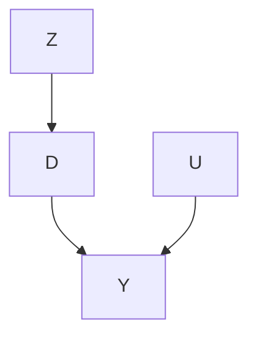
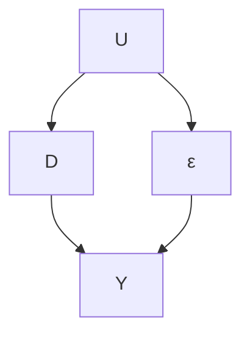
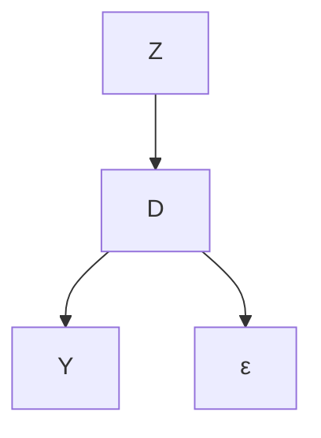

# 计量经济学视角（An Econometric Perspective）

第21章和第22章从实验视角讨论了**工具变量法（Instrumental Variable, IV）**。图23.1展示了这一讨论背后的直觉。




**图23.1：工具变量的因果图**

在存在不依从性的**鼓励设计（encouragement design）**中，$Z$ 是随机分配的，因此它与接受的治疗 $D$ 和结果 $Y$ 之间的**混杂因子（confounder）** $U$ 独立。重要的是，**治疗分配（treatment assignment）** $Z$ 对结果 $Y$ 没有任何直接影响。它作为接受的治疗 $D$ 的**工具变量（Instrumental Variable, IV）**，其含义是它仅通过接受的治疗 $D$ 影响结果 $Y$。这个工具变量是由实验者生成的。

在许多应用中，随机化是不可行的。那么，在治疗和结果之间存在未测量的混杂时，我们如何进行因果推断？计量经济学中的一个巧妙想法是寻找**自然实验（natural experiments）**来模仿鼓励设计的设置。为了在存在未测量混杂的情况下识别 $D$ 对 $Y$ 的因果效应，我们可以寻找另一个满足图23.1中图表假设的变量 $Z$。变量 $Z$ 必须满足以下条件：

1. 它应近似随机化，以便与未测量的混杂因子独立；
2. 它应改变 $D$ 的分布；
3. 它不应直接影响结果 $Y$。

如果所有这些条件都成立，那么 $Z$ 就是一个有效的工具变量。

本章将提供关于工具变量的传统计量经济学视角。它基于**线性回归（linear regression）**。Imbens 和 Angrist（1994）以及 Angrist 等人（1996）通过阐明这一视角与第21章和第22章中实验视角之间的联系，做出了基础性贡献。我将从例子开始，然后给出更多的代数细节。

## 23.1 工具变量研究实例（Examples of studies with IVs）

寻找因果推断的工具变量与其说是一门科学，不如说是一门艺术。后面章节中的代数细节并非统计学中最复杂的内容。然而，在实证研究中找到工具变量本质上具有挑战性。以下是一些著名的例子。

**例23.1** 在鼓励设计中，$Z$ 是随机分配的治疗，$D$ 是最终接受的治疗，$Y$ 是结果。如图23.1所示的工具变量假设在双盲试验中是合理的，如第21章所述。这是工具变量的理想情况。

**例23.2** Hearst 等人（1986）报告称，在越南时代征兵抽签中彩票号码低的男性随后有更高的死亡率。他们将此归因于兵役的负面影响。Angrist（1990）进一步报告称，在越南时代征兵抽签中彩票号码低的男性随后收入较低。他将此归因于兵役的负面影响。这些解释是合理的，因为彩票号码是随机生成的，彩票号码低的男性更可能服兵役，而且彩票号码不太可能影响随后的死亡率或收入。也就是说，图23.1是合理的。Angrist 等人（1996）使用工具变量框架重新分析了这些数据。这里，彩票号码是工具变量，兵役是治疗，死亡率或收入是结果。

**例23.3** Angrist 和 Krueger（1991）使用出生季度作为工具变量，研究了受教育年限对收入的影响。这个工具变量是合理的，因为出生季度具有**伪随机化（pseudo randomization）**特征。它影响受教育年限，因为（1）大多数州要求学生在他们满六岁的日历年度入学，以及（2）**义务教育法（compulsory schooling laws）**通常要求学生在十六岁生日前留在学校。更重要的是，出生季度不直接影响收入这一假设是合理的。

**例23.4** Angrist 和 Evans（1998）使用同胞性别构成作为工具变量，研究了家庭规模对母亲就业和工作情况的影响。这个工具变量是合理的，因为同胞性别构成具有伪随机化特征。此外，在美国，有两个同性孩子的父母比有两个不同性别孩子的父母更可能有第三个孩子。同胞性别构成不直接影响母亲的就业和工作情况这一假设也是合理的。

**例23.5** Card（1993）使用大学邻近度的地理变异作为工具变量，研究了受教育程度对工资的影响。具体来说，$Z$ 包含表示受试者是否在两年制大学或四年制大学附近长大的虚拟变量。虽然这项研究是经典的，但它可能是一个不好的工具变量例子，因为父母选择居住地点可能不是随机的，而且受试者成长的地方可能对随后的工资有影响。

**例23.6** Voight 等人（2012）基于**孟德尔随机化（Mendelian randomization）**研究了血浆高密度脂蛋白胆固醇对心脏病发作风险的因果效应。他们使用一些**单核苷酸多态性（single-nucleotide polymorphisms, SNPs）**作为高密度脂蛋白的遗传工具变量，这些多态性根据孟德尔第二定律与高密度脂蛋白和心脏病发作之间的未测量混杂因子是随机的，并且仅通过高密度脂蛋白影响心脏病发作。我将在第25章中提供关于孟德尔随机化的更多细节。

## 23.2 普通最小二乘法简述（Brief Review of the Ordinary Least Squares）

在讨论工具变量的计量经济学观点之前，我将首先回顾统计学中的**普通最小二乘法（Ordinary Least Squares, OLS）**（参见第A2章）。这是统计学中的一个标准主题。然而，它具有不同的数学表述形式，而表述形式的选择对解释很重要。

第一种观点基于**投影（projection）**。给定任何具有有限二阶矩的随机变量对 $(D, Y)$，将总体OLS系数定义为

$$
\beta = \arg \min _ {b} E (Y - D ^ {\mathsf {T}} b) ^ {2} = E (D D ^ {\mathsf {T}}) ^ {- 1} E (D Y),
$$

然后将残差定义为 $\varepsilon = Y - D ^ { \mathsf { T } } \beta$ 。根据定义，$Y$ 分解为

$$
Y = D ^ {\mathsf {T}} \beta + \varepsilon , \tag {23.1}
$$

这必须满足

$$
E (D \varepsilon) = 0.
$$

基于 $( D _ { i } , Y _ { i } ) _ { i = 1 } ^ { n } \stackrel { \mathrm { I I D } } { \sim } ( D , Y )$ ，$\beta$ 的OLS估计量为

$$
\hat {\beta} = \left(\sum_ {i = 1} ^ {n} D _ {i} D _ {i} ^ {\mathsf {T}}\right) ^ {- 1} \sum_ {i = 1} ^ {n} D _ {i} Y _ {i}.
$$

由于

$$
\hat {\beta} = \left(\sum_ {i = 1} ^ {n} D _ {i} D _ {i} ^ {\mathsf {T}}\right) ^ {- 1} \sum_ {i = 1} ^ {n} D _ {i} (D _ {i} ^ {\mathsf {T}} \beta + \varepsilon_ {i}) = \beta + \left(\sum_ {i = 1} ^ {n} D _ {i} D _ {i} ^ {\mathsf {T}}\right) ^ {- 1} \sum_ {i = 1} ^ {n} D _ {i} \varepsilon_ {i},
$$

我们可以证明，由于 $E ( \varepsilon D ) = 0$ ，$\hat { \beta }$ 是 $\beta$ 的**一致估计量（consistent estimator）**。$\operatorname { c o v } ( { \hat { \boldsymbol { \beta } } } )$ 的经典EHW稳健方差估计量为

$$
\hat {V} _ {\mathrm{EHW}} = \left(\sum_ {i = 1} ^ {n} D _ {i} D _ {i} ^ {\mathsf {T}}\right) ^ {- 1} \left(\sum_ {i = 1} ^ {n} \hat {\varepsilon} _ {i} ^ {2} D _ {i} D _ {i} ^ {\mathsf {T}}\right) \left(\sum_ {i = 1} ^ {n} D _ {i} D _ {i} ^ {\mathsf {T}}\right) ^ {- 1}
$$

其中 $\hat { \varepsilon } _ { i } = Y _ { i } - D _ { i } ^ { \mathsf { T } } \hat { \beta }$ 是残差。

第二种观点是将

$$
Y = D ^ {\mathsf {T}} \beta + \varepsilon , \tag {23.2}
$$

视为**数据生成过程（data generating process）**的真实模型。也就是说，给定随机变量 $( D , \varepsilon )$ ，我们基于线性方程（23.2）生成 $Y$ 。重要的是，在数据生成过程中，$\varepsilon$ 和 $D$ 可能相关，即 $E ( D \varepsilon ) \neq 0$ 。图23.2给出了这样一个例子。这与第一种观点存在根本差异，在第一种观点中，根据总体OLS的定义，$E ( \varepsilon D ) = 0$ 成立。因此，OLS估计量可能是不一致的：

$$
\hat {\beta} \rightarrow \beta + E (D D ^ {\mathsf {T}}) ^ {- 1} E (D \varepsilon) \neq \beta
$$

依概率收敛。

我以基于（23.2）的**内生（endogenous）**和**外生（exogenous）**回归变量的定义结束本节，尽管它们在计量经济学中的定义并非唯一。

**定义23.1** 当 $E ( \varepsilon D ) \neq 0$ 时，回归变量 $D$ 称为**内生的**；当 $E ( \varepsilon D ) = 0$ 时，回归变量 $D$ 称为**外生的**。

定义23.1中的术语是计量经济学中的标准术语。当 $E ( \varepsilon D ) \neq 0$ 时，我们也说存在**内生性（endogeneity）**；当 $E ( \varepsilon D ) = 0$ 时，我们也说存在**外生性（exogeneity）**。

在OLS的第一种观点中，内生性和外生性的概念不起任何作用，因为根据定义 $E ( \varepsilon D ) = 0$ 。持有第一种观点的统计学家通常觉得内生性和外生性的概念很奇怪，因此，觉得工具变量的想法不自然。要理解工具变量的计量经济学观点，我们必须转向OLS的第二种观点。

## 23.3 线性工具变量模型（Linear Instrumental Variable Model）

当 $D$ 是内生的时，OLS估计量是不一致的。我们必须使用额外的信息来构造 $\beta$ 的一致估计量。我将专注于以下线性工具变量模型：

**定义23.2（线性工具变量模型）** 我们有

$$
Y = D ^ {\mathsf {T}} \beta + \varepsilon ,
$$

<!-- footnote -->

- CD4细胞是抵抗感染的白细胞。

<!-- footnote end -->

<!-- footnote -->

- 这在非参数统计学中称为**局部线性回归（local linear regression）**，属于更广泛的**局部多项式回归（local polynomial regression）**（Fan和Gijbels，1996）。

<!-- footnote end -->

<!-- footnote -->

- 一般来说，最好对实验进行**盲法（blinding）**处理，以避免由安慰剂效应、患者期望等引起的各种偏倚。在**双盲试验（double blind trials）**中，医生和患者都不知道治疗情况；在**单盲试验（single blind trials）**中，患者不知道治疗情况，但医生知道。有时，进行双盲甚至单盲试验是不可能的。这些试验称为**开放试验（open trials）**。

<!-- footnote end -->

<!-- footnote -->

- 该理论通常假设 $\tau D$ 具有 $n ^ { - 1 / 2 }$ 的量级。在这种设定下，**依从者（compliers）**的比例随着 $n$ 趋于无穷而趋于0。工具变量方法只能识别一个比例趋于0的子组平均因果效应。这是用于理论分析的人为设定。在实践中很难证明这一假设的合理性。后续讨论不假设这一点。

<!-- footnote end -->





(a) E(Dε) ≠ 0  
(b) 对 ε 边缘化  
**图23.2：内生回归变量的不同表示**

满足

$$
E (\varepsilon Z) = 0. \tag {23.3}
$$

定义23.2中的线性工具变量模型可以通过以下因果图来说明：




上述线性工具变量模型允许 $E ( \varepsilon D ) \neq 0$ ，但要求一个替代的**矩条件（moment condition）**（23.3）。通过包含截距项使得 $E ( \varepsilon ) = 0$ ，新条件表明 $Z$ 与误差项 $\varepsilon$ 不相关。但任何随机生成的噪声都与 $\varepsilon$ 不相关，因此必须有一个额外条件来确保 $Z$ 对于估计 $\beta$ 是有用的。直观地说，这个额外条件要求 $Z$ 与 $D$ 相关，更技术性的细节如下所述。

数学要求（23.3）看起来很简单。然而，在实证研究中，找到满足（23.3）的一个或多个变量 $Z$ 是一个关键挑战。由于条件（23.3）涉及不可观测的 $\varepsilon$ ，它通常是**不可检验的（untestable）**。

## 23.4 恰好识别情形（The Just-Identified Case）

我们首先考虑 $Z$ 和 $D$ 具有相同维度且 $E ( Z D ^ { \mathsf { T } } )$ 满秩的情形。条件 $E ( \varepsilon Z ) = 0$ 意味着

$$
E \{Z (Y - D ^ {\mathsf {T}} \beta) \} = 0 \quad \Longrightarrow \quad E (Z Y) = E (Z D ^ {\mathsf {T}}) \beta
$$

$$
\implies \beta = E (Z D ^ {\mathsf {T}}) ^ {- 1} E (Z Y)
$$

若 $E ( Z D ^ { \mathsf { T } } )$ 非退化。**普通最小二乘法（Ordinary Least Squares, OLS）** 是 $E ( \varepsilon D ) = 0$ 时的特例，即 $D$ 本身作为自身的**工具变量（Instrumental Variable, IV）**。由此得到的**矩估计量（moment estimator）** 为

$$
\hat {\beta} _ {\mathrm{IV}} = \left(\sum_ {i = 1} ^ {n} Z _ {i} D _ {i} ^ {\mathsf {T}}\right) ^ {- 1} \sum_ {i = 1} ^ {n} Z _ {i} Y _ {i}. \tag {23.4}
$$

在包含截距项且 $D$ 和 $Z$ 均为标量的简单情形中，我们有

$$
\left\{ \begin{array}{l} Y = \alpha + \beta D + \varepsilon , \\ E (\varepsilon) = 0, \quad \operatorname{cov} (\varepsilon , Z) = 0, \end{array} \right.
$$

这意味着

$$
\operatorname{cov} (Z, Y) = \beta \operatorname{cov} (Z, D) \Longrightarrow \beta = \frac {\operatorname{cov} (Z , Y)}{\operatorname{cov} (Z , D)}.
$$

用 $\mathrm { v a r } ( Z )$ 对分子和分母进行标准化，可得

$$
\beta = \frac {\operatorname{cov} (Z , Y) / \operatorname{var} (Z)}{\operatorname{cov} (Z , D) / \operatorname{var} (Z)},
$$

这等于在 $Y$ 和 $D$ 分别对 $Z$ 的 OLS 拟合中 $Z$ 的系数之比。若 $Z$ 是二值变量，这些系数即为均值差，且 $\beta$ 简化为

$$
\beta = \frac {E (Y \mid Z = 1) - E (Y \mid Z = 0)}{E (D \mid Z = 1) - E (D \mid Z = 0)}.
$$

这与定理 21.1 中的识别公式相同。也就是说，对于二值 IV $Z$ 和二值处理变量 $D$，IV 估计量在**潜在结果框架（potential outcomes framework）**下恢复了**条件平均因果效应（Conditional Average Causal Effect, CACE）**。这是 Imbens 和 Angrist（1994）以及 Angrist 等人（1996）的一个关键结果。

## 23.5 过度识别情形（The Over-Identified Case）

第 23.4 节的讨论聚焦于恰好识别情形。当 $Z$ 的维度低于 $X$ 且 $E ( Z D ^ { \mathsf { T } } )$ 不满列秩时，方程 $E ( Z Y ) = E ( Z D ^ { \mathsf { T } } ) \beta$ 存在无穷多解。这就是**不可识别情形（underidentified case）**，此时即使使用 $Z$，系数 $\beta$ 也无法唯一确定。这是本书范围之外的一个具有挑战性的情形。在实践中，我们至少需要与内生回归变量数量相等的 IV。

当 $Z$ 的维度高于 $D$ 且 $E ( Z D ^ { \mathsf { T } } )$ 满列秩时，我们有多种方法从 $E ( Z Y ) = E ( Z D ^ { \mathsf { T } } ) \beta$ 确定 $\beta$。此外，样本类比

$$
n ^ {- 1} \sum_ {i = 1} ^ {n} Z _ {i} Y _ {i} = n ^ {- 1} \sum_ {i = 1} ^ {n} Z _ {i} D _ {i} ^ {\mathsf {T}} \beta
$$

可能无解，因为方程个数多于未知参数个数。

在这种情况下，一种计算技巧是**两阶段最小二乘法（Two-Stage Least Squares, TSLS）**估计量（Theil, 1953; Basmann, 1957）。这是一个巧妙的两步计算技巧。

**定义 23.3（两阶段最小二乘法）** 定义以 $Z$ 为 IV 的 $D$ 系数的 TSLS 估计量如下。

1. 将 $D$ 对 $Z$ 进行 OLS 回归，得到拟合值 $\hat { D } _ { i } ~ ( i = 1 , \ldots , n )$。若 $D _ { i }$ 是向量，则需逐分量进行 OLS 以得到 $\hat { D } _ { i }$。将拟合向量放入矩阵 $\hat { D }$，其行向量为 $\hat { D } _ { i } ^ { \mathsf { T } }$；
2. 将 $Y$ 对 $\hat { D }$ 进行 OLS 回归，得到系数 $\hat { \beta } _ { \mathrm { T S L S } }$。

为了理解 TSLS 为何有效，我们需要更多的代数推导。将其更明确地写为

$$
\hat {\beta} _ {\mathrm{TSLS}} = \left(\sum_ {i = 1} ^ {n} \hat {D} _ {i} \hat {D} _ {i} ^ {\mathsf {T}}\right) ^ {- 1} \sum_ {i = 1} ^ {n} \hat {D} _ {i} Y _ {i} \tag {23.5}
$$

$$
= \left(\sum_ {i = 1} ^ {n} \hat {D} _ {i} \hat {D} _ {i} ^ {\mathsf {T}}\right) ^ {- 1} \sum_ {i = 1} ^ {n} \hat {D} _ {i} (D _ {i} ^ {\mathsf {T}} \beta + \varepsilon_ {i})
$$

$$
= \left(\sum_ {i = 1} ^ {n} \hat {D} _ {i} \hat {D} _ {i} ^ {\mathsf {T}}\right) ^ {- 1} \sum_ {i = 1} ^ {n} \hat {D} _ {i} D _ {i} ^ {\mathsf {T}} \beta + \left(\sum_ {i = 1} ^ {n} \hat {D} _ {i} \hat {D} _ {i} ^ {\mathsf {T}}\right) ^ {- 1} \sum_ {i = 1} ^ {n} \hat {D} _ {i} \varepsilon_ {i}.
$$

第一阶段 OLS 拟合确保 $D _ { i } = \hat { D } _ { i } + \check { D } _ { i }$，且

$$
\sum_ {i = 1} ^ {n} \hat {D} _ {i} \check {D} _ {i} ^ {\mathsf {T}} = 0 \tag {23.6}
$$

是一个与 $D _ { i }$ 维度相同的零方阵。正交性（23.6）意味着

$$
\sum_ {i = 1} ^ {n} \hat {D} _ {i} D _ {i} ^ {\mathsf {T}} = \sum_ {i = 1} ^ {n} \hat {D} _ {i} \hat {D} _ {i} ^ {\mathsf {T}},
$$

这进一步意味着

$$
\hat {\beta} _ {\mathrm{TSLS}} = \beta + \left(\sum_ {i = 1} ^ {n} \hat {D} _ {i} \hat {D} _ {i} ^ {\mathsf {T}}\right) ^ {- 1} \sum_ {i = 1} ^ {n} \hat {D} _ {i} \varepsilon_ {i}. \tag {23.7}
$$

第一阶段 OLS 拟合也确保

$$
\hat {D} _ {i} = \hat {\Gamma} ^ {\mathsf {T}} Z _ {i} \tag {23.8}
$$

这意味着

$$
\hat {\beta} _ {\mathrm{TSLS}} = \beta + \left\{\hat {\Gamma} ^ {\mathsf {T}} \left(n ^ {- 1} \sum_ {i = 1} ^ {n} Z _ {i} Z _ {i} ^ {\mathsf {T}}\right) \hat {\Gamma} \right\} ^ {- 1} \hat {\Gamma} ^ {\mathsf {T}} \left(n ^ {- 1} \sum_ {i = 1} ^ {n} Z _ {i} \varepsilon_ {i}\right). \tag {23.9}
$$

基于（23.9），我们可以看出 TSLS 估计量的**一致性（consistency）**，因为项 $n ^ { - 1 } \sum _ { i = 1 } ^ { n } Z _ { i } \varepsilon _ { i }$ 的概率极限为 $E ( Z \varepsilon ) = 0$。我们也可以使用（23.9）来证明，当 $Z$ 和 $D$ 维度相同时，$\hat { \beta } _ { \mathrm { T S L S } }$ 在数值上与第 23.4 节定义的 $\hat { \beta } _ { \mathrm { I V } }$ 相同，这留作问题 23.1。

基于（23.7），我们可以如下获得标准误。我们首先得到残差 $\hat { \varepsilon } _ { i } = Y _ { i } - \hat { \beta } _ { \mathrm { T S L S } } ^ { \sf T } D _ { i }$，然后得到**稳健方差估计量（robust variance estimator）** 为

$$
\hat {V} _ {\mathrm{TSLS}} = \left(\sum_ {i = 1} ^ {n} \hat {D} _ {i} \hat {D} _ {i} ^ {\mathsf {T}}\right) ^ {- 1} \left(\sum_ {i = 1} ^ {n} \hat {\varepsilon} _ {i} ^ {2} \hat {D} _ {i} \hat {D} _ {i} ^ {\mathsf {T}}\right) \left(\sum_ {i = 1} ^ {n} \hat {D} _ {i} \hat {D} _ {i} ^ {\mathsf {T}}\right) ^ {- 1}.
$$

重要的是，$\hat { \varepsilon } _ { i }$ 并不是第二阶段 OLS 的残差 $Y _ { i } - \hat { \beta } _ { \mathrm { T S L S } } ^ { \mathsf { T } } \hat { D } _ { i }$，因此 $\hat { V } _ { \mathrm { T S L S } }$ 与第二阶段 OLS 的稳健方差估计量不同。

## 23.6 特例：单个内生处理变量的单个工具变量（A Special Case: A Single IV for a Single Endogenous Treatment）

本节聚焦于具有单个 IV 和单个内生处理变量的简单情形。该情形应用广泛。考虑以下**结构方程（structural equations）**：

$$
\left\{ \begin{array}{l} Y _ {i} = \beta_ {0} + \beta_ {1} D _ {i} + \beta_ {2} ^ {\mathsf {T}} X _ {i} + \varepsilon_ {i}, \\ D _ {i} = \gamma_ {0} + \gamma_ {1} Z _ {i} + \gamma_ {2} ^ {\mathsf {T}} X _ {i} + \varepsilon_ {2 i}, \end{array} \right. \tag {23.10}
$$

其中 $D _ { i }$ 是标量内生回归变量，代表感兴趣的处理变量（即 $E ( \varepsilon _ { i } D _ { i } ) \neq 0$），$Z_i$ 是 $D _ { i }$ 的标量 IV（即 $E ( \varepsilon _ { i } Z _ { i } ) = 0$），$X _ { i }$ 包含其他外生回归变量（即 $E ( \varepsilon _ { i } X _ { i } ) = 0$）。这是一个特例，其中 $D$ 被替换为 $( 1 , D , X )$，$Z$ 被替换为 $( 1 , Z , X )$。

### 23.6.1 两阶段最小二乘法（Two-stage least squares）

定义 23.3 中的 TSLS 估计量简化为以下形式。

**定义 23.4（具有单个内生回归变量的 TSLS）** 基于（23.10），TSLS 估计量包含以下两步：

1. 将 $D$ 对 $( 1 , Z , X )$ 进行 OLS 回归，得到拟合值 $\hat { D } _ { i } ~ ( i = 1 , \ldots , n )$；
2. 将 $Y$ 对 $( 1 , { \hat { D } } , X )$ 进行 OLS 回归，得到系数 $\hat { \beta } _ { \mathrm { T S L S } }$，特别是 $\hat { D }$ 的系数 $\hat { \beta } _ { 1 , \mathrm { T S L S } }$。

## 23.6.2 间接最小二乘法（Indirect Least Squares）

结构方程（23.10）意味着：

$$
\begin{array}{l} Y _ {i} = \beta_ {0} + \beta_ {1} (\gamma_ {0} + \gamma_ {1} Z _ {i} + \gamma_ {2} ^ {\mathsf {T}} X _ {i} + \varepsilon_ {2 i}) + \beta_ {2} ^ {\mathsf {T}} X _ {i} + \varepsilon_ {i} \\ = \left(\beta_ {0} + \beta_ {1} \gamma_ {0}\right) + \beta_ {1} \gamma_ {1} Z _ {i} + \left(\beta_ {2} + \beta_ {1} \gamma_ {2}\right) ^ {\mathsf {T}} X _ {i} + \left(\varepsilon_ {i} + \beta_ {1} \varepsilon_ {2 i}\right). \\ \end{array}
$$

定义 $\Gamma _ { 0 } = \beta _ { 0 } + \beta _ { 1 } \gamma _ { 0 } , \Gamma _ { 1 } = \beta _ { 1 } \gamma _ { 1 } , \Gamma _ { 2 } = \beta _ { 2 } + \beta _ { 1 } \gamma _ { 2 }$ 和 $\varepsilon _ { 1 i } = \varepsilon _ { i } + \beta _ { 1 } \varepsilon _ { 2 i }$ 。我们得到以下方程组：

$$
\left\{ \begin{array}{l} Y _ {i} = \Gamma_ {0} + \Gamma_ {1} Z _ {i} + \Gamma_ {2} ^ {\mathsf {T}} X _ {i} + \varepsilon_ {1 i}, \\ D _ {i} = \gamma_ {0} + \gamma_ {1} Z _ {i} + \gamma_ {2} ^ {\mathsf {T}} X _ {i} + \varepsilon_ {2 i}, \end{array} \right. \tag {23.11}
$$

这被称为 **简化形式（reduced form）**。我们感兴趣的参数等于两个系数的比值：

$$
\beta_ {1} = \Gamma_ {1} / \gamma_ {1}.
$$

在简化形式中，左侧是因变量 $Y$ 和 $D$，右侧是满足以下条件的外生变量 $Z$ 和 $X$：

$$
E (Z \varepsilon_ {1 i}) = E (Z \varepsilon_ {2 i}) = 0, \quad E (X \varepsilon_ {1 i}) = E (X \varepsilon_ {2 i}) = 0.
$$

更重要的是，**普通最小二乘法（Ordinary Least Squares, OLS）** 为简化形式中的系数提供了一致估计量。

简化形式（23.11）表明，两个 OLS 系数 $\hat { \Gamma } _ { 1 }$ 和 $\hat { \gamma } _ { 1 }$ 的比值是 $\beta _ { 1 }$ 的一个合理估计量。这被称为 **间接最小二乘法（Indirect Least Squares, ILS）** 估计量：

$$
\hat {\beta} _ {1, \mathrm{ILS}} \equiv \hat {\Gamma} _ {1} / \hat {\gamma} _ {1}.
$$

有趣的是，在（23.10）下，它在数值上与 **两阶段最小二乘法（Two-Stage Least Squares, TSLS）** 估计量相同。

**定理 23.1** 在单一内生处理变量和单一 IV 的情况下，我们有：

$$
\hat {\beta} _ {1, \mathrm{ILS}} = \hat {\beta} _ {1, \mathrm{TSLS}}.
$$

定理 23.1 是一个代数事实。Imbens (2014, Section A.3) 指出了这一点，但没有给出证明。我将其证明留作问题 23.2。比值公式清楚地表明，当存在弱工具变量（即 $\gamma _ { 1 }$ 接近零）时，TSLS 估计量具有较差的有限样本性质。

## 23.6.3 弱 IV（Weak IV）

以下推断过程更简单、更透明，并且对弱 IV 更稳健，尽管计算量更大。简化形式（23.11）也意味着：

$$
Y _ {i} - b D _ {i} = (\Gamma_ {0} - b \gamma_ {0}) + (\Gamma_ {1} - b \gamma_ {1}) Z _ {i} + (\Gamma_ {2} - b \gamma_ {2}) ^ {\mathsf {T}} X _ {i} + (\varepsilon_ {1 i} - b \varepsilon_ {2 i}). (2 3. 1 2)
$$

在真实值 $b = \beta _ { 1 }$ 处，$Z _ { i }$ 的系数必须为 0。这个简单的事实通过反转对 $H _ { 0 } ( b ) : \beta _ { 1 } = b$ 的检验，为 $\beta _ { 1 }$ 提供了一个置信区间：

$$
\left\{b: \left| t _ {Z} (b) \right| \leq z _ {\alpha} \right\},
$$

其中 $t _ { Z } ( b )$ 是基于使用 **EHW 标准误（EHW standard error）** 对（23.12）进行 OLS 拟合得到的 $Z$ 系数的 t 统计量。这个置信区间比基于 TSLS 估计量的 Wald 型置信区间更稳健。它类似于第 21 章讨论的 **Fieller–Anderson–Rubin 置信区间**。这个过程使得 TSLS 估计量变得不必要，更重要的是，如果目标是在（23.10）下检验 $\beta _ { 1 } = 0$，我们只需要基于简化形式运行 $Y$ 的 OLS 拟合。

## 23.7 应用（Application）

Card (1993) 使用了 **全国青年男性纵向调查（National Longitudinal Survey of Young Men）** 来估计教育对收入的因果效应。该数据集包含 3010 名在 1966 年年龄在 14 至 24 岁之间的男性，Card (1993) 利用大学邻近度的地理差异作为教育的 IV。这里，$Z$ 是在四年制大学附近长大的指示变量，$D$ 衡量受教育年限，结果变量 $Y$ 是 1976 年的对数工资，范围从 4.6 到 7.8。额外的协变量包括 `ace`、`age` 和 `age` 的平方、一个表示与双亲、单亲母亲或双亲同住的分类变量，以及总结过去居住区域的变量。

```txt
> library("car")
>
> ## Card Data
> card.data = read.csv("card1995.csv")
> Y = card.data[, "lwage"]
> D = card.data[, "educ"]
> Z = card.data[, "nearc4"]
> X = card.data[, c("exper", "expersq", "black", "south", "smsa", "reg661", "reg662", "reg663", "reg664", "reg665", "reg666", "reg667", "reg668", "smsa66")]
> X = as.matrix(X)
```

基于 TSLS，点估计值为 0.132，95% 置信区间为 [0.026, 0.237]。

```txt
> Dhat = lm(D ~ Z + X)$fitted.values
> tslsreg = lm(Y ~ Dhat + X)
> tslsest = coef(tslsreg)[2]
> ## correct se by changing the residuals
> res.correct = Y - cbind(1, D, X) % * %coef(tslsreg)
> tslsreg$residuals = as.vector(res.correct)
> tslsse = sqrt(hccm(tslsreg, type = "hc0")[2, 2])
> res = c(tslsest, tslsest - 1.96*tslsse, tslsest + 1.96*tslsse)
> names(res) = c("est", "l.ci", "u.ci")
> round(res, 3)
    est l.ci u.ci
0.132 0.026 0.237
```

图 23.3 显示了一系列关于 $D$ 系数的检验的 p 值。它还暗示了基于反转检验得到的 $D$ 系数的 95% 置信区间，即 [0.028, 0.282]。

```diff
> BetaAR = seq(-0.1, 0.4, 0.001)
> PvalueAR = sapply(BetaAR,
+    function(b){
+    Y_b = Y - b*D
+    ARreg = lm(Y_b ~ Z + X)
+    coefZ = coef(ARreg)[2]
+    seZ = sqrt(hccm(ARreg)[2, 2])
+    Tstat = coefZ/seZ
+    (1 - pnorm(abs(Tstat))) * 2
+    })
> point.est = BetaAR[which.max(PvalueAR)]
> point.est
[1] 0.132
> ARCI = range(BetaAR[PvalueAR >= 0.05])
> ARCI
[1] 0.028 0.282
```

比较以上两种方法，置信下限非常接近，但由于 TSLS 估计量的分布可能存在较重的右尾，置信上限略有不同。

## 23.8 课后作业（Homework）

**23.1** 第 23.5 节中关于 TSLS 的更多代数运算

1.  证明（23.8）中的 $\Gamma$ 等于：

$$
\hat {\Gamma} = \left(\sum_ {i = 1} ^ {n} Z _ {i} Z _ {i} ^ {\mathsf {T}}\right) ^ {- 1} \sum_ {i = 1} ^ {n} Z _ {i} D _ {i} ^ {\mathsf {T}}.
$$

2.  证明如果 $Z$ 和 $D$ 具有相同的维度，并且：

$$
n ^ {- 1} \sum_ {i = 1} ^ {n} Z _ {i} Z _ {i} ^ {\mathsf {T}}, \quad n ^ {- 1} \sum_ {i = 1} ^ {n} Z _ {i} D _ {i} ^ {\mathsf {T}}
$$

都是可逆的，那么（23.5）中定义的 $\hat { \beta } _ { \mathrm { T S L S } }$ 简化为（23.4）中定义的 $\hat { \beta } _ { \mathrm { I V } }$。

**23.2** TSLS 与 ILS 的等价性

证明定理 23.1。

提示：使用 **Frisch–Waugh–Lovell 定理**。

**23.3** 线性工具变量模型中的控制函数（Control Function）

下面的定义 23.5 与上面的定义 23.3 类似。

**定义 23.5（控制函数）** 定义控制函数估计量 $\hat { \beta } _ { \mathrm { C F } }$ 如下：

1.  对 $D$ 关于 $Z$ 和 $X$ 运行 OLS，并获得残差 $\breve { D } _ { i } \ ( i = 1 , \ldots , n )$ 。如果 $D _ { i }$ 是一个向量，那么我们需要逐分量运行 OLS 以获得 ${ \check { D } } _ { i }$ 。将残差向量放入一个矩阵 $\check { D }$ 中，其行向量为 $\check { D } _ { i } ^ { \mathsf { T } }$ ；
2.  对 $Y$ 关于 $D$ 和 ${ \check { D } } _ { i }$ 运行 OLS，并获得 $D$ 的系数 $\hat { \beta } _ { \mathrm { C F } }$ 。

证明 $\hat { \beta } _ { \mathrm { C F } } = \hat { \beta } _ { \mathrm { T S L S } }$ 。

备注：在定义 23.5 中，来自步骤 1 的 $\check { D }$ 被称为步骤 2 的控制函数。Hausman (1978) 指出了这一结果。Wooldridge (2015) 对更复杂模型中的控制函数方法进行了更一般的讨论。

提示：使用问题 A2.3 和 A2.4 中的结果。

## 23.4 数据分析：Efron and Feldman (1991)

Efron and Feldman (1991) 是在 **潜在结果框架（potential outcomes framework）** 下处理 **不依从性（noncompliance）** 的早期研究之一。原始的随机实验——**脂质研究诊所冠心病一级预防试验（Lipid Research Clinics Coronary Primary Prevention Trial, LRC-CPPT）**——旨在评估药物考来烯胺（cholestyramine）对胆固醇水平的影响。在数据集 EF.csv 中，第一列包含治疗组和对照组的二元指示变量，第二列包含实际服用的名义考来烯胺剂量的比例，最后三列是胆固醇水平。请注意，个体不知道他们被分配到考来烯胺组还是安慰剂组，但不良副作用的差异可能导致不同治疗状态下的依从行为差异。所有个体在相同的时间段内被分配了相同名义剂量的药物或安慰剂。第 3 列 $C _ { 3 }$ 是在关于低胆固醇饮食益处的沟通之前测量的，第 4 列 $C _ { 4 }$ 是在此建议之后但在随机分配到考来烯胺或安慰剂之前测量的，第 5 列 $C _ { 5 }$ 是随机化后胆固醇读数的平均值，该平均值是对研究中所有个体平均 7.3 年时间内每两个月的读数取平均得到的。Efron and Feldman (1991) 将胆固醇水平的变化作为最终感兴趣的结果，定义为 $C _ { 5 } - 0 . 2 5 C _ { 3 } - 0 . 7 5 C _ { 4 }$ 。原始论文包含更详细的描述。

该数据集比课堂上讨论的不依从性问题更复杂。你可以根据自己对问题的理解进行分析，但需要证明你选择的方法的合理性。对于这个问题没有黄金标准解决方案。

## 23.5 推荐阅读（Recommended Reading）

Imbens (2014) 从计量经济学家的角度对 IV 进行了阐述。