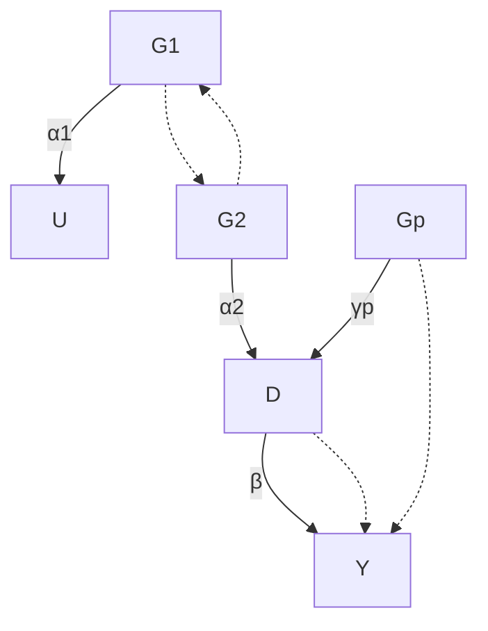

# 工具变量方法的应用：孟德尔随机化（Application of the Instrumental Variable Method: Mendelian Randomization）

Katan (1986) 关注的是表明低血清胆固醇水平与癌症风险相关的观察性研究。然而，正如我们所讨论的，观察性研究存在**未测量的混杂因素（unmeasured confounding）**。因此，很难将表面上的关联解释为因果关系。在 Katan (1986) 研究的特定问题中，甚至可能是癌症早期阶段反向导致了低血清胆固醇水平。使用标准的流行病学研究来厘清血清胆固醇水平对癌症的因果效应似乎是一个难题。Katan (1986) 认为，**载脂蛋白 E 基因（Apolipoprotein E genes）**与血清胆固醇水平相关，但不会直接影响癌症状态。因此，如果低血清胆固醇水平导致癌症，我们应该观察到在具有和不具有导致不同血清胆固醇水平的基因型的人群中，癌症风险存在差异。用我们因果推断的语言来说，Katan (1986) 提出将载脂蛋白 E 基因用作**工具变量（Instrumental Variables, IVs）**。

Katan (1986) 没有进行任何数据分析，只是提出了一个概念性设计，该设计不仅可以解决未测量的混杂问题，还可以解决反向因果关系。此后，得益于现代**全基因组关联研究（genome-wide association studies）**，开展了更复杂和精细的研究。这些研究在流行病学研究中将遗传信息用作暴露的工具变量，以估计暴露对结果的因果效应。它们的动机都源于孟德尔第二定律，即**自由组合定律（law of random assortment）**，该定律表明一个性状的遗传独立于其他性状的遗传。因此，使用遗传信息作为工具变量的方法被称为**孟德尔随机化（Mendelian Randomization, MR）**。

## 25.1 背景与动机（Background and motivation）

图示上，图 25.1 展示了处理 D、结果 Y、未测量混杂因素 U 以及遗传工具变量 $G _ { 1 } , \ldots , G _ { p }$ 的因果图。在许多孟德尔随机化研究中，遗传工具变量是**单核苷酸多态性（single nucleotide polymorphisms, SNPs）**。由于**多效性（pleiotropy）**，遗传工具变量可能对感兴趣的结果有直接影响，因此图 25.1 也允许违反**排他性限制假设（exclusion restriction assumption）**。




图 25.1：孟德尔随机化的因果图

标准的线性工具变量模型假设工具变量对结果没有直接影响。下面的定义 25.1 给出了结构形式和简化形式。

**定义 25.1（线性工具变量模型）** 标准线性工具变量模型

$$
Y = \beta_ {0} + \beta D + \beta_ {u} U + \varepsilon_ {Y}, \tag {25.1}
$$

$$
D = \gamma_ {0} + \gamma_ {1} G _ {1} + \dots + \gamma_ {p} G _ {p} + \gamma_ {u} U + \varepsilon_ {D}, \tag {25.2}
$$

其简化形式为

$$
Y = \beta_ {0} + \beta \gamma_ {0} + \beta \gamma_ {1} G _ {1} + \dots + \beta \gamma_ {p} G _ {p} + (\beta_ {u} + \beta_ {0} \gamma_ {u}) U + \varepsilon_ {Y}, \tag {25.3}
$$

$$
D = \gamma_ {0} + \gamma_ {1} G _ {1} + \dots + \gamma_ {p} G _ {p} + \gamma_ {u} U + \varepsilon_ {D}, \tag {25.4}
$$

下面的定义 25.2 允许违反排他性限制。那么，$G _ { 1 } , \ldots , G _ { p }$ 就不是有效的工具变量。

**定义 25.2（可能包含无效工具变量的线性模型）** 线性模型

$$
Y = \beta_ {0} + \beta D + \alpha_ {1} G _ {1} + \dots + \alpha_ {p} G _ {p} + \beta_ {u} U + \varepsilon_ {Y}, \tag {25.5}
$$

$$
D = \gamma_ {0} + \gamma_ {1} G _ {1} + \dots + \gamma_ {p} G _ {p} + \gamma_ {u} U + \varepsilon_ {D}, \tag {25.6}
$$

其简化形式为

$$
Y = (\beta_ {0} + \beta \gamma_ {0}) + (\alpha_ {1} + \beta \gamma_ {1}) G _ {1} + \dots + (\alpha_ {p} + \beta \gamma_ {p}) G _ {p}
$$

$$
+ (\beta_ {u} + \beta \gamma_ {u}) U + \varepsilon_ {Y}, \tag {25.7}
$$

$$
D = \gamma_ {0} + \gamma_ {1} G _ {1} + \dots + \gamma_ {p} G _ {p} + \gamma_ {u} U + \varepsilon_ {D}. \tag {25.8}
$$

因此，在具有排他性限制的定义 25.1 中，我们有

$$
\Gamma_ {j} = \beta \gamma_ {j}, (j = 1, \ldots , p);
$$

在没有排他性限制的定义 25.2 中，我们有

$$
\Gamma_ {j} = \alpha_ {j} + \beta \gamma_ {j}, (j = 1, \ldots , p).
$$

如果我们有个体数据，我们可以应用经典的**两阶段最小二乘（Two-Stage Least Squares, TSLS）**估计量来估计定义 25.1 中线性工具变量模型下的 $\beta$ 。然而，大多数孟德尔随机化研究没有个体数据，而是有来自多个全基因组关联研究的**汇总统计量（summary statistics）**。一个典型的情境包括处理对遗传工具变量的回归系数：

$$
\hat {\gamma} _ {1} \rightarrow \gamma_ {1}, \dots , \hat {\gamma} _ {p} \rightarrow \gamma_ {p} \tag {25.9}
$$

依概率收敛，其标准误为

$$
\mathrm{se} _ {D 1}, \dots , \mathrm{se} _ {D p}, \tag {25.10}
$$

以及结果对遗传工具变量的回归系数：

$$
\hat {\Gamma} _ {1} \rightarrow \Gamma_ {1}, \dots , \hat {\Gamma} _ {p} \rightarrow \Gamma_ {p} \tag {25.11}
$$

依概率收敛，其标准误为

$$
\operatorname{se} _ {Y 1}, \dots , \operatorname{se} _ {Y p}. \tag {25.12}
$$

我将重点关注基于上述汇总统计量对 $\beta$ 的统计推断。为简单起见，我们假设 (25.9) 和 (25.11) 中的估计量是联合独立的，它们都是渐近正态的，并且 (25.10) 和 (25.12) 中的标准误是固定且已知的。渐近正态性通常可以通过回归系数的中心极限定理来证明。标准误是对真实标准误的准确估计。因此，唯一微妙的假设是 (25.9) 和 (25.11) 中回归系数的联合独立性。$\hat { \gamma } _ { j }$ 和 $\hat { \Gamma } _ { j }$ 的独立性是合理的，因为它们通常是基于不同的样本计算的。如果 $G _ { j }$ 是独立的，并且 D 的真实线性模型在**同方差（homoskedastic）**误差项下成立，那么 $\hat { \gamma } _ { j }$ 之间的独立性也是合理的¹。$\hat { \Gamma } _ { j }$ 之间的独立性可以通过类似的论证得到。

## 25.2 基于汇总统计量的孟德尔随机化（MR based on summary statistics）

### 25.2.1 固定效应估计量（Fixed-effect estimator）

根据定义 25.1，$\alpha _ { j } = 0$ ，这意味着对于所有 $j$ ，都有 $\beta = \Gamma _ { j } / \gamma _ { j }$ 。一种简单的方法基于所谓的**元分析（meta-analysis）**(Bowden et al., 2018)，即

## 304 第25章 工具变量方法的应用：孟德尔随机化

合并多个估计量 $\hat { \beta } _ { j } = \hat { \Gamma } _ { j } / \hat { \gamma } _ { j }$ 来估计共同参数 $\beta$ 。使用**德尔塔方法（delta method）**（参见示例 $\operatorname { A 1 . 3 }$ ），$\hat { \beta } _ { j }$ 的近似平方标准误为

$$
\mathrm{se} _ {j} ^ {2} = (\mathrm{se} _ {Y j} ^ {2} + \hat {\beta} _ {j} ^ {2} \mathrm{se} _ {D j} ^ {2}) / \hat {\gamma} _ {j} ^ {2}.
$$

因此，估计 $\beta$ 的最佳线性组合是基于方差倒数的**费舍尔加权（Fisher weighting）**：

$$
\hat {\beta} _ {\mathrm{fisher0}} = \frac {\sum_ {j = 1} ^ {p} \hat {\beta} _ {j} / \mathrm{se} _ {j} ^ {2}}{\sum_ {j = 1} ^ {p} 1 / \mathrm{se} _ {j} ^ {2}}
$$

其方差为 $( \sum _ { j = 1 } ^ { p } 1 / \mathrm { s e } _ { j } ^ { 2 } ) ^ { - 1 }$ 。忽略由 $\mathrm { s e } _ { D j }$ 量化的 $\hat { \gamma } _ { j }$ 的不确定性后，该估计量简化为

$$
\hat {\beta} _ {\mathrm{fisher1}} = \frac {\sum_ {j = 1} ^ {p} \hat {\beta} _ {j} \hat {\gamma} _ {j} ^ {2} / \mathrm{se} _ {Y j} ^ {2}}{\sum_ {j = 1} ^ {p} \hat {\gamma} _ {j} ^ {2} / \mathrm{se} _ {Y j} ^ {2}} = \frac {\sum_ {j = 1} ^ {p} \hat {\Gamma} _ {j} \hat {\gamma} _ {j} / \mathrm{se} _ {Y j} ^ {2}}{\sum_ {j = 1} ^ {p} \hat {\gamma} _ {j} ^ {2} / \mathrm{se} _ {Y j} ^ {2}},
$$

其方差为 $\textstyle ( \sum _ { j = 1 } ^ { p } 1 \hat { \gamma } _ { j } ^ { 2 } / \mathrm { s e } _ { Y j } ^ { 2 } ) ^ { - 1 }$ 。基于 $\hat { \beta } _ { \mathrm { f i s h e r 1 } }$ 的推断是次优的，尽管它在实践中使用更广泛 (Bowden et al., 2018)。

关注次优但更简单的估计量 $\hat { \beta } _ { \mathrm { f i s h e r 1 } }$ 。根据定义 25.2，我们可以证明

$$
\hat {\beta} _ {\mathrm{fisher1}} \rightarrow \frac {\sum_ {j = 1} ^ {p} \Gamma_ {j} \gamma_ {j} / \mathrm{se} _ {Y j} ^ {2}}{\sum_ {j = 1} ^ {p} \gamma_ {j} ^ {2} / \mathrm{se} _ {Y j} ^ {2}} = \beta + \frac {\sum_ {j = 1} ^ {p} \alpha_ {j} \gamma_ {j} / \mathrm{se} _ {Y j} ^ {2}}{\sum_ {j = 1} ^ {p} \gamma_ {j} ^ {2} / \mathrm{se} _ {Y j} ^ {2}}
$$

依概率收敛。如果对所有 $j$ 都有 $\alpha _ { j } = 0$ ，则 $\hat { \beta } _ { \mathrm { f i s h e r 1 } }$ 是一致的。即使不满足此条件，只要 $\alpha _ { j }$ 和 $\gamma _ { j }$ 经过 $1 / \mathrm { s e } _ { Y j } ^ { 2 }$ 加权后的内积为零，$\hat { \beta } _ { \mathrm { f i s h e r 1 } }$ 仍可能是一致的。如果我们有许多遗传工具变量，并且由 $\alpha _ { j }$ 表示的排他性限制的违反是从均值为零的分布中独立随机抽取的，则此条件成立。

### 25.2.2 埃格尔回归（Egger regression）

从定义 25.1 开始。对于真实参数，我们有

$$
\Gamma_ {j} = \beta \gamma_ {j} \quad (j = 1, \dots , p);
$$

对于估计量，上述恒等式仅近似成立

$$
\hat {\Gamma} _ {j} \approx \beta \hat {\gamma} _ {j} (j = 1, \dots , p).
$$

这看起来是一个关于 $\{ \hat { \Gamma } _ { j } \} _ { j = 1 } ^ { p }$ 对 $\{ \hat { \gamma } _ { j } \} _ { j = 1 } ^ { p }$ 的经典**普通最小二乘（Ordinary Least Squares, OLS）**问题。我们可以对 $\hat { \Gamma } _ { j }$ 关于 $\hat { \gamma } _ { j }$ 进行 OLS 拟合（带或不带截距项，可能使用 $w _ { j }$ 进行加权），以估计 $\beta$ 。由于第 A2.5 节中回顾的**加权最小二乘（Weighted Least Squares, WLS）**的代数性质，以下结果成立。

不带截距项时，$\hat { \gamma } _ { j }$ 的系数为

$$
\hat {\beta} _ {\mathrm{egger1}} = \frac {\sum_ {j = 1} ^ {p} \hat {\gamma} _ {j} \hat {\Gamma} _ {j} w _ {j}}{\sum_ {j = 1} ^ {p} \hat {\gamma} _ {j} ^ {2} w _ {j}},
$$

如果 $w _ { j } = 1 / \mathrm { s e } _ { Y j } ^ { 2 }$ ，则此式简化为 $\hat { \beta } _ { \mathrm { f i s h e r 1 } }$ 。因此，埃格尔回归比第 25.2.1 节中的固定效应估计量更通用。

带截距项时，$\hat { \gamma } _ { j }$ 的系数为

$$
\hat {\beta} _ {\mathrm{egger0}} = \frac {\sum_ {j = 1} ^ {p} (\hat {\gamma} _ {j} - \hat {\gamma} _ {w}) (\hat {\Gamma} _ {j} - \hat {\Gamma} _ {w}) w _ {j}}{\sum_ {j = 1} ^ {p} (\hat {\gamma} _ {j} - \hat {\gamma} _ {w}) ^ {2} w _ {j}}
$$

其中 $\begin{array} { r } { \hat { \gamma } _ { w } = \sum _ { j = 1 } ^ { p } \hat { \gamma } _ { j } w _ { j } / \sum _ { j = 1 } ^ { p } w _ { j } } \end{array}$ 和 $\begin{array} { r } { \hat { \Gamma } _ { w } = \sum _ { j = 1 } ^ { p } \hat { \Gamma } _ { j } w _ { j } / \sum _ { j = 1 } ^ { p } w _ { j } } \end{array}$ 分别是 $\hat { \gamma } _ { j }$ 和 $\hat { \Gamma } _ { j }$ 的加权平均值。即使在定义 25.2 下不假设所有 $\gamma _ { j }$ 为零，我们也有

$$
\hat {\beta} _ {\mathrm{egger0}} \to \frac {\sum_ {j = 1} ^ {p} (\gamma_ {j} - \gamma_ {w}) (\Gamma_ {j} - \Gamma_ {w}) w _ {j}}{\sum_ {j = 1} ^ {p} (\gamma_ {j} - \gamma_ {w}) ^ {2} w _ {j}} = \beta + \frac {\sum_ {j = 1} ^ {p} (\gamma_ {j} - \gamma_ {w}) (\alpha_ {j} - \alpha_ {w}) w _ {j}}{\sum_ {j = 1} ^ {p} (\gamma_ {j} - \gamma_ {w}) ^ {2} w _ {j}}
$$

依概率收敛，其中 $\gamma _ { w } , \Gamma _ { w }$ 和 $\alpha _ { w }$ 是真实参数的相应加权平均值。因此，只要 $\alpha _ { j }$ 对 $\gamma _ { j }$ 的加权最小二乘系数为零，$\hat { \beta } _ { \mathrm { e g g e r 0 } }$ 对于 $\beta$ 就是一致的。这比所有 $j$ 都有 $\alpha _ { j } = 0$ 的条件更弱。如果 $\gamma _ { j }$ 和 $\alpha _ { j }$ 是独立随机变量的实现，则该较弱的条件成立，这被称为**工具强度独立于直接效应（Instrument Strength Independent of Direct Effect, InSIDE）**假设 (Bowden et al., 2015)。更有趣的是，埃格尔回归的截距项为

$$
\hat {\alpha} _ {\mathrm{egger0}} = \hat {\Gamma} _ {w} - \hat {\beta} _ {\mathrm{egger0}} \hat {\gamma} _ {w},
$$

在 InSIDE 假设下，它依概率收敛到

$$
\Gamma_ {w} - \beta \gamma_ {w} = \alpha_ {w}
$$

因此，截距项估计了直接效应的加权平均值。

## 25.3 一个例子（An example）

我使用 `mr.raps` 包中的 `bmi.sbp` 数据来说明埃格尔回归。

```txt
> library("mr.raps")
> bmisbp = subset(bmi.sbp,
```

306 第25章 工具变量方法的应用：孟德尔随机化

```txt
+ select = c("beta.exposure", "beta.outcome", "se.exposure", "se.outcome"))
```

带截距项和不带截距项的埃格尔回归给出了非常相似的结果。

```txt
> mr.egger = lm(beta.outcome ~ 0 + beta.exposure,
+    data = bmisbp,
+    weights = 1/se.outcome^2)
> summary(mr.egger)
```

调用（Call）:

```javascript
lm(formula = beta.outcome ~ 0 + beta.exposure, data = bmisbp, weights = 1/se.outcome^2)
```

加权残差（Weighted Residuals）:

```txt
Min 1Q Median 3Q Max
-5.6999 -1.1691 -0.0199 1.0073 11.3449
```

系数（Coefficients）:

```txt
Estimate Std. Error t value Pr(>|t|)
beta.exposure 0.3173 0.1106 2.869 0.00468 **
```

```txt
Residual standard error: 2.052 on 159 degrees of freedom
Multiple R-squared: 0.04921, Adjusted R-squared: 0.04323
F-statistic: 8.229 on 1 and 159 DF, p-value: 0.004682
```

>

```txt
> mr.egger.w = lm(beta.outcome ~ beta.exposure,
+    data = bmisbp,
+    weights = 1/se.outcome^2)
> summary(mr.egger.w)
```

调用（Call）:

```javascript
lm(formula = beta.outcome ~ beta.exposure, data = bmisbp, weights = 1/se.outcome^2)
```

加权残差（Weighted Residuals）:

```txt
Min 1Q Median 3Q Max
-5.7099 -1.1774 -0.0296 0.9969 11.3393
```

系数（Coefficients）:

```txt
Estimate Std. Error t value Pr(>|t|)
(Intercept) 0.0001133 0.0020794 0.055 0.95660
beta.exposure 0.3172989 0.1109485 2.860 0.00481 **
```

```txt
Residual standard error: 2.059 on 158 degrees of freedom
Multiple R-squared: 0.04922, Adjusted R-squared: 0.0432
F-statistic: 8.179 on 1 and 158 DF, p-value: 0.004811
```

## 25.4 对基于孟德尔随机化的分析的批评（Critiques of the analysis based on Mendelian randomization）

孟德尔随机化是工具变量思想的一个应用。它依赖于强假设。我从概念、生物学和技术三个角度提出三组批评。

从概念上讲，大多数基于孟德尔随机化的研究从**潜在结果（potential outcomes）**的角度来看，其处理定义不明确。例如，处理通常被定义为胆固醇水平或**身体质量指数（body mass index）**。它们是复合变量，可能对应复杂、非唯一的假设实验定义。**稳定单位处理值假设（Stable Unit Treatment Value Assumption, SUTVA）**通常不适用于这些处理。

从生物学上讲，工具变量分析的基本假设可能不成立。孟德尔第二定律确保了不同性状的遗传是独立的。然而，它并不能确保候选工具变量与处理和结果之间的隐藏混杂因素无关。

## 308 第25章 工具变量方法的应用：孟德尔随机化

这些工具变量可能对混杂因素有直接影响。一些未测量的基因也可能同时影响工具变量和混杂因素。孟德尔第二定律也不能确保排他性限制假设。工具变量可能有通往结果的其他因果路径，而不是通过感兴趣的处理这条路径。

从技术上讲，孟德尔随机化的统计假设相当强。显然，线性工具变量模型是一个很强的建模假设。$\hat { \gamma } _ { j }$ 和 $\hat { \Gamma } _ { j }$ 的独立性也很强。数据收集过程中的其他问题可能进一步使工具变量假设的解释复杂化。例如，处理和结果通常存在测量误差，而全基因组关联研究通常基于**病例对照设计（case-control design）**。

VanderWeele et al. (2014) 是一篇优秀的综述文章，讨论了孟德尔随机化中的方法论挑战。

## 25.5 课后作业（Homework Problems）

### 25.1 数据分析（Data analysis）

分析 R 包 `mr.raps` 中的 `bmi.bmi` 数据。有关更多详细信息，请参阅该包以及 Zhao et al. (2020, Section 7.2)。

### 25.2 推荐阅读（Recommended reading）

Davey Smith and Ebrahim (2003) 回顾了孟德尔随机化的潜力和局限性。

## 第六部分（Part VI）

## 包含处理后变量的因果机制（Causal Mechanisms with Post-Treatment Variables）