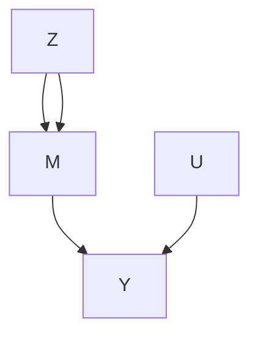
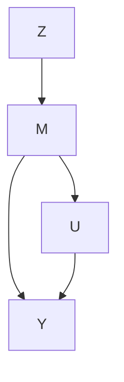

# 主分层（Principal Stratification）

第 II 至 V 部分聚焦于处理对结果的因果效应，可能调整了观测到的预处理协变量。许多应用还涉及某个处理后的变量 $M$，它发生在处理之后但在结果之前。一个关键问题是如何恰当地使用处理后的变量 $M$。我将从几个激励性示例开始，然后介绍 Frangakis 和 Rubin (2002) 基于潜在结果对该问题的表述。

## 26.1 激励性示例（Motivating Examples）

**示例 26.1（不依从性）** 在存在不依从性的随机实验中，我们可以用 $M$ 表示实际接受的处理，它受处理分配 $Z$ 的影响并影响结果 $Y$。在该示例中，$M$ 与第 21 章中的 $D$ 含义相同。

**示例 26.2（因死亡截断）** 在针对重症患者的随机实验中，部分患者可能在结果 $Y$（例如生活质量）测量之前死亡。该示例中的处理后变量 $M$ 是生存状态的二元指示变量。

**示例 26.3（失业）** 在职业培训项目中，个体被随机分配到处理组和对照组，并报告其就业状态 $M$ 和工资 $Y$。此时处理后变量是就业状态 $M$ 的二元指示变量。

**示例 26.4（替代终点）** 在临床试验中，感兴趣的结果（例如 30 年生存率）需要长期且昂贵的随访。研究者转而收集随访早期易于测量的其他变量数据。这些变量被称为"替代终点"。一个具体例子来自 HIV 患者的临床试验，其中候选替代终点 $M$ 是 CD4 细胞计数。

示例 26.1–26.4 的共同点是存在一个介于处理与结果之间的中间变量 $M$。这里的"介于"可以指：

1. $M$ 位于从 $Z$ 到 $Y$ 的因果路径上，如图 26.1(a)；
2. $M$ 不在从 $Z$ 到 $Y$ 的因果路径上，如图 26.1(b)。

示例 26.1 对应于图 26.1(a)。示例 26.2 和 26.3 对应于图 26.1(b)。示例 26.4 可以对应于图 26.1(a) 或 (b)，具体取决于替代终点的选择。

图 26.1：包含处理后变量 $M$ 的因果图

## 26.2 对处理后变量进行条件化的问题（The Problem of Conditioning on the Post-Treatment Variable）

处理处理后变量 $M$ 的一种朴素方法是将其观测值作为预处理协变量进行条件化。然而，$M$ 与 $X$ 有本质区别，因为前者通常受处理影响，而后者不受影响。这也是一个"经验法则"：数据分析者在评估处理对结果的平均效应时，不应条件化任何处理后变量（Cochran, 1957; Rosenbaum, 1984）。基于潜在结果，Frangakis 和 Rubin (2002) 给出了以下深刻解释。

为简单起见，本章我们聚焦于完全随机实验。

**假设 26.1（含中间变量的完全随机化）** $Z \bot \bot \{ M ( 1 ) , M ( 0 ) , Y ( \dot { 1 } ) , Y ( 0 ) \}$。

条件化于 $M = m$，我们比较

$$
\operatorname{pr} (Y \mid Z = 1, M = m)
$$

和

$$
\operatorname{pr} (Y \mid Z = 0, M = m)。
$$

这种比较看似直观，它衡量了在处理组和对照组中给定处理后变量相同值时结果分布的差异。当 $M$ 是预处理协变量时，这种比较产生合理的子组效应。然而，当 $M$ 是处理后变量时，这种比较的解释就存在问题。在假设 26.1 下，我们可以重写

$$
\begin{array}{l} \operatorname{pr} (Y \mid Z = 1, M = m) = \operatorname{pr} \{Y (1) \mid Z = 1, M (1) = m \} \\ = \operatorname{pr} \{Y (1) \mid M (1) = m \} \\ \end{array}
$$

和

$$
\begin{array}{l} \operatorname{pr} (Y \mid Z = 0, M = m) = \operatorname{pr} \{Y (0) \mid Z = 0, M (0) = m \} \\ = \operatorname{pr} \{Y (0) \mid M (0) = m \}。 \\ \end{array}
$$

因此，我们比较的是不同子组个体的 $Y(1)$ 和 $Y(0)$ 分布，因为如果 $Z$ 影响 $M$，则 $M(1) = m$ 的个体与 $M(0) = m$ 的个体不同。因此，除非 $M(1) = M(0)$，否则条件化于 $M = m$ 的比较通常不具有因果解释。¹

重新审视示例 26.1。在单调性假设 $M(1) \ge M(0)$ 下，比较 $\mathrm{pr}(Y \mid Z = 1, M = 1)$ 和 $\mathrm{pr}(Y \mid Z = 0, M = 1)$ 等价于比较依从者和始终接受者的处理潜在结果与始终接受者的对照潜在结果。问题 22.7 的第 3 部分已指出这种分析的缺陷。

重新审视示例 26.2。如果处理改善了生存状态，处理可以比对照挽救更多虚弱患者。在这种情况下，$M(1) = 1$ 的个体比 $M(0) = 1$ 的个体更虚弱，因此朴素比较会产生偏向于对照的有偏结果。

## 26.3 对处理后变量的潜在值进行条件化（Conditioning on the Potential Values of the Post-Treatment Variable）

Frangakis 和 Rubin (2002) 提出条件化于处理后变量的联合潜在值 $U = \{ M(1), M(0) \}$，并比较

$$
\operatorname{pr} \{Y (1) \mid M (1) = m _ {1}, M (0) = m _ {0} \}
$$

和

$$
\operatorname{pr} \{Y (0) \mid M (1) = m _ {1}, M (0) = m _ {0} \}
$$

对于某些 $(m_1, m_0)$。这是对同一子组个体（其 $M(1) = m_1$ 且 $M(0) = m_0$）在处理和对照下的潜在结果进行比较。Frangakis 和 Rubin (2002) 将这一策略称为 **主分层（principal stratification）**，将 $\{ M(1), M(0) \}$ 视为一个预处理协变量。基于这一思想，我们可以定义

$$
\tau (m _ {1}, m _ {0}) = E \{Y (1) - Y (0) \mid M (1) = m _ {1}, M (0) = m _ {0} \}
$$

作为子组 $M(1) = m_1, M(0) = m_0$ 的 **主分层平均因果效应（principal stratification average causal effect）**。对于二元 $M$，我们有四个子组

$$
\left\{ \begin{array}{l c l} \tau (1, 1) & = & E \{Y (1) - Y (0) \mid M (1) = 1, M (0) = 1 \}, \\ \tau (1, 0) & = & E \{Y (1) - Y (0) \mid M (1) = 1, M (0) = 0 \}, \\ \tau (0, 1) & = & E \{Y (1) - Y (0) \mid M (1) = 0, M (0) = 1 \}, \\ \tau (0, 0) & = & E \{Y (1) - Y (0) \mid M (1) = 0, M (0) = 0 \}. \end{array} \right. \tag {26.1}
$$

由于 $\{ M(1), M(0) \}$ 不受处理影响，它是一个协变量，因此 $\tau(m_1, m_0)$ 是一个子组因果效应。对于 $M(1) = M(0)$ 的子组，处理不改变中间变量，因此 $\tau(1,1)$ 和 $\tau(0,0)$ 测量 **分离效应（dissociative effects）**。对于其他 $m_1 \neq m_0$ 的子组，主分层平均因果效应 $\tau(m_1, m_0)$ 测量 **关联效应（associative effects）**。这些术语来自 Frangakis 和 Rubin (2002)，并不假定 $M$ 位于从 $Z$ 到 $Y$ 的因果路径上。当我们有图 26.1(a) 时，可以将分离效应解释为 $Z$ 对 $Y$ 独立于 $M$ 的直接效应，尽管我们不能简单地将关联效应解释为 $Z$ 对 $Y$ 的直接或间接效应。

**示例 26.1（不依从性）** 对于不依从性，(26.1) 包括始终接受者、依从者、违抗者和从不接受者的平均因果效应（Imbens and Angrist, 1994; Angrist et al., 1996）。

**示例 26.2（因死亡截断）** 由于结果仅在患者存活时才有良好定义，(26.1) 中的三个子组因果效应没有意义，唯一良好定义的子组效应是

$$
\tau (1, 1) = E \{Y (1) - Y (0) \mid M (1) = 1, M (0) = 1 \}. \tag {26.2}
$$

这被称为 **存活者平均因果效应（survivor average causal effect）**（Rubin, 2006a）。它是处理对结果的平均因果效应，针对那些无论处理状态如何都能存活的个体。

**示例 26.3（失业）** 失业问题与因死亡截断问题同构，因为工资仅在个体有工作时才有良好定义。因此，唯一良好定义的子组效应是 (26.2)，即 **就业者平均因果效应（employed average causal effect）**。此前，Heckman (1979) 提出了一个模型（现称为 Heckman 选择模型）来处理工资建模中的失业问题，将失业者的工资视为缺失值²。然而，Zhang 和 Rubin (2003) 以及 Zhang 等人 (2009) 认为，在潜在结果框架下，$\tau(1,1)$ 是一个更有意义的量。

**示例 26.4（替代终点）** 直观上，我们希望通过处理对替代终点的影响来评估处理对结果的影响。因此，一个好的替代终点应满足两个条件：第一，如果处理不影响替代终点，则也不影响结果；第二，如果处理影响替代终点，则也影响结果。第一个条件被 Frangakis 和 Rubin (2002) 称为 **因果必要性（causal necessity）**，第二个条件被 Gilbert 和 Hudgens (2008) 称为 **因果充分性（causal sufficiency）**。基于二元替代终点的 (26.1)，因果必要性要求 $\tau(1,1)$ 和 $\tau(0,0)$ 为零，因果充分性要求 $\tau(1,0)$ 和 $\tau(0,1)$ 不为零。

## 26.4 统计推断及其困难（Statistical Inference and Its Difficulty）

在示例 26.1 中，如果我们有随机化、单调性和排除限制，则可以识别依从者平均因果效应。这是第 21 章推导的关键结果。

然而，在其他示例中，我们不能强加排除限制假设。例如，$\tau(1,1)$ 是示例 26.2 和 26.3 的主要参数，而在示例 26.4 中，$\tau(1,1)$ 和 $\tau(0,0)$ 都令人感兴趣。

在没有排除限制假设的情况下，识别主分层平均因果效应非常困难。有时，我们甚至不能强加单调性假设，因此无法首先识别潜在层的比例。

## 26.4.1 特例：二元结果下的因死亡截断（Special case: truncation by death with binary outcome）

我使用二元处理、二元生存状态和二元结果的简单设置来说明这一思想，特别是基于主分层进行统计推断的困难。

除了假设 26.1 之外，我们强加单调性。

**假设 26.2（单调性）** $M(1) \ge M(0)$。

定理 22.1 表明，在假设 26.1 和 26.2 下，我们可以通过以下方式识别三个潜在层的比例：

$$
\begin{array}{l} \pi_ {(1, 1)} = \operatorname{pr} (M = 1 \mid Z = 0), \\ \pi_ {(0, 0)} = \operatorname{pr} (M = 0 \mid Z = 1), \\ \pi_ {(1, 0)} = \operatorname{pr} (M = 1 \mid Z = 1) - \operatorname{pr} (M = 1 \mid Z = 0). \\ \end{array}
$$

我们的目标是识别存活者平均因果效应 $\tau(1,1)$。首先，我们可以轻松识别 $E\{ Y(0) \mid M(1) = 1, M(0) = 1 \}$，因为观测组 $(Z = 0, M = 1)$ 仅由存活者组成：

$$
E \{Y (0) \mid M (1) = 1, M (0) = 1 \} = E (Y \mid Z = 0, M = 1).
$$

关键是识别 $E\{ Y(1) \mid M(1) = 1, M(0) = 1 \}$。观测组 $(Z = 1, M = 1)$ 是两个层 (1,1) 和 (1,0) 的混合，因此我们有

$$
\begin{array}{l} E (Y \mid Z = 1, M = 1) = \frac {\pi_ {(1 , 1)}}{\pi_ {(1 , 1)} + \pi_ {(1 , 0)}} E \{Y (1) \mid M (1) = 1, M (0) = 1 \} \\ + \frac {\pi_ {(1 , 0)}}{\pi_ {(1 , 1)} + \pi_ {(1 , 0)}} E \{Y (1) \mid M (1) = 1, M (0) = 0 \}. \\ \end{array}
$$

我们有两个未知参数但只有一个方程。因此，我们无法从上述方程唯一确定 $E\{ Y(1) \mid M(1) = 1, M(0) = 1 \}$。尽管如此，该方程包含关于感兴趣量的一些信息。也就是说，$E\{ Y(1) \mid M(1) = 1, M(0) = 1 \}$ 可以通过定义 18.1 进行部分识别。

对于二元结果 $Y$，我们知道 $E\{ Y(1) \mid M(1) = 1, M(0) = 0 \}$ 介于 0 和 1 之间，因此 $E\{ Y(1) \mid M(1) = 1, M(0) = 1 \}$ 介于以下两个方程的解之间：

$$
\begin{array}{l} E (Y \mid Z = 1, M = 1) = \frac {\pi_ {(1 , 1)}}{\pi_ {(1 , 1)} + \pi_ {(1 , 0)}} E \{Y (1) \mid M (1) = 1, M (0) = 1 \} \\ + \frac {\pi_ {(1 , 0)}}{\pi_ {(1 , 1)} + \pi_ {(1 , 0)}} \\ \end{array}
$$

和

$$
E (Y \mid Z = 1, M = 1) = \frac {\pi_ {(1 , 1)}}{\pi_ {(1 , 1)} + \pi_ {(1 , 0)}} E \{Y (1) \mid M (1) = 1, M (0) = 1 \}.
$$

因此，$E\{ Y(1) \mid M(1) = 1, M(0) = 1 \}$ 的下界为

$$
\frac {\{\pi_ {(1 , 1)} + \pi_ {(1 , 0)} \} E (Y \mid Z = 1 , M = 1) - \pi_ {(1 , 0)}}{\pi_ {(1 , 1)}},
$$

上界为

$$
\frac {\{\pi_ {(1 , 1)} + \pi_ {(1 , 0)} \} E (Y \mid Z = 1 , M = 1)}{\pi_ {(1 , 1)}}.
$$

然后我们可以推导出 $\tau(1,1)$ 的界，总结如下。

**定理 26.1** 在假设 26.1 和 26.2 下，对于二元 $Y$，我们有

$$
\begin{array}{l} \frac {\left\{\pi_ {(1 , 1)} + \pi_ {(1 , 0)} \right\} E (Y \mid Z = 1 , M = 1) - \pi_ {(1 , 0)}}{\pi_ {(1 , 1)}} - E (Y \mid Z = 0, M = 1) \\ \leq \tau (1, 1) \\ \leq \frac {\{\pi_ {(1 , 1)} + \pi_ {(1 , 0)} \} E (Y \mid Z = 1 , M = 1)}{\pi_ {(1 , 1)}} - E (Y \mid Z = 0, M = 1). \\ \end{array}
$$

在大多数因死亡截断问题中，下界和上界差异很大，且远离极端值 -1 和 1。因此，我们可以使用 Imbens 和 Manski (2004) 针对 $\tau(1,1)$ 的置信区间，这涉及两个步骤：首先，我们获得估计的下界和上界 $[\hat{l}, \hat{u}]$ 及其估计标准误 $(\mathrm{se}_l, \mathrm{se}_u)$；其次，我们构建置信区间为 $[\hat{l} - z_\alpha \mathrm{se}_l, \hat{u} + z_\alpha \mathrm{se}_u]$，其中 $z_\alpha$ 是标准正态分布的 $1 - \alpha$ 分位数。

总之，这是一个具有挑战性的问题，因为即使有无限样本量，我们也不能基于观测数据识别该参数。我们可以推导 $\tau(1,1)$ 的大样本界，但基于界的统计推断并不标准。如果我们没有单调性，大样本界的形式会更加复杂（Zhang and Rubin, 2003; Jiang et al., 2016）。

## 26.4.2 应用实例（An application）

我使用 Yang 和 Small (2016) 的数据，来自急性呼吸窘迫综合征网络研究，涉及 861 名肺损伤和急性呼吸窘迫综合征患者。患者被随机分配接受低潮气量或传统潮气量的机械通气。结果是患者在第 28 天能否无需辅助呼吸的二元指示变量。表 26.1 总结了观测数据。

**表 26.1：因死亡截断的数据，其中 * 表示已死亡患者的结果**

<table><tr><td colspan="4">处理 Z = 1</td><td colspan="4">对照 Z = 0</td></tr><tr><td></td><td>Y = 1</td><td>Y = 0</td><td>总计</td><td></td><td>Y = 1</td><td>Y = 0</td><td>总计</td></tr><tr><td>M = 1</td><td>54</td><td>268</td><td>322</td><td>M = 1</td><td>59</td><td>218</td><td>277</td></tr><tr><td>M = 0</td><td>*</td><td>*</td><td>109</td><td>M = 0</td><td>*</td><td>*</td><td>152</td></tr></table>

我们首先获得潜在层的点估计：

$$
\hat {\pi} _ {(1, 1)} = \frac {2 7 7}{2 7 7 + 1 5 2} = 0. 6 4 6, \quad \hat {\pi} _ {(0, 0)} = \frac {1 0 9}{1 0 9 + 3 2 2} = 0. 2 5 3, \quad \hat {\pi} _ {(1, 0)} = 0. 1 0 1.
$$

存活患者结果的样本均值为：

$$
\hat {E} (Y \mid Z = 1, M = 1) = \frac {5 4}{3 0 2} = 0. 1 6 8, \quad \hat {E} (Y \mid Z = 0, M = 1) = \frac {5 9}{2 7 7} = 0. 2 1 3.
$$

$E\{ Y(1) \mid M(1) = 1, M(0) = 1 \}$ 的界估计为：

$$
\left[ \frac {(0 . 6 4 6 + 0 . 1 0 1) \times 0 . 1 6 8 - 0 . 1 0 1}{0 . 1 0 1}, \frac {(0 . 6 4 6 + 0 . 1 0 1) \times 0 . 1 6 8}{0 . 1 0 1} \right] = [ 0. 0 3 7, 0. 1 9 4 ],
$$

因此 $\tau(1,1)$ 的界为：

$$
[ 0. 0 3 7 - 0. 2 1 3, 0. 1 9 4 - 0. 2 1 3 ] = [ - 0. 1 7 6, - 0. 0 1 9 ].
$$

结合基于自助法的抽样不确定性，上界变为正值。

## 26.4.3 扩展（Extensions）

**Zhang 和 Rubin (2003)** 开创了大样本界的文献。**Imai (2008a)** 和 **Lee (2009)** 是两篇后续论文。**Cheng 和 Small (2006)** 推导了多处理组情形的界。**Yang 和 Small (2016)** 使用一个**次要结局（secondary outcome）**来收紧关于**幸存者平均因果效应（survivor average causal effect）**的界。

## 26.5 主得分方法（Principal score method）

在没有额外假设的情况下，我们只能推导出**主分层（principal strata）**内因果效应的界，但通常无法对其进行识别。我们必须施加额外的假设，才能实现 $\tau ( m _ { 1 } , m _ { 0 } ) _ { \mathrm { { s } } }$ 的非参数识别。关于假设的选择尚未达成共识。这些额外的假设是不可检验的，其合理性取决于具体应用。有一条研究路线与**无混杂 observational 研究（unconfounded observational studies）**中的因果推断类似。为简单起见，我集中讨论**强单调性（strong monotonicity）**下的情形。

## 26.5.1 强单调性下的主得分方法（Principal score method under strong monotonicity）

**假设 26.3（强单调性）** $M ( 0 ) = 0$ 。

与**可忽略性假设（ignorability assumption）**类似，我们现在假设**主可忽略性假设（principal ignorability assumption）**。

**假设 26.4（主可忽略性）** $E \{ Y ( 0 ) ~ \mid ~ M ( 1 ) ~ = ~ 1 , X \} ~ =$ $E \{ Y ( 0 ) \mid M ( 1 ) = 0 , \dot { X } \}$ 。

这些假设确保了主分层内因果效应的非参数识别。

**定理 26.2** 在假设 26.1、26.3 和 ${ \it 2 6 . 4 }$ 下，**主分层平均因果效应（principal stratification average causal effects）**可以通过下式识别：

$$
\tau (1, 0) = E (Y \mid Z = 1, M = 1) - E \{\pi (X) Y \mid Z = 0 \} / \pi
$$

且

$$
\tau (0, 0) = E (Y \mid Z = 1, M = 0) - E \{(1 - \pi (X) \} Y \mid Z = 0 \} / (1 - \pi)
$$

其中 $\pi ( X ) = \operatorname { p r } \{ M ( 1 ) = 1 \mid X \}$ 且 $\pi = \mathrm { p r } \{ M ( 1 ) = 1 \}$ 可以通过下式识别：

$$
\pi (X) = \operatorname{pr} (M = 1 \mid Z = 1, X)
$$

且

$$
\pi = \operatorname{pr} (M = 1 \mid Z = 1).
$$

条件概率 $\pi ( X ) = \operatorname { p r } \{ M ( 1 ) = 1 \mid X \}$ 被称为**主得分（principal score）**。定理 26.2 表明，$\tau ( 1 , 0 )$ 和 $\tau ( 0 , 0 )$ 可以通过**均值差（difference in means）**来识别，其中权重取决于主得分。

**定理 26.2 的证明：** 我仅证明

$$
E \{Y (0) \mid M (1) = 1 \} = E \{\pi (X) Y \mid Z = 0 \} / \pi .
$$

左边等于

$$
\begin{array}{l} E \{M (1) Y (0) \} / \pi = E [ E \{M (1) \mid X \} E \{Y (0) \mid X \} ] / \pi \\ = E \left[ \pi (X) E \{Y (0) \mid X \} \right] / \pi \\ = E \left[ E \{\pi (X) Y (0) \mid X \} \right] / \pi \\ = E \{\pi (X) Y (0) \} / \pi \\ = E \{\pi (X) Y \mid Z = 0 \} / \pi . \\ \end{array}
$$

定理 26.2 分别给出了 $\tau (1, 0)$ 和 $\tau (0, 0)$ 的以下简单估计量：

1. 仅使用处理组的数据，对 $M$ 关于 $X$ 拟合一个**逻辑回归（logistic regression）**，得到 $\hat{\pi}(X_i)$；
2. 通过 $\textstyle { \hat { \pi } } = \sum _ { i = 1 } ^ { n } Z _ { i } M _ { i } / \sum _ { i = 1 } ^ { n } Z _ { i }$ 估计 $\pi$；
3. 得到**矩估计量（moment estimators）**：

$$
\hat {\tau} (1, 0) = \frac {\sum_ {i = 1} ^ {n} Z _ {i} M _ {i} Y _ {i}}{\sum_ {i = 1} ^ {n} Z _ {i} M _ {i}} - \frac {\sum_ {i = 1} ^ {n} (1 - Z _ {i}) \hat {\pi} (X _ {i}) Y _ {i}}{\hat {\pi} \sum_ {i = 1} ^ {n} (1 - Z _ {i})}
$$

且

$$
\hat {\tau} (0, 0) = \frac {\sum_ {i = 1} ^ {n} Z _ {i} (1 - M _ {i}) Y _ {i}}{\sum_ {i = 1} ^ {n} Z _ {i} (1 - M _ {i})} - \frac {\sum_ {i = 1} ^ {n} (1 - Z _ {i}) (1 - \hat {\pi} (X _ {i}) \} Y _ {i}}{(1 - \hat {\pi}) \sum_ {i = 1} ^ {n} (1 - Z _ {i})};
$$

4. 使用**自助法（bootstrap）**来近似 $\hat{\tau} (1, 0)$ 和 $\hat{\tau}(0, 0)$ 的方差。

## 26.5.2 扩展（Extensions）

**Follmann (2000)**、**Hill 等人 (2002)**、**Jo 和 Stuart (2009)**、**Jo 等人 (2011)** 以及 **Stuart 和 Jo (2015)** 开创了使用**主得分（principal score）**来识别主分层内因果效应的文献。**Ding 和 Lu (2017)** 为这一策略提供了理论基础。他们证明了定理 26.2，以及在**单调性（monotonicity）**下的一个更一般的形式；参见习题 26.1。**Jiang 等人 (2022)** 对观察性研究中的这一策略给出了统一的讨论，并提出了用于主分层内因果效应的**多重稳健估计量（multiply robust estimators）**。

## 26.6 其他方法（Other methods）

为了在不依赖**排除限制假设（exclusion restriction assumption）**的情况下估计**主分层平均因果效应（principal stratification average causal effects）**，**Zhang 等人 (2009)** 提出使用**正态混合模型（normal mixture models）**。然而，基于正态混合模型的推断可能相当脆弱。一种策略是在某些限制条件下利用额外信息来改进推断（**Ding 等人，2011**；**Mealli 和 Pacini，2013**；**Mattei 等人，2013**；**Jiang 等人，2016**）。

从概念上讲，**主分层框架（principal stratification framework）**适用于一般的 $M$。一个**多值（multi-valued）** $M$ 会产生许多**潜在主分层（latent principal strata）**，而一个**连续（continuous）** $M$ 会产生无穷多个潜在主分层。在这些情形下，首先识别主分层的概率本身就非平凡，更不用说识别主分层平均因果效应了。**Jiang 和 Ding (2021)** 回顾了一些有用的策略。

## 26.7 家庭作业（Homework problems）

## 26.1 单调性下的主得分方法（Principal score method under monotonicity）

本题将定理 26.2 进行推广，用假设 26.2 替换假设 26.3，并用以下假设替换假设 26.4。

**假设 26.5（主可忽略性）** 我们有

$$
E \{Y (1) \mid M (1) = 1, M (0) = 0, X \} = E \{Y (1) \mid M (1) = 1, M (0) = 1, X \}
$$

且

$$
E \{Y (0) \mid M (1) = 1, M (0) = 0, X \} = E \{Y (0) \mid M (1) = 0, M (0) = 0, X \}.
$$

**定理 26.3** 在假设 26.1、26.2 和 26.5 下，**主分层平均因果效应（principal stratification average causal effects）**可以通过下式识别：

$$
\tau (1, 0) = E \left\{w _ {1, (1, 0)} (X) Y \mid Z = 1, M = 1 \right\} - E \left\{w _ {0, (1, 0)} (X) Y \mid Z = 0, M = 0 \right\},
$$

$$
\tau (0, 0) = E (Y \mid Z = 1, M = 0) - E \left\{w _ {0, (0, 0)} (X) Y \mid Z = 0, M = 0 \right\},
$$

$$
\tau (1, 1) = E \left\{w _ {1, (1, 1)} (X) Y \mid Z = 1, M = 1 \right\} - E (Y \mid Z = 0, M = 1)
$$

其中

$$
w _ {1, (1, 0)} (X) = \frac {\pi_ {(1 , 0)} (X)}{\pi_ {(1 , 0)} (X) + \pi_ {(1 , 1)} (X)} \Big / \frac {\pi_ {(1 , 0)}}{\pi_ {(1 , 0)} + \pi_ {(1 , 1)}},
$$

$$
w _ {0, (1, 0)} (X) = \frac {\pi_ {(1 , 0)} (X)}{\pi_ {(1 , 0)} (X) + \pi_ {(0 , 0)} (X)} \Big / \frac {\pi_ {(1 , 0)}}{\pi_ {(1 , 0)} + \pi_ {(0 , 0)}},
$$

$$
w _ {0, (0, 0)} (X) = \frac {\pi_ {(0 , 0)} (X)}{\pi_ {(1 , 0)} (X) + \pi_ {(0 , 0)} (X)} \Big / \frac {\pi_ {(0 , 0)}}{\pi_ {(1 , 0)} + \pi_ {(0 , 0)}},
$$

$$
w _ {1, (1, 1)} (X) = \frac {\pi_ {(1 , 1)} (X)}{\pi_ {(1 , 0)} (X) + \pi_ {(1 , 1)} (X)} \Big / \frac {\pi_ {(1 , 1)}}{\pi_ {(1 , 0)} + \pi_ {(1 , 1)}}.
$$

此外，条件主得分和边际主得分都可以通过下式识别：

$$
\pi_ {(0, 0)} (X) = \operatorname{pr} (M = 0 \mid Z = 1, X),
$$

$$
\pi_ {(1, 1)} (X) = \operatorname{pr} (M = 1 \mid Z = 0, X),
$$

$$
\pi_ {(1, 0)} (X) = \operatorname{pr} (M = 1 \mid Z = 1, X) - \operatorname{pr} (M = 1 \mid Z = 0, X).
$$

且

$$
\pi_ {(0, 0)} = \operatorname{pr} (M = 0 \mid Z = 1),
$$

$$
\pi_ {(1, 1)} = \operatorname{pr} (M = 1 \mid Z = 0),
$$

$$
\pi_ {(1, 0)} = \operatorname{pr} (M = 1 \mid Z = 1) - \operatorname{pr} (M = 1 \mid Z = 0).
$$

**注：** 基于定理 26.3，我们可以构建**加权估计量（weighting estimators）**。定理 26.3 是 **Ding 和 Lu (2017)** 中的命题 2，该文献还提供了更多关于估计的细节。

## 26.2 推荐阅读（Recommended reading）

**Frangakis 和 Rubin (2002)** 提出了**主分层框架（principal stratification framework）**。**Zhang 和 Rubin (2003)** 推导了**幸存者平均因果效应（survivor average causal effect）**的**大样本界（large-sample bounds）**。**Jiang 和 Ding (2021)** 回顾了识别主分层内因果效应的各种策略。