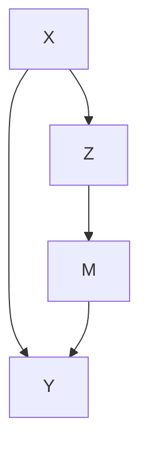
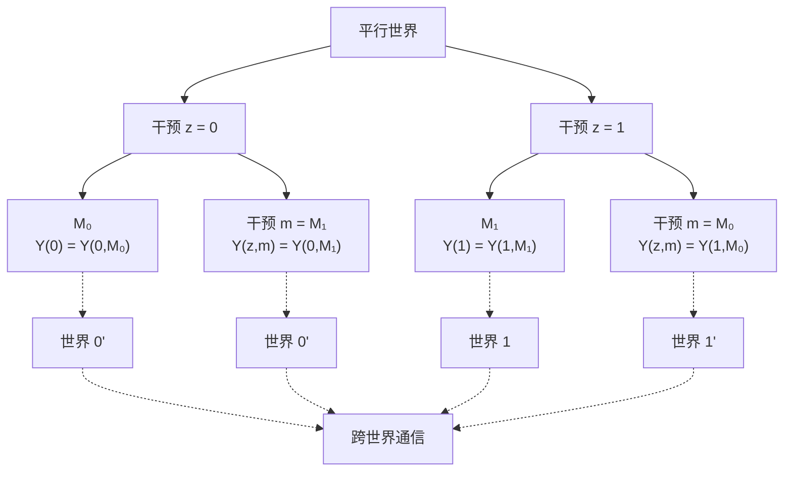
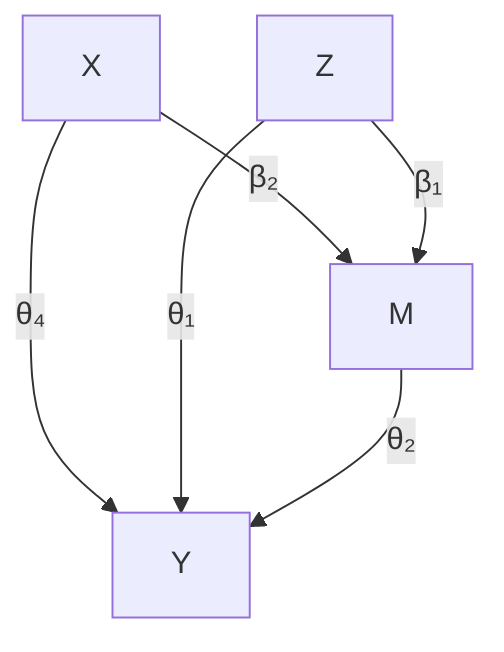

# 中介分析：自然直接效应与间接效应

在治疗 $Z$ 与结果 $Y$ 之间存在中间变量 $M$ 的情况下，由 $U = \{ M ( 1 ) , M ( 0 ) \}$ 定义的主层内的因果效应可以评估跨潜在组 U 的治疗效应异质性。当 M 确实位于从 $Z$ 到 $Y$ 的因果通路上时，某些主层内的因果效应，即 $\tau ( 1 , 1 )$ 和 $\tau ( 0 , 0 )$ ，可以提供关于 $Z$ 对 $Y$ 的直接效应的信息。然而，这些直接效应仅针对两个潜在组。另外两个主层内的因果效应，即 $\tau ( 1 , 0 )$ 和 $\tau ( 0 , 1 )$ ，同时包含直接效应和间接效应。从根本上说，**主分层（principal stratification）** 并不提供关于 $Z$ 通过 M 对 $Y$ 的间接效应的任何信息，因为它甚至不假设 M 可以被干预。

在上述讨论中，我以非正式的方式使用了"直接效应"和"间接效应"的概念。当 M 位于从 $Z$ 到 $Y$ 的通路上时，研究者通常希望评估 $Z$ 对 Y 的效应在多大程度上通过 M 起作用，以及在多大程度上通过其他通路起作用。这被称为**中介分析（mediation analysis）**。这是本章的主题。

## 27.1 激励性示例（Motivating Examples）

在中介分析中，我们有一个治疗 $Z$ 、一个结果 $Y$ 、一个中介变量 M 和一些背景协变量 X。图 27.3 说明了它们之间的关系。下面我们给出一些具体示例。




图 27.1：中介分析的有向无环图

**示例 27.1** VanderWeele 等人（2012）进行了中介分析，以评估染色体 15q25.1 上的变异对肺癌的影响在多大程度上通过吸烟介导，以及在多大程度上通过其他因果通路起作用。暴露水平对应从 0 到 2 个 C 等位基因的变化，吸烟强度通过每日吸烟支数的平方根测量，结果是肺癌指标。VanderWeele 等人（2012）的研究包含了许多社会人口学协变量。

**示例 27.2** Rudolph 等人（2018）研究了从社区贫困到青少年物质使用的因果机制，该机制由学校和同伴环境中介。他们使用了**国家共病调查复制青少年增补（National Comorbidity Survey Replication Adolescent Supplement）** 的数据，这是一项 2001-2004 年期间进行的美国青少年全国代表性调查。治疗是社区劣势的二元指标，定义为根据 2000 年美国人口普查数据生活在社区社会经济地位最低三分位的人群。四个二元中介变量是学校和同伴环境的测量指标，六个二元结果是物质使用的测量指标。基线协变量包括青少年的性别、年龄、种族、移民世代、家庭收入等。

**示例 27.3** R 语言中的 mediation 包包含一个名为 jobs 的数据集，该数据集来自 JOBS II，这是一项调查职业培训干预对失业工人效果的随机现场实验。我们在第 21.5 章中使用了这个数据集。该项目旨在不仅提高失业者的再就业率，还改善求职者的心理健康。因此，评估干预通过求职效能对心理健康的间接效应以及通过其他通路起作用的直接效应具有重要意义。我们将在后文重新审视这个示例。

## 27.2 嵌套潜在结果（Nested Potential Outcomes）

### 27.2.1 自然直接效应与间接效应（Natural Direct and Indirect Effects）

下面我们省略单位 i 的下标 i，并假设所有随机变量都是从超总体中独立同分布抽取的。为简单起见，我们关注二元治疗 Z。

我们首先考虑对 z 的假设干预，并定义对应于 z 干预的潜在中介变量和潜在结果：

$$
\{M (z), Y (z): z = 0, 1 \}.
$$

然后，我们考虑同时对 z 和 m 的假设干预，并定义对应于 z 和 m 干预的潜在结果：

$$
\{Y (z, m): z = 0, 1; m \in \mathcal {M} \},
$$

其中 M 包含 $m$ 的所有可能取值。Robins 和 Greenland（1992）以及 Pearl（2001）进一步考虑了对应于 z 干预和 $m = M ( z ^ { \prime } ) \equiv M _ { z ^ { \prime } }$ 的嵌套潜在结果：

$$
\left\{Y (z, M _ {z ^ {\prime}}): z = 0, 1; z ^ {\prime} = 0, 1 \right\}
$$

其中我们将 $M ( z ^ { \prime } )$ 写为 $M _ { z ^ { \prime } }$ 以避免过多的括号。符号 $Y ( z , M _ { z ^ { \prime } } )$ 表示如果治疗被设定在水平 z 且中介变量被设定为治疗 $z ^ { \prime }$ 下的潜在水平 $M ( z ^ { \prime } )$ 时的假设结果。重要的是，z 和 $z ^ { \prime }$ 可以不同。对于二元治疗，我们总共有四个嵌套潜在结果：

$$
\{Y (1, M _ {1}), Y (1, M _ {0}), Y (0, M _ {1}), Y (0, M _ {0}) \}.
$$

嵌套潜在结果 $Y ( 1 , M _ { 1 } )$ 是当治疗被设定为 $z = 1$ 且中介变量被设定为在 $z = 1$ 下会发生的情况时的假设结果。类似地，$Y ( 0 , M _ { 0 } )$ 是当治疗被设定为 $z = 0$ 且中介变量被设定为在 $z = 0$ 下会发生的情况时的结果。如果 $Y ( 1 , M _ { 1 } ) \neq Y ( 1 )$ 或 $Y ( 0 , M _ { 0 } ) \neq Y ( 0 )$ ，那将会令人惊讶。因此，我们在本章中做出以下假设。

**假设 27.1（组成性，composition）** $Y ( z , M _ { z } ) = Y ( z ) ~ 对 ~ z = 0 , 1$ 成立。

组成性假设无法被证明。它确实是一个假设。在不引起哲学争论的情况下，我们甚至可以定义 $Y ( 1 )$ 为 $Y ( 1 , M _ { 1 } )$ ，并定义 $Y ( 0 )$ 为 $Y ( 0 , M _ { 0 } )$ 。

嵌套潜在结果 $Y ( 1 , M _ { 0 } )$ 是当单位接受了治疗 1 但其中介变量被设定为没有治疗时的自然值 $M _ { 0 }$ 时的假设结果。类似地，$Y ( 0 , M _ { 1 } )$ 是当单位接受了对照 0 但其中介变量被设定为治疗下的自然值 $M _ { 1 }$ 时的假设结果。它们是两个跨世界反事实项，对于定义直接效应和间接效应很有用。

**定义 27.1（总效应、直接效应和间接效应）** 定义治疗对结果的**总效应（total effect）** 为

$$
\tau = E \{Y (1) - Y (0) \}.
$$

定义**自然直接效应（natural direct effect, NDE）** 为

$$
\mathrm{NDE} = E \left\{Y \left(1, M _ {0}\right) - Y \left(0, M _ {0}\right) \right\}.
$$

定义**自然间接效应（natural indirect effect, NIE）** 为

$$
\mathrm{NIE} = E \{Y (1, M _ {1}) - Y (1, M _ {0}) \}.
$$

总效应是 $Z$ 对 $Y$ 的标准平均因果效应。自然直接效应衡量的是，如果中介变量被设定为没有干预时的自然值 $M _ { 0 }$ ，治疗对结果的影响。自然间接效应衡量的是，如果治疗本身被设定为 $z = 1$ ，治疗通过改变中介变量而产生的影响。在组成性假设下，自然直接效应和间接效应简化为

$$
\mathrm{NDE} = E \{Y (1, M _ {0}) - Y (0) \}, \quad \mathrm{NIE} = E \{Y (1) - Y (1, M _ {0}) \},
$$

因此，我们可以将总效应分解为自然直接效应和间接效应之和。

**命题 27.1** 根据定义 27.1 和假设 27.1，$\tau = \mathrm { N D E + N I E }$ 。

从数学上讲，我们也可以将自然间接效应定义为 $E \{ Y ( 0 , M _ { 1 } ) - Y ( 0 , M _ { 0 } ) \}$ ，其中治疗被固定为 0。然而，这个定义不会导致命题 27.1 中的分解。

不幸的是，嵌套潜在结果 $Y ( 1 , M _ { 0 } )$ 并不是一个容易理解的概念，这是由于干预的跨世界性质：治疗被设定为 $z = 1$ ，但中介变量被设定为治疗 $z = 0$ 下的自然值 $M _ { 0 }$ 。显然，这两种对治疗的干预在任何现实的实验中都不可能同时发生。为了理解跨世界潜在结果 $Y ( 1 , M _ { 0 } )$ ，我们需要想象如图 27.2 所示的平行世界的存在。让我们关注 $Y ( 1 , M _ { 0 } )$ 。当治疗被设定为 $z = 1$ 时，中介变量必须取值 $M _ { 1 }$ 。如果同时我们想要将中介变量设定为 $m = M _ { 0 }$ ，我们必须从平行世界的另一个实验中知道同一单位的 $M _ { 0 }$ 值。这可能是一个不现实的物理实验，因为它要求同一单位在两种不同的治疗水平下被干预。在关于单位同质性的一些强假设下，我们可以使用另一个单位在对照下的中介变量值作为 $M _ { 0 }$ 的代理。

### 27.2.2 形而上学还是科学（Metaphysics or Science）

因果推断是困难的，甚至在其数学符号上也没有共识。Robins 和 Greenland（1992）以及 Pearl（2001）使用嵌套潜在结果来定义自然直接效应和间接效应。然而，Frangakis 和 Rubin（2002）将 $Y ( 1 , M _ { 0 } )$ 和 $Y ( 0 , M _ { 1 } )$ 称为**先验反事实（a priori counterfactuals）**，因为我们无法在任何物理实验中观察到它们。在这个意义上，它们先验地不存在。根据 Popper（1963），区分科学与形而上学的一种方法是陈述的可证伪性。也就是说，如果一个陈述不能基于任何物理实验或观察被证伪，那么它就不是科学的陈述，而是形而上学的陈述。由于我们无法在任何实验中观察到 $Y ( 1 , M _ { 0 } )$ 和 $Y ( 0 , M _ { 1 } )$ ，我们无法证伪任何涉及它们的陈述，除了那些琐碎的陈述（例如，某些结果是二元的、连续的或有界的）。因此，一个严格的波普尔主义统计学家会将中介分析视为形而上学。

更引人注目的是，Dawid（2000）批评潜在结果框架是形而上学的，并将 Rubin 的科学表称为"形而上学的数组"。这是对不仅包括先验反事实 $Y ( 1 , M _ { 0 } )$ 和 $Y ( 0 , M _ { 1 } )$ ，还包括简单潜在结果 $Y ( 1 )$ 和 $Y ( 0 )$ 的批评。Dawid（2000）认为，由于我们永远无法同时观察到 $Y ( 1 )$ 和 $Y ( 0 )$ ，引入符号 $\{ Y ( 1 ) , Y ( 0 ) \}$ 是一种形而上学的活动。他关于 $\mathrm { p r } \{ Y ( 1 ) , Y ( 0 ) \}$ 的联合分布的形而上学性质是正确的，但他关于边际分布的看法是不正确的。基于观测数据，我们确实可以证伪关于边际分布的某些陈述，尽管我们无法证伪关于联合分布的任何陈述。¹ 因此，即使根据 Popper（1963），Rubin 的科学表也不是形而上学的，因为它具有一些非平凡的可证伪含义，尽管并非所有含义都是可证伪的。这就是 $\{ Y ( 1 ) , Y ( 0 ) \}$ 与 $\{ Y ( 1 , M _ { 0 } ) , Y ( 0 , M _ { 1 } ) \}$ 之间的根本区别。




图 27.2：跨世界潜在结果 $Y ( 1 , M _ { 0 } )$ 和 $Y ( 0 , M _ { 1 } )$

$$
\max \{0, \operatorname{pr} (Y (1) \leq y _ {1}) + \operatorname{pr} (Y (0) \leq y _ {0}) - 1 \}
$$

$$
\leq \operatorname{pr} (Y (1) \leq y _ {1}, Y (0) \leq y _ {0})
$$

$$
\leq \min \{\operatorname{pr} (Y (1) \leq y _ {1}), \operatorname{pr} (Y (0) \leq y _ {0}) \}.
$$

这通常是一个宽松的不等式。不幸的是，在不施加额外假设的情况下，我们没有任何超出这个不等式的信息。

## 27.3 中介公式（The Mediation Formula）

Pearl（2001）的中介公式依赖于以下四个假设。前三个假设本质上假定**处理变量**和**中介变量**在给定观测协变量的条件下都是随机化的。

**假设 27.2** 不存在处理-结果混杂：

$$
Z \bot Y (z, m) \mid X
$$

对于所有 $z$ 和 $m$ 成立。

**假设 27.3** 不存在中介-结果混杂：

$$
M \bot Y (z, m) \mid (X, Z)
$$

对于所有 $z$ 和 $m$ 成立。

假设 27.2 和 27.3 通常一起被称为**序贯可忽略性（sequential ignorability）**。它们等价于假设 $(Z, M)$ 在给定 $X$ 的条件下是联合随机化的：

$$
(Z, M) \perp Y (z, m) \mid X \tag {27.1}
$$

对于所有 $z$ 和 $m$ 成立。我将证明留作问题 27.1。

**假设 27.4** 不存在处理-中介混杂：

$$
Z \bot M (z) \mid X
$$

对于所有 $z$ 成立。

最后一个假设是**跨世界独立性（cross-world independence）**。

**假设 27.5** 潜在结果与潜在中介之间不存在跨世界独立性：

$$
Y (z, m) \perp M (z ^ {\prime}) \mid X
$$

对于所有 $z , z ^ { \prime }$ 和 $m$ 成立。

假设 27.2–27.4 非常强，但至少在具有随机化处理和中介的实验中它们是成立的。假设 27.5 更强，因为没有物理实验能够保证它。因为我们永远无法在任何实验中同时观察到 $Y ( z , m )$ 和 $M ( z ^ { \prime } )$（若 $z \ne z ^ { \prime }$），假设 27.5 永远无法被验证，因此它本质上是**形而上学的（meta-physical）**。

下面我给出一个例子，其中假设 27.2–27.5 全部成立。

**例 27.4** 给定 $X$，我们生成

$$
Z = 1 \{f _ {Z} (X, \varepsilon_ {Z}) \},
$$

$$
M (z) = 1 \{f _ {M} (X, z, \varepsilon_ {M}) \},
$$

$$
Y (z, m) = f _ {Y} (X, z, m, \varepsilon_ {Y}),
$$

对于 $z , m = 0 , 1$，其中 $\varepsilon _ { Z } , \varepsilon _ { M } , \varepsilon _ { Y }$ 相互独立。因此，我们根据以下公式生成 $M$ 和 $Y$ 的观测值：

$$
M = M (Z) = 1 \{f _ {M} (X, Z, \varepsilon_ {M}) \},
$$

$$
Y = Y (Z, M) = f _ {Y} (X, Z, M, \varepsilon_ {Y}).
$$

我们可以验证在此数据生成过程中假设 27.2–27.5 成立；参见问题 27.2。

Pearl（2001）证明了中介分析的以下关键结果。

**定理 27.1** 在假设 $\mathcal { Q } \Upsilon . \mathcal { Q } \ – \mathcal { Q } \ 7 . 5$ 下，我们有

$$
E \{Y (z, M _ {z ^ {\prime}}) \mid X = x \} = \sum_ {m} E (Y \mid Z = z, M = m, X = x) \mathrm{pr} (M = m \mid Z = z ^ {\prime}, X = x)
$$

因此，

$$
E \{Y (z, M _ {z ^ {\prime}}) \} = \sum_ {x} E \{Y (z, M _ {z ^ {\prime}}) \mid X = x \} \mathrm{pr} (X = x).
$$

定理 27.1 假设 $M$ 和 $X$ 都是离散的。对于一般的 $M$ 和 $X$，中介公式变为

$$
E \{Y (z, M _ {z ^ {\prime}}) \mid X = x \} = \int E (Y \mid Z = z, M = m, X = x) f _ {M} (m \mid Z = z ^ {\prime}, X = x) \mathrm{d} m
$$

和

$$
E \{Y (z, M _ {z ^ {\prime}}) \} = \int E \{Y (z, M _ {z ^ {\prime}}) \mid X = x \} f _ {X} (x) \mathrm{d} x.
$$

根据定理 27.1，嵌套潜在结果均值的识别公式依赖于给定处理、中介和协变量时结果的条件均值，以及给定处理和协变量时中介的条件均值。如果嵌套潜在结果涉及跨世界干预，我们需要在不同处理水平上评估这两个条件均值。

如果我们放弃跨世界独立性假设，我们可以修改**自然直接效应（natural direct effect）**和**自然间接效应（natural indirect effect）**的定义，并且相同的公式仍然成立。更多细节参见问题 27.8。

下面我给出证明。

**定理 27.1 的证明：** 根据迭代期望性质，$\begin{array} { r l } { E \{ Y ( z , M _ { z ^ { \prime } } ) \} } & { { } = } \end{array}$$E [ E \{ Y ( z , M _ { z ^ { \prime } } ) \mid X \} ]$，因此我们只需证明 $E \{ Y ( z , M _ { z ^ { \prime } } ) \mid$ | $X = x \}$ 的公式。从全概率公式出发，我们有

$$
\begin{array}{l} E \{Y (z, M _ {z ^ {\prime}}) \mid X = x \} \\ = \sum_ {m} E \left\{Y \left(z, M _ {z ^ {\prime}}\right) \mid M _ {z ^ {\prime}} = m, X = x \right\} \operatorname * {p r} \left(M _ {z ^ {\prime}} = m \mid X = x\right) \\ = \sum_ {m} E \{Y (z, m) \mid M _ {z ^ {\prime}} = m, X = x \} \mathrm{pr} (M _ {z ^ {\prime}} = m \mid X = x) \\ = \sum_ {m} \underbrace {E \{Y (z , m) \mid X = x \}} _ {\text {假设 27.5}} \underbrace {\operatorname{pr} (M = m \mid Z = z ^ {\prime} , X = x)} _ {\text {假设 27.4}} \\ = \sum_ {m} \underbrace {E (Y \mid Z = z , M = m , X = x)} _ {\text {假设 27.2 和 27.3}} \operatorname{pr} (M = m \mid Z = z ^ {\prime}, X = x). \\ \end{array}
$$


从数学角度来看，上述证明实际上是很简单的。它说明了假设 27.2–27.5 的必要性。

在给定 $X = x$ 的条件下，$Y ( 1 , M _ { 1 } )$ 和 $Y ( 0 , M _ { 0 } )$ 的中介公式简化为

$$
\begin{array}{l} E \{Y (1, M _ {1}) \mid X = x \} \\ = \sum_ {m} E (Y \mid Z = 1, M = m, X = x) \operatorname{pr} (M = m \mid Z = 1, X = x) \\ = E (Y \mid Z = 1, X = x) \\ \end{array}
$$

和

$$
\begin{array}{l} E \{Y (0, M _ {0}) \mid X = x \} \\ = \sum_ {m} E (Y \mid Z = 0, M = m, X = x) \operatorname{pr} (M = m \mid Z = 0, X = x) \\ = E (Y \mid Z = 0, X = x) \\ \end{array}
$$

基于全概率公式；$Y ( 1 , M _ { 0 } )$ 的中介公式简化为

$$
E \{Y (1, M _ {0}) \mid X = x \} = \sum_ {m} E (Y \mid Z = 1, M = m, X = x) \mathrm{pr} (M = m \mid Z = 0, X = x),
$$

其中结果的条件期望在 $Z = 1$ 下给出，但中介的条件分布在 $Z = 0$ 下给出。这导出了自然直接效应和自然间接效应的识别公式。

**推论 27.1** 在假设 27.2–27.5 下，条件自然直接效应和自然间接效应由下式识别：

$$
\begin{array}{l} \mathrm{NDE} (x) = E \left\{Y \left(1, M _ {0}\right) - Y \left(0, M _ {0}\right) \mid X = x \right\} \\ = \sum_ {m} \left\{E (Y \mid Z = 1, M = m, X = x) - E (Y \mid Z = 0, M = m, X = x) \right\} \\ \times \operatorname{pr} (M = m \mid Z = 0, X = x) \\ \end{array}
$$

和

$$
\begin{array}{l} \operatorname{NIE} (x) = E \left\{Y \left(1, M _ {1}\right) - Y \left(1, M _ {0}\right) \mid X = x \right\} \\ = \sum_ {m} E (Y \mid Z = 1, M = m, X = x) \\ \times \{\operatorname{pr} (M = m \mid Z = 1, X = x) - \operatorname{pr} (M = m \mid Z = 0, X = x) \}; \\ \end{array}
$$

无条件效应可以通过 $\begin{array} { r } { \mathrm { N D E } = \sum _ { x } \mathrm { N D E } ( x ) \mathrm { p r } ( X = x ) } \end{array}$ 和 $\begin{array} { r } { \mathrm { N I E } = \sum _ { x } \mathrm { N I E } ( x ) \mathrm { p r } ( X = x ) } \end{array}$ 识别。

作为特例，对于二元 $M$，NIE 的公式简化为以下乘积形式。

**推论 27.2** 在假设 27.2–27.5 下，对于二元中介变量 $M$，我们有

$$
\operatorname{NIE} (x) = \tau_ {Z \to M} (x) \tau_ {M \to Y} (1, x)
$$

和 $\mathrm{NIE} = E\{\mathrm{NIE}(X)\}$，其中

$$
\tau_ {Z \rightarrow M} (x) = \operatorname{pr} (M = 1 \mid Z = 1, X = x) - \operatorname{pr} (M = 1 \mid Z = 0, X = x).
$$

和

$$
\tau_ {M \rightarrow Y} (z, x) = E (Y \mid Z = z, M = 1, X = x) - E (Y \mid Z = z, M = 0, X = x)
$$

我将推论 27.2 的证明留作问题 27.4。推论 27.2 给出了二元 $M$ 情况下的一个简单公式。在给定 $X$ 条件下 $Z$ 是随机化的情况下，我们可以将 $\tau _ { Z  M } ( x )$ 视为 $Z$ 对 $M$ 的**条件平均因果效应（conditional average causal effect）**。在给定 $( X , Z )$ 条件下 $M$ 是随机化的情况下，我们可以将 $\tau _ { M  Y } ( z , x )$ 视为 $M$ 对 $Y$ 的条件平均因果效应。条件自然间接效应等于它们的乘积。这与我们的直觉一致，即间接效应从 $Z$ 作用于 $M$，然后从 $M$ 作用于 $Y$。

## 27.4 线性模型下的中介公式（The Mediation Formula Under Linear Models）

定理 27.1 给出了中介分析的非参数识别公式。它使我们能够推导出不同模型下中介分析的各种公式。下面我将介绍线性模型下著名的**Baron–Kenny 方法**。VanderWeele（2015）给出了许多常用模型的自然直接效应和自然间接效应的显式公式。我将其他模型的细节推迟到第 27.6 节。




图 27.3：线性模型下中介分析的 Baron–Kenny 方法

间接效应：$\beta _ { 1 } \theta _ { 2 }$

直接效应：$\theta _ { 1 }$

## 27.4.1 Baron–Kenny 方法（The Baron–Kenny Method）

Baron–Kenny 方法假设中介变量和结果变量在给定处理和协变量的条件下遵循以下线性模型。

**假设 27.6（Baron–Kenny 方法的线性模型）** 中介变量和结果变量均遵循线性模型：

$$
\left\{ \begin{array}{r c l} E (M \mid Z, X) & = & \beta_ {0} + \beta_ {1} Z + \beta_ {2} ^ {\mathsf {T}} X, \\ E (Y \mid Z, M, X) & = & \theta_ {0} + \theta_ {1} Z + \theta_ {2} M + \theta_ {4} ^ {\mathsf {T}} X. \end{array} \right.
$$

在这些线性模型下，自然直接效应和自然间接效应的公式简化为系数的函数。

**推论 27.3（Baron–Kenny 中介公式）** 在假设 27.2–27.5 和 27.6 下，

$$
\mathrm{NDE} = \theta_ {1}, \quad \mathrm{NIE} = \theta_ {2} \beta_ {1}.
$$

**推论 27.3 的证明：** 我们有

$$
\mathrm{NDE} (x) = \sum_ {m} \theta_ {1} \mathrm{pr} (M = m \mid Z = 0, X = x) = \theta_ {1}
$$

和

$$
\begin{array}{l} \mathrm{NIE} (x) = \sum_ {m} (\theta_ {0} + \theta_ {1} + \theta_ {2} m + \theta_ {4} ^ {\mathsf {T}} x) \\ \times \left\{\operatorname{pr} (M = m \mid Z = 1, X = x) - \operatorname{pr} (M = m \mid Z = 0, X = x) \right\} \\ = \theta_ {2} \left\{E (M = m \mid Z = 1, X = x) - E (M = m \mid Z = 0, X = x) \right\} \\ = \theta_ {2} \beta_ {1}, \\ \end{array}
$$

<!-- 脚注 -->

- 如果线性模型的误差项是异方差的，这可能会很棘手。如果没有 $\dot { G } _ { j } { ' } { \bf s }$ 的独立性，很难证明这种独立性。

<!-- 脚注结束 -->

<!-- 脚注 -->

- 基于因果图，我们可以得出相同的结论。在图 $2 6 . 1 .$ 中，即使通过 $Z$ 的随机化 $Z \ U$，对 $M$ 的条件化引入了“碰撞偏差（collider bias）”，导致 $z \not \bot \sqcup$。

<!-- 脚注结束 -->

<!-- 脚注 -->

- Heckman 因“他开发了分析选择性样本的理论和方法”于 2000 年获得诺贝尔经济学奖。他的模型包含两个阶段。首先，就业状态由一个潜在线性模型决定：
- $M _ { i } = 1 ( { X } _ { i } ^ { \mathsf { T } } \beta + u _ { i } \geq 0 ) .$
- 其次，潜在对数工资由一个线性模型决定：
- $Y _ { i } ^ { * } = W _ { i } ^ { \mathsf { T } } \gamma + v _ { i }$
- 且仅当 $M _ { i } = 1$ 时 $Y _ { i } ^ { * }$ 被观测为 $Y _ { i }$。在他的两阶段模型中，协变量 $X _ { i }$ 和 $W _ { i }$ 可能不同，误差项 $( u _ { i } , v _ { i } )$ 是相关的二元正态分布。

<!-- 脚注结束 -->

<!-- 脚注 -->

- 根据概率论，给定 $\mathrm { p r } ( Y ( 1 ) ~ \leq ~ y _ { 1 } )$ 和 $\mathrm { p r } ( Y ( 0 ) \leq y _ { 0 } )$ 的边缘分布，我们可以通过 Frechet–Hoeffding 不等式来界定 $\mathrm{p} \cdot ( Y ( 1 ) \ \leq \ y _ { 1 } , Y ( 0 ) \leq y _ { 0 } )$ 的联合分布：

<!-- 脚注结束 -->

这些公式不依赖于 $x$。因此，它们也是无条件自然直接效应和自然间接效应的公式。□

如果我们获得这些系数的 OLS 估计量，我们可以通过以下公式估计直接效应和间接效应：

$$
\mathrm{N} \hat {\mathrm{DE}} = \hat {\theta} _ {1}, \quad \mathrm{N} \hat {\mathrm{IE}} = \hat {\theta} _ {2} \hat {\beta} _ {1},
$$

这被称为 **Baron–Kenny 方法**（Judd and Kenny, 1981; Baron and Kenny, 1986），尽管它有几个前身（例如，Hyman, 1955; Alwin and Hauser, 1975; Judd and Kenny, 1981; Sobel, 1982）。

标准软件包报告 OLS 中 $\widehat{\mathrm{NDE}}$ 的标准误。Sobel（1982, 1986）使用**德尔塔方法（delta method）** 来获得 $\widehat{\mathrm{NIE}}$ 的标准误。基于示例 A1.2 中的公式，$\hat { \theta } _ { 2 } \hat { \beta } _ { 1 }$ 的渐近方差等于 $\mathrm{var} ( \hat { \theta } _ { 2 } ) \beta _ { 1 } ^ { 2 } + \theta _ { 2 } ^ { 2 } \mathrm { v a r } ( \hat { \beta } _ { 1 } )$。因此估计方差为：

$$
\hat {\mathrm{var}} (\hat {\theta} _ {2}) \hat {\beta} _ {1} ^ {2} + \hat {\theta} _ {2} ^ {2} \hat {\mathrm{var}} (\hat {\beta} _ {1}).
$$

基于 $\hat { \theta } _ { 2 } \hat { \beta } _ { 1 }$ 和上述估计方差来检验 NIE 的零假设，在中介分析文献中被称为 **Sobel 检验（Sobel’s test）**。

## 27.4.2 一个示例（An Example）

我们可以通过以下代码轻松实现 Baron–Kenny 方法。

```r
library("car")
BKmediation = function(Z, M, Y, X)
{
    ## two regressions and coefficients
    mediator.reg = lm(M ~ Z + X)
    mediator.Zcoef = mediator.reg$coef[2]
    mediator.Zse = sqrt(hccm(mediator.reg)[2, 2])

    outcome.reg = lm(Y ~ Z + M + X)
    outcome.Zcoef = outcome.reg$coef[2]
    outcome.Zse = sqrt(hccm(outcome.reg)[2, 2])
    outcome.Mcoef = outcome.reg$coef[3]
    outcome.Mse = sqrt(hccm(outcome.reg)[3, 3])

    ## Baron-Kenny point estimates
    NDE = outcome.Zcoef
    NIE = outcome.Mcoef*mediator.Zcoef

    ## Sobel's variance estimate based the delta method
    NDE.se = outcome.Zse
    NIE.se = sqrt(outcome.Mse^2*mediator.Zcoef^2 + outcome.Mcoef^2*mediator.Zse^2)

    res = matrix(c(NDE, NIE,
```

```txt
NDE.se, NIE.se,
NDE/NDE.se, NIE/NIE.se),
2, 3)
rownames(res) = c("NDE", "NIE")
colnames(res) = c("est", "se", "t")
res
}
```

重新审视示例 27.3，我们得到直接效应和间接效应的以下估计值：

```txt
> library(mediation)
> Z = jobs$treat
> M = jobs$job_seek
> Y = jobs$depress2
> getX    = lm(treat ~ econ_hard + depress1 +
+    sex + age + occp + marital +
+    nonwhite + educ + income,
+    data = jobs)
> X = model.matrix(getX)[, -1]
> res = BKmediation(Z, M, Y, X)
> round(res, 3)
    est    se    t
NDE -0.037 0.042 -0.885
NIE -0.014 0.009 -1.528
```

直接效应和间接效应的估计值均为负，尽管它们不显著。

## 27.5 敏感性分析（Sensitivity analysis）

**中介分析**依赖于强且不可检验的假设。一个关键假设是，在**处理变量（treatment）**、**中介变量（mediator）**与**结果变量（outcome）**之间不存在未测量的**混杂因素（confounding）**。文献中出现了多种**敏感性分析方法（sensitivity analysis methods）**。特别地，Ding 和 Vanderweele (2016) 提出了**Cornfield 型敏感性界限（Cornfield-type sensitivity bounds）**，而 Zhang 和 Ding (2022) 则提出了一种针对基于**线性结构方程模型（linear structural equation models）**的 **Baron–Kenny 方法**量身定制的敏感性分析方法。

## 27.6 课后习题（Homework problems）

**27.1 序贯随机化与联合随机化（Sequential randomization and joint randomization）**

证明 (27.1) 等价于假设 27.2 和假设 27.3。

**27.2 验证中介分析的假设（Verifying the assumptions for mediation analysis）**

证明在例 27.4 的数据生成过程下，假设 27.2–27.5 成立。

**27.3 中介公式的另一组假设（Another set of assumptions for the mediation formula）**

Imai 等人 (2010) 引入了以下一组假设来推导**中介公式（mediation formula）**。

## 假设 27.7（Assumption 27.7） 假设

$$
\{Y (z, m), M (z ^ {\prime}) \} \perp Z \mid X
$$

且

$$
Y (z, m) \perp M (z ^ {\prime}) \mid (Z = z ^ {\prime}, X)
$$

对所有 $z , z ^ { \prime } , m$ 成立。

**定理 27.2（Theorem 27.2）** 在假设 27.7 下，中介公式成立。

证明定理 27.2。

**27.4 具有二元中介变量的自然间接效应（Natural indirect effect with a binary mediator）**

证明推论 27.2。

**27.5 结果变量中存在处理-结果交互作用（With Treatment-Outcome Interaction on the Outcome）**

VanderWeele (2015) 建议使用以下线性模型：

$$
\left\{ \begin{array}{r c l} E (M \mid Z, X) & = & \beta_ {0} + \beta_ {1} Z + \beta_ {2} ^ {\mathsf {T}} X, \\ E (Y \mid Z, M, X) & = & \theta_ {0} + \theta_ {1} Z + \theta_ {2} M + \theta_ {3} Z M + \theta_ {4} ^ {\mathsf {T}} X, \end{array} \right.
$$

其中结果模型包含了处理变量与中介变量之间的交互项。

在上述线性模型下，证明：

$$
\mathrm{NDE} = \theta_ {1} + \theta_ {3} \{\beta_ {0} + \beta_ {2} ^ {\mathsf {T}} E (X) \}, \qquad \mathrm{NIE} = (\theta_ {2} + \theta_ {3}) \beta_ {1}.
$$

我们如何利用 **IID 数据（独立同分布数据）** 来估计 **NDE** 和 **NIE**？

**注记：** 考虑二元 $Z$ 和二元 $M$ 的简单情况。在线性模型下，$Z$ 对 $M$ 的**平均因果效应（average causal effect）** 等于 $\beta _ { 1 }$，而 $M$ 对 $Y$ 的平均因果效应等于 $\theta _ { 2 } + \theta _ { 3 } E ( Z )$。因此，有可能这两个效应都是正的，但**自然间接效应（natural indirect effect）** 却是负的。例如：

$$
\beta_ {1} = 1, \quad \theta_ {2} = 1, \quad \theta_ {3} = - 1. 5, \quad E (Z) = 0. 5.
$$

这有点矛盾，可以称之为**中介悖论（mediator paradox）**。Chen 等人 (2007) 报告了一个相关的**替代终点悖论（surrogate endpoint paradox）** 或**中间变量悖论（intermediate variable paradox）**。

## 27.6 二元中介变量的 Logistic 模型（Logistic Model for Binary Mediator）

考虑以下针对二元中介变量的 **Logistic 模型（Logistic model）** 和针对结果变量的线性模型：

$$
\left\{ \begin{array}{r c l} \operatorname{logit} \{\operatorname{pr} (M = 1 \mid Z, X) \} & = & \beta_ {0} + \beta_ {1} Z + \beta_ {2} ^ {\mathsf {T}} X, \\ E (Y \mid Z, M, X) & = & \theta_ {0} + \theta_ {1} Z + \theta_ {2} M + \theta_ {4} ^ {\mathsf {T}} X, \end{array} \right.
$$

其中 $\operatorname{logit} ( w ) = \log \{ w / ( 1 - w ) \}$，其反函数为 $\operatorname{expit} ( w ) = ( 1 + e ^ { - w } ) ^ { - 1 }$。

在这些模型下，证明：

$$
\mathrm{NDE} = \theta_ {1}, \quad \mathrm{NIE} = \theta_ {2} E \left\{\operatorname{expit} (\beta_ {0} + \beta_ {1} + \beta_ {2} ^ {\mathsf {T}} X) - \operatorname{expit} (\beta_ {0} + \beta_ {2} ^ {\mathsf {T}} X) \right\}.
$$

我们如何利用 IID 数据来估计 NDE 和 NIE？

## 27.7 具有二元中介变量和二元结果变量的中介分析（Mediation analysis with binary mediator and outcome）

考虑以下针对二元中介变量和二元结果变量的 Logistic 模型：

$$
\left\{ \begin{array}{r c l} \operatorname{logit} \{\operatorname{pr} (M = 1 \mid Z, X) \} & = & \beta_ {0} + \beta_ {1} Z + \beta_ {2} ^ {\mathsf {T}} X, \\ \operatorname{logit} \{\operatorname{pr} (Y = 1 \mid Z, M, X) \} & = & \theta_ {0} + \theta_ {1} Z + \theta_ {2} M + \theta_ {4} ^ {\mathsf {T}} X. \end{array} \right.
$$

用模型参数和 $X$ 的分布来表示 NDE 和 NIE。我们如何利用 IID 数据来估计 NDE 和 NIE？

## 27.8 修改定义以放弃跨世界独立性假设（Modify the definitions to drop the cross-world independence）

定义

$$
Y (z, F _ {M _ {z ^ {\prime}} | X}) = \int Y (z, m) f _ {M _ {z ^ {\prime}}} (m \mid X) \mathrm{d} m
$$

为在处理变量 $z$ 下，从 $M _ { z ^ { \prime } } \mid X$ 的分布中随机抽取一个值所对应的**潜在结果（potential outcome）**。$Y ( z , M _ { z ^ { \prime } } )$ 和 $Y ( z , F _ { M _ { z ^ { \prime } } | X } )$ 之间的关键区别在于，$M _ { z ^ { \prime } }$ 是同一个体的潜在中介变量，而 $F _ { M _ { z ^ { \prime } } | X }$ 是从整个人群中潜在中介变量的条件分布中随机抽取的一个值。将**自然直接效应（natural direct effect）** 和**自然间接效应（natural indirect effect）** 定义为：

$$
\mathrm{NDE} = E \{Y (1, F _ {M _ {0} | X}) - Y (0, F _ {M _ {0} | X}) \}, \quad \mathrm{NIE} = E \{Y (1, F _ {M _ {1} | X}) - Y (1, F _ {M _ {0} | X}) \}.
$$

## 27.6 课后习题（Homework problems）

证明在假设 27.2–27.4 下，NDE 和 NIE 的**识别公式（identification formulas）** 与正文中的公式相同。

**注记：** 修改嵌套潜在结果的定义允许我们放宽强的**跨世界独立性假设（cross-world independence assumption）**，但削弱了自然直接效应和自然间接效应的解释。更多讨论见 VanderWeele (2015)，关于在具有时变处理变量和中介变量的更复杂设置中的应用，见 VanderWeele 和 Tchetgen Tchetgen (2017)。

## 27.9 主分层与中介分析之间的联系（Connections between principal stratification and mediation analysis）

VanderWeele (2008) 以及 Forastiere 等人 (2018) 综述并比较了**主分层（principal stratification）** 和中介分析。