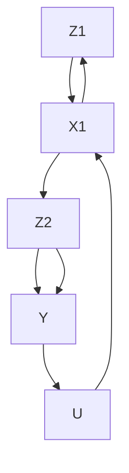
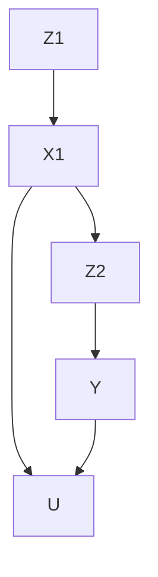

# 时变处理与混杂（Time-Varying Treatment and Confounding）

在生物医学和社会科学中，**时变处理（time-varying treatments）** 的研究非常普遍。**詹姆斯·罗宾斯（James Robins）** 推动了生物统计学领域的相关研究。一个经典例子是，HIV 患者可能会随时间反复服用和停用**齐多夫定（azidothymidine）**，一种抗逆转录病毒药物（Robins et al., 2000; Hernán et al., 2000）。其他领域也存在类似问题。在教育学中，一个经典例子是学生可能会随时间接受不同类型的教学指导（Hong and Raudenbush, 2008）。在政治学中，一个经典例子是候选人会根据时变的民调和对手的行为不断调整其竞选策略（Blackwell, 2013）。

对时变处理的因果推断并不是对单一时点处理因果推断的简单扩展。主要挑战在于**时变混杂（time-varying confounding）**。即使我们假设所有时变混杂因素都被观测到，在调整这些混杂因素时仍面临统计挑战。一方面，我们应该对这些混杂因素进行分层以调整混杂；另一方面，对处理后变量进行分层会导致偏倚。由于这两个相互冲突的目标，对时变处理和混杂的因果推断需要更复杂的统计方法。这是本章的主要内容。

为尽量减少符号负担，我将使用两个时点处理的设定来传达最重要的思想。扩展到多个时点的处理在概念上是直接的，尽管在有限样本中会出现技术复杂性。我将讨论这些复杂性，并将一般性结论推迟到问题 29.6–29.9 中。

## 29.1 基本设定与序贯可忽略性（Basic Setup and Sequential Ignorability）

从两个时点的处理开始。两个时点变量的时间顺序如下：

$$
X _ {0} \rightarrow Z _ {1} \rightarrow X _ {1} \rightarrow Z _ {2} \rightarrow Y
$$

其中

• $X _ { 0 }$ 表示基线的处理前协变量；


图 29.1：在 $X _ { 1 }$ 与 $Y$ 之间无未测量混杂 $U$ 的情况。该因果图以处理前协变量 $X _ { 0 }$ 为条件。

• $Z _ { 1 }$ 表示时点 1 的处理；
• $X _ { 1 }$ 表示时点 1 和时点 2 处理之间的时变协变量；
• $Z _ { 2 }$ 表示时点 2 的处理；
• $Y$ 表示结局。

对于二元处理 $( Z _ { 1 } , Z _ { 2 } )$ ，每个单元有四个潜在结局

$$
Y (z _ {1}, z _ {2}) \text {   for   } z _ {1}, z _ {2} = 0, 1.
$$

观测到的结局等于

$$
Y = Y \left(Z _ {1}, Z _ {2}\right) = \sum_ {z _ {1} = 0, 1} \sum_ {z _ {2} = 0, 1} 1 \left(Z _ {1} = z _ {1}\right) 1 \left(Z _ {2} = z _ {2}\right) Y \left(z _ {1}, z _ {2}\right).
$$

我将聚焦于具有**序贯可忽略性（sequential ignorability）** 的经典设定，即处理在给定观测历史的情况下是序贯随机化的。

**假设 29.1（序贯可忽略性）** $( 1 ) \ Z _ { 1 }$ 在给定 $X _ { 0 }$ 下是随机化的：

$$
Z _ {1} \bot Y (z _ {1}, z _ {2}) \mid X _ {0} \quad \text{对于} \quad z _ {1}, z _ {2} = 0, 1.
$$

(2) $Z _ { 2 }$ 在给定 $( Z _ { 1 } , X _ { 1 } , X _ { 0 } )$ 下是随机化的：

$$
Z _ {2} \bot Y (z _ {1}, z _ {2}) \mid (Z _ {1}, X _ {1}, X _ {0}) \quad \text{对于} \quad z _ {1}, z _ {2} = 0, 1.
$$

图 29.1 是对应于假设 29.1 的一个简单因果图，其中不包含任何未测量的混杂因素。

图 29.2 是对应于假设 29.1 的一个更复杂的因果图。序贯可忽略性仅排除了处理 $( Z _ { 1 } , Z _ { 2 } )$ 与结局 $Y$ 之间的混杂，但允许时变协变量 $X _ { 1 }$ 与结局 $Y$ 之间存在未测量的混杂。即使在序贯可忽略性下， $U$ 的可能存在也会导致许多微妙的问题。




图 29.2：在 $X _ { 1 }$ 与 $Y$ 之间存在未测量混杂的情况。该因果图以处理前协变量 $X _ { 0 }$ 为条件。

## 29.2 g-公式与结局建模（g-formula and Outcome Modeling）

回顾单一时点处理下基于结局的识别公式：

$$
E \{Y (z) \} = E \{E (Y \mid Z = z, X) \}.
$$

对于离散的 $X$ ，它简化为

$$
E \{Y (z) \} = \sum_ {x} E (Y \mid Z = z, X = x) \mathrm{pr} (X = x);
$$

对于连续的 $X$ ，它简化为

$$
E \{Y (z) \} = \int E (Y \mid Z = z, X = x) f _ {X} (x) \mathrm{d} x.
$$

以下结果将其扩展到两个时点处理的设定。

**定理 29.1** 在假设 29.1 下，

$$
E \{Y (z _ {1}, z _ {2}) \} = E \Big [ E \{E (Y \mid z _ {2}, z _ {1}, X _ {1}, X _ {0}) \mid z _ {1}, X _ {0} \} \Big ]. \tag {29.1}
$$

在定理 29.1 中，为简化符号，我将 "$Z _ { 2 } = z _ { 2 }$" 简写为 "$z _ { 2 }$"。为避免本章中出现复杂公式，我将使用小写字母表示随机变量取相应值的事件。对于离散的 $X _ { 0 }$ 和 $X _ { 1 }$ ，识别公式 (29.1) 简化为

$$
E \{Y (z _ {1}, z _ {2}) \} = \sum_ {x _ {0}} \sum_ {x _ {1}} E (Y \mid z _ {2}, z _ {1}, x _ {1}, x _ {0}) \mathrm{pr} (x _ {1} \mid z _ {1}, x _ {0}) \mathrm{pr} (x _ {0}); \tag {29.2}
$$

对于连续的 $X _ { 0 }$ 和 $X _ { 1 }$ ，识别公式 (29.1) 简化为

$$
E \{Y (z _ {1}, z _ {2}) \} = \int \int E (Y \mid z _ {2}, z _ {1}, x _ {1}, x _ {0}) f (x _ {1} \mid z _ {1}, x _ {0}) f (x _ {0}) \mathrm{d} x _ {1} \mathrm{d} x _ {0}. \tag {29.3}
$$

将 (29.2) 与基于全概率公式的公式进行比较，可以获得更深入的理解：

$$
\begin{array}{l} E (Y) = \sum_ {x _ {0}} \sum_ {z _ {1}} \sum_ {x _ {1}} \sum_ {z _ {2}} E (Y \mid z _ {2}, z _ {1}, x _ {1}, x _ {0}) \\ \operatorname{pr} (z _ {1} \mid z _ {1}, x _ {1}, x _ {0}) \operatorname{pr} (x _ {1} \mid z _ {1}, x _ {0}) \operatorname{pr} (z _ {1} \mid x _ {0}) \operatorname{pr} (x _ {0}). \tag {29.4} \\ \end{array}
$$

擦除 (29.4) 中 $z _ { 2 }$ 和 $z _ { 1 }$ 的概率，我们可以得到公式 (29.3)。这是直观的，因为潜在结局 $Y ( z _ { 1 } , z _ { 2 } )$ 的含义是将 $Z _ { 1 }$ 和 $Z _ { 2 }$ 分别固定为 $z _ { 1 }$ 和 $z _ { 2 }$。

罗宾斯将 (29.2) 和 (29.3) 称为 **g-公式（g-formulas）**。现在我将证明定理 29.1。

**定理 29.1 的证明：** 由迭代期望性质，

$$
E \{Y (z _ {1}, z _ {2}) \} = E \left[ E \{Y (z _ {1}, z _ {2}) \mid X _ {0} \} \right],
$$

因此我们关注 $E \{ Y ( z _ { 1 } , z _ { 2 } ) \mid X _ { 0 } \}$ 。由假设 29.1(1) 和迭代期望性质，

$$
\begin{array}{l} E \{Y (z _ {1}, z _ {2}) \mid X _ {0} \} = E \{Y (z _ {1}, z _ {2}) \mid z _ {1}, X _ {0} \} \\ = E \left[ E \left\{Y \left(z _ {1}, z _ {2}\right) \mid z _ {1}, X _ {1}, X _ {0} \right\} \mid z _ {1}, X _ {0} \right]. \\ \end{array}
$$

由假设 29.1(2)，

$$
\begin{array}{l} E \{Y (z _ {1}, z _ {2}) \mid X _ {0} \} = E \Big [ E \{Y (z _ {1}, z _ {2}) \mid z _ {2}, z _ {1}, X _ {1}, X _ {0} \} \mid z _ {1}, X _ {0} \Big ] \\ = E \left[ E \left\{Y \mid z _ {2}, z _ {1}, X _ {1}, X _ {0} \right\} \mid z _ {1}, X _ {0} \right]. \\ \end{array}
$$

由此得到公式 (29.1)。


## 29.2.1 基于结果建模的插件估计（Plug-in estimation based on outcome modeling）

**g-公式** (29.2) 和 (29.3) 表明，要估计**潜在结果（potential outcomes）**的均值，我们需要对 $E ( Y \mid z _ { 2 } , z _ { 1 } , x _ { 1 } , x _ { 0 } )$ 、 $\operatorname { p r } ( x _ { 1 } \mid z _ { 1 } , x _ { 0 } )$ 和 $\mathrm { p r } ( x _ { 0 } )$ 进行建模。利用这些拟合好的模型，我们可以将其代入 g-公式中。

对于某些特殊函数形式，这一任务可以简化。下面的例 29.1 给出了在结果变量服从线性模型时的结果。

**例 29.1** 假设一个线性结果模型

$$
E (Y \mid z _ {2}, z _ {1}, x _ {1}, x _ {0}) = \beta_ {0} + \beta_ {1} z _ {2} + \beta_ {2} z _ {1} + \beta_ {3} x _ {1} + \beta_ {4} x _ {0}.
$$

我们可以验证

$$
\begin{array}{l} E \{Y (z _ {1}, z _ {2}) \} = \sum_ {x _ {0}} \sum_ {x _ {1}} (\beta_ {0} + \beta_ {1} z _ {2} + \beta_ {2} z _ {1} + \beta_ {3} x _ {1} + \beta_ {4} x _ {0}) \mathrm{pr} (x _ {1} \mid z _ {1}, x _ {0}) \mathrm{pr} (x _ {0}) \\ = \beta_ {0} + \beta_ {1} z _ {2} + \beta_ {2} z _ {1} + \beta_ {3} \sum_ {x _ {0}} E (X _ {1} \mid z _ {1}, x _ {0}) \mathrm{pr} (x _ {0}) + \beta_ {4} E (X _ {0}). \\ \end{array}
$$

定义

$$
E \{X _ {1} (z _ {1}) \} = \sum_ {x _ {0}} E (X _ {1} \mid z _ {1}, x _ {0}) \mathrm{pr} (x _ {0}) \tag {29.5}
$$

从而将公式简化为

$$
E \{Y (z _ {1}, z _ {2}) \} = \beta_ {0} + \beta_ {1} z _ {2} + \beta_ {2} z _ {1} + \beta_ {3} E \{X _ {1} (z _ {1}) \} + \beta_ {4} E (X _ {0}).
$$

在 (29.5) 中，我引入了在时间点 1 接受处理 $Z _ { 1 } = z _ { 1 }$ 下 $X _ { 1 }$ 的潜在结果。这是合理的，因为 $( 2 9 . 5 )$ 的右侧正是 $E \{ X _ { 1 } ( z _ { 1 } ) \}$ 在**可忽略性（ignorability）** $X _ { 1 } ( z _ { 1 } ) \bot \bot \ Z _ { 1 } \mid X _ { 0 }$ （对于 $z _ { 1 } = 0 , 1$）下的识别公式。我们并不真正需要潜在结果 $X _ { 1 } ( z _ { 1 } )$ 和可忽略性，但这是一个方便的记号，并且与我们之前的讨论一致。

定义 $\tau _ { Z _ { 1 }  X _ { 1 } } = E \{ X _ { 1 } ( 1 ) - X _ { 1 } ( 0 ) \}$ 。我们可以验证

$$
E \{Y (1, 0) - Y (0, 0) \} = \beta_ {2} + \beta_ {3} \tau_ {Z _ {1} \rightarrow X _ {1}},
$$

$$
E \{Y (0, 1) - Y (0, 0) \} = \beta_ {1},
$$

$$
E \{Y (1, 1) - Y (0, 0) \} = \beta_ {1} + \beta_ {2} + \beta_ {3} \tau_ {Z _ {1} \to X _ {1}}.
$$

因此，我们可以先使用标准方法估计回归系数 $\beta s$ 以及 $Z _ { 1 }$ 对 $X _ { 1 }$ 的**平均因果效应（average causal effect）**，然后基于上述公式估计 $( Z _ { 1 } , Z _ { 2 } )$ 对 $Y$ 的效应。

然而，**Robins 和 Wasserman (1997)** 指出了基于结果建模的插件估计的一个令人惊讶的缺陷。他们表明，在这种策略下，如果模型设定错误，即使数据生成过程中 $( Z _ { 1 } , Z _ { 2 } )$ 对 $Y$ 的真实因果效应为零，数据分析者也可能会错误地拒绝零假设。他们称之为 **g-零悖论（g-null paradox）**。也许令人惊讶的是，他们表明即使在例 29.1 的简单线性结果模型中，g-零悖论也可能出现。**McGrath 等人 (2021)** 重新审视了这一悖论。详见问题 29.1。

## 29.2.2 基于结果建模的递归估计（Recursive estimation based on outcome modeling）

第 29.2.1 节中的插件估计涉及对**时变混杂变量（time-varying confounder）** $X _ { 1 }$ 进行建模，并导致了令人不快的 g-零悖论。这不是一个理想的方法。

回想一下基于 $E \{ Y ( z ) \} = E \{ { \bar { E } } ( Y \mid Z = z , X ) \}$ 的单一时间点处理的**结果回归估计量（outcome regression estimator）**。我们首先使用 $Z = z$ 的数据子集拟合 $Y$ 对 $X$ 的模型，并为所有单元获得拟合值 $\hat { Y } _ { i } ( z )$ 。然后我们得到估计量

$$
\hat {E} \{Y (z) \} = n ^ {- 1} \sum_ {i = 1} ^ {n} \hat {Y} _ {i} (z).
$$

类似地，(29.1) 中的**递归期望公式（recursive expectation formula）**启发了一种更简单的估计方法。从内层条件期望开始，记为

$$
\tilde {Y} _ {2} (z _ {1}, z _ {2}) = E (Y \mid Z _ {2} = z _ {2}, Z _ {1} = z _ {1}, X _ {1}, X _ {0}).
$$

我们可以使用 $( Z _ { 2 } = z _ { 2 } , Z _ { 1 } = z _ { 1 } )$ 的数据子集拟合 $Y$ 对 $( X _ { 1 } , X _ { 0 } )$ 的模型，并为所有单元获得拟合值 $\hat { Y } _ { 2 i } ( z _ { 1 } , z _ { 2 } )$ 。接着进行外层条件期望，记为

$$
\tilde {Y} _ {1} (z _ {1}, z _ {2}) = E \{\tilde {Y} _ {2} (z _ {1}, z _ {2}) \mid Z _ {1} = z _ {1}, X _ {0} \}.
$$

我们可以使用 $Z _ { 1 } = z _ { 1 }$ 的数据子集拟合 $\hat { Y } _ { 2 } ( z _ { 1 } , z _ { 2 } )$ 对 $X _ { 0 }$ 的模型，并为所有单元获得拟合值 $\hat { Y } _ { 1 i } ( z _ { 1 } , z _ { 2 } )$ 。那么 $E \{ Y ( z _ { 1 } , z _ { 2 } ) \}$ 的最终估计量为

$$
\hat {E} \{Y (z _ {1}, z _ {2}) \} = n ^ {- 1} \sum_ {i = 1} ^ {n} \hat {Y} _ {1 i} (z _ {1}, z _ {2}).
$$

上述递归估计不涉及对 $X _ { 1 }$ 的模型拟合，从而避免了 g-零悖论。特殊情况见问题 29.2。

## 29.3 逆倾向得分加权（Inverse propensity score weighting）

回顾单一时间点处理的基于**倾向得分（propensity score）**的识别公式：

$$
E \{Y (z) \} = E \left\{\frac {1 (Z = z) Y}{\operatorname* {p r} (Z = z \mid X)} \right\}.
$$

以下结果将其推广到两个时间点处理的设置。定义

$$
e (z _ {1}, X _ {0}) = \mathrm{pr} (Z _ {1} = z _ {1} \mid X _ {0})
$$

和

$$
e (z _ {2}, Z _ {1}, X _ {1}, X _ {0}) = \mathrm{pr} (Z _ {2} = z _ {2} \mid Z _ {1}, X _ {1}, X _ {0})
$$

分别为时间点 1 和时间点 2 的倾向得分。

**定理 29.2** 在假设 29.1 下，

$$
E \{Y (z _ {1}, z _ {2}) \} = E \left\{\frac {1 (Z _ {1} = z _ {1}) 1 (Z _ {2} = z _ {2}) Y}{e (z _ {1} , X _ {0}) e (z _ {2} , Z _ {1} , X _ {1} , X _ {0})} \right\}. \tag {29.6}
$$

定理 29.2 揭示了被省略的**重叠假设（overlap assumption）**：

$$
0 <   e \left(z _ {1}, X _ {0}\right) <   1, \quad 0 <   e \left(z _ {2}, Z _ {1}, X _ {1}, X _ {0}\right) <   1
$$

对于所有 $z _ { 1 }$ 和 $z _ { 2 }$ 成立。如果某些倾向得分为 0 或 1，那么识别公式 (29.6) 会发散到无穷大。

**定理 29.2 的证明：** 以 $( Z _ { 1 } , X _ { 1 } , X _ { 0 } )$ 为条件，并利用假设 29.1(2)，我们可以将 (29.6) 的右侧简化为

$$
\begin{array}{l} E \left\{\frac {1 (Z _ {1} = z _ {1}) 1 (Z _ {2} = z _ {2}) Y (z _ {1} , z _ {2})}{\operatorname{pr} (Z _ {1} = z _ {1} \mid X _ {0}) \operatorname{pr} (Z _ {2} = z _ {2} \mid Z _ {1} , X _ {1} , X _ {0})} \right\} \\ = E \left\{\frac {1 (Z _ {1} = z _ {1}) \mathrm{pr} (Z _ {2} = z _ {2} \mid Z _ {1} , X _ {1} , X _ {0}) E (Y (z _ {1} , z _ {2}) \mid Z _ {1} , X _ {1} , X _ {0})}{\mathrm{pr} (Z _ {1} = z _ {1} \mid X _ {0}) \mathrm{pr} (Z _ {2} = z _ {2} \mid Z _ {1} , X _ {1} , X _ {0})} \right\} \\ = E \left\{\frac {1 (Z _ {1} = z _ {1})}{\operatorname{pr} (Z _ {1} = z _ {1} \mid X _ {0})} E (Y (z _ {1}, z _ {2}) \mid Z _ {1}, X _ {1}, X _ {0}) \right\} \\ = E \left\{\frac {1 (Z _ {1} = z _ {1})}{\operatorname{pr} (Z _ {1} = z _ {1} \mid X _ {0})} Y (z _ {1}, z _ {2}) \right\}, \tag {29.7} \\ \end{array}
$$

其中 (29.7) 由**塔式性质（tower property）**得出。

以 $X _ { 0 }$ 为条件，并利用假设 29.1(1)，我们可以将 (29.7) 的右侧简化为

$$
\begin{array}{l} E \left\{\frac {\operatorname{pr} (Z _ {1} = z _ {1} \mid X _ {0})}{\operatorname{pr} (Z _ {1} = z _ {1} \mid X _ {0})} E (Y (z _ {1}, z _ {2}) \mid X _ {0}) \right\} \\ = E \left\{E \left(Y \left(z _ {1}, z _ {2}\right) \mid X _ {0}\right) \right\} \\ = E \{Y (z _ {1}, z _ {2}) \}, \\ \end{array}
$$

其中，同样地，最后一行由塔式性质得出。

基于 **IPW** 的估计量要简单得多，它仅涉及对两个二元指标进行建模。首先，我们可以拟合 $Z _ { 1 }$ 对 $X _ { 0 }$ 的模型，以获得所有单元的拟合值 $\hat { e } _ { 1 } ( z _ { 1 } , X _ { 0 i } )$ ；并拟合 $Z _ { 2 }$ 对 $( Z _ { 1 } , X _ { 1 } , X _ { 0 } )$ 的模型，以获得所有单元的拟合值 $\hat { e } _ { 2 } ( z _ { 2 } , Z _ { 1 i } , X _ { 1 i } , X _ { 0 i } )$ 。然后，我们得到以下 IPW 估计量：

$$
\hat {E} ^ {\mathrm{ht}} \left\{Y \left(z _ {1}, z _ {2}\right) \right\} = n ^ {- 1} \sum_ {i = 1} ^ {n} \frac {1 \left(Z _ {1 i} = z _ {1}\right) 1 \left(Z _ {2 i} = z _ {2}\right) Y _ {i}}{\hat {e} _ {1} \left(z _ {1} , X _ {0 i}\right) \hat {e} _ {2} \left(z _ {2} , Z _ {1 i} , X _ {1 i} , X _ {0 i}\right)}.
$$

与第 11 章的讨论类似，**Horvitz–Thompson 型估计量**（Horvitz–Thompson-type estimator）对结果变量的位置平移不具有不变性，并且在有限样本中不稳定。一种修正的 **Hajek 型估计量**（Hajek-type estimator）为 $\hat { E } ^ { \mathrm { h a j } } \{ Y ( z _ { 1 } , z _ { 2 } ) \} = \hat { E } ^ { \mathrm { h t } } \{ Y ( z _ { 1 } , z _ { 2 } ) \} / \hat { 1 } ^ { \mathrm { h t } } ( z _ { 1 } , z _ { 2 } )$ ，其中

$$
\hat {1} ^ {\mathrm{ht}} (z _ {1}, z _ {2}) = n ^ {- 1} \sum_ {i = 1} ^ {n} \frac {1 (Z _ {1 i} = z _ {1}) 1 (Z _ {2 i} = z _ {2})}{\hat {e} _ {1} (z _ {1} , X _ {0 i}) \hat {e} _ {2} (z _ {2} , Z _ {1 i} , X _ {1 i} , X _ {0 i})}.
$$

## 29.4 多个时间点（Multiple time points）

将第29.2节和第29.3节中的估计策略扩展到多个时间点并非直接可行。即使对于二元处理和 $K$ 个时间点，处理组合的数量也会随着 $K$ 呈指数增长（例如，$2 ^ { 5 } = 3 2$ 和 $2 ^ { 1 0 } = 1 0 2 4 \rangle$）。因此，第29.2节和第29.3节中的**结果回归（outcome regression）**和 **IPW 估计量**在有限样本中是不可行的。

## 29.4.1 边际结构模型（Marginal structural model）

一种强大的方法基于**边际结构模型（Marginal Structural Model, MSM）**（Robins et al., 2000; Hern´an et al., 2000）。为简化符号，我将仅介绍 $K = 2$ 情况下的 MSM，尽管其主要用途是在一般情形中。

定义 29.1 (MSM)  $Y ( z _ { 1 } , z _ { 2 } )$ 的边际均值等于

$$
E \{Y (z _ {1}, z _ {2}) \} = f (z _ {1}, z _ {2}; \beta).
$$

定义 29.1 的一个主要例子是 $E \{ Y ( z _ { 1 } , z _ { 2 } ) \} = \beta _ { 0 } + \beta _ { 1 } z _ { 1 } + \beta _ { 2 } z _ { 2 }$ 。将基线协变量纳入模型也是直接的。下面的定义 29.2 扩展了定义 29.1。

定义 29.2 (含基线协变量的 MSM)  $Y ( z _ { 1 } , z _ { 2 } )$ 在给定 $X _ { 0 }$ 条件下的均值等于

$$
E \{Y (z _ {1}, z _ {2}) \mid X _ {0} \} = f (z _ {1}, z _ {2}, X _ {0}; \beta).
$$

定义 29.2 的一个主要例子是

$$
E \{Y (z _ {1}, z _ {2}) \mid X _ {0} \} = \beta_ {0} + \beta_ {1} z _ {1} + \beta_ {2} z _ {2} + \beta_ {3} ^ {\mathsf {T}} X _ {0}. \tag {29.8}
$$

如果我们观测到所有潜在结果，我们可以通过以下最小化问题求解 $\beta$：

$$
\beta = \arg \min _ {b} \sum_ {z _ {2}} \sum_ {z _ {1}} E \{Y (z _ {1}, z _ {2}) - f (z _ {1}, z _ {2}, X _ {0}; b) \} ^ {2}.
$$

为简单起见，我专注于最小二乘公式。我们也可以将讨论扩展到一般的损失函数。

在**序贯可忽略性（sequential ignorability）**下，我们可以通过以下仅涉及可观测变量的最小化问题来求解 $\beta$。

定理 29.3 (MSM 下的 IPW) 在假设 29.1 和定义 29.2 下，

$$
\beta = \arg \min _ {b} \sum_ {z _ {2}} \sum_ {z _ {1}} E \left[ \frac {1 (Z _ {1} = z _ {1}) 1 (Z _ {2} = z _ {2})}{e (z _ {1} , X _ {0}) e (z _ {2} , Z _ {1} , X _ {1} , X _ {0})} \{Y - f (z _ {1}, z _ {2}, X _ {0}; b) \} ^ {2} \right].
$$

定理 29.3 的证明与定理 29.2 的证明类似。我将其留作问题 29.3。

定理 29.3 暗示了一种基于加权回归的简单估计策略。例如，在 (29.8) 下，我们可以对 $Y _ { i }$ 关于 $( 1 , Z _ { 1 i } , Z _ { 2 i } , X _ { 0 i } )$ 进行**加权最小二乘（Weighted Least Squares, WLS）**拟合，权重为 $\hat { e } _ { 1 } ^ { - 1 } ( Z _ { 1 i } , X _ { 0 i } ) \hat { e } _ { 2 i } ^ { - 1 } ( Z _ { 2 i } , Z _ { i 1 } , X _ { 1 i } , X _ { 0 i } )$ 。

## 29.4.2 结构嵌套模型（Structural nested model）

IPW 的一个关键问题是，如果**重叠假设（overlap assumption）**被违反，它就不适用。为了应对这一挑战，Robins 提出了**结构嵌套模型（Structural Nested Model, SNM）**。同样，为简化表述，我只回顾具有两个时间点的版本。

定义 29.3 (结构嵌套模型) 在时间点 1 的条件效应为

$$
E \{Y (z _ {1}, 0) - Y (0, 0) \mid Z _ {1} = z _ {1}, X _ {0} \} = g _ {1} (z _ {1}, X _ {0}; \beta) \text { 对于所有 } z _ {1}
$$

在时间点 2 的条件效应为

$$
E \{Y (z _ {1}, z _ {2}) - Y (z _ {1}, 0) \mid Z _ {2} = z _ {2}, Z _ {2} = z _ {1}, X _ {1}, X _ {0} \} = g _ {2} (z _ {2}, z _ {1}, X _ {1}, X _ {0}; \beta) \text { 对于所有 } z _ {1}, z _ {2}.
$$

在定义 29.3 中，两个逻辑约束是

$$
g _ {1} (0, X _ {0}; \beta) = 0
$$

和

$$
g _ {2} (0, z _ {1}, X _ {1}, X _ {0}; \beta) = 0 \text { 对于所有 } z _ {1}.
$$

定义 29.3 的两个主要选择如下所示。

示例 29.2 假设

$$
\left\{ \begin{array}{l} g _ {1} (z _ {1}, X _ {0}; \beta) = \beta_ {1} z _ {1}, \\ g _ {2} (z _ {2}, z _ {1}, X _ {1}, X _ {0}; \beta) = (\beta_ {2} + \beta_ {3} z _ {1}) z _ {2}. \end{array} \right.
$$

示例 29.3 假设

$$
\left\{ \begin{array}{l} g _ {1} (z _ {1}, X _ {0}; \beta) = (\beta_ {1} + \beta^ {\mathsf {T}} X _ {0}) z _ {1}, \\ g _ {2} (z _ {2}, z _ {1}, X _ {1}, X _ {0}; \beta) = (\beta_ {2} + \beta_ {3} z _ {1} + \beta_ {4} ^ {\mathsf {T}} X _ {1}) z _ {2}. \end{array} \right.
$$

比较定义 29.2 和 29.3。结构嵌套模型允许调整时变协变量，而边际结构模型只允许调整基线协变量。在定义 29.3 下的估计更为复杂。一种策略是基于**估计方程（estimating equations）**来估计参数。

我首先介绍两个重要的构建模块，用于讨论估计问题。定义

$$
U _ {2} (\beta) = Y - g _ {2} (Z _ {2}, Z _ {1}, X _ {1}, X _ {0}; \beta)
$$

和

$$
U _ {1} (\beta) = Y - g _ {2} (Z _ {2}, Z _ {1}, X _ {1}, X _ {0}; \beta) - g _ {1} (Z _ {1}, X _ {0}; \beta).
$$

它们不能直接从数据中计算，因为它们依赖于参数 $\beta$ 的真实值。在真实值处，它们具有以下性质。

引理 29.1 在假设 29.1 和定义 29.3 下，我们有

$$
\begin{array}{l} E \{U _ {2} (\beta) \mid Z _ {2}, Z _ {1}, X _ {1}, X _ {0} \} = E \{U _ {2} (\beta) \mid Z _ {1}, X _ {1}, X _ {0} \} \\ = E \left\{Y \left(Z _ {1}, 0\right) \mid Z _ {1}, X _ {1}, X _ {0} \right\} \\ \end{array}
$$

和

$$
\begin{array}{l} E \{U _ {1} (\beta) \mid Z _ {1}, X _ {0} \} = E \{U _ {1} (\beta) \mid X _ {0} \} \\ = E \{Y (0, 0) \mid X _ {0} \}. \\ \end{array}
$$

引理 29.1 涉及一个微妙的符号 $Y ( Z _ { 1 } , 0 )$ ，因为 $Z _ { 1 }$ 是随机的。它应理解为 $Y ( Z _ { 1 } , 0 ) = Z _ { 1 } Y ( 1 , 0 ) + ( 1 - Z _ { 1 } ) Y ( 0 , 0 )$ 。基于定义和引理 29.1， $U _ { 1 } ( \beta )$ 扮演着在接收任何处理前的控制潜在结果的角色，而 $U _ { 2 } ( \beta )$ 扮演着在时间点 1 接收处理后的控制潜在结果的角色。

引理 29.1 的证明：首先，我们有

$$
\begin{array}{l} E \{U _ {2} (\beta) \mid Z _ {2} = 1, Z _ {1}, X _ {1}, X _ {0} \} = E \{Y (Z _ {1}, 1) - g _ {2} (1, Z _ {1}, X _ {1}, X _ {0}; \beta) \mid Z _ {2} = 1, Z _ {1}, X _ {1}, X _ {0} \} \\ = E \left\{Y \left(Z _ {1}, 0\right) \mid Z _ {2} = 1, Z _ {1}, X _ {1}, X _ {0} \right\} \\ E \{U _ {2} (\beta) \mid Z _ {2} = 0, Z _ {1}, X _ {1}, X _ {0} \} = E \{Y (Z _ {1}, 0) - g _ {2} (0, Z _ {1}, X _ {1}, X _ {0}; \beta) \mid Z _ {2} = 0, Z _ {1}, X _ {1}, X _ {0} \} \\ = E \left\{Y \left(Z _ {1}, 0\right) \mid Z _ {2} = 0, Z _ {1}, X _ {1}, X _ {0} \right\} \\ \end{array}
$$

所以

$$
E \{U _ {2} (\beta) \mid Z _ {2}, Z _ {1}, X _ {1}, X _ {0} \} = E \{Y (Z _ {1}, 0) \mid Z _ {2}, Z _ {1}, X _ {1}, X _ {0} \} = E \{Y (Z _ {1}, 0) \mid Z _ {1}, X _ {1}, X _ {0} \}
$$

其中最后一个等式由序贯可忽略性得出。由于最后一项不依赖于 $Z _ { 2 }$ ，我们也有

$$
E \{U _ {2} (\beta) \mid Z _ {2}, Z _ {1}, X _ {1}, X _ {0} \} = E \{U _ {2} (\beta) \mid Z _ {1}, X _ {1}, X _ {0} \}.
$$

利用上述结果，我们有

$$
\begin{array}{l} E \{U _ {1} (\beta) \mid Z _ {1}, X _ {0} \} = E \{U _ {2} (\beta) - g _ {1} (Z _ {1}, X _ {0}; \beta) \mid Z _ {1}, X _ {0} \} \\ = E \left[ E \left\{U _ {2} (\beta) - g _ {1} \left(Z _ {1}, X _ {0}; \beta\right) \mid X _ {1}, Z _ {1}, X _ {0} \right\} \mid Z _ {1}, X _ {0} \right] \\ = E \left[ E \left\{Y \left(Z _ {1}, 0\right) - g _ {1} \left(Z _ {1}, X _ {0}; \beta\right) \mid X _ {1}, Z _ {1}, X _ {0} \right\} \mid Z _ {1}, X _ {0} \right] \\ = E \{Y (Z _ {1}, 0) - g _ {1} (Z _ {1}, X _ {0}; \beta) \mid Z _ {1}, X _ {0} \} \\ = E \{Y (0, 0) \mid Z _ {1}, X _ {0} \} \\ = E \{Y (0, 0) \mid X _ {0} \} \\ \end{array}
$$

其中最后一个等式由序贯可忽略性得出。由于最后一项不依赖于 $Z _ { 1 }$ ，我们也有

$$
E \{U _ {1} (\beta) \mid Z _ {1}, X _ {0} \} = E \{U _ {1} (\beta) \mid X _ {0} \}.
$$

利用引理 29.1，我们可以证明下面的定理 29.4。

定理 29.4 在假设 29.1 和定义 29.3 下，

$$
E \Big [ h _ {2} (Z _ {1}, X _ {1}, X _ {0}) \{Z _ {2} - e (1, Z _ {1}, X _ {1}, X _ {0}) \} U _ {2} (\beta) \Big ] = 0
$$

和

$$
E \Big [ h _ {1} (X _ {0}) \{Z _ {1} - e (1, X _ {0}) \} U _ {1} (\beta) \Big ] = 0.
$$

对于任意函数 $h _ { 1 }$ 和 $h _ { 2 }$ 成立，前提是矩存在。

定理 29.2 的证明：通过对 $\left( Z _ { 2 } , Z _ { 1 } , X _ { 1 } , X _ { 0 } \right)$ 取条件并使用**迭代期望律（tower property）**以及引理 29.1，得到

$$
\begin{array}{l} E \left[ h _ {2} (Z _ {1}, X _ {1}, X _ {0}) \{Z _ {2} - e (1, Z _ {1}, X _ {1}, X _ {0}) \} E \{U _ {2} (\beta) \mid Z _ {2}, Z _ {1}, X _ {1}, X _ {0} \} \right] \\ = E \left[ h _ {2} (Z _ {1}, X _ {1}, X _ {0}) \{Z _ {2} - e (1, Z _ {1}, X _ {1}, X _ {0}) \} E \{U _ {2} (\beta) \mid Z _ {1}, X _ {1}, X _ {0} \} \right]. \\ \end{array}
$$

通过对 $( Z _ { 1 } , X _ { 1 } , X _ { 0 } )$ 取条件并使用迭代期望律，可以证明最后一个等式等于 0。

类似地，通过对 $( Z _ { 1 } , X _ { 0 } )$ 取条件并使用迭代期望律以及引理 29.1，得到

$$
\begin{array}{l} E \left[ h _ {1} (X _ {0}) \{Z _ {1} - e (1, X _ {0}) \} E \{U _ {1} (\beta) \mid Z _ {1}, X _ {0} \} \right] \\ = E \left[ h _ {1} (X _ {0}) \{Z _ {1} - e (1, X _ {0}) \} E \{U _ {1} (\beta) \mid X _ {0} \} \right]. \\ \end{array}
$$

通过对 $X _ { 0 }$ 取条件并使用迭代期望律，可以证明最后一个等式等于 0。□

为了使用定理 29.4，我们必须指定 $h _ { 1 }$ 和 $h _ { 2 }$ 以确保有足够的方程来求解 $\beta$ 。下面的示例 29.4 重新审视了示例 29.2。

示例 29.4 在示例 ${ \it 2 9 . 2 }$ 下，我们可以选择 $h _ { 1 } = 1$ 和 $h _ { 2 } = \left( 1 , Z _ { 1 } \right)$ 以获得

$$
\begin{array}{l} E \left[ \left\{Z _ {2} - e (1, Z _ {1}, X _ {1}, X _ {0}) \right\} \left\{Y - (\beta_ {2} + \beta_ {3} Z _ {1}) Z _ {2} \right\} \right] = 0, \\ E \left[ Z _ {1} \left\{Z _ {2} - e \left(1, Z _ {1}, X _ {1}, X _ {0}\right) \right\} \left\{Y - \left(\beta_ {2} + \beta_ {3} Z _ {1}\right) Z _ {2} \right\} \right] = 0, \\ E \left[ \{Z _ {1} - e (1, X _ {0}) \} \{Y - (\beta_ {2} + \beta_ {3} Z _ {1}) Z _ {2} - \beta_ {1} Z _ {1} \} \right] = 0. \\ \end{array}
$$

然后我们可以从上述线性方程中求解 $\beta ^ { \prime } s$；参见问题 29.5。一个自然的问题是， $( h _ { 1 } , h _ { 2 } )$ 的其他选择是否能带来更有效的估计量。答案是肯定的。例如，我们可以选择许多 $( h _ { 1 } , h _ { 2 } )$ 并使用**广义矩方法（Generalized Method of Moments, GMM）**（Hansen, 1982）。技术细节超出了本书的范围。

Naimi et al. (2017) 和 Vansteelandt and Joffe (2014) 提供了关于结构嵌套模型的教程。




图 29.3: 在 $X _ { 1 }$ 和 $Y$ 之间存在未测量的混杂因素。该因果图忽略了处理前的协变量 $X _ { 0 }$ 。

## 29.5 家庭作业问题（Homework problems）

## 29.1 g-零悖论（g-null paradox）

考虑图 29.3 中无处理前协变量 $X _ { 0 }$ 且无从 $( Z _ { 1 } , Z _ { 2 } )$ 指向 $Y$ 的箭头的简单因果图。因此 $( Z _ { 1 } , Z _ { 2 } )$ 对 $Y$ 的影响为零。

重新审视示例 29.1。证明如果

$$
\beta_ {1} = \beta_ {3} = 0 \text{ 且 } \beta_ {2} = 0
$$

或

$$
\beta_ {1} = \beta_ {3} = 0 \text{ 且 } E \{X _ {1} (z _ {1}) \} \text{ 不依赖于 } z _ {1}.
$$

成立，则期望 $E \{ Y ( z _ { 1 } , z _ { 2 } ) \}$ 不依赖于 $( z _ { 1 } , z _ { 2 } )$ 。

备注：然而，第一个条件中的 $\beta _ { 2 } = 0$ 排除了 $Y$ 对 $X _ { 1 }$ 的依赖性，这与 $X _ { 1 }$ 和 $Y$ 之间存在未测量的混杂因素 $U$ 相矛盾； $E \{ X _ { 1 } ( z _ { 1 } ) \}$ 对 $z _ { 1 }$ 的独立性排除了 $X _ { 1 }$ 对 $Z _ { 1 }$ 的依赖性，这与从 $Z _ { 1 }$ 到 $X _ { 1 }$ 的箭头存在相矛盾。也就是说，如果 $X _ { 1 }$ 和 $Y$ 之间存在未测量的混杂因素 $U$，并且存在从 $Z _ { 1 }$ 到 $X _ { 1 }$ 的箭头，那么示例 29.1 中 $E \{ Y ( z _ { 1 } , z _ { 2 } ) \}$ 的公式必须依赖于 $( z _ { 1 } , z _ { 2 } )$ ，这与从 $( Z _ { 1 } , Z _ { 2 } )$ 到 $Y$ 没有箭头相矛盾。

## 29.2 零模型下的递归估计（Recursive estimation under the null model）

考虑问题 29.1 中因果图下的 29.2.2 节中的递归估计方法。证明基于线性模型，该估计量收敛到 0。

## 29.3 边际结构模型下的逆概率加权（IPW under MSM）

证明定理 29.3。

## 29.4 单时间点的结构嵌套模型（Structural nested model with a single time point）

回顾从 $\{ X , Z , Y ( 1 ) , Y ( 0 ) \}$ 中独立同分布（IID）数据抽取的观察性研究的标准设定。将**倾向得分（propensity score）**定义为 $e ( X ) \ = \ \mathrm { p r } ( Z = 1 \mid X )$。假设

$$
Z \bot Y (0) \mid X
$$

以及以下结构嵌套模型。

**定义 29.4（单时间点的结构嵌套模型）** 个体效应的条件均值为

$$
E \{Y (z) - Y (0) \mid Z = z, X \} = g (z, X; \beta).
$$

在定义 29.4 中，一个逻辑约束是 $g ( 0 , X ; \beta ) = 0$。证明以下结果。

1. 我们有

$$
E \{Y - g (Z, X; \beta) \mid X, Z \} = E \{Y - g (Z, X; \beta) \mid X \} = E \{Y (0) \mid X \}.
$$

2. 我们有

$$
E \Big [ h (X) \{Z - e (X) \} \{Y - g (Z, X; \beta) \} \Big ] = 0 \tag {29.9}
$$

对于任意函数 $h$，假设该矩存在。

**注：** (29.9) 是参数估计的基础。考虑定义 29.4 的一个特例，其中 $g ( z , X ; \beta ) = \beta z$。选择 $h ( X ) = 1$ 得到

$$
E \{(Z - e (X)) (Y - \beta Z) \} = 0.
$$

解出 $\beta$ 得到

$$
\beta = \frac {E \{(Z - e (X)) Y \}}{E \{(Z - e (X)) Z \}}.
$$

即，$\beta$ 等于 $Y$ 对 $Z$ 进行两阶段最小二乘回归中 $Z$ 的系数，其中 $Z - e ( X )$ 是 $Z$ 的**工具变量（instrument variable）**。

考虑定义 29.4 的另一个特例，其中 $g ( z , X ; \beta ) = ( \beta _ { 0 } + \beta _ { 1 } ^ { \mathsf { T } } X ) z$。选择 $h ( X ) = ( 1 , X )$ 得到

$$
E \left\{\binom{Z - e (X)}{(Z - e (X)) X} (Y - \beta_ {0} Z - \beta_ {1} ^ {\mathsf {T}} X Z) \right\} = 0.
$$

即，$( \beta _ { 0 } , \beta _ { 1 } )$ 等于 $Y$ 对 $( Z , X Z )$ 进行两阶段最小二乘回归中的系数，其中 $( \bar { Z } - e ( X ) , ( Z - e ( X ) ) X )$ 是 $( Z , X Z )$ 的工具变量。

## 29.5 示例 29.4 下的估计（Estimation under Example 29.4）

我们可以通过求解示例 29.4 中估计方程的经验版本来估计 $\beta \mathrm { { ^ { * } s } }$。我们首先估计两个倾向得分，并获得中心化处理变量

$$
\check {Z} _ {1 i} = Z _ {1 i} - \hat {e} (1, X _ {0 i})
$$

在时间点 1 处，以及

$$
\check {Z} _ {2 i} = Z _ {2 i} - \hat {e} (1, Z _ {1 i}, X _ {1 i}, X _ {0 i})
$$

在时间点 2 处。

证明我们可以通过将 $Y _ { i }$ 对 $\left( Z _ { 2 i } , Z _ { 1 i } Z _ { 2 i } \right)$ 进行两阶段最小二乘回归来估计 $\beta _ { 2 }$ 和 $\beta _ { 3 }$，其中 $( \check { Z } _ { 2 i } , Z _ { 1 i } \check { Z } _ { 2 i } )$ 是 $\left( Z _ { 2 i } , Z _ { 1 i } Z _ { 2 i } \right)$ 的工具变量；然后我们可以通过将 $Y _ { i } - ( \hat { \beta } _ { 2 } + \hat { \beta } _ { 3 } Z _ { 1 i } ) Z _ { 2 i }$ 对 $Z _ { 1 i }$ 进行两阶段最小二乘回归来估计 $\beta _ { 1 }$，其中 $\check { Z } _ { 1 i }$ 是 $Z _ { 1 i }$ 的工具变量。

## 29.6 多时间点处理的 g-公式（g-formula with a treatment at multiple time points）

将讨论扩展到具有 K 个时间点的设定。变量的时间顺序为

$$
X _ {0} \rightarrow Z _ {1} \rightarrow X _ {1} \rightarrow Z _ {2} \rightarrow \dots X _ {K - 1} \rightarrow Z _ {K}.
$$

引入符号 ${ \overline { { Z } } } _ { k } = ( Z _ { 1 } , \ldots , Z _ { k } )$ 和 ${ \overline { { X } } } _ { k } = ( X _ { 0 } , X _ { 1 } , \dots , X _ { k } )$，小写字母 $\overline { { z } } _ { k }$ 和 $\overline { { x } } _ { k }$ 表示相应的实现值。当 $k = 0$ 时，我们有 ${ \overline { { X } } } _ { 0 } = X _ { 0 }$，而 $\overline { { Z } } _ { 0 }$ 为空。每个单元有 $2 ^ { K }$ 个潜在结果：

$$
Y (\overline {{z}} _ {K}) \text {  对于所有   } z _ {1}, \ldots , z _ {K} = 0, 1.
$$

假设以下**序贯可忽略性（sequential ignorability）**。

**假设 29.2（多时间点的序贯可忽略性）** 我们有

$$
Z _ {k} \bot Y (\overline {{z}} _ {K}) \mid (\overline {{Z}} _ {k - 1}, \overline {{X}} _ {k - 1})
$$

对于所有 $k = 1 , \ldots , K$ 和所有 $z _ { 1 } , \dotsc , z _ { K } = 0 , 1$。

证明下面的定理 29.5。

**定理 29.5（多时间点的 g-公式）** 在假设 29.2 下，

$$
E \{Y (\overline {{z}} _ {K}) \} = E \left[ \dots E \{E (Y \mid \overline {{z}} _ {K}, \overline {{X}} _ {K - 1}) \mid \overline {{z}} _ {K - 1}, \overline {{X}} _ {K - 2} \} \dots \mid z _ {1}, X _ {0} \right].
$$

**注：** 在定理 29.5 中，我使用简化符号 $\overline { { z } } _ { k } \overrightarrow { \mathbf { \Gamma } }$ 表示 $\sqrt [ 6 ] { Z } _ { k } = \overline { { z } } _ { k } . \overline { { \jmath } } ^ { \vphantom { \dag } }$。对于离散 X，定理 29.5 简化为

$$
\begin{array}{l} E \{Y (\overline {{z}} _ {K}) \} = \sum_ {x _ {0}} \sum_ {x _ {1}} \dots \sum_ {x _ {K - 1}} E (Y | \overline {{z}} _ {K}, \overline {{x}} _ {K - 1}) \\ \cdot \operatorname{pr} (x _ {K - 1} \mid \overline {{z}} _ {K - 1}, \overline {{x}} _ {K - 2}) \dots \operatorname{pr} (x _ {1} \mid z _ {1}, x _ {0}) \operatorname{pr} (x _ {0}); \\ \end{array}
$$

对于连续 X，定理 29.5 简化为

$$
\begin{array}{l} E \{Y (\overline {{z}} _ {K}) \} = \int E (Y | \overline {{z}} _ {K}, \overline {{x}} _ {K - 1}) \\ \cdot f (x _ {K - 1} \mid \overline {{z}} _ {K - 1}, \overline {{x}} _ {K - 2}) \dots f (x _ {1} \mid z _ {1}, x _ {0}) f (x _ {0}) \mathrm{d} \overline {{x}} _ {K - 1}. \\ \end{array}
$$

## 29.7 多时间点处理的逆概率加权（IPW with a treatment at multiple time points）

继承问题 29.6 的设定。将 K 个时间点的倾向得分定义为

$$
\begin{array}{l} e (z _ {1}, X _ {0}) = \operatorname{pr} (Z _ {1} = z _ {1} \mid X _ {0}), \\ e (z _ {k}, \overline {{Z}} _ {k - 1}, \overline {{X}} _ {k - 1}) = \operatorname{pr} (Z _ {k} = z _ {k} \mid \overline {{Z}} _ {k - 1}, \overline {{X}} _ {k - 1}), \\ e (z _ {K}, \overline {{Z}} _ {K - 1}, \overline {{X}} _ {K - 1}) = \operatorname{pr} (Z _ {K} = z _ {K} \mid \overline {{Z}} _ {K - 1}, \overline {{X}} _ {K - 1}). \\ \end{array}
$$

证明下面的定理 29.7，并隐式假设重叠条件。

**定理 29.6（多时间点的逆概率加权）** 在假设 29.2 下，

$$
E \{Y (\overline {{z}} _ {K}) \} = E \left\{\frac {1 (Z _ {1} = z _ {1}) \cdots 1 (Z _ {K} = z _ {K}) Y}{e (z _ {1} , X _ {0}) \cdots e (z _ {K} , \overline {{Z}} _ {K - 1} , \overline {{X}} _ {K - 1})} \right\}.
$$

基于定理 29.7，构造 **Horvitz–Thompson 估计量**和 **Hajek 估计量**。

## 29.8 多时间点处理的边际结构模型（MSM with a treatment at multiple time points）

潜在结果的数量随 K 呈指数增长。问题 29.6 和 29.7 中的公式在有限样本中不直接适用。我们可以对潜在结果施加以下结构性假设。

**定义 29.5（多时间点的边际结构模型）** 假设

$$
E \{Y (\overline {{z}} _ {K}) \mid X _ {0} \} = f (\overline {{z}} _ {K}, X _ {0}; \beta).
$$

定义 29.5 的两个主要示例是 $E \{ Y ( \overline { { { z } } } _ { K } ) ~ \mid ~ X _ { 0 } \} ~ = ~ \beta _ { 0 } ~ +$ $\beta _ { 1 } \sum _ { k = 1 } ^ { K } z _ { k } + \beta _ { 2 } ^ { \mathsf { T } } X _ { 0 }$ 和 $\begin{array} { r } { E \{ Y ( \overline { { z } } _ { K } ) \mid X _ { 0 } \} = \beta _ { 0 } + \sum _ { k = 1 } ^ { K } \beta _ { k } z _ { k } + \beta _ { K + 1 } ^ { \mathsf { T } } X _ { 0 } } \end{array}$。

如果我们知道所有潜在结果，我们可以通过以下最小化问题求解 $\beta$：

$$
\beta = \arg \min _ {b} \sum_ {\overline {{z}} _ {K}} E \{Y (\overline {{z}} _ {K}) - f (\overline {{z}} _ {K}, X _ {0}; \beta) \} ^ {2}.
```

下面的定理 29.7 表明，在假设 29.2 下，我们可以通过一个仅涉及可观测变量的最小化问题来求解 $\beta$。

**定理 29.7（多时间点边际结构模型的逆概率加权）** 在假设 29.2 下，

$$
\beta = \arg \min _ {b} \sum_ {\overline {{z}} _ {K}} E \left[ \frac {1 (Z _ {1} = z _ {1}) \cdots 1 (Z _ {K} = z _ {K})}{e (z _ {1} , X _ {0}) \cdots e (z _ {K} , \overline {{Z}} _ {K - 1} , \overline {{X}} _ {K - 1})} \{Y - f (\overline {{z}} _ {K}, X _ {0}; \beta) \} ^ {2} \right].
$$

## 29.9 多时间点处理的结构嵌套模型（Structural nested model with a treatment at multiple time points）

继承问题 29.6 的设定和问题 29.7 的符号。本问题提出了一个一般的结构嵌套模型。

## 定义 29.6（多时间点的结构嵌套模型）

时间 k 的条件效应为

$$
E \left\{Y (\overline {{z}} _ {k}, 0) - Y (\overline {{z}} _ {k - 1}, 0) \mid \overline {{z}} _ {k}, \overline {{X}} _ {k - 1} \right\} = g _ {k} (\overline {{z}} _ {k}, \overline {{X}} _ {k - 1}; \beta)
$$

对于所有 $\overline { { z } } _ { k }$ 和所有 $k = 1 , \ldots , K$。

在定义 29.6 中，一个逻辑约束是

$$
g _ {k} (0, \overline {{z}} _ {k - 1}, \overline {{X}} _ {k - 1}; \beta) = 0
$$

对于所有 $\overline { { z } } _ { k - 1 }$ 和所有 $k = 1 , \ldots , K .$。

定义

$$
U _ {k} (\beta) = Y - \sum_ {s = 1} ^ {k} g _ {s} (\overline {{Z}} _ {s}, \overline {{X}} _ {s - 1}; \beta)
$$

对于所有 $k = 1 , \ldots , K$。下面的定理 29.8 推广了定理 29.4。

**定理 29.8** 在假设 29.2 和定义 29.6 下，

$$
E \left[ h _ {k} (\overline {{Z}} _ {k - 1}, \overline {{X}} _ {k - 1}) \{Z _ {k} - e (1, \overline {{Z}} _ {k - 1}, \overline {{X}} _ {k - 1}) \} U _ {k} (\beta) \right] = 0
$$

对于所有 $k = 1 , \ldots , K$。

**注：** 通过选择适当的 $h _ { k } \mathrm { ' s } .$，我们可以通过求解定理 29.8 的经验版本来估计 $\beta$。

## 29.10 推荐阅读（Recommended reading）

Robins 等人 (2000) 综述了边际结构模型（MSM）。Naimi 等人 (2017) 综述了 g-方法（g-methods）。

## 第七部分（Part VII）

## 附录（Appendices）

## A1