 Advances in Algorithmic Recourse: Ensuring Causal Consistency, Fairness, & Robustness

A thesis submitted to attain the degree of

Doctor of sciences of ETH Zurich

(Dr. sc. ETH Zurich)

presented by

Amir-Hossein Karimi

M.Math in Computer Science, University of Waterloo

born on 22.06.1992

citizen of Iran, Canada

accepted on the recommendation of

Prof. Dr. Bernhard Schölkopf (ETH Zurich),

Prof. Dr. Isabel Valera (Saarland University),

Prof. Dr. Benjamin Grewe (ETH Zurich),


Advances in Algorithmic Recourse: Ensuring Causal Consistency, Fairness, & RobustnessMachine learning is progressively being employed to guide critical decisions in sensitive contexts where decisions have profound effects on individuals’ lives. Examples include pre-trial bail, loan approval, resume filtering, or prescription of significant medication. In such contexts, it is crucial for models to be accurate, robust, and simultaneously uphold socially relevant values such as fairness, privacy, accountability, and explainability. These aspects significantly influence the acceptance and impact of these technologies.

In this dissertation, I focus specifically on the task of enabling and facilitating algorithmic recourse. This involves providing individuals with comprehensible explanations and recommendations on the most effective (efficient and ideally low-cost) means to recover from unfavorable decisions made by an automated system. The following research questions are addressed:

q1. how can we provide recourse to affected individuals across various settings? In response to this question, I propose a novel algorithm for generating model-agnostic counterfactual explanations (MACE) built upon standard theory and tools from formal verification. This approach overcomes the limitations of previous strategies and supports model, datatype, and distance agnostic counterfactual explanations. It also provides plausible and diverse counterfactuals for any individual, and at provably optimal distances.

q2. what actionable insight can be derived from a counterfactual explanation? I argue that explanations must enable people to act rather than merely understand. Using counterexamples and the theory of structural causal models (SCM), I demonstrate that actionable recommendations cannot generally be inferred from counterfactual explanations. I propose new optimization problems for generating minimal consequential interventions (MINT), providing exact recourse under knowledge of the true SCM and probabilistic recourse when only the causal graph is available.

q3. how does providing recourse explanations/recommendations influence other stakeholders? In the third part of this dissertation, I contend that providing individuals with the right of recourse should be considered within the broader context of its impact on other stakeholders and other desirable properties like fairness, privacy, and model/IP security. I define and propose a solution for offering fair recourse, and discuss how uncertainties and non-stationarities can affect the provided recourse. I explore robust recourse strategies and discuss potential changes to classifier or data generation processes that could facilitate fair/robust recourse.

In conclusion, this dissertation offers a roadmap for future research directions, challenges existing assumptions, and broadens the domain of recourse beyond supervised learning.

Maschinelles Lernen wird immer häufiger eingesetzt, um entscheidende Entscheidungen in sensiblen Kontexten zu steuern, in denen die Entscheidungen tiefgreifende Auswirkungen auf das Leben von Einzelpersonen haben. Beispiele hierfür sind die Entscheidung über Kautionen vor Gericht, die Genehmigung von Darlehen, das Filtern von Lebensläufen oder die Verschreibung lebensverändernder Medikamente. In solchen Situationen ist es unerlässlich, dass die Modelle präzise und robust sind und gleichzeitig soziale Werte wie Fairness, Privatsphäre, Rechenschaftspflicht und Erklärbarkeit einhalten. Diese Werte beeinflussen masgeblich die Akzeptanz und Wirkung dieser Technologien.

In dieser Dissertation konzentriere ich mich insbesondere auf die Aufgabe, Algorithmischen Recourse zu ermöglichen und zu fördern. Dies beinhaltet, den betroffenen Personen verständliche Erklärungen und Empfehlungen darüber zu geben, wie sie am effektivsten (effizient und idealerweise kostengünstig) von ungünstigen Entscheidungen, die von einem automatisierten System getroffen wurden, abrücken können. Die in dieser Dissertation behandelten Forschungsfragen sind:

q1. wie können wir den betroffenen personen recourse in unterschiedlichen situationen bieten? Zur Beantwortung dieser Frage schlage ich einen neuen Algorithmus zur Erzeugung von modellagnostischen kontrafaktischen Erklärungen (MACE) vor, der auf Standardtheorie und -werkzeugen der formalen Verifikation basiert. Dieser Ansatz überwindet die Einschränkungen früherer Strategien und ist modell-, datentypund distanzagnostisch. Er kann plausible und vielfältige kontrafaktische Erklärungen für jede Person erzeugen und das auf nachweislich optimalen Distanzen.

q2. welche handlungsfähigen erkenntnisse können aus einer kontrafaktischen erklärung gewonnen werden? Ich argumentiere, dass Erklärungen Menschen zum Handeln anregen sollten, anstatt nur zum Verstehen. Mit Hilfe von Gegenbeispielen und der Theorie der strukturellen Kausalmodelle (SCM) zeige ich, dass handlungsrelevante Empfehlungen im Allgemeinen nicht aus kontrafaktischen Erklärungen abgeleitet werden können. Ich formuliere neue Optimierungsprobleme zur direkten Erzeugung minimaler konsequenzieller Interventionen (MINT), die einen genauenRecourse unter Kenntnis des wahren SCM und einen probabilistischen Recourse bieten, wenn nur das kausale Diagramm vorhanden ist.

q3. wie wirkt sich das anbieten von recourse-erklärungen/– empfehlungen auf andere stakeholder aus? Im dritten Teil dieser Dissertation argumentiere ich, dass das Bereitstellen von Recourse für Einzelpersonen im gröseren Zusammenhang seiner Auswirkungen auf andere Stakeholder und zusätzliche wünschenswerte Eigenschaften wie Fairness, Privatsphäre und Modell-/IP-Sicherheit betrachtet werden sollte. Ich definiere und biete eine Lösung für die Bereitstellung von fairem Recourse an und diskutiere, wie Unsicherheiten und Nicht-Stationaritäten den angebotenen Recourse beeinflussen können. Ich untersuche Strategien für robusten Recourse und diskutiere mögliche änderungen an Klassifizierungsprozessen oder Daten-Generierungsprozessen, die einen fairen/robusten Recourse unterstützen könnten.

Zum Abschluss bietet diese Dissertation eine Orientierung für zukünftige Forschungsrichtungen, stellt bestehende Annahmen in Frage und erweitert den Anwendungsbereich von Recourse über das überwachte Lernen hinaus.

Thus said the truthful Prophet: “seek knowledge from the cradle to the grave”

(Abul-Qâsem Ferdowsi)

Undertaking a PhD is akin to walking an endless path of discovery, a testament to the timeless wisdom advocating the lifelong pursuit of knowledge. I am truly fortunate to have been accompanied and guided by a host of individuals who have illuminated this path with their wisdom and support. Your enduring faith in my abilities has provided the sustenance needed to traverse the challenges of this journey. A heartfelt thank you for being the torchbearers on my academic expedition.

To my supervisors, Prof. Dr. Bernhard Schölkopf and Prof. Dr. Isabel Valera, I am grateful for your support in fostering my independent thinking, generously offering your time, patiently assisting with setbacks, believing in my capabilities, and inspiring me to become my best self. Your combined mentorship emboldened me to journey across the Atlantic and pursue a PhD in a foreign land. I am deeply appreciative of this opportunity you granted me.

To Prof. Dr. Gilles Barthe, thank you for warmly welcoming me to my first PhD project, attentively hearing my ideas, guiding me in mentoring, and treating me as a respected colleague. Your passion for research was contagious, and I hope to continue collaborating with you in the future.

To Prof. Dr. Thomas Hofmann, I appreciate your honest conversations, keen insights, and kind hospitality during my exchange at ETH. My time at ETH would not have been the same had it not been for your support.

To Prof. Adrian Weller, thank you for generously hosting the ELLIS Workshop on Causethical ML’s panel discussion during your personal vacation, at the last minute.

To my cherished friends, Adrián Javaloy Bornas, Dr. Patrick Putzky, Julius von Kügelgen, Kamil Adamczewski, Dr. Krikamol Muandet, Dr. Antonio Vergari, and Dr. Atalanti Mastakouri, I value our “creative” coffee hours, German tandem practice, and profound life discussions. I am very grateful to Patrick and Kamil for helping me with my residential moves throughout my PhD. To the entire EI department group, thank you for teaching me the ways of research, and inspiring me to improve every day.

To Miriam Rateike and Pablo Sanchez-Martin, your steadfast support and collaboration in organizing both the ELLIS Workshop on Causethical ML and the Causethical ML seminar at Saarland University has been invaluable. Additionally, I thank Martina Contisciani for your inspiring teaching style that motivated our joint hosting of the Causality mini-course. Creating these events with you has been a joy and highly rewarding.

To Dr. Been Kim, Dr. Simon Kornblith, and Dr. Lars Beusing, thank you for welcoming me during my internships at Google Brain and DeepMind. I gained invaluable knowledge during my time there!

To Arman Ghaffarizadeh, my long-time friend, thank you for lending your ear and wisdom in times of joy and hardship. I cherish our friendship, which has only deepened over the years.

To the students Alexandra Walter, Kiarash Mohammadi, Ricardo Dominguez-Olmedo, and Ahmad Ehyaei your patience allowed me to grow as your mentor. I hope I was worthy of your time.

To Prof. Caterina De Bacco and her delightful group of students, you made lunch and coffee breaks feel rejuvenating.

To the kind and helpful administration staff at both MPI and ETH, Sabrina Rehbaum (MPI), Ann-Sophie Bähr (MPI), Lidia Pavel (MPI), Annika Buchholz (MPI), Sarah Danes (MPI & ETH), Paulina Motyka (ETH), and Natalia Marciniak (ETH), your support allowed me to dedicate more time to my studies.

To the Centre for Learning Systems (CLS), Natural Sciences and Engineering Research Council of Canada (NSERC), and Google, I am grateful for your generous PhD fellowships throughout my academic journey.

And to my nearest and dearest.

To my parents, Prof. Gholamreza Karimi and Prof. Zohreh Azimifar, and my brother, Ali, to whom I am endebted for all of my opportunities, who have consistently set high standards and nurtured me throughout my life.

Most importantly, to my loving wife, Fatemeh, my partner in crime, whose unwavering love, support, sacrifice, and guidance served as a beacon of hope during the darkest times. I am incredibly fortunate to have you as my “hamsafar” and eagerly anticipate the many adventures that lie ahead for us!

Finally, and most certainly not least, I express my gratitude to the almighty é <Ë@, to whom I owe anything and everything.

The following peer-reviewed publications are at the core of my PhD research and covered in this dissertation:

1. “Model-Agnostic Counterfactual Explanations for Consequential Decisions,” Karimi, Barthe, Balle, Valera, AISTATS ( Á), 2019.  
2. “Algorithmic Recourse: from Counterfactual Explanations to Interventions,” Karimi, Schölkopf, Valera, ACM-FAccT ( ­), 2020.  
3. “Algorithmic recourse under imperfect causal knowledge: a probabilistic approach,” Karimi\*, von Kügelgen\*, Schölkopf, Valera, NeurIPS ( ­), 2020.  
4. “Scaling Guarantees for Nearest Counterfactual Explanations,” Mohammadi, Karimi, Barthe, Valera, ACM-AIES (Á), 2021.  
5. “A survey of algorithmic recourse: contrastive explanations and consequential recommendations,” Karimi, Barthe, Schölkopf, Valera, ACM Computing Surveys (), 2022.  
6. “Towards Causal Algorithmic Recourse,” Karimi\*, von Kügelgen\*, Schölkopf, Valera, Springer LNAI Book Chapter, 2022.  
7. “On the Fairness of Causal Algorithmic Recourse,” von Kügelgen, Karimi, Bhatt, Valera, Weller, Schölkopf, AAAI (Á), 2022.  
8. “On the Adversarial Robustness of Causal Algorithmic Recourse,” Dominguez-Olmedo, Karimi, Schölkopf, ICML (­), 2022.  
9. “Robustness Implies Fairness in Causal Algorithmic Recourse,” Ehyaei, Karimi, Schölkopf, Maghsudi ACM-FAccT, 2023.

The following peer-reviewed publications originated during my time as a PhD Student but are omitted from this thesis:

10. “On the Relationship Between Explanation and Prediction: A Causal View,” Karimi, Muandet, Kornblith, Schölkopf, Kim, ICML, 2023.

11. “On Data Manifolds Entailed by Structural Causal Models,” Dominguez-Olmedo, Karimi, Arvanitidis, Schölkopf, ICML, 2023.

All code is available at https://github.com/amirhk

Oral (Á); Spotlight (­); ≥100 citations (); Equal Contribution (\*)

## Basic

• x: scalar
• x: vector
• X: matrix
• X: set
• X: random variable
• : space, model, or constraint

## Recourse

• $\mathcal { D } \colon$ dataset
• $\phi \colon$ logic formula
• $h : \mathcal { X }  \mathcal { V } :$ discriminator
• ${ \mathcal { F } } \colon$ feasibility constraints
• $\mathcal { P } \colon$ plausibility constraints
• $\mathsf { c o s t } ( \cdot )$ or $c ( \cdot ) \colon$ : cost function
• ${ \sf d i s t } ( \cdot , \cdot )$ or $d ( \cdot , \cdot )$ : distance function
• $\mathbb { C F } _ { h } ( \mathbf { x } ^ { \mathsf { F } } )$ : set of counterfactual instances for instance $\mathbf { x } ^ { \mathsf { F } }$ and model h

## Causality

• S: set of structural equations
• $P _ { \mathbf { U } } .$ distribution over latent variables
• $\mathcal { M } = ( \mathbb { S } , P _ { \mathbf { U } } )$ : structural causal model
• $\mathcal { G } \colon$ corresponding graphical causal model
• $\mathcal { T } \colon$ subset of graph nodes
• ${ \mathrm { d } } ( { \mathcal { T } } ) ;$ : descendants of subset
• nd( ): non-descendants of subset $\mathcal { T }$
• $\Delta ( \mathbf { X } _ { \mathcal { T } } : = \pmb { \theta } )$ or $\Delta ( \pmb \theta _ { \mathcal { T } } )$ : set values of $\mathbf { \boldsymbol { x } } _ { \mathcal { T } }$ to θ via soft interventions
• do $( \mathbf { X } _ { \mathcal { I } } : = \pmb { \theta } )$ or $\mathrm { d o } ( \pmb { \theta } _ { \mathcal { T } } )$ : set values of $\mathbf { \boldsymbol { x } } _ { \mathcal { T } }$ to $\pmb { \theta }$ via hard interventions


# Introduction

## 1.1 introduction

Consider the following setting: a 28-year-old female professional working as a software engineer seeks a mortgage to purchase a home. Consider further that the loan-granting institution (e.g., bank) uses a binary classifier and denies the individual the loan based on her attributes. Naturally, in this context, answering the following questions become relevant to the individual:

Q1. Why was I rejected the loan?  
Q2. What can I do in order to get the loan in the future?

In the setting of the example above, unless the policy of the bank is relaxed, the individual must expend effort to change their situation to be favourably treated by the decision-making system. Examples such as the above are prevalent not only in finance (Muk+02; BHN17) but also in justice (e.g., pretrial bail) (Ang+16), healthcare (e.g., prescription of life-altering medication) (BKB17; GB20; BBK19), and other settings (e.g., hiring) (Maz+21; NS18; CLM19; Sch+20) broadly classified as consequential decision-making settings (BHN17; Kar+20a; Bur16; CDG18). Given the rapid adoption of automated decision-making systems in these settings, designing models that not only have high objective accuracy but also afford the individual with explanations and recommendations to favourably change their situation is of paramount importance, and even argued to be a legal necessity (GDPR (VB)). This is the concern of algorithmic recourse.

## 1.2 background

## 1.2.1 Recourse definitions

In its relatively young field, algorithmic recourse has been defined as, e.g., “an actionable set of changes a person can undertake in order to improve their outcome” (Jos+19); “the ability of a person to obtain a desired outcome from a fixed model” (USL19); or “the systematic process of reversing unfavorable decisions by algorithms and bureaucracies across a range of counterfactual scenarios” (VA20). Similarly, legal recourse pertains to actions by individualsor corporations to remedy legal difficulties (Wal92). Parallel to this, explanations aim to, at least in part, assist data-subjects to “understand what could be changed to receive a desired result in the future” (WMR17). This plurality of overlapping definitions, and the evolving consensus therein, motivates us to attempt to present a unified definition under the umbrella of recourse.

Intuitively, the commonality shared among these definitions is the desire to assist individuals that are negatively affected by automated decision-making systems to improve their circumstances (captured in the individual’s feature set) to overcome the adverse decision (from the predictive model). Such assistance may take on the form of explanations (where they need to get to) or recommendations (what actions should they perform to get there).

We submit that recourse can be achieved by an affected individual if they can understand (WMR17; Jos+19; Dow+20) and accordingly act (KSV21; Kar+20b) to alleviate an unfavorable situation, thus exercising temporallyextended agency (VA20). Concretely, in the example of the previous section, recourse is offered when the loan applicant is given answers to both questions: provided explanation(s) as to why the loan was rejected (Q1); and offered recommendation(s) on how to obtain the loan in the future (Q2). Below, we describe the similarities and often overlooked differences between these questions and the different set of assumptions and tools needed to sufficiently answer each in general settings. Such a distinction is made possible by looking at the context from a causal perspective, which we summarize below.

## 1.2.2 Recourse and causality

## 1.2.2.1 Contrastive (Counterfactual) Explanations

In an extensive survey of the social science literature, Miller [Mil19] concluded that when people ask “Why P?” questions (e.g., Q1), they are typically asking “Why P rather than Q?”, where Q is often implicit in the context (Hil90; Rob18). A response to such questions is commonly referred to as a contrastive explanation, and is appealing for two reasons. Firstly, contrastive questions provide a ‘window’ into the questioner’s mental model, identifying what they had expected (i.e., Q, the contrast case), and thus, the explanation can be better tuned towards the individual’s uncertainty and gap in understanding (Mil18). Secondly, providing contrastive explanations may be “simpler, more feasible, and cognitively less demanding" (Mil18) than offering recommendations.

## 1.2.2.2 Consequential Recommendations

Providing an affected individual with recommendations (e.g., response to Q2) amounts to suggesting a set of actions (a.k.a. flipsets (USL19)) that should be performed to achieve a favourable outcome in the future. In this regard, several works have used contrastive explanations to directly infer actionable recommendations (Jos+19; USL19; SHG19; WMR17) where actions are considered as independent shifts to the feature values of the individual (P) that results in the contrast (Q). Recent work, however, has cautioned against this approach, citing the implicit assumption of independently manipulable features as a potential limitation that may lead to suboptimal or infeasible actions (VA20; BSR20; MTS19; KSV21). To overcome this, Karimi et al. [KSV21] suggest that actions may instead be interpreted as interventions in a causal model of the world in which actions will take place, and not as independent feature manipulations derived from contrastive explanations. Formulated in this manner, e.g., using a structural causal model (SCM) (Pea00), the down-stream effects of interventions on other variables in the model (e.g., descendants of the intervened-upon variables) can directly be accounted for when recommending actions (BSR20). Thus a recommended set of actions for recourse, in a world governed by a SCM, are referred to as consequential recommendations (KSV21).

## 1.2.2.3 Clarifying terminology: contrastive, consequential, and counterfactual

To summarize, recourse explanations are commonly sought in a contrastive manner, and recourse recommendations can be considered as interventions on variables modelled using an SCM. Thus, we can rewrite the two recourse questions as:

Q1. What profile would have led to receiving the loan?  
Q2. What actions would have led me to develop this profile? 1

Viewed in this manner, both contrastive explanations and consequential recommendations can be classified as a counterfactual (MK93), in that each considers the alteration of an entity in the history of the event P, where P is the undesired model output. Thus, responses to Q1 (resp. Q2) may also be called counterfactual explanations (resp. counterfactual recommendations), meaning what could have been (resp. what could have been done) (Byr19).2


Neural network architecture diagram showing connections between input nodes X1-X3, hidden node XD, and output Y with BB block

Figure 1.1: Variables $\{ \mathsf { X } _ { i } \} _ { i = 1 } ^ { D }$ capture observable characteristics of an individual which are fed into a blackbox (BB) decision-making system (mechanism) yielding the prediction, Yˆ . Consequential recommendations are interventions on a causal model of the world in which actions take place, and may have down-stream effects on other variables before being passed into the BB. Conversely, contrastive explanations are obtained via interventions on the BB inputs which can be seen as independent feature shifts that do not affect other variables. Unlike the latter, generating the former relies on accurate knowledge of the SCM or causal graph as a model of nature itself (both of which are non-identifiable from observational data alone (PJS17)). The result of performing a consequential recommendation is a contrastive explanation (see §2.2 and §3 for descriptive and technical details, respectively).

To better illustrate the difference between contrastive explanations and consequential recommendations, we refer to Figure 1.1. According to Lewis [Lew86, p. 217], “to explain an event is to provide some information about its causal history”. Lipton [Lip90, p. 256] argues that in order to explain why P rather than $\mathrm { Q } ,$ “we must cite a causal difference between P and not-Q, consisting of a cause of P and the absence of a corresponding event in the history of not-Q”. In the algorithmic recourse setting, because the model outputs are determined by its inputs (which temporally precede the prediction), the input features may be considered as the causes of the prediction. The determining factor in whether one is providing contrastive explanations as opposed to consequential recommendations is thus the level at which the causal history (Rub15) is considered: whereas providing explanations only requires information on the relationship between the model inputs, $\{ { \sf X } _ { i } \} _ { i = 1 } ^ { D } ,$ , and predictions, ${ \hat { \Upsilon } } ,$ recommendations require information as far back as the causal relationships among inputs. The reliance on fewer assumptions (Mil19; Lip90) thus explains why generating recourse explanations is easier than generating recourse recommendations (WMR17; Mil18).

Next, we summarize the technical literature in Table 1.1 (subsequent surveys can be found at (Kea+21; VDH20; Ste+21)). We find that the vast majority of the recourse literature has focused on generating contrastive explanations rather than consequential recommendations $( \mathrm { c . f . } , \ S ^ { _ { 1 , 2 } } )$ . Differentiable models are the most widely supported class of models, and many constraints are only sparsely supported $( \mathrm { c . f . } , \ S ^ { _ { \mathrm { 1 . 3 } } ) }$ . All tools generate solutions that to some extent trade-off desirable requirements, e.g., optimality, perfect coverage, efficient run-time, and access $( \mathrm { c . f . , \ S ^ { 1 . 4 } } )$ , resulting in a lack of unifying comparison $( \mathrm { c . f . , \ S 7 . 1 } )$ . This table does not aim at serving to rank or be a qualitatively comparison of surveyed methods, and one has to exercise caution when comparing different setups. As a systematic organization of knowledge, we believe the table may be useful to practitioners looking for methods that satisfy certain properties, and useful for researchers that want to identify open problems and methods to further develop. Offering recourse in diverse settings with desirable properties remains an open challenge, which we explore in the following sections.

## 1.3 formulation

Given a fixed predictive model, commonly assumed to be a binary classifier, $h \ : \ : : \ : \ : \mathcal { X } \to \{ 0 , 1 \}$ , with $\begin{array} { r c l } { \mathcal { X } } & { = } & { \mathcal { X } _ { 1 } \times \cdot \cdot \cdot \times \mathcal { X } _ { D } } \end{array}$ , we can define the set of contrastive explanations for a (factual) input $\mathbf { x } ^ { \mathsf { F } } \in \mathbf { \mathcal { X } }$ as $\mathcal { E } : = \{ \mathbf { x } ^ { \mathsf { C F } } \in \mathcal { P } ( \mathcal { X } ) \mid h ( \mathbf { x } ^ { \mathsf { C F } } ) \neq h ( \mathbf { x } ^ { \mathsf { F } } ) \}$ . Here, $\mathcal { P } ( \mathcal { X } ) \subseteq \mathcal { X }$ is a plausible subspace of $x ,$ according to the distribution of training data (see §1.3.3.1). Descriptively, contrastive explanations identify alternative feature combinations (in nearby worlds $\left( \mathrm { L e w } _ { 7 3 } \right) )$ that result in a favourable prediction from the fixed model. Assuming a notion of dissimilarity between instances, represented as $\mathrm { d i s t } ( \cdot , \cdot ) : \mathcal { X } \times \mathcal { X } \to \mathbb { R } _ { + }$ , one can identify nearest contrastive explanations (a.k.a. counterfactual explanations) as follows:

$$
\mathbf {x} ^ {* \mathrm{CF}} \in \underset {\mathbf {x} ^ {\mathrm{CF}} \in \mathcal {P} (\mathcal {X})} {\text { argmin }} \qquad \operatorname{dist} (\mathbf {x} ^ {\mathrm{CF}}, \mathbf {x} ^ {\mathrm{F}})
$$

$$
\text { s.t. } \quad h (\mathbf {x} ^ {\mathrm{CF}}) \neq h (\mathbf {x} ^ {\mathrm{F}}) \tag {1.1}
$$

$$
\mathbf {x} ^ {\mathrm{CF}} = \mathbf {x} ^ {\mathrm{F}} + \delta
$$

where $\delta$ is the perturbation applied independently to the feature vector $\mathbf { x } ^ { \mathsf { F } }$ to obtain the counterfactual instance $\mathbf { x } ^ { \mathsf { C F E } }$ (WMR17). As discussed in $\ S ^ { \mathrm { 1 } . 2 , }$ , although contrastive explanations identify the feature vectors that would achieve recourse, in general, the set of actions that would need to be performed to realize these features are not directly implied from the explanation (KSV21).

rize the goal, formulation, solution, and properties of each algorithm. Symbols are used to indicate supported settings in the experimental section of the paper ( ), settings that are natural extensions of the presented algorithm ( ), settings that are partially supported ( ), and settings that are not supported ( ). The models cover a broad range of tree-based (TB), kernel-based (KB), differentiable (DF), or other (OT) types. Actionability contraints (unconditional or conditional), plausibility constraints (domain-, density-, and prototypical-consistency), and additional constraints (diversity, sprasity) are also explored. While the primary datatypes used in consequential settings are tabular, (involving a mix of numeric, binary, categorical, and ordinal variables), we also include additional works that generate recourse for non-tabular (images, and document) datasets. Furthermore, papers that present analysis of such properties as optimality (opt.), coverage (cov.), and run-time complexity (rtm.) are specified in the table. Finally, we make note of those papers that provide open-source implementations.

<table><tr><td rowspan="3">Algorithm</td><td colspan="10">Formulation</td><td colspan="5">Solution</td></tr><tr><td colspan="2">Model</td><td colspan="2">Actionability</td><td colspan="2">Plausibility</td><td colspan="2">Extra</td><td colspan="2">Data types</td><td rowspan="2">Tools</td><td rowspan="2">Access</td><td colspan="2">Properties</td><td>Code</td></tr><tr><td>TB KB</td><td>DF OT</td><td>uncond.</td><td>cond.</td><td>dom.</td><td>dens.</td><td>proto.</td><td>diver.</td><td>spar.</td><td></td><td>opt.</td><td>cov.</td><td>rtm.</td></tr><tr><td>(2014.03) SEDC (MP14)</td><td>●</td><td>●</td><td>●</td><td>○</td><td>○</td><td>○</td><td>○</td><td>○</td><td>○</td><td>○</td><td>heuristic</td><td>query</td><td>●</td><td>○</td><td>●</td></tr><tr><td>(2015.08) OAE (Cui+15)</td><td>●</td><td>○</td><td>○</td><td>○</td><td>●</td><td>●</td><td>○</td><td>○</td><td>○</td><td>○</td><td>ILP</td><td>white-box</td><td>●</td><td>○</td><td>●</td></tr><tr><td>(2016.05) HCLS (Las+17b; Las+17a)</td><td>●</td><td>●</td><td>●</td><td>●</td><td>●</td><td>●</td><td>●</td><td>○</td><td>○</td><td>○</td><td>grad opt/heuristic</td><td>gradient/query</td><td>●</td><td>○</td><td>●</td></tr><tr><td>(2017.06) Feature Tweaking (Tol+17)</td><td>●</td><td>○</td><td>○</td><td>○</td><td>○</td><td>○</td><td>○</td><td>○</td><td>○</td><td>○</td><td>heuristic</td><td>white-box</td><td>○</td><td>○</td><td>●</td></tr><tr><td>(2017.11) CF Expl. (WMR17)</td><td>○</td><td>○</td><td>●</td><td>○</td><td>●</td><td>○</td><td>○</td><td>○</td><td>○</td><td>●</td><td>grad opt</td><td>gradient</td><td>○</td><td>○</td><td>○</td></tr><tr><td>(2017.12) Growing Spheres (Lau+17)</td><td>●</td><td>●</td><td>●</td><td>●</td><td>○</td><td>○</td><td>○</td><td>○</td><td>○</td><td>○</td><td>heuristic</td><td>query</td><td>○</td><td>○</td><td>○</td></tr><tr><td>(2018.02) CEM (Dhu+18)</td><td>○</td><td>○</td><td>●</td><td>○</td><td>○</td><td>○</td><td>●</td><td>○</td><td>○</td><td>○</td><td>FISTA</td><td>class prob.</td><td>○</td><td>○</td><td>○</td></tr><tr><td>(2018.02) POLARIS (ZSL518)</td><td>○</td><td>○</td><td>●</td><td>○</td><td>●</td><td>○</td><td>○</td><td>○</td><td>○</td><td>○</td><td>heuristic</td><td>gradient</td><td>○</td><td>○</td><td>●</td></tr><tr><td>(2018.05) LORE (Gui+18)</td><td>●</td><td>●</td><td>●</td><td>●</td><td>○</td><td>○</td><td>●</td><td>○</td><td>○</td><td>○</td><td>gen alg + heuristic</td><td>query</td><td>●</td><td>○</td><td>●</td></tr><tr><td>(2018.06) Local Foil Trees (Waa+18)</td><td>●</td><td>●</td><td>●</td><td>●</td><td>○</td><td>○</td><td>○</td><td>○</td><td>○</td><td>○</td><td>heuristic</td><td>query</td><td>○</td><td>○</td><td>●</td></tr><tr><td>(2018.09) Actionable Recourse (USL19)</td><td>○</td><td>○</td><td>●</td><td>○</td><td>●</td><td>●</td><td>○</td><td>○</td><td>○</td><td>○</td><td>ILP</td><td>white-box</td><td>●</td><td>○</td><td>○</td></tr><tr><td>(2018.11) Weighted CFs (Gra+18)</td><td>●</td><td>●</td><td>●</td><td>●</td><td>○</td><td>○</td><td>○</td><td>○</td><td>○</td><td>●</td><td>heuristic</td><td>query</td><td>○</td><td>○</td><td>○</td></tr><tr><td>(2019.01) Efficient Search (Russ19)</td><td>○</td><td>○</td><td>●</td><td>○</td><td>●</td><td>○</td><td>○</td><td>○</td><td>●</td><td>●</td><td>MILP</td><td>white-box</td><td>○</td><td>○</td><td>○</td></tr><tr><td>(2019.04) CF Visual Expl. (Goy+19)</td><td>○</td><td>○</td><td>●</td><td>○</td><td>○</td><td>○</td><td>○</td><td>○</td><td>○</td><td>○</td><td>greedy search</td><td>white-box</td><td>●</td><td>○</td><td>●</td></tr><tr><td>(2019.05) MACE (Kar+20a)</td><td>●</td><td>●</td><td>●</td><td>●</td><td>●</td><td>●</td><td>○</td><td>○</td><td>●</td><td>●</td><td>SAT</td><td>white-box</td><td>●</td><td>●</td><td>●</td></tr><tr><td>(2019.05) DiCE (MST2o)</td><td>○</td><td>○</td><td>●</td><td>○</td><td>●</td><td>○</td><td>○</td><td>○</td><td>●</td><td>○</td><td>grad opt</td><td>gradient</td><td>○</td><td>○</td><td>○</td></tr><tr><td>(2019.05) CERTIFAI (SHG19)</td><td>●</td><td>●</td><td>●</td><td>●</td><td>●</td><td>○</td><td>○</td><td>○</td><td>●</td><td>○</td><td>gen alg</td><td>query</td><td>○</td><td>○</td><td>○</td></tr><tr><td>(2019.06) MACEM (Dhu+19)</td><td>●</td><td>●</td><td>●</td><td>●</td><td>○</td><td>○</td><td>●</td><td>○</td><td>○</td><td>●</td><td>FISTA</td><td>query</td><td>○</td><td>○</td><td>○</td></tr><tr><td>(2019.06) Expl. using SHAP (Rat19)</td><td>●</td><td>●</td><td>●</td><td>●</td><td>○</td><td>○</td><td>○</td><td>○</td><td>○</td><td>○</td><td>heuristic</td><td>query</td><td>○</td><td>○</td><td>●</td></tr><tr><td>(2019.07) Nearest Observable (Wex+19)</td><td>●</td><td>●</td><td>●</td><td>●</td><td>●</td><td>●</td><td>○</td><td>●</td><td>●</td><td>○</td><td>brute force</td><td>dataset</td><td>○</td><td>○</td><td>○</td></tr><tr><td>(2019.07) Guided Prototypes (VLK19)</td><td>●</td><td>●</td><td>●</td><td>●</td><td>●</td><td>○</td><td>●</td><td>●</td><td>○</td><td>●</td><td>grad opt/FISTA</td><td>gradient/query</td><td>○</td><td>○</td><td>●</td></tr><tr><td>(2019.07) REVISE (Jos+19)</td><td>○</td><td>○</td><td>●</td><td>○</td><td>●</td><td>○</td><td>●</td><td>○</td><td>○</td><td>○</td><td>grad opt</td><td>gradient</td><td>○</td><td>○</td><td>○</td></tr><tr><td>(2019.08) CLEAR (WG19)</td><td>●</td><td>●</td><td>●</td><td>●</td><td>○</td><td>○</td><td>●</td><td>●</td><td>○</td><td>○</td><td>heuristic</td><td>query</td><td>○</td><td>○</td><td>●</td></tr><tr><td>(2019.08) MC-BRP (LHR2o)</td><td>●</td><td>●</td><td>●</td><td>●</td><td>○</td><td>○</td><td>○</td><td>○</td><td>○</td><td>○</td><td>heuristic</td><td>query</td><td>○</td><td>○</td><td>○</td></tr><tr><td>(2019.09) FACE (Poy+19)</td><td>●</td><td>●</td><td>●</td><td>●</td><td>●</td><td>●</td><td>●</td><td>●</td><td>○</td><td>○</td><td>graph + heuristic</td><td>query</td><td>○</td><td>●</td><td>●</td></tr><tr><td>(2019.09) Equalizing Recourse (Gap+19)</td><td>●</td><td>●</td><td>●</td><td>●</td><td>●</td><td>○</td><td>○</td><td>○</td><td>○</td><td>○</td><td>ILP/heuristic</td><td>white-box/query</td><td>○</td><td>○</td><td>○</td></tr><tr><td>(2019.10) Action Sequences (RLA19)</td><td>○</td><td>○</td><td>●</td><td>○</td><td>●</td><td>●</td><td>○</td><td>○</td><td>○</td><td>○</td><td>program synthesis</td><td>class prob.</td><td>●</td><td>●</td><td>●</td></tr><tr><td>(2019.10) C-CHVAE (Paw+19)</td><td>●</td><td>●</td><td>●</td><td>●</td><td>●</td><td>○</td><td>●</td><td>●</td><td>○</td><td>○</td><td>grad opt + heuristic</td><td>query + gradient</td><td>○</td><td>●</td><td>●</td></tr><tr><td>(2019.11) FOCUS (Luc+19)</td><td>●</td><td>○</td><td>○</td><td>●</td><td>○</td><td>○</td><td>○</td><td>○</td><td>○</td><td>○</td><td>grad opt + heuristic</td><td>white-box</td><td>●</td><td>●</td><td>○</td></tr><tr><td>(2019.12) Model-based CFs (MTS19)</td><td>○</td><td>○</td><td>●</td><td>○</td><td>●</td><td>●</td><td>○</td><td>●</td><td>○</td><td>●</td><td>grad opt</td><td>gradient</td><td>○</td><td>○</td><td>●</td></tr><tr><td>(2019.12) LIME-C/SHAP-C (Ram+19)</td><td>●</td><td>●</td><td>●</td><td>●</td><td>●</td><td>○</td><td>○</td><td>○</td><td>○</td><td>○</td><td>heuristic</td><td>query</td><td>●</td><td>●</td><td>●</td></tr><tr><td>(2019.12) EMAP (CR+19)</td><td>●</td><td>●</td><td>●</td><td>●</td><td>○</td><td>○</td><td>○</td><td>○</td><td>○</td><td>○</td><td>grad opt</td><td>dataset/query</td><td>○</td><td>○</td><td>●</td></tr><tr><td>(2019.12) PRINCE (Gha+20)</td><td>●</td><td>●</td><td>●</td><td>●</td><td>○</td><td>○</td><td>○</td><td>○</td><td>○</td><td>○</td><td>graph + heuristic</td><td>query</td><td>●</td><td>●</td><td>●</td></tr><tr><td>(2019.12) LowProFool (Bal+19)</td><td>○</td><td>○</td><td>●</td><td>○</td><td>○</td><td>○</td><td>●</td><td>○</td><td>○</td><td>○</td><td>grad opt</td><td>gradient</td><td>●</td><td>○</td><td>○</td></tr><tr><td>(2020.01) ABLE (Gui+19)</td><td>●</td><td>○</td><td>●</td><td>○</td><td>○</td><td>○</td><td>●</td><td>●</td><td>○</td><td>○</td><td>gen alg + heuristic</td><td>query + data</td><td>○</td><td>○</td><td>●</td></tr><tr><td>(2020.01) SHAP-based CFs (FPH2o)</td><td>●</td><td>●</td><td>●</td><td>●</td><td>○</td><td>○</td><td>○</td><td>○</td><td></td><td>●</td><td>heuristic</td><td>query</td><td>○</td><td>○</td><td>●</td></tr><tr><td>(2020.02) CEML (AH19a; AH19b; AH2o)</td><td>●</td><td>●</td><td>●</td><td>●</td><td>○</td><td>○</td><td>○</td><td>●</td><td>○</td><td>●</td><td>grad opt/heuristic</td><td>gradient/query</td><td>●</td><td>○</td><td>●</td></tr><tr><td>(2020.02) MINT (KSV21)</td><td>●</td><td>●</td><td>●</td><td>●</td><td>●</td><td>●</td><td>●</td><td>○</td><td>●</td><td>●</td><td>SAT</td><td>white-box</td><td>●</td><td>●</td><td>○</td></tr><tr><td>(2020.03) VICE (Gom+20)</td><td>●</td><td>●</td><td>●</td><td>●</td><td>●</td><td>○</td><td>○</td><td>○</td><td>○</td><td>○</td><td>heuristic</td><td>query</td><td>○</td><td>○</td><td>○</td></tr><tr><td>(2020.03) Plausible CFs (BADS2o)</td><td>○</td><td>○</td><td>●</td><td>○</td><td>○</td><td>○</td><td>●</td><td>○</td><td>○</td><td>○</td><td>grad opt + gen alg</td><td>dataset</td><td>●</td><td>○</td><td>○</td></tr><tr><td>(2020.04) SEDC-T (VM2o)</td><td>●</td><td>●</td><td>●</td><td>●</td><td>○</td><td>○</td><td>○</td><td>○</td><td>○</td><td>○</td><td>heuristic</td><td>query</td><td>○</td><td>○</td><td>●</td></tr><tr><td>(2020.04) MOC (Dan+20)</td><td>●</td><td>●</td><td>●</td><td>●</td><td>●</td><td>●</td><td>●</td><td>○</td><td>●</td><td>●</td><td>gen alg</td><td>query</td><td>●</td><td>○</td><td>○</td></tr><tr><td>(2020.04) SCOUT (WV2o)</td><td>○</td><td>○</td><td>●</td><td>○</td><td>○</td><td>○</td><td>○</td><td>○</td><td>○</td><td>○</td><td>grad opt</td><td>gradient</td><td>○</td><td>○</td><td>●</td></tr><tr><td>(2020.04) ASP-based CFs (Ber2o)</td><td>●</td><td>●</td><td>●</td><td>●</td><td>●</td><td>●</td><td>○</td><td>○</td><td>○</td><td>○</td><td>answer-set prog.</td><td>query</td><td>○</td><td>○</td><td>○</td></tr><tr><td>(2020.05) CBR-based CFs (KS2o)</td><td>●</td><td>●</td><td>●</td><td>●</td><td>○</td><td>○</td><td>●</td><td>●</td><td>○</td><td>●</td><td>heuristic</td><td>query + data</td><td>○</td><td>○</td><td>○</td></tr><tr><td>(2020.06) Survival Model CFs (KU2o)</td><td>●</td><td>●</td><td>●</td><td>●</td><td>●</td><td>○</td><td>○</td><td>○</td><td>●</td><td>○</td><td>gen alg</td><td>query</td><td>●</td><td>○</td><td>○</td></tr><tr><td>(2020.06) Probabilistic Recourse (Kar+2ob)</td><td>●</td><td>●</td><td>●</td><td>●</td><td>●</td><td>○</td><td>●</td><td>●</td><td>○</td><td>●</td><td>grad opt/brute force</td><td>gradient/query</td><td>●</td><td>○</td><td>●</td></tr><tr><td>(2020.06) C-CHVAE (PBK2o)</td><td>●</td><td>○</td><td>●</td><td>○</td><td>●</td><td>○</td><td>○</td><td>●</td><td>○</td><td>○</td><td>grad opt</td><td>gradient</td><td>○</td><td>○</td><td>●</td></tr><tr><td>(2020.07) FRACE (Zhao2o)</td><td>○</td><td>○</td><td>●</td><td>○</td><td>○</td><td>○</td><td>●</td><td>●</td><td>○</td><td>○</td><td>grad opt</td><td>gradient</td><td>○</td><td>○</td><td>●</td></tr><tr><td>(2020.07) DACE (Kan+20a)</td><td>●</td><td>○</td><td>●</td><td>○</td><td>●</td><td>●</td><td>●</td><td>●</td><td>○</td><td>●</td><td>MILP</td><td>white-box</td><td>○</td><td>○</td><td>●</td></tr><tr><td>(2020.07) CRUDS (Dow+20)</td><td>●</td><td>●</td><td>●</td><td>●</td><td>●</td><td>●</td><td>○</td><td>●</td><td>○</td><td>●</td><td>grad opt</td><td>gradient/data</td><td>○</td><td>●</td><td>○</td></tr><tr><td>(2020.07) Gradient Boosted CFs (APMRRÁ2o)</td><td>●</td><td>○</td><td>○</td><td>○</td><td>○</td><td>○</td><td>○</td><td>○</td><td>●</td><td>○</td><td>heuristic</td><td>data</td><td>○</td><td>○</td><td>●</td></tr><tr><td>(2020.08) Gradual Construction (Kan+2ob)</td><td>○</td><td>○</td><td>●</td><td>○</td><td>●</td><td>○</td><td>●</td><td>○</td><td>○</td><td>○</td><td>heuristic</td><td>class prob.</td><td>○</td><td>○</td><td>○</td></tr><tr><td>(2020.08) DECE (CMQ2o)</td><td>○</td><td>○</td><td>●</td><td>○</td><td>●</td><td>●</td><td>○</td><td>●</td><td>○</td><td>●</td><td>grad opt</td><td>gradient</td><td>○</td><td>○</td><td>●</td></tr><tr><td>(2020.08) Time Series CFs (Ate+2o)</td><td>●</td><td>○</td><td>●</td><td>○</td><td>○</td><td>○</td><td>○</td><td>○</td><td>○</td><td>○</td><td>heuristic</td><td>query</td><td>●</td><td>●</td><td>○</td></tr><tr><td>(2020.08) PermuteAttack (HF2o)</td><td>●</td><td>●</td><td>●</td><td>●</td><td>●</td><td>○</td><td>○</td><td>○</td><td></td><td></td><td></td><td></td><td></td><td></td><td></td></tr></table>

Thus, a consequential recommendation for (factual) input $\mathbf { x } ^ { \mathsf { F } } \in { \mathcal { X } }$ is defined as $\mathcal { R } : = \{ a \in \dot { \mathcal { F } } ( \mathbf { x } ^ { \mathsf { F } } ) \mid h \left( \mathbf { x } ^ { \mathsf { S C F } } ( \mathbf { a } ; \mathbf { x } ^ { \mathsf { F } } ) \right) \neq h ( \mathbf { x } ^ { \mathsf { F } } ) \}$ . Here, $\bar { \mathcal { F } ( \mathbf { x } ^ { \mathsf { F } } ) }$ is the set of feasible actions that can be performed by the individual seeking recourse (see §1.3.3.2). Approaching the recourse problem from a causal perspective within the structural causal model (SCM) framework (KSV21), actions are considered as interventions of the form $\mathbf { \delta } \mathbf { a } = \mathrm { d o } ( \{ \mathsf { X } _ { i } : = x _ { i } ^ { \mathsf { F } } + \theta _ { i } \} _ { i \in \mathbb { Z } } ) \in \mathcal { F } ( \mathbf { x } ^ { \mathsf { F } } )$ , and $\mathbf { x } ^ { \mathsf { S C F } } ( \mathsf { a } ; \mathbf { x } ^ { \mathsf { F } } )$ denotes the structural counterfactual of $\overset { \cdot } { \mathbf { x } } ^ { \sf F }$ had action a been performed, all else being equal (Pea00). Finally, given a notion of cost of actions, capturing the effort expended by the individual as cost $( \cdot ; \cdot ) : \mathcal { F } \times \mathcal { X }  \mathbb { R } _ { + }$ , one can identify minimal consequential recommendations as follows:

$$
\mathbf {a} ^ {*} \in \underset {\mathbf {a} \in \mathcal {F} (\mathbf {x} ^ {\mathsf {F}})} {\text { argmin }} \qquad \qquad \operatorname{cost} (\mathbf {a}; \mathbf {x} ^ {\mathsf {F}})
$$

$\begin{array} { r l r } { { \mathrm { s . t . } } \quad } & { { } h ( \mathbf { x } ^ { \mathsf { C F } } ) \neq h ( \mathbf { x } ^ { \mathsf { F } } ) } \end{array}$ (1.2)

$$
\mathbf {x} ^ {\mathrm{CF}} = \mathbf {x} ^ {\mathrm{SCF}} (\mathbf {a}; \mathbf {x} ^ {\mathrm{F}})
$$

Importantly, the solution of (1.1) yields a nearest contrastive explanation $( \mathrm { i . e . , ~ \hat { { \mathbf x } } ^ { C F } ~ = ~ \hat { { \mathbf x } } ^ { F } + } \delta ^ { * } )$ , with no direct mapping to a set of (minimal) consequential recommendations (KSV21). Conversely, solving (1.2) yields both a minimal consequential recommendation $( \mathrm { i . e . , ~ } \mathsf { a } ^ { \ast } )$ and a contrastive explanation (i.e., by construction $\begin{array} { r } { \pmb { x } ^ { \mathsf { C F } } = \pmb { x } ^ { \mathsf { S C F } } ( \pmb { a } ^ { * } ; \pmb { x } ^ { \mathsf { F } } ) ) . } \end{array}$ 3

Our position is that, with the aim of providing recourse, the primary goal should be to provide minimal consequential recommendations that result in a (not necessarily nearest) contrastive explanation when acted upon. Offering nearest contrastive explanations that are not necessarily attainable through minimal effort is of secondary importance to the individual. In practice, however, due to the additional assumptions needed to solve (1.2) (specifically for computing $\mathbf { x } ^ { \mathsf { S C F } } )$ , the literature often resorts to solving (1.1). Despite the prevalance of methods assuming independent features, we quote the negative result of Karimi et al. [Kar+20b, prop. 2] whereby the authors show that without full specification of the causal relations among variables, recourse cannot be guaranteed. As pointed by Chou et al. [Cho+22], explanations derived from popular algorithms based on non-causal spurious correlations “may yield sub-optimal, erroneous, or even biased explanations.” Therefore, for the remainder of this section, we operate on the assumption of knowledge of an SCM, which allow for a deterministic formulation of recourse yielding both minimal consequential recommendation and resulting contrastive explanations. Later in $\ S 7 { \cdot } 1 , 7 { \cdot } 2 ,$ , we relax these assumptions and discuss the relatively easier settings in which causal assumptions are scarce or absent entire. This is not to say that counterfactual explanations not accompanied by recommendation actions are not useful. On the contrary, as noted by (KSV21), counterfactual explanations hold promise for “guided audit of the data” (WMR17) and evaluating various desirable model properties, such as robustness (SHG19; HL20) or fairness (SHG19; Gup+19; USL19; Kar+20a) (see also, §7.1). Besides this, it has been shown that designers of interpretable machine learning systems use counterfactual explanations for predicting model behavior (Lag+19), uncovering inaccuracies in the data profile of individuals (VA20), and also for medical outcome prediction under hypothesized treatments (Mer+20) or realistic medical image generation (WSP21). Beyond the consequential domains mentioned above and in §1.1, counterfactual explanations have been used for changing behavior of source code (Cit+21), overcoming class-imbalance issues by amending underrepresented classes with plausible counterfactuals (TK21), and aiding the interpretable design of molecules (WSW22).

In the remainder of this section, we provide an overview of the objective function and constraints used in (1.1) and (1.2), followed by a description of the datatypes commonly used in recourse settings. Finally, we conclude with related formulations. Then in Section 1.4, we review the tools used to solve the formulations defined here.

## 1.3.1 Optimization objective

Generally, it is difficult to define dissimilarity (dist) between individuals, or cost functions for effort expended by individuals. Notably, this challenge was first discussed in the algorithmic fairness literature (Dwo+12; Ilv19), and later echoed throughout the algorithmic recourse community (VA20; BSR20). In fact, “the law provides no formal guidance as to the proper metric for determining what reasons are most salient” (SB18). In spite of this, existing works have presented various ad-hoc formulations with sensible intuitive justifications or practical allowance, which we review below.

## 1.3.1.1 On dist

Wachter et al. [WMR17] define dist as the Manhattan distance, weighted by the inverse median absolute deviation (MAD):

$$
\operatorname{dist} \left(\mathbf {x}, \mathbf {x} ^ {\mathrm{F}}\right) = \sum_ {k \in [ D ]} \frac {\left| x _ {k} - x _ {k} ^ {\mathrm{F}} \right|}{\mathrm{MAD} _ {k}} \tag {1.3}
$$

$$
\mathrm{MAD} _ {k} = \operatorname{median} _ {j \in P} \left(\left| X _ {j, k} - \operatorname{median} _ {l \in P} \left(X _ {l, k}\right) \right|\right)
$$

This distance has several desirable properties, including accounting and correcting for the different ranges across features through the MAD heuristic, robustness to outliers with the use of the median absolute difference, and finally, favoring sparse solutions through the use of $\ell _ { 1 }$ Manhattan distance.

Karimi et al. [Kar+20a] propose a weighted combination of $\ell _ { p }$ norms as a flexible measure across a variety of situations. The weights, $\alpha , \beta , \gamma , \zeta$ as shown below, allow practitioners to balance between sparsity of changes $( \mathrm { i . e . , }$ , through the $\ell _ { 0 }$ norm), an elastic measure of distance (i.e., through the $\ell _ { 1 } , \ell _ { 2 }$ norms) (Dhu+18), and a maximum normalized change across all features $( \mathrm { i . e . , }$ through the $\ell _ { \infty }$ norm):

$$
\operatorname{dist} \left(\mathbf {x}; \mathbf {x} ^ {\mathrm{F}}\right) = \alpha | | \delta | | _ {0} + \beta | | \delta | | _ {1} + \gamma | | \delta | | _ {2} + \zeta | | \delta | | _ {\infty} \tag {1.4}
$$

where $\boldsymbol { \delta } = [ \delta _ { 1 } , \cdots , \delta _ { D } ] ^ { T }$ and $\delta _ { k } : \mathcal { X } _ { k } \times \mathcal { X } _ { k } \to [ 0 , 1 ] \ \forall \ k \in [ D ]$ . This measure accounts for the variability across heterogeneous features (see §1.3.5) by independently normalizing the change in each dimension according to its spread. Additional weights may also be used to relative emphasize changes in specific variables. Finally, other works aim to minimize dissimilarity on a graph manifold (Poy+19), in terms of Euclidean distance in a learned feature space (Paw+19; Jos+19), or using a Riemannian metric in a latent space (AHH17; AHS20).

## 1.3.1.2 On cost

Similar to (Kar+20a), various works explore $\ell _ { p }$ norms to measure cost of actions. Ramakrishnan et al. [RLA19] explore $\ell _ { 1 } , \ell _ { 2 }$ norm as well as constant cost if specific actions are undertaken; Karimi et al. [KSV21; Kar+20b] minimize the $\ell _ { 2 }$ norm between $\mathbf { x } ^ { \mathsf { F } }$ and the action a assignment $( \mathrm { i } . \mathrm { e } . , | | \pmb { \theta } | | _ { 2 } ) ;$ and Cui et al. [Cui+15] explore combinations of $\ell _ { 0 } , \ell _ { 1 } , \ell _ { 2 }$ norms over a user-specified cost matrix. Encoding individual-dependent restrictions is critical, e.g., obtaining credit is more difficult for an foreign students compared to local resident.

Beyond $\ell _ { p }$ norms, the work of Ustun et al. [USL19] propose the total- and maximum-log percentile shift measures, to automatically account for the distribution of points in the dataset, e.g.,

$$
\operatorname{cost} (\mathbf {a}; \mathbf {x} ^ {\mathrm{F}}) = \max _ {k \in [ D ]} | Q _ {k} \left(\mathbf {x} _ {k} ^ {\mathrm{F}} + \theta_ {k}\right) - Q _ {k} \left(\mathbf {x} _ {k} ^ {\mathrm{F}}\right) | \tag {1.5}
$$

where $Q _ { k } ( \cdot )$ is the CDF of $x _ { k }$ in the target population. This type of metric naturally accounts for the relative difficulty of moving to unlikely (high or low percentile) regions of the data distribution. For instance, going from a 50 to 55th percentile in school grades is simpler than going from 90 to 95th percentile.

## 1.3.1.3 On the relation between dist and cost

In a world in which changing one variable does not affect others, one can see a parallel between the counterfactual instance of (1.1), i.e., ${ \bf x } ^ { \complement \mathsf { F } } = { \bf x } ^ { \mathsf { F } } + \delta ,$ , and that of (1.2), i.e., $\pmb { x } ^ { \mathtt { C F } } = \mathbf { x } ^ { \mathtt { S C F } } ( \mathbf { a } ; \mathbf { x } ^ { \mathtt { F } } ) = \mathbf { x } ^ { \mathtt { F } } + \pmb { \theta } ,$ . This mirroring form suggests that definitions of dissimilarity between individuals (i.e., dist) and effort expended by an individual (i.e., cost) may be used interchangeably. Following (KSV21), however, we do not consider a general 1-1 mapping between dist and cost. For instance, in a two-variable system with medication as the parent of headache, an individual that consumes more than the recommended amount of medication may not recover from the headache, i.e., higher cost but smaller symptomatic distance relative to another individual who consumed the correct amount. Furthermore, while dissimilarity is often considered to be symmetric (i.e., ${ \mathsf { d i s t } } ( \mathbf { x } _ { A } ^ { \mathsf { F } } , \mathbf { x } _ { B } ^ { \mathsf { F } } ) = { \mathsf { d i s t } } ( \mathbf { x } _ { B } ^ { \mathsf { F } } , \mathbf { x } _ { A } ^ { \mathsf { F } } ) )$ , the effort needed to go from one profile to another need not satisfy symmetry, e.g., spending money is easier than saving money (i.e., cost $\begin{array} { r } { ( { \mathbf a } = \mathrm { d o } ( \mathsf { X } _ { \mathbb S } : = } \end{array}$ $\begin{array} { r } { \mathbf { x } _ { A , \ S } ^ {  } - \mathfrak { G } 5 0 0 ) ; \mathbf { \bar { x } } _ { A } ^ {  } ) \le \mathrm { c o s t } ( \mathbf { a } = \mathrm { d o } ( X _ { \ S } : = \mathbf { x } _ { B , \ S } ^ {  } + \mathfrak { G } 5 0 0 ) ; \mathbf { x } _ { B } ^ {  } ) } \end{array}$ trate that the interdisciplinary community must continue to engage to define the distinct notions of dist and cost, and such definitions cannot arise from a technical perspective alone.

## 1.3.2 Model and counterfactual constraints

## 1.3.2.1 Model

A variety of fixed models have been explored in the literature for which recourse is to be generated. As summarized in Table 1.1, we broadly divide them in four categories: i) tree-based (TB); ii) kernel-based (KB); iii) differentiable (DF); and iv) other (OT) types (e.g., generalized linear models, Naive Bayes, k-Nearest Neighbors). While the literature on recourse has primarily focused on binary classification settings, most formulations can easily be extended to multi-class classification or regression settings. Extensions to such settings are straightforward, where the model constraint is replaced with $h ( \mathbf { x } ^ { \mathsf { C F } } ) = k$ for a target class, or $h ( \mathbf { x } ^ { \mathsf { C F } } ) \in [ a , b ]$ ] for a desired regression interval, respectively. Alternatively, soft predictions may be used in place of hard predictions, where the goal may be, e.g., to increase the prediction gap between the highest-predicted and second-highest-predicted class, i.e., Pred $( \mathsf { x } ^ { \mathsf { C F } } ) _ { i } -$ Pred $( \bar { \mathbf { x } } ^ { \mathsf { C F } } ) _ { j }$ where $i = a r g m a x _ { k \in K }$ Pred $( { \bf x } ^ { \complement \models } ) _ { k } , j = a r g m a x _ { k \in K \backslash i }$ Pred $( \pmb { x } ^ { \mathsf { C F } } ) _ { k }$ . In ∈  ∈ \ the end, the model constraint representing the change in prediction may be arbitrarily non-linear, non-differentiable, and non-monotone (BSR20), which may limit the applicability of solutions (c.f. §1.4).

## 1.3.2.2 Counterfactual

The counterfactual constraint depends on the type of recourse offered. Whereas $\begin{array} { r } { \mathbf { x } ^ { \mathsf { C F } } \ = \ \mathbf { x } ^ { \mathsf { F } } + \delta } \end{array}$ in (1.1) is a linear constraint, computing $\mathbf { x } ^ { \mathsf { C F } } = \mathbf { x } ^ { \mathsf { S C F } } ( \mathbf { a } ; \mathbf { x } ^ { \mathsf { F } } )$ in (1.2) involves performing the three step abduction-actionprediction process of Pearl et al. [PGJ16] and may thus be non-parametric and arbitrary involved. A closed-form expression for deterministically computing the counterfactual in additive noise models is presented in (KSV21), and probabilistic derivations for more general SCMs are presented in (Kar+20b).

## 1.3.3 Actionability and plausibility constraints

## 1.3.3.1 Plausibility

Existing literature has formalized plausibility constraint as one of three categories: (i) domain-consistency; (ii) density-consistency; and (iii) prototypical-consistency. Whereas domain-consistency restricts the conterfactual instance to the range of admissible values for the domain of features (Kar+20a), density-consistency focuses on likely states in the (empirical) distribution of features (Lau+19; Jos+19; Paw+19; Kan+20b; Dhu+18; Dhu+19) identifying instances close to the data manifold. A third class of plausibility constraints selects counterfactual instances that are either directly present in the dataset (Wex+19; Poy+19), or close to a prototypical example of the dataset (AH19b; AH19a; VLK19; KU20; Lau+19).

## 1.3.3.2 Actionability (Feasibility)

The set of feasible actions, $\mathcal { F } ( \mathbf { x } ^ { \mathsf { F } } )$ , is the set of interventions do $( \{ X _ { i } : = x _ { i } ^ { \mathsf { F } } +$ $\theta _ { i } \} _ { i \in \mathcal { I } } )$ that the individual, $\mathbf { x } ^ { \mathsf { F } } ,$ , is able to perform. To determine $\mathcal { F } ( \mathbf { x } ^ { \mathsf { F } } )$ , we must identify the set of variables upon which interventions are possible, as well as the pre-/post-conditions that the intervention must satisfy. The actionability of each variable falls into three categories (Las+17b; KSV21):

I. actionable (and mutable), e.g., bank balance;

II. mutable but non-actionable, e.g., credit score;  
III. immutable (and non-actionable), e.g., birthplace.

Intuitively, mutable but non-actionable variables are not directly actionable by the individual, but may change as a consequence of a change to its causal ancestors (e.g., regular debt payment).

Having identified the set of actionable variables, an intervention can change the value of a variable unconditionally (e.g., bank balance can increase or decrease), or conditionally to a specific value (KSV21) or in a specific direction (USL19). Karimi et al. [KSV21] present the following examples to show that the actionable feasibility of an intervention on $\mathsf { X } _ { i }$ may be contingent on any number of conditions:

i. pre-intervention value of the intervened variable $( \mathrm { i . e . , } x _ { i } ^ { \mathsf { F } } ) ;$ e.g., an individual’s age can only increase, i.e., $[ x _ { \mathrm { A G E } } ^ { \mathsf { S C F } } \geq x _ { \mathrm { A G E } } ^ { \mathsf { F } } ] ;$ ;  
ii. pre-intervention value of other variables $( \mathrm { i . e . , ~ } \{ x _ { j } ^ { \mathsf { F } } \} _ { j \subset [ d ] \backslash i } ) ; \mathrm { e . g . }$ , an individual cannot apply for credit on a temporary visa, i.e., $[ x _ { \mathrm { { v I S A } } } ^ { \mathsf { F } } =$ PERMANENT] $\geq [ x _ { \mathrm { C R E D I T } } ^ { \mathsf { S C F } } = \mathsf { T R U E } ]$ ;  
iii. post-intervention value of the intervened variable $( { \mathrm { i . e . , ~ } } x _ { i } ^ { \mathsf { S C F } } ) ; { \mathrm { ~ e . g . } }$ , an individual may undergo heart surgery (an additive intervention) only if they won’t remiss due to sustained smoking habits, i.e., $[ x _ { \mathrm { H E A R T } } ^ { \mathsf { S C F } } \neq$ REMISSION]  
iv. post-intervention value of other variables $( \mathrm { i . e . , ~ \{ } ~  x _ { j } ^ { \mathsf { S C F } } \} _ { j \subset [ d ] \backslash i } ) ; \mathrm { e . g }$ ., an individual may undergo heart surgery only after their blood pressure $[ x _ { \tt B P } ^ { \tt S C F } = 0 . \mathsf { K } . ] \geq$ $[ x _ { \mathrm { H E A R T } } ^ { \mathsf { S C F } } = \mathsf { S U R G E R Y } ]$

All such feasibility conditions can easily be encoded as Boolean/logical constraint into $\mathcal { F } ( \mathbf { x } ^ { \mathsf { F } } )$ and jointly solved for in the constrained optimization formulations (1.1), (1.2). An important side-note to consider is that $\mathcal { F } ( \mathbf { x } ^ { \mathsf { F } } )$ is not restricted by the SCM assumptions, but instead, by individual-/contextdependent consideration that determine the form, feasibility, and scope of actions (KSV21).

## 1.3.3.3 On the relation between actionability & plausibility

While seemingly overlapping, actionability $( \mathrm { i . e . , ~ } \mathcal { F } ( \pmb { x } ^ { \mathsf { F } } ) )$ and plausibility $( \mathrm { i . e . , }$ $\mathcal { P } ( \mathcal { X } ) )$ are two distinct concepts: whereas the former restrict actions to those that are possible to do, the latter require that the resulting counterfactual instance be possibly true, believable, or realistic. Consider a Middle Eastern PhD student who is denied a U.S. visa to attend a conference. While it is quite likely for there to be favorably treated foreign students from other countries with similar characteristics (plausible gender, field of study, academic record, etc.), it is impossible for our student to act on their birthplace for recourse (i.e., a plausible explanation but an infeasible recommendation). Conversely, an individual may perform a set of feasible actions that would put them in an implausible state (e.g., small $p ( \mathbf { x } ^ { \mathsf { C F } } )$ ; not in dataset) where the model fails to classify with high confidence. Thus, actionability and plausibility constraints may be used in conjunction depending on the recourse setting they describe.

## 1.3.4 Diversity and sparsity constraints

## 1.3.4.1 Diversity

Diverse recourse is often sought in the presence of uncertainty, e.g., unknown user preferences when defining dist and cost. Approaches seeking to generate diverse recourse generally fall in two categories: i) diversity through multiple runs of the same formulation; or ii) diversity via explicitly appending diversity constraints to prior formulations.

In the first camp, Wachter et al. [WMR17] show that different runs of their gradient-based optimizer over a non-convex model (e.g., multilayer perceptron) results in different solutions as a result of different random seeds. Sharma et al. [SHG19] show that multiple evolved instances of the geneticbased optimization approach can be used as diverse explanations, hence benefiting from not requiring multiple re-runs of the optimizer. Downs et al. [Dow+20], Mahajan et al. [MTS19], and Pawelczyk et al. [Paw+19] generate diverse counterfactuals by passing multiple samples from a latent space that is shared between factual and counterfactual instances through a decoder, and filtering those instances that correctly flip the prediction.

In the second camp, Russell [Rus19] pursue a strategy whereby subsequent runs of the optimizer would prevent changing features in the same manner as prior explanations/recommendations. Karimi et al. [Kar+20a] continue in this direction and suggest that subsequent recourse should not fall within an $\ell _ { p ^ { - } }$ ball surrounding any of the earlier explanations/recommendations. Mothilal et al. [MST20] and Cheng et al. [CMQ20] present a differentiable constraint that maximizes diversity among generated explanations by maximizing the determinant of a (kernel) matrix of the generated counterfactuals.

## 1.3.4.2 Sparsity

It is often argued that sparser solutions are desirable as they emphasize fewer changes (in explanations) or fewer variables to act upon (in recommendations) and are thus more interpretable for the individual (Mil56). While this is not generally accepted (VLK19; PBK20), one can formulate this requirement as an additional constraint, whereby, $\begin{array} { r } { \mathrm { e . g . , } \vert \vert \delta \vert \vert _ { 0 } \leq s , } \end{array}$ or $| | \pmb \theta | | _ { 0 } \leq s$ . Formulating sparsity as an additional (hard) constraint, rather than optimizing for it in the objective, grants the flexibility to optimize for a different object while ensuring that a solution would be sparse.

## 1.3.5 Datatypes and encoding

A common theme in consequential decision-making settings is the use of datatypes that refer to real-world attributes of individuals. As a result, datasets are often tabular !, comprising of heterogeneous features, with a mix of numeric (real, integer), binary, categorical, or ordinal variables. Most commonly, the Adult (Adu96), Australian Credit (DG17), German Credit (BL13), GiveMeCredit (YL09), COMPAS (Lar+16a), HELOC (HGB), etc. are used, which are highly heterogeneous.

Different feature types obey different statistical properties, e.g., the integerbased heart rate, real-valued BMI, categorical blood type, and ordinal age group differ drastically in their range. Thus, heterogeneous data requires special handling in order to preserve their semantics. A common approach is to encode each variable according to a predetermined strategy, which preprocesses the data before model training and consequently during recourse generation (for either recourse type, i.e., consequential recommendations or contrastive explanations). For instance, categorical and ordinal features may be encoded using one-hot encoding and thermometer encoding, respectively. To preserve the semantics of each variable during recourse generation, we must also ensure that the generated explanations/recommendations result in counterfactual instances that also satisfy the encoding constraints. For instance, Boolean and linear constraints of the form $\textstyle \sum _ { j } x _ { i , j } \ = \ 1 \ \forall \ x _ { i , j } \ \in \ \{ 0 , 1 \}$ are used to ensure that multiple categories are be simultaneously active, and thermometer-encoded ordinal variables are required to satisfy $x _ { i , j } \geq x _ { i , j + 1 } \forall x _ { i , j } \in \{ 0 , 1 \}$ . For a detailed overview, we refer to the work of Nazabal et al. [Naz+20].

In addition to ! tabular data, one may require contrastive explanations for  image-based or p text-based datasets, as summarized in Table 1.1. For image-based datasets, the algorithm may optionally operate on the raw data, or on super-pixel or other forms of extracted features, e.g., a hidden representation in a neural network. Text-based datasets are also commonly encoded as vectors representing GloVe (PSM14) or bag-of-words embeddings (RSG16).

## 1.3.6 Related formulations

The problem formulation for recourse generation, and specifically that of contrastive explanations, (1.1), is broadly related to several other problems in data mining and machine learning. For instance, cost-minimizing inverse classification problem (Lau+17; ACH10; LLS18; Las+17b; Las+17a; MK00), aim to identify the “minimum required change to a case in order to reclassify it as a member of a different preferred class?” (MK00). Actionable knowledge extraction is employed in data mining to suggest “behaviors which render a state of an instance into a preferred state” (Du+11) according to a classifier (CZ06; CLZ07; Cao+09; KR13; Yan+06). Finally, adversarial perturbations are small imperceptible changes to the input of a classifier that would alter the output prediction to a false and highly confident region (Pap+17; MD+17; CW17; MDFF16; Pap+16; NYC15; GSS14; Sze+14). An additional parallel shared by the above methods is in their assumption of a fixed underlying model. Extensions of the above, in which model designers anticipate and aim to prevent mailicious behavior, exist in the strategic classification (Har+16; Don+18; Mil+19a; MMH20; KR20; Liu+20; HIV19; LR21) and adversarial robustness (CRK19; Car+19; FFF15; Xie+19) literature. For recent expositions on the similarities and contrasts between these methods, we refer to (ELR21; Paw+21a; Fre21).

Whereas there exists strong parallels in their formulations, the differences arise in their intended use-cases and guarantees for the stakeholders involved. For example, as opposed to recourse which aims to build trust with affected individuals, the primary use-case cited in the actionable knowledge extraction literature is to deliver cost-effective actions to maximize profit or other business objectives. Furthermore, whereas a contrastive explanation aims to inform an individual about ways in which their situation would have led to a desirable outcome, an adversarial perturbation aims to fool the human by being imperceptable (e.g., by leaving the data distribution). In a sense, imperceptability is the anti-thesis of explainability and trust. Finally, building on the presentation in §1.2, offering consequential recommendations relies on a causal modelling of the world, which is largely ignored by other approaches.

## 1.4 solution

By definition, recourse is offered when an individual is presented with contrastive explanations and consequential recommendations, which can be obtained by solving (1.1) and (1.2), respectively. Notably, the objective that is to be minimized (i.e., dist or cost) may be non-linear, non-convex, or non-differentiable. Furthermore, without restricting the classifier family, the model constraint also need not be linear, monotonic, or convex. Finally, based on individual-/context-specific restrictions, the problem setting may require optimizing over a constrained set of plausible instances, $\mathcal { P } ( \mathcal { X } )$ ), or feasible actions, $\check { \mathcal { F } } ( { \mathbf { x } } ^ { \sf F } )$ .4 Thus, a distance/cost-agnostic and model-agnostic solution with support for plausibility, feasibility, sparsity, and diversity constraints over heterogeneous datasets will in general require complex approaches, trading-off various desirable properties in the process. Below, we discuss the importance of these properties, and provide an overview of utilized solutions.

## 1.4.1 Properties

We remark that the optimizer and the resulting solutions should ideally satisfy some desirable properties, as detailed below. In practice, methods typically trade-off optimal guarantee $\delta ^ { * }$ , perfect coverage $\Omega ^ { * }$ , or efficient runtime $\tau ^ { * }$ , and may otherwise require prohibitive access to the underlying data or predictive model.

## 1.4.1.1 Optimality

Identified counterfactual instances should ideally be proximal to the factual instance, corresponding to a small change to the individual’s situation. When optimizing for minimal dist and cost in (1.1) and (1.2), the objective functions and constraints determine the existence and multiplicity of recourse. For factual instance $\mathbf { x } ^ { \mathsf { F } }$ , there may exist zero, one, or multiple5 optimal solutions and an ideal optimizer should thus identify (at least) one solution (explanation or recommendation, respectively) if one existed, or terminate and return N/A otherwise.

## 1.4.1.2 Perfect coverage

Coverage is defined as the number of individuals for which the algorithm can identify a plausible counterfactual instance (through either recourse type), if at least one solution existed (Kar+20a). Communicating the domain of applicability to users is critical for building trust (WMR17; MRW19), and ideally the algorithm offers recourse to all individuals (i.e., perfect coverage).

## 1.4.1.3 Efficient runtime

As explanations/recommendations are likely to be offered in conversational settings (SF18; Hil90; Mil19; HP+18; Wel17), it is desirable to generate recourse in near-real-time. Despite the general under-reporting of runtime complexities in the literature, in Table 1.1 we highlight those algorithms that report efficient wall-clock runtimes that may enable interaction between the algorithm and individual.

## 1.4.1.4 Access

Different optimization approaches may require various levels of access to the underlying dataset or model. Access to the model may involve query access (where only the label is returned), gradient access (where the gradient of the output with respect to the input is requested), or class probabilities access (from which one can infer the confidence of the prediction), or complete white-box access (where all the model params are known).

Naturally, there are practical implications to how much access is permissible in each setting, which further restricts the choice of tools. Consider an organization that seeks to generate recourse for their clients. Unless these algorithms are ran in-house by said organization, it is unlikely that the organization would hand over training data, model parameters, or even a nonrate-limited API of their models to a third-party to generate recourse.

## 1.4.2 Tools

We consider the richly explored field of optimization (NW06; BBV04; SNW12) out of scope of this work and suffice to briefly review the tools used specifically for recourse generation, highlighting their domain of applicability, and relegating technical details to appropriate references. Not only is solving (1.1) and (1.2) difficult in general settings (Las+17b), it has even been shown to be NP-complete or NP-hard in restricted settings, e.g., solving for integer-based variables (AH19b), solving for additive tree models (Cui+15; Tol+17; Ate+20)or neural networks (Kat+17), and solving for quadratic objectives and constraints (AH19b; PB17; BBV04). Thus, except for exhaustive search over a potentially uncountable set of solutions, most works pursue approximate solutions in restricted settings, trading-off the desirable properties above (see Table 1.1). Solutions can be broadly categorized as gradient-based-optimization, model-based, search-based, verification-based, and heuristics-based.6

Under differentiability of the objective and constraints, gradientoptimization-based solutions such as FISTA (BT09) are employed (Dhu+18; Dhu+19; VLK19) to find globally optimal solutions under convex Lagrangian, and first-order methods such as (L-)BFGS or projected gradient-descent may be used to identify local optima otherwise. Relatedly, rather than solving recourse for each individual independently, some works pursue a model-based approach, whereby a mapping from factual to counterfactual instances is learned through gradient optimization (Paw+19; MTS19). These methods enjoy efficient runtimes at the cost of coverage loss and poor handling of heterogeneous data.

For non-differentiable settings, branch-and-bound-based (LW66) approaches split the search domain into smaller regions within which a solution may be easier to find. Under linearity of the objectives and constraints, integer linear programming (ILP) algorithms may be used when datatypes are discrete (Cui+15; USL19), and mixed-integer linear programming (MILP) extensions are utilized when some variables are not discrete (Rus19; Kan+20a). (M)ILP formualations are solved using powerful off-the-shelf solvers such as CPLEX (Cpl09) and Gurobi (OPT14). One may also use a combination of iterative binary search and verification tools to obtain solutions to (1.1) and (1.2). Here, the problem is reformulated as a constrained satisfaction problem, where the constraint corresponding to the objective (dist or cost) is updated in each iteration to reflect the bounds in which a solution is obtainable (Kar+20a; KSV21; Moh+21). As with (M)ILP, this approach benefits from the existence of off-the-shelf solvers such as $Z _ { 3 }$ (DMB08), CVC4 (Bar+11), and pySMT (GM15). The problem may also be cast and solved as program synthesis (RLA19; DTLP22) or answer-set programming (Ber20). The methods above typically offer optimality and perfect coverage while relying on white-box access to the fixed model parameters.

A number of heuristics-based approaches are also explored, e.g, finding the shortest path (Dijkstra’s algorithm (Cor+09)) between $\mathbf { x } ^ { \mathsf { F } }$ and potential $\mathbf { \boldsymbol { x } } ^ { \mathtt { C F } }$ s on an empirical graph where edges are placed between similar instances (according to, e.g., Gaussian kernel) (Poy+19). Finally, genetic-based approaches (Whi94; ZT98) find solutions over different evolutions of candidate solutions according to various heuristics (Gui+18; SHG19; Dan+20; KU20; BADS20), and benefit from being model-/datatype-/norm-agnostic via only requiring query access to the model.

## 1.5 thesis outline

The following chapters present contributions on flexible (Chapter 2) and scalable (Chapter 3) counterfactual explanations, causally consistent recourse (Chapter 5), followed by fair (Chapter 5) and robust (Chapter 6) extensions thereof. Finally, we conclude with a summary of contributions and prospective research directions (Chapter 7).

# Model-Agnostic Counterfactual Explanations

## Chapter Abstract

Predictive models are being increasingly used to support consequential decision making at the individual level in contexts such as pretrial bail and loan approval. As a result, there is increasing social and legal pressure to provide explanations that help the affected individuals not only to understand why a prediction was output, but also how to act to obtain a desired outcome. To this end, several works have proposed optimizationbased methods to generate nearest counterfactual explanations. However, these methods are often restricted to a particular subset of models (e.g., decision trees or linear models) and differentiable distance functions. In contrast, we build on standard theory and tools from formal verification and propose a novel algorithm that solves a sequence of satisfiability problems, where both the distance function (objective) and predictive model (constraints) are represented as logic formulae. As shown by our experiments on real-world data, our algorithm is: i) model-agnostic ({non-}linear, {non-}differentiable, {non-}convex); ii) data-type-agnostic (heterogeneous features); iii) distanceagnostic $( \ell _ { 0 } , \ell _ { 1 } , \ell _ { \infty } ,$ and combinations thereof); iv) able to generate plausible and diverse counterfactuals for any sample (i.e., 100% coverage); and v) at provably optimal distances.


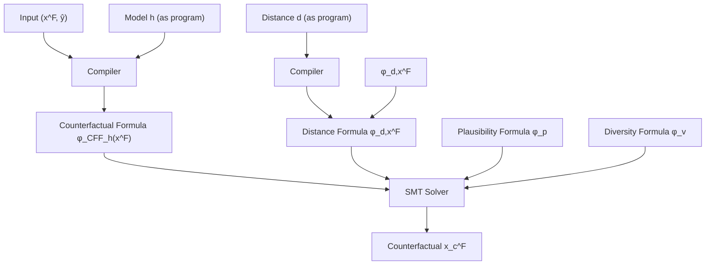

Figure 2.1: Architecture overview for Model-Agnostic Counterfactual Explanations (MACE)

## 2.1 introduction

Data-driven predictive models are ubiquitously being used to support or even substitute humans in decision making in a wide variety of real-world contexts including, e.g., selection process for hiring, loan approval, or pretrial bail. However, as algorithmic methods are increasingly used to make consequential decisions at the individual-level – i.e., decisions that may have significant consequences for the individuals they decide about – the debate about their lack of transparency and explainability becomes more heated. To make things worse, while the verdict is still out as to what constitutes a good explanation (DVK17; Fre14; Kod94; Mur+19; Lip18; Rud19; Rüp06), there already exists clearly defined legal requirements for explanations in the context of consequential decision making. For example, the EU General Data Protection Regulation (“GDPR”) grants individuals the right-to-explanation (VB; WMF17), via requiring institutions to provide explanations to individuals that are subject to their (semi-)automated decision making systems.

A growing number of works on interpretable machine learning have recently focused on the definitions of, and mechanisms for providing, good explanations for predictor-based decision making systems. In the context of consequential decision making, it is widely agreed that a good explanation should provide answers to the following two questions (DVK17; Gun19; WMR17): (i) “why the model outputs a certain prediction for a given individual?”; and, (ii) “what features describing the individual would need to change to achieve the desired output?”

Here, we focus on answering the second question, or equivalently, on generating counterfactual explanations. Of specific importance is the problem of finding the nearest counterfactual explanation – i.e., identifying the set of features resulting in the desired prediction while remaining at minimum distance from the original set of features describing the individual. Existing approaches tackling this problem suffer from various limitations: they either propose solutions that are tailored to particular models, e.g., decision trees (Tol+17); rely on classical optimization tools, thus being restricted to convex predictive models and distances (Rus19; USL19); or, solve a relaxed version of the original optimization problem using gradient-based approaches, thus being restricted to differentiable models and distance functions (WMR17) and lacking optimality guarantees. Additionally, it is important to consider that in the context of consequential decision-making, the features describing individuals are semantically meaningful and heterogeneous (i.e., mixed continuous & discrete); and can either be acted upon (e.g., bank account balance), or immutable and should be safeguarded from change (e.g., sex, race). A good explanation should account for these semantics (i.e., be plausible1) to be useful for the individual, a requirement that most existing approaches fail to address.

our contributions In this chapter, we propose a model-agnostic approach to generate nearest counterfactual explanations, namely MACE, under any given distance function (or convex combinations thereof); while, at the same time, easily supporting additional plausibility constraints. Moreover, our approach readily encodes natural notions of distance for heterogeneous feature spaces, which are common in consequential decision making systems (e.g., loan approval) and consist of mixed numerical (e.g., age and income) and nominal features (e.g., gender and education level). To this end, in MACE we map the nearest counterfactual problem into a sequence of satisfiability (SAT) problems, by expressing both the predictive model and the distance function (as well as the plausibility and diversity constraints) as logic formulae. Each of these satisfiability problems aims to verify if there exists a counterfactual explanation at a distance smaller than a given threshold, and can be solved using standard SMT (satisfiability modulo theories) solvers. Moreover, we rely on a binary search strategy on the distance threshold to find an approximation to the nearest (plausible) counterfactual with an arbitrary degree of accuracy, and a lower bound on distance such that no counterfactual provably exists at a smaller distance. Finally, once nearest counterfactuals are found, diversity constraints may be added to the satisfiability problems to find alternative counterfactuals. The overall architecture of MACE is illustrated in Figure 2.1.

Our experimental validation on real-world datasets show that MACE not only achieves 100% coverage by design, but also generates explanations that are significantly closer than previous approaches (Tol+17; USL19). We also provide qualitative examples showcasing the flexibility of our approach to generate actionable counterfactuals by extending our plausibility constraints to restrict changes to a subset of (non-immutable) features. The Python implementation of our algorithms and the datasets used in our experiments are available at https://github.com/amirhk/mace.

## 2.2 first-order predicate logic

In this section, we briefly recall basic concepts of first-order predicate logic, which MACE builds upon. We distinguish between function symbols (for instance, addition + and multiplication ×) and predicate symbols (for instance, equality = or lesser than <). Function symbols are used to build expressions, and predicate symbols are used to build atomic formulae. Examples of valid expressions are $x , x + 2 , ( - x ) + 2$ and $( x + 2 ) \times ( y + 3 )$ . Examples of valid atomic formulae are $e \ < \ e ^ { \prime } , \ e \ \le \ e ^ { \prime }$ or $\textit { e } = \textit { e } ^ { \prime }$ . A (quantifier-free) formula is a Boolean combination of atomic formulae. That is, a formula is built from atomic formulae using conjunction $\land ,$ disjunction $\vee ,$ and negation . Formulae have an interpretation over their intended domain. For instance, a formula about real-valued expressions has a natural interpretation as a subset of $\mathbb { R } ^ { n }$ , where n denotes the number of variables that appear in the formula. The interpretation is obtained by mapping every variable into a value, e.g., a real number. For example, (2, 1) belongs in the interpretation of $( x + 2 ) \times ( y + 3 ) \leq x \times y + 1 6$ since the mapping $x \mapsto 2 , y \mapsto 1$ assigns true because $1 6 \leq 1 8$ . We say that a formula is satisfiable if its interpretation as a subset of $\mathbb { R } ^ { n }$ is non-empty.

The satisfiability problem consists in checking whether or not a formula is satisfiable. Satisfiability problems can be verified automatically using satisfiability modulo theories (SMT) solvers like $Z _ { 3 }$ (MB08) or CVC4 (Bar+11). We refer to (KS08) for an exposition of the basic algorithms used by SMT solvers. For the purpose of the next sections, it suffices to assume a given satisfiability oracle SAT. For our experiments, we use off-the-self SMT solvers to realize the oracle. We use SMT solvers as black-box, but it is interesting to note that our formulae fall in the linear fragment of the theory of reals (i.e. all formulae that only contain expressions of degree 1 when viewed as multivariate polynomials over variables), which can be decided efficiently using the Fourier-Motzkin algorithm.

## 2.3 counterfactual spaces for predictive models

This section defines a logical representation of counterfactual explanations for predictive models, which are functions mapping input feature vectors $\mathbf { x } \in \mathcal { X }$ into decisions $y \in \{ 0 , 1 \}$ . 2 Given a predictive model $h : \mathcal { X }  \{ 0 , 1 \}$ , we can define the set of counterfactual explanations for a (factual) input $\mathbf { x } ^ { \mathsf { F } } \in { \mathcal { X } }$ as $\mathbb { C } \mathbb { F } _ { h } ( { \mathbf x } ^ { \mathsf { F } } ) = \{ { \mathbf x } \in \dot { \mathcal { X } } \mid h ( { \mathbf x } ) ^ { \mathsf { \bar { \alpha } } } \neq h ( { \mathbf x } ^ { \mathsf { F } } ) \}$ . In words, $\mathbb { C F } _ { h } ( \mathbf { x } ^ { \mathsf { F } } )$ contains all the inputs x for which the model h returns a prediction different from $h ( \mathbf { x } ^ { \mathsf { F } } )$ . We also remark that $\mathbb { C F } _ { h } ( \mathbf { x } ^ { \mathsf { F } } )$ is the set of preimages of $1 - h ( \mathbf { x } ^ { \mathsf { F } } )$ under h.

For a broad class of predictive models, it is possible to construct counterfactual formulae capturing membership in $\mathbb { C F } _ { h }$ . We do so by computing the characteristic formula $\phi _ { h }$ of the model. For a predictive model $h : \mathcal { X }  \{ 0 , 1 \}$ , and pair of input and output values x and $y ,$ the characteristic formula $\phi _ { h }$ verifies that $\phi _ { h } ( { \bf x } , y )$ is valid if and only if $h ( \mathbf { x } ) = y$ . Thus, given a factual input $\mathbf { x } ^ { \mathsf { F } }$ with $h ( \mathbf { x } ^ { \mathsf { F } } ) = y ^ { \mathsf { F } }$ and $\phi _ { h }$ we define the counterfactual formula as

$$
\phi_ {\mathbb {C F} _ {h} (\mathbf {x} ^ {\mathsf {F}})} (\mathbf {x}) = \phi_ {h} (\mathbf {x}, 1 - y ^ {\mathsf {F}}) \tag {2.1}
$$

Intuitively, the formula on the right hand side of $\left( 2 . \mathrm { I } \right)$ says that ${ \bf \ " } { \bf \Psi } _ { \bf X }$ is a counterfactual for $\mathbf { x } ^ { \mathsf { F } }$ if either $h ( \mathbf { x } ^ { \mathsf { F } } ) = 0$ and $h ( \mathbf { x } ) = 1$ , or $h ( \mathbf { x } ^ { \mathsf { F } } ) = 1$ and $h ( \mathbf { x } ) = 0 ^ { \prime \prime }$ . It is thus clear from the definition that an input x satisfies $\phi _ { \mathrm { C F } _ { h } ( { \bf x } ^ { \mathsf { F } } ) }$ if and only if $\mathbf { x } \in \mathbb { C F } _ { h ( \mathbf { x } ^ { \mathsf { F } } ) }$ . Moreover, (2.1) shows that, to construct counterfactual formulae $\phi _ { \mathrm { C F } _ { h } ( { \bf x } ^ { \mathsf { F } } ) }$ , we only require the characteristic formulae of the corresponding predictive models, $\phi _ { h } ,$ and the value of $y ^ { \mathsf { F } }$ . To obtain such characteristic formulae we assume that predictive models are represented by programs in a core programming language with assignments, conditionals, sequential composition, syntactically bounded loops and return statements. This allows us to use techniques from the program verification literature. Specifically, we use the so-called predicate transformers (Dij68; Hoa69; Flo93; FS01). The description of the general procedure is provided in Appendix A.1. For ease of exposition, we illustrate the construction of characteristic formulae through two examples, a decision tree and a multilayer perceptron.

As a first example, consider the decision tree from Figure 2.2a which takes as input $( x _ { 1 } , x _ { 2 } , \hat { x _ { 3 } } ) \in \{ 0 , 1 \} ^ { 2 } \times \mathbb { R }$ and returns a binary output in 0, 1 . Figure 2.2b provides the programming language description of this decision tree. To construct a formula representing the function $h ( x ) = y$ computed by this


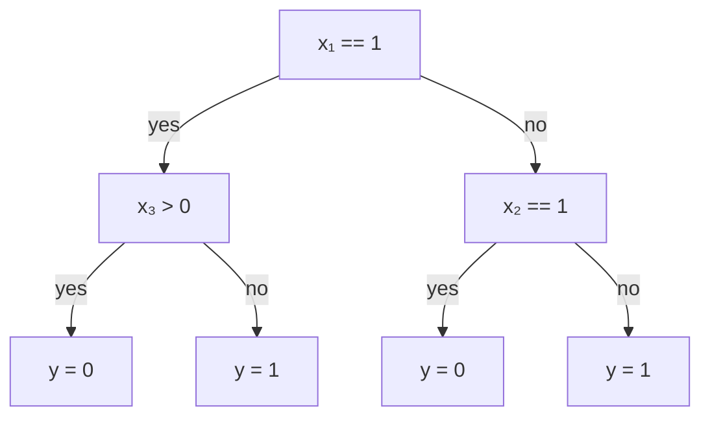

(a) Graphical representation

$$
\begin{array}{l} \text { if } x _ {1} = = 1 \\ y = 0 \text {   if   } x _ {3} > 0 \text {   else   } 1 \\ \mathrm{else} \\ y = 0 \text {   if   } x _ {2} = = 1 \text {   else   } 1 \\ \text { return } y \\ \end{array}
$$

(b) Program (in Python)

$$
\phi_ {h} (\mathbf {x}, y) = (x _ {1} = 1 \land x _ {3} > 0 \land y = 0)
$$

$$
\vee \left(x _ {1} = 1 \wedge x _ {3} \leq 0 \wedge y = 1\right)
$$

$$
\lor (x _ {1} = 0 \land x _ {2} = 1 \land y = 0)
$$

$$
\lor (x _ {1} = 0 \land x _ {2} = 0 \land y = 1)
$$

(c) Characteristic formula

Figure 2.2: Decision tree: model, program and characteristic formula.

tree we first build a clause for each leaf in the tree by taking the conjunction of all the conditions encountered in the path from the root to the leaf. For example, the clause corresponding to the leftmost leaf on the tree in Figure 2.2a is $( x _ { 1 } = 1 \land x _ { 3 } > 0 \land y = 0 )$ . Once all these clauses are constructed, the characteristic formula $\phi _ { h } ( { \bf x } , y )$ corresponding to the full tree is obtained by taking the conjunction of all said clauses, as shown in Figure 2.2c.

As a second example we consider a feed-forward neural network with one hidden layer followed by a ReLU activation function, as depicted in Figure 2.3a. This model implements a function h : $\mathbb { R } ^ { 3 }  \{ 0 , 1 \}$ , where the binary decision is taken by thresholding the value of the last hidden node. The programming language representation of this model is given in Figure 2.3b. In this case, the characteristic formula predicates over inputs $\mathbf { x , }$ output y and program variables $z _ { i }$ and $\tilde { z } _ { i }$ for each hidden node i representing the values on that node before and after the non-linear ReLU transformation, respectively. The characteristic formula is a conjunction, and each conjunct corresponds to one instruction of the program. For example, for the leftmost hidden node in the first layer of the network in Figure 2.3a the variable $z _ { 1 }$ is associated with the clause $( z _ { 1 } = x _ { 1 } - x _ { 2 } )$ ; and the variable $\tilde { z } _ { 1 }$ corresponds to the value of $z _ { 1 }$ after the ReLU, which can be written as the disjunction $( \tilde { z } _ { 1 } = z _ { 1 } \wedge z _ { 1 } \geq 0 ) \vee ( \tilde { z } _ { 1 } = 0 \wedge z _ { 1 } < 0 )$ . For the output node – in this case, $z _ { 3 }$ – we introduce a pair of clauses representing the thresholding operation, i.e.


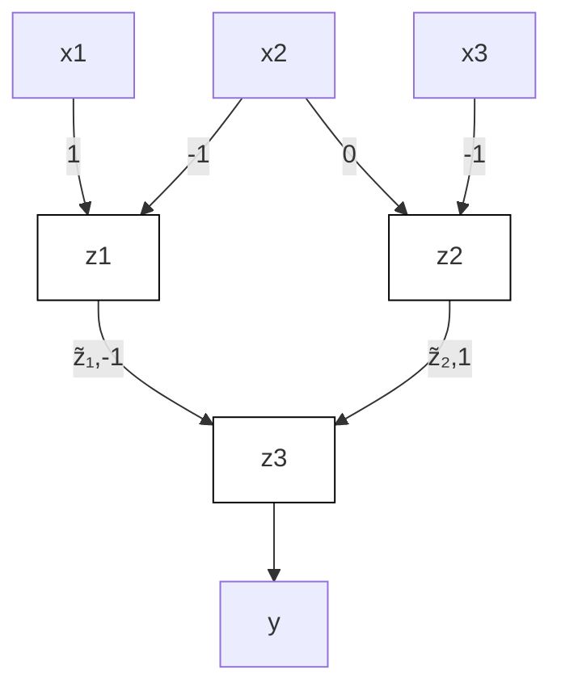

(a) Graphical representation  
(b) Program (in Python)

$$
\begin{array}{l} z _ {1} = x _ {1} - x _ {2} \\ z _ {2} = 2 x _ {1} - x _ {3} \\ \tilde {z} _ {1} = z _ {1} \text {   if   } z _ {1} > = 0 \text {   else   } 0 \\ \tilde {z} _ {2} = z _ {2} \text {   if   } z _ {2} > = 0 \text {   else   } 0 \\ z _ {3} = - \tilde {z} _ {1} + \tilde {z} _ {2} \\ y = 1 \text {   if   } z _ {3} > = 0 \text {   else   } 0 \\ \text { return } y \\ \end{array}
$$

$$
\begin{array}{l} \phi_ {h} (\mathbf {x}, y) = (z _ {1} = x _ {1} - x _ {2}) \\ \wedge \left(z _ {2} = 2 x _ {1} - x _ {3}\right) \\ \wedge \left(\left(\tilde {z} _ {1} = z _ {1} \wedge z _ {1} \geq 0\right) \vee \left(\tilde {z} _ {1} = 0 \wedge z _ {1} <   0\right)\right) \\ \wedge \left(\left(\tilde {z} _ {2} = z _ {2} \wedge z _ {2} \geq 0\right) \vee \left(\tilde {z} _ {2} = 0 \wedge z _ {2} <   0\right)\right) \\ \wedge (z _ {3} = - \tilde {z} _ {1} + \tilde {z} _ {2}) \\ \wedge \left(\left(z _ {3} \geq 0 \wedge y = 1\right) \vee \left(z _ {3} <   0 \wedge y = 0\right)\right) \\ \end{array}
$$

(c) Characteristic formula

Figure 2.3: Multilayer perceptron: model, program and characteristic formula

$( y = 1 \land z _ { 3 } \lor ( y = 0 \land z _ { 3 } < 0 )$ . Taking the conjunction of the formulas for each node we obtain the characteristic formula in Figure 2.3c.

## 2.4 finding the nearest counterfactual

Based on the counterfactual space $\mathbb { C F } _ { h } ( \mathbf { x } ^ { \mathsf { F } } )$ defined in the previous section, we would like to produce counterfactual explanations for the output of a model h on a given input $\mathbf { x } ^ { \mathsf { F } }$ by trying to find a nearest counterfactual, which is defined as:

$$
\mathbf {x} ^ {* \mathsf {C F}} \in \underset {\mathbf {x} \in \mathbb {C F} _ {h} (\mathbf {x} ^ {\mathsf {F}})} {\text { argmin }} d (\mathbf {x}, \mathbf {x} ^ {\mathsf {F}}). \tag {2.2}
$$

For the time being, we assume that a notion of distance between instances, $d ,$ is given. For convenience, and without loss of generality, we also assume that d takes values in the interval [0, 1].

## 2.4.1 Main algorithm

Our goal now is to leverage the representation of $\mathbb { C F } _ { h } ( \mathbf { x } ^ { \mathsf { F } } )$ in terms of a logic formula to solve (2.2). To this end, we map the optimization problem in (2.2) into a sequence of satisfiability problems, which can be verified or refuted by standard SMT solvers. We do so by first converting the expression $d ( { \bf { x } } , { \bf { x } } ^ { \sf { F } } ) \leq \delta ,$ where $\delta \in [ 0 , 1 ]$ , into a logic formula $\phi _ { d , { \bf x } ^ { \mathrm { F } } } ( { \bf x } , \delta )$ , which is valid if and only if $d ( { \bf x } , { \bf x ^ { F } } ) \le \delta$ . We assume here that the distance d function is expressed by a program in the same language that we used to represent the models in Section 2.3. In particular, we can leverage the procedure detailed in Appendix $\mathrm { A . 1 }$ to automatically construct $\phi _ { d , { \bf x } ^ { \sf F } }$ . Then, both the counterfactual formula $\phi _ { \mathrm { C F } _ { h } ( { \bf x } ^ { \mathsf { F } } ) } ( { \bf x } )$ and the distance formula $\phi _ { d , { \bf x } ^ { \sf F } } ( { \bf x } , \delta )$ are combined into hthe logic formula:

$$
\phi_ {\mathbf {x} ^ {\mathsf {F}}, \delta} (\mathbf {x}) = \phi_ {\mathbb {C F} _ {h} (\mathbf {x} ^ {\mathsf {F}})} (\mathbf {x}) \wedge \phi_ {d, \mathbf {x} ^ {\mathsf {F}}} (\mathbf {x}, \delta),
$$

which is satisfiable if and only if there exists a counterfactual $\mathbf { x } \in \mathbb { C F } _ { h } ( \mathbf { x } ^ { \mathsf { F } } )$ such that $d ( \mathbf { x } , \mathbf { x } ^ { \mathsf { F } } ) \leq \delta$ . To check whether the above formula is satisfiable we use the satisfiability oracle $\mathsf { S A T } ( \psi ( \mathbf { x } ) )$ which returns either an instance x such that $\psi ( \mathbf { x } )$ is valid, or “unsatisfiable” if no such x exists.

Note that, while the oracle SAT allows us to verify if there exist counterfactual explanations at distance smaller or equal than a given threshold $\delta ,$ solving optimization (2.2) requires finding a nearest counterfactual. To do so, we apply a binary search strategy on the distance threshold $\delta \in [ 0 , 1 ]$ ] that allows us to find approximately nearest counterfactuals with a pre-specified degree of accuracy. This is implemented in Algorithm 1, which for an accuracy parameter $\epsilon > 0$ makes at most $O ( \log ( 1 / \epsilon ) )$ calls to SAT and returns a counterfactual $\mathbf { x } _ { \epsilon } ^ { \mathsf { C F } } \in \mathbb { C F } _ { h } ( \mathbf { x } ^ { \mathsf { F } } )$ such that $\bar { d ( \mathbf { x } _ { \epsilon } ^ { \mathsf { C F } } , \mathbf { x } ^ { \mathsf { F } } ) } \leq d ( \mathbf { x } ^ { * \mathsf { C F } } , \mathbf { x } ^ { \mathsf { F } } ) + \epsilon ,$ , where $\mathbf { x } ^ { \ast \mathbb { C } \mathbb { F } }$ is some solution of the optimization problem in $_ { ( 2 . 2 ) }$ . This mild dependence on the accuracy ϵ allows Algorithm 1 to trade-off finding arbitrarily accurate solutions of $_ { ( 2 . 2 ) }$ with the number of calls made to the satisfiability oracle. Note that Algorithm 1 may also account for potential plausibility or diversity constraints (refer to next section for further details).

We remark here our approach to find nearest counterfactuals is agnostic to the details of the model and distance being used; the only requirement is that they must be expressable in a fairly general programming language. As a consequence, we can handle a wide variety of predictive models, including both differentiable – such as, logisitic regression and multilayer perceptron – and non-differentiable predictive models $- \mathrm { { e . g . } }$ ., decision trees and random forest– as well as a wide variety of distance functions (refer to next section for further details). Moreover, the bound $\delta _ { \mathrm { m i n } }$ returned by Algorithm 1 provides a certificate that any solution $\mathbf { x } ^ { \mathrm { * C F } }$ to (2.2) must satisfy $d ( { \bf x } ^ { * \mathsf { C F } } , { \bf x } ^ { \mathsf { F } } ) > \delta _ { \mathrm { m i n } }$ . This is because whenever $\mathsf { S A T } ( \psi ( \mathbf { x } ) )$ returns “unsatisfiable” it does so by internally constructing a proof that the formula $\psi ( \mathbf { x } )$ is not valid.

Algorithm 1: Binary Search for Nearest Counterfactuals with Satisfiability Oracle

Input: Factual $x^{F}$ , counterfactual formula $\phi_{\mathbb{CF}_{h}(x^{F})}$ , distance formula $\phi_{d,x^{F}}$ , constraints formula $\phi_{g,x^{F}}$ , accuracy $\epsilon$ Output: Counterfactual $x_{\epsilon}^{CF}$ , distance $\delta_{\max}=d(x_{\epsilon}^{CF},x^{F})$ , lower bound $\delta_{\min}$ on (2.2)

Let $\delta_{\min}\leftarrow0$ and $\delta_{\max}\leftarrow1$ while $\delta_{\max}-\delta_{\min}>\epsilon$ do

Let $\delta\leftarrow\frac{\delta_{\min}+\delta_{\max}}{2}$ Let $\phi_{x^{F},\delta}(x)\leftarrow\phi_{\mathbb{CF}_{h}(x^{F})}(x)\wedge\phi_{d,x^{F}}(x,\delta)\wedge\phi_{g,x^{F}}$ Let $x\leftarrow\mathrm{SAT}(\phi_{x^{F},\delta})$ if x is “unsatisfiable” then

Let $\delta_{\min}\leftarrow\delta$ else

Let $x_{\epsilon}^{CF}\leftarrow x$ and $\delta_{\max}\leftarrow\delta$ return $x_{\epsilon}^{CF}$ , $\delta_{\min}$ , $\delta_{\max}$

## 2.4.2 Distance, Plausibility, and Diversity

Next we discuss additional criteria in the form of logic clauses that guide the satisfiability problem towards generating a counterfactual explanation with desired properties.

distance We first discuss several forms for the distance function $d ( \mathbf { x } ^ { \mathsf { F } } , \mathbf { x } _ { \epsilon } ^ { \mathsf { C F } } )$ that can be used to define the notion of nearest counterfactual. To this end, we first remark that in consequential decision making the input feature space ${ \mathcal { X } } \ = \ { \mathcal { X } } _ { 1 } \times \cdot \cdot \cdot \times { \mathcal { X } } _ { J }$ is often heterogeneous – for example, gender is categorical, education level is ordinal, and income is a numerical variable. We define an appropriate distance metric for every kind of variable in the input feature space of the model as:

$$
\delta_ {j} (x _ {j}, \hat {x} _ {j}) = \left\{ \begin{array}{l l} | x _ {j} - \hat {x} _ {j} | / R _ {j} & \text { if } x _ {j} \text { is   numerical } \\ \mathbb {I} [ x _ {j} \neq \hat {x} _ {j} ] & \text { if } x _ {j} \text { is   categorical } \\ | x _ {j} - \hat {x} _ {j} | / R _ {j} & \text { if } x _ {j} \text { is   ordinal } \end{array} \right.,
$$

where $R _ { j }$ corresponds to the range of the feature $x _ { j }$ and is used to normalize the distances for all input features, such that $\delta _ { j } : \mathcal { X } _ { j } \times \mathcal { X } _ { j }  [ 0 , 1 ]$ for all $j ,$ independently on the feature type. By defining the distance vector $\delta =$ $\big ( \delta _ { 1 } , \cdots , \delta _ { J } \big )$ (being J the total number of input features), one can now write the distance between instances as:

**Table 2.1: Comparison of approaches for generating counterfactual explanations, based on the supported model types, data types (heterogenous, numeric, binary), distance types, plausibility constraints (actionability, data type/range consistency), and optimal distance guarantees.**

<table><tr><td>Approach</td><td>Models</td><td>Data types</td><td>Distances</td><td>Plaus.</td><td>Opt. Dist.</td></tr><tr><td>Proposed (MACE)</td><td>tree, forest, lr, mlp</td><td>het.</td><td> $\ell_p \forall p$ </td><td>√</td><td>√</td></tr><tr><td>Minimum Observable (MO)</td><td>-</td><td>het.</td><td> $\ell_p \forall p$ </td><td>√</td><td>x</td></tr><tr><td>Feature Tweaking (FT)</td><td>tree, forest</td><td>het.</td><td> $\ell_p \forall p$ </td><td>x</td><td>x</td></tr><tr><td>Actionable Recourse (AR)</td><td>lr</td><td>num., bin.</td><td> $\ell_1, \ell_\infty$ </td><td> $x^6$ </td><td>x</td></tr></table>

$$
d \left(\mathbf {x} ^ {\mathrm{F}}, \mathbf {x} _ {\epsilon} ^ {\mathrm{CF}}\right) = \alpha | | \delta | | _ {0} + \beta | | \delta | | _ {1} + \gamma | | \delta | | _ {\infty}, \tag {2.3}
$$

where $| | \cdot | | _ { p }$ is the p-norm of a vector, and $\alpha , \beta , \gamma \ge 0$ such that3 $\left( \alpha + \beta \right) / J +$ $\gamma = 1$ . Intuitively, 0-norm is used to restrict the number of features that changes between the initial instance $\mathbf { x } ^ { \mathsf { F } }$ and the generated counterfactual $\mathbf { x } _ { \epsilon } ^ { \mathsf { C F } }$ ; the 1-norm is used to restrict the average change distance between $\mathbf { x } ^ { \mathsf { F } }$ and $\mathbf { x } _ { \epsilon } ^ { \mathsf { C F } }$ ; and ∞-norm is used to restrict maximum change across features. Any distance of this type can easily be expressed as a program.

plausibility Up to this point, we have only considered minimum distance as the only requirement for generating a counterfactual. However, this might result in unrealistic counterfactuals, such as e.g., decrease the age or change the gender of a loan applicant. To avoid unrealistic counterfactuals, one may introduce additional plausibility constraints in the optimization problem in Eq. (2.2). This is equivalent to adding a conjunction in the constraint formula $\phi _ { g , { \bf x } ^ { \sf F } }$ in Algorithm 1 that accounts for any additional plausibility formulae $\phi _ { p } ,$ which ensure that: i) each feature in the counterfactual should be data-type and data-range consistent with the training data; and ii) only actionable features (USL19) are changed in the resulting counterfactual.

First, since here we are working with heterogeneous feature spaces, we require all the features in the counterfactual to be consistent in both the datatypes (categorical, ordinal, etc.) and the data-ranges with the training data. In particular, if a categorical (ordinal) feature is one-hot (thermometer) encoded to be used as input to the predictive model, e.g., a logistic regression classifier, we make sure that the generated counterfactual provides a valid one-hot vector (thermometer) for such feature. Likewise, for any numerical feature we ensure that its value in the counterfactual falls into observed range in the original data used to train the predictive model.

**Table 2.2: Coverage Ω computed on $N = 5 0 0$ factual samples. For comparison, $\Omega _ { \mathrm { M A C E } } ~ = ~ \Omega _ { \mathrm { M O } } ~ = ~ 1 0 0 \%$ always, by definition and by design, respectively. Cells are shaded when tests are not supported. Higher % is better.**

<table><tr><td rowspan="2" colspan="2"></td><td colspan="3">Adult</td><td colspan="3">Credit</td><td colspan="3">COMPAS</td></tr><tr><td> $\ell_0$ </td><td> $\ell_1$ </td><td> $\ell_\infty$ </td><td> $\ell_0$ </td><td> $\ell_1$ </td><td> $\ell_\infty$ </td><td> $\ell_0$ </td><td> $\ell_1$ </td><td> $\ell_\infty$ </td></tr><tr><td>tree</td><td>PFT</td><td>0%</td><td>0%</td><td>0%</td><td>68%</td><td>68%</td><td>68%</td><td>74%</td><td>74%</td><td>74%</td></tr><tr><td>forest</td><td>PFT</td><td>0%</td><td>0%</td><td>0%</td><td>99%</td><td>99%</td><td>99%</td><td>100%</td><td>100%</td><td>100%</td></tr><tr><td>lr</td><td>AR</td><td></td><td>18%</td><td>0.4%</td><td></td><td>100%</td><td>100%</td><td></td><td>100%</td><td>100%</td></tr></table>

Moreover, to account for a non-actionable/immutable feature $x _ { j } ,$ i.e., a feature whose value in the counterfactual explanation should match its initial value, we set $\phi _ { p }$ to be $( x _ { j } = \hat { x } _ { j } )$ . Similarly, we account for variables that only allow for increasing values by setting $\phi _ { p } = ( x _ { j } \ge \hat { x } _ { j } )$ .

diversity Finally, one might be interested in generating a (small) set of diverse counterfactual explanations for the same instance $\mathbf { x } ^ { \bar { \mathsf { F } } } .$ . To this end, we iteratively call Algorithm 1 with a constraints formula $\phi _ { v }$ that includes diversity clauses to ensure that the newly generated explanation is substantially different from all the previous ones. We can encode diversity by forcing that the distance between every pair of counterfactual explanations is greater than a given value. For example, we can take4 $\textstyle \phi _ { v } = \bigwedge _ { i } \big ( { \bar { \bigvee } } _ { j \in J } ( x _ { j } \neq { \hat { x } } _ { \epsilon , j } ^ { i } ) \big )$ to restrict repetitive counterfactuals by enforcing subsequent counterfactuals to have 0-norm distance at least 1 from all previous counterfactuals.

## 2.5 experiments

In this section, we empirically demonstrate the main properties of MACE compared to existing approaches.

datasets We evaluate MACE at generating counterfactual explanations on three real-world datasets in the context of loan approval (Adult (Adu96) and Credit (YL09) datasets) and pretrial bail (COMPAS dataset (Lar+16a)). All the three datasets present heterogeneous input spaces.

baselines We compare the performance of MACE at generating the nearest counterfactual explanations with: the Minimum Observable (MO)

**Table 2.3: Percentage of improvement in distances, computed as $1 0 0 * \mathbb { E } [ 1 -$ $\delta _ { \mathrm { M A C E } } / \delta _ { \mathrm { O t h e r } } ] . ~ N = \Omega _ { \mathrm { M A C E } } \cap \Omega _ { \mathrm { O t h e r } }$ factual samples. Cells are shaded when tests are not supported. The higher the ${ \% } ,$ the better the improvement.**

<table><tr><td rowspan="2" colspan="2"></td><td colspan="3">Adult</td><td colspan="3">Credit</td><td colspan="3">COMPAS</td></tr><tr><td> $\ell_0$ </td><td> $\ell_1$ </td><td> $\ell_\infty$ </td><td> $\ell_0$ </td><td> $\ell_1$ </td><td> $\ell_\infty$ </td><td> $\ell_0$ </td><td> $\ell_1$ </td><td> $\ell_\infty$ </td></tr><tr><td rowspan="4">tree</td><td>MACE ( $\epsilon = 10^{-3}$ ) vs MO</td><td>47%</td><td>80%</td><td>70%</td><td>67%</td><td>66%</td><td>47%</td><td>1%</td><td>5%</td><td>5%</td></tr><tr><td>MACE ( $\epsilon = 10^{-5}$ ) vs MO</td><td>47%</td><td>81%</td><td>72%</td><td>67%</td><td>96%</td><td>94%</td><td>1%</td><td>5%</td><td>5%</td></tr><tr><td>MACE ( $\epsilon = 10^{-3}$ ) vs PFT</td><td></td><td></td><td></td><td>53%</td><td>87%</td><td>85%</td><td>14%</td><td>56%</td><td>54%</td></tr><tr><td>MACE ( $\epsilon = 10^{-5}$ ) vs PFT</td><td></td><td></td><td></td><td>53%</td><td>97%</td><td>96%</td><td>15%</td><td>55%</td><td>54%</td></tr><tr><td rowspan="4">forest</td><td>MACE ( $\epsilon = 10^{-3}$ ) vs MO</td><td>51%</td><td>81%</td><td>69%</td><td>68%</td><td>61%</td><td>38%</td><td>1%</td><td>6%</td><td>6%</td></tr><tr><td>MACE ( $\epsilon = 10^{-5}$ ) vs MO</td><td>51%</td><td>82%</td><td>71%</td><td>68%</td><td>97%</td><td>96%</td><td>1%</td><td>6%</td><td>6%</td></tr><tr><td>MACE ( $\epsilon = 10^{-3}$ ) vs PFT</td><td></td><td></td><td></td><td>53%</td><td>84%</td><td>81%</td><td>4%</td><td>28%</td><td>27%</td></tr><tr><td>MACE ( $\epsilon = 10^{-5}$ ) vs PFT</td><td></td><td></td><td></td><td>53%</td><td>96%</td><td>96%</td><td>4%</td><td>28%</td><td>27%</td></tr><tr><td rowspan="4">lr</td><td>MACE ( $\epsilon = 10^{-3}$ ) vs MO</td><td>62%</td><td>92%</td><td>86%</td><td>80%</td><td>82%</td><td>80%</td><td>3%</td><td>8%</td><td>6%</td></tr><tr><td>MACE ( $\epsilon = 10^{-5}$ ) vs MO</td><td>62%</td><td>93%</td><td>88%</td><td>80%</td><td>82%</td><td>81%</td><td>3%</td><td>6%</td><td>6%</td></tr><tr><td>MACE ( $\epsilon = 10^{-3}$ ) vs AR</td><td></td><td>3%</td><td>89%</td><td></td><td>39%</td><td>67%</td><td></td><td>10%</td><td>38%</td></tr><tr><td>MACE ( $\epsilon = 10^{-5}$ ) vs AR</td><td></td><td>5%</td><td>91%</td><td></td><td>42%</td><td>71%</td><td></td><td>10%</td><td>38%</td></tr><tr><td rowspan="2">mlp</td><td>MACE ( $\epsilon = 10^{-3}$ ) vs MO</td><td>60%</td><td>92%</td><td>91%</td><td>77%</td><td>85%</td><td>91%</td><td>1%</td><td>3%</td><td>3%</td></tr><tr><td>MACE ( $\epsilon = 10^{-5}$ ) vs MO</td><td>60%</td><td>93%</td><td>93%</td><td>77%</td><td>96%</td><td>96%</td><td>1%</td><td>3%</td><td>3%</td></tr></table>

approach (Wex+19), which searches in the dataset for the closest sample that flips the prediction; the Feature Tweaking (FT) approach (Tol+17), which searches for the nearest counterfactual lying close to the decision boundary of a Random Forest; and the Actionable Recourse (AR) (USL19), which solves a mixed integer linear program to obtain counterfactual explanations for Linear Regression models. Table 2.1 summarizes the main properties of all the considered approaches to generate counterfactuals.

metrics To assess and compare the performance of the different approaches, we recall the criteria of good explanations for consequential decisions: i) the returned counterfactual should be as near as possible to the factual sample corresponding to the individual’s features; ii) the returned counterfactual must be plausible (refer to Section 2.4.2). Hence, we quantitatively compare the performance of MACE with the above approaches in terms of i) the normalized distance $\delta ;$ and ii) coverage Ω indicating the percentage of factual samples for which the approach generates plausible (in type and range) counterfactuals.

experimental set-up We consider as predictive models decision trees, random forest, logistic regression, and multilayer perceptron, which we train on the three datasets using the Python library scikit-learn (Ped+11), with default parameters.5 Furthermore, to demonstrate the off-the-shelf flexibility in the various setups described, we build MACE atop the open-source PySMT library (GM15) with the $Z _ { 3 }$ (MB08) backend. In Appendix A.3.2, we provide a thorough empirical evaluation of the computational cost of the off-the-shelf PySMT solver – including run-time comparisons between MACE and other baselines, – as well as a discussion on the choice of ϵ trading-off arbitrarily accurate solutions of (2.2) with the number of calls made to the satisfiability oracle.

**Table 2.4: Percentage of factual samples for which the nearest counterfactual sample requires a change in age for a random forest trained on the Adult dataset, and the corresponding increase in distance to nearest counterfactual when restricting the approaches not to change age: $1 0 0 \times \mathbb { E } [ \delta _ { \mathrm { r e s t r . } } / \delta _ { \mathrm { u n r e s t r . } } - 1 ]$ . Lower % is better.**

<table><tr><td rowspan="2"></td><td colspan="2"> $\ell_0$ </td><td colspan="2"> $\ell_1$ </td><td colspan="2"> $\ell_\infty$ </td></tr><tr><td>% age-change</td><td>relative dist. increase</td><td>% age-change</td><td>relative dist. increase</td><td>% age-change</td><td>relative dist. increase</td></tr><tr><td rowspan="2">MACE ( $\epsilon = 10^{-5}$ )MO</td><td>13.2%</td><td>9.0%</td><td>20.4%</td><td>100.3%</td><td>84.4%</td><td>32.8%</td></tr><tr><td>78.8%</td><td>50.9%</td><td>92.0%</td><td>245.7%</td><td>95.6%</td><td>193.3%</td></tr></table>

For each combination of approach, model, dataset, and distance, we generate the nearest counterfactual explanations for a held-out set of 500 instances classified as negative by the corresponding model. Here we consider the $\ell _ { 0 } ,$ $\ell _ { 1 } , \ell _ { \infty }$ norms as a measure of distance to identify the nearest counterfactuals. Unfortunately, we found that FT not once returned a plausible counterfactual. As a consequence, we modified the original implementation of FT, to ensure that the generated counterfactuals are plausible. The resulting Plausible Feature Tweaking (PFT) projects the set of candidate counterfactuals into a plausible domain before selecting the nearest counterfactual amongst them. This was not possible for AR because the approach only returns a single counterfactual, with no avail if it is not plausible.6

coverage and distance results Table 2.2 shows the coverage Ω of all the approaches based only on data-range and data-type plausibility. Note that, since by definition both MACE and MO have 100% coverage, we have not depicted these values in the table. In contrast, PFT fails to return counterfactuals for roughly 15% of the Credit and COMPAS datasets, while bothPFT and AR achieve minimal coverage on the Adult dataset.7 Focusing on those factual samples for which PFT and AR return plausible counterfactuals, we are able to compute the relative distance reductions achieved when using MACE as compared to other approaches, as shown in Table 2.3 (additionally, Figure A.1 in Appendix A.2 shows the distribution of the distance of the generated plausible counterfactual for all models, datasets, distances, and approaches). Here, we observe that MACE results in significantly closer counterfactual explanations than competing approaches, with an average decrease in distance of 70.2% for Adult, 75.4% for Credit, and 21.1% for COMPAS. As a consequence, the counterfactuals generated by MACE would require significantly less effort on behalf of the affected individual in order to achieve the desired prediction.

plausibility contraints. While performing a qualitative analysis of generated counterfactuals we observed that many of them require changes in features that are often protected by law such as, age, race, and gender (BDS16). As an example, for a trained random forest, the counterfactuals generated by both the MACE and MO approaches required individuals to change their age. Worse yet, for a substantial portion of the counterfactuals, a reduction in age was required, which is not even possible. To further study this effect, we regenerate counterfactual explanations for those samples for which age-change was required, with an additional plausibility constraint ensuring that the age shall not change (results with constraints to ensure non-decreasing age are shown in Appendix A.3.3). The results presented in Table 2.4 show interesting results. First, we observe that the additional plausibility constraint for the age incurs significant increases in the distance of the nearest counterfactual – being, as expected, more pronounced for the $\ell _ { 1 }$ and the $\ell _ { \infty }$ norms, since the $\ell _ { 0 }$ norm only accounts for the number of features that change in the counterfactual but not for how much they change. For the $\ell _ { 0 }$ norm, as expected, we find that for the 66 factual samples $( \mathrm { i . e . , }$ 13.2%  500) for which the unrestricted MACE required age-change, the addition of the no-age-change constraint results in counterfactuals at very similar distance. In fact, of the newly generated counterfactuals, 8/66 only require a change in Occupation, and 19/66 only require a change in Capital Gains, therefore remaining at the same distance as the original counterfactual. In contrast, for the $\ell _ { 1 }$ and the $\ell _ { \infty }$ norms we find that the restricted counterfactual incurs a significant increase in the distance (cost) with respect to the unrestricted counterfactual. These results suggest that the predictions of the random forest trained on the Adult data are strongly correlated to the age, which is often legally and socially considered as unfair. This suggests that counterfactuals found with MACE may assist in qualitatively ascertaining if other desiderata, such as fairness, are met (DVK17; Wel17).

**Table 2.5: A diverse set of generated counterfactuals is presented for an individual from the Credit dataset.**

<table><tr><td></td><td>Latest Bill</td><td>Latest Payment</td><td>University Degree</td><td>Will default next month?</td></tr><tr><td>Factual</td><td>$370</td><td>$40</td><td>some</td><td>yes</td></tr><tr><td>CF #1</td><td>$368</td><td>$1448</td><td>some</td><td>no</td></tr><tr><td>CF #2</td><td>$0</td><td>$1241</td><td>some</td><td>no</td></tr><tr><td>CF #3</td><td>$0</td><td>$390</td><td>graduate</td><td>no</td></tr></table>

diversity constraints. Finally, we present a situation where MACE can be used to generate counterfactuals under both plausibility and diversity constraints. Consider a loan borrower from the Credit dataset identified with the following features:8 John is a married male between 40-59 years of age with “some” university degree. Financially, over the last 6 months, John has been struggling to make payments on his bank loan. Given his circumstances, a logistic regression model trained on the historical dataset has predicted that John will default on his loan next month. To prevent this default, the bank uses MACE $( \ell _ { 1 }$ distance, $\epsilon = 1 0 ^ { - 3 } )$ to generate the diverse suggestions in Table 2.5, via successive runs of Algorithm 1. Each new run augments the constraints formula (already including plausibility constraints on his age, sex, and marital status) with an additional clause enforcing $\ell _ { 0 }$ diversity as discussed in Section 2.4.2. The returned counterfactuals (of which only 3 are shown), present John with diverse courses of action: either reduce spending and make a lump-sum payment on the debt (CF #2) or continue spending the same as before, but make an even larger payment to account for continued expenditures (CF #1). Alternatively, providing documents confirming a graduate degree would put John in a low-risk (no default) bracket (CF #3). We invite the reader to imagine parallels to the above situation for Adult and COMPAS datasets.

## 2.6 conclusions

In this work, we have presented a novel approach for generating counterfactual explanations in the context of consequential decisions. Building on theory and tools from formal verification, we demonstrated that a large class of predictive models can be compiled to formulae which can be verified by standard SMT-solvers. By conjuncting the model formula with formulae corresponding to distance, plausibility, and diversity constraints, we demonstrated on three real-world datasets and four popular predictive models that the proposed method not only achieves perfect coverage, but also generates counterfactuals at more favorable distances than existing optimization-based approaches. Furthermore, we showed that the proposed method can not only provide explanations for individuals subject to automated decision making systems, but also inform system administrators regarding the potentially unfair reliance of the model on protected attributes.

There are a number of interesting directions for future work. First, MACE can naturally be extended to support counterfactual explanations for multiclass classification models, as well as regression scenarios. Second, extending the multi-faceted notion of plausibility defined in Section 2.4.2 (actionability, data type/range consistency, which focus on individual features), it would be interesting to account for statistical correlations and unmeasured confounding factors among the features when generating counterfactual explanations (i.e., realizability). Third, we would like also to explore how different notions of diversity may help generating meaningful and useful counterfactuals. Finally, in our experiments we noticed that the running time of MACE directly depends on the efficiency of the SMT solver. As future work we aim to make the proposed method more scalable on large models by investigating recent ideas that have been developed in the context of formal verification of deep neural networks (Hua+17; Kat+17; Sin+19) and optimization modulo theories (NO06; ST12).


# Scaling Guarantees for Counterfactual Explanations

## Chapter Abstract

Counterfactual explanations (CFE) are being widely used to explain algorithmic decisions, especially in consequential decision-making contexts (e.g., loan approval or pretrial bail). In this context, CFEs aim to provide individuals affected by an algorithmic decision with the most similar individual (i.e., nearest individual) with a different outcome. However, while an increasing number of works propose algorithms to compute CFEs, such approaches either lack in optimality of distance (i.e., they do not return the nearest individual) and perfect coverage (i.e., they do not provide a CFE for all individuals); or they do not scale to complex models such as neural networks. In this work, we provide a framework based on Mixed-Integer Programming (MIP) to compute nearest counterfactual explanations for the outcomes of neural networks, with both provable guarantees and runtimes comparable to gradient-based approaches. Our experiments on the Adult, COMPAS, and Credit datasets show that, in contrast with previous methods, our approach allows for efficiently computing diverse CFEs with both distance guarantees and perfect coverage.

<!-- footnote -->

- A common assumption when offering recommendations is that the world is stationary; thus, actions that would have led me to develop this profile had they been performed in the past, will result in the same were they to be performed now. This assumption is challenged in (RKL20b; VA20) and discussed further in §7.1.3.

<!-- footnote end -->

<!-- footnote -->

- Note that “some researchers tend to either collapse or intentionally distinguish contrastive from counterfactual reasoning despite their conceptual similarity” (Ste+21), adding to confusion. For cross-disciplinary reviews, please refer to (Mil18; Mil19; Ste+21).

<!-- footnote end -->

<!-- footnote -->

- Relatedly, the counterfactual instance that results from performing optimal actions, $\mathbf { a } ^ { * } ,$ , need not correspond to the counterfactual instance resulting from optimally and independently shifting features according to $\delta ^ { * } ;$ see (KSV21, prop. 4.1) and (BSR20, Fig. 1). This discrepancy may arise due to, e.g., minimal recommendations suggesting that actions be performed on an ancestor of those variables that are input to the model.

<!-- footnote end -->

<!-- footnote -->

- Optimization terminology refers to both of these constraint sets as feasibility sets. 5The existence of multiple equally costly recourse actions is commonly referred to as the Rashoman effect (Bre+01).

<!-- footnote end -->

<!-- footnote -->

- Alternative categorization of recourse generating methods can be found here (Red+21).

<!-- footnote end -->

<!-- footnote -->

- This chapter is based on the paper “Model-Agnostic Counterfactual Explanations for Consequential Decisions,” Karimi, Barthe, Balle, Valera, AISTATS ( Á), 2019. (Kar+20a).

<!-- footnote end -->

<!-- footnote -->

- We emphasize that while our formulation for generating counterfactuals seems similar to that of adversarial perturbations (image domain), the goals are different: while our goal is to provide actionable and plausible counterfactuals, the goal of adversarial examples is to be imperceptible to humans and hence plausible in the human-perception space, but not in the data space.

<!-- footnote end -->

<!-- footnote -->

- While here we assume binary predictor models, i.e., classifiers, our approach generalizes to regression problems where $y \in \mathbb R$ and more generally any other output domain.

<!-- footnote end -->

<!-- footnote -->

- Constraints on the distance hyperparameters ensure that the overall distance $d ( \mathbf { x } ^ { \mathsf { F } } , \mathbf { x } _ { \epsilon } ^ { \mathsf { C F } } ) \in [ 0 , 1 ]$ . To this end, since max $| \bar { | } \cdot | | _ { 0 } = \operatorname* { m a x } | | \cdot | | _ { 1 } = J , \operatorname* { m a x } | | \cdot | | _ { \infty } = 1$ , the hyperparameters must satisfy $\begin{array} { r } { ( \alpha + \beta ) / J + \gamma = 1 } \end{array}$ .

<!-- footnote end -->

<!-- footnote -->

- $^ { 4 } \hat { \mathbf { x } } _ { \epsilon , j } ^ { i }$ is the j-th dimensions of the i-th counterfactual.

<!-- footnote end -->

<!-- footnote -->

- For the multilayer perceptron, we used two hidden layers with 10 neurons each to avoid overfitting. See Appendix A.2.1 for model selection details.
- Importantly, Actionable Recourse does support actionability and data-range plausibility, however, it lacks support for data-type plausibility – Appendix A.2.3 describes the failure points of AR, as reported by the authors.

<!-- footnote end -->

<!-- footnote -->

- The Adult dataset comprises a realistic mix of integer, real-valued, categorical, and ordinal variables common to consequential scenarios; further details in Appendix A.2.2.

<!-- footnote end -->

<!-- footnote -->

- Complete feature list in Appendix A.3.4

<!-- footnote end -->

<!-- footnote -->

- This chapter is based on the paper “Scaling Guarantees for Nearest Counterfactual Explanations,” Mohammadi, Karimi, Barthe, Valera, ACM-AIES (Á), 2021 (Moh+21).

<!-- footnote end -->

## 3.1 introduction

Machine learning models are increasingly being used to assist in semiautomated prediction and decision-making for consequential scenarios such as pretrial bail and loan approval. Specifically, end-to-end trained models such as (deep) neural networks (LBH15) (with non-linearities such as ReLU) have proven effective at learning and discovering complex non-linear patterns and relations in the data, and hence are becoming widely deployed. However, predictive power often comes at the cost of loss in interpretability (Rud19), i.e., our ability to understand not only the decision made, but also the process by which the decision was deduced. Importantly, interpretability can assay the safe, robust, privacy-preserving, fair, and causally consistent nature of this decision-making (DVK17).

Inspired by this, Counterfactual Explanations (CFEs) are introduced to provide individuals with an understanding of their situation in relation to a close hypothetical scenario in which they would have been treated favorably. As for the process of generating CFEs, a number of criteria are of concern: i) optimal distance, i.e., nearest explanation; ii) perfect coverage, i.e., providing all individuals with an explanation; iii) support for expressive models (e.g. neural networks); iv) efficient runtime; v) support for heterogeneous input spaces; and, vi) qualitative features such as actionability, plausibility, diversity, sparsity, etc. While all these criteria have been discussed in previous works on CFE generation (VDH20; Kar+22), existing approaches however lack in at least one of them.

On one hand, providing the explanations with provable guarantees on the objectives (e.g., the proximity to the factual sample) has been studied by reducing the problem to a Satisfiability Modulo Theories (SMT) problem (Kar+20a; Kar+20a) or to a Mixed-Integer Programming (MIP) problem (Rus19; Kan+20a; USL19). These approaches could theoretically be extended to support many classes of models, however, in practice this has only been demonstrated for simple classes of models, being high runtimes their main bottleneck. As an example, Karimi et al. [Kar+20a] show that even for reasonably small Neural Networks (NNs) (e.g. 20 neurons) the backend SMT solver might never terminate. In contrast, MIP-based approaches, however, so far ignore the class of NN models but instead work with simple linear (Rus19; USL19) or tree-based (Kan+20a) models, emphasizing qualitative metrics of the explanations. On the other hand, counterfactual explanations can be efficiently generated for (differentiable) NN models using gradient-based optimization techniques (MST20). However, while such approaches do work efficiently for NNs, they do not provide any guarantees in terms of distance or coverage. Moreover, they also suffer from limitations to incorporate qualitative aspects of CFE such as actionability constraints–e.g., an input feature capturing individuals’ age is only actionable in one direction, i.e., an individual can only increase her age. Conclusively, previous approaches for CFE generation either ignore the class of neural models or cannot provide the aforementioned guarantees; the exception being MACE (Kar+20a) which suffers from very high runtimes. While NNs are becoming increasingly popular to adopt by stake-holders as a flexible non-linear model, an efficient approach with guarantees is necessary for explaining their decisions.

A similar problem to CFEs, in terms of formulation as a constrained optimization problem, is the generation of adversarial examples for NNs. This problem has been broadly addressed by the NN verification community (Liu+19), where both SMT- and MIP-based approaches have been explored to efficiently solve the problem of finding adversarial examples in ReLUactivated NNs which is, in fact, shown to be NP-complete (Kat+17). It is, however, important to note that while these two problems are formally similar and ideas can be exchanged among them, they are semantically and practically different (WMR17). Thus, approaches to handle adversarial examples in NNs cannot be directly applied to generate CFEs (Fre20).

In this work, we extend the ideas and tools from the NN verification community to develop an efficient framework to compute CFEs for ReLUactivated NN models, to provide distance and coverage guarantees, as well as to accommodate for previously discussed qualitative features. Specifically, we first propose three efficient approaches to search for a CFE within a given interval in the input feature space: whereas the first approach relies on SMT solvers as the backend, the other two approaches formulate the problem as a MIP and differ in the way that the CFE distance is optimized. All the three approaches make use of a linear approximation of the ReLU-NNs (Ehl17) to compute bounds on the hidden units of the NN, given bounds on both the input feature space and/or distance. We then describe how to incorporate several qualitative features in our framework, including heterogeneous distance functions, as well as diversity and plausibility constraints (Kan+20a; Rus19).

Finally, we experiment our approaches on the before-mentioned criteria and compare against SMT- and gradient-based approaches that support NNs. Table 3.1 summarizes the fulfillment of different criteria in CFE generation by our approach in comparison with previous (SMT-, gradient-, and MIP-based) approaches. Our empirical results confirm a significant improvement in runtime efficiency, yielding novel MIP-based approaches for CFE generation on the class of NN models. Importantly, in addition to efficiently generating

**Table 3.1: Comparison of related work with our approach**

<table><tr><td>Method</td><td>Opt. Distance</td><td>100% Coverage</td><td>Efficiency</td><td>Neural Models</td><td>Qualitative Features</td><td>Complex Constraints</td></tr><tr><td>Our approach</td><td>√</td><td>√</td><td>√</td><td>√</td><td>√</td><td>√</td></tr><tr><td>MACE (Kar+20a)</td><td>√</td><td>√</td><td></td><td>√</td><td>√</td><td>√</td></tr><tr><td>DiCE (MST2o)</td><td></td><td></td><td>√</td><td>√</td><td>√</td><td></td></tr><tr><td>Efficient Search (Rus19)</td><td>√</td><td>√</td><td>√</td><td></td><td>√</td><td>√</td></tr></table>

CFEs, our presented approaches are optimal in distance and perfect in coverage. This efficiency even allows for generating sets of counterfactuals meeting different criteria, as we show by generating sets of diverse CFEs. Hence, while up to date, runtimes were the main bottleneck for CFE generation with guarantees for NN architectures, our MIP approach performs even faster than gradient-based optimization for NNs at the scale of consequential decisionmaking scenarios.

## 3.2 background

We first introduce counterfactual explanations and two ways of formulating the problem, through optimization and verification. We then explain how the neural network model can be encoded within frameworks capable of solving the counterfactual explanation generation problem exactly and with guarantees.

## 3.2.1 Counterfactual Explanations

Assume that we are given a trained binary classifier $h : \mathcal { X }  \mathbb { R }$ that determines a positive outcome when $h ( \mathbf { x } ) \geq 0$ and a negative outcome when $h ( \mathbf { x } ) < 0 ,$ , deciding, e.g., whether an individual is eligible to receive a loan or not. Consider an individual $\mathbf { x } ^ { \mathsf { F } }$ where $h ( \mathbf { x } ^ { \mathsf { F } } ) < 0$ (loan denial); for this individual, we would like to offer an answer to the question "What would have to be different for you to achieve a positive outcome next time?" 1 Answers to this question may be offered as a feature vector corresponding to an (hypothetical) individual on the other side of the decision boundary, and is referred to as a counterfactual explanation (CFE).

There are a number of criteria/constraints that a CFE should satisfy to be useful for the individual (WMR17). A CFE should ideally be as similar as possible to the individual’s current scenario (the factual instance), corresponding to the smallest change in the individual’s situation that would favorably alter their prediction. Furthermore, the change in features and the resulting counterfactual instance must satisfy additional feasibility and plausibility constraints, respectively. For instance, a change in features that would require the individual to decrease their age would be infeasible (a.k.a. non-actionable). Relatedly, we must make sure that the alternative scenario lies within the heterogeneous input space $( \mathrm { i . e . , }$ is plausible) since in the consequential decisionmaking domains, we typically work with mixed data types with a variety of statistical properties, such as age, race, bank balance, etc.

These requirements can be made more precise by assuming a notion of distance dist between inputs, as well as predicates $\mathcal { P }$ and $\mathcal { F }$ for plausibility and actionability.

## 3.2.1.1 CFE Optimization Formulation

Counterfactual explanations can be modelled as a constrained optimization problem:

$$
\mathbf {x} ^ {\mathrm{CFE}} \in \underset {\mathbf {x} \in \mathcal {X}} {\operatorname{argmin}} \quad \operatorname{dist} (\mathbf {x}, \mathbf {x} ^ {\mathrm{F}}) \tag {3.1}
$$

$$
s. t. \quad h (\mathbf {x}) \geq 0
$$

The above optimization problem can be solved using Gradient Descent (GD) or linear programming, depending on the objective function and the constraints, and yields the closest input $\mathbf { x } ^ { \mathsf { C F E } }$ (with respect to $\mathbf { x } ^ { \mathsf { F } } )$ that is plausible, actionable, and makes the decision of h flip.

## 3.2.1.2 CFE Verification Formulation

The problem of finding counterfactual explanations can be modelled as a satisfaction problem:

$$
\exists \mathbf {x}. \operatorname{dist} (\mathbf {x}, \mathbf {x} ^ {\mathrm{F}}) \leq \delta \tag {3.2}
$$

$$
h (\mathbf {x}) \geq 0
$$

where $\delta$ is a distance threshold. The above satisfaction problem guarantees the existence of $\mathtt { a }$ counterfactual that is plausible, actionable, and within distance $\delta$ of $\mathbf { x } ^ { \mathsf { F } }$ . Using a suitable search strategy over $\delta ,$ it is then also possible to minimize $\delta$ (to an arbitrary precision) and find the nearest counterfactual explanation. For example, MACE (Kar+20a) encodes the above formulation using First-order logic and uses an SMT solver to find a series of counterfactuals within a binary search that minimizes $\delta .$

The precise formulation of the satisfaction problem depends on an encoding of h. Specifically, one must encode the classifier h in the language of logic. While the encodings are theoretically well-understood, it is crucial to choose an encoding that guarantees the scalability of the method. Indeed, even for the simplest models, such as decision trees, naive encodings lead to verification tasks that exceed the capabilities of current tools. An important challenge is thus to develop efficient encodings of other models, and in particular of NNs.

## 3.2.2 Encoding NNs using SMT and MIP

Outside of the domain of consequential decision-making, similar formulations to the CFE problem can be seen in the problem of adversarial examples (Pap+17; MD+17; CW17). Here, there is a well-studied line of research towards verifying different properties of neural networks (Liu+19), such as robustness towards adversarial examples. In this regard, many works focus on proving that a property holds or a counterexample exists. Among these works, many rely on SMT solvers, MIP-based optimization, or both (Ehl17; Kat+17; Bun+18).

Neural network verification task (for ReLU-activated NNs) is shown to be NP-complete (Kat+17). Different works, thus, try to make use of some properties and guide the search process in a way to work better than conventional off-the-shelf solvers or optimizers. Subsequently, we try to do the same for CFE generation and extend the previous work, MACE (Kar+20a), to work better than using off-the-shelf solvers in a straight-forward manner. This happens through, e.g., guiding the search process by gradually increasing the distance within which we are looking for a counterfactual explanation, keeping the distance interval as small as possible to prune domains efficiently.

In the following, we explain how to represent NNs using First-order predicate logic formulae and as an MIP that provide bounds on the optimization variables, later resulting in efficient domain pruning within the search for CFEs.

## 3.2.2.1 First-order Logic (SMT) Encoding of Neural Networks

It is rather straight-forward to encode neural networks using a First-order logic representation that is acceptable by Satisfiability Modulo Theories (SMT) oracles (Kar+20a). Figure 3.1 shows this through an example $( \hat { z } _ { 1 }$ and $\hat { z } _ { 2 }$ represent the post-ReLU values).


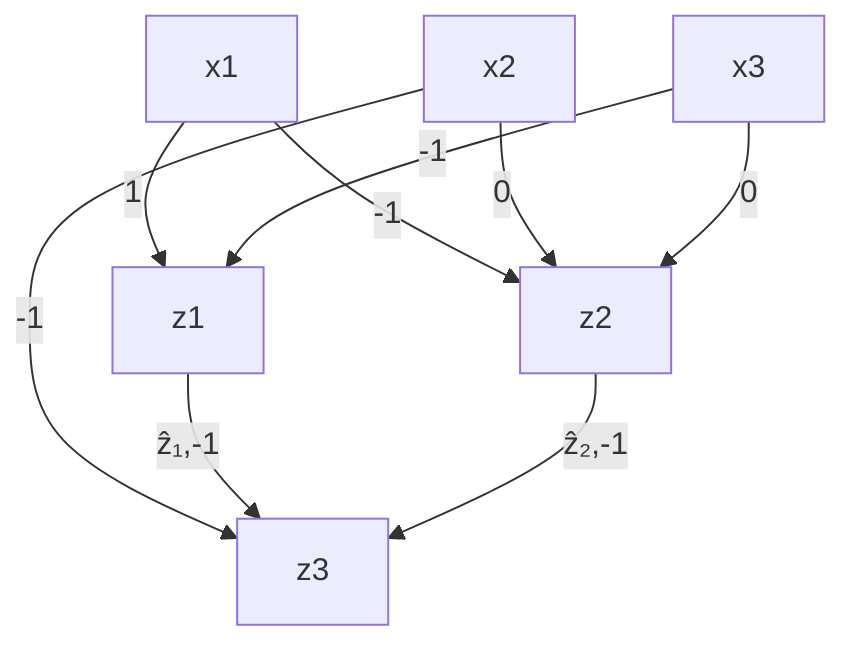

$$
\phi_ {h} (x) = (z _ {1} = x _ {1} - x _ {2})
$$

$$
\wedge (z _ {2} = 2 x _ {1} - x _ {3})
$$

$$
\wedge (z _ {3} = - \hat {z} _ {1} + \hat {z} _ {2})
$$

$$
\wedge \left(\left(\hat {z} _ {1} = z _ {1} \wedge z _ {1} \geq 0\right) \vee \left(\hat {z} _ {1} = 0 \wedge z _ {1} <   0\right)\right)
$$

$$
\wedge \left(\left(\hat {z} _ {2} = z _ {2} \wedge z _ {2} \geq 0\right) \vee \left(\hat {z} _ {2} = 0 \wedge z _ {2} <   0\right)\right)
$$

Figure 3.1: A ReLU-activated neural network and its corresponding logic formula

## 3.2.2.2 Unbounded Mixed-integer Program Encoding of Neural Networks

We try to be faithful to the notation from Liu et al. [Liu+19]. Consider an nlayer single-output feed-forward neural network (NN) with ReLU activations after each hidden layer that represents the function $h ( \mathbf { x } )$ . The width of each layer is $k _ { i }$ and $\mathbf { z } _ { i }$ is the vector of dimension $k _ { i }$ which represents layer i where $i \in \{ 1 , 2 , . . . , n \}$ . While $\mathbf { z } _ { i }$ represents the pre-ReLU activations, $\hat { \mathbf { z } } _ { i }$ is the values after ReLUs have been applied. Finally, $\delta _ { i }$ are vectors of binary variables indicating the state of each ReLU; 0 for inactive and 1 for activated ReLUs.

There are multiple ways to encode neural networks as MIPs in the NN verification literature, each proposing different encodings for ReLU activations. A generic form is as follows. For $i \in \{ 1 , . . . , n \}$ and $j \in \{ 1 , . . . , k _ { i } \}$ :

$$
\mathbf {z} _ {i} = \mathbf {W} _ {i} \hat {\mathbf {z}} _ {i - 1} + \mathbf {b} _ {i} \tag {3.3a}
$$

$$
\boldsymbol {\delta} _ {i} \in \{0, 1 \} ^ {k _ {i}}, \hat {\mathbf {z}} _ {i} = \mathbf {z} _ {i} \cdot \boldsymbol {\delta} _ {i},
$$

$$
\delta_ {i, j} = 1 \Rightarrow z _ {i, j} \geq 0, \tag {3.3b}
$$

$$
\delta_ {i, j} = 0 \Rightarrow z _ {i, j} <   0
$$

The first part (3.3a) is simply the linear affine of weights and the second part (3.3b) encodes the following ReLUs using the introduced binary variables for each ReLU. We refer to this as the unbounded MIP encoding.

## 3.2.2.3 Bounded Mixed-integer Program Encoding of Neural Networks

Bunel et al. [Bun+18] suggest that most NN verifiers, based on either SMT or MIP solvers, are indeed a variation of Branch-and-Bound (B&B) optimization. This understanding implies that limiting the bounds of the variables of the optimization problem is a very effective heuristic. Moreover, the extra constraints of the CFE generation problem – making the verification formulation difficult to solve – might actually help tightening the bounds, and thus, result in an effective pruning of the domains of the optimization problem. We will thus, change the generic ReLU formulation (3.3b) and adopt the bounded encoding proposed by Tjeng and Tedrake [TT17], i.e., for $i \in \{ 1 , . . . , n \}$ :

$$
\mathbf {z} _ {i} = \mathbf {W} _ {i} \hat {\mathbf {z}} _ {i - 1} + \mathbf {b} _ {i} \tag {3.4a}
$$

$$
\delta_ {i} \in \{0, 1 \} ^ {k _ {i}}, \quad \hat {\mathbf {z}} _ {i} \geqslant 0, \quad \hat {\mathbf {z}} _ {i} \leqslant \mathbf {u} _ {i} \cdot \delta_ {i}, \tag {3.4b}
$$

$$
\hat {\mathbf {z}} _ {i} \geqslant \mathbf {z} _ {i}, \quad \hat {\mathbf {z}} _ {i} \leqslant \mathbf {z} _ {i} - \mathbf {l} _ {i} \cdot (1 - \delta_ {i})
$$

Note that the linear part $\left( 3 . 4 \mathrm { a } \right)$ is the same as (3.3a) and also note that this is still an exact encoding of NNs using MIP since $\delta _ { i , j } = 0 \Leftrightarrow \hat { z } _ { i , j } = 0$ and $\delta _ { i , j } = 1 \Leftrightarrow \hat { z } _ { i , j } = z _ { i , j }$ . This encoding relies on $\mathbf { l } _ { i }$ and $\mathbf { u } _ { i } ,$ , vectors indicating the lower and upper bounds of the values of the hidden units at layer i. We remind that tight bounds can be very effective in domain pruning when solving the mixed-integer program. Here, we introduce two ways to obtain such bounds and complete the MIP formulation $( 3 . 4 )$ for CFEs: first, using interval arithmetic (HJVE01), and second, using an approximation of ReLUs that results in tighter bounds. In both cases, we assume that we have initial lower/upper bounds on the values of the input layer (e.g., derived from the dataset). This is a valid assumption since real-world features such as age or income do have bounds.

## 3.2.2.4 Interval arithmetic

By using interval arithmetic (HJVE01), having the bounds at layer $i - 1$ , we can compute the bounds for the j-th neuron from the i-th layer $( z _ { i , j } )$ as:

$$
\begin{array}{l} l _ {i, j} = \Sigma_ {t = 1} ^ {k _ {i - 1}} (m a x (W _ {i, j, t}, 0) \cdot l _ {i - 1, t} \\ + \min (W _ {i, j, t}, 0) \cdot u _ {i - 1, t}) + b _ {i, j} \tag {3.5} \\ u _ {i, j} = \Sigma_ {t = 1} ^ {k _ {i - 1}} (m a x (W _ {i, j, t}, 0) \cdot u _ {i - 1, t} \\ + m i n (W _ {i, j, t}, 0) \cdot l _ {i - 1, t}) + b _ {i, j} \\ \end{array}
$$

The post-ReLU bounds (for $\hat { z } _ { i , j } )$ are obtained simply by applying a ReLU on these bounds.

This is applied layer-by-layer and the bounds for all hidden units are computed recursively starting from the input layer. Unfortunately, although better than having no bounds at all, these bounds quickly become loose as we go deeper in the network. The reason is that in each layer $i ,$ each neuron is choosing a worst-case bound (lower or upper) from the neurons of the previous layer i − 1, independently from the rest of the neurons in layer $i ,$ causing conflicts in the choice of the lower or upper bound for some neurons in layer $i - 1 . ^ { 2 }$

## 3.2.2.5 Linear Over-approximation of ReLUs

To compute tighter bounds than interval arithmetic, we first adopt the linear over-approximation of ReLUs proposed in (Ehl17) to replace (3.3b), i.e., for $i \in \{ 1 , . . . , n \}$ and $j \in \{ 1 , . . . , k _ { i } \}$ :

$$
\mathbf {z} _ {i} = \mathbf {W} _ {i} \hat {\mathbf {z}} _ {i - 1} + \mathbf {b} _ {i} \tag {3.6a}
$$

$$
\hat {\mathbf {z}} _ {i} \geqslant \mathbf {z} _ {i}, \quad \hat {\mathbf {z}} _ {i} \geqslant 0, \quad \hat {z} _ {i, j} \leqslant u _ {i, j} \frac {z _ {i , j} - l _ {i , j}}{u _ {i , j} - l _ {i , j}} \tag {3.6b}
$$

Again, the linear part (3.6a) is the same as (3.3a). For the ReLU part (3.3b), the binary variables encoding the ReLUs in an exact way are removed and, instead, a linear over-approximation term has been replaced (3.6b). This results in a fully linear MIP system without the ReLU binary variables, whose optimization for different objectives can be performed efficiently.

As before, the bounds are recursively computed in a layer-by-layer manner, and the constraints of the linearized network (3.6) are added to the MIP system progressively. At each layer $i ,$ first, (3.6a) is added with bounds of the variables computed using simple interval arithmetic from the tight bounds computed for the previous layer. Then, to find better bounds than simple interval arithmetic, having included all the constraints up until this layer, two MIPs are solved for each hidden unit: one with the objective of maximizing the value of the unit to compute an upper bound, and a similar one for computing the lower bound. Finally, the ReLU constraints (3.6b) for this layer are added with the just-computed tight bounds.2 Note that while we have opted for the ReLU activation function as a common source of non-linearity, any activation function that can be approximated by piece-wise linear functions is applicable, e.g., Max-Pooling (Ehl17).

We build upon an implementation from Bunel et al. [Bun+18] for this purpose. Obtaining tight bounds here relies on how small the domains of the input variables are; keeping the input domains small enough will result in tighter bounds for other variables. This will be discussed in more detail in the next section.

## 3.3 cfe generation

In this section, we propose three approaches towards CFE generation for neural networks. All the approaches rely on the linearized network approximations described in the previous section, which provide tight lower and upper bounds on the values of the hidden units. Below, we first explain the search strategy on the distance of the nearest CFE and the way lower/upper bounds on the input and hidden units are computed within this search. Then, we introduce three approaches towards efficient nearest CFE generation for neural networks.

## 3.3.1 Preliminaries

## 3.3.1.1 Exponential Search Strategy

In order to optimize the distance towards finding the nearest CFE, we implement an exponential search strategy (BYS10). W.l.o.g., we assume here that the input space is normalized and lies within the [0, 1] interval. Because the interval of the input layer determines those of later layers, we initiate our search with a small distance interval, whose lower and upper bound are set respectively to 0 and an (arbitrarily) small ϵ. We then exponentially increase the search interval until a CFE is found. Finally, a simple binary search is performed on the interval where the CFE was found to look for the nearest CFE. The overall scheme for the exponential search is summarized in Algorithm 2.

Algorithm 2: Exponential Search Strategy
Input: N, $x^{F}$ , $\epsilon$ Output: closest_CFE $[lb_{dist}, ub_{dist}] \leftarrow [0, \epsilon]$ ;
while findCFE(N, $x^{F}$ , $lb_{dist}$ , $ub_{dist}$ ) is None do $lb_{dist} \leftarrow ub_{dist}$ ; $ub_{dist} \leftarrow ub_{dist} \times 2$ ;
end
closest_CFE $\leftarrow$ binarySearch(N, $x^{F}$ , $\epsilon$ , $lb_{dist}$ , $ub_{dist}$ );
return closest_CFE;

Next, we discuss how to compute bounds on both the input and hidden units of the network, which are necessary to efficiently implement the CFE search function, findCFE in Algorithm 2.

## 3.3.1.2 Computing Bounds for Input and Hidden Units

We leverage the network approximator based upon equation (3.6) to compute the bounds of the network input and hidden units for a given distance interval $[ l b _ { d i s t } , u b _ { d i s t } ]$ . To this end, we first obtain the MIP encoding of the distance. Then, we optimize the MIP-encoded distance for each input variable, maximizing/minimizing each variable to obtain the lower/upper bounds of the input layer for the given distance interval. Then, the input bounds are propagated in the NN to compute the bounds of hidden units. We include the distance constraints in the initial constraint set of the linearized network to help finding tighter bounds for the hidden units. Algorithm 3 shows the overall scheme for this.

Algorithm 3: Bounds Computation

Input: N, $x^{F}$ , $lb_{dist}$ , $ub_{dist}$ Output: $LB_{net}$ , $UB_{net}$ $\phi_{dist} \leftarrow \text{getDistanceConstraints}(N, x^{F}, lb_{dist}, ub_{dist})$ ; $lb_{inp}, ub_{inp} \leftarrow \text{optimizeInputVars}(N, \phi_{dist})$ ; $LB_{net}, UB_{net} \leftarrow linearizedNetApproximator(N, lb_{inp}, ub_{inp}, \phi_{dist})$ ;

return $LB_{net}, UB_{net}$ ;

## 3.3.2 Approaches

In this section, we propose three efficient approaches to implement the CFE search function, findCFE in Algorithm 2, for neural networks. The first approach relies on SMT solvers as backend and uses the bounds computation as a heuristic within each iteration of the exponential search (Algorithm 2). The second and third approaches instead rely on MIP solving to search for CFEs. The difference between them lies on the optimization of the distance – while the second approach minimizes the CFE distance using the exponential search described above, the third approach includes the distance as objective within the MIP optimization framework. Next, we provide further details on the three approaches.

## 3.3.2.1 ReLU Elimination (MIP-SAT)

In this approach, we build upon MACE (Kar+20a) (SMT solving in the backend) and use the bounds computation as a heuristic. Within each iteration of the exponential search (Algorithm 2), and given the distance interval, the bounds on the input and hidden units are computed using Algorithm 3 and ReLUs with a fixed state are determined. A ReLU has a fixed state iff the value of the neuron before applying ReLU has either a lower bound greater than or equal to zero, or an upper bound less than or equal to zero.

The neural network, distance functions, as well as additional constraints are primarily encoded as SMT formulae. For the NN bounds computation, the NN and distance constraints are encoded as MIPs, as described before. Next, the ReLUs with a fixed-state are removed from the initial SMT formula representing the NN. This means that, for an always-active ReLU, we will have $\hat { z } _ { i } = z _ { i }$ and for an always-inactive ReLU we will have $\hat { z } _ { i } = 0 ,$ , instead of the initial ReLU clause: $( \hat { z } _ { i } = z _ { i } \wedge z _ { i } \geq 0 ) \vee ( \hat { z } _ { i } = 0 \wedge z _ { i } < 0 )$ . This is, basically, removing the disjunction associated to the ReLU states by fixing its value, saving the SMT solver the effort to branch over its cases. Finally, the SMT solver $( Z _ { 3 }$ solver (DMB08) in our case) is called with the new formula to verify the existence of a CFE within the given distance interval.

Note that the ReLU clauses in the SMT representation of the neural network are exponentially expensive to handle for the SMT solver since it forces the solver to branch over the cases. Thus, removing a subset of the RELU activations will reduce the run-time exponentially (as empirically shown in the experiments). Algorithm 4 shows the overall scheme for the proposed mixed MIP-SAT approach.

Algorithm 4: The MIP-SAT approach – findCFE in Algorithm 2
Input: N, $x^{F}$ , $lb_{dist}$ , $ub_{dist}$ Output: CFE or None $\phi_{dist} \leftarrow \text{getDistanceFormula}(N, x^{F}, lb_{dist}, ub_{dist})$ ; $\phi_{pls} \leftarrow \text{getPlausibilityFormula}(N)$ ; $\phi_{N} \leftarrow \text{getModelFormula}(N)$ ; $LB_{net}, UB_{net} \leftarrow computeBounds(N, x^{F}, lb_{dist}, ub_{dist})$ ; $\phi_{N} \leftarrow eliminateRelus(\phi_{N}, LB_{net}, UB_{net})$ ;
if $SAT(\phi_{N} \land \phi_{dist} \land \phi_{pls})$ then
    return CFE;
else
    return None;

## 3.3.2.2 Output Optimization (MIP-EXP)

In this approach, we purely use a MIP-based optimization process (no SMT oracle), for which we deploy an optimization engine (Gurobi (GO20) in this case), building upon an implementation of (3.4) from Bunel et al. [Bun+18].

As before, we assume that we are within an iteration of the exponential search (Algorithm 2) with a fixed distance interval $[ l b _ { d i s t } , u b _ { d i s t } ]$ . First, Algorithm 3 is called to compute tight lower/upper bounds for the input and hidden units of the network. Next, these bounds are used to obtain MIP encoding of the neural network as in (3.4). Then the distance, as well as any other additional constraints (all explained in the next section), are added to MIP formulation. Finally, depending on the (predicted) label of the factual sample $\mathbf { x } ^ { \mathsf { F } } .$ , the single output of the network is optimized. For instance, for a factual sample with a positive label, the output of the network will be minimized with a callback that interrupts the optimization as soon as a counterfactual with a negative output value is found. Otherwise, the lower bound of the output of the network for this factual sample and distance interval is greater than zero and no counterfactual exists. The overall scheme of the proposed MIP-EXP approach is shown in Algorithm 5.

Note that this approach no longer uses an SMT oracle, but instead relies on an optimization engine to solve a mixed-integer program with the single output of the network as its objective function. Thus, it can naturally be extended to multi-class classification by introducing a new variable in the MIP that preserves the maximum logit among class outputs on which the optimization objective is defined.

Algorithm 5: The MIP-EXP approach – findCFE in Algorithm 2

Input: N, $x^{F}$ , $lb_{dist}$ , $ub_{dist}$ Output: CFE or None $\phi_{dist} \leftarrow \text{getDistanceConstraints}(N, x^{F}, lb_{dist}, ub_{dist})$ ; $\phi_{pls} \leftarrow \text{getPlausibilityConstraints}(N)$ ; $LB_{net}, UB_{net} \leftarrow computeBounds(N, xzz^{F}, lb_{dist}, ub_{dist})$ ; $\phi_{N} \leftarrow getModelConstraints(N, LB_{net}, UB_{net})$ ; // MIP encoding 3.4
if optimize( $\phi_{N}, \phi_{dist}, \phi_{pls}, x^{F}$ ) then
| return CFE;
else
| return None;

## 3.3.2.3 Distance Optimization (MIP-OBJ)

This is similar to the MIP-EXP approach except that we remove the outer loop (the exponential search of Algorithm 2) and the distance function is introduced as the objective function of the MIP to be minimized.

In this approach, which we refer to as MIP-OBJ, Algorithm 3 is called to compute the bounds with the distance interval being [0, 1]. The computed bounds are placed within MIP encoding (3.4). Since now the objective of the MIP is the distance function, we need to add a constraint as the counterfactual constraint determining the single output of the network being negative or positive based on the (predicted) label of the factual sample. The whole problem is optimized (with an optimality gap of ϵ for the distance objective to be analogous to the other approaches) and the nearest CFE is found. Algorithm 6 shows the overall scheme of the MIP-OBJ approach.

Algorithm 6: The MIP-OBJ approach

Input: N, $x^{F}$ , $lb_{dist}$ , $ub_{dist}$ Output: CFE or None
obj ← getDistanceConstraints(N, $x^{F}$ ); $\phi_{pls} \leftarrow$ getPlausibilityConstraints(N); $\phi_{CFE} \leftarrow$ getCounterfactualConstraint(N, $x^{F}$ ); $LB_{net}, UB_{net} \leftarrow$ computeBounds(N, $x^{F}$ , 0, 1); // No distance limit $\phi_{N} \leftarrow$ IratisModelConstraints(N, $LB_{net}, UB_{net}$ ); // MIP encoding 3.4
CFE ← optimize( $\phi_{N}, \phi_{pls}, \phi_{CFE}, obj, x^{F}$ );
return CFE;

## 3.4 distance functions and qualitative features

In this section ,we describe how the distance metric, as well qualitative features–such as plausibility, sparsity and diversity–can be encoded within the MIP framework. First, we provide details on the encoding of distance functions suitable for heterogeneous input features. Second, in the context of plausibility, we describe how to handle heterogeneous input spaces, i.e., input features with mixed data types. Finally, we focus on a broadly studied qualitative property of CFEs, diversity. We would like to emphasize that previous MIP-based approaches have recognized the flexibility of mixed-integer programming in regards to encode a wide range of complex constraints and different qualitative features (Rus19; Kan+20a), however, this cannot be directly leveraged for NN models. We defer to future work to address a wider range of qualitative features for NN class of models.

## 3.4.1 Distance Functions

In this section, we provide more details on the MIP encoding of heterogeneous distance functions.3 We provide details on an $\ell _ { 1 }$ distance function (analogous to previous works (WMR17)) while zero-, two-, and infinitynorms are supported in an analogous manner, each providing a different practical intuition for the proximity of the CFEs, $\mathrm { e . g . , \ell _ { 0 } }$ used for sparsity. As described before, the distances are all range normalized and within the [0, 1] interval.

integer-valued and real-valued features For an input vector x and factual sample $\mathbf { x } ^ { \mathsf { F } }$ with such a feature at the i-th dimension, the normalized $\ell _ { 1 }$ distance is computed in a straight-forward manner:

$$
\operatorname{dist} _ {\text { real }} (x _ {i}, x _ {i} ^ {\mathsf {F}}) = \frac {| x _ {i} - x _ {i} ^ {\mathsf {F}} |}{u b _ {i} - l b _ {i}} \tag {3.7}
$$

where $l b _ { i } , u b _ { i }$ are the scalar lower/upper bounds for $x _ { i }$ .

ordinal features For an input vector x and factual sample $\mathbf { x } ^ { \mathsf { F } }$ with an ordinal feature $x _ { i }$ having k levels, the normalized $\ell _ { 1 }$ distance is computed in the following manner:

$$
\operatorname{dist} _ {\text {ord}} \left(x _ {i}, x _ {i} ^ {\mathrm{F}}\right) = \frac {\left| \sum_ {j = 1} ^ {k} x _ {i , j} - \sum_ {j = 1} ^ {k} x _ {i , j} ^ {F} \right|}{k} \tag {3.8}
$$

categorical features For an input vector x and factual sample $\mathbf { x } ^ { \mathsf { F } }$ with a categorical feature $x _ { i }$ having k categories, the normalized $\ell _ { 1 }$ distance is computed in the following manner:

$$
\operatorname{dist} _ {c a t} \left(x _ {i}, x _ {i} ^ {\mathsf {F}}\right) = \max _ {1 \leq j \leq k} \left(x _ {i, j} - x _ {i, j} ^ {\mathsf {F}}\right) \tag {3.9}
$$

In the end, the total normalized $\ell _ { 1 }$ distance between input vector x and factual sample $\mathbf { x } ^ { \mathsf { F } }$ would be the normalized sum over distances of different data types $( 3 . 7 ) , ( 3 . 8 ) , ( 3 . 9 ) , n _ { r e a l } , n _ { o r d } , n _ { c a t }$ t being the number of features in each of the three groups above:

$$
\begin{array}{l} \operatorname{dist} \left(\mathbf {x}, \mathbf {x} ^ {\mathrm{F}}\right) = \frac {1}{n _ {\text {real}} + n _ {\text {ord}} + n _ {\text {cat}}} \left(\sum_ {i = 1} ^ {n _ {\text {real}}} \operatorname{dist} _ {\text {real}} \left(x _ {i}, x _ {i} ^ {\mathrm{F}}\right) \right. \tag {3.10} \\ + \sum_ {i = 1} ^ {n _ {o r d}} \mathsf {d i s t} _ {o r d} (x _ {i}, x _ {i} ^ {\mathsf {F}}) + \sum_ {i = 1} ^ {n _ {c a t}} \mathsf {d i s t} _ {c a t} (x _ {i}, x _ {i} ^ {\mathsf {F}})) \\ \end{array}
$$

sparsity Sparsity can be interpreted as the $\ell _ { 0 }$ distance function. It is encoded by introducing a number of intermediate binary variables each retaining whether or not a feature has changed its value and then summed over and normalized analogous to the described $\ell _ { 1 }$ distance.

## 3.4.2 Plausibility Constraints

In this section we explain plausibility constraints that guarantee the CFE lying within the same heterogeneous space as input. Plausibility constraints for integer-valued, real-valued, and binary variables are naturally preserved by defining the right kind of variables within the MIP (or SMT) model.

ordinal features To guarantee that the CFEs are plausible in terms of ordinality of the ordinal features, for each such feature f with k levels, we define k binary variables $f _ { 1 } , . . . , f _ { k } \in \{ 0 , 1 \}$ in the MIP model. For each set of these variables, the following constraints are added to the MIP model:

$$
f _ {1} \geq f _ {2}, f _ {2} \geq f _ {3},..., f _ {k - 1} \geq f _ {k} \tag {3.11}
$$

This will guarantee that:  i s.t. $f _ { i + 1 } > f _ { i }$ .

categorical features We want to guarantee that in the produced CFE, for each categorical feature, only one category is chosen. For a categorical feature f with k categories, we define k binary variables $f _ { 1 } , \ldots , f _ { k } \in { \overline { { \{ 0 , 1 \} } } }$ in the MIP model. For each set of these variables, the following constraint is added to the MIP model:

$$
f _ {1} + f _ {2} + \dots + f _ {k} = 1 \tag {3.12}
$$

Since $f _ { i } { ' } \mathbf { s }$ are binary variables, this will guarantee that only one of them is 1 and others are $_ { 0 , }$ meaning that at most one category is active as desired.

## 3.4.3 Diversity Constraints

Providing individuals with different, preferably diverse, counterfactuals can be beneficial in terms of providing alternative ways for the individuals to improve their outcome. Having different diverse (and close) counterfactuals, the individuals may find the most suitable way to achieve the preferred outcome while considering their own personal constraints, about which the explanation-provider might not be aware of.

As with other qualitative features, there are different ways for encoding diversity in the literature of CFE generation. Within the MIP-based approaches, Russell [Rus19] encodes diversity simply as the newly generated CFE not being equal to the previously generated ones. Based on the evaluation criteria, this could fail to generate diverse CFEs, for example when the evaluation criteria is the mean of the pairwise distances of the (k) generated CFEs as DiCE (MST20) suggests. Among the gradient-based approaches, DiCE (MST20) accounts for diversity using determinantal point processes, i.e., it includes the determinant of the kernel matrix given the counterfactuals in the objective.

It is important to also take into account the distance of the generated set of diverse counterfactuals since it is necessary for this set to also be close to the individual for which it is being generated. Thus, it can be seen that there is an inherent tradeoff between diversity and distance. To account for this, we encode diversity as a set of constraints for each newly generated counterfactual to have a distance above a fixed threshold from each of the previously generated counterfactuals, while minimizing the distance to the factual sample. More specifically, the following set of constraints will be added before the search for the i-th CFE:

$$
\operatorname{dist} \left(x _ {1} ^ {\text { CFE }}, x _ {i} ^ {\text { CFE }}\right) \geq \delta
$$

$$
\vdots \tag {3.13}
$$

$$
\operatorname{dist} \left(x _ {i - 1} ^ {\text { CFE }}, x _ {i} ^ {\text { CFE }}\right) \geq \delta
$$

Note that solving the MIP becomes progressively more expensive for each new counterfactual. We have implemented a version of our approach called MIP-DIVERSE for generating diverse counterfactuals using the above formulation.

## 3.5 experiments

We conduct a number of quantitative and qualitative experiments to demonstrate our frameworks abilities relative to existing approaches:MACE (Kar+20a) 4 and DiCE (MST20).5 Following the motivation explained in the Introduction, we generate counterfactual explanations for fixedwidth ReLU-activated fully-connected NN models of various sizes, having $N \times W + ( D - 1 ) \cdot W ^ { 2 } + ( \dot { D } + 1 ) \times W$ total parameters, N being the input size, W width, and D depth. To support consequential decision-making settings, we employ three widely used real-world datasets from the counterfactual explanations literature: Adult (d = 51) (Adu96), COMPAS (d = 7) (Lar+16a), and Credit (d = 20) (BL13). Finally, all approaches are evaluated and compared on their optimality of distance, coverage, and runtime efficiency over a total of 500 instances. All implementations of the approaches will be shared publicly.

## 3.5.1 Performance of the MIP-framework

In the first set of experiments, we aim to showcase the ability of the proposed MIP-based approaches (i.e., MIP-SAT, MIP-EXP, MIP-OBJ) in diverse settings. Specifically, we generate CFEs for a two-layer ReLU-activated NN with 10 neurons in each layer and evaluate generated counterfactual explanations using the metrics above on three datasets and four norm distances: $\ell _ { 0 } , \ell _ { 1 } , \ell _ { 2 } , \ell _ { \infty }$ .

As expected, the CFE distances for all presented methods are similar to those of MACE (SAT) (Kar+20a), which we use here as oracle, and coverage is perfect by design for all presented methods. Figure 3.2 presents a comparison of runtime for these methods, where we observe significant improvement in runtime compared to SAT-oracle. Similar comparison for distances may be found in Figure B.2 in the Appendix. Importantly, the presented MIP-based methods are able to generate CFEs in settings in which neither MACE (SAT) nor MIP-SAT are able (e.g., Adult or Credit dataset on $\ell _ { 2 }$ norm).

In a second experiment, we compare the proposed MIP-based approaches, not only with the SAT-oracle but also with DiCE (MST20) (i.e., gradient-based optimization) on the same NN model as above. Here we adapt our experimental setting to DiCE, as it only supports the $\ell _ { 1 } { \mathrm { - n o r m } }$ distance, and does not provide support for ordinal and real-valued features. Moreover, since DiCE assumes that the model has been trained using range-normalized data, we build additional support in our implementation to encode the normalization term in the MIP-based approaches, which in turn could negatively affect runtime and numeric stability. Nonetheless, in this setting, we observe in Figure 3.3 relatively smaller distances and significantly smaller runtimes for the former. Furthermore, where MIP-OBJ has perfect coverage by design, DiCE dips slightly below perfect coverage on the Adult dataset, failing to offer an explanation for 2/500 instances.

## 3.5.2 Scalablity Experiments

The experiments above were presented on NN models that were able to sufficiently discriminate between the classes of the supervised learning task (with test accuracy in the range of 67-82% for different datasets). Complementing the demonstrations above, we investigate the scalibility of our approaches for the sake of completeness. In this regard, Figure 3.5 (and Figure B.3 in the Appendix) compare the runtime, distance, and coverage for SMT-based (Kar+20a) and gradient-based (MST20) approaches with our proposed approaches for a NN model with growing width and/or depth (as well as growing input size by incorporating different datasets).

It can be seen that the SMT-based approaches quickly reach their limit while MIP-based and gradient-based approaches scale well with both increasing width and depth. As MIP-based approaches do not scale polynomially w.r.t. network size, they do not scale as well as the gradient-based DiCE (this can be seen for the bigger Credit and Adult datasets in Figure B.3 in the Appendix), however, they produce much smaller distances. While MIP-based approaches have perfect coverage and minimum distance in theory, in practice numerical instabilities may be incurred in the backend tool as the number of intermediate variables in the mixed-integer program becomes large and their relations become deep due to the nested nature of NNs (the analysis of such numerical instabilities is beyond the scope of this work and deferred for future work). This causes failure to generate explanations for some samples or an increase in distances. In this context, having two MIP-based approaches is beneficial to verify results–for example, MIP-EXP behaves more stable in terms of distances than MIP-OBJ.

## 3.5.3 Qualitative Experiments

In this section, we show that how the expressiveness of SMT and MIP can be used to easily encode qualitative features and/or user-defined constraints for the explanations.


Figure 3.4: Scatter plots showing the diversity and proximity of sets of counterfactuals generated by our approach against DiCE along with runtimes. Diversity, distance, and runtime for generating sets of counterfactuals on the COMPAS dataset and NN model with two hidden layers of size 10. For each counterfactual set size $k \in [ 2 , 1 0 ]$ , each approach has been tested on 100 instances.

## 3.5.3.1 Diversity

We report on experiments showing the diversity feature of our approach as presented in the previous section, and compare against DiCE’s implementation of diversity.

We follow the authors of DiCE, and evaluate the k diversely generated CFEs by measuring the mean of pairwise distances among the CFEs (the higher the better):

$$
k - \text { diversity } (\{x _ {j} ^ {\mathrm{CFE}} \} _ {k}): \frac {1}{\binom {k} {2}} \sum_ {i = 1} ^ {k - 1} \sum_ {j = i + 1} ^ {k} \operatorname{dist} (x _ {i} ^ {\mathrm{CFE}}, x _ {j} ^ {\mathrm{CFE}}) \tag {3.14}
$$

Expectedly, diversity is traded-off with distance. Thus, in addition to the diversity metric above, the distance of the diverse set of CFEs to the original factual instance, $\mathbf { x } ^ { \mathsf { F } } .$ , is measured as follows (the lower the better):

$$
k - \text { distance } (\mathbf {x} ^ {\mathrm{F}}, \{x _ {j} ^ {\mathrm{CFE}} \} _ {k}): \frac {1}{k} \sum_ {i = 1} ^ {k} \operatorname{dist} (\mathbf {x} ^ {\mathrm{F}}, x _ {i} ^ {\mathrm{CFE}}) \tag {3.15}
$$

Figure 3.4 shows diversities generated by MIP-DIVERSE compared to DiCE for which the default hyperparameters are used. MIP-DIVERSE succeeds in finding the closest set of CFEs given a fixed distance threshold for diversity. The initial threshold has been set to 0.01 for this experiment, increasing it would result in the k−diversity and k−distance graph of Figure 3.4 to move upward, providing the possibility to choose the desired diversity-distance trade-off. Our results show that at a similar level of diversity $( \mathrm { i } . \mathrm { e } . , k = 6 )$ , the


Figure 3.5: Scatter and bar plots showing the runtimes and distances when the network architecture becomes wider or deeper. Scalability experiments comparing SMT-, MIP-, and gradient-based approaches on the COMPAS dataset. The upper row shows the results for increasing depth and the lower row for increasing width; both in terms of runtime and distance. For each approach and architecture 50 samples are evaluated, however, some fail to produce valid CFEs either because of imperfect coverage (i.e., DiCE) or numeric instabilities (i.e., MIP-OBJ and MIP-EXP); thus, only the instances for which all approaches have generated valid CFEs are included in the comparison. In general, for increasing depth, the average coverage across all the architectures is 99.1% and 93.7% for MIP-OBJ and MIP-EXP, and 96.4% for DiCE. For increasing width, the average coverage across all the architectures is 100% and 100% for MIP-OBJ and MIP-EXP, and 100% for DiCE. Similar experiments on the Credit and Adult datasets may be found in Figure B.3 in the Appendix.

counterfactual set of MIP-DIVERSE is much closer to the factual instance. As k increases further, in DiCE, while still a subset of the CFEs are diverse (and thus increase the average distance), the remaining ones are very similar to the previous as they minimally change a subset of the continuous variables. As a result, the average diversity and distance of the generated CFEs decreases. The runtimes of MIP-DIVERSE is again faster than the gradient-based opponent, however, MIP-DIVERSE is more sensitive to increasing the input size due to the added distance constraints, making it more or less as slow as DiCE on larger datasets.

## 3.5.3.2 Sparsity

As described in the previous section, maximizing the sparsity of explanations is equivalent to minimizing the $\ell _ { 0 }$ distance to the factual sample. To show the ability of our approach in maximizing sparsity, we refer the reader to the first column of figure B.2 in the Appendix where all approaches succeed in maximizing sparsity. Indeed, it would also be possible to optimize for a convex combination of $\ell _ { 0 }$ and e.g., $\ell _ { 1 }$ norms to generate more realistic sparse explanations that allow more features to vary while staying close to the factual sample.

We would like to also remark, once more, the role of the expressive power of SMTs and MIPs, in increasing the quality of explanations through handling different types of constraints. For example, defining different types of actionability on the features (e.g., increase/decrease-only, non-actionable, etc.) are as simple as adding a few inequality constraints to the MIP model. This ease of encoding may give stake-holders and explanation-providers the possibility to take into account individual-specific situations where an individual might ask for her personal constraints to be considered within the provided explanation.

## 3.6 conclusion and future work

In this work, we have proposed efficient approaches based on mixed-integer programming to generate counterfactual explanations with guarantees for the widely-used class of neural network models. We have empirically demonstrated the efficiency and guarantees of the proposed framework by comparing it, in terms of distance, runtime and coverage with previous SMT- and gradient-based approaches for CFE generation. We have also provided qualitative results on the generation of diverse counterfactuals, showing the flexibility of our approach, as well as efficiency in handling complex qualitative features.

As future work, we plan to explore other qualitative features, such as other plausibility constraints beyond data types and ranges. Moreover, although in this work we have focused on NN architectures with ReLU activations, similar approaches can be deployed for any piece-wise linear activation function (e.g., Max-Pooling). Moreover, other classes of models (e.g., Support Vector Machines with RBF kernel) could also be encoded or approximated by linear constraints, and thus be similarly handled by our MIP-framework. Finally, as stake-holders increasingly adopt more complex neural models for consequential decision-making, it becomes critical to have access to reliable and efficient tools to explain algorithmic decisions. Thus, as venue for future work, it would be interesting to further investigate the scalability and numeric stability issues, which also arise in the NN verification.

# Causal Algorithmic Recourse

## Chapter Abstract

Algorithmic recourse actions are typically obtained through solving an optimization problem that minimizes changes to the individual’s feature vector, subject to various plausibility, diversity, and sparsity constraints. Whereas previous works offer solutions to the optimization problem in a variety of settings, they critically overlook real-world considerations pertaining to the environment in which recourse actions are performed.

The present work emphasizes that changes to a subset of the individual’s attributes may have consequential down-stream effects on other attributes, thus making recourse a fundamentally causal problem. Here, we model such considerations using the framework of structural causal models, and highlight pitfalls of not considering causal relations through examples and theory. Such insights allow us to reformulate the optimization problem to directly optimize for minimally-costly recourse over a space of feasible actions (in the form of causal interventions) rather than optimizing for minimally-distant “counterfactual explanations”. We offer both the optimization formulations and solutions to deterministic and probabilistic recourse, on an individualized and sub-population level, overcoming the steep assumptive requirements of offering recourse in general settings. Finally, using synthetic and semi-synthetic experiments based on the German Credit dataset, we demonstrate how such methods can be applied in practice under minimal causal assumptions.

This chapter is based on the papers “Algorithmic Recourse: from Counterfactual Explanations to Interventions,” Karimi, Schölkopf, Valera, ACM-FAccT ( ­), 2020 (KSV21), and “Algorithmic recourse under imperfect causal knowledge: a probabilistic approach,” Karimi\*, von Kügelgen\*, Schölkopf, Valera, NeurIPS ( ­), 2020 (Kar+20b).

## 4.1 introduction

Predictive models are being increasingly used to support consequential decision-making in a number of contexts, e.g., denying a loan, rejecting a job applicant, or prescribing life-altering medication. As a result, there is mounting social and legal pressure (VB; SSH21) to provide explanations that help the affected individuals to understand “why a prediction was output”, as well as “how to act” to obtain a desired outcome. Answering these questions, for the different stakeholders involved, is one of the main goals of explainable machine learning (DVK17; Gun19; Kod94; Lip18; Mur+19; Rud19; Rüp06).

In this context, several works have proposed to explain a model’s predictions of an affected individual using counterfactual explanations, which are defined as statements of “how the world would have (had) to be different for a desirable outcome to occur” (WMR17). Of specific importance are nearest counterfactual explanations, presented as the most similar instances to the feature vector describing the individual, that result in the desired prediction from the model (Kar+20a; Lau+17). A closely related term is algorithmic recourse—the actions required for, or “the systematic process of reversing unfavorable decisions by algorithms and bureaucracies across a range of counterfactual scenarios”—which is argued as the underwriting factor for temporally extended agency and trust (VA20).

Counterfactual explanations have shown promise for practitioners and regulators to validate a model on metrics such as fairness and robustness (Kar+20a; SHG20; USL19). However, in their raw form, such explanations do not seem to fulfill one of the primary objectives of “explanations as a means to help a data-subject act rather than merely understand” (WMR17).

The translation of counterfactual explanations to recourse actions, i.e., to a recommendable set of actions to help an individual achieve a favorable outcome, was first explored in (USL19), where additional feasibility constraints were imposed to support the concept of actionable features (e.g., to prevent asking the individual to reduce their age or change their race). While a step in the right direction, this work and others that followed (Kar+20a; MST20; Poy+19; SHG20) implicitly assume that the set of actions resulting in the desired output would directly follow from the counterfactual explanation. This arises from the assumption that “what would have had to be in the past” (retrodiction) not only translates to “what should be in the future” (prediction) but also to “what should be done in the future” (recommendation) (Sta19). We challenge this assumption and attribute the shortcoming of existing approaches


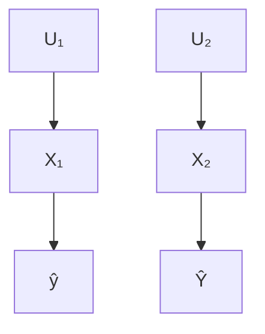

Figure 4.1: Illustration of an example bivariate causal generative process, showing both the graphical model $\mathcal { G }$ (left), and the corresponding structural causal model (SCM) (right) (Pea09). In this example, $\mathrm { X _ { 1 } }$ represents an individual’s annual salary, ${ \sf X } _ { 2 }$ represents their bank balance, and $\hat { \Upsilon }$ denotes the output of a fixed deterministic predictor $h ,$ predicting an individual’s eligibility to receive a loan. $U _ { 1 }$ and $U _ { 2 }$ denote unobserved (exogenous) random variables.

$$
\left. \begin{array}{l} X _ {1} := f _ {1} (\mathrm{U} _ {1}) \\ X _ {2} := f _ {2} (X _ {1}, \mathrm{U} _ {2}) \\ P _ {\mathbf {U}} = P _ {U _ {1}} \times P _ {U _ {2}} \end{array} \right\} \mathcal {M} = (\mathbb {S}, P _ {\mathbf {U}})
$$

$$
\hat {Y} = h (X _ {1}, X _ {2})
$$

to their lack of consideration for real-world properties, specifically the causal relationships governing the physical world in which actions are performed.

## 4.1.1 Motivating Examples

Example 4.1.1. Consider, for example, the setting in Fig. 4.1 where an individual has been denied a loan and seeks an explanation and recommendation on how to proceed. This individual has an annual salary $( \mathsf { X } _ { 1 } )$ of \$75, 000 and an account balance $( \mathsf { X } _ { 2 } )$ of \$25, 000 and the predictor grants a loan based on the binary output of $h ( X _ { 1 } , X _ { 2 } ) = { \mathrm { s g n } } ( X _ { 1 } + 5 \cdot \mathrm { X } _ { 2 } - \ S 2 2 5 , 0 0 0 )$ . Existing approaches may identify nearest counterfactual explanations as another individual with an annual salary of \$100, 000 (+33%) or a bank balance of \$30, 000 (+20%), therefore encouraging the individual to reapply when either of these conditions are met. On the other hand, assuming actions take place in a world where home-seekers save 30% of their salary, up to external fluctuations in circumstance, $( \mathrm { i . e . , } \ X _ { 2 } : = 0 . 3 \mathsf { X } _ { 1 } + \mathsf { U } _ { 2 } )$ , a salary increase of only +14% to \$85, 000 would automatically result in \$3, 000 additional savings, with a net positive effect on the loan-granting algorithm’s decision.

Example 4.1.2. Consider now another instance of the setting of Fig. 4.1 in which an agricultural team wishes to increase the yield of their rice paddy. While many factors influence yield (temperature, solar radiation, water supply, seed quality, ...), assume that the primary actionable capacity of the team is their choice of paddy location. Importantly, the altitude $( X _ { 1 } )$ at which the paddy sits has an effect on other variables. For example, the laws of physics may imply that a 100m increase in elevation results in an average decrease of $\mathrm { i } ^ { \circ } \mathrm { C }$ in temperature $( X _ { 2 } )$ . Therefore, it is conceivable that a counterfactual explanation suggesting an increase in elevation for optimal yield, without consideration for downstream effects of the elevation increase on other variables (e.g., a decrease in temperature), may actually result in the prediction not changing.

These two examples illustrate the pitfalls of generating recourse actions directly from counterfactual explanations without consideration for the (causal) structure of the world in which the actions will be performed. Actions derived directly from counterfactual explanations may ask too much effort from the individual (Example 4.1.1) or may not even result in the desired output (Example 4.1.2).

We also remark that merely accounting for correlations between features (instead of modeling their causal relationships) would be insufficient as this would not align with the asymmetrical nature of causal interventions: for Example 4.1.1, increasing bank balance $( X _ { 2 } )$ would not lead to a higher salary $( X _ { 1 } )$ , and for Example 4.1.2, increasing temperature $( X _ { 2 } )$ ) would not affect altitude $( X _ { 1 } )$ , contrary to what would be predicted by a purely correlation-based approach.

## 4.1.2 Summary of Contributions and Structure of this Chapter

In the present work, we remedy this situation via a fundamental reformulation of the recourse problem: we rely on causal reasoning $( \ S \ 4 . 2 . 2 )$ to incorporate knowledge of causal dependencies between features into the process of recommending recourse actions that, if acted upon, would result in a counterfactual instance that favorably changes the output of the predictive model (§ 4.2.1).

First, we illuminate the intrinsic limitations of an approach in which recourse actions are directly derived from counterfactual explanations (§ 4.3.1). We show that actions derived from pre-computed (nearest) counterfactual explanations may prove sub-optimal in the sense of higher-than-necessary cost, or, even worse, ineffective in the sense of not actually achieving recourse. To address these limitations, we emphasize that, from a causal perspective, actions correspond to interventions which not only model changes to the intervened-upon variables, but also downstream effects on the remaining (non-intervened-upon) variables. This insight leads us to propose a new framework of recourse through minimal interventions in an underlying structural causal model (SCM) (??). We complement this formulation with a negative result showing that recourse guarantees are generally only possible if the true SCM is known (??).

Second, since real-world SCMs are rarely known we focus on the problem of algorithmic recourse under imperfect causal knowledge (??). We propose two probabilistic approaches which allow to relax the strong assumption of a fully-specified SCM. In the first (??), we assume that the true SCM, while unknown, is an additive Gaussian noise model (Hoy+09; PB14). We then use Gaussian processes (GPs) (WR06) to average predictions over a whole family of SCMs to obtain a distribution over counterfactual outcomes which forms the basis for individualised algorithmic recourse. In the second (??), we consider a different subpopulation-based $( \mathrm { i . e . , }$ interventional rather than counterfactual) notion of recourse which allows us to further relax our assumptions by removing any assumptions on the form of the structural equations. This approach proceeds by estimating the effect of interventions on individuals similar to the one for which we aim to achieve recourse (i.e., the conditional average treatment effect (AHL15)), and relies on conditional variational autoencoders (SLY15) to estimate the interventional distribution. In both cases, we assume that the causal graph is known or can be postulated from expert knowledge, as without such an assumption causal reasoning from observational data is not possible (PJS17, Prop. 4.1). To find minimum cost interventions that achieve recourse with a given probability, we propose a gradientbased approach to solve the resulting optimisation problems (??).

Our experiments (??) on synthetic and semi-synthetic loan approval data, show the need for probabilistic approaches to achieve algorithmic recourse in practice, as point estimates of the underlying true SCM often propose invalid recommendations or achieve recourse only at higher cost. Importantly, our results also suggest that subpopulation-based recourse is the right approach to adopt when assumptions such as additive noise do not hold. A user-friendly implementation of all methods that only requires specification of the causal graph and a training set is available at https://github.com/amirhk/recourse.

## 4.2 preliminaries

In this work, we consider algorithmic recourse through the lens of causality. We begin by reviewing the main concepts.

## 4.2.1 XAI: Counterfactual Explanations and Algorithmic Recourse

Let $\mathbf { X } = \left( X _ { 1 } , . . . , X _ { d } \right)$ denote a tuple of random variables, or features, taking values $\mathbf { x } = ( x _ { 1 } , . . . , x _ { d } ) \in \mathcal { X } = \mathcal { X } _ { 1 } \times . . . \times \mathcal { X } _ { d }$ . Assume that we are given a binary probabilistic classifier $h : \mathcal { X }  [ 0 , 1 ]$ trained to make decisions about i.i.d. samples from the data distribution $P _ { \mathbf { X } } .$ .1For ease of illustration, we adopt the setting of loan approval as a running example, i.e., $h ( \mathbf { x } ) \geq 0 . 5$ denotes that a loan is granted and $h ( \mathbf { x } ) < 0 . 5$ that it is denied. For a given (“factual”) individual $\mathbf { \boldsymbol { x } } ^ { \mathsf { F } }$ that was denied a loan, $h ( \mathbf { x } ^ { \mathsf { F } } ) < 0 . 5 ,$ , we aim to answer the following questions: “Why did individual $\mathbf { x } ^ { \mathsf { F } }$ not get the loan?” and “What would they have to change, preferably with minimal effort, to increase their chances for a future application?”.

A popular approach to this task is to find so-called (nearest) counterfactual explanations (WMR17), where the term “counterfactual” is meant in the sense of the closest possible world with a different outcome (Lew73). Translating this idea to our setting, a nearest counterfactual explanation $\mathbf { x } ^ { \mathsf { C F E } }$ for an individual $\mathbf { x } ^ { \mathsf { F } }$ is given by a solution to the following optimisation problem:

$$
\mathbf {x} ^ {\text { CFE }} \in \underset {\mathbf {x} \in \mathcal {X}} {\operatorname{argmin}} \quad \operatorname{dist} (\mathbf {x}, \mathbf {x} ^ {\mathsf {F}}) \quad \text { subject   to } \quad h (\mathbf {x}) \geq 0. 5, \tag {4.1}
$$

where dist $( \cdot , \cdot )$ is a distance on $\mathcal { X } \times \mathcal { X } ,$ , and additional constraints may be added to reflect plausibility, feasibility, or diversity of the obtained counterfactual explanations (Jos+19; Kar+20a; MTS19; MST20; Poy+19; SHG20; Hol+21). Most existing approaches have focused on providing solutions to (4.1) by exploring semantically meaningful choices of ${ \mathsf { d i s t } } ( \cdot , \cdot )$ for measuring similarity between individuals $( \mathbf { e . g . } , \ell _ { 0 } , \ell _ { 1 } , \ell _ { \infty , }$ , percentile-shift), accommodating different predictive models h (e.g., random forest, multilayer perceptron), and realistic plausibility constraints $\bar { \mathcal { P } } \subseteq \mathcal { X } . ^ { 2 }$ 2

Although nearest counterfactual explanations provide an understanding of the most similar set of features that result in the desired prediction, they stop short of giving explicit recommendations on how to act to realize this set of features. The lack of specification of the actions required to realize $\mathbf { x } ^ { \mathsf { C F E } }$ from $\mathbf { x } ^ { \mathsf { F } }$ leads to uncertainty and limited agency for the individual seeking recourse. To shift the focus from explaining a decision to providing recommendable actions to achieve recourse, Ustun et al. [USL19] reformulated (4.1) as:

$$
\delta^ {*} \in \underset {\delta \in \mathcal {F}} {\text { argmin }} \quad \text { cost } ^ {\mathsf {F}} (\delta) \quad \text { subject   to } \quad h (\mathbf {x} ^ {\mathsf {F}} + \delta) \geq 0. 5, \quad \mathbf {x} ^ {\mathsf {F}} + \delta \in \mathcal {P}, \tag {4.2}
$$

where $\mathsf { c o s t } ^ { \mathsf { F } } ( \cdot )$ is a user-specified cost function that encodes preferences between feasible actions from $\mathbf { x } ^ { \mathsf { F } } .$ , and $\mathcal { F }$ and $\mathcal { P }$ are optional sets of feasibility and plausibility constraints,3 restricting the actions and the resulting counterfactual explanation, respectively. The feasibility constraints in $( 4 . 2 )$ , as introduced in (USL19), aim at restricting the set of features that the individual may act upon. For instance, recommendations should not ask individuals to change their gender or reduce their age. Henceforth, we refer to the optimization problem in $( 4 . 2 )$ as CFE-based recourse problem, where the emphasis is shifted from minimising a distance as in $\left( 4 { \cdot } 1 \right)$ to optimising a personalised cost function $\mathsf { c o s t } ^ { \mathsf { F } } ( \cdot )$ over a set of actions $\delta$ which individual $\mathbf { x } ^ { \mathsf { F } }$ can perform.

The seemingly innocent reformulation of the counterfactual explanation problem in (4.1) as a recourse problem in $( 4 . 2 )$ is founded on two key assumptions.

Assumption 4.2.1. The feature-wise difference between factual and nearest counterfactual instances, $\mathbf { x } ^ { C F E } - \mathbf { \dot { x } } ^ { F }$ , directly translates to minimal action sets $\delta ^ { * }$ , such that performing the actions in $\delta ^ { * }$ starting from $\mathbf { x } ^ { F }$ will result in $\mathbf { x } ^ { C F E }$ .

Assumption 4.2.2. There is a 1-1 mapping between di $s t ( \cdot , \mathbf { x } ^ { F } )$ and cos $t ^ { F } ( \cdot )$ , whereby more effortful actions incur larger distance and higher cost.

Unfortunately, these assumptions only hold in restrictive settings, rendering solutions of $( 4 . 2 )$ sub-optimal or ineffective in many real-world scenarios. Specifically, Assumption 4.2.1 implies that features $X _ { i }$ for which $\delta _ { i } ^ { * } ~ = ~ 0$ are unaffected. However, this generally holds only if (i) the individual applies effort in a world where changing a variable does not have downstream effects on other variables $( \mathrm { i . e . , }$ features are independent of each other); or (ii) the individual changes the value of a subset of variables while simultaneously enforcing that the values of all other variables remain unchanged $( \mathrm { i . e . , }$ , breaking dependencies between features). Beyond the sub-optimality that arises from assuming/reducing to an independent world in (i), and disregarding the feasibility of non-altering actions in (ii), non-altering actions may naturally incur a cost which is not captured in the current definition of cost, and hence Assumption 4.2.2 does not hold either. Therefore, except in trivial cases where the model designer actively inputs pair-wise independent features (independently manipulable inputs) to the classifier h (see Fig. 4.2a), generating recommendations from counterfactual explanations in this manner, i.e., ignoring the potentially rich causal structure over X and the resulting downstream effects that changes to some features may have on others (see Fig. 4.2b), warrants reconsideration. A number of authors have argued for the need to consider causal relations between variables when generating counterfactual explanations (WMR17; USL19; Kar+20a; MST20; MTS19), however, this has not yet been formalized.


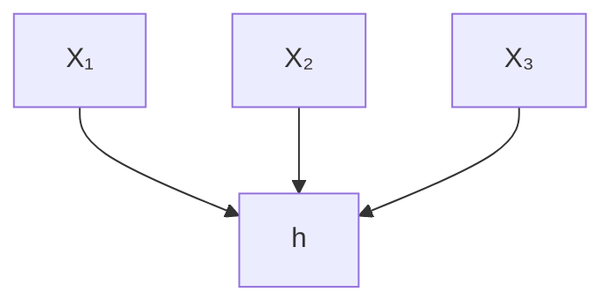

(a) Classifier-centric view


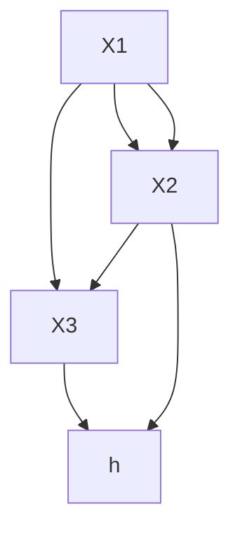

(b) Causal graph for  
Figure 4.2: A view commonly adopted for counterfactual explanations (a) treats features as independently manipulable inputs to a given fixed and deterministic classifier h. In the causal approach to algorithmic recourse taken in this work, we instead view variables as causally related to each other by a structural causal model (SCM) with associated causal graph (b).

## 4.2.2 Causality: Structural Causal Models, Interventions, and Counterfactuals

To reason formally about causal relations between features $\mathbf { X } = \left( X _ { 1 } , . . . , X _ { d } \right)$ , we adopt the structural causal model (SCM) framework (Pea09).4 Specifically, we assume that the data-generating process of X is described by an (unknown) underlying SCM of the general form

$$
\mathcal {M} = (\mathbb {S}, P _ {\mathbf {U}}), \quad \mathbb {S} = \left\{X _ {r} := f _ {r} \left(\mathbf {X} _ {\mathrm{pa} (r)}, U _ {r}\right) \right\} _ {r = 1} ^ {d}, \quad P _ {\mathbf {U}} = P _ {U _ {1}} \times \dots \times P _ {U _ {d}}, \tag {4.3}
$$

where the structural equations S are a set of assignments generating each observed variable $X _ { r }$ as a deterministic function $f _ { r }$ of its causal parents $\mathbf { \boldsymbol { x } } _ { \mathsf { p a } ( r ) } \subseteq$ $\mathbf { X } \setminus X _ { r }$ and an unobserved noise variable $U _ { r }$ . The assumption of mutually independent noises $( \mathrm { i . e . , }$ a fully factorised $P _ { \mathbf { U } } )$ entails that there is no hidden confounding and is referred to as causal sufficiency. An SCM is often illustrated by its associated causal graph ${ \mathcal { G } } ,$ , which is obtained by drawing a directed edge from each node in $\mathbf { X } _ { \mathrm { p a } ( r ) }$ to $X _ { r }$ for $r \in [ d ] : = \{ 1 , \ldots , d \}$ , see Fig. 4.1 and Fig. 4.2b for examples. We assume throughout that is acyclic. In this case, implies a unique observational distribution $P _ { \mathbf { X } } ,$ , which factorises over ${ \mathcal { G } } ,$ defined as the push-forward of $P _ { \mathbf { U } }$ via S.5Importantly, the SCM framework also entails interventional distributions describing a situation in which some variables are manipulated externally. $\mathrm { E . g . , }$ using the do-operator, an intervention which fixes $\mathbf { \boldsymbol { x } } _ { \mathcal { T } }$ to θ (where ${ \mathcal { T } } \subseteq [ d ] )$ ) is denoted by do $( \mathbf { X } _ { \mathcal { I } } : = \pmb { \theta } )$ . The corresponding distribution of the remaining variables $\mathbf { X } _ { - \mathcal { T } }$ can be computed by replacing the structural equations for $\mathbf { \boldsymbol { x } } _ { \mathcal { T } }$ in S to obtain the new set of equations $\mathbb { S } ^ { \mathrm { d o } ( \mathbf { X } _ { \mathcal { T } } : = \pmb { \theta } ) }$ ). The interventional distribution $P _ { \mathbf { X } _ { - \mathcal { T } } | \mathbf { d o } ( \mathbf { X } _ { \mathcal { T } } : = \pmb { \theta } ) }$ is then given by the observational distribution implied by the manipulated SCM $\left( \mathbb { S } ^ { \mathrm { d o } ( \mathbf { X } _ { \mathcal { T } } : = \pmb { \theta } ) } , P _ { \mathbf { U } } \right)$ .

Similarly, an SCM also implies distributions over counterfactuals— statements about a world in which a hypothetical intervention was performed all else being equal. For example, given observation $\mathbf { x } ^ { \mathsf { F } }$ we can ask what would have happened if $\mathbf { \boldsymbol { x } } _ { \mathcal { T } }$ had instead taken the value θ. We denote the counterfactual variable by $\mathbf { X } ( \mathrm { d o } ( \mathbf { X } _ { \mathcal { T } } : = \pmb { \theta } ) ) | \mathbf { x } ^ { \sf F }$ , whose distribution can be computed in three steps (Pea09):

1. Abduction: compute the posterior distribution $P _ { \mathbf { U } | \mathbf { x } ^ { \mathsf { F } } }$ of the exogenous variables U given the factual observation $\mathbf { x } ^ { \mathsf { F } } .$ ;  
2. Action: perform the intervention do $\mathbf { \Sigma } ( \mathbf { X } _ { \mathcal { T } } { \bf \Sigma } : = { \bf \Sigma } \theta )$ by replacing the structural equations for $\mathbf { \boldsymbol { x } } _ { \mathcal { T } }$ by $\mathbf { \boldsymbol { x } } _ { \mathcal { T } } : = \mathbf { \boldsymbol { \theta } }$ to obtain the new structural equations Sdo(XI :=θ); $\mathbb { S } ^ { \hat { \mathrm { d o } } ( \mathbf { X } _ { \mathcal { T } } : = \pmb { \theta } ) }$  
3. Prediction: the counterfactual distribution $P _ { \mathbf { X } ( \mathrm { d o } ( \mathbf { X } _ { \mathcal { T } } : = \pmb { \theta } ) ) | \mathbf { x } ^ { \mathnormal { F } } }$ is the distribution induced by the resulting SCM $\left( \mathbb { S } ^ { \mathrm { d o } ( \pmb { X } _ { \mathcal { T } } : = \pmb { \theta } ) } , P _ { \mathbf { U } | \mathbf { x } ^ { \ F } } \right)$ | .

For instance, the counterfactual variable for individual $\mathbf { x } ^ { \mathsf { F } }$ had action $a \ =$ do $( \mathbf { X } _ { \mathcal { T } } : = \pmb { \theta } ) \in \mathcal { F }$ been performed would be $\mathbf { \boldsymbol { x } } ^ { \mathsf { S C F } } ( a ) : = \mathbf { \boldsymbol { X } } ( a ) | \mathbf { \boldsymbol { x } } ^ { \mathsf { F } }$ . For a workedout example of computing counterfactuals in SCMs, we refer to ??.

## 4.3 causal recourse formulation

## 4.3.1 Limitations of CFE-based recourse

Here, we use causal reasoning to formalize the limitations of the CFE-based recourse approach in $( 4 . 2 )$ . To this end, we first reinterpret the actions resulting from solving the CFE-based recourse problem, $\mathrm { i . e . , ~ } \delta ^ { * }$ , as structural interventions by defining the set of indices $\mathcal { T }$ of observed variables that are intervened upon.

Definition 4.3.1 (CFE-based actions). Given an individual $\mathbf { x } ^ { \mathsf { F } }$ in world and a solution $\delta ^ { * }$ of $( 4 . 2 )$ , denote by ${ \mathcal { T } } = \{ i \mid \delta _ { i } ^ { * } \neq 0 \}$ the set of indices of observed variables that are acted upon. A CFE-based action then refers to a set of structural interventions of the form $a ^ { \mathsf { C F E } } ( \delta ^ { * } , x ^ { \mathsf { F } } ) : = \mathsf { d o } ( \{ X _ { i } : = x _ { i } ^ { F } + \delta _ { i } ^ { * } \} _ { i \in \mathbb { Z } } )$ ).

Using Defn. 4.3.1, we can derive the following key results that provide necessary and sufficient conditions for CFE-based actions to guarantee recourse.

Proposition 4.3.1. A CFE-based action $a ^ { C F E } ( \delta ^ { * } , { \pmb x } ^ { F } )$ in general $( i . e . ,$ , for arbitrary underlying causal models) results in the structural counterfactual $\mathbf { x } ^ { S C F } = \mathbf { x } ^ { C F E } : =$ $\mathbf { x } ^ { F } + \delta ^ { * }$ and thus guarantees recourse $( i . e . , h ( { \bf x } ^ { S C F } ) \ne h ( { \bf x } ^ { F } ) \dot { ) }$ if and only if the set of descendants of the acted upon variables determined by is the empty set.

Corollary 4.3.1. If all features in the true world are mutually independent, (i.e, if they are all root-nodes in the causal graph), then CFE-based actions always guarantee recourse.

While the above results are formally proven in Appendix A of (KSV21), we provide a sketch of the proof below. If the intervened-upon variables do not have descendants, then by definition $\mathbf { x } ^ { \mathsf { S C F } } = \mathbf { x } ^ { \mathsf { C F E } }$ . Otherwise, the value of the descendants will depend on the counterfactual value of their parents, leading to a structural counterfactual that does not resemble the nearest counterfactual explanation, $\mathbf { x } ^ { \mathsf { S C F } } \neq \mathbf { x } ^ { \mathsf { C F E } }$ , and thus may not result in recourse. Moreover, in an independent world the set of descendants of all the variables is by definition the empty set.

Unfortunately, the independent world assumption is not realistic, as it requires all the features selected to train the predictive model h to be independent of each other. Moreover, limiting changes to only those variables without descendants may unnecessarily limit the agency of the individual, e.g., in Example 4.1.1, restricting the individual to only changing bank balance without e.g., pursuing a new/side job to increase their income would be limiting. Thus, for a given non-independent  capturing the true causal dependencies between features, CFE-based actions require the individual seeking recourse to enforce (at least partially) an independent post-intervention model ${ \mathcal { M } } ^ { a ^ { \complement \models } }$ (so that Assumption 4.2.1 holds), by intervening on all the observed variables for which $\delta _ { i } \neq 0$ as well as on their descendants (even if their $\delta _ { i } = 0 )$ . However, such requirement suffers from two main issues. First, it conflicts with Assumption 4.2.2, since holding the value of variables may still imply potentially infeasible and costly interventions in  to sever all the incoming edges to such variables, and even then it may be ineffective and not change the prediction (see Example 4.1.2). Second, as will be proven in the next section (see also, Example 4.1.1), CFE-based actions may still be suboptimal, as they do not benefit from the causal effect of actions towards changing the prediction. Thus, even when equipped with knowledge of causal dependencies, recommending actions directly from counterfactual explanations in the manner of existing approaches is not satisfactory.

## 4.3.2 Recourse Through Minimal Interventions

We have demonstrated that actions which immediately follow from counterfactual explanations may require unrealistic assumptions, or alternatively, result in sub-optimal or even infeasible recommendations. To solve such limitations we rewrite the recourse problem so that instead of finding the minimal (independent) shift of features as in (4.2), we seek the minimal cost set of actions (in the form of structural interventions) that results in a counterfactual instance yielding the favorable output from h. For simplicity, we present the formulation for the case of an invertible SCM (i.e., one with invertible structural equations S) such that the ground-truth counterfactual $\pmb { x } ^ { \mathsf { S C F } } = \mathbb { S } ^ { a } ( \mathbb { S } ^ { - 1 } ( \pmb { x } ^ { \mathsf { F } } ) )$ ) is a unique point. The resulting optimisation formulation is as follows:

$$
a ^ {*} \in \underset {a \in \mathcal {F}} {\operatorname{argmin}} \quad \operatorname{cost} ^ {\mathsf {F}} (a) \quad \text { subject   to } \quad h (\mathbf {x} ^ {\mathrm{SCF}} (a)) \geq 0. 5, \tag {4-4}
$$

$$
\mathbf {x} ^ {\mathrm{SCF}} (a) = \mathbf {x} (a) | \mathbf {x} ^ {\mathrm{F}} \in \mathcal {P},
$$

where $a ^ { \ast } \in { \mathcal { F } }$ directly specifies the set of feasible actions to be performed for minimally costly recourse, with costF( ).6

Importantly, using the formulation in (??) it is now straightforward to show the suboptimality of CFE-based actions (proof in Appendix A of $( \mathrm { K S V } _ { 2 1 } ) ,$ ):

Proposition 4.3.2. Given an individual $\mathbf { x } ^ { F }$ observed in world , a set of feasible actions ${ \mathcal F } ,$ , and a solution $a ^ { \ast } \in { \mathcal { F } }$ of (??), assume that there exists a CFE-based action $a ^ { C F E } ( \delta ^ { * } , \mathbf { x } ^ { F } ) \in \mathcal { F }$ (see Defn. $4 { \cdot } 3 { \cdot } 1 )$ that achieves recourse, i.e., $h ( \mathbf { x } ^ { F } ) \neq h ( \mathbf { x } ^ { C F E } )$ ). Then, cos $t ^ { F } ( a ^ { * } ) \leq c o s t ^ { F } ( a ^ { C F E } )$ .

Thus, for a known causal model capturing the dependencies among observed variables, and a family of feasible interventions, the optimization problem in (??) yields Recourse through Minimal Interventions (MINT). Generating minimal interventions through solving (??) requires that we be able to compute the structural counterfactual, $\mathbf { x } ^ { \mathsf { S C F } }$ , of the individual $\mathbf { x } ^ { \mathsf { F } }$ in world ,


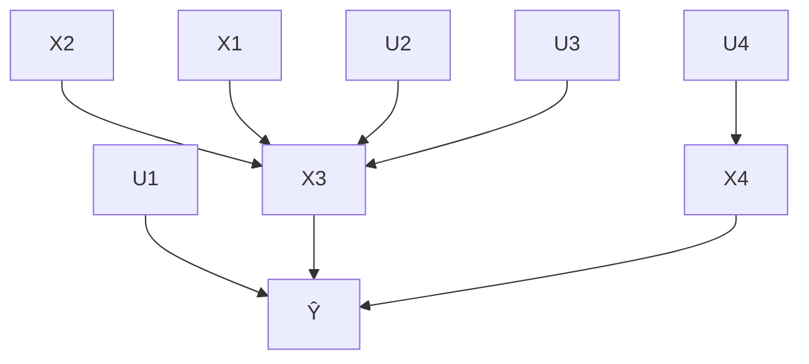

Figure 4.3: The structural causal model (graph and equations) for the working example and demonstration in ??.

$$
\left. \begin{array}{l} X _ {1} := \mathrm{U} _ {1} \\ X _ {2} := \mathrm{U} _ {2} \\ X _ {3} := f _ {3} (X _ {1}, X _ {2}) + \mathrm{U} _ {3} \\ X _ {4} := f _ {4} (X _ {3}) + \mathrm{U} _ {4} \\ P _ {\mathbf {U}} = P _ {U _ {1}} \times P _ {U _ {2}} \times P _ {U _ {3}} \times P _ {U _ {4}} \end{array} \right\}   \mathcal {M} = (\mathbb {S}, P _ {\mathbf {U}})
$$

$$
\hat {\Upsilon} = h \left(X _ {1}, X _ {2}, X _ {3}, X _ {4}\right)
$$

given any feasible action $a \in { \mathcal { F } }$ . To this end, and for the purpose of demonstration, we consider a class of invertible SCMs, specifically, additive noise models (ANM) Hoy+09, where the structural equations S are of the form

$$
\mathrm{S} = \left\{\mathrm{X} _ {r} := f _ {r} \left(\mathbf {X} _ {\mathrm{pa} (r)}\right) + U _ {r} \right\} _ {r = 1} ^ {d} \quad \Longrightarrow \quad u _ {r} ^ {\mathrm{F}} = x _ {r} ^ {\mathrm{F}} - f _ {r} \left(\mathbf {x} _ {\mathrm{pa} (r)} ^ {\mathrm{F}}\right), \quad r \in [ d ], \tag {4.5}
$$

and propose to use the three steps of structural counterfactuals in (Pea09) to assign a single counterfactual $\mathbf { x } ^ { \mathsf { S C F } } ( a ) : = \mathbf { x } ( a ) | \mathbf { x } ^ { \mathsf { F } }$ to each action $a = \mathrm { d o } ( \mathbf { X } _ { \mathcal { T } } : =$ $\theta ) \in { \mathcal { F } }$ as below.

## 4.3.2.1 Working Example

Consider the model in ??, where $\{ \mathrm { U } _ { i } \} _ { i = 1 } ^ { 4 }$ are mutually independent $\{ f _ { i } \} _ { i = 1 } ^ { 4 }$ functions. Let $\mathbf { x } ^ { \mathsf { F } } ~ = ~ ( x _ { 1 } ^ { \mathsf { F } } , x _ { 2 } ^ { \mathsf { F } } , x _ { 3 } ^ { \mathsf { F } } , x _ { 4 } ^ { \mathsf { F } } ) ^ { \mathsf { T } }$ be the observed features belonging to the (factual) individual seeking recourse. Also, let denote the set of indices corresponding to the subset of endogenous variables that are intervened upon according to the action set a. Then, we obtain a structural counterfactual, $\mathbf { x } ^ { \mathsf { S C F } } ( { \mathsf { \bar { a } } } ) ~ : = ~ \mathbf { x } ( a ) | \mathbf { x } ^ { \mathsf { F } } ~ = ~ \mathsf { S } ^ { a } ( \mathsf { S } ^ { - 1 } ( \mathbf { x } ^ { \mathsf { F } } ) )$ ), by applying the Abduction-Action-Prediction steps (Pea13) as follows:

Step 1. Abduction uniquely determines the value of all exogenous variables U given the observed evidence $\mathbf { X } = \mathbf { x } ^ { \mathsf { F } }$ :

$$
\begin{array}{l} u _ {1} = x _ {1} ^ {\mathsf {F}}, \\ u _ {2} = x _ {2} ^ {\mathrm{F}}, \quad \text {   F   } = c _ {1} (\text {   E   } - \text {   F   }) \tag {4.6} \\ u _ {3} = x _ {3} ^ {\mathsf {F}} - f _ {3} (x _ {1} ^ {\mathsf {F}}, x _ {2} ^ {\mathsf {F}}), \\ u _ {4} = x _ {4} ^ {\mathsf {F}} - f _ {4} (x _ {3} ^ {\mathsf {F}}). \\ \end{array}
$$

Step 2. Action modifies the SCM according to the hypothetical interventions, do $( \{ X _ { i } : = a _ { i } \} _ { i \in \mathcal { T } } )$ (where $a _ { i } = x _ { i } ^ { F } + \delta _ { i } )$ , yielding $\mathbb { S } ^ { a }$ :

$$
X _ {1} := [ 1 \in \mathcal {I} ] \cdot a _ {1} + [ 1 \notin \mathcal {I} ] \cdot U _ {1},
$$

$$
X _ {2} := [ 2 \in \mathcal {I} ] \cdot a _ {2} + [ 2 \notin \mathcal {I} ] \cdot U _ {2},
$$

$$
X _ {3} := [ 3 \in \mathcal {I} ] \cdot a _ {3} + [ 3 \notin \mathcal {I} ] \cdot (f _ {3} (X _ {1}, X _ {2}) + U _ {3}), \tag {4.7}
$$

$$
\mathrm{X} _ {4} := [ 4 \in \mathcal {I} ] \cdot a _ {4} + [ 4 \notin \mathcal {I} ] \cdot (f _ {4} (\mathrm{X} _ {3}) + \mathrm{U} _ {4}),
$$

where [ ] denotes the Iverson bracket.

Step 3. Prediction recursively determines the values of all endogenous variables based on the computed exogenous variables $\{ u _ { i } \} _ { i = 1 } ^ { 4 }$ from Step 1 and $\mathbb { S } ^ { a }$ from Step 2, as:

$$
x _ {1} ^ {\mathsf {S C F}} := [ 1 \in \mathcal {I} ] \cdot a _ {1} + [ 1 \notin \mathcal {I} ] \cdot (u _ {1}),
$$

$$
x _ {2} ^ {\text { SCF }} := [ 2 \in \mathcal {I} ] \cdot a _ {2} + [ 2 \notin \mathcal {I} ] \cdot (u _ {2}),
$$

$$
x _ {3} ^ {\mathrm{SCF}} := [ 3 \in \mathcal {I} ] \cdot a _ {3} + [ 3 \notin \mathcal {I} ] \cdot \left(f _ {3} (x _ {1} ^ {\mathrm{SCF}}, x _ {2} ^ {\mathrm{SCF}}) + u _ {3}\right), \tag {4.8}
$$

$$
x _ {4} ^ {\text { SCF }} := [ 4 \in \mathcal {I} ] \cdot a _ {4} + [ 4 \notin \mathcal {I} ] \cdot (f _ {4} (x _ {3} ^ {\text { SCF }}) + u _ {4}).
$$

## 4.3.2.2 General Assignment Formulation for ANMs

As we have not made any restricting assumptions about the structural equations (only that we operate with additive noise models7 where noise variables are pairwise independent), the solution for the working example naturally generalizes to SCMs corresponding to other DAGs with more variables. The assignment of structural counterfactual values can generally be written as:

$$
x _ {i} ^ {\mathrm{SCF}} = [ i \in \mathcal {I} ] \cdot (x _ {i} ^ {\mathrm{F}} + \delta_ {i}) + [ i \notin \mathcal {I} ] \cdot (x _ {i} ^ {\mathrm{F}} + f _ {i} (\mathrm{pa} _ {i} ^ {\mathrm{SCF}}) - f _ {i} (\mathrm{pa} _ {i} ^ {\mathrm{F}})). \tag {4.9}
$$

In words, the counterfactual value of the i-th feature, $x _ { i } ^ { \mathsf { S C F } }$ , takes the value $x _ { i } ^ { \mathsf { F } } +$ $\delta _ { i }$ if such feature is intervened upon $( \mathrm { i . e . } , i \in \mathcal { T } )$ . Otherwise, $x _ { i } ^ { \mathsf { S C F } }$ is computed as a function of both the factual and counterfactual values of its parents, denoted respectively by $f _ { i } ( \mathsf { p a } _ { i } ^ { \mathsf { F } } )$ and $f _ { i } ( \mathsf { p a } _ { i } ^ { \mathsf { S C F } } )$ ). The closed-form expression in (??) can replace the counterfactual constraint in (??), i.e.,

$$
\mathbf {x} ^ {\mathsf {S C F}} (a) := \mathbf {x} (a) | \mathbf {x} ^ {\mathsf {F}} = \mathbb {S} ^ {a} (\mathbb {S} ^ {- 1} (\mathbf {x} ^ {\mathsf {F}})),
$$

after which the optimization problem may be solved by building on existing frameworks for generating nearest counterfactual explanations, including gradient-based, evolutionary-based, heuristics-based, or verification-based approaches as referenced in $\ S \ 4 { \cdot } 2 { \cdot } 1$ . It is important to note that unlike CFEbased actions where the precise value of all covariates post-intervention are specified, MINT-based actions require that the user focus only on the features upon which interventions are to be performed, which may better align with factors under the users control (e.g., some features may be non-actionable but mutable through changes to other features; see also (BSR20)).

## 4.3.3 Negative Result: no Recourse Guarantees for Unknown Structural Equations

In practice, the structural counterfactual $\pmb { x } ^ { \mathsf { S C F } } ( a )$ can only be computed using an approximate (and likely imperfect) SCM $\mathcal { M } = ( \mathbb { S } , P _ { \mathbf { U } } )$ , which is estimated from data assuming a particular form of the structural equation as in (??). However, assumptions on the form of the true structural equations $\mathbb { S } _ { \star }$ ⋆ are generally untestable—not even with a randomized experiment—since there exist multiple SCMs which imply the same observational and interventional distributions, but entail different structural counterfactuals.

Example 4.3.1 (adapted from 6.19 in $( \mathrm { P J } \mathrm { S } \mathrm { \bar { 1 } } 7 ) )$ . Consider the following two SCMs $\mathcal { M } _ { A }$ and $\mathcal { M } _ { B }$ which arise from the general form in Fig. 4.1 by choosing $U _ { 1 } , U _ { 2 } \sim$ Bernoulli(0.5) and $U _ { 3 } \sim \mathrm { U n i f o r m } ( \{ 0 , \dots , K \} )$ independently in both $\mathcal { M } _ { A }$ and $\mathcal { M } _ { B } .$ , with structural equations

$$
X _ {1} := U _ {1}, \quad \text {in} \{\mathcal {M} _ {A}, \mathcal {M} _ {B} \},
$$

$$
X _ {2} := X _ {1} (1 - U _ {2}), \quad \text { in } \quad \{\mathcal {M} _ {A}, \mathcal {M} _ {B} \},
$$

$$
X _ {3} := \mathbb {I} _ {X _ {1} \neq X _ {2}} \left(\mathbb {I} _ {U _ {3} > 0} X _ {1} + \mathbb {I} _ {U _ {3} = 0} X _ {2}\right) + \mathbb {I} _ {X _ {1} = X _ {2}} U _ {3}, \quad \text { in } \quad \mathcal {M} _ {A},
$$

$$
X _ {3} := \mathbb {I} _ {X _ {1} \neq X _ {2}} (\mathbb {I} _ {U _ {3} > 0} X _ {1} + \mathbb {I} _ {U _ {3} = 0} X _ {2}) + \mathbb {I} _ {X _ {1} = X _ {2}} (K - U _ {3}), \quad \text { in } \quad \mathcal {M} _ {B}.
$$

Then $\mathcal { M } _ { A }$ and $\mathcal { M } _ { B }$ both imply exactly the same observational and interventional distributions, and thus are indistinguishable from empirical data. However, having observed $\mathbf { x } ^ { \mathsf { F } } = \left( 1 , 0 , 0 \right)$ , they predict different counterfactuals had $X _ { 1 }$ been 0, i.e., $\mathbf { x } ^ { \mathsf { S C F } } ( X _ { 1 } = 0 ) = ( 0 , 0 , 0 )$ and $( 0 , 0 , K )$ , respectively.8

Confirming or refuting an assumed form of $\mathbb { S } _ { \star }$ ⋆ would thus require counterfactual data which is, by definition, never available. Thus, example $? ?$ proves the following proposition by contradiction.

Proposition 4.3.3 (Lack of Recourse Guarantees). If the set of descendants of intervened-upon variables is non-empty, algorithmic recourse can be guaranteed in general (i.e., without further restrictions on the underlying causal model) only if the true structural equations are known, irrespective of the amount and type of available data.

Remark. The converse of ?? does not hold. E.g., given $\mathbf { x } ^ { F } = \left( 1 , 0 , 1 \right)$ ) in ??, abduction in either model yields $U _ { 3 } > 0 ,$ so the counterfactual of $X _ { 3 }$ cannot be predicted exactly.

Building on the framework of (KSV21), we next present two novel approaches for causal algorithmic recourse under unknown structural equations. The first approach in ?? aims to estimate the counterfactual distribution under the assumption of ANMs (??) with Gaussian noise for the structural equations. The second approach in ?? makes no assumptions about the structural equations, and instead of approximating the structural equations, it considers the effect of interventions on a sub-population similar to $\mathbf { x } ^ { \mathsf { F } }$ . We recall that the causal graph is assumed to be known throughout.

## 4.4 recourse under imperfect causal knowledge

## 4.4.1 Probabilistic Individualised Recourse

Since the true SCM $\mathcal { M } _ { \star }$ is unknown, one approach to solving (??) is to learn an approximate SCM  within a given model class from training data $\{ \mathbf { x } ^ { i } \} _ { i = 1 } ^ { n }$ . For example, for an ANM (??) with zero-mean noise, the functions $f _ { r }$ can be learned via linear or kernel (ridge) regression of $X _ { r }$ given $\mathbf { X } _ { \mathrm { p a } ( r ) }$ as input. We refer to these approaches as $\mathcal { M } _ { \mathrm { L I N } }$ and $\mathcal { M } _ { \mathrm { K R } }$ , respectively. can then be used in place of $\mathcal { M } _ { \astrosun }$ ⋆ to infer the noise values as in (??), and subsequently to predict a single-point counterfactual $\mathbf { x } ^ { \mathsf { S C F } } ( a )$ to be used in (??). However, the learned causal model  may be imperfect, and thus lead to wrong counterfactuals due to, e.g., the finite sample of the observed data, or more importantly, due to model misspecification (i.e., assuming a wrong parametric form for the structural equations).

To solve such limitation, we adopt a Bayesian approach to account for the uncertainty in the estimation of the structural equations. Specifically, we assume additive Gaussian noise and rely on probabilistic regression using a Gaussian process (GP) prior over the functions $f _ { r } ;$ for an overview of regression with GPs, we refer to (WR06, § 2).

Definition 4.4.1 (GP-SCM). A Gaussian process SCM (GP-SCM) over X refers to the model

$$
X _ {r} := f _ {r} (\mathbf {X} _ {\mathrm{pa} (r)}) + U _ {r}, \quad f _ {r} \sim \mathcal {G P} (0, k _ {r}), \quad U _ {r} \sim \mathcal {N} (0, \sigma_ {r} ^ {2}), \quad r \in [ d ], \tag {4.10}
$$

with covariance functions $k _ { r } : \mathcal { X } _ { \mathrm { p a } ( r ) } \times \mathcal { X } _ { \mathrm { p a } ( r ) } \to \mathbb { R }$ , e.g., RBF kernels for continuous $X _ { \mathtt { p a } ( r ) }$ .

While GPs have previously been studied in a causal context for structure learning (FN00; Küg+19), estimating treatment effects $( \mathrm { A S 1 7 } ; \mathrm { S S 1 7 } )$ , or learning SCMs with latent variables and measurement error $( \mathrm { S G } \mathrm { \bar { 1 } O } ) .$ , our goal here is to account for the uncertainty over $f _ { r }$ in the computation of the posterior over $U _ { r } ,$ and thus to obtain a counterfactual distribution, as summarised in the following propositions.

Proposition 4.4.1 (GP-SCM Noise Posterior). Let $\{ \mathbf { x } ^ { i } \} _ { i = 1 } ^ { n }$ be an observational sample from (??). For each $r \in [ d ]$ with non empty parent set $| p a ( r ) | > 0 ,$ , the posterior distribution of the noise vector $\mathbf { u } _ { r } ~ = ~ \left( u _ { r } ^ { 1 } , . . . , u _ { r } ^ { n } \right)$ , conditioned on $\mathbf { x } _ { r } =$ $( x _ { r } ^ { 1 } , . . . , x _ { r } ^ { n } )$ and $\mathbf { X } _ { p a ( r ) } = ( \mathbf { x } _ { p a ( r ) } ^ { 1 } , . . . , \mathbf { x } _ { p a ( r ) } ^ { n } )$ , is given by

$$
\mathbf {u} _ {r} | \mathbf {X} _ {p a (r)}, \mathbf {x} _ {r} \sim \mathcal {N} \left(\sigma_ {r} ^ {2} (\mathbf {K} + \sigma_ {r} ^ {2} \mathbf {I}) ^ {- 1} \mathbf {x} _ {r}, \sigma_ {r} ^ {2} \left(\mathbf {I} - \sigma_ {r} ^ {2} (\mathbf {K} + \sigma_ {r} ^ {2} \mathbf {I}) ^ {- 1}\right)\right), \tag {4.11}
$$

where $\mathbf { K } : = \big ( k _ { r } \big ( \mathbf { x } _ { p a ( r ) } ^ { i } , \mathbf { x } _ { p a ( r ) } ^ { j } \big ) \big ) _ { i j }$ denotes the Gram matrix.

Next, in order to compute counterfactual distributions, we rely on ancestral sampling (according to the causal graph) of the descendants of the intervention targets $\mathbf { \boldsymbol { x } } _ { \mathcal { T } }$ using the noise posterior of (??). The counterfactual distribution of each descendant $X _ { r }$ is given by the following proposition.

Proposition $\mathbf { 4 } { \cdot } 4 { \cdot } 2$ (GP-SCM Counterfactual Distribution). Let $\{ \mathbf { x } ^ { i } \} _ { i = 1 } ^ { n }$ be an observational sample from (??). Then, for $r \in [ d ]$ ] with $| p a ( r ) | > 0 ,$ , the counterfactual distribution over $X _ { r }$ had $\mathbf { X } _ { p a ( r ) }$ been $\tilde { \mathbf { x } } _ { p a ( r ) }$ (instead $o f \mathbf { x } _ { p a ( r ) } ^ { F } )$ for individual $\mathbf { x } ^ { F } \in \mathbf { \Xi }$ $\{ { \bf x } ^ { i } \} _ { i = 1 } ^ { n }$ is given by

$$
\begin{array}{l} X _ {r} \left(\mathbf {X} _ {p a (r)} = \tilde {\mathbf {x}} _ {p a (r)}\right) \mid \mathbf {x} ^ {F}, \left\{\mathbf {x} ^ {i} \right\} _ {i = 1} ^ {n} \tag {4.12} \\ \sim \mathcal {N} \big (\mu_ {r} ^ {F} + \tilde {\mathbf {k}} ^ {T} (\mathbf {K} + \sigma_ {r} ^ {2} \mathbf {I}) ^ {- 1} \mathbf {x} _ {r}, s _ {r} ^ {F} + \tilde {k} - \tilde {\mathbf {k}} ^ {T} (\mathbf {K} + \sigma_ {r} ^ {2} \mathbf {I}) ^ {- 1} \tilde {\mathbf {k}} \big), \\ \end{array}
$$

where $\tilde { k } : = k _ { r } ( \tilde { \mathbf { x } } _ { p a ( r ) } , \tilde { \mathbf { x } } _ { p a ( r ) } ) , \tilde { \mathbf { k } } : = \big ( k _ { r } ( \tilde { \mathbf { x } } _ { p a ( r ) } , \mathbf { x } _ { p a ( r ) } ^ { 1 } ) , \dots , k _ { r } ( \tilde { \mathbf { x } } _ { p a ( r ) } , \mathbf { x } _ { p a ( r ) } ^ { n } ) \big )$ , xr and K as defined in $? ? ,$ , and $\mu _ { r } ^ { F }$ and $s _ { r } ^ { F }$ are the posterior mean and variance of $u _ { r } ^ { F }$ given by (??).

All proofs can be found in Appendix A of (Kar+20b). We can now generalise the recourse problem (??) to our probabilistic setting by replacing the single-point counterfactual $\pmb { x } ^ { \mathsf { S C F } } ( a )$ with the counterfactual random variable $\mathbf { \boldsymbol { x } } ^ { \mathsf { s c F } } ( a ) : = \mathbf { \boldsymbol { x } } ( a ) | \mathbf { \boldsymbol { x } } ^ { \mathsf { F } }$ . As a consequence, it no longer makes sense to consider a hard constraint of the form $h ( \mathsf { x } ^ { \mathsf { S C F } } ( a ) ) > 0 . 5$ , i.e., that the prediction needs to change. Instead, we can reason about the expected classifier output under the counterfactual distribution, leading to the following probabilistic version of the individualised recourse optimisation problem:


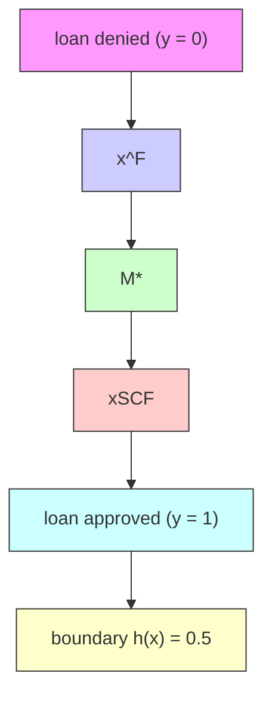

Figure 4.4: Illustration of point- and subpopulation-based recourse approaches.

$$
\min _ {a = \operatorname{do} \left(\mathbf {X} _ {\mathcal {I}} := \boldsymbol {\theta}\right) \in \mathcal {F}} \quad \operatorname{cost} ^ {\mathrm{F}} (a) \tag {4.13}
$$

$\operatorname { s u b j e c t } \operatorname { t o } \quad \mathbb { E } _ { \pmb { X } ^ { \operatorname { s c r } } ( a ) } \left[ h \left( \pmb { X } ^ { \mathsf { S C F } } ( a ) \right) \right] \geq \operatorname { t h r e s h } ( a ) .$

Note that the threshold thresh(a) is allowed to depend on a. For example, an intuitive choice is

$$
\operatorname{thresh} (a) = 0. 5 + \gamma_ {\mathrm{LCB}} \sqrt {\operatorname{Var} _ {\mathbf {X} ^ {\mathrm{SCF}} (a)} [ h (\mathbf {X} ^ {\mathrm{SCF}} (a)) ]} \tag {4.14}
$$

which has the interpretation of the lower-confidence bound crossing the decision boundary of 0.5. Note that larger values of the hyperparameter γlcb lead to a more conservative approach to recourse, while for $\gamma _ { \mathrm { { L C B } } } = 0$ merely crossing the decision boundary with $\ge 5 0 \%$ chance suffices.

## 4.4.2 Probabilistic Subpopulation-based Recourse

The GP-SCM approach in ?? allows us to average over an infinite number of (non-)linear structural equations, under the assumption of additive Gaussian noise. However, this assumption may still not hold under the true SCM, leading to sub-optimal or inefficient solutions to the recourse problem. Next, we remove any assumptions about the structural equations, and propose a second approach that does not aim to approximate an individualized counterfactual distribution, but instead considers the effect of interventions on a subpopulation defined by certain shared characteristics with the given (factual) individual $\mathbf { x } ^ { \mathsf { F } }$ . The key idea behind this approach resembles the notion of conditional average treatment effects (CATE) (AHL15) (illustrated in ??) and is based on the fact that any intervention do $( \mathbf { X } _ { \mathcal { I } } : = \pmb { \theta } )$ only influences the descendants d( ) of the intervened-upon variables, while the non-descendants nd( ) remain unaffected. Thus, when evaluating an intervention, we can condition on ${ \mathbf { X } _ { \mathrm { n d } ( \mathcal { T } ) } = \mathbf { x } _ { \mathrm { n d } ( \mathcal { T } ) } ^ { \mathsf { F } } }$ , thus selecting a subpopulation of individuals similar to the factual subject.

Specifically, we propose to solve the following subpopulation-based recourse optimization problem

$$
\min _ {a = \operatorname{do} \left(\mathbf {X} _ {\mathcal {I}} := \boldsymbol {\theta}\right) \in \mathcal {F}} \quad \text {cost} ^ {\mathrm{F}} (a) \tag {4.15}
$$

$\begin{array} { r l } { \mathrm { s u b j e c t ~ t o ~ } } & { \mathbb { E } _ { \boldsymbol { X } _ { \mathrm { d } ( \mathcal { T } ) } | \mathrm { d o } ( \boldsymbol { X } _ { \mathcal { T } } : = \boldsymbol { \theta } ) , \boldsymbol { x } _ { \mathrm { n d } ( \mathcal { T } ) } ^ { \mathrm { { F } } } } \left| h \big ( \boldsymbol { x } _ { \mathrm { n d } ( \mathcal { T } ) } ^ { \mathrm { { F } } } , \boldsymbol { \theta } , \boldsymbol { X } _ { \mathrm { d } ( \mathcal { T } ) } \big ) \right| \geq \mathrm { t h r e s h } ( a ) , } \end{array}$

where, in contrast to (??), the expectation is taken over the corresponding interventional distribution.

In general, this interventional distribution does not match the conditional distribution, i.e.,

$$
P _ {\mathbf {X} _ {\mathrm{d} (\mathcal {I})} | \mathrm{do} (\mathbf {X} _ {\mathcal {I}} := \boldsymbol {\theta}), \mathbf {x} _ {\mathrm{nd} (\mathcal {I})} ^ {\mathsf {F}}} \neq P _ {\mathbf {X} _ {\mathrm{d} (\mathcal {I})} | \mathbf {X} _ {\mathcal {I}} := \boldsymbol {\theta}, \mathbf {x} _ {\mathrm{nd} (\mathcal {I})} ^ {\mathsf {F}}}
$$

because some spurious correlations in the observational distribution do not transfer to the interventional setting. For example, in Fig. 4.2b we have that

$$
P _ {X _ {2} | \mathrm{do} (X _ {1} = x _ {1}, X _ {3} = x _ {3})} = P _ {X _ {2} | X _ {1} = x _ {1}} \neq P _ {X _ {2} | X _ {1} = x _ {1}, X _ {3} = x _ {3}}.
$$

Fortunately, the interventional distribution can still be identified from the observational one, as stated in the following proposition.

Proposition 4.4.3. Subject to causal sufficiency, PX ( )|do(X :=θ),xF $P _  \mathbf { X } _ { d ( \mathcal { T } ) } | \mathbf { d o } ( \mathbf { X } _ { \mathcal { T } } : = \pmb { \theta } ) , \mathbf { x } _ { n d ( \mathcal { T } ) } ^ { F }$ is observationally identifiable (i.e., computable from the observational distribution) via:

$$
p \left(\mathbf {X} _ {d (\mathcal {I})} \mid \mathrm{do} \left(\mathbf {X} _ {\mathcal {I}} := \boldsymbol {\theta}\right), \mathbf {x} _ {n d (\mathcal {I})} ^ {F}\right) = \prod_ {r \in d (\mathcal {I})} p \left(X _ {r} \mid \mathbf {X} _ {p a (r)}\right) \Bigg | _ {\mathbf {X} _ {\mathcal {I}} := \boldsymbol {\theta}, \mathbf {X} _ {n d (\mathcal {I})} = \mathbf {x} _ {n d (\mathcal {I})} ^ {F}}. \tag {4.16}
$$

As evident from ??, tackling the optimization problem in (??) in the general case (i.e., for arbitrary graphs and intervention sets I) requires estimating the stable conditionals $P _ { X _ { r } | \mathbf { X _ { p a ( r ) } } }$ (a.k.a. causal Markov kernels) in order to compute the interventional expectation via (??). For convenience (see ?? for details), here we opt for latent-variable implicit density models, but other conditional density estimation approaches may be also be used (e.g., BH01;Bis94; TT18). Specifically, we model each conditional $p ( \boldsymbol { x } _ { r } | \mathbf { x } _ { \mathrm { p a } ( r ) } )$ with a conditional variational autoencoder (CVAE) (SLY15) as:

$$
p (x _ {r} | \mathbf {x} _ {\mathrm{pa} (r)}) \approx p _ {\psi_ {r}} (x _ {r} | \mathbf {x} _ {\mathrm{pa} (r)}) = \int p _ {\psi_ {r}} (x _ {r} | \mathbf {x} _ {\mathrm{pa} (r)}, \mathbf {z} _ {r}) p (\mathbf {z} _ {r}) d \mathbf {z} _ {r}, \tag {4.17}
$$

$$
p (\mathbf {z} _ {r}) := \mathcal {N} (\mathbf {0}, \mathbf {I}). \tag {4.18}
$$

To facilitate sampling $x _ { r }$ (and in analogy to the deterministic mechanisms $f _ { r }$ in SCMs), we opt for deterministic decoders in the form of neural nets $D _ { r }$ parametrised by $\psi _ { r } , \mathrm { i . e . }$ , $p _ { \psi _ { r } } ( x _ { r } | \mathbf { x } _ { \mathsf { p a } ( r ) } , \mathbf { z } _ { r } ) = \delta \big ( x _ { r } - D _ { r } \big ( \mathbf { x } _ { \mathsf { p a } ( r ) } , \mathbf { z } _ { r } ; \psi _ { r } \big ) \big )$ , and rely on variational inference (WJ08), amortised with approximate posteriors $q _ { \phi _ { r } } ( \mathbf { z } _ { r } | \boldsymbol { x } _ { r } , \mathbf { x } _ { \mathrm { p a } ( r ) } )$ parametrised by encoders in the form of neural nets with parameters $\phi _ { r }$ . We learn both the encoder and decoder parameters by maximising the evidence lower bound (ELBO) using stochastic gradient descend (BB08; KB15; KW14; RMW14). For further details, we refer to Appendix D of (Kar+20b)

Remark. The collection of CVAEs can be interpreted as learning an approximate SCM of the form

$$
\mathcal {M} _ {\mathrm{CVAE}}: \quad S = \left\{X _ {r} := D _ {r} \left(\mathbf {X} _ {p a (r)}, \mathbf {z} _ {r}; \psi_ {r}\right) \right\} _ {r = 1} ^ {d}, \quad \mathbf {z} _ {r} \sim \mathcal {N} (\mathbf {0}, \mathbf {I}) \quad \forall r \in [ d ] \tag {4.19}
$$

However, this family of SCMs may not allow to identify the true SCM (provided it can be expressed as above) from data without additional assumptions. Moreover, exact posterior inference over $\mathbf { z } _ { r }$ given $\mathbf { x } ^ { F }$ is intractable, and we need to resort to approximations instead. It is thus unclear whether sampling from $q _ { \phi _ { r } } ( \mathbf { z } _ { r } | \boldsymbol { x } _ { r } ^ { F } , \mathbf { x } _ { p a ( r ) } ^ { F } )$ instead of from $p ( \mathbf { z } _ { r } )$ in (??) can be interpreted as a counterfactual within (??). For further discussion on such “pseudo-counterfactuals” we refer to Appendix C of (Kar+20b)

## 4.4.3 Solving the Probabilistic Recourse Optimization Problem

We now discuss how to solve the resulting optimization problems in (??) and (??). First, note that both problems differ only on the distribution over which the expectation in the constraint is taken: in (??) this is the counterfactual distribution of the descendants given in $\because ? ;$ and in (??) it is the interventional distribution identified in ??. In either case, computing the expectation for an arbitrary classifier h is intractable. Here, we approximate these integrals via Monte Carlo by sampling $\mathbf { x } _ { \mathrm { d ( \mathcal { T } ) } } ^ { ( m ) }$ from the interventional or counterfactual distributions resulting from $\boldsymbol { a } = \mathrm { d o } ( \mathbf { X } _ { \mathcal { T } } : = \boldsymbol { \theta } )$ , i.e.,

$$
\mathbb {E} _ {\mathbf {X} _ {\mathrm{d} (\mathcal {I}) | \boldsymbol {\theta}}} \big [ h \big (\mathbf {x} _ {\mathrm{nd} (\mathcal {I})} ^ {\mathsf {F}}, \boldsymbol {\theta}, \mathbf {X} _ {\mathrm{d} (\mathcal {I})} \big) \big ] \approx \frac {1}{M} \sum_ {m = 1} ^ {M} h \big (\mathbf {x} _ {\mathrm{nd} (\mathcal {I})} ^ {\mathsf {F}}, \boldsymbol {\theta}, \mathbf {x} _ {\mathrm{d} (\mathcal {I})} ^ {(m)} \big).
$$

## 4.4.3.1 Brute-Force Approach

A way to solve (??) and (??) is to (i) iterate over $a \ \in \ { \mathcal { F } } ,$ , with F being a finite set of feasible actions (possibly as a result of discretizing in the case of a continuous search space); (ii) approximately evaluate the constraint via Monte Carlo; and (iii) select a minimum cost action amongst all evaluated candidates satisfying the constraint. However, this may be computationally prohibitive and yield suboptimal interventions due to discretisation.

## 4.4.3.2 Gradient-based Approach

Recall that, for actions of the form $a = \mathrm { d o } ( \mathbf { X } _ { \mathcal { T } } : = \pmb { \theta } )$ , we need to optimize Iover both the intervention targets  and the intervention values θ. Selecting targets is a hard combinatorial optimization problem, as there are $2 ^ { d ^ { \prime } }$ possible choices for $d ^ { \prime } \leq d$ actionable features, with a potentially infinite number of intervention values. We therefore consider different choices of targets in parallel, and propose a gradient-based approach suitable for differentiable classifiers to efficiently find an optimal θ for a given intervention set .9 In particular, we first rewrite the constrained optimization problem in unconstrained form with Lagrangian (Kar39; KT51):

$$
\mathcal {L} (\boldsymbol {\theta}, \lambda) := \operatorname{cost} ^ {\mathsf {F}} (a) + \lambda \left(\operatorname{thresh} (a) - \mathbb {E} _ {\mathbf {X} _ {\mathrm{d} (\mathcal {I}) | \boldsymbol {\theta}}} \left[ h \left(\mathbf {x} _ {\mathrm{nd} (\mathcal {I})} ^ {\mathsf {F}}, \boldsymbol {\theta}, \mathbf {X} _ {\mathrm{d} (\mathcal {I})}\right) \right]\right). \tag {4.20}
$$

We then solve the saddle point problem min max $\mathcal { L } ( \pmb \theta , \lambda )$ arising from (??) with stochastic gradient descent (BB08; KB15). Since both the GP-SCM counterfactual (??) and the CVAE interventional distributions (??) admit a reparametrization trick (KW14; RMW14), we can differentiate through the constraint:

$$
\nabla_ {\boldsymbol {\theta}} \mathbb {E} _ {\mathbf {X} _ {\mathrm{d} (\mathcal {I})}} \left[ h \big (\mathbf {x} _ {\mathrm{nd} (\mathcal {I})} ^ {\mathsf {F}}, \boldsymbol {\theta}, \mathbf {X} _ {\mathrm{d} (\mathcal {I})} \big) \right] = \mathbb {E} _ {\mathbf {z} \sim \mathcal {N} (\mathbf {0}, \mathbf {I})} \left[ \nabla_ {\boldsymbol {\theta}} h \big (\mathbf {x} _ {\mathrm{nd} (\mathcal {I})} ^ {\mathsf {F}}, \boldsymbol {\theta}, \mathbf {x} _ {\mathrm{d} (\mathcal {I})} (\mathbf {z}) \big) \right]. (4. 2 1)
$$

Here, ${ \pmb x } _ { \bf d ( { \mathcal { I } } ) } ( { \pmb z } )$ is obtained by iteratively computing all descendants in topological order: either substituting z together with the other parents into the decoders $D _ { r }$ for the CVAEs, or by using the Gaussian reparametrization $x _ { r } ( \mathbf { z } ) = \mu + \sigma \mathbf { z }$ with $\mu$ and σ given by (??) for the GP-SCM. A similar gradient estimator for the variance which enters thresh(a) for $\gamma _ { \mathrm { { L C B } } } \neq 0$ is derived in Appendix F of (Kar+20b).

**Table 4.1: Experimental results for the gradient-based approach on different $3 ^ { - }$ variable SCMs. We show average performance ±1 standard deviation for $N _ { \mathrm { r u n s } } =$ 100, $N _ { \mathrm { M C - s a m p l e s } } = 1 0 0 ,$ , and $\gamma _ { \mathrm { L C B } } = 2$ .**

<table><tr><td rowspan="2">Method</td><td colspan="3">LINEAR SCM</td><td colspan="3">NON-LINEAR ANM</td><td colspan="3">NON-ADDITIVE SCM</td></tr><tr><td>Valid $_{\star}$ (%)</td><td>LCB</td><td>Cost (%)</td><td>Valid $_{\star}$ (%)</td><td>LCB</td><td>Cost (%)</td><td>Valid $_{\star}$ (%)</td><td>LCB</td><td>Cost (%)</td></tr><tr><td> $\mathcal{M}_{\star}$ </td><td>100</td><td>-</td><td>10.9±7.9</td><td>100</td><td>-</td><td>20.1±12.3</td><td>100</td><td>-</td><td>13.2±11.0</td></tr><tr><td> $\mathcal{M}_{\text{LIN}}$ </td><td>100</td><td>-</td><td>11.0±7.0</td><td>54</td><td>-</td><td>20.6±11.0</td><td>98</td><td>-</td><td>14.0±13.5</td></tr><tr><td> $\mathcal{M}_{\text{KR}}$ </td><td>90</td><td>-</td><td>10.7±6.5</td><td>91</td><td>-</td><td>20.6±12.5</td><td>70</td><td>-</td><td>13.2±11.6</td></tr><tr><td> $\mathcal{M}_{\text{GP}}$ </td><td>100</td><td>.55±.04</td><td>12.2±8.3</td><td>100</td><td>.54±.03</td><td>21.9±12.9</td><td>95</td><td>.52±.04</td><td>13.4±12.8</td></tr><tr><td> $\mathcal{M}_{\text{CVAE}}$ </td><td>100</td><td>.55±.07</td><td>11.8±7.7</td><td>97</td><td>.54±.05</td><td>22.6±12.3</td><td>95</td><td>.51±.01</td><td>13.4±12.2</td></tr><tr><td> $\text{CATE}_{\star}$ </td><td>90</td><td>.56±.07</td><td>11.9±9.2</td><td>97</td><td>.55±.05</td><td>26.3±21.4</td><td>100</td><td>.52±.02</td><td>13.5±13.0</td></tr><tr><td> $\text{CATE}_{\text{GP}}$ </td><td>93</td><td>.56±.05</td><td>12.2±8.4</td><td>94</td><td>.55±.06</td><td>25.0±14.8</td><td>94</td><td>.52±.03</td><td>13.2±13.1</td></tr><tr><td> $\text{CATE}_{\text{CVAE}}$ </td><td>89</td><td>.56±.08</td><td>12.1±8.9</td><td>98</td><td>.54±.05</td><td>26.0±14.3</td><td>100</td><td>.52±.05</td><td>13.6±12.9</td></tr></table>

## 4.5 experiments

In our experiments, we compare different approaches for causal algorithmic recourse on synthetic and semi-synthetic data sets. Additional results can be found in Appendix B of (Kar+20b).

## 4.5.1 Compared Methods

We compare the naive point-based recourse approaches $\mathcal { M } _ { \mathrm { L I N } }$ and $\mathcal { M } _ { \mathrm { K R } }$ mentioned at the beginning of ?? as baselines with the proposed counterfactual GP-SCM $\mathcal { M } _ { \mathrm { G P } }$ and the CVAE approach for sub-population-based recourse $\left( \mathbf { C A T E _ { C V A E } } \right)$ . For completeness, we also consider a $\mathbf { C A T E _ { G P } }$ approach as a GP can also be seen as modelling each conditional as a Gaussian,10 and also evaluate the “pseudo-counterfactual” $\mathcal { M } _ { \mathrm { { c v a r } } }$ approach discussed in Remark ??. Finally, we report oracle performance for individualised $\mathcal { M } _ { \star }$ and sub-population-based recourse methods cate⋆ by sampling counterfactuals and interventions from the true underlying SCM. We note that a comparison with non-causal recourse approaches that assume independent features (USL19; SHG20) or consider causal relations to generate counterfactual explanations but not recourse actions (Jos+19; MTS19) is neither natural nor straight-forward, because it is unclear whether descendant variables should be allowed to change, whether keeping their value constant should incur a cost, and, if so, how much, c.f. (KSV21).

## 4.5.2 Metrics

We compare recourse actions recommended by the different methods in terms of cost, computed as the L2-norm between the intervention $\pmb { \theta } _ { \mathcal { T } }$ and the factual value $\mathbf { x } _ { \mathcal { T } } ^ { \mathsf { F } } ,$ , normalised by the range of each feature $r \in \mathcal { Z }$ observed in the training data; and validity, computed as the percentage of individuals for which the recommended actions result in a favourable prediction under the true (oracle) SCM. For our probabilistic recourse methods, we also report the lower confidence bound $\mathrm { L } \bar { \mathrm { C B } } : = \mathbb { E } [ h ] - \gamma _ { \mathrm { L C B } } \sqrt { \mathrm { V a r } [ h ] }$ of the selected action under the given method.

## 4.5.3 Synthetic 3-Variable SCMs under Different Assumptions

In our first set of experiments, we consider three classes of SCM s over three variables with the same causal graph as in Fig. 4.2b. To test robustness of the different methods to assumptions about the form of the true structural equations, we consider a linear SCM, a non-linear ANM, and a more general, multi-modal SCM with non-additive noise. For further details on the exact form we refer to Appendix E of (Kar+20b)

Results are shown in ??. We observe that the point-based recourse approaches perform (relatively) well in terms of both validity and cost, when their underlying assumptions are met $( \mathrm { i . e . , } M _ { \mathrm { L I N } }$ on the linear SCM and $\mathcal { M } _ { \mathrm { K R } }$ on the nonlinear ANM). Otherwise, validity significantly drops as expected (see, e.g., the results of $\mathcal { M } _ { \mathrm { L I N } }$ on the non-linear ANM, or of $\mathcal { M } _ { \mathrm { K R } }$ on the nonadditive SCM). Moreover, we note that the inferior performance of $\mathcal { M } _ { \mathrm { K R } }$ compared to $\mathcal { M } _ { \mathrm { L I N } }$ on the linear SCM suggests an overfitting problem, which does not occur for its more conservative probabilistic counterpart $\mathcal { M } _ { \mathrm { G P } }$ . Generally, the individualised approaches $\mathcal { M } _ { \mathrm { G P } }$ and $\mathcal { M } _ { \mathrm { { c v a r } } }$ perform very competitively in terms of cost and validity, especially on the linear and nonlinear ANMs. The subpopulation-based cate approaches on the other hand, perform particularly well on the challenging non-additive SCM (on which the assumptions of gp approaches are violated) where $\mathbf { C A T E _ { C V A E } }$ achieves perfect validity as the only non-oracle method. As expected, the subpopulation-based approaches generally lead to higher cost than the individualised ones, since the latter only aim to achieve recourse only for a given individual while the former do it for an entire group (see Fig. ??).


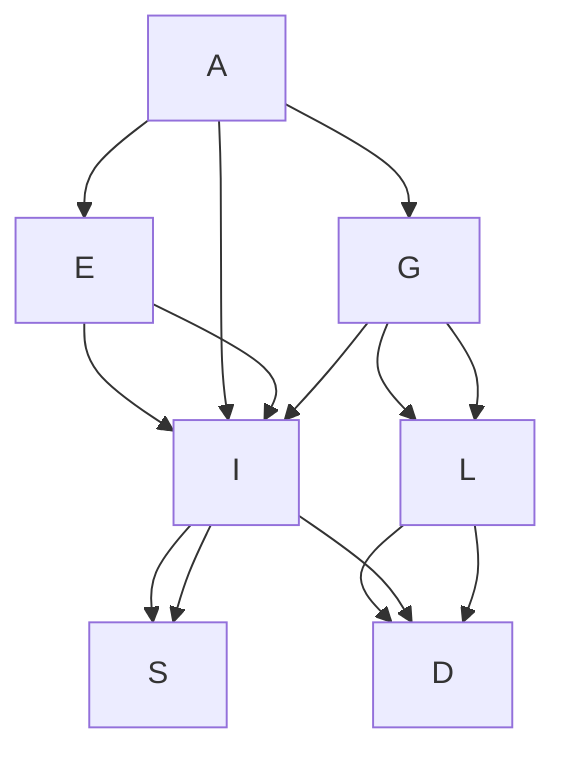

Figure 4.5: Assumed causal graph for the semi-synthetic loan approval dataset.

## 4.5.4 Semi-Synthetic 7-Variable SCM for Loan-Approval

We also test our methods on a larger semi-synthetic SCM inspired by the German Credit UCI dataset (Mur94). We consider the variables age A, gender $G ,$ education-level E, loan amount L, duration D, income I, and savings S with causal graph shown in Fig. ??. We model age A, gender G and loan duration D as non-actionable variables, but consider D to be mutable, i.e., it cannot be manipulated directly but is allowed to change (e.g., as a consequence of an intervention on L). The SCM includes linear and non-linear relationships, as well as different types of variables and noise distributions, and is described in more detail in Appendix B of (Kar+20b).

The results are summarised in ??, where we observe that the insights discussed above similarly apply for data generated from a more complex SCM, and for different classifiers.

Finally, we show the influence of $\gamma _ { \mathrm { L C B } }$ on the performance of the proposed probabilistic approaches in Fig. ??. We observe that lower values of $\gamma _ { \mathrm { L C B } }$ lead to lower validity (and cost), especially for the cate approaches. As $\gamma _ { \mathrm { L C B } }$ increases validity approaches the corresponding oracles $\mathcal { M } _ { \star }$ and $\mathbf { C A T E _ { \star } } ,$ , outperforming the point-based recourse approaches. In summary, our probabilistic recourse approaches are not only more robust, but also allow controlling the trade-off between validity and cost using γlcb.

## 4.6 discussion

In this chapter, we have focused on the problem of algorithmic recourse, i.e., the process by which an individual can change their situation to obtain a desired outcome from a machine learning model. Using the tools from causal reasoning (i.e., structural interventions and counterfactuals), we have shown that in their current form, counterfactual explanations only bring about agency for the individual to achieve recourse in unrealistic settings. In other words, counterfactual explanations imply recourse actions that may neither be optimal nor even result in favorably changing the prediction of h when acted upon. This shortcoming is primarily due to the lack of consideration of causal relations governing the world and thus, the failure to model the downstream effect of actions in the predictions of the machine learning model. In other words, although “counterfactual” is a term from causal language, we observed that existing approaches fall short in terms of taking causal reasoning into account when generating counterfactual explanations and the subsequent recourse actions. Thus, building on the statement by Wachter et al. [WMR17] that counterfactual explanations “do not rely on knowledge of the causal structure of the world,” it is perhaps more appropriate to refer to existing approaches as contrastive, rather than counterfactual, explanations (Dhu+18; Mil19). See (Kar+22, §2) for more discussion.

**Table 4.2: Experimental results for the 7-variable SCM for loan-approval. We show average performance ±1 standard deviation for $N _ { \mathrm { r u n s } } = 1 0 0 , N _ { \mathrm { M C - s a m p l e s } } = 1 0 0 ,$ , and $\gamma _ { \mathrm { L C B } } ~ = ~ 2 . 5 .$ . For linear and non-linear logistic regression as classifiers, we use the gradient-based approach, whereas for the non-differentiable random forest classifier we rely on the brute-force approach (with 10 discretised bins per dimension) to solve the recourse optimisation problems.**

<table><tr><td rowspan="2">Method</td><td colspan="3">LINEAR LOG. REGR.</td><td colspan="3">NON-LIN. LOG. REGR. (MLP)</td><td colspan="3">RANDOM FOREST(BRUTE-FORCE)</td></tr><tr><td>Valid $_{\star}$ (%)</td><td>LCB</td><td>Cost (%)</td><td>Valid $_{\star}$ (%)</td><td>LCB</td><td>Cost (%)</td><td>Valid $_{\star}$ (%)</td><td>LCB</td><td>Cost (%)</td></tr><tr><td> $\mathcal{M}_{\star}$ </td><td>100</td><td>-</td><td>15.8±7.6</td><td>100</td><td>-</td><td>11.0±7.0</td><td>100</td><td>-</td><td>15.2±7.5</td></tr><tr><td> $\mathcal{M}_{\text{LIN}}$ </td><td>19</td><td>-</td><td>15.4±7.4</td><td>80</td><td>-</td><td>11.0±6.9</td><td>94</td><td>-</td><td>15.6±7.6</td></tr><tr><td> $\mathcal{M}_{\text{KR}}$ </td><td>41</td><td>-</td><td>15.6±7.5</td><td>87</td><td>-</td><td>11.1±7.0</td><td>92</td><td>-</td><td>15.1±7.4</td></tr><tr><td> $\mathcal{M}_{\text{GP}}$ </td><td>100</td><td>.50±.00</td><td>18.0±7.7</td><td>100</td><td>.52±.04</td><td>11.7±7.3</td><td>100</td><td>.66±.14</td><td>16.3±7.4</td></tr><tr><td> $\mathcal{M}_{\text{CVAE}}$ </td><td>100</td><td>.50±.00</td><td>16.6±7.6</td><td>99</td><td>.51±.01</td><td>11.3±6.9</td><td>100</td><td>.66±.14</td><td>15.9±7.4</td></tr><tr><td> $\text{CATE}_{\star}$ </td><td>93</td><td>.50±.01</td><td>22.0±9.4</td><td>95</td><td>.52±.05</td><td>12.0±7.7</td><td>98</td><td>.66±.15</td><td>17.0±7.3</td></tr><tr><td> $\text{CATE}_{\text{GP}}$ </td><td>93</td><td>.50±.02</td><td>21.7±9.2</td><td>93</td><td>.51±.06</td><td>12.0±7.4</td><td>100</td><td>.67±.15</td><td>17.1±7.4</td></tr><tr><td> $\text{CATE}_{\text{CVAE}}$ </td><td>94</td><td>.49±.01</td><td>23.7±11.3</td><td>95</td><td>.51±.03</td><td>12.0±7.8</td><td>100</td><td>.68±.15</td><td>17.9±7.4</td></tr></table>

To directly take causal consequences of actions into account, we have proposed a fundamental reformulation of the recourse problem, where actions are performed as interventions and we seek to minimize the cost of performing actions in a world governed by a set of (physical) laws captured in a structural causal model. Our proposed formulation in (??), complemented with several examples and a detailed discussion, allows for recourse through minimal interventions (MINT), that when performed will result in a structural counterfactual that favourably changes the output of the model.

The primary limitation of this formulation in (??) is its reliance on the true causal model of the world, subsuming both the graph, and the structural equations. In practice, the underlying causal model is rarely known, which suggests that the counterfactual constraint in (??), i.e., $\mathbf { \boldsymbol { x } } ^ { \mathsf { S C F } } ( a ) : = \mathbf { \boldsymbol { x } } ( a ) | \mathbf { \boldsymbol { x } } ^ { \mathsf { F } } = \mathsf { S } ^ { a } ( \mathbb { S } ^ { - 1 } ( \mathbf { \boldsymbol { x } } ^ { \mathsf { F } } ) )$ ), may not be (deterministically) identifiable. As negative result, however, we showed that algorithmic recourse cannot be guaranteed in the absence of perfect knowledge about the underlying SCM governing the world, which unfortunately is not available in practice. To address this limitation, we proposed two probabilistic approaches to achieve recourse under more realistic assumptions. In particular, we derived i) an individual-level recourse approach based on GPs that approximates the counterfactual distribution by averaging over the family of additive Gaussian SCMs; and ii) a subpopulation-based approach, which assumes that only the causal graph is known and makes use of CVAEs to estimate the conditional average treatment effect of an intervention on a subpopulation of individuals similar to the one seeking recourse. Our experiments showed that the proposed probabilistic approaches not only result in more robust recourse interventions than approaches based on point estimates of the SCM, but also allows to trade-off validity and cost.

## 4.6.0.1 Assumptions, Limitations, and Extensions

Throughout the present work, we have assumed a known causal graph and causal sufficiency. While this may not hold for all settings, it is the minimal necessary set of assumptions for causal reasoning from observational data alone. Access to instrumental variables or experimental data may help further relax these assumptions (AIR96; CY99; TP01). Moreover, if only a partial graph is available or some relations are known to be confounded, one will need to restrict recourse actions to the subset of interventions that are still identifiable (SP06; SP08; TP02). An alternative approach could address causal sufficiency violations by relying on latent variable models to estimate confounders from multiple causes (WB19) or proxy variables (Lou+17), or to work with bounds on causal effects instead (BP94; TP00; Küg+21).

Perhaps more concerningly, our work highlights the implicit causal assumptions made by existing approaches (i.e., that of independence, or feasible and cost-free interventions), which may portray a false sense of recourse guarantees where one does not exists (see Example 4.1.2 and all of § 4.3.1). Our work aims to highlight existing imperfect assumptions, and to offer an alternative formulation, backed with proofs and demonstrations, which would guarantee recourse if assumptions about the causal structure of the world were satisfied. Future research on causal algorithmic recourse may benefit from the rich literature in causality that has developed methods to verify and perform inference under various assumptions (PJS17; Pea09).

This is not to say that counterfactual explanations should be abandoned altogether. On the contrary, we believe that counterfactual explanations hold promise for “guided audit of the data” (WMR17) and evaluating various desirable model properties, such as robustness (SHG20; HL20) or fairness (SHG20; Gup+19; USL19; Kar+20a; Küg+22). Besides this, it has been shown that designers of interpretable machine learning systems use counterfactual explanations for predicting model behavior (Lag+19) or uncovering inaccuracies in the data profile of individuals (VA20). Complementing these offerings of counterfactual explanations, we offer minimal interventions as a way to guarantee algorithmic recourse in general settings, which is not implied by counterfactual explanations.

## 4.6.0.2 On the Counterfactual vs Interventional Nature of Recourse

Given that we address two different notions of recourse— counterfactual/individualised (rung 3) vs. interventional/subpopulationbased (rung 2)—one may ask which framing is more appropriate. Since the main difference is whether the background variables U are assumed fixed (counterfactual) or not (interventional) when reasoning about actions, we believe that this question is best addressed by thinking about the type of environment and interpretation of U: if the environment is static, or if U (mostly) captures unobserved information about the individual, the counterfactual notion seems to be the right one; if, on the other hand, U also captures environmental factors which may change, e.g., between consecutive loan applications, then the interventional notion of recourse may be more appropriate. In practice, both notions may be present (for different variables), and the proposed approaches can be combined depending on the available domain knowledge since each parent-child causal relation is treated separately. We emphasise that the subpopulation-based approach is also practically motivated by a reluctance to make (parametric) assumptions about the structural equations which are untestable but necessary for counterfactual reasoning. It may therefore be useful to avoid problems of misspecification, even for counterfactual recourse, as demonstrated experimentally for the non-additive SCM.

## 4.7 conclusion

In this work, we explored one of the main, but often overlooked, objectives of explanations as a means to allow people to act rather than just understand. Using counterexamples and the theory of structural causal models (SCM), we showed that actionable recommendations cannot, in general, be inferred from counterfactual explanations. We show that this shortcoming is due to the lack of consideration of causal relations governing the world and thus, the failure to model the downstream effect of actions in the predictions of the machine learning model. Instead, we proposed a shift of paradigm from recourse via nearest counterfactual explanations to recourse through minimal interventions (MINT), and presented a new optimization formulation for the common class of additive noise models. Our technical contributions were complemented with an extensive discussion on the form, feasibility, and scope of interventions in real-world settings. In follow-up work, we further investigated the epistemological differences between counterfactual explanations and consequential recommendations and argued that their technical treatment requires consideration at different levels of the causal history (Rub15) of events (Kar+22). Whereas MINT provided exact recourse under strong assumptions (requiring the true SCM), we next explored how to offer recourse under milder and more realistic assumptions (requiring only the causal graph). We present two probabilistic approaches that offer recourse with high probability. The first captures uncertainty over structural equations under additive Gaussian

<!-- footnote -->

- The model is commonly assumed to be fixed and not change over time.

<!-- footnote end -->

<!-- footnote -->

- Refer to the Appendix for more explanation by an example.

<!-- footnote end -->

<!-- footnote -->

- For conciseness, the intermediate variables used to practically encode the functions within the MIP model are excluded here.

<!-- footnote end -->

<!-- footnote -->

- We use an improved version of MACE obtained from the official GitHub repository.
- We use default hyperparameters for DiCE, as obtained from the official GitHub repository of DiCE (commit @92530c7). In all but the diversity experiments that will follow, we set the diversity weight to zero since we are searching for only one CFE and want the focus only on proximity and flipping of the output.

<!-- footnote end -->

<!-- footnote -->

- Following the related literature, we consider a binary classification task by convention; most of our considerations extend to multi-class classification or regression settings as well though.
- In particular, (Dhu+18; MST20; WMR17) solve (4.1) using gradient-based optimization; (Rus19; USL19) employ mixed-integer linear program solvers to support mixed numeric/binary data; (Poy+19) use graph-based shortest path algorithms; (Lau+17) use a heuristic search procedure by growing spheres around the factual instance; (Gui+18; SHG20) build on genetic algorithms for model-agnostic behavior; and (Kar+20a) solve (4.1) using satisfiability solvers with closeness guarantees. For a more complete exposition, see the recent surveys (VDH20; Kar+22).

<!-- footnote end -->

<!-- footnote -->

- Here, “feasible” means possible to do, whereas “plausible” means possibly true, believable or realistic. Optimization terminology refers to both as feasibility sets.

<!-- footnote end -->

<!-- footnote -->

- Also known as non-parametric structural equation model with independent errors. 5 I.e., for $r ~ \in ~ [ d ] , \bar { P _ { X _ { r } | \mathbf { X _ { p a ( r ) } } } } ( X _ { r } | \mathbf { X _ { p a ( r ) } } ) ~ : = ~ \bar { P } _ { U _ { r } } ( f _ { r } ^ { - 1 } ( X _ { r } | \mathbf { X _ { p a ( r ) } } ) )$ , where $f _ { r } ^ { - 1 } ( X _ { r } | \mathbf { X } _ { \mathrm { p a } ( r ) } )$ denotes the pre-image of $X _ { r }$ given $\mathbf { \boldsymbol { x } } _ { \mathrm { { p a } } ( r ) }$ under $f _ { r } ,$ i.e., $f _ { r } ^ { - 1 } ( X _ { r } | \mathbf { X } _ { \mathrm { p a } ( r ) } ) \ : = \ \{ u \ \in \ \mathcal { U } _ { r }$ : $f _ { r } ( \mathbf { X } _ { \mathrm { p a } ( r ) } , u ) \stackrel { \circ } { = } X _ { r } \}$ .

<!-- footnote end -->

<!-- footnote -->

- We note that, although $\mathbf { x } ^ { * \mathsf { S C F } } : = \mathbf { x } ( a ^ { * } ) | \mathbf { x } ^ { \mathsf { F } } = \mathbb { S } ^ { a ^ { * } } ( \mathbb { S } ^ { - 1 } ( \mathbf { x } ^ { \mathsf { F } } ) )$ is a counterfactual instance, it does not need to correspond to the nearest counterfactual explanation, $\mathbf { x } ^ { * \mathsf { C F E } } : = \mathbf { x } ^ { \mathsf { F } } + \delta ^ { * }$ , resulting from $( 4 . 2 )$ (see, e.g., Example $4 { \cdot } 1 . 1 )$ . This further emphasizes that minimal interventions are not necessarily obtainable via pre-computed nearest counterfactual instances, and recourse actions should be obtained by solving (??) rather than indirectly through the solution of $( 4 . 2 )$ .

<!-- footnote end -->

<!-- footnote -->

- We remark that the presented formulation also holds for more general SCMs (for example where the exogenous variable contribution is not additive) as long as the sequence of structural equations S is invertible, i.e., there exists a sequence of equations $\mathbb { S } ^ { - 1 }$ such that ${ \bf x } = { \bf S } ( { \bf S } ^ { - 1 } ( \hat { \bf x } ) )$ (in other words, the exogenous variables are uniquely identifiable via the abduction step).

<!-- footnote end -->

<!-- footnote -->

- This follows from abduction on $\mathbf { x } ^ { \mathsf { F } } = \left( 1 , 0 , 0 \right)$ which for both $\mathcal { M } _ { A }$ and $\mathcal { M } _ { B }$ implies $U _ { 3 } = 0 ,$ .

<!-- footnote end -->

<!-- footnote -->

- For large d when enumerating all  becomes computationally prohibitive, we can upperbound the allowed number of variables to be intervened on simultaneously $( \mathbf { e . g . } , \mathbf { \left| \mathscr { I } \right| } \leq 3 )$ , or choose a greedy approach to select .

<!-- footnote end -->

<!-- footnote -->

- Sampling from the noise prior instead of the posterior in (??) leads to an interventional distribution in (??).

<!-- footnote end -->

noise, and uses Bayesian model averaging to estimate the counterfactual distribution. The second removes any assumptions on the structural equations by instead computing the average effect of recourse actions on individuals similar to the person who seeks recourse, leading to a novel subpopulationbased interventional notion of recourse. We then derive a gradient-based procedure for selecting optimal recourse actions, and empirically show that the proposed approaches lead to more reliable recommendations under imperfect causal knowledge than non-probabilistic baselines. This contribution is important as it enables recourse recommendations to be generated in more practical settings and under uncertain assumptions.

As a final note, while for simplicity, we have focused in this chapter on credit loan approvals, recourse can have potential applications in other domains such as healthcare (Rie+20; BKB17; GB20; BBK19), justice (e.g., pretrial bail) (Ang+16), and other settings (e.g., hiring) (NS18; CLM19; Sch+20) whereby actionable recommendations for individuals are sought.

# Fair Causal Algorithmic Recourse

## Chapter Abstract

Algorithmic fairness is typically studied from the perspective of predictions. Instead, here we investigate fairness from the perspective of recourse actions suggested to individuals to remedy an unfavourable classification. We propose two new fairness criteria at the group and individual level, which—unlike prior work on equalising the average group-wise distance from the decision boundary—explicitly account for causal relationships between features, thereby capturing downstream effects of recourse actions performed in the physical world. We explore how our criteria relate to others, such as counterfactual fairness, and show that fairness of recourse is complementary to fairness of prediction. We study theoretically and empirically how to enforce fair causal recourse by altering the classifier and perform a case study on the Adult dataset. Finally, we discuss whether fairness violations in the data generating process revealed by our criteria may be better addressed by societal interventions as opposed to constraints on the classifier.

This chapter is based on the paper “On the Fairness of Causal Algorithmic Recourse,” von Kügelgen, Karimi, Bhatt, Valera, Weller, Schölkopf, AAAI (Á), 2022 (Küg+22).

## 5.1 introduction

Algorithmic fairness is concerned with uncovering and correcting for potentially discriminatory behavior of automated decision making systems (Dwo+12; Zem+13; HPS16; Cho17). Given a dataset comprising individuals from multiple legally protected groups (defined, e.g., based on age, sex, or ethnicity), and a binary classifier trained to predict a decision (e.g., whether they were approved for a credit card), most approaches to algorithmic fairness seek to quantify the level of unfairness according to a pre-defined (statistical or causal) criterion, and then aim to correct it by altering the classifier. This notion of predictive fairness typically considers the dataset as fixed, and thus the individuals as unalterable.

Algorithmic recourse, on the other hand, is concerned with offering recommendations to individuals, who were unfavourably treated by a decision-making system, to overcome their adverse situation (Jos+19; USL19; SHG19; MTS19; MST20; VA20; Kar+20b; Kar+22; KSV21; UJL21). For a given classifier and a negatively-classified individual, algorithmic recourse aims to identify which changes the individual could perform to flip the decision. Contrary to predictive fairness, recourse thus considers the classifier as fixed but ascribes agency to the individual.

Within machine learning (ML), fairness and recourse have mostly been considered in isolation and viewed as separate problems. While recourse has been investigated in the presence of protected attributes—e.g., by comparing recourse actions (flipsets) suggested to otherwise similar male and female individuals (USL19), or comparing the aggregated cost of recourse (burden) across different protected groups (SHG19)—its relation to fairness has only been studied informally, in the sense that differences in recourse have typically been understood as proxies of predictive unfairness (Kar+20a). However, as we argue in the present work, recourse actually constitutes an interesting fairness criterion in its own right as it allows for the notions of agency and effort to be integrated into the study of fairness.

In fact, discriminatory recourse does not imply predictive unfairness (and is not implied by it either1). To see this, consider the data shown in Fig. 5.1. Suppose the feature X represents the (centered) income of an individual from one of two sub-groups $A \in \{ 0 , 1 \}$ , distributed as $\mathcal { N } ( 0 , 1 )$ and $\mathcal { N } ( 0 , 4 )$ , i.e., only the variances differ. Now consider a binary classifier $h ( X ) = \mathrm { s i g n } ( X )$ which perfectly predicts whether the individual is approved for a credit card (the true label Y) (BSR20). While this scenario satisfies several predictive fairness criteria (e.g., demographic parity, equalised odds, calibration), the required increase in income for negatively-classified individuals to be approved for a credit card (i.e., the effort required to achieve recourse) is much larger for the higher variance group. If individuals from one protected group need to work harder than “similar” ones from another group to achieve the same goal, this violates the concept of equal opportunity, a notion aiming for people to operate on a level playing field (Arn15).2 However, this type of unfairness is not captured by predictive notions which—in only distinguishing between (unalterable) worthy or unworthy individuals—do not consider the possibility for individuals to deliberately improve their situation by means of changes or interventions.

In this vein, Gupta et al. [Gup+19] recently introduced Equalizing Recourse, the first recourse-based and prediction-independent notion of fairness in ML. They propose to measure recourse fairness in terms of the average group-wise distance to the decision boundary for those getting a bad outcome, and show that this can be calibrated during classifier training. However, this formulation ignores that recourse is fundamentally a causal problem since actions performed by individuals in the real-world to change their situation may have downstream effects (MTS19; KSV21; Kar+20b; MST20), cf. also (BSR20; WMR17; USL19). By not reasoning about causal relations between features, the distance-based approach (i) does not accurately reflect the true (differences in) recourse cost, and (ii) is restricted to the classical prediction-centered approach of changing the classifier to address discriminatory recourse.

In the present work, we address both of these limitations. First, by extending the idea of Equalizing Recourse to the minimal intervention-based framework of recourse (KSV21), we introduce causal notions of fair recourse which capture the true differences in recourse cost more faithfully if features are not independently manipulable, as is generally the case. Second, we argue that a causal model of the data generating process opens up a new route to fairness via societal interventions in the form of changes to the underlying system. Such societal interventions may reflect common policies like subgroup-specific subsidies or tax breaks. We highlight the following contributions:

• we introduce a causal version (Defn. 5.3.1) of Equalizing Recourse, as well as a stronger (Prop. 5.3.1) individual-level criterion (Defn. 5.3.2) which we argue is more appropriate;
• we provide the first formal study of the relation between fair prediction and fair recourse, and show that they are complementary notions which do not imply each other (Prop. 5.3.2);
• we establish sufficient conditions that allow for individually-fair causal recourse (Prop. 5.3.3);
• we evaluate different fair recourse metrics for several classifiers (§ 5.4.1), verify our main results, and demonstrate that non-causal metrics misrepresent recourse unfairness;
• in a case study on the Adult dataset, we detect recourse discrimination at the group and individual level (§ 5.4.2), demonstrating its relevance for real world settings;
• we propose societal interventions as an alternative to altering a classifier to address unfairness (§ 5.5).

## 5.2 preliminaries & background

notation. Let the random vector $\mathbf { \Psi } \mathbf { X } \ = \ \left( X _ { 1 } , . . . , X _ { n } \right)$ taking values $\begin{array} { r l } { \mathbf { { x } } } & { { } = } \end{array}$ $( x _ { 1 } , . . . , x _ { n } ) \ \in \ { \mathcal { X } } \ = \ { \mathcal { X } } _ { 1 } \times . . . \times { \mathcal { X } } _ { n } \ \subseteq \ \mathbb { R } ^ { n }$ denote observed (non-protected) features. Let the random variable A taking values $a \in \mathcal { A } = \{ 1 , \dots , K \}$ for some $K \in \mathbb { Z } _ { > 1 }$ denote a (legally) protected attribute/feature indicating which group each individual belongs to (based, e.g., on her age, sex, ethnicity, religion, etc). And let $h : \mathcal { X }  \mathcal { Y }$ be a given binary classifier with $Y \in \mathcal { V } = \{ \pm 1 \}$ denoting the ground truth label (e.g., whether her credit card was approved). We observe a dataset $\mathcal { D } = \{ \mathbf { v } ^ { i } \} _ { i = 1 } ^ { N }$ of i.i.d. observations of the random variable $\mathbf { V } = ( \mathbf { X } , A )$ with $\mathbf { v } ^ { i } : = ( \mathbf { x } ^ { i } , a ^ { i } ) .$ 3

counterfactual explanations. A common framework for explaining decisions made by (black-box) ML models is that of counterfactual explanations CE; WMR17. A CE is a closest feature vector on the other side of the decision boundary. Given a distance d : $\mathcal { X } \times \mathcal { X }  \mathbb { R } ^ { + }$ , a CE for an individual $\mathbf { x } ^ { \mathsf { F } }$ who obtained an unfavourable prediction, $h ( \mathbf { x } ^ { \mathsf { F } } ) = - 1$ , is defined as a solution to:

$$
\min _ {\mathbf {x} \in \mathcal {X}} d (\mathbf {x}, \mathbf {x} ^ {\mathsf {F}}) \quad \text { subject   to } \quad h (\mathbf {x}) = 1. \tag {5.1}
$$

While CEs are useful to understand the behaviour of a classifier, they do not generally lead to actionable recommendations: they inform an individual of where she should be to obtain a more favourable prediction, but they may not suggest feasible changes she could perform to get there.

recourse with independently-manipulable features. Ustun et al. [USL19] refer to a person’s ability to change the decision of a model by altering actionable variables as recourse and propose to solve

$$
\min _ {\delta \in \mathcal {F} (\mathbf {x} ^ {\mathsf {F}})} c (\delta ; \mathbf {x} ^ {\mathsf {F}}) \quad \text { subject   to } \quad h (\mathbf {x} ^ {\mathsf {F}} + \delta) = 1 \tag {5.2}
$$

where $\mathcal { F } ( \mathbf { x } ^ { \mathsf { F } } )$ is a set of feasible change vectors and $c ( \cdots \mathbf { x } ^ { \mathsf { F } } )$ is a cost function defined over these actions, both of which may depend on the individual.4 As pointed out by Karimi et al. [KSV21], (5.2) implicitly treats features as manipulable independently of each other (see Fig. 5.2a) and does not account for causal relations that may exist between them (see Fig. 5.2b): while allowing feasibility constraints on actions, variables which are not actedupon $( \delta _ { i } \ = \ 0 )$ are assumed to remain unchanged. We refer to this as the independently-manipulable features (IMF) assumption. While the IMF-view may be appropriate when only analysing the behaviour of a classifier, it falls short of capturing effects of interventions performed in the real world, as is the case in actionable recourse; e.g., an increase in income will likely also positively affect the individual’s savings balance. As a consequence, (5.2) only guarantees recourse if the acted-upon variables have no causal effect on the remaining variables (KSV21).


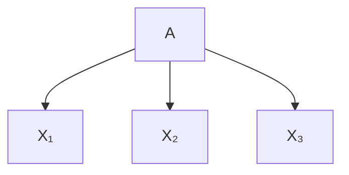

(a) IMF assumption


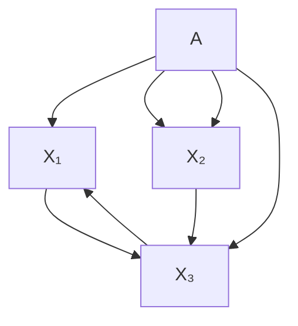

(b) Causal view  
Figure 5.2: (a) The framework underlying counterfactual explanations and distancebased recourse treats $X _ { i }$ as independently manipulable features (IMF). In a fairness context, this means that the $X _ { i }$ may depend on the protected attribute A (and potentially other unobserved factors) but do not causally influence each other. (b) The present work considers a generalisation the IMF assumption by allowing for causal influences between the $X _ { i }$ , thus modeling the downstream effects of changing some features on others. This causal approach allows us to more accurately quantify recourse unfairness in real-world settings where the IMF assumption is typically violated. It also provides a framework for studying alternative routes to achieve fair recourse beyond changing the classifier.

structural causal models. A structural causal model (SCM) (Pea09; PJS17) over observed variables $\mathbf { V } = \{ V _ { i } \} _ { i = 1 } ^ { n }$ is a pair $\mathcal { M } = ( \mathbb { S } , P _ { \mathbf { U } } )$ , where i=1the structural equations S are a set of assignments $\begin{array} { r } { \mathbb { S } = \{ V _ { i } : = f _ { i } ( \mathrm { P A } _ { i } , U _ { i } ) \} _ { i = 1 } ^ { n } , } \end{array}$ which compute each $V _ { i }$ as a deterministic function $f _ { i }$ of its direct causes (causal parents) $\mathrm { P A } _ { i } \subseteq \mathbf { V } \setminus V _ { i }$ and an unobserved variable $U _ { i }$ . In this work, we make the common assumption that the distribution $P _ { \mathbf { U } }$ factorises over the latent $\mathbf { U } = \{ U _ { i } \} _ { i = 1 } ^ { n } ,$ , meaning that there is no unobserved confounding (causal sufficiency). If the causal graph $\mathcal { G }$ associated with  (obtained by drawing a directed edge from each variable in $\mathrm { P A } _ { i }$ to $V _ { i } ,$ see Fig. 5.2 for examples) is acyclic, induces a unique “observational” distribution over $\mathbf { V } ,$ defined as the push forward of $P _ { \mathbf { U } }$ via S.

SCMs can be used to model the effect of interventions: external manipulations to the system that change the generative process (i.e., the structural assignments) of a subset of variables $\mathbf { V } _ { \mathcal { T } } \subseteq \mathbf { V } ,$ , e.g., by fixing their value to a constant $\pmb { \theta } _ { \mathcal { T } }$ . Such (atomic) interventions are denoted using Pearl’s do-operator by do $( \mathbf { V } _ { \mathcal { T } } : = \pmb { \theta } _ { \mathcal { T } } )$ , or $\mathrm { d o } ( \pmb { \theta } _ { \mathcal { I } } )$ for short. Interventional distributions are obtained from  by replacing the structural equations $\{ V _ { i } : = f _ { i } ( \mathrm { P A } _ { i } , U _ { i } ) \} _ { i \in \mathcal { I } }$ by their new assignments $\{ V _ { i } : = \theta _ { i } \} _ { i \in \mathbb { Z } }$ to obtain the modified structural equations $\mathbb { S } ^ { \mathrm { d o } ( \pmb { \theta } _ { \mathbb { Z } } ) }$ ∈I  and then computing the distribution induced by the interventional SCM $\mathcal { M } ^ { \mathrm { d o } ( \theta _ { \mathcal { T } } ) } = ( \mathbb { S } ^ { \mathrm { d o } ( \mathbf { \dot { \theta } } _ { \mathcal { T } } ) } , P _ { \mathbf { U } } )$ ), i.e., the push-forward of $P _ { \mathbf { U } }$ via $\mathbb { S } ^ { \mathrm { d o } ( \pmb { \theta } _ { \mathbb { Z } } ) }$ ) .

Similarly, SCMs allow reasoning about (structural) counterfactuals: statements about interventions performed in a hypothetical world where all unobserved noise terms U are kept unchanged and fixed to their factual value $\mathbf { u } ^ { \mathsf { F } }$ . The counterfactual distribution for a hypothetical intervention do $( \pmb { \theta } _ { \mathcal { T } } )$ given a factual observation $\mathbf { v } ^ { \mathsf { F } } .$ , denoted $\mathbf { v } _ { \pmb { \theta } _ { T } } ( \mathbf { \bar { u } } ^ { \bar { \sf F } } )$ , can be obtained from $\mathcal { M }$ using a Ithree step procedure: first, inferring the posterior distribution over the unobserved variables $P _ { \mathbf { U } | { \bf v } ^ { \mathsf { F } } }$ (abduction); second, replacing some of the structural equations as in the interventional case (action); third, computing the distribution induced by the counterfactual SCM $\mathcal { M } ^ { \mathrm { d o } ( \theta _ { \mathcal { T } } ) | \mathbf { v } ^ { \mathrm { F } } } = ( \mathbb { S } ^ { \mathrm { d o } ( \theta _ { \mathcal { T } } ) } , P _ { \mathbf { U } | \mathbf { v } ^ { \mathrm { F } } } )$ (prediction).

causal recourse. To capture causal relations between features, Karimi et al. [KSV21] propose to approach the actionable recourse task within the framework of SCMs and to shift the focus from nearest CEs to minimal interventions, leading to the optimisation problem

$$
\min _ {\boldsymbol {\theta} _ {\mathcal {I}} \in \mathcal {F} (\mathbf {x} ^ {\mathsf {F}})} c (\boldsymbol {\theta} _ {\mathcal {I}}; \mathbf {x} ^ {\mathsf {F}}) \quad \text {   subj.   to   } \quad h (\mathbf {x} _ {\boldsymbol {\theta} _ {\mathcal {I}}} (\mathbf {u} ^ {\mathsf {F}})) = 1, \tag {5.3}
$$

where $\mathbf { x } _ { \pmb { \theta } _ { \mathcal { T } } } ( \mathbf { u } ^ { \mathsf { F } } )$ denotes the “counterfactual twin” of $\mathbf { x } ^ { \mathsf { F } }$ had $\mathbf { \boldsymbol { x } } _ { \mathcal { T } }$ been $\pmb { \theta } _ { \mathcal { T } } . ^ { 5 }$ In Ipractice, the SCM is unknown and needs to be inferred from data based on additional (domain-specific) assumptions, leading to probabilistic versions of $( 5 . 3 )$ which aim to find actions that achieve recourse with high probability (Kar+20b). If the IMF assumptions holds (i.e., the set of descendants of all actionable variables is empty), then (5.3) reduces to IMF recourse (5.2) as a special case.

algorithmic and counterfactual fairness. While there are many statistical notions of fairness (Zaf+17a; Zaf+17b), these are sometimes mutually incompatible (Cho17), and it has been argued that discrimination, at its heart, corresponds to a (direct or indirect) causal influence of a protected attribute on the prediction, thus making fairness a fundamentally causal problem (Kil+17; Rus+17; Lof+18; ZB18a; ZB18b; NS18; NMS19; Chi19; Sal+19; Wu+19). Of particular interest to our work is the notion of counterfactual fairness introduced by Kusner et al. [Kus+17] which calls a (probabilistic) classifier h over $\mathbf { V } = \mathbf { X } \cup A$ counterfactually fair if it satisfies

$$
h (\mathbf {v} ^ {\mathsf {F}}) = h (\mathbf {v} _ {a} (\mathbf {u} ^ {\mathsf {F}})), \forall a \in \mathcal {A}, \mathbf {v} ^ {\mathsf {F}} = (\mathbf {x} ^ {\mathsf {F}}, a ^ {\mathsf {F}}) \in \mathcal {X} \times \mathcal {A},
$$

where $\mathbf { v } _ { a } ( \mathbf { u } ^ { \mathsf { F } } )$ denotes the “counterfactual twin” of $\mathbf { v } ^ { \mathsf { F } }$ had the attribute been a instead of $a ^ { \mathsf { F } }$ .

equalizing recourse across groups. The main focus of this chapter is the fairness of recourse actions which, to the best of our knowledge, was studied for the first time by Gupta et al. [Gup+19]. They advocate for equalizing the average cost of recourse across protected groups and to incorporate this as a constraint when training a classifier. Taking a distance-based approach in line with CEs, they define the cost of recourse for $\mathbf { x } ^ { \mathsf { F } }$ with $h ( \mathbf { x } ^ { \mathsf { F } } ) = - 1$ as the minimum achieved in (5.1):

$$
r ^ {\mathrm{IMF}} (\mathbf {x} ^ {\mathsf {F}}) = \min _ {\mathbf {x} \in \mathcal {X}} d (\mathbf {x} ^ {\mathsf {F}}, \mathbf {x}) \quad \text { subj.   to } \quad h (\mathbf {x}) = 1, \tag {5.4}
$$

which is equivalent to IMF-recourse (5.2) if $c ( \delta ; { \mathbf { x } } ^ { \mathsf { F } } ) = d ( { \mathbf { x } } ^ { \mathsf { F } } + \delta , { \mathbf { x } } ^ { \mathsf { F } } )$ is chosen as cost function. Defining the protected subgroups, $G _ { a } = \{ \mathbf { v } ^ { i } \in \mathcal { D } : a ^ { i } = a \}$ , and $G _ { a } ^ { - } = \{ \mathbf { v } \in G _ { a } : h ( \mathbf { v } ) = - 1 \}$ , the group-level cost of recourse (here, the average distance to the decision boundary) is then given by,

$$
r ^ {\mathrm{IMF}} (G _ {a} ^ {-}) = \frac {1}{| G _ {a} ^ {-} |} \sum_ {\mathbf {v} ^ {i} \in G _ {a} ^ {-}} r ^ {\mathrm{IMF}} (\mathbf {x} ^ {i}). \tag {5.5}
$$

The idea of Equalizing Recourse across groups (Gup+19) can then be summarised as follows.

Definition 5.2.1 (Group-level fair IMF-recourse, from (Gup+19)). The grouplevel unfairness of recourse with independently-manipulable features (IMF) for a dataset , classifier $h ,$ and distance metric d is:

$$
\Delta_ {\text { dist }} (\mathcal {D}, h, d) := \max _ {a, a ^ {\prime} \in \mathcal {A}} \left| r ^ {\text { IMF }} (G _ {a} ^ {-}) - r ^ {\text { IMF }} (G _ {a ^ {\prime}} ^ {-}) \right|.
$$

Recourse for ( , h, d) is “group IMF-fair” if $\Delta _ { \mathsf { d i s t } } = 0$ .

## 5.3 fair causal recourse

Since Defn. 5.2.1 rests on the IMF assumption, it ignores causal relationships between variables, fails to account for downstream effects of actions on other relevant features, and thus generally incorrectly estimates the true cost of recourse. We argue that recourse-based fairness considerations should rest on a causal model that captures the effect of interventions performed in the physical world where features are often causally related to each other. We therefore consider an SCM  over $\mathbf { V } = ( \mathbf { X } , A )$ to model causal relationships between the protected attribute and the remaining features.

## 5.3.1 Group-Level Fair Causal Recourse

Defn. 5.2.1 can be adapted to the causal (CAU) recourse framework (5.3) by replacing the minimum distance in $( 5 . 4 )$ with the cost of recourse within a causal model, i.e., the minimum achieved in (5.3):

$$
r ^ {\mathrm{CAU}} (\mathbf {v} ^ {\mathsf {F}}) = \min _ {\boldsymbol {\theta} _ {\mathcal {I}} \in \Theta (\mathbf {v} ^ {\mathsf {F}})} c (\boldsymbol {\theta} _ {\mathcal {I}}; \mathbf {v} ^ {\mathsf {F}}) \quad \mathrm{subj.to} \quad h (\mathbf {v} _ {\boldsymbol {\theta} _ {\mathcal {I}}} (\mathbf {u} ^ {\mathsf {F}})) = 1,
$$

where we recall that the constraint $h ( \mathbf { v } _ { \pmb { \theta } _ { \mathcal { T } } } ( \mathbf { u } ^ { \mathsf { F } } ) ) = 1$ ensures that the counterfactual twin of $\mathbf { v } ^ { \mathsf { F } }$ in $\mathcal { M }$ Ifalls on the favourable side of the classifier. Let $r ^ { \mathbf { C A U } } \left( G _ { a } ^ { - } \right)$ be the average of $r ^ { \mathbf { C A U } } ( \mathbf { v } ^ { \mathsf { F } } )$ across $G _ { a } ^ { - }$ , analogously to (5.5). We can then define group-level fair causal recourse as follows.

Definition 5.3.1 (Group-level fair causal recourse). The group-level unfairness of causal (CAU) recourse for a dataset ${ \mathcal { D } } ,$ classifier h, and cost function c w.r.t. an SCM M is given by:

$$
\Delta_ {\text { cost }} (\mathcal {D}, h, c, \mathcal {M}) := \max _ {a, a ^ {\prime} \in \mathcal {A}} \left| r ^ {\text { CAU }} (G _ {a} ^ {-}) - r ^ {\text { CAU }} (G _ {a ^ {\prime}} ^ {-}) \right|.
$$

Recourse for $\left( \mathcal { D } , h , c , \mathcal { M } \right)$ is “group CAU-fair” if $\Delta _ { \mathsf { c o s t } } = 0$ .

While Defn. 5.2.1 is agnostic to the (causal) generative process of the data (note the absence of a reference SCM M from Defn. 5.2.1), Defn. 5.3.1 takes causal relationships between features into account when calculating the cost of recourse. It thus captures the effect of actions and the necessary cost of recourse more faithfully when the IMF-assumption is violated, as is realistic for most applications.

A shortcoming of both Defns. 5.2.1 and 5.3.1 is that they are group-level definitions, i.e., they only consider the average cost of recourse across all individuals sharing the same protected attribute. However, it has been argued from causal (Chi19; Wu+19) and non-causal (Dwo+12) perspectives that fairness is fundamentally an individual-level concept:6 group-level fairness still allows for unfairness at the level of the individual, provided that positive and negative discrimination cancel out across the group. This is one motivation behind counterfactual fairness (Kus+17): a decision is considered fair at the individual level if it would not have changed, had the individual belonged to a different protected group.

## 5.3.2 Individually Fair Causal Recourse

Inspired by counterfactual fairness (Kus+17), we propose that (causal) recourse may be considered fair at the level of the individual if the cost of recourse would have been the same had the individual belonged to a different protected group, i.e., under a counterfactual change to A.

Definition 5.3.2 (Individually fair causal recourse). The individual-level unfairness of causal recourse for a dataset $\mathcal { D } ,$ classifier $h ,$ and cost function c w.r.t. an SCM is

$$
\Delta_ {\mathrm{ind}} (\mathcal {D}, h, c, \mathcal {M}) := \max _ {a \in \mathcal {A}; \mathbf {v} ^ {\mathsf {F}} \in \mathcal {D}} \left| r ^ {\mathrm{CAU}} (\mathbf {v} ^ {\mathsf {F}}) - r ^ {\mathrm{CAU}} (\mathbf {v} _ {a} (\mathbf {u} ^ {\mathsf {F}})) \right|
$$

Recourse is “individually CAU-fair” if $\Delta _ { \mathrm { i n d } } = 0 .$ .

This is a stronger notion in the sense that it is possible to satisfy both group IMF-fair (Defn. 5.2.1) and group CAU-fair recourse (Defn. 5.3.1), without satisfying Defn. 5.3.2:

Proposition 5.3.1. Neither of the group-level notions of fair recourse (Defn. 5.2.1 and Defn. 5.3.1) are sufficient conditions for individually CAU-fair recourse (Defn. 5.3.2), i.e.,

$$
\text { Group   IMF - fair } \implies \text { Individually   CAU - fair. }
$$

$$
\text { Group   CAU - fair } \implies \text { Individually   CAU - fair. }
$$

Proof. A counterexample is given by the following combination of SCM and classifier

$$
A := U _ {A},
$$

$$
X := A U _ {X} + (1 - A) (1 - U _ {X}),
$$

$$
U _ {A}, U _ {X} \sim \text { Bernoulli } (0. 5),
$$

$$
Y := h (X) = \operatorname{sign} (X - 0. 5).
$$

We have $\mathbb { P } _ { X | A = 0 } = \mathbb { P } _ { X | A = 1 } = { \mathrm { B e r n o u l l i } } ( 0 . 5 )$ , so the distance to the boundary at $X = 0 . 5$ is the same across groups. The criterion for “group IMF-fair” recourse (Defn. 5.2.1) is thus satisfied.

Since protected attributes are generally immutable (thus making any recourse actions involving changes to A infeasible) and since there is only a single feature in this example (so that causal downstream effects on descendant features can be ignored), the distance between the factual and counterfactual value of X is a reasonable choice of cost function also for causal recourse. In this case, $( \mathcal { D } , h , \mathcal { M } )$ also satisfies group-level CAU-fair recourse (Defn. 5.3.1).

However, for all $\mathbf { v } ^ { \mathsf { F } } = ( \mathbf { x } ^ { \mathsf { F } } , a ^ { \mathsf { F } } )$ and any $a \neq a ^ { \mathsf { F } }$ , we have $h ( \mathbf { x } ^ { \mathsf { F } } ) \neq h ( \mathbf { x } _ { a } ( u _ { X } ^ { \mathsf { F } } ) ) =$ $1 - h ( \mathbf { x } ^ { \mathsf { F } } )$ , so it is maximally unfair at the individual level: for any individual, the cost of recourse would have been zero had the protected attribute been different, as the prediction would have flipped. □

## 5.3.3 Relation to Counterfactual Fairness

The classifier h used in the proof of Prop. 5.3.1 is not counterfactually fair. This suggests to investigate their relation more closely: does a counterfactually fair classifier imply fair (causal) recourse? The answer is no.

Proposition 5.3.2. Counterfactual fairness is insufficient for any of the three notions of fair recourse:

$$
h \text {   counterfactually   fair   } \implies \text {   Group   IMF - fair   }
$$

$$
h \text {   counterfactually   fair   } \Rightarrow \text {   Group   CAU - fair   }
$$

$$
h \text {   counterfactually   fair   } \Rightarrow \text {   Individually   CAU - fair   }
$$

Proof. A counterexample is given by the following combination of SCM and classifier:

$$
A := U _ {A}, \quad U _ {A} \sim \text { Bernoulli } (0. 5),
$$

$$
X := (2 - A) U _ {X}, \quad U _ {X} \sim \mathcal {N} (0, 1), \tag {5.6}
$$

$$
Y := h (X) = \operatorname{sign} (X)
$$

which we used to generate Fig. 5.1. As $\mathrm { s i g n } ( X ) = \mathrm { s i g n } ( U _ { X } )$ , and $U _ { X }$ is assumed fixed when reasoning about a counterfactual change of A, h is counterfactually fair.

However, $\mathbb { P } _ { X | A = 0 } = \mathcal { N } ( 0 , 4 )$ and $\mathbb { P } _ { X | A = 1 } = \mathcal { N } ( 0 , 1 )$ , so the distance to the boundary (which is a reasonable cost for cau-recourse in this one-variable toy example) differs at the group level. Moreover, X either doubles or halves when counterfactually changing A. □

Remark. An important characteristic of the counterexample used in the proof of Prop. 5.3.2 is that h is deterministic, which makes it possible that h is counterfactually fair, even though it depends on a descendant of A. This, in general, need not be the case if h is probabilistic $( e . g . ,$ , a logistic regression), $h : \mathcal { X }  [ 0 , 1 ]$ , so that the probability of a positive classification decreases with the distance from the decision boundary.


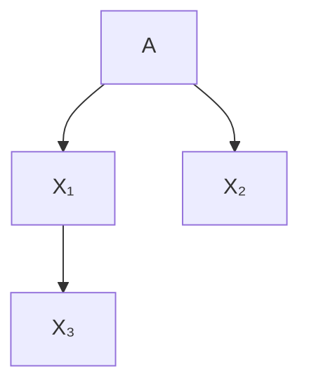

(a) IMF


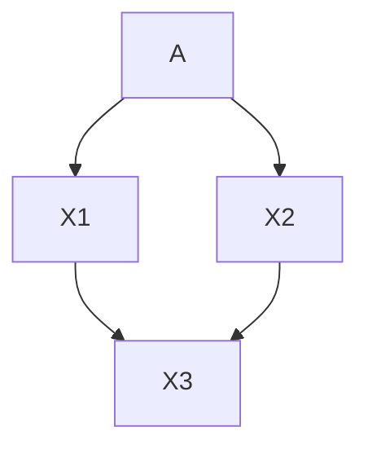

(b) CAU


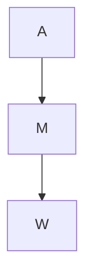

(c) Adult  
Figure 5.3: (a) & (b) Causal graphs used in $\ S \ 5 { \cdot } 4 { \cdot } 1$ . (c) The (assumed) causal graph (from Chiappa [Chi19] and Nabi and Shpitser [NS18]) used for the Adult dataset (Lic+13); A denotes the three protected attributes {sex, age, nationality}; M denotes {marital status, education level}; and W corresponds to {working class, occupation, hrs per week}. Here, we show the coarse-grained causal graph for simplicity. In practice, we model each node separately. For example, the single arrow from A to M actually corresponds to six directed edges, one from each feature in A to each feature in M.

## 5.3.4 Achieving Fair Causal Recourse

constrained optimisation. A first approach is to explicitly take constraints on the (group or individual level) fairness of causal recourse into account when training a classifier, as implemented for non-causal recourse under the IMF assumption by Gupta et al. [Gup+19]. Herein we can control the potential trade-off between accuracy and fairness with a hyperparameter. However, the optimisation problem in (5.3) involves optimising over the combinatorial space of intervention targets ${ \mathcal { T } } \subseteq \{ 1 , . . . , n \}$ , so it is unclear whether fairness of causal recourse may easily be included as a differentiable constraint.

restricting the classifier inputs. An approach that only requires qualitative knowledge in form of the causal graph (but not a fully-specified SCM), is to restrict the set of input features to the classifier to only contain non-descendants of the protected attribute. In this case, and subject to some additional assumptions stated in more detail below, individually fair causal recourse can be guaranteed.

Proposition 5.3.3. Assume h only depends on a subset ${ \tilde { \mathbf { x } } } \subseteq \mathbf { v } \setminus ( A \cup d ( A ) )$ which are non-descendants of A in ; and that the set of feasible actions and their cost remain the same under a counterfactual change of $A , \mathcal { F } ( { \mathbf { v } } ^ { F } ) = \mathcal { F } ( { \mathbf { v } } _ { a } ( { \mathbf { u } } ^ { F } ) )$ and $c ( \cdot ; \mathbf { v } ^ { F } ) = c ( \cdot ; \mathbf { v } _ { a } ( \mathbf { u } ^ { F } ) ) \ \forall a \in \mathcal { A } , \mathbf { v } ^ { F } \in \mathcal { D }$ . Then recourse for $\left( \mathcal { D } , h , c , \mathcal { M } \right)$ is “individually $C A U { \mathrm { - } } f a i r ^ { \prime \prime }$ .

Proof. According to Defn. 5.3.2, it suffices to show that

$$
r ^ {\mathrm{CAU}} (\mathbf {v} ^ {\mathsf {F}}) = r ^ {\mathrm{CAU}} \left(\mathbf {v} _ {a} \left(\mathbf {u} ^ {\mathsf {F}}\right)\right), \quad \forall a \in \mathcal {A}, \mathbf {v} ^ {\mathsf {F}} \in \mathcal {D}. \tag {5.7}
$$

Substituting our assumptions in the definition of $r ^ { \mathbf { C A U } }$ from $\ S \ 5 { \cdot } 3 { \cdot } 1$ , we obtain:

$$
r ^ {\mathrm{CAU}} (\mathbf {v} ^ {\mathsf {F}}) = \min _ {\boldsymbol {\theta} _ {\mathcal {I}} \in \mathcal {F} (\mathbf {v} ^ {\mathsf {F}})} c (\boldsymbol {\theta} _ {\mathcal {I}}; \mathbf {v} ^ {\mathsf {F}}) \mathrm{s.t.} h (\tilde {\mathbf {x}} _ {\boldsymbol {\theta} _ {\mathcal {I}}} (\mathbf {u} ^ {\mathsf {F}})) = 1,
$$

$$
r ^ {\mathrm{CAU}} (\mathbf {v} _ {a} (\mathbf {u} ^ {\mathsf {F}})) = \min _ {\boldsymbol {\theta} _ {\mathcal {I}} \in \mathcal {F} (\mathbf {v} ^ {\mathsf {F}})} c (\boldsymbol {\theta} _ {\mathcal {I}}; \mathbf {v} ^ {\mathsf {F}}) \text {s.t.} h (\tilde {\mathbf {x}} _ {\boldsymbol {\theta} _ {\mathcal {I}}, a} (\mathbf {u} ^ {\mathsf {F}})) = 1.
$$

It remains to show that

$$
\tilde {\mathbf {x}} _ {\boldsymbol {\theta} _ {\mathcal {I}}, a} (\mathbf {u} ^ {\mathsf {F}}) = \tilde {\mathbf {x}} _ {\boldsymbol {\theta} _ {\mathcal {I}}} (\mathbf {u} ^ {\mathsf {F}}), \quad \forall \boldsymbol {\theta} _ {\mathcal {I}} \in \mathcal {F} (\mathbf {v} ^ {\mathsf {F}}), a \in \mathcal {A}
$$

which follows from applying do-calculus (Pea09) since $\tilde { \mathbf { X } }$ does not contain any descendants of A by assumption, and is thus not influenced by counterfactual changes to A. □

The assumption of Prop. 5.3.3 that both the set of feasible actions $\mathcal { F } ( \mathbf { v } ^ { \mathsf { F } } )$ and the cost function $c ( \cdot ; \bar { \mathbf { v } } ^ { \mathsf { F } } )$ remain the same under a counterfactual change to the protected attribute may not always hold. For example, if a protected group were precluded (by law) or discouraged from performing certain recourse actions such as taking on a particular job or applying for a certification, that would constitute such a violation due to a separate source of discrimination.

Moreover, since protected attributes usually represent socio-demographic features (e.g., age, gender, ethnicity, etc), they often appear as root nodes in the causal graph and have downstream effects on numerous other features. Forcing the classifier to only consider non-descendants of A as inputs, as in Prop. 5.3.3, can therefore lead to a drop in accuracy which can be a restriction (WZW19).

abduction / representation learning. We have shown that considering only non-descendants of A is a way to achieve individually CAU-fair recourse. In particular, this also applies to the unobserved variables U which are, by definition, not descendants of any observed variables. This suggests to use $U _ { i }$ in place of any descendants $X _ { i }$ of A when training the classifier—in a way, $U _ { i }$ can be seen as a “fair representation” of $X _ { i }$ since it is an exogenous component that is not due to A. However, as U is unobserved, it needs to be inferred from the observed $\mathbf { v } ^ { \mathsf { F } }$ , corresponding to the abduction step of counterfactual reasoning. Great care needs to be taken in learning such a representation in terms of the (fair) background variables as (untestable) counterfactual assumptions are required Kus+17, § 4.1.

## 5.4 experiments

We perform two sets of experiments. First, we verify our main claims in numerical simulations (§ 5.4.1). Second, we use our causal measures of fair recourse to conduct a preliminary case study on the Adult dataset (§ 5.4.2). We refer to D.1 for further experimental details and to D.2 for additional results and analyses.7

## 5.4.1 Numerical Simulations

data. Since computing recourse actions, in general, requires knowledge (or estimation) of the true SCM, we first consider a controlled setting with two kinds of synthetic data:

• IMF: the setting underlying IMF recourse where features do not causally influence each other, but may depend on the protected attribute A.
• CAU: features causally depend on each other and on A. We use $\{ X _ { i } \ : = \ f _ { i } ( A , { \mathrm { P A } } _ { i } ) + { \dot { U } } _ { i } \} _ { i = 1 } ^ { n }$ with linear (CAU-LIN) and nonlinear (CAU-ANM) $f _ { i }$ .

The corresponding causal graphs are included in Fig.3 of (Küg+22). We use n = 3 non-protected features $X _ { i }$ and a binary protected attribute $A \in \{ 0 , 1 \}$ } in all our experiments and generate labelled datasets of N = 500 observations using the SCMs described in more detail in D.1.1. The ground truth (GT) labels $\hat { y } ^ { i }$ used to train different classifiers are sampled as $\dot { Y } ^ { i } \sim \mathrm { B e r n o u l l i } ( h ( \mathbf { x } ^ { i } ) )$ where $h ( \mathbf { x } ^ { i } )$ is a linear or nonlinear logistic regression, independently of A, as detailed inD.1.2.

classifiers. On each data set, we train several (“fair”) classifiers. We consider linear and nonlinear logistic regression (LR), and different support vector machines (SVMs; SS02) (for ease of comparison with Gupta et al. [Gup+19]), trained on varying input sets:

• $\operatorname { L R } / \operatorname { S V M } ( \mathbf { X } , A )$ : trained on all features (naïve baseline);
• LR/SVM(X): trained only on non-protected features X (unaware baseline);
• FairSVM(X, A): the method of Gupta et al. [Gup+19], designed to equalise the average distance to the decision boundary across different protected groups;

• $\mathrm { L R / S V M ( X _ { n d } ) }$ : trained only on features $\mathbf { \boldsymbol { x } } _ { \mathrm { \scriptscriptstyle n d } ( A ) }$ which are nondescendants of A, see $\ S _ { 5 } . 3 . 4 ;$
• $\mathrm { L R / S V M ( X _ { n d } , U _ { d } ) }$ : trained on non-descendants $\mathbf { X } _ { \mathrm { n d } ( A ) }$ of A and on the unobserved variables $\mathbf { U } _ { \mathrm { d } ( A ) }$ corresponding to features $\mathbf { X } _ { \mathrm { d } ( A ) }$ ) which are descendants of A, see $\ S 5 . 3 . 4$ .

To make distances comparable across classifiers, we use either a linear or polynomial kernel for all SVMs (depending on the GT labels) and select all remaining hyperparameters (including the trade-off parameter λ for FairSVM) using 5-fold cross validation. Results for kernel selection by cross-validation are also provided in D.2 in D.2.3. Linear (nonlinear, resp.) LR is used when the GT labels are generated using linear (nonlinear, resp.) logistic regression, as detailed inD.1.2.

solving the causal recourse optimisation problem. We treat A and all $U _ { i }$ as non-actionable and all $X _ { i }$ as actionable. For each negatively predicted individual, we discretise the space of feasible actions, compute the efficacy of each action using a learned approximate SCM $( \mathcal { M } _ { \mathrm { K R } } )$ (following Karimi et al. [Kar+20b], see D.2.2 for details), and select the least costly valid action resulting in a favourable outcome. Results using the true oracle SCM ( ⋆) and a linear estimate thereof $( \mathcal { M } _ { \mathrm { L I N } } )$ are included in Tabs. 3 and $4$ in D.2.2; the trends are mostly the same as for $\mathcal { M } _ { \mathrm { K R } }$ .

metrics. We report (a) accuracy (Acc) on a held out test set of size 3000; and (b) fairness of recourse as measured by average distance to the boundary $( \Delta _ { \mathsf { d i s t } }$ , Defn. 5.2.1) (Gup+19), and our causal group-level $( \Delta _ { \mathsf { c o s t } }$ , Defn. 5.3.1) and individual level $( \Delta _ { \mathrm { i n d v } } ,$ Defn. 5.3.2) criteria. For (b), we select 50 negatively classified individuals from each protected group and report the difference in group-wise means $( \Delta _ { \mathsf { d i s t } }$ and $\Delta _ { \mathsf { c o s t } } )$ or the maximum difference over all 100 individuals $( \Delta _ { \mathrm { i n d v } } )$ . To facilitate a comparison between the different SVMs, $\Delta _ { \mathsf { d i s t } }$ is reported in terms of absolute distance to the decision boundary in units of margins. As a cost function in the causal recourse optimisation problem, we use the L2 distance between the intervention value $\pmb { \theta } _ { \mathcal { T } }$ and the factual value of the intervention targets $\mathbf { x } _ { \mathcal { T } } ^ { \mathsf { F } }$ .

results. Results are shown in Tab. 5.2. We find that the naïve and unaware baselines generally exhibit high accuracy and rather poor performance in terms of fairness metrics, but achieve surprisingly low $\Delta _ { \mathsf { c o s t } }$ on some datasets. We observe no clear preference of one baseline over the other, consistent with prior work showing that blindness to protected attributes is not necessarily beneficial for fair prediction (Dwo+12); our results suggest this is also true for fair recourse.

FairSVM generally performs well in terms of $\Delta _ { \mathsf { d i s t } }$ (which is what it is trained for), especially on the two IMF datasets, and sometimes (though not consistently) outperforms the baselines on the causal fairness metrics. However, this comes at decreased accuracy, particularly on linearly-separable data.

Both of our causally-motivated setups, $\operatorname { L R } / \operatorname { S V M } ( \mathbf { X } _ { \mathrm { n d } ( A ) } )$ and $\mathrm { L R } / \mathrm { S V M } ( \mathbf { X } _ { \mathrm { n d } ( A ) } , \mathbf { U } _ { \mathrm { d } ( A ) } )$ , achieve $\begin{array} { r l r } { \Delta _ { \mathrm { i n d v } } } & { { } = } & { 0 } \end{array}$ throughout as expected per Prop. 5.3.3, and they are the only methods to do so. Whereas the former comes at a substantial drop in accuracy due to access to fewer predictive features (see $\ S \_ 5 . 3 . 4 )$ , the latter maintains high accuracy by additionally relying on (the true) $\mathbf { U } _ { \mathrm { d } ( A ) }$ for prediction. Its accuracy should be understood as an upper bound on what is possible while preserving “individually CAU-fair” recourse if abduction is done correctly, see the discussion in $\ S 5 { . } 3 { . } 4$ .

Generally, we observe no clear relationship between the different fairness metrics: e.g., low $\Delta _ { \mathsf { d i s t } }$ does not imply low $\Delta _ { \mathsf { c o s t } }$ (nor vice versa) justifying the need for taking causal relations between features into account (if present) to enforce fair recourse at the group-level. Likewise, neither small $\Delta _ { d i s t }$ nor small $\Delta _ { c o s 1 }$ t imply small $\Delta _ { i n d v } ,$ , consistent with Prop. 5.3.1, and, empirically, the converse does not hold either.

summary of main findings from $8 \ 5 . 4 . 1 3$ The non-causal metric $\Delta _ { \mathsf { d i s t } }$ does not accurately capture recourse unfairness on the CAUdatasets where causal relations are present, thus necessitating our new causal metrics $\Delta _ { \mathsf { c o s t } }$ and $\Delta _ { \mathrm { i n d v } }$ . Methods designed in accordance with Prop. 5.3.3 indeed guarantee individually fair recourse, and group fairness does not imply individual fairness, as expected per Prop. 5.3.1.

## 5.4.2 Case Study on the Adult Dataset

data. We use the Adult dataset (Lic+13), which consists of 45k+ samples without missing data. We process the dataset similarly to Chiappa [Chi19] and Nabi and Shpitser [NS18] and adopt the causal graph assumed therein (see also Fig. 3c of (Küg+22)). The eight heterogeneous variables include the three binary protected attributes sex (m=male, f=female), age (binarised as $\mathbb { I } \{ { \mathrm { a g e } } \geq 3 8 \}$ ; y=young, o=old), and nationality (Nat; US vs non-US), as well as five non-protected features: marital status (MS; categorical), education level (Edu; integer), working class (WC; categorical), occupation (Occ; categorical), and hours per week (Hrs; integer). We treat the protected attributes and marital status as non-actionable, and the remaining variables as actionable when searching for recourse actions.

experimental setup. We extend the probabilistic framework of Karimi et al. [Kar+20b] to consider causal recourse in the presence of heterogeneous features, see D.2.2 for more details. We use a nonlinear $\operatorname { L R } ( \mathbf { X } )$ as a classifier $( \mathrm { i . e . , }$ , fairness through unawareness) which attains 78.4% accuracy, and (approximately) solve the recourse optimisation problem $\left( 5 . 3 \right)$ using brute force search as in $\ S \ 5 { \cdot } 4 { \cdot } 1$ . We compute the best recourse actions for 10 (uniformly sampled) negatively predicted individuals from each of the eight different protected groups (all $2 ^ { 3 }$ combinations of the three protected attributes), as well as for each of their seven counterfactual twins, and evaluate using the same metrics as in $\ S \uparrow . 4 . 1$ .

results. At the group level, we obtain $\Delta _ { \sf d i s t } = 0 . 8 9$ and $\Delta _ { \tt c o s t } = 3 3 . 3 2 ,$ , indicating group-level recourse discrimination. Moreover, the maximum difference in distance is between old US males and old non-US females (latter is furthest from the boundary), while that in cost is between old US females and old non-US females (latter is most costly). This quantitative and qualitative difference between $\Delta _ { \mathsf { d i s t } }$ and $\Delta _ { \mathsf { c o s t } }$ emphasises the general need to account for causal-relations in fair recourse, as present in the Adult dataset.

At the individual-level, we find an average difference in recourse cost to the counterfactual twins of 24.32 and a maximum difference $( \Delta _ { \mathrm { i n d v } } )$ of 61.53. The corresponding individual/factual observation for which this maximum is obtained is summarised along with its seven counterfactual twins in Tab. 5.3, see the caption for additional analysis.

summary of main findings from $\ S 5 . 4 . 2 \colon$ Our causal fairness metrics reveal qualitative and quantitative aspects of recourse discrimination at both the group and individual level. In spite of efforts to design classifiers that are predictively fair, recourse unfairness remains a valid concern on real datasets.

## 5.5 on societal interventions

Our notions of fair causal recourse (Defns. 5.3.1 and 5.3.2) depend on multiple components $\left( \mathcal { D } , h , c , \mathcal { M } \right)$ . As discussed in $\ S \ 5 { \cdot } 1 ,$ in fair ML, the typical procedure is to alter the classifier h. This is the approach proposed for Equalizing Recourse by Gupta et al. [Gup+19], which we have discussed in the context of fair causal recourse $( \ S \ 5 . 3 . 4 )$ and explored experimentally $( \ S \ 5 . 4 )$ . However, requiring the learnt classifier h to satisfy some constraint implicitly places the cost of an intervention on the deployer. For example, a bank might need to modify their classifier so as to offer credit cards to some individuals who would not otherwise receive them.

Another possibility is to alter the data-generating process (as captured by the SCM  and manifested in the form of the observed data ) via a societal intervention in order to achieve fair causal recourse with a fixed classifier h. By considering changes to the underlying SCM or to some of its mechanisms, we may facilitate outcomes which are more societally fair overall, and perhaps end up with a dataset that is more amenable to fair causal recourse (either at the group or individual level). Unlike the setup of Gupta et al. [Gup+19], our causal approach here is perhaps particularly well suited to exploring this perspective, as we are already explicitly modelling the causal generative process, i.e., how changes to parts of the system will affect the other variables.

We demonstrate our ideas for the toy example with different variances across groups from Fig. 5.1. Here, the difference in recourse cost across groups cannot easily be resolved by changing the classifier h (e.g., per the techniques in $\ S _ { 5 \cdot 3 \cdot 4 } )$ : to achieve perfectly fair recourse, we would have to use a constant classifier, i.e., either approve all credit cards, or none, irrespective of income. Essentially, changing h does not address the root of the problem, namely the discrepancy in the two populations. Instead, we investigate how to reduce the larger cost of recourse within the higher-variance group by altering the data generating process via societal interventions.

Let $i _ { k }$ denote a societal intervention that modifies the data generating process, $X : = ( 2 - A ) U _ { X } , U _ { X } \sim \mathcal { N } ( 0 , 1 )$ , by changing the original SCM  to $\mathcal { M } _ { k } ^ { \prime } = i _ { k } ( \mathcal { M } )$ . For example, $i _ { k }$ may introduce additional variables or modify a subset of the original structural equations. Specifically, we consider subsidies to particular eligible individuals. We introduce a new treatment variable T which randomly selects a proportion $0 \leq p \leq 1$ of individuals from $A = 0$ who are awarded a subsidy s if their latent variable $U _ { X }$ is below a threshold $t . ^ { 8 }$ This is captured by the modified structural equations

$$
T := (1 - A) \mathbb {I} \{U _ {T} <   p \}, \quad U _ {T} \sim \text { Uniform } [ 0, 1 ],
$$

$$
X := (2 - A) U _ {X} + s T \mathbb {I} \{U _ {X} <   t \}, \qquad U _ {X} \sim \mathcal {N} (0, 1).
$$

Here, each societal intervention $i _ { k }$ thus corresponds to a particular way of setting the triple $\left( p , t , s \right)$ . To avoid changing the predictions sgn(X), we only consider $t \leq 0$ and $s \leq - 2 t$ . The modified distribution resulting from $i _ { k } \doteq ( 1 , - 0 . 7 5 , 1 . 5 )$ is shown in Fig. 5.4a, see the caption for details.

To evaluate the effectiveness of different societal interventions $i _ { k }$ in reducing recourse unfairness, we compare their associated societal costs $c _ { k }$ andFigure 5.4: (a) Distribution after applying a societal intervention to the credit-card example from Fig. 5.1. We randomly select a proportion $p = 1$ of individuals from the disadvantaged group (blue, $A = 0 )$ to receive a subsidy $s = 1 . 5$ if $U _ { X }$ is below the threshold $t = - 0 . 7 5$ . As a result, the distribution of negatively-classified individuals $( X < 0 )$ shifts towards the boundary which makes it more similar to those in $A = 1$ , thus resulting in fairer recourse. At the same time, the distribution of positivelyclassified individuals $( X > 0 )$ remains unchanged. (b) Comparison of different societal interventions $i _ { k } = ( 1 , t , - 2 t )$ ) with respect to their benefit (reduction in recourse difference) and cost (paid-out subsidies). The threshold $t \approx - 0 . 7 5$ (corresponding to the distribution shown on the left) leads to the largest reduction in recourse difference, but also incurs the highest cost. Smaller reductions can be achieved using two different thresholds: one corresponding to giving a larger subsidy to fewer individuals, and the other to giving a smaller subsidy to more individuals.

benefits $b _ { k }$ . Here, the cost $c _ { k }$ of implementing $i _ { k }$ can reasonably be chosen as the total amount of paid-out subsidies, and the benefit $b _ { k } ,$ , as the reduction in the difference of average recourse cost across groups. We then reason about different societal interventions $i _ { k }$ by simulating the proposed change via sampling data from $\mathcal { M } _ { k } ^ { \prime }$ and computing $b _ { k }$ and $c _ { k }$ based on the simulated data. To decide which intervention to implement, we compare the societal benefit $b _ { k }$ and cost $c _ { k }$ of $i _ { k }$ for different k and choose the one with the most favourable trade-off. We show the societal benefit and cost tradeoff for $i _ { k } = ( 1 , t , - 2 t )$ with varying t in Fig. 5.4b and refer to the caption for further details. Plots similar to Fig. 5.4 for different choices of $\left( p , t , s \right)$ are shown in Fig. 5 in Appendix B.1. Effectively, our societal intervention does not change the outcome of credit card approval but ensures that the effort required (additional income needed) for rejected individuals from two groups is the same. Instead of using a threshold to select eligible individuals as in the toy example above, for more complex settings, our individual-level unfairness metric (Defn. 5.3.2) may provide a useful way to inform whom to target with societal interventions as it can be used to identify individuals for whom the counterfactual difference in recourse cost is particularly high.

## 5.6 discussion

With data-driven decision systems pervading our societies, establishing appropriate fairness metrics and paths to recourse are gaining major significance. There is still much work to do in identifying and conceptually understanding the best path forward. Here we make progress towards this goal by applying tools of graphical causality. We are hopeful that this approach will continue to be fruitful as we search together with stakeholders and broader society for the right concepts and definitions, as well as for assaying interventions on societal mechanisms.

While our fairness criteria may help assess the fairness of recourse, it is still unclear how best to achieve fair causal recourse algorithmically. Here, we argue that fairness considerations may benefit from considering the larger system at play—instead of focusing solely on the classifier—and that a causal model of the underlying data generating process provides a principled framework for addressing issues such as multiple sources of unfairness, as well as different costs and benefits to individuals, institutions, and society.

Societal interventions to overcome (algorithmic) discrimination constitute a complex topic which not only applies to fair recourse but also to other notions of fairness. It deserves further study well beyond the scope of the present work.

We may also question whether it is appropriate to perform a societal intervention on all individuals in a subgroup. For example, when considering who is approved for a credit card, an individual might not be able to pay their statements on time and this could imply costs to them, to the bank, or to society. This idea relates to the economics literature which studies the effect of policy interventions on society, institutions, and individuals (HV05; Hec10). Thus, future work could focus on formalising the effect of these interventions to the SCM, as such a framework would help trade off the costs and benefits for individuals, companies, and society.

<table><tr><td rowspan="2">Classifier</td><td colspan="4">IMF</td><td colspan="4">CAU-LIN</td><td colspan="4">CAU-ANM</td></tr><tr><td>Acc</td><td> $\Delta_{\text{dist}}$ </td><td> $\Delta_{\text{cost}}$ </td><td> $\Delta_{\text{ind}}$ </td><td>Acc</td><td> $\Delta_{\text{dist}}$ </td><td> $\Delta_{\text{cost}}$ </td><td> $\Delta_{\text{ind}}$ </td><td>Acc</td><td> $\Delta_{\text{dist}}$ </td><td> $\Delta_{\text{cost}}$ </td><td> $\Delta_{\text{ind}}$ </td></tr><tr><td>SVM(X,A)</td><td>86.5</td><td>0.96</td><td>0.40</td><td>1.63</td><td>89.5</td><td>1.18</td><td>0.44</td><td>2.11</td><td>88.2</td><td>0.65</td><td>0.27</td><td>2.32</td></tr><tr><td>LR(X,A)</td><td>86.7</td><td>0.48</td><td>0.50</td><td>1.91</td><td>89.5</td><td>0.63</td><td>0.53</td><td>2.11</td><td>87.7</td><td>0.40</td><td>0.34</td><td>2.32</td></tr><tr><td>SVM(X)</td><td>86.4</td><td>0.99</td><td>0.42</td><td>1.80</td><td>89.4</td><td>1.61</td><td>0.61</td><td>2.11</td><td>88.0</td><td>0.56</td><td>0.29</td><td>2.79</td></tr><tr><td>LR(X)</td><td>86.6</td><td>0.47</td><td>0.53</td><td>1.80</td><td>89.5</td><td>0.64</td><td>0.57</td><td>2.11</td><td>87.7</td><td>0.41</td><td>0.43</td><td>2.79</td></tr><tr><td>FairSVM(X,A)</td><td>68.1</td><td>0.04</td><td>0.28</td><td>1.36</td><td>66.8</td><td>0.26</td><td>0.12</td><td>0.78</td><td>66.3</td><td>0.25</td><td>0.21</td><td>1.50</td></tr><tr><td>SVM( $X_{nd}$ )</td><td>65.5</td><td>0.05</td><td>0.06</td><td>0.00</td><td>67.4</td><td>0.15</td><td>0.17</td><td>0.00</td><td>65.9</td><td>0.31</td><td>0.37</td><td>0.00</td></tr><tr><td>LR( $X_{nd}$ )</td><td>65.3</td><td>0.05</td><td>0.05</td><td>0.00</td><td>67.3</td><td>0.18</td><td>0.18</td><td>0.00</td><td>65.6</td><td>0.31</td><td>0.31</td><td>0.00</td></tr><tr><td>SVM( $X_{nd}$ , $U_d$ )</td><td>86.5</td><td>0.96</td><td>0.58</td><td>0.00</td><td>89.6</td><td>1.07</td><td>0.70</td><td>0.00</td><td>88.0</td><td>0.21</td><td>0.14</td><td>0.00</td></tr><tr><td>LR( $X_{nd}$ , $U_d$ )</td><td>86.7</td><td>0.43</td><td>0.90</td><td>0.00</td><td>89.5</td><td>0.35</td><td>0.77</td><td>0.00</td><td>87.8</td><td>0.14</td><td>0.34</td><td>0.00</td></tr><tr><td>SVM(X,A)</td><td>90.8</td><td>0.05</td><td>0.00</td><td>1.09</td><td>91.1</td><td>0.07</td><td>0.03</td><td>1.06</td><td>90.6</td><td>0.04</td><td>0.03</td><td>1.40</td></tr><tr><td>LR(X,A)</td><td>90.5</td><td>0.08</td><td>0.03</td><td>1.06</td><td>90.6</td><td>0.09</td><td>0.01</td><td>1.00</td><td>90.6</td><td>0.19</td><td>0.22</td><td>1.28</td></tr><tr><td>SVM(X)</td><td>91.4</td><td>0.13</td><td>0.00</td><td>0.92</td><td>91.0</td><td>0.17</td><td>0.08</td><td>1.09</td><td>91.0</td><td>0.02</td><td>0.03</td><td>1.64</td></tr><tr><td>LR(X)</td><td>91.0</td><td>0.12</td><td>0.03</td><td>1.01</td><td>90.6</td><td>0.13</td><td>0.10</td><td>1.65</td><td>90.9</td><td>0.08</td><td>0.06</td><td>1.66</td></tr><tr><td>FairSVM(X,A)</td><td>90.1</td><td>0.02</td><td>0.00</td><td>1.15</td><td>90.7</td><td>0.06</td><td>0.04</td><td>1.16</td><td>90.3</td><td>0.37</td><td>0.02</td><td>1.64</td></tr><tr><td>SVM( $X_{nd}$ )</td><td>66.7</td><td>0.10</td><td>0.06</td><td>0.00</td><td>58.4</td><td>0.05</td><td>0.06</td><td>0.00</td><td>62.0</td><td>0.13</td><td>0.11</td><td>0.00</td></tr><tr><td>LR( $X_{nd}$ )</td><td>64.7</td><td>0.02</td><td>0.04</td><td>0.00</td><td>58.4</td><td>0.02</td><td>0.02</td><td>0.00</td><td>61.1</td><td>0.02</td><td>0.03</td><td>0.00</td></tr><tr><td>SVM( $X_{nd}$ , $U_d$ )</td><td>90.7</td><td>0.02</td><td>0.03</td><td>0.00</td><td>91.1</td><td>0.15</td><td>0.11</td><td>0.00</td><td>90.1</td><td>0.15</td><td>0.12</td><td>0.00</td></tr><tr><td>LR( $X_{nd}$ , $U_d$ )</td><td>90.9</td><td>0.28</td><td>0.05</td><td>0.00</td><td>90.9</td><td>0.49</td><td>0.07</td><td>0.00</td><td>90.2</td><td>0.43</td><td>0.21</td><td>0.00</td></tr></table>

<table><tr><td rowspan="3">Classifier</td><td colspan="11">GT labels from lin. LR → using lin. kernel / lin. LR</td><td colspan="11">GT labels from nonlin. LR → using polynomial kernel / nonlin. LR</td><td></td></tr><tr><td colspan="4">IMF</td><td colspan="4">CAU-LIN</td><td colspan="3">CAU-ANM</td><td colspan="4">IMF</td><td colspan="4">CAU-LIN</td><td colspan="3">CAU-ANM</td><td></td></tr><tr><td>Acc</td><td> $\Delta_{\text{dist}}$ </td><td> $\Delta_{\text{cost}}$ </td><td> $\Delta_{\text{ind}}$ </td><td>Acc</td><td> $\Delta_{\text{dist}}$ </td><td> $\Delta_{\text{cost}}$ </td><td> $\Delta_{\text{ind}}$ </td><td>Acc</td><td> $\Delta_{\text{dist}}$ </td><td> $\Delta_{\text{cost}}$ </td><td> $\Delta_{\text{ind}}$ </td><td>Acc</td><td> $\Delta_{\text{dist}}$ </td><td> $\Delta_{\text{cost }}$ </td><td> $\Delta_{\text{ind}}$ </td><td>Acc</td><td> $\Delta_{\text{dist}}$ </td><td> $\Delta_{\text{cost}}$ </td><td> $\Delta_{\text{ind}}$ </td><td>Acc</td><td> $\Delta_{\text{dist}}$ </td><td> $\Delta_{\text{cost}}$ </td></tr><tr><td>SVM(X,A)</td><td>86.5</td><td>0.96</td><td>0.40</td><td>1.63</td><td>89.5</td><td>1.18</td><td>0.44</td><td>2.11</td><td>88.2</td><td>0.65</td><td>0.27</td><td>2.32</td><td>90.8</td><td>0.05</td><td>0.00</td><td>1.09</td><td>91.1</td><td>0.07</td><td>0.03</td><td>1.06</td><td>90.6</td><td>0.04</td><td>0.03</td></tr><tr><td>LR(X,A)</td><td>86.7</td><td>0.48</td><td>0.50</td><td>1.91</td><td>89.5</td><td>0.63</td><td>0.53</td><td>2.11</td><td>87.7</td><td>0.40</td><td>0.34</td><td>2.32</td><td>90.5</td><td>0.08</td><td>0.03</td><td>1.06</td><td>90.6</td><td>0.09</td><td>0.01</td><td>1.00</td><td>90.6</td><td>0.19</td><td>0.22</td></tr><tr><td>SVM(X)</td><td>86.4</td><td>0.99</td><td>0.42</td><td>1.80</td><td>89.4</td><td>1.61</td><td>0.61</td><td>2.11</td><td>88.0</td><td>0.56</td><td>0.29</td><td>2.79</td><td>91.4</td><td>0.13</td><td>0.00</td><td>0.92</td><td>91.0</td><td>0.17</td><td>0.08</td><td>1.09</td><td>91.0</td><td>0.02</td><td>0.03</td></tr><tr><td>LR(X)</td><td>86.6</td><td>0.47</td><td>0.53</td><td>1.80</td><td>89.5</td><td>0.64</td><td>0.57</td><td>2.11</td><td>87.7</td><td>0.41</td><td>0.43</td><td>2.79</td><td>91.0</td><td>0.12</td><td>0.03</td><td>1.01</td><td>90.6</td><td>0.13</td><td>0.10</td><td>1.65</td><td>90.9</td><td>0.08</td><td>0.06</td></tr><tr><td>FairSVM(X,A)</td><td>68.1</td><td>0.04</td><td>0.28</td><td>1.36</td><td>66.8</td><td>0.26</td><td>0.12</td><td>0.78</td><td>66.3</td><td>0.25</td><td>0.21</td><td>1.50</td><td>90.1</td><td>0.02</td><td>0.00</td><td>1.15</td><td>90.7</td><td>0.06</td><td>0.04</td><td>1.16</td><td>90.3</td><td>0.37</td><td>0.02</td></tr><tr><td>SVM( $X_{\text{nd}}$ )</td><td>65.5</td><td>0.05</td><td>0.06</td><td>0.00</td><td>67.4</td><td>0.15</td><td>0.17</td><td>0.00</td><td>65.9</td><td>0.31</td><td>0.37</td><td>0.00</td><td>66.7</td><td>0.10</td><td>0.06</td><td>0.00</td><td>58.4</td><td>0.05</td><td>0.06</td><td>0.00</td><td>62.0</td><td>0.13</td><td>0.11</td></tr><tr><td>LR( $X_{\text{nd}}$ )</td><td>65.3</td><td>0.05</td><td>0.05</td><td>0.00</td><td>67.3</td><td>0.18</td><td>0.18</td><td>0.00</td><td>65.6</td><td>0.31</td><td>0.31</td><td>0.00</td><td>64.7</td><td>0.02</td><td>0.04</td><td>0.00</td><td>58.4</td><td>0.02</td><td>0.02</td><td>0.00</td><td>61.1</td><td>0.02</td><td>0.03</td></tr><tr><td>SVM( $X_{\text{nd}}, U_d$ )</td><td>86.5</td><td>0.96</td><td>0.58</td><td>0.00</td><td>89.6</td><td>1.07</td><td>0.70</td><td>0.00</td><td>88.0</td><td>0.21</td><td>0.14</td><td>0.00</td><td>90.7</td><td>0.02</td><td>0.03</td><td>0.00</td><td>91.1</td><td>0.15</td><td>0.11</td><td>0.00</td><td>90.1</td><td>0.15</td><td>0.12</td></tr><tr><td>LR( $X_{\text{nd}}, U_d$ )</td><td>86.7</td><td>0.43</td><td>0.90</td><td>0.00</td><td>89.5</td><td>0.35</td><td>0.77</td><td>0.00</td><td>87.8</td><td>0.14</td><td>0.34</td><td>0.00</td><td>90.9</td><td>0.28</td><td>0.05</td><td>0.00</td><td>90.9</td><td>0.49</td><td>0.07</td><td>0.00</td><td>90.2</td><td>0.43</td><td>0.21</td></tr></table>

<table><tr><td></td><td>SEX</td><td>AGE</td><td>NAT</td><td>MS</td><td>EDU</td><td>WC</td><td>OCC</td><td>HRS</td><td>RECOURSE ACTION</td><td>COST</td></tr><tr><td>CF</td><td>m</td><td>y</td><td>US</td><td>married</td><td>Some Collg.</td><td>Private</td><td>Sales</td><td>32.3</td><td>do(Edu: Prof-school, WC: Private)</td><td>6.2</td></tr><tr><td>CF</td><td>m</td><td>y</td><td>non-US</td><td>married</td><td>HiSch. Grad</td><td>Private</td><td>Sales</td><td>27.8</td><td>do(WC: Self-empl., Hrs: 92.0)</td><td>64.2</td></tr><tr><td>CF</td><td>m</td><td>o</td><td>US</td><td>married</td><td>Some Collg./Bachelors</td><td>Private</td><td>Cleaner</td><td>36.2</td><td>do(Edu: Prof-school, WC: Private)</td><td>5.5</td></tr><tr><td>CF</td><td>m</td><td>o</td><td>non-US</td><td>married</td><td>HiSch. Grad</td><td>Private</td><td>Sales</td><td>30.3</td><td>do(WC: Self-empl., Hrs: 92.0)</td><td>61.7</td></tr><tr><td>CF</td><td>f</td><td>y</td><td>US</td><td>married</td><td>Some Collg.</td><td>Self-empl.</td><td>Sales</td><td>27.3</td><td>do(Hrs: 92.0)</td><td>64.7</td></tr><tr><td>CF</td><td>f</td><td>y</td><td>non-US</td><td>married</td><td>HiSch. Grad</td><td>Self-empl.</td><td>Sales</td><td>24.0</td><td>do(Edu: Some Collg., WC: Self-empl., Hrs: 92.0)</td><td>68.0</td></tr><tr><td>CF</td><td>f</td><td>o</td><td>US</td><td>married</td><td>HiSch./Some Collg.</td><td>Private</td><td>Sales</td><td>28.8</td><td>do(Edu: Prof-school, WC: Private)</td><td>6.4</td></tr><tr><td>F</td><td>f</td><td>o</td><td>non-US</td><td>married</td><td>HiSch. Grad</td><td>W/o pay</td><td>Sales</td><td>25</td><td>do(Hrs: 92.0)</td><td>67.0</td></tr></table>

# Robust Causal Algorithmic Recourse

## Chapter Abstract

Algorithmic recourse seeks to provide actionable recommendations for individuals to overcome unfavorable outcomes made by automated decisionmaking systems. Recourse recommendations should ideally be robust to reasonably small uncertainty in the features of the individual seeking recourse. In this work, we formulate the adversarially robust recourse problem and show that recourse methods offering minimally costly recourse fail to be robust. We then present methods for generating adversarially robust recourse in the linear and in the differentiable case. Finally, we empirically show that regularizing the decision-making classifier to rely more strongly on actionable features facilitates the existence of adversarially robust recourse.

## 6.1 introduction

Machine learning (ML) classifiers are increasingly being used for consequential decision-making in domains such as justice and finance (e.g., granting pretrial bail or loan approval). The need to preserve human agency despite the rise in automatic decisions faced by individuals has motivated the study of algorithmic recourse, which aims to empower individuals by providing them with actionable recommendations to reverse unfavourable algorithmic decisions (USL19). Prior works have argued that for recourse to warrant trust, the decision-maker must commit to reversing an unfavourable decision upon the decision-subject fully adopting their prescribed recourse recommendations (WMR17; VA20; Kar+22). We argue that if algorithmic recourse is indeed to be treated as a contractual agreement, then recourse recommendations must be robust to plausible uncertainties arising in the recourse process.

For instance, consider a bank that commits to approving the loan of an individual if they increase their savings by some amount. Suppose that by the time the individual achieves the prescribed savings increase, the individual’s weekly working hours have been slightly reduced due to unforeseen circumstances, and the classifier still deems the individual likely to default on the loan. Shielding the recourse recommendation against uncertainty expost by nonetheless granting the loan may be detrimental to both the bank (e.g., monetary loss) and the individual (e.g., bankruptcy and inability to secure future loans), while breaking the recourse promise would negate the effort exerted by the individual and erode trust in the decision maker. We therefore argue for the necessity of ensuring that recourse recommendations are ex-ante robust to uncertainty.

In this work, we direct our focus towards robustifying recourse recommendations against uncertainty in the features of the individual seeking recourse. Such uncertainty may arise due to the temporal nature of recourse (e.g., some features may not be static), and/or the presence of noise, adversarial manipulation and other misrepresentations or errors. We adopt a robust optimization view and propose to characterize the uncertainty around the reported features of the individual x by defining an uncertainty set B(x) which we assume contains the true features of the individual at the time recourse is offered and/or plausible changes to the individual’s features arising due to the temporal nature of recourse. We then seek robust recourse recommendations which remain valid (i.e., lead to favourable classification outcomes) for all plausible individuals in the uncertainty set, as illustrated in Figure 6.1. We refer to this notion of robustness as the adversarial robustness of recourse.


Robust
recourse action
Non-robust
recourse action
x

Figure 6.1: Adversarially robust recourse actions must lead to positive classification outcomes for all individuals in the uncertainty set around the individual x seeking recourse.

We study the adversarial robustness of recourse from the lens of causality (Pea09). Causal recourse views recourse recommendations as causal interventions on the features of the decision-subject (KSV21), and therefore presents a more faithful account of how the features of the individual change as the individual acts on their recourse recommendations, provided that the underlying structural causal model is known or can be approximated reasonably well (Kar+20b).

## contributions

• We formulate the adversarially robust recourse problem and show that minimum-cost recourse recommendations are provably fragile to uncertainty in the features of the individual seeking recourse.
• We present methods for generating adversarially robust causal recourse in the linear and in the differentiable case. We demonstrate their effectiveness on five tabular datasets, for linear and neural network classifiers.
• We propose a model regularizer that encourages the decision-making classifier to rely more strongly on actionable features. We empirically show that our proposed model regularizer facilitates the existence of adversarially robust recourse.

## 6.2 background and related work

## 6.2.1 Background on causality

We assume that the data-generating process of the features $\mathbf { X } = \{ X _ { 1 } , \ldots , X _ { n } \}$ of individuals $\textbf { \textit { x } } \in \mathbf { \textit { X } }$ is characterised by a known structural causal model (SCM) (Pea09) $\begin{array} { r l r } { \mathcal { M } } & { { } = } & { \left( { \mathbb S } , P _ { \mathbf { U } } \right) } \end{array}$ . The structural equations $\begin{array} { r l } { \mathbb { S } } & { { } = } \end{array}$ $\left\{ X _ { i } : = f _ { i } \left( \mathbf { \boldsymbol { X } } _ { \mathtt { p a } ( i ) } , U _ { i } \right) \right\} _ { i = 1 } ^ { n }$ describe the causal relationship between any given feature $X _ { i } ,$ , its direct causes $\mathbf { X } _ { \mathrm { p a } ( i ) }$ and some exogenous variable $U _ { i }$ as a deterministic function $f _ { i } .$ . The exogenous variables $\textbf { U } \in \boldsymbol { \mathcal { U } } ,$ , which are distributed according to some probability distribution $P _ { \mathbf { U } }$ , represent unobserved background factors which are responsible for the variations observed in the data. We assume that the causal graph  implied by the SCM, with nodes $\mathbf { x } \cup \mathbf { U }$ and edges $\{ ( v , \mathbf { X } _ { i } ) : v \in \dot { \mathbf { X } _ { \mathrm { p a } ( i ) } } \cup U _ { i } , i \in [ 1 , n ] \}$ , is acyclic. The SCM then implies a unique observational distribution p over the features X. Moreover, the structural equations S induce a mapping $\mathbb { S } : \mathcal { U } \ : \to \ : \mathcal { X }$ between exogenous and endogenous variables. Under the assumption that the exogenous variables are mutually independent (causal sufficiency), if there exists some inverse mapping $\mathbb { S } ^ { - 1 } : \dot { \mathcal { X } } \to \mathcal { U }$ such that $\mathbb { S } \left( \mathbb { S } ^ { - 1 } ( \mathbf { x } ) \right) = \mathbf { x } \ \forall x \in \mathcal { X } ,$ then the endogenous variables corresponding to some individual $\mathbf { x } \in \mathcal { X }$ are uniquely identifiable by $\mathbf { U } | \mathbf { x } = \mathbb { S } ^ { - 1 } ( \mathbf { x } )$ .

SCMs allow for modelling and evaluating the effect of interventions on the system which the SCM models. Hard interventions do $( \mathbf { X } _ { \mathcal { I } } : = \pmb { \theta } )$ (Pea09) fix the values of a subset ${ \mathcal { T } } \subseteq [ d ]$ ] of features $\mathbf { \boldsymbol { x } } _ { \mathcal { T } }$ to some $\pmb \theta \in \mathbb { R } ^ { | \mathcal { T } | }$ by altering the structural equations of the intervened upon variables $\mathbb { S } _ { \mathcal { T } _ { i } } ^ { \mathrm { d o } ( \mathbf { X } _ { \mathcal { T } } : = \pmb { \theta } ) } = \mathbf { X } _ { \mathcal { T } _ { i } } : = \pmb { \theta } _ { i }$ while preserving the rest of the structural equations $\mathbb { S } _ { i } ^ { \mathrm { d o } ( \pmb { \chi } _ { \mathbb { Z } } : = \pmb { \theta } ) } = \mathbb { S } _ { i }$ Consequently, hard interventions sever the causal relationship between an intervened upon variables and all of its ancestors in the causal graph. Soft interventions, on the other hand, may modify the structural equations in a more general manner (Kor+04). In particular, additive interventions perturb the features X with some perturbation vector $\boldsymbol { \Delta \mathbf { \Psi } } \in \mathbb { R } ^ { n }$ while preserving all causal relationships, altering the structuralCF equations according to

$$
\mathbb {S} ^ {\Delta} = \left\{X _ {i} := f _ {i} \left(\mathbf {X} _ {\mathrm{pa} (i)}, U _ {i}\right) + \Delta_ {i} \right\} _ {i = 1} ^ {n} (\text { ESo7 }).
$$

Moreover, SCMs imply distributions over counterfactuals, allowing to reason about what would have happened under certain hypothetical interventions all else being equal. Under the aforementioned assumptions, the counterfactual $\mathbf { x } ^ { \mathsf { C F } }$ pertaining to some observed factual individual $\textbf { \em x } \in { \mathcal { X } }$ under some hypothetical hard intervention do $( \mathbf { X } _ { \mathcal { T } } : = \theta )$ (resp. soft intervention $\Delta )$ can be computed by first determining the exogenous variables $\mathbf { U } | \mathbf { x } = \mathbb { S } ^ { - 1 } \left( \mathbf { x } \right)$ corresponding to the individual $\mathbf { x , }$ and then applying the interventional mapping $\mathbb { S } ^ { \mathrm { d o } ( \mathbf { X } _ { \mathcal { T } } : = \pmb { \theta } ) }$ $( \mathrm { r e s p . } \mathbb { S } ^ { \Delta } )$ from endogenous to exogenous variables (Pea09). For notational convenience, we denote such mapping as $\mathbf { x } ^ { \mathbb { C } \mathbb { F } } = \mathbb { C } \mathbb { F } \left( \mathbf { x } , \mathrm { d o } ( \mathbf { X } _ { \mathcal { T } } : = \pmb { \theta } ) \right) : = \mathbb { S } ^ { \mathrm { d o } ( \mathbf { X } _ { \mathcal { T } } : = \pmb { \theta } ) } \left( \mathbb { S } ^ { - 1 } \left( \mathbf { x } \right) \right)$ (resp. $\mathbf { x } ^ { \mathsf { C F } } = \mathbb { C F } \left( { \bar { \mathbf { x } } } , { \bar { \Delta } } \right) : =$ $\mathbb { S } ^ { \Delta } \left( \mathbb { S } ^ { - 1 } \left( \mathbf { x } \right) \right) )$ I. We use the notation $\begin{array} { r } { \mathbf { x } ^ { \mathsf { C F } } ~ = ~ \mathbb { C F } \left( \mathbf { x } , \mathbf { d o } ( \mathbf { X } _ { \mathcal { T } } : = \pmb { \theta } ) , \mathcal { M } \right) } \end{array}$ (resp. $\mathbf { x } ^ { \mathsf { C F } } \overset { \cdot } { = } \mathbb { C F } \left( \mathbf { x } , \Delta , \mathcal { M } \right) )$ I to highlight that the counterfactual corresponds to a particular structural causal model .

## 6.2.2 The causal recourse problem

Consider the setting where a classifier $h : \mathcal { X }  \{ 0 , 1 \}$ is used to assign either favourable or unfavourable outcomes to individuals $\mathbf { x } \in \mathcal { X }$ (e.g., loan approval). We adopt the causal view of recourse introduced by Karimi et al. [KSV21] and model recourse recommendations as a hard interventions on the features of the individual seeking recourse, that is, $\boldsymbol { a } = \mathrm { d } \mathbf { o } ( \mathbf { X } _ { \mathcal { T } } : = \mathbf { x } _ { \mathcal { T } } + \pmb { \theta } )$ ), where θ is the prescribed change to some variables $\mathbf { \boldsymbol { x } } _ { \mathcal { T } }$ . We consider this additive form, rather than $\boldsymbol { a } = \mathrm { d o } ( \mathbf { X } _ { \mathcal { T } } : = \boldsymbol { \theta } )$ as Karimi et al. [KSV21], to explicitly allow for uncertainty in the factual individual x to propagate to the recourse recommendation a.

For a recourse action a to be considered valid, the corresponding counterfactual individual must be favourably classified, that is, $h \left( \mathbb { C F } \left( \mathbf { x } , a , \mathcal { M } \right) \right) = 1$ . Since certain features may be immutable $( \mathrm { e . g . , r a c e ) }$ or bounded (e.g., age), only feasible actions should be recommended. The action feasibility set $\mathcal { F } ( \mathbf { x } )$ captures the set of feasible actions available to the individual x. Ideally, recourse recommendations should incur the least amount of effort possible for decision-subjects, where the cost function $c ( \mathbf { x } , a )$ models the effort required by an individual $\textbf { \em x } \in { \mathcal { X } }$ to implement the recourse action a. Finding the minimum-cost recourse action for some individual $\mathbf { x } \in \mathcal { X }$ is therefore equivalent to solving the following optimization problem:

$$
\underset {a = \mathrm{do} (\mathbf {X} _ {\mathcal {I}} := \mathbf {x} _ {\mathcal {I}} + \boldsymbol {\theta})} {\text { argmin }} \quad c (\mathbf {x}, a)
$$

$$
\text { s.t. } \quad a \in \mathcal {F} (\mathbf {x}) \tag {6.1}
$$

$$
\left[ h \right] \left(\mathbb {C F} \left(\left[ \mathbf {x} \right], a, \left[ \bar {\mathcal {M}} \right]\right)\right) = 1
$$

As highlighted in Equation 6.1, uncertainty in the features of the individual $\mathbf { x } ,$ the classifier $h ,$ and/or the SCM may affect the validity of recourse. In Appendix E.1, we discuss and relate the different sources of uncertainty arising throughout the recourse process.

The non-causal recourse setting is equivalent to the causal recourse setting under the independently manipulable features (IMF) assumption, that is, if no causal relationships exist between the features of the individual. Under such assumption, CF $( { \pmb x } , \mathrm { d o } ( { \pmb X } : = { \pmb x } + { \pmb \theta } ) ) = { \pmb x } + { \pmb \theta } .$ .

## 6.2.3 Related work

We now draw connections with existing literature on the robustness of recourse. Previous works have considered the problem of generating recourse actions which remain valid under uncertainty in the classifier h. Pawelczyk et al. [PBK20] show that recourse actions which place the counterfactual individual in regions of the feature space with large data support are more robust under predictive multiplicity compared to minimum-cost recourse actions. However, recourse actions with large data support may be unnecessarily costly. In contrast, our approach seeks to find robust recourse actions with the lowest possible cost. Another line of work has considered robustness of recourse with respect to changes to the classifier in response of dataset shift. Rawal et al. [RKL20b] show that recourse actions are typically not robust to such model changes, and Upadhyay et al. [UJL21] aim to mitigate this issue by generating recourse with a minimax optimization procedure where the cost the recourse is minimized subject to the recourse action being valid under adversarial changes to the classifier h. While we adopt a similar minimax approach to generate robust recourse, we focus on robustifying recourse against uncertainty in the individual x rather than the classifier h. Lastly, Black et al. [Bla+21] adopt a distributionally robust optimization approach to generate recourse recommendations that are consistent across different classifiers h arising from small changes to the initial training conditions. Likewise, a natural extension of our work is to adopt a distributionally robust viewpoint.

Regarding robustness of recourse with respect to uncertainty in the SCM , Karimi et al. [Kar+20b] consider the setting where the underlying SCM is not know and thus must be approximated, and propose a recourse method to generate recourse recommendations which have low probability of being invalid due to the misspecification of the underlying SCM. Our work is tangential to Karimi et al. [Kar+20b].

Finally, previous works have identified that small changes to the features of the decision-subject x may result in different recourse recommendations with potentially very different costs of recourse (Küg+22; Sla+21; Art+21). Instead of focusing on the cost of recourse, we study the robustness of the validty of recourse. The concurrent work of Virgolin and Fracaros [VF22] is most similar to ours, as they consider the robustness of recourse to adversarial perturbations to the individual x. They present an evolutionary algorithm to generate robust recourse, and provide empirical results for random forest classifiers. In contrast, we focus on generating recourse for differentiable classifiers, and we provide empirical results for linear and neural network classifiers. Additionally, we consider the more general causal recourse setting, and we model feature perturbations in a causal manner.

## 6.3 counterfactual uncertainty sets

In the adversarial robustness literature, uncertainty in the features of some data point x is often modelled by an ϵ-ball of uncertainty $B ( { \pmb x } ) ~ = ~ \{ { \pmb x } + { \bf \Sigma }$ $\Delta | \big | \big | \Delta \big | \big | \leq \epsilon \big \}$ around $\mathbf { x , }$ where the norm $\left\| \cdot \right\|$ characterizes some relevant notion of similarity $d ( \mathbf { x } , \mathbf { y } ) = \| \mathbf { x } - \mathbf { y } \|$ between data points, and ϵ characterizes the amount of uncertainty present (Mad+18; Ber+19). Intuitively, small perturbations $\Delta$ to the data point x result in similar data points. Then, the uncertainty set $B ( \mathbf { x } )$ can be interpreted as a neighbourhood of plausible data points similar to the observed data point x.

From a causal perspective, such feature changes $\delta$ are equivalent to additive interventions on the features x under the IMF assumption, that is, if not causal relationships exist between features. We argue, however, that explicitly considering these causal relationships can potentially provide more informative neighbourhoods of individuals.

Definition 6.3.1 (Neighbourhood of counterfactually similar individuals). For some similarity norm , SCM and factual individual $\mathbf { x , }$ we define the ϵ-neighbourhood of counterfactually similar individuals to x as the set of counterfactuals under all possible ϵ-small additive interventions

$$
B (\mathbf {x}) = \left\{\mathbb {C F} \left(\mathbf {x}, \Delta , \mathcal {M}\right) \mid \| \Delta \| \leq \epsilon \right\} \tag {6.2}
$$

As a motivating example, consider the SCM  with features $X _ { 1 } = U _ { 1 }$ and $X _ { 2 } = X _ { 1 } + U _ { 2 }$ respectively denoting the income and savings of some individual x. Figure 6.2 illustrates the observational and counterfactual neighbourhoods of similar individuals for the 2-norm similarity metric $\lVert \cdot \rVert _ { 2 }$ . Observe that under the counterfactual neighbourhood, the individual x is more similar to some individual x¯ with higher income and higher savings than to some other individual x˜ with higher income but lower savings, since the latter is not well explained by the SCM and thus its circumstances may substantially differ from those of x (e.g. has a much larger number of individuals dependent on them, resulting in lower savings despite its higher income). Therefore, we argue that counterfactual neighbourhoods can be more informative than observational neighbourhoods, since the causal relationships between features are explicitly considered.

## 6.4 the adversarially robust recourse problem

We consider the problem of generating recourse actions which are robust to uncertainty in the features of the individual seeking recourse. We adopt a robust optimization point of view and require robust recourse actions to remain valid for every plausible individual in the uncertainty set $B ( \mathbf { x } )$ .

Definition ${ \bf 6 . 4 . 1 }$ (Adversarially robust recourse problem). For some uncertainty set $B ( \mathbf { x } )$ , the minimum-cost recourse action which remains valid for all plausible individuals $\mathbf { x } ^ { \prime } \in B ( \mathbf { x } )$ in the uncertainty set $B ( \mathbf { x } )$ is given by

$$
\underset {a = \operatorname{do} \left(\mathbf {X} _ {\mathcal {I}} := \mathbf {x} _ {\mathcal {I}} + \boldsymbol {\theta}\right)} {\text { argmin }} \max _ {\mathbf {x} ^ {\prime} \in B (\mathbf {x})} c (\mathbf {x}, a) \tag {6.3}
$$

$$
\mathrm{s.t.} \quad a \in \mathcal {F} (\mathbf {x} ^ {\prime}) \wedge h \left(\mathbb {C F} (\mathbf {x} ^ {\prime}, a)\right) = 1
$$

Observe that any solution a to the above optimization problem must satisfy $h ( { \mathbb C } { \mathbb F } ( { \mathbf x } ^ { \prime } , a ) ) = 1 \ \forall { \mathbf x } ^ { \prime } \in B ( { \mathbf x } )$ , and is thus adversarially robust. In Appendix E.2 we derive sufficient conditions for the existence of adversarially robust recourse.

## 6.4.1 Recourse is fragile under mild conditions

We show that under mild conditions on the cost function $c ,$ feasibility set $\mathcal F ( \mathbf x )$ and SCM , minimum-cost recourse actions are provably fragile to arbitrarily small uncertainty in the features of the individual seeking recourse.

Theorem 6.4.1. Let $a ^ { * }$ be the solution to the recourse optimization problem stated in Equation 6.1. Suppose

(i) The cost function $c ( \mathbf { x } , \mathrm { d o } ( \mathbf { X } _ { \mathcal { T } } : = \mathbf { x } _ { \mathcal { T } } + \pmb { \theta } )$ is strictly convex in θ with minimum = 0  
$\begin{array} { r } { ( i i ) \ \forall \ 0 < t < 1 \ \mathrm { ~ d o } ( \pmb { X } _ { \mathbb { Z } } : = \pmb { x } _ { \mathbb { Z } } + \pmb { \theta } ) ) \in \mathcal { F } ( \pmb { x } ) \ \Longrightarrow \ \mathrm { d o } ( \pmb { X } _ { \mathbb { Z } } : = \pmb { x } _ { \mathbb { Z } } + t \pmb { \theta } ) ) \in } \\ { \mathcal { F } ( \pmb { x } ) } \end{array}$  
(iii) The SCM  is an additive noise model (Pea09).

There exists $\mathbf { x } ^ { \prime } \in B ( \mathbf { x } ) = \{ \mathbb { C } \mathbb { F } \left( \mathbf { x } ; \Delta \right) \} \left\| \Delta \right\| \leq \epsilon > 0 \}$ such that $h ( \mathbb { C F } ( { \mathbf { x } } ^ { \prime } , a ^ { * } ) ) =$ 0, that is, the recourse action $a ^ { * }$ is fragile for any arbitrarily small $\epsilon > 0 .$ .

Condition (i) is satisfied by the most widely used cost functions, namely weighted p-norms (Kar+20b) and percentile costs (USL19). Condition (ii) is satisfied for box actionability constrains, commonly assumed in the recourse literature (Kar+22). Lastly, condition (iii) is a common modelling assumption for estimating the underlying SCM from data (Kar+20b), and also holds in the non-causal recourse setting.

Therefore, in the settings commonly considered by the algorithmic recourse literature, recourse methods seeking minimum-cost recourse offer provably fragile recourse recommendations. This result motivates the study of recourse methods for generating adversarially robust recourse.

## 6.5 generating adversarially robust recourse

## 6.5.1 The linear case

For a linear classifier $h ( \mathbf { x } ) = \left. \mathbf { w } , \mathbf { x } \right. \geq b$ and linear SCM, we show that generating robust recourse for h is equivalent to generating standard recourse for a modified linear classifier $h ^ { \prime } ( \mathbf { x } ) = \langle \mathbf { w } , \mathbf { x } \rangle \geq \bar { b } ^ { \prime }$ whose “acceptance threshold” is sufficiently increased, that is, $b ^ { \prime } \geq b$ .

Theorem 6.5.1. Let $h ( \mathbf { x } ) = \langle \mathbf { w } , \mathbf { x } \rangle \geq b$ be a linear classifier, an SCM with linear structural equations, and $B ( \mathbf { x } ) = \{ { \mathbb { C } } \mathbb { F } \left( \mathbf { x } , \Delta \right) \ | \ \| \Delta \| \leq \epsilon \}$ the uncertainty set of plausible individuals. If the feasibility set is invariant to perturbations to $\mathbf { x , }$ that is, $\forall \mathbf { x } ^ { \prime } \in B ( \mathbf { x } ) : \mathcal { F } ( \mathbf { x } ) \overset { \cdot } { = } \mathcal { F } ( \mathbf { x } ^ { \prime } )$ , then the minimum-cost adversarially robust recourse action for classifier $h ( \mathbf { x } )$ is equivalent to the minimum-cost robust recourse action for the modified classifier

$$
h ^ {\prime} (\mathbf {x}) = \left\langle \mathbf {w}, \mathbf {x} \right\rangle \geq b + \left\| J _ {\mathbb {S} ^ {\mathcal {I}}} ^ {T} \mathbf {w} \right\| ^ {*} \epsilon \tag {6.4}
$$

where $\left\| \cdot \right\| ^ { * }$ denotes the dual norm of $\left\| \cdot \right\|$ and $J _ { { \mathbb S } ^ { \mathbb T } }$ denotes the Jacobian of the interventional mapping resulting from hard-intervening on features $\mathbf { \boldsymbol { x } } _ { \mathcal { T } }$ .

We highlight the importance of this result: if the conditions for Theorem 6.5.1 hold, then any given recourse generating method can be used to generate adversarially robust recourse by considering the modified classifier $h ^ { \prime }$ . In particular, adversarial robustness can be readily combined with other desiderata such as large data-support (Jos+19; PBK20) or fairness constrains (Gup+19; Küg+22).

## 6.5.2 The differentiable case

Similarly to Wachter et al. [WMR17], we consider the following objective function

$$
\mathcal {L} (\mathbf {x}, a, \lambda) = c (\mathbf {x}, a) + \lambda \ell (h (\mathbb {C F} (\mathbf {x}, a)), 1) \tag {6.5}
$$

where ℓ is the binary cross entropy loss. The adversarially robust recourse problem is then equivalent to the following unconstrained penalty problem

$$
\max _ {\lambda \geq 0} \min _ {a \in \mathcal {F} (\mathbf {x})} c (\mathbf {x}, a) + \lambda \max _ {\mathbf {x} ^ {\prime} \in B (\mathbf {x})} \ell (h (\mathbb {C F} (\mathbf {x}, a)), 1) \tag {6.6}
$$

We propose to solve the inner maximization problem using projected gradient ascent over the uncertainty set $B ( \mathbf { x } )$ . For the particular form of the uncertainty set considered in this work, we project to the ϵ-ball of , since $\mathbf { m a x } _ { \mathbf { x ^ { \prime } } \in B ( \mathbf { x } ) }$ $\begin{array} { r } { \ell \left( h \left( \mathbf { C F } \left( \mathbf { x } , a \right) \right) , 1 \right) = \operatorname* { m a x } _ { \| \Delta \| \leq \epsilon } \ \ell \left( h \left( \mathbf { C F } \left( \mathbf { C F } ( \mathbf { x } , \Delta ) , a \right) \right) , 1 \right) } \end{array}$ . Note, however, that the above optimization objective is in general non-convex in $\Delta ,$ and therefore the local maxima found using gradient ascent may not be global maxima in $B ( \mathbf { x } )$ . Thus, it is not possible to guarantee that the recourse actions returned by the proposed algorithm are adversarially robust. However, as discussed in Section $7 \cdot$ we empirically find that the proposed algorithm is effective in robustifying recourse against uncertainty for sufficiently small uncertainty ϵ.

For the outer maximin optimization problem in Equation 6.6, we adopt the causal recourse approach of Karimi et al. [Kar+20b] and use projected gradient descent over the recourse action a and feasibility set $\mathcal { F } ( \mathbf { x } )$ , while also iteratively increasing λ to place growing emphasis in crossing the classifier’s decision boundary. We present the proposed optimization procedure in Algorithm 7.

Algorithm $\boldsymbol { \mathrm { 7 } } \colon$ Generate adversarially robust recourse for a differentiable classifier and SCM.

input: Factual individual x, uncertainty set $B(\mathbf{x})$ , intervention set I, $\lambda > 0, \gamma > 1$ $\theta \leftarrow 0$ while $N \leq N_{\max}$ do
while not converged do $a \leftarrow \text{do}(\mathbf{X}_{\mathcal{I}} := \mathbf{x}_{\mathcal{I}} + \boldsymbol{\theta}) \mathbf{x}^* \leftarrow \arg\max_{\mathbf{x}' \in B(\mathbf{x})} \ell(h(\mathbb{CF}(\mathbf{x}, a)), 1) \text{ if } h(\mathbb{CF}(\mathbf{x}^*, a)) = 1 \text{ then } \text{ return } \boldsymbol{\theta}$ $\theta \leftarrow \text{Proj}_{\mathcal{F}(\mathbf{x})} (\theta - \alpha \nabla_{\theta} \mathcal{L}(\mathbf{x}^*, a, \lambda))$ $\lambda \leftarrow \gamma \lambda$

## 6.6 actionability regularization

To ensure that recourse recommendations are robust, individuals are asked to make more effort than they would have otherwise had to. Consequently, the burden of immunizing recourse against uncertainty falls solely on the decision-subject. We argue, however, that robust recourse desiderata could be directly embedded into the training of the classifier. Satisfying such desiderata may come at a cost in predictive accuracy, thus shifting part of the burden of robust recourse from the decision-subject to the decision maker. In this section, we first restrict ourselves to the linear case in order to theoretically motivate a regularization penalty to reduce the additional cost of robust recourse. We then extend such regularization to the differentiable case by drawing inspiration from local linearity regularization (Qin+19), a popular technique from the adversarial robustness literature. We find that the proposed regularizer substantially facilitates the existence of adversarially robust recourse.

## 6.6.1 Upper bounding the cost of robust recourse

We restrict ourselves to the linear case in order to derive an upper bound on the additional cost of robust recourse under certain actionability assumptions.

Theorem 6.6.1. Let h be a linear classifier $h ( \mathbf { x } ) = \langle \mathbf { w } , \mathbf { x } \rangle \geq b ,$ , an SCM with linear structural equations, $\textbf { \textit { x } } \in \mathbf { \textit { X } }$ a negatively classified individual for which there exists some recourse action $a \ = \ \mathrm { d o } ( \mathbf { X } _ { \mathcal { T } } \ : = \ \mathbf { x } _ { \mathcal { T } } + \pmb { \theta } )$ ), and $B ( \mathbf { x } ) \ = \ \{ { \mathbb { C } } \mathbb { F } \left( \mathbf { x } , \Delta \right) \ | \ \| \Delta \| \le \epsilon \}$ . Then, there exists some constant $\beta$ such that if $\begin{array} { r } { a ^ { \prime } = \mathrm { d o } ( \mathbf { X } _ { \mathcal { T } } : = \mathbf { x } _ { \mathcal { T } } + ( 1 + \beta \epsilon ) \pmb { \theta } ) } \end{array}$ is a feasible action $a ^ { \prime } \in \mathcal { F } ( \mathbf { x } )$ , then $a ^ { \prime }$ is an adversarial robust recourse action. Assuming that the cost function is subadditive, the additional cost incurred by robustifying action a is

$$
\frac {c (\mathbf {x} , a ^ {\prime}) - c (\mathbf {x} , a)}{c (\mathbf {x} , a)} \leq \beta \epsilon , \quad \beta = \frac {\left\| J _ {\mathrm{S} ^ {\mathcal {I}}} ^ {T} \mathbf {w} \right\| ^ {*}}{\langle J _ {\mathrm{S} ^ {\mathcal {I}}} ^ {T} \mathbf {w} , \boldsymbol {\theta} \rangle} \tag {6.7}
$$

Consequently, $\beta \epsilon$ constitutes an upper bound on the additional cost of recourse incurred as a result of seeking robust recourse. We propose to regularize $w$ such that the upper bound on the additional cost of recourse $\beta \epsilon$ is reduced. For simplicity, we henceforth make the IMF assumption, such that $J _ { \mathbb { S } ^ { \mathcal { T } } } ^ { T } = I .$ . Let $\boldsymbol { A }$ (resp. U ) be the set of actionable features (resp. unactionable) and $m _ { \mathcal { A } } \in [ 0 , 1 ] ^ { n }$ (resp. $m _ { \mathcal { U } } \in \mathsf { [ 0 , 1 ] } ^ { n } )$ the mask vector such that $( m _ { \mathcal { A } } ) _ { i } = 1 \iff i \in \mathcal { A }$ (resp. $( m _ { \mathcal { U } } ) _ { i } = 1 \iff i \in \mathcal { U } )$ . Then

$$
\beta = \frac {\left\| \mathbf {w} \right\| ^ {*}}{\langle \mathbf {w} , \boldsymbol {\theta} \rangle} = \frac {\left\| m _ {\mathcal {A}} \odot \mathbf {w} \right\| ^ {*} + \left\| m _ {\mathcal {U}} \odot \mathbf {w} \right\| ^ {*}}{\langle m _ {\mathcal {A}} \odot \mathbf {w} , \boldsymbol {\theta} \rangle} \tag {6.8}
$$

where $\odot$ denotes the elementwise product. Consequently, reducing the dual norm $\| m _ { \mathcal { U } } \odot \mathbf { w } \| ^ { * }$ of the classifier weights corresponding to the unactionable features directly reduces the upper bound on the additional cost of robust recourse $\beta ,$ inducing the learning bias “the classifier should rely more strongly on actionable features”.

## 6.6.2 Actionable local linearity regularization

We consider classifiers of the form $h ( \mathbf { x } ) = g ( \mathbf { x } ) \geq b ,$ where $g ( \pmb { x } )$ is differentiable. With the aim of reducing the additional cost of robust recourse, we propose the following regularizer.

$$
\begin{array}{l} \mathcal {R} (\mathbf {x}) = \mu \| m _ {\mathcal {U}} \odot \nabla_ {x} g (\mathbf {x}) \| ^ {*} \\ + \gamma \max _ {\| \delta \| \leq \epsilon} | g (\mathbf {x} + \delta) - \langle \delta , \nabla_ {x} g (\mathbf {x}) \rangle - g (\mathbf {x}) | \tag {6.9} \\ \end{array}
$$

which we denote as the Actionable Locally Linear Regularizer (ALLR). The first term corresponds to the previously motivated actionability penalty for the linear approximation $h ^ { \prime }$ of the classifier h around $\mathbf { x , }$ and the second term, inspired by Qin et al. [Qin+19], encourages the function $g$ to behave linearly near x, such that the linear classifier $h ^ { \prime }$ is a reasonably accurate approximation of h around x.

## 6.7 experimental results

Firstly, we empirically validate the effectiveness of the methods proposed for generating adversarially robust recourse. Secondly, we empirically show that regularizing the decision-making classifier with our proposed ALLR regularizer facilitates the search of adversarially robust recourse.

We consider four real-world data sets and one semi-synthetic dataset. For the causal recourse setting, we consider the COMPAS recidivism dataset (Lar+16b) and the Adult demographic dataset (Mur94), for which we adopt the causal graphs assumed in Nabi and Shpitser [NS18], and fit the structural equations as 1-layer MLPs. We also consider one semi-synthetic SCM introduced by Karimi et al. [Kar+20b], which is inspired in a loan approval setting. We sample 1000 data points from the SCM, and refer to the resulting dataset as Loan. For the non-causal recourse setting, we consider the South German Credit dataset (Gro19), as well as a recidivism dataset (SW88) from the state of North Carolina which we refer to as Bail. In Appendix $\mathrm { E . 4 } ,$ , we list the features used for every dataset as well as the actionability constrains considered.

For the considered datasets, we treat actionable categorical variables as realvalued, and we standarize all real-valued features. We use as the cost function the $\ell _ { 1 }$ norm of the prescribed feature change, that is $c ( \mathbf { x } , a = \mathrm { d o } ( \mathbf { X } _ { \mathcal { T } } : =$ $\mathbf { x } _ { \mathcal { T } } + \pmb { \theta } ) ) = \| \pmb { \theta } \| _ { 1 }$ . We consider two types of classifiers: logistic regression (LR) models, and neural network (NN) models (3 layers, tanh activation). We define the uncertainty set $B ( \pmb { x } )$ with respect to the 2-norm.


Figure 6.4: Fragility of recourse robustified against uncertainty. For linear classifiers, we are unable to find perturbations which invalidate the generated recourse. For NN classifiers, we do find such adversarial perturbations for sufficiently large uncertainty ϵ. Legend: COMPAS Adult Loan Credit Bail.

## 6.7.1 Minimum-cost recourse is fragile

First, we empirically demonstrate that recourse methods which aim to generate minimum-cost recourse fail to be robust. To do so, we train the classifiers using expected risk minimization and generate recourse for the negatively classified individuals with the methods of Wachter et al. [WMR17] and Karimi et al. [KSV21] for the causal and non-causal recourse setting respectively. We then apply the C&W adversarial attack (CW17) to the features of the individuals seeking recourse in order to find the minimum feature perturbation which invalidates the generated recourse. We present the results in Figure 6.3.

We observe that the recourse generated for both LR and NN classifiers is fragile, with adversarial perturbations in the order of $1 0 ^ { - 2 } \ \mathrm { t o } \ 1 0 ^ { - 9 }$ (for standarized features). We observe that the recourse for LR classifiers is substantially more brittle due to the fact that the recourse problem for LR classifiers is convex and thus the minimum-cost recourse action can be found in a more exact manner.

## 6.7.2 Generating adversarially robust recourse

We evaluate the effectiveness of the method proposed in Section 5.2 for generating adversarially robust recourse. To do so, we train the classifiers using expected risk minimization and generate recourse with respect to different uncertainty sets $B ( \mathbf { x } )$ with different levels of uncertainty $\epsilon \in \{ 1 0 ^ { - 3 } , 1 0 ^ { - 2 } , 1 0 ^ { - 1 } , \dot { 0 } . 5 \}$ . We then use the C&W adversarial attack to find perturbations ∆ to the features of the individual which invalidate the generated recourse actions. If we find some perturbation $\| \Delta \| _ { 2 } \le \epsilon$ which invalidates the generated recourse action, we can state that such recourse action is fragile. The converse, however, is not true, since the absence of found perturbations does not certify that such adversarial perturbations do not exist.

We present the experimental results in Figure 6.4. For LR models, we are unable to find adversarial perturbations invalidating the generated recourse. Indeed, all perturbations found are larger than ϵ by an arbitrarily small amount, but not lower. Thus, for LR models our proposed method can effectively generate minimally-costly robust recourse. However, for NN models, which present a more challenging optimization landscape, our proposed method may generate fragile recourse actions under sufficiently large uncertainty ϵ. Nonetheless, overall our proposed method generates substantially less brittle recourse compared to the standard minimum-cost recourse generation methods previously considered.

## 6.7.3 Actionable local linearity regularization

We empirically evaluate whether classifiers trained with the proposed ALLR regularizer facilitates the existance of adversarially robust recourse. To our knowledge, Ross et al. [RLB21] is the only work proposing a model regularizer to facilitate the existence of algorithmic recourse. Their proposed regularizer augments the model training with “counterfactual examples” by considering the training objective

$$
\mathbb {E} _ {(\mathbf {x}, y) \sim p (\mathbf {x}, y)} [ \ell (h (\mathbf {x}), y) + \lambda \min \delta \ell (h (\mathbf {x}), 1) ] \tag {6.10}
$$

We compare our proposed ALLR regularizer with the regularizer of Ross et al. [RLB21], as well as two other baselines: empirical risk minimization (no regularization), and classifiers which only use actionable features (AF), which amount to ALLR regularization in the limit of infinitely strong regularization $\mu \to \infty$ . We train five classifier with each of these regularization methods, and we evaluate the percentage of individuals for whih recourse is found, as well as the cost of recourse for no uncertainty $\epsilon = 0 ,$ , and under a significant amount of uncertainty $\epsilon = 0 . 1$ . We also evaluate the extent to which the performance of the classifier is impacted by the regularization, by evaluating the prediction accuracy as well as the Matthews correlation coefficient (MCC).

We present the experimental results in Figure 6.5 and Figure 6.6. We find that our proposed regularizer is generally very effective in facilitating the existance of adversarially robust recourse, for both LR and NN models. Additionally, we find that for LR models, our proposed classifier can also significantly reduce the cost of robust recourse, as theoritically motivated in


Figure 6.5: For LR models, we find that ALLR regularization of the classifier (penalizing the weights corresponding to unactionable features) substantially facilitates the existence of adversarially robust recourse, more so than the regularizer by Ross. et al. Furthermore, the corresponding robust recourse actions are potentially less costly than those resulting from the classifier trained with ERM. We also find that the predictive performance is generally impacted to a lower exent than for the Ross. et al. and AF regularizers. Legend: ERM ALLR Ross et al. AF Accuracy MCC score.

Section 6. Finally, we find that our proposed regularizer impacts predicition performance to a comparable or lesser degree than the other regularizers considered.

## 6.8 conclusion

Uncertainty in the recourse process is inevitable. Previously suggested ex-post solutions to mitigate the effect of uncertainty in the recourse process may result in negative outcomes for both the decision-maker and the individual. We instead adopt an ex-anti approach to robustness of recourse by requiring the recourse recommendations to be robust to uncertainty in the features of the individual seeking recourse. We show that, in practice, minimum-cost recourse is fragile to arbitrarily small uncertainty in the features of the individual. To address this, we formulate the adversarially robust recourse problem, and present methods to generate adversarially robust recourse in both the linear and differentiable case. Finally, we propose a model regularizer that encourages the deicision-making classifier to rely more strongly on the actionable features, and we empirically show that our proposed regularizer substantially facilitates the existence of adversarially robust recourse.


NN Classifiers  
Figure 6.6: For NN models, we find that ALLR regularization of the classifier substantially facilitates the existence of adversarially robust recourse, to a comparable degree to the AF regularizer. We also find that the predictive performance of the predictive model is not greatly impacted. Legend: ERM ALLR Ross et al. AF Accuracy MCC score.

# Summary and Prospects

## 7.1 prospects

In the previous sections we covered the definitions, formulations, and solutions of existing works aiming to offer algorithmic recourse. We showed that generating recourse explanations and recommendations required counterfactual reasoning based on different levels of causal knowledge. Counterfactual reasoning has roots not only in the philosophy of science (Lip90; HS86; Hil90; Lew73; Lew86; Woo05), but also in the psychology of human agents (Mil18; Mil19; Byr19), and benefits from strong technical foundations (HP05; Bar+20). User studies have demonstrated that causal relationships are assessed by evaluating counterfactuals (MK93), and counterfactual simulation is used to predict future events (Ger+17). Specifically in the context of XAI, it has been shown that counterfactuals can “make the decisions of inscrutable systems intelligible to developers and users” (Byr19), and that people perform better at predicting model behavior when presented with counterfactual instances (Lag+19). Organizations seek to deploy counterfactual-based explanations citing their easy-to-understand nature (Bha+20b; Bha+20a) and GDPR-compliance (WMR17). Finally, from a practitioner’s standpoint, not only does algorithmic recourse benefit from the widely exercised practice of sharing open-source implementations (see Table 1.1), various graphical interfaces have also been developed to assist the on-boarding of non-technical stakeholders (Wex+19; CMQ20; Gom+20).

There are, however, a number of implicit assumptions made in existing setups, e.g., that the world dynamics are known and do not change, the predictive (supervised) model is fixed, and that changes only arise due to the actions of the individual seeking recourse. Moreover, in the multi-agent settings considered (with e.g., bank and loan seeker), agents are assumed to act truthfully with no gaming or false reporting of features, and agents are aligned in the aim to minimize an agreed-upon objective function. Below, we explore settings in which these assumptions do not hold, and offer potential solutions for extending to more realistic recourse settings.

## 7.1.1 Beyond deterministic recourse

In (1.2), we saw that minimal consequential recommendations are generated subject to the constraint that the counterfactual instance, $\mathbf { x } ^ { \mathsf { C F } }$ , is assigned to be the structural counterfactual of $\mathbf { x } ^ { \mathsf { F } }$ under hypothetical actions a, i.e., ${ \pmb x } ^ { \mathsf { C F } } = { \pmb x } ^ { \mathsf { S C F } } ( { \pmb a } ; { \pmb x } ^ { \mathsf { F } } ) \ ( \mathsf { K S V } 2 { \tau } )$ . Computing the structural counterfactual exactly, however, relies on strong assumptions (i.e., the true SCM is an additive noise model and is known). Earlier (Kar+20b), we show that without complete knowledge of the true SCM, counterfactual analysis cannot be done exactly and thus recourse cannot be offered deterministically. Although the presented methods offer recourse with high probability, they do so under specification of a causally sufficient graph. Future research in this direction may explore less strict settings, perhaps accounting for hidden confounders (Küg+21), or partially observed graphs (AIR96; TP01; CY99), further adding to the uncertainty of recourse recommendations (Bec22; KFGW21). Alternatively, sources of stochasticity may enter the recourse process via a non-deterministic decision-making system. For example, it has been demonstrated that for models trained on selective labels, fair and optimal decisions should be made stochastically (Kil+20; Bec+19; TGR20).

## 7.1.2 Beyond supervised recourse

In §1.3.2 we discussed how the standard binary classification setting could be extended to support multi-class classification and regression. Beyond these classic supervised learning settings, an individual may be subject to an automated decision maker that determines a matching of applicants to resources across a population, e.g., kindergarten assignment for children, housing for low-income families. Alternatively, one can expect to generate explanations in more interactive settings, such as for the actions and policies of a reinforcement learning agent (Mad+20; Waa+18; Mad+19; Ros+20) or for recommender systems (Gha+20; DRR20). Finally, explanations may also be generated for time-series data (APMRRÁ20; Ate+20; LHR20), which can be extended to support online data streams and models that change over time (PBK20; BSR20; VA20; DGK21; Roj+21).

## 7.1.3 Beyond individualized recourse

So far, the presented formulations aimed to offer recourse explanations pertaining to a single individual, and assumed that recourse recommendations would be undertaken by that individual. However, it is natural to extend the notion of recourse beyond the data-subject in question, or beyond a single individual in the population.

An example of the former setting is when the family member of a patient decides on a treatment on their behalf when the patient cannot directly exercise their agency due to incapacitation (VA20). One may also consider common cases in judicial processes where a legal counsel represents and seeks recourse for their client which may then be exercised by another fiduciary. In such settings, the formulation of cost and feasibility of actions may need to be adjusted to account for restrictions on both the subject and the actor.

Alternatively, recourse may be achieved through the collective action of a group of people, rather than that of a single individual (KSV21). For instance, the efforts of social and political activists may culminate in a law change that offers better conditions for a group of individuals. In such settings, a (background) variable which is non-actionable (or incurs high cost) on an individual level may be rendered as actionable on a group level, which may in turn bring down the cost for all members of the group. This example also suggests that background variables may capture contextual information (e.g., economy) that are not characteristics of, but nonetheless affect, the individual. Furthermore, the individual may not have control over these macro variables that change over time and violate the stationarity assumption of the world. Additionally, explicit consideration for multiple agents (OK21), building theories of minds for each agent so as to best persuade (KR21), and viewing recourse as a sequential game under non-instantaneous effects of actions taken place (VHD21; NN21) is an under-explored area for future research. Finally, the need to analyze recourse on a sub-population level may arise due to uncertainty in assumptions (Kar+20b) or as an intentional study of other properties of the system, e.g., fairness (Kar+20a; Gup+19; USL19; CMQ20; RL20), which we explore further below.

## 7.1.4 On the interplay of recourse and ethical ML

The research questions above have primarily focused on one stakeholder: the affected individual. However, giving the right of recourse to individuals should not be considered in a vacuum and independently of the effect that providing explanations/recommendations may have on other stakeholders (e.g., model deployer and regulators), or in relation to other desirable properties (e.g., fairness (Chapter 5), robustness (Chapter 6), security, privacy), broadly referred to as ethical ML. We explore this interplay below.


Abstract geometric pattern with overlapping colored circles on a grid background (no text or symbols)


Molecular structure diagram showing purple and gray spheres with dashed bonds indicating spatial arrangement

Figure 7.1: Here we illustrate the model stealing process in 2D and $3 \mathrm { D }$ using hypothetical non-linear decision boundaries. “How many optimal contrastive explanations are needed to extract the decision regions of a classifier?” can be formulated as “How many factual balls are needed to maximally pack all decision regions?”

## 7.1.4.1 Recourse, security, and privacy

Model extraction concerns have been raised in various settings for machine learning APIs (Tra+16; LM05; WG18; RST19). In such settings, an adversary aims to obtain a surrogate model, $\hat { h } ,$ that is similar (e.g., in fidelity) to the target model, h:

$$
h \approx \hat {h} = \arg \min _ {\hat {h} \in \mathcal {H}} \mathbb {E} _ {\mathbf {x} \sim P (\mathbf {x})} \left[ \mathcal {L} (h (\mathbf {x}), \hat {h} (\mathbf {x})) \right]. \tag {7.1}
$$

Here, an adversary may have access to various model outputs (e.g., classification label (LM05), class probabilities (Tra+16), etc.) under different query budgets (unlimited, rate-limited, etc. (Ily+18; Che+20)). Model extraction may be accelerated in presence of additional information, such as gradients of outputs w.r.t. inputs1 (Mil+19b), or contrastive explanations (ABG20). Related to recourse, and of practical concern (USL19; SF19; SB18; BSR20), is a study of the ability of an adversary with access to a recourse API in extracting a model. Specifically, we consider a setting in which the adversary has access to a prediction API and a recourse API which given a factual instance, $\mathbf { x } ^ { \mathsf { F } } ,$ , returns a nearest contrastive explanation, $\mathbf { x } ^ { \mathrm { * C F } }$ , using a known distance function, $\Delta : \mathcal { X } \times \mathcal { X } \to \mathbb { R } _ { + } . ^ { 2 }$ 2 How many queries should be made to these API to perform a functionally equivalent extraction of h( )?

In a first attack strategy, one could learn a surrogate model on a dataset where factual instances and labels (form the training set or randomly sampled) are augmented with counterfactual instances and counterfactual labels.

This idea was explored by (ABG20) where they demonstrated that a high fidelity surrogate model can be extracted even under low query budgets. While easy to understand and implement, this attack strategy implicitly assumes that constructed dataset has i.i.d. data, and thus does not make use of the relations between factual and counterfactual pairs.

An alternative attack strategy considers that the model h can be fully represented by its decision boundaries, or the complementary decision regions $\{ \mathcal { R } _ { 1 } , \cdots , \mathcal { R } _ { l } \}$ . Every contrastive explanation returned from the recourse API informs us that all instance surrounding the factual instance, up to a distance of $\Delta ( \mathbf { x } ^ { \mathsf { F } } , \mathbf { x } ^ { \mathsf { * C F } } )$ , share the same class label as $\mathbf { x } ^ { \mathsf { F } }$ according to h (otherwise that instance would be the nearest contrastive explanation). More formally, $h ( \mathbf { x } ^ { \mathsf { F } } ) = h ( \mathbf { x } ) \forall \mathbf { x } \in B _ { \mathbf { x } ^ { \mathsf { F } } } ^ { \Delta }$ , where $B _ { { \nu } ^ { \mathsf { F } } } ^ { \Delta }$ is referred to as the ∆-factual ball, centered at $\mathbf { x } ^ { \mathsf { F } }$ and with radius $\Delta ( \mathbf { x } ^ { \mathsf { F } } , \mathbf { x } ^ { \ast \mathsf { C } } )$ . The model extraction problem can thus be formulated as the number of factual balls needed to maximally pack all decision regions (see Fig. 7.1):

$$
\operatorname * {P r} \left[ \operatorname{Vol} \left(\mathcal {R} _ {l}\right) - \cup_ {i = 1, \mathcal {B} _ {\mathbf {x} ^ {\mathrm{F}} i} ^ {\Delta} \subseteq \mathcal {R} _ {l}} ^ {n} \operatorname{Vol} \left(\mathcal {B} _ {\mathbf {x} ^ {\mathrm{F}} i} ^ {\Delta}\right) \leq \epsilon \right] \geq 1 - \delta \quad \forall l \tag {7.2}
$$

As in other extraction settings, $\hat { h }$ can then used to infer private information on individuals in the training set, to uncover exploitable system vulnerabilities, or for free internal use. Understanding attack strategies may guide recourse policy and the design of defensive mechanisms to hinder the exploitation of such vulnerabilities.

Surprisingly, a model need not be extracted in the sense above to be revealing of sensitive information. Building on the intuition above, we note that a single contrastive explanation informs the data-subject that there are no instances in a certain vicinity $( \mathrm { i . e . } ,$ , within $B _ { { \bf x } ^ { \sf F } } ^ { \Delta } )$ ) such that their prediction is different. This information informs the data-subject about, e.g., whether their similar friend was also denied a loan, violating their predictive privacy. Even under partial knowledge of the friend’s attributes, an adversary may use the information about the shared predictions in $B _ { { \bf x } ^ { \sf F } } ^ { \Delta }$ to perform membership inference attacks (SSZ19) or infer missing attributes (DF18). This problem is worsened when multiple diverse explanations are generated, and is an open problem.

## 7.1.4.2 Recourse and manipulation

Although a central goal of recourse is to foster trust between an individual and an automated system, it would be simplistic to assume that all parties will act truthfully in this process. For instance, having learned something about the decision-making process (perhaps through recommendations given to similar individuals), an individual may exaggerate some of their attributes for a better chance of favorable treatment (VA20). Trust can also be violated by the recourse-offering party. As discussed earlier, the multiplicity of recourse explanations/recommendations (see §1.4.1.1) may allow for an organization to cherry-pick “the most socially acceptable explanation out of many equally plausible ones” (HL20; LB20; BSR20) (see also, fairwashing (Aïv+19)). In such cases of misaligned incentives, the oversight of a regulatory body, perhaps with random audits of either party, seems necessary. Another solution may involve mandating a minimum number of diverse recourse offerings, which would conflict with security considerations.

## 7.1.5 Towards unifying benchmarks

Table 1.1 presented an overview of the diverse settings in which recourse is sought. Despite the abundance of open-source implementations built on robust tools and working well in their respective settings, a comparative benchmark for recourse is lacking. This problem is exacerbated for consequential recommendations which further rely on assumptions about the causal generative process. In order to make objective progress, however, new contributions should be evaluated against existing methods. Thus, a next step for the community is the curation of an online challenge (e.g., using Kaggle) to benchmark the performance of existing and new methods. To broadly cover practical settings, we envision multiple tracks where authors can submit their generated explanations/recommendations given a fixed classifier, test dataset, and pre-determined dist/cost definition, and be evaluated using the metrics defined in §1.4.1. Authors may also submit results that satisfy additional actionability, plausibility, and diversity constraints, and be compared as such.3 Finally, besides striving for all-encompassing evaluation benchmarks for recourse, a push towards understanding the relations between recourse methods and other explainability methods is very welcome. In particular we refer to (KM+21; Eck+21; FPH20; GPS21) for recent efforts that show how recourse can lead to, or result from, other such methods as attribution methods. User testing of recourse, given the consequential nature of the domain, is more difficult (if at all ethically possible) than explainability methods targeting other stakeholders in non-consequential domains. Nevertheless, with the ultimate objective of building not just explanations, but reliable and robust explanations, future research should investigate ways that such uncertainties

3Since the manuscript was first published online, several works have pushed in this direction, including (Zho+21; OM21; Ram+21; OM21; HIA21), and also a public repository for running many recourse generating methods in a unified and comparable fashion (Paw+21b).

can be modeled. This is important not just for the recipient of the recourse recommendation, but also for the institution offering such recommendation as, in a sense, it is a binding contract between the parties to offer some resource when certain conditions are met.

## 7.2 conclusions

Our work started with a case study, of a 28-year-old female professional who was denied a loan by an automated decision-making system. We aimed to assist this individual in overcoming their difficult situation, i.e., to achieve algorithmic recourse, which was contingent on offering answers to two questions: why, and how? We studied the relation between these questions, and arrived at distinct responses, namely, contrastive explanations and consequential recommendations. Mindful of the goal of recourse, we emphasized minimal consequential recommendations over nearest contrastive explanations as the former directly optimizes for the least effort from the individual. Furthermore, we noted that offering recourse recommendations automatically implied recourse explanations (through simulation of the causal effect of undertaken actions), whereas the converse would not. In reviewing the literature, however, we observed an under-exploration of consequential recommendations, which we attribute to its reliance on additional assumptions at the level of the causal generative process of the world in which actions take place.

We remark that the primary emphasis of recourse is on providing actionable recommendations for overcoming adverse predictions, unlike counterfactual explanations which highlight similar instances with different predictions. This subtlety is also apparent in parallel literature on adversarial machine learning (see §1.3.6): counterfactual explanations identify the adversarial instances whereas recourse informs on how to create them. Therefore, to provide actionable recommendations under real world constraints we must consider that actions on one subset of variables may have consequences on other variables. Such constraints can be accounted for using the SCM framework, and therefore, we primarily take this approach in our work.

In addition to unifying and precisely defining recourse, we present an overview of the many constraints (e.g., actionability, plausibility, diversity, sparsity) that are needed to model realistic recourse settings. With accompanying illustrative examples, we distinguish between the notions of dist vs. cost, and plausibility vs. actionability (feasibility), whose distinctions are largely ignored in the literature. Throughout, we reiterate that these notions are individual-/context-dependent, and that formulations cannot arise from a technical perspective alone. We summarize the technical literature in Table1.1, as a guide for practitioners looking for methods that satisfy certain properties, and researchers that want to identify open problems and methods to further develop.

Finally, we identify a number of prospective research directions which challenge the assumptions of existing setups, and present extensions to better situate recourse in the broader ethical ML literature. The presented examples and discussion serve to illustrate the diversity of stakeholder needs and a tension between the desirable system properties (fairness, security, privacy, robustness) which we seek to offer alongside recourse. Satisfyingly addressing these needs and navigating the entailed trade-offs may require new definitions and techniques, and relies on the cross-disciplinary expertise of a panel of technical and social scientists. We hope that this document may guide further discussion and progress in this direction.

# Appendix Mace

## a.1 background on programming language and program verification

programs We assume given a set of function symbols with their arity. For simplicity, we consider the case where operators are untyped and have arity 0 (constants), 1 (unary functions), and 2 (binary functions). We let $c , c _ { 1 } ,$ , and $c _ { 2 }$ range over constants, unary functions and binary functions respectively. Expressions are built from function symbols and variables. The set of expressions is defined inductively by the following grammar:

$$
\begin{array}{c c c c} e & \therefore = & x & \text {variable} \\ & | & c & \text {constant} \\ & | & c _ {1} (e) & \text {unary function} \\ & | & c _ {2} (e _ {1}, e _ {2}) & \text {binary function} \end{array}
$$

We next assume given a set of atomic predicates. For simplicity, we also consider that predicates have arity 1 or 2, and let $P _ { 1 }$ and $P _ { 2 }$ range over unary and binary predicates respectively. We define guards using the following grammar:

$$
\begin{array}{c c c c} b & \therefore = & P _ {1} (e) & \text {   unary   predicate   } \\ & | & P _ {2} (e _ {1}, e _ {2}) & \text {   binary   predicate   } \\ & | & b _ {1} \& b _ {2} & \text {   conjunction   } \\ & | & b _ {1} \parallel b _ {2} & \text {   disjunction   } \\ & | & \neg b & \text {   negation   } \end{array}
$$

<!-- footnote -->

- Clearly, the average cost of recourse across groups can be the same, even if the proportion of individuals which are classified as positive or negative is very different across groups

<!-- footnote end -->

<!-- footnote -->

- This differs from the commonly-used purely predictive, statistical criterion of equal opportunity (HPS16).

<!-- footnote end -->

<!-- footnote -->

- We use v when there is an explicit distinction between the protected attribute and other features (in the context of fairness) and x otherwise (in the context of explainability).
- For simplicity, (5.2) assumes that all $X _ { i }$ are continuous; we do not make this assumption in the remainder of the present work.

<!-- footnote end -->

<!-- footnote -->

- For an interventional notion of recourse related to conditional average treatment effects (CATE) for a specific subpopulation, see (Kar+20b); in the present work, we focus on the individualised counterfactual notion of causal recourse.

<!-- footnote end -->

<!-- footnote -->

- After all, it is not much consolation for an individual who was unfairly given an unfavourable prediction to find out that other members of the same group were treated more favourably

<!-- footnote end -->

<!-- footnote -->

- All Appendix mentions refer to the arXiv version (Küg+22) containing the supplement of this work.

<!-- footnote end -->

<!-- footnote -->

- $^ 8 \mathrm { E . g . , }$ for interventions with minimum quantum size and a fixed budget, it makes sense to spread interventions across a randomly chosen subset since it is not possible to give everyone a very small amount, see $\mathrm { ( G H + 1 7 ) }$ for broader comments on the potential benefits of randomness in fairness. Note that $p = 1 .$ , i.e., deterministic interventions are included as a special case.

<!-- footnote end -->

<!-- footnote -->

- This chapter is based on the paper “On the Adversarial Robustness of Causal Algorithmic Recourse,” Dominguez-Olmedo, Karimi, Schölkopf, ICML (­), 2022. (DOKS22).

<!-- footnote end -->

<!-- footnote -->

- A large class of explanation methods rely on the gradients to offer saliency/attribution maps, especially in the image domain.
- Explanation models such as MACE (Kar+20a) provide optimal solutions, $\mathbf { x } _ { \epsilon } ^ { \mathsf { C F } } .$ , where $\begin{array} { r } { h ( { \mathbf x } ^ { \mathsf { F } } ) \hat { \neq } h ( x _ { \epsilon } ^ { \mathsf { C F } } ) , \Delta ( { \mathbf x } ^ { \mathsf { F } } , { \mathbf x } _ { \epsilon } ^ { \mathsf { C F } } ) \leq \Delta ( { \mathbf x } ^ { \mathsf { F } } , { \mathbf x } ^ { * \mathsf { C F } } ) + \epsilon , } \end{array}$ where $\mathbf { \hat { x } } ^ { * \complement F }$ is the optimal nearest contrastive explanation. In practice, $\epsilon = 1 e - 5$ which in turn results in ${ \bf x } _ { \epsilon } ^ { \tt C F } \approx \stackrel { * } { { \bf x } } ^ { \tt C F }$ .

<!-- footnote end -->

We next define commands. These include assignments, conditionals, bounded loops and return expressions. The set of commands is defined inductively by the following grammar:

```txt
c ;:= skip no-op
| x := e assignment
| c1; c2 sequential composition
| if b then c1 else c2 conditionals
| for (i = 1, ..., n) do c for loop
| return e return statement
```

We assume that programs satisfy a well-formedness condition. The condition requires that return expressions have no successor instruction, i.e. we do not allow commands of the form return e; c or if b then c; return e else $c ^ { \prime } ; c ^ { \prime \prime }$ . This is without loss of generally, since commands can always be transformed into functionally equivalent programs which satisfy the well-formedness condition.

Single assignment form Our first step to construct characteristic formulae is to transform programs in an intermediate form that is closer to logic. Without loss of generality, we consider loop-free commands, since loops can be fully unrolled. The intermediate form is called a variant of the well-known SSA form (RWZ88; Cyt+91) from compiler optimization. Concretely, we transform programs into some weak form of single assignment. This form requires that every non-input variable is defined before being used, and assigned at most once during execution for any fixed input. The main difference with SSA form is that we do not use so-called ϕ-nodes, as we require that variables are assigned at most once for any fixed input. More technically, our transformation can be seen as a composition of SSA transform with a naive de-SSA transform where ϕ-nodes are transformed into assignments in the branches of the conditionals.

path formulae and characteristic formulae Our second step is to define the set of path formulae. Informally, a path formula represents a possible execution of the program. Fix a distinguished variable y for return values. Then the path formulae of a command c is defined inductively by the clauses:

$$
\mathrm{PF} _ {z := e} (y) = \{z = e \}
$$

$$
\mathrm{PF} _ {c _ {1}; c _ {2}} (y) = \{\phi_ {1} \wedge \phi_ {2} \mid \phi_ {1} \in \mathrm{PF} _ {c _ {1}} (y) \wedge
$$

$$
\phi_ {2} \in \mathrm{PF} _ {c _ {2}} (y) \}
$$

$$
\mathrm{PF} _ {\text { if   } b \text {   then   } c _ {1} \text {   else   } c _ {2}} (y) = \left\{b \wedge \phi_ {1} \mid \phi_ {1} \in \mathrm{PF} _ {c _ {1}} (y) \right\} \cup
$$

$$
\{\neg b \land \phi_ {2} \mid \phi_ {2} \in \mathrm{PF} _ {c _ {2}} (y) \}
$$

$$
\mathrm{PF} _ {\text { return } e} (y) = \{y = e \}
$$

The characteristic formula $\phi _ { c }$ of a command c is then defined as:

$$
\bigvee_ {\phi \in \mathrm{PF} _ {c} (y)} \phi
$$

One can prove that for every inputs $x _ { 1 } , \ldots , x _ { n } $ , the formula $\phi _ { y } ( x _ { 1 } , \dots , x _ { n } , v )$ is valid iff the execution of $c$ on inputs $x _ { 1 } , \ldots , x _ { n }$ returns v. Note that, strictly speaking, the formula $\phi _ { y }$ contains as free variables the distinguished variable $y ,$ the inputs $x _ { 1 } , \ldots , x _ { n }$ of the program, and all the program variables, say $z _ { 1 } \ldots z _ { m }$ . However, the latter are fully defined by the characteristic formula so validity of $\phi _ { y } ( x _ { 1 } , \dots , x _ { n } , v )$ is equivalent to validity of $\exists z _ { 1 } \dots z _ { m } . \phi _ { y } \bigl ( x _ { 1 } , \dots , x _ { n } , v \bigr )$ .

## a.2 experiment details

In this section we provide further details on the detasets and methods used in or experiments, together with some additional results.

## a.2.1 Model Selection

To demonstrate the flexibility of our approach, we explored four different differentiable and non-differentiable model classes, i.e., decision tree, random forest, logistic regression and multilayer perceptron (MLP). As the main focus of our work is to generate counterfactuals for a broad range of already trained models, we opted for models’ parametrization that result in good performance on the considered datasets (e.g., default parameters). For instance, for the MLP, we opted for two hidden layers with 10 neurons, since it present better performance in the Adult dataset (%82.52/%81.94 training/test accuracy) than other architectures with hidden = 100 (default) and hidden = 100, 100 which result in %81.69/%81.06 and %81.51/%80.82 training/test accuracy, respectively. We leave the exploration of other datasets (larger feature spaces), more complex models (deeper MLPs) and other SMT solvers as future work.

## a.2.2 Datasets

Here we detail the different types of variables present in each dataset. We used the default features for the Adult and COMPAS datasets, and applied the same preprocessing used in (USL19) for the Credit dataset. All samples with missing data were dropped. We remark that we have relied on broadly studied datasets in the literature on fairness and interpretability of ML for consequential decision making. For instance, the Credit dataset [34] (n = 29, 623, d = 14) has been previously studied by the Actionable Recourse work [29], and the Adult [1] (n = 45, 222, d = 12, d(one-hot) = 51) and COMPAS [18] (n = 5, 278, d = 5, d(one-hot) = 7) have been previously used in the context of fairness in ML [Joseph et al., 2016; Zafar et al., 2017; Agarwal et al. 2018].

Adult (n = 45, 222, d = 12, d(one-hot) = 51):

• Integer: Age, Education Number, Hours Per Week

• Real: Capital Gain, Capital Loss

• Categorical: Sex, Native Country, Work Class, Marital Status, Occupation, Relationship

• Ordinal: Education Level

Credit (n = 29, 623, d = 14, d(one-hot) = 20):

• Integer: Total Overdue Counts, Total Months Overdue, Months With Zero Balance Over Last 6 Months, Months With Low Spending Over Last 6 Months, Months With High Spending Over Last 6 Months
• Real: Max Bill Amount Over Last 6 Months, Max Payment Amount Over Last 6 Months, Most Recent Bill Amount, Most Recent Payment Amount
• Categorical: Is Male, Is Married, Has History Of Overdue Payments
• Ordinal: Age Group, Education Level

COMPAS (n = 5, 278, d = 5, d(one-hot) = 7):

• Integer: -

• Real: Priors Count
• Categorical: Race, Sex, Charge Degreee
• Ordinal: Age Group

## a.2.3 Handling Mixed Data Types

While the proposed approach (MACE) naturally handles mixed data types, other approaches do not. Specifically, the Feature Tweaking method generates counterfactual explanations for Random Forest models trained on non-hot embeddings of the dataset, meaning that the resulting counterfactuals will not have multiple categories of the same variable activated at the same time. However, because this method is only restricted to working with real-valued variables, the resulting counterfactual is must undergo a post-processing step to ensure integer-, categorical-, and ordinal-based variables are plausible in the counterfactual. The Actionable Recourse method, on the other hand, explanations for Logistic Regression models trained on one-hot embeddings of the dataset, hence requiring additional constraints to ensure that multiple categories of a categorical variable are not simultaneously activated in the counterfactual. While the authors suggest how this can be supported using their method, their open-source implementation converts categorical columns to binary where possible and drops other more complicated categorical columns, postponing to future work. Furthermore, the authors state that the question of mutually exclusive features will be revisited in later releases 1. Moreover, ordinal variables are not supported using this method. The overcome these shortcomings, the counterfactuals generated by both approaches is post-processed to ensure correctness of variable types by rounding integer-based variables, and taking the maximally activated category as the counterfactual category.

## a.3 additional results

## a.3.1 Comprehensive Distance Results

Following the presentation of coverage Ω results in Table 2.2 and relative distance δ improvement (reduction) in Table 2.3 of the main body, in Figure A.1 we present the complete distribution of counterfactual distances upon termination of Algorithm 1. Importantly, we see that in all setups (approaches × models × norms × datasets), MACE results are at least as good as any other approach (MO, PFT, AR).

Table A.1: Wall-clock time (seconds) for computing the nearest counterfactual explanation (without constraints). $N = \Omega _ { \mathrm { M A C E } } \cap \Omega _ { \mathrm { O t h e r } }$ factual samples; cells are shaded for unsupported tests. Lower run-time is better. The run-time for MACE depends on $O ( \log ( 1 / \epsilon ) )$ , i.e., orders of magnitude more accuracy only cost linearly more runtime. These results should be considered along Tables 2.2, 2.3 comparing coverage Ω and distance δ.

<table><tr><td rowspan="2" colspan="2"></td><td colspan="3">Adult</td><td colspan="3">Credit</td><td colspan="3">COMPAS</td></tr><tr><td> $\ell_0$ </td><td> $\ell_1$ </td><td> $\ell_\infty$ </td><td> $\ell_0$ </td><td> $\ell_1$ </td><td> $\ell_\infty$ </td><td> $\ell_0$ </td><td> $\ell_1$ </td><td> $\ell_\infty$ </td></tr><tr><td rowspan="5">tree</td><td>MACE ( $\epsilon = 10^{-1}$ )</td><td> $5.65 \pm 2.18$ </td><td> $3.01 \pm 0.74$ </td><td> $3.47 \pm 0.93$ </td><td> $3.48 \pm 1.25$ </td><td> $3.44 \pm 1.70$ </td><td> $2.39 \pm 0.64$ </td><td> $2.41 \pm 1.06$ </td><td> $1.22 \pm 0.36$ </td><td> $1.62 \pm 0.78$ </td></tr><tr><td>MACE ( $\epsilon = 10^{-3}$ )</td><td> $17.59 \pm 4.87$ </td><td> $9.58 \pm 3.05$ </td><td> $10.43 \pm 2.98$ </td><td> $15.84 \pm 4.78$ </td><td> $7.55 \pm 3.44$ </td><td> $4.44 \pm 2.20$ </td><td> $7.07 \pm 2.09$ </td><td> $5.72 \pm 1.28$ </td><td> $4.99 \pm 1.80$ </td></tr><tr><td>MACE ( $\epsilon = 10^{-5}$ )</td><td> $35.32 \pm 14.07$ </td><td> $20.35 \pm 6.34$ </td><td> $20.44 \pm 9.55$ </td><td> $25.47 \pm 8.71$ </td><td> $18.46 \pm 6.24$ </td><td> $10.58 \pm 6.36$ </td><td> $13.49 \pm 6.44$ </td><td> $9.22 \pm 4.21$ </td><td> $10.76 \pm 4.60$ </td></tr><tr><td>MO</td><td> $1.04 \pm 0.26$ </td><td> $0.85 \pm 0.27$ </td><td> $0.87 \pm 0.22$ </td><td> $0.53 \pm 0.15$ </td><td> $0.64 \pm 0.26$ </td><td> $0.54 \pm 0.23$ </td><td> $0.15 \pm 0.07$ </td><td> $0.12 \pm 0.06$ </td><td> $0.16 \pm 0.07$ </td></tr><tr><td>PFT</td><td></td><td></td><td></td><td> $1.45 \pm 0.42$ </td><td> $1.50 \pm 0.36$ </td><td> $1.91 \pm 0.79$ </td><td> $0.12 \pm 0.05$ </td><td> $0.13 \pm 0.06$ </td><td> $0.12 \pm 0.05$ </td></tr><tr><td rowspan="5">forest</td><td>MACE ( $\epsilon = 10^{-1}$ )</td><td> $27.98 \pm 9.48$ </td><td> $17.68 \pm 4.82$ </td><td> $19.05 \pm 6.11$ </td><td> $28.12 \pm 9.31$ </td><td> $21.88 \pm 10.04$ </td><td> $21.47 \pm 11.07$ </td><td> $8.07 \pm 3.36$ </td><td> $3.18 \pm 1.15$ </td><td> $3.52 \pm 1.93$ </td></tr><tr><td>MACE ( $\epsilon = 10^{-3}$ )</td><td> $69.19 \pm 15.76$ </td><td> $55.79 \pm 15.78$ </td><td> $52.31 \pm 15.39$ </td><td> $57.29 \pm 26.69$ </td><td> $40.75 \pm 17.85$ </td><td> $26.21 \pm 11.71$ </td><td> $15.05 \pm 5.15$ </td><td> $10.75 \pm 3.03$ </td><td> $8.53 \pm 3.55$ </td></tr><tr><td>MACE ( $\epsilon = 10^{-5}$ )</td><td> $89.81 \pm 28.99$ </td><td> $84.89 \pm 35.14$ </td><td> $78.49 \pm 23.85$ </td><td> $107.83 \pm 52.32$ </td><td> $90.04 \pm 38.02$ </td><td> $72.38 \pm 37.77$ </td><td> $33.26 \pm 9.79$ </td><td> $19.95 \pm 10.03$ </td><td> $17.22 \pm 7.90$ </td></tr><tr><td>MO</td><td> $1.14 \pm 0.35$ </td><td> $0.98 \pm 0.25$ </td><td> $0.94 \pm 0.36$ </td><td> $0.80 \pm 0.27$ </td><td> $0.80 \pm 0.35$ </td><td> $0.80 \pm 0.28$ </td><td> $0.16 \pm 0.06$ </td><td> $0.17 \pm 0.08$ </td><td> $0.15 \pm 0.07$ </td></tr><tr><td>PFT</td><td></td><td></td><td></td><td> $13.41 \pm 7.09$ </td><td> $10.46 \pm 4.67$ </td><td> $11.79 \pm 6.51$ </td><td> $1.93 \pm 0.81$ </td><td> $2.11 \pm 1.07$ </td><td> $1.83 \pm 0.87$ </td></tr><tr><td rowspan="5">lr</td><td>MACE ( $\epsilon = 10^{-1}$ )</td><td> $0.85 \pm 0.29$ </td><td> $0.66 \pm 0.26$ </td><td> $0.74 \pm 0.29$ </td><td> $0.33 \pm 0.15$ </td><td> $1.17 \pm 1.79$ </td><td> $0.49 \pm 0.30$ </td><td> $0.21 \pm 0.10$ </td><td> $0.19 \pm 0.10$ </td><td> $0.22 \pm 0.11$ </td></tr><tr><td>MACE ( $\epsilon = 10^{-3}$ )</td><td> $2.22 \pm 0.86$ </td><td> $3.55 \pm 1.50$ </td><td> $5.15 \pm 3.51$ </td><td> $0.87 \pm 0.20$ </td><td> $10.57 \pm 8.14$ </td><td> $6.11 \pm 3.51$ </td><td> $0.52 \pm 0.18$ </td><td> $0.31 \pm 0.12$ </td><td> $0.54 \pm 0.20$ </td></tr><tr><td>MACE ( $\epsilon = 10^{-5}$ )</td><td> $2.73 \pm 0.73$ </td><td> $6.60 \pm 3.01$ </td><td> $13.32 \pm 6.70$ </td><td> $1.19 \pm 0.56$ </td><td> $25.10 \pm 21.67$ </td><td> $16.21 \pm 8.84$ </td><td> $0.84 \pm 0.22$ </td><td> $0.72 \pm 0.28$ </td><td> $0.77 \pm 0.21$ </td></tr><tr><td>MO</td><td> $7.52 \pm 1.91$ </td><td> $6.62 \pm 1.73$ </td><td> $5.73 \pm 1.14$ </td><td> $1.86 \pm 0.82$ </td><td> $1.41 \pm 0.53$ </td><td> $1.69 \pm 0.79$ </td><td> $0.30 \pm 0.22$ </td><td> $0.25 \pm 0.12$ </td><td> $0.25 \pm 0.11$ </td></tr><tr><td>AR</td><td></td><td> $2.05 \pm 0.45$ </td><td> $1.86 \pm 0.03$ </td><td></td><td> $0.72 \pm 0.15$ </td><td> $0.66 \pm 0.07$ </td><td></td><td> $0.07 \pm 0.01$ </td><td> $0.06 \pm 0.01$ </td></tr><tr><td rowspan="4">mlp</td><td>MACE ( $\epsilon = 10^{-1}$ )</td><td> $2586 \pm 4523$ </td><td> $8070 \pm 5995$ </td><td> $5091 \pm 6616$ </td><td> $1743 \pm 4171$ </td><td> $3432 \pm 5615$ </td><td> $10309 \pm 10088$ </td><td> $59 \pm 53$ </td><td> $158 \pm 135$ </td><td> $90 \pm 90$ </td></tr><tr><td>MACE ( $\epsilon = 10^{-3}$ )</td><td> $4187 \pm 9899$ </td><td> $34101 \pm 26853$ </td><td> $7094 \pm 10919$ </td><td> $1703 \pm 5889$ </td><td> $3304 \pm 4944$ </td><td> $8689 \pm 11698$ </td><td> $79 \pm 55$ </td><td> $180 \pm 139$ </td><td> $122 \pm 103$ </td></tr><tr><td>MACE ( $\epsilon = 10^{-5}$ )</td><td> $5888 \pm 9760$ </td><td> $44470 \pm 39097$ </td><td> $19712 \pm 14117$ </td><td> $1901 \pm 4892$ </td><td> $4736 \pm 5080$ </td><td> $11129 \pm 9773$ </td><td> $100 \pm 56$ </td><td> $257 \pm 168$ </td><td> $203 \pm 149$ </td></tr><tr><td>MO</td><td> $6.66 \pm 2.17$ </td><td> $6.61 \pm 1.96$ </td><td> $6.40 \pm 1.60$ </td><td> $2.02 \pm 2.09$ </td><td> $2.43 \pm 0.41$ </td><td> $1.90 \pm 0.83$ </td><td> $0.35 \pm 0.12$ </td><td> $0.45 \pm 0.10$ </td><td> $0.32 \pm 0.09$ </td></tr></table>

## a.3.2 Quality vs Complexity

In the main text and in the previous section, we considered distance comparisons upon termination of Algorithm 1; in this section we explore the effect of the accuracy parameter ϵ jointly on quality (distance δ) and complexity (run-time τ) during execution of Algorithm 1. Importantly, the number of calls made to the SAT solver follows $O ( \log ( 1 / \epsilon ) )$ ), where ϵ is the desired the accuracy term, i.e., orders of magnitude more accuracy only cost linearly more SAT calls. The run-time of each call to the SAT solver is governed by a number of parameters, including the implementation details of the SAT solver2, the compute hardware3, among other factors. Clearly, a higher desired accuracy $( \mathrm { i . e . , } \epsilon \to 0 )$ ) will result in closer counterfactuals $( \delta \in [ \delta ^ { * } , \delta ^ { * } + \epsilon ] )$ ) at the cost of higher run-time (higher τ), while leaving the coverage Ω unchanged (remaining at 100%, by design). Figure A.2 depicts the average counterfactual distance and average run-time against the number of calls to the SAT solver, confirming the intuition above: not only does MACE always achieve a lower counterfactual distance4 upon termination, in many cases an early termination of MACE generates closer counterfactuals while also being less computationally demanding.

**Table A.2: Percentage of factual samples for which the nearest counterfactual sample requires a reduction in age for a random forest trained on the Adult dataset, and the corresponding increase in distance to nearest counterfactual when restricting the approaches not to reduce age: $1 0 0 \times \mathbb { E } [ \delta _ { \mathrm { r e s t r . } } / \delta _ { \mathrm { u n r e s t r . } } - 1 ]$ .**

<table><tr><td rowspan="2"></td><td colspan="2"> $\ell_0$ </td><td colspan="2"> $\ell_1$ </td><td colspan="2"> $\ell_\infty$ </td></tr><tr><td>% age-change</td><td>relative dist. increase</td><td>% age-change</td><td>relative dist. increase</td><td>% age-change</td><td>relative dist. increase</td></tr><tr><td rowspan="2">MACE ( $\epsilon = 10^{-5}$ )MO</td><td>3.6%</td><td>0%</td><td>7.4%</td><td>61.3%</td><td>34.2%</td><td>13.9%</td></tr><tr><td>24.6%</td><td>29.7%</td><td>34.6%</td><td>94.6%</td><td>34.2%</td><td>66.6%</td></tr></table>

In addition to studying the quality vs complexity tradeoff against number of calls to the SAT solver, in Table A.1 we compare final run-times (in seconds) upon-termination of Algorithm 1 for various setups. The results show that MACE takes less than 5 seconds for logistic regression; between 5 and 60 seconds for decision trees and random forests; and between one minute and three hours for the multilayer perceptron (outliers were not excluded in computed mean runtimes). In contrast, competing approaches (MO, PFT, AR) require at most 30 seconds to generate a counterfactual explanation, when possible (note that the coverage for AR and PFT is often significantly below 100%, and only MACE is able to generate counterfactuals for the multilayer perceptron; MO requires access to the training data as it searches through the training set for a counterfactual). We believe that this difference is compensated (at least for the decision tree, the random forest, and the logistic regression classifiers) by the main properties of MACE compared to previous works, i.e.: i) model-agnostic ({non-}linear, {non-}differentiable, {non-}convex); ii) data-agnostic (heterogeneous features); iii) provable closeness guarantees; and iv) 100% coverage, even under plausibility and diversity constraints. Regarding the results on MLPs, we are well aware of prior work that develops efficient SMT-based methods for verifying large deep neural networks (see formal verification of deep neural networks (Hua+17; Kat+17; Sin+19) and optimization modulo theories (NO06; ST12)); indeed we plan to leverage stateof-the-art tools to improve the efficiency of our implementation, in particular for MLP-based models. With the current implementation of MACE, our main goal was to explore the use of off-the-shelf SMT-solvers already available in Python to generate counterfactuals in a broad range of settings, justifying our lesser emphasis on efficiency.

In practice the choice of epsilon should reflect the desired distance granularity from the operator, the number and range of attributes in the data space, and the decided upon distance norm. For example, using the $\ell _ { 0 }$ norm, which tracks the number of attributes changed, the lowest achievable distance granularity is $1 / J$ where J is the data dimensionality. Therefore, choosing any $\epsilon < 1 / J$ is sufficient and will result in the optimal counterfactual for this choice of distance metric. As another example, for the continuous $\ell _ { 1 }$ norm, too much granularity may result in a lack of trust for the end-user – consider the adult dataset with account balance feature with range $R = \$ 50,000 ;$ choosing a fine granularity may result in a counterfactual that suggests that only a few dollars change in the account balance can flip the prediction (e.g., result in the approval of a loan). It is important to point out that this phenomenon is not a fault of the counterfactual generating method $( \mathrm { i . e . , M A C E } )$ ), but of the robustness of the underlying classifier and its decision boundary. While such an explanation may not be favorable for an end-user, it may assist a system administrator or model designer to assay the robustness and safety of their model prior to deployement.

## a.3.3 Additional Constrained Results

Following the study of counterfactuals that change or reduce age (Section 2.5), we regenerate counterfactual explanations for those samples for which age-reduction was required, with an additional plausibility constraint ensuring that the age shall not decrease. The results presented in Table A.2 show interesting results. Once again, we observe that the additional plausibility constraint for the age incurs significant increases in the distance of the nearest counterfactual – being, as expected, more pronounced for the $\ell _ { 1 }$ and the $\ell _ { \infty }$ norms. For the $\ell _ { 0 }$ norm, we find that for the 18 factual samples (i.e., $3 . 6 \% \times 5 0 0 )$ for which the unrestricted MACE required age-reduction, the addition of the no-age-reduction constraint results in counterfactuals at the same distance, while suggesting a change in work class (5/18) or education level (4/18) instead of changing age.

## a.3.4 Details on diverse counterfactuals example

In the main body, we described a scenario where a logistic regression model had predicted that a loan borrower, John, would default on his loan. Here is john’s complete feature list: John is a married male between 40-59 years of age with some university degree. Over the last 6 months, Max Bill Amount = 500.0, Max Payment Amount = 60.0, Months With Zero Balance = 0.0, Months With Low Spending = 0.0, Months With High Spending = 1.0. Furthermore, John has a history of overdue payments, his Most Recent Bill Amount = 370.0, and his Most Recent Payment Amount = 40.0


Figure A.1: Comparison of approaches for generating unconstrained counterfactual explanations for a (top to bottom) trained decision tree, random forest, logistic regression, and multilayer perceptron model. Here the distribution of distance δ is shown upon termination of Algorithm 1; lower distance is better. For each bar, $N = 5 0 0 \times \Omega$ from Table 2.2, and absent bars refer to $\Omega = 0 .$ . In all setups, MACE results are at least as good as any other approach.

# Appendix Scaling Mace
## b.1 illustrations for the bounds computation


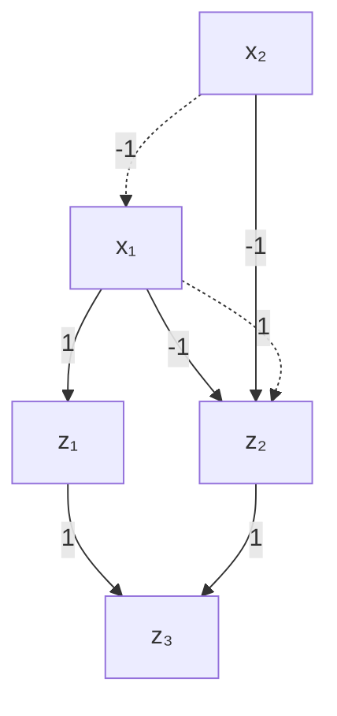

Initial network


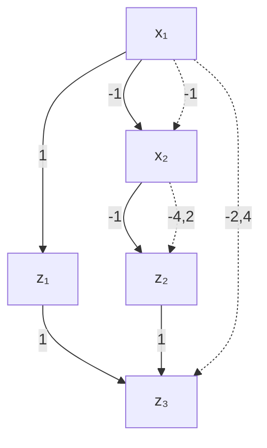

Step 1


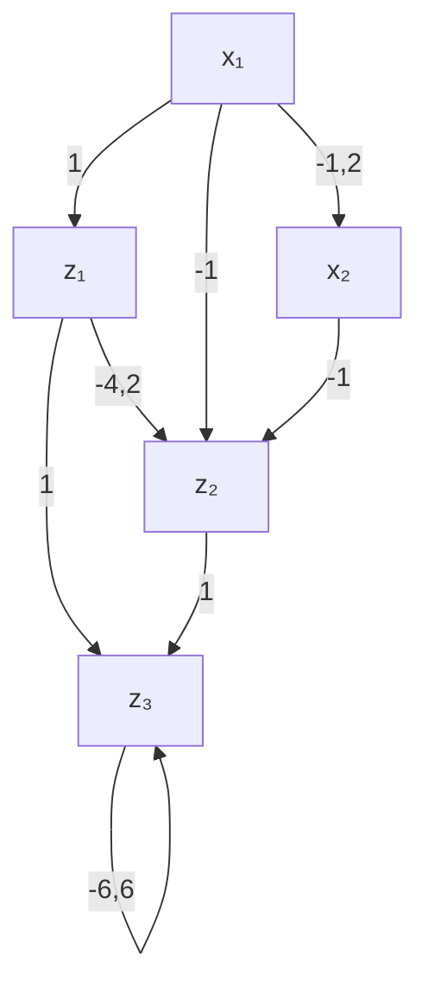

Figure B.1: A sample neural network demonstrating the bounds computation. Computing bounds using interval arithmetic

We use a very simple example to demonstrate how bounds of the hidden units are computed using interval arithmetic and why using MIPs we can obtain better bounds. Consider the simple initial network without ReLUs and biases in Figure B.1. In step 1, we wish to compute the bounds for the first (and only) hidden layer. Starting by $z _ { 1 , }$ , computing its lower bound means choosing the bounds from neurons of the previous layer which result in the minimum value for $z _ { 1 }$ . Thus, considering the sign of its weights, for both of the neurons in the previous layer the lower bound is chosen and the lower bound of $z _ { 1 }$ is set to $1 * ( - 1 ) + 1 * ( - 1 ) = - 2$ . Similarly, the upper bound is $1 * 2 + 1 * 2 = 4$ . For $z _ { 2 , }$ , however, since the weights connected to it are negative, for computing lower bound, the upper bounds of previous layer are chosen and its lower bound is set to $- 1 * 2 + - 1 * 2 = - 4$ . Similarly, the upper bound is $- 1 * ( - 1 ) + - 1 * ( - 1 ) = 2$ . Finally, in step 2, the bounds of the single output is computed in a similar way $( [ - 6 , 6 ] )$ .

It can be seen that, in order to compute the bounds of the hidden layer, each neuron has chosen lower/upper bounds from the previous layer separately and without considering the relations among neurons, causing conflicts which result in loose bounds for the next layer (the output). On the other hand, considering the straight-forward MIP for this network, we simply have $z _ { 1 } = x _ { 1 } + x _ { 2 }$ and $z _ { 2 } = - x _ { 1 } - x _ { 2 }$ for the hidden layer and $z _ { 3 } = z _ { 1 } + z _ { 2 }$ for the next layer. maximizing/minimizing $z _ { 1 }$ and $z _ { 2 }$ variables gives the same bounds as the ones by interval arithmetic for the hidden layer, however, for the next layer (the output) we will have the bounds [0, 0] since the deeper relations among neurons are considered in the MIP i.e., $z _ { 3 } \ = \ z _ { 1 } + z _ { 2 } \ =$ $x _ { 1 } + x _ { 2 } - x _ { 1 } - x _ { 2 } = 0$ .

This example was for a network without the ReLU activation. The ReLUs can also be encoded by associating them with binary variables in the MIP encoding (e.g., encoding (3.3)) and compute exact bounds similarly by solving MIPs layer-by-layer. However, this would be inefficient as the ReLU binary variables incur an exhaustive search. Thus, a linear (over-)approximation for ReLUs (3.6b) is suggested to find looser than exact but tighter than interval arithmetic bounds in an efficient way.

## b.2 additional results

The results in Figure B.2 complement those in Figure 3.3 in the main body, by comparing instead the distance norm obtained by every method. Additionally, Figure $\mathrm { B } . 3$ presents additional scalability results (similar to Figure 3.5) but for the Adult and Credit datasets. These results mimic the same trends seen earlier in the main body.


Figure B.3: Scatter and bar plots showing the runtimes and distances when the network architecture becomes wider or deeper. Scalability experiments comparing SMT-, MIP-, and gradient-based approaches. The first two rows show the results for Credit dataset and the second two rows are for the Adult dataset. In each two rows, the upper row demonstrates increasing depth while the lower row demonstrates increasing width; both in terms of runtime and distance. For each approach and architecture 50 samples are evaluated, however, some fail to produce valid CFEs (only for DiCE in this case); thus, only the instances for which all approaches have generated valid CFEs are included in the comparison. In general, for the Credit dataset, increasing depth results in 100.0%, 100.0%, and 98.2% average coverage and increasing width results in 100%, 100%, and 100.0% average coverage for MIP-OBJ, MIP-EXP, and DiCE, respectively. For the Adult dataset, increasing depth results in 100.0%, 100.0%, and 96.8% average coverage and increasing width results in 100%, 100%, and 99.1% average coverage for MIP-OBJ, MIP-EXP, and DiCE, respectively.
# Appendix Causal Recourse
## c.1 proofs

## c.1.1 Proof of Proposition ??

Proposition ?? (GP-SCM Noise Posterior). Let $\{ { \bf x } ^ { i } \} _ { i = 1 } ^ { n }$ be an observational sample from (??). For each $r \in [ d ]$ with non empty parent set $| p a ( r ) | > 0$ , the posterior distribution of the noise vector $\mathbf { u } _ { r } = \left( u _ { r } ^ { 1 } , . . . , u _ { r } ^ { n } \right)$ , conditioned on $ { \mathbf { x } } _ { r } = ( x _ { r } ^ { 1 } , . . . , x _ { r } ^ { n } )$ and $\mathbf { X } _ { p a ( r ) } = \bigl ( \mathbf { x } _ { p a ( r ) } ^ { 1 } , . . . , \mathbf { x } _ { p a ( r ) } ^ { n } \bigr )$ , is given by

$$
\mathbf {u} _ {r} | \mathbf {X} _ {p a (r)}, \mathbf {x} _ {r} \sim \mathcal {N} \left(\sigma_ {r} ^ {2} (\mathbf {K} + \sigma_ {r} ^ {2} \mathbf {I}) ^ {- 1} \mathbf {x} _ {r}, \sigma_ {r} ^ {2} \left(\mathbf {I} - \sigma_ {r} ^ {2} (\mathbf {K} + \sigma_ {r} ^ {2} \mathbf {I}) ^ {- 1}\right)\right), \tag {C.1.1}
$$

where $\mathbf { K } : = \big ( k _ { r } \big ( \mathbf { x } _ { p a ( r ) } ^ { i } , \mathbf { x } _ { p a ( r ) } ^ { j } \big ) \big ) _ { i j }$ denotes the Gram matrix.

Proof. First, note that, by definition, ${ \bf u } _ { r }$ is independent of $\mathbf { f } _ { r } = ( f _ { r } ( \mathbf { x } _ { \mathsf { p a } ( r ) } ^ { 1 } ) , . . . , f _ { r } ( \mathbf { x } _ { \mathsf { p a } ( r ) } ^ { n } ) )$ ) given $\mathbf { X } _ { \mathsf { p a } ( r ) }$ . Moreover, it follows from the assumed GP-SCM model in (??) and Definition $? ? ,$ as well as properties of the GP prior, that both are multivariate Gaussian random variables with distributions given by

$$
\mathbf {u} _ {r} \sim \mathcal {N} (\mathbf {0}, \sigma_ {r} ^ {2} \mathbf {I}) \quad \text { independently   of } \quad \mathbf {X} _ {p a (r)}, \quad \text { and } \tag {C.1.1}
$$

$$
\mathbf {f} _ {r} | \mathbf {X} _ {p a (r)} \sim \mathcal {N} (\mathbf {0}, \mathbf {K}), \tag {C.1.2}
$$

where 0 denotes the zero vector (or matrix, see below) and K is as defined in Proposition ??.

Since independent multivariate Gaussian random variables are jointly multivariate Gaussian, we thus have

$$
\binom {\mathbf {u} _ {r}} {\mathbf {f} _ {r}} \left| \mathbf {X} _ {\mathrm{pa} (r)} \right. \sim \mathcal {N} (\mathbf {0}, \Sigma), \quad \text { where } \quad \Sigma = \left( \begin{array}{c c} \sigma_ {r} ^ {2} \mathbf {I} & \mathbf {0} \\ \mathbf {0} & \mathbf {K} \end{array} \right) \tag {C.1.3}
$$

Noting that ${ \bf x } _ { r } = { \bf f } _ { r } + { \bf u } _ { r }$ and applying a linear transformation to $\left( \mathbf { C . I . 3 } \right)$ , we then obtain

$$
\binom {\mathbf {u} _ {r}} {\mathbf {x} _ {r}} \left| \mathbf {X} _ {\mathrm{pa} (r)} = \left( \begin{array}{c c} \mathbf {I} & \mathbf {0} \\ \mathbf {I} & \mathbf {I} \end{array} \right) \binom {\mathbf {u} _ {r}} {\mathbf {f} _ {r}} \right| \mathbf {X} _ {\mathrm{pa} (r)} \sim \mathcal {N} (\mathbf {0}, \tilde {\boldsymbol {\Sigma}}) \tag {C.1.4}
$$

$$
\text { where } \quad \tilde {\Sigma} = \left( \begin{array}{c c} \sigma_ {r} ^ {2} \mathbf {I} & \sigma_ {r} ^ {2} \mathbf {I} \\ \sigma_ {r} ^ {2} \mathbf {I} & \mathbf {K} + \sigma_ {r} ^ {2} \mathbf {I} \end{array} \right).
$$

Conditioning on $\mathbf { x } _ { r }$ and using the conditioning formula (e.g., Tou11), the result follows:

$$
\mathbf {u} _ {r} \left| \mathbf {X} _ {p a (r)}, \mathbf {x} _ {r} \right. \sim \mathcal {N} \left(\mathbf {0} + \sigma_ {r} ^ {2} \mathbf {I} \left(\mathbf {K} + \sigma_ {r} ^ {2} \mathbf {I}\right) ^ {- 1} \left(\mathbf {x} _ {r} - \mathbf {0}\right), \sigma_ {r} ^ {2} \mathbf {I} - \sigma_ {r} ^ {2} \mathbf {I} \left(\mathbf {K} + \sigma_ {r} ^ {2} \mathbf {I}\right) ^ {- 1} \sigma_ {r} ^ {2} \mathbf {I}\right) \tag {C.1.5}
$$

$$
\sim \mathcal {N} \left(\sigma_ {r} ^ {2} (\mathbf {K} + \sigma_ {r} ^ {2} \mathbf {I}) ^ {- 1} \mathbf {x} _ {r}, \sigma_ {r} ^ {2} \left(\mathbf {I} - \sigma_ {r} ^ {2} (\mathbf {K} + \sigma_ {r} ^ {2} \mathbf {I}) ^ {- 1}\right)\right) \tag {C.1.6}
$$

## c.1.2 Proof of Proposition ??

Proposition ?? (GP-SCM Counterfactual Distribution). Let $\{ { \bf x } ^ { i } \} _ { i = 1 } ^ { n }$ be an observational sample from (??). Then, for $r \in [ d ]$ with $| p a ( r ) | > 0 ,$ , the counterfactual distribution over $X _ { r }$ had $\mathbf { X } _ { p a ( r ) }$ been $\tilde { \mathbf { x } } _ { p a ( r ) }$ (instead of $\mathbf { x } _ { p a ( r ) } ^ { F } )$ for individual $\mathbf { x } ^ { F } \in \{ \mathbf { x } ^ { i } \} _ { i = 1 } ^ { n }$ is given by

$$
\mathrm{X} _ {r} \left(\mathbf {X} _ {p a (r)} = \tilde {\mathbf {x}} _ {p a (r)}\right) \mid \mathbf {x} ^ {F}, \left\{\mathbf {x} ^ {i} \right\} _ {i = 1} ^ {n} \tag {C.1.7}
$$

$$
\sim \mathcal {N} \big (\mu_ {r} ^ {F} + \tilde {\mathbf {k}} ^ {T} (\mathbf {K} + \sigma_ {r} ^ {2} \mathbf {I}) ^ {- 1} \mathbf {x} _ {r}, s _ {r} ^ {F} + \tilde {k} - \tilde {\mathbf {k}} ^ {T} (\mathbf {K} + \sigma_ {r} ^ {2} \mathbf {I}) ^ {- 1} \tilde {\mathbf {k}} \big),
$$

where $\tilde { k } : = k _ { r } ( \tilde { \mathbf { x } } _ { p a ( r ) } , \tilde { \mathbf { x } } _ { p a ( r ) } ) , \tilde { \mathbf { k } } : = \big ( k _ { r } ( \tilde { \mathbf { x } } _ { p a ( r ) } , \mathbf { x } _ { p a ( r ) } ^ { 1 } ) , \dots , k _ { r } ( \tilde { \mathbf { x } } _ { p a ( r ) } , \mathbf { x } _ { p a ( r ) } ^ { n } ) \big )$ , xr and K as defined in $? ? ,$ and $\mu _ { r } ^ { F }$ and $s _ { r } ^ { F }$ are the posterior mean and variance of $u _ { r } ^ { F }$ given by (??).

Proof. We follow the three steps of abduction, action, and prediction for computing counterfactual distributions (see § 4.2.2 for more details). Starting from the factual observation $\mathbf { x } ^ { \mathsf { F } } \in \{ x ^ { i } \} _ { i = 1 } ^ { n }$ generated according to

$$
\mathbf {x} _ {r} ^ {\mathsf {F}} := f _ {r} (\mathbf {x} _ {\mathrm{pa} (r)} ^ {\mathsf {F}}) + u _ {r} ^ {\mathsf {F}}, \tag {C.1.7}
$$

we first compute the noise posterior (abduction). According to Proposition ?? it is given by a marginal of (??), i.e.,

$$
u _ {r} ^ {\mathsf {F}} | \mathbf {X} _ {\mathrm{pa} (r)}, \mathbf {x} _ {r} \sim \mathcal {N} (\mu_ {r} ^ {F}, s _ {r} ^ {\mathsf {F}}) \tag {C.1.8}
$$

where $\mu _ { r } ^ { \mathsf { F } }$ is given by element F of the mean vector

$$
\boldsymbol {\mu} _ {r} = \sigma_ {r} ^ {2} (\mathbf {K} + \sigma_ {r} ^ {2} \mathbf {I}) ^ {- 1} \mathbf {x} _ {r} \tag {C.1.9}
$$

and $s _ { r } ^ { \mathsf { F } }$ is given by element (F, F) of the covariance matrix

$$
S _ {r} = \sigma_ {r} ^ {2} \left(\mathbf {I} - \sigma_ {r} ^ {2} (\mathbf {K} + \sigma_ {r} ^ {2} \mathbf {I}) ^ {- 1}\right) \tag {C.1.10}
$$

of the noise posterior given by (??).

Next, we simulate the hypothetical intervention by updating the structural equation (C.1.7) (action step),

$$
x _ {r} ^ {\mathsf {F}} \left(\mathbf {X} _ {\mathrm{pa} (r)} = \tilde {\mathbf {x}} _ {\mathrm{pa} (r)}\right) := f _ {r} \left(\tilde {x} _ {\mathrm{pa} (r)}\right) + u _ {r} ^ {\mathsf {F}}. \tag {C.1.11}
$$

The GP predictive posterior at the new input $\tilde { x } _ { \mathrm { p a } ( r ) }$ has distribution (see, e.g., WR06),

$$
f _ {r} (\tilde {x} _ {\mathrm{pa} (r)}) | \mathbf {X} _ {\mathrm{pa} (r)}, \mathbf {x} _ {r} \sim \mathcal {N} (\tilde {\mathbf {k}} ^ {T} (\mathbf {K} + \sigma_ {r} ^ {2} \mathbf {I}) ^ {- 1} \mathbf {x} _ {r}, \tilde {k} - \tilde {\mathbf {k}} ^ {T} (\mathbf {K} + \sigma_ {r} ^ {2} \mathbf {I}) ^ {- 1} \tilde {\mathbf {k}}). \tag {C.1.12}
$$

Substituting (C.1.12) and (C.1.8) into (C.1.11) and noting that the sum of two Gaussians is again Gaussian with mean and variance equal to the sums of means and variances of the two individual Gaussians (prediction step) completes the proof. □

## c.1.3 Proof of Proposition ??

Proposition ??. Subject to causal sufficiency, PXd( )|do(X :=θ),xF $P _  \mathbf { X } _ { d ( \mathcal { T } ) } | \mathbf { d o } ( \mathbf { X } _ { \mathcal { T } } : = \pmb { \theta } ) , \pmb { x } _ { n d ( \mathcal { T } ) } ^ { F }$ is observation-Ially identifiable (i.e., computable from the observational distribution) via:

$$
p \left(\mathbf {X} _ {d (\mathcal {I})} \mid \mathrm{do} \left(\mathbf {X} _ {\mathcal {I}} := \boldsymbol {\theta}\right), \mathbf {x} _ {n d (\mathcal {I})} ^ {F}\right) = \prod_ {r \in d (\mathcal {I})} p \left(X _ {r} \mid \mathbf {X} _ {p a (r)}\right) \Bigg | _ {\mathbf {X} _ {\mathcal {I}} := \boldsymbol {\theta}, \mathbf {X} _ {n d (\mathcal {I})} = \mathbf {x} _ {n d (\mathcal {I})} ^ {F}}. \tag {C.1.13}
$$

Proof. This is a direct consequence of the properties of causally sufficient (Markovian) causal models, but we include a derivation for completeness. Recall that P factorises over its underlying causal graph as follows,

$$
p (\mathbf {X}) = \prod_ {r \in [ d ]} p (X _ {r} | \mathbf {X} _ {\mathrm{pa} (r)}). \tag {C.1.13}
$$

This joint distribution is transformed by the intervention do $( \mathbf { X } _ { \mathcal { T } } : = \theta )$ as follows,

$$
P (\mathbf {X} _ {- \mathcal {I}}, \mathrm{do} (\mathbf {X} _ {\mathcal {I}} := \boldsymbol {\theta})) = \delta (\mathbf {X} _ {\mathcal {I}} := \boldsymbol {\theta}) \prod_ {r \in [ d ] \backslash \mathcal {I}} P (X _ {r} | \mathbf {X} _ {\mathrm{pa} (r)}). \tag {C.1.14}
$$

Splitting the non-intervened variables into descendants $\mathbf { d } ( \mathcal { T } )$ and non-descendants nd( ), and conditioning on the intervened variables do $( \mathbf { X } _ { \mathcal { I } } : = \pmb { \theta } )$ , we obtain

$$
P (\mathbf {X} _ {\mathrm{nd} (\mathcal {I})}, \mathbf {X} _ {\mathrm{d} (\mathcal {I})} | \mathrm{do} (\mathbf {X} _ {\mathcal {I}} := \boldsymbol {\theta})) = \left. \left(\prod_ {r \in \mathrm{nd} (\mathcal {I}) \cup \mathrm{d} (\mathcal {I})} P (X _ {r} | \mathbf {X} _ {\mathrm{pa} (r)})\right) \right| _ {\mathbf {X} _ {\mathcal {I}} := \boldsymbol {\theta}}. \tag {C.1.15}
$$

As the non-descendants ${ \mathbf { \boldsymbol { X } } } _ { \mathrm { \Pi \Pi \times d ( \mathcal { T } ) } }$ are, by their very definition, not affected by the intervention, we can write

$$
\begin{array}{l} P (\mathbf {X} _ {\mathrm{nd} (\mathcal {I})}, \mathbf {X} _ {\mathrm{d} (\mathcal {I})} | \mathrm{do} (\mathbf {X} _ {\mathcal {I}} := \boldsymbol {\theta})) = \\ \left(\prod_ {r \in \mathrm{d} (\mathcal {I})} P (X _ {r} | \mathbf {X} _ {\mathrm{pa} (r)})\right) \Bigg | \mathbf {x} _ {\mathcal {I} := \boldsymbol {\theta}} \prod_ {r \in \mathrm{nd} (\mathcal {I})} P (X _ {r} | \mathbf {X} _ {\mathrm{pa} (r)}). \\ \end{array}
$$

We can thus condition on a particular value of $\mathbf { X } _ { \mathrm { n d } ( \mathbb { Z } ) }$ to obtain

$$
\begin{array}{l} P \left(\mathbf {X} _ {\mathrm{d} (\mathcal {I})} | \mathrm{do} (\mathbf {X} _ {\mathcal {I}} := \boldsymbol {\theta}), \mathbf {X} _ {\mathrm{nd} (\mathcal {I})} = \mathbf {x} _ {\mathrm{nd} (\mathcal {I})} ^ {\mathsf {F}}\right) = \\ \left(\prod_ {r \in \mathrm{d} (\mathcal {I})} P (X _ {r} | \mathbf {X} _ {p a (r)})\right) \bigg | _ {\mathbf {X} _ {\mathcal {I}} := \boldsymbol {\theta}, \mathbf {X} _ {\mathrm{nd} (\mathcal {I})} = \mathbf {x} _ {\mathrm{nd} (\mathcal {I})} ^ {\mathrm{F}}} \tag {C.1.16} \\ \end{array}
$$


## c.2 additional results

This section presents additional results complementing those from Section ??. Table C.1 presents results that mirror those in Table ??, where the brute-force approach discussed at the beginning of Appendix C.5 is used instead of the gradient-based optimisation. Here, each real-valued feature was discretised into 20 bins within the range of its observed values in the training dataset.

Fig. C.1 mirrors the results in Fig. ??, for which a snapshot $( \gamma _ { \mathrm { L C B } } = 2 . 5 )$ is also provided in Table ??. Here we show the trade-off between validity and cost by varying the values of $\gamma _ { \mathrm { L C B } } ,$ , using as trained classifiers a nonlinear multilayer perceptron (MLP) in (a) and a non-differentiable random forest classifer in (b). Note that optimisation for the latter can only be done with the brute-force approach. All these additional results mostly confirm the insights presented in the main body.

Finally, Table C.2 provides a qualitative comparison of the proposed recourse approaches against the oracles and baselines in terms of their selection of intervention targets. We show empirically, on the three synthetic datasets, that cate approaches have more predictable behaviour, as they are less sensitive to model assumptions, and are thus more preferable for the individual seeking recourse under imperfect causal knowledge.

## c.3 (non-)identifability of scms under different assumptions

In general form, i.e., without any further assumption on the structural equations S or noise distribution $P _ { \mathbf { U } } ,$ , SCMs are not identifiable from data alone, meaning that there are multiple different SCMs (possibly with different underlying causal graphs) which imply the same observational distribution (PJS17). One possible construction relies on the use of the inverse cumulative distribution function (cdf) in combination with uniformly-distributed random variables (Dar51) and is also used in non-identifiability proofs for non-linear independent component analysis (ICA) (HP99). Even knowing the causal graph is generally not enough as summarised in the following proposition.

**Table C.1: Experimental results for the brute-force (20-bin discretization) approach on different 3-variable SCMs. We show average performance for $N _ { \mathrm { r u n s } } ~ = ~ 1 0 0 .$ , $N _ { \mathrm { M C - s a m p l e s } } = 1 0 0 ,$ , and $\gamma _ { \mathrm { L C B } } = 2$ . The relative trends reflect those in Table ??.**

<table><tr><td rowspan="2">Method</td><td colspan="3">LINEAR SCM</td><td colspan="3">NON-LINEAR ANM</td><td colspan="3">NON-ADDITIVE SCM</td></tr><tr><td>Valid $_{\star}$ (%)</td><td>LCB</td><td>Cost (%)</td><td>Valid $_{\star}$ (%)</td><td>LCB</td><td>Cost (%)</td><td>Valid $_{\star}$ (%)</td><td>LCB</td><td>Cost (%)</td></tr><tr><td> $\mathcal{M}_{\star}$ </td><td>100</td><td>-</td><td>11.0±5.6</td><td>100</td><td>-</td><td>20.7±11.0</td><td>100</td><td>-</td><td>15.8±8.9</td></tr><tr><td> $\mathcal{M}_{\text{LIN}}$ </td><td>100</td><td>-</td><td>11.3±5.8</td><td>60</td><td>-</td><td>19.9±8.9</td><td>92</td><td>-</td><td>17.0±10.4</td></tr><tr><td> $\mathcal{M}_{\text{KR}}$ </td><td>95</td><td>-</td><td>11.2±5.6</td><td>88</td><td>-</td><td>20.5±10.7</td><td>47</td><td>-</td><td>15.8±10.6</td></tr><tr><td> $\mathcal{M}_{\text{GP}}$ </td><td>100</td><td>.55±.04</td><td>11.6±5.8</td><td>99</td><td>.55±.04</td><td>21.2±10.9</td><td>88</td><td>.58±.05</td><td>16.8±10.3</td></tr><tr><td> $\mathcal{M}_{\text{CVAE}}$ </td><td>100</td><td>.55±.04</td><td>11.5±5.8</td><td>95</td><td>.55±.03</td><td>21.7±10.7</td><td>95</td><td>.59±.07</td><td>16.9±10.3</td></tr><tr><td> $\text{CATE}_{\star}$ </td><td>90</td><td>.57±.07</td><td>11.0±5.5</td><td>95</td><td>.55±.05</td><td>22.8±10.8</td><td>99</td><td>.57±.06</td><td>16.2±8.9</td></tr><tr><td> $\text{CATE}_{\text{GP}}$ </td><td>92</td><td>.56±.07</td><td>11.2±5.5</td><td>95</td><td>.55±.04</td><td>22.8±10.9</td><td>85</td><td>.58±.07</td><td>16.4±10.5</td></tr><tr><td> $\text{CATE}_{\text{CVAE}}$ </td><td>90</td><td>.57±.06</td><td>11.1±5.4</td><td>96</td><td>.55±.03</td><td>23.0±10.8</td><td>94</td><td>.59±.07</td><td>16.8±10.2</td></tr></table>

Proposition C.3.1. Even when the causal graph is known, the conditionals $P ( X _ { r } | \mathbf { X } _ { p a ( r ) } )$ alone are insufficient to uniquely determine the structural equations $X _ { r } : = \dot { f } _ { r } ( \dot { \mathbf { X } } _ { p a ( r ) } , U _ { r } )$ without further assumptions.

Proof. This can be shown by using the following argument from $\mathrm { J } \mathrm { S 1 0 , }$ , Footnote 1 (adapted to our notation):

$$
\begin{array}{l} \begin{array}{l} \text { "let U_{r} consist of (possibly uncountably many) real - valued random variables} \\ U _ {r} [ \mathbf {x} _ {p a (r)} ], \text { one for each value x_{pa(r)} of the parents X_{pa(r)}}. L e t U _ {r} [ \mathbf {x} _ {p a (r)} ] b e \\ d i s t r i b u t e d a c c o r d i n g t o P _ {X _ {r} | \mathbf {x} _ {p a (r)}} a n d f o n i e f r _ {r} (\mathbf {x} _ {p a (r)}, U _ {r}) := U _ {r} [ \mathbf {x} _ {p a (r)} ]. T h e n \end{array} \\ X _ {r} | \mathbf {X} _ {p a (r)} \text {   has   distribution   } P _ {X _ {r} | \mathbf {X} _ {p a (r)}}. \\ \end{array}
$$

We can now build on this formulation to construct a second SCM with the same observational distribution and causal graph, e.g., by shifting the noise variables and structural equations by some fixed constant C as follows.

For $r \in [ d ] .$ , define $Y _ { r } : = X _ { r } - C$ . Let $\tilde { U } _ { r }$ consist of (possibly uncountably many) real-valued random variables $\tilde { U } _ { r } [ { \bf { x } } _ { \mathrm { { p a } } ( r ) } ]$ , one for each value $\mathbf { x } _ { \mathrm { p a } ( r ) }$ of the parents $\mathbf { X } _ { \mathrm { p a } ( r ) }$ . Let $\tilde { U } _ { r } [ { \bf { x } } _ { \mathrm { { p a } } ( r ) } ]$ ] be distributed according to $P _ { Y _ { r } | \mathbf { x } _ { \mathrm { p a } ( r ) } }$ and define $f _ { r } ( \mathbf { x } _ { \mathrm { p a } ( r ) } , \tilde { U } _ { r } ) : = \tilde { U } _ { r } [ \mathbf { x } _ { \mathrm { p a } ( r ) } ] + C$ . Then $X _ { r } | \mathbf { X } _ { \mathrm { p a } ( r ) }$ also has distribution $P _ { X _ { r } | \mathbf { X } _ { p a ( r ) } } ,$ but for $C \neq 0$ the structural equations and noise distributions are different from the previous construction. □

In the case of the cvae-SCM model from (??) the setting is slightly less general than the above, since we additionally assume that: (i) the noise distributions are isotropic multivariate Gaussian distributions of fixed dimension, $\mathbf { z } _ { r } \sim \mathcal { N } _ { d _ { \mathbf { z } _ { r } } } ( \mathbf { 0 } , \mathbf { I } )$ ; and (ii) the structural equations $D _ { r }$ are from the class of functions that can be expressed as feedforward neural networks if fixed width and depth with learnable parameters $\psi _ { r }$ .

Unfortunately, we are not aware of any identifiability results for this particular setting, and further investigation into this matter is beyond the scope of the current work. It is interesting to note, however, that the cvae-SCM from (??) can be understood as a non-linear extension of the linear Gaussian model with equal error variances considered by $\mathrm { ( P B \mathrm { { } _ { 1 4 } ) } }$ , for which identifiability has been shown.

In general, there seem to be very few works addressing identifiability of SCMs in the non-linear case; we refer to $\mathrm { P J } 5 \mathbf { \pi } _ { \mathrm { I 7 } } , \ S 7 . \mathbf { \pi } _ { \mathrm { 1 } }$ for an overview of existing results. Of particular interest for our setting is the post-nonlinear model of (ZH09), which refers to the setting in which a non-linearity $g$ is applied on top of an ANM, i.e., $X _ { r } : = g _ { r } ( f _ { r } ( \mathbf { \tilde { X } } _ { \mathfrak { p a } ( r ) } ) + U _ { r } )$ , and for which complete conditions on $\left\{ f _ { r } , g _ { r } \right\}$ have been provided that lead to identifiability. Given the form of the decoders $D _ { r }$ —feedforward neural networks with stacked layers of simple non-linearities applied to linear transformations of the previous layers’ output—it may be possible that the cvae-SCM from (??) can be interpreted as a nested post-nonlinear model. We consider this an interesting direction, but leave further investigations into this matter for future work.

## c.4 further details on cvae training

To learn the cvae latent variable models, we perform amortised variational inference with approximate posteriors q parameterised by encoders $E _ { r }$ in the form of neural nets with parameters $\phi _ { r . }$ ,

$$
p _ {\psi_ {r}} \left(\mathbf {z} _ {r} \mid x _ {r}, \mathbf {x} _ {\mathrm{pa} (r)}\right) \approx q _ {\phi_ {r}} \left(\mathbf {z} _ {r} \mid x _ {r}, \mathbf {x} _ {\mathrm{pa} (r)}\right) := \mathcal {N} \left(\hat {\mu} _ {r}, \hat {\sigma} _ {r} ^ {2}\right), \tag {C.4.1}
$$

$$
(\hat {\mu} _ {r}, \hat {\sigma} _ {r} ^ {2}) := E _ {r} (x _ {r}, \mathbf {x} _ {\mathrm{pa} (r)}; \phi_ {r}).
$$

The training objective in form of the evidence lower bound (ELBO) given data $\{ \mathbf { x } ^ { i } \} _ { i = 1 } ^ { n }$ is given by

$$
\begin{array}{l} \mathcal {L} _ {r} \left(\psi_ {r}, \phi_ {r}\right) = \sum_ {i = 1} ^ {n} \mathbb {E} _ {q _ {\phi_ {r}} \left(\mathbf {z} \mid x _ {r} ^ {i}, \mathbf {x} _ {\mathrm{pa} (r)} ^ {i}\right)} \left[ \left\| x _ {r} ^ {i} - D _ {r} \left(\mathbf {x} _ {\mathrm{pa} (r)} ^ {i}, \mathbf {z}; \psi_ {r}\right) \right\| ^ {2} \right] \tag {C.4.2} \\ + \beta_ {r} D _ {\mathrm{KL}} \left(\left. q _ {\phi_ {r}} (\mathbf {z} | x _ {r} ^ {i}, \mathbf {x} _ {\mathrm{pa} (r)} ^ {i}) \right| \mid p (z)\right) \\ \end{array}
$$

We learn both $\psi _ { r }$ and $\phi _ { r }$ simultaneously via stochastic gradient descend on $\mathcal { L } _ { \boldsymbol { r } } ,$ with gradients computed by Monte Carlo sampling from $q _ { \phi _ { \uparrow } }$ with reparametrisation. Since the pairs of encoder and decoder parameters $\left( \psi _ { r } , \phi _ { r } \right)$ are independent for different $r ,$ this can be done in parallel.

## c.4.1 Hyperparameter selection for cvae training

A cvae model was trained for every $\mathbf { X } _ { r } | \mathbf { X } _ { \mathsf { p a } ( r ) }$ relation. Generally, hyperparameters were selected by comparing the distribution of real samples from the dataset against reconstructed samples from the trained cvae obtained by sampling noise from the prior. The selection of hyperparameters was done either manually, or by performing a grid search over various encoder and decoder architectures, latent-space dimensions, and values of the hyperparameters $\beta _ { r }$ that trade off the MSE and KL terms in the cvae objective (C.4.2). For the case of automatic selection, the setup resulting in the smallest maximum mean discrepancy (MMD) statistic (Gre+12) between real and reconstructed samples was chosen as hyperparameter configuration. Further details on the search space considered and the selected values are provided in Table $C . 3$ .

## c.5 experimental details, hyperparameter choices, and specification of scms

## c.5.1 Specification of SCMs used in our experiments

The following is a specification of all SCMs used in our experiments on synthetic and semi-synthetic data, both for data generation and to evaluate the validity of recourse actions proposed by the different approaches by computing the corresponding counterfactual in the ground-truth SCMs.

In addition, we also specify the model used to generate training labels. Note, however, that these labels are only used to train a new classifier (e.g., a logistic regression, multi-layer perceptron, or random forest) from scratch: this is the h(x) referred to in the main chapter. The label generating process is thus only used for obtaining labels to train a classifier on and is subsequently disregarded in favour of h.

In selecting the structural equations and label generating process, we tried to pick combinations that resulted in roughly centred features, as well as roughly balanced datasets (i.e., with a similar proportion of positive and negative training examples) that are not perfectly linearly-separable (i.e., with some class overlap). Moreover, we tried to select settings that result in a diverse set of intervention targets selected by the oracle for different factual instances, i.e., we try to avoid situations in which the optimal action is to always intervene on the same (set of) variable(s). To induce more interesting behaviour, we sample root nodes from mixtures of Gaussians.

## c.5.1.1 3-variable synthetic SCMs used for Table ??

A visual summary of the 3-variable synthetic SCMs used for Table ?? is provided in Fig. C.2.

linear scm: The linear 3-variable SCM consists of the following structural equations and noise distributions:

$$
X _ {1} := U _ {1}, \quad U _ {1} \sim \operatorname{MoG} \left(0. 5 \mathcal {N} (- 2, 1. 5) + 0. 5 \mathcal {N} (1, 1)\right) \tag {C.5.1}
$$

$$
X _ {2} := - X _ {1} + U _ {2}, \quad U _ {2} \sim \mathcal {N} (0, 1) \tag {C.5.2}
$$

$$
X _ {3} := 0. 0 5 X _ {1} + 0. 2 5 X _ {2} + U _ {3}, \quad U _ {3} \sim \mathcal {N} (0, 1) \tag {C.5.3}
$$


Figure C.2: Histograms and scatter plots of pairwise feature relations for the synthetic 3-variable SCMs.

non-linear anm: The non-linear 3-variable ANM consists of the following structural equations and noise distributions:

$$
X _ {1} := U _ {1}, \quad U _ {1} \sim \operatorname{MoG} \left(0. 5 \mathcal {N} (- 2, 1. 5) + 0. 5 \mathcal {N} (1, 1)\right) \tag {C.5.4}
$$

$$
X _ {2} := - 1 + \frac {3}{1 + e ^ {- 2 X _ {1}}} + U _ {2}, \quad U _ {2} \sim \mathcal {N} (0, 0. 1) \tag {C.5.5}
$$

$$
X _ {3} := - 0. 0 5 X _ {1} + 0. 2 5 X _ {2} ^ {2} + U _ {3}, \quad U _ {3} \sim \mathcal {N} (0, 1) \tag {C.5.6}
$$

non-additve scm: The non-additive 3-variable SCM consists of the following structural equations and noise distributions:

$$
X _ {1} := U _ {1}, \quad U _ {1} \sim \operatorname{MoG} \left(0. 5 \mathcal {N} (- 2. 5, 1) + 0. 5 \mathcal {N} (2. 5, 1)\right) \tag {C.5.7}
$$

$$
X _ {2} := 0. 2 5 \operatorname{sgn} (U _ {2}) X _ {1} ^ {2} (1 + U _ {2} ^ {2}), \quad U _ {2} \sim \mathcal {N} (0, 0. 2 5) \tag {C.5.8}
$$

$$
X _ {3} := - 1 + 0. 1 \operatorname{sgn} (U _ {3}) (X _ {1} ^ {2} + X _ {2} ^ {2}) + U _ {3}, \quad U _ {3} \sim \mathcal {N} (0, 0. 2 5 ^ {2}) \tag {C.5.9}
$$

label generation: For all 3-variable SCMs, labels Y were sampled according to

$$
Y \sim \text { Bernoulli } \left(\left(1 + e ^ {- 2. 5 \rho^ {- 1} (X _ {1} + X _ {2} + X _ {3})}\right) ^ {- 1}\right) \tag {C.5.10}
$$

where $\rho$ is the average of $\left( X _ { 1 } + X _ { 2 } + X _ { 3 } \right)$ across all training samples.

## c.5.1.2 7-variable semi-synthetic loan approval SCM used for Table ??

For the semi-synthetic dataset, we wanted to capture some relations between the involved variables that seemed somewhat intuitive to us and to some limited extent reflect a loan approval setting in the real-world:

• loan amount and duration being largest for mid-aged people who may want to build a house and start a family, and smaller for younger and older people;
• loan duration increasing with loan amount due to the an upper limit on monthly payments that can be afforded
• savings increasing once income passes a certain (minimal-sustenance) threshold;
• income increasing with age;
• education increasing with age initially before eventually saturating;
• gender differences in income and (access to) education due to existing gender-discrimination and inequality of opportunities in the population;

A visual summary of the 7-variable semi-synthetic loan SCMis shown in Fig. C.3.


Figure C.3: Histograms and scatter plots of pairwise feature relations for the semisynthetic loan SCM.

semi-synthetic scm: The loan approval SCM consists of the following structural equations and noise distributions:

$$
G := U _ {G}, \quad U _ {G} \sim \text { Bernoulli } (0. 5) \tag {C.5.11}
$$

$$
A := - 3 5 + U _ {A}, \quad U _ {A} \sim \text { Gamma } (1 0, 3. 5) \tag {C.5.12}
$$

$$
E := - 0. 5 + \left(1 + e ^ {- \left(- 1 + 0. 5 G + \left(1 + e ^ {- 0. 1 A}\right) ^ {- 1} + U _ {E}\right)}\right) ^ {- 1}, \quad U _ {E} \sim \mathcal {N} (0, 0. 2 5) \tag {C.5.13}
$$

$$
L := 1 + 0. 0 1 (A - 5) (5 - A) + G + U _ {L}, \quad U _ {L} \sim \mathcal {N} (0, 4) \tag {C.5.14}
$$

$$
D := - 1 + 0. 1 A + 2 G + L + U _ {D}, \quad U _ {D} \sim \mathcal {N} (0, 9) \tag {C.5.15}
$$

$$
I := - 4 + 0. 1 (A + 3 5) + 2 G + G E + U _ {I}, \quad U _ {I} \sim \mathcal {N} (0, 4) \tag {C.5.16}
$$

$$
S := - 4 + 1. 5 \mathbb {I} _ {\{I > 0 \}} I + U _ {S}, \quad U _ {S} \sim \mathcal {N} (0, 2 5) \tag {C.5.17}
$$

Note that variables in the above SCM often have a relative meaning in terms of deviation from the mean, e.g., we centre the Gamma-distributed age around its mean of 35, so that A has the meaning of “age-difference from the mean of $3 5 ^ { \prime \prime }$ (and similarly for other variables).

label generation: Labels Y were sampled according to

$$
Y \sim \text { Bernoulli } \left(\left(1 + e ^ {- 0. 3 (- L - D + I + S + I S)}\right) ^ {- 1}\right). \tag {C.5.18}
$$

Note that this label generation process only depends on loan duration and amount, income and savings, but not on gender, age or education level.

## c.6 derivation of a monte-carlo estimator for the gradient of the variance

We now derive an estimator for the gradient of the square-root of the variance (i.e., standard deviation) of h over the interventional or counterfactual distribution of $\mathbf { X } _ { \mathrm { d } ( \mathcal { I } ) }$ w.r.t. θ, which appears (multiplied by $\lambda _ { \mathrm { L C B } } )$ in the threshold tresh(a) of the optimisation constraint/regulariser.

First, we use the chain rule of differentiation to write

$$
\nabla_ {\boldsymbol {\theta}} \sqrt {\mathbb {V} _ {\mathbf {X} _ {\mathrm{d} (\mathcal {I})}} \left[ h \left(\mathbf {X} _ {\mathrm{d} (\mathcal {I})} , \boldsymbol {\theta} , \mathbf {x} _ {\mathrm{nd} (\mathcal {I})} ^ {\mathrm{F}}\right) \right]} = \frac {\nabla_ {\boldsymbol {\theta}} \mathbb {V} _ {\mathbf {X} _ {\mathrm{d} (\mathcal {I})}} \left[ h \left(\mathbf {X} _ {\mathrm{d} (\mathcal {I})} , \boldsymbol {\theta} , \mathbf {x} _ {\mathrm{nd} (\mathcal {I})} ^ {\mathrm{F}}\right) \right]}{2 \sqrt {\mathbb {V} _ {\mathbf {X} _ {\mathrm{d} (\mathcal {I})}} \left[ h \left(\mathbf {X} _ {\mathrm{d} (\mathcal {I})} , \boldsymbol {\theta} , \mathbf {x} _ {\mathrm{nd} (\mathcal {I})} ^ {\mathrm{F}}\right) \right]}} (C. 6. 1)
$$

Next, we write the variance as expectation and—assuming the interventional or counterfactual distribution of $\mathbf { X } _ { \mathrm { d } ( \mathcal { I } ) }$ admits reparametrisation as is Ithe case for the GP-SCM and cvae models used in this chapter—use the reparametrisation trick to differentiate through the expectation operator as in (??).

$$
\begin{array}{l} \nabla_ {\boldsymbol {\theta}} \mathbb {V} _ {\mathbf {X} _ {\mathrm{d} (\mathcal {I})}} \left[ h \big (\mathbf {X} _ {\mathrm{d} (\mathcal {I})}, \boldsymbol {\theta}, \mathbf {x} _ {\mathrm{nd} (\mathcal {I})} ^ {\mathsf {F}} \big) \right] \\ = \nabla_ {\boldsymbol {\theta}} \mathbb {E} _ {\mathbf {X} _ {\mathrm{d} (\mathcal {I})}} \left[ \left(h \left(\mathbf {X} _ {\mathrm{d} (\mathcal {I})}, \boldsymbol {\theta}, \mathbf {x} _ {\mathrm{nd} (\mathcal {I})} ^ {\mathsf {F}}\right) - \mathbb {E} _ {\mathbf {X} _ {\mathrm{d} (\mathcal {I})} ^ {\prime}} \left[ h \left(\mathbf {X} _ {\mathrm{d} (\mathcal {I})} ^ {\prime}, \boldsymbol {\theta}, \mathbf {x} _ {\mathrm{nd} (\mathcal {I})} ^ {\mathsf {F}}\right) \right]\right) ^ {2} \right] \\ = \nabla_ {\boldsymbol {\theta}} \mathbb {E} _ {\mathbf {z} \sim \mathcal {N} (\mathbf {0}, \mathbf {I})} \left[ \left(h \left(\mathbf {X} _ {\mathrm{d} (\mathcal {I})} (\mathbf {z}; \boldsymbol {\theta}), \boldsymbol {\theta}, \mathbf {x} _ {\mathrm{nd} (\mathcal {I})} ^ {\mathsf {F}}\right) - \mathbb {E} _ {\mathbf {z} ^ {\prime} \sim \mathcal {N} (\mathbf {0}, \mathbf {I})} \left[ h \left(\mathbf {x} _ {\mathrm{d} (\mathcal {I})} (\mathbf {z} ^ {\prime}; \boldsymbol {\theta}), \boldsymbol {\theta}, \mathbf {x} _ {\mathrm{nd} (\mathcal {I})} ^ {\mathsf {F}}\right) \right]\right) ^ {2} \right] \\ = \mathbb {E} _ {\mathbf {z} \sim \mathcal {N} (\mathbf {0}, \mathbf {I})} \left[ \nabla_ {\boldsymbol {\theta}} \Big (h \left(\mathbf {X} _ {\mathrm{d} (\mathcal {I})} (\mathbf {z}; \boldsymbol {\theta}), \boldsymbol {\theta}, \mathbf {x} _ {\mathrm{nd} (\mathcal {I})} ^ {\mathsf {F}}\right) - \mathbb {E} _ {\mathbf {z} ^ {\prime} \sim \mathcal {N} (\mathbf {0}, \mathbf {I})} \left[ h \left(\mathbf {x} _ {\mathrm{d} (\mathcal {I})} (\mathbf {z} ^ {\prime}; \boldsymbol {\theta}), \boldsymbol {\theta}, \mathbf {x} _ {\mathrm{nd} (\mathcal {I})} ^ {\mathsf {F}}\right) \right] \Big) ^ {2} \right] \\ = \mathbb {E} _ {\mathbf {z} \sim \mathcal {N} (\mathbf {0}, \mathbf {I})} \left[ \right. 2 \left(h \left(\mathbf {X} _ {\mathrm{d} (\mathcal {I})} (\mathbf {z}; \boldsymbol {\theta}), \boldsymbol {\theta}, \mathbf {x} _ {\mathrm{nd} (\mathcal {I})} ^ {\mathrm{F}}\right) - \mathbb {E} _ {\mathbf {z} ^ {\prime} \sim \mathcal {N} (\mathbf {0}, \mathbf {I})} \left[ h \left(\mathbf {x} _ {\mathrm{d} (\mathcal {I})} \left(\mathbf {z} ^ {\prime}; \boldsymbol {\theta}\right), \boldsymbol {\theta}, \mathbf {x} _ {\mathrm{nd} (\mathcal {I})} ^ {\mathrm{F}}\right)\right]\right) \\ \left. \times \left(\nabla_ {\boldsymbol {\theta}} h \left(\mathbf {X} _ {\mathrm{d} (\mathcal {I})} (\mathbf {z}; \boldsymbol {\theta}), \boldsymbol {\theta}, \mathbf {x} _ {\mathrm{nd} (\mathcal {I})} ^ {\mathrm{F}}\right) - \mathbb {E} _ {\mathbf {z} ^ {\prime} \sim \mathcal {N} (\mathbf {0}, \mathbf {I})} \left[ \nabla_ {\boldsymbol {\theta}} h \left(\mathbf {x} _ {\mathrm{d} (\mathcal {I})} \left(\mathbf {z} ^ {\prime}; \boldsymbol {\theta}\right), \boldsymbol {\theta}, \mathbf {x} _ {\mathrm{nd} (\mathcal {I})} ^ {\mathrm{F}}\right) \right]\right)\right) \Bigg ] \tag {C.6.2} \\ \end{array}
$$

We can now obtain an estimate of the gradient with two independent sets of Monte Carlo samples of $\mathbf { X } _ { \mathrm { d } ( \mathcal { T } ) }$ , drawn via reparametrisation from the interventional or counterfactual distribution,

$$
\left\{\mathbf {x} _ {\mathrm{d} (\mathcal {I})} ^ {(m)} := \mathbf {x} _ {\mathrm{d} (\mathcal {I})} \left(\mathbf {z} ^ {(m)}; \boldsymbol {\theta}\right) \right\} _ {m = 1} ^ {M}, \quad \left\{\mathbf {x} _ {\mathrm{d} (\mathcal {I})} ^ {(m ^ {\prime})} := \mathbf {x} _ {\mathrm{d} (\mathcal {I})} \left(\mathbf {z} ^ {(m ^ {\prime})}; \boldsymbol {\theta}\right) \right\} _ {m ^ {\prime} = 1} ^ {M ^ {\prime}} \tag {C.6.3}
$$

$\begin{array} { r l } { \mathrm { w h e r e } } & { { } \mathbf { z } ^ { ( m ) } , \mathbf { z } ^ { ( m ^ { \prime } ) } \overset { \mathrm { i . i . d . } } { \sim } \mathcal { N } ( \mathbf { 0 } , \mathbf { I } ) . } \end{array}$

This yields the following Monte Carlo gradient estimator of the variance:

$$
\begin{array}{l} \nabla_ {\boldsymbol {\theta}} \mathbb {V} _ {\mathbf {X} _ {\mathrm{d} (\mathcal {I})}} \left[ h \big (\mathbf {X} _ {\mathrm{d} (\mathcal {I})}, \boldsymbol {\theta}, \mathbf {x} _ {\mathrm{nd} (\mathcal {I})} ^ {\mathsf {F}} \big) \right] \approx \\ \frac {1}{M} \sum_ {m = 1} ^ {M} \left[ 2 \left(h \left(\mathbf {x} _ {\mathrm{d} (\mathcal {I})} ^ {(m)}, \boldsymbol {\theta}, \mathbf {x} _ {\mathrm{nd} (\mathcal {I})} ^ {\mathsf {F}}\right) - \frac {1}{M ^ {\prime}} \sum_ {m ^ {\prime} = 1} ^ {M} h \left(\mathbf {x} _ {\mathrm{d} (\mathcal {I})} ^ {(m ^ {\prime})}, \boldsymbol {\theta}, \mathbf {x} _ {\mathrm{nd} (\mathcal {I})} ^ {\mathsf {F}}\right)\right) \times \right. \\ \left. \left(\nabla_ {\boldsymbol {\theta}} h \left(\mathbf {x} _ {\mathrm{d} (\mathcal {I})} ^ {(m)}, \boldsymbol {\theta}, \mathbf {x} _ {\mathrm{nd} (\mathcal {I})} ^ {\mathrm{F}}\right) - \frac {1}{M ^ {\prime}} \sum_ {m ^ {\prime} = 1} ^ {M ^ {\prime}} \nabla_ {\boldsymbol {\theta}} h \left(\mathbf {x} _ {\mathrm{d} (\mathcal {I})} ^ {(m ^ {\prime})}, \boldsymbol {\theta}, \mathbf {x} _ {\mathrm{nd} (\mathcal {I})} ^ {\mathrm{F}}\right)\right) \right] \tag {C.6.4} \\ \end{array}
$$

Substituting the above expression, together with the following Monte Carlo estimate of the (undifferentiated) variance

$$
\begin{array}{l} \mathbb {V} _ {\mathbf {X} _ {\mathrm{d} (\mathcal {I})}} \left[ h \left(\mathbf {X} _ {\mathrm{d} (\mathcal {I})}, \boldsymbol {\theta}, \mathbf {x} _ {\mathrm{nd} (\mathcal {I})} ^ {\mathsf {F}}\right) \right] \\ \approx \frac {1}{M - 1} \sum_ {m = 1} ^ {M} \left(h \left(\mathbf {x} _ {\mathrm{d} (\mathcal {I})} ^ {(m)}, \boldsymbol {\theta}, \mathbf {x} _ {\mathrm{nd} (\mathcal {I})} ^ {\mathrm{F}}\right) - \frac {1}{M} \sum_ {m ^ {\prime} = 1} ^ {M ^ {\prime}} h \left(\mathbf {x} _ {\mathrm{d} (\mathcal {I})} ^ {(m ^ {\prime})}, \boldsymbol {\theta}, \mathbf {x} _ {\mathrm{nd} (\mathcal {I})} ^ {\mathrm{F}}\right)\right) ^ {2}, \tag {C.6.5} \\ \end{array}
$$

into (C.6.1) gives the desired estimate for the gradient of the standard deviation of h.

Table C.2: Experimental results for the gradient-descent approach on different $3 ^ { - }$ variable SCMs (top to bottom: linear SCM, non-linear ANM, non-additive SCM). We show average performance for $N _ { \mathrm { r u n s } } = 1 0 0 , N _ { \mathrm { M C - s a m p l e s } } = 1 0 0 ,$ , and $\gamma _ { \mathrm { L C B } } = 2 ,$ , and display the number (out of $N _ { \mathrm { r u n s } } )$ of performed interventions on all subsets of variables by each recourse type. The two right-most columns display how many of the intervention sets for each recourse type agreed with the suggestions made by the oracle methods, $\mathcal { M } _ { \star }$ and $\mathbf { C A T E } _ { \star } ,$ respectively. We observe that interventions proposed by the subpopulation-based oracle often differ from the ones proposed at the individual level, which can be visually explained by Fig. ??. Importantly, we observe general agreement among all cate approaches in their selection of intervened-upon variables. In contrast, we observe that individual-based methods deviate away from their oracle $( \mathrm { i . e . , } M _ { \star } )$ in their selection of variables to intervene upon for recourse. This result further suggest that the cate approaches presented in this work exhibit more predictable behaviour, as they are less sensitive to model assumptions, and are thus more preferable for the individual seeking recourse under imperfect causal knowledge.

<table><tr><td rowspan="2">Method</td><td colspan="3">SCM</td><td colspan="7">INTERVENTION SET</td><td colspan="2">IDENTICAL INT. SET</td></tr><tr><td>Valid $_*$ (%)</td><td>LCB</td><td>Cost (%)</td><td> $\{X_1\}$ </td><td> $\{X_2\}$ </td><td> $\{X_3\}$ </td><td> $\{X_1,X_2\}$ </td><td> $\{X_1,X_3\}$ </td><td> $\{X_2,X_3\}$ </td><td> $\{X_1,X_2,X_3\}$ </td><td> $\mathcal{M}_*$ </td><td>CATE $_*$ </td></tr><tr><td> $\mathcal{M}_*$ </td><td>100</td><td>-</td><td>10.9±7.9</td><td>0</td><td>25</td><td>0</td><td>56</td><td>0</td><td>0</td><td>19</td><td>100</td><td>23</td></tr><tr><td> $\mathcal{M}_{\text{LIN}}$ </td><td>100</td><td>-</td><td>11.0±7.0</td><td>0</td><td>26</td><td>0</td><td>50</td><td>0</td><td>1</td><td>23</td><td>52</td><td>23</td></tr><tr><td> $\mathcal{M}_{\text{KR}}$ </td><td>90</td><td>-</td><td>10.7±6.5</td><td>0</td><td>22</td><td>0</td><td>44</td><td>0</td><td>0</td><td>34</td><td>54</td><td>27</td></tr><tr><td> $\mathcal{M}_{\text{GP}}$ </td><td>100</td><td>.55±.04</td><td>12.2±8.3</td><td>0</td><td>6</td><td>0</td><td>13</td><td>0</td><td>7</td><td>74</td><td>25</td><td>61</td></tr><tr><td> $\mathcal{M}_{\text{CVAE}}$ </td><td>100</td><td>.55±.07</td><td>11.8±7.7</td><td>0</td><td>12</td><td>0</td><td>25</td><td>0</td><td>5</td><td>58</td><td>31</td><td>57</td></tr><tr><td>CATE $_*$ </td><td>90</td><td>.56±.07</td><td>11.9±9.2</td><td>0</td><td>6</td><td>0</td><td>11</td><td>0</td><td>13</td><td>70</td><td>23</td><td>100</td></tr><tr><td>CATE $_{\text{GP}}$ </td><td>93</td><td>.56±.05</td><td>12.2±8.4</td><td>0</td><td>3</td><td>0</td><td>9</td><td>1</td><td>15</td><td>72</td><td>18</td><td>76</td></tr><tr><td>CATE $_{\text{CVAE}}$ </td><td>89</td><td>.56±.08</td><td>12.1±8.9</td><td>0</td><td>6</td><td>1</td><td>11</td><td>0</td><td>16</td><td>66</td><td>18</td><td>78</td></tr><tr><td> $\mathcal{M}_*$ </td><td>100</td><td>-</td><td>20.1±12.3</td><td>70</td><td>0</td><td>0</td><td>2</td><td>16</td><td>0</td><td>11</td><td>99</td><td>17</td></tr><tr><td> $\mathcal{M}_{\text{LIN}}$ </td><td>54</td><td>-</td><td>20.6±11.0</td><td>13</td><td>0</td><td>0</td><td>0</td><td>81</td><td>0</td><td>5</td><td>20</td><td>41</td></tr><tr><td> $\mathcal{M}_{\text{KR}}$ </td><td>91</td><td>-</td><td>20.6±12.5</td><td>65</td><td>0</td><td>0</td><td>1</td><td>23</td><td>0</td><td>10</td><td>76</td><td>22</td></tr><tr><td> $\mathcal{M}_{\text{GP}}$ </td><td>100</td><td>.54±.03</td><td>21.9±12.9</td><td>39</td><td>0</td><td>0</td><td>0</td><td>38</td><td>0</td><td>22</td><td>54</td><td>38</td></tr><tr><td> $\mathcal{M}_{\text{CVAE}}$ </td><td>97</td><td>.54±.05</td><td>22.6±12.3</td><td>33</td><td>0</td><td>0</td><td>0</td><td>51</td><td>0</td><td>15</td><td>45</td><td>42</td></tr><tr><td>CATE $_*$ </td><td>97</td><td>.55±.05</td><td>26.3±21.4</td><td>4</td><td>0</td><td>0</td><td>0</td><td>44</td><td>2</td><td>49</td><td>17</td><td>99</td></tr><tr><td>CATE $_{\text{GP}}$ </td><td>94</td><td>.55±.06</td><td>25.0±14.8</td><td>4</td><td>1</td><td>0</td><td>0</td><td>37</td><td>4</td><td>53</td><td>11</td><td>69</td></tr><tr><td>CATE $_{\text{CVAE}}$ </td><td>98</td><td>.54±.05</td><td>26.0±14.3</td><td>3</td><td>0</td><td>0</td><td>1</td><td>32</td><td>1</td><td>62</td><td>12</td><td>70</td></tr><tr><td> $\mathcal{M}_*$ </td><td>100</td><td>-</td><td>13.2±11.0</td><td>0</td><td>0</td><td>1</td><td>0</td><td>11</td><td>78</td><td>7</td><td>97</td><td>78</td></tr><tr><td> $\mathcal{M}_{\text{LIN}}$ </td><td>98</td><td>-</td><td>14.0±13.5</td><td>0</td><td>0</td><td>0</td><td>1</td><td>0</td><td>85</td><td>11</td><td>81</td><td>77</td></tr><tr><td> $\mathcal{M}_{\text{KR}}$ </td><td>70</td><td>-</td><td>13.2±11.6</td><td>0</td><td>17</td><td>0</td><td>4</td><td>10</td><td>59</td><td>7</td><td>55</td><td>53</td></tr><tr><td> $\mathcal{M}_{\text{GP}}$ </td><td>95</td><td>.52±.04</td><td>13.4±12.8</td><td>3</td><td>1</td><td>2</td><td>0</td><td>0</td><td>82</td><td>9</td><td>73</td><td>78</td></tr><tr><td> $\mathcal{M}_{\text{CVAE}}$ </td><td>95</td><td>.51±.01</td><td>13.4±12.2</td><td>0</td><td>3</td><td>1</td><td>5</td><td>2</td><td>71</td><td>15</td><td>72</td><td>76</td></tr><tr><td>CATE $_*$ </td><td>100</td><td>.52±.02</td><td>13.5±13.0</td><td>0</td><td>0</td><td>2</td><td>0</td><td>9</td><td>77</td><td>9</td><td>78</td><td>97</td></tr><tr><td>CATE $_{\text{GP}}$ </td><td>94</td><td>.52±.03</td><td>13.2±13.1</td><td>3</td><td>1</td><td>5</td><td>0</td><td>3</td><td>73</td><td>12</td><td>70</td><td>76</td></tr><tr><td>CATE $_{\text{CVAE}}$ </td><td>100</td><td>.52±.05</td><td>13.6±12.9</td><td>0</td><td>1</td><td>2</td><td>0</td><td>1</td><td>82</td><td>11</td><td>78</td><td>78</td></tr></table>

**Table C.3: Selection of hyperparameters for cvae training was either performed manually (for Linear SCM, Non-linear ANM, Non-additve SCM) or automatically (for 7-variable semi-synthetic loan approval) by selecting the setting that resulted in the minimum MMD statistic between real and reconstructed samples.**

<table><tr><td colspan="2">SCM</td><td>Conditional</td><td>Encoder Arch.</td><td>Decoder Arch.</td><td>Latent Dim.</td><td> $\lambda_{\text{KLD}}$ </td></tr><tr><td rowspan="2" colspan="2">Linear SCM</td><td> $X_2|X_1,$ </td><td> $1\times32\times32\times32$ </td><td> $5\times5\times1$ </td><td>1</td><td>0.01</td></tr><tr><td> $X_3|X_1,X_2$ </td><td> $1\times32\times32\times32$ </td><td> $32\times32\times32\times1$ </td><td>1</td><td>0.01</td></tr><tr><td rowspan="2" colspan="2">Non-linear ANM</td><td> $X_2|X_1,$ </td><td> $1\times32\times32$ </td><td> $32\times32\times1$ </td><td>5</td><td>0.01</td></tr><tr><td> $X_3|X_1,X_2$ </td><td> $1\times32\times32\times32$ </td><td> $32\times32\times1$ </td><td>1</td><td>0.01</td></tr><tr><td rowspan="2" colspan="2">Non-additive SCM</td><td> $X_2|X_1,$ </td><td> $1\times32\times32\times32$ </td><td> $32\times32\times1$ </td><td>3</td><td>0.5</td></tr><tr><td> $X_3|X_1,X_2$ </td><td> $1\times32\times32\times32$ </td><td> $5\times5\times1$ </td><td>3</td><td>0.1</td></tr><tr><td rowspan="5">7-variable semi-synthetic loan approval</td><td rowspan="5">any</td><td></td><td></td><td> $2\times1$ </td><td></td><td></td></tr><tr><td></td><td> $1\times3\times3$ </td><td> $2\times2\times1$ </td><td></td><td>5, 1, 0.5, 0.1,</td></tr><tr><td></td><td> $1\times5\times5$ </td><td> $3\times3\times1$ </td><td> $1,2$ </td><td>0.05, 0.01,</td></tr><tr><td></td><td> $1\times3\times3\times3$ </td><td> $5\times5\times1$ </td><td></td><td>0.005</td></tr><tr><td></td><td></td><td> $3\times3\times3\times1$ </td><td></td><td></td></tr></table>

# Appendix Fair Causal Recourse

## d.1 experimental details

In this Appendix, we provide additional details on our experiment setup.

## d.1.1 SCM Specification

First, we give the exact form of SCMs used to generate our three synthetic data sets IMF, CAU-LIN, and CAU-ANM. Besides the desired characteristics of independently-manipulable (IMF) or causally dependent (CAU) features and linear (LIN) or nonlinear (ANM) relationships with additive noise, we choose the particular form of structural equations for each setting such that all features are roughly standardised, i.e., such that they all approximately have a mean of zero and a variance one.

We use the causal structures shown in Fig. 5.3. Apart from the desire two make the causal graphs similar to facilitate a better comparison and avoid introducing further nuisance factors while respecting the different structural constraints of the IMF and CAU settings, this particular choice is motivated by having at least one feature which is not a descendant of the protected attribute A. This is so that $\mathrm { L R } / \mathrm { S V M } ( \mathbf { X } _ { \mathrm { n d } ( A ) } )$ and $\mathrm { L R } / \mathrm { S V M } ( \mathbf { X } _ { \mathrm { n d } ( A ) } , \mathbf { U } _ { \mathrm { d } ( A ) } )$ always have access to at least one actionable variable $( X _ { 2 } )$ which can be manipulated to achieve recourse.

## d.1.1.1 IMF

For the IMF data sets, we sample the protected attribute A and the features $X _ { i }$ according to the following SCM:

$$
\begin{array}{l} A := 2 U _ {A} - 1, \quad U _ {A} \sim \text { Bernoulli } (0. 5) \\ X _ {1} := 0. 5 A + U _ {1}, \quad U _ {1} \sim \mathcal {N} (0, 1) \\ X _ {2} := U _ {2}, \quad U _ {2} \sim \mathcal {N} (0, 1) \\ X _ {3} := 0. 5 A + U _ {3}, \quad U _ {3} \sim \mathcal {N} (0, 1) \\ \end{array}
$$

## d.1.1.2 CAU-LIN

For the CAU-LIN data sets, we sample A and $X _ { i }$ according to the following SCM:

$$
A := 2 U _ {A} - 1, \quad U _ {A} \sim \text { Bernoulli } (0. 5)
$$

$$
X _ {1} := 0. 5 A + U _ {1}, \quad U _ {1} \sim \mathcal {N} (0, 1)
$$

$$
X _ {2} := U _ {2}, \quad U _ {2} \sim \mathcal {N} (0, 1)
$$

$$
X _ {3} := 0. 5 (A + X _ {1} - X _ {2}) + U _ {3}, \quad U _ {3} \sim \mathcal {N} (0, 1)
$$

## d.1.1.3 CAU-ANM

For the CAU-ANM data sets, we sample A and $X _ { i }$ according to the following SCM:

$$
A := 2 U _ {A} - 1, \quad U _ {A} \sim \text { Bernoulli } (0. 5)
$$

$$
X _ {1} := 0. 5 A + U _ {1}, \quad U _ {1} \sim \mathcal {N} (0, 1)
$$

$$
X _ {2} := U _ {2}, \quad U _ {2} \sim \mathcal {N} (0, 1)
$$

$$
X _ {3} := 0. 5 A + 0. 1 (X _ {1} ^ {3} - X _ {2} ^ {3}) + U _ {3}, \quad U _ {3} \sim \mathcal {N} (0, 1)
$$

## d.1.2 Label generation

To generate ground truth labels on which the different classifiers are trained, we consider both a linear and a nonlinear logistic regression. Specifically, we generate ground truth labels according to

$$
Y := \mathbb {I} \{U _ {Y} <   h (X _ {1}, X _ {2}, X _ {3}) \}, \qquad U _ {Y} \sim \operatorname{Uniform} [ 0, 1 ].
$$

In the linear case, $h ( X _ { 1 } , X _ { 2 } , X _ { 3 } )$ is given by

$$
h (X _ {1}, X _ {2}, X _ {3}) = \left(1 + e ^ {- 2 (X _ {1} - X _ {2} + X _ {3})}\right) ^ {- 1}.
$$

In the nonlinear case, $h ( X _ { 1 } , X _ { 2 } , X _ { 3 } )$ is given by

$$
h (X _ {1}, X _ {2}, X _ {3}) = \left(1 + e ^ {4 - (X _ {1} + 2 X _ {2} + X _ {3}) ^ {2}}\right) ^ {- 1}.
$$

## d.1.3 Fair model architectures and training hyper-parameters

We use the implementation of Gupta et al. [Gup+19] for the FairSVM and the sklearn SVC class (Ped+11) for all other SVM variants. We consider the following values of hyperparameters (which are the same as those reported in (Gup+19) for ease of comparison) and choose the best by 5-fold cross validation (unless stated otherwise): kernel type linear, poly, rbf , regularisation strength $C ~ \in ~ \{ 1 , 1 0 , 1 0 0 \}$ , RBF kernel bandwidth $\begin{array} { r l r } { \gamma _ { \tt R B F } } & { { } \in } & { \{ 0 . 0 0 1 , 0 . 0 1 , 0 . 1 , 1 \} } \end{array}$ , polynomial kernel degree $\in \ \{ 2 , 3 , 5 \}$ ; following (Gup+19), we also pick the fairness trade-off parameter $\lambda = \{ 0 . 2 , 0 . 5 , 1 , 2 , 1 0 , 5 0 , 1 0 0 \}$ by cross-validation.

For the nonlinear logistic regression model, we opted for an instance of the sklearn MLPClassifier class with two hidden layers (10 neurons each) and ReLU activation functions. This model was then optimised on its inputs using the default optimiser and training hyperparameters.

## d.1.4 Optimisation approach

Since an algorithmic contribution for solving the causal recourse optimisation problem is not the main focus of this work, we choose to discretise the space of possible recourse actions and select the best (i.e., lowest cost) valid action by performing a brute-force search. For an alternative gradientbased approach to solving the causal recourse optimisation problem, we refer to (Kar+20b).

For each actionable feature $X _ { i } ,$ , denote by max and min its maximum and minimum attained in the training set, respectively. Given a factual observation $x _ { i } ^ { \mathsf { F } }$ of $X _ { i } ,$ we discretise the search space and pick possible intervention values $\theta _ { i }$ using 15 equally-spaced bins in the range $[ x _ { i } ^ { \mathsf { F } } - 2 ( x _ { i } ^ { \mathsf { F } } -$ min ), $x _ { i } ^ { \mathsf { F } } + 2 ( \mathbf { m a x } _ { i } - x _ { i } ^ { \mathsf { F } } ) ]$ ]. We then consider all possible combinations of intervention values over all subsets of the actionable variables. We note that for $\mathrm { L R / S V M ( X _ { n d } ) }$ and $\mathrm { L R / S V M ( X _ { n d } , U _ { d } ) }$ , only $X _ { 2 }$ is actionable, while for the other LR/SVMs all of $\{ X _ { 1 } , X _ { 2 } , X _ { 3 } \}$ are actionable.

## d.1.5 Adult dataset case study

The causal graph for the Adult dataset informed by expert knowledge (NS18; Chi19) is depicted in Fig. 5.3c.

Because the true structural equations are not known, we learn an approximate SCM for the Adult dataset by fitting each parent-child relationship in the causal graph. Since most variables in the Adult dataset are categorical, additive noise is not an appropriate assumption for most of them. We therefore opt for modelling each structural equation, $X _ { i } : = f _ { i } ( \mathrm { P A } _ { i } , U _ { i } )$ , using a latent variable model; specifically, we use a conditional variational autoencoder (CVAE) (SLY15), similar to (Kar+20b).

We use deterministic conditional decoders $D _ { i } ( \mathrm { P A } _ { i } , U _ { i } ; \psi _ { i } )$ , implemented as neural nets parametrised by $\psi _ { i } ,$ , and use an isotropic Gaussian prior, $U _ { i } \sim$ $\mathcal { N } ( 0 , \mathbf { I } )$ , for each $X _ { i }$ .

For continuous features, the decoders directly output the value assigned to $X _ { i } ,$ , i.e., we approximate the structural equations as

$$
X _ {i} ^ {\text { continuous }} := D _ {i} (\mathrm{PA} _ {i}, U _ {i}; \psi_ {i}), \quad U _ {i} \sim \mathcal {N} (0, \mathbf {I}). \tag {D.1.1}
$$

For categorical features, the decoders output a vector of class probabilities (by applying a softmax operation after the last layer). The arg max is then assigned as the value of the corresponding categorical feature, i.e.,

$$
X _ {i} ^ {\text { categorical }} := \operatorname{argmax} D _ {i} (\mathrm{PA} _ {i}, U _ {i}; \psi_ {i}), \quad U _ {i} \sim \mathcal {N} (0, \mathbf {I}). \tag {D.1.2}
$$

The decoders $D _ { i } ( \mathrm { P A } _ { i } , U _ { i } ; \psi _ { i } )$ are trained using the standard variational framework $( \mathrm { K W 1 4 } ; \mathrm { R M W 1 4 } )$ , amortised with approximate Gaussian posteriors $q _ { \phi _ { i } } ( U _ { i } | X _ { i } , \mathrm { P A } _ { i } )$ whose means and variances are computed by encoders in the form of neural nets with parameters $\phi _ { i }$ . For continuous features, we use the standard reconstruction error between real-valued predictions and targets, i.e., $\mathrm { L } 2 / \mathrm { M S E } ( X _ { i } , D _ { i } ( \mathrm { P A } _ { i } , U _ { i } ; \psi _ { i } ) )$ , whereas for categorical features, we instead use the cross entropy loss between the one-hot encoded value of $X _ { i }$ and the predicted vector of class probabilities, i.e., CrossEnt $( X _ { i } ,$ , softmax $\left( D _ { i } ( \mathrm { P A } _ { i } , U _ { i } ; \psi _ { i } ) \right)$ .

The CVAEs are trained on 6, 000 training samples using a fixed learning rate of 0.05, and a batch size of 128 for 100 epochs with early stopping on a held-out validation set of 250 samples. For each parentchild relation, we train 10 models with the number of hidden layers and units randomly drawn from the following configurations for the encoder: $\begin{array} { l l l } { { \mathrm { e n c } _ { \mathrm { a r c h } } } } & { { = } } & { { \left\{ ( \zeta , 2 , 2 ) , ( \zeta , 3 , 3 ) , ( \zeta , 5 , 5 ) , ( \bar { \zeta } , 3 2 , 3 2 , 3 2 ) \right\} } } \end{array}$ , where $\zeta$ is the input dimensionality; and similarly for the decoders from: $\mathbf { d e c } _ { \mathrm { a r c h } } = \{ ( 2 , \eta ) , ( 2 , 2 , \eta ) , ( 3 , 3 , \eta ) , ( 5 , 5 , \eta ) , ( 3 2 , 3 2 , 3 2 , \eta ) \}$ , where $\eta$ is either one for continuous variables, or alternatively the size of the one-hot embedding for categorical variables (e.g., Work Class, Marital Status, and Occupation have $^ { 7 \prime }$ 10, and $\mathbf { 1 4 }$ categories, respectively). Moreover, we also randomly pick a latent dimension from 1, 3, 5 . We then select the model with the smallest MMD score (Gre+12) between true instances and samples from the decoder post-training.

To perform abduction for counterfactual reasoning with such an approximate CVAE-SCM, we sample $U _ { i }$ from the approximate posterior. For further discussion, we refer to (Kar+20b), Appendix C.

Finally, using this approximate SCM, we solve the recourse optimisation problem similar to the synthetic experiments above. The caveat with this approach (and any real-world dataset absent a true SCM for that matter) is that we are not able to certify that a given recourse action generated under the assumption of an approximate SCM will guarantee recourse when executed in the true world governed by the real (unknown) SCM.

## d.2 additional results

In this Appendix, we provide additional experimental results omitted from the main chapter due to space constraints.

## d.2.1 Additional Societal Interventions

In $\ S \ 5 . 5 ,$ we only showed plots for $i _ { k }$ with $p = 1$ since this has the largest potential to reduce recourse unfairness. However, it may not be feasible to give subsidies to all eligible individuals, and ${ \bf s o , }$ for completeness, we also show plots similar to $\mathrm { F i g . } 5 { \cdot } 4$ for different choices of $\left( p , t , s \right)$ in Fig. D.1.

## d.2.2 Using different SCMs for Recourse

The results presented in $\ S \ 5 { \cdot } 4 { \cdot } 1$ of the main chapter use an estimate $\hat { \mathcal { M } } _ { \mathrm { K R } }$ of the ground truth SCM $\mathcal { M } ^ { \star }$ (learnt via kernel ridge regression under an additive noise assumption) to solve the recourse optimisation problem.

In Tab. D.1 we show a more complete account of results which also includes the cases where the ground truth SCM $\mathcal { M } ^ { \star }$ or a linear $( \hat { \mathcal { M } } _ { \mathrm { L I N } } )$ ) estimate thereof is used as the basis for computing recourse actions. When using an SCM estimate for recourse, we only consider valid actions to compute $\scriptstyle \Delta _ { \mathsf { c o s t } }$ and $\Delta _ { \mathrm { i n d v } }$ , where the validity of an action is determined by whether it results in a changed prediction according the oracle $\mathcal { M } ^ { \star }$ .

We find that, as expected, using different SCMs does not affect Acc or $\Delta _ { \mathsf { d i s t } }$ since these metrics are, by definition, agnostic to the underlying causal generative process encoded by the SCM. However, using an estimated SCM in place of the true one may result in different values for $\Delta _ { \mathsf { c o s t } }$ and $\Delta _ { \mathrm { i n d v } }$ since these metrics take the downstream effects of recourse actions on other features into account and thus depend on the underlying SCM, c.f. Defns. 5.3.1 and 5.3.2.

We observe that using an estimated SCM may lead to underestimating or overestimating the true fair causal recourse metric (without any apparent clear trend as to when one or the other occurs). Moreover, the mis-estimation of fair causal recourse metrics is particularly pronounced when using the linear SCM estimate $\hat { \mathcal { M } } _ { \mathrm { L I N } }$ in a scenario in which the true SCM is, in fact, nonlinear, i.e., on the CAU-ANM data sets. This behaviour is intuitive and to be expected and should caution against using overly strong assumptions or too simplistic parametric models when estimating an SCM for use in (fair) recourse. We also remark that, in practice, underestimation of the true fairness metric is probably more problematic than overestimation.


Figure D.1: Plots for additional societal interventions $i _ { k } = ( p , t , s )$ in the context of the credit card approval example. We consider budgets of $p = 0 . 2 5$ (left column), $p = 0 . 5$ (middle column), and $p = 0 . 7 5$ (right column). In the top row, we show the difference across groups in the average distance to the decision boundary for negatively classified individuals (recourse difference), the proportion of negativelyclassified individuals in the disadvantaged group $A = 0$ who received the treatment (proportion treated), and the amount of subsidies actually paid out to these individuals (subsidies spent) as a function of the threshold t. Note that the subsidy amount is fixed to its maximum amount without affecting the label distribution, i.e., $s = - 2 t$ . In rows 2-5, we show the feature distribution resulting from $i _ { k } = \left( p , t , s \right)$ with $t = - 2 s \in \{ - 0 . 5 , - 1 , - 1 . 5 , - 2 \}$ , see the plot titles for the exact values.

Despite some small differences, the overall trends reported in $\ S \ 5 { \cdot } 4 { \cdot } 1$ remain very much the same, and thus seem relatively robust to small differences in the SCM which is used to compute recourse actions.

## d.2.3 Kernel selection by cross validation

For completeness, we perform the same set of experiments shown in Tab. D.1 where we also choose the kernel function by cross validation, instead of fixing it to either a linear or a polynomial kernel as before. The results are shown in Tab. D.2 and the overall trends, again, remain largely the same.

As expected, we observe variations in accuracy compared to Tab. D.1 due to the different kernel choice. Perhaps most interestingly, the FairSVM seems to generally perform slightly better in terms of $\Delta _ { \mathsf { d i s t } }$ when given the “free” choice of kernel, especially on the first three data sets with linearly generated labels. This suggests that the use of a nonlinear kernel may be important for FairSVM to achieve its goal.

However, we caution that the results in Tab. D.2 may not be easily comparable across classifiers as distances are computed in the induced feature spaces which are either low-dimensional (in case of a linear kernel), highdimensional (in case of a polynomial kernel), or infinite-dimensional (in case of an RBF kernel), which is also why we chose to report results based on the same kernel type in $\ S 5 { . } 4$ .

Table D.1: Complete account of experimental results corresponding to the setting described in $\ S 5 { \cdot } 4$ of the main chapter, where we additionally consider using the true SCM $\mathcal { M } ^ { \star }$ or a linear $( \hat { \mathcal { M } } _ { \mathrm { L I N } } )$ estimate thereof to infer the latent variables U and solve the recourse optimisation problem. We compare different classifiers with respect to accuracy and different recourse fairness metrics on our three synthetic data sets with ground truth labels drawn from either a linear or a nonlinear logistic regression. For ease of comparison, we use the same kernel for all SVM variants for a given dataset: a linear kernel for linearly generated ground truth labels and a polynomial kernel for non-linearly generated ground truth labels. Moreover, linear (resp. nonlinear) logistic regression classifiers are used for linearly (resp. nonlinearly) generated ground truth labels. All other hyper-parameters are chosen by 10-fold cross-validation. We use a dataset of 500 observations for all experiments and make sure that it is roughly balanced, both with respect to the protected attribute A and the label Y. Accuracies (higher is better) are computed on a separate i.i.d. test set of equal size. Fairness metrics (lower is better) are computed based on randomly selecting 50 negatively-classified samples from each of the two protected groups and using these to compute the difference between group-wise averages $( \Delta _ { \mathsf { d i s t } }$ and $\Delta _ { \mathsf { c o s t } } )$ and maximum individual unfairness. When using an SCM estimate for recourse, we only consider valid actions to compute $\Delta _ { \mathsf { c o s t } }$ and $\Delta _ { \mathrm { i n d v } } ,$ , where the validity of an action is determined by whether it results in a changed prediction according the oracle $\mathcal { M } ^ { \star }$ . For each experiment and metric, the best performing method is highlighted in bold.

<table><tr><td rowspan="3">SCM</td><td rowspan="3">Classifier</td><td colspan="11">GT labels from linear log. reg. → using linear kernel / linear log. reg.</td><td colspan="12">GT labels from nonlinear log. reg. → using polynomial kernel / nonlinear log. reg.</td><td></td><td></td><td></td><td></td><td></td><td></td><td></td><td></td><td></td><td></td><td></td><td></td><td></td><td></td><td></td><td></td><td></td><td></td><td></td><td></td><td></td><td></td><td></td><td></td><td></td><td></td><td></td><td></td><td></td><td></td><td></td><td></td><td></td><td></td><td></td><td></td><td></td><td></td><td></td><td></td><td></td><td></td><td></td><td></td><td></td><td></td><td></td><td></td><td></td><td></td><td></td><td></td><td></td><td></td><td></td><td></td><td></td><td></td><td></td><td></td><td></td><td></td><td></td><td></td><td></td><td></td><td></td><td></td><td></td><td></td><td></td><td></td><td></td><td></td><td></td><td></td><td></td><td></td><td></td><td></td><td></td><td></td><td></td><td></td><td></td><td></td><td></td><td></td><td></td><td></td><td></td><td></td><td></td><td></td></tr><tr><td colspan="4">IMF</td><td colspan="4">CAU-LIN</td><td colspan="4">CAU-ANM</td><td colspan="4">IMF</td><td colspan="4">CAU-LIN</td><td colspan="4">CAU-ANM</td><td></td><td></td><td></td><td></td><td></td><td></td><td></td><td></td><td></td><td></td><td></td><td></td><td></td><td></td><td></td><td></td><td></td><td></td><td></td><td></td><td></td><td></td><td></td><td></td><td></td><td></td><td></td><td></td><td></td><td></td><td></td><td></td><td></td><td></td><td></td><td></td><td></td><td></td><td></td><td></td><td></td><td></td><td></td><td></td><td></td><td></td><td></td><td></td><td></td><td></td><td></td><td></td><td></td><td></td><td></td><td></td><td></td><td></td><td></td><td></td><td></td><td></td><td></td><td></td><td></td><td></td><td></td><td></td><td></td><td></td><td></td><td></td><td></td><td></td><td></td><td></td><td></td><td></td><td></td><td></td><td></td><td></td><td></td><td></td><td></td><td></td><td></td><td></td><td></td><td></td><td></td><td></td><td></td></tr><tr><td>Acc</td><td>Δinst</td><td>Δext</td><td>Δsub</td><td>Acc</td><td>Δinst</td><td>Δext</td><td>Δsub</td><td>Acc</td><td>Δinst</td><td>Δext</td><td>Δsub</td><td>Acc</td><td>Δinst</td><td>Δext</td><td>Δsub</td><td>Acc</td><td>Δinst</td><td>Δext</td><td>Δsub</td><td>Acc</td><td>Δinst</td><td>Δext</td><td>Δsub</td><td></td><td></td><td></td><td></td><td></td><td></td><td></td><td></td><td></td><td></td><td></td><td></td><td></td><td></td><td></td><td></td><td></td><td></td><td></td><td></td><td></td><td></td><td></td><td></td><td></td><td></td><td></td><td></td><td></td><td></td><td></td><td></td><td></td><td></td><td></td><td></td><td></td><td></td><td></td><td></td><td></td><td></td><td></td><td></td><td></td><td></td><td></td><td></td><td></td><td></td><td></td><td></td><td></td><td></td><td></td><td></td><td></td><td></td><td></td><td></td><td></td><td></td><td></td><td></td><td></td><td></td><td></td><td></td><td></td><td></td><td></td><td></td><td></td><td></td><td></td><td></td><td></td><td></td><td></td><td></td><td></td><td></td><td></td><td></td><td></td><td></td><td></td><td></td><td></td><td></td><td></td><td></td><td></td></tr><tr><td rowspan="9">A*</td><td>SVM(X,A)</td><td>86.5</td><td>0.96</td><td>0.40</td><td>1.63</td><td>89.5</td><td>1.18</td><td>0.43</td><td>2.11</td><td>88.2</td><td>0.65</td><td>0.12</td><td>2.41</td><td>90.8</td><td>0.05</td><td>0.00</td><td>1.09</td><td>91.1</td><td>0.07</td><td>0.04</td><td>1.06</td><td>90.6</td><td>0.04</td><td>0.07</td><td>1.40</td><td></td><td></td><td></td><td></td><td></td><td></td><td></td><td></td><td></td><td></td><td></td><td></td><td></td><td></td><td></td><td></td><td></td><td></td><td></td><td></td><td></td><td></td><td></td><td></td><td></td><td></td><td></td><td></td><td></td><td></td><td></td><td></td><td></td><td></td><td></td><td></td><td></td><td></td><td></td><td></td><td></td><td></td><td></td><td></td><td></td><td></td><td></td><td></td><td></td><td></td><td></td><td></td><td></td><td></td><td></td><td></td><td></td><td></td><td></td><td></td><td></td><td></td><td></td><td></td><td></td><td></td><td></td><td></td><td></td><td></td><td></td><td></td><td></td><td></td><td></td><td></td><td></td><td></td><td></td><td></td><td></td><td></td><td></td><td></td><td></td><td></td><td></td><td></td><td></td><td></td><td></td><td></td><td></td></tr><tr><td>LR(X,A)</td><td>86.7</td><td>0.48</td><td>0.50</td><td>1.91</td><td>89.5</td><td>0.63</td><td>0.49</td><td>2.11</td><td>87.7</td><td>0.40</td><td>0.22</td><td>2.41</td><td>90.5</td><td>0.08</td><td>0.03</td><td>1.06</td><td>90.6</td><td>0.09</td><td>0.02</td><td>1.00</td><td>90.6</td><td>0.19</td><td>0.18</td><td>1.28</td><td></td><td></td><td></td><td></td><td></td><td></td><td></td><td></td><td></td><td></td><td></td><td></td><td></td><td></td><td></td><td></td><td></td><td></td><td></td><td></td><td></td><td></td><td></td><td></td><td></td><td></td><td></td><td></td><td></td><td></td><td></td><td></td><td></td><td></td><td></td><td></td><td></td><td></td><td></td><td></td><td></td><td></td><td></td><td></td><td></td><td></td><td></td><td></td><td></td><td></td><td></td><td></td><td></td><td></td><td></td><td></td><td></td><td></td><td></td><td></td><td></td><td></td><td></td><td></td><td></td><td></td><td></td><td></td><td></td><td></td><td></td><td></td><td></td><td></td><td></td><td></td><td></td><td></td><td></td><td></td><td></td><td></td><td></td><td></td><td></td><td></td><td></td><td></td><td></td><td></td><td></td><td></td><td></td></tr><tr><td>SVM(X)</td><td>86.4</td><td>0.99</td><td>0.42</td><td>1.80</td><td>89.4</td><td>1.61</td><td>0.61</td><td>2.11</td><td>88.0</td><td>0.96</td><td>0.12</td><td>2.79</td><td>91.4</td><td>0.13</td><td>0.00</td><td>0.92</td><td>91.0</td><td>0.17</td><td>0.09</td><td>1.09</td><td>91.0</td><td>0.02</td><td>0.02</td><td>1.64</td><td></td><td></td><td></td><td></td><td></td><td></td><td></td><td></td><td></td><td></td><td></td><td></td><td></td><td></td><td></td><td></td><td></td><td></td><td></td><td></td><td></td><td></td><td></td><td></td><td></td><td></td><td></td><td></td><td></td><td></td><td></td><td></td><td></td><td></td><td></td><td></td><td></td><td></td><td></td><td></td><td></td><td></td><td></td><td></td><td></td><td></td><td></td><td></td><td></td><td></td><td></td><td></td><td></td><td></td><td></td><td></td><td></td><td></td><td></td><td></td><td></td><td></td><td></td><td></td><td></td><td></td><td></td><td></td><td></td><td></td><td></td><td></td><td></td><td></td><td></td><td></td><td></td><td></td><td></td><td></td><td></td><td></td><td></td><td></td><td></td><td></td><td></td><td></td><td></td><td></td><td></td><td></td><td></td></tr><tr><td>LR(X)</td><td>86.6</td><td>0.47</td><td>0.53</td><td>1.80</td><td>89.5</td><td>0.64</td><td>0.52</td><td>2.11</td><td>87.7</td><td>0.41</td><td>0.31</td><td>2.79</td><td>91.0</td><td>0.12</td><td>0.03</td><td>1.01</td><td>90.6</td><td>0.13</td><td>0.10</td><td>1.65</td><td>90.9</td><td>0.08</td><td>0.02</td><td>1.16</td><td></td><td></td><td></td><td></td><td></td><td></td><td></td><td></td><td></td><td></td><td></td><td></td><td></td><td></td><td></td><td></td><td></td><td></td><td></td><td></td><td></td><td></td><td></td><td></td><td></td><td></td><td></td><td></td><td></td><td></td><td></td><td></td><td></td><td></td><td></td><td></td><td></td><td></td><td></td><td></td><td></td><td></td><td></td><td></td><td></td><td></td><td></td><td></td><td></td><td></td><td></td><td></td><td></td><td></td><td></td><td></td><td></td><td></td><td></td><td></td><td></td><td></td><td></td><td></td><td></td><td></td><td></td><td></td><td></td><td></td><td></td><td></td><td></td><td></td><td></td><td></td><td></td><td></td><td></td><td></td><td></td><td></td><td></td><td></td><td></td><td></td><td></td><td></td><td></td><td></td><td></td><td></td><td></td></tr><tr><td>FairSVM(X,A)</td><td>68.1</td><td>0.04</td><td>0.28</td><td>1.36</td><td>66.8</td><td>0.26</td><td>0.12</td><td>0.78</td><td>66.3</td><td>0.25</td><td>0.21</td><td>1.50</td><td>90.1</td><td>0.02</td><td>0.00</td><td>1.15</td><td>90.7</td><td>0.06</td><td>0.04</td><td>1.16</td><td>90.3</td><td>0.37</td><td>0.03</td><td>1.64</td><td></td><td></td><td></td><td></td><td></td><td></td><td></td><td></td><td></td><td></td><td></td><td></td><td></td><td></td><td></td><td></td><td></td><td></td><td></td><td></td><td></td><td></td><td></td><td></td><td></td><td></td><td></td><td></td><td></td><td></td><td></td><td></td><td></td><td></td><td></td><td></td><td></td><td></td><td></td><td></td><td></td><td></td><td></td><td></td><td></td><td></td><td></td><td></td><td></td><td></td><td></td><td></td><td></td><td></td><td></td><td></td><td></td><td></td><td></td><td></td><td></td><td></td><td></td><td></td><td></td><td></td><td></td><td></td><td></td><td></td><td></td><td></td><td></td><td></td><td></td><td></td><td></td><td></td><td></td><td></td><td></td><td></td><td></td><td></td><td></td><td></td><td></td><td></td><td></td><td></td><td></td><td></td><td></td></tr><tr><td>SVM(Xa(A,A))</td><td>65.5</td><td>0.05</td><td>0.06</td><td>0.00</td><td>67.4</td><td>0.15</td><td>0.17</td><td>0.00</td><td>65.9</td><td>0.31</td><td>0.37</td><td>0.00</td><td>66.7</td><td>0.10</td><td>0.06</td><td>0.00</td><td>58.4</td><td>0.05</td><td>0.06</td><td>0.00</td><td>62.0</td><td>0.13</td><td>0.11</td><td>0.00</td><td></td><td></td><td></td><td></td><td></td><td></td><td></td><td></td><td></td><td></td><td></td><td></td><td></td><td></td><td></td><td></td><td></td><td></td><td></td><td></td><td></td><td></td><td></td><td></td><td></td><td></td><td></td><td></td><td></td><td></td><td></td><td></td><td></td><td></td><td></td><td></td><td></td><td></td><td></td><td></td><td></td><td></td><td></td><td></td><td></td><td></td><td></td><td></td><td></td><td></td><td></td><td></td><td></td><td></td><td></td><td></td><td></td><td></td><td></td><td></td><td></td><td></td><td></td><td></td><td></td><td></td><td></td><td></td><td></td><td></td><td></td><td></td><td></td><td></td><td></td><td></td><td></td><td></td><td></td><td></td><td></td><td></td><td></td><td></td><td></td><td></td><td></td><td></td><td></td><td></td><td></td><td></td><td></td></tr><tr><td>LR(Xa(A,A))</td><td>65.3</td><td>0.05</td><td>0.05</td><td>0.00</td><td>67.3</td><td>0.18</td><td>0.18</td><td>0.00</td><td>65.6</td><td>0.31</td><td>0.31</td><td>0.00</td><td>64.7</td><td>0.02</td><td>0.04</td><td>0.00</td><td>58.4</td><td>0.02</td><td>0.02</td><td>0.00</td><td>61.1</td><td>0.02</td><td>0.03</td><td>0.00</td><td></td><td></td><td></td><td></td><td></td><td></td><td></td><td></td><td></td><td></td><td></td><td></td><td></td><td></td><td></td><td></td><td></td><td></td><td></td><td></td><td></td><td></td><td></td><td></td><td></td><td></td><td></td><td></td><td></td><td></td><td></td><td></td><td></td><td></td><td></td><td></td><td></td><td></td><td></td><td></td><td></td><td></td><td></td><td></td><td></td><td></td><td></td><td></td><td></td><td></td><td></td><td></td><td></td><td></td><td></td><td></td><td></td><td></td><td></td><td></td><td></td><td></td><td></td><td></td><td></td><td></td><td></td><td></td><td></td><td></td><td></td><td></td><td></td><td></td><td></td><td></td><td></td><td></td><td></td><td></td><td></td><td></td><td></td><td></td><td></td><td></td><td></td><td></td><td></td><td></td><td></td><td></td><td></td></tr><tr><td>SVM(Xa(A,A),Ua(A))</td><td>86.5</td><td>0.96</td><td>0.58</td><td>0.00</td><td>89.6</td><td>1.07</td><td>0.70</td><td>0.00</td><td>88.0</td><td>0.21</td><td>0.14</td><td>0.00</td><td>90.7</td><td>0.02</td><td>0.03</td><td>0.00</td><td>91.1</td><td>0.15</td><td>0.11</td><td>0.00</td><td>90.1</td><td>0.15</td><td>0.12</td><td>0.00</td><td></td><td></td><td></td><td></td><td></td><td></td><td></td><td></td><td></td><td></td><td></td><td></td><td></td><td></td><td></td><td></td><td></td><td></td><td></td><td></td><td></td><td></td><td></td><td></td><td></td><td></td><td></td><td></td><td></td><td></td><td></td><td></td><td></td><td></td><td></td><td></td><td></td><td></td><td></td><td></td><td></td><td></td><td></td><td></td><td></td><td></td><td></td><td></td><td></td><td></td><td></td><td></td><td></td><td></td><td></td><td></td><td></td><td></td><td></td><td></td><td></td><td></td><td></td><td></td><td></td><td></td><td></td><td></td><td></td><td></td><td></td><td></td><td></td><td></td><td></td><td></td><td></td><td></td><td></td><td></td><td></td><td></td><td></td><td></td><td></td><td></td><td></td><td></td><td></td><td></td><td></td><td></td><td></td></tr><tr><td>LR(Xa(A,A),Ua(A))</td><td>86.7</td><td>0.43</td><td>0.90</td><td>0.00</td><td>89.5</td><td>0.35</td><td>0.77</td><td>0.00</td><td>87.8</td><td>0.14</td><td>0.34</td><td>0.00</td><td>90.9</td><td>0.28</td><td>0.05</td><td>0.00</td><td>90.9</td><td>0.49</td><td>0.07</td><td>0.00</td><td>90.2</td><td>0.43</td><td>0.21</td><td>0.00</td><td></td><td></td><td></td><td></td><td></td><td></td><td></td><td></td><td></td><td></td><td></td><td></td><td></td><td></td><td></td><td></td><td></td><td></td><td></td><td></td><td></td><td></td><td></td><td></td><td></td><td></td><td></td><td></td><td></td><td></td><td></td><td></td><td></td><td></td><td></td><td></td><td></td><td></td><td></td><td></td><td></td><td></td><td></td><td></td><td></td><td></td><td></td><td></td><td></td><td></td><td></td><td></td><td></td><td></td><td></td><td></td><td></td><td></td><td></td><td></td><td></td><td></td><td></td><td></td><td></td><td></td><td></td><td></td><td></td><td></td><td></td><td></td><td></td><td></td><td></td><td></td><td></td><td></td><td></td><td></td><td></td><td></td><td></td><td></td><td></td><td></td><td></td><td></td><td></td><td></td><td></td><td></td><td></td></tr><tr><td rowspan="9">MLN</td><td>SVM(X,A)</td><td>86.5</td><td>0.96</td><td>0.40</td><td>1.63</td><td>89.5</td><td>1.18</td><td>0.44</td><td>2.11</td><td>88.2</td><td>0.65</td><td>0.30</td><td>3.77</td><td>90.8</td><td>0.05</td><td>0.00</td><td>1.09</td><td>91.1</td><td>0.07</td><td>0.04</td><td>1.06</td><td>90.6</td><td>0.04</td><td>0.04</td><td>1.49</td><td></td><td></td><td></td><td></td><td></td><td></td><td></td><td></td><td></td><td></td><td></td><td></td><td></td><td></td><td></td><td></td><td></td><td></td><td></td><td></td><td></td><td></td><td></td><td></td><td></td><td></td><td></td><td></td><td></td><td></td><td></td><td></td><td></td><td></td><td></td><td></td><td></td><td></td><td></td><td></td><td></td><td></td><td></td><td></td><td></td><td></td><td></td><td></td><td></td><td></td><td></td><td></td><td></td><td></td><td></td><td></td><td></td><td></td><td></td><td></td><td></td><td></td><td></td><td></td><td></td><td></td><td></td><td></td><td></td><td></td><td></td><td></td><td></td><td></td><td></td><td></td><td></td><td></td><td></td><td></td><td></td><td></td><td></td><td></td><td></td><td></td><td></td><td></td><td></td><td></td><td></td><td></td><td></td></tr><tr><td>LR(X,A)</td><td>86.7</td><td>0.48</td><td>0.50</td><td>1.91</td><td>89.5</td><td>0.63</td><td>0.51</td><td>2.11</td><td>87.7</td><td>0.40</td><td>0.43</td><td>3.77</td><td>90.5</td><td>0.08</td><td>0.03</td><td>1.06</td><td>90.6</td><td>0.09</td><td>0.01</td><td>1.00</td><td>90.6</td><td>0.19</td><td>0.20</td><td>1.28</td><td></td><td></td><td></td><td></td><td></td><td></td><td></td><td></td><td></td><td></td><td></td><td></td><td></td><td></td><td></td><td></td><td></td><td></td><td></td><td></td><td></td><td></td><td></td><td></td><td></td><td></td><td></td><td></td><td></td><td></td><td></td><td></td><td></td><td></td><td></td><td></td><td></td><td></td><td></td><td></td><td></td><td></td><td></td><td></td><td></td><td></td><td></td><td></td><td></td><td></td><td></td><td></td><td></td><td></td><td></td><td></td><td></td><td></td><td></td><td></td><td></td><td></td><td></td><td></td><td></td><td></td><td></td><td></td><td></td><td></td><td></td><td></td><td></td><td></td><td></td><td></td><td></td><td></td><td></td><td></td><td></td><td></td><td></td><td></td><td></td><td></td><td></td><td></td><td></td><td></td><td></td><td></td><td></td></tr><tr><td>SVM(X)</td><td>86.4</td><td>0.99</td><td>0.42</td><td>1.80</td><td>89.4</td><td>1.61</td><td>0.61</td><td>2.11</td><td>88.0</td><td>0.96</td><td>0.20</td><td>3.48</td><td>91.4</td><td>0.13</td><td>0.00</td><td>0.92</td><td>91.0</td><td>0.17</td><td>0.10</td><td>1.09</td><td>91.0</td><td>0.02</td><td>0.03</td><td>1.49</td><td></td><td></td><td></td><td></td><td></td><td></td><td></td><td></td><td></td><td></td><td></td><td></td><td></td><td></td><td></td><td></td><td></td><td></td><td></td><td></td><td></td><td></td><td></td><td></td><td></td><td></td><td></td><td></td><td></td><td></td><td></td><td></td><td></td><td></td><td></td><td></td><td></td><td></td><td></td><td></td><td></td><td></td><td></td><td></td><td></td><td></td><td></td><td></td><td></td><td></td><td></td><td></td><td></td><td></td><td></td><td></td><td></td><td></td><td></td><td></td><td></td><td></td><td></td><td></td><td></td><td></td><td></td><td></td><td></td><td></td><td></td><td></td><td></td><td></td><td></td><td></td><td></td><td></td><td></td><td></td><td></td><td></td><td></td><td></td><td></td><td></td><td></td><td></td><td></td><td></td><td></td><td></td><td></td></tr><tr><td>LR(X)</td><td>86.6</td><td>0.47</td><td>0.53</td><td>1.80</td><td>89.5</td><td>0.64</td><td>0.58</td><td>2.11</td><td>87.7</td><td>0.41</td><td>0.55</td><td>3.48</td><td>91.0</td><td>0.12</td><td>0.03</td><td>1.01</td><td>90.6</td><td>0.13</td><td>0.10</td><td>1.65</td><td>90.9</td><td>0.08</td><td>0.04</td><td>1.66</td><td></td><td></td><td></td><td></td><td></td><td></td><td></td><td></td><td></td><td></td><td></td><td></td><td></td><td></td><td></td><td></td><td></td><td></td><td></td><td></td><td></td><td></td><td></td><td></td><td></td><td></td><td></td><td></td><td></td><td></td><td></td><td></td><td></td><td></td><td></td><td></td><td></td><td></td><td></td><td></td><td></td><td></td><td></td><td></td><td></td><td></td><td></td><td></td><td></td><td></td><td></td><td></td><td></td><td></td><td></td><td></td><td></td><td></td><td></td><td></td><td></td><td></td><td></td><td></td><td></td><td></td><td></td><td></td><td></td><td></td><td></td><td></td><td></td><td></td><td></td><td></td><td></td><td></td><td></td><td></td><td></td><td></td><td></td><td></td><td></td><td></td><td></td><td></td><td></td><td></td><td></td><td></td><td></td></tr><tr><td>FairSVM(X,A)</td><td>68.1</td><td>0.04</td><td>0.28</td><td>1.36</td><td>66.8</td><td>0.26</td><td>0.12</td><td>0.78</td><td>66.3</td><td>0.25</td><td>0.21</td><td>1.50</td><td>90.1</td><td>0.02</td><td>0.00</td><td>1.15</td><td>90.7</td><td>0. 06</td><td>0.05</td><td>1.16</td><td>90.3</td><td>0.37</td><td>0.04</td><td>1.64</td><td></td><td></td><td></td><td></td><td></td><td></td><td></td><td></td><td></td><td></td><td></td><td></td><td></td><td></td><td></td><td></td><td></td><td></td><td></td><td></td><td></td><td></td><td></td><td></td><td></td><td></td><td></td><td></td><td></td><td></td><td></td><td></td><td></td><td></td><td></td><td></td><td></td><td></td><td></td><td></td><td></td><td></td><td></td><td></td><td></td><td></td><td></td><td></td><td></td><td></td><td></td><td></td><td></td><td></td><td></td><td></td><td></td><td></td><td></td><td></td><td></td><td></td><td></td><td></td><td></td><td></td><td></td><td></td><td></td><td></td><td></td><td></td><td></td><td></td><td></td><td></td><td></td><td></td><td></td><td></td><td></td><td></td><td></td><td></td><td></td><td></td><td></td><td></td><td></td><td></td><td></td><td></td><td></td></tr><tr><td>SVM(Xa(A,A))</td><td>65.5</td><td>0.05</td><td>0.06</td><td>0.00</td><td>67.4</td><td>0.15</td><td>0.17</td><td>0.00</td><td>65.9</td><td>0.31</td><td>0.37</td><td>0.00</td><td>66.7</td><td>0.10</td><td>0.06</td><td>0.00</td><td>58,4</td><td>0.05</td><td>0.06</td><td>0.00</td><td>62.0</td><td>0.13</td><td>0.11</td><td>0.00</td><td></td><td></td><td></td><td></td><td></td><td></td><td></td><td></td><td></td><td></td><td></td><td></td><td></td><td></td><td></td><td></td><td></td><td></td><td></td><td></td><td></td><td></td><td></td><td></td><td></td><td></td><td></td><td></td><td></td><td></td><td></td><td></td><td></td><td></td><td></td><td></td><td></td><td></td><td></td><td></td><td></td><td></td><td></td><td></td><td></td><td></td><td></td><td></td><td></td><td></td><td></td><td></td><td></td><td></td><td></td><td></td><td></td><td></td><td></td><td></td><td></td><td></td><td></td><td></td><td></td><td></td><td></td><td></td><td></td><td></td><td></td><td></td><td></td><td></td><td></td><td></td><td></td><td></td><td></td><td></td><td></td><td></td><td></td><td></td><td></td><td></td><td></td><td></td><td></td><td></td><td></td><td></td><td></td></tr><tr><td>LR(Xa(A,A))</td><td>65.3</td><td>0.05</td><td>0.05</td><td>0.00</td><td>67.3</td><td>0.18</td><td>0.18</td><td>0.00</td><td>65.6</td><td>0.31</td><td>0. 31</td><td>0.00</td><td>64.7</td><td>0.02</td><td>0.04</td><td>0.00</td><td>58.4</td><td>0.02</td><td>0.02</td><td>0.00</td><td>61.1</td><td>0.02</td><td>0.03</td><td>0.00</td><td></td><td></td><td></td><td></td><td></td><td></td><td></td><td></td><td></td><td></td><td></td><td></td><td></td><td></td><td></td><td></td><td></td><td></td><td></td><td></td><td></td><td></td><td></td><td></td><td></td><td></td><td></td><td></td><td></td><td></td><td></td><td></td><td></td><td></td><td></td><td></td><td></td><td></td><td></td><td></td><td></td><td></td><td></td><td></td><td></td><td></td><td></td><td></td><td></td><td></td><td></td><td></td><td></td><td></td><td></td><td></td><td></td><td></td><td></td><td></td><td></td><td></td><td></td><td></td><td></td><td></td><td></td><td></td><td></td><td></td><td></td><td></td><td></td><td></td><td></td><td></td><td></td><td></td><td></td><td></td><td></td><td></td><td></td><td></td><td></td><td></td><td></td><td></td><td></td><td></td><td></td><td></td><td></td></tr><tr><td>SVM(Xa(A,A),Ua(A))</td><td>86.5</td><td>0.96</td><td>0.58</td><td>0,00</td><td>89.6</td><td>1.07</td><td>0.70</td><td>0.00</td><td>88.0</td><td>0.21</td><td>0.14</td><td>0.00</td><td>90.7</td><td>0.02</td><td>0.03</td><td>0.00</td><td>91.1</td><td>0.15</td><td>0.11</td><td>0.00</td><td>90.1</td><td>0.15</td><td>0.12</td><td>0,00</td><td></td><td></td><td></td><td></td><td></td><td></td><td></td><td></td><td></td><td></td><td></td><td></td><td></td><td></td><td></td><td></td><td></td><td></td><td></td><td></td><td></td><td></td><td></td><td></td><td></td><td></td><td></td><td></td><td></td><td></td><td></td><td></td><td></td><td></td><td></td><td></td><td></td><td></td><td></td><td></td><td></td><td></td><td></td><td></td><td></td><td></td><td></td><td></td><td></td><td></td><td></td><td></td><td></td><td></td><td></td><td></td><td></td><td></td><td></td><td></td><td></td><td></td><td></td><td></td><td></td><td></td><td></td><td></td><td></td><td></td><td></td><td></td><td></td><td></td><td></td><td></td><td></td><td></td><td></td><td></td><td></td><td></td><td></td><td></td><td></td><td></td><td></td><td></td><td></td><td></td><td></td><td></td><td></td></tr><tr><td>LR(Xa(A,A),Ua(A))</td><td>86.7</td><td>0.43</td><td>0.90</td><td>0.00</td><td>89.5</td><td>0.35</td><td>0.77</td><td>0.00</td><td>87.8</td><td>0.14</td><td>0.43</td><td>2.79</td><td>91.0</td><td>0.12</td><td>0.03</td><td>1.01</td><td>90.6</td><td>0.49</td><td>0.07</td><td>0.00</td><td>90.2</td><td>0.43</td><td>0.21</td><td>0.00</td><td></td><td></td><td></td><td></td><td></td><td></td><td></td><td></td><td></td><td></td><td></td><td></td><td></td><td></td><td></td><td></td><td></td><td></td><td></td><td></td><td></td><td></td><td></td><td></td><td></td><td></td><td></td><td></td><td></td><td></td><td></td><td></td><td></td><td></td><td></td><td></td><td></td><td></td><td></td><td></td><td></td><td></td><td></td><td></td><td></td><td></td><td></td><td></td><td></td><td></td><td></td><td></td><td></td><td></td><td></td><td></td><td></td><td></td><td></td><td></td><td></td><td></td><td></td><td></td><td></td><td></td><td></td><td></td><td></td><td></td><td></td><td></td><td></td><td></td><td></td><td></td><td></td><td></td><td></td><td></td><td></td><td></td><td></td><td></td><td></td><td></td><td></td><td></td><td></td><td></td><td></td><td></td><td></td></tr><tr><td rowspan="9">XKR</td><td>SVM(X,A)</td><td>86.5</td><td>0.96</td><td>0.40</td><td>1.63</td><td>89.5</td><td>1.18</td><td>0.44</td><td>2.11</td><td>88.2</td><td>0.65</td><td>0.27</td><td>2.32</td><td>90.8</td><td>0.05</td><td>0.00</td><td>1.09</td><td>91.1</td><td>0.07</td><td>0.03</td><td>1.06</td><td>90.6</td><td>0.04</td><td>0.03</td><td>1.40</td><td></td><td></td><td></td><td></td><td></td><td></td><td></td><td></td><td></td><td></td><td></td><td></td><td></td><td></td><td></td><td></td><td></td><td></td><td></td><td></td><td></td><td></td><td></td><td></td><td></td><td></td><td></td><td></td><td></td><td></td><td></td><td></td><td></td><td></td><td></td><td></td><td></td><td></td><td></td><td></td><td></td><td></td><td></td><td></td><td></td><td></td><td></td><td></td><td></td><td></td><td></td><td></td><td></td><td></td><td></td><td></td><td></td><td></td><td></td><td></td><td></td><td></td><td></td><td></td><td></td><td></td><td></td><td></td><td></td><td></td><td></td><td></td><td></td><td></td><td></td><td></td><td></td><td></td><td></td><td></td><td></td><td></td><td></td><td></td><td></td><td></td><td></td><td></td><td></td><td></td><td></td><td></td><td></td></tr><tr><td>LR(X,A)</td><td>86.7</td><td>0.48</td><td>0.50</td><td>1.91</td><td>89.5</td><td>0.63</td><td>0.53</td><td>2.11</td><td>87.7</td><td>0.40</td><td>0.34</td><td>2.32</td><td>90.5</td><td>0.08</td><td>0.03</td><td>1.06</td><td>90.6</td><td>0.09</td><td>0.01</td><td>1.00</td><td>90.6</td><td>0.19</td><td>0.22</td><td>1.28</td><td></td><td></td><td></td><td></td><td></td><td></td><td></td><td></td><td></td><td></td><td></td><td></td><td></td><td></td><td></td><td></td><td></td><td></td><td></td><td></td><td></td><td></td><td></td><td></td><td></td><td></td><td></td><td></td><td></td><td></td><td></td><td></td><td></td><td></td><td></td><td></td><td></td><td></td><td></td><td></td><td></td><td></td><td></td><td></td><td></td><td></td><td></td><td></td><td></td><td></td><td></td><td></td><td></td><td></td><td></td><td></td><td></td><td></td><td></td><td></td><td></td><td></td><td></td><td></td><td></td><td></td><td></td><td></td><td></td><td></td><td></td><td></td><td></td><td></td><td></td><td></td><td></td><td></td><td></td><td></td><td></td><td></td><td></td><td></td><td></td><td></td><td></td><td></td><td></td><td></td><td></td><td></td><td></td></tr><tr><td>SVM(X)</td><td>86.4</td><td>0.99</td><td>0.42</td><td>1.80</td><td>89.4</td><td>1.61</td><td>0.61</td><td>2.11</td><td>88.0</td><td>0.96</td><td>0.29</td><td>2.79</td><td>91.4</td><td>0.13</td><td>0.00</td><td>0.92</td><td>91.0</td><td>0.17</td><td>0.08</td><td>1.09</td><td>91.0</td><td>0.02</td><td>0.03</td><td>1.64</td><td></td><td></td><td></td><td></td><td></td><td></td><td></td><td></td><td></td><td></td><td></td><td></td><td></td><td></td><td></td><td></td><td></td><td></td><td></td><td></td><td></td><td></td><td></td><td></td><td></td><td></td><td></td><td></td><td></td><td></td><td></td><td></td><td></td><td></td><td></td><td></td><td></td><td></td><td></td><td></td><td></td><td></td><td></td><td></td><td></td><td></td><td></td><td></td><td></td><td></td><td></td><td></td><td></td><td></td><td></td><td></td><td></td><td></td><td></td><td></td><td></td><td></td><td></td><td></td><td></td><td></td><td></td><td></td><td></td><td></td><td></td><td></td><td></td><td></td><td></td><td></td><td></td><td></td><td></td><td></td><td></td><td></td><td></td><td></td><td></td><td></td><td></td><td></td><td></td><td></td><td></td><td></td><td></td></tr><tr><td>LR(X)</td><td>86.6</td><td>0.47</td><td>0.53</td><td>1.80</td><td>89.5</td><td>0.64</td><td>0.57</td><td>2.11</td><td>87.7</td><td>0.41</td><td>0.43</td><td>2.79</td><td>91.0</td><td>0.12</td><td>0.03</td><td>1.01</td><td>90.6</td><td>0.13</td><td>0.10</td><td>1.65</td><td>90.9</td><td>0.08</td><td>0.06</td><td>1.66</td><td></td><td></td><td></td><td></td><td></td><td></td><td></td><td></td><td></td><td></td><td></td><td></td><td></td><td></td><td></td><td></td><td></td><td></td><td></td><td></td><td></td><td></td><td></td><td></td><td></td><td></td><td></td><td></td><td></td><td></td><td></td><td></td><td></td><td></td><td></td><td></td><td></td><td></td><td></td><td></td><td></td><td></td><td></td><td></td><td></td><td></td><td></td><td></td><td></td><td></td><td></td><td></td><td></td><td></td><td></td><td></td><td></td><td></td><td></td><td></td><td></td><td></td><td></td><td></td><td></td><td></td><td></td><td></td><td></td><td></td><td></td><td></td><td></td><td></td><td></td><td></td><td></td><td></td><td></td><td></td><td></td><td></td><td></td><td></td><td></td><td></td><td></td><td></td><td></td><td></td><td></td><td></td><td></td></tr><tr><td>FairSVM(X,A)</td><td>68.1</td><td>0.04</td><td>0.28</td><td>1.36</td><td>66.8</td><td>0.26</td><td>0.12</td><td>0.78</td><td>66.3</td><td>0.25</td><td>0.21</td><td>1.50</td><td>90.1</td><td>0.02</td><td>0.00</td><td>1.15</td><td>90. 7</td><td>0.06</td><td>0.04</td><td>1.16</td><td>90.3</td><td>0.37</td><td>0.02</td><td>1.64</td><td></td><td></td><td></td><td></td><td></td><td></td><td></td><td></td><td></td><td></td><td></td><td></td><td></td><td></td><td></td><td></td><td></td><td></td><td></td><td></td><td></td><td></td><td></td><td></td><td></td><td></td><td></td><td></td><td></td><td></td><td></td><td></td><td></td><td></td><td></td><td></td><td></td><td></td><td></td><td></td><td></td><td></td><td></td><td></td><td></td><td></td><td></td><td></td><td></td><td></td><td></td><td></td><td></td><td></td><td></td><td></td><td></td><td></td><td></td><td></td><td></td><td></td><td></td><td></td><td></td><td></td><td></td><td></td><td></td><td></td><td></td><td></td><td></td><td></td><td></td><td></td><td></td><td></td><td></td><td></td><td></td><td></td><td></td><td></td><td></td><td></td><td></td><td></td><td></td><td></td><td></td><td></td><td></td></tr><tr><td>SVM(Xa(A,A))</td><td>65.5</td><td>0.05</td><td>0.06</td><td>0,00</td><td>67.4</td><td>0.15</td><td>0.17</td><td>0,00</td><td>65.9</td><td>0.31</td><td>0.37</td><td>0, 00</td><td>66.7</td><td>0.10</td><td>0.06</td><td>0, 00</td><td>58,4</td><td>0.05</td><td>0.06</td><td>0, 00</td><td>62.0</td><td>0.13</td><td>0.11</td><td>0, 00</td><td></td><td></td><td></td><td></td><td></td><td></td><td></td><td></td><td></td><td></td><td></td><td></td><td></td><td></td><td></td><td></td><td></td><td></td><td></td><td></td><td></td><td></td><td></td><td></td><td></td><td></td><td></td><td></td><td></td><td></td><td></td><td></td><td></td><td></td><td></td><td></td><td></td><td></td><td></td><td></td><td></td><td></td><td></td><td></td><td></td><td></td><td></td><td></td><td></td><td></td><td></td><td></td><td></td><td></td><td></td><td></td><td></td><td></td><td></td><td></td><td></td><td></td><td></td><td></td><td></td><td></td><td></td><td></td><td></td><td></td><td></td><td></td><td></td><td></td><td></td><td></td><td></td><td></td><td></td><td></td><td></td><td></td><td></td><td></td><td></td><td></td><td></td><td></td><td></td><td></td><td></td><td></td><td></td></tr><tr><td>LR(Xa(A,A))</td><td>65.3</td><td>0.05</td><td>0.05</td><td>0,00</td><td>67.3</td><td>0.18</td><td>0.18</td><td>0, 00</td><td>65.6</td><td>0.31</td><td>0.31</td><td>0, 00</td><td>64.7</td><td>0.02</td><td>0.04</td><td>0, 00</td><td>58,4</td><td>0.02</td><td>0.02</td><td>0, 00</td><td>61.1</td><td>0.02</td><td>0.03</td><td>0, 00</td><td></td><td></td><td></td><td></td><td></td><td></td><td></td><td></td><td></td><td></td><td></td><td></td><td></td><td></td><td></td><td></td><td></td><td></td><td></td><td></td><td></td><td></td><td></td><td></td><td></td><td></td><td></td><td></td><td></td><td></td><td></td><td></td><td></td><td></td><td></td><td></td><td></td><td></td><td></td><td></td><td></td><td></td><td></td><td></td><td></td><td></td><td></td><td></td><td></td><td></td><td></td><td></td><td></td><td></td><td></td><td></td><td></td><td></td><td></td><td></td><td></td><td></td><td></td><td></td><td></td><td></td><td></td><td></td><td></td><td></td><td></td><td></td><td></td><td></td><td></td><td></td><td></td><td></td><td></td><td></td><td></td><td></td><td></td><td></td><td></td><td></td><td></td><td></td><td></td><td></td><td></td><td></td><td></td></tr><tr><td>SVM(Xa(A,A),Ua(A))</td><td>86.5</td><td>0.96</td><td>0.58</td><td>0, 00</td><td>89.6</td><td>1.07</td><td>0, 70</td><td>0, 00</td><td>88. 0</td><td>0.21</td><td>0.14</td><td>0, 00</td><td>90.7</td><td>0.02</td><td>0.03</td><td>0, 00</td><td>91.1</td><td>0.15</td><td>0.11</td><td>0, 00</td><td>90.1</td><td>0.15</td><td>0.12</td><td>0, 00</td><td></td><td></td><td></td><td></td><td></td><td></td><td></td><td></td><td></td><td></td><td></td><td></td><td></td><td></td><td></td><td></td><td></td><td></td><td></td><td></td><td></td><td></td><td></td><td></td><td></td><td></td><td></td><td></td><td></td><td></td><td></td><td></td><td></td><td></td><td></td><td></td><td></td><td></td><td></td><td></td><td></td><td></td><td></td><td></td><td></td><td></td><td></td><td></td><td></td><td></td><td></td><td></td><td></td><td></td><td></td><td></td><td></td><td></td><td></td><td></td><td></td><td></td><td></td><td></td><td></td><td></td><td></td><td></td><td></td><td></td><td></td><td></td><td></td><td></td><td></td><td></td><td></td><td></td><td></td><td></td><td></td><td></td><td></td><td></td><td></td><td></td><td></td><td></td><td></td><td></td><td></td><td></td><td></td></tr><tr><td>LR(Xa(A,A),Ua(A))</td><td>86.7</td><td>0.43</td><td>0.90</td><td>0, 00</td><td>89.5</td><td>0.35</td><td>0.77</td><td>0, 00</td><td>87.8</td><td>0.14</td><td>0.34</td><td>0, 00</td><td>90.9</td><td>0.28</td><td>0. 05</td><td>0, 00</td><td>90, 9 9 9 9 9 9 9 9 9 9 9 9 9 9 9 9 9 9 9 9 9 9 9 9 9 9 9 9 9 9 9 9 9 9 9 9 9 9 9 9 9 9 9 9 9 9 9 9 9 9 5 9 9 9 9 9 9 9 9 9 9 9 9 9 9 9 9 9 9 9 9 9 9 9 9 9 9 9 9 9 9 9 9 9 9 9 9 9 9 9 9 9 9 9 9 9 9 9 9 9 8 9 9 9 9 9 9 9 9 9 9 9 9 9 9 9 9 9 9 9 9 9 9 9 9 9 9 9 9 9 9 9 9 9 9 9 9 9 9 9 9 9 9 9 9 9 9 9 9 9 6 9 9 9 9 9 9 9 9 9 9 9 9 9 9 9 9 9 9 9 9 9 9 9 9 9 9 9 9 9 9 9 9 9 9 9 9 9 8 9 9 9 9 9 9 9 9 9 9 9 8 9 9 9 9 9 9 9 9 9 9 9 9 9 9 9 9 9 9 9 9 9 9 9 9 9 9 9 9 9 9 9 9 9 9 9 9 9 8 9 9 9 9 9 9 9 9 9 9 9 6 9 9 9 9 9 9 9 9 9 9 9 9 9 9 9 9 9 9 9 9 9 9 9 9 9 9 9 9 9 9 9 9 9 9 9 9 9 9 9 9 9 9 9 9 9 9 9 8 9 8 8 8 8 8 8 8 8 8 8 8 8 8 8 8 8 8 8 8 8 8 8 8 8 8 8 8 8 8 8 8 8 8 8 8 8 8 8 8 8 8 8 8 8 8 8 8 8 8 8 5 8 8 8 8 8 8 8 8 8 8 8 8 8 8 8 8 8 8 8 8 8 8 8 8 8 8 8 8 8 8 8 8 8 8 8 8 8 8 8 8 8 8 8 8 8 8 8 8 8 6 8 8 8 8 8 8 8 8 8 8 8 8 8 8 8 8 8 8 8 8 8 8 8 8 8 8 8 8 8 8 8 8 8 8 8 8 8 8 8 8 8 8 8 8 8 8 8 8 8 7 8 8 8 8 8 8 8 8 8 8 8 8 8 8 8 8 8 8 8 8 8 8 8 8 8 8 8 8 8 8 8 8 8 8 8 8 8 8 8 8 8 8 8 8 8 8 8 8 8</td><td></td><td></td><td></td><td></td><td></td><td></td><td></td><td></td><td></td><td></td><td></td><td></td><td></td><td></td><td></td><td></td><td></td><td></td><td></td><td></td><td></td><td></td><td></td><td></td><td></td><td></td><td></td><td></td><td></td><td></td><td></td><td></td><td></td><td></td><td></td><td></td><td></td><td></td><td></td><td></td><td></td><td></td><td></td><td></td><td></td><td></td><td></td><td></td><td></td><td></td><td></td><td></td><td></td><td></td><td></td><td></td><td></td><td></td><td></td><td></td><td></td><td></td><td></td><td></td><td></td><td></td><td></td><td></td><td></td><td></td><td></td><td></td><td></td><td></td><td></td><td></td><td></td><td></td><td></td><td></td><td></td><td></td><td></td><td></td><td></td><td></td><td></td><td></td><td></td><td></td><td></td><td></td><td></td><td></td><td></td><td></td><td></td><td></td><td></td><td></td></tr></table>

Table D.2: Additional results where also the kernel (linear, polynomial, or rbf) for each SVM is chosen by 5-fold cross-validation instead of being fixed based on the ground truth label distribution. We remark that some metrics $( \mathrm { e . g . } , \Delta _ { \mathrm { d i s t } } )$ may not be comparable across methods since they are computed in a different reference space when different kernels are selected. Otherwise the experimental setup is identical to that from Tab. D.1, see the caption for details.

<table><tr><td rowspan="3">SCM</td><td rowspan="3">Classifier</td><td colspan="11">GT labels from linear log. reg. → using cross-calibrated kernel / linear log. reg.</td><td colspan="11">GT labels from nonlinear log. reg. → using cross-calibrated kernel / nonlinear log. reg.</td><td></td></tr><tr><td colspan="4">IMF</td><td colspan="4">CAU-LIN</td><td colspan="4">CAU-ANM</td><td colspan="4">IMF</td><td colspan="4">CAU-LIN</td><td colspan="3">CAU-ANM</td></tr><tr><td>Acc</td><td>ΔElast</td><td>Δost</td><td>Δstd</td><td>Acc</td><td>ΔElast</td><td>Δest</td><td>Δstd</td><td>Acc</td><td>ΔElast</td><td>Δest</td><td>Δstd</td><td>Acc</td><td>ΔElast</td><td>Δest</td><td>Δstd</td><td>Acc</td><td>ΔElast</td><td>Δest</td><td>Δstd</td><td>Acc</td><td>ΔElast</td><td>Δest</td></tr><tr><td rowspan="9">A4*</td><td>SVM(X,A)</td><td>86.5</td><td>0.96</td><td>0.40</td><td>1.63</td><td>89.2</td><td>1.33</td><td>0.55</td><td>2.10</td><td>87.8</td><td>0.36</td><td>0.08</td><td>2.79</td><td>80.8</td><td>0.05</td><td>0.00</td><td>1.09</td><td>81.1</td><td>0.07</td><td>0.04</td><td>1.08</td><td>90.6</td><td>0.04</td><td>0.07</td></tr><tr><td>LR(X,A)</td><td>86.7</td><td>0.48</td><td>0.50</td><td>1.91</td><td>89.5</td><td>0.63</td><td>0.49</td><td>2.11</td><td>87.7</td><td>0.40</td><td>0.22</td><td>2.41</td><td>80.5</td><td>0.08</td><td>0.03</td><td>1.06</td><td>80.6</td><td>0.09</td><td>0.02</td><td>1.00</td><td>90.6</td><td>0.19</td><td>0.18</td></tr><tr><td>SVM(X)</td><td>86.4</td><td>0.99</td><td>0.42</td><td>1.80</td><td>89.5</td><td>1.13</td><td>0.53</td><td>2.14</td><td>87.6</td><td>0.43</td><td>0.42</td><td>2.79</td><td>81.4</td><td>0.13</td><td>0.00</td><td>0.92</td><td>81.0</td><td>0.17</td><td>0.09</td><td>1.09</td><td>89.4</td><td>0.16</td><td>0.16</td></tr><tr><td>LR(X)</td><td>86.6</td><td>0.47</td><td>0.53</td><td>1.80</td><td>89.5</td><td>0.64</td><td>0.52</td><td>2.11</td><td>87.7</td><td>0.41</td><td>0.31</td><td>2.79</td><td>81.0</td><td>0.12</td><td>0.03</td><td>1.01</td><td>80.6</td><td>0.13</td><td>0.10</td><td>1.65</td><td>90.9</td><td>0.08</td><td>0.02</td></tr><tr><td>FairSVM(X,A)</td><td>86.4</td><td>0.01</td><td>0.20</td><td>1.61</td><td>60.5</td><td>0.00</td><td>0.33</td><td>1.05</td><td>57.6</td><td>0.01</td><td>0.13</td><td>1.76</td><td>80.1</td><td>0.02</td><td>0.00</td><td>1.15</td><td>80.7</td><td>0.06</td><td>0.04</td><td>1.16</td><td>78.0</td><td>0.00</td><td>0.04</td></tr><tr><td>SVM(Xa(a,A))</td><td>64.6</td><td>0.06</td><td>0.09</td><td>0.00</td><td>67.3</td><td>0.17</td><td>0.25</td><td>0.00</td><td>65.9</td><td>0.28</td><td>0.31</td><td>0.00</td><td>65.7</td><td>0.01</td><td>0.02</td><td>0.00</td><td>55.6</td><td>0.04</td><td>0.03</td><td>0.00</td><td>61.6</td><td>0.04</td><td>0.03</td></tr><tr><td>LR(Xa(a,A))</td><td>65.3</td><td>0.05</td><td>0.05</td><td>0.00</td><td>67.3</td><td>0.18</td><td>0.18</td><td>0.00</td><td>65.6</td><td>0.31</td><td>0.31</td><td>0.00</td><td>64.7</td><td>0.02</td><td>0.04</td><td>0.00</td><td>58.4</td><td>0.02</td><td>0.02</td><td>0.00</td><td>61.1</td><td>0.02</td><td>0.03</td></tr><tr><td>SVM(Xa(a,A), Ua(A))</td><td>86.6</td><td>0.84</td><td>0.64</td><td>0.00</td><td>89.4</td><td>0.81</td><td>0.54</td><td>0.00</td><td>87.4</td><td>0.21</td><td>0.35</td><td>0.00</td><td>80.7</td><td>0.02</td><td>0.03</td><td>0.00</td><td>81.1</td><td>0.15</td><td>0.11</td><td>0.00</td><td>89.0</td><td>0.31</td><td>0.13</td></tr><tr><td>LR(Xa(a,A), Ua(A))</td><td>86.7</td><td>0.43</td><td>0.90</td><td>0.00</td><td>89.5</td><td>0.35</td><td>0.77</td><td>0.00</td><td>87.8</td><td>0.14</td><td>0.34</td><td>0.00</td><td>80.9</td><td>0.28</td><td>0.05</td><td>0.00</td><td>80.9</td><td>0.49</td><td>0.07</td><td>0.00</td><td>80.2</td><td>0.43</td><td>0.21</td></tr><tr><td rowspan="9">AHLIN</td><td>SVM(X,A)</td><td>86.5</td><td>0.96</td><td>0.40</td><td>1.63</td><td>89.2</td><td>1.33</td><td>0.55</td><td>2.10</td><td>87.8</td><td>0.36</td><td>0.13</td><td>3.48</td><td>80.8</td><td>0.05</td><td>0.00</td><td>1.09</td><td>81.1</td><td>0.07</td><td>0.04</td><td>1.08</td><td>90.6</td><td>0.04</td><td>0.04</td></tr><tr><td>LR(X,A)</td><td>86.7</td><td>0.48</td><td>0.50</td><td>1.91</td><td>89.5</td><td>0.63</td><td>0.51</td><td>2.11</td><td>87.7</td><td>0.40</td><td>0.43</td><td>3.77</td><td>80.5</td><td>0.08</td><td>0.03</td><td>1.06</td><td>80.6</td><td>0.09</td><td>0.01</td><td>1.00</td><td>90.6</td><td>0.19</td><td>0.20</td></tr><tr><td>SVM(X)</td><td>86.4</td><td>0.99</td><td>0.42</td><td>1.80</td><td>89.5</td><td>1.13</td><td>0.51</td><td>2.14</td><td>87.6</td><td>0.43</td><td>0.42</td><td>4.05</td><td>81.4</td><td>0.13</td><td>0.00</td><td>0.92</td><td>81.0</td><td>0.17</td><td>0.10</td><td>1.09</td><td>89.4</td><td>0.16</td><td>0.11</td></tr><tr><td>LR(X)</td><td>86.6</td><td>0.47</td><td>0.53</td><td>1.80</td><td>89.5</td><td>0.64</td><td>0.58</td><td>2.11</td><td>87.7</td><td>0.41</td><td>0.55</td><td>3.48</td><td>81.0</td><td>0.12</td><td>0.03</td><td>1.01</td><td>80.6</td><td>0.13</td><td>0.10</td><td>1.65</td><td>90.9</td><td>0.08</td><td>0.04</td></tr><tr><td>FairSVM(X,A)</td><td>86.4</td><td>0.01</td><td>0.20</td><td>1.61</td><td>60.5</td><td>0.00</td><td>0.29</td><td>1.05</td><td>57.6</td><td>0.01</td><td>0.12</td><td>1.76</td><td>80.1</td><td>0.02</td><td>0.00</td><td>1.15</td><td>80.7</td><td>0.06</td><td>0.05</td><td>1.16</td><td>78.0</td><td>0.00</td><td>0.03</td></tr><tr><td>SVM(Xa(a,A))</td><td>64.6</td><td>0.06</td><td>0.09</td><td>0.00</td><td>67.3</td><td>0.17</td><td>0.25</td><td>0.00</td><td>65.9</td><td>0.28</td><td>0.31</td><td>0.00</td><td>65.7</td><td>0.01</td><td>0.02</td><td>0.00</td><td>55.6</td><td>0. 04</td><td>0.03</td><td>0.00</td><td>61.6</td><td>0.04</td><td>0.03</td></tr><tr><td>LR(Xa(a,A))</td><td>65.3</td><td>0.05</td><td>0.05</td><td>0.00</td><td>67.3</td><td>0.18</td><td>0.18</td><td>0.00</td><td>65.6</td><td>0.31</td><td>0.31</td><td>0.00</td><td>6 4.7</td><td>0.02</td><td>0.04</td><td>0.00</td><td>58.4</td><td>0.02</td><td>0.02</td><td>0.00</td><td>61.1</td><td>0.02</td><td>0.03</td></tr><tr><td>SVM(Xa(a,A), Ua(A))</td><td>86.6</td><td>0.84</td><td>0.64</td><td>0.00</td><td>89.4</td><td>0.81</td><td>O.54</td><td>0.00</td><td>87.4</td><td>0.21</td><td>0.35</td><td>0.00</td><td>80.7</td><td>0.02</td><td>0.03</td><td>0.00</td><td>81.1</td><td>0.15</td><td>0.11</td><td>0.00</td><td>89.0</td><td>0.31</td><td>0.13</td></tr><tr><td>LR(Xa(a,A), Ua(A))</td><td>85.7</td><td>0.43</td><td>0.90</td><td>0.00</td><td>89.5</td><td>0.35</td><td>0.77</td><td>0.00</td><td>87.8</td><td>0.14</td><td>0.34</td><td>0.00</td><td>80.9</td><td>0.28</td><td>0.05</td><td>0.00</td><td>80.9</td><td>0.49</td><td>0.07</td><td>0.00</td><td>89.2</td><td>0.43</td><td>0.21</td></tr><tr><td rowspan="9">AKR</td><td>SVM(X,A)</td><td>86.5</td><td>0.96</td><td>0.40</td><td>1.63</td><td>89.2</td><td>1.33</td><td>0.58</td><td>2.10</td><td>87.8</td><td>0.36</td><td>0.18</td><td>2.79</td><td>80.8</td><td>0.05</td><td>0.00</td><td>1.09</td><td>81.1</td><td>0.07</td><td>0.03</td><td>1.08</td><td>90.6</td><td>0. 04</td><td>0.03</td></tr><tr><td>LR(X,A)</td><td>86.7</td><td>0.48</td><td>0.50</td><td>1.91</td><td>89.5</td><td>0.63</td><td>0.53</td><td>2.11</td><td>87.7</td><td>0.40</td><td>0.34</td><td>2.32</td><td>80.5</td><td>0.08</td><td>0.03</td><td>1.06</td><td>80.6</td><td>0.09</td><td>0.01</td><td>1.00</td><td>90.6</td><td>0.19</td><td>0.22</td></tr><tr><td>SVM(X)</td><td>86.4</td><td>0.99</td><td>0.42</td><td>1.80</td><td>89.5</td><td>1.13</td><td>0.52</td><td>2.14</td><td>87.6</td><td>0.43</td><td>0.44</td><td>2.79</td><td>81.4</td><td>0.13</td><td>0.00</td><td>0.92</td><td>81. 0</td><td>0.17</td><td>0.08</td><td>1.09</td><td>89.4</td><td>0.16</td><td>0.14</td></tr><tr><td>LR(X)</td><td>86.6</td><td>0.47</td><td>0.53</td><td>1.80</td><td>89.5</td><td>0.64</td><td>0.57</td><td>2.11</td><td>87.7</td><td>0.41</td><td>0.43</td><td>2.79</td><td>81. 0</td><td>0.12</td><td>0.03</td><td>1.01</td><td>80.6</td><td>0.13</td><td>0.10</td><td>1.65</td><td>90.9</td><td>0.08</td><td>0.06</td></tr><tr><td>FairSVM(X,A)</td><td>86.4</td><td>0.01</td><td>0.20</td><td>1.61</td><td>60.5</td><td>0.00</td><td>0.26</td><td>1.50</td><td>57.6</td><td>0.01</td><td>0.12</td><td>1.76</td><td>80.1</td><td>0.02</td><td>0.00</td><td>1.15</td><td>80.7</td><td>0.06</td><td>0.04</td><td>1.16</td><td>78. 0</td><td>0.00</td><td>0.01</td></tr><tr><td>SVM(Xa(a,A))</td><td>64.6</td><td>0.06</td><td>0.09</td><td>0.00</td><td>67.3</td><td>0.17</td><td>0.25</td><td>0.00</td><td>65.9</td><td>0.28</td><td>0.31</td><td>0. 00</td><td>65.7</td><td>0. 01</td><td>0.02</td><td>0. 00</td><td>55.6</td><td>0. 04</td><td>0.03</td><td>0. 00</td><td>61.6</td><td>0. 04</td><td>0. 03</td></tr><tr><td>LR(Xa(a,A))</td><td>65.3</td><td>0. 05</td><td>0. 05</td><td>0. 00</td><td>67.3</td><td>0.18</td><td>0.18</td><td>0. 00</td><td>65.6</td><td>0.31</td><td>0.31</td><td>0. 00</td><td>64.7</td><td>0. 02</td><td>0. 04</td><td>0. 00</td><td>58.4</td><td>0. 02</td><td>0. 02</td><td>0. 00</td><td>61.1</td><td>0. 02</td><td>0. 03</td></tr><tr><td>SVM(Xa(a,A), Ua(A))</td><td>86.6</td><td>0.84</td><td>0.64</td><td>0. 00</td><td>89.4</td><td>0.81</td><td>O.54</td><td>0. 00</td><td>87.4</td><td>0.21</td><td>O. 35</td><td>0. 00</td><td>80.7</td><td>0. 02</td><td>0. 03</td><td>0. 00</td><td>81.1</td><td>0.15</td><td>0.11</td><td>0. 00</td><td>89. 0</td><td>0.31</td><td>0.13</td></tr><tr><td>LR(Xa(a,A), Ua(A))</td><td>85.7</td><td>0.43</td><td>0.90</td><td>0. 00</td><td>89.5</td><td>0.35</td><td>0.77</td><td>0. 00</td><td>87.8</td><td>0.14</td><td>0.34</td><td>0. 00</td><td>80.9</td><td>0.28</td><td>O  05</td><td>0. 00</td><td>80.9</td><td>0.49</td><td>0. 07</td><td>0. 00</td><td>89.2</td><td>0.43</td><td>0.21</td></tr></table>

# Appendix Robust Causal Recourse
## e.1 uncertainties in the recourse process

Uncertainties may arise throughout the recourse process, as depicted in Figure E.1. Some well-studied sources of uncertainty in the classification setting naturally extend to algorithmic recourse. A great deal of the robust classification literature has focused on uncertainty in the inputs x at inference time, which may arise due to the presence of noise (FMDF16; XCM09), adversarial manipulation $( \mathrm { M a d + 1 8 ; S z e + 1 4 } )$ and other misrepresentations or errors in the data (Zhe+16). Regarding the classifier $h ,$ the optimization problem solved for model training often does not have unique optimal solution and multiple models may perform equally well in the training data (Bre+01; Rud19). Moreover, the temporal nature of recourse introduces a unique challenge: the circumstances under which recourse is generated may change by the time the individual is able to implement their prescribed recourse. For instance, the distribution over inputs itself may change at inference time, under phenomena such as data-set shift (MT+12; QC+09) or for tasks pertaining out of distribution generalization (Gei+20; MBS13). From a causal perspective, changes in the observational data distribution are a consequence of changes to the underlying SCM (Büh20).


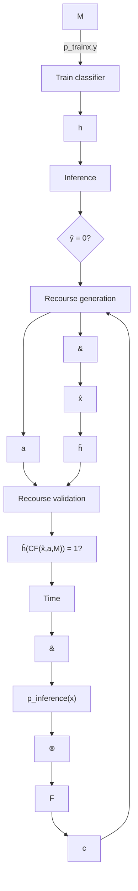

Figure E.1: Overview of the recourse process. Uncertain elements are represented with dashed circles. Possible relations between uncertain elements are represented with non-bold dashed lines. Bold dashed lines represent temporal jumps.

Indeed, the data-generation process characterised by the SCM may be imperfectly known (Küg+22) or may dynamically change over time to some other SCM $\hat { \mathcal { M } } \in \mathcal { U } _ { \mathcal { M } }$ , where $\boldsymbol { \mathcal { U } } _ { \mathcal { M } }$ is the uncertainty set over future SCMs. Consequently, the counterfactual individual resulting from the prescribed recourse intervention may also change. Furthermore, decision-makers may have to periodically retrain their models to prevent performance degradation due to the distribution shift resulting from a change in the SCM, producing further uncertainty over the future classifier $\hat { h } \in { \mathcal U } _ { h }$ (RKL20a; UJL21). Finally, it may be unreasonable to expect the individual x to not suffer changes outside of its control over a extended period of time (VA20), leading to uncertainty in the future individual $\hat { \textbf { x } } \in \mathcal { U } _ { x }$ . Thus, acting on the prescribed recourse may not lead to favourable classification due to changes to the SCM $\hat { \mathcal { M } } ,$ , classifier $\hat { h } ,$ and/or factual individual xˆ.

## e.2 sufficient conditions for the existence of robust recourse

The conditions required for the existence of robust recourse are strictly more restrictive than those required for the existence of standard recourse, since all plausible counterfactuals must be favourably classified rather than solely the one corresponding to the factual x. Example 1, illustrated in Appendix $\mathsf { A } . 2 ,$ shows that even under the strong assumption that all features are actionable and that there exists recourse for every individual $\mathbf { x } \in \mathcal { X } .$ , robust recourse may not exist for any individual $\mathbf { x } \in \mathcal { X }$ .

Example E.2.1. Consider $\mathbf { x } \in \mathbb { R } ^ { 2 } , h ( \mathbf { x } ) = \sin ( 2 \gamma \pi ^ { - 1 } x _ { 2 } ) ~ \geq ~ 0$ for $0 < \gamma < \epsilon$ and the uncertainty set $B ( \mathbf { x } ) = \{ \mathbf { x } + \Delta \mid \| \Delta \| _ { 2 } \leq \epsilon \}$ . Whilst there exists some recourse recommendation for all $\mathbf { x } \in \mathbb { R } ^ { 2 }$ , there does not exist any adversarially robust recourse recommendation for any $\mathbf { x } \in \mathbb { R } ^ { 2 }$ .

The above example relies on the fact that the classifier does not produce robust predictions for any $\mathbf { x } \in \mathcal { X }$ , and therefore no counterfactual can remain valid $( \mathrm { i . e . , }$ favourably classified) in the presence of uncertainty. This hints to some relation between robustness of prediction and robustness of recourse. In particular, for recourse to exist, the classifier must be minimally robust in the sense that there must exist at least one individual $\mathbf { x } ^ { + } \in \mathcal { X }$ such that $h ( \mathbf { x } ^ { + } ) = 1$ is robustly classified.

Lemma E.2.1. If all features are actionable and there exists some $\mathbf { x } ^ { + } \in \mathcal { X }$ such that $h ( \mathbf { x } ^ { \prime } ) = 1$ for all $\mathbf { x } ^ { \prime } \in B ( \mathbf { x } ^ { + } )$ , then there exists some adversarially robust recourse recommendation for all $\mathbf { x } \in \mathcal { X }$ .

**Table E.1: Sufficient conditions for the existence of robust recourse.**

<table><tr><td>Classifier h</td><td>Actionability constraints</td><td>SCM M</td><td>Existence of recourse</td><td>Existence of robust recourse</td></tr><tr><td> $\exists x^{+} \in \mathcal{X}$  s.t.  $h(x^{+}) = 1$ </td><td>All features actionable</td><td>Any</td><td>Guaranteed (Ustun et al. (USL19))</td><td>Not guaranteed (Example E.2.1)</td></tr><tr><td> $\exists x^{+} \in \mathcal{X}$  s.t.  $h(x') = 1$  $\forall x' \in B(x^{+})$ </td><td>All features actionable</td><td>Any</td><td>Guaranteed (Ustun et al. (USL19))</td><td>Guaranteed (Lemma E.2.1)</td></tr><tr><td>Linear</td><td> $\exists X_{j}$  actionable and unbounded</td><td>Linear</td><td>Guaranteed (Lemma E.2.2)</td><td>Guaranteed (Lemma E.2.2)</td></tr><tr><td>Any</td><td>All bounded, ≥ 1 immutable</td><td>Any</td><td>Not guaranteed (Ustun et al. (USL19))</td><td>Not guaranteed (Follows directly)</td></tr></table>

In order to relax the condition that all features must be actionable, we restrict ourselves to the case where both the classifier and the SCM are linear. Then, the existence of at least one actionable and unbounded feature is sufficient to guarantee the universal existence of robust recourse. Intuitively, the decision-maker can require arbitrarily large changes to an actionable and unbounded feature such that all plausible counterfactuals are favourably classified (e.g., increase savings for loan approval).

Lemma E.2.2. For a linear classifier $h ( \mathbf { x } ) = \langle \mathbf { w } , \mathbf { x } \rangle \geq b$ and an SCM with linear structural equations, if there exists a feature $\mathbf { \boldsymbol { x } } _ { j }$ such that $\mathbf { \boldsymbol { x } } _ { j }$ is actionable and unbounded and $w _ { j } \neq 0 ,$ , then there exists at least one adversarially robust recourse action for all $\mathbf { x } \in { \dot { \mathcal { X } } }$ .

If all features are bounded and there exists at least one immutable feature, then as per Ustun et al. (USL19) Remark 3, it is not possible to guarantee the universal existence of recourse even in the linear case, and therefore it is also not possible to guarantee the universal existence of adversarially robust recourse.

## e.3 proofs

## e.3.1 Theorem 1

Let $a ^ { * } = \mathrm { d o } ( \mathbf { X } _ { \mathcal { T } } : = \mathbf { x } _ { \mathcal { T } } + \pmb { \theta } ^ { * } )$ be the minimum-cost recourse action for a classifier h and an individual x. Assume that $a ^ { * }$ is a robust recourse action, that is, $\iota \left( \mathbb { C F } \left( \mathbb { C F } \left( \mathbf { x } , \Delta \right) , a ^ { * } \right) \right) = 1 \vee \ \left\| \Delta \right\| \leq \epsilon$ . Consider any $\mathcal { T } _ { j }$ such that for all $i \in \mathcal { Z } ,$ , $\mathbf { \boldsymbol { x } } _ { i }$ is not a causal descendent of $\mathbf { \boldsymbol { x } } _ { \mathit { I } _ { i } }$ . Consider $e _ { j } \in \mathbb { R } ^ { | \mathcal { I } | }$ such that $( e _ { j } ) _ { j } = 1$ and $( e _ { j } ) _ { i } = 0 \forall i \neq j$ . Then the action $\begin{array} { r } { a = \mathrm { d o } ( \mathbf { X } _ { \mathcal { T } } : = \mathbf { x } _ { \mathcal { T } } - \pmb { \theta } ^ { * } + \alpha e _ { j } \mathrm { s i g n } ( \pmb { \theta } _ { j } ) ) } \end{array}$ is a valid recourse action, since $h ( \mathbb { C F } \left( \mathbf { x } , a \right) ) = h ( \mathbb { C F } \left( \mathbb { C F } \left( \mathbf { x } , \alpha e _ { j } \operatorname { s i g n } ( \theta _ { j } ) \right) , a ^ { * } \right) = 1$ for any $\alpha \leq \epsilon ,$ per the assumption that $a ^ { * }$ is robust, and given that $a \in { \mathcal { F } } ( { \mathbf { x } } )$ per assumption ii) in the Theorem. Furthermore, per assumption i) in the Theorem (strict convexity of the cost function), it must be that $c ( \mathbf { x } , a ) < c ( \mathbf { x } , a ^ { * } )$ , which is a contradiction on $a ^ { * }$ being a minimum-cost recourse action, and consequently the minimum-recourse action $a ^ { * }$ must be fragile to perturbations x.

## e.3.2 Example 1

The shaded area is the favourably classified region of the feature space. While there exists recourse for every individual, there does not exist robust recourse for any individual.


X₂
xCF
γ
x
X₁

## e.3.3 Lemma 1

Per assumption, there exists some $\mathbf { x } ^ { + } \in \mathcal { X }$ such that $h ( \mathbf { x } ^ { + } ) ~ = ~ 1$ for all $\mathbf { x } ^ { \prime } \in \bar { B ( \mathbf { x } ^ { + } ) }$ , where $B ( \mathbf { x } ^ { + } ) ~ = ~ \{ { \mathbb { C } } \mathbb { F } ( \mathbf { x } ^ { + } , \Delta ) | \| \Delta \| ~ \leq ~ \epsilon \}$ . For any given individual $\mathbf { x } ,$ the action $a \ = \ d o \left( { \pmb X } = { \pmb x } + ( { \pmb x } ^ { + } - { \pmb x } ) \right)$ results in the counterfactual individual $\mathbf { x } ^ { \mathrm { C F } } = \mathbb { C F } ( \mathbf { x } , a ) = \mathbf { x } ^ { + }$ . The action a is feasible, since all features are actionable. The action a is a recourse action, since $h ( { \bf x } ^ { \mathrm { C F } } ) \ = \ h ( { \bf x } ^ { + } ) \ = \ 1$ . Since the action a hard intervenes on all features, $\begin{array} { r l r } { \mathbb { C F } ( \mathbb { C F } ( { \mathbf x } , \Delta ) , a ) } & { = } & { \mathbb { C F } ( \mathbb { C F } ( { \mathbf x } , a ) , \Delta ) \quad = \quad \mathbb { C F } ( { \mathbf x } ^ { + } , \Delta ) } \end{array}$ , and consequently $\{ \mathbb { C F } ( \mathbb { C F } ( \mathbf { x } , \Delta ) , a ) | \| \Delta \| \leq \epsilon \} = \{ \mathbb { C F } ( \mathbf { x } ^ { + } , \Delta ) | \| \Delta \| \leq \epsilon \} = B ( \mathbf { x } ^ { + } )$ . It follows that a is a robust recourse action, since $h ( \mathbf { x } ^ { \prime } ) = 1$ for all $\mathbf { x } ^ { \prime } \in B ( \mathbf { x } ^ { + } )$ .

## e.3.4 Lemma 2

Per assumption, there exists some feature $\mathbf { \boldsymbol { x } } _ { j }$ such that $\mathbf { \boldsymbol { x } } _ { j }$ is actionable and unbounded, and $\mathbf { \boldsymbol { x } } _ { j }$ affects its causal descendants linearly. Consider the recourse action $a = \mathrm { d o } ( \mathbf { X } _ { i } : = \mathbf { x } _ { i } + \pmb { \theta } )$ for $\theta \in \mathbb { R }$ . Per Theorem 2, we must find a recourse action such that $\langle \mathbf { \bar { w } } , \mathbb { C F } ( \mathbf { x } , a ) \rangle \ge b ^ { \prime }$ . Due to the linearity assumptions on the SCM, $\mathbb { C } \mathbb { F } ( \mathbf { x } , a ) = \mathbf { x } + \pmb { \theta } \mathbf { v }$ for some $v \in \mathbb { R } ^ { n }$ . Then, $\langle \mathbf { w } , \mathbb { C F } ( \mathbf { x } , a ) \rangle =$ $\langle \mathbf { w } , \mathbf { x } + \pmb { \theta } \mathbf { v } \rangle = \langle \mathbf { w } , \mathbf { x } \rangle + \pmb { \theta } \langle \mathbf { w } , \mathbf { v } \rangle$ . A robust recourse action is equivalent to any θ such that $\begin{array} { r } { \pmb { \theta } \langle \mathbf { w } , \mathbf { v } \rangle \geq b ^ { \prime } - \langle \mathbf { w } , \mathbf { x } \rangle . \mathrm { I f } \left. \mathbf { w } , \mathbf { v } \right. \neq 0 \left( \mathrm { i . e . } \right. } \end{array}$ , the non-trivial case where the weights of the classifier are not chosen adversarially to the SCM), then clearly it is possible to set θ to have arbitrarily large magnitude and same sign as $\langle \mathbf { w } , \mathbf { v } \rangle$ , such that the inequality above is met. Since $\mathbf { \boldsymbol { x } } _ { j }$ is actionable and unbounded, $a = \mathrm { d o } ( \mathbf { X } _ { j } : = \mathbf { x } _ { j } + \pmb { \theta } )$ is a feasible action. Consequently, a is a robust recourse action.

## e.3.5 Theorem 2

The adversarially robust recourse problem is defined as

$$
\min _ {a = \mathrm{do} (\mathbf {X} _ {\mathcal {I}} := \mathbf {x} _ {\mathcal {I}} + \boldsymbol {\theta})} \max _ {\mathbf {x} ^ {\prime} \in B (\mathbf {x})} c (\mathbf {x}, a) \quad \text { s.t. } \quad a \in \mathcal {F} (\mathbf {x} ^ {\prime}) \wedge h \left(\mathbb {C F} \left(\mathbf {x} ^ {\prime}, a\right)\right) = 1 \tag {E.3.1}
$$

${ \mathrm { A s s u m i n g ~ } } h ( \mathbf { x } ) = \langle \mathbf { w } , \mathbf { x } \rangle \geq b { \mathrm { ~ a n d ~ } } { \mathcal { F } } ( \mathbf { x } ) = { \mathcal { F } } ( \mathbf { x } ^ { \prime } ) \forall \mathbf { x } ^ { \prime } \in B ( \mathbf { x } )$

$$
\min _ {a = \mathrm{do} (\mathbf {X} _ {\mathcal {I}} := \mathbf {x} _ {\mathcal {I}} + \boldsymbol {\theta})} \max _ {\mathbf {x} ^ {\prime} \in B (\mathbf {x})} c (\mathbf {x}, a) \quad \text { s.t. } \quad a \in \mathcal {F} (\mathbf {x}) \wedge \langle \mathbf {w}, (\mathbb {C F} (\mathbf {x} ^ {\prime}, a)) \rangle \geq b \tag {E.3.2}
$$

For an action a to be robust feasible, the second constrain must hold for every $\mathbf { x } ^ { \prime } \in B ( \mathbf { x } )$ , that is,

$$
\left(\min _ {\mathbf {x} ^ {\prime} \in B (\mathbf {x})} \langle \mathbf {w}, (\mathbb {C F} (\mathbf {x}, a))) \rangle\right) \geq b \tag {E.3.3}
$$

Consequently, Equation E.3.2 is equivalent to

$$
\min _ {a = \mathrm{do} (\mathbf {X} _ {\mathcal {I}} := \mathbf {x} _ {\mathcal {I}} + \boldsymbol {\theta})} c (a) \quad \text { s.t. } \quad a \in \mathcal {F} (\mathbf {x}) \wedge \left(\min _ {\mathbf {x} ^ {\prime} \in B (\mathbf {x})} \langle \mathbf {w}, (\mathbb {C F} (\mathbf {x}, a))) \rangle\right) \geq b \tag {E.3.4}
$$

Then since the SCM is linear

$$
\begin{array}{l} \mathbb {C F} (\mathbb {C F} (\mathbf {x}, \Delta), a) = \mathbb {S} ^ {a} \left(\mathbb {S} ^ {- 1} \left(\mathbf {x} ^ {\prime}\right)\right) \\ = \mathbb {S} ^ {a} \left(\mathbb {S} ^ {- 1} \left(\mathbb {S} ^ {\Delta} \left(\mathbb {S} ^ {- 1} (\mathbf {x})\right)\right)\right) \\ = \mathbb {S} ^ {a} \left(\mathbb {S} ^ {- 1} \left(\mathbb {S} \left(\mathbb {S} ^ {- 1} (\mathbf {x}) + \Delta\right)\right)\right) \\ = \mathbb {S} ^ {a} \left(\mathbb {S} ^ {- 1} (\mathbf {x}) + \Delta\right) \tag {E.3.5} \\ = \mathbb {S} ^ {a} \left(\mathbb {S} ^ {- 1} (\mathbf {x})\right) + \mathbb {S} ^ {a} (\Delta) \\ = \mathbb {C F} (\mathbf {x}, a) + J _ {\mathbb {S} ^ {\mathcal {I}}} \Delta \\ \end{array}
$$

where $J _ { { \mathbb S } ^ { \mathbb T } }$ denotes the Jacobian of the interventional mapping $\mathbb { S } ^ { \mathcal { T } }$ . Then

$$
\begin{array}{l} \min _ {\mathbf {x} ^ {\prime} \in B (\mathbf {x})} \left\langle \mathbf {w}, \mathbb {C F} (\mathbf {x}, a)\right) \rangle = \min _ {\| \Delta \| \leq \epsilon} \left\langle \mathbf {w}, \mathbb {C F} (\mathbf {x}, a)\right) + J _ {\mathbb {S} ^ {\mathcal {I}}} \Delta \rangle \\ = \left\langle \mathbf {w}, \mathbb {C F} (\mathbf {x}, a)\right) \rangle + \min _ {\| \Delta \| \leq \epsilon} \left\langle \mathbf {w}, J _ {\mathbb {S} ^ {\mathcal {I}}} \Delta \right\rangle \tag {E.3.6} \\ = \left\langle \mathbf {w}, \mathbb {C F} (\mathbf {x}, a)\right) \rangle - \left\| J _ {\mathcal {S} ^ {\mathcal {I}}} ^ {T} \mathbf {w} \right\| ^ {*} \epsilon \\ \end{array}
$$

Consequently the optimization problem in Equation $\mathrm { E } . 3 { \cdot } 4$ reduces to

$$
\min _ {a = \mathrm{do} (\mathbf {X} _ {\mathcal {I}} := \mathbf {x} _ {\mathcal {I}} + \boldsymbol {\theta})} c (\mathbf {x}, a) \quad \text { s.t. } \quad a \in \mathcal {F} (\mathbf {x}) \wedge \langle \mathbf {w}, \mathbf {C F} (\mathbf {x}, a)) \rangle \geq b + \left\| J _ {\mathbb {S} ^ {\mathcal {I}}} ^ {T} \mathbf {w} \right\| ^ {*} \epsilon \tag {E.3.7}
$$

The corollary follows directly, since under the IMF assumption $J _ { \mathbb { S } ^ { \tau } } = I ,$ and then Equation $\mathrm { E } . 3 { \cdot } 7$ resembles the definition of the recourse problem in Equation 6.1 for the classifier

$$
h (\mathbf {x}) = \langle \mathbf {w}, \mathbf {x} \rangle \geq b + \| \mathbf {w} \| ^ {*} \epsilon \tag {E.3.8}
$$

## e.3.6 Theorem 3

Per Theorem 2, the robust recourse action $a ^ { \prime } \ = \ d o ( { \bf X } _ { \mathcal { T } } = { \bf x } _ { \mathcal { T } } + ( 1 + \beta \epsilon ) \pmb \theta )$ must satisfy

$$
\langle \mathbf {w}, \mathbb {C F} (\mathbf {x}, a ^ {\prime}) \rangle \geq b + \left\| J _ {\mathbb {S} ^ {\mathcal {I}}} ^ {T} \mathbf {w} \right\| ^ {*} \epsilon \tag {E.3.9}
$$

Since the SCM is linear, $\mathbb { C } \mathbb { F } ( \mathbf { x } , a ^ { \prime } ) = \mathbf { x } + J _ { \mathbb { S } ^ { I } } ( 1 + \beta \epsilon ) \pmb { \theta } .$ . Then,

$$
\begin{array}{l} \langle \mathbf {w}, \mathbb {C F} (\mathbf {x}, a ^ {\prime}) \rangle = \langle \mathbf {w}, \mathbf {x} + (1 + \beta \epsilon) J _ {\mathbb {S} ^ {\mathcal {I}}} \boldsymbol {\theta}) \rangle \\ = \left\langle \mathbf {w}, \mathbf {x} + J _ {\mathbb {S} ^ {I}} \boldsymbol {\theta} \right\rangle + \beta \epsilon \left\langle \mathbf {w}, J _ {\mathbb {S} ^ {I}} \boldsymbol {\theta} \right\rangle \tag {E.3.10} \\ \geq b + \beta \epsilon \langle \mathbf {w}, J _ {\mathbb {S} ^ {\mathcal {I}}} \boldsymbol {\theta} \rangle \\ \end{array}
$$

where the last inequality follows by assumption that a is a recourse action for $h ( \mathbf { x } ) = \left. \mathbf { w } , \mathbf { x } \right. \geq b .$ . Consequently, if

$$
\beta = \frac {\left\| J _ {S ^ {I}} ^ {T} \mathbf {w} \right\| ^ {*}}{\langle \mathbf {w} , J _ {S ^ {I}} \boldsymbol {\theta} \rangle} \tag {E.3.11}
$$

then Equation E.3.10 satisfies the robust recourse condition in Equation E.3.9.

By assumption that a is a recourse action then $\langle \mathbf { w } , J _ { \mathbb { S } ^ { T } } \rangle > 0$ . Then $0 < \beta <$ ∞. Consequently, if $a ^ { \prime } \in \mathcal { F } ( \mathbf { x } )$ , the action $\begin{array} { r } { a ^ { \prime } = \mathrm { d o } ( \mathbf { X } _ { \mathcal { T } } : = \mathbf { x } _ { \mathcal { T } } + ( 1 + \beta \epsilon ) \pmb { \theta } ) } \end{array}$ is a robust recourse action.

## e.4 datasets considered

• COMPAS: we use the features age, race, sex and priors count. We consider priors count actionable, with the actionability constrains that priors count can only decrease but not go below zero.
• Adult: we use the features sex, age, native-country, marital-status, education-num, hours-per-week. We consider education-num and hours-per-week actionable. education-num can only increase and is bounded to [1, 16], whereas hours-per-week must be below 100.
• South German Credit: we consider the features laufkont, moral, verw, sparkont, beszeit, rate, famges, buerge, wohnzeit, verm, weitkred, wohn, bishkred, beruf, pers, telef, gastarb. We consider laufzeit, hoehe as actionable, and require them to be positive.
• Bail: we use all features except RECID, TIME, FILE. We consider RULE actionable. We require that it may only decrease, but cannot be negative.
• Loan: we use all features as Karimi et al. [Kar+20b].

<table><tr><td>[AHL15]</td><td>Jason Abrevaya, Yu-Chin Hsu, and Robert P Lieli. “Estimating conditional average treatment effects.” In: Journal of Business &amp; Economic Statistics 33.4 (2015), pp. 485-505.</td></tr><tr><td>[Adu96]</td><td>Adult data. https://archive.ics.uci.edu/ml/datasets/adult. 1996.</td></tr><tr><td>[ACH10]</td><td>Charu C Aggarwal, Chen Chen, and Jiawei Han. “The inverse classification problem.” In: Journal of Computer Science and Technology 25.3 (2010), pp. 458-468.</td></tr><tr><td>[APMRRÁ20]</td><td>Carlos Aguilar-Palacios, Sergio Muñoz-Romero, and José Luis Rojo-Álvarez. “Cold-Start Promotional Sales Forecasting through Gradient Boosted-based Contrastive Explanations.” In: IEEE Access (2020).</td></tr><tr><td>[Aïv+19]</td><td>Ulrich Aïvodji, Hiromi Arai, Olivier Fortineau, Sébastien Gambis, Satoshi Hara, and Alain Tapp. “Fairwashing: the risk of rationalization.” In: arXiv preprint arXiv:1901.09749 (2019).</td></tr><tr><td>[ABG20]</td><td>Ulrich Aïvodji, Alexandre Bolot, and Sébastien Gambis. “Model extraction from counterfactual explanations.” In: arXiv preprint arXiv:2009.01884 (2020).</td></tr><tr><td>[AS17]</td><td>Ahmed M Alaa and Mihaela van der Schaar. “Bayesian inference of individualized treatment effects using multi-task gaussian processes.” In: Advances in Neural Information Processing Systems. 2017, pp. 3424-3432.</td></tr><tr><td>[AIR96]</td><td>Joshua D Angrist, Guido W Imbens, and Donald B Rubin. “Identification of causal effects using instrumental variables.” In: Journal of the American statistical Association 91.434 (1996), pp. 444-455.</td></tr><tr><td>[Ang+16]</td><td>Julia Angwin, Jeff Larson, Surya Mattu, and Lauren Kirchner. “Machine bias.” In: ProPublica, May 23 (2016), p. 2016.</td></tr><tr><td>[Arn15]</td><td>Richard Arneson. “Equality of Opportunity.” In: The Stanford Encyclopedia of Philosophy. Ed. by Edward N. Zalta. Summer 2015. Metaphysics Research Lab, Stanford University, 2015.</td></tr></table>

<!-- footnote -->

- this link

<!-- footnote end -->

<!-- footnote -->

- This is assumed beyond the scope of the chapter; we built MACE atop the open-source PySMT library (GM15) with the $Z _ { 3 }$ (MB08) backend to demonstrate its model-agnostic support of off-the-shelf models.
- All tests were conducted using one $\times 8 6 _ { - } 6 _ { 4 }$ Xeon(R) CPU @ 2.60GHz, and 8GB memory.

<!-- footnote end -->

<!-- footnote -->

- Reminder: lower distance is more desirable, as it specifies the least change required of the individual’s features.

<!-- footnote end -->

# Bibliography

[AH19a] André Artelt and Barbara Hammer. “Efficient computation of counterfactual explanations of LVQ models.” In: arXiv preprint arXiv:1908.00735 (2019).  
[AH19b] André Artelt and Barbara Hammer. “On the computation of counterfactual explanations–A survey.” In: arXiv preprint arXiv:1911.07749 (2019).  
[AH20] André Artelt and Barbara Hammer. “Convex Density Constraints for Computing Plausible Counterfactual Explanations.” In: arXiv preprint arXiv:2002.04862 (2020).  
[Art+21] André Artelt, Valerie Vaquet, Riza Velioglu, Fabian Hinder, Johannes Brinkrolf, Malte Schilling, and Barbara Hammer. “Evaluating Robustness of Counterfactual Explanations.” In: 2021 IEEE Symposium Series on Computational Intelligence (SSCI). IEEE. 2021, pp. 01–09.  
[AHH17] Georgios Arvanitidis, Lars Kai Hansen, and Søren Hauberg. “Latent space oddity: on the curvature of deep generative models.” In: arXiv preprint arXiv:1710.11379 (2017).  
[AHS20] Georgios Arvanitidis, Søren Hauberg, and Bernhard Schölkopf. “Geometrically Enriched Latent Spaces.” In: arXiv preprint arXiv:2008.00565 (2020).  
[Ate+20] Emre Ates, Burak Aksar, Vitus J Leung, and Ayse K Coskun. “Counterfactual Explanations for Machine Learning on Multivariate Time Series Data.” In: arXiv preprint arXiv:2008.10781 (2020).  
[BL13] Kevin Bache and Moshe Lichman. UCI machine learning repository. 2013.  
[BYS10] Ricardo Baeza-Yates and Alejandro Salinger. “Fast Intersection Algorithms for Sorted Sequences.” In: Algorithms and Applications: Essays Dedicated to Esko Ukkonen on the Occasion of His 60th Birthday. Ed. by Tapio Elomaa, Heikki Mannila, and Pekka Orponen. Berlin, Heidelberg: Springer Berlin Heidelberg, 2010, pp. 45–61. isbn: 978-3- 642-12476-1. doi: 10 . 1007 / 978 - 3 - 642 - 12476 - 1 \_ 3. url: https://doi.org/10.1007/978-3-642-12476-1\_3.  
[BP94] Alexander Balke and Judea Pearl. “Counterfactual probabilities: Computational methods, bounds and applications.” In: Uncertainty Proceedings 1994. Elsevier, 1994, pp. 46–54.  
[Bal+19] Vincent Ballet, Xavier Renard, Jonathan Aigrain, Thibault Laugel, Pascal Frossard, and Marcin Detyniecki. “Imperceptible Adversarial Attacks on Tabular Data.” In: arXiv preprint arXiv:1911.03274 (2019).  
[Bar+20] E Bareinboim, JD Correa, D Ibeling, and T Icard. “On Pearl’s hierarchy and the foundations of causal inference.” In: ACM Special Volume in Honor of Judea Pearl (provisional title) (2020).  
[BDS16] Solon Barocas and Andrew D. Selbst. “Big Data’s Disparate Impact.” In: SSRN Electronic Journal (Jan. 2016).  
[BHN17] Solon Barocas, Moritz Hardt, and Arvind Narayanan. “Fairness in machine learning.” In: NIPS Tutorial 1 (2017).  
[BSR20] Solon Barocas, Andrew D Selbst, and Manish Raghavan. “The hidden assumptions behind counterfactual explanations and principal reasons.” In: Proceedings of the 2020 Conference on Fairness, Accountability, and Transparency. 2020, pp. 80–89.  
[BADS20] Alejandro Barredo-Arrieta and Javier Del Ser. “Plausible Counterfactuals: Auditing Deep Learning Classifiers with Realistic Adversarial Examples.” In: arXiv preprint arXiv:2003.11323 (2020).  
[Bar+11] Clark Barrett, Christopher L. Conway, Morgan Deters, Liana Hadarean, Dejan Jovanovic, Tim King, Andrew Reynolds, and Cesare Tinelli. “CVC4.” In: Proceedings of the 23rd International Conference on Computer Aided Verification (CAV ’11). Ed. by Ganesh Gopalakrishnan and Shaz Qadeer. Vol. 6806. Springer, July 2011, pp. 171–177. url: http://www.cs.stanford.edu/\~barrett/pubs/BCD+11.pdf.  
[BH01] David M Bashtannyk and Rob J Hyndman. “Bandwidth selection for kernel conditional density estimation.” In: Computational Statistics & Data Analysis 36.3 (2001), pp. 279–298.  
[BKB17] Osbert Bastani, Carolyn Kim, and Hamsa Bastani. “Interpretability via model extraction.” In: arXiv preprint arXiv:1706.09773 (2017).  
[Bec+19] Yahav Bechavod, Katrina Ligett, Aaron Roth, Bo Waggoner, and Steven Z Wu. “Equal opportunity in online classification with partial feedback.” In: Advances in Neural Information Processing Systems. 2019, pp. 8974–8984.  
[BT09] Amir Beck and Marc Teboulle. “A fast iterative shrinkagethresholding algorithm for linear inverse problems.” In: SIAM journal on imaging sciences 2.1 (2009), pp. 183–202.  
[Bec22] Sander Beckers. “Causal Explanations and XAI.” In: arXiv preprint arXiv:2201.13169 (2022).  
[BBK19] Edmon Begoli, Tanmoy Bhattacharya, and Dimitri Kusnezov. “The need for uncertainty quantification in machine-assisted medical decision making.” In: Nature Machine Intelligence 1.1 (2019), pp. 20–23.  
[Ber20] Leopoldo Bertossi. “An ASP-Based Approach to Counterfactual Explanations for Classification.” In: arXiv preprint arXiv:2004.13237 (2020).  
[Ber+19] Dimitris Bertsimas, Jack Dunn, Colin Pawlowski, and Ying Daisy Zhuo. “Robust classification.” In: INFORMS Journal on Optimization 1.1 (2019), pp. 2–34.  
[Bha+20a] Umang Bhatt, McKane Andrus, Adrian Weller, and Alice Xiang. “Machine Learning Explainability for External Stakeholders.” In: arXiv preprint arXiv:2007.05408 (2020).  
[Bha+20b] Umang Bhatt, Alice Xiang, Shubham Sharma, Adrian Weller, Ankur Taly, Yunhan Jia, Joydeep Ghosh, Ruchir Puri, José MF Moura, and Peter Eckersley. “Explainable machine learning in deployment.” In: Proceedings of the 2020 Conference on Fairness, Accountability, and Transparency. 2020, pp. 648–657.  
[Bis94] Christopher M Bishop. “Mixture density networks.” In: (1994).  
[Bla+21] Emily Black, Zifan Wang, Matt Fredrikson, and Anupam Datta. “Consistent Counterfactuals for Deep Models.” In: arXiv preprint arXiv:2110.03109 (2021).  
[BB08] Léon Bottou and Olivier Bousquet. “The tradeoffs of large scale learning.” In: Advances in neural information processing systems. 2008, pp. 161–168.  
[BBV04] Stephen Boyd, Stephen P Boyd, and Lieven Vandenberghe. Convex optimization. Cambridge university press, 2004.  
[Bre+01] Leo Breiman et al. “Statistical modeling: The two cultures (with comments and a rejoinder by the author).” In: Statistical science 16.3 (2001), pp. 199–231.  
[Büh20] Peter Bühlmann. “Invariance, causality and robustness.” In: Statistical Science 35.3 (2020), pp. 404–426.  
[Bun+18] Rudy Bunel, Ilker Turkaslan, Philip H.S. Torr, Pushmeet Kohli, and M. Pawan Kumar. “A Unified View of Piecewise Linear Neural Network Verification.” In: Proceedings of the 32nd International Conference on Neural Information Processing Systems. NIPS’18. Montréal, Canada: Curran Associates Inc., 2018, 4795–4804.  
[Bur16] Jenna Burrell. “How the machine ‘thinks’: Understanding opacity in machine learning algorithms.” In: Big Data & Society 3.1 (2016), p. 2053951715622512.  
[Byr19] Ruth MJ Byrne. “Counterfactuals in Explainable Artificial Intelligence (XAI): Evidence from Human Reasoning.” In: IJ-CAI. 2019, pp. 6276–6282.  
[CLZ07] Longbing Cao, Dan Luo, and Chengqi Zhang. “Knowledge actionability: satisfying technical and business interestingness.” In: International Journal of Business Intelligence and Data Mining 2.4 (2007), pp. 496–514.  
[CZ06] Longbing Cao and Chengqi Zhang. “Domain-driven actionable knowledge discovery in the real world.” In: Pacific-Asia Conference on Knowledge Discovery and Data Mining. Springer. 2006, pp. 821–830.  
[Cao+09] Longbing Cao, Yanchang Zhao, Huaifeng Zhang, Dan Luo, Chengqi Zhang, and Eun Kyo Park. “Flexible frameworks for actionable knowledge discovery.” In: IEEE Transactions on Knowledge and Data Engineering 22.9 (2009), pp. 1299–1312.  
[CW17] Nicholas Carlini and David Wagner. “Towards evaluating the robustness of neural networks.” In: 2017 ieee symposium on security and privacy (sp). IEEE. 2017, pp. 39–57.  
[Car+19] Yair Carmon, Aditi Raghunathan, Ludwig Schmidt, Percy Liang, and John C Duchi. “Unlabeled data improves adversarial robustness.” In: arXiv preprint arXiv:1905.13736 (2019).  
[CR+19] Matt Chapman-Rounds, Marc-Andre Schulz, Erik Pazos, and Konstantinos Georgatzis. “EMAP: Explanation by Minimal Adversarial Perturbation.” In: arXiv preprint arXiv:1912.00872 (2019).  
[Che+20] Weilun Chen, Zhaoxiang Zhang, Xiaolin Hu, and Baoyuan Wu. “Boosting decision-based black-box adversarial attacks with random sign flip.” In: Proceedings of the European Conference on Computer Vision. 2020.  
[CWL20] Yatong Chen, Jialu Wang, and Yang Liu. “Strategic Recourse in Linear Classification.” In: arXiv preprint arXiv:2011.00355 (2020).  
[CMQ20] Furui Cheng, Yao Ming, and Huamin Qu. “DECE: Decision Explorer with Counterfactual Explanations for Machine Learning Models.” In: arXiv preprint arXiv:2008.08353 (2020).  
[Chi19] Silvia Chiappa. “Path-specific counterfactual fairness.” In: Proceedings of the AAAI Conference on Artificial Intelligence. Vol. 33. 2019, pp. 7801–7808.  
[Cho+22] Yu-Liang Chou, Catarina Moreira, Peter Bruza, Chun Ouyang, and Joaquim Jorge. “Counterfactuals and causability in explainable artificial intelligence: Theory, algorithms, and applications.” In: Information Fusion 81 (2022), pp. 59–83.  
[Cho17] Alexandra Chouldechova. “Fair prediction with disparate impact: A study of bias in recidivism prediction instruments.” In: Big data 5.2 (2017), pp. 153–163.  
[Cit+21] Jürgen Cito, Isil Dillig, Vijayaraghavan Murali, and Satish Chandra. “Counterfactual Explanations for Models of Code.” In: arXiv preprint arXiv:2111.05711 (2021).  
[CRK19] Jeremy Cohen, Elan Rosenfeld, and Zico Kolter. “Certified adversarial robustness via randomized smoothing.” In: International Conference on Machine Learning. PMLR. 2019, pp. 1310–1320.  
[CLM19] Lee Cohen, Zachary C Lipton, and Yishay Mansour. “Efficient candidate screening under multiple tests and implications for fairness.” In: arXiv preprint arXiv:1905.11361 (2019).  
[CY99] Gregory F Cooper and Changwon Yoo. “Causal discovery from a mixture of experimental and observational data.” In: Proceedings of the Fifteenth conference on Uncertainty in artificial intelligence. 1999, pp. 116–125.  
[CDG18] Sam Corbett-Davies and Sharad Goel. “The measure and mismeasure of fairness: A critical review of fair machine learning.” In: arXiv preprint arXiv:1808.00023 (2018).  
[Cor+09] Thomas H Cormen, Charles E Leiserson, Ronald L Rivest, and Clifford Stein. Introduction to algorithms. MIT press, 2009.  
[Cpl09] IBM ILOG Cplex. “V12. 1: User’s Manual for CPLEX.” In: International Business Machines Corporation 46.53 (2009), p. 157.  
[Cui+15] Zhicheng Cui, Wenlin Chen, Yujie He, and Yixin Chen. “Optimal action extraction for random forests and boosted trees.”  
In: Proceedings of the 21th ACM SIGKDD international conference on knowledge discovery and data mining. 2015, pp. 179–188.  
[Cyt+91] Ron Cytron, Jeanne Ferrante, Barry K Rosen, Mark N Wegman, and F Kenneth Zadeck. “Efficiently computing static single assignment form and the control dependence graph.”  
In: ACM Transactions on Programming Languages and Systems (TOPLAS) 13.4 (1991), pp. 451–490.  
[Dan+20] Susanne Dandl, Christoph Molnar, Martin Binder, and Bernd Bischl. “Multi-Objective Counterfactual Explanations.” In: arXiv preprint arXiv:2004.11165 (2020).  
[Dar51] G. Darmois. “Analyse des liaisons de probabilité.” In: Proc. Int. Stat. Conferences 1947. 1951, p. 231.  
[DMB08] Leonardo De Moura and Nikolaj Bjørner. “Z3: An efficient SMT solver.” In: International conference on Tools and Algorithms for the Construction and Analysis of Systems. Springer. 2008, pp. 337–340.  
[DTLP22] Giovanni De Toni, Bruno Lepri, and Andrea Passerini. “Synthesizing explainable counterfactual policies for algorithmic recourse with program synthesis.” In: arXiv preprint arXiv:2201.07135 (2022).  
[DRR20] Sarah Dean, Sarah Rich, and Benjamin Recht. “Recommendations and user agency: the reachability of collaborativelyfiltered information.” In: Proceedings of the 2020 Conference on Fairness, Accountability, and Transparency. 2020, pp. 436–445.  
[DGK21] Eoin Delaney, Derek Greene, and Mark T Keane. “Instancebased counterfactual explanations for time series classification.” In: International Conference on Case-Based Reasoning. Springer. 2021, pp. 32–47.  
[Dhu+18] Amit Dhurandhar, Pin-Yu Chen, Ronny Luss, Chun-Chen Tu, Paishun Ting, Karthikeyan Shanmugam, and Payel Das. “Explanations based on the missing: Towards contrastive explanations with pertinent negatives.” In: Advances in Neural Information Processing Systems. 2018, pp. 592–603.  
[Dhu+19] Amit Dhurandhar, Tejaswini Pedapati, Avinash Balakrishnan, Pin-Yu Chen, Karthikeyan Shanmugam, and Ruchir Puri. “Model agnostic contrastive explanations for structured data.” In: arXiv preprint arXiv:1906.00117 (2019).  
[Dij68] Edsger W. Dijkstra. “A constructive approach to the problem of program correctness.” In: BIT Numerical Mathematics 8.3 (Sept. 1, 1968), pp. 174–186. issn: 1572-9125. doi: 10.1007/ BF01933419. url: https://doi.org/10.1007/BF01933419.  
[DOKS22] Ricardo Dominguez-Olmedo, Amir H Karimi, and Bernhard Schölkopf. “On the adversarial robustness of causal algorithmic recourse.” In: International Conference on Machine Learning. PMLR. 2022, pp. 5324–5342.  
[Don+18] Jinshuo Dong, Aaron Roth, Zachary Schutzman, Bo Waggoner, and Zhiwei Steven Wu. “Strategic classification from revealed preferences.” In: Proceedings of the 2018 ACM Conference on Economics and Computation. 2018, pp. 55–70.  
[DVK17] Finale Doshi-Velez and Been Kim. “Towards a rigorous science of interpretable machine learning.” In: arXiv preprint arXiv:1702.08608 (2017).  
[Dow+20] Michael Downs, Jonathan L Chu, Yaniv Yacoby, Finale Doshi-Velez, and Weiwei Pan. “CRUDS: Counterfactual Recourse Using Disentangled Subspaces.” In: ICML Workshop on Human Interpretability in Machine Learning. 2020.  
[Du+11] Jianfeng Du, Yong Hu, Charles X Ling, Ming Fan, and Mei Liu. “Efficient action extraction with many-to-many relationship between actions and features.” In: International Workshop on Logic, Rationality and Interaction. Springer. 2011, pp. 384– 385.  
[DG17] Dheeru Dua and Casey Graff. UCI Machine Learning Repository. 2017. url: http://archive.ics.uci.edu/ml.  
[DF18] Cynthia Dwork and Vitaly Feldman. “Privacy-preserving prediction.” In: arXiv preprint arXiv:1803.10266 (2018).  
[Dwo+12] Cynthia Dwork, Moritz Hardt, Toniann Pitassi, Omer Reingold, and Richard Zemel. “Fairness through awareness.” In: Proceedings of the 3rd innovations in theoretical computer science conference. ACM. 2012, pp. 214–226.  
[ES07] Frederick Eberhardt and Richard Scheines. “Interventions and causal inference.” In: Philosophy of science 74.5 (2007), pp. 981–995.  
[Eck+21] Nils Eckstein, Alexander S Bates, Gregory SXE Jefferis, and Jan Funke. “Discriminative Attribution from Counterfactuals.” In: arXiv preprint arXiv:2109.13412 (2021).  
[Ehl17] Ruediger Ehlers. “Formal verification of piece-wise linear feed-forward neural networks.” In: International Symposium on Automated Technology for Verification and Analysis. Springer. 2017, pp. 269–286.  
[ELR21] Andrew Elliott, Stephen Law, and Chris Russell. “Explaining classifiers using adversarial perturbations on the perceptual ball.” In: Proceedings of the IEEE/CVF Conference on Computer Vision and Pattern Recognition. 2021, pp. 10693–10702.  
[FFF15] Alhussein Fawzi, Omar Fawzi, and Pascal Frossard. “Fundamental limits on adversarial robustness.” In: Proc. ICML, Workshop on Deep Learning. 2015.  
[FMDF16] Alhussein Fawzi, Seyed-Mohsen Moosavi-Dezfooli, and Pascal Frossard. “Robustness of classifiers: from adversarial to random noise.” In: Advances in Neural Information Processing Systems 29 (2016), pp. 1632–1640.  
[FPH20] Carlos Fernandez, Foster Provost, and Xintian Han. “Explaining data-driven decisions made by ai systems: The counterfactual approach.” In: arXiv preprint arXiv:2001.07417 (2020).  
[FS01] Cormac Flanagan and James B Saxe. “Avoiding exponential explosion: Generating compact verification conditions.” In: ACM SIGPLAN Notices. Vol. 36. 3. ACM. 2001, pp. 193–205.  
[Flo93] Robert W. Floyd. “Assigning Meanings to Programs.” In: Program Verification: Fundamental Issues in Computer Science. Ed. by Timothy R. Colburn, James H. Fetzer, and Terry L. Rankin. Dordrecht: Springer Netherlands, 1993, pp. 65–81. isbn: 978- 94-011-1793-7. doi: 10 . 1007 / 978 - 94 - 011 - 1793 - 7\_4. url: https://doi.org/10.1007/978-94-011-1793-7\_4.  
[Fre20] Timo Freiesleben. Counterfactual Explanations & Adversarial Examples – Common Grounds, Essential Differences, and Potential Transfers. 2020. arXiv: 2009.05487 [cs.AI].  
[Fre21] Timo Freiesleben. “The intriguing relation between counterfactual explanations and adversarial examples.” In: Minds and Machines (2021), pp. 1–33.  
[Fre14] Alex A Freitas. “Comprehensible classification models: a position paper.” In: ACM SIGKDD explorations newsletter 15.1 (2014), pp. 1–10.  
[FN00] Nir Friedman and Iftach Nachman. “Gaussian process networks.” In: Proceedings of the Sixteenth conference on Uncertainty in Artificial Intelligence. 2000, pp. 211–219.  
[GPS21] Sainyam Galhotra, Romila Pradhan, and Babak Salimi. “Feature attribution and recourse via probabilistic contrastive counterfactuals.” In: Proceedings of the ICML Workshop on Algorithmic Recourse. 2021, pp. 1–6.  
[GM15] Marco Gario and Andrea Micheli. “PySMT: a solver-agnostic library for fast prototyping of SMT-based algorithms.” In: SMT workshop. Vol. 2015. 2015.  
[Gei+20] Robert Geirhos, Jörn-Henrik Jacobsen, Claudio Michaelis, Richard Zemel, Wieland Brendel, Matthias Bethge, and Felix A Wichmann. “Shortcut learning in deep neural networks.” In: Nature Machine Intelligence 2.11 (2020), pp. 665–673.  
[Ger+17] Tobias Gerstenberg, Matthew F Peterson, Noah D Goodman, David A Lagnado, and Joshua B Tenenbaum. “Eye-tracking causality.” In: Psychological science 28.12 (2017), pp. 1731–1744.  
[Gha+20] Azin Ghazimatin, Oana Balalau, Rishiraj Saha Roy, and Gerhard Weikum. “PRINCE: Provider-side Interpretability with Counterfactual Explanations in Recommender Systems.” In: Proceedings of the 13th International Conference on Web Search and Data Mining. 2020, pp. 196–204.  
[Gom+20] Oscar Gomez, Steffen Holter, Jun Yuan, and Enrico Bertini. “ViCE: visual counterfactual explanations for machine learning models.” In: Proceedings of the 25th International Conference on Intelligent User Interfaces. 2020, pp. 531–535.  
[GSS14] Ian J Goodfellow, Jonathon Shlens, and Christian Szegedy. “Explaining and harnessing adversarial examples.” In: arXiv preprint arXiv:1412.6572 (2014).  
[Goy+19] Yash Goyal, Ziyan Wu, Jan Ernst, Dhruv Batra, Devi Parikh, and Stefan Lee. “Counterfactual visual explanations.” In: arXiv preprint arXiv:1904.07451 (2019).  
[Gra+18] Rory Mc Grath, Luca Costabello, Chan Le Van, Paul Sweeney, Farbod Kamiab, Zhao Shen, and Freddy Lecue. “Interpretable credit application predictions with counterfactual explanations.” In: arXiv preprint arXiv:1811.05245 (2018).  
[Gre+12] Arthur Gretton, Karsten M Borgwardt, Malte J Rasch, Bernhard Schölkopf, and Alexander Smola. “A kernel two-sample test.” In: Journal of Machine Learning Research 13.Mar (2012), pp. 723–773.  
[GH+17] Nina Grgi´c-Hlaˇca, Muhammad Bilal Zafar, Krishna Gummadi, and Adrian Weller. “On Fairness, Diversity, and Randomness in Algorithmic Decision Making.” In: 4th Workshop on Fairness, Accountability, and Transparency in Machine Learning. 2017.  
[Gro19] U Groemping. “South German credit data: Correcting a widely used data set.” In: Rep. Math., Phys. Chem., Berlin, Germany, Tech. Rep 4 (2019), p. 2019.  
[GB20] Thomas Grote and Philipp Berens. “On the ethics of algorithmic decision-making in healthcare.” In: Journal of medical ethics 46.3 (2020), pp. 205–211.  
[Gui+19] Riccardo Guidotti, Anna Monreale, Stan Matwin, and Dino Pedreschi. “Black Box Explanation by Learning Image Exemplars in the Latent Feature Space.” In: Joint European Conference on Machine Learning and Knowledge Discovery in Databases. Springer. 2019, pp. 189–205.  
[Gui+18] Riccardo Guidotti, Anna Monreale, Salvatore Ruggieri, Dino Pedreschi, Franco Turini, and Fosca Giannotti. “Local rulebased explanations of black box decision systems.” In: arXiv preprint arXiv:1805.10820 (2018).  
[Gun19] David Gunning. “DARPA’s explainable artificial intelligence (XAI) program.” In: Proceedings of the 24th International Conference on Intelligent User Interfaces. ACM. 2019, pp. ii–ii.  
[Gup+19] Vivek Gupta, Pegah Nokhiz, Chitradeep Dutta Roy, and Suresh Venkatasubramanian. “Equalizing Recourse across Groups.” In: arXiv preprint arXiv:1909.03166 (2019).  
[GO20] LLC Gurobi Optimization. Gurobi Optimizer Reference Manual. 2020. url: http://www.gurobi.com.  
[HP05] Joseph Y Halpern and Judea Pearl. “Causes and explanations: A structural-model approach. Part I: Causes.” In: The British journal for the philosophy of science 56.4 (2005), pp. 843–887.  
[HL20] Leif Hancox-Li. “Robustness in machine learning explanations: does it matter?” In: Proceedings of the 2020 Conference on Fairness, Accountability, and Transparency. 2020, pp. 640–647.  
[Har+16] Moritz Hardt, Nimrod Megiddo, Christos Papadimitriou, and Mary Wootters. “Strategic classification.” In: Proceedings of the 2016 ACM conference on innovations in theoretical computer science. 2016, pp. 111–122.  
[HPS16] Moritz Hardt, Eric Price, and Nati Srebro. “Equality of opportunity in supervised learning.” In: Advances in neural information processing systems. 2016, pp. 3315–3323.  
[HF20] Masoud Hashemi and Ali Fathi. “PermuteAttack: Counterfactual Explanation of Machine Learning Credit Scorecards.” In: arXiv preprint arXiv:2008.10138 (2020).  
[Hec10] James J Heckman. “Building bridges between structural and program evaluation approaches to evaluating policy.” In: Journal of Economic literature 48.2 (2010), pp. 356–98.  
[HV05] James J Heckman and Edward Vytlacil. “Structural equations, treatment effects, and econometric policy evaluation 1.” In: Econometrica 73.3 (2005), pp. 669–738.  
[HJVE01] T. Hickey, Q. Ju, and M. H. Van Emden. “Interval Arithmetic: From Principles to Implementation.” In: J. ACM 48.5 (Sept. 2001), 1038–1068. issn: 0004-5411. doi: 10 . 1145 / 502102 . 502106. url: https://doi.org/10.1145/502102.502106.  
[Hil90] Denis J Hilton. “Conversational processes and causal explanation.” In: Psychological Bulletin 107.1 (1990), p. 65.  
[HS86] Denis J Hilton and Ben R Slugoski. “Knowledge-based causal attribution: The abnormal conditions focus model.” In: Psychological review 93.1 (1986), p. 75.  
[Hoa69] Charles Antony Richard Hoare. “An axiomatic basis for computer programming.” In: Communications of the ACM 12.10 (1969), pp. 576–580.  
[HGB] Steffen Holter, Oscar Gomez, and Enrico Bertini. “FICO Explainable Machine Learning Challenge.” In: (). url: http://archive.ics.uci.edu/ml.  
[Hol+21] Andreas Holzinger, Bernd Malle, Anna Saranti, and Bastian Pfeifer. “Towards multi-modal causability with Graph Neural Networks enabling information fusion for explainable AI.” In: Information Fusion 71 (2021), pp. 28–37.  
[Hoy+09] Patrik O Hoyer, Dominik Janzing, Joris M Mooij, Jonas Peters, and Bernhard Schölkopf. “Nonlinear causal discovery with additive noise models.” In: Advances in neural information processing systems. 2009, pp. 689–696.  
[HIV19] Lily Hu, Nicole Immorlica, and Jennifer Wortman Vaughan. “The disparate effects of strategic manipulation.” In: Proceedings of the Conference on Fairness, Accountability, and Transparency. 2019, pp. 259–268.  
[Hua+17] Xiaowei Huang, Marta Kwiatkowska, Sen Wang, and Min Wu. “Safety Verification of Deep Neural Networks.” In: Computer Aided Verification - 29th International Conference, CAV. Ed. by Rupak Majumdar and Viktor Kuncak. Vol. 10426. Springer, 2017, pp. 3–29. doi: 10.1007/978- 3- 319- 63387- 9\_1. url: https://doi.org/10.1007/978-3-319-63387-9\_1.  
[HP+18] Dong Huk Park, Lisa Anne Hendricks, Zeynep Akata, Anna Rohrbach, Bernt Schiele, Trevor Darrell, and Marcus Rohrbach. “Multimodal explanations: Justifying decisions and pointing to the evidence.” In: Proceedings of the IEEE Conference on Computer Vision and Pattern Recognition. 2018, pp. 8779–8788.  
[HIA21] Frederik Hvilshøj, Alexandros Iosifidis, and Ira Assent. “On Quantitative Evaluations of Counterfactuals.” In: arXiv preprint arXiv:2111.00177 (2021).  
[HP99] Aapo Hyvärinen and Petteri Pajunen. “Nonlinear independent component analysis: Existence and uniqueness results.” In: Neural Networks 12.3 (1999), pp. 429–439.  
[Ilv19] Christina Ilvento. “Metric Learning for Individual Fairness.” In: arXiv preprint arXiv:1906.00250 (2019).  
[Ily+18] Andrew Ilyas, Logan Engstrom, Anish Athalye, and Jessy Lin. “Black-box adversarial attacks with limited queries and information.” In: arXiv preprint arXiv:1804.08598 (2018).  
[JS10] Dominik Janzing and Bernhard Scholkopf. “Causal inference using the algorithmic Markov condition.” In: IEEE Transactions on Information Theory 56.10 (2010), pp. 5168–5194.  
[Jos+19] Shalmali Joshi, Oluwasanmi Koyejo, Warut Vijitbenjaronk, Been Kim, and Joydeep Ghosh. “REVISE: Towards Realistic Individual Recourse and Actionable Explanations in Black-Box Decision Making Systems.” In: arXiv preprint arXiv:1907.09615 (2019).  
[Kan+20a] Kentaro Kanamori, Takuya Takagi, Ken Kobayashi, and Hiroki Arimura. “DACE: Distribution-Aware Counterfactual Explanation by Mixed-Integer Linear Optimization.” In: Proceedings of the Twenty-Ninth International Joint Conference on Artificial Intelligence, IJCAI-20. Ed. by Christian Bessiere. Main track. International Joint Conferences on Artificial Intelligence Organization, July 2020, pp. 2855–2862. doi: 10 . 24963 / ijcai . 2020 / 395. url: https://doi.org/10.24963/ijcai.2020/395.  
[Kan+20b] Sin-Han Kang, Hong-Gyu Jung, Dong-Ok Won, and Seong-Whan Lee. “Counterfactual Explanation Based on Gradual Construction for Deep Networks.” In: arXiv preprint arXiv:2008.01897 (2020).  
[KR13] Masud Karim and Rashedur M Rahman. “Decision tree and naive bayes algorithm for classification and generation of actionable knowledge for direct marketing.” In: (2013).  
[Kar+20a] Amir-Hossein Karimi, Gilles Barthe, Borja Balle, and Isabel Valera. “Model-agnostic counterfactual explanations for consequential decisions.” In: International Conference on Artificial Intelligence and Statistics. 2020, pp. 895–905.  
[Kar+22] Amir-Hossein Karimi, Gilles Barthe, Bernhard Schölkopf, and Isabel Valera. “A survey of algorithmic recourse: contrastive explanations and consequential recommendations.” In: ACM Computing Surveys 55.5 (2022), pp. 1–29.  
[KSV21] Amir-Hossein Karimi, Bernhard Schölkopf, and Isabel Valera. “Algorithmic recourse: from counterfactual explanations to interventions.” In: 4th Conference on Fairness, Accountability, and Transparency (FAccT 2021). 2021, pp. 353–362.  
[Kar+20b] Amir-Hossein Karimi, Julius Von Kügelgen, Bernhard Schölkopf, and Isabel Valera. “Algorithmic recourse under imperfect causal knowledge: a probabilistic approach.” In: Advances in neural information processing systems 33 (2020), pp. 265–277.  
[Kar39] W. Karush. “Minima of Functions of Several Variables with Inequalities as Side Conditions.” In: Master’s Thesis, Department of Mathematics, University of Chicago (1939).  
[Kat+17] Guy Katz, Clark Barrett, David L Dill, Kyle Julian, and Mykel J Kochenderfer. “katz2017reluplex: An efficient SMT solver for verifying deep neural networks.” In: International Conference on Computer Aided Verification. Springer. 2017, pp. 97–117.  
[Kea+21] Mark T Keane, Eoin M Kenny, Eoin Delaney, and Barry Smyth. “If only we had better counterfactual explanations: Five key deficits to rectify in the evaluation of counterfactual xai techniques.” In: arXiv preprint arXiv:2103.01035 (2021).  
[KS20] Mark T Keane and Barry Smyth. “Good Counterfactuals and Where to Find Them: A Case-Based Technique for Generating Counterfactuals for Explainable AI (XAI).” In: arXiv preprint arXiv:2005.13997 (2020).  
[Kil+17] Niki Kilbertus, Mateo Rojas Carulla, Giambattista Parascandolo, Moritz Hardt, Dominik Janzing, and Bernhard Schölkopf. “Avoiding discrimination through causal reasoning.” In: Advances in Neural Information Processing Systems. 2017, pp. 656–666.  
[Kil+20] Niki Kilbertus, Manuel Gomez Rodriguez, Bernhard Schölkopf, Krikamol Muandet, and Isabel Valera. “Fair decisions despite imperfect predictions.” In: International Conference on Artificial Intelligence and Statistics. 2020, pp. 277– 287.  
[KB15] Diederik P Kingma and Jimmy Ba. “Adam: A method for stochastic optimization.” In: 3rd International Conference for Learning Representations. 2015.  
[KW14] Diederik P Kingma and Max Welling. “Auto-encoding variational Bayes.” In: 2nd International Conference on Learning Representations. 2014.

<table><tr><td>[KR20]</td><td>Jon Kleinberg and Manish Raghavan. “How Do Classifiers Induce Agents to Invest Effort Strategically?” In: ACM Transactions on Economics and Computation (TEAC) 8.4 (2020), pp. 1–23.</td></tr><tr><td>[Kod94]</td><td>Yves Kodratoff. “The comprehensibility manifesto.” In: KDD Nugget Newsletter 94.9 (1994).</td></tr><tr><td>[KM+21]</td><td>Ramaravind Kommiya Mothilal, Divyat Mahajan, Chenhao Tan, and Amit Sharma. “Towards unifying feature attribution and counterfactual explanations: Different means to the same end.” In: Proceedings of the 2021 AAAI/ACM Conference on AI, Ethics, and Society. 2021, pp. 652–663.</td></tr><tr><td>[KFGW21]</td><td>Gunnar König, Timo Freiesleben, and Moritz Grosse-Wentrup. “A causal perspective on meaningful and robust algorithmic recourse.” In: arXiv preprint arXiv:2107.07853 (2021).</td></tr><tr><td>[KR21]</td><td>Tara Koopman and Silja Renooij. “Persuasive contrastive explanations for Bayesian networks.” In: European Conference on Symbolic and Quantitative Approaches with Uncertainty. Springer. 2021, pp. 229–242.</td></tr><tr><td>[Kor+04]</td><td>Kevin B Korb, Lucas R Hope, Ann E Nicholson, and Karl Axnick. “Varieties of causal intervention.” In: Pacific Rim International Conference on Artificial Intelligence. Springer. 2004, pp. 322–331.</td></tr><tr><td>[KU20]</td><td>Maxim S Kovalev and Lev V Utkin. “Counterfactual explanation of machine learning survival models.” In: arXiv preprint arXiv:2006.16793 (2020).</td></tr><tr><td>[KSo8]</td><td>Daniel Kroening and Ofer Strichman. Decision Procedures: An Algorithmic Point of View. 1st ed. Springer Publishing Company, Incorporated, 2008. ISBN: 3540741046, 9783540741046.</td></tr><tr><td>[Küg+21]</td><td>Julius von Kügelgen, Nikita Agarwal, Jakob Zeitler, Afsaneh Mastouri, and Bernhard Schölkopf. “Algorithmic Recourse in Partially and Fully Confounded Settings Through Bound-ing Counterfactual Effects.” In: ICML Workshop on Algorithmic Recourse. 2021.</td></tr><tr><td>[Küg+22]</td><td>Julius von Kügelgen, Amir-Hossein Karimi, Umang Bhatt, Isabel Valera, Adrian Weller, and Bernhard Schölkopf. “On the Fairness of Causal Algorithmic Recourse.” In: Proceedings of the 36th AAAI Conference on Artificial Intelligence. 2022.</td></tr></table>

[Küg+19] Julius von Kügelgen, Paul K Rubenstein, Bernhard Schölkopf, and Adrian Weller. “Optimal experimental design via Bayesian optimization: active causal structure learning for Gaussian process networks.” In: NeurIPS Workshop ”Do the right thing”: machine learning and causal inference for improved decision making (2019).  
[KT51] Harold W Kuhn and Albert W Tucker. “Nonlinear programming.” In: Proceedings of the second Berkeley symposium on mathematical statistics and probability. Ed. by J. Neyman. University of California Press, Berkeley, 1951.  
[Kus+17] Matt J Kusner, Joshua Loftus, Chris Russell, and Ricardo Silva. “Counterfactual fairness.” In: Advances in Neural Information Processing Systems. 2017, pp. 4066–4076.  
[Lag+19] Isaac Lage, Emily Chen, Jeffrey He, Menaka Narayanan, Been Kim, Sam Gershman, and Finale Doshi-Velez. “An evaluation of the human-interpretability of explanation.” In: arXiv preprint arXiv:1902.00006 (2019).  
[LB20] Himabindu Lakkaraju and Osbert Bastani. “"How do I fool you?" Manipulating User Trust via Misleading Black Box Explanations.” In: Proceedings of the AAAI/ACM Conference on AI, Ethics, and Society. 2020, pp. 79–85.  
[Lar+16a] Jeff Larson, Surya Mattu, Lauren Kirchner, and Julia Angwin. https://github.com/propublica/compas-analysis. 2016.  
[Lar+16b] Jeff Larson, Surya Mattu, Lauren Kirchner, and Julia Angwin. “How we analyzed the COMPAS recidivism algorithm.” In: ProPublica (5 2016) 9.1 (2016).  
[Las+17a] Michael T Lash, Qihang Lin, Nick Street, Jennifer G Robinson, and Jeffrey Ohlmann. “Generalized inverse classification.” In: Proceedings of the 2017 SIAM International Conference on Data Mining. SIAM. 2017, pp. 162–170.  
[LLS18] Michael T Lash, Qihang Lin, and W Nick Street. “Prophit: Causal inverse classification for multiple continuously valued treatment policies.” In: arXiv preprint arXiv:1802.04918 (2018).  
[Las+17b] Michael T Lash, Qihang Lin, W Nick Street, and Jennifer G Robinson. “A budget-constrained inverse classification framework for smooth classifiers.” In: 2017 IEEE International Conference on Data Mining Workshops (ICDMW). IEEE. 2017, pp. 1184–1193.  
[Lau+19] Thibault Laugel, Marie-Jeanne Lesot, Christophe Marsala, and Marcin Detyniecki. “Issues with post-hoc counterfactual explanations: a discussion.” In: arXiv preprint arXiv:1906.04774 (2019).  
[Lau+17] Thibault Laugel, Marie-Jeanne Lesot, Christophe Marsala, Xavier Renard, and Marcin Detyniecki. “Inverse Classification for Comparison-based Interpretability in Machine Learning.” In: arXiv preprint arXiv:1712.08443 (2017).  
[LW66] Eugene L Lawler and David E Wood. “Branch-and-bound methods: A survey.” In: Operations research 14.4 (1966), pp. 699–719.  
[LBH15] Yann LeCun, Yoshua Bengio, and Geoffrey Hinton. “Deep learning.” In: Nature 521.7553 (2015), pp. 436–444. doi: 10 . 1038/nature14539. url: https://doi.org/10.1038/nature14539.  
[LR21] Sagi Levanon and Nir Rosenfeld. “Strategic classification made practical.” In: International Conference on Machine Learning. PMLR. 2021, pp. 6243–6253.  
[Lew73] David K Lewis. Counterfactuals. Harvard University Press, 1973.  
[Lew86] David K Lewis. “Causal Explanation.” In: Philosophical Papers Vol. Ii. Ed. by David Lewis. Oxford University Press, 1986, pp. 214–240.  
[Lic+13] Moshe Lichman et al. UCI machine learning repository. https://archive.ics.uci.edu/ml/datasets/adult. 2013.  
[Lip90] Peter Lipton. “Contrastive Explanation.” In: Royal Institute of Philosophy Supplement 27 (1990), pp. 247–266. doi: 10.1017/ s1358246100005130.  
[Lip18] Zachary C. Lipton. “The Mythos of Model Interpretability.” In: Queue 16.3 (June 2018), 30:31–30:57. issn: 1542-7730. doi: 10.1145/3236386.3241340.  
[Liu+19] Changliu Liu, Tomer Arnon, Christopher Lazarus, Clark W. Barrett, and Mykel J. Kochenderfer. “Algorithms for Verifying Deep Neural Networks.” In: CoRR abs/1903.06758 (2019). arXiv: 1903.06758. url: http://arxiv.org/abs/1903.06758.  
[Liu+20] Lydia T Liu, Ashia Wilson, Nika Haghtalab, Adam Tauman Kalai, Christian Borgs, and Jennifer Chayes. “The disparate equilibria of algorithmic decision making when individuals invest rationally.” In: Proceedings of the 2020 Conference on Fairness, Accountability, and Transparency. 2020, pp. 381–391.  
[Lof+18] Joshua R Loftus, Chris Russell, Matt J Kusner, and Ricardo Silva. “Causal reasoning for algorithmic fairness.” In: arXiv preprint arXiv:1805.05859 (2018).  
[Lou+17] Christos Louizos, Uri Shalit, Joris M Mooij, David Sontag, Richard Zemel, and Max Welling. “Causal effect inference with deep latent-variable models.” In: Advances in Neural Information Processing Systems. 2017, pp. 6446–6456.  
[LM05] Daniel Lowd and Christopher Meek. “Adversarial learning.” In: Proceedings of the eleventh ACM SIGKDD international conference on Knowledge discovery in data mining. ACM. 2005, pp. 641–647.  
[LHR20] Ana Lucic, Hinda Haned, and Maarten de Rijke. “Why does my model fail? contrastive local explanations for retail forecasting.” In: Proceedings of the 2020 Conference on Fairness, Accountability, and Transparency. 2020, pp. 90–98.  
[Luc+19] Ana Lucic, Harrie Oosterhuis, Hinda Haned, and Maarten de Rijke. “Actionable Interpretability through Optimizable Counterfactual Explanations for Tree Ensembles.” In: arXiv preprint arXiv:1911.12199 (2019).  
[Mad+18] Aleksander Madry, Aleksandar Makelov, Ludwig Schmidt, Dimitris Tsipras, and Adrian Vladu. “Towards deep learning models resistant to adversarial attacks.” In: International Conference on Learning Representations (2018).  
[Mad+19] Prashan Madumal, Tim Miller, Liz Sonenberg, and Frank Vetere. “Explainable reinforcement learning through a causal lens.” In: arXiv preprint arXiv:1905.10958 (2019).  
[Mad+20] Prashan Madumal, Tim Miller, Liz Sonenberg, and Frank Vetere. “Distal Explanations for Explainable Reinforcement Learning Agents.” In: arXiv preprint arXiv:2001.10284 (2020).  
[MTS19] Divyat Mahajan, Chenhao Tan, and Amit Sharma. “Preserving Causal Constraints in Counterfactual Explanations for Machine Learning Classifiers.” In: arXiv preprint arXiv:1912.03277 (2019).  
[MK00] Michael V Mannino and Murlidhar V Koushik. “The cost-minimizing inverse classification problem: a genetic algorithm approach.” In: Decision Support Systems 29.3 (2000), pp. 283–300.  
[MP14] David Martens and Foster Provost. “Explaining data-driven document classifications.” In: Mis Quarterly 38.1 (2014), pp. 73–100.  
[Maz+21] Raphael Mazzine, Sofie Goethals, Dieter Brughmans, and David Martens. “Counterfactual explanations for employment services.” In: International workshop on Fair, Effective And Sustainable Talent management using data science. 2021, pp. 1–7.  
[MK93] Ann L McGill and Jill G Klein. “Contrastive and counterfactual reasoning in causal judgment.” In: Journal of Personality and Social Psychology 64.6 (1993), p. 897.  
[Mer+20] Silvan Mertes, Tobias Huber, Katharina Weitz, Alexander Heimerl, and Elisabeth André. “GANterfactual-Counterfactual Explanations for Medical Non-Experts using Generative Adversarial Learning.” In: arXiv preprint arXiv:2012.11905 (2020).  
[Mil56] George A Miller. “The magical number seven, plus or minus two: Some limits on our capacity for processing information.” In: Psychological review 63.2 (1956), p. 81.  
[MMH20] John Miller, Smitha Milli, and Moritz Hardt. “Strategic classification is causal modeling in disguise.” In: International Conference on Machine Learning. PMLR. 2020, pp. 6917–6926.  
[Mil18] Tim Miller. “Contrastive explanation: A structural-model approach.” In: arXiv preprint arXiv:1811.03163 (2018).  
[Mil19] Tim Miller. “Explanation in artificial intelligence: Insights from the social sciences.” In: Artificial Intelligence 267 (2019), pp. 1–38.  
[Mil+19a] Smitha Milli, John Miller, Anca D Dragan, and Moritz Hardt. “The social cost of strategic classification.” In: Proceedings of the Conference on Fairness, Accountability, and Transparency. 2019, pp. 230–239.  
[Mil+19b] Smitha Milli, Ludwig Schmidt, Anca D Dragan, and Moritz Hardt. “Model reconstruction from model explanations.” In: Proceedings of the Conference on Fairness, Accountability, and Transparency. 2019, pp. 1–9.  
[MRW19] Brent Mittelstadt, Chris Russell, and Sandra Wachter. “Explaining explanations in AI.” In: Proceedings of the conference on fairness, accountability, and transparency. 2019, pp. 279–288.  
[Moh+21] K. Mohammadi, A.-H. Karimi, G. Barthe, and I. Valera. “Scaling Guarantees for Nearest Counterfactual Explanations.” In: (2021).  
[MD+17] Seyed-Mohsen Moosavi-Dezfooli, Alhussein Fawzi, Omar Fawzi, and Pascal Frossard. “Universal adversarial perturbations.” In: Proceedings of the IEEE conference on computer vision and pattern recognition. 2017, pp. 1765–1773.  
[MDFF16] Seyed-Mohsen Moosavi-Dezfooli, Alhussein Fawzi, and Pascal Frossard. “Deepfool: a simple and accurate method to fool deep neural networks.” In: Proceedings of the IEEE conference on computer vision and pattern recognition. 2016, pp. 2574–2582.  
[MT+12] Jose G Moreno-Torres, Troy Raeder, Rocío Alaiz-Rodríguez, Nitesh V Chawla, and Francisco Herrera. “A unifying view on dataset shift in classification.” In: Pattern recognition 45.1 (2012), pp. 521–530.  
[MST20] Ramaravind K. Mothilal, Amit Sharma, and Chenhao Tan. “Explaining Machine Learning Classifiers through Diverse Counterfactual Explanations.” In: Proceedings of the 2020 Conference on Fairness, Accountability, and Transparency. FAT\* ’20. Barcelona, Spain: Association for Computing Machinery, 2020, 607–617. isbn: 9781450369367. doi: 10.1145/3351095. 3372850. url: https://doi.org/10.1145/3351095.3372850.  
[MB08] Leonardo Mendonça de Moura and Nikolaj Bjørner. “Z3: An Efficient SMT Solver.” In: Tools and Algorithms for the Construction and Analysis of Systems, 14th International Conference, TACAS 2008. Ed. by C. R. Ramakrishnan and Jakob Rehof. Vol. 4963. Springer, 2008, pp. 337– 340. doi: 10 . 1007 / 978 - 3 - 540 - 78800 - 3 \ \_24. url: https://doi.org/10.1007/978-3-540-78800-3\_24.

<table><tr><td>[MBS13]</td><td>Krikamol Muandet, David Balduzzi, and Bernhard Schölkopf. “Domain generalization via invariant feature representation.” In: International Conference on Machine Learning. PMLR. 2013, pp. 10–18.</td></tr><tr><td>[Muk+02]</td><td>Amitabha Mukerjee, Rita Biswas, Kalyanmoy Deb, and Amrit P Mathur. “Multi-objective evolutionary algorithms for the risk-return trade-off in bank loan management.” In: International Transactions in operational research 9.5 (2002), pp. 583–597.</td></tr><tr><td>[Mur+19]</td><td>W James Murdoch, Chandan Singh, Karl Kumbier, Reza Abbasi-Asl, and Bin Yu. “Definitions, methods, and applications in interpretable machine learning.” In: Proceedings of the National Academy of Sciences 116.44 (2019), pp. 22071–22080.</td></tr><tr><td>[Mur94]</td><td>Patrick M Murphy. “UCI repository of machine learning databases.” In: ftp://pub/machine-learning-databaseonics. uci. edu (1994).</td></tr><tr><td>[NMS19]</td><td>Razieh Nabi, Daniel Malinsky, and Ilya Shpitser. “Learning optimal fair policies.” In: International Conference on Machine Learning. PMLR. 2019, pp. 4674–4682.</td></tr><tr><td>[NS18]</td><td>Razieh Nabi and Ilya Shpitser. “Fair inference on outcomes.” In: Proceedings of the... AAAI Conference on Artificial Intelligence. AAAI Conference on Artificial Intelligence. Vol. 2018. NIH Public Access. 2018, p. 1931.</td></tr><tr><td>[NN21]</td><td>Philip Naumann and Eirini Ntoutsi. “Consequence-aware Sequential Counterfactual Generation.” In: Joint European Conference on Machine Learning and Knowledge Discovery in Databases. Springer. 2021, pp. 682–698.</td></tr><tr><td>[Naz+20]</td><td>Alfredo Nazabal, Pablo M Olmos, Zoubin Ghahramani, and Isabel Valera. “Handling incomplete heterogeneous data using vaes.” In: Pattern Recognition (2020), p. 107501.</td></tr><tr><td>[NYC15]</td><td>Anh Nguyen, Jason Yosinski, and Jeff Clune. “Deep neural networks are easily fooled: High confidence predictions for unrecognizable images.” In: Proceedings of the IEEE conference on computer vision and pattern recognition. 2015, pp. 427–436.</td></tr></table>

[NO06] Robert Nieuwenhuis and Albert Oliveras. “On SAT Modulo Theories and Optimization Problems.” In: Theory and Applications of Satisfiability Testing - SAT. Ed. by Armin Biere and Carla P. Gomes. Vol. 4121. Springer, 2006, pp. 156–169. doi: 10 . 1007 / 11814948 \ \_18. url: https://doi.org/10.1007/11814948\_18.  
[NW06] Jorge Nocedal and Stephen Wright. Numerical optimization. Springer Science & Business Media, 2006.  
[OK21] Andrew O’Brien and Edward Kim. “Multi-Agent Algorithmic Recourse.” In: arXiv preprint arXiv:2110.00673 (2021).  
[OPT14] GUROBI OPTIMIZATION. “INC. Gurobi optimizer reference manual, 2015.” In: URL: http://www. gurobi. com (2014), p. 29.  
[OM21] Raphael Mazzine Barbosa de Oliveira and David Martens. “A framework and benchmarking study for counterfactual generating methods on tabular data.” In: Applied Sciences 11.16 (2021), p. 7274.  
[Pap+17] Nicolas Papernot, Patrick McDaniel, Ian Goodfellow, Somesh Jha, Z Berkay Celik, and Ananthram Swami. “Practical blackbox attacks against machine learning.” In: Proceedings of the 2017 ACM on Asia conference on computer and communications security. 2017, pp. 506–519.  
[Pap+16] Nicolas Papernot, Patrick McDaniel, Somesh Jha, Matt Fredrikson, Z Berkay Celik, and Ananthram Swami. “The limitations of deep learning in adversarial settings.” In: 2016 IEEE European symposium on security and privacy (EuroS&P). IEEE. 2016, pp. 372–387.  
[PB17] Jaehyun Park and Stephen Boyd. “General heuristics for nonconvex quadratically constrained quadratic programming.” In: arXiv preprint arXiv:1703.07870 (2017).  
[Paw+21a] Martin Pawelczyk, Chirag Agarwal, Shalmali Joshi, Sohini Upadhyay, and Himabindu Lakkaraju. “Exploring Counterfactual Explanations Through the Lens of Adversarial Examples: A Theoretical and Empirical Analysis.” In: arXiv preprint arXiv:2106.09992 (2021).

<table><tr><td>[Paw+21b]</td><td>Martin Pawelczyk, Sascha Bielawski, Johan Van den Heuvel, Tobias Richter, and Gjergji Kasneci. “CARLA: A Python Library to Benchmark Algorithmic Recourse and Counterfactual Explanation Algorithms.” In: 35th Conference on Neural Information Processing Systems (2021).</td></tr><tr><td>[PBK20]</td><td>Martin Pawelczyk, Klaus Broelemann, and Gjergji Kasneci. “On counterfactual explanations under predictive multiplicity.” In: Conference on Uncertainty in Artificial Intelligence. PMLR. 2020, pp. 809-818.</td></tr><tr><td>[Paw+19]</td><td>Martin Pawelczyk, Johannes Haug, Klaus Broelemann, and Gjergji Kasneci. “Towards User Empowerment.” In: arXiv preprint arXiv:1910.09398 (2019).</td></tr><tr><td>[Pea00]</td><td>Judea Pearl. Causality: models, reasoning and inference. Vol. 29. Springer, 2000.</td></tr><tr><td>[Pea09]</td><td>Judea Pearl. Causality. Cambridge university press, 2009.</td></tr><tr><td>[Pea13]</td><td>Judea Pearl. “Structural counterfactuals: A brief introduction.” In: Cognitive Science 37.6 (2013), pp. 977-985.</td></tr><tr><td>[PGJ16]</td><td>Judea Pearl, Madelyn Glymour, and Nicholas P Jewell. Causal inference in statistics: A primer. John Wiley &amp; Sons, 2016.</td></tr><tr><td>[Ped+11]</td><td>Fabian Pedregosa, Gaël Varoquaux, Alexandre Gramfort, Vincent Michel, Bertrand Thirion, Olivier Grisel, Mathieu Blondel, Peter Prettenhofer, Ron Weiss, Vincent Dubourg, et al. “Scikit-learn: Machine learning in Python.” In: Journal of machine learning research 12.Oct (2011), pp. 2825-2830.</td></tr><tr><td>[PSM14]</td><td>Jeffrey Pennington, Richard Socher, and Christopher D Manning. “Glove: Global vectors for word representation.” In: Proceedings of the 2014 conference on empirical methods in natural language processing (EMNLP). 2014, pp. 1532-1543.</td></tr><tr><td>[PB14]</td><td>Jonas Peters and Peter Bühlmann. “Identifiability of Gaussian structural equation models with equal error variances.” In: Biometrika 101.1 (2014), pp. 219-228.</td></tr><tr><td>[PJS17]</td><td>Jonas Peters, Dominik Janzing, and Bernhard Schölkopf. Elements of causal inference. The MIT Press, 2017.</td></tr><tr><td>[Poy+19]</td><td>Rafael Poyiadzi, Kacper Sokol, Raul Santos-Rodriguez, Tijl De Bie, and Peter Flach. “FACE: Feasible and Actionable Counterfactual Explanations.” In: arXiv preprint arXiv:1909.09369 (2019).</td></tr></table>

[Qin+19] Chongli Qin, James Martens, Sven Gowal, Dilip Krishnan, Krishnamurthy Dvijotham, Alhussein Fawzi, Soham De, Robert Stanforth, and Pushmeet Kohli. “Adversarial Robustness through Local Linearization.” In: Advances in Neural Information Processing Systems 32 (2019), pp. 13847–13856.  
[QC+09] Joaquin Quiñonero-Candela, Masashi Sugiyama, Neil D Lawrence, and Anton Schwaighofer. Dataset shift in machine learning. Mit Press, 2009.  
[RLA19] Goutham Ramakrishnan, Yun Chan Lee, and Aws Albargouthi. “Synthesizing Action Sequences for Modifying Model Decisions.” In: arXiv preprint arXiv:1910.00057 (2019).  
[Ram+19] Yanou Ramon, David Martens, Foster Provost, and Theodoros Evgeniou. “Counterfactual explanation algorithms for behavioral and textual data.” In: arXiv preprint arXiv:1912.01819 (2019).  
[Ram+21] Yanou Ramon, Tom Vermeire, Olivier Toubia, David Martens, and Theodoros Evgeniou. “Understanding Consumer Preferences for Explanations Generated by XAI Algorithms.” In: arXiv preprint arXiv:2107.02624 (2021).  
[Rat19] Shubham Rathi. “Generating counterfactual and contrastive explanations using SHAP.” In: arXiv preprint arXiv:1906.09293 (2019).  
[RKL20a] Kaivalya Rawal, Ece Kamar, and Himabindu Lakkaraju. “Algorithmic Recourse in the Wild: Understanding the Impact of Data and Model Shifts.” In: arXiv preprint arXiv:2012.11788 (2020).  
[RKL20b] Kaivalya Rawal, Ece Kamar, and Himabindu Lakkaraju. “Can I Still Trust You?: Understanding the Impact of Distribution Shifts on Algorithmic Recourses.” In: arXiv preprint arXiv:2012.11788 (2020).  
[RL20] Kaivalya Rawal and Himabindu Lakkaraju. “Beyond Individualized Recourse: Interpretable and Interactive Summaries of Actionable Recourses.” In: Advances in Neural Information Processing Systems 33 (2020).  
[Red+21] Annabelle Redelmeier, Martin Jullum, Kjersti Aas, and Anders Løland. “MCCE: Monte Carlo sampling of realistic counterfactual explanations.” In: arXiv preprint arXiv:2111.09790 (2021).  
[RST19] Robert Nikolai Reith, Thomas Schneider, and Oleksandr Tkachenko. “Efficiently stealing your machine learning models.” In: Proceedings of the 18th ACM Workshop on Privacy in the Electronic Society. 2019, pp. 198–210.  
[RMW14] Danilo Jimenez Rezende, Shakir Mohamed, and Daan Wierstra. “Stochastic Backpropagation and Approximate Inference in Deep Generative Models.” In: International Conference on Machine Learning. 2014, pp. 1278–1286.  
[RSG16] Marco Tulio Ribeiro, Sameer Singh, and Carlos Guestrin. “" Why should I trust you?" Explaining the predictions of any classifier.” In: Proceedings of the 22nd ACM SIGKDD international conference on knowledge discovery and data mining. 2016, pp. 1135–1144.  
[Rie+20] A Rieckmann, P Dworzynski, L Arras, S Lapuschkin, W Samek, OA Arah, NH Rod, and CT Ekstrøm. “Causes of Outcome Learning: A causal inference-inspired machine learning approach to disentangling common combinations of potential causes of a health outcome.” In: medRxiv (2020).  
[Rob18] Marcel Jurriaan Robeer. “Contrastive explanation for machine learning.” MA thesis. 2018.  
[Roj+21] Thomas Rojat, Raphaël Puget, David Filliat, Javier Del Ser, Rodolphe Gelin, and Natalia Díaz-Rodríguez. “Explainable artificial intelligence (xai) on timeseries data: A survey.” In: arXiv preprint arXiv:2104.00950 (2021).  
[RWZ88] Barry K Rosen, Mark N Wegman, and F Kenneth Zadeck. “Global value numbers and redundant computations.” In: Proceedings of the 15th ACM SIGPLAN-SIGACT symposium on Principles of programming languages. ACM. 1988, pp. 12–27.  
[Ros+20] Nir Rosenfeld, Anna Hilgard, Sai Srivatsa Ravindranath, and David C Parkes. “From Predictions to Decisions: Using Lookahead Regularization.” In: Advances in Neural Information Processing Systems 33 (2020).  
[RLB20] Alexis Ross, Himabindu Lakkaraju, and Osbert Bastani. “Ensuring Actionable Recourse via Adversarial Training.” In: arXiv preprint arXiv:2011.06146 (2020).  
[RLB21] Alexis Ross, Himabindu Lakkaraju, and Osbert Bastani. “Learning Models for Actionable Recourse.” In: Advances in Neural Information Processing Systems 34 (2021).  
[Rub15] David-Hillel Ruben. Explaining explanation. Routledge, 2015.  
[Rud19] Cynthia Rudin. “Stop explaining black box machine learning models for high stakes decisions and use interpretable models instead.” In: Nature Machine Intelligence 1.5 (2019), pp. 206– 215.  
[Rüp06] Stefan Rüping. “Learning interpretable models.” PhD dissertation. Technical University of Dortmund, 2006.  
[Rus19] Chris Russell. “Efficient Search for Diverse Coherent Explanations.” In: Proceedings of the Conference on Fairness, Accountability, and Transparency. FAT\* ’19. ACM, 2019, pp. 20– 28. isbn: 978-1-4503-6125-5. doi: 10.1145/3287560.3287569. url: http://doi.acm.org/10.1145/3287560.3287569.  
[Rus+17] Chris Russell, Matt J Kusner, Joshua Loftus, and Ricardo Silva. “When worlds collide: integrating different counterfactual assumptions in fairness.” In: Advances in Neural Information Processing Systems. 2017, pp. 6414–6423.  
[Sal+19] Babak Salimi, Luke Rodriguez, Bill Howe, and Dan Suciu. “Interventional fairness: Causal database repair for algorithmic fairness.” In: Proceedings of the 2019 International Conference on Management of Data. 2019, pp. 793–810.  
[SW88] Peter Schmidt and Ann D Witte. Predicting recidivism in north carolina, 1978 and 1980. Inter-university Consortium for Political and Social Research, 1988.  
[SS02] B. Schölkopf and A. J. Smola. Learning with Kernels. Cambridge, MA, USA: MIT Press, 2002.  
[SS17] Peter Schulam and Suchi Saria. “Reliable decision support using counterfactual models.” In: Advances in Neural Information Processing Systems. 2017, pp. 1697–1708.  
[Sch+20] Candice Schumann, Jeffrey S Foster, Nicholas Mattei, and John P Dickerson. “We Need Fairness and Explainability in Algorithmic Hiring.” In: Proceedings of the 19th International Conference on Autonomous Agents and MultiAgent Systems. 2020, pp. 1716–1720.

<table><tr><td>[ST12]</td><td>Roberto Sebastiani and Silvia Tomasi. “Optimization in SMT with  $\mathcal{LA}(Q)$  Cost Functions.” In: Automated Reasoning - 6th International Joint Conference, IJCAR. Ed. by Bernhard Gramlich, Dale Miller, and Uli Sattler. Vol. 7364. Springer, 2012, pp. 484–498. DOI: 10.1007/978-3-642-31365-3\_38. URL: https://doi.org/10.1007/978-3-642-31365-3\_38.</td></tr><tr><td>[SB18]</td><td>Andrew D Selbst and Solon Barocas. “The intuitive appeal of explainable machines.” In: Fordham L. Rev. 87 (2018), p. 1085.</td></tr><tr><td>[SHG19]</td><td>Shubham Sharma, Jette Henderson, and Joydeep Ghosh. “CERTIFAI: Counterfactual Explanations for Robustness, Transparency, Interpretability, and Fairness of Artificial Intelligence models.” In: arXiv preprint arXiv:1905.07857 (2019).</td></tr><tr><td>[SHG20]</td><td>Shubham Sharma, Jette Henderson, and Joydeep Ghosh. “CERTIFAI: A Common Framework to Provide Explanations and Analyse the Fairness and Robustness of Black-box Models.” In: Proceedings of the AAAI/ACM Conference on AI, Ethics, and Society. 2020, pp. 166–172.</td></tr><tr><td>[SSZ19]</td><td>Reza Shokri, Martin Strobel, and Yair Zick. “Privacy risks of explaining machine learning models.” In: arXiv preprint arXiv:1907.00164 (2019).</td></tr><tr><td>[SPo6]</td><td>Ilya Shpitser and Judea Pearl. “Identification of conditional interventional distributions.” In: 22nd Conference on Uncertainty in Artificial Intelligence, UAI 2006. 2006, pp. 437–444.</td></tr><tr><td>[SPo8]</td><td>Ilya Shpitser and Judea Pearl. “Complete identification methods for the causal hierarchy.” In: Journal of Machine Learning Research 9.Sep (2008), pp. 1941–1979.</td></tr><tr><td>[SG10]</td><td>Ricardo Silva and Robert B Gramacy. “Gaussian process structural equation models with latent variables.” In: Proceedings of the Twenty-Sixth Conference on Uncertainty in Artificial Intelligence. 2010, pp. 537–545.</td></tr><tr><td>[Sin+19]</td><td>Gagandeep Singh, Timon Gehr, Markus Püschel, and Martin T. Vechev. “An abstract domain for certifying neural networks.” In: PACMPL 3.POPL (2019), 41:1–41:30. URL: https://dl.acm.org/citation.cfm?id=3290354.</td></tr></table>

[Sla+21] Dylan Slack, Anna Hilgard, Himabindu Lakkaraju, and Sameer Singh. “Counterfactual explanations can be manipulated.” In: Advances in Neural Information Processing Systems 34 (2021).  
[SLY15] Kihyuk Sohn, Honglak Lee, and Xinchen Yan. “Learning structured output representation using deep conditional generative models.” In: Advances in neural information processing systems. 2015, pp. 3483–3491.  
[SF18] Kacper Sokol and Peter A Flach. “Conversational Explanations of Machine Learning Predictions Through Class-contrastive Counterfactual Statements.” In: IJCAI. 2018, pp. 5785–5786.  
[SF19] Kacper Sokol and Peter A Flach. “Counterfactual explanations of machine learning predictions: opportunities and challenges for AI safety.” In: SafeAI@ AAAI. 2019.  
[SNW12] Suvrit Sra, Sebastian Nowozin, and Stephen J Wright. Optimization for machine learning. Mit Press, 2012.  
[Sta19] William Starr. “Counterfactuals.” In: The Stanford Encyclopedia of Philosophy. Ed. by Edward N. Zalta. Fall 2019. Metaphysics Research Lab, Stanford University, 2019.  
[Ste+21] Ilia Stepin, Jose M Alonso, Alejandro Catala, and Martín Pereira-Fariña. “A Survey of Contrastive and Counterfactual Explanation Generation Methods for Explainable Artificial Intelligence.” In: IEEE Access 9 (2021), pp. 11974–12001.  
[SSH21] Karl Stöger, David Schneeberger, and Andreas Holzinger. “Medical artificial intelligence: the European legal perspective.” In: Communications of the ACM 64.11 (2021), pp. 34– 36.  
[Sze+14] Christian Szegedy, Wojciech Zaremba, Ilya Sutskever, Joan Bruna, Dumitru Erhan, Ian Goodfellow, and Rob Fergus. “Intriguing properties of neural networks.” In: 2nd International Conference on Learning Representations, ICLR 2014. 2014.  
[TK21] Mohammed Temraz and Mark T Keane. “Solving the class imbalance problem using a counterfactual method for data augmentation.” In: arXiv preprint arXiv:2111.03516 (2021).  
[TP00] Jin Tian and Judea Pearl. “Probabilities of causation: Bounds and identification.” In: Annals of Mathematics and Artificial Intelligence 28.1-4 (2000), pp. 287–313.  
[TP01] Jin Tian and Judea Pearl. “Causal discovery from changes.” In: Proceedings of the Seventeenth conference on Uncertainty in artificial intelligence. 2001, pp. 512–521.  
[TP02] Jin Tian and Judea Pearl. “A general identification condition for causal effects.” In: Eighteenth national conference on Artificial intelligence. 2002, pp. 567–573.  
[TT17] Vincent Tjeng and Russ Tedrake. “Verifying Neural Networks with Mixed Integer Programming.” In: CoRR abs/1711.07356 (2017). arXiv: 1711.07356.  
[Tol+17] Gabriele Tolomei, Fabrizio Silvestri, Andrew Haines, and Mounia Lalmas. “Interpretable predictions of tree-based ensembles via actionable feature tweaking.” In: Proceedings of the 23rd ACM SIGKDD international conference on knowledge discovery and data mining. 2017, pp. 465–474.  
[Tou11] Marc Toussaint. “Lecture notes: Gaussian identities.” In: (2011).  
[Tra+16] Florian Tramèr, Fan Zhang, Ari Juels, Michael K Reiter, and Thomas Ristenpart. “Stealing machine learning models via prediction apis.” In: 25th {USENIX} Security Symposium ( USENIX Security 16). 2016, pp. 601–618.  
[TT18] Brian L Trippe and Richard E Turner. “Conditional density estimation with bayesian normalising flows.” In: arXiv preprint arXiv:1802.04908 (2018).  
[TGR20] Stratis Tsirtsis and Manuel Gomez Rodriguez. “Decisions, Counterfactual Explanations and Strategic Behavior.” In: 34th Conference on Neural Information Processing Systems. Curran Associates, Inc. 2020, pp. 16749–16760.  
[UJL21] Sohini Upadhyay, Shalmali Joshi, and Himabindu Lakkaraju. “Towards robust and reliable algorithmic recourse.” In: Advances in Neural Information Processing Systems 34 (2021).  
[USL19] Berk Ustun, Alexander Spangher, and Yang Liu. “Actionable recourse in linear classification.” In: Proceedings of the Conference on Fairness, Accountability, and Transparency. ACM. 2019, pp. 10–19.  
[VLK19] Arnaud Van Looveren and Janis Klaise. “Interpretable Counterfactual Explanations Guided by Prototypes.” In: arXiv preprint arXiv:1907.02584 (2019).

<table><tr><td>[VA20]</td><td>Suresh Venkatasubramanian and Mark Alfano. “The philosophical basis of algorithmic recourse.” In: Proceedings of the Conference on Fairness, Accountability, and Transparency. ACM. 2020.</td></tr><tr><td>[VDH20]</td><td>Sahil Verma, John Dickerson, and Keegan Hines. “Counterfactual explanations for machine learning: A review.” In: arXiv preprint arXiv:2010.10596 (2020).</td></tr><tr><td>[VHD21]</td><td>Sahil Verma, Keegan Hines, and John P Dickerson. “Amortized Generation of Sequential Counterfactual Explanations for Black-box Models.” In: arXiv preprint arXiv:2106.03962 (2021).</td></tr><tr><td>[VM20]</td><td>Tom Vermeire and David Martens. “Explainable Image Classification with Evidence Counterfactual.” In: arXiv preprint arXiv:2004.07511 (2020).</td></tr><tr><td>[VF22]</td><td>Marco Virgolin and Saverio Fracaros. “On the Robustness of Counterfactual Explanations to Adverse Perturbations.” In: arXiv preprint arXiv:2201.09051 (2022).</td></tr><tr><td>[VB]</td><td>Paul Voigt and Axel Von dem Bussche. “The EU General Data Protection Regulation (GDPR).” In: ().</td></tr><tr><td>[Waa+18]</td><td>Jasper van der Waa, Jurriaan van Diggelen, Karel van den Bosch, and Mark Neerincx. “Contrastive explanations for reinforcement learning in terms of expected consequences.” In: arXiv preprint arXiv:1807.08706 (2018).</td></tr><tr><td>[WMF17]</td><td>Sandra Wachter, Brent Mittelstadt, and Luciano Floridi. “Why a right to explanation of automated decision-making does not exist in the general data protection regulation.” In: International Data Privacy Law 7.2 (2017), pp. 76–99.</td></tr><tr><td>[WMR17]</td><td>Sandra Wachter, Brent Mittelstadt, and Chris Russell. “Counterfactual explanations without opening the black box: Automated decisions and the GDPR.” In: Harvard Journal of Law &amp; Technology 31.2 (2017).</td></tr><tr><td>[WJo8]</td><td>Martin J Wainwright and Michael I Jordan. “Graphical models, exponential families, and variational inference.” In: Foundations and Trends® in Machine Learning 1.1-2 (2008), pp. 1-305.</td></tr><tr><td>[Wal92]</td><td>David E Wallin. “Legal recourse and the demand for auditing.” In: Accounting Review (1992), pp. 121–147.</td></tr><tr><td>[WG18]</td><td>Binghui Wang and Neil Zhenqiang Gong. “Stealing hyperparameters in machine learning.” In: 2018 IEEE Symposium on Security and Privacy (SP). IEEE. 2018, pp. 36–52.</td></tr><tr><td>[WV20]</td><td>Pei Wang and Nuno Vasconcelos. “SCOUT: Self-aware Discriminant Counterfactual Explanations.” In: Proceedings of the IEEE/CVF Conference on Computer Vision and Pattern Recognition. 2020, pp. 8981–8990.</td></tr><tr><td>[WB19]</td><td>Yixin Wang and David M Blei. “The blessings of multiple causes.” In: Journal of the American Statistical Association (2019), pp. 1–71.</td></tr><tr><td>[WSP21]</td><td>Zhendong Wang, Isak Samsten, and Panagiotis Papapetrou. “Counterfactual Explanations for Survival Prediction of Cardiovascular ICU Patients.” In: International Conference on Artificial Intelligence in Medicine. Springer. 2021, pp. 338–348.</td></tr><tr><td>[WSW22]</td><td>Geemi P Wellawatte, Aditi Seshadri, and Andrew D White. “Model agnostic generation of counterfactual explanations for molecules.” In: Chemical Science (2022).</td></tr><tr><td>[Wel17]</td><td>Adrian Weller. “Challenges for Transparency.” In: International Conference on Machine Learning. Workshop on Human Interpretability in Machine Learning (ICML). 2017.</td></tr><tr><td>[Wex+19]</td><td>James Wexler, Mahima Pushkarna, Tolga Bolukbasi, Martin Wattenberg, Fernanda Viégas, and Jimbo Wilson. “The What-If Tool: Interactive Probing of Machine Learning Models.” In: IEEE transactions on visualization and computer graphics 26.1 (2019), pp. 56–65.</td></tr><tr><td>[WG19]</td><td>Adam White and Artur d’Avila Garcez. “Measurable counterfactual local explanations for any classifier.” In: arXiv preprint arXiv:1908.03020 (2019).</td></tr><tr><td>[Whi94]</td><td>Darrell Whitley. “A genetic algorithm tutorial.” In: Statistics and computing 4.2 (1994), pp. 65–85.</td></tr><tr><td>[WR06]</td><td>Christopher KI Williams and Carl Edward Rasmussen. Gaussian processes for machine learning. Vol. 2. MIT press Cambridge, MA, 2006.</td></tr><tr><td>[Woo05]</td><td>James Woodward. Making things happen: A theory of causal explanation. Oxford university press, 2005.</td></tr></table>

[WZW19] Yongkai Wu, Lu Zhang, and Xintao Wu. “Counterfactual fairness: Unidentification, bound and algorithm.” In: Proceedings of the Twenty-Eighth International Joint Conference on Artificial Intelligence. 2019.  
[Wu+19] Yongkai Wu, Lu Zhang, Xintao Wu, and Hanghang Tong. “PC-fairness: A unified framework for measuring causalitybased fairness.” In: Advances in Neural Information Processing Systems. 2019, pp. 3404–3414.  
[Xie+19] Cihang Xie, Yuxin Wu, Laurens van der Maaten, Alan L Yuille, and Kaiming He. “Feature denoising for improving adversarial robustness.” In: Proceedings of the IEEE/CVF Conference on Computer Vision and Pattern Recognition. 2019, pp. 501–509.  
[XCM09] Huan Xu, Constantine Caramanis, and Shie Mannor. “Robustness and Regularization of Support Vector Machines.” In: Journal of machine learning research 10.7 (2009).  
[Yan+06] Qiang Yang, Jie Yin, Charles Ling, and Rong Pan. “Extracting actionable knowledge from decision trees.” In: IEEE Transactions on Knowledge and data Engineering 19.1 (2006), pp. 43–56.  
[YL09] I-Cheng Yeh and Che-hui Lien. “The comparisons of data mining techniques for the predictive accuracy of probability of default of credit card clients.” In: Expert Systems with Applications 36.2 (2009), pp. 2473–2480.  
[Zaf+17a] Muhammad Bilal Zafar, Isabel Valera, Manuel Gomez Rodriguez, and Krishna P Gummadi. “Fairness beyond disparate treatment & disparate impact: Learning classification without disparate mistreatment.” In: Proceedings of the 26th international conference on world wide web. 2017, pp. 1171–1180.  
[Zaf+17b] Muhammad Bilal Zafar, Isabel Valera, Manuel Gomez Rogriguez, and Krishna P Gummadi. “Fairness constraints: Mechanisms for fair classification.” In: Artificial Intelligence and Statistics. PMLR. 2017, pp. 962–970.  
[Zem+13] Rich Zemel, Yu Wu, Kevin Swersky, Toni Pitassi, and Cynthia Dwork. “Learning fair representations.” In: International Conference on Machine Learning. 2013, pp. 325–333.  
[ZB18a] Junzhe Zhang and Elias Bareinboim. “Equality of opportunity in classification: A causal approach.” In: Advances in Neural Information Processing Systems. 2018, pp. 3671–3681.  
[ZB18b] Junzhe Zhang and Elias Bareinboim. “Fairness in decisionmaking—the causal explanation formula.” In: Proceedings of the AAAI Conference on Artificial Intelligence. 2018.  
[ZH09] K Zhang and A Hyvärinen. “On the Identifiability of the Post-Nonlinear Causal Model.” In: 25th Conference on Uncertainty in Artificial Intelligence (UAI 2009). AUAI Press. 2009, pp. 647– 655.  
[ZSLS18] Xin Zhang, Armando Solar-Lezama, and Rishabh Singh. “Interpreting neural network judgments via minimal, stable, and symbolic corrections.” In: Advances in Neural Information Processing Systems. 2018, pp. 4874–4885.  
[Zha20] Yunxia Zhao. “Fast Real-time Counterfactual Explanations.” In: arXiv preprint arXiv:2007.05684 (2020).  
[Zhe+16] Stephan Zheng, Yang Song, Thomas Leung, and Ian Goodfellow. “Improving the robustness of deep neural networks via stability training.” In: Proceedings of the ieee conference on computer vision and pattern recognition. 2016, pp. 4480–4488.  
[Zho+21] Jianlong Zhou, Amir H Gandomi, Fang Chen, and Andreas Holzinger. “Evaluating the quality of machine learning explanations: A survey on methods and metrics.” In: Electronics 10.5 (2021), p. 593.  
[ZT98] Eckart Zitzler and Lothar Thiele. “An evolutionary algorithm for multiobjective optimization: The strength pareto approach.” In: TIK-report 43 (1998).