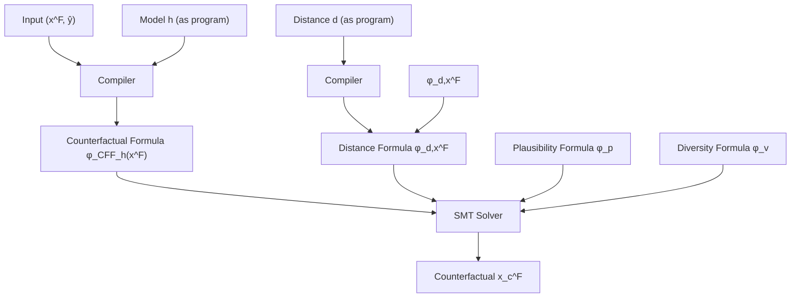
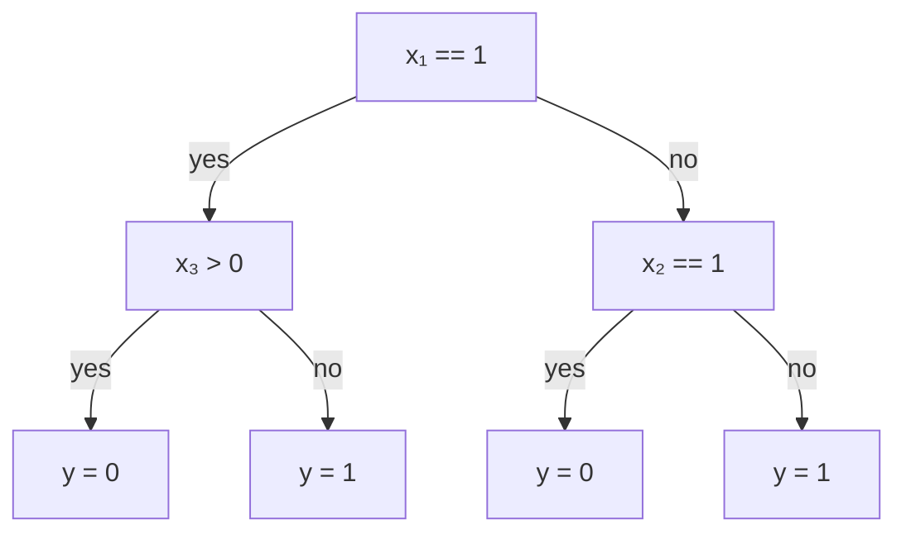
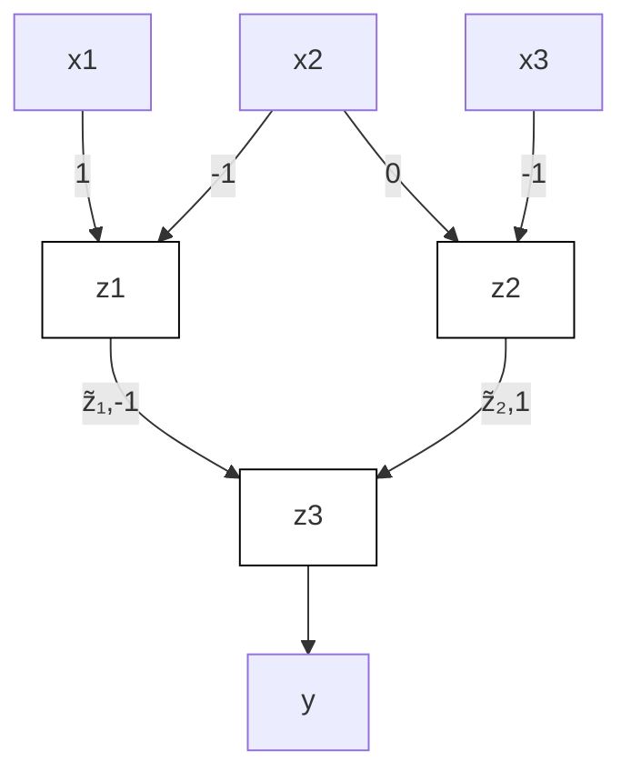

# Model-Agnostic Counterfactual Explanations

## Chapter Abstract

Predictive models are being increasingly used to support consequential decision making at the individual level in contexts such as pretrial bail and loan approval. As a result, there is increasing social and legal pressure to provide explanations that help the affected individuals not only to understand why a prediction was output, but also how to act to obtain a desired outcome. To this end, several works have proposed optimizationbased methods to generate nearest counterfactual explanations. However, these methods are often restricted to a particular subset of models (e.g., decision trees or linear models) and differentiable distance functions. In contrast, we build on standard theory and tools from formal verification and propose a novel algorithm that solves a sequence of satisfiability problems, where both the distance function (objective) and predictive model (constraints) are represented as logic formulae. As shown by our experiments on real-world data, our algorithm is: i) model-agnostic ({non-}linear, {non-}differentiable, {non-}convex); ii) data-type-agnostic (heterogeneous features); iii) distanceagnostic $( \ell _ { 0 } , \ell _ { 1 } , \ell _ { \infty } ,$ and combinations thereof); iv) able to generate plausible and diverse counterfactuals for any sample (i.e., 100% coverage); and v) at provably optimal distances.

Figure 2.1: Architecture overview for Model-Agnostic Counterfactual Explanations (MACE)

## 2.1 introduction

Data-driven predictive models are ubiquitously being used to support or even substitute humans in decision making in a wide variety of real-world contexts including, e.g., selection process for hiring, loan approval, or pretrial bail. However, as algorithmic methods are increasingly used to make consequential decisions at the individual-level – i.e., decisions that may have significant consequences for the individuals they decide about – the debate about their lack of transparency and explainability becomes more heated. To make things worse, while the verdict is still out as to what constitutes a good explanation (DVK17; Fre14; Kod94; Mur+19; Lip18; Rud19; Rüp06), there already exists clearly defined legal requirements for explanations in the context of consequential decision making. For example, the EU General Data Protection Regulation (“GDPR”) grants individuals the right-to-explanation (VB; WMF17), via requiring institutions to provide explanations to individuals that are subject to their (semi-)automated decision making systems.

A growing number of works on interpretable machine learning have recently focused on the definitions of, and mechanisms for providing, good explanations for predictor-based decision making systems. In the context of consequential decision making, it is widely agreed that a good explanation should provide answers to the following two questions (DVK17; Gun19; WMR17): (i) “why the model outputs a certain prediction for a given individual?”; and, (ii) “what features describing the individual would need to change to achieve the desired output?”

Here, we focus on answering the second question, or equivalently, on generating counterfactual explanations. Of specific importance is the problem of finding the nearest counterfactual explanation – i.e., identifying the set of features resulting in the desired prediction while remaining at minimum distance from the original set of features describing the individual. Existing approaches tackling this problem suffer from various limitations: they either propose solutions that are tailored to particular models, e.g., decision trees (Tol+17); rely on classical optimization tools, thus being restricted to convex predictive models and distances (Rus19; USL19); or, solve a relaxed version of the original optimization problem using gradient-based approaches, thus being restricted to differentiable models and distance functions (WMR17) and lacking optimality guarantees. Additionally, it is important to consider that in the context of consequential decision-making, the features describing individuals are semantically meaningful and heterogeneous (i.e., mixed continuous & discrete); and can either be acted upon (e.g., bank account balance), or immutable and should be safeguarded from change (e.g., sex, race). A good explanation should account for these semantics (i.e., be plausible1) to be useful for the individual, a requirement that most existing approaches fail to address.

our contributions In this chapter, we propose a model-agnostic approach to generate nearest counterfactual explanations, namely MACE, under any given distance function (or convex combinations thereof); while, at the same time, easily supporting additional plausibility constraints. Moreover, our approach readily encodes natural notions of distance for heterogeneous feature spaces, which are common in consequential decision making systems (e.g., loan approval) and consist of mixed numerical (e.g., age and income) and nominal features (e.g., gender and education level). To this end, in MACE we map the nearest counterfactual problem into a sequence of satisfiability (SAT) problems, by expressing both the predictive model and the distance function (as well as the plausibility and diversity constraints) as logic formulae. Each of these satisfiability problems aims to verify if there exists a counterfactual explanation at a distance smaller than a given threshold, and can be solved using standard SMT (satisfiability modulo theories) solvers. Moreover, we rely on a binary search strategy on the distance threshold to find an approximation to the nearest (plausible) counterfactual with an arbitrary degree of accuracy, and a lower bound on distance such that no counterfactual provably exists at a smaller distance. Finally, once nearest counterfactuals are found, diversity constraints may be added to the satisfiability problems to find alternative counterfactuals. The overall architecture of MACE is illustrated in Figure 2.1.

Our experimental validation on real-world datasets show that MACE not only achieves 100% coverage by design, but also generates explanations that are significantly closer than previous approaches (Tol+17; USL19). We also provide qualitative examples showcasing the flexibility of our approach to generate actionable counterfactuals by extending our plausibility constraints to restrict changes to a subset of (non-immutable) features. The Python implementation of our algorithms and the datasets used in our experiments are available at https://github.com/amirhk/mace.

## 2.2 first-order predicate logic

In this section, we briefly recall basic concepts of first-order predicate logic, which MACE builds upon. We distinguish between function symbols (for instance, addition + and multiplication ×) and predicate symbols (for instance, equality = or lesser than <). Function symbols are used to build expressions, and predicate symbols are used to build atomic formulae. Examples of valid expressions are $x , x + 2 , ( - x ) + 2$ and $( x + 2 ) \times ( y + 3 )$ . Examples of valid atomic formulae are $e \ < \ e ^ { \prime } , \ e \ \le \ e ^ { \prime }$ or $\textit { e } = \textit { e } ^ { \prime }$ . A (quantifier-free) formula is a Boolean combination of atomic formulae. That is, a formula is built from atomic formulae using conjunction $\land ,$ disjunction $\vee ,$ and negation . Formulae have an interpretation over their intended domain. For instance, a formula about real-valued expressions has a natural interpretation as a subset of $\mathbb { R } ^ { n }$ , where n denotes the number of variables that appear in the formula. The interpretation is obtained by mapping every variable into a value, e.g., a real number. For example, (2, 1) belongs in the interpretation of $( x + 2 ) \times ( y + 3 ) \leq x \times y + 1 6$ since the mapping $x \mapsto 2 , y \mapsto 1$ assigns true because $1 6 \leq 1 8$ . We say that a formula is satisfiable if its interpretation as a subset of $\mathbb { R } ^ { n }$ is non-empty.

The satisfiability problem consists in checking whether or not a formula is satisfiable. Satisfiability problems can be verified automatically using satisfiability modulo theories (SMT) solvers like $Z _ { 3 }$ (MB08) or CVC4 (Bar+11). We refer to (KS08) for an exposition of the basic algorithms used by SMT solvers. For the purpose of the next sections, it suffices to assume a given satisfiability oracle SAT. For our experiments, we use off-the-self SMT solvers to realize the oracle. We use SMT solvers as black-box, but it is interesting to note that our formulae fall in the linear fragment of the theory of reals (i.e. all formulae that only contain expressions of degree 1 when viewed as multivariate polynomials over variables), which can be decided efficiently using the Fourier-Motzkin algorithm.

## 2.3 counterfactual spaces for predictive models

This section defines a logical representation of counterfactual explanations for predictive models, which are functions mapping input feature vectors $\mathbf { x } \in \mathcal { X }$ into decisions $y \in \{ 0 , 1 \}$ . 2 Given a predictive model $h : \mathcal { X }  \{ 0 , 1 \}$ , we can define the set of counterfactual explanations for a (factual) input $\mathbf { x } ^ { \mathsf { F } } \in { \mathcal { X } }$ as $\mathbb { C } \mathbb { F } _ { h } ( { \mathbf x } ^ { \mathsf { F } } ) = \{ { \mathbf x } \in \dot { \mathcal { X } } \mid h ( { \mathbf x } ) ^ { \mathsf { \bar { \alpha } } } \neq h ( { \mathbf x } ^ { \mathsf { F } } ) \}$ . In words, $\mathbb { C F } _ { h } ( \mathbf { x } ^ { \mathsf { F } } )$ contains all the inputs x for which the model h returns a prediction different from $h ( \mathbf { x } ^ { \mathsf { F } } )$ . We also remark that $\mathbb { C F } _ { h } ( \mathbf { x } ^ { \mathsf { F } } )$ is the set of preimages of $1 - h ( \mathbf { x } ^ { \mathsf { F } } )$ under h.

For a broad class of predictive models, it is possible to construct counterfactual formulae capturing membership in $\mathbb { C F } _ { h }$ . We do so by computing the characteristic formula $\phi _ { h }$ of the model. For a predictive model $h : \mathcal { X }  \{ 0 , 1 \}$ , and pair of input and output values x and $y ,$ the characteristic formula $\phi _ { h }$ verifies that $\phi _ { h } ( { \bf x } , y )$ is valid if and only if $h ( \mathbf { x } ) = y$ . Thus, given a factual input $\mathbf { x } ^ { \mathsf { F } }$ with $h ( \mathbf { x } ^ { \mathsf { F } } ) = y ^ { \mathsf { F } }$ and $\phi _ { h }$ we define the counterfactual formula as

$$
\phi_ {\mathbb {C F} _ {h} (\mathbf {x} ^ {\mathsf {F}})} (\mathbf {x}) = \phi_ {h} (\mathbf {x}, 1 - y ^ {\mathsf {F}}) \tag {2.1}
$$

Intuitively, the formula on the right hand side of $\left( 2 . \mathrm { I } \right)$ says that ${ \bf \ " } { \bf \Psi } _ { \bf X }$ is a counterfactual for $\mathbf { x } ^ { \mathsf { F } }$ if either $h ( \mathbf { x } ^ { \mathsf { F } } ) = 0$ and $h ( \mathbf { x } ) = 1$ , or $h ( \mathbf { x } ^ { \mathsf { F } } ) = 1$ and $h ( \mathbf { x } ) = 0 ^ { \prime \prime }$ . It is thus clear from the definition that an input x satisfies $\phi _ { \mathrm { C F } _ { h } ( { \bf x } ^ { \mathsf { F } } ) }$ if and only if $\mathbf { x } \in \mathbb { C F } _ { h ( \mathbf { x } ^ { \mathsf { F } } ) }$ . Moreover, (2.1) shows that, to construct counterfactual formulae $\phi _ { \mathrm { C F } _ { h } ( { \bf x } ^ { \mathsf { F } } ) }$ , we only require the characteristic formulae of the corresponding predictive models, $\phi _ { h } ,$ and the value of $y ^ { \mathsf { F } }$ . To obtain such characteristic formulae we assume that predictive models are represented by programs in a core programming language with assignments, conditionals, sequential composition, syntactically bounded loops and return statements. This allows us to use techniques from the program verification literature. Specifically, we use the so-called predicate transformers (Dij68; Hoa69; Flo93; FS01). The description of the general procedure is provided in Appendix A.1. For ease of exposition, we illustrate the construction of characteristic formulae through two examples, a decision tree and a multilayer perceptron.

As a first example, consider the decision tree from Figure 2.2a which takes as input $( x _ { 1 } , x _ { 2 } , \hat { x _ { 3 } } ) \in \{ 0 , 1 \} ^ { 2 } \times \mathbb { R }$ and returns a binary output in 0, 1 . Figure 2.2b provides the programming language description of this decision tree. To construct a formula representing the function $h ( x ) = y$ computed by this

(a) Graphical representation

$$
\begin{array}{l} \text { if } x _ {1} = = 1 \\ y = 0 \text {   if   } x _ {3} > 0 \text {   else   } 1 \\ \mathrm{else} \\ y = 0 \text {   if   } x _ {2} = = 1 \text {   else   } 1 \\ \text { return } y \\ \end{array}
$$

(b) Program (in Python)

$$
\phi_ {h} (\mathbf {x}, y) = (x _ {1} = 1 \land x _ {3} > 0 \land y = 0)
$$

$$
\vee \left(x _ {1} = 1 \wedge x _ {3} \leq 0 \wedge y = 1\right)
$$

$$
\lor (x _ {1} = 0 \land x _ {2} = 1 \land y = 0)
$$

$$
\lor (x _ {1} = 0 \land x _ {2} = 0 \land y = 1)
$$

(c) Characteristic formula

Figure 2.2: Decision tree: model, program and characteristic formula.

tree we first build a clause for each leaf in the tree by taking the conjunction of all the conditions encountered in the path from the root to the leaf. For example, the clause corresponding to the leftmost leaf on the tree in Figure 2.2a is $( x _ { 1 } = 1 \land x _ { 3 } > 0 \land y = 0 )$ . Once all these clauses are constructed, the characteristic formula $\phi _ { h } ( { \bf x } , y )$ corresponding to the full tree is obtained by taking the conjunction of all said clauses, as shown in Figure 2.2c.

As a second example we consider a feed-forward neural network with one hidden layer followed by a ReLU activation function, as depicted in Figure 2.3a. This model implements a function h : $\mathbb { R } ^ { 3 }  \{ 0 , 1 \}$ , where the binary decision is taken by thresholding the value of the last hidden node. The programming language representation of this model is given in Figure 2.3b. In this case, the characteristic formula predicates over inputs $\mathbf { x , }$ output y and program variables $z _ { i }$ and $\tilde { z } _ { i }$ for each hidden node i representing the values on that node before and after the non-linear ReLU transformation, respectively. The characteristic formula is a conjunction, and each conjunct corresponds to one instruction of the program. For example, for the leftmost hidden node in the first layer of the network in Figure 2.3a the variable $z _ { 1 }$ is associated with the clause $( z _ { 1 } = x _ { 1 } - x _ { 2 } )$ ; and the variable $\tilde { z } _ { 1 }$ corresponds to the value of $z _ { 1 }$ after the ReLU, which can be written as the disjunction $( \tilde { z } _ { 1 } = z _ { 1 } \wedge z _ { 1 } \geq 0 ) \vee ( \tilde { z } _ { 1 } = 0 \wedge z _ { 1 } < 0 )$ . For the output node – in this case, $z _ { 3 }$ – we introduce a pair of clauses representing the thresholding operation, i.e.

(a) Graphical representation  
(b) Program (in Python)

$$
\begin{array}{l} z _ {1} = x _ {1} - x _ {2} \\ z _ {2} = 2 x _ {1} - x _ {3} \\ \tilde {z} _ {1} = z _ {1} \text {   if   } z _ {1} > = 0 \text {   else   } 0 \\ \tilde {z} _ {2} = z _ {2} \text {   if   } z _ {2} > = 0 \text {   else   } 0 \\ z _ {3} = - \tilde {z} _ {1} + \tilde {z} _ {2} \\ y = 1 \text {   if   } z _ {3} > = 0 \text {   else   } 0 \\ \text { return } y \\ \end{array}
$$

$$
\begin{array}{l} \phi_ {h} (\mathbf {x}, y) = (z _ {1} = x _ {1} - x _ {2}) \\ \wedge \left(z _ {2} = 2 x _ {1} - x _ {3}\right) \\ \wedge \left(\left(\tilde {z} _ {1} = z _ {1} \wedge z _ {1} \geq 0\right) \vee \left(\tilde {z} _ {1} = 0 \wedge z _ {1} <   0\right)\right) \\ \wedge \left(\left(\tilde {z} _ {2} = z _ {2} \wedge z _ {2} \geq 0\right) \vee \left(\tilde {z} _ {2} = 0 \wedge z _ {2} <   0\right)\right) \\ \wedge (z _ {3} = - \tilde {z} _ {1} + \tilde {z} _ {2}) \\ \wedge \left(\left(z _ {3} \geq 0 \wedge y = 1\right) \vee \left(z _ {3} <   0 \wedge y = 0\right)\right) \\ \end{array}
$$

(c) Characteristic formula

Figure 2.3: Multilayer perceptron: model, program and characteristic formula

$( y = 1 \land z _ { 3 } \lor ( y = 0 \land z _ { 3 } < 0 )$ . Taking the conjunction of the formulas for each node we obtain the characteristic formula in Figure 2.3c.

## 2.4 finding the nearest counterfactual

Based on the counterfactual space $\mathbb { C F } _ { h } ( \mathbf { x } ^ { \mathsf { F } } )$ defined in the previous section, we would like to produce counterfactual explanations for the output of a model h on a given input $\mathbf { x } ^ { \mathsf { F } }$ by trying to find a nearest counterfactual, which is defined as:

$$
\mathbf {x} ^ {* \mathsf {C F}} \in \underset {\mathbf {x} \in \mathbb {C F} _ {h} (\mathbf {x} ^ {\mathsf {F}})} {\text { argmin }} d (\mathbf {x}, \mathbf {x} ^ {\mathsf {F}}). \tag {2.2}
$$

For the time being, we assume that a notion of distance between instances, $d ,$ is given. For convenience, and without loss of generality, we also assume that d takes values in the interval [0, 1].

## 2.4.1 Main algorithm

Our goal now is to leverage the representation of $\mathbb { C F } _ { h } ( \mathbf { x } ^ { \mathsf { F } } )$ in terms of a logic formula to solve (2.2). To this end, we map the optimization problem in (2.2) into a sequence of satisfiability problems, which can be verified or refuted by standard SMT solvers. We do so by first converting the expression $d ( { \bf { x } } , { \bf { x } } ^ { \sf { F } } ) \leq \delta ,$ where $\delta \in [ 0 , 1 ]$ , into a logic formula $\phi _ { d , { \bf x } ^ { \mathrm { F } } } ( { \bf x } , \delta )$ , which is valid if and only if $d ( { \bf x } , { \bf x ^ { F } } ) \le \delta$ . We assume here that the distance d function is expressed by a program in the same language that we used to represent the models in Section 2.3. In particular, we can leverage the procedure detailed in Appendix $\mathrm { A . 1 }$ to automatically construct $\phi _ { d , { \bf x } ^ { \sf F } }$ . Then, both the counterfactual formula $\phi _ { \mathrm { C F } _ { h } ( { \bf x } ^ { \mathsf { F } } ) } ( { \bf x } )$ and the distance formula $\phi _ { d , { \bf x } ^ { \sf F } } ( { \bf x } , \delta )$ are combined into hthe logic formula:

$$
\phi_ {\mathbf {x} ^ {\mathsf {F}}, \delta} (\mathbf {x}) = \phi_ {\mathbb {C F} _ {h} (\mathbf {x} ^ {\mathsf {F}})} (\mathbf {x}) \wedge \phi_ {d, \mathbf {x} ^ {\mathsf {F}}} (\mathbf {x}, \delta),
$$

which is satisfiable if and only if there exists a counterfactual $\mathbf { x } \in \mathbb { C F } _ { h } ( \mathbf { x } ^ { \mathsf { F } } )$ such that $d ( \mathbf { x } , \mathbf { x } ^ { \mathsf { F } } ) \leq \delta$ . To check whether the above formula is satisfiable we use the satisfiability oracle $\mathsf { S A T } ( \psi ( \mathbf { x } ) )$ which returns either an instance x such that $\psi ( \mathbf { x } )$ is valid, or “unsatisfiable” if no such x exists.

Note that, while the oracle SAT allows us to verify if there exist counterfactual explanations at distance smaller or equal than a given threshold $\delta ,$ solving optimization (2.2) requires finding a nearest counterfactual. To do so, we apply a binary search strategy on the distance threshold $\delta \in [ 0 , 1 ]$ ] that allows us to find approximately nearest counterfactuals with a pre-specified degree of accuracy. This is implemented in Algorithm 1, which for an accuracy parameter $\epsilon > 0$ makes at most $O ( \log ( 1 / \epsilon ) )$ calls to SAT and returns a counterfactual $\mathbf { x } _ { \epsilon } ^ { \mathsf { C F } } \in \mathbb { C F } _ { h } ( \mathbf { x } ^ { \mathsf { F } } )$ such that $\bar { d ( \mathbf { x } _ { \epsilon } ^ { \mathsf { C F } } , \mathbf { x } ^ { \mathsf { F } } ) } \leq d ( \mathbf { x } ^ { * \mathsf { C F } } , \mathbf { x } ^ { \mathsf { F } } ) + \epsilon ,$ , where $\mathbf { x } ^ { \ast \mathbb { C } \mathbb { F } }$ is some solution of the optimization problem in $_ { ( 2 . 2 ) }$ . This mild dependence on the accuracy ϵ allows Algorithm 1 to trade-off finding arbitrarily accurate solutions of $_ { ( 2 . 2 ) }$ with the number of calls made to the satisfiability oracle. Note that Algorithm 1 may also account for potential plausibility or diversity constraints (refer to next section for further details).

We remark here our approach to find nearest counterfactuals is agnostic to the details of the model and distance being used; the only requirement is that they must be expressable in a fairly general programming language. As a consequence, we can handle a wide variety of predictive models, including both differentiable – such as, logisitic regression and multilayer perceptron – and non-differentiable predictive models $- \mathrm { { e . g . } }$ ., decision trees and random forest– as well as a wide variety of distance functions (refer to next section for further details). Moreover, the bound $\delta _ { \mathrm { m i n } }$ returned by Algorithm 1 provides a certificate that any solution $\mathbf { x } ^ { \mathrm { * C F } }$ to (2.2) must satisfy $d ( { \bf x } ^ { * \mathsf { C F } } , { \bf x } ^ { \mathsf { F } } ) > \delta _ { \mathrm { m i n } }$ . This is because whenever $\mathsf { S A T } ( \psi ( \mathbf { x } ) )$ returns “unsatisfiable” it does so by internally constructing a proof that the formula $\psi ( \mathbf { x } )$ is not valid.

Algorithm 1: Binary Search for Nearest Counterfactuals with Satisfiability Oracle

Input: Factual $x^{F}$ , counterfactual formula $\phi_{\mathbb{CF}_{h}(x^{F})}$ , distance formula $\phi_{d,x^{F}}$ , constraints formula $\phi_{g,x^{F}}$ , accuracy $\epsilon$ Output: Counterfactual $x_{\epsilon}^{CF}$ , distance $\delta_{\max}=d(x_{\epsilon}^{CF},x^{F})$ , lower bound $\delta_{\min}$ on (2.2)

Let $\delta_{\min}\leftarrow0$ and $\delta_{\max}\leftarrow1$ while $\delta_{\max}-\delta_{\min}>\epsilon$ do

Let $\delta\leftarrow\frac{\delta_{\min}+\delta_{\max}}{2}$ Let $\phi_{x^{F},\delta}(x)\leftarrow\phi_{\mathbb{CF}_{h}(x^{F})}(x)\wedge\phi_{d,x^{F}}(x,\delta)\wedge\phi_{g,x^{F}}$ Let $x\leftarrow\mathrm{SAT}(\phi_{x^{F},\delta})$ if x is “unsatisfiable” then

Let $\delta_{\min}\leftarrow\delta$ else

Let $x_{\epsilon}^{CF}\leftarrow x$ and $\delta_{\max}\leftarrow\delta$ return $x_{\epsilon}^{CF}$ , $\delta_{\min}$ , $\delta_{\max}$

## 2.4.2 Distance, Plausibility, and Diversity

Next we discuss additional criteria in the form of logic clauses that guide the satisfiability problem towards generating a counterfactual explanation with desired properties.

distance We first discuss several forms for the distance function $d ( \mathbf { x } ^ { \mathsf { F } } , \mathbf { x } _ { \epsilon } ^ { \mathsf { C F } } )$ that can be used to define the notion of nearest counterfactual. To this end, we first remark that in consequential decision making the input feature space ${ \mathcal { X } } \ = \ { \mathcal { X } } _ { 1 } \times \cdot \cdot \cdot \times { \mathcal { X } } _ { J }$ is often heterogeneous – for example, gender is categorical, education level is ordinal, and income is a numerical variable. We define an appropriate distance metric for every kind of variable in the input feature space of the model as:

$$
\delta_ {j} (x _ {j}, \hat {x} _ {j}) = \left\{ \begin{array}{l l} | x _ {j} - \hat {x} _ {j} | / R _ {j} & \text { if } x _ {j} \text { is   numerical } \\ \mathbb {I} [ x _ {j} \neq \hat {x} _ {j} ] & \text { if } x _ {j} \text { is   categorical } \\ | x _ {j} - \hat {x} _ {j} | / R _ {j} & \text { if } x _ {j} \text { is   ordinal } \end{array} \right.,
$$

where $R _ { j }$ corresponds to the range of the feature $x _ { j }$ and is used to normalize the distances for all input features, such that $\delta _ { j } : \mathcal { X } _ { j } \times \mathcal { X } _ { j }  [ 0 , 1 ]$ for all $j ,$ independently on the feature type. By defining the distance vector $\delta =$ $\big ( \delta _ { 1 } , \cdots , \delta _ { J } \big )$ (being J the total number of input features), one can now write the distance between instances as:

**Table 2.1: Comparison of approaches for generating counterfactual explanations, based on the supported model types, data types (heterogenous, numeric, binary), distance types, plausibility constraints (actionability, data type/range consistency), and optimal distance guarantees.**

<table><tr><td>Approach</td><td>Models</td><td>Data types</td><td>Distances</td><td>Plaus.</td><td>Opt. Dist.</td></tr><tr><td>Proposed (MACE)</td><td>tree, forest, lr, mlp</td><td>het.</td><td> $\ell_p \forall p$ </td><td>√</td><td>√</td></tr><tr><td>Minimum Observable (MO)</td><td>-</td><td>het.</td><td> $\ell_p \forall p$ </td><td>√</td><td>x</td></tr><tr><td>Feature Tweaking (FT)</td><td>tree, forest</td><td>het.</td><td> $\ell_p \forall p$ </td><td>x</td><td>x</td></tr><tr><td>Actionable Recourse (AR)</td><td>lr</td><td>num., bin.</td><td> $\ell_1, \ell_\infty$ </td><td> $x^6$ </td><td>x</td></tr></table>

$$
d \left(\mathbf {x} ^ {\mathrm{F}}, \mathbf {x} _ {\epsilon} ^ {\mathrm{CF}}\right) = \alpha | | \delta | | _ {0} + \beta | | \delta | | _ {1} + \gamma | | \delta | | _ {\infty}, \tag {2.3}
$$

where $| | \cdot | | _ { p }$ is the p-norm of a vector, and $\alpha , \beta , \gamma \ge 0$ such that3 $\left( \alpha + \beta \right) / J +$ $\gamma = 1$ . Intuitively, 0-norm is used to restrict the number of features that changes between the initial instance $\mathbf { x } ^ { \mathsf { F } }$ and the generated counterfactual $\mathbf { x } _ { \epsilon } ^ { \mathsf { C F } }$ ; the 1-norm is used to restrict the average change distance between $\mathbf { x } ^ { \mathsf { F } }$ and $\mathbf { x } _ { \epsilon } ^ { \mathsf { C F } }$ ; and ∞-norm is used to restrict maximum change across features. Any distance of this type can easily be expressed as a program.

plausibility Up to this point, we have only considered minimum distance as the only requirement for generating a counterfactual. However, this might result in unrealistic counterfactuals, such as e.g., decrease the age or change the gender of a loan applicant. To avoid unrealistic counterfactuals, one may introduce additional plausibility constraints in the optimization problem in Eq. (2.2). This is equivalent to adding a conjunction in the constraint formula $\phi _ { g , { \bf x } ^ { \sf F } }$ in Algorithm 1 that accounts for any additional plausibility formulae $\phi _ { p } ,$ which ensure that: i) each feature in the counterfactual should be data-type and data-range consistent with the training data; and ii) only actionable features (USL19) are changed in the resulting counterfactual.

First, since here we are working with heterogeneous feature spaces, we require all the features in the counterfactual to be consistent in both the datatypes (categorical, ordinal, etc.) and the data-ranges with the training data. In particular, if a categorical (ordinal) feature is one-hot (thermometer) encoded to be used as input to the predictive model, e.g., a logistic regression classifier, we make sure that the generated counterfactual provides a valid one-hot vector (thermometer) for such feature. Likewise, for any numerical feature we ensure that its value in the counterfactual falls into observed range in the original data used to train the predictive model.

**Table 2.2: Coverage Ω computed on $N = 5 0 0$ factual samples. For comparison, $\Omega _ { \mathrm { M A C E } } ~ = ~ \Omega _ { \mathrm { M O } } ~ = ~ 1 0 0 \%$ always, by definition and by design, respectively. Cells are shaded when tests are not supported. Higher % is better.**

<table><tr><td rowspan="2" colspan="2"></td><td colspan="3">Adult</td><td colspan="3">Credit</td><td colspan="3">COMPAS</td></tr><tr><td> $\ell_0$ </td><td> $\ell_1$ </td><td> $\ell_\infty$ </td><td> $\ell_0$ </td><td> $\ell_1$ </td><td> $\ell_\infty$ </td><td> $\ell_0$ </td><td> $\ell_1$ </td><td> $\ell_\infty$ </td></tr><tr><td>tree</td><td>PFT</td><td>0%</td><td>0%</td><td>0%</td><td>68%</td><td>68%</td><td>68%</td><td>74%</td><td>74%</td><td>74%</td></tr><tr><td>forest</td><td>PFT</td><td>0%</td><td>0%</td><td>0%</td><td>99%</td><td>99%</td><td>99%</td><td>100%</td><td>100%</td><td>100%</td></tr><tr><td>lr</td><td>AR</td><td></td><td>18%</td><td>0.4%</td><td></td><td>100%</td><td>100%</td><td></td><td>100%</td><td>100%</td></tr></table>

Moreover, to account for a non-actionable/immutable feature $x _ { j } ,$ i.e., a feature whose value in the counterfactual explanation should match its initial value, we set $\phi _ { p }$ to be $( x _ { j } = \hat { x } _ { j } )$ . Similarly, we account for variables that only allow for increasing values by setting $\phi _ { p } = ( x _ { j } \ge \hat { x } _ { j } )$ .

diversity Finally, one might be interested in generating a (small) set of diverse counterfactual explanations for the same instance $\mathbf { x } ^ { \bar { \mathsf { F } } } .$ . To this end, we iteratively call Algorithm 1 with a constraints formula $\phi _ { v }$ that includes diversity clauses to ensure that the newly generated explanation is substantially different from all the previous ones. We can encode diversity by forcing that the distance between every pair of counterfactual explanations is greater than a given value. For example, we can take4 $\textstyle \phi _ { v } = \bigwedge _ { i } \big ( { \bar { \bigvee } } _ { j \in J } ( x _ { j } \neq { \hat { x } } _ { \epsilon , j } ^ { i } ) \big )$ to restrict repetitive counterfactuals by enforcing subsequent counterfactuals to have 0-norm distance at least 1 from all previous counterfactuals.

## 2.5 experiments

In this section, we empirically demonstrate the main properties of MACE compared to existing approaches.

datasets We evaluate MACE at generating counterfactual explanations on three real-world datasets in the context of loan approval (Adult (Adu96) and Credit (YL09) datasets) and pretrial bail (COMPAS dataset (Lar+16a)). All the three datasets present heterogeneous input spaces.

baselines We compare the performance of MACE at generating the nearest counterfactual explanations with: the Minimum Observable (MO)

**Table 2.3: Percentage of improvement in distances, computed as $1 0 0 * \mathbb { E } [ 1 -$ $\delta _ { \mathrm { M A C E } } / \delta _ { \mathrm { O t h e r } } ] . ~ N = \Omega _ { \mathrm { M A C E } } \cap \Omega _ { \mathrm { O t h e r } }$ factual samples. Cells are shaded when tests are not supported. The higher the ${ \% } ,$ the better the improvement.**

<table><tr><td rowspan="2" colspan="2"></td><td colspan="3">Adult</td><td colspan="3">Credit</td><td colspan="3">COMPAS</td></tr><tr><td> $\ell_0$ </td><td> $\ell_1$ </td><td> $\ell_\infty$ </td><td> $\ell_0$ </td><td> $\ell_1$ </td><td> $\ell_\infty$ </td><td> $\ell_0$ </td><td> $\ell_1$ </td><td> $\ell_\infty$ </td></tr><tr><td rowspan="4">tree</td><td>MACE ( $\epsilon = 10^{-3}$ ) vs MO</td><td>47%</td><td>80%</td><td>70%</td><td>67%</td><td>66%</td><td>47%</td><td>1%</td><td>5%</td><td>5%</td></tr><tr><td>MACE ( $\epsilon = 10^{-5}$ ) vs MO</td><td>47%</td><td>81%</td><td>72%</td><td>67%</td><td>96%</td><td>94%</td><td>1%</td><td>5%</td><td>5%</td></tr><tr><td>MACE ( $\epsilon = 10^{-3}$ ) vs PFT</td><td></td><td></td><td></td><td>53%</td><td>87%</td><td>85%</td><td>14%</td><td>56%</td><td>54%</td></tr><tr><td>MACE ( $\epsilon = 10^{-5}$ ) vs PFT</td><td></td><td></td><td></td><td>53%</td><td>97%</td><td>96%</td><td>15%</td><td>55%</td><td>54%</td></tr><tr><td rowspan="4">forest</td><td>MACE ( $\epsilon = 10^{-3}$ ) vs MO</td><td>51%</td><td>81%</td><td>69%</td><td>68%</td><td>61%</td><td>38%</td><td>1%</td><td>6%</td><td>6%</td></tr><tr><td>MACE ( $\epsilon = 10^{-5}$ ) vs MO</td><td>51%</td><td>82%</td><td>71%</td><td>68%</td><td>97%</td><td>96%</td><td>1%</td><td>6%</td><td>6%</td></tr><tr><td>MACE ( $\epsilon = 10^{-3}$ ) vs PFT</td><td></td><td></td><td></td><td>53%</td><td>84%</td><td>81%</td><td>4%</td><td>28%</td><td>27%</td></tr><tr><td>MACE ( $\epsilon = 10^{-5}$ ) vs PFT</td><td></td><td></td><td></td><td>53%</td><td>96%</td><td>96%</td><td>4%</td><td>28%</td><td>27%</td></tr><tr><td rowspan="4">lr</td><td>MACE ( $\epsilon = 10^{-3}$ ) vs MO</td><td>62%</td><td>92%</td><td>86%</td><td>80%</td><td>82%</td><td>80%</td><td>3%</td><td>8%</td><td>6%</td></tr><tr><td>MACE ( $\epsilon = 10^{-5}$ ) vs MO</td><td>62%</td><td>93%</td><td>88%</td><td>80%</td><td>82%</td><td>81%</td><td>3%</td><td>6%</td><td>6%</td></tr><tr><td>MACE ( $\epsilon = 10^{-3}$ ) vs AR</td><td></td><td>3%</td><td>89%</td><td></td><td>39%</td><td>67%</td><td></td><td>10%</td><td>38%</td></tr><tr><td>MACE ( $\epsilon = 10^{-5}$ ) vs AR</td><td></td><td>5%</td><td>91%</td><td></td><td>42%</td><td>71%</td><td></td><td>10%</td><td>38%</td></tr><tr><td rowspan="2">mlp</td><td>MACE ( $\epsilon = 10^{-3}$ ) vs MO</td><td>60%</td><td>92%</td><td>91%</td><td>77%</td><td>85%</td><td>91%</td><td>1%</td><td>3%</td><td>3%</td></tr><tr><td>MACE ( $\epsilon = 10^{-5}$ ) vs MO</td><td>60%</td><td>93%</td><td>93%</td><td>77%</td><td>96%</td><td>96%</td><td>1%</td><td>3%</td><td>3%</td></tr></table>

approach (Wex+19), which searches in the dataset for the closest sample that flips the prediction; the Feature Tweaking (FT) approach (Tol+17), which searches for the nearest counterfactual lying close to the decision boundary of a Random Forest; and the Actionable Recourse (AR) (USL19), which solves a mixed integer linear program to obtain counterfactual explanations for Linear Regression models. Table 2.1 summarizes the main properties of all the considered approaches to generate counterfactuals.

metrics To assess and compare the performance of the different approaches, we recall the criteria of good explanations for consequential decisions: i) the returned counterfactual should be as near as possible to the factual sample corresponding to the individual’s features; ii) the returned counterfactual must be plausible (refer to Section 2.4.2). Hence, we quantitatively compare the performance of MACE with the above approaches in terms of i) the normalized distance $\delta ;$ and ii) coverage Ω indicating the percentage of factual samples for which the approach generates plausible (in type and range) counterfactuals.

experimental set-up We consider as predictive models decision trees, random forest, logistic regression, and multilayer perceptron, which we train on the three datasets using the Python library scikit-learn (Ped+11), with default parameters.5 Furthermore, to demonstrate the off-the-shelf flexibility in the various setups described, we build MACE atop the open-source PySMT library (GM15) with the $Z _ { 3 }$ (MB08) backend. In Appendix A.3.2, we provide a thorough empirical evaluation of the computational cost of the off-the-shelf PySMT solver – including run-time comparisons between MACE and other baselines, – as well as a discussion on the choice of ϵ trading-off arbitrarily accurate solutions of (2.2) with the number of calls made to the satisfiability oracle.

**Table 2.4: Percentage of factual samples for which the nearest counterfactual sample requires a change in age for a random forest trained on the Adult dataset, and the corresponding increase in distance to nearest counterfactual when restricting the approaches not to change age: $1 0 0 \times \mathbb { E } [ \delta _ { \mathrm { r e s t r . } } / \delta _ { \mathrm { u n r e s t r . } } - 1 ]$ . Lower % is better.**

<table><tr><td rowspan="2"></td><td colspan="2"> $\ell_0$ </td><td colspan="2"> $\ell_1$ </td><td colspan="2"> $\ell_\infty$ </td></tr><tr><td>% age-change</td><td>relative dist. increase</td><td>% age-change</td><td>relative dist. increase</td><td>% age-change</td><td>relative dist. increase</td></tr><tr><td rowspan="2">MACE ( $\epsilon = 10^{-5}$ )MO</td><td>13.2%</td><td>9.0%</td><td>20.4%</td><td>100.3%</td><td>84.4%</td><td>32.8%</td></tr><tr><td>78.8%</td><td>50.9%</td><td>92.0%</td><td>245.7%</td><td>95.6%</td><td>193.3%</td></tr></table>

For each combination of approach, model, dataset, and distance, we generate the nearest counterfactual explanations for a held-out set of 500 instances classified as negative by the corresponding model. Here we consider the $\ell _ { 0 } ,$ $\ell _ { 1 } , \ell _ { \infty }$ norms as a measure of distance to identify the nearest counterfactuals. Unfortunately, we found that FT not once returned a plausible counterfactual. As a consequence, we modified the original implementation of FT, to ensure that the generated counterfactuals are plausible. The resulting Plausible Feature Tweaking (PFT) projects the set of candidate counterfactuals into a plausible domain before selecting the nearest counterfactual amongst them. This was not possible for AR because the approach only returns a single counterfactual, with no avail if it is not plausible.6

coverage and distance results Table 2.2 shows the coverage Ω of all the approaches based only on data-range and data-type plausibility. Note that, since by definition both MACE and MO have 100% coverage, we have not depicted these values in the table. In contrast, PFT fails to return counterfactuals for roughly 15% of the Credit and COMPAS datasets, while bothPFT and AR achieve minimal coverage on the Adult dataset.7 Focusing on those factual samples for which PFT and AR return plausible counterfactuals, we are able to compute the relative distance reductions achieved when using MACE as compared to other approaches, as shown in Table 2.3 (additionally, Figure A.1 in Appendix A.2 shows the distribution of the distance of the generated plausible counterfactual for all models, datasets, distances, and approaches). Here, we observe that MACE results in significantly closer counterfactual explanations than competing approaches, with an average decrease in distance of 70.2% for Adult, 75.4% for Credit, and 21.1% for COMPAS. As a consequence, the counterfactuals generated by MACE would require significantly less effort on behalf of the affected individual in order to achieve the desired prediction.

plausibility contraints. While performing a qualitative analysis of generated counterfactuals we observed that many of them require changes in features that are often protected by law such as, age, race, and gender (BDS16). As an example, for a trained random forest, the counterfactuals generated by both the MACE and MO approaches required individuals to change their age. Worse yet, for a substantial portion of the counterfactuals, a reduction in age was required, which is not even possible. To further study this effect, we regenerate counterfactual explanations for those samples for which age-change was required, with an additional plausibility constraint ensuring that the age shall not change (results with constraints to ensure non-decreasing age are shown in Appendix A.3.3). The results presented in Table 2.4 show interesting results. First, we observe that the additional plausibility constraint for the age incurs significant increases in the distance of the nearest counterfactual – being, as expected, more pronounced for the $\ell _ { 1 }$ and the $\ell _ { \infty }$ norms, since the $\ell _ { 0 }$ norm only accounts for the number of features that change in the counterfactual but not for how much they change. For the $\ell _ { 0 }$ norm, as expected, we find that for the 66 factual samples $( \mathrm { i . e . , }$ 13.2%  500) for which the unrestricted MACE required age-change, the addition of the no-age-change constraint results in counterfactuals at very similar distance. In fact, of the newly generated counterfactuals, 8/66 only require a change in Occupation, and 19/66 only require a change in Capital Gains, therefore remaining at the same distance as the original counterfactual. In contrast, for the $\ell _ { 1 }$ and the $\ell _ { \infty }$ norms we find that the restricted counterfactual incurs a significant increase in the distance (cost) with respect to the unrestricted counterfactual. These results suggest that the predictions of the random forest trained on the Adult data are strongly correlated to the age, which is often legally and socially considered as unfair. This suggests that counterfactuals found with MACE may assist in qualitatively ascertaining if other desiderata, such as fairness, are met (DVK17; Wel17).

**Table 2.5: A diverse set of generated counterfactuals is presented for an individual from the Credit dataset.**

<table><tr><td></td><td>Latest Bill</td><td>Latest Payment</td><td>University Degree</td><td>Will default next month?</td></tr><tr><td>Factual</td><td>$370</td><td>$40</td><td>some</td><td>yes</td></tr><tr><td>CF #1</td><td>$368</td><td>$1448</td><td>some</td><td>no</td></tr><tr><td>CF #2</td><td>$0</td><td>$1241</td><td>some</td><td>no</td></tr><tr><td>CF #3</td><td>$0</td><td>$390</td><td>graduate</td><td>no</td></tr></table>

diversity constraints. Finally, we present a situation where MACE can be used to generate counterfactuals under both plausibility and diversity constraints. Consider a loan borrower from the Credit dataset identified with the following features:8 John is a married male between 40-59 years of age with “some” university degree. Financially, over the last 6 months, John has been struggling to make payments on his bank loan. Given his circumstances, a logistic regression model trained on the historical dataset has predicted that John will default on his loan next month. To prevent this default, the bank uses MACE $( \ell _ { 1 }$ distance, $\epsilon = 1 0 ^ { - 3 } )$ to generate the diverse suggestions in Table 2.5, via successive runs of Algorithm 1. Each new run augments the constraints formula (already including plausibility constraints on his age, sex, and marital status) with an additional clause enforcing $\ell _ { 0 }$ diversity as discussed in Section 2.4.2. The returned counterfactuals (of which only 3 are shown), present John with diverse courses of action: either reduce spending and make a lump-sum payment on the debt (CF #2) or continue spending the same as before, but make an even larger payment to account for continued expenditures (CF #1). Alternatively, providing documents confirming a graduate degree would put John in a low-risk (no default) bracket (CF #3). We invite the reader to imagine parallels to the above situation for Adult and COMPAS datasets.

## 2.6 conclusions

In this work, we have presented a novel approach for generating counterfactual explanations in the context of consequential decisions. Building on theory and tools from formal verification, we demonstrated that a large class of predictive models can be compiled to formulae which can be verified by standard SMT-solvers. By conjuncting the model formula with formulae corresponding to distance, plausibility, and diversity constraints, we demonstrated on three real-world datasets and four popular predictive models that the proposed method not only achieves perfect coverage, but also generates counterfactuals at more favorable distances than existing optimization-based approaches. Furthermore, we showed that the proposed method can not only provide explanations for individuals subject to automated decision making systems, but also inform system administrators regarding the potentially unfair reliance of the model on protected attributes.

There are a number of interesting directions for future work. First, MACE can naturally be extended to support counterfactual explanations for multiclass classification models, as well as regression scenarios. Second, extending the multi-faceted notion of plausibility defined in Section 2.4.2 (actionability, data type/range consistency, which focus on individual features), it would be interesting to account for statistical correlations and unmeasured confounding factors among the features when generating counterfactual explanations (i.e., realizability). Third, we would like also to explore how different notions of diversity may help generating meaningful and useful counterfactuals. Finally, in our experiments we noticed that the running time of MACE directly depends on the efficiency of the SMT solver. As future work we aim to make the proposed method more scalable on large models by investigating recent ideas that have been developed in the context of formal verification of deep neural networks (Hua+17; Kat+17; Sin+19) and optimization modulo theories (NO06; ST12).