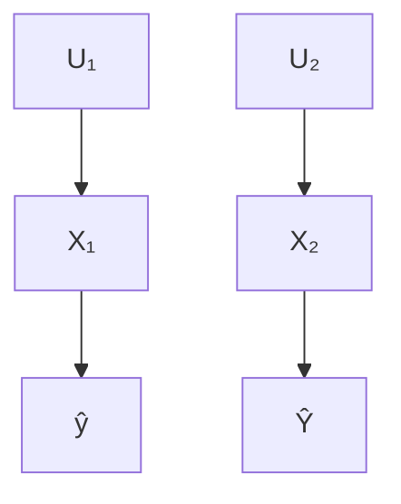
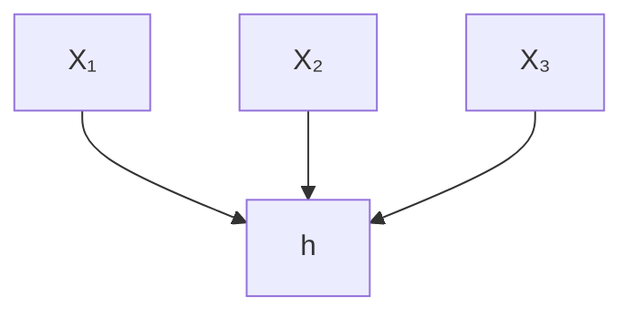
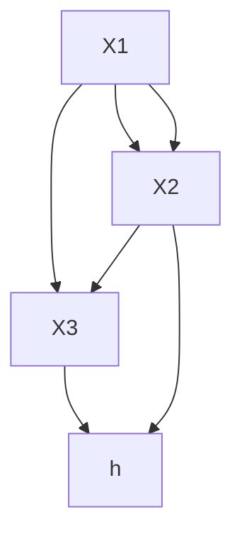
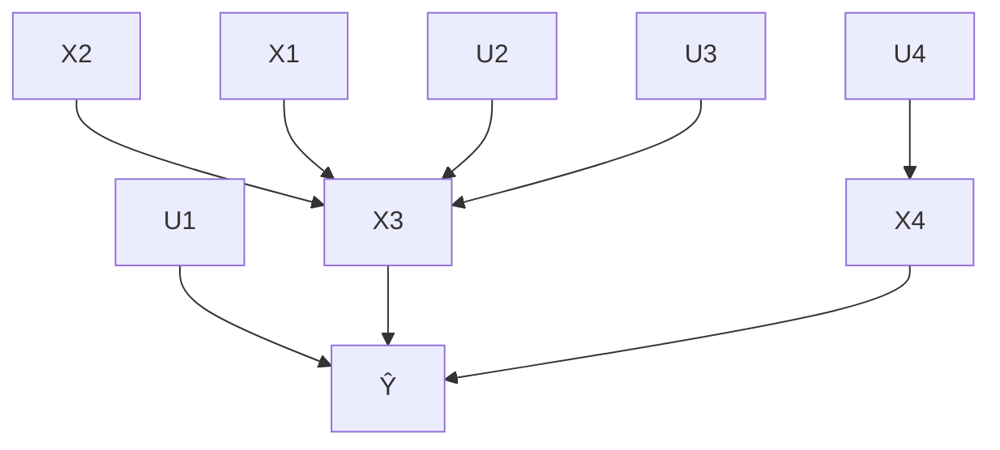
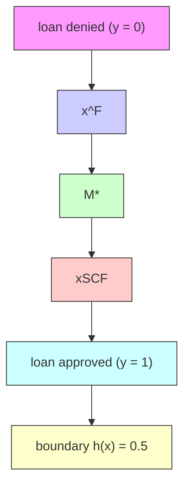
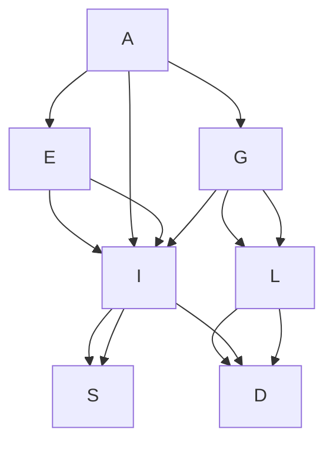

# Causal Algorithmic Recourse

## Chapter Abstract

Algorithmic recourse actions are typically obtained through solving an optimization problem that minimizes changes to the individual’s feature vector, subject to various plausibility, diversity, and sparsity constraints. Whereas previous works offer solutions to the optimization problem in a variety of settings, they critically overlook real-world considerations pertaining to the environment in which recourse actions are performed.

The present work emphasizes that changes to a subset of the individual’s attributes may have consequential down-stream effects on other attributes, thus making recourse a fundamentally causal problem. Here, we model such considerations using the framework of structural causal models, and highlight pitfalls of not considering causal relations through examples and theory. Such insights allow us to reformulate the optimization problem to directly optimize for minimally-costly recourse over a space of feasible actions (in the form of causal interventions) rather than optimizing for minimally-distant “counterfactual explanations”. We offer both the optimization formulations and solutions to deterministic and probabilistic recourse, on an individualized and sub-population level, overcoming the steep assumptive requirements of offering recourse in general settings. Finally, using synthetic and semi-synthetic experiments based on the German Credit dataset, we demonstrate how such methods can be applied in practice under minimal causal assumptions.

This chapter is based on the papers “Algorithmic Recourse: from Counterfactual Explanations to Interventions,” Karimi, Schölkopf, Valera, ACM-FAccT ( ­), 2020 (KSV21), and “Algorithmic recourse under imperfect causal knowledge: a probabilistic approach,” Karimi\*, von Kügelgen\*, Schölkopf, Valera, NeurIPS ( ­), 2020 (Kar+20b).

## 4.1 introduction

Predictive models are being increasingly used to support consequential decision-making in a number of contexts, e.g., denying a loan, rejecting a job applicant, or prescribing life-altering medication. As a result, there is mounting social and legal pressure (VB; SSH21) to provide explanations that help the affected individuals to understand “why a prediction was output”, as well as “how to act” to obtain a desired outcome. Answering these questions, for the different stakeholders involved, is one of the main goals of explainable machine learning (DVK17; Gun19; Kod94; Lip18; Mur+19; Rud19; Rüp06).

In this context, several works have proposed to explain a model’s predictions of an affected individual using counterfactual explanations, which are defined as statements of “how the world would have (had) to be different for a desirable outcome to occur” (WMR17). Of specific importance are nearest counterfactual explanations, presented as the most similar instances to the feature vector describing the individual, that result in the desired prediction from the model (Kar+20a; Lau+17). A closely related term is algorithmic recourse—the actions required for, or “the systematic process of reversing unfavorable decisions by algorithms and bureaucracies across a range of counterfactual scenarios”—which is argued as the underwriting factor for temporally extended agency and trust (VA20).

Counterfactual explanations have shown promise for practitioners and regulators to validate a model on metrics such as fairness and robustness (Kar+20a; SHG20; USL19). However, in their raw form, such explanations do not seem to fulfill one of the primary objectives of “explanations as a means to help a data-subject act rather than merely understand” (WMR17).

The translation of counterfactual explanations to recourse actions, i.e., to a recommendable set of actions to help an individual achieve a favorable outcome, was first explored in (USL19), where additional feasibility constraints were imposed to support the concept of actionable features (e.g., to prevent asking the individual to reduce their age or change their race). While a step in the right direction, this work and others that followed (Kar+20a; MST20; Poy+19; SHG20) implicitly assume that the set of actions resulting in the desired output would directly follow from the counterfactual explanation. This arises from the assumption that “what would have had to be in the past” (retrodiction) not only translates to “what should be in the future” (prediction) but also to “what should be done in the future” (recommendation) (Sta19). We challenge this assumption and attribute the shortcoming of existing approaches

Figure 4.1: Illustration of an example bivariate causal generative process, showing both the graphical model $\mathcal { G }$ (left), and the corresponding structural causal model (SCM) (right) (Pea09). In this example, $\mathrm { X _ { 1 } }$ represents an individual’s annual salary, ${ \sf X } _ { 2 }$ represents their bank balance, and $\hat { \Upsilon }$ denotes the output of a fixed deterministic predictor $h ,$ predicting an individual’s eligibility to receive a loan. $U _ { 1 }$ and $U _ { 2 }$ denote unobserved (exogenous) random variables.

$$
\left. \begin{array}{l} X _ {1} := f _ {1} (\mathrm{U} _ {1}) \\ X _ {2} := f _ {2} (X _ {1}, \mathrm{U} _ {2}) \\ P _ {\mathbf {U}} = P _ {U _ {1}} \times P _ {U _ {2}} \end{array} \right\} \mathcal {M} = (\mathbb {S}, P _ {\mathbf {U}})
$$

$$
\hat {Y} = h (X _ {1}, X _ {2})
$$

to their lack of consideration for real-world properties, specifically the causal relationships governing the physical world in which actions are performed.

## 4.1.1 Motivating Examples

Example 4.1.1. Consider, for example, the setting in Fig. 4.1 where an individual has been denied a loan and seeks an explanation and recommendation on how to proceed. This individual has an annual salary $( \mathsf { X } _ { 1 } )$ of \$75, 000 and an account balance $( \mathsf { X } _ { 2 } )$ of \$25, 000 and the predictor grants a loan based on the binary output of $h ( X _ { 1 } , X _ { 2 } ) = { \mathrm { s g n } } ( X _ { 1 } + 5 \cdot \mathrm { X } _ { 2 } - \ S 2 2 5 , 0 0 0 )$ . Existing approaches may identify nearest counterfactual explanations as another individual with an annual salary of \$100, 000 (+33%) or a bank balance of \$30, 000 (+20%), therefore encouraging the individual to reapply when either of these conditions are met. On the other hand, assuming actions take place in a world where home-seekers save 30% of their salary, up to external fluctuations in circumstance, $( \mathrm { i . e . , } \ X _ { 2 } : = 0 . 3 \mathsf { X } _ { 1 } + \mathsf { U } _ { 2 } )$ , a salary increase of only +14% to \$85, 000 would automatically result in \$3, 000 additional savings, with a net positive effect on the loan-granting algorithm’s decision.

Example 4.1.2. Consider now another instance of the setting of Fig. 4.1 in which an agricultural team wishes to increase the yield of their rice paddy. While many factors influence yield (temperature, solar radiation, water supply, seed quality, ...), assume that the primary actionable capacity of the team is their choice of paddy location. Importantly, the altitude $( X _ { 1 } )$ at which the paddy sits has an effect on other variables. For example, the laws of physics may imply that a 100m increase in elevation results in an average decrease of $\mathrm { i } ^ { \circ } \mathrm { C }$ in temperature $( X _ { 2 } )$ . Therefore, it is conceivable that a counterfactual explanation suggesting an increase in elevation for optimal yield, without consideration for downstream effects of the elevation increase on other variables (e.g., a decrease in temperature), may actually result in the prediction not changing.

These two examples illustrate the pitfalls of generating recourse actions directly from counterfactual explanations without consideration for the (causal) structure of the world in which the actions will be performed. Actions derived directly from counterfactual explanations may ask too much effort from the individual (Example 4.1.1) or may not even result in the desired output (Example 4.1.2).

We also remark that merely accounting for correlations between features (instead of modeling their causal relationships) would be insufficient as this would not align with the asymmetrical nature of causal interventions: for Example 4.1.1, increasing bank balance $( X _ { 2 } )$ would not lead to a higher salary $( X _ { 1 } )$ , and for Example 4.1.2, increasing temperature $( X _ { 2 } )$ ) would not affect altitude $( X _ { 1 } )$ , contrary to what would be predicted by a purely correlation-based approach.

## 4.1.2 Summary of Contributions and Structure of this Chapter

In the present work, we remedy this situation via a fundamental reformulation of the recourse problem: we rely on causal reasoning $( \ S \ 4 . 2 . 2 )$ to incorporate knowledge of causal dependencies between features into the process of recommending recourse actions that, if acted upon, would result in a counterfactual instance that favorably changes the output of the predictive model (§ 4.2.1).

First, we illuminate the intrinsic limitations of an approach in which recourse actions are directly derived from counterfactual explanations (§ 4.3.1). We show that actions derived from pre-computed (nearest) counterfactual explanations may prove sub-optimal in the sense of higher-than-necessary cost, or, even worse, ineffective in the sense of not actually achieving recourse. To address these limitations, we emphasize that, from a causal perspective, actions correspond to interventions which not only model changes to the intervened-upon variables, but also downstream effects on the remaining (non-intervened-upon) variables. This insight leads us to propose a new framework of recourse through minimal interventions in an underlying structural causal model (SCM) (??). We complement this formulation with a negative result showing that recourse guarantees are generally only possible if the true SCM is known (??).

Second, since real-world SCMs are rarely known we focus on the problem of algorithmic recourse under imperfect causal knowledge (??). We propose two probabilistic approaches which allow to relax the strong assumption of a fully-specified SCM. In the first (??), we assume that the true SCM, while unknown, is an additive Gaussian noise model (Hoy+09; PB14). We then use Gaussian processes (GPs) (WR06) to average predictions over a whole family of SCMs to obtain a distribution over counterfactual outcomes which forms the basis for individualised algorithmic recourse. In the second (??), we consider a different subpopulation-based $( \mathrm { i . e . , }$ interventional rather than counterfactual) notion of recourse which allows us to further relax our assumptions by removing any assumptions on the form of the structural equations. This approach proceeds by estimating the effect of interventions on individuals similar to the one for which we aim to achieve recourse (i.e., the conditional average treatment effect (AHL15)), and relies on conditional variational autoencoders (SLY15) to estimate the interventional distribution. In both cases, we assume that the causal graph is known or can be postulated from expert knowledge, as without such an assumption causal reasoning from observational data is not possible (PJS17, Prop. 4.1). To find minimum cost interventions that achieve recourse with a given probability, we propose a gradientbased approach to solve the resulting optimisation problems (??).

Our experiments (??) on synthetic and semi-synthetic loan approval data, show the need for probabilistic approaches to achieve algorithmic recourse in practice, as point estimates of the underlying true SCM often propose invalid recommendations or achieve recourse only at higher cost. Importantly, our results also suggest that subpopulation-based recourse is the right approach to adopt when assumptions such as additive noise do not hold. A user-friendly implementation of all methods that only requires specification of the causal graph and a training set is available at https://github.com/amirhk/recourse.

## 4.2 preliminaries

In this work, we consider algorithmic recourse through the lens of causality. We begin by reviewing the main concepts.

## 4.2.1 XAI: Counterfactual Explanations and Algorithmic Recourse

Let $\mathbf { X } = \left( X _ { 1 } , . . . , X _ { d } \right)$ denote a tuple of random variables, or features, taking values $\mathbf { x } = ( x _ { 1 } , . . . , x _ { d } ) \in \mathcal { X } = \mathcal { X } _ { 1 } \times . . . \times \mathcal { X } _ { d }$ . Assume that we are given a binary probabilistic classifier $h : \mathcal { X }  [ 0 , 1 ]$ trained to make decisions about i.i.d. samples from the data distribution $P _ { \mathbf { X } } .$ .1For ease of illustration, we adopt the setting of loan approval as a running example, i.e., $h ( \mathbf { x } ) \geq 0 . 5$ denotes that a loan is granted and $h ( \mathbf { x } ) < 0 . 5$ that it is denied. For a given (“factual”) individual $\mathbf { \boldsymbol { x } } ^ { \mathsf { F } }$ that was denied a loan, $h ( \mathbf { x } ^ { \mathsf { F } } ) < 0 . 5 ,$ , we aim to answer the following questions: “Why did individual $\mathbf { x } ^ { \mathsf { F } }$ not get the loan?” and “What would they have to change, preferably with minimal effort, to increase their chances for a future application?”.

A popular approach to this task is to find so-called (nearest) counterfactual explanations (WMR17), where the term “counterfactual” is meant in the sense of the closest possible world with a different outcome (Lew73). Translating this idea to our setting, a nearest counterfactual explanation $\mathbf { x } ^ { \mathsf { C F E } }$ for an individual $\mathbf { x } ^ { \mathsf { F } }$ is given by a solution to the following optimisation problem:

$$
\mathbf {x} ^ {\text { CFE }} \in \underset {\mathbf {x} \in \mathcal {X}} {\operatorname{argmin}} \quad \operatorname{dist} (\mathbf {x}, \mathbf {x} ^ {\mathsf {F}}) \quad \text { subject   to } \quad h (\mathbf {x}) \geq 0. 5, \tag {4.1}
$$

where dist $( \cdot , \cdot )$ is a distance on $\mathcal { X } \times \mathcal { X } ,$ , and additional constraints may be added to reflect plausibility, feasibility, or diversity of the obtained counterfactual explanations (Jos+19; Kar+20a; MTS19; MST20; Poy+19; SHG20; Hol+21). Most existing approaches have focused on providing solutions to (4.1) by exploring semantically meaningful choices of ${ \mathsf { d i s t } } ( \cdot , \cdot )$ for measuring similarity between individuals $( \mathbf { e . g . } , \ell _ { 0 } , \ell _ { 1 } , \ell _ { \infty , }$ , percentile-shift), accommodating different predictive models h (e.g., random forest, multilayer perceptron), and realistic plausibility constraints $\bar { \mathcal { P } } \subseteq \mathcal { X } . ^ { 2 }$ 2

Although nearest counterfactual explanations provide an understanding of the most similar set of features that result in the desired prediction, they stop short of giving explicit recommendations on how to act to realize this set of features. The lack of specification of the actions required to realize $\mathbf { x } ^ { \mathsf { C F E } }$ from $\mathbf { x } ^ { \mathsf { F } }$ leads to uncertainty and limited agency for the individual seeking recourse. To shift the focus from explaining a decision to providing recommendable actions to achieve recourse, Ustun et al. [USL19] reformulated (4.1) as:

$$
\delta^ {*} \in \underset {\delta \in \mathcal {F}} {\text { argmin }} \quad \text { cost } ^ {\mathsf {F}} (\delta) \quad \text { subject   to } \quad h (\mathbf {x} ^ {\mathsf {F}} + \delta) \geq 0. 5, \quad \mathbf {x} ^ {\mathsf {F}} + \delta \in \mathcal {P}, \tag {4.2}
$$

where $\mathsf { c o s t } ^ { \mathsf { F } } ( \cdot )$ is a user-specified cost function that encodes preferences between feasible actions from $\mathbf { x } ^ { \mathsf { F } } .$ , and $\mathcal { F }$ and $\mathcal { P }$ are optional sets of feasibility and plausibility constraints,3 restricting the actions and the resulting counterfactual explanation, respectively. The feasibility constraints in $( 4 . 2 )$ , as introduced in (USL19), aim at restricting the set of features that the individual may act upon. For instance, recommendations should not ask individuals to change their gender or reduce their age. Henceforth, we refer to the optimization problem in $( 4 . 2 )$ as CFE-based recourse problem, where the emphasis is shifted from minimising a distance as in $\left( 4 { \cdot } 1 \right)$ to optimising a personalised cost function $\mathsf { c o s t } ^ { \mathsf { F } } ( \cdot )$ over a set of actions $\delta$ which individual $\mathbf { x } ^ { \mathsf { F } }$ can perform.

The seemingly innocent reformulation of the counterfactual explanation problem in (4.1) as a recourse problem in $( 4 . 2 )$ is founded on two key assumptions.

Assumption 4.2.1. The feature-wise difference between factual and nearest counterfactual instances, $\mathbf { x } ^ { C F E } - \mathbf { \dot { x } } ^ { F }$ , directly translates to minimal action sets $\delta ^ { * }$ , such that performing the actions in $\delta ^ { * }$ starting from $\mathbf { x } ^ { F }$ will result in $\mathbf { x } ^ { C F E }$ .

Assumption 4.2.2. There is a 1-1 mapping between di $s t ( \cdot , \mathbf { x } ^ { F } )$ and cos $t ^ { F } ( \cdot )$ , whereby more effortful actions incur larger distance and higher cost.

Unfortunately, these assumptions only hold in restrictive settings, rendering solutions of $( 4 . 2 )$ sub-optimal or ineffective in many real-world scenarios. Specifically, Assumption 4.2.1 implies that features $X _ { i }$ for which $\delta _ { i } ^ { * } ~ = ~ 0$ are unaffected. However, this generally holds only if (i) the individual applies effort in a world where changing a variable does not have downstream effects on other variables $( \mathrm { i . e . , }$ features are independent of each other); or (ii) the individual changes the value of a subset of variables while simultaneously enforcing that the values of all other variables remain unchanged $( \mathrm { i . e . , }$ , breaking dependencies between features). Beyond the sub-optimality that arises from assuming/reducing to an independent world in (i), and disregarding the feasibility of non-altering actions in (ii), non-altering actions may naturally incur a cost which is not captured in the current definition of cost, and hence Assumption 4.2.2 does not hold either. Therefore, except in trivial cases where the model designer actively inputs pair-wise independent features (independently manipulable inputs) to the classifier h (see Fig. 4.2a), generating recommendations from counterfactual explanations in this manner, i.e., ignoring the potentially rich causal structure over X and the resulting downstream effects that changes to some features may have on others (see Fig. 4.2b), warrants reconsideration. A number of authors have argued for the need to consider causal relations between variables when generating counterfactual explanations (WMR17; USL19; Kar+20a; MST20; MTS19), however, this has not yet been formalized.

(a) Classifier-centric view

(b) Causal graph for  
Figure 4.2: A view commonly adopted for counterfactual explanations (a) treats features as independently manipulable inputs to a given fixed and deterministic classifier h. In the causal approach to algorithmic recourse taken in this work, we instead view variables as causally related to each other by a structural causal model (SCM) with associated causal graph (b).

## 4.2.2 Causality: Structural Causal Models, Interventions, and Counterfactuals

To reason formally about causal relations between features $\mathbf { X } = \left( X _ { 1 } , . . . , X _ { d } \right)$ , we adopt the structural causal model (SCM) framework (Pea09).4 Specifically, we assume that the data-generating process of X is described by an (unknown) underlying SCM of the general form

$$
\mathcal {M} = (\mathbb {S}, P _ {\mathbf {U}}), \quad \mathbb {S} = \left\{X _ {r} := f _ {r} \left(\mathbf {X} _ {\mathrm{pa} (r)}, U _ {r}\right) \right\} _ {r = 1} ^ {d}, \quad P _ {\mathbf {U}} = P _ {U _ {1}} \times \dots \times P _ {U _ {d}}, \tag {4.3}
$$

where the structural equations S are a set of assignments generating each observed variable $X _ { r }$ as a deterministic function $f _ { r }$ of its causal parents $\mathbf { \boldsymbol { x } } _ { \mathsf { p a } ( r ) } \subseteq$ $\mathbf { X } \setminus X _ { r }$ and an unobserved noise variable $U _ { r }$ . The assumption of mutually independent noises $( \mathrm { i . e . , }$ a fully factorised $P _ { \mathbf { U } } )$ entails that there is no hidden confounding and is referred to as causal sufficiency. An SCM is often illustrated by its associated causal graph ${ \mathcal { G } } ,$ , which is obtained by drawing a directed edge from each node in $\mathbf { X } _ { \mathrm { p a } ( r ) }$ to $X _ { r }$ for $r \in [ d ] : = \{ 1 , \ldots , d \}$ , see Fig. 4.1 and Fig. 4.2b for examples. We assume throughout that is acyclic. In this case, implies a unique observational distribution $P _ { \mathbf { X } } ,$ , which factorises over ${ \mathcal { G } } ,$ defined as the push-forward of $P _ { \mathbf { U } }$ via S.5Importantly, the SCM framework also entails interventional distributions describing a situation in which some variables are manipulated externally. $\mathrm { E . g . , }$ using the do-operator, an intervention which fixes $\mathbf { \boldsymbol { x } } _ { \mathcal { T } }$ to θ (where ${ \mathcal { T } } \subseteq [ d ] )$ ) is denoted by do $( \mathbf { X } _ { \mathcal { I } } : = \pmb { \theta } )$ . The corresponding distribution of the remaining variables $\mathbf { X } _ { - \mathcal { T } }$ can be computed by replacing the structural equations for $\mathbf { \boldsymbol { x } } _ { \mathcal { T } }$ in S to obtain the new set of equations $\mathbb { S } ^ { \mathrm { d o } ( \mathbf { X } _ { \mathcal { T } } : = \pmb { \theta } ) }$ ). The interventional distribution $P _ { \mathbf { X } _ { - \mathcal { T } } | \mathbf { d o } ( \mathbf { X } _ { \mathcal { T } } : = \pmb { \theta } ) }$ is then given by the observational distribution implied by the manipulated SCM $\left( \mathbb { S } ^ { \mathrm { d o } ( \mathbf { X } _ { \mathcal { T } } : = \pmb { \theta } ) } , P _ { \mathbf { U } } \right)$ .

Similarly, an SCM also implies distributions over counterfactuals— statements about a world in which a hypothetical intervention was performed all else being equal. For example, given observation $\mathbf { x } ^ { \mathsf { F } }$ we can ask what would have happened if $\mathbf { \boldsymbol { x } } _ { \mathcal { T } }$ had instead taken the value θ. We denote the counterfactual variable by $\mathbf { X } ( \mathrm { d o } ( \mathbf { X } _ { \mathcal { T } } : = \pmb { \theta } ) ) | \mathbf { x } ^ { \sf F }$ , whose distribution can be computed in three steps (Pea09):

1. Abduction: compute the posterior distribution $P _ { \mathbf { U } | \mathbf { x } ^ { \mathsf { F } } }$ of the exogenous variables U given the factual observation $\mathbf { x } ^ { \mathsf { F } } .$ ;  
2. Action: perform the intervention do $\mathbf { \Sigma } ( \mathbf { X } _ { \mathcal { T } } { \bf \Sigma } : = { \bf \Sigma } \theta )$ by replacing the structural equations for $\mathbf { \boldsymbol { x } } _ { \mathcal { T } }$ by $\mathbf { \boldsymbol { x } } _ { \mathcal { T } } : = \mathbf { \boldsymbol { \theta } }$ to obtain the new structural equations Sdo(XI :=θ); $\mathbb { S } ^ { \hat { \mathrm { d o } } ( \mathbf { X } _ { \mathcal { T } } : = \pmb { \theta } ) }$  
3. Prediction: the counterfactual distribution $P _ { \mathbf { X } ( \mathrm { d o } ( \mathbf { X } _ { \mathcal { T } } : = \pmb { \theta } ) ) | \mathbf { x } ^ { \mathnormal { F } } }$ is the distribution induced by the resulting SCM $\left( \mathbb { S } ^ { \mathrm { d o } ( \pmb { X } _ { \mathcal { T } } : = \pmb { \theta } ) } , P _ { \mathbf { U } | \mathbf { x } ^ { \ F } } \right)$ | .

For instance, the counterfactual variable for individual $\mathbf { x } ^ { \mathsf { F } }$ had action $a \ =$ do $( \mathbf { X } _ { \mathcal { T } } : = \pmb { \theta } ) \in \mathcal { F }$ been performed would be $\mathbf { \boldsymbol { x } } ^ { \mathsf { S C F } } ( a ) : = \mathbf { \boldsymbol { X } } ( a ) | \mathbf { \boldsymbol { x } } ^ { \mathsf { F } }$ . For a workedout example of computing counterfactuals in SCMs, we refer to ??.

## 4.3 causal recourse formulation

## 4.3.1 Limitations of CFE-based recourse

Here, we use causal reasoning to formalize the limitations of the CFE-based recourse approach in $( 4 . 2 )$ . To this end, we first reinterpret the actions resulting from solving the CFE-based recourse problem, $\mathrm { i . e . , ~ } \delta ^ { * }$ , as structural interventions by defining the set of indices $\mathcal { T }$ of observed variables that are intervened upon.

Definition 4.3.1 (CFE-based actions). Given an individual $\mathbf { x } ^ { \mathsf { F } }$ in world and a solution $\delta ^ { * }$ of $( 4 . 2 )$ , denote by ${ \mathcal { T } } = \{ i \mid \delta _ { i } ^ { * } \neq 0 \}$ the set of indices of observed variables that are acted upon. A CFE-based action then refers to a set of structural interventions of the form $a ^ { \mathsf { C F E } } ( \delta ^ { * } , x ^ { \mathsf { F } } ) : = \mathsf { d o } ( \{ X _ { i } : = x _ { i } ^ { F } + \delta _ { i } ^ { * } \} _ { i \in \mathbb { Z } } )$ ).

Using Defn. 4.3.1, we can derive the following key results that provide necessary and sufficient conditions for CFE-based actions to guarantee recourse.

Proposition 4.3.1. A CFE-based action $a ^ { C F E } ( \delta ^ { * } , { \pmb x } ^ { F } )$ in general $( i . e . ,$ , for arbitrary underlying causal models) results in the structural counterfactual $\mathbf { x } ^ { S C F } = \mathbf { x } ^ { C F E } : =$ $\mathbf { x } ^ { F } + \delta ^ { * }$ and thus guarantees recourse $( i . e . , h ( { \bf x } ^ { S C F } ) \ne h ( { \bf x } ^ { F } ) \dot { ) }$ if and only if the set of descendants of the acted upon variables determined by is the empty set.

Corollary 4.3.1. If all features in the true world are mutually independent, (i.e, if they are all root-nodes in the causal graph), then CFE-based actions always guarantee recourse.

While the above results are formally proven in Appendix A of (KSV21), we provide a sketch of the proof below. If the intervened-upon variables do not have descendants, then by definition $\mathbf { x } ^ { \mathsf { S C F } } = \mathbf { x } ^ { \mathsf { C F E } }$ . Otherwise, the value of the descendants will depend on the counterfactual value of their parents, leading to a structural counterfactual that does not resemble the nearest counterfactual explanation, $\mathbf { x } ^ { \mathsf { S C F } } \neq \mathbf { x } ^ { \mathsf { C F E } }$ , and thus may not result in recourse. Moreover, in an independent world the set of descendants of all the variables is by definition the empty set.

Unfortunately, the independent world assumption is not realistic, as it requires all the features selected to train the predictive model h to be independent of each other. Moreover, limiting changes to only those variables without descendants may unnecessarily limit the agency of the individual, e.g., in Example 4.1.1, restricting the individual to only changing bank balance without e.g., pursuing a new/side job to increase their income would be limiting. Thus, for a given non-independent  capturing the true causal dependencies between features, CFE-based actions require the individual seeking recourse to enforce (at least partially) an independent post-intervention model ${ \mathcal { M } } ^ { a ^ { \complement \models } }$ (so that Assumption 4.2.1 holds), by intervening on all the observed variables for which $\delta _ { i } \neq 0$ as well as on their descendants (even if their $\delta _ { i } = 0 )$ . However, such requirement suffers from two main issues. First, it conflicts with Assumption 4.2.2, since holding the value of variables may still imply potentially infeasible and costly interventions in  to sever all the incoming edges to such variables, and even then it may be ineffective and not change the prediction (see Example 4.1.2). Second, as will be proven in the next section (see also, Example 4.1.1), CFE-based actions may still be suboptimal, as they do not benefit from the causal effect of actions towards changing the prediction. Thus, even when equipped with knowledge of causal dependencies, recommending actions directly from counterfactual explanations in the manner of existing approaches is not satisfactory.

## 4.3.2 Recourse Through Minimal Interventions

We have demonstrated that actions which immediately follow from counterfactual explanations may require unrealistic assumptions, or alternatively, result in sub-optimal or even infeasible recommendations. To solve such limitations we rewrite the recourse problem so that instead of finding the minimal (independent) shift of features as in (4.2), we seek the minimal cost set of actions (in the form of structural interventions) that results in a counterfactual instance yielding the favorable output from h. For simplicity, we present the formulation for the case of an invertible SCM (i.e., one with invertible structural equations S) such that the ground-truth counterfactual $\pmb { x } ^ { \mathsf { S C F } } = \mathbb { S } ^ { a } ( \mathbb { S } ^ { - 1 } ( \pmb { x } ^ { \mathsf { F } } ) )$ ) is a unique point. The resulting optimisation formulation is as follows:

$$
a ^ {*} \in \underset {a \in \mathcal {F}} {\operatorname{argmin}} \quad \operatorname{cost} ^ {\mathsf {F}} (a) \quad \text { subject   to } \quad h (\mathbf {x} ^ {\mathrm{SCF}} (a)) \geq 0. 5, \tag {4-4}
$$

$$
\mathbf {x} ^ {\mathrm{SCF}} (a) = \mathbf {x} (a) | \mathbf {x} ^ {\mathrm{F}} \in \mathcal {P},
$$

where $a ^ { \ast } \in { \mathcal { F } }$ directly specifies the set of feasible actions to be performed for minimally costly recourse, with costF( ).6

Importantly, using the formulation in (??) it is now straightforward to show the suboptimality of CFE-based actions (proof in Appendix A of $( \mathrm { K S V } _ { 2 1 } ) ,$ ):

Proposition 4.3.2. Given an individual $\mathbf { x } ^ { F }$ observed in world , a set of feasible actions ${ \mathcal F } ,$ , and a solution $a ^ { \ast } \in { \mathcal { F } }$ of (??), assume that there exists a CFE-based action $a ^ { C F E } ( \delta ^ { * } , \mathbf { x } ^ { F } ) \in \mathcal { F }$ (see Defn. $4 { \cdot } 3 { \cdot } 1 )$ that achieves recourse, i.e., $h ( \mathbf { x } ^ { F } ) \neq h ( \mathbf { x } ^ { C F E } )$ ). Then, cos $t ^ { F } ( a ^ { * } ) \leq c o s t ^ { F } ( a ^ { C F E } )$ .

Thus, for a known causal model capturing the dependencies among observed variables, and a family of feasible interventions, the optimization problem in (??) yields Recourse through Minimal Interventions (MINT). Generating minimal interventions through solving (??) requires that we be able to compute the structural counterfactual, $\mathbf { x } ^ { \mathsf { S C F } }$ , of the individual $\mathbf { x } ^ { \mathsf { F } }$ in world ,

Figure 4.3: The structural causal model (graph and equations) for the working example and demonstration in ??.

$$
\left. \begin{array}{l} X _ {1} := \mathrm{U} _ {1} \\ X _ {2} := \mathrm{U} _ {2} \\ X _ {3} := f _ {3} (X _ {1}, X _ {2}) + \mathrm{U} _ {3} \\ X _ {4} := f _ {4} (X _ {3}) + \mathrm{U} _ {4} \\ P _ {\mathbf {U}} = P _ {U _ {1}} \times P _ {U _ {2}} \times P _ {U _ {3}} \times P _ {U _ {4}} \end{array} \right\}   \mathcal {M} = (\mathbb {S}, P _ {\mathbf {U}})
$$

$$
\hat {\Upsilon} = h \left(X _ {1}, X _ {2}, X _ {3}, X _ {4}\right)
$$

given any feasible action $a \in { \mathcal { F } }$ . To this end, and for the purpose of demonstration, we consider a class of invertible SCMs, specifically, additive noise models (ANM) Hoy+09, where the structural equations S are of the form

$$
\mathrm{S} = \left\{\mathrm{X} _ {r} := f _ {r} \left(\mathbf {X} _ {\mathrm{pa} (r)}\right) + U _ {r} \right\} _ {r = 1} ^ {d} \quad \Longrightarrow \quad u _ {r} ^ {\mathrm{F}} = x _ {r} ^ {\mathrm{F}} - f _ {r} \left(\mathbf {x} _ {\mathrm{pa} (r)} ^ {\mathrm{F}}\right), \quad r \in [ d ], \tag {4.5}
$$

and propose to use the three steps of structural counterfactuals in (Pea09) to assign a single counterfactual $\mathbf { x } ^ { \mathsf { S C F } } ( a ) : = \mathbf { x } ( a ) | \mathbf { x } ^ { \mathsf { F } }$ to each action $a = \mathrm { d o } ( \mathbf { X } _ { \mathcal { T } } : =$ $\theta ) \in { \mathcal { F } }$ as below.

## 4.3.2.1 Working Example

Consider the model in ??, where $\{ \mathrm { U } _ { i } \} _ { i = 1 } ^ { 4 }$ are mutually independent $\{ f _ { i } \} _ { i = 1 } ^ { 4 }$ functions. Let $\mathbf { x } ^ { \mathsf { F } } ~ = ~ ( x _ { 1 } ^ { \mathsf { F } } , x _ { 2 } ^ { \mathsf { F } } , x _ { 3 } ^ { \mathsf { F } } , x _ { 4 } ^ { \mathsf { F } } ) ^ { \mathsf { T } }$ be the observed features belonging to the (factual) individual seeking recourse. Also, let denote the set of indices corresponding to the subset of endogenous variables that are intervened upon according to the action set a. Then, we obtain a structural counterfactual, $\mathbf { x } ^ { \mathsf { S C F } } ( { \mathsf { \bar { a } } } ) ~ : = ~ \mathbf { x } ( a ) | \mathbf { x } ^ { \mathsf { F } } ~ = ~ \mathsf { S } ^ { a } ( \mathsf { S } ^ { - 1 } ( \mathbf { x } ^ { \mathsf { F } } ) )$ ), by applying the Abduction-Action-Prediction steps (Pea13) as follows:

Step 1. Abduction uniquely determines the value of all exogenous variables U given the observed evidence $\mathbf { X } = \mathbf { x } ^ { \mathsf { F } }$ :

$$
\begin{array}{l} u _ {1} = x _ {1} ^ {\mathsf {F}}, \\ u _ {2} = x _ {2} ^ {\mathrm{F}}, \quad \text {   F   } = c _ {1} (\text {   E   } - \text {   F   }) \tag {4.6} \\ u _ {3} = x _ {3} ^ {\mathsf {F}} - f _ {3} (x _ {1} ^ {\mathsf {F}}, x _ {2} ^ {\mathsf {F}}), \\ u _ {4} = x _ {4} ^ {\mathsf {F}} - f _ {4} (x _ {3} ^ {\mathsf {F}}). \\ \end{array}
$$

Step 2. Action modifies the SCM according to the hypothetical interventions, do $( \{ X _ { i } : = a _ { i } \} _ { i \in \mathcal { T } } )$ (where $a _ { i } = x _ { i } ^ { F } + \delta _ { i } )$ , yielding $\mathbb { S } ^ { a }$ :

$$
X _ {1} := [ 1 \in \mathcal {I} ] \cdot a _ {1} + [ 1 \notin \mathcal {I} ] \cdot U _ {1},
$$

$$
X _ {2} := [ 2 \in \mathcal {I} ] \cdot a _ {2} + [ 2 \notin \mathcal {I} ] \cdot U _ {2},
$$

$$
X _ {3} := [ 3 \in \mathcal {I} ] \cdot a _ {3} + [ 3 \notin \mathcal {I} ] \cdot (f _ {3} (X _ {1}, X _ {2}) + U _ {3}), \tag {4.7}
$$

$$
\mathrm{X} _ {4} := [ 4 \in \mathcal {I} ] \cdot a _ {4} + [ 4 \notin \mathcal {I} ] \cdot (f _ {4} (\mathrm{X} _ {3}) + \mathrm{U} _ {4}),
$$

where [ ] denotes the Iverson bracket.

Step 3. Prediction recursively determines the values of all endogenous variables based on the computed exogenous variables $\{ u _ { i } \} _ { i = 1 } ^ { 4 }$ from Step 1 and $\mathbb { S } ^ { a }$ from Step 2, as:

$$
x _ {1} ^ {\mathsf {S C F}} := [ 1 \in \mathcal {I} ] \cdot a _ {1} + [ 1 \notin \mathcal {I} ] \cdot (u _ {1}),
$$

$$
x _ {2} ^ {\text { SCF }} := [ 2 \in \mathcal {I} ] \cdot a _ {2} + [ 2 \notin \mathcal {I} ] \cdot (u _ {2}),
$$

$$
x _ {3} ^ {\mathrm{SCF}} := [ 3 \in \mathcal {I} ] \cdot a _ {3} + [ 3 \notin \mathcal {I} ] \cdot \left(f _ {3} (x _ {1} ^ {\mathrm{SCF}}, x _ {2} ^ {\mathrm{SCF}}) + u _ {3}\right), \tag {4.8}
$$

$$
x _ {4} ^ {\text { SCF }} := [ 4 \in \mathcal {I} ] \cdot a _ {4} + [ 4 \notin \mathcal {I} ] \cdot (f _ {4} (x _ {3} ^ {\text { SCF }}) + u _ {4}).
$$

## 4.3.2.2 General Assignment Formulation for ANMs

As we have not made any restricting assumptions about the structural equations (only that we operate with additive noise models7 where noise variables are pairwise independent), the solution for the working example naturally generalizes to SCMs corresponding to other DAGs with more variables. The assignment of structural counterfactual values can generally be written as:

$$
x _ {i} ^ {\mathrm{SCF}} = [ i \in \mathcal {I} ] \cdot (x _ {i} ^ {\mathrm{F}} + \delta_ {i}) + [ i \notin \mathcal {I} ] \cdot (x _ {i} ^ {\mathrm{F}} + f _ {i} (\mathrm{pa} _ {i} ^ {\mathrm{SCF}}) - f _ {i} (\mathrm{pa} _ {i} ^ {\mathrm{F}})). \tag {4.9}
$$

In words, the counterfactual value of the i-th feature, $x _ { i } ^ { \mathsf { S C F } }$ , takes the value $x _ { i } ^ { \mathsf { F } } +$ $\delta _ { i }$ if such feature is intervened upon $( \mathrm { i . e . } , i \in \mathcal { T } )$ . Otherwise, $x _ { i } ^ { \mathsf { S C F } }$ is computed as a function of both the factual and counterfactual values of its parents, denoted respectively by $f _ { i } ( \mathsf { p a } _ { i } ^ { \mathsf { F } } )$ and $f _ { i } ( \mathsf { p a } _ { i } ^ { \mathsf { S C F } } )$ ). The closed-form expression in (??) can replace the counterfactual constraint in (??), i.e.,

$$
\mathbf {x} ^ {\mathsf {S C F}} (a) := \mathbf {x} (a) | \mathbf {x} ^ {\mathsf {F}} = \mathbb {S} ^ {a} (\mathbb {S} ^ {- 1} (\mathbf {x} ^ {\mathsf {F}})),
$$

after which the optimization problem may be solved by building on existing frameworks for generating nearest counterfactual explanations, including gradient-based, evolutionary-based, heuristics-based, or verification-based approaches as referenced in $\ S \ 4 { \cdot } 2 { \cdot } 1$ . It is important to note that unlike CFEbased actions where the precise value of all covariates post-intervention are specified, MINT-based actions require that the user focus only on the features upon which interventions are to be performed, which may better align with factors under the users control (e.g., some features may be non-actionable but mutable through changes to other features; see also (BSR20)).

## 4.3.3 Negative Result: no Recourse Guarantees for Unknown Structural Equations

In practice, the structural counterfactual $\pmb { x } ^ { \mathsf { S C F } } ( a )$ can only be computed using an approximate (and likely imperfect) SCM $\mathcal { M } = ( \mathbb { S } , P _ { \mathbf { U } } )$ , which is estimated from data assuming a particular form of the structural equation as in (??). However, assumptions on the form of the true structural equations $\mathbb { S } _ { \star }$ ⋆ are generally untestable—not even with a randomized experiment—since there exist multiple SCMs which imply the same observational and interventional distributions, but entail different structural counterfactuals.

Example 4.3.1 (adapted from 6.19 in $( \mathrm { P J } \mathrm { S } \mathrm { \bar { 1 } } 7 ) )$ . Consider the following two SCMs $\mathcal { M } _ { A }$ and $\mathcal { M } _ { B }$ which arise from the general form in Fig. 4.1 by choosing $U _ { 1 } , U _ { 2 } \sim$ Bernoulli(0.5) and $U _ { 3 } \sim \mathrm { U n i f o r m } ( \{ 0 , \dots , K \} )$ independently in both $\mathcal { M } _ { A }$ and $\mathcal { M } _ { B } .$ , with structural equations

$$
X _ {1} := U _ {1}, \quad \text {in} \{\mathcal {M} _ {A}, \mathcal {M} _ {B} \},
$$

$$
X _ {2} := X _ {1} (1 - U _ {2}), \quad \text { in } \quad \{\mathcal {M} _ {A}, \mathcal {M} _ {B} \},
$$

$$
X _ {3} := \mathbb {I} _ {X _ {1} \neq X _ {2}} \left(\mathbb {I} _ {U _ {3} > 0} X _ {1} + \mathbb {I} _ {U _ {3} = 0} X _ {2}\right) + \mathbb {I} _ {X _ {1} = X _ {2}} U _ {3}, \quad \text { in } \quad \mathcal {M} _ {A},
$$

$$
X _ {3} := \mathbb {I} _ {X _ {1} \neq X _ {2}} (\mathbb {I} _ {U _ {3} > 0} X _ {1} + \mathbb {I} _ {U _ {3} = 0} X _ {2}) + \mathbb {I} _ {X _ {1} = X _ {2}} (K - U _ {3}), \quad \text { in } \quad \mathcal {M} _ {B}.
$$

Then $\mathcal { M } _ { A }$ and $\mathcal { M } _ { B }$ both imply exactly the same observational and interventional distributions, and thus are indistinguishable from empirical data. However, having observed $\mathbf { x } ^ { \mathsf { F } } = \left( 1 , 0 , 0 \right)$ , they predict different counterfactuals had $X _ { 1 }$ been 0, i.e., $\mathbf { x } ^ { \mathsf { S C F } } ( X _ { 1 } = 0 ) = ( 0 , 0 , 0 )$ and $( 0 , 0 , K )$ , respectively.8

Confirming or refuting an assumed form of $\mathbb { S } _ { \star }$ ⋆ would thus require counterfactual data which is, by definition, never available. Thus, example $? ?$ proves the following proposition by contradiction.

Proposition 4.3.3 (Lack of Recourse Guarantees). If the set of descendants of intervened-upon variables is non-empty, algorithmic recourse can be guaranteed in general (i.e., without further restrictions on the underlying causal model) only if the true structural equations are known, irrespective of the amount and type of available data.

Remark. The converse of ?? does not hold. E.g., given $\mathbf { x } ^ { F } = \left( 1 , 0 , 1 \right)$ ) in ??, abduction in either model yields $U _ { 3 } > 0 ,$ so the counterfactual of $X _ { 3 }$ cannot be predicted exactly.

Building on the framework of (KSV21), we next present two novel approaches for causal algorithmic recourse under unknown structural equations. The first approach in ?? aims to estimate the counterfactual distribution under the assumption of ANMs (??) with Gaussian noise for the structural equations. The second approach in ?? makes no assumptions about the structural equations, and instead of approximating the structural equations, it considers the effect of interventions on a sub-population similar to $\mathbf { x } ^ { \mathsf { F } }$ . We recall that the causal graph is assumed to be known throughout.

## 4.4 recourse under imperfect causal knowledge

## 4.4.1 Probabilistic Individualised Recourse

Since the true SCM $\mathcal { M } _ { \star }$ is unknown, one approach to solving (??) is to learn an approximate SCM  within a given model class from training data $\{ \mathbf { x } ^ { i } \} _ { i = 1 } ^ { n }$ . For example, for an ANM (??) with zero-mean noise, the functions $f _ { r }$ can be learned via linear or kernel (ridge) regression of $X _ { r }$ given $\mathbf { X } _ { \mathrm { p a } ( r ) }$ as input. We refer to these approaches as $\mathcal { M } _ { \mathrm { L I N } }$ and $\mathcal { M } _ { \mathrm { K R } }$ , respectively. can then be used in place of $\mathcal { M } _ { \astrosun }$ ⋆ to infer the noise values as in (??), and subsequently to predict a single-point counterfactual $\mathbf { x } ^ { \mathsf { S C F } } ( a )$ to be used in (??). However, the learned causal model  may be imperfect, and thus lead to wrong counterfactuals due to, e.g., the finite sample of the observed data, or more importantly, due to model misspecification (i.e., assuming a wrong parametric form for the structural equations).

To solve such limitation, we adopt a Bayesian approach to account for the uncertainty in the estimation of the structural equations. Specifically, we assume additive Gaussian noise and rely on probabilistic regression using a Gaussian process (GP) prior over the functions $f _ { r } ;$ for an overview of regression with GPs, we refer to (WR06, § 2).

Definition 4.4.1 (GP-SCM). A Gaussian process SCM (GP-SCM) over X refers to the model

$$
X _ {r} := f _ {r} (\mathbf {X} _ {\mathrm{pa} (r)}) + U _ {r}, \quad f _ {r} \sim \mathcal {G P} (0, k _ {r}), \quad U _ {r} \sim \mathcal {N} (0, \sigma_ {r} ^ {2}), \quad r \in [ d ], \tag {4.10}
$$

with covariance functions $k _ { r } : \mathcal { X } _ { \mathrm { p a } ( r ) } \times \mathcal { X } _ { \mathrm { p a } ( r ) } \to \mathbb { R }$ , e.g., RBF kernels for continuous $X _ { \mathtt { p a } ( r ) }$ .

While GPs have previously been studied in a causal context for structure learning (FN00; Küg+19), estimating treatment effects $( \mathrm { A S 1 7 } ; \mathrm { S S 1 7 } )$ , or learning SCMs with latent variables and measurement error $( \mathrm { S G } \mathrm { \bar { 1 } O } ) .$ , our goal here is to account for the uncertainty over $f _ { r }$ in the computation of the posterior over $U _ { r } ,$ and thus to obtain a counterfactual distribution, as summarised in the following propositions.

Proposition 4.4.1 (GP-SCM Noise Posterior). Let $\{ \mathbf { x } ^ { i } \} _ { i = 1 } ^ { n }$ be an observational sample from (??). For each $r \in [ d ]$ with non empty parent set $| p a ( r ) | > 0 ,$ , the posterior distribution of the noise vector $\mathbf { u } _ { r } ~ = ~ \left( u _ { r } ^ { 1 } , . . . , u _ { r } ^ { n } \right)$ , conditioned on $\mathbf { x } _ { r } =$ $( x _ { r } ^ { 1 } , . . . , x _ { r } ^ { n } )$ and $\mathbf { X } _ { p a ( r ) } = ( \mathbf { x } _ { p a ( r ) } ^ { 1 } , . . . , \mathbf { x } _ { p a ( r ) } ^ { n } )$ , is given by

$$
\mathbf {u} _ {r} | \mathbf {X} _ {p a (r)}, \mathbf {x} _ {r} \sim \mathcal {N} \left(\sigma_ {r} ^ {2} (\mathbf {K} + \sigma_ {r} ^ {2} \mathbf {I}) ^ {- 1} \mathbf {x} _ {r}, \sigma_ {r} ^ {2} \left(\mathbf {I} - \sigma_ {r} ^ {2} (\mathbf {K} + \sigma_ {r} ^ {2} \mathbf {I}) ^ {- 1}\right)\right), \tag {4.11}
$$

where $\mathbf { K } : = \big ( k _ { r } \big ( \mathbf { x } _ { p a ( r ) } ^ { i } , \mathbf { x } _ { p a ( r ) } ^ { j } \big ) \big ) _ { i j }$ denotes the Gram matrix.

Next, in order to compute counterfactual distributions, we rely on ancestral sampling (according to the causal graph) of the descendants of the intervention targets $\mathbf { \boldsymbol { x } } _ { \mathcal { T } }$ using the noise posterior of (??). The counterfactual distribution of each descendant $X _ { r }$ is given by the following proposition.

Proposition $\mathbf { 4 } { \cdot } 4 { \cdot } 2$ (GP-SCM Counterfactual Distribution). Let $\{ \mathbf { x } ^ { i } \} _ { i = 1 } ^ { n }$ be an observational sample from (??). Then, for $r \in [ d ]$ ] with $| p a ( r ) | > 0 ,$ , the counterfactual distribution over $X _ { r }$ had $\mathbf { X } _ { p a ( r ) }$ been $\tilde { \mathbf { x } } _ { p a ( r ) }$ (instead $o f \mathbf { x } _ { p a ( r ) } ^ { F } )$ for individual $\mathbf { x } ^ { F } \in \mathbf { \Xi }$ $\{ { \bf x } ^ { i } \} _ { i = 1 } ^ { n }$ is given by

$$
\begin{array}{l} X _ {r} \left(\mathbf {X} _ {p a (r)} = \tilde {\mathbf {x}} _ {p a (r)}\right) \mid \mathbf {x} ^ {F}, \left\{\mathbf {x} ^ {i} \right\} _ {i = 1} ^ {n} \tag {4.12} \\ \sim \mathcal {N} \big (\mu_ {r} ^ {F} + \tilde {\mathbf {k}} ^ {T} (\mathbf {K} + \sigma_ {r} ^ {2} \mathbf {I}) ^ {- 1} \mathbf {x} _ {r}, s _ {r} ^ {F} + \tilde {k} - \tilde {\mathbf {k}} ^ {T} (\mathbf {K} + \sigma_ {r} ^ {2} \mathbf {I}) ^ {- 1} \tilde {\mathbf {k}} \big), \\ \end{array}
$$

where $\tilde { k } : = k _ { r } ( \tilde { \mathbf { x } } _ { p a ( r ) } , \tilde { \mathbf { x } } _ { p a ( r ) } ) , \tilde { \mathbf { k } } : = \big ( k _ { r } ( \tilde { \mathbf { x } } _ { p a ( r ) } , \mathbf { x } _ { p a ( r ) } ^ { 1 } ) , \dots , k _ { r } ( \tilde { \mathbf { x } } _ { p a ( r ) } , \mathbf { x } _ { p a ( r ) } ^ { n } ) \big )$ , xr and K as defined in $? ? ,$ , and $\mu _ { r } ^ { F }$ and $s _ { r } ^ { F }$ are the posterior mean and variance of $u _ { r } ^ { F }$ given by (??).

All proofs can be found in Appendix A of (Kar+20b). We can now generalise the recourse problem (??) to our probabilistic setting by replacing the single-point counterfactual $\pmb { x } ^ { \mathsf { S C F } } ( a )$ with the counterfactual random variable $\mathbf { \boldsymbol { x } } ^ { \mathsf { s c F } } ( a ) : = \mathbf { \boldsymbol { x } } ( a ) | \mathbf { \boldsymbol { x } } ^ { \mathsf { F } }$ . As a consequence, it no longer makes sense to consider a hard constraint of the form $h ( \mathsf { x } ^ { \mathsf { S C F } } ( a ) ) > 0 . 5$ , i.e., that the prediction needs to change. Instead, we can reason about the expected classifier output under the counterfactual distribution, leading to the following probabilistic version of the individualised recourse optimisation problem:

Figure 4.4: Illustration of point- and subpopulation-based recourse approaches.

$$
\min _ {a = \operatorname{do} \left(\mathbf {X} _ {\mathcal {I}} := \boldsymbol {\theta}\right) \in \mathcal {F}} \quad \operatorname{cost} ^ {\mathrm{F}} (a) \tag {4.13}
$$

$\operatorname { s u b j e c t } \operatorname { t o } \quad \mathbb { E } _ { \pmb { X } ^ { \operatorname { s c r } } ( a ) } \left[ h \left( \pmb { X } ^ { \mathsf { S C F } } ( a ) \right) \right] \geq \operatorname { t h r e s h } ( a ) .$

Note that the threshold thresh(a) is allowed to depend on a. For example, an intuitive choice is

$$
\operatorname{thresh} (a) = 0. 5 + \gamma_ {\mathrm{LCB}} \sqrt {\operatorname{Var} _ {\mathbf {X} ^ {\mathrm{SCF}} (a)} [ h (\mathbf {X} ^ {\mathrm{SCF}} (a)) ]} \tag {4.14}
$$

which has the interpretation of the lower-confidence bound crossing the decision boundary of 0.5. Note that larger values of the hyperparameter γlcb lead to a more conservative approach to recourse, while for $\gamma _ { \mathrm { { L C B } } } = 0$ merely crossing the decision boundary with $\ge 5 0 \%$ chance suffices.

## 4.4.2 Probabilistic Subpopulation-based Recourse

The GP-SCM approach in ?? allows us to average over an infinite number of (non-)linear structural equations, under the assumption of additive Gaussian noise. However, this assumption may still not hold under the true SCM, leading to sub-optimal or inefficient solutions to the recourse problem. Next, we remove any assumptions about the structural equations, and propose a second approach that does not aim to approximate an individualized counterfactual distribution, but instead considers the effect of interventions on a subpopulation defined by certain shared characteristics with the given (factual) individual $\mathbf { x } ^ { \mathsf { F } }$ . The key idea behind this approach resembles the notion of conditional average treatment effects (CATE) (AHL15) (illustrated in ??) and is based on the fact that any intervention do $( \mathbf { X } _ { \mathcal { I } } : = \pmb { \theta } )$ only influences the descendants d( ) of the intervened-upon variables, while the non-descendants nd( ) remain unaffected. Thus, when evaluating an intervention, we can condition on ${ \mathbf { X } _ { \mathrm { n d } ( \mathcal { T } ) } = \mathbf { x } _ { \mathrm { n d } ( \mathcal { T } ) } ^ { \mathsf { F } } }$ , thus selecting a subpopulation of individuals similar to the factual subject.

Specifically, we propose to solve the following subpopulation-based recourse optimization problem

$$
\min _ {a = \operatorname{do} \left(\mathbf {X} _ {\mathcal {I}} := \boldsymbol {\theta}\right) \in \mathcal {F}} \quad \text {cost} ^ {\mathrm{F}} (a) \tag {4.15}
$$

$\begin{array} { r l } { \mathrm { s u b j e c t ~ t o ~ } } & { \mathbb { E } _ { \boldsymbol { X } _ { \mathrm { d } ( \mathcal { T } ) } | \mathrm { d o } ( \boldsymbol { X } _ { \mathcal { T } } : = \boldsymbol { \theta } ) , \boldsymbol { x } _ { \mathrm { n d } ( \mathcal { T } ) } ^ { \mathrm { { F } } } } \left| h \big ( \boldsymbol { x } _ { \mathrm { n d } ( \mathcal { T } ) } ^ { \mathrm { { F } } } , \boldsymbol { \theta } , \boldsymbol { X } _ { \mathrm { d } ( \mathcal { T } ) } \big ) \right| \geq \mathrm { t h r e s h } ( a ) , } \end{array}$

where, in contrast to (??), the expectation is taken over the corresponding interventional distribution.

In general, this interventional distribution does not match the conditional distribution, i.e.,

$$
P _ {\mathbf {X} _ {\mathrm{d} (\mathcal {I})} | \mathrm{do} (\mathbf {X} _ {\mathcal {I}} := \boldsymbol {\theta}), \mathbf {x} _ {\mathrm{nd} (\mathcal {I})} ^ {\mathsf {F}}} \neq P _ {\mathbf {X} _ {\mathrm{d} (\mathcal {I})} | \mathbf {X} _ {\mathcal {I}} := \boldsymbol {\theta}, \mathbf {x} _ {\mathrm{nd} (\mathcal {I})} ^ {\mathsf {F}}}
$$

because some spurious correlations in the observational distribution do not transfer to the interventional setting. For example, in Fig. 4.2b we have that

$$
P _ {X _ {2} | \mathrm{do} (X _ {1} = x _ {1}, X _ {3} = x _ {3})} = P _ {X _ {2} | X _ {1} = x _ {1}} \neq P _ {X _ {2} | X _ {1} = x _ {1}, X _ {3} = x _ {3}}.
$$

Fortunately, the interventional distribution can still be identified from the observational one, as stated in the following proposition.

Proposition 4.4.3. Subject to causal sufficiency, PX ( )|do(X :=θ),xF $P _  \mathbf { X } _ { d ( \mathcal { T } ) } | \mathbf { d o } ( \mathbf { X } _ { \mathcal { T } } : = \pmb { \theta } ) , \mathbf { x } _ { n d ( \mathcal { T } ) } ^ { F }$ is observationally identifiable (i.e., computable from the observational distribution) via:

$$
p \left(\mathbf {X} _ {d (\mathcal {I})} \mid \mathrm{do} \left(\mathbf {X} _ {\mathcal {I}} := \boldsymbol {\theta}\right), \mathbf {x} _ {n d (\mathcal {I})} ^ {F}\right) = \prod_ {r \in d (\mathcal {I})} p \left(X _ {r} \mid \mathbf {X} _ {p a (r)}\right) \Bigg | _ {\mathbf {X} _ {\mathcal {I}} := \boldsymbol {\theta}, \mathbf {X} _ {n d (\mathcal {I})} = \mathbf {x} _ {n d (\mathcal {I})} ^ {F}}. \tag {4.16}
$$

As evident from ??, tackling the optimization problem in (??) in the general case (i.e., for arbitrary graphs and intervention sets I) requires estimating the stable conditionals $P _ { X _ { r } | \mathbf { X _ { p a ( r ) } } }$ (a.k.a. causal Markov kernels) in order to compute the interventional expectation via (??). For convenience (see ?? for details), here we opt for latent-variable implicit density models, but other conditional density estimation approaches may be also be used (e.g., BH01;Bis94; TT18). Specifically, we model each conditional $p ( \boldsymbol { x } _ { r } | \mathbf { x } _ { \mathrm { p a } ( r ) } )$ with a conditional variational autoencoder (CVAE) (SLY15) as:

$$
p (x _ {r} | \mathbf {x} _ {\mathrm{pa} (r)}) \approx p _ {\psi_ {r}} (x _ {r} | \mathbf {x} _ {\mathrm{pa} (r)}) = \int p _ {\psi_ {r}} (x _ {r} | \mathbf {x} _ {\mathrm{pa} (r)}, \mathbf {z} _ {r}) p (\mathbf {z} _ {r}) d \mathbf {z} _ {r}, \tag {4.17}
$$

$$
p (\mathbf {z} _ {r}) := \mathcal {N} (\mathbf {0}, \mathbf {I}). \tag {4.18}
$$

To facilitate sampling $x _ { r }$ (and in analogy to the deterministic mechanisms $f _ { r }$ in SCMs), we opt for deterministic decoders in the form of neural nets $D _ { r }$ parametrised by $\psi _ { r } , \mathrm { i . e . }$ , $p _ { \psi _ { r } } ( x _ { r } | \mathbf { x } _ { \mathsf { p a } ( r ) } , \mathbf { z } _ { r } ) = \delta \big ( x _ { r } - D _ { r } \big ( \mathbf { x } _ { \mathsf { p a } ( r ) } , \mathbf { z } _ { r } ; \psi _ { r } \big ) \big )$ , and rely on variational inference (WJ08), amortised with approximate posteriors $q _ { \phi _ { r } } ( \mathbf { z } _ { r } | \boldsymbol { x } _ { r } , \mathbf { x } _ { \mathrm { p a } ( r ) } )$ parametrised by encoders in the form of neural nets with parameters $\phi _ { r }$ . We learn both the encoder and decoder parameters by maximising the evidence lower bound (ELBO) using stochastic gradient descend (BB08; KB15; KW14; RMW14). For further details, we refer to Appendix D of (Kar+20b)

Remark. The collection of CVAEs can be interpreted as learning an approximate SCM of the form

$$
\mathcal {M} _ {\mathrm{CVAE}}: \quad S = \left\{X _ {r} := D _ {r} \left(\mathbf {X} _ {p a (r)}, \mathbf {z} _ {r}; \psi_ {r}\right) \right\} _ {r = 1} ^ {d}, \quad \mathbf {z} _ {r} \sim \mathcal {N} (\mathbf {0}, \mathbf {I}) \quad \forall r \in [ d ] \tag {4.19}
$$

However, this family of SCMs may not allow to identify the true SCM (provided it can be expressed as above) from data without additional assumptions. Moreover, exact posterior inference over $\mathbf { z } _ { r }$ given $\mathbf { x } ^ { F }$ is intractable, and we need to resort to approximations instead. It is thus unclear whether sampling from $q _ { \phi _ { r } } ( \mathbf { z } _ { r } | \boldsymbol { x } _ { r } ^ { F } , \mathbf { x } _ { p a ( r ) } ^ { F } )$ instead of from $p ( \mathbf { z } _ { r } )$ in (??) can be interpreted as a counterfactual within (??). For further discussion on such “pseudo-counterfactuals” we refer to Appendix C of (Kar+20b)

## 4.4.3 Solving the Probabilistic Recourse Optimization Problem

We now discuss how to solve the resulting optimization problems in (??) and (??). First, note that both problems differ only on the distribution over which the expectation in the constraint is taken: in (??) this is the counterfactual distribution of the descendants given in $\because ? ;$ and in (??) it is the interventional distribution identified in ??. In either case, computing the expectation for an arbitrary classifier h is intractable. Here, we approximate these integrals via Monte Carlo by sampling $\mathbf { x } _ { \mathrm { d ( \mathcal { T } ) } } ^ { ( m ) }$ from the interventional or counterfactual distributions resulting from $\boldsymbol { a } = \mathrm { d o } ( \mathbf { X } _ { \mathcal { T } } : = \boldsymbol { \theta } )$ , i.e.,

$$
\mathbb {E} _ {\mathbf {X} _ {\mathrm{d} (\mathcal {I}) | \boldsymbol {\theta}}} \big [ h \big (\mathbf {x} _ {\mathrm{nd} (\mathcal {I})} ^ {\mathsf {F}}, \boldsymbol {\theta}, \mathbf {X} _ {\mathrm{d} (\mathcal {I})} \big) \big ] \approx \frac {1}{M} \sum_ {m = 1} ^ {M} h \big (\mathbf {x} _ {\mathrm{nd} (\mathcal {I})} ^ {\mathsf {F}}, \boldsymbol {\theta}, \mathbf {x} _ {\mathrm{d} (\mathcal {I})} ^ {(m)} \big).
$$

## 4.4.3.1 Brute-Force Approach

A way to solve (??) and (??) is to (i) iterate over $a \ \in \ { \mathcal { F } } ,$ , with F being a finite set of feasible actions (possibly as a result of discretizing in the case of a continuous search space); (ii) approximately evaluate the constraint via Monte Carlo; and (iii) select a minimum cost action amongst all evaluated candidates satisfying the constraint. However, this may be computationally prohibitive and yield suboptimal interventions due to discretisation.

## 4.4.3.2 Gradient-based Approach

Recall that, for actions of the form $a = \mathrm { d o } ( \mathbf { X } _ { \mathcal { T } } : = \pmb { \theta } )$ , we need to optimize Iover both the intervention targets  and the intervention values θ. Selecting targets is a hard combinatorial optimization problem, as there are $2 ^ { d ^ { \prime } }$ possible choices for $d ^ { \prime } \leq d$ actionable features, with a potentially infinite number of intervention values. We therefore consider different choices of targets in parallel, and propose a gradient-based approach suitable for differentiable classifiers to efficiently find an optimal θ for a given intervention set .9 In particular, we first rewrite the constrained optimization problem in unconstrained form with Lagrangian (Kar39; KT51):

$$
\mathcal {L} (\boldsymbol {\theta}, \lambda) := \operatorname{cost} ^ {\mathsf {F}} (a) + \lambda \left(\operatorname{thresh} (a) - \mathbb {E} _ {\mathbf {X} _ {\mathrm{d} (\mathcal {I}) | \boldsymbol {\theta}}} \left[ h \left(\mathbf {x} _ {\mathrm{nd} (\mathcal {I})} ^ {\mathsf {F}}, \boldsymbol {\theta}, \mathbf {X} _ {\mathrm{d} (\mathcal {I})}\right) \right]\right). \tag {4.20}
$$

We then solve the saddle point problem min max $\mathcal { L } ( \pmb \theta , \lambda )$ arising from (??) with stochastic gradient descent (BB08; KB15). Since both the GP-SCM counterfactual (??) and the CVAE interventional distributions (??) admit a reparametrization trick (KW14; RMW14), we can differentiate through the constraint:

$$
\nabla_ {\boldsymbol {\theta}} \mathbb {E} _ {\mathbf {X} _ {\mathrm{d} (\mathcal {I})}} \left[ h \big (\mathbf {x} _ {\mathrm{nd} (\mathcal {I})} ^ {\mathsf {F}}, \boldsymbol {\theta}, \mathbf {X} _ {\mathrm{d} (\mathcal {I})} \big) \right] = \mathbb {E} _ {\mathbf {z} \sim \mathcal {N} (\mathbf {0}, \mathbf {I})} \left[ \nabla_ {\boldsymbol {\theta}} h \big (\mathbf {x} _ {\mathrm{nd} (\mathcal {I})} ^ {\mathsf {F}}, \boldsymbol {\theta}, \mathbf {x} _ {\mathrm{d} (\mathcal {I})} (\mathbf {z}) \big) \right]. (4. 2 1)
$$

Here, ${ \pmb x } _ { \bf d ( { \mathcal { I } } ) } ( { \pmb z } )$ is obtained by iteratively computing all descendants in topological order: either substituting z together with the other parents into the decoders $D _ { r }$ for the CVAEs, or by using the Gaussian reparametrization $x _ { r } ( \mathbf { z } ) = \mu + \sigma \mathbf { z }$ with $\mu$ and σ given by (??) for the GP-SCM. A similar gradient estimator for the variance which enters thresh(a) for $\gamma _ { \mathrm { { L C B } } } \neq 0$ is derived in Appendix F of (Kar+20b).

**Table 4.1: Experimental results for the gradient-based approach on different $3 ^ { - }$ variable SCMs. We show average performance ±1 standard deviation for $N _ { \mathrm { r u n s } } =$ 100, $N _ { \mathrm { M C - s a m p l e s } } = 1 0 0 ,$ , and $\gamma _ { \mathrm { L C B } } = 2$ .**

<table><tr><td rowspan="2">Method</td><td colspan="3">LINEAR SCM</td><td colspan="3">NON-LINEAR ANM</td><td colspan="3">NON-ADDITIVE SCM</td></tr><tr><td>Valid $_{\star}$ (%)</td><td>LCB</td><td>Cost (%)</td><td>Valid $_{\star}$ (%)</td><td>LCB</td><td>Cost (%)</td><td>Valid $_{\star}$ (%)</td><td>LCB</td><td>Cost (%)</td></tr><tr><td> $\mathcal{M}_{\star}$ </td><td>100</td><td>-</td><td>10.9±7.9</td><td>100</td><td>-</td><td>20.1±12.3</td><td>100</td><td>-</td><td>13.2±11.0</td></tr><tr><td> $\mathcal{M}_{\text{LIN}}$ </td><td>100</td><td>-</td><td>11.0±7.0</td><td>54</td><td>-</td><td>20.6±11.0</td><td>98</td><td>-</td><td>14.0±13.5</td></tr><tr><td> $\mathcal{M}_{\text{KR}}$ </td><td>90</td><td>-</td><td>10.7±6.5</td><td>91</td><td>-</td><td>20.6±12.5</td><td>70</td><td>-</td><td>13.2±11.6</td></tr><tr><td> $\mathcal{M}_{\text{GP}}$ </td><td>100</td><td>.55±.04</td><td>12.2±8.3</td><td>100</td><td>.54±.03</td><td>21.9±12.9</td><td>95</td><td>.52±.04</td><td>13.4±12.8</td></tr><tr><td> $\mathcal{M}_{\text{CVAE}}$ </td><td>100</td><td>.55±.07</td><td>11.8±7.7</td><td>97</td><td>.54±.05</td><td>22.6±12.3</td><td>95</td><td>.51±.01</td><td>13.4±12.2</td></tr><tr><td> $\text{CATE}_{\star}$ </td><td>90</td><td>.56±.07</td><td>11.9±9.2</td><td>97</td><td>.55±.05</td><td>26.3±21.4</td><td>100</td><td>.52±.02</td><td>13.5±13.0</td></tr><tr><td> $\text{CATE}_{\text{GP}}$ </td><td>93</td><td>.56±.05</td><td>12.2±8.4</td><td>94</td><td>.55±.06</td><td>25.0±14.8</td><td>94</td><td>.52±.03</td><td>13.2±13.1</td></tr><tr><td> $\text{CATE}_{\text{CVAE}}$ </td><td>89</td><td>.56±.08</td><td>12.1±8.9</td><td>98</td><td>.54±.05</td><td>26.0±14.3</td><td>100</td><td>.52±.05</td><td>13.6±12.9</td></tr></table>

## 4.5 experiments

In our experiments, we compare different approaches for causal algorithmic recourse on synthetic and semi-synthetic data sets. Additional results can be found in Appendix B of (Kar+20b).

## 4.5.1 Compared Methods

We compare the naive point-based recourse approaches $\mathcal { M } _ { \mathrm { L I N } }$ and $\mathcal { M } _ { \mathrm { K R } }$ mentioned at the beginning of ?? as baselines with the proposed counterfactual GP-SCM $\mathcal { M } _ { \mathrm { G P } }$ and the CVAE approach for sub-population-based recourse $\left( \mathbf { C A T E _ { C V A E } } \right)$ . For completeness, we also consider a $\mathbf { C A T E _ { G P } }$ approach as a GP can also be seen as modelling each conditional as a Gaussian,10 and also evaluate the “pseudo-counterfactual” $\mathcal { M } _ { \mathrm { { c v a r } } }$ approach discussed in Remark ??. Finally, we report oracle performance for individualised $\mathcal { M } _ { \star }$ and sub-population-based recourse methods cate⋆ by sampling counterfactuals and interventions from the true underlying SCM. We note that a comparison with non-causal recourse approaches that assume independent features (USL19; SHG20) or consider causal relations to generate counterfactual explanations but not recourse actions (Jos+19; MTS19) is neither natural nor straight-forward, because it is unclear whether descendant variables should be allowed to change, whether keeping their value constant should incur a cost, and, if so, how much, c.f. (KSV21).

## 4.5.2 Metrics

We compare recourse actions recommended by the different methods in terms of cost, computed as the L2-norm between the intervention $\pmb { \theta } _ { \mathcal { T } }$ and the factual value $\mathbf { x } _ { \mathcal { T } } ^ { \mathsf { F } } ,$ , normalised by the range of each feature $r \in \mathcal { Z }$ observed in the training data; and validity, computed as the percentage of individuals for which the recommended actions result in a favourable prediction under the true (oracle) SCM. For our probabilistic recourse methods, we also report the lower confidence bound $\mathrm { L } \bar { \mathrm { C B } } : = \mathbb { E } [ h ] - \gamma _ { \mathrm { L C B } } \sqrt { \mathrm { V a r } [ h ] }$ of the selected action under the given method.

## 4.5.3 Synthetic 3-Variable SCMs under Different Assumptions

In our first set of experiments, we consider three classes of SCM s over three variables with the same causal graph as in Fig. 4.2b. To test robustness of the different methods to assumptions about the form of the true structural equations, we consider a linear SCM, a non-linear ANM, and a more general, multi-modal SCM with non-additive noise. For further details on the exact form we refer to Appendix E of (Kar+20b)

Results are shown in ??. We observe that the point-based recourse approaches perform (relatively) well in terms of both validity and cost, when their underlying assumptions are met $( \mathrm { i . e . , } M _ { \mathrm { L I N } }$ on the linear SCM and $\mathcal { M } _ { \mathrm { K R } }$ on the nonlinear ANM). Otherwise, validity significantly drops as expected (see, e.g., the results of $\mathcal { M } _ { \mathrm { L I N } }$ on the non-linear ANM, or of $\mathcal { M } _ { \mathrm { K R } }$ on the nonadditive SCM). Moreover, we note that the inferior performance of $\mathcal { M } _ { \mathrm { K R } }$ compared to $\mathcal { M } _ { \mathrm { L I N } }$ on the linear SCM suggests an overfitting problem, which does not occur for its more conservative probabilistic counterpart $\mathcal { M } _ { \mathrm { G P } }$ . Generally, the individualised approaches $\mathcal { M } _ { \mathrm { G P } }$ and $\mathcal { M } _ { \mathrm { { c v a r } } }$ perform very competitively in terms of cost and validity, especially on the linear and nonlinear ANMs. The subpopulation-based cate approaches on the other hand, perform particularly well on the challenging non-additive SCM (on which the assumptions of gp approaches are violated) where $\mathbf { C A T E _ { C V A E } }$ achieves perfect validity as the only non-oracle method. As expected, the subpopulation-based approaches generally lead to higher cost than the individualised ones, since the latter only aim to achieve recourse only for a given individual while the former do it for an entire group (see Fig. ??).

Figure 4.5: Assumed causal graph for the semi-synthetic loan approval dataset.

## 4.5.4 Semi-Synthetic 7-Variable SCM for Loan-Approval

We also test our methods on a larger semi-synthetic SCM inspired by the German Credit UCI dataset (Mur94). We consider the variables age A, gender $G ,$ education-level E, loan amount L, duration D, income I, and savings S with causal graph shown in Fig. ??. We model age A, gender G and loan duration D as non-actionable variables, but consider D to be mutable, i.e., it cannot be manipulated directly but is allowed to change (e.g., as a consequence of an intervention on L). The SCM includes linear and non-linear relationships, as well as different types of variables and noise distributions, and is described in more detail in Appendix B of (Kar+20b).

The results are summarised in ??, where we observe that the insights discussed above similarly apply for data generated from a more complex SCM, and for different classifiers.

Finally, we show the influence of $\gamma _ { \mathrm { L C B } }$ on the performance of the proposed probabilistic approaches in Fig. ??. We observe that lower values of $\gamma _ { \mathrm { L C B } }$ lead to lower validity (and cost), especially for the cate approaches. As $\gamma _ { \mathrm { L C B } }$ increases validity approaches the corresponding oracles $\mathcal { M } _ { \star }$ and $\mathbf { C A T E _ { \star } } ,$ , outperforming the point-based recourse approaches. In summary, our probabilistic recourse approaches are not only more robust, but also allow controlling the trade-off between validity and cost using γlcb.

## 4.6 discussion

In this chapter, we have focused on the problem of algorithmic recourse, i.e., the process by which an individual can change their situation to obtain a desired outcome from a machine learning model. Using the tools from causal reasoning (i.e., structural interventions and counterfactuals), we have shown that in their current form, counterfactual explanations only bring about agency for the individual to achieve recourse in unrealistic settings. In other words, counterfactual explanations imply recourse actions that may neither be optimal nor even result in favorably changing the prediction of h when acted upon. This shortcoming is primarily due to the lack of consideration of causal relations governing the world and thus, the failure to model the downstream effect of actions in the predictions of the machine learning model. In other words, although “counterfactual” is a term from causal language, we observed that existing approaches fall short in terms of taking causal reasoning into account when generating counterfactual explanations and the subsequent recourse actions. Thus, building on the statement by Wachter et al. [WMR17] that counterfactual explanations “do not rely on knowledge of the causal structure of the world,” it is perhaps more appropriate to refer to existing approaches as contrastive, rather than counterfactual, explanations (Dhu+18; Mil19). See (Kar+22, §2) for more discussion.

**Table 4.2: Experimental results for the 7-variable SCM for loan-approval. We show average performance ±1 standard deviation for $N _ { \mathrm { r u n s } } = 1 0 0 , N _ { \mathrm { M C - s a m p l e s } } = 1 0 0 ,$ , and $\gamma _ { \mathrm { L C B } } ~ = ~ 2 . 5 .$ . For linear and non-linear logistic regression as classifiers, we use the gradient-based approach, whereas for the non-differentiable random forest classifier we rely on the brute-force approach (with 10 discretised bins per dimension) to solve the recourse optimisation problems.**

<table><tr><td rowspan="2">Method</td><td colspan="3">LINEAR LOG. REGR.</td><td colspan="3">NON-LIN. LOG. REGR. (MLP)</td><td colspan="3">RANDOM FOREST(BRUTE-FORCE)</td></tr><tr><td>Valid $_{\star}$ (%)</td><td>LCB</td><td>Cost (%)</td><td>Valid $_{\star}$ (%)</td><td>LCB</td><td>Cost (%)</td><td>Valid $_{\star}$ (%)</td><td>LCB</td><td>Cost (%)</td></tr><tr><td> $\mathcal{M}_{\star}$ </td><td>100</td><td>-</td><td>15.8±7.6</td><td>100</td><td>-</td><td>11.0±7.0</td><td>100</td><td>-</td><td>15.2±7.5</td></tr><tr><td> $\mathcal{M}_{\text{LIN}}$ </td><td>19</td><td>-</td><td>15.4±7.4</td><td>80</td><td>-</td><td>11.0±6.9</td><td>94</td><td>-</td><td>15.6±7.6</td></tr><tr><td> $\mathcal{M}_{\text{KR}}$ </td><td>41</td><td>-</td><td>15.6±7.5</td><td>87</td><td>-</td><td>11.1±7.0</td><td>92</td><td>-</td><td>15.1±7.4</td></tr><tr><td> $\mathcal{M}_{\text{GP}}$ </td><td>100</td><td>.50±.00</td><td>18.0±7.7</td><td>100</td><td>.52±.04</td><td>11.7±7.3</td><td>100</td><td>.66±.14</td><td>16.3±7.4</td></tr><tr><td> $\mathcal{M}_{\text{CVAE}}$ </td><td>100</td><td>.50±.00</td><td>16.6±7.6</td><td>99</td><td>.51±.01</td><td>11.3±6.9</td><td>100</td><td>.66±.14</td><td>15.9±7.4</td></tr><tr><td> $\text{CATE}_{\star}$ </td><td>93</td><td>.50±.01</td><td>22.0±9.4</td><td>95</td><td>.52±.05</td><td>12.0±7.7</td><td>98</td><td>.66±.15</td><td>17.0±7.3</td></tr><tr><td> $\text{CATE}_{\text{GP}}$ </td><td>93</td><td>.50±.02</td><td>21.7±9.2</td><td>93</td><td>.51±.06</td><td>12.0±7.4</td><td>100</td><td>.67±.15</td><td>17.1±7.4</td></tr><tr><td> $\text{CATE}_{\text{CVAE}}$ </td><td>94</td><td>.49±.01</td><td>23.7±11.3</td><td>95</td><td>.51±.03</td><td>12.0±7.8</td><td>100</td><td>.68±.15</td><td>17.9±7.4</td></tr></table>

To directly take causal consequences of actions into account, we have proposed a fundamental reformulation of the recourse problem, where actions are performed as interventions and we seek to minimize the cost of performing actions in a world governed by a set of (physical) laws captured in a structural causal model. Our proposed formulation in (??), complemented with several examples and a detailed discussion, allows for recourse through minimal interventions (MINT), that when performed will result in a structural counterfactual that favourably changes the output of the model.

The primary limitation of this formulation in (??) is its reliance on the true causal model of the world, subsuming both the graph, and the structural equations. In practice, the underlying causal model is rarely known, which suggests that the counterfactual constraint in (??), i.e., $\mathbf { \boldsymbol { x } } ^ { \mathsf { S C F } } ( a ) : = \mathbf { \boldsymbol { x } } ( a ) | \mathbf { \boldsymbol { x } } ^ { \mathsf { F } } = \mathsf { S } ^ { a } ( \mathbb { S } ^ { - 1 } ( \mathbf { \boldsymbol { x } } ^ { \mathsf { F } } ) )$ ), may not be (deterministically) identifiable. As negative result, however, we showed that algorithmic recourse cannot be guaranteed in the absence of perfect knowledge about the underlying SCM governing the world, which unfortunately is not available in practice. To address this limitation, we proposed two probabilistic approaches to achieve recourse under more realistic assumptions. In particular, we derived i) an individual-level recourse approach based on GPs that approximates the counterfactual distribution by averaging over the family of additive Gaussian SCMs; and ii) a subpopulation-based approach, which assumes that only the causal graph is known and makes use of CVAEs to estimate the conditional average treatment effect of an intervention on a subpopulation of individuals similar to the one seeking recourse. Our experiments showed that the proposed probabilistic approaches not only result in more robust recourse interventions than approaches based on point estimates of the SCM, but also allows to trade-off validity and cost.

## 4.6.0.1 Assumptions, Limitations, and Extensions

Throughout the present work, we have assumed a known causal graph and causal sufficiency. While this may not hold for all settings, it is the minimal necessary set of assumptions for causal reasoning from observational data alone. Access to instrumental variables or experimental data may help further relax these assumptions (AIR96; CY99; TP01). Moreover, if only a partial graph is available or some relations are known to be confounded, one will need to restrict recourse actions to the subset of interventions that are still identifiable (SP06; SP08; TP02). An alternative approach could address causal sufficiency violations by relying on latent variable models to estimate confounders from multiple causes (WB19) or proxy variables (Lou+17), or to work with bounds on causal effects instead (BP94; TP00; Küg+21).

Perhaps more concerningly, our work highlights the implicit causal assumptions made by existing approaches (i.e., that of independence, or feasible and cost-free interventions), which may portray a false sense of recourse guarantees where one does not exists (see Example 4.1.2 and all of § 4.3.1). Our work aims to highlight existing imperfect assumptions, and to offer an alternative formulation, backed with proofs and demonstrations, which would guarantee recourse if assumptions about the causal structure of the world were satisfied. Future research on causal algorithmic recourse may benefit from the rich literature in causality that has developed methods to verify and perform inference under various assumptions (PJS17; Pea09).

This is not to say that counterfactual explanations should be abandoned altogether. On the contrary, we believe that counterfactual explanations hold promise for “guided audit of the data” (WMR17) and evaluating various desirable model properties, such as robustness (SHG20; HL20) or fairness (SHG20; Gup+19; USL19; Kar+20a; Küg+22). Besides this, it has been shown that designers of interpretable machine learning systems use counterfactual explanations for predicting model behavior (Lag+19) or uncovering inaccuracies in the data profile of individuals (VA20). Complementing these offerings of counterfactual explanations, we offer minimal interventions as a way to guarantee algorithmic recourse in general settings, which is not implied by counterfactual explanations.

## 4.6.0.2 On the Counterfactual vs Interventional Nature of Recourse

Given that we address two different notions of recourse— counterfactual/individualised (rung 3) vs. interventional/subpopulationbased (rung 2)—one may ask which framing is more appropriate. Since the main difference is whether the background variables U are assumed fixed (counterfactual) or not (interventional) when reasoning about actions, we believe that this question is best addressed by thinking about the type of environment and interpretation of U: if the environment is static, or if U (mostly) captures unobserved information about the individual, the counterfactual notion seems to be the right one; if, on the other hand, U also captures environmental factors which may change, e.g., between consecutive loan applications, then the interventional notion of recourse may be more appropriate. In practice, both notions may be present (for different variables), and the proposed approaches can be combined depending on the available domain knowledge since each parent-child causal relation is treated separately. We emphasise that the subpopulation-based approach is also practically motivated by a reluctance to make (parametric) assumptions about the structural equations which are untestable but necessary for counterfactual reasoning. It may therefore be useful to avoid problems of misspecification, even for counterfactual recourse, as demonstrated experimentally for the non-additive SCM.

## 4.7 conclusion

In this work, we explored one of the main, but often overlooked, objectives of explanations as a means to allow people to act rather than just understand. Using counterexamples and the theory of structural causal models (SCM), we showed that actionable recommendations cannot, in general, be inferred from counterfactual explanations. We show that this shortcoming is due to the lack of consideration of causal relations governing the world and thus, the failure to model the downstream effect of actions in the predictions of the machine learning model. Instead, we proposed a shift of paradigm from recourse via nearest counterfactual explanations to recourse through minimal interventions (MINT), and presented a new optimization formulation for the common class of additive noise models. Our technical contributions were complemented with an extensive discussion on the form, feasibility, and scope of interventions in real-world settings. In follow-up work, we further investigated the epistemological differences between counterfactual explanations and consequential recommendations and argued that their technical treatment requires consideration at different levels of the causal history (Rub15) of events (Kar+22). Whereas MINT provided exact recourse under strong assumptions (requiring the true SCM), we next explored how to offer recourse under milder and more realistic assumptions (requiring only the causal graph). We present two probabilistic approaches that offer recourse with high probability. The first captures uncertainty over structural equations under additive Gaussian

<!-- footnote -->

- The model is commonly assumed to be fixed and not change over time.

<!-- footnote end -->

<!-- footnote -->

- Refer to the Appendix for more explanation by an example.

<!-- footnote end -->

<!-- footnote -->

- For conciseness, the intermediate variables used to practically encode the functions within the MIP model are excluded here.

<!-- footnote end -->

<!-- footnote -->

- We use an improved version of MACE obtained from the official GitHub repository.
- We use default hyperparameters for DiCE, as obtained from the official GitHub repository of DiCE (commit @92530c7). In all but the diversity experiments that will follow, we set the diversity weight to zero since we are searching for only one CFE and want the focus only on proximity and flipping of the output.

<!-- footnote end -->

<!-- footnote -->

- Following the related literature, we consider a binary classification task by convention; most of our considerations extend to multi-class classification or regression settings as well though.
- In particular, (Dhu+18; MST20; WMR17) solve (4.1) using gradient-based optimization; (Rus19; USL19) employ mixed-integer linear program solvers to support mixed numeric/binary data; (Poy+19) use graph-based shortest path algorithms; (Lau+17) use a heuristic search procedure by growing spheres around the factual instance; (Gui+18; SHG20) build on genetic algorithms for model-agnostic behavior; and (Kar+20a) solve (4.1) using satisfiability solvers with closeness guarantees. For a more complete exposition, see the recent surveys (VDH20; Kar+22).

<!-- footnote end -->

<!-- footnote -->

- Here, “feasible” means possible to do, whereas “plausible” means possibly true, believable or realistic. Optimization terminology refers to both as feasibility sets.

<!-- footnote end -->

<!-- footnote -->

- Also known as non-parametric structural equation model with independent errors. 5 I.e., for $r ~ \in ~ [ d ] , \bar { P _ { X _ { r } | \mathbf { X _ { p a ( r ) } } } } ( X _ { r } | \mathbf { X _ { p a ( r ) } } ) ~ : = ~ \bar { P } _ { U _ { r } } ( f _ { r } ^ { - 1 } ( X _ { r } | \mathbf { X _ { p a ( r ) } } ) )$ , where $f _ { r } ^ { - 1 } ( X _ { r } | \mathbf { X } _ { \mathrm { p a } ( r ) } )$ denotes the pre-image of $X _ { r }$ given $\mathbf { \boldsymbol { x } } _ { \mathrm { { p a } } ( r ) }$ under $f _ { r } ,$ i.e., $f _ { r } ^ { - 1 } ( X _ { r } | \mathbf { X } _ { \mathrm { p a } ( r ) } ) \ : = \ \{ u \ \in \ \mathcal { U } _ { r }$ : $f _ { r } ( \mathbf { X } _ { \mathrm { p a } ( r ) } , u ) \stackrel { \circ } { = } X _ { r } \}$ .

<!-- footnote end -->

<!-- footnote -->

- We note that, although $\mathbf { x } ^ { * \mathsf { S C F } } : = \mathbf { x } ( a ^ { * } ) | \mathbf { x } ^ { \mathsf { F } } = \mathbb { S } ^ { a ^ { * } } ( \mathbb { S } ^ { - 1 } ( \mathbf { x } ^ { \mathsf { F } } ) )$ is a counterfactual instance, it does not need to correspond to the nearest counterfactual explanation, $\mathbf { x } ^ { * \mathsf { C F E } } : = \mathbf { x } ^ { \mathsf { F } } + \delta ^ { * }$ , resulting from $( 4 . 2 )$ (see, e.g., Example $4 { \cdot } 1 . 1 )$ . This further emphasizes that minimal interventions are not necessarily obtainable via pre-computed nearest counterfactual instances, and recourse actions should be obtained by solving (??) rather than indirectly through the solution of $( 4 . 2 )$ .

<!-- footnote end -->

<!-- footnote -->

- We remark that the presented formulation also holds for more general SCMs (for example where the exogenous variable contribution is not additive) as long as the sequence of structural equations S is invertible, i.e., there exists a sequence of equations $\mathbb { S } ^ { - 1 }$ such that ${ \bf x } = { \bf S } ( { \bf S } ^ { - 1 } ( \hat { \bf x } ) )$ (in other words, the exogenous variables are uniquely identifiable via the abduction step).

<!-- footnote end -->

<!-- footnote -->

- This follows from abduction on $\mathbf { x } ^ { \mathsf { F } } = \left( 1 , 0 , 0 \right)$ which for both $\mathcal { M } _ { A }$ and $\mathcal { M } _ { B }$ implies $U _ { 3 } = 0 ,$ .

<!-- footnote end -->

<!-- footnote -->

- For large d when enumerating all  becomes computationally prohibitive, we can upperbound the allowed number of variables to be intervened on simultaneously $( \mathbf { e . g . } , \mathbf { \left| \mathscr { I } \right| } \leq 3 )$ , or choose a greedy approach to select .

<!-- footnote end -->

<!-- footnote -->

- Sampling from the noise prior instead of the posterior in (??) leads to an interventional distribution in (??).

<!-- footnote end -->

noise, and uses Bayesian model averaging to estimate the counterfactual distribution. The second removes any assumptions on the structural equations by instead computing the average effect of recourse actions on individuals similar to the person who seeks recourse, leading to a novel subpopulationbased interventional notion of recourse. We then derive a gradient-based procedure for selecting optimal recourse actions, and empirically show that the proposed approaches lead to more reliable recommendations under imperfect causal knowledge than non-probabilistic baselines. This contribution is important as it enables recourse recommendations to be generated in more practical settings and under uncertain assumptions.

As a final note, while for simplicity, we have focused in this chapter on credit loan approvals, recourse can have potential applications in other domains such as healthcare (Rie+20; BKB17; GB20; BBK19), justice (e.g., pretrial bail) (Ang+16), and other settings (e.g., hiring) (NS18; CLM19; Sch+20) whereby actionable recommendations for individuals are sought.