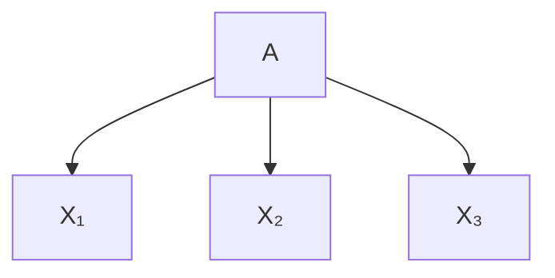
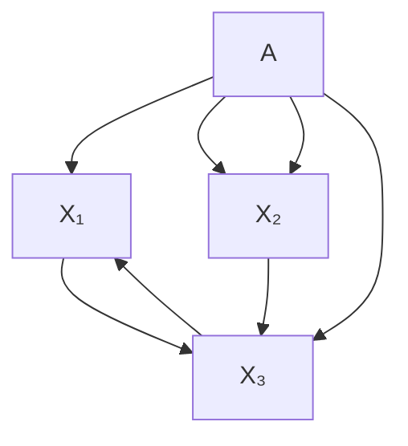
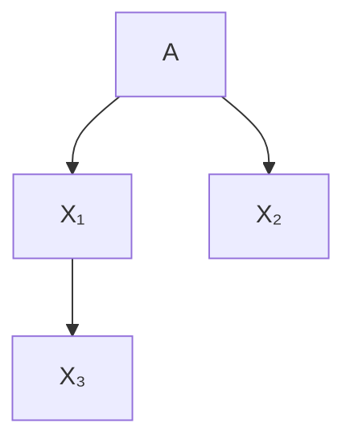
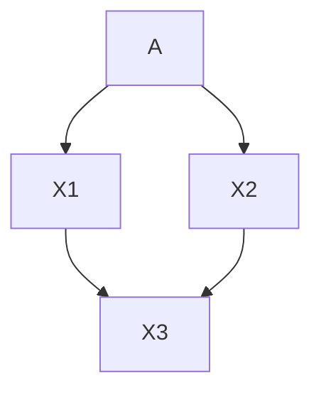
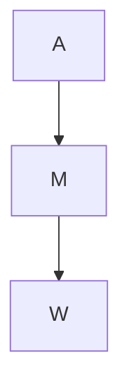

# Fair Causal Algorithmic Recourse

## Chapter Abstract

Algorithmic fairness is typically studied from the perspective of predictions. Instead, here we investigate fairness from the perspective of recourse actions suggested to individuals to remedy an unfavourable classification. We propose two new fairness criteria at the group and individual level, which—unlike prior work on equalising the average group-wise distance from the decision boundary—explicitly account for causal relationships between features, thereby capturing downstream effects of recourse actions performed in the physical world. We explore how our criteria relate to others, such as counterfactual fairness, and show that fairness of recourse is complementary to fairness of prediction. We study theoretically and empirically how to enforce fair causal recourse by altering the classifier and perform a case study on the Adult dataset. Finally, we discuss whether fairness violations in the data generating process revealed by our criteria may be better addressed by societal interventions as opposed to constraints on the classifier.

This chapter is based on the paper “On the Fairness of Causal Algorithmic Recourse,” von Kügelgen, Karimi, Bhatt, Valera, Weller, Schölkopf, AAAI (Á), 2022 (Küg+22).

## 5.1 introduction

Algorithmic fairness is concerned with uncovering and correcting for potentially discriminatory behavior of automated decision making systems (Dwo+12; Zem+13; HPS16; Cho17). Given a dataset comprising individuals from multiple legally protected groups (defined, e.g., based on age, sex, or ethnicity), and a binary classifier trained to predict a decision (e.g., whether they were approved for a credit card), most approaches to algorithmic fairness seek to quantify the level of unfairness according to a pre-defined (statistical or causal) criterion, and then aim to correct it by altering the classifier. This notion of predictive fairness typically considers the dataset as fixed, and thus the individuals as unalterable.

Algorithmic recourse, on the other hand, is concerned with offering recommendations to individuals, who were unfavourably treated by a decision-making system, to overcome their adverse situation (Jos+19; USL19; SHG19; MTS19; MST20; VA20; Kar+20b; Kar+22; KSV21; UJL21). For a given classifier and a negatively-classified individual, algorithmic recourse aims to identify which changes the individual could perform to flip the decision. Contrary to predictive fairness, recourse thus considers the classifier as fixed but ascribes agency to the individual.

Within machine learning (ML), fairness and recourse have mostly been considered in isolation and viewed as separate problems. While recourse has been investigated in the presence of protected attributes—e.g., by comparing recourse actions (flipsets) suggested to otherwise similar male and female individuals (USL19), or comparing the aggregated cost of recourse (burden) across different protected groups (SHG19)—its relation to fairness has only been studied informally, in the sense that differences in recourse have typically been understood as proxies of predictive unfairness (Kar+20a). However, as we argue in the present work, recourse actually constitutes an interesting fairness criterion in its own right as it allows for the notions of agency and effort to be integrated into the study of fairness.

In fact, discriminatory recourse does not imply predictive unfairness (and is not implied by it either1). To see this, consider the data shown in Fig. 5.1. Suppose the feature X represents the (centered) income of an individual from one of two sub-groups $A \in \{ 0 , 1 \}$ , distributed as $\mathcal { N } ( 0 , 1 )$ and $\mathcal { N } ( 0 , 4 )$ , i.e., only the variances differ. Now consider a binary classifier $h ( X ) = \mathrm { s i g n } ( X )$ which perfectly predicts whether the individual is approved for a credit card (the true label Y) (BSR20). While this scenario satisfies several predictive fairness criteria (e.g., demographic parity, equalised odds, calibration), the required increase in income for negatively-classified individuals to be approved for a credit card (i.e., the effort required to achieve recourse) is much larger for the higher variance group. If individuals from one protected group need to work harder than “similar” ones from another group to achieve the same goal, this violates the concept of equal opportunity, a notion aiming for people to operate on a level playing field (Arn15).2 However, this type of unfairness is not captured by predictive notions which—in only distinguishing between (unalterable) worthy or unworthy individuals—do not consider the possibility for individuals to deliberately improve their situation by means of changes or interventions.

In this vein, Gupta et al. [Gup+19] recently introduced Equalizing Recourse, the first recourse-based and prediction-independent notion of fairness in ML. They propose to measure recourse fairness in terms of the average group-wise distance to the decision boundary for those getting a bad outcome, and show that this can be calibrated during classifier training. However, this formulation ignores that recourse is fundamentally a causal problem since actions performed by individuals in the real-world to change their situation may have downstream effects (MTS19; KSV21; Kar+20b; MST20), cf. also (BSR20; WMR17; USL19). By not reasoning about causal relations between features, the distance-based approach (i) does not accurately reflect the true (differences in) recourse cost, and (ii) is restricted to the classical prediction-centered approach of changing the classifier to address discriminatory recourse.

In the present work, we address both of these limitations. First, by extending the idea of Equalizing Recourse to the minimal intervention-based framework of recourse (KSV21), we introduce causal notions of fair recourse which capture the true differences in recourse cost more faithfully if features are not independently manipulable, as is generally the case. Second, we argue that a causal model of the data generating process opens up a new route to fairness via societal interventions in the form of changes to the underlying system. Such societal interventions may reflect common policies like subgroup-specific subsidies or tax breaks. We highlight the following contributions:

• we introduce a causal version (Defn. 5.3.1) of Equalizing Recourse, as well as a stronger (Prop. 5.3.1) individual-level criterion (Defn. 5.3.2) which we argue is more appropriate;
• we provide the first formal study of the relation between fair prediction and fair recourse, and show that they are complementary notions which do not imply each other (Prop. 5.3.2);
• we establish sufficient conditions that allow for individually-fair causal recourse (Prop. 5.3.3);
• we evaluate different fair recourse metrics for several classifiers (§ 5.4.1), verify our main results, and demonstrate that non-causal metrics misrepresent recourse unfairness;
• in a case study on the Adult dataset, we detect recourse discrimination at the group and individual level (§ 5.4.2), demonstrating its relevance for real world settings;
• we propose societal interventions as an alternative to altering a classifier to address unfairness (§ 5.5).

## 5.2 preliminaries & background

notation. Let the random vector $\mathbf { \Psi } \mathbf { X } \ = \ \left( X _ { 1 } , . . . , X _ { n } \right)$ taking values $\begin{array} { r l } { \mathbf { { x } } } & { { } = } \end{array}$ $( x _ { 1 } , . . . , x _ { n } ) \ \in \ { \mathcal { X } } \ = \ { \mathcal { X } } _ { 1 } \times . . . \times { \mathcal { X } } _ { n } \ \subseteq \ \mathbb { R } ^ { n }$ denote observed (non-protected) features. Let the random variable A taking values $a \in \mathcal { A } = \{ 1 , \dots , K \}$ for some $K \in \mathbb { Z } _ { > 1 }$ denote a (legally) protected attribute/feature indicating which group each individual belongs to (based, e.g., on her age, sex, ethnicity, religion, etc). And let $h : \mathcal { X }  \mathcal { Y }$ be a given binary classifier with $Y \in \mathcal { V } = \{ \pm 1 \}$ denoting the ground truth label (e.g., whether her credit card was approved). We observe a dataset $\mathcal { D } = \{ \mathbf { v } ^ { i } \} _ { i = 1 } ^ { N }$ of i.i.d. observations of the random variable $\mathbf { V } = ( \mathbf { X } , A )$ with $\mathbf { v } ^ { i } : = ( \mathbf { x } ^ { i } , a ^ { i } ) .$ 3

counterfactual explanations. A common framework for explaining decisions made by (black-box) ML models is that of counterfactual explanations CE; WMR17. A CE is a closest feature vector on the other side of the decision boundary. Given a distance d : $\mathcal { X } \times \mathcal { X }  \mathbb { R } ^ { + }$ , a CE for an individual $\mathbf { x } ^ { \mathsf { F } }$ who obtained an unfavourable prediction, $h ( \mathbf { x } ^ { \mathsf { F } } ) = - 1$ , is defined as a solution to:

$$
\min _ {\mathbf {x} \in \mathcal {X}} d (\mathbf {x}, \mathbf {x} ^ {\mathsf {F}}) \quad \text { subject   to } \quad h (\mathbf {x}) = 1. \tag {5.1}
$$

While CEs are useful to understand the behaviour of a classifier, they do not generally lead to actionable recommendations: they inform an individual of where she should be to obtain a more favourable prediction, but they may not suggest feasible changes she could perform to get there.

recourse with independently-manipulable features. Ustun et al. [USL19] refer to a person’s ability to change the decision of a model by altering actionable variables as recourse and propose to solve

$$
\min _ {\delta \in \mathcal {F} (\mathbf {x} ^ {\mathsf {F}})} c (\delta ; \mathbf {x} ^ {\mathsf {F}}) \quad \text { subject   to } \quad h (\mathbf {x} ^ {\mathsf {F}} + \delta) = 1 \tag {5.2}
$$

where $\mathcal { F } ( \mathbf { x } ^ { \mathsf { F } } )$ is a set of feasible change vectors and $c ( \cdots \mathbf { x } ^ { \mathsf { F } } )$ is a cost function defined over these actions, both of which may depend on the individual.4 As pointed out by Karimi et al. [KSV21], (5.2) implicitly treats features as manipulable independently of each other (see Fig. 5.2a) and does not account for causal relations that may exist between them (see Fig. 5.2b): while allowing feasibility constraints on actions, variables which are not actedupon $( \delta _ { i } \ = \ 0 )$ are assumed to remain unchanged. We refer to this as the independently-manipulable features (IMF) assumption. While the IMF-view may be appropriate when only analysing the behaviour of a classifier, it falls short of capturing effects of interventions performed in the real world, as is the case in actionable recourse; e.g., an increase in income will likely also positively affect the individual’s savings balance. As a consequence, (5.2) only guarantees recourse if the acted-upon variables have no causal effect on the remaining variables (KSV21).

(a) IMF assumption

(b) Causal view  
Figure 5.2: (a) The framework underlying counterfactual explanations and distancebased recourse treats $X _ { i }$ as independently manipulable features (IMF). In a fairness context, this means that the $X _ { i }$ may depend on the protected attribute A (and potentially other unobserved factors) but do not causally influence each other. (b) The present work considers a generalisation the IMF assumption by allowing for causal influences between the $X _ { i }$ , thus modeling the downstream effects of changing some features on others. This causal approach allows us to more accurately quantify recourse unfairness in real-world settings where the IMF assumption is typically violated. It also provides a framework for studying alternative routes to achieve fair recourse beyond changing the classifier.

structural causal models. A structural causal model (SCM) (Pea09; PJS17) over observed variables $\mathbf { V } = \{ V _ { i } \} _ { i = 1 } ^ { n }$ is a pair $\mathcal { M } = ( \mathbb { S } , P _ { \mathbf { U } } )$ , where i=1the structural equations S are a set of assignments $\begin{array} { r } { \mathbb { S } = \{ V _ { i } : = f _ { i } ( \mathrm { P A } _ { i } , U _ { i } ) \} _ { i = 1 } ^ { n } , } \end{array}$ which compute each $V _ { i }$ as a deterministic function $f _ { i }$ of its direct causes (causal parents) $\mathrm { P A } _ { i } \subseteq \mathbf { V } \setminus V _ { i }$ and an unobserved variable $U _ { i }$ . In this work, we make the common assumption that the distribution $P _ { \mathbf { U } }$ factorises over the latent $\mathbf { U } = \{ U _ { i } \} _ { i = 1 } ^ { n } ,$ , meaning that there is no unobserved confounding (causal sufficiency). If the causal graph $\mathcal { G }$ associated with  (obtained by drawing a directed edge from each variable in $\mathrm { P A } _ { i }$ to $V _ { i } ,$ see Fig. 5.2 for examples) is acyclic, induces a unique “observational” distribution over $\mathbf { V } ,$ defined as the push forward of $P _ { \mathbf { U } }$ via S.

SCMs can be used to model the effect of interventions: external manipulations to the system that change the generative process (i.e., the structural assignments) of a subset of variables $\mathbf { V } _ { \mathcal { T } } \subseteq \mathbf { V } ,$ , e.g., by fixing their value to a constant $\pmb { \theta } _ { \mathcal { T } }$ . Such (atomic) interventions are denoted using Pearl’s do-operator by do $( \mathbf { V } _ { \mathcal { T } } : = \pmb { \theta } _ { \mathcal { T } } )$ , or $\mathrm { d o } ( \pmb { \theta } _ { \mathcal { I } } )$ for short. Interventional distributions are obtained from  by replacing the structural equations $\{ V _ { i } : = f _ { i } ( \mathrm { P A } _ { i } , U _ { i } ) \} _ { i \in \mathcal { I } }$ by their new assignments $\{ V _ { i } : = \theta _ { i } \} _ { i \in \mathbb { Z } }$ to obtain the modified structural equations $\mathbb { S } ^ { \mathrm { d o } ( \pmb { \theta } _ { \mathbb { Z } } ) }$ ∈I  and then computing the distribution induced by the interventional SCM $\mathcal { M } ^ { \mathrm { d o } ( \theta _ { \mathcal { T } } ) } = ( \mathbb { S } ^ { \mathrm { d o } ( \mathbf { \dot { \theta } } _ { \mathcal { T } } ) } , P _ { \mathbf { U } } )$ ), i.e., the push-forward of $P _ { \mathbf { U } }$ via $\mathbb { S } ^ { \mathrm { d o } ( \pmb { \theta } _ { \mathbb { Z } } ) }$ ) .

Similarly, SCMs allow reasoning about (structural) counterfactuals: statements about interventions performed in a hypothetical world where all unobserved noise terms U are kept unchanged and fixed to their factual value $\mathbf { u } ^ { \mathsf { F } }$ . The counterfactual distribution for a hypothetical intervention do $( \pmb { \theta } _ { \mathcal { T } } )$ given a factual observation $\mathbf { v } ^ { \mathsf { F } } .$ , denoted $\mathbf { v } _ { \pmb { \theta } _ { T } } ( \mathbf { \bar { u } } ^ { \bar { \sf F } } )$ , can be obtained from $\mathcal { M }$ using a Ithree step procedure: first, inferring the posterior distribution over the unobserved variables $P _ { \mathbf { U } | { \bf v } ^ { \mathsf { F } } }$ (abduction); second, replacing some of the structural equations as in the interventional case (action); third, computing the distribution induced by the counterfactual SCM $\mathcal { M } ^ { \mathrm { d o } ( \theta _ { \mathcal { T } } ) | \mathbf { v } ^ { \mathrm { F } } } = ( \mathbb { S } ^ { \mathrm { d o } ( \theta _ { \mathcal { T } } ) } , P _ { \mathbf { U } | \mathbf { v } ^ { \mathrm { F } } } )$ (prediction).

causal recourse. To capture causal relations between features, Karimi et al. [KSV21] propose to approach the actionable recourse task within the framework of SCMs and to shift the focus from nearest CEs to minimal interventions, leading to the optimisation problem

$$
\min _ {\boldsymbol {\theta} _ {\mathcal {I}} \in \mathcal {F} (\mathbf {x} ^ {\mathsf {F}})} c (\boldsymbol {\theta} _ {\mathcal {I}}; \mathbf {x} ^ {\mathsf {F}}) \quad \text {   subj.   to   } \quad h (\mathbf {x} _ {\boldsymbol {\theta} _ {\mathcal {I}}} (\mathbf {u} ^ {\mathsf {F}})) = 1, \tag {5.3}
$$

where $\mathbf { x } _ { \pmb { \theta } _ { \mathcal { T } } } ( \mathbf { u } ^ { \mathsf { F } } )$ denotes the “counterfactual twin” of $\mathbf { x } ^ { \mathsf { F } }$ had $\mathbf { \boldsymbol { x } } _ { \mathcal { T } }$ been $\pmb { \theta } _ { \mathcal { T } } . ^ { 5 }$ In Ipractice, the SCM is unknown and needs to be inferred from data based on additional (domain-specific) assumptions, leading to probabilistic versions of $( 5 . 3 )$ which aim to find actions that achieve recourse with high probability (Kar+20b). If the IMF assumptions holds (i.e., the set of descendants of all actionable variables is empty), then (5.3) reduces to IMF recourse (5.2) as a special case.

algorithmic and counterfactual fairness. While there are many statistical notions of fairness (Zaf+17a; Zaf+17b), these are sometimes mutually incompatible (Cho17), and it has been argued that discrimination, at its heart, corresponds to a (direct or indirect) causal influence of a protected attribute on the prediction, thus making fairness a fundamentally causal problem (Kil+17; Rus+17; Lof+18; ZB18a; ZB18b; NS18; NMS19; Chi19; Sal+19; Wu+19). Of particular interest to our work is the notion of counterfactual fairness introduced by Kusner et al. [Kus+17] which calls a (probabilistic) classifier h over $\mathbf { V } = \mathbf { X } \cup A$ counterfactually fair if it satisfies

$$
h (\mathbf {v} ^ {\mathsf {F}}) = h (\mathbf {v} _ {a} (\mathbf {u} ^ {\mathsf {F}})), \forall a \in \mathcal {A}, \mathbf {v} ^ {\mathsf {F}} = (\mathbf {x} ^ {\mathsf {F}}, a ^ {\mathsf {F}}) \in \mathcal {X} \times \mathcal {A},
$$

where $\mathbf { v } _ { a } ( \mathbf { u } ^ { \mathsf { F } } )$ denotes the “counterfactual twin” of $\mathbf { v } ^ { \mathsf { F } }$ had the attribute been a instead of $a ^ { \mathsf { F } }$ .

equalizing recourse across groups. The main focus of this chapter is the fairness of recourse actions which, to the best of our knowledge, was studied for the first time by Gupta et al. [Gup+19]. They advocate for equalizing the average cost of recourse across protected groups and to incorporate this as a constraint when training a classifier. Taking a distance-based approach in line with CEs, they define the cost of recourse for $\mathbf { x } ^ { \mathsf { F } }$ with $h ( \mathbf { x } ^ { \mathsf { F } } ) = - 1$ as the minimum achieved in (5.1):

$$
r ^ {\mathrm{IMF}} (\mathbf {x} ^ {\mathsf {F}}) = \min _ {\mathbf {x} \in \mathcal {X}} d (\mathbf {x} ^ {\mathsf {F}}, \mathbf {x}) \quad \text { subj.   to } \quad h (\mathbf {x}) = 1, \tag {5.4}
$$

which is equivalent to IMF-recourse (5.2) if $c ( \delta ; { \mathbf { x } } ^ { \mathsf { F } } ) = d ( { \mathbf { x } } ^ { \mathsf { F } } + \delta , { \mathbf { x } } ^ { \mathsf { F } } )$ is chosen as cost function. Defining the protected subgroups, $G _ { a } = \{ \mathbf { v } ^ { i } \in \mathcal { D } : a ^ { i } = a \}$ , and $G _ { a } ^ { - } = \{ \mathbf { v } \in G _ { a } : h ( \mathbf { v } ) = - 1 \}$ , the group-level cost of recourse (here, the average distance to the decision boundary) is then given by,

$$
r ^ {\mathrm{IMF}} (G _ {a} ^ {-}) = \frac {1}{| G _ {a} ^ {-} |} \sum_ {\mathbf {v} ^ {i} \in G _ {a} ^ {-}} r ^ {\mathrm{IMF}} (\mathbf {x} ^ {i}). \tag {5.5}
$$

The idea of Equalizing Recourse across groups (Gup+19) can then be summarised as follows.

Definition 5.2.1 (Group-level fair IMF-recourse, from (Gup+19)). The grouplevel unfairness of recourse with independently-manipulable features (IMF) for a dataset , classifier $h ,$ and distance metric d is:

$$
\Delta_ {\text { dist }} (\mathcal {D}, h, d) := \max _ {a, a ^ {\prime} \in \mathcal {A}} \left| r ^ {\text { IMF }} (G _ {a} ^ {-}) - r ^ {\text { IMF }} (G _ {a ^ {\prime}} ^ {-}) \right|.
$$

Recourse for ( , h, d) is “group IMF-fair” if $\Delta _ { \mathsf { d i s t } } = 0$ .

## 5.3 fair causal recourse

Since Defn. 5.2.1 rests on the IMF assumption, it ignores causal relationships between variables, fails to account for downstream effects of actions on other relevant features, and thus generally incorrectly estimates the true cost of recourse. We argue that recourse-based fairness considerations should rest on a causal model that captures the effect of interventions performed in the physical world where features are often causally related to each other. We therefore consider an SCM  over $\mathbf { V } = ( \mathbf { X } , A )$ to model causal relationships between the protected attribute and the remaining features.

## 5.3.1 Group-Level Fair Causal Recourse

Defn. 5.2.1 can be adapted to the causal (CAU) recourse framework (5.3) by replacing the minimum distance in $( 5 . 4 )$ with the cost of recourse within a causal model, i.e., the minimum achieved in (5.3):

$$
r ^ {\mathrm{CAU}} (\mathbf {v} ^ {\mathsf {F}}) = \min _ {\boldsymbol {\theta} _ {\mathcal {I}} \in \Theta (\mathbf {v} ^ {\mathsf {F}})} c (\boldsymbol {\theta} _ {\mathcal {I}}; \mathbf {v} ^ {\mathsf {F}}) \quad \mathrm{subj.to} \quad h (\mathbf {v} _ {\boldsymbol {\theta} _ {\mathcal {I}}} (\mathbf {u} ^ {\mathsf {F}})) = 1,
$$

where we recall that the constraint $h ( \mathbf { v } _ { \pmb { \theta } _ { \mathcal { T } } } ( \mathbf { u } ^ { \mathsf { F } } ) ) = 1$ ensures that the counterfactual twin of $\mathbf { v } ^ { \mathsf { F } }$ in $\mathcal { M }$ Ifalls on the favourable side of the classifier. Let $r ^ { \mathbf { C A U } } \left( G _ { a } ^ { - } \right)$ be the average of $r ^ { \mathbf { C A U } } ( \mathbf { v } ^ { \mathsf { F } } )$ across $G _ { a } ^ { - }$ , analogously to (5.5). We can then define group-level fair causal recourse as follows.

Definition 5.3.1 (Group-level fair causal recourse). The group-level unfairness of causal (CAU) recourse for a dataset ${ \mathcal { D } } ,$ classifier h, and cost function c w.r.t. an SCM M is given by:

$$
\Delta_ {\text { cost }} (\mathcal {D}, h, c, \mathcal {M}) := \max _ {a, a ^ {\prime} \in \mathcal {A}} \left| r ^ {\text { CAU }} (G _ {a} ^ {-}) - r ^ {\text { CAU }} (G _ {a ^ {\prime}} ^ {-}) \right|.
$$

Recourse for $\left( \mathcal { D } , h , c , \mathcal { M } \right)$ is “group CAU-fair” if $\Delta _ { \mathsf { c o s t } } = 0$ .

While Defn. 5.2.1 is agnostic to the (causal) generative process of the data (note the absence of a reference SCM M from Defn. 5.2.1), Defn. 5.3.1 takes causal relationships between features into account when calculating the cost of recourse. It thus captures the effect of actions and the necessary cost of recourse more faithfully when the IMF-assumption is violated, as is realistic for most applications.

A shortcoming of both Defns. 5.2.1 and 5.3.1 is that they are group-level definitions, i.e., they only consider the average cost of recourse across all individuals sharing the same protected attribute. However, it has been argued from causal (Chi19; Wu+19) and non-causal (Dwo+12) perspectives that fairness is fundamentally an individual-level concept:6 group-level fairness still allows for unfairness at the level of the individual, provided that positive and negative discrimination cancel out across the group. This is one motivation behind counterfactual fairness (Kus+17): a decision is considered fair at the individual level if it would not have changed, had the individual belonged to a different protected group.

## 5.3.2 Individually Fair Causal Recourse

Inspired by counterfactual fairness (Kus+17), we propose that (causal) recourse may be considered fair at the level of the individual if the cost of recourse would have been the same had the individual belonged to a different protected group, i.e., under a counterfactual change to A.

Definition 5.3.2 (Individually fair causal recourse). The individual-level unfairness of causal recourse for a dataset $\mathcal { D } ,$ classifier $h ,$ and cost function c w.r.t. an SCM is

$$
\Delta_ {\mathrm{ind}} (\mathcal {D}, h, c, \mathcal {M}) := \max _ {a \in \mathcal {A}; \mathbf {v} ^ {\mathsf {F}} \in \mathcal {D}} \left| r ^ {\mathrm{CAU}} (\mathbf {v} ^ {\mathsf {F}}) - r ^ {\mathrm{CAU}} (\mathbf {v} _ {a} (\mathbf {u} ^ {\mathsf {F}})) \right|
$$

Recourse is “individually CAU-fair” if $\Delta _ { \mathrm { i n d } } = 0 .$ .

This is a stronger notion in the sense that it is possible to satisfy both group IMF-fair (Defn. 5.2.1) and group CAU-fair recourse (Defn. 5.3.1), without satisfying Defn. 5.3.2:

Proposition 5.3.1. Neither of the group-level notions of fair recourse (Defn. 5.2.1 and Defn. 5.3.1) are sufficient conditions for individually CAU-fair recourse (Defn. 5.3.2), i.e.,

$$
\text { Group   IMF - fair } \implies \text { Individually   CAU - fair. }
$$

$$
\text { Group   CAU - fair } \implies \text { Individually   CAU - fair. }
$$

Proof. A counterexample is given by the following combination of SCM and classifier

$$
A := U _ {A},
$$

$$
X := A U _ {X} + (1 - A) (1 - U _ {X}),
$$

$$
U _ {A}, U _ {X} \sim \text { Bernoulli } (0. 5),
$$

$$
Y := h (X) = \operatorname{sign} (X - 0. 5).
$$

We have $\mathbb { P } _ { X | A = 0 } = \mathbb { P } _ { X | A = 1 } = { \mathrm { B e r n o u l l i } } ( 0 . 5 )$ , so the distance to the boundary at $X = 0 . 5$ is the same across groups. The criterion for “group IMF-fair” recourse (Defn. 5.2.1) is thus satisfied.

Since protected attributes are generally immutable (thus making any recourse actions involving changes to A infeasible) and since there is only a single feature in this example (so that causal downstream effects on descendant features can be ignored), the distance between the factual and counterfactual value of X is a reasonable choice of cost function also for causal recourse. In this case, $( \mathcal { D } , h , \mathcal { M } )$ also satisfies group-level CAU-fair recourse (Defn. 5.3.1).

However, for all $\mathbf { v } ^ { \mathsf { F } } = ( \mathbf { x } ^ { \mathsf { F } } , a ^ { \mathsf { F } } )$ and any $a \neq a ^ { \mathsf { F } }$ , we have $h ( \mathbf { x } ^ { \mathsf { F } } ) \neq h ( \mathbf { x } _ { a } ( u _ { X } ^ { \mathsf { F } } ) ) =$ $1 - h ( \mathbf { x } ^ { \mathsf { F } } )$ , so it is maximally unfair at the individual level: for any individual, the cost of recourse would have been zero had the protected attribute been different, as the prediction would have flipped. □

## 5.3.3 Relation to Counterfactual Fairness

The classifier h used in the proof of Prop. 5.3.1 is not counterfactually fair. This suggests to investigate their relation more closely: does a counterfactually fair classifier imply fair (causal) recourse? The answer is no.

Proposition 5.3.2. Counterfactual fairness is insufficient for any of the three notions of fair recourse:

$$
h \text {   counterfactually   fair   } \implies \text {   Group   IMF - fair   }
$$

$$
h \text {   counterfactually   fair   } \Rightarrow \text {   Group   CAU - fair   }
$$

$$
h \text {   counterfactually   fair   } \Rightarrow \text {   Individually   CAU - fair   }
$$

Proof. A counterexample is given by the following combination of SCM and classifier:

$$
A := U _ {A}, \quad U _ {A} \sim \text { Bernoulli } (0. 5),
$$

$$
X := (2 - A) U _ {X}, \quad U _ {X} \sim \mathcal {N} (0, 1), \tag {5.6}
$$

$$
Y := h (X) = \operatorname{sign} (X)
$$

which we used to generate Fig. 5.1. As $\mathrm { s i g n } ( X ) = \mathrm { s i g n } ( U _ { X } )$ , and $U _ { X }$ is assumed fixed when reasoning about a counterfactual change of A, h is counterfactually fair.

However, $\mathbb { P } _ { X | A = 0 } = \mathcal { N } ( 0 , 4 )$ and $\mathbb { P } _ { X | A = 1 } = \mathcal { N } ( 0 , 1 )$ , so the distance to the boundary (which is a reasonable cost for cau-recourse in this one-variable toy example) differs at the group level. Moreover, X either doubles or halves when counterfactually changing A. □

Remark. An important characteristic of the counterexample used in the proof of Prop. 5.3.2 is that h is deterministic, which makes it possible that h is counterfactually fair, even though it depends on a descendant of A. This, in general, need not be the case if h is probabilistic $( e . g . ,$ , a logistic regression), $h : \mathcal { X }  [ 0 , 1 ]$ , so that the probability of a positive classification decreases with the distance from the decision boundary.

(a) IMF

(b) CAU

(c) Adult  
Figure 5.3: (a) & (b) Causal graphs used in $\ S \ 5 { \cdot } 4 { \cdot } 1$ . (c) The (assumed) causal graph (from Chiappa [Chi19] and Nabi and Shpitser [NS18]) used for the Adult dataset (Lic+13); A denotes the three protected attributes {sex, age, nationality}; M denotes {marital status, education level}; and W corresponds to {working class, occupation, hrs per week}. Here, we show the coarse-grained causal graph for simplicity. In practice, we model each node separately. For example, the single arrow from A to M actually corresponds to six directed edges, one from each feature in A to each feature in M.

## 5.3.4 Achieving Fair Causal Recourse

constrained optimisation. A first approach is to explicitly take constraints on the (group or individual level) fairness of causal recourse into account when training a classifier, as implemented for non-causal recourse under the IMF assumption by Gupta et al. [Gup+19]. Herein we can control the potential trade-off between accuracy and fairness with a hyperparameter. However, the optimisation problem in (5.3) involves optimising over the combinatorial space of intervention targets ${ \mathcal { T } } \subseteq \{ 1 , . . . , n \}$ , so it is unclear whether fairness of causal recourse may easily be included as a differentiable constraint.

restricting the classifier inputs. An approach that only requires qualitative knowledge in form of the causal graph (but not a fully-specified SCM), is to restrict the set of input features to the classifier to only contain non-descendants of the protected attribute. In this case, and subject to some additional assumptions stated in more detail below, individually fair causal recourse can be guaranteed.

Proposition 5.3.3. Assume h only depends on a subset ${ \tilde { \mathbf { x } } } \subseteq \mathbf { v } \setminus ( A \cup d ( A ) )$ which are non-descendants of A in ; and that the set of feasible actions and their cost remain the same under a counterfactual change of $A , \mathcal { F } ( { \mathbf { v } } ^ { F } ) = \mathcal { F } ( { \mathbf { v } } _ { a } ( { \mathbf { u } } ^ { F } ) )$ and $c ( \cdot ; \mathbf { v } ^ { F } ) = c ( \cdot ; \mathbf { v } _ { a } ( \mathbf { u } ^ { F } ) ) \ \forall a \in \mathcal { A } , \mathbf { v } ^ { F } \in \mathcal { D }$ . Then recourse for $\left( \mathcal { D } , h , c , \mathcal { M } \right)$ is “individually $C A U { \mathrm { - } } f a i r ^ { \prime \prime }$ .

Proof. According to Defn. 5.3.2, it suffices to show that

$$
r ^ {\mathrm{CAU}} (\mathbf {v} ^ {\mathsf {F}}) = r ^ {\mathrm{CAU}} \left(\mathbf {v} _ {a} \left(\mathbf {u} ^ {\mathsf {F}}\right)\right), \quad \forall a \in \mathcal {A}, \mathbf {v} ^ {\mathsf {F}} \in \mathcal {D}. \tag {5.7}
$$

Substituting our assumptions in the definition of $r ^ { \mathbf { C A U } }$ from $\ S \ 5 { \cdot } 3 { \cdot } 1$ , we obtain:

$$
r ^ {\mathrm{CAU}} (\mathbf {v} ^ {\mathsf {F}}) = \min _ {\boldsymbol {\theta} _ {\mathcal {I}} \in \mathcal {F} (\mathbf {v} ^ {\mathsf {F}})} c (\boldsymbol {\theta} _ {\mathcal {I}}; \mathbf {v} ^ {\mathsf {F}}) \mathrm{s.t.} h (\tilde {\mathbf {x}} _ {\boldsymbol {\theta} _ {\mathcal {I}}} (\mathbf {u} ^ {\mathsf {F}})) = 1,
$$

$$
r ^ {\mathrm{CAU}} (\mathbf {v} _ {a} (\mathbf {u} ^ {\mathsf {F}})) = \min _ {\boldsymbol {\theta} _ {\mathcal {I}} \in \mathcal {F} (\mathbf {v} ^ {\mathsf {F}})} c (\boldsymbol {\theta} _ {\mathcal {I}}; \mathbf {v} ^ {\mathsf {F}}) \text {s.t.} h (\tilde {\mathbf {x}} _ {\boldsymbol {\theta} _ {\mathcal {I}}, a} (\mathbf {u} ^ {\mathsf {F}})) = 1.
$$

It remains to show that

$$
\tilde {\mathbf {x}} _ {\boldsymbol {\theta} _ {\mathcal {I}}, a} (\mathbf {u} ^ {\mathsf {F}}) = \tilde {\mathbf {x}} _ {\boldsymbol {\theta} _ {\mathcal {I}}} (\mathbf {u} ^ {\mathsf {F}}), \quad \forall \boldsymbol {\theta} _ {\mathcal {I}} \in \mathcal {F} (\mathbf {v} ^ {\mathsf {F}}), a \in \mathcal {A}
$$

which follows from applying do-calculus (Pea09) since $\tilde { \mathbf { X } }$ does not contain any descendants of A by assumption, and is thus not influenced by counterfactual changes to A. □

The assumption of Prop. 5.3.3 that both the set of feasible actions $\mathcal { F } ( \mathbf { v } ^ { \mathsf { F } } )$ and the cost function $c ( \cdot ; \bar { \mathbf { v } } ^ { \mathsf { F } } )$ remain the same under a counterfactual change to the protected attribute may not always hold. For example, if a protected group were precluded (by law) or discouraged from performing certain recourse actions such as taking on a particular job or applying for a certification, that would constitute such a violation due to a separate source of discrimination.

Moreover, since protected attributes usually represent socio-demographic features (e.g., age, gender, ethnicity, etc), they often appear as root nodes in the causal graph and have downstream effects on numerous other features. Forcing the classifier to only consider non-descendants of A as inputs, as in Prop. 5.3.3, can therefore lead to a drop in accuracy which can be a restriction (WZW19).

abduction / representation learning. We have shown that considering only non-descendants of A is a way to achieve individually CAU-fair recourse. In particular, this also applies to the unobserved variables U which are, by definition, not descendants of any observed variables. This suggests to use $U _ { i }$ in place of any descendants $X _ { i }$ of A when training the classifier—in a way, $U _ { i }$ can be seen as a “fair representation” of $X _ { i }$ since it is an exogenous component that is not due to A. However, as U is unobserved, it needs to be inferred from the observed $\mathbf { v } ^ { \mathsf { F } }$ , corresponding to the abduction step of counterfactual reasoning. Great care needs to be taken in learning such a representation in terms of the (fair) background variables as (untestable) counterfactual assumptions are required Kus+17, § 4.1.

## 5.4 experiments

We perform two sets of experiments. First, we verify our main claims in numerical simulations (§ 5.4.1). Second, we use our causal measures of fair recourse to conduct a preliminary case study on the Adult dataset (§ 5.4.2). We refer to D.1 for further experimental details and to D.2 for additional results and analyses.7

## 5.4.1 Numerical Simulations

data. Since computing recourse actions, in general, requires knowledge (or estimation) of the true SCM, we first consider a controlled setting with two kinds of synthetic data:

• IMF: the setting underlying IMF recourse where features do not causally influence each other, but may depend on the protected attribute A.
• CAU: features causally depend on each other and on A. We use $\{ X _ { i } \ : = \ f _ { i } ( A , { \mathrm { P A } } _ { i } ) + { \dot { U } } _ { i } \} _ { i = 1 } ^ { n }$ with linear (CAU-LIN) and nonlinear (CAU-ANM) $f _ { i }$ .

The corresponding causal graphs are included in Fig.3 of (Küg+22). We use n = 3 non-protected features $X _ { i }$ and a binary protected attribute $A \in \{ 0 , 1 \}$ } in all our experiments and generate labelled datasets of N = 500 observations using the SCMs described in more detail in D.1.1. The ground truth (GT) labels $\hat { y } ^ { i }$ used to train different classifiers are sampled as $\dot { Y } ^ { i } \sim \mathrm { B e r n o u l l i } ( h ( \mathbf { x } ^ { i } ) )$ where $h ( \mathbf { x } ^ { i } )$ is a linear or nonlinear logistic regression, independently of A, as detailed inD.1.2.

classifiers. On each data set, we train several (“fair”) classifiers. We consider linear and nonlinear logistic regression (LR), and different support vector machines (SVMs; SS02) (for ease of comparison with Gupta et al. [Gup+19]), trained on varying input sets:

• $\operatorname { L R } / \operatorname { S V M } ( \mathbf { X } , A )$ : trained on all features (naïve baseline);
• LR/SVM(X): trained only on non-protected features X (unaware baseline);
• FairSVM(X, A): the method of Gupta et al. [Gup+19], designed to equalise the average distance to the decision boundary across different protected groups;

• $\mathrm { L R / S V M ( X _ { n d } ) }$ : trained only on features $\mathbf { \boldsymbol { x } } _ { \mathrm { \scriptscriptstyle n d } ( A ) }$ which are nondescendants of A, see $\ S _ { 5 } . 3 . 4 ;$
• $\mathrm { L R / S V M ( X _ { n d } , U _ { d } ) }$ : trained on non-descendants $\mathbf { X } _ { \mathrm { n d } ( A ) }$ of A and on the unobserved variables $\mathbf { U } _ { \mathrm { d } ( A ) }$ corresponding to features $\mathbf { X } _ { \mathrm { d } ( A ) }$ ) which are descendants of A, see $\ S 5 . 3 . 4$ .

To make distances comparable across classifiers, we use either a linear or polynomial kernel for all SVMs (depending on the GT labels) and select all remaining hyperparameters (including the trade-off parameter λ for FairSVM) using 5-fold cross validation. Results for kernel selection by cross-validation are also provided in D.2 in D.2.3. Linear (nonlinear, resp.) LR is used when the GT labels are generated using linear (nonlinear, resp.) logistic regression, as detailed inD.1.2.

solving the causal recourse optimisation problem. We treat A and all $U _ { i }$ as non-actionable and all $X _ { i }$ as actionable. For each negatively predicted individual, we discretise the space of feasible actions, compute the efficacy of each action using a learned approximate SCM $( \mathcal { M } _ { \mathrm { K R } } )$ (following Karimi et al. [Kar+20b], see D.2.2 for details), and select the least costly valid action resulting in a favourable outcome. Results using the true oracle SCM ( ⋆) and a linear estimate thereof $( \mathcal { M } _ { \mathrm { L I N } } )$ are included in Tabs. 3 and $4$ in D.2.2; the trends are mostly the same as for $\mathcal { M } _ { \mathrm { K R } }$ .

metrics. We report (a) accuracy (Acc) on a held out test set of size 3000; and (b) fairness of recourse as measured by average distance to the boundary $( \Delta _ { \mathsf { d i s t } }$ , Defn. 5.2.1) (Gup+19), and our causal group-level $( \Delta _ { \mathsf { c o s t } }$ , Defn. 5.3.1) and individual level $( \Delta _ { \mathrm { i n d v } } ,$ Defn. 5.3.2) criteria. For (b), we select 50 negatively classified individuals from each protected group and report the difference in group-wise means $( \Delta _ { \mathsf { d i s t } }$ and $\Delta _ { \mathsf { c o s t } } )$ or the maximum difference over all 100 individuals $( \Delta _ { \mathrm { i n d v } } )$ . To facilitate a comparison between the different SVMs, $\Delta _ { \mathsf { d i s t } }$ is reported in terms of absolute distance to the decision boundary in units of margins. As a cost function in the causal recourse optimisation problem, we use the L2 distance between the intervention value $\pmb { \theta } _ { \mathcal { T } }$ and the factual value of the intervention targets $\mathbf { x } _ { \mathcal { T } } ^ { \mathsf { F } }$ .

results. Results are shown in Tab. 5.2. We find that the naïve and unaware baselines generally exhibit high accuracy and rather poor performance in terms of fairness metrics, but achieve surprisingly low $\Delta _ { \mathsf { c o s t } }$ on some datasets. We observe no clear preference of one baseline over the other, consistent with prior work showing that blindness to protected attributes is not necessarily beneficial for fair prediction (Dwo+12); our results suggest this is also true for fair recourse.

FairSVM generally performs well in terms of $\Delta _ { \mathsf { d i s t } }$ (which is what it is trained for), especially on the two IMF datasets, and sometimes (though not consistently) outperforms the baselines on the causal fairness metrics. However, this comes at decreased accuracy, particularly on linearly-separable data.

Both of our causally-motivated setups, $\operatorname { L R } / \operatorname { S V M } ( \mathbf { X } _ { \mathrm { n d } ( A ) } )$ and $\mathrm { L R } / \mathrm { S V M } ( \mathbf { X } _ { \mathrm { n d } ( A ) } , \mathbf { U } _ { \mathrm { d } ( A ) } )$ , achieve $\begin{array} { r l r } { \Delta _ { \mathrm { i n d v } } } & { { } = } & { 0 } \end{array}$ throughout as expected per Prop. 5.3.3, and they are the only methods to do so. Whereas the former comes at a substantial drop in accuracy due to access to fewer predictive features (see $\ S \_ 5 . 3 . 4 )$ , the latter maintains high accuracy by additionally relying on (the true) $\mathbf { U } _ { \mathrm { d } ( A ) }$ for prediction. Its accuracy should be understood as an upper bound on what is possible while preserving “individually CAU-fair” recourse if abduction is done correctly, see the discussion in $\ S 5 { . } 3 { . } 4$ .

Generally, we observe no clear relationship between the different fairness metrics: e.g., low $\Delta _ { \mathsf { d i s t } }$ does not imply low $\Delta _ { \mathsf { c o s t } }$ (nor vice versa) justifying the need for taking causal relations between features into account (if present) to enforce fair recourse at the group-level. Likewise, neither small $\Delta _ { d i s t }$ nor small $\Delta _ { c o s 1 }$ t imply small $\Delta _ { i n d v } ,$ , consistent with Prop. 5.3.1, and, empirically, the converse does not hold either.

summary of main findings from $8 \ 5 . 4 . 1 3$ The non-causal metric $\Delta _ { \mathsf { d i s t } }$ does not accurately capture recourse unfairness on the CAUdatasets where causal relations are present, thus necessitating our new causal metrics $\Delta _ { \mathsf { c o s t } }$ and $\Delta _ { \mathrm { i n d v } }$ . Methods designed in accordance with Prop. 5.3.3 indeed guarantee individually fair recourse, and group fairness does not imply individual fairness, as expected per Prop. 5.3.1.

## 5.4.2 Case Study on the Adult Dataset

data. We use the Adult dataset (Lic+13), which consists of 45k+ samples without missing data. We process the dataset similarly to Chiappa [Chi19] and Nabi and Shpitser [NS18] and adopt the causal graph assumed therein (see also Fig. 3c of (Küg+22)). The eight heterogeneous variables include the three binary protected attributes sex (m=male, f=female), age (binarised as $\mathbb { I } \{ { \mathrm { a g e } } \geq 3 8 \}$ ; y=young, o=old), and nationality (Nat; US vs non-US), as well as five non-protected features: marital status (MS; categorical), education level (Edu; integer), working class (WC; categorical), occupation (Occ; categorical), and hours per week (Hrs; integer). We treat the protected attributes and marital status as non-actionable, and the remaining variables as actionable when searching for recourse actions.

experimental setup. We extend the probabilistic framework of Karimi et al. [Kar+20b] to consider causal recourse in the presence of heterogeneous features, see D.2.2 for more details. We use a nonlinear $\operatorname { L R } ( \mathbf { X } )$ as a classifier $( \mathrm { i . e . , }$ , fairness through unawareness) which attains 78.4% accuracy, and (approximately) solve the recourse optimisation problem $\left( 5 . 3 \right)$ using brute force search as in $\ S \ 5 { \cdot } 4 { \cdot } 1$ . We compute the best recourse actions for 10 (uniformly sampled) negatively predicted individuals from each of the eight different protected groups (all $2 ^ { 3 }$ combinations of the three protected attributes), as well as for each of their seven counterfactual twins, and evaluate using the same metrics as in $\ S \uparrow . 4 . 1$ .

results. At the group level, we obtain $\Delta _ { \sf d i s t } = 0 . 8 9$ and $\Delta _ { \tt c o s t } = 3 3 . 3 2 ,$ , indicating group-level recourse discrimination. Moreover, the maximum difference in distance is between old US males and old non-US females (latter is furthest from the boundary), while that in cost is between old US females and old non-US females (latter is most costly). This quantitative and qualitative difference between $\Delta _ { \mathsf { d i s t } }$ and $\Delta _ { \mathsf { c o s t } }$ emphasises the general need to account for causal-relations in fair recourse, as present in the Adult dataset.

At the individual-level, we find an average difference in recourse cost to the counterfactual twins of 24.32 and a maximum difference $( \Delta _ { \mathrm { i n d v } } )$ of 61.53. The corresponding individual/factual observation for which this maximum is obtained is summarised along with its seven counterfactual twins in Tab. 5.3, see the caption for additional analysis.

summary of main findings from $\ S 5 . 4 . 2 \colon$ Our causal fairness metrics reveal qualitative and quantitative aspects of recourse discrimination at both the group and individual level. In spite of efforts to design classifiers that are predictively fair, recourse unfairness remains a valid concern on real datasets.

## 5.5 on societal interventions

Our notions of fair causal recourse (Defns. 5.3.1 and 5.3.2) depend on multiple components $\left( \mathcal { D } , h , c , \mathcal { M } \right)$ . As discussed in $\ S \ 5 { \cdot } 1 ,$ in fair ML, the typical procedure is to alter the classifier h. This is the approach proposed for Equalizing Recourse by Gupta et al. [Gup+19], which we have discussed in the context of fair causal recourse $( \ S \ 5 . 3 . 4 )$ and explored experimentally $( \ S \ 5 . 4 )$ . However, requiring the learnt classifier h to satisfy some constraint implicitly places the cost of an intervention on the deployer. For example, a bank might need to modify their classifier so as to offer credit cards to some individuals who would not otherwise receive them.

Another possibility is to alter the data-generating process (as captured by the SCM  and manifested in the form of the observed data ) via a societal intervention in order to achieve fair causal recourse with a fixed classifier h. By considering changes to the underlying SCM or to some of its mechanisms, we may facilitate outcomes which are more societally fair overall, and perhaps end up with a dataset that is more amenable to fair causal recourse (either at the group or individual level). Unlike the setup of Gupta et al. [Gup+19], our causal approach here is perhaps particularly well suited to exploring this perspective, as we are already explicitly modelling the causal generative process, i.e., how changes to parts of the system will affect the other variables.

We demonstrate our ideas for the toy example with different variances across groups from Fig. 5.1. Here, the difference in recourse cost across groups cannot easily be resolved by changing the classifier h (e.g., per the techniques in $\ S _ { 5 \cdot 3 \cdot 4 } )$ : to achieve perfectly fair recourse, we would have to use a constant classifier, i.e., either approve all credit cards, or none, irrespective of income. Essentially, changing h does not address the root of the problem, namely the discrepancy in the two populations. Instead, we investigate how to reduce the larger cost of recourse within the higher-variance group by altering the data generating process via societal interventions.

Let $i _ { k }$ denote a societal intervention that modifies the data generating process, $X : = ( 2 - A ) U _ { X } , U _ { X } \sim \mathcal { N } ( 0 , 1 )$ , by changing the original SCM  to $\mathcal { M } _ { k } ^ { \prime } = i _ { k } ( \mathcal { M } )$ . For example, $i _ { k }$ may introduce additional variables or modify a subset of the original structural equations. Specifically, we consider subsidies to particular eligible individuals. We introduce a new treatment variable T which randomly selects a proportion $0 \leq p \leq 1$ of individuals from $A = 0$ who are awarded a subsidy s if their latent variable $U _ { X }$ is below a threshold $t . ^ { 8 }$ This is captured by the modified structural equations

$$
T := (1 - A) \mathbb {I} \{U _ {T} <   p \}, \quad U _ {T} \sim \text { Uniform } [ 0, 1 ],
$$

$$
X := (2 - A) U _ {X} + s T \mathbb {I} \{U _ {X} <   t \}, \qquad U _ {X} \sim \mathcal {N} (0, 1).
$$

Here, each societal intervention $i _ { k }$ thus corresponds to a particular way of setting the triple $\left( p , t , s \right)$ . To avoid changing the predictions sgn(X), we only consider $t \leq 0$ and $s \leq - 2 t$ . The modified distribution resulting from $i _ { k } \doteq ( 1 , - 0 . 7 5 , 1 . 5 )$ is shown in Fig. 5.4a, see the caption for details.

To evaluate the effectiveness of different societal interventions $i _ { k }$ in reducing recourse unfairness, we compare their associated societal costs $c _ { k }$ andFigure 5.4: (a) Distribution after applying a societal intervention to the credit-card example from Fig. 5.1. We randomly select a proportion $p = 1$ of individuals from the disadvantaged group (blue, $A = 0 )$ to receive a subsidy $s = 1 . 5$ if $U _ { X }$ is below the threshold $t = - 0 . 7 5$ . As a result, the distribution of negatively-classified individuals $( X < 0 )$ shifts towards the boundary which makes it more similar to those in $A = 1$ , thus resulting in fairer recourse. At the same time, the distribution of positivelyclassified individuals $( X > 0 )$ remains unchanged. (b) Comparison of different societal interventions $i _ { k } = ( 1 , t , - 2 t )$ ) with respect to their benefit (reduction in recourse difference) and cost (paid-out subsidies). The threshold $t \approx - 0 . 7 5$ (corresponding to the distribution shown on the left) leads to the largest reduction in recourse difference, but also incurs the highest cost. Smaller reductions can be achieved using two different thresholds: one corresponding to giving a larger subsidy to fewer individuals, and the other to giving a smaller subsidy to more individuals.

benefits $b _ { k }$ . Here, the cost $c _ { k }$ of implementing $i _ { k }$ can reasonably be chosen as the total amount of paid-out subsidies, and the benefit $b _ { k } ,$ , as the reduction in the difference of average recourse cost across groups. We then reason about different societal interventions $i _ { k }$ by simulating the proposed change via sampling data from $\mathcal { M } _ { k } ^ { \prime }$ and computing $b _ { k }$ and $c _ { k }$ based on the simulated data. To decide which intervention to implement, we compare the societal benefit $b _ { k }$ and cost $c _ { k }$ of $i _ { k }$ for different k and choose the one with the most favourable trade-off. We show the societal benefit and cost tradeoff for $i _ { k } = ( 1 , t , - 2 t )$ with varying t in Fig. 5.4b and refer to the caption for further details. Plots similar to Fig. 5.4 for different choices of $\left( p , t , s \right)$ are shown in Fig. 5 in Appendix B.1. Effectively, our societal intervention does not change the outcome of credit card approval but ensures that the effort required (additional income needed) for rejected individuals from two groups is the same. Instead of using a threshold to select eligible individuals as in the toy example above, for more complex settings, our individual-level unfairness metric (Defn. 5.3.2) may provide a useful way to inform whom to target with societal interventions as it can be used to identify individuals for whom the counterfactual difference in recourse cost is particularly high.

## 5.6 discussion

With data-driven decision systems pervading our societies, establishing appropriate fairness metrics and paths to recourse are gaining major significance. There is still much work to do in identifying and conceptually understanding the best path forward. Here we make progress towards this goal by applying tools of graphical causality. We are hopeful that this approach will continue to be fruitful as we search together with stakeholders and broader society for the right concepts and definitions, as well as for assaying interventions on societal mechanisms.

While our fairness criteria may help assess the fairness of recourse, it is still unclear how best to achieve fair causal recourse algorithmically. Here, we argue that fairness considerations may benefit from considering the larger system at play—instead of focusing solely on the classifier—and that a causal model of the underlying data generating process provides a principled framework for addressing issues such as multiple sources of unfairness, as well as different costs and benefits to individuals, institutions, and society.

Societal interventions to overcome (algorithmic) discrimination constitute a complex topic which not only applies to fair recourse but also to other notions of fairness. It deserves further study well beyond the scope of the present work.

We may also question whether it is appropriate to perform a societal intervention on all individuals in a subgroup. For example, when considering who is approved for a credit card, an individual might not be able to pay their statements on time and this could imply costs to them, to the bank, or to society. This idea relates to the economics literature which studies the effect of policy interventions on society, institutions, and individuals (HV05; Hec10). Thus, future work could focus on formalising the effect of these interventions to the SCM, as such a framework would help trade off the costs and benefits for individuals, companies, and society.

<table><tr><td rowspan="2">Classifier</td><td colspan="4">IMF</td><td colspan="4">CAU-LIN</td><td colspan="4">CAU-ANM</td></tr><tr><td>Acc</td><td> $\Delta_{\text{dist}}$ </td><td> $\Delta_{\text{cost}}$ </td><td> $\Delta_{\text{ind}}$ </td><td>Acc</td><td> $\Delta_{\text{dist}}$ </td><td> $\Delta_{\text{cost}}$ </td><td> $\Delta_{\text{ind}}$ </td><td>Acc</td><td> $\Delta_{\text{dist}}$ </td><td> $\Delta_{\text{cost}}$ </td><td> $\Delta_{\text{ind}}$ </td></tr><tr><td>SVM(X,A)</td><td>86.5</td><td>0.96</td><td>0.40</td><td>1.63</td><td>89.5</td><td>1.18</td><td>0.44</td><td>2.11</td><td>88.2</td><td>0.65</td><td>0.27</td><td>2.32</td></tr><tr><td>LR(X,A)</td><td>86.7</td><td>0.48</td><td>0.50</td><td>1.91</td><td>89.5</td><td>0.63</td><td>0.53</td><td>2.11</td><td>87.7</td><td>0.40</td><td>0.34</td><td>2.32</td></tr><tr><td>SVM(X)</td><td>86.4</td><td>0.99</td><td>0.42</td><td>1.80</td><td>89.4</td><td>1.61</td><td>0.61</td><td>2.11</td><td>88.0</td><td>0.56</td><td>0.29</td><td>2.79</td></tr><tr><td>LR(X)</td><td>86.6</td><td>0.47</td><td>0.53</td><td>1.80</td><td>89.5</td><td>0.64</td><td>0.57</td><td>2.11</td><td>87.7</td><td>0.41</td><td>0.43</td><td>2.79</td></tr><tr><td>FairSVM(X,A)</td><td>68.1</td><td>0.04</td><td>0.28</td><td>1.36</td><td>66.8</td><td>0.26</td><td>0.12</td><td>0.78</td><td>66.3</td><td>0.25</td><td>0.21</td><td>1.50</td></tr><tr><td>SVM( $X_{nd}$ )</td><td>65.5</td><td>0.05</td><td>0.06</td><td>0.00</td><td>67.4</td><td>0.15</td><td>0.17</td><td>0.00</td><td>65.9</td><td>0.31</td><td>0.37</td><td>0.00</td></tr><tr><td>LR( $X_{nd}$ )</td><td>65.3</td><td>0.05</td><td>0.05</td><td>0.00</td><td>67.3</td><td>0.18</td><td>0.18</td><td>0.00</td><td>65.6</td><td>0.31</td><td>0.31</td><td>0.00</td></tr><tr><td>SVM( $X_{nd}$ , $U_d$ )</td><td>86.5</td><td>0.96</td><td>0.58</td><td>0.00</td><td>89.6</td><td>1.07</td><td>0.70</td><td>0.00</td><td>88.0</td><td>0.21</td><td>0.14</td><td>0.00</td></tr><tr><td>LR( $X_{nd}$ , $U_d$ )</td><td>86.7</td><td>0.43</td><td>0.90</td><td>0.00</td><td>89.5</td><td>0.35</td><td>0.77</td><td>0.00</td><td>87.8</td><td>0.14</td><td>0.34</td><td>0.00</td></tr><tr><td>SVM(X,A)</td><td>90.8</td><td>0.05</td><td>0.00</td><td>1.09</td><td>91.1</td><td>0.07</td><td>0.03</td><td>1.06</td><td>90.6</td><td>0.04</td><td>0.03</td><td>1.40</td></tr><tr><td>LR(X,A)</td><td>90.5</td><td>0.08</td><td>0.03</td><td>1.06</td><td>90.6</td><td>0.09</td><td>0.01</td><td>1.00</td><td>90.6</td><td>0.19</td><td>0.22</td><td>1.28</td></tr><tr><td>SVM(X)</td><td>91.4</td><td>0.13</td><td>0.00</td><td>0.92</td><td>91.0</td><td>0.17</td><td>0.08</td><td>1.09</td><td>91.0</td><td>0.02</td><td>0.03</td><td>1.64</td></tr><tr><td>LR(X)</td><td>91.0</td><td>0.12</td><td>0.03</td><td>1.01</td><td>90.6</td><td>0.13</td><td>0.10</td><td>1.65</td><td>90.9</td><td>0.08</td><td>0.06</td><td>1.66</td></tr><tr><td>FairSVM(X,A)</td><td>90.1</td><td>0.02</td><td>0.00</td><td>1.15</td><td>90.7</td><td>0.06</td><td>0.04</td><td>1.16</td><td>90.3</td><td>0.37</td><td>0.02</td><td>1.64</td></tr><tr><td>SVM( $X_{nd}$ )</td><td>66.7</td><td>0.10</td><td>0.06</td><td>0.00</td><td>58.4</td><td>0.05</td><td>0.06</td><td>0.00</td><td>62.0</td><td>0.13</td><td>0.11</td><td>0.00</td></tr><tr><td>LR( $X_{nd}$ )</td><td>64.7</td><td>0.02</td><td>0.04</td><td>0.00</td><td>58.4</td><td>0.02</td><td>0.02</td><td>0.00</td><td>61.1</td><td>0.02</td><td>0.03</td><td>0.00</td></tr><tr><td>SVM( $X_{nd}$ , $U_d$ )</td><td>90.7</td><td>0.02</td><td>0.03</td><td>0.00</td><td>91.1</td><td>0.15</td><td>0.11</td><td>0.00</td><td>90.1</td><td>0.15</td><td>0.12</td><td>0.00</td></tr><tr><td>LR( $X_{nd}$ , $U_d$ )</td><td>90.9</td><td>0.28</td><td>0.05</td><td>0.00</td><td>90.9</td><td>0.49</td><td>0.07</td><td>0.00</td><td>90.2</td><td>0.43</td><td>0.21</td><td>0.00</td></tr></table>

<table><tr><td rowspan="3">Classifier</td><td colspan="11">GT labels from lin. LR → using lin. kernel / lin. LR</td><td colspan="11">GT labels from nonlin. LR → using polynomial kernel / nonlin. LR</td><td></td></tr><tr><td colspan="4">IMF</td><td colspan="4">CAU-LIN</td><td colspan="3">CAU-ANM</td><td colspan="4">IMF</td><td colspan="4">CAU-LIN</td><td colspan="3">CAU-ANM</td><td></td></tr><tr><td>Acc</td><td> $\Delta_{\text{dist}}$ </td><td> $\Delta_{\text{cost}}$ </td><td> $\Delta_{\text{ind}}$ </td><td>Acc</td><td> $\Delta_{\text{dist}}$ </td><td> $\Delta_{\text{cost}}$ </td><td> $\Delta_{\text{ind}}$ </td><td>Acc</td><td> $\Delta_{\text{dist}}$ </td><td> $\Delta_{\text{cost}}$ </td><td> $\Delta_{\text{ind}}$ </td><td>Acc</td><td> $\Delta_{\text{dist}}$ </td><td> $\Delta_{\text{cost }}$ </td><td> $\Delta_{\text{ind}}$ </td><td>Acc</td><td> $\Delta_{\text{dist}}$ </td><td> $\Delta_{\text{cost}}$ </td><td> $\Delta_{\text{ind}}$ </td><td>Acc</td><td> $\Delta_{\text{dist}}$ </td><td> $\Delta_{\text{cost}}$ </td></tr><tr><td>SVM(X,A)</td><td>86.5</td><td>0.96</td><td>0.40</td><td>1.63</td><td>89.5</td><td>1.18</td><td>0.44</td><td>2.11</td><td>88.2</td><td>0.65</td><td>0.27</td><td>2.32</td><td>90.8</td><td>0.05</td><td>0.00</td><td>1.09</td><td>91.1</td><td>0.07</td><td>0.03</td><td>1.06</td><td>90.6</td><td>0.04</td><td>0.03</td></tr><tr><td>LR(X,A)</td><td>86.7</td><td>0.48</td><td>0.50</td><td>1.91</td><td>89.5</td><td>0.63</td><td>0.53</td><td>2.11</td><td>87.7</td><td>0.40</td><td>0.34</td><td>2.32</td><td>90.5</td><td>0.08</td><td>0.03</td><td>1.06</td><td>90.6</td><td>0.09</td><td>0.01</td><td>1.00</td><td>90.6</td><td>0.19</td><td>0.22</td></tr><tr><td>SVM(X)</td><td>86.4</td><td>0.99</td><td>0.42</td><td>1.80</td><td>89.4</td><td>1.61</td><td>0.61</td><td>2.11</td><td>88.0</td><td>0.56</td><td>0.29</td><td>2.79</td><td>91.4</td><td>0.13</td><td>0.00</td><td>0.92</td><td>91.0</td><td>0.17</td><td>0.08</td><td>1.09</td><td>91.0</td><td>0.02</td><td>0.03</td></tr><tr><td>LR(X)</td><td>86.6</td><td>0.47</td><td>0.53</td><td>1.80</td><td>89.5</td><td>0.64</td><td>0.57</td><td>2.11</td><td>87.7</td><td>0.41</td><td>0.43</td><td>2.79</td><td>91.0</td><td>0.12</td><td>0.03</td><td>1.01</td><td>90.6</td><td>0.13</td><td>0.10</td><td>1.65</td><td>90.9</td><td>0.08</td><td>0.06</td></tr><tr><td>FairSVM(X,A)</td><td>68.1</td><td>0.04</td><td>0.28</td><td>1.36</td><td>66.8</td><td>0.26</td><td>0.12</td><td>0.78</td><td>66.3</td><td>0.25</td><td>0.21</td><td>1.50</td><td>90.1</td><td>0.02</td><td>0.00</td><td>1.15</td><td>90.7</td><td>0.06</td><td>0.04</td><td>1.16</td><td>90.3</td><td>0.37</td><td>0.02</td></tr><tr><td>SVM( $X_{\text{nd}}$ )</td><td>65.5</td><td>0.05</td><td>0.06</td><td>0.00</td><td>67.4</td><td>0.15</td><td>0.17</td><td>0.00</td><td>65.9</td><td>0.31</td><td>0.37</td><td>0.00</td><td>66.7</td><td>0.10</td><td>0.06</td><td>0.00</td><td>58.4</td><td>0.05</td><td>0.06</td><td>0.00</td><td>62.0</td><td>0.13</td><td>0.11</td></tr><tr><td>LR( $X_{\text{nd}}$ )</td><td>65.3</td><td>0.05</td><td>0.05</td><td>0.00</td><td>67.3</td><td>0.18</td><td>0.18</td><td>0.00</td><td>65.6</td><td>0.31</td><td>0.31</td><td>0.00</td><td>64.7</td><td>0.02</td><td>0.04</td><td>0.00</td><td>58.4</td><td>0.02</td><td>0.02</td><td>0.00</td><td>61.1</td><td>0.02</td><td>0.03</td></tr><tr><td>SVM( $X_{\text{nd}}, U_d$ )</td><td>86.5</td><td>0.96</td><td>0.58</td><td>0.00</td><td>89.6</td><td>1.07</td><td>0.70</td><td>0.00</td><td>88.0</td><td>0.21</td><td>0.14</td><td>0.00</td><td>90.7</td><td>0.02</td><td>0.03</td><td>0.00</td><td>91.1</td><td>0.15</td><td>0.11</td><td>0.00</td><td>90.1</td><td>0.15</td><td>0.12</td></tr><tr><td>LR( $X_{\text{nd}}, U_d$ )</td><td>86.7</td><td>0.43</td><td>0.90</td><td>0.00</td><td>89.5</td><td>0.35</td><td>0.77</td><td>0.00</td><td>87.8</td><td>0.14</td><td>0.34</td><td>0.00</td><td>90.9</td><td>0.28</td><td>0.05</td><td>0.00</td><td>90.9</td><td>0.49</td><td>0.07</td><td>0.00</td><td>90.2</td><td>0.43</td><td>0.21</td></tr></table>

<table><tr><td></td><td>SEX</td><td>AGE</td><td>NAT</td><td>MS</td><td>EDU</td><td>WC</td><td>OCC</td><td>HRS</td><td>RECOURSE ACTION</td><td>COST</td></tr><tr><td>CF</td><td>m</td><td>y</td><td>US</td><td>married</td><td>Some Collg.</td><td>Private</td><td>Sales</td><td>32.3</td><td>do(Edu: Prof-school, WC: Private)</td><td>6.2</td></tr><tr><td>CF</td><td>m</td><td>y</td><td>non-US</td><td>married</td><td>HiSch. Grad</td><td>Private</td><td>Sales</td><td>27.8</td><td>do(WC: Self-empl., Hrs: 92.0)</td><td>64.2</td></tr><tr><td>CF</td><td>m</td><td>o</td><td>US</td><td>married</td><td>Some Collg./Bachelors</td><td>Private</td><td>Cleaner</td><td>36.2</td><td>do(Edu: Prof-school, WC: Private)</td><td>5.5</td></tr><tr><td>CF</td><td>m</td><td>o</td><td>non-US</td><td>married</td><td>HiSch. Grad</td><td>Private</td><td>Sales</td><td>30.3</td><td>do(WC: Self-empl., Hrs: 92.0)</td><td>61.7</td></tr><tr><td>CF</td><td>f</td><td>y</td><td>US</td><td>married</td><td>Some Collg.</td><td>Self-empl.</td><td>Sales</td><td>27.3</td><td>do(Hrs: 92.0)</td><td>64.7</td></tr><tr><td>CF</td><td>f</td><td>y</td><td>non-US</td><td>married</td><td>HiSch. Grad</td><td>Self-empl.</td><td>Sales</td><td>24.0</td><td>do(Edu: Some Collg., WC: Self-empl., Hrs: 92.0)</td><td>68.0</td></tr><tr><td>CF</td><td>f</td><td>o</td><td>US</td><td>married</td><td>HiSch./Some Collg.</td><td>Private</td><td>Sales</td><td>28.8</td><td>do(Edu: Prof-school, WC: Private)</td><td>6.4</td></tr><tr><td>F</td><td>f</td><td>o</td><td>non-US</td><td>married</td><td>HiSch. Grad</td><td>W/o pay</td><td>Sales</td><td>25</td><td>do(Hrs: 92.0)</td><td>67.0</td></tr></table>