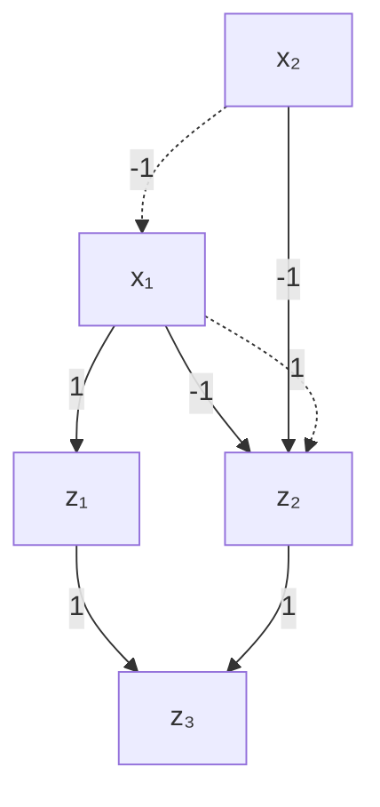
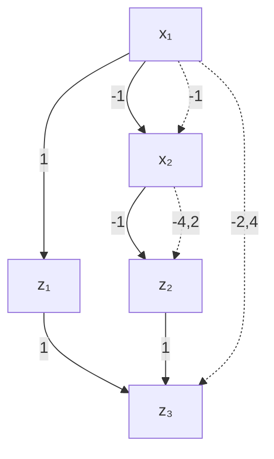
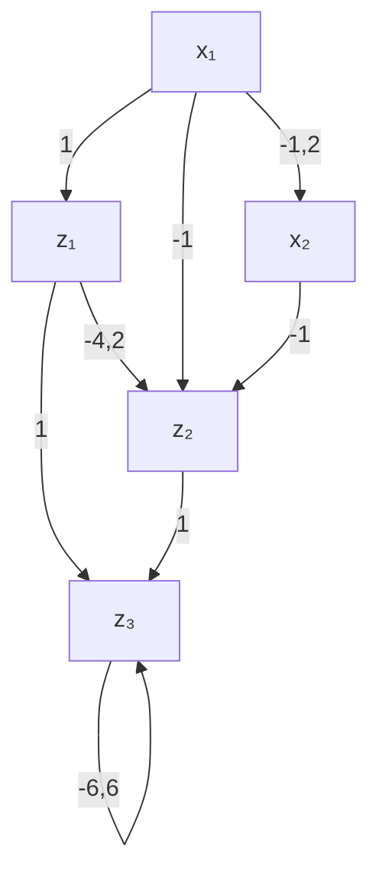

# Appendix Scaling Mace
## b.1 illustrations for the bounds computation

Initial network

Step 1

Figure B.1: A sample neural network demonstrating the bounds computation. Computing bounds using interval arithmetic

We use a very simple example to demonstrate how bounds of the hidden units are computed using interval arithmetic and why using MIPs we can obtain better bounds. Consider the simple initial network without ReLUs and biases in Figure B.1. In step 1, we wish to compute the bounds for the first (and only) hidden layer. Starting by $z _ { 1 , }$ , computing its lower bound means choosing the bounds from neurons of the previous layer which result in the minimum value for $z _ { 1 }$ . Thus, considering the sign of its weights, for both of the neurons in the previous layer the lower bound is chosen and the lower bound of $z _ { 1 }$ is set to $1 * ( - 1 ) + 1 * ( - 1 ) = - 2$ . Similarly, the upper bound is $1 * 2 + 1 * 2 = 4$ . For $z _ { 2 , }$ , however, since the weights connected to it are negative, for computing lower bound, the upper bounds of previous layer are chosen and its lower bound is set to $- 1 * 2 + - 1 * 2 = - 4$ . Similarly, the upper bound is $- 1 * ( - 1 ) + - 1 * ( - 1 ) = 2$ . Finally, in step 2, the bounds of the single output is computed in a similar way $( [ - 6 , 6 ] )$ .

It can be seen that, in order to compute the bounds of the hidden layer, each neuron has chosen lower/upper bounds from the previous layer separately and without considering the relations among neurons, causing conflicts which result in loose bounds for the next layer (the output). On the other hand, considering the straight-forward MIP for this network, we simply have $z _ { 1 } = x _ { 1 } + x _ { 2 }$ and $z _ { 2 } = - x _ { 1 } - x _ { 2 }$ for the hidden layer and $z _ { 3 } = z _ { 1 } + z _ { 2 }$ for the next layer. maximizing/minimizing $z _ { 1 }$ and $z _ { 2 }$ variables gives the same bounds as the ones by interval arithmetic for the hidden layer, however, for the next layer (the output) we will have the bounds [0, 0] since the deeper relations among neurons are considered in the MIP i.e., $z _ { 3 } \ = \ z _ { 1 } + z _ { 2 } \ =$ $x _ { 1 } + x _ { 2 } - x _ { 1 } - x _ { 2 } = 0$ .

This example was for a network without the ReLU activation. The ReLUs can also be encoded by associating them with binary variables in the MIP encoding (e.g., encoding (3.3)) and compute exact bounds similarly by solving MIPs layer-by-layer. However, this would be inefficient as the ReLU binary variables incur an exhaustive search. Thus, a linear (over-)approximation for ReLUs (3.6b) is suggested to find looser than exact but tighter than interval arithmetic bounds in an efficient way.

## b.2 additional results

The results in Figure B.2 complement those in Figure 3.3 in the main body, by comparing instead the distance norm obtained by every method. Additionally, Figure $\mathrm { B } . 3$ presents additional scalability results (similar to Figure 3.5) but for the Adult and Credit datasets. These results mimic the same trends seen earlier in the main body.

Figure B.3: Scatter and bar plots showing the runtimes and distances when the network architecture becomes wider or deeper. Scalability experiments comparing SMT-, MIP-, and gradient-based approaches. The first two rows show the results for Credit dataset and the second two rows are for the Adult dataset. In each two rows, the upper row demonstrates increasing depth while the lower row demonstrates increasing width; both in terms of runtime and distance. For each approach and architecture 50 samples are evaluated, however, some fail to produce valid CFEs (only for DiCE in this case); thus, only the instances for which all approaches have generated valid CFEs are included in the comparison. In general, for the Credit dataset, increasing depth results in 100.0%, 100.0%, and 98.2% average coverage and increasing width results in 100%, 100%, and 100.0% average coverage for MIP-OBJ, MIP-EXP, and DiCE, respectively. For the Adult dataset, increasing depth results in 100.0%, 100.0%, and 96.8% average coverage and increasing width results in 100%, 100%, and 99.1% average coverage for MIP-OBJ, MIP-EXP, and DiCE, respectively.