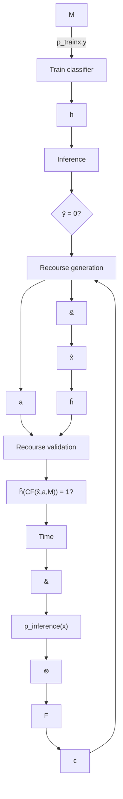

# Appendix Robust Causal Recourse
## e.1 uncertainties in the recourse process

Uncertainties may arise throughout the recourse process, as depicted in Figure E.1. Some well-studied sources of uncertainty in the classification setting naturally extend to algorithmic recourse. A great deal of the robust classification literature has focused on uncertainty in the inputs x at inference time, which may arise due to the presence of noise (FMDF16; XCM09), adversarial manipulation $( \mathrm { M a d + 1 8 ; S z e + 1 4 } )$ and other misrepresentations or errors in the data (Zhe+16). Regarding the classifier $h ,$ the optimization problem solved for model training often does not have unique optimal solution and multiple models may perform equally well in the training data (Bre+01; Rud19). Moreover, the temporal nature of recourse introduces a unique challenge: the circumstances under which recourse is generated may change by the time the individual is able to implement their prescribed recourse. For instance, the distribution over inputs itself may change at inference time, under phenomena such as data-set shift (MT+12; QC+09) or for tasks pertaining out of distribution generalization (Gei+20; MBS13). From a causal perspective, changes in the observational data distribution are a consequence of changes to the underlying SCM (Büh20).

Figure E.1: Overview of the recourse process. Uncertain elements are represented with dashed circles. Possible relations between uncertain elements are represented with non-bold dashed lines. Bold dashed lines represent temporal jumps.

Indeed, the data-generation process characterised by the SCM may be imperfectly known (Küg+22) or may dynamically change over time to some other SCM $\hat { \mathcal { M } } \in \mathcal { U } _ { \mathcal { M } }$ , where $\boldsymbol { \mathcal { U } } _ { \mathcal { M } }$ is the uncertainty set over future SCMs. Consequently, the counterfactual individual resulting from the prescribed recourse intervention may also change. Furthermore, decision-makers may have to periodically retrain their models to prevent performance degradation due to the distribution shift resulting from a change in the SCM, producing further uncertainty over the future classifier $\hat { h } \in { \mathcal U } _ { h }$ (RKL20a; UJL21). Finally, it may be unreasonable to expect the individual x to not suffer changes outside of its control over a extended period of time (VA20), leading to uncertainty in the future individual $\hat { \textbf { x } } \in \mathcal { U } _ { x }$ . Thus, acting on the prescribed recourse may not lead to favourable classification due to changes to the SCM $\hat { \mathcal { M } } ,$ , classifier $\hat { h } ,$ and/or factual individual xˆ.

## e.2 sufficient conditions for the existence of robust recourse

The conditions required for the existence of robust recourse are strictly more restrictive than those required for the existence of standard recourse, since all plausible counterfactuals must be favourably classified rather than solely the one corresponding to the factual x. Example 1, illustrated in Appendix $\mathsf { A } . 2 ,$ shows that even under the strong assumption that all features are actionable and that there exists recourse for every individual $\mathbf { x } \in \mathcal { X } .$ , robust recourse may not exist for any individual $\mathbf { x } \in \mathcal { X }$ .

Example E.2.1. Consider $\mathbf { x } \in \mathbb { R } ^ { 2 } , h ( \mathbf { x } ) = \sin ( 2 \gamma \pi ^ { - 1 } x _ { 2 } ) ~ \geq ~ 0$ for $0 < \gamma < \epsilon$ and the uncertainty set $B ( \mathbf { x } ) = \{ \mathbf { x } + \Delta \mid \| \Delta \| _ { 2 } \leq \epsilon \}$ . Whilst there exists some recourse recommendation for all $\mathbf { x } \in \mathbb { R } ^ { 2 }$ , there does not exist any adversarially robust recourse recommendation for any $\mathbf { x } \in \mathbb { R } ^ { 2 }$ .

The above example relies on the fact that the classifier does not produce robust predictions for any $\mathbf { x } \in \mathcal { X }$ , and therefore no counterfactual can remain valid $( \mathrm { i . e . , }$ favourably classified) in the presence of uncertainty. This hints to some relation between robustness of prediction and robustness of recourse. In particular, for recourse to exist, the classifier must be minimally robust in the sense that there must exist at least one individual $\mathbf { x } ^ { + } \in \mathcal { X }$ such that $h ( \mathbf { x } ^ { + } ) = 1$ is robustly classified.

Lemma E.2.1. If all features are actionable and there exists some $\mathbf { x } ^ { + } \in \mathcal { X }$ such that $h ( \mathbf { x } ^ { \prime } ) = 1$ for all $\mathbf { x } ^ { \prime } \in B ( \mathbf { x } ^ { + } )$ , then there exists some adversarially robust recourse recommendation for all $\mathbf { x } \in \mathcal { X }$ .

**Table E.1: Sufficient conditions for the existence of robust recourse.**

<table><tr><td>Classifier h</td><td>Actionability constraints</td><td>SCM M</td><td>Existence of recourse</td><td>Existence of robust recourse</td></tr><tr><td> $\exists x^{+} \in \mathcal{X}$  s.t.  $h(x^{+}) = 1$ </td><td>All features actionable</td><td>Any</td><td>Guaranteed (Ustun et al. (USL19))</td><td>Not guaranteed (Example E.2.1)</td></tr><tr><td> $\exists x^{+} \in \mathcal{X}$  s.t.  $h(x') = 1$  $\forall x' \in B(x^{+})$ </td><td>All features actionable</td><td>Any</td><td>Guaranteed (Ustun et al. (USL19))</td><td>Guaranteed (Lemma E.2.1)</td></tr><tr><td>Linear</td><td> $\exists X_{j}$  actionable and unbounded</td><td>Linear</td><td>Guaranteed (Lemma E.2.2)</td><td>Guaranteed (Lemma E.2.2)</td></tr><tr><td>Any</td><td>All bounded, ≥ 1 immutable</td><td>Any</td><td>Not guaranteed (Ustun et al. (USL19))</td><td>Not guaranteed (Follows directly)</td></tr></table>

In order to relax the condition that all features must be actionable, we restrict ourselves to the case where both the classifier and the SCM are linear. Then, the existence of at least one actionable and unbounded feature is sufficient to guarantee the universal existence of robust recourse. Intuitively, the decision-maker can require arbitrarily large changes to an actionable and unbounded feature such that all plausible counterfactuals are favourably classified (e.g., increase savings for loan approval).

Lemma E.2.2. For a linear classifier $h ( \mathbf { x } ) = \langle \mathbf { w } , \mathbf { x } \rangle \geq b$ and an SCM with linear structural equations, if there exists a feature $\mathbf { \boldsymbol { x } } _ { j }$ such that $\mathbf { \boldsymbol { x } } _ { j }$ is actionable and unbounded and $w _ { j } \neq 0 ,$ , then there exists at least one adversarially robust recourse action for all $\mathbf { x } \in { \dot { \mathcal { X } } }$ .

If all features are bounded and there exists at least one immutable feature, then as per Ustun et al. (USL19) Remark 3, it is not possible to guarantee the universal existence of recourse even in the linear case, and therefore it is also not possible to guarantee the universal existence of adversarially robust recourse.

## e.3 proofs

## e.3.1 Theorem 1

Let $a ^ { * } = \mathrm { d o } ( \mathbf { X } _ { \mathcal { T } } : = \mathbf { x } _ { \mathcal { T } } + \pmb { \theta } ^ { * } )$ be the minimum-cost recourse action for a classifier h and an individual x. Assume that $a ^ { * }$ is a robust recourse action, that is, $\iota \left( \mathbb { C F } \left( \mathbb { C F } \left( \mathbf { x } , \Delta \right) , a ^ { * } \right) \right) = 1 \vee \ \left\| \Delta \right\| \leq \epsilon$ . Consider any $\mathcal { T } _ { j }$ such that for all $i \in \mathcal { Z } ,$ , $\mathbf { \boldsymbol { x } } _ { i }$ is not a causal descendent of $\mathbf { \boldsymbol { x } } _ { \mathit { I } _ { i } }$ . Consider $e _ { j } \in \mathbb { R } ^ { | \mathcal { I } | }$ such that $( e _ { j } ) _ { j } = 1$ and $( e _ { j } ) _ { i } = 0 \forall i \neq j$ . Then the action $\begin{array} { r } { a = \mathrm { d o } ( \mathbf { X } _ { \mathcal { T } } : = \mathbf { x } _ { \mathcal { T } } - \pmb { \theta } ^ { * } + \alpha e _ { j } \mathrm { s i g n } ( \pmb { \theta } _ { j } ) ) } \end{array}$ is a valid recourse action, since $h ( \mathbb { C F } \left( \mathbf { x } , a \right) ) = h ( \mathbb { C F } \left( \mathbb { C F } \left( \mathbf { x } , \alpha e _ { j } \operatorname { s i g n } ( \theta _ { j } ) \right) , a ^ { * } \right) = 1$ for any $\alpha \leq \epsilon ,$ per the assumption that $a ^ { * }$ is robust, and given that $a \in { \mathcal { F } } ( { \mathbf { x } } )$ per assumption ii) in the Theorem. Furthermore, per assumption i) in the Theorem (strict convexity of the cost function), it must be that $c ( \mathbf { x } , a ) < c ( \mathbf { x } , a ^ { * } )$ , which is a contradiction on $a ^ { * }$ being a minimum-cost recourse action, and consequently the minimum-recourse action $a ^ { * }$ must be fragile to perturbations x.

## e.3.2 Example 1

The shaded area is the favourably classified region of the feature space. While there exists recourse for every individual, there does not exist robust recourse for any individual.

X₂
xCF
γ
x
X₁

## e.3.3 Lemma 1

Per assumption, there exists some $\mathbf { x } ^ { + } \in \mathcal { X }$ such that $h ( \mathbf { x } ^ { + } ) ~ = ~ 1$ for all $\mathbf { x } ^ { \prime } \in \bar { B ( \mathbf { x } ^ { + } ) }$ , where $B ( \mathbf { x } ^ { + } ) ~ = ~ \{ { \mathbb { C } } \mathbb { F } ( \mathbf { x } ^ { + } , \Delta ) | \| \Delta \| ~ \leq ~ \epsilon \}$ . For any given individual $\mathbf { x } ,$ the action $a \ = \ d o \left( { \pmb X } = { \pmb x } + ( { \pmb x } ^ { + } - { \pmb x } ) \right)$ results in the counterfactual individual $\mathbf { x } ^ { \mathrm { C F } } = \mathbb { C F } ( \mathbf { x } , a ) = \mathbf { x } ^ { + }$ . The action a is feasible, since all features are actionable. The action a is a recourse action, since $h ( { \bf x } ^ { \mathrm { C F } } ) \ = \ h ( { \bf x } ^ { + } ) \ = \ 1$ . Since the action a hard intervenes on all features, $\begin{array} { r l r } { \mathbb { C F } ( \mathbb { C F } ( { \mathbf x } , \Delta ) , a ) } & { = } & { \mathbb { C F } ( \mathbb { C F } ( { \mathbf x } , a ) , \Delta ) \quad = \quad \mathbb { C F } ( { \mathbf x } ^ { + } , \Delta ) } \end{array}$ , and consequently $\{ \mathbb { C F } ( \mathbb { C F } ( \mathbf { x } , \Delta ) , a ) | \| \Delta \| \leq \epsilon \} = \{ \mathbb { C F } ( \mathbf { x } ^ { + } , \Delta ) | \| \Delta \| \leq \epsilon \} = B ( \mathbf { x } ^ { + } )$ . It follows that a is a robust recourse action, since $h ( \mathbf { x } ^ { \prime } ) = 1$ for all $\mathbf { x } ^ { \prime } \in B ( \mathbf { x } ^ { + } )$ .

## e.3.4 Lemma 2

Per assumption, there exists some feature $\mathbf { \boldsymbol { x } } _ { j }$ such that $\mathbf { \boldsymbol { x } } _ { j }$ is actionable and unbounded, and $\mathbf { \boldsymbol { x } } _ { j }$ affects its causal descendants linearly. Consider the recourse action $a = \mathrm { d o } ( \mathbf { X } _ { i } : = \mathbf { x } _ { i } + \pmb { \theta } )$ for $\theta \in \mathbb { R }$ . Per Theorem 2, we must find a recourse action such that $\langle \mathbf { \bar { w } } , \mathbb { C F } ( \mathbf { x } , a ) \rangle \ge b ^ { \prime }$ . Due to the linearity assumptions on the SCM, $\mathbb { C } \mathbb { F } ( \mathbf { x } , a ) = \mathbf { x } + \pmb { \theta } \mathbf { v }$ for some $v \in \mathbb { R } ^ { n }$ . Then, $\langle \mathbf { w } , \mathbb { C F } ( \mathbf { x } , a ) \rangle =$ $\langle \mathbf { w } , \mathbf { x } + \pmb { \theta } \mathbf { v } \rangle = \langle \mathbf { w } , \mathbf { x } \rangle + \pmb { \theta } \langle \mathbf { w } , \mathbf { v } \rangle$ . A robust recourse action is equivalent to any θ such that $\begin{array} { r } { \pmb { \theta } \langle \mathbf { w } , \mathbf { v } \rangle \geq b ^ { \prime } - \langle \mathbf { w } , \mathbf { x } \rangle . \mathrm { I f } \left. \mathbf { w } , \mathbf { v } \right. \neq 0 \left( \mathrm { i . e . } \right. } \end{array}$ , the non-trivial case where the weights of the classifier are not chosen adversarially to the SCM), then clearly it is possible to set θ to have arbitrarily large magnitude and same sign as $\langle \mathbf { w } , \mathbf { v } \rangle$ , such that the inequality above is met. Since $\mathbf { \boldsymbol { x } } _ { j }$ is actionable and unbounded, $a = \mathrm { d o } ( \mathbf { X } _ { j } : = \mathbf { x } _ { j } + \pmb { \theta } )$ is a feasible action. Consequently, a is a robust recourse action.

## e.3.5 Theorem 2

The adversarially robust recourse problem is defined as

$$
\min _ {a = \mathrm{do} (\mathbf {X} _ {\mathcal {I}} := \mathbf {x} _ {\mathcal {I}} + \boldsymbol {\theta})} \max _ {\mathbf {x} ^ {\prime} \in B (\mathbf {x})} c (\mathbf {x}, a) \quad \text { s.t. } \quad a \in \mathcal {F} (\mathbf {x} ^ {\prime}) \wedge h \left(\mathbb {C F} \left(\mathbf {x} ^ {\prime}, a\right)\right) = 1 \tag {E.3.1}
$$

${ \mathrm { A s s u m i n g ~ } } h ( \mathbf { x } ) = \langle \mathbf { w } , \mathbf { x } \rangle \geq b { \mathrm { ~ a n d ~ } } { \mathcal { F } } ( \mathbf { x } ) = { \mathcal { F } } ( \mathbf { x } ^ { \prime } ) \forall \mathbf { x } ^ { \prime } \in B ( \mathbf { x } )$

$$
\min _ {a = \mathrm{do} (\mathbf {X} _ {\mathcal {I}} := \mathbf {x} _ {\mathcal {I}} + \boldsymbol {\theta})} \max _ {\mathbf {x} ^ {\prime} \in B (\mathbf {x})} c (\mathbf {x}, a) \quad \text { s.t. } \quad a \in \mathcal {F} (\mathbf {x}) \wedge \langle \mathbf {w}, (\mathbb {C F} (\mathbf {x} ^ {\prime}, a)) \rangle \geq b \tag {E.3.2}
$$

For an action a to be robust feasible, the second constrain must hold for every $\mathbf { x } ^ { \prime } \in B ( \mathbf { x } )$ , that is,

$$
\left(\min _ {\mathbf {x} ^ {\prime} \in B (\mathbf {x})} \langle \mathbf {w}, (\mathbb {C F} (\mathbf {x}, a))) \rangle\right) \geq b \tag {E.3.3}
$$

Consequently, Equation E.3.2 is equivalent to

$$
\min _ {a = \mathrm{do} (\mathbf {X} _ {\mathcal {I}} := \mathbf {x} _ {\mathcal {I}} + \boldsymbol {\theta})} c (a) \quad \text { s.t. } \quad a \in \mathcal {F} (\mathbf {x}) \wedge \left(\min _ {\mathbf {x} ^ {\prime} \in B (\mathbf {x})} \langle \mathbf {w}, (\mathbb {C F} (\mathbf {x}, a))) \rangle\right) \geq b \tag {E.3.4}
$$

Then since the SCM is linear

$$
\begin{array}{l} \mathbb {C F} (\mathbb {C F} (\mathbf {x}, \Delta), a) = \mathbb {S} ^ {a} \left(\mathbb {S} ^ {- 1} \left(\mathbf {x} ^ {\prime}\right)\right) \\ = \mathbb {S} ^ {a} \left(\mathbb {S} ^ {- 1} \left(\mathbb {S} ^ {\Delta} \left(\mathbb {S} ^ {- 1} (\mathbf {x})\right)\right)\right) \\ = \mathbb {S} ^ {a} \left(\mathbb {S} ^ {- 1} \left(\mathbb {S} \left(\mathbb {S} ^ {- 1} (\mathbf {x}) + \Delta\right)\right)\right) \\ = \mathbb {S} ^ {a} \left(\mathbb {S} ^ {- 1} (\mathbf {x}) + \Delta\right) \tag {E.3.5} \\ = \mathbb {S} ^ {a} \left(\mathbb {S} ^ {- 1} (\mathbf {x})\right) + \mathbb {S} ^ {a} (\Delta) \\ = \mathbb {C F} (\mathbf {x}, a) + J _ {\mathbb {S} ^ {\mathcal {I}}} \Delta \\ \end{array}
$$

where $J _ { { \mathbb S } ^ { \mathbb T } }$ denotes the Jacobian of the interventional mapping $\mathbb { S } ^ { \mathcal { T } }$ . Then

$$
\begin{array}{l} \min _ {\mathbf {x} ^ {\prime} \in B (\mathbf {x})} \left\langle \mathbf {w}, \mathbb {C F} (\mathbf {x}, a)\right) \rangle = \min _ {\| \Delta \| \leq \epsilon} \left\langle \mathbf {w}, \mathbb {C F} (\mathbf {x}, a)\right) + J _ {\mathbb {S} ^ {\mathcal {I}}} \Delta \rangle \\ = \left\langle \mathbf {w}, \mathbb {C F} (\mathbf {x}, a)\right) \rangle + \min _ {\| \Delta \| \leq \epsilon} \left\langle \mathbf {w}, J _ {\mathbb {S} ^ {\mathcal {I}}} \Delta \right\rangle \tag {E.3.6} \\ = \left\langle \mathbf {w}, \mathbb {C F} (\mathbf {x}, a)\right) \rangle - \left\| J _ {\mathcal {S} ^ {\mathcal {I}}} ^ {T} \mathbf {w} \right\| ^ {*} \epsilon \\ \end{array}
$$

Consequently the optimization problem in Equation $\mathrm { E } . 3 { \cdot } 4$ reduces to

$$
\min _ {a = \mathrm{do} (\mathbf {X} _ {\mathcal {I}} := \mathbf {x} _ {\mathcal {I}} + \boldsymbol {\theta})} c (\mathbf {x}, a) \quad \text { s.t. } \quad a \in \mathcal {F} (\mathbf {x}) \wedge \langle \mathbf {w}, \mathbf {C F} (\mathbf {x}, a)) \rangle \geq b + \left\| J _ {\mathbb {S} ^ {\mathcal {I}}} ^ {T} \mathbf {w} \right\| ^ {*} \epsilon \tag {E.3.7}
$$

The corollary follows directly, since under the IMF assumption $J _ { \mathbb { S } ^ { \tau } } = I ,$ and then Equation $\mathrm { E } . 3 { \cdot } 7$ resembles the definition of the recourse problem in Equation 6.1 for the classifier

$$
h (\mathbf {x}) = \langle \mathbf {w}, \mathbf {x} \rangle \geq b + \| \mathbf {w} \| ^ {*} \epsilon \tag {E.3.8}
$$

## e.3.6 Theorem 3

Per Theorem 2, the robust recourse action $a ^ { \prime } \ = \ d o ( { \bf X } _ { \mathcal { T } } = { \bf x } _ { \mathcal { T } } + ( 1 + \beta \epsilon ) \pmb \theta )$ must satisfy

$$
\langle \mathbf {w}, \mathbb {C F} (\mathbf {x}, a ^ {\prime}) \rangle \geq b + \left\| J _ {\mathbb {S} ^ {\mathcal {I}}} ^ {T} \mathbf {w} \right\| ^ {*} \epsilon \tag {E.3.9}
$$

Since the SCM is linear, $\mathbb { C } \mathbb { F } ( \mathbf { x } , a ^ { \prime } ) = \mathbf { x } + J _ { \mathbb { S } ^ { I } } ( 1 + \beta \epsilon ) \pmb { \theta } .$ . Then,

$$
\begin{array}{l} \langle \mathbf {w}, \mathbb {C F} (\mathbf {x}, a ^ {\prime}) \rangle = \langle \mathbf {w}, \mathbf {x} + (1 + \beta \epsilon) J _ {\mathbb {S} ^ {\mathcal {I}}} \boldsymbol {\theta}) \rangle \\ = \left\langle \mathbf {w}, \mathbf {x} + J _ {\mathbb {S} ^ {I}} \boldsymbol {\theta} \right\rangle + \beta \epsilon \left\langle \mathbf {w}, J _ {\mathbb {S} ^ {I}} \boldsymbol {\theta} \right\rangle \tag {E.3.10} \\ \geq b + \beta \epsilon \langle \mathbf {w}, J _ {\mathbb {S} ^ {\mathcal {I}}} \boldsymbol {\theta} \rangle \\ \end{array}
$$

where the last inequality follows by assumption that a is a recourse action for $h ( \mathbf { x } ) = \left. \mathbf { w } , \mathbf { x } \right. \geq b .$ . Consequently, if

$$
\beta = \frac {\left\| J _ {S ^ {I}} ^ {T} \mathbf {w} \right\| ^ {*}}{\langle \mathbf {w} , J _ {S ^ {I}} \boldsymbol {\theta} \rangle} \tag {E.3.11}
$$

then Equation E.3.10 satisfies the robust recourse condition in Equation E.3.9.

By assumption that a is a recourse action then $\langle \mathbf { w } , J _ { \mathbb { S } ^ { T } } \rangle > 0$ . Then $0 < \beta <$ ∞. Consequently, if $a ^ { \prime } \in \mathcal { F } ( \mathbf { x } )$ , the action $\begin{array} { r } { a ^ { \prime } = \mathrm { d o } ( \mathbf { X } _ { \mathcal { T } } : = \mathbf { x } _ { \mathcal { T } } + ( 1 + \beta \epsilon ) \pmb { \theta } ) } \end{array}$ is a robust recourse action.

## e.4 datasets considered

• COMPAS: we use the features age, race, sex and priors count. We consider priors count actionable, with the actionability constrains that priors count can only decrease but not go below zero.
• Adult: we use the features sex, age, native-country, marital-status, education-num, hours-per-week. We consider education-num and hours-per-week actionable. education-num can only increase and is bounded to [1, 16], whereas hours-per-week must be below 100.
• South German Credit: we consider the features laufkont, moral, verw, sparkont, beszeit, rate, famges, buerge, wohnzeit, verm, weitkred, wohn, bishkred, beruf, pers, telef, gastarb. We consider laufzeit, hoehe as actionable, and require them to be positive.
• Bail: we use all features except RECID, TIME, FILE. We consider RULE actionable. We require that it may only decrease, but cannot be negative.
• Loan: we use all features as Karimi et al. [Kar+20b].

<table><tr><td>[AHL15]</td><td>Jason Abrevaya, Yu-Chin Hsu, and Robert P Lieli. “Estimating conditional average treatment effects.” In: Journal of Business &amp; Economic Statistics 33.4 (2015), pp. 485-505.</td></tr><tr><td>[Adu96]</td><td>Adult data. https://archive.ics.uci.edu/ml/datasets/adult. 1996.</td></tr><tr><td>[ACH10]</td><td>Charu C Aggarwal, Chen Chen, and Jiawei Han. “The inverse classification problem.” In: Journal of Computer Science and Technology 25.3 (2010), pp. 458-468.</td></tr><tr><td>[APMRRÁ20]</td><td>Carlos Aguilar-Palacios, Sergio Muñoz-Romero, and José Luis Rojo-Álvarez. “Cold-Start Promotional Sales Forecasting through Gradient Boosted-based Contrastive Explanations.” In: IEEE Access (2020).</td></tr><tr><td>[Aïv+19]</td><td>Ulrich Aïvodji, Hiromi Arai, Olivier Fortineau, Sébastien Gambis, Satoshi Hara, and Alain Tapp. “Fairwashing: the risk of rationalization.” In: arXiv preprint arXiv:1901.09749 (2019).</td></tr><tr><td>[ABG20]</td><td>Ulrich Aïvodji, Alexandre Bolot, and Sébastien Gambis. “Model extraction from counterfactual explanations.” In: arXiv preprint arXiv:2009.01884 (2020).</td></tr><tr><td>[AS17]</td><td>Ahmed M Alaa and Mihaela van der Schaar. “Bayesian inference of individualized treatment effects using multi-task gaussian processes.” In: Advances in Neural Information Processing Systems. 2017, pp. 3424-3432.</td></tr><tr><td>[AIR96]</td><td>Joshua D Angrist, Guido W Imbens, and Donald B Rubin. “Identification of causal effects using instrumental variables.” In: Journal of the American statistical Association 91.434 (1996), pp. 444-455.</td></tr><tr><td>[Ang+16]</td><td>Julia Angwin, Jeff Larson, Surya Mattu, and Lauren Kirchner. “Machine bias.” In: ProPublica, May 23 (2016), p. 2016.</td></tr><tr><td>[Arn15]</td><td>Richard Arneson. “Equality of Opportunity.” In: The Stanford Encyclopedia of Philosophy. Ed. by Edward N. Zalta. Summer 2015. Metaphysics Research Lab, Stanford University, 2015.</td></tr></table>

<!-- footnote -->

- this link

<!-- footnote end -->

<!-- footnote -->

- This is assumed beyond the scope of the chapter; we built MACE atop the open-source PySMT library (GM15) with the $Z _ { 3 }$ (MB08) backend to demonstrate its model-agnostic support of off-the-shelf models.
- All tests were conducted using one $\times 8 6 _ { - } 6 _ { 4 }$ Xeon(R) CPU @ 2.60GHz, and 8GB memory.

<!-- footnote end -->

<!-- footnote -->

- Reminder: lower distance is more desirable, as it specifies the least change required of the individual’s features.

<!-- footnote end -->