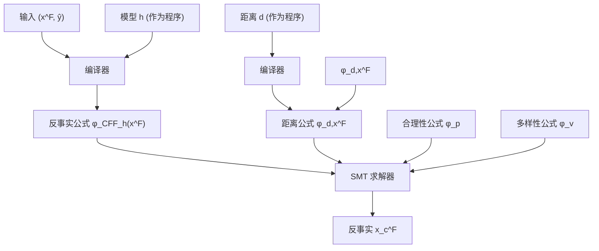
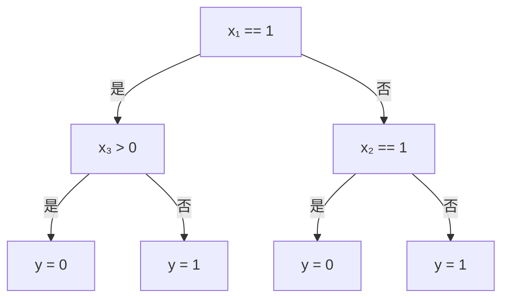
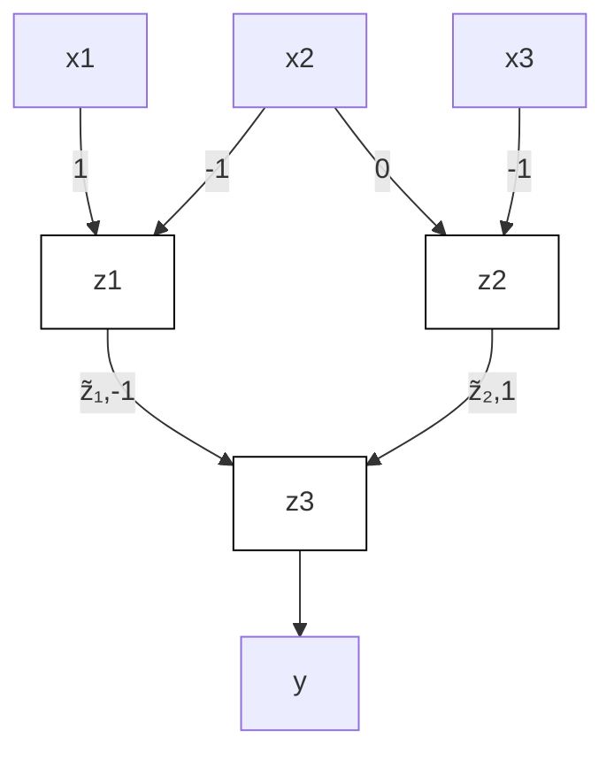

# 模型无关的反事实解释（Model-Agnostic Counterfactual Explanations）

## 章节摘要（Chapter Abstract）

预测模型越来越多地被用于支持在审前保释和贷款审批等场景中对个体层面的重大决策。因此，社会和法律层面日益要求提供解释，帮助受影响的个体不仅理解为何输出某个预测，还知道如何行动以获得期望的结果。为此，多项研究提出了基于优化的方法来生成**最近反事实解释（nearest counterfactual explanations）**。然而，这些方法通常局限于特定类型的模型（如决策树或线性模型）和可微的距离函数。相比之下，我们基于形式化验证的标准理论和工具，提出了一种新颖的算法，该算法求解一系列**可满足性问题（satisfiability problems）**，其中距离函数（目标）和预测模型（约束）均被表示为逻辑公式。正如我们在真实世界数据上的实验所示，我们的算法具有以下特点：i) **模型无关**（{非}线性、{非}可微、{非}凸）；ii) **数据类型无关**（异构特征）；iii) **距离无关**（$\ell_0$、$\ell_1$、$\ell_\infty$ 及其组合）；iv) 能够为任何样本生成**合理且多样的反事实**（即 100% 覆盖）；v) 距离具有**可证明的最优性**。

图 2.1：模型无关反事实解释（MACE）架构概览

## 2.1 引言（Introduction）

数据驱动的预测模型被广泛应用于各种真实世界场景中，以支持甚至替代人类进行决策，包括例如招聘筛选、贷款审批或审前保释。然而，随着算法方法越来越多地用于对个体层面做出重大决策——即可能对被决策个体产生重大影响的决策——关于其缺乏透明度和可解释性的争论也愈发激烈。更糟糕的是，尽管关于什么构成好的解释尚无定论（DVK17; Fre14; Kod94; Mur+19; Lip18; Rud19; Rüp06），但在重大决策场景中，已经存在明确定义的解释法律要求。例如，**欧盟通用数据保护条例（EU General Data Protection Regulation, GDPR）** 通过要求机构向其（半）自动化决策系统所影响的个体提供解释，赋予个体**解释权（right-to-explanation）**（VB; WMF17）。

越来越多的关于可解释机器学习的研究最近聚焦于为基于预测器的决策系统提供好的解释的定义和机制。在重大决策的背景下，人们普遍认为一个好的解释应回答以下两个问题（DVK17; Gun19; WMR17）：(i) “为什么模型对某个个体输出特定的预测？”；(ii) “描述该个体的哪些特征需要改变才能获得期望的输出？”

在此，我们专注于回答第二个问题，即生成**反事实解释（counterfactual explanations）**。特别重要的是寻找**最近反事实解释（nearest counterfactual explanation）** 的问题——即识别出能产生期望预测的特征集，同时与描述个体的原始特征集保持最小距离。现有的解决该问题的方法存在各种局限性：它们要么提出针对特定模型的解决方案，例如决策树（Tol+17）；要么依赖经典优化工具，因此局限于凸预测模型和凸距离函数（Rus19; USL19）；要么使用基于梯度的方法求解原始优化问题的松弛版本，因此局限于可微模型和距离函数（WMR17），且缺乏最优性保证。此外，需要考虑的是，在重大决策的背景下，描述个体的特征具有语义含义且是异构的（即混合连续型和离散型）；并且可以是可操作的（例如银行账户余额），或者是不可变的且应受到保护免受改变（例如性别、种族）。一个好的解释应考虑这些语义（即具有合理性¹）才能对个体有用，而大多数现有方法未能满足这一要求。

**我们的贡献** 在本章中，我们提出了一种**模型无关**的方法来生成最近反事实解释，即 **MACE**，该方法适用于任意给定的距离函数（或其凸组合）；同时，易于支持额外的合理性约束。此外，我们的方法自然地编码了异构特征空间的自然距离概念，这在重大决策系统（例如贷款审批）中很常见，由混合的数值型（如年龄和收入）和名义型（如性别和教育水平）特征组成。为此，在 MACE 中，我们将最近反事实问题映射为一系列**可满足性（satisfiability, SAT）问题**，通过将预测模型和距离函数（以及合理性和多样性约束）都表示为逻辑公式。每个可满足性问题旨在验证是否存在距离小于给定阈值的反事实解释，并可以使用标准的 **SMT（可满足性模理论）求解器** 来求解。此外，我们依赖对距离阈值的二分搜索策略，以任意精度找到最近（合理）反事实的近似值，并给出距离的下界，使得可以证明不存在更小距离的反事实。最后，一旦找到最近反事实，可以向可满足性问题添加多样性约束以寻找替代反事实。MACE 的整体架构如图 2.1 所示。

我们在真实世界数据集上的实验验证表明，MACE 不仅通过设计实现了 100% 的覆盖，而且生成的解释比之前的方法（Tol+17; USL19）显著更近。我们还提供了定性示例，展示了我们方法的灵活性，通过扩展合理性约束以限制对（非不可变）特征子集的更改，从而生成可操作的反事实。我们算法的 Python 实现以及实验中使用的数据集可在 https://github.com/amirhk/mace 获取。

## 2.2 一阶谓词逻辑（First-Order Predicate Logic）

在本节中，我们简要回顾 MACE 所基于的一阶谓词逻辑的基本概念。我们区分**函数符号（function symbols）**（例如加法 $+$ 和乘法 $\times$）和**谓词符号（predicate symbols）**（例如等于 $=$ 或小于 $<$）。函数符号用于构建表达式，谓词符号用于构建原子公式。有效表达式的例子有 $x$、$x + 2$、$(-x) + 2$ 和 $(x + 2) \times (y + 3)$。有效原子公式的例子有 $e < e'$、$e \le e'$ 或 $e = e'$。（无量词）公式是原子公式的布尔组合。也就是说，公式由原子公式通过合取 $\land$、析取 $\vee$ 和否定 $\neg$ 构建而成。公式在其预期域上具有解释。例如，关于实值表达式的公式自然解释为 $\mathbb{R}^n$ 的一个子集，其中 $n$ 表示公式中出现的变量数量。解释通过将每个变量映射为一个值（例如实数）来获得。例如，$(2, 1)$ 属于 $(x + 2) \times (y + 3) \leq x \times y + 16$ 的解释，因为映射 $x \mapsto 2, y \mapsto 1$ 使得 $16 \leq 18$ 为真。如果公式作为 $\mathbb{R}^n$ 子集的解释非空，则称该公式是**可满足的（satisfiable）**。

可满足性问题在于检查公式是否可满足。可满足性问题可以使用像 $Z_3$（MB08）或 CVC4（Bar+11）这样的 **SMT（可满足性模理论）求解器** 自动验证。关于 SMT 求解器使用的基本算法的介绍，我们参考（KS08）。为了后续章节的目的，只需假设存在一个给定的可满足性预言机 SAT。在我们的实验中，我们使用现成的 SMT 求解器来实现该预言机。我们将 SMT 求解器作为黑盒使用，但有趣的是，我们的公式属于实数理论的线性片段（即所有公式仅包含次数为 1 的表达式，当视为关于变量的多元多项式时），这可以使用 **傅里叶-莫茨金算法（Fourier-Motzkin algorithm）** 高效地判定。

## 2.3 预测模型的反事实空间（Counterfactual Spaces for Predictive Models）

本节定义了预测模型反事实解释的逻辑表示，预测模型是将输入特征向量 $\mathbf{x} \in \mathcal{X}$ 映射到决策 $y \in \{0, 1\}$ 的函数²。给定一个预测模型 $h: \mathcal{X} \to \{0, 1\}$，我们可以将（事实）输入 $\mathbf{x}^{\mathsf{F}} \in \mathcal{X}$ 的反事实解释集定义为 $\mathbb{CF}_h(\mathbf{x}^{\mathsf{F}}) = \{ \mathbf{x} \in \mathcal{X} \mid h(\mathbf{x}) \neq h(\mathbf{x}^{\mathsf{F}}) \}$。换句话说，$\mathbb{CF}_h(\mathbf{x}^{\mathsf{F}})$ 包含所有使得模型 $h$ 返回与 $h(\mathbf{x}^{\mathsf{F}})$ 不同预测的输入 $\mathbf{x}$。我们还注意到，$\mathbb{CF}_h(\mathbf{x}^{\mathsf{F}})$ 是 $1 - h(\mathbf{x}^{\mathsf{F}})$ 在 $h$ 下的原像集。

对于一大类预测模型，可以构建捕获 $\mathbb{CF}_h$ 成员资格的反事实公式。我们通过计算模型的**特征公式（characteristic formula）** $\phi_h$ 来实现这一点。对于预测模型 $h: \mathcal{X} \to \{0, 1\}$ 以及一对输入和输出值 $\mathbf{x}$ 和 $y$，特征公式 $\phi_h$ 验证 $\phi_h(\mathbf{x}, y)$ 为真当且仅当 $h(\mathbf{x}) = y$。因此，给定事实输入 $\mathbf{x}^{\mathsf{F}}$ 且 $h(\mathbf{x}^{\mathsf{F}}) = y^{\mathsf{F}}$ 以及 $\phi_h$，我们将反事实公式定义为

$$
\phi_{\mathbb{CF}_h(\mathbf{x}^{\mathsf{F}})}(\mathbf{x}) = \phi_h(\mathbf{x}, 1 - y^{\mathsf{F}}) \tag{2.1}
$$

直观地说，式（2.1）右侧的公式表明“$\mathbf{x}$ 是 $\mathbf{x}^{\mathsf{F}}$ 的反事实，如果要么 $h(\mathbf{x}^{\mathsf{F}}) = 0$ 且 $h(\mathbf{x}) = 1$，要么 $h(\mathbf{x}^{\mathsf{F}}) = 1$ 且 $h(\mathbf{x}) = 0$”。因此，从定义可以清楚地看出，输入 $\mathbf{x}$ 满足 $\phi_{\mathbb{CF}_h(\mathbf{x}^{\mathsf{F}})}$ 当且仅当 $\mathbf{x} \in \mathbb{CF}_h(\mathbf{x}^{\mathsf{F}})$。此外，（2.1）表明，要构建反事实公式 $\phi_{\mathbb{CF}_h(\mathbf{x}^{\mathsf{F}})}$，我们只需要相应预测模型的特征公式 $\phi_h$ 和 $y^{\mathsf{F}}$ 的值。为了获得这样的特征公式，我们假设预测模型由核心编程语言中的程序表示，该语言包含赋值、条件语句、顺序组合、语法上有界的循环和返回语句。这使我们能够使用程序验证文献中的技术。具体来说，我们使用所谓的**谓词变换器（predicate transformers）**（Dij68; Hoa69; Flo93; FS01）。通用过程的描述见附录 A.1。为便于说明，我们通过两个示例（决策树和多层感知器）来说明特征公式的构建。

作为第一个示例，考虑图 2.2a 中的决策树，它接受输入 $(x_1, x_2, \hat{x_3}) \in \{0, 1\}^2 \times \mathbb{R}$ 并返回 $\{0, 1\}$ 中的二元输出。图 2.2b 提供了该决策树的编程语言描述。为了构建表示该树计算的函数 $h(\mathbf{x}) = y$ 的公式，

(a) 图形化表示

$$
\begin{array}{l} \text{如果 } x_1 == 1 \\ y = 0 \text{ 如果 } x_3 > 0 \text{ 否则 } 1 \\ \text{否则} \\ y = 0 \text{ 如果 } x_2 == 1 \text{ 否则 } 1 \\ \text{返回 } y \\ \end{array}
$$

(b) 程序（Python 风格）

$$
\phi_h(\mathbf{x}, y) = (x_1 = 1 \land x_3 > 0 \land y = 0)
$$

$$
\vee \left(x_1 = 1 \land x_3 \leq 0 \land y = 1\right)
$$

$$
\lor (x_1 = 0 \land x_2 = 1 \land y = 0)
$$

$$
\lor (x_1 = 0 \land x_2 = 0 \land y = 1)
$$

(c) 特征公式

图 2.2：决策树：模型、程序和特征公式。

我们首先为树中的每个叶子构建一个子句，取从根到该叶子路径上所有条件的合取。例如，图 2.2a 中最左边叶子对应的子句是 $(x_1 = 1 \land x_3 > 0 \land y = 0)$。一旦所有这些子句构建完成，通过取所有子句的析取，即可得到整棵树对应的特征公式 $\phi_h(\mathbf{x}, y)$，如图 2.2c 所示。

作为第二个示例，我们考虑一个带有一个隐藏层和 ReLU 激活函数的前馈神经网络，如图 2.3a 所示。该模型实现了一个函数 $h: \mathbb{R}^3 \to \{0, 1\}$，其中二元决策通过对最后一个隐藏节点的值进行阈值化得到。该模型的编程语言表示如图 2.3b 所示。在这种情况下，特征公式对输入 $\mathbf{x}$、输出 $y$ 以及每个隐藏节点 $i$ 的程序变量 $z_i$ 和 $\tilde{z}_i$ 进行谓词化，分别表示该节点在非线性 ReLU 变换之前和之后的值。特征公式是一个合取式，每个合取项对应程序的一条指令。例如，对于图 2.3a 网络中第一层最左边的隐藏节点，变量 $z_1$ 关联子句 $(z_1 = x_1 - x_2)$；变量 $\tilde{z}_1$ 对应于 $z_1$ 经过 ReLU 后的值，可以写为析取式 $(\tilde{z}_1 = z_1 \land z_1 \geq 0) \vee (\tilde{z}_1 = 0 \land z_1 < 0)$。对于输出节点——这里是 $z_3$——我们引入一对表示阈值化操作的子句，即

(a) 图形化表示  
(b) 程序（Python 风格）

$$
\begin{array}{l} z_1 = x_1 - x_2 \\ z_2 = 2 x_1 - x_3 \\ \tilde{z}_1 = z_1 \text{ 如果 } z_1 >= 0 \text{ 否则 } 0 \\ \tilde{z}_2 = z_2 \text{ 如果 } z_2 >= 0 \text{ 否则 } 0 \\ z_3 = -\tilde{z}_1 + \tilde{z}_2 \\ y = 1 \text{ 如果 } z_3 >= 0 \text{ 否则 } 0 \\ \text{返回 } y \\ \end{array}
$$

$$
\begin{array}{l} \phi_h(\mathbf{x}, y) = (z_1 = x_1 - x_2) \\ \wedge \left(z_2 = 2 x_1 - x_3\right) \\ \wedge \left(\left(\tilde{z}_1 = z_1 \land z_1 \geq 0\right) \vee \left(\tilde{z}_1 = 0 \land z_1 < 0\right)\right) \\ \wedge \left(\left(\tilde{z}_2 = z_2 \land z_2 \geq 0\right) \vee \left(\tilde{z}_2 = 0 \land z_2 < 0\right)\right) \\ \wedge (z_3 = -\tilde{z}_1 + \tilde{z}_2) \\ \wedge \left(\left(z_3 \geq 0 \land y = 1\right) \vee \left(z_3 < 0 \land y = 0\right)\right) \\ \end{array}
$$

(c) 特征公式

图 2.3：多层感知器：模型、程序和特征公式

$(y = 1 \land z_3 \geq 0) \vee (y = 0 \land z_3 < 0)$。取每个节点公式的合取，我们得到图 2.3c 中的特征公式。

## 2.4 寻找最近反事实（Finding the Nearest Counterfactual）

基于上一节定义的反事实空间 $\mathbb { C F } _ { h } ( \mathbf { x } ^ { \mathsf { F } } )$ ，我们希望通过尝试寻找一个**最近反事实（nearest counterfactual）**，来为模型 $h$ 在给定输入 $\mathbf { x } ^ { \mathsf { F } }$ 上的输出生成反事实解释。最近反事实定义为：

$$
\mathbf {x} ^ {* \mathsf {C F}} \in \underset {\mathbf {x} \in \mathbb {C F} _ {h} (\mathbf {x} ^ {\mathsf {F}})} {\text { argmin }} d (\mathbf {x}, \mathbf {x} ^ {\mathsf {F}}). \tag {2.2}
$$

目前，我们假设实例之间的距离度量 $d$ 是已知的。为方便起见，且不失一般性，我们还假设 $d$ 的取值范围在区间 [0, 1] 内。

## 2.4.1 主算法（Main Algorithm）

我们现在的目标是利用逻辑公式对 $\mathbb { C F } _ { h } ( \mathbf { x } ^ { \mathsf { F } } )$ 的表示来求解 (2.2)。为此，我们将 (2.2) 中的优化问题映射为一个**可满足性问题（satisfiability problems）**序列，这些序列可以通过标准的**SMT求解器（SMT solvers）**来验证或反驳。我们首先将表达式 $d ( { \bf { x } } , { \bf { x } } ^ { \sf { F } } ) \leq \delta$ （其中 $\delta \in [ 0 , 1 ]$ ）转换为一个逻辑公式 $\phi _ { d , { \bf x } ^ { \mathrm { F } } } ( { \bf x } , \delta )$ ，该公式成立当且仅当 $d ( { \bf x } , { \bf x ^ { F } } ) \le \delta$ 。这里我们假设距离函数 $d$ 是由一个程序表示的，该程序使用的语言与我们在第 2.3 节中表示模型所用的语言相同。特别地，我们可以利用附录 $\mathrm { A . 1 }$ 中详述的过程来自动构造 $\phi _ { d , { \bf x } ^ { \sf F } }$ 。然后，将反事实公式 $\phi _ { \mathrm { C F } _ { h } ( { \bf x } ^ { \mathsf { F } } ) } ( { \bf x } )$ 和距离公式 $\phi _ { d , { \bf x } ^ { \sf F } } ( { \bf x } , \delta )$ 结合成逻辑公式：

$$
\phi_ {\mathbf {x} ^ {\mathsf {F}}, \delta} (\mathbf {x}) = \phi_ {\mathbb {C F} _ {h} (\mathbf {x} ^ {\mathsf {F}})} (\mathbf {x}) \wedge \phi_ {d, \mathbf {x} ^ {\mathsf {F}}} (\mathbf {x}, \delta),
$$

该公式可满足当且仅当存在一个反事实 $\mathbf { x } \in \mathbb { C F } _ { h } ( \mathbf { x } ^ { \mathsf { F } } )$ 使得 $d ( \mathbf { x } , \mathbf { x } ^ { \mathsf { F } } ) \leq \delta$ 。为了检查上述公式是否可满足，我们使用**可满足性预言机（satisfiability oracle）** $\mathsf { S A T } ( \psi ( \mathbf { x } ) )$ ，该预言机要么返回一个使 $\psi ( \mathbf { x } )$ 成立的实例 $x$ ，要么在不存在这样的 $x$ 时返回“不可满足”。

需要注意的是，虽然预言机 SAT 允许我们验证是否存在距离小于或等于给定阈值 $\delta$ 的反事实解释，但求解优化问题 (2.2) 需要找到最近的反事实。为此，我们对距离阈值 $\delta \in [ 0 , 1 ]$ 应用了一种**二分搜索（binary search）**策略，该策略允许我们以预先指定的精度找到近似最近的解。这通过算法 1 实现，对于精度参数 $\epsilon > 0$ ，该算法最多调用 SAT $O ( \log ( 1 / \epsilon ) )$ 次，并返回一个反事实 $\mathbf { x } _ { \epsilon } ^ { \mathsf { C F } } \in \mathbb { C F } _ { h } ( \mathbf { x } ^ { \mathsf { F } } )$ ，使得 $\bar { d ( \mathbf { x } _ { \epsilon } ^ { \mathsf { C F } } , \mathbf { x } ^ { \mathsf { F } } ) } \leq d ( \mathbf { x } ^ { * \mathsf { C F } } , \mathbf { x } ^ { \mathsf { F } } ) + \epsilon$ ，其中 $\mathbf { x } ^ { \ast \mathbb { C } \mathbb { F } }$ 是优化问题 (2.2) 的某个解。这种对精度 $\epsilon$ 的温和依赖性使得算法 1 能够在找到 (2.2) 的任意精确解与调用可满足性预言机的次数之间进行权衡。请注意，算法 1 还可以考虑潜在的**合理性（plausibility）**或**多样性（diversity）**约束（更多细节请参考下一节）。

我们在此强调，我们寻找最近反事实的方法与所用模型和距离的细节无关；唯一的要求是它们必须能用一种相当通用的编程语言来表达。因此，我们可以处理各种预测模型，包括可微模型（例如逻辑回归（logistic regression）和多层感知机（multilayer perceptron））和不可微预测模型（例如决策树（decision trees）和随机森林（random forest）），以及各种距离函数（更多细节请参考下一节）。此外，算法 1 返回的界 $\delta _ { \mathrm { m i n } }$ 提供了一个**证书（certificate）**，即 (2.2) 的任何解 $\mathbf { x } ^ { \mathrm { * C F } }$ 都必须满足 $d ( { \bf x } ^ { * \mathsf { C F } } , { \bf x } ^ { \mathsf { F } } ) > \delta _ { \mathrm { m i n } }$ 。这是因为每当 $\mathsf { S A T } ( \psi ( \mathbf { x } ) )$ 返回“不可满足”时，它都是通过内部构造一个证明来表明公式 $\psi ( \mathbf { x } )$ 不成立。

**算法 1：使用可满足性预言机进行二分搜索寻找最近反事实**

**输入：** 事实输入 $x^{F}$ ，反事实公式 $\phi_{\mathbb{CF}_{h}(x^{F})}$ ，距离公式 $\phi_{d,x^{F}}$ ，约束公式 $\phi_{g,x^{F}}$ ，精度 $\epsilon$
**输出：** 反事实 $x_{\epsilon}^{CF}$ ，距离 $\delta_{\max}=d(x_{\epsilon}^{CF},x^{F})$ ，(2.2) 的下界 $\delta_{\min}$

令 $\delta_{\min}\leftarrow0$ 且 $\delta_{\max}\leftarrow1$
当 $\delta_{\max}-\delta_{\min}>\epsilon$ 时执行

令 $\delta\leftarrow\frac{\delta_{\min}+\delta_{\max}}{2}$
令 $\phi_{x^{F},\delta}(x)\leftarrow\phi_{\mathbb{CF}_{h}(x^{F})}(x)\wedge\phi_{d,x^{F}}(x,\delta)\wedge\phi_{g,x^{F}}$
令 $x\leftarrow\mathrm{SAT}(\phi_{x^{F},\delta})$
如果 $x$ 为“不可满足”则

令 $\delta_{\min}\leftarrow\delta$
否则

令 $x_{\epsilon}^{CF}\leftarrow x$ 且 $\delta_{\max}\leftarrow\delta$
返回 $x_{\epsilon}^{CF}$ , $\delta_{\min}$ , $\delta_{\max}$

## 2.4.2 距离、合理性与多样性（Distance, Plausibility, and Diversity）

接下来，我们讨论以逻辑子句形式存在的附加标准，这些标准引导可满足性问题朝着生成具有期望属性的反事实解释的方向发展。

**距离（distance）** 我们首先讨论距离函数 $d ( \mathbf { x } ^ { \mathsf { F } } , \mathbf { x } _ { \epsilon } ^ { \mathsf { C F } } )$ 的几种形式，这些形式可用于定义最近反事实的概念。为此，我们首先指出，在结果性决策中，输入特征空间 ${ \mathcal { X } } \ = \ { \mathcal { X } } _ { 1 } \times \cdot \cdot \cdot \times { \mathcal { X } } _ { J }$ 通常是**异质的（heterogeneous）**——例如，性别是分类变量，教育水平是有序变量，收入是数值变量。我们为模型输入特征空间中的每种变量定义了一个适当的距离度量：

$$
\delta_ {j} (x _ {j}, \hat {x} _ {j}) = \left\{ \begin{array}{l l} | x _ {j} - \hat {x} _ {j} | / R _ {j} & \text { if } x _ {j} \text { is   numerical } \\ \mathbb {I} [ x _ {j} \neq \hat {x} _ {j} ] & \text { if } x _ {j} \text { is   categorical } \\ | x _ {j} - \hat {x} _ {j} | / R _ {j} & \text { if } x _ {j} \text { is   ordinal } \end{array} \right.,
$$

其中 $R _ { j }$ 对应于特征 $x _ { j }$ 的范围，用于对所有输入特征的距离进行归一化，使得对于所有 $j$ ，无论特征类型如何，都有 $\delta _ { j } : \mathcal { X } _ { j } \times \mathcal { X } _ { j } \rightarrow [ 0 , 1 ]$ 。通过定义距离向量 $\delta = \big ( \delta _ { 1 } , \cdots , \delta _ { J } \big )$ （其中 $J$ 是输入特征的总数），现在可以将实例之间的距离写为：

**表 2.1：基于支持的模型类型、数据类型（异质、数值、二值）、距离类型、合理性约束（可行动性、数据类型/范围一致性）和最优距离保证，对生成反事实解释的各种方法进行比较。**

| 方法 | 模型 | 数据类型 | 距离 | 合理性 | 最优距离 |
|---|---|---|---|---|---|
| 本文方法 (MACE) | 树, 森林, 逻辑回归, 多层感知机 | 异质 | $\ell_p \forall p$ | √ | √ |
| 最小可观测 (MO) | - | 异质 | $\ell_p \forall p$ | √ | x |
| 特征调整 (FT) | 树, 森林 | 异质 | $\ell_p \forall p$ | x | x |
| 可行动追索 (AR) | 逻辑回归 | 数值, 二值 | $\ell_1, \ell_\infty$ | $x^6$ | x |

$$
d \left(\mathbf {x} ^ {\mathrm{F}}, \mathbf {x} _ {\epsilon} ^ {\mathrm{CF}}\right) = \alpha | | \delta | | _ {0} + \beta | | \delta | | _ {1} + \gamma | | \delta | | _ {\infty}, \tag {2.3}
$$

其中 $| | \cdot | | _ { p }$ 是向量的 $p$ -范数，且 $\alpha , \beta , \gamma \ge 0$ 满足 $^3$ $\left( \alpha + \beta \right) / J + \gamma = 1$ 。直观地说，0-范数用于限制初始实例 $\mathbf { x } ^ { \mathsf { F } }$ 和生成的反事实 $\mathbf { x } _ { \epsilon } ^ { \mathsf { C F } }$ 之间发生变化的特征数量；1-范数用于限制 $\mathbf { x } ^ { \mathsf { F } }$ 和 $\mathbf { x } _ { \epsilon } ^ { \mathsf { C F } }$ 之间的平均变化距离；∞-范数用于限制跨特征的最大变化。任何此类距离都可以很容易地表示为程序。

**合理性（plausibility）** 到目前为止，我们仅将最小距离作为生成反事实的唯一要求。然而，这可能会导致不现实的反事实，例如，降低贷款申请人的年龄或改变其性别。为了避免不现实的反事实，可以在公式 (2.2) 的优化问题中引入额外的合理性约束。这相当于在算法 1 的约束公式 $\phi _ { g , { \bf x } ^ { \sf F } }$ 中添加一个合取项，以考虑任何额外的合理性公式 $\phi _ { p }$ ，这些公式确保：i) 反事实中的每个特征在数据类型和数据范围上与训练数据一致；以及 ii) 在生成的反事实中，只有**可行动特征（actionable features）** (USL19) 被改变。

首先，由于我们处理的是异质特征空间，我们要求反事实中的所有特征在数据类型（分类、有序等）和数据范围上都与训练数据一致。特别是，如果一个分类（有序）特征被编码为独热（温度计）编码以用作预测模型（例如，逻辑回归分类器）的输入，我们要确保生成的反事实为该特征提供一个有效的独热向量（温度计）。同样，对于任何数值特征，我们确保其在反事实中的值落在用于训练预测模型的原始数据的观测范围内。

**表 2.2：在 $N = 5 0 0$ 个事实样本上计算的覆盖率 $\Omega$ 。作为比较，$\Omega _ { \mathrm { M A C E } } ~ = ~ \Omega _ { \mathrm { M O } } ~ = ~ 1 0 0 \%$ ，分别由定义和设计保证。当测试不支持时，单元格被阴影化。百分比越高越好。**

|   |   | Adult |  |  | Credit |  |  | COMPAS |  |  |
|---|---|---|---|---|---|---|---|---|---|---|
|   |   | $\ell_0$ | $\ell_1$ | $\ell_\infty$ | $\ell_0$ | $\ell_1$ | $\ell_\infty$ | $\ell_0$ | $\ell_1$ | $\ell_\infty$ |
| 树 | PFT | 0% | 0% | 0% | 68% | 68% | 68% | 74% | 74% | 74% |
| 森林 | PFT | 0% | 0% | 0% | 99% | 99% | 99% | 100% | 100% | 100% |
| 逻辑回归 | AR |   | 18% | 0.4% |   | 100% | 100% |   | 100% | 100% |

此外，为了处理一个不可行动/不可变的特征 $x _ { j }$ ，即该特征在反事实解释中的值应与其初始值匹配，我们设置 $\phi _ { p }$ 为 $( x _ { j } = \hat { x } _ { j } )$ 。类似地，对于只允许值增加的特征，我们通过设置 $\phi _ { p } = ( x _ { j } \ge \hat { x } _ { j } )$ 来处理。

**多样性（diversity）** 最后，人们可能对为同一实例 $\mathbf { x } ^ { \bar { \mathsf { F } } }$ 生成一组（少量）多样化的反事实解释感兴趣。为此，我们迭代调用算法 1，并使用包含多样性子句的约束公式 $\phi _ { v }$ ，以确保新生成的解释与之前的所有解释有显著不同。我们可以通过强制每对反事实解释之间的距离大于给定值来编码多样性。例如，我们可以采用 $^4$ $\textstyle \phi _ { v } = \bigwedge _ { i } \big ( { \bar { \bigvee } } _ { j \in J } ( x _ { j } \neq { \hat { x } } _ { \epsilon , j } ^ { i } ) \big )$ ，通过强制后续反事实与所有先前反事实的 0-范数距离至少为 1 来限制重复的反事实。

## 2.5 实验（experiments）

在本节中，我们通过实验证明了 **MACE** 与现有方法相比的主要特性。

**数据集（datasets）** 我们在贷款审批（Adult (Adu96) 和 Credit (YL09) 数据集）以及审前保释（COMPAS 数据集 (Lar+16a)）这三个真实世界数据集的背景下，评估了 MACE 生成**反事实解释（counterfactual explanations）** 的能力。所有这三个数据集都呈现了**异构的输入空间（heterogeneous input spaces）**。

**基线方法（baselines）** 我们将 MACE 在生成最近反事实解释方面的性能与以下方法进行了比较：**最小可观测（Minimum Observable, MO）** 方法 (Wex+19)，该方法在数据集中搜索能够翻转预测结果的最接近样本；**特征调整（Feature Tweaking, FT）** 方法 (Tol+17)，该方法在随机森林的决策边界附近搜索最近的反事实；以及**可行追索（Actionable Recourse, AR）** 方法 (USL19)，该方法通过求解混合整数线性规划来为线性回归模型生成反事实解释。表 2.1 总结了所有被考虑的反事实生成方法的主要特性。

**表 2.3：距离改进百分比，计算公式为 $1 0 0 * \mathbb { E } [ 1 -$ $\delta _ { \mathrm { M A C E } } / \delta _ { \mathrm { O t h e r } } ] . ~ N = \Omega _ { \mathrm { M A C E } } \cap \Omega _ { \mathrm { O t h e r } }$ 事实样本。当测试不支持时，单元格会被着色。百分比越高，改进效果越好。**

| | | Adult | | | Credit | | | COMPAS | | |
|---|---|---|---|---|---|---|---|---|---|---|
| | | $\ell_0$ | $\ell_1$ | $\ell_\infty$ | $\ell_0$ | $\ell_1$ | $\ell_\infty$ | $\ell_0$ | $\ell_1$ | $\ell_\infty$ |
| tree | MACE ( $\epsilon = 10^{-3}$ ) vs MO | 47% | 80% | 70% | 67% | 66% | 47% | 1% | 5% | 5% |
| | MACE ( $\epsilon = 10^{-5}$ ) vs MO | 47% | 81% | 72% | 67% | 96% | 94% | 1% | 5% | 5% |
| | MACE ( $\epsilon = 10^{-3}$ ) vs PFT | | | | 53% | 87% | 85% | 14% | 56% | 54% |
| | MACE ( $\epsilon = 10^{-5}$ ) vs PFT | | | | 53% | 97% | 96% | 15% | 55% | 54% |
| forest | MACE ( $\epsilon = 10^{-3}$ ) vs MO | 51% | 81% | 69% | 68% | 61% | 38% | 1% | 6% | 6% |
| | MACE ( $\epsilon = 10^{-5}$ ) vs MO | 51% | 82% | 71% | 68% | 97% | 96% | 1% | 6% | 6% |
| | MACE ( $\epsilon = 10^{-3}$ ) vs PFT | | | | 53% | 84% | 81% | 4% | 28% | 27% |
| | MACE ( $\epsilon = 10^{-5}$ ) vs PFT | | | | 53% | 96% | 96% | 4% | 28% | 27% |
| lr | MACE ( $\epsilon = 10^{-3}$ ) vs MO | 62% | 92% | 86% | 80% | 82% | 80% | 3% | 8% | 6% |
| | MACE ( $\epsilon = 10^{-5}$ ) vs MO | 62% | 93% | 88% | 80% | 82% | 81% | 3% | 6% | 6% |
| | MACE ( $\epsilon = 10^{-3}$ ) vs AR | | 3% | 89% | | 39% | 67% | | 10% | 38% |
| | MACE ( $\epsilon = 10^{-5}$ ) vs AR | | 5% | 91% | | 42% | 71% | | 10% | 38% |
| mlp | MACE ( $\epsilon = 10^{-3}$ ) vs MO | 60% | 92% | 91% | 77% | 85% | 91% | 1% | 3% | 3% |
| | MACE ( $\epsilon = 10^{-5}$ ) vs MO | 60% | 93% | 93% | 77% | 96% | 96% | 1% | 3% | 3% |

**度量标准（metrics）** 为了评估和比较不同方法的性能，我们回顾了针对重大决策的良好解释标准：i) 返回的反事实应尽可能接近对应于个体特征的事实样本；ii) 返回的反事实必须是**合理的（plausible）**（参考第 2.4.2 节）。因此，我们从以下两方面定量比较 MACE 与上述方法的性能：i) **归一化距离（normalized distance）** $\delta$ ；以及 ii) **覆盖率（coverage）** Ω，表示该方法能够生成合理（在类型和范围上）反事实的事实样本百分比。

**实验设置（experimental set-up）** 我们考虑将**决策树（decision trees）**、**随机森林（random forest）**、**逻辑回归（logistic regression）** 和**多层感知机（multilayer perceptron）** 作为预测模型，并使用 Python 库 scikit-learn (Ped+11) 及其默认参数在三个数据集上对这些模型进行训练。5 此外，为了演示所述各种设置中现成工具的灵活性，我们基于开源 PySMT 库 (GM15) 构建了 MACE，并使用 $Z _ { 3 }$ (MB08) 作为后端。在附录 A.3.2 中，我们提供了对现成 PySMT 求解器计算成本的全面实证评估——包括 MACE 与其他基线方法的运行时比较——以及关于选择 $\epsilon$ 以在 (2.2) 的任意精确解与对可满足性预言机的调用次数之间进行权衡的讨论。

**表 2.4：对于在 Adult 数据集上训练的随机森林，其最近反事实样本需要改变年龄的事实样本百分比，以及在限制方法不改变年龄时，到最近反事实距离的相应增加：$1 0 0 \times \mathbb { E } [ \delta _ { \mathrm { r e s t r . } } / \delta _ { \mathrm { u n r e s t r . } } - 1 ]$ 。百分比越低越好。**

| | $\ell_0$ | | $\ell_1$ | | $\ell_\infty$ | |
|---|---|---|---|---|---|---|
| | % 年龄改变 | 相对距离增加 | % 年龄改变 | 相对距离增加 | % 年龄改变 | 相对距离增加 |
| MACE ( $\epsilon = 10^{-5}$ ) | 13.2% | 9.0% | 20.4% | 100.3% | 84.4% | 32.8% |
| MO | 78.8% | 50.9% | 92.0% | 245.7% | 95.6% | 193.3% |

对于方法、模型、数据集和距离的每种组合，我们为相应模型分类为负类的 500 个保留实例生成最近的反事实解释。这里我们使用 $\ell _ { 0 } ,$ $\ell _ { 1 } , \ell _ { \infty }$ 范数作为距离度量来识别最近的反事实。不幸的是，我们发现 FT 从未返回过合理的反事实。因此，我们修改了 FT 的原始实现，以确保生成的反事实是合理的。由此产生的**合理特征调整（Plausible Feature Tweaking, PFT）** 在从候选反事实集中选择最近的反事实之前，将其投影到合理域中。这对于 AR 是不可能的，因为该方法只返回一个反事实，如果它不合理则无济于事。6

**覆盖率和距离结果（coverage and distance results）** 表 2.2 显示了所有方法仅基于数据范围和数据类型合理性的覆盖率 Ω。请注意，由于定义上 MACE 和 MO 都具有 100% 的覆盖率，因此我们没有在表中描绘这些值。相比之下，PFT 未能为 Credit 和 COMPAS 数据集中大约 15% 的样本返回反事实，而 PFT 和 AR 在 Adult 数据集上的覆盖率都非常低。7 聚焦于那些 PFT 和 AR 返回了合理反事实的事实样本，我们能够计算使用 MACE 相比其他方法所实现的相对距离减少，如表 2.3 所示（此外，附录 A.2 中的图 A.1 显示了所有模型、数据集、距离和方法下生成的合理反事实的距离分布）。在此，我们观察到 MACE 产生的反事实解释比竞争方法显著更接近，在 Adult 数据集上距离平均减少 70.2%，在 Credit 数据集上减少 75.4%，在 COMPAS 数据集上减少 21.1%。因此，MACE 生成的反事实将要求受影响的个体付出显著更少的努力来达到期望的预测结果。

**合理性约束（plausibility contraints）**。在对生成的反事实进行定性分析时，我们观察到其中许多要求改变通常受法律保护的特征，例如年龄、种族和性别 (BDS16)。例如，对于训练好的随机森林，MACE 和 MO 方法生成的反事实都要求个体改变其年龄。更糟糕的是，对于相当一部分反事实，要求减少年龄，这甚至是不可能的。为了进一步研究这种影响，我们为那些需要改变年龄的样本重新生成了反事实解释，并增加了一个额外的合理性约束以确保年龄不变（确保年龄非递减的结果见附录 A.3.3）。表 2.4 中呈现的结果显示了有趣的发现。首先，我们观察到，为年龄添加额外的合理性约束会导致最近反事实的距离显著增加——正如预期的那样，对于 $\ell _ { 1 }$ 和 $\ell _ { \infty }$ 范数更为明显，因为 $\ell _ { 0 }$ 范数只考虑反事实中改变的特征数量，而不考虑它们改变的程度。对于 $\ell _ { 0 }$ 范数，正如预期，我们发现对于 66 个事实样本 $( \mathrm { i . e . , }$ 13.2%  500)，即无限制的 MACE 要求改变年龄的那些样本，添加无年龄变化约束会导致距离非常相似的反事实。实际上，在新生成的反事实中，有 8/66 仅要求改变职业，19/66 仅要求改变资本收益，因此与原始反事实保持相同距离。相比之下，对于 $\ell _ { 1 }$ 和 $\ell _ { \infty }$ 范数，我们发现受限反事实相对于非受限反事实，其距离（代价）显著增加。这些结果表明，在 Adult 数据上训练的随机森林的预测与年龄高度相关，而年龄通常在法律和社会上被认为是不公平的。这表明，使用 MACE 找到的反事实可能有助于定性判断是否满足其他期望，如**公平性（fairness）** (DVK17; Wel17)。

**表 2.5：为 Credit 数据集中的一个个体展示的一组多样化的生成反事实。**

| | 最新账单 | 最新付款 | 大学学位 | 下个月会违约吗？ |
|---|---|---|---|---|
| 事实 | $370 | $40 | 一些 | 是 |
| 反事实 #1 | $368 | $1448 | 一些 | 否 |
| 反事实 #2 | $0 | $1241 | 一些 | 否 |
| 反事实 #3 | $0 | $390 | 毕业生 | 否 |

**多样性约束（diversity constraints）**。最后，我们介绍一个场景，其中 MACE 可用于在合理性和多样性约束下生成反事实。考虑一个来自 Credit 数据集、具有以下特征的贷款借款人：8 John 是一位 40-59 岁的已婚男性，拥有“一些”大学学位。财务上，在过去 6 个月里，John 一直难以偿还其银行贷款。鉴于他的情况，一个在历史数据集上训练的逻辑回归模型预测 John 下个月将拖欠贷款。为了防止这种违约，银行使用 MACE $( \ell _ { 1 }$ 距离， $\epsilon = 1 0 ^ { - 3 } )$ 通过连续运行算法 1 来生成表 2.5 中的多样化建议。每次新的运行都会在约束公式（已经包含关于其年龄、性别和婚姻状况的合理性约束）中增加一个额外的子句，以强制执行第 2.4.2 节讨论的 $\ell _ { 0 }$ 多样性。返回的反事实（仅展示了 3 个）为 John 提供了多样化的行动方案：要么减少开支并一次性偿还债务（反事实 #2），要么维持与之前相同的支出，但进行更大额的付款以弥补持续的开支（反事实 #1）。或者，提供证明其研究生学历的文件将使 John 处于低风险（不会违约）的类别中（反事实 #3）。我们邀请读者想象在 Adult 和 COMPAS 数据集中与上述情况类似的情形。

## 2.6 结论（conclusions）

在这项工作中，我们提出了一种新颖的方法，用于在重大决策背景下生成反事实解释。基于形式化验证的理论和工具，我们证明了大部分预测模型都可以被编译成公式，这些公式可以通过标准的 **SMT 求解器（SMT-solvers）** 进行验证。通过将模型公式与对应于距离、合理性和多样性约束的公式相结合，我们在三个真实世界数据集和四种流行的预测模型上证明了，所提出的方法不仅实现了完美的覆盖率，而且生成的 反事实 比现有的基于优化的方法具有更有利的距离。此外，我们表明，所提出的方法不仅可以为受自动化决策系统影响的个体提供解释，还可以告知系统管理员模型对受保护属性的潜在不公平依赖。

未来工作有许多有趣的方向。首先，MACE 可以自然地扩展以支持多类分类模型以及回归场景的反事实解释。其次，扩展第 2.4.2 节中定义的、侧重于个体特征的多层面合理性概念（可操作性、数据类型/范围一致性），在生成反事实解释时考虑特征之间的统计相关性和未测量的混杂因素（即可实现性）将是很有趣的。第三，我们也想探索不同的多样性概念如何帮助生成有意义且有用的反事实。最后，在我们的实验中，我们注意到 MACE 的运行时间直接取决于 SMT 求解器的效率。作为未来工作，我们旨在通过研究在深度神经网络形式化验证 (Hua+17; Kat+17; Sin+19) 和模理论优化 (NO06; ST12) 背景下开发的最新思想，使所提出的方法在大型模型上更具可扩展性。