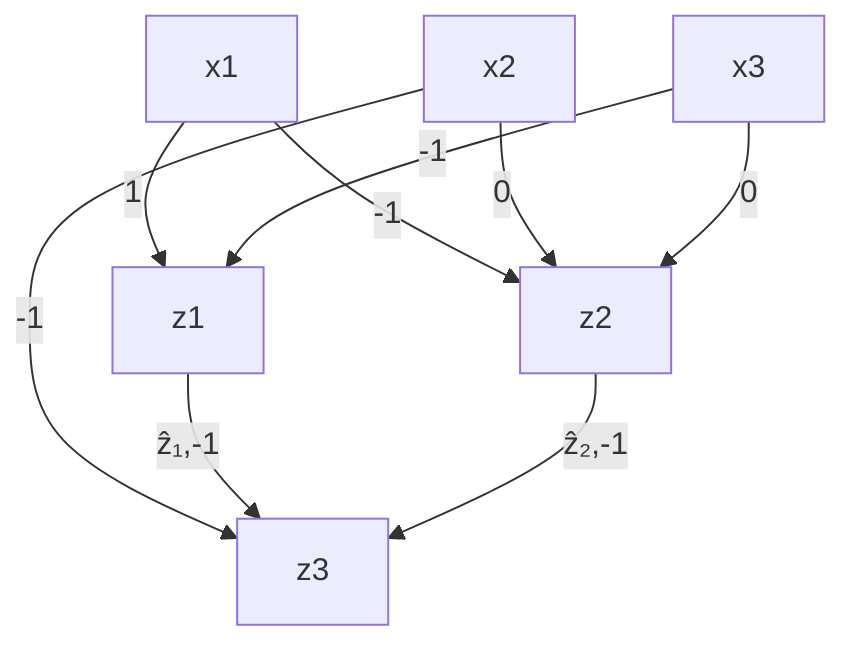

# 反事实解释的规模化保证（Scaling Guarantees for Counterfactual Explanations）

## 章节摘要（Chapter Abstract）

**反事实解释（Counterfactual Explanations, CFEs）**正被广泛用于解释算法决策，特别是在具有重大影响的决策场景中（例如，贷款审批或审前保释）。在此背景下，CFEs旨在为受算法决策影响的个体提供最相似的个体（即最近邻个体）及其不同的结果。然而，尽管越来越多的研究提出了计算CFEs的算法，但这些方法要么在距离最优性（即未返回最近邻个体）和完全覆盖率（即未为所有个体提供CFE）方面存在不足；要么无法扩展到诸如**神经网络（neural networks）** 等复杂模型。在本工作中，我们提出了一个基于**混合整数规划（Mixed-Integer Programming, MIP）** 的框架，用于计算神经网络输出的最近反事实解释，同时具有可证明的保证和与基于梯度方法相当的计算时间。我们在Adult、COMPAS和Credit数据集上的实验表明，与以往方法相比，我们的方法能够有效地计算具有距离保证和完全覆盖率的多样化CFEs。

<!-- footnote -->

- 提供建议时的一个常见假设是世界是静止的；因此，如果过去执行了那些会让我形成当前特征的行为，那么现在执行同样的行为也会产生相同的结果。这一假设在(RKL20b; VA20)中受到质疑，并在§7.1.3中进一步讨论。

<!-- footnote end -->

<!-- footnote -->

- 需要注意的是，“尽管在概念上相似，但一些研究者倾向于要么混淆、要么有意区分对比推理（contrastive reasoning）和反事实推理（counterfactual reasoning）”（Ste+21），这增加了混淆。关于跨学科综述，请参考(Mil18; Mil19; Ste+21)。

<!-- footnote end -->

<!-- footnote -->

- 与此相关的是，执行最优行动 $\mathbf { a } ^ { * }$ 所产生的反事实实例，不一定对应于根据 $\delta ^ { * }$ 最优且独立地改变特征所产生的反事实实例；参见(KSV21, 命题4.1)和(BSR20, 图1)。这种差异可能源于，例如，最小化建议要求对作为模型输入的变量的祖先变量执行行动。

<!-- footnote end -->

<!-- footnote -->

- 优化术语将这两组约束称为可行性集（feasibility sets）。存在多个同等成本的补救行动通常被称为罗生门效应（Rashoman effect）(Bre+01)。

<!-- footnote end -->

<!-- footnote -->

- 关于补救生成方法的其他分类可参见此处(Red+21)。

<!-- footnote end -->

<!-- footnote -->

- 本章节基于论文“Model-Agnostic Counterfactual Explanations for Consequential Decisions”，Karimi, Barthe, Balle, Valera, AISTATS (Á), 2019。(Kar+20a)。

<!-- footnote end -->

<!-- footnote -->

- 我们强调，虽然我们生成反事实的公式似乎与对抗扰动（图像域）相似，但目标是不同的：我们的目标是提供可操作且合理的反事实，而对抗样本的目标是对人类不可察觉，因此在人类感知空间中是合理的，但在数据空间中并非如此。

<!-- footnote end -->

<!-- footnote -->

- 虽然这里我们假设为二值预测模型，即分类器，但我们的方法可推广到 $y \in \mathbb R$ 的回归问题，以及更一般的任何其他输出域。

<!-- footnote end -->

<!-- footnote -->

- 对距离超参数的约束确保了整体距离 $d ( \mathbf { x } ^ { \mathsf { F } } , \mathbf { x } _ { \epsilon } ^ { \mathsf { C F } } ) \in [ 0 , 1 ]$ 。为此，由于 $\max | \bar { | } \cdot | | _ { 0 } = \operatorname* { m a x } | | \cdot | | _ { 1 } = J , \operatorname* { m a x } | | \cdot | | _ { \infty } = 1$ ，超参数必须满足 $\begin{array} { r } { ( \alpha + \beta ) / J + \gamma = 1 } \end{array}$ 。

<!-- footnote end -->

<!-- footnote -->

- $^ { 4 } \hat { \mathbf { x } } _ { \epsilon , j } ^ { i }$ 是第 $i$ 个反事实实例的第 $j$ 维。

<!-- footnote end -->

<!-- footnote -->

- 对于多层感知机，我们使用了两个隐藏层，每层10个神经元，以避免过拟合。模型选择细节见附录A.2.1。
- 重要的是，Actionable Recourse确实支持可操作性（actionability）和数据范围合理性（data-range plausibility），但不支持数据类型合理性（data-type plausibility）——附录A.2.3描述了作者报告的AR的失败点。

<!-- footnote end -->

<!-- footnote -->

- Adult数据集包含了一个现实混合的整数、实值、分类和有序变量，这在具有重大影响的场景中很常见；更多细节见附录A.2.2。

<!-- footnote end -->

<!-- footnote -->

- 完整特征列表见附录A.3.4。

<!-- footnote end -->

<!-- footnote -->

- 本章节基于论文“Scaling Guarantees for Nearest Counterfactual Explanations”，Mohammadi, Karimi, Barthe, Valera, ACM-AIES (Á), 2021 (Moh+21)。

<!-- footnote end -->

## 3.1 引言（Introduction）

机器学习模型越来越多地被用于辅助半自动预测和决策，应用于具有重大影响的场景，如审前保释和贷款审批。具体来说，端到端训练的模型，如（深度）**神经网络（neural networks）** (LBH15)（具有如ReLU等非线性激活函数），已被证明在学习和发现数据中复杂的非线性模式和关系方面非常有效，因此正被广泛部署。然而，预测能力往往以牺牲**可解释性（interpretability）** (Rud19)为代价，即我们不仅理解所做决策，还理解决策推导过程的能力。重要的是，可解释性可以评估决策过程的安全性、鲁棒性、隐私保护性、公平性和因果一致性(DVK17)。

受此启发，**反事实解释（Counterfactual Explanations, CFEs）** 被引入，旨在让个体理解其情况与一个本会获得有利对待的接近假设情景之间的关系。关于生成CFEs的过程，涉及多个标准：i) **最优距离（optimal distance）**，即最近的解释；ii) **完全覆盖率（perfect coverage）**，即为所有个体提供解释；iii) 支持表达能力强的模型（如神经网络）；iv) **高效运行时间（efficient runtime）**；v) 支持异质输入空间；以及 vi) 定性特征，如可操作性、合理性、多样性、稀疏性等。虽然所有这些标准在之前关于CFE生成的研究中都已讨论过(VDH20; Kar+22)，但现有方法至少在其中一方面存在不足。

一方面，通过将问题简化为**可满足性模理论（Satisfiability Modulo Theories, SMT）** 问题(Kar+20a; Kar+20a)或**混合整数规划（Mixed-Integer Programming, MIP）** 问题(Rus19; Kan+20a; USL19)，已经研究了提供具有可证明目标保证（例如，与事实样本的接近度）的解释。这些方法理论上可以扩展到支持多种模型类别，但在实践中，这仅在简单模型类别上得到验证，其主要瓶颈是运行时间过长。例如，Karimi等人[Kar+20a]表明，即使对于相当小的**神经网络（Neural Networks, NNs）**（如20个神经元），后端的SMT求解器也可能永不终止。相比之下，基于MIP的方法目前忽略了NN模型类别，而是处理简单的线性(Rus19; USL19)或基于树的(Kan+20a)模型，强调解释的定性指标。另一方面，使用基于梯度的优化技术可以高效地为（可微的）NN模型生成反事实解释(MST20)。然而，虽然这些方法对NNs确实有效，但它们在距离或覆盖率方面不提供任何保证。此外，它们在融入CFE的定性方面（如可操作性约束）也存在局限性——例如，捕获个体年龄的输入特征仅在一个方向上可操作，即个体只能增加其年龄。总之，先前用于CFE生成的方法要么忽略神经模型类别，要么无法提供上述保证；唯一的例外是MACE (Kar+20a)，但其运行时间非常高。虽然NNs作为一种灵活的非线性模型正被利益相关者日益广泛采用，但需要一种高效且有保证的方法来解释其决策。

与CFEs类似的问题，在公式化为约束优化问题方面，是为NNs生成对抗样本。这一问题已被NN验证社区广泛研究(Liu+19)，其中已经探索了基于SMT和基于MIP的方法，以高效解决在ReLU激活的NNs中寻找对抗样本的问题，而该问题已被证明是NP完全问题(Kat+17)。然而，需要注意的是，虽然这两个问题在形式上相似，并且思想可以相互借鉴，但它们在语义和实践上是不同的(WMR17)。因此，处理NNs中对抗样本的方法不能直接应用于生成CFEs(Fre20)。

在本工作中，我们扩展了NN验证社区的思想和工具，开发了一个高效框架，用于计算ReLU激活NN模型的CFEs，提供距离和覆盖率保证，并容纳先前讨论的定性特征。具体来说，我们首先提出了三种高效方法，在输入特征空间的给定区间内搜索CFE：第一种方法依赖SMT求解器作为后端，而另外两种方法将问题公式化为MIP，并在CFE距离的优化方式上有所不同。这三种方法都利用了ReLU-NNs的线性近似(Ehl17)，在给定输入特征空间和/或距离的边界后，计算NN隐藏单元的边界。然后，我们描述了如何将几种定性特征融入我们的框架，包括异质距离函数，以及多样性和合理性约束(Kan+20a; Rus19)。

最后，我们对上述标准进行了实验，并与支持NNs的基于SMT和基于梯度的方法进行了比较。表3.1总结了我们的方法与先前（基于SMT、梯度和MIP的）方法在CFE生成中满足不同标准的情况。我们的实证结果证实了运行时间效率的显著提升，为NN模型类别的CFE生成提供了新颖的基于MIP的方法。重要的是，除了高效生成

**表3.1: 相关工作与我们的方法对比**

| 方法 | 最优距离 | 100%覆盖率 | 效率 | 神经模型 | 定性特征 | 复杂约束 |
|---|---|---|---|---|---|---|
| 我们的方法 | √ | √ | √ | √ | √ | √ |
| MACE (Kar+20a) | √ | √ | | √ | √ | √ |
| DiCE (MST2o) | | | √ | √ | √ | |
| 高效搜索 (Rus19) | √ | √ | √ | | √ | √ |

CFEs外，我们提出的方法在距离上是最优的，在覆盖率上是完全的。这种效率甚至允许生成满足不同标准的多组反事实，正如我们通过生成多样化CFEs集合所展示的那样。因此，尽管迄今为止，运行时间是具有保证的NN架构CFE生成的主要瓶颈，但在具有重大影响的决策场景规模下，我们的MIP方法甚至比基于梯度的优化方法对NNs执行得更快。

## 3.2 背景（Background）

我们首先介绍反事实解释以及通过优化和验证两种方式对问题进行公式化。然后，我们解释如何将神经网络模型编码到能够精确且有保证地解决反事实解释生成问题的框架中。

### 3.2.1 反事实解释（Counterfactual Explanations）

假设我们有一个训练好的二值分类器 $h : \mathcal { X } \rightarrow \mathbb { R }$ ，当 $h ( \mathbf { x } ) \geq 0$ 时判定为正结果，当 $h ( \mathbf { x } ) < 0$ 时判定为负结果，例如，决定个体是否有资格获得贷款。考虑一个个体 $\mathbf { x } ^ { \mathsf { F } }$ ，其中 $h ( \mathbf { x } ^ { \mathsf { F } } ) < 0$ （贷款被拒）；对于这个个体，我们希望回答这样一个问题：“要怎样才能让你下次获得正结果？”¹ 这个问题的答案可以作为一个特征向量给出，该特征向量对应于决策边界另一侧的（假设）个体，这被称为**反事实解释（counterfactual explanation, CFE）**。

要使CFE对个体有用，需要满足若干标准/约束(WMR17)。一个理想的CFE应尽可能与个体当前情景（事实实例）相似，对应于个体情景中最小的、能有利地改变其预测结果的变化。此外，特征的改变以及由此产生的反事实实例必须分别满足额外的**可行性（feasibility）** 和**合理性（plausibility）** 约束。例如，要求个体降低年龄的特征变化是不可行的（即**不可操作（non-actionable）**）。与此相关的是，我们必须确保替代情景位于异质输入空间内（即，是合理的），因为在具有重大影响的决策领域，我们通常处理具有多种统计属性的混合数据类型，如年龄、种族、银行余额等。

这些要求可以通过假设输入之间的某种距离度量 dist，以及关于合理性和可操作性的谓词 $\mathcal { P }$ 和 $\mathcal { F }$ 来更精确地表述。

#### 3.2.1.1 CFE优化公式（CFE Optimization Formulation）

反事实解释可以建模为一个约束优化问题：

$$
\mathbf{x} ^ {\mathrm{CFE}} \in \underset {\mathbf{x} \in \mathcal{X}} {\operatorname{argmin}} \quad \operatorname{dist} (\mathbf{x}, \mathbf{x} ^ {\mathrm{F}}) \tag {3.1}
$$

$$
s.t. \quad h (\mathbf{x}) \geq 0
$$

上述优化问题可以使用**梯度下降（Gradient Descent, GD）** 或线性规划求解，具体取决于目标函数和约束条件，并产生最接近 $\mathbf { x } ^ { \mathsf { F } }$ 且合理、可操作、并使 $h$ 的决策翻转的输入 $\mathbf { x } ^ { \mathsf { C F E } }$ 。

#### 3.2.1.2 CFE验证公式（CFE Verification Formulation）

寻找反事实解释的问题可以建模为一个可满足性问题：

$$
\exists \mathbf{x}. \operatorname{dist} (\mathbf{x}, \mathbf{x} ^ {\mathrm{F}}) \leq \delta \tag {3.2}
$$

$$
h (\mathbf{x}) \geq 0
$$

其中 $\delta$ 是一个距离阈值。上述可满足性问题保证了存在一个合理、可操作且与 $\mathbf { x } ^ { \mathsf { F } }$ 的距离在 $\delta$ 以内的反事实。通过对 $\delta$ 使用合适的搜索策略，还可以最小化 $\delta$ （达到任意精度）并找到最近的反事实解释。例如，MACE (Kar+20a) 使用一阶逻辑对上述公式进行编码，并使用SMT求解器在二分搜索中找到一系列最小化 $\delta$ 的反事实。

可满足性问题的精确公式取决于对 $h$ 的编码。具体来说，必须用逻辑语言对分类器 $h$ 进行编码。虽然这些编码在理论上已得到充分理解，但选择一种能保证方法可扩展性的编码至关重要。实际上，即使对于最简单的模型（如决策树），朴素的编码也会导致验证任务超出当前工具的能力范围。因此，一个重要的挑战是为其他模型，特别是NNs，开发高效的编码。

### 3.2.2 使用SMT和MIP编码NNs（Encoding NNs using SMT and MIP）

在具有重大影响的决策领域之外，与CFE问题类似的公式可以在对抗样本问题中看到(Pap+17; MD+17; CW17)。在此方面，有一系列研究致力于验证神经网络的不同属性(Liu+19)，例如对对抗样本的鲁棒性。在这方面，许多工作专注于证明某个属性成立或存在反例。在这些工作中，许多依赖于SMT求解器、基于MIP的优化，或两者兼用(Ehl17; Kat+17; Bun+18)。

**神经网络验证任务（对于ReLU激活的NNs）** 已被证明是NP完全问题(Kat+17)。因此，不同的工作试图利用某些属性来引导搜索过程，使其比传统的现成求解器或优化器表现更好。随后，我们尝试对CFE生成做同样的事情，并扩展先前的工作MACE (Kar+20a)，使其比直接使用现成求解器表现更好。这通过以下方式实现：例如，通过逐步增加我们寻找反事实解释的距离来引导搜索过程，保持距离区间尽可能小以有效剪枝域。

接下来，我们解释如何使用一阶谓词逻辑公式以及作为MIP来表示NNs，这为优化变量提供了边界，从而在CFE搜索中实现高效的域剪枝。

## 3.2.2.1 神经网络的一阶逻辑（SMT）编码

使用可满足性模理论（Satisfiability Modulo Theories, SMT）求解器可接受的一阶逻辑表示来编码神经网络是相当直接的。图 3.1 通过一个示例展示了这一点（其中 $\hat { z } _ { 1 }$ 和 $\hat { z } _ { 2 }$ 表示 ReLU 后的值）。

$$
\phi_ {h} (x) = (z _ {1} = x _ {1} - x _ {2})
$$

$$
\wedge (z _ {2} = 2 x _ {1} - x _ {3})
$$

$$
\wedge (z _ {3} = - \hat {z} _ {1} + \hat {z} _ {2})
$$

$$
\wedge \left(\left(\hat {z} _ {1} = z _ {1} \wedge z _ {1} \geq 0\right) \vee \left(\hat {z} _ {1} = 0 \wedge z _ {1} <   0\right)\right)
$$

$$
\wedge \left(\left(\hat {z} _ {2} = z _ {2} \wedge z _ {2} \geq 0\right) \vee \left(\hat {z} _ {2} = 0 \wedge z _ {2} <   0\right)\right)
$$

图 3.1：一个 ReLU 激活的神经网络及其对应的逻辑公式

## 3.2.2.2 神经网络的无界混合整数规划编码

我们力求忠实于 Liu 等人 [Liu+19] 的符号表示。考虑一个具有 $n$ 层单输出的前馈神经网络（Neural Network, NN），每个隐藏层之后都有 ReLU 激活函数，该网络表示函数 $h ( \mathbf { x } )$ 。每层的宽度为 $k _ { i }$ ，$\mathbf { z } _ { i }$ 是维度为 $k _ { i }$ 的向量，表示第 $i$ 层，其中 $i \in \{ 1 , 2 , . . . , n \}$ 。$\mathbf { z } _ { i }$ 表示 ReLU 前的激活值，而 $\hat { \mathbf { z } } _ { i }$ 是应用 ReLU 后的值。最后，$\delta _ { i }$ 是表示每个 ReLU 状态的二进制变量向量；0 表示 ReLU 未激活，1 表示 ReLU 已激活。

在神经网络验证文献中，有多种将神经网络编码为混合整数规划（Mixed-Integer Program, MIP）的方法，每种方法都为 ReLU 激活提出了不同的编码方式。一种通用的形式如下。对于 $i \in \{ 1 , . . . , n \}$ 和 $j \in \{ 1 , . . . , k _ { i } \}$ ：

$$
\mathbf {z} _ {i} = \mathbf {W} _ {i} \hat {\mathbf {z}} _ {i - 1} + \mathbf {b} _ {i} \tag {3.3a}
$$

$$
\boldsymbol {\delta} _ {i} \in \{0, 1 \} ^ {k _ {i}}, \hat {\mathbf {z}} _ {i} = \mathbf {z} _ {i} \cdot \boldsymbol {\delta} _ {i},
$$

$$
\delta_ {i, j} = 1 \Rightarrow z _ {i, j} \geq 0, \tag {3.3b}
$$

$$
\delta_ {i, j} = 0 \Rightarrow z _ {i, j} <   0
$$

第一部分 (3.3a) 仅仅是权重的线性仿射变换，第二部分 (3.3b) 使用为每个 ReLU 引入的二进制变量来编码如下的 ReLU 函数。我们称此为无界 MIP 编码。

## 3.2.2.3 神经网络的有界混合整数规划编码

Bunel 等人 [Bun+18] 指出，大多数基于 SMT 或 MIP 求解器的神经网络验证器，实际上都是分支定界（Branch-and-Bound, B&B）优化的变体。这一理解表明，限制优化问题变量的界限是一种非常有效的启发式方法。此外，CFE 生成问题的额外约束——这使得验证公式难以求解——实际上可能有助于收紧界限，从而有效地剪枝优化问题的域。因此，我们将改变通用的 ReLU 公式 (3.3b)，并采用 Tjeng 和 Tedrake [TT17] 提出的有界编码，即，对于 $i \in \{ 1 , . . . , n \}$ ：

$$
\mathbf {z} _ {i} = \mathbf {W} _ {i} \hat {\mathbf {z}} _ {i - 1} + \mathbf {b} _ {i} \tag {3.4a}
$$

$$
\delta_ {i} \in \{0, 1 \} ^ {k _ {i}}, \quad \hat {\mathbf {z}} _ {i} \geqslant 0, \quad \hat {\mathbf {z}} _ {i} \leqslant \mathbf {u} _ {i} \cdot \delta_ {i}, \tag {3.4b}
$$

$$
\hat {\mathbf {z}} _ {i} \geqslant \mathbf {z} _ {i}, \quad \hat {\mathbf {z}} _ {i} \leqslant \mathbf {z} _ {i} - \mathbf {l} _ {i} \cdot (1 - \delta_ {i})
$$

请注意，线性部分 $\left( 3 . 4 \mathrm { a } \right)$ 与 (3.3a) 相同，并且请注意，这仍然是使用 MIP 对神经网络的精确编码，因为 $\delta _ { i , j } = 0 \Leftrightarrow \hat { z } _ { i , j } = 0$ 且 $\delta _ { i , j } = 1 \Leftrightarrow \hat { z } _ { i , j } = z _ { i , j }$ 。此编码依赖于 $\mathbf { l } _ { i }$ 和 $\mathbf { u } _ { i }$ ，即指示第 $i$ 层隐藏单元值的下界和上界的向量。我们提醒，在求解混合整数规划时，紧致的界限在域剪枝中非常有效。在这里，我们引入两种方法来获得此类界限，并完成用于 CFE 的 MIP 公式 $( 3 . 4 )$ ：第一种，使用区间算术（HJVE01）；第二种，使用 ReLU 的近似来获得更紧的界限。在这两种情况下，我们都假设对输入层的值有初始的上下界（例如，从数据集中导出）。这是一个合理的假设，因为诸如年龄或收入等现实世界的特征确实是有界的。

## 3.2.2.4 区间算术

通过使用区间算术（HJVE01），有了第 $i - 1$ 层的界限，我们可以计算第 $i$ 层第 $j$ 个神经元 $( z _ { i , j } )$ 的界限如下：

$$
\begin{array}{l} l _ {i, j} = \Sigma_ {t = 1} ^ {k _ {i - 1}} (m a x (W _ {i, j, t}, 0) \cdot l _ {i - 1, t} \\ + \min (W _ {i, j, t}, 0) \cdot u _ {i - 1, t}) + b _ {i, j} \tag {3.5} \\ u _ {i, j} = \Sigma_ {t = 1} ^ {k _ {i - 1}} (m a x (W _ {i, j, t}, 0) \cdot u _ {i - 1, t} \\ + m i n (W _ {i, j, t}, 0) \cdot l _ {i - 1, t}) + b _ {i, j} \\ \end{array}
$$

ReLU 后的界限（对于 $\hat { z } _ { i , j }$ ）只需对这些界限应用一次 ReLU 即可获得。

这是逐层应用的，所有隐藏单元的界限从输入层开始递归计算。不幸的是，尽管比完全没有界限要好，但随着我们在网络中深入，这些界限会迅速变得松弛。原因在于，在每一层 $i$ 中，每个神经元都独立于第 $i$ 层的其他神经元，从第 $i-1$ 层的神经元中选择一个最坏情况的界限（下界或上界），这导致了对第 $i-1$ 层某些神经元选择下界或上界时产生冲突。$^{ 2 }$

## 3.2.2.5 ReLU 的线性过近似

为了计算比区间算术更紧的界限，我们首先采用 (Ehl17) 中提出的 ReLU 线性过近似来替代 (3.3b)，即，对于 $i \in \{ 1 , . . . , n \}$ 和 $j \in \{ 1 , . . . , k _ { i } \}$ ：

$$
\mathbf {z} _ {i} = \mathbf {W} _ {i} \hat {\mathbf {z}} _ {i - 1} + \mathbf {b} _ {i} \tag {3.6a}
$$

$$
\hat {\mathbf {z}} _ {i} \geqslant \mathbf {z} _ {i}, \quad \hat {\mathbf {z}} _ {i} \geqslant 0, \quad \hat {z} _ {i, j} \leqslant u _ {i, j} \frac {z _ {i , j} - l _ {i , j}}{u _ {i , j} - l _ {i , j}} \tag {3.6b}
$$

同样，线性部分 (3.6a) 与 (3.3a) 相同。对于 ReLU 部分 (3.3b)，精确编码 ReLU 的二进制变量被移除，取而代之的是一个线性过近似项 (3.6b)。由此产生一个完全线性的 MIP 系统，没有 ReLU 二进制变量，可以针对不同目标高效地进行优化。

如前所述，界限以逐层方式递归计算，并且线性化网络 (3.6) 的约束被逐步添加到 MIP 系统中。在每一层 $i$ ，首先，添加 (3.6a) 以及使用简单区间算术根据为前一层计算的紧界限计算出的变量界限。然后，为了找到比简单区间算术更好的界限，在包含直到该层的所有约束后，为每个隐藏单元求解两个 MIP：一个以最大化单元值为目标来计算上界，另一个类似地用于计算下界。最后，使用刚刚计算出的紧界限添加该层的 ReLU 约束 (3.6b)。$^{2}$ 请注意，虽然我们选择 ReLU 激活函数作为非线性的常见来源，但任何可以通过分段线性函数近似的激活函数都是适用的，例如最大池化（Max-Pooling）(Ehl17)。

为此，我们基于 Bunel 等人 [Bun+18] 的实现。在此获得紧界限依赖于输入变量域的大小；保持输入域足够小将导致其他变量的界限更紧。这将在下一节中更详细地讨论。

## 3.3 CFE 生成

在本节中，我们提出了三种针对神经网络的反事实解释（Counterfactual Explanation, CFE）生成方法。所有方法都依赖于上一节中描述的线性化网络近似，这些近似为隐藏单元的值提供了紧致的上下界。下面，我们首先解释关于最近 CFE 距离的搜索策略以及在此搜索中计算输入和隐藏单元上下界的方式。然后，我们介绍三种针对神经网络高效生成最近 CFE 的方法。

## 3.3.1 预备知识

## 3.3.1.1 指数搜索策略

为了优化寻找最近 CFE 的距离，我们实现了一种指数搜索策略（BYS10）。不失一般性，我们在此假设输入空间是归一化的，并且位于 [0, 1] 区间内。由于输入层的区间决定了后续层的区间，我们以一个小的距离区间开始搜索，其下界和上界分别设置为 0 和一个（任意）小的 $\epsilon$ 。然后，我们指数级地增加搜索区间，直到找到一个 CFE。最后，在找到 CFE 的区间上执行一个简单的二分搜索，以寻找最近的 CFE。指数搜索的整体方案总结在算法 2 中。

算法 2：指数搜索策略
输入: N, $x^{F}$ , $\epsilon$ 输出: closest_CFE $[lb_{dist}, ub_{dist}] \leftarrow [0, \epsilon]$ ;
while findCFE(N, $x^{F}$ , $lb_{dist}$ , $ub_{dist}$ ) is None do $lb_{dist} \leftarrow ub_{dist}$ ; $ub_{dist} \leftarrow ub_{dist} \times 2$ ;
end
closest_CFE $\leftarrow$ binarySearch(N, $x^{F}$ , $\epsilon$ , $lb_{dist}$ , $ub_{dist}$ );
return closest_CFE;

接下来，我们讨论如何计算网络输入和隐藏单元的界限，这对于高效实现 CFE 搜索函数（算法 2 中的 findCFE）是必要的。

## 3.3.1.2 计算输入层和隐藏层的边界（Computing Bounds for Input and Hidden Units）

我们利用基于公式 (3.6) 的**网络近似器（network approximator）**，为给定的距离区间 $[ l b _ { d i s t } , u b _ { d i s t } ]$ 计算网络输入层和隐藏层的边界。为此，我们首先获取该距离的**混合整数规划（Mixed-Integer Programming, MIP）**编码。然后，针对每个输入变量优化 MIP 编码的距离，通过最大化/最小化每个变量来获得给定距离区间下输入层的下界/上界。接着，将这些输入边界在**神经网络（Neural Network, NN）**中进行传播，以计算隐藏层的边界。我们将距离约束包含在线性化网络的初始约束集中，以帮助为隐藏层找到更紧的边界。算法 3 展示了这一过程的整体方案。

**算法 3：边界计算（Bounds Computation）**

输入：N， $x^{F}$ ， $lb_{dist}$ ， $ub_{dist}$ 输出： $LB_{net}$ ， $UB_{net}$
$\phi_{dist} \leftarrow \text{getDistanceConstraints}(N, x^{F}, lb_{dist}, ub_{dist})$ ;
$lb_{inp}, ub_{inp} \leftarrow \text{optimizeInputVars}(N, \phi_{dist})$ ;
$LB_{net}, UB_{net} \leftarrow linearizedNetApproximator(N, lb_{inp}, ub_{inp}, \phi_{dist})$ ;
返回 $LB_{net}, UB_{net}$ ;

## 3.3.2 方法（Approaches）

在本节中，我们提出了三种高效的方法来实现神经网络中算法 2 的 CFE 搜索函数 `findCFE`。第一种方法依赖于**可满足性模理论（Satisfiability Modulo Theories, SMT）**求解器作为后端，并在指数搜索（算法 2）的每次迭代中使用边界计算作为启发式方法。第二种和第三种方法则依赖于 MIP 求解来搜索**反事实解释（Counterfactual Explanations, CFEs）**。它们之间的区别在于距离的优化方式——第二种方法使用上述指数搜索来最小化 CFE 距离，而第三种方法则将距离作为目标函数纳入 MIP 优化框架中。接下来，我们将进一步详细说明这三种方法。

## 3.3.2.1 ReLU 消除（ReLU Elimination, MIP-SAT）

在这种方法中，我们基于 MACE (Kar+20a)（后端使用 SMT 求解）构建，并使用边界计算作为启发式方法。在指数搜索（算法 2）的每次迭代中，给定距离区间后，使用算法 3 计算输入层和隐藏层的边界，并确定具有固定状态的**线性整流单元（Rectified Linear Units, ReLUs）**。当且仅当应用 ReLU 之前的神经元值的下界大于等于零，或者上界小于等于零时，该 ReLU 具有固定状态。

神经网络、距离函数以及额外的约束主要被编码为 SMT 公式。对于 NN 边界计算，NN 和距离约束如前所述被编码为 MIP。然后，将具有固定状态的 ReLU 从表示 NN 的初始 SMT 公式中移除。这意味着，对于一个始终激活的 ReLU，我们将有 $\hat { z } _ { i } = z _ { i }$ ；对于一个始终未激活的 ReLU，我们将有 $\hat { z } _ { i } = 0$ ，而不是初始的 ReLU 子句： $( \hat { z } _ { i } = z _ { i } \wedge z _ { i } \geq 0 ) \vee ( \hat { z } _ { i } = 0 \wedge z _ { i } < 0 )$ 。这基本上是通过固定其值来移除与 ReLU 状态相关的析取，从而节省 SMT 求解器在其情况上进行分支的工作量。最后，使用新的公式调用 SMT 求解器（在我们的案例中是 $Z _ { 3 }$ 求解器 (DMB08)），以验证在给定距离区间内是否存在 CFE。

请注意，神经网络 SMT 表示中的 ReLU 子句对于 SMT 求解器来说处理成本极高，因为它迫使求解器在这些情况上进行分支。因此，移除一部分 ReLU 激活将指数级地减少运行时间（如实验中所经验证）。算法 4 展示了所提出的混合 MIP-SAT 方法的整体方案。

**算法 4：MIP-SAT 方法 – 算法 2 中的 findCFE**
输入：N， $x^{F}$ ， $lb_{dist}$ ， $ub_{dist}$ 输出：CFE 或 None
$\phi_{dist} \leftarrow \text{getDistanceFormula}(N, x^{F}, lb_{dist}, ub_{dist})$ ;
$\phi_{pls} \leftarrow \text{getPlausibilityFormula}(N)$ ;
$\phi_{N} \leftarrow \text{getModelFormula}(N)$ ;
$LB_{net}, UB_{net} \leftarrow computeBounds(N, x^{F}, lb_{dist}, ub_{dist})$ ;
$\phi_{N} \leftarrow eliminateRelus(\phi_{N}, LB_{net}, UB_{net})$ ;
如果 $SAT(\phi_{N} \land \phi_{dist} \land \phi_{pls})$ 则
    返回 CFE;
否则
    返回 None;

## 3.3.2.2 输出优化（Output Optimization, MIP-EXP）

在这种方法中，我们纯粹使用基于 MIP 的优化过程（无 SMT 预言机），为此我们部署了一个优化引擎（本案例中为 Gurobi (GO20)），该引擎建立在 Bunel 等人 [Bun+18] 对 (3.4) 的实现之上。

如前所述，我们假设处于指数搜索（算法 2）的一次迭代中，并具有固定的距离区间 $[ l b _ { d i s t } , u b _ { d i s t } ]$ 。首先，调用算法 3 来计算网络输入层和隐藏层的紧致下界/上界。接着，利用这些边界，按照 (3.4) 的方式获得神经网络的 MIP 编码。然后，将距离以及任何其他额外的约束（均在下一节中解释）添加到 MIP 公式中。最后，根据事实样本 $\mathbf { x } ^ { \mathsf { F } }$ 的（预测）标签，优化网络的单一输出。例如，对于一个具有正标签的事实样本，网络的输出将被最小化，并带有一个回调函数，一旦找到具有负输出值的反事实，该回调函数就会中断优化。否则，该事实样本和距离区间的网络输出下界大于零，则不存在反事实。所提出的 MIP-EXP 方法的整体方案如算法 5 所示。

请注意，这种方法不再使用 SMT 预言机，而是依赖优化引擎来求解一个混合整数规划，并将网络的单一输出作为其目标函数。因此，它可以通过在 MIP 中引入一个新变量来自然地扩展到多类分类，该变量保留定义优化目标的类别输出中的最大**对数几率（logit）**。

**算法 5：MIP-EXP 方法 – 算法 2 中的 findCFE**

输入：N， $x^{F}$ ， $lb_{dist}$ ， $ub_{dist}$ 输出：CFE 或 None
$\phi_{dist} \leftarrow \text{getDistanceConstraints}(N, x^{F}, lb_{dist}, ub_{dist})$ ;
$\phi_{pls} \leftarrow \text{getPlausibilityConstraints}(N)$ ;
$LB_{net}, UB_{net} \leftarrow computeBounds(N, xzz^{F}, lb_{dist}, ub_{dist})$ ;
$\phi_{N} \leftarrow getModelConstraints(N, LB_{net}, UB_{net})$ ; // MIP 编码 3.4
如果 optimize( $\phi_{N}, \phi_{dist}, \phi_{pls}, x^{F}$ ) 则
| 返回 CFE;
否则
| 返回 None;

## 3.3.2.3 距离优化（Distance Optimization, MIP-OBJ）

这与 MIP-EXP 方法类似，不同之处在于我们移除了外层循环（算法 2 的指数搜索），并将距离函数作为 MIP 的目标函数进行最小化。

在这种我们称之为 MIP-OBJ 的方法中，调用算法 3 来计算距离区间为 [0, 1] 时的边界。计算出的边界被放入 MIP 编码 (3.4) 中。由于现在 MIP 的目标是距离函数，我们需要添加一个约束作为反事实约束，该约束根据事实样本的（预测）标签确定网络单一输出为负或正。对整个问题进行优化（距离目标的最优性间隙为 $\epsilon$ ，以便与其他方法类比），并找到最近的反事实解释。算法 6 展示了 MIP-OBJ 方法的整体方案。

**算法 6：MIP-OBJ 方法**

输入：N， $x^{F}$ ， $lb_{dist}$ ， $ub_{dist}$ 输出：CFE 或 None
obj ← getDistanceConstraints(N, $x^{F}$ );
$\phi_{pls} \leftarrow$ getPlausibilityConstraints(N);
$\phi_{CFE} \leftarrow$ getCounterfactualConstraint(N, $x^{F}$ );
$LB_{net}, UB_{net} \leftarrow$ computeBounds(N, $x^{F}$ , 0, 1); // 无距离限制
$\phi_{N} \leftarrow$ IratisModelConstraints(N, $LB_{net}, UB_{net}$ ); // MIP 编码 3.4
CFE ← optimize( $\phi_{N}, \phi_{pls}, \phi_{CFE}, obj, x^{F}$ );
返回 CFE;

## 3.4 距离函数与定性特征（Distance Functions and Qualitative Features）

在本节中，我们将描述如何在 MIP 框架内对距离度量以及定性特征（如合理性、稀疏性和多样性）进行编码。首先，我们详细说明适用于异构输入特征的距离函数的编码。其次，在合理性的背景下，我们描述如何处理异构输入空间，即具有混合数据类型的输入特征。最后，我们关注一个被广泛研究的 CFE 定性属性——多样性。我们想强调的是，先前的基于 MIP 的方法已经认识到混合整数规划在编码广泛复杂约束和不同定性特征方面的灵活性 (Rus19; Kan+20a)，然而，这不能直接用于 NN 模型。我们将解决 NN 类模型更广泛定性特征的问题留待未来工作。

## 3.4.1 距离函数（Distance Functions）

在本节中，我们将提供关于异构距离函数 MIP 编码的更多细节。³ 我们提供了 $\ell _ { 1 }$ 距离函数的细节（类似于先前的工作 (WMR17)），同时支持零范数、二范数和无穷范数，每种范数都为 CFE 的邻近性提供了不同的实际直觉，例如，$\ell _ { 0 }$ 用于稀疏性。如前所述，所有距离都经过范围归一化，位于 [0, 1] 区间内。

**整数值和实数值特征（integer-valued and real-valued features）** 对于一个输入向量 x 和在第 i 维具有此类特征的事实样本 $\mathbf { x } ^ { \mathsf { F } }$ ，归一化的 $\ell _ { 1 }$ 距离以直接的方式计算：

$$
\operatorname{dist} _ {\text { real }} (x _ {i}, x _ {i} ^ {\mathsf {F}}) = \frac {| x _ {i} - x _ {i} ^ {\mathsf {F}} |}{u b _ {i} - l b _ {i}} \tag {3.7}
$$

其中 $l b _ { i } , u b _ { i }$ 是 $x _ { i }$ 的标量下界/上界。

**序数特征（ordinal features）** 对于一个输入向量 x 和具有 k 个级别的序数特征 $x _ { i }$ 的事实样本 $\mathbf { x } ^ { \mathsf { F } }$ ，归一化的 $\ell _ { 1 }$ 距离按以下方式计算：

$$
\operatorname{dist} _ {\text {ord}} \left(x _ {i}, x _ {i} ^ {\mathrm{F}}\right) = \frac {\left| \sum_ {j = 1} ^ {k} x _ {i , j} - \sum_ {j = 1} ^ {k} x _ {i , j} ^ {F} \right|}{k} \tag {3.8}
$$

**类别特征（categorical features）** 对于一个输入向量 x 和具有 k 个类别的类别特征 $x _ { i }$ 的事实样本 $\mathbf { x } ^ { \mathsf { F } }$ ，归一化的 $\ell _ { 1 }$ 距离按以下方式计算：

$$
\operatorname{dist} _ {c a t} \left(x _ {i}, x _ {i} ^ {\mathsf {F}}\right) = \max _ {1 \leq j \leq k} \left(x _ {i, j} - x _ {i, j} ^ {\mathsf {F}}\right) \tag {3.9}
$$

最后，输入向量 x 和事实样本 $\mathbf { x } ^ { \mathsf { F } }$ 之间的总归一化 $\ell _ { 1 }$ 距离将是不同数据类型距离 $( 3 . 7 ) , ( 3 . 8 ) , ( 3 . 9 )$ 的归一化和，其中 $n _ { r e a l } , n _ { o r d } , n _ { c a t }$ 分别是上述三组中特征的数量：

$$
\begin{array}{l} \operatorname{dist} \left(\mathbf {x}, \mathbf {x} ^ {\mathrm{F}}\right) = \frac {1}{n _ {\text {real}} + n _ {\text {ord}} + n _ {\text {cat}}} \left(\sum_ {i = 1} ^ {n _ {\text {real}}} \operatorname{dist} _ {\text {real}} \left(x _ {i}, x _ {i} ^ {\mathrm{F}}\right) \right. \tag {3.10} \\ + \sum_ {i = 1} ^ {n _ {o r d}} \mathsf {d i s t} _ {o r d} (x _ {i}, x _ {i} ^ {\mathsf {F}}) + \sum_ {i = 1} ^ {n _ {c a t}} \mathsf {d i s t} _ {c a t} (x _ {i}, x _ {i} ^ {\mathsf {F}})) \\ \end{array}
$$

**稀疏性（sparsity）** 稀疏性可以解释为 $\ell _ { 0 }$ 距离函数。它通过引入若干中间二元变量进行编码，每个变量保留一个特征是否改变了其值，然后求和并归一化，类似于所描述的 $\ell _ { 1 }$ 距离。

## 3.4.2 合理性约束（Plausibility Constraints）

在本节中，我们解释保证 CFE 位于与输入相同的异构空间内的合理性约束。通过在 MIP（或 SMT）模型中定义正确类型的变量，整数值、实数值和二元变量的合理性约束自然得到保持。

**序数特征（ordinal features）** 为了保证 CFE 在序数特征的序数性方面是合理的，对于每个具有 k 个级别的此类特征 f，我们在 MIP 模型中定义 k 个二元变量 $f _ { 1 } , . . . , f _ { k } \in \{ 0 , 1 \}$ 。对于每组这些变量，将以下约束添加到 MIP 模型中：

$$
f _ {1} \geq f _ {2}, f _ {2} \geq f _ {3},..., f _ {k - 1} \geq f _ {k} \tag {3.11}
$$

这将保证： 不存在 i 使得 $f _ { i + 1 } > f _ { i }$ 。

**类别特征（categorical features）** 我们希望保证在生成的 CFE 中，对于每个类别特征，只选择一个类别。对于一个具有 k 个类别的类别特征 f，我们在 MIP 模型中定义 k 个二元变量 $f _ { 1 } , \ldots , f _ { k } \in { \overline { { \{ 0 , 1 \} } } }$ 。对于每组这些变量，将以下约束添加到 MIP 模型中：

$$
f _ {1} + f _ {2} + \dots + f _ {k} = 1 \tag {3.12}
$$

由于 $f _ { i } { ' } \mathbf { s }$ 是二元变量，这将保证其中只有一个为 1，其余为 0，意味着按预期最多只有一个类别处于活动状态。

## 3.4.3 多样性约束（Diversity Constraints）

为个体提供不同且最好是多样化的反事实（counterfactuals）有助于为其提供改善结果的替代途径。拥有多样化（且接近）的反事实，个体可以找到最适合的方式来实现期望的结果，同时考虑其自身的个人约束，而这些约束可能是解释提供者（explanation-provider）所不了解的。

与其他定性特征一样，在反事实解释生成（CFE generation）的文献中，有多种编码多样性的方法。在基于 MIP 的方法中，Russell [Rus19] 将多样性简单地编码为新生成的反事实不与先前生成的反事实相同。根据评估标准的不同，这可能无法生成多样化的反事实，例如，当评估标准是像 DiCE (MST20) 所建议的那样，取 $k$ 个生成反事实之间成对距离的平均值时。在基于梯度的方法中，DiCE (MST20) 使用**行列式点过程（determinantal point processes）**来考虑多样性，即在目标函数中包含了由反事实构成的核矩阵的行列式。

同时考虑所生成的多样化反事实集合的距离也很重要，因为该集合也必须接近为其生成反事实的那个个体。因此，可以看出多样性与距离之间存在固有的权衡。为了处理这一点，我们将多样性编码为一组约束条件，要求每个新生成的反事实与之前生成的每个反事实的距离都超过一个固定阈值，同时最小化与事实样本（factual sample）的距离。更具体地说，在搜索第 $i$ 个反事实解释之前，将添加以下一组约束：

$$
\operatorname{dist} \left(x _ {1} ^ {\text { CFE }}, x _ {i} ^ {\text { CFE }}\right) \geq \delta
$$

$$
\vdots \tag {3.13}
$$

$$
\operatorname{dist} \left(x _ {i - 1} ^ {\text { CFE }}, x _ {i} ^ {\text { CFE }}\right) \geq \delta
$$

请注意，对于每个新的反事实，求解 MIP 会变得越来越昂贵。我们实现了一个名为 **MIP-DIVERSE** 的方法版本，用于使用上述公式生成多样化的反事实。

## 3.5 实验（experiments）

我们进行了大量定量和定性实验，以展示我们的框架相对于现有方法的能力：MACE (Kar+20a) 4 和 DiCE (MST20)。5 遵循引言中阐述的动机，我们为各种大小的固定宽度 ReLU 激活的全连接 NN 模型生成反事实解释，这些模型具有 $N \times W + ( D - 1 ) \cdot W ^ { 2 } + ( \dot { D } + 1 ) \times W$ 个总参数，其中 N 是输入大小，W 是宽度，D 是深度。为了支持影响性决策（consequential decision-making）场景，我们采用了反事实解释文献中三个广泛使用的真实世界数据集：Adult (d = 51) (Adu96)、COMPAS (d = 7) (Lar+16a) 和 Credit (d = 20) (BL13)。最后，所有方法在总共 500 个实例上，根据距离最优性、覆盖率和运行时效率进行评估和比较。所有方法的实现都将公开共享。

## 3.5.1 MIP 框架的性能（Performance of the MIP-framework）

在第一组实验中，我们旨在展示所提出的基于 MIP 的方法（即 MIP-SAT、MIP-EXP、MIP-OBJ）在不同设置下的能力。具体来说，我们为一个两层 ReLU 激活的 NN 生成反事实解释，该网络每层有 10 个神经元，并使用上述指标在三个数据集和四种范数距离：$\ell _ { 0 } , \ell _ { 1 } , \ell _ { 2 } , \ell _ { \infty }$ 上评估生成的反事实解释。

正如预期的那样，所有呈现方法的反事实解释距离都与我们在此用作基准（oracle）的 MACE (SAT) (Kar+20a) 相似，并且所有呈现方法的覆盖率在设计上是完美的。图 3.2 展示了这些方法的运行时比较，我们观察到与 SAT 基准相比，运行时显著改善。关于距离的类似比较可在附录的图 B.2 中找到。重要的是，所提出的基于 MIP 的方法能够在 MACE (SAT) 和 MIP-SAT 都无法处理的设置中生成反事实解释（例如，在 $\ell _ { 2 }$ 范数下的 Adult 或 Credit 数据集）。

在第二个实验中，我们将所提出的基于 MIP 的方法与 SAT 基准以及 DiCE (MST20)（即基于梯度的优化）在相同的 NN 模型上进行比较。这里我们调整实验设置以适配 DiCE，因为它只支持 $\ell _ { 1 } { \mathrm { - n o r m } }$ 距离，并且不支持序数（ordinal）和实值（real-valued）特征。此外，由于 DiCE 假设模型已经使用范围归一化（range-normalized）的数据进行训练，我们在实现中添加了额外的支持，以在基于 MIP 的方法中编码归一化项，这可能会对运行时和数值稳定性产生负面影响。尽管如此，在这种设置下，我们在图 3.3 中观察到前者具有相对更小的距离和显著更短的运行时。此外，MIP-OBJ 在设计上具有完美覆盖率，而 DiCE 在 Adult 数据集上略低于完美覆盖率，未能为 500 个实例中的 2 个提供解释。

## 3.5.2 可扩展性实验（Scalablity Experiments）

上述实验是在能够充分区分监督学习任务类别（不同数据集上的测试准确率在 67-82% 范围内）的 NN 模型上进行的。作为上述演示的补充，为了完整性起见，我们研究了我们的方法的可扩展性。在这方面，图 3.5（以及附录中的图 B.3）将基于 SMT (Kar+20a) 和基于梯度 (MST20) 的方法与我们提出的方法在宽度和/或深度不断增长的 NN 模型（以及通过合并不同数据集而增长的输入大小）上进行了运行时、距离和覆盖率的比较。

可以看出，基于 SMT 的方法很快达到其极限，而基于 MIP 和基于梯度的方法随着宽度和深度的增加都能很好地扩展。由于基于 MIP 的方法不会随网络规模多项式地扩展，因此它们不如基于梯度的 DiCE 扩展性好（这可以在附录图 B.3 中更大的 Credit 和 Adult 数据集中看到），但是它们产生的距离要小得多。虽然基于 MIP 的方法在理论上具有完美覆盖率和最小距离，但在实践中，随着混合整数规划中中间变量数量变得庞大，并且由于 NN 的嵌套性质导致它们的关系变得复杂，后端工具可能会出现数值不稳定性（对此类数值不稳定性的分析超出了本工作的范围，留待未来工作处理）。这会导致无法为某些样本生成解释或距离增加。在这种情况下，拥有两种基于 MIP 的方法有利于验证结果——例如，MIP-EXP 在距离方面比 MIP-OBJ 表现得更稳定。

## 3.5.3 定性实验（Qualitative Experiments）

在本节中，我们展示了如何利用 SMT 和 MIP 的表达能力来轻松编码解释的定性特征和/或用户定义的约束。

图 3.4：散点图展示了我们的方法生成的多样性反事实集合与 DiCE 生成的集合的多样性和接近度，以及运行时。在 COMPAS 数据集和具有两个大小为 10 的隐藏层的 NN 模型上，生成不同大小反事实集合的多样性、距离和运行时。对于每个反事实集合大小 $k \in [ 2 , 1 0 ]$，每个方法已在 100 个实例上进行了测试。

## 3.5.3.1 多样性（Diversity）

我们报告了展示我们方法多样性特征的实验（如前一节所述），并与 DiCE 的多样性实现进行了比较。

我们遵循 DiCE 的作者的方法，通过测量反事实解释之间成对距离的平均值（越高越好）来评估 $k$ 个多样化生成的反事实解释：

$$
k - \text { diversity } (\{x _ {j} ^ {\mathrm{CFE}} \} _ {k}): \frac {1}{\binom {k} {2}} \sum_ {i = 1} ^ {k - 1} \sum_ {j = i + 1} ^ {k} \operatorname{dist} (x _ {i} ^ {\mathrm{CFE}}, x _ {j} ^ {\mathrm{CFE}}) \tag {3.14}
$$

正如预期的那样，多样性与距离之间存在权衡。因此，除了上述多样性指标之外，多样化反事实解释集合到原始事实实例 $\mathbf { x } ^ { \mathsf { F } }$ 的距离也按如下方式测量（越低越好）：

$$
k - \text { distance } (\mathbf {x} ^ {\mathrm{F}}, \{x _ {j} ^ {\mathrm{CFE}} \} _ {k}): \frac {1}{k} \sum_ {i = 1} ^ {k} \operatorname{dist} (\mathbf {x} ^ {\mathrm{F}}, x _ {i} ^ {\mathrm{CFE}}) \tag {3.15}
$$

图 3.4 显示了 MIP-DIVERSE 与使用默认超参数的 DiCE 生成的多样性。MIP-DIVERSE 在给定固定多样性距离阈值的情况下，成功找到了最接近的反事实解释集合。在此实验中，初始阈值设置为 0.01，增加该阈值将导致图 3.4 中的 $k-$多样性 和 $k-$距离 曲线上移，从而提供了选择期望的多样性-距离权衡的可能性。我们的结果表明，在相似的多样性水平下（即 $k = 6$），

图 3.5：散点图和柱状图显示了网络架构变宽或变深时的运行时和距离。在 COMPAS 数据集上比较基于 SMT、MIP 和梯度的方法的可扩展性实验。上行显示深度增加的结果，下行显示宽度增加的结果；两者均以运行时和距离表示。对于每种方法和架构，评估了 50 个样本，但有些样本未能生成有效的反事实解释，原因是不完美覆盖率（即 DiCE）或数值不稳定性（即 MIP-OBJ 和 MIP-EXP）；因此，比较中仅包含所有方法都生成了有效反事实解释的实例。总体而言，对于深度增加，MIP-OBJ 和 MIP-EXP 在所有架构上的平均覆盖率分别为 99.1% 和 93.7%，DiCE 为 96.4%。对于宽度增加，MIP-OBJ 和 MIP-EXP 在所有架构上的平均覆盖率均为 100%，DiCE 也为 100%。关于 Credit 和 Adult 数据集的类似实验可在附录的图 B.3 中找到。

MIP-DIVERSE 的反事实集合更接近事实实例。随着 $k$ 进一步增加，在 DiCE 中，虽然一部分反事实解释是多样化的（从而增加了平均距离），但其余的反事实解释与之前的非常相似，因为它们只是最小程度地改变了连续变量的一个子集。结果，生成的反事实解释的平均多样性和距离均下降。MIP-DIVERSE 的运行时再次快于基于梯度的对手，然而，由于增加了距离约束，MIP-DIVERSE 对输入大小的增加更为敏感，这使得它在较大的数据集上速度与 DiCE 差不多。

## 3.5.3.2 稀疏性（Sparsity）

如前一节所述，最大化解释的稀疏性等价于最小化与事实样本的 $\ell _ { 0 }$ 距离。为了展示我们的方法在最大化稀疏性方面的能力，我们请读者参考附录中图 B.2 的第一列，其中所有方法都成功实现了稀疏性最大化。事实上，也可以优化 $\ell _ { 0 }$ 和例如 $\ell _ { 1 }$ 范数的凸组合，以生成更现实的稀疏解释，允许更多特征在接近事实样本的同时发生变化。

我们还想再次强调 SMT 和 MIP 表达力的作用，通过处理不同类型的约束来提高解释质量。例如，在特征上定义不同类型的可操作性（actionability）（例如，仅增加/减少、不可操作等），只需向 MIP 模型添加几个不等式约束即可。这种易于编码的特点可能使利益相关者（stake-holders）和解释提供者能够考虑个体特定的情况，其中个体可能要求在其提供的解释中考虑其个人约束。

## 3.6 结论与未来工作（conclusion and future work）

在这项工作中，我们提出了基于混合整数规划（mixed-integer programming）的高效方法，为广泛使用的神经网络模型类生成具有保证的反事实解释。我们通过将所提出的框架与先前用于反事实解释生成的基于 SMT 和基于梯度的方法在距离、运行时和覆盖率方面进行比较，实证地证明了其效率和保证。我们还提供了关于生成多样化反事实的定性结果，展示了我们方法的灵活性以及处理复杂定性特征的效率。

作为未来的工作，我们计划探索其他定性特征，例如超越数据类型和范围的其他合理性约束。此外，虽然在这项工作中我们专注于具有 ReLU 激活函数的 NN 架构，但类似的方法可以部署用于任何分段线性激活函数（例如，Max-Pooling）。此外，其他类别的模型（例如，具有 RBF 核的支持向量机）也可以通过线性约束进行编码或近似，从而可以由我们的 MIP 框架类似地处理。最后，随着利益相关者越来越多地采用更复杂的神经模型进行影响性决策，能够使用可靠且高效的工具来解释算法决策变得至关重要。因此，作为未来工作的一个方向，进一步研究在 NN 验证中也会出现的可扩展性和数值稳定性问题将是非常有趣的。