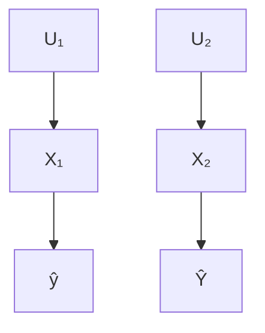
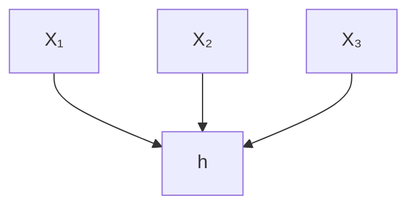
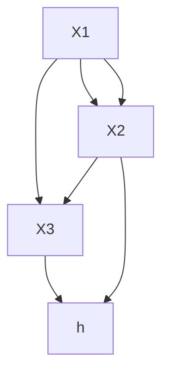
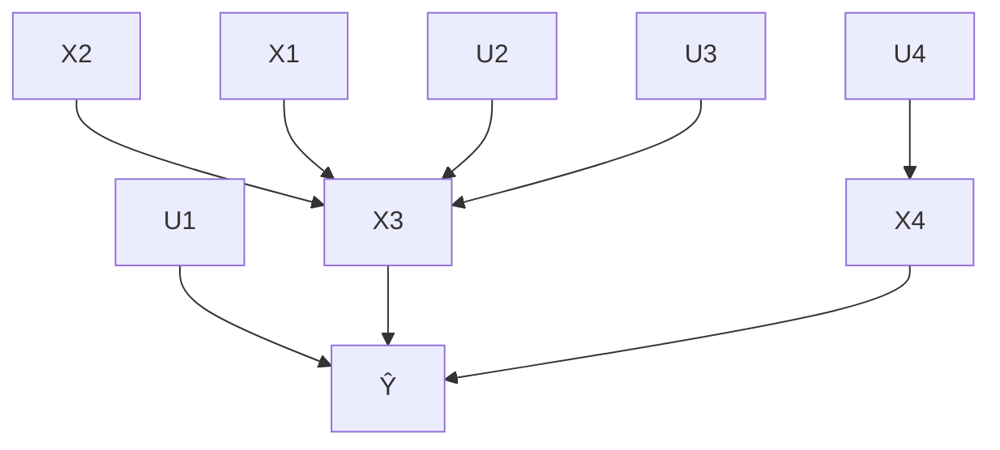
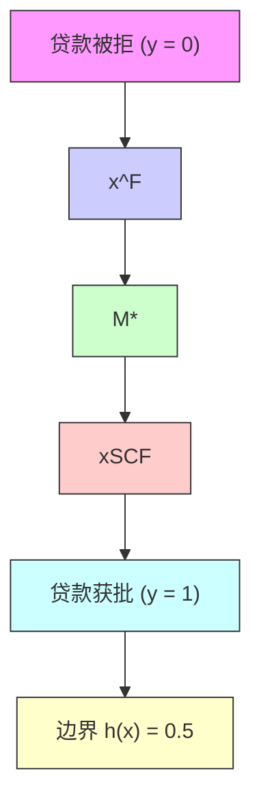
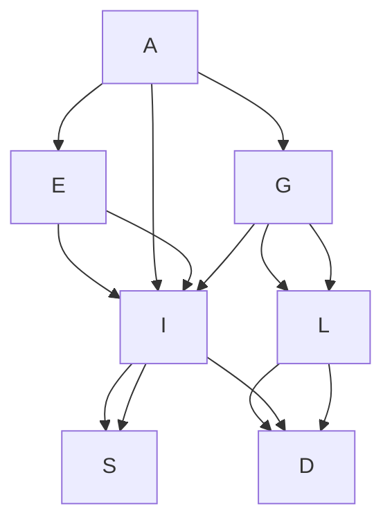

# 因果算法追索权（Causal Algorithmic Recourse）

## 章节摘要（Chapter Abstract）

**算法追索行动（Algorithmic recourse actions）**通常通过求解一个**优化问题**来获得，该问题在满足各种**合理性（plausibility）**、**多样性（diversity）**和**稀疏性（sparsity）**约束的前提下，最小化对个体**特征向量（feature vector）**的更改。尽管先前的研究在不同场景下为该优化问题提供了解决方案，但它们严重忽视了与执行追索行动的环境相关的现实世界因素。

本研究强调，对个体部分属性的更改可能会对其他属性产生**连锁的下游效应（consequential downstream effects）**，从而使追索成为一个根本性的**因果问题（causal problem）**。在此，我们使用**结构因果模型（Structural Causal Models, SCMs）**的框架来建模此类因素，并通过实例和理论指出不考虑因果关系的陷阱。这些见解使我们能够重新构建优化问题，直接在**可行行动空间（space of feasible actions）**（以因果干预的形式）上优化**成本最低的追索（minimally-costly recourse）**，而不是优化**距离最近的“反事实解释（counterfactual explanations）”**。我们提供了在**个体层面（individualized level）**和**子群体层面（sub-population level）**上针对**确定性（deterministic）**和**概率性（probabilistic）**追索的优化公式和解决方案，克服了在一般场景下提供追索所需的严格假设条件。最后，基于德国信用数据集（German Credit dataset）的**合成（synthetic）**和**半合成（semi-synthetic）**实验，我们展示了如何在最小的因果假设下将这些方法应用于实践。

本章基于以下论文：Karimi, Schölkopf, Valera 发表于 ACM-FAccT (2020) 的《算法追索：从反事实解释到干预》（Algorithmic Recourse: from Counterfactual Explanations to Interventions, KSV21），以及 Karimi\*, von Kügelgen\*, Schölkopf, Valera 发表于 NeurIPS (2020) 的《不完美因果知识下的算法追索：一种概率方法》（Algorithmic recourse under imperfect causal knowledge: a probabilistic approach, Kar+20b）。

## 4.1 引言（Introduction）

**预测模型（Predictive models）**正越来越多地被用于支持许多情境下的**关键决策（consequential decision-making）**，例如拒绝贷款、拒绝求职申请或开具改变生活的药物。因此，社会和法律（VB; SSH21）日益施加压力，要求提供解释，以帮助受影响的个体理解“为何输出该预测”，以及“如何行动”才能获得期望的结果。为不同的利益相关者回答这些问题，是**可解释机器学习（explainable machine learning）**的主要目标之一（DVK17; Gun19; Kod94; Lip18; Mur+19; Rud19; Rüp06）。

在此背景下，多项研究提出使用**反事实解释（counterfactual explanations）**来解释模型对受影响个体的预测，这些解释被定义为“为了让期望的结果发生，世界本应（或本必须）如何不同”的陈述（WMR17）。其中特别重要的是**最近反事实解释（nearest counterfactual explanations）**，它们被呈现为与描述个体的特征向量最相似的实例，并且这些实例能从模型中获得期望的预测（Kar+20a; Lau+17）。一个密切相关的术语是**算法追索权（algorithmic recourse）**——即所需采取的行动，或“在一系列反事实场景中，逆转算法和官僚机构不利决策的系统过程”——它被认为是**时间延展能动性（temporally extended agency）**和**信任（trust）**的支撑因素（VA20）。

**反事实解释**在帮助从业者和监管者根据**公平性（fairness）**和**鲁棒性（robustness）**等指标验证模型方面显示出前景（Kar+20a; SHG20; USL19）。然而，在其原始形式下，此类解释似乎并未实现“解释作为帮助数据主体行动而不仅仅是理解的手段”这一主要目标之一（WMR17）。

将反事实解释转化为**追索行动（recourse actions）**，即转化为一套可推荐的行动，以帮助个体实现有利结果，这一过程首次在（USL19）中得到探索，其中施加了额外的**可行性约束（feasibility constraints）**以支持**可行动特征（actionable features）**的概念（例如，防止要求个体降低年龄或改变种族）。尽管这是朝着正确方向迈出的一步，但这项研究以及后续研究（Kar+20a; MST20; Poy+19; SHG20）都隐含地假设，能产生期望输出的一组行动将直接源于反事实解释。这源于一个假设：“过去本应如何”（**回溯预测（retrodiction）**）不仅转化为“未来应如何”（**预测（prediction）**），还转化为“未来应做什么”（**推荐（recommendation）**）（Sta19）。我们质疑这一假设，并将现有方法的不足之处归因于

图 4.1：一个双变量因果生成过程的示例说明，展示了**图模型（graphical model）** $\mathcal { G }$（左）和相应的**结构因果模型（Structural Causal Model, SCM）**（右）（Pea09）。在此示例中，$\mathrm { X _ { 1 } }$ 表示个体的年收入，${ \sf X } _ { 2 }$ 表示其银行存款余额，$\hat { \Upsilon }$ 表示一个固定的**确定性预测器（deterministic predictor）** $h$ 的输出，该预测器用于判断个体获得贷款的资格。$U _ { 1 }$ 和 $U _ { 2 }$ 表示未观测到的**（外生）随机变量（unobserved (exogenous) random variables）**。

$$
\left. \begin{array}{l} X _ {1} := f _ {1} (\mathrm{U} _ {1}) \\ X _ {2} := f _ {2} (X _ {1}, \mathrm{U} _ {2}) \\ P _ {\mathbf {U}} = P _ {U _ {1}} \times P _ {U _ {2}} \end{array} \right\} \mathcal {M} = (\mathbb {S}, P _ {\mathbf {U}})
$$

$$
\hat {Y} = h (X _ {1}, X _ {2})
$$

它们缺乏对现实世界属性的考虑，特别是支配行动执行所在的物理世界的**因果关系（causal relationships）**。

### 4.1.1 激励性示例（Motivating Examples）

**示例 4.1.1。** 考虑图 4.1 中的情境，假设一个人被拒绝贷款，并寻求关于如何继续进行的解释和建议。该个体的年收入 $( \mathsf { X } _ { 1 } )$ 为 75,000 美元，账户余额 $( \mathsf { X } _ { 2 } )$ 为 25,000 美元，预测器根据 $h ( X _ { 1 } , X _ { 2 } ) = { \mathrm { s g n } } ( X _ { 1 } + 5 \cdot \mathrm { X } _ { 2 } - \ S 2 2 5 , 0 0 0 )$ 的二元输出来决定是否批准贷款。现有方法可能会将最近的反事实解释识别为另一个年收入为 100,000 美元（+33%）或银行存款余额为 30,000 美元（+20%）的个体，从而鼓励该个体在满足这些条件之一时重新申请。另一方面，假设行动发生在一个购房者将其 30% 的收入用于储蓄的世界中，并受到外部环境波动的影响，$( \mathrm { i . e . , } \ X _ { 2 } : = 0 . 3 \mathsf { X } _ { 1 } + \mathsf { U } _ { 2 } )$ ，那么仅将工资增加 +14% 至 85,000 美元，就会自动带来 3,000 美元的额外储蓄，从而对贷款批准算法的决策产生净正面影响。

**示例 4.1.2。** 现在考虑图 4.1 情境中的另一个实例，一个农业团队希望提高其稻田的产量。虽然许多因素影响产量（温度、太阳辐射、供水、种子质量等），但假设该团队的主要可行动能力是他们对稻田位置的选择。重要的是，稻田所在的海拔 $( X _ { 1 } )$ 会对其他变量产生影响。例如，物理定律可能意味着海拔每升高 100 米，温度 $( X _ { 2 } )$ 平均下降 $1^\circ \mathrm{C}$。因此，可以想象，一个建议提高海拔以获得最佳产量的反事实解释，如果没有考虑海拔升高对其他变量（例如温度下降）的下游效应，实际上可能不会导致预测发生变化。

这两个例子说明了在未考虑行动执行所在世界的（**因果**）结构的情况下，直接从反事实解释生成追索行动的陷阱。直接从反事实解释派生的行动可能要求个体付出过多努力（示例 4.1.1），或者甚至可能无法产生期望的输出（示例 4.1.2）。

我们还指出，仅考虑特征之间的**相关性（correlations）**（而不是对其因果关系进行建模）是不够的，因为这不符合**因果干预（causal interventions）**的**非对称性（asymmetrical nature）**：对于示例 4.1.1，增加银行存款余额 $( X _ { 2 } )$ 不会导致更高的收入 $( X _ { 1 } )$；对于示例 4.1.2，提高温度 $( X _ { 2 } )$ 不会影响海拔 $( X _ { 1 } )$，这与纯粹基于相关性的方法所预测的相反。

## 4.1.2 贡献总结与本章结构（Summary of Contributions and Structure of this Chapter）

在本工作中，我们通过对**反事实解释（recourse）问题**进行根本性重构来弥补当前研究的不足：我们依赖**因果推理（causal reasoning）**（§ 4.2.2）将特征之间因果依赖关系的知识纳入推荐反事实行动（recourse actions）的过程中，这些行动若被执行，将产生一个能够有利地改变预测模型输出的**反事实实例（counterfactual instance）**（§ 4.2.1）。

首先，我们揭示了直接从反事实解释中推导行动方案的方法所固有的局限性（§ 4.3.1）。我们证明，从预先计算的（最近邻）反事实解释中推导出的行动，在成本高于必要水平的意义上可能是**次优的**，甚至更糟，在实际上无法实现反事实的意义上是**无效的**。为了解决这些局限性，我们强调，从因果视角来看，行动对应于**干预（interventions）**，它不仅对被干预变量本身进行建模，还会对剩余（未被干预的）变量产生**下游效应（downstream effects）**。这一见解促使我们提出一个新的框架，通过在底层**结构因果模型（Structural Causal Model, SCM）**（??）中进行最小干预来实现反事实。我们用一个否定性结论补充了这一表述，表明通常只有在真实SCM已知的情况下，才能保证反事实的实现（??）。

其次，由于现实世界中的SCM很少是已知的，我们聚焦于在**不完全因果知识（imperfect causal knowledge）**（??）下的算法反事实问题。我们提出了两种**概率方法（probabilistic approaches）**，允许放宽完全指定SCM这一强假设。在第一种方法（??）中，我们假设真实的SCM（虽然未知）是一个**加性高斯噪声模型（additive Gaussian noise model）**（Hoy+09; PB14）。然后，我们使用**高斯过程（Gaussian Processes, GPs）**（WR06）对一族SCM的预测进行平均，以获得反事实结果的分布，该分布构成了**个性化算法反事实（individualised algorithmic recourse）**的基础。在第二种方法（??）中，我们考虑了基于不同子群体的（即，**干预性（interventional）**而非反事实的）反事实概念，这使我们能够通过移除对结构方程形式的任何假设来进一步放宽假设。该方法通过估计对与目标个体相似的个体的干预效果（即，**条件平均处理效应（Conditional Average Treatment Effect, CATE）**（AHL15)）来实现，并依赖**条件变分自编码器（conditional variational autoencoders）**（SLY15）来估计干预分布。在这两种情况下，我们都假设因果图是已知的或可以从专家知识中推断出来，因为没有这样的假设，从观测数据中进行因果推理是不可能的（PJS17, 命题 4.1）。为了找到能以给定概率实现反事实的最小成本干预，我们提出了一种基于梯度的方法来解决由此产生的优化问题（??）。

我们在合成和半合成的贷款审批数据上进行的实验（??）表明，在实践中需要采用概率方法来实现算法反事实，因为对底层真实SCM的点估计常常会提出无效的建议，或者只能以更高的成本实现反事实。重要的是，我们的结果还表明，当加性噪声等假设不成立时，基于子群体的反事实方法是正确的选择。所有方法的用户友好型实现（仅需指定因果图和训练集）可在 https://github.com/amirhk/recourse 获取。

## 4.2 预备知识（Preliminaries）

在本工作中，我们通过因果关系的视角来审视**算法反事实（algorithmic recourse）**。我们首先回顾主要概念。

## 4.2.1 XAI：反事实解释与算法反事实（XAI: Counterfactual Explanations and Algorithmic Recourse）

设 $\mathbf { X } = \left( X _ { 1 } , . . . , X _ { d } \right)$ 表示一个由随机变量（或特征）组成的元组，其取值为 $\mathbf { x } = ( x _ { 1 } , . . . , x _ { d } ) \in \mathcal { X } = \mathcal { X } _ { 1 } \times . . . \times \mathcal { X } _ { d }$ 。假设我们有一个二元概率分类器 $h : \mathcal { X } \rightarrow [ 0 , 1 ]$ ，其训练目的是对来自数据分布 $P _ { \mathbf { X } }$ 的独立同分布样本做出决策。¹ 为便于说明，我们采用贷款审批作为贯穿全文的示例，即 $h ( \mathbf { x } ) \geq 0 . 5$ 表示贷款获批，$h ( \mathbf { x } ) < 0 . 5$ 表示贷款被拒。对于一个被拒贷的特定（“事实”）个体 $\mathbf { \boldsymbol { x } } ^ { \mathsf { F } }$，$h ( \mathbf { x } ^ { \mathsf { F } } ) < 0 . 5$，我们旨在回答以下问题：“为什么个体 $\mathbf { x } ^ { \mathsf { F } }$ 没有获得贷款？”以及“他们需要做出哪些改变（最好是付出最小努力）才能提高未来申请的成功率？”

解决此问题的一种流行方法是寻找所谓的（最近邻）**反事实解释（counterfactual explanations）**（WMR17），其中术语“反事实”指的是最接近的、具有不同结果的可能世界（Lew73）。将此思想转化为我们的设定，针对个体 $\mathbf { x } ^ { \mathsf { F } }$ 的最近邻反事实解释 $\mathbf { x } ^ { \mathsf { C F E } }$ 由以下优化问题的解给出：

$$
\mathbf {x} ^ {\text { CFE }} \in \underset {\mathbf {x} \in \mathcal {X}} {\operatorname{argmin}} \quad \operatorname{dist} (\mathbf {x}, \mathbf {x} ^ {\mathsf {F}}) \quad \text { subject   to } \quad h (\mathbf {x}) \geq 0. 5, \tag {4.1}
$$

其中 $\operatorname {dist} ( \cdot , \cdot )$ 是 $\mathcal { X } \times \mathcal { X }$ 上的一个距离度量，并且可以添加额外的约束条件以反映所获得的反事实解释的**合理性（plausibility）**、**可行性（feasibility）**或**多样性（diversity）**（Jos+19; Kar+20a; MTS19; MST20; Poy+19; SHG20; Hol+21）。大多数现有方法侧重于通过探索语义上有意义的 $\operatorname {dist} ( \cdot , \cdot )$ 选择（例如，$\ell _ { 0 }$、$\ell _ { 1 }$、$\ell _ { \infty }$、百分位偏移）来衡量个体之间的相似性，适应不同的预测模型 $h$（例如，随机森林、多层感知器），以及现实的合理性约束 $\mathcal { P } \subseteq \mathcal { X }$ 来提供问题 (4.1) 的解。²

尽管最近邻反事实解释提供了对产生期望预测结果的最相似特征集的理解，但它们未能就如何采取行动来实现这一特征集给出明确的建议。缺乏从 $\mathbf { x } ^ { \mathsf { F } }$ 实现 $\mathbf { x } ^ { \mathsf { C F E } }$ 所需行动的具体说明，导致寻求反事实的个体面临不确定性且能动性受限。为了将焦点从解释决策转移到提供可推荐行动以实现反事实，Ustun 等人 [USL19] 将 (4.1) 重新表述为：

$$
\delta^ {*} \in \underset {\delta \in \mathcal {F}} {\text { argmin }} \quad \text { cost } ^ {\mathsf {F}} (\delta) \quad \text { subject   to } \quad h (\mathbf {x} ^ {\mathsf {F}} + \delta) \geq 0. 5, \quad \mathbf {x} ^ {\mathsf {F}} + \delta \in \mathcal {P}, \tag {4.2}
$$

其中 $\mathsf { c o s t } ^ { \mathsf { F } } ( \cdot )$ 是一个用户指定的成本函数，用于编码从 $\mathbf { x } ^ { \mathsf { F } }$ 出发的可行行动之间的偏好，而 $\mathcal { F }$ 和 $\mathcal { P }$ 分别是可选的**可行性约束（feasibility constraints）**³ 和**合理性约束（plausibility constraints）**，分别限制行动和最终的反事实解释。如 (USL19) 所引入的，问题 (4.2) 中的可行性约束旨在限制个体可以采取行动的特征集。例如，推荐不应要求个体改变性别或降低年龄。此后，我们将 (4.2) 中的优化问题称为**基于 CFE 的反事实问题（CFE-based recourse problem）**，其重点从 (4.1) 中最小化距离转移到了在个体 $\mathbf { x } ^ { \mathsf { F } }$ 可以执行的一组行动 $\delta$ 上优化个性化成本函数 $\mathsf { c o s t } ^ { \mathsf { F } } ( \cdot )$。

从 (4.1) 中的反事实解释问题到 (4.2) 中的反事实问题这一看似简单的重新表述，建立在两个关键假设之上。

**假设 4.2.1.** 事实实例与最近邻反事实实例之间的特征差异 $\mathbf { x } ^ { C F E } - \mathbf { \dot { x } } ^ { F }$ 直接转化为最小行动集 $\delta ^ { * }$，使得从 $\mathbf { x } ^ { F }$ 开始执行 $\delta ^ { * }$ 中的行动将导致 $\mathbf { x } ^ { C F E }$。

**假设 4.2.2.** 在 $\operatorname {dist} ( \cdot , \mathbf { x } ^ { F } )$ 和 $\operatorname{cost} ^ { F } ( \cdot )$ 之间存在一一映射，由此付出更多努力的行动对应更大的距离和更高的成本。

不幸的是，这些假设仅在限制性条件下成立，导致 (4.2) 的解在许多现实场景中要么次优，要么无效。具体来说，假设 4.2.1 意味着 $\delta _ { i } ^ { * } = 0$ 的特征 $X _ { i }$ 不受影响。然而，这通常仅在以下情况下成立：(i) 个体在一个改变变量不会对其他变量产生下游效应的世界中施加努力（即，特征彼此独立）；或 (ii) 个体改变一部分变量的值，同时强制所有其他变量的值保持不变（即，打破特征之间的依赖关系）。除了因 (i) 中假设/简化为独立世界以及 (ii) 中忽略非改变行动的可行性而导致的次优性之外，非改变行动本身可能会产生成本，这在当前的成本定义中并未捕获，因此假设 4.2.2 也不成立。因此，除了模型设计者主动向分类器 $h$ 输入成对独立特征（可独立操作的输入）的琐碎情况（见图 4.2a）外，以这种方式（即忽略 $\mathbf {X}$ 上潜在丰富的因果结构以及某些特征的变化可能对其他特征产生的下游效应（见图 4.2b））从反事实解释生成推荐，值得重新审视。许多作者已经论证了在生成反事实解释时需要考虑变量之间的因果关系（WMR17; USL19; Kar+20a; MST20; MTS19），然而，这一点尚未被形式化。

(a) 以分类器为中心的视角

(b) 因果图  
图 4.2：反事实解释通常采用的视角 (a) 将特征视为给定固定确定性分类器 $h$ 的可独立操作输入。在本工作中采用的算法反事实的因果方法中，我们则将变量视为通过一个**结构因果模型（Structural Causal Model, SCM）** 及其关联的因果图 (b) 彼此因果相关。

## 4.2.2 因果关系：结构因果模型、干预与反事实（Causality: Structural Causal Models, Interventions, and Counterfactuals）

为了形式化地推理特征 $\mathbf { X } = \left( X _ { 1 } , . . . , X _ { d } \right)$ 之间的因果关系，我们采用**结构因果模型（Structural Causal Model, SCM）** 框架（Pea09）。⁴ 具体来说，我们假设 $\mathbf{X}$ 的数据生成过程由一个（未知的）底层 SCM 描述，其一般形式为：

$$
\mathcal {M} = (\mathbb {S}, P _ {\mathbf {U}}), \quad \mathbb {S} = \left\{X _ {r} := f _ {r} \left(\mathbf {X} _ {\mathrm{pa} (r)}, U _ {r}\right) \right\} _ {r = 1} ^ {d}, \quad P _ {\mathbf {U}} = P _ {U _ {1}} \times \dots \times P _ {U _ {d}}, \tag {4.3}
$$

其中结构方程 $\mathbb{S}$ 是一组赋值，将每个观测变量 $X _ { r }$ 生成为其因果父节点 $\mathbf { \boldsymbol { x } } _ { \mathsf { p a } ( r ) } \subseteq \mathbf { X } \setminus X _ { r }$ 和一个未观测的噪声变量 $U _ { r }$ 的确定性函数 $f _ { r }$。噪声相互独立（即，完全分解的 $P _ { \mathbf { U } }$）的假设意味着不存在隐藏的混淆因素，这被称为**因果充分性（causal sufficiency）**。一个 SCM 通常由其关联的**因果图（causal graph）** $\mathcal { G }$ 来说明，该图通过从 $\mathbf { X } _ { \mathrm { p a } ( r ) }$ 中的每个节点到 $X _ { r }$ 画一条有向边得到，其中 $r \in [ d ] : = \{ 1 , \ldots , d \}$，参见图 4.1 和图 4.2b 的示例。我们始终假设 $\mathcal { G }$ 是无环的。在这种情况下，$\mathcal { M }$ 蕴涵一个唯一的观测分布 $P _ { \mathbf { X } }$，该分布关于 $\mathcal { G }$ 进行分解，定义为 $P _ { \mathbf { U } }$ 通过 $\mathbb{S}$ 的**推前（push-forward）**。⁵

重要的是，SCM 框架还蕴涵了描述某些变量被外部操纵的情况的**干预分布（interventional distributions）**。例如，使用 **do-算子（do-operator）**，将 $\mathbf { X } _ { \mathcal { I } }$ 固定为 $\theta$（其中 $\mathcal { I } \subseteq [ d ]$）的干预记为 $\operatorname{do} ( \mathbf { X } _ { \mathcal { I } } : = \pmb { \theta } )$。剩余变量 $\mathbf { X } _ { - \mathcal { I } }$ 的相应分布可以通过替换 $\mathbb{S}$ 中 $\mathbf { X } _ { \mathcal { I } }$ 的结构方程，得到新的方程组 $\mathbb { S } ^ { \mathrm { d o } ( \mathbf { X } _ { \mathcal { I } } : = \pmb { \theta } ) }$ 来计算。干预分布 $P _ { \mathbf { X } _ { - \mathcal { I } } | \operatorname{do} ( \mathbf { X } _ { \mathcal { I } } : = \pmb { \theta } ) }$ 则由被操纵的 SCM $\left( \mathbb { S } ^ { \mathrm { d o } ( \mathbf { X } _ { \mathcal { I } } : = \pmb { \theta } ) } , P _ { \mathbf { U } } \right)$ 所蕴涵的观测分布给出。

类似地，一个 SCM 也蕴涵了关于**反事实（counterfactuals）** 的分布——即关于在其它条件均相同的情况下执行了某个假设性干预的世界的陈述。例如，给定观测 $\mathbf { x } ^ { \mathsf { F } }$，我们可以问如果 $\mathbf { X } _ { \mathcal { I } }$ 原本取值为 $\theta$ 会发生什么。我们将反事实变量记为 $\mathbf { X } ( \operatorname{do} ( \mathbf { X } _ { \mathcal { I } } : = \pmb { \theta } ) ) | \mathbf { x } ^ { \mathsf { F } }$，其分布可以通过三个步骤计算（Pea09）：

1. **溯因（Abduction）**：根据事实观测 $\mathbf { x } ^ { \mathsf { F } }$ 计算外生变量 $\mathbf{U}$ 的后验分布 $P _ { \mathbf { U } | \mathbf { x } ^ { \mathsf { F } } }$。
2. **行动（Action）**：通过将 $\mathbf { X } _ { \mathcal { I } }$ 的结构方程替换为 $\mathbf { X } _ { \mathcal { I } } : = \pmb { \theta }$ 来执行干预 $\operatorname{do} ( \mathbf { X } _ { \mathcal { I } } : = \pmb { \theta } )$，从而得到新的结构方程 $\mathbb { S } ^ { \mathrm { d o } ( \mathbf { X } _ { \mathcal { I } } : = \pmb { \theta } ) }$。
3. **预测（Prediction）**：反事实分布 $P _ { \mathbf { X } ( \operatorname{do} ( \mathbf { X } _ { \mathcal { I } } : = \pmb { \theta } ) ) | \mathbf { x } ^ { \mathsf { F } } }$ 是由结果 SCM $\left( \mathbb { S } ^ { \mathrm { d o } ( \pmb { X } _ { \mathcal { I } } : = \pmb { \theta } ) } , P _ { \mathbf { U } | \mathbf { x } ^ { \mathsf { F } } } \right)$ 诱导出的分布。

例如，针对个体 $\mathbf { x } ^ { \mathsf { F } }$，若执行了行动 $a = \operatorname{do} ( \mathbf { X } _ { \mathcal { I } } : = \pmb { \theta } ) \in \mathcal { F }$，则其反事实变量为 $\mathbf { \boldsymbol { x } } ^ { \mathsf { S C F } } ( a ) : = \mathbf { \boldsymbol { X } } ( a ) | \mathbf { \boldsymbol { x } } ^ { \mathsf { F } }$。关于在 SCM 中计算反事实的详细示例，请参阅 ??。

## 4.3 因果干预方案（Causal Recourse Formulation）

## 4.3.1 基于CFE的干预方案的局限性（Limitations of CFE-based Recourse）

在此，我们使用因果推理来形式化 $(4.2)$ 中基于CFE的干预方案的局限性。为此，我们首先将通过求解基于CFE的干预问题所得的行动（即 $\delta ^ { * }$ ）重新解释为结构性干预，方法是定义被干预的观测变量的索引集 $\mathcal { T }$ 。

**定义 4.3.1（基于CFE的行动）**。给定现实世界中的个体 $\mathbf { x } ^ { \mathsf { F } }$ 和 $(4.2)$ 的一个解 $\delta ^ { * }$ ，记 ${ \mathcal { T } } = \{ i \mid \delta _ { i } ^ { * } \neq 0 \}$ 为被施加行动的观测变量的索引集。一个基于CFE的行动则指一组形式为 $a ^ { \mathsf { C F E } } ( \delta ^ { * } , x ^ { \mathsf { F } } ) : = \mathsf { d o } ( \{ X _ { i } : = x _ { i } ^ { F } + \delta _ { i } ^ { * } \} _ { i \in \mathbb { Z } } )$ 的结构性干预。

利用定义 4.3.1，我们可以推导出以下关键结果，这些结果为基于CFE的行动保证干预效果提供了必要且充分的条件。

**命题 4.3.1**。一个基于CFE的行动 $a ^ { C F E } ( \delta ^ { * } , { \pmb x } ^ { F } )$ 在一般情况下（即对于任意潜在的因果模型）产生结构性反事实 $\mathbf { x } ^ { S C F } = \mathbf { x } ^ { C F E } : =$ $\mathbf { x } ^ { F } + \delta ^ { * }$ ，从而保证干预效果（即 $h ( { \bf x } ^ { S C F } ) \ne h ( { \bf x } ^ { F } ) \dot { ) }$ 当且仅当由 $\mathcal { T }$ 确定的被干预变量的后代集为空集。

**推论 4.3.1**。如果真实世界中的所有特征相互独立（即，如果它们在因果图中都是根节点），那么基于CFE的行动始终能保证干预效果。

虽然上述结果在 (KSV21) 的附录 A 中得到了正式证明，但我们在此提供一个证明的梗概。如果被干预的变量没有后代，那么根据定义，有 $\mathbf { x } ^ { \mathsf { S C F } } = \mathbf { x } ^ { \mathsf { C F E } }$ 。否则，后代变量的值将取决于其父变量的反事实值，从而产生一个与最近邻反事实解释不同的结构性反事实，即 $\mathbf { x } ^ { \mathsf { S C F } } \neq \mathbf { x } ^ { \mathsf { C F E } }$ ，因此可能无法实现干预效果。此外，在独立世界中，根据定义，所有变量的后代集为空集。

不幸的是，独立世界的假设并不现实，因为它要求所有用于训练预测模型 $h$ 的特征彼此独立。此外，将改变仅限于那些没有后代的变量可能会不必要地限制个体的自主性，例如，在示例 4.1.1 中，限制个体只能改变银行余额，而不能例如通过寻找新工作/兼职来增加收入，将是有限制性的。因此，对于一个给定的、捕捉了特征间真实因果依赖关系的非独立模型，基于CFE的行动要求寻求干预的个体通过干预所有 $\delta _ { i } \neq 0$ 的观测变量及其后代变量（即使它们的 $\delta _ { i } = 0$ ），来强制实施（至少部分地）一个独立的干预后模型 ${ \mathcal { M } } ^ { a ^ { \complement \models } }$ （以便假设 4.2.1 成立）。然而，这种要求存在两个主要问题。首先，它与假设 4.2.2 相冲突，因为保持某些变量的值可能仍然意味着需要对这些变量进行潜在不可行且代价高昂的干预，以切断所有指向这些变量的入边，即便如此，也可能无效且无法改变预测结果（参见示例 4.1.2）。其次，正如将在下一节中证明的那样（另见示例 4.1.1），基于CFE的行动可能仍然是次优的，因为它们未能从行动改变预测结果的因果效应中获益。因此，即使具备了因果依赖关系的知识，按照现有方法直接从反事实解释中推荐行动也并不令人满意。

## 4.3.2 通过最小干预实现干预效果（Recourse Through Minimal Interventions）

我们已经证明，直接由反事实解释得出的行动可能需要不切实际的假设，或者导致次优甚至不可行的推荐。为了解决这些局限性，我们重新构建了干预问题，使其不再是寻找特征的最小（独立）偏移（如 (4.2) 所示），而是寻找一组成本最小的行动（以结构性干预的形式），该行动能够产生一个对 $h$ 输出有利结果的反事实实例。为简单起见，我们针对可逆 SCM（即具有可逆结构方程 S 的 SCM）的情况给出公式，使得真实反事实 $\pmb { x } ^ { \mathsf { S C F } } = \mathbb { S } ^ { a } ( \mathbb { S } ^ { - 1 } ( \pmb { x } ^ { \mathsf { F } } ) )$ 是一个唯一点。由此产生的优化公式如下：

$$
a ^ {*} \in \underset {a \in \mathcal {F}} {\operatorname{argmin}} \quad \operatorname{cost} ^ {\mathsf {F}} (a) \quad \text { subject   to } \quad h (\mathbf {x} ^ {\mathrm{SCF}} (a)) \geq 0. 5, \tag {4-4}
$$

$$
\mathbf {x} ^ {\mathrm{SCF}} (a) = \mathbf {x} (a) | \mathbf {x} ^ {\mathrm{F}} \in \mathcal {P},
$$

其中 $a ^ { \ast } \in { \mathcal { F } }$ 直接指定了为实现最小成本干预效果而要执行的一组可行行动， $\operatorname{cost}^\mathsf{F}(\cdot)$ 为成本函数。6

重要的是，利用 (??) 中的公式，现在可以很容易地证明基于CFE的行动的次优性（证明见 $( \mathrm { K S V } _ { 2 1 } )$ 的附录 A）：

**命题 4.3.2**。给定在现实世界中观测到的个体 $\mathbf { x } ^ { F }$ ，一组可行行动 ${ \mathcal F }$ ，以及 (??) 的一个解 $a ^ { \ast } \in { \mathcal { F } }$ ，假设存在一个基于CFE的行动 $a ^ { C F E } ( \delta ^ { * } , \mathbf { x } ^ { F } ) \in \mathcal { F }$ （参见定义 $4 { \cdot } 3 { \cdot } 1$ ）能够实现干预效果，即 $h ( \mathbf { x } ^ { F } ) \neq h ( \mathbf { x } ^ { C F E } )$ 。那么， $\operatorname{cost} ^ { F } ( a ^ { * } ) \leq \operatorname{cost} ^ { F } ( a ^ { C F E } )$ 。

因此，对于已知的、捕捉了观测变量间依赖关系的因果模型，以及一族可行的干预措施，(??) 中的优化问题产生了**通过最小干预实现干预效果（Recourse through Minimal Interventions, MINT）**。通过求解 (??) 来生成最小干预，要求我们能够计算个体 $\mathbf { x } ^ { \mathsf { F } }$ 在现实世界中的结构性反事实 $\mathbf { x } ^ { \mathsf { S C F } }$ 。

**图 4.3：** 工作示例及 (??) 中演示的结构因果模型（图和方程）。

$$
\left. \begin{array}{l} X _ {1} := \mathrm{U} _ {1} \\ X _ {2} := \mathrm{U} _ {2} \\ X _ {3} := f _ {3} (X _ {1}, X _ {2}) + \mathrm{U} _ {3} \\ X _ {4} := f _ {4} (X _ {3}) + \mathrm{U} _ {4} \\ P _ {\mathbf {U}} = P _ {U _ {1}} \times P _ {U _ {2}} \times P _ {U _ {3}} \times P _ {U _ {4}} \end{array} \right\}   \mathcal {M} = (\mathbb {S}, P _ {\mathbf {U}})
$$

$$
\hat {\Upsilon} = h \left(X _ {1}, X _ {2}, X _ {3}, X _ {4}\right)
$$

给定任意可行行动 $a \in { \mathcal { F } }$ 。为此，以及为了演示的目的，我们考虑一类可逆 SCM，具体来说是**加性噪声模型（Additive Noise Models, ANM）** Hoy+09，其中结构方程 S 的形式为：

$$
\mathrm{S} = \left\{\mathrm{X} _ {r} := f _ {r} \left(\mathbf {X} _ {\mathrm{pa} (r)}\right) + U _ {r} \right\} _ {r = 1} ^ {d} \quad \Longrightarrow \quad u _ {r} ^ {\mathrm{F}} = x _ {r} ^ {\mathrm{F}} - f _ {r} \left(\mathbf {x} _ {\mathrm{pa} (r)} ^ {\mathrm{F}}\right), \quad r \in [ d ], \tag {4.5}
$$

并提出使用 (Pea09) 中的结构性反事实三步法，为每个行动 $a = \mathrm { d o } ( \mathbf { X } _ { \mathcal { T } } : =$ $\theta ) \in { \mathcal { F } }$ 分配一个唯一的反事实 $\mathbf { x } ^ { \mathsf { S C F } } ( a ) : = \mathbf { x } ( a ) | \mathbf { x } ^ { \mathsf { F } }$ ，如下所述。

### 4.3.2.1 工作示例（Working Example）

考虑 (??) 中的模型，其中 $\{ \mathrm { U } _ { i } \} _ { i = 1 } ^ { 4 }$ 是相互独立的， $\{ f _ { i } \} _ { i = 1 } ^ { 4 }$ 是函数。令 $\mathbf { x } ^ { \mathsf { F } } ~ = ~ ( x _ { 1 } ^ { \mathsf { F } } , x _ { 2 } ^ { \mathsf { F } } , x _ { 3 } ^ { \mathsf { F } } , x _ { 4 } ^ { \mathsf { F } } ) ^ { \mathsf { T } }$ 为属于寻求干预的（事实）个体的观测特征。同时，令 $\mathcal {I}$ 表示对应于根据行动集 $a$ 被干预的内生变量子集的索引集。然后，我们通过应用**溯因-行动-预测**步骤 (Pea13) 获得结构性反事实 $\mathbf { x } ^ { \mathsf { S C F } } ( { \mathsf { \bar { a } } } ) ~ : = ~ \mathbf { x } ( a ) | \mathbf { x } ^ { \mathsf { F } } ~ = ~ \mathsf { S } ^ { a } ( \mathsf { S } ^ { - 1 } ( \mathbf { x } ^ { \mathsf { F } } ) )$ ，具体如下：

**步骤 1. 溯因（Abduction）** 根据观测到的证据 $\mathbf { X } = \mathbf { x } ^ { \mathsf { F } }$ 唯一确定所有外生变量 U 的值：

$$
\begin{array}{l} u _ {1} = x _ {1} ^ {\mathsf {F}}, \\ u _ {2} = x _ {2} ^ {\mathrm{F}}, \quad \text {   F   } = c _ {1} (\text {   E   } - \text {   F   }) \tag {4.6} \\ u _ {3} = x _ {3} ^ {\mathsf {F}} - f _ {3} (x _ {1} ^ {\mathsf {F}}, x _ {2} ^ {\mathsf {F}}), \\ u _ {4} = x _ {4} ^ {\mathsf {F}} - f _ {4} (x _ {3} ^ {\mathsf {F}}). \\ \end{array}
$$

**步骤 2. 行动（Action）** 根据假设的干预措施， $\operatorname{do}( \{ X _ { i } : = a _ { i } \} _ { i \in \mathcal { T } } )$ （其中 $a _ { i } = x _ { i } ^ { F } + \delta _ { i }$ ），修改 SCM，得到 $\mathbb { S } ^ { a }$ ：

$$
X _ {1} := [ 1 \in \mathcal {I} ] \cdot a _ {1} + [ 1 \notin \mathcal {I} ] \cdot U _ {1},
$$

$$
X _ {2} := [ 2 \in \mathcal {I} ] \cdot a _ {2} + [ 2 \notin \mathcal {I} ] \cdot U _ {2},
$$

$$
X _ {3} := [ 3 \in \mathcal {I} ] \cdot a _ {3} + [ 3 \notin \mathcal {I} ] \cdot (f _ {3} (X _ {1}, X _ {2}) + U _ {3}), \tag {4.7}
$$

$$
\mathrm{X} _ {4} := [ 4 \in \mathcal {I} ] \cdot a _ {4} + [ 4 \notin \mathcal {I} ] \cdot (f _ {4} (\mathrm{X} _ {3}) + \mathrm{U} _ {4}),
$$

其中 [ ] 表示艾弗森括号（Iverson bracket）。

**步骤 3. 预测（Prediction）** 基于步骤 1 计算出的外生变量 $\{ u _ { i } \} _ { i = 1 } ^ { 4 }$ 和步骤 2 得到的 $\mathbb { S } ^ { a }$ ，递归地确定所有内生变量的值：

$$
x _ {1} ^ {\mathsf {S C F}} := [ 1 \in \mathcal {I} ] \cdot a _ {1} + [ 1 \notin \mathcal {I} ] \cdot (u _ {1}),
$$

$$
x _ {2} ^ {\text { SCF }} := [ 2 \in \mathcal {I} ] \cdot a _ {2} + [ 2 \notin \mathcal {I} ] \cdot (u _ {2}),
$$

$$
x _ {3} ^ {\mathrm{SCF}} := [ 3 \in \mathcal {I} ] \cdot a _ {3} + [ 3 \notin \mathcal {I} ] \cdot \left(f _ {3} (x _ {1} ^ {\mathrm{SCF}}, x _ {2} ^ {\mathrm{SCF}}) + u _ {3}\right), \tag {4.8}
$$

$$
x _ {4} ^ {\text { SCF }} := [ 4 \in \mathcal {I} ] \cdot a _ {4} + [ 4 \notin \mathcal {I} ] \cdot (f _ {4} (x _ {3} ^ {\text { SCF }}) + u _ {4}).
$$

### 4.3.2.2 ANM 的通用赋值公式（General Assignment Formulation for ANMs）

由于我们没有对结构方程做出任何限制性假设（仅假设我们处理的是加性噪声模型7，其中噪声变量是成对独立的），工作示例的解自然地推广到对应具有更多变量的其他有向无环图（DAG）的 SCM。结构性反事实值的赋值通常可以写成：

$$
x _ {i} ^ {\mathrm{SCF}} = [ i \in \mathcal {I} ] \cdot (x _ {i} ^ {\mathrm{F}} + \delta_ {i}) + [ i \notin \mathcal {I} ] \cdot (x _ {i} ^ {\mathrm{F}} + f _ {i} (\mathrm{pa} _ {i} ^ {\mathrm{SCF}}) - f _ {i} (\mathrm{pa} _ {i} ^ {\mathrm{F}})). \tag {4.9}
$$

换句话说，第 $i$ 个特征的反事实值 $x _ { i } ^ { \mathsf { S C F } }$ ，如果该特征被干预（即 $i \in \mathcal { T }$ ），则取值为 $x _ { i } ^ { \mathsf { F } } + \delta _ { i }$ 。否则， $x _ { i } ^ { \mathsf { S C F } }$ 被计算为其父变量的事实值 $f _ { i } ( \mathsf { p a } _ { i } ^ { \mathsf { F } } )$ 和反事实值 $f _ { i } ( \mathsf { p a } _ { i } ^ { \mathsf { S C F } } )$ 的函数。 (??) 中的闭式表达式可以替代 (??) 中的反事实约束，即：

$$
\mathbf {x} ^ {\mathsf {S C F}} (a) := \mathbf {x} (a) | \mathbf {x} ^ {\mathsf {F}} = \mathbb {S} ^ {a} (\mathbb {S} ^ {- 1} (\mathbf {x} ^ {\mathsf {F}})),
$$

之后，可以通过建立在生成最近邻反事实解释的现有框架之上来求解优化问题，这些框架包括基于梯度的、基于进化的、基于启发式的或基于验证的方法，如 $\ S \ 4 { \cdot } 2 { \cdot } 1$ 中所述。重要的是要注意，与基于CFE的行动（其中指定了干预后所有协变量的精确值）不同，基于MINT的行动要求用户只关注那些将要执行干预的特征，这可能更好地与用户可控的因素保持一致（例如，某些特征可能不可操作，但可以通过改变其他特征来改变；另见 (BSR20)）。

## 4.3.3 负面结果：未知结构方程下的无干预保证（Negative Result: no Recourse Guarantees for Unknown Structural Equations）

在实践中，结构性反事实 $\pmb { x } ^ { \mathsf { S C F } } ( a )$ 只能使用近似的（并且可能不完美的）SCM $\mathcal { M } = ( \mathbb { S } , P _ { \mathbf { U } } )$ 来计算，该模型是根据数据估计的，并假设了如 (??) 中特定形式的结构方程。然而，对真实结构方程 $\mathbb { S } _ { \star }$ 形式的假设通常是无法检验的——即使通过随机实验也不行——因为存在多个 SCM 能够蕴含相同的观测分布和干预分布，但却产生不同的结构性反事实。

**示例 4.3.1（改编自 $( \mathrm { P } \mathrm { J } \mathrm { S } \mathrm { \bar { 1 } } 7 )$ 中的 6.19）**。考虑以下两个 SCM $\mathcal { M } _ { A }$ 和 $\mathcal { M } _ { B }$ ，它们源自图 4.1 中的一般形式，通过选择 $U _ { 1 } , U _ { 2 } \sim$ Bernoulli(0.5) 和 $U _ { 3 } \sim \mathrm { U n i f o r m } ( \{ 0 , \dots , K \} )$ 在 $\mathcal { M } _ { A }$ 和 $\mathcal { M } _ { B }$ 中独立，其结构方程为：

$$
X _ {1} := U _ {1}, \quad \text {in} \{\mathcal {M} _ {A}, \mathcal {M} _ {B} \},
$$

$$
X _ {2} := X _ {1} (1 - U _ {2}), \quad \text { in } \quad \{\mathcal {M} _ {A}, \mathcal {M} _ {B} \},
$$

$$
X _ {3} := \mathbb {I} _ {X _ {1} \neq X _ {2}} \left(\mathbb {I} _ {U _ {3} > 0} X _ {1} + \mathbb {I} _ {U _ {3} = 0} X _ {2}\right) + \mathbb {I} _ {X _ {1} = X _ {2}} U _ {3}, \quad \text { in } \quad \mathcal {M} _ {A},
$$

$$
X _ {3} := \mathbb {I} _ {X _ {1} \neq X _ {2}} (\mathbb {I} _ {U _ {3} > 0} X _ {1} + \mathbb {I} _ {U _ {3} = 0} X _ {2}) + \mathbb {I} _ {X _ {1} = X _ {2}} (K - U _ {3}), \quad \text { in } \quad \mathcal {M} _ {B}.
$$

那么 $\mathcal { M } _ { A }$ 和 $\mathcal { M } _ { B }$ 都蕴含完全相同的观测分布和干预分布，因此从经验数据中是无法区分的。然而，在观测到 $\mathbf { x } ^ { \mathsf { F } } = \left( 1 , 0 , 0 \right)$ 后，它们预测了当 $X _ { 1 }$ 为 0 时不同的反事实，即 $\mathbf { x } ^ { \mathsf { S C F } } ( X _ { 1 } = 0 ) = ( 0 , 0 , 0 )$ 和 $( 0 , 0 , K )$ 分别。8

因此，确认或反驳 $\mathbb { S } _ { \star }$ 的假设形式需要反事实数据，而根据定义，这些数据是永远无法获得的。因此，示例 $? ?$ 通过反证法证明了以下命题。

**命题 4.3.3（缺乏干预保证）**。如果被干预变量的后代集非空，那么只有在真实结构方程已知的情况下，才能普遍保证算法干预效果（即，不对潜在因果模型施加进一步限制），而与可用数据的数量和类型无关。

**备注**。 (??) 的逆命题不成立。例如，在 (??) 中给定 $\mathbf { x } ^ { F } = \left( 1 , 0 , 1 \right)$ ，在任一模型中进行溯因都会得到 $U _ { 3 } > 0$ ，因此无法精确预测 $X _ { 3 }$ 的反事实。

基于 (KSV21) 的框架，我们接下来提出两种在未知结构方程下实现因果算法干预效果的新方法。 (??) 中的第一种方法旨在假设结构方程为具有高斯噪声的 ANM (??) 的情况下估计反事实分布。 (??) 中的第二种方法不对结构方程做任何假设，而是考虑干预对类似于 $\mathbf { x } ^ { \mathsf { F } }$ 的子群体的影响，而不是近似结构方程。我们重申，因果图在整个过程中被认为是已知的。

## 4.4 不完美因果知识下的干预效果（Recourse Under Imperfect Causal Knowledge）

## 4.4.1 概率性个体化追索（Probabilistic Individualised Recourse）

由于真实的结构因果模型（Structural Causal Model, SCM）$\mathcal { M } _ { \star }$ 未知，解决 (??) 的一种方法是从训练数据 $\{ \mathbf { x } ^ { i } \} _ { i = 1 } ^ { n }$ 中，在给定的模型类别内学习一个近似的 SCM。例如，对于具有零均值噪声的加性噪声模型（Additive Noise Model, ANM）(??)，函数 $f _ { r }$ 可以通过将 $X _ { r }$ 对输入 $\mathbf { X } _ { \mathrm { p a } ( r ) }$ 进行线性或核（岭）回归来学习。我们分别将这些方法称为 $\mathcal { M } _ { \mathrm { L I N } }$ 和 $\mathcal { M } _ { \mathrm { K R } }$。然后，可以使用这些模型代替 $\mathcal { M } _ { \astrosun }$ 来推断如 (??) 中的噪声值，并随后预测一个单点反事实 $\mathbf { x } ^ { \mathsf { S C F } } ( a )$，用于 (??) 中。然而，学习到的因果模型可能不完善，并因此导致错误的反事实，其原因包括，例如，观测数据的有限样本，或者更重要的，由于模型设定错误（即，对结构方程假设了错误的参数形式）。

为了解决这一局限性，我们采用**贝叶斯方法（Bayesian approach）**来考虑结构方程估计中的不确定性。具体地，我们假设加性高斯噪声，并依赖于使用**高斯过程（Gaussian process, GP）**先验对函数 $f _ { r }$ 进行概率回归；关于使用 GP 进行回归的概述，我们参考 (WR06, § 2)。

**定义 4.4.1 (GP-SCM)**。 在 X 上的**高斯过程结构因果模型（Gaussian process SCM, GP-SCM）**指的是模型：

$$
X _ {r} := f _ {r} (\mathbf {X} _ {\mathrm{pa} (r)}) + U _ {r}, \quad f _ {r} \sim \mathcal {G P} (0, k _ {r}), \quad U _ {r} \sim \mathcal {N} (0, \sigma_ {r} ^ {2}), \quad r \in [ d ], \tag {4.10}
$$

其中协方差函数为 $k _ { r } : \mathcal { X } _ { \mathrm { p a } ( r ) } \times \mathcal { X } _ { \mathrm { p a } ( r ) } \to \mathbb { R }$，例如，对于连续的 $X _ { \mathtt { p a } ( r ) }$ 使用 RBF 核。

虽然 GP 先前已在因果背景下被研究用于结构学习 (FN00; Küg+19)、估计处理效应 $( \mathrm { A S 1 7 } ; \mathrm { S S 1 7 } )$ 或学习具有潜变量和测量误差的 SCM $( \mathrm { S G } \mathrm { \bar { 1 } O } )$，但我们的目标是在计算 $U _ { r }$ 的后验时考虑 $f _ { r }$ 的不确定性，从而获得一个反事实分布，如下列命题所述。

**命题 4.4.1 (GP-SCM 噪声后验)**。 设 $\{ \mathbf { x } ^ { i } \} _ { i = 1 } ^ { n }$ 是来自 (??) 的一个观测样本。对于每个具有非空父节点集 $| p a ( r ) | > 0$ 的 $r \in [ d ]$，在给定 $\mathbf { x } _ { r } =$ $( x _ { r } ^ { 1 } , . . . , x _ { r } ^ { n } )$ 和 $\mathbf { X } _ { p a ( r ) } = ( \mathbf { x } _ { p a ( r ) } ^ { 1 } , . . . , \mathbf { x } _ { p a ( r ) } ^ { n } )$ 的条件下，噪声向量 $\mathbf { u } _ { r } ~ = ~ \left( u _ { r } ^ { 1 } , . . . , u _ { r } ^ { n } \right)$ 的后验分布由下式给出：

$$
\mathbf {u} _ {r} | \mathbf {X} _ {p a (r)}, \mathbf {x} _ {r} \sim \mathcal {N} \left(\sigma_ {r} ^ {2} (\mathbf {K} + \sigma_ {r} ^ {2} \mathbf {I}) ^ {- 1} \mathbf {x} _ {r}, \sigma_ {r} ^ {2} \left(\mathbf {I} - \sigma_ {r} ^ {2} (\mathbf {K} + \sigma_ {r} ^ {2} \mathbf {I}) ^ {- 1}\right)\right), \tag {4.11}
$$

其中 $\mathbf { K } : = \big ( k _ { r } \big ( \mathbf { x } _ { p a ( r ) } ^ { i } , \mathbf { x } _ { p a ( r ) } ^ { j } \big ) \big ) _ { i j }$ 表示**格拉姆矩阵（Gram matrix）**。

接下来，为了计算反事实分布，我们依赖于对干预目标 $\mathbf { \boldsymbol { x } } _ { \mathcal { T } }$ 的后代进行**祖先采样（ancestral sampling）**（根据因果图），使用 (??) 中的噪声后验。每个后代 $X _ { r }$ 的反事实分布由以下命题给出。

**命题 $\mathbf { 4 } { \cdot } 4 { \cdot } 2$ (GP-SCM 反事实分布)**。 设 $\{ \mathbf { x } ^ { i } \} _ { i = 1 } ^ { n }$ 是来自 (??) 的一个观测样本。那么，对于具有 $| p a ( r ) | > 0$ 的 $r \in [ d ]$，个体 $\mathbf { x } ^ { F } \in \{ { \bf x } ^ { i } \} _ { i = 1 } ^ { n }$ 在 $\mathbf { X } _ { p a ( r ) }$ 本应为 $\tilde { \mathbf { x } } _ { p a ( r ) }$（而不是 $\mathbf { x } _ { p a ( r ) } ^ { F }$）的条件下，$X _ { r }$ 的反事实分布由下式给出：

$$
\begin{array}{l} X _ {r} \left(\mathbf {X} _ {p a (r)} = \tilde {\mathbf {x}} _ {p a (r)}\right) \mid \mathbf {x} ^ {F}, \left\{\mathbf {x} ^ {i} \right\} _ {i = 1} ^ {n} \tag {4.12} \\ \sim \mathcal {N} \big (\mu_ {r} ^ {F} + \tilde {\mathbf {k}} ^ {T} (\mathbf {K} + \sigma_ {r} ^ {2} \mathbf {I}) ^ {- 1} \mathbf {x} _ {r}, s _ {r} ^ {F} + \tilde {k} - \tilde {\mathbf {k}} ^ {T} (\mathbf {K} + \sigma_ {r} ^ {2} \mathbf {I}) ^ {- 1} \tilde {\mathbf {k}} \big), \\ \end{array}
$$

其中 $\tilde { k } : = k _ { r } ( \tilde { \mathbf { x } } _ { p a ( r ) } , \tilde { \mathbf { x } } _ { p a ( r ) } ) , \tilde { \mathbf { k } } : = \big ( k _ { r } ( \tilde { \mathbf { x } } _ { p a ( r ) } , \mathbf { x } _ { p a ( r ) } ^ { 1 } ) , \dots , k _ { r } ( \tilde { \mathbf { x } } _ { p a ( r ) } , \mathbf { x } _ { p a ( r ) } ^ { n } ) \big )$，$\mathbf {x} _ {r}$ 和 $\mathbf {K}$ 的定义如 $? ?$ 所述，而 $\mu _ { r } ^ { F }$ 和 $s _ { r } ^ { F }$ 是由 (??) 给出的 $u _ { r } ^ { F }$ 的后验均值和方差。

所有证明可以在 (Kar+20b) 的附录 A 中找到。我们现在可以通过将单点反事实 $\pmb { x } ^ { \mathsf { S C F } } ( a )$ 替换为反事实随机变量 $\mathbf { \boldsymbol { x } } ^ { \mathsf { s c F } } ( a ) : = \mathbf { \boldsymbol { x } } ( a ) | \mathbf { \boldsymbol { x } } ^ { \mathsf { F } }$，将追索问题 (??) 推广到我们的概率设定中。因此，考虑形如 $h ( \mathsf { x } ^ { \mathsf { S C F } } ( a ) ) > 0 . 5$ 的硬约束（即预测需要改变）不再有意义。相反，我们可以推理反事实分布下分类器输出的期望，从而得到以下概率版本的个体化追索优化问题：

**图 4.4：** 基于点和基于子群体的追索方法示意图。

$$
\min _ {a = \operatorname{do} \left(\mathbf {X} _ {\mathcal {I}} := \boldsymbol {\theta}\right) \in \mathcal {F}} \quad \operatorname{cost} ^ {\mathrm{F}} (a) \tag {4.13}
$$

$\operatorname { s u b j e c t } \operatorname { t o } \quad \mathbb { E } _ { \pmb { X } ^ { \operatorname { s c r } } ( a ) } \left[ h \left( \pmb { X } ^ { \mathsf { S C F } } ( a ) \right) \right] \geq \operatorname { t h r e s h } ( a ) .$

注意，阈值 $\operatorname{thresh}(a)$ 允许依赖于 $a$。例如，一个直观的选择是：

$$
\operatorname{thresh} (a) = 0. 5 + \gamma_ {\mathrm{LCB}} \sqrt {\operatorname{Var} _ {\mathbf {X} ^ {\mathrm{SCF}} (a)} [ h (\mathbf {X} ^ {\mathrm{SCF}} (a)) ]} \tag {4.14}
$$

这可以解释为**下置信界（lower-confidence bound）**穿越 0.5 的决策边界。注意，超参数 $\gamma_{\mathrm{LCB}}$ 的值越大，追索方法越保守，而当 $\gamma _ { \mathrm { { L C B } } } = 0$ 时，仅需以 $\ge 5 0 \%$ 的概率穿越决策边界即可。

## 4.4.2 概率性基于子群体的追索（Probabilistic Subpopulation-based Recourse）

?? 中的 GP-SCM 方法允许我们在加性高斯噪声的假设下，对无限多个（非）线性结构方程进行平均。然而，在真实的 SCM 下，这个假设可能仍然不成立，从而导致追索问题的次优或低效解。接下来，我们移除对结构方程的任何假设，并提出第二种方法，该方法不旨在近似个体化的反事实分布，而是考虑干预对由给定（事实）个体 $\mathbf { x } ^ { \mathsf { F } }$ 的某些共享特征所定义的子群体的影响。该方法背后的关键思想类似于**条件平均处理效应（Conditional Average Treatment Effects, CATE）** (AHL15)（如 ?? 所示）的概念，并基于以下事实：任何干预 $\operatorname{do} ( \mathbf { X } _ { \mathcal { I } } : = \pmb { \theta } )$ 仅影响被干预变量的后代 $\mathrm{d}(\mathcal{I})$，而非后代 $\mathrm{nd}(\mathcal{I})$ 保持不变。因此，在评估一个干预时，我们可以以 ${ \mathbf { X } _ { \mathrm { n d } ( \mathcal { T } ) } = \mathbf { x } _ { \mathrm { n d } ( \mathcal { T } ) } ^ { \mathsf { F } } }$ 为条件，从而选择一个与事实主体相似的个体的子群体。

具体地，我们提出解决以下基于子群体的追索优化问题：

$$
\min _ {a = \operatorname{do} \left(\mathbf {X} _ {\mathcal {I}} := \boldsymbol {\theta}\right) \in \mathcal {F}} \quad \text {cost} ^ {\mathrm{F}} (a) \tag {4.15}
$$

$\begin{array} { r l } { \mathrm { s u b j e c t ~ t o ~ } } & { \mathbb { E } _ { \boldsymbol { X } _ { \mathrm { d } ( \mathcal { T } ) } | \mathrm { d o } ( \boldsymbol { X } _ { \mathcal { T } } : = \boldsymbol { \theta } ) , \boldsymbol { x } _ { \mathrm { n d } ( \mathcal { T } ) } ^ { \mathrm { { F } } } } \left| h \big ( \boldsymbol { x } _ { \mathrm { n d } ( \mathcal { T } ) } ^ { \mathrm { { F } } } , \boldsymbol { \theta } , \boldsymbol { X } _ { \mathrm { d } ( \mathcal { T } ) } \big ) \right| \geq \mathrm { t h r e s h } ( a ) , } \end{array}$

其中，与 (??) 不同，期望是对相应的**干预分布（interventional distribution）**取的。

一般来说，这个干预分布与条件分布不匹配，即：

$$
P _ {\mathbf {X} _ {\mathrm{d} (\mathcal {I})} | \mathrm{do} (\mathbf {X} _ {\mathcal {I}} := \boldsymbol {\theta}), \mathbf {x} _ {\mathrm{nd} (\mathcal {I})} ^ {\mathsf {F}}} \neq P _ {\mathbf {X} _ {\mathrm{d} (\mathcal {I})} | \mathbf {X} _ {\mathcal {I}} := \boldsymbol {\theta}, \mathbf {x} _ {\mathrm{nd} (\mathcal {I})} ^ {\mathsf {F}}}
$$

因为观测分布中的一些**虚假相关（spurious correlations）**不会转移到干预设定中。例如，在图 4.2b 中，我们有：

$$
P _ {X _ {2} | \mathrm{do} (X _ {1} = x _ {1}, X _ {3} = x _ {3})} = P _ {X _ {2} | X _ {1} = x _ {1}} \neq P _ {X _ {2} | X _ {1} = x _ {1}, X _ {3} = x _ {3}}.
$$

幸运的是，如下述命题所述，干预分布仍然可以从观测分布中识别出来。

**命题 4.4.3**。 在满足因果充分性（causal sufficiency）的前提下，$P _ { \mathbf { X } _ { d ( \mathcal { T } ) } | \mathbf { d o } ( \mathbf { X } _ { \mathcal { T } } : = \pmb { \theta } ) , \mathbf { x } _ { n d ( \mathcal { T } ) } ^ { F } }$ 是观测上可识别的（即，可以从观测分布计算得出），通过：

$$
p \left(\mathbf {X} _ {d (\mathcal {I})} \mid \mathrm{do} \left(\mathbf {X} _ {\mathcal {I}} := \boldsymbol {\theta}\right), \mathbf {x} _ {n d (\mathcal {I})} ^ {F}\right) = \prod_ {r \in d (\mathcal {I})} p \left(X _ {r} \mid \mathbf {X} _ {p a (r)}\right) \Bigg | _ {\mathbf {X} _ {\mathcal {I}} := \boldsymbol {\theta}, \mathbf {X} _ {n d (\mathcal {I})} = \mathbf {x} _ {n d (\mathcal {I})} ^ {F}}. \tag {4.16}
$$

从 ?? 可以明显看出，在一般情况下（即，对于任意图和干预集 $\mathcal{I}$）解决 (??) 中的优化问题，需要估计稳定的条件分布 $P _ { X _ { r } | \mathbf { X _ { p a ( r ) } } }$（也称为**因果马尔可夫核（causal Markov kernels）**），以便通过 (??) 计算干预期望。为方便起见（详见 ??），这里我们选择**潜变量隐式密度模型（latent-variable implicit density models）**，但也可以使用其他条件密度估计方法（例如，BH01;Bis94;TT18）。具体地，我们使用**条件变分自编码器（Conditional Variational Autoencoder, CVAE）** (SLY15) 对每个条件分布 $p ( \boldsymbol { x } _ { r } | \mathbf { x } _ { \mathrm { p a } ( r ) } )$ 进行建模，如下所示：

$$
p (x _ {r} | \mathbf {x} _ {\mathrm{pa} (r)}) \approx p _ {\psi_ {r}} (x _ {r} | \mathbf {x} _ {\mathrm{pa} (r)}) = \int p _ {\psi_ {r}} (x _ {r} | \mathbf {x} _ {\mathrm{pa} (r)}, \mathbf {z} _ {r}) p (\mathbf {z} _ {r}) d \mathbf {z} _ {r}, \tag {4.17}
$$

$$
p (\mathbf {z} _ {r}) := \mathcal {N} (\mathbf {0}, \mathbf {I}). \tag {4.18}
$$

为了便于对 $x _ { r }$ 进行采样（并且类似于 SCM 中的确定性机制 $f _ { r }$），我们选择由 $\psi _ { r }$ 参数化的神经网络形式的确定性解码器 $D _ { r }$，即 $p _ { \psi _ { r } } ( x _ { r } | \mathbf { x } _ { \mathsf { p a } ( r ) } , \mathbf { z } _ { r } ) = \delta \big ( x _ { r } - D _ { r } \big ( \mathbf { x } _ { \mathsf { p a } ( r ) } , \mathbf { z } _ { r } ; \psi _ { r } \big ) \big )$，并依赖于**变分推理（variational inference）** (WJ08)，使用由神经网络形式的编码器（参数为 $\phi _ { r }$）参数化的近似后验 $q _ { \phi _ { r } } ( \mathbf { z } _ { r } | \boldsymbol { x } _ { r } , \mathbf { x } _ { \mathrm { p a } ( r ) } )$。我们通过使用**随机梯度下降（stochastic gradient descent）** (BB08; KB15; KW14; RMW14) 最大化**证据下界（Evidence Lower BOund, ELBO）**来学习编码器和解码器的参数。更多细节，请参考 (Kar+20b) 的附录 D。

**备注。** CVAE 的集合可以解释为学习一个如下形式的近似 SCM：

$$
\mathcal {M} _ {\mathrm{CVAE}}: \quad S = \left\{X _ {r} := D _ {r} \left(\mathbf {X} _ {p a (r)}, \mathbf {z} _ {r}; \psi_ {r}\right) \right\} _ {r = 1} ^ {d}, \quad \mathbf {z} _ {r} \sim \mathcal {N} (\mathbf {0}, \mathbf {I}) \quad \forall r \in [ d ] \tag {4.19}
$$

然而，这个 SCM 族可能不允许在没有额外假设的情况下从数据中识别出真实的 SCM（前提是它可以如上表达）。此外，给定 $\mathbf { x } ^ { F }$ 对 $\mathbf { z } _ { r }$ 进行精确后验推断是棘手的，我们需要求助于近似方法。因此，在 (??) 中从 $q _ { \phi _ { r } } ( \mathbf { z } _ { r } | \boldsymbol { x } _ { r } ^ { F } , \mathbf { x } _ { p a ( r ) } ^ { F } )$ 而非 $p ( \mathbf { z } _ { r } )$ 进行采样，是否可以在 (??) 的框架内被解释为反事实，这一点尚不清楚。关于这种“伪反事实（pseudo-counterfactuals）”的进一步讨论，请参考 (Kar+20b) 的附录 C。

## 4.4.3 求解概率性追索优化问题（Solving the Probabilistic Recourse Optimization Problem）

我们现在讨论如何解决 (??) 和 (??) 中产生的优化问题。首先，请注意，这两个问题仅在约束中期望所基于的分布上有所不同：在 (??) 中，这是 $\because ?$ 中给出的后代的反事实分布；在 (??) 中，则是 ?? 中识别的干预分布。在任一种情况下，对任意分类器 $h$ 计算期望都是棘手的。这里，我们通过从由 $\boldsymbol { a } = \mathrm { d o } ( \mathbf { X } _ { \mathcal { T } } : = \boldsymbol { \theta } )$ 产生的干预或反事实分布中采样 $\mathbf { x } _ { \mathrm { d ( \mathcal { T } ) } } ^ { ( m ) }$，使用**蒙特卡洛（Monte Carlo）**方法来近似这些积分，即：

$$
\mathbb {E} _ {\mathbf {X} _ {\mathrm{d} (\mathcal {I}) | \boldsymbol {\theta}}} \big [ h \big (\mathbf {x} _ {\mathrm{nd} (\mathcal {I})} ^ {\mathsf {F}}, \boldsymbol {\theta}, \mathbf {X} _ {\mathrm{d} (\mathcal {I})} \big) \big ] \approx \frac {1}{M} \sum_ {m = 1} ^ {M} h \big (\mathbf {x} _ {\mathrm{nd} (\mathcal {I})} ^ {\mathsf {F}}, \boldsymbol {\theta}, \mathbf {x} _ {\mathrm{d} (\mathcal {I})} ^ {(m)} \big).
$$

## 4.4.3.1 暴力搜索方法（Brute-Force Approach）

求解 (??) 和 (??) 的一种方法是：(i) 遍历 $a \in \mathcal{F}$，其中 $\mathcal{F}$ 是一个有限的可行动作集合（在连续搜索空间的情况下，可能是离散化的结果）；(ii) 通过蒙特卡洛方法近似评估约束条件；(iii) 在所有满足约束条件的候选动作中选择一个成本最小的动作。然而，这种方法可能在计算上代价高昂，并且由于离散化而可能产生次优的干预措施。

## 4.4.3.2 基于梯度的方法（Gradient-based Approach）

回顾一下，对于形式为 $a = \mathrm{do}(\mathbf{X}_{\mathcal{T}} := \boldsymbol{\theta})$ 的动作，我们需要同时优化干预目标 $\mathcal{I}$ 和干预值 $\boldsymbol{\theta}$。选择干预目标是一个困难的组合优化问题，因为对于 $d' \leq d$ 个可操作特征，存在 $2^{d'}$ 种可能的选择，并且干预值的数量可能是无限的。因此，我们并行考虑不同的干预目标选择，并提出一种适用于可微分分类器的**基于梯度的方法**，以高效地找到给定干预集合 $\mathcal{I}$ 的最优 $\boldsymbol{\theta}$。9 具体来说，我们首先将带约束的优化问题重写为带有拉格朗日乘子（Kar39; KT51）的无约束形式：

$$
\mathcal{L}(\boldsymbol{\theta}, \lambda) := \operatorname{cost}^{\mathsf{F}}(a) + \lambda \left(\operatorname{thresh}(a) - \mathbb{E}_{\mathbf{X}_{\mathrm{d}(\mathcal{I}) | \boldsymbol{\theta}}} \left[ h \left(\mathbf{x}_{\mathrm{nd}(\mathcal{I})}^{\mathsf{F}}, \boldsymbol{\theta}, \mathbf{X}_{\mathrm{d}(\mathcal{I})}\right) \right]\right). \tag {4.20}
$$

然后，我们利用**随机梯度下降**（stochastic gradient descent）（BB08; KB15）求解由 (??) 产生的鞍点问题 $\min_{\boldsymbol{\theta}} \max_{\lambda} \mathcal{L}(\boldsymbol{\theta}, \lambda)$。由于**高斯过程结构因果模型（GP-SCM）**的反事实 (??) 和**条件变分自编码器（CVAE）**的干预分布 (??) 均支持**重参数化技巧**（reparametrization trick）（KW14; RMW14），我们可以对约束条件进行微分：

$$
\nabla_{\boldsymbol{\theta}} \mathbb{E}_{\mathbf{X}_{\mathrm{d}(\mathcal{I})}} \left[ h \big (\mathbf{x}_{\mathrm{nd}(\mathcal{I})}^{\mathsf{F}}, \boldsymbol{\theta}, \mathbf{X}_{\mathrm{d}(\mathcal{I})} \big) \right] = \mathbb{E}_{\mathbf{z} \sim \mathcal{N}(\mathbf{0}, \mathbf{I})} \left[ \nabla_{\boldsymbol{\theta}} h \big (\mathbf{x}_{\mathrm{nd}(\mathcal{I})}^{\mathsf{F}}, \boldsymbol{\theta}, \mathbf{x}_{\mathrm{d}(\mathcal{I})}(\mathbf{z}) \big) \right]. \tag {4.21}
$$

这里，$\mathbf{x}_{\mathrm{d}(\mathcal{I})}(\mathbf{z})$ 是通过按拓扑顺序迭代计算所有后代变量得到的：对于 **条件变分自编码器（CVAE）**，将 $\mathbf{z}$ 连同其他父变量一起代入解码器 $D_r$；对于 **高斯过程结构因果模型（GP-SCM）**，则使用高斯重参数化 $x_r(\mathbf{z}) = \mu + \sigma \mathbf{z}$，其中 $\mu$ 和 $\sigma$ 由 (??) 给出。关于 $\gamma_{\mathrm{LCB}} \neq 0$ 时进入 $\operatorname{thresh}(a)$ 的方差的类似梯度估计器，在 (Kar+20b) 的附录 F 中推导得出。

**表 4.1：基于梯度的方法在不同 $3$ 变量结构因果模型（SCM）上的实验结果。我们展示了 $N_{\mathrm{runs}} = 100$，$N_{\mathrm{MC-samples}} = 100$ 且 $\gamma_{\mathrm{LCB}} = 2$ 时的平均性能 $\pm 1$ 标准差。**

| 方法 | 线性结构因果模型 (LINEAR SCM) |  |  | 非线性加性噪声模型 (NON-LINEAR ANM) |  |  | 非加性结构因果模型 (NON-ADDITIVE SCM) |  |  |
| :--- | :--- | :--- | :--- | :--- | :--- | :--- | :--- | :--- | :--- |
|  | Valid $_{\star}$ (%) | LCB | Cost (%) | Valid $_{\star}$ (%) | LCB | Cost (%) | Valid $_{\star}$ (%) | LCB | Cost (%) |
| $\mathcal{M}_{\star}$ | 100 | - | 10.9±7.9 | 100 | - | 20.1±12.3 | 100 | - | 13.2±11.0 |
| $\mathcal{M}_{\text{LIN}}$ | 100 | - | 11.0±7.0 | 54 | - | 20.6±11.0 | 98 | - | 14.0±13.5 |
| $\mathcal{M}_{\text{KR}}$ | 90 | - | 10.7±6.5 | 91 | - | 20.6±12.5 | 70 | - | 13.2±11.6 |
| $\mathcal{M}_{\text{GP}}$ | 100 | .55±.04 | 12.2±8.3 | 100 | .54±.03 | 21.9±12.9 | 95 | .52±.04 | 13.4±12.8 |
| $\mathcal{M}_{\text{CVAE}}$ | 100 | .55±.07 | 11.8±7.7 | 97 | .54±.05 | 22.6±12.3 | 95 | .51±.01 | 13.4±12.2 |
| $\text{CATE}_{\star}$ | 90 | .56±.07 | 11.9±9.2 | 97 | .55±.05 | 26.3±21.4 | 100 | .52±.02 | 13.5±13.0 |
| $\text{CATE}_{\text{GP}}$ | 93 | .56±.05 | 12.2±8.4 | 94 | .55±.06 | 25.0±14.8 | 94 | .52±.03 | 13.2±13.1 |
| $\text{CATE}_{\text{CVAE}}$ | 89 | .56±.08 | 12.1±8.9 | 98 | .54±.05 | 26.0±14.3 | 100 | .52±.05 | 13.6±12.9 |

## 4.5 实验（Experiments）

在我们的实验中，我们比较了在合成数据集和半合成数据集上用于**因果算法追索（causal algorithmic recourse）**的不同方法。更多结果可在 (Kar+20b) 的附录 B 中找到。

## 4.5.1 比较方法（Compared Methods）

我们将 ?? 开头提到的朴素基于点的追索方法 $\mathcal{M}_{\mathrm{LIN}}$ 和 $\mathcal{M}_{\mathrm{KR}}$ 作为基线，与所提出的反事实**高斯过程结构因果模型（GP-SCM）** $\mathcal{M}_{\mathrm{GP}}$ 以及基于子群体的追索方法 $\left( \mathbf{CATE_{CVAE}} \right)$ 的**条件变分自编码器（CVAE）**方法进行比较。为完整起见，我们还考虑了一种 $\mathbf{CATE_{GP}}$ 方法，因为高斯过程（GP）也可以被视为将每个条件分布建模为高斯分布，10 并且还评估了注释 ?? 中讨论的“**伪反事实（pseudo-counterfactual）**” $\mathcal{M}_{\mathrm{CVAE}}$ 方法。最后，我们报告了个性化 $\mathcal{M}_{\star}$ 和基于子群体的追索方法 $\text{CATE}_{\star}$ 的**理想性能（oracle performance）**，这些方法通过从真实底层**结构因果模型（SCM）**中采样反事实和干预措施来获得。我们注意到，与假设特征独立（USL19; SHG20）或考虑因果关系以生成反事实解释但不生成追索动作（Jos+19; MTS19）的非因果追索方法进行比较既不是自然的，也不是直接的，因为尚不清楚是否应该允许改变后代变量，是否应为其值保持不变而付出成本，以及如果付出成本，成本应为多少，参见 (KSV21)。

## 4.5.2 指标（Metrics）

我们根据**成本（cost）**和**有效性（validity）**来比较不同方法推荐的**补救行动（recourse actions）**。成本的计算方式为干预 $\pmb { \theta } _ { \mathcal { T } }$ 与事实值 $\mathbf { x } _ { \mathcal { T } } ^ { \mathsf { F } }$ 之间的 L2 范数，并通过训练数据中观察到的每个特征 $r \in \mathcal { Z }$ 的范围进行归一化；有效性则计算为在真实（oracle）SCM 下，所推荐行动导致有利预测的个体百分比。对于我们的概率性补救方法，我们还报告了在给定方法下所选行动的**置信下界（lower confidence bound）** $\mathrm { L } \bar { \mathrm { C B } } : = \mathbb { E } [ h ] - \gamma _ { \mathrm { L C B } } \sqrt { \mathrm { V a r } [ h ] }$ 。

## 4.5.3 不同假设下的合成三变量 SCM（Synthetic 3-Variable SCMs under Different Assumptions）

在我们的第一组实验中，我们考虑了具有与图 4.2b 相同因果图的三个变量上的三类 **SCM**。为了测试不同方法对真实结构方程形式假设的鲁棒性，我们考虑了一个**线性 SCM**、一个**非线性 ANM** 以及一个更一般的、具有非加性噪声的**多模态 SCM**。关于具体形式的更多细节，请参考 (Kar+20b) 的附录 E。

结果如 ?? 所示。我们观察到，当满足其基本假设时（即在线性 SCM 上的 $\mathcal { M } _ { \mathrm { L I N } }$ 和在非线性 ANM 上的 $\mathcal { M } _ { \mathrm { K R } }$），基于点的补救方法在有效性和成本方面表现（相对）良好。否则，如预期的那样，有效性会显著下降（例如，参见 $\mathcal { M } _ { \mathrm { L I N } }$ 在非线性 ANM 上的结果，或 $\mathcal { M } _ { \mathrm { K R } }$ 在非加性 SCM 上的结果）。此外，我们注意到，在线性 SCM 上，$\mathcal { M } _ { \mathrm { K R } }$ 的表现劣于 $\mathcal { M } _ { \mathrm { L I N } }$ ，这表明存在过拟合问题，而其更保守的概率对应方法 $\mathcal { M } _ { \mathrm { G P } }$ 则不会出现此问题。总的来说，个性化方法 $\mathcal { M } _ { \mathrm { G P } }$ 和 $\mathcal { M } _ { \mathrm { { c v a r } } }$ 在成本和有效性方面表现非常有竞争力，尤其是在线性和非线性 ANM 上。另一方面，基于子群体的 **CATE** 方法在具有挑战性的非加性 SCM（GP 方法的假设在此被违反）上表现尤佳，其中 $\mathbf { C A T E _ { C V A E } }$ 作为唯一的非 oracle 方法实现了完美的有效性。正如预期，基于子群体的方法通常比个性化方法导致更高的成本，因为后者仅旨在为给定个体实现补救，而前者则针对整个群体（见图 ??）。

图 4.5：半合成贷款审批数据集假设的因果图。

## 4.5.4 用于贷款审批的半合成七变量 SCM（Semi-Synthetic 7-Variable SCM for Loan-Approval）

我们还在一个受德国信贷 UCI 数据集 (Mur94) 启发的更大规模半合成 SCM 上测试了我们的方法。我们考虑的变量包括年龄 A、性别 $G$、教育水平 E、贷款金额 L、贷款期限 D、收入 I 和储蓄 S，其因果图如图 ?? 所示。我们将年龄 A、性别 G 和贷款期限 D 建模为**不可行动变量（non-actionable variables）**，但认为 D 是**可变的（mutable）**，即不能直接操纵，但允许其改变（例如，作为对 L 干预的结果）。该 SCM 包含线性和非线性关系，以及不同类型的变量和噪声分布，并在 (Kar+20b) 的附录 B 中有更详细的描述。

结果总结在 ?? 中，我们观察到上面讨论的见解同样适用于从更复杂的 SCM 生成的数据以及不同的分类器。

最后，我们在图 ?? 中展示了 $\gamma _ { \mathrm { L C B } }$ 对所提出的概率方法性能的影响。我们观察到，较低的 $\gamma _ { \mathrm { L C B } }$ 值会导致较低的有效性（和成本），尤其是对于 **CATE** 方法。随着 $\gamma _ { \mathrm { L C B } }$ 增加，有效性接近相应的 oracle 方法 $\mathcal { M } _ { \star }$ 和 $\mathbf { C A T E _ { \star } }$ ，从而优于基于点的补救方法。总之，我们的概率性补救方法不仅更鲁棒，而且还允许使用 $\gamma_{LCB}$ 来控制有效性和成本之间的权衡。

## 4.6 讨论（Discussion）

在本章中，我们关注的是**算法补救（algorithmic recourse）**问题，即个体可以改变自身状况以从机器学习模型获得期望结果的过程。利用因果推理的工具（即结构干预和反事实），我们已经表明，在目前的形式下，反事实解释只能在非现实环境中为个体实现补救提供能动性。换句话说，反事实解释所暗示的补救行动可能既不是最优的，甚至在付诸行动时也无法有利地改变 $h$ 的预测。这一缺陷主要是由于缺乏对支配世界的因果关系的考虑，因此未能建模行动对机器学习模型预测的下游影响。换句话说，尽管“反事实”是因果语言中的一个术语，但我们观察到，现有方法在生成反事实解释和后续补救行动时，未能充分考虑因果推理。因此，基于 Wachter 等人 [WMR17] 关于反事实解释“不依赖于对世界因果结构的了解”的陈述，或许更恰当的做法是将现有方法称为**对比解释（contrastive explanations）**，而非反事实解释 (Dhu+18; Mil19)。更多讨论见 (Kar+22, §2)。

**表 4.2：用于贷款审批的七变量 SCM 的实验结果。我们展示了 $N _ { \mathrm { r u n s } } = 1 0 0 , N _ { \mathrm { M C - s a m p l e s } } = 1 0 0$ 和 $\gamma _ { \mathrm { L C B } } ~ = ~ 2 . 5$ 下的平均性能 ±1 标准差。对于线性和非线性逻辑回归分类器，我们使用基于梯度的方法；而对于不可微的随机森林分类器，我们依赖暴力搜索方法（每个维度 10 个离散化区间）来解决补救优化问题。**

| Method | LINEAR LOG. REGR. | | | NON-LIN. LOG. REGR. (MLP) | | | RANDOM FOREST(BRUTE-FORCE) | | |
| :--- | :--- | :--- | :--- | :--- | :--- | :--- | :--- | :--- | :--- |
| | Valid $_{\star}$ (%) | LCB | Cost (%) | Valid $_{\star}$ (%) | LCB | Cost (%) | Valid $_{\star}$ (%) | LCB | Cost (%) |
| $\mathcal{M}_{\star}$ | 100 | - | 15.8±7.6 | 100 | - | 11.0±7.0 | 100 | - | 15.2±7.5 |
| $\mathcal{M}_{\text{LIN}}$ | 19 | - | 15.4±7.4 | 80 | - | 11.0±6.9 | 94 | - | 15.6±7.6 |
| $\mathcal{M}_{\text{KR}}$ | 41 | - | 15.6±7.5 | 87 | - | 11.1±7.0 | 92 | - | 15.1±7.4 |
| $\mathcal{M}_{\text{GP}}$ | 100 | .50±.00 | 18.0±7.7 | 100 | .52±.04 | 11.7±7.3 | 100 | .66±.14 | 16.3±7.4 |
| $\mathcal{M}_{\text{CVAE}}$ | 100 | .50±.00 | 16.6±7.6 | 99 | .51±.01 | 11.3±6.9 | 100 | .66±.14 | 15.9±7.4 |
| $\text{CATE}_{\star}$ | 93 | .50±.01 | 22.0±9.4 | 95 | .52±.05 | 12.0±7.7 | 98 | .66±.15 | 17.0±7.3 |
| $\text{CATE}_{\text{GP}}$ | 93 | .50±.02 | 21.7±9.2 | 93 | .51±.06 | 12.0±7.4 | 100 | .67±.15 | 17.1±7.4 |
| $\text{CATE}_{\text{CVAE}}$ | 94 | .49±.01 | 23.7±11.3 | 95 | .51±.03 | 12.0±7.8 | 100 | .68±.15 | 17.9±7.4 |

为了直接考虑行动的因果后果，我们提出了对补救问题的根本性重新表述，其中行动作为干预执行，我们寻求最小化在一个由**结构因果模型（structural causal model）** 捕获的一组（物理）定律支配的世界中执行行动的成本。我们在 (??) 中提出的公式，辅以多个示例和详细讨论，允许通过**最小干预（minimal interventions, MINT）** 实现补救，这些干预在执行时会产生一个有利地改变模型输出的结构反事实。

(??) 中公式的主要局限性在于它依赖于真实的世界因果模型，这包含了图结构和结构方程。在实践中，潜在的因果模型很少是已知的，这表明 (??) 中的反事实约束，即 $\mathbf { \boldsymbol { x } } ^ { \mathsf { S C F } } ( a ) : = \mathbf { \boldsymbol { x } } ( a ) | \mathbf { \boldsymbol { x } } ^ { \mathsf { F } } = \mathsf { S } ^ { a } ( \mathbb { S } ^ { - 1 } ( \mathbf { \boldsymbol { x } } ^ { \mathsf { F } } ) )$ ），可能不是（确定性地）可识别的。然而，作为负面结果，我们表明，在缺乏关于支配世界的底层 SCM 的完美知识的情况下，无法保证算法补救，而这种情况在现实中是无法获得的。为了解决这个局限性，我们提出了两种概率方法，以在更现实的假设下实现补救。特别是，我们推导了：i) 一种基于 GP 的个体层面补救方法，通过对加性高斯 SCM 族进行平均来近似反事实分布；以及 ii) 一种基于子群体的方法，该方法假设仅知道因果图，并使用 **CVAE** 来估计对与寻求补救个体相似的子群体进行干预的**条件平均处理效应（conditional average treatment effect）**。我们的实验表明，所提出的概率方法不仅比基于 SCM 点估计的方法产生更鲁棒的补救干预，而且还允许在有效性和成本之间进行权衡。

### 4.6.0.1 假设、局限性与扩展（Assumptions, Limitations, and Extensions）

在目前的工作中，我们假设因果图已知且满足**因果充分性（causal sufficiency）**。虽然这可能不适用于所有情况，但这是仅凭观测数据进行因果推理所需的最小必要假设集合。访问**工具变量（instrumental variables）** 或实验数据可能有助于进一步放宽这些假设 (AIR96; CY99; TP01)。此外，如果只有部分图可用，或者已知某些关系存在混杂，则需要将补救行动限制在仍然可识别的干预子集上 (SP06; SP08; TP02)。另一种方法可以通过依赖**潜变量模型（latent variable models）** 从多个原因中估计混杂因子 (WB19) 或**代理变量（proxy variables）** (Lou+17)，或者转而使用因果效应的界限 (BP94; TP00; Küg+21) 来解决违反因果充分性的问题。

或许更令人担忧的是，我们的工作突显了现有方法隐含的因果假设（即独立性假设，或可行且无成本的干预假设），这些假设可能在不存在的补救保证方面描绘出一种虚假的安全感（参见示例 4.1.2 和整个 § 4.3.1）。我们的工作旨在突出现有假设的不完善之处，并提供一种替代公式，并有证明和演示作为支撑，如果关于世界因果结构的假设得到满足，该公式将保证补救。未来的因果算法补救研究可能会受益于丰富的因果文献，这些文献已经开发出在各种假设下进行验证和推理的方法 (PJS17; Pea09)。

这并不是说应该完全放弃反事实解释。相反，我们认为反事实解释在“数据引导审计” (WMR17) 以及评估各种期望的模型属性方面具有前景，例如**鲁棒性（robustness）** (SHG20; HL20) 或**公平性（fairness）** (SHG20; Gup+19; USL19; Kar+20a; Küg+22)。除此之外，已有研究表明，可解释机器学习系统的设计者使用反事实解释来预测模型行为 (Lag+19) 或发现个体数据档案中的不准确之处 (VA20)。作为对反事实解释这些功能的补充，我们提供了**最小干预（minimal interventions）** 作为一种在通用设置下保证算法补救的方法，这是反事实解释所不能隐含的。

### 4.6.0.2 论补救的反事实与干预性质（On the Counterfactual vs Interventional Nature of Recourse）

鉴于我们讨论了两种不同的补救概念——反事实/个性化（第 3 层）与干预/基于子群体（第 2 层）——人们可能会问哪种框架更合适。由于主要区别在于推理行动时是否假设背景变量 $U$ 是固定的（反事实）或不固定的（干预），我们认为这个问题最好通过思考环境的类型和 $U$ 的解释来解决：如果环境是静态的，或者 $U$（主要）捕获了关于个体的未观测信息，那么反事实概念似乎是正确的；另一方面，如果 $U$ 也捕获了可能变化的环境因素，例如在连续的贷款申请之间，那么干预性的补救概念可能更合适。在实践中，两种概念可能同时存在（针对不同的变量），并且可以根据可用的领域知识组合所提出的方法，因为每个父-子因果关系都是单独处理的。我们强调，基于子群体的方法也是出于不愿对结构方程做出（参数化）假设的实际动机，这些假设虽然对于反事实推理是必要的，但却是不可检验的。因此，即使对于反事实补救，它也可能有助于避免错误规范的问题，正如在非加性 SCM 上的实验所证明的那样。

## 4.7 结论（Conclusion）

在这项工作中，我们探索了解释的主要目标之一，即作为允许人们行动而不仅仅是理解的手段，这一目标经常被忽视。通过反例和**结构因果模型（structural causal model, SCM）** 的理论，我们表明，行动建议通常不能从反事实解释中推断出来。我们表明，这一缺陷是由于缺乏对支配世界的因果关系的考虑，因此未能建模行动对机器学习模型预测的下游影响。相反，我们提出了一种范式转变，从通过最近反事实解释的补救转向通过**最小干预（minimal interventions, MINT）** 的补救，并为常见的加性噪声模型提出了一种新的优化公式。我们的技术贡献辅之以对现实世界中干预的形式、可行性和范围的广泛讨论。在后续工作中，我们进一步研究了反事实解释与后果性建议之间的认识论差异，并认为它们的技术处理需要在事件因果历史 (Rub15) 的不同层次上进行考虑 (Kar+22)。尽管 MINT 在强假设下（需要真实的 SCM）提供了精确的补救，但我们接下来探讨了如何在更温和、更现实的假设下（仅需要因果图）提供补救。我们提出了两种概率方法，能够以高概率提供补救。第一种方法捕捉加性高斯噪声下结构方程的不确定性，并使用贝叶斯模型平均来估计反事实分布。第二种方法通过计算补救行动对与寻求补救个体相似的个体的平均效应，去除了结构方程上的任何假设，从而产生了一种新颖的基于子群体的干预性补救概念。然后，我们推导了一个基于梯度的选择最优补救行动的程序，并经验性地表明，在因果知识不完美的情况下，所提出的方法比非概率基线产生更可靠的推荐。这一贡献很重要，因为它使得在更实际的环境中和不确定的假设下能够生成补救建议。

最后一点，虽然为简单起见，本章聚焦于信用贷款审批，但补救在医疗保健 (Rie+20; BKB17; GB20; BBK19)、司法（例如，审前保释）(Ang+16) 和其他环境（例如，招聘）(NS18; CLM19; Sch+20) 等其他领域也具有潜在应用，这些领域都在寻求针对个体的可行建议。