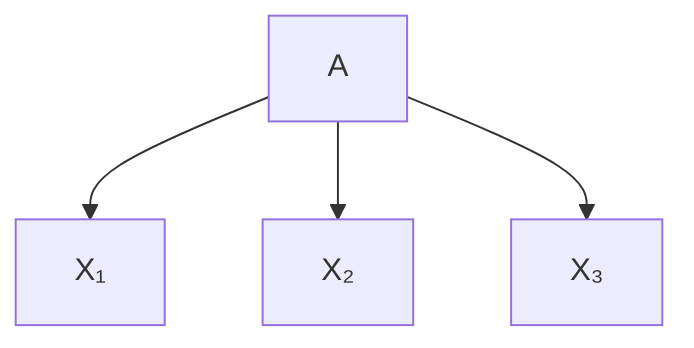
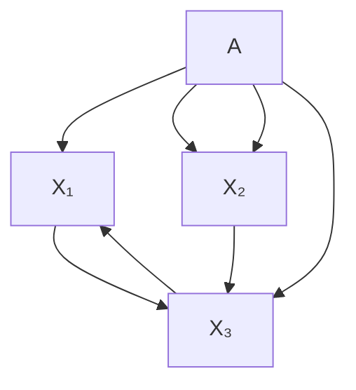
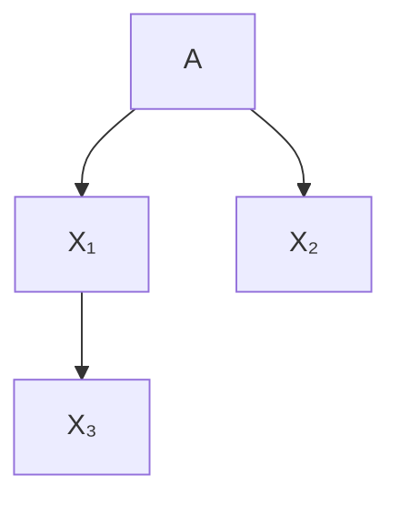
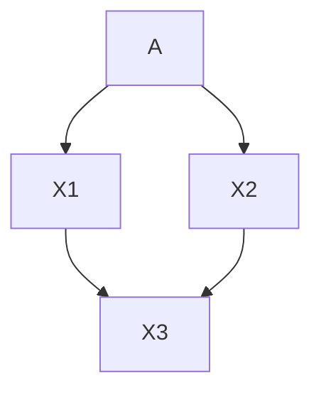
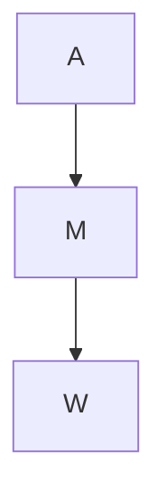

# 公平因果算法补救措施（Fair Causal Algorithmic Recourse）

## 章节摘要（Chapter Abstract）

**算法公平性（Algorithmic fairness）**通常从预测的角度进行研究。相反，本文我们从为个人提供的**补救措施（recourse actions）**的角度来研究公平性，这些措施旨在纠正不利的分类结果。我们提出了两个新的公平性标准，分别在**群体层面（group level）**和**个体层面（individual level）**。与先前关于均衡群体平均距决策边界距离的研究不同，我们的标准明确考虑了特征之间的**因果关系（causal relationships）**，从而捕捉在物理世界中执行的补救措施的下游效应。我们探讨了我们的标准与其他标准（如**反事实公平性（counterfactual fairness）**）之间的关系，并表明补救措施的公平性与预测的公平性是互补的。我们从理论和实证角度研究了如何通过改变分类器来实施公平的因果补救措施，并在 **Adult 数据集**上进行了案例研究。最后，我们讨论了数据生成过程中由我们的标准揭示的公平性违规行为，可能更适合通过**社会干预（societal interventions）**而非对分类器的约束来解决。

本章基于论文“On the Fairness of Causal Algorithmic Recourse”，von Kügelgen, Karimi, Bhatt, Valera, Weller, Schölkopf, AAAI (Á), 2022 (Küg+22)。

## 5.1 引言（Introduction）

**算法公平性**关注的是揭示和纠正自动化决策系统可能存在的歧视性行为 (Dwo+12; Zem+13; HPS16; Cho17)。给定一个包含来自多个受法律保护群体（例如，基于年龄、性别或种族定义）的个体的数据集，以及一个训练用于预测决策（例如，是否批准信用卡申请）的二元分类器，大多数算法公平性方法试图根据预定义的（统计或因果）标准量化不公平程度，然后通过改变分类器来纠正它。这种**预测公平性（predictive fairness）**的概念通常将数据集视为固定的，因此将个体视为不可改变的。

另一方面，**算法补救措施（Algorithmic recourse）**关注的是为受到决策系统不利对待的个体提供建议，以帮助他们摆脱不利处境 (Jos+19; USL19; SHG19; MTS19; MST20; VA20; Kar+20b; Kar+22; KSV21; UJL21)。对于给定的分类器和被负面分类的个体，算法补救措施旨在确定个体可以执行哪些改变来翻转决策。与预测公平性相反，补救措施因此将分类器视为固定的，但赋予个体能动性。

在**机器学习（machine learning, ML）**中，公平性和补救措施大多被孤立地考虑，并被视为独立的问题。虽然补救措施已经在存在受保护属性的情况下被研究——例如，通过比较向其他方面相似的男性和女性个体建议的补救措施（翻转集）(USL19)，或比较不同受保护群体之间的补救措施总成本（负担）(SHG19)——但其与公平性的关系仅被非正式地研究过，即补救措施上的差异通常被理解为预测不公平的代理指标 (Kar+20a)。然而，正如我们在本文中所论证的，补救措施本身实际上构成了一个有趣的公平性标准，因为它允许将**能动性（agency）**和**努力（effort）**的概念整合到公平性研究中。

事实上，歧视性的补救措施并不意味着预测上的不公平（反之亦然¹）。为了说明这一点，考虑图 5.1 中所示的数据。假设特征 $X$ 表示来自两个子群 $A \in \{ 0 , 1 \}$ 之一的个体的（中心化）收入，分别服从 $\mathcal { N } ( 0 , 1 )$ 和 $\mathcal { N } ( 0 , 4 )$ 分布，即只有方差不同。现在考虑一个二元分类器 $h ( X ) = \mathrm { s i g n } ( X )$，它能完美预测个体是否获批信用卡（真实标签 Y）(BSR20)。虽然这个场景满足几个预测公平性标准（例如，人口统计平等、均等化几率、校准），但对于被负面分类的个体，为获批信用卡所需的收入增长（即实现补救所需的努力），方差较大的群体要大得多。如果来自一个受保护群体的个体需要比来自另一个群体的“相似”个体付出更多努力才能达到相同目标，这就违反了**机会平等（equal opportunity）**的概念，该概念旨在让人们在一个公平的竞争环境中运作 (Arn15)²。然而，这种类型的不公平并未被预测性概念所捕捉，预测性概念仅区分（不可改变的）有价值或无价值的个体，而不考虑个体通过改变或干预来有意识地改善其处境的可能性。

基于此，Gupta 等人 [Gup+19] 最近引入了**均衡补救措施（Equalizing Recourse）**，这是机器学习中第一个基于补救措施且独立于预测的公平性概念。他们提出根据获得不良结果的个体到决策边界的平均群体距离来衡量补救公平性，并表明这可以在分类器训练期间进行校准。然而，这种表述忽略了补救措施本质上是一个因果问题，因为个体在现实世界中为改变其处境而采取的行动可能具有下游效应 (MTS19; KSV21; Kar+20b; MST20)，另见 (BSR20; WMR17; USL19)。由于没有推理特征之间的因果关系，基于距离的方法 (i) 不能准确反映真实的（差异化的）补救成本，并且 (ii) 局限于经典的以预测为中心的方法，即通过改变分类器来解决歧视性补救问题。

在本文中，我们解决了这两个局限性。首先，通过将均衡补救措施的思想扩展到基于最小干预的补救框架 (KSV21)，我们引入了**因果公平补救措施（causal notions of fair recourse）**，当特征不能独立操作时（通常情况如此），它能更忠实地捕捉补救成本的真实差异。其次，我们认为，数据生成过程的因果模型通过以改变底层系统形式的社会干预，开辟了一条通往公平的新途径。这种社会干预可能反映常见的政策，如针对特定子群体的补贴或税收减免。我们强调以下贡献：

*   我们引入了均衡补救措施的**因果版本**（定义 5.3.1），以及一个更强的（命题 5.3.1）**个体层面标准**（定义 5.3.2），我们认为后者更为合适；
*   我们首次对**公平预测**和**公平补救措施**之间的关系进行了正式研究，并表明它们是互补的概念，互不蕴含（命题 5.3.2）；
*   我们建立了允许**个体公平因果补救措施**的充分条件（命题 5.3.3）；
*   我们评估了几种分类器的不同公平补救度量（§ 5.4.1），验证了我们的主要结果，并证明了非因果度量会误报补救不公平性；
*   在 **Adult 数据集**的案例研究中，我们在群体和个体层面检测到了补救歧视（§ 5.4.2），证明了其在现实世界设置中的相关性；
*   我们提出**社会干预**作为改变分类器以解决不公平问题的替代方案（§ 5.5）。

## 5.2 预备知识与背景（Preliminaries & Background）

**符号说明（Notation）**。设随机向量 $\mathbf { \Psi } \mathbf { X } \ = \ \left( X _ { 1 } , . . . , X _ { n } \right)$ 取值 $\begin{array} { r l } { \mathbf { { x } } } & { { } = } \end{array}$ $( x _ { 1 } , . . . , x _ { n } ) \ \in \ { \mathcal { X } } \ = \ { \mathcal { X } } _ { 1 } \times . . . \times { \mathcal { X } } _ { n } \ \subseteq \ \mathbb { R } ^ { n }$ 表示观测到的（非受保护的）特征。设随机变量 $A$ 取值 $a \in \mathcal { A } = \{ 1 , \dots , K \}$（对于某个 $K \in \mathbb { Z } _ { > 1 }$）表示（法律上）受保护的属性/特征，指示每个个体所属的群体（例如，基于其年龄、性别、种族、宗教等）。设 $h : \mathcal { X } \rightarrow \mathcal { Y }$ 是一个给定的二元分类器，其中 $Y \in \mathcal { V } = \{ \pm 1 \}$ 表示真实标签（例如，其信用卡是否获批）。我们观测到一个数据集 $\mathcal { D } = \{ \mathbf { v } ^ { i } \} _ { i = 1 } ^ { N }$，包含随机变量 $\mathbf { V } = ( \mathbf { X } , A )$ 的独立同分布观测值，其中 $\mathbf { v } ^ { i } : = ( \mathbf { x } ^ { i } , a ^ { i } )$。³

**反事实解释（Counterfactual Explanations）**。解释（黑箱）ML 模型决策的一个常见框架是**反事实解释（counterfactual explanations, CE）** (WMR17)。CE 是位于决策边界另一侧最近的特征向量。给定一个距离度量 $d : \mathcal { X } \times \mathcal { X } \rightarrow \mathbb { R } ^ { + }$，对于一个获得不利预测 $h ( \mathbf { x } ^ { \mathsf { F } } ) = - 1$ 的个体 $\mathbf { x } ^ { \mathsf { F } }$，其 CE 定义为以下问题的解：

$$
\min _ {\mathbf {x} \in \mathcal {X}} d (\mathbf {x}, \mathbf {x} ^ {\mathsf {F}}) \quad \text { subject   to } \quad h (\mathbf {x}) = 1. \tag {5.1}
$$

虽然 CE 有助于理解分类器的行为，但它们通常不会导致可行的建议：它们告知个体她应该处于什么状态才能获得更有利的预测，但可能不会建议她可以执行哪些可行的改变来达到该状态。

**基于独立可操作特征的补救措施（Recourse with Independently-Manipulable Features）**。Ustun 等人 [USL19] 将个人通过改变**可操作变量（actionable variables）**来改变模型决策的能力称为**补救措施（recourse）**，并提出求解

$$
\min _ {\delta \in \mathcal {F} (\mathbf {x} ^ {\mathsf {F}})} c (\delta ; \mathbf {x} ^ {\mathsf {F}}) \quad \text { subject   to } \quad h (\mathbf {x} ^ {\mathsf {F}} + \delta) = 1 \tag {5.2}
$$

其中 $\mathcal { F } ( \mathbf { x } ^ { \mathsf { F } } )$ 是一组可行的改变向量，$c ( \cdot ; \mathbf { x } ^ { \mathsf { F } } )$ 是定义在这些动作上的成本函数，两者都可能依赖于个体。⁴ 正如 Karimi 等人 [KSV21] 所指出的，(5.2) 隐含地将特征视为彼此独立可操作的（见图 5.2a），并且没有考虑它们之间可能存在的因果关系（见图 5.2b）：虽然允许对动作施加可行性约束，但假设未受作用的变量 $( \delta _ { i } \ = \ 0 )$ 保持不变。我们称之为**独立可操作特征（independently-manipulable features, IMF）假设**。虽然 IMF 观点在仅分析分类器行为时可能是合适的，但它未能捕捉在现实世界中进行干预的效果，而这正是可操作补救措施的情况；例如，收入的增加很可能也会对个人的储蓄余额产生积极影响。因此，(5.2) 仅在被作用的变量对剩余变量没有因果影响时才保证补救措施的有效性 (KSV21)。

(a) IMF 假设

(b) 因果视角  
图 5.2: (a) 支撑反事实解释和基于距离的补救措施的框架将 $X _ { i }$ 视为独立可操作特征（IMF）。在公平性背景下，这意味着 $X _ { i }$ 可能依赖于受保护属性 A（以及其他潜在的未观测因素），但彼此之间没有因果影响。(b) 本文通过允许 $X _ { i }$ 之间存在因果影响来推广 IMF 假设，从而模拟改变某些特征对其他特征的下游效应。这种因果方法使我们能够在现实世界设置中更准确地量化补救不公平性，因为在这些设置中 IMF 假设通常被违反。它还提供了一个框架，用于研究除改变分类器之外实现公平补救的替代途径。

**结构因果模型（Structural Causal Models）**。一个关于观测变量 $\mathbf { V } = \{ V _ { i } \} _ { i = 1 } ^ { n }$ 的**结构因果模型（structural causal model, SCM）** (Pea09; PJS17) 是一个对 $\mathcal { M } = ( \mathbb { S } , P _ { \mathbf { U } } )$，其中结构方程 $\mathbb { S }$ 是一组赋值 $\begin{array} { r } { \mathbb { S } = \{ V _ { i } : = f _ { i } ( \mathrm { P A } _ { i } , U _ { i } ) \} _ { i = 1 } ^ { n } , } \end{array}$ 它将每个 $V _ { i }$ 计算为其直接原因（因果父节点）$\mathrm { P A } _ { i } \subseteq \mathbf { V } \setminus V _ { i }$ 和一个未观测变量 $U _ { i }$ 的确定性函数 $f _ { i }$。在本文中，我们做出常见假设，即 $P _ { \mathbf { U } }$ 分布在潜在变量 $\mathbf { U } = \{ U _ { i } \} _ { i = 1 } ^ { n }$ 上可分解，这意味着不存在未观测的混杂因素（**因果充分性（causal sufficiency）**）。如果与 $\mathcal { M }$ 相关联的因果图 $\mathcal { G }$（通过从 $\mathrm { P A } _ { i }$ 中的每个变量到 $V _ { i }$ 画一条有向边得到，参见图 5.2 示例）是无环的，那么 $\mathcal { M }$ 在 $\mathbf { V }$ 上诱导出一个唯一的“观测”分布，定义为 $P _ { \mathbf { U } }$ 通过 $\mathbb { S }$ 的推前（push-forward）。

SCM 可用于建模**干预（interventions）**的效果：对系统进行的外部操作，改变部分变量 $\mathbf { V } _ { \mathcal { T } } \subseteq \mathbf { V }$ 的生成过程（即结构赋值），例如，通过将其值固定为常数 $\pmb { \theta } _ { \mathcal { T } }$。这种（原子）干预使用 Pearl 的 do-算子表示为 $\mathrm { d o } ( \mathbf { V } _ { \mathcal { T } } : = \pmb { \theta } _ { \mathcal { T } } )$，或简写为 $\mathrm { d o } ( \pmb { \theta } _ { \mathcal { I } } )$。干预分布通过将结构方程 $\{ V _ { i } : = f _ { i } ( \mathrm { P A } _ { i } , U _ { i } ) \} _ { i \in \mathcal { I } }$ 替换为其新赋值 $\{ V _ { i } : = \theta _ { i } \} _ { i \in \mathbb { Z } }$ 以得到修改后的结构方程 $\mathbb { S } ^ { \mathrm { d o } ( \pmb { \theta } _ { \mathbb { Z } } ) }$，然后计算由干预 SCM $\mathcal { M } ^ { \mathrm { d o } ( \theta _ { \mathcal { T } } ) } = ( \mathbb { S } ^ { \mathrm { d o } ( \mathbf { \dot { \theta } } _ { \mathcal { T } } ) } , P _ { \mathbf { U } } )$ 诱导的分布，即 $P _ { \mathbf { U } }$ 通过 $\mathbb { S } ^ { \mathrm { d o } ( \pmb { \theta } _ { \mathbb { Z } } ) }$ 的推前。

类似地，SCM 允许推理关于（结构）**反事实（counterfactuals）**的陈述：在一个假设世界中进行的干预的陈述，其中所有未观测的噪声项 U 保持不变并固定为其事实值 $\mathbf { u } ^ { \mathsf { F } }$。给定事实观测值 $\mathbf { v } ^ { \mathsf { F } }$，对于假设干预 $\mathrm { d o } ( \pmb { \theta } _ { \mathcal { T } } )$ 的反事实分布，记为 $\mathbf { v } _ { \pmb { \theta } _ { T } } ( \mathbf { \bar { u } } ^ { \bar { \sf F } } )$，可以通过三步程序从 $\mathcal { M }$ 获得：首先，推断未观测变量的后验分布 $P _ { \mathbf { U } | { \bf v } ^ { \mathsf { F } } }$（**溯因（abduction）**）；其次，像在干预情况下一样替换一些结构方程（**行动（action）**）；第三，计算由反事实 SCM $\mathcal { M } ^ { \mathrm { d o } ( \theta _ { \mathcal { T } } ) | \mathbf { v } ^ { \mathrm { F } } } = ( \mathbb { S } ^ { \mathrm { d o } ( \theta _ { \mathcal { T } } ) } , P _ { \mathbf { U } | \mathbf { v } ^ { \mathrm { F } } } )$ 诱导的分布（**预测（prediction）**）。

**因果补救措施（Causal Recourse）**。为了捕捉特征之间的因果关系，Karimi 等人 [KSV21] 提出在 SCM 框架内处理可操作补救任务，并将焦点从最近 CE 转移到**最小干预（minimal interventions）**，从而得到优化问题

$$
\min _ {\boldsymbol {\theta} _ {\mathcal {I}} \in \mathcal {F} (\mathbf {x} ^ {\mathsf {F}})} c (\boldsymbol {\theta} _ {\mathcal {I}}; \mathbf {x} ^ {\mathsf {F}}) \quad \text {   subj.   to   } \quad h (\mathbf {x} _ {\boldsymbol {\theta} _ {\mathcal {I}}} (\mathbf {u} ^ {\mathsf {F}})) = 1, \tag {5.3}
$$

其中 $\mathbf { x } _ { \pmb { \theta } _ { \mathcal { T } } } ( \mathbf { u } ^ { \mathsf { F } } )$ 表示如果 $\mathbf { \boldsymbol { x } } _ { \mathcal { T } }$ 为 $\pmb { \theta } _ { \mathcal { T } }$ 时 $\mathbf { x } ^ { \mathsf { F } }$ 的“反事实孪生”。⁵ 在实践中，SCM 是未知的，需要基于额外的（领域特定的）假设从数据中推断，从而得到 $( 5 . 3 )$ 的概率版本，旨在找到能够以高概率实现补救的行动 (Kar+20b)。如果 IMF 假设成立（即所有可操作变量的后代集为空），那么 (5.3) 作为特例退化为 IMF 补救措施 (5.2)。

**算法公平性与反事实公平性（Algorithmic and Counterfactual Fairness）**。虽然存在许多统计公平性概念 (Zaf+17a; Zaf+17b)，但它们有时互不兼容 (Cho17)，并且有人认为，歧视的核心在于受保护属性对预测的（直接或间接）因果影响，从而使公平性成为一个根本性的因果问题 (Kil+17; Rus+17; Lof+18; ZB18a; ZB18b; NS18; NMS19; Chi19; Sal+19; Wu+19)。与我们的工作特别相关的是 Kusner 等人 [Kus+17] 引入的**反事实公平性（counterfactual fairness）**概念，如果 $\mathbf { V } = \mathbf { X } \cup A$ 上的一个（概率）分类器 $h$ 满足

$$
h (\mathbf {v} ^ {\mathsf {F}}) = h (\mathbf {v} _ {a} (\mathbf {u} ^ {\mathsf {F}})), \forall a \in \mathcal {A}, \mathbf {v} ^ {\mathsf {F}} = (\mathbf {x} ^ {\mathsf {F}}, a ^ {\mathsf {F}}) \in \mathcal {X} \times \mathcal {A},
$$

则称其是反事实公平的，其中 $\mathbf { v } _ { a } ( \mathbf { u } ^ { \mathsf { F } } )$ 表示如果属性是 $a$ 而不是 $a ^ { \mathsf { F } }$ 时 $\mathbf { v } ^ { \mathsf { F } }$ 的“反事实孪生”。

**跨群体均衡补救措施（Equalizing Recourse Across Groups）**。本章的主要焦点是**补救行动的公平性（fairness of recourse actions）**，据我们所知，这是由 Gupta 等人 [Gup+19] 首次研究的。他们主张均衡受保护群体间的平均补救成本，并将其作为训练分类器时的约束。采用与 CE 一致的基于距离的方法，他们将 $h ( \mathbf { x } ^ { \mathsf { F } } ) = - 1$ 的 $\mathbf { x } ^ { \mathsf { F } }$ 的补救成本定义为 (5.1) 中达到的最小值：

$$
r ^ {\mathrm{IMF}} (\mathbf {x} ^ {\mathsf {F}}) = \min _ {\mathbf {x} \in \mathcal {X}} d (\mathbf {x} ^ {\mathsf {F}}, \mathbf {x}) \quad \text { subj.   to } \quad h (\mathbf {x}) = 1, \tag {5.4}
$$

如果选择 $c ( \delta ; { \mathbf { x } } ^ { \mathsf { F } } ) = d ( { \mathbf { x } } ^ { \mathsf { F } } + \delta , { \mathbf { x } } ^ { \mathsf { F } } )$ 作为成本函数，则其等价于 IMF 补救措施 (5.2)。定义受保护的子群 $G _ { a } = \{ \mathbf { v } ^ { i } \in \mathcal { D } : a ^ { i } = a \}$ 和 $G _ { a } ^ { - } = \{ \mathbf { v } \in G _ { a } : h ( \mathbf { v } ) = - 1 \}$，则群体层面的补救成本（此处为到决策边界的平均距离）由下式给出：

$$
r ^ {\mathrm{IMF}} (G _ {a} ^ {-}) = \frac {1}{| G _ {a} ^ {-} |} \sum_ {\mathbf {v} ^ {i} \in G _ {a} ^ {-}} r ^ {\mathrm{IMF}} (\mathbf {x} ^ {i}). \tag {5.5}
$$

跨群体均衡补救措施 (Gup+19) 的思想可总结如下。

**定义 5.2.1（群体层面公平的 IMF 补救措施，源自 (Gup+19)）**。对于数据集 $\mathcal { D }$、分类器 $h$ 和距离度量 $d$，具有**独立可操作特征（IMF）**的补救措施的群体层面不公平性为：

$$
\Delta_ {\text { dist }} (\mathcal {D}, h, d) := \max _ {a, a ^ {\prime} \in \mathcal {A}} \left| r ^ {\text { IMF }} (G _ {a} ^ {-}) - r ^ {\text { IMF }} (G _ {a ^ {\prime}} ^ {-}) \right|.
$$

如果 $\Delta _ { \mathsf { d i s t } } = 0$，则称针对 $(\mathcal { D }, h, d)$ 的补救措施是“群体 IMF 公平的”。

## 5.3 公平因果追索（Fair Causal Recourse）

由于定义 5.2.1 依赖于 **IMF 假设**，它忽略了变量之间的因果关系，未能考虑行动对其他相关特征的下游效应，因此通常错误地估计了追索的真实成本。我们认为，基于追索的公平性考量应立足于一个**因果模型**，该模型能够捕捉在物理世界中执行干预的效果，而在物理世界中，特征之间往往存在因果关系。因此，我们考虑一个关于 $\mathbf { V } = ( \mathbf { X } , A )$ 的 **结构因果模型（Structural Causal Model, SCM）** 来建模受保护属性与其余特征之间的因果关系。

## 5.3.1 群体层面的公平因果追索（Group-Level Fair Causal Recourse）

定义 5.2.1 可以通过将 $( 5 . 4 )$ 中的最小距离替换为因果模型内的追索成本（即 (5.3) 中实现的最小值）来适应因果（CAU）追索框架 (5.3)：

$$
r ^ {\mathrm{CAU}} (\mathbf {v} ^ {\mathsf {F}}) = \min _ {\boldsymbol {\theta} _ {\mathcal {I}} \in \Theta (\mathbf {v} ^ {\mathsf {F}})} c (\boldsymbol {\theta} _ {\mathcal {I}}; \mathbf {v} ^ {\mathsf {F}}) \quad \mathrm{subj.to} \quad h (\mathbf {v} _ {\boldsymbol {\theta} _ {\mathcal {I}}} (\mathbf {u} ^ {\mathsf {F}})) = 1,
$$

这里我们回顾一下，约束条件 $h ( \mathbf { v } _ { \pmb { \theta } _ { \mathcal { T } } } ( \mathbf { u } ^ { \mathsf { F } } ) ) = 1$ 确保了 $\mathbf { v } ^ { \mathsf { F } }$ 在 $\mathcal { M }$ 中的反事实孪生样本落在分类器的有利一侧。令 $r ^ { \mathbf { C A U } } \left( G _ { a } ^ { - } \right)$ 为 $r ^ { \mathbf { C A U } } ( \mathbf { v } ^ { \mathsf { F } } )$ 在 $G _ { a } ^ { - }$ 上的平均值，类似于 (5.5)。然后我们可以如下定义群体层面的公平因果追索。

**定义 5.3.1（群体层面的公平因果追索）**。对于数据集 ${ \mathcal { D } }$、分类器 $h$ 和成本函数 $c$，相对于 SCM $\mathcal{M}$ 的因果（CAU）追索的群体层面不公平性由下式给出：

$$
\Delta_ {\text { cost }} (\mathcal {D}, h, c, \mathcal {M}) := \max _ {a, a ^ {\prime} \in \mathcal {A}} \left| r ^ {\text { CAU }} (G _ {a} ^ {-}) - r ^ {\text { CAU }} (G _ {a ^ {\prime}} ^ {-}) \right|.
$$

如果 $\Delta _ { \mathsf { c o s t } } = 0$，则对于 $\left( \mathcal { D } , h , c , \mathcal { M } \right)$ 的追索是“群体 CAU 公平的”。

虽然定义 5.2.1 对数据的（因果）生成过程不可知（注意定义 5.2.1 中缺少参考 SCM $\mathcal{M}$），但定义 5.3.1 在计算追索成本时考虑了特征之间的因果关系。因此，当 IMF 假设不成立时（这在大多数应用中都是现实情况），它能更真实地反映行动的效果和追索的必要成本。

定义 5.2.1 和 5.3.1 的一个共同缺点是它们都是群体层面的定义，即它们只考虑所有拥有相同受保护属性的个体的平均追索成本。然而，从因果（Chi19; Wu+19）和非因果（Dwo+12）的角度来看，公平性本质上是一个**个体层面的概念**：6 群体层面的公平性仍然允许个体层面的不公平，只要正负歧视在群体中相互抵消。这是**反事实公平性（counterfactual fairness）**（Kus+17）背后的动机之一：如果某个决策在个体属于不同受保护群体时不会改变，则认为该决策在个体层面是公平的。

## 5.3.2 个体层面的公平因果追索（Individually Fair Causal Recourse）

受反事实公平性（Kus+17）的启发，我们提出，如果追索成本在个体属于不同受保护群体时（即在对 $A$ 进行反事实改变的情况下）是相同的，那么（因果）追索可以被认为在个体层面是公平的。

**定义 5.3.2（个体层面的公平因果追索）**。对于数据集 $\mathcal { D }$、分类器 $h$ 和成本函数 $c$，相对于 SCM 的因果追索的个体层面不公平性由下式给出：

$$
\Delta_ {\mathrm{ind}} (\mathcal {D}, h, c, \mathcal {M}) := \max _ {a \in \mathcal {A}; \mathbf {v} ^ {\mathsf {F}} \in \mathcal {D}} \left| r ^ {\mathrm{CAU}} (\mathbf {v} ^ {\mathsf {F}}) - r ^ {\mathrm{CAU}} (\mathbf {v} _ {a} (\mathbf {u} ^ {\mathsf {F}})) \right|
$$

如果 $\Delta _ { \mathrm { i n d } } = 0$，则追索是“个体 CAU 公平的”。

这是一个更强的概念，因为有可能同时满足群体 IMF 公平追索（定义 5.2.1）和群体 CAU 公平追索（定义 5.3.1），而不满足定义 5.3.2：

**命题 5.3.1**。群体层面的公平追索概念（定义 5.2.1 和定义 5.3.1）都不是个体 CAU 公平追索（定义 5.3.2）的充分条件，即：

$$
\text { 群体 IMF 公平 } \nRightarrow \text { 个体 CAU 公平。}
$$

$$
\text { 群体 CAU 公平 } \nRightarrow \text { 个体 CAU 公平。}
$$

**证明**。反例由以下 SCM 和分类器的组合给出：

$$
A := U _ {A},
$$

$$
X := A U _ {X} + (1 - A) (1 - U _ {X}),
$$

$$
U _ {A}, U _ {X} \sim \text { Bernoulli } (0. 5),
$$

$$
Y := h (X) = \operatorname{sign} (X - 0. 5).
$$

我们有 $\mathbb { P } _ { X | A = 0 } = \mathbb { P } _ { X | A = 1 } = { \mathrm { B e r n o u l l i } } ( 0 . 5 )$，因此到 $X = 0 . 5$ 处边界的距离在各组之间相同。因此，“群体 IMF 公平”追索（定义 5.2.1）的标准得到满足。

由于受保护属性通常是不可改变的（因此任何涉及改变 $A$ 的追索行动都是不可行的），并且在此示例中只有一个特征（因此可以忽略对后代特征的因果下游效应），所以 $X$ 的事实值与反事实值之间的距离也是因果追索成本函数的合理选择。在这种情况下，$( \mathcal { D } , h , \mathcal { M } )$ 也满足群体层面的 CAU 公平追索（定义 5.3.1）。

然而，对于所有 $\mathbf { v } ^ { \mathsf { F } } = ( \mathbf { x } ^ { \mathsf { F } } , a ^ { \mathsf { F } } )$ 和任何 $a \neq a ^ { \mathsf { F } }$，我们有 $h ( \mathbf { x } ^ { \mathsf { F } } ) \neq h ( \mathbf { x } _ { a } ( u _ { X } ^ { \mathsf { F } } ) ) =$ $1 - h ( \mathbf { x } ^ { \mathsf { F } } )$，因此它在个体层面是最大程度不公平的：对于任何个体，如果受保护属性不同，追索成本将为零，因为预测结果会反转。□

## 5.3.3 与反事实公平性的关系

用于证明命题 5.3.1 的分类器 $h$ 不是反事实公平的。这提示我们更深入地研究它们之间的关系：反事实公平的分类器是否意味着公平的（因果）追索？答案是否定的。

**命题 5.3.2**。反事实公平性对于前述三种公平追索概念中的任何一种都是不充分的：

$$
h \text { 反事实公平 } \nRightarrow \text { 群体 IMF 公平 }
$$

$$
h \text { 反事实公平 } \nRightarrow \text { 群体 CAU 公平 }
$$

$$
h \text { 反事实公平 } \nRightarrow \text { 个体 CAU 公平 }
$$

**证明**。反例由以下 SCM 和分类器的组合给出：

$$
A := U _ {A}, \quad U _ {A} \sim \text { Bernoulli } (0. 5),
$$

$$
X := (2 - A) U _ {X}, \quad U _ {X} \sim \mathcal {N} (0, 1), \tag {5.6}
$$

$$
Y := h (X) = \operatorname{sign} (X)
$$

我们用它生成了图 5.1。由于 $\mathrm { s i g n } ( X ) = \mathrm { s i g n } ( U _ { X } )$，并且 $U _ { X }$ 在推理 $A$ 的反事实变化时被认为是固定的，因此 $h$ 是反事实公平的。

然而，$\mathbb { P } _ { X | A = 0 } = \mathcal { N } ( 0 , 4 )$ 且 $\mathbb { P } _ { X | A = 1 } = \mathcal { N } ( 0 , 1 )$，因此到边界的距离（在这个单变量玩具示例中，这是因果追索的合理成本）在群体层面是不同的。此外，当反事实地改变 $A$ 时，$X$ 要么加倍，要么减半。□

**备注**。用于证明命题 5.3.2 的反例的一个重要特征是 $h$ 是确定性的，这使得 $h$ 可以是反事实公平的，即使它依赖于 $A$ 的后代。如果 $h$ 是概率性的（例如，逻辑回归），$h : \mathcal { X } \rightarrow [ 0 , 1 ]$，使得正向分类的概率随着与决策边界的距离增加而减小，那么一般情况下情况并非如此。

(a) IMF

(b) CAU

(c) Adult  
**图 5.3:** (a) 和 (b) 用于 $\ S \ 5 { \cdot } 4 { \cdot } 1$ 的因果图。(c) 用于 Adult 数据集（Lic+13）的（假定的）因果图（来自 Chiappa [Chi19] 以及 Nabi 和 Shpitser [NS18]）；$A$ 表示三个受保护属性 {性别，年龄，国籍}；$M$ 表示 {婚姻状况，教育水平}；$W$ 对应 {工作阶层，职业，每周工作时数}。这里，为了简单起见，我们显示了粗粒度的因果图。在实践中，我们对每个节点分别建模。例如，从 $A$ 到 $M$ 的单个箭头实际上对应六条有向边，每条边从 $A$ 中的每个特征指向 $M$ 中的每个特征。

## 5.3.4 实现公平因果追索

**约束优化（constrained optimisation）**。一种初步的方法是在训练分类器时明确考虑因果追索公平性（群体或个体层面）的约束，正如 Gupta 等人 [Gup+19] 在 IMF 假设下对非因果追索所做的那样。这里我们可以用一个超参数来控制准确性和公平性之间的潜在权衡。然而，(5.3) 中的优化问题涉及对干预目标组合空间 ${ \mathcal { T } } \subseteq \{ 1 , . . . , n \}$ 的优化，因此尚不清楚因果追索的公平性是否可以轻易地作为可微约束包含进来。

**限制分类器输入（restricting the classifier inputs）**。一种只需要以因果图形式存在的定性知识（但不需要完全指定的 SCM）的方法，是限制分类器的输入特征集，使其仅包含受保护属性的非后代。在这种情况下，并满足下面更详细陈述的一些附加假设，可以保证个体层面的公平因果追索。

**命题 5.3.3**。假设 $h$ 仅依赖于子集 ${ \tilde { \mathbf { x } } } \subseteq \mathbf { v } \setminus ( A \cup d ( A ) )$，这些特征是 $\mathcal{M}$ 中 $A$ 的非后代；并且假设在 $A$ 的反事实变化下，可行行动集及其成本保持不变，即 $\mathcal { F } ( { \mathbf { v } } ^ { F } ) = \mathcal { F } ( { \mathbf { v } } _ { a } ( { \mathbf { u } } ^ { F } ) )$ 且 $c ( \cdot ; \mathbf { v } ^ { F } ) = c ( \cdot ; \mathbf { v } _ { a } ( \mathbf { u } ^ { F } ) ) \ \forall a \in \mathcal { A } , \mathbf { v } ^ { F } \in \mathcal { D }$。那么对于 $\left( \mathcal { D } , h , c , \mathcal { M } \right)$ 的追索是“个体 CAU 公平的”。

**证明**。根据定义 5.3.2，只需证明：

$$
r ^ {\mathrm{CAU}} (\mathbf {v} ^ {\mathsf {F}}) = r ^ {\mathrm{CAU}} \left(\mathbf {v} _ {a} \left(\mathbf {u} ^ {\mathsf {F}}\right)\right), \quad \forall a \in \mathcal {A}, \mathbf {v} ^ {\mathsf {F}} \in \mathcal {D}. \tag {5.7}
$$

将我们的假设代入 $\ S \ 5 { \cdot } 3 { \cdot } 1$ 中 $r ^ { \mathbf { C A U } }$ 的定义，我们得到：

$$
r ^ {\mathrm{CAU}} (\mathbf {v} ^ {\mathsf {F}}) = \min _ {\boldsymbol {\theta} _ {\mathcal {I}} \in \mathcal {F} (\mathbf {v} ^ {\mathsf {F}})} c (\boldsymbol {\theta} _ {\mathcal {I}}; \mathbf {v} ^ {\mathsf {F}}) \mathrm{s.t.} h (\tilde {\mathbf {x}} _ {\boldsymbol {\theta} _ {\mathcal {I}}} (\mathbf {u} ^ {\mathsf {F}})) = 1,
$$

$$
r ^ {\mathrm{CAU}} (\mathbf {v} _ {a} (\mathbf {u} ^ {\mathsf {F}})) = \min _ {\boldsymbol {\theta} _ {\mathcal {I}} \in \mathcal {F} (\mathbf {v} ^ {\mathsf {F}})} c (\boldsymbol {\theta} _ {\mathcal {I}}; \mathbf {v} ^ {\mathsf {F}}) \text {s.t.} h (\tilde {\mathbf {x}} _ {\boldsymbol {\theta} _ {\mathcal {I}}, a} (\mathbf {u} ^ {\mathsf {F}})) = 1.
$$

接下来需要证明：

$$
\tilde {\mathbf {x}} _ {\boldsymbol {\theta} _ {\mathcal {I}}, a} (\mathbf {u} ^ {\mathsf {F}}) = \tilde {\mathbf {x}} _ {\boldsymbol {\theta} _ {\mathcal {I}}} (\mathbf {u} ^ {\mathsf {F}}), \quad \forall \boldsymbol {\theta} _ {\mathcal {I}} \in \mathcal {F} (\mathbf {v} ^ {\mathsf {F}}), a \in \mathcal {A}
$$

这可以通过应用 **do-演算（do-calculus）**（Pea09）得出，因为根据假设，$\tilde { \mathbf { X } }$ 不包含 $A$ 的任何后代，因此不受 $A$ 的反事实变化的影响。□

命题 5.3.3 的假设——即可行行动集 $\mathcal { F } ( \mathbf { v } ^ { \mathsf { F } } )$ 和成本函数 $c ( \cdot ; \bar { \mathbf { v } } ^ { \mathsf { F } } )$ 在受保护属性的反事实变化下保持不变——可能并不总是成立。例如，如果一个受保护群体被（法律）禁止或劝阻执行某些追索行动，例如从事特定工作或申请认证，那么这将构成由于另一种歧视来源而导致的违反。

此外，由于受保护属性通常代表社会人口统计学特征（例如年龄、性别、种族等），它们通常在因果图中作为根节点出现，并对许多其他特征产生下游影响。如命题 5.3.3 所述，强制分类器仅将 $A$ 的非后代作为输入，可能导致准确性下降，这可能是一种限制（WZW19）。

**溯因/表示学习（abduction / representation learning）**。我们已经证明，仅考虑 $A$ 的非后代是实现个体 CAU 公平追索的一种方法。特别地，这也适用于未观测变量 $U$，根据定义，这些变量不是任何观测变量的后代。这建议在训练分类器时使用 $U _ { i }$ 代替 $A$ 的任何后代 $X _ { i }$——从某种意义上说，$U _ { i }$ 可以被视为 $X _ { i }$ 的“公平表示”，因为它是一个不受 $A$ 影响的外生分量。然而，由于 $U$ 是未观测的，需要从观测到的 $\mathbf { v } ^ { \mathsf { F } }$ 中推断出来，这对应于反事实推理中的**溯因（abduction）**步骤。在基于（公平的）背景变量学习这种表示时需要非常小心，因为这需要（不可检验的）反事实假设（Kus+17, § 4.1）。

## 5.4 实验（Experiments）

我们进行了两组实验。首先，我们在数值模拟中验证了我们的主要主张（§ 5.4.1）。其次，我们使用我们提出的公平追索的因果度量，在 Adult 数据集上进行了初步的案例研究（§ 5.4.2）。更多实验细节请参考 D.1，更多结果和分析请参考 D.2。7

## 5.4.1 数值模拟（Numerical Simulations）

数据。由于计算**反事实行动（recourse actions）**通常需要了解（或估计）真实的**结构因果模型（Structural Causal Model, SCM）**，我们首先考虑一个受控环境，使用两种合成数据：

• **IMF**：IMF 反事实行动的基础设定，其中特征之间没有因果影响，但可能依赖于受保护属性 $A$。
• **CAU**：特征之间以及特征与 $A$ 之间存在因果依赖关系。我们使用 $\{ X _ { i } \ : = \ f _ { i } ( A , { \mathrm { P A } } _ { i } ) + { \dot { U } } _ { i } \} _ { i = 1 } ^ { n }$ ，其中 $f _ { i }$ 为线性（CAU-LIN）或非线性（CAU-ANM）函数。

对应的因果图包含在 (Küg+22) 的图 3 中。在所有实验中，我们使用 $n = 3$ 个非受保护特征 $X _ { i }$ 和一个二元受保护属性 $A \in \{ 0 , 1 \}$ ，并使用 D.1.1 中详细描述的 SCM 生成包含 $N = 500$ 个观测值的标注数据集。用于训练不同分类器的**真实标签（ground truth, GT）** $\hat { y } ^ { i }$ 按照 $\dot { Y } ^ { i } \sim \mathrm { B e r n o u l l i } ( h ( \mathbf { x } ^ { i } ) )$ 采样，其中 $h ( \mathbf { x } ^ { i } )$ 是线性或非线性逻辑回归，与 $A$ 无关，详见 D.1.2。

分类器。在每个数据集上，我们训练多个（“公平的”）分类器。我们考虑线性和非线性逻辑回归（LR），以及不同的**支持向量机（Support Vector Machines, SVMs; SS02）**（为便于与 Gupta 等人 [Gup+19] 比较），并在不同的输入集上训练：

• $\operatorname { L R } / \operatorname { S V M } ( \mathbf { X } , A )$ ：在所有特征上训练（朴素基线）；
• $\operatorname { L R } / \operatorname { S V M } ( \mathbf { X } )$ ：仅在非受保护特征 $\mathbf { X }$ 上训练（不感知基线）；
• $\operatorname { FairSVM } ( \mathbf { X } , A )$ ：Gupta 等人 [Gup+19] 的方法，旨在平衡不同受保护群体到决策边界的平均距离；
• $\mathrm { L R / S V M ( X _ { n d } ) }$ ：仅在 $A$ 的非后代特征 $\mathbf { \boldsymbol { x } } _ { \mathrm { \scriptscriptstyle n d } ( A ) }$ 上训练，参见 $\ S _ { 5 } . 3 . 4$；
• $\mathrm { L R / S V M ( X _ { n d } , U _ { d } ) }$ ：在 $A$ 的非后代特征 $\mathbf { X } _ { \mathrm { n d } ( A ) }$ 和对应于 $A$ 的后代特征 $\mathbf { X } _ { \mathrm { d } ( A ) }$ 的未观测变量 $\mathbf { U } _ { \mathrm { d } ( A ) }$ 上训练，参见 $\ S 5 . 3 . 4$。

为了使不同分类器之间的距离具有可比性，我们对所有 SVM 使用线性核或多项式核（取决于 GT 标签），并使用 5 折交叉验证选择所有剩余的超参数（包括 FairSVM 的权衡参数 $\lambda$）。通过交叉验证进行核选择的结果也在 D.2.3 的 D.2 中提供。当 GT 标签使用线性（或非线性）逻辑回归生成时，分别使用线性（或非线性）LR，详见 D.1.2。

求解因果反事实行动优化问题。我们将 $A$ 和所有 $U _ { i }$ 视为不可操作变量，将所有 $X _ { i }$ 视为可操作变量。对于每个被负面预测的个体，我们对可行行动空间进行离散化，使用学习到的近似 SCM $( \mathcal { M } _ { \mathrm { K R } } )$（遵循 Karimi 等人 [Kar+20b]，详见 D.2.2）计算每个行动的效力，并选择导致有利结果且成本最低的有效行动。使用真实**预言机 SCM（oracle SCM）**（ $\star$ ）及其线性估计 $( \mathcal { M } _ { \mathrm { L I N } } )$ 的结果包含在 D.2.2 的表 3 和表 4 中；其趋势与 $\mathcal { M } _ { \mathrm { K R } }$ 的结果大致相同。

评价指标。我们报告：(a) 在大小为 3000 的保留测试集上的**准确率（accuracy, Acc）**；(b) 反事实行动的公平性，通过到边界的平均距离 $( \Delta _ { \mathsf { d i s t } }$ ，定义 5.2.1) (Gup+19)、我们的因果群体层面 $( \Delta _ { \mathsf { c o s t } }$ ，定义 5.3.1) 和个体层面 $( \Delta _ { \mathrm { i n d v } } ,$ 定义 5.3.2) 标准来衡量。对于 (b)，我们从每个受保护群体中选择 50 个被负面分类的个体，并报告群体均值的差异 $( \Delta _ { \mathsf { d i s t } }$ 和 $\Delta _ { \mathsf { c o s t } } )$ 或所有 100 个个体的最大差异 $( \Delta _ { \mathrm { i n d v } } )$ 。为便于不同 SVM 之间的比较，$\Delta _ { \mathsf { d i s t } }$ 以到决策边界的绝对距离（以边际为单位）报告。作为因果反事实行动优化问题中的成本函数，我们使用干预值 $\pmb { \theta } _ { \mathcal { T } }$ 与干预目标的事实值 $\mathbf { x } _ { \mathcal { T } } ^ { \mathsf { F } }$ 之间的 L2 距离。

结果。结果显示在表 5.2 中。我们发现，朴素基线和不知情基线通常表现出较高的准确率和较差的公平性指标表现，但在某些数据集上实现了令人惊讶的低 $\Delta _ { \mathsf { c o s t } }$ 。我们未观察到一种基线明显优于另一种，这与先前的研究一致，即对受保护属性的盲视不一定有利于公平预测 (Dwo+12)；我们的结果表明，这对于公平反事实行动也成立。

FairSVM 在 $\Delta _ { \mathsf { d i s t } }$ 方面通常表现良好（这是其训练目标），尤其是在两个 IMF 数据集上，并且有时（尽管并非始终一致）在因果公平性指标上优于基线。然而，这是以降低准确率为代价的，特别是在线性可分数据上。

我们的两种因果驱动设定，$\operatorname { L R } / \operatorname { S V M } ( \mathbf { X } _ { \mathrm { n d } ( A ) } )$ 和 $\mathrm { L R } / \mathrm { S V M } ( \mathbf { X } _ { \mathrm { n d } ( A ) } , \mathbf { U } _ { \mathrm { d } ( A ) } )$ ，均实现了 $\begin{array} { r l r } { \Delta _ { \mathrm { i n d v } } } & { { } = } & { 0 } \end{array}$ 贯穿始终，正如命题 5.3.3 所预期，并且它们是唯一做到这一点的方。前者由于可用的预测特征较少而导致准确率大幅下降（参见 $\ S \_ 5 . 3 . 4 )$ ，而后者通过额外依赖（真实的）$\mathbf { U } _ { \mathrm { d } ( A ) }$ 进行预测，从而保持了高准确率。其准确率应被理解为在正确进行溯因推理的情况下，保持“个体 CAU-公平”反事实行动时可能达到的上限，参见 $\ S 5 { . } 3 { . } 4$ 的讨论。

总体而言，我们未观察到不同公平性指标之间存在明确关系：例如，低 $\Delta _ { \mathsf { d i s t } }$ 并不意味低 $\Delta _ { \mathsf { c o s t } }$ （反之亦然），这证明了在群体层面强制实施公平反事实行动时，需要考虑特征之间因果关系的必要性（如果存在）。同样，小的 $\Delta _ { d i s t }$ 或小的 $\Delta _ { c o s 1 }$ t 都不意味小的 $\Delta _ { i n d v } ,$ ，这与命题 5.3.1 一致，并且经验上，反过来也不成立。

**来自 $\ S 5 . 4 . 1$ 的主要发现总结**：非因果指标 $\Delta _ { \mathsf { d i s t } }$ 无法准确捕捉存在因果关系的 CAU 数据集上的反事实行动不公平性，因此需要我们的新因果指标 $\Delta _ { \mathsf { c o s t } }$ 和 $\Delta _ { \mathrm { i n d v } }$ 。根据命题 5.3.3 设计的方法确实能保证个体公平反事实行动，而群体公平并不意味个体公平，正如命题 5.3.1 所预期。

## 5.4.2 成人数据集案例研究（Case Study on the Adult Dataset）

数据。我们使用**成人数据集（Adult dataset）** (Lic+13)，该数据集包含 45k+ 个无缺失数据的样本。我们类似于 Chiappa [Chi19] 以及 Nabi 和 Shpitser [NS18] 的方式处理数据集，并采用其中假定的因果图（另见 (Küg+22) 的图 3c）。八个异质变量包括三个二元受保护属性：性别（sex; m=男, f=女）、年龄（age; 二值化为 $\mathbb { I } \{ { \mathrm { a g e } } \geq 3 8 \}$ ；y=年轻, o=年长）和国籍（Nat; 美国 vs 非美国），以及五个非受保护特征：婚姻状况（MS; 分类）、教育水平（Edu; 整数）、工作类别（WC; 分类）、职业（Occ; 分类）和每周工作时数（Hrs; 整数）。在寻找反事实行动时，我们将受保护属性和婚姻状况视为不可操作变量，其余变量视为可操作变量。

实验设置。我们将 Karimi 等人 [Kar+20b] 的概率框架扩展到考虑存在异质特征时的因果反事实行动，更多细节见 D.2.2。我们使用一个非线性 $\operatorname { L R } ( \mathbf { X } )$ 作为分类器 $( \mathrm { i . e . , }$ ，即通过不感知实现公平），其达到 78.4% 的准确率，并（近似）求解反事实行动优化问题 $\left( 5 . 3 \right)$ ，使用与 $\ S 5 { \cdot } 4 { \cdot } 1$ 中相同的暴力搜索方法。我们为来自八个不同受保护群体（三个受保护属性的所有 $2 ^ { 3 }$ 种组合）中每个群体的 10 个（均匀采样）被负面预测的个体，以及他们的七个反事实孪生体中的每一个，计算最佳反事实行动，并使用与 $\ S \uparrow . 4 . 1$ 中相同的指标进行评估。

结果。在群体层面，我们得到 $\Delta _ { \sf d i s t } = 0 . 8 9$ 和 $\Delta _ { \tt c o s t } = 3 3 . 3 2 ,$ ，表明存在群体层面的反事实行动歧视。此外，距离的最大差异出现在年长美国男性和年长非美国女性之间（后者离边界最远），而成本的最大差异出现在年长美国女性和年长非美国女性之间（后者成本最高）。$\Delta _ { \mathsf { d i s t } }$ 和 $\Delta _ { \mathsf { c o s t } }$ 之间的这种定量和定性差异强调了在公平反事实行动中考虑因果关系的普遍必要性，正如成人数据集中所呈现的那样。

在个体层面，我们发现与反事实孪生体的平均反事实行动成本差异为 24.32，最大差异 $( \Delta _ { \mathrm { i n d v } } )$ 为 61.53。达到此最大值的相应个体/事实观测及其七个反事实孪生体总结在表 5.3 中，更多分析见表格说明。

**来自 $\ S 5 . 4 . 2$ 的主要发现总结**：我们的因果公平性指标揭示了群体和个体层面反事实行动歧视的定性和定量方面。尽管在设计预测性公平的分类器方面做出了努力，但在真实数据集上，反事实行动不公平性仍然是一个值得关注的问题。

## 5.5 关于社会干预（On Societal Interventions）

我们的公平因果反事实行动概念（定义 5.3.1 和 5.3.2）依赖于多个组成部分 $\left( \mathcal { D } , h , c , \mathcal { M } \right)$ 。正如在 $\ S 5 { \cdot } 1$ 中讨论的，在公平机器学习中，典型的过程是改变分类器 $h$ 。这是 Gupta 等人 [Gup+19] 为“均衡反事实行动（Equalizing Recourse）”提出的方法，我们已在公平因果反事实行动的背景下讨论过 $( \ S 5 . 3 . 4 )$ 并进行了实验探索 $( \ S 5 . 4 )$ 。然而，要求学习到的分类器 $h$ 满足某些约束，隐含着将干预成本强加给了部署者。例如，银行可能需要修改其分类器，以便向原本无法获得信用卡的某些个人提供信用卡。

另一种可能性是通过社会干预来改变数据生成过程（由 SCM 捕获并体现在观测数据 $ 的形式中），以在固定分类器 $h$ 的情况下实现公平因果反事实行动。通过考虑对底层 SCM 或其某些机制的改变，我们可能促进整体上更公平的结果，并最终得到一个更有利于公平因果反事实行动（无论是在群体层面还是个体层面）的数据集。与 Gupta 等人 [Gup+19] 的设定不同，我们这里的因果方法可能特别适合探索这一视角，因为我们已经在显式地对因果生成过程进行建模，即系统的部分变化将如何影响其他变量。

我们使用图 5.1 中不同群体方差不等的玩具示例来展示我们的想法。在此，改变分类器 $h$（例如，通过 $\ S _ { 5 \cdot 3 \cdot 4 }$ 中的技术）无法轻易解决群体间反事实行动成本的差异：要实现完全公平的反事实行动，我们必须使用一个常数分类器，即无论收入如何，要么批准所有信用卡，要么一个都不批准。本质上，改变 $h$ 并不能解决问题的根源，即两个群体之间的差异。相反，我们研究如何通过社会干预改变数据生成过程，来降低高方差群体内较高的反事实行动成本。

设 $i _ { k }$ 表示一种社会干预，它通过将原始 SCM 更改为 $\mathcal { M } _ { k } ^ { \prime } = i _ { k } ( \mathcal { M } )$ 来修改数据生成过程 $X : = ( 2 - A ) U _ { X } , U _ { X } \sim \mathcal { N } ( 0 , 1 )$ 。例如，$i _ { k }$ 可能引入额外的变量或修改原始结构方程的一个子集。具体来说，我们考虑对特定符合条件的个体提供补贴。我们引入一个新的处理变量 $T$，它以比例 $0 \leq p \leq 1$ 从群体 $A = 0$ 中随机选择个体，如果其潜在变量 $U _ { X }$ 低于阈值 $t$，则给予补贴 $s ^ { .8 }$ 。这通过修改后的结构方程来捕获：

$$
T := (1 - A) \mathbb {I} \{U _ {T} <   p \}, \quad U _ {T} \sim \text { Uniform } [ 0, 1 ],
$$

$$
X := (2 - A) U _ {X} + s T \mathbb {I} \{U _ {X} <   t \}, \qquad U _ {X} \sim \mathcal {N} (0, 1).
$$

因此，每个社会干预 $i _ { k }$ 对应于设置三元组 $\left( p , t , s \right)$ 的特定方式。为避免改变预测 sgn(X)，我们只考虑 $t \leq 0$ 和 $s \leq - 2 t$ 。由 $i _ { k } \doteq ( 1 , - 0 . 7 5 , 1 . 5 )$ 产生的修改后分布如图 5.4a 所示，详情见图注。

为了评估不同社会干预 $i _ { k }$ 在减少反事实行动不公平性方面的有效性，我们比较它们相关的社会成本 $c _ { k }$ 和

**图 5.4**: (a) 对图 5.1 中的信用卡示例应用社会干预后的分布。我们随机选择来自弱势群体（蓝色，$A = 0$）中比例为 $p = 1$ 的个体，如果其 $U _ { X }$ 低于阈值 $t = - 0 . 7 5$，则给予补贴 $s = 1 . 5$。结果，被负面分类个体 $( X < 0 )$ 的分布向边界移动，使其与 $A = 1$ 中的个体分布更相似，从而产生更公平的反事实行动。同时，被正面分类个体 $( X > 0 )$ 的分布保持不变。(b) 不同社会干预 $i _ { k } = ( 1 , t , - 2 t )$ 的效益（反事实行动差异的减少）与成本（支付的补贴）比较。阈值 $t \approx - 0 . 7 5$（对应于左侧显示的分布）导致反事实行动差异的最大减少，但也产生了最高成本。使用两个不同的阈值可以实现较小的减少：一个对应于向较少个体提供较大补贴，另一个对应于向较多个体提供较小补贴。

效益 $b _ { k }$ 。这里，实施 $i _ { k }$ 的成本 $c _ { k }$ 可以合理地选择为支付的补贴总额，而效益 $b _ { k }$ 选择为群体间平均反事实行动成本差异的减少。然后，我们通过从 $\mathcal { M } _ { k } ^ { \prime }$ 采样数据来模拟提议的改变，并根据模拟数据计算 $b _ { k }$ 和 $c _ { k }$ ，从而对不同社会干预 $i _ { k }$ 进行推理。要决定实施哪种干预，我们比较不同 $k$ 对应的社会效益 $b _ { k }$ 和成本 $c _ { k }$ ，并选择具有最有利权衡的那个。我们在图 5.4b 中展示了 $i _ { k } = ( 1 , t , - 2 t )$ 随 $t$ 变化的社会效益与成本权衡，并参考图注了解更多细节。针对不同 $\left( p , t , s \right)$ 选择的类似图 5.4 的图示见附录 B.1 的图 5。实际上，我们的社会干预并未改变信用卡批准的结果，但确保了来自两个群体的被拒绝个体所需付出的努力（所需额外收入）是相同的。对于更复杂的设定，我们的个体层面不公平性指标（定义 5.3.2）可能提供一种有用的方式来确定社会干预的目标对象，因为它可用于识别那些反事实行动成本差异特别高的个体。

## 5.6 讨论（Discussion）

随着**数据驱动决策系统（data-driven decision systems）**渗透到我们的社会，建立适当的**公平性度量（fairness metrics）**和**补救路径（paths to recourse）**正变得日益重要。在识别和从概念上理解最佳前进方向方面，仍有大量工作要做。在此，我们通过应用**图形化因果推断（graphical causality）**工具，朝着这一目标取得了进展。我们相信，随着我们与利益相关者及更广泛的社会共同寻找正确的概念和定义，并评估对社会机制的干预措施，这种方法将继续产生丰硕的成果。

虽然我们的公平性标准可能有助于评估补救措施的公平性，但如何在算法上最佳地实现**因果公平补救（fair causal recourse）**仍不清楚。在此，我们认为，公平性考量可能受益于考虑更大的运行系统——而非仅关注分类器——并且，对底层数据生成过程的**因果模型（causal model）**为解决诸如多种不公来源，以及个人、机构和社会面临的不同成本与收益等问题，提供了一个有原则的框架。

旨在克服（算法）歧视的社会干预是一个复杂的议题，它不仅适用于公平补救，也适用于其他公平概念。这值得在远超当前工作范围之外进行进一步研究。

我们或许也会质疑，对一个子群体中的所有个体实施社会干预是否合适。例如，在考虑谁被批准获得信用卡时，某个个体可能无法按时还款，这可能给他们、银行或社会带来成本。这一观点与**经济学文献（economics literature）**相关，该文献研究了政策干预对社会、机构和个体的影响（HV05; Hec10）。因此，未来的工作可以侧重于将这些干预措施的效果形式化到**结构因果模型（Structural Causal Model, SCM）**中，因为这样的框架将有助于权衡个人、公司和社会的成本与收益。

| Classifier | IMF |  |  | CAU-LIN |  |  | CAU-ANM |  |  |  |
| :--- | :--- | :--- | :--- | :--- | :--- | :--- | :--- | :--- | :--- | :--- |
|  | Acc | $\Delta_{\text{dist}}$ | $\Delta_{\text{cost}}$ | $\Delta_{\text{ind}}$ | Acc | $\Delta_{\text{dist}}$ | $\Delta_{\text{cost}}$ | $\Delta_{\text{ind}}$ | Acc | $\Delta_{\text{dist}}$ | $\Delta_{\text{cost}}$ | $\Delta_{\text{ind}}$ |
| SVM(X,A) | 86.5 | 0.96 | 0.40 | 1.63 | 89.5 | 1.18 | 0.44 | 2.11 | 88.2 | 0.65 | 0.27 | 2.32 |
| LR(X,A) | 86.7 | 0.48 | 0.50 | 1.91 | 89.5 | 0.63 | 0.53 | 2.11 | 87.7 | 0.40 | 0.34 | 2.32 |
| SVM(X) | 86.4 | 0.99 | 0.42 | 1.80 | 89.4 | 1.61 | 0.61 | 2.11 | 88.0 | 0.56 | 0.29 | 2.79 |
| LR(X) | 86.6 | 0.47 | 0.53 | 1.80 | 89.5 | 0.64 | 0.57 | 2.11 | 87.7 | 0.41 | 0.43 | 2.79 |
| FairSVM(X,A) | 68.1 | 0.04 | 0.28 | 1.36 | 66.8 | 0.26 | 0.12 | 0.78 | 66.3 | 0.25 | 0.21 | 1.50 |
| SVM( $X_{nd}$ ) | 65.5 | 0.05 | 0.06 | 0.00 | 67.4 | 0.15 | 0.17 | 0.00 | 65.9 | 0.31 | 0.37 | 0.00 |
| LR( $X_{nd}$ ) | 65.3 | 0.05 | 0.05 | 0.00 | 67.3 | 0.18 | 0.18 | 0.00 | 65.6 | 0.31 | 0.31 | 0.00 |
| SVM( $X_{nd}$ , $U_d$ ) | 86.5 | 0.96 | 0.58 | 0.00 | 89.6 | 1.07 | 0.70 | 0.00 | 88.0 | 0.21 | 0.14 | 0.00 |
| LR( $X_{nd}$ , $U_d$ ) | 86.7 | 0.43 | 0.90 | 0.00 | 89.5 | 0.35 | 0.77 | 0.00 | 87.8 | 0.14 | 0.34 | 0.00 |
| SVM(X,A) | 90.8 | 0.05 | 0.00 | 1.09 | 91.1 | 0.07 | 0.03 | 1.06 | 90.6 | 0.04 | 0.03 | 1.40 |
| LR(X,A) | 90.5 | 0.08 | 0.03 | 1.06 | 90.6 | 0.09 | 0.01 | 1.00 | 90.6 | 0.19 | 0.22 | 1.28 |
| SVM(X) | 91.4 | 0.13 | 0.00 | 0.92 | 91.0 | 0.17 | 0.08 | 1.09 | 91.0 | 0.02 | 0.03 | 1.64 |
| LR(X) | 91.0 | 0.12 | 0.03 | 1.01 | 90.6 | 0.13 | 0.10 | 1.65 | 90.9 | 0.08 | 0.06 | 1.66 |
| FairSVM(X,A) | 90.1 | 0.02 | 0.00 | 1.15 | 90.7 | 0.06 | 0.04 | 1.16 | 90.3 | 0.37 | 0.02 | 1.64 |
| SVM( $X_{nd}$ ) | 66.7 | 0.10 | 0.06 | 0.00 | 58.4 | 0.05 | 0.06 | 0.00 | 62.0 | 0.13 | 0.11 | 0.00 |
| LR( $X_{nd}$ ) | 64.7 | 0.02 | 0.04 | 0.00 | 58.4 | 0.02 | 0.02 | 0.00 | 61.1 | 0.02 | 0.03 | 0.00 |
| SVM( $X_{nd}$ , $U_d$ ) | 90.7 | 0.02 | 0.03 | 0.00 | 91.1 | 0.15 | 0.11 | 0.00 | 90.1 | 0.15 | 0.12 | 0.00 |
| LR( $X_{nd}$ , $U_d$ ) | 90.9 | 0.28 | 0.05 | 0.00 | 90.9 | 0.49 | 0.07 | 0.00 | 90.2 | 0.43 | 0.21 | 0.00 |

| Classifier | GT labels from lin. LR → using lin. kernel / lin. LR |  |  |  |  |  |  |  | GT labels from nonlin. LR → using polynomial kernel / nonlin. LR |  |  |  |  |  |  |  |  |
| :--- | :--- | :--- | :--- | :--- | :--- | :--- | :--- | :--- | :--- | :--- | :--- | :--- | :--- | :--- | :--- | :--- |
|  | IMF |  |  | CAU-LIN |  |  | CAU-ANM |  |  | IMF |  |  | CAU-LIN |  |  | CAU-ANM |  |
|  | Acc | $\Delta_{\text{dist}}$ | $\Delta_{\text{cost}}$ | $\Delta_{\text{ind}}$ | Acc | $\Delta_{\text{dist}}$ | $\Delta_{\text{cost}}$ | $\Delta_{\text{ind}}$ | Acc | $\Delta_{\text{dist}}$ | $\Delta_{\text{cost}}$ | $\Delta_{\text{ind}}$ | Acc | $\Delta_{\text{dist}}$ | $\Delta_{\text{cost}}$ | $\Delta_{\text{ind}}$ | Acc | $\Delta_{\text{dist}}$ | $\Delta_{\text{cost}}$ | $\Delta_{\text{ind}}$ | Acc | $\Delta_{\text{dist}}$ | $\Delta_{\text{cost}}$ |
| SVM(X,A) | 86.5 | 0.96 | 0.40 | 1.63 | 89.5 | 1.18 | 0.44 | 2.11 | 88.2 | 0.65 | 0.27 | 2.32 | 90.8 | 0.05 | 0.00 | 1.09 | 91.1 | 0.07 | 0.03 | 1.06 | 90.6 | 0.04 | 0.03 |
| LR(X,A) | 86.7 | 0.48 | 0.50 | 1.91 | 89.5 | 0.63 | 0.53 | 2.11 | 87.7 | 0.40 | 0.34 | 2.32 | 90.5 | 0.08 | 0.03 | 1.06 | 90.6 | 0.09 | 0.01 | 1.00 | 90.6 | 0.19 | 0.22 |
| SVM(X) | 86.4 | 0.99 | 0.42 | 1.80 | 89.4 | 1.61 | 0.61 | 2.11 | 88.0 | 0.56 | 0.29 | 2.79 | 91.4 | 0.13 | 0.00 | 0.92 | 91.0 | 0.17 | 0.08 | 1.09 | 91.0 | 0.02 | 0.03 |
| LR(X) | 86.6 | 0.47 | 0.53 | 1.80 | 89.5 | 0.64 | 0.57 | 2.11 | 87.7 | 0.41 | 0.43 | 2.79 | 91.0 | 0.12 | 0.03 | 1.01 | 90.6 | 0.13 | 0.10 | 1.65 | 90.9 | 0.08 | 0.06 |
| FairSVM(X,A) | 68.1 | 0.04 | 0.28 | 1.36 | 66.8 | 0.26 | 0.12 | 0.78 | 66.3 | 0.25 | 0.21 | 1.50 | 90.1 | 0.02 | 0.00 | 1.15 | 90.7 | 0.06 | 0.04 | 1.16 | 90.3 | 0.37 | 0.02 |
| SVM( $X_{\text{nd}}$ ) | 65.5 | 0.05 | 0.06 | 0.00 | 67.4 | 0.15 | 0.17 | 0.00 | 65.9 | 0.31 | 0.37 | 0.00 | 66.7 | 0.10 | 0.06 | 0.00 | 58.4 | 0.05 | 0.06 | 0.00 | 62.0 | 0.13 | 0.11 |
| LR( $X_{\text{nd}}$ ) | 65.3 | 0.05 | 0.05 | 0.00 | 67.3 | 0.18 | 0.18 | 0.00 | 65.6 | 0.31 | 0.31 | 0.00 | 64.7 | 0.02 | 0.04 | 0.00 | 58.4 | 0.02 | 0.02 | 0.00 | 61.1 | 0.02 | 0.03 |
| SVM( $X_{\text{nd}}, U_d$ ) | 86.5 | 0.96 | 0.58 | 0.00 | 89.6 | 1.07 | 0.70 | 0.00 | 88.0 | 0.21 | 0.14 | 0.00 | 90.7 | 0.02 | 0.03 | 0.00 | 91.1 | 0.15 | 0.11 | 0.00 | 90.1 | 0.15 | 0.12 |
| LR( $X_{\text{nd}}, U_d$ ) | 86.7 | 0.43 | 0.90 | 0.00 | 89.5 | 0.35 | 0.77 | 0.00 | 87.8 | 0.14 | 0.34 | 0.00 | 90.9 | 0.28 | 0.05 | 0.00 | 90.9 | 0.49 | 0.07 | 0.00 | 90.2 | 0.43 | 0.21 |

|  | SEX | AGE | NAT | MS | EDU | WC | OCC | HRS | RECOURSE ACTION | COST |
| :--- | :--- | :--- | :--- | :--- | :--- | :--- | :--- | :--- | :--- | :--- |
| CF | m | y | US | married | Some Collg. | Private | Sales | 32.3 | do(Edu: Prof-school, WC: Private) | 6.2 |
| CF | m | y | non-US | married | HiSch. Grad | Private | Sales | 27.8 | do(WC: Self-empl., Hrs: 92.0) | 64.2 |
| CF | m | o | US | married | Some Collg./Bachelors | Private | Cleaner | 36.2 | do(Edu: Prof-school, WC: Private) | 5.5 |
| CF | m | o | non-US | married | HiSch. Grad | Private | Sales | 30.3 | do(WC: Self-empl., Hrs: 92.0) | 61.7 |
| CF | f | y | US | married | Some Collg. | Self-empl. | Sales | 27.3 | do(Hrs: 92.0) | 64.7 |
| CF | f | y | non-US | married | HiSch. Grad | Self-empl. | Sales | 24.0 | do(Edu: Some Collg., WC: Self-empl., Hrs: 92.0) | 68.0 |
| CF | f | o | US | married | HiSch./Some Collg. | Private | Sales | 28.8 | do(Edu: Prof-school, WC: Private) | 6.4 |
| F | f | o | non-US | married | HiSch. Grad | W/o pay | Sales | 25 | do(Hrs: 92.0) | 67.0 |