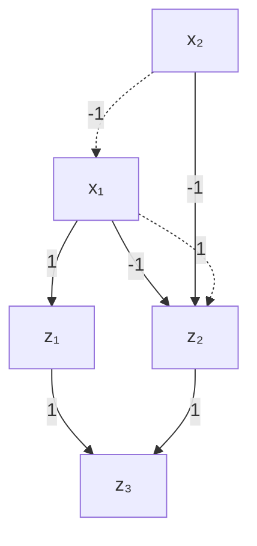
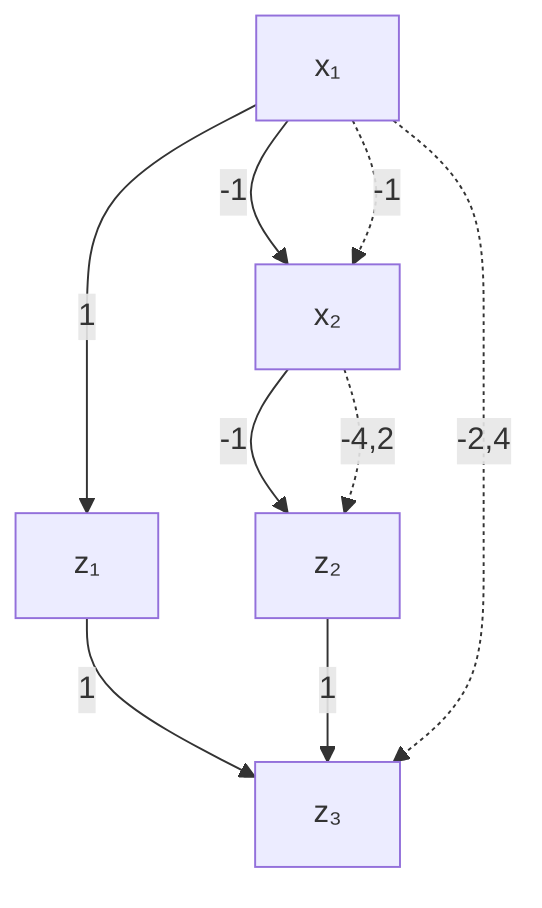
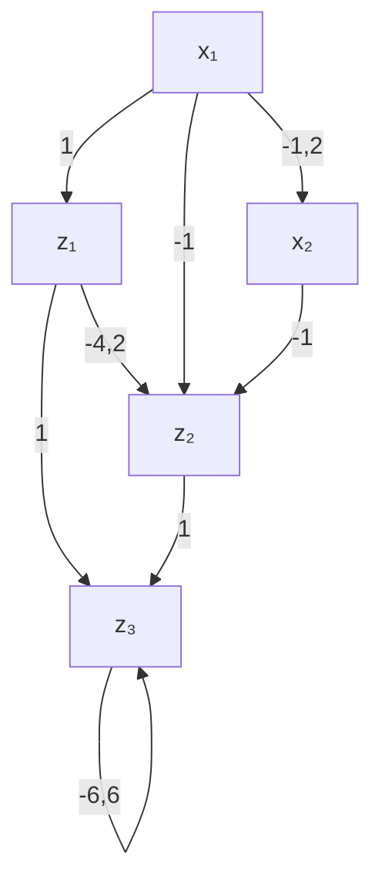

# 附录：扩展Mace（Appendix Scaling Mace）

## b.1 边界计算示例（b.1 illustrations for the bounds computation）

初始网络（Initial network）

步骤 1（Step 1）

图 B.1：一个用于演示边界计算的示例神经网络。使用区间算术（interval arithmetic）计算边界。

我们使用一个非常简单的示例来演示如何通过**区间算术（interval arithmetic）**计算隐藏单元的边界，以及为什么使用**混合整数规划（Mixed Integer Programs, MIPs）**能够获得更好的边界。考虑图 B.1 中不含 ReLU 激活函数和偏置的简单初始网络。在步骤 1 中，我们希望计算第一个（也是唯一一个）隐藏层的边界。从 $z _ { 1 }$ 开始，计算其下界意味着从上一层的神经元中选择能够使 $z _ { 1 }$ 取最小值的边界。因此，考虑到其权重的符号，对于上一层中的两个神经元都选择下界，$z _ { 1 }$ 的下界被设置为 $1 * ( - 1 ) + 1 * ( - 1 ) = - 2$ 。类似地，上界为 $1 * 2 + 1 * 2 = 4$ 。然而，对于 $z _ { 2 }$ ，由于与其相连的权重为负，在计算下界时，选择上一层的上界，其下界被设置为 $- 1 * 2 + - 1 * 2 = - 4$ 。类似地，上界为 $- 1 * ( - 1 ) + - 1 * ( - 1 ) = 2$ 。最后，在步骤 2 中，以类似的方式计算单个输出神经元的边界 $( [ - 6 , 6 ] )$ 。

可以看出，为了计算隐藏层的边界，每个神经元分别从上一层选择下界/上界，而没有考虑神经元之间的关系，这导致了冲突，从而使得下一层（输出层）的边界变得松散。另一方面，考虑该网络的直接 MIP 形式，对于隐藏层我们简单地有 $z _ { 1 } = x _ { 1 } + x _ { 2 }$ 和 $z _ { 2 } = - x _ { 1 } - x _ { 2 }$ ，对于下一层有 $z _ { 3 } = z _ { 1 } + z _ { 2 }$ 。最大化/最小化 $z _ { 1 }$ 和 $z _ { 2 }$ 变量得到的隐藏层边界与区间算术得到的相同。然而，对于下一层（输出层），我们将得到边界 [0, 0]，因为 MIP 考虑了神经元之间更深层次的关系，即 $z _ { 3 } \ = \ z _ { 1 } + z _ { 2 } \ =$ $x _ { 1 } + x _ { 2 } - x _ { 1 } - x _ { 2 } = 0$ 。

这个例子针对的是不含 ReLU 激活函数的网络。ReLU 函数也可以通过将二进制变量关联到 MIP 编码中（例如，编码 (3.3)）来进行编码，并通过逐层求解 MIP 以类似方式计算精确边界。然而，这样做效率低下，因为 ReLU 的二进制变量需要进行穷举搜索。因此，建议对 ReLU 函数采用一种**线性（过度）近似（linear (over-)approximation）** (3.6b)，以高效的方式找到比精确边界稍宽松、但比区间算术边界更紧的边界。

## b.2 附加结果（b.2 additional results）

图 B.2 中的结果补充了正文中图 3.3 的结果，转而比较了每种方法获得的**距离范数（distance norm）**。此外，图 $\mathrm { B } . 3$ 展示了额外的可扩展性结果（类似于图 3.5），但针对的是 Adult 和 Credit 数据集。这些结果反映了与正文中先前观察到的相同趋势。

图 B.3：散点图和柱状图显示了当网络架构变得更宽或更深时的运行时间和距离。比较基于 SMT、MIP 和梯度的不同方法的可扩展性实验。前两行显示了 Credit 数据集的结果，后两行显示了 Adult 数据集的结果。在每两行中，上一行展示了深度增加的情况，而下一行展示了宽度增加的情况；两者均以运行时间和距离来衡量。对于每种方法和架构，评估了 50 个样本，但有些方法未能生成有效的**反事实解释（Counterfactual Explanations, CFEs）**（在此情况下仅针对 DiCE）；因此，仅所有方法均生成了有效 CFE 的实例被纳入比较。总的来说，对于 Credit 数据集，增加深度导致 MIP-OBJ、MIP-EXP 和 DiCE 的平均覆盖率分别为 100.0%、100.0% 和 98.2%；增加宽度导致平均覆盖率分别为 100%、100% 和 100.0%。对于 Adult 数据集，增加深度导致 MIP-OBJ、MIP-EXP 和 DiCE 的平均覆盖率分别为 100.0%、100.0% 和 96.8%；增加宽度导致平均覆盖率分别为 100%、100% 和 99.1%。