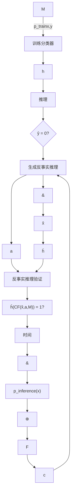

# 附录：鲁棒因果反事实推理（Robust Causal Recourse）
## e.1 反事实推理过程中的不确定性（Uncertainties in the Recourse Process）

在反事实推理过程中可能会出现不确定性，如图 E.1 所示。分类设置中一些经过充分研究的不确定性来源自然地延伸到了**算法反事实推理（algorithmic recourse）**领域。大量关于鲁棒分类的文献关注的是推理时输入 $x$ 的不确定性，这种不确定性可能源于噪声（FMDF16; XCM09）、对抗性操纵（Mad+18; Sze+14）以及数据中的其他错误表述或误差（Zhe+16）的存在。关于分类器 $h$，模型训练所求解的优化问题通常没有唯一的最优解，并且多个模型在训练数据上可能表现同样出色（Bre+01; Rud19）。此外，反事实推理的时间特性引入了一个独特的挑战：当个体能够实施为其规定的反事实推理时，生成反事实推理的条件可能已经发生了变化。例如，在**数据集偏移（data-set shift）**（MT+12; QC+09）或与**分布外泛化（out of distribution generalization）**相关的任务（Gei+20; MBS13）等现象下，输入本身的分布在推理时可能发生变化。从因果角度来看，观测数据分布的变化是底层**结构因果模型（Structural Causal Model, SCM）**变化的结果（Büh20）。

**图 E.1：** 反事实推理过程概览。不确定的元素用虚线圆圈表示。不确定元素之间可能的关系用非粗体虚线表示。粗体虚线表示时间跳跃。

事实上，由 SCM 表征的数据生成过程可能并非完全已知（Küg+22），或者可能随时间动态变化为其他某个 SCM $\hat { \mathcal { M } } \in \mathcal { U } _ { \mathcal { M } }$，其中 $\boldsymbol { \mathcal { U } } _ { \mathcal { M } }$ 是未来 SCM 的**不确定集（uncertainty set）**。因此，由规定的反事实推理干预产生的反事实个体也可能发生变化。此外，决策者可能必须定期重新训练其模型，以防止因 SCM 变化导致的分布偏移而造成性能下降，从而对未来分类器 $\hat { h } \in { \mathcal U } _ { h }$ 产生进一步的不确定性（RKL20a; UJL21）。最后，期望个体 $x$ 在较长时间内不发生其无法控制的变化可能是不合理的（VA20），这导致了对未来个体 $\hat { \textbf { x } } \in \mathcal { U } _ { x }$ 的不确定性。因此，由于 SCM $\hat { \mathcal { M } }$、分类器 $\hat { h }$ 和/或事实个体 $\hat { \textbf { x } }$ 的变化，执行规定的反事实推理可能不会导致有利的分类结果。

## e.2 鲁棒反事实推理存在的充分条件（Sufficient Conditions for the Existence of Robust Recourse）

鲁棒反事实推理存在的条件比标准反事实推理存在的条件严格得多，因为所有可能的反事实都必须被有利地分类，而不仅仅是对应于事实 $x$ 的那一个。附录 $\mathsf { A } . 2$ 中说明的示例 1 表明，即使在所有特征都是**可行动的（actionable）**并且对每个个体 $\mathbf { x } \in \mathcal { X }$ 都存在反事实推理的强假设下，对于任何个体 $\mathbf { x } \in \mathcal { X }$，鲁棒反事实推理也可能不存在。

**示例 E.2.1。** 考虑 $\mathbf { x } \in \mathbb { R } ^ { 2 } , h ( \mathbf { x } ) = \sin ( 2 \gamma \pi ^ { - 1 } x _ { 2 } ) ~ \geq ~ 0$ 其中 $0 < \gamma < \epsilon$，以及不确定集 $B ( \mathbf { x } ) = \{ \mathbf { x } + \Delta \mid \| \Delta \| _ { 2 } \leq \epsilon \}$。虽然对于所有 $\mathbf { x } \in \mathbb { R } ^ { 2 }$ 都存在某种反事实推理建议，但对于任何 $\mathbf { x } \in \mathbb { R } ^ { 2 }$，都不存在任何**对抗性鲁棒反事实推理建议（adversarially robust recourse recommendation）**。

上述示例依赖于这样一个事实：分类器对任何 $\mathbf { x } \in \mathcal { X }$ 都不能产生鲁棒的预测，因此在存在不确定性的情况下，没有反事实能够保持有效（即被有利地分类）。这暗示了预测的鲁棒性与反事实推理的鲁棒性之间存在某种关系。特别地，要使反事实推理存在，分类器必须具有最低限度的鲁棒性，即必须存在至少一个个体 $\mathbf { x } ^ { + } \in \mathcal { X }$，使得 $h ( \mathbf { x } ^ { + } ) = 1$ 被鲁棒地分类。

**引理 E.2.1。** 如果所有特征都是可行动的，并且存在某个 $\mathbf { x } ^ { + } \in \mathcal { X }$，使得对于所有 $\mathbf { x } ^ { \prime } \in B ( \mathbf { x } ^ { + } )$ 都有 $h ( \mathbf { x } ^ { \prime } ) = 1$，那么对于所有 $\mathbf { x } \in \mathcal { X }$，都存在某种对抗性鲁棒反事实推理建议。

**表 E.1：** 鲁棒反事实推理存在的充分条件。

| 分类器 $h$ | 可行动性约束 | SCM $\mathcal{M}$ | 反事实推理的存在性 | 鲁棒反事实推理的存在性 |
|---|---|---|---|---|
| $\exists x^{+} \in \mathcal{X}$ 使得 $h(x^{+}) = 1$ | 所有特征可行动 | 任意 | 保证存在（Ustun et al. (USL19)） | 不保证存在（示例 E.2.1） |
| $\exists x^{+} \in \mathcal{X}$ 使得 $h(x') = 1$ $\forall x' \in B(x^{+})$ | 所有特征可行动 | 任意 | 保证存在（Ustun et al. (USL19)） | 保证存在（引理 E.2.1） |
| 线性 | $\exists X_{j}$ 可行动且无界 | 线性 | 保证存在（引理 E.2.2） | 保证存在（引理 E.2.2） |
| 任意 | 所有有界，$\geq 1$ 个不可变 | 任意 | 不保证存在（Ustun et al. (USL19)） | 不保证存在（直接推论） |

为了放宽所有特征必须可行动的条件，我们将自己限制在分类器和 SCM 都是线性的情况。那么，至少存在一个可行动且无界的特征就足以保证鲁棒反事实推理的普遍存在。直观地说，决策者可以对一个可行动且无界的特征要求任意大的改变，使得所有可能的反事实都被有利地分类（例如，为贷款审批增加储蓄）。

**引理 E.2.2。** 对于线性分类器 $h ( \mathbf { x } ) = \langle \mathbf { w } , \mathbf { x } \rangle \geq b$ 和具有线性结构方程的 SCM，如果存在一个特征 $\mathbf { \boldsymbol { x } } _ { j }$ 使得 $\mathbf { \boldsymbol { x } } _ { j }$ 是可行动且无界的，并且 $w _ { j } \neq 0$，那么对于所有 $\mathbf { x } \in { \dot { \mathcal { X } } }$，至少存在一个对抗性鲁棒反事实推理动作。

如果所有特征都是有界的，并且至少存在一个不可变特征，那么根据 Ustun et al. (USL19) 的 Remark 3，即使在线性情况下也无法保证反事实推理的普遍存在，因此也无法保证对抗性鲁棒反事实推理的普遍存在。

## e.3 证明（Proofs）

### e.3.1 定理 1（Theorem 1）

设 $a ^ { * } = \mathrm { d o } ( \mathbf { X } _ { \mathcal { T } } : = \mathbf { x } _ { \mathcal { T } } + \pmb { \theta } ^ { * } )$ 是分类器 $h$ 和个体 $x$ 的最小成本反事实推理动作。假设 $a ^ { * }$ 是一个鲁棒反事实推理动作，即对于所有 $\left\| \Delta \right\| \leq \epsilon$，有 $\iota \left( \mathbb { C F } \left( \mathbb { C F } \left( \mathbf { x } , \Delta \right) , a ^ { * } \right) \right) = 1$。考虑任意 $\mathcal { T } _ { j }$，使得对于所有 $i \in \mathcal { Z }$，$\mathbf { \boldsymbol { x } } _ { i }$ 不是 $\mathbf { \boldsymbol { x } } _ { \mathit { I } _ { i } }$ 的因果后代。考虑 $e _ { j } \in \mathbb { R } ^ { | \mathcal { I } | }$，使得 $( e _ { j } ) _ { j } = 1$ 并且对于所有 $i \neq j$ 有 $( e _ { j } ) _ { i } = 0$。那么动作 $\begin{array} { r } { a = \mathrm { d o } ( \mathbf { X } _ { \mathcal { T } } : = \mathbf { x } _ { \mathcal { T } } - \pmb { \theta } ^ { * } + \alpha e _ { j } \mathrm { s i g n } ( \pmb { \theta } _ { j } ) ) } \end{array}$ 是一个有效的反事实推理动作，因为对于任何 $\alpha \leq \epsilon$，根据 $a ^ { * }$ 是鲁棒的假设，并且给定根据定理中的假设 ii) 有 $a \in { \mathcal { F } } ( { \mathbf { x } } )$，有 $h ( \mathbb { C F } \left( \mathbf { x } , a \right) ) = h ( \mathbb { C F } \left( \mathbb { C F } \left( \mathbf { x } , \alpha e _ { j } \operatorname { s i g n } ( \theta _ { j } ) \right) , a ^ { * } \right) = 1$。此外，根据定理中的假设 i)（成本函数的严格凸性），必须有 $c ( \mathbf { x } , a ) < c ( \mathbf { x } , a ^ { * } )$，这与 $a ^ { * }$ 是最小成本反事实推理动作相矛盾，因此最小反事实推理动作 $a ^ { * }$ 必须对扰动 $x$ 是脆弱的。

### e.3.2 示例 1（Example 1）

阴影区域是特征空间中被有利分类的区域。虽然对每个个体都存在反事实推理，但对任何个体都不存在鲁棒反事实推理。

$X_2$
$x_{CF}$
$\gamma$
$x$
$X_1$

## e.3.3 引理 1（Lemma 1）

根据假设，存在某个 $\mathbf { x } ^ { + } \in \mathcal { X }$，使得对于所有 $\mathbf { x } ^ { \prime } \in \bar { B ( \mathbf { x } ^ { + } ) }$，有 $h ( \mathbf { x } ^ { + } ) ~ = ~ 1$，其中 $B ( \mathbf { x } ^ { + } ) ~ = ~ \{ { \mathbb { C } } \mathbb { F } ( \mathbf { x } ^ { + } , \Delta ) | \| \Delta \| ~ \leq ~ \epsilon \}$。对于任意给定的个体 $\mathbf { x }$，动作 $a \ = \ d o \left( { \pmb X } = { \pmb x } + ( { \pmb x } ^ { + } - { \pmb x } ) \right)$ 产生反事实个体 $\mathbf { x } ^ { \mathrm { C F } } = \mathbb { C F } ( \mathbf { x } , a ) = \mathbf { x } ^ { + }$。动作 $a$ 是可行的，因为所有特征都是可行动的（actionable）。动作 $a$ 是一个追索动作（recourse action），因为 $h ( { \bf x } ^ { \mathrm { C F } } ) \ = \ h ( { \bf x } ^ { + } ) \ = \ 1$。由于动作 $a$ 对所有特征进行了硬干预（hard intervention），$\begin{array} { r l r } { \mathbb { C F } ( \mathbb { C F } ( { \mathbf x } , \Delta ) , a ) } & { = } & { \mathbb { C F } ( \mathbb { C F } ( { \mathbf x } , a ) , \Delta ) \quad = \quad \mathbb { C F } ( { \mathbf x } ^ { + } , \Delta ) } \end{array}$，因此 $\{ \mathbb { C F } ( \mathbb { C F } ( \mathbf { x } , \Delta ) , a ) | \| \Delta \| \leq \epsilon \} = \{ \mathbb { C F } ( \mathbf { x } ^ { + } , \Delta ) | \| \Delta \| \leq \epsilon \} = B ( \mathbf { x } ^ { + } )$。由此可知，$a$ 是一个**稳健追索动作（robust recourse action）**，因为对于所有 $\mathbf { x } ^ { \prime } \in B ( \mathbf { x } ^ { + } )$，有 $h ( \mathbf { x } ^ { \prime } ) = 1$。

## e.3.4 引理 2（Lemma 2）

根据假设，存在某个特征 $\mathbf { \boldsymbol { x } } _ { j }$，使得 $\mathbf { \boldsymbol { x } } _ { j }$ 是可行动且无界的，并且 $\mathbf { \boldsymbol { x } } _ { j }$ 线性地影响其因果后代（causal descendants）。考虑追索动作 $a = \mathrm { d o } ( \mathbf { X } _ { i } : = \mathbf { x } _ { i } + \pmb { \theta } )$，其中 $\theta \in \mathbb { R }$。根据定理 2，我们必须找到一个追索动作，使得 $\langle \mathbf { \bar { w } } , \mathbb { C F } ( \mathbf { x } , a ) \rangle \ge b ^ { \prime }$。由于对**结构因果模型（Structural Causal Model, SCM）** 的线性假设，$\mathbb { C } \mathbb { F } ( \mathbf { x } , a ) = \mathbf { x } + \pmb { \theta } \mathbf { v }$，其中 $v \in \mathbb { R } ^ { n }$。于是，$\langle \mathbf { w } , \mathbb { C F } ( \mathbf { x } , a ) \rangle =$ $\langle \mathbf { w } , \mathbf { x } + \pmb { \theta } \mathbf { v } \rangle = \langle \mathbf { w } , \mathbf { x } \rangle + \pmb { \theta } \langle \mathbf { w } , \mathbf { v } \rangle$。一个稳健追索动作等价于任意满足以下条件的 $\theta$：$\begin{array} { r } { \pmb { \theta } \langle \mathbf { w } , \mathbf { v } \rangle \geq b ^ { \prime } - \langle \mathbf { w } , \mathbf { x } \rangle . \mathrm { I f } \left. \mathbf { w } , \mathbf { v } \right. \neq 0 \left( \mathrm { i . e . } \right. } \end{array}$，即分类器的权重并非针对 SCM 选择（非平凡情况），那么显然可以设置 $\theta$ 具有任意大的幅度，且与 $\langle \mathbf { w } , \mathbf { v } \rangle$ 符号相同，从而满足上述不等式。由于 $\mathbf { \boldsymbol { x } } _ { j }$ 是可行动且无界的，因此 $a = \mathrm { d o } ( \mathbf { X } _ { j } : = \mathbf { x } _ { j } + \pmb { \theta } )$ 是一个可行动作。因此，$a$ 是一个稳健追索动作。

## e.3.5 定理 2（Theorem 2）

**对抗稳健追索问题（Adversarially robust recourse problem）** 定义为：

$$
\min _ {a = \mathrm{do} (\mathbf {X} _ {\mathcal {I}} := \mathbf {x} _ {\mathcal {I}} + \boldsymbol {\theta})} \max _ {\mathbf {x} ^ {\prime} \in B (\mathbf {x})} c (\mathbf {x}, a) \quad \text { s.t. } \quad a \in \mathcal {F} (\mathbf {x} ^ {\prime}) \wedge h \left(\mathbb {C F} \left(\mathbf {x} ^ {\prime}, a\right)\right) = 1 \tag {E.3.1}
$$

假设 $h ( \mathbf { x } ) = \langle \mathbf { w } , \mathbf { x } \rangle \geq b$ 且 $\mathcal { F } ( \mathbf { x } ) = \mathcal { F } ( \mathbf { x } ^ { \prime } ) \forall \mathbf { x } ^ { \prime } \in B ( \mathbf { x } )$，则上述问题等价于：

$$
\min _ {a = \mathrm{do} (\mathbf {X} _ {\mathcal {I}} := \mathbf {x} _ {\mathcal {I}} + \boldsymbol {\theta})} \max _ {\mathbf {x} ^ {\prime} \in B (\mathbf {x})} c (\mathbf {x}, a) \quad \text { s.t. } \quad a \in \mathcal {F} (\mathbf {x}) \wedge \langle \mathbf {w}, (\mathbb {C F} (\mathbf {x} ^ {\prime}, a)) \rangle \geq b \tag {E.3.2}
$$

对于一个动作 $a$ 而言，要成为稳健可行的（robust feasible），第二个约束必须对每个 $\mathbf { x } ^ { \prime } \in B ( \mathbf { x } )$ 成立，即：

$$
\left(\min _ {\mathbf {x} ^ {\prime} \in B (\mathbf {x})} \langle \mathbf {w}, (\mathbb {C F} (\mathbf {x}, a))) \rangle\right) \geq b \tag {E.3.3}
$$

因此，方程 E.3.2 等价于：

$$
\min _ {a = \mathrm{do} (\mathbf {X} _ {\mathcal {I}} := \mathbf {x} _ {\mathcal {I}} + \boldsymbol {\theta})} c (a) \quad \text { s.t. } \quad a \in \mathcal {F} (\mathbf {x}) \wedge \left(\min _ {\mathbf {x} ^ {\prime} \in B (\mathbf {x})} \langle \mathbf {w}, (\mathbb {C F} (\mathbf {x}, a))) \rangle\right) \geq b \tag {E.3.4}
$$

由于 SCM 是线性的，我们得到：

$$
\begin{array}{l} \mathbb {C F} (\mathbb {C F} (\mathbf {x}, \Delta), a) = \mathbb {S} ^ {a} \left(\mathbb {S} ^ {- 1} \left(\mathbf {x} ^ {\prime}\right)\right) \\ = \mathbb {S} ^ {a} \left(\mathbb {S} ^ {- 1} \left(\mathbb {S} ^ {\Delta} \left(\mathbb {S} ^ {- 1} (\mathbf {x})\right)\right)\right) \\ = \mathbb {S} ^ {a} \left(\mathbb {S} ^ {- 1} \left(\mathbb {S} \left(\mathbb {S} ^ {- 1} (\mathbf {x}) + \Delta\right)\right)\right) \\ = \mathbb {S} ^ {a} \left(\mathbb {S} ^ {- 1} (\mathbf {x}) + \Delta\right) \tag {E.3.5} \\ = \mathbb {S} ^ {a} \left(\mathbb {S} ^ {- 1} (\mathbf {x})\right) + \mathbb {S} ^ {a} (\Delta) \\ = \mathbb {C F} (\mathbf {x}, a) + J _ {\mathbb {S} ^ {\mathcal {I}}} \Delta \\ \end{array}
$$

其中 $J _ { { \mathbb S } ^ { \mathbb T } }$ 表示干预映射 $\mathbb { S } ^ { \mathcal { T } }$ 的**雅可比矩阵（Jacobian）**。于是：

$$
\begin{array}{l} \min _ {\mathbf {x} ^ {\prime} \in B (\mathbf {x})} \left\langle \mathbf {w}, \mathbb {C F} (\mathbf {x}, a)\right) \rangle = \min _ {\| \Delta \| \leq \epsilon} \left\langle \mathbf {w}, \mathbb {C F} (\mathbf {x}, a)\right) + J _ {\mathbb {S} ^ {\mathcal {I}}} \Delta \rangle \\ = \left\langle \mathbf {w}, \mathbb {C F} (\mathbf {x}, a)\right) \rangle + \min _ {\| \Delta \| \leq \epsilon} \left\langle \mathbf {w}, J _ {\mathbb {S} ^ {\mathcal {I}}} \Delta \right\rangle \tag {E.3.6} \\ = \left\langle \mathbf {w}, \mathbb {C F} (\mathbf {x}, a)\right) \rangle - \left\| J _ {\mathcal {S} ^ {\mathcal {I}}} ^ {T} \mathbf {w} \right\| ^ {*} \epsilon \\ \end{array}
$$

因此，方程 E.3.4 中的优化问题简化为：

$$
\min _ {a = \mathrm{do} (\mathbf {X} _ {\mathcal {I}} := \mathbf {x} _ {\mathcal {I}} + \boldsymbol {\theta})} c (\mathbf {x}, a) \quad \text { s.t. } \quad a \in \mathcal {F} (\mathbf {x}) \wedge \langle \mathbf {w}, \mathbf {C F} (\mathbf {x}, a)) \rangle \geq b + \left\| J _ {\mathbb {S} ^ {\mathcal {I}}} ^ {T} \mathbf {w} \right\| ^ {*} \epsilon \tag {E.3.7}
$$

推论直接可得，因为在**独立机制框架（Independent Mechanism Framework, IMF）** 假设下，$J _ { \mathbb { S } ^ { \tau } } = I$，此时方程 E.3.7 类似于方程 6.1 中对分类器的追索问题定义：

$$
h (\mathbf {x}) = \langle \mathbf {w}, \mathbf {x} \rangle \geq b + \| \mathbf {w} \| ^ {*} \epsilon \tag {E.3.8}
$$

## e.3.6 定理 3（Theorem 3）

根据定理 2，稳健追索动作 $a ^ { \prime } \ = \ d o ( { \bf X } _ { \mathcal { T } } = { \bf x } _ { \mathcal { T } } + ( 1 + \beta \epsilon ) \pmb \theta )$ 必须满足：

$$
\langle \mathbf {w}, \mathbb {C F} (\mathbf {x}, a ^ {\prime}) \rangle \geq b + \left\| J _ {\mathbb {S} ^ {\mathcal {I}}} ^ {T} \mathbf {w} \right\| ^ {*} \epsilon \tag {E.3.9}
$$

由于 SCM 是线性的，$\mathbb { C } \mathbb { F } ( \mathbf { x } , a ^ { \prime } ) = \mathbf { x } + J _ { \mathbb { S } ^ { I } } ( 1 + \beta \epsilon ) \pmb { \theta }$。于是：

$$
\begin{array}{l} \langle \mathbf {w}, \mathbb {C F} (\mathbf {x}, a ^ {\prime}) \rangle = \langle \mathbf {w}, \mathbf {x} + (1 + \beta \epsilon) J _ {\mathbb {S} ^ {\mathcal {I}}} \boldsymbol {\theta}) \rangle \\ = \left\langle \mathbf {w}, \mathbf {x} + J _ {\mathbb {S} ^ {I}} \boldsymbol {\theta} \right\rangle + \beta \epsilon \left\langle \mathbf {w}, J _ {\mathbb {S} ^ {I}} \boldsymbol {\theta} \right\rangle \tag {E.3.10} \\ \geq b + \beta \epsilon \langle \mathbf {w}, J _ {\mathbb {S} ^ {\mathcal {I}}} \boldsymbol {\theta} \rangle \\ \end{array}
$$

其中最后一个不等式基于 $a$ 是 $h ( \mathbf { x } ) = \left. \mathbf { w } , \mathbf { x } \right. \geq b$ 的一个追索动作这一假设。因此，如果：

$$
\beta = \frac {\left\| J _ {S ^ {I}} ^ {T} \mathbf {w} \right\| ^ {*}}{\langle \mathbf {w} , J _ {S ^ {I}} \boldsymbol {\theta} \rangle} \tag {E.3.11}
$$

那么方程 E.3.10 满足方程 E.3.9 中的稳健追索条件。

根据 $a$ 是一个追索动作的假设，有 $\langle \mathbf { w } , J _ { \mathbb { S } ^ { T } } \rangle > 0$。于是 $0 < \beta <$ ∞。因此，如果 $a ^ { \prime } \in \mathcal { F } ( \mathbf { x } )$，则动作 $\begin{array} { r } { a ^ { \prime } = \mathrm { d o } ( \mathbf { X } _ { \mathcal { T } } : = \mathbf { x } _ { \mathcal { T } } + ( 1 + \beta \epsilon ) \pmb { \theta } ) } \end{array}$ 是一个稳健追索动作。

## e.4 所考虑的数据集（datasets considered）

* **COMPAS**：我们使用特征：年龄（age）、种族（race）、性别（sex）和先前犯罪次数（priors count）。我们认为先前犯罪次数是可行动的，其可行动性约束为先前犯罪次数只能减少，但不能低于零。
* **Adult**：我们使用特征：性别（sex）、年龄（age）、原籍国（native-country）、婚姻状况（marital-status）、受教育年限（education-num）、每周工作小时数（hours-per-week）。我们认为受教育年限和每周工作小时数是可行动的。受教育年限只能增加，且限定在 [1, 16] 范围内，而每周工作小时数必须低于 100。
* **South German Credit**：我们考虑特征：laufkont, moral, verw, sparkont, beszeit, rate, famges, buerge, wohnzeit, verm, weitkred, wohn, bishkred, beruf, pers, telef, gastarb。我们认为 laufzeit, hoehe 是可行动的，并要求它们为正数。
* **Bail**：我们使用除 RECID, TIME, FILE 之外的所有特征。我们认为 RULE 是可行动的。我们要求它只能减少，但不能为负。
* **Loan**：我们使用 Karimi 等人 [Kar+20b] 使用的所有特征。

| [AHL15] | Jason Abrevaya, Yu-Chin Hsu, and Robert P Lieli. “Estimating conditional average treatment effects.” In: Journal of Business & Economic Statistics 33.4 (2015), pp. 485-505. |
| [Adu96] | Adult data. https://archive.ics.uci.edu/ml/datasets/adult. 1996. |
| [ACH10] | Charu C Aggarwal, Chen Chen, and Jiawei Han. “The inverse classification problem.” In: Journal of Computer Science and Technology 25.3 (2010), pp. 458-468. |
| [APMRRÁ20] | Carlos Aguilar-Palacios, Sergio Muñoz-Romero, and José Luis Rojo-Álvarez. “Cold-Start Promotional Sales Forecasting through Gradient Boosted-based Contrastive Explanations.” In: IEEE Access (2020). |
| [Aïv+19] | Ulrich Aïvodji, Hiromi Arai, Olivier Fortineau, Sébastien Gambis, Satoshi Hara, and Alain Tapp. “Fairwashing: the risk of rationalization.” In: arXiv preprint arXiv:1901.09749 (2019). |
| [ABG20] | Ulrich Aïvodji, Alexandre Bolot, and Sébastien Gambis. “Model extraction from counterfactual explanations.” In: arXiv preprint arXiv:2009.01884 (2020). |
| [AS17] | Ahmed M Alaa and Mihaela van der Schaar. “Bayesian inference of individualized treatment effects using multi-task gaussian processes.” In: Advances in Neural Information Processing Systems. 2017, pp. 3424-3432. |
| [AIR96] | Joshua D Angrist, Guido W Imbens, and Donald B Rubin. “Identification of causal effects using instrumental variables.” In: Journal of the American statistical Association 91.434 (1996), pp. 444-455. |
| [Ang+16] | Julia Angwin, Jeff Larson, Surya Mattu, and Lauren Kirchner. “Machine bias.” In: ProPublica, May 23 (2016), p. 2016. |
| [Arn15] | Richard Arneson. “Equality of Opportunity.” In: The Stanford Encyclopedia of Philosophy. Ed. by Edward N. Zalta. Summer 2015. Metaphysics Research Lab, Stanford University, 2015. |

<!-- footnote -->

- 此链接

<!-- footnote end -->

<!-- footnote -->

- 这被认为超出了本章的范围；我们基于开源 PySMT 库 (GM15) 构建了 MACE，并使用 $Z _ { 3 }$ (MB08) 后端来演示其对现成模型的**模型无关（model-agnostic）** 支持。
- 所有测试均使用一块 $\times 8 6 _ { - } 6 _ { 4 }$ Xeon(R) CPU @ 2.60GHz 和 8GB 内存进行。

<!-- footnote end -->

<!-- footnote -->

- 提醒：距离越小越理想，因为它指定了对个体特征所需的最小改变量。

<!-- footnote end -->