# Machine Learning for Causal Inference

## Editors

Sheng Li

University of Virginia

Charlottesville, VA, USA

Zhixuan Chu

Ant Group

Hangzhou, China

ISBN 978-3-031-35050-4

ISBN 978-3-031-35051-1 (eBook)

https://doi.org/10.1007/978-3-031-35051-1

© The Editor(s) (if applicable) and The Author(s), under exclusive license to Springer Nature Switzerland AG 2023

This work is subject to copyright. All rights are solely and exclusively licensed by the Publisher, whether the whole or part of the material is concerned, specifically the rights of translation, reprinting, reuse of illustrations, recitation, broadcasting, reproduction on microfilms or in any other physical way, and transmission or information storage and retrieval, electronic adaptation, computer software, or by similar or dissimilar methodology now known or hereafter developed.

The use of general descriptive names, registered names, trademarks, service marks, etc. in this publication does not imply, even in the absence of a specific statement, that such names are exempt from the relevant protective laws and regulations and therefore free for general use.

The publisher, the authors, and the editors are safe to assume that the advice and information in this book are believed to be true and accurate at the date of publication. Neither the publisher nor the authors or the editors give a warranty, expressed or implied, with respect to the material contained herein or for any errors or omissions that may have been made. The publisher remains neutral with regard to jurisdictional claims in published maps and institutional affiliations.

This Springer imprint is published by the registered company Springer Nature Switzerland AG. The registered company address is: Gewerbestrasse 11, 6330 Cham, Switzerland

Paper in this product is recyclable.

## Preface

Machine learning and causal inference have gained significant attention in both academia and industry for the past decades, but they have been mainly treated as separate research areas. In recent years, some machine learning models (e.g., tree-based models, deep representation learning models, adversarial learning models, and graph neural networks) have been increasingly used for various causal inference problems, such as counterfactual inference, treatment effect estimation, and causal discovery. Moreover, causality has been exploited to assist some challenging machine learning tasks, such as explainability, fairness, and domain generalization. Such a convergence between machine learning and causal inference motivated us to create a book to summarize the recent research progress in this area. We are very fortunate to receive tremendous support from many leading scientists in machine learning and causal inference, who contribute book chapters to give comprehensive reviews of emerging research topics.

This book aims to offer readers insights into the relationship between machine learning and causal inference from multiple perspectives. It delves into topics such as the preliminary of causal inference, the utilization of machine learning for causal effect estimation, the contribution of causal inference in trustworthy machine learning, and the practical applications of causal inference in various domains.

This book consists of 4 parts which are composed of 14 chapters in total.

- Part I gives an overview of this book in Chap. 1 and covers the preliminary of causal inference in Chap. 2.
- Part II focuses on machine learning and causal effect estimation. In particular, Chap. 3 discusses the basic methodologies for estimating causal effects, Chap. 4 introduces causal inference on graphs, and Chap. 5 provides a comprehensive discussion of challenges and opportunities for the three core components of the treatment effect estimation task, i.e., treatment, covariates, and outcome.
- Part III introduces the relationships between causal inference and trustworthy machine learning. Specifically, Chap. 6 presents a causality-based framework for fairness-aware machine learning, Chap. 7 discusses the design of causal

explainable artificial intelligence systems, and Chap. 8 introduces causality-aware domain generalization.

\- Part IV introduces the applications of causal inference and machine learning in different domains. Chapter 9 discusses causal inference for natural language processing (NLP). Chapter 10 discusses how different causal inference techniques can be introduced to address the challenges in recommender systems. Chapter 11 presents a structural causal model that can be leveraged for instance-dependent label-noise learning in computer vision. Chapter 12 proposes a causal triple attention time series forecasting model with interpretable attention modules, which leverages the causal inference to remove the confounding effect. Chapter 13 presents the continual causal inference problem and proposes a new framework for estimating causal effects from incrementally available observational data. Chapter 14 summarizes this book.

Overall, this book provides a comprehensive review of causal inference methodologies, a timely summarization of recent research efforts, and various real-world applications of causal inference, which will benefit readers from different backgrounds, such as advanced undergraduate and graduate students, researchers, lecturers, and practitioners.

Charlottesville, VA, USA

Hangzhou, China

April, 2023

Sheng Li

Zhixuan Chu

## Acknowledgements

Over the last 10 years, causal inference and machine learning have drawn more and more attention. We feel extremely lucky to have the opportunity to speak with top researchers and leading scientists in this field on recent developments and research challenges. We would like to extend our sincere gratitude to our partners and colleagues at the University of Virginia and Ant Group, who inspired us to write this book that serves as a timely summary of recent research progress in the interaction of causal inference and machine learning. We also appreciate the assistance and cooperation of Springer Nature editors Paul Drougas and Arun Siva Shanmugam.

Finally, we would like to thank our families for their support, understanding, and motivation throughout the writing of this book.


## Sheng Li and Zhixuan Chu

## Contributors

Wenqing Chen Sun Yat-sen University, Guangzhou, China

Zhixuan Chu Ant Group, Hangzhou, China

Jing Gao Purdue University, West Lafayette, IN, USA

Yingqiang Ge Rutgers University, New Brunswick, NJ, USA

Mingming Gong University of Melbourne, Parkville, VIC, Australia

Ruocheng Guo Bytedance AI Lab, London, UK

Bo Han Hong Kong Baptist University, Hong Kong, China

Jundong Li University of Virginia, Charlottesville, VA, USA

Sheng Li University of Virginia, Charlottesville, VA, USA

Yaliang Li Alibaba Group, Hangzhou, China

Ruopeng Li Ant Group, Hangzhou, China

Huan Liu Arizona State University, Tempe, AZ, USA

Tongliang Liu The University of Sydney, Camperdown, NSW, Australia

Jing Ma University of Virginia, Charlottesville, VA, USA

Gang Niu RIKEN Center for Advanced Intelligence Project, Tokyo, Japan

Stephen L. Rathbun University of Georgia, Athens, GA, USA

Paras Sheth Arizona State University, Tempe, AZ, USA

Xintao Wu University of Arkansas, Fayetteville, AR, USA

Yongkai Wu Clemson University, Clemson, SC, USA

Shuyuan Xu Rutgers University, New Brunswick, NJ, USA

Liuyi Yao Alibaba Group, Hangzhou, ChinaYu Yao The University of Sydney, Camperdown, NSW, Australia  
Aidong Zhang University of Virginia, Charlottesville, VA, USA  
Kun Zhang Carnegie Mellon University, Pittsburgh, PA, USA  
Lu Zhang University of Arkansas, Fayetteville, AR, USA  
Yongfeng Zhang Rutgers University, New Brunswick, NJ, USA  
Yaochen Zhu University of Virginia, Charlottesville, VA, USA


# Chapter 1 Overview of the Book


Zhixuan Chu and Sheng Li

Machine learning and causal inference have been two trending fields in recent years. While machine learning focuses on predicting outcomes based on patterns in data, causal inference aims to understand the causal relationships between variables. The relationship between machine learning and causal inference is complex and multifaceted. Machine learning can be used to estimate causal effects, while causal inference can be used to improve machine learning algorithms. By combining these two fields, we can gain a better understanding of the causal relationships between variables and improve our ability to make predictions based on data. However, there are also challenges associated with this relationship. For example, machine learning algorithms may not always be able to control all confounding variables, leading to biased estimates of causal effects. Similarly, causal inference algorithms may not always be able to identify all causal relationships between variables, leading to incomplete or inaccurate models.

This book aims to offer readers an insight into the relationship between machine learning and causal inference. It delves into topics such as the preliminary of causal inference, the utilization of machine learning for causal effect estimation, the contribution of causal inference in trustworthy machine learning, and the practical applications of causal inference in various machine learning domains.

In Part I, the causal inference preliminary provides a comprehensive introduction to causal inference and explains the different types of causal inference methods, including randomized experiments and observational studies. It covers the basic concepts, such as causality, potential outcomes, counterfactuals, confounders, selection bias, and critical assumptions for identifying the causal effect.

Part II focuses on machine learning and causal effect estimation. Chapter 3 discusses the basic methodologies for estimating causal effects, including matching-based, tree-based, ensemble-based, representation learning–based methods, and so on. It explains the strengths and limitations of each method with examples of their applications. Approaches attempted to loosen certain assumptions are presented in addition to the causal inference methods founded on fundamental assumptions. Chapter 4 introduces the background of causal inference on graphs, the main challenges, and methods for estimating treatment effects on graph-structured data. Although advanced machine learning approaches have shown extraordinary performance in treatment effect estimation, they come with a lot of new topics and new research questions. In view of the latest research efforts in the causal inference field, Chap. 5 provides a comprehensive discussion of challenges and opportunities for the three core components of the treatment effect estimation task, i.e., treatment, covariates, and outcome. In addition, we showcase the promising research directions of this topic from multiple perspectives.

In Part III, we explore the relationship between causal inference and trustworthy machine learning. Causal inference is an essential tool for enhancing the trustworthiness of machine learning models. It provides a framework for understanding the causal relationships between variables, which can improve the accuracy, transparency, fairness, generalization, and interpretability of the model. Specifically, Chap. 6 presents a causality-based framework for fairness-aware machine learning, which can unify various causal fairness notions by specifying the causal path sets and observational conditions. Chapter 7 provides an overview of causal explanation and discusses the design of causal explainable artificial intelligence to help understand how causal inference can be used to explain models. Chapter 8 introduces how causality-aware domain generalization methods differ from traditional domain generalization methods, how and when causality is used to infer invariant features, and how these methods have been applied to vision, graphs, and text.

In Part IV, we introduce the applications of causal inference in different machine learning domains such as graph learning, recommendation systems, computer vision, natural language processing, time series analysis, and so on. Causal inference is the process of determining the relationship between cause and effect. It is essential to understand the causal relationship to construct different machine learning models from data. Specifically, Chap. 9 discusses the difficulties associated with performing causal inference with textual data, which stems from the unstructured and high-dimensional nature of the text. In addition, it provides an extensive overview of causality-driven models for NLP, examining various methods of integrating causality, including intervention-level and counterfactual-level debiasing techniques. Chapter 10 provides the basic concepts of traditional recommender systems and their limitations due to the lack of causal reasoning ability. It then discusses how different causal inference techniques can be introduced to address these challenges, with an emphasis on debiasing, explainability promotion, and generalization improvement. Chapter 11 shows a structural causal model that can be leveraged for instance-dependent label-noise learning, which can lead to better classification accuracy in noisy computer vision datasets. Chapter 12 proposes a causal triple attention time series forecasting model with interpretable attention modules, which leverages the causal inference to remove the confounding effect and help the model effectively utilize the local and global temporal information. Chapter 13 formally defines the problem of continual causal effect estimation and proposes a continual causal effect representation learning method for estimating causal effects with observational data, which are incrementally available from nonstationary data distributions.

# Chapter 2 Causal Inference Preliminary


Liuyi Yao, Zhixuan Chu, Yaliang Li, Jing Gao, Aidong Zhang, and Sheng Li

## 2.1 Introduction

In everyday language, correlation and causality are commonly used interchangeably, although they have quite different interpretations. Correlation indicates a general relationship: two variables are correlated when they display an increasing or decreasing trend $[1]$ . Causality is also referred to as cause and effect, where the cause is partly responsible for the effect, and the effect is partly dependent on the cause. Causal inference is the process of drawing a conclusion about a causal connection based on the conditions of the occurrence of an effect. The main difference between causal inference and inference of correlation is that the former analyzes the response of the effect variable when the cause is changed $[10, 20]$ .

It is well known that “correlation does not imply causation.” For example, a study revealed that girls who typically have breakfast tend to weigh less than girls who do not, leading to the conclusion that breakfast can aid in weight loss. But in fact, these two events may just have correlation instead of causality. Perhaps girls who have breakfast every day have healthier lifestyles, including regular exercise,

L. Yao · Y. Li
Alibaba Group, Hangzhou, China
e-mail: yly287738@alibaba-inc.com; yaliang.li@alibaba-inc.com

Z. Chu
Ant Group, Hangzhou, China
e-mail: chuzhixuan.czx@alibaba-inc.com

J. Gao
Purdue University, West Lafayette, IN, USA
e-mail: jinggao@purdue.edu

A. Zhang · S. Li (☒)
University of Virginia, Charlottesville, VA, USA
e-mail: aidong@virginia.edu; shengli@virginia.edu sound sleep habits, and balanced diets, which eventually make them lightweight. In this case, eating breakfast and being lightweight share a common cause; thus, we may treat having a better lifestyle as a confounder of the causality between having breakfast and being lightweight.

In many cases, it seems obvious that one action can cause another; however, there exist also many cases that we cannot easily tease out and make sure of the relationship. Therefore, learning causality is a dauntingly challenging problem. The most effective way of inferring causality is to conduct a randomized controlled trial, which randomly assigns participants into a treatment group or a control group. As the randomized study is conducted, the only expected difference between the control and treatment groups is the outcome variable being studied. However, in reality, randomized controlled trials are always time-consuming and expensive, and thus, the study cannot involve many subjects, which may not be representative of the real-world population a treatment/intervention would eventually target. Another issue is that randomized controlled trials only focus on the average of samples, and they do not explain the mechanism for individual subjects. In addition, ethical issues also need to be considered in most randomized controlled trials, which largely limits their applications. Therefore, instead of randomized controlled trials, observational data are a tempting shortcut. Observational data are obtained by the researcher simply observing the subjects without any interference. That means the researchers have no control over treatments and subjects, and they just observe the subjects and record data based on their observations. From the observational data, we can find their actions, outcomes, and information about what has occurred, but we cannot figure out the mechanism of why they took a specific action. For the observational data, the core question is how to obtain the counterfactual outcome. For example, we want to answer this question “Would this patient have different results if he received a different medication?” Answering such counterfactual questions is challenging for two reasons $[15]$ : the first is that we only observe the factual outcome and never the counterfactual outcomes that would potentially have happened if they had chosen a different treatment option. The second is that treatments are typically not assigned at random in observational data, which may lead to the treated population differing significantly from the general population.

To solve these problems in causal inference from observational data, researchers have developed various frameworks, including the potential outcome framework $[14, 19]$ and the structural causal model $[9, 11, 12]$ . The potential outcome framework is also known as the Neyman–Rubin potential outcomes or the Rubin causal model. In the example we mentioned above, a girl would have a particular weight if she had breakfast normally every day, whereas she would have a different weight if she did not have breakfast normally. To measure the causal effect of having breakfast normally for a girl, we need to compare the outcomes for the same person under both situations. Obviously, it is impossible to see both potential outcomes at the same time, and one of the potential outcomes is always missing. The potential outcome framework aims to estimate such potential outcomes and then calculate the treatment effect. Therefore, treatment effect estimation is one of the central problems in causal inference under the potential outcome framework. Another influential framework in causal inference is the structural causal model (SCM), which includes the causal graph and the structural equations. The structural causal model describes the causal mechanisms of a system where a set of variables and the causal relationship among them are modeled by a set of simultaneous structural equations. Another line of learning causality is causal structure learning, whose objective is to reveal the causal relation by generating a causal graph. Representative methods can be divided into three categories, including constraint-based models $[18]$ , score-based models $[3, 13]$ , and functional causal models $[5, 22]$ . Different from causal effect estimation, causal structure learning addresses a different class of problems, which is out of our survey's scope; see $[17]$ for more information.

Causal inference has a close relationship with machine learning. In recent years, the magnificent bloom of the machine learning area has enhanced the development of the causal inference area. Powerful machine learning methods, such as decision trees, ensemble methods, and deep neural networks, are applied to estimate the potential outcome more accurately. In addition to the amelioration of the outcome estimation model, machine learning methods also provide a new aspect to handle confounders. Benefitting from the recent deep representation learning methods, the confounder variables are adjusted by learning the balanced representation for all covariates so that conditioning on the learned representation, the treatment assignment is independent of the confounder variables. In machine learning, the more data, the better. However, in causal inference, more data alone are not yet sufficient. Having more data only helps to obtain more precise estimates, but it cannot ensure that these estimates are correct and unbiased. Machine learning methods enhance the development of causal inference; meanwhile, causal inference also helps machine learning methods. The simple pursuit of predictive accuracy is insufficient for modern machine learning research, and correctness and interpretability are also the targets of machine learning methods. Causal inference is starting to help improve machine learning, such as recommender systems or reinforcement learning.

In this chapter, we provide a comprehensive review of the causal inference methods. We introduce the basic concepts as well as its three critical assumptions to identify the causal effect.

## 2.2 Basics of Causal Inference

In this section, we present the background knowledge of causal inference, including task description, mathematical notions, assumptions, challenges, and general solutions. We also give an illustrative example that will be used throughout this survey.

Generally, the task of causal inference is to estimate the outcome changes if another treatment had been applied. For example, suppose there are two treatments that can be applied to patients: Medicine A and Medicine B. When applying Medicine A to the interested patient cohort, the recovery rate is 70%, while applying Medicine B to the same cohort, the recovery rate is 90%. The change in recovery rate is the effect that treatment (i.e., medicine in this example) asserts on the recovery rate.

The above example describes an ideal situation to measure the treatment effect: applying different treatments to the same cohort. In real-world scenarios, this ideal situation can only be approximated by a randomized experiment in which the treatment assignment is controlled, such as a completely random assignment. In this way, the group receiving a specific treatment can be viewed as an approximation to the cohort we are interested in.

However, performing randomized experiments is expensive, time-consuming, and sometimes even unethical. Therefore, estimating the treatment effect from observational data has attracted growing attention due to the wide availability of observational data. Observational data usually contain a group of individuals who have taken different treatments, their corresponding outcomes, and possibly more information, but without direct access to the reason/mechanism why they took the specific treatment. Such observational data enable researchers to investigate the fundamental problem of learning the causal effect of a certain treatment without performing randomized experiments. To better introduce various treatment effect estimation methods, the following section introduces several definitions, including unit, treatment, outcome, treatment effect, and other information (pre- and post-treatment variables) provided by observational data.

## 2.2.1 Definitions

Here we define the notations under the potential outcome framework $[14, 19]$ , which is logically equivalent to another framework, the structural causal model framework $[8]$ . The foundation of the potential outcome framework is that causality is tied to treatment (or action, manipulation, intervention) applied to a unit $[6]$ . The treatment effect is obtained by comparing units' potential outcomes of treatments. In the following, we first introduce three essential concepts in causal inference: unit, treatment, and outcome.

Definition 2.1 (Unit) A unit is the atomic research object in the treatment effect study.

A unit can be a physical object, a firm, a patient, an individual person, or a collection of objects or persons, such as a classroom or a market, at a particular time point $[6]$ . Under the potential outcome framework, the atomic research objects at different time points are different units. One unit in the dataset is a sample of the whole population, so in this survey, the terms “sample” and “unit” are used interchangeably.

Definition 2.2 (Treatment) Treatment refers to the action that applies (exposes or subjects) to a unit.

Let $W$ ( $W \in \{0, 1, 2, \ldots, N_W\}$ ) denote the treatment, where $N_W + 1$ is the total number of possible treatments. In the aforementioned medicine example, Medicine A is a treatment. Most of the literature considers the binary treatment, and in this case, the group of units applied with treatment $W = 1$ is the treated group, and the group of units with $W = 0$ is the control group.

Definition 2.3 (Potential outcome) For each unit–treatment pair, the outcome of that treatment when applied to that unit is the potential outcome [6].

The potential outcome of treatment with value $w$ is denoted as $Y(W = w)$ .

Definition 2.4 (Observed outcome) The observed outcome is the outcome of the treatment that is actually applied.

The observed outcome is also called the factual outcome, and we use $Y^{F}$ to denote it where F stands for “factual.” The relation between the potential outcome and the observed outcome is $Y^{F} = Y(W = w)$ , where w is the treatment actually applied.

Definition 2.5 (Counterfactual outcome) The counterfactual outcome is the outcome if the unit had taken another treatment.

The counterfactual outcomes are the potential outcomes of the treatments except for the one actually taken by the unit. Since a unit can only take one treatment, only one potential outcome can be observed, and the remaining unobserved potential outcomes are counterfactual outcomes. In the multiple treatment case, let $Y^{CF}(W = w')$ denote the counterfactual outcome of treatment with value $w'$ . In the binary treatment case, for notation simplicity, we use $Y^{CF}$ to denote the counterfactual outcome, and $Y^{CF} = Y(W = 1 - w)$ , where $w$ is the treatment actually taken by the unit.

In the observational data, in addition to the chosen treatments and the observed outcome, the units' other information is also recorded, and they can be separated into pre-treatment variables and post-treatment variables.

Definition 2.6 (Pre-treatment variables) Pre-treatment variables are the variables that are not affected by the treatment.

Pre-treatment variables are also named background variables, and they can be patients' demographics, medical history, etc. Let $X$ denote the pre-treatment variables.

Definition 2.7 (Post-treatment variables) The post-treatment variables are the variables that are affected by the treatment.

One example of post-treatment variables is the intermediate outcome, such as the lab test after taking medicine in the aforementioned medicine example.

In the following sections, the terminology variable refers to the pre-treatment variable unless otherwise specified.

Treatment Effect After introducing the observational data and the key terminologies, the treatment effect can be quantitatively defined using the above definitions.

The treatment effect can be measured at the population, treated group, subgroup, and individual levels. To clarify these definitions, here we define the treatment effect under binary treatment, and it can be extended to multiple treatments by comparing their potential outcomes.

At the population level, the treatment effect is named the average treatment effect (ATE), which is defined as

$$
\mathrm{ATE} = \mathbb {E} [ \mathbf {Y} (W = 1) - \mathbf {Y} (W = 0) ], \tag {2.1}
$$

where $\mathbf{Y}(W = 1)$ and $\mathbf{Y}(W = 0)$ are the potential treated and control outcomes of the whole population, respectively.

For the treated group, the treatment effect is named as average treatment effect on the treated group (ATT), and it is defined as

$$
\mathrm{ATT} = \mathbb {E} [ \mathbf {Y} (W = 1) | W = 1 ] - \mathbb {E} [ \mathbf {Y} (W = 0) | W = 1 ], \tag {2.2}
$$

where $\mathbf{Y}(W = 1)|W = 1$ and $\mathbf{Y}(W = 0)|W = 1$ are the potential treated and control outcomes of the treated group, respectively.

At the subgroup level, the treatment effect is called conditional average treatment effect (CATE), which is defined as

$$
\mathrm{CATE} = \mathbb {E} [ \mathbf {Y} (W = 1) | X = x ] - \mathbb {E} [ \mathbf {Y} (W = 0) | X = x ], \tag {2.3}
$$

where $\mathbf{Y}(W=1)|X=x$ and $\mathbf{Y}(W=0)|X=x$ are the potential treated and control outcomes of the subgroup with X=x, respectively. CATE is a common treatment effect measurement when the treatment effect varies across different subgroups, which is also known as the heterogeneous treatment effect.

At the individual level, the treatment effect is called the individual treatment effect (ITE), and the ITE of unit i is defined as

$$
\mathrm{ITE} _ {i} = Y _ {i} (W = 1) - Y _ {i} (W = 0), \tag {2.4}
$$

where $Y_{i}(W = 1)$ and $Y_{i}(W = 0)$ are the potential treated and control outcomes of unit $i$ , respectively. In some works [7, 16], the ITE is viewed as the CATE.

Objective For causal inference, our objective is to estimate the treatment effects from the observational data. Formally speaking, given the observational dataset, $\left\{X_{i}, W_{i}, Y_{i}^{F}\right\}_{i=1}^{N}$ , where N is the total number of units in the datasets, the goal of the causal inference task is to estimate the treatment effects defined above.

## 2.2.2 An Illustrative Example

To better illustrate causal inference, we use the following example combined with the notations defined above to give an overview. In this example, we want to evaluate the treatment effects of several different medications for one disease by exploiting observational data (i.e., electronic health records) that include demographic information of patients, the specific medication with the specific dosage taken by patients, and the outcome of medical tests. Obviously, we can only obtain one factual outcome for a specific patient from electronic health records, and thus the core task is to predict what would have happened if a patient took another treatment (i.e., a different medication or the same medication with a different dosage). Answering such counterfactual questions is very challenging. Therefore, we want to use causal inference to predict all of the potential outcomes for each patient over all of the medications with different dosages. Then, we can reasonably and accurately evaluate and compare the treatment effect of different medications for this disease.

One particular point to keep in mind is that for each medication, they may have different dosages. For example, for medication A, the dosage range can be a continuous variable in the range $[a, b]$ , while for medication B, the dosage can be a categorical variable that has several specific dosage regimens.

In the aforementioned example, the units are the patients with the studied disease. The treatments refer to the different medications with specific dosages for this disease, and we use $W$ ( $W \in \{0, 1, 2, \dots, N_W\}$ ) to denote these treatments. For example, $W_i = 1$ can represent the medication $A$ with a specific dosage taken by the unit $i$ , and $W_i = 2$ represents the medication $B$ with a specific dosage taken by the unit $i$ . $Y$ is the outcome, such as one type of blood test that can measure the medication's ability to destroy the disease and lead to the recovery of the patients. Let $Y_i(W = 1)$ denote the potential outcome of medication $A$ with a specific dosage on patient $i$ . The features of patients may include age, gender, clinical presentation, and some other medical tests, etc. Among these features, age, gender, and other demographic information are pre-treatment variables that cannot be affected by taking treatment. Some clinical presentations and medical tests are affected by taking medications, and they are post-treatment variables. In this example, our goal is to estimate the treatment effects of different medications for this disease based on the provided observational data.

In the following sections, we will continuously use this example to explain more concepts and illustrate intuitions behind various causal inference methods.

## 2.2.3 Assumptions

To estimate the treatment effect, the following assumptions are commonly used in the causal inference literature.

Assumption (Stable Unit Treatment Value Assumption (SUTVA)) The potential outcomes for any unit do not vary with the treatment assigned to other units, and, for each unit, there are no different forms or versions of each treatment level, which lead to different potential outcomes.

This assumption emphasizes two points: The first point is the independence of each unit, that is, there are no interactions between units. In the context of the above illustrative example, one patient's outcome will not affect other patients' outcomes.

The second point is the single version for each treatment. In the above example, Medicine A with different dosages are different treatments under the SUTVA assumption.

Assumption (Ignorability) em Given the background variable, X, treatment assignment W is independent of the potential outcomes, i.e., $W \perp Y(W = 0)$ , $Y(W = 1)|X$ .

In the context of the illustrative example, this ignorability assumption indicates two-folds: First, if two patients have the same background variable X, their potential outcomes should be the same whatever the treatment assignment is, i.e., $p(Y_{i}(0), Y_{i}(1)|X = x, W = W_{i}) = p(Y_{j}(0), Y_{j}(1)|X = x, W = W_{j})$ . Analogously, if two patients have the same background variable value, their treatment assignment mechanism should be the same regardless of the value of potential outcomes they have, i.e., $p(W|X = x, Y_{i}(0), Y_{i}(1)) = p(W|X = x, Y_{j}(0), Y_{j}(1))$ . The ignorability assumption is also named as the unconfoundedness assumption. With this unconfoundedness assumption, for units with the same background variable X, their treatment assignment can be viewed as random.

Assumption (Positivity) For any value of $X$ , treatment assignment is not deterministic:

$$
P (W = w | X = x) > 0, \quad \forall w \text {   and   } x. \tag {2.5}
$$

If, for some values of X, the treatment assignment is deterministic, then for these values, the outcomes of at least one treatment could never be observed. In this case, it would be unable and meaningless to estimate the treatment effect. More specifically, suppose there are two treatments: Medicine A and Medicine B. Let us assume that patients with an age greater than 60 are always assigned Medicine A, and then it will be impossible and meaningless to study the outcome of Medicine B on those patients. In other words, the positivity assumption indicates the variability, which is important for treatment effect estimation.

In [6], the ignorability and positivity assumptions together are called strong ignorability or strongly ignorable treatment assignment.

With these assumptions, the relationship between the observed outcome and the potential outcome can be rewritten as

$$
\begin{array}{l} \mathbb {E} [ Y (W = w) | X = x ] = \mathbb {E} [ Y (W = w) | W = w, X = x ] (\text {Ignorability}) \tag {2.6} \\ = \mathbb {E} [ Y ^ {F} | W = w, X = x ], \\ \end{array}
$$

where $Y^{F}$ is the random variable of the observed outcome, and $Y(W = w)$ is the random variable of the potential outcome of treatment w. If we are interested in the potential outcome of one specific group (either the subgroup, the treated group, or the whole population), the potential outcome can be obtained by taking the expectation of the observed outcome over that group.

With the above equation, we can rewrite the treatment effect defined in Sect. 2.2.1 as follows:

$$
\mathrm{ITE} _ {i} = W _ {i} Y _ {i} ^ {F} - W _ {i} Y _ {i} ^ {C F} + (1 - W _ {i}) Y _ {i} ^ {C F} - (1 - W _ {i}) Y _ {i} ^ {F}
$$

$$
\begin{array}{l} \mathrm{ATE} = \mathbb {E} _ {X} \left[ \mathbb {E} [ Y ^ {F} | W = 1, X = x ] - \mathbb {E} [ Y ^ {F} | W = 0, X = x ] \right] \\ = \frac {1}{N} \sum_ {i} \left(Y _ {i} (W = 1) - Y _ {i} (W = 0)\right) = \frac {1}{N} \sum_ {i} \mathrm{ITE} _ {i} \\ \end{array}
$$

$$
\mathrm{ATT} = \mathbb {E} \chi_ {T} \left[ \mathbb {E} \left[ Y ^ {F} \mid W = 1, X = x \right] - \mathbb {E} \left[ Y ^ {F} \mid W = 0, X = x \right] \right] \tag {2.7}
$$

$$
= \frac {1}{N _ {T}} \sum_ {\{i: W _ {i} = 1 \}} (Y _ {i} (W = 1) - Y _ {i} (W = 0)) = \frac {1}{N _ {T}} \sum_ {\{i: W _ {i} = 1 \}} \mathrm{ITE} _ {i}
$$

$$
\mathrm{CATE} = \mathbb {E} [ Y ^ {F} | W = 1, X = x ] - \mathbb {E} [ Y ^ {F} | W = 0, X = x ]
$$

$$
= \frac {1}{N _ {x}} \sum_ {\{i: X _ {i} = x \}} (Y _ {i} (W = 1) - Y _ {i} (W = 0)) = \frac {1}{N _ {x}} \sum_ {\{i: X _ {i} = x \}} \mathrm{ITE} _ {i},
$$

where $Y_{i}(W=1)$ and $Y_{i}(W=0)$ are the potential treated/control outcomes of unit i, N is the total number of units in the whole population, $N_{T}$ is the number of units in the treated group, and $N_{x}$ is the number of units in the group with X = x. The second lines in the ATE, ATT, and CATE equations are their empirical estimations. Empirically, the ATE can be estimated as the average of ITE in the entire population. Similarly, ATT and CATE can be estimated as the average of ITE on the treated group and specific subgroups separately.

However, due to the fact that the potential treated/control outcomes can never be observed simultaneously, the key point in the treatment effect estimation is how to estimate the counterfactual outcome in ITE estimation or how to estimate the $\frac{1}{N_{*}}\sum_{i}Y_{i}(W=1)$ and $\frac{1}{N_{*}}\sum_{i}Y_{i}(W=0)$ , where $N_{*}$ denotes N, $N_{T}$ , or $N_{x}$ . In the following section, we will discuss the challenges in estimating these terms and briefly introduce the general solutions.

## 2.2.4 Confounders and General Solutions

As mentioned above, how to estimate the average potential treated/control outcome over a specific group is the core of causal inference. Let us take ATE as a case study: When estimating the ATE, a natural idea is to directly use the average of observed treated/control outcomes, i.e., $\hat{A}TE = \frac{1}{N_{T}} \sum_{i=1}^{N_{T}} Y_{i}^{F} - \frac{1}{N_{C}} \sum_{i=1}^{N_{C}} Y_{j}^{F}$ , where $N_{T}$ and $N_{C}$ is the number of units in the treated and control groups, respectively. However, due to the existence of confounders, there is a serious problem in this estimation: this calculated ATE includes a spurious effect brought by the confounders.

Definition 2.8 (Confounders) Confounders are the variables that affect both the treatment assignment and the outcome.

Confounders are some special pre-treatment variables, such as age in the medicine example. When directly using the average of observed treated/control outcome, the calculated ATE includes not only the effect of treatment on the outcome but also the effect of confounders on the outcome, which leads to a spurious effect. For example, in the medicine example, age is a confounder. Age affects the recovery rate: in general, young patients have a better chance of recovering than older patients. Age also affects the treatment choice: young patients may prefer to take medicine A, while older patients prefer medicine B, or for the same medicine, young patients have a different dosage from elderly patients. The observational data are shown in Table 2.1, and let us estimate ATE according to the above equation: $\hat{\mathrm{ATE}} = \frac{1}{N_A}\sum_{i=1}^{N_A}Y_i^F -\frac{1}{N_B}\sum_{i=1}^{N_B}Y_j^F = 289 / 350 - 273 / 350 = 5\%$ , where $N_{A}$ and $N_{B}$ is the number of patients taking Medicine A and B, respectively. However, we cannot conclude that Treatment A is more effective than Treatment B because the high average recovery rate of the group taking Treatment A may be caused by the fact that most patients in this group (270 out of 350) are young patients. Thus, the effect of age on the recovery rate is a spurious effect, as it is mistakenly counted into the effect of treatment on the outcome.

From Table 2.1, we can observe another interesting phenomenon, Simpson's paradox (or Simpson's reversal, Yule–Simpson effect, amalgamation paradox, reversal paradox) [2, 4], brought by the confounder. It can be observed that: in both the Young and Older patient groups, Medicine B has a higher recovery rate than Medicine A; but when combining these two groups, Medicine A is the one with a higher recovery rate. This paradox is caused by the confounder variable: When comparing the recovery rate in the whole group, most of the people taking medicine A are young, and the comparison shown in the table fails to eliminate the effect of age on the recovery rate.

**Table 2.1 An example to show the spurious effect of confounder variable Age [21]**

<table><tr><td>Age\Recovery rate\Treatment</td><td>Treatment A</td><td>Treatment B</td></tr><tr><td>Young</td><td>234/270 = 87%</td><td>81/87 = 92%</td></tr><tr><td>Older</td><td>55/80 = 69%</td><td>192/263 = 73%</td></tr><tr><td>Overall</td><td>289/350 = 83%</td><td>273/350 = 78%</td></tr></table>

In addition to the spurious effect in treatment effect estimation, confounders also cause problems in counterfactual outcome estimation. As shown in Eq. (2.7), counterfactual outcome estimation is an alternative way to estimate the ATE. Confounder variables cause selection bias, which makes counterfactual outcome estimation more difficult.

Selection bias is the phenomenon that the distribution of the observed group is not representative of the group we are interested in, i.e., $p(X_{obs}) \neq p(X_{*})$ , where $p(X_{obs})$ and $p(X_{*})$ are the distributions of the variables in the observed group and the interested group, respectively. Confounder variables affect units' treatment choices, which leads to selection bias. In the medicine example, age is a confounder variable, so that people of different ages have different treatment preferences. Figure 2.1 shows the age distribution of the observed treated/control group. Apparently, the age distribution of the observed treated group is different from the age distribution of the observed control group. This phenomenon exacerbates the difficulty of counterfactual outcome estimation as we need to estimate the control outcome of units in the treated group based on the observed control group, and, similarly, estimate the treated outcome of units in the control group based on the observed treated group. If we directly train the potential outcome estimation model $\hat{Y}(x, w) = f_{w}(x)$ on the data with W = w without handling the selection bias, the trained model would work poorly in estimating the potential outcome of W = w for the units in the other group. This problem brought by the selection is also named as covariate shift in the Machine Learning community.

Handing the problems caused by confounder variables is an essential part of causal inference, and the procedure of handing confounder variables is called adjusting confounders. The following part of this section briefly discusses the general solutions to tackle the above two problems caused by confounders under the ignorability assumption. The problem when there exist unobserved confounders will be discussed in Sect. 3.3.2.

To solve the spurious effect problem, we should take the effect of confounder variables on outcomes into consideration. A general approach along this direction first estimates the treatment effect conditioning on the confounder variables and then conducts weighted averaging over the confounder according to its distribution. To be more specific,

$$
\begin{array}{l} \hat {\mathrm{ATE}} = \sum_ {x} p (x) \mathbb {E} \left[ Y ^ {F} \mid X = x, W = 1 \right] - \sum_ {x} p (x) \mathbb {E} \left[ Y ^ {F} \mid X = x, W = 0 \right] \\ = \sum \chi^ {*} p (X \in \mathcal {X} ^ {*}) \left(\frac {1}{N _ {\{i : X _ {i} \in \mathcal {X} ^ {*} , W _ {i} = 1 \}}} \sum_ {\{i: X _ {i} \in \mathcal {X} ^ {*}, W _ {i} = 1 \}} Y _ {i} ^ {F}\right) \\ - \sum \chi^ {*} p (X \in \mathcal {X} ^ {*}) \left(\frac {1}{N _ {\{j : X _ {j} \in \mathcal {X} ^ {*} , W _ {j} = 1 \}}} \sum_ {\{j: X _ {j} \in \mathcal {X} ^ {*}, W _ {j} = 0 \}} Y _ {j} ^ {F}\right), \tag {2.8} \\ \end{array}
$$

where $X^{*}$ is a set of X values, $p(X \in \mathcal{X}^{*})$ is the probability of the background variables in $X^{*}$ over the whole population, and $\{i : x_{i} \in X^{*}, W_{i} = w\}$ is the subgroup of units whose background variable values belong to $X^{*}$ and treatment is equal to w. Stratification, which will be discussed in detail later, is a representative method of this category.

For the selection bias problem, there are two general approaches to solving it. The first general approach handles selection bias by creating a pseudogroup that is approximately close to the interested group. Possible methods include sample re-weighting, matching, tree-based methods, confounder balancing, balanced representation learning methods, and multi-task-based methods. The created pseudogroup alleviates the negative influence of the selection bias, and better counterfactual outcome estimations can be obtained. The other general approach first trains the base potential outcome estimation models solely on the observed data and then corrects the estimation bias caused by the selection bias. Meta-learning-based methods belong to this category.

## 2.3 Summary

This chapter reviews the basic concepts, assumptions, and formal definitions in causal inference, focusing on the potential outcome framework. Moreover, illustrative examples are provided, which help readers understand the challenges in causal inference.

## References

1. N. Altman, M. Krzywinski, Points of significance: association, correlation and causation. Nat. Methods 12(10), 899–900 (2015)

2. C.R. Blyth, On Simpson's paradox and the sure-thing principle. J. Am. Stat. Assoc. 67(338), 364–366 (1972)  
3. D.M. Chickering, Optimal structure identification with greedy search. J. Mach. Learn. Res. 3, 507–554 (2003). ISSN: 1532-4435. https://doi.org/10.1162/153244303321897717  
4. I.J. Good, Y. Mittal et al., The amalgamation and geometry of two-by-two contingency tables. Ann. Stat. 15(2), 694–711 (1987)  
5. P.O. Hoyer et al., Nonlinear causal discovery with additive noise models, in Advances in Neural Information Processing Systems, 2009, pp. 689–696  
6. G.W. Imbens, D.B. Rubin, Causal Inference in Statistics, Social, and Biomedical Sciences (Cambridge University Press, Cambridge, 2015)  
7. F. Johansson, U. Shalit, D. Sontag, Learning representations for counterfactual inference, in International Conference on Machine Learning, 2016, pp. 3020–3029  
8. J. Pearl, Judea Pearl on Potential Outcomes http://causality.cs.ucla.edu/blog/index.php/2012/12/03/judea-pearl-on-potential-outcomes/ (2012)  
9. J. Pearl, Causal diagrams for empirical research. Biometrika 82(4), 669–688 (1995)  
10. J. Pearl, Causal inference in statistics: an overview. Stat. Surv. 3, 96–146 (2009)  
11. J. Pearl, Causality (Cambridge University Press, Cambridge, England 2009)  
12. J. Pearl, Probabilistic Reasoning in Intelligent Systems: Networks of Plausible Inference (Elsevier, 2014)  
13. J. Ramsey et al., A million variables and more: the Fast Greedy Equivalence Search algorithm for learning high-dimensional graphical causal models, with an application to functional magnetic resonance images. Int. J. Data Sci. Anal. 3(2), 121–129 (2017)  
14. D.B. Rubin, Estimating causal effects of treatments in randomized and nonrandomized studies. J. Educ. Psychol. 66(5), 688 (1974)  
15. P. Schwab et al., Learning counterfactual representations for estimating individual dose-response curves, in The Thirty-Fourth AAAI Conference on Artificial Intelligence (AAAI Press, 2020), pp. 5612–5619  
16. U. Shalit, F.D. Johansson, D. Sontag, Estimating individual treatment effect: generalization bounds and algorithms, in Proceedings of the 34th International Conference on Machine Learning-Volume 70 (2017), pp. 3076–3085  
17. P. Spirtes, K. Zhang, Causal discovery and inference: concepts and recent methodological advances, in Applied Informatics, vol. 3 (Springer. 2016), p. 3  
18. P. Spirtes et al., Causation, Prediction, and Search (MIT Press, Cambridge, MA, 2000)  
19. J. Splawa-Neyman, D.M. Dabrowska, T.P. Speed, On the application of probability theory to agricultural experiments. Essay on principles. Section 9, in Statistical Science, JSTOR (1990), pp. 465–472  
20. M. Stephen, W. Christopher, Counterfactuals and Causal Inference: Methods and Principles for Social Research (Cambridge University Press, Cambridge, 2007)  
21. L. Yao et al., A survey on causal inference. ACM Trans. Knowl. Dis. Data (TKDD) 15(5), 1–46 (2021)  
22. K. Zhang, A. Hyvarinen, On the identifiability of the post-nonlinear causal model, in 25th Conference on Uncertainty in Artificial Intelligence (AUAI Press, 2009), pp. 647–655

## Part II

## Machine Learning and Causal Effect

## Estimation

# Chapter 3 Causal Effect Estimation: Basic Methodologies


Liuyi Yao, Zhixuan Chu, Yaliang Li, Jing Gao, Aidong Zhang, and Sheng Li

## 3.1 Introduction

For the causal effect estimation task from observational data, the potential outcome framework $[80, 92]$ is the most commonly used solution, which is also known as the Neyman–Rubin potential outcomes or the Rubin causal model.

In this chapter, we provide a comprehensive review of the causal inference methods under the potential outcome framework. We separate various causal inference methods into two major categories based on whether they require the three assumptions of the potential outcome framework. Various causal inference methods with these three assumptions are first illustrated, including reweighting methods, stratification methods, matching-based methods, tree-based methods, representation-based methods, multi-task learning-based methods, and meta-learning methods. In each category, detailed descriptions of the representative methods, the connection and comparison between the mentioned methods, and the general summation are provided. Additionally, causal effect estimation methods

L. Yao · Y. Li
Alibaba Group, Hangzhou, China
e-mail: yly287738@alibaba-inc.com; yaliang.li@alibaba-inc.com

Z. Chu
Ant Group, Hangzhou, China
e-mail: chuzhixuan.czx@alibaba-inc.com

J. Gao
Purdue University, West Lafayette, IN, USA
e-mail: jinggao@purdue.edu

A. Zhang · S. Li (☒)
University of Virginia, Charlottesville, VA, USA
e-mail: aidong@virginia.edu; shengli@virginia.edu that relax the three assumptions are also described to fulfill the needs in different settings.

## 3.2 Causal Inference Methods Relying on Three Assumptions

In this section, we introduce existing causal inference methods that rely on the three assumptions introduced in Sect. 2.2. According to the way to control confounders, we divide these methods into the following categories: (1) Re-weighting methods; (2) Stratification methods; (3) Matching methods; (4) Tree-based methods; (5) Representation-based methods; (6) Multi-task methods; and (7) Meta-learning methods.

## 3.2.1 Re-weighting Methods

Due to the existence of confounders, the covariate distributions of the treated group and control group are different, which leads to the selection bias problem as described in Sect. 2.2.4. In other words, the treatment assignment is correlated with covariates in the observational data. Sample re-weighting is an effective approach to overcome selection bias. By assigning appropriate weight to each unit in the observational data, a pseudo-population can be created on which the distributions of the treated group and control group are similar.

In sample re-weighting methods, a key concept is balancing score. Balancing score $b(x)$ is a general weighting score, which is the function of x satisfying: $W \perp x |b(x)$ [46], where W is the treatment assignment and x is the background variables. There are various designs of the balancing score, and apparently, the most trivial design of balancing score is $b(x) = x$ due to the ignorability assumption. In addition, the propensity score is also a special case of the balancing score.

Definition 3.1 Propensity score: The propensity score is defined as the conditional probability of treatment given background variables [76]:

$$
e (x) = \operatorname * {P r} (W = 1 | X = x). \tag {3.1}
$$

In detail, a propensity score indicates the probability of a unit being assigned to a particular treatment given a set of observed covariates. Balancing scores that incorporate propensity scores are the most common approach.

A summarization of the algorithms mentioned in this section is shown in Fig. 3.1. The propensity-score-based sample re-weighting will be introduced in the next section, followed by methods that weigh both samples and the covariates.


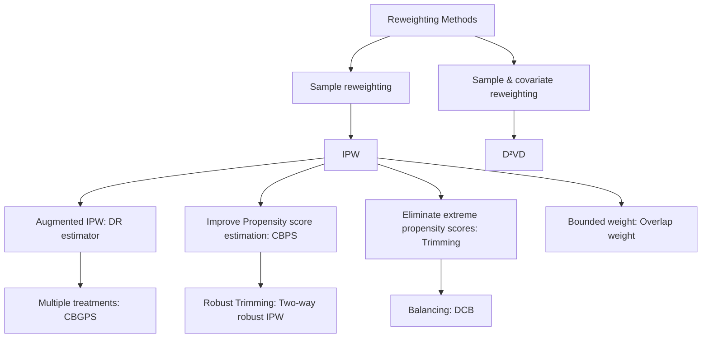

Fig. 3.1 Categorization of re-weighting methods [107]

## 3.2.1.1 Propensity-Score-Based Sample Re-weighting

Propensity scores can be used to reduce selection bias by equating groups based on these covariates. Inverse propensity weighting (IPW) $[75, 76]$ , also named as inverse probability of treatment weighting (IPTW), assigns a weight r to each sample:

$$
r = \frac {W}{e (x)} + \frac {1 - W}{1 - e (x)}, \tag {3.2}
$$

where $W$ is the treatment assignment ( $W = 1$ denotes being treated group; $W = 0$ denotes the control group) and $e(x)$ is the propensity score defined in Eq. (3.1).

After re-weighting, the IPW estimator of the average treatment effect (ATE) is

$$
\hat {\mathrm{ATE}} _ {I P W} = \frac {1}{n} \sum_ {i = 1} ^ {n} \frac {W _ {i} Y _ {i} ^ {F}}{\hat {e} (x _ {i})} - \frac {1}{n} \sum_ {i = 1} ^ {n} \frac {(1 - W _ {i}) Y _ {i} ^ {F}}{1 - \hat {e} (x _ {i})}, \tag {3.3}
$$

and its normalized version, which is preferred, especially when the propensity scores are obtained by estimation [45]:

$$
\hat {\mathrm{ATE}} _ {I P W} = \sum_ {i = 1} ^ {n} \frac {W _ {i} Y _ {i} ^ {F}}{\hat {e} (x _ {i})} / \sum_ {i = 1} ^ {n} \frac {W _ {i}}{\hat {e} (x _ {i})} - \sum_ {i = 1} ^ {n} \frac {(1 - W _ {i}) Y _ {i} ^ {F}}{1 - \hat {e} (x _ {i})} / \sum_ {i = 1} ^ {n} \frac {(1 - W _ {i})}{1 - \hat {e} (x _ {i})}. \tag {3.4}
$$

Both large and small sample theories show that adjustment for the scalar propensity score is enough to remove bias due to all observed covariates $[76]$ . The propensity score can be used to balance the covariates in the treatment and control groups and therefore reduce the bias through matching, stratification (subclassification), regression adjustment, or some combination of all three. $[25]$ discusses the use of propensity score to reduce the bias, which also provides examples and detailed discussions.

However, in practice, the correctness of the IPW estimator highly relies on the correctness of the propensity score estimation, and slight misspecification of propensity scores would cause ATE estimation error dramatically $[44]$ . To handle this dilemma, the doubly robust estimator (DR) $[72]$ , also named augmented IPW (AIPW), is proposed. The DR estimator combines the propensity score weighting with the outcome regression, so that the estimator is robust even when one of the propensity scores or outcome regression is incorrect (but not both). In detail, the DR estimator is formalized as

$$
\begin{array}{l} \hat {\mathrm{ATE}} _ {D R} = \frac {1}{n} \sum_ {i = 1} ^ {n} \left\{\left[ \frac {W _ {i} Y _ {i} ^ {F}}{\hat {e} (x _ {i})} - \frac {W _ {i} - \hat {e} (x _ {i})}{\hat {e} (x _ {i})} \hat {m} (1, x _ {i}) \right] \right. \\ \left. - \left[ \frac {\left(1 - W _ {i}\right) Y _ {i} ^ {F}}{1 - \hat {e} \left(x _ {i}\right)} - \frac {W _ {i} - \hat {e} \left(x _ {i}\right)}{1 - \hat {e} \left(x _ {i}\right)} \hat {m} \left(0, x _ {i}\right) \right] \right\} \tag {3.5} \\ = \frac {1}{n} \sum_ {i = 1} ^ {n} \left\{\hat {m} (1, x _ {i}) + \frac {W _ {i} (Y _ {i} ^ {F} - \hat {m} (1 , x _ {i}))}{\hat {e} (x _ {i})} - \hat {m} (0, x _ {i}) - \right. \\ \left. \frac {(1 - W _ {i}) (Y _ {i} ^ {F} - \hat {m} (0 , x _ {i}))}{1 - \hat {e} (x _ {i})} \right\}, \\ \end{array}
$$

where $\hat{m}(1, x_{i})$ and $\hat{m}(0, x_{i})$ are the regression model estimations of treated and control outcomes. The DR estimator is consistent and therefore asymptotically unbiased, if either the propensity score is correct or the model correctly reflects the true relationship among exposure and confounders with the outcome [28]. In reality, one definitely cannot guarantee whether one model can accurately explain the relationships among variables. The combination of outcome regression with weighting by propensity score ensures that the estimators are robust to misspecification of one of these models [6, 72, 73, 84].

The DR estimator consults outcomes to make the IPW estimator robust when propensity score estimation is not correct. An alternative way is to improve the estimation of propensity scores. In the IPW estimator, propensity score serves as both the probability of being treated and the covariate balancing score, and covariate balancing propensity score (CBPS) [44] is proposed to exploit such dual characteristics. In particular, CBPS estimates propensity scores by solving the following problem:

$$
\mathbb {E} \left[ \frac {W _ {i} \tilde {x _ {i}}}{e (x _ {i} ; \beta)} - \frac {(1 - W _ {i}) \tilde {x _ {i}}}{1 - e (x _ {i} ; \beta)} \right] = 0, \tag {3.6}
$$

where $\tilde{x}_{i} = f(x_{i})$ is a pre-defined vector-valued measurable function of $x_{i}$ . By solving the above problem, CBPS directly constructs the covariate balancing score from the estimated parametric propensity score, which increases the robustness of the misspecification of the propensity score model. An extension of CBPS is the covariate balancing generalized propensity score (CBGPS) [29], which enables to handle the treatment with continuous value. Due to the continuous valued treatment, it is difficult to directly minimize the covariates distribution distance between the control and treated groups. CBGPS solves this problem by mitigating the definition of the balancing score. Based on the definition, the treatment assignment is conditionally independent of the background variables, and CBGPS directly minimizes the correlation between the treatment assignment and the covariates after weighting. Specifically, the objective of CBGPS is to learn a propensity-score-based weight so that the weighted correlation between the treatment assignment and the covariates is minimized:

$$
\mathbb {E} \left(\frac {p (t ^ {*})}{p (t ^ {*} | x ^ {*})} t ^ {*} x ^ {*}\right) = \int \left\{\int \frac {p (t ^ {*})}{p (t ^ {*} | x ^ {*})} t ^ {*} d P (t ^ {*} | x ^ {*}) \right\} x ^ {*} d P (x ^ {*}) \tag {3.7}
$$

$$
= \mathbb {E} (t ^ {*}) \mathbb {E} (x ^ {*}) = 0,
$$

where $p(t^{*}|x^{*})$ is the propensity score, and $\frac{p(t^{*})}{p(t^{*}|x^{*})}$ is the balancing weight, and $t^{*}$ and $x^{*}$ are the treatment assignment and the background variables after centering and orthogonalizing (i.e., normalization). In summary, both CBPS and CBGPS learn the propensity-score-based sample weight directly toward the covariate balancing goal, which can alleviate the negative effect brought by model misspecification of the propensity score.

Another drawback of the original IPW estimator is that it might be unstable if the estimated propensity scores are small. If the probability of either treatment assignment is small, the logistic regression model can become unstable around the tails, causing the IPW to also be less stable. To overcome this issue, trimming is routinely employed as a regularization strategy, which eliminates the samples whose propensity scores are less than a pre-defined threshold $[54]$ . However, this approach is highly sensitive to the amount of trimming $[61]$ . Additionally, the theoretical results in $[61]$ show that the small probability of propensity scores and the trimming procedure may result in different non-Gaussian asymptotic distributions of the IPW estimator. Based on this observation, a two-way robustness IPW estimation algorithm is proposed in $[61]$ . This method combines subsampling with a local polynomial-regression-based trimming bias corrector so that it is robust to both small propensity scores and the large scale of trimming threshold. An alternative approach to overcome the instability of IPW under small propensity scores is to redesign the sample weight so that the weight is bounded. In $[58]$ , the overlap weight is proposed, in which each unit's weight is proportional to the probability of that unit being assigned to the opposite group. In detail, the overlap weight $h(x)$ is defined as $h(x) \propto 1 - e(x)$ , where $e(x)$ is the propensity score. The overlap weight is bounded within the interval $[0, 0.5]$ , and thus it is less sensitive to the extreme value of the propensity score. Recent theoretical results show that the overlap weight has the minimum asymptotic variance among all balancing weights $[58]$ .

## 3.2.1.2 Confounder Balancing

The aforementioned sample re-weighting methods could achieve balance in the sense that the observed variables are considered equally as confounders. However, in real cases, not all the observed variables are confounders. Some of the variables, named adjustment variables, are only predictive of the outcome, and others might be irrelevant variables $[51]$ . Adjusting the adjustment variables by Lasso, although it cannot reduce the bias, helps decrease the variance $[11, 83]$ . However, including the irrelevant variables would cause overfitting.

Based on the separateness assumption that the observed variables can be decomposed into confounders, adjusted variables, and irrelevant variables, in $[51]$ , the data-driven variable decomposition ( $D^{2}VD$ ) algorithm is proposed to distinguish the confounders and adjustment variables and eliminate the irrelevant variables. In detail, the adjusted outcome is written as

$$
Y _ {\mathrm{D} ^ {2} \mathrm{VD}} ^ {*} = \left(Y ^ {F} - \phi (\mathbf {z})\right) \frac {W - p (x)}{p (x) (1 - p (x))}, \tag {3.8}
$$

where z denotes the adjustment variables. Therefore, the ATE estimator of $D^{2}VD$ is

$$
\mathrm{ATE} _ {\mathrm{D} ^ {2} \mathrm{VD}} = \mathbb {E} \left[ \left(Y ^ {F} - \phi (\mathbf {z})\right) \frac {W - p (x)}{p (x) (1 - p (x))} \right]. \tag {3.9}
$$

To obtain $ATE_{D^{2}VD}$ , $Y_{D^{2}VD}^{*}$ is regressed on all observed variables with parameter $\alpha$ separating the adjustment variables z from all observed variables and parameter $\beta$ separating the confounders from all observed variables, i.e., $Y_{D^{2}VD}^{*} = (Y^{F} - X\alpha) \odot R(\beta)$ , where $R(\beta)$ is the weight and $R(\beta) = \frac{W - e(X)}{e(X)(1 - e(X))}$ in which $e(X)$ is parameterized by $\beta$ . The objective function is $l_{2}$ loss between $Y_{D^{2}VD}^{*}$ and ATE value estimated by the linear regression function on all observed variables parameterized by $\gamma$ , along with sparse regularization to distinguish the confounder, adjusted variables, and irrelevant variables. In detail, the objective function is defined as

$$
\text { minimize } | | (Y ^ {F} - X \alpha) \odot R (\beta) - X \gamma | | _ {2} ^ {2},
$$

$$
\text { s.t. } \sum_ {i = 1} ^ {N} \log (1 + \exp (1 - 2 W _ {i}) \cdot X _ {i} \beta)) <   \tau , \tag {3.10}
$$

$$
| | \alpha | | _ {1} \leq \lambda , | | \beta | | _ {1} \leq \delta , | | \gamma | | _ {1} \leq \eta , | | \alpha \odot \beta | | _ {2} ^ {2} = 0,
$$

where $R(w)$ is the weight, and $\tau, \lambda, \delta$ , and $\eta$ are hyperparameters. The first condition represents the propensity score estimation error, and the next three conditions encourage the sparsity. The last condition, the Hadamard product, ensures the separation of adjusted variables and confounders.

However, little prior knowledge about the interactions among observed variables is provided in practice, and the data are usually high-dimensional and noisy. To solve this problem, the differentiated confounder balancing (DCB) algorithm $[50]$ is proposed to select and differentiate confounders to balance the distributions. Overall, DCB balances the distributions by re-weighting both the samples and confounders.

## 3.2.2 Stratification Methods

Stratification, also named as subclassification or blocking $[46]$ , is a representative method to adjust for confounders. The idea of stratification is to adjust the bias that stems from the difference between the treated group and the control group by splitting the entire group into homogeneous subgroups (blocks). Ideally, in each subgroup, the treated group and the control group are similar under certain measurements over the covariates; therefore, the units in the same subgroup can be viewed as sampled from the data under randomized controlled trials. Based on the homogeneity of each subgroup, the treatment effect within each subgroup (i.e., CATE) can be calculated through the method developed on randomized controlled trials (RCTs) data. After obtaining the CATE of each subgroup, the treatment effect over the interested group can be obtained by combining the CATEs of subgroups belonging to that group, as shown in $(2.8)$ . In the following, we adopt the calculation of ATE as an example. In detail, if we separate the whole dataset into J blocks, the ATE is estimated as

$$
\mathrm{ATE} _ {\text { strat }} = \hat {\tau} ^ {\text { strat }} = \sum_ {j = 1} ^ {J} q (j) \left[ \bar {Y} _ {t} (j) - \bar {Y} _ {c} (j) \right], \tag {3.11}
$$

where $\bar{Y}_{t}(j)$ and $\bar{Y}_{c}(j)$ are the average of the treated outcome and control outcome in the j-th block, respectively. $q(j) = \frac{N(j)}{N}$ is the portion of the units in the j-th block to the whole units.

Stratification effectively decreases the bias of ATE estimation compared with the difference estimator where ATE is estimated as: $ATE_{diff} = \hat{\tau}^{diff} = \frac{1}{N_{i}} \sum_{i:W_{i}=1} Y_{i}^{F} - \frac{1}{N_{c}} \sum_{i:W_{i}=0} Y_{i}^{F}$ . In particular, if we assume the outcome is linear with the covariates, i.e., $\mathbb{E}[Y_{i}(w)|X_{i} = x] = \alpha + \tau * w + \beta * x$ . The bias of the difference estimator is

$$
\mathbb {E} [ \hat {\tau} ^ {\text { diff }} - \tau | X, W ] = (\bar {X} _ {t} - \bar {X} _ {c}) \beta . \tag {3.12}
$$

The bias of the stratification estimator is the weighted average of the within-block bias:

$$
\mathbb {E} [ \hat {\tau} ^ {\text { strat }} - \tau | X, W ] = \left(\sum_ {j = 1} ^ {J} q (j) \left(\bar {X} _ {t} (j) - \bar {X} _ {c} (j)\right)\right) \beta . \tag {3.13}
$$

Compared with the difference estimator, the stratification estimator reduces the bias per covariate by the factor:

$$
\gamma_ {k} = \frac {\sum_ {j} q (j) \left(\bar {X} _ {t , k} (j) - \bar {X} _ {c , k} (j)\right)}{\bar {X} _ {t , k} - \bar {X} _ {c , k}}, \tag {3.14}
$$

where $\bar{X}_{t,k}(j)$ ( $\bar{X}_{c,k}(j)$ ) is the average of $k$ -th covariate of treated (control) group in $j$ -th block, and $\bar{X}_{t,k}$ ( $\bar{X}_{c,k}$ ) is the average of $k$ -th covariate in the whole treated (control) group.

The key component of stratification methods is how to create the blocks and how to combine the created blocks. Equal frequency $[76]$ is a common strategy to create blocks. The equal frequency approach splits the block by the appearance probability, such as the propensity score, so that the covariates have the same appearance probability (i.e., the propensity score) in each subgroup (block). The ATE is estimated by the weighted average of each block's CATE, with the weight as the fraction of the units in this block. However, this approach suffers from high variance due to the insufficient overlap between the treated and control groups in the blocks whose propensity score is very high or low. To reduce the variance, in $[42]$ , the blocks, which are divided according to the propensity score, are re-weighted by the inverse variance of the block-specific treatment effect. Although this method reduces the variance of the equal frequency method, it unavoidably increases the estimation bias.

The stratification methods described above are all splitting the blocks according to the pre-treatment variables. However, in some real-world applications, it is required to compare the outcome conditioned on some post-treatment variables, denoted as S. For example, the “surrogate” markers of disease progression (i.e., intermediate outcome) such as CD4 count and measures of viral load in AIDS are the post-treatment variables [30]. In the studies comparing drugs for AIDS patients, the researchers are interested in the effect of AIDS drugs on groups with CD4 counts lower than 200 cell/mm $^{3}$ . However, directly comparing the observed outcomes on the group with $S^{obs} < 200$ is not the true effect because the compared two subgroups: $\{i : W_{i} = 1, S^{obs} < 200\}$ and $\{j : W_{j} = 0, S^{obs} < 20\}$ , where $S^{obs}$ is the observed post-treatment values, have great discrepancy if the treatment has effect on the intermediate results. To solve this problem, principle stratification [30] constructs the subgroup based on the potential values of the pre-treatment variables. Analogous to the potential outcome defined in Sect. 2.2.1, potential pre-treatment variables value, denoted as $S(W = w)$ , is the potential value of S under treatment with value w. With the natural assumption that the potential value of S is independent of the treatment assignment, the treatment effect of the subgroup can be obtained by comparing the outcomes of two sets: $\{Y_{i}^{obs} : W_{i} = 1, S_{i}(W_{i} = 1) = v_{1}, S_{i}(W_{i} = 0) = v_{2}\}$ and $\{Y_{j}^{obs} : W_{j} = 0, S_{j}(W_{j} = 1) = v_{1}, S_{j}(W_{j} = 0) = v_{2}\}$ , where $v_{1}$ and $v_{2}$ are two post-treatment values. The comparison based on the potential values of post-treatment variables ensures that the compared two sets are similar, so that the obtained treatment effect is the true effect.

## 3.2.3 Matching Methods

As mentioned previously, missing counterfactuals and confounder bias are two major challenges in treatment effect estimation. Matching-based approaches provide a way to estimate the counterfactual and, at the same time, reduce the estimation bias brought by the confounders. In general, the potential outcomes of the i-th unit estimated by matching are $[1]$

$$
\hat {Y} _ {i} (0) = \left\{ \begin{array}{l l} Y _ {i} & \text {   if   } W _ {i} = 0, \\ \frac {1}{\# \mathcal {J} (i)} \sum_ {l \in \mathcal {J} (i)} Y _ {l} & \text {   if   } W _ {i} = 1; \end{array} \right. \quad \hat {Y} _ {i} (1) = \left\{ \begin{array}{l l} \frac {1}{\# \mathcal {J} (i)} \sum_ {l \in \mathcal {J} (i)} Y _ {l} & \text {   if   } W _ {i} = 0, \\ Y _ {i} & \text {   if   } W _ {i} = 1; \end{array} \right. \tag {3.15}
$$

where $\hat{Y}_i(0)$ and $\hat{Y}_i(1)$ are the estimated control and treated outcome, and $\mathcal{J}(i)$ is the matched neighbors of unit $i$ in the opposite treatment group [5].

The analysis of the matched sample can mimic that of an RCT: one can directly compare outcomes between the treated and control groups within the matched sample. In the context of an RCT, one expects that, on average, the distribution of covariates will be similar between treated and control groups. Therefore, matching can be used to reduce or eliminate the effects of confounding when using observational data to estimate treatment effects $[5]$ .

## 3.2.3.1 Distance Metric

Various distances have been adopted to compare the closeness between units [32], such as the widely used Euclidean distance [79] and Mahalanobis distance [82]. Meanwhile, many matching methods develop their own distance metrics, which can be abstracted as: $D(\mathbf{x}_i, \mathbf{x}_j) = ||f(\mathbf{x}_i) - f(\mathbf{x}_j)||_2$ . The existing distance metrics mainly vary in how they design the transformation function $f(\cdot)$ .

Propensity-Score-Based Transformation Original covariates of units can be represented by propensity scores. As a result, the similarity between two units can be directly calculated as: $D(\mathbf{x}_{i}, \mathbf{x}_{j}) = |e_{i} - e_{j}|$ , where $e_{i}$ , and $e_{j}$ are the propensity scores of $x_{i}$ and $x_{j}$ , respectively. Later, the linear propensity-score-based distance metric is also proposed, which is defined as $D(\mathbf{x}_{i}, \mathbf{x}_{j}) = |\operatorname{logit}(e_{i}) - \operatorname{logit}(e_{j})|$ . This improved version is recommended since it can effectively reduce the bias [93]. Furthermore, the propensity-score-based distance metric can be combined with other existing distance metrics, which provides a fine-grained comparison. In [82], when the difference of two units' propensity scores is within a certain range, they are further compared with other distances on some key covariates. Under this metric, the closeness of two units contains two criteria: they are relatively close under propensity score measure, and they are particularly similar under the comparison of the key covariates [93].

Other Transformations The propensity score only adopts the covariate information, while some other distance metrics are learned by utilizing both the covariates and the outcome information so that the transformed space can preserve more information. One representative metric is the prognosis score [36], which is the estimated control outcome. The transformation function is represented as: $f(x) = \hat{Y}_c$ . However, the performance of the prognosis score relies on modeling the relationship between the covariates and control outcomes. Moreover, the prognosis score only takes the control outcome into consideration and ignores the treated outcome. The Hilbert-Schmidt independence criterion-based nearest-neighbor matching (HSIC-NNM) proposed in [16] could overcome the drawbacks of prognosis score. HSIC-NNM learns two linear projections for control outcome estimation task and treated outcome estimation task separately. To fully explore the observed control/treated outcome information, the parameters of linear projection are learned by maximizing the nonlinear dependency between the projected subspace and the outcome: $M_w = \arg\max_{M_w} \text{HSIC}(\mathbf{X}_w M_w, Y_w^F) - \mathcal{R}(M_w)$ , where $w = 0, 1$ represent the control group and treated group, respectively. $\mathbf{X}_w M_w$ is the transformed subspace with the transformation function as: $f(x) = x M_w$ . $Y_w^F$ is the observed control/treated outcome, and $\mathcal{R}$ is the regularization to avoid overfitting. The objective function ensures that the learned transformation functions project the original covariates to an information subspace where similar units will have similar outcomes.

Compared with the propensity-score-based distance metric that focuses on balancing, prognosis score and HSIC-NNM focus on embedding the relationship between the transformed space and the observed outcome. These two lines of methods have different advantages, and some recent work has tried to integrate these advantages. In $[56]$ , the balanced and nonlinear representation (BNR) is proposed to project the covariates into a balanced low-dimensional space. In detail, the parameters in the nonlinear transformation function are learned by jointly optimizing the following two objectives: (1) Maximizing the differences of noncontiguous-class scatter and within-class scatter so that the units with the same outcome prediction shall have similar representations after transformation; and (2) Minimizing the maximum mean discrepancy between the transformed control and outcome group in order to obtain the balanced space after transformation. A series of works that have similar objectives but vary in balancing regularization have been proposed, such as using the conditional generative adversarial network to ensure that the transformation function blocks the treatment assignment information $[55, 106]$ .

The methods mentioned above adopt either one or two transformations for treated and control groups separately. Different from the existing method, randomized nearest-neighbor matching (RNNM) $[57]$ adopts a number of random linear projections as the transformation function, and the treatment effects are obtained as the median treatment effect by nearest-neighbor matching in each transformed subspace. The theoretical motivation of this approach is the Johnson–Lindenstrauss (JL) lemma, which guarantees that the pairwise similarity information of the points in the high-dimensional space can be preserved through random linear projection. Powered by the JL lemma, RNNM ensembles the treatment effect estimation results of several linear random transformations.


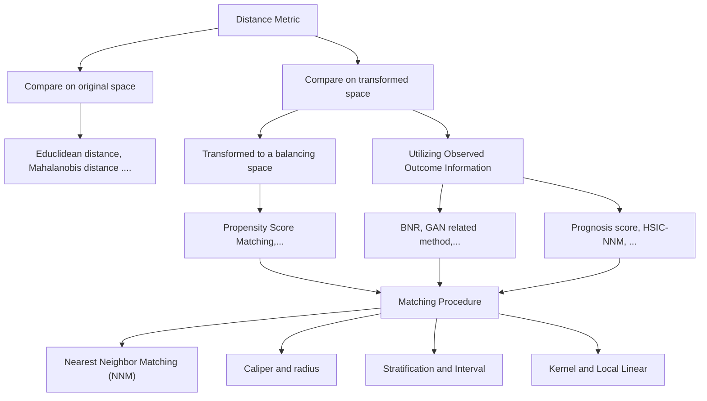

Fig. 3.2 Categorization of matching methods [107]

## 3.2.3.2 Choosing a Matching Algorithm

After defining the similarity metric, the next step is to find the neighbors. In $[14]$ , existing matching algorithms are divided into four essential approaches, including the nearest-neighbor matching, caliper, stratification, and kernel, as shown in Fig. 3.2. The most straightforward matching estimator is the nearest-neighbor matching (NNM). In particular, a unit in the control group is chosen as the matching partner for a treated unit, so that they are closest based on a similarity score (e.g., propensity score). The NNM has several variants, such as NNM with replacement and NNM without replacement. Treated units are matched to one control, called pair matching or 1–1 matching, or treated units are matched to two controls, called 1–2 matching, and so on. It is a trade-off to determine the number of neighbors, since a large number of neighbors may result in a treatment effect estimator with high bias but low variance, while a small number results in low bias but high variance. It is known, however, that the optimal structure is a full matching in which a treated unit may have one or several controls or one control may have one or several treated units $[32]$ .

NNM may have bad matches if the closest partner is far away. One can set a tolerance level on the maximum propensity score distance (caliper) to avoid this problem. Hence, caliper matching is one form of imposing a common support condition.

The stratification matching partitions the common support of the propensity score into a set of intervals and then takes the mean difference in outcomes between treated and control observations in order to calculate the impact within each interval. This method is also known as interval matching, blocking, and subclassification $[78]$ .

The matching algorithms discussed above have in common that only a few observations in the control group are used to create the counterfactual outcome of a treatment observation. Kernel matching (KM) and local linear matching (LLM) are nonparametric matchings that use weighted averages of observations in the control group to create the counterfactual outcome. Thus, one major advantage of these approaches is the lower variance because we use more information to create a counterfactual outcome.

Here, we also want to introduce another matching method called coarsened exact matching (CEM) proposed in [43]. Because either 1-k matching or the full matching fails to consider the extrapolation region, where few or no reasonable matches exist in the other treatment group, CEM was proposed to handle this problem. CEM first coarsens the selected important covariate, i.e., discretization, and then performs exact matching on the coarsened covariates. For example, if the selected covariates are age (age>50 is 1, and others are 0) and gender (female as 1, and male as 0). A female patient with age 50 in the treated group is represented by the coarsen covariates as (1, 1). She will only match the patients in the treated group with exactly the same coarsened covariate values. After exact matching, the whole data are separated into two subsets. In one subset, every unit has its exact matched neighbors, and it is the opposite in the other subset that contains the units in the extrapolation region. The outcomes of units in the extrapolation region are estimated by the outcome prediction model trained on the matched subset. So far, the treatment effect on the two subsets can be estimated separately, and the final step is to combine the treatment effect on the two subsets by a weighted average.

We have provided several different matching algorithms, but the most important question is how we should select a perfect matching method. Asymptotically, all matching methods should yield the same results as the sample size grows and they will become closer to comparing only exact matches $[91]$ . When we only have a small sample size, this choice will be important $[39]$ . There is one trade-off between bias and variance.

## 3.2.3.3 Variables to Include

The above two subsections illustrate the key steps in the matching procedure, and in this subsection, we briefly discuss what kinds of variables should be included in the matching, i.e., feature selection, to improve the matching performance. Many studies [31, 39, 81] suggest including as many variables that are related to the treatment assignment and the outcome as possible, in order to satisfy the strong ignorability assumption. However, post-treatment variables, which are the variables affected by the treatment assignment, should be excluded in the matching procedure [77]. Moreover, in addition to the post-treatment variables, researchers also suggest excluding the instrumental variables [68, 103] because they tend to amplify the bias of the treatment effect estimator.

## 3.2.4 Tree-Based Methods

Another popular method in causal inference is based on decision tree learning, which is one of the predictive modeling approaches. The decision tree is a nonparametric supervised learning method used for classification and regression. The goal is to create a model that predicts the value of a target variable by learning simple decision rules inferred from data.

Tree models where the target variable is discrete are called classification trees with prediction error measured based on misclassification cost. In these tree structures, leaves represent class labels, and branches represent conjunctions of features that lead to those class labels. Decision trees where the target variable is continuous are called regression trees with prediction error measured by the squared difference between the observed and predicted values. The term classification and regression tree (CART) analysis is an umbrella term used to refer to both of the above procedures $[13]$ . In the CART model, the data space is partitioned, and a simple prediction model for each partitioned space is fitted. Therefore, every partitioning can be represented graphically as a decision tree $[59]$ .

For estimating heterogeneity in causal effects, a data-driven approach $[4]$ based on CART is provided to partition the data into subpopulations that differ in the magnitude of their treatment effects. The valid confidence intervals can be created for treatment effects, even with many covariates relative to the sample size, and without “sparsity” assumptions. This approach is different from conventional CART in two aspects. First, it focuses on estimating conditional average treatment effects instead of directly predicting outcomes as in the conventional CART. Second, different samples are used for constructing the partition and estimating the effects of each subpopulation, which is referred to as an honest estimation. However, in the conventional CART, the same samples are used for these two tasks.

In CART, a tree is built up until a splitting tolerance is reached. There is only one tree, and it is grown and pruned as needed. However, BART is an ensemble of trees, so it is more comparable to random forests. A Bayesian “sum-of-trees” model called Bayesian additive regression trees (BART) is developed in $[18, 19]$ . Every tree in the BART model is a weak learner, and it is constrained by a regularization prior. Information can be extracted from the posterior by a Bayesian backfitting MCMC algorithm. BART is a nonparametric Bayesian regression model that uses dimensionally adaptive random basis elements. Let W be a binary tree that has a set of interior node decision rules and terminal nodes, and let $M = \{\mu_{1}, \mu_{2}, \ldots, \mu_{B}\}$ be parameters associated with each of the B terminal nodes for W. We use $g(x; W, M)$ to assign a $\mu_{b} \in M$ to input vector x. The sum-of-trees model can be expressed as

$$
Y = g \left(x; W _ {1}, M _ {1}\right) + g \left(x; W _ {2}, M _ {2}\right) + \dots + g \left(x; W _ {m}, M _ {m}\right) + \varepsilon , \tag {3.16}
$$

$$
\varepsilon \sim N (0, \sigma^ {2}). \tag {3.17}
$$

BART has a couple of advantages. It is very easy to implement and only needs to plug in the outcome, treatment assignment, and confounding covariates. In addition, it does not require any information about how these variables are parametrically related so that it requires less guess when fitting the model. Moreover, it can deal with a mass of predictors, yield coherent uncertainty intervals, and handle continuous treatment variables and missing data $[40]$ .

BART is proposed to estimate the average causal effects. In fact, it can also be used to estimate individual-level causal effects. BART cannot only easily identify the heterogeneous treatment effects, but also obtain more accurate estimates of average treatment effects compared to other methods, such as propensity score matching, propensity score weighting, and regression adjustment in the nonlinear simulation situations examined [40].

In most previous methods, the prior distribution over treatment effects is always induced indirectly, which is difficult to attain. A flexible sum of regression trees (i.e., a forest) can address this issue by modeling a response variable as a function of a binary treatment indicator and a vector of control variables $[35]$ . This approach interpolates between two extremes: entirely and separately modeling the conditional means of treatment and control or only the treating treatment assignment as another covariate.

Random forest is a classifier consisting of a combination of tree predictors, in which each tree depends on a random vector that is independently sampled and has an identical distribution for all trees [12]. This model can also be extended to estimate heterogeneous treatment effects based on Breiman's random forest algorithm [99]. Trees and forests can be considered as nearest-neighbor methods with an adaptive neighborhood metric. Tree-based methods seek to find training examples that are close to a point $x$ , but now closeness is defined with respect to a decision tree. And the closest points to $x$ are those that fall in the same leaf as it. The advantage of using trees is that their leaves can be narrower along with the directions where the signal is changing fast and wider along with the other directions, potentially leading to a substantial increase in power when the dimension of the feature space is even moderately large.

The tree-based framework can also be extended to uni- or multi-dimensional treatments $[100]$ . Each dimension can be discrete or continuous. A tree structure is used to specify the relationship between user characteristics and the corresponding treatment. This tree-based framework is robust to model misspecification and highly flexible with minimal manual tuning.

## 3.2.5 Representation Learning Methods

Representation learning is learning the representations of input data typically by transforming the original covariates or extracting features from the covariate space. Focusing specifically on deep learning, the composition of multiple nonlinear transformations can yield more abstract and ultimately more useful representations $[9]$ . Compared with traditional machine learning approaches in causal inference, deep representation learning models are capable of automatically searching for features that are correlated and combining them to enable more effective and more accurate counterfactual estimation, while in the traditional machine learning approach, features need to be identified accurately by users. Meanwhile, there also exist some challenges that need to be addressed in deep representation learning. For example, the amount of data needed for deep representation learning is much higher than that needed for other machine learning methods; the “Black Boxes” deep structure is less interpretable, and it is very difficult to look inside of it to understand how it works; overfitting always happens when an algorithm utilizes the deep structure to learn the details and noise so well in the training data that it negatively impacts the performance of the model in the whole population. Thus far, significant advances in deep representation learning-based methods have been made to overcome the challenges in causal effect estimation with observational data. We categorize deep representation learning-based methods into domain-adaptation-based, matching-based, and continual-learning-based methods.

## 3.2.5.1 Domain Adaptation Based on Representation Learning

The most basic assumption used in statistical learning theory is that training data and test data are drawn from the same distribution. However, in most practical cases, the test data are drawn from a distribution that is only related, but not identical, to the distribution of the training data. In causal inference, this is also a major challenge. Unlike randomized control trials, the mechanism of treatment assignment is not explicit in observational data. Therefore, interventions of interest are not independent of the property of the subjects. For example, in an observational study of the treatment effect of a medicine, the medicine is assigned to individuals based on several factors, including known confounders and some unknown confounders. As a result, the counterfactual distribution will generally be different from the factual distribution. Thus, it is necessary to predict counterfactual outcomes by learning from the factual data, which converts the causal inference problem to a domain adaptation problem.

Extracting effective feature representations is critical for domain adaptation. A model $[8]$ with a generalization bound is proposed to formalize this intuition theoretically, which cannot only explicitly minimize the difference between the source and target domains, but also maximize the margin of the training set. Building on this work $[8]$ , the discrepancy distance between distributions is tailored to adaptation problems with arbitrary loss functions $[62]$ . In the following discussions, the discrepancy distance plays an important role in addressing the domain adaptation problem in causal inference.

Thus far, we can see a clear connection between counterfactual inference and domain adaptation. An intuitive idea is to enforce the similarity between the distributions of different treatment groups in the representation space. The learned representations trade off three objectives: (1) low-error prediction over the factual representation, (2) low-error prediction over counterfactual outcomes by taking into account relevant factual outcomes, and (3) the distance between the distribution of the treatment population and that of the control population [47]. Following this motivation, [87] give a simple and intuitive generalization-error bound. It shows that the expected ITE estimation error of representation is bounded by a sum of the standard generalization error of that representation and the distance between the treated and control distributions based on representation. The integral probability metric (IPM) is used to measure the distances between distributions, and explicit bounds are derived for the Wasserstein distance and maximum mean discrepancy (MMD) distance. The goal is to find a representation $\Phi : X \to R$ and hypothesis $h: X \times \{0, 1\} \to Y$ that minimizes the following objective function:

$$
\begin{array}{l} \min _ {h, \Phi} \frac {1}{n} \sum_ {i = 1} ^ {n} r _ {i} \cdot L (h (\Phi (x _ {i}), W _ {i}), y _ {i}) \\ + \lambda \cdot R (h) + \alpha \cdot I P M _ {G} (\{\Phi (x _ {i}) \}) _ {i: W _ {i} = 0}, \{\Phi (x _ {i}) \}) _ {i: W _ {i} = 1}), \tag {3.18} \\ \end{array}
$$

where $r_{i} = \frac{W_{i}}{2u} + \frac{1-W_{i}}{2(1-u)}$ , $u = \frac{1}{n} \sum_{i=1}^{n} W_{i}$ , and the weight $r_{i}$ compensates for the difference in treatment group size. R is a model complexity term. Given two probability density functions p, q defined over $S \subseteq R^{d}$ and a function family G of functions $g : S \to R$ , the IPM is defined as

$$
I P M _ {G} (p, q) := \sup _ {g \in G} | \int_ {S} g (s) (p (s) - q (s)) d s |. \tag {3.19}
$$

This model allows for learning complex nonlinear representations and hypotheses with large flexibility. When the dimension of $\Phi$ is high, it risks losing the influence of t on h if the concatenation of $\Phi$ and W is treated as input. To address this problem, one approach is to parameterize $h_{1}(\Phi)$ and $h_{0}(\Phi)$ as two separate “heads” of the joint network. $h_{1}(\Phi)$ is used to estimate the outcome under treatment, and $h_{0}(\Phi)$ is for the control group. Each sample is used to update only the head corresponding to the observed treatment. The advantage is that statistical power is shared in the common representation layers, and the influence of treatment is retained in the separate heads [87]. This model can also be extended to any number of treatments, as described in the perfect match (PM) approach [85]. Following this idea, a few improved models have been proposed and discussed. For example, [48] bring together shift-invariant representation learning and re-weighting methods. [38] present a new context-aware weighting scheme based on the importance sampling technique, on top of representation learning, to alleviate the selection bias problem in ITE estimation.

Existing ITE estimation methods mainly focus on balancing the distributions of control and treated groups but ignore the local similarity information that provides meaningful constraints on the ITE estimation. In $[104, 105]$ , a local similarity preserved individual treatment effect (SITE) estimation method is proposed based on deep representation learning. SITE preserves local similarity and balances data distributions simultaneously. The framework of SITE contains five major components: representation network, triplet pairs selection, position-dependent deep metric (PDDM), middle point distance minimization (MPDM), and the outcome prediction network. To improve the model efficiency, SITE takes input units in a mini-batch fashion, and triplet pairs could be selected from every mini-batch. The representation network learns latent embeddings for the input units. With the selected triplet pairs, PDDM and MPDM can preserve the local similarity information and meanwhile achieve the balanced distributions in the latent space.

Finally, the embeddings of mini-batch are fed forward to a dichotomous outcome prediction network to obtain the potential outcomes. The loss function of SITE is as follows:

$$
L = L _ {F L} + \beta L _ {P D D M} + \gamma L _ {M P D M} + \lambda | | M | | _ {2}, \tag {3.20}
$$

where $L_{FL}$ is the factual loss between the estimated and observed factual outcomes. $L_{PDDM}$ and $L_{MPDM}$ are the loss functions for PDDM and MPDM, respectively. The last term is $L_{2}$ regularization on model parameters $M$ (except the bias term).

Most models focus on covariates with numerical values, while how to handle covariates with textual information for treatment effect estimation is still an open question. One major challenge is how to filter out the nearly instrumental variables that are the variables more predictive to the treatment than the outcome. Conditioning on those variables to estimate the treatment effect would amplify the estimation bias. To address this challenge, a conditional treatment-adversarial learning-based matching (CTAM) method is proposed in $[106]$ . CTAM incorporates the treatment-adversarial learning to filter out the information related to nearly instrumental variables when learning the representations, and then it performs matching among the learned representations to estimate the treatment effects. The CTAM contains three major components: text processing, representation learning, and conditional treatment discriminator. Through the text processing component, the original text is transformed into vectorized representation S. After that, S is concatenated with the non-textual covariates X to construct a unified feature vector, which is then fed into the representation neural network to get the latent representation Z. After learning the representation, Z, together with potential outcomes Y, are fed into the conditional treatment discriminator. During the training procedures, the representation learner plays a minimax game with the conditional treatment discriminator: By preventing the discriminator from assigning the correct treatment, the representation learner can filter out the information related to nearly instrumental variables. The final matching procedure is performed in the representation space Z. The conditional treatment-adversarial learning helps reduce the bias of treatment effect estimation.

## 3.2.5.2 Matching Based on Representation Learning

Compared to the above regression-based methods after representation learning, matching methods based on representation learning are more interpretable, because any sample's counterfactual outcome is directly set to be the factual outcome of its nearest neighbor in the group receiving the opposite treatment. Nearest-neighbor matching (NNM) sets the counterfactual outcome of any treatment (control) sample to be equal to the factual outcome of its nearest neighbor in the control (treatment) group. Although being simple, flexible, and interpretable, most NNM approaches could be easily misled by variables that do not affect the outcome. To address this challenge, matching can be performed on subspaces

<!-- footnote -->

- Z. Chu
- Ant Group, Hangzhou, China
- e-mail: chuzhixuan.czx@alibaba-inc.com
- S. Li (✉)
- University of Virginia, Charlottesville, VA, USA
- e-mail: shengli@virginia.edu

<!-- footnote end -->

that are predictive of the outcome variable for both the treatment group and the control group. Applying NNM in the learned subspaces leads to a more accurate estimation of the counterfactual outcomes and therefore the accurate estimation of treatment effects. For example, one work [16] estimates the counterfactual outcomes of treatment samples by learning a projection matrix that maximizes the nonlinear dependence between the subspace and outcome variable for control samples. Then it directly applies the learned projection matrix to all the samples and finds every treatment sample’s matched control sample in the subspace. In addition, another work [21] performs matching in the selective and balanced representation space to estimate treatment effects. It seamlessly integrates deep feature selection and deep representation learning for causal inference together. In feature selection and representation learning, the one-to-one feature selection layer at the input level selects which variables are input into the neural network, which makes the deep neural network more interpretable.

## 3.2.5.3 Continual Learning Based on Representation Learning

Although significant advances have been made to overcome the challenges in causal effect estimation with observational data, the existing representation learning methods only focus on source-specific and stationary observational data. Such learning strategies assume that all observational data are already available during the training phase and from only one source. This assumption is unsubstantial in practice for two reasons. The first is based on the characteristics of observational data, which are incrementally available from nonstationary data distributions. For instance, the number of electronic medical records in one hospital is growing every day, or the electronic medical records for one disease may be from different hospitals or even different countries. This characteristic implies that one cannot have access to all observational data at one time point and from one single source. The second reason is based on the realistic consideration of accessibility. For example, when new observations are available, if we want to refine the model previously trained by original data, perhaps the original training data are no longer accessible for a variety of reasons, e.g., lost, proprietary, too large to store, or privacy constraints. This practical concern of accessibility is ubiquitous in various academic and industrial applications. A continual causal effect representation learning method [20, 22, 23] is proposed for estimating causal effects with observational data, which are incrementally available from nonstationary data distributions. Instead of having access to all seen observational data, it incorporates feature representation distillation to preserve the knowledge learned from previous observational data. In addition, aiming at solving the selection bias between the treatment and control groups, it adopts one representation transformation function, which maps partial original feature representations into a new feature representation space and balances the global feature representation space with respect to treatment and control groups.

## 3.2.6 Multi-task Learning Methods

The treatment group and control group always share some common features except for their idiosyncratic characteristics. Naturally, causal inference can be conceptualized as a multi-task learning problem with a set of shared layers for the treated group and control group together, and a set of specific layers for the treated group and control group separately. The impact of selection bias in the multitask learning problem can be alleviated via a propensity-dropout regularization scheme [3], in which the network is thinned for every training example via a dropout probability that depends on the associated propensity score. The dropout probability is higher for subjects with features that belong in a region of poor overlap in the feature space between the treatment and control groups.

The Bayesian method can also be extended under the multi-task model. A nonparametric Bayesian method [2] uses a multi-task Gaussian process with a linear coregionalization kernel as a prior over the vector-valued reproducing kernel Hilbert space. The Bayesian approach allows computing individualized measures of confidence in our estimates via pointwise credible intervals, which are crucial for realizing the full potential of precision medicine. The impact of selection bias is alleviated via a risk-based empirical Bayes method for adapting the multi-task GP prior, which jointly minimizes the empirical error in factual outcomes and the uncertainty in counterfactual outcomes.

The multi-task model can be extended to multiple treatments even with continuous parameters in each treatment. The dose–response network (DRNet) architecture [86] with shared base layers, $N _ { W }$ intermediary treatment layers, and $N _ { W } \times E$ heads for the multiple treatment setting with an associated dosage parameter s. The shared base layers are trained on all samples, and the treatment layers are only trained on samples from their respective treatment category. Each treatment layer is further subdivided into E head layers. Each head layer is assigned a dosage stratum that subdivides the range of potential dosages $[ a _ { t } , b _ { t } ]$ into E partitions of equal width b−a . $\frac { b - a } { E }$

## 3.2.7 Meta-Learning Methods

When designing the heterogeneous treatment effect estimation algorithms, two key factors should be considered: (1) Control the confounders, i.e., eliminate the spurious correlation between the confounder and the outcome; (2) Give an accurate expression of the CATE estimation [66]. The methods mentioned in the previous sections seek to satisfy the two requirements simultaneously, while meta-learningbased algorithms separate them into two steps. In general, the meta-learning-based algorithms have the following procedures: (1) Estimate the conditional mean outcome $\mathbb { E } [ Y | X = x ]$ , and the prediction model learned in this step is the base learner. (2) Derive the CATE estimator based on the difference of results obtained from step (1). Existing meta-learning methods include T-learner [52], S-learner [52], X-learner [52], U-learner [66], and R-learner [66], which are introduced in the following.

In detail, the T-learner [52] adopts two trees to estimate the conditional treated/control outcomes, which are denoted as $\mu _ { 0 } ( x ) \ = \ \mathbb { E } [ Y ( 0 ) | X \ = \ x ]$ and $\mu _ { 1 } ( x ) = \mathbb { E } [ Y ( 1 ) | X = x ]$ , respectively. Let $\hat { \mu _ { 0 } } ( x )$ and $\hat { \mu _ { 0 } } ( x )$ denote the trained tree model on the control/treated group. Then the CATE of T-learner estimation is obtained as: $\hat { \tau } _ { T } ( x ) = \hat { \mu _ { 1 } } ( x ) - \hat { \mu } _ { 0 } ( x )$ . T-learner trains two base models for control and treated groups (the name $^ { \circ \mathfrak { e } } \mathrm { T } ^ { \mathfrak { s } }$ comes from two base models), while S-learner[52] views the treatment assignment as one feature and estimates the combined outcome as: $\mu ( x , w ) = \mathbb { E } [ Y ^ { F } | X = x , W = w ]$ (the name $\mathbf { \vec { s } } \mathbf { \vec { s } } ^ { , , }$ denotes single). μ(x, w) can be any base model, and we denote the trained model as ${ \hat { \mu } } ( x , w )$ . The CATE estimator provided by the S-learner is then given as: $\hat { \tau } _ { S } ( x ) = \hat { \mu } ( x , 1 ) - \hat { \mu } ( x , 0 )$ .

However, the T-learner and S-learner highly rely on the performance of the trained base models. When the number of units in two groups is extremely unbalanced $( \mathrm { i . e . }$ , the number of one group is much larger than the other), the performance of the base model trained on the small group would be poor. To overcome this problem, X-learner [52] is proposed, which adopts information from the control group to give a better estimator on the treated group and vice versa. The crossgroup information usage is where X-learner comes from, and the X denotes “cross group.” In detail, X-learner contains three key steps. The first step of X-learner is the same as T-learner, and the trained base learners are denoted as ${ \hat { \mu } } _ { 0 } ( x )$ and $\hat { \mu _ { 1 } } ( x )$ . In the second step, X-learner calculates the difference between the observed outcome and the estimated outcome as the imputed treatment effect: In the control group, the difference is that the estimated treated outcome subtracts the observed control outcome, denoted as $\hat { D } _ { i } ^ { C } = \hat { \mu _ { 1 } } ( x ) - Y ^ { F }$ ; similarly, in the treated group, the difference is formulated as $\hat { D } _ { i } ^ { T } = Y ^ { F } - \hat { \mu _ { 0 } } ( x )$ . After the difference calculation, the dataset is transformed into two groups with an imputed treatment effect: control group: $( X _ { C } , \hat { D } ^ { C } )$ and treated group: $( \bar { X } _ { T } , \hat { D } ^ { T } )$ . On two imputed datasets, the two base learners of treatment effect $\tau _ { 1 } ( x ) ( \tau _ { 0 } ( x ) )$ are trained with $X _ { C } ( X _ { T } )$ as the input and $\hat { D } ^ { C } ( \hat { D } ^ { T } )$ as the output. The last step is to combine the two CATE estimators by weighted average: $\tau _ { X } ( x ) = g ( x ) \hat { \tau } _ { 0 } ( x ) + ( 1 - g ( x ) ) \hat { \tau } _ { 1 } ( x )$ , where $g ( x )$ is the weighting function ranging from 0 to 1. Overall, with the cross information usage and the weighted combination of two CATE base estimators, X-learners can handle the case where the number of units in two groups is unbalanced [52].

Different from the regular loss function adopted in the X-learner, R-learner, Nie et al. [66] designed a loss function for CATE estimator based on the Robinson transformation [74]. The character $\mathbf { \ddot { \delta e } } _ { \mathrm { ~ \bf ~ R ~ } } ^ { \mathrm { ~ , ~ } \mathrm { ~ , ~ } }$ in the R-learner denotes the Robinson transformation. The Robinson transformation can be derived by rewriting the observed outcome and the conditional outcome: Rewrite the observed outcome as

$$
Y _ {i} (W = w _ {i}) = \hat {\mu} _ {0} (x _ {i}) + w _ {i} * \tau (x _ {i}) + \epsilon_ {i} (w _ {i}), \tag {3.21}
$$

where $\hat { \mu } _ { 0 }$ is the already-trained control outcome estimator (base learner), $\tau ( x _ { i } )$ is the CATE estimator, and $E [ \epsilon _ { i } ( w _ { i } ) | x _ { i } , w _ { i } ] = 0$ (under ignorability). The conditional mean outcome can also be rewritten as

$$
\hat {m} (x _ {i}) = E [ Y | X ] = \hat {\mu} _ {0} (x _ {i}) + \hat {e} (x _ {i}) * \tau (x _ {i}), \tag {3.22}
$$

where $\hat { e } ( x )$ is the already-trained propensity score estimator (base learner). Robinson transformation is obtained by subtracting Eqs. (3.21) and (3.22):

$$
Y _ {i} ^ {F} - \hat {m} (x _ {i}) = (w _ {i} - \hat {e} (x _ {i})) \tau (x _ {i}) + \epsilon (w _ {i}). \tag {3.23}
$$

Based on the Robinson transformation, a good CATE estimator should minimize the difference between $Y _ { i } ^ { F } - \hat { m } ( x _ { i } )$ and $( w _ { i } - \hat { e } ( x _ { i } ) ) \tau ( x _ { i } )$ . Therefore, the objective function of R-learner is as follows:

$$
\tau (\cdot) = \operatorname{argmin} _ {\tau} \left\{\frac {1}{n} \sum_ {i = 1} ^ {n} \left(\left(Y _ {i} ^ {F} - \hat {m} (x _ {i})\right) - \left(w _ {i} - \hat {e} (x _ {i})\right) \tau (x _ {i})\right) ^ {2} + \Lambda (\tau (\cdot)) \right\}, \tag {3.24}
$$

where $\hat { m } ( x _ { i } )$ and $\hat { e } ( x _ { i } )$ are the pre-trained outcome estimator and propensity score estimator, respectively. $\Lambda ( \tau ( \cdot ) )$ is the regularization on $\tau ( \cdot )$ .

## 3.3 Methods Relaxing Three Assumptions

In Sect. 3.2, the causal inference methods based on three assumptions have been introduced in detail, which are the stable unit treatment value assumption (SUTVA), ignorability assumption, and positivity assumption. However, in practice, for some specific applications such as social media analysis, which involves dependent network information, special data types (e.g., time series data), or particular conditions (e.g., the existence of unobserved confounders), these three assumptions cannot always hold. In this section, the methods that try to relax certain assumptions will be discussed.

## 3.3.1 Relaxing Stable Unit Treatment Value Assumption (SUTVA)

Stable unit treatment value assumption (SUTVA) states that the potential outcomes for any unit do not vary with the treatment assigned to other units, and, for each unit, there are no different forms or versions of each treatment level, which lead to different potential outcomes. This assumption mainly focuses on two aspects: (1) Units are independent and identically distributed (i.i.d.) and (2) there only exists a single level for each treatment. Extensive literature exists on making causal inferences under SUTVA, but when considering many real-world situations, it may not always be the case. In the following, SUTVA will be discussed from these two aspects.

The assumption of independent and identically distributed samples is ubiquitous in most causal inference methods, but this assumption cannot hold in many research areas, such as social media analytics [33, 88], herd immunity, and signal processing [94, 98]. Causal inference in non-i.i.d. contexts is challenging due to the presence of both unobserved confounding and data dependence. For example, in social networks, subjects are connected and influenced by each other.

For such network data, SUTVA cannot hold anymore. Under this situation, instances are inherently interconnected with each other through the network structure, and hence, their features are not independent identically distributed samples drawn from a certain distribution. Applying graph convolutional networks into a causal inference model is an approach to handle the network data [33]. In particular, the original features of subjects and the network structure are mapped to a representation space to get the representation of confounders. Furthermore, the potential outcomes could be inferred using treatment assignments and confounder representations.

The dependence on data often leads to interference because some subjects’ treatments can affect others’ outcomes [41, 67]. This difficulty can impede the identification of causal parameters of interest. Extensive work has been developed on the identification and estimation of causal parameters under interference [41, 67, 69, 95]. For this problem, a strategy proposed by Sherman and Shpitser [89] is to use segregated graphs [90], a generalization of latent projection mixed graphs [97], to represent causal models.

Modeling time series data is another important problem in causal inference, which does not satisfy the independent and identically distributed assumption. Most of the existing methods use regression models for this problem, but the accuracy of inference depends greatly on whether the model fits the data. Therefore, selecting a right and appropriate regression model is of crucial importance, but in practice, it is not easy to find the perfect one. Chikahara and Fujino [17] propose a supervised learning framework that uses a classifier to replace regression models. It presents a feature representation that employs the distance between the conditional distributions given past variable values and shows experimentally that the feature representation provides sufficiently different feature vectors for time series with different causal relationships. For the time series data, another issue that needs to be considered is hidden confounders. A time series deconfounder [10] was developed, which leverages the assignment of multiple treatments over time to enable the estimation of treatment effects even in the presence of hidden confounders. This time series deconfounder uses a recurrent neural network architecture with multitask output to build a factor model over time and infer substitute confounders, which render the assigned treatments conditionally independent. Then it performs causal inference using the substitute confounders.

For the second direction in the SUTVA assumption, it assumes that there exists only one version for each treatment. However, if adding one continuous parameter into the treatment, this assumption cannot hold anymore. For example, estimating individual dose–response curves for a couple of treatments requires adding an associated dosage parameter (categorical or continuous) for each treatment. Under this situation, for each treatment, there will be multiple versions for categorical dosage parameters or infinite versions for continuous dosage parameters. One way to solve this problem is to convert the continuous dosage into a categorical variable and then treat every medication with a specific dosage as one new treatment, so that it will satisfy the SUTVA assumption again [86].

Another example that breaks the SUTVA is the dynamic treatment regime, which consists of a sequence of decision rules, one per stage of intervention [15]. One useful application of dynamic treatment is precision medication. It includes more individualization to adjust which type of treatment should be used, or how many dosages are best in response to the patient’s background characteristics, the illness severity, and other heterogeneity, aiming to get the optimal treatment strategy. These heterogeneities are called tailoring variables. To get a useful dynamic treatment regime, [53] introduce a biased coin adaptive within-subject (BCAWS) design. Then, [64] presents one general framework of this type of design, which uses sequential multiple assignment randomized trials (SMART) for developing decision rules in that each individual may be randomized multiple times and the multiple randomizations occur sequentially over time.

For estimating optimal dynamic decision rules from observational data, Q [101, 102] and A [63, 71] learning are two main approaches for estimating the optimal dynamic treatment regime. Q in Q-learning denotes “quality.” Q-learning is a modelfree reinforcement learning algorithm that employs posited regression models for estimating outcome at each decision point given units’ information. In advantage learning (A-learning), models are posited only for the part of the regression including contrasts among treatments and for the probability of observed treatment assignment at each decision point, given units’ information. Both methods are implemented through a backward recursive fitting procedure that is related to dynamic programming [7].

## 3.3.2 Relaxing Unconfoundedness Assumption

The ignorability assumption is also named as the unconfoundedness assumption. Given the background variable, X, the treatment assignment W is independent of the potential outcomes, i.e., W $Y ( W = 0 ) , Y ( W = 1 ) | X$ . With this unconfoundedness assumption, for the units with the same background variable X, their treatment assignment can be viewed as random. Obviously, identifying and collecting all of the background variables are impossible, and this assumption is very difficult to satisfy. For example, in an observational study that tries to estimate the individual treatment effect of a medicine, instead of randomized experiments, the medicine is assigned to individuals based on a series of factors. Some factors (e.g., socioeconomic status) are challenging to measure and therefore become hidden confounders. Existing work overwhelmingly relies on the unconfoundedness assumption that all confounders can be measured. However, this assumption might be untenable in practice. In the above example, units’ demographic attributes, such as their home address, consumption ability, or employment status, may be the proxies for socioeconomic status. Leveraging big data, it is possible to find a proxy for the latent and unobserved confounders.

Variational autoencoder has been used to infer the complex nonlinear relationships between the observed confounders and joint distribution of the latent confounders, treatment assignment, and outcomes [60]. The joint distribution of the latent confounders and the observed confounders can be approximately recovered from the observations. An alternative way is to capture their patterns and control their influence by incorporating the underlying network information. Network information is also a reasonable proxy for the unobserved confounding. [33] apply GCN on network information to get the representation of hidden confounders. Moreover, in [34], graph attention layers are used to map the observed features in networked observational data to the D-dimensional space of partial latent confounders, by capturing the unknown edge weights in the real-world networked observational data.

An interesting insight mentioned in [96] is that, even if the confounders are observed, it does not mean that all the information they contain is useful to infer the causal effect. Instead, requiring the part of confounders actually used by the estimator is sufficient. Therefore, if a good predictive model for the treatment can be built, one may only need to plug the outputs into a causal effect estimate directly, without any need to learn all true confounders. In [96], the main idea is to reduce the causal estimation problem to a semi-supervised prediction of both the treatments and outcomes. Networks admit high-quality embedding models that can be used for this semi-supervised prediction. In addition, embedding methods can also offer an alternative to fully specified generative models.

Only using observational data to solve the confounding problem is always difficult. The alternative way is to combine the experimental data and observational data together. In [49], limited experimental data are used to correct the hidden confounding in causal effect models trained on larger observational data, even if the observational data do not fully overlap with the experimental data. This method makes strictly weaker assumptions than existing approaches.

For estimating treatment effects from longitudinal observational data, existing methods usually assume that there are no hidden confounders. This assumption is not testable in practice and, if it does not hold, leads to biased estimates. [10] infer substitute confounders that render the assigned treatments conditionally independent. Then it performs causal inference using the substitute confounders. This method can help estimate treatment effects for time series data in the presence of hidden confounders.

The above methods all aim to solve the problems of the observed and unobserved confounders. Are there any other ways to get around the unconfoundedness assumption and conduct causal inference? One way is to use instrumental variables that only affect the treatment assignment but not the outcome variable. Changes in the instrumental variables would lead to a different assignment of treatment. [37] broke instrumental variables analysis into two supervised stages that can each be targeted with deep networks. It models the conditional distribution of the treatment variable given the instruments and covariates and then employs a loss function involving integration over the conditional treatment distribution. The deep instrumental variable framework also takes advantage of existing supervised learning techniques to estimate causal effects.

## 3.3.3 Relaxing Positivity Assumption

The positivity assumption, also known as covariate overlap or common support, is a necessary assumption for the identification of treatment effect in the observational study. However, little literature discusses the satisfaction of this assumption in the high-dimensional datasets. [26] argue that the positivity assumption is a strong assumption and is more difficult to be satisfied in the high-dimensional datasets. To support the claim, the implication of the strict overlap assumption is explored, and it shows that strict overlap restricts the general discrepancies between the control and treated covariates. Therefore, the positivity assumption is stronger than the investigator expected. Based on the above implication, methods that eliminate the information about the treatment assignment while still holding the unconfoundedness assumption are recommended, such as trimming [24, 70, 76], which drops the records in the region without overlap, and instrumental variable adjustment methods [27, 65, 68], which eliminate the instrumental variables from covariates.

## 3.4 Summary

Causal inference has been an attractive research topic for a long time because it provides an effective way to uncover causal relationships in real-world problems. Nowadays, the flourishing of machine learning brings new vitality into this area, and meanwhile, the incisive ideas in the causal inference area promote the development of machine learning. In this chapter, we provide a comprehensive review of the methods under the well-known potential outcome framework. As the potential outcome framework relies on the three assumptions, the methods are separated into two categories. One category relies on those assumptions, while the other category relaxes some of the assumptions. For each category, we provide thorough discussions, comparisons, and summarization of the reviewed methods. The available benchmark datasets and open-source codes of those methods are also listed. Finally, some representative real-world applications of causal inference are introduced, such as advertising, recommendation, medicine, and reinforcement learning.

## References

1. A. Abadie et al., Implementing matching estimators for average treatment effects in Stata. Stata J. 4(3), 290–311 (2004)  
2. A.M. Alaa, M. van der Schaar, Bayesian inference of in-dividualized treatment effects using multi-task gaussian processes, in Advances in Neural Information Processing Systems, ed. by I. Guyon et al., vol. 30 (Curran Associates, Red Hook, 2017), pp. 3424–3432  
3. A.M. Alaa, M. Weisz, M. van der Schaar, Deep coun-terfactual networks with propensitydropout. CoRR abs/1706.05966 (2017). arXiv: 1706.05966. http://arxiv.org/abs/1706.05966  
4. S. Athey, G. Imbens, Recursive partitioning for heterogeneous causal effects. Proc. Natl. Acad. Sci. 113(27), 7353–7360 (2016)  
5. P.C. Austin, An introduction to propensity score methods for reducing the effects of confounding in observational studies. Multivariate Behav. Res. 46(3), 399–424 (2011)  
6. H. Bang, J.M. Robins, Doubly robust estimation in missing data and causal inference models. Biometrics 61(4), 962–973 (2005)  
7. J. Bather, Decision Theory: An Introduction to Dynamic Programming and Sequential Decisions (Wiley, Hoboken, 2000)  
8. S. Ben-David et al., Analysis of representations for domain adaptation, in Advances in Neural Information Processing Systems (2007), pp. 137–144  
9. Y. Bengio, A. Courville, P. Vincent, Representation learning: a review and new perspectives. IEEE Trans. Pattern Analy. Mach. Intell. 35(8), 1798–1828 (2013)  
10. I. Bica, A. Alaa, M. Van Der Schaar, Time series deconfounder: Estimating treatment effects over time in the presence of hidden confounders, in Proceedings of the 37th International Conference on Machine Learning, vol. 119, PMLR (2020), pp. 884–895  
11. A. Bloniarz, et al., Lasso adjustments of treatment effect estimates in randomized experiments. Proc. Natl. Acad. Sci. 113(27), 7383–7390 (2016)  
12. L. Breiman, Random forests. Mach. Learn. 45(1), 5–32 (2001)  
13. L. Breiman, Classification and Regression Trees (Routledge, Milton Park, 2017)  
14. M. Caliendo, S. Kopeinig, Some practical guidance for the implementation of propensity score matching. J. Econ. Surveys 22(1), 31–72 (2008)  
15. B. Chakraborty, Statistical Methods for Dynamic Treatment Regimes (Springer, Berlin, 2013)  
16. Y. Chang, J.G. Dy, Informative subspace learning for counterfactual inference, in Thirty-First AAAI Conference on Artificial Intelligence (2017)  
17. Y. Chikahara, A. Fujino, Causal inference in time series via supervised learning, in IJCAI (2018), pp. 2042–2048  
18. H.A. Chipman, E.I. George, R.E. McCulloch, Bayesian ensemble learning, in Advances in Neural Information Processing Systems (2007), pp. 265–272  
19. H.A. Chipman, E.I. George, R.E. McCulloch, BART: Bayesian additive regression trees. Ann. Appl. Stat. 4(1), 266–298 (2010)  
20. Z. Chu, S. Rathbun, S. Li, Continual Lifelong Causal Effect Inference with Real World Evidence (2020)  
21. Z. Chu, S.L. Rathbun, S. Li, Matching in selective and balanced representation space for treatment effects estimation, in Proceedings of the 29th ACM International Conference on Information and Knowledge Management (2020), pp. 205–214  
22. Z. Chu et al,. Continual Causal Inference with Incremental Observational Data (2023). Preprint arXiv:2303.01775  
23. Z. Chu et al., Continual causal inference with incremental observational data, in The 39th IEEE International Conference on Data Engineering (2023)  
24. R.K. Crump et al., Dealing with limited overlap in estimation of average treatment effects. Biometrika 96(1), 187–199 (2009)  
25. R.B. D’Agostino Jr., Propensity score methods for bias reduction in the comparison of a treatment to a non-randomized control group. Stat. Med. 17(19), 2265–2281 (1998)  
26. A. D’Amour et al., Overlap in observational studies with high-dimensional covariates. J. Econ. 221(2), 644–654 (2021). ISSN: 0304-4076  
27. P. Ding, T.J. VanderWeele, J.M. Robins, Instrumental variables as bias amplifiers with general outcome and confounding. Biometrika 104(2), 291–302 (2017)  
28. J. Fan et al., Improving covariate balancing propensity score: A doubly robust and efficient approach. Technical Report, Princeton University (2016)  
29. C. Fong, C. Hazlett, K. Imai et al., Covariate balancing propensity score for a continuous treatment: application to the efficacy of political advertisements. Ann. Appl. Stat. 12(1), 156– 177 (2018)  
30. C.E. Frangakis, D.B. Rubin, Principal stratification in causal inference. Biometrics 58(1), 21– 29 (2002)  
31. S. Glazerman, D.M. Levy, D. Myers, Nonexperimental versus experimental estimates of earnings impacts. Ann. Amer. Acad. Polit. Soc. Sci. 589(1), 63–93 (2003)  
32. X.S. Gu, P.R. Rosenbaum, Comparison of multivariate match-ing methods: structures, distances, and algorithms. J. Comput. Graph. Stat. 2(4), 405–420 (1993)  
33. R. Guo, J. Li, H. Liu, Learning Individual Treat-ment Effects from Networked Observational Data (2019). Preprint arXiv:1906.03485  
34. R. Guo, J. Li, H. Liu, Counterfactual evaluation of treatment assignment functions with networked observational data, in Proceedings of the 2020 SIAM International Conference on Data Mining, SDM (SIAM, Philadelphia, 2020), pp. 271–279  
35. P.R. Hahn, J.S. Murray, C. Carvalho, Bayesian regression tree models for causal inference: regularization, confounding, and heterogeneous effects. Bayesian Analy. 15(3), 965–1056 (2020)  
36. B.B. Hansen, The prognostic analogue of the propensity score. Biometrika 95(2), 481–488 (2008)  
37. J. Hartford et al., Deep IV: A flexible approach for counterfactual prediction, in Proceedings of the 34th International Conference on Machine Learning-Volume 70 (2017), pp. 1414–1423  
38. N. Hassanpour, R. Greiner, Counterfactual regression with importance sampling weights, in Proceedings of the 28th International Joint Conference on Artificial Intelligence (2019), pp. 5880–5887  
39. J.J. Heckman, H. Ichimura, P. Todd, Matching as an econometric evaluation estimator. Rev. Econ. Stud. 65(2), 261–294 (1998)  
40. J.L. Hill, Bayesian nonparametric modeling for causal inference. J. Comput. Graph. Stat. 20(1), 217–240 (2011)  
41. M.G. Hudgens, M.E. Halloran, Toward causal inference with interference. J. Amer. Stat. Assoc. 103(482), 832–842 (2008)  
42. K.H. Hullsiek, T.A. Louis, Propensity score modeling strategies for the causal analysis of observational data. Biostatistics 3(2), 179–193 (2002)  
43. S.M. Iacus, G. King, G. Porro, Causal inference without balance checking: coarsened exact matching. Polit. Analy. 20(1), 1–24 (2012)  
44. K. Imai, M. Ratkovic, Covariate balancing propensity score. J. Roy. Stat. Soc. Ser. B (Stat. Methodol.) 76(1), 243–263 (2014)  
45. G.W. Imbens, Nonparametric estimation of average treatment effects under exogeneity: A review. Rev. Econ. Stat. 86(1), 4–29 (2004)  
46. G.W. Imbens, D.B. Rubin, Causal Inference in Statistics, Social, and Biomedical Sciences (Cambridge University Press, Cambridge, 2015)  
47. F. Johansson, U. Shalit, D. Sontag, Learning representations for counterfactual inference, in International Conference on Machine Learning (2016), pp. 3020–3029  
48. F.D. Johansson et al., Learning weighted representations for generalization across designs (2018). Preprint arXiv:1802.08598  
49. N. Kallus, A.M. Puli, U. Shalit, Removing hidden confounding by experimental grounding, in Advances in Neural Information Processing Systems (2018), pp. 10888–10897  
50. K. Kuang et al., Estimating treatment effect in the wild via differentiated confounder balancing, in Proceedings of the 23rd ACM SIGKDD International Conference on Knowledge Discovery and Data Mining (2017), pp. 265–274  
51. K. Kuang et al., Treatment effect estimation with data-driven variable decomposition, in Thirty-First AAAI Conference on Artificial Intelligence (2017)  
52. S.R. Künzel et al., Metalearners for estimating heterogeneous treatment effects using machine learning. Proc. Natl. Acad. Sci. 116(10), 4156–4165 (2019)  
53. P.W. Lavori, R. Dawson, A design for testing clinical strategies: biased adaptive withinsubject randomization. J. Roy. Stat. Soc. Ser. A (Stat. Soc.) 163(1), 29–38 (2000)  
54. B.K. Lee, J. Lessler, E.A. Stuart, Weight trimming and propensity score weighting. PloS one 6(3), e18174 (2011)  
55. C. Lee, N. Mastronarde, M. van der Schaar, Estimation of Individual Treatment Effect in Latent Confounder Models via Adversarial Learning (2018). Preprint arXiv:1811.08943  
56. S. Li, Y. Fu, Matching on balanced nonlinear representations for treatment effects estimation, in Advances in Neural Information Processing Systems (2017), pp. 929–939  
57. S. Li et al., Matching via dimensionality reduction for estimation of treatment effects in digital marketing campaigns, in Proceedings of the Twenty-Fifth International Joint Conference on Artificial Intelligence (2016), pp. 3768–3774  
58. F. Li, K.L. Morgan, A.M. Zaslavsky, Balancing covariates via propensity score weighting. J. Amer. Stat. Assoc. 113(521), 390–400 (2018)  
59. W.-Y. Loh, Classification and regression trees. Wiley Interdiscip. Rev. Data Mining Knowl. Discovery 1(1), 14–23 (2011)  
60. C. Louizos et al., Causal effect inference with deep latent-variable models, in Advances in Neural Information Processing Systems (2017), pp. 6446–6456  
61. X. Ma, J. Wang, Robust inference using inverse probability weighting. J. Amer. Stat. Assoc. 115(532), 1851–1860 (2020)  
62. Y. Mansour, M. Mohri, A. Rostamizadeh, Domain adaptation: Learning bounds and algorithms, in The 22nd Conference on Learning Theory (2009)  
63. S.A. Murphy, Optimal dynamic treatment regimes. J. Roy. Stat. Soc. Ser. B (Stat. Methodol.) 65(2), 331–355 (2003)  
64. S.A. Murphy, An experimental design for the development of adaptive treatment strategies. Stat. Med. 24(10), 1455–1481 (2005)  
65. J.A. Myers et al., Effects of adjusting for instrumental variables on bias and precision of effect estimates. Amer. J. Epidemiol. 174(11), 1213–1222 (2011)  
66. X. Nie, S. Wager, Quasi-oracle estimation of heterogeneous treatment effects (2017). Preprint arXiv:1712.04912  
67. E.L. Ogburn, T.J. VanderWeele et al., Causal diagrams for interference. Stat. Sci. 29(4), 559– 578 (2014)  
68. J. Pearl, On a class of bias-amplifying variables that endanger effect estimates, in Proceedings of the Twenty-Sixth Conference on Uncertainty in Artificial Intelligence (2010), pp. 417–424  
69. J.M. Pen˜a, Reasoning with alternative acyclic directed mixed graphs. Behaviormetrika 45(2), 389–422 (2018)  
70. M.L. Petersen et al., Diagnosing and responding to violations in the positivity assumption. Stat. Methods Med. Res. 21(1), 31–54 (2012)  
71. J.M. Robins, Optimal structural nested models for optimal sequential decisions, in Proceedings of the Second Seattle Symposium in Biostatistics (Springer, Berlin, 2004), pp. 189–326  
72. J.M. Robins, A. Rotnitzky, L.P. Zhao, Estimation of regression coefficients when some regressors are not always observed. J. Amer. Stat. Assoc. 89(427), 846–866 (1994)  
73. J. Robins et al., Comment: performance of double-robust estimators when” inverse probability” weights are highly variable. Stat. Sci. 22(4), 544–559 (2007)  
74. P.M. Robinson, Root-N-consistent semiparametric regression. Econ. J. Econ. Soc. 53, 931– 954 (1988)  
75. P.R. Rosenbaum, Model-based direct adjustment. J. Amer. Stat. Assoc. 82(398), 387–394 (1987)  
76. P.R. Rosenbaum, D.B. Rubin, The central role of the propensity score in observational studies for causal effects. Biometrika 70(1), 41–55 (1983)  
77. P.R. Rosenbaum, D.B. Rubin, Reducing bias in observational studies using subclassification on the propensity score. J. Amer. Stat. Assoc. 79(387), 516–524 (1984)  
78. P.R. Rosenbaum, D.B. Rubin, Constructing a control group using multivariate matched sampling methods that incorporate the propensity score. Amer. Stat. 39(1), 33–38 (1985)  
79. D.B. Rubin, Matching to remove bias in observational studies. Biometrics, 29(1), 159–183 (1973)  
80. D.B. Rubin, Estimating causal effects of treatments in randomized and nonrandomized studies. J. Educat. Psychol. 66(5), 688 (1974)  
81. D.B. Rubin, N. Thomas, Matching using estimated propensity scores: relating theory to practice. Biometrics 52, 249–264 (1996)  
82. D.B. Rubin, N. Thomas, Combining propensity score matching with additional adjustments for prognostic covariates. J. Amer. Stat. Assoc. 95(450), 573–585 (2000)  
83. B.C. Sauer et al., A review of covariate selection for non-experimental comparative effectiveness research. Pharmacoepidemiol. Drug Safety 22(11), 1139–1145 (2013)  
84. D.O. Scharfstein, A. Rotnitzky, J.M. Robins, Comments and rejoinder. J. Amer. Stat. Assoc. 94(448), 1121–1146 (1999)  
85. P. Schwab, L. Linhardt, W. Karlen, Perfect match: A simple method for learning representations for counterfactual inference with neural networks (2018). Preprint arXiv:1810.00656  
86. P. Schwab et al., Learning counterfactual representations for estimating individual doseresponse curves, in The Thirty-Fourth AAAI Conference on Artificial Intelligence (AAAI Press, Washington, 2020), pp. 5612–5619  
87. U. Shalit, F.D. Johansson, D. Sontag, Estimating individual treatment effect: Generalization bounds and algorithms, in Proceedings of the 34th International Conference on Machine Learning-Volume 70 (2017), pp. 3076–3085  
88. C.R. Shalizi, A.C. Thomas, Homophily and contagion are generically confounded in observational social network studies. Sociol. Methods Res. 40(2), 211–239 (2011)  
89. E. Sherman, I. Shpitser, Identification and estimation of causal effects from dependent data, in Advances in Neural Information Processing Systems (2018), pp. 9424–9435  
90. I. Shpitser, Segregated graphs and marginals of chain graph models, in Advances in Neural Information Processing Systems (2015), pp. 1720–1728  
91. J. Smith, A critical survey of empirical methods for evaluating active labor market policies. Technical Report. Research Report (2000)  
92. J. Splawa-Neyman, D.M. Dabrowska, T.P. Speed, On the appli-cation of probability theory to agricultural experiments. Essay on principles. Section 9. Stat. Sci. 5, 465–472 (1990)  
93. E.A. Stuart, Matching methods for causal inference: a review and a look forward. Stat. Sci. Rev. J. Instit. Math. Stat. 25(1), 1 (2010)  
94. I. Sutskever, O. Vinyals, Q.V. Le, Sequence to sequence learning with neural networks, in Advances in Neural Information Processing Systems (2014), pp. 3104–3112  
95. E.J. Tchetgen Tchetgen, T.J. VanderWeele, On causal inference in the presence of interference. Stat. Methods Med. Res. 21(1), 55–75 (2012)  
96. V. Veitch, Y. Wang, D. Blei, Using embeddings to correct for unobserved confounding in networks, in Advances in Neural Information Processing Systems (2019), pp. 13769–13779  
97. T. Verma, J. Pearl, Equivalence and Synthesis of Causal Models UCLA, Computer Science Department (1991)  
98. M. Volodymyr et al., Human-level control through deep reinforcement learning. Nature 518(7540), 529–533 (2015)  
99. S. Wager, S. Athey, Estimation and inference of heteroge-neous treatment effects using random forests. J. Amer. Stat. Assoc. 113(523) 1228–1242 (2018). https://doi.org/10.1080/ 01621459.2017.1319839. eprint: https://doi.org/10.1080/01621459.2017.1319839  
100. P. Wang et al., Robust tree-based causal inference for complex ad effectiveness analysis, in Proceedings of the Eighth ACM International Conference on Web Search and Data Mining (2015), pp. 67–76  
101. C. Watkins, Learning From Delayed Rewards. PhD thesis. King’s College, Cambridge, 1989  
102. C.J.C.H. Watkins, P. Dayan, Q-learning. Mach. Learn. 8(3–4), 279–292 (1992)  
103. J.M. Wooldridge, Should instrumental variables be used as matching variables? Res. Econ. 70(2), 232–237 (2016)  
104. L. Yao et al., Representation learning for treatment effect estimation from observational data, in Advances in Neural Information Processing Systems (2018), pp. 2633–2643  
105. L. Yao et al., ACE: Adaptively similarity-preserved representation learning for individual treatment effect estimation, in 2019 IEEE International Conference on Data Mining (2019), pp. 1432–1437  
106. L. Yao et al., On the estimation of treatment effect with text covariates, in Proceedings of the 28th International Joint Conference on Artificial Intelligence (2019), pp. 4106–4113  
107. L. Yao et al., A survey on causal inference. ACM Trans. Knowl. Discovery Data 15(5), 1–46 (2021)

# Chapter 4 Causal Inference on Graphs


Jing Ma, Ruocheng Guo, and Jundong Li

## 4.1 Overview of Causal Inference on Graphs

Graph (i.e., network) is a ubiquitous and indispensable tool to model various systems in the real world that consist of interconnected units, such as social networks [5], road networks [19], collaboration networks [49], biological networks [28], and knowledge graphs [72]. The nature of graphs enables us to analyze and understand these complex systems in a more intuitive and efficient way. As such, learning on graphs is important for scientists, engineers, and other professionals across a broad range of disciplines. In recent years, there has been a significant advancement in the field of graph-related learning and analysis, particularly in high-impact areas that are driven by advanced graph neural networks (GNNs) [31, 67, 77, 84]. Despite the effectiveness of graph learning methods, many of them have been widely criticized for only capturing the superficial correlations between variables in the data system, and consequently, rendering the lack of trustworthiness in real-world applications. Therefore, it is of utmost importance to comprehend the causality present in the data system.

Causal inference is exactly the discipline that investigates the causality inside a system. Causal effect estimation, as one of the mainstream research tasks in causal

J. Ma Department of Computer Science, University of Virginia, Charlottesville, VA, USA e-mail: jm3mr@virginia.edu

R. Guo Bytedance AI Lab, London, UK e-mail: ruocheng.guo@bytedance.com

J. Li (-) Department of Electrical and Computer Engineering, Department of Computer Science, and School of Data Science, University of Virginia, Charlottesville, VA, USA e-mail: jl6qk@virginia.eduinference, plays an essential role in graph-related studies. As an example, in a physical contact network, to evaluate the effectiveness of face mask requirement policy in mitigating the spread of COVID-19, it is necessary to assess the causal effect of this policy on the spread of COVID-19 rather than the correlations between them. However, most traditional causal effect estimation studies rely on strong assumptions and focus on independent and identically distributed (i.i.d.) data, while causal effect estimation on graphs is faced with many unique barriers in effectiveness. But from another aspect, the relational information on graphs can also bring additional benefits for causal inference. Studies about causal inference on graphs have attracted significant attention recently [38], with a vast variety of applications across multiple domains such as economics [8], environmental science [51], healthcare [40, 47], and recommendation [14].

In this chapter, we introduce the motivation, background, and challenges of causal inference on graphs. More specifically, we focus on several related papers with the following topics: (1) Causal effect estimation with hidden confounders on static graphs. These studies leverage the static graph structure among units to reduce the confounding biases in estimating causal effects. (2) Causal effect estimation with hidden confounders on dynamic graphs. These works explore the causal effect estimation problem in a dynamic networked environment. (3) Causal effect estimation on hypergraphs. These studies estimate causal effects on hypergraphs. Hypergraph is a generalization of a conventional graph where an edge (or “hyperedge”) can connect any number of nodes and can therefore represent higher-order relational information. On top of the detailed introduction of these papers, we also summarize other related work and future research directions.

## 4.2 Causal Effect Estimation on Static Graphs

Traditional causal effect estimation studies [24, 58, 69] are mostly based on the strong ignorability assumption (a.k.a. unconfoundedness assumption) [56], which assumes that there do not exist unobserved confounders (i.e., hidden confounders). However, this assumption is often violated in the real world. For example, when estimating the treatment effect of taking a medicine on people’s health, the socioeconomic status of each person can be a confounding factor that affects both their choice of medicine and their health condition. However, socioeconomic status is often not explicitly observable. The unobserved confounders can often result in biased causal effect estimation. In recent years, various techniques [35, 70] have been proposed to weaken the strong ignorability assumption via capturing the unobserved confounders in a latent space. However, these methods still require the ability of extracting latent confounders from observational data features with neural networks or factor models.

Nevertheless, the significance of network structures in deconfounding has been largely overlooked, with few work recognizing its importance and leveraging it in treatment effect estimation. However, the graph topology among units is common in various types of observational data, including social networks of patients, electrical grids of power stations, and spatial networks of geometric objects. Furthermore, in those situations where confounders are difficult to measure, an alternative approach is to capture their patterns and control their impact by incorporating the network information. For example, a patient’s social network patterns can be indicative of her socioeconomic status. In this work, a method Network Deconfounder [20] is proposed to leverage the network structure as well as the observed features to minimize confounding bias in individual treatment effect (ITE) estimation. In this context, the graph structure and observed features are used as proxies for the hidden confounders.

## 4.2.1 Problem Definition

First, we define the causal effect we aim to estimate. Here, we adopt the Neyman– Rubin potential outcome framework [57]. We consider observational data from static networks, a.k.a. networked observational data, denoted by $( \{ \mathbf { x } _ { i } , t _ { i } , y _ { i } \} _ { i = 1 } ^ { n } , \mathbf { A } )$ where $\mathbf { X } _ { i } , t _ { i }$ and $y _ { i }$ =are the feature vector, observed treatment, and observed outcome (i.e., factual outcome) of individual (i.e., instance) i. Each instance is represented as a node in a static graph. The matrix $\mathbf { A } \in \{ 0 , 1 \} ^ { n \times n }$ denotes the adjacency matrix of the static network, where $\mathbf { A } _ { i , j } = 1 ( \mathbf { A } _ { i , j } = 0 )$ means there exists (does not exist) an edge between node i and j . For each node i and binary treatment t, there exists a potential outcome $y _ { i } ^ { t }$ for each treatment $t ~ \in ~ \{ 0 , 1 \}$ . Individual treatment effect (ITE) can be simply defined as $\tau _ { i } = y _ { i } ^ { 1 } - y _ { i } ^ { 0 }$ . In many cases, ITE is not identifiable due to the noise term in structural causal models [52]. However, identification is necessary before estimation can be done for any causal estimand, given the fact that a causal estimand always comes with dependencies on potential outcomes, which can include counterfactual outcomes that are not estimable from data by definition. Instead, when a series of assumptions hold, conditional average treatment effect (CATE) $E [ \tau _ { i } | \mathbf { x } ]$ becomes the widely used estimand, where the expectation is taken over all individuals sharing the same features x. With i.i.d. data, CATE is identifiable by the following assumptions:

• Stable unit treatment value assumption (SUTVA): First, it requires the outcome of any unit to be independent of the treatment assigned to other units, i.e., $y _ { i }$ only depends on $t _ { i }$ , regardless of $t _ { j } , \forall j \neq i$ . This assumption is often referred to as the no interference assumption. Second, it assumes that each treatment value means exactly the same thing to different units. For example, $t \ = \ 1$ cannot simultaneously mean taking one pill of aspirin per day for patient A and taking two pills of aspirin per day for patient B.

• Strong ignorability assumption: First, the potential outcomes are independent of the observed treatment, given that all the confounders are observed as features x, $\mathrm { i . e . , } y ^ { 1 } , y ^ { 0 } \perp t | \mathbf { x }$ . Second, the treatment assignment is not deterministic, i.e., the ground truth propensity score $P ( t | \mathbf { x } ) \in ( 0 , 1 )$ .

• Consistency assumption: the observed outcome is always equal to the corresponding potential outcome, i.e., $y _ { i } = y _ { i } ^ { 1 } { \mathrm { ~ i f ~ } } t _ { i } = 1 , y _ { i } = y _ { i } ^ { 0 } { \mathrm { ~ i f ~ } } t _ { i } = 0$ .

The nonparametric identification of CATE can be achieved with the aforementioned assumptions. However, treatment effect estimation in observational data of static networks can confront issues due to hidden confounders. Fortunately, in static network data, the network structure itself can often embed hidden confounders. For example, hidden confounders can be more easily captured by leveraging the homophily, i.e., similar users are more likely to be connected, which implies that the connected individuals in a social network are more similar w.r.t. their hidden confounders. This work proposes to utilize the network structure as proxies to learn representations of hidden confounders and then infer the treatment effects based on them. In this work, given the observational data of static networks $( \{ \mathbf { x } _ { i } , t _ { i } , y _ { i } \} _ { i = 1 } ^ { n } , \mathbf { A } )$ , the goal is to estimate the $\mathrm { I T E ^ { 1 } }$ defined as follows:

$$
\tau_ {i} = \tau (\mathbf {x} _ {i}, \mathbf {A}) = \mathbb {E} [ y _ {i} ^ {1} | \mathbf {x} _ {i}, \mathbf {A} ] - \mathbb {E} [ y _ {i} ^ {0} | \mathbf {x} _ {i}, \mathbf {A} ]. \tag {4.1}
$$

## 4.2.2 Proposed Method

Network Deconfounder [20] is based on a less stringent assumption compared to the strong ignorability assumption. It assumes that the features and the network structure are proxies for the hidden confounders. The assumed causal graph of Network Deconfounder is shown in Fig. 4.1. In the aforementioned example, it is often difficult to directly measure an individual’s socioeconomic status, but it is still possible to infer the socioeconomic status from observable characteristics such as age, occupation, residential area, and social connections. Based on this intuition, Network Deconfounder proposes to learn representations of hidden confounders, and make estimation for ITE from observational graph data. The overall workflow of Network Deconfounder is shown in Fig. 4.2.


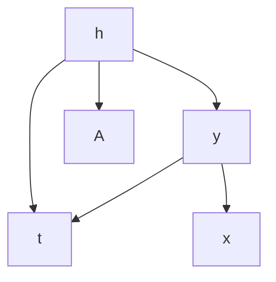

Fig. 4.1 The causal diagram corresponding to the assumption of Network Deconfounder [20]: the network structure A and the observed features x are proxies of the hidden confounders h


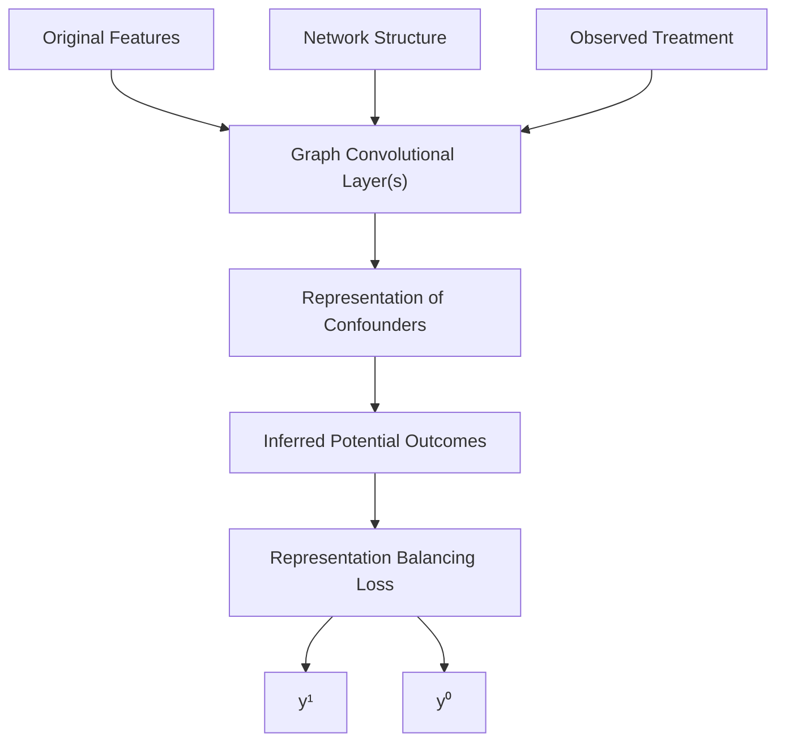

Fig. 4.2 The workflow of Network Deconfounder [20]

## 4.2.2.1 Confounder Representation Learning

Network Deconfounder is the first work that utilizes the auxiliary network structure to improve confounder representation learning. Here, a representation learning function $g ( \cdot )$ maps the node features and the network structure into a d-dimensional latent space of confounders. In this way, a d-dimensional representation $\mathbf { z } _ { i }$ is learned for each node i to encode its confounders. The $g ( \cdot )$ function is parameterized with a graph convolutional network (GCN) [12, 30], which is an effective technique to handle graph-related tasks. More specifically, the confounder representation process can be formulated as:

$$
\mathbf {z} _ {i} = g (\mathbf {x} _ {i}, \mathbf {A}) = \sigma ((\hat {\mathbf {A}} \mathbf {X}) _ {i} \mathbf {U}), \tag {4.2}
$$

where $\hat { \bf A }$ denotes the normalized adjacency matrix, $( \hat { \mathbf { A } } \mathbf { X } ) _ { i }$ denotes the i-th row of the matrix product AXˆ , U is the weight matrix to be learned in GCN, and $\sigma$ stands for the ReLU activation function [17]. Specifically, $\tilde { \textbf { A } } = \textbf { A } + \mathbf { I } _ { n }$ and $\begin{array} { r } { \tilde { \mathbf { D } } _ { j , j } = \sum _ { j } \tilde { \mathbf { A } } _ { j , j } } \end{array}$ , the normalized adjacency matrix Aˆ can be calculated beforehand using the renormalization trick [30]: Aˆ D˜ − 12 A˜ D˜ − 12 . $\hat { \bf A } = \tilde { \bf D } ^ { - \frac { 1 } { 2 } } \tilde { \bf A } \tilde { \bf D } ^ { - \frac { 1 } { 2 } }$

## 4.2.2.2 Outcome Prediction

With the confounder representations, an output function $f : \mathbb { R } ^ { d } \times \{ 0 , 1 \} \to \mathbb { R }$ is used to predict potential outcomes. The function $f$ takes the representation of hidden confounders and a treatment as input to predict the corresponding potential outcome.

$$
f (\mathbf {z} _ {i}, t) = \left\{ \begin{array}{l} f _ {1} (\mathbf {z} _ {i}) \text {   if   } t = 1 \\ f _ {0} (\mathbf {z} _ {i}) \text {   if   } t = 0 \end{array} \right., \tag {4.3}
$$

where $f _ { 1 }$ and $f _ { 0 }$ are the output functions for treatment $t = 1$ and $t = 0$ .

Objective Function Due to the lack of counterfactual, we can only use the factual outcomes as supervision and minimize the error in the predicted factual outcomes: min $\textstyle { \frac { 1 } { n } } \sum _ { i = 1 } ^ { n } ( { \hat { y } } _ { i } ^ { t _ { i } } - y _ { i } ) ^ { 2 }$ .

Representation Balancing It is worth noting that minimizing the error in the factual outcomes $( y _ { i } )$ does not necessarily indicate that the error in the counterfactual outcomes $( y _ { i } ^ { C F } )$ is also minimized, as there is often a distribution shift problem between different treatment groups [27, 59]. Inspired by Shalit et al. [59], the error of inferring counterfactual outcomes is upperbounded by a combination of two factors: (1) the error of factual outcome predictions, and (2) an integral probability metric (IPM) [48] that quantifies the discrepancy between the distributions of confounder representations in the treatment and control groups. In other words, in order to improve our counterfactual inference, we must not only minimize errors in factual outcome predictions but also reduce the difference between the confounder distributions in the two groups. Let $P ( \mathbf { z } ) = P r ( \mathbf { z } | t _ { i } = 1 )$ and $Q ( \mathbf { z } ) = P r ( \mathbf { z } | t _ { i } = 0 )$ denote the distributions of confounder representations in different treatment groups, then $\rho _ { \mathcal { Z } } ( P , Q )$ denotes the IPM defined in a functional space $z .$ , which measures the difference between the two distributions of confounder representations. Network Deconfounder adopts a Wasserstein-1 distance [68] based metric to balance the representation distributions:

$$
\rho_ {\mathcal {Z}} (P, Q) = \inf _ {k \in \mathcal {K}} \int_ {\mathbf {z} \in \{\mathbf {z} _ {i} \} _ {i: t _ {i} = 1}} | | k (\mathbf {z}) - \mathbf {z} | | P (\mathbf {z}) d \mathbf {z} \tag {4.4}
$$

where $\mathcal { K } = \{ k | k : \mathbb { R } ^ { d }  \mathbb { R } ^ { d } s . t . \ Q ( k ( \mathbf { z } ) ) = P ( \mathbf { z } ) \}$ denotes the set of push-forward functions that can transform the representation distribution of the treated $\mathbf { \Xi } ( P ( \mathbf { z } ) )$ to that of the controlled $\mathbf { \Gamma } ( Q ( \mathbf { z } ) )$ .

Finally, the objective function of Network Deconfounder is:

$$
\mathcal {L} (\{\mathbf {x} _ {i}, t _ {i}, y _ {i} \} _ {i = 1} ^ {n}, \mathbf {A}) = \frac {1}{n} \sum_ {i = 1} ^ {n} (\hat {y} _ {i} ^ {t _ {i}} - y _ {i}) ^ {2} + \alpha \rho_ {\mathcal {Z}} (P, Q) + \lambda | | \boldsymbol {\Theta} | | _ {2} ^ {2}, \tag {4.5}
$$

where $\alpha$ and λ are hyperparameters to control the weights of the representation balancing term and a model parameter regularization term to avoid overfitting.

## 4.2.3 Experimental Evaluation

## 4.2.3.1 Dataset and Simulation

Obtaining the ground-truth treatment effects can be challenging, as it is often impossible to observe both potential outcomes for a given unit. Despite this limitation, it is essential to have benchmark datasets with ground-truth ITEs on networked observational data to evaluate different treatment effect estimation methods. To address this challenge, following a traditional routine of causal studies, Network Deconfounder is evaluated on semisynthetic datasets. Specifically, two benchmark graph datasets (BlogCatalog2 and ${ \mathrm { F l i c k r } } ^ { 3 }$ ) including real-world node features and graph structure are used. Based on these real-world graph data, treatment and outcome are simulated. More information of the datasets is shown in Table 4.1.

**Table 4.1 Dataset description [20]**

<table><tr><td></td><td>Nodes</td><td>Edges</td><td>Features</td><td> $\kappa_2$ </td><td>ATE mean</td><td>STD</td></tr><tr><td rowspan="3">BlogCatalog</td><td rowspan="3">5,196</td><td rowspan="3">173,468</td><td rowspan="3">2,173/8,189</td><td>0.5</td><td>4.366</td><td>0.553</td></tr><tr><td>1</td><td>7.446</td><td>0.759</td></tr><tr><td>2</td><td>13.534</td><td>2.309</td></tr><tr><td rowspan="3">Flickr</td><td rowspan="3">7,575</td><td rowspan="3">239,738</td><td rowspan="3">1,210/12,047</td><td>0.5</td><td>6.672</td><td>3.068</td></tr><tr><td>1</td><td>8.487</td><td>3.372</td></tr><tr><td>2</td><td>20.546</td><td>5.718</td></tr></table>

The treatment is simulated as follows:

$$
P r (t = 1 | \mathbf {x} _ {i}, \mathbf {A}) = \frac {\exp (p _ {1} ^ {i})}{\exp (p _ {1} ^ {i}) + \exp (p _ {0} ^ {i})};
$$

$$
\begin{array}{l} p _ {1} ^ {i} = \kappa_ {1} r (\mathbf {x} _ {i}) ^ {\top} r _ {1} ^ {c} + \kappa_ {2} \sum_ {j \in \mathcal {N} (i)} r (\mathbf {x} _ {j}) ^ {\top} r _ {1} ^ {c} \\ = \kappa_ {1} r (\mathbf {x} _ {i}) ^ {\top} r _ {1} ^ {c} + \kappa_ {2} (\mathbf {A} r (\mathbf {x} _ {j})) ^ {\top} r _ {1} ^ {c}; \tag {4.6} \\ \end{array}
$$

$$
p _ {0} ^ {i} = \kappa_ {1} r (\mathbf {x} _ {i}) ^ {\top} r _ {0} ^ {c} + \kappa_ {2} \sum_ {j \in \mathcal {N} (i)} r (\mathbf {x} _ {j}) ^ {\top} r _ {0} ^ {c}
$$

$$
= \kappa_ {1} r (\mathbf {x} _ {i}) ^ {\top} r _ {0} ^ {c} + \kappa_ {2} (\mathbf {A} r (\mathbf {x} _ {j})) ^ {\top} r _ {0} ^ {c},
$$

where $\kappa _ { 1 } , \kappa _ { 2 } \geq 0$ signify the magnitude of the confounding bias from one unit itself and its neighbors, respectively. $N ( i )$ is the set of neighbors for the i-th node on the graph. $r ( \mathbf { x } _ { i } )$ represents the i-th node’s confounders. $r _ { 0 } ^ { c }$ and $r _ { 1 } ^ { c }$ denote the centroid of the confounders in the control group and treatment group, respectively. Then factual and counterfactual outcomes are simulated as:

$$
y ^ {F} (\mathbf {x} _ {i}) = y _ {i} = C (p _ {0} ^ {i} + t _ {i} p _ {1} ^ {i}) + \epsilon ; \tag {4.7}
$$

$$
y ^ {C F} (\mathbf {x} _ {i}) = C [ p _ {0} ^ {i} + (1 - t _ {i}) p _ {1} ^ {i} ] + \epsilon , \tag {4.8}
$$

where C is a scaling factor. The noise term is sampled as $\epsilon \sim { \cal N } ( 0 , 1 )$ .

## 4.2.3.2 Metrics

Two widely used evaluation metrics are used in the experiments, including the Rooted Precision in Estimation of Heterogeneous Effect $( \sqrt { \epsilon _ { P E H E } } )$ [24] and Mean Absolute Error on ATE $( \epsilon _ { A T E } )$ [76].

$$
\sqrt {\epsilon_ {P E H E}} = \sqrt {\frac {1}{n} \sum_ {i = 1} (\hat {\tau} _ {i} - \tau_ {i}) ^ {2}}, \tag {4.9}
$$

$$
\epsilon_ {A T E} = | \frac {1}{n} \sum_ {i = 1} (\hat {\tau} _ {i}) - \frac {1}{n} \sum_ {i = 1} (\tau_ {i}) |,
$$

where $\hat { \tau } _ { i } = \hat { y } _ { i } ^ { 1 } - \hat { y } _ { i } ^ { 0 }$ and $\tau _ { i } = y _ { i } ^ { 1 } - y _ { i } ^ { 0 }$ denote the predicted ITE and the ground-truth ITE for the i-th instance, respectively.

## 4.2.3.3 ITE Estimation Performance

The comparison between Network Deconfounder and other state-of-the-art baselines is shown in Table 4.2. From the table we observe that: (1) Network Deconfounder consistently outperforms the state-of-the-art baseline methods on different datasets under various settings. (2) With the ability of capturing the patterns of hidden confounders from the graph structure, Network Deconfounder suffers the least when the influence of hidden confounders grows (from $\kappa _ { 2 } = 0 . 5 \mathrm { t o } \kappa _ { 2 } = 2 )$ .

## 4.3 Causal Effect Estimation on Dynamic Graphs

As mentioned above, in graphs, the graph topology can serve as a source of proxies for hidden confounders. However, most existing studies [20, 22] overwhelmingly assume that the observational graph data and the hidden confounders are static. In fact, all variables are naturally dynamic in many real-world occasions. For example, when estimating the treatment effect of wearing a face mask on COVID-19 infection, the residents’ vigilance may be a hidden confounder, which cannot be explicitly measured, but it may be reflected in residents’ mobility network. Noticeably, as time goes on, the mobility network, the face mask practice, the COVID-19 infection risk, and the residents’ vigilance are all time-varying at different time periods. In this case, the residents’ vigilance can be influenced by the situation in previous time periods. For example, the recent number of death cases would affect people’s vigilance in next a few days. Another typical example is in a recommender system, when estimating the causal effect of seeing an ad campaign on users’ purchase, users’ preferences can be hidden confounders, which influence both the ad campaigns they have seen and their purchase. Although users’ preferences are hard to be directly measured, they can still be inferred from users’ social network and other activities. However, users’ purchasing preferences evolve over time, shaped by their previous choices and products recommended to them. Additionally, their current preferences also affect their current profiles and social connections. In these scenarios, it is important to study the problem of deconfounding with observational graph data in a time-varying environment.

**Table 4.2 Comparison between Network Deconfounder and the state-of-the-art baselines in ITE estimation performance [20]**

<table><tr><td colspan="7">BlogCatalog</td></tr><tr><td> $\kappa_2$ </td><td colspan="2">0.5</td><td colspan="2">1</td><td colspan="2">2</td></tr><tr><td></td><td> $\sqrt{\epsilon_{PEHE}}$ </td><td> $\epsilon_{ATE}$ </td><td> $\sqrt{\epsilon_{PEHE}}$ </td><td> $\epsilon_{ATE}$ </td><td> $\sqrt{\epsilon_{PEHE}}$ </td><td> $\epsilon_{ATE}$ </td></tr><tr><td>NetDeconf</td><td>4.532</td><td>0.979</td><td>4.597</td><td>0.984</td><td>9.532</td><td>2.130</td></tr><tr><td>CFR-Wass</td><td>10.904</td><td>4.257</td><td>11.644</td><td>5.107</td><td>34.848</td><td>13.053</td></tr><tr><td>CFR-MMD</td><td>11.536</td><td>4.127</td><td>12.332</td><td>5.345</td><td>34.654</td><td>13.785</td></tr><tr><td>TARNet</td><td>11.570</td><td>4.228</td><td>13.561</td><td>8.170</td><td>34.420</td><td>13.122</td></tr><tr><td>CEVAE</td><td>7.481</td><td>1.279</td><td>10.387</td><td>1.998</td><td>24.215</td><td>5.566</td></tr><tr><td>Causal forest</td><td>7.456</td><td>1.261</td><td>7.805</td><td>1.763</td><td>19.271</td><td>4.050</td></tr><tr><td>BART</td><td>4.808</td><td>2.680</td><td>5.770</td><td>2.278</td><td>11.608</td><td>6.418</td></tr><tr><td colspan="7">Flickr</td></tr><tr><td></td><td> $\sqrt{\epsilon_{PEHE}}$ </td><td> $\epsilon_{ATE}$ </td><td> $\sqrt{\epsilon_{PEHE}}$ </td><td> $\epsilon_{ATE}$ </td><td> $\sqrt{\epsilon_{PEHE}}$ </td><td> $\epsilon_{ATE}$ </td></tr><tr><td>NetDeconf</td><td>4.286</td><td>0.805</td><td>5.789</td><td>1.359</td><td>9.817</td><td>2.700</td></tr><tr><td>CFR-Wass</td><td>13.846</td><td>3.507</td><td>27.514</td><td>5.192</td><td>53.454</td><td>13.269</td></tr><tr><td>CFR-MMD</td><td>13.539</td><td>3.350</td><td>27.679</td><td>5.416</td><td>53.863</td><td>12.115</td></tr><tr><td>TARNet</td><td>14.329</td><td>3.389</td><td>28.466</td><td>5.978</td><td>55.066</td><td>13.105</td></tr><tr><td>CEVAE</td><td>12.099</td><td>1.732</td><td>22.496</td><td>4.415</td><td>42.985</td><td>5.393</td></tr><tr><td>Causal forest</td><td>8.104</td><td>1.359</td><td>14.636</td><td>3.545</td><td>26.702</td><td>4.324</td></tr><tr><td>BART</td><td>4.907</td><td>2.323</td><td>9.517</td><td>6.548</td><td>13.155</td><td>9.643</td></tr></table>

For this problem, a dynamic graph neural network–based framework DNDC [41] has been proposed to estimate causal effects under a dynamic networked environment. Generally, DNDC learns representations of confounders at each time period by encoding the dynamic graph data (including the current graph and historical information) into the representation space. DNDC systematically models the evolution patterns of different data modalities for unbiased ITE estimation. Specifically, DNDC uses a recurrent neural network (RNN) [25, 46] to capture the temporal information, and adopts a graph convolutional network (GCN) [31] based module to handle the relational information. ITE estimation in a dynamic network has a wide range of applications, such as epidemiology, economics, and recommendation across different time periods.

## 4.3.1 Problem Definition

Suppose a dataset with time-evolving networked observational data across $T$ different time periods is given, denoted by $\{ \mathbf { X } ^ { t } , \mathbf { A } ^ { t } , \mathbf { C } ^ { t } , \mathbf { Y } ^ { t } \} _ { t = 1 } ^ { T }$ . Here, units (instances) are connected as nodes in a dynamic network, and $( \cdot ) ^ { t }$ denotes the t -th time period. $\mathbf { X } ^ { t } ~ = ~ \{ \mathbf { x } _ { 1 } ^ { t } , \ldots , \mathbf { x } _ { n ^ { t } } ^ { t } \}$ stands for the node attributes (features) at time period t . $\mathbf { x } _ { i } ^ { t }$ represents the node features of the i-th instance (e.g., user profile), $n ^ { t }$ is the number of nodes, and $\mathbf { A } ^ { t }$ is the adjacency matrix of the network (e.g., users’ social network). For simplicity, the network is assumed to be undirected and unweighted, but this work can be naturally extended to more general cases such as directed and weighted networks. At time period t, the treatment for these $n ^ { t }$ nodes is denoted by $\mathbf { C } ^ { t } ~ = ~ \{ c _ { 1 } ^ { t } , \ldots , c _ { n ^ { t } } ^ { t } \}$ , where $c _ { i } ^ { t }$ is either 1 or 0 (e.g., if a user has received the recommendation from a specific ad campaign or not). The observed outcome of all instances at time period t is denoted by $\mathbf { Y } ^ { t } ~ = ~ \{ y _ { 1 } ^ { t } , \ldots , y _ { n ^ { t } } ^ { t } \}$ (e.g., users’ purchase). $\mathbf Z ^ { t } ~ = ~ \{ \mathbf z _ { 1 } ^ { t } , \ldots , \mathbf z _ { n ^ { t } } ^ { t } \}$ stands for the hidden confounders (e.g., users’ preferences). The superscript $\dot { ( \cdot ) } ^ { < t }$ denotes the historical data before time period t. For example, all the node features before time period t can be referred to as $\mathbf { X } ^ { < t } =$ $\{ \mathbf { X } ^ { 1 } , \mathbf { X } ^ { 2 } , \ldots , \mathbf { X } ^ { t - 1 } \}$ , and $\mathbf { C } ^ { < t } , \mathbf { A } ^ { < t }$ are defined similarly. $\mathbf { H } ^ { t } \ = \ \{ \mathbf { X } ^ { < t } , \mathbf { A } ^ { < t } , \mathbf { C } ^ { < t } \}$ denotes all the historical data before time period t. This work is based on the potential outcome framework [50, 56]. The potential outcome of the i-th node under treatment $c$ at time period t is denoted by $y _ { c , i } ^ { t } \in \mathbb { R }$ , which is the outcome that would occur if instance i had received treatment c at time period t. We represent the potential outcomes of all instances at time period t by $\mathbf { Y } _ { 1 } ^ { t } = \{ y _ { 1 , 1 } ^ { t } , \ldots , y _ { 1 , n ^ { t } } ^ { t } \}$ and $\mathbf { Y } _ { 0 } ^ { t } = \{ y _ { 0 , 1 } ^ { t } , \dots , y _ { 0 , n ^ { t } } ^ { t } \}$ . Then the individual treatment effect (ITE) on time-varying observational graph data can be defined as:

$$
\tau_ {i} ^ {t} = \tau^ {t} (\mathbf {x} _ {i} ^ {t}, \mathbf {H} ^ {t}, \mathbf {A} ^ {t}) = \mathbb {E} [ y _ {1, i} ^ {t} - y _ {0, i} ^ {t} | \mathbf {x} _ {i} ^ {t}, \mathbf {H} ^ {t}, \mathbf {A} ^ {t} ]. \tag {4.10}
$$

Based on the above definition of ITE, the average treatment effect (ATE) at time period t is defined as $\begin{array} { r } { \tau _ { A T E } ^ { t } = \frac { 1 } { n ^ { t } } \sum _ { i = 1 } ^ { n ^ { t } } \tau _ { i } ^ { t } } \end{array}$ .

=  The studied problem of learning ITE with dynamic observational graph data is defined as follows:

Definition 4.1 (Learning ITE on Dynamic Observational Graph Data) Given the dynamic observational graph data $\{ \mathbf { X } ^ { t } , \mathbf { A } ^ { t } , \mathbf { C } ^ { t } , \mathbf { Y } ^ { t } \} _ { t = 1 } ^ { T }$ across T different time periods, the goal is to estimate the ITE $\tau _ { i } ^ { t }$ for each instance i at each time period t .

## 4.3.2 Proposed Method

A framework DNDC [41] is proposed for ITE estimation in dynamic networked data. The overall structure of DNDC, as shown in Fig. 4.3, is composed of three key elements: confounder representation learning, potential outcome and treatment prediction, and representation balancing. The DNDC model captures hidden confounders over time by mapping current networked observational data and historical information into a latent representation space. The learned representations are then used for predicting potential outcomes and treatments. To ensure the balance between the representations of hidden confounders in the treatment group and the control group, an adversarial learning-based balancing technique is developed.


```mermaid
graph TD
    subgraph Time_t
  A["Graph Embedding X₁^t, X₂^t, X₃^t"] --> B["Graph Embedding"]
  B --> C["Z^t"]
  C --> D["GRU layer"]
  D --> E["H^t"]
  E --> F["attention layer"]
  F --> G["\tilde{H}^t"]
    end

    subgraph Time_t_1["Time_t+1"]
  H["Graph Embedding X₁^t, X₂^t, X₃^t"] --> I["Z^t"]
  I --> J["GRU layer"]
  J --> K["H^t"]
  K --> L["attention layer"]
  L --> M["\tilde{H}^t"]
    end

    subgraph Prediction_t
  N["potential outcome prediction"] --> O["\hat{Y}^t"]
  O --> P["ITE estimation"]
  Q["treatment prediction"] --> R["gradient reversal layer"]
        S["\check{C}^t"]
    end

    subgraph Prediction_t_1["Prediction_t+1"]
  T["potential outcome prediction"] --> U["\hat{Y}^{t+1}"]
  U --> V["ITE estimation"]
  W["treatment prediction"] --> X["gradient reversal layer"]
        Y["\check{C}^{t+1}"]
    end

    style Time_t fill:#f9f,stroke:#333
    style Time_t+1 fill:#ccf,stroke:#333
```

Fig. 4.3 An illustration of the framework DNDC [41]

## 4.3.2.1 Confounder Representation Learning

As the hidden confounders are related to the node features and graph structure, as well as the historical information, DNDC leverages them in confounder representation learning. More specifically, to well handle the graph data, graph convolutional networks (GCNs) [31] are used in this process:

$$
\mathbf {z} _ {i} ^ {t} = g (([ \mathbf {X} ^ {t}, \tilde {\mathbf {H}} ^ {t - 1} ]) _ {i}, \mathbf {A} ^ {t}) = \hat {\mathbf {A}} ^ {t} \mathrm{ReLU} ((\hat {\mathbf {A}} ^ {t} [ \mathbf {X} ^ {t}, \tilde {\mathbf {H}} ^ {t - 1} ]) _ {i} \mathbf {U} _ {0}) \mathbf {U} _ {1}, \tag {4.11}
$$

where $g ( \cdot )$ is a learnable transformation function parameterized by GCNs. In the above equation, two GCN layers (with parameters $\mathbf { U } _ { 0 }$ and $\mathbf { U } _ { 1 }$ , respectively) are stacked to capture the nonlinear dependency between the hidden confounders and the input, but the framework itself does not have any restriction regarding the number of GCN layers. To leverage the data in previous time periods, a historical embedding $\tilde { { \bf H } } ^ { t - 1 } \doteq \mathbb { R } ^ { n ^ { t } \times d _ { h } }$ is learned to encode the historical information before time period t, including previous hidden confounders and treatment assignment. $d _ { h }$ is the dimension of historical embedding. Here, , stands for the concatenation operation and $( \cdot ) _ { i }$ represents the i-th row of the matrix. $\mathbf { z } _ { i } ^ { t } ~ \in ~ \mathbb { R } ^ { d _ { z } }$ denotes the representation of confounders for instance i at time period $t , d _ { z }$ is the dimension of confounder representation. $\hat { \mathbf { A } } ^ { t }$ is the normalized adjacency matrix computed from $\mathbf { A } ^ { t }$ with the re-normalization trick [31].

To enable the historical embedding to characterize the evolution patterns of dynamic networked data, a gated recurrent unit (GRU) [10] based memory unit is used. Specifically, in the GRU, the current information $( \mathbf { Z } ^ { t } , \mathbf { X } ^ { t } , \mathbf { C } ^ { t } )$ and previous hidden state $\mathbf { H } ^ { t - 1 }$ are embedded into a new hidden state $\mathbf { H } ^ { t } \ \in \ \mathbb { R } ^ { n ^ { t } \times d _ { h } } \colon \mathbf { H } ^ { t } \ =$ $\mathrm { G R U } ( \mathbf { H } ^ { t - 1 } , [ \mathbf { Z } ^ { t } , \mathbf { X } ^ { t } , \mathbf { C } ^ { t } ] )$ . An attention mechanism [37, 66] among different hidden states of GRU is adopted to model the importance of the historical influence from different time periods. For any node with hidden state $\mathbf { h } ^ { t } \in \mathbb { R } ^ { d _ { h } }$ at time period t , the attention weight $\alpha _ { t , s }$ that models the importance of the hidden states of GRU from time period s on those of time period t $\mathit { \Omega } \cdot \mathit { \Omega } ( s < t )$ can be calculated with different attention score functions $( \mathrm { e . g . , }$ , bilinear [37] function or the scaled dot product [66] $\mathbf { h } ^ { t }$ $\mathbf { h } ^ { s }$ $\begin{array} { r } { \tilde { \mathbf { h } } ^ { t } = \mathrm { M L P } ( [ \mathbf { h } ^ { t } , \sum _ { s = 1 } ^ { t - 1 } \alpha _ { t , s } \mathbf { h } ^ { s } ] ) } \end{array}$ $\tilde { \mathbf { H } } ^ { t }$ with all instances.

## 4.3.2.2 Outcome and Treatment Prediction

Based on the learned confounder representations, DNDC predicts the potential outcome with two learnable functions $f _ { 1 } , f _ { 0 } : \mathbb { R } ^ { d _ { z } }  \mathbb { R }$ , corresponding to the two cases when treatment is 1 or 0, i.e., $\hat { y } _ { 1 , i } ^ { t } = f _ { 1 } ( \mathbf { z } _ { i } ^ { t } ) , \ \hat { y } _ { 0 , i } ^ { t } = f _ { 0 } ( \mathbf { z } _ { i } ^ { t } )$ . For each instance i, both of its factual outcome $y _ { F , i } ^ { t }$ and counterfactual outcome $y _ { C F , i } ^ { t }$ (unobserved outcome with the treatment different from reality) are predicted. The loss function of the potential outcome prediction is formulated as:

$$
\mathcal {L} _ {y} = \mathbb {E} _ {t \in [ T ], i \in [ n ^ {t} ]} [ (\hat {y} _ {F, i} ^ {t} - y _ {F, i} ^ {t}) ^ {2} ]. \tag {4.12}
$$

To better learn the confounder representations, DNDC also uses treatment as supervision. The loss function of treatment prediction is:

$$
\mathcal {L} _ {c} = - \mathbb {E} _ {t \in [ T ], i \in [ n ^ {t} ]} \left[ \left(c _ {i} ^ {t} \log \left(\hat {s} _ {i} ^ {t}\right) + \left(1 - c _ {i} ^ {t}\right) \log \left(1 - \hat {s} _ {i} ^ {t}\right)\right) \right]. \tag {4.13}
$$

The treatment predictor takes confounder representations as input. It is implemented with an MLP module and a softmax layer. $\hat { s } _ { i } ^ { t }$ is the output of the softmax layer, which can be considered as the prediction of propensity score for instance i at time period $t \colon \hat { s } _ { i } ^ { t } = \operatorname { s o f t m a x } ( \mathrm { M L P } ( \mathbf { z } _ { i } ^ { t } ) )$ .

## 4.3.2.3 Representation Balancing

As mentioned above, it has been shown that minimizing the discrepancy between the confounder representation distribution of the treatment group and that of the control group can benefit causal effect estimation [58]. DNDC uses a gradient reversal layer [16] for representation balancing. The gradient reversal layer does not change the input during forward-propagation, but during back-propagation, it reverses the gradient by multiplying it by a negative scalar. In this way, the gradient reversal layer can (1) train the treatment predictor by minimizing the treatment prediction loss $\mathcal { L } _ { c } ;$ and (2) enable representation balancing via maximizing $\mathcal { L } _ { c }$ w.r.t. the model parameters of the confounder representation learning.

## 4.3.2.4 Loss Function

The overall loss function is formulated as follows:

$$
\mathcal {L} \{\{\mathbf {x} _ {i} ^ {t}, y _ {i} ^ {t}, c _ {i} ^ {t} \} _ {1} ^ {n ^ {t}}, \mathbf {A} ^ {t} \} _ {1} ^ {T} = \mathcal {L} _ {y} + \beta \mathcal {L} _ {c} + \gamma | | \boldsymbol {\Theta} | | ^ {2}, \tag {4.14}
$$

where Θ is the set of parameters in this framework, and $| | \Theta | | ^ { 2 }$ is a regularization term. $\beta , \gamma$ are the hyperparameters to control the weight for treatment prediction and model regularization, respectively.

## 4.3.3 Experimental Evaluation

## 4.3.3.1 Dataset and Simulation

As it is notoriously hard to obtain the ground-truth causal models on real-world datasets, the evaluation is conducted on semisynthetic datasets with real-world graphs (including three datasets Flickr, BlogCatalog, and PeerRead4 ). In the simulation, the confounders are generated as follows:

$$
\mathbf {z} _ {i} ^ {t} = \left(\frac {1}{\sum_ {k = 1} ^ {3} \lambda_ {k}}\right) (\lambda_ {1} \boldsymbol {\psi} _ {i} ^ {t} + \lambda_ {2} \sum_ {u \in \mathcal {N} (i)} f (\mathbf {x} _ {u} ^ {t}) + \lambda_ {3} f (\mathbf {x} _ {i} ^ {t})) + \epsilon^ {t}, \tag {4.15}
$$

$$
\psi_ {i, j} ^ {t} = \frac {1}{p} \left(\sum_ {r = 1} ^ {p} \alpha_ {r, j} z _ {i, j} ^ {t - r} + \sum_ {r = 1} ^ {p} \beta_ {r} c _ {i} ^ {t - r}\right), \tag {4.16}
$$

where $\mathbf { z } _ { i } ^ { t }$ denotes the hidden confounders of instance i at time period t. ${ \boldsymbol { \psi } } _ { i } ^ { t }$ i denotes the historical information which influences the current confounders. zti,j $z _ { i , j } ^ { t }$ and $\psi _ { i , j } ^ { t }$ represent the j -th dimension of $\mathbf { z } _ { i } ^ { t }$ and ${ \boldsymbol { \psi } } _ { i } ^ { t }$ , respectively. N(i) denotes the neighboring nodes of node i at the current time period. $\epsilon ^ { t }$ is a random noise term. $f ( \cdot )$ is a transformation function. Here, $\alpha _ { r , j } \sim N ( 1 - ( r / p ) , ( 1 / p ) ^ { 2 } )$ i s a parameter which controls the influence of previous confounders at the time period $t - r$ on the current confounders. $\beta _ { r } \sim \mathcal { N } ( 0 , 0 . 0 2 ^ { 2 } )$ controls the influence of previous treatment at the time period $t \mathrm { ~ - ~ } r$ on the current confounders. $p$ is set to 3 by default. The parameters $\lambda _ { 1 } , \lambda _ { 2 }$ , and $\lambda _ { 3 }$ control the impact of historical information, current network structure, and current features on the confounders, respectively. The treatment and outcome are simulated in a similar way as introduced in Sect. 4.2.3.


Fig. 4.4 Performance comparison between DNDC and baselines under different settings of historical information influence [41]

## 4.3.3.2 ITE Estimation Performance Under Varying Influence from Historical Information

To investigate the performance of DNDC under different levels of influence from historical information on confounders, an experiment is designed with varying $\lambda _ { 1 }$ and fixed $\lambda _ { 2 }$ and $\lambda _ { 3 }$ . Figure 4.4 shows the comparison of the ITE estimation performance between DNDC and other baselines. Generally speaking, we observe that DNDC consistently outperforms all the baselines with lower $\sqrt { \epsilon _ { P E H E } }$ and $\epsilon _ { A T E }$ . When $\lambda _ { 1 } ~ = ~ 0$ , the historical information has no impact on the current confounders. In this case, DNDC and Network Deconfounder (NetDeconf) [20] achieve the best performance because of their capability of utilizing the network structure. When $\lambda _ { 1 }$ increases, the current ITE estimation relies more on historical information, while other baselines without consideration of historical information fail in this scenario. But DNDC is stably better as it leverages historical information.

## 4.3.3.3 ITE Estimation Performance Under Varying Influence from Network Structure

To evaluate DNDC in leveraging the relational information in graphs, an experiment with different values of $\lambda _ { 2 }$ but fixed values of $\lambda _ { 1 }$ and $\lambda _ { 3 }$ is conducted. As shown in Fig. 4.5, when $\lambda _ { 2 } ~ = ~ 0$ , the hidden confounders are independent of the graph structure, in this case, NetDeconf loses its superiority over other baselines. But DNDC can still achieve better ITE estimation by capturing the historical influence on the hidden confounders at the current time period. When $\lambda _ { 2 }$ increases, the confounder representation learning component in DNDC captures the confounders buried in the graph structure and achieves better ITE estimation performance.


Fig. 4.5 Performance comparison between DNDC and baselines under different settings of network structure influence [41]

## 4.4 Causal Effect Estimation on Hypergraphs

Classic causal effect estimation is based on the Stable Unit Treatment Value (SUTVA) assumption that there is no interference (i.e., spillover effect) among different units, requiring that the treatment of one unit does not impact the outcome of another unit. However, this assumption can be unrealistic in real-world scenarios, especially in interconnected systems like graphs. For instance, an individual’s risk of COVID-19 infection can be affected by the face-covering practices of others in their contact network. Failure to account for these interdependencies can lead to flawed estimations of causal effects.

Recently, there have been many efforts aiming to tackle the problem of causal effect estimation under interference. Most existing studies addressing this problem [2, 4, 26, 32, 39, 64, 65, 81] assume the interference only occurs between pairs of units on ordinary graphs (as shown in Fig. 4.6b). While the conventional pairwise interactions in graphs are widely used and applicable to a variety of settings, such as person-to-person physical contact or social networks, they fall short in capturing the intricacies of group interactions, where each interaction can involve more than just two individuals [3, 15, 79]. Hypergraphs can be introduced to address this limitation. Unlike ordinary edges, which connect only two nodes, a hyperedge can connect an arbitrary number of nodes (as shown in Fig. 4.6a), reflecting the nature of group interactions. Consider a hypergraph example that individuals are connected via inperson social events, each mass gathering event can be represented as a hyperedge. In a hypergraph, high-order interference may exist. For instance, in a gathering event represented by a hyperedge, an individual’s risk of COVID-19 infection can be influenced not only by direct first-order interference from others within the event, but also by indirect high-order interference resulting from the interactions among attendees, as shown in Fig. 4.6c. It is important to handle the high-order interference that exists on hypergraphs.


u2
u3
u1
u4
u5

(a). Hypergraph


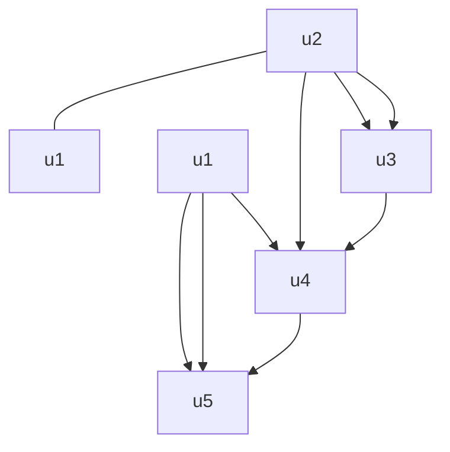

(b). Ordinary graph


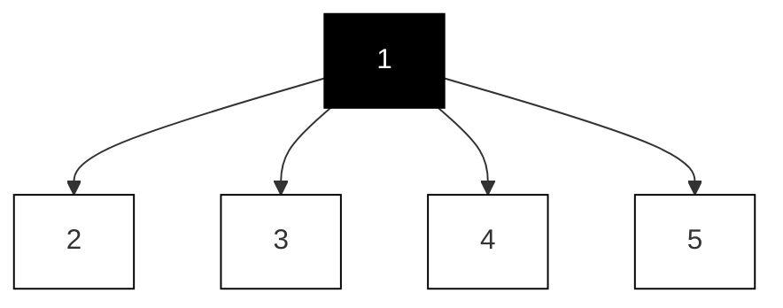


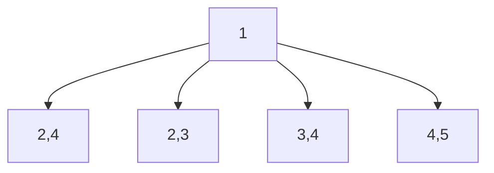

2nd-order


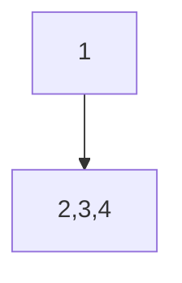

3rd-order  
(c). First, second, and third-order interferences with $u _ { 1 }$  
Fig. 4.6 Hypergraph, ordinary graph, and interferences [43]. (a) An example of a hypergraph; (b) An ordinary graph projected from this hypergraph; (c) Interferences with node $u _ { 1 }$ from its neighbors on the hypergraph

To address this challenge, a framework HyperSCI [43] is proposed for treatment effect estimation under high-order interference in hypergraphs. At its core, this framework controls for confounders and models high-order interference through representation learning. HyperSCI leverages a hypergraph neural network to effectively capture the interference patterns by learning interference representations and using an attention mechanism to model the relative importance of each unit within each hyperedge. These hypergraph neural network technologies equip HyperSCI with both high accuracy and computational efficiency.

## 4.4.1 Problem Definition

Definition 4.2 (Hypergraph) A hypergraph ${ \mathcal { H } } = \{ { \mathcal { V } } , { \mathcal { E } } \}$ consists of a set of n nodes $\mathcal { V } = \{ v _ { i } \} _ { i = 1 } ^ { n }$ and a set of m hyperedges $\mathcal { E } = \{ \mathbf { e } _ { k } \} _ { k = 1 } ^ { m }$ . Each hyperedge can connect any number of nodes.

In the studied problem, the given observational data are denoted by X, , T, Y . Here, $\mathbf { X } = \{ \mathbf { x } _ { i } \} _ { i = 1 } ^ { n } , \mathbf { T } = \{ t _ { i } \} _ { i = 1 } ^ { n }$ and $\mathbf { Y } = \{ y _ { i } \} _ { i = 1 } ^ { n }$ represent node features, treatment assignments, and observed outcomes, respectively. $\textbf { H } = \ \{ h _ { i , e } \} \ \in \ \mathbb { R } ^ { n \times m }$ is an incidence matrix for hypergraph H. Here, $h _ { i , e } ~ = ~ 1$ if node i is in hyperedge e, otherwise $h _ { i , e } ~ = ~ 0$ . The treatment assignment for each node is binary (i.e., $t _ { i } \in \{ 0 , 1 \} )$ .

Definition 4.3 (Potential Outcome) The potential outcome [55] of the unit i (denoted by $y _ { i } ^ { 1 }$ or $y _ { i } ^ { 0 } )$ is defined as the outcome which would be realized for unit i under treatment $t _ { i } ~ = ~ 1$ or $t _ { i } ~ = ~ 0$ . These potential outcomes can be obtained via a transformation function $Y _ { i } ^ { T _ { i } } ~ = ~ \Phi _ { Y } ( T _ { i } , X _ { i } , T _ { - i } , X _ { - i } , { \cal H } )$ . Here, $\Phi _ { Y }$ i s a (nondeterministic) function, i $. . . , y _ { i } ^ { t _ { i } } = \Phi _ { Y } ( t _ { i } , \mathbf { x } _ { i } , \mathbf { T } _ { - i } , \mathbf { X } _ { - i } , \mathbf { H } )$ , where $( \cdot ) _ { - i }$ denotes all other nodes on except i.

This work aims to estimate ITE in a hypergraph. Based on the above definition, the ITE in the studied problem is defined as follows:

Definition 4.4 For each node i on the hypergraph $\mathcal { H } ,$ the individual treatment effect (ITE) is defined by the difference between potential outcomes corresponding to $t _ { i } = 1$ and $t _ { i } = 0 $ :

$$
\begin{array}{l} \tau (\mathbf {x} _ {i}, \mathbf {T} _ {- i}, \mathbf {X} _ {- i}, \mathbf {H}) = \mathbb {E} [ Y _ {i} ^ {1} - Y _ {i} ^ {0} | X _ {i} = \mathbf {x} _ {i}, T _ {- i} = \mathbf {T} _ {- i}, X _ {- i} = \mathbf {X} _ {- i}, H = \mathbf {H} ] \\ = \mathbb {E} [ \Phi_ {Y} (1, \mathbf {x} _ {i}, \mathbf {T} _ {- i}, \mathbf {X} _ {- i}, \mathbf {H}) - \Phi_ {Y} (0, \mathbf {x} _ {i}, \mathbf {T} _ {- i}, \mathbf {X} _ {- i}, \mathbf {H}) ]. \tag {4.17} \\ \end{array}
$$

## 4.4.2 Proposed Method

HyperSCI [43] is a framework proposed to address the studied problem. As shown in Fig. 4.7, this framework contains three components: confounder representation learning, interference modeling, and outcome prediction.

## 4.4.2.1 Confounder Representation Learning

HyperSCI learns representations of confounders by mapping the node features $\mathbf { x } _ { i }$ into a latent space with a multilayer perceptron (MLP) module, i.e., $\mathbf { z } _ { i } = \mathbf { M L P } ( \mathbf { x } _ { i } )$ . The confounder representations for all the nodes are denoted by Z = {zi} ni 1. $\mathbf { Z } ~ = ~ \{ \mathbf { z } _ { i } \} _ { i = 1 } ^ { n }$ =Similar as [58], a Wasserstein-1 distance [68] based representation balancing method is used to minimize the distance between the representation distributions of the treatment group and control group.


```mermaid
graph LR
  A["Confounder Representation Learning"] --> B["Interference Modeling"]
  B --> C["Outcome Prediction"]

    subgraph Confounder Representation Learning
  D["x1"] --> E["MLP"]
  F["x2"] --> E
  G["x3"] --> E
  H["x4"] --> E
  I["z1"] --> J["z2"]
  K["z2"] --> J
  L["z3"] --> M["z4"]
  N["z4"] --> M
  O["z1"] --> P["z2"]
  Q["z3"] --> R["z4"]
  S["z4"] --> R
  T["z1"] --> U["z2"]
  V["z3"] --> W["z4"]
  X["z1"] --> Y["z2"]
  Z["z3"] --> AA["z4"]
  AB["z1"] --> AC["z2"]
  AD["z3"] --> AE["z4"]
  AF["z1"] --> AG["z2"]
  AH["z3"] --> AI["z4"]
  AJ["z1"] --> AK["z2"]
  AL["z3"] --> AM["z4"]
  AN["z1"] --> AO["z2"]
  AP["z3"] --> AQ["z4"]
  AR["z1"] --> AS["z2"]
  AT["z3"] --> AU["z4"]
  AV["z1"] --> AW["z2"]
  AX["z3"] --> AY["z4"]
  AZ["z1"] --> BA["z2"]
  BB["z3"] --> BC["z4"]
  BD["z1"] --> BE["z2"]
  BF["z3"] --> BG["z4"]
  BH["z1"] --> BI["z2"]
  BJ["z3"] --> BK["z4"]
  BL["z1"] --> BM["z2"]
  BN["z3"] --> BO["z4"]
  BP["z1"] --> BQ["z2"]
  BR["z3"] --> BS["z4"]
  BT["z1"] --> BU["z2"]
  BV["z3"] --> BW["z4"]
  BX["z1"] --> BY["z2"]
  BZ["z3"] --> BQ
  CA["z1"] --> CB["z2"]
  CC["z3"] --> CC["z4"]
  DA["z1"] --> DB["z2"]
  DC["z3"] --> DC["z4"]
  DD["z1"] --> EE["z2"]
  EE --> EE
  FF["z1"] --> DG["z2"]
  DG --> DG
  DH["z1"] --> DI["z2"]
  DI --> DI
  DJ["z1"] --> DK["z2"]
  DK --> DK
  LE["z1"] --> MF["z2"]
  MF --> MF
  MG["z1"] --> NG["z2"]
  NG --> NG
  ON["z1"] --> O["Hypergraph module"]
  P["Confounder representation"] --> Q
  R["Interference representation"] --> S
    end

    subgraph Interference Modeling
        S
        T
        U
        V
        W
    end

    subgraph Outcome Prediction
        X["Node (treated)"]
        Y["Node (control)"]
        Z["Hyperedge"]
        AA["Node features"]
        AB["Confounder representation"]
        AC["Interference representation"]
    end
```

Fig. 4.7 An illustration of HyperSCI [43], including three components: confounder representation learning, interference modeling, and outcome prediction


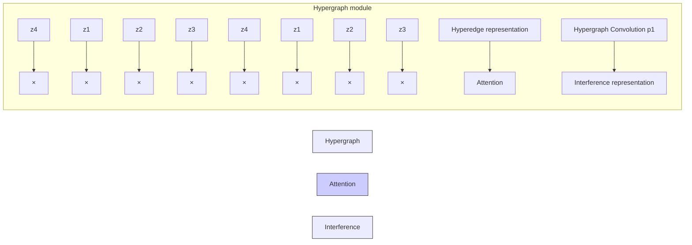

Fig. 4.8 An illustration of the hypergraph module in HyperSCI [43]. Here node $v _ { 1 }$ (highlighted in yellow) is taken as an example

## 4.4.2.2 Interference Modeling

An interference modeling module is developed to model the high-order interference among nodes in the hypergraph. More specifically, a function $\Psi ( \cdot )$ is learned via a hypergraph neural network module to obtain the interference representations $\left( \mathbf { p } _ { i } \right)$ for each node i, i.e., $\mathbf { p } _ { i } = \Psi ( \mathbf { Z } , \mathbf { H } , \mathbf { T } _ { - i } , t _ { i } )$ . The illustration of this module is shown in Fig. 4.8. This module is implemented based on a hypergraph convolutional network [3, 79] as well as a hypergraph attention mechanism [3, 13, 82].

To learn the interference representations for each node, the treatment and confounder representations are propagated through the hypergraph structure. A vanilla Laplacian matrix for the given hypergraph $\mathcal { H }$ can be calculated as:

$$
\mathbf {L} = \mathbf {D} ^ {- 1 / 2} \mathbf {H} \mathbf {B} ^ {- 1} \mathbf {H} ^ {\top} \mathbf {D} ^ {- 1 / 2}, \tag {4.18}
$$

where D $\mathbf { \tau } \in \mathbb { R } ^ { n \times n }$ is a diagonal matrix in which each element stands for the node $\begin{array} { r } { ( \mathrm { i . e . , } \sum _ { e = 1 } ^ { m } h _ { i , e } ) } \end{array}$ $\mathbf { B } \in \mathbb { R } ^ { m \times m }$ corresponds to the size of each hyperedge $\textstyle ( \sum _ { i = 1 } ^ { n } h _ { i , e } )$ . The hypergraph convolution operation is defined as:

$$
\mathbf {P} ^ {(l + 1)} = \text { LeakyReLU } \left(\mathbf {L P} ^ {(l)} \mathbf {W} ^ {(l + 1)}\right), \tag {4.19}
$$

where $\mathbf { P } ^ { ( l ) }$ denotes the representations in the l-th layer of the hypergraph module. The input of the first layer is the confounder representation masked by the treatment assignment, i.e., ${ \bf p } _ { i } ^ { ( 0 ) } \stackrel { \cdot } { = } t _ { i } * { \bf z } _ { i }$ . Here, ∗ is element-wise multiplication. $\mathbf { W } ^ { ( l + 1 ) } \in$ $\mathbb { R } ^ { d ^ { ( l ) } \times d ^ { ( l + 1 ) } }$ represents the parameter matrix in the (l+1)-th layer of the hypergraph module, where $d ^ { ( l ) }$ and $d ^ { ( l + 1 ) }$ ) are the dimensionality of the l-th layer and (l+1)-th layer, respectively.

While the hypergraph convolution layer allows for interference modeling through hyperedges, it lacks flexibility to consider the varying significance of interference on different nodes via different hyperedges. To address this, a hypergraph attention mechanism [3, 13, 82] is utilized to capture the intrinsic relationship between nodes and hyperedges. Specifically, the attention weights are learned for each node, and its corresponding hyperedges, which allows for a better understanding of how certain individuals, such as those participating in group events, may have a greater influence on or be influenced by others in these groups within the context of a hypergraph, as seen in the COVID-19 example. More specifically, the attention score between a node i and a hyperedge e is calculated as:

$$
\alpha_ {i, e} = \frac {\exp (\sigma (\text { sim } (\mathbf {z} _ {i} \mathbf {W} _ {a} , \mathbf {z} _ {e} \mathbf {W} _ {a})))}{\sum_ {k \in \mathcal {E} _ {i}} \exp (\sigma (\text { sim } (\mathbf {z} _ {i} \mathbf {W} _ {a} , \mathbf {z} _ {k} \mathbf {W} _ {a})))}, \tag {4.20}
$$

where $\sigma ( \cdot )$ is an activation function, $\mathcal { E } _ { i }$ is the set of hyperedges which contain the node $i , \mathbf { z } _ { e }$ is the representation for each hyperedge e, obtained by aggregating across the representations of its associated nodes. ${ \bf W } _ { a }$ denotes a parameter matrix to compute the node-hyperedge attention. sim(·) denotes a similarity function, which can be implemented as follows:

$$
\operatorname{sim} \left(\mathbf {x} _ {i}, \mathbf {x} _ {j}\right) = \mathbf {a} ^ {\top} \left[ \mathbf {x} _ {i}, \mathbf {x} _ {j} \right]. \tag {4.21}
$$

Here, a is a weight vector, [·, ·] is a concatenation operation. The attention scores are used to model different significance of interference. More specifically, the original incidence matrix H of the hypergraph in Eq. 4.18 is replaced with an attentioninvolved matrix $\tilde { \bf { H } } = \{ \tilde { h } _ { i , e } \}$ , where $\tilde { h } _ { i , e } = \alpha _ { i , e } h _ { i , e }$ .

## 4.4.2.3 Outcome Prediction

Based on the confounder representations and the interference representations, the potential outcomes are predicted by:

$$
\hat {y} _ {i} ^ {1} = f _ {1} ([ \mathbf {z} _ {i}, \mathbf {p} _ {i} ]), \hat {y} _ {i} ^ {0} = f _ {0} ([ \mathbf {z} _ {i}, \mathbf {p} _ {i} ]), \tag {4.22}
$$

where $f _ { 1 } ( \cdot )$ and $f _ { 0 } ( \cdot )$ are learnable functions, which are trained to predict potential outcomes for treatment assignment 1 and 0, respectively. The ITE for each node i is then estimated by: $\hat { \tau } _ { i } = \bar { y } _ { i } ^ { 1 } - \hat { y } _ { i } ^ { 0 }$ . The prediction for the observed outcome is obtained by $\hat { y } _ { i } = \hat { y } _ { i } ^ { t _ { i } }$ . The final loss function for HyperSCI is:

$$
\mathcal {L} = \sum_ {i = 1} ^ {n} (y _ {i} - \hat {y} _ {i}) ^ {2} + \alpha \mathcal {L} _ {b} + \lambda \| \boldsymbol {\Theta} \| ^ {2}, \tag {4.23}
$$

where the first term is the outcome prediction loss, which can be implemented by standard mean squared error. $\mathcal { L } _ { b }$ is the representation balancing loss, as introduced in Sect. 4.2.2.2. Θ denotes all the model parameters. α and λ are hyperparameters, which control the weights for representation balancing and model regularization, respectively.

## 4.4.3 Experimental Evaluation

## 4.4.3.1 Dataset and Simulation

The evaluation follows a standard semisynthetic routine on three datasets (a physical contact dataset Contact [6, 45], one online book dataset Goodreads [71, 73], and a large-scale proprietary web application dataset Microsoft Teams). These datasets are all based on real-world hypergraph data and simulation of the outcome generation process to assess the true individual treatment effects.

The outcome generation function is:

individual treatment effect (ITE)

$$
y _ {i} = f _ {y, 0} \left(\mathbf {x} _ {i}\right) + \overbrace {\gamma f _ {t} \left(t _ {i} , \mathbf {x} _ {i}\right)} + \underbrace {\beta f _ {s} (\mathbf {T} , \mathbf {X} , \mathbf {H})} _ {\text { hypergraph   spillover   effect }} + \epsilon_ {y _ {i}}, \tag {4.24}
$$

where $f _ { y , 0 } ( { \bf x } _ { i } )$ is the outcome of node i when $t _ { i } ~ = ~ 0$ without interference, $f _ { t } ( \cdot )$ is the function which calculates the ITE for each node, $f _ { s } ( \cdot )$ is the function which calculates the spillover effect. $\epsilon _ { y _ { i } }$ denotes the random noise from Gaussian distribution. The functions $f _ { y , 0 } ( { \bf x } _ { i } )$ can be specified as different function forms, such as a linear function or a nonlinear (e.g., quadratic) function w.r.t. $\mathbf { x } _ { i }$ .

## 4.4.3.2 ITE Estimation Performance

The performance of ITE estimation in hypergraph is shown in Table 4.3. From this table, we observe that HyperSCI outperforms all the baselines under different settings of outcome simulation function (in both linear and quadratic cases). As for the reasons, HyperSCI can leverage the structure information in hypergraph to model the high-order interference. In this way, it mitigates the influence of spillover effect on ITE estimation performance. Among baselines, some of them consider the pairwise network interference (GCN-HSIC and GNN-HSIC [39]) or use the graph structure to infer the hidden confounders in the ITE estimation problem (Netdeconf [20]). These methods perform better than those baselines (LR, CEVAE [35], CFR [58]), which cannot handle graph information. Furthermore, in the simulation, the hyperparameter $\beta$ controls the level of hypergraph spillover effect in the outcome simulation. The ITE estimation results under different values of $\beta$ are shown in Fig. 4.9. When $\beta$ increases, the outcome is more strongly affected by interference, and larger performance gains can be observed from HyperSCI compared with the baselines.

**Table 4.3 ITE estimation performance [43]. “CT,” “GR,” and “MS” refer to Contact, GoodReads, and Microsoft Teams datasets, respectively**

<table><tr><td rowspan="2">Data</td><td rowspan="2">Method</td><td colspan="2">Linear</td><td colspan="2">Quadratic</td></tr><tr><td> $\sqrt{\epsilon_{PEHE}}$ </td><td> $\epsilon_{ATE}$ </td><td> $\sqrt{\epsilon_{PEHE}}$ </td><td> $\epsilon_{ATE}$ </td></tr><tr><td rowspan="7">CT</td><td>LR</td><td>25.41 ± 0.04</td><td>9.11 ± 0.09</td><td>38.22 ± 0.77</td><td>20.28 ± 0.38</td></tr><tr><td>CEVAE</td><td>22.88 ± 1.07</td><td>8.29 ± 0.69</td><td>35.28 ± 0.75</td><td>18.22 ± 0.76</td></tr><tr><td>CFR</td><td>24.04 ± 0.75</td><td>7.17 ± 0.43</td><td>32.24 ± 1.01</td><td>17.28 ± 0.75</td></tr><tr><td>Netdeconf</td><td>10.22 ± 0.47</td><td>4.29 ± 0.13</td><td>21.23 ± 0.72</td><td>11.39 ± 0.74</td></tr><tr><td>GNN-HSIC</td><td>7.42 ± 0.39</td><td>2.06 ± 0.03</td><td>16.28 ± 0.24</td><td>7.28 ± 0.39</td></tr><tr><td>GCN-HSIC</td><td>7.28 ± 0.44</td><td>2.08 ± 0.04</td><td>14.23 ± 0.20</td><td>6.27 ± 0.15</td></tr><tr><td>HyperSCI</td><td>3.45 ± 0.27</td><td>1.39 ± 0.03</td><td>9.20 ± 0.09</td><td>2.24 ± 0.07</td></tr><tr><td rowspan="7">GR</td><td>LR</td><td>23.01 ± 0.04</td><td>13.42 ± 0.12</td><td>48.56 ± 1.02</td><td>31.19 ± 0.47</td></tr><tr><td>CEVAE</td><td>22.69 ± 0.03</td><td>12.49 ± 0.06</td><td>45.21 ± 3.10</td><td>29.22 ± 0.44</td></tr><tr><td>CFR</td><td>20.30 ± 0.03</td><td>13.21 ± 0.09</td><td>41.72 ± 0.72</td><td>26.28 ± 0.43</td></tr><tr><td>Netdeconf</td><td>18.39 ± 0.19</td><td>12.20 ± 0.03</td><td>35.18 ± 0.78</td><td>21.20 ± 0.76</td></tr><tr><td>GNN-HSIC</td><td>17.20 ± 0.23</td><td>12.18 ± 0.13</td><td>27.22 ± 0.78</td><td>16.87 ± 0.47</td></tr><tr><td>GCN-HSIC</td><td>16.01 ± 0.20</td><td>12.06 ± 0.15</td><td>25.42 ± 0.76</td><td>16.28 ± 0.76</td></tr><tr><td>HyperSCI</td><td>15.68 ± 0.21</td><td>11.81 ± 0.15</td><td>19.23 ± 0.44</td><td>13.33 ± 0.27</td></tr><tr><td rowspan="7">MS</td><td>LR</td><td>22.80 ± 0.64</td><td>21.41 ± 0.74</td><td>414.17 ± 3.94</td><td>192.80 ± 2.97</td></tr><tr><td>CEVAE</td><td>19.36 ± 0.80</td><td>8.63 ± 0.78</td><td>315.01 ± 2.53</td><td>188.47 ± 4.27</td></tr><tr><td>CFR</td><td>25.23 ± 0.01</td><td>18.28 ± 0.02</td><td>392.56 ± 4.33</td><td>189.75 ± 4.80</td></tr><tr><td>Netdeconf</td><td>11.11 ± 0.01</td><td>9.22 ± 0.03</td><td>241.02 ± 2.32</td><td>147.29 ± 1.04</td></tr><tr><td>GNN-HSIC</td><td>9.38 ± 0.44</td><td>6.91 ± 0.38</td><td>114.28 ± 3.62</td><td>81.21 ± 2.53</td></tr><tr><td>GCN-HSIC</td><td>8.27 ± 0.41</td><td>6.60 ± 0.48</td><td>109.57 ± 3.85</td><td>77.75 ± 3.93</td></tr><tr><td>HyperSCI</td><td>5.13 ± 0.56</td><td>4.46 ± 0.61</td><td>81.08 ± 0.37</td><td>74.41 ± 0.42</td></tr></table>

## 4.5 Other Related Work

In the above sections, we provided an in-depth introduction to several recent studies focused on estimating causal effects on graphs. However, it is important to note that in recent years, there has been an emergence of numerous research efforts aimed at bridging the gap between causal inference and graph learning, which is a broader and more encompassing area of study.

Causal Effect Estimation on Graphs Apart from the aforementioned papers, there have been many other studies for causal effect estimation on graph data. Chu et al. [11] proposed a graph infomax adversarial learning model (GIAL) for treatment effect estimation with networked observational data. GIAL recognizes patterns of hidden confounders by fully exploiting the graph information and recognizing the imbalance in network structure. Guo et al. [21] propose a minimax game-based ITE estimator (IGNITE), which conducts ITE estimation on graphs with consideration of both individual level and group level. Another line of work [2, 4, 26, 39, 54] targets on treatment effect estimation under interference, and many of these studies leverage (graph) neural network techniques. Besides, different from traditional binary treatment assignment, some recent research work [23, 29] studies the problem of treatment effect estimation with graph-structured treatments.

Causal Discovery with Graph Neural Networks Another important problem in causal inference is causal discovery [18, 60], which aims to identify causal relationships between variables and recover the underlying causal model. Traditional causal discovery methods include conditional independence constraint-based algorithms such as PC algorithm [62] and Fast Causal Inference (FCI) [61], as well as scorebased methods such as Greedy Equivalence Search (GES) [9]. Recently, with the development of graph neural networks (GNNs) and the natural connection between them and causal structure, more researchers have recently leveraged GNNs to facilitate causal discovery [33, 36, 75, 80].

Causality in Graph Learning Causality plays a crucial role in graph learning, as it allows us to gain a deeper understanding of the intricate relationships between variables and their effects on one another. In contrast, simply observing correlations between variables may lead to misguided assumptions and erroneous conclusions. Recently, there have been many studies on improving traditional graph learning with causality. Among them, a lot of research work improves the robustness and generalizability of graph learning models [7, 63, 78, 83] by grasping the causal features in graph data and eliminating biases brought by spurious correlations. Besides, many studies [34, 42, 53, 74] focus on improving the explainability of graph learning models from a causal perspective. Furthermore, with more attention on eliminating the discrimination in AI toward underrepresented groups, there have been increasing efforts to improve fairness in graph learning via tracking the causal relations between sensitive features (e.g., gender) and other variables [1, 44].

## 4.6 Summary and Future Directions

Causal inference on graphs is an evolving field that has recently attracted growing attention. There are many interesting future directions in this area. One promising direction is causal inference in more complex graph data with heterogeneous types of nodes and relations (e.g., heterogeneous graphs and knowledge graphs). Understanding causal relations between different entities in a heterogeneous network is essential to many real-world applications such as biology and physics. Besides, the unique network structure in graph data can often bring additional challenges in causal studies, such as edge sparsity and imbalance caused by selection bias or confounding factors. Such biases hidden in graphs are often led by different factors in different graph types (e.g., social networks or molecular graphs) due to the natural causes of their formation. These phenomena leave challenges for eliminating biases in graph structure for causal learning. Furthermore, current causal studies are mostly limited to observational graph datasets with sufficient data samples, while realworld scenarios often present data scarcity problems or streaming data that flow continuously in real-time systems. Developing causal inference methods to address these challenges is an important research problem. In general, the combination of causal inference and graph data sheds light on capturing the essential foundation of a complicated interconnected system. This contribution is vital in building trustworthy graph learning algorithms and applying them to improve future human life in reality.

## References

1. C. Agarwal, H. Lakkaraju, M. Zitnik, Towards a unified framework for fair and stable graph representation learning, in Uncertainty in Artificial Intelligence (2021), pp. 2114–2124  
2. P.M. Aronow, C. Samii, Estimating average causal effects under general interference, with application to a social network experiment. Ann. Appl. Stat. 11, 1912–1947 (2017)  
3. S. Bai, F. Zhang, P.H.S. Torr, Hypergraph convolution and hypergraph attention. Pattern Recogn. 110, 107637 (2021)  
4. G. Basse, A. Feller, Analyzing two-stage experiments in the presence of interference. J. Amer. Stat. Assoc. 113, 41–55 (2018)  
5. N.N. Bazarova, Y.H. Choi, Self-disclosure in social media: extending the functional approach to disclosure motivations and characteristics on social network sites. J. Commun. 64, 635–657 (2014)  
6. A.R. Benson et al., Simplicial closure and higher-order link prediction. Proc. Natl. Acad. Sci. 115(48), E11221–E11230 (2018)  
7. B. Bevilacqua, Y. Zhou, B. Ribeiro, Size-invariant graph representations for graph classification extrapolations, in International Conference on Machine Learning. PMLR (2021), pp. 837–851  
8. A. Braithwaite, N. Dasandi, D. Hudson, Does poverty cause conflict? Isolating the causal origins of the conflict trap. Conflict Manag. Peace Sci. 33(1), 45–66 (2016)  
9. D.M. Chickering, Optimal structure identification with greedy search. J. Mach. Learn. Res. 3(null), 507–554 (2003). ISSN: 1532-4435. https://doi.org/10.1162/153244303321897717  
10. K. Cho et al., Learning phrase representations using RNN encoder-decoder for statistical machine translation (2014). arXiv preprint  
11. Z. Chu, S.L. Rathbun, S. Li, Graph infomax adversarial learning for treatment effect estimation with networked observational data, in ACM SIGKDD International Conference on Knowledge Discovery and Data Mining (2021)  
12. M. Defferrard, X. Bresson, P. Vandergheynst, Convolutional neural networks on graphs with fast localized spectral filtering, in Advances in Neural Information Processing Systems (2016), pp. 3844–3852  
13. K. Ding et al., Be more with less: Hypergraph attention networks for inductive text classification (2020). arXiv preprint  
14. S. Ding et al., Causal incremental graph convolution for recommender system retraining. IEEE Trans. Neural Netw. Learn. Syst. (2022)  
15. Y. Feng et al., Hypergraph neural networks, in Proceedings of the AAAI Conference on Artificial Intelligence, vol. 33, no. 01 (2019), pp. 3558–3565  
16. Y. Ganin et al., Domain-adversarial training of neural networks. J. Mach. Learn. Res 17(1), 2096–2030 (2016)  
17. X. Glorot, A. Bordes, Y. Bengio, Deep sparse rectifier neural networks, in Proceedings of the Fourteenth International Conference on Artificial Intelligence and Statistics (2011), pp. 315– 323  
18. C. Glymour, K. Zhang, P. Spirtes, Review of causal discovery methods based on graphical models. Front. Genet. 10, 524 (2019)  
19. J.W. Godfrey, The mechanism of a road network. Traffic Eng. Control 8(8), 323–327 (1969)  
20. R. Guo, J. Li, H. Liu, Learning individual causal effects from networked observational data, in International Conference on Web Search and Data Mining (2020)  
21. R. Guo et al., IGNITE: A minimax game toward learning individual treatment effects from networked observational data, in International Joint Conference on Artificial Intelligence (2020)  
22. R. Guo et al., Ignite: A minimax game toward learning individual treatment effects from networked observational data, in Proceedings of the Twenty-Ninth International Conference on International Joint Conferences on Artificial Intelligence (2021), pp. 4534–4540  
23. S. Harada, H. Kashima, Graphite: Estimating individual effects of graph-structured treatments, in Proceedings of the 30th ACM International Conference on Information & Knowledge Management (2021), pp. 659–668  
24. J.L. Hill, Bayesian nonparametric modeling for causal inference. J. Comput. Graph. Stat. 20(1), 217–240 (2011)  
25. S. Hochreiter, J. Schmidhuber, Long short-term memory. Neural Comput. 9(8), 1735–1780 (1997)  
26. K. Imai, Z. Jiang, A. Malani, Causal inference with interference and noncompliance in twostage randomized experiments. J. Amer. Stat. Assoc. 116(534), 632–644 (2021)  
27. F. Johansson, U. Shalit, D. Sontag, Learning representations for counterfactual inference, in International Conference on Machine Learning (2016), pp. 3020–3029  
28. B.H. Junker, F. Schreiber, Analysis of Biological Networks (Wiley, Hoboken, 2011)  
29. J. Kaddour et al., Causal effect inference for structured treatments. Adv. Neural Informat. Process. Syst. 34, 24841–24854 (2021)  
30. T.N. Kipf, M. Welling, Semi-supervised classification with graph convolutional networks (2016). arXiv preprint  
31. T.N. Kipf, M. Welling, Semi-supervised classification with graph convolutional networks, in International Conference on Learning Representations (2017)  
32. R. Kohavi et al., Online controlled experiments at large scale, in ACM SIGKDD International Conference on Knowledge Discovery and Data Mining (2013)  
33. Y. Li et al., Causal discovery in physical systems from videos. Adv. Neural Informat. Process. Syst. 33, 9180–9192 (2020)  
34. W. Lin, H. Lan, B. Li, Generative causal explanations for graph neural networks, in International Conference on Machine Learning. PMLR (2021), pp. 6666–6679  
35. C. Louizos et al., Causal effect inference with deep latent-variable models, in Advances in Neural Information Processing Systems (2017)  
36. S. Löwe et al., Amortized causal discovery: Learning to infer causal graphs from time-series data, in Conference on Causal Learning and Reasoning. PMLR (2022), pp. 509–525  
37. M.-T. Luong, H. Pham, C.D. Manning, Effective approaches to attention-based neural machine translation (2015). arXiv preprint  
38. J. Ma, J. Li, Learning causality with graphs. AI Mag. 43(4), 365–375 (2022)  
39. Y. Ma, V. Tresp, Causal Inference under networked interfer-ence and intervention policy enhancement, in International Conference on Artificial Intelligence and Statistics (2021)  
40. J. Ma et al., Assessing the Causal Impact of COVID-19 Related Policies on Outbreak Dynamics: A Case Study in the US (2021). arXiv preprint  
41. J. Ma et al., Deconfounding with networked observational data in a dynamic environment, in ACM International Conference on Web Search and Data Mining (2021)  
42. J. Ma et al., CLEAR: Generative counterfactual explanations on graphs, in Neural Information Processing Systems (2022)  
43. J. Ma et al., Learning causal effects on hypergraphs, in ACM SIGKDD International Conference on Knowledge Discovery and Data Mining (2022)  
44. J. Ma et al., Learning fair node representations with graph counterfactual fairness, in Proceedings of the Fifteenth ACM International Conference on Web Search and Data Mining (2022)  
45. R. Mastrandrea, J. Fournet, A. Barrat, Contact patterns in a high school: a comparison between data collected using wearable sensors, contact diaries and friendship surveys. PloS one 10(9), e0136497 (2015)  
46. L.R. Medsker, L.C. Jain, Recurrent neural networks. Design Appl. 5, 2 (2001)  
47. M.E. Mor-Barak, L.S. Miller, A longitudinal study of the causal relationship between social networks and health of the poor frail elderly. J. Appl. Gerontol. 10(3), 293–310 (1991)  
48. A. Müller, Integral probability metrics and their generating classes of functions. Adv. Appl. Probab. 29(2), 429–443 (1997)  
49. M.E.J. Newman, The structure of scientific collaboration networks, in Proceedings of the National Academy of Sciences (2001)  
50. J. Neyman, Sur les applications de la théorie des probabilités aux experiences agricoles: Essai des principes. Roczniki Nauk Rolniczych 10, 1–51 (1923)  
51. D. Niemeijer, R.S. de Groot, Framing environmental indicators: moving from causal chains to causal networks. Environ. Develop. Sustainab. 10, 89–106 (2008)  
52. J. Pearl, Causality (Cambridge University Press, Cambridge, 2009)  
53. C. Pechsiri, R. Piriyakul, Explanation knowledge graph construction through causality extraction from texts. J. Comput. Sci. Technol. 25(5), 1055–1070 (2010)  
54. V. Rakesh et al., Linked causal variational autoencoder for inferring paired spillover effects, in Proceedings of the 27th ACM International Conference on Information and Knowledge Management (2018), pp. 1679–1682  
55. D.B. Rubin, Randomization analysis of experimental data: the Fisher randomization test comment. J. Amer. Stat. Assoc. 75(371), 591–593 (1980)  
56. D.B. Rubin, Bayesian inference for causal effects, in Handbook of Statistics, vol. 25 (Elsevier, Amsterdam, 2005)  
57. D.B. Rubin, Causal inference using potential outcomes: design, modeling, decisions. J. Amer. Stat. Assoc. 100(469), 322–331 (2005)  
58. U. Shalit, F.D. Johansson, D. Sontag, Estimating individual treatment effect: Generalization bounds and algorithms, in International Conference on Machine Learning (2017)  
59. U. Shalit, F.D. Johansson, D. Sontag, Estimating individual treatment effect: generalization bounds and algorithms, in Proceedings of the 34th International Conference on Machine Learning-Volume 70 (2017), pp. 3076–3085  
60. P. Spirtes, K. Zhang, Causal discovery and inference: concepts and recent methodological advances, in Applied Informatics, vol. 3 (Springer, Berlin, 2016), p. 3  
61. P. Spirtes et al., Constructing Bayesian network models of gene expression networks from microarray data, in Carnegie Mellon University (2000)  
62. P. Spirtes et al., Causation, Prediction, and Search (MIT Press, Cambridge, MA, 2000)  
63. Y. Sui et al., Deconfounded training for graph neural networks (2021). arXiv preprint  
64. E.J.T. Tchetgen, T.J. VanderWeele, On causal inference in the presence of interference. Stat. Methods Med. Res. 21(1), 55–75 (2012)  
65. J. Ugander et al., Graph cluster randomization: Network exposure to multiple universes, in ACM SIGKDD International Conference on Knowledge Discovery and Data Mining (2013)  
66. A. Vaswani et al., Attention is all you need, in Advances in Neural Information Processing Systems (2017)  
67. P. Velickovi ˇ c et al., Graph attention networks (2017). arXiv preprint ´  
68. C. Villani et al., Optimal Transport: Old and New, vol. 338 (Springer, Berlin, 2009)  
69. S. Wager, S. Athey, Estimation and inference of heterogeneous treatment effects using random forests. J. Amer. Stat. Assoc. 113(523), 1228–1242 (2018)  
70. Y. Wang, D.M. Blei, The blessings of multiple causes (2018). arXiv preprint  
71. M. Wan, J. McAuley, Item recommendation on monotonic behavior chains, in Proceedings of the 12th ACM Conference on Recommender Systems (2018), pp. 86–94  
72. Z. Wang et al., Knowledge graph embedding by translating on hyperplanes, in Proceedings of the AAAI conference on artificial intelligence, vol. 28, no. 1 (2014)  
73. M. Wan et al., Fine-grained spoiler detection from large-scale review corpora, in Proceedings of the 57th Annual Meeting of the Association for Computational Linguistics (2019), pp. 2605– 2610  
74. X. Wang et al., Reinforced causal explainer for graph neural networks. IEEE Trans. Pattern Analy. Mach. Intell. 45, 2297–2309 (2022)  
75. D. Wang et al., Hierarchical Graph Neural Networks for Causal Discovery and Root Cause Localization (2023). arXiv preprint  
76. C.J. Willmott, K. Matsuura, Advantages of the mean absolute error (MAE) over the root mean square error (RMSE) in assessing average model performance. Climate Res. 30(1), 79–82 (2005)  
77. Z. Wu et al., A comprehensive survey on graph neural networks, in IEEE Transactions on Neural Networks and Learning Systems 32(1), 4–24 (2020)  
78. Y.-X. Wu et al., Discovering invariant rationales for graph neural networks (2022). arXiv preprint  
79. N. Yadati et al., Hypergcn: Hypergraph convolutional networks for semi-supervised classification (2018). arXiv preprint  
80. Y. Yu et al., DAG-GNN: DAG structure learning with graph neural networks, in International Conference on Machine Learning (2019)  
81. Y. Yuan, K. Altenburger, F. Kooti, Causal network motifs: Identifying heterogeneous spillover effects in A/B Tests, in The Web Conference (2021)  
82. R. Zhang, Y. Zou, J. Ma, Hyper-SAGNN: A self-attention based graph neural network for hypergraphs (2019). arXiv preprint  
83. T. Zhang, H.-R. Shan, M.A. Little, Causal GraphSAGE: a robust graph method for classification based on causal sampling. Pattern Recogn. 128, 108696 (2022)  
84. J. Zhou et al., Graph neural networks: A review of methods and applications, in AI Open (2020)

# Chapter 5 Causal Effect Estimation: Recent Progress, Challenges, and Opportunities


Zhixuan Chu and Sheng Li

## 5.1 Introduction

Causality is naturally and widely used in various disciplines of science to discover causal relationships among variables and estimate causal effects of interest. The most effective way of inferring causality is to conduct a randomized controlled trial, by randomly assigning participants to a treatment group or a control group. As the randomized study is conducted, the only expected difference between the control and treatment groups is the outcome variable being studied. However, in reality, randomized controlled trials are always time-consuming and expensive. In addition, ethical issues also need to be considered in most randomized controlled trials, which essentially limits their applications. Therefore, observational data provide a tempting shortcut instead of randomized controlled trials. Observational data are obtained by the researcher simply observing the subjects without interference. That means the researchers have no control over treatments and subjects and study the subjects by simply analyzing the recorded data. For causal inference, we want to answer questions such as “Would this patient have different results if she received a different medication?” Answering such counterfactual questions is challenging due to two reasons. First, we only observe the factual outcome and never the counterfactual outcomes that would potentially have happened if the subjects were assigned different treatments. The second is that treatments are typically not assigned randomly in observational data, which may lead to the treated population differing significantly from the general population, i.e., the well-known selection bias problem.

In recent years, the magnificent bloom of the machine learning area has enhanced the development of causal inference approaches. Powerful machine learning methods, such as decision trees, representation learning, deep neural networks, and adversarial learning, have been applied to estimate the potential outcomes more accurately. In addition to ameliorating the outcome estimation model, machine learning methods provide a new aspect of handling different types of treatments, leveraging various types of covariates, and mitigating selection bias in different forms. Benefiting from the deep bonding between causal inference and machine learning methods, the treatment effect estimation task has greatly progressed. However, in view of the latest research efforts in the causal inference field, we conclude three major challenges from the core components of the treatment effect estimation task, i.e., treatment, covariates, and outcome:

[Treatment]: How could we deal with different types of treatment, such as (1) binary, (2) multiple, (3) continuous scalar treatments, (4) interrelated sequential treatments, and (5) structured treatments (e.g., graphs, images, texts)?  
• [Covariate]: How could we handle the different types of covariates, such as confounders (observed and hidden), adjustment, instrumental, and spurious variables by representation disentanglement, feature selection, and so on?  
[Outcome]: When estimating the factual and counterfactual outcomes, how can we overcome the selection bias among different treatment groups (for example, distribution invariance, domain adaptation, local similarity, domain overlap, and mutual information)?

As shown in Fig. 5.1, different from the previous surveys based on the taxonomy of the methodologies for treatment effect estimation, to the best of our knowledge, this work might be the first attempt to provide a comprehensive review of challenges abreast of the current academic frontier of treatment effect estimation tasks.

In this section, we detail the new challenges regarding treatments, covariates, and outcomes, present the latest research methodologies based on machine learning for these challenges, and discuss potential research opportunities.

## 5.2 Treatment

We first elaborate on the difficulties when facing different types of treatment, such as binary, multiple, continuous scalar treatments, interrelated sequential treatments, and structured treatments (e.g., graphs, images, texts). According to the characteristics of various treatment types, we will present them in two parts: (1) binary, multiple, continuous, and interrelated sequential treatments, and (2) structured treatments.


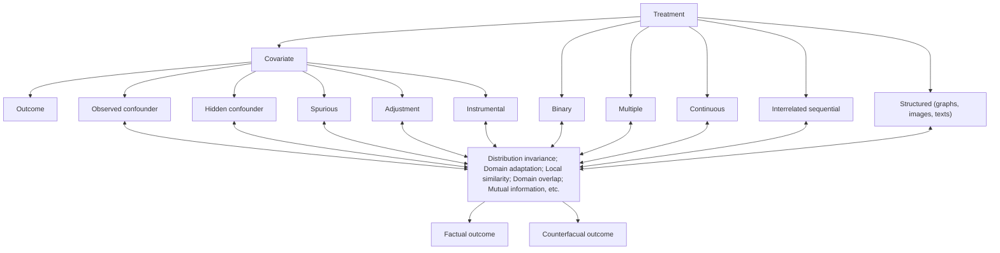

Fig. 5.1 Three major challenges from the core components of the treatment effect estimation task, including treatment, covariates, and outcome  
Fig. 5.2 Illustrations of binary, multiple, continuous, and sequential treatments


```mermaid
graph TD
    subgraph Binary treatments
  p1["●"] --> p2["●"]
  p2 --> p3["●"]
  p1 --> p4["●"]
  p4 --> p5["●"]
  p2 --> p6["●"]
  p6 --> p7["●"]
    end

    subgraph Sequential treatments
  p1 --> p2
  p2 --> p3
  p3 --> p4
  p4 --> p5
  p5 --> p6
  p6 --> p7
  p1 --> p8["●"]
  p2 --> p9["●"]
  p3 --> p10["●"]
  p4 --> p11["●"]
  p5 --> p12["●"]
  p6 --> p13["●"]
    end

    subgraph Multiple treatments
  p1 --> p2
  p2 --> p3
  p1 --> p4
  p2 --> p5
  p3 --> p6
  p4 --> p7
  p5 --> p8
  p6 --> p9
  p7 --> p10
  p8 --> p11
  p9 --> p12
    end

    subgraph Continuous treatments
  response["Response"] --> P1["p1"]
  response --> P2["p2"]
  response --> P3["p3"]
  response --> P4["p4"]
  response --> P5["p5"]
  response --> P6["p6"]
  response --> P7["p7"]
  response --> P8["p8"]
  response --> P9["p9"]
  response --> P10["p10"]
  response --> P11["p11"]
  response --> P12["p12"]
  response --> P13["p13"]
  response --> P14["p14"]
  response --> P15["p15"]
  response --> P16["p16"]
  response --> P17["p17"]
  response --> P18["p18"]
  response --> P19["p19"]
  response --> P20["p20"]
  response --> P21["p21"]
  response --> P22["p22"]
  response --> P23["p23"]
  response --> P24["p24"]
  response --> P25["p25"]
  response --> P26["p26"]
  response --> P27["p27"]
  response --> P28["p28"]
  response --> P29["p29"]
  response --> P30["p30"]
  response --> P31["p31"]
  response --> P32["p32"]
  response --> P33["p33"]
  response --> P34["p34"]
  response --> P35["p35"]
  response --> P36["p36"]
  response --> P37["p37"]
  response --> P38["p38"]
  response --> P39["p39"]
  response --> P40["p40"]
  response --> P41["p41"]
  response --> P42["p42"]
  response --> P43["p43"]
  response --> P44["p44"]
  response --> P45["p45"]
  response --> P46["p46"]
  response --> P47["p47"]
  response --> P48["p48"]
  response --> P49["p49"]
  response --> P50["p50"]
  response --> P51["p51"]
  response --> P52["p52"]
  response --> P53["p53"]
  response --> P54["p54"]
  response --> P55["p55"]
  response --> P56["p56"]
  response --> P57["p57"]
  response --> P58["p58"]
  response --> P59["p59"]
  response --> P60["p60"]
  response --> P61["p61"]
  response --> P62["p62"]
  response --> P63["p63"]
  response --> P64["p64"]
  response --> P65["p65"]
  response --> P66["p66"]
  response --> P67["p67"]
  response --> P68["p68"]
  response --> P69["p69"]
  response --> P70["p70"]
  response --> P71["p71"]
  response --> P72["p72"]
  response --> P73["p73"]
  response --> P74["p74"]
  response --> P75["p75"]
  response --> P76["p76"]
  response --> P77["p77"]
  response --> P78["p78"]
  response --> P79["p79"]
  response --> P80["p80"]
    end
```

As shown in Fig. 5.2, for the binary, multiple, continuous, and sequential treatment scenarios, we provide a unifying terminology that will enable researchers to coalesce and compare existing methods. Suppose that the observational data contain n units and that each unit goes through one potential path, including several treatment stages. In each potential path, the unit i can sequentially choose one of the two or multiple treatments T at each stage S, and finally, the corresponding outcome Y could be observed at the end of the path. Let $\{ t _ { s } ^ { i } ; t _ { s } = 1 , \ldots , n _ { t _ { s } } , i =$ $1 , \ldots , n$ , and $s = 1 , \ldots , n _ { s } \}$ denote the treatment assignment for unit i at stage s. There are in total $n _ { s }$ treatment stages and $n _ { t _ { s } }$ treatment assignments at stage s. Due to the existence of different treatment assignments at each treatment stage, for the whole population, we can observe several potential paths $\{ p ; p = 1 , \ldots , n _ { p } \}$ . However, each unit can only go through one potential path, including a sequence of stages. Therefore, only one of the potential outcomes is observed at the end of the path according to the actual treatment assignments. This observed outcome is called the factual outcome, and the remaining unobserved potential outcomes are called counterfactual outcomes. The factual outcome for unit i along the actual treatment stages is denoted by $y _ { F } ^ { i }$ , and the counterfactual outcome is denoted by $y _ { C F } ^ { i }$ . Let $X \in \mathbb { R } ^ { d }$ denote d observed variables of a unit. The observational data can be denoted $\{ \{ x ^ { i } , ~ t _ { s } ^ { i } , ~ y _ { F } ^ { i } \} _ { s = 1 } ^ { n _ { s } } \} _ { i = 1 } ^ { n }$ =explicitly needed.

## 5.2.1 Binary Treatments

If $n _ { s } ~ = ~ 1$ and $n _ { t _ { 1 } } ~ = ~ 2 .$ , there is only one treatment stage with two treatment choices. A unit only needs to choose once, between the two treatments. This setting is exactly the conventional binary treatment effect estimation task. One practical example of this conventional task is to evaluate the treatment effects of two different medications for one disease. By exploiting the observational data, including the treatment and control groups, we can only obtain one factual outcome for each patient. Thus, the core task is to predict what would have happened if a patient had taken the other medication. This conventional task has been extensively studied in the literature, such as TARNet [28], CFR [57], BNR-NNM [36], CEVAE [41], SITE [66], GANITE [69], and Dragonnet [58].

A widely used solution is the matching method, where the missing counterfactual outcome of a unit to a treatment is estimated by the factual outcome of its most similar neighbors that have received that treatment. The dataset including matched samples mimics a randomized controlled trial where the distribution of covariates will be similar between treatment and control groups. The only expected difference between the treatment and control groups is the outcome variable being studied. Compared to regression-based methods such as counterfactual regression [57] and Bayesian additive regression trees [10], matching approaches are more interpretable and less sensitive to model specification [25].

Most existing matching methods are performed in the original covariate space (e.g., Nearest Neighbor Matching [51], Coarsened Exact Matching [23]) or in the one-dimensional propensity score space (e.g., Propensity Score Matching [50]). Although rich information is retained in the original covariate space, it will face the curse of dimensionality and introduce more bias when controlling for irrelevant variables. Theoretical studies revealed that the bias of matching methods increases with the dimensionality of the covariate space [1]. Propensity score matching combats the curse of dimensionality of matching directly on the original covariates by matching on the probability of a unit being assigned to a particular treatment given a set of observed covariates. However, a one-dimensional propensity score space will lose most of the information in the data. In addition, provided that models are not overspecified, nonlinear models are usually more capable of dealing with complicated data distributions.


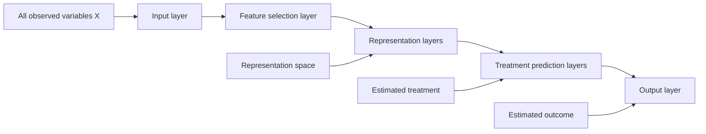

Fig. 5.3 The framework of a feature selection representation matching method based on deep representation learning and matching in the representation space [11] The key idea is to map the original covariate space into a selective, nonlinear, and balanced representation space, which can be best predictive of individual treatment outcomes, mitigate selection bias, and minimize the influence of irrelevant variables by simultaneously predicting the treatment assignment and outcomes

Therefore, as shown in Fig. 5.3, learning a low-dimensional balanced and nonlinear representations instead of high-dimensional original covariate space or one-dimensional propensity score space for observational data is a promising solution, which has been discussed in [7, 11, 36].

## 5.2.2 Multiple Treatments

If $n _ { s } = 1$ and $n _ { t _ { 1 } } > 2$ , there is only one treatment stage with multiple treatments. This is the conventional multiple treatment effect estimation task. Usually, binary treatment models can be effortlessly extended to multiple treatment models [40], such as propensity score estimation using generalized boosted models [43], counterfactual inference based on the idea of augmenting samples within a minibatch with their propensity-matched nearest neighbors [55], BART [22], and a deep generative model with task embedding [52].

For example, a multitask adversarial learning [14] contains two major components: an outcome generator and a true/false discriminator (TF discriminator), as shown in Fig. 5.4. In the outcome generator, they use feature selection multitask deep learning to estimate the potential outcomes for units across all tumor types. Because different types of tumors may have different predictor variables, which may be components of all observed covariates, a deep feature selection model including (a) a sparse one-to-one layer between the input and the first hidden layer, and (b) an elastic net regularization term throughout the fully connected representation layers is an essential foundation for potential outcome estimation.


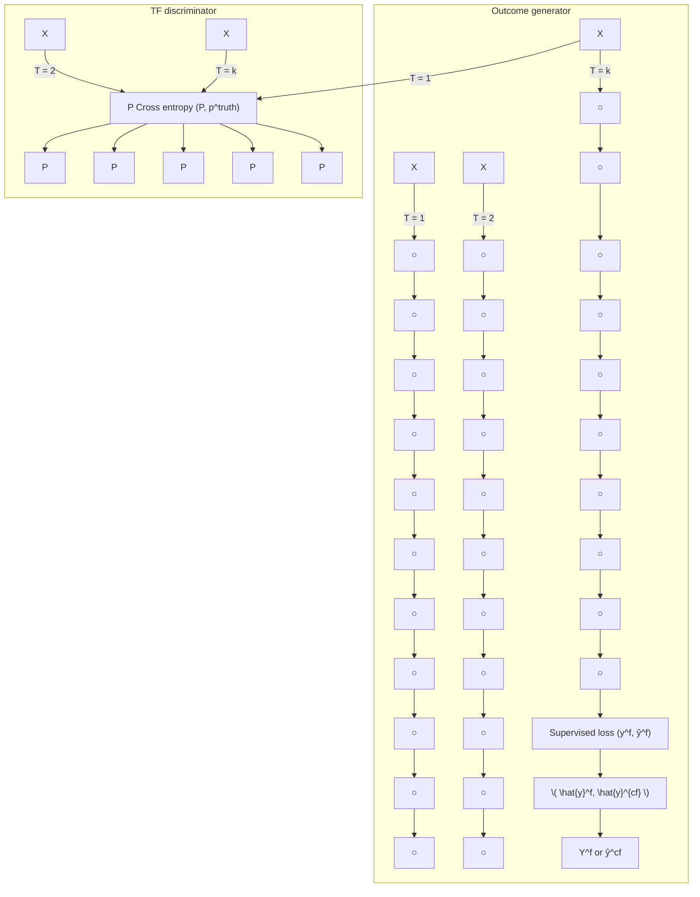

Fig. 5.4 The framework of our multitask adversarial learning net (MTAL) [14]

Our TF discriminator can tell whether the outcome given the covariates and tumor type is a factual outcome. In the beginning, the TF discriminator can easily determine which outcome is a factual outcome and which one is our inferred counterfactual outcome under alternative tumor types not contracted by those patients. The outcome generator attempts to generate counterfactual outcomes in such a way that the TF discriminator cannot easily determine which is the factual outcome. These two models are trained together in a zero-sum game, and they are adversarial until the TF discriminator model is fooled by the generator. At this time, they have removed the tumor type selection bias and obtained all potential outcomes for each patient across all kinds of tumors.

## 5.2.3 Continuous Treatments

If $n _ { s } \geq 1$ and $t _ { s }$ is continuous, this is the continuous treatment effect estimation task. Continuous treatments arise in many fields, including health care, public policy, and economics. With the widespread accumulation of observational data, estimating the average dose-response function while correcting for confounders has become a critical problem. Due to the infinite counterfactuals for continuous treatments, adjusting for selection bias is significantly more complex than for binary or multiple treatments. Thus, unlike the multiple treatments, standard methods for adjusting for selection bias for discrete treatments cannot be easily extended to handle bias in the continuous setting.

The DRNet [56] consists of a three-level architecture with shared layers for all treatments, multitask layers for each treatment, and additional multitask layers for dosage subintervals. Specifically, for each treatment, the dosage interval is subdivided into several equally sized subintervals, and a multitask head is added for each subinterval. DRNets do not determine these intervals dynamically, and thus, much of this flexibility is lost. SCIGAN [5] is flexible and capable of simultaneously estimating counterfactual outcomes for several different continuous interventions. The key idea is to use a modified GAN model to generate counterfactual outcomes. VCNet [45] proposes a novel varying coefficient neural network that improves model expressiveness while preserving the continuity of the estimated average doseresponse function. Second, to improve finite sample performance, they generalize targeted regularization to obtain a doubly robust estimator of the dose-response curve. CausalEGM [39] is an encoding generative model that can be applied in binary and continuous treatment settings. The CausalEGM model consists of a bidirectional transformation module and two feed-forward neural networks. The bidirectional transformation module composed of two generative adversarial networks (GANs) is used to project the covariates to a low-dimensional space and decouple the dependencies.

In addition, to generate appropriate disentangled representations that adjust for the selection bias precisely to estimate the individual treatment effect with continuous treatments, one work (Fig. 5.5) proposes a novel method named Disentangled and Balanced Representation Network (DBRNet), which is capable of obtaining disentangled and balanced representations to estimate ITE with continuous treatments. Specifically, they assume that covariates are determined by three latent factors: instrumental factors, confounder factors, and adjustment factors. DBRNet is able to explicitly identify those three underlying factors by learning disentangled representations for each factor. Based on these separated representations, they precisely adjust for selection bias by adopting a reweighting function, which estimates “generalized propensity score” from confounder factors, governing the treatment assignment without the influence of the adjustment factors. Furthermore, they predict outcomes based on the representations of confounder and adjustment factors through a varying coefficient network, which enables ITE estimation with continuous treatments.


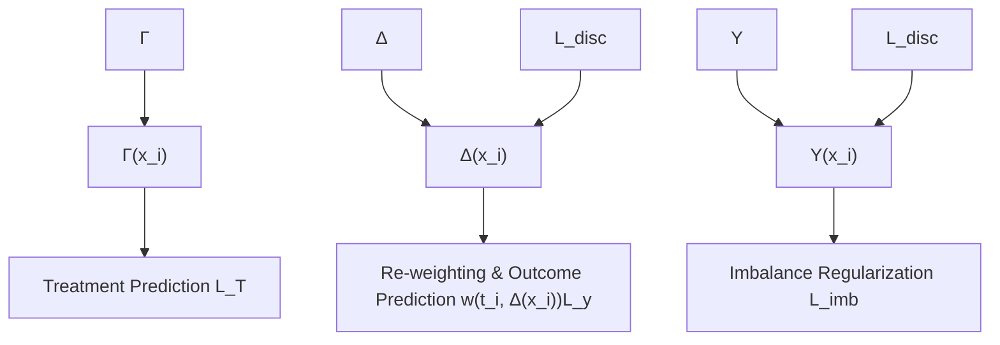

Fig. 5.5 Framework of DBRNet. To extract instrumental factors, confounder factors, and adjustment factors from the covariates, three contracted feed-forward neural networks are utilized to obtain the deep representations of each factor, $\mathrm { i . e . , } \Gamma ( x _ { i } ) , \Delta ( x _ { i } )$ , and $\Upsilon ( x _ { i } )$ . Then the representations $\Gamma ( x _ { i } )$ and $\Delta ( x _ { i } )$ are concatenated to predict the distribution of $t _ { i }$ using a conditional density estimator $p ( t _ { i } | \Gamma ( x _ { i } ) , \Delta ( x _ { i } ) ) . ~ \Delta ( x _ { i } )$ , and $\Upsilon ( x _ { i } )$ are used to predict the final outcome through another neural network $g _ { \theta ( t _ { i } ) } ( \Delta ( x _ { i } ) , \Upsilon ( x _ { i } ) )$ , while $\Upsilon ( x _ { i } )$ attempts to encode little information about treatment

## 5.2.4 Sequential Treatments

If $n _ { s } ~ > ~ 1$ and $n _ { t _ { s } } ~ \geq ~ 2$ , there are several treatment stages, with two or multiple treatments at each stage. Each unit goes through one path and needs to make $n _ { s }$ treatment decisions. At the end of the path, we can only observe one outcome along the actual path.

For example, during the COVID-19 pandemic that began in late 2019 and continues today, the instruction mode in universities has experienced substantial changes. The COVID-19 pandemic has forced most educational institutes worldwide to resort to an “online + in person” mode of education delivery. In some universities, students can choose online remote learning or in-person learning with masks and social distancing. The course instructors can provide live video-based sessions for the students and/or upload their recordings to the online learning platforms for them to watch. Furthermore, in live video-based learning, the students can choose to turn the camera on or off. Therefore, each student will follow one sequential behavior path “in person or online learning prerecorded video-based or live video-based learning  camera on or $\mathrm { o f f } , \ '$ as illustrated in Fig. 5.6. Different instruction modes influence students’ social, emotional, and mental well-being and academic achievement. Each student makes their own choices at each stage, so various potential paths exist. Intuitively, potential paths are a series of possible choices of treatments for one unit. Each unit can actually go through only one path, which is captured in the observational data. However, at each intervention stage, the unit can choose one of the two or multiple interventions, leading to multiple potential paths, including one factual path and several counterfactual paths. In the causal effect estimation task, we need to estimate the potential outcomes along all potential paths.


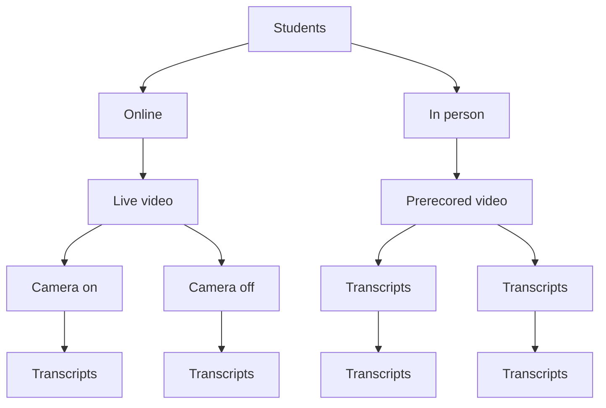

Fig. 5.6 The instruction mode example. The solid line represents each student’s potential choice at each stage, and the dotted line refers to the final potential outcome along the corresponding path

In these circumstances, the selection bias will accumulate over multiple stages, making the estimation of counterfactual outcomes more challenging. To the best of our knowledge, existing treatment effect estimation methods cannot effectively solve this type of problem. For this new problem of sequential treatments, the causal effect estimation task can be transformed into a graph learning task based on a heterogeneous graph and directed acyclic graph. First, it constructs a biased heterogeneous graph with self-supervised learning, including many disconnected subgraphs. Each subgraph represents one unit and all its potential paths. Second, the learned heterogeneous graph is a typical directed acyclic graph, an architecture that processes information according to the flow defined by the partial order. Based on the practical implications of this DAG, bidirectional processing is utilized. A path may be processed to estimate the outcome at the end of the path by the natural order, and another is used to reconstruct the original feature by the reversed order.

## 5.2.5 Structured Treatments

In many practical situations, treatments are naturally structured, such as medical prescriptions (text), protein structures (graph), and computed tomography scans (image). Traditional treatment effect estimation methodologies typically use separate prediction heads for each treatment option so that the influence of the treatment indicator variable might be lost in the high-dimensional network representations. Extending this idea directly to structured treatments would not only be computationally expensive but would also not be able to make use of treatment features or learn treatment representations [30].

GraphITE [20] learns representations of graph treatments for CATE estimation. They proposed utilizing graph neural networks while mitigating observation biases using Hilbert–Schmidt Independence Criterion regularization, which increases the independence of the representations of the targets and treatments. Inspired by the Robinson decomposition, which has enabled flexible CATE estimation for binary treatments, [30] propose the Generalized Robinson Decomposition (GRD), from which they extract a pseudo-outcome that targets the causal effect. A generalization of the GRD to treatments can be vectorized as a continuous embedding. This GRD reveals a learnable pseudo-outcome target that isolates the causal component of the observed signal by eliminating confounding associations.

In addition, there is a growing methodological literature investigating how images should be integrated to estimate the treatment effect [6, 46] in the observational data. An image-based treatment effect model is proposed by using a deep probabilistic modeling framework [26]. They develop a method that estimates latent clusters of images by identifying images with similar treatment effect distributions.

The model also emphasizes an image sensitivity factor that quantifies the importance of image segments in contributing to the mean effect cluster prediction, obtained via Monte Carlo using the approximate posterior distribution over the clustering.

## 5.3 Covariate

The relationships among different types of covariates, including treatment, confounder, outcome, instrumental, adjustment, and spurious variables, are illustrated in Fig. 5.7. In the treatment effect estimation task, the selection bias is the greatest challenge, which is the phenomenon that the distribution of the observed group is not representative of the group we are interested in. Confounder variables affect units’ treatment choices, which leads to selection bias. This phenomenon exacerbates the difficulty of counterfactual outcome estimation, as we need to estimate the control outcome of units in the treated group based on the observed control group and to estimate the treated outcome of units in the control group based on the observed treated group. The procedure for handling the selection bias is called covariate adjustment [68].

As more covariates are collected in observational data, we face different types of covariates, such as confounders (observed and hidden), adjustment, instrumental, and spurious variables. In addition to numerical covariates, how to handle covariates with textual information for causal effect estimation is still an open question. Therefore, in this section, we discuss this topic from four aspects: (1) feature selection; (2) feature representation disentanglement; (3) hidden confounders; and (4) textual information.

## 5.3.1 Feature Selection

A common approach for covariate adjustment is using the propensity score, i.e., the probability of a unit being assigned to a particular level of treatment, given the background covariates [50]. In covariate adjustment, although including all confounders is essential, this does not mean that including more variables is always better [11, 18, 54]. For example, conditioning on instrumental variables that are associated with the treatment assignment but not with the outcome except through treatment can increase both bias and variance of estimated causal effects [44]. Conditioning on adjustment variables that are predictive of outcomes but not associated with treatment assignment is unnecessary to remove bias while reducing variance in estimated causal effects [53]. Therefore, the inclusion of instrumental variables can inflate standard errors without improving bias, while the inclusion of adjustment variable can improve precision [37, 59, 63, 74].


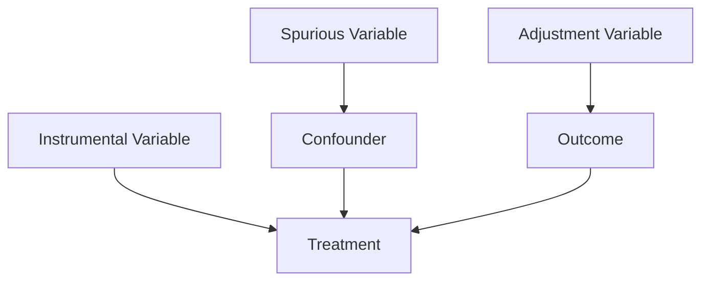

Fig. 5.7 The relationships among treatment, confounder, outcome, instrumental, adjustment, and spurious variables

A Data-Driven Variable Decomposition (D2VD) algorithm is proposed in [34], which can automatically separate confounders and adjustment variables with a data-driven approach where a regularized integrated regression model is presented to enable confounder separation and ATE estimation simultaneously. Recently, we proposed a deep adaptive variable selection-based propensity score method (DAVSPS) based on representation learning and adaptive group LASSO [15]. The key idea of DAFSPS is to combine the data-driven learning capability of representation learning and variable selection consistency of adaptive group LASSO to improve the estimation of the propensity score by selecting confounders and adjustment variables while removing instrumental and spurious variables. The framework of DAVSPS contains two major steps: outcome prediction with group LASSO and propensity score estimation with adaptive group LASSO. Step One uses a deep neural network (DNN) with group LASSO to predict the outcome and obtain the initial weight estimates for each covariate. Step 2 uses a DNN classification model to estimate propensity scores with adaptive group LASSO, under which the weighted penalty is based on initial weight estimates obtained from step 1. Therefore, DAVSPS can automatically select covariates predictive of the outcome (i.e., confounder and adjustment variables) while removing covariates independent of the outcome (i.e., instrumental and spurious variables) in propensity score estimation.

## 5.3.2 Feature Representation Disentanglement

For a simple feature representation disentanglement, i.e., confounders and nonconfounders, Wu et al. [65] proposed a synergistic learning framework to identify confounders by learning decomposed representations of both confounders and nonconfounders and balancing confounders with sample reweighting technique simultaneously. Then, as shown in Fig. 5.8, a more detailed disentangled representation learning method [21] decomposes covariates into three latent factors, including instrumental ?, confounding $\Delta$ , and adjustment ϒ factors. They assume that the random variable X follows an unknown joint probability distribution $P r ( X | \Gamma , \Delta , \Upsilon )$ ), treatment $T$ follows $P r ( T | \Gamma , \Delta )$ , and outcome Y follows $P r ( Y | \Delta , \Upsilon )$ , where ?, $\Delta$ , and ϒ represent the three underlying factors that generate an observational dataset. Correspondingly, the selection bias is induced by factors $\Gamma$ and $\Delta$ , where $\Delta$ represents the confounding factors between $T$ and Y . Zhang et al. [71] proposed

<!-- footnote -->

- Here, following [58], we use the term ITE instead of CATE to emphasize that it is defined for a single unit. However, in terms of causal identification, CATE is more accurate. In this scenario, it is conditioned on both node features and network structure in the static network.

<!-- footnote end -->

<!-- footnote -->

- https://www.blogcatalog.com/.
- https://www.flickr.com/.

<!-- footnote end -->

<!-- footnote -->

- https://github.com/allenai/PeerRead.

<!-- footnote end -->

<!-- footnote -->

- Z. Chu ()
- Ant Group, Hangzhou, China
- e-mail: chuzhixuan.czx@alibaba-inc.com
- S. Li
- University of Virginia, Charlottesville, VA, USA
- e-mail: shengli@virginia.edu

<!-- footnote end -->


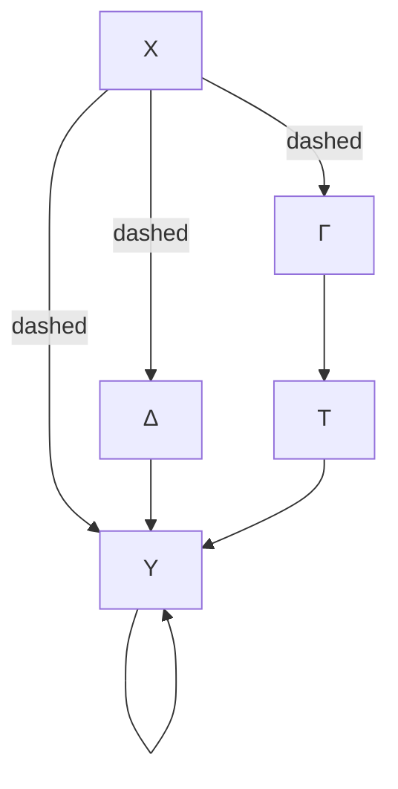

Fig. 5.8 Illustration of causal graph that involves covariates (X), treatment (T ), outcome (Y ), instrumental factors (?), confounding factors (∆), and adjustment factors (ϒ). The solid line represents causal relations, and the dot lines denote affiliations

a variational inference approach to simultaneously infer latent factors from the observed variables, disentangle the factors into three disjoint sets corresponding to the instrumental, confounding, and adjustment factors, and use the disentangled factors for treatment effect estimation. However, how to learn the underlying disentangled factors precisely remains an open problem. Specifically, previous methods may fail to obtain independent disentangled factors, which is necessary for identifying treatment effects. Cheng et al. proposed Disentangled Representations for Counterfactual Regression via Mutual Information Minimization (MIM-DRCFR) [9], which uses a multitask learning framework to share information when learning the latent factors and incorporates MI minimization learning criteria to ensure the independence of these factors.

## 5.3.3 Hidden Confounders

Due to the fact that identifying all of the confounders is impossible in practice, the strong ignorability assumption is usually untenable. If a confounder is hidden or unmeasured, it is impossible in the general case without further assumptions to estimate the treatment effect on the outcome [47]. By leveraging big data, it becomes possible to find a proxy for the hidden or unmeasured confounders by exploring the relationship between the hidden confounders, their proxies, the treatment, and the outcome. For example, Causal Effect Variational Autoencoder (CEVAE) [41] is based on Variational Autoencoders (VAE), which follows the causal structure of inference with proxies. It can simultaneously estimate the unknown latent space summarizing the confounders and the causal effect.

In addition, recent studies have shown that the auxiliary network information among data can be utilized to mitigate the confounding bias. Network information, which serves as an efficient structured representation of nonregular data, is ubiquitous in the real world. Advanced by the powerful representation capabilities of various graph neural networks, networked data have recently received increasing attention [27, 31, 61, 62]. Therefore, it can also be used to help recognize the patterns of hidden confounders. A network deconfounder [19] is proposed to recognize hidden confounders by combining the graph convolutional networks [31] and counterfactual regression [57]. Unlike networked data in traditional graph learning tasks, such as node classification and link prediction, the networked data under the causal inference problem have its particularity, i.e., imbalanced network structure. As shown in Fig. 5.9, we proposed a Graph Infomax Adversarial Learning (GIAL) model for treatment effect estimation [12], which makes full use of the network structure to capture more information by recognizing the imbalance in network structure.


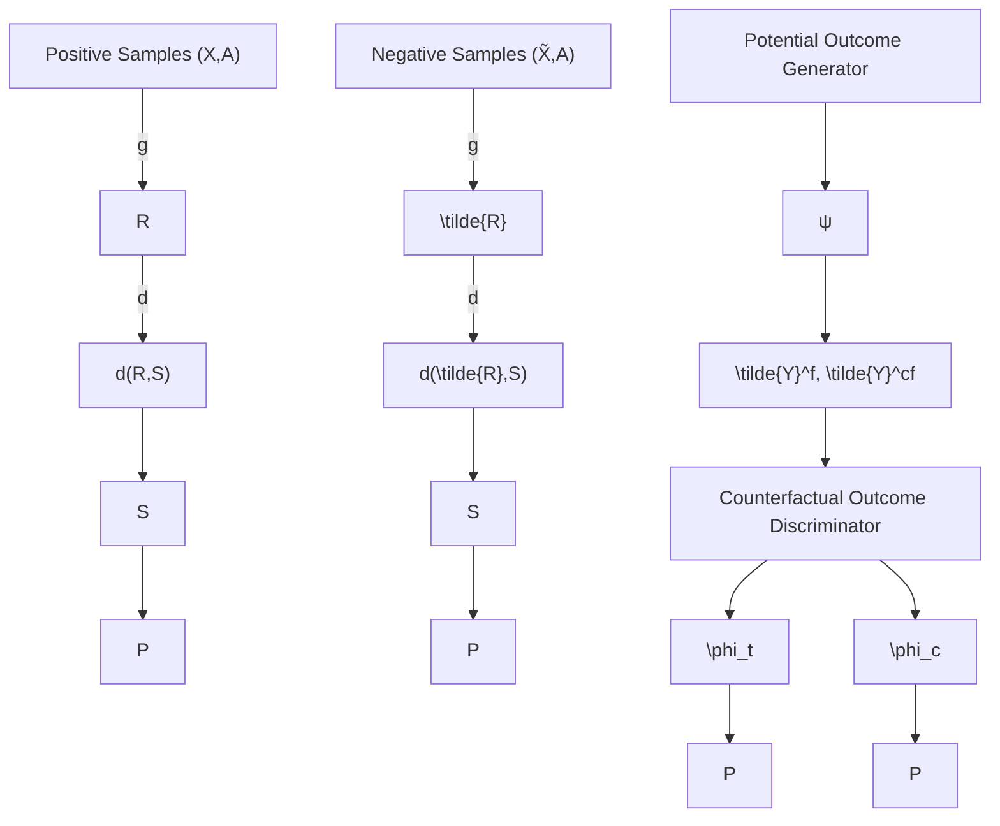

Fig. 5.9 Framework of our Graph Infomax Adversarial Learning method (GIAL) [12]. Graph neural networks and structure mutual information are utilized to learn the representations of hidden confounders and observed confounders. Then, the potential outcome generator is applied to infer the potential outcomes of units across treatment and control groups based on the learned representation space and treatment assignment. At the same time, the counterfactual outcome discriminator is incorporated to remove the imbalance in the learned representations of treatment and control groups

However, the above works assume that the observational data and the relations among them are static, while in reality, both of them will continuously evolve over time, i.e., time-evolving networked observational data. Ma et al. [42] propose a novel causal inference framework Dynamic Networked Observational Data Deconfounder (DNDC), which learns dynamic representations of hidden confounders over time by mapping the current observational data and historical information into the same representation space.

## 5.3.4 Text Covariates

Most of the existing work focuses on numerical covariates, while little attention has been given to textual covariates. However, in the real world, text data are almost everywhere, such as clinical notes, movie reviews, news, and social media posts. Different from structured and well-defined numerical covariates, textual covariates contain richer information and can be summarized at different levels, such as the word level, topic level, and semantics level. This property of text data brings some new challenges into treatment effect estimation with textual covariates. In particular, some textual covariates that are very predictive of the treatment assignment might not be that predictive of the outcome. Such covariates are referred to as nearly instrumental variables. In treatment effect estimation, existing work [48, 64] has shown that conditioning on the nearly instrumental variables tends to amplify the bias in the analysis of causal effects. Therefore, the nearly instrumental variables should be excluded when estimating the treatment effect. Thus, the major challenge in estimating the treatment effect with textual covariates is how to filter out the nearly instrumental variables.


```mermaid
graph TD
  T["T"] --> X["X"]
  T --> W["W"]
  X --> Y["Y"]
  Z["Z"] --> Y
    Z -.-> W
    style Z' stroke-dasharray: 5 5
```

Fig. 5.10 Causal graph of the CTAM [67]

In existing methods, filtering out the nearly instrumental variable is achieved by covariate reweighting [8, 16, 32] or feature selection [33, 49, 60], when the covariates are numerical. However, when the covariate contains text data, the effectiveness of the reweighting or feature selection–based approaches would be limited, as those methods would be restricted to only one specific level of information contained in the textual variable, which leads to insufficient summarization of text covariates and further leads to insufficiency in filtering out nearly instrumental variables.

To handle the above challenges, [67] proposes the Conditional Treatment-Adversarial learning based Matching method (CTAM), inspired by the conditional adversarial architecture in [72].

The underlying causal graph of their proposed method is shown in Fig. 5.10. In the figure, $Z$ and $Z ^ { ' }$ together are the latent representations of the observed textual covariates $T$ and nontextual covariates X. Among the latent variables, $Z ^ { ' }$ denotes the nearly instrumental variables, which is more predictive of the treatment assignment than the outcome Y . As mentioned previously, conditioning on the nearly instrumental variables would amplify the treatment effect estimation bias. Our objective is to learn the latent representations that filter out the information related to nearly instrumental variables. Therefore, the proposed method introduces conditional treatment-adversarial learning to eliminate the information related to nearly instrumental variables $Z ^ { ' }$ as much as possible in the latent representations.

As shown in Fig. 5.11, CTAM first learns the latent representation of all covariates, in which the information contained in text variables can be fully summarized. Then, in the learned representation space, they adopt the nearest neighbor matching (NNM), for its interpretability, to estimate the outcome if the treatment had been changed. The key characteristic of CTAM is the conditional treatment adversarial training procedure whose goal is to filter out the information related to nearly instrumental variables in the representation space. In this procedure, the treatment discriminator, along with the representation learner and the outcome predictor, plays a minimax game. The treatment discriminator is trained to predict the treatment label correctly, while the representation learner, corporately working with the outcome predictor, aims to fool the treatment discriminator. Through the conditional treatment adversarial training procedure, the learned representation discards the extraneous information specific to treatment assignment and retains the information related to outcome prediction. Consequently, the proposed method benefits the treatment effect estimation with text covariates.


```mermaid
graph TD
  A["Text Processing"] --> B["Text Processing"]
  B --> C["S"]
  D["Representation Learning"] --> E["Representation Network"]
  E --> F["Z"]
  G["Conditional Treatment Discriminator"] --> H["Conditional Treatment Discriminator"]
  H --> I["W"]
    style A fill:#f9f,stroke:#333
    style D fill:#f9f,stroke:#333
    style G fill:#f9f,stroke:#333
```

Fig. 5.11 CTAM framework [67]

## 5.4 Outcome

The foremost challenge to treatment effect estimation with observational data is to handle the imbalance in the covariates with respect to different treatment options, which is caused by selection bias. Recent causal effect estimation methods [28, 36, 57] have built a strong connection with domain adaptation by enforcing domain invariance with distributional distances such as the Wasserstein distance and maximum mean discrepancy. In [70], the authors argue that distribution invariance is often too strict a requirement, and they propose to use counterfactual variance to measure the domain overlap.

Inspired by metric learning, some methods [66] use hard samples to learn representations that preserve local similarity information and balance the data distributions. They assume that similar units would have similar outcomes. This assumption has been well justified in many classical counterfactual estimation methods such as the nearest-neighbor matching. To satisfy this assumption in the representation learning setting, the local similarity information should be well preserved after mapping units from the covariate space $\chi$ to the latent space $z .$ . One straightforward solution is to add a constraint on similarity matrices constructed in $\chi$ and $z .$ . However, constructing similarity matrices and enforcing such a “global”


```mermaid
graph TD
    subgraph Representation_Space["\"Representation Space\""]
  A1["Ẑi"] --> B1["preserve"]
  B1 --> C1["Ẑk"]
  C1 --> D1["ẑn"]
  D1 --> E1["Ẑm"]
  E1 --> F1["ẑj"]
  F1 --> G1["close"]
  G1 --> H1["ẑi"]
  H1 --> I1["ẑk"]
  I1 --> J1["ẑm"]
  J1 --> K1["ẑj"]
  K1 --> L1["ẑi"]
  L1 --> M1["ẑk"]
  M1 --> N1["ẑm"]
  N1 --> O1["ẑj"]
  O1 --> P1["ẑi"]
  P1 --> Q1["ẑk"]
  Q1 --> R1["ẑm"]
  R1 --> S1["ẑj"]
  S1 --> T1["ẑi"]
  T1 --> U1["ẑk"]
  U1 --> V1["ẑm"]
  V1 --> W1["ẑj"]
  W1 --> X1["ẑi"]
  X1 --> Y1["ẑk"]
  Y1 --> Z1["ẑm"]
  Z1 --> AA["ẑj"]
  AA --> AB["ẑi"]
  AB --> AC["ẑk"]
  AC --> AD["ẑm"]
  AD --> AE["ẑj"]
  AE --> AF["ẑi"]
  AF --> AG["ẑk"]
  AG --> AH["ẑm"]
    end

    subgraph Representation_Space_2["\"Representation Space\""]
  AI["Treated"] --> AJ["MPDM"]
  AK["control"] --> AL["MPDM"]
    end

    style AI fill:#f9f,stroke:#333
    style AK fill:#f9f,stroke:#333
```


```mermaid
graph TD
  X["X"] -->|g: X → R| S["S"]
  R["R"] -->|MIR,S ↑| S
  R -->|MIR,H ↓| H["H"]
  H -->|Synergy| S
  H -->|φ: X → H| X["T"]
  X -->|ψ: R × T → Y| Yt["Yt"]
  Yc["Yc"] --> Yt
    X <-->|f: R → S| R
    H <-->|φ: X → H| X
```

Fig. 5.12 The effect of balancing distributions and preserving local similarity by using the proposed SITE method [66]  
Fig. 5.13 The framework of the proposed IDRL [13] consists of four main components, including feature representation learning $g \ : \ X \ \to \ R$ , information maximization learning $M I ( R , S )$ , domain-independent learning $M I ( R , H )$ ), and potential outcome generator $\psi : R \times T  Y$ . IDRL first learns an individual representation vector for each subject. At the same time, information maximization learning and domain-independent learning are incorporated into the representation learning procedure to filter out domain-dependent information, solve the selection bias, and preserve the common predictive information for treatment and control groups

constraint is very time- and space-consuming, especially for a large number of units in practice. As shown in Fig. 5.12, they designed an efficient local similaritypreserving strategy based on triplet pairs.

Motivated by information theory, we proposed an Infomax and Domainindependent Representation Learning (IDRL) method [13] to estimate the causal effects with observational data by seeking a representation space, which not only contains the common predictive information about potential outcome estimation but also excludes the domain-dependent information. As shown in Fig. 5.13,IDRL relies on two mutual information structures: one is to maximize the mutual information between global summary representation and individual feature representation, which can maximally capture the common predictive information for both treatment and control groups and filter out the noise only for specific individual or group; the other is to minimize the mutual information between feature representation vectors and treatment options, which makes feature representations independent from treatment option domains. Therefore, instead of enforcing balance between the treatment and control groups by adopting various domain divergence metrics, our IDRL method utilizes one mutual information module to exclude the information related to the domain, so that we cannot tell which domain it is from. At the same time, additional mutual information can maximally preserve common predictive information.

For these domain adaptation methodologies based on the potential outcome framework (POF), the model aims to learn the domain-invariant representations, i.e., transformations of features, such that the treatment and control groups are approximately indistinguishable in the representation space [4]. Despite the popularity of domain adaptation for POF, the sufficient support assumption [3] for domain adaptation uncovers intrinsic limitations of learning invariant representations in regard to the shift in support of domains [38]. The positivity assumption is an essential assumption in causal effect estimation, and it supports the strong sufficient support assumption for domain adaptation [29, 73]. However, the positivity assumption is by no means guaranteed to hold in practice for the following two reasons. First, high-dimensional data often contain information that is redundant or irrelevant for predicting the outcome but still helps to distinguish the treatment and control groups. Second, variables distributed differently across intervention groups are usually critical for prediction.

In addition, for the domain adaptation problem under POF settings, seeking the optimal metric to measure the distance between the treatment and control groups remains unsettled. The choice of distance metrics is highly dependent on the characteristics of data distributions and the hyperparameters of regularization terms for imbalance mitigation. In particular, even with the same selection bias, there is no consensus among different metrics in terms of balancing data distributions [70].

Finally, we argue that regularizing representations to be domain-invariant is too strict, particularly when domains (e.g., treatment and control groups) are partially overlapped [70]. Several studies show that the empirical risk minimization only on factual data outperforms domain-invariant representation learning algorithms. Therefore, enforcing domain-invariant can easily remove predictive information and lead to a loss in predictive power, regardless of which type of domain divergence metric is employed [2]. These observations motivate us to relax the positivity assumption and develop a new and unified paradigm for treatment effect estimation, such that we could avoid the choice dilemma of domain divergence metrics and overcome the loss of predictive information. This is a promising and urgent direction for the treatment effect estimation task.

## 5.5 Future Directions

As discussed in the previous sections, existing work has made great contributions to the development of causal inference. However, there remain many open problems regarding causal modeling and theoretical study and applications and evaluations. In this section, we discuss future research directions as well as potential applications.

For causal modeling and theoretical study, we introduce several open problems as follows.

• Adding or relaxing the assumptions in the causal model. For instance, most of the existing approaches consider binary treatment and high-dimensional treatment, while more practical settings with multiple treatments at various levels are often ignored. High-dimensional treatment is commonly observed in real life. Studying the causal interaction is a trending topic of high-dimensional treatment, which aims to identify the combinations of treatments that induce large additional effects beyond the sum of effects separately attributable to each treatment [17].  
• Developing formal connections between different causal models. Although existing frameworks are logically the same, they have their own advantages. Building connections between different causal models benefits causal modeling from observational data. For instance, the relevance between the potential outcome framework and graphical causal models has been discussed in [24].  
“Machine learning for causal inference” and “Causal inference for machine learning.” Machine learning and causal inference can enhance each other. Machine learning brings powerful algorithms for causal effect estimation, which is the focus of this chapter. How causal inference can help improve machine learning algorithm design, such as robustness, generalization, and knowledge transfer, is still an open problem.  
• Equip machine learning with causal reasoning capabilities. Most machine learning algorithms model the correlation between variables but have very limited causal reasoning capabilities. Developing causality-aware machine learning models will help reveal the underlying mechanisms in complex observational data and therefore assist the causality-aware predictive analysis and decisionmaking.  
• Causal inference in dynamic environments. Existing work mainly focuses on static observational data. In practice, data are often continuously collected from a dynamic environment. Novel causal inference approaches are required to model dynamic observational data, leading to lifelong causal inference.  
Causality-assisted trustworthy learning, such as explainability, reliability, and fairness. In the model explanation domain, causal inference has great potential to explore the effect of the attributes on the model predicted labels. Moreover, in the fairness area, counterfactual fairness [35] is a trending topic that targets a unit’s outcome in the real world and the counterfactual world where he/she has different sensitive attribute values.

Along with the rapid development of causal modeling, it is equally important to explore novel applications and build benchmarks for evaluations.

• Generalized interpretation of “treatment” and “potential outcome” in more domain applications. A successful example mentioned in the previous section is the recommendation system, where exposing the user to one item is analogous to applying the treatment on the unit. To expand the scope of causal inference applications, generalizing the interpretation of “treatment” and “potential outcome” in more domains is necessary.
• Integration of (partial) experimental study and observational study. In real-world applications, sometimes, experimental data are available, such as the A/B testing data in the web development area. Integrating the experimental data, even small sample-sized experimental data, is of great help for observational studies to overcome the unobserved confounders and to correct the biased causal effect estimation model.
• Extensible causal models for multimodal data. Multimodal data are common in real-world applications. For instance, in the healthcare domain, doctors’ records are text data and fMRI data are images. Most of the existing treatment effect estimation models focus on one type of data, which cannot handle multimodal data. Estimating treatment effects based on multimodal data is still an open problem.

## 5.6 Summary

Causal inference is a developing field of academic research and various industrial applications. Recently, the blooming development of machine learning has brought new vitality into the causal inference area, not only the excellent progress on original problems but also the new research potentials and directions. In this chapter, we comprehensively review emerging advances, challenges, and opportunities for the treatment effect estimation task from the three core components, i.e., treatment, covariates, and outcome.

## References

1. A. Abadie, G.W. Imbens, Large sample properties of matching estimators for average treatment effects. Econometrica 74(1), 235–267 (2006)  
2. A. Alaa, M. Schaar, Limits of estimating heterogeneous treatment effects: Guidelines for practical algorithm design, in International Conference on Machine Learning (2018), pp. 129– 138  
3. S. Ben-David, R. Urner, On the hardness of domain adaptation and the utility of unlabeled target samples, in International Conference on Algorithmic Learning Theory (Springer, Berlin, 2012), pp. 139–153  
4. S. Ben-David et al., Analysis of representations for domain adaptation, in Advances in Neural Information Processing Systems (2007), pp. 137–144  
5. I. Bica, J. Jordon, M. van der Schaar, Estimating the effects of continuous-valued interventions using generative adversarial networks. Adv. Neural Informat. Process. Syst. 33, 16434–16445 (2020)  
6. D.C. Castro, I. Walker, B. Glocker, Causality matters in medical imaging. Nat. Commun. 11(1), 3673 (2020)  
7. Y. Chang, J.G Dy, Informative subspace learning for counterfactual inference, in Thirty-First AAAI Conference on Artificial Intelligence (2017)  
8. Y. Chang, J.G. Dy, Informative subspace learning for counterfactual inference, in Proceedings of the AAAI Conference on Artificial Intelligence (2017), pp. 1770–1776  
9. M. Cheng et al., Learning disentangled representations for counterfactual regression via mutual information minimization, in Proceedings of the 45th International ACM SIGIR Conference on Research and Development in Information Retrieval (2022), pp. 1802–1806  
10. H.A. Chipman, E.I. George, R.E. McCulloch, BART: Bayesian additive regression trees. Ann. Appl. Statist. 4(1), 266–298 (2010)  
11. Z. Chu, S.L. Rathbun, S. Li, Matching in selective and balanced representation space for treatment effects estimation, in Proceedings of the 29th ACM International Conference on Information and Knowledge Management (2020), pp. 205–214  
12. Z. Chu, S.L. Rathbun, S. Li, Graph infomax adversarial learning for treatment effect estimation with networked observational data, in ACM SIGKDD International Conference on Knowledge Discovery and Data Mining (2021)  
13. Z. Chu, S.L. Rathbun, S. Li, Learning infomax and domain-independent representations for causal effect inference with real-world data, in Proceedings of the 2022 SIAM International Conference on Data Mining (SDM) (SIAM, Philadelphia, 2022), pp. 433–441  
14. Z. Chu, S.L. Rathbun, S. Li, Multi-task adversarial learning for treatment effect estimation in basket trials, in Conference on Health, Inference, and Learning, PMLR (2022), pp. 79–91  
15. Z. Chu et al., Estimating propensity scores with deep adaptive variable selection, in Proceedings of the 2023 SIAM International Conference on Data Mining (SDM) (SIAM, Philadelphia, 2023)  
16. A. Diamond, J.S. Sekhon, Genetic matching for estimating causal effects: A general multivariate matching method for achieving balance in observational studies. Rev. Econ. Statist. 95(3), 932–945 (2013)  
17. N. Egami, K. Imai, Causal interaction in factorial experiments: application to conjoint analysis. J. Amer. Statist. Assoc. 114(526), 529–540 (2019)  
18. S. Greenland, Invited commentary: variable selection versus shrinkage in the control of multiple confounders. Amer. J. Epidemiol. 167(5), 523–529 (2008)  
19. R. Guo, J. Li, H. Liu, Learning Individual Treatment Effects from Networked Observational Data (2019). Preprint arXiv:1906.03485  
20. S. Harada, H. Kashima, Graphite: Estimating individual effects of graph-structured treatments, in Proceedings of the 30th ACM International Conference on Information & Knowledge Management (2021), pp. 659–668  
21. N. Hassanpour, R. Greiner, Learning disentangled representations for counterfactual regression, in International Conference on Learning Representations (2020)  
22. L. Hu et al., Estimation of causal effects of multiple treatments in observational studies with a binary outcome. Statist. Methods Med. Res. 29(11), 3218–3234 (2020)  
23. S.M. Iacus, G. King, G. Porro, Causal inference without balance checking: coarsened exact matching. Polit. Analy. 20(1), 1–24 (2012)  
24. G. Imbens, Potential outcome and directed acyclic graph approaches to causality: Relevance for empirical practice in economics (Technical Report, National Bureau of Economic Research, 2019)  
25. G.W. Imbens, D.B. Rubin, Causal Inference in Statistics, Social, and Biomedical Sciences (Cambridge University Press, Cambridge, 2015)  
26. C.T. Jerzak, F. Johansson, A. Daoud, Image-based Treatment Effect Heterogeneity (2022). Preprint arXiv:2206.06417  
27. X. Jiang, P. Ji, S. Li, CensNet: Convolution with edge-node switching in graph neural networks, in International Joint Conference on Artificial Intelligence (2019), pp. 2656–2662  
28. F. Johansson, U. Shalit, D. Sontag, Learning representations for counterfactual inference, in International Conference on Machine Learning (2016), pp. 3020–3029  
29. F.D. Johansson, D. Sontag, R. Ranganath, Support and invertibility in domain-invariant representations, in The 22nd International Conference on Artificial Intelligence and Statistics, PMLR (2019), pp. 527–536  
30. J. Kaddour et al., Causal effect inference for structured treatments. Adv. Neural Informat. Process. Syst. 34, 24841–24854 (2021)  
31. T.N. Kipf, M. Welling, Semi-supervised classification with graph convolutional networks, in arXiv preprint (2016)  
32. K. Kuang et al., Estimating Treatment Effect in the Wild via Differentiated Confounder Balancing, in Proceedings of the 23rd ACM SIGKDD International Conference on Knowledge Discovery and Data Mining (2017), pp. 265–274  
33. K. Kuang et al., Treatment effect estimation with data-driven variable decomposition, in Proceedings of the AAAI Conference on Artificial Intelligence (2017)  
34. K. Kuang et al., Treatment effect estimation with data-driven variable decomposition, in Proceedings of the Thirty-First AAAI Conference on Artificial Intelligence (2017)  
35. M.J. Kusner et al., Counterfactual fairness, in Advances in Neural Information Processing Systems (2017), pp. 4066–4076  
36. S. Li, Y. Fu, Matching on balanced nonlinear representations for treatment effects estimation, in Advances in Neural Information Processing Systems (2017), pp. 929–939  
37. W. Lin, R. Feng, H. Li, Regularization methods for high-dimensional instrumental variables regression with an application to genetical genomics. J. Amer. Statist. Assoc. 110(509), 270– 288 (2015)  
38. H. Liu, J. Wang, M. Long, Cycle Self-Training for Domain Adaptation (2021). Preprint arXiv:2103.03571  
39. Q. Liu, Z. Chen, W.H. Wong, CausalEGM: A general causal inference framework by encoding generative modeling (2022). Preprint arXiv:2212.05925  
40. M.J. Lopez, R. Gutman, Estimation of causal effects with multiple treatments: A review and new ideas. Statist. Sci. 32, 432–454 (2017)  
41. C. Louizos et al., Causal effect inference with deep latent-variable models, in Advances in Neural Information Processing Systems (2017), pp. 6446–6456  
42. J. Ma et al., Deconfounding with networked observational data in a dynamic environment, in ACM International Conference on Web Search and Data Mining (2021)  
43. D.F. McCaffrey et al., A tutorial on propensity score estimation for multiple treatments using generalized boosted models. Statist. Med. 32(19), 3388–3414 (2013)  
44. J.A. Myers et al., Effects of adjusting for instrumental variables on bias and precision of effect estimates. Amer. J. Epidemiol. 174(11), 1213–1222 (2011)  
45. L. Nie et al., Vcnet and functional targeted regularization for learning causal effects of continuous treatments (2021). Preprint arXiv:2103.07861  
46. N. Pawlowski, D.C. de Castro, B. Glocker, Deep structural causal models for tractable counterfactual inference. Adv. Neural Informat. Process. Syst. 33, 857–869 (2020)  
47. J. Pearl, Causality (Cambridge University Press, Cambridge, 2009)  
48. J. Pearl, On a class of bias-amplifying variables that endanger effect estimates, in Proceedings of the Twenty-Sixth Conference on Uncertainty in Artificial Intelligence (2010), pp. 417–424  
49. J.A. Rassen et al., Covariate selection in high-dimensional propensity score analyses of treatment effects in small samples. Amer. J. Epidemiol. 173(12), 1404–1413 (2011)  
50. P.R. Rosenbaum, D.B. Rubin, The central role of the propensity score in observational studies for causal effects. Biometrika 70(1), 41–55 (1983)  
51. D.B. Rubin, Matching to remove bias in observational studies. Biometrics, 29, 159–183 (1973)  
52. S.K. Saini et al., Multiple treatment effect estimation using deep generative model with task embedding, in The World Wide Web Conference (2019), pp. 1601–1611  
53. B.C. Sauer et al., A review of covariate selection for non-experimental comparative effectiveness research. Pharmacoepidemiol. Drug Safety 22(11), 1139–1145 (2013)  
54. E.F. Schisterman, S.R. Cole, R.W. Platt, Overadjustment bias and unnecessary adjustment in epidemiologic studies. Epidemiology 20(4), 488 (2009)  
55. P. Schwab, L. Linhardt, W. Karlen, Perfect match: A simple method for learning representations for counterfactual inference with neural networks (2018). Preprint arXiv:1810.00656  
56. P. Schwab et al., Learning counterfactual representations for estimating individual doseresponse curves, in Proceedings of the AAAI Conference on Artificial Intelligence, vol. 34, no. 04 (2020), pp. 5612–5619  
57. U. Shalit, F.D. Johansson, D. Sontag, Estimating individual treatment effect: Generalization bounds and algorithms, in Proceedings of the 34th International Conference on Machine Learning-Volume 70 (2017), pp. 3076–3085  
58. C. Shi, D. Blei, V. Veitch, Adapting neural networks for the estimation of treatment effects, in Advances in Neural Information Processing Systems, vol. 32 (2019)  
59. S.M. Shortreed, A. Ertefaie, Outcome-adaptive lasso: Variable selection for causal inference. Biometrics 73(4), 1111–1122 (2017)  
60. R. Tibshirani, Regression shrinkage and selection via the lasso. J. Roy. Statist. Soc. Ser. B (Methodol.) 58(1), 267–288 (1996)  
61. P. Velickovi ˇ c et al., Graph attention networks (2017). arXiv Preprint´  
62. P. Velickovic et al., Deep graph infomax, in International Conference on Learning Representations (Poster) (2019)  
63. A. Wilson, B.J. Reich, Confounder selection via penalized cred-ible regions. Biometrics 70(4), 852–861 (2014)  
64. J.M. Wooldridge, Should instrumental variables be used as matching variables? Res. Econ. 70(2), 232–237 (2016)  
65. A. Wu et al., Learning decomposed representation for counterfactual inference (2020). Preprint arXiv:2006.07040  
66. L. Yao et al., Representation learning for treatment effect estimation from observational data, in Advances in Neural Information Processing Systems (2018), pp. 2633–2643  
67. L. Yao et al., On the estimation of treatment effect with text covariates, in Proceedings of the 28th International Joint Conference on Artificial Intelligence (2019), pp. 4106–4113  
68. L. Yao et al., A survey on causal inference. ACM Trans. Knowl. Discov. Data 15(5), 1–46 (2021)  
69. J. Yoon, J. Jordon, M. van der Schaar, GANITE: Estimation of individualized treatment effects using generative adversarial nets, in 6th International Conference on Learning Representations (2018)  
70. Y. Zhang, A. Bellot, M. van der Schaar, Learning overlapping representations for the estimation of individualized treatment effects (2020). Preprint arXiv:2001.04754  
71. W. Zhang, L. Liu, J. Li, Treatment effect estimation with disentangled latent factors, in Proceedings of the AAAI Conference on. Artificial Intelligence, vol. 35, no. 12 (2021), pp. 10923–10930  
72. M. Zhao et al., Learning sleep stages from radio signals: A conditional adversarial architecture, in International Conference on Machine Learning (2017)  
73. H. Zhao et al., On learning invariant representations for domain adaptation, in International Conference on Machine Learning, PMLR (2019), pp. 7523–7532  
74. M.C. Zigler, F. Dominici, Uncertainty in propensity score estimation: Bayesian methods for variable selection and model-averaged causal effects. J. Amer. Statist. Assoc. 109(505), 95– 107 (2014)

## Part III

## Causal Inference and Trustworthy

## Machine Learning

# Chapter 6 Fair Machine Learning Through the Lens of Causality


Yongkai Wu, Lu Zhang, and Xintao Wu

## 6.1 Introduction

Machine learning has been commonly used to make important decisions in many real-world applications, e.g., employment, admission to universities, and loans from banks. With its prevalence, algorithmic bias and discrimination have concerned machine learning practitioners. Algorithmic bias refers to unjustified distinctions made by machine learning algorithms among individuals based on their membership in a demographic group. A large number of laws and regulations have been established to prohibit unfairness in many countries and regions. For example, in the USA, the Civil Rights Act of 1964 prohibits employment discrimination based on race, color, religion, sex, or national origin. To combat algorithmic bias, fair machine learning has been an active research area. In this area, discrimination discovery is the task of unveiling discriminatory practices by analyzing historical data or predictions made by predictive models; and discrimination prevention aims to remove discrimination by modifying biased data, tweaking predictive models, or manipulating predictions.

In the discrimination discovery task, various statistical notions have been proposed. One of the most popular notions is statistical parity, which means the proportions of receiving favorable decisions for the protected group and for the non-protected group should be similar. The metrics derived from statistical parity include risk difference, risk ratio, relative change, odds ratio, and so on [70]. Another notion is demographic parity where the demographic information, e.g., race, gender, disabilities, should be independent of the algorithmic decisions. In addition, the authors in [57, 101] exploited the individual-based notions, namely individual fairness, where similar individuals should receive similar decisions. We refer the readers to surveys, e.g., [60, 115], for details.

Existing methods for discrimination prevention are categorized into three types: preprocessing, in-processing, and postprocessing. Preprocessing methods [23, 27, 34, 87, 116] modify the historical training data to remove the potential prejudice and discrimination based on the defined fairness notions before the data are leveraged to train machine learning models. Common preprocessing methods include Massaging [33], which changes the labels of some individuals around the decision boundaries to remove discrimination, Reweighting [10], which assigns weights to individuals to balance the majority and minority groups, and Preferential Sampling [34], which resamples subgroups to make the dataset discrimination-free. The in-processing methods [11, 14, 35, 36, 38, 39, 90, 99, 100] tweak the machine learning algorithms to ensure fair predictions. Some research [14, 36, 38, 39, 90, 100] add fairness constraints or regularizers into the objective functions in machine learning tasks. The methods for postprocessing [4, 28, 37] correct the predictions produced by vanilla machine learning models. Additionally, fair representation [20, 59, 93, 102] and fair generative models [74, 95, 96] become topical research trends.

Although it is well known that association does not imply causation, the gap between statistical association and causation is not paid enough attention by many researchers in fair machine learning. A large number of existing works are solely based on statistical notions, leading to misunderstanding and misquantification during discrimination assessment. Consequently, the discrimination prevention methods fail to remove the bias or even aggravate the prejudice. To narrow the gap between fairness and causality, we present an overview of causal modeling and causal fairness, including the causal background, causal fairness notions, related works, and research challenges in this area. In this chapter, we introduce a unified framework to conceptually define fairness and accurately measure unfairness in machine learning tasks, leveraging Structural Causal Models [65]. To address the unidentification issue, the most challenging barrier in causal inference, we present practical bounding methods to estimate the range and incorporate the bounded causal fairness in machine learning tasks. The notions of causal fairness have been parallelly developed in various settings. We discuss several works where causal fairness is formulated in different ways and in various applications. We conclude this chapter with a discussion of research challenges and potential directions, including weak assumptions of causal fairness, the extension of causal fairness in sequential models and networked data.

Structural Causal Models (SCMs) [65] is a mathematical representation that captures the causal relationships among variables. Each structural causal model is associated with a causal graph where the causal relationships are represented by directed edges from the cause variables to the effect variables. Within SCM, the causal effect from one variable to another is defined as changes resulting from a manipulation of the former variable. The manipulation is represented by an intervention, which is treated as a functional modification to the equations in SCM or as an edge modification in the causal graph. The intervention can be transmitted along any arbitrary path set or applied to any group of individuals, specified by the observational conditions. We present a fair machine learning framework that is inspired by path-specific intervention and counterfactual intervention, where fairness is defined as the causal effect transmitted along a path set or conditioned on an observation that both are specified by users. We present three causal fairness notions, Path-specific Fairness [106], Counterfactual Fairness [88], and Path-specific Counterfactual (PC) Fairness [92], where Path-specific Fairness measures the direct and indirect discrimination as causal effects transmitted along the direct and indirect path sets; Counterfactual Fairness captures the group and individual-level discrimination; and PC Fairness unifies various causal fairness notions.

We organize the remaining of this chapter as follows. We first present the preliminaries about statistical fairness notions, an overview of the Structural Causal Models, and causal inference. Then, we introduce Path-specific Fairness, Counterfactual Fairness, and Path-specific Counterfactual (PC) Fairness, including their definitions, metrics, techniques for bounding unidentifiable quantities, algorithms for removing discrimination from machine learning models, as well as empirical evaluations. After that, we present a short literature review of closely related works about causal fairness. In the end, we conclude this chapter with a discussion of potential challenges and future research directions, including relaxing the causal assumptions, dealing with causal fairness in sequential settings, and achieving causal fairness in networked data.

## 6.2 Overview of Fairness and Causal Inference

In this section, we present the fairness notations and metrics from a statistical perspective. Then we present the necessary preliminaries for the framework of causal fairness.

## 6.2.1 Statistical Fairness Notions and Metrics

We consider a dataset $\mathcal { D } = \{ S , \mathbf { X } , Y \} \subset \mathcal { P }$ where S denotes the sensitive attribute, X denotes a set of non-sensitive attributes, and Y denotes the decisions. For the sake of simplicity, S and Y are binary, i.e., $s ^ { + }$ and $s ^ { - }$ representing the unprotected/favorable group (e.g., male) and protected/unfavorable group (e.g., female), $y ^ { + }$ and $y ^ { - }$ representing the positive decision (e.g., being admitted) and the negative decision (e.g., being rejected). A predictive model is denoted by $f : \mathbf { X }  Y$ .

Various statistical notions have been adopted into the definitions and quantification of algorithmic bias and making the judgment of fairness in machine learning.

Technically, these notions measure the statistical association between the sensitive attribute and the decision attribute. The most common notion is statistical parity, which means the proportions of receiving favorable decisions for the protected group (denoted by $p _ { 1 } = P ( Y = y ^ { + } | S = s ^ { + } ) )$ and for the non-protected group (denoted by $p _ { 2 } = P ( Y = y ^ { + } | S = s ^ { - } ) ) $ should be similar. The metrics $( p _ { 1 } - p _ { 2 } )$ $\textstyle { \big ( } { \frac { p _ { 1 } } { p _ { 2 } } } { \big ) }$ $\scriptstyle { \big ( } { \frac { 1 - p _ { 1 } } { 1 - p _ { 2 } } } { \big ) }$ $\big ( \frac { p _ { 1 } ( 1 - p _ { 2 } ) } { p _ { 2 } ( 1 - p _ { 1 } ) } \big )$ −  −notion demographic parity requires the demographic information, e.g., race, gender, disabilities, should be independent of the algorithmic decisions. In [38, 39], the authors defined prejudice by training a classifier that satisfies the independence between the classifier prediction and the sensitive information. In [14, 28, 100], the authors introduced conditional independence between prediction and sensitive information, given the truth labels. In supervised machine learning, predictions $\hat { Y }$ are made by a predictive function. In a binary classification model, equality of opportunity is satisfied if the equation $P ( \hat { Y } = y ^ { + } | S = s ^ { + } , Y = y ^ { + } ) =$ $P ( \hat { Y } = y ^ { + } | S = s ^ { - } , Y = y ^ { + } )$ holds. A more rigorous criterion, equality of odds, requires the parity of both true-positive rate and false-positive rate for all demographic groups, i.e., $P ( \hat { Y } ~ = ~ y ^ { + } | S ~ = ~ s ^ { + } , Y ~ = ~ y ) ~ = ~ P ( \hat { Y } ~ = ~ y ^ { + } | S ~ = ~ $ $s ^ { - } , Y = y ) , y \in \{ y ^ { + } , y ^ { - } \}$ . The authors in [57, 101] exploited the individual-based notions where similar individuals should receive similar decisions. The surveys [60, 115] discussed various notions and their connections. A detailed discussion and comparison can be found in the tutorials [6, 112].

## 6.2.2 Structural Causal Model and Causal Inference

Judea Pearl has mathematically developed the concept of the Structural Causal Models (SCM) [65] to model the mechanism of any arbitrary system by a set of structural equations among variables.

Definition 6.1 (Structural Causal Model (SCM) [65]) A structural causal model is represented by a tuple U, V, F, P (U) where

• U is a set of exogenous variables that are determined by factors outside the model. A joint probability distribution P (U) is defined over the variables in U.

• V is a set of endogenous variables that are determined by variables in U V.

• F is a set of structural equations from U V to V. Specifically, for each $V \in \mathbf { V }$ there is a function $f _ { V } \in \mathbf { F }$ mapping from U (V V ) to V , i.e., $v = f _ { V } ( \mathbf { p a } _ { V } , u _ { V } )$ , where $\mathbf { p a } _ { V }$ is a realization of a set of endogenous variables $\mathbf { P a } _ { V } \in \textbf { V } \backslash V$ that directly determines V , and $u _ { V }$ is a realization of a set of exogenous variables that directly determines V .

If all exogenous variables in U are mutually independent, then the causal model is called a Markovian model. If any pair of exogenous variables in U is not independent, the causal model is called a semi-Markovian model.

The structural causal model is associated with a graphical model, referred to as a causal graph $\mathcal { G } = \langle \mathcal { V } , \mathcal { E } \rangle$ 〉, where $_ \textmd { ‰}$ is a set of nodes and E is a set of edges. Each node in $_ \textmd { ‰}$ corresponds to a variable in $\mathbf { V } \cup \mathbf { U }$ . Each edge in is directed, denoted by a single arrowhead arc , and points from each member of $\mathbf { P a } _ { X }$ toward X to represent the direct causal relationship from this member of $\mathbf { P a } _ { X }$ toward X.

In the causal model, the do-operator [65] simulates the physical interventions that force some variables X to take certain constants x. Formally, the intervention that sets the values of X to x is denoted by $d o ( \mathbf { X } = \mathbf { x } )$ . The intervention $d o ( \mathbf { X } = \mathbf { x } )$ manipulates the structural causal model and the graphical causal model (a.k.a the causal graph). The causal model after intervention $d o ( \mathbf { X } = \mathbf { x } )$ is called a sub-model denoted by $M _ { \mathbf { X } }$ .

Causal inference is a process of estimating the causal quantities, e.g., the distribution after interventions (namely, the post-interventional distribution) from purely observational data and the causal graph. For instance, the post-interventional distribution $P ( \mathbf { y } \mid d o ( \mathbf { x } ) )$ under the Markovian assumption [65] can be expressed as a truncated factorization formula [65] $\begin{array} { r } { P ( \mathbf { y } \mid d o ( \mathbf { x } ) ) = \prod _ { Y \in \mathbf { Y } } P ( y \mid \mathbf { p a } _ { Y } ) \delta _ { \mathbf { X } = \mathbf { X } } } \end{array}$ , where $\delta \mathbf { { X } } = \mathbf { { X } }$ means assigning variables in X involved in the term ahead with the corresponding values in x. Specifically, the post-intervention distribution of a single variable  Y given an intervention on a single variable X is given by $P ( y \mid d o ( x ) ) =$ $\begin{array} { r } { \sum _ { \mathbf { v } ^ { \prime } } \prod _ { V \in \mathbf { V } \backslash \{ X \} } P ( v ~ \mid ~ \mathbf { p a } _ { V } ) \delta _ { X = x } } \end{array}$ , where the summation is a marginalization that traverses all value combinations of ${ \bf V } ^ { \prime } = { \bf V } \backslash \{ X , Y \}$ . The distribution of $P ( y )$ $d o ( x ) )$ , which is also referred to as the post-intervention distribution of Y under $d o ( x )$ , is denoted by $P ( y _ { x } )$ . Equivalently, we can express $P ( y _ { x } )$ as $P _ { x } ( y )$ , i.e., the distribution of Y in submodel $M _ { x }$ .

The truncated factorization formula enables the estimation of post-interventional distributions from the observational data under the Markovian assumption. Yet a more challenging problem lies in the semi-Markovian model where the bi-directed edges imply the existence of hidden confounders and the post-interventional quantities are not unique. It is referred to as identification whether a causal quantity can be uniquely estimated from the observational data.

## 6.2.3 Identification of Causal Quantities

Identification is essential for causal inference as it determines whether a causal quantity, e.g., $P ( \mathbf { y } \mid d o ( \mathbf { x } ) )$ ), is consistently derived from the observed data without specifying the whole causal model M. The definition of identifiability is given as follows.

Definition 6.2 (Identifiability [65]) Let $Q ( \cdot )$ be any computable quantity of a class of models. is identifiable if, for any pair of models $M _ { 1 }$ and $\mathbf { \delta } M _ { 2 }$ from this class, $Q ( M _ { 1 } ) = Q ( M _ { 2 } )$ whenever $P _ { M _ { 1 } } ( \mathbf { v } ) = P _ { M _ { 2 } } ( \mathbf { v } )$ .

In the context of causal inference, Q is an arbitrary causal quantity, e.g., the post-interventional distribution $P ( \mathbf { y } \mid d o ( \mathbf { x } ) )$ . According to Definition 6.2, a causal quantity is identifiable if the estimation is unique given the observational data, which are compatible with many potential contradictory causal models. In other words, an unidentifiable quantity would obtain two or more contradictory values given the observational data and the causal graph, and in theory, it is impossible to distinguish which one is true. This definition of identifiability is applicable to other types of quantities, e.g., path-specific quantities and counterfactual quantities.

## 6.2.4 Causal Effects

The ultimate task of causal inference is to uncover the cause–effect relationships between variables. Thanks to the do-operator, the total causal effect of X on Y is defined in Definition 6.3 [65]. Note that in this definition, the effect of the intervention is transmitted along all causal paths from the cause X to the effect Y .

Definition 6.3 (Total causal effect) The total causal effect $T E ( x _ { 2 } , x _ { 1 } )$ measures the effect of the change of X from $x _ { 1 }$ to $x _ { 2 }$ on $Y = y$ transmitted along all causal paths from X to Y . It is given by

$$
T E (x _ {2}, x _ {1}) = P \left(y \mid d o (x _ {2})\right) - P \left(y \mid d o (x _ {1})\right).
$$

In the total causal effect, the interventions are performed for all individuals and all variables, thus the effect is aggregated over the whole population and transmitted via all causal paths. The path-specific effect is an extension to the total causal effect in the sense that the effect of the intervention is transmitted only along a subset of causal paths from X to Y [3]. Denote a subset of causal paths by π . The π-specific effect considers a counterfactual situation where the effect of X on Y with the intervention is transmitted along π , while the effect of X on Y without the intervention is transmitted along paths not in π , i.e., π . We denote by $P ( y \mid d o ( x _ { 2 } | \pi , x _ { 1 } | _ { \bar { \pi } } ) )$ ) the distribution of Y after an intervention of changing X from $x _ { 1 }$ to x with the effect transmitted along π. Then, the π-specific effect of X on Y is described as follows.

Definition 6.4 (Path-specific effect) Given a path set π, the π-specific effect $P S E _ { \pi } ( x _ { 2 } , x _ { 1 } )$ measures the effect of the change of X from $x _ { 1 }$ to x2 on $Y ~ = ~ y$ transmitted along π . It is given by

$$
P S E _ {\pi} (x _ {2}, x _ {1}) = P \left(y \mid d o (x _ {2} | _ {\pi}, x _ {1} | _ {\bar {\pi}})\right) - P \left(y \mid d o (x _ {1})\right).
$$

The identifiability of path-specific effect $P S E _ { \pi } ( x _ { 2 } , x _ { 1 } )$ , i.e., whether it can be computed from the observational data, depends on the identifiability of $P ( y )$ $d o ( x _ { 2 } | _ { \pi } , x _ { 1 } | _ { \bar { \pi } } ) )$ . The authors in [3] have given the necessary and sufficient condition for $P ( y | \partial ( \left. \psi \right| _ { \bar { x } } | \psi _ { \bar { x } } ) \mid \ U _ { \bar { x } } \mid \ U _ { \bar { x } } ) $ to be identifiable, known as the recanting witness criterion.

Definitions 6.3 and 6.4 consider the average causal effect over the entire population without any prior observations. If one has certain observations about a subset of attributes $\mathbf { O } = \mathbf { 0 }$ and uses them as factual conditions when inferring the causal effect, then the causal inference problem becomes a counterfactual problem meaning that the causal inference involves two counterfactual worlds simultaneously, the real world (represented by causal model $M )$ and the counterfactual world (represented by submodel $M _ { x } )$ . Symbolically, the distribution of $Y _ { x }$ conditioning on $\mathbf { O } = \mathbf { 0 }$ is denoted by $P ( y _ { x } \mid \mathbf { o } )$ . Note that $Y _ { x }$ is a variable in submodel $M _ { x }$ , while O are variables in original causal model $M .$ .

Definition 6.5 (Counterfactual effect) Given a factual condition $\mathrm { ~ \bf ~ O ~ } = \mathrm { ~ \bf ~ o ~ } .$ , the counterfactual effect that measures the effect of the change of X from $x _ { 1 }$ to $x _ { 2 }$ on $Y$ is given by

$$
C E (x _ {2}, x _ {1}) = P \left(y _ {x _ {2}} \mid \mathbf {0}\right) - P \left(y _ {x _ {1}} \mid \mathbf {0}\right).
$$

## 6.3 Path-Specific Fairness

In the legal and social science fields, discrimination is divided into direct discrimination, indirect discrimination, and explainable distinctions. For example, consider a toy model of a loan application system shown in Fig. 6.1. Assume that Race is treated as the sensitive attribute, Loan as the decision, and ZipCode as the unjustified attribute that triggers redlining. Direct discrimination is then transmitted along path Race Loan, and indirect discrimination is transmitted along path Race  ZipCode  Loan. Assume that the use of Income can be objectively justified as it is reasonable to deny a loan if the applicant has a low income. In this case, path Race Income Loan is explainable, which means that part of the difference in loan issuance across different race groups can be explained by the fact that some race groups in the dataset tend to be underpaid. However, non-causal methods where only the association between Race and Income is considered, cannot explicitly and correctly identify the three different effects when measuring discrimination. Zhang et al. [106] developed a framework for discovering and removing both direct and indirect discrimination based on the causal model. Using the causal model, direct and indirect discrimination can be respectively captured by the causal effects of the sensitive attribute on the decision transmitted along different causal paths. To be specific, direct discrimination is modeled as the causal effect transmitted along the direct path from the sensitive attribute to the decision. Indirect discrimination, on the other hand, is modeled as the causal effect transmitted along other causal paths that contain any unjustified attribute. To handle both direct and indirect discrimination, the path-specific effect [3, 76] has been employed to accurately measure the causal effect along a path set.

## 6.3.1 Modeling Direct/Indirect Discrimination as Path-Specific Effects

Given a dataset $\mathcal { D } = \{ \mathbf { X } , S , Y \}$ where S, Y , and X denote the sensitive attributes, the decision, and the non-sensitive attributes. Among the non-sensitive attributes, assume there is a set of attributes that cannot be objectively justified if used in the decision-making process, which is referred to as the redlining attributes denoted by R. It is assumed that a causal graph $\mathcal { G }$ can be built to correctly represent the causal structure of dataset . Zhang et al. [106] considered discrimination as the causal effect of the sensitive attribute S on the decision attribute Y . The direct discrimination is modeled by the causal effect transmitted along the direct edge from S to $Y , \mathrm { i . e . , } S  Y$ . Define $\pi _ { d }$ as the path set that contains only $S  Y$ . Then, the above causal effect that is caused by the change of S from $s ^ { - }$ to $s ^ { + }$ is given by the $\pi _ { d } { \mathrm { - s p e c i f i c } }$ effect $P S E _ { \pi _ { d } } ( s ^ { + } , s ^ { - } )$ . Similarly, indirect discrimination is considered as the causal effect transmitted along the indirect paths from S to Y that contain the redlining attributes. Given the set of redlining attributes $\mathbf { R } , \pi _ { i }$ is defined as the path set that contains all the causal paths from S to Y which pass through R, i.e., each of the paths includes at least one node in R. Thus, the above causal effect is given by the πi-specific effect $P S E _ { \pi _ { i } } ( S ^ { + } , S ^ { - } )$ .

For a better understanding, the physical meaning of $P S E _ { \pi _ { d } } ( c ^ { + } , c ^ { - } )$ can be explained as the expected change in decisions of individuals from a protected group $c ^ { - }$ if the decision-makers are told that these individuals were from the other group $c ^ { + }$ . When applied to the example in Fig. 6.1, it means the expected change in loan approval of the disadvantaged group (e.g., black), if the bank was instructed to treat these applicants as from the advantaged group (e.g., white). It shows that the $\pi _ { d } -$ specific effect perfectly follows the definition of direct discrimination in law and hence is an appropriate measure for direct discrimination. The physical meaning of $P S E _ { \pi _ { i } } ( c ^ { + } , c ^ { - } )$ is the expected change in decisions of individuals from a protected group $c ^ { - }$ , if the values of the redlining attributes in the profiles of these individuals were changed as if they were from the other group $c ^ { + }$ . When applied to the example in Fig. 6.1, it means the expected change in loan approval of the disadvantaged group if they had the same racial makeup shown in the ZIP code as the advantaged group. As can be seen, the $\pi _ { i }$ -specific effect also follows the definition of indirect discrimination and is appropriate for measuring indirect discrimination.

Based on the above path-specific effect metrics, Zhang et al. [106] presented the criterion for identifying direct and indirect discrimination. Direct discrimination against protected group $c ^ { - }$ exists if $P S E _ { \pi _ { d } } ( c ^ { + } , c ^ { - } ) > \tau$ , where $\tau > 0$ is a userdefined threshold for discrimination depending on the law. For instance, the 1975 British legislation for sex discrimination sets $\tau = 0 . 0 5$ , namely a 5% difference. Similarly, given the redlining attributes R, indirect discrimination against protected group $c ^ { - }$ exists if $P S E _ { \pi _ { i } } ( c ^ { + } , c ^ { - } ) > \tau$ .


```mermaid
graph TD
  A["Race"] --> B["ZipCode"]
  A --> C["Income"]
  B --> D["Loan"]
  C --> D
```

Fig. 6.1 The toy model

## 6.3.2 Removing Direct/Indirect Discrimination from Data

Zhang et al. [106] proposed a Path-Specific Effect-based Discrimination Removal (PSE-DR) algorithm to remove both direct and indirect discrimination. The general idea is to modify the causal graph and then use it to generate a new dataset. Specifically, the conditional distribution of Y is adjusted, i.e., $P ( y | \mathbf { p a } _ { Y } )$ , to obtain a new conditional distribution $P ^ { \prime } ( y | \mathbf { p a } _ { Y } )$ , so that the direct and indirect discriminatory effects are below the threshold τ . To maximize the utility of the modified dataset, the Euclidean distance is minimized between the joint distribution of the original causal graph (denoted by $P ( \mathbf { v } ) )$ and the joint distribution of the modified causal graph (denoted by $P ^ { \prime } ( { \bf { v } } ) )$ . As a result, the discrimination removal method is formulated as a quadratic programming problem with $P ^ { \prime } ( y | \mathbf { p a } _ { Y } )$ as the variables.

$$
P S E _ {\pi_ {i}} (s ^ {+}, s ^ {-}) \leq \tau , \quad P S E _ {\pi_ {i}} (s ^ {-}, s ^ {+}) \leq \tau ,
$$

$$
\forall \mathbf {p a} _ {Y}, \quad P ^ {\prime} (e ^ {+} \mid \mathbf {p a} _ {Y}) + P ^ {\prime} (y ^ {-} \mid \mathbf {p a} _ {Y}) = 1,
$$

$$
\forall \mathbf {p a} _ {Y}, y, \quad P ^ {\prime} (y \mid \mathbf {p a} _ {Y}) \geq 0,
$$

where $P ^ { \prime } ( { \mathbf { v } } )$ and $P ( \mathbf { v } )$ are computed according to the factorization formula [46] using $P ^ { \prime } ( y | \mathbf { p a } _ { Y } )$ and $P ( y | \mathbf { p a } _ { Y } )$ respectively, and $P S E _ { \pi _ { d } } ( \cdot )$ and $P S E _ { \pi _ { i } } ( \cdot )$ are direct and indirect causal effects and computed from the observation distribution using the truncated factorization formula [65].

The optimal solution is obtained by solving the quadratic programming problem. After that, the new dataset is generated based on the obtained joint distribution.

## 6.3.3 Dealing with Unidentifiable Indirect Discrimination

Avin et al. [3] have discussed the condition where the path-specific effect can be uniquely estimated from the observed data, known as the recanting witness criterion. Shpitser [76] showed that the path-specific effect cannot be estimated if and only if the recanting witness criterion is not satisfied. Under the unidentifiable situation where the recanting witness criterion is satisfied, Zhang et al. [106] provided workable but crude solutions to the discrimination discovery and removal. For example, the causal paths from W to Y are cut off in the “kite pattern” where W is the intersection set between the indirect path set and the non-indirect path set. Then, the resultant causal model is identifiable, and the proposed discovery and removal methods are applicable. Further, Zhang et al. [108] developed the refined discrimination discovery by deriving upper and lower bounds for the unidentifiable indirect discrimination. The bounds can be used as better indicators for discovering indirect discrimination, i.e., the upper bound $u b ( S E _ { \pi _ { i } } ( s ^ { + } , s ^ { - } ) )$ smaller than τ indicates no indirect discrimination, while the lower bound $l b ( S E _ { \pi _ { i } } ( s ^ { + } , s ^ { - } ) )$ ) larger than τ indicates its existence. On the other hand, the derived bounds are used to refine the proposed removal algorithm PSE-DR by replacing $S E _ { \pi _ { i } } ( s ^ { + } , s ^ { - } )$ and $S E _ { \pi _ { i } } ( s ^ { - } , s ^ { + } )$ in the constraints of the quadratic programming with $u b ( S E _ { \pi _ { i } } ( s ^ { + } , s ^ { - } ) )$ and $u b ( S E _ { \pi _ { i } } ( s ^ { - } , s ^ { + } ) )$ .

## 6.3.4 Evaluation

Zhang et al. [106, 108] conducted experiments using two real datasets to evaluate the effectiveness of discrimination discovery and removal. The causal graphs are constructed and presented by the original PC algorithm [80] implemented in Tetrad [75].

For the Adult dataset, sex is considered as the sensitive attribute, income as the decision, and marital\_status as the redlining attribute. Then set $\pi _ { d }$ contains the edge pointing from sex to income and set $\pi _ { i }$ contains all the causal paths from sex to income that pass through marital\_status. By computing the pathspecific effects, the direct discrimination $S E _ { \pi _ { d } } ( s ^ { + } , s ^ { - } ) = 0 . 0 2 5$ and the indirect discrimination $S E _ { \pi _ { i } } ( c ^ { + } , c ^ { - } ) = 0 . 1 7 5$ . By setting $\tau \ : = \ : 0 . 0 5$ , the results indicate no direct discrimination but significant indirect discrimination against females according to our criterion.

For the Dutch Census of 2001 dataset, sex is treated as the sensitive attribute, occupation as the decision, and marital\_status as the redlining attribute. For this dataset, the results are $S E _ { \pi _ { d } } ( c ^ { + } , c ^ { - } ) = 0 . 2 2 0$ and $S E _ { \pi _ { i } } ( c ^ { + } , c ^ { - } ) = 0 . 0 0 1$ , indicating significant direct discrimination but no indirect discrimination against females.

The proposed removal algorithm is tested in both datasets and then run the discovery algorithm to further examine whether discrimination is truly removed in the modified dataset. The removal method completely removes direct and indirect discrimination from both datasets. In addition, PSE-DR produces relatively small data utility loss in terms of $\chi ^ { 2 }$ compared with previous methods, e.g. local massaging and local preferential sampling in [116], and the disparate impact removal algorithm in [1, 23].

In the Adult dataset, Zhang et al. [108] examined the proposed methods for handling unidentifiable situation when measuring and removing indirect discrimination. Especially, if edu is considered as the redlining attribute, the recanting witness criterion is satisfied, i.e., the indirect discrimination is unidentifiable. The derived upper and lower bounds show 0.361 and −0.114, respectively. Further, the refined discrimination removal algorithm in [108] is evaluated in this setting and guarantees no direct discrimination as well as no indirect discrimination based on the bounds with smaller utility loss compared to the vanilla removal algorithm proposed in [106].

## 6.4 Counterfactual Fairness

The path-specific fairness is generally formulated and quantified as the average causal effect of the sensitive attribute on the decision attribute, namely at the system level. Different from the above works, Kusner et al. [48] introduced counterfactual fairness, based on the counterfactual inference, which considers the causal effect within a particular group/individual specified by observational profile attributes. However, an inherent limitation of counterfactual fairness is that it cannot be uniquely quantified from the observational data in certain situations, due to the unidentifiability of the counterfactual quantity. Wu et al. [88] addressed this limitation by mathematically bounding the unidentifiable counterfactual quantity and developed a theoretically sound algorithm for constructing counterfactually fair classifiers.

## 6.4.1 Quantifying and Bounding Counterfactual Fairness

Kusner et al. [48] formulated the notion of counterfactual fairness as the equivalence of two counterfactual quantities $P ( \hat { y } _ { s ^ { \prime } } | s ^ { \prime } , \mathbf { z } ) = P ( \hat { y } _ { s } | s ^ { \prime } , \mathbf { z } )$ where $\hat { y }$ is the prediction, $s ^ { \prime }$ and s are two arbitrary values of the sensitive attribute S, and z is any arbitrary observational condition for a set of attributes. Recall that a lowercase letter with a subscript represents a value assigned to the corresponding variable in the submodel, $\mathrm { e . g . , } \ \hat { y } _ { s }$ is a value of $\hat { Y } _ { s }$ in the submodel $\mathcal { M } _ { s }$ .

The physical meaning of counterfactual fairness can be interpreted as follows. Consider candidates are applying for a job, and a predictive model is used to make the decision $\hat { Y }$ . One concerns an individual from a disadvantaged group $s ^ { - }$ who is specified by a profile z. Straightforwardly, the probability of the individual getting the positive decision is $P ( \hat { y } | s ^ { - } , \mathbf { z } )$ , which is equivalent to $P ( \hat { y } _ { s ^ { - } } | s ^ { - } , \mathbf { z } )$ since the intervention makes no change to $S ^ { \prime } { \mathrm { s } }$ value of that individual. Now assume the value of S for this very individual had been changed from $s ^ { - }$ to $s ^ { + }$ . The probability of this individual getting the positive decision after the hypothetical change is given by $P ( \hat { y } _ { s ^ { + } } | s ^ { - } , \mathbf { z } )$ . Therefore, if two probabilities $P ( \hat { y } _ { s ^ { - } } | s ^ { - } , \mathbf { z } )$ and $P ( \hat { y } _ { s ^ { + } } | s ^ { - } , \mathbf { z } )$ are identical, one can claim the individual is treated fairly as if he/she had been from the other group.


```mermaid
graph TD
  A --> S
  A --> B
  A --> C
  S --> B
  S --> C
  B --> node["Ŷ"]
  C --> node
  S --> node
```

(a)


```mermaid
graph TD
  A --> S
  A --> B
  A --> C
  A --> Cs
  A --> Bs
  S --> B
  S --> C
  S --> Y
  S --> node["Ŷ"]
  B --> node
  C --> node
  Cs --> node
  Bs --> node
  node --> Y
  Y --> Cs
  Y --> Bs
    Cs -.-> Ys
    Bs -.-> Ys
    Ys -.-> Ys
    style S stroke-dasharray: 5 5
    style B stroke-dasharray: 5 5
    style C stroke-dasharray: 5 5
    style Cs stroke-dasharray: 5 5
    style Bs stroke-dasharray: 5 5
    style Ŷ stroke-dasharray: 5 5
```

(b)  
Fig. 6.2 (a) Causal Graph G. (b) Counterfactual Graph $\mathcal { G } ^ { \prime }$ for $P ( \hat { y } _ { s } | s ^ { \prime } , { \bf z } )$

The notion of counterfactual fairness is more general than the intervention-based notions where the set of profile attributes is empty. Consequently, the counterfactual inference is more challenging due to the unidentifiable situations [65]. Wu et al. [88] addressed this unidentification limitation by mathematically bounding the unidentifiable counterfactual quantity and developed a theoretically sound algorithm for constructing counterfactually fair classifiers.

Consider the causal graph $\mathcal { G }$ shown in Fig. 6.2a where there are five attributes $A , B , C , S , \hat { Y } \colon S$ is the sensitive attribute; $\hat { Y }$ is the prediction of the decision attribute obtained by any classifier; A is the ancestor of $\hat { Y }$ but not the descendant of S; B is the intersection between the ancestor of Y and the descendant of S; and C is the descendant of S but not the ancestor of $\hat { Y }$ . The identifiability of $P ( \hat { y } _ { s } | s ^ { \prime } , { \bf z } )$ is the barrier to causal fairness, where Z is an arbitrary subset of $\{ A , B , C \}$ . In the notion of counterfactual fairness, the probability $P ( \hat { y } _ { s } | s ^ { \prime } , { \bf z } )$ concerns the connection between two causal models, and $M _ { s }$ . Thus, the make-cg algorithm [77] is applied to the causal graph $\mathcal { G }$ (Fig. 6.2a) to construct a new graph $\mathcal { G } ^ { \prime }$ that depicts the independence relationship among all variables in  and $\mathcal { M } _ { s }$ that are of concern in the analysis. Then, the make-cg algorithm removes the duplicated endogenous nodes, which are also not affected by $d o ( s )$ . The resultant graph is the so-called counterfactual graph (Fig. 6.2b). Next, the c-component factorization [82] is applied to decompose counterfactual graph $\mathcal { G } ^ { \prime }$ into disjoint subgraphs called the c-components, such that any two nodes in the same c-component are connected by a bi-directed path. After that, the joint distribution of all variables in the counterfactual graph can be factorized as the product of the conditional distribution of each ccomponent. The theoretical analysis showed $P ( \hat { y } _ { s } | s ^ { \prime } , { \bf z } )$ is unidentifiable if and only if $B \in \mathbf { Z }$ given the causal graph in Fig. 6.2a. Further, Wu et al. [88] derived the lower and upper bounds for $P ( \hat { y } _ { s } | s ^ { \prime } , { \bf z } )$ by canceling out the quantities involving B in the factorized formula. The derived bounds work for both identifiable and unidentifiable situations.

Wu et al. [88] defined a relaxed quantification $D E ( \hat { y } _ { s ^ { - } \to s ^ { + } } | { \bf z } ) = P ( \hat { y } _ { s ^ { + } } | s ^ { - } , { \bf z } ) -$ $P ( \hat { y } _ { s ^ { - } } | s ^ { - } , \mathbf { z } )$ for counterfactual fairness. If the amount of $\left| D E ( \hat { y } _ { s ^ { - } \to s ^ { + } } | \mathbf { z } ) \right|$ is smaller than $\tau .$ , one can claim this classifier is (counterfactually) fair. By denoting the upper and lower bounds of $P ( \hat { y } _ { s ^ { + } } | s ^ { - } , \mathbf { z } )$ obtained as $u b ( P ( \hat { y } _ { s ^ { + } } | s ^ { - } , \mathbf { z } ) )$ and $l b ( P ( \hat { y } _ { s ^ { + } } | s ^ { - } , \mathbf z ) )$ respectively, the lower and upper bounds is obtained as $\begin{array} { r l r } { u b \left( D E ( \hat { y } _ { s ^ { - } \to s ^ { + } } | { \bf z } ) \right) } & { { } = } & { u b \left( P ( \hat { y } _ { s ^ { + } } | s ^ { - } , { \bf z } ) \right) - P ( \hat { y } | s ^ { - } , { \bf z } ) } \end{array}$ and $l b \left( D E ( \hat { y } _ { s ^ { - } \to s ^ { + } } | \mathbf { z } ) \right) = l b \left( P ( \hat { y } _ { s ^ { + } } | s ^ { - } , \mathbf { z } ) \right) - P ( \hat { y } | s ^ { - } , \mathbf { z } ) . \operatorname { S p e c i f i c a l l y } ,$ , if a classifier satisfies $u b ( D E ( \hat { y } _ { s ^ { - }  s ^ { + } } | \mathbf { z } ) ) ~ \leq ~ \tau$ and $l b \left( D E ( \hat { y } _ { s ^ { - } \to s ^ { + } } | \mathbf { z } ) \right) ~ \geq ~ - \tau$ , then it is guaranteed τ -counterfactually fair.

## 6.4.2 Building Counterfactually Fair Classifier

The derived bounds clear the path toward constructing counterfactually fair classifiers. Wu et al. [88] proposed a postprocessing method for reconstructing any classifier to achieve counterfactual fairness. They considered constructing a new decision variable $\tilde { Y }$ from $\hat { Y }$ in the causal model such that τ -counterfactual fairness regarding $\tilde { Y }$ is satisfied. The objective is to find an optimal probabilistic mapping function $P ( \tilde { y } | \hat { y } , \mathsf { p a } ( \hat { Y } ) _ { \mathcal { G } } )$ that minimizes the difference between $Y$ and $\tilde { Y }$ , measured by the empirical loss $\mathbb { E } _ { \mathcal { D } } [ \ell ( Y , \tilde { Y } ) ]$ , meanwhile, the new decisions are counterfactually fair. The formulation of this optimization problem is given below.

Given a dataset $\mathcal { D }$ with prediction $\hat { Y }$ made by an arbitrary classifier, the goal is to learn a post-processing mapping function $P ( \tilde { y } | \hat { y } , \mathsf { p a } ( \hat { Y } ) _ { \mathcal { G } } )$ ) by solving the following optimization problem:

$$
\min \mathbb {E} _ {\mathcal {D}} [ \ell (Y, \tilde {Y}) ]
$$

s.t. for any z :

$$
\begin{array}{l} u b \left(D E (\tilde {y} _ {s ^ {-} \rightarrow s ^ {+}} | \mathbf {z})\right) \leq \tau , \quad l b \left(D E (\tilde {y} _ {s ^ {+} \rightarrow s ^ {-}} | \mathbf {z})\right) \geq - \tau , \\ \sum_ {\tilde {y}} P (\tilde {y} | \hat {y}, \mathsf {p a} (\hat {Y}) _ {\mathcal {G}}) = 1, \quad 0 \leq P (\tilde {y} | \hat {y}, \mathsf {p a} (\hat {Y}) _ {\mathcal {G}}) \leq 1, \\ \end{array}
$$

where $\ell ( Y , { \tilde { Y } } )$ is the 0–1 loss function.

It is easy to show that this formulation is a linear programming problem with $P ( \tilde { y } | \hat { y } , \mathsf { p a } ( \hat { Y } ) _ { \mathcal { G } } )$ as variables. Note that distribution $P ( \tilde { y } | \mathsf { p a } ( \hat { Y } ) _ { \mathcal { G } } )$ can be obtained by $\begin{array} { r } { P ( \tilde { y } | \mathsf { p a } ( \hat { Y } ) _ { \mathcal { G } } ) = \sum _ { \hat { y } } P ( \hat { y } | \mathsf { p a } ( \hat { Y } ) _ { \mathcal { G } } ) P ( \tilde { y } | \hat { y } , \mathsf { p a } ( \hat { Y } ) _ { \mathcal { G } } ) } \end{array}$ . Thus, all constraints are linear w.r.t. $P ( \tilde { y } | \hat { y } , \mathsf { p a } ( \hat { Y } ) _ { \mathcal { G } } )$ . On the other hand, for the objective function one has

$$
\mathbb {E} _ {\mathcal {D}} [ \ell (Y, \tilde {Y}) ] = \sum_ {y, \tilde {y} \in \{y ^ {+}, y ^ {-} \}} \ell (y, \tilde {y}) P (\tilde {y}, y) = 2 P (\tilde {y} \neq y)
$$

and

$$
\begin{array}{l} P (\tilde {y} \neq y) = P (\hat {y} \neq y) P (\tilde {y} = \hat {y}) + P (\hat {y} = y) P (\tilde {y} \neq \hat {y}) \\ = \sum_ {\mathbf {x}, s} P (\mathbf {x}, s) \left\{P (\hat {y} \neq y | \mathbf {x}, s) \left[ \begin{array}{c c} P (\tilde {y} = y ^ {-} | \hat {y} = y ^ {-}, \mathbf {x}, s) & P (\tilde {y} = y ^ {+} | \hat {y} = y ^ {+}, \mathbf {x}, s) \\ P (\hat {y} = y ^ {-} | \mathbf {x}, s) & P (\hat {y} = y ^ {+} | \mathbf {x}, s) \end{array} \right] \right. \\ + P (\hat {y} = y | \mathbf {x}, s) \left[ \begin{array}{c c} P (\tilde {y} = y ^ {+} | \hat {y} = y ^ {-}, \mathbf {x}, s) & P (\tilde {y} = y ^ {-} | \hat {y} = y ^ {+}, \mathbf {x}, s) \\ P (\hat {y} = y ^ {-} | \mathbf {x}, s) & P (\hat {y} = y ^ {+} | \mathbf {x}, s) \end{array} \right] \Bigg \} \\ \end{array}
$$

In the above expression, all probabilities except $P ( \tilde { y } | \hat { y } , \mathbf { x } , s )$ are read from the training set , making it a linear expression of $P ( \tilde { y } | \hat { y } , \mathbf { x } , s )$ .

## 6.4.3 Evaluation

Wu et al. [88] evaluated the proposed method and compared it with previous methods on the Adult dataset [53] and a synthetic dataset from a known causal model with complete knowledge in our evaluation. They compared the proposed method (denoted as CF) with (1) the original learning algorithm without fairness constraints as the baseline (denoted by BL), (2) two methods (denoted by A1 and A3) from [48] where A1 uses non-descendants of S only for building classifiers, and A3 presupposes the additive noise model for estimating the noise terms, which are then used for building classifiers.

In the synthetic dataset, the ground truth value of counterfactual fairness falls into the range of the proposed bounds for all value combinations of Z. Then the methods for building counterfactually fair classifiers are applied to the synthetic data. It shows both A1 and CF achieve fairness, but CF achieves higher accuracy than A1, implying that A1 loses more information. On the other hand, BL fails to achieve counterfactual fairness because it ignores fairness during the training. In addition, A3 also fails to achieve counterfactual fairness. This implies that assuming an additive model may produce biased results when the underlying causal model is non-linear.

In the Adult dataset where the ground truth is unknown, only A1 and CF can achieve counterfactual fairness for all value combinations of Z, but our CF consistently achieves higher accuracy than A1. This is as expected since A1 is proved to be fair in [48] (and also identifiable [88]), but will inevitably lead to lower accuracy as only S’s non-descendants are used. For BL and A3, either the lower bound is larger than τ or the upper bound is less than τ , indicating the τ -counterfactual fairness is not achieved.

Empirical evaluations showed that the CF method in [88] is guaranteed to achieve counterfactual fairness in classification, while previous approaches either cannot achieve counterfactual fairness or suffer bad performance due to oversimplified assumptions.

## 6.5 Path-Specific Counterfactual Fairness

Based on Pearl’s structural causal models [65], a number of causality-based fairness notions have been proposed for capturing fairness in different situations, including total effect [104, 106, 109], direct/indirect discrimination [62, 104, 106, 109], and counterfactual fairness [48, 72, 89, 103]. Nevertheless, there is a lack of a general framework that unifies various causality-based notions. Another common challenge of causality-based fairness notions is identifiability [77], i.e., whether they can be uniquely measured from observational data. In previous works, simplifying assumptions are proposed to evade this problem [43, 48, 106]. However, these simplifications may severely damage the performance of predictive models. In [109], the authors proposed a method to bound indirect discrimination as the pathspecific effect in unidentifiable situations, and in [89] a method was proposed to bound counterfactual fairness. However, the tightness of these methods is not analyzed.

Wu et al. [92] proposed a unified framework for handling different causalitybased fairness notions. They first proposed a general representation of all types of causal effects, i.e., the path-specific counterfactual effect, based on a unified fairness notion that covers most previous causality-based fairness notions, namely path-specific counterfactual fairness (PC fairness). Then, Wu et al. [92] developed a constrained optimization problem for bounding the PC fairness, which is motivated by the method proposed in [5] for bounding confounded causal effects. The key idea is to parameterize the causal model using so-called response-function variables, whose distribution captures all randomness encoded in the causal model so that one can explicitly traverse all possible causal models to find the tightest possible bounds.

## 6.5.1 Defining Path-Specific Counterfactual Fairness

The key component of Path-specific Counterfactual Fairness is a general representation of causal effects. Consider an intervention on X, which is transmitted along a subset of causal paths π to Y , conditioning on observation $\mathbf { O } = \mathbf { 0 }$ . Based on that, the path-specific counterfactual effect of the value change of X from x0 to $x _ { 1 }$ on $Y = y$ through π is defined as $\mathrm { P C E } _ { \pi } ( x _ { 1 } , x _ { 0 } | \mathbf { 0 } ) = P ( y _ { x _ { 1 } | \pi , x _ { 0 } | \bar { \pi } } | \mathbf { 0 } ) - P ( y _ { x _ { 0 } } | \mathbf { 0 } )$ where $\mathbf { O } = \mathbf { 0 }$ is a factual condition, π is a causal path set.

In the context of fair machine learning, $S ~ \in ~ \{ s ^ { + } , s ^ { - } \}$ is used to denote the protected attribute, $Y ~ \in ~ \{ y ^ { + } , y ^ { + } \}$ to denote the decision, and X to denote a set of non-protected attributes. Then, the path-specific counterfactual fairness on the predictor $\hat { Y }$ (PC Fairness) is defined as $\left| \mathrm { P C E } _ { \pi } ( s _ { 1 } , s _ { 0 } | \mathbf { 0 } ) \right| \leq \tau$ where $\pi$ is an arbitrary causal path set, $\mathbf { O } = \mathbf { 0 }$ is a factual condition and ${ \bf O } \subseteq \{ S , { \bf X } , Y \}$ .

**Table 6.1 Connection between previous fairness notions and PC fairness**

<table><tr><td>Description</td><td>References</td><td>Relating to PC fairness</td></tr><tr><td>Total effect</td><td>[104, 106]</td><td> $\mathbf{O} = \emptyset$  and  $\pi = \Pi$ </td></tr><tr><td>(System) Direct discrimination</td><td>[62, 104, 106]</td><td> $\mathbf{O} = \emptyset$  or  $\{S\}$  and  $\pi = \pi_d = \{S \to \hat{Y}\}$ </td></tr><tr><td>(System) Indirect discrimination</td><td>[62, 104, 106]</td><td> $\mathbf{O} = \emptyset$  or  $\{S\}$  and  $\pi = \pi_i \subset \Pi$ </td></tr><tr><td>Individual direct discrimination</td><td>[111]</td><td> $\mathbf{O} = \{S, \mathbf{X}\}$  and  $\pi = \pi_d = \{S \to \hat{Y}\}$ </td></tr><tr><td>Group direct discrimination</td><td>[107]</td><td> $\mathbf{O} = \mathbf{Q} = \mathsf{PA}_Y \backslash \{S\}$  and  $\pi = \pi_d = \{S \to \hat{Y}\}$ </td></tr><tr><td>Counterfactual fairness</td><td>[48, 72, 89]</td><td> $\mathbf{O} = \{S, \mathbf{X}\}$  and  $\pi = \Pi$ </td></tr><tr><td>Counterfactual error rate</td><td>[103]</td><td> $\mathbf{O} = \{S, Y\}$  and  $\pi = \pi_d$  or  $\pi_i$ </td></tr></table>

Wu et al. [92] showed that previous causality-based fairness notions can be expressed as special cases of PC fairness. Their connections are summarized in Table 6.1, where Π is all causal paths from S to $\hat { Y }$ in the causal graph, $\pi _ { d }$ contains the direct edge from S to $\hat { Y }$ , and $\pi _ { i }$ is a path set that contains all causal paths passing through any redlining attributes (i.e., a set of attributes in X that cannot be legally justified if used in decision-making). Based on whether O equals $\varnothing$ or not, the previous notions can be categorized into the ones that deal with the system level $( \mathbf { O } = { \boldsymbol { \theta } } )$ and the ones that have certain conditions $( \mathbf { O } \neq { \boldsymbol { \theta } } )$ . Based on whether π equals Π or not, the previous notions can be categorized into the ones that deal with the total causal effect $( \pi = \Pi )$ , the ones that consider the direct discrimination $( \pi = \pi _ { d } )$ , and the ones that consider the indirect discrimination $( \pi = \pi _ { i } )$ .

In addition to unifying the existing notions, the notion of PC fairness also resolves new types of fairness that the previous notions cannot do. One example is individual indirect discrimination, which means discrimination along the indirect paths for a particular individual. Individual indirect discrimination has not been studied yet in the literature, probably due to the difficulty in definition and identification. However, it can be directly defined and analyzed using PC fairness by letting $\mathbf { O } = \{ S , \mathbf { X } \}$ and $\pi = \pi _ { i }$ .

## 6.5.2 Measuring and Bounding Path-Specific Counterfactual Fairness

Wu et al. [92] developed a general method for bounding the path-specific counterfactual effect in any unidentifiable situation (such as Figs. 6.3–6.5). In the causal inference field, researchers have studied the reasons for unidentifiability under different cases. When $\mathbf { O } = \theta$ and $\pi \subset \Pi$ , the reason for unidentifiability can be the existence of the “kite” graph (see Fig. 6.4) in the causal graph [3]. When $\mathbf { O } \neq \boldsymbol { \theta }$ and $\pi = \Pi$ , the reason for unidentifiability can be the existence of the “w” graph (see Fig. 6.5) [78]. In any situation, as long as there exists a “hedge” graph (where the simplest case is the “bow” graph as shown in Fig. 6.3), then the causal effect is unidentifiable [77]. Another unidentifiable case in causal inference is known as “hidden confounding” due to the existence of correlated exogenous variables $( U _ { X }$ and $U _ { Y }$ in Fig. 6.6). Obviously, all the aforementioned unidentifiable situations can exist in the path-specific counterfactual effect. Motivated by [5], which formulates the bounding problem as a constrained optimization problem, Wu et al. [92] proposed to parameterize the causal model and use the observational distribution to impose constraints on the parameters. Then, the path-specific counterfactual effect of interest is formulated as an objective function of maximization or minimization for estimating its upper or lower bound. The bounds are guaranteed to be tight as one traverses all possible causal models when solving the optimization problem. Thus, a by-product of the method is a unique estimation of the path-specific counterfactual effect in the identifiable situation.


```mermaid
graph TD
  X --> Y
  X --> W
  W --> Y
  W --> Z
  Z --> Y
  X --> Y
    X -.-> X
    Y -.-> Yx
    X -.-> Ux
    Y -.-> Uy
    Ux -.-> X
    Uy -.-> Y
```

Fig. 6.3 The “bow” graph  
Fig. 6.4 The “kite” graph  
Fig. 6.5 The “w” graph  
Fig. 6.6 The causal graph for a semi-Markovian model

Response-Function Variables for Model Parameterization This method was proposed in [5] to parameterize the causal models. Consider an arbitrary endogenous variable denoted by $V \in \mathbf { V }$ , its endogenous parents denoted by $\mathsf { P A } _ { V }$ , its exogenous parents denoted by $U _ { V }$ , and its associated structural function in the causal model denoted by $v ~ = ~ f _ { V } ( \mathsf { p a } _ { V } , u _ { V } )$ . In general, $U _ { V }$ can be a variable of any type with any domain size, and $f _ { V }$ can be any function, making the causal model very difficult to be handled. However, for each particular value $u _ { V }$ of $U _ { V }$ , the functional mapping from $\mathsf { P A } _ { V }$ to V is a particular deterministic response function. Thus, one can map each value of $U _ { V }$ to a deterministic response function. Although the domain size of $U _ { V }$ is unknown which might be very large or even infinite, the number of different deterministic response functions is known and limited, given the domain sizes of $\mathsf { P A } _ { V }$ and V . This means that the domain of $U _ { V }$ can be divided into several equivalent regions, each corresponding to the same response function. As a result, one can transform the original non-parameterized structural function to a limited number of parameterized functions. Formally, equivalent regions of each endogenous variable V is represented by the response-function variable $R _ { V } =$ $\{ 0 , \cdots , N _ { V } - 1 \}$ where $N _ { V } = | V | ^ { \mathsf { P A } _ { V } | }$ is the total number of different deterministic response functions mapping from $\mathsf { P A } _ { V }$ to V $( N _ { V } = | V |$ if V has no parent). Each value $r _ { V }$ represents a predefined response function. The mapping from $U _ { V }$ to $R _ { V }$ is denoted as $r _ { V } = \ell _ { V } ( u _ { V } )$ . Then, for any $f _ { V } ( \mathsf { p a } _ { V } , u _ { V } )$ , it can be re-formulated as $f _ { V } ( \mathsf { p a } _ { V } , u _ { V } ) = f _ { V } ( \mathsf { p a } _ { V } , \ell _ { V } ^ { - 1 } ( r _ { V } ) ) = f _ { V } \circ \ell _ { V } ^ { - 1 } ( \mathsf { p a } _ { V } , r _ { V } ) = g _ { V } ( \mathsf { p a } _ { V } , r _ { V } )$ , where $g _ { V }$ is the composition of $f _ { V }$ and $\ell _ { V } ^ { - 1 }$ , and denotes the response functions represented by $r _ { V }$ . The set of all response-function variables is denoted by $\mathbf { R } = \{ R _ { V } : V \in \mathbf { V } \}$ . Next, the joint distribution $P ( \mathbf { v } )$ can be expressed as a linear function of $P ( \mathbf { r } )$ . According to [83], $P ( \mathbf { v } )$ can be expressed as the summation over the probabilities of certain values u of U that satisfy the following corresponding requirements: for each $V ~ \in ~ \mathbf { V }$ , one must have $f _ { V } ( \mathsf { p a } _ { V } , u _ { V } ) = v$ , where $v , \mathsf { p a } _ { V }$ are specified by v and $u _ { V }$ is specified by u. In other words, denoting by $V ( \mathbf { u } )$ the value that V would obtain if $\mathbf { U } = \mathbf { u } .$ , one has $\begin{array} { r } { P ( \mathbf { v } ) = \sum _ { \mathbf { u } : \mathbf { V } ( \mathbf { u } ) = \mathbf { v } } P ( \mathbf { u } ) } \end{array}$ . Then, by mapping from U to R, one accordingly obtains $\begin{array} { r } { P ( \mathbf { v } ) = \sum _ { \mathbf { r } : \mathbf { V } ( \mathbf { r } ) = \mathbf { V } } P ( \mathbf { r } ) } \end{array}$ , where for each $V \in \mathbf { V } , V ( \mathbf { r } ) = v$ means that $g _ { V } ( \mathsf { p a } _ { V } , r _ { V } ) = v$ . As a result, by defining an indicator function

$$
\mathbb {I} (v; \mathsf {p a} _ {V}, r _ {V}) = \left\{ \begin{array}{l l} 1 & \text { if } g _ {V} (\mathsf {p a} _ {V}, r _ {V}) = v, \\ 0 & \text { otherwise }, \end{array} \right.
$$

One obtains

$$
P (\mathbf {v}) = \sum_ {\mathbf {r}} P (\mathbf {r}) \prod_ {V \in \mathbf {V}} \mathbb {I} (v; \mathsf {p a} _ {V}, r _ {V}), \tag {6.1}
$$

which is a linear expression of $P ( \mathbf { r } )$ .

Expressing Path-Specific Counterfactual Fairness with Response-Variable Functions For bounding the path-specific counterfactual effect, i.e., $\mathrm { P C E } _ { \pi } ( s _ { 1 } , s _ { 0 } | \mathbf { 0 } ) =$ $P ( \hat { y } _ { s _ { 1 } | \pi , s _ { 0 } | \bar { \pi } } | \mathbf { 0 } ) \ - P ( \hat { y } _ { s _ { 0 } } | \mathbf { 0 } )$ , Wu et al. [92] applied response-function variables to express it. Similar to the [5], $P ( \hat { y } _ { s _ { 1 } | \pi , s _ { 0 } | \bar { \pi } } | \mathbf { o } )$ is first expressed as the summation over the probabilities of certain values of U that satisfy corresponding requirements. However, as described below, the requirements are much more complicated than previous ones due to the integration of intervention, path-specific effect, and counterfactual. Firstly, since the path-specific counterfactual effect is under a factual condition $\mathbf { O } = \mathbf { 0 } $ , values u must satisfy that $\mathbf { O ( u ) } = \mathbf { o } ,$ , i.e., for each $O \in \mathbf { O }$ , one must have $f _ { O } ( \mathfrak { p a } _ { O } , u _ { O } ) = o$ . Secondly, the path-specific counterfactual effect is transmitted only along some path set $\pi$ . According to [109], for the variables of X that lie on both $\pi$ and $\bar { \pi }$ , referred to as witness variables/nodes [3], it is necessary to consider two sets of values, one obtained by treating them on π and the other


```mermaid
graph TD
  S --> W
  W --> A
  W --> B
  A --> Y
  B --> Y
  Y --> S
    style S fill:#fff,stroke:#000
    style W fill:#fff,stroke:#000
    style A fill:#fff,stroke:#000
    style B fill:#fff,stroke:#000
    style Y fill:#fff,stroke:#000
    style S stroke-dasharray: 5 5
    style W stroke-dasharray: 5 5
    style A stroke-dasharray: 5 5
    style B stroke-dasharray: 5 5
    style Y stroke-dasharray: 5 5
```

Fig. 6.7 A causal graph with unidentifiable path-specific counterfactual fairness

$$
\pi = \{S \rightarrow W \rightarrow A \rightarrow \hat {Y},
$$

$$
S \rightarrow \hat {Y} \}
$$

obtained by treating them on $\bar { \pi }$ . Formally, non-protected attributes X are divided into three disjoint sets. The set of witness variables is denoted by W, the set of nonwitness variables on π is denoted by A, and the set of non-witness variables on $\bar { \pi }$ is denoted by B. A simple example is given in Fig. 6.7 where the interventional variant of A is denoted by $\mathbf { A } _ { s _ { 1 } | \pi }$ , the interventional variant of B by ${ \bf B } _ { s _ { 0 } | \bar { \pi } }$ , the interventional variant of W treated on π by $\mathbf { W } _ { s _ { 1 } | \pi }$ , and the interventional variant of W treated on $\bar { \pi }$ by $\mathbf { W } _ { s _ { 0 } | \bar { \pi } }$ . Then, $P ( \hat { y } _ { s _ { 1 } | \pi , s _ { 0 } | \bar { \pi } } | \mathbf { o } )$ can be written as

$$
\begin{array}{l} P (\hat {y} _ {s _ {1} | \pi , s _ {0} | \bar {\pi}} | \mathbf {o}) = \sum_ {\mathbf {a}, \mathbf {b}, \mathbf {w} _ {1}, \mathbf {w} _ {0}} P (\hat {Y} _ {s _ {1} | \pi , s _ {0} | \bar {\pi}} = y, \mathbf {A} _ {s _ {1} | \pi} = \mathbf {a}, \mathbf {B} _ {s _ {0} | \bar {\pi}} = \mathbf {b}, \mathbf {W} _ {s _ {1} | \pi} \\ = \mathbf {w} _ {1}, \mathbf {W} _ {s _ {0} | \bar {\pi}} = \mathbf {w} _ {0} \mid \mathbf {o}). \\ \end{array}
$$

To obtain the above joint distribution, in addition to $\mathbf { O } ( \mathbf { u } ) = \mathbf { o } _ { \mathrm { ~ } }$ , values u must also satisfy that:

1. $\mathbf { A } _ { s _ { 1 } | \pi } ( \mathbf { u } ) = \mathbf { a }$ , which means for each $A \in \mathbf { A }$ , it is required to have $f _ { A } ( \pmb { \mathsf { p a } } _ { A } ^ { 1 } , u _ { A } ) =$ $a ,$ , where $\mathsf { p a } _ { A } ^ { 1 }$ means that if $\mathsf { P A } _ { A }$ contains S or any witness node W , its value is specified by $s _ { 1 }$ or $w _ { 1 }$ if edge $S / W \to Y$ belongs to a path in π, and specified by s0 or w0 otherwise;  
2. ${ \bf B } _ { s _ { 0 } | \bar { \pi } } ( { \bf u } ) = { \bf b } .$ , which means for each $B \in \mathbf { B }$ , it is required to have $f _ { B } ( \mathsf { p a } _ { B } ^ { 0 } , u _ { B } ) =$ $b ,$ , where $\mathsf { p a } _ { B } ^ { 0 }$ means that if $\mathsf { P A } _ { B }$ contains S or any witness node W , its value is specified by s0 or w0;  
3. $\mathbf { W } _ { s _ { 1 } | \pi } ( \mathbf { u } ) \ = \ \mathbf { w } _ { 1 }$ , which means for each $W ~ \in ~ \textbf { W }$ , it is required to have $f _ { W } ( \mathop { \sf p a _ { W } ^ { 1 } } , u _ { W } ) = w _ { 1 } ;$ ;  
4. ${ \mathbf W } _ { s _ { 0 } | \pi } ( { \mathbf u } ) { \mathbf \ } = { \mathbf \ w } _ { 0 }$ , which means for each $W ~ \in ~ \textbf { W }$ , it is required to have $f _ { W } ( \mathsf { p a } _ { W } ^ { 0 } , u _ { W } ) = w _ { 0 }$ .

Then, by mapping from U to R, one can obtain the requirements for R accordingly. Finally, denoting the values of R that satisfy $\mathbf { O ( r ) = \ o \ b y \ r _ { 0 } }$ , the following is obtained

$$
P(\hat{y}_{s_{1}|\pi ,s_{0}|\bar{\pi}}|\mathbf{o}) = \sum_{\substack{\mathbf{a},\mathbf{b},\mathbf{w}_{1}\\ \mathbf{w}_{0},\mathbf{r}\in \mathbf{r}_{\mathbf{0}}}}\left[ \begin{array}{c}\frac{P(\mathbf{r})}{P(\mathbf{o})}\mathbb{I}(\hat{y};\mathsf{pa}_{\hat{Y}}^{1},r_{\hat{Y}}) \prod_{A\in \mathbf{A}}\mathbb{I}(a;\mathsf{pa}_{A}^{1},r_{A}) \prod_{B\in \mathbf{B}}\mathbb{I}(b;\mathsf{pa}_{B}^{0},r_{B})\\ \prod_{W\in \mathbf{W}}\mathbb{I}(w_{1};\mathsf{pa}_{W}^{1},r_{W})\mathbb{I}(w_{0};\mathsf{pa}_{W}^{0},r_{W}) \end{array} \right], \\ (6.2)
$$

which is still a linear expression of $P ( \mathbf { r } )$ .

Similarly, one can obtain the path-specific counterfactual effect as a linear function of $P ( \mathbf { r } )$ :

$$
P (\hat {y} _ {s _ {0}} | \mathbf {o}) = \sum_ {\mathbf {v} ^ {\prime}, \mathbf {r} \in \mathbf {r} _ {\mathbf {0}}} \frac {P (\mathbf {r})}{P (\mathbf {o})} \mathbb {I} (\hat {y}; \mathsf {p a} _ {\hat {Y}}, r _ {\hat {Y}}) \prod_ {V \in \mathbf {V} ^ {\prime}} \mathbb {I} (v; \mathsf {p a} _ {V}, r _ {V}), \tag {6.3}
$$

where $\mathbf { V } ^ { \prime } = \mathbf { V } \backslash \{ S , Y \}$ .

All causal models (represented by different $P ( \mathbf { r } ) )$ that agree with the distribution of observational data D cannot be distinguished and should be considered in bounding PC fairness. Therefore, finding the lower or upper bound of the pathspecific counterfactual effect is equivalent to finding the $P ( \mathbf { r } )$ that minimizes or maximizes the path-specific counterfactual effect, subject to that the derived joint distribution $P ( \mathbf { v } )$ agrees with the observational distribution $P ( \mathcal { D } )$ . This fact results in the following linear programming problem for deriving the lower/upper bound of path-specific counterfactual effect.

$$
\min / \max \quad P (\hat {y} _ {s _ {1} | \pi , s _ {0} | \bar {\pi}} | \mathbf {o}) - P (\hat {y} _ {s _ {0}} | \mathbf {o}), \tag {6.4}
$$

$$
\text { s.t. } \quad P (\mathbf {V}) = P (\mathcal {D}), \quad \sum_ {\mathbf {r}} P (\mathbf {r}) = 1, \quad P (\mathbf {r}) \geq 0,
$$

where $P ( \hat { y } _ { s _ { 1 } | \pi , s _ { 0 } | \bar { \pi } } | \mathbf { o } )$ is given by Eq. (6.2), $P ( \hat { y } _ { s _ { 0 } } | \mathbf { 0 } )$ is given by Eq. (6.3), and $P ( \mathbf { v } )$ is given by Equation (6.1).

The lower and upper bounds derived by solving the above optimization problem are guaranteed to be the tightest since the response function is an equivalent mapping that covers all possible causal models; thus one can explicitly traverse all possible causal models.

## 6.5.3 Evaluation

In [92], Wu et al. conducted an evaluation on synthetic datasets and the Adult dataset. For synthetic datasets, a causal model with complete knowledge of exogenous variables and equations is built using Tetrad [75] according to the causal graphs. There are two synthetic datasets (denoted by $\mathcal { D } _ { 1 }$ and $\mathcal { D } _ { 2 }$ ) generated with two causal models: (1) a shared exogenous variable, i.e., a hidden confounder, with 100 domain values (shown in Fig. 6.8); (2) all exogenous variables are assumed mutually independent (shown in Fig. 6.9)). The Adult dataset consists of 65,123 records with 11 attributes including edu, sex, income etc. The setting is similar to [89].


```mermaid
graph TD
  S --> W
  W --> A
  W --> Y
  A --> Y
    S -.-> W
    W -.-> Y
    A -.-> Y
    S -.-> W
    W -.-> Y
    A -.-> Y
```

Fig. 6.8 The causal graph for the synthetic dataset $\mathcal { D } _ { 1 }$  
Fig. 6.9 The causal graph for the synthetic dataset $\mathcal { D } _ { 2 }$

Bounding Path-Specific Counterfactual Fairness Given the $\mathcal { D } _ { 1 }$ dataset, the ground truth can be computed by exactly executing the intervention under given conditions using the complete causal model. Wu et al. [92] estimated the upper and lower bounds using the parameterized optimization of the path-specific counterfactual effect. The results showed that the true values of $\mathrm { P C E } _ { \pi } ( s ^ { + } , s ^ { - } | \mathbf { 0 } )$ fell into the range of our bounds for all value combinations of O, which validates bounded method.

Comparing with Previous Bounding Methods Wu et al. [92] used $\mathcal { D } _ { 2 }$ to compare with the previous methods [89, 109] which were derived under the Markovian assumption. Specifically, Wu et al. [92] compared with [109] for bounding $\mathrm { P E } _ { \pi } ( s ^ { + } , s ^ { - } )$ with $\pi = \{ S \to W \to A \to { \hat { Y } } , S \to { \hat { Y } } \}$ . They compared with [89] for bounding $\mathbf { C E } ( s ^ { + } , s ^ { - } | \mathbf { o } )$ with $\mathbf { O } = \{ S , W , A \}$ . The results showed the bounded PC fairness achieved much tighter bounds than previous methods, which could be used to examine fairness more accurately. In addition, they also used the Adult dataset to compare with the method in [89] for bounding CE $( s ^ { + } , s ^ { - } | \mathbf { 0 } )$ with $\mathbf { O } = \{ \mathsf { a g e } , \mathsf { e d u }$ , marital-status and obtain similar results.

## 6.6 Related Work

In this section, we give a brief review of related work on causality-based fairness notions and their applications.

## 6.6.1 Modeling Fairness with Different Causal Frameworks

There has been some research that analyzes discrimination from the causal perspective in the past years. We summarized existing research according to the causal frameworks leveraged for fairness notions. Studies in [107, 110, 111] have been built on Pearl’s Structural Causal Models and the associated causal graph, but cannot deal with indirect discrimination. Leveraging the same Structural Causal Models, Nabi et al. [62], Zhang and Bareinboim [104], and Chikahara et al. [12, 13] have developed causal fairness notions to quantifying direct and indirect discrimination, based on the path-specific effect [3]. Kilbertus et al. [43] have proposed similar discrimination criteria that also consider indirect discrimination. However, it is simplified in order to avoid the complexity of measuring path-specific effects and the proposed discrimination criteria can only qualitatively determine the existence of the discrimination, but cannot quantitatively measure the value of discriminatory effects. Kusner et al. [48] initiated the idea of counterfactual fairness, which is designed to evaluate fairness at the group level and the individual level. Counterfactual fairness means the decision toward an individual in the actual world is identical to that in a counterfactual world where the individual had belonged to a different demographic group. Nevertheless, there is a crucial challenge in the quantification of counterfactual fairness posed by unidentification. Kilbertus et al. [44] studied the unidentification challenge in unmeasured confounding situations and designed tools to assess the sensitivity of counterfactual fairness.

In addition to Structural Causal Models, the Potential Outcome [71] framework has been adopted to define causal fairness. Li et al. [51] defined global and local discrimination using the average causal effect and the conditional average causal effect in the Potential Outcome model. Qureshi et al. [67] leveraged propensity score analysis to handle the confounding bias in causal discrimination discovery. Khademi et al. [42] introduced two fairness definitions, fair on average effect (FACE) and fair on average causal effect on the treated (FACT), based on the potential outcome framework. Huang et al. [32] utilized causal modeling and developed equality of effort to capture the difference of effort to achieve the same outcome. Huang et al. [31] studied multi-cause discrimination where several protected attributes and redlining attributes were presented in a causal model.

## 6.6.2 Causal Fairness in Various Machine Learning Tasks

Most existing works in the causality-based fairness literature target classification [13, 42, 44, 49, 63], one of the best-studied tasks in machine learning. There are many more machine learning tasks beyond classification, where concerns have been raised about the adverse impacts of discrimination. Usually, the existing methods designed for classification cannot be directly extended to other machine learning tasks, e.g., ranking, recommendation, natural language processing, and generative models. Wu et al. [91] extended the path-specific fairness [106] from classification to ranked data where the labels are ranking positions. Their idea is to map the rank position to a continuous score variable that represents the qualification of the candidates and measure the path-specific effect on the mixed-variable causal model. Li et al. [52] introduced a framework to achieve counterfactually fair recommendations through adversary training to generate feature-independent user embeddings. To handle the discrimination and bias in natural language, Gary et al. [25] proposed a metric, counterfactual token fairness, for text classification and developed approaches, e.g., blindness, counterfactual augmentation, and counterfactual logit pairing, for achieving counterfactual token fairness. Vig et al. [86] leveraged causal mediation analysis to interpret the gender bias in language models. Yang and Feng [98] proposed to learn gender-debiased word vectors by analyzing and subtracting spurious gender information in non-gender-definition word vectors. Recently, learning fair generative models [45, 74, 95, 96] became a topical research trend. Xu et al. [94] designed a causal fairness-aware generative adversarial networks (CFGAN) to generate a distribution similar to the given real data as well as subject to various causal fairness criteria. Kim et al. [45] proposed Disentangled Causal Effect Variational Autoencoder (DCEVAE) to learn representation independent of sensitive information. Xu et al. [97] designed a novel VAE model to learn the representation without sensitive information and retain causal relationships.

## 6.7 Future Directions

It is still open to addressing discrimination issues in machine learning from the causality perspective. We elaborate on potential research directions in this section.

## 6.7.1 Relaxing Assumptions in Causal Fairness

The development of causal inference has significant benefits for establishing principles of fairness-aware learning. However, there remain great theoretical and conceptual challenges that are worthy of further exploration in the causal inference and fairness fields.

The Markovian assumption represents the situation where there are no dependencies among observed variables V due to hidden variables U, i.e., there are no hidden confounders. In this situation, the presence of the hidden variables does not hinder the identifiability of the causal effect in the causal model. Thus, the Markovian assumption permits researchers to infer every post-intervention distribution from the observational data. However, when hidden confounders are known to exist in the system, simply ignoring the presence of these variables in the causal model can lead to erroneous conclusions about the causal relationship among endogenous variables. In order to deal with hidden confounders, the Markovian assumption needs to be relaxed, i.e., variables in U are no longer mutually independent. The corresponding causal model is called semi-Markovian model [65]. The causal graph associated with the semi-Markovian model is commonly represented by the acyclic directed mixed graph (ADMG) instead of the directed acyclic graph (DAG) [79].

Different from DAG, the ADMG contains two types of edges, directed edges and dashed bidirected edges. The meaning of the dashed bidirected edge is the same as that in the counterfactual graph, i.e., indicating the presence of shared hidden variable(s) in U (hidden confounder(s)) for the two variables. The relaxation of the Markovian assumption will impose significant influences on the existing causal fairness framework as well as apply the framework to constructing fair predictive models. It is imperative to study how the relaxation of the Markovian assumption would affect the learning of causal graphs, which are commonly required in existing causal fairness notions.

Second, it is important to investigate how the relaxation of the Markovian assumption would affect the identifiability criterion of causal fairness estimation. Since the presence of hidden confounders can cause troubles in the causal inference, it is possible that some causal effects are identifiable in the Markovian model but are unidentifiable in the semi-Markovian model. This requires new identifiability criteria to be developed for adapting to the semi-Markovian model. Further, the relaxation of the Markovian assumption would affect the bounding methods in unidentifiable situations. Wu et al. [88] identified the source of unidentifiability of the path-specific effect in the Markovian model, which can be utilized for developing the bounding algorithms. Due to the complexity introduced by the hidden confounders, the terms corresponding to the source of unidentifiability are more complicated than those in the Markovian model.

In addition to the assumption on exogenous variables, a common presumption is that the causal graph is available or learnable for defining causality-based fairness notions and developing mitigation methods. Nevertheless, it is difficult to construct causal graphs from observational data and domain knowledge. For extending the causal fairness notions to various applications, it is critical that the causal graph can be learned and used for causal inference for any arbitrary type of variables, including mixed-type variables. Learning the causal graph from the observation data includes two steps: (1) constructing the structure of the causal graph, and (2) specifying the conditional distribution associated with each node so that the causal graph fits the joint distribution to (possibly high-dimensional) observations. For the first step, existing methods such as the PC-algorithm [80] and its variants that only rely on the conditional (in)dependencies among attributes are essentially extensible to mixed-type variables since conditional independent testings are not limited to one type of data. However, for the second step, previous works typically assume that all variables are of the same type, either categorical or numerical. For categorical variables, the conditional probabilities associated with each node are represented by a conditional probability table. For numerical variables, it is often assumed that all variables follow a certain distribution model such as the linear Gaussian model. Some work leverages the conditional Gaussian distributions to handle the mixture of categorical and numerical variables [105]. However, the limitation of the conditional Gaussian distribution is that categorical variables are not allowed to have numerical parents. Thus, the conditional Gaussian distribution cannot be applied to general cases where no constraint is enforced on the types of variables. Deep learningbased approaches are proposed to conduct causal inference in recent years (e.g., [56, 73, 94]); however, these models often require large training datasets and suffer from problems like unstable training.

## 6.7.2 Causal Fairness in Sequential Decision-Making

Most research on defining fairness notions and developing algorithms for building fair decision models is based on static settings where the predictive model makes the decision only once given a test dataset. However, in practical situations, after a predictive model is learned, usually it will be deployed to make sequential decisions over a period of time. In many situations, each decision made may change the underlying population and affect subsequent decisions. For example, a person applies to a bank for a loan, and the bank estimates the risk of default according to his/her credit score. Then, the bank’s decision on the loan application (e.g., whether to award the loan and the interest rate assigned) may in turn affect the default risk and change the person’s credit score, which will affect his/her next loan application. If the bank’s decision leads to a long-term decrease in the credit score, then it imposes a negative long-term effect on future decisions for this person. Long-term fairness hence concerns not the fairness of a single decision but whether a decision model can impose equal long-term effects for different groups of people, which is what really matters to the well-being of society.

To extend fair machine learning to dynamic settings, some efforts have been devoted to a compound decision-making process called pipeline [8, 18, 19, 21]. In pipelines, individuals may drop out at any stage, and classification in subsequent stages depends on the remaining cohort of individuals. In addition to pipelines, for more challenging sequential settings where decisions affect the underlying population, a number of recent studies have demonstrated the inadequacy of static fairness approaches in various scenarios, including credit lending [54], college admission [41], labor market [29], group representation [114], and general situations [55, 61, 85]. For example, [54] shows that in the lending setting, forcing the bank to make loan decisions under demographic parity or equal opportunity constraints may actually lead to credit score decline for the disadvantaged group. Research in [61] studies how qualifications of different groups may evolve over time under the constraint of demographic parity and similarly shows that unconstrained policies may not lead to equality and may also damage the qualifications. Different from static settings, decisions made to people may change their behaviors, and/or affect their status such as reputation, qualification, etc., and impact subsequent decisions via feedback loops. Without knowing how the population would be reshaped by decisions, enforcing any fairness constraint may create negative feedback loops and eventually harm fairness in the long run. It is critically important to properly define notions for long-term fairness and capture the true discriminatory effects from the causal perspective. Although there are some preliminary studies (e.g., [30]), the research on achieving causal fairness in sequential decision-making settings is still in its infancy.

## 6.7.3 Causal Fairness in Non-IID Networked Data

Another assumption commonly made in the current fair machine learning literature is the Independent and Identically Distributed (I.I.D) assumption. However, reallife data, e.g., social networks, go beyond the classic I.I.D learning paradigm where correlation and dependency should be considered in a more practical study. When interference is present, fairness among individuals in a network considers not the sensitive information of each individual independently but how the sensitive information of an individual affects others. As shown by several recent studies (e.g., [17, 24, 40, 58, 113]), without considering the interactions among individuals, most existing fairness definitions cannot accurately measure bias and efficiently improve interference fairness, presenting a challenging and urgent problem to the fair machine learning community.

Existing notions for networked data are mainly categorized into individual fairness [16, 26, 40, 50] following the principle that similar individuals in a network should have similar results, and group fairness [7, 9, 15, 22, 24, 47, 50, 64, 68, 69, 81, 84], which requires the group-level parity with regard to the sensitive attributes among a network. In addition to individual and group fairness, efforts have been made to extend counterfactual fairness into graph data [2, 58] where the counterfactual quantities are required to be identical to the factual one in the graph setting. However, how to properly define fairness for dependent data is under-explored. The network interference where individuals are mutually affected is usually ignored in the notions of causal fairness. To the best of our knowledge, there is no systematic and thorough research that models individual dependencies from the causal perspective and defines interference fairness for networked data, which is critically important in capturing the true discriminatory effects.

## 6.8 Summary

Fair machine learning is prevalent due to the concerns about algorithmic bias induced by automated machine learning. Researchers have explored the definitions and metrics for fairness in predictive models. However, the studies from the causal perspective have been under-explored. Leveraging Structural Causal Models, we presented a general framework, including Path-specific Fairness for direct/indirect discrimination, Counterfactual Fairness for group/individual discrimination, and Path-specific Counterfactual (PC) Fairness for unifying existing causal notions. This framework also tackles the critical challenge in causal inference and causal fairness, namely unidentification, and proposes several estimation solutions for unidentifiable situations. We integrated the proposed notions and bounds into existing machinelearning models to build causally fair predictors. We also introduced causal fairness formulations leveraging other frameworks and in different applications. The challenges and potential research directions were discussed, including relaxing the causal assumptions, causal fairness in sequential decision-making situations, and causal fairness in networked data.

Acknowledgments This work was supported in part by NSF 1910284, 1946391, 2142725, and 2147375.

## References

1. P. Adler et al., Auditing black-box models for indirect influence, in 2016 IEEE 16th International Conference on Data Mining (ICDM) (IEEE, 2016), pp. 1–10  
2. C. Agarwal, H. Lakkaraju, M. Zitnik, Towards a unified framework for fair and stable graph representation learning, in Proceedings of the Thirty-Seventh Conference on Uncertainty in Artificial Intelligence, UAI 2021, Virtual Event, 27–30 July 2021, ed. by C.P. de Campos, M.H. Maathuis, E. Quaeghebeur. Proceedings of Machine Learning Research, vol. 161 (AUAI Press, 2021), pp. 2114–2124. https://proceedings.mlr.press/v161/agarwal21b.html  
3. C. Avin, I. Shpitser, J. Pearl, Identifiability of path-specific effects, in IJCAI’05 (2005), pp. 357–363  
4. P. Awasthi, M. Kleindessner, J. Morgenstern, Equalized odds postprocessing under imperfect group information, in The 23rd International Conference on Artificial Intelligence and Statistics, AISTATS 2020, 26–28 Aug 2020, Online [Palermo, Sicily], ed. by S. Chiappa, R. Calandra. Proceedings of Machine Learning Research, vol. 108 (PMLR, 2020), pp. 1770– 1780. http://proceedings.mlr.press/v108/awasthi20a.html  
5. A. Balke, J. Pearl, Counterfactual probabilities: computational methods, bounds and applications, in UAI’94: Proceedings of the Tenth Annual Conference on Uncertainty in Artificial Intelligence, Seattle, Washington, 29–31 July 1994, pp. 46–54  
6. S. Barocas, M. Hardt, NIPS 2017 Tutorial on Fairness in Machine Learning, 2017. https:// mrtz.org/nips17/  
7. A.J. Bose, W.L. Hamilton, Compositional fairness constraints for graph embeddings, in Proceedings of the 36th International Conference on Machine Learning, ICML 2019, Long Beach, 9–15 June 2019, ed. by K. Chaudhuri, R. Salakhutdinov. Proceedings of Machine Learning Research, vol. 97 (PMLR, 2019), pp. 715–724. http://proceedings.mlr.press/v97/ bose19a.html  
8. A. Bower et al., Fair pipelines, in CoRR abs/1707.00391 (2017). arXiv: 1707.00391. http:// arxiv.org/abs/1707.00391  
9. M. Buyl, T. De Bie, DeBayes: a Bayesian method for debiasing network embeddings, in Proceedings of the 37th International Conference on Machine Learning, ICML 2020, Virtual Event, 13–18 July 2020. Proceedings of Machine Learning Research, vol. 119 (PMLR, 2020), pp. 1220–1229. http://proceedings.mlr.press/v119/buyl20a.html  
10. T. Calders, F. Kamiran, M. Pechenizkiy, Building classifiers with independency constraints, in ICDM Workshops 2009, IEEE International Conference on Data Mining Workshops, Miami, 6 Dec 2009, ed. by Y. Saygin et al. (IEEE Computer Society, 2009), pp. 13–18. https://doi. org/10.1109/ICDMW.2009.83  
11. T. Calders, S. Verwer, Three Naive Bayes approaches for discrimination-free classification. Data Mining Knowl. Dis. 21(2), 277–292 (2010). https://doi.org/10.1007/s10618-010-0190- x  
12. Y. Chikahara et al., Learning individually fair classifier with path specific causal-effect constraint, in The 24th International Conference on Artificial Intelligence and Statistics, AISTATS 2021, Virtual Event, 13–15 Apr 2021, ed. by A. Banerjee, K. Fukumizu. Proceedings of Machine Learning Research, vol. 130 (PMLR, 2021), pp. 145–153. http://proceedings.mlr. press/v130/chikahara21a.html  
13. Y. Chikahara et al., Making individually fair predictions with causal pathways, in Data Mining and Knowledge Discovery, 9 Nov 2022. ISSN: 1384-5810, 1573-756X. https://doi.org/10. 1007/s10618-022-00885-6 (visited on 13 Nov 2022)  
14. S. Corbett-Davies et al., Algorithmic decision making and the cost of fairness, in Proceedings of the 23rd ACM SIGKDD International Conference on Knowledge Discovery and Data Mining, Halifax, 13–17 Aug 2017 (ACM, 2017), pp. 797–806. https://doi.org/10.1145/ 3097983.3098095  
15. E. Dai, S. Wang, Say no to the discrimination: learning fair graph neural networks with limited sensitive attribute information, in WSDM’21, The Fourteenth ACM International Conference on Web Search and Data Mining, Virtual Event, Israel, 8–12 Mar 2021, ed. by L. Lewin-Eytan et al. (ACM, 2021), pp. 680–688. https://doi.org/10.1145/3437963.3441752  
16. Y. Dong et al., Fairness in graph mining: a survey, arXiv preprint (2022)  
17. Y. Dong et al., Individual fairness for graph neural networks: a ranking based approach, in KDD’21: The 27th ACM SIGKDD Conference on Knowledge Discovery and Data Mining, Virtual Event, Singapore, 14–18 Aug 2021, ed. by F. Zhu, B.C. Ooi, C. Miao (ACM, 2021), pp. 300–310. https://doi.org/10.1145/3447548.3467266  
18. C. Dwork, C. Ilvento, Fairness under composition, in 10th Innovations in Theoretical Computer Science Conference, ITCS 2019, San Diego, 10–12 Jan 2019, ed. by A. Blum. LIPIcs. Schloss Dagstuhl – Leibniz-Zentrum für Informatik, vol. 124, 2019, pp. 33:1–33:20. https://doi.org/10.4230/LIPIcs.ITCS.2019.33. arXiv: 1806.06122  
19. C. Dwork, C. Ilvento, M. Jagadeesan, Individual fairness in pipelines, in 1st Symposium on Foundations of Responsible Computing, FORC 2020, 1–3 June 2020, Harvard University, Cambridge, MA (virtual conference), ed. by A. Roth. LIPIcs. Schloss Dagstuhl – Leibniz-Zentrum für Informatik, vol. 156, 2020, pp. 7:1–7:22. https://doi.org/10.4230/LIPIcs.FORC. 2020.7  
20. H. Edwards, A.J. Storkey, Censoring representations with an adversary, in 4th International Conference on Learning Representations, ICLR 2016, San Juan, Puerto Rico, 2–4 May 2016, Conference Track Proceedings, ed. by Y. Bengio, Y. LeCun (2016). http://arxiv.org/abs/1511. 05897  
21. V. Emelianov et al., The price of local fairness in multistage selection, in Proceedings of the Twenty-Eighth International Joint Conference on Artificial Intelligence, IJCAI 2019, Macao, 10–16 Aug 2019, ed. by S. Kraus, 2019, pp. 5836–5842. https://doi.org/10.24963/ijcai.2019/ 809  
22. G. Farnadi, B. Babaki, M. Gendreau, A unifying framework for fairness-aware influence maximization, in Companion of the 2020 Web Conference 2020, Taipei, 20–24 Apr 2020, ed. by A. El Fallah Seghrouchni et al. (ACM/IW3C2, 2020), pp. 714–722. https://doi.org/10. 1145/3366424.3383555  
23. M. Feldman et al., Certifying and removing disparate impact, in Proceedings of the 21th ACM SIGKDD International Conference on Knowledge Discovery and Data Mining (ACM, 2015), pp. 259–268  
24. J. Fisher et al., Debiasing knowledge graph embeddings, in Proceedings of the 2020 Conference on Empirical Methods in Natural Language Processing, EMNLP 2020, Online, 16–20 Nov 2020, ed. by B. Webber et al. (Association for Computational Linguistics, 2020), pp. 7332–7345. https://doi.org/10.18653/v1/2020.emnlp-main.595  
25. S. Garg et al., Counterfactual fairness in text classification through robustness, in Proceedings of the 2019 AAAI/ACM Conference on AI, Ethics, and Society, AIES 2019, Honolulu, 27–28 Jan 2019, ed. by V. Conitzer, G.K. Hadfield, S. Vallor (ACM, 2019), pp. 219–226. https://doi. org/10.1145/3306618.3317950  
26. S. Gupta, A. Dukkipati, Protecting Individual Interests Across Clusters: Spectral Clustering with Guarantees, 8 May 2021. arXiv: 2105.03714 [cs, stat]. http://arxiv.org/abs/2105.03714 (visited on 01 July 2022)  
27. S. Hajian, J. Domingo-Ferrer, A methodology for direct and indirect discrimination prevention in data mining. IEEE Trans. Knowl. Data Eng. 25(7), 1445–1459 (2013). ISSN: 1041- 4347. https://doi.org/10.1109/TKDE.2012.72. http://ieeexplore.ieee.org/document/6175897/  
28. M. Hardt, E. Price, N. Srebro et al., Equality of opportunity in supervised learning, in Advances in Neural Information Processing Systems, 2016, pp. 3315–3323  
29. L. Hu, Y. Chen, A short-term intervention for long-term fairness in the labor market, in Proceedings of the 2018 World Wide Web Conference, 2018, pp. 1389–1398  
30. Y. Hu, L. Zhang, Achieving long-term fairness in sequential decision making (2022), arXiv preprint arXiv:2204.01819  
31. W. Huang, Y. Wu, X. Wu, Multi-cause discrimination analysis using potential outcomes, in Social, Cultural, and Behavioral Modeling, 13rd International Conference, SBP-BRiMS 2020, Washington, DC, 18–21 Oct 2020, Proceedings (Springer, 2020)  
32. W. Huang et al., Fairness through equality of effort, in Companion Proceedings of the Web Conference 2020, 2020, pp. 743–751  
33. F. Kamiran, T. Calders, Classifying without discriminating, in 2009 2nd International Conference on Computer, Control and Communication (IEEE, 2009), pp. 1–6. ISBN: 978-1-4244-3313-1. https://doi.org/10.1109/IC4.2009.4909197. http://ieeexplore.ieee. org/document/4909197/ (visited on 04 Mar 2015)  
34. F. Kamiran, T. Calders, Data preprocessing techniques for classification without discrimination. Knowl. Inf. Syst. 33(1), 1–33 (2012)  
35. F. Kamiran, T. Calders, M. Pechenizkiy, Discrimination aware decision tree learning, in ICDM 2010, the 10th IEEE International Conference on Data Mining, Sydney, 14–17 Dec 2010, ed. by G.I. Webb et al. (IEEE Computer Society, 2010), pp. 869–874. https://doi.org/10.1109/ ICDM.2010.50  
36. F. Kamiran, T. Calders, M. Pechenizkiy, Discrimination aware decision tree learning, in 2010 IEEE 10th International Conference on Data Mining (ICDM) (IEEE, 2010), pp. 869–874  
37. F. Kamiran, A. Karim, X. Zhang, Decision theory for discrimination-aware classification, in Proceedings of the 12nd IEEE International Conference on Data Mining (ICDM 2012) (IEEE, 2012), pp. 924–929. ISBN: 978-0-7695-4905-7. https://doi.org/10.1109/ICDM.2012. 45  
38. T. Kamishima, S. Akaho, J. Sakuma, Fairness-aware learning through regularization approach, in 2011 IEEE 11th International Conference on Data Mining Workshops (ICDMW), Vancouver, 11 Dec 2011, ed. by M. Spiliopoulou et al. (IEEE Computer Society, 2011), pp. 643–650. https://doi.org/10.1109/ICDMW.2011.83  
39. T. Kamishima et al., Fairness-aware classifier with prejudice remover regularizer, in Machine Learning and Knowledge Discovery in Databases – European Conference, ECML PKDD 2012, Bristol, 24–28 Sep 2012. Proceedings, Part II, ed. by P.A. Flach, T. De Bie, N. Cristianini. Lecture Notes in Computer Science, vol. 7524 (Springer, 2012), pp. 35–50. https://doi.org/10.1007/978-3-642-33486-3\_3  
40. J. Kang et al., InFoRM: individual fairness on graph mining, in KDD’20: The 26th ACM SIGKDD Conference on Knowledge Discovery and Data Mining, Virtual Event, 23–27 Aug 2020, ed. by R. Gupta et al. (ACM, 2020), pp. 379–389. https://doi.org/10.1145/3394486. 3403080  
41. S. Kannan, A. Roth, J. Ziani, Downstream effects of affirmative action, in Proceedings of the Conference on Fairness, Accountability, and Transparency, 2019, pp. 240–248  
42. A. Khademi et al., Fairness in algorithmic decision making: an excursion through the lens of causality, in The World Wide Web Conference, WWW 2019, San Francisco, 13–17 May 2019, ed. by L. Liu et al. (ACM, 2019), pp. 2907–2914. https://doi.org/10.1145/3308558.3313559  
43. N. Kilbertus et al., Avoiding discrimination through causal reasoning, in Advances in Neural Information Processing Systems (2017), pp. 656–666  
44. N. Kilbertus et al., The sensitivity of counterfactual fairness to unmeasured confounding, in Proceedings of the Thirty-Fifth Conference on Uncertainty in Artificial Intelligence, UAI 2019, Tel Aviv, 22–25 July 2019, ed. by A. Globerson, R. Silva (AUAI Press, 2019), p. 213. http://auai.org/uai2019/proceedings/papers/213.pdf  
45. H. Kim et al., Counterfactual fairness with disentangled causal effect variational autoencoder, in Thirty-Fifth AAAI Conference on Artificial Intelligence, AAAI 2021, Thirty-Third Conference on Innovative Applications of Artificial Intelligence, IAAI 2021, the Eleventh Symposium  
on Educational Advances in Artificial Intelligence, EAAI 2021, Virtual Event, 2–9 Feb 2021 (AAAI Press, 2021), pp. 8128–8136. https://ojs.aaai.org/index.php/AAAI/article/view/16990  
46. D. Koller, N. Friedman, Probabilistic Graphical Models: Principles and Techniques (The MIT Press, Cambridge, MA, 2009). ISBN: 0-262-01319-3. https://books.google.com/books? id=7dzpHCHzNQ4C&pgis=1  
47. E. Krasanakis, S. Papadopoulos, I. Kompatsiaris, Applying fairness constraints on graph node ranks under personalization bias, in Complex Networks & Their Applications IX – Volume 2, Proceedings of the Ninth International Conference on Complex Networks and Their Applications, COMPLEX NETWORKS 2020, Madrid, 1–3 Dec 2020, ed. by R.M. Benito et al. Studies in Computational Intelligence, vol. 944 (Springer, 2020), pp. 610–622. https://doi.org/ 10.1007/978-3-030-65351-4\_49  
48. M.J. Kusner et al., Counterfactual fairness, in Advances in Neural Information Processing Systems (2017), pp. 4066–4076  
49. M.J. Kusner et al., Making decisions that reduce discriminatory impacts, in Proceedings of the 36th International Conference on Machine Learning, ICML 2019, Long Beach, 9–15 June 2019, ed. by K. Chaudhuri, R. Salakhutdinov. Proceedings of Machine Learning Research, vol. 97 (PMLR, 2019), pp. 3591–3600. http://proceedings.mlr.press/v97/kusner19a.html  
50. C. Laclau et al., All of the fairness for edge prediction with optimal transport, in The 24th International Conference on Artificial Intelligence and Statistics, AISTATS 2021, Virtual Event, 13–15 Apr 2021, ed. by A. Banerjee, K. Fukumizu. Proceedings of Machine Learning Research, vol. 130 (PMLR, 2021), pp. 1774–1782. http://proceedings.mlr.press/ v130/laclau21a.html  
51. J. Li et al., Discrimination detection by causal effect estimation, in 2017 IEEE International Conference on Big Data, BigData 2017, Boston, 11–14 Dec 2017, ed. by J.-Y. Nie et al. (IEEE Computer Society, 2017), pp. 1087–1094. https://doi.org/10.1109/BigData.2017.8258033  
52. Y. Li et al., Towards personalized fairness based on causal notion, in SIGIR’21: The 44th International ACM SIGIR Conference on Research and Development in Information Retrieval, Virtual Event, 11–15 July 2021, ed. by F. Diaz et al. (ACM, 2021), pp. 1054–1063. https://doi.org/10.1145/3404835.3462966  
53. M. Lichman, UCI Machine Learning Repository, 2013. http://archive.ics.uci.edu/ml  
54. L. Liu et al., Delayed impact of fair machine learning, in International Conference on Machine Learning (2018), pp. 3156–3164  
55. L.T. Liu et al., The disparate equilibria of algorithmic decision making when individuals invest rationally, in Proceedings of the 2020 Conference on Fairness, Accountability, and Transparency (2020), pp. 381–391  
56. C. Louizos et al., Causal effect inference with deep latent-variable models, in Advances in Neural Information Processing Systems (2017), pp. 6446–6456  
57. B.T. Luong, S. Ruggieri, F. Turini, K-NN as an implementation of situation testing for discrimination discovery and prevention, in Proceedings of the 17th ACM SIGKDD International Conference on Knowledge Discovery and Data Mining – KDD’11 (ACM Press, New York, 2011), p. 502. ISBN: 978-1-4503-0813-7. https://doi.org/10.1145/2020408.2020488  
58. J. Ma et al., Learning fair node representations with graph counterfactual fairness, in WSDM’22: The Fifteenth ACM International Conference on Web Search and Data Mining, Virtual Event/Tempe, 21–25 Feb 2022, ed. by K. Selcuk Candan et al. (ACM, 2022), pp. 695– 703. https://doi.org/10.1145/3488560.3498391  
59. D. Madras et al., Learning adversarially fair and transferable representations, in Proceedings of the 35th International Conference on Machine Learning, ICML 2018, Stockholmsmässan, Stockholm, 10–15 July 2018, ed. by J.G. Dy, A. Krause. Proceedings of Machine Learning Research, vol. 80 (PMLR, 2018), pp. 3381–3390. http://proceedings.mlr.press/v80/ madras18a.html  
60. N. Mehrabi et al., A survey on bias and fairness in machine learning. ACM Comput. Surv. 54(6), 115:1–115:35 (2021). https://doi.org/10.1145/3457607  
61. H. Mouzannar, M.I. Ohannessian, N. Srebro, From fair decision making to social equality, in Proceedings of the Conference on Fairness, Accountability, and Transparency (2019), pp. 359–368  
62. R. Nabi, I. Shpitser, Fair inference on outcomes, in Proceedings of AAAI’18, vol. 2018 (2018)  
63. H. Ogura, A. Takeda, Convex fairness constrained model using causal effect estimators, in Companion of the 2020 Web Conference 2020, Taipei, 20–24 Apr 2020, ed. by A. El Fallah Seghrouchni et al. (ACM/IW3C2, 2020), pp. 723–732. https://doi.org/10.1145/3366424. 3383556  
64. J. Palowitch, B. Perozzi, Debiasing graph representations via metadata-orthogonal training, in IEEE/ACM International Conference on Advances in Social Networks Analysis and Mining, ASONAM 2020, The Hague, 7–10 Dec 2020, ed. by M. Atzmüller, M. Coscia, R. Missaoui (IEEE, 2020), pp. 435–442. https://doi.org/10.1109/ASONAM49781.2020.9381348  
65. J. Pearl, Causality, 2nd ed. (Cambridge: Cambridge University Press, 2009)  
66. D. Pedreshi, S. Ruggieri, F. Turini, Discrimination-aware data mining, in Proceeding of the 14th ACM SIGKDD International Conference on Knowledge Discovery and Data Mining – KDD 08, New York (ACM Press, New York, 2008), p. 560. ISBN: 978-1-60558-193-4. https://doi.org/10.1145/1401890.1401959  
67. B. Qureshi et al., Causal discrimination discovery through propensity score analysis, CoRRabs/1608.03735 (2016). http://arxiv.org/abs/1608.03735  
68. T.A. Rahman et al., Fairwalk: towards fair graph embedding, in Proceedings of the Twenty-Eighth International Joint Conference on Artificial Intelligence, IJCAI 2019, Macao, 10–16 Aug 2019, ed. by S. Kraus (2019), pp. 3289–3295. https://doi.org/10.24963/ijcai.2019/456  
69. A. Rahmattalabi et al., Exploring algorithmic fairness in robust graph covering problems, in Advances in Neural Information Processing Systems 32: Annual Conference on Neural Information Processing Systems 2019, NeurIPS 2019, Vancouver, 8–14 Dec 2019, ed. by H.M. Wallach et al. (2019), pp. 15750–15761. http://papers.nips.cc/paper/9707-exploringalgorithmic-fairness-in-robust-graph-covering-problems  
70. A. Romei, S. Ruggieri, A multidisciplinary survey on discrimination analysis. Knowl. Eng. Rev. 29(05), 582–638 (2014). ISSN: 0269-8889. https://doi.org/10.1017/ S0269888913000039 (Visited on 04 Mar 2015)  
71. D.B. Rubin, Causal inference using potential outcomes: design, modeling, decisions. J. Am. Stat. Assoc. 100(469), 322–331 (2005)  
72. C. Russell et al., When worlds collide: integrating different counterfactual assumptions in fairness, in Advances in Neural Information Processing Systems 30: Annual Conference on Neural Information Processing Systems 2017, Long Beach, 4–9 Dec 2017, pp. 6414–6423  
73. P. Sanchez-Martin, M. Rateike, I. Valera, VACA: design of variational graph autoencoders for interventional and counterfactual queries (2021), arXiv preprint arXiv:2110.14690  
74. P. Sattigeri et al., Fairness GAN: generating datasets with fairness properties using a generative adversarial network. IBM J. Res. Dev. 63, 3:1–3:9 (2019). https://doi.org/10.1147/ JRD.2019.2945519  
75. R. Scheines et al., The TETRAD project: constraint based aids to causal model specification. Multivar. Behav. Res. 33(1), 65–117 (1998). ISSN: 0027-3171. https://doi.org/10.1207/ s15327906mbr3301\_3 (Visited on 26 Oct 2018)  
76. I. Shpitser, Counterfactual graphical models for longitudinal mediation analysis with unobserved confounding. Cogn. Sci. 37(6), 1011–1035 (2013). https://doi.org/10.1111/cogs.12058  
77. I. Shpitser, J. Pearl, Complete identification methods for the causal hierarchy. J. Mach. Learn. Res. 9, 1941–1979 (2008)  
78. I. Shpitser, J. Pearl, What counterfactuals can be tested, in UAI 2007, Proceedings of the Twenty-Third Conference on Uncertainty in Artificial Intelligence, Vancouver, 19–22 July 2007, pp. 352–359  
79. I. Shpitser et al., Introduction to nested Markov models. Behaviormetrika 41(1), 3–39 (2014)  
80. P. Spirtes et al., Causation, Prediction, and Search (MIT Press, Cambridge, MA, 2000)  
81. X. Tang et al., Investigating and mitigating degree-related biases in graph convoltuional networks, in CIKM’20: The 29th ACM International Conference on Information and Knowledge Management, Virtual Event, 19–23 Oct 2020, ed. by M. d’Aquin et al. (ACM, 2020), pp. 1435–1444. https://doi.org/10.1145/3340531.3411872  
82. J. Tian, J. Pearl, A general identification condition for causal effects, in AAAI/IAAI (2002), pp. 567–573  
83. J. Tian, J. Pearl, Probabilities of causation: bounds and identification. Ann. Math. Artif. Intell. 28(1–4), 287–313 (2000)  
84. S. Tsioutsiouliklis et al., Fairness-aware PageRank, in WWW’21: The Web Conference 2021, Virtual Event/Ljubljana, 19–23 Apr 2021, ed. by J. Leskovec et al. (ACM/IW3C2, 2021), pp. 3815–3826. https://doi.org/10.1145/3442381.3450065  
85. R. Tu et al., How do fair decisions fare in long-term qualification? in Thirty-Fourth Conference on Neural Information Processing Systems (2020)  
86. J. Vig et al., Investigating gender bias in language models using causal mediation analysis, in Advances in Neural Information Processing Systems 33: Annual Conference on Neural Information Processing Systems 2020, NeurIPS 2020, 6–12 Dec 2020, Virtual, ed. by H. Larochelle et al. (2020). https://proceedings.neurips.cc/paper/2020/hash/ 92650b2e92217715fe312e6fa7b90d82-Abstract.html  
87. Y. Wu, X. Wu, Using loglinear model for discrimination discovery and prevention, in 2016 IEEE International Conference on Data Science and Advanced Analytics (DSAA) (IEEE, 2016), pp. 110–119  
88. Y. Wu, L. Zhang, X. Wu, Counterfactual fairness: unidentification, bound and algorithm, in Proceedings of the Twenty-Eighth International Joint Conference on Artificial Intelligence, IJCAI 2019, Macao, 10–16 Aug 2019, ed. by S. Kraus, 2019, pp. 1438–1444. https://doi.org/ 10.24963/ijcai.2019/199  
89. Y. Wu, L. Zhang, X. Wu, Counterfactual fairness: unidentification, bound and algorithm, in Proceedings of the Twenty-Eighth International Joint Conference on Artificial Intelligence, IJCAI (2019), pp. 10–16  
90. Y. Wu, L. Zhang, X. Wu, On convexity and bounds of fairness-aware classification, in The World Wide Web Conference (ACM, 2019), pp. 3356–3362  
91. Y. Wu, L. Zhang, X. Wu, On discrimination discovery and removal in ranked data using causal graph, in Proceedings of the 24th ACM SIGKDD International Conference on Knowledge Discovery & Data Mining, KDD 2018, London, 19–23 Aug 2018, ed. by Y. Guo, F. Farooq (ACM, 2018), pp. 2536–2544. https://doi.org/10.1145/3219819.3220087  
92. Y. Wu et al., PC-fairness: a unified framework for measuring causality-based fairness, in Advances in Neural Information Processing Systems 32: Annual Conference on Neural Information Processing Systems 2019, NeurIPS 2019, Vancouver, 8–14 Dec 2019, ed. by H.M. Wallach et al. (2019), pp. 3399–3409. http://papers.nips.cc/paper/8601-pc-fairness-aunified-framework-for-measuring-causality-based-fairness  
93. Q. Xie et al., Controllable invariance through adversarial feature learning, in Advances in Neural Information Processing Systems 30: Annual Conference on Neural Information Processing Systems 2017, Long Beach, 4–9 Dec 2017, ed. by I. Guyon et al. (2017), pp. 585–596. http://papers.nips.cc/paper/6661-controllable-invariance-through-adversarialfeature-learning  
94. D. Xu et al., Achieving causal fairness through generative adversarial networks, in Proceedings of the 28th International Joint Conference on Artificial Intelligence (AAAI Press, 2019), pp. 1452–1458  
95. D. Xu et al., Fairgan: fairness-aware generative adversarial networks, in 2018 IEEE International Conference on Big Data (Big Data) (IEEE, 2018), pp. 570–575  
96. D. Xu et al., FairGAN+: achieving fair data generation and classification through generative adversarial nets, in 2019 IEEE International Conference on Big Data (Big Data), Los Angeles, 9–12 Dec 2019 (IEEE, 2019), pp. 1401–1406. https://doi.org/10.1109/BigData47090. 2019.9006322  
97. Z. Xu et al., Disentangled Representation with Causal Constraints for Counterfactual Fairness (2022). arXiv: 2208.09147 [cs]. http://arxiv.org/abs/2208.09147 (visited on 23 Aug 2022)  
98. Z. Yang, J. Feng, A causal inference method for reducing gender bias in word embedding relations, in The Thirty-Fourth AAAI Conference on Artificial Intelligence, AAAI 2020, the  
Thirty-Second Innovative Applications of Artificial Intelligence Conference, IAAI 2020, the Tenth AAAI Symposium on Educational Advances in Artificial Intelligence, EAAI 2020, New York, 7–12 Feb 2020 (AAAI Press, 2020), pp. 9434–9441. https://aaai.org/ojs/index.php/ AAAI/article/view/6486  
99. M.B. Zafar et al., Fairness beyond disparate treatment & disparate impact: learning classification without disparate mistreatment, in Proceedings of the 26th International Conference on World Wide Web, WWW, Perth, 3–7 Apr 2017, ed. by R. Barrett et al. (ACM, 2017), pp. 1171– 1180. https://doi.org/10.1145/3038912.3052660  
100. M.B. Zafar et al., Fairness constraints: mechanisms for fair classification, in Proceedings of the 20th International Conference on Artificial Intelligence and Statistics, AISTATS 2017, Fort Lauderdale, 20–22 Apr 2017, ed. by A. Singh, X. (Jerry) Zhu, Proceedings of Machine Learning Research, vol. 54 (PMLR, 2017), pp. 962–970. http://proceedings.mlr.press/v54/ zafar17a.html  
101. R.S. Zemel et al., Learning fair representations. ICML 28, 325–333 (2013)  
102. B.H. Zhang, B. Lemoine, M. Mitchell, Mitigating unwanted biases with adversarial learning, in Proceedings of the 2018 AAAI/ACM Conference on AI, Ethics, and Society, AIES 2018, New Orleans, 02–03 Feb 2018, ed. by J. Furman et al. (ACM, 2018), pp. 335–340. https:// doi.org/10.1145/3278721.3278779  
103. J. Zhang, E. Bareinboim, Equality of opportunity in classification: a causal approach, in Advances in Neural Information Processing Systems 31: Annual Conference on Neural Information Processing Systems 2018, NeurIPS 2018, Montréal, 3–8 Dec 2018, pp. 3675– 3685  
104. J. Zhang, E. Bareinboim, Fairness in decision-making–the causal explanation formula, in 32nd AAAI Conference on Artificial Intelligence (2018)  
105. L. Zhang, Q. Pan, X. Wu, Modeling SNP and quantitative trait association from GWAS catalog using CLG Bayesian network, in 2017 IEEE International Conference on Bioinformatics and Biomedicine (BIBM) (IEEE, 2017), pp. 266–269  
106. L. Zhang, Y. Wu, X. Wu, A causal framework for discovering and removing direct and indirect discrimination, in Proceedings of AAAI’17 (AAAI Press, 2017), pp. 3929–3935  
107. L. Zhang, Y. Wu, X. Wu, Achieving non-discrimination in data release, in Proceedings of the 23rd ACM SIGKDD International Conference on Knowledge Discovery and Data Mining, Halifax, 13–17 Aug 2017 (ACM, 2017), pp. 1335–1344. https://doi.org/10.1145/3097983. 3098167  
108. L. Zhang, Y. Wu, X. Wu, Causal modeling-based discrimination discovery and removal: criteria, bounds, and algorithms. IEEE Trans. Knowl. Data Eng. 31(11), 2035–2050 (2019). https://doi.org/10.1109/TKDE.2018.2872988  
109. L. Zhang, Y. Wu, X. Wu, Causal modeling-based discrimination discovery and removal: criteria, bounds, and algorithms. IEEE Trans. Knowl. Data Eng. 31(11), (2019)  
110. L. Zhang, Y. Wu, X. Wu, On discrimination discovery using causal networks, in Proceedings of SBP-BRiMS 2016, 2016  
111. L. Zhang, Y. Wu, X. Wu, Situation testing-based discrimination discovery: a causal inference approach, in Proceedings of IJCAI’16 (2016)  
112. L. Zhang, W. Yongkai, W. Xintao, Tutorial: anti-discrimination learning: a causal modelingbased framework, in KDD (2018)  
113. W. Zhang et al., Fairness Amidst Non-IID Graph Data: A Literature Review, 15 Feb 2022. arXiv: 2202.07170. http://arxiv.org/abs/2202.07170 (visited on 20 Feb 2022)  
114. X. Zhang, M. Khaliligarekani, C. Tekin et al., Group retention when using machine learning in sequential decision making: the interplay between user dynamics and fairness, in Advances in Neural Information Processing Systems (2019), pp. 15269–15278  
115. I. Zliobaite, Measuring discrimination in algorithmic decision making. Data Mining Knowl. Dis. 31(4), 1060–1089 (2017). https://doi.org/10.1007/s10618-017-0506-1  
116. I. Žliobaite, F. Kamiran, T. Calders, Handling conditional discrimination, in 2011 IEEE 11th International Conference On Data Mining (ICDM) (IEEE, 2011), pp. 992–1001

# Chapter 7 Causal Explainable AI


Shuyuan Xu, Yingqiang Ge, and Yongfeng Zhang

## 7.1 Explainable AI

In recent years, the widespread use of AI techniques in real-world services has directly or indirectly affected humans. For example, healthcare AI may affect doctors’ diagnoses; AI agents may decide who gets a job or a loan; self-driving cars are also available to the public in some locations. Among different AI techniques, deep learning has significantly increased the performance of AI applications in various domains. However, as the most successful AI models today, deep learning algorithms are derived from “black box” models, making it difficult to understand why a certain prediction has been made. As AI-powered applications become more and more involved in our daily life, particularly in risk-sensitive areas such as healthcare AI and self-driving cars, the demand for trustworthiness has emerged and gained increasing attention from researchers and industrial practitioners. Generating explanations in a human-comprehensible way is an excellent option to meet such demand. Therefore, it is important and urgent to develop explainable AI (XAI).

Generally, the formal definition of XAI was given by David Gunning [19] as follows:

XAI will create a suite of machine learning techniques that enables human users to understand, appropriately trust, and effectively manage the emerging generation of artificially intelligent partners.

Moreover, XAI is advantageous and beneficial to multiple stakeholders in many ways. We show a few examples in Fig. 7.1. The benefits include, but are not limited to, the following:


Open case containing various electronic components and a highlighted green component (no visible text or symbols)

(a)


Close-up of a person's skateboard with visible wheels and foot, no text or symbols present

Fig. 7.1 Examples with explanations. (a) This is a security inspection X-ray image from the SIXray dataset [26]. The system will alert the security guard to check the bag, and with the explanation provided in the red bounding box, the security guard can quickly identify the prohibited item and further improve the trust in the system. (b) This is an image of the skateboard. An image classifier may correctly identify this image as a skateboard, but the correctness of the underlying reasoning process is unknown without explanations. For example, if the explanation is the red bounding box, then the classifier is highly likely based on the correct reasoning process. Instead, if the explanation is the yellow region, then the classifier is heavily influenced by contextual bias (skateboards often co-occur with human feet), which could help researchers improve the algorithm

• Explanations can help users impacted by the AI to understand the decisions. For example, in healthcare AI, diagnoses with explanations will help doctors decide whether to accept the diagnoses and help patients understand how a diagnosis was made.
• Explanations may be able to help users affected by AI identify directions for future improvement. For example, if a job seeker was rejected by an AI system, an explanation will help the job seeker find deficiencies and improve them for better job hunting in the future.
• Explanations will increase user satisfaction and trustworthiness for application owners. Providing explanations with decisions will enhance user trust and user satisfaction, which may increase profit in the long run.
• Explanations can be used to detect ethical issues for users, industrial practitioners, researchers, and government regulators. For example, if the explanation of a certain decision is related to some sensitive attributes, then the AI model may be unfair.
• Explanations can help researchers and industrial practitioners detect, fix bugs, and identify performance issues to accelerate the pace of development.

Technically, explainable AI can be either model-intrinsic or model-agnostic [43]. The former aims to develop an interpretable model, where the decision-making process is transparent, and the explanations are provided along with the generated decisions. Examples of model-intrinsic approaches include decision trees, linear regression, rule-based models, attention networks, etc. The latter, also known as post-hoc explanation approaches, aims to design a separate explanation model to generate explanations after the decision has been made by a “black-box” decision model [33, 35]. Examples of model-agnostic approaches include local explanations, feature visualizations, example-based explanations, etc. The intuition of these two approaches corresponds to human cognitive psychology [43]. Model-intrinsic approaches are similar to situations where decisions are made through careful, rational reasoning, and the reasoning process explains why a particular decision was made. Model-agnostic approaches correspond to situations where someone makes a decision first and then seeks explanations as evidence to support their decision.

The ultimate goal of explainable AI is to generate explanations in a way that humans can understand. There are two things that need to be clarified in terms of human understanding. The first one is the scope of the explanations, and the second one is the type of data used for explanation and its display style. In terms of the scope of explanations, the generated explanations can be local or global. Local explainable models aim to generate explanations for each individual in the dataset. For instance, given an image and a classifier, a local explainable method would provide information explaining the classification result of that specific image. On the other hand, global explainable approaches consider the model as a whole and generate explanations for the model, which are independent of any particular input.

Regarding the information used for explanations and the display style of explanations, the generated explanations may include but are not limited to the following:

• Text explanations: Text explanations are generated by explainable models from textual information to explain the results obtained by the models. Text explanations are typically displayed as sentences, which can be template-based or generation-based. Template-based explanations first define some sentence templates for explanation and then fill the template with different words. Generation-based explanations are based on natural language generation techniques, which directly generate sentences for explanation without predefined templates.  
Visual explanations: Visual explanations use visual information to explain the model results. For example, it can be an image with a highlighted region where the highlighted region is the explanation.  
• Explanations by entity: It is possible to use an existing entity to explain the decision. The entity includes but is not limited to users, items, words, nodes, edges, graphs, etc. The specific definition of an entity is based on the model scenarios. For example, in recommender systems, the recommended item can be explained by relevant users or items; in graph neural networks (GNN), the results can be explained by related nodes or edges.  
Explanations by feature: Some of the explainable approaches use features as explanations. By identifying the features that contribute the most to the results, the identified features can be considered as the main cause of the prediction results.

Explanations by examples: As proven in the psychology domain [1], it is a promising way to explain complex concepts with experiences and examples. To explain the decision made by the model, some explainable approaches select a particular example from the dataset or generate an example as an explanation.

Most machine learning techniques rely on finding patterns in data that are correlated with certain outcomes. However, these patterns may not necessarily reflect causal relationships, and relying solely on correlative learning can make it unreliable to explain why a particular model is making certain predictions. Therefore, explanations generated from pure correlative learning may include some correlations that are difficult to explain based on common sense. On the contrary, causal relationships involve one event causing another event to happen and can be more easily understood and explained using common sense. As a result, it is important to consider using techniques based on causal learning to address the issues of explainability. Causal learning can help provide more understandable and transparent explanations for machine learning models.

In this chapter, we will primarily focus on discussing causal explanations generated by causal explainable approaches. We will introduce how causal inference can be used to design explainable models and provide in-depth details on several causal explainable approaches for various tasks in AI.

## 7.2 Causal Explanations

In this section, we will first briefly provide an overview of causal explanations and then introduce some techniques for the design of causal explainable models.

## 7.2.1 Correlation vs. Causality

To illustrate the difference between correlation and causality in terms of explainability, consider the following example: there are data showing that ice cream consumption is correlated with the number of shark attacks [20]. Specifically, ice cream consumption and shark attack have the same trend (i.e., the occurrence of two events increases or decreases at the same time). Pure correlative learning may find a strong correlative relation between ice cream consumption and shark attack, which may correctly predict the occurrence of the event. However, this relation is unexplainable according to common sense. It is impossible to explain that consuming ice cream causes shark attacks (or vice versa). Instead, there may be an underlying causal mechanism at play, such as the fact that both ice cream consumption and shark attacks tend to increase in the warmer months when more people are outside enjoying the beach and eating ice cream [20]. This highlights the importance of considering causal explanations in AI, as they can provide a more understandable and transparent understanding of the relationships between different events.


**Observational Data Fig. 7.2 Causal discovery algorithms take observational data as input and return a causal graph**

<table><tr><td> $X_1$ </td><td> $X_2$ </td><td> $\cdots$ </td><td> $X_d$ </td></tr><tr><td> $x_1^1$ </td><td> $x_2^1$ </td><td> $\cdots$ </td><td> $x_d^1$ </td></tr><tr><td> $\vdots$ </td><td> $\vdots$ </td><td> $\ddots$ </td><td> $\vdots$ </td></tr><tr><td> $x_1^n$ </td><td> $x_2^n$ </td><td> $\cdots$ </td><td> $x_d^n$ </td></tr></table>

## 7.2.2 Causal Explainable Methods

As we mentioned before, explainable models can be either model-intrinsic or modelagnostic [43]. Similarly, there are mainly two ways to design a causal explainable model, one for the model-intrinsic approach and another for the model-agnostic approach. More specifically, model-intrinsic approaches are based on the idea of causal discovery, and model-agnostic approaches are based on the idea of the counterfactual. We will briefly introduce these two approaches separately and provide several detailed examples.

## 7.2.2.1 Causal Discovery

Causal discovery aims to extract causal relations between variables based on observational data (some works also include interventional data [6, 24]). The extracted causal relations are usually represented by a causal graph, typically defined as a Directed Acyclic Graph (DAG), where each node represents a random variable in the data and each directed edge represents a causal relation [17]. Suppose that there are d random variables $( X _ { 1 } , X _ { 2 } , \cdots , X _ { d } )$ in the observational data, and $( ( x _ { 1 } ^ { i } , x _ { 2 } ^ { i } , x _ { d } ^ { i } ) _ { i = 1 } ^ { n } )$ discovery algorithms aim to take observational data as input and return a causal graph representing the extracted causal relations between variables [23].

Causal discovery algorithms are able to uncover the underlying mechanisms that drive a system and make predictions based on that understanding. Moreover, since the predictions are made through reasoning on the graph, the explanations can be simultaneously obtained. We show a hypothetical causal model as an example in

<!-- footnote -->

- Y. Wu (-)
- Clemson University, Clemson, SC, USA
- e-mail: yongkaw@clemson.edu
- L. Zhang · X. Wu
- University of Arkansas, Fayetteville, AR, USA
- e-mail: lz006@uark.edu; xintaowu@uark.edu

<!-- footnote end -->

<!-- footnote -->

- S. Xu · Y. Ge · Y. Zhang (-) Rutgers University, New Brunswick, NJ, USA e-mail: shuyuan.xu@rutgers.edu; yingqiang.ge@rutgers.edu; yongfeng.zhang@rutgers.edu

<!-- footnote end -->


```mermaid
graph TD
  X2 --> X3
  X3 --> X4
  X1 --> X8
  X5 --> X7
  X4 --> X8
  X8 --> X7
  X7 --> X6
    style X1 fill:#f9f,stroke:#333
    style X2 fill:#ccf,stroke:#333
    style X3 fill:#cfc,stroke:#333
    style X4 fill:#fcc,stroke:#333
    style X1 fill:#cff,stroke:#333
    style X5 fill:#ffc,stroke:#333
    style X8 fill:#cfc,stroke:#333
    style X7 fill:#fcc,stroke:#333
    style X6 fill:#ffc,stroke:#333
    style X4 fill:#cfc,stroke:#333
    style X8 fill:#cfc,stroke:#333
    style X7 fill:#cfc,stroke:#333
    style X6 fill:#ffc,stroke:#333
    style X5 fill:#cfc,stroke:#333
    style X4 fill:#fcc,stroke:#333
    style X8 fill:#cfc,stroke:#333
    style X7 fill:#cfc,stroke:#333
    style X6 fill:#ffc,stroke:#333
    style X5 fill:#cfc,stroke:#333
    style X4 fill:#fcc,stroke:#333
    style X8 fill:#cfc,stroke:#333
```

Fig. 7.3 A hypothetical causal model to predict lung disease

Fig. 7.3. The hypothetical causal model is used to predict the likelihood of a mine worker developing lung disease. And, the prediction process is reasoning through the graph, and the reasoning process is the explanation for the prediction. If the model predicts that a worker without any genetic risk factors or smoking habits is likely to develop lung disease, the explanation for this prediction might be that the work environment in the mine is highly polluted with dust, increasing the probability of lung disease.

Roughly speaking, causal discovery methods can be broadly divided into three categories [16]: (1) constraint-based, (2) score-based, and (3) functional model based. We introduce each of them as follows:

• Constraint-based approaches: Most constraint-based approaches aim to construct a graph satisfying a set of conditional independencies in the empirical joint distribution [36]. Since there are often multiple graphs satisfying a given set of conditional independencies, constraint-based approaches usually output a graph representing a Markov Equivalence Class. Some representative algorithms include PC [32], FCI [32], etc.
• Score-based approaches: Score-based approaches usually define a scoring function to test the validity of a candidate graph and aim to find the graph with the highest score. Thus the goal can be represented as [30]:

$$
\hat {\mathcal {G}} = \operatorname{argmax} _ {\mathcal {G} \text {   over   } \mathbf {X}} S (\mathcal {D}, \mathcal {G}) \tag {7.1}
$$

where denotes the empirical data with variables X, S is the defined scoring function and $\mathcal { G }$ represents candidate graphs. Some representative methods include GES [8], BC [3], etc.

• Functional model-based approaches: Functional model-based approaches involve additional assumptions about the structural equations to find the causal graph that best fits the observational data. For example, the structural equations are assumed to be linear with Gaussian noise [16].

Recently, some causal discovery approaches have leveraged machine learning techniques to design a differentiable framework [45] that takes advantage of modern gradient-based optimization. Suppose that there are d variables $\mathbf { X } = ( X _ { 1 } , \cdots , X _ { d } )$ , following functional model-based approaches, we represent the structural equations of a causal graph $\mathcal { G }$ as a weighted adjacency matrix $W \in \mathbb { R } ^ { d \times d }$ . Given the loss function $\mathcal { L } ( W ; \mathcal { D } )$ , we seek to solve:

$$
\min _ {W \in \mathbb {R} ^ {d \times d}} \mathcal {L} (W; \mathcal {D}) \tag {7.2}
$$

$\begin{array} { r l } { \mathrm { s . t . } } & { { } \mathcal { G } ( W ) \in \mathrm { D A G s } } \end{array}$

Although the loss function $\mathcal { L } ( W ; \mathcal { D } )$ is continuous and differentiable, the constraint $\mathcal { G } ( W ) \in \operatorname { D A G s }$ is still a challenge. This challenge can be solved based on the following theorem [45].

Theorem 7.1 A matrix $W \in \mathbb { R } ^ { d \times d }$ is a DAG if and only if

$$
h (W) = t r (e ^ {W \odot W}) - d = 0 \tag {7.3}
$$

where $\odot$ is the element wise product and $e ^ { W \odot W }$ is the matrix exponential of $W { \odot } W$ $h ( W )$ has gradient as

$$
\nabla h (W) = \left(e ^ {W \odot W}\right) ^ {T} \odot 2 W \tag {7.4}
$$

Based on above theorem, the optimization in Eq. (7.2) can be rewritten as:

$$
\min _ {W \in \mathbb {R} ^ {d \times d}} \mathcal {L} (W; \mathcal {D}) \tag {7.5}
$$

$\begin{array} { r } { \mathrm { s . t . } \quad h ( W ) = 0 } \end{array}$

It can be solved by constrained optimization techniques, such as the augmented Lagrangian method [45].

## 7.2.2.2 Counterfactual

Counterfactual explanations are usually generated by model-agnostic approaches and involve analyzing what decision would be made under alternative circumstances. While other types of explanations may provide insight into why a decision was made by a model on an observed sample, they fail to show how the model’s decision would change under different conditions. Users may ask “why did the model make this decision instead of another one?” or “did this feature cause the current decision?” or “what would have happened if the situation was different?” Those questions cannot be answered by non-causal explanations because non-causal explainable models cannot estimate how a model would change its decision when altering the input (e.g., changing a feature, removing a component, etc.). Therefore, to answer those questions, counterfactual analysis needs to be leveraged, which allows for the analysis of data in an imaginary world that cannot be observed, enabling the exploration of these types of questions [17].

To provide a vivid example of counterfactual explanations, let’s consider a rejected loan application. Other types of explanations might simply state that the application was rejected due to a low credit score. In contrast, a counterfactual explanation could provide more context and suggest that if the credit score had been 50 points higher, the application would have been approved. This type of explanation provides a more constructive and actionable understanding of the decision-making process, as it considers the decision in alternative circumstances. This demonstrates how counterfactual explainable models are able to produce more nuanced and helpful explanations.

When designing counterfactual explainable models, three key components should be carefully considered. The first component is the counterfactual target, which could be different based on the different tasks. For example, in the recommendation, the counterfactual target could be user/item features, or items; in graph-based models, the counterfactual target could be edges or node features; in NLP tasks, the counterfactual target could be words, etc.

The second component is how to generate counterfactual data. Once the counterfactual target has been settled, the model should decide how to generate counterfactual data. Typically, there are three ways to obtain counterfactual data: (1) generated by heuristic rules, which will pre-define a few heuristic rules and apply them to observed data to generate counterfactual data; (2) generated by a model, which will pre-train a model for counterfactual generation and take observed data as input to return counterfactual data; (3) directly learned, which will directly learn some counterfactual data satisfying some constraints. We will introduce more details with some examples about them in the following sections.

The last component is how to analyze factual and counterfactual data to produce explanations. This component could be a separate step or sometimes be finished during the optimization of learning the counterfactual data. Moreover, counterfactual explanations are usually presented in two ways: identifying the most crucial component (i.e., the component could be features, edges, or entities, depending on the task) or providing an example as the explanation. The former aims to answer questions like “did this component cause the current decision”, the latter aims to answer questions like “why did the model make this decision instead of another one?”

In counterfactual analysis, some properties are taken into consideration during the model design or served as evaluation metrics. We list some of these properties as follows:

• Sparsity/Size: The changes made to the original instance should be minimal and sparse. In other words, the number of altered elements in counterfactual samples should be small.

• Proximity: The counterfactual samples should be as similar as possible to the original instance. Otherwise, the counterfactual explanations may not be convincing enough.
• Speed: In order to apply a counterfactual explainable model in real-world applications, the generation process of counterfactual explanations should be fast enough.
• Diversity: The counterfactual explanations for different instances should be diverse.

In the following sections, we will provide examples of a few causal explainable models to demonstrate how to generate causal explanations. These examples cover typical AI tasks, including recommender system (RS), natural language processing (NLP), computer vision (CV), graph neural networks (GNN), and fairness.

## 7.3 Causal Explainable Recommender Systems

Explainable recommendation [43], as a sub-area of explainable AI, has been a subject of research for over two decades [21]. The explainable recommendation aims to provide explanations to explain why the item was recommended. We will introduce some examples of causal explainable recommendation [38] based on causal discovery and counterfactual. We first define some basic notations in recommendations for better understanding. Suppose we have a user set with m users $\mathcal { U } = \{ u _ { 1 } , u _ { 2 } , \dots , u _ { m } \}$ and an item set with n items $\mathcal { V } = \{ v _ { 1 } , v _ { 2 } , \cdot \cdot \cdot , v _ { n } \}$ . The data consists of a user-item pair and optional user history $\mathcal { D } = \{ ( u , v , H _ { u } ) \}$ , where u is the user, v is the item, $H _ { u } = ( h _ { u 1 } , h _ { u 2 } , \cdot \cdot \cdot , h _ { u | H _ { u } | ) }$ is the user history for user u.

## 7.3.1 Causal Discovery

Causal discovery methods aim to extract causal relations among variables based on the data. So the first thing is to define the variables in the causal graph learned by causal discovery methods. In recommendation, the number of items is extremely large, which could be thousands or even millions. Therefore, it is impractical to directly learn an item-level causal graph. Additionally, due to the high sparsity of recommendation data, the algorithm may fail to capture such underlying mechanisms. Existing work proposes causal discovery-based approaches to extract causal relations on high-level patterns for explanations under the sequential recommendation setting. For example, Wang et al. [37] jointly learn cluster-level causal graph and cluster assignment for items to make an item-level recommendation; Xu et al. [39] directly use product type (PT) information and learn a PT-level causal graph to make PT-level recommendations. We provide an example showing some causal relations learned by [39] in Fig. 7.4, which can be used to explain the PTlevel recommendation and further guide item-level recommendation.


```mermaid
graph TD
  A["Home Theater"] --> B["Content Streaming TV Set Top Box"]
  A --> C["Samsung TV"]
  C --> D["Cables TV"]
  C --> E["Remote Control TV"]
  C --> F["Laptop"]
  F --> G["CPU Processing and Graphic Cards"]
  F --> H["Keyboards Mice and Controllers"]
  F --> I["Windows"]
  F --> J["Printers and Scanner"]
  F --> K["Ink & Toner"]
  F --> L["Headphone"]
  C --> M["Speakers"]
```

Fig. 7.4 A subgraph of the causal graph learned by [39], which can be used to explain the PT-level recommendation and further guide item-level recommendation

The Causer model [37] learns a cluster-level causal graph jointly with the sequential recommendation model. To make item-level recommendations using the cluster-level causal graph, Causer trains a cluster assignment vector, where each element represents the probability of the item belonging to a certain cluster. The causal relation between two items can be calculated by the cluster-level causal graph and cluster assignment vectors of two items. The causal relations among items are used to mask causally irrelevant items and calculate the likelihood of recommending a certain item v given user history $H _ { u }$ for user u. Suppose that there are d clusters and $W ^ { c } \in \{ 0 , 1 \} ^ { d \times d }$ denotes the adjacency matrix of the cluster-level causal graph, the training loss consists of three losses. The first loss is the recommendation loss $\mathcal { L } _ { r }$ , which is based on binary cross entropy loss. The second loss is the cluster assignment loss $\mathcal { L } _ { c }$ , which measures the distance between the item embedding and a mixture of the clusters (mixed by cluster assignment vector). The third loss is the feature reconstruction loss $\mathcal { L } _ { r e }$ , which expects to reconstruct the item’s raw features (i.e., information in the item profiles, such as descriptions) from item embeddings. The model is learned by the following optimization:

$$
\min \quad \mathcal {L} _ {r} + \mathcal {L} _ {c} + \mathcal {L} _ {r e} \tag {7.6}
$$

$$
s. t. \quad t r (e ^ {W ^ {c} \odot W ^ {c}}) - d = 0
$$

For each item in the user history, the item with the strongest causal relation is used to explain the recommendation.

Another example is the CSL4RS model [39], which predicts the next interacted product type (PT) by learning a PT-level causal graph. CSL4RS considers the recommendation feedback data as the result of a mixture of competing mechanisms, one is a causal mechanism based on user intent, and the other is an intervention mechanism based on deployed recommender systems. The recommender systems recommended an item that may change the user’s original decision. Unfortunately, it is impossible to infer from implicit feedback which item was recommended and whether the recommendation successfully changed the user’s decision.

Suppose that there are $d$ product types $\mathcal { S } = \{ p _ { 1 } , p _ { 2 } , \cdots , p _ { d } \}$ , then the feedback data is converted to the product type level $\mathcal { D } = \{ ( u , p , H _ { u } ) \}$ , where u is the user, $p$ is the product type and $H _ { u } = ( h _ { u 1 } , h _ { u 2 } , \cdot \cdot \cdot , h _ { u | H _ { u } | ) }$ is the user history on the product type for user u. The causal mechanism is represented by a structural causal model, which consists of a causal graph and a set of structural equations [17]. The causal graph is described by an adjacency matrix $W \in \{ 0 , 1 \} ^ { d \times d }$ with structural parameters $\Gamma = \left\{ \gamma _ { i j } \right\} _ { i , j = 1 } ^ { d }$ , where each element $W _ { i j }$ is sampled independently from a Bernoulli distribution parameterized by $\gamma _ { i j }$ (i.e., $W _ { i j } \sim$ Bernoulli(σ (γij )) where $\sigma$ $\{ f _ { j } \} _ { j = 1 } ^ { d }$ independently by linear or nonlinear functions. The intervention mechanism is the deployed recommendation algorithm.

In summary, the CSL4RS model consists of the following components:

• The causal graph $W _ { i j } \sim$ Bernoulli(σ $( \gamma _ { i j } ) )$ , which is simplified as $W \sim \sigma ( \Gamma )$

• Structural equations $f _ { p } ( H _ { u } \odot W _ { \cdot p } )$ where $H _ { u } \odot W _ { \cdot p }$ filters out causally irrelevant history to $p$ .

• The intervention mechanism $g ( p | H _ { u } )$ , which is parameterized by a sequential recommendation model such as GRU4Rec [22].

• The intervention indicator variable $R _ { p , H _ { u } }$ overseeing the two competing mechanism, which is sampled by

$$
P (R _ {p, H _ {u}} = 1) = \Pi_ {i \in H _ {u}} (1 - \sigma (\gamma_ {i p})) \tag {7.7}
$$

We simplify it as $R \sim r ( \Gamma )$

The model aims to maximize the likelihood of the data, which is calculated as:

$$
\mathcal {L} (\mathcal {D}) = \sum_ {(u, p, H _ {u}) \in \mathcal {D}} \mathbb {E} _ {W \sim \sigma (\Gamma), R \sim r (\Gamma)} \log \left[ f _ {p} (H _ {u} \odot W. _ {p}) ^ {1 - R} \cdot g (p | H _ {u}) ^ {R} \right] \tag {7.8}
$$

Combined with the directed acyclic constraint [6], the learning objective becomes:

$$
\max \quad \mathcal {L} (\mathcal {D}) \tag {7.9}
$$

$$
s. t. \quad t r (e ^ {\sigma (\Gamma)}) = d
$$

For each product type in the user history, the product type with the strongest causal relation can explain the recommendation.

## 7.3.2 Counterfactual

Counterfactual-based explainable recommendation models are usually modelagnostic, which include separate explainable mechanisms with given recommendation models. In this section, we introduce two explainable models with counterfactual explanations. They are designed for different types of recommendation models to generate different types of counterfactual explanations.

Xu et al. [40] propose an item-level explainable model for sequential recommendation to extract the most important item for the decision. We show an intuitive example in Fig. 7.5. The counterfactual explanations take the following form: “The system recommends [item A] because you interacted with [item B].” We introduce this work in terms of three key components mentioned in Sect. 7.2.2.2. First, the counterfactual target is items in user history. Therefore, the model generates itemlevel counterfactual explanations for a sequential recommendation. Second, the counterfactual samples are generated by a pre-trained model, which is a Variational Auto-Encoder (VAE). Due to the proximity property, the counterfactual item sequences should be similar to the original item sequences. A well-trained VAE has the ability to reconstruct the item sequences. Meanwhile, variance in the latent space provides VAE the potential to generate similar but slightly different counterfactual item sequences. Therefore, taking the original item sequence as input, the VAE model is able to generate counterfactual item sequences with different variances in the latent space. Given a sequential recommendation model f ( ), the original item sequence and generated counterfactual item sequences will pair corresponding recommended items. For a user u with original item history $H _ { u }$ , the recommended item is denoted as $y _ { u }$ . After generating k counterfactual item sequences and corresponding recommendations, there are k 1 input–output pairs for user u, which $( \hat { H } _ { u } ^ { i } , \hat { y } _ { u } ^ { i } ) _ { i = 1 } ^ { k + 1 }$ model applies logistic regression to extract the causal dependencies $\theta _ { i j }$ from item i to item j. More specifically, the sequence–recommendation pair can be modeled as follows:


```mermaid
graph TD
    subgraph Real_History[Real History]
  A1["i₁"] --> B1["Recommender"]
  A2["i₂"] --> B1
  A3["i₃"] --> B1
  A4["i₄"] --> B1
  A5["i₅"] --> B1
    end
    subgraph Counterfactual_History[Counterfactual History]
  B7["i₇"] --> C7["Recommender"]
  B8["i₂"] --> C7
  B9["i₃"] --> C7
  B10["i₈"] --> C7
  B11["i₁"] --> C7
  B12["i₂"] --> C7
  B13["i₃"] --> C7
  B14["i₄"] --> C7
  B15["i₅"] --> C7
    end
    subgraph Recommendation[Recommend]
  D6["i₆"] --> E6["Recommender"]
  D9["i₉"] --> E6
    end
    Note["What if the user's history has been different?"]
    Note["Result has been changed, item 3 could the reason."]
```

Fig. 7.5 An intuitive example of the item-level counterfactual explanation from [40]. If the change of the history will lead to the change of recommendation, then the changed item could be the explanation

$$
P (\hat {y} _ {u} ^ {i} | \hat {H} _ {u} ^ {i}) = \sigma \Big (\sum_ {j = 1} ^ {| \hat {H} _ {u} ^ {i} |} \theta_ {\hat {h} _ {u j} ^ {i}, \hat {y} _ {u} ^ {i}} \cdot \gamma^ {n - j} \Big) \tag {7.10}
$$

where $\sigma ( \cdot )$ is the signoid function and $\gamma$ is the time decay parameter. If the item with the highest $\theta _ { * y _ { u } }$ is in the original item sequence, then this item is the explanation for recommended item $y _ { u } \mathrm { ; }$ ; otherwise, there is no reliable explanation for this recommendation.

Tan et al. [33] designed a feature-based explainable model for the feature-based recommendation. We show an intuitive example in Fig. 7.6. The explanations take the following form: $^ { 6 6 } \mathrm { { \ddot { H } } }$ the item had been slightly worse on [feature X], then it will not be recommended.” The counterfactual target is the item feature of the recommended item. The model designs a learning optimization to generate counterfactual examples and explanations. More specifically, the model aims to generate effective but simple explanations. We denote the change on item features as $\Delta$ as the explanation, and then the complexity is measured by how many features $( | | \Delta | | _ { 0 } )$ were changed and how much change was applied $( | | \Delta | | _ { 2 } ^ { 2 } )$ . It is worth mentioning that the two measurements of explanation complexity correspond to sparsity and proximity properties in counterfactual analysis (mentioned in Sect. 7.2.2.2). The complexity of explanation $\Delta$ is defined as the weighted sum of two components:

$$
C (\Delta) = | | \Delta | | _ {2} ^ {2} + \lambda | | \Delta | | _ {0} \tag {7.11}
$$

The effectiveness of the explanation is defined as how changes affect recommendation results. For the recommended item v, if $\Delta$ removes item v from the top-K recommendation list, then the explanation is effective enough. For a user–item pair $( u , v )$ , suppose $s _ { u v _ { \Delta } }$ is the preference score after the change, and $s _ { u v _ { K + 1 } }$ is the preference score for the item in the K 1 position in the list. Then effective but simple explanations can be obtained by optimizing the following objective:

$$
\min \quad | | \Delta | | _ {2} ^ {2} + \lambda | | \Delta | | _ {0} \tag {7.12}
$$

$$
s. t. \quad s _ {u v _ {\Delta}} \leq s _ {u v _ {K + 1}}
$$

In addition to the two counterfactual explainable recommendation models that apply counterfactual on item and feature separately, there are also some works that apply counterfactual on other targets, such as user’s action [15, 35], etc.

## 7.4 Causal Explainable Natural Language Processing

In this section, we will introduce a model that provides counterfactual explanations for the NLP sequence generation task.

Alvarez-Melis and Jaakkola [2] propose an explainable model based on counterfactual ideas to generate explanations consisting of a set of input and output tokens. We provide an example of an explanation for machine translation in Fig. 7.7. First, the counterfactual target is the tokens in the input sequence. Then, the model designs a Variational Auto-Encoder (VAE) to generate counterfactual input sequences that are similar to the original sequence but have the potential to change the tokens or the ordering. Due to the stochasticity of the VAE in the latent space, the counterfactual input sequences can be obtained by sampling several times from the distribution learned by the encoder of the VAE. Given the pre-trained VAE model on the data from the input domain and the black-box prediction model, for an original input– $\{ ( \tilde { \pmb { x } } _ { i } , \tilde { \pmb { y } } _ { i } ) \} _ { i = 1 } ^ { N }$ which are similar to but slightly different from the original input-output pair.


```mermaid
graph TD
  A["I read a book"] --> B["leí un libro"]
  C["You read a book"] --> D["Tu lees un libro"]
  E["I buy a book"] --> F["Compré un libro"]
  G["I read two books"] --> H["leí dos libros"]
  I["I read a paper"] --> J["leí un papel"]
  B --> K["translate"]
  D --> K
  F --> K
  H --> K
  J --> K
```

Fig. 7.7 Here is an example of explaining machine translation tasks using [2]. The example shows the translation from English to Spanish. The first row is the original sentence and original translation, while the remaining rows are counterfactual examples, where red tokens indicate changes from the original sentence and translation. The explanations between input and output tokens are indicated by arrows

After obtaining the counterfactual input–output pairs, the next procedure is to generate counterfactual explanations. The explanation generation process consists of two steps: one is estimating causal dependencies between input and output tokens, and the other is selecting explanations based on the estimated causal dependencies. To estimate the causal dependencies, the model uses logistic regression. Let $\phi _ { x } ( \tilde { x } ) \in$ $\{ 0 , 1 \} ^ { | x | }$ be a binary vector showing the presence of the original tokens of x in the counterfactual sequence $\tilde { \mathbf { x } } .$ . For each original token $y _ { j } \in y$ , the causal dependencies can be estimated as follows:

$$
P (y _ {j} \in \tilde {\mathbf {y}} | \tilde {\mathbf {x}}) = \sigma (\boldsymbol {\theta} _ {j} ^ {T} \phi_ {\mathbf {x}} (\tilde {\mathbf {x}})) \tag {7.13}
$$

where $\theta _ { j }$ represents the causal dependencies between all tokens in the original input and the token $y _ { j }$ in the original output. Thus, the causal dependencies between all tokens in the original input sequence and original output sequence are estimated, which constructs a dense weighted bipartite graph. A graph partitioning approach from [12] is used to select the relevant components of the causal dependency graph as explanations.

## 7.5 Causal Explainable Computer Vision

For causal explainable models in computer vision, a commonly used explanation style is the visual explanation, which can be regions of pixels in images or even whole images. In this section, we will introduce a counterfactual explainable model [18] for the image classification task in detail.

In some cases, we may want explanations that can answer questions like “Why is the prediction A instead of B.” By providing explanations that can answer such questions, users may explicitly learn the significant difference between two decisions, resulting in a better educational effect. Taking the example shown in Fig. 7.8, the classifier may identify the left image as a husky. Given that huskies and wolves can be hard to distinguish in some cases, users may wonder why this image is identified as a husky instead of a wolf. To provide a clear explanation distinguishing between huskies and wolves, Goyal et al. [18] propose a model that modifies the husky image to make the classifier consider it as a wolf. An example of a counterfactual explanation is shown in Fig. 7.8. By exchanging the eye region of a husky and a wolf (the red square region in Fig. 7.8), the classifier may identify the new counterfactual image as a wolf. The explanation would be if the image was modified like this (i.e., husky’s body with wolf’s eyes), then the label would be wolf rather than husky. Based on this explanation, users can identify the key difference between huskies and wolves as being the eyes.


Fig. 7.8 An example of a counterfactual explanation [18] to explain why the left image is identified as a husky rather than a wolf

More specifically, consider an image classifier taking an image $\textit { I } \in \textit { I }$ as input and predicting the probability $P ( C | I )$ over all classes $C .$ . Goyal et al. [18] decomposed the classifier into two functional components, one used for feature extraction (denoted as the $f$ function) and the other used to make a decision based on extracted features (denote as the $g$ function). Therefore, the probability over all class labels can be calculated by $P ( C | I ) = g ( f ( I ) )$ . Given a query image I classified as c and a designated class $c ^ { \prime } \left( c ^ { \prime } \neq c \right)$ , the model generates counterfactual examples $I ^ { c f }$ by designing a transformation based on the original image I and an image $I ^ { \prime }$ classified as $c ^ { \prime }$ . More specifically, the transformation is performed in the latent feature space. Let $\Delta$ as a binary mask vector on features and the feature of the counterfactual image is defined as follows:

$$
f (I ^ {*}) = (\mathbf {1} - \Delta) \odot f (I) + \Delta \odot P f (I ^ {\prime}) \tag {7.14}
$$

where 1 is the all-ones vector, and P is a permutation matrix used to arrange the extracted features. Following the sparsity principle, the counterfactual explanations should be classified as $c ^ { \prime }$ with minimal changes. Therefore, combined with the feature of the counterfactual image shown in Eq. (7.14), the explanation can be learned as follows:

$$
\min _ {\Delta , P} \quad | | \Delta | | _ {1} \tag {7.15}
$$

$$
s. t. \quad c ^ {\prime} = \operatorname{argmax} g ((\mathbf {1} - \Delta) \odot f (I) + \Delta \odot P f (I ^ {\prime}))
$$

## 7.6 Causal Explainable Graph Neural Networks

Graph Neural Networks (GNNs) have achieved great success in machine learning on structural data. In this section, we introduce two existing works that explain the decisions made by GNNs. In general, a GNN model takes graph data as input and outputs the corresponding decision. More specifically, the graph data usually consist of two elements, one is the adjacency matrix $A \in \{ 0 , 1 \} ^ { n \times n }$ presenting the structure of the graph with n variables as nodes, and the other is the feature matrix $\ b X \in \mathbb { R } ^ { n \times r }$ for all variable nodes, where r represents the number of features [34]. We use the graph classification task as an example. A classifier f (·) takes graph data $( A , X )$ as input and returns the class label $c \in C .$ , as shown in Fig. 7.9a.


Molecular structure of a heterocyclic compound with nitrogen and oxygen atoms


Molecular structure of a heterocyclic compound with nitrogen and oxygen atoms

(b)


Molecular structure of a heterocyclic compound with nitrogen and oxygen atoms

（c)


Molecular structure of a heterocyclic compound with nitrogen and oxygen atoms

(d)  
Fig. 7.9 Examples of explanations for GNN in graph classification task using a data sample from MUTAG dataset [10], where the GNN model predicts whether a chemical compound has a mutagenic effect on a bacterium. (a) The original chemical compound, which has a mutagenic effect on a bacterium. (b) Red edges indicate a counterfactual explanation. Removing red edges will change the results. (c) Orange edges indicate an explanation generated based on factual reasoning. Keeping orange edges will not change the decision. (d) Blue edges indicate an explanation generated based on both factual and counterfactual reasoning [34]. Blue edges also indicate the ground-truth explanation since nitrobenzene structure is the cause of mutagen

Lucic et al. [25] design a GNN explainer to generate counterfactual explanations based on graph structure. More specifically, the model aims to find a perturbation ∆ on the graph structure $A _ { c f } = A + \Delta$ such that $f ( A , X ) \neq f ( A ^ { c f } , X )$ ). Following the sparsity and proximity principles, an optimal counterfactual explanation should be the minimal change $\Delta ^ { * }$ that leads to a different result. We provide a simple example in Fig. 7.9b. The model defines the change on the graph structure as $\Delta = 1 - M$ , where $\mathbf { 1 } = \{ 1 \} ^ { n \times n }$ is the all-one matrix and $M \in \{ 0 , 1 \} ^ { n \times n }$ is the mask matrix. Therefore, the counterfactual graph structure is obtained by $A ^ { c f } = A \odot M$ , where ⊙ is the element-wise product. Thus, $M _ { i j } = 0$ indicates the deletion of edge $( i , j )$ . The counterfactual explanations can be generated by following the optimization:

$$
\min \quad \mathcal {L} = \mathcal {L} _ {\text { pred }} (A, A ^ {c f} | f) + \lambda \mathcal {L} _ {\text { dist }} (A, A ^ {c f} | d) \tag {7.16}
$$

where $\mathcal { L } _ { p r e d }$ encourages $f ( A , X ) \neq f ( A ^ { c f } , X )$ , d measures the distance between A and $A ^ { c f } , \mathcal { L } _ { d i s t }$ encourages a small change on the graph structure, and λ is the weight parameter. The counterfactual explanations are shown based on $\Delta$ that the decision will be changed without the edges in ∆.

Traditional explainable models based on factual reasoning aim to find the minimal set of inputs that maintain the original decision, as shown in Fig. 7.9c, while counterfactual explainable models based on counterfactual reasoning aim to find the minimal set of changes that lead to a different decision, as shown in Fig. 7.9b [34]. Tan et al. [34] propose an explainable model based on both factual and counterfactual reasoning. We provide an example in Fig. 7.9d. This model aims to learn an edge mask $M \in \{ 0 , 1 \} ^ { n \times n }$ for the graph structure A and a feature mask $F \in \{ 0 , 1 \} ^ { n \times r }$ for the node features $X .$ . The subgraph A ⊙ M with sub-features $X \odot F$ will be considered as the explanation for the decision of the data (A, X).

Following [33], the explanation should be effective and simple. The effectiveness can be measured using both factual and counterfactual reasoning. Factual reasoning aims to find a subset of edges and features that produce the same decision as the original edges and features. Suppose $P _ { f } ( c | A , X )$ denotes the probability of the data $( A , X )$ being labeled as class c according to classifier $f _ { \cdot }$ , then the effectiveness of factual reasoning can be formulated as follows:

$$
P _ {f} (c | A, X) > P _ {f} (c ^ {*} | A \odot M, X \odot F) \tag {7.17}
$$

where $c$ is the predicted label for the original data $( A , X )$ and $c ^ { * }$ is the label with highest probability except for c. Similarly, counterfactual reasoning aims to remove a set of edges and features to change the decision. Thus, the effectiveness of counterfactual reasoning can be formulated as follows:

$$
P _ {f} (c | A, X) <   P _ {f} (c ^ {*} | A - A \odot M, X - X \odot F) \tag {7.18}
$$

Effective and simple explanations can be learned by optimizing both factual and counterfactual reasoning:

(7.19)

$$
P _ {f} (c | A, X) <   P _ {f} \left(c ^ {*} \mid A - A \odot M, X - X \odot F\right)
$$

This optimization will identify the minimal set of edges and features that explain the decision, where keeping them will maintain the original decision, and removing them will change the decision.

## 7.7 Causal Explainable Fairness

Existing research on fairness has mainly focused on the evaluation of fairness and the development of fair machine learning models [13]. These works usually require manual identification of the reason for model disparity based on expert knowledge to develop a fair model or force the model to reduce certain disparities for fairness. However, it is essential also to understand and explain the underlying reasons for unfairness. In this section, we will discuss various methods for explaining observed disparities.

Zhang and Bareinboim [42] define discriminatory mechanisms by different counterfactual effects and explain the observed disparities of decisions through these mechanisms. In concrete, discrimination can be broadly divided into two categories: direct discrimination and indirect discrimination [9]. Using the language of causality proposed by Pearl [4, 17, 28], direct and indirect discrimination can be expressed by different paths connecting the sensitive feature and the outcome in the causal graph. Direct discrimination is modeled by the direct causal path from sensitive attribute X to the outcome $Y \ ( \mathrm { e . g . } , X  Y$ in Fig. 7.10). Indirect discrimination can be further divided into two mechanisms with two different types of paths in the causal graph: one is indirect causal discrimination, which is captured by directional paths from X to Y except for the direct path $( \mathbf { e . g . } , X \to M \to Y$ in Fig. 7.10), the other is indirect spurious discrimination, which is captured by other paths except for the direct and indirect paths (e.g., $X \left. Z \right. Y$ in Fig. 7.10). Overall, there are three exclusive discrimination mechanisms in the perspective of causal graphs: direct discrimination, indirect discrimination, and spurious discrimination [5].


```mermaid
graph TD
  X --> Z
  X --> M
  Y --> Z
  Y --> M
```

Fig. 7.10 An example of causal graph where X stands for sensitive feature, Y for the outcome, M for the mediator, and Z for the confounder

To quantitatively detect and distinguish three discrimination mechanisms, Zhang and Bareinboim [42], inspired by mediation analysis [27], define a counterfactual effect for each discrimination mechanism. We first introduce some notations. Following [29], we use, interchangeably, $P ( y _ { x } )$ and $P ( Y ~ = ~ y | d o ( X ~ = ~ x ) )$ to represent the probability of outcome Y under an intervention do $( X = x )$ . Similarly, we use the abbreviation $P ( y | x )$ for the conditional probabilities $P ( Y = y | X = x )$ . For the mediator M, we denote $M _ { x }$ as the value that is naturally attained under the condition $X = x$ . Following [42], we set the advantage group $\mathcal { G } _ { 0 }$ by sensitive attribute $X = x _ { 0 }$ and the disadvantage group $\mathcal { G } _ { 1 }$ by $X = x _ { 1 }$ .

Direct discrimination is defined by the counterfactual direct effect of intervention $X = x _ { 1 }$ on Y (with baseline $x _ { 0 } )$ based on the condition X x [42].

$$
D E _ {x _ {0}, x _ {1}} (y | x) = P (y _ {x _ {1}, M _ {x _ {0}}} | x) - P (y _ {x _ {0}} | x) \tag {7.20}
$$

It is worth mentioning that if there is no direct path connecting X and Y , then $D E _ { x _ { 0 } , x _ { 1 } } ( y | x ) = 0$ for all $x , y , x _ { 0 } \neq x _ { 1 }$ .

Similarly, indirect discrimination is defined by the counterfactual indirect effect of intervention $X = x _ { 1 }$ on Y (with baseline x ) based on the condition $X = x \ [ 4 2 ]$ .

$$
I E _ {x _ {0}, x _ {1}} (y | x) = P (y _ {x _ {0}, M _ {x _ {1}}} | x) - P (y _ {x _ {0}} | x) \tag {7.21}
$$

A similar conclusion can be obtained that if there is no indirect path connecting X and Y , then $I E _ { x _ { 0 } , x _ { 1 } } ( y | x ) = 0$ for all $x , y , x _ { 0 } \neq x _ { 1 }$ .

The spurious discrimination, caused by a spurious association between sensitive attribute X and outcome Y , is captured by the counterfactual spurious effect of event $X = x _ { 1 }$ on $Y = y$ (with baseline x0) [42].

$$
S E _ {x _ {0}, x _ {1}} (y) = P \left(y _ {x _ {0}} \mid x _ {1}\right) - P (y \mid x _ {0}) \tag {7.22}
$$

Similarly, if X has no back-door path connecting Y , then $S E _ { x _ { 0 } , x _ { 1 } } ( y ) = 0$ for any $y , x _ { 0 } \neq x _ { 1 }$ .

Demographic parity [11, 41] is a popular criterion to detect unfairness in observed outcomes, which is defined as the total variation of event $X ~ = ~ x _ { 1 }$ on $Y = y$ (with baseline x0) [42].

$$
V T _ {x _ {0}, x _ {1}} (y) = P (y \mid x _ {1}) - P (y \mid x _ {0}) \tag {7.23}
$$

According to three counterfactual effects representing three discrimination mechanisms, Zhang and Bareinboim [42] decompose the observed unfairness (i.e., total variation) into three defined counterfactual effects:

$$
V T _ {x _ {0}, x _ {1}} (y) = S E _ {x _ {0}, x _ {1}} (y) + I E _ {x _ {0}, x _ {1}} (y \mid x _ {0}) - D E _ {x _ {1}, x _ {0}} (y \mid x _ {1}) \tag {7.24}
$$

Therefore, the observed unfairness can be explained by identifying the discrimination mechanism that contributes the most to the total variation.

In addition to the above example that explains unfairness by the discrimination mechanism, Ge et al. [13] propose to generate feature-based explanation for model parity. Specifically, Ge et al. [13] design a feature-level counterfactual explainable model to explain group unfairness in recommender systems. Using exposure unfairness due to popularity bias as an example, the proposed model aims to generate fairness explanations while considering the fairness–utility trade-off.

Suppose we have a user set with m users $\mathcal { U } = \{ u _ { 1 } , u _ { 2 } , \dots , u _ { m } \}$ and an item set with n items $\mathcal { V } = \{ v _ { 1 } , v _ { 2 } , \boldsymbol { \cdot } \boldsymbol { \cdot } \boldsymbol { \cdot } , v _ { n } \}$ . Following the same method in [7, 33, 44], a user-feature attention matrix $\mathbf { A } \in \mathbb { R } ^ { m \times r }$ and an item-feature attention matrix $\textbf { B } \in$ $\mathbb { R } ^ { n \times r }$ can be extracted from review data, where $A _ { u f }$ indicates how much user u cares about feature $f$ and $B _ { v f }$ indicates how well item v performs on feature $f .$ . For a given feature-based recommendation model $f$ that calculates the preference score of a user–item pair $( u , v )$ as $f ( \mathbf { A } _ { u } , \mathbf { B } _ { v } )$ , the top-K recommendation lists are generated for all users $\mathcal { R } = \{ \mathcal { R } _ { u } \} _ { u \in \mathcal { U } }$ . Given the certain recommendation result ${ \mathcal { R } } ,$ , the model disparity can be measured by splitting items into popular items $\mathcal { G } _ { 0 }$ and long-tail items $\mathcal { G } _ { 1 }$ . Specifically, the disparity $\Phi$ can be measured by the difference between the two groups in terms of Demographic Parity [14, 31] or Exact-K Fairness [14].

The next step is to generate counterfactual samples. The basic idea is to discover a slight change $\Delta$ on each feature by minimizing the disparity. For a certain feature $f _ { : }$ , applying perturbation $\Delta$ will return a counterfactual user–feature matrix $\mathbf { A } ^ { c f }$ and a counterfactual item-feature matrix $\mathbf { A } ^ { c f }$ . The recommendation model with the counterfactual user-feature matrix $\mathbf { A } ^ { c f }$ and counterfactual item–feature matrix $\mathbf { A } ^ { c f }$ will return counterfactual recommendation results $\mathcal { R } ^ { c f }$ and counterfactual disparity $\Phi ^ { c f }$ . The change of feature $f$ can be learned by maximizing the reduction of disparity while minimizing the proximity as follows:

$$
\min \quad | | \Phi^ {c f} | | _ {2} ^ {2} + \lambda | | \Delta | | _ {2} \tag {7.25}
$$

where λ is the weight parameter.

After finding $\Delta$ for every feature, the last step is to generate a feature-based counterfactual explanation. The model calculates a score for each feature in terms of the fairness–utility trade-off. More specifically, the score determines the ability to reduce disparity while keeping the perturbation small. Eventually, the feature with the highest score will be selected as the explanation [13].

## 7.8 Summary

In this chapter, we focus on causal explainable AI. We first introduce the general background of explainable AI (XAI), including the benefits of providing explanations, categories of explainable models, and display styles of explanations. Then, we incorporate causality into explainable AI and introduce two common causal explainable approaches, one based on causal discovery and the other based on counterfactual. After that, we demonstrate how to apply causal explainable methods to different tasks in AI, including recommendation, NLP, CV, GNN, and fairness.

## References

1. A. Aamodt, E. Plaza, Case-based reasoning: foundational issues, methodological variations, and system approaches. AI Commun. 7(1), 39–59 (1994)  
2. D. Alvarez-Melis, T.S. Jaakkola, A causal framework for ex-plaining the predictions of blackbox sequence-to-sequence models. arXiv preprint arXiv:1707.01943 (2017)  
3. O. Banerjee, L. El Ghaoui, A. d’Aspremont, Model selection through sparse maximum likelihood estimation for multivariate Gaussian or binary data. J. Mach. Learn. Res. 9, 485– 516 (2008)  
4. E. Bareinboim, J. Pearl, Causal inference and the data-fusion problem. Proc. Natl. Acad. Sci. 113(27), 7345–7352 (2016)  
5. S. Barocas, M. Hardt, A. Narayanan, Fairness and Machine Learning: Limitations and Opportunities. http://www.fairmlbook.org (2019)  
6. P. Brouillard et al., Differentiable causal discovery from interventional data. Adv. Neural Inf. Process. Syst. 33, 21865–21877 (2020)  
7. T. Chen et al., Try this instead: personalized and interpretable substitute recommendation, in Proceedings of the 43rd International ACM SIGIR Conference on Research and Development in Information Retrieval, 2020, pp. 891–900  
8. D.M. Chickering, Optimal structure identification with greedy search. J. Mach. Learn. Res. 3, 507–554 (2003). ISSN: 1532-4435. https://doi.org/10.1162/153244303321897717  
9. National Research Council et al., Measuring Racial Discrimination, (National Academies Press, Washington, DC 2004)  
10. A.K. Debnath et al., Structure-activity relationship of mutagenic aromatic and heteroaromatic nitro compounds. Correlation with molecular orbital energies and hydrophobicity. J. Med. Chem. 34(2), 786–797 (1991)  
11. C. Dwork et al., Fairness through awareness, in Proceedings of the 3rd Innovations in Theoretical Computer Science Conference, 2012, pp. 214–226  
12. N. Fan, Q.P. Zheng, P.M. Pardalos, Robust optimization of graph partitioning involving interval uncertainty. Theor. Comput. Sci. 447, 53–61 (2012)  
13. Y. Ge et al., Explainable fairness in recommendation, in Proceedings of the 45th International ACM SIGIR Conference on Research and Development in Information Retrieval, 2022, pp. 681–691  
14. Y. Ge et al., Towards long-term fairness in recommendation, in Proceedings of the 14th ACM International Conference on Web Search and Data Mining, 2021, pp. 445–453  
15. A. Ghazimatin et al., PRINCE: provider-side interpretability with counterfactual explanations in recommender systems, in Proceedings of the 13th International Conference on Web Search and Data Mining, 2020, pp. 196–204  
16. C. Glymour, K. Zhang, P. Spirtes, Review of causal discovery methods based on graphical models. Front. Gen. 10, 524 (2019)  
17. J. Pearl, M. Glymour, N.P. Jewell, Causal Inference in Statistics: A Primer, (Wiley, West Sussex, UK, 2016)  
18. Y. Goyal et al., Counterfactual visual explanations, in International Conference on Machine Learning (PMLR, 2019), pp. 2376–2384  
19. D. Gunning, Explainable artificial intelligence (XAI). Defense Adv. Res. Projects Agency (DARPA), nd Web 2(2), 1 (2017)  
20. P. Haden, Descriptive statistics, in The Cambridge Handbook of Computing Education Research , (Cambridge University Press, New York, NY, 2019), pp. 102–132  
21. J.L. Herlocker, J.A. Konstan, J. Riedl, Explaining collaborative filtering recommendations, in Proceedings of the 2000 ACM Conference on Computer Supported Cooperative Work, 2000, pp. 241–250  
22. B. Hidasi et al., Session-based recommendations with recurrent neural networks. arXiv preprint arXiv:1511.06939 (2015)  
23. X. Huang et al., Causal discovery from incomplete data using an encoder and reinforcement learning. arXiv preprint arXiv:2006.05554 (2020)  
24. A. Jaber et al., Causal discovery from soft interventions with unknown targets: characterization and learning. Adv. Neural Inf. Process. Syst. 33, 9551–9561 (2020)  
25. A. Lucic et al., Cf-gnnexplainer: counterfactual explanations for graph neural networks, in International Conference on Artificial Intelligence and Statistics (PMLR, 2022), pp. 4499– 4511  
26. C. Miao et al., Sixray: a large-scale security inspection x-ray benchmark for prohibited item discovery in overlapping images, in Proceedings of the IEEE/CVF Conference on Computer Vision and Pattern Recognition, 2019, pp. 2119–2128  
27. J. Pearl, Direct and Indirect Effects Paper Presented at: Proceedings of the Seventeenth Conference on Uncertainty in Artificial Intelligence (2001)  
28. J. Pearl, Causality (Cambridge University Press, 2009)  
29. J. Pearl, Causality: Models, Reasoning and Inference, vol. 29, (Springer, Cambridge, UK, 2000)  
30. J. Peters, D. Janzing, B. Schölkopf, Elements of CAUSAL Inference: Foundations and Learning Algorithms, (The MIT Press, Cambridge, MA, 2017)  
31. A. Singh, T. Joachims, Fairness of exposure in rankings, in Proceedings of the 24th ACM SIGKDD International Conference on Knowledge Discovery & Data Mining, 2018, pp. 2219– 2228  
32. P. Spirtes et al., Causation, Prediction, and Search, (MIT Press, Cambridge, MA, 2000)  
33. J. Tan et al., Counterfactual explainable recommendation, in Proceedings of the 30th ACM International Conference on Information & Knowledge Management, 2021, pp. 1784–1793  
34. J. Tan et al., Learning and evaluating graph neural network explanations based on counterfactual and factual reasoning, in Proceedings of the ACM Web Conference 2022, 2022, pp. 1018–1027  
35. K.H. Tran, A. Ghazimatin, R.S. Roy, Counterfactual explanations for neural recommenders, in Proceedings of the 44th International ACM SIGIR Conference on Research and Development in Information Retrieval, 2021, pp. 1627–1631  
36. M.J. Vowels, N.C. Camgoz, R. Bowden, D’ya like dags? A survey on structure learning and causal discovery. ACM Comput. Surv. 55(4), 1–36 (2022)  
37. Z. Wang et al., Sequential recommendation with causal behavior discovery. arXiv preprint arXiv:2204.00216 (2022)  
38. S. Xu et al., Causal inference for recommendation: foundations, methods and applications. arXiv preprint arXiv:2301.04016 (2023)  
39. S. Xu et al., Causal structure learning with recommendation system. arXiv preprint arXiv:2210.10256 (2022)  
40. S. Xu et al., Learning causal explanations for recommendation, in The 1st International Workshop on Causality in Search and Recommendation, 2021  
41. M.B. Zafar et al., Fairness constraints: a flexible approach for fair classification. J. Mach. Learn. Res. 20(1), 2737–2778 (2019)  
42. J. Zhang, E. Bareinboim, Fairness in decision-making–the causal explanation formula, in 32nd AAAI Conference on Artificial Intelligence, 2018  
43. Y. Zhang, X. Chen et al., Explainable recommendation: a survey and new perspectives. Found. Trends®Inf. Retrieval 14(1), 1–101 (2020)  
44. Y. Zhang et al., Explicit factor models for explainable recommendation based on phraselevel sentiment analysis, in Proceedings of the 37th International ACM SIGIR Conference on Research & Development in Information Retrieval, 2014, pp. 83–92  
45. X. Zheng et al., Dags with no tears: continuous optimization for structure learning. Adv. Neural Inf. Process. Syst. 31, 9492–9503 (2018)

# Chapter 8 Causal Domain Generalization


Paras Sheth and Huan Liu

## 8.1 Introduction

In recent years, machine learning has become increasingly ubiquitous in our lives. Machine learning algorithms are used to make predictions and decisions in various contexts, from the smartphone in our pockets to the recommendations we receive online [25]. In business, machine learning is used to optimize supply chains, predict customer behavior, and improve marketing efforts [11]. In health care, it assists with diagnosis, treatment planning, and predicting disease outbreaks and patient outcomes [24]. Finally, machine learning is used in transportation to improve traffic flow and reduce accidents [2]. Although indispensable, these models suffer from poor generalization capabilities, meaning they cannot accurately make predictions in situations slightly different from the ones on which they were trained.

Machine learning models suffer from poor generalization. Because, as per the i.i.d (independent and identically distributed) assumption in machine learning, the training and test data are drawn independently from an identical distribution. However, in many real-world scenarios, this assumption may not hold. For example, suppose a model is trained on data from a specific period, such as stock prices from a particular year. If the test data are from a different period, the model may not generalize well due to changes in the underlying distribution.

Deploying models with poor generalization in critical situations might yield incorrect and harmful results. For instance, imagine you are building a machine learning model to predict whether a person has a particular disease based on their medical records, as shown in Fig. 8.1. You train the model on a large dataset of medical records from a specific hospital, and it performs very well at predicting the disease status of patients in this hospital. However, you want to deploy the model in a different hospital where the data may differ (e.g., the patients may have different demographics, or the hospital may use different medical equipment). In this case, simply applying the model trained on the original hospital’s data to the new hospital’s data may not work well. This is because the model may not have seen data from the new hospital during training and may be unable to generalize to this new, slightly different domain. To address this issue, we need a model that can generalize beyond the specific data it has been trained on and adapt to new situations that are similar but not identical to the ones it has seen before. This is where domain generalization comes in. By building a model that can perform well in various situations, we can increase its flexibility and applicability in real-world scenarios.


```mermaid
graph LR
  A["Health A"] --> B["Machine Learning Model"]
  B --> C["Hospital B"]
  C --> D["Hospital C"]
```

Fig. 8.1 The task of disease prediction from a domain generalization perspective. The machine learning model is first trained on the patient’s medical records, demographics, and equipment used for Hospital A (source domain). Then, the model is deployed for different hospitals (target domains), i.e., Hospitals B and Hospitals C

Now that we understand what domain generalization methods are and how they are helpful, let us understand how causality aids in improving generalizability. For any given problem that deals with Out-Of-Distribution (OOD) scenarios, two sets of features exist: domain-specific and domain-invariant. The domain-specific features are particular to each domain and may vary across the different domains. In contrast, the domain-invariant features are stable and highly predictive w.r.t the problem. Traditionally, machine learning models tend to utilize domain-specific features (as they have high correlations with the target label in the domain), resulting in high accuracies within the domain. However, overtly relying on these features hurts the generalization capabilities of the models. Thus, to attain higher generalization capabilities, a machine learning model should aim to identify and learn these domain-invariant features as they are immune to distribution shifts. Furthermore, it is well established that causality and invariance are tightly linked, i.e., one of the dimensions of causality is invariance [5, 6]. Thus, causality can be a valuable tool in capturing the invariance present in the data.

Depending on which stage of the model pipeline we are at, causality can be leveraged differently. As a result, causality-aware domain generalization methods can be classified into three categories, namely (1) Causal Data Augmentation methods that are leveraged during the preprocessing stage. These methods can help differentiate between spurious and causal features; (2) Causal Representation Learning methods that are leveraged in the representation learning stage. These methods aim to disentangle the input representations into causal and non-causal factors in the latent space; and (3) Causal Mechanisms methods, utilized in the classification stage. These methods focus on transferring the causal mechanisms such that the class conditionals remain invariant across domains.

## 8.2 Domain Generalization Definition and Challenges

Before we discuss the different types of causal domain generalization methods mentioned above, let’s formally define and understand the domain generalization problem, followed by the challenges of domain generalization and how causality can aid in addressing these challenges.

## 8.2.1 Definition

Consider X as the set of features, Y as the set of labels, and D as the set of domain(s) with sample spaces , , and , respectively. A domain is defined as a joint distribution $P _ { X , Y }$ on $\chi \times \mathcal { Y }$ . Let $P _ { X }$ represent X ’s marginal distribution, $P _ { X \mid Y }$ represent the class-conditional distribution of X given Y , and $P _ { Y \mid X }$ represent the posterior distribution of Y given X

The purpose of a domain generalization model is to learn a predictive model $f : X \to y .$ . However, while dealing with domain generalization, the common assumption implies that training data are obtained from a finite subset of the possible domains $D _ { \mathrm { t r a i n } } \subset \mathcal { D }$ . Furthermore, the number of training domains is given by K, and $D _ { \mathrm { t r a i n } } = \{ d _ { i } \} _ { i = 1 } ^ { K } \subset \mathcal { D }$ . As a result, the training data are sampled from a distribution $P \left[ X , Y \mid D = d _ { i } \right] \forall i \in \{ 1 , . . . , K \}$ . The domain generalization model then aims at utilizing only source (train) domain(s) data with the goal of minimizing the prediction error on a previously unseen target (test) domain. The $D _ { \mathrm { t e s t } }$ $P _ { X , Y } ^ { D _ { \mathrm { t e s t } } }$ and $P _ { X , Y } ^ { D _ { \mathrm { t e s t } } } ~ \neq ~ P _ { X Y } ^ { ( k ) } , \forall k ~ \in ~ \{ 1 , \dots , K \}$ . Ideally, the goal is to learn a classifier that is optimal for all domains .

## 8.2.2 Challenges and Causal Solution

There are challenges associated with domain generalization in machine learning:

• Covariate shift: This refers to the difference in the distribution of the input features between the training and test environments. Causal models can help address covariate shifts by identifying and controlling for confounding variables that correlate with input and output variables and could potentially bias the model’s predictions. By controlling for these variables, the model can better account for differences in the input distribution between the training and test environments.

• Concept shift refers to the difference in the underlying concepts or relationships between the training and test environments. Causal models can help address concept shifts by explicitly modeling the underlying causal relationships between variables rather than just modeling the statistical correlations between them. This can make the model more robust to changes in the relationships between variables and allow it to better generalize to new tasks or environments.

• Limited data: In many cases, the training data available for domain generalization may be limited, making it difficult for the model to learn a robust and generalizable data representation. Causal models can help by leveraging domain knowledge to identify the key causal variables and relationships and using more efficient estimation methods less sensitive to the amount of data.

• Overfitting: If the model is too complex or has too many parameters relative to the amount of training data, it may overfit the specific training data and not generalize well to the test data. Causal models can help address the challenge of overfitting by using more straightforward and more interpretable models, which are less prone to overfitting, and by using methods such as regularization to prevent overfitting.

Multitask learning: When dealing with multiple test tasks or environments, the model may need to learn a joint representation that is shared across tasks while also being able to adapt to the specific characteristics of each task. Causal models can help identify and model the common causal structure shared across tasks.

## 8.3 Causal Data Augmentations for Domain Generalization

This section presents frameworks that achieve domain invariance by using causal data augmentation. These frameworks use causal features and augment the data by considering all potential confounding or spurious variables. While the ultimate goal of these methods is to learn causal representations, their techniques (such as identifying features to augment) follow a causal approach, which warrants them being grouped into a distinct category. We classify the frameworks based on different data augmentation techniques leveraged and understand how each technique aids with better generalization.

## 8.3.1 Counterfactual Feature-Based Data Augmentation

Before we understand counterfactual feature-based data augmentation, let us begin by understanding what Data Augmentation is and how it helps improve the generalization in machine learning models.

Data augmentation is a technique that involves generating additional, synthetic training data by modifying the existing training data in some way. Data augmentation aims to improve the generalization performance of a machine learning model, which refers to its ability to make accurate predictions on new, unseen data. One way that data augmentation helps improve generalization is by increasing the diversity of the training data. When trained on a diverse set of training data, a model can better capture the underlying patterns and relationships, improving its ability to generalize to new, unseen data. Another way that data augmentation helps improve generalization is by providing the model with additional opportunities to learn from the training data. For example, when a model is trained on a larger dataset, it has more examples to learn from, which can help it better capture the underlying patterns in the data. Also, by generating additional synthetic training data, data augmentation can help prevent overfitting by providing the model with more opportunities to learn from the training data without memorizing specific examples.

Now, we proceed to counterfactual feature-based data augmentation. Any input data can be decomposed into causal features and non-causal features. When data augmentations are performed on non-causal features, it is called counterfactual feature-based data augmentation. Let us understand this with an example as shown in Fig. 8.2. Consider a model that aims to classify cows and camels. The training dataset contains images of cows on a grass background and camels on a sand background. Since cows dominate the training data on grass, the model may associate the grass background with the cow label, which is a spurious correlation. To overcome this problem, one can perform data augmentations on the non-causal features, i.e., the background features, to generate images of cows in different settings. This process forces the model to rely on the features of the cow to associate it with the cow label. This approach has been leveraged in various research works. These works leverage various tools to disentangle the input into causal and noncausal features. For instance, the authors of [31] aim to improve generalization for human pose detection. To do so, they leverage a GAN-based architecture to learn the distribution of counterfactuals from a ground-truth pose and random noise. They also leverage a feature extractor encoder on the input image to get the observed feature representation distribution. Finally, the counterfactual and observed representations are fed to predictors to ensure high predictive power. Since the counterfactual representation represents the causal features (i.e., the pose), the predictors try to minimize the distance between the observed and the counterfactual representations with the aid of l1-distance. The model is trained by the overall objective function as shown below:


```mermaid
graph LR
  A["Training Data"] --> B["Model"]
  B --> C["Test Data"]
  C --> D["Performance decreases"]
  E["Training Data"] + F["Counterfactual feature based augmented data"] --> G["Model"]
  G --> H["Test Data"]
  H --> I["Performance improves"]
```

Fig. 8.2 When a model is trained on images of cows on a grass background and evaluated on images of cows in space, its performance deteriorates. However, when we generate counterfactual feature-based augmented data and utilize them during the training, and then evaluate images of cows in space, the performance improves

$$
\min _ {\theta_ {f}, \theta_ {h}} \mathbb {E} _ {(x, y, u) \sim (p (x), p (y), p (u)} \mathcal {L} _ {F} (h (f (x)), y) + \tag {8.1}
$$

$$
\lambda_ {1} \mathcal {L} _ {C F} (h (g (u, y)), y) + \lambda_ {2} \mathcal {L} _ {\mathrm{dist}} (f (x), g (u, y)),
$$

where $\mathcal { L } _ { F }$ and $\mathcal { L } _ { C F }$ denote the prediction loss over observed and counterfactual representations, f and $g$ denote the representation layers, $\lambda _ { 1 }$ and $\lambda _ { 2 }$ are hyperparameters. Interested readers can refer to [8, 20, 23, 31] for a better understanding of how different tools are leveraged to perform counterfactual feature-based data augmentation in different real-world problems.

## 8.3.2 Gradient-Based Data Augmentation

Another form of data augmentation technique employed for domain generalization is gradient-based data augmentation. Gradient-based data augmentation is a technique used to artificially increase the size of a dataset by generating new data points from existing ones. This is done by applying small perturbations to the original data points and using the gradients of a machine-learning model to guide the perturbations. This technique uses the model’s gradients to create new data points similar to the original ones but slightly different. This can help improve the model’s generalization performance by providing additional examples similar to those in the training set but not precisely the same.

You must train a machine learning model on a dataset to implement gradientbased data augmentation. You can then use the model’s gradients to generate new data points by perturbing the original data points in a direction that will increase the model’s loss. This can be done by calculating the gradients of the model’s loss with respect to the input data and using them to update the data points to increase the loss.

For example, suppose you have a machine-learning model trained to classify animal images. You can use gradient-based data augmentation to generate new images of animals by applying small perturbations to the original images and using the gradients of the model to guide the perturbations. This can help the model learn to recognize animals in various poses, lighting conditions, and backgrounds, improving its generalization performance. The authors of [4] utilized gradientbased data augmentations to improve models’ robustness and generalization power. The basic idea behind the approach is to decompose the feature representation of a model into several components and use semantic augmentation to enrich each component with additional information. This is done by generating synthetic data points similar to the original data but has been perturbed to increase the model’s loss. The authors use a process called “semantic augmentation” to generate the synthetic data points. This involves calculating the gradients of the model’s loss concerning the input data and using them to update the data points to increase the loss. The resulting synthetic data points are then used to augment the training set, which can help the model learn more robust and generalizable features. The semantic data augmentation is performed by adversarially perturbing the feature space of the context-related features of the original sample as follows:

$$
z _ {i} ^ {c} = z _ {i} ^ {c} + \alpha_ {i} \cdot \epsilon \cdot \frac {\left. \nabla_ {z _ {i} ^ {c}} \left(l \left(h _ {\theta_ {c}}\right) \left(z _ {i} ^ {c} , c _ {i}\right)\right)\right)}{\left\| \nabla_ {z _ {i} ^ {c}} \left(l \left(h _ {\theta_ {c}}\right) \left(z _ {i} ^ {c} , c _ {i}\right)\right)\right) \|}, \tag {8.2}
$$

where $z _ { i } ^ { c }$ is the context feature representation, $h _ { \theta _ { c } }$ is the context feature discriminator, $\epsilon$ is a hyperparameter that controls the maximum length of the augmentation vectors, and $\alpha _ { i }$ is randomly sampled from 0, 1 . This work does not aim to generate counterfactuals to improve generalization; rather, they perform gradientbased augmentation on disentangled context features to eliminate distribution shifts for various generalization tasks.

## 8.4 Causal Representations for Domain Generalization

Causal representation is designed to capture the underlying causal structure of a domain. In other words, they aim to represent the relationships between different variables in a way that reflects their causal influences on one another. One potential application of causal representations is in the area of domain generalization. By representing the causal structure of a domain, it may be possible to build machine learning models that are more robust to changes in the distribution of the data, and that can generalize more effectively to different domains.

There are various methods for learning causal representations, including techniques based on graphical and structural equation models. These methods typically rely on assumptions about the structure of the causal relationships in the domain. They can estimate the strength and direction of the relationships between different variables. First, let us understand graphical models. Graphical causal models are a type of graphical model that represents cause-and-effect relationships between variables in a system. Like structural causal models (SCMs), they can represent the relationships between variables in a domain (such as a particular scientific or social system) in a way that allows for generalizations across different domain instances.

In the context of causal representation for domain generalization, graphical causal models can represent the relationships between variables in a way that allows us to predict the effects of interventions or manipulations on the system. For example, suppose we have a domain consisting of a population interested in understanding the relationships between their diet, exercise habits, and health outcomes. We could use a graphical causal model to represent the causal relationships between these variables in a way that allows us to generalize how diet and exercise habits affect health outcomes in the population.

Graphical causal models typically include variables representing the different attributes or outcomes of interest and directed edges representing the causal relationships between the variables. For example, there might be an edge from diet to health outcomes, indicating that changes in diet can cause changes in health outcomes, and an edge from exercise habits to health outcomes, indicating that changes in exercise habits can also cause changes in health outcomes.

By representing the causal relationships between variables, we can use the graphical causal model to predict the effects of interventions or manipulations on the system, such as how changing people’s diet or exercise habits might affect their health outcomes. In addition, this allows us to generalize the relationships between variables in the domain, which can help us understand and predict the effects of interventions in different instances of the domain.

Similarly, Structural equation models (SEMs) represent a category of statistical models used to represent and test hypotheses about relationships between latent (unobserved) variables and observed variables. SEMs can represent direct and indirect relationships between variables and are often used to test complex theories involving multiple paths of causation.

One of the critical features of SEMs is that they allow researchers to specify a set of relationships between variables that can be tested using data from a sample. This allows researchers to test their hypotheses about the relationships between variables rigorously and objectively and estimate their strength and significance.

SEMs are particularly useful for studying domain generalization because they allow researchers to test the generalizability of their theories across different domains or contexts. For example, a researcher studying the relationship between education and income might use an SEM to test whether their theory applies to different countries or regions. This can help researchers identify any factors specific to a particular domain or context and adjust their theories accordingly.

Now that we understand graphical and Structural Equation Models (SEMs), we move on to how different methods aim to learn causal representations from observational data. One widely used method to differentiate between causal and non-causal factors is disentanglement. The simplest case of disentanglement for better generalization is shown in Fig. 8.3, where the input is decomposed into causal and non-causal features, and only the causal features are utilized in predicting the specific downstream task. The range of works that consider disentanglement can be further divided into two parts: those that consider disentanglement with no causal interactions among the latent factors and those that consider disentanglement with causal interactions among the latent factors. In this section, we discuss these different categories.


```mermaid
graph TD
  A["Input"] --> B["Disentanglement Module"]
  B --> C["Causal Features"]
  B --> D["Non-Causal Features"]
  C --> E["Predicted Label"]
  D --> E
```

Fig. 8.3 The input is decomposed into causal and non-causal factors. Only the causal factors are utilized in predicting the output. This leads to learning causal representations that can generalize better to unseen domains

## 8.4.1 Disentanglement Assuming No Causal Interactions Among the Latent Factors

Disentanglement can help study domain generalization in the context of causal representations. It allows researchers to isolate the specific latent factors driving changes in observed variables across different domains or contexts. By assuming no causal interactions exist among the latent factors, researchers can study the relationships between latent and observed variables in isolation, without interference from other latent factors.

For example, a researcher studying the relationship between education and income might use disentanglement to identify the specific latent factors driving changes in income across different countries or regions. This could help the researcher identify factors specific to a particular domain or context and adjust their theories accordingly. Several methods can disentangle input into causal and non-causal factors in domain generalization, assuming no causal interactions exist among the latent factors. Some of these methods include:

• Variational Autoencoders (VAEs): VAEs are a type of neural network that can be used to learn a compact representation of the input data by learning to reconstruct the data from a set of latent variables. VAEs can be trained to disentangle the input into causal and non-causal factors by imposing constraints on the latent space, such as enforcing independence between the latent variables.

• Adversarial Training: Adversarial training involves training a model to generate indistinguishable samples from real data while simultaneously training another model to distinguish between actual and generated samples. This can disentangle the input into causal and non-causal factors by imposing constraints on the latent space, such as enforcing independence between the latent variables.
• Information Theoretic Approaches: Information-theoretic approaches, such as mutual information maximization, can identify the causal relationships between variables by measuring the degree of statistical dependence between the variables. Furthermore, these approaches can be used to disentangle the input into causal and non-causal factors by identifying the variables that are most strongly correlated with the observed variables.

Furthermore, disentanglement can be achieved under two settings. First, when the researchers can access auxiliary variables to aid the disentanglement. For instance, when the models have access to the label of the background in a given image, it can easily disentangle between the object (causal features) and the background (noncausal features). In contrast, many a time, these auxiliary variables are not available, and as a result, disentanglement happens in their absence.

## 8.4.1.1 Disentanglement When Auxiliary Variables Are Available

Auxiliary variables can be a valuable tool for aiding the disentanglement process in representation learning, particularly in tasks such as image classification, where multiple data sources may vary. In addition, these variables can provide additional cues about the relationships between the latent and observed variables, which can help distinguish between causal and non-causal features.

For example, in the image classification task, auxiliary variables might include additional cues about the depicted object, such as its shape or color. These variables can guide the prediction process and help the model focus on the object’s latent core (causal) characteristics rather than the latent style (non-causal) features. For example, the authors in [13, 19, 28] propose methods that utilize auxiliary variables to separate causal from non-causal features and learn the representations accordingly.

In the case of grouped observations where the same object is seen in multiple situations, the authors of [13] propose a method that groups observations based on their class and ID and penalizes the conditional variance of the prediction or loss when conditioning on these variables. They argue that this conditional variance regularization (CoRe) can protect against shifts in the distribution of style variables and show that it can improve predictive accuracy in settings where domain changes occur in terms of image quality, brightness, and color. So, if $F _ { 0 }$ represents the joint distribution of the $\left( \mathrm { I D } , Y , X ^ { \mathrm { s t y l e } } \right)$ in the training distribution, then intervening on $X ^ { \mathrm { s t y l e } }$ yields a new joint distribution of the (ID $\gamma , \tilde { X } ^ { \mathrm { s t y l e } }$ ) indicated by F . As a result, we obtain the following class of distributions:

$$
\mathcal {F} _ {\xi} = \{F: D _ {\text { style }} (F _ {0}, F) \leq \xi \}, \tag {8.3}
$$

where $D _ { \mathrm { s t y l e } } ~ ( F _ { 0 } , F )$ is the distance between the two distributions. The primary goal is to optimize a worst-case loss over this distribution class. This loss can be formulated as

$$
L _ {\xi} (\theta) = \sup _ {F \in \mathcal {F} _ {\xi}} E _ {F} [ \ell (Y, f _ {\theta} (X)) ]. \tag {8.4}
$$

Minimizing this loss guarantees an accurate prediction that performs well even for significant shifts in the conditional distribution of style features. Rather than pooling over all examples, CoRe exploits the ID variable to penalize the loss function. The overall objective function is given by,

$$
\hat {\theta} ^ {\text { core }} (\lambda) = \operatorname{argmin} _ {\theta} \hat {E} [ \ell (Y, f _ {\theta} (X)) ] + \lambda \cdot \hat {C} _ {\theta}, \tag {8.5}
$$

where $\hat { C } _ { \theta }$ is a conditional variance penalty of the form

$$
\hat {C} _ {f, \nu , \theta} := \hat {E} [ \widehat {\operatorname{Var}} (f _ {\theta} (X) \mid Y, \mathrm{ID}) ^ {\nu} ], \tag {8.6}
$$

where $f _ { \theta } ( X )$ is the representation of the input X, Y is the image label, ID is the identifier label or the object label, and $\nu \in \{ 1 / 2 , 1 \}$ . Other works such as [19, 28] have extended or improved upon the CoRe method or utilized regularization constraints [14].

## 8.4.1.2 Disentanglement When Auxiliary Variables Are Unavailable

Although auxiliary variables can aid with causal disentanglement, these variables are not always readily available. In these situations, it becomes more challenging to identify and separate the different types of latent features that drive the classification task. As a result, a range of research has focused on developing methods for disentangling these features without auxiliary variables. These methods may rely on other techniques, such as imposing certain structural assumptions on the data or using contrastive learning to aid disentanglement [7], using methods such as regularizers that guarantee invariance through distribution matching [9], and characterizing invariant representations as those that have no complete causal influence on the domain variable.

Contrastive learning is a machine learning method that aims to disentangle causal and non-causal features in the presence of multiple domains but in the absence of auxiliary variables. It does this by assuming that non-causal feature representations are similar for instances from the same domain. By guiding the machine learning model to learn non-causal representations, we can learn causal representations by learning orthogonal representations to non-causal representations. In this setting, the objective function is usually represented as a combination of a classification loss and a contrastive loss as follows:

$$
\mathcal {L} = \mathcal {L} ^ {\text { cls }} + \mathcal {L} ^ {\text { con }}, \tag {8.7}
$$

where $\mathcal { L } ^ { c l s }$ represent the classification loss, and $\mathcal { L } ^ { c o n }$ represents the contrastive loss. ${ \mathcal { L } } ^ { c o n }$ is formulated as,

$$
\mathcal {L} _ {i, j} ^ {\text { con }} = - \log \frac {\exp (\text { sim } (z _ {i} , z _ {j}) / \tau)}{\sum_ {k = 1} ^ {2 N} \exp (\text { sim } (z _ {i} , z _ {k}) / \tau)}, \tag {8.8}
$$

where $\tau$ is the temperature normalization factor, and sim is the similarity function. The intuition here is that we want the similar representations $z _ { i }$ and $z j$ to be close to each other and the dissimilar representations $z _ { i }$ and $z _ { k }$ to be more distant. Recent works such as [7] leverage this assumption to identify the causal features. The classification loss aims to predict the image label using the representation of the causal factors. By minimizing the contrastive loss, we can encourage the machine learning model to learn more distinctive and separable representations for instances from different domains, which can help to disentangle the causal and non-causal features.

## 8.4.2 Disentanglement Assuming Causal Interactions Among the Latent Factors

In this section, we will understand methods that assume the latent factors (i.e., the causal and non-causal factors) have a causal interaction with each other. Many of these works assume that the non-causal features act as confounding factors and attempt to use the front-door or back-door criterion to mitigate confounding bias and improve generalization. For example, suppose we have a machine learning model trained to predict the probability of a person having diabetes based on age, BMI, and blood pressure. In this case, age, BMI, and blood pressure are the predictor variables, and the probability of having diabetes is the outcome variable. Suppose we want to use this model to predict the probability of diabetes in a different population. In this case, we want to ensure that the model generalizes well to the new population.

One way to ensure this is by using the front-door criterion. This criterion states that we should adjust for all variables directly affected by the predictor variables and associated with the outcome variable. In our case, this would mean adjusting for variables such as diet, physical activity, and genetics, which are directly affected by age, BMI, and blood pressure and are also associated with the probability of diabetes. Mathematically, suppose we have a treatment variable $T .$ , an outcome variable Y , and a confounding variable $C$ . Then, the front-door criterion can be applied by estimating the effect of $T$ on Y while controlling for C using the following equation:

$$
\frac {\mathrm{P} (Y | d o (T))}{\mathrm{P} (Y | d o (T) , C)} = \frac {\mathrm{P} (Y | T , C)}{\mathrm{P} (Y | C)}, \tag {8.9}
$$

where $d o ( T )$ indicates an intervention on T . The left-hand side of the equation represents the causal effect of T on Y , while the right-hand side represents the observed association between T and Y while controlling for the confounding variable C. By comparing these two quantities, we can adjust for the confounding effect of C and estimate the true causal effect of $T$ on Y . Recent efforts [16] proposed an approach for mitigating confounding bias without identifying the confounders. Using the front-door criteria, the technique simulates interventions among various samples, which involves optimizing the global-scope intervening impact on instance-level interventions. This is the first time the front-door criteria have been used for learning causal visual cues by considering the intervention among samples. The goal of this approach is to address confounding bias in the absence of identifying confounders.

On the other hand, the back-door criterion states that we should adjust for all variables directly affected by the predictor variables, regardless of whether they are associated with the outcome variable. In our case, this would mean adjusting for variables such as diet and physical activity, which are directly affected by age, BMI, and blood pressure, even if they are not directly associated with the probability of having diabetes. To mathematically illustrate the concept of back-door adjustment, consider a study with three variables: the treatment variable T , the outcome variable Y , and the confounder variable C. The goal is to estimate the causal effect of the treatment on the outcome, $P ( Y | d o ( T ) )$ ), where $d o ( T )$ indicates that the treatment is intervened upon. We can estimate the causal effect using the following formula:

$$
P (Y | d o (T)) = \sum_ {C} P (Y | T, C) P (C | d o (T)). \tag {8.10}
$$

This formula states that the causal effect of the treatment on the outcome can be calculated by summing over all possible values of the confounder and multiplying the probability of the outcome given the treatment and confounder by the probability of the confounder given the intervened treatment. To adjust for the confounder using backdoor variables, we can add them to the formula as follows:

$$
P (Y | d o (T)) = \sum_ {C} P (Y | T, C, Z) P (C | d o (T), Z), \tag {8.11}
$$

where Z represents the set of backdoor variables. Various works such as [32] proposed Multi-Domain Disentangled Adversarial Neural Networks (MDANN) to learn two encoders from various datasets, one for embedding identity-specific latent variables and another for embedding domain-specific latent variables. The adversarial learning principle eliminates domain-relevant information from the embedded identity-specific representations and vice versa. The authors introduced a backdoor adjustment block (BA) that uses identity-specific and domain-specific representations to approximate the desired output. The objective function is a combination of the BA and the classification loss.

Overall, causal representations offer a promising approach for improving the generalization performance of machine learning models and have the potential to enable more robust and flexible models that can adapt to new domains and tasks.

## 8.5 Causal Mechanisms for Domain Generalization

We have seen how causal data augmentation and representations improve generalization performance. Aside from these two ways, researchers have also leveraged learning or transferring the causal mechanisms for better generalization. In this context, “causal mechanism” refers to the underlying processes or mechanisms responsible for the relationships between the input and output in the data. These mechanisms are stable and consistent across different domains and can be used to make predictions that generalize well to new domains.

Let us understand this with the help of an example. Imagine you are training a machine learning model to predict the probability of a patient developing a particular disease based on age, gender, and medical history. You have a large dataset of medical records from a specific hospital that you use to train the model. You want the model to generalize to other hospitals, even if the data from these hospitals have slightly different distributions and variations.

One way to achieve this is to focus on learning or transferring causal mechanisms responsible for the relationships between the patient’s age, gender, and medical history and their probability of developing the disease. For example, these causal mechanisms might include factors such as the patient’s family history of the disease, lifestyle habits, and overall health. In addition, these mechanisms are likely to be stable and consistent across different hospitals and, therefore, can be used to make predictions that generalize well to new hospitals.

To achieve this, the model must learn to extract invariant features (or predictors) from the input that captures these causal mechanisms. For example, the model might learn to extract features like the patient’s family history of the disease, lifestyle habits, and overall health. These invariant features can then be used to make predictions about the patient’s probability of developing the disease that is robust and accurate across different hospitals.

This raises the question of how learning causal mechanisms differs from learning causal representations for domain generalization. Learning causal mechanisms for domain generalization involves acquiring knowledge about the underlying causes of the relationships between variables in a domain and using that knowledge to make predictions about other domains. For example, suppose you learn about the causal mechanisms that govern the behavior of a particular type of mechanical system. In that case, you can use that knowledge to predict other mechanical systems’ behavior.

On the other hand, learning causal representations for domain generalization involves learning a representation of the data that captures the underlying causal structure of the domain. This can be used to make predictions about other domains by transferring the learned representation to the new domain and using it to make predictions.

An example of learning causal mechanisms for domain generalization might be a student who learns about car engine mechanics. They can then use this knowledge to predict how other engines (such as airplane engines) behave.

An example of learning causal representations for domain generalization might be a machine learning model trained on a dataset containing information about the weather in a particular region. The model learns a representation of the data that captures the underlying causal relationships between variables such as temperature, humidity, and atmospheric pressure. This representation can then predict the weather in other regions by transferring the learned representation to the new domain.

## 8.5.1 IRM and Its Extensions

One of the pioneering works that leverage causal mechanisms for domain generalization is Invariant Risk Minimization (IRM) [3]. Invariant Risk Minimization (IRM) is a framework for learning from multiple tasks or distributions that maximizes the model’s generalization to unseen tasks or distributions. It does this by using causal mechanisms to identify the factors that are invariant across tasks and distill those invariant factors into a separate model.

The basic idea behind IRM is to find a model invariant to the factors that vary across tasks while still being able to accurately predict the outcomes of those tasks. This is done by minimizing the risk (i.e., the expected prediction error) over a set of tasks, subject to a constraint that the model must be invariant to certain factors. For example, the following equation gives the IRM objective function:

$$
\min _ {f \in \mathcal {F}} \sum_ {i = 1} ^ {n} \sum_ {j = 1} ^ {m} w _ {i, j} \mathcal {L} (f (x _ {i, j}), y _ {i, j}), \tag {8.12}
$$

where $f$ is the model, $\mathcal { F }$ is the set of all models, n is the number of tasks, m is the number of examples in each task, $w _ { i , j }$ is the weight assigned to the j th example in the ith task, $x _ { i , j }$ is the input and $y _ { i , j }$ is the label for the j th example in the ith task.

The constraint that the model must be invariant to certain factors is imposed by adding a regularization term to the objective function:

$$
\min _ {f \in \mathcal {F}} \sum_ {i = 1} ^ {n} \sum_ {j = 1} ^ {m} w _ {i, j} \mathcal {L} (f (x _ {i, j}), y _ {i, j}) + \lambda R (f), \tag {8.13}
$$

where $R ( f )$ is the regularization term that measures the deviation of the model from invariance, and λ is a hyperparameter that controls the strength of the regularization. The specific form of the regularization term depends on the factors that are being made invariant. For example, if the goal is to make the model invariant to the task identity (i.e., the specific task being performed), the regularization term could be given by:

$$
R (f) = \frac {1}{n (n - 1)} \sum_ {i = 1} ^ {n} \sum_ {j = 1} ^ {n} [ f (x _ {i, j}) \neq f (x _ {j, i}) ], \tag {8.14}
$$

where is the indicator function. This regularization term encourages the model to make the same prediction, for example, from different tasks that have the same input (i.e., to be task-invariant).

Overall, the IRM framework allows for the identification and distillation of the invariant factors across tasks, which can improve the generalization capabilities of the model to unseen tasks. A series of works have aimed to improve and extend the IRM framework for better generalization [1, 12, 15, 17].

## 8.5.2 Utilizing Auxiliary Functions to Model Conditional Distributions

Various works utilize auxiliary functions to model the conditional distributions and learn the causal mechanisms. For instance, the authors of [22] present a method for learning robust models that are less prone to distribution shifts by explicitly incorporating the assumption of Independent Causal Mechanisms (ICM). The authors define a causal mechanism as a process that produces an effect given specific causes. They argue that the assumption of independent causal mechanisms can be used to learn more robust models because it allows the model to disentangle the factors that contribute to the outcome.

To learn models that satisfy the assumption of independent causal mechanisms, the authors propose to optimize the following objective function:

$$
\min _ {f \in F} \mathbb {E} _ {(x, y) \sim D} \left[ \frac {1}{2} (y - f (x)) ^ {2} + \lambda R (f) \right], \tag {8.15}
$$

where F is the set of all functions that satisfy the assumption of independent causal mechanisms, D is the training data distribution, f is the model being learned, y is the target variable, and x is the input. $\lambda R ( f )$ is a regularization term that encourages the model to satisfy the assumption of independent causal mechanisms, and λ is a hyperparameter that controls the regularization strength.

## 8.5.3 Graphical Criterion-Based Methods

Graphical criterion-based methods for learning causal mechanisms involve using graphical models, such as Bayesian networks, to represent and learn the relationships between different variables in a system. These methods involve learning the graphical model’s structure and estimating the model’s parameters based on data.

One approach to learning causal mechanisms for domain generalization is to use graphical models that encode the assumption of independent causal mechanisms. This means that the graphical model should represent the relationships between variables in a way that separates the factors contributing to the outcome. For example, in a Bayesian network, independent causal mechanisms would be assumed by a graph with a directed acyclic structure. The variables that contribute to the outcome are connected to the outcome variable through directed edges but are not connected.

One can use a score-based approach to learn a graphical model that satisfies the assumption of independent causal mechanisms. The goal is to find the graphical model that maximizes a score function that measures the model’s fit to the data. For example, one such score function is the log-likelihood of the data given to the model, which measures the probability of the data under the model. Alternatively, one can use a constraint-based approach, where the goal is to find the graphical model that satisfies a set of constraints, such as the assumption of independent causal mechanisms.

Once the graphical model has been learned, one can use it to predict the outcome variable given the values of the other variables in the system. This can be done by using the structure and parameters of the graphical model to perform inference, such as computing the posterior distribution over the outcome variable given the values of the other variables. For instance, the authors of [27] argue that when dealing with sensory-level data such as modeling pixels, it is beneficial to model the problem similar to human perception; i.e., the causal factors of the label Y are related to unobserved abstractions S via a mechanism $f _ { y }$ such that $Y \gets f _ { y } \left( S , \varepsilon _ { y } \right)$ , where ε is a noise term. At the same time, latent variables $Z$ and variables S generate the input image X via mechanism $f _ { x }$ such that $X  f _ { x } ( S , Z , \varepsilon _ { x } )$ . Under this situation, domain shifts occur when variables Z are allowed to correlate to the variables S spuriously. For instance, when dealing with the image classification problem, the background features can be classified as $Z ,$ , and the object-related abstractions, such as shape, can be classified as S. The authors encapsulate this information in a set of causal models. They argue that the generating mechanisms $f _ { x }$ and $f _ { y }$ are invariant across domains. At the same time, the spurious relation between $Z$ and S is allowed to vary. Mathematically, Causal Invariance refers to the condition when $P ( Y \mid d o ( s ) )$ and $P ( X \mid d o ( s ) , d o ( z ) )$ are stable to the shift across domains. The authors finally reformulate the Variational Bayesian method to estimate the Causal Invariance during training and optimize it during testing.

## 8.5.4 Kernel-Based Optimization Methods

Kernel-based optimization methods are machine learning algorithms that apply a kernel function to input data to map it into a higher-dimensional space, where it can be more easily separated into distinct classes. These methods are often used for classification, regression, and clustering tasks.

In learning or transferring causal mechanisms for domain generalization, kernelbased methods can identify data patterns indicative of the underlying causal relationships. For example, suppose we are interested in understanding the relationship between a person’s diet and their risk of developing diabetes. We could use a kernel-based method to analyze data from a set of source domains (e.g., different populations with different dietary patterns) and identify patterns in the data associated with an increased risk of diabetes. These patterns could include factors such as the types of food a person consumes, the frequency with which they eat, and the overall balance of their diet.

By learning these patterns, the kernel-based method can build a model that can be used to make predictions about the causal relationship between a person’s diet and their risk of developing diabetes in new, unseen domains. This means “transferring the causal mechanisms”-the model has learned the patterns indicative of the underlying causal relationship and can use this knowledge to make predictions in new domains.

It is important to note that while kernel-based optimization methods can be used to learn patterns in the data indicative of causal relationships, they cannot directly identify the causal mechanisms. Therefore, combining kernel-based methods with other techniques may be necessary to understand the causal mechanisms underlying a relationship truly. The authors of [21] leveraged kernel-based optimization techniques to learn the causal mechanisms for better generalization. The authors argue that the conditional distribution of the label Y , given an input X, is stable. However, the marginal distribution, i.e., P (X), may fluctuate smoothly. Due to this fluctuation, machine learning models may suffer from model misspecification, i.e., the model fails to account for everything it should. The authors propose Domain-Invariant Component Analysis (DICA) to alleviate this problem. DICA aims to find data transformations that minimize the difference between the marginal distribution of different domains while preserving the stable conditional $P ( Y \mid X )$ . They introduce a domain generalization approach that learns an invariant transformation across domains between inputs and outputs by minimizing the dissimilarities between domains. This work aims to find a transformation that satisfies the following two properties: (1) minimizing the distance between the distribution of the samples transformed via this transformation, and (2) the learned transformation between input and output remains invariant across different domains. To do so, a kernelbased optimization objective is defined as:

$$
\max _ {B \in \mathbb {R} ^ {N} \times M} \frac {\frac {1}{n} \operatorname{Tr} \left(B ^ {T} L (L + n \epsilon I _ {n}) ^ {- 1} K ^ {2} B \right.}{\operatorname{Tr} \left(B ^ {T} K Q K B + B K B\right)}, \tag {8.16}
$$

where K and Q are the block kernel and coefficient matrices, respectively and B is the estimator that satisfies the two desired properties.

## 8.6 Causal Domain Generalization in Graphs

The majority of the works discussed earlier are focused on the vision domain. Although other domains fall under similar categories, this section discusses causal domain generalization in graphs and how it varies from other domains.

Graph and vision data differ in their underlying structures and the type of information they contain. Graph data typically consist of nodes and edges representing relationships or interactions between the nodes. In contrast, vision data consist of images or videos representing arrays of pixel values.

One key difference between causal domain generalization methods for graph data and vision data is the type of dependencies that need to be considered. In the case of graph data, the dependencies are typically more complex and nonlinear, as they involve interactions between multiple nodes and their features. In contrast, the dependencies in vision data are often more straightforward and can be captured by linear transformations. This means that methods for addressing spurious correlations in graph data may need to be more sophisticated and consider more complex dependencies than those used for vision data.

Another difference is the types of techniques that have been developed for causal domain generalization in these two domains. For example, techniques for causal domain generalization in graph data may involve learning causal representations of the data or using causal models to generate synthetic samples for data augmentation. In contrast, techniques for causal domain generalization in vision data may involve using adversarial training or domain adaptation techniques to learn more robust data representations.

Now that we understand how causal domain generalization methods differ for graphs compared to other domains, we discuss some state-of-the-art methods. The authors of [18] proposed a method for improving the generalization ability of machine learning models applied to graph data by identifying and leveraging “rationale” subgraphs. The rationale subgraphs are the graph’s most relevant parts for making predictions, while the remaining parts are considered the “environment” subgraphs.

To identify the rationale subgraphs, the authors use a graph neural network (GNN) to learn node representations and a multilayer perceptron (MLP) to map these representations to a mask vector $\mathbf { m } \in ( 0 , 1 ) ^ { N }$ , where N is the number of nodes in the graph and $\mathbf { m } _ { v }$ is the probability of node v being classified into the rationale subgraph. This is formulated as $\begin{array} { r } { { \bf m } = \sigma \left( { \bf M } { \bf L } { \bf P } _ { 1 } \left( { \bf G } { \bf N } { \bf N } _ { 1 } ( g ) \right) \right) } \end{array}$ ), where $\sigma$ is the sigmoid function.

Once the rationale and environment subgraphs have been identified, the authors propose two augmentation strategies for making predictions. The first strategy combines each rationale subgraph with multiple environment subgraphs to generate augmented samples. The prediction is made using an aggregator function AGG and an MLP as follows:

$$
\hat {y} _ {(i, j)} = \mathrm{MLP} _ {2} \left(\operatorname{AGG} \left(\mathbf {h} _ {i} ^ {(r)}, \mathbf {h} _ {j} ^ {(e)}\right)\right), \tag {8.17}
$$

where $\mathbf { h } _ { ( i , j ) } ~ = ~ \mathbf { h } _ { i } ^ { ( r ) } + \mathbf { h } _ { j } ^ { ( e ) }$ is the representation of the augmented sample and ${ \bf h } _ { i } ^ { ( r ) } , { \bf h } _ { j } ^ { ( e ) } \in \mathbb { R } ^ { d }$ are the representations of the rationale and environment subgraphs, respectively.

The second strategy involves making predictions using only the rationale subgraphs, as follows:

$$
\hat {y} _ {i} ^ {(r)} = \mathrm{MLP} _ {2} \left(\mathbf {h} _ {i} ^ {(r)}\right). \tag {8.18}
$$

The authors argue that these augmentation strategies can help the model learn more robust and generalizable data representations, improving performance in out-of-distribution scenarios. The authors of [26] also proposed to learn causal representations for graph data to improve generalization. The proposed method uses causal attention, a form of attention mechanism that focuses on the causal relationships between the nodes in the graph, to learn more robust and interpretable data representations. The authors argue that traditional attention mechanisms, which focus on the node features and graph structures, can be prone to overfitting and lack interpretability. In contrast, causal attention mechanisms can capture the underlying causal structure of the data and provide more interpretable explanations for the model’s predictions. Interested users can refer to [25] for more works on causalityaware domain generalization methods for graphs.

## 8.7 Causal Domain Generalization in Natural Language Processing

With the advances of large pretrained models, Natural Language Processing models have gained widespread success over multiple applications in the real world. However, these models are brittle to out-of-domain samples. A series of works showcase how language models rely on spurious correlations for classification. For instance, the authors of [29] show that words such as Spielberg are correlated to positive movie reviews.

Although causality-aware models have been proposed to improve the generalization capabilities of NLP models, we first distinguish how domain generalization in NLP differs compared to graph or vision domains. In the natural language processing (NLP) domain, causality-aware domain generalization methods differ from those used in other domains, such as vision or graph, in several key ways.

First, NLP models must consider the complex, nuanced relationships between words and their meanings to understand and interpret language accurately. In contrast, vision models are primarily concerned with recognizing patterns and features in images, and graph models focus on the relationships between nodes and edges in a network.

Second, NLP models often rely on large amounts of annotated data to learn and generalize effectively. This includes written text and spoken language, which require additional considerations such as accents, inflections, and pauses. In comparison, vision models can often be trained on relatively small amounts of data, focusing on identifying patterns and features rather than understanding complex relationships. Graph models also often require fewer data, as they are primarily concerned with relationships between nodes rather than understanding the content of those nodes.

Finally, NLP models must handle the variability and complexity of human language, which includes a wide range of idioms, colloquialisms, and cultural references. In contrast, vision models typically deal with relatively straightforward patterns and features, and graph models focus on the relationships between nodes rather than the content of those nodes.

Overall, causality-aware domain generalization methods in the NLP domain must consider the complex relationships between words and their meanings, require large amounts of annotated data, and be able to handle the variability and complexity of human language. Now that we understand the need for domain generalization in NLP models, we discuss various state-of-the-art methods.

The authors of [30] proposed a method to identify and remove spurious correlations in text classification models to improve robustness and generalization. The authors achieve this by generating and analyzing counterfactual examples, which are modified versions of the original input that preserve the meaning of the text but result in a different prediction from the model.

To generate counterfactual examples, the authors propose the following optimization problem:

$$
x ^ {\prime} = \arg \min _ {x ^ {\prime}} | | x - x ^ {\prime} | | \quad \text { s.t. } \quad f (x) \neq f (x ^ {\prime}), \tag {8.19}
$$

where $x$ is the original input, and $x ^ { \prime }$ is the perturbed input. The goal is to find the perturbed input $x ^ { \prime }$ closest to the original input x while still resulting in a different prediction from the model $f .$ . To limit the perturbation to a subset of the words in the input, the authors use a binary mask m and rewrite the optimization problem as follows:

$$
x ^ {\prime} = \arg \min _ {x ^ {\prime}} | | x \odot (1 - m) - x ^ {\prime} \odot (1 - m) | | \quad \text { s.t. } \quad f (x) \neq f (x ^ {\prime}), \tag {8.20}
$$

where $\odot$ is the element-wise product. To learn the binary mask m that minimizes the difference in performance between the original and perturbed examples, the authors propose the following optimization problem:

$$
m ^ {*} = \arg \min _ {m} L (f (x), y) - L (f (x \odot (1 - m)), y), \tag {8.21}
$$

where L is the loss function, and y is the target label. To identify the specific words or phrases causing the spurious correlations, the authors iteratively remove each word from the input and measure the change in performance. Similarly, the authors of [10] proposed to leverage contrastive learning to learn causal representations for better generalization. The authors aim to utilize contrastive learning to enhance the representations of causal features. The proposed model, $C ^ { 2 } L$ , first aims to identify the causal tokens based on attribution scores. Formally, to identify the important tokens, the authors leverage attribution scores as follows:

$$
g _ {i} = \left\| \nabla_ {\mathbf {w} _ {i} ^ {p}} \mathcal {L} _ {\text {task}} (x, y; \phi) \right\| ^ {2}, \tag {8.22}
$$

where x denotes the input, y denotes the label, $g _ { i }$ denotes the gradient magnitude computed from the classifier $f _ { \phi }$ , and $\mathcal { L } _ { \mathrm { t a s k } }$ denotes the cross-entropy loss. The gradient-based score of token w is aggregated over all the training texts having the token $w .$ . After obtaining the scores for each token, the authors employ a causal validation technique to identify the causal tokens. The main intuition behind this step is that if the masked text can be reconstructed into multiple examples with different classes, we can decide the masked term has a causal effect. To this end, the authors use BERT with a dropout mechanism to identify the top-k substitutions for the token $w$ . The $k$ candidates are then passed through the classifier to obtain the predicted labels $\hat { y } .$ . By testing whether the k labels are evenly distributed into the classes, we can decide the high-attributed token w as causal to its task label $y$ . Finally, the authors leverage contrastive learning better to learn the causal structure of the classification task. After obtaining the causal features, the authors generate causal triplets of the form $( x , x ^ { + } , x ^ { - } ) . x ^ { - }$ denotes the counterfactual pair generated by masking out causal words. In contrast, $x ^ { + }$ denotes the factual pair generated by masking one of the non-causal words that are still recognized as the original label $y _ { : }$ , which helps to learn a model invariant to these features. The contrastive objective aims at mapping the representation of x closer to $x ^ { + }$ and further from $x ^ { - }$ . The objective is given by,

$$
\mathcal {L} _ {c} (x; \theta) = \max \left(0, \Delta_ {m} + \frac {1}{J} \sum_ {j = 1} ^ {J} s _ {\theta} \left(x, x _ {j} ^ {+}\right) - \frac {1}{J} \sum_ {j = 1} ^ {J} s _ {\theta} (x, x _ {j} ^ {-})\right), \tag {8.23}
$$

where J is the number of positive/negative pairs, $\Delta _ { m }$ is a margin value and $s _ { \theta } ( \cdot , \cdot )$ is distance between the representations. The final objective function is given by, $\mathcal { L } =$ $\mathcal { L } _ { \mathrm { t a s k } } + \lambda \mathcal { L } _ { c }$ , where λ is a balancing coefficient for the contrastive objective.

## 8.8 Summary

Domain generalization involves the ability of a machine learning model to make predictions on unseen data that come from different distributions than the training data. This is important in real-world applications, as data distribution can vary significantly across different contexts. This chapter provides a comprehensive overview of approaches to domain generalization from a causal perspective.

For any given supervised learning problem that deals with Out-Of-Distribution (OOD) scenarios, the features of the data can be broadly classified into two types, namely domain-specific features and domain-invariant features. Domain-specific features vary across domains, or in other words, tend to have strong correlations with the target label within the domain but poor correlation outside the domain. In contrast, domain-invariant features are more stable and contain highly predictive capabilities w.r.t the problem. Furthermore, these features strongly correlate with the target label irrespective of the domain. Thus, for a machine learning model to possess high generalization capabilities, the model needs to learn and identify the domain-invariant features. Furthermore, since causality and invariance are tightly linked, we discuss how causality can be leveraged for domain generalization and study causality-aware domain generalization methods in this chapter.

We divide the approaches into three main categories based on their application during the machine learning pipeline: causal data augmentation methods, causal representation learning approaches, and causal mechanisms learning algorithms. Causal data augmentation methods are applied during the preprocessing data phase. They involve adding synthetic samples to the training data to improve the model’s generalization ability to new domains. These approaches can be divided into subcategories: counterfactual feature-based and gradient-based data augmentation.

Invariant causal representation learning approaches are performed during the representation learning stage and aim to learn representations invariant to the underlying causal structure of the data. These approaches can be divided into subcategories: disentangled representation learning, assuming no causal interactions among latent factors, and disentangled representation learning assuming causal interactions among latent factors.

Invariant causal mechanism learning algorithms are applied at the classifier level and involve learning classifiers invariant to the data’s underlying causal mechanisms. These approaches can be further divided into subcategories, IRM and its extensions, utilizing auxiliary functions to model conditional distributions, graphical criterion-based methods, and kernel-based optimization methods.

In addition to examining approaches for image data, we also consider approaches developed for textual and graph data and classify them into the same three main categories. Overall, our review finds that while there has been significant research on causal domain generalization for image data, there are many opportunities for future research on textual and graph data, particularly in causal representation learning and causal invariant mechanism learning.

## References

1. K. Ahuja et al., Invariance principle meets information bottleneck for out-of-distribution generalization. Adv. Neural Informat. Process. Syst. 34, 3438–3450 (2021)  
2. N. Alqudah, Q. Yaseen, Machine learning for traffic analysis: a review. Procedia Comput. Sci. 170, 911–916 (2020)  
3. M. Arjovsky et al., Invariant risk minimization (2019). Preprint arXiv:1907.02893  
4. H. Bai et al., Out-of-distribution generalization via decomposed feature representation and semantic augmentation, in In Proceedings of the AAAI Conference on Artificial Intelligence (2021), pp. 6705–6713  
5. P. Bourrat, Measuring causal invariance formally. Entropy 23(6), 690 (2021)  
6. P. Bühlmann, Invariance, causality and robustness. Statist. Sci. 35(3), 404–426 (2020)  
7. Y. Chen et al., A style and semantic memory mechanism for domain generalization, in Proceedings of the IEEE/CVF International Conference on Computer Vision (2021), pp. 9164– 9173  
8. Y. Chen et al., Towards unbiased visual emotion recognition via causal intervention, in Proceedings of the 30th ACM International Conference on Multimedia (2022), pp. 60–69  
9. M. Chevalley et al., Invariant causal mechanisms through distribution matching (2022). Preprint arXiv: 2206.11646  
10. S. Choi et al., C2L: L: causally contrastive learning for robust text classification, in Proceedings of the AAAI Conference on Artificial Intelligence (2022)  
11. D. Dzyabura, H. Yoganarasimhan, Machine Learning and Marketing (Edward Elgar Publishing, Cheltenham, 2018), pp. 255–279  
12. R. Guo et al., Out-of-distribution prediction with invariant risk minimization: The limitation and an effective fix (2021). Preprint arXiv: 2101.07732  
13. C. Heinze-Deml, N. Meinshausen, Conditional variance penalties and domain shift robustness (2017). Preprint arXiv: 1710.11469  
14. J.N. Kaur, E. Kiciman, A. Sharma, Modeling the data-generating process is necessary for outof-distribution generalization (2022). Preprint arXiv: 2206.07837  
15. D. Krueger et al., Out-of-distribution generalization via risk extrapolation (REx), in International Conference on Machine Learning (2021), pp. 5815–5826  
16. X. Li et al., Confounder Identification-free Causal Visual Feature Learning (2021). Preprint arXiv: 2111.13420  
17. B. Li et al., Invariant information bottleneck for domain generalization, in Proceedings of the AAAI Conference on Artificial Intelligence (2022), pp. 7399–7407  
18. G. Liu et al., Graph Rationalization with Environment-based Augmentations (2022). Preprint arXiv: 2206.02886  
19. D. Mahajan, S. Tople, A. Sharma, Domain generalization using causal matching, in International Conference on Machine Learning, PMLR (2021), pp. 7313–7324  
20. J. Mitrovic et al., Representation learning via invariant causal mechanisms. Preprint arXiv: 2010.07922  
21. K. Muandet, D. Balduzzi, B. Sch”olkopf, Domain generalization via invariant feature representation, in International Conference on Machine Learning, PMLR (2013), pp. 10–18  
22. J. Müller et al., Learning robust models using the principle of independent causal mechanisms, in DAGM German Conference on Pattern Recognition (Springer, Berlin, 2021), pp. 79–110  
23. C. Ouyang et al., Causality-inspired single-source domain generalization for medical image segmentation. IEEE Trans. Med. Imaging. 42(4), pp. 1095–1106, (2021)  
24. K. Shailaja, B. Seetharamulu, M.A. Jabbar, Machine Learning in healthcare: A review, in Second International Conference on Electronics Communication and Aerospace Technology (ICECA) (2018), pp. 910–914  
25. P. Sheth et al., Causal disentanglement with network information for debiased recommendations, in International Conference on Similarity Search and Applications (2022), pp. 265–273  
26. Y. Sui et al., Causal attention for interpretable and generalizable graph classification, in Proceedings of the 28th ACM SIGKDD Conference on Knowledge Discovery and Data Mining (2022), pp. 1696–1705  
27. X. Sun et al., Latent causal invariant model (2020). Preprint arXiv: 2011.02203  
28. C. Trivedi, A. Liapis, G.N. Yannakakis, Contrastive learning of generalized game representations, in IEEE Conference on Games (CoG) (2021), pp. 1–8  
29. Z. Wang, A. Culotta, Identifying spurious correlations for robust text classification (2020). Preprint arXiv: 2010.02458  
30. Z. Wang, A. Culotta, Robustness to spurious correlations in text classification via automatically generated counterfactuals, in Proceedings of the AAAI Conference on Artificial Intelligence, vol. 35 (2021), pp. 14024–14031  
31. X. Zhang et al., Learning causal representation for training cross-domain pose estimator via generative interventions, in Proceedings of the IEEE/CVF International Conference on Computer Vision (2021), pp. 11270–11280  
32. Y.F. Zhang et al., Learning domain invariant representations for generalizable person reidentification. IEEE Trans. Image Process. 32, 509–523 (2022)

## Part IV

## Applications of Causal Inference and Machine Learning

# Chapter 9 Causal Inference and Natural Language Processing


Wenqing Chen and Zhixuan Chu

## 9.1 Causal Inference with Textual Data

Randomized controlled trials (RCTs) are often used in scientific studies to estimate causal effects between variables. However, RCTs are limited by high costs and ethical concerns [52]. When dealing with high-dimensional and nonstructural data like text, RCTs become more challenging due to the entanglement of concentrated variables in textual data. Alternatively, estimating causal effects from observational data is a more cost-effective and ethically safer approach that has gained increasing attention in recent research [31, 42, 58]. In this section, we focus on the use of observational data and show how textual data can be used for causal inference. For example, how product presentations are prepared to attract customers [61] and how loan applicants write statements can affect the receipt of funds [75].

Rubin’s and Pearl’s causal theories are two prominent approaches for causal inference in statistics and machine learning, and both can be used for causal inference with textual data, but Pearl’s approach based on graphical models is generally more commonly used in this context. Textual data often contain complex dependencies between variables, and Pearl’s graphical models provide a flexible and powerful framework for modeling these dependencies and inferring causal relationships between them [18, 37]. Depending on the research interest, recent work can be categorized into two types:

W. Chen (-) Sun Yat-sen University, Zhuhai, China e-mail: chenwq95@mail.sysu.edu.cn

Z. Chu Ant Group, Hangzhou, China e-mail: chuzhixuan.czx@alibaba-inc.com1. When variables of interest are linguistic properties, the research problem is to find effective ways to present text for a specific objective. For example, what is an effective way for political candidates to present their personal background to attract voters [22]? What is an effective strategy for business owners to compose product descriptions to enhance sales on e-commerce platforms [60, 63]?

2. When variables of interest are non-linguistic but correlated with textual data, the research problem is to accurately estimate causal effects. For example, does gender affect the popularity of an author’s posts on an online forum [18]? To what extent does censorship affect future posting rates, where the content of the texts is a confounder [65]? Moreover, textual data can serve as proxy variables in traditional causal inference problems. For instance, when estimating the causal effect of smoking on life expectancy, occupation may be a potential confounder but may not be recorded. In such cases, researchers may try to infer the occupation from an individual’s historical social media posts [37].

To estimate causal effects in the aforementioned situations, researchers must overcome two challenges. The first is a common issue in the field of causal inference, imagining the counterfactual world. The second challenge stems from the high-dimensional nature of the text, which requires researchers to find a lowdimensional representation that preserves the relevant causal relationships [16, 75]. However, obtaining such a representation is not straightforward, as linguistic variables in a text can be entangled with other linguistic or non-linguistic variables. For instance, when estimating the causal effect of the gender of an author on the popularity of their posts, the topic of the post may serve as a confounding variable, as certain topics may attract more males than females and be more popular in general, while the writing style may act as a mediator [18]. Thus, assumptions are required to perform causal inference with text data, and any representation of text should account for the hypothetical relationships between variables. Misidentifying a confounder as a mediator or vice versa can lead to biased estimates of the causal effect.

The advancements in natural language processing (NLP), such as the use of language models, topic models, and other contextual embedding models, provide promising methods for converting high-dimensional textual data to relatively lowdimensional data while respecting prior graph assumptions. Recent NLP work on using text for causal effect estimation can be categorized into four categories based on different assumptions about the role of text in the causal graph:

1. The text is viewed as a treatment, with the goal of estimating the causal effect of specific linguistic properties on outcomes [62]. For example, the way a campaigner presents their personal experience can impact the number of votes they receive [22], or how a company writes product descriptions to attract customers [60, 63]. However, there are two main challenges in this field. Firstly, different textual attributes are often intertwined in text, and when assuming there are N attributes, researchers usually only estimate the causal effect of one attribute at a time, leaving the remaining (N 1) attributes as potential confounders or mediators. While some studies assume that these (N 1)variables are all confounders [62], others note that this assumption is unrealistic for certain types of text, such as a text that is both “polite” and “profane” [18]. Secondly, there are unobserved confounders that cannot be reflected in the text, leading to biased estimates of the causal effect. For instance, readers with different political stances may choose different texts for reading, where the political stance of a person is not observed but will affect the estimated causal effect [18].

2. The text is viewed as a confounder, with some attributes in the text used as confounders that affect the observed treatments and outcome variables. For instance, in a study examining whether the first author of a paper being a woman results in higher influence (e.g., more citations), the potential confounders may include the topic of the paper and research field [65, 76]. Models can be constructed to predict treatment and outcome variables from text [81]. However, assuming text attributes are confounders can be risky, as if some of these attributes are mediators, the confounder assumption can lead to unreasonable counterfactual samples during counterfactual inference, violating the assumption of positivity [18].  
3. The text is viewed as a mediator, with the assumption that certain text attributes act as mediator variables. For instance, in the context of online forums, researchers have investigated the impact of the gender of a comment publisher on the popularity score of a comment, with men and women possibly adopting different tones and writing styles [81]. This type of problem involves estimating indirect and direct causal effects with greater granularity. The main challenges include assumptions about confounders and mediator variables in the text, and the construction of a conditional text representation based on treatments, along with developing a model that predicts the mediator from the text [36]. However, the optimal approach for constructing such a model is still a matter of debate.  
4. The text is viewed as an outcome, aiming to estimate the causal effect of treatment of interest on specific linguistic properties of the text generated. Examples of this type of research include exploring the impact of “female judges or non-white judges” on the language expression in legal documents [24] or how a student’s education level affects the readability of their paper [15]. The primary challenge in this research area is that text is unstructured data, making it difficult to design an evaluation model for these linguistic properties. NLP models are often necessary to convert text into structured attributes, but these models may also introduce certain biases.

In summary, this section explores how observational textual data are used in causal inference research. While traditional causal inference methods have mainly focused on structured data, the increasing relevance of language in social science has prompted researchers to explore causal inference with textual data. Recent work can be categorized into different categories based on the assumption that text plays different roles in the causal graph. Each category poses unique challenges, such as the presence of confounding variables or the difficulty in properly representing textual data. Nonetheless, NLP models offer potential solutions to these challenges.

## 9.2 Spurious Correlations in NLP

Besides using NLP models to estimate causal effects, concerns about the trustworthiness of such models have been raised due to their reliance on learning statistical correlations for prediction, regardless of the underlying causal relationship. Such correlations are defined as spurious correlations, which refer to non-causal but correlated relationships [74]. As deep neural models have made significant progress in NLP [96], it is risky to rely on the assumption that the distributions of training and test data are identical. Recently, pretrained language models (PLMs) [14, 27, 28, 44, 80] have even achieved superhuman performance on certain text understanding tasks and datasets,1 but their robustness is still a major concern.

As an example, sentiment analysis is an NLP task where the goal of the model is to classify a given text’s sentiment as “positive,” “negative,” or “neutral.” However, deep learning models trained on the IMDB movie review dataset have been observed to rely on spurious correlations, leading to unreliable decision-making. Specifically, movie reviews containing the word “Spielberg” are often labeled as “positive,” which leads to a high correlation [88]. However, this correlation does not reflect a causal relationship between the presence of the word “Spielberg” and the positive sentiment of the review. If “Spielberg” is replaced with another director’s name while keeping all other words unchanged, the sentiment of the review will not change. Such decision-making based on spurious correlations is referred to as “right for the wrong reasons” [47] or “reasoning shortcuts” [8, 13, 54], which leads to low robustness of the model when the data distribution changes.

Research has demonstrated that even state-of-the-art PLMs are not immune to spurious correlations, especially when specific minority textual patterns are underrepresented in the training data [80, 87]. For instance, in the paraphrase identification task, PLMs fine-tuned on the QQP dataset [33] tend to heavily rely on the spurious-correlated feature of “lexical overlap” for decision-making, which is not a reliable cue for paraphrasing since humans can use different words to convey the same meaning [80]. Similarly, when fine-tuned on the ARCT dataset [26], BERT [14] becomes overly reliant on the specific keyword “not” for reasoning. Changes to the test set, resulting in the removal of spurious-correlated features, can cause significant performance degradation, with the model’s performance becoming comparable to random guessing [53].

These studies illustrate that, despite the significant progress made by deep neural models in NLP, the spurious correlation issue remains a challenge. As a consequence, the model’s performance can drastically decrease when the data distribution changes, limiting its applicability in real-world scenarios. In NLP, this issue can affect both natural language understanding (NLU) and natural language generation (NLG) tasks. We systematically review recent works that have reported this problem.

1. In NLU, models may rely on “non-semantic” or “shallow semantic” textual patterns to make predictions, such as syntactic properties or specific keywords. These features can be used for prediction without capturing the deep semantics of the input text, leading to reasoning shortcuts [8, 13, 47, 54]. For instance, “non-semantic textual patterns” such as syntactic properties have been employed to make decisions [47]. In the natural language inference task of the MNLI dataset [85], a strong correlation has been observed between the “lexical overlap” between the input hypothesis text H and the premise text P and the label “Entailment.” The lexical overlap refers to the continuous subsequences of H in P , syntactic subtrees, and other syntactic features [47, 95]. Similarly, in the Quora Question Pairs (QQP) dataset [33] for the paraphrase identification task, models have been found to rely on the lexical overlap for prediction [80]. However, from a human perspective, these features contain limited semantic information and may not be applicable in real-world scenarios. Therefore, they should not be used in NLU tasks. “Shallow semantic textual patterns,” such as specific words or clues, have also been used to make predictions [53, 88]. For instance, in the MNLI dataset, the presence of the keyword “not” in the hypothesis text has been observed to be strongly correlated with the label “contradictory” [25]. However, this approach can lead to unreliable decisionmaking as the model may make correct predictions without observing the premise text. Similarly, in the sentiment classification task, a correlation has been observed between the presence of “Spielberg” and positive sentiment labels. However, depending on specific keywords can lead to inaccurate predictions for movie reviews that contain “Spielberg” but have a negative sentiment [88]. Studies have also demonstrated that when these keywords are added, deleted, or rewritten to construct new data samples, the model’s prediction accuracy drops significantly [50], indicating the formation of inference shortcuts.

2. The phenomenon of spurious correlation is pervasive in NLG tasks, although it is seldom examined from a causal perspective. NLG tasks, such as machine translation [3], abstractive summarization [51], conversation [83], and image captioning [92], necessitate semantic alignment between the input data and the generated text. However, researchers have noted that NLG models frequently produce text that is nonsensical or semantically unfaithful to the input data, a phenomenon known as the hallucination problem [34]. This problem is frequently attributed to the existence of spurious correlations, which can arise from a variety of factors, such as semantically inadequate representation learning [1, 20, 34, 40] and semantic misalignment, wherein the decoder attends to the wrong portion of the encoded input data [79]. A recent example in the image captioning task has shown that some models may erroneously identify men with long hair as women due to spurious correlations between the visual feature of “long hair” and the token “female” in the caption [10]. Similarly, in the table-to-text generation task, recent research has identified spurious correlations between linguistically similar entities [9].

In short, the use of non-semantic or shallow semantic textual patterns in NLU can lead to reasoning shortcuts, as models rely on syntactic properties or specific keywords instead of capturing the deep semantics of the input text. Similarly, spurious correlations are pervasive in NLG, leading to nonsensical or semantically unfaithful text, known as the hallucination problem [34].

Recent research has identified spurious correlations as a persistent issue in NLP. These correlations often stem from biases inherent in the training data. Two primary sources of such biases are selection bias and annotation bias, which have been extensively explored in the literature [4, 29]. Selection bias arises from the biased selection of data samples with specific characteristics during dataset collection. For instance, a significant number of English-language NLP datasets are derived from historical news repositories, such as the Wall Street Journal and Frankfurt Radio, which may be predominantly authored by white, middleaged, educated, upper-middle-class men [30]. Consequently, models trained on such datasets may learn text patterns specific to this demographic, which are not necessarily generalizable to other age groups or genders [29]. Annotation bias, on the other hand, arises due to the preferences of annotators. For example, in the natural language inference datasets SNLI and MNLI [85], annotators are instructed to generate three different “hypothetical texts” [25]. When generating “hypothetical texts” labeled as “contradictory,” annotators often introduce the keyword “not,” which can create a false correlation between the label “contradictory” and the keyword “not.”

The prevalence of spurious correlations in NLP highlights the need for more careful curation and annotation of datasets, as well as for the development of robust techniques to detect and mitigate such biases in models [29].

## 9.3 Causality-Driven Models for NLP

In response to the issue of spurious correlation and its negative impact on deep learning models, many researchers have proposed various approaches to inject causality into the models, aiming to enhance their robustness and generalization abilities [9, 10, 18, 32]. These efforts have shown promising results in mitigating the bias introduced by spurious correlations and have the potential to improve the performance of NLP models in various tasks.

## 9.3.1 Preliminaries

We provide a brief introduction to the two prominent causal theories, namely Rubin’s Potential Outcome Framework (POF) [68] and Pearl’s Structural Causal Model (SCM) [55, 57]. POF defines causality in terms of the comparison of outcomes under different treatments or interventions, while SCM represents causal

<!-- footnote -->

- P. Sheth (-) · H. Liu Arizona State University, Tempe, AZ, USA e-mail: psheth5@asu.edu; huanliu@asu.edu

<!-- footnote end -->

relationships between variables using directed acyclic graphs (DAGs). While both frameworks were initially developed to measure the causal effect between variables, in this section, we focus on related works that introduce causality to NLP models.

One crucial difference between the two causal models is the role of causal graph assumptions for variables. POF does not assume any graph structure between variables, while SCM represents the causal relationships between variables in the form of a DAG. In terms of utilizing causal knowledge to improve machine learning models, SCM is more widely applied [70, 71]. This is partly due to the historical development of machine learning, where representing relationships between variables using graph structures is common.

In this section, we discuss Pearl’s influential “causal ladder” framework [57] and its application to recent works on causality-driven models for NLP. The “causal ladder” categorizes causality into three levels: association, intervention, and counterfactuals, which correspond to observation, action, and imagination in human cognition, respectively.

The first level, association, refers to the statistical correlation between variables. Many machine learning models operate at this level [57], learning the conditional probability distribution $P ( Y = y ~ \vert ~ X = x )$ . However, as discussed in Sect. 9.2, such models may infer spurious correlations due to the presence of confounding variables.

The second level, intervention, examines how the value of Y changes if the value of X is manipulated. This level involves the Do-Calculus, which calculates the probability $P ( Y = y ~ \mid ~ \mathrm { d o } ( X = x ) )$ , representing the probability of Y taking on the value y if the value of X is intervened to x. Since the change in the value of X is a result of the intervention and not influenced by the confounding variable C, the causal arrow $C  X$ is removed after the operation $\operatorname { d o } ( X = x )$ . Accordingly, the optimization objective function of the corresponding machine learning model - - should also be adjusted to $P ( Y = y ~ \vert ~ \mathrm { d o } ( X = x ) ) ~ [ 5 , 8 6 ]$ .

The third level, counterfactual, involves the imagination of a parallel or hypothetical world. In this world, counterfactual values (x, y) of (X, Y ) that have not occurred in the real world are considered. For example, if a patient did not take a certain drug and died in reality, the question of whether the patient would have- - survived if they had taken the drug arises. However, since the patient’s death has occurred in reality, the counterfactual value cannot be observed. The counterfactual problem can be formally defined as estimating $P ( Y = \widetilde { y } \mid x , y , \mathrm { d o } ( X = \widetilde { x } ) )$ . A significant amount of research in machine learning aims to train models to estimate and answer this counterfactual question [49].

## 9.3.2 Intervention-Level Debiasing

Spurious correlation in deep learning arises when potential confounders exist [66]. The model may erroneously treat confounders as mediators, leading to an incorrect reasoning pathway: $X \ \to \ C \ \to \ Y$ where the arrow -- represents the posterior pathway, which is non-causal and not generalizable in the real world.

Intervention-level debiasing typically adjusts the learning objective of the model from $P ( Y = y ~ \vert ~ X = x )$ to $P ( Y = y ~ \vert ~ \operatorname { d o } ( X = x ) )$ , which blocks the pathway $X  C$ by the do-calculus. However, it requires prior knowledge in the form of a causal graph involving the confounder C. Depending on the assumption of confounders, recent works can be summarized into the following categories:

1. The first line of works explicitly assumes the observation of confounders and changes the learning objective from

$$
P _ {\theta} (Y = \mathbf {y} \mid X = \mathbf {x}) = \sum_ {c} P _ {\theta} (Y = \mathbf {y} \mid X = \mathbf {x}, C = \mathbf {c}) \underline {{P (C = \mathbf {c} \mid X = \mathbf {x})}} \tag {9.1}
$$

t o

$$
P _ {\theta} (Y = \mathbf {y} \mid \mathrm{do} (X = \mathbf {x})) = \sum_ {c} P _ {\theta} (Y = \mathbf {y} \mid X = \mathbf {x}, C = \mathbf {c}) \underline {{P (C = \mathbf {c})}} \tag {9.2}
$$

where θ denotes the model parameters, and the do-calculus makes the confounder independent of the input variable, represented by $c \perp X$ . This intervention makes the posterior probability $\begin{array}{c} P ( C = \pmb { c } \end{array} | \pmb { \cal X } = \pmb { x } )$ intervene into $P ( C =$ c) [38, 78, 86]. Such methods have been applied to applications such as text classification [38], natural language inference [78], and image captioning [43, 86, 94]. The implementation of Eq. 9.2 usually assumes C to be a categorical variable and $P ( C = { \pmb { c } } )$ is precomputed in the training data. In some recent works [43, 86], the process of $P _ { \theta } ( Y = y \mid X = x , C = c )$ is also a classification problem and the network contains a final softmax layer denoted by:

$$
P _ {\theta} (Y = \mathbf {y} \mid X = \mathbf {x}, C = \mathbf {c}) = \text { Softmax } (f _ {y} (\mathbf {x}, \mathbf {c})) \tag {9.3}
$$

where $f _ { y } ( x , \pmb { c } )$ calculates the logits for all categories. Equation 9.2 becomes:

$$
P _ {\theta} (Y = \mathbf {y} \mid \mathrm{do} (X = \mathbf {x})) = \mathbb {E} _ {\mathbf {c} \sim p (\mathbf {c})} \left[ \operatorname{Softmax} \left(f _ {y} (\mathbf {x}, \mathbf {c})\right) \right] \tag {9.4}
$$

while the expectation operation involves the expensive sampling of c. Normal-      ized weighted geometric mean (NWGM) approximation [86, 93, 94] is often used to reduce the computation cost by:

$$
\mathbb {E} _ {\boldsymbol {c} \sim p (\boldsymbol {c})} \left[ \operatorname{Softmax} \left(f _ {y} (\boldsymbol {x}, \boldsymbol {c})\right) \right] \approx \operatorname{Softmax} \left(\mathbb {E} _ {\boldsymbol {c} \sim p (\boldsymbol {c})} \left[ f _ {y} (\boldsymbol {x}, \boldsymbol {c}) \right]\right) \tag {9.5}
$$

where the function $f _ { y } ( \cdot )$ is implemented by a linear model with parameters $W _ { 1 }$ and $W _ { 2 }$ . In recent work [86], since the confounder C is intervened to be independent with X, the expectation term becomes:

$$
\mathbb {E} _ {\boldsymbol {c} \sim p (\boldsymbol {c})} \left[ f _ {y} (\boldsymbol {x}, \boldsymbol {c}) \right] = \boldsymbol {W} _ {1} \boldsymbol {x} + \boldsymbol {W} _ {2} \cdot \mathbb {E} _ {\boldsymbol {c} \sim p (\boldsymbol {c})} \left[ g _ {y} (\boldsymbol {c}) \right] \tag {9.6}
$$

where $\mathbb { E } _ { c \sim p ( c ) } \left[ g _ { y } ( \pmb { c } ) \right]$ could be computed in parallel for all the possible categories of the confounder [86]. It is worth noting that Eqs. 9.3–9.6 is just one kind of work to implement $P ( Y = y ~ \vert ~ \mathrm { d o } ( X = x ) )$ . There is also other related work using adversarial learning [39, 63] to approximate the intervention operation. Specifically, this work built a discriminator to utilize the representation H of the input variable X to predict the confounder C, and the generator is to generate the representation H that is unable to predict C from. When the generator and the discriminator reach Nash equilibrium, it is considered that the hidden state H does not contain information that can predict the confounder C.

2. The second line of works aims to relax the assumption of confounders, as in the real world, true confounders may be unobserved or unmeasured [9, 10, 32, 48]. For instance, direct measurement of an individual’s socioeconomic status may be difficult, but it is possible to obtain a proxy through their zip code or occupation [45]. Additionally, natural language data is high-dimensional, making the identification of potential confounders more complex than previously assumed. Recent studies have addressed this issue by assuming the presence of real confounders in the latent space, and that proxy confounders can be observed [9, 10, 32]. To address this, Conditional Variational Auto-Encoders (CVAEs) were used with a modified learning objective from the original formulation: 

$$
\begin{array}{l} \log p (\mathbf {y} \mid \mathbf {x}) \geq \mathbb {E} _ {\mathbf {z} _ {c} \sim q _ {\phi} (\mathbf {z} _ {c} | \mathbf {x}, \mathbf {y})} \log p _ {\theta} (\mathbf {y} \mid \mathbf {x}, \mathbf {z} _ {c}) \\ - \mathrm{KL} \left[ q _ {\phi} \left(\boldsymbol {z} _ {c} \mid \boldsymbol {x}, \boldsymbol {y}\right) \mid p \left(\boldsymbol {z} _ {c} \mid \boldsymbol {x}\right) \right] \tag {9.7} \\ \end{array}
$$

to:

$$
\log p (\mathbf {y} \mid \mathrm{do} (\mathbf {x})) \geq \mathbb {E} _ {\mathbf {z} _ {c} \sim q _ {\phi} (\mathbf {z} _ {c} | \mathbf {y})} \log p _ {\theta} (\mathbf {y} \mid \mathbf {x}, \mathbf {z} _ {c}) \tag {9.8}
$$

$$
- \operatorname{KL} \left[ q _ {\phi} \left(\boldsymbol {z} _ {c} \mid \boldsymbol {y}\right) \mid p \left(\boldsymbol {z} _ {c}\right) \right]
$$

where $\theta$ and $\phi$ denote the parameters of prior and posterior networks, respectively. And $z _ { c }$ denotes the latent confounder, which should be independent of x after the do-calculus. When further considering the proxy confounder c, Eq. 9.8 becomes:

$$
\log p (\boldsymbol {y}, \boldsymbol {c} \mid \mathrm{do} (\boldsymbol {x})) \geq \mathbb {E} _ {\boldsymbol {z} _ {c} \sim q _ {\phi} (\boldsymbol {z} _ {c} | \boldsymbol {y}, \boldsymbol {c})} \log p _ {\theta} (\boldsymbol {y}, \boldsymbol {c} \mid \boldsymbol {x}, \boldsymbol {z} _ {c}) \tag {9.9}
$$

$$
- \operatorname{KL} \left[ q _ {\phi} \left(\boldsymbol {z} _ {c} \mid \boldsymbol {y}, \boldsymbol {c}\right) \mid p \left(\boldsymbol {z} _ {c}\right) \right]
$$

Since the do-calculus will also make the proxy confounder c independent from x, Eq. 9.9 becomes:

$$
\begin{array}{l} \log p (\boldsymbol {y} \mid \mathrm{do} (\boldsymbol {x})) \geq \mathbb {E} _ {\boldsymbol {z} _ {c} \sim q _ {\phi} (\boldsymbol {z} _ {c} | \boldsymbol {y}, \boldsymbol {c})} \left[ \log p _ {\theta} \left(\boldsymbol {y} \mid \boldsymbol {x}, \boldsymbol {z} _ {c}\right) + \log p _ {\theta} \left(\boldsymbol {c} \mid \boldsymbol {z} _ {c}\right) \right] \\ - \mathrm{KL} \left[ q _ {\phi} \left(\mathbf {z} _ {c} \mid \mathbf {y}, \mathbf {c}\right) \mid p \left(\mathbf {z} _ {c}\right) \right] - \log p (\mathbf {c}) \tag {9.10} \\ \end{array}
$$

3. The third line of research takes a different approach by avoiding prior assumptions about confounders or proxy confounders. Instead, it implicitly estimates confounders by leveraging multiple datasets. For example, Landeiro et al. [39] estimate the impact of words in the input document X by computing the difference between the topic model of the training set and the test set. This method can estimate potential confounders because confounders may vary   across different distributions. However, this approach requires the text of the test set to be known beforehand, which is an unrealistic assumption in realworld scenarios. Recent works have approached this problem differently by assuming the availability of multiple datasets, $D _ { e } : = \smash { \big \{ \big ( \mathbf { x } _ { i } ^ { e } , \mathbf { y } _ { i } ^ { e } \big ) \big \} _ { i = 1 } ^ { n _ { e } } }$ , collected from various environments $( e \in \mathcal { E } _ { \mathrm { a l l } } )$ , where $n _ { e }$ represents the number of datasets in different environments [2, 59]. The goal of this approach is to learn a robust predictive model $Y = f ( X ; \theta )$ that remains stable across a given number of environments [2].

## 9.3.3 Counterfactual-Level Debiasing

Counterfactual-level debiasing involves generating counterfactual samples $( \widetilde { \pmb x } , \widetilde { \pmb y } )$ that are compared with observed samples (x, y) to answer questions such as “Why?” or “What are the causal features for the prediction?” [49]. Counterfactual data augmentation is a commonly used method for this purpose, which includes the manual or automatic generation of counterfactual samples that are mixed for training [35]. Counterfactual samples are usually created by modifying an original sample in a way that leads to a different prediction by a machine learning model [35, 73].

Existing works can be classified into two categories based on whether causal features in x are manipulated:

1. The first type of method involves manipulating the non-causal features of x while leaving the corresponding label y unchanged. This method is mainly used to address fairness problems caused by certain sensitive attributes, such as gender - and race [23]. However, it cannot cover all confounders.

2. The second type of method involves changes to causal features that flip the label from $\textbf {  { y } }$ to $\widetilde { \mathbf { y } }$ of the sample [35, 78, 90]. This method has been shown to improve the out-of-distribution generalization ability of the model and can make the model less sensitive to noise [35].

Recent works can also be categorized into three types based on the methods employed for modifying the data:

1. Manual modification, as described in research such as [35], involves making minor adjustments to the text by human annotators to change the label without making any unnecessary modifications that do not affect the label. This method can produce high-quality counterfactual samples, but it can be expensive in terms of labeling effort.  
2. Rule-based modification, such as replacing specific types of object vocabulary in the text with another type of vocabulary. This method, as proposed in [23, 72, 89], has the advantage of being low cost but may result in unnatural text.  
3. Automatic generation of counterfactual samples, as proposed in [64, 90, 91], uses pretrained models like GPT-2 to perform operations such as vocabulary replacement and attribute editing to generate counterfactual samples. This method addresses the limitations of the first two methods by being more costeffective and producing smoother text. However, it should be noted that text generation is still a challenging task, and the accuracy and semantic fidelity of attribute editing in the generated text are uncertain.

Explicitly Answering What-if Questions The primary focus of works in counterfactual data augmentation has been to assist models in identifying causal patterns for decision-making without explicitly answering counterfactual questions such as “What would happen if. . . ?” However, recent research has demonstrated that models at the counterfactual level possess the ability to answer counterfactual questions, as shown on the causal ladder. To facilitate this, specialized question answering (QA) datasets have been constructed, such as WIQA [77], which consists of three components: procedural text, influence graphs, and what-if multi-choice questions. The procedural text provides information about the events, the influence graphs depict the causal relationships between these events, and the what-if questions are derived from the graphs. Another dataset, Tat-QA [97], has been developed for table-based QA, which is shown to be a challenging task. Recent work has proposed a counterfactual thinking process with discrete reasoning for this task, in addition to the traditional QA objective [41]. Specifically, this approach utilizes sequence tagging to identify relevant cells within the table and relevant spans of text to infer their semantics. It then employs symbolic reasoning, using a set of aggregation operators to derive the final answer. The approach also includes regularization terms to supervise the target fact in the context of the question and to supervise the derivation operation required to infer the counterfactual context [41].

## 9.4 Causal Interpretations of NLP Models

Recent deep neural models have achieved significant success in NLP, but their deep structure and nonlinear nature make them difficult to interpret, which is nevertheless crucial for users to trust artificial intelligence (AI) systems. This problem is particularly pronounced in the development of large-scale PLMs due to their large number of parameters and nonlinearity. Additionally, in NLP, basic textual features such as word n-grams may not capture the high-level semantics conveyed in the text. Even if the text conveys abstract linguistic concepts such as topic or sentiment, these concepts may not be explicitly encoded in the model’s input, leading to lacking clear interpretability [19].

While many surveys have attempted to classify existing works [6, 7, 19, 82, 84], we suggest following the categorization proposed by Madsen et al. [46], where each work is classified based on two dimensions of categories:

1. Local or global interpretations, depending on whether the method explains individual instances (referred to as “local interpretations”) or the entire model (referred to as “global interpretations”) [46]. Local explanations provide insight into a single observation, for example, identifying the input features that are most important for the prediction. Global explanations, on the other hand, summarize the entire model with regard to a specific aspect, such as how the model relates words to each other, the linguistic information the model uses, or the general rules that summarize an aspect of the model.  
2. Intrinsic or post-hoc interpretations. The need for interpretability is often motivated by a requirement for accountability. In situations where the consequences of a model’s decisions are significant, it is crucial to minimize the risk of model failure by interpreting the model before deploying it [69]. This means it is important to distinguish between situations where interpretability is applied proactively (before deployment) or retroactively (after deployment) [46]. The methods that can be applied retrospectively are also referred to as “post-hoc” methods, while the term “intrinsic” is used to refer to models that are explainable by design.

From the first dimension, estimating averaged treatment effect (ATE) is a kind of global interpretation while estimating individual treatment effect (ITE) is a type of local interpretation [81]. Estimating ATE involves the treatment that could be textual concepts [19] or binary variables like gender [82]. Although AET estimation belongs to the global interpretation, it requires the counterfactual sample estimation, which often uses local perturbations of the input but can lead to inaccurate or misleading interpretations. This can occur, for example, when two concepts that might explain the model’s prediction are highly correlated with each other [19]. Fader et al. developed a method for providing causal explanations for any textual concept and created a dataset to allow comparison of any causal estimator with the ground truth [19]. They also created a language representation that can be used to approximate the counterfactual for a given concept, enabling the interpretation of causal models without the need for manually created examples. Estimating ITE involves answering the counterfactual questions. For example, recent work estimates the ITE in the task of legal judgment prediction, aiming to answer “whatif” questions like “what would the predicted judgment be if the input text did not contain certain concepts?” [11].

From the second dimension, estimating ATE or ITE [11, 19, 82] is a kind of posthoc interpretation as it mainly focuses on the behavior rather than finding intriguing properties of models.

Besides estimating treatment effect to answer “what-if” questions, Moraffah et al. pointed out a next level of interpretability, counterfactual explanation, which is to answer “why” questions [49] as suggested by Pearl [56]. The difference from “whatif” questions is that counterfactual explanations require generating counterfactual samples obtained by performing minimal changes that influence the output [12, 49]. It means that answering “why” questions will focus on a few numbers of textual features [17, 21, 67, 82, 91].

## 9.5 Summary

In summary, this chapter has discussed the challenges and opportunities arising from the intersection of causal inference and NLP and addressed two fundamental questions: how NLP can assist causal inference with textual data, and how causal inference theory can improve the robustness and interpretability of NLP models. Firstly, the chapter provides an overview of recent developments in causal inference with textual data and highlights the obstacles due to the unstructured and high-dimensional nature of the text. Secondly, we show that the spurious correlation problem remains a significant challenge for NLP models, which can lead to unreliable decision-making and reasoning shortcuts, limiting the model’s robustness and applicability in real-world scenarios. Thirdly, the chapter explores causality-driven models for NLP, including intervention-level and counterfactuallevel debiasing approaches to integrating causality into NLP models. Finally, we present the potential for causal interpretations to facilitate a deeper understanding of NLP models.

## References

1. R. Aralikatte et al., Focus attention: promoting faithfulness and diversity in summarization, in Proceedings of the 59th Annual Meeting of the Association for Computational Linguistics and the 11th International Joint Conference on Natural Language Processing (Volume 1: Long Papers) (2021), pp. 6078–6095  
2. M. Arjovsky et al., Invariant risk minimization (2019). arXivabs/1907.02893  
3. D. Bahdanau, K. Cho, Y. Bengio, Neural machine translation by jointly learning to align and translate, in 3rd International Conference on Learning Representations, ICLR (2015)  
4. E. Bareinboim, J. Pearl, Controlling selection bias in causal inference, in Proceedings of the Fifteenth International Conference on Artificial Intelligence and Statistics, PMLR. vol. 22 (2012), pp. 100–108  
5. E. Bareinboim et al., On pearl’s hierarchy and the foundations of causal inference, in Probabilistic and Causal Inference (2022)  
6. Y. Belinkov, S. Gehrmann, E. Pavlick, Interpretability and analysis in neural NLP, in Proceedings of the 58th Annual Meeting of the Association for Computational Linguistics: Tutorial Abstracts (2020), pp. 1–5  
7. Y. Belinkov, J. Glass, Analysis methods in neural language processing: a survey, Trans. Assoc. Comput. Linguist. 7, 49–72 (2019)  
8. R. Bommasani, C. Cardie, Intrinsic evaluation of summarization datasets, in Proceedings of the 2020 Conference on Empirical Methods in Natural Language Processing, EMNLP (2020), pp. 8075–8096  
9. W. Chen et al., De-confounded variational encoder-decoder for logical table-to-text generation, in Proceedings of the 59th Annual Meeting of the Association for Computational Linguistics and the 11th International Joint Conference on Natural Language Processing, ACL-IJCNN (2021), pp. 5532–5542  
10. W. Chen et al., Dependent multi-task learning with causal intervention for image captioning, in Proceedings of the Thirtieth International Joint Conference on Artificial Intelligence, IJCAI-21, eds. by Z.-H. Zhou. Main Track. International Joint Conferences on Artificial Intelligence Organization (2021), pp. 2263–2270. https://doi.org/10.24963/ijcai.2021/312  
11. W. Chen et al., Exploring logically dependent multi-task learning with causal inference, in Proceedings of the 2020 Conference on Empirical Methods in Natural Language Processing (EMNLP) (2020), pp. 2213–2225  
12. S. Choudhary, N. Chatterjee, S.K. Saha, Interpretation of black box NLP models: a survey (2022). arXiv preprint arXiv:2203.17081  
13. M. Cornia et al., Meshed-memory transformer for image captioning, in 2020 IEEE/CVF Conference on Computer Vision and Pattern Recognition, CVPR (2020), pp. 10575–10584  
14. J. Devlin et al., BERT: pre-training of deep bidirectional transformers for language understanding, in: Proceedings of the 2019 Conference of the North American Chapter of the Association for Computational Linguistics: Human Language Technologies, NAACL-HLT (2019), pp. 4171–4186  
15. N. Egami et al., How to make causal inferences using texts (2018). arXiv abs/1802.02163  
16. N. Egami et al., How to make causal inferences using texts. Sci. Adv. 8(42) (2022). eabg2652. https://www.science.org/doi/pdf/10.1126/sciadv.abg2652  
17. Y. Elazar et al., Amnesic probing: behavioral explanation with amnesic counterfactuals. Trans. Assoc. Comput. Linguist. 9, 160–175 (2021)  
18. A. Feder et al., Causal inference in natural language processing: estimation, prediction, interpretation and beyond (2021). arXiv abs/2109.00725  
19. A. Feder et al., CausaLM: causal model explanation through counterfactual language models. Comput. Linguist. 47(2), 333–386 (2021)  
20. Y. Feng et al., Modeling fluency and faithfulness for diverse neural machine translation. Proc. AAAI Conf. Artif. Intell. 34(01), 59–66 (2020)  
21. M. Finlayson et al., Causal analysis of syntactic agreement mechanisms in neural language models, in Joint Conference of the 59th Annual Meeting of the Association for Computational Linguistics and the 11th International Joint Conference on Natural Language Processing, ACL-IJCNLP 2021 (Association for Computational Linguistics (ACL), 2021), pp. 1828–1843  
22. C. Fong, J. Grimmer, Discovery of treatments from text corpora, in Proceedings of the 54th Annual Meeting of the Association for Computational Linguistics, ACL (2016), pp. 1600–1609  
23. S. Garg et al., Counterfactual fairness in text classification through robustness, in Proceedings of the 2019 AAAI/ACM Conference on AI, Ethics, and Society, AIES (2019), pp. 219–226  
24. M. Gill, A.B. Hall, How judicial identity changes the text of legal rulings, in Political Methods: Quantitative Methods eJournal (2015)  
25. S. Gururangan et al., Annotation artifacts in natural language inference data, in 2018 Conference of the North American Chapter of the Association for Computational Linguistics: Human Language Technologies, NAACL-HLT (2018), pp. 107–112  
26. I. Habernal et al., The argument reasoning comprehension task: identification and reconstruction of implicit warrants, in Proceedings of the 2018 Conference of the North American Chapter of the Association for Computational Linguistics: Human Language Technologies, NAACL-HLT (2018), pp. 1930–1940  
27. D. Hendrycks, K. Lee, M. Mazeika, Using pre-training can improve model robustness and uncertainty, in Proceedings of the 36th International Conference on Machine Learning, ICML, vol. 97. Proceedings of Machine Learning Research (2019), pp. 2712–2721  
28. D. Hendrycks et al., Pretrained transformers improve out-of-distribution robustness, in Proceedings of the 58th Annual Meeting of the Association for Computational Linguistics, ACL (2020), pp. 2744–2751  
29. D. Hovy, S. Prabhumoye, Five sources of bias in natural language processing. Lang. Linguist. Compass 15(8), e12432 (2021)  
30. D. Hovy, A. Søgaard, Tagging performance correlates with author age, in Proceedings of the 53rd Annual Meeting of the Association for Computational Linguistics and the 7th International Joint Conference on Natural Language Processing, ACL-IJCNLP (2015), pp. 483–488  
31. G. Hripcsak et al., Causal inference from observational healthcare data: implications, impacts and innovations, in American Medical Informatics Association Annual Symposium, AMIA (2020)  
32. Z. Hu, L.E. Li, A causal lens for controllable text generation. Adv. Neural Inf. Process. Syst. 34, 24941–24955 (2021)  
33. S. Iyer, N. Dandekar, K. Csernai et al., First quora dataset release: question pairs (2017). data.quora.com  
34. Z. Ji et al., Survey of hallucination in natural language generation, in ACM Computing Surveys (2022)  
35. D. Kaushik, E.H. Hovy, Z.C. Lipton, Learning the difference that makes a difference with counterfactually-augmented data, in 8th International Conference on Learning Representations, ICLR (2020)  
36. K. Keith, D. Rice, B. O’Connor, Text as causal mediators: research design for causal estimates of differential treatment of social groups via language aspects, in Proceedings of the First Workshop on Causal Inference and NLP (2021), pp. 21–32  
37. K.A. Keith, D. Jensen, B. O’Connor. Text and causal inference: a review of using text to remove confounding from causal estimates, in Proceedings of the 58th Annual Meeting of the Association for Computational Linguistics, ACL (2020), pp. 5332–5344  
38. V. Landeiro, A. Culotta, Robust text classification under confounding shift. J. Artif. Intell. Res. 63, 391–419 (2018)  
39. V. Landeiro, T. Tran, A. Culotta, Discovering and controlling for latent confounds in text classification using adversarial domain adaptation, in Proceedings of the 2019 SIAM International Conference on Data Mining, SDM (2019), pp. 298–305  
40. H. Li et al., Ensure the correctness of the summary: incorporate entailment knowledge into abstractive sentence summarization, in Proceedings of the 27th International Conference on Computational Linguistics (2018), pp. 1430–1441  
41. M. Li et al., Learning to imagine: integrating counterfactual thinking in neural discrete reasoning, in Proceedings of the 60th Annual Meeting of the Association for Computational Linguistics (Volume 1: Long Papers) (2022), pp. 57–69  
42. A. Lin et al. One-stage deep instrumental variable method for causal inference from observational data, in 2019 IEEE International Conference on Data Mining, ICDM (2019), pp. 419–428  
43. B. Liu et al., Show, deconfound and tell: image captioning with causal inference, in Proceedings of the IEEE/CVF Conference on Computer Vision and Pattern Recognition (2022), pp. 18041–18050  
44. Y. Liu et al., RoBERTa: a robustly optimized bert pretraining approach (2019). arXiv abs/1907.11692  
45. C. Louizos et al., Causal effect inference with deep latent-variable models, in Annual Conference on Neural Information Processing Systems 2017, NeurIPS (2017), pp. 6446–6456  
46. A. Madsen, S. Reddy, S. Chandar, Post-hoc interpretability for neural NLP: a survey (2021). arXiv preprint arXiv:2108.04840  
47. T. McCoy, E. Pavlick, T. Linzen, Right for the wrong reasons: diagnosing syntactic heuristics in natural language inference, in Proceedings of the 57th Conference of the Association for Computational Linguistics, ACL (2019), pp. 3428–3448  
48. W. Miao, Z. Geng, E.J. Tchetgen Tchetgen, Identifying causal effects with proxy variables of an unmeasured confounder. Biometrika 105(4), 987–993 (2018)  
49. R. Moraffah et al., Causal interpretability for machine learning-problems, methods and evaluation. ACM SIGKDD Explorations Newslett. 22(1), 18–33 (2020)  
50. A. Naik et al., Stress test evaluation for natural language inference, in Proceedings of the 27th International Conference on Computational Linguistics, COLING (2018), pp. 2340–2353  
51. R. allapati et al. Abstractive text summarization using sequence-to-sequence RNNs and beyond, in Proceedings of The 20th SIGNLL Conference on Computational Natural Language Learning (2016), pp. 280–290  
52. A. Nichols, Causal inference with observational data. Stata J. 7(4), 507–541 (2007)  
53. T. Niven, H.-Y. Kao, Probing neural network comprehension of natural language arguments, in Proceedings of the 57th Conference of the Association for Computational Linguistics, ACL (2019), pp. 4658–4664  
54. Y. Pan et al., X-linear attention networks for image captioning, in 2020 IEEE/CVF Conference on Computer Vision and Pattern Recognition, CVPR (2020), pp. 10968–10977  
55. J. Pearl, Causality, 2nd ed. (Cambridge University Press, Cambridge, 2009)  
56. J. Pearl, Theoretical impediments to machine learning with seven sparks from the causal revolution (2018). arXiv preprint arXiv:1801.04016  
57. J. Pearl, D. Mackenzie, The Book of Why: The New Science of Cause and Effect, 1st edn. (Basic Books, Inc., New York, 2018)  
58. A. Perez-Suay, G. Camps-Valls, Causal inference in geoscience and remote sensing from observational data. IEEE Trans. Geosci. Remote. Sens. 57(3), 1502–1513 (2019)  
59. M. Peyrard et al., Invariant language modeling, in EMNLP 2022 (2021)  
60. R. Pryzant, Y. Chung, D. Jurafsky, Predicting sales from the language of product descriptions, in Proceedings of the SIGIR 2017 Workshop On eCommerce Co-located with the 40th International ACM SI-GIR Conference on Research and Development in Information Retrieval, eCOM@SIGIR (2017)  
61. R. Pryzant et al., Causal effects of linguistic properties, in NAACL-HLT (2021)  
62. R. Pryzant et al., Causal effects of linguistic properties, in Proceedings of the 2021 Conference of the North American Chapter of the Association for Computational Linguistics: Human Language Technologies, NAACL-HLT (2021), pp. 4095–4109  
63. R. Pryzant et al., Deconfounded lexicon induction for interpretable social science, in Proceedings of the 2018 Conference of the North American Chapter of the Association for Computational Linguistics: Human Language Technologies, NAACL-HLT (2018), pp. 1615– 1625  
64. A. Radford et al., Language models are unsupervised multitask learners. OpenAI Blog 1(8), 9 (2019)  
65. M.E. Roberts, B.M. Stewart, R.A. Nielsen, Adjusting for Confounding with Text Matching. Am. J. Polit. Sci. 64, 887–903 (2020)  
66. J.M. Rohrer, Thinking clearly about correlations and causation: Graphical causal models for observational data. Adv. Methods Practices Psychol. Sci. 1(1), 27–42 (2018)  
67. A. Ross, A. Marasovic, M.E. Peters, Explaining NLP models via minimal contrastive editing ´ (MiCE), in Findings of the Association for Computational Linguistics: ACL-IJCNLP 2021 (2021), pp. 3840–3852  
68. D.B. Rubin, Estimating causal effects of treatments in randomized and nonrandomized studies. J. Educ. Psychol. 66(5), 688 (1974)  
69. C. Rudin, Stop explaining black box machine learning models for high stakes decisions and use interpretable models instead. Nat. Mach. Intell. 1(5), 206–215 (2019)  
70. B. Schölkopf, Causality for machine learning, in Probabilistic and Causal Inference: The Works of Judea Pearl (2022), pp. 765–804  
71. B. Schölkopf et al., Toward causal representation learning. Proc. IEEE 109(5), 612–634 (2021)  
72. R. Shekhar et al., FOIL it! Find One mismatch between Image and Language caption, in Proceedings of the 55th Annual Meeting of the Association for Computational Linguistics, ACL (2017), pp. 255–265  
73. C. Shorten, T.M. Khoshgoftaar, B. Furht, Text data augmentation for deep learning. J. Big Data 8, 1–34 (2021)  
74. H.A. Simon, Spurious correlation: a causal interpretation. J. Am. Statis. Assoc. 49(267), 467– 479 (1954)  
75. D. Sridhar, D.M. Blei, Causal inference from text: a commentary. Sci. Adv. 8(42), eade6585 (2022)  
76. D. Sridhar, L. Getoor, Estimating causal effects of tone in online debates, in Proceedings of the Twenty-Eighth International Joint Conference on Artificial Intelligence, IJCAI (2019), pp. 1872–1878  
77. N. Tandon et al., WIQA: a dataset for “What if. . . ” reasoning over procedural text, in Proceedings of the 2019 Conference on Empirical Methods in Natural Language Processing and the 9th International Joint Conference on Natural Language Processing (EMNLP-IJCNLP) (2019), pp. 6076–6085  
78. B. Tian et al., Debiasing NLU models via causal intervention and counterfactual reasoning. Proc. AAAI Conf. Artif. Intell. 36(10), 11376–11384 (2022)  
79. R. Tian et al., Sticking to the facts: confident decoding for faithful data-to-text generation (2019). arXiv preprint arXiv:1910.08684  
80. L. Tu et al., An empirical study on robustness to spurious correlations using pre-trained language models. Trans. Assoc. Comput. Linguist. 8, 621–633 (2020)  
81. V. Veitch, D. Sridhar, D.M. Blei, Adapting text embeddings for causal inference, in Proceedings of the Thirty-Sixth Conference on Uncertainty in Artificial Intelligence, UAI, vol. 124. Proceedings of Machine Learning Research (2020), pp. 919–928  
82. J. Vig et al., Causal mediation analysis for interpreting neural NLP: the case of gender bias (2020). arXiv preprint arXiv:2004.12265  
83. O. Vinyals, Q.V. Le, A neural conversational model, in ICML Deep Learning Workshop (2015)  
84. E. Wallace, M. Gardner, S. Singh, Interpreting predictions of NLP models, in Proceedings of the 2020 Conference on Empirical Methods in Natural Language Processing: Tutorial Abstracts (2020), pp. 20–23  
85. A. Wang et al., GLUE: a multi-task benchmark and analysis platform for natural language understanding, in 7th International Conference on Learning Representations, ICLR (2019)  
86. T. Wang et al., Visual Commonsense R-CNN, in 2020 IEEE/CVF Conference on Computer Vision and Pattern Recognition, CVPR (2020), pp. 10757–10767  
87. X. Wang, H. Wang, D. Yang, Measure and improve robustness in NLP models: a survey, in Proceedings of the 2022 Conference of the North American Chapter of the Association for Computational Linguistics: Human Language Technologies (2022), pp. 4569–4586  
88. Z. Wang, A. Culotta, Identifying spurious correlations for robust text classification, in Findings of the Association for Computational Linguistics: EMNLP (2020), pp. 3431–3440  
89. Z. Wang, A. Culotta, Robustness to spurious correlations in text classification via automatically generated counterfactuals, in Thirty-Fifth AAAI Conference on Artificial Intelligence, AAAI (2021), pp. 14024–14031  
90. J. Wen et al., AutoCAD: automatically generating counterfactuals for mitigating shortcut learning (2022). arXiv preprint arXiv:2211.16202  
91. T. Wu et al., Polyjuice: generating counterfactuals for explaining, evaluating, and improving models, in Proceedings of the 59th Annual Meeting of the Association for Computational Linguistics and the 11th International Joint Conference on Natural Language Processing, ACL-IJCNN (2021), pp. 6707–6723  
92. K. Xu et al., Show, attend and tell: neural image caption generation with visual attention, in Proceedings of the 32nd International Conference on Machine Learning, ICML, vol. 37. JMLR Workshop and Conference Proceedings (2015), pp. 2048–2057  
93. K. Xu et al., Show, attend and tell: neural image caption generation with visual attention, in International Conference on Machine Learning. PMLR (2015), pp. 2048–2057  
94. X. Yang, H. Zhang, J. Cai, Deconfounded image captioning: a causal retrospect, in IEEE Transactions on Pattern Analysis and Machine Intelligence (2021)  
95. Y. Zhang, J. Baldridge, L. He, PAWS: paraphrase adversaries from word scrambling, in Proceedings of the 2019 Conference of the North American Chapter of the Association for Computational Linguistics: Human Language Technologies, NAACL-HLT (2019), pp. 1298– 1308  
96. M. Zhou et al., Progress in neural NLP: modeling, learning, and reasoning. Engineering 6(3), 275–290 (2020)  
97. F. Zhu et al., TAT-QA: a question answering benchmark on a hybrid of tabular and textual content in finance, in Proceedings of the 59th Annual Meeting of the Association for Computational Linguistics and the 11th International Joint Conference on Natural Language Processing (Volume 1: Long Papers) (2021), pp. 3277–3287

# Chapter 10 Causal Inference and Recommendations


Yaochen Zhu, Jing Ma, and Jundong Li

## 10.1 Introduction

With information growing exponentially on the web, recommender systems (RSs) are playing an increasingly pivotal role in modern online services, due to their ability to automatically deliver items1 to users based on their personalized interests. Traditional RSs can be mainly categorized into three classes [53]: Collaborative filtering-based methods [29], content-based methods [39], and hybrid methods [9]. Collaborative filtering-based RSs estimate user interests and predict their future behaviors by exploiting their past activities, such as browsing, clicking, purchases, etc. Content-based methods, on the other hand, predict new recommendations by matching user interests with item content. Hybrid methods combine the advantages of both worlds, where collaborative information and user/item feature information are comprehensively considered to generate more accurate recommendations.

1 We use the term item in a broad sense to refer to anything recommendable to users, such as news [38], jobs [47], articles [68], music [95], movies [20], micro-videos [84], PoIs [93], hashtags [17], etc.

Y. Zhu

Department of Electrical and Computer Engineering, University of Virginia, Charlottesville, VA, USA

e-mail: uqp4qh@virginia.edu

J. Ma

Department of Computer Science, University of Virginia, Charlottesville, VA, USA

e-mail: jm3mr@virginia.edu

J. Li (-)

Department of Electrical and Computer Engineering, Department of Computer Science, and School of Data Science, University of Virginia, Charlottesville, VA, USA

e-mail: jl6qk@virginia.edu; jundong@virginia.eduAlthough recent years have witnessed substantial achievements for all three classes of RSs introduced above, a great limitation of these methods is that they can only estimate user interests and predict future recommendations based on correlations in the observational user historical behaviors and user/item features, which guarantee no causal implications [15, 24, 92]. For example, a collaborative filtering-based RS may discover that several drama shows from a certain genre tend to have high ratings from a group of users and conclude that we should keep recommending drama shows from the same genre to these users. But there is an important question: Are the high ratings caused by the fact that the users indeed like drama shows from this genre, or they were limitedly exposed to drama shows from the same genre (i.e., exposure bias), and if given a chance, they would prefer something new to watch? In addition, a content-based RS may observe that microvideos with certain features are associated with more clicks and conclude that these features may reflect the current trend of user interests. But are the clicks because these micro-videos tend to have sensational titles as clickbait where users could be easily deceived? Moreover, if the titles of these micro-videos are changed to the ones that reflect their true content, would users still click them? The above questions are causal in nature because they either ask about the effects of an intervention (e.g., what the rating would be if a new drama show is made exposed to the user) or a counterfactual outcome (e.g., would the user still click a micro-video if its title had been changed to faithfully reflect the content), rather than mere associations in the observational data. According to Pearl [50], these questions lie on Rungs 2 and 3 of the Ladder of Causality, i.e., interventional and counterfactual reasoning, and they cannot be answered by traditional RSs that reason only with associations, which lie on Rung 1 of the ladder.

Why are these causal questions important for RSs? The first reason is that failing to address them may easily incur bias in recommendations, which can get unnoticed for a long time. If the collaborative filtering-based RSs mentioned above mistake exposure bias for user interests, they would amplify the bias by continuously recommending users with similar items; eventually, recommendations will lose serendipity, and users’ online experience can be severely degraded. Similarly, for the content-based micro-video RSs, if they cannot distinguish clicks due to user interests from the ones deceived by clickbait, they may over-recommend micro-videos with sensational titles, which is unfair to the uploaders of highquality micro-videos who put much effort into designing the content. In addition, understanding the cause of user activities can help improve the explainability of recommendations. Consider the causal question of whether a user purchases an item due to its quality or its low price. Pursuing the causal explanations behind user behaviors can help service providers to enhance the RS algorithm based on users’ personalized preferences. Finally, causal inference allows us to identify and base recommendations on causal relations that are stable and invariant, while discarding other correlations that are undesirable or susceptible to change. Take restaurant recommendations as an example. Users can choose a restaurant because of its convenience (e.g., going to a nearby fast food shop to quickly grab a bite, but they do not necessarily like it, a non-stable correlation) or due to their personal interests (e.g., traveling far away for a hot-pot restaurant, a stable causal relation). If an RS can properly disentangle users’ intent that causally affects their previous restaurant visits, even if the convenience levels of different restaurants may change due to various internal or external reasons, such as users’ moving to a new place, the system can still adapt well to the new situation. From this aspect, the generalization ability of the causal RSs can be substantially improved.


```mermaid
graph TD
  A["RCM-based"] --> B["Causal Inference"]
  C["SCM-based"] --> B
  D["CF-based"] --> E["Recommender Systems"]
  F["Content-based"] --> E
  G["Hybrid"] --> E
  B --> H["Causal Inference in Recommendations"]
  E --> H
  H --> I["Evaluation Strategies"]
  H --> J["Future Directions"]
  K["Causal Debiasing"] --> L["promotes"]
  M["Causal Generalization"] --> N["promotes"]
  O["Causal Explanation"] --> P["Section 10.4.1"]
  P --> Q["Exposure Bias"]
  P --> R["Popularity Bias"]
  P --> S["Clickbait"]
  P --> T["Unfairness"]
  U["Intervention-based"] --> V["Section 10.4.3"]
  W["Disentangle-based"] --> X["Section 10.4.2"]
  Y["Causal Embeddings"] --> Z["Section 10.6, 10.7"]
  AA["Colliding Effects"] --> AB["Section 10.2"]
```

Fig. 10.1 An overview of the structure of this chapter and connections between different sections

This chapter provides a systematic overview of recent advances in causal RS research. The organization is illustrated in Fig. 10.1. We start with the fundamental concepts of traditional RSs and their limitation of correlational reasoning in Sect. 10.2. Then Sect. 10.3 recaps two important causal inference paradigms in machine learning and statistics and shows their connections with the recommendation task. Section 10.4 thoroughly discusses how different causal inference techniques can be introduced to address the limitations of traditional RSs, with an emphasis on debiasing, explainability promotion, and generalization improvement. Section 10.5 summarizes the offline evaluation strategies for causal RSs. Finally, Sects. 10.6 and 10.7 discuss open questions and future directions for causal RSs and conclude this chapter.

## 10.2 Recommender System Basics

To keep this chapter compact, we confine our discussions to simple RSs with I users and J items. The main data for the RSs, i.e., users’ historical behaviors, are represented by a user–item rating matrix $\textbf { R } \in \mathbb { R } ^ { I \times J }$ , where a nonzero element $r _ { i j }$ $j .$ $r _ { i k } ^ { 0 }$ indicates the rating is missing.2 To make the discussions of RSs compatible with causal inference, we take a probabilistic view of R [46], where $r _ { i j }$ is assumed to be the realized value of the random variable R dependent on user i and item $j . ^ { 3 }$ In addition to R, an RS usually has access to side information like user features $\dot { \bf f } _ { i } ^ { u } \in \mathbb { R } ^ { K _ { F } ^ { u } }$ , such as her age, gender, and location, or item features ${ \bf f } _ { j } ^ { v } \in \mathbb { R } ^ { K _ { F } ^ { v } }$ , such as its content and textual description. $K _ { F } ^ { u }$ and $K _ { F } ^ { v }$ are the dimensions of user and item features, respectively. The main purpose of an RS is to predict users’ ratings for previously uninteracted items (i.e., $r _ { i k } ^ { 0 }$ $r _ { i j }$ user and item side information such as ${ \bf f } _ { i } ^ { u }$ and ${ \bf f } _ { j } ^ { v }$ , such that new relevant items can be properly recommended based on users’ personalized interests.

## 10.2.1 Collaborative Filtering

Collaborative filtering-based RSs recommend new items by leveraging user ratings in the past. They generally consider the ratings $r _ { i j }$ as being generated from a user latent variable ${ \bf u } _ { i } \in \mathbb { R } ^ { K }$ that represents user interests and an item latent variable $\mathbf { v } _ { j } \in$ $\mathbb { R } ^ { K }$ that encodes the item attributes (i.e., item latent semantic information), where K is the dimension of the latent space. Here we list three widely used collaborative filtering-based RSs, which will be frequently used as examples in this chapter:

• Matrix Factorization (MF) [28]. MF models $r _ { i j }$ with the inner product between $\mathbf { u } _ { i }$ and $\mathbf { v } _ { j }$ , where $r _ { i j } \sim N ( \mathbf { u } _ { i } ^ { T } \cdot \mathbf { v } _ { j } , \sigma _ { i j } ^ { 2 } )$ and $\sigma _ { i j } ^ { 2 }$ is the predetermined variance.4
• Deep Matrix Factorization (DMF) [89]. DMF extends MF by applying deep neural networks (DNNs) [96], i.e., $f _ { n n } ^ { u } , f _ { n n } ^ { v } : \mathbb { R } ^ { K }  \mathbb { R } ^ { K ^ { \prime } }$ , to $\mathbf { u } _ { i }$ and ${ \bf v } _ { j }$ , where the ratings are assumed to be generated as $r _ { i j } \sim N ( f _ { n n } ^ { u } ( \mathbf { u } _ { i } ) ^ { T } \cdot f _ { n n } ^ { v } ( \mathbf { v } _ { j } ) , \dot { \sigma } _ { i j } ^ { 2 } )$ .
• Auto-encoder (AE)-based RSs [36, 83] model user $i \ ' _ { \mathrm { { S } } }$ ratings to all J items as $\mathbf { r } _ { i } \sim N ( f _ { n n } ^ { u } ( \mathbf { u } _ { i } ) , \pmb { \sigma } _ { i } ^ { 2 } \cdot \mathbf { I } _ { K } )$ , where $f _ { n n } ^ { u } : \mathbb { R } ^ { K }  \mathbb { R } ^ { J }$ is a DNN and item latent variables ${ \bf v } _ { j }$ for all items are implicit in last layer weights of the decoder [107].

In the training phase, the models learn the latent variables ${ \bf { u } } _ { i } , { \bf { v } } _ { j }$ and the associated function $f _ { n n }$ by fitting on the observed ratings $r _ { i j }$ (e.g., via maximum likelihood estimation, which essentially estimates the conditional distribution $p ( r _ { i j } | \mathbf { u } _ { i } , \mathbf { v } _ { j } )$ from the observational data [85]). Afterward, we can use them to predict new$k , \mathbf { e . g . } , \hat { r } _ { i k } ^ { \mathrm { M F } } = \mathbf { u } _ { i } ^ { T } \cdot \mathbf { v } _ { k }$ $\hat { r } _ { i k } ^ { \mathrm { D M F } } =$ $f _ { n n } ^ { u } ( \mathbf { u } _ { i } ) ^ { T } \cdot f _ { n n } ^ { v } ( \mathbf { v } _ { k } )$ $\hat { r } _ { i k } ^ { \mathrm { A E } } = f _ { n n } ^ { u } ( \mathbf { u } _ { i } ) _ { k }$ ones that best match users’ interests can be selected as recommendations.

Traditional collaborative filtering-based RSs reasons with correlations. Ideally, we would expect ${ \bf u } _ { i } , { \bf v } _ { j }$ , and $f _ { n n }$ to capture the causal influence of user interests and item attributes on ratings, i.e., what the rating would be if item $j$ is made exposed to user i [85]. However, since the collected rating data are observational rather than experimental, what actually learned by $\mathbf { u } _ { i } , \mathbf { v } _ { j }$ , and $f _ { n n }$ are the co-occurrence patterns in users’ past behaviors, which guarantee no causal implications. Consequently, spurious correlations and biases can be captured by the model, which will be amplified in future recommendations $[ 7 3 ]$ . Furthermore, the learned user latent variable $\mathbf { u } _ { i }$ generally entangles different factors that causally determine user interests. From this perspective, the explainability and generalization of these methods cannot be guaranteed.

## 10.2.2 Content-Based Recommender Systems

Personalized content-based RSs (CBRSs) estimate user interests based on the features of the items they have interacted with. These models typically encode user interests into user latent variables ${ \mathbf { u } } _ { i } \in \mathbb { R } ^ { K }$ and assume that the ratings are generated by matching user interests with item content, i.e., $r _ { i j } \sim  { N ( f ( \mathbf { u } _ { i } , \mathbf { f } _ { i } ^ { v } ) , \sigma _ { i j } ) }$ , where $f$ is a matching function. The training of personalized CBRSs follows similar steps as collaborative filtering, where $\mathbf { u } _ { i }$ and $f$ are learned by fitting on the observed ratings (which essentially estimates the conditional distribution $p ( r _ { i j } | \mathbf { u } _ { i } , \mathbf { f } _ { j } ^ { v } )$ from the observational data), and new ratings can be predicted by $\hat { r } _ { i k } = f ( \mathbf { u } _ { i } , \bar { \mathbf { f } } _ { k } ^ { v } )$ . The key step of building a CBRS is to create item features $\mathbf { f } _ { j } ^ { v }$ that can best reflect user interests, which crucially depends on the item being recommended. For example, for micro-videos, the visual, audio, and textual modalities are comprehensively considered such that users’ interest in different aspects of a micro-video can be well captured [81].

Traditional content-based RSs cannot model the causal influence of user interests $\mathbf { u } _ { i }$ and item content $\mathbf { f } _ { j } ^ { v }$ on user rating $r _ { i j }$ . The reason is that factors other than users’ interests in the item content, such as users’ being deceived by clickbaits $( \mathrm { e . g . }$ , sensational titles of micro-videos) [72], can create an undesirable association between item content $\mathbf { f } _ { j } ^ { v }$ and user ratings $r _ { i j }$ in the

(continued)observed dataset, where the bias can be captured by the user latent variables $\mathbf { u } _ { i }$ and the matching function $f _ { : }$ , and perpetuates into future recommendations.

## 10.2.3 Hybrid Recommendation

Hybrid RSs combine user/item side information with collaborative filtering to enhance the recommendations. A commonly used hybrid strategy is to augment user and item latent variables $\mathbf { u } _ { i }$ and ${ \bf v } _ { j }$ with user/item side information ${ \bf f } _ { i } ^ { u }$ and $\mathbf { f } _ { j } ^ { v }$ i n existing collaborative filtering methods by replacing $\mathbf { u } _ { i }$ and ${ \bf v } _ { j }$ with $\mathbf { u } _ { i } ^ { + } = [ \mathbf { u } _ { i } | | \mathbf { f } _ { i } ^ { u } ]$ and $\mathbf { v } _ { j } ^ { + } = [ \mathbf { v } _ { j } | | \mathbf { f } _ { j } ^ { v } ]$ in MF, DMF, and AE-based RSs, where [·||·] represents vector concatenation [27, 108]. The dimensions of $\mathbf { u } _ { i }$ and ${ \bf v } _ { j }$ that encode the collaborative information are adjusted accordingly to make ${ \mathbf { u } } _ { i } ^ { + }$ and $\mathbf { v } _ { j } ^ { + }$ compatible in the model. Another important class of hybrid RS is the factorization machine (FM) [51] and its extensions like [21, 31], which can be viewed as learning a bilinear function $f _ { f m }$ where the ratings are generated by $r _ { i j } \sim N ( f _ { f m } ( \mathbf { u } _ { i } , \mathbf { v } _ { j } , \mathbf { f } _ { i } ^ { u } , \mathbf { f } _ { j } ^ { v } ) , \sigma _ { i j } ^ { 2 } )$ .

Simple hybrid strategies cannot break the correlational reasoning limitation of collaborative filtering and content-based RSs, because the objective of the hybridization is still to improve the models’ fitting on the observational user historical behaviors (i.e., estimating conditional distribution $p ( r _ { i j } | \mathbf { u } _ { i } , \mathbf { v } _ { j } , \mathbf { f } _ { i } ^ { u } , \mathbf { f } _ { j } ^ { v } )$ from the data), where the causal reasons that lead to the observed user behaviors are not considered. However, the idea of introducing extra user/item side information is important for building causal RSs. The reason is that, combined with the domain knowledge of human experts, the side information can help form more comprehensive causal relations among the variables of interests, such as user interests, item attributes, historical ratings, and other important covariates that may lead to spurious correlations and biases, which is usually a crucial step for causal reasoning in recommendations.

## 10.3 Causal Recommender Systems: Preliminaries

In the previous section, we discussed the recommendation strategies of the traditional RSs and their limitations due to correlational reasoning on observational user behaviors. In this section, we introduce two causal inference frameworks, i.e., Rubin’s potential outcome framework (also known as the Rubin causal model, RCM) [23] and Pearl’s structural causal model (SCM) [49], in the context of RSs, aiming to provide a theoretically rigorous basis for reasoning with correlation and causation in recommendations. We show that both RCM and SCM are powerful frameworks to build RSs with causal reasoning ability (i.e., causal RSs), but they are best suited for different tasks and questions. The discussions in this section serve as the foundation for more in-depth discussions of state-of-the-art causal RS models in Sect. 10.4.

## 10.3.1 Rubin’s Potential Outcome Framework

## 10.3.1.1 Motivation of Applications in RSs

To understand the correlational reasoning nature of traditional RSs, we note that naively fitting models on the observed ratings can only answer the question “what the rating would be if we observe an item was exposed to the user.” Since item exposure is not randomized in the collected dataset,5 the predicate “the item was exposed to the user” per se contains extra information about the user–item pair (e.g., the item could be more popular than other non-exposed items), which cannot be generalized to the rating predictions of arbitrary user–item pairs. Therefore, what RS asks is essentially an interventional question (and therefore a causal inference question), i.e., what the rating would be if an item is made exposed to the user. To address this question, RCM-based RSs draw inspiration from clinical trials, where exposing a user to an item is compared to subjecting a patient to a treatment, and the user ratings are analogous to the outcomes of the patients after the treatment [60, 82]. Accordingly, RCM-based RSs aim to estimate the causal effects of the treatments (exposing a user to an item) on the outcomes (user ratings), despite the possible correlations between the treatment assignment and the outcome observations [60].

## 10.3.1.2 Definitions and Objectives

We first introduce necessary symbols and definitions to connect RCM with RSs. We consider the unit as the user–item pair $( i , j )$ that can receive the treatment “exposing user i to item $j ^ { \dag }$ , and the population as all user–item pairs $\mathcal { P } O = \{ ( i , j ) , 1 \leq i , j \leq$ $I , J \} [ 6 ]$ . We start by using a binary scalar $a _ { i j }$ to denote the exposure status of item j for user i, i.e., the assigned treatment. We further define the rating potential outcome $r _ { i j } ( a _ { i j } = 1 )$ as user i’s rating to item j if the item is made exposed to the user and $r _ { i j } ( a _ { i j } = 0 )$ as the rating if the item is not exposed [78]. For user i, if she rated item j , we observe $r _ { i j } ( a _ { i j } = 1 ) = r _ { i j }$ . Otherwise, we observe the baseline potential outcome $r _ { i j } ( a _ { i j } = 0 ) = 0$ , which is usually ignored in debias-oriented causal RS research [60, 65].6 Similar to clinical trials, we can define the treatment group $\mathcal { T } = \{ ( i , j ) : a _ { i j } = 1 \}$ as the set of user-item pairs where user i is exposed to item j , and define the non-treatment group $N \mathcal { T } = \{ ( i , k ) : a _ { i k } = 0 \}$ accordingly. The purpose of RSs, under the RCM framework, can be framed as utilizing the observed ratings from units in the treatment group T to unbiasedly estimate the rating potential outcomes for units from the population PO, despite the possible correlations between item exposures $a _ { i j }$ and user ratings $r _ { i j }$ in the collected data.

## 10.3.1.3 Causal Analysis of Traditional RSs

Traditional RSs naively train a rating prediction model that best fits the ratings in the treatment group $\mathcal { T }$ (e.g., via maximum likelihood introduced in Sect. 10.2) to estimate the unobserved rating potential outcomes $r _ { i j } ( a _ { i j } = 1 )$ for user-item pairs in NT [11], which neglect the fact that exposure bias can lead to a systematic difference in the distribution of $r _ { i j } ( a _ { i j } = 1 )$ between T and NT. For example, users tend to rate items they like in reality, which could lead to the following spurious correlation between item exposure $a _ { i j }$ and rating potential outcome $r _ { i j } ( a _ { i j } = 1 )$ :

$$
p (r _ {i j} (a _ {i j} = 1) \text {   is   high } | a _ {i j} = 1) > p (r _ {i j} (a _ {i j} = 1) \text {   is   high } | a _ {i j} = 0), \tag {10.1}
$$

i.e., users who have rated an item j may have systematically higher ratings than users who haven’t rated it yet. In this case, traditional RSs may have a tendency to overestimate the ratings for units in NT (see Fig. 10.2 for an intuitive example).

Theoretically, RCM attributes the exposure bias in the collected dataset to the violation of the unconfoundedness assumption [23] defined as follows:

$$
r _ {i j} (a _ {i j} = 1) \perp a _ {i j}. \tag {10.2}
$$

The rationale is that, if Eq. (10.2) holds, the exposure of user i to item $j ~ ( \mathrm { i . e . , } ~ a _ { i j } )$ is independent of the rating potential outcome $r _ { i j } ( a _ { i j } = 1 )$ , which implies that $r _ { i j } ( a _ { i j } = 1 )$ in $\mathcal { T }$ and NT follows the same distribution. Therefore, the exposure of the items is randomized, and exposure bias such as Eq. (10.1) will not exist [78].

## 10.3.1.4 Potential Outcome Estimation with the RCM Framework

One classic solution from the RCM-based framework to address the exposure bias is that we find user and item covariates C, such that in each data stratum specified by $C = \mathbf { c } .$ , users’ exposure to items is randomized [23]. The property of the covariates C can be formulated as the conditional unconfoundedness assumption as follows:

$$
r _ {i j} (a _ {i j} = 1) \perp a _ {i j} \mid \mathbf {c}. \tag {10.3}
$$

C is sometimes non-rigorously referred to as confounder in the literature, but we will see its formal definition in the next subsection. If Eq. (10.3) holds, the item exposures are independent of the rating potential outcomes in each data stratum specified by $C = \mathbf { c } .$ , and the exposure bias can be attributed solely to the discrepancy in the distribution of the covariates $C \ = \ \mathbf { c }$ between the treatment group $\mathcal { T }$ and the population , i.e., $p ( \mathbf { c } | a _ { i j } = 1 )$ and $p ( \mathbf { c } ) ^ { 7 }$ Therefore, we can reweight the observed ratings in  based on the covariates C to address the bias, such that they can be viewed as pseudo-randomized samples. This leads to inverse propensity weighting (IPW), which eliminates the exposure bias from the data’s perspective [60]. In addition, we can also adjust the influence of C in the RS model, where the exposure bias is addressed from the model side [78]. Both methods will be discussed in Sect. 10.4.1.1.

## •! Attention: Extra Assumptions Required by Most RCM-based RSs

In addition to unconfoundedness, most RCM-based RSs need two extra assumptions to identify the causal effects of item exposures on ratings: (1) The stable unit treatment assumption (SUTVA), which states that items exposed to one user cannot affect ratings of another user. (2) The positivity assumption, which states that every user has a positive chance of being exposed to every item [23]. For RCM-based causal RSs introduced in this chapter, these two assumptions are tacitly accepted.

## 10.3.2 Pearl’s Structural Causal Model

## 10.3.2.1 Motivation of Applications in RS

Different from RCM that uses rating potential outcomes to reason with causality and attributes the biases in observed user behaviors to non-randomized item exposures, Pearl’s structural causal model (SCM) delves deep into the causal mechanism that generates the observed outcomes (and biases) and represents it with a causal graph $G = ( N , { \mathcal { E } } )$ . The nodes N specify the variables of interests, which in the context of RS could be user interests U , item attributes V , observed ratings R, and other important covariates C, such as item popularity, user features.8 The directed edges between nodes represent their causal relations determined by researchers’ domain knowledge. Each node $X ~ \in ~ N$ is associated with a structural equation $p _ { G } ( X | P a ( X ) ) , \}$ which describes how the parent nodes $P a ( X )$ causally influence X (i.e., the response of X when setting nodes in $P a ( X )$ to specific values)

Although RCM and SCM are generally believed to be fundamentally equivalent [49], both have their unique advantages. Compared to RCM, the key advantage of SCM is that causal graph offers an intuitive and straightforward way to encode and communicate domain knowledge and substantive assumptions of researchers, which is beneficial even for the RCM-based RSs [78]. Furthermore, SCM is more flexible as it can represent and reason with the causal effects between any subset of nodes in the causal graph (e.g., between two causes U, V and one outcome R), as well as the causal effects along specific paths (e.g., $U  R$ and $U _ { c } \to R )$ . Therefore, SCMs are broadly applicable to multiple problems in RSs (not limited to exposure bias), such as clickbait bias, unfairness, entanglement, and domain adaptation [15].

## •! Attention: Two Caveats of SCM-based Causal RSs.

There are two caveats of SCM-based causal RSs. (1) Causal graphs for RSs often involve user, item latent variables U , V that encode user interests and item attributes. Most works infer them alongside the estimation of structural equations and treat them as if they were observed when analyzing the causal relations. Alternatively, this can be viewed as representing users and items with their IDs (i.e., i and $j )$ in the causal graph and subsuming the embedding process into the structural equations [87]. (2) Generally, the causal graph should describe the causal mechanism that generates the observed data, because it allows us to distinguish invariant, causal relations from undesirable correlations. For example, we may argue that item popularity C should be determined by item attributes V , i.e., $V  C$ . But to describe the generation of the observed ratings, causal relation $C  V$ is usually assumed instead as item popularity causally influences the exposure probability of each item [98].

## 10.3.2.2 Atomic Structures of Causal Graphs

The structure of causal graphs represents researchers’ domain knowledge regarding the causal generation process of the observational data, which is the key to distinguishing stable, causal relations from other undesirable correlations between variables of interest. Here, we use a generic causal graph applicable to RSs in Fig. 10.3a as a running example to illustrate three atomic graph structures (Fig. 10.3b–d):


```mermaid
graph TD
  U --> R
  Uc --> R
  V --> R
  Cu --> R
  Cv --> R
```

(a) A generic causal graph for RS


```mermaid
graph TD
  A["Cu"] --> B["U"]
  B --> C["R"]
  D["Cu"] --> E["U"]
  D --> F["R"]
  G["U"] --> H["R"]
  I["Uc"] --> J["R"]
```

(c) The fork structure


```mermaid
graph TD
  U["U"] --> R["R"]
  Uc["Uc"] --> R
```

(d) The V-structure  
Fig. 10.3 (a): A generic causal graph for RS that depicts the causal influence of user interests U , user conformity to the popularity trend $U _ { c } ,$ , and item attributes V on the observed ratings R. Specifically, the causal paths $U  R$ and $V  R$ are confounded by $C _ { u }$ and $C _ { v } .$ , which represent user features and item popularity, respectively. (b)–(d): Three atomic structures identified from (a)

• Chain, e.g., $C _ { u } \to U \to R$ . In a chain, the successor node is assumed to be causally influenced by the ancestor nodes. In the example, U is a direct cause of R, whereas $C _ { u }$ indirectly influences R via U as a mediator.
• Fork, e.g., $U \left. C _ { u } \right. R$ . In the fork, $C _ { u }$ is called a confounder as it causally influences two children U and R. From a probabilistic perspective, U and R are not independent unless conditioned on the confounder $C _ { u }$ [26]. This leads to the tricky part of a fork structure, i.e., confounding effect [49], where an unobserved $C _ { u }$ can lead to spurious correlations between U and R.
• V-structure, e.g., $U \ \to \ R \ \gets \ U _ { c }$ . In the V-structure, R is called a collider because it is under the causal influence of two parents, i.e., U and $U _ { c }$ . An interesting property of the V-structure is the colliding effects [49], where observing R creates a dependence on U and $U _ { c }$ , even if they are marginally independent.

Confounders can lead to non-causal dependencies among variables in the observational dataset. This could introduce bias in traditional RSs, where the confounding effects are mistaken as causal relations. Confounding bias is a generic problem in RSs [85], which will be further analyzed in the following subsections. In addition, abstracted V-structure usually leads to the entanglement of causes, which could jeopardize the explainability of RSs. For example, a user’s purchase of an item may be due to her interest, i.e., U , or her conformity to the popularity trend, i.e., $U _ { c }$ . Since most RSs summarize both into a user latent variable $U$ , the V-structure $U \to R \gets U _ { c }$ is abstracted away, where the two causes of the purchase cannot be distinguished.

## 10.3.2.3 Causal Analysis of Traditional RSs

In this section, we investigate the susceptibility of traditional collaborative filteringbased RSs to the confounding bias. As discussed in Sect. 10.2.1, a commonality of these models is that they estimate conditional distribution $p ( r _ { i j } | \mathbf { u } _ { i } , \mathbf { v } _ { j } )$ from observed ratings and use it to predict new ratings. For $p ( r _ { i j } | \mathbf { u } _ { i } , \mathbf { v } _ { j } )$ to represent the causal influence of user interests $\mathbf { u } _ { i }$ and item attributes ${ \bf v } _ { j }$ on ratings $r _ { i j }$ (which, in the context of collaborative filtering, means the rating of any arbitrary item j that is made exposed to user i [85]), the causal graph $G _ { 1 }$ of Fig. 10.4a is tacitly assumed, i.e., no unobserved confounders for causal paths $U  R$ and $V  R .$ .10

However, in reality, both $U  R [ 7 3 , 8 0 ]$ and V  R [3, 10] can be confounded, where the confounding effects can be implicitly captured by $p ( r _ { i j } | \mathbf { u } _ { i } , \mathbf { v } _ { j } )$ that bias future recommendations. To reveal the bias, we consider the scenario where the causal path $V \  \ R$ is confounded by $C _ { v }$ (e.g., item popularity). We assume the causal path $C _ { v }  V$ denotes the causal influence of $C _ { v }$ on the exposure probability of item V [98]. In this case, the observed ratings are generated according to the causal graph $G _ { 2 }$ in Fig. 10.4b. Utilizing the law of total probability, the conditional distribution $p ( r _ { i j } | \mathbf { u } _ { i } , \mathbf { v } _ { j } )$ estimated from the confounded data can be calculated as:


```mermaid
graph TD
  U["U"] --> R["R"]
  V["V"] --> R
```

(a) SCM assumed by non-causal RS


```mermaid
graph TD
  U --> R
  V --> R
  R --> Cv
  Cv --> R
```

(b) Confounded true SCM


```mermaid
graph TD
  U --> R
  do(V) --> R
  Cv --> R
```

(c) SCMunder intervention  
Fig. 10.4 (a): SCM assumed by non-causal collaborative filtering-based RS. (b): The confounded SCM that depicts the true data generation process. (c): SCM under intervention do(V )

$$
p (r _ {i j} | \mathbf {u} _ {i}, \mathbf {v} _ {j}) = \sum_ {\mathbf {c}} p (\mathbf {c} | \mathbf {v} _ {j}) \cdot p _ {G _ {2}} (r _ {i j} | \mathbf {u} _ {i}, \mathbf {v} _ {j}, \mathbf {c}) = \mathbb {E} _ {p (C _ {v} | \mathbf {v} _ {j})} [ p _ {G _ {2}} (r _ {i j} | \mathbf {u} _ {i}, \mathbf {v} _ {j}, C _ {v}) ]. \tag {10.4}
$$

The issue of Eq. (10.4) is that, the $p ( \mathbf { c } | \mathbf { v } _ { j } )$ term is not causal (as we only have an edge $C _ { v } \  \ V$ in the causal graph but not $V  C _ { v } )$ . In fact, $p ( \mathbf { c } | \mathbf { v } _ { j } )$ represents abductive reasoning because it infers the cause c (e.g., item popularity) from the effect ${ \bf v } _ { j }$ (i.e., item $j$ is exposed to user i) and uses the inferred c to support the prediction of the rating $r _ { i j }$ . However, such reasoning cannot be generalized to the rating prediction of an arbitrary item ${ \bf v } _ { j }$ , i.e., an item that is made exposed to the user. In other words, uncontrolled confounder $C _ { v }$ leaves open a backdoor path (i.e., non-causal path) between V and R, such that non-causal dependence of R on V exists in the data, which can be captured by traditional RSs and bias future recommendations.11

## 10.3.2.4 Causal Reasoning with SCM

To calculate the causal effect of $\mathbf { u } _ { i }$ and ${ \bf v } _ { j }$ on $r _ { i j }$ , we should conduct intervention on U and V . This means that we set U, V to ${ \bf u } _ { i } , { \bf v } _ { j }$ regardless of the values of their parent nodes in the causal graph, including the confounder $C _ { v }$ (because these nodes determine the exposure of item j to user i in the observed data). SCM denotes the intervention with do-operator as $p ( r _ { i j } | d o ( \mathbf { u } _ { i } , \mathbf { v } _ { j } ) )$ to distinguish it from the conditional distribution $p ( r _ { i j } | \mathbf { u } _ { i } , \mathbf { v } _ { j } )$ that reasons with correlations in the observational data. Consider again the causal graph $G _ { 2 }$ illustrated in Fig. 10.4b. The intervention on node V can be realized by removing all the incoming edges for node V and setting the structural equation $p _ { G _ { 2 } } ( V | C _ { v } )$ deterministically as $V = \mathbf { v } _ { j }$ , while other structural equations remain intact (Fig. 10.4c). If the confounder $C _ { v }$ can be determined and measured for each item, the interventional distribution $p ( r _ { i j } | d o ( \mathbf { u } _ { i } , \mathbf { v } _ { j } ) )$ can be directly calculated from the confounded data via backdoor adjustment [49] as:

$$
p (r _ {i j} | d o (\mathbf {u} _ {i}, \mathbf {v} _ {j})) = \sum_ {\mathbf {c}} p _ {G _ {2}} (\mathbf {c}) \cdot p _ {G _ {2}} (r _ {i j} | \mathbf {u} _ {i}, \mathbf {v} _ {j}, \mathbf {c}) = \mathbb {E} _ {p _ {G _ {2}} (C _ {v})} [ p _ {G _ {2}} (r _ {i j} | \mathbf {u} _ {i}, \mathbf {v} _ {j}, C _ {v}) ], \tag {10.5}
$$

which, compared with Eq. (10.4), blocks the abductive inference of c from ${ \bf v } _ { j }$ , such that the causal influence of $\mathbf { u } _ { i } , \mathbf { v } _ { j }$ on $r _ { i j }$ can be properly identified.

Backdoor adjustment requires all confounders to be determined and measured in advance, but there are other SCM-based causal inference methods that can estimate causal effects with unknown confounders, and we refer readers to [86, 106] for details. Moreover, causal graphs allow us to conduct other types of causal reasoning based on the encoded causal knowledge, such as debiasing for non-confounderinduced biases (e.g., clickbait bias and unfairness), causal disentanglement, and causal generalization [102]. These will be thoroughly discussed in the next section.

## 10.4 Causal Recommender Systems: The State of the Art

Based on the preliminary knowledge of RSs and causal inference discussed in previous sections, we are ready to introduce the state-of-the-art causal RSs. Specifically, we focus on three important topics, i.e., bias mitigation, explainability promotion, and generalization improvement, as well as their interconnections, where various limitations of traditional RSs due to correlational reasoning can be well addressed.

## 10.4.1 Causal Debiasing for Recommendations

The correlational reasoning of traditional RSs can inherit multiple types of biases in the observational user behaviors and amplify them in future recommendations [11]. The biases may result in various consequences, such as the discrepancy between offline evaluation and online metrics, loss of diversity, reduced recommendation quality, and offensive recommendations Causal inference can distinguish stable causal relations from spurious correlations and biases that could negatively influence the recommendations, such that the robustness of recommendations can be improved.

## 10.4.1.1 Exposure Bias

Exposure bias in RSs broadly refers to the bias in observed ratings due to nonrandomized item exposures. From the RCM’s perspective, exposure bias can be defined as the bias where users are favorably exposed to items depending on their expected ratings for them (i.e., rating potential outcomes) [65]. Exposure bias occurs due to various reasons, such as users’ self-search or the recommendation of the previous RSs [37], which leads to the down-weighting of items less likely to be exposed to users. Since item exposures can be naturally compared with treatments in clinical trials, we discuss the debiasing strategies with the RCM framework.

Inverse Propensity Weighting (IPW) IPW-based causal RSs aim to reweight the biased observed ratings $r _ { i j }$ for user–item pairs in the treatment group, i.e., $\mathcal { T } =$ $\{ ( i , j ) : a _ { i j } = 1 \}$ , to create pseudo-randomized samples [58] for unbiased training of RS models that aim to predict the rating potential outcomes $r _ { i j } ( a _ { i j } = 1 )$ for the population ${ \mathcal { P } } O = \{ ( i , j ) , 1 \le i , j \le I , J \}$ . Intuitively, we can set the weight of $r _ { i j }$ for units in to be the inverse of item $j ^ { \prime } { \bf s }$ exposure probability to user $i ,$ such that under-exposed items can be up-weighted and vice versa. If for each user–item pair, the covariates c that satisfy the conditional unconfoundedness assumption in Eq. (10.3) are available, the exposure probability $e _ { i j }$ can be unbiasedly estimated from c via

$$
e _ {i j} = p (a _ {i j} = 1 | \mathbf {c}) = \mathbb {E} [ a _ {i j} | \mathbf {c} ], \tag {10.6}
$$

which is formally known as propensity score in causal inference literature [55].

## Background: The Balancing Property of Propensity Scores.

Propensity scores have the following property called balancing [23, 99], which is the key to proving the unbiasedness of IPW-based RSs:

$$
\begin{array}{l} \mathbb {E} \Big [ \frac {r _ {i j}}{e _ {i j}} \Big | a _ {i j} = 1 \Big ] = \mathbb {E} \Big [ \frac {r _ {i j} \cdot a _ {i j}}{e _ {i j}} \Big ] = \mathbb {E} \Big [ \mathbb {E} \Big [ \frac {r _ {i j} \cdot a _ {i j}}{e _ {i j}} \Big | \mathbf {c} \Big ] \Big ] \\ = \mathbb {E} \left[ \mathbb {E} \left[ \frac {r _ {i j} (a _ {i j} = 1) \cdot a _ {i j}}{e _ {i j}} | \mathbf {c} \right] \right] \stackrel {(a)} {=} \mathbb {E} \left[ \frac {\mathbb {E} [ r _ {i j} (a _ {i j} = 1) \mid \mathbf {c} ] \cdot \mathbb {E} [ a _ {i j} \mid \mathbf {c} ]}{e _ {i j}} \right] \tag {10.7} \\ = \mathbb {E} \Big [ \frac {\mathbb {E} [ r _ {i j} (a _ {i j} = 1) \mid \mathbf {c} ] \cdot e _ {i j}}{e _ {i j}} \Big ] = \mathbb {E} [ r _ {i j} (a _ {i j} = 1) ], \\ \end{array}
$$

where the step (a) follows the conditional unconfoundedness assumption in Eq. (10.3).

We first discuss the implementation of IPW-based RS and its unbiasedness if user and item covariates c that satisfy Eq. (10.3) are available and the propensity scores $e _ { i j }$ can be calculated exactly as Eq. (10.6). We denote the rating predictor of an RS that aims to predict the rating potential outcome $r _ { i j } ( a _ { i j } = 1 )$ as $\hat { r } _ { i j }$ and assume $r _ { i j } ( a _ { i j } = 1 )$ ) follows the unit-variance Gaussian distribution. Ideally, we would like $\hat { r } _ { i j }$ to maximize the log-likelihood on the rating potential outcomes $r _ { i j } ( a _ { i j } = 1 )$ for all user-item pairs in PO, which is equivalent to the minimization of the mean squared error (MSE) loss between $\hat { r } _ { i j }$ and $r _ { i j } ( a _ { i j } = 1 )$ as follows:

$$
\mathcal {L} ^ {\text { True }} = \frac {1}{I \times J} \sum_ {i, j} (\hat {r} _ {i j} - r _ {i j} (a _ {i j} = 1)) ^ {2}. \tag {10.8}
$$

However, since $r _ { i j } ( a _ { i j } = 1 )$ is unobservable for user–item pairs in the nontreatment group $\boldsymbol { N } \boldsymbol { \mathcal { T } } , \boldsymbol { \mathcal { L } } ^ { \mathrm { T r u e } }$ is impossible to calculate. Therefore, traditional RSs only maximize the log-likelihood of the observed ratings for user–item pairs in the treatment group , which leads to the empirical MSE loss as follows:

$$
\mathcal {L} ^ {\text { Obs }} = \frac {1}{| (i , j) : a _ {i j} = 1 |} \sum_ {(i, j): a _ {i j} = 1} (\hat {r} _ {i j} - r _ {i j}) ^ {2}, \tag {10.9}
$$

where $| ( i , j ) : a _ { i j } = 1 |$ is the number of observed ratings. When exposure bias exists, item exposure $a _ { i j }$ depends on the rating potential outcome $r _ { i j } ( a _ { i j } = 1 )$ ) . Therefore, $\mathcal { L } ^ { \mathrm { O b s } }$ is a biased estimator for $\mathcal { L } ^ { \mathrm { T r u e } }$ , because the observed ratings for user-item pairs in the treatment group T are biased samples from the rating potential outcomes of the population $\mathcal { P } O$ (see Figs. 10.5a,b for an example). To remedy the bias, IPW-based causal RSs reweight the observed ratings $r _ { i j }$ in  by the inverse of $\frac { 1 } { e _ { i j } }$

$$
\mathcal {L} ^ {\mathrm{IPW}} = \frac {1}{I \times J} \sum_ {(i, j): a _ {i j} = 1} \frac {1}{e _ {i j}} \cdot (\hat {r} _ {i j} - r _ {i j}) ^ {2}. \tag {10.10}
$$

The proof for the unbiasedness of $\mathcal { L } ^ { \mathrm { I P W } }$ for $\mathcal { L } ^ { \mathrm { T r u e } }$ can be achieved by utilizing the balancing property of propensity scores in Eq. (10.7), where we substitute $( \hat { r } _ { i j } - r _ { i j } ) ^ { 2 }$ for $r _ { i j }$ in the LHS of Eq. (10.7) and treat the rating predictor $\hat { r } _ { i j }$ as constant [60]. We also provide a toy example in Fig. 10.5 to intuitively show the calculation of $e _ { i j }$ , the biasedness of $\mathcal { L } ^ { \mathrm { O b s } }$ and the unbiasedness of $\mathcal { L } ^ { \mathrm { I P W } }$ . The objective for IPW-based RSs defined in Eq. (10.10) is model-agnostic. Therefore, it is applicable to all traditional RSs we introduced in Sect. 10.2. For example, for MF-based RSs, we can plug in $\hat { r } _ { i j } ^ { \mathrm { M F } } = \mathbf { u } _ { i } ^ { T } \cdot \mathbf { v } _ { j }$ rˆij $\hat { r } _ { i j } ^ { \mathrm { D M F } } = f _ { n n } ^ { u } ( \mathbf { u } _ { i } ) ^ { T } \cdot f _ { n n } ^ { v } ( \mathbf { v } _ { j } )$

In practice, since the conditional unconfoundedness assumption in Eq. (10.3) is untestable, it is usually infeasible to calculate the exact value of $e _ { i j }$ based on user/item covariates that satisfy Eq. (10.3). Nevertheless, we can still calculate approximate propensity scores $\tilde { e } _ { i j }$ and reweight the observed ratings by $1 / \tilde { e } _ { i j }$ , but the unbiasedness of Eq. (10.10) after the reweighting cannot be guaranteed. Here we introduce two strategies for the approximate estimation. If user/item features $\mathbf { f } _ { i } ^ { u }$ and $\mathbf { f } _ { j } ^ { v }$ are available, $\tilde { e } _ { i j }$ can be estimated with logistic regression [60] as follows:

$$
\tilde {e} _ {i j} ^ {\mathrm{LR}} = \text { Sigmoid } \left(\left(\sum_ {k} w _ {k} ^ {u} f _ {i k} ^ {u}\right) + \left(\sum_ {k} w _ {k} ^ {v} f _ {j k} ^ {v}\right) + b _ {i} + b _ {j}\right), \tag {10.11}
$$

where Sigmoid $( x ) = ( 1 + \exp ( - x ) ) ^ { - 1 }$ , $w _ { k } ^ { u }$ and $w _ { k } ^ { v }$ are the regression coefficients, and $b _ { i } , b _ { j }$ are the user and item-specific offsets, respectively. If user/item features $\mathbf { f } _ { i } ^ { u }$ and ${ \bf f } _ { j } ^ { v }$ are not available, we can crudely approximate $e _ { i j }$ based on the exposure data alone. For example, we can estimate $\tilde { e } _ { i j }$ with Poisson factorization [35] as:

$$
\tilde {e} _ {i j} ^ {\mathrm{PF}} \approx 1 - \exp \left(- \boldsymbol {\pi} _ {i} ^ {T} \cdot \boldsymbol {\gamma} _ {j}\right), \tag {10.12}
$$

where $\pmb { \pi } _ { i }$ and $\gamma _ { j }$ are trainable user and item embeddings with Gamma prior, and they can be inferred from the exposure data as discussed in [19]. Additional strategies to calculate the propensity scores can be found in [4, 79, 97, 103].

The advantage of IPW is that the unbiasedness of Eq. (10.10) for rating potential outcome estimation can be guaranteed if the propensity scores $e _ { i j }$ are correctly estimated. However, the accuracy of estimated propensity scores relies heavily on the domain knowledge and expertise of human experts. In addition, IPW suffers from a large variance and numerical instability issues, especially when the estimated propensity scores $e _ { i j }$ are very small. Therefore, variance reduction techniques such as clipping and multitask learning are usually applied to improve the stability of the training dynamics [7, 57, 112]. IPW is widely adopted in industrial applications such as click-through rate estimation and conversion rate estimation [69, 105], etc.

Substitute Confounder Adjustment IPW-based RSs address exposure bias from the data’s perspective: They reweight the biased observational dataset to create a pseudo randomized dataset that allows unbiased training of RSs. Confounder adjustment-based methods, in contrast, estimate confounders C that cause the exposure bias and adjust their effects in the rating prediction model (A simple adjustment strategy is to control C as extra covariates12 ). For the adjustment to be unbiased, classical causal inference requires the conditional unconfoundedess assumption in Eq. (10.3) hold, i.e., no unobserved confounders [23], which is generally infeasible in practice. Fortunately, recent advances in multi-cause causal inference [77] have shown that we can control substitute confounders estimated from item co-exposure data instead, where exposure bias can be mitigated with weaker assumptions.

We use ${ \bf a } _ { i } ~ = ~ [ a _ { i 1 } , \cdot \cdot \cdot ~ , a _ { i J } ]$ to denote the exposure status of all J items to user i, which can be viewed as a bundle treatment in clinical trials [113]. Wang et al. [78] showed that if we can estimate user-specific latent variables $\pi _ { i } .$ , such that conditional on $\pmb { \pi } _ { i }$ , the exposures of different items to the user are mutually independent, controlling $\pmb { \pi } _ { i }$ can eliminate the influence of multi-cause confounders ${ \bf c } _ { i } ^ { m } ~ ( \mathrm { i . e . }$ and ratings). A simple proof of the claim is that, if ${ \bf c } _ { i } ^ { m }$ can still influence $\mathbf { a } _ { i }$ and $\mathbf { r } _ { i }$ after conditioning on $\pmb { \pi } _ { i }$ , since ${ \bf c } _ { i } ^ { m }$ is an unobserved common cause for the exposure of different items, $a _ { i j }$ cannot be conditionally independent (see the discussion of the fork structure in Sect. 10.3.2.2), which renders a contradiction. The rigorous proof can be found in [77]. Wang et al. further assumed that $p ( \mathbf { a } _ { i } | \pmb { \pi } _ { i } ) =$ $\Pi _ { j } p ( a _ { i j } | \pmb { \pi } _ { i } ) = \Pi _ { j } \mathrm { P o i s s i o n } ( \pmb { \pi } _ { i } ^ { T } \cdot \pmb { \gamma } _ { j } )$ and used the Poisson factorization to infer $\pmb { \pi } _ { i }$ and $\gamma _ { j }$ . Afterward, exposure bias can be mitigated by controlling $\pmb { \pi } _ { i }$ as extra covariates in the RS model [23]. For example, controlling $\pmb { \pi } _ { i }$ in MF-based RSs leads to the following adjustment:

$$
r _ {i j} ^ {\text { adj }} (a _ {i j} = 1) \sim \mathcal {N} \Big (\underbrace {\mathbf {u} _ {i} ^ {T} \cdot \mathbf {v} _ {j}} _ {\text { user   interests }} + \underbrace {\sum_ {k} w _ {k} \pi_ {i k}} _ {\text { adj.   for   expo.   bias }}, \sigma_ {i j} ^ {2} \Big). \tag {10.13}
$$

The property of propensity scores can be utilized to further simplify Eq. (10.13): If unconfoundedness in Eq. (10.3) holds for $C \ = \ \pi _ { i }$ , it will also hold for $C ^ { \prime } =$ $\tilde { e } _ { i j } = p ( a _ { i j } | \pmb { \pi } _ { i } )$ [55]. Therefore, we can control the approximate propensity scores estimated by $\pmb { \pi } _ { i }$ , i.e., $\tilde { e } _ { i j } ~ = ~ \pmb { \pi } _ { i } ^ { T } \cdot \pmb { \gamma } _ { j }$ , which leads to the simplified adjustment formula:

$$
r _ {i j} ^ {\mathrm{adj}} (a _ {i j} = 1) \sim \mathcal {N} \Big (\mathbf {u} _ {i} ^ {T} \cdot \mathbf {v} _ {j} + w _ {i} \cdot \tilde {e} _ {i j}, \sigma_ {i j} ^ {2} \Big), \tag {10.14}
$$

where $w _ { i }$ is a user-specific coefficient that captures the influence of $\tilde { e } _ { i j }$ on ratings.

Despite the success in addressing exposure bias with weaker assumptions, one limitation of the above method is that, since Poisson factorization is a shallow model, it may fail to capture the complex influences of multi-cause confounders on item co-exposures. To address this problem, recent works have introduced deep neural networks (DNNs) to infer the user-specific substitute confounders $\pmb { \pi } _ { i }$ from bundle treatment $\mathbf { a } _ { i }$ [43, 109]. These methods generally assume that ${ \bf a } _ { i }$ are generated $\pmb { \pi } _ { i }$ $p ( \mathbf { a } _ { i } | \pmb { \pi } _ { i } )$ $f _ { n n } ^ { \mathrm { e x p } }$ as:

$$
p (\mathbf {a} _ {i} | \boldsymbol {\pi} _ {i}) = \Pi_ {j} \text { Bernoulli } (\text { Sigmoid } (f _ {n n} ^ {\exp} (\boldsymbol {\pi} _ {i}) _ {j})), \tag {10.15}
$$

where the intractable posterior of $\pmb { \pi } _ { i }$ is then approximated with a Gaussian distribution parameterized by DNNs via the variational auto-encoding Bayes algorithm [25], i.e., $q ( \pi _ { i } | \mathbf { a } _ { i } ) ~ = ~ N ( f _ { n n } ^ { \mu } ( \mathbf { a } _ { i } )$ , diag $( f _ { n n } ^ { \sigma ^ { 2 } } ( \mathbf { a } _ { i } ) ) )$ , where $f _ { n n } ^ { \mu }$ and $f _ { n n } ^ { \pmb { \sigma } ^ { 2 } }$ are two DNNs that calculate the posterior mean and variance (before diagonalization) of $\pmb { \pi } _ { i }$ . With deep generative models introduced to estimate the substitute confounders $\pi _ { i } .$ , nonlinear influences of multi-cause confounders on item exposures can be adjusted in the RS models, where exposure bias can be further mitigated in recommendations.

The key advantage of substitute confounder estimation-based causal RSs is that controlling confounders in the potential outcome prediction model generally leads to lower variance than IPW-based methods [78]. However, these models need to estimate substitute confounders $\pmb { \pi } _ { i }$ from the item co-exposures and introduce extra parameters in the RS models to adjust their influences, which may incur extra bias if the confounders and the parameters are not correctly estimated. In addition, exposure bias due to single-cause confounders cannot be addressed by these methods.

## 10.4.1.2 Popularity Bias

Popularity bias can be viewed as a special kind of exposure bias where users are overly exposed to popular items [2, 64]. Therefore, it can be addressed with techniques introduced in the previous section, especially the IPW-based methods [111]. The reason is that, if we define the popularity of an item as its exposure rate:

$$
m _ {j} = \frac {\sum_ {i} a _ {i j}}{\sum_ {j} \sum_ {i} a _ {i j}}, \tag {10.16}
$$

we can view $m _ { j }$ as pseudo-propensity scores and use IPW to reweight the observed ratings. Alternatively, we can also analyze and address popularity bias with the structural causal model (SCM), where the causal mechanism that generates the observed ratings under the influence of item popularity is deeply investigated.

The discussion is mainly based on the popularity-bias deconfounding (PD) algorithm proposed in [98]. PD assumes that the relations among user interests $\mathbf { u } _ { i }$ , item latent attributes ${ \bf v } _ { j }$ , item popularity $m _ { j }$ , and observed ratings $r _ { i j }$ can be represented by the causal graph illustrated in Fig. 10.6, where item popularity can be clearly identified as a confounder that spuriously correlates the item attributes and the user ratings. PD aims to eliminate such spurious correlations with backdoor adjustment, such that the causal influences of $\mathbf { u } _ { i }$ and ${ \bf v } _ { j }$ on $r _ { i j }$ (which represents users’ interests on intrinsic item properties) can be properly identified. Recall that backdoor adjustment with SCM involves two stages: (1) During the training phase, the relevant structural equations in the causal graph are estimated from the collected dataset. (2) Afterward, we adjust the influence of confounders according to Eq. (10.5) to remove the spurious correlations. Therefore, we need to estimate $p _ { G } ( r _ { i j } | \mathbf { u } _ { i } , \mathbf { v } _ { j } , m _ { j } )$ with the observed ratings $r _ { i j }$ and item popularity $m _ { j }$ and infer the latent variables $\mathbf { u } _ { i }$ and ${ \bf v } _ { j }$ . In PD, $p _ { G } ( r _ { i j } | \mathbf { u } _ { i } , \mathbf { v } _ { j } , m _ { j } )$ is modeled as a variant of MF as follows:


```mermaid
graph TD
  U --> R
  R --> do(V)
  R --> M
```

(b) SCM under intervention  
Fig. 10.6 (a): SCM that models item popularity. (b): SCM under intervention $d o ( V )$

$$
p _ {G} (r _ {i j} | \mathbf {u} _ {i}, \mathbf {v} _ {j}, m _ {j}) \propto \underbrace {\mathrm{Elu} (\mathbf {u} _ {i} ^ {T} \cdot \mathbf {v} _ {j})} _ {\text { user   interests }} \times \underbrace {m _ {j} ^ {\lambda}} _ {\text { pop.   bias }}, \tag {10.17}
$$

where λ is a hyper-parameter that denotes our belief toward the strength of influence of item popularity on ratings, and the function Elu (defined as $\operatorname { E l u } ( x ) ~ = ~ e ( x )$ if $ { \boldsymbol { { x } } } \_ { } { } < \ 0 \phantom { { . 0 } }$ else $x + 1 )$ makes the RHS of Eq. (10.17) a proper unnormalized probability density function. After ${ \bf u } _ { i } , ~ { \bf v } _ { j }$ are estimated from the datasets with Eq. (10.17), we conduct an intervention on the item node V in the causal graph (see Eq. (10.5)), where the spurious correlation due to item popularity can be eliminated with backdoor adjustment:

$$
p (r _ {i j} | d o (\mathbf {u} _ {i}, \mathbf {v} _ {j})) \propto \mathbb {E} _ {p (m _ {j})} [ \mathrm{Elu} (\mathbf {u} _ {i} ^ {T} \cdot \mathbf {v} _ {j}) \times m _ {j} ^ {\lambda} ] = \mathrm{Elu} (\mathbf {u} _ {i} ^ {T} \cdot \mathbf {v} _ {j}) \times \mathbb {E} _ {p (m _ {j})} [ m _ {j} ^ {\lambda} ]. \tag {10.18}
$$

Since the second term $\mathbb { E } _ { p ( m _ { j } ) } [ m _ { j } ^ { \lambda } ]$ in Eq. (10.18) is a constant and Elu is a monotonically increasing function, they have no influence on the ranking of the uninteracted items in the prediction phase. Therefore, we can drop them and use $\hat { r } _ { i j } = { \bf u } _ { i } ^ { T } \cdot { \bf v } _ { j }$ as the unbiased rating predictor to generate future recommendations.

Generally, the debiasing mechanism of PD is very intuitive and universal among backdoor adjustment-based causal RSs [73, 85]: When fitting the RS model on the biased training set, we explicitly introduce the item popularity $m _ { j }$ (i.e., the confounder) in Eq. (10.17) to explain away the spurious correlation between item attributes and the observed user ratings. Therefore, the user/item latent variables $\mathbf { u } _ { i }$ and ${ \bf v } _ { j }$ used to generate future recommendations, i.e., $\hat { r } _ { i j } = { \bf u } _ { i } ^ { T } \cdot { \bf v } _ { j }$ , can focus exclusively on estimating users’ true interests on intrinsic item properties.

Is popularity bias always bad? Recently, more researchers have begun to believe that popularity bias is not necessarily bad for RSs, because some items are popular because they per se have better quality than other items or they catch the current trends of user interests, where more recommendations for these items can be well-justified [12, 101]. Therefore, rather than setting the interventional distribution of item popularity to $p ( m _ { j } )$ ), PD introduced above as well as some other methods [98] further propose to make it correspond to item qualities or reflect the future popularity predictions. We will introduce these strategies in Sect. 10.4.3 regarding causal generalizations of RSs.

## 10.4.1.3 Clickbait Bias

Different from previous subsections that mainly focus on causal debiasing strategies for collaborative filtering-based RSs, this section discusses content-based recommendations. Specifically, we discuss the clickbait bias, which is defined as the bias of overly recommending items with attractive exposure features such as sensational titles but with low content qualities. The discussion is mainly based on [72]. We assume that item features $\mathbf { f } _ { j } ^ { v }$ can be further decomposed into the item content feature ${ \bf f } _ { j } ^ { c }$ that captures item content information and the item exposure feature $\mathbf { f } _ { j } ^ { b }$ whose main purpose is to attract users’ attention. Taking micro-video as an example, item content feature $\mathbf { f } _ { j } ^ { c }$ can be the audiovisual content of the video, whereas item exposure feature $\mathbf { f } _ { j } ^ { b }$ can be its title, which is not obliged to describe its content faithfully.

The relations among user interests $\mathbf { u } _ { i }$ , item exposure feature $\mathbf { f } _ { j } ^ { b } .$ , item content feature ${ \bf f } _ { j } ^ { c } .$ , item fused features ${ \bf v } _ { j }$ , and the observed ratings $r _ { i j }$ are depicted in the causal graph in Fig. 10.7a. We note that clickbait bias occurs when a user’s recorded click on an item because she was cheated by the item exposure feature $\mathbf { f } _ { j } ^ { b }$ before viewing the item content $\mathbf { f } _ { j } ^ { c }$ . Therefore, the bias can be defined as the direct influence of $\mathbf { f } _ { j } ^ { b }$ on ratings $r _ { i j }$ represented by the causal path $F ^ { b }  R$ . To eliminate the clickbait bias, we need to block the direct influence of $F ^ { b }$ on rating predictions, such that the item content quality can be comprehensively considered in recommendations.

As with SCM-based causal RSs, we first estimate structural equations of interest in the causal graph, i.e., $p _ { G } ( \mathbf { v } _ { j } | \mathbf { f } _ { j } ^ { b } , \mathbf { f } _ { j } ^ { c } )$ and $p _ { G } ( r _ { i j } | \mathbf { u } _ { i } , \mathbf { v } _ { j } , \mathbf { f } _ { i } ^ { b } )$ . Since distributions in [72] are reasoned in a deterministic manner (i.e., Gaussian distributions with infinite precision), we keep the discussion consistent with them. Specifically, we use ${ \bf v } _ { j } ( \bar { { \bf f } } _ { j } ^ { b } , { \bf f } _ { j } ^ { c } ) ~ = ~ f ^ { f f } ( { \bf f } _ { j } ^ { b } , \bar { { \bf f } } _ { j } ^ { c } )$ to represent the structural equation $p _ { G } ( \mathbf { v } _ { j } | \mathbf { f } _ { j } ^ { b } , \mathbf { f } _ { j } ^ { c } )$ , where $f ^ { f f }$ is the feature fusion function that aggregates $\mathbf { f } _ { j } ^ { b } , \mathbf { f } _ { j } ^ { c }$ into ${ \bf v } _ { j }$ , and use $r _ { i j } ( \mathbf { u } _ { i } , \mathbf { v } _ { j } , \mathbf { f } _ { j } ^ { b } )$ to represent the structural equation $p _ { G } ( r _ { i j } | \mathbf { u } _ { i } , \mathbf { v } _ { j } , \mathbf { f } _ { j } ^ { b } )$ , respectively. To explicitly disentangle the influence of item exposure feature $\mathbf { f } _ { j } ^ { b }$ and item latent variable ${ \bf v } _ { j }$ on the observed ratings, $r _ { i j } ( \mathbf { u } _ { i } , \mathbf { v } _ { j } , \mathbf { f } _ { j } ^ { b } )$ is assumed to factorize as follows:


```mermaid
graph TD
  U --> R
  V --> R
  V --> FC["F^c"]
  R --> FB["F^b"]
  FB --> V
```


```mermaid
graph TD
  U --> R
  V["V*"] --> R
  V --> Fc["Fc*"]
  V --> Fb["Fb*"]
  R --> Fb
```

Fig. 10.7 (a): The SCM that considers both the causal influences of item content feature $F ^ { c }$ and item exposure feature $F ^ { b }$ on item latent variable V . (b): The counterfactual SCM where $V ^ { * }$ i s determined by baseline value $F ^ { b * }$ and $F ^ { c * }$ to model the undesirable direct effects of $F ^ { b }$

$$
r _ {i j} (\mathbf {u} _ {i}, \mathbf {v} _ {j}, \mathbf {f} _ {j} ^ {b}) = \underbrace {f _ {n n} ^ {u v} (\mathbf {u} _ {i} , \mathbf {v} _ {j})} _ {\text { user   interests }} \cdot \underbrace {\text { Sigmoid } \left(f _ {n n} ^ {u f} (\mathbf {u} _ {i} , \mathbf {f} _ {j} ^ {b})\right)} _ {\text { potential   clickbait   bias }}, \tag {10.19}
$$

where the Sigmoid function provides necessary nonlinearity in the fusion process. Essentially, Eq. (10.19) represents the causal mechanism that generates the observed ratings, which entangles both user interests in item content and clickbait bias.

$\mathbf { u } _ { i } , \mathbf { v } _ { j }$ $f _ { n n } ^ { u f } , f _ { n n } ^ { u v }$ Eq. (10.19), removing clickbait bias from the rating predictions is not as straightforward as the PD algorithm, because we should eliminate only the direct influence of item exposure feature $\mathbf { f } _ { j } ^ { b }$ on ratings $r _ { i j }$ , while preserving its indirect influence mediated by item latent variable ${ \bf v } _ { j }$ , such that all available item features can be comprehensively considered in recommendations. To achieve this purpose, we first calculate the natural direct effect (NDE) [48] of item exposure feature $\mathbf { f } _ { j } ^ { b }$ on ratings $r _ { i j }$ as follows:

$$
\mathrm{NDE} (\mathbf {u} _ {i}, \mathbf {v} _ {j} ^ {*}, \mathbf {f} _ {j} ^ {b}) = r _ {i j} (\mathbf {u} _ {i}, \mathbf {v} _ {j} ^ {*}, \mathbf {f} _ {j} ^ {b}) - r _ {i j} (\mathbf {u} _ {i}, \mathbf {v} _ {j} ^ {*}, \mathbf {f} _ {j} ^ {b *}), \tag {10.20}
$$

where $\mathbf { v } _ { j } ^ { * } = f _ { n n } ^ { f f } ( \mathbf { f } _ { j } ^ { b * } , \mathbf { f } _ { j } ^ { c * } )$ , and the baseline values $\mathbf { f } _ { i } ^ { b * } , \mathbf { f } _ { i } ^ { c * }$ are treated as if the corresponding features are missing from the item $[ \check { 7 } 2 ]$ . Since the second term $r _ { i j } ( \mathbf { u } _ { i } , \mathbf { v } _ { j } ^ { * } , \mathbf { f } _ { j } ^ { b * } )$ in Eq. (10.20) denotes the user’s rating to a “void” item and can be viewed as a constant, it will not affect the rank of the items. So we only adjust the first term of Eq. (10.20), which reasons with user $i \ ' \mathrm { s }$ rating to item j in a counterfactual world where item j has only the exposure feature $\mathbf { f } _ { j } ^ { b }$ but no content and fused features $\mathbf { f } _ { j } ^ { c * }$ and $\mathbf { v } _ { j } ^ { * }$ , in Eq. (10.19) (Fig. 10.7b). The adjustment leads to the following estimator,


```mermaid
graph TD
  S((S)) --> R((R))
  F((F)) --> R
  R --> U((U))
  U --> R̂((R̂))
  V((V)) --> R["R̂"]
    style S fill:#ff0000,stroke:#333
    style F fill:#ff0000,stroke:#333
    style R fill:#ff0000,stroke:#333
    style U fill:#ff0000,stroke:#333
    style V fill:#ff0000,stroke:#333
    style R̂ fill:#ff0000,stroke:#333
```

(a) Causal Generation Process of the Observational Dataset  
(b) Causal Decision Process of the Traditional RSs  
Fig. 10.8 The SCM that reasons with the causal decision mechanism of traditional RSs. Observed user ratings R can be causally driven by user features F , including sensitive features S, which can then unfairly influence the inference of user latent variables U and new rating predictions Rˆ

$$
\hat {r} _ {i j} = r _ {i j} \left(\mathbf {u} _ {i}, \mathbf {v} _ {j}, \mathbf {f} _ {j} ^ {b}\right) - r _ {i j} \left(\mathbf {u} _ {i}, \mathbf {v} _ {j} ^ {*}, \mathbf {f} _ {j} ^ {b}\right) \triangleq \underbrace {r _ {i j} \left(\mathbf {u} _ {i} , \mathbf {v} _ {j} , \mathbf {f} _ {j} ^ {b}\right)} _ {\text { user   interests } + \text { clickbait }} - \underbrace {r _ {i j} \left(\mathbf {u} _ {i} , \mathbf {v} _ {j} ^ {*} , \mathbf {f} _ {j} ^ {b}\right)} _ {\text { clickbait   bias }}. \tag {10.21}
$$

Eq. (10.21) removes the direct influence of $\mathbf { f } _ { j } ^ { b }$ on rating predictions, such that item content quality can be comprehensively considered in future recommendations.

## 10.4.1.4 Unfairness

Recently, with the growing concern of algorithmic fairness, RSs are expected to show no discrimination against users from certain demographic groups [14, 32, 34]. However, traditional RSs may capture the undesirable associations between users’ sensitive information and their historical activities, which leads to potentially offensive recommendations to the users. Causal inference can help identify and address such unfair associations, where fairness can be promoted in future recommendations. This section focuses on the user-oriented fairness discussed in [33], which is defined as the bias where RS discriminately treats users with certain sensitive attributes.

When considering the user-oriented fairness for RSs, a subset of user features $\mathbf { f } _ { i }$ , which we denote as $\mathbf { s } _ { i }$ , is assumed to contain the sensitive information of users, such as gender, race, and age. Features $\mathbf { s } _ { i }$ are sensitive because recommendations that improperly rely on these features may be offensive to users, which degrade both their online experiences and their trust in the system. The causal graph that depicts the causal decision mechanism of most traditional RSs is illustrated in Fig. 10.8 [33]. From Fig. 10.8, we can find that the user historical behaviors, i.e., the observed ratings $r _ { i j }$ , are causally driven by user features $\mathbf { f } _ { i }$ , including user sensitive features $\mathbf { s } _ { i }$ . Therefore, the user latent variables $\mathbf { u } _ { i }$ inferred from $r _ { i j }$ could capture sensitive user information in $\mathbf { s } _ { i }$ , which unfairly influences the rating predictions $\hat { r } _ { i j }$ in the future.

To address this problem, Li et al. [33] proposed to disentangle the user sensitive features $\mathbf { s } _ { i }$ from the user latent variable $\mathbf { u } _ { i }$ , such that the unfair influence of $\mathbf { s } _ { i }$ on $\mathbf { u } _ { i }$ represented by the causal chain $S \to R \to U$ can be maximally suppressed in the future recommendations. A common strategy to achieve the disentanglement is adversarial training [18], where we train a discriminator $f _ { n n } ^ { \mathrm { c l s } } ( \mathbf { u } _ { i } ) ~ \to ~ \mathbf { s } _ { i }$ that predicts the sensitive features $\mathbf { s } _ { i }$ from user latent variables $\mathbf { u } _ { i }$ alongside the RS. While fitting the RS on the observe ratings $r _ { i j }$ , we constrain the inferred $\mathbf { u } _ { i }$ to fool $f _ { n n } ^ { \mathrm { c l s } }$ $\mathbf { s } _ { i }$ $\mathbf { u } _ { i }$ from capturing sensitive information in $r _ { i j }$ due to its unfair correlations with $\mathbf { s } _ { i }$ . Here we take the MF-based RS as an example to show the details. We use $\mathcal { L } ^ { \mathrm { R e c } }$ to denote the original training objective of the MF-based RS that maximizes the log-likelihood on observed ratings $r _ { i j }$ and use $\mathcal { L } ^ { \mathrm { c l s } }$ to denote the loss function of $f _ { n n } ^ { \mathrm { c l s } }$ $\mathcal { L } ^ { \mathrm { F a i r } }$ becomes the following:

$$
\mathcal {L} ^ {\text { Fair }} = \underbrace {\mathcal {L} ^ {\text { Rec }} (\mathbf {u} _ {i} ^ {T} \cdot \mathbf {v} _ {j} , r _ {i j})} _ {\text { user   interests }} - \lambda \cdot \underbrace {\mathcal {L} ^ {\text { cls }} (f _ {n n} ^ {\text { cls }} (\mathbf {u} _ {i}) , \mathbf {s} _ {i})} _ {\text { fairness   constraint }}, \tag {10.22}
$$

where λ is a hyper-parameter that balances the recommendation performance and the fairness objective. Generally, a higher λ leads to better fairness, but it also restricts the capacity of the user latent variables $\mathbf { u } _ { i }$ , which could negatively impact the recommendation performance. Although here we use the MF-based RS as an example, it is straightforward to generalize Eq. (10.22) to DMF or AE-based RS by replacing the $\mathbf { u } _ { i } ^ { T } \cdot \bar { \mathbf { v } } _ { j }$ term with the corresponding rating estimators.

## 10.4.2 Causal Explanation in Recommendations

In previous sections, we have introduced causality to address various types of bias and spurious correlation issues for traditional RSs. In this section, we use causality to explain the user decision process. Specifically, we discuss an interesting question aiming to disentangle users’ intent that causally explains their past behaviors, i.e., did a user purchase an item because she conformed to the current trend or because she really liked it? The tricky part of this question is that: in reality, we only observe the effects, i.e., the purchases, which can be explained by both causes.

## 10.4.2.1 Disentangling Interest and Conformity with Causal Embedding

The discussion is based on DICE proposed in [102]. To simplify the discussion, we consider $r _ { i j }$ as implicit feedback and define the set of user, positive item $( j : r _ { i j } =$ 1), negative item $( k : r _ { i k } = 0 )$ triplets as $\mathcal { R } _ { p n } = \{ ( i , j , k ) | r _ { i j } = 1 \wedge r _ { i k } = 0 \}$ . The popularity of each item j , i.e., mj , which reflects the current trend, can be calculated with Eq. (10.16). Observing that the causal relation between user interests $U$ , user conformity $U _ { c }$ , and observed ratings R can be represented as a V-structure in Fig. 10.9a, DICE exploits the colliding effect to achieve the disentanglement, i.e., outcomes that cannot be explained by one cause are more likely caused by another (see discussions in Sect. 10.3.2.2). Therefore, although users’ interests cannot be directly estimated from their ratings $r _ { i j }$ due to entanglement, their conformity to the trend can be estimated by the popularity level of item $j ,$ , and positive feedback not likely caused by conformity has a higher chance of reflecting users’ true interests.

In implementation, DICE assumes that the observed ratings $r _ { i j }$ can be decomposed into the sum of a conformity part $r _ { i j } ^ { c } = f ^ { c } ( \mathbf { u } _ { i } ^ { c } , \mathbf { v } _ { j } ^ { c } )$ and a user interests part $r _ { i j } ^ { i } = f ^ { i } ( \mathbf { u } _ { i } ^ { i } , \mathbf { v } _ { j } ^ { i } )$ , where ${ \bf u } _ { i } ^ { c , i } , { \bf v } _ { j } ^ { c , i }$ are learnable user, item embeddings that reflect user $i \ ' \mathrm { s }$ interests in (i.e., superscript i) and conformity to (i.e., superscript c) item $j$ , respectively. According to the colliding effect of causal graphs, we can split the ${ \mathcal { R } } _ { p n }$ $\mathcal { R } _ { p n } ^ { ( 1 ) }$ $a$ higher popularity level than the negative item b, i.e., $m _ { a } > m _ { b }$ . In this case, we can draw two general conclusions from this triplet: (1) Overall, the user prefers item a over $b ; ( 2 )$ She is more likely to conform to item a than item b due to $\boldsymbol { a } ^ { \prime } \boldsymbol { \mathrm { s } }$ higher popularity. These conclusions lead to the two inequalities as follows:

$$
\forall (i, a, b) \in \mathcal {R} _ {p n} ^ {(1)}, \text { we   have } \left\{ \begin{array}{l} r _ {i a} ^ {c} > r _ {i b} ^ {c} (\text { conformity }) \\ r _ {i a} ^ {i} + r _ {i a} ^ {c} > r _ {i b} ^ {i} + r _ {i b} ^ {c} (\text { overall   preference }), \end{array} \right. \tag {10.23}
$$

$r _ { i \{ a , b \} } ^ { c , i }$ ${ \mathbf { u } } _ { i } ^ { c , i } , { \mathbf { v } } _ { \{ a , b \} } ^ { c , i }$ are omitted for $\mathcal { R } _ { p n } ^ { ( 2 ) }$ because for every triplet $( i , c , d )$ in $\mathcal { R } _ { p n } ^ { ( 2 ) }$ , the negative item $d$ is more popular than the positive item c. In this case, user i could have simply conformed to the trend and chosen item d to consume, but instead, she actively chose the less popular item c. Therefore, we can draw one more specific conclusion that leads to the disentanglement between user interests and conformity: The choice of item c over d is more likely due to user interests. Therefore, we can form three inequalities:


```mermaid
graph TD
  A["User Interests"] --> C["R"]
  B["User Conformity"] --> C["R"]
  C --> D["purchases"]
```

(a) Causal graph for DICE


```mermaid
graph TD
  A["User Interest"] --> C["R"]
  B["Geographic Influence"] --> C["R"]
  C["R"] --> D["Visits"]
```

(b) Generalization to PoI recommendation  
Fig. 10.9 Causal Graphs for DICE (a) and its generalization to PoI recommendations (b)

$$
\forall (i, c, d) \in \mathcal {R} _ {p n} ^ {(2)}, \text { we   have } \left\{ \begin{array}{l} r _ {i c} ^ {i} > r _ {i d} ^ {i} (\text { interests }), r _ {i c} ^ {c} <   r _ {i d} ^ {c} (\text { conformity }), \\ r _ {i c} ^ {i} + r _ {i c} ^ {c} > r _ {i d} ^ {i} + r _ {i d} ^ {c} (\text { overall   preference }). \end{array} \right. \tag {10.24}
$$

The inequalities in Eqs. (10.23) and (10.24) can be solved by ranking-based loss in RSs, such as Bayesian personalized ranking (BPR) [52], where the disentangled embeddings ${ \bf u } _ { i } ^ { c , i } , { \bf \bar { v } } _ { j } ^ { c , i }$ and the match functions $f ^ { c , i } ( \cdot , \cdot )$ can be learned from $\mathcal { R } _ { p n } ^ { ( 1 ) }$ and $\mathcal { R } _ { p n } ^ { ( 2 ) }$ $\hat { r } _ { i j } = f ^ { i } ( \mathbf { u } _ { i } ^ { i } , \mathbf { v } _ { j } ^ { i } ) + f ^ { c } ( \mathbf { u } _ { i } ^ { c } , \mathbf { v } _ { j } ^ { c } )$ recommendations.

## 10.4.2.2 Generalizations of DICE

DICE disentangles the user intent and promotes the explainability of RSs from the data’s perspective: It partitions the triplets $( i , j , k )$ in ${ \mathcal { R } } _ { p n }$ into two disjoint subsets $\mathcal { R } _ { p n } ^ { ( 1 ) }$ $\mathcal { R } _ { p n } ^ { ( 2 ) }$ $\mathcal { R } _ { p n } ^ { ( 2 ) }$ their conformity to the popularity trend. The basic idea of DICE is generalizable to promote explainability for other types of recommendation tasks if we can find alternative causal explanations to challenge the assumption that the observed positive feedback in these tasks can be attributed solely to user interests.

For example, in point-of-interests (PoI) recommendations, the target items are specific point locations that users may find useful or interesting to visit, such as restaurants, grocery stores, and malls [93]. In this task, the location of a PoI is an important alternative explanation for users’ visits to the PoI other than user interests, because nearby PoIs are more convenient to visit than the remote ones (See Fig. 10.9b) [70]. Therefore, to disentangle user interests from potential geographical factors that could causally influence users’ choices, we can take a similar strategy as DICE and partition the user historical visit records according to the distance of positive and negative PoIs to users. Then, the disentangled user interest embeddings can be estimated based on the partitioned dataset with the same ranking-based approach.

## 10.4.2.3 Other Works on Explainable RSs

The explainable recommendation is a broad topic [100], where disentangling users’ intent based on data partitioning is a small part. There are also plenty of works that focus on improving the explainability of RSs from the model’s side, where specific disentanglement modules, such as prototype learning [40], context modeling [74], and aspect modeling [67], are designed and integrated with traditional RS models to further enhance their transparency and explainability. We refer interested readers to the corresponding papers as well as [63, 88] for further investigation.

## 10.4.3 Causal Generalization of Recommendations

After estimating the causal relations from potentially biased and entangled observational datasets, the generalization ability of RSs can be substantially enhanced, because even if the context (or environment) in which we make recommendations changes (e.g., item popularity and user conformity), we can still basing the recommendations on causal relations that are stable and invariant, while discarding or correcting other undesirable correlations that are transient and susceptible to change [5, 90, 102]. In this section, we use the PD algorithm for popularity bias and the DICE algorithm for causal explainability as two examples to show how the generalization of RSs can be improved with causal intervention and disentanglement.

## 10.4.3.1 Generalization Based on Intervention

First, we take the PD algorithm as an example to show how causal intervention can improve the generalization of RSs within a dynamic environment. In RS, it is generally assumed that user interests can remain unchanged for a certain period of time, i.e., the causal structure $U \to R \gets V$ in Fig. 10.6 represents the stable user interests on intrinsic item properties. However, the popularity of different items, i.e., the context in which we make recommendations, can shift rapidly during the same period [12]. Recall that PD disentangles the causal influences of user interests and item popularity on ratings via the product of two terms, i.e., Elu $( \mathbf { u } _ { i } ^ { T } \cdot \mathbf { v } _ { j } )$ and $m _ { j } ^ { \lambda }$ , as Eq. (10.17). Suppose $m _ { j }$ represents the current popularity level of item $j .$ . If we predict that the popularity of item j will change to $m _ { j } ^ { \prime }$ in the future [84], we can conduct an intervention that sets M to the predicted value $m _ { j } ^ { \prime }$ in the structural equation $p _ { G } ( R | U , V , M )$ and predict future ratings $r _ { i j } ^ { \prime }$ via the following formula:

$$
p _ {G} (r _ {i j} ^ {\prime} | \mathbf {u} _ {i}, \mathbf {v} _ {j}, d o (m _ {j} ^ {\prime})) \propto \underbrace {\mathrm{Elu} (\mathbf {u} _ {i} ^ {T} \cdot \mathbf {v} _ {j})} _ {\text { stable   user   interests }} \times \underbrace {(m _ {j} ^ {\prime}) ^ {\lambda}} _ {\text { future   popularity }}, \tag {10.25}
$$

where the user, item latent variables $\mathbf { u } _ { i }$ and ${ \bf v } _ { j }$ learned from the current time step remain unaltered. With the influence of future changes in item popularity on ratings considered in the predictions, service providers can make strategic decisions to allocate resources for items with different popularity potentials. In contrast, traditional RSs could mistakenly capture the influence of the current popularity level of items on ratings as user interests. Therefore, they will not generalize well when the item popularity $m _ { j }$ changes to a different level $m _ { j } ^ { \prime }$ due to time evolution.

## 10.4.3.2 Generalization Based on Disentanglement

In addition, causal disentanglement can promote the generalization of RSs by identifying and basing recommendations on causes that are more robust to potential changes in the environments [66, 91]. For example, if users’ conformity and interest are disentangled based on their historical behaviors, if a user’s conformity reduces to a low level due to certain reasons, since user interests are assumed to be stable within a certain period of time, we can still use the learned user/item interest variables $\mathbf { u } _ { i } ^ { i } , \mathbf { v } _ { j } ^ { i }$ to make recommendations based on their interests, where the previously estimated unreliable user conformity information can be discarded or down-weighted. In contrast, for traditional RSs, different factors that causally influence their historical behaviors are entangled as a single user latent variable ui. Therefore, even if some less stable causes of user behaviors are known to change (e.g., in the PoI RS introduced above, a user could move to a new place where the convenience levels of different PoIs change for the user), these models will still utilize the outdated causes to make recommendations, which could fail to generalize to the new environment.

## 10.5 Evaluation Strategies for Causal RSs

In the previous sections, we have discussed various causal inference techniques that are promising to address multiple types of biases, entanglement, and generalization problems in traditional RSs. However, without a well-designed model evaluation strategy, it is difficult to tell whether the proposed causal RS model is indeed effective, nor can we guarantee that the model will perform reliably after deploying in a real-world environment. The evaluation of causal models is particularly difficult because the ground truths, i.e., the causal effects of interest, are usually infeasible. Despite the challenges, there are several strategies that can reliably evaluate causal RSs with biased real-world data, and we will thoroughly discuss them in this section. In addition, we also compile the available real-world datasets that conduct randomized experiments to eliminate exposure bias to facilitate future causal RS research.

## 10.5.1 Evaluation Strategies for Traditional RSs

The assessment of traditional RSs generally follows three steps: First, the observed ratings $r _ { i j }$ in the rating matrix R are split into the non-overlapping training set $\mathbf { R } _ { t r }$ and test set $\mathbf { R } _ { t e }$ , usually by randomly holding out a certain percentage of the observed ratings from each user. Then, the proposed RS is trained on ratings in $\mathbf { R } _ { t r }$ to learn the latent variables and the associated functional models (see Sect. 10.2). Finally, the trained RS predicts the missing ratings in $\mathbf { R } _ { t r }$ for each user, where the results are compared with the held-out ratings in $\mathbf { R } _ { t e }$ to evaluate the model performance. The quality of rating predictions can be measured by accuracybased metrics such as mean squared error (MSE) and mean absolute error (MAE) and ranking-based metrics such as recall, precision, and normalized discounted cumulative gain (NDCG). More information on these evaluation metrics can be found in [61].

## 10.5.2 Challenges for the Evaluation of Causal RSs

The above evaluation strategy, however, is not directly applicable to causal RSs, because ratings in $\mathbf { R } _ { t e }$ may have the same spurious correlation and bias as ratings in $\mathbf { R } _ { t r }$ , which makes the evaluation on $\mathbf { R } _ { t e }$ a biased measure of the true model performance. Therefore, to unbiasedly evaluate the effectiveness of causal RSs, it is ideal that we have a biased/entangled training set $\mathbf { R } _ { t r } ^ { b }$ to learn the model and an unbiased/disentangled test set $\mathbf { R } _ { t e } ^ { u b }$ for model evaluation, such that the effectiveness of the causal debiasing/disentangling algorithm can be directly verified $\mathbf { R } _ { t e } ^ { u b }$ to acquire and expensive to establish. Therefore, we first introduce common data simulation strategies for causal RS evaluation. We then discuss how real-world datasets can be directly utilized to further promote the credibility of causal RS research.

## 10.5.3 Evaluation Based on Simulated Datasets

A good dataset simulation strategy to evaluate causal RSs should have the following properties: (1) The generation mechanisms of the bias and entanglement to be studied are clearly identified, credibly designed, and can be adjusted in a flexible manner; (2) The available real-world information is utilized as much as possible.

## 10.5.3.1 Simulation Based on Generative Models

One promising dataset simulation strategy that satisfies the above criteria is to use deep generative models. Here we take exposure bias as an example to demonstrate how it can be simulated from real-world datasets [109]. The simulation is composed of two phases. In the training phase, two variational auto-encoders (VAEs) [25, 36] are trained on the exposure and rating data in a real-world dataset (e.g., the MovieLens dataset [20]), which results in two decoder networks $f _ { n n } ^ { a }$ and $f _ { n n } ^ { r }$ that generate item exposures $\mathbf { a } _ { i } \in \{ 0 , 1 \} ^ { J }$ and user ratings $\mathbf { r } _ { i } \in \mathbb { R } ^ { J }$ from K-dimensional Gaussian user latent variables ${ \bf u } _ { i } ^ { a } \sim N ( { \bf 0 } , { \bf I } _ { K } )$ and $\mathbf { u } _ { i } ^ { r } \sim { \cal N } ( \mathbf { 0 } , \mathbf { I } _ { K } )$ , respectively. The decoders capture the generative distributions of item exposures and user ratings based on the data of real users, where the available real-world information is effectively utilized. In the generation phase, for each hypothetical user $i ^ { \prime }$ , we draw a confounder $\mathbf { c } _ { i ^ { \prime } } \sim { \cal N } ( \mathbf { 0 } , \mathbf { I } _ { K } )$ that simultaneously affects ${ \bf u } _ { i ^ { \prime } } ^ { a }$ and $\mathbf { u } _ { i ^ { \prime } } ^ { r }$ . Then, to simulate the exposure bias, we set $ { \mathbf { u } } _ { i ^ { \prime } } ^ { a } =  { \mathbf { c } } _ { i ^ { \prime } }$ and $\mathbf { u } _ { i ^ { \prime } } ^ { r } = \lambda \cdot \mathbf { c } _ { i ^ { \prime } } + ( 1 - \lambda ) \mathbf { \epsilon } _ { i ^ { \prime } }$ and use $f _ { n n } ^ { a } , f _ { n n } ^ { r }$ t o generate the simulated item exposures $\mathbf { a } _ { i ^ { \prime } }$ and ratings $\mathbf { r } _ { i ^ { \prime } }$ , where $\epsilon _ { i ^ { \prime } } \sim { \cal N } ( \mathbf { 0 } , \mathbf { I } _ { K } )$ and hyper-parameter $\lambda$ controls the strength of the confounding bias. Finally, we mask $\mathbf { r } _ { i ^ { \prime } }$ with $\mathbf { a } _ { i ^ { \prime } }$ to form the biased training set $\mathbf { R } _ { t r } ^ { b }$ , and keep the generated ratings $\mathbf { r } _ { i ^ { \prime } }$ $\mathbf { R } _ { t e } ^ { u b }$

The advantage of dataset simulation strategies based on generative models is that the true causal mechanisms of interest, such as the rating potential outcomes, are available in the evaluation stage, which is generally impossible for real-world datasets. Therefore, the effectiveness of causal RSs can be easily verified based on the simulated ground truths. In addition, the simulations are flexible as the strength of biases and entanglements can be set into different levels (e.g., λ in the example), where the sensitivity and robustness of causal RSs can be thoroughly investigated.

## 10.5.3.2 Test Set Intervention

Another reliable dataset simulation strategy is test set intervention, where an intervened test set is created from the original test set, such that it has a different bias/entanglement distribution from the training set [35, 102, 110]. For example, to study the popularity bias, we can first select observed ratings from R such that 90% of the interacted items are popular and 10% are unpopular to form the training set $\mathbf { R } _ { t r }$ [94]. We then select from the remaining ratings, i.e., the original test set $\mathbf { R } _ { t e }$ , a subset with a different ratio of popular and unpopular items (e.g., 10% popular and $\mathbf { R } _ { t e } ^ { i n t }$ $\mathbf { R } _ { t r }$ can still perform well on the intervened test set $\mathbf { R } _ { t e } ^ { i n t }$ , the model’s invariance to the popularity bias can be supported. A similar test set intervention strategies can be used to evaluate the disentanglement of user interests and conformity for DICE [102].

The advantage of the test set intervention-based causal RS evaluation strategy is that extra assumptions that cannot be justified by real-world information are minimally introduced because the intervention is usually achieved by selecting samples from the original test set to change the data distribution, which does not introduce extra assumptions of the generative mechanisms or hypothetical users, items, and ratings. From this perspective, the evaluation results based on test set intervention may be more credible compared with the generative model-based strategies.

## 10.5.4 Evaluation Based on Real-world Datasets

## 10.5.4.1 Randomized Experiments

For the study of exposure bias, it is feasible to establish-bias free real-world datasets, where ratings for either every item or randomly selected items are collected from a subset of users. This can be extremely expensive and user-unfriendly, but recent years have witnessed a growing interest in causal RS research from the industry, where more such randomized datasets are established and released to facilitate causal RS research. The available real-world datasets are compiled as follows:

• Coat datasets13 [60] (2016). The Coat dataset is a small-scale dataset crowdsourced from the Amazon Mechanical Turkers platform with 300 users and 290 items. Specifically, each Turker is first asked to self-select 24 coats to rate, where the ratings form the biased training set $\mathbf { R } _ { t r } ^ { b }$ . Then each Turker is asked to rate 16 $\mathbf { R } _ { t e } ^ { u b }$
• Yahoo! R3 dataset14 [44, 45] (2009). The Yahoo! R3 dataset is collected from the Yahoo! Music platform. The biased training set $\mathbf { R } _ { t r } ^ { b }$ is composed of 300,000 self-supplied ratings from 15,400 users to 1,000 items. In addition, a subset of 5,400 users is presented with ten randomly selected items to rate, and the ratings $\mathbf { R } _ { t e } ^ { u \bar { b } }$
• KuaiRec dataset15 [16] (2022). The KuaiRec dataset is established based on a popular micro-video sharing platform, KuaiShou, in China (known as Kwai internationally). The dataset records self-supplied ratings from 7,176 users to $\mathbf { R } _ { t r } ^ { b }$ $\mathbf { R } _ { t e } ^ { u b }$ of a subset of 1,411 users and 3,327 items, where the ratings between these users and items are almost fully observed (with 99.6% density).

The statistics of the datasets are summarized in Table 10.1 for reference. There are also randomized datasets for some related topics such as click-through rate prediction [104], i.e., Criteo Ads datasets16 [13], and bandit-based RS [8], i.e., Open

**Table 10.1 Characteristics of the currently available real-world causal recommendation datasets, where the test sets are devoid of exposure bias either due to randomized item exposures or fully observed ratings. In the table, terms like 24 i/u mean that every user rates 24 items, the term 300,000 r denotes the number of observed ratings, and terms like 16.3% r represent the density of interactions**

<table><tr><td>Dataset</td><td># Users</td><td># Items</td><td>Item type</td><td>Training sets</td><td>Test sets</td></tr><tr><td>Coat</td><td>300</td><td>290</td><td>Coat</td><td>24 i/u (self-supplied)</td><td>16 i/u (random)</td></tr><tr><td>Yahoo! R3</td><td>15,400</td><td>1,000</td><td>Music</td><td>300,000 r (self-supplied)</td><td>10 i/u (random) for 5,400 u</td></tr><tr><td>KuaiRec</td><td>7,176</td><td>10,728</td><td>Video</td><td>16.3% r (self-supplied)</td><td>99.6% r for 1,411 u and 3,327 i</td></tr></table>

Bandit dataset17 [56], where the sources are also provided in case the readers are interested.

From Table 10.1 we can find that, the Coat dataset is small in scale. While for the Yahoo! R3 dataset, the training set is comparatively large (15,400 users and 1,000 items), the randomized experiment conducted to establish the unbiased test set is small-scale in comparison (16 and 10 randomly exposed items per user, respectively). Therefore, although these ratings are unbiased due to randomization, they may not capture well-rounded user interests and therefore induce a high evaluation variance. For the recently released KuaiRec datasets, large-scale experiments are conducted on users to establish the bias-free test set, where the 1,411 users’ ratings for 3,327 items are almost fully collected. Therefore, it may be a promising new benchmark that allows the evaluation of more complex causal RS models with a lower variance.

## 10.5.4.2 Qualitative Evaluation and Case Study

For other types of biases in RSs that cannot be attributed to non-randomized item exposures (e.g., clickbait bias and unfairness), the establishment of bias-free test sets is more challenging. For example, when studying clickbait bias, it is difficult to determine whether a user clicked an item due to interests or clickbait. Similarly, when examining the user-oriented fairness of RSs, we cannot know if the generated items are offensive to the users. Under such circumstances, we can still conduct case studies for qualitative model evaluations, where we manually select some representative samples from the original test set and observe whether the trained causal RS model would respond as expected to these samples [71].

Consider the evaluation of the robustness of a causal RS to clickbait bias. We can select some representative items with low-quality content but highly attractive exposure features and other items with high-quality content but normal exposure features from the original test set. Then, we obtain rating predictions for items from these two groups and draw comparisons. If the studied causal RS indeed ranks items in the second group higher than those in the first group, we can likely conclude that the model is robust to clickbait bias because the quality of the item content, not its exposure features, is prioritized in recommendations. In addition, to evaluate the user-oriented fairness of a causal RS, we can analyze the generated recommendation for users from certain demographic groups. If the recommended items tend to capture the social stereotypes that are negatively associated with user sensitive features, we can conclude that the model is still discriminatory against users.

## 10.6 Future Directions

Despite the recent achievements in marrying causal inference with traditional RSs to address their various limitations of correlational reasoning on observational user data, causal RS research is still in its emerging stage. Several promising directions could be pursued to further advance this field. In this section, we identify four interesting and important open problems worthy of exploration in the future.

First, the assumptions required by existing causal RSs could be too strong, which may not hold in reality. For example, most RCM-based causal RSs rely on SUTVA to exclude the interference of item exposures for different users. However, if users are connected by a social network, they may interact closely with each other or be heavily affected by the influencers in the network [41]. Consequently, SUTVA can be violated because the recommendations made to one user may causally affect the ratings of others (i.e., the spill-over effects [30, 42]). In addition, the positivity assumptions may also be violated if some users never click certain types of items (i.e., noncompliance and defiers [23]). Therefore, it is crucial to further weaken the assumptions of causal RSs to make them more practical for real-world applications.

In addition, there currently lacks a universal causal model for RSs that can be applied for different causal reasoning purposes. Most SCM-based causal RSs are designed to address one specific type of bias or entanglement problem, where other issues are tacitly assumed to be absent and omitted from the causal graph. Moreover, even for causal RSs that address the same problem, several varieties of causal graphs that include different sets of variables and relationships can be assumed, which leads to inconsistency between different works. Therefore, it would be promising and beneficial to have a generic and widely accepted causal model that is able to comprehensively address multiple types of causal problems in recommendations.

Furthermore, certain types of biases in RSs are double-blade swords, where the positive side is seldom investigated. Consider the item exposure bias discussed in Sect. 10.4.1.1. We should note that some items are more likely to be exposed because they have higher quality than other items. Therefore, the higher exposure rate of these items can be well justified and may be utilized to further enhance the recommendation performance. In addition, recent research also found that confounders that spuriously correlate item exposures and user ratings may also help explain the co-occurrence patterns of different items [109]. Therefore, how to properly identify and utilize the positive side of biases while maximally suppressing their negative effects is of great importance and deserves more in-depth investigations in the future.

Finally, although recent years have witnessed the establishment and release of more real-world datasets for causal RS research from the industry, many causal RS models still rely heavily on simulated datasets for evaluation. The simulation can lead to the over-simplification of the problem and is often designed to correspond exactly with the debiasing/disentanglement mechanism of the proposed model. Therefore, the effectiveness of these methods in more complicated real-world scenarios is still uncertain due to the lack of model deployment and online tests. As such, to more convincingly demonstrate the practical utility of causal RSs, more collaborations with the industry are highly expected.

## 10.7 Summary

In this chapter, we provide a comprehensive overview of recent advances in causal inference for RSs. We start by pointing out issues of traditional RSs that rely on correlations in observed user behaviors and user/item features. We then introduce two mainstream causal inference frameworks, i.e., Rubin’s RCM and Pearl’s SCM, which provide deeper insights into these issues and the foundation for moving traditional RSs to the upper rungs of the Ladder of Causality. Specifically, we thoroughly discuss several state-of-the-art causal RS models that lead to enhanced robustness to various biases and improved explainability. In addition, since causal RSs can base recommendations on causal relationships that are stable and invariant, we also demonstrate that their generalization abilities can be significantly improved. Finally, we introduce evaluation strategies for causal RSs, with an emphasis on how to reliably estimate the model performance based on biased real-world data. We further compile real-world datasets where expensive randomized experiments are conducted on users, which reflects growing attention to causal RSs from the industry.

Overall, causal RS is still a relatively new and under-explored research topic. More efforts are urgently demanded to systematize the existing works and conduct deeper investigations for further improvements. Accordingly, we point out four interesting and practically important open problems in causal RSs. We hope that this chapter can help readers gain a comprehensive understanding of the main idea of applying causality in RSs and encourage further progress in this promising area.

Acknowledgments This work is supported by the National Science Foundation under grants IIS-2006844, IIS-2144209, IIS-2223769, CNS-2154962, and BCS-2228534, the JP Morgan Chase Faculty Research Award, and the Cisco Faculty Research Award.

## References

1. H. Abdollahpouri, R. Burke, B. Mobasher, Controlling popularity bias in learning-to-rank recommendation, in Proceedings of the 11th ACM Conference on Recommender Systems (2017), pp. 42–46  
2. H. Abdollahpouri et al., The unfairness of popularity bias in recommendation, in RecSys Workshop on Recommendation in Multistakeholder Environments (2019)  
3. A. Agarwal et al., A general framework for counterfactual learning-to-rank, in Proceedings of the 42nd International ACM SIGIR Conference on Research and Development in Information Retrieval (2019), pp. 5–14  
4. Q. Ai et al., Unbiased learning to rank with unbiased propensity estimation, in The 41st International ACM SIGIR Conference on Research and Development in Information Retrieval (2018), pp. 385–394  
5. M. Arjovsky et al., Invariant risk minimization (2019). arXiv preprint  
6. S. Bonner, F. Vasile, Causal embeddings for recommendation, in Proceedings of the 12th ACM Conference on Recommender Systems (2018), pp. 104–112  
7. L. Bottou et al., Counterfactual reasoning and learning systems: the example of computational advertising. J. Mach. Learn. Res. 14(11), 3207–3260 (2013)  
8. D. Bouneffouf, A. Bouzeghoub, A.L. Gançarski, A contextual-bandit algorithm for mobile context-aware recommender system, in International Conference on Neural Information Processing (Springer, 2012), pp. 324–331  
9. E. Çano, M. Morisio, Hybrid recommender systems: a systematic literature review. Intell. Data Anal. 21(6), 1487–1524 (2017)  
10. J. Chen et al., AutoDebias: learning to debias for recommendation, in Proceedings of the 44th International ACM SIGIR Conference on Research and Development in Information Retrieval (2021), pp. 21–30  
11. J. Chen et al., Bias and debias in recommender system: a survey and future directions (2020). arXiv preprint arXiv:2010.03240  
12. Z. Chen et al., Co-training disentangled domain adaptation network for leveraging popularity bias in recommenders, in Proceedings of the 45th International ACM SIGIR Conference on Research and Development in Information Retrieval (2022), pp. 60–69  
13. E. Diemert et al., A large scale benchmark for uplift modeling, in Proceedings of AdKDD and TargetAd Workshop (2018)  
14. Y. Dong et al., fairness in graph mining: a survey (2022). arXiv preprint  
15. C. Gao et al., Causal inference in recommender systems: a survey and future directions (2022). arXiv preprint arXiv:2208.12397  
16. C. Gao et al., KuaiRec: a fully-observed dataset and insights for evaluating recommender systems, in Proceedings of the 31st ACM International Conference on Information and Knowledge Management (2022)  
17. Y. Gong, Q. Zhang, Hashtag recommendation using attention-based convolutional neural network, in Proceedings of the 25th International Joint Conference on Artificial Intelligence (2016), pp. 2782–2788  
18. I. Goodfellow et al., Generative adversarial networks. Commun. ACM 63(11), 139–144 (2020)  
19. P. Gopalan, J.M. Hofman, D.M. Blei, Scalable recommendation with hierarchical Poisson factorization, in Proceedings of the 31th Conference on Uncertainty in Artificial Intelligence (2015), pp. 326–335  
20. F.M. Harper, J.A. Konstan, The MovieLens datasets: history and context. ACM Trans. Interactive Intell. Syst. 5(4), 1–19 (2015)  
21. X. He, T.-S. Chua, Neural factorization machines for sparse predictive analytics, in Proceedings of the 40th International ACM SIGIR Conference on Research and Development in Information Retrieval (2017), pp. 355–364  
22. Y. Hu, Y. Koren, C. Volinsky, Collaborative filtering for implicit feedback datasets, in The 8th IEEE International Conference on Data Mining (2008), pp. 263–272  
23. G.W. Imbens, D.B. Rubin, Causal Inference in Statistics, Social, and Biomedical Sciences (Cambridge University Press, Cambridge, 2015)  
24. J. Kaddour et al., Causal machine learning: a survey and open problems (2022). arXiv preprint arXiv:2206.15475  
25. D.P. Kingma, M. Welling, Auto-encoding variational Bayes, in International Conference on Learning Representations (2014)  
26. D. Koller, N. Friedman, Probabilistic Graphical Models: Principles and Techniques (The MIT Press, Cambridge, MA, 2009). ISBN: 0-262-01319-3, https://books.google.com/books? id=7dzpHCHzNQ4C&pgis=1  
27. Y. Koren, Factorization meets the neighborhood: a multifaceted collaborative filtering model, in Proceedings of the 14th ACM SIGKDD International Conference on Knowledge Discovery and Data Mining (2008), pp. 426–434  
28. Y. Koren, R. Bell, C. Volinsky, Matrix factorization techniques for recommender systems. IEEE Comput. 42(8), 30–37 (2009)  
29. Y. Koren, S. Rendle, R. Bell, Advances in collaborative filtering, in Recommender Systems Handbook (Springer, New York, 2022), pp. 91–142  
30. Q. Li et al., Be causal: de-biasing social network confounding in recommendation. ACM Trans. Knowl. Disc. Data 17(1), 1–23 (2022)  
31. Y. Li et al., Causal factorization machine for robust recommendation, in Proceedings of the 22nd ACM/IEEE Joint Conference on Digital Libraries (2022), pp. 1–9  
32. Y. Li et al., Fairness in recommendation: a survey (2022). arXiv preprint arXiv:2205.13619  
33. Y. Li et al., Towards personalized fairness based on causal notion, in Proceedings of the 44th International ACM SIGIR Conference on Research and Development in Information Retrieval (2021), pp. 1054–1063  
34. Y. Li et al., User-oriented fairness in recommendation, in Proceedings of The Web Conference 2021 (2021), pp. 624–632  
35. D. Liang, L. Charlin, D.M. Blei, Causal inference for recommendation, in Causation: Foundation to Application, Workshop at UAI. AUAI (2016)  
36. D. Liang et al., Variational autoencoders for collaborative filtering, in Proceedings of the World Wide Web Conference (2018), pp. 689–698  
37. D. Liu et al., A general knowledge distillation framework for counterfactual recommendation via uniform data, in Proceedings of the 43rd International ACM SIGIR Conference on Research and Development in Information Retrieval (2020), pp. 831–840  
38. J. Liu, P. Dolan, E.R. Pedersen, Personalized news recommendation based on click behavior, in Proceedings of the 15th International Conference on Intelligent User Interfaces (2010), pp. 31–40  
39. P. Lops, M. de Gemmis, G. Semeraro. Content-based recommender systems: state of the art and trends, in Recommender Systems Handbook (Springer, 2011), pp. 73–105  
40. J. Ma et al., Learning disentangled representations for recommendation, in Advances in Neural Information Processing Systems (2019)  
41. J. Ma, J. Li, Learning causality with graphs. AI Mag. 43(4), 365–375 (2022)  
42. J. Ma et al., Learning causal effects on hypergraphs, in ACM SIGKDD International Conference on Knowledge Discovery and Data Mining (2022)  
43. J. Ma et al., Multi-cause effect estimation with disentangled confounder representation, in International Joint Conference on Artificial Intelligence (2021), pp. 2790–2796  
44. B.M. Marlin, R.S. Zemel, Collaborative prediction and ranking with non-random missing data, in Proceedings of the 3rd ACM Conference on Recommender Systems (2009), pp. 5–12  
45. B.M. Marlin et al. Collaborative filtering and the missing at random assumption, in Proceedings of the 23rd Conference on Uncertainty in Artificial Intelligence (2007), pp. 267–275  
46. A. Mnih, R.R. Salakhutdinov, Probabilistic matrix factorization, in Advances in Neural Information Processing Systems (2007)  
47. I. Paparrizos, B.B. Cambazoglu, A. Gionis, Machine learned job recommendation, in Proceedings of the 5th ACM Conference on Recommender Systems (2011), pp. 325–328  
48. J. Pearl, Direct and indirect effects, in Paper presented at Proceedings of the Seventeenth Conference on Uncertainty in Artificial Intelligence (2001)  
49. J. Pearl, Causality (Cambridge University Press, Cambridge, 2009)  
50. J. Pearl, D. Mackenzie, The Book of Why: The New Science of Cause and Effect (Basic books, New York, 2018)  
51. S. Rendle, Factorization machines, in IEEE International Conference on Data Mining (IEEE, 2010), pp. 995–1000  
52. S. Rendle et al., BPR: Bayesian personalized ranking from implicit feedback, in Proceedings of the 25th Conference on Uncertainty in Artificial Intelligence (2009), pp. 452–461  
53. F. Ricci, L. Rokach, B. Shapira, Introduction to recommender systems handbook, in Recommender Systems Handbook (Springer, New York, 2011), pp. 1–35  
54. T.S. Richardson, J.M. Robins, Single world intervention graphs (SWIGs): a unification of the counterfactual and graphical approaches to causality. Center Statis. Soc. Sci., University of Washington Series 128(30), 2013 (2013)  
55. P.R. Rosenbaum, D.B. Rubin, The central role of the propensity score in observational studies for causal effects. Biometrika 70(1), 41–55 (1983)  
56. Y. Saito et al., Large-scale open dataset, pipeline, and benchmark for bandit algorithms (2020). arXiv preprint arXiv:2008.07146  
57. Y. Saito et al., Unbiased recommender learning from missing-not-at-random implicit feedback, in Proceedings of the 13th International Conference on Web Search and Data Mining (2020), pp. 501–509  
58. M. Sato et al., Unbiased learning for the causal effect of recommendation, in The 14th ACM Conference on Recommender Systems (2020), pp. 378–387  
59. M. Sato et al., Uplift-based evaluation and optimization of recommenders, in Proceedings of the 13th ACM Conference on Recommender Systems (2019), pp. 296–304  
60. T. Schnabel et al., Recommendations as treatments: debiasing learning and evaluation, in International Conference on Machine Learning (2016), pp. 1670–1679  
61. G. Shani, A. Gunawardana, Evaluating recommendation systems, in Recommender Systems Handbook (Springer, New York, 2011), pp. 257–297  
62. A. Sharma, J.M. Hofman, D.J. Watts, Estimating the causal impact of recommendation systems from observational data, in Proceedings of the 16th ACM Conference on Economics and Computation (2015), pp. 453–470  
63. P. Sheth et al., Causal disentanglement with network information for debiased recommendations, in International Conference on Similarity Search and Applications (2022), pp. 265–273  
64. H. Steck, Item popularity and recommendation accuracy, in Proceedings of the 5th ACM Conference on Recommender Systems (2011), pp. 125–132  
65. H. Steck, Training and testing of recommender systems on data missing not at random, in Proceedings of the 16th ACM SIGKDD International Conference on Knowledge Discovery and Data Mining (2010), pp. 713–722  
66. R. Suter et al., Robustly disentangled causal mechanisms: validating deep representations for interventional robustness, in International Conference on Machine Learning (2019), pp. 6056–6065  
67. J. Tan et al., Counterfactual explainable recommendation, in Proceedings of the 30th ACM International Conference on Information & Knowledge Management (2021), pp. 1784–1793  
68. C. Wang, D.M. Blei, Collaborative topic modeling for recommending scientific articles, in Proceedings of the 17th ACM SIGKDD International Conference on Knowledge Discovery and Data Mining (2011), pp. 448–456  
69. H. Wang et al., ESCM2: entire space counterfactual multi-task model for post-click conversion rate estimation, in Proceedings of the 45th International ACM SIGIR Conference on Research and Development in Information Retrieval (2022), pp. 363–372  
70. H. Wang et al., Exploiting POI-specific geographical influence for point-of-interest recommendation, in Proceedings of the 27th International Joint Conference on Artificial Intelligence (2018), pp. 3877–3883  
71. W. Wang et al., Causal representation learning for out-of-distribution recommendation, in Proceedings of the ACM Web Conference 2022 (2022), pp. 3562–3571  
72. W. Wang et al., Clicks can be cheating: counterfactual recommendation for mitigating clickbait issue, in Proceedings of the 44th International ACM SIGIR Conference on Research and Development in Information Retrieval (2021), pp. 1288–1297  
73. W. Wang et al., Deconfounded recommendation for alleviating bias amplification, in Proceedings of the 27th ACM SIGKDD Conference on Knowledge Discovery and Data Mining (2021), pp. 1717–1725  
74. X. Wang et al., Causal disentanglement for semantics-aware intent learning in recommendation, in IEEE Transactions on Knowledge and Data Engineering (2022)  
75. X. Wang et al., Combating selection biases in recommender systems with a few unbiased ratings, in Proceedings of the 14th ACM International Conference on Web Search and Data Mining (2021), pp. 427–435  
76. X. Wang et al., Position bias estimation for unbiased learning to rank in personal search, in Proceedings of the 11th ACM International Conference on Web Search and Data Mining (2018), pp. 610–618  
77. Y. Wang, D.M. Blei, The blessings of multiple causes. J. Am. Statist. Assoc. 114(528), 1574– 1596 (2019)  
78. Y. Wang et al., Causal inference for recommender systems, in The 14th ACM Conference on Recommender Systems (2020), pp. 426–431  
79. Z. Wang et al., Unbiased sequential recommendation with latent confounders, in Proceedings of the ACM Web Conference 2022 (2022), pp. 2195–2204  
80. T. Wei et al., Model-agnostic counterfactual reasoning for eliminating popularity bias in recommender system, in Proceedings of the 27th ACM SIGKDD Conference on Knowledge Discovery and Data Mining (2021), pp. 1791–1800  
81. Y. Wei et al., MMGCN: multi-modal graph convolution network for personalized recommendation of micro-video, in Proceedings of the 27th ACM International Conference on Multimedia (2019), pp. 1437–1445  
82. P. Wu et al., On the opportunity of causal learning in recommendation systems: foundation, estimation, prediction and challenges, in Proceedings of the International Joint Conference on Artificial Intelligence, Vienna, Austria (2022), pp. 23–29  
83. Y. Wu et al. Collaborative denoising auto-encoders for top-N recommender systems, in Proceedings of the 9th ACM International Conference on Web Search and Data Mining (2016), pp. 153–162  
84. J. Xie et al., A multimodal variational encoder-decoder framework for micro-video popularity prediction, in Proceedings of the Web Conference 2020 (2020), pp. 2542–2548  
85. S. Xu et al., Causal collaborative filtering (2021). arXiv preprint arXiv:2102.01868  
86. S. Xu et al., Deconfounded causal collaborative filtering (2021). arXiv preprint arXiv:2110.07122  
87. S. Xu et al., Dynamic causal collaborative filtering, in Proceedings of the 31st ACM International Conference on Information and Knowledge Management (2022), pp. 2301– 2310  
88. S. Xu et al., Learning causal explanations for recommendation, in The 1st International Workshop on Causality in Search and Recommendation (2021)  
89. H.-J. Xue et al., Deep matrix factorization models for recommender systems. Int. Joint Conf. Artif. Intell. 17, 3203–3209 (2017)  
90. C. Yang et al., Towards out-of-distribution sequential event prediction: a causal treatment, in Advances in Neural Information Processing Systems, 35, 22656–22670 (2022)  
91. M. Yang et al., CausalVAE: disentangled representation learning via neural structural causal models, in Proceedings of the IEEE/CVF Conference on Computer Vision and Pattern Recognition (2021), pp. 9593–9602  
92. L. Yao et al., A survey on causal inference. ACM Trans. Knowl. Disc. Data (TKDD) 15(5), 1–46 (2021)

<!-- footnote -->

- We use rating to refer to any user–item interaction that can be represented by a numerical value. This includes both explicit feedback such as likes/dislikes and implicit feedback such as views and clicks. When $r _ { i j }$ represents implicit feedback, the missing elements $r _ { i k } ^ { 0 }$ in R may be used as weak negative feedback in the training phase [22]. This may complicate the causal problems. Therefore, we assume RSs are trained on observed ratings to simplify the discussion unless specified otherwise.
- However, we do not distinguish random variables and their specific realizations if there is no risk of confusion. For simplicity, we assume R to be Gaussian unless specified otherwise.
- For works that do not explicitly treat $r _ { i j }$ as a random variable, we assume it follows a Gaussian distribution with zero variance. The generative process then becomes as $r _ { i j } = { \bf u } _ { i } ^ { T } \cdot { \bf v } _ { j }$ .

<!-- footnote end -->

<!-- footnote -->

- which can be attributed to multiple reasons such as users’ self-search [75], the recommendations of previous models [37], the position where the items are displayed [76], item popularity [1], etc. Generally, RCM-based causal RSs are agnostic to the specific reason that causes the exposure bias.

<!-- footnote end -->

<!-- footnote -->

- In the uplift evaluation of RSs that aims to estimate how recommendations change user behaviors [62], $r _ { i j } ( a _ { i j } = 0 )$ may be used to represent user i’s rating to item j through self-searching [59].

<!-- footnote end -->

<!-- footnote -->

- We can gain an intuition of this claim from Fig. 10.2. Suppose covariates $C$ represent the twodimensional features (user type, movie type). Given $C = \mathbf { c } , r _ { i j } ( a _ { i j } = 1 ) \perp a _ { i j }$ | c described in Eq. (10.3) is satisfied because in each data stratum specified by $C = \mathbf { c } \left( \mathrm { i . e . } \right.$ ., the four $2 \times 2$ blocks in Fig. 10.2b), $r _ { i j } ( a _ { i j } = 1 )$ is constant. Fig. 10.2a shows that for the treatment group $\mathcal { T } ,$ $p ( \mathbf { c } | a _ { i j } = 1 ) = 1 / 2$ for $\mathbf { c } \in C _ { 1 } =$ {(horror fan, horror movie), (romance fan, romance movie)} and $p ( \mathbf { c } | a _ { i j } = 1 ) = 0$ for $\mathbf { c } \in C _ { 2 } =$ {(horror fan, romance movie), (romance fan, horror movie)}. In contrast, for the population PO, $p ( \mathbf { c } ) = 1 / 4$ for $\mathbf { c } \in C _ { 1 } \cup C _ { 2 }$ . Therefore, in the treatment group $\mathcal { T } ,$ user-item pairs with covariates in $C _ { 1 }$ are over-represented, while those with covariates in $C _ { 2 }$ are under-represented. However, we also note that this case is too extreme to be addressed by RCM, as $p ( \mathbf { c } | a _ { i j } = 1 ) = 0 { \mathrm { f o r } } C \in C _ { 2 }$ violates the positivity assumption mentioned in the attention box.

<!-- footnote end -->

<!-- footnote -->

- In causal graphs, the subscripts i, j for each node are omitted for simplicity.
- We also omit the mutually independent exogenous variables for each node and summarize their randomness into the structural equations with probability distributions [15]. Subscript G is used to distinguish structural equations from other conditional relationships that can be inferred from G.

<!-- footnote end -->

<!-- footnote -->

- This corresponds to the case where item exposures are randomized (see the discussions in Sect. 10.3.1.3), as the user–item pair (U, V ) is not determined by other factors associated with R [54].

<!-- footnote end -->

<!-- footnote -->

- The similarity between this section and Sect. 10.3.1.1 shows us the connection between RCMbased and SCM-based causal RSs, where the claim that when item exposure is not randomized, “observing that an item was exposed to the user per se contains extra information about the useritem pair” is mathematically transformed into the abductive inference of c from $\mathbf { v } _ { j }$ by $p ( \mathbf { c } | \mathbf { v } _ { j } )$ ).

<!-- footnote end -->

<!-- footnote -->

- Consider again the toy example in Fig. 10.5. If we know exactly the user type and item type c for each user–item pair, the predictions can be unbiased even if the item exposures are nonrandomized.

<!-- footnote end -->

<!-- footnote -->

- https://www.cs.cornell.edu/\~schnabts/mnar/
- https://webscope.sandbox.yahoo.com/catalog.php?datatype=r&did=3
- https://github.com/chongminggao/KuaiRec
- http://cail.criteo.com/criteo-uplift-prediction-dataset/

<!-- footnote end -->

<!-- footnote -->

- https://research.zozo.com/data.html

<!-- footnote end -->

93. M. Ye et al., Exploiting geographical influence for collaborative point-of-interest recommendation, in Proceedings of the 34th International ACM SIGIR Conference on Research and Development in Information Retrieval (2011), pp. 325–334  
94. J. Yi, Z. Chen, Debiased cross-modal matching for content-based micro-video background music recommendation (2022). arXiv preprint arXiv:2208.03633  
95. J. Yi et al., Cross-modal variational auto-encoder for content-based micro-video background music recommendation, in IEEE Transactions on Multimedia (2021)  
96. S. Zhang et al., Deep learning based recommender system: a survey and new perspectives. ACM Comput. Surv. 52(1), 1–38 (2019)  
97. W. Zhang et al., Large-scale causal approaches to debiasing post-click conversion rate estimation with multi-task learning, in Proceedings of the Web Conference 2020 (2020), pp. 2775–2781  
98. Y. Zhang et al., Causal intervention for leveraging popularity bias in recommendation, in Proceedings of the 44th International ACM SIGIR Conference on Research and Development in Information Retrieval (2021), pp. 11–20  
99. Y. Zhang et al., Causal Recommendation: Progresses and Future Directions. Tutorial for The Web Conference 2022. https://causalrec.github.io/file/www2022-tutorial-CausalRec.pdf. 26 Apr 2022  
100. Y. Zhang, X. Chen et al., Explainable recommendation: a survey and new perspectives. Found. Trends® Inf. Retr. 14(1), 1–101 (2020)  
101. Z. Zhao et al., Popularity bias is not always evil: disentangling benign and harmful bias for recommendation. IEEE Trans. Knowl. Data Eng. 99, 1–13 (2022)  
102. Y. Zheng et al., Disentangling user interest and conformity for recommendation with causal embedding, in Proceedings of the Web Conference 2021 (2021), pp. 2980–2991  
103. C. Zhou et al., Contrastive learning for debiased candidate generation in large-scale recommender systems, in Proceedings of the 27th ACM SIGKDD Conference on Knowledge Discovery and Data Mining (2021), pp. 3985–3995  
104. G. Zhou et al., Deep interest network for click-through rate prediction, in Proceedings of the 24th ACM SIGKDD International Conference on Knowledge Discovery and Data Mining (2018), pp. 1059–1068  
105. F. Zhu et al., DCMT: a direct entire-space causal multi-task frame-work for post-click conversion estimation (2023). arXiv preprint arXiv:2302.06141  
106. X. Zhu et al., Mitigating hidden confounding effects for causal recommendation (2022). arXiv preprint arXiv:2205.07499  
107. Y. Zhu, Z. Chen, Mutually-regularized dual collaborative variational auto-encoder for recommendation systems, in Proceedings of The ACM Web Conference 2022 (2022), pp. 2379–2387  
108. Y. Zhu, Z. Chen, Variational bandwidth auto-encoder for hybrid recommender systems, in IEEE Transactions on Knowledge and Data Engineering (2022)  
109. Y. Zhu et al., Deep causal reasoning for recommendations (2022). arXiv preprint arXiv:2201.02088  
110. Y. Zhu et al., Deep deconfounded content-based tag recommendation for UGC with causal intervention (2022). arXiv preprint arXiv:2205.14380  
111. Z. Zhu et al., Popularity bias in dynamic recommendation, in Proceedings of the 27th ACM SIGKDD Conference on Knowledge Discovery and Data Mining (2021), pp. 2439–2449  
112. Z. Zhu et al., Unbiased implicit recommendation and propensity estimation via combinational joint learning, in The 14th ACM Conference on Recommender Systems (2020), pp. 551–556  
113. H. Zou et al., Counterfactual prediction for bundle treatment, in Advances in Neural Information Processing Systems (2020), pp. 19705–19715

# Chapter 11 Causality Encourages the Identifiability of Instance-Dependent Label Noise


Yu Yao, Tongliang Liu, Mingming Gong, Bo Han, Gang Niu, and Kun Zhang

## 11.1 Introduction

Learning with noisy labels can be dated back to [1], which has recently drawn a lot of attention [5, 15, 27, 36]. In real life, large-scale datasets are likely to contain label noise. Due to the mining process of large-scale datasets, cheap but imperfect methods are wildly employed, for example, querying commercial search engines [12], downloading social media images with tags [16], or leveraging machinegenerated labels [11]. These methods inevitably yield samples with label errors. Training with such datasets can lead to poor generalization abilities of deep neural networks because they can memorize noisy labels [2, 32].

To improve the generalization ability of learning models training with noisy labels, one family of existing label-noise learning methods is to model the label noise [14, 18, 20, 33, 37]. These methods try to reveal the transition relationship from clean labels to noisy labels of instances, i.e., the distribution $P ( \tilde { Y } | Y , X )$ , where $\tilde { Y } , Y$ and X denote the random variable for the noisy label, latent clean label, and instance, respectively. The idea is that the clean class posterior $P ( Y | X )$ can be inferred by using the distribution $P ( \tilde { Y } | Y , X )$ and noisy class posterior $P ( { \tilde { Y } } | X )$ that can be estimated by using noisy data [33]. In other words, given only the noisy data, when the transition relationship is identifiable, classifiers can be learned to converge to the optimal ones defined by the clean data, with theoretical guarantees. However, the transition relationship is not identifiable in general. To make it identifiable, different assumptions have been made about the transition relationship. For example, Natarajan et al. [18] assume that the transition relationship is instanceindependent, i.e., $P ( \tilde { Y } | Y , X ) = P ( \tilde { Y } | Y )$ ; Xia et al. [29] assumes that $P ( \tilde { Y } | Y , X )$ is dependent on different parts of an instance. Cheng et al. [5] assume that the label noise rates are upper-bounded. In practice, these assumptions may not be satisfied and hard to be verified given noisy data alone.

In this chapter, other than making assumptions directly on the transition relationship, we provide a new causal perspective of instance-dependent label-noise learning by exploiting the causal information to further contribute to the identifiability of the transition matrix $P ( \tilde { Y } | Y , X )$ . Specifically, we assume that the instance-dependent label noise is generated according to a causal graph simplified in Fig. 11.1. In real-world applications, many datasets are generated according to this proposed generative process. For example, for the Street View House Number (SVHN) dataset [19], X represents the image containing the digit; Y represents the clean label of the digit shown on the plate; Z represents the latent variable that captures the information affecting the generation of the images, e.g., orientation, lighting, and font style. In this case, Y is a cause of X because the causal generative process can be described in the following way. First, the house plate is generated according to the street number and attached to the front door. Then, the house plate is captured by a camera (installed in a Google street view car) to form X, taking into account other factors such as illumination and viewpoint. Finally, the images containing house numbers are collected and relabeled to form the dataset. Let us denote the annotated label by the noisy label $\tilde { Y }$ as the annotator may not be always reliable, especially when the dataset is very large, but the budget is limited. During the annotation process, noisy labels are typically generated based on the features X and some prior knowledge obtained from a small set of clean examples containing both X and Y . As a result, both X and Y contribute to the generation of and are causes of $\tilde { Y }$ , but it is possible that Y is not a direct cause. For better illustration, we simplify this process in the causal graph. Note that many image datasets are collected with the causal relationship that $Y$ causes X, e.g., the widely used FashionMNIST and CIFAR. When we synthesize label noise based on them, we will have the causal graph illustrated in Fig. 11.1. It is possible that some datasets are generated with the causal relationship that X causes Y . Other than using domain knowledge, the different causal relationships can be verified by employing causal discovery methods [22, 25, 26].


```mermaid
graph TD
  Z --> X
  X --> Y
  X --> node["Ũ"]
  Y --> node
```

Fig. 11.1 A graphical causal model reveals a generative process of the data that contains instancedependent label noise, where the shaded variables X and $\tilde { Y }$ are observable and the unshaded variables Z and Y are latent

When the latent clean label Y is a cause of X, distributions $P ( X )$ and $P ( Y | X )$ are entangled with each other [23]. In other words, the distribution $P ( X )$ will change if the clean class posterior $P ( Y | X )$ changes, which means that $P ( X )$ contains some information about $P ( Y | X )$ . To help estimate $P ( Y | X )$ with $P ( X )$ , we make use of the causal generative process and estimate the clean class conditional distribution $P ( X | Y )$ by generative modeling $P ( X )$ . The modeling of $P ( X | Y )$ in turn encourages the identifiability of the transition relationship and benefits the learning of $P ( Y | X )$ ). For example, in Fig. 11.2a, we have added instance-dependent label noise with noise rate 45% (i.e., IDLN-45%) to the MOON dataset and employed different methods [7, 35] to solve the label-noise learning problem. As illustrated in Fig. 11.2b and Fig. 11.2c, previous methods fail to infer clean labels. In contrast, by constraining the conditional distribution of the instances, i.e., restricting the data of each class to be on a manifold by setting the dimension of the latent variable $Z$ to be onedimensional and reconstructing X from $Z ,$ , the label transition as well as the clean labels can be successfully recovered (by the proposed method), which is shown in Fig. 11.2d.

Specifically, to make use of the causal graph to contribute to the identifiability of the transition matrix, we propose CausalNL, which is a causally inspired deep generative method that models the causal structure with all the observable and latent variables, i.e., the instance $X ,$ , noisy label $\tilde { Y }$ , latent feature $Z ,$ , and the latent clean label $Y .$ . The proposed generative model captures the variables’ relationship indicated by the causal graph. Furthermore, based on the variational autoencoder (VAE) framework [9], we build an inference network that could efficiently infer the latent variables $Z$ and $Y$ by maximizing the marginal likelihood $p ( X , { \tilde { Y } } )$ on the given noisy data. In the decoder phase, the data will be reconstructed by exploiting the conditional distribution of instances $P ( X | Y , Z )$ and the transition relationship $P ( \tilde { Y } | Y , X )$ , i.e.,

$$
p _ {\theta} (X, \tilde {Y}) = \int_ {z, y} P (Z = z) P (Y = y) p _ {\theta_ {1}} (X | Y = y, Z = z) p _ {\theta_ {2}} (\tilde {Y} | Y = y, X) \mathrm{d} z \mathrm{d} y
$$

will be exploited, where $\theta : = ( \theta _ { 1 } , \theta _ { 2 } )$ are the parameters of the causal generative model (more details can be found in Sect. 11.3). At a high level, according to the equation, given the noisy data and the distributions of $Z$ and $Y .$ , constraining $p _ { \theta _ { 1 } } ( X | Y , Z )$ will also greatly reduce the uncertainty of $p _ { \theta _ { 2 } } ( { \tilde { Y } } | Y , X )$ and thus contribute to the identifiability of the transition matrix. Note that adding a constraint on $p _ { \theta _ { 1 } } ( X | Y , Z )$ is natural, for example, images often have a low-dimensional manifold [3]. We can restrict variable Z to be low dimensional to fulfill the constraint on $p _ { \theta _ { 1 } } ( X | Y , Z )$ . By letting the model capture the causal structure and adding the constraint on instances to better model label noise, the proposed method significantly outperforms the baselines. When the label noise rate is large, the superiority is evidenced by a large gain in the classification performance.

## 11.2 Noisy Labels and Causality

We first describe how to model label noise in this section. After that, we introduce the structural causal model. Then we discuss how to exploit the model to encourage the identifiability of the transition relationship and help learn the classifier.

## 11.2.1 The Transition Relationship

By only employing data with noisy labels to build statistically consistent classifiers, which will converge to the optimal classifiers defined by using clean data, the transition relationship $P ( \tilde { Y } | Y , X )$ has to be identified. Given an instance, the conditional distribution can be written in an $C \times C$ matrix, which is called the transition matrix [20, 28, 29], where C represents the number of classes. Specifically, for each instance x, there is a transition matrix $T ( x )$ . The $i j$ -th entry of the transition matrix is $T _ { i j } ( x ) = P ( \tilde { Y } = j | Y = i , X = x )$ which represents the probability that the instance x with the clean label $Y = i$ will have a noisy label $\tilde { Y } = j$ .

The transition matrix has been widely studied to build statistically consistent classifiers, because the clean class posterior distribution $P ( Y | x ) = [ P ( Y = 1 | X =$ $x ) , . . . , P ( Y = C | X = x ) ] ^ { \intercal }$ can be inferred by using the transition matrix and the noisy class posterior $P ( \tilde { Y } | x ) = [ P ( \tilde { Y } = 1 | X = x ) , \dots , P ( \tilde { Y } = C | X = x ) ] ^ { \top }$ , i.e., we have $P ( \tilde { Y } | x ) = T ( x ) P ( Y | x )$ . Specifically, the transition matrix usually is used to correct loss to build classifier-consistent algorithms. Let $h : X \to \Delta _ { C - 1 }$ models $P ( \pmb { Y } | \boldsymbol { x } )$ , where $\Delta$ denotes a probability simplex. Let $\ell _ { c e }$ be the cross-entropy loss, then

$$
\arg \min _ {h} \mathbb {E} _ {x, y} [ \ell_ {c e} (y, h (x)) ] = \arg \min _ {h} \mathbb {E} _ {x, \tilde {y}} [ \ell_ {c e} (\tilde {y}, T (x) h (x)) ].
$$

The above equation shows that if $T ( x )$ is given, the minimizer of the corrected loss $\ell _ { c e } ( \tilde { y } , T ( x ) h ( x ) )$ under the noisy distribution is the same as the minimizer of the original loss $\ell _ { c e } ( y , h ( x ) )$ under the clean distribution [18, 20, 24]. Additionally, $T ( X )$ has been used to correct hypotheses to build classifier-consistent algorithms, $\mathrm { e . g . , } [ 1 8 , 2 0 , 2 4 ]$ . Moreover, the state-of-the-art statically inconsistent algorithms [7, 8] also use diagonal entries of the transition matrix to help select reliable examples used for training.

However, in general, the distribution $P ( \tilde { Y } | Y , X )$ is not identifiable [27]. To make it identifiable, different assumptions have been made. For example, the classdependent assumption assumes that instances with the same clean labels have the same transition matrices [14]; the bounded noise rate assumption [6] assumes that the noise rate is upper bounded; the part-dependent label noise assumption [29] assumes that the instances with similar parts have similar transition matrices. These assumptions help the methods achieve superior performance, but the assumptions are difficult to verify or fulfill empirically, limiting their applications in practice. For example, the class-dependent assumption is the most widely used assumption. It requires that given clean label Y , the noisy label Y is conditionally independent of instance $X , \mathrm { i . e . , } P ( \tilde { Y } | Y , X ) = P ( \tilde { Y } | Y )$ . Under such an assumption, the transition relationship $P ( \tilde { Y } | Y )$ ) can be successfully identified with the anchor point assumption [13, 14, 33]. However, in real-world scenarios, within the same class, some instances are less likely to be collected and then hard to accurately annotate, whereas some other instances are more likely to be collected and then easy to annotate. It implies that the transition matrix of these instances not only depends on the class but also usually depends on their frequency. Therefore, the class-dependent assumption is hard to fulfill.

## 11.2.2 Structural Causal Models

Motivated by the limitation of the current methods, we provide a new causal perspective to learn the identifiability of instance-dependent label noise. Here we briefly introduce some background knowledge of causality [21] used in this paper. A structural causal model (SCM) consists of a set of variables connected by a set of functions. It represents a flow of information and reveals the causal relationship among all the variables, providing a fine-grained description of the data generation process. The causal structure encoded by SCMs can be represented as a graphical causal model as shown in Fig. 11.1, where each node is a variable and each edge is a function. The SCM corresponding to the graph in Fig. 11.1 can be written as

$$
Z = \epsilon_ {Z}, Y = \epsilon_ {Y}, X = f (Z, Y, \epsilon_ {X}), \tilde {Y} = f (X, Y, \epsilon_ {\tilde {Y}}), \tag {11.1}
$$

where ϵ are independent exogenous variables following some distributions. The occurrence of the exogenous variables makes the generation of X and $\tilde { Y }$ be a stochastic process. Each equation specifies a distribution of a variable conditioned on its parents (could be an empty set).

By observing the SCM, the helpfulness of the instances to learning the classifier can be clearly explained. Specifically, the instance X is a function of its label Y and latent feature $Z ,$ , which means that the instance X is generated according to Y and Z. Therefore, X must contain information about its clean label Y and latent feature Z. That is the reason that $P ( X )$ can help identify $P ( Y | X )$ and also $P ( Z | X )$ . However, since clean labels are not available, it is hard to fully identify $P ( Y | X )$ from $P ( X )$ in the unsupervised setting. For example, on the MOON dataset shown in Fig. 11.2, it is possible to discover the two clusters by enforcing the manifold constraint, but it is impossible to infer which class each cluster belongs.

We discuss in the following that the property of $P ( X | Y )$ can be leveraged to help model label noise, i.e., encouraging the identifiability of the transition relationship and thereby learning a better classifier. Specifically, under the Markov condition [21], which intuitively means the independence of exogenous variables, the joint distribution $P ( \tilde { Y } , X , Y , Z )$ ) specified by the SCM can be factorized into the following

$$
P (X, \tilde {Y}, Y, Z) = P (Y) P (Z) P (X | Y, Z) P (\tilde {Y} | Y, X). \tag {11.2}
$$

The distributions in the equation can be modeled by the generative model VAE [9] inferring latent variables Y and Z by using the noisy data, which will be explained in detail in the next section. In the decoder phase, given the noisy data and the distributions of Z and Y , adding a constraint on $P ( X | Y , Z )$ will reduce the uncertainty of the distribution $P ( \tilde { Y } | Y , X )$ . In other words, modeling $P ( X | Y , Z )$ 号 will encourage the identifiability of the transition relationship and thus better model label noise. Since $P ( \tilde { Y } | Y , X )$ functions as a bridge to connect the noisy labels to clean labels, we therefore can better learn $P ( Y | X )$ or the classifier by only using the noisy data.

There are normally two ways to add constraints on the instances, i.e., assuming a specific parametric generative model or introducing prior knowledge of the instances. In this chapter, since we mainly study the image classification problem with noisy labels, we focus on the manifold property of images and add the lowdimensional manifold constraint to the instances.

## 11.3 Causality Captured Instance-Dependent Label-Noise Learning

In this section, we propose a structural generative method that captures the causal relationship and utilizes $P ( X )$ to help identify the label-noise transition matrix, and therefore, the proposed method leads to a better classifier that assigns more accurate labels [34].

To model the generation process of noisy data and to approximate the distribution of the noisy data, our method is designed to follow the causal factorization (see Eq. 11.2). Specifically, our model contains two decoder networks that jointly model a distribution $p _ { \theta } ( X , { \tilde { Y } } | Y , Z )$ and two encoder (inference) networks that jointly model the posterior distribution $q _ { \phi } ( Z , Y | X )$ . Here we discuss each component of our model in detail.

Let the two decoder networks model the distributions $p _ { \theta _ { 1 } } ( X | Y , Z )$ and $p _ { \theta _ { 2 } } ( { \tilde { Y } } | Y , X )$ , respectively. Let $\theta _ { 1 }$ and $\theta _ { 2 }$ be learnable parameters of the distributions. Without loss of generality, we set $p ( Z )$ to be a standard normal distribution and $p ( Y )$ to be a uniform distribution. Then, modeling the joint distribution in Eq. 11.2 boils down to modeling the distribution $p _ { \theta } ( X , { \tilde { Y } } | Y , Z )$ , which is decomposed as follows:

$$
p _ {\theta} (X, \tilde {Y} | Y, Z) = p _ {\theta_ {1}} (X | Y, Z) p _ {\theta_ {2}} (\tilde {Y} | Y, X). \tag {11.3}
$$

To infer latent variables Z and Y with only observable variables X and $\tilde { Y }$ , we could design an inference network that models the variational distribution $q _ { \phi } ( Z , Y | \tilde { Y } , X )$ . Specifically, let $q _ { \phi _ { 2 } } ( Z | Y , X )$ ) and $q _ { \phi _ { 1 } } ( Y | \tilde { Y } , X )$ be the distributions parameterized by learnable parameters $\phi _ { 1 }$ and $\phi _ { 2 }$ , the posterior distribution can be decomposed as follows:

$$
q _ {\phi} (Z, Y | \tilde {Y}, X) = q _ {\phi_ {2}} (Z | Y, X) q _ {\phi_ {1}} (Y | \tilde {Y}, X), \tag {11.4}
$$

where we do not include $\tilde { Y }$ as a conditioning variable in $q _ { \phi _ { 2 } } ( Z | Y , X )$ because the causal graph implies $Z \perp \perp \tilde { Y } | X , Y$ . One problem with this posterior form is that we cannot directly employ $q _ { \phi _ { 1 } } ( Y | { \tilde { Y } } , X )$ to predict labels on the test data, on which $\tilde { Y }$ is absent.

To allow our method efficiently and accurately infer clean labels, we approximate $q _ { \phi _ { 1 } } ( Y | { \tilde { Y } } , X )$ by assuming that given the instance $X ,$ , the clean label Y is conditionally independent of the noisy label $\tilde { Y }$ , i.e., $q _ { \phi _ { 1 } } ( Y | \tilde { Y } , X ) = q _ { \phi _ { 1 } } ( Y | X )$ . This approximation does not have a large approximation error because the images contain sufficient information to predict the clean labels. Thus, we could simplify Eq. 11.4 as follows

$$
q _ {\phi} (Z, Y | X) = q _ {\phi_ {2}} (Z | Y, X) q _ {\phi_ {1}} (Y | X), \tag {11.5}
$$

such that our encoder networks model $q _ { \phi _ { 2 } } ( Z | Y , X )$ and $q _ { \phi _ { 1 } } ( Y | X )$ , respectively. In such a way, $q _ { \phi _ { 1 } } ( Y | X )$ can be used to infer clean labels efficiently. We also found that the encoder network modeling $q _ { \phi _ { 1 } } ( Y | X )$ acts as a regularizer, which helps to identify $p _ { \theta _ { 2 } } ( { \tilde { Y } } | Y , X )$ . Moreover, to benefit from this, our method can be a general framework that can easily integrate with the current discriminative labelnoise methods [7, 17, 27], and we will showcase it by collaborating co-teaching [7] with our method.

The Evidence Lower Bound (ELBO) Because the marginal distribution $p _ { \theta } ( X , { \tilde { Y } } )$ is usually intractable, to learn the set of parameters $\{ \theta _ { 1 } , \theta _ { 2 } , \phi _ { 1 } , \phi _ { 2 } \}$ given only noisy data, we follow the variational inference framework [4] to minimize the negative evidence lower-bound $- E L B O ( x , \tilde { y } )$ of the marginal likelihood of each data point $( x , { \tilde { y } } )$ instead of maximizing the marginal likelihood itself.

Lemma 11.1 $B y$ ensembling our encoder and decoder networks in $E q s .$ . (11.5) and (11.3), respectively, $E L B O ( x , \tilde { y } )$ can be written as:

$$
\begin{array}{l} E L B O (x, \tilde {y}) = \mathbb {E} _ {(z, y) \sim q _ {\phi} (Z, Y | x)} [ \log p _ {\theta_ {1}} (x | y, z) ] + \mathbb {E} _ {y \sim q _ {\phi_ {1}} (Y | x)} [ \log p _ {\theta_ {2}} (\tilde {y} | y, x) ] \\ - k l \left(q _ {\phi_ {1}} (Y | x) \| p (Y)\right) - \mathbb {E} _ {y \sim q _ {\phi_ {1}} (Y | x)} \left[ k l \left(q _ {\phi} (Z | y, x) \| p (Z)\right) \right], \tag {11.6} \\ \end{array}
$$

where $k l ( \cdot )$ is the Kullback–Leibler divergence between two distributions.

Proof Reminding that our encoders model following distributions

$$
q _ {\phi} (Z, Y | X) = q _ {\phi_ {2}} (Z | Y, X) q _ {\phi_ {1}} (Y | X),
$$

and decoders model following distributions

$$
p _ {\theta} (X, \tilde {Y} | Y, Z) = p _ {\theta_ {1}} (X | Y, Z) p _ {\theta_ {2}} (\tilde {Y} | Y, X).
$$

Maximizing the log-likelihood $p _ { \boldsymbol { \theta } } ( x , \widetilde { y } )$ of each datapoint $( x , \tilde { y } )$ can be written as

$$
\begin{array}{l} \log p _ {\theta} (x, \tilde {y}) = \log \int_ {z} \int_ {y} p _ {\theta} (x, \tilde {y}, z, y) d y d z \\ = \log \int_ {z} \int_ {y} p _ {\theta} (x, \tilde {y}, z, y) \frac {q _ {\phi} (z , y | x)}{q _ {\phi} (z , y | x)} d y d z \\ = \log \mathbb {E} _ {(z, y) \sim q _ {\phi} (Z, Y | x)} \left[ \frac {p _ {\theta} (x , \tilde {y} , z , y)}{q _ {\phi} (z , y | x)} \right] \\ \geq \mathbb {E} _ {(z, y) \sim q _ {\phi} (Z, Y | x)} \left[ \log \frac {p _ {\theta} (x , \tilde {y} , z , y)}{q _ {\phi} (z , y | x)} \right] := \operatorname{ELBO} (x, \tilde {y}) \\ = \mathbb {E} _ {(z, y) \sim q _ {\phi} (Z, Y | x)} \left[ \log \frac {p (z) p (y) p _ {\theta_ {1}} (x | y , z) p _ {\theta_ {2}} (\tilde {y} | y , x))}{q _ {\phi} (z , y | x)} \right] \\ = \mathbb {E} _ {(z, y) \sim q _ {\phi} (Z, Y | x)} \left[ \log \left(p _ {\theta_ {1}} (x | y, z)\right) \right] \\ + \mathbb {E} _ {(z, y) \sim q _ {\phi} (Z, Y | x)} \left[ \log \left(p _ {\theta_ {2}} (\tilde {y} | y, x)\right) \right] \\ + \mathbb {E} _ {(z, y) \sim q _ {\phi} (Z, Y | x)} \left[ \log \left(\frac {p (z) p (y)}{q _ {\phi_ {2}} (z | y , x) q _ {\phi_ {1}} (y | x)}\right) \right]. \tag {11.7} \\ \end{array}
$$

The $\operatorname { E L B O } ( x , \tilde { y } )$ above can be further simplified. Specifically,

$$
\mathbb {E} _ {(z, y) \sim q _ {\phi} (Z, Y | x)} [ \log \big (p _ {\theta_ {2}} (\tilde {y} | y, x) \big) ] = \mathbb {E} _ {y \sim q _ {\phi_ {1}} (Y | x)} \mathbb {E} _ {z \sim q _ {\phi_ {2}} (Z | y, x)} [ \log \big (p _ {\theta_ {2}} (\tilde {y} | y, x) \big) ]
$$

$$
= \mathbb {E} _ {y \sim q _ {\phi_ {1}} (Y | x)} [ \log \big (p _ {\theta_ {2}} (\tilde {y} | y, x) \big) ], \tag {11.8}
$$

and similarly,

$$
\begin{array}{l} \mathbb {E} _ {(z, y) \sim q _ {\phi} (Z, Y | x)} \left[ \log \left(\frac {p (z) p (y)}{q _ {\phi_ {2}} (z | y , x) q _ {\phi_ {1}} (y | x)}\right) \right] \\ = \mathbb {E} _ {y \sim q _ {\phi_ {1}} (Y | x)} \mathbb {E} _ {z \sim q _ {\phi_ {2}} (Z | y, x)} \left[ \log \left(\frac {p (z) p (y)}{q _ {\phi_ {2}} (z | y , x) q _ {\phi_ {1}} (y | x)}\right) \right] \\ = \mathbb {E} _ {y \sim q _ {\phi_ {1}} (Y | x)} \mathbb {E} _ {z \sim q _ {\phi_ {2}} (Z | y, x)} \left[ \log \left(\frac {p (y)}{q _ {\phi_ {1}} (y | x)}\right) \right] \\ + \mathbb {E} _ {y \sim q _ {\phi_ {1}} (Y | x)} \mathbb {E} _ {z \sim q _ {\phi_ {2}} (Z | y, x)} \left[ \log \left(\frac {p (z)}{q _ {\phi_ {2}} (z | y , x)}\right) \right] \\ = \mathbb {E} _ {y \sim q _ {\phi_ {1}} (Y | x)} \left[ \log \left(\frac {p (y)}{q _ {\phi_ {1}} (y | x)}\right) \right] \\ + \mathbb {E} _ {y \sim q _ {\phi_ {1}} (Y | x)} \mathbb {E} _ {z \sim q _ {\phi_ {2}} (Z | y, x)} \left[ \log \left(\frac {p (z)}{q _ {\phi_ {2}} (z | y , x)}\right) \right] \\ \end{array}
$$

$$
= - k l (q _ {\phi_ {1}} (Y | x) \| p (Y)) - \mathbb {E} _ {y \sim q _ {\phi_ {1}} (Y | x)} \left[ k l (q _ {\phi_ {2}} (Z | y, x) \| p (Z)) \right], \tag {11.9}
$$

Algorithm 1 CausalNL

Input: A noisy sample S, Average noise rate $\rho$ , Total epoch $T_{max}$ , Batch size N.

1: For $T = 1, \ldots, T_{max}$ :
2: For mini-batch $\bar{S} = \{x_i\}_{i=0}^N$ , $\tilde{L} = \{\tilde{y}_i\}_{i=0}^N$ in S:
3: Feed $\bar{S}$ to encoders $\hat{q}_{\phi_1^1}$ and $\hat{q}_{\phi_1^2}$ to get clean label sets $L_1$ and $L_2$ , respectively;
4: Feed $(\bar{S}, L_1)$ to encoder $\hat{q}_{\phi_2^1}$ to get a representation set $H_1$ , feed $(\bar{S}, L_2)$ to $\hat{q}_{\phi_2^2}$ to get $H_2$ ;
5: Update $\hat{q}_{\phi_2^1}$ and $\hat{q}_{\phi_2^2}$ with co-teaching loss;
6: Feed $(L_1, H_1)$ to decoder $\hat{p}_{\theta_1^1}$ to get reconstructed dataset $\bar{S}_1$ , feed $(L_2, H_2)$ to $\hat{p}_{\theta_1^2}$ to get $\bar{S}_2$ ;
7: Feed $(\bar{S}_1, L_1)$ to decoder $\hat{p}_{\theta_2^1}$ to get predicted noisy labels $\tilde{L}_1$ , feed $(\bar{S}_2, L_2)$ to $\hat{p}_{\theta_2^2}$ to get $\tilde{L}_2$ ;
8: Update networks $\hat{q}_{\phi_1^1}$ , $\hat{q}_{\phi_2^1}$ , $\hat{p}_{\theta_1^1}$ and $\hat{p}_{\theta_2^1}$ by calculating ELBO on $(\bar{S}, \bar{S}_1, \tilde{L}, \tilde{L}_1)$ , update networks $\hat{q}_{\phi_1^2}$ , $\hat{q}_{\phi_2^2}$ , $\hat{p}_{\theta_1^2}$ and $\hat{p}_{\theta_2^2}$ by calculating ELBO on $(\bar{S}, \bar{S}_2, \tilde{L}, \tilde{L}_2)$ ;
Output: The inference network $\hat{q}_{\phi_1^1}$ .

By substituting Eqs. (11.8) and (11.9) to Eq. (11.7), we get

$$
\begin{array}{l} \operatorname{ELBO} (x, \tilde {y}) = \mathbb {E} _ {(z, y) \sim q _ {\phi} (Z, Y | x)} [ \log p _ {\theta_ {1}} (x | y, z) ] + \mathbb {E} _ {y \sim q _ {\phi_ {1}} (Y | x)} [ \log p _ {\theta_ {2}} (\tilde {y} | y, x) ] \\ - k l \left(q _ {\phi_ {1}} (Y | x) \| p (Y)\right) - \mathbb {E} _ {y \sim q _ {\phi_ {1}} (Y | x)} \left[ k l \left(q _ {\phi_ {2}} (Z | y, x) \| p (Z)\right) \right], \tag {11.10} \\ \end{array}
$$

which completes the proof.

Our model learns the class-conditional distribution $P ( X | Y )$ by maximizing the first expectation in ELBO, which is equivalent to minimizing the reconstruction loss [9]. By learning $P ( X )$ , the inference network $q _ { \phi _ { 1 } } ( Y | X )$ has to select a suitable parameter $\phi ^ { * }$ which samples the y and z to minimize the reconstruction loss $\mathbb { E } _ { ( z , y ) \sim q _ { \phi } ( Z , Y | x ) } \left[ \log p _ { \theta _ { 1 } } ( x | y , z ) \right]$ . When the dimension of Z is chosen to be much smaller than the dimension of X, to obtain a smaller reconstruction error, the decoder has to utilize the information provided by Y and force the value of Y to be useful for prediction. Furthermore, we constrain the Y to be a one-hot vector, then Y could be a cluster ID to which the manifold of the X belongs.

So far, the latent variable Y can be inferred as a cluster ID instead of a clean class id. To further link the clusters to clean labels, a naive approach is to select some reliable examples and keep the cluster numbers to be consistent with the noisy labels on these examples. In such a way, the latent representation Z and clean label Y can be effectively inferred, therefore it encourages the identifiability of the transition relationship $p _ { \theta _ { 2 } } ( { \tilde { Y } } | Y , X )$ . To achieve this, instead of explicitly selecting the reliable example in advance, our method is trained in an end-to-end favor, i.e., the reliable examples are selected dynamically during the update of parameters of our model by using the co-teaching technique [7]. The advantage of this approach is that the selection bias of the reliable example [6] can be greatly reduced. Intuitively, the accurately selected reliable examples can encourage the identifiability of $p _ { \theta _ { 2 } } ( { \tilde { Y } } | Y , X )$ and $p _ { \theta _ { 1 } } ( X | Y , Z )$ , and the accurately estimated $p _ { \theta _ { 2 } } ( { \tilde { Y } } | Y , X )$ and $p _ { \theta _ { 1 } } ( X | Y , Z )$ will encourage the network to select more reliable examples.


```mermaid
graph TD
  B --> D["y1"]
  C --> E["y2"]
  F --> H["z2"]
  G --> I["z1"]
  J --> L["reconstruction loss"]
  K --> M["reconstruction loss"]
  L --> N["9"]
  M --> O["9"]
  N --> P["ce loss"]
  O --> Q["ce loss"]
  P --> R["\tilde{y}"]
  Q --> S["\tilde{y}"]
    style A fill:#f9f,stroke:#333
    style B fill:#ccf,stroke:#333
    style C fill:#ccf,stroke:#333
    style D fill:#cfc,stroke:#333
    style E fill:#cfc,stroke:#333
    style F fill:#fcc,stroke:#333
    style G fill:#fcc,stroke:#333
    style H fill:#cff,stroke:#333
    style I fill:#ffc,stroke:#333
    style J fill:#ffc,stroke:#333
    style K fill:#ffc,stroke:#333
    style L fill:#ffc,stroke:#333
    style M fill:#ffc,stroke:#333
    style N fill:#ffc,stroke:#333
    style O fill:#ffc,stroke:#333
    style P fill:#ffc,stroke:#333
    style Q fill:#ffc,stroke:#333
    style R fill:#ffc,stroke:#333
```

Fig. 11.3 A working flow of our method

## 11.3.1 Practical implementation

Our method is summarized in Algorithm 1 and illustrated in Fig. 11.3, Here we introduce the structure of our model and loss functions.

Model structure Because we incorporate co-teaching in our model training, we need to add a copy of the decoder and encoders in our method. As the two branches share the same architectures, we first present the details of the first branch and then briefly introduce the second branch.

For the first branch, we need a set of encoders and decoders to model the distributions in Eqs. 11.3 and 11.5. Specifically, we have two encoder networks

$$
Y _ {1} = \hat {q} _ {\phi_ {1} ^ {1}} (X), Z _ {1} \sim \hat {q} _ {\phi_ {2} ^ {1}} (X, Y _ {1})
$$

for Eq. 11.5 and two decoder networks

$$
X _ {1} = \hat {p} _ {\theta_ {1} ^ {1}} (Y _ {1}, Z _ {1}), \tilde {Y} _ {1} = \hat {p} _ {\theta_ {2} ^ {1}} (X _ {1}, Y _ {1})
$$

for Eq. 11.3. The first encoder ${ \hat { q } } _ { \phi _ { 1 } ^ { 1 } } ( X )$ takes an instance X as input ${ \hat { q } } _ { \phi _ { 1 } ^ { 1 } } ( X )$ and output a predicted clean label $Y _ { 1 }$ . The second encoder $\hat { q } _ { \phi _ { 7 } ^ { 1 } } ( X , Y _ { 1 } )$ takes both the instance X and the generated label $Y _ { 1 }$ as input and outputs a latent feature $Z _ { 1 }$ . Then the generated $Y _ { 1 }$ and $Z _ { 1 }$ are passed to the decoder $\hat { p } _ { \theta _ { 1 } ^ { 1 } } ( Y _ { 1 } , Z _ { 1 } )$ which will generate a reconstructed image $X _ { 1 }$ . Finally, the generated $X _ { 1 }$ and $Y _ { 1 }$ will be the input for another decoder $\hat { p } _ { \theta _ { 7 } ^ { 1 } } ( X _ { 1 } , Y _ { 1 } )$ which returns predicted noisy labels $\tilde { Y } _ { 1 }$ . It is worth mentioning that the reparameterization trick [9] is used for sampling, so as to allow backpropagation in $\hat { q } _ { \phi _ { 7 } ^ { 1 } } ( X , Y _ { 1 } )$ .

Similarly, the encoder and decoder networks in the second branch are defined as follows

$$
Y _ {2} = \hat {q} _ {\phi_ {1} ^ {2}} (X), Z _ {2} \sim \hat {q} _ {\phi_ {2} ^ {2}} (X, Y _ {2}), X _ {2} = \hat {p} _ {\theta_ {1} ^ {2}} (Y _ {2}, Z _ {2}), \tilde {Y} _ {2} = \hat {p} _ {\theta_ {2} ^ {2}} (X _ {2}, Y _ {2}).
$$

During training, we let two encoders $\hat { q } _ { \phi _ { 1 } ^ { 1 } } ( X )$ and $\hat { q } _ { \phi _ { 1 } ^ { 2 } } ( X )$ teach each other given every mini-batch.

Loss functions We divide the loss functions into two parts. The first part is the negative ELBO in Eq. 11.7, and the second part is a co-teaching loss. The detailed formulation will be left in Appendix B.

For the negative ELBO, the first term $- \mathbb { E } _ { ( z , y ) \sim q _ { \phi } ( Z , Y \mid x ) } \left[ \log p _ { \theta _ { 1 } } ( x \mid y , z ) \right]$ is a reconstruction loss, and we use the ?1 loss for reconstruction. The second term is $- \mathbb { E } _ { y \sim q _ { \phi _ { 1 } } ( Y | x ) }$  log $p _ { \theta _ { 2 } } ( \tilde { y } | y , x ) \big ]$ , which aims to learn noisy labels given inference $y$ and x, this can be simply replaced by using cross-entropy loss on outputs of both decoders $\hat { p } _ { \theta _ { \mathrm { 2 } } ^ { 1 } } ( X _ { 1 } , Y _ { 1 } )$ and $\hat { p } _ { \theta _ { 7 } ^ { 2 } } ( X _ { 2 } , Y _ { 2 } )$ with the noisy labels contained in the training data. The additional two terms are two regularizers. To calculate $k l ( q _ { \phi _ { 1 } } ( Y | x ) \| p ( Y ) )$ , we assume that the prior $P ( Y )$ is a uniform distribution. Then minimizing $k l ( q _ { \phi _ { 1 } } ( Y | x ) \| p ( Y ) )$ is equivalent to maximizing the entropy of $q _ { \phi _ { 1 } } ( Y | x )$ for each instance x, i.e., $\textstyle - \sum _ { y } q _ { \phi _ { 1 } } ( y | x )$ log $q _ { \phi _ { 1 } } ( y | x )$ ). The benefit of having this term is that it could reduce the overfitting problem of the inference network. For $\begin{array} { r } { \mathbb { E } _ { y \sim q _ { \phi _ { 1 } } ( Y | x ) } \left[ k l ( q _ { \phi } ( Z | y , x ) \| p ( Z ) ) \right] } \end{array}$ , we let $p ( Z )$ to be a standard multivariate 1 Gaussian distribution. Since, empirically, $q _ { \phi } ( Z | y , x )$ is the encoders ${ \hat { q } } _ { \phi _ { 1 } ^ { 1 } } ( X )$ and $\hat { q } _ { \phi _ { 1 } ^ { 2 } } ( X )$ , and the two encoders are designed to be deterministic mappings. Therefore, the expectation can be removed, and only the kl term $k l ( q _ { \phi } ( Z | y , x ) | | p ( Z ) )$ is left. When $p ( Z )$ is a Gaussian distribution, the kl term could have a closed form solution [9], i.e., $\begin{array} { r } { - \frac { 1 } { 2 } \sum _ { j = 1 } ^ { J } ( 1 + \log ( ( \sigma _ { j } ) ^ { 2 } ) - ( \mu _ { j } ) ^ { 2 } - ( \sigma _ { j } ) ^ { 2 } ) } \end{array}$ , where J is the dimension of a latent representation $z , \sigma _ { j }$ and $\mu _ { j }$ are the encoder outputs. Let S be the noisy training set, and ${ \bar { d } } ^ { 2 }$ be the dimension of an instance x. Let $y _ { 1 }$ and $z _ { 1 }$ be the estimated clean label and latent representation for the instance x, respectively. The empirical version of the ELBO for the first branch is as follows.

$$
\begin{array}{l} \sum_ {(x, \tilde {y}) \in S} \mathrm{ELBO} ^ {1} (x, \tilde {y}) = \sum_ {(x, \tilde {y}) \in S} \left[ \beta_ {0} \frac {1}{d ^ {2}} \| x - \hat {p} _ {\theta_ {1} ^ {1}} (y _ {1}, z _ {1}) \| _ {1} - \beta_ {1} \tilde {y} \log \hat {p} _ {\theta_ {2} ^ {1}} (x _ {1}, y _ {1}) \right. \\ \left. + \beta_ {2} \hat {q} _ {\phi_ {1} ^ {1}} (x) \log \hat {q} _ {\phi_ {1} ^ {1}} (x) + \beta_ {3} \sum_ {j = 1} ^ {J} (1 + \log ((\sigma_ {j}) ^ {2}) - (\mu_ {j}) ^ {2} - (\sigma_ {j}) ^ {2}) \right]. \\ \end{array}
$$

The hyper-parameter $\beta _ { 0 }$ and $\beta _ { 1 }$ are set to 0.1, and $\beta _ { 2 }$ is set to $1 e \mathrm { ~ - ~ } 5$ because encouraging the distribution to be uniform on a small min-batch (i.e., 128) could have a large estimation error. The hyperparameter $\beta _ { 3 }$ is set to 0.01. The empirical version of the ELBO for the second branch shares the same settings as the first branch.

For co-teaching loss, we directly follow Han et al. [7]. Intuitively, in each minibatch, both encoders $\hat { q } _ { \phi _ { 1 } ^ { 1 } } ( X )$ and $\hat { q } _ { \phi _ { 1 } ^ { 2 } } ( X )$ trust small-loss examples and exchange the examples to each other by a cross-entropy loss. The number of the smallloss instances used for training decays with respect to the training epoch. The experimental settings for co-teaching loss are the same as the settings in the original paper [7].

## 11.4 Experiments

In this section, we compare the classification accuracy of the proposed method with the popular label-noise learning algorithms [7, 8, 14, 17, 20, 27, 35] on both synthetic and real-world datasets.

## 11.4.1 Experimental Setup

Datasets We verify the efficacy of our approach on the manually corrupted version of four datasets, i.e., FashionMNIST [30], SVHN [19], CIFAR10, CIFAR100 [10], and one real-world noisy dataset, i.e., Clothing1M [31]. FashionMNIST contains 60,000 training images and 10,000 test images with 10 classes; SVHN contains 73,257 training images and 26,032 test images with 10 classes. CIFAR10 contains 50,000 training images and 10,000 test images. CIFAR10 and CIFAR100 both contain 50,000 training images and 10,000 test images, but the former has 10 classes of images, and the latter has 10 classes of images. The four datasets contain clean data. We add instance-dependent label noise to the training sets manually according to Xia et al. [29]. Clothing1M has 1M images with real-world noisy labels and 10k images with clean labels for testing. For all the synthetic noisy datasets, the experiments have been repeated five times.

Network structure and optimization For a fair comparison, all experiments are conducted on NVIDIA Tesla V100, and all methods are implemented by PyTorch. The dimension of the latent representation Z is set to 25 for all synthetic noisy datasets. For the optimization method, Adam optimizer is employed with the default learning rate $1 e - 3$ in Pytorch. For encoder networks ${ \hat { q } } _ { \phi _ { 1 } ^ { 1 } } ( X )$ and $\hat { q } _ { \phi _ { 1 } ^ { 2 } } ( X )$ , we use the same network structures with baseline method. Specifically, we use a ResNet-18 network for FashionMNIST, a ResNet-34 network for SVHN and CIFAR10. On these four datasets, the same number of hidden layers and feature maps are employed. Specifically, 1). $q _ { \phi _ { 2 } } ( Z | Y , X )$ and $p _ { \theta _ { 2 } } ( { \tilde { Y } } | Y , X )$ are modeled by two 4- hidden-layer convolutional networks, and the corresponding feature maps are 32,64, 128, and 256; 2). $p _ { \theta _ { 1 } } ( X | Y , Z )$ is modeled by a 4-hidden-layer transposedconvolutional network, and the corresponding feature maps are 256, 128, 64, and 32. We ran 150 epochs for each experiment on these datasets.

For Clothing1M [31], we use a ResNet-50 network pretrained on ImageNet, and the clean training data are not used. The dimension of the latent representation Z is set to 100. The distributions $q _ { \phi _ { 2 } } ( Z | Y , X )$ and $p _ { \theta _ { 2 } } ( { \tilde { Y } } | Y , X )$ are modeled by two 5-hidden-layer convolutional networks, and the corresponding feature maps are 32, 64, 128, 256 and 512. The distribution $p _ { \theta _ { 1 } } ( X | Y , Z )$ is modeled by a 5-hidden-layer transposed-convolutional network, and the corresponding feature maps are 512, 256, 128, 64, and 32. We ran 40 epochs on Clothing1M.

Baselines and measurements We compare the proposed method with the following state-of-the-art approaches: (i) CE, which trains the standard deep network with the cross-entropy loss on noisy datasets. (ii) Decoupling [17], which trains two networks on samples whose predictions from the two networks are different. (iii) MentorNet [8], Co-teaching [7], which mainly handles noisy labels by training on instances with small loss values. (iv) Forward [20], Reweight [14], and T-Revision [27]. These approaches utilize a class-dependent transition matrix T to correct the loss function. We report average test accuracy over the last 10 epochs of each model on the clean test set. Higher classification accuracy means that the algorithm is more robust to the label noise.

## 11.4.2 Classification accuracy Evaluation

Results on synthetic noisy datasets Tables 11.1, 11.2, 11.3, and 11.4 report the classification accuracy on the datasets of F-MNIST, SVHN, CIFAR-10, and CIFAR100, respectively. The synthetic experiments reveal that our method is

**Table 11.1 Means and standard deviations (percentage) of classification accuracy on FashionM-NIST with different label noise levels**

<table><tr><td></td><td>IDN-20%</td><td>IDN-30%</td><td>IDN-40%</td><td>IDN-45%</td><td>IDN-50%</td></tr><tr><td>CE</td><td>88.54±0.32</td><td>88.38±0.42</td><td>84.22±0.35</td><td>69.72±0.72</td><td>52.32±0.68</td></tr><tr><td>Co-teaching</td><td>91.21±0.31</td><td>90.30±0.42</td><td>89.10±0.29</td><td>86.78±0.90</td><td>63.22±1.56</td></tr><tr><td>Decoupling</td><td>90.70±0.28</td><td>90.34±0.36</td><td>88.78±0.44</td><td>87.54±0.53</td><td>68.32±1.77</td></tr><tr><td>MentorNet</td><td>91.57±0.29</td><td>90.52±0.41</td><td>88.14±0.76</td><td>85.12±0.76</td><td>61.62±1.42</td></tr><tr><td>Mixup</td><td>88.68±0.37</td><td>88.02±0.37</td><td>85.47±0.55</td><td>79.57±0.75</td><td>66.02±2.58</td></tr><tr><td>Forward</td><td>90.05±0.43</td><td>88.65±0.43</td><td>86.27±0.48</td><td>73.35±1.03</td><td>58.23±3.14</td></tr><tr><td>Reweight</td><td>90.27±0.27</td><td>89.58±0.37</td><td>87.04±0.32</td><td>80.69±0.89</td><td>64.13±1.23</td></tr><tr><td>T-Revision</td><td>91.58±0.31</td><td>90.11±0.61</td><td>89.46±0.42</td><td>84.01±1.14</td><td>68.99±1.04</td></tr><tr><td>CausalNL</td><td>90.84±0.31</td><td>90.68±0.37</td><td>90.01±0.45</td><td>88.75±0.81</td><td>78.19±1.01</td></tr></table>

**Table 11.2 Means and standard deviations (percentage) of classification accuracy on SVHN with different label noise levels**

<table><tr><td></td><td>IDN-20%</td><td>IDN-30%</td><td>IDN-40%</td><td>IDN-45%</td><td>IDN-50%</td></tr><tr><td>CE</td><td>91.51±0.45</td><td>91.21±0.43</td><td>87.87±1.12</td><td>67.15±1.65</td><td>51.01±3.62</td></tr><tr><td>Co-teaching</td><td>93.93±0.31</td><td>92.06±0.31</td><td>91.93±0.81</td><td>89.33±0.71</td><td>67.62±1.99</td></tr><tr><td>Decoupling</td><td>90.02±0.25</td><td>91.59±0.25</td><td>88.27±0.42</td><td>84.57±0.89</td><td>65.14±2.79</td></tr><tr><td>MentorNet</td><td>94.08±0.12</td><td>92.73±0.37</td><td>90.41±0.49</td><td>87.45±0.75</td><td>61.23±2.82</td></tr><tr><td>Mixup</td><td>89.73±0.37</td><td>90.02±0.35</td><td>85.47±0.55</td><td>82.41±0.62</td><td>68.95±2.58</td></tr><tr><td>Forward</td><td>91.89±0.31</td><td>91.59±0.23</td><td>89.33±0.53</td><td>80.15±1.91</td><td>62.53±3.35</td></tr><tr><td>Reweight</td><td>92.44±0.34</td><td>92.32±0.51</td><td>91.31±0.67</td><td>85.93±0.84</td><td>64.13±3.75</td></tr><tr><td>T-Revision</td><td>93.14±0.53</td><td>93.51±0.74</td><td>92.65±0.76</td><td>88.54±1.58</td><td>64.51±3.42</td></tr><tr><td>CausalNL</td><td>94.06±0.23</td><td>93.86±0.37</td><td>93.82±0.45</td><td>93.19±0.81</td><td>85.41±2.95</td></tr></table>

**Table 11.3 Means and standard deviations (percentage) of classification accuracy on CIFAR10 with different label noise levels**

<table><tr><td></td><td>IDN-20%</td><td>IDN-30%</td><td>IDN-40%</td><td>IDN-45%</td><td>IDN-50%</td></tr><tr><td>CE</td><td>75.81±0.26</td><td>69.15±0.65</td><td>62.45±0.86</td><td>51.72±1.34</td><td>39.42±2.52</td></tr><tr><td>Co-teaching</td><td>80.96±0.31</td><td>78.56±0.61</td><td>73.41±0.78</td><td>71.60±0.79</td><td>45.92±2.21</td></tr><tr><td>Decoupling</td><td>78.71±0.15</td><td>75.17±0.58</td><td>61.73±0.34</td><td>58.61±1.73</td><td>50.43±2.19</td></tr><tr><td>MentorNet</td><td>81.03±0.12</td><td>77.22±0.47</td><td>71.83±0.49</td><td>66.18±0.64</td><td>47.89±2.03</td></tr><tr><td>Mixup</td><td>73.17±0.37</td><td>70.02±0.31</td><td>61.56±0.71</td><td>56.45±0.62</td><td>48.95±2.58</td></tr><tr><td>Forward</td><td>74.64±0.32</td><td>69.75±0.56</td><td>60.21±0.75</td><td>48.81±2.59</td><td>46.27±1.30</td></tr><tr><td>Reweight</td><td>76.23±0.25</td><td>70.12±0.72</td><td>62.58±0.46</td><td>51.54±0.92</td><td>45.46±2.56</td></tr><tr><td>T-Revision</td><td>76.15±0.37</td><td>70.36±0.61</td><td>64.09±0.37</td><td>52.42±1.01</td><td>49.02±2.13</td></tr><tr><td>CausalNL</td><td>81.47±0.32</td><td>80.38±0.37</td><td>77.53±0.45</td><td>78.60±0.93</td><td>77.39±1.24</td></tr></table>

**Table 11.4 Means and standard deviations (percentage) of classification accuracy on CIFAR100 with different label noise levels**

<table><tr><td></td><td>IDN-20%</td><td>IDN-30%</td><td>IDN-40%</td><td>IDN-45%</td><td>IDN-50%</td></tr><tr><td>CE</td><td>30.42±0.44</td><td>24.15±0.78</td><td>21.45±0.70</td><td>15.23±1.32</td><td>14.42±2.21</td></tr><tr><td>Co-teaching</td><td>37.96±0.53</td><td>33.43±0.74</td><td>28.04±1.43</td><td>25.60±0.93</td><td>23.97±1.91</td></tr><tr><td>Decoupling</td><td>36.53±0.49</td><td>30.93±0.88</td><td>27.85±0.91</td><td>23.81±1.31</td><td>19.59±2.12</td></tr><tr><td>MentorNet</td><td>38.91±0.54</td><td>34.23±0.73</td><td>31.89±1.19</td><td>27.53±1.23</td><td>24.15±2.31</td></tr><tr><td>Mixup</td><td>32.92±0.76</td><td>29.76±0.87</td><td>25.92±1.26</td><td>23.13±2.15</td><td>21.31±1.32</td></tr><tr><td>Forward</td><td>36.38±0.92</td><td>33.17±0.73</td><td>26.75±0.93</td><td>21.93±1.29</td><td>19.27±2.11</td></tr><tr><td>Reweight</td><td>36.73±0.72</td><td>31.91±0.91</td><td>28.39±1.46</td><td>24.12±1.41</td><td>20.23±1.23</td></tr><tr><td>T-Revision</td><td>37.24±0.85</td><td>36.54±0.79</td><td>27.23±1.13</td><td>25.53±1.94</td><td>22.54±1.95</td></tr><tr><td>CausalNL</td><td>41.47±0.32</td><td>40.98±0.62</td><td>34.02±0.95</td><td>33.34±1.13</td><td>32.129±2.23</td></tr></table>

powerful in handling instance-dependent label noise particularly in the situation of high noise rates. For all datasets, the classification accuracy does not drop too much compared with all baselines, and the advantages of our proposed method increase with the increase of the noise rate. Additionally, it shows that, for all these dataset, Y should be a cause of X, therefore the classification accuracy by using our method can be improved.

**Table 11.5 Classification accuracy on Clothing1M. In the experiments, only noisy samples are exploited to train and validate the deep model**

<table><tr><td>CE</td><td>Decoupling</td><td>MentorNet</td><td>Co-teaching</td><td>Forward</td><td>Reweight</td><td>T-Revision</td><td>caualNL</td></tr><tr><td>68.88</td><td>54.53</td><td>56.79</td><td>60.15</td><td>69.91</td><td>70.40</td><td>70.97</td><td>72.24</td></tr></table>

For noisy F-MNIST, SVHN and CIFAR-10, in the easy case IDN-20%, almost all methods work well. When the noise rate is 30%, the advantages of causalNL begin to show. We surpassed all methods obviously. When the noise rate rises, all the baselines are gradually defeated. Finally, in the hardest case, i.e., IDN-50%, the superiority of causalNL widens the gap of performance. The classification accuracy of causalNL is at least 10% higher than the best baseline method. For noisy CIFAR-100, all the methods do not work well. However, causalNL still overtakes the other methods with clear gaps for all different levels of noise rate.

Results on the real-world noisy dataset On the real-world noisy dataset Clothing1M, our method causalNL outperforms all the baselines as shown in Table 11.5. The experimental results also show that the noise type in Clothing1M is more likely to be instance-dependent label noise, and making the instance-independent assumption on the transition matrix sometimes can be strong.

## 11.5 Summary

In this chapter, we have investigated how to use P (X) to help learn instancedependent label noise. Specifically, the previous assumptions are made on the transition matrix, and the assumptions are hard to be verified and might be violated on real-world datasets. Inspired by a causal perspective, when Y is a cause of X, then P (X) should contain useful information to infer the clean label Y . We propose a novel generative approach called CausalNL for instance-dependent label-noise learning. Our model makes use of the causal graph to contribute to the identifiability of the transition matrix and therefore help learn clean labels. The empirical results on both synthetic and real-world noisy datasets validate the effectiveness of our method. Additionally, the results also tell us that in classification problems, Y can usually be considered as a cause of X, and suggest that the understanding and modeling of the data generative process can help leverage additional information that is useful in solving advanced machine learning problems concerning the relationship between different modules of the data joint distribution.

## References

1. D. Angluin, P. Laird, Learning from noisy examples. Mach. Learn. 2(4), 343–370 (1988)  
2. D. Arpit et al., A closer look at memorization in deep networks, in International Conference on Machine Learning, PMLR (2017), pp. 233–242  
3. M. Belkin, P. Niyogi, V. Sindhwani, Manifold regularization: a geometric framework for learning from labeled and unlabeled examples. J. Mach. Learn. Res. 7, 2399–2434 (2006)  
4. D.M. Blei, A. Kucukelbir, J.D. McAuliffe, Variational inference: a review for statisticians. J. Am. Statist. Assoc. 112(518), 859–877 (2017)  
5. H. Cheng et al., Learning with instance-dependent label noise: a sample sieve approach, in ICLR (2021)  
6. J. Cheng et al., Learning with bounded instance and label-dependent label noise, in ICML (2020)  
7. B. Han et al., Co-teaching: robust training of deep neural networks with extremely noisy labels, in NeurIPS (2018), pp. 8527–8537  
8. L. Jiang et al., MentorNet: learning data-driven curriculum for very deep neural networks on corrupted labels, in ICML (2018), pp. 2309–2318  
9. D.P. Kingma, M. Welling, Auto-encoding variational bayes (2013). arXiv preprint arXiv:1312.6114  
10. A. Krizhevsky, Learning multiple layers of features from tiny images. Technical report, 2009  
11. A. Kuznetsova et al., The open images dataset v4. Int. J. Comput. Vis. 128(7), 1956–1981 (2020)  
12. W. Li et al., Webvision database: visual learning and understanding from web data (2017). arXiv preprint arXiv:1708.02862  
13. X. Li et al., Provably end-to-end label-noise learning without anchor points, in ICML (2021)  
14. T. Liu, D. Tao, Classification with noisy labels by importance reweighting. IEEE Trans. Pattern Anal. Mach. Intell. 38(3), 447–461 (2016)  
15. Y. Liu, The importance of understanding instance-level noisy labels, in ICML (2021)  
16. D. Mahajan et al., Exploring the limits of weakly supervised pretraining, in Proceedings of the European Conference on Computer Vision (ECCV) (2018), pp. 181–196  
17. E. Malach, S. Shalev-Shwartz, Decoupling when to update from how to update, in NeurIPS (2017), pp. 960–970  
18. N. Natarajan et al., Learning with noisy labels, in NeurIPS (2013), pp. 1196–1204  
19. Y. Netzer et al., Reading digits in natural images with unsupervised feature learning, in NIPS Workshop on Deep Learning and Unsupervised Feature Learning (2011)  
20. G. Patrini et al., Making deep neural networks robust to label noise: a loss correction approach, in CVPR (2017), pp. 1944–1952  
21. J. Pearl, Causality (Cambridge University Press, Cambridge, 2009)  
22. J. Peters, D. Janzing, B. Schölkopf, Elements of Causal Inference: Foundations and learning Algorithms (The MIT Press, Cambridge, MA, 2017)  
23. B. Schölkopf et al., On causal and anticausal learning, in 29th International Conference on Machine Learning (ICML 2012) (International Machine Learning Society, 2012), pp. 1255– 12620  
24. C. Scott, A rate of convergence for mixture proportion estimation, with application to learning from noisy labels, in AISTATS (2015), pp. 838–846  
25. P. Spirtes, K. Zhang, Causal discovery and inference: concepts and recent methodological advances, in Applied Informatics, vol. 3 (Springer. 2016), p. 3  
26. P. Spirtes et al., Causation, Prediction, and Search (The MIT Press, Cambridge, MA, 2000)  
27. X. Xia et al., Are anchor points really indispensable in label-noise learning?, in NeurIPS (2019), pp. 6835–6846  
28. X. Xia et al., Are anchor points really indispensable in label-noise Learning?, in: NeurIPS (2019), pp. 6838–6849  
29. X. Xia et al., Part-dependent label noise: towards instance-dependent label noise, in NeurIPS (2020)  
30. H. Xiao, K. Rasul, R. Vollgraf, Fashion-MNIST: a novel image dataset for benchmarking machine learning algorithms (2017). arXiv preprint arXiv:1708.07747  
31. T. Xiao et al., Learning from massive noisy labeled data for image classification, in CVPR (2015), pp. 2691–2699  
32. Q. Yao et al., Searching to exploit memorization effect in learning with noisy labels, in ICML (2020)  
33. Y. Yao et al., Dual T: reducing estimation error for transition matrix in label-noise learning, in NeurIPS (2020)  
34. Y. Yao et al., Instance-dependent label-noise learning under a structural causal model, Advances in Neural Information Processing Systems, 34, 4409–4420 (2021)  
35. H. Zhang et al., Mixup: beyond empirical risk minimization, in ICLR’18 (2018)  
36. Z. Zhu, T. Liu, Y. Liu, A second-order approach to learning with instance-dependent label noise, in CVPR (2021)  
37. Z. Zhu, Y. Song, Y. Liu, Clusterability as an alternative to anchor points when learning with noisy labels (2021). arXiv preprint arXiv:2102.05291

# Chapter 12 Causal Interventional Time Series Forecasting on Multi-horizon and Multi-series Data


Zhixuan Chu, Ruopeng Li, and Sheng Li

## 12.1 Introduction

Multi-horizon and multi-series time series forecasting has become a very intensive field of applications across many domains, such as economics, health care, web mining, electronic commerce, and online advertising. Multi-series forecasting from related time series not only provides richer information by utilizing interrelationships across all time series but also alleviates the labor-intensive feature engineering and model design required for each time series. Compared to one-step-ahead predictions, multi-horizon forecasts provide estimates for multiple future time points, enabling better decision-making beforehand. However, due to the complex dependencies over time in a long sequence and the heterogeneous nature across multiple time series, multi-horizon and multi-series time series forecasting has always faced two major challenges: (1) how to leverage the local knowledge lying in a long sequence and (2) how to effectively take advantage of the global knowledge extracted from multiple related time series.

Recent deep learning methods [22, 24, 28] based on recurrent and convolutional neural networks provide a data-driven manner to deal with time series forecasting tasks and achieve great accuracy in most application fields. Due to the complex dependencies over time of recurrent networks and the limits of convolutional filters, these methods have difficulties in modeling long-term and complex relations in time series data. Considering the dependencies of each time point in a sequence, attention-based methods [5, 13] are proposed by assigning different importance to the different time points. In these models, the local dependencies are effectively utilized for the prediction, but the global information of the relationship among different series is still unexplainable. Matrix factorization methods [33] and Bayesian methods that share information via hierarchical priors [3] are used to learn multiple related time series by leveraging hierarchical structure [11]. However, how to extract and share the right global information across different time series is still not fully exploited.

In this chapter, we approach these two challenges from a novel perspective, i.e., causal inference. Based on the Structural Causal Model [20, 21], the multi-horizon and multi-series forecasting tasks can be abstracted into a causal intervention problem with unobserved confounders. Confounders influence both the dependent variable and independent variable, causing a spurious association between the original input features and outcomes. Therefore, we design a Causal Triple aTtention Time series forecasting model (CTTT) based on a deep encoder–decoder recurrent architecture. We provide an intuitive understanding and causal theoretical proof to shed light on how local and global knowledge is effectively extracted from the data and how the right knowledge is accurately utilized to benefit the prediction of different series.

## 12.2 Preliminary

## 12.2.1 Time Series Forecasting

The multi-horizon and multi-series forecasting task is to predict the multiple future target values for multiple time series. Denoting the target value of time series i at time t by $y _ { i , t }$ , our goal is to model the conditional distribution:

$$
P (\mathbf {y} _ {i, t _ {0}: T} | \mathbf {y} _ {i, 1: t _ {0} - 1}, \mathbf {x} _ {i, 1: T}),
$$

where $t _ { 0 }$ denotes the time point from which we assume $y _ { i , t }$ to be unknown. ${ \bf y } _ { i , t _ { 0 } : T } =$ $\left\{ y _ { i , t _ { 0 } } , y _ { i , t _ { 0 } + 1 } , \ldots , y _ { i , T } \right\}$ denotes the target values of future time from time point $t _ { 0 }$ for series i and $\mathbf { y } _ { i , 1 : t _ { 0 } - 1 } = \{ y _ { i , 1 } , \dots , y _ { i , t _ { 0 } - 2 } , y _ { i , t _ { 0 } - 1 } \}$ denotes the target values of past time before time point $t _ { 0 }$ .

## 12.2.2 Attention Mechanism

The attention mechanism is one of the main frontiers in deep learning methods, which can improve the model’s performance on long input sequences. The attention layers aggregate features with dynamically generated weights while allowing the model to focus on important time steps in the past [15]. Recent work has also demonstrated the performance improvement of applying attention mechanisms to time series forecasting models [6, 14, 16, 17, 25, 29, 30]. These models use the attention mechanism in a conventional way to assign different importance to the different elements of the input sequence in one series, without considering the complex relationship among different time series. In our work, the attention mechanism is adequately incorporated into multi-horizon and multi-series time series forecasting tasks in threefold ways, not only the dependencies within one series but also the connections among multiple series.

## 12.2.3 Causal Graphical Models

The most commonly used framework in causal inference is the Structural Causal Model (SCM) [20]. SCM describes the causal mechanisms of a system where a set of variables and the causal relationship among them are modeled by a set of simultaneous structural equations. In an SCM, if a variable is the common cause of two variables, it is called the confounder. The confounder will induce a spurious correlation between these two variables to disturb the recognition of the causal effect between them. We refer to the confounder as common sense inferred from the time series data that can be seen as the summarized knowledge for a certain part of the series. However, these common senses are usually only applicable for parts of the time points. The goal of such causal models is to remove the confounding effect caused by unrelated common senses.

## 12.3 Our Proposed Framework

We first present the problem statement and analyze the causality involved in the time series forecasting task. Then, we illustrate the details of our proposed framework.

## 12.3.1 Problem Formulation

Our purpose is to predict the multiple future target values for multiple time series, i.e., the conditional distribution $P ( \mathbf { y } _ { i , t _ { 0 } : T } | \mathbf { y } _ { i , 1 : t _ { 0 } - 1 } , \mathbf { x } _ { i , 1 : T } ) . \ \mathbf { x } _ { i , 1 : T } \ \in \ \mathbb { R } ^ { m }$ are covariates that contain observed covariates and known covariates. The observed covariates are only available in the past and are unknown beforehand. Known covariates can be predetermined, and they are known for all time points. The covariates $\mathbf { X } _ { i , 1 : T }$ can be series-dependent, time-dependent, or both. If some covariates do not depend on time, they are repeated along the time dimension. The information about absolute time and series is only available to the model through covariates by time parsing and series embedding. Besides, additional information about the series or time can be added to the covariate vectors, e.g., features about series items, variables predictive of outcome, and special time points (festivals or holidays). Due to the complex dependencies over a long time and the vanishing gradients problem of recurrent networks, we adopt the rolling window procedure to split all of the series, and we keep the total length $T$ for each window, including the conditioning window from 1 to $t _ { 0 } - 1$ and prediction window from $t _ { 0 }$ to $T$ .

Due to the rolling window procedure, we totally obtain n windows and mix them together. Our model opts for using a sequence-to-sequence setup, including one encoder network for the conditioning window and one decoder network for the prediction window. Information about the observations in the conditioning window is transferred to the prediction window by the encoder–decoder framework. We apply our model to each window. During the training stage, both the conditioning and prediction windows have to lie in the past so that $y _ { i , t }$ are observed, but during the prediction stage $y _ { i , t }$ is only available in the conditioning window. Note that the time index t is relative, i.e., $t = 1$ corresponds to a different actual time point for each i.

## 12.3.2 Intuitive Understanding of Causal Triple Attention

Without considering the causality involved in the time series forecasting task, the core of our CTTT model is the combination of three attention modules, i.e., temporal attention, pattern attention, and transformer attention. Prior to providing theoretical support, we first provide an intuitive understanding of each attention module.

Temporal Attention Similar to the self-attention of each sentence in BERT [4], to explore the dependencies of each time point and reveal the trend in each time series window, we apply the temporal attention to each series window relating different positions of a single window. The attention mechanism assigns different importance to the different time points of the input window and gives more attention to the more relevant time points.

Pattern Attention Due to the heterogeneous nature of multiple time series, sharing information across all time series is difficult to accomplish in practice. Worse than that, it may bring extra bias to data, resulting in the reduction of prediction accuracy. Therefore, to effectively capture the shared information across all time series without abusing the extracted global information to the unrelated or inapplicable windows, we apply pattern attention to all windows, so that the more informative windows are given larger weights for the sake of more pattern attention. Therefore, each window can only absorb valuable information for itself, avoiding being misled by irrelevant information.

Transformer Attention Another challenge with recurrent neural networks is that learning long sequences can be difficult due to complex dependencies over time and vanishing gradients [2]. The sequence-to-sequence model sequentially links two RNNs, i.e., an encoder and a decoder, through the last encoder cell state. This can be limiting as it forms a potential bottleneck between the encoder and decoder. Furthermore, earlier inputs have to pass through several layers to reach the decoder [30]. The transformer attention is utilized to associate the decoder with the encoder sequence to determine which parts of the encoder are more engaged for decoder prediction and thus further improve forecast accuracy.

## 12.3.3 Causality Analysis

Based on the Structural Causal Model [20, 21], we provide theoretical support for the temporal attention and pattern attention modules. The predicted target values ${ \bf y } _ { i , t _ { 0 } : T }$ in the prediction window are conditioned by the combination of known target values $\mathbf { y } _ { i , 1 : t _ { 0 } - 1 }$ in the condition window and covariates $\mathbf { X } _ { l , 1 : T }$ in the condition and prediction windows. For convenience, we use $r _ { i }$ to denote this combination of all inputs in the i-th window. In fact, not all of the information (all time points, known target values, and covariates) is useful for the prediction of target values ${ \bf y } _ { i , t _ { 0 } : T }$ . Instead of the direct relationship $R \to Y$ , there exists one mediator M, which refers to the knowledge extracted from the original input R and used for the prediction of target values $Y , \mathrm { i . e . , } R  M  Y$ .

In addition, the heterogeneous nature across different time series brings bias into the dataset. The dataset bias is essentially caused by the confounder C that makes input R and target values Y correlated via C indirectly. In this case, we refer to the confounder C as common sense inferred from the data, e.g., “highvelocity items can exhibit qualitatively different behavior than low-velocity items,” “a type of financial product is sold extraordinarily well at a certain period,” and “the demand for new financial service continues to grow in a short-range due to new launches”. However, these common senses are not applicable for all series windows, so this confounding relationship may cause harmful bias that misleads the time series model to focus on the spurious correlations in data and thus reduce prediction accuracy, e.g., if one window conforms to this extracted common sense, it will enjoy the great benefit; if not, the prediction accuracy of this window will be compromised by this spurious knowledge. In conclusion, we present this causal graph in Fig. 12.1. $R \to M$ denotes the hidden knowledge extracted from the input; $C  R$ denotes that real scenarios are generated by common sense; $M  Y$ denotes the prediction based on the predictive knowledge inferred from input observations. In addition, this Y is also influenced by common sense C.


```mermaid
graph TD
  C --> R
  C --> M
  R --> M
  M --> Y
```

Fig. 12.1 Causal relationship

In addition to the legitimate causal path from input R via mediator M to Y , the “backdoor” path $R  C  M  Y$ also contributes an effect to Y via confounder C, which will induce spurious correlation between R and Y . Therefore, if we directly train the model based on the correlation $P ( Y | R )$ without intervention on confounders, no matter how large the amount of training data is, the model can never identify the true causal effect from R to Y [19, 23]. To remove the confounding relationship between R and Y , we should block $R \left. C \right. Y$ to obtain the causal effect between R and Y . The backdoor adjustment is the most direct method to eliminate spurious correlations by approximating the “physical intervention” [21, 32]. To use the backdoor adjustment, we need to know the details of the confounder for splitting it into various strata. However, in time series tasks, we have no idea about what common sense constructs the confounders in the dataset, thus we are unable to deploy the backdoor adjustment. Alternatively, we adopt frontdoor adjustment that does not require any knowledge of the confounder. In addition, front-door adjustment can provide a more comprehensible way to understand the mediator, that is, how local and global information is utilized.

Therefore, instead of the likelihood $P ( Y | R )$ , we use the causal intervention $P ( Y | d o ( R ) )$ [18] for time series forecasting to obtain the true causal relationship between R and Y . The front-door adjustment calculates $P ( Y | d o ( R ) )$ along with the front-door path $R \to M \to Y$ , which is constructed from two partially causal effects $P ( M | d o ( R ) )$ and $P ( Y | d o ( M ) ) , \mathrm { i . e . }$ .,

$$
P (Y | d o (R)) = \sum_ {m} P (M = m | d o (R)) P (Y | d o (M = m)).
$$

Similarly, to calculate $P ( M = m | d o ( R ) )$ ), we should block the backdoor path $R \gets$ $C \right. Y \left. M$ between R and M. We can observe there is a collider $( C \to Y  M )$ in this backdoor path. The result of having a collider in the path is that the collider blocks the association between the variables that influence it [18]. Thus, the collider does not generate an unconditional association between the variables that determine it. Therefore, this path is naturally blocked, and we have $P ( M = m | d o ( R ) ) =$ $P ( M = m | R )$ .

For $P ( Y | d o ( M ) )$ , we need to block the backdoor path $M \ \gets \ R \gets \ C \ \to$ Y between M and Y . Since we do not know the details about the confounder C, we have to block this path by intervening R, i.e., $P ( Y | d o ( M \ = \ m ) ) \ =$ $\begin{array} { r } { \sum _ { r } P ( Y | M = m , R = r ) P ( R = r ) } \end{array}$ . Finally, we can obtain:

$$
P (Y | d o (R)) \tag {12.1}
$$

$$
= \sum_ {m} P (M = m | R) \sum_ {r} P (R = r) [ P (Y | M = m, R = r) ]. \tag {12.2}
$$


```mermaid
graph TD
    subgraph Window_1["\"Window 1\""]
  A["Transformer Multi-head Attention"] --> B["LSTM Encoder"]
  B --> C["LSTM Decoder"]
  C --> D["LP"]
  E["Temporal Multi-head Attention R̂"] --> F["Pattern Multi-head Attention"]
  F --> G["Global"]
  H["Pattern Multi-head Attention R̂"] --> I["Global Dictionaries Compressed from Alt of Windows by K-means"]
    end

    subgraph Prediction_Model["\"Prediction Model\""]
  J["LP"] --> K["LP"]
  L["MLP"] --> M["MLP"]
  N["LP"] --> O["LP"]
  P["LP"] --> Q["LP"]
  R["LP"] --> S["LP"]
  T["LP"] --> U["LP"]
  V["LP"] --> W["LP"]
  X["LP"] --> Y["LP"]
  Z["LP"] --> AA["LP"]
  AB["LP"] --> AC["LP"]
  AD["LP"] --> AE["LP"]
  AF["LP"] --> AG["LP"]
  AH["LP"] --> AI["LP"]
  AJ["LP"] --> AK["LP"]
  AL["LP"] --> AM["LP"]
  AN["LP"] --> AO["LP"]
  AP["LP"] --> AQ["LP"]
  AR["LP"] --> AS["LP"]
  AT["LP"] --> AU["LP"]
  AV["LP"] --> AW["LP"]
  AX["LP"] --> AY["LP"]
  AZ["LP"] --> BA["LP"]
  BB["LP"] --> BC["LP"]
  BD["LP"] --> BE["LP"]
  BF["LP"] --> BG["LP"]
  BH["LP"] --> BI["LP"]
  BJ["LP"] --> BK["LP"]
  BL["LP"] --> BM["LP"]
  BN["LP"] --> BO["LP"]
  BP["LP"] --> BQ["LP"]
  BR["LP"] --> BS["LP"]
  BT["LP"] --> BU["LP"]
  BV["LP"] --> BW["LP"]
  BX["LP"] --> BY["LP"]
  BZ["LP"] --> CA["LP"]
  CB["LP"] --> CD["LP"]
  CE["LP"] --> CF["LP"]
  CG["LP"] --> CH["LP"]
  CI["LP"] --> CJ["LP"]
  CK["LP"] --> CY["LP"]
  CZ["LP"] --> DA["LP"]
  DB["LP"] --> DC["LP"]
  DD["LP"] --> DJ["LP"]
  DK["LP"] --> DL["LP"]
  DV["LP"] --> DW["LP"]
  DX["LP"] --> DXB["LP"]
  DXB --> DXC["X → GRN → R → MLP → Y"]
  DXC --> DXD["X → GRN → R → MLP → Y"]
  DXD --> DXE["X → GRN → R → MLP → Y"]
  DXE --> DXF["X → GRN → R → MLP → Y"]
  DXF --> DXG["X → GRN → R → MLP → Y"]
  DXG --> DXH["X → GRN → R → MLP → Y"]
  DXH --> DXI["X → GRN → R → MLP → Y"]
  DXI --> DXJ["X → GRN → R → MLP → Y"]
  DXJ --> DXK["X → GRN → R → MLP → Y"]
  DXK --> DXL["X → GRN → R → MLP → Y"]
  DXL --> DXM["X → GRN → R → MLP → Y"]
  DXM --> DXN["X → GRN → R → MLP → Y"]
  DXN --> DXO["X → GRN → R → MLP → Y"]
  DXO --> DXP["X → GRN → R → MLP → Y"]
  DXP --> DXQ["X → GRN → R → MLP → Y"]
  DXQ --> DXR["X → GRN → R → MLP → Y"]
  DXR --> DXS["X → GRN → R → MLP → Y"]
  DXS --> DXT["X → GRN → R → MLP → Y"]
  DXT --> DXU["X → GRN → R → MLP → Y"]
  DXU --> DXV["X → GRN → R → MLP → Y"]
  DXV --> DXW["X → GRN → R → MLP → Y"]
  DXW --> DXX["X → GRN → R → MLP → Y"]
  DXX --> DXZ["X → GRN → R → MLP → Y"]
  DXZ --> DXA["X → GRN → R → MLP → Y"]
  DXA --> DXZ
    end

    subgraph Presentation_Model["\"Presentation Model\""]
        B
        C
        D
        E
        F
        G
        H
        I
    end

    style A fill:#f9f,stroke:#333
    style B fill:#ccf,stroke:#333
    style C fill:#cfc,stroke:#333
    style D fill:#fcc,stroke:#333
    style E fill:#cff,stroke:#333
    style F fill:#ffc,stroke:#333
    style G fill:#cfc,stroke:#333
    style H fill:#cfc,stroke:#333
    style I fill:#cfc,stroke:#333
    style J fill:#fcc,stroke:#333
    style K fill:#fcc,stroke:#333
    style L fill:#fcc,stroke:#333
    style M fill:#fcc,stroke:#333
    style N fill:#fcc,stroke:#333
    style O fill:#fcc,stroke:#333
    style P fill:#fcc,stroke:#333
    style Q fill:#fcc,stroke:#333
    style R fill:#fcc,stroke:#333
    style S fill:#fcc,stroke:#333
    style T fill:#fcc,stroke:#333
    style U fill:#fcc,stroke:#333
    style V fill:#fcc,stroke:#333
    style W fill:#fcc,stroke:#333
    style X fill:#fcc,stroke:#333
    style Y fill:#fcc,stroke:#333
    style Z fill:#fcc,stroke:#333
    style AA fill:#fcc,stroke:#333
    style AB fill:#fcc,stroke:#333
    style AC fill:#fcc,stroke:#333
    style AD fill:#fcc,stroke:#333
    style AE fill:#fcc,stroke:#333
    style AF fill:#fcc,stroke:#333
    style AG fill:#fcc,stroke:#333
    style AH fill:#fcc,stroke:#333
    style AI fill:#fcc,stroke:#333
    style AJ fill:#fcc,stroke:#333
    style AK fill:#fcc,stroke:#333
    style AL fill:#fcc,stroke:#333
    style AM fill:#fcc,stroke:#333
    style AN fill:#fcc,stroke:#333
    style AO fill:#fcc,stroke:#333
    style AP fill:#fcc,stroke:#333
    style AQ fill:#fcc,stroke:#333
    style AR fill:#fcc,stroke:#333
    style AS fill:#fcc,stroke:#333
    style AT fill:#fcc,stroke:#333
    style AU fill:#fcc,stroke:#333
    style AV fill:#fcc,stroke:#333
    style AW fill:#fcc,stroke:#333
    style AX fill:#fcc,stroke:#333
    style AY fill:#fff,stroke-dasharray: 5 5
```

Fig. 12.2 Our causal triple attention time series forecasting model (CTTT) contains two parts, i.e., the representation model and the prediction model. The representation model is used for learning the representation vector for each time point, which utilizes a gated residual network to select relevant features and gated linear units to suppress unnecessary information. The prediction model is an encoder–decoder recurrent network with LSTM cells to predict the target values based on the representation vectors learned from the representation model. Three attention modules are deployed to help the model capture the local and global information and mitigate the confounding effect

## 12.3.4 Representation Model

As shown in Fig. 12.2, our CTTT consists of two main components, i.e., a representation model and a prediction model. In the following, we present the details of each component.

Most real-world time series datasets contain features with less predictive content. Thus, variable selection is necessary to help with model performance. Inspired by the variable selection network in [17], we propose a representation model, which is independent of the following prediction model and is trained before the training of the prediction model. The covariates X are input into the gated residual network (GRN) with gated linear units (GLUs) to generate the representation vectors R. To make the representation vectors rich with more predictive information, we put them in one supervised learning of target value y in the conditioning window. The purpose of this model is to obtain the representation vector for each time point, which will be used in the prediction model.

This representation model is necessary in two ways. First, it is trained by predicting the observed target values ${ \bf y } _ { i , t _ { 0 } : T }$ , so that we can obtain the representation vectors $\mathbf { r } _ { i , 1 : T }$ that include the information predictive of the target value. Second, it can provide insights into which variables are most significant for the target prediction and also remove any unnecessary noisy inputs that could negatively impact the performance [17].

We use entity embeddings for the series items and categorical variables and linear transformations for continuous variables, so that m covariates and one series item $m + 1$ $e _ { j , t } ^ { ( k ) } \ \in \ \mathbb { R } ^ { d }$ , which denotes the k-th transformed input at time t for window $j$ . Let $\dot { \xi } _ { j , t }$ be the concatenation of flattened transformed inputs e (1)j,t , $\pmb { e } _ { j , t } ^ { ( 1 ) } , \ldots , \pmb { e } _ { j , t } ^ { ( m + 1 ) }$ , e (m+1) . Variable selection weights vj,t are ${ \pmb v } _ { j , t }$ generated by feeding $\xi _ { j , t }$ through a GRN, followed by a Softmax layer, i.e., ${ \pmb v } _ { j , t } =$ Softmax $\left( \mathrm { G R N } _ { v } ( \pmb { \xi } _ { j , t } ) \right)$ . Except for the $\mathrm { G R N } _ { v }$ for the weights, the transformed input $\tilde { \pmb { e } } _ { j , t } ^ { ( k ) } = \mathrm { G R N } _ { e ^ { ( k ) } } \left( \pmb { e } _ { j , t } ^ { ( k ) } \right)$ $k = 1 , \ldots , m + 1$ $\tilde { \pmb { e } } _ { j , t } ^ { ( k ) }$ is the filtered transformed input. $\mathrm { G R N } _ { v }$ and $\mathrm { G R N } _ { e ^ { ( k ) } }$ are shared across all time points t and all windows j . The representation vectors $\boldsymbol { r } _ { j , t }$ are obtained by weighted sum of filtered transformed inputs e˜ (k)j,t $\tilde { \pmb { e } } _ { j , t } ^ { ( k ) }$ and their variable selection weights $v _ { j , t } , \mathrm { i . e . , } r _ { j , t } =$ $\begin{array} { r } { \sum _ { k = 1 } ^ { m + 1 } \pmb { v } _ { j , t } ^ { ( k ) } \tilde { \pmb { e } } _ { j , t } ^ { ( k ) } } \end{array}$ , where $\pmb { v } _ { j , t } ^ { ( k ) }$ is the k-th element of vector $\boldsymbol { v } _ { j , t }$ .

In this representation model, we note that the known covariates are input into both the conditioning window and the prediction window, which are known at all time points. If there are observed covariates in the dataset that are only available in the past and are unknown beforehand, we only input them into the conditioning window. Because each covariate has its own GRN and the final representation $\boldsymbol { r } _ { j , t }$ i s calculated by weighted sum (the dimension is unchanged), we only need to rescale the variable selection weights ${ \pmb v } _ { j , \| }$ t in the prediction window to adapt to the absence of observed covariates. Therefore, there is no limit to the type of covariates in our model.

## 12.3.5 Prediction Model

According to the causality analysis for the imbalanced time series data, we introduce how to utilize the temporal and pattern attention modules to accomplish this front-door adjustment (Eq. (12.1)) in a deep framework. We can parameterize the predictive distribution $P ( Y | M , R )$ as a network $g ( \cdot )$ , which is one encoder-decoder recurrent neural network with LSTM cell, i.e., $P ( Y | M , R ) = g ( M , R )$ . In addition, we need to sample R, i.e., $\textstyle \sum _ { r } P ( R = r )$ ) and M , i.e., $\begin{array} { r } { \sum _ { m } P ( M = m | R ) } \end{array}$ , and feed them into the network to complete $P ( Y | d o ( R ) )$ ) according to the expression of Eq. (12.1). Because the network forward-pass consumption for all of these samples is prohibitively expensive, we apply the Normalized Weighted Geometric Mean (NWGM) approximation [26, 31] to absorb the outer sampling into the feature level and thus only need to forward the “absorbed input” in the network once [10, 32, 34]. By NWGM approximation, $\begin{array} { r } { \sum _ { m } P ( M = m | R ) } \end{array}$ and $\textstyle \sum _ { r } P ( R = r )$ in Eq. (12.1) can be absorbed into the network:

$$
P (Y | d o (R)) \approx g (\hat {\boldsymbol {M}}, \hat {\boldsymbol {R}}),
$$

$$
\hat {M} = \sum_ {m} P (M = m | h (R)) m,
$$

$$
\hat {\boldsymbol {R}} = \sum_ {r} P (R = r | f (R)) r,
$$

where $h ( \cdot )$ and $f ( \cdot )$ denote query embedding functions that can transform the representation vectors R into two query sets.

Following the idea about the attention in [32], the estimations $\hat { \pmb R }$ and $\hat { M }$ in Eq. (12.3.5) are classic attention network calculations. The nature of the attention mechanism can be summarized as the common Q-K-V notation. Attention mechanism scales values V based on relationships between keys K and queries $\varrho$ i.e., Attention $Q , K , V ) = A ( Q , K ) V$ , where $A ( \cdot )$ is a normalization function. A common choice is scaled dot-product attention [27], i.e., $( Q , K ) =$ Softmax $( Q K ^ { T } / \sqrt { d _ { a t t n } } )$ .

To improve the learning capacity of the standard attention mechanism, multihead attention is proposed in [27], employing different heads for different representation subspaces:

$$
\text { MultiHeadAttention } (\boldsymbol {Q}, \boldsymbol {K}, \boldsymbol {V}) = \tilde {\boldsymbol {H}}   \boldsymbol {W} _ {H},
$$

$$
\tilde {\boldsymbol {H}} = \frac {1}{H} \sum_ {h = 1} ^ {H} \text {Attention} (\boldsymbol {Q} \boldsymbol {W} _ {Q} ^ {(h)}, \boldsymbol {K} \boldsymbol {W} _ {K} ^ {(h)}, \boldsymbol {V} \boldsymbol {W} _ {V} ^ {(h)}),
$$

where $h = 1 , \ldots , H$ is the indicator of head, $W _ { H }$ is used for final linear mapping and ${ W } _ { K } ^ { ( h ) } , { W } _ { Q } ^ { ( h ) } , { W } _ { V } ^ { ( h ) }$ are head-specific weights for keys, queries, and values.

Specifically, the estimation of $\hat { M }$ can be expressed as temporal attention, i.e., MultiHeadAttention $( \pmb { Q } _ { T e m } , \pmb { K } _ { T e m } , \pmb { V } _ { T e m } )$ . In this case, all the ${ \pmb K } _ { T e m }$ and $V _ { T e m }$ come from one window and they are the representation vector of each time point $r _ { j , 1 } , \ldots , r _ { j , T }$ . Because this is one self-attention, $\varrho _ { T e m }$ is $h ( R )$ and also comes from the representation vector. For $A _ { T e m } ( \pmb { Q } _ { T e m } , \pmb { K } _ { T e m } )$ , each attention vector $\pmb { a } _ { T e m }$ is the network estimation of the probability $P ( M = m | h ( R ) )$ ). For the estimation $\hat { \pmb R } .$ , it is a pattern attention, i.e., MultiHeadAttention $( Q _ { P a t } , K _ { P a t } , V _ { P a t } )$ , where $K _ { P a t }$ and $V _ { P a t }$ come from the other windows in the data, and $Q _ { P a t }$ comes from $f ( R )$ . In this case, $\pmb { a } P a t$ approximates $P ( R \ = \ r | f ( R ) )$ ). In the implementation, because it is impossible to calculate the pattern attention by using all windows in the data, we set $K _ { P a t }$ and $V _ { P a t }$ as the global dictionaries compressed from the whole dataset. This step can also help to summarize the information and remove the noise. We initialize this dictionary by using K-means over all the $[ \pmb { r } _ { j , 1 } ^ { T } , \dots , \pmb { r } _ { j , T } ^ { T } ] \left( j = 1 , \dots , n \right)$ the concatenated flattened representation vectors of each time point in one window. In this way, $V _ { P a t }$ and $V _ { T e m }$ stay in the same representation space, which guarantees that the estimations of temporal attention and pattern attention: $\hat { M }$ and $\hat { \pmb R }$ in Eq. (12.3.5) have the same distribution.

In summary, as shown in $\mathrm { F i g . } 1 2 . 3 , \hat { m } _ { j , i }$ and $\hat { r } _ { j , t }$ are estimated by temporal attention and pattern attention, respectively. Therefore, we can obtain a new representa-$\mathbf { \boldsymbol { s } } _ { j , t } = C o n c a t e n a t e [ \hat { \pmb { m } } _ { j , t } ^ { T } , \hat { \pmb { r } } _ { j , t } ^ { T } ] ^ { T }$


```mermaid
graph LR
    subgraph Input
  A1["e_{j,t}^{(1)}"] --> B1["GRN"] --> C1["\tilde{e}_{j,t}^{(1)}"]
  A2["e_{j,t}^{(2)}"] --> B2["GRN"] --> C2["\tilde{e}_{j,t}^{(2)}"]
  A3["..."] --> B3["GRN"] --> C3["\tilde{e}_{j,t}^{(m+1)}"]
  A4["ξ_{j,t}"] --> B4["GRN"] --> C4["Softmax"] --> D["v_{j,t}"]
    end

    subgraph Weighted Sum
  E1["r_{j,t}"] --> F1["r_{j,t}"]
  F1 --> G1["concatenate[r_{j,t}^T, ..., v_T^T"]]
  G1 --> H1["Global Distananries"]
    end

    subgraph Temporal Multi-head Attention
  I1["Q_{Tem}"] --> J1["A_{Tem}=Softmax(Q_{Tem}^T V_{Tem})"] --> K1["\hat{Q}=V_{Tem}A_{Tem}"] --> L1["\hat{n}_{j,t}"] --> M1["S_{j,t}"]
  N1["K_{Tem}"] --> O1["V_{Tem}"] --> P1["\hat{P}_{j,t}"] --> Q1["\hat{P}_{j,1}"] --> R1["\hat{P}_{j,2}"] --> S1["\hat{P}_{j,T}"] --> T1["\hat{P}_{j,1}"]
  U1["K_{Pat}"] --> V1["V_{Pat}"] --> W1["\hat{R}=V_{Pat}A_{Pat}"] --> X1["\hat{R}=V_{Pat}A_{Pat}"] --> Y1["\hat{P}_{j,1}"] --> Z1["\hat{P}_{j,2}"] --> AA["\hat{P}_{j,T}"] --> AB["\hat{P}_{j,1}"]
    end

    style Input fill:#f9f,stroke:#333
    style Temporal Multi-head Attention fill:#ccf,stroke:#333
```

Fig. 12.3 The transformed series item and covariates are input to learn the representation vectors and then to estimate the temporal and pattern attention

Now, we can input the S into our encoder–decoder recurrent network g to estimate the $P ( Y | d o ( R ) )$ .

The simplest encoder–decoder model consists of two RNNs based on LSTMs, i.e., one for the encoder and the other for the decoder. The encoder RNN reads the source sentence, and the final state is used as the initial state of the decoder RNN. The goal is that the final encoder state “encodes” all information about the source, and the decoder can generate the target sentence based on this vector. However, its performance degrades with long sentences because it cannot adequately encode a long sequence into the intermediate vector even with LSTM cells. Therefore, we add one transformer attention into the encoder–decoder model. At each decoder step, it decides which encoder parts are more important. In this setting, the encoder does not have to compress the whole source into a single vector; it takes all RNN states into account instead of the last state of the encoder.

## 12.4 Benchmark Experiments

## 12.4.1 Datasets

In line with previous work [13, 17, 22, 24], we choose four real-world datasets, i.e., Electricity, Traffic, Retail, and Volatility. The UCI Electricity Load Diagrams Dataset (Electricity) contains hourly time series of the electricity consumption of 370 customers [24, 33]. The UCI PEM-SF Traffic Dataset (Traffic) contains the hourly occupancy rate, between 0 and 1, of 440 SF Bay Area freeways. For the Electricity and Traffic datasets, we use the past week (i.e., 168 hours) to forecast over the next 24 hours. The Favorite Grocery Sales Dataset (Retail) is from the Kaggle competition [7], which combines metadata for different products and stores. We forecast log product sales in 30 days, using 90 days of past information.

**Table 12.1 Statistics of four real-world datasets**

<table><tr><td>Dataset Details</td><td>Electricity</td><td>Traffic</td><td>Retail</td><td>Volatility</td></tr><tr><td>Target Type</td><td> $\mathbb{R}$ </td><td>[0, 1]</td><td> $\mathbb{R}$ </td><td> $\mathbb{R}$ </td></tr><tr><td>Num. Series</td><td>370</td><td>440</td><td>130k</td><td>41</td></tr><tr><td>Num. Samples</td><td>500k</td><td>500k</td><td>500k</td><td>100k</td></tr><tr><td>Con. Window Size</td><td>168</td><td>168</td><td>90</td><td>252</td></tr><tr><td>Pre. Window Size</td><td>24</td><td>24</td><td>30</td><td>5</td></tr><tr><td>Num. Variables</td><td>5</td><td>5</td><td>20</td><td>8</td></tr></table>

**Table 12.2 Model hyperparameters**

<table><tr><td>Hyperparameters</td><td>Full Search Ranges</td></tr><tr><td>Dropout Rate</td><td>0.1, 0.2, 0.3</td></tr><tr><td>Minibatch Size</td><td>64, 128, 256</td></tr><tr><td>Learning Rate</td><td>0.0001, 0.001, 0.01</td></tr><tr><td>Num. Head</td><td>1, 4</td></tr><tr><td>Num. LSTM Layers</td><td>2,3</td></tr><tr><td>Num. LSTM Nodes</td><td>30, 40</td></tr><tr><td>Representation Size</td><td>10, 20, 30, 40</td></tr></table>

The OMI realized library (Volatility) [9] contains daily realized volatility values of 31 stock indices computed from intraday data, along with their daily returns. We consider forecasting over the next week using information over the past year. Detailed information about the datasets is presented in Table 12.1. For each dataset, we partition all time series into three parts – a training set for learning, a validation set for hyperparameter tuning, and a test set for performance evaluation. To ensure the fairness of evaluation, we followed the feature preprocessing and train/validation/test splits used in previous work [17, 24]. Hyperparameter optimization is conducted via random search using 60 iterations. Full search ranges for all hyperparameters are listed in Table 12.2.

## 12.4.2 Baseline Methods

We compare our model to previous work for multi-series and multi-horizon forecasting, such as the classical methods ARIMA [1] and ETS [8], the recent matrix factorization method TRMF [33], sequence-to-sequence models with global contexts (Seq2Seq), the multi-horizon quantile recurrent forecaster (MQRNN) [28], DeepAR [24], DSSM [22], the transformer-based architecture of [13] with local convolutional processing, and temporal fusion transformers with interpretable attention and variable selection (TFT) [17]. Because iterative models assume that all input covariates are known, we accommodate this by imputing unknown future inputs with their last available values.

## 12.4.3 Quantile Outputs

In line with previous work, CTTT also generates prediction intervals on top of point forecasts. This is achieved by the simultaneous prediction of various percentiles (e.g. 10th, 50th, and 90th) at each time step. Quantile forecasts are generated by one neural network z based on the output from the decoder part, i.e., $\hat { y } ( q , j , t ) =$ $z ( g ( s _ { j , t } ) )$ , where $q$ is the specified quantile. CTTT is trained by jointly minimizing the quantile loss [28], summed across all quantiles, windows, and time points in the prediction window:

$$
\mathcal {L} = \sum_ {j = 1} ^ {n} \sum_ {q \in Q} \sum_ {t = t _ {0}} ^ {T} \frac {Q L (y _ {j , t} , \hat {y} (q , j , t) , q)}{m \tau_ {m a x}},
$$

$$
Q L (y, \hat {y}, q) = q (y - \hat {y}) _ {+} + (1 - q) (\hat {y} - y) _ {+},
$$

where Q is the set of quantiles and $Q = \{ 0 . 1 , 0 . 5 , 0 . 9 \} . \ ( . ) _ { + } = \mathrm { m a x } ( 0 , . )$ . For the out-of-sample test, we define  as the domain of test windows. We evaluate the normalized quantile losses and compare P50 and P90 risk for consistency with previous work [13, 22, 24]:

$$
q \text {-Risk} = \frac {2 \sum_ {j \in \Omega} \sum_ {t = t _ {0}} ^ {T} Q L (y _ {j , t} , \hat {y} (q , j , t) , q)}{\sum_ {j \in \Omega} \sum_ {t = t _ {0}} ^ {T} | y _ {j , t} |}. \tag {12.3}
$$

## 12.4.4 Performance

Table 12.3 shows the performance of our model and baseline methods on the four datasets, i.e., Electricity, Traffic, Retail, and Volatility. We report the results of q-Risk defined in Eq. (12.3) on the test sets. CTTT achieves the best performance concerning P50 and P90 quantile losses in all four datasets. In fact, compared to other deep neural network models, our model has a similar composition: all are based on the sequence-to-sequence network, recurrent structures, and attention module. Compared with other state-of-the-art models, the accuracy improvement of our model has mainly benefited from the causal inference front-door adjustment to help the model effectively utilize the shared global knowledge along with the series and across different series.

To prove the usefulness of each attention module, we perform two ablation studies of CTTT. Because temporal attention and pattern attention share the task of front-door adjustment, we remove them together and create the CTTT (w/o Frontdoor) instead, where the representation vectors learned from the representation model are directly input into the encoder–decoder recurrent network. The second ablation study is CTTT (w/o Trans) where the transformer attention is removed, and there is only one original encoder–decoder network connected via the last encoder cell state. As shown in Fig. 12.4, the performance becomes poor after removing either the transformer attention or the temporal and pattern attention compared to the original CTTT. Therefore, these three attention modules are essential components of our model. In addition, to visualize the importance of each variable, we present the variable selection weights defined in Sect. 12.3.4. Figure 12.5 shows that only a subset of covariates is important for predicting the target value, which is mostly consistent with the results in the interpretable time series forecasting model [17].

**Table 12.3 P50 and P90 quantile losses on four real-world datasets. Lower q-Risk better**

<table><tr><td colspan="2">Electricity</td><td colspan="2">ARIMA</td><td colspan="2">ETS</td><td colspan="2">TRMF</td><td colspan="2">DeepAR</td><td>DSSM</td></tr><tr><td colspan="2">P50 losses</td><td colspan="2">0.154</td><td colspan="2">0.102</td><td colspan="2">0.084</td><td colspan="2">0.075</td><td>0.083</td></tr><tr><td colspan="2">P90 losses</td><td colspan="2">0.102</td><td colspan="2">0.077</td><td colspan="2">-</td><td colspan="2">0.040</td><td>0.056</td></tr><tr><td colspan="2"></td><td colspan="2">ConvTrans</td><td colspan="2">Seq2Seq</td><td colspan="2">MQRNN</td><td colspan="2">TFT</td><td>CTTT (ours)</td></tr><tr><td colspan="2">P50 losses</td><td colspan="2">0.059</td><td colspan="2">0.067</td><td colspan="2">0.077</td><td colspan="2">0.055</td><td>0.052</td></tr><tr><td colspan="2">P90 losses</td><td colspan="2">0.034</td><td colspan="2">0.036</td><td colspan="2">0.036</td><td colspan="2">0.027</td><td>0.025</td></tr><tr><td>Traffic</td><td colspan="2">ARIMA</td><td colspan="2">ETS</td><td colspan="2">TRMF</td><td colspan="2">DeepAR</td><td colspan="2">DSSM</td></tr><tr><td>P50 losses</td><td colspan="2">0.223</td><td colspan="2">0.236</td><td colspan="2">0.186</td><td colspan="2">0.161</td><td colspan="2">0.167</td></tr><tr><td>P90 losses</td><td colspan="2">0.137</td><td colspan="2">0.148</td><td colspan="2">-</td><td colspan="2">0.099</td><td colspan="2">0.113</td></tr><tr><td></td><td colspan="2">ConvTrans</td><td colspan="2">Seq2Seq</td><td colspan="2">MQRNN</td><td colspan="2">TFT</td><td colspan="2">CTTT (ours)</td></tr><tr><td>P50 losses</td><td colspan="2">0.122</td><td colspan="2">0.105</td><td colspan="2">0.117</td><td colspan="2">0.095</td><td colspan="2">0.091</td></tr><tr><td>P90 losses</td><td colspan="2">0.081</td><td colspan="2">0.075</td><td colspan="2">0.082</td><td colspan="2">0.070</td><td colspan="2">0.065</td></tr><tr><td>Volatility</td><td>DeepAR</td><td colspan="2">CovTrans</td><td colspan="2">Seq2Seq</td><td colspan="2">MQRNN</td><td colspan="2">TFT</td><td>CTTT (ours)</td></tr><tr><td>P50 losses</td><td>0.050</td><td colspan="2">0.047</td><td colspan="2">0.042</td><td colspan="2">0.042</td><td colspan="2">0.039</td><td>0.038</td></tr><tr><td>P90 losses</td><td>0.024</td><td colspan="2">0.024</td><td colspan="2">0.021</td><td colspan="2">0.021</td><td colspan="2">0.020</td><td>0.018</td></tr><tr><td>Retail</td><td>DeepAR</td><td colspan="2">CovTrans</td><td colspan="2">Seq2Seq</td><td colspan="2">MQRNN</td><td colspan="2">TFT</td><td>CTTT (ours)</td></tr><tr><td>P50 losses</td><td>0.574</td><td colspan="2">0.429</td><td colspan="2">0.411</td><td colspan="2">0.379</td><td colspan="2">0.354</td><td>0.347</td></tr><tr><td>P90 losses</td><td>0.230</td><td colspan="2">0.192</td><td colspan="2">0.157</td><td colspan="2">0.152</td><td colspan="2">0.147</td><td>0.139</td></tr></table>


Fig. 12.4 The results of ablation studies CTTT (w/o Front-door) and CTTT (w/o Trans)

## 12.5 Real Data Experiments

In addition to the above time series forecasting benchmarks, we also apply our model to the real data collected from Alipay, which is one of the world’s largest mobile payment platforms and offers financial services to billion-scale users. We need to predict approximately 50 cash flows for financial products simultaneously (multi-series forecasting) and provide long-term forecasts (multi-horizon forecasts) to ensure that managers have sufficient time to conduct the corresponding business operations. We use two evaluation metrics, including mean square error (MSE): MSE = 1n ni=1 dj =1 $\begin{array} { r } { M S E = \frac { 1 } { n } \sum _ { i = 1 } ^ { n } \sum _ { j = 1 } ^ { d } \frac { ( y - \hat { y } ) ^ { 2 } } { d } } \end{array}$ and mean absolute error (MAE): $M A E =$ $\begin{array} { r } { \frac { 1 } { n } \sum _ { i = 1 } ^ { n } \sum _ { j = 1 } ^ { d } \frac { \left| y - \hat { y } \right| } { d } } \end{array}$ , where n is the length of the sequence, and d is the dimension of data at each time point. We use these two evaluation metrics on each prediction window to calculate the average of forecasts and roll the whole set with $s t r i d e = 1$ . All experiments were repeated five times. We use the Adam [12] optimizer for optimization with a learning rate starting from $1 e ^ { - 4 }$ , decaying two times smaller every epoch, and the batch size is 64. There is no limit to the total number of epochs, with appropriate early stopping, i.e., when the loss of the validation set does not decrease in three epochs, the training will be stopped. In our real data experiment, fivefold cross-validation is applied. The standard deviation is too small to be noticed.


Electricity
Hour of Day
Power Usage
Day... TL...
Traffic
Hour of Day
Occupancy
Day of Week
Tim...
Volatility
Realised Vol
Time index
Open-to-close Returns
Week of Year
Day of...
D a M o
Item
Store
Log Sales
National Hoi
Class
City
On-promotion
Family
Local Hol
Retail
Month
Perishable
Oil
Open
Cluster
Day of Month
State
Transactions
Open
Reg... D... T

Fig. 12.5 The importance of each variable in Electricity, Traffic, Volatility, and Retail datasets. The size of the square represents the relative importance compared with other variables in the same dataset  
Table 12.4 Time-series forecasting results on real dataset

<table><tr><td>Models</td><td>MSE</td><td>MAE</td></tr><tr><td>Informer</td><td>0.214</td><td>0.385</td></tr><tr><td>Autoformer</td><td>0.201</td><td>0.367</td></tr><tr><td>Scaleformer</td><td>0.171</td><td>0.359</td></tr><tr><td>TFT</td><td>0.187</td><td>0.352</td></tr><tr><td>CTTT</td><td>0.163</td><td>0.339</td></tr></table>

We compare our model to the most recently used and well-behaved Informer [35], Autoformer [29], Scaleformer[25], and TFT [13]. Table 12.4 shows the performance of our model and baseline methods on the real dataset. Our proposed CTTT model achieves the best performance on the real dataset. We also perform a rigorous runtime comparison in Fig. 12.6. During the training phase, our model achieves the best training efficiency.

To understand the causal inference procedure in real data, we visualize the local and global knowledge. As shown in Fig. 12.7, we provide four examples of global patterns for the original target values. Although our structural causal model is based on the learned representation space, we map the global representation dictionary to the original target values to help us discover the real relationships among them. The plot draws each time window one by one while comparing them with the silhouette of the other windows representing the pattern. In addition, to further perceive the confounder, Fig. 12.8 provides three series (1, 2, and 3) at windows a, b, and c. We find that (1) for the same window, series 2 and 3 have the same “common sense” (patterns), but series 1 does not follow their pattern; (2) for series 1, at windows b and c, it has a similar temporal trend that is significantly different from window a; (3) in the zoomed-in plot, the circle part does not strictly follow the cycle in that window. These plots can effectively demonstrate the existence of “spurious common sense”, i.e., confounders in these three series. Therefore, how the local and global knowledge is effectively extracted from the data and how the right knowledge is accurately utilized to benefit the prediction of different series are critical. Finally, in Fig. 12.9, we also provide the distribution of global patterns. There is a total of 32 in our real data, and this uneven distribution proves the necessity to deal with confounders.

## 12.6 Summary

This chapter presents a CTTT method, which is a multi-horizon and multi-series forecasting model based on the deep encoder–decoder recurrent architecture with triple interpretable attention modules, i.e., temporal attention, pattern attention, and transformer attention. Experimental results on four benchmarks and one real dataset show that CTTT is highly adaptable to complicated time series forecasting tasks and has significant forecasting performance improvements.

## References

1. G.E.P. Box, G.M. Jenkins, Some recent advances in forecasting and control. J. R. Statist. Soc. Ser. C (Appl. Statist.) 17(2), 91–109 (1968)  
2. S. Chang et al., Dilated recurrent neural networks (2017). arXiv preprint arXiv:1710.02224  
3. N. Chapados, Effective Bayesian modeling of groups of related count time series, in International Conference on Machine Learning, PMLR (2014), pp. 1395–1403  
4. J. Devlin et al., Bert: pre-training of deep bidirectional transformers for language understanding (2018). arXiv preprint arXiv:1810.04805  
5. C. Fan et al., Multi-horizon time series forecasting with temporal attention learning, in KDD (2019)  
6. C. Fan et al., Multi-horizon time series forecasting with temporal attention learning, in Proceedings of the 25th ACM SIGKDD International Conference on Knowledge Discovery & Data Mining (2019), pp. 2527–2535  
7. C. Favorita. Corporacion Favorita Grocery Sales Forecasting Competition (2018). https:// www.kaggle.com/c/favorita-grocery-sales-forecasting/  
8. E.S. Gardner Jr., Exponential smoothing: the state of the art. J. Forecast. 4(1), 1–28 (1985)  
9. G. Heber et al., Oxford-Man Institute’s Realized Library (2009). https://realized.oxford-man. ox.ac.uk/  
10. X. Hu et al., Distilling causal effect of data in class-incremental learning (2021). arXiv: 2103.01737 [cs.AI]  
11. R.J. Hyndman et al., Optimal combination forecasts for hierarchical time series. Comput. Statist. Data Anal. 55(9), 2579–2589 (2011)  
12. D.P. Kingma, J. Ba, Adam: a method for stochastic optimization (2014). arXiv preprint arXiv:1412.6980  
13. S. Li et al., Enhancing the locality and breaking the memory bottleneck of transformer on time series forecasting, in NeurIPS (2019)  
14. S. Li et al., Enhancing the locality and breaking the memory bottleneck of transformer on time series forecasting, in Proceedings of the 33rd International Conference on Neural Information Processing Systems (2019), pp. 5243–5253  
15. B. Lim, S. Zohren, Time-series forecasting with deep learning: a survey. Philos. Trans. R. Soc. A 379(2194), 20200209 (2021)  
16. B. Lim et al., Temporal fusion transformers for interpretable multi-horizon time series forecasting (2019). arXiv preprint arXiv:1912.09363  
17. B. Lim et al., Temporal fusion transformers for interpretable multi-horizon time series forecasting. Int. J. Forecast. 37(4), 1748–1764 (2021)  
18. J. Pearl, Causal diagrams for empirical research. Biometrika 82(4), 669–688 (1995)  
19. J. Pearl, Models, reasoning and inference (Cambridge, UK: Cambridge University Press) 19.2 (2000) 3  
20. J. Pearl, M. Glymour, N.P. Jewell, Causal inference in statistics: A primer (John Wiley & Sons, 2016)  
21. J. Pearl, D. Mackenzie, The book of why: the new science of cause and effect (Basic books, 2018)  
22. S.S. Rangapuram et al., Deep state space models for time series forecasting, in NIPS (2018)  
23. D.B. Rubin, Causal inference using potential outcomes: design, modeling, decisions. J. Am. Statist. Assoc. 100(469), 322–331 (2005)  
24. D. Salinas et al., DeepAR: probabilistic forecasting with autoregressive recurrent networks. Int. J. Forecast. 36(3), 1181–1191 (2019). ISSN: 0169-2070  
25. A. Shabani et al., Scaleformer: iterative multi-scale refining transformers for time series forecasting (2022). arXiv preprint arXiv:2206.04038  
26. N. Srivastava et al., Dropout: a simple way to prevent neural networks from overfitting. J. Mach. Learn. Res. 15(1), 1929–1958 (2014)  
27. A. Vaswani et al., Attention is all you need, in NIPS (2017)  
28. R. Wen et al., A multi-horizon quantile recurrent forecaster, in NIPS 2017 Time Series Workshop (2017)  
29. H. Wu et al., Autoformer: decomposition transformers with auto-correlation for long-term series forecasting. Adv. Neural Inf. Process. Syst. 34, 22419–22430 (2021)  
30. N. Wu et al., Deep transformer models for time series forecasting: the influenza prevalence case (2020). arXiv preprint arXiv:2001.08317  
31. K. Xu et al., Show, attend and tell: neural image caption generation with visual attention, in International conference on machine learning, PMLR (2015), pp. 2048–2057  
32. X. Yang et al., Causal attention for vision-language tasks, in Proceedings of the IEEE/CVF Conference on Computer Vision and Pattern Recognition (2021), pp. 9847–9857  
33. H.-F. Yu, N. Rao, I.S. Dhillon, Temporal regularized matrix factorization for high-dimensional time series prediction, in NIPS (2016)  
34. Z. Yue et al., Interventional few-shot learning (2020). arXiv preprint arXiv:2009.13000  
35. H. Zhou et al., Informer: beyond efficient transformer for long sequence time-series forecasting. Proc. AAAI Conf. Artif. Intell. 35(12), 11106–11115 (2021)

# Chapter 13 Continual Causal Effect Estimation


Zhixuan Chu, Stephen L. Rathbun, and Sheng Li

## 13.1 Introduction

A further understanding of cause and effect within observational data is critical across many domains, such as economics, health care, public policy, web mining, online advertising, and marketing campaigns. Although significant advances have been made to overcome the challenges in causal effect estimation with observational data, such as missing counterfactual outcomes and selection bias between treatment and control groups, the existing methods mainly focus on source-specific and stationary observational data. In particular, such learning strategies assume that all observational data are already available during the training phase and from only one source.

Along with the fast-growing segments of industrial applications, this assumption is unsubstantial in practice. Taking Alipay as an example, which is one of the world’s largest mobile payment platforms and offers financial services to billion-scale users, a tremendous amount of data containing much privacy-related information is produced daily and collected from different sources. In the following, we further elaborate on this problem in two ways. The first is based on the characteristics of observational data, which are incrementally available from nonstationary data distributions. For instance, the electronic financial records for one marketing campaign

Z. Chu

Ant Group, Hangzhou, China

e-mail: chuzhixuan.czx@alibaba-inc.com

S. L. Rathbun

University of Georgia, Athens, GA, USA

e-mail: rathbun@uga.edu

S. Li (-)

University of Virginia, Charlottesville, VA, USA

e-mail: shengli@virginia.eduare growing every day, and they may be collected from different cities or even other countries. This characteristic implies that one cannot have access to all observational data at one time point and from one single source. The second reason is based on the realistic consideration of accessibility. For example, when new observational data are available, one may want to refine the previously trained model using both the new data and original data. However, it is likely that the original training data are no longer accessible for a variety of reasons, e.g., legacy data may be unrecorded, proprietary, sensitive to financial data, too large to store, or subject to privacy constraints of personal information [37]. This practical concern of accessibility is ubiquitous in various academic and industrial applications. That is what it boiled down to in the era of big data; we face new challenges in causal inference with observational data. We first presented the continual causal effect estimation problem in [2], in which we discussed three desired properties of continual causal inference frameworks, i.e., the extensibility for incrementally available observational data, the adaptability for various data sources in new domains, and the accessibility for an enormous amount of data.

In this chapter, we formally define the problem of continual treatment effect estimation, describe its research challenges, and then present possible solutions to this problem. Moreover, we will discuss future research directions on this topic.

## 13.2 Related Work

Instead of randomized controlled trials, observational data are obtained by the researcher simply observing the subjects without any interference. This means that the researchers have no control over the treatment assignments, and they just observe the subjects and record data based on observations [6, 34]. Therefore, from the observational data, directly estimating the treatment effect is challenging due to the missing counterfactual outcomes and the existence of confounders. Recently, powerful machine learning methods such as tree-based methods [1, 32], representation learning [4, 16, 28, 35], meta-learning [15, 24], and generative models [20, 36] have achieved prominent progress in treatment effect estimation.

In addition, the combination of causal inference and other research fields also exhibits complementary strengths, such as computer vision [18, 31], graph learning [3, 22], and natural language processing [9, 19]. The involved causal analysis helps improve the model’s capability of discovering and resolving the underlying system beyond the statistical relationships learned from observational data.

## 13.3 Problem Definition

Suppose that the observational data contain n units collected from d different domains, and $D _ { d } = \{ ( x , y , t ) | x \in X , y \in Y , t \in T \}$ denotes the dataset collected from the d-th domain, which contains $n _ { d }$ units. Let X denote all observed variables, Y denote the outcomes in the observational data, and T be a binary variable. Let $D _ { 1 : d } = \{ D _ { 1 } , D _ { 2 } , . . . , D _ { d } \}$ be the combination of d datasets, separately collected from d different domains. For d datasets $\{ D _ { 1 } , D _ { 2 } , . . . , D _ { d } \}$ , they have the commonly observed variables, but due to the fact that they are collected from different domains, they usually have different distributions with respect to X, Y , and T in each dataset. Each unit in the observational data received one of the two or multiple treatments. Let $t _ { i }$ denote the treatment assignment for unit $i ; i = 1 , . . . , n$ . For binary treatments, $t _ { i } = 1$ is for the treatment group and $t _ { i } = 0$ for the control group. The outcome for unit i is denoted by $y _ { t } ^ { i }$ when treatment t is applied to unit i. For observational data, only one of the potential outcomes is observed. The observed outcome is called the factual outcome, and the remaining unobserved potential outcomes are called counterfactual outcomes.

The potential outcome framework has been widely used for estimating treatment effects [26, 29]. The individual treatment effect (ITE) for unit i is the difference between the potential treated and control outcomes and is defined as:

$$
\mathrm{ITE} _ {i} = y _ {1} ^ {i} - y _ {0} ^ {i}. \tag {13.1}
$$

The average treatment effect (ATE) is the difference between the mean potential treated and control outcomes, which is defined as:

$$
\mathrm{ATE} = \frac {1}{n} \sum_ {i = 1} ^ {n} (y _ {1} ^ {i} - y _ {0} ^ {i}). \tag {13.2}
$$

The success of the potential outcome framework is based on the following assumptions [13], which ensure that the treatment effect can be identified.

Assumption Stable Unit Treatment Value Assumption (SUTVA): The potential outcomes for any unit do not vary with the treatments assigned to other units, and for each unit, there are no different forms or versions of each treatment level, which lead to different potential outcomes. □

Assumption Consistency: The potential outcome of treatment t is equal to the observed outcome if the actual treatment received is t. □

Assumption Positivity: For any value of x, treatment assignment is not deterministic, i.e., $P ( T = t | X = x ) > 0$ , for all t and x. □

Assumption Ignorability: Given covariates, treatment assignment is independent of the potential outcomes, i.e., $( y _ { 1 } , y _ { 0 } ) \perp \perp t | x$ . □

The goal of continual treatment effect estimation is to estimate the causal effect of treatments for all available data, including new data $D _ { d }$ and the previous data $D _ { 1 : ( d - 1 ) }$ , without having access to previous data $D _ { 1 : ( d - 1 ) }$ .


```mermaid
graph TD
  A["Train"] --> B["Model 1"]
  B --> C["Data 1"]
  B --> D["Data 2"]
  E["Evaluate"] --> F["Data 1"]
  E --> G["Data 2"]
  H["Cannot transfer"] --> I["Data 1"]
  H --> J["Data 2"]
  K["Catastrophic forgetting"] --> L["Data 1"]
  K --> M["Data 2"]
  N["Access to all data"] --> O["Model 1"]
  O --> P["Data 1"]
  O --> Q["Data 2"]
  R["Face a memory constraint or a barrier to accessing previous data"] --> S["Data 1"]
  R --> T["Data 2"]
```

Fig. 13.1 Three straightforward strategies for continual causal effect estimation

## 13.4 Research Challenges

Existing causal effect inference methods, however, are unable to address the aforementioned new challenges in continual treatment effect estimation, i.e., extensibility, adaptability, and accessibility. Although it is possible to adapt existing treatment effect estimation methods to cater to these issues, these modified methods still have inevitable defects. Three straightforward adaptation strategies are described as follows:

1. If we directly apply the model previously trained based on original data to new observational data, the performance on new tasks will be very poor due to the domain shift issues among different data sources;  
2. Suppose we utilize newly available data to retrain the previously learned model to adapt to changes in the data distribution. In that case, old knowledge will be completely or partially overwritten by the new knowledge, which can result in severe performance degradation on old tasks. This is the well-known catastrophic forgetting problem [10, 23];  
3. To overcome the catastrophic forgetting problem, we may rely on the storage of old data and combine the old and new data together and then retrain the model from scratch. However, this strategy is memory inefficient and time-consuming, and it brings practical concerns such as copyright or privacy issues when storing data for a long time [27].

As shown in Fig. 13.1, any of these three strategies, in combination with the existing causal effect inference methods, is deficient.

## 13.5 Potential Solution

To address the continual treatment effect estimation problem, we propose a Continual Causal Effect Representation Learning framework (CERL) for estimating causal effect with incrementally available observational data. Instead of having access to all previous observational data, we only store a limited subset of feature representations learned from previous data. Combining selective and balanced representation learning, feature representation distillation, and feature transformation, our framework preserves the knowledge learned from previous data and updates the knowledge by leveraging new data so that it can achieve continual causal effect estimation for incrementally new data without compromising the estimation capability for previous data. In the following, we will briefly describe the design of our CERL framework. More details of our model, as well as experimental results, can be found at [7].

## 13.5.1 Model Architecture

To estimate the incrementally available observational data, the framework of CERL is mainly composed of two components: (1) the baseline causal effect learning model is only for the first available observational data, and thus, we don’t need to consider the domain shift issue among different data sources. This component is equivalent to the traditional causal effect estimation problem; (2) the continual causal effect learning model is for the sequentially available observational data, where we need to handle more complex issues, such as knowledge transfer, catastrophic forgetting, global representation balance, and memory constraint.

## 13.5.1.1 The Baseline Causal Effect Learning Model

We first describe the baseline causal effect learning model for the initial observational dataset and then bring in subsequent datasets. For causal effect estimation in the initial dataset, it can be transformed into the traditional causal effect estimation problem. Motivated by the empirical success of deep representation learning for counterfactual estimation [5, 28], we propose to learn the selective and balanced feature representations for units in treatment and control groups, then infer the potential outcomes based on learned representation space.

Learning Selective and Balanced Representation Firstly, we adopt a deep feature selection model that enables variable selection in one deep neural network, i.e., $g _ { w _ { 1 } } : X \to R$ , where X denotes the original covariate space, R denotes the representation space, and $w _ { 1 }$ are the learnable parameters in function g. The elastic net regularization term [38] is adopted in our model

$$
L _ {w _ {1}} = \| w _ {1} \| _ {2} ^ {2} + \| w _ {1} \| _ {1}. \tag {13.3}
$$

Elastic net throughout the fully connected representation layers assigns larger weights to important features. This strategy can effectively filter out the irrelevant variables and highlight the important variables.

Due to the selection bias between treatment and control groups and among the sequential different data sources, the magnitudes of confounders may be significantly different. To effectively eliminate the imbalance caused by the significant difference in magnitudes between treatment and control groups and among different data sources, we propose to use cosine normalization in the last representation layer. In multilayer neural networks, we traditionally use dot products between the output vector of the previous layer and the incoming weight vector and then input the products to the activation function. The result of the dot product is unbounded. Cosine normalization uses cosine similarity instead of simple dot products in neural networks, which can bound the pre-activation between 1 and 1. The result could be even smaller when the dimension is high. As a result, the variance can be controlled within a very narrow range [21]. Cosine normalization is defined as

$$
r = \sigma (r _ {n o r m}) = \sigma \big (\cos (w, x) \big) = \sigma (\frac {w \cdot x}{| w |   | x |}), \tag {13.4}
$$

where $r _ { n o r m }$ is the normalized pre-activation, w is the incoming weight vector, x is the input vector, and σ is nonlinear activation function.

Motivated by [28], we adopt integral probability metrics (IPM) when learning the representation space to balance the treatment and control groups. The IPM measures the divergence between the representation distributions of treatment and control groups, so we want to minimize the IPM to make the two distributions more similar. Let $P ( g ( x ) | t = 1 )$ and $Q ( g ( x ) | t = 0 )$ denote the empirical distributions of the representation vectors for the treatment and control groups, respectively. We adopt the IPM defined in the family of 1-Lipschitz functions, which leads to IPM being the Wasserstein distance [28, 30]. In particular, the IPM term with Wasserstein distance is defined as

$$
\operatorname{Wass} (P, Q) = \inf _ {k \in \mathcal {K}} \int_ {g (x)} \| k (g (x)) - g (x) \| P (g (x)) d (g (x)), \tag {13.5}
$$

where $\mathcal { K } = \{ k | Q ( k ( g ( x ) ) ) = P ( g ( x ) ) \}$ defines the set of push-forward functions that transform the representation distribution of the treatment distribution P to that of the control Q and $g ( x ) \in \{ g ( x ) _ { i } \} _ { i : t _ { i } = 1 }$ .

Inferring Potential Outcomes We aim to learn a function $h _ { \theta _ { 1 } } : R \times T  Y$ that maps the representation vectors and treatment assignment to the corresponding observed outcomes, and it can be parameterized by deep neural networks. To overcome the risk of losing the influence of T on $R , h _ { \theta _ { 1 } } ( g _ { w _ { 1 } } ( x ) , t )$ is partitioned into two separate tasks for treatment and control groups, respectively. Each unit is only updated in the task corresponding to its observed treatment. Let $\hat { y } _ { i } = h _ { \theta _ { 1 } } ( g _ { w _ { 1 } } ( x ) , t )$ denote the inferred observed outcome of unit i corresponding to factual treatment $t _ { i }$ . We minimize the mean squared error in predicting factual outcomes

$$
L _ {Y} = \frac {1}{n _ {1}} \sum_ {i = 1} ^ {n _ {1}} (\hat {y} _ {i} - y _ {i}) ^ {2}. \tag {13.6}
$$

Putting all the above together, the objective function of our baseline causal effect learning model is

$$
L = L _ {Y} + \alpha W a s s (P, Q) + \lambda L _ {w _ {1}}, \tag {13.7}
$$

where $\alpha$ and λ denote the hyper-parameters controlling the trade-off among $W a s s ( P , Q ) , L _ { w _ { 1 } }$ , and $L _ { Y }$ in the objective function.

## 13.5.1.2 The Sustainability of Model Learning

By far, we have built the baseline model for causal effect estimation with observational data from a single source. To avoid catastrophic forgetting when learning new data, we propose to preserve a subset of lower-dimensional feature representations rather than all original covariates. We also can adjust the number of preserved feature representations according to the memory constraint.

After the completion of baseline model training, we store a subset of feature representations $R _ { 1 } \ = \ \{ g _ { w _ { 1 } } ( x ) | x \ \in \ D _ { 1 } \}$ and the corresponding $\{ Y , T \} \ \in \ D _ { 1 }$ as memory $M _ { 1 }$ . The size of stored representation vectors can be reduced to satisfy the prespecified memory constraint by a herding algorithm [25, 33]. The herding algorithm can create a representative set of samples from distribution and requires fewer samples to achieve a high approximation quality than random subsampling. We run the herding algorithm separately for treatment and control groups to store the same number of feature representations from treatment and control groups. At this point, we only store the memory set $M _ { 1 }$ and model $g _ { w _ { 1 } }$ , without the original data $D _ { 1 }$ .

## 13.5.1.3 The Continual Causal Effect Learning

We have stored memory $M _ { 1 }$ and the baseline model. To continually estimate the causal effect for incrementally available observational data, we incorporate feature representation distillation and feature representation transformation to estimate the causal effect for all seen data based on a balanced global feature representation space. The framework of CERL is shown in Fig. 13.2.

Feature Representation Distillation For the next available dataset $\begin{array} { r l } { D _ { 2 } } & { { } = } \end{array}$ $\{ ( x , y , t ) | x \ \in \ X , y \ \in \ Y , t \ \in \ T \}$ collected from the second domain, we adopt the same selective representation learning $g _ { w _ { 2 } } \ : \ X \ \to \ R _ { 2 }$ with elastic net regularization $( L _ { w _ { 2 } } )$ on new parameters $w _ { 2 }$ . Because we expect our model can estimate causal effects for both previous and new data, we want the new model to inherit some knowledge from the previous model. In continual learning, knowledge distillation [11, 17] is commonly adopted to alleviate catastrophic forgetting, where knowledge is transferred from one network to another network by encouraging the outputs of the original and new network to be similar. However, for the continual causal effect estimation problem, we focus more on the feature representations, which are required to be balanced between treatment and control and among different data domains. Inspired by [8, 12, 14], we propose feature representation distillation to encourage the representation vector $\{ g _ { w _ { 1 } } ( x ) | x \ \in \ D _ { 2 } \}$ based on baseline model to be similar to the representation vector $\{ g _ { w _ { 2 } } ( x ) | x \ \in \ D _ { 2 } \}$ based on the new model by Euclidean distance. This feature distillation can help prevent the learned representations from drifting too much in the new feature representation space. Because we apply the cosine normalization to feature representations and $\| A - B \| ^ { 2 } = ( A - B ) ^ { \mathsf { T } } ( A - B ) = \| A \| ^ { 2 } + \| B \| ^ { 2 } - 2 A ^ { \mathsf { T } } B = 2 { \bigl ( } 1 - c o s ( A , B ) { \bigr ) }$ , the feature representation distillation is defined as


```mermaid
graph TD
  X1["X₁"] -->|g_{w₁}| R1["R₁"]
  R1 -->|h_{θ₁}| Y1["Y₁"]
  Y1 -->|IPM| X1
  R1 -->|φ_{1→2}| R2["R₂"]
  R2 -->|φ_{1→2}g_{w₁x₂}| R1
  R1 -->|φ_{1→2}| R̃1["Õ"]
  R1["R̃1"] -->|h_{θ₂}| M2["M₂"]
  M2 -->|Herding| X2["X₂"]
  X2 -->|g_{w₂}| R2
  R2 -->|φ_{1→2}g_{w₁x₂}| R1
  R1 -->|IPM| X2
  M2 -->|Herding| Y1,Y2["Y₁,Y₂"]
  Y1Y2["Y1,Y2"] -->|h_{θ₂}| M2
    style X1 fill:#4A90E2,stroke:#333
    style R1 fill:#4A90E2,stroke:#333
    style Y1 fill:#4A90E2,stroke:#333
    style R2 fill:#4A90E2,stroke:#333
    style R̃1 fill:#4A90E2,stroke:#333
    style M2 fill:#4A90E2,stroke:#333
```

Fig. 13.2 The blue part is the baseline causal effect learning model for the first observational data. After baseline model training, store a subset of feature representations $R _ { 1 }$ into $M _ { 1 }$ by herding algorithm. The green part helps to map $R _ { 1 }$ to transformed feature representations $\tilde { R } _ { 1 }$ compatible with new feature representations space $R _ { 2 }$ . Then the red part is used for continual causal effect estimation based on feature distillation and balanced global feature representation learning for ${ \tilde { R } } _ { 1 }$ and $R _ { 2 }$

$$
L _ {F D} (x) = 1 - \cos \bigl (g _ {w _ {1}} (x), g _ {w _ {2}} (x) \bigr), \text { where } x \in D _ {2}. \tag {13.8}
$$

Feature Representation Transformation We have previous feature representations $R _ { 1 }$ stored in $M _ { 1 }$ and new feature representations $R _ { 2 }$ extracted from newly available data. $R _ { 1 }$ and $R _ { 2 }$ lie in different feature representation spaces, and they are not compatible with each other because they are learned from different models. In addition, we cannot learn the feature representations of previous data from the new model $g _ { w _ { 2 } }$ , as we no longer have access to previous data. Therefore, to balance the global feature representation space, including previous and new representations between treatment and control groups, a feature transformation function is needed from previous feature representations $R _ { 1 }$ to transformed feature representations $\tilde { R } _ { 1 }$ compatible with new feature representations space $R _ { 2 }$ . We define a feature transformation function as $\phi _ { 1 \to 2 } : R _ { 1 } \to \tilde { R } _ { 1 }$ . We also input the feature representations of new data $D _ { 2 }$ learned from the old model, i.e., $g _ { w _ { 1 } } ( x )$ , to get the transformed feature representations of new data, i.e., $\phi _ { 1  2 } ( g _ { w _ { 1 } } ( x ) )$ ). To keep the transformed space compatible with the new feature representation space, we train the transformation function $\phi _ { 1  2 }$ by making the $\phi _ { 1  2 } ( g _ { w _ { 1 } } ( x ) )$ and $g _ { w _ { 2 } } ( x )$ similar, where $x \in D _ { 2 }$ . The loss function is defined as

$$
L _ {F T} (x) = 1 - \cos \bigl (\phi_ {1 \rightarrow 2} (g _ {w _ {1}} (x)), g _ {w _ {2}} (x) \bigr), \tag {13.9}
$$

which is used to train the function $\phi _ { 1  2 }$ to transform feature representations between different feature spaces. Then, we can attain the transformed old feature representations ${ \tilde { R } } _ { 1 } = \phi _ { 1  2 } ( R _ { 1 } )$ , which is in the same space as $R _ { 2 }$ .

Balancing Global Feature Representation Space We have obtained a global feature representation space, including the transformed representations of stored old data and new representations of newly available data. We adopt the same integral probability metrics as the baseline model to make sure that the representation distributions are balanced for treatment and control groups in the global feature representation space. In addition, we define a potential outcome function $h _ { \theta _ { 2 } } :$ $( { \tilde { R } } _ { 1 } , R _ { 2 } ) \times T  Y$ . Let $\hat { y } _ { i } ^ { M } \ = \ h _ { \theta _ { 2 } } \big ( \phi _ { 1  2 } ( r _ { i } ) , t \big )$ , where $r _ { i } ~ \in ~ M _ { 1 }$ , and $\hat { y } _ { j } ^ { D } =$ $h _ { \theta _ { 2 } } \big ( g _ { w _ { 2 } } ( x _ { j } ) , t \big )$ , where $x _ { j } \in D _ { 2 }$ denote the inferred observed outcomes. We aim to minimize the mean squared error in predicting factual outcomes for global feature representations including transformed old feature representations and new feature representations

$$
L _ {G} = \frac {1}{\tilde {n} _ {1}} \sum_ {i = 1} ^ {\tilde {n} _ {1}} (\hat {y} _ {i} ^ {M} - y _ {i} ^ {M}) ^ {2} + \frac {1}{n _ {2}} \sum_ {j = 1} ^ {n _ {2}} (\hat {y} _ {j} ^ {D} - y _ {j} ^ {D}) ^ {2}, \tag {13.10}
$$

where $\tilde { n } _ { 1 }$ is the number of units stored in $M _ { 1 }$ by herding algorithm, $y _ { i } ^ { M } \in M _ { 1 }$ , and $y _ { j } ^ { D } \in D _ { 2 }$ .

In summary, the objective function of our continual causal effect learning model is

$$
L = L _ {G} + \alpha \text {Wass} (P, Q) + \lambda L _ {w _ {2}} + \beta L _ {F D} + \delta L _ {F T}, \tag {13.11}
$$

where $\alpha , \lambda , \beta ,$ , and δ denote the hyperparameters controlling the trade-off among $W a s s ( P , Q ) , L _ { w _ { 2 } } , L _ { F D } , L _ { F T }$ , and $L _ { G }$ in the final objective function.

## 13.5.2 Overview of CERL

In the above sections, we have provided the baseline and continual causal effect learning models. When the continual causal effect learning model for the second data is trained, we can extract the $R _ { 2 } = \{ g _ { w _ { 2 } } ( x ) | x \in D _ { 2 } \}$ and $\tilde { R } _ { 1 } = \{ \phi _ { 1  2 } ( r ) | r \in$

**Fig. 13.3 The CERL algorithm**

<table><tr><td colspan="2">Data: Given d incrementally available observational data from D1 to Dd</td></tr><tr><td colspan="2">if {x,y,t} ∈ D1 then
	*** Train baseline causal effect model hθ1(gw1)
	***
	w1, θ1 = OPTIMIZE(LY + αWass(P, Q) + λLw1)
	R1 = {gw1(x)|x ∈ D1}
	M1 = HERDING{R1, Y1, T1}</td></tr><tr><td colspan="2">else
	for {x,y,t} ∈ D2,...,Dd do
	*** Train continual causal effect model
	hθd(gwd) ***
	wd, θd, φd-1→d = OPTIMIZE(LG +
	αWass(P, Q) + λLw2 + βLFD + δLFT)
	̃Rd-1 = φd-1→d(Rd-1)
	Rd = {gwd(x)|x ∈ Dd}
	Md = HERDING({Rd, Yd, Td} ∪
	{Rd-1, Yd-1 ∈ Md-1, Td-1 ∈ Md-1})</td></tr><tr><td colspan="2">end</td></tr><tr><td colspan="2">end</td></tr></table>

$M _ { 1 } \}$ . We define a new memory set as $M _ { 2 } \ = \ \{ R _ { 2 } , Y _ { 2 } , T _ { 2 } \} \cup \phi _ { 1  2 } ( M _ { 1 } )$ , where $\phi _ { 1  2 } ( M _ { 1 } )$ includes $\tilde { R } _ { 1 }$ and the corresponding $\{ Y , T \}$ stored in $M _ { 1 }$ . Similarly, to satisfy the prespecified memory constraint, $M _ { 2 }$ can be reduced by conducting the herding algorithm to store the same number of feature representations from treatment and control groups.

We only store the new memory set $M _ { 2 }$ and new model $g _ { w _ { 2 } }$ , which are used to train the following model and balance the global feature representation space. It is unnecessary to store the original data $D _ { 1 }$ and $D _ { 2 }$ any longer.

We follow the same procedure for the subsequently available observational data. When we obtain the new observational data $D _ { d }$ , we can train $h _ { \theta _ { d } } ( g _ { w _ { d } } )$ and $\phi _ { d - 1 \to d }$ : $R _ { d - 1 }  \tilde { R } _ { d - 1 }$ based on the continual causal effect learning model. Besides, the new memory set is defined as: $M _ { d } = \{ R _ { d } , Y _ { d } , T _ { d } \} \cup \phi _ { d - 1  d } ( M _ { d - 1 } )$ . So far, our model $h _ { \theta _ { d } } ( g _ { w _ { d } } )$ can estimate causal effect for all seen observational data regardless of the data source, and it does not require access to previous data. As shown in Algorithm 1 (Fig. 13.3), we summarize the procedures of CERL.

## 13.6 Summary

Although significant advances have been made to overcome the challenges in causal effect estimation, real-world applications based on observational data are always very complicated. Unlike source-specific and stationary observational data, most real-world data are incrementally available and from nonstationary data distributions. Significantly, we also face the realistic consideration of accessibility. Our work [2] might be the first attempt to investigate the continual causal inference problem, and we proposed the corresponding evaluation criteria. However, constructing comprehensive analytical tools and the theoretical framework derived from this brand-new problem requires nontrivial efforts. Specifically, there are several potential directions for continual causal inference:

• In addition to the distribution shift of the covariates among different domains, there are other potential technical issues for continual effect estimation: for example, perhaps we do not initially observe all the necessary confounding variables and may get access to increasingly more confounders.
• Compared with homogeneous treatment effects (e.g., the magnitude and direction of the treatment effect are the same for all patients, regardless of any other patient characteristics), heterogeneous causal effects could differ for different individuals. This could be another important aspect to consider for the continual treatment effect estimation model.
• The basic assumptions for traditional causal effect estimation may not be completely applicable. New assumptions may be supplemented, or previous assumptions need to be relaxed.
• There exists a natural connection with continual domain adaptation among different times or domains (“continual” causal inference) and between treatment and control groups (continual “causal inference”).
• Compared to traditional causal effect estimation tasks based on relatively small datasets, the continual causal inference method will embrace high-performance computing or cloud computing due to its ambitious objective.
• With increasing public concern over privacy leakage in data, federated learning, which collaboratively trains the machine learning model without directly sharing the raw data among the data holders, may become a potential solution for continual causal inference.

## References

1. S. Athey, G. Imbens, Recursive partitioning for heterogeneous causal effects, Proc. Natl. Acad. Sci. 113(27), 7353–7360 (2016)  
2. Z. Chu, S. Rathbun, S. Li, Continual Lifelong Causal Effect Inference with Real World Evidence (2020)  
3. Z. Chu, S.L. Rathbun, S. Li, Graph infomax adversarial learning for treatment effect estimation with networked observational data, in ACM SIGKDD International Conference on Knowledge Discovery and Data Mining (2021)  
4. Z. Chu, S.L. Rathbun, S. Li, Learning infomax and domain-independent representations for causal effect inference with real-world data, in Proceedings of the 2022 SIAM International Conference on Data Mining (SDM) (SIAM, 2022), pp. 433–441  
5. Z. Chu, S.L. Rathbun, S. Li, Matching in selective and balanced representation space for treatment effects estimation, in Proceedings of the 29th ACM International Conference on Information and Knowledge Management (2020), pp. 205–214  
6. Z. Chu et al., Causal effect estimation: recent advances, challenges, and opportunities (2023). arXiv preprint arXiv:2302.00848  
7. Z. Chu et al., Continual causal inference with incremental observational data, in The 39th IEEE International Conference on Data Engineering (2023)  
8. P. Dhar et al., Learning without memorizing, in Proceedings of the IEEE Conference on Computer Vision and Pattern Recognition (2019), pp. 5138–5146  
9. A. Feder et al., Causal inference in natural language processing: estimation, prediction, interpretation and beyond. Trans. Assoc. Comput. Linguist. 10, 1138–1158 (2022)  
10. R.M. French, Catastrophic forgetting in connectionist networks. Trends Cogn. Sci. 3(4), 128– 135 (1999)  
11. G. Hinton, O. Vinyals, J. Dean, Distilling the knowledge in a neural network (2015). arXiv preprint arXiv:1503.02531  
12. S. Hou et al., Learning a unified classifier incrementally via rebalancing, in Proceedings of the IEEE Conference on Computer Vision and Pattern Recognition (2019), pp. 831–839  
13. G.W. Imbens, D.B. Rubin, Causal Inference in Statistics, Social, and Biomedical Sciences, Cambridge University Press, (2015)  
14. A. Iscen et al., Memory-efficient incremental learning through feature adaptation (2020). arXiv preprint arXiv:2004.00713  
15. S.R. Künzel et al., Metalearners for estimating heterogeneous treatment effects using machine learning. Proc. Natl. Acad. Sci. 116(10), 4156–4165 (2019)  
16. S. Li, Y. Fu, Matching on balanced nonlinear representations for treatment effects estimation, in NIPS (2017)  
17. Y. Li et al., Learning from noisy labels with distillation, in ICCV (2017), pp. 1910–1918  
18. B. Liu et al., Show, deconfound and tell: image captioning with causal inference, in Proceedings of the IEEE/CVF Conference on Computer Vision and Pattern Recognition (2022), pp. 18041–18050  
19. J. Liu et al., Incorporating causal analysis into diversified and logical response generation, in Proceedings of the 29th International Conference on Computational Linguistics. International Committee on Computational Linguistics (2022). https://aclanthology.org/2022.coling-1.30  
20. C. Louizos et al., Causal effect inference with deep latent-variable models, in Advances in Neural Information Processing Systems (2017), pp. 6446–6456  
21. C. Luo et al., Cosine normalization: Using cosine similarity instead of dot product in neural networks, in The 27th International Conference on Artificial Neural Networks, Rhodes, Greece, October 4–7, 2018, Proceedings, Part I, pp. 382-391 (Springe, Cham, 2018)  
22. J. Ma et al., Learning causal effects on hypergraphs, in ACM SIGKDD International Conference on Knowledge Discovery and Data Mining (2022)  
23. M. McCloskey, N.J. Cohen, Catastrophic interference in connectionist networks: the sequential learning problem, Psychology of learning and Motivation, vol. 24 (Elsevier, 1989), pp. 109– 165  
24. X. Nie, S. Wager, Quasi-oracle estimation of heterogeneous treatment effects. Biometrika 108(2), 299–319 (2021)  
25. S.-A. Rebuffi et al., iCaRL: incremental classifier and representation learning, in Proceedings of the IEEE conference on Computer Vision and Pattern Recognition (2017), pp. 2001–2010  
26. D.B. Rubin, Estimating causal effects of treatments in randomized and nonrandomized studies. J. Educ. Psychol. 66(5) 688 (1974)  
27. S. Samet, A. Miri, E. Granger, Incremental learning of privacy-preserving Bayesian networks. Appl. Soft Comput. 13(8), 3657–3667 (2013)  
28. U. Shalit, F.D. Johansson, D. Sontag, Estimating individual treatment effect: generalization bounds and algorithms, in Proceedings of the 34th International Conference on Machine Learning, vol. 70 (2017), pp. 3076–3085  
29. J. Splawa-Neyman, D.M. Dabrowska, T.P. Speed, On the application of probability theory to agricultural experiments. Essay on principles. Section 9, in Statistical Science (1990), pp. 465– 472  
30. B.K. Sriperumbudur et al., On the empirical estimation of integral probability metrics. Electr. J. Statist. 6, 1550–1599 (2012)  
31. K. Tang et al., Unbiased scene graph generation from biased training (2020). arXiv preprint arXiv:2002.11949  
32. S. Wager, S. Athey, Estimation and inference of heterogeneous treatment effects using random forests. J. Am. Statist. Assoc. 113(523), 1228–1242 (2018)  
33. M. Welling, Herding dynamical weights to learn, in Proceedings of the 26th Annual International Conference on Machine Learning (2009), pp. 1121–1128  
34. L. Yao et al., A survey on causal inference. ACM Trans. Knowl. Disc. Data (TKDD) 15(5), 1–46 (2021)  
35. L. Yao et al., Representation learning for treatment effect estimation from observational data, in Advances in Neural Information Processing Systems (2018), pp. 2633–2643  
36. J. Yoon, J. Jordon, M. van der Schaar, GANITE: estimation of individualized treatment effects using generative adversarial nets, in 6th International Conference on Learning Representations (2018)  
37. J. Zhang et al., Class-incremental learning via deep model consolidation, in The IEEE Winter Conference on Applications of Computer Vision (2020), pp. 1131–1140  
38. H. Zou, T. Hastie, Regularization and variable selection via the elastic net. J. R. Statist. Soc.: Ser. B (Statist. Methodol.) 67(2), 301–320 (2005)

<!-- footnote -->

- Y. Yao · T. Liu ()
- School of Computer Science, The University of Sydney, Camperdown, NSW, Australia e-mail: tongliang.liu@sydney.edu.au
- M. Gong
- School of Mathematics and Statistics, University of Melbourne, Parkville, VIC, Australia e-mail: mingming.gong@unimelb.edu.au
- B. Han
- Department of Computer Science, Hong Kong Baptist University, Hong Kong, China e-mail: bhanml@comp.hkbu.edu.hk
- G. Niu
- RIKEN Center for Advanced Intelligence Project, Tokyo, Japan e-mail: gang.niu.ml@gmal.edu.au
- K. Zhang
- Department of Philosophy, Carnegie Mellon University, Pittsburgh, PA, USA e-mail: kunz1@cmu.edu

<!-- footnote end -->

<!-- footnote -->

- Z. Chu (-) · R. Li
- Ant Group, Hangzhou, China
- e-mail: chuzhixuan.czx@alibaba-inc.com; ruopeng.lrp@antgroup.com
- S. Li
- University of Virginia, Charlottesville, VA, USA
- e-mail: shengli@virginia.edu

<!-- footnote end -->

# Chapter 14 Summary


Sheng Li and Zhixuan Chu

The intersection of machine learning and causal inference has become a topic of great interest in research and practical applications in recent years. Machine learning focuses on the development of algorithms that allow machines to learn from data and make decisions or predictions, while causal inference aims at understanding the cause-and-effect relationship among variables. This book, “Machine Learning for Causal Inference”, is a comprehensive book that provides a deep understanding of the relationship between machine learning and causal inference.

The book covers a range of topics, including the preliminary foundations for causal inference, including basic definitions, illustrative examples, assumptions, etc.; the different types of classical causal inference methods such as matching, weighting, and tree-based models; the utilization of machine learning for causal effect estimation based on representation learning and graph learning; the contribution of causal inference in trustworthy machine learning to accomplish diversity, non-discrimination and fairness, transparency and explainability, generalization and robustness, etc; the practical applications of causal inference in various domains such as natural language processing, recommender systems, computer vision, time series forecasting, and continual learning. The chapters of this book are contributed by leading researchers in the respective fields.

The book explores the challenges associated with this relationship, such as biased estimates of causal effects, untrustworthy models, and complicated applications in other artificial intelligence domains, while also presenting potential solutions to these issues. The book is a valuable resource for researchers, teachers, practitioners,

S. Li (-) University of Virginia, Charlottesville, VA, USA e-mail: shengli@virginia.edu

Z. Chu Ant Group, Hangzhou, China e-mail: chuzhixuan.czx@alibaba-inc.comand students interested in these fields, and it provides insights into how combining machine learning and causal inference can improve the system’s capability to accomplish causal artificial intelligence based on data. The book showcases promising research directions and emphasizes the importance of understanding the causal relationship to construct different machine-learning models from data. Overall, “Machine Learning for Causal Inference” is an essential read for anyone interested in advancing their knowledge of these two trending fields.