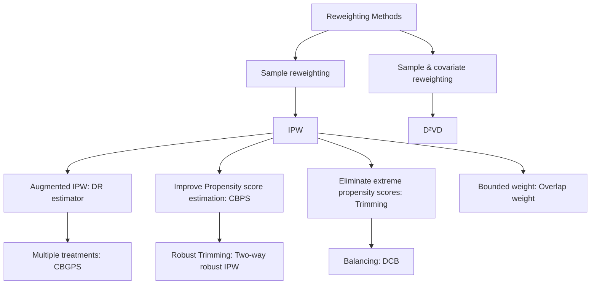
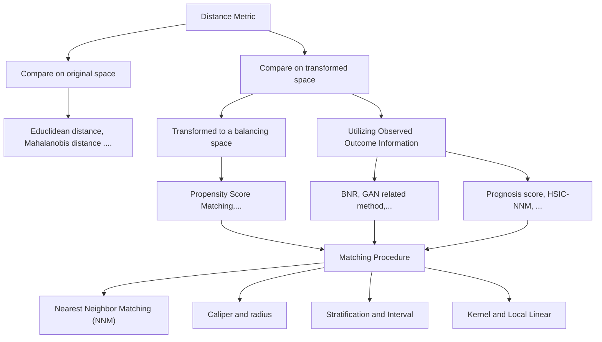

# Chapter 3 Causal Effect Estimation: Basic Methodologies

Liuyi Yao, Zhixuan Chu, Yaliang Li, Jing Gao, Aidong Zhang, and Sheng Li

## 3.1 Introduction

For the causal effect estimation task from observational data, the potential outcome framework $[80, 92]$ is the most commonly used solution, which is also known as the Neyman–Rubin potential outcomes or the Rubin causal model.

In this chapter, we provide a comprehensive review of the causal inference methods under the potential outcome framework. We separate various causal inference methods into two major categories based on whether they require the three assumptions of the potential outcome framework. Various causal inference methods with these three assumptions are first illustrated, including reweighting methods, stratification methods, matching-based methods, tree-based methods, representation-based methods, multi-task learning-based methods, and meta-learning methods. In each category, detailed descriptions of the representative methods, the connection and comparison between the mentioned methods, and the general summation are provided. Additionally, causal effect estimation methods

L. Yao · Y. Li
Alibaba Group, Hangzhou, China
e-mail: yly287738@alibaba-inc.com; yaliang.li@alibaba-inc.com

Z. Chu
Ant Group, Hangzhou, China
e-mail: chuzhixuan.czx@alibaba-inc.com

J. Gao
Purdue University, West Lafayette, IN, USA
e-mail: jinggao@purdue.edu

A. Zhang · S. Li (☒)
University of Virginia, Charlottesville, VA, USA
e-mail: aidong@virginia.edu; shengli@virginia.edu that relax the three assumptions are also described to fulfill the needs in different settings.

## 3.2 Causal Inference Methods Relying on Three Assumptions

In this section, we introduce existing causal inference methods that rely on the three assumptions introduced in Sect. 2.2. According to the way to control confounders, we divide these methods into the following categories: (1) Re-weighting methods; (2) Stratification methods; (3) Matching methods; (4) Tree-based methods; (5) Representation-based methods; (6) Multi-task methods; and (7) Meta-learning methods.

## 3.2.1 Re-weighting Methods

Due to the existence of confounders, the covariate distributions of the treated group and control group are different, which leads to the selection bias problem as described in Sect. 2.2.4. In other words, the treatment assignment is correlated with covariates in the observational data. Sample re-weighting is an effective approach to overcome selection bias. By assigning appropriate weight to each unit in the observational data, a pseudo-population can be created on which the distributions of the treated group and control group are similar.

In sample re-weighting methods, a key concept is balancing score. Balancing score $b(x)$ is a general weighting score, which is the function of x satisfying: $W \perp x |b(x)$ [46], where W is the treatment assignment and x is the background variables. There are various designs of the balancing score, and apparently, the most trivial design of balancing score is $b(x) = x$ due to the ignorability assumption. In addition, the propensity score is also a special case of the balancing score.

Definition 3.1 Propensity score: The propensity score is defined as the conditional probability of treatment given background variables [76]:

$$
e (x) = \operatorname * {P r} (W = 1 | X = x). \tag {3.1}
$$

In detail, a propensity score indicates the probability of a unit being assigned to a particular treatment given a set of observed covariates. Balancing scores that incorporate propensity scores are the most common approach.

A summarization of the algorithms mentioned in this section is shown in Fig. 3.1. The propensity-score-based sample re-weighting will be introduced in the next section, followed by methods that weigh both samples and the covariates.

Fig. 3.1 Categorization of re-weighting methods [107]

## 3.2.1.1 Propensity-Score-Based Sample Re-weighting

Propensity scores can be used to reduce selection bias by equating groups based on these covariates. Inverse propensity weighting (IPW) $[75, 76]$ , also named as inverse probability of treatment weighting (IPTW), assigns a weight r to each sample:

$$
r = \frac {W}{e (x)} + \frac {1 - W}{1 - e (x)}, \tag {3.2}
$$

where $W$ is the treatment assignment ( $W = 1$ denotes being treated group; $W = 0$ denotes the control group) and $e(x)$ is the propensity score defined in Eq. (3.1).

After re-weighting, the IPW estimator of the average treatment effect (ATE) is

$$
\hat {\mathrm{ATE}} _ {I P W} = \frac {1}{n} \sum_ {i = 1} ^ {n} \frac {W _ {i} Y _ {i} ^ {F}}{\hat {e} (x _ {i})} - \frac {1}{n} \sum_ {i = 1} ^ {n} \frac {(1 - W _ {i}) Y _ {i} ^ {F}}{1 - \hat {e} (x _ {i})}, \tag {3.3}
$$

and its normalized version, which is preferred, especially when the propensity scores are obtained by estimation [45]:

$$
\hat {\mathrm{ATE}} _ {I P W} = \sum_ {i = 1} ^ {n} \frac {W _ {i} Y _ {i} ^ {F}}{\hat {e} (x _ {i})} / \sum_ {i = 1} ^ {n} \frac {W _ {i}}{\hat {e} (x _ {i})} - \sum_ {i = 1} ^ {n} \frac {(1 - W _ {i}) Y _ {i} ^ {F}}{1 - \hat {e} (x _ {i})} / \sum_ {i = 1} ^ {n} \frac {(1 - W _ {i})}{1 - \hat {e} (x _ {i})}. \tag {3.4}
$$

Both large and small sample theories show that adjustment for the scalar propensity score is enough to remove bias due to all observed covariates $[76]$ . The propensity score can be used to balance the covariates in the treatment and control groups and therefore reduce the bias through matching, stratification (subclassification), regression adjustment, or some combination of all three. $[25]$ discusses the use of propensity score to reduce the bias, which also provides examples and detailed discussions.

However, in practice, the correctness of the IPW estimator highly relies on the correctness of the propensity score estimation, and slight misspecification of propensity scores would cause ATE estimation error dramatically $[44]$ . To handle this dilemma, the doubly robust estimator (DR) $[72]$ , also named augmented IPW (AIPW), is proposed. The DR estimator combines the propensity score weighting with the outcome regression, so that the estimator is robust even when one of the propensity scores or outcome regression is incorrect (but not both). In detail, the DR estimator is formalized as

$$
\begin{array}{l} \hat {\mathrm{ATE}} _ {D R} = \frac {1}{n} \sum_ {i = 1} ^ {n} \left\{\left[ \frac {W _ {i} Y _ {i} ^ {F}}{\hat {e} (x _ {i})} - \frac {W _ {i} - \hat {e} (x _ {i})}{\hat {e} (x _ {i})} \hat {m} (1, x _ {i}) \right] \right. \\ \left. - \left[ \frac {\left(1 - W _ {i}\right) Y _ {i} ^ {F}}{1 - \hat {e} \left(x _ {i}\right)} - \frac {W _ {i} - \hat {e} \left(x _ {i}\right)}{1 - \hat {e} \left(x _ {i}\right)} \hat {m} \left(0, x _ {i}\right) \right] \right\} \tag {3.5} \\ = \frac {1}{n} \sum_ {i = 1} ^ {n} \left\{\hat {m} (1, x _ {i}) + \frac {W _ {i} (Y _ {i} ^ {F} - \hat {m} (1 , x _ {i}))}{\hat {e} (x _ {i})} - \hat {m} (0, x _ {i}) - \right. \\ \left. \frac {(1 - W _ {i}) (Y _ {i} ^ {F} - \hat {m} (0 , x _ {i}))}{1 - \hat {e} (x _ {i})} \right\}, \\ \end{array}
$$

where $\hat{m}(1, x_{i})$ and $\hat{m}(0, x_{i})$ are the regression model estimations of treated and control outcomes. The DR estimator is consistent and therefore asymptotically unbiased, if either the propensity score is correct or the model correctly reflects the true relationship among exposure and confounders with the outcome [28]. In reality, one definitely cannot guarantee whether one model can accurately explain the relationships among variables. The combination of outcome regression with weighting by propensity score ensures that the estimators are robust to misspecification of one of these models [6, 72, 73, 84].

The DR estimator consults outcomes to make the IPW estimator robust when propensity score estimation is not correct. An alternative way is to improve the estimation of propensity scores. In the IPW estimator, propensity score serves as both the probability of being treated and the covariate balancing score, and covariate balancing propensity score (CBPS) [44] is proposed to exploit such dual characteristics. In particular, CBPS estimates propensity scores by solving the following problem:

$$
\mathbb {E} \left[ \frac {W _ {i} \tilde {x _ {i}}}{e (x _ {i} ; \beta)} - \frac {(1 - W _ {i}) \tilde {x _ {i}}}{1 - e (x _ {i} ; \beta)} \right] = 0, \tag {3.6}
$$

where $\tilde{x}_{i} = f(x_{i})$ is a pre-defined vector-valued measurable function of $x_{i}$ . By solving the above problem, CBPS directly constructs the covariate balancing score from the estimated parametric propensity score, which increases the robustness of the misspecification of the propensity score model. An extension of CBPS is the covariate balancing generalized propensity score (CBGPS) [29], which enables to handle the treatment with continuous value. Due to the continuous valued treatment, it is difficult to directly minimize the covariates distribution distance between the control and treated groups. CBGPS solves this problem by mitigating the definition of the balancing score. Based on the definition, the treatment assignment is conditionally independent of the background variables, and CBGPS directly minimizes the correlation between the treatment assignment and the covariates after weighting. Specifically, the objective of CBGPS is to learn a propensity-score-based weight so that the weighted correlation between the treatment assignment and the covariates is minimized:

$$
\mathbb {E} \left(\frac {p (t ^ {*})}{p (t ^ {*} | x ^ {*})} t ^ {*} x ^ {*}\right) = \int \left\{\int \frac {p (t ^ {*})}{p (t ^ {*} | x ^ {*})} t ^ {*} d P (t ^ {*} | x ^ {*}) \right\} x ^ {*} d P (x ^ {*}) \tag {3.7}
$$

$$
= \mathbb {E} (t ^ {*}) \mathbb {E} (x ^ {*}) = 0,
$$

where $p(t^{*}|x^{*})$ is the propensity score, and $\frac{p(t^{*})}{p(t^{*}|x^{*})}$ is the balancing weight, and $t^{*}$ and $x^{*}$ are the treatment assignment and the background variables after centering and orthogonalizing (i.e., normalization). In summary, both CBPS and CBGPS learn the propensity-score-based sample weight directly toward the covariate balancing goal, which can alleviate the negative effect brought by model misspecification of the propensity score.

Another drawback of the original IPW estimator is that it might be unstable if the estimated propensity scores are small. If the probability of either treatment assignment is small, the logistic regression model can become unstable around the tails, causing the IPW to also be less stable. To overcome this issue, trimming is routinely employed as a regularization strategy, which eliminates the samples whose propensity scores are less than a pre-defined threshold $[54]$ . However, this approach is highly sensitive to the amount of trimming $[61]$ . Additionally, the theoretical results in $[61]$ show that the small probability of propensity scores and the trimming procedure may result in different non-Gaussian asymptotic distributions of the IPW estimator. Based on this observation, a two-way robustness IPW estimation algorithm is proposed in $[61]$ . This method combines subsampling with a local polynomial-regression-based trimming bias corrector so that it is robust to both small propensity scores and the large scale of trimming threshold. An alternative approach to overcome the instability of IPW under small propensity scores is to redesign the sample weight so that the weight is bounded. In $[58]$ , the overlap weight is proposed, in which each unit's weight is proportional to the probability of that unit being assigned to the opposite group. In detail, the overlap weight $h(x)$ is defined as $h(x) \propto 1 - e(x)$ , where $e(x)$ is the propensity score. The overlap weight is bounded within the interval $[0, 0.5]$ , and thus it is less sensitive to the extreme value of the propensity score. Recent theoretical results show that the overlap weight has the minimum asymptotic variance among all balancing weights $[58]$ .

## 3.2.1.2 Confounder Balancing

The aforementioned sample re-weighting methods could achieve balance in the sense that the observed variables are considered equally as confounders. However, in real cases, not all the observed variables are confounders. Some of the variables, named adjustment variables, are only predictive of the outcome, and others might be irrelevant variables $[51]$ . Adjusting the adjustment variables by Lasso, although it cannot reduce the bias, helps decrease the variance $[11, 83]$ . However, including the irrelevant variables would cause overfitting.

Based on the separateness assumption that the observed variables can be decomposed into confounders, adjusted variables, and irrelevant variables, in $[51]$ , the data-driven variable decomposition ( $D^{2}VD$ ) algorithm is proposed to distinguish the confounders and adjustment variables and eliminate the irrelevant variables. In detail, the adjusted outcome is written as

$$
Y _ {\mathrm{D} ^ {2} \mathrm{VD}} ^ {*} = \left(Y ^ {F} - \phi (\mathbf {z})\right) \frac {W - p (x)}{p (x) (1 - p (x))}, \tag {3.8}
$$

where z denotes the adjustment variables. Therefore, the ATE estimator of $D^{2}VD$ is

$$
\mathrm{ATE} _ {\mathrm{D} ^ {2} \mathrm{VD}} = \mathbb {E} \left[ \left(Y ^ {F} - \phi (\mathbf {z})\right) \frac {W - p (x)}{p (x) (1 - p (x))} \right]. \tag {3.9}
$$

To obtain $ATE_{D^{2}VD}$ , $Y_{D^{2}VD}^{*}$ is regressed on all observed variables with parameter $\alpha$ separating the adjustment variables z from all observed variables and parameter $\beta$ separating the confounders from all observed variables, i.e., $Y_{D^{2}VD}^{*} = (Y^{F} - X\alpha) \odot R(\beta)$ , where $R(\beta)$ is the weight and $R(\beta) = \frac{W - e(X)}{e(X)(1 - e(X))}$ in which $e(X)$ is parameterized by $\beta$ . The objective function is $l_{2}$ loss between $Y_{D^{2}VD}^{*}$ and ATE value estimated by the linear regression function on all observed variables parameterized by $\gamma$ , along with sparse regularization to distinguish the confounder, adjusted variables, and irrelevant variables. In detail, the objective function is defined as

$$
\text { minimize } | | (Y ^ {F} - X \alpha) \odot R (\beta) - X \gamma | | _ {2} ^ {2},
$$

$$
\text { s.t. } \sum_ {i = 1} ^ {N} \log (1 + \exp (1 - 2 W _ {i}) \cdot X _ {i} \beta)) <   \tau , \tag {3.10}
$$

$$
| | \alpha | | _ {1} \leq \lambda , | | \beta | | _ {1} \leq \delta , | | \gamma | | _ {1} \leq \eta , | | \alpha \odot \beta | | _ {2} ^ {2} = 0,
$$

where $R(w)$ is the weight, and $\tau, \lambda, \delta$ , and $\eta$ are hyperparameters. The first condition represents the propensity score estimation error, and the next three conditions encourage the sparsity. The last condition, the Hadamard product, ensures the separation of adjusted variables and confounders.

However, little prior knowledge about the interactions among observed variables is provided in practice, and the data are usually high-dimensional and noisy. To solve this problem, the differentiated confounder balancing (DCB) algorithm $[50]$ is proposed to select and differentiate confounders to balance the distributions. Overall, DCB balances the distributions by re-weighting both the samples and confounders.

## 3.2.2 Stratification Methods

Stratification, also named as subclassification or blocking $[46]$ , is a representative method to adjust for confounders. The idea of stratification is to adjust the bias that stems from the difference between the treated group and the control group by splitting the entire group into homogeneous subgroups (blocks). Ideally, in each subgroup, the treated group and the control group are similar under certain measurements over the covariates; therefore, the units in the same subgroup can be viewed as sampled from the data under randomized controlled trials. Based on the homogeneity of each subgroup, the treatment effect within each subgroup (i.e., CATE) can be calculated through the method developed on randomized controlled trials (RCTs) data. After obtaining the CATE of each subgroup, the treatment effect over the interested group can be obtained by combining the CATEs of subgroups belonging to that group, as shown in $(2.8)$ . In the following, we adopt the calculation of ATE as an example. In detail, if we separate the whole dataset into J blocks, the ATE is estimated as

$$
\mathrm{ATE} _ {\text { strat }} = \hat {\tau} ^ {\text { strat }} = \sum_ {j = 1} ^ {J} q (j) \left[ \bar {Y} _ {t} (j) - \bar {Y} _ {c} (j) \right], \tag {3.11}
$$

where $\bar{Y}_{t}(j)$ and $\bar{Y}_{c}(j)$ are the average of the treated outcome and control outcome in the j-th block, respectively. $q(j) = \frac{N(j)}{N}$ is the portion of the units in the j-th block to the whole units.

Stratification effectively decreases the bias of ATE estimation compared with the difference estimator where ATE is estimated as: $ATE_{diff} = \hat{\tau}^{diff} = \frac{1}{N_{i}} \sum_{i:W_{i}=1} Y_{i}^{F} - \frac{1}{N_{c}} \sum_{i:W_{i}=0} Y_{i}^{F}$ . In particular, if we assume the outcome is linear with the covariates, i.e., $\mathbb{E}[Y_{i}(w)|X_{i} = x] = \alpha + \tau * w + \beta * x$ . The bias of the difference estimator is

$$
\mathbb {E} [ \hat {\tau} ^ {\text { diff }} - \tau | X, W ] = (\bar {X} _ {t} - \bar {X} _ {c}) \beta . \tag {3.12}
$$

The bias of the stratification estimator is the weighted average of the within-block bias:

$$
\mathbb {E} [ \hat {\tau} ^ {\text { strat }} - \tau | X, W ] = \left(\sum_ {j = 1} ^ {J} q (j) \left(\bar {X} _ {t} (j) - \bar {X} _ {c} (j)\right)\right) \beta . \tag {3.13}
$$

Compared with the difference estimator, the stratification estimator reduces the bias per covariate by the factor:

$$
\gamma_ {k} = \frac {\sum_ {j} q (j) \left(\bar {X} _ {t , k} (j) - \bar {X} _ {c , k} (j)\right)}{\bar {X} _ {t , k} - \bar {X} _ {c , k}}, \tag {3.14}
$$

where $\bar{X}_{t,k}(j)$ ( $\bar{X}_{c,k}(j)$ ) is the average of $k$ -th covariate of treated (control) group in $j$ -th block, and $\bar{X}_{t,k}$ ( $\bar{X}_{c,k}$ ) is the average of $k$ -th covariate in the whole treated (control) group.

The key component of stratification methods is how to create the blocks and how to combine the created blocks. Equal frequency $[76]$ is a common strategy to create blocks. The equal frequency approach splits the block by the appearance probability, such as the propensity score, so that the covariates have the same appearance probability (i.e., the propensity score) in each subgroup (block). The ATE is estimated by the weighted average of each block's CATE, with the weight as the fraction of the units in this block. However, this approach suffers from high variance due to the insufficient overlap between the treated and control groups in the blocks whose propensity score is very high or low. To reduce the variance, in $[42]$ , the blocks, which are divided according to the propensity score, are re-weighted by the inverse variance of the block-specific treatment effect. Although this method reduces the variance of the equal frequency method, it unavoidably increases the estimation bias.

The stratification methods described above are all splitting the blocks according to the pre-treatment variables. However, in some real-world applications, it is required to compare the outcome conditioned on some post-treatment variables, denoted as S. For example, the “surrogate” markers of disease progression (i.e., intermediate outcome) such as CD4 count and measures of viral load in AIDS are the post-treatment variables [30]. In the studies comparing drugs for AIDS patients, the researchers are interested in the effect of AIDS drugs on groups with CD4 counts lower than 200 cell/mm $^{3}$ . However, directly comparing the observed outcomes on the group with $S^{obs} < 200$ is not the true effect because the compared two subgroups: $\{i : W_{i} = 1, S^{obs} < 200\}$ and $\{j : W_{j} = 0, S^{obs} < 20\}$ , where $S^{obs}$ is the observed post-treatment values, have great discrepancy if the treatment has effect on the intermediate results. To solve this problem, principle stratification [30] constructs the subgroup based on the potential values of the pre-treatment variables. Analogous to the potential outcome defined in Sect. 2.2.1, potential pre-treatment variables value, denoted as $S(W = w)$ , is the potential value of S under treatment with value w. With the natural assumption that the potential value of S is independent of the treatment assignment, the treatment effect of the subgroup can be obtained by comparing the outcomes of two sets: $\{Y_{i}^{obs} : W_{i} = 1, S_{i}(W_{i} = 1) = v_{1}, S_{i}(W_{i} = 0) = v_{2}\}$ and $\{Y_{j}^{obs} : W_{j} = 0, S_{j}(W_{j} = 1) = v_{1}, S_{j}(W_{j} = 0) = v_{2}\}$ , where $v_{1}$ and $v_{2}$ are two post-treatment values. The comparison based on the potential values of post-treatment variables ensures that the compared two sets are similar, so that the obtained treatment effect is the true effect.

## 3.2.3 Matching Methods

As mentioned previously, missing counterfactuals and confounder bias are two major challenges in treatment effect estimation. Matching-based approaches provide a way to estimate the counterfactual and, at the same time, reduce the estimation bias brought by the confounders. In general, the potential outcomes of the i-th unit estimated by matching are $[1]$

$$
\hat {Y} _ {i} (0) = \left\{ \begin{array}{l l} Y _ {i} & \text {   if   } W _ {i} = 0, \\ \frac {1}{\# \mathcal {J} (i)} \sum_ {l \in \mathcal {J} (i)} Y _ {l} & \text {   if   } W _ {i} = 1; \end{array} \right. \quad \hat {Y} _ {i} (1) = \left\{ \begin{array}{l l} \frac {1}{\# \mathcal {J} (i)} \sum_ {l \in \mathcal {J} (i)} Y _ {l} & \text {   if   } W _ {i} = 0, \\ Y _ {i} & \text {   if   } W _ {i} = 1; \end{array} \right. \tag {3.15}
$$

where $\hat{Y}_i(0)$ and $\hat{Y}_i(1)$ are the estimated control and treated outcome, and $\mathcal{J}(i)$ is the matched neighbors of unit $i$ in the opposite treatment group [5].

The analysis of the matched sample can mimic that of an RCT: one can directly compare outcomes between the treated and control groups within the matched sample. In the context of an RCT, one expects that, on average, the distribution of covariates will be similar between treated and control groups. Therefore, matching can be used to reduce or eliminate the effects of confounding when using observational data to estimate treatment effects $[5]$ .

## 3.2.3.1 Distance Metric

Various distances have been adopted to compare the closeness between units [32], such as the widely used Euclidean distance [79] and Mahalanobis distance [82]. Meanwhile, many matching methods develop their own distance metrics, which can be abstracted as: $D(\mathbf{x}_i, \mathbf{x}_j) = ||f(\mathbf{x}_i) - f(\mathbf{x}_j)||_2$ . The existing distance metrics mainly vary in how they design the transformation function $f(\cdot)$ .

Propensity-Score-Based Transformation Original covariates of units can be represented by propensity scores. As a result, the similarity between two units can be directly calculated as: $D(\mathbf{x}_{i}, \mathbf{x}_{j}) = |e_{i} - e_{j}|$ , where $e_{i}$ , and $e_{j}$ are the propensity scores of $x_{i}$ and $x_{j}$ , respectively. Later, the linear propensity-score-based distance metric is also proposed, which is defined as $D(\mathbf{x}_{i}, \mathbf{x}_{j}) = |\operatorname{logit}(e_{i}) - \operatorname{logit}(e_{j})|$ . This improved version is recommended since it can effectively reduce the bias [93]. Furthermore, the propensity-score-based distance metric can be combined with other existing distance metrics, which provides a fine-grained comparison. In [82], when the difference of two units' propensity scores is within a certain range, they are further compared with other distances on some key covariates. Under this metric, the closeness of two units contains two criteria: they are relatively close under propensity score measure, and they are particularly similar under the comparison of the key covariates [93].

Other Transformations The propensity score only adopts the covariate information, while some other distance metrics are learned by utilizing both the covariates and the outcome information so that the transformed space can preserve more information. One representative metric is the prognosis score [36], which is the estimated control outcome. The transformation function is represented as: $f(x) = \hat{Y}_c$ . However, the performance of the prognosis score relies on modeling the relationship between the covariates and control outcomes. Moreover, the prognosis score only takes the control outcome into consideration and ignores the treated outcome. The Hilbert-Schmidt independence criterion-based nearest-neighbor matching (HSIC-NNM) proposed in [16] could overcome the drawbacks of prognosis score. HSIC-NNM learns two linear projections for control outcome estimation task and treated outcome estimation task separately. To fully explore the observed control/treated outcome information, the parameters of linear projection are learned by maximizing the nonlinear dependency between the projected subspace and the outcome: $M_w = \arg\max_{M_w} \text{HSIC}(\mathbf{X}_w M_w, Y_w^F) - \mathcal{R}(M_w)$ , where $w = 0, 1$ represent the control group and treated group, respectively. $\mathbf{X}_w M_w$ is the transformed subspace with the transformation function as: $f(x) = x M_w$ . $Y_w^F$ is the observed control/treated outcome, and $\mathcal{R}$ is the regularization to avoid overfitting. The objective function ensures that the learned transformation functions project the original covariates to an information subspace where similar units will have similar outcomes.

Compared with the propensity-score-based distance metric that focuses on balancing, prognosis score and HSIC-NNM focus on embedding the relationship between the transformed space and the observed outcome. These two lines of methods have different advantages, and some recent work has tried to integrate these advantages. In $[56]$ , the balanced and nonlinear representation (BNR) is proposed to project the covariates into a balanced low-dimensional space. In detail, the parameters in the nonlinear transformation function are learned by jointly optimizing the following two objectives: (1) Maximizing the differences of noncontiguous-class scatter and within-class scatter so that the units with the same outcome prediction shall have similar representations after transformation; and (2) Minimizing the maximum mean discrepancy between the transformed control and outcome group in order to obtain the balanced space after transformation. A series of works that have similar objectives but vary in balancing regularization have been proposed, such as using the conditional generative adversarial network to ensure that the transformation function blocks the treatment assignment information $[55, 106]$ .

The methods mentioned above adopt either one or two transformations for treated and control groups separately. Different from the existing method, randomized nearest-neighbor matching (RNNM) $[57]$ adopts a number of random linear projections as the transformation function, and the treatment effects are obtained as the median treatment effect by nearest-neighbor matching in each transformed subspace. The theoretical motivation of this approach is the Johnson–Lindenstrauss (JL) lemma, which guarantees that the pairwise similarity information of the points in the high-dimensional space can be preserved through random linear projection. Powered by the JL lemma, RNNM ensembles the treatment effect estimation results of several linear random transformations.

Fig. 3.2 Categorization of matching methods [107]

## 3.2.3.2 Choosing a Matching Algorithm

After defining the similarity metric, the next step is to find the neighbors. In $[14]$ , existing matching algorithms are divided into four essential approaches, including the nearest-neighbor matching, caliper, stratification, and kernel, as shown in Fig. 3.2. The most straightforward matching estimator is the nearest-neighbor matching (NNM). In particular, a unit in the control group is chosen as the matching partner for a treated unit, so that they are closest based on a similarity score (e.g., propensity score). The NNM has several variants, such as NNM with replacement and NNM without replacement. Treated units are matched to one control, called pair matching or 1–1 matching, or treated units are matched to two controls, called 1–2 matching, and so on. It is a trade-off to determine the number of neighbors, since a large number of neighbors may result in a treatment effect estimator with high bias but low variance, while a small number results in low bias but high variance. It is known, however, that the optimal structure is a full matching in which a treated unit may have one or several controls or one control may have one or several treated units $[32]$ .

NNM may have bad matches if the closest partner is far away. One can set a tolerance level on the maximum propensity score distance (caliper) to avoid this problem. Hence, caliper matching is one form of imposing a common support condition.

The stratification matching partitions the common support of the propensity score into a set of intervals and then takes the mean difference in outcomes between treated and control observations in order to calculate the impact within each interval. This method is also known as interval matching, blocking, and subclassification $[78]$ .

The matching algorithms discussed above have in common that only a few observations in the control group are used to create the counterfactual outcome of a treatment observation. Kernel matching (KM) and local linear matching (LLM) are nonparametric matchings that use weighted averages of observations in the control group to create the counterfactual outcome. Thus, one major advantage of these approaches is the lower variance because we use more information to create a counterfactual outcome.

Here, we also want to introduce another matching method called coarsened exact matching (CEM) proposed in [43]. Because either 1-k matching or the full matching fails to consider the extrapolation region, where few or no reasonable matches exist in the other treatment group, CEM was proposed to handle this problem. CEM first coarsens the selected important covariate, i.e., discretization, and then performs exact matching on the coarsened covariates. For example, if the selected covariates are age (age>50 is 1, and others are 0) and gender (female as 1, and male as 0). A female patient with age 50 in the treated group is represented by the coarsen covariates as (1, 1). She will only match the patients in the treated group with exactly the same coarsened covariate values. After exact matching, the whole data are separated into two subsets. In one subset, every unit has its exact matched neighbors, and it is the opposite in the other subset that contains the units in the extrapolation region. The outcomes of units in the extrapolation region are estimated by the outcome prediction model trained on the matched subset. So far, the treatment effect on the two subsets can be estimated separately, and the final step is to combine the treatment effect on the two subsets by a weighted average.

We have provided several different matching algorithms, but the most important question is how we should select a perfect matching method. Asymptotically, all matching methods should yield the same results as the sample size grows and they will become closer to comparing only exact matches $[91]$ . When we only have a small sample size, this choice will be important $[39]$ . There is one trade-off between bias and variance.

## 3.2.3.3 Variables to Include

The above two subsections illustrate the key steps in the matching procedure, and in this subsection, we briefly discuss what kinds of variables should be included in the matching, i.e., feature selection, to improve the matching performance. Many studies [31, 39, 81] suggest including as many variables that are related to the treatment assignment and the outcome as possible, in order to satisfy the strong ignorability assumption. However, post-treatment variables, which are the variables affected by the treatment assignment, should be excluded in the matching procedure [77]. Moreover, in addition to the post-treatment variables, researchers also suggest excluding the instrumental variables [68, 103] because they tend to amplify the bias of the treatment effect estimator.

## 3.2.4 Tree-Based Methods

Another popular method in causal inference is based on decision tree learning, which is one of the predictive modeling approaches. The decision tree is a nonparametric supervised learning method used for classification and regression. The goal is to create a model that predicts the value of a target variable by learning simple decision rules inferred from data.

Tree models where the target variable is discrete are called classification trees with prediction error measured based on misclassification cost. In these tree structures, leaves represent class labels, and branches represent conjunctions of features that lead to those class labels. Decision trees where the target variable is continuous are called regression trees with prediction error measured by the squared difference between the observed and predicted values. The term classification and regression tree (CART) analysis is an umbrella term used to refer to both of the above procedures $[13]$ . In the CART model, the data space is partitioned, and a simple prediction model for each partitioned space is fitted. Therefore, every partitioning can be represented graphically as a decision tree $[59]$ .

For estimating heterogeneity in causal effects, a data-driven approach $[4]$ based on CART is provided to partition the data into subpopulations that differ in the magnitude of their treatment effects. The valid confidence intervals can be created for treatment effects, even with many covariates relative to the sample size, and without “sparsity” assumptions. This approach is different from conventional CART in two aspects. First, it focuses on estimating conditional average treatment effects instead of directly predicting outcomes as in the conventional CART. Second, different samples are used for constructing the partition and estimating the effects of each subpopulation, which is referred to as an honest estimation. However, in the conventional CART, the same samples are used for these two tasks.

In CART, a tree is built up until a splitting tolerance is reached. There is only one tree, and it is grown and pruned as needed. However, BART is an ensemble of trees, so it is more comparable to random forests. A Bayesian “sum-of-trees” model called Bayesian additive regression trees (BART) is developed in $[18, 19]$ . Every tree in the BART model is a weak learner, and it is constrained by a regularization prior. Information can be extracted from the posterior by a Bayesian backfitting MCMC algorithm. BART is a nonparametric Bayesian regression model that uses dimensionally adaptive random basis elements. Let W be a binary tree that has a set of interior node decision rules and terminal nodes, and let $M = \{\mu_{1}, \mu_{2}, \ldots, \mu_{B}\}$ be parameters associated with each of the B terminal nodes for W. We use $g(x; W, M)$ to assign a $\mu_{b} \in M$ to input vector x. The sum-of-trees model can be expressed as

$$
Y = g \left(x; W _ {1}, M _ {1}\right) + g \left(x; W _ {2}, M _ {2}\right) + \dots + g \left(x; W _ {m}, M _ {m}\right) + \varepsilon , \tag {3.16}
$$

$$
\varepsilon \sim N (0, \sigma^ {2}). \tag {3.17}
$$

BART has a couple of advantages. It is very easy to implement and only needs to plug in the outcome, treatment assignment, and confounding covariates. In addition, it does not require any information about how these variables are parametrically related so that it requires less guess when fitting the model. Moreover, it can deal with a mass of predictors, yield coherent uncertainty intervals, and handle continuous treatment variables and missing data $[40]$ .

BART is proposed to estimate the average causal effects. In fact, it can also be used to estimate individual-level causal effects. BART cannot only easily identify the heterogeneous treatment effects, but also obtain more accurate estimates of average treatment effects compared to other methods, such as propensity score matching, propensity score weighting, and regression adjustment in the nonlinear simulation situations examined [40].

In most previous methods, the prior distribution over treatment effects is always induced indirectly, which is difficult to attain. A flexible sum of regression trees (i.e., a forest) can address this issue by modeling a response variable as a function of a binary treatment indicator and a vector of control variables $[35]$ . This approach interpolates between two extremes: entirely and separately modeling the conditional means of treatment and control or only the treating treatment assignment as another covariate.

Random forest is a classifier consisting of a combination of tree predictors, in which each tree depends on a random vector that is independently sampled and has an identical distribution for all trees [12]. This model can also be extended to estimate heterogeneous treatment effects based on Breiman's random forest algorithm [99]. Trees and forests can be considered as nearest-neighbor methods with an adaptive neighborhood metric. Tree-based methods seek to find training examples that are close to a point $x$ , but now closeness is defined with respect to a decision tree. And the closest points to $x$ are those that fall in the same leaf as it. The advantage of using trees is that their leaves can be narrower along with the directions where the signal is changing fast and wider along with the other directions, potentially leading to a substantial increase in power when the dimension of the feature space is even moderately large.

The tree-based framework can also be extended to uni- or multi-dimensional treatments $[100]$ . Each dimension can be discrete or continuous. A tree structure is used to specify the relationship between user characteristics and the corresponding treatment. This tree-based framework is robust to model misspecification and highly flexible with minimal manual tuning.

## 3.2.5 Representation Learning Methods

Representation learning is learning the representations of input data typically by transforming the original covariates or extracting features from the covariate space. Focusing specifically on deep learning, the composition of multiple nonlinear transformations can yield more abstract and ultimately more useful representations $[9]$ . Compared with traditional machine learning approaches in causal inference, deep representation learning models are capable of automatically searching for features that are correlated and combining them to enable more effective and more accurate counterfactual estimation, while in the traditional machine learning approach, features need to be identified accurately by users. Meanwhile, there also exist some challenges that need to be addressed in deep representation learning. For example, the amount of data needed for deep representation learning is much higher than that needed for other machine learning methods; the “Black Boxes” deep structure is less interpretable, and it is very difficult to look inside of it to understand how it works; overfitting always happens when an algorithm utilizes the deep structure to learn the details and noise so well in the training data that it negatively impacts the performance of the model in the whole population. Thus far, significant advances in deep representation learning-based methods have been made to overcome the challenges in causal effect estimation with observational data. We categorize deep representation learning-based methods into domain-adaptation-based, matching-based, and continual-learning-based methods.

## 3.2.5.1 Domain Adaptation Based on Representation Learning

The most basic assumption used in statistical learning theory is that training data and test data are drawn from the same distribution. However, in most practical cases, the test data are drawn from a distribution that is only related, but not identical, to the distribution of the training data. In causal inference, this is also a major challenge. Unlike randomized control trials, the mechanism of treatment assignment is not explicit in observational data. Therefore, interventions of interest are not independent of the property of the subjects. For example, in an observational study of the treatment effect of a medicine, the medicine is assigned to individuals based on several factors, including known confounders and some unknown confounders. As a result, the counterfactual distribution will generally be different from the factual distribution. Thus, it is necessary to predict counterfactual outcomes by learning from the factual data, which converts the causal inference problem to a domain adaptation problem.

Extracting effective feature representations is critical for domain adaptation. A model $[8]$ with a generalization bound is proposed to formalize this intuition theoretically, which cannot only explicitly minimize the difference between the source and target domains, but also maximize the margin of the training set. Building on this work $[8]$ , the discrepancy distance between distributions is tailored to adaptation problems with arbitrary loss functions $[62]$ . In the following discussions, the discrepancy distance plays an important role in addressing the domain adaptation problem in causal inference.

Thus far, we can see a clear connection between counterfactual inference and domain adaptation. An intuitive idea is to enforce the similarity between the distributions of different treatment groups in the representation space. The learned representations trade off three objectives: (1) low-error prediction over the factual representation, (2) low-error prediction over counterfactual outcomes by taking into account relevant factual outcomes, and (3) the distance between the distribution of the treatment population and that of the control population [47]. Following this motivation, [87] give a simple and intuitive generalization-error bound. It shows that the expected ITE estimation error of representation is bounded by a sum of the standard generalization error of that representation and the distance between the treated and control distributions based on representation. The integral probability metric (IPM) is used to measure the distances between distributions, and explicit bounds are derived for the Wasserstein distance and maximum mean discrepancy (MMD) distance. The goal is to find a representation $\Phi : X \to R$ and hypothesis $h: X \times \{0, 1\} \to Y$ that minimizes the following objective function:

$$
\begin{array}{l} \min _ {h, \Phi} \frac {1}{n} \sum_ {i = 1} ^ {n} r _ {i} \cdot L (h (\Phi (x _ {i}), W _ {i}), y _ {i}) \\ + \lambda \cdot R (h) + \alpha \cdot I P M _ {G} (\{\Phi (x _ {i}) \}) _ {i: W _ {i} = 0}, \{\Phi (x _ {i}) \}) _ {i: W _ {i} = 1}), \tag {3.18} \\ \end{array}
$$

where $r_{i} = \frac{W_{i}}{2u} + \frac{1-W_{i}}{2(1-u)}$ , $u = \frac{1}{n} \sum_{i=1}^{n} W_{i}$ , and the weight $r_{i}$ compensates for the difference in treatment group size. R is a model complexity term. Given two probability density functions p, q defined over $S \subseteq R^{d}$ and a function family G of functions $g : S \to R$ , the IPM is defined as

$$
I P M _ {G} (p, q) := \sup _ {g \in G} | \int_ {S} g (s) (p (s) - q (s)) d s |. \tag {3.19}
$$

This model allows for learning complex nonlinear representations and hypotheses with large flexibility. When the dimension of $\Phi$ is high, it risks losing the influence of t on h if the concatenation of $\Phi$ and W is treated as input. To address this problem, one approach is to parameterize $h_{1}(\Phi)$ and $h_{0}(\Phi)$ as two separate “heads” of the joint network. $h_{1}(\Phi)$ is used to estimate the outcome under treatment, and $h_{0}(\Phi)$ is for the control group. Each sample is used to update only the head corresponding to the observed treatment. The advantage is that statistical power is shared in the common representation layers, and the influence of treatment is retained in the separate heads [87]. This model can also be extended to any number of treatments, as described in the perfect match (PM) approach [85]. Following this idea, a few improved models have been proposed and discussed. For example, [48] bring together shift-invariant representation learning and re-weighting methods. [38] present a new context-aware weighting scheme based on the importance sampling technique, on top of representation learning, to alleviate the selection bias problem in ITE estimation.

Existing ITE estimation methods mainly focus on balancing the distributions of control and treated groups but ignore the local similarity information that provides meaningful constraints on the ITE estimation. In $[104, 105]$ , a local similarity preserved individual treatment effect (SITE) estimation method is proposed based on deep representation learning. SITE preserves local similarity and balances data distributions simultaneously. The framework of SITE contains five major components: representation network, triplet pairs selection, position-dependent deep metric (PDDM), middle point distance minimization (MPDM), and the outcome prediction network. To improve the model efficiency, SITE takes input units in a mini-batch fashion, and triplet pairs could be selected from every mini-batch. The representation network learns latent embeddings for the input units. With the selected triplet pairs, PDDM and MPDM can preserve the local similarity information and meanwhile achieve the balanced distributions in the latent space.

Finally, the embeddings of mini-batch are fed forward to a dichotomous outcome prediction network to obtain the potential outcomes. The loss function of SITE is as follows:

$$
L = L _ {F L} + \beta L _ {P D D M} + \gamma L _ {M P D M} + \lambda | | M | | _ {2}, \tag {3.20}
$$

where $L_{FL}$ is the factual loss between the estimated and observed factual outcomes. $L_{PDDM}$ and $L_{MPDM}$ are the loss functions for PDDM and MPDM, respectively. The last term is $L_{2}$ regularization on model parameters $M$ (except the bias term).

Most models focus on covariates with numerical values, while how to handle covariates with textual information for treatment effect estimation is still an open question. One major challenge is how to filter out the nearly instrumental variables that are the variables more predictive to the treatment than the outcome. Conditioning on those variables to estimate the treatment effect would amplify the estimation bias. To address this challenge, a conditional treatment-adversarial learning-based matching (CTAM) method is proposed in $[106]$ . CTAM incorporates the treatment-adversarial learning to filter out the information related to nearly instrumental variables when learning the representations, and then it performs matching among the learned representations to estimate the treatment effects. The CTAM contains three major components: text processing, representation learning, and conditional treatment discriminator. Through the text processing component, the original text is transformed into vectorized representation S. After that, S is concatenated with the non-textual covariates X to construct a unified feature vector, which is then fed into the representation neural network to get the latent representation Z. After learning the representation, Z, together with potential outcomes Y, are fed into the conditional treatment discriminator. During the training procedures, the representation learner plays a minimax game with the conditional treatment discriminator: By preventing the discriminator from assigning the correct treatment, the representation learner can filter out the information related to nearly instrumental variables. The final matching procedure is performed in the representation space Z. The conditional treatment-adversarial learning helps reduce the bias of treatment effect estimation.

## 3.2.5.2 Matching Based on Representation Learning

Compared to the above regression-based methods after representation learning, matching methods based on representation learning are more interpretable, because any sample's counterfactual outcome is directly set to be the factual outcome of its nearest neighbor in the group receiving the opposite treatment. Nearest-neighbor matching (NNM) sets the counterfactual outcome of any treatment (control) sample to be equal to the factual outcome of its nearest neighbor in the control (treatment) group. Although being simple, flexible, and interpretable, most NNM approaches could be easily misled by variables that do not affect the outcome. To address this challenge, matching can be performed on subspaces

<!-- footnote -->

- Z. Chu
- Ant Group, Hangzhou, China
- e-mail: chuzhixuan.czx@alibaba-inc.com
- S. Li (✉)
- University of Virginia, Charlottesville, VA, USA
- e-mail: shengli@virginia.edu

<!-- footnote end -->

that are predictive of the outcome variable for both the treatment group and the control group. Applying NNM in the learned subspaces leads to a more accurate estimation of the counterfactual outcomes and therefore the accurate estimation of treatment effects. For example, one work [16] estimates the counterfactual outcomes of treatment samples by learning a projection matrix that maximizes the nonlinear dependence between the subspace and outcome variable for control samples. Then it directly applies the learned projection matrix to all the samples and finds every treatment sample’s matched control sample in the subspace. In addition, another work [21] performs matching in the selective and balanced representation space to estimate treatment effects. It seamlessly integrates deep feature selection and deep representation learning for causal inference together. In feature selection and representation learning, the one-to-one feature selection layer at the input level selects which variables are input into the neural network, which makes the deep neural network more interpretable.

## 3.2.5.3 Continual Learning Based on Representation Learning

Although significant advances have been made to overcome the challenges in causal effect estimation with observational data, the existing representation learning methods only focus on source-specific and stationary observational data. Such learning strategies assume that all observational data are already available during the training phase and from only one source. This assumption is unsubstantial in practice for two reasons. The first is based on the characteristics of observational data, which are incrementally available from nonstationary data distributions. For instance, the number of electronic medical records in one hospital is growing every day, or the electronic medical records for one disease may be from different hospitals or even different countries. This characteristic implies that one cannot have access to all observational data at one time point and from one single source. The second reason is based on the realistic consideration of accessibility. For example, when new observations are available, if we want to refine the model previously trained by original data, perhaps the original training data are no longer accessible for a variety of reasons, e.g., lost, proprietary, too large to store, or privacy constraints. This practical concern of accessibility is ubiquitous in various academic and industrial applications. A continual causal effect representation learning method [20, 22, 23] is proposed for estimating causal effects with observational data, which are incrementally available from nonstationary data distributions. Instead of having access to all seen observational data, it incorporates feature representation distillation to preserve the knowledge learned from previous observational data. In addition, aiming at solving the selection bias between the treatment and control groups, it adopts one representation transformation function, which maps partial original feature representations into a new feature representation space and balances the global feature representation space with respect to treatment and control groups.

## 3.2.6 Multi-task Learning Methods

The treatment group and control group always share some common features except for their idiosyncratic characteristics. Naturally, causal inference can be conceptualized as a multi-task learning problem with a set of shared layers for the treated group and control group together, and a set of specific layers for the treated group and control group separately. The impact of selection bias in the multitask learning problem can be alleviated via a propensity-dropout regularization scheme [3], in which the network is thinned for every training example via a dropout probability that depends on the associated propensity score. The dropout probability is higher for subjects with features that belong in a region of poor overlap in the feature space between the treatment and control groups.

The Bayesian method can also be extended under the multi-task model. A nonparametric Bayesian method [2] uses a multi-task Gaussian process with a linear coregionalization kernel as a prior over the vector-valued reproducing kernel Hilbert space. The Bayesian approach allows computing individualized measures of confidence in our estimates via pointwise credible intervals, which are crucial for realizing the full potential of precision medicine. The impact of selection bias is alleviated via a risk-based empirical Bayes method for adapting the multi-task GP prior, which jointly minimizes the empirical error in factual outcomes and the uncertainty in counterfactual outcomes.

The multi-task model can be extended to multiple treatments even with continuous parameters in each treatment. The dose–response network (DRNet) architecture [86] with shared base layers, $N _ { W }$ intermediary treatment layers, and $N _ { W } \times E$ heads for the multiple treatment setting with an associated dosage parameter s. The shared base layers are trained on all samples, and the treatment layers are only trained on samples from their respective treatment category. Each treatment layer is further subdivided into E head layers. Each head layer is assigned a dosage stratum that subdivides the range of potential dosages $[ a _ { t } , b _ { t } ]$ into E partitions of equal width b−a . $\frac { b - a } { E }$

## 3.2.7 Meta-Learning Methods

When designing the heterogeneous treatment effect estimation algorithms, two key factors should be considered: (1) Control the confounders, i.e., eliminate the spurious correlation between the confounder and the outcome; (2) Give an accurate expression of the CATE estimation [66]. The methods mentioned in the previous sections seek to satisfy the two requirements simultaneously, while meta-learningbased algorithms separate them into two steps. In general, the meta-learning-based algorithms have the following procedures: (1) Estimate the conditional mean outcome $\mathbb { E } [ Y | X = x ]$ , and the prediction model learned in this step is the base learner. (2) Derive the CATE estimator based on the difference of results obtained from step (1). Existing meta-learning methods include T-learner [52], S-learner [52], X-learner [52], U-learner [66], and R-learner [66], which are introduced in the following.

In detail, the T-learner [52] adopts two trees to estimate the conditional treated/control outcomes, which are denoted as $\mu _ { 0 } ( x ) \ = \ \mathbb { E } [ Y ( 0 ) | X \ = \ x ]$ and $\mu _ { 1 } ( x ) = \mathbb { E } [ Y ( 1 ) | X = x ]$ , respectively. Let $\hat { \mu _ { 0 } } ( x )$ and $\hat { \mu _ { 0 } } ( x )$ denote the trained tree model on the control/treated group. Then the CATE of T-learner estimation is obtained as: $\hat { \tau } _ { T } ( x ) = \hat { \mu _ { 1 } } ( x ) - \hat { \mu } _ { 0 } ( x )$ . T-learner trains two base models for control and treated groups (the name $^ { \circ \mathfrak { e } } \mathrm { T } ^ { \mathfrak { s } }$ comes from two base models), while S-learner[52] views the treatment assignment as one feature and estimates the combined outcome as: $\mu ( x , w ) = \mathbb { E } [ Y ^ { F } | X = x , W = w ]$ (the name $\mathbf { \vec { s } } \mathbf { \vec { s } } ^ { , , }$ denotes single). μ(x, w) can be any base model, and we denote the trained model as ${ \hat { \mu } } ( x , w )$ . The CATE estimator provided by the S-learner is then given as: $\hat { \tau } _ { S } ( x ) = \hat { \mu } ( x , 1 ) - \hat { \mu } ( x , 0 )$ .

However, the T-learner and S-learner highly rely on the performance of the trained base models. When the number of units in two groups is extremely unbalanced $( \mathrm { i . e . }$ , the number of one group is much larger than the other), the performance of the base model trained on the small group would be poor. To overcome this problem, X-learner [52] is proposed, which adopts information from the control group to give a better estimator on the treated group and vice versa. The crossgroup information usage is where X-learner comes from, and the X denotes “cross group.” In detail, X-learner contains three key steps. The first step of X-learner is the same as T-learner, and the trained base learners are denoted as ${ \hat { \mu } } _ { 0 } ( x )$ and $\hat { \mu _ { 1 } } ( x )$ . In the second step, X-learner calculates the difference between the observed outcome and the estimated outcome as the imputed treatment effect: In the control group, the difference is that the estimated treated outcome subtracts the observed control outcome, denoted as $\hat { D } _ { i } ^ { C } = \hat { \mu _ { 1 } } ( x ) - Y ^ { F }$ ; similarly, in the treated group, the difference is formulated as $\hat { D } _ { i } ^ { T } = Y ^ { F } - \hat { \mu _ { 0 } } ( x )$ . After the difference calculation, the dataset is transformed into two groups with an imputed treatment effect: control group: $( X _ { C } , \hat { D } ^ { C } )$ and treated group: $( \bar { X } _ { T } , \hat { D } ^ { T } )$ . On two imputed datasets, the two base learners of treatment effect $\tau _ { 1 } ( x ) ( \tau _ { 0 } ( x ) )$ are trained with $X _ { C } ( X _ { T } )$ as the input and $\hat { D } ^ { C } ( \hat { D } ^ { T } )$ as the output. The last step is to combine the two CATE estimators by weighted average: $\tau _ { X } ( x ) = g ( x ) \hat { \tau } _ { 0 } ( x ) + ( 1 - g ( x ) ) \hat { \tau } _ { 1 } ( x )$ , where $g ( x )$ is the weighting function ranging from 0 to 1. Overall, with the cross information usage and the weighted combination of two CATE base estimators, X-learners can handle the case where the number of units in two groups is unbalanced [52].

Different from the regular loss function adopted in the X-learner, R-learner, Nie et al. [66] designed a loss function for CATE estimator based on the Robinson transformation [74]. The character $\mathbf { \ddot { \delta e } } _ { \mathrm { ~ \bf ~ R ~ } } ^ { \mathrm { ~ , ~ } \mathrm { ~ , ~ } }$ in the R-learner denotes the Robinson transformation. The Robinson transformation can be derived by rewriting the observed outcome and the conditional outcome: Rewrite the observed outcome as

$$
Y _ {i} (W = w _ {i}) = \hat {\mu} _ {0} (x _ {i}) + w _ {i} * \tau (x _ {i}) + \epsilon_ {i} (w _ {i}), \tag {3.21}
$$

where $\hat { \mu } _ { 0 }$ is the already-trained control outcome estimator (base learner), $\tau ( x _ { i } )$ is the CATE estimator, and $E [ \epsilon _ { i } ( w _ { i } ) | x _ { i } , w _ { i } ] = 0$ (under ignorability). The conditional mean outcome can also be rewritten as

$$
\hat {m} (x _ {i}) = E [ Y | X ] = \hat {\mu} _ {0} (x _ {i}) + \hat {e} (x _ {i}) * \tau (x _ {i}), \tag {3.22}
$$

where $\hat { e } ( x )$ is the already-trained propensity score estimator (base learner). Robinson transformation is obtained by subtracting Eqs. (3.21) and (3.22):

$$
Y _ {i} ^ {F} - \hat {m} (x _ {i}) = (w _ {i} - \hat {e} (x _ {i})) \tau (x _ {i}) + \epsilon (w _ {i}). \tag {3.23}
$$

Based on the Robinson transformation, a good CATE estimator should minimize the difference between $Y _ { i } ^ { F } - \hat { m } ( x _ { i } )$ and $( w _ { i } - \hat { e } ( x _ { i } ) ) \tau ( x _ { i } )$ . Therefore, the objective function of R-learner is as follows:

$$
\tau (\cdot) = \operatorname{argmin} _ {\tau} \left\{\frac {1}{n} \sum_ {i = 1} ^ {n} \left(\left(Y _ {i} ^ {F} - \hat {m} (x _ {i})\right) - \left(w _ {i} - \hat {e} (x _ {i})\right) \tau (x _ {i})\right) ^ {2} + \Lambda (\tau (\cdot)) \right\}, \tag {3.24}
$$

where $\hat { m } ( x _ { i } )$ and $\hat { e } ( x _ { i } )$ are the pre-trained outcome estimator and propensity score estimator, respectively. $\Lambda ( \tau ( \cdot ) )$ is the regularization on $\tau ( \cdot )$ .

## 3.3 Methods Relaxing Three Assumptions

In Sect. 3.2, the causal inference methods based on three assumptions have been introduced in detail, which are the stable unit treatment value assumption (SUTVA), ignorability assumption, and positivity assumption. However, in practice, for some specific applications such as social media analysis, which involves dependent network information, special data types (e.g., time series data), or particular conditions (e.g., the existence of unobserved confounders), these three assumptions cannot always hold. In this section, the methods that try to relax certain assumptions will be discussed.

## 3.3.1 Relaxing Stable Unit Treatment Value Assumption (SUTVA)

Stable unit treatment value assumption (SUTVA) states that the potential outcomes for any unit do not vary with the treatment assigned to other units, and, for each unit, there are no different forms or versions of each treatment level, which lead to different potential outcomes. This assumption mainly focuses on two aspects: (1) Units are independent and identically distributed (i.i.d.) and (2) there only exists a single level for each treatment. Extensive literature exists on making causal inferences under SUTVA, but when considering many real-world situations, it may not always be the case. In the following, SUTVA will be discussed from these two aspects.

The assumption of independent and identically distributed samples is ubiquitous in most causal inference methods, but this assumption cannot hold in many research areas, such as social media analytics [33, 88], herd immunity, and signal processing [94, 98]. Causal inference in non-i.i.d. contexts is challenging due to the presence of both unobserved confounding and data dependence. For example, in social networks, subjects are connected and influenced by each other.

For such network data, SUTVA cannot hold anymore. Under this situation, instances are inherently interconnected with each other through the network structure, and hence, their features are not independent identically distributed samples drawn from a certain distribution. Applying graph convolutional networks into a causal inference model is an approach to handle the network data [33]. In particular, the original features of subjects and the network structure are mapped to a representation space to get the representation of confounders. Furthermore, the potential outcomes could be inferred using treatment assignments and confounder representations.

The dependence on data often leads to interference because some subjects’ treatments can affect others’ outcomes [41, 67]. This difficulty can impede the identification of causal parameters of interest. Extensive work has been developed on the identification and estimation of causal parameters under interference [41, 67, 69, 95]. For this problem, a strategy proposed by Sherman and Shpitser [89] is to use segregated graphs [90], a generalization of latent projection mixed graphs [97], to represent causal models.

Modeling time series data is another important problem in causal inference, which does not satisfy the independent and identically distributed assumption. Most of the existing methods use regression models for this problem, but the accuracy of inference depends greatly on whether the model fits the data. Therefore, selecting a right and appropriate regression model is of crucial importance, but in practice, it is not easy to find the perfect one. Chikahara and Fujino [17] propose a supervised learning framework that uses a classifier to replace regression models. It presents a feature representation that employs the distance between the conditional distributions given past variable values and shows experimentally that the feature representation provides sufficiently different feature vectors for time series with different causal relationships. For the time series data, another issue that needs to be considered is hidden confounders. A time series deconfounder [10] was developed, which leverages the assignment of multiple treatments over time to enable the estimation of treatment effects even in the presence of hidden confounders. This time series deconfounder uses a recurrent neural network architecture with multitask output to build a factor model over time and infer substitute confounders, which render the assigned treatments conditionally independent. Then it performs causal inference using the substitute confounders.

For the second direction in the SUTVA assumption, it assumes that there exists only one version for each treatment. However, if adding one continuous parameter into the treatment, this assumption cannot hold anymore. For example, estimating individual dose–response curves for a couple of treatments requires adding an associated dosage parameter (categorical or continuous) for each treatment. Under this situation, for each treatment, there will be multiple versions for categorical dosage parameters or infinite versions for continuous dosage parameters. One way to solve this problem is to convert the continuous dosage into a categorical variable and then treat every medication with a specific dosage as one new treatment, so that it will satisfy the SUTVA assumption again [86].

Another example that breaks the SUTVA is the dynamic treatment regime, which consists of a sequence of decision rules, one per stage of intervention [15]. One useful application of dynamic treatment is precision medication. It includes more individualization to adjust which type of treatment should be used, or how many dosages are best in response to the patient’s background characteristics, the illness severity, and other heterogeneity, aiming to get the optimal treatment strategy. These heterogeneities are called tailoring variables. To get a useful dynamic treatment regime, [53] introduce a biased coin adaptive within-subject (BCAWS) design. Then, [64] presents one general framework of this type of design, which uses sequential multiple assignment randomized trials (SMART) for developing decision rules in that each individual may be randomized multiple times and the multiple randomizations occur sequentially over time.

For estimating optimal dynamic decision rules from observational data, Q [101, 102] and A [63, 71] learning are two main approaches for estimating the optimal dynamic treatment regime. Q in Q-learning denotes “quality.” Q-learning is a modelfree reinforcement learning algorithm that employs posited regression models for estimating outcome at each decision point given units’ information. In advantage learning (A-learning), models are posited only for the part of the regression including contrasts among treatments and for the probability of observed treatment assignment at each decision point, given units’ information. Both methods are implemented through a backward recursive fitting procedure that is related to dynamic programming [7].

## 3.3.2 Relaxing Unconfoundedness Assumption

The ignorability assumption is also named as the unconfoundedness assumption. Given the background variable, X, the treatment assignment W is independent of the potential outcomes, i.e., W $Y ( W = 0 ) , Y ( W = 1 ) | X$ . With this unconfoundedness assumption, for the units with the same background variable X, their treatment assignment can be viewed as random. Obviously, identifying and collecting all of the background variables are impossible, and this assumption is very difficult to satisfy. For example, in an observational study that tries to estimate the individual treatment effect of a medicine, instead of randomized experiments, the medicine is assigned to individuals based on a series of factors. Some factors (e.g., socioeconomic status) are challenging to measure and therefore become hidden confounders. Existing work overwhelmingly relies on the unconfoundedness assumption that all confounders can be measured. However, this assumption might be untenable in practice. In the above example, units’ demographic attributes, such as their home address, consumption ability, or employment status, may be the proxies for socioeconomic status. Leveraging big data, it is possible to find a proxy for the latent and unobserved confounders.

Variational autoencoder has been used to infer the complex nonlinear relationships between the observed confounders and joint distribution of the latent confounders, treatment assignment, and outcomes [60]. The joint distribution of the latent confounders and the observed confounders can be approximately recovered from the observations. An alternative way is to capture their patterns and control their influence by incorporating the underlying network information. Network information is also a reasonable proxy for the unobserved confounding. [33] apply GCN on network information to get the representation of hidden confounders. Moreover, in [34], graph attention layers are used to map the observed features in networked observational data to the D-dimensional space of partial latent confounders, by capturing the unknown edge weights in the real-world networked observational data.

An interesting insight mentioned in [96] is that, even if the confounders are observed, it does not mean that all the information they contain is useful to infer the causal effect. Instead, requiring the part of confounders actually used by the estimator is sufficient. Therefore, if a good predictive model for the treatment can be built, one may only need to plug the outputs into a causal effect estimate directly, without any need to learn all true confounders. In [96], the main idea is to reduce the causal estimation problem to a semi-supervised prediction of both the treatments and outcomes. Networks admit high-quality embedding models that can be used for this semi-supervised prediction. In addition, embedding methods can also offer an alternative to fully specified generative models.

Only using observational data to solve the confounding problem is always difficult. The alternative way is to combine the experimental data and observational data together. In [49], limited experimental data are used to correct the hidden confounding in causal effect models trained on larger observational data, even if the observational data do not fully overlap with the experimental data. This method makes strictly weaker assumptions than existing approaches.

For estimating treatment effects from longitudinal observational data, existing methods usually assume that there are no hidden confounders. This assumption is not testable in practice and, if it does not hold, leads to biased estimates. [10] infer substitute confounders that render the assigned treatments conditionally independent. Then it performs causal inference using the substitute confounders. This method can help estimate treatment effects for time series data in the presence of hidden confounders.

The above methods all aim to solve the problems of the observed and unobserved confounders. Are there any other ways to get around the unconfoundedness assumption and conduct causal inference? One way is to use instrumental variables that only affect the treatment assignment but not the outcome variable. Changes in the instrumental variables would lead to a different assignment of treatment. [37] broke instrumental variables analysis into two supervised stages that can each be targeted with deep networks. It models the conditional distribution of the treatment variable given the instruments and covariates and then employs a loss function involving integration over the conditional treatment distribution. The deep instrumental variable framework also takes advantage of existing supervised learning techniques to estimate causal effects.

## 3.3.3 Relaxing Positivity Assumption

The positivity assumption, also known as covariate overlap or common support, is a necessary assumption for the identification of treatment effect in the observational study. However, little literature discusses the satisfaction of this assumption in the high-dimensional datasets. [26] argue that the positivity assumption is a strong assumption and is more difficult to be satisfied in the high-dimensional datasets. To support the claim, the implication of the strict overlap assumption is explored, and it shows that strict overlap restricts the general discrepancies between the control and treated covariates. Therefore, the positivity assumption is stronger than the investigator expected. Based on the above implication, methods that eliminate the information about the treatment assignment while still holding the unconfoundedness assumption are recommended, such as trimming [24, 70, 76], which drops the records in the region without overlap, and instrumental variable adjustment methods [27, 65, 68], which eliminate the instrumental variables from covariates.

## 3.4 Summary

Causal inference has been an attractive research topic for a long time because it provides an effective way to uncover causal relationships in real-world problems. Nowadays, the flourishing of machine learning brings new vitality into this area, and meanwhile, the incisive ideas in the causal inference area promote the development of machine learning. In this chapter, we provide a comprehensive review of the methods under the well-known potential outcome framework. As the potential outcome framework relies on the three assumptions, the methods are separated into two categories. One category relies on those assumptions, while the other category relaxes some of the assumptions. For each category, we provide thorough discussions, comparisons, and summarization of the reviewed methods. The available benchmark datasets and open-source codes of those methods are also listed. Finally, some representative real-world applications of causal inference are introduced, such as advertising, recommendation, medicine, and reinforcement learning.

## References

1. A. Abadie et al., Implementing matching estimators for average treatment effects in Stata. Stata J. 4(3), 290–311 (2004)  
2. A.M. Alaa, M. van der Schaar, Bayesian inference of in-dividualized treatment effects using multi-task gaussian processes, in Advances in Neural Information Processing Systems, ed. by I. Guyon et al., vol. 30 (Curran Associates, Red Hook, 2017), pp. 3424–3432  
3. A.M. Alaa, M. Weisz, M. van der Schaar, Deep coun-terfactual networks with propensitydropout. CoRR abs/1706.05966 (2017). arXiv: 1706.05966. http://arxiv.org/abs/1706.05966  
4. S. Athey, G. Imbens, Recursive partitioning for heterogeneous causal effects. Proc. Natl. Acad. Sci. 113(27), 7353–7360 (2016)  
5. P.C. Austin, An introduction to propensity score methods for reducing the effects of confounding in observational studies. Multivariate Behav. Res. 46(3), 399–424 (2011)  
6. H. Bang, J.M. Robins, Doubly robust estimation in missing data and causal inference models. Biometrics 61(4), 962–973 (2005)  
7. J. Bather, Decision Theory: An Introduction to Dynamic Programming and Sequential Decisions (Wiley, Hoboken, 2000)  
8. S. Ben-David et al., Analysis of representations for domain adaptation, in Advances in Neural Information Processing Systems (2007), pp. 137–144  
9. Y. Bengio, A. Courville, P. Vincent, Representation learning: a review and new perspectives. IEEE Trans. Pattern Analy. Mach. Intell. 35(8), 1798–1828 (2013)  
10. I. Bica, A. Alaa, M. Van Der Schaar, Time series deconfounder: Estimating treatment effects over time in the presence of hidden confounders, in Proceedings of the 37th International Conference on Machine Learning, vol. 119, PMLR (2020), pp. 884–895  
11. A. Bloniarz, et al., Lasso adjustments of treatment effect estimates in randomized experiments. Proc. Natl. Acad. Sci. 113(27), 7383–7390 (2016)  
12. L. Breiman, Random forests. Mach. Learn. 45(1), 5–32 (2001)  
13. L. Breiman, Classification and Regression Trees (Routledge, Milton Park, 2017)  
14. M. Caliendo, S. Kopeinig, Some practical guidance for the implementation of propensity score matching. J. Econ. Surveys 22(1), 31–72 (2008)  
15. B. Chakraborty, Statistical Methods for Dynamic Treatment Regimes (Springer, Berlin, 2013)  
16. Y. Chang, J.G. Dy, Informative subspace learning for counterfactual inference, in Thirty-First AAAI Conference on Artificial Intelligence (2017)  
17. Y. Chikahara, A. Fujino, Causal inference in time series via supervised learning, in IJCAI (2018), pp. 2042–2048  
18. H.A. Chipman, E.I. George, R.E. McCulloch, Bayesian ensemble learning, in Advances in Neural Information Processing Systems (2007), pp. 265–272  
19. H.A. Chipman, E.I. George, R.E. McCulloch, BART: Bayesian additive regression trees. Ann. Appl. Stat. 4(1), 266–298 (2010)  
20. Z. Chu, S. Rathbun, S. Li, Continual Lifelong Causal Effect Inference with Real World Evidence (2020)  
21. Z. Chu, S.L. Rathbun, S. Li, Matching in selective and balanced representation space for treatment effects estimation, in Proceedings of the 29th ACM International Conference on Information and Knowledge Management (2020), pp. 205–214  
22. Z. Chu et al,. Continual Causal Inference with Incremental Observational Data (2023). Preprint arXiv:2303.01775  
23. Z. Chu et al., Continual causal inference with incremental observational data, in The 39th IEEE International Conference on Data Engineering (2023)  
24. R.K. Crump et al., Dealing with limited overlap in estimation of average treatment effects. Biometrika 96(1), 187–199 (2009)  
25. R.B. D’Agostino Jr., Propensity score methods for bias reduction in the comparison of a treatment to a non-randomized control group. Stat. Med. 17(19), 2265–2281 (1998)  
26. A. D’Amour et al., Overlap in observational studies with high-dimensional covariates. J. Econ. 221(2), 644–654 (2021). ISSN: 0304-4076  
27. P. Ding, T.J. VanderWeele, J.M. Robins, Instrumental variables as bias amplifiers with general outcome and confounding. Biometrika 104(2), 291–302 (2017)  
28. J. Fan et al., Improving covariate balancing propensity score: A doubly robust and efficient approach. Technical Report, Princeton University (2016)  
29. C. Fong, C. Hazlett, K. Imai et al., Covariate balancing propensity score for a continuous treatment: application to the efficacy of political advertisements. Ann. Appl. Stat. 12(1), 156– 177 (2018)  
30. C.E. Frangakis, D.B. Rubin, Principal stratification in causal inference. Biometrics 58(1), 21– 29 (2002)  
31. S. Glazerman, D.M. Levy, D. Myers, Nonexperimental versus experimental estimates of earnings impacts. Ann. Amer. Acad. Polit. Soc. Sci. 589(1), 63–93 (2003)  
32. X.S. Gu, P.R. Rosenbaum, Comparison of multivariate match-ing methods: structures, distances, and algorithms. J. Comput. Graph. Stat. 2(4), 405–420 (1993)  
33. R. Guo, J. Li, H. Liu, Learning Individual Treat-ment Effects from Networked Observational Data (2019). Preprint arXiv:1906.03485  
34. R. Guo, J. Li, H. Liu, Counterfactual evaluation of treatment assignment functions with networked observational data, in Proceedings of the 2020 SIAM International Conference on Data Mining, SDM (SIAM, Philadelphia, 2020), pp. 271–279  
35. P.R. Hahn, J.S. Murray, C. Carvalho, Bayesian regression tree models for causal inference: regularization, confounding, and heterogeneous effects. Bayesian Analy. 15(3), 965–1056 (2020)  
36. B.B. Hansen, The prognostic analogue of the propensity score. Biometrika 95(2), 481–488 (2008)  
37. J. Hartford et al., Deep IV: A flexible approach for counterfactual prediction, in Proceedings of the 34th International Conference on Machine Learning-Volume 70 (2017), pp. 1414–1423  
38. N. Hassanpour, R. Greiner, Counterfactual regression with importance sampling weights, in Proceedings of the 28th International Joint Conference on Artificial Intelligence (2019), pp. 5880–5887  
39. J.J. Heckman, H. Ichimura, P. Todd, Matching as an econometric evaluation estimator. Rev. Econ. Stud. 65(2), 261–294 (1998)  
40. J.L. Hill, Bayesian nonparametric modeling for causal inference. J. Comput. Graph. Stat. 20(1), 217–240 (2011)  
41. M.G. Hudgens, M.E. Halloran, Toward causal inference with interference. J. Amer. Stat. Assoc. 103(482), 832–842 (2008)  
42. K.H. Hullsiek, T.A. Louis, Propensity score modeling strategies for the causal analysis of observational data. Biostatistics 3(2), 179–193 (2002)  
43. S.M. Iacus, G. King, G. Porro, Causal inference without balance checking: coarsened exact matching. Polit. Analy. 20(1), 1–24 (2012)  
44. K. Imai, M. Ratkovic, Covariate balancing propensity score. J. Roy. Stat. Soc. Ser. B (Stat. Methodol.) 76(1), 243–263 (2014)  
45. G.W. Imbens, Nonparametric estimation of average treatment effects under exogeneity: A review. Rev. Econ. Stat. 86(1), 4–29 (2004)  
46. G.W. Imbens, D.B. Rubin, Causal Inference in Statistics, Social, and Biomedical Sciences (Cambridge University Press, Cambridge, 2015)  
47. F. Johansson, U. Shalit, D. Sontag, Learning representations for counterfactual inference, in International Conference on Machine Learning (2016), pp. 3020–3029  
48. F.D. Johansson et al., Learning weighted representations for generalization across designs (2018). Preprint arXiv:1802.08598  
49. N. Kallus, A.M. Puli, U. Shalit, Removing hidden confounding by experimental grounding, in Advances in Neural Information Processing Systems (2018), pp. 10888–10897  
50. K. Kuang et al., Estimating treatment effect in the wild via differentiated confounder balancing, in Proceedings of the 23rd ACM SIGKDD International Conference on Knowledge Discovery and Data Mining (2017), pp. 265–274  
51. K. Kuang et al., Treatment effect estimation with data-driven variable decomposition, in Thirty-First AAAI Conference on Artificial Intelligence (2017)  
52. S.R. Künzel et al., Metalearners for estimating heterogeneous treatment effects using machine learning. Proc. Natl. Acad. Sci. 116(10), 4156–4165 (2019)  
53. P.W. Lavori, R. Dawson, A design for testing clinical strategies: biased adaptive withinsubject randomization. J. Roy. Stat. Soc. Ser. A (Stat. Soc.) 163(1), 29–38 (2000)  
54. B.K. Lee, J. Lessler, E.A. Stuart, Weight trimming and propensity score weighting. PloS one 6(3), e18174 (2011)  
55. C. Lee, N. Mastronarde, M. van der Schaar, Estimation of Individual Treatment Effect in Latent Confounder Models via Adversarial Learning (2018). Preprint arXiv:1811.08943  
56. S. Li, Y. Fu, Matching on balanced nonlinear representations for treatment effects estimation, in Advances in Neural Information Processing Systems (2017), pp. 929–939  
57. S. Li et al., Matching via dimensionality reduction for estimation of treatment effects in digital marketing campaigns, in Proceedings of the Twenty-Fifth International Joint Conference on Artificial Intelligence (2016), pp. 3768–3774  
58. F. Li, K.L. Morgan, A.M. Zaslavsky, Balancing covariates via propensity score weighting. J. Amer. Stat. Assoc. 113(521), 390–400 (2018)  
59. W.-Y. Loh, Classification and regression trees. Wiley Interdiscip. Rev. Data Mining Knowl. Discovery 1(1), 14–23 (2011)  
60. C. Louizos et al., Causal effect inference with deep latent-variable models, in Advances in Neural Information Processing Systems (2017), pp. 6446–6456  
61. X. Ma, J. Wang, Robust inference using inverse probability weighting. J. Amer. Stat. Assoc. 115(532), 1851–1860 (2020)  
62. Y. Mansour, M. Mohri, A. Rostamizadeh, Domain adaptation: Learning bounds and algorithms, in The 22nd Conference on Learning Theory (2009)  
63. S.A. Murphy, Optimal dynamic treatment regimes. J. Roy. Stat. Soc. Ser. B (Stat. Methodol.) 65(2), 331–355 (2003)  
64. S.A. Murphy, An experimental design for the development of adaptive treatment strategies. Stat. Med. 24(10), 1455–1481 (2005)  
65. J.A. Myers et al., Effects of adjusting for instrumental variables on bias and precision of effect estimates. Amer. J. Epidemiol. 174(11), 1213–1222 (2011)  
66. X. Nie, S. Wager, Quasi-oracle estimation of heterogeneous treatment effects (2017). Preprint arXiv:1712.04912  
67. E.L. Ogburn, T.J. VanderWeele et al., Causal diagrams for interference. Stat. Sci. 29(4), 559– 578 (2014)  
68. J. Pearl, On a class of bias-amplifying variables that endanger effect estimates, in Proceedings of the Twenty-Sixth Conference on Uncertainty in Artificial Intelligence (2010), pp. 417–424  
69. J.M. Pen˜a, Reasoning with alternative acyclic directed mixed graphs. Behaviormetrika 45(2), 389–422 (2018)  
70. M.L. Petersen et al., Diagnosing and responding to violations in the positivity assumption. Stat. Methods Med. Res. 21(1), 31–54 (2012)  
71. J.M. Robins, Optimal structural nested models for optimal sequential decisions, in Proceedings of the Second Seattle Symposium in Biostatistics (Springer, Berlin, 2004), pp. 189–326  
72. J.M. Robins, A. Rotnitzky, L.P. Zhao, Estimation of regression coefficients when some regressors are not always observed. J. Amer. Stat. Assoc. 89(427), 846–866 (1994)  
73. J. Robins et al., Comment: performance of double-robust estimators when” inverse probability” weights are highly variable. Stat. Sci. 22(4), 544–559 (2007)  
74. P.M. Robinson, Root-N-consistent semiparametric regression. Econ. J. Econ. Soc. 53, 931– 954 (1988)  
75. P.R. Rosenbaum, Model-based direct adjustment. J. Amer. Stat. Assoc. 82(398), 387–394 (1987)  
76. P.R. Rosenbaum, D.B. Rubin, The central role of the propensity score in observational studies for causal effects. Biometrika 70(1), 41–55 (1983)  
77. P.R. Rosenbaum, D.B. Rubin, Reducing bias in observational studies using subclassification on the propensity score. J. Amer. Stat. Assoc. 79(387), 516–524 (1984)  
78. P.R. Rosenbaum, D.B. Rubin, Constructing a control group using multivariate matched sampling methods that incorporate the propensity score. Amer. Stat. 39(1), 33–38 (1985)  
79. D.B. Rubin, Matching to remove bias in observational studies. Biometrics, 29(1), 159–183 (1973)  
80. D.B. Rubin, Estimating causal effects of treatments in randomized and nonrandomized studies. J. Educat. Psychol. 66(5), 688 (1974)  
81. D.B. Rubin, N. Thomas, Matching using estimated propensity scores: relating theory to practice. Biometrics 52, 249–264 (1996)  
82. D.B. Rubin, N. Thomas, Combining propensity score matching with additional adjustments for prognostic covariates. J. Amer. Stat. Assoc. 95(450), 573–585 (2000)  
83. B.C. Sauer et al., A review of covariate selection for non-experimental comparative effectiveness research. Pharmacoepidemiol. Drug Safety 22(11), 1139–1145 (2013)  
84. D.O. Scharfstein, A. Rotnitzky, J.M. Robins, Comments and rejoinder. J. Amer. Stat. Assoc. 94(448), 1121–1146 (1999)  
85. P. Schwab, L. Linhardt, W. Karlen, Perfect match: A simple method for learning representations for counterfactual inference with neural networks (2018). Preprint arXiv:1810.00656  
86. P. Schwab et al., Learning counterfactual representations for estimating individual doseresponse curves, in The Thirty-Fourth AAAI Conference on Artificial Intelligence (AAAI Press, Washington, 2020), pp. 5612–5619  
87. U. Shalit, F.D. Johansson, D. Sontag, Estimating individual treatment effect: Generalization bounds and algorithms, in Proceedings of the 34th International Conference on Machine Learning-Volume 70 (2017), pp. 3076–3085  
88. C.R. Shalizi, A.C. Thomas, Homophily and contagion are generically confounded in observational social network studies. Sociol. Methods Res. 40(2), 211–239 (2011)  
89. E. Sherman, I. Shpitser, Identification and estimation of causal effects from dependent data, in Advances in Neural Information Processing Systems (2018), pp. 9424–9435  
90. I. Shpitser, Segregated graphs and marginals of chain graph models, in Advances in Neural Information Processing Systems (2015), pp. 1720–1728  
91. J. Smith, A critical survey of empirical methods for evaluating active labor market policies. Technical Report. Research Report (2000)  
92. J. Splawa-Neyman, D.M. Dabrowska, T.P. Speed, On the appli-cation of probability theory to agricultural experiments. Essay on principles. Section 9. Stat. Sci. 5, 465–472 (1990)  
93. E.A. Stuart, Matching methods for causal inference: a review and a look forward. Stat. Sci. Rev. J. Instit. Math. Stat. 25(1), 1 (2010)  
94. I. Sutskever, O. Vinyals, Q.V. Le, Sequence to sequence learning with neural networks, in Advances in Neural Information Processing Systems (2014), pp. 3104–3112  
95. E.J. Tchetgen Tchetgen, T.J. VanderWeele, On causal inference in the presence of interference. Stat. Methods Med. Res. 21(1), 55–75 (2012)  
96. V. Veitch, Y. Wang, D. Blei, Using embeddings to correct for unobserved confounding in networks, in Advances in Neural Information Processing Systems (2019), pp. 13769–13779  
97. T. Verma, J. Pearl, Equivalence and Synthesis of Causal Models UCLA, Computer Science Department (1991)  
98. M. Volodymyr et al., Human-level control through deep reinforcement learning. Nature 518(7540), 529–533 (2015)  
99. S. Wager, S. Athey, Estimation and inference of heteroge-neous treatment effects using random forests. J. Amer. Stat. Assoc. 113(523) 1228–1242 (2018). https://doi.org/10.1080/ 01621459.2017.1319839. eprint: https://doi.org/10.1080/01621459.2017.1319839  
100. P. Wang et al., Robust tree-based causal inference for complex ad effectiveness analysis, in Proceedings of the Eighth ACM International Conference on Web Search and Data Mining (2015), pp. 67–76  
101. C. Watkins, Learning From Delayed Rewards. PhD thesis. King’s College, Cambridge, 1989  
102. C.J.C.H. Watkins, P. Dayan, Q-learning. Mach. Learn. 8(3–4), 279–292 (1992)  
103. J.M. Wooldridge, Should instrumental variables be used as matching variables? Res. Econ. 70(2), 232–237 (2016)  
104. L. Yao et al., Representation learning for treatment effect estimation from observational data, in Advances in Neural Information Processing Systems (2018), pp. 2633–2643  
105. L. Yao et al., ACE: Adaptively similarity-preserved representation learning for individual treatment effect estimation, in 2019 IEEE International Conference on Data Mining (2019), pp. 1432–1437  
106. L. Yao et al., On the estimation of treatment effect with text covariates, in Proceedings of the 28th International Joint Conference on Artificial Intelligence (2019), pp. 4106–4113  
107. L. Yao et al., A survey on causal inference. ACM Trans. Knowl. Discovery Data 15(5), 1–46 (2021)