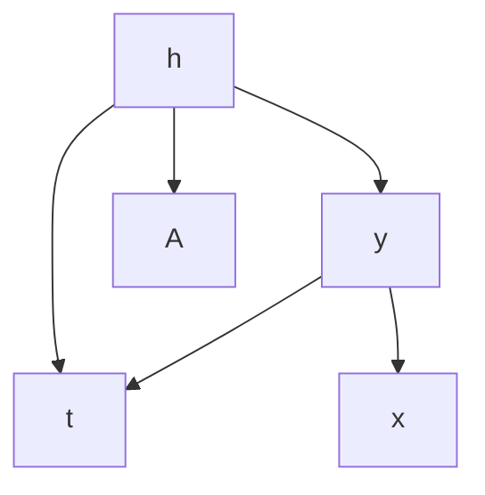
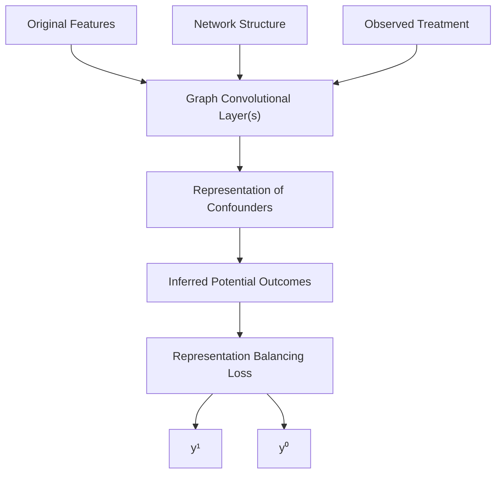
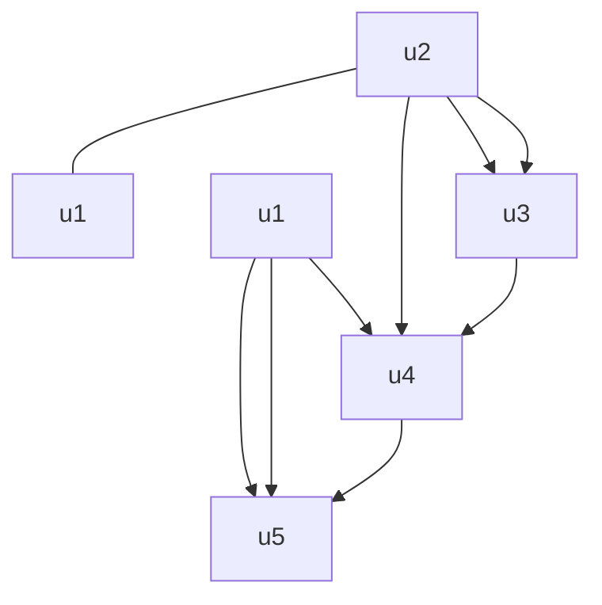
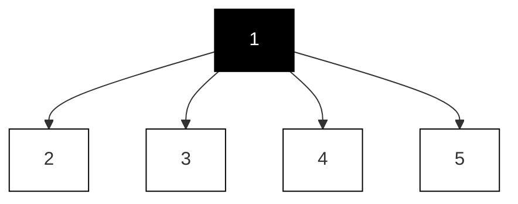
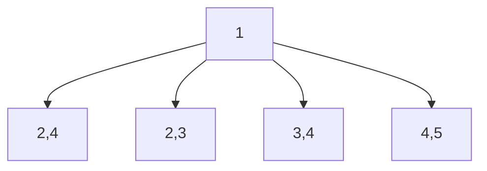
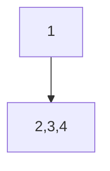
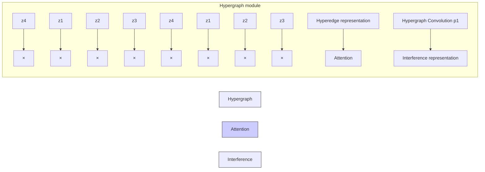

# Chapter 4 Causal Inference on Graphs

Jing Ma, Ruocheng Guo, and Jundong Li

## 4.1 Overview of Causal Inference on Graphs

Graph (i.e., network) is a ubiquitous and indispensable tool to model various systems in the real world that consist of interconnected units, such as social networks [5], road networks [19], collaboration networks [49], biological networks [28], and knowledge graphs [72]. The nature of graphs enables us to analyze and understand these complex systems in a more intuitive and efficient way. As such, learning on graphs is important for scientists, engineers, and other professionals across a broad range of disciplines. In recent years, there has been a significant advancement in the field of graph-related learning and analysis, particularly in high-impact areas that are driven by advanced graph neural networks (GNNs) [31, 67, 77, 84]. Despite the effectiveness of graph learning methods, many of them have been widely criticized for only capturing the superficial correlations between variables in the data system, and consequently, rendering the lack of trustworthiness in real-world applications. Therefore, it is of utmost importance to comprehend the causality present in the data system.

Causal inference is exactly the discipline that investigates the causality inside a system. Causal effect estimation, as one of the mainstream research tasks in causal

J. Ma Department of Computer Science, University of Virginia, Charlottesville, VA, USA e-mail: jm3mr@virginia.edu

R. Guo Bytedance AI Lab, London, UK e-mail: ruocheng.guo@bytedance.com

J. Li (-) Department of Electrical and Computer Engineering, Department of Computer Science, and School of Data Science, University of Virginia, Charlottesville, VA, USA e-mail: jl6qk@virginia.eduinference, plays an essential role in graph-related studies. As an example, in a physical contact network, to evaluate the effectiveness of face mask requirement policy in mitigating the spread of COVID-19, it is necessary to assess the causal effect of this policy on the spread of COVID-19 rather than the correlations between them. However, most traditional causal effect estimation studies rely on strong assumptions and focus on independent and identically distributed (i.i.d.) data, while causal effect estimation on graphs is faced with many unique barriers in effectiveness. But from another aspect, the relational information on graphs can also bring additional benefits for causal inference. Studies about causal inference on graphs have attracted significant attention recently [38], with a vast variety of applications across multiple domains such as economics [8], environmental science [51], healthcare [40, 47], and recommendation [14].

In this chapter, we introduce the motivation, background, and challenges of causal inference on graphs. More specifically, we focus on several related papers with the following topics: (1) Causal effect estimation with hidden confounders on static graphs. These studies leverage the static graph structure among units to reduce the confounding biases in estimating causal effects. (2) Causal effect estimation with hidden confounders on dynamic graphs. These works explore the causal effect estimation problem in a dynamic networked environment. (3) Causal effect estimation on hypergraphs. These studies estimate causal effects on hypergraphs. Hypergraph is a generalization of a conventional graph where an edge (or “hyperedge”) can connect any number of nodes and can therefore represent higher-order relational information. On top of the detailed introduction of these papers, we also summarize other related work and future research directions.

## 4.2 Causal Effect Estimation on Static Graphs

Traditional causal effect estimation studies [24, 58, 69] are mostly based on the strong ignorability assumption (a.k.a. unconfoundedness assumption) [56], which assumes that there do not exist unobserved confounders (i.e., hidden confounders). However, this assumption is often violated in the real world. For example, when estimating the treatment effect of taking a medicine on people’s health, the socioeconomic status of each person can be a confounding factor that affects both their choice of medicine and their health condition. However, socioeconomic status is often not explicitly observable. The unobserved confounders can often result in biased causal effect estimation. In recent years, various techniques [35, 70] have been proposed to weaken the strong ignorability assumption via capturing the unobserved confounders in a latent space. However, these methods still require the ability of extracting latent confounders from observational data features with neural networks or factor models.

Nevertheless, the significance of network structures in deconfounding has been largely overlooked, with few work recognizing its importance and leveraging it in treatment effect estimation. However, the graph topology among units is common in various types of observational data, including social networks of patients, electrical grids of power stations, and spatial networks of geometric objects. Furthermore, in those situations where confounders are difficult to measure, an alternative approach is to capture their patterns and control their impact by incorporating the network information. For example, a patient’s social network patterns can be indicative of her socioeconomic status. In this work, a method Network Deconfounder [20] is proposed to leverage the network structure as well as the observed features to minimize confounding bias in individual treatment effect (ITE) estimation. In this context, the graph structure and observed features are used as proxies for the hidden confounders.

## 4.2.1 Problem Definition

First, we define the causal effect we aim to estimate. Here, we adopt the Neyman– Rubin potential outcome framework [57]. We consider observational data from static networks, a.k.a. networked observational data, denoted by $( \{ \mathbf { x } _ { i } , t _ { i } , y _ { i } \} _ { i = 1 } ^ { n } , \mathbf { A } )$ where $\mathbf { X } _ { i } , t _ { i }$ and $y _ { i }$ =are the feature vector, observed treatment, and observed outcome (i.e., factual outcome) of individual (i.e., instance) i. Each instance is represented as a node in a static graph. The matrix $\mathbf { A } \in \{ 0 , 1 \} ^ { n \times n }$ denotes the adjacency matrix of the static network, where $\mathbf { A } _ { i , j } = 1 ( \mathbf { A } _ { i , j } = 0 )$ means there exists (does not exist) an edge between node i and j . For each node i and binary treatment t, there exists a potential outcome $y _ { i } ^ { t }$ for each treatment $t ~ \in ~ \{ 0 , 1 \}$ . Individual treatment effect (ITE) can be simply defined as $\tau _ { i } = y _ { i } ^ { 1 } - y _ { i } ^ { 0 }$ . In many cases, ITE is not identifiable due to the noise term in structural causal models [52]. However, identification is necessary before estimation can be done for any causal estimand, given the fact that a causal estimand always comes with dependencies on potential outcomes, which can include counterfactual outcomes that are not estimable from data by definition. Instead, when a series of assumptions hold, conditional average treatment effect (CATE) $E [ \tau _ { i } | \mathbf { x } ]$ becomes the widely used estimand, where the expectation is taken over all individuals sharing the same features x. With i.i.d. data, CATE is identifiable by the following assumptions:

• Stable unit treatment value assumption (SUTVA): First, it requires the outcome of any unit to be independent of the treatment assigned to other units, i.e., $y _ { i }$ only depends on $t _ { i }$ , regardless of $t _ { j } , \forall j \neq i$ . This assumption is often referred to as the no interference assumption. Second, it assumes that each treatment value means exactly the same thing to different units. For example, $t \ = \ 1$ cannot simultaneously mean taking one pill of aspirin per day for patient A and taking two pills of aspirin per day for patient B.

• Strong ignorability assumption: First, the potential outcomes are independent of the observed treatment, given that all the confounders are observed as features x, $\mathrm { i . e . , } y ^ { 1 } , y ^ { 0 } \perp t | \mathbf { x }$ . Second, the treatment assignment is not deterministic, i.e., the ground truth propensity score $P ( t | \mathbf { x } ) \in ( 0 , 1 )$ .

• Consistency assumption: the observed outcome is always equal to the corresponding potential outcome, i.e., $y _ { i } = y _ { i } ^ { 1 } { \mathrm { ~ i f ~ } } t _ { i } = 1 , y _ { i } = y _ { i } ^ { 0 } { \mathrm { ~ i f ~ } } t _ { i } = 0$ .

The nonparametric identification of CATE can be achieved with the aforementioned assumptions. However, treatment effect estimation in observational data of static networks can confront issues due to hidden confounders. Fortunately, in static network data, the network structure itself can often embed hidden confounders. For example, hidden confounders can be more easily captured by leveraging the homophily, i.e., similar users are more likely to be connected, which implies that the connected individuals in a social network are more similar w.r.t. their hidden confounders. This work proposes to utilize the network structure as proxies to learn representations of hidden confounders and then infer the treatment effects based on them. In this work, given the observational data of static networks $( \{ \mathbf { x } _ { i } , t _ { i } , y _ { i } \} _ { i = 1 } ^ { n } , \mathbf { A } )$ , the goal is to estimate the $\mathrm { I T E ^ { 1 } }$ defined as follows:

$$
\tau_ {i} = \tau (\mathbf {x} _ {i}, \mathbf {A}) = \mathbb {E} [ y _ {i} ^ {1} | \mathbf {x} _ {i}, \mathbf {A} ] - \mathbb {E} [ y _ {i} ^ {0} | \mathbf {x} _ {i}, \mathbf {A} ]. \tag {4.1}
$$

## 4.2.2 Proposed Method

Network Deconfounder [20] is based on a less stringent assumption compared to the strong ignorability assumption. It assumes that the features and the network structure are proxies for the hidden confounders. The assumed causal graph of Network Deconfounder is shown in Fig. 4.1. In the aforementioned example, it is often difficult to directly measure an individual’s socioeconomic status, but it is still possible to infer the socioeconomic status from observable characteristics such as age, occupation, residential area, and social connections. Based on this intuition, Network Deconfounder proposes to learn representations of hidden confounders, and make estimation for ITE from observational graph data. The overall workflow of Network Deconfounder is shown in Fig. 4.2.

Fig. 4.1 The causal diagram corresponding to the assumption of Network Deconfounder [20]: the network structure A and the observed features x are proxies of the hidden confounders h

Fig. 4.2 The workflow of Network Deconfounder [20]

## 4.2.2.1 Confounder Representation Learning

Network Deconfounder is the first work that utilizes the auxiliary network structure to improve confounder representation learning. Here, a representation learning function $g ( \cdot )$ maps the node features and the network structure into a d-dimensional latent space of confounders. In this way, a d-dimensional representation $\mathbf { z } _ { i }$ is learned for each node i to encode its confounders. The $g ( \cdot )$ function is parameterized with a graph convolutional network (GCN) [12, 30], which is an effective technique to handle graph-related tasks. More specifically, the confounder representation process can be formulated as:

$$
\mathbf {z} _ {i} = g (\mathbf {x} _ {i}, \mathbf {A}) = \sigma ((\hat {\mathbf {A}} \mathbf {X}) _ {i} \mathbf {U}), \tag {4.2}
$$

where $\hat { \bf A }$ denotes the normalized adjacency matrix, $( \hat { \mathbf { A } } \mathbf { X } ) _ { i }$ denotes the i-th row of the matrix product AXˆ , U is the weight matrix to be learned in GCN, and $\sigma$ stands for the ReLU activation function [17]. Specifically, $\tilde { \textbf { A } } = \textbf { A } + \mathbf { I } _ { n }$ and $\begin{array} { r } { \tilde { \mathbf { D } } _ { j , j } = \sum _ { j } \tilde { \mathbf { A } } _ { j , j } } \end{array}$ , the normalized adjacency matrix Aˆ can be calculated beforehand using the renormalization trick [30]: Aˆ D˜ − 12 A˜ D˜ − 12 . $\hat { \bf A } = \tilde { \bf D } ^ { - \frac { 1 } { 2 } } \tilde { \bf A } \tilde { \bf D } ^ { - \frac { 1 } { 2 } }$

## 4.2.2.2 Outcome Prediction

With the confounder representations, an output function $f : \mathbb { R } ^ { d } \times \{ 0 , 1 \} \to \mathbb { R }$ is used to predict potential outcomes. The function $f$ takes the representation of hidden confounders and a treatment as input to predict the corresponding potential outcome.

$$
f (\mathbf {z} _ {i}, t) = \left\{ \begin{array}{l} f _ {1} (\mathbf {z} _ {i}) \text {   if   } t = 1 \\ f _ {0} (\mathbf {z} _ {i}) \text {   if   } t = 0 \end{array} \right., \tag {4.3}
$$

where $f _ { 1 }$ and $f _ { 0 }$ are the output functions for treatment $t = 1$ and $t = 0$ .

Objective Function Due to the lack of counterfactual, we can only use the factual outcomes as supervision and minimize the error in the predicted factual outcomes: min $\textstyle { \frac { 1 } { n } } \sum _ { i = 1 } ^ { n } ( { \hat { y } } _ { i } ^ { t _ { i } } - y _ { i } ) ^ { 2 }$ .

Representation Balancing It is worth noting that minimizing the error in the factual outcomes $( y _ { i } )$ does not necessarily indicate that the error in the counterfactual outcomes $( y _ { i } ^ { C F } )$ is also minimized, as there is often a distribution shift problem between different treatment groups [27, 59]. Inspired by Shalit et al. [59], the error of inferring counterfactual outcomes is upperbounded by a combination of two factors: (1) the error of factual outcome predictions, and (2) an integral probability metric (IPM) [48] that quantifies the discrepancy between the distributions of confounder representations in the treatment and control groups. In other words, in order to improve our counterfactual inference, we must not only minimize errors in factual outcome predictions but also reduce the difference between the confounder distributions in the two groups. Let $P ( \mathbf { z } ) = P r ( \mathbf { z } | t _ { i } = 1 )$ and $Q ( \mathbf { z } ) = P r ( \mathbf { z } | t _ { i } = 0 )$ denote the distributions of confounder representations in different treatment groups, then $\rho _ { \mathcal { Z } } ( P , Q )$ denotes the IPM defined in a functional space $z .$ , which measures the difference between the two distributions of confounder representations. Network Deconfounder adopts a Wasserstein-1 distance [68] based metric to balance the representation distributions:

$$
\rho_ {\mathcal {Z}} (P, Q) = \inf _ {k \in \mathcal {K}} \int_ {\mathbf {z} \in \{\mathbf {z} _ {i} \} _ {i: t _ {i} = 1}} | | k (\mathbf {z}) - \mathbf {z} | | P (\mathbf {z}) d \mathbf {z} \tag {4.4}
$$

where $\mathcal { K } = \{ k | k : \mathbb { R } ^ { d }  \mathbb { R } ^ { d } s . t . \ Q ( k ( \mathbf { z } ) ) = P ( \mathbf { z } ) \}$ denotes the set of push-forward functions that can transform the representation distribution of the treated $\mathbf { \Xi } ( P ( \mathbf { z } ) )$ to that of the controlled $\mathbf { \Gamma } ( Q ( \mathbf { z } ) )$ .

Finally, the objective function of Network Deconfounder is:

$$
\mathcal {L} (\{\mathbf {x} _ {i}, t _ {i}, y _ {i} \} _ {i = 1} ^ {n}, \mathbf {A}) = \frac {1}{n} \sum_ {i = 1} ^ {n} (\hat {y} _ {i} ^ {t _ {i}} - y _ {i}) ^ {2} + \alpha \rho_ {\mathcal {Z}} (P, Q) + \lambda | | \boldsymbol {\Theta} | | _ {2} ^ {2}, \tag {4.5}
$$

where $\alpha$ and λ are hyperparameters to control the weights of the representation balancing term and a model parameter regularization term to avoid overfitting.

## 4.2.3 Experimental Evaluation

## 4.2.3.1 Dataset and Simulation

Obtaining the ground-truth treatment effects can be challenging, as it is often impossible to observe both potential outcomes for a given unit. Despite this limitation, it is essential to have benchmark datasets with ground-truth ITEs on networked observational data to evaluate different treatment effect estimation methods. To address this challenge, following a traditional routine of causal studies, Network Deconfounder is evaluated on semisynthetic datasets. Specifically, two benchmark graph datasets (BlogCatalog2 and ${ \mathrm { F l i c k r } } ^ { 3 }$ ) including real-world node features and graph structure are used. Based on these real-world graph data, treatment and outcome are simulated. More information of the datasets is shown in Table 4.1.

**Table 4.1 Dataset description [20]**

<table><tr><td></td><td>Nodes</td><td>Edges</td><td>Features</td><td> $\kappa_2$ </td><td>ATE mean</td><td>STD</td></tr><tr><td rowspan="3">BlogCatalog</td><td rowspan="3">5,196</td><td rowspan="3">173,468</td><td rowspan="3">2,173/8,189</td><td>0.5</td><td>4.366</td><td>0.553</td></tr><tr><td>1</td><td>7.446</td><td>0.759</td></tr><tr><td>2</td><td>13.534</td><td>2.309</td></tr><tr><td rowspan="3">Flickr</td><td rowspan="3">7,575</td><td rowspan="3">239,738</td><td rowspan="3">1,210/12,047</td><td>0.5</td><td>6.672</td><td>3.068</td></tr><tr><td>1</td><td>8.487</td><td>3.372</td></tr><tr><td>2</td><td>20.546</td><td>5.718</td></tr></table>

The treatment is simulated as follows:

$$
P r (t = 1 | \mathbf {x} _ {i}, \mathbf {A}) = \frac {\exp (p _ {1} ^ {i})}{\exp (p _ {1} ^ {i}) + \exp (p _ {0} ^ {i})};
$$

$$
\begin{array}{l} p _ {1} ^ {i} = \kappa_ {1} r (\mathbf {x} _ {i}) ^ {\top} r _ {1} ^ {c} + \kappa_ {2} \sum_ {j \in \mathcal {N} (i)} r (\mathbf {x} _ {j}) ^ {\top} r _ {1} ^ {c} \\ = \kappa_ {1} r (\mathbf {x} _ {i}) ^ {\top} r _ {1} ^ {c} + \kappa_ {2} (\mathbf {A} r (\mathbf {x} _ {j})) ^ {\top} r _ {1} ^ {c}; \tag {4.6} \\ \end{array}
$$

$$
p _ {0} ^ {i} = \kappa_ {1} r (\mathbf {x} _ {i}) ^ {\top} r _ {0} ^ {c} + \kappa_ {2} \sum_ {j \in \mathcal {N} (i)} r (\mathbf {x} _ {j}) ^ {\top} r _ {0} ^ {c}
$$

$$
= \kappa_ {1} r (\mathbf {x} _ {i}) ^ {\top} r _ {0} ^ {c} + \kappa_ {2} (\mathbf {A} r (\mathbf {x} _ {j})) ^ {\top} r _ {0} ^ {c},
$$

where $\kappa _ { 1 } , \kappa _ { 2 } \geq 0$ signify the magnitude of the confounding bias from one unit itself and its neighbors, respectively. $N ( i )$ is the set of neighbors for the i-th node on the graph. $r ( \mathbf { x } _ { i } )$ represents the i-th node’s confounders. $r _ { 0 } ^ { c }$ and $r _ { 1 } ^ { c }$ denote the centroid of the confounders in the control group and treatment group, respectively. Then factual and counterfactual outcomes are simulated as:

$$
y ^ {F} (\mathbf {x} _ {i}) = y _ {i} = C (p _ {0} ^ {i} + t _ {i} p _ {1} ^ {i}) + \epsilon ; \tag {4.7}
$$

$$
y ^ {C F} (\mathbf {x} _ {i}) = C [ p _ {0} ^ {i} + (1 - t _ {i}) p _ {1} ^ {i} ] + \epsilon , \tag {4.8}
$$

where C is a scaling factor. The noise term is sampled as $\epsilon \sim { \cal N } ( 0 , 1 )$ .

## 4.2.3.2 Metrics

Two widely used evaluation metrics are used in the experiments, including the Rooted Precision in Estimation of Heterogeneous Effect $( \sqrt { \epsilon _ { P E H E } } )$ [24] and Mean Absolute Error on ATE $( \epsilon _ { A T E } )$ [76].

$$
\sqrt {\epsilon_ {P E H E}} = \sqrt {\frac {1}{n} \sum_ {i = 1} (\hat {\tau} _ {i} - \tau_ {i}) ^ {2}}, \tag {4.9}
$$

$$
\epsilon_ {A T E} = | \frac {1}{n} \sum_ {i = 1} (\hat {\tau} _ {i}) - \frac {1}{n} \sum_ {i = 1} (\tau_ {i}) |,
$$

where $\hat { \tau } _ { i } = \hat { y } _ { i } ^ { 1 } - \hat { y } _ { i } ^ { 0 }$ and $\tau _ { i } = y _ { i } ^ { 1 } - y _ { i } ^ { 0 }$ denote the predicted ITE and the ground-truth ITE for the i-th instance, respectively.

## 4.2.3.3 ITE Estimation Performance

The comparison between Network Deconfounder and other state-of-the-art baselines is shown in Table 4.2. From the table we observe that: (1) Network Deconfounder consistently outperforms the state-of-the-art baseline methods on different datasets under various settings. (2) With the ability of capturing the patterns of hidden confounders from the graph structure, Network Deconfounder suffers the least when the influence of hidden confounders grows (from $\kappa _ { 2 } = 0 . 5 \mathrm { t o } \kappa _ { 2 } = 2 )$ .

## 4.3 Causal Effect Estimation on Dynamic Graphs

As mentioned above, in graphs, the graph topology can serve as a source of proxies for hidden confounders. However, most existing studies [20, 22] overwhelmingly assume that the observational graph data and the hidden confounders are static. In fact, all variables are naturally dynamic in many real-world occasions. For example, when estimating the treatment effect of wearing a face mask on COVID-19 infection, the residents’ vigilance may be a hidden confounder, which cannot be explicitly measured, but it may be reflected in residents’ mobility network. Noticeably, as time goes on, the mobility network, the face mask practice, the COVID-19 infection risk, and the residents’ vigilance are all time-varying at different time periods. In this case, the residents’ vigilance can be influenced by the situation in previous time periods. For example, the recent number of death cases would affect people’s vigilance in next a few days. Another typical example is in a recommender system, when estimating the causal effect of seeing an ad campaign on users’ purchase, users’ preferences can be hidden confounders, which influence both the ad campaigns they have seen and their purchase. Although users’ preferences are hard to be directly measured, they can still be inferred from users’ social network and other activities. However, users’ purchasing preferences evolve over time, shaped by their previous choices and products recommended to them. Additionally, their current preferences also affect their current profiles and social connections. In these scenarios, it is important to study the problem of deconfounding with observational graph data in a time-varying environment.

**Table 4.2 Comparison between Network Deconfounder and the state-of-the-art baselines in ITE estimation performance [20]**

<table><tr><td colspan="7">BlogCatalog</td></tr><tr><td> $\kappa_2$ </td><td colspan="2">0.5</td><td colspan="2">1</td><td colspan="2">2</td></tr><tr><td></td><td> $\sqrt{\epsilon_{PEHE}}$ </td><td> $\epsilon_{ATE}$ </td><td> $\sqrt{\epsilon_{PEHE}}$ </td><td> $\epsilon_{ATE}$ </td><td> $\sqrt{\epsilon_{PEHE}}$ </td><td> $\epsilon_{ATE}$ </td></tr><tr><td>NetDeconf</td><td>4.532</td><td>0.979</td><td>4.597</td><td>0.984</td><td>9.532</td><td>2.130</td></tr><tr><td>CFR-Wass</td><td>10.904</td><td>4.257</td><td>11.644</td><td>5.107</td><td>34.848</td><td>13.053</td></tr><tr><td>CFR-MMD</td><td>11.536</td><td>4.127</td><td>12.332</td><td>5.345</td><td>34.654</td><td>13.785</td></tr><tr><td>TARNet</td><td>11.570</td><td>4.228</td><td>13.561</td><td>8.170</td><td>34.420</td><td>13.122</td></tr><tr><td>CEVAE</td><td>7.481</td><td>1.279</td><td>10.387</td><td>1.998</td><td>24.215</td><td>5.566</td></tr><tr><td>Causal forest</td><td>7.456</td><td>1.261</td><td>7.805</td><td>1.763</td><td>19.271</td><td>4.050</td></tr><tr><td>BART</td><td>4.808</td><td>2.680</td><td>5.770</td><td>2.278</td><td>11.608</td><td>6.418</td></tr><tr><td colspan="7">Flickr</td></tr><tr><td></td><td> $\sqrt{\epsilon_{PEHE}}$ </td><td> $\epsilon_{ATE}$ </td><td> $\sqrt{\epsilon_{PEHE}}$ </td><td> $\epsilon_{ATE}$ </td><td> $\sqrt{\epsilon_{PEHE}}$ </td><td> $\epsilon_{ATE}$ </td></tr><tr><td>NetDeconf</td><td>4.286</td><td>0.805</td><td>5.789</td><td>1.359</td><td>9.817</td><td>2.700</td></tr><tr><td>CFR-Wass</td><td>13.846</td><td>3.507</td><td>27.514</td><td>5.192</td><td>53.454</td><td>13.269</td></tr><tr><td>CFR-MMD</td><td>13.539</td><td>3.350</td><td>27.679</td><td>5.416</td><td>53.863</td><td>12.115</td></tr><tr><td>TARNet</td><td>14.329</td><td>3.389</td><td>28.466</td><td>5.978</td><td>55.066</td><td>13.105</td></tr><tr><td>CEVAE</td><td>12.099</td><td>1.732</td><td>22.496</td><td>4.415</td><td>42.985</td><td>5.393</td></tr><tr><td>Causal forest</td><td>8.104</td><td>1.359</td><td>14.636</td><td>3.545</td><td>26.702</td><td>4.324</td></tr><tr><td>BART</td><td>4.907</td><td>2.323</td><td>9.517</td><td>6.548</td><td>13.155</td><td>9.643</td></tr></table>

For this problem, a dynamic graph neural network–based framework DNDC [41] has been proposed to estimate causal effects under a dynamic networked environment. Generally, DNDC learns representations of confounders at each time period by encoding the dynamic graph data (including the current graph and historical information) into the representation space. DNDC systematically models the evolution patterns of different data modalities for unbiased ITE estimation. Specifically, DNDC uses a recurrent neural network (RNN) [25, 46] to capture the temporal information, and adopts a graph convolutional network (GCN) [31] based module to handle the relational information. ITE estimation in a dynamic network has a wide range of applications, such as epidemiology, economics, and recommendation across different time periods.

## 4.3.1 Problem Definition

Suppose a dataset with time-evolving networked observational data across $T$ different time periods is given, denoted by $\{ \mathbf { X } ^ { t } , \mathbf { A } ^ { t } , \mathbf { C } ^ { t } , \mathbf { Y } ^ { t } \} _ { t = 1 } ^ { T }$ . Here, units (instances) are connected as nodes in a dynamic network, and $( \cdot ) ^ { t }$ denotes the t -th time period. $\mathbf { X } ^ { t } ~ = ~ \{ \mathbf { x } _ { 1 } ^ { t } , \ldots , \mathbf { x } _ { n ^ { t } } ^ { t } \}$ stands for the node attributes (features) at time period t . $\mathbf { x } _ { i } ^ { t }$ represents the node features of the i-th instance (e.g., user profile), $n ^ { t }$ is the number of nodes, and $\mathbf { A } ^ { t }$ is the adjacency matrix of the network (e.g., users’ social network). For simplicity, the network is assumed to be undirected and unweighted, but this work can be naturally extended to more general cases such as directed and weighted networks. At time period t, the treatment for these $n ^ { t }$ nodes is denoted by $\mathbf { C } ^ { t } ~ = ~ \{ c _ { 1 } ^ { t } , \ldots , c _ { n ^ { t } } ^ { t } \}$ , where $c _ { i } ^ { t }$ is either 1 or 0 (e.g., if a user has received the recommendation from a specific ad campaign or not). The observed outcome of all instances at time period t is denoted by $\mathbf { Y } ^ { t } ~ = ~ \{ y _ { 1 } ^ { t } , \ldots , y _ { n ^ { t } } ^ { t } \}$ (e.g., users’ purchase). $\mathbf Z ^ { t } ~ = ~ \{ \mathbf z _ { 1 } ^ { t } , \ldots , \mathbf z _ { n ^ { t } } ^ { t } \}$ stands for the hidden confounders (e.g., users’ preferences). The superscript $\dot { ( \cdot ) } ^ { < t }$ denotes the historical data before time period t. For example, all the node features before time period t can be referred to as $\mathbf { X } ^ { < t } =$ $\{ \mathbf { X } ^ { 1 } , \mathbf { X } ^ { 2 } , \ldots , \mathbf { X } ^ { t - 1 } \}$ , and $\mathbf { C } ^ { < t } , \mathbf { A } ^ { < t }$ are defined similarly. $\mathbf { H } ^ { t } \ = \ \{ \mathbf { X } ^ { < t } , \mathbf { A } ^ { < t } , \mathbf { C } ^ { < t } \}$ denotes all the historical data before time period t. This work is based on the potential outcome framework [50, 56]. The potential outcome of the i-th node under treatment $c$ at time period t is denoted by $y _ { c , i } ^ { t } \in \mathbb { R }$ , which is the outcome that would occur if instance i had received treatment c at time period t. We represent the potential outcomes of all instances at time period t by $\mathbf { Y } _ { 1 } ^ { t } = \{ y _ { 1 , 1 } ^ { t } , \ldots , y _ { 1 , n ^ { t } } ^ { t } \}$ and $\mathbf { Y } _ { 0 } ^ { t } = \{ y _ { 0 , 1 } ^ { t } , \dots , y _ { 0 , n ^ { t } } ^ { t } \}$ . Then the individual treatment effect (ITE) on time-varying observational graph data can be defined as:

$$
\tau_ {i} ^ {t} = \tau^ {t} (\mathbf {x} _ {i} ^ {t}, \mathbf {H} ^ {t}, \mathbf {A} ^ {t}) = \mathbb {E} [ y _ {1, i} ^ {t} - y _ {0, i} ^ {t} | \mathbf {x} _ {i} ^ {t}, \mathbf {H} ^ {t}, \mathbf {A} ^ {t} ]. \tag {4.10}
$$

Based on the above definition of ITE, the average treatment effect (ATE) at time period t is defined as $\begin{array} { r } { \tau _ { A T E } ^ { t } = \frac { 1 } { n ^ { t } } \sum _ { i = 1 } ^ { n ^ { t } } \tau _ { i } ^ { t } } \end{array}$ .

=  The studied problem of learning ITE with dynamic observational graph data is defined as follows:

Definition 4.1 (Learning ITE on Dynamic Observational Graph Data) Given the dynamic observational graph data $\{ \mathbf { X } ^ { t } , \mathbf { A } ^ { t } , \mathbf { C } ^ { t } , \mathbf { Y } ^ { t } \} _ { t = 1 } ^ { T }$ across T different time periods, the goal is to estimate the ITE $\tau _ { i } ^ { t }$ for each instance i at each time period t .

## 4.3.2 Proposed Method

A framework DNDC [41] is proposed for ITE estimation in dynamic networked data. The overall structure of DNDC, as shown in Fig. 4.3, is composed of three key elements: confounder representation learning, potential outcome and treatment prediction, and representation balancing. The DNDC model captures hidden confounders over time by mapping current networked observational data and historical information into a latent representation space. The learned representations are then used for predicting potential outcomes and treatments. To ensure the balance between the representations of hidden confounders in the treatment group and the control group, an adversarial learning-based balancing technique is developed.

```mermaid
graph TD
    subgraph Time_t
  A["Graph Embedding X₁^t, X₂^t, X₃^t"] --> B["Graph Embedding"]
  B --> C["Z^t"]
  C --> D["GRU layer"]
  D --> E["H^t"]
  E --> F["attention layer"]
  F --> G["\tilde{H}^t"]
    end

    subgraph Time_t_1["Time_t+1"]
  H["Graph Embedding X₁^t, X₂^t, X₃^t"] --> I["Z^t"]
  I --> J["GRU layer"]
  J --> K["H^t"]
  K --> L["attention layer"]
  L --> M["\tilde{H}^t"]
    end

    subgraph Prediction_t
  N["potential outcome prediction"] --> O["\hat{Y}^t"]
  O --> P["ITE estimation"]
  Q["treatment prediction"] --> R["gradient reversal layer"]
        S["\check{C}^t"]
    end

    subgraph Prediction_t_1["Prediction_t+1"]
  T["potential outcome prediction"] --> U["\hat{Y}^{t+1}"]
  U --> V["ITE estimation"]
  W["treatment prediction"] --> X["gradient reversal layer"]
        Y["\check{C}^{t+1}"]
    end

    style Time_t fill:#f9f,stroke:#333
    style Time_t+1 fill:#ccf,stroke:#333
```

Fig. 4.3 An illustration of the framework DNDC [41]

## 4.3.2.1 Confounder Representation Learning

As the hidden confounders are related to the node features and graph structure, as well as the historical information, DNDC leverages them in confounder representation learning. More specifically, to well handle the graph data, graph convolutional networks (GCNs) [31] are used in this process:

$$
\mathbf {z} _ {i} ^ {t} = g (([ \mathbf {X} ^ {t}, \tilde {\mathbf {H}} ^ {t - 1} ]) _ {i}, \mathbf {A} ^ {t}) = \hat {\mathbf {A}} ^ {t} \mathrm{ReLU} ((\hat {\mathbf {A}} ^ {t} [ \mathbf {X} ^ {t}, \tilde {\mathbf {H}} ^ {t - 1} ]) _ {i} \mathbf {U} _ {0}) \mathbf {U} _ {1}, \tag {4.11}
$$

where $g ( \cdot )$ is a learnable transformation function parameterized by GCNs. In the above equation, two GCN layers (with parameters $\mathbf { U } _ { 0 }$ and $\mathbf { U } _ { 1 }$ , respectively) are stacked to capture the nonlinear dependency between the hidden confounders and the input, but the framework itself does not have any restriction regarding the number of GCN layers. To leverage the data in previous time periods, a historical embedding $\tilde { { \bf H } } ^ { t - 1 } \doteq \mathbb { R } ^ { n ^ { t } \times d _ { h } }$ is learned to encode the historical information before time period t, including previous hidden confounders and treatment assignment. $d _ { h }$ is the dimension of historical embedding. Here, , stands for the concatenation operation and $( \cdot ) _ { i }$ represents the i-th row of the matrix. $\mathbf { z } _ { i } ^ { t } ~ \in ~ \mathbb { R } ^ { d _ { z } }$ denotes the representation of confounders for instance i at time period $t , d _ { z }$ is the dimension of confounder representation. $\hat { \mathbf { A } } ^ { t }$ is the normalized adjacency matrix computed from $\mathbf { A } ^ { t }$ with the re-normalization trick [31].

To enable the historical embedding to characterize the evolution patterns of dynamic networked data, a gated recurrent unit (GRU) [10] based memory unit is used. Specifically, in the GRU, the current information $( \mathbf { Z } ^ { t } , \mathbf { X } ^ { t } , \mathbf { C } ^ { t } )$ and previous hidden state $\mathbf { H } ^ { t - 1 }$ are embedded into a new hidden state $\mathbf { H } ^ { t } \ \in \ \mathbb { R } ^ { n ^ { t } \times d _ { h } } \colon \mathbf { H } ^ { t } \ =$ $\mathrm { G R U } ( \mathbf { H } ^ { t - 1 } , [ \mathbf { Z } ^ { t } , \mathbf { X } ^ { t } , \mathbf { C } ^ { t } ] )$ . An attention mechanism [37, 66] among different hidden states of GRU is adopted to model the importance of the historical influence from different time periods. For any node with hidden state $\mathbf { h } ^ { t } \in \mathbb { R } ^ { d _ { h } }$ at time period t , the attention weight $\alpha _ { t , s }$ that models the importance of the hidden states of GRU from time period s on those of time period t $\mathit { \Omega } \cdot \mathit { \Omega } ( s < t )$ can be calculated with different attention score functions $( \mathrm { e . g . , }$ , bilinear [37] function or the scaled dot product [66] $\mathbf { h } ^ { t }$ $\mathbf { h } ^ { s }$ $\begin{array} { r } { \tilde { \mathbf { h } } ^ { t } = \mathrm { M L P } ( [ \mathbf { h } ^ { t } , \sum _ { s = 1 } ^ { t - 1 } \alpha _ { t , s } \mathbf { h } ^ { s } ] ) } \end{array}$ $\tilde { \mathbf { H } } ^ { t }$ with all instances.

## 4.3.2.2 Outcome and Treatment Prediction

Based on the learned confounder representations, DNDC predicts the potential outcome with two learnable functions $f _ { 1 } , f _ { 0 } : \mathbb { R } ^ { d _ { z } }  \mathbb { R }$ , corresponding to the two cases when treatment is 1 or 0, i.e., $\hat { y } _ { 1 , i } ^ { t } = f _ { 1 } ( \mathbf { z } _ { i } ^ { t } ) , \ \hat { y } _ { 0 , i } ^ { t } = f _ { 0 } ( \mathbf { z } _ { i } ^ { t } )$ . For each instance i, both of its factual outcome $y _ { F , i } ^ { t }$ and counterfactual outcome $y _ { C F , i } ^ { t }$ (unobserved outcome with the treatment different from reality) are predicted. The loss function of the potential outcome prediction is formulated as:

$$
\mathcal {L} _ {y} = \mathbb {E} _ {t \in [ T ], i \in [ n ^ {t} ]} [ (\hat {y} _ {F, i} ^ {t} - y _ {F, i} ^ {t}) ^ {2} ]. \tag {4.12}
$$

To better learn the confounder representations, DNDC also uses treatment as supervision. The loss function of treatment prediction is:

$$
\mathcal {L} _ {c} = - \mathbb {E} _ {t \in [ T ], i \in [ n ^ {t} ]} \left[ \left(c _ {i} ^ {t} \log \left(\hat {s} _ {i} ^ {t}\right) + \left(1 - c _ {i} ^ {t}\right) \log \left(1 - \hat {s} _ {i} ^ {t}\right)\right) \right]. \tag {4.13}
$$

The treatment predictor takes confounder representations as input. It is implemented with an MLP module and a softmax layer. $\hat { s } _ { i } ^ { t }$ is the output of the softmax layer, which can be considered as the prediction of propensity score for instance i at time period $t \colon \hat { s } _ { i } ^ { t } = \operatorname { s o f t m a x } ( \mathrm { M L P } ( \mathbf { z } _ { i } ^ { t } ) )$ .

## 4.3.2.3 Representation Balancing

As mentioned above, it has been shown that minimizing the discrepancy between the confounder representation distribution of the treatment group and that of the control group can benefit causal effect estimation [58]. DNDC uses a gradient reversal layer [16] for representation balancing. The gradient reversal layer does not change the input during forward-propagation, but during back-propagation, it reverses the gradient by multiplying it by a negative scalar. In this way, the gradient reversal layer can (1) train the treatment predictor by minimizing the treatment prediction loss $\mathcal { L } _ { c } ;$ and (2) enable representation balancing via maximizing $\mathcal { L } _ { c }$ w.r.t. the model parameters of the confounder representation learning.

## 4.3.2.4 Loss Function

The overall loss function is formulated as follows:

$$
\mathcal {L} \{\{\mathbf {x} _ {i} ^ {t}, y _ {i} ^ {t}, c _ {i} ^ {t} \} _ {1} ^ {n ^ {t}}, \mathbf {A} ^ {t} \} _ {1} ^ {T} = \mathcal {L} _ {y} + \beta \mathcal {L} _ {c} + \gamma | | \boldsymbol {\Theta} | | ^ {2}, \tag {4.14}
$$

where Θ is the set of parameters in this framework, and $| | \Theta | | ^ { 2 }$ is a regularization term. $\beta , \gamma$ are the hyperparameters to control the weight for treatment prediction and model regularization, respectively.

## 4.3.3 Experimental Evaluation

## 4.3.3.1 Dataset and Simulation

As it is notoriously hard to obtain the ground-truth causal models on real-world datasets, the evaluation is conducted on semisynthetic datasets with real-world graphs (including three datasets Flickr, BlogCatalog, and PeerRead4 ). In the simulation, the confounders are generated as follows:

$$
\mathbf {z} _ {i} ^ {t} = \left(\frac {1}{\sum_ {k = 1} ^ {3} \lambda_ {k}}\right) (\lambda_ {1} \boldsymbol {\psi} _ {i} ^ {t} + \lambda_ {2} \sum_ {u \in \mathcal {N} (i)} f (\mathbf {x} _ {u} ^ {t}) + \lambda_ {3} f (\mathbf {x} _ {i} ^ {t})) + \epsilon^ {t}, \tag {4.15}
$$

$$
\psi_ {i, j} ^ {t} = \frac {1}{p} \left(\sum_ {r = 1} ^ {p} \alpha_ {r, j} z _ {i, j} ^ {t - r} + \sum_ {r = 1} ^ {p} \beta_ {r} c _ {i} ^ {t - r}\right), \tag {4.16}
$$

where $\mathbf { z } _ { i } ^ { t }$ denotes the hidden confounders of instance i at time period t. ${ \boldsymbol { \psi } } _ { i } ^ { t }$ i denotes the historical information which influences the current confounders. zti,j $z _ { i , j } ^ { t }$ and $\psi _ { i , j } ^ { t }$ represent the j -th dimension of $\mathbf { z } _ { i } ^ { t }$ and ${ \boldsymbol { \psi } } _ { i } ^ { t }$ , respectively. N(i) denotes the neighboring nodes of node i at the current time period. $\epsilon ^ { t }$ is a random noise term. $f ( \cdot )$ is a transformation function. Here, $\alpha _ { r , j } \sim N ( 1 - ( r / p ) , ( 1 / p ) ^ { 2 } )$ i s a parameter which controls the influence of previous confounders at the time period $t - r$ on the current confounders. $\beta _ { r } \sim \mathcal { N } ( 0 , 0 . 0 2 ^ { 2 } )$ controls the influence of previous treatment at the time period $t \mathrm { ~ - ~ } r$ on the current confounders. $p$ is set to 3 by default. The parameters $\lambda _ { 1 } , \lambda _ { 2 }$ , and $\lambda _ { 3 }$ control the impact of historical information, current network structure, and current features on the confounders, respectively. The treatment and outcome are simulated in a similar way as introduced in Sect. 4.2.3.

Fig. 4.4 Performance comparison between DNDC and baselines under different settings of historical information influence [41]

## 4.3.3.2 ITE Estimation Performance Under Varying Influence from Historical Information

To investigate the performance of DNDC under different levels of influence from historical information on confounders, an experiment is designed with varying $\lambda _ { 1 }$ and fixed $\lambda _ { 2 }$ and $\lambda _ { 3 }$ . Figure 4.4 shows the comparison of the ITE estimation performance between DNDC and other baselines. Generally speaking, we observe that DNDC consistently outperforms all the baselines with lower $\sqrt { \epsilon _ { P E H E } }$ and $\epsilon _ { A T E }$ . When $\lambda _ { 1 } ~ = ~ 0$ , the historical information has no impact on the current confounders. In this case, DNDC and Network Deconfounder (NetDeconf) [20] achieve the best performance because of their capability of utilizing the network structure. When $\lambda _ { 1 }$ increases, the current ITE estimation relies more on historical information, while other baselines without consideration of historical information fail in this scenario. But DNDC is stably better as it leverages historical information.

## 4.3.3.3 ITE Estimation Performance Under Varying Influence from Network Structure

To evaluate DNDC in leveraging the relational information in graphs, an experiment with different values of $\lambda _ { 2 }$ but fixed values of $\lambda _ { 1 }$ and $\lambda _ { 3 }$ is conducted. As shown in Fig. 4.5, when $\lambda _ { 2 } ~ = ~ 0$ , the hidden confounders are independent of the graph structure, in this case, NetDeconf loses its superiority over other baselines. But DNDC can still achieve better ITE estimation by capturing the historical influence on the hidden confounders at the current time period. When $\lambda _ { 2 }$ increases, the confounder representation learning component in DNDC captures the confounders buried in the graph structure and achieves better ITE estimation performance.

Fig. 4.5 Performance comparison between DNDC and baselines under different settings of network structure influence [41]

## 4.4 Causal Effect Estimation on Hypergraphs

Classic causal effect estimation is based on the Stable Unit Treatment Value (SUTVA) assumption that there is no interference (i.e., spillover effect) among different units, requiring that the treatment of one unit does not impact the outcome of another unit. However, this assumption can be unrealistic in real-world scenarios, especially in interconnected systems like graphs. For instance, an individual’s risk of COVID-19 infection can be affected by the face-covering practices of others in their contact network. Failure to account for these interdependencies can lead to flawed estimations of causal effects.

Recently, there have been many efforts aiming to tackle the problem of causal effect estimation under interference. Most existing studies addressing this problem [2, 4, 26, 32, 39, 64, 65, 81] assume the interference only occurs between pairs of units on ordinary graphs (as shown in Fig. 4.6b). While the conventional pairwise interactions in graphs are widely used and applicable to a variety of settings, such as person-to-person physical contact or social networks, they fall short in capturing the intricacies of group interactions, where each interaction can involve more than just two individuals [3, 15, 79]. Hypergraphs can be introduced to address this limitation. Unlike ordinary edges, which connect only two nodes, a hyperedge can connect an arbitrary number of nodes (as shown in Fig. 4.6a), reflecting the nature of group interactions. Consider a hypergraph example that individuals are connected via inperson social events, each mass gathering event can be represented as a hyperedge. In a hypergraph, high-order interference may exist. For instance, in a gathering event represented by a hyperedge, an individual’s risk of COVID-19 infection can be influenced not only by direct first-order interference from others within the event, but also by indirect high-order interference resulting from the interactions among attendees, as shown in Fig. 4.6c. It is important to handle the high-order interference that exists on hypergraphs.

u2
u3
u1
u4
u5

(a). Hypergraph

(b). Ordinary graph

2nd-order

3rd-order  
(c). First, second, and third-order interferences with $u _ { 1 }$  
Fig. 4.6 Hypergraph, ordinary graph, and interferences [43]. (a) An example of a hypergraph; (b) An ordinary graph projected from this hypergraph; (c) Interferences with node $u _ { 1 }$ from its neighbors on the hypergraph

To address this challenge, a framework HyperSCI [43] is proposed for treatment effect estimation under high-order interference in hypergraphs. At its core, this framework controls for confounders and models high-order interference through representation learning. HyperSCI leverages a hypergraph neural network to effectively capture the interference patterns by learning interference representations and using an attention mechanism to model the relative importance of each unit within each hyperedge. These hypergraph neural network technologies equip HyperSCI with both high accuracy and computational efficiency.

## 4.4.1 Problem Definition

Definition 4.2 (Hypergraph) A hypergraph ${ \mathcal { H } } = \{ { \mathcal { V } } , { \mathcal { E } } \}$ consists of a set of n nodes $\mathcal { V } = \{ v _ { i } \} _ { i = 1 } ^ { n }$ and a set of m hyperedges $\mathcal { E } = \{ \mathbf { e } _ { k } \} _ { k = 1 } ^ { m }$ . Each hyperedge can connect any number of nodes.

In the studied problem, the given observational data are denoted by X, , T, Y . Here, $\mathbf { X } = \{ \mathbf { x } _ { i } \} _ { i = 1 } ^ { n } , \mathbf { T } = \{ t _ { i } \} _ { i = 1 } ^ { n }$ and $\mathbf { Y } = \{ y _ { i } \} _ { i = 1 } ^ { n }$ represent node features, treatment assignments, and observed outcomes, respectively. $\textbf { H } = \ \{ h _ { i , e } \} \ \in \ \mathbb { R } ^ { n \times m }$ is an incidence matrix for hypergraph H. Here, $h _ { i , e } ~ = ~ 1$ if node i is in hyperedge e, otherwise $h _ { i , e } ~ = ~ 0$ . The treatment assignment for each node is binary (i.e., $t _ { i } \in \{ 0 , 1 \} )$ .

Definition 4.3 (Potential Outcome) The potential outcome [55] of the unit i (denoted by $y _ { i } ^ { 1 }$ or $y _ { i } ^ { 0 } )$ is defined as the outcome which would be realized for unit i under treatment $t _ { i } ~ = ~ 1$ or $t _ { i } ~ = ~ 0$ . These potential outcomes can be obtained via a transformation function $Y _ { i } ^ { T _ { i } } ~ = ~ \Phi _ { Y } ( T _ { i } , X _ { i } , T _ { - i } , X _ { - i } , { \cal H } )$ . Here, $\Phi _ { Y }$ i s a (nondeterministic) function, i $. . . , y _ { i } ^ { t _ { i } } = \Phi _ { Y } ( t _ { i } , \mathbf { x } _ { i } , \mathbf { T } _ { - i } , \mathbf { X } _ { - i } , \mathbf { H } )$ , where $( \cdot ) _ { - i }$ denotes all other nodes on except i.

This work aims to estimate ITE in a hypergraph. Based on the above definition, the ITE in the studied problem is defined as follows:

Definition 4.4 For each node i on the hypergraph $\mathcal { H } ,$ the individual treatment effect (ITE) is defined by the difference between potential outcomes corresponding to $t _ { i } = 1$ and $t _ { i } = 0 $ :

$$
\begin{array}{l} \tau (\mathbf {x} _ {i}, \mathbf {T} _ {- i}, \mathbf {X} _ {- i}, \mathbf {H}) = \mathbb {E} [ Y _ {i} ^ {1} - Y _ {i} ^ {0} | X _ {i} = \mathbf {x} _ {i}, T _ {- i} = \mathbf {T} _ {- i}, X _ {- i} = \mathbf {X} _ {- i}, H = \mathbf {H} ] \\ = \mathbb {E} [ \Phi_ {Y} (1, \mathbf {x} _ {i}, \mathbf {T} _ {- i}, \mathbf {X} _ {- i}, \mathbf {H}) - \Phi_ {Y} (0, \mathbf {x} _ {i}, \mathbf {T} _ {- i}, \mathbf {X} _ {- i}, \mathbf {H}) ]. \tag {4.17} \\ \end{array}
$$

## 4.4.2 Proposed Method

HyperSCI [43] is a framework proposed to address the studied problem. As shown in Fig. 4.7, this framework contains three components: confounder representation learning, interference modeling, and outcome prediction.

## 4.4.2.1 Confounder Representation Learning

HyperSCI learns representations of confounders by mapping the node features $\mathbf { x } _ { i }$ into a latent space with a multilayer perceptron (MLP) module, i.e., $\mathbf { z } _ { i } = \mathbf { M L P } ( \mathbf { x } _ { i } )$ . The confounder representations for all the nodes are denoted by Z = {zi} ni 1. $\mathbf { Z } ~ = ~ \{ \mathbf { z } _ { i } \} _ { i = 1 } ^ { n }$ =Similar as [58], a Wasserstein-1 distance [68] based representation balancing method is used to minimize the distance between the representation distributions of the treatment group and control group.

```mermaid
graph LR
  A["Confounder Representation Learning"] --> B["Interference Modeling"]
  B --> C["Outcome Prediction"]

    subgraph Confounder Representation Learning
  D["x1"] --> E["MLP"]
  F["x2"] --> E
  G["x3"] --> E
  H["x4"] --> E
  I["z1"] --> J["z2"]
  K["z2"] --> J
  L["z3"] --> M["z4"]
  N["z4"] --> M
  O["z1"] --> P["z2"]
  Q["z3"] --> R["z4"]
  S["z4"] --> R
  T["z1"] --> U["z2"]
  V["z3"] --> W["z4"]
  X["z1"] --> Y["z2"]
  Z["z3"] --> AA["z4"]
  AB["z1"] --> AC["z2"]
  AD["z3"] --> AE["z4"]
  AF["z1"] --> AG["z2"]
  AH["z3"] --> AI["z4"]
  AJ["z1"] --> AK["z2"]
  AL["z3"] --> AM["z4"]
  AN["z1"] --> AO["z2"]
  AP["z3"] --> AQ["z4"]
  AR["z1"] --> AS["z2"]
  AT["z3"] --> AU["z4"]
  AV["z1"] --> AW["z2"]
  AX["z3"] --> AY["z4"]
  AZ["z1"] --> BA["z2"]
  BB["z3"] --> BC["z4"]
  BD["z1"] --> BE["z2"]
  BF["z3"] --> BG["z4"]
  BH["z1"] --> BI["z2"]
  BJ["z3"] --> BK["z4"]
  BL["z1"] --> BM["z2"]
  BN["z3"] --> BO["z4"]
  BP["z1"] --> BQ["z2"]
  BR["z3"] --> BS["z4"]
  BT["z1"] --> BU["z2"]
  BV["z3"] --> BW["z4"]
  BX["z1"] --> BY["z2"]
  BZ["z3"] --> BQ
  CA["z1"] --> CB["z2"]
  CC["z3"] --> CC["z4"]
  DA["z1"] --> DB["z2"]
  DC["z3"] --> DC["z4"]
  DD["z1"] --> EE["z2"]
  EE --> EE
  FF["z1"] --> DG["z2"]
  DG --> DG
  DH["z1"] --> DI["z2"]
  DI --> DI
  DJ["z1"] --> DK["z2"]
  DK --> DK
  LE["z1"] --> MF["z2"]
  MF --> MF
  MG["z1"] --> NG["z2"]
  NG --> NG
  ON["z1"] --> O["Hypergraph module"]
  P["Confounder representation"] --> Q
  R["Interference representation"] --> S
    end

    subgraph Interference Modeling
        S
        T
        U
        V
        W
    end

    subgraph Outcome Prediction
        X["Node (treated)"]
        Y["Node (control)"]
        Z["Hyperedge"]
        AA["Node features"]
        AB["Confounder representation"]
        AC["Interference representation"]
    end
```

Fig. 4.7 An illustration of HyperSCI [43], including three components: confounder representation learning, interference modeling, and outcome prediction

Fig. 4.8 An illustration of the hypergraph module in HyperSCI [43]. Here node $v _ { 1 }$ (highlighted in yellow) is taken as an example

## 4.4.2.2 Interference Modeling

An interference modeling module is developed to model the high-order interference among nodes in the hypergraph. More specifically, a function $\Psi ( \cdot )$ is learned via a hypergraph neural network module to obtain the interference representations $\left( \mathbf { p } _ { i } \right)$ for each node i, i.e., $\mathbf { p } _ { i } = \Psi ( \mathbf { Z } , \mathbf { H } , \mathbf { T } _ { - i } , t _ { i } )$ . The illustration of this module is shown in Fig. 4.8. This module is implemented based on a hypergraph convolutional network [3, 79] as well as a hypergraph attention mechanism [3, 13, 82].

To learn the interference representations for each node, the treatment and confounder representations are propagated through the hypergraph structure. A vanilla Laplacian matrix for the given hypergraph $\mathcal { H }$ can be calculated as:

$$
\mathbf {L} = \mathbf {D} ^ {- 1 / 2} \mathbf {H} \mathbf {B} ^ {- 1} \mathbf {H} ^ {\top} \mathbf {D} ^ {- 1 / 2}, \tag {4.18}
$$

where D $\mathbf { \tau } \in \mathbb { R } ^ { n \times n }$ is a diagonal matrix in which each element stands for the node $\begin{array} { r } { ( \mathrm { i . e . , } \sum _ { e = 1 } ^ { m } h _ { i , e } ) } \end{array}$ $\mathbf { B } \in \mathbb { R } ^ { m \times m }$ corresponds to the size of each hyperedge $\textstyle ( \sum _ { i = 1 } ^ { n } h _ { i , e } )$ . The hypergraph convolution operation is defined as:

$$
\mathbf {P} ^ {(l + 1)} = \text { LeakyReLU } \left(\mathbf {L P} ^ {(l)} \mathbf {W} ^ {(l + 1)}\right), \tag {4.19}
$$

where $\mathbf { P } ^ { ( l ) }$ denotes the representations in the l-th layer of the hypergraph module. The input of the first layer is the confounder representation masked by the treatment assignment, i.e., ${ \bf p } _ { i } ^ { ( 0 ) } \stackrel { \cdot } { = } t _ { i } * { \bf z } _ { i }$ . Here, ∗ is element-wise multiplication. $\mathbf { W } ^ { ( l + 1 ) } \in$ $\mathbb { R } ^ { d ^ { ( l ) } \times d ^ { ( l + 1 ) } }$ represents the parameter matrix in the (l+1)-th layer of the hypergraph module, where $d ^ { ( l ) }$ and $d ^ { ( l + 1 ) }$ ) are the dimensionality of the l-th layer and (l+1)-th layer, respectively.

While the hypergraph convolution layer allows for interference modeling through hyperedges, it lacks flexibility to consider the varying significance of interference on different nodes via different hyperedges. To address this, a hypergraph attention mechanism [3, 13, 82] is utilized to capture the intrinsic relationship between nodes and hyperedges. Specifically, the attention weights are learned for each node, and its corresponding hyperedges, which allows for a better understanding of how certain individuals, such as those participating in group events, may have a greater influence on or be influenced by others in these groups within the context of a hypergraph, as seen in the COVID-19 example. More specifically, the attention score between a node i and a hyperedge e is calculated as:

$$
\alpha_ {i, e} = \frac {\exp (\sigma (\text { sim } (\mathbf {z} _ {i} \mathbf {W} _ {a} , \mathbf {z} _ {e} \mathbf {W} _ {a})))}{\sum_ {k \in \mathcal {E} _ {i}} \exp (\sigma (\text { sim } (\mathbf {z} _ {i} \mathbf {W} _ {a} , \mathbf {z} _ {k} \mathbf {W} _ {a})))}, \tag {4.20}
$$

where $\sigma ( \cdot )$ is an activation function, $\mathcal { E } _ { i }$ is the set of hyperedges which contain the node $i , \mathbf { z } _ { e }$ is the representation for each hyperedge e, obtained by aggregating across the representations of its associated nodes. ${ \bf W } _ { a }$ denotes a parameter matrix to compute the node-hyperedge attention. sim(·) denotes a similarity function, which can be implemented as follows:

$$
\operatorname{sim} \left(\mathbf {x} _ {i}, \mathbf {x} _ {j}\right) = \mathbf {a} ^ {\top} \left[ \mathbf {x} _ {i}, \mathbf {x} _ {j} \right]. \tag {4.21}
$$

Here, a is a weight vector, [·, ·] is a concatenation operation. The attention scores are used to model different significance of interference. More specifically, the original incidence matrix H of the hypergraph in Eq. 4.18 is replaced with an attentioninvolved matrix $\tilde { \bf { H } } = \{ \tilde { h } _ { i , e } \}$ , where $\tilde { h } _ { i , e } = \alpha _ { i , e } h _ { i , e }$ .

## 4.4.2.3 Outcome Prediction

Based on the confounder representations and the interference representations, the potential outcomes are predicted by:

$$
\hat {y} _ {i} ^ {1} = f _ {1} ([ \mathbf {z} _ {i}, \mathbf {p} _ {i} ]), \hat {y} _ {i} ^ {0} = f _ {0} ([ \mathbf {z} _ {i}, \mathbf {p} _ {i} ]), \tag {4.22}
$$

where $f _ { 1 } ( \cdot )$ and $f _ { 0 } ( \cdot )$ are learnable functions, which are trained to predict potential outcomes for treatment assignment 1 and 0, respectively. The ITE for each node i is then estimated by: $\hat { \tau } _ { i } = \bar { y } _ { i } ^ { 1 } - \hat { y } _ { i } ^ { 0 }$ . The prediction for the observed outcome is obtained by $\hat { y } _ { i } = \hat { y } _ { i } ^ { t _ { i } }$ . The final loss function for HyperSCI is:

$$
\mathcal {L} = \sum_ {i = 1} ^ {n} (y _ {i} - \hat {y} _ {i}) ^ {2} + \alpha \mathcal {L} _ {b} + \lambda \| \boldsymbol {\Theta} \| ^ {2}, \tag {4.23}
$$

where the first term is the outcome prediction loss, which can be implemented by standard mean squared error. $\mathcal { L } _ { b }$ is the representation balancing loss, as introduced in Sect. 4.2.2.2. Θ denotes all the model parameters. α and λ are hyperparameters, which control the weights for representation balancing and model regularization, respectively.

## 4.4.3 Experimental Evaluation

## 4.4.3.1 Dataset and Simulation

The evaluation follows a standard semisynthetic routine on three datasets (a physical contact dataset Contact [6, 45], one online book dataset Goodreads [71, 73], and a large-scale proprietary web application dataset Microsoft Teams). These datasets are all based on real-world hypergraph data and simulation of the outcome generation process to assess the true individual treatment effects.

The outcome generation function is:

individual treatment effect (ITE)

$$
y _ {i} = f _ {y, 0} \left(\mathbf {x} _ {i}\right) + \overbrace {\gamma f _ {t} \left(t _ {i} , \mathbf {x} _ {i}\right)} + \underbrace {\beta f _ {s} (\mathbf {T} , \mathbf {X} , \mathbf {H})} _ {\text { hypergraph   spillover   effect }} + \epsilon_ {y _ {i}}, \tag {4.24}
$$

where $f _ { y , 0 } ( { \bf x } _ { i } )$ is the outcome of node i when $t _ { i } ~ = ~ 0$ without interference, $f _ { t } ( \cdot )$ is the function which calculates the ITE for each node, $f _ { s } ( \cdot )$ is the function which calculates the spillover effect. $\epsilon _ { y _ { i } }$ denotes the random noise from Gaussian distribution. The functions $f _ { y , 0 } ( { \bf x } _ { i } )$ can be specified as different function forms, such as a linear function or a nonlinear (e.g., quadratic) function w.r.t. $\mathbf { x } _ { i }$ .

## 4.4.3.2 ITE Estimation Performance

The performance of ITE estimation in hypergraph is shown in Table 4.3. From this table, we observe that HyperSCI outperforms all the baselines under different settings of outcome simulation function (in both linear and quadratic cases). As for the reasons, HyperSCI can leverage the structure information in hypergraph to model the high-order interference. In this way, it mitigates the influence of spillover effect on ITE estimation performance. Among baselines, some of them consider the pairwise network interference (GCN-HSIC and GNN-HSIC [39]) or use the graph structure to infer the hidden confounders in the ITE estimation problem (Netdeconf [20]). These methods perform better than those baselines (LR, CEVAE [35], CFR [58]), which cannot handle graph information. Furthermore, in the simulation, the hyperparameter $\beta$ controls the level of hypergraph spillover effect in the outcome simulation. The ITE estimation results under different values of $\beta$ are shown in Fig. 4.9. When $\beta$ increases, the outcome is more strongly affected by interference, and larger performance gains can be observed from HyperSCI compared with the baselines.

**Table 4.3 ITE estimation performance [43]. “CT,” “GR,” and “MS” refer to Contact, GoodReads, and Microsoft Teams datasets, respectively**

<table><tr><td rowspan="2">Data</td><td rowspan="2">Method</td><td colspan="2">Linear</td><td colspan="2">Quadratic</td></tr><tr><td> $\sqrt{\epsilon_{PEHE}}$ </td><td> $\epsilon_{ATE}$ </td><td> $\sqrt{\epsilon_{PEHE}}$ </td><td> $\epsilon_{ATE}$ </td></tr><tr><td rowspan="7">CT</td><td>LR</td><td>25.41 ± 0.04</td><td>9.11 ± 0.09</td><td>38.22 ± 0.77</td><td>20.28 ± 0.38</td></tr><tr><td>CEVAE</td><td>22.88 ± 1.07</td><td>8.29 ± 0.69</td><td>35.28 ± 0.75</td><td>18.22 ± 0.76</td></tr><tr><td>CFR</td><td>24.04 ± 0.75</td><td>7.17 ± 0.43</td><td>32.24 ± 1.01</td><td>17.28 ± 0.75</td></tr><tr><td>Netdeconf</td><td>10.22 ± 0.47</td><td>4.29 ± 0.13</td><td>21.23 ± 0.72</td><td>11.39 ± 0.74</td></tr><tr><td>GNN-HSIC</td><td>7.42 ± 0.39</td><td>2.06 ± 0.03</td><td>16.28 ± 0.24</td><td>7.28 ± 0.39</td></tr><tr><td>GCN-HSIC</td><td>7.28 ± 0.44</td><td>2.08 ± 0.04</td><td>14.23 ± 0.20</td><td>6.27 ± 0.15</td></tr><tr><td>HyperSCI</td><td>3.45 ± 0.27</td><td>1.39 ± 0.03</td><td>9.20 ± 0.09</td><td>2.24 ± 0.07</td></tr><tr><td rowspan="7">GR</td><td>LR</td><td>23.01 ± 0.04</td><td>13.42 ± 0.12</td><td>48.56 ± 1.02</td><td>31.19 ± 0.47</td></tr><tr><td>CEVAE</td><td>22.69 ± 0.03</td><td>12.49 ± 0.06</td><td>45.21 ± 3.10</td><td>29.22 ± 0.44</td></tr><tr><td>CFR</td><td>20.30 ± 0.03</td><td>13.21 ± 0.09</td><td>41.72 ± 0.72</td><td>26.28 ± 0.43</td></tr><tr><td>Netdeconf</td><td>18.39 ± 0.19</td><td>12.20 ± 0.03</td><td>35.18 ± 0.78</td><td>21.20 ± 0.76</td></tr><tr><td>GNN-HSIC</td><td>17.20 ± 0.23</td><td>12.18 ± 0.13</td><td>27.22 ± 0.78</td><td>16.87 ± 0.47</td></tr><tr><td>GCN-HSIC</td><td>16.01 ± 0.20</td><td>12.06 ± 0.15</td><td>25.42 ± 0.76</td><td>16.28 ± 0.76</td></tr><tr><td>HyperSCI</td><td>15.68 ± 0.21</td><td>11.81 ± 0.15</td><td>19.23 ± 0.44</td><td>13.33 ± 0.27</td></tr><tr><td rowspan="7">MS</td><td>LR</td><td>22.80 ± 0.64</td><td>21.41 ± 0.74</td><td>414.17 ± 3.94</td><td>192.80 ± 2.97</td></tr><tr><td>CEVAE</td><td>19.36 ± 0.80</td><td>8.63 ± 0.78</td><td>315.01 ± 2.53</td><td>188.47 ± 4.27</td></tr><tr><td>CFR</td><td>25.23 ± 0.01</td><td>18.28 ± 0.02</td><td>392.56 ± 4.33</td><td>189.75 ± 4.80</td></tr><tr><td>Netdeconf</td><td>11.11 ± 0.01</td><td>9.22 ± 0.03</td><td>241.02 ± 2.32</td><td>147.29 ± 1.04</td></tr><tr><td>GNN-HSIC</td><td>9.38 ± 0.44</td><td>6.91 ± 0.38</td><td>114.28 ± 3.62</td><td>81.21 ± 2.53</td></tr><tr><td>GCN-HSIC</td><td>8.27 ± 0.41</td><td>6.60 ± 0.48</td><td>109.57 ± 3.85</td><td>77.75 ± 3.93</td></tr><tr><td>HyperSCI</td><td>5.13 ± 0.56</td><td>4.46 ± 0.61</td><td>81.08 ± 0.37</td><td>74.41 ± 0.42</td></tr></table>

## 4.5 Other Related Work

In the above sections, we provided an in-depth introduction to several recent studies focused on estimating causal effects on graphs. However, it is important to note that in recent years, there has been an emergence of numerous research efforts aimed at bridging the gap between causal inference and graph learning, which is a broader and more encompassing area of study.

Causal Effect Estimation on Graphs Apart from the aforementioned papers, there have been many other studies for causal effect estimation on graph data. Chu et al. [11] proposed a graph infomax adversarial learning model (GIAL) for treatment effect estimation with networked observational data. GIAL recognizes patterns of hidden confounders by fully exploiting the graph information and recognizing the imbalance in network structure. Guo et al. [21] propose a minimax game-based ITE estimator (IGNITE), which conducts ITE estimation on graphs with consideration of both individual level and group level. Another line of work [2, 4, 26, 39, 54] targets on treatment effect estimation under interference, and many of these studies leverage (graph) neural network techniques. Besides, different from traditional binary treatment assignment, some recent research work [23, 29] studies the problem of treatment effect estimation with graph-structured treatments.

Causal Discovery with Graph Neural Networks Another important problem in causal inference is causal discovery [18, 60], which aims to identify causal relationships between variables and recover the underlying causal model. Traditional causal discovery methods include conditional independence constraint-based algorithms such as PC algorithm [62] and Fast Causal Inference (FCI) [61], as well as scorebased methods such as Greedy Equivalence Search (GES) [9]. Recently, with the development of graph neural networks (GNNs) and the natural connection between them and causal structure, more researchers have recently leveraged GNNs to facilitate causal discovery [33, 36, 75, 80].

Causality in Graph Learning Causality plays a crucial role in graph learning, as it allows us to gain a deeper understanding of the intricate relationships between variables and their effects on one another. In contrast, simply observing correlations between variables may lead to misguided assumptions and erroneous conclusions. Recently, there have been many studies on improving traditional graph learning with causality. Among them, a lot of research work improves the robustness and generalizability of graph learning models [7, 63, 78, 83] by grasping the causal features in graph data and eliminating biases brought by spurious correlations. Besides, many studies [34, 42, 53, 74] focus on improving the explainability of graph learning models from a causal perspective. Furthermore, with more attention on eliminating the discrimination in AI toward underrepresented groups, there have been increasing efforts to improve fairness in graph learning via tracking the causal relations between sensitive features (e.g., gender) and other variables [1, 44].

## 4.6 Summary and Future Directions

Causal inference on graphs is an evolving field that has recently attracted growing attention. There are many interesting future directions in this area. One promising direction is causal inference in more complex graph data with heterogeneous types of nodes and relations (e.g., heterogeneous graphs and knowledge graphs). Understanding causal relations between different entities in a heterogeneous network is essential to many real-world applications such as biology and physics. Besides, the unique network structure in graph data can often bring additional challenges in causal studies, such as edge sparsity and imbalance caused by selection bias or confounding factors. Such biases hidden in graphs are often led by different factors in different graph types (e.g., social networks or molecular graphs) due to the natural causes of their formation. These phenomena leave challenges for eliminating biases in graph structure for causal learning. Furthermore, current causal studies are mostly limited to observational graph datasets with sufficient data samples, while realworld scenarios often present data scarcity problems or streaming data that flow continuously in real-time systems. Developing causal inference methods to address these challenges is an important research problem. In general, the combination of causal inference and graph data sheds light on capturing the essential foundation of a complicated interconnected system. This contribution is vital in building trustworthy graph learning algorithms and applying them to improve future human life in reality.

## References

1. C. Agarwal, H. Lakkaraju, M. Zitnik, Towards a unified framework for fair and stable graph representation learning, in Uncertainty in Artificial Intelligence (2021), pp. 2114–2124  
2. P.M. Aronow, C. Samii, Estimating average causal effects under general interference, with application to a social network experiment. Ann. Appl. Stat. 11, 1912–1947 (2017)  
3. S. Bai, F. Zhang, P.H.S. Torr, Hypergraph convolution and hypergraph attention. Pattern Recogn. 110, 107637 (2021)  
4. G. Basse, A. Feller, Analyzing two-stage experiments in the presence of interference. J. Amer. Stat. Assoc. 113, 41–55 (2018)  
5. N.N. Bazarova, Y.H. Choi, Self-disclosure in social media: extending the functional approach to disclosure motivations and characteristics on social network sites. J. Commun. 64, 635–657 (2014)  
6. A.R. Benson et al., Simplicial closure and higher-order link prediction. Proc. Natl. Acad. Sci. 115(48), E11221–E11230 (2018)  
7. B. Bevilacqua, Y. Zhou, B. Ribeiro, Size-invariant graph representations for graph classification extrapolations, in International Conference on Machine Learning. PMLR (2021), pp. 837–851  
8. A. Braithwaite, N. Dasandi, D. Hudson, Does poverty cause conflict? Isolating the causal origins of the conflict trap. Conflict Manag. Peace Sci. 33(1), 45–66 (2016)  
9. D.M. Chickering, Optimal structure identification with greedy search. J. Mach. Learn. Res. 3(null), 507–554 (2003). ISSN: 1532-4435. https://doi.org/10.1162/153244303321897717  
10. K. Cho et al., Learning phrase representations using RNN encoder-decoder for statistical machine translation (2014). arXiv preprint  
11. Z. Chu, S.L. Rathbun, S. Li, Graph infomax adversarial learning for treatment effect estimation with networked observational data, in ACM SIGKDD International Conference on Knowledge Discovery and Data Mining (2021)  
12. M. Defferrard, X. Bresson, P. Vandergheynst, Convolutional neural networks on graphs with fast localized spectral filtering, in Advances in Neural Information Processing Systems (2016), pp. 3844–3852  
13. K. Ding et al., Be more with less: Hypergraph attention networks for inductive text classification (2020). arXiv preprint  
14. S. Ding et al., Causal incremental graph convolution for recommender system retraining. IEEE Trans. Neural Netw. Learn. Syst. (2022)  
15. Y. Feng et al., Hypergraph neural networks, in Proceedings of the AAAI Conference on Artificial Intelligence, vol. 33, no. 01 (2019), pp. 3558–3565  
16. Y. Ganin et al., Domain-adversarial training of neural networks. J. Mach. Learn. Res 17(1), 2096–2030 (2016)  
17. X. Glorot, A. Bordes, Y. Bengio, Deep sparse rectifier neural networks, in Proceedings of the Fourteenth International Conference on Artificial Intelligence and Statistics (2011), pp. 315– 323  
18. C. Glymour, K. Zhang, P. Spirtes, Review of causal discovery methods based on graphical models. Front. Genet. 10, 524 (2019)  
19. J.W. Godfrey, The mechanism of a road network. Traffic Eng. Control 8(8), 323–327 (1969)  
20. R. Guo, J. Li, H. Liu, Learning individual causal effects from networked observational data, in International Conference on Web Search and Data Mining (2020)  
21. R. Guo et al., IGNITE: A minimax game toward learning individual treatment effects from networked observational data, in International Joint Conference on Artificial Intelligence (2020)  
22. R. Guo et al., Ignite: A minimax game toward learning individual treatment effects from networked observational data, in Proceedings of the Twenty-Ninth International Conference on International Joint Conferences on Artificial Intelligence (2021), pp. 4534–4540  
23. S. Harada, H. Kashima, Graphite: Estimating individual effects of graph-structured treatments, in Proceedings of the 30th ACM International Conference on Information & Knowledge Management (2021), pp. 659–668  
24. J.L. Hill, Bayesian nonparametric modeling for causal inference. J. Comput. Graph. Stat. 20(1), 217–240 (2011)  
25. S. Hochreiter, J. Schmidhuber, Long short-term memory. Neural Comput. 9(8), 1735–1780 (1997)  
26. K. Imai, Z. Jiang, A. Malani, Causal inference with interference and noncompliance in twostage randomized experiments. J. Amer. Stat. Assoc. 116(534), 632–644 (2021)  
27. F. Johansson, U. Shalit, D. Sontag, Learning representations for counterfactual inference, in International Conference on Machine Learning (2016), pp. 3020–3029  
28. B.H. Junker, F. Schreiber, Analysis of Biological Networks (Wiley, Hoboken, 2011)  
29. J. Kaddour et al., Causal effect inference for structured treatments. Adv. Neural Informat. Process. Syst. 34, 24841–24854 (2021)  
30. T.N. Kipf, M. Welling, Semi-supervised classification with graph convolutional networks (2016). arXiv preprint  
31. T.N. Kipf, M. Welling, Semi-supervised classification with graph convolutional networks, in International Conference on Learning Representations (2017)  
32. R. Kohavi et al., Online controlled experiments at large scale, in ACM SIGKDD International Conference on Knowledge Discovery and Data Mining (2013)  
33. Y. Li et al., Causal discovery in physical systems from videos. Adv. Neural Informat. Process. Syst. 33, 9180–9192 (2020)  
34. W. Lin, H. Lan, B. Li, Generative causal explanations for graph neural networks, in International Conference on Machine Learning. PMLR (2021), pp. 6666–6679  
35. C. Louizos et al., Causal effect inference with deep latent-variable models, in Advances in Neural Information Processing Systems (2017)  
36. S. Löwe et al., Amortized causal discovery: Learning to infer causal graphs from time-series data, in Conference on Causal Learning and Reasoning. PMLR (2022), pp. 509–525  
37. M.-T. Luong, H. Pham, C.D. Manning, Effective approaches to attention-based neural machine translation (2015). arXiv preprint  
38. J. Ma, J. Li, Learning causality with graphs. AI Mag. 43(4), 365–375 (2022)  
39. Y. Ma, V. Tresp, Causal Inference under networked interfer-ence and intervention policy enhancement, in International Conference on Artificial Intelligence and Statistics (2021)  
40. J. Ma et al., Assessing the Causal Impact of COVID-19 Related Policies on Outbreak Dynamics: A Case Study in the US (2021). arXiv preprint  
41. J. Ma et al., Deconfounding with networked observational data in a dynamic environment, in ACM International Conference on Web Search and Data Mining (2021)  
42. J. Ma et al., CLEAR: Generative counterfactual explanations on graphs, in Neural Information Processing Systems (2022)  
43. J. Ma et al., Learning causal effects on hypergraphs, in ACM SIGKDD International Conference on Knowledge Discovery and Data Mining (2022)  
44. J. Ma et al., Learning fair node representations with graph counterfactual fairness, in Proceedings of the Fifteenth ACM International Conference on Web Search and Data Mining (2022)  
45. R. Mastrandrea, J. Fournet, A. Barrat, Contact patterns in a high school: a comparison between data collected using wearable sensors, contact diaries and friendship surveys. PloS one 10(9), e0136497 (2015)  
46. L.R. Medsker, L.C. Jain, Recurrent neural networks. Design Appl. 5, 2 (2001)  
47. M.E. Mor-Barak, L.S. Miller, A longitudinal study of the causal relationship between social networks and health of the poor frail elderly. J. Appl. Gerontol. 10(3), 293–310 (1991)  
48. A. Müller, Integral probability metrics and their generating classes of functions. Adv. Appl. Probab. 29(2), 429–443 (1997)  
49. M.E.J. Newman, The structure of scientific collaboration networks, in Proceedings of the National Academy of Sciences (2001)  
50. J. Neyman, Sur les applications de la théorie des probabilités aux experiences agricoles: Essai des principes. Roczniki Nauk Rolniczych 10, 1–51 (1923)  
51. D. Niemeijer, R.S. de Groot, Framing environmental indicators: moving from causal chains to causal networks. Environ. Develop. Sustainab. 10, 89–106 (2008)  
52. J. Pearl, Causality (Cambridge University Press, Cambridge, 2009)  
53. C. Pechsiri, R. Piriyakul, Explanation knowledge graph construction through causality extraction from texts. J. Comput. Sci. Technol. 25(5), 1055–1070 (2010)  
54. V. Rakesh et al., Linked causal variational autoencoder for inferring paired spillover effects, in Proceedings of the 27th ACM International Conference on Information and Knowledge Management (2018), pp. 1679–1682  
55. D.B. Rubin, Randomization analysis of experimental data: the Fisher randomization test comment. J. Amer. Stat. Assoc. 75(371), 591–593 (1980)  
56. D.B. Rubin, Bayesian inference for causal effects, in Handbook of Statistics, vol. 25 (Elsevier, Amsterdam, 2005)  
57. D.B. Rubin, Causal inference using potential outcomes: design, modeling, decisions. J. Amer. Stat. Assoc. 100(469), 322–331 (2005)  
58. U. Shalit, F.D. Johansson, D. Sontag, Estimating individual treatment effect: Generalization bounds and algorithms, in International Conference on Machine Learning (2017)  
59. U. Shalit, F.D. Johansson, D. Sontag, Estimating individual treatment effect: generalization bounds and algorithms, in Proceedings of the 34th International Conference on Machine Learning-Volume 70 (2017), pp. 3076–3085  
60. P. Spirtes, K. Zhang, Causal discovery and inference: concepts and recent methodological advances, in Applied Informatics, vol. 3 (Springer, Berlin, 2016), p. 3  
61. P. Spirtes et al., Constructing Bayesian network models of gene expression networks from microarray data, in Carnegie Mellon University (2000)  
62. P. Spirtes et al., Causation, Prediction, and Search (MIT Press, Cambridge, MA, 2000)  
63. Y. Sui et al., Deconfounded training for graph neural networks (2021). arXiv preprint  
64. E.J.T. Tchetgen, T.J. VanderWeele, On causal inference in the presence of interference. Stat. Methods Med. Res. 21(1), 55–75 (2012)  
65. J. Ugander et al., Graph cluster randomization: Network exposure to multiple universes, in ACM SIGKDD International Conference on Knowledge Discovery and Data Mining (2013)  
66. A. Vaswani et al., Attention is all you need, in Advances in Neural Information Processing Systems (2017)  
67. P. Velickovi ˇ c et al., Graph attention networks (2017). arXiv preprint ´  
68. C. Villani et al., Optimal Transport: Old and New, vol. 338 (Springer, Berlin, 2009)  
69. S. Wager, S. Athey, Estimation and inference of heterogeneous treatment effects using random forests. J. Amer. Stat. Assoc. 113(523), 1228–1242 (2018)  
70. Y. Wang, D.M. Blei, The blessings of multiple causes (2018). arXiv preprint  
71. M. Wan, J. McAuley, Item recommendation on monotonic behavior chains, in Proceedings of the 12th ACM Conference on Recommender Systems (2018), pp. 86–94  
72. Z. Wang et al., Knowledge graph embedding by translating on hyperplanes, in Proceedings of the AAAI conference on artificial intelligence, vol. 28, no. 1 (2014)  
73. M. Wan et al., Fine-grained spoiler detection from large-scale review corpora, in Proceedings of the 57th Annual Meeting of the Association for Computational Linguistics (2019), pp. 2605– 2610  
74. X. Wang et al., Reinforced causal explainer for graph neural networks. IEEE Trans. Pattern Analy. Mach. Intell. 45, 2297–2309 (2022)  
75. D. Wang et al., Hierarchical Graph Neural Networks for Causal Discovery and Root Cause Localization (2023). arXiv preprint  
76. C.J. Willmott, K. Matsuura, Advantages of the mean absolute error (MAE) over the root mean square error (RMSE) in assessing average model performance. Climate Res. 30(1), 79–82 (2005)  
77. Z. Wu et al., A comprehensive survey on graph neural networks, in IEEE Transactions on Neural Networks and Learning Systems 32(1), 4–24 (2020)  
78. Y.-X. Wu et al., Discovering invariant rationales for graph neural networks (2022). arXiv preprint  
79. N. Yadati et al., Hypergcn: Hypergraph convolutional networks for semi-supervised classification (2018). arXiv preprint  
80. Y. Yu et al., DAG-GNN: DAG structure learning with graph neural networks, in International Conference on Machine Learning (2019)  
81. Y. Yuan, K. Altenburger, F. Kooti, Causal network motifs: Identifying heterogeneous spillover effects in A/B Tests, in The Web Conference (2021)  
82. R. Zhang, Y. Zou, J. Ma, Hyper-SAGNN: A self-attention based graph neural network for hypergraphs (2019). arXiv preprint  
83. T. Zhang, H.-R. Shan, M.A. Little, Causal GraphSAGE: a robust graph method for classification based on causal sampling. Pattern Recogn. 128, 108696 (2022)  
84. J. Zhou et al., Graph neural networks: A review of methods and applications, in AI Open (2020)