# Chapter 5 Causal Effect Estimation: Recent Progress, Challenges, and Opportunities

Zhixuan Chu and Sheng Li

## 5.1 Introduction

Causality is naturally and widely used in various disciplines of science to discover causal relationships among variables and estimate causal effects of interest. The most effective way of inferring causality is to conduct a randomized controlled trial, by randomly assigning participants to a treatment group or a control group. As the randomized study is conducted, the only expected difference between the control and treatment groups is the outcome variable being studied. However, in reality, randomized controlled trials are always time-consuming and expensive. In addition, ethical issues also need to be considered in most randomized controlled trials, which essentially limits their applications. Therefore, observational data provide a tempting shortcut instead of randomized controlled trials. Observational data are obtained by the researcher simply observing the subjects without interference. That means the researchers have no control over treatments and subjects and study the subjects by simply analyzing the recorded data. For causal inference, we want to answer questions such as “Would this patient have different results if she received a different medication?” Answering such counterfactual questions is challenging due to two reasons. First, we only observe the factual outcome and never the counterfactual outcomes that would potentially have happened if the subjects were assigned different treatments. The second is that treatments are typically not assigned randomly in observational data, which may lead to the treated population differing significantly from the general population, i.e., the well-known selection bias problem.

In recent years, the magnificent bloom of the machine learning area has enhanced the development of causal inference approaches. Powerful machine learning methods, such as decision trees, representation learning, deep neural networks, and adversarial learning, have been applied to estimate the potential outcomes more accurately. In addition to ameliorating the outcome estimation model, machine learning methods provide a new aspect of handling different types of treatments, leveraging various types of covariates, and mitigating selection bias in different forms. Benefiting from the deep bonding between causal inference and machine learning methods, the treatment effect estimation task has greatly progressed. However, in view of the latest research efforts in the causal inference field, we conclude three major challenges from the core components of the treatment effect estimation task, i.e., treatment, covariates, and outcome:

[Treatment]: How could we deal with different types of treatment, such as (1) binary, (2) multiple, (3) continuous scalar treatments, (4) interrelated sequential treatments, and (5) structured treatments (e.g., graphs, images, texts)?  
• [Covariate]: How could we handle the different types of covariates, such as confounders (observed and hidden), adjustment, instrumental, and spurious variables by representation disentanglement, feature selection, and so on?  
[Outcome]: When estimating the factual and counterfactual outcomes, how can we overcome the selection bias among different treatment groups (for example, distribution invariance, domain adaptation, local similarity, domain overlap, and mutual information)?

As shown in Fig. 5.1, different from the previous surveys based on the taxonomy of the methodologies for treatment effect estimation, to the best of our knowledge, this work might be the first attempt to provide a comprehensive review of challenges abreast of the current academic frontier of treatment effect estimation tasks.

In this section, we detail the new challenges regarding treatments, covariates, and outcomes, present the latest research methodologies based on machine learning for these challenges, and discuss potential research opportunities.

## 5.2 Treatment

We first elaborate on the difficulties when facing different types of treatment, such as binary, multiple, continuous scalar treatments, interrelated sequential treatments, and structured treatments (e.g., graphs, images, texts). According to the characteristics of various treatment types, we will present them in two parts: (1) binary, multiple, continuous, and interrelated sequential treatments, and (2) structured treatments.

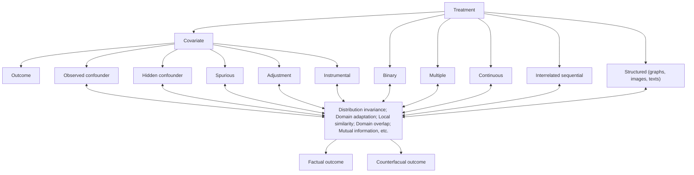

Fig. 5.1 Three major challenges from the core components of the treatment effect estimation task, including treatment, covariates, and outcome  
Fig. 5.2 Illustrations of binary, multiple, continuous, and sequential treatments

```mermaid
graph TD
    subgraph Binary treatments
  p1["●"] --> p2["●"]
  p2 --> p3["●"]
  p1 --> p4["●"]
  p4 --> p5["●"]
  p2 --> p6["●"]
  p6 --> p7["●"]
    end

    subgraph Sequential treatments
  p1 --> p2
  p2 --> p3
  p3 --> p4
  p4 --> p5
  p5 --> p6
  p6 --> p7
  p1 --> p8["●"]
  p2 --> p9["●"]
  p3 --> p10["●"]
  p4 --> p11["●"]
  p5 --> p12["●"]
  p6 --> p13["●"]
    end

    subgraph Multiple treatments
  p1 --> p2
  p2 --> p3
  p1 --> p4
  p2 --> p5
  p3 --> p6
  p4 --> p7
  p5 --> p8
  p6 --> p9
  p7 --> p10
  p8 --> p11
  p9 --> p12
    end

    subgraph Continuous treatments
  response["Response"] --> P1["p1"]
  response --> P2["p2"]
  response --> P3["p3"]
  response --> P4["p4"]
  response --> P5["p5"]
  response --> P6["p6"]
  response --> P7["p7"]
  response --> P8["p8"]
  response --> P9["p9"]
  response --> P10["p10"]
  response --> P11["p11"]
  response --> P12["p12"]
  response --> P13["p13"]
  response --> P14["p14"]
  response --> P15["p15"]
  response --> P16["p16"]
  response --> P17["p17"]
  response --> P18["p18"]
  response --> P19["p19"]
  response --> P20["p20"]
  response --> P21["p21"]
  response --> P22["p22"]
  response --> P23["p23"]
  response --> P24["p24"]
  response --> P25["p25"]
  response --> P26["p26"]
  response --> P27["p27"]
  response --> P28["p28"]
  response --> P29["p29"]
  response --> P30["p30"]
  response --> P31["p31"]
  response --> P32["p32"]
  response --> P33["p33"]
  response --> P34["p34"]
  response --> P35["p35"]
  response --> P36["p36"]
  response --> P37["p37"]
  response --> P38["p38"]
  response --> P39["p39"]
  response --> P40["p40"]
  response --> P41["p41"]
  response --> P42["p42"]
  response --> P43["p43"]
  response --> P44["p44"]
  response --> P45["p45"]
  response --> P46["p46"]
  response --> P47["p47"]
  response --> P48["p48"]
  response --> P49["p49"]
  response --> P50["p50"]
  response --> P51["p51"]
  response --> P52["p52"]
  response --> P53["p53"]
  response --> P54["p54"]
  response --> P55["p55"]
  response --> P56["p56"]
  response --> P57["p57"]
  response --> P58["p58"]
  response --> P59["p59"]
  response --> P60["p60"]
  response --> P61["p61"]
  response --> P62["p62"]
  response --> P63["p63"]
  response --> P64["p64"]
  response --> P65["p65"]
  response --> P66["p66"]
  response --> P67["p67"]
  response --> P68["p68"]
  response --> P69["p69"]
  response --> P70["p70"]
  response --> P71["p71"]
  response --> P72["p72"]
  response --> P73["p73"]
  response --> P74["p74"]
  response --> P75["p75"]
  response --> P76["p76"]
  response --> P77["p77"]
  response --> P78["p78"]
  response --> P79["p79"]
  response --> P80["p80"]
    end
```

As shown in Fig. 5.2, for the binary, multiple, continuous, and sequential treatment scenarios, we provide a unifying terminology that will enable researchers to coalesce and compare existing methods. Suppose that the observational data contain n units and that each unit goes through one potential path, including several treatment stages. In each potential path, the unit i can sequentially choose one of the two or multiple treatments T at each stage S, and finally, the corresponding outcome Y could be observed at the end of the path. Let $\{ t _ { s } ^ { i } ; t _ { s } = 1 , \ldots , n _ { t _ { s } } , i =$ $1 , \ldots , n$ , and $s = 1 , \ldots , n _ { s } \}$ denote the treatment assignment for unit i at stage s. There are in total $n _ { s }$ treatment stages and $n _ { t _ { s } }$ treatment assignments at stage s. Due to the existence of different treatment assignments at each treatment stage, for the whole population, we can observe several potential paths $\{ p ; p = 1 , \ldots , n _ { p } \}$ . However, each unit can only go through one potential path, including a sequence of stages. Therefore, only one of the potential outcomes is observed at the end of the path according to the actual treatment assignments. This observed outcome is called the factual outcome, and the remaining unobserved potential outcomes are called counterfactual outcomes. The factual outcome for unit i along the actual treatment stages is denoted by $y _ { F } ^ { i }$ , and the counterfactual outcome is denoted by $y _ { C F } ^ { i }$ . Let $X \in \mathbb { R } ^ { d }$ denote d observed variables of a unit. The observational data can be denoted $\{ \{ x ^ { i } , ~ t _ { s } ^ { i } , ~ y _ { F } ^ { i } \} _ { s = 1 } ^ { n _ { s } } \} _ { i = 1 } ^ { n }$ =explicitly needed.

## 5.2.1 Binary Treatments

If $n _ { s } ~ = ~ 1$ and $n _ { t _ { 1 } } ~ = ~ 2 .$ , there is only one treatment stage with two treatment choices. A unit only needs to choose once, between the two treatments. This setting is exactly the conventional binary treatment effect estimation task. One practical example of this conventional task is to evaluate the treatment effects of two different medications for one disease. By exploiting the observational data, including the treatment and control groups, we can only obtain one factual outcome for each patient. Thus, the core task is to predict what would have happened if a patient had taken the other medication. This conventional task has been extensively studied in the literature, such as TARNet [28], CFR [57], BNR-NNM [36], CEVAE [41], SITE [66], GANITE [69], and Dragonnet [58].

A widely used solution is the matching method, where the missing counterfactual outcome of a unit to a treatment is estimated by the factual outcome of its most similar neighbors that have received that treatment. The dataset including matched samples mimics a randomized controlled trial where the distribution of covariates will be similar between treatment and control groups. The only expected difference between the treatment and control groups is the outcome variable being studied. Compared to regression-based methods such as counterfactual regression [57] and Bayesian additive regression trees [10], matching approaches are more interpretable and less sensitive to model specification [25].

Most existing matching methods are performed in the original covariate space (e.g., Nearest Neighbor Matching [51], Coarsened Exact Matching [23]) or in the one-dimensional propensity score space (e.g., Propensity Score Matching [50]). Although rich information is retained in the original covariate space, it will face the curse of dimensionality and introduce more bias when controlling for irrelevant variables. Theoretical studies revealed that the bias of matching methods increases with the dimensionality of the covariate space [1]. Propensity score matching combats the curse of dimensionality of matching directly on the original covariates by matching on the probability of a unit being assigned to a particular treatment given a set of observed covariates. However, a one-dimensional propensity score space will lose most of the information in the data. In addition, provided that models are not overspecified, nonlinear models are usually more capable of dealing with complicated data distributions.

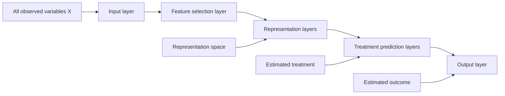

Fig. 5.3 The framework of a feature selection representation matching method based on deep representation learning and matching in the representation space [11] The key idea is to map the original covariate space into a selective, nonlinear, and balanced representation space, which can be best predictive of individual treatment outcomes, mitigate selection bias, and minimize the influence of irrelevant variables by simultaneously predicting the treatment assignment and outcomes

Therefore, as shown in Fig. 5.3, learning a low-dimensional balanced and nonlinear representations instead of high-dimensional original covariate space or one-dimensional propensity score space for observational data is a promising solution, which has been discussed in [7, 11, 36].

## 5.2.2 Multiple Treatments

If $n _ { s } = 1$ and $n _ { t _ { 1 } } > 2$ , there is only one treatment stage with multiple treatments. This is the conventional multiple treatment effect estimation task. Usually, binary treatment models can be effortlessly extended to multiple treatment models [40], such as propensity score estimation using generalized boosted models [43], counterfactual inference based on the idea of augmenting samples within a minibatch with their propensity-matched nearest neighbors [55], BART [22], and a deep generative model with task embedding [52].

For example, a multitask adversarial learning [14] contains two major components: an outcome generator and a true/false discriminator (TF discriminator), as shown in Fig. 5.4. In the outcome generator, they use feature selection multitask deep learning to estimate the potential outcomes for units across all tumor types. Because different types of tumors may have different predictor variables, which may be components of all observed covariates, a deep feature selection model including (a) a sparse one-to-one layer between the input and the first hidden layer, and (b) an elastic net regularization term throughout the fully connected representation layers is an essential foundation for potential outcome estimation.

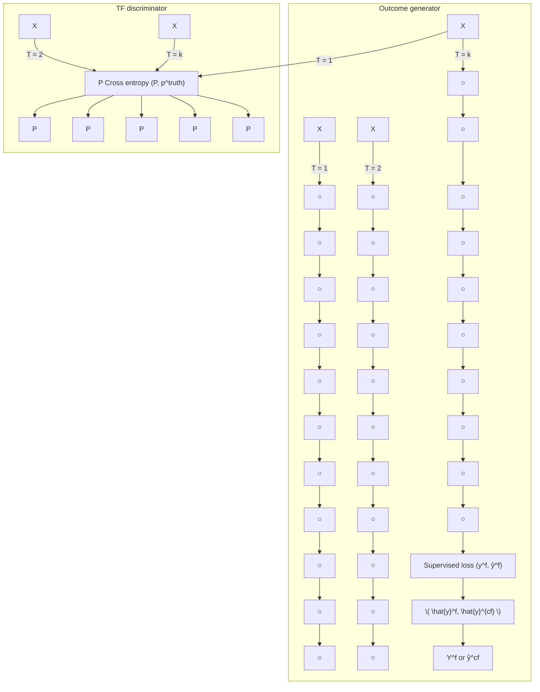

Fig. 5.4 The framework of our multitask adversarial learning net (MTAL) [14]

Our TF discriminator can tell whether the outcome given the covariates and tumor type is a factual outcome. In the beginning, the TF discriminator can easily determine which outcome is a factual outcome and which one is our inferred counterfactual outcome under alternative tumor types not contracted by those patients. The outcome generator attempts to generate counterfactual outcomes in such a way that the TF discriminator cannot easily determine which is the factual outcome. These two models are trained together in a zero-sum game, and they are adversarial until the TF discriminator model is fooled by the generator. At this time, they have removed the tumor type selection bias and obtained all potential outcomes for each patient across all kinds of tumors.

## 5.2.3 Continuous Treatments

If $n _ { s } \geq 1$ and $t _ { s }$ is continuous, this is the continuous treatment effect estimation task. Continuous treatments arise in many fields, including health care, public policy, and economics. With the widespread accumulation of observational data, estimating the average dose-response function while correcting for confounders has become a critical problem. Due to the infinite counterfactuals for continuous treatments, adjusting for selection bias is significantly more complex than for binary or multiple treatments. Thus, unlike the multiple treatments, standard methods for adjusting for selection bias for discrete treatments cannot be easily extended to handle bias in the continuous setting.

The DRNet [56] consists of a three-level architecture with shared layers for all treatments, multitask layers for each treatment, and additional multitask layers for dosage subintervals. Specifically, for each treatment, the dosage interval is subdivided into several equally sized subintervals, and a multitask head is added for each subinterval. DRNets do not determine these intervals dynamically, and thus, much of this flexibility is lost. SCIGAN [5] is flexible and capable of simultaneously estimating counterfactual outcomes for several different continuous interventions. The key idea is to use a modified GAN model to generate counterfactual outcomes. VCNet [45] proposes a novel varying coefficient neural network that improves model expressiveness while preserving the continuity of the estimated average doseresponse function. Second, to improve finite sample performance, they generalize targeted regularization to obtain a doubly robust estimator of the dose-response curve. CausalEGM [39] is an encoding generative model that can be applied in binary and continuous treatment settings. The CausalEGM model consists of a bidirectional transformation module and two feed-forward neural networks. The bidirectional transformation module composed of two generative adversarial networks (GANs) is used to project the covariates to a low-dimensional space and decouple the dependencies.

In addition, to generate appropriate disentangled representations that adjust for the selection bias precisely to estimate the individual treatment effect with continuous treatments, one work (Fig. 5.5) proposes a novel method named Disentangled and Balanced Representation Network (DBRNet), which is capable of obtaining disentangled and balanced representations to estimate ITE with continuous treatments. Specifically, they assume that covariates are determined by three latent factors: instrumental factors, confounder factors, and adjustment factors. DBRNet is able to explicitly identify those three underlying factors by learning disentangled representations for each factor. Based on these separated representations, they precisely adjust for selection bias by adopting a reweighting function, which estimates “generalized propensity score” from confounder factors, governing the treatment assignment without the influence of the adjustment factors. Furthermore, they predict outcomes based on the representations of confounder and adjustment factors through a varying coefficient network, which enables ITE estimation with continuous treatments.

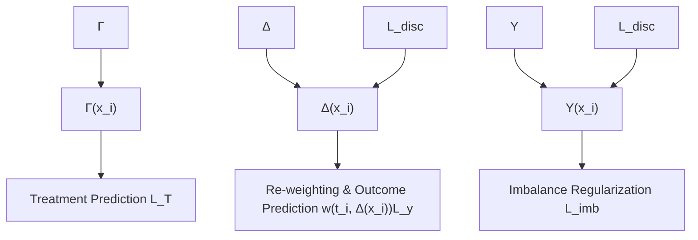

Fig. 5.5 Framework of DBRNet. To extract instrumental factors, confounder factors, and adjustment factors from the covariates, three contracted feed-forward neural networks are utilized to obtain the deep representations of each factor, $\mathrm { i . e . , } \Gamma ( x _ { i } ) , \Delta ( x _ { i } )$ , and $\Upsilon ( x _ { i } )$ . Then the representations $\Gamma ( x _ { i } )$ and $\Delta ( x _ { i } )$ are concatenated to predict the distribution of $t _ { i }$ using a conditional density estimator $p ( t _ { i } | \Gamma ( x _ { i } ) , \Delta ( x _ { i } ) ) . ~ \Delta ( x _ { i } )$ , and $\Upsilon ( x _ { i } )$ are used to predict the final outcome through another neural network $g _ { \theta ( t _ { i } ) } ( \Delta ( x _ { i } ) , \Upsilon ( x _ { i } ) )$ , while $\Upsilon ( x _ { i } )$ attempts to encode little information about treatment

## 5.2.4 Sequential Treatments

If $n _ { s } ~ > ~ 1$ and $n _ { t _ { s } } ~ \geq ~ 2$ , there are several treatment stages, with two or multiple treatments at each stage. Each unit goes through one path and needs to make $n _ { s }$ treatment decisions. At the end of the path, we can only observe one outcome along the actual path.

For example, during the COVID-19 pandemic that began in late 2019 and continues today, the instruction mode in universities has experienced substantial changes. The COVID-19 pandemic has forced most educational institutes worldwide to resort to an “online + in person” mode of education delivery. In some universities, students can choose online remote learning or in-person learning with masks and social distancing. The course instructors can provide live video-based sessions for the students and/or upload their recordings to the online learning platforms for them to watch. Furthermore, in live video-based learning, the students can choose to turn the camera on or off. Therefore, each student will follow one sequential behavior path “in person or online learning prerecorded video-based or live video-based learning  camera on or $\mathrm { o f f } , \ '$ as illustrated in Fig. 5.6. Different instruction modes influence students’ social, emotional, and mental well-being and academic achievement. Each student makes their own choices at each stage, so various potential paths exist. Intuitively, potential paths are a series of possible choices of treatments for one unit. Each unit can actually go through only one path, which is captured in the observational data. However, at each intervention stage, the unit can choose one of the two or multiple interventions, leading to multiple potential paths, including one factual path and several counterfactual paths. In the causal effect estimation task, we need to estimate the potential outcomes along all potential paths.

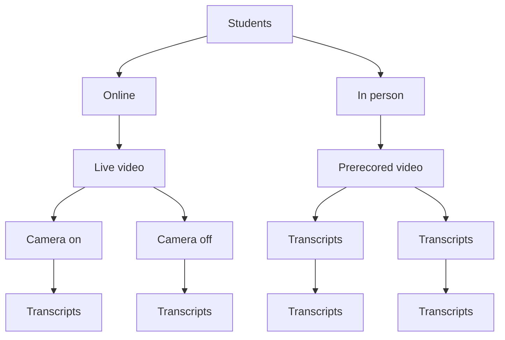

Fig. 5.6 The instruction mode example. The solid line represents each student’s potential choice at each stage, and the dotted line refers to the final potential outcome along the corresponding path

In these circumstances, the selection bias will accumulate over multiple stages, making the estimation of counterfactual outcomes more challenging. To the best of our knowledge, existing treatment effect estimation methods cannot effectively solve this type of problem. For this new problem of sequential treatments, the causal effect estimation task can be transformed into a graph learning task based on a heterogeneous graph and directed acyclic graph. First, it constructs a biased heterogeneous graph with self-supervised learning, including many disconnected subgraphs. Each subgraph represents one unit and all its potential paths. Second, the learned heterogeneous graph is a typical directed acyclic graph, an architecture that processes information according to the flow defined by the partial order. Based on the practical implications of this DAG, bidirectional processing is utilized. A path may be processed to estimate the outcome at the end of the path by the natural order, and another is used to reconstruct the original feature by the reversed order.

## 5.2.5 Structured Treatments

In many practical situations, treatments are naturally structured, such as medical prescriptions (text), protein structures (graph), and computed tomography scans (image). Traditional treatment effect estimation methodologies typically use separate prediction heads for each treatment option so that the influence of the treatment indicator variable might be lost in the high-dimensional network representations. Extending this idea directly to structured treatments would not only be computationally expensive but would also not be able to make use of treatment features or learn treatment representations [30].

GraphITE [20] learns representations of graph treatments for CATE estimation. They proposed utilizing graph neural networks while mitigating observation biases using Hilbert–Schmidt Independence Criterion regularization, which increases the independence of the representations of the targets and treatments. Inspired by the Robinson decomposition, which has enabled flexible CATE estimation for binary treatments, [30] propose the Generalized Robinson Decomposition (GRD), from which they extract a pseudo-outcome that targets the causal effect. A generalization of the GRD to treatments can be vectorized as a continuous embedding. This GRD reveals a learnable pseudo-outcome target that isolates the causal component of the observed signal by eliminating confounding associations.

In addition, there is a growing methodological literature investigating how images should be integrated to estimate the treatment effect [6, 46] in the observational data. An image-based treatment effect model is proposed by using a deep probabilistic modeling framework [26]. They develop a method that estimates latent clusters of images by identifying images with similar treatment effect distributions.

The model also emphasizes an image sensitivity factor that quantifies the importance of image segments in contributing to the mean effect cluster prediction, obtained via Monte Carlo using the approximate posterior distribution over the clustering.

## 5.3 Covariate

The relationships among different types of covariates, including treatment, confounder, outcome, instrumental, adjustment, and spurious variables, are illustrated in Fig. 5.7. In the treatment effect estimation task, the selection bias is the greatest challenge, which is the phenomenon that the distribution of the observed group is not representative of the group we are interested in. Confounder variables affect units’ treatment choices, which leads to selection bias. This phenomenon exacerbates the difficulty of counterfactual outcome estimation, as we need to estimate the control outcome of units in the treated group based on the observed control group and to estimate the treated outcome of units in the control group based on the observed treated group. The procedure for handling the selection bias is called covariate adjustment [68].

As more covariates are collected in observational data, we face different types of covariates, such as confounders (observed and hidden), adjustment, instrumental, and spurious variables. In addition to numerical covariates, how to handle covariates with textual information for causal effect estimation is still an open question. Therefore, in this section, we discuss this topic from four aspects: (1) feature selection; (2) feature representation disentanglement; (3) hidden confounders; and (4) textual information.

## 5.3.1 Feature Selection

A common approach for covariate adjustment is using the propensity score, i.e., the probability of a unit being assigned to a particular level of treatment, given the background covariates [50]. In covariate adjustment, although including all confounders is essential, this does not mean that including more variables is always better [11, 18, 54]. For example, conditioning on instrumental variables that are associated with the treatment assignment but not with the outcome except through treatment can increase both bias and variance of estimated causal effects [44]. Conditioning on adjustment variables that are predictive of outcomes but not associated with treatment assignment is unnecessary to remove bias while reducing variance in estimated causal effects [53]. Therefore, the inclusion of instrumental variables can inflate standard errors without improving bias, while the inclusion of adjustment variable can improve precision [37, 59, 63, 74].

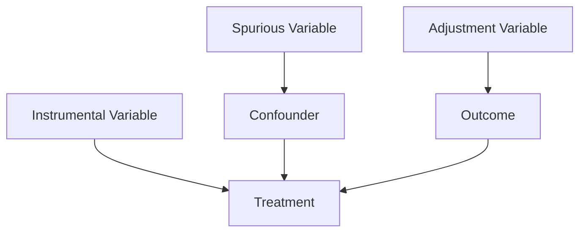

Fig. 5.7 The relationships among treatment, confounder, outcome, instrumental, adjustment, and spurious variables

A Data-Driven Variable Decomposition (D2VD) algorithm is proposed in [34], which can automatically separate confounders and adjustment variables with a data-driven approach where a regularized integrated regression model is presented to enable confounder separation and ATE estimation simultaneously. Recently, we proposed a deep adaptive variable selection-based propensity score method (DAVSPS) based on representation learning and adaptive group LASSO [15]. The key idea of DAFSPS is to combine the data-driven learning capability of representation learning and variable selection consistency of adaptive group LASSO to improve the estimation of the propensity score by selecting confounders and adjustment variables while removing instrumental and spurious variables. The framework of DAVSPS contains two major steps: outcome prediction with group LASSO and propensity score estimation with adaptive group LASSO. Step One uses a deep neural network (DNN) with group LASSO to predict the outcome and obtain the initial weight estimates for each covariate. Step 2 uses a DNN classification model to estimate propensity scores with adaptive group LASSO, under which the weighted penalty is based on initial weight estimates obtained from step 1. Therefore, DAVSPS can automatically select covariates predictive of the outcome (i.e., confounder and adjustment variables) while removing covariates independent of the outcome (i.e., instrumental and spurious variables) in propensity score estimation.

## 5.3.2 Feature Representation Disentanglement

For a simple feature representation disentanglement, i.e., confounders and nonconfounders, Wu et al. [65] proposed a synergistic learning framework to identify confounders by learning decomposed representations of both confounders and nonconfounders and balancing confounders with sample reweighting technique simultaneously. Then, as shown in Fig. 5.8, a more detailed disentangled representation learning method [21] decomposes covariates into three latent factors, including instrumental ?, confounding $\Delta$ , and adjustment ϒ factors. They assume that the random variable X follows an unknown joint probability distribution $P r ( X | \Gamma , \Delta , \Upsilon )$ ), treatment $T$ follows $P r ( T | \Gamma , \Delta )$ , and outcome Y follows $P r ( Y | \Delta , \Upsilon )$ , where ?, $\Delta$ , and ϒ represent the three underlying factors that generate an observational dataset. Correspondingly, the selection bias is induced by factors $\Gamma$ and $\Delta$ , where $\Delta$ represents the confounding factors between $T$ and Y . Zhang et al. [71] proposed

<!-- footnote -->

- Here, following [58], we use the term ITE instead of CATE to emphasize that it is defined for a single unit. However, in terms of causal identification, CATE is more accurate. In this scenario, it is conditioned on both node features and network structure in the static network.

<!-- footnote end -->

<!-- footnote -->

- https://www.blogcatalog.com/.
- https://www.flickr.com/.

<!-- footnote end -->

<!-- footnote -->

- https://github.com/allenai/PeerRead.

<!-- footnote end -->

<!-- footnote -->

- Z. Chu ()
- Ant Group, Hangzhou, China
- e-mail: chuzhixuan.czx@alibaba-inc.com
- S. Li
- University of Virginia, Charlottesville, VA, USA
- e-mail: shengli@virginia.edu

<!-- footnote end -->

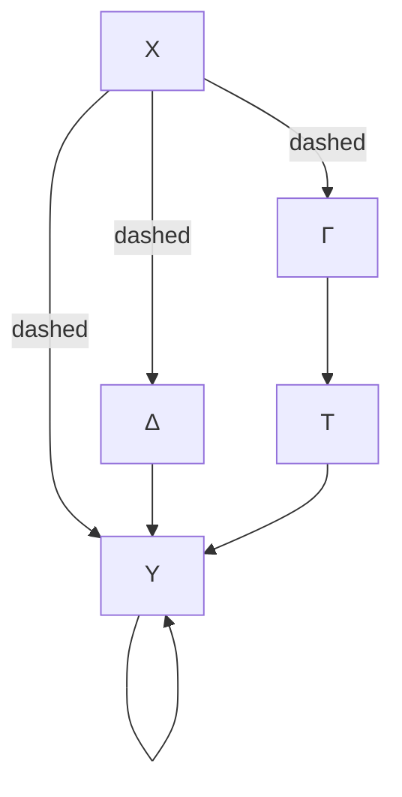

Fig. 5.8 Illustration of causal graph that involves covariates (X), treatment (T ), outcome (Y ), instrumental factors (?), confounding factors (∆), and adjustment factors (ϒ). The solid line represents causal relations, and the dot lines denote affiliations

a variational inference approach to simultaneously infer latent factors from the observed variables, disentangle the factors into three disjoint sets corresponding to the instrumental, confounding, and adjustment factors, and use the disentangled factors for treatment effect estimation. However, how to learn the underlying disentangled factors precisely remains an open problem. Specifically, previous methods may fail to obtain independent disentangled factors, which is necessary for identifying treatment effects. Cheng et al. proposed Disentangled Representations for Counterfactual Regression via Mutual Information Minimization (MIM-DRCFR) [9], which uses a multitask learning framework to share information when learning the latent factors and incorporates MI minimization learning criteria to ensure the independence of these factors.

## 5.3.3 Hidden Confounders

Due to the fact that identifying all of the confounders is impossible in practice, the strong ignorability assumption is usually untenable. If a confounder is hidden or unmeasured, it is impossible in the general case without further assumptions to estimate the treatment effect on the outcome [47]. By leveraging big data, it becomes possible to find a proxy for the hidden or unmeasured confounders by exploring the relationship between the hidden confounders, their proxies, the treatment, and the outcome. For example, Causal Effect Variational Autoencoder (CEVAE) [41] is based on Variational Autoencoders (VAE), which follows the causal structure of inference with proxies. It can simultaneously estimate the unknown latent space summarizing the confounders and the causal effect.

In addition, recent studies have shown that the auxiliary network information among data can be utilized to mitigate the confounding bias. Network information, which serves as an efficient structured representation of nonregular data, is ubiquitous in the real world. Advanced by the powerful representation capabilities of various graph neural networks, networked data have recently received increasing attention [27, 31, 61, 62]. Therefore, it can also be used to help recognize the patterns of hidden confounders. A network deconfounder [19] is proposed to recognize hidden confounders by combining the graph convolutional networks [31] and counterfactual regression [57]. Unlike networked data in traditional graph learning tasks, such as node classification and link prediction, the networked data under the causal inference problem have its particularity, i.e., imbalanced network structure. As shown in Fig. 5.9, we proposed a Graph Infomax Adversarial Learning (GIAL) model for treatment effect estimation [12], which makes full use of the network structure to capture more information by recognizing the imbalance in network structure.

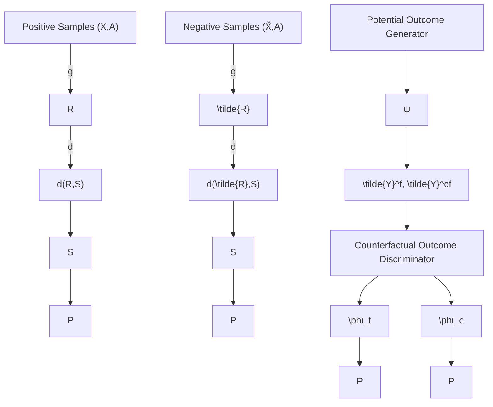

Fig. 5.9 Framework of our Graph Infomax Adversarial Learning method (GIAL) [12]. Graph neural networks and structure mutual information are utilized to learn the representations of hidden confounders and observed confounders. Then, the potential outcome generator is applied to infer the potential outcomes of units across treatment and control groups based on the learned representation space and treatment assignment. At the same time, the counterfactual outcome discriminator is incorporated to remove the imbalance in the learned representations of treatment and control groups

However, the above works assume that the observational data and the relations among them are static, while in reality, both of them will continuously evolve over time, i.e., time-evolving networked observational data. Ma et al. [42] propose a novel causal inference framework Dynamic Networked Observational Data Deconfounder (DNDC), which learns dynamic representations of hidden confounders over time by mapping the current observational data and historical information into the same representation space.

## 5.3.4 Text Covariates

Most of the existing work focuses on numerical covariates, while little attention has been given to textual covariates. However, in the real world, text data are almost everywhere, such as clinical notes, movie reviews, news, and social media posts. Different from structured and well-defined numerical covariates, textual covariates contain richer information and can be summarized at different levels, such as the word level, topic level, and semantics level. This property of text data brings some new challenges into treatment effect estimation with textual covariates. In particular, some textual covariates that are very predictive of the treatment assignment might not be that predictive of the outcome. Such covariates are referred to as nearly instrumental variables. In treatment effect estimation, existing work [48, 64] has shown that conditioning on the nearly instrumental variables tends to amplify the bias in the analysis of causal effects. Therefore, the nearly instrumental variables should be excluded when estimating the treatment effect. Thus, the major challenge in estimating the treatment effect with textual covariates is how to filter out the nearly instrumental variables.

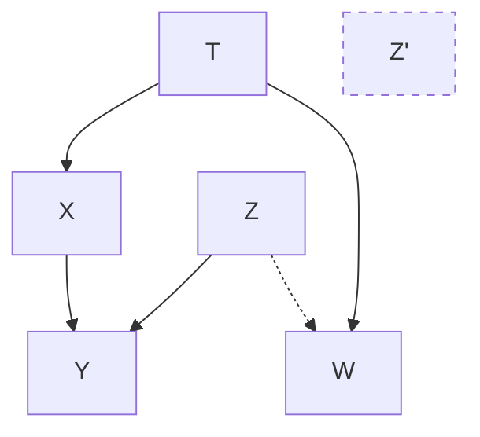

Fig. 5.10 Causal graph of the CTAM [67]

In existing methods, filtering out the nearly instrumental variable is achieved by covariate reweighting [8, 16, 32] or feature selection [33, 49, 60], when the covariates are numerical. However, when the covariate contains text data, the effectiveness of the reweighting or feature selection–based approaches would be limited, as those methods would be restricted to only one specific level of information contained in the textual variable, which leads to insufficient summarization of text covariates and further leads to insufficiency in filtering out nearly instrumental variables.

To handle the above challenges, [67] proposes the Conditional Treatment-Adversarial learning based Matching method (CTAM), inspired by the conditional adversarial architecture in [72].

The underlying causal graph of their proposed method is shown in Fig. 5.10. In the figure, $Z$ and $Z ^ { ' }$ together are the latent representations of the observed textual covariates $T$ and nontextual covariates X. Among the latent variables, $Z ^ { ' }$ denotes the nearly instrumental variables, which is more predictive of the treatment assignment than the outcome Y . As mentioned previously, conditioning on the nearly instrumental variables would amplify the treatment effect estimation bias. Our objective is to learn the latent representations that filter out the information related to nearly instrumental variables. Therefore, the proposed method introduces conditional treatment-adversarial learning to eliminate the information related to nearly instrumental variables $Z ^ { ' }$ as much as possible in the latent representations.

As shown in Fig. 5.11, CTAM first learns the latent representation of all covariates, in which the information contained in text variables can be fully summarized. Then, in the learned representation space, they adopt the nearest neighbor matching (NNM), for its interpretability, to estimate the outcome if the treatment had been changed. The key characteristic of CTAM is the conditional treatment adversarial training procedure whose goal is to filter out the information related to nearly instrumental variables in the representation space. In this procedure, the treatment discriminator, along with the representation learner and the outcome predictor, plays a minimax game. The treatment discriminator is trained to predict the treatment label correctly, while the representation learner, corporately working with the outcome predictor, aims to fool the treatment discriminator. Through the conditional treatment adversarial training procedure, the learned representation discards the extraneous information specific to treatment assignment and retains the information related to outcome prediction. Consequently, the proposed method benefits the treatment effect estimation with text covariates.

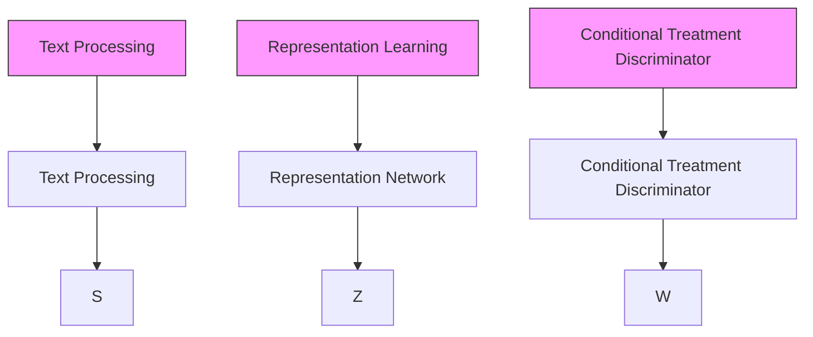

Fig. 5.11 CTAM framework [67]

## 5.4 Outcome

The foremost challenge to treatment effect estimation with observational data is to handle the imbalance in the covariates with respect to different treatment options, which is caused by selection bias. Recent causal effect estimation methods [28, 36, 57] have built a strong connection with domain adaptation by enforcing domain invariance with distributional distances such as the Wasserstein distance and maximum mean discrepancy. In [70], the authors argue that distribution invariance is often too strict a requirement, and they propose to use counterfactual variance to measure the domain overlap.

Inspired by metric learning, some methods [66] use hard samples to learn representations that preserve local similarity information and balance the data distributions. They assume that similar units would have similar outcomes. This assumption has been well justified in many classical counterfactual estimation methods such as the nearest-neighbor matching. To satisfy this assumption in the representation learning setting, the local similarity information should be well preserved after mapping units from the covariate space $\chi$ to the latent space $z .$ . One straightforward solution is to add a constraint on similarity matrices constructed in $\chi$ and $z .$ . However, constructing similarity matrices and enforcing such a “global”

```mermaid
graph TD
    subgraph Representation_Space["\"Representation Space\""]
  A1["Ẑi"] --> B1["preserve"]
  B1 --> C1["Ẑk"]
  C1 --> D1["ẑn"]
  D1 --> E1["Ẑm"]
  E1 --> F1["ẑj"]
  F1 --> G1["close"]
  G1 --> H1["ẑi"]
  H1 --> I1["ẑk"]
  I1 --> J1["ẑm"]
  J1 --> K1["ẑj"]
  K1 --> L1["ẑi"]
  L1 --> M1["ẑk"]
  M1 --> N1["ẑm"]
  N1 --> O1["ẑj"]
  O1 --> P1["ẑi"]
  P1 --> Q1["ẑk"]
  Q1 --> R1["ẑm"]
  R1 --> S1["ẑj"]
  S1 --> T1["ẑi"]
  T1 --> U1["ẑk"]
  U1 --> V1["ẑm"]
  V1 --> W1["ẑj"]
  W1 --> X1["ẑi"]
  X1 --> Y1["ẑk"]
  Y1 --> Z1["ẑm"]
  Z1 --> AA["ẑj"]
  AA --> AB["ẑi"]
  AB --> AC["ẑk"]
  AC --> AD["ẑm"]
  AD --> AE["ẑj"]
  AE --> AF["ẑi"]
  AF --> AG["ẑk"]
  AG --> AH["ẑm"]
    end

    subgraph Representation_Space_2["\"Representation Space\""]
  AI["Treated"] --> AJ["MPDM"]
  AK["control"] --> AL["MPDM"]
    end

    style AI fill:#f9f,stroke:#333
    style AK fill:#f9f,stroke:#333
```

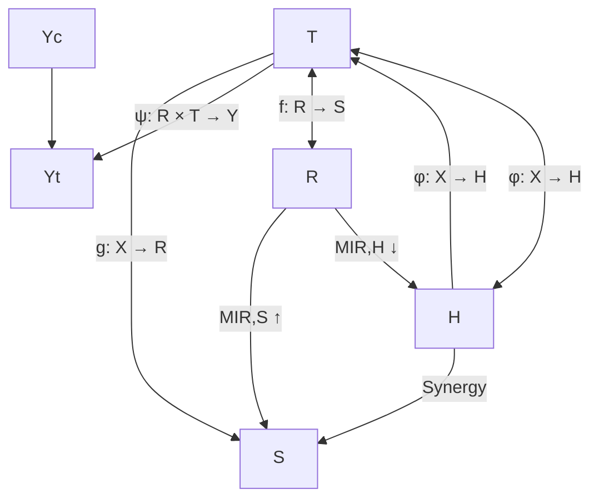

Fig. 5.12 The effect of balancing distributions and preserving local similarity by using the proposed SITE method [66]  
Fig. 5.13 The framework of the proposed IDRL [13] consists of four main components, including feature representation learning $g \ : \ X \ \to \ R$ , information maximization learning $M I ( R , S )$ , domain-independent learning $M I ( R , H )$ ), and potential outcome generator $\psi : R \times T  Y$ . IDRL first learns an individual representation vector for each subject. At the same time, information maximization learning and domain-independent learning are incorporated into the representation learning procedure to filter out domain-dependent information, solve the selection bias, and preserve the common predictive information for treatment and control groups

constraint is very time- and space-consuming, especially for a large number of units in practice. As shown in Fig. 5.12, they designed an efficient local similaritypreserving strategy based on triplet pairs.

Motivated by information theory, we proposed an Infomax and Domainindependent Representation Learning (IDRL) method [13] to estimate the causal effects with observational data by seeking a representation space, which not only contains the common predictive information about potential outcome estimation but also excludes the domain-dependent information. As shown in Fig. 5.13,IDRL relies on two mutual information structures: one is to maximize the mutual information between global summary representation and individual feature representation, which can maximally capture the common predictive information for both treatment and control groups and filter out the noise only for specific individual or group; the other is to minimize the mutual information between feature representation vectors and treatment options, which makes feature representations independent from treatment option domains. Therefore, instead of enforcing balance between the treatment and control groups by adopting various domain divergence metrics, our IDRL method utilizes one mutual information module to exclude the information related to the domain, so that we cannot tell which domain it is from. At the same time, additional mutual information can maximally preserve common predictive information.

For these domain adaptation methodologies based on the potential outcome framework (POF), the model aims to learn the domain-invariant representations, i.e., transformations of features, such that the treatment and control groups are approximately indistinguishable in the representation space [4]. Despite the popularity of domain adaptation for POF, the sufficient support assumption [3] for domain adaptation uncovers intrinsic limitations of learning invariant representations in regard to the shift in support of domains [38]. The positivity assumption is an essential assumption in causal effect estimation, and it supports the strong sufficient support assumption for domain adaptation [29, 73]. However, the positivity assumption is by no means guaranteed to hold in practice for the following two reasons. First, high-dimensional data often contain information that is redundant or irrelevant for predicting the outcome but still helps to distinguish the treatment and control groups. Second, variables distributed differently across intervention groups are usually critical for prediction.

In addition, for the domain adaptation problem under POF settings, seeking the optimal metric to measure the distance between the treatment and control groups remains unsettled. The choice of distance metrics is highly dependent on the characteristics of data distributions and the hyperparameters of regularization terms for imbalance mitigation. In particular, even with the same selection bias, there is no consensus among different metrics in terms of balancing data distributions [70].

Finally, we argue that regularizing representations to be domain-invariant is too strict, particularly when domains (e.g., treatment and control groups) are partially overlapped [70]. Several studies show that the empirical risk minimization only on factual data outperforms domain-invariant representation learning algorithms. Therefore, enforcing domain-invariant can easily remove predictive information and lead to a loss in predictive power, regardless of which type of domain divergence metric is employed [2]. These observations motivate us to relax the positivity assumption and develop a new and unified paradigm for treatment effect estimation, such that we could avoid the choice dilemma of domain divergence metrics and overcome the loss of predictive information. This is a promising and urgent direction for the treatment effect estimation task.

## 5.5 Future Directions

As discussed in the previous sections, existing work has made great contributions to the development of causal inference. However, there remain many open problems regarding causal modeling and theoretical study and applications and evaluations. In this section, we discuss future research directions as well as potential applications.

For causal modeling and theoretical study, we introduce several open problems as follows.

• Adding or relaxing the assumptions in the causal model. For instance, most of the existing approaches consider binary treatment and high-dimensional treatment, while more practical settings with multiple treatments at various levels are often ignored. High-dimensional treatment is commonly observed in real life. Studying the causal interaction is a trending topic of high-dimensional treatment, which aims to identify the combinations of treatments that induce large additional effects beyond the sum of effects separately attributable to each treatment [17].  
• Developing formal connections between different causal models. Although existing frameworks are logically the same, they have their own advantages. Building connections between different causal models benefits causal modeling from observational data. For instance, the relevance between the potential outcome framework and graphical causal models has been discussed in [24].  
“Machine learning for causal inference” and “Causal inference for machine learning.” Machine learning and causal inference can enhance each other. Machine learning brings powerful algorithms for causal effect estimation, which is the focus of this chapter. How causal inference can help improve machine learning algorithm design, such as robustness, generalization, and knowledge transfer, is still an open problem.  
• Equip machine learning with causal reasoning capabilities. Most machine learning algorithms model the correlation between variables but have very limited causal reasoning capabilities. Developing causality-aware machine learning models will help reveal the underlying mechanisms in complex observational data and therefore assist the causality-aware predictive analysis and decisionmaking.  
• Causal inference in dynamic environments. Existing work mainly focuses on static observational data. In practice, data are often continuously collected from a dynamic environment. Novel causal inference approaches are required to model dynamic observational data, leading to lifelong causal inference.  
Causality-assisted trustworthy learning, such as explainability, reliability, and fairness. In the model explanation domain, causal inference has great potential to explore the effect of the attributes on the model predicted labels. Moreover, in the fairness area, counterfactual fairness [35] is a trending topic that targets a unit’s outcome in the real world and the counterfactual world where he/she has different sensitive attribute values.

Along with the rapid development of causal modeling, it is equally important to explore novel applications and build benchmarks for evaluations.

• Generalized interpretation of “treatment” and “potential outcome” in more domain applications. A successful example mentioned in the previous section is the recommendation system, where exposing the user to one item is analogous to applying the treatment on the unit. To expand the scope of causal inference applications, generalizing the interpretation of “treatment” and “potential outcome” in more domains is necessary.
• Integration of (partial) experimental study and observational study. In real-world applications, sometimes, experimental data are available, such as the A/B testing data in the web development area. Integrating the experimental data, even small sample-sized experimental data, is of great help for observational studies to overcome the unobserved confounders and to correct the biased causal effect estimation model.
• Extensible causal models for multimodal data. Multimodal data are common in real-world applications. For instance, in the healthcare domain, doctors’ records are text data and fMRI data are images. Most of the existing treatment effect estimation models focus on one type of data, which cannot handle multimodal data. Estimating treatment effects based on multimodal data is still an open problem.

## 5.6 Summary

Causal inference is a developing field of academic research and various industrial applications. Recently, the blooming development of machine learning has brought new vitality into the causal inference area, not only the excellent progress on original problems but also the new research potentials and directions. In this chapter, we comprehensively review emerging advances, challenges, and opportunities for the treatment effect estimation task from the three core components, i.e., treatment, covariates, and outcome.

## References

1. A. Abadie, G.W. Imbens, Large sample properties of matching estimators for average treatment effects. Econometrica 74(1), 235–267 (2006)  
2. A. Alaa, M. Schaar, Limits of estimating heterogeneous treatment effects: Guidelines for practical algorithm design, in International Conference on Machine Learning (2018), pp. 129– 138  
3. S. Ben-David, R. Urner, On the hardness of domain adaptation and the utility of unlabeled target samples, in International Conference on Algorithmic Learning Theory (Springer, Berlin, 2012), pp. 139–153  
4. S. Ben-David et al., Analysis of representations for domain adaptation, in Advances in Neural Information Processing Systems (2007), pp. 137–144  
5. I. Bica, J. Jordon, M. van der Schaar, Estimating the effects of continuous-valued interventions using generative adversarial networks. Adv. Neural Informat. Process. Syst. 33, 16434–16445 (2020)  
6. D.C. Castro, I. Walker, B. Glocker, Causality matters in medical imaging. Nat. Commun. 11(1), 3673 (2020)  
7. Y. Chang, J.G Dy, Informative subspace learning for counterfactual inference, in Thirty-First AAAI Conference on Artificial Intelligence (2017)  
8. Y. Chang, J.G. Dy, Informative subspace learning for counterfactual inference, in Proceedings of the AAAI Conference on Artificial Intelligence (2017), pp. 1770–1776  
9. M. Cheng et al., Learning disentangled representations for counterfactual regression via mutual information minimization, in Proceedings of the 45th International ACM SIGIR Conference on Research and Development in Information Retrieval (2022), pp. 1802–1806  
10. H.A. Chipman, E.I. George, R.E. McCulloch, BART: Bayesian additive regression trees. Ann. Appl. Statist. 4(1), 266–298 (2010)  
11. Z. Chu, S.L. Rathbun, S. Li, Matching in selective and balanced representation space for treatment effects estimation, in Proceedings of the 29th ACM International Conference on Information and Knowledge Management (2020), pp. 205–214  
12. Z. Chu, S.L. Rathbun, S. Li, Graph infomax adversarial learning for treatment effect estimation with networked observational data, in ACM SIGKDD International Conference on Knowledge Discovery and Data Mining (2021)  
13. Z. Chu, S.L. Rathbun, S. Li, Learning infomax and domain-independent representations for causal effect inference with real-world data, in Proceedings of the 2022 SIAM International Conference on Data Mining (SDM) (SIAM, Philadelphia, 2022), pp. 433–441  
14. Z. Chu, S.L. Rathbun, S. Li, Multi-task adversarial learning for treatment effect estimation in basket trials, in Conference on Health, Inference, and Learning, PMLR (2022), pp. 79–91  
15. Z. Chu et al., Estimating propensity scores with deep adaptive variable selection, in Proceedings of the 2023 SIAM International Conference on Data Mining (SDM) (SIAM, Philadelphia, 2023)  
16. A. Diamond, J.S. Sekhon, Genetic matching for estimating causal effects: A general multivariate matching method for achieving balance in observational studies. Rev. Econ. Statist. 95(3), 932–945 (2013)  
17. N. Egami, K. Imai, Causal interaction in factorial experiments: application to conjoint analysis. J. Amer. Statist. Assoc. 114(526), 529–540 (2019)  
18. S. Greenland, Invited commentary: variable selection versus shrinkage in the control of multiple confounders. Amer. J. Epidemiol. 167(5), 523–529 (2008)  
19. R. Guo, J. Li, H. Liu, Learning Individual Treatment Effects from Networked Observational Data (2019). Preprint arXiv:1906.03485  
20. S. Harada, H. Kashima, Graphite: Estimating individual effects of graph-structured treatments, in Proceedings of the 30th ACM International Conference on Information & Knowledge Management (2021), pp. 659–668  
21. N. Hassanpour, R. Greiner, Learning disentangled representations for counterfactual regression, in International Conference on Learning Representations (2020)  
22. L. Hu et al., Estimation of causal effects of multiple treatments in observational studies with a binary outcome. Statist. Methods Med. Res. 29(11), 3218–3234 (2020)  
23. S.M. Iacus, G. King, G. Porro, Causal inference without balance checking: coarsened exact matching. Polit. Analy. 20(1), 1–24 (2012)  
24. G. Imbens, Potential outcome and directed acyclic graph approaches to causality: Relevance for empirical practice in economics (Technical Report, National Bureau of Economic Research, 2019)  
25. G.W. Imbens, D.B. Rubin, Causal Inference in Statistics, Social, and Biomedical Sciences (Cambridge University Press, Cambridge, 2015)  
26. C.T. Jerzak, F. Johansson, A. Daoud, Image-based Treatment Effect Heterogeneity (2022). Preprint arXiv:2206.06417  
27. X. Jiang, P. Ji, S. Li, CensNet: Convolution with edge-node switching in graph neural networks, in International Joint Conference on Artificial Intelligence (2019), pp. 2656–2662  
28. F. Johansson, U. Shalit, D. Sontag, Learning representations for counterfactual inference, in International Conference on Machine Learning (2016), pp. 3020–3029  
29. F.D. Johansson, D. Sontag, R. Ranganath, Support and invertibility in domain-invariant representations, in The 22nd International Conference on Artificial Intelligence and Statistics, PMLR (2019), pp. 527–536  
30. J. Kaddour et al., Causal effect inference for structured treatments. Adv. Neural Informat. Process. Syst. 34, 24841–24854 (2021)  
31. T.N. Kipf, M. Welling, Semi-supervised classification with graph convolutional networks, in arXiv preprint (2016)  
32. K. Kuang et al., Estimating Treatment Effect in the Wild via Differentiated Confounder Balancing, in Proceedings of the 23rd ACM SIGKDD International Conference on Knowledge Discovery and Data Mining (2017), pp. 265–274  
33. K. Kuang et al., Treatment effect estimation with data-driven variable decomposition, in Proceedings of the AAAI Conference on Artificial Intelligence (2017)  
34. K. Kuang et al., Treatment effect estimation with data-driven variable decomposition, in Proceedings of the Thirty-First AAAI Conference on Artificial Intelligence (2017)  
35. M.J. Kusner et al., Counterfactual fairness, in Advances in Neural Information Processing Systems (2017), pp. 4066–4076  
36. S. Li, Y. Fu, Matching on balanced nonlinear representations for treatment effects estimation, in Advances in Neural Information Processing Systems (2017), pp. 929–939  
37. W. Lin, R. Feng, H. Li, Regularization methods for high-dimensional instrumental variables regression with an application to genetical genomics. J. Amer. Statist. Assoc. 110(509), 270– 288 (2015)  
38. H. Liu, J. Wang, M. Long, Cycle Self-Training for Domain Adaptation (2021). Preprint arXiv:2103.03571  
39. Q. Liu, Z. Chen, W.H. Wong, CausalEGM: A general causal inference framework by encoding generative modeling (2022). Preprint arXiv:2212.05925  
40. M.J. Lopez, R. Gutman, Estimation of causal effects with multiple treatments: A review and new ideas. Statist. Sci. 32, 432–454 (2017)  
41. C. Louizos et al., Causal effect inference with deep latent-variable models, in Advances in Neural Information Processing Systems (2017), pp. 6446–6456  
42. J. Ma et al., Deconfounding with networked observational data in a dynamic environment, in ACM International Conference on Web Search and Data Mining (2021)  
43. D.F. McCaffrey et al., A tutorial on propensity score estimation for multiple treatments using generalized boosted models. Statist. Med. 32(19), 3388–3414 (2013)  
44. J.A. Myers et al., Effects of adjusting for instrumental variables on bias and precision of effect estimates. Amer. J. Epidemiol. 174(11), 1213–1222 (2011)  
45. L. Nie et al., Vcnet and functional targeted regularization for learning causal effects of continuous treatments (2021). Preprint arXiv:2103.07861  
46. N. Pawlowski, D.C. de Castro, B. Glocker, Deep structural causal models for tractable counterfactual inference. Adv. Neural Informat. Process. Syst. 33, 857–869 (2020)  
47. J. Pearl, Causality (Cambridge University Press, Cambridge, 2009)  
48. J. Pearl, On a class of bias-amplifying variables that endanger effect estimates, in Proceedings of the Twenty-Sixth Conference on Uncertainty in Artificial Intelligence (2010), pp. 417–424  
49. J.A. Rassen et al., Covariate selection in high-dimensional propensity score analyses of treatment effects in small samples. Amer. J. Epidemiol. 173(12), 1404–1413 (2011)  
50. P.R. Rosenbaum, D.B. Rubin, The central role of the propensity score in observational studies for causal effects. Biometrika 70(1), 41–55 (1983)  
51. D.B. Rubin, Matching to remove bias in observational studies. Biometrics, 29, 159–183 (1973)  
52. S.K. Saini et al., Multiple treatment effect estimation using deep generative model with task embedding, in The World Wide Web Conference (2019), pp. 1601–1611  
53. B.C. Sauer et al., A review of covariate selection for non-experimental comparative effectiveness research. Pharmacoepidemiol. Drug Safety 22(11), 1139–1145 (2013)  
54. E.F. Schisterman, S.R. Cole, R.W. Platt, Overadjustment bias and unnecessary adjustment in epidemiologic studies. Epidemiology 20(4), 488 (2009)  
55. P. Schwab, L. Linhardt, W. Karlen, Perfect match: A simple method for learning representations for counterfactual inference with neural networks (2018). Preprint arXiv:1810.00656  
56. P. Schwab et al., Learning counterfactual representations for estimating individual doseresponse curves, in Proceedings of the AAAI Conference on Artificial Intelligence, vol. 34, no. 04 (2020), pp. 5612–5619  
57. U. Shalit, F.D. Johansson, D. Sontag, Estimating individual treatment effect: Generalization bounds and algorithms, in Proceedings of the 34th International Conference on Machine Learning-Volume 70 (2017), pp. 3076–3085  
58. C. Shi, D. Blei, V. Veitch, Adapting neural networks for the estimation of treatment effects, in Advances in Neural Information Processing Systems, vol. 32 (2019)  
59. S.M. Shortreed, A. Ertefaie, Outcome-adaptive lasso: Variable selection for causal inference. Biometrics 73(4), 1111–1122 (2017)  
60. R. Tibshirani, Regression shrinkage and selection via the lasso. J. Roy. Statist. Soc. Ser. B (Methodol.) 58(1), 267–288 (1996)  
61. P. Velickovi ˇ c et al., Graph attention networks (2017). arXiv Preprint´  
62. P. Velickovic et al., Deep graph infomax, in International Conference on Learning Representations (Poster) (2019)  
63. A. Wilson, B.J. Reich, Confounder selection via penalized cred-ible regions. Biometrics 70(4), 852–861 (2014)  
64. J.M. Wooldridge, Should instrumental variables be used as matching variables? Res. Econ. 70(2), 232–237 (2016)  
65. A. Wu et al., Learning decomposed representation for counterfactual inference (2020). Preprint arXiv:2006.07040  
66. L. Yao et al., Representation learning for treatment effect estimation from observational data, in Advances in Neural Information Processing Systems (2018), pp. 2633–2643  
67. L. Yao et al., On the estimation of treatment effect with text covariates, in Proceedings of the 28th International Joint Conference on Artificial Intelligence (2019), pp. 4106–4113  
68. L. Yao et al., A survey on causal inference. ACM Trans. Knowl. Discov. Data 15(5), 1–46 (2021)  
69. J. Yoon, J. Jordon, M. van der Schaar, GANITE: Estimation of individualized treatment effects using generative adversarial nets, in 6th International Conference on Learning Representations (2018)  
70. Y. Zhang, A. Bellot, M. van der Schaar, Learning overlapping representations for the estimation of individualized treatment effects (2020). Preprint arXiv:2001.04754  
71. W. Zhang, L. Liu, J. Li, Treatment effect estimation with disentangled latent factors, in Proceedings of the AAAI Conference on. Artificial Intelligence, vol. 35, no. 12 (2021), pp. 10923–10930  
72. M. Zhao et al., Learning sleep stages from radio signals: A conditional adversarial architecture, in International Conference on Machine Learning (2017)  
73. H. Zhao et al., On learning invariant representations for domain adaptation, in International Conference on Machine Learning, PMLR (2019), pp. 7523–7532  
74. M.C. Zigler, F. Dominici, Uncertainty in propensity score estimation: Bayesian methods for variable selection and model-averaged causal effects. J. Amer. Statist. Assoc. 109(505), 95– 107 (2014)

## Part III

## Causal Inference and Trustworthy

## Machine Learning