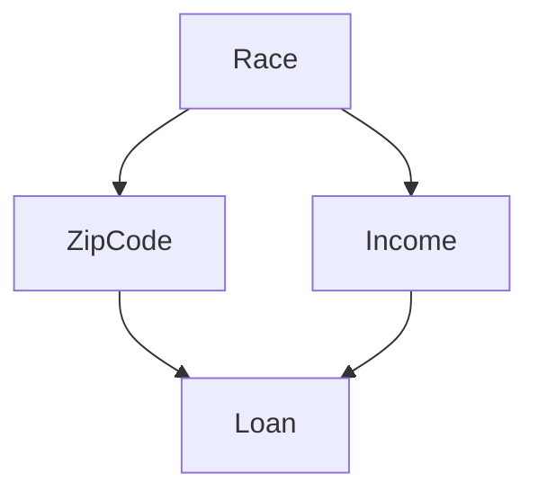
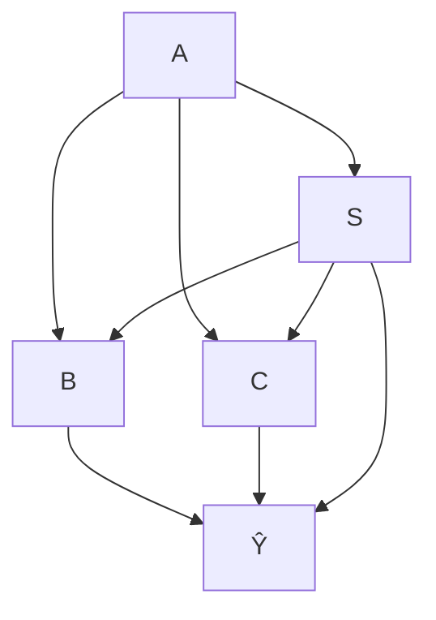
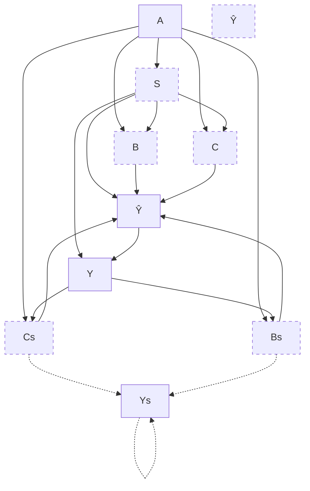
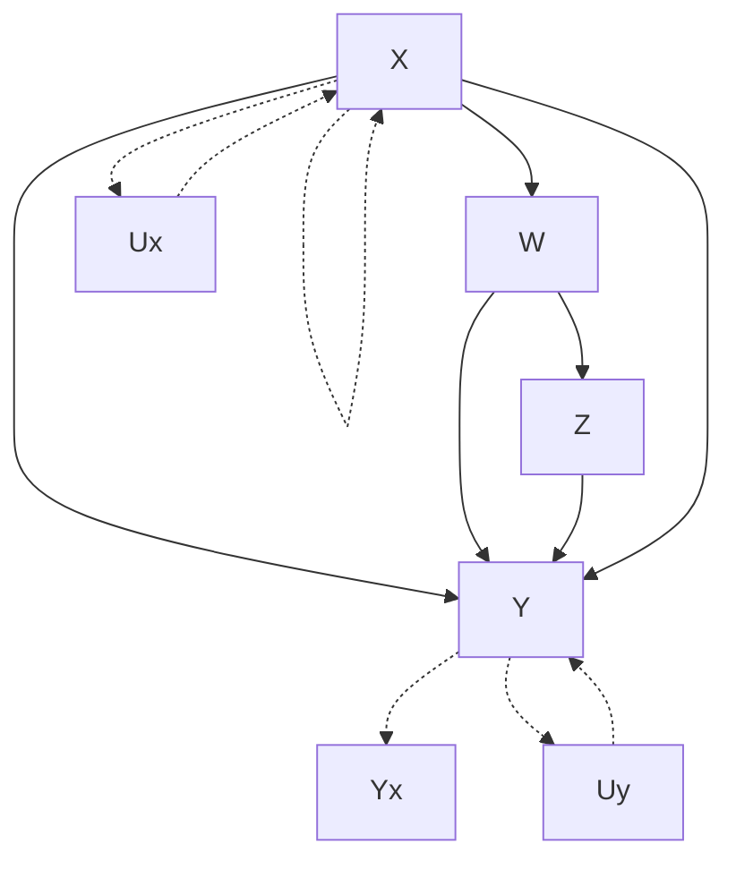
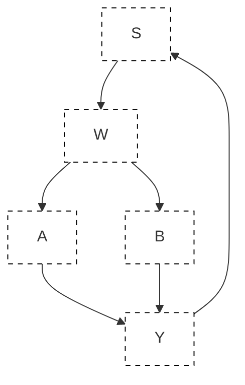
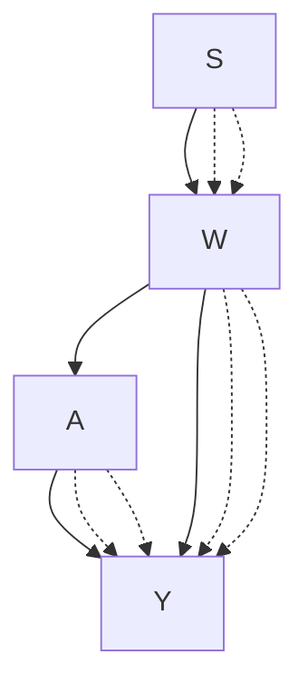

# Chapter 6 Fair Machine Learning Through the Lens of Causality

Yongkai Wu, Lu Zhang, and Xintao Wu

## 6.1 Introduction

Machine learning has been commonly used to make important decisions in many real-world applications, e.g., employment, admission to universities, and loans from banks. With its prevalence, algorithmic bias and discrimination have concerned machine learning practitioners. Algorithmic bias refers to unjustified distinctions made by machine learning algorithms among individuals based on their membership in a demographic group. A large number of laws and regulations have been established to prohibit unfairness in many countries and regions. For example, in the USA, the Civil Rights Act of 1964 prohibits employment discrimination based on race, color, religion, sex, or national origin. To combat algorithmic bias, fair machine learning has been an active research area. In this area, discrimination discovery is the task of unveiling discriminatory practices by analyzing historical data or predictions made by predictive models; and discrimination prevention aims to remove discrimination by modifying biased data, tweaking predictive models, or manipulating predictions.

In the discrimination discovery task, various statistical notions have been proposed. One of the most popular notions is statistical parity, which means the proportions of receiving favorable decisions for the protected group and for the non-protected group should be similar. The metrics derived from statistical parity include risk difference, risk ratio, relative change, odds ratio, and so on [70]. Another notion is demographic parity where the demographic information, e.g., race, gender, disabilities, should be independent of the algorithmic decisions. In addition, the authors in [57, 101] exploited the individual-based notions, namely individual fairness, where similar individuals should receive similar decisions. We refer the readers to surveys, e.g., [60, 115], for details.

Existing methods for discrimination prevention are categorized into three types: preprocessing, in-processing, and postprocessing. Preprocessing methods [23, 27, 34, 87, 116] modify the historical training data to remove the potential prejudice and discrimination based on the defined fairness notions before the data are leveraged to train machine learning models. Common preprocessing methods include Massaging [33], which changes the labels of some individuals around the decision boundaries to remove discrimination, Reweighting [10], which assigns weights to individuals to balance the majority and minority groups, and Preferential Sampling [34], which resamples subgroups to make the dataset discrimination-free. The in-processing methods [11, 14, 35, 36, 38, 39, 90, 99, 100] tweak the machine learning algorithms to ensure fair predictions. Some research [14, 36, 38, 39, 90, 100] add fairness constraints or regularizers into the objective functions in machine learning tasks. The methods for postprocessing [4, 28, 37] correct the predictions produced by vanilla machine learning models. Additionally, fair representation [20, 59, 93, 102] and fair generative models [74, 95, 96] become topical research trends.

Although it is well known that association does not imply causation, the gap between statistical association and causation is not paid enough attention by many researchers in fair machine learning. A large number of existing works are solely based on statistical notions, leading to misunderstanding and misquantification during discrimination assessment. Consequently, the discrimination prevention methods fail to remove the bias or even aggravate the prejudice. To narrow the gap between fairness and causality, we present an overview of causal modeling and causal fairness, including the causal background, causal fairness notions, related works, and research challenges in this area. In this chapter, we introduce a unified framework to conceptually define fairness and accurately measure unfairness in machine learning tasks, leveraging Structural Causal Models [65]. To address the unidentification issue, the most challenging barrier in causal inference, we present practical bounding methods to estimate the range and incorporate the bounded causal fairness in machine learning tasks. The notions of causal fairness have been parallelly developed in various settings. We discuss several works where causal fairness is formulated in different ways and in various applications. We conclude this chapter with a discussion of research challenges and potential directions, including weak assumptions of causal fairness, the extension of causal fairness in sequential models and networked data.

Structural Causal Models (SCMs) [65] is a mathematical representation that captures the causal relationships among variables. Each structural causal model is associated with a causal graph where the causal relationships are represented by directed edges from the cause variables to the effect variables. Within SCM, the causal effect from one variable to another is defined as changes resulting from a manipulation of the former variable. The manipulation is represented by an intervention, which is treated as a functional modification to the equations in SCM or as an edge modification in the causal graph. The intervention can be transmitted along any arbitrary path set or applied to any group of individuals, specified by the observational conditions. We present a fair machine learning framework that is inspired by path-specific intervention and counterfactual intervention, where fairness is defined as the causal effect transmitted along a path set or conditioned on an observation that both are specified by users. We present three causal fairness notions, Path-specific Fairness [106], Counterfactual Fairness [88], and Path-specific Counterfactual (PC) Fairness [92], where Path-specific Fairness measures the direct and indirect discrimination as causal effects transmitted along the direct and indirect path sets; Counterfactual Fairness captures the group and individual-level discrimination; and PC Fairness unifies various causal fairness notions.

We organize the remaining of this chapter as follows. We first present the preliminaries about statistical fairness notions, an overview of the Structural Causal Models, and causal inference. Then, we introduce Path-specific Fairness, Counterfactual Fairness, and Path-specific Counterfactual (PC) Fairness, including their definitions, metrics, techniques for bounding unidentifiable quantities, algorithms for removing discrimination from machine learning models, as well as empirical evaluations. After that, we present a short literature review of closely related works about causal fairness. In the end, we conclude this chapter with a discussion of potential challenges and future research directions, including relaxing the causal assumptions, dealing with causal fairness in sequential settings, and achieving causal fairness in networked data.

## 6.2 Overview of Fairness and Causal Inference

In this section, we present the fairness notations and metrics from a statistical perspective. Then we present the necessary preliminaries for the framework of causal fairness.

## 6.2.1 Statistical Fairness Notions and Metrics

We consider a dataset $\mathcal { D } = \{ S , \mathbf { X } , Y \} \subset \mathcal { P }$ where S denotes the sensitive attribute, X denotes a set of non-sensitive attributes, and Y denotes the decisions. For the sake of simplicity, S and Y are binary, i.e., $s ^ { + }$ and $s ^ { - }$ representing the unprotected/favorable group (e.g., male) and protected/unfavorable group (e.g., female), $y ^ { + }$ and $y ^ { - }$ representing the positive decision (e.g., being admitted) and the negative decision (e.g., being rejected). A predictive model is denoted by $f : \mathbf { X }  Y$ .

Various statistical notions have been adopted into the definitions and quantification of algorithmic bias and making the judgment of fairness in machine learning.

Technically, these notions measure the statistical association between the sensitive attribute and the decision attribute. The most common notion is statistical parity, which means the proportions of receiving favorable decisions for the protected group (denoted by $p _ { 1 } = P ( Y = y ^ { + } | S = s ^ { + } ) )$ and for the non-protected group (denoted by $p _ { 2 } = P ( Y = y ^ { + } | S = s ^ { - } ) ) $ should be similar. The metrics $( p _ { 1 } - p _ { 2 } )$ $\textstyle { \big ( } { \frac { p _ { 1 } } { p _ { 2 } } } { \big ) }$ $\scriptstyle { \big ( } { \frac { 1 - p _ { 1 } } { 1 - p _ { 2 } } } { \big ) }$ $\big ( \frac { p _ { 1 } ( 1 - p _ { 2 } ) } { p _ { 2 } ( 1 - p _ { 1 } ) } \big )$ −  −notion demographic parity requires the demographic information, e.g., race, gender, disabilities, should be independent of the algorithmic decisions. In [38, 39], the authors defined prejudice by training a classifier that satisfies the independence between the classifier prediction and the sensitive information. In [14, 28, 100], the authors introduced conditional independence between prediction and sensitive information, given the truth labels. In supervised machine learning, predictions $\hat { Y }$ are made by a predictive function. In a binary classification model, equality of opportunity is satisfied if the equation $P ( \hat { Y } = y ^ { + } | S = s ^ { + } , Y = y ^ { + } ) =$ $P ( \hat { Y } = y ^ { + } | S = s ^ { - } , Y = y ^ { + } )$ holds. A more rigorous criterion, equality of odds, requires the parity of both true-positive rate and false-positive rate for all demographic groups, i.e., $P ( \hat { Y } ~ = ~ y ^ { + } | S ~ = ~ s ^ { + } , Y ~ = ~ y ) ~ = ~ P ( \hat { Y } ~ = ~ y ^ { + } | S ~ = ~ $ $s ^ { - } , Y = y ) , y \in \{ y ^ { + } , y ^ { - } \}$ . The authors in [57, 101] exploited the individual-based notions where similar individuals should receive similar decisions. The surveys [60, 115] discussed various notions and their connections. A detailed discussion and comparison can be found in the tutorials [6, 112].

## 6.2.2 Structural Causal Model and Causal Inference

Judea Pearl has mathematically developed the concept of the Structural Causal Models (SCM) [65] to model the mechanism of any arbitrary system by a set of structural equations among variables.

Definition 6.1 (Structural Causal Model (SCM) [65]) A structural causal model is represented by a tuple U, V, F, P (U) where

• U is a set of exogenous variables that are determined by factors outside the model. A joint probability distribution P (U) is defined over the variables in U.

• V is a set of endogenous variables that are determined by variables in U V.

• F is a set of structural equations from U V to V. Specifically, for each $V \in \mathbf { V }$ there is a function $f _ { V } \in \mathbf { F }$ mapping from U (V V ) to V , i.e., $v = f _ { V } ( \mathbf { p a } _ { V } , u _ { V } )$ , where $\mathbf { p a } _ { V }$ is a realization of a set of endogenous variables $\mathbf { P a } _ { V } \in \textbf { V } \backslash V$ that directly determines V , and $u _ { V }$ is a realization of a set of exogenous variables that directly determines V .

If all exogenous variables in U are mutually independent, then the causal model is called a Markovian model. If any pair of exogenous variables in U is not independent, the causal model is called a semi-Markovian model.

The structural causal model is associated with a graphical model, referred to as a causal graph $\mathcal { G } = \langle \mathcal { V } , \mathcal { E } \rangle$ 〉, where $_ \textmd { ‰}$ is a set of nodes and E is a set of edges. Each node in $_ \textmd { ‰}$ corresponds to a variable in $\mathbf { V } \cup \mathbf { U }$ . Each edge in is directed, denoted by a single arrowhead arc , and points from each member of $\mathbf { P a } _ { X }$ toward X to represent the direct causal relationship from this member of $\mathbf { P a } _ { X }$ toward X.

In the causal model, the do-operator [65] simulates the physical interventions that force some variables X to take certain constants x. Formally, the intervention that sets the values of X to x is denoted by $d o ( \mathbf { X } = \mathbf { x } )$ . The intervention $d o ( \mathbf { X } = \mathbf { x } )$ manipulates the structural causal model and the graphical causal model (a.k.a the causal graph). The causal model after intervention $d o ( \mathbf { X } = \mathbf { x } )$ is called a sub-model denoted by $M _ { \mathbf { X } }$ .

Causal inference is a process of estimating the causal quantities, e.g., the distribution after interventions (namely, the post-interventional distribution) from purely observational data and the causal graph. For instance, the post-interventional distribution $P ( \mathbf { y } \mid d o ( \mathbf { x } ) )$ under the Markovian assumption [65] can be expressed as a truncated factorization formula [65] $\begin{array} { r } { P ( \mathbf { y } \mid d o ( \mathbf { x } ) ) = \prod _ { Y \in \mathbf { Y } } P ( y \mid \mathbf { p a } _ { Y } ) \delta _ { \mathbf { X } = \mathbf { X } } } \end{array}$ , where $\delta \mathbf { { X } } = \mathbf { { X } }$ means assigning variables in X involved in the term ahead with the corresponding values in x. Specifically, the post-intervention distribution of a single variable  Y given an intervention on a single variable X is given by $P ( y \mid d o ( x ) ) =$ $\begin{array} { r } { \sum _ { \mathbf { v } ^ { \prime } } \prod _ { V \in \mathbf { V } \backslash \{ X \} } P ( v ~ \mid ~ \mathbf { p a } _ { V } ) \delta _ { X = x } } \end{array}$ , where the summation is a marginalization that traverses all value combinations of ${ \bf V } ^ { \prime } = { \bf V } \backslash \{ X , Y \}$ . The distribution of $P ( y )$ $d o ( x ) )$ , which is also referred to as the post-intervention distribution of Y under $d o ( x )$ , is denoted by $P ( y _ { x } )$ . Equivalently, we can express $P ( y _ { x } )$ as $P _ { x } ( y )$ , i.e., the distribution of Y in submodel $M _ { x }$ .

The truncated factorization formula enables the estimation of post-interventional distributions from the observational data under the Markovian assumption. Yet a more challenging problem lies in the semi-Markovian model where the bi-directed edges imply the existence of hidden confounders and the post-interventional quantities are not unique. It is referred to as identification whether a causal quantity can be uniquely estimated from the observational data.

## 6.2.3 Identification of Causal Quantities

Identification is essential for causal inference as it determines whether a causal quantity, e.g., $P ( \mathbf { y } \mid d o ( \mathbf { x } ) )$ ), is consistently derived from the observed data without specifying the whole causal model M. The definition of identifiability is given as follows.

Definition 6.2 (Identifiability [65]) Let $Q ( \cdot )$ be any computable quantity of a class of models. is identifiable if, for any pair of models $M _ { 1 }$ and $\mathbf { \delta } M _ { 2 }$ from this class, $Q ( M _ { 1 } ) = Q ( M _ { 2 } )$ whenever $P _ { M _ { 1 } } ( \mathbf { v } ) = P _ { M _ { 2 } } ( \mathbf { v } )$ .

In the context of causal inference, Q is an arbitrary causal quantity, e.g., the post-interventional distribution $P ( \mathbf { y } \mid d o ( \mathbf { x } ) )$ . According to Definition 6.2, a causal quantity is identifiable if the estimation is unique given the observational data, which are compatible with many potential contradictory causal models. In other words, an unidentifiable quantity would obtain two or more contradictory values given the observational data and the causal graph, and in theory, it is impossible to distinguish which one is true. This definition of identifiability is applicable to other types of quantities, e.g., path-specific quantities and counterfactual quantities.

## 6.2.4 Causal Effects

The ultimate task of causal inference is to uncover the cause–effect relationships between variables. Thanks to the do-operator, the total causal effect of X on Y is defined in Definition 6.3 [65]. Note that in this definition, the effect of the intervention is transmitted along all causal paths from the cause X to the effect Y .

Definition 6.3 (Total causal effect) The total causal effect $T E ( x _ { 2 } , x _ { 1 } )$ measures the effect of the change of X from $x _ { 1 }$ to $x _ { 2 }$ on $Y = y$ transmitted along all causal paths from X to Y . It is given by

$$
T E (x _ {2}, x _ {1}) = P \left(y \mid d o (x _ {2})\right) - P \left(y \mid d o (x _ {1})\right).
$$

In the total causal effect, the interventions are performed for all individuals and all variables, thus the effect is aggregated over the whole population and transmitted via all causal paths. The path-specific effect is an extension to the total causal effect in the sense that the effect of the intervention is transmitted only along a subset of causal paths from X to Y [3]. Denote a subset of causal paths by π . The π-specific effect considers a counterfactual situation where the effect of X on Y with the intervention is transmitted along π , while the effect of X on Y without the intervention is transmitted along paths not in π , i.e., π . We denote by $P ( y \mid d o ( x _ { 2 } | \pi , x _ { 1 } | _ { \bar { \pi } } ) )$ ) the distribution of Y after an intervention of changing X from $x _ { 1 }$ to x with the effect transmitted along π. Then, the π-specific effect of X on Y is described as follows.

Definition 6.4 (Path-specific effect) Given a path set π, the π-specific effect $P S E _ { \pi } ( x _ { 2 } , x _ { 1 } )$ measures the effect of the change of X from $x _ { 1 }$ to x2 on $Y ~ = ~ y$ transmitted along π . It is given by

$$
P S E _ {\pi} (x _ {2}, x _ {1}) = P \left(y \mid d o (x _ {2} | _ {\pi}, x _ {1} | _ {\bar {\pi}})\right) - P \left(y \mid d o (x _ {1})\right).
$$

The identifiability of path-specific effect $P S E _ { \pi } ( x _ { 2 } , x _ { 1 } )$ , i.e., whether it can be computed from the observational data, depends on the identifiability of $P ( y )$ $d o ( x _ { 2 } | _ { \pi } , x _ { 1 } | _ { \bar { \pi } } ) )$ . The authors in [3] have given the necessary and sufficient condition for $P ( y | \partial ( \left. \psi \right| _ { \bar { x } } | \psi _ { \bar { x } } ) \mid \ U _ { \bar { x } } \mid \ U _ { \bar { x } } ) $ to be identifiable, known as the recanting witness criterion.

Definitions 6.3 and 6.4 consider the average causal effect over the entire population without any prior observations. If one has certain observations about a subset of attributes $\mathbf { O } = \mathbf { 0 }$ and uses them as factual conditions when inferring the causal effect, then the causal inference problem becomes a counterfactual problem meaning that the causal inference involves two counterfactual worlds simultaneously, the real world (represented by causal model $M )$ and the counterfactual world (represented by submodel $M _ { x } )$ . Symbolically, the distribution of $Y _ { x }$ conditioning on $\mathbf { O } = \mathbf { 0 }$ is denoted by $P ( y _ { x } \mid \mathbf { o } )$ . Note that $Y _ { x }$ is a variable in submodel $M _ { x }$ , while O are variables in original causal model $M .$ .

Definition 6.5 (Counterfactual effect) Given a factual condition $\mathrm { ~ \bf ~ O ~ } = \mathrm { ~ \bf ~ o ~ } .$ , the counterfactual effect that measures the effect of the change of X from $x _ { 1 }$ to $x _ { 2 }$ on $Y$ is given by

$$
C E (x _ {2}, x _ {1}) = P \left(y _ {x _ {2}} \mid \mathbf {0}\right) - P \left(y _ {x _ {1}} \mid \mathbf {0}\right).
$$

## 6.3 Path-Specific Fairness

In the legal and social science fields, discrimination is divided into direct discrimination, indirect discrimination, and explainable distinctions. For example, consider a toy model of a loan application system shown in Fig. 6.1. Assume that Race is treated as the sensitive attribute, Loan as the decision, and ZipCode as the unjustified attribute that triggers redlining. Direct discrimination is then transmitted along path Race Loan, and indirect discrimination is transmitted along path Race  ZipCode  Loan. Assume that the use of Income can be objectively justified as it is reasonable to deny a loan if the applicant has a low income. In this case, path Race Income Loan is explainable, which means that part of the difference in loan issuance across different race groups can be explained by the fact that some race groups in the dataset tend to be underpaid. However, non-causal methods where only the association between Race and Income is considered, cannot explicitly and correctly identify the three different effects when measuring discrimination. Zhang et al. [106] developed a framework for discovering and removing both direct and indirect discrimination based on the causal model. Using the causal model, direct and indirect discrimination can be respectively captured by the causal effects of the sensitive attribute on the decision transmitted along different causal paths. To be specific, direct discrimination is modeled as the causal effect transmitted along the direct path from the sensitive attribute to the decision. Indirect discrimination, on the other hand, is modeled as the causal effect transmitted along other causal paths that contain any unjustified attribute. To handle both direct and indirect discrimination, the path-specific effect [3, 76] has been employed to accurately measure the causal effect along a path set.

## 6.3.1 Modeling Direct/Indirect Discrimination as Path-Specific Effects

Given a dataset $\mathcal { D } = \{ \mathbf { X } , S , Y \}$ where S, Y , and X denote the sensitive attributes, the decision, and the non-sensitive attributes. Among the non-sensitive attributes, assume there is a set of attributes that cannot be objectively justified if used in the decision-making process, which is referred to as the redlining attributes denoted by R. It is assumed that a causal graph $\mathcal { G }$ can be built to correctly represent the causal structure of dataset . Zhang et al. [106] considered discrimination as the causal effect of the sensitive attribute S on the decision attribute Y . The direct discrimination is modeled by the causal effect transmitted along the direct edge from S to $Y , \mathrm { i . e . , } S  Y$ . Define $\pi _ { d }$ as the path set that contains only $S  Y$ . Then, the above causal effect that is caused by the change of S from $s ^ { - }$ to $s ^ { + }$ is given by the $\pi _ { d } { \mathrm { - s p e c i f i c } }$ effect $P S E _ { \pi _ { d } } ( s ^ { + } , s ^ { - } )$ . Similarly, indirect discrimination is considered as the causal effect transmitted along the indirect paths from S to Y that contain the redlining attributes. Given the set of redlining attributes $\mathbf { R } , \pi _ { i }$ is defined as the path set that contains all the causal paths from S to Y which pass through R, i.e., each of the paths includes at least one node in R. Thus, the above causal effect is given by the πi-specific effect $P S E _ { \pi _ { i } } ( S ^ { + } , S ^ { - } )$ .

For a better understanding, the physical meaning of $P S E _ { \pi _ { d } } ( c ^ { + } , c ^ { - } )$ can be explained as the expected change in decisions of individuals from a protected group $c ^ { - }$ if the decision-makers are told that these individuals were from the other group $c ^ { + }$ . When applied to the example in Fig. 6.1, it means the expected change in loan approval of the disadvantaged group (e.g., black), if the bank was instructed to treat these applicants as from the advantaged group (e.g., white). It shows that the $\pi _ { d } -$ specific effect perfectly follows the definition of direct discrimination in law and hence is an appropriate measure for direct discrimination. The physical meaning of $P S E _ { \pi _ { i } } ( c ^ { + } , c ^ { - } )$ is the expected change in decisions of individuals from a protected group $c ^ { - }$ , if the values of the redlining attributes in the profiles of these individuals were changed as if they were from the other group $c ^ { + }$ . When applied to the example in Fig. 6.1, it means the expected change in loan approval of the disadvantaged group if they had the same racial makeup shown in the ZIP code as the advantaged group. As can be seen, the $\pi _ { i }$ -specific effect also follows the definition of indirect discrimination and is appropriate for measuring indirect discrimination.

Based on the above path-specific effect metrics, Zhang et al. [106] presented the criterion for identifying direct and indirect discrimination. Direct discrimination against protected group $c ^ { - }$ exists if $P S E _ { \pi _ { d } } ( c ^ { + } , c ^ { - } ) > \tau$ , where $\tau > 0$ is a userdefined threshold for discrimination depending on the law. For instance, the 1975 British legislation for sex discrimination sets $\tau = 0 . 0 5$ , namely a 5% difference. Similarly, given the redlining attributes R, indirect discrimination against protected group $c ^ { - }$ exists if $P S E _ { \pi _ { i } } ( c ^ { + } , c ^ { - } ) > \tau$ .

Fig. 6.1 The toy model

## 6.3.2 Removing Direct/Indirect Discrimination from Data

Zhang et al. [106] proposed a Path-Specific Effect-based Discrimination Removal (PSE-DR) algorithm to remove both direct and indirect discrimination. The general idea is to modify the causal graph and then use it to generate a new dataset. Specifically, the conditional distribution of Y is adjusted, i.e., $P ( y | \mathbf { p a } _ { Y } )$ , to obtain a new conditional distribution $P ^ { \prime } ( y | \mathbf { p a } _ { Y } )$ , so that the direct and indirect discriminatory effects are below the threshold τ . To maximize the utility of the modified dataset, the Euclidean distance is minimized between the joint distribution of the original causal graph (denoted by $P ( \mathbf { v } ) )$ and the joint distribution of the modified causal graph (denoted by $P ^ { \prime } ( { \bf { v } } ) )$ . As a result, the discrimination removal method is formulated as a quadratic programming problem with $P ^ { \prime } ( y | \mathbf { p a } _ { Y } )$ as the variables.

$$
P S E _ {\pi_ {i}} (s ^ {+}, s ^ {-}) \leq \tau , \quad P S E _ {\pi_ {i}} (s ^ {-}, s ^ {+}) \leq \tau ,
$$

$$
\forall \mathbf {p a} _ {Y}, \quad P ^ {\prime} (e ^ {+} \mid \mathbf {p a} _ {Y}) + P ^ {\prime} (y ^ {-} \mid \mathbf {p a} _ {Y}) = 1,
$$

$$
\forall \mathbf {p a} _ {Y}, y, \quad P ^ {\prime} (y \mid \mathbf {p a} _ {Y}) \geq 0,
$$

where $P ^ { \prime } ( { \mathbf { v } } )$ and $P ( \mathbf { v } )$ are computed according to the factorization formula [46] using $P ^ { \prime } ( y | \mathbf { p a } _ { Y } )$ and $P ( y | \mathbf { p a } _ { Y } )$ respectively, and $P S E _ { \pi _ { d } } ( \cdot )$ and $P S E _ { \pi _ { i } } ( \cdot )$ are direct and indirect causal effects and computed from the observation distribution using the truncated factorization formula [65].

The optimal solution is obtained by solving the quadratic programming problem. After that, the new dataset is generated based on the obtained joint distribution.

## 6.3.3 Dealing with Unidentifiable Indirect Discrimination

Avin et al. [3] have discussed the condition where the path-specific effect can be uniquely estimated from the observed data, known as the recanting witness criterion. Shpitser [76] showed that the path-specific effect cannot be estimated if and only if the recanting witness criterion is not satisfied. Under the unidentifiable situation where the recanting witness criterion is satisfied, Zhang et al. [106] provided workable but crude solutions to the discrimination discovery and removal. For example, the causal paths from W to Y are cut off in the “kite pattern” where W is the intersection set between the indirect path set and the non-indirect path set. Then, the resultant causal model is identifiable, and the proposed discovery and removal methods are applicable. Further, Zhang et al. [108] developed the refined discrimination discovery by deriving upper and lower bounds for the unidentifiable indirect discrimination. The bounds can be used as better indicators for discovering indirect discrimination, i.e., the upper bound $u b ( S E _ { \pi _ { i } } ( s ^ { + } , s ^ { - } ) )$ smaller than τ indicates no indirect discrimination, while the lower bound $l b ( S E _ { \pi _ { i } } ( s ^ { + } , s ^ { - } ) )$ ) larger than τ indicates its existence. On the other hand, the derived bounds are used to refine the proposed removal algorithm PSE-DR by replacing $S E _ { \pi _ { i } } ( s ^ { + } , s ^ { - } )$ and $S E _ { \pi _ { i } } ( s ^ { - } , s ^ { + } )$ in the constraints of the quadratic programming with $u b ( S E _ { \pi _ { i } } ( s ^ { + } , s ^ { - } ) )$ and $u b ( S E _ { \pi _ { i } } ( s ^ { - } , s ^ { + } ) )$ .

## 6.3.4 Evaluation

Zhang et al. [106, 108] conducted experiments using two real datasets to evaluate the effectiveness of discrimination discovery and removal. The causal graphs are constructed and presented by the original PC algorithm [80] implemented in Tetrad [75].

For the Adult dataset, sex is considered as the sensitive attribute, income as the decision, and marital\_status as the redlining attribute. Then set $\pi _ { d }$ contains the edge pointing from sex to income and set $\pi _ { i }$ contains all the causal paths from sex to income that pass through marital\_status. By computing the pathspecific effects, the direct discrimination $S E _ { \pi _ { d } } ( s ^ { + } , s ^ { - } ) = 0 . 0 2 5$ and the indirect discrimination $S E _ { \pi _ { i } } ( c ^ { + } , c ^ { - } ) = 0 . 1 7 5$ . By setting $\tau \ : = \ : 0 . 0 5$ , the results indicate no direct discrimination but significant indirect discrimination against females according to our criterion.

For the Dutch Census of 2001 dataset, sex is treated as the sensitive attribute, occupation as the decision, and marital\_status as the redlining attribute. For this dataset, the results are $S E _ { \pi _ { d } } ( c ^ { + } , c ^ { - } ) = 0 . 2 2 0$ and $S E _ { \pi _ { i } } ( c ^ { + } , c ^ { - } ) = 0 . 0 0 1$ , indicating significant direct discrimination but no indirect discrimination against females.

The proposed removal algorithm is tested in both datasets and then run the discovery algorithm to further examine whether discrimination is truly removed in the modified dataset. The removal method completely removes direct and indirect discrimination from both datasets. In addition, PSE-DR produces relatively small data utility loss in terms of $\chi ^ { 2 }$ compared with previous methods, e.g. local massaging and local preferential sampling in [116], and the disparate impact removal algorithm in [1, 23].

In the Adult dataset, Zhang et al. [108] examined the proposed methods for handling unidentifiable situation when measuring and removing indirect discrimination. Especially, if edu is considered as the redlining attribute, the recanting witness criterion is satisfied, i.e., the indirect discrimination is unidentifiable. The derived upper and lower bounds show 0.361 and −0.114, respectively. Further, the refined discrimination removal algorithm in [108] is evaluated in this setting and guarantees no direct discrimination as well as no indirect discrimination based on the bounds with smaller utility loss compared to the vanilla removal algorithm proposed in [106].

## 6.4 Counterfactual Fairness

The path-specific fairness is generally formulated and quantified as the average causal effect of the sensitive attribute on the decision attribute, namely at the system level. Different from the above works, Kusner et al. [48] introduced counterfactual fairness, based on the counterfactual inference, which considers the causal effect within a particular group/individual specified by observational profile attributes. However, an inherent limitation of counterfactual fairness is that it cannot be uniquely quantified from the observational data in certain situations, due to the unidentifiability of the counterfactual quantity. Wu et al. [88] addressed this limitation by mathematically bounding the unidentifiable counterfactual quantity and developed a theoretically sound algorithm for constructing counterfactually fair classifiers.

## 6.4.1 Quantifying and Bounding Counterfactual Fairness

Kusner et al. [48] formulated the notion of counterfactual fairness as the equivalence of two counterfactual quantities $P ( \hat { y } _ { s ^ { \prime } } | s ^ { \prime } , \mathbf { z } ) = P ( \hat { y } _ { s } | s ^ { \prime } , \mathbf { z } )$ where $\hat { y }$ is the prediction, $s ^ { \prime }$ and s are two arbitrary values of the sensitive attribute S, and z is any arbitrary observational condition for a set of attributes. Recall that a lowercase letter with a subscript represents a value assigned to the corresponding variable in the submodel, $\mathrm { e . g . , } \ \hat { y } _ { s }$ is a value of $\hat { Y } _ { s }$ in the submodel $\mathcal { M } _ { s }$ .

The physical meaning of counterfactual fairness can be interpreted as follows. Consider candidates are applying for a job, and a predictive model is used to make the decision $\hat { Y }$ . One concerns an individual from a disadvantaged group $s ^ { - }$ who is specified by a profile z. Straightforwardly, the probability of the individual getting the positive decision is $P ( \hat { y } | s ^ { - } , \mathbf { z } )$ , which is equivalent to $P ( \hat { y } _ { s ^ { - } } | s ^ { - } , \mathbf { z } )$ since the intervention makes no change to $S ^ { \prime } { \mathrm { s } }$ value of that individual. Now assume the value of S for this very individual had been changed from $s ^ { - }$ to $s ^ { + }$ . The probability of this individual getting the positive decision after the hypothetical change is given by $P ( \hat { y } _ { s ^ { + } } | s ^ { - } , \mathbf { z } )$ . Therefore, if two probabilities $P ( \hat { y } _ { s ^ { - } } | s ^ { - } , \mathbf { z } )$ and $P ( \hat { y } _ { s ^ { + } } | s ^ { - } , \mathbf { z } )$ are identical, one can claim the individual is treated fairly as if he/she had been from the other group.

(a)

(b)  
Fig. 6.2 (a) Causal Graph G. (b) Counterfactual Graph $\mathcal { G } ^ { \prime }$ for $P ( \hat { y } _ { s } | s ^ { \prime } , { \bf z } )$

The notion of counterfactual fairness is more general than the intervention-based notions where the set of profile attributes is empty. Consequently, the counterfactual inference is more challenging due to the unidentifiable situations [65]. Wu et al. [88] addressed this unidentification limitation by mathematically bounding the unidentifiable counterfactual quantity and developed a theoretically sound algorithm for constructing counterfactually fair classifiers.

Consider the causal graph $\mathcal { G }$ shown in Fig. 6.2a where there are five attributes $A , B , C , S , \hat { Y } \colon S$ is the sensitive attribute; $\hat { Y }$ is the prediction of the decision attribute obtained by any classifier; A is the ancestor of $\hat { Y }$ but not the descendant of S; B is the intersection between the ancestor of Y and the descendant of S; and C is the descendant of S but not the ancestor of $\hat { Y }$ . The identifiability of $P ( \hat { y } _ { s } | s ^ { \prime } , { \bf z } )$ is the barrier to causal fairness, where Z is an arbitrary subset of $\{ A , B , C \}$ . In the notion of counterfactual fairness, the probability $P ( \hat { y } _ { s } | s ^ { \prime } , { \bf z } )$ concerns the connection between two causal models, and $M _ { s }$ . Thus, the make-cg algorithm [77] is applied to the causal graph $\mathcal { G }$ (Fig. 6.2a) to construct a new graph $\mathcal { G } ^ { \prime }$ that depicts the independence relationship among all variables in  and $\mathcal { M } _ { s }$ that are of concern in the analysis. Then, the make-cg algorithm removes the duplicated endogenous nodes, which are also not affected by $d o ( s )$ . The resultant graph is the so-called counterfactual graph (Fig. 6.2b). Next, the c-component factorization [82] is applied to decompose counterfactual graph $\mathcal { G } ^ { \prime }$ into disjoint subgraphs called the c-components, such that any two nodes in the same c-component are connected by a bi-directed path. After that, the joint distribution of all variables in the counterfactual graph can be factorized as the product of the conditional distribution of each ccomponent. The theoretical analysis showed $P ( \hat { y } _ { s } | s ^ { \prime } , { \bf z } )$ is unidentifiable if and only if $B \in \mathbf { Z }$ given the causal graph in Fig. 6.2a. Further, Wu et al. [88] derived the lower and upper bounds for $P ( \hat { y } _ { s } | s ^ { \prime } , { \bf z } )$ by canceling out the quantities involving B in the factorized formula. The derived bounds work for both identifiable and unidentifiable situations.

Wu et al. [88] defined a relaxed quantification $D E ( \hat { y } _ { s ^ { - } \to s ^ { + } } | { \bf z } ) = P ( \hat { y } _ { s ^ { + } } | s ^ { - } , { \bf z } ) -$ $P ( \hat { y } _ { s ^ { - } } | s ^ { - } , \mathbf { z } )$ for counterfactual fairness. If the amount of $\left| D E ( \hat { y } _ { s ^ { - } \to s ^ { + } } | \mathbf { z } ) \right|$ is smaller than $\tau .$ , one can claim this classifier is (counterfactually) fair. By denoting the upper and lower bounds of $P ( \hat { y } _ { s ^ { + } } | s ^ { - } , \mathbf { z } )$ obtained as $u b ( P ( \hat { y } _ { s ^ { + } } | s ^ { - } , \mathbf { z } ) )$ and $l b ( P ( \hat { y } _ { s ^ { + } } | s ^ { - } , \mathbf z ) )$ respectively, the lower and upper bounds is obtained as $\begin{array} { r l r } { u b \left( D E ( \hat { y } _ { s ^ { - } \to s ^ { + } } | { \bf z } ) \right) } & { { } = } & { u b \left( P ( \hat { y } _ { s ^ { + } } | s ^ { - } , { \bf z } ) \right) - P ( \hat { y } | s ^ { - } , { \bf z } ) } \end{array}$ and $l b \left( D E ( \hat { y } _ { s ^ { - } \to s ^ { + } } | \mathbf { z } ) \right) = l b \left( P ( \hat { y } _ { s ^ { + } } | s ^ { - } , \mathbf { z } ) \right) - P ( \hat { y } | s ^ { - } , \mathbf { z } ) . \operatorname { S p e c i f i c a l l y } ,$ , if a classifier satisfies $u b ( D E ( \hat { y } _ { s ^ { - }  s ^ { + } } | \mathbf { z } ) ) ~ \leq ~ \tau$ and $l b \left( D E ( \hat { y } _ { s ^ { - } \to s ^ { + } } | \mathbf { z } ) \right) ~ \geq ~ - \tau$ , then it is guaranteed τ -counterfactually fair.

## 6.4.2 Building Counterfactually Fair Classifier

The derived bounds clear the path toward constructing counterfactually fair classifiers. Wu et al. [88] proposed a postprocessing method for reconstructing any classifier to achieve counterfactual fairness. They considered constructing a new decision variable $\tilde { Y }$ from $\hat { Y }$ in the causal model such that τ -counterfactual fairness regarding $\tilde { Y }$ is satisfied. The objective is to find an optimal probabilistic mapping function $P ( \tilde { y } | \hat { y } , \mathsf { p a } ( \hat { Y } ) _ { \mathcal { G } } )$ that minimizes the difference between $Y$ and $\tilde { Y }$ , measured by the empirical loss $\mathbb { E } _ { \mathcal { D } } [ \ell ( Y , \tilde { Y } ) ]$ , meanwhile, the new decisions are counterfactually fair. The formulation of this optimization problem is given below.

Given a dataset $\mathcal { D }$ with prediction $\hat { Y }$ made by an arbitrary classifier, the goal is to learn a post-processing mapping function $P ( \tilde { y } | \hat { y } , \mathsf { p a } ( \hat { Y } ) _ { \mathcal { G } } )$ ) by solving the following optimization problem:

$$
\min \mathbb {E} _ {\mathcal {D}} [ \ell (Y, \tilde {Y}) ]
$$

s.t. for any z :

$$
\begin{array}{l} u b \left(D E (\tilde {y} _ {s ^ {-} \rightarrow s ^ {+}} | \mathbf {z})\right) \leq \tau , \quad l b \left(D E (\tilde {y} _ {s ^ {+} \rightarrow s ^ {-}} | \mathbf {z})\right) \geq - \tau , \\ \sum_ {\tilde {y}} P (\tilde {y} | \hat {y}, \mathsf {p a} (\hat {Y}) _ {\mathcal {G}}) = 1, \quad 0 \leq P (\tilde {y} | \hat {y}, \mathsf {p a} (\hat {Y}) _ {\mathcal {G}}) \leq 1, \\ \end{array}
$$

where $\ell ( Y , { \tilde { Y } } )$ is the 0–1 loss function.

It is easy to show that this formulation is a linear programming problem with $P ( \tilde { y } | \hat { y } , \mathsf { p a } ( \hat { Y } ) _ { \mathcal { G } } )$ as variables. Note that distribution $P ( \tilde { y } | \mathsf { p a } ( \hat { Y } ) _ { \mathcal { G } } )$ can be obtained by $\begin{array} { r } { P ( \tilde { y } | \mathsf { p a } ( \hat { Y } ) _ { \mathcal { G } } ) = \sum _ { \hat { y } } P ( \hat { y } | \mathsf { p a } ( \hat { Y } ) _ { \mathcal { G } } ) P ( \tilde { y } | \hat { y } , \mathsf { p a } ( \hat { Y } ) _ { \mathcal { G } } ) } \end{array}$ . Thus, all constraints are linear w.r.t. $P ( \tilde { y } | \hat { y } , \mathsf { p a } ( \hat { Y } ) _ { \mathcal { G } } )$ . On the other hand, for the objective function one has

$$
\mathbb {E} _ {\mathcal {D}} [ \ell (Y, \tilde {Y}) ] = \sum_ {y, \tilde {y} \in \{y ^ {+}, y ^ {-} \}} \ell (y, \tilde {y}) P (\tilde {y}, y) = 2 P (\tilde {y} \neq y)
$$

and

$$
\begin{array}{l} P (\tilde {y} \neq y) = P (\hat {y} \neq y) P (\tilde {y} = \hat {y}) + P (\hat {y} = y) P (\tilde {y} \neq \hat {y}) \\ = \sum_ {\mathbf {x}, s} P (\mathbf {x}, s) \left\{P (\hat {y} \neq y | \mathbf {x}, s) \left[ \begin{array}{c c} P (\tilde {y} = y ^ {-} | \hat {y} = y ^ {-}, \mathbf {x}, s) & P (\tilde {y} = y ^ {+} | \hat {y} = y ^ {+}, \mathbf {x}, s) \\ P (\hat {y} = y ^ {-} | \mathbf {x}, s) & P (\hat {y} = y ^ {+} | \mathbf {x}, s) \end{array} \right] \right. \\ + P (\hat {y} = y | \mathbf {x}, s) \left[ \begin{array}{c c} P (\tilde {y} = y ^ {+} | \hat {y} = y ^ {-}, \mathbf {x}, s) & P (\tilde {y} = y ^ {-} | \hat {y} = y ^ {+}, \mathbf {x}, s) \\ P (\hat {y} = y ^ {-} | \mathbf {x}, s) & P (\hat {y} = y ^ {+} | \mathbf {x}, s) \end{array} \right] \Bigg \} \\ \end{array}
$$

In the above expression, all probabilities except $P ( \tilde { y } | \hat { y } , \mathbf { x } , s )$ are read from the training set , making it a linear expression of $P ( \tilde { y } | \hat { y } , \mathbf { x } , s )$ .

## 6.4.3 Evaluation

Wu et al. [88] evaluated the proposed method and compared it with previous methods on the Adult dataset [53] and a synthetic dataset from a known causal model with complete knowledge in our evaluation. They compared the proposed method (denoted as CF) with (1) the original learning algorithm without fairness constraints as the baseline (denoted by BL), (2) two methods (denoted by A1 and A3) from [48] where A1 uses non-descendants of S only for building classifiers, and A3 presupposes the additive noise model for estimating the noise terms, which are then used for building classifiers.

In the synthetic dataset, the ground truth value of counterfactual fairness falls into the range of the proposed bounds for all value combinations of Z. Then the methods for building counterfactually fair classifiers are applied to the synthetic data. It shows both A1 and CF achieve fairness, but CF achieves higher accuracy than A1, implying that A1 loses more information. On the other hand, BL fails to achieve counterfactual fairness because it ignores fairness during the training. In addition, A3 also fails to achieve counterfactual fairness. This implies that assuming an additive model may produce biased results when the underlying causal model is non-linear.

In the Adult dataset where the ground truth is unknown, only A1 and CF can achieve counterfactual fairness for all value combinations of Z, but our CF consistently achieves higher accuracy than A1. This is as expected since A1 is proved to be fair in [48] (and also identifiable [88]), but will inevitably lead to lower accuracy as only S’s non-descendants are used. For BL and A3, either the lower bound is larger than τ or the upper bound is less than τ , indicating the τ -counterfactual fairness is not achieved.

Empirical evaluations showed that the CF method in [88] is guaranteed to achieve counterfactual fairness in classification, while previous approaches either cannot achieve counterfactual fairness or suffer bad performance due to oversimplified assumptions.

## 6.5 Path-Specific Counterfactual Fairness

Based on Pearl’s structural causal models [65], a number of causality-based fairness notions have been proposed for capturing fairness in different situations, including total effect [104, 106, 109], direct/indirect discrimination [62, 104, 106, 109], and counterfactual fairness [48, 72, 89, 103]. Nevertheless, there is a lack of a general framework that unifies various causality-based notions. Another common challenge of causality-based fairness notions is identifiability [77], i.e., whether they can be uniquely measured from observational data. In previous works, simplifying assumptions are proposed to evade this problem [43, 48, 106]. However, these simplifications may severely damage the performance of predictive models. In [109], the authors proposed a method to bound indirect discrimination as the pathspecific effect in unidentifiable situations, and in [89] a method was proposed to bound counterfactual fairness. However, the tightness of these methods is not analyzed.

Wu et al. [92] proposed a unified framework for handling different causalitybased fairness notions. They first proposed a general representation of all types of causal effects, i.e., the path-specific counterfactual effect, based on a unified fairness notion that covers most previous causality-based fairness notions, namely path-specific counterfactual fairness (PC fairness). Then, Wu et al. [92] developed a constrained optimization problem for bounding the PC fairness, which is motivated by the method proposed in [5] for bounding confounded causal effects. The key idea is to parameterize the causal model using so-called response-function variables, whose distribution captures all randomness encoded in the causal model so that one can explicitly traverse all possible causal models to find the tightest possible bounds.

## 6.5.1 Defining Path-Specific Counterfactual Fairness

The key component of Path-specific Counterfactual Fairness is a general representation of causal effects. Consider an intervention on X, which is transmitted along a subset of causal paths π to Y , conditioning on observation $\mathbf { O } = \mathbf { 0 }$ . Based on that, the path-specific counterfactual effect of the value change of X from x0 to $x _ { 1 }$ on $Y = y$ through π is defined as $\mathrm { P C E } _ { \pi } ( x _ { 1 } , x _ { 0 } | \mathbf { 0 } ) = P ( y _ { x _ { 1 } | \pi , x _ { 0 } | \bar { \pi } } | \mathbf { 0 } ) - P ( y _ { x _ { 0 } } | \mathbf { 0 } )$ where $\mathbf { O } = \mathbf { 0 }$ is a factual condition, π is a causal path set.

In the context of fair machine learning, $S ~ \in ~ \{ s ^ { + } , s ^ { - } \}$ is used to denote the protected attribute, $Y ~ \in ~ \{ y ^ { + } , y ^ { + } \}$ to denote the decision, and X to denote a set of non-protected attributes. Then, the path-specific counterfactual fairness on the predictor $\hat { Y }$ (PC Fairness) is defined as $\left| \mathrm { P C E } _ { \pi } ( s _ { 1 } , s _ { 0 } | \mathbf { 0 } ) \right| \leq \tau$ where $\pi$ is an arbitrary causal path set, $\mathbf { O } = \mathbf { 0 }$ is a factual condition and ${ \bf O } \subseteq \{ S , { \bf X } , Y \}$ .

**Table 6.1 Connection between previous fairness notions and PC fairness**

<table><tr><td>Description</td><td>References</td><td>Relating to PC fairness</td></tr><tr><td>Total effect</td><td>[104, 106]</td><td> $\mathbf{O} = \emptyset$  and  $\pi = \Pi$ </td></tr><tr><td>(System) Direct discrimination</td><td>[62, 104, 106]</td><td> $\mathbf{O} = \emptyset$  or  $\{S\}$  and  $\pi = \pi_d = \{S \to \hat{Y}\}$ </td></tr><tr><td>(System) Indirect discrimination</td><td>[62, 104, 106]</td><td> $\mathbf{O} = \emptyset$  or  $\{S\}$  and  $\pi = \pi_i \subset \Pi$ </td></tr><tr><td>Individual direct discrimination</td><td>[111]</td><td> $\mathbf{O} = \{S, \mathbf{X}\}$  and  $\pi = \pi_d = \{S \to \hat{Y}\}$ </td></tr><tr><td>Group direct discrimination</td><td>[107]</td><td> $\mathbf{O} = \mathbf{Q} = \mathsf{PA}_Y \backslash \{S\}$  and  $\pi = \pi_d = \{S \to \hat{Y}\}$ </td></tr><tr><td>Counterfactual fairness</td><td>[48, 72, 89]</td><td> $\mathbf{O} = \{S, \mathbf{X}\}$  and  $\pi = \Pi$ </td></tr><tr><td>Counterfactual error rate</td><td>[103]</td><td> $\mathbf{O} = \{S, Y\}$  and  $\pi = \pi_d$  or  $\pi_i$ </td></tr></table>

Wu et al. [92] showed that previous causality-based fairness notions can be expressed as special cases of PC fairness. Their connections are summarized in Table 6.1, where Π is all causal paths from S to $\hat { Y }$ in the causal graph, $\pi _ { d }$ contains the direct edge from S to $\hat { Y }$ , and $\pi _ { i }$ is a path set that contains all causal paths passing through any redlining attributes (i.e., a set of attributes in X that cannot be legally justified if used in decision-making). Based on whether O equals $\varnothing$ or not, the previous notions can be categorized into the ones that deal with the system level $( \mathbf { O } = { \boldsymbol { \theta } } )$ and the ones that have certain conditions $( \mathbf { O } \neq { \boldsymbol { \theta } } )$ . Based on whether π equals Π or not, the previous notions can be categorized into the ones that deal with the total causal effect $( \pi = \Pi )$ , the ones that consider the direct discrimination $( \pi = \pi _ { d } )$ , and the ones that consider the indirect discrimination $( \pi = \pi _ { i } )$ .

In addition to unifying the existing notions, the notion of PC fairness also resolves new types of fairness that the previous notions cannot do. One example is individual indirect discrimination, which means discrimination along the indirect paths for a particular individual. Individual indirect discrimination has not been studied yet in the literature, probably due to the difficulty in definition and identification. However, it can be directly defined and analyzed using PC fairness by letting $\mathbf { O } = \{ S , \mathbf { X } \}$ and $\pi = \pi _ { i }$ .

## 6.5.2 Measuring and Bounding Path-Specific Counterfactual Fairness

Wu et al. [92] developed a general method for bounding the path-specific counterfactual effect in any unidentifiable situation (such as Figs. 6.3–6.5). In the causal inference field, researchers have studied the reasons for unidentifiability under different cases. When $\mathbf { O } = \theta$ and $\pi \subset \Pi$ , the reason for unidentifiability can be the existence of the “kite” graph (see Fig. 6.4) in the causal graph [3]. When $\mathbf { O } \neq \boldsymbol { \theta }$ and $\pi = \Pi$ , the reason for unidentifiability can be the existence of the “w” graph (see Fig. 6.5) [78]. In any situation, as long as there exists a “hedge” graph (where the simplest case is the “bow” graph as shown in Fig. 6.3), then the causal effect is unidentifiable [77]. Another unidentifiable case in causal inference is known as “hidden confounding” due to the existence of correlated exogenous variables $( U _ { X }$ and $U _ { Y }$ in Fig. 6.6). Obviously, all the aforementioned unidentifiable situations can exist in the path-specific counterfactual effect. Motivated by [5], which formulates the bounding problem as a constrained optimization problem, Wu et al. [92] proposed to parameterize the causal model and use the observational distribution to impose constraints on the parameters. Then, the path-specific counterfactual effect of interest is formulated as an objective function of maximization or minimization for estimating its upper or lower bound. The bounds are guaranteed to be tight as one traverses all possible causal models when solving the optimization problem. Thus, a by-product of the method is a unique estimation of the path-specific counterfactual effect in the identifiable situation.

Fig. 6.3 The “bow” graph  
Fig. 6.4 The “kite” graph  
Fig. 6.5 The “w” graph  
Fig. 6.6 The causal graph for a semi-Markovian model

Response-Function Variables for Model Parameterization This method was proposed in [5] to parameterize the causal models. Consider an arbitrary endogenous variable denoted by $V \in \mathbf { V }$ , its endogenous parents denoted by $\mathsf { P A } _ { V }$ , its exogenous parents denoted by $U _ { V }$ , and its associated structural function in the causal model denoted by $v ~ = ~ f _ { V } ( \mathsf { p a } _ { V } , u _ { V } )$ . In general, $U _ { V }$ can be a variable of any type with any domain size, and $f _ { V }$ can be any function, making the causal model very difficult to be handled. However, for each particular value $u _ { V }$ of $U _ { V }$ , the functional mapping from $\mathsf { P A } _ { V }$ to V is a particular deterministic response function. Thus, one can map each value of $U _ { V }$ to a deterministic response function. Although the domain size of $U _ { V }$ is unknown which might be very large or even infinite, the number of different deterministic response functions is known and limited, given the domain sizes of $\mathsf { P A } _ { V }$ and V . This means that the domain of $U _ { V }$ can be divided into several equivalent regions, each corresponding to the same response function. As a result, one can transform the original non-parameterized structural function to a limited number of parameterized functions. Formally, equivalent regions of each endogenous variable V is represented by the response-function variable $R _ { V } =$ $\{ 0 , \cdots , N _ { V } - 1 \}$ where $N _ { V } = | V | ^ { \mathsf { P A } _ { V } | }$ is the total number of different deterministic response functions mapping from $\mathsf { P A } _ { V }$ to V $( N _ { V } = | V |$ if V has no parent). Each value $r _ { V }$ represents a predefined response function. The mapping from $U _ { V }$ to $R _ { V }$ is denoted as $r _ { V } = \ell _ { V } ( u _ { V } )$ . Then, for any $f _ { V } ( \mathsf { p a } _ { V } , u _ { V } )$ , it can be re-formulated as $f _ { V } ( \mathsf { p a } _ { V } , u _ { V } ) = f _ { V } ( \mathsf { p a } _ { V } , \ell _ { V } ^ { - 1 } ( r _ { V } ) ) = f _ { V } \circ \ell _ { V } ^ { - 1 } ( \mathsf { p a } _ { V } , r _ { V } ) = g _ { V } ( \mathsf { p a } _ { V } , r _ { V } )$ , where $g _ { V }$ is the composition of $f _ { V }$ and $\ell _ { V } ^ { - 1 }$ , and denotes the response functions represented by $r _ { V }$ . The set of all response-function variables is denoted by $\mathbf { R } = \{ R _ { V } : V \in \mathbf { V } \}$ . Next, the joint distribution $P ( \mathbf { v } )$ can be expressed as a linear function of $P ( \mathbf { r } )$ . According to [83], $P ( \mathbf { v } )$ can be expressed as the summation over the probabilities of certain values u of U that satisfy the following corresponding requirements: for each $V ~ \in ~ \mathbf { V }$ , one must have $f _ { V } ( \mathsf { p a } _ { V } , u _ { V } ) = v$ , where $v , \mathsf { p a } _ { V }$ are specified by v and $u _ { V }$ is specified by u. In other words, denoting by $V ( \mathbf { u } )$ the value that V would obtain if $\mathbf { U } = \mathbf { u } .$ , one has $\begin{array} { r } { P ( \mathbf { v } ) = \sum _ { \mathbf { u } : \mathbf { V } ( \mathbf { u } ) = \mathbf { v } } P ( \mathbf { u } ) } \end{array}$ . Then, by mapping from U to R, one accordingly obtains $\begin{array} { r } { P ( \mathbf { v } ) = \sum _ { \mathbf { r } : \mathbf { V } ( \mathbf { r } ) = \mathbf { V } } P ( \mathbf { r } ) } \end{array}$ , where for each $V \in \mathbf { V } , V ( \mathbf { r } ) = v$ means that $g _ { V } ( \mathsf { p a } _ { V } , r _ { V } ) = v$ . As a result, by defining an indicator function

$$
\mathbb {I} (v; \mathsf {p a} _ {V}, r _ {V}) = \left\{ \begin{array}{l l} 1 & \text { if } g _ {V} (\mathsf {p a} _ {V}, r _ {V}) = v, \\ 0 & \text { otherwise }, \end{array} \right.
$$

One obtains

$$
P (\mathbf {v}) = \sum_ {\mathbf {r}} P (\mathbf {r}) \prod_ {V \in \mathbf {V}} \mathbb {I} (v; \mathsf {p a} _ {V}, r _ {V}), \tag {6.1}
$$

which is a linear expression of $P ( \mathbf { r } )$ .

Expressing Path-Specific Counterfactual Fairness with Response-Variable Functions For bounding the path-specific counterfactual effect, i.e., $\mathrm { P C E } _ { \pi } ( s _ { 1 } , s _ { 0 } | \mathbf { 0 } ) =$ $P ( \hat { y } _ { s _ { 1 } | \pi , s _ { 0 } | \bar { \pi } } | \mathbf { 0 } ) \ - P ( \hat { y } _ { s _ { 0 } } | \mathbf { 0 } )$ , Wu et al. [92] applied response-function variables to express it. Similar to the [5], $P ( \hat { y } _ { s _ { 1 } | \pi , s _ { 0 } | \bar { \pi } } | \mathbf { o } )$ is first expressed as the summation over the probabilities of certain values of U that satisfy corresponding requirements. However, as described below, the requirements are much more complicated than previous ones due to the integration of intervention, path-specific effect, and counterfactual. Firstly, since the path-specific counterfactual effect is under a factual condition $\mathbf { O } = \mathbf { 0 } $ , values u must satisfy that $\mathbf { O ( u ) } = \mathbf { o } ,$ , i.e., for each $O \in \mathbf { O }$ , one must have $f _ { O } ( \mathfrak { p a } _ { O } , u _ { O } ) = o$ . Secondly, the path-specific counterfactual effect is transmitted only along some path set $\pi$ . According to [109], for the variables of X that lie on both $\pi$ and $\bar { \pi }$ , referred to as witness variables/nodes [3], it is necessary to consider two sets of values, one obtained by treating them on π and the other

Fig. 6.7 A causal graph with unidentifiable path-specific counterfactual fairness

$$
\pi = \{S \rightarrow W \rightarrow A \rightarrow \hat {Y},
$$

$$
S \rightarrow \hat {Y} \}
$$

obtained by treating them on $\bar { \pi }$ . Formally, non-protected attributes X are divided into three disjoint sets. The set of witness variables is denoted by W, the set of nonwitness variables on π is denoted by A, and the set of non-witness variables on $\bar { \pi }$ is denoted by B. A simple example is given in Fig. 6.7 where the interventional variant of A is denoted by $\mathbf { A } _ { s _ { 1 } | \pi }$ , the interventional variant of B by ${ \bf B } _ { s _ { 0 } | \bar { \pi } }$ , the interventional variant of W treated on π by $\mathbf { W } _ { s _ { 1 } | \pi }$ , and the interventional variant of W treated on $\bar { \pi }$ by $\mathbf { W } _ { s _ { 0 } | \bar { \pi } }$ . Then, $P ( \hat { y } _ { s _ { 1 } | \pi , s _ { 0 } | \bar { \pi } } | \mathbf { o } )$ can be written as

$$
\begin{array}{l} P (\hat {y} _ {s _ {1} | \pi , s _ {0} | \bar {\pi}} | \mathbf {o}) = \sum_ {\mathbf {a}, \mathbf {b}, \mathbf {w} _ {1}, \mathbf {w} _ {0}} P (\hat {Y} _ {s _ {1} | \pi , s _ {0} | \bar {\pi}} = y, \mathbf {A} _ {s _ {1} | \pi} = \mathbf {a}, \mathbf {B} _ {s _ {0} | \bar {\pi}} = \mathbf {b}, \mathbf {W} _ {s _ {1} | \pi} \\ = \mathbf {w} _ {1}, \mathbf {W} _ {s _ {0} | \bar {\pi}} = \mathbf {w} _ {0} \mid \mathbf {o}). \\ \end{array}
$$

To obtain the above joint distribution, in addition to $\mathbf { O } ( \mathbf { u } ) = \mathbf { o } _ { \mathrm { ~ } }$ , values u must also satisfy that:

1. $\mathbf { A } _ { s _ { 1 } | \pi } ( \mathbf { u } ) = \mathbf { a }$ , which means for each $A \in \mathbf { A }$ , it is required to have $f _ { A } ( \pmb { \mathsf { p a } } _ { A } ^ { 1 } , u _ { A } ) =$ $a ,$ , where $\mathsf { p a } _ { A } ^ { 1 }$ means that if $\mathsf { P A } _ { A }$ contains S or any witness node W , its value is specified by $s _ { 1 }$ or $w _ { 1 }$ if edge $S / W \to Y$ belongs to a path in π, and specified by s0 or w0 otherwise;  
2. ${ \bf B } _ { s _ { 0 } | \bar { \pi } } ( { \bf u } ) = { \bf b } .$ , which means for each $B \in \mathbf { B }$ , it is required to have $f _ { B } ( \mathsf { p a } _ { B } ^ { 0 } , u _ { B } ) =$ $b ,$ , where $\mathsf { p a } _ { B } ^ { 0 }$ means that if $\mathsf { P A } _ { B }$ contains S or any witness node W , its value is specified by s0 or w0;  
3. $\mathbf { W } _ { s _ { 1 } | \pi } ( \mathbf { u } ) \ = \ \mathbf { w } _ { 1 }$ , which means for each $W ~ \in ~ \textbf { W }$ , it is required to have $f _ { W } ( \mathop { \sf p a _ { W } ^ { 1 } } , u _ { W } ) = w _ { 1 } ;$ ;  
4. ${ \mathbf W } _ { s _ { 0 } | \pi } ( { \mathbf u } ) { \mathbf \ } = { \mathbf \ w } _ { 0 }$ , which means for each $W ~ \in ~ \textbf { W }$ , it is required to have $f _ { W } ( \mathsf { p a } _ { W } ^ { 0 } , u _ { W } ) = w _ { 0 }$ .

Then, by mapping from U to R, one can obtain the requirements for R accordingly. Finally, denoting the values of R that satisfy $\mathbf { O ( r ) = \ o \ b y \ r _ { 0 } }$ , the following is obtained

$$
P(\hat{y}_{s_{1}|\pi ,s_{0}|\bar{\pi}}|\mathbf{o}) = \sum_{\substack{\mathbf{a},\mathbf{b},\mathbf{w}_{1}\\ \mathbf{w}_{0},\mathbf{r}\in \mathbf{r}_{\mathbf{0}}}}\left[ \begin{array}{c}\frac{P(\mathbf{r})}{P(\mathbf{o})}\mathbb{I}(\hat{y};\mathsf{pa}_{\hat{Y}}^{1},r_{\hat{Y}}) \prod_{A\in \mathbf{A}}\mathbb{I}(a;\mathsf{pa}_{A}^{1},r_{A}) \prod_{B\in \mathbf{B}}\mathbb{I}(b;\mathsf{pa}_{B}^{0},r_{B})\\ \prod_{W\in \mathbf{W}}\mathbb{I}(w_{1};\mathsf{pa}_{W}^{1},r_{W})\mathbb{I}(w_{0};\mathsf{pa}_{W}^{0},r_{W}) \end{array} \right], \\ (6.2)
$$

which is still a linear expression of $P ( \mathbf { r } )$ .

Similarly, one can obtain the path-specific counterfactual effect as a linear function of $P ( \mathbf { r } )$ :

$$
P (\hat {y} _ {s _ {0}} | \mathbf {o}) = \sum_ {\mathbf {v} ^ {\prime}, \mathbf {r} \in \mathbf {r} _ {\mathbf {0}}} \frac {P (\mathbf {r})}{P (\mathbf {o})} \mathbb {I} (\hat {y}; \mathsf {p a} _ {\hat {Y}}, r _ {\hat {Y}}) \prod_ {V \in \mathbf {V} ^ {\prime}} \mathbb {I} (v; \mathsf {p a} _ {V}, r _ {V}), \tag {6.3}
$$

where $\mathbf { V } ^ { \prime } = \mathbf { V } \backslash \{ S , Y \}$ .

All causal models (represented by different $P ( \mathbf { r } ) )$ that agree with the distribution of observational data D cannot be distinguished and should be considered in bounding PC fairness. Therefore, finding the lower or upper bound of the pathspecific counterfactual effect is equivalent to finding the $P ( \mathbf { r } )$ that minimizes or maximizes the path-specific counterfactual effect, subject to that the derived joint distribution $P ( \mathbf { v } )$ agrees with the observational distribution $P ( \mathcal { D } )$ . This fact results in the following linear programming problem for deriving the lower/upper bound of path-specific counterfactual effect.

$$
\min / \max \quad P (\hat {y} _ {s _ {1} | \pi , s _ {0} | \bar {\pi}} | \mathbf {o}) - P (\hat {y} _ {s _ {0}} | \mathbf {o}), \tag {6.4}
$$

$$
\text { s.t. } \quad P (\mathbf {V}) = P (\mathcal {D}), \quad \sum_ {\mathbf {r}} P (\mathbf {r}) = 1, \quad P (\mathbf {r}) \geq 0,
$$

where $P ( \hat { y } _ { s _ { 1 } | \pi , s _ { 0 } | \bar { \pi } } | \mathbf { o } )$ is given by Eq. (6.2), $P ( \hat { y } _ { s _ { 0 } } | \mathbf { 0 } )$ is given by Eq. (6.3), and $P ( \mathbf { v } )$ is given by Equation (6.1).

The lower and upper bounds derived by solving the above optimization problem are guaranteed to be the tightest since the response function is an equivalent mapping that covers all possible causal models; thus one can explicitly traverse all possible causal models.

## 6.5.3 Evaluation

In [92], Wu et al. conducted an evaluation on synthetic datasets and the Adult dataset. For synthetic datasets, a causal model with complete knowledge of exogenous variables and equations is built using Tetrad [75] according to the causal graphs. There are two synthetic datasets (denoted by $\mathcal { D } _ { 1 }$ and $\mathcal { D } _ { 2 }$ ) generated with two causal models: (1) a shared exogenous variable, i.e., a hidden confounder, with 100 domain values (shown in Fig. 6.8); (2) all exogenous variables are assumed mutually independent (shown in Fig. 6.9)). The Adult dataset consists of 65,123 records with 11 attributes including edu, sex, income etc. The setting is similar to [89].

Fig. 6.8 The causal graph for the synthetic dataset $\mathcal { D } _ { 1 }$  
Fig. 6.9 The causal graph for the synthetic dataset $\mathcal { D } _ { 2 }$

Bounding Path-Specific Counterfactual Fairness Given the $\mathcal { D } _ { 1 }$ dataset, the ground truth can be computed by exactly executing the intervention under given conditions using the complete causal model. Wu et al. [92] estimated the upper and lower bounds using the parameterized optimization of the path-specific counterfactual effect. The results showed that the true values of $\mathrm { P C E } _ { \pi } ( s ^ { + } , s ^ { - } | \mathbf { 0 } )$ fell into the range of our bounds for all value combinations of O, which validates bounded method.

Comparing with Previous Bounding Methods Wu et al. [92] used $\mathcal { D } _ { 2 }$ to compare with the previous methods [89, 109] which were derived under the Markovian assumption. Specifically, Wu et al. [92] compared with [109] for bounding $\mathrm { P E } _ { \pi } ( s ^ { + } , s ^ { - } )$ with $\pi = \{ S \to W \to A \to { \hat { Y } } , S \to { \hat { Y } } \}$ . They compared with [89] for bounding $\mathbf { C E } ( s ^ { + } , s ^ { - } | \mathbf { o } )$ with $\mathbf { O } = \{ S , W , A \}$ . The results showed the bounded PC fairness achieved much tighter bounds than previous methods, which could be used to examine fairness more accurately. In addition, they also used the Adult dataset to compare with the method in [89] for bounding CE $( s ^ { + } , s ^ { - } | \mathbf { 0 } )$ with $\mathbf { O } = \{ \mathsf { a g e } , \mathsf { e d u }$ , marital-status and obtain similar results.

## 6.6 Related Work

In this section, we give a brief review of related work on causality-based fairness notions and their applications.

## 6.6.1 Modeling Fairness with Different Causal Frameworks

There has been some research that analyzes discrimination from the causal perspective in the past years. We summarized existing research according to the causal frameworks leveraged for fairness notions. Studies in [107, 110, 111] have been built on Pearl’s Structural Causal Models and the associated causal graph, but cannot deal with indirect discrimination. Leveraging the same Structural Causal Models, Nabi et al. [62], Zhang and Bareinboim [104], and Chikahara et al. [12, 13] have developed causal fairness notions to quantifying direct and indirect discrimination, based on the path-specific effect [3]. Kilbertus et al. [43] have proposed similar discrimination criteria that also consider indirect discrimination. However, it is simplified in order to avoid the complexity of measuring path-specific effects and the proposed discrimination criteria can only qualitatively determine the existence of the discrimination, but cannot quantitatively measure the value of discriminatory effects. Kusner et al. [48] initiated the idea of counterfactual fairness, which is designed to evaluate fairness at the group level and the individual level. Counterfactual fairness means the decision toward an individual in the actual world is identical to that in a counterfactual world where the individual had belonged to a different demographic group. Nevertheless, there is a crucial challenge in the quantification of counterfactual fairness posed by unidentification. Kilbertus et al. [44] studied the unidentification challenge in unmeasured confounding situations and designed tools to assess the sensitivity of counterfactual fairness.

In addition to Structural Causal Models, the Potential Outcome [71] framework has been adopted to define causal fairness. Li et al. [51] defined global and local discrimination using the average causal effect and the conditional average causal effect in the Potential Outcome model. Qureshi et al. [67] leveraged propensity score analysis to handle the confounding bias in causal discrimination discovery. Khademi et al. [42] introduced two fairness definitions, fair on average effect (FACE) and fair on average causal effect on the treated (FACT), based on the potential outcome framework. Huang et al. [32] utilized causal modeling and developed equality of effort to capture the difference of effort to achieve the same outcome. Huang et al. [31] studied multi-cause discrimination where several protected attributes and redlining attributes were presented in a causal model.

## 6.6.2 Causal Fairness in Various Machine Learning Tasks

Most existing works in the causality-based fairness literature target classification [13, 42, 44, 49, 63], one of the best-studied tasks in machine learning. There are many more machine learning tasks beyond classification, where concerns have been raised about the adverse impacts of discrimination. Usually, the existing methods designed for classification cannot be directly extended to other machine learning tasks, e.g., ranking, recommendation, natural language processing, and generative models. Wu et al. [91] extended the path-specific fairness [106] from classification to ranked data where the labels are ranking positions. Their idea is to map the rank position to a continuous score variable that represents the qualification of the candidates and measure the path-specific effect on the mixed-variable causal model. Li et al. [52] introduced a framework to achieve counterfactually fair recommendations through adversary training to generate feature-independent user embeddings. To handle the discrimination and bias in natural language, Gary et al. [25] proposed a metric, counterfactual token fairness, for text classification and developed approaches, e.g., blindness, counterfactual augmentation, and counterfactual logit pairing, for achieving counterfactual token fairness. Vig et al. [86] leveraged causal mediation analysis to interpret the gender bias in language models. Yang and Feng [98] proposed to learn gender-debiased word vectors by analyzing and subtracting spurious gender information in non-gender-definition word vectors. Recently, learning fair generative models [45, 74, 95, 96] became a topical research trend. Xu et al. [94] designed a causal fairness-aware generative adversarial networks (CFGAN) to generate a distribution similar to the given real data as well as subject to various causal fairness criteria. Kim et al. [45] proposed Disentangled Causal Effect Variational Autoencoder (DCEVAE) to learn representation independent of sensitive information. Xu et al. [97] designed a novel VAE model to learn the representation without sensitive information and retain causal relationships.

## 6.7 Future Directions

It is still open to addressing discrimination issues in machine learning from the causality perspective. We elaborate on potential research directions in this section.

## 6.7.1 Relaxing Assumptions in Causal Fairness

The development of causal inference has significant benefits for establishing principles of fairness-aware learning. However, there remain great theoretical and conceptual challenges that are worthy of further exploration in the causal inference and fairness fields.

The Markovian assumption represents the situation where there are no dependencies among observed variables V due to hidden variables U, i.e., there are no hidden confounders. In this situation, the presence of the hidden variables does not hinder the identifiability of the causal effect in the causal model. Thus, the Markovian assumption permits researchers to infer every post-intervention distribution from the observational data. However, when hidden confounders are known to exist in the system, simply ignoring the presence of these variables in the causal model can lead to erroneous conclusions about the causal relationship among endogenous variables. In order to deal with hidden confounders, the Markovian assumption needs to be relaxed, i.e., variables in U are no longer mutually independent. The corresponding causal model is called semi-Markovian model [65]. The causal graph associated with the semi-Markovian model is commonly represented by the acyclic directed mixed graph (ADMG) instead of the directed acyclic graph (DAG) [79].

Different from DAG, the ADMG contains two types of edges, directed edges and dashed bidirected edges. The meaning of the dashed bidirected edge is the same as that in the counterfactual graph, i.e., indicating the presence of shared hidden variable(s) in U (hidden confounder(s)) for the two variables. The relaxation of the Markovian assumption will impose significant influences on the existing causal fairness framework as well as apply the framework to constructing fair predictive models. It is imperative to study how the relaxation of the Markovian assumption would affect the learning of causal graphs, which are commonly required in existing causal fairness notions.

Second, it is important to investigate how the relaxation of the Markovian assumption would affect the identifiability criterion of causal fairness estimation. Since the presence of hidden confounders can cause troubles in the causal inference, it is possible that some causal effects are identifiable in the Markovian model but are unidentifiable in the semi-Markovian model. This requires new identifiability criteria to be developed for adapting to the semi-Markovian model. Further, the relaxation of the Markovian assumption would affect the bounding methods in unidentifiable situations. Wu et al. [88] identified the source of unidentifiability of the path-specific effect in the Markovian model, which can be utilized for developing the bounding algorithms. Due to the complexity introduced by the hidden confounders, the terms corresponding to the source of unidentifiability are more complicated than those in the Markovian model.

In addition to the assumption on exogenous variables, a common presumption is that the causal graph is available or learnable for defining causality-based fairness notions and developing mitigation methods. Nevertheless, it is difficult to construct causal graphs from observational data and domain knowledge. For extending the causal fairness notions to various applications, it is critical that the causal graph can be learned and used for causal inference for any arbitrary type of variables, including mixed-type variables. Learning the causal graph from the observation data includes two steps: (1) constructing the structure of the causal graph, and (2) specifying the conditional distribution associated with each node so that the causal graph fits the joint distribution to (possibly high-dimensional) observations. For the first step, existing methods such as the PC-algorithm [80] and its variants that only rely on the conditional (in)dependencies among attributes are essentially extensible to mixed-type variables since conditional independent testings are not limited to one type of data. However, for the second step, previous works typically assume that all variables are of the same type, either categorical or numerical. For categorical variables, the conditional probabilities associated with each node are represented by a conditional probability table. For numerical variables, it is often assumed that all variables follow a certain distribution model such as the linear Gaussian model. Some work leverages the conditional Gaussian distributions to handle the mixture of categorical and numerical variables [105]. However, the limitation of the conditional Gaussian distribution is that categorical variables are not allowed to have numerical parents. Thus, the conditional Gaussian distribution cannot be applied to general cases where no constraint is enforced on the types of variables. Deep learningbased approaches are proposed to conduct causal inference in recent years (e.g., [56, 73, 94]); however, these models often require large training datasets and suffer from problems like unstable training.

## 6.7.2 Causal Fairness in Sequential Decision-Making

Most research on defining fairness notions and developing algorithms for building fair decision models is based on static settings where the predictive model makes the decision only once given a test dataset. However, in practical situations, after a predictive model is learned, usually it will be deployed to make sequential decisions over a period of time. In many situations, each decision made may change the underlying population and affect subsequent decisions. For example, a person applies to a bank for a loan, and the bank estimates the risk of default according to his/her credit score. Then, the bank’s decision on the loan application (e.g., whether to award the loan and the interest rate assigned) may in turn affect the default risk and change the person’s credit score, which will affect his/her next loan application. If the bank’s decision leads to a long-term decrease in the credit score, then it imposes a negative long-term effect on future decisions for this person. Long-term fairness hence concerns not the fairness of a single decision but whether a decision model can impose equal long-term effects for different groups of people, which is what really matters to the well-being of society.

To extend fair machine learning to dynamic settings, some efforts have been devoted to a compound decision-making process called pipeline [8, 18, 19, 21]. In pipelines, individuals may drop out at any stage, and classification in subsequent stages depends on the remaining cohort of individuals. In addition to pipelines, for more challenging sequential settings where decisions affect the underlying population, a number of recent studies have demonstrated the inadequacy of static fairness approaches in various scenarios, including credit lending [54], college admission [41], labor market [29], group representation [114], and general situations [55, 61, 85]. For example, [54] shows that in the lending setting, forcing the bank to make loan decisions under demographic parity or equal opportunity constraints may actually lead to credit score decline for the disadvantaged group. Research in [61] studies how qualifications of different groups may evolve over time under the constraint of demographic parity and similarly shows that unconstrained policies may not lead to equality and may also damage the qualifications. Different from static settings, decisions made to people may change their behaviors, and/or affect their status such as reputation, qualification, etc., and impact subsequent decisions via feedback loops. Without knowing how the population would be reshaped by decisions, enforcing any fairness constraint may create negative feedback loops and eventually harm fairness in the long run. It is critically important to properly define notions for long-term fairness and capture the true discriminatory effects from the causal perspective. Although there are some preliminary studies (e.g., [30]), the research on achieving causal fairness in sequential decision-making settings is still in its infancy.

## 6.7.3 Causal Fairness in Non-IID Networked Data

Another assumption commonly made in the current fair machine learning literature is the Independent and Identically Distributed (I.I.D) assumption. However, reallife data, e.g., social networks, go beyond the classic I.I.D learning paradigm where correlation and dependency should be considered in a more practical study. When interference is present, fairness among individuals in a network considers not the sensitive information of each individual independently but how the sensitive information of an individual affects others. As shown by several recent studies (e.g., [17, 24, 40, 58, 113]), without considering the interactions among individuals, most existing fairness definitions cannot accurately measure bias and efficiently improve interference fairness, presenting a challenging and urgent problem to the fair machine learning community.

Existing notions for networked data are mainly categorized into individual fairness [16, 26, 40, 50] following the principle that similar individuals in a network should have similar results, and group fairness [7, 9, 15, 22, 24, 47, 50, 64, 68, 69, 81, 84], which requires the group-level parity with regard to the sensitive attributes among a network. In addition to individual and group fairness, efforts have been made to extend counterfactual fairness into graph data [2, 58] where the counterfactual quantities are required to be identical to the factual one in the graph setting. However, how to properly define fairness for dependent data is under-explored. The network interference where individuals are mutually affected is usually ignored in the notions of causal fairness. To the best of our knowledge, there is no systematic and thorough research that models individual dependencies from the causal perspective and defines interference fairness for networked data, which is critically important in capturing the true discriminatory effects.

## 6.8 Summary

Fair machine learning is prevalent due to the concerns about algorithmic bias induced by automated machine learning. Researchers have explored the definitions and metrics for fairness in predictive models. However, the studies from the causal perspective have been under-explored. Leveraging Structural Causal Models, we presented a general framework, including Path-specific Fairness for direct/indirect discrimination, Counterfactual Fairness for group/individual discrimination, and Path-specific Counterfactual (PC) Fairness for unifying existing causal notions. This framework also tackles the critical challenge in causal inference and causal fairness, namely unidentification, and proposes several estimation solutions for unidentifiable situations. We integrated the proposed notions and bounds into existing machinelearning models to build causally fair predictors. We also introduced causal fairness formulations leveraging other frameworks and in different applications. The challenges and potential research directions were discussed, including relaxing the causal assumptions, causal fairness in sequential decision-making situations, and causal fairness in networked data.

Acknowledgments This work was supported in part by NSF 1910284, 1946391, 2142725, and 2147375.

## References

1. P. Adler et al., Auditing black-box models for indirect influence, in 2016 IEEE 16th International Conference on Data Mining (ICDM) (IEEE, 2016), pp. 1–10  
2. C. Agarwal, H. Lakkaraju, M. Zitnik, Towards a unified framework for fair and stable graph representation learning, in Proceedings of the Thirty-Seventh Conference on Uncertainty in Artificial Intelligence, UAI 2021, Virtual Event, 27–30 July 2021, ed. by C.P. de Campos, M.H. Maathuis, E. Quaeghebeur. Proceedings of Machine Learning Research, vol. 161 (AUAI Press, 2021), pp. 2114–2124. https://proceedings.mlr.press/v161/agarwal21b.html  
3. C. Avin, I. Shpitser, J. Pearl, Identifiability of path-specific effects, in IJCAI’05 (2005), pp. 357–363  
4. P. Awasthi, M. Kleindessner, J. Morgenstern, Equalized odds postprocessing under imperfect group information, in The 23rd International Conference on Artificial Intelligence and Statistics, AISTATS 2020, 26–28 Aug 2020, Online [Palermo, Sicily], ed. by S. Chiappa, R. Calandra. Proceedings of Machine Learning Research, vol. 108 (PMLR, 2020), pp. 1770– 1780. http://proceedings.mlr.press/v108/awasthi20a.html  
5. A. Balke, J. Pearl, Counterfactual probabilities: computational methods, bounds and applications, in UAI’94: Proceedings of the Tenth Annual Conference on Uncertainty in Artificial Intelligence, Seattle, Washington, 29–31 July 1994, pp. 46–54  
6. S. Barocas, M. Hardt, NIPS 2017 Tutorial on Fairness in Machine Learning, 2017. https:// mrtz.org/nips17/  
7. A.J. Bose, W.L. Hamilton, Compositional fairness constraints for graph embeddings, in Proceedings of the 36th International Conference on Machine Learning, ICML 2019, Long Beach, 9–15 June 2019, ed. by K. Chaudhuri, R. Salakhutdinov. Proceedings of Machine Learning Research, vol. 97 (PMLR, 2019), pp. 715–724. http://proceedings.mlr.press/v97/ bose19a.html  
8. A. Bower et al., Fair pipelines, in CoRR abs/1707.00391 (2017). arXiv: 1707.00391. http:// arxiv.org/abs/1707.00391  
9. M. Buyl, T. De Bie, DeBayes: a Bayesian method for debiasing network embeddings, in Proceedings of the 37th International Conference on Machine Learning, ICML 2020, Virtual Event, 13–18 July 2020. Proceedings of Machine Learning Research, vol. 119 (PMLR, 2020), pp. 1220–1229. http://proceedings.mlr.press/v119/buyl20a.html  
10. T. Calders, F. Kamiran, M. Pechenizkiy, Building classifiers with independency constraints, in ICDM Workshops 2009, IEEE International Conference on Data Mining Workshops, Miami, 6 Dec 2009, ed. by Y. Saygin et al. (IEEE Computer Society, 2009), pp. 13–18. https://doi. org/10.1109/ICDMW.2009.83  
11. T. Calders, S. Verwer, Three Naive Bayes approaches for discrimination-free classification. Data Mining Knowl. Dis. 21(2), 277–292 (2010). https://doi.org/10.1007/s10618-010-0190- x  
12. Y. Chikahara et al., Learning individually fair classifier with path specific causal-effect constraint, in The 24th International Conference on Artificial Intelligence and Statistics, AISTATS 2021, Virtual Event, 13–15 Apr 2021, ed. by A. Banerjee, K. Fukumizu. Proceedings of Machine Learning Research, vol. 130 (PMLR, 2021), pp. 145–153. http://proceedings.mlr. press/v130/chikahara21a.html  
13. Y. Chikahara et al., Making individually fair predictions with causal pathways, in Data Mining and Knowledge Discovery, 9 Nov 2022. ISSN: 1384-5810, 1573-756X. https://doi.org/10. 1007/s10618-022-00885-6 (visited on 13 Nov 2022)  
14. S. Corbett-Davies et al., Algorithmic decision making and the cost of fairness, in Proceedings of the 23rd ACM SIGKDD International Conference on Knowledge Discovery and Data Mining, Halifax, 13–17 Aug 2017 (ACM, 2017), pp. 797–806. https://doi.org/10.1145/ 3097983.3098095  
15. E. Dai, S. Wang, Say no to the discrimination: learning fair graph neural networks with limited sensitive attribute information, in WSDM’21, The Fourteenth ACM International Conference on Web Search and Data Mining, Virtual Event, Israel, 8–12 Mar 2021, ed. by L. Lewin-Eytan et al. (ACM, 2021), pp. 680–688. https://doi.org/10.1145/3437963.3441752  
16. Y. Dong et al., Fairness in graph mining: a survey, arXiv preprint (2022)  
17. Y. Dong et al., Individual fairness for graph neural networks: a ranking based approach, in KDD’21: The 27th ACM SIGKDD Conference on Knowledge Discovery and Data Mining, Virtual Event, Singapore, 14–18 Aug 2021, ed. by F. Zhu, B.C. Ooi, C. Miao (ACM, 2021), pp. 300–310. https://doi.org/10.1145/3447548.3467266  
18. C. Dwork, C. Ilvento, Fairness under composition, in 10th Innovations in Theoretical Computer Science Conference, ITCS 2019, San Diego, 10–12 Jan 2019, ed. by A. Blum. LIPIcs. Schloss Dagstuhl – Leibniz-Zentrum für Informatik, vol. 124, 2019, pp. 33:1–33:20. https://doi.org/10.4230/LIPIcs.ITCS.2019.33. arXiv: 1806.06122  
19. C. Dwork, C. Ilvento, M. Jagadeesan, Individual fairness in pipelines, in 1st Symposium on Foundations of Responsible Computing, FORC 2020, 1–3 June 2020, Harvard University, Cambridge, MA (virtual conference), ed. by A. Roth. LIPIcs. Schloss Dagstuhl – Leibniz-Zentrum für Informatik, vol. 156, 2020, pp. 7:1–7:22. https://doi.org/10.4230/LIPIcs.FORC. 2020.7  
20. H. Edwards, A.J. Storkey, Censoring representations with an adversary, in 4th International Conference on Learning Representations, ICLR 2016, San Juan, Puerto Rico, 2–4 May 2016, Conference Track Proceedings, ed. by Y. Bengio, Y. LeCun (2016). http://arxiv.org/abs/1511. 05897  
21. V. Emelianov et al., The price of local fairness in multistage selection, in Proceedings of the Twenty-Eighth International Joint Conference on Artificial Intelligence, IJCAI 2019, Macao, 10–16 Aug 2019, ed. by S. Kraus, 2019, pp. 5836–5842. https://doi.org/10.24963/ijcai.2019/ 809  
22. G. Farnadi, B. Babaki, M. Gendreau, A unifying framework for fairness-aware influence maximization, in Companion of the 2020 Web Conference 2020, Taipei, 20–24 Apr 2020, ed. by A. El Fallah Seghrouchni et al. (ACM/IW3C2, 2020), pp. 714–722. https://doi.org/10. 1145/3366424.3383555  
23. M. Feldman et al., Certifying and removing disparate impact, in Proceedings of the 21th ACM SIGKDD International Conference on Knowledge Discovery and Data Mining (ACM, 2015), pp. 259–268  
24. J. Fisher et al., Debiasing knowledge graph embeddings, in Proceedings of the 2020 Conference on Empirical Methods in Natural Language Processing, EMNLP 2020, Online, 16–20 Nov 2020, ed. by B. Webber et al. (Association for Computational Linguistics, 2020), pp. 7332–7345. https://doi.org/10.18653/v1/2020.emnlp-main.595  
25. S. Garg et al., Counterfactual fairness in text classification through robustness, in Proceedings of the 2019 AAAI/ACM Conference on AI, Ethics, and Society, AIES 2019, Honolulu, 27–28 Jan 2019, ed. by V. Conitzer, G.K. Hadfield, S. Vallor (ACM, 2019), pp. 219–226. https://doi. org/10.1145/3306618.3317950  
26. S. Gupta, A. Dukkipati, Protecting Individual Interests Across Clusters: Spectral Clustering with Guarantees, 8 May 2021. arXiv: 2105.03714 [cs, stat]. http://arxiv.org/abs/2105.03714 (visited on 01 July 2022)  
27. S. Hajian, J. Domingo-Ferrer, A methodology for direct and indirect discrimination prevention in data mining. IEEE Trans. Knowl. Data Eng. 25(7), 1445–1459 (2013). ISSN: 1041- 4347. https://doi.org/10.1109/TKDE.2012.72. http://ieeexplore.ieee.org/document/6175897/  
28. M. Hardt, E. Price, N. Srebro et al., Equality of opportunity in supervised learning, in Advances in Neural Information Processing Systems, 2016, pp. 3315–3323  
29. L. Hu, Y. Chen, A short-term intervention for long-term fairness in the labor market, in Proceedings of the 2018 World Wide Web Conference, 2018, pp. 1389–1398  
30. Y. Hu, L. Zhang, Achieving long-term fairness in sequential decision making (2022), arXiv preprint arXiv:2204.01819  
31. W. Huang, Y. Wu, X. Wu, Multi-cause discrimination analysis using potential outcomes, in Social, Cultural, and Behavioral Modeling, 13rd International Conference, SBP-BRiMS 2020, Washington, DC, 18–21 Oct 2020, Proceedings (Springer, 2020)  
32. W. Huang et al., Fairness through equality of effort, in Companion Proceedings of the Web Conference 2020, 2020, pp. 743–751  
33. F. Kamiran, T. Calders, Classifying without discriminating, in 2009 2nd International Conference on Computer, Control and Communication (IEEE, 2009), pp. 1–6. ISBN: 978-1-4244-3313-1. https://doi.org/10.1109/IC4.2009.4909197. http://ieeexplore.ieee. org/document/4909197/ (visited on 04 Mar 2015)  
34. F. Kamiran, T. Calders, Data preprocessing techniques for classification without discrimination. Knowl. Inf. Syst. 33(1), 1–33 (2012)  
35. F. Kamiran, T. Calders, M. Pechenizkiy, Discrimination aware decision tree learning, in ICDM 2010, the 10th IEEE International Conference on Data Mining, Sydney, 14–17 Dec 2010, ed. by G.I. Webb et al. (IEEE Computer Society, 2010), pp. 869–874. https://doi.org/10.1109/ ICDM.2010.50  
36. F. Kamiran, T. Calders, M. Pechenizkiy, Discrimination aware decision tree learning, in 2010 IEEE 10th International Conference on Data Mining (ICDM) (IEEE, 2010), pp. 869–874  
37. F. Kamiran, A. Karim, X. Zhang, Decision theory for discrimination-aware classification, in Proceedings of the 12nd IEEE International Conference on Data Mining (ICDM 2012) (IEEE, 2012), pp. 924–929. ISBN: 978-0-7695-4905-7. https://doi.org/10.1109/ICDM.2012. 45  
38. T. Kamishima, S. Akaho, J. Sakuma, Fairness-aware learning through regularization approach, in 2011 IEEE 11th International Conference on Data Mining Workshops (ICDMW), Vancouver, 11 Dec 2011, ed. by M. Spiliopoulou et al. (IEEE Computer Society, 2011), pp. 643–650. https://doi.org/10.1109/ICDMW.2011.83  
39. T. Kamishima et al., Fairness-aware classifier with prejudice remover regularizer, in Machine Learning and Knowledge Discovery in Databases – European Conference, ECML PKDD 2012, Bristol, 24–28 Sep 2012. Proceedings, Part II, ed. by P.A. Flach, T. De Bie, N. Cristianini. Lecture Notes in Computer Science, vol. 7524 (Springer, 2012), pp. 35–50. https://doi.org/10.1007/978-3-642-33486-3\_3  
40. J. Kang et al., InFoRM: individual fairness on graph mining, in KDD’20: The 26th ACM SIGKDD Conference on Knowledge Discovery and Data Mining, Virtual Event, 23–27 Aug 2020, ed. by R. Gupta et al. (ACM, 2020), pp. 379–389. https://doi.org/10.1145/3394486. 3403080  
41. S. Kannan, A. Roth, J. Ziani, Downstream effects of affirmative action, in Proceedings of the Conference on Fairness, Accountability, and Transparency, 2019, pp. 240–248  
42. A. Khademi et al., Fairness in algorithmic decision making: an excursion through the lens of causality, in The World Wide Web Conference, WWW 2019, San Francisco, 13–17 May 2019, ed. by L. Liu et al. (ACM, 2019), pp. 2907–2914. https://doi.org/10.1145/3308558.3313559  
43. N. Kilbertus et al., Avoiding discrimination through causal reasoning, in Advances in Neural Information Processing Systems (2017), pp. 656–666  
44. N. Kilbertus et al., The sensitivity of counterfactual fairness to unmeasured confounding, in Proceedings of the Thirty-Fifth Conference on Uncertainty in Artificial Intelligence, UAI 2019, Tel Aviv, 22–25 July 2019, ed. by A. Globerson, R. Silva (AUAI Press, 2019), p. 213. http://auai.org/uai2019/proceedings/papers/213.pdf  
45. H. Kim et al., Counterfactual fairness with disentangled causal effect variational autoencoder, in Thirty-Fifth AAAI Conference on Artificial Intelligence, AAAI 2021, Thirty-Third Conference on Innovative Applications of Artificial Intelligence, IAAI 2021, the Eleventh Symposium  
on Educational Advances in Artificial Intelligence, EAAI 2021, Virtual Event, 2–9 Feb 2021 (AAAI Press, 2021), pp. 8128–8136. https://ojs.aaai.org/index.php/AAAI/article/view/16990  
46. D. Koller, N. Friedman, Probabilistic Graphical Models: Principles and Techniques (The MIT Press, Cambridge, MA, 2009). ISBN: 0-262-01319-3. https://books.google.com/books? id=7dzpHCHzNQ4C&pgis=1  
47. E. Krasanakis, S. Papadopoulos, I. Kompatsiaris, Applying fairness constraints on graph node ranks under personalization bias, in Complex Networks & Their Applications IX – Volume 2, Proceedings of the Ninth International Conference on Complex Networks and Their Applications, COMPLEX NETWORKS 2020, Madrid, 1–3 Dec 2020, ed. by R.M. Benito et al. Studies in Computational Intelligence, vol. 944 (Springer, 2020), pp. 610–622. https://doi.org/ 10.1007/978-3-030-65351-4\_49  
48. M.J. Kusner et al., Counterfactual fairness, in Advances in Neural Information Processing Systems (2017), pp. 4066–4076  
49. M.J. Kusner et al., Making decisions that reduce discriminatory impacts, in Proceedings of the 36th International Conference on Machine Learning, ICML 2019, Long Beach, 9–15 June 2019, ed. by K. Chaudhuri, R. Salakhutdinov. Proceedings of Machine Learning Research, vol. 97 (PMLR, 2019), pp. 3591–3600. http://proceedings.mlr.press/v97/kusner19a.html  
50. C. Laclau et al., All of the fairness for edge prediction with optimal transport, in The 24th International Conference on Artificial Intelligence and Statistics, AISTATS 2021, Virtual Event, 13–15 Apr 2021, ed. by A. Banerjee, K. Fukumizu. Proceedings of Machine Learning Research, vol. 130 (PMLR, 2021), pp. 1774–1782. http://proceedings.mlr.press/ v130/laclau21a.html  
51. J. Li et al., Discrimination detection by causal effect estimation, in 2017 IEEE International Conference on Big Data, BigData 2017, Boston, 11–14 Dec 2017, ed. by J.-Y. Nie et al. (IEEE Computer Society, 2017), pp. 1087–1094. https://doi.org/10.1109/BigData.2017.8258033  
52. Y. Li et al., Towards personalized fairness based on causal notion, in SIGIR’21: The 44th International ACM SIGIR Conference on Research and Development in Information Retrieval, Virtual Event, 11–15 July 2021, ed. by F. Diaz et al. (ACM, 2021), pp. 1054–1063. https://doi.org/10.1145/3404835.3462966  
53. M. Lichman, UCI Machine Learning Repository, 2013. http://archive.ics.uci.edu/ml  
54. L. Liu et al., Delayed impact of fair machine learning, in International Conference on Machine Learning (2018), pp. 3156–3164  
55. L.T. Liu et al., The disparate equilibria of algorithmic decision making when individuals invest rationally, in Proceedings of the 2020 Conference on Fairness, Accountability, and Transparency (2020), pp. 381–391  
56. C. Louizos et al., Causal effect inference with deep latent-variable models, in Advances in Neural Information Processing Systems (2017), pp. 6446–6456  
57. B.T. Luong, S. Ruggieri, F. Turini, K-NN as an implementation of situation testing for discrimination discovery and prevention, in Proceedings of the 17th ACM SIGKDD International Conference on Knowledge Discovery and Data Mining – KDD’11 (ACM Press, New York, 2011), p. 502. ISBN: 978-1-4503-0813-7. https://doi.org/10.1145/2020408.2020488  
58. J. Ma et al., Learning fair node representations with graph counterfactual fairness, in WSDM’22: The Fifteenth ACM International Conference on Web Search and Data Mining, Virtual Event/Tempe, 21–25 Feb 2022, ed. by K. Selcuk Candan et al. (ACM, 2022), pp. 695– 703. https://doi.org/10.1145/3488560.3498391  
59. D. Madras et al., Learning adversarially fair and transferable representations, in Proceedings of the 35th International Conference on Machine Learning, ICML 2018, Stockholmsmässan, Stockholm, 10–15 July 2018, ed. by J.G. Dy, A. Krause. Proceedings of Machine Learning Research, vol. 80 (PMLR, 2018), pp. 3381–3390. http://proceedings.mlr.press/v80/ madras18a.html  
60. N. Mehrabi et al., A survey on bias and fairness in machine learning. ACM Comput. Surv. 54(6), 115:1–115:35 (2021). https://doi.org/10.1145/3457607  
61. H. Mouzannar, M.I. Ohannessian, N. Srebro, From fair decision making to social equality, in Proceedings of the Conference on Fairness, Accountability, and Transparency (2019), pp. 359–368  
62. R. Nabi, I. Shpitser, Fair inference on outcomes, in Proceedings of AAAI’18, vol. 2018 (2018)  
63. H. Ogura, A. Takeda, Convex fairness constrained model using causal effect estimators, in Companion of the 2020 Web Conference 2020, Taipei, 20–24 Apr 2020, ed. by A. El Fallah Seghrouchni et al. (ACM/IW3C2, 2020), pp. 723–732. https://doi.org/10.1145/3366424. 3383556  
64. J. Palowitch, B. Perozzi, Debiasing graph representations via metadata-orthogonal training, in IEEE/ACM International Conference on Advances in Social Networks Analysis and Mining, ASONAM 2020, The Hague, 7–10 Dec 2020, ed. by M. Atzmüller, M. Coscia, R. Missaoui (IEEE, 2020), pp. 435–442. https://doi.org/10.1109/ASONAM49781.2020.9381348  
65. J. Pearl, Causality, 2nd ed. (Cambridge: Cambridge University Press, 2009)  
66. D. Pedreshi, S. Ruggieri, F. Turini, Discrimination-aware data mining, in Proceeding of the 14th ACM SIGKDD International Conference on Knowledge Discovery and Data Mining – KDD 08, New York (ACM Press, New York, 2008), p. 560. ISBN: 978-1-60558-193-4. https://doi.org/10.1145/1401890.1401959  
67. B. Qureshi et al., Causal discrimination discovery through propensity score analysis, CoRRabs/1608.03735 (2016). http://arxiv.org/abs/1608.03735  
68. T.A. Rahman et al., Fairwalk: towards fair graph embedding, in Proceedings of the Twenty-Eighth International Joint Conference on Artificial Intelligence, IJCAI 2019, Macao, 10–16 Aug 2019, ed. by S. Kraus (2019), pp. 3289–3295. https://doi.org/10.24963/ijcai.2019/456  
69. A. Rahmattalabi et al., Exploring algorithmic fairness in robust graph covering problems, in Advances in Neural Information Processing Systems 32: Annual Conference on Neural Information Processing Systems 2019, NeurIPS 2019, Vancouver, 8–14 Dec 2019, ed. by H.M. Wallach et al. (2019), pp. 15750–15761. http://papers.nips.cc/paper/9707-exploringalgorithmic-fairness-in-robust-graph-covering-problems  
70. A. Romei, S. Ruggieri, A multidisciplinary survey on discrimination analysis. Knowl. Eng. Rev. 29(05), 582–638 (2014). ISSN: 0269-8889. https://doi.org/10.1017/ S0269888913000039 (Visited on 04 Mar 2015)  
71. D.B. Rubin, Causal inference using potential outcomes: design, modeling, decisions. J. Am. Stat. Assoc. 100(469), 322–331 (2005)  
72. C. Russell et al., When worlds collide: integrating different counterfactual assumptions in fairness, in Advances in Neural Information Processing Systems 30: Annual Conference on Neural Information Processing Systems 2017, Long Beach, 4–9 Dec 2017, pp. 6414–6423  
73. P. Sanchez-Martin, M. Rateike, I. Valera, VACA: design of variational graph autoencoders for interventional and counterfactual queries (2021), arXiv preprint arXiv:2110.14690  
74. P. Sattigeri et al., Fairness GAN: generating datasets with fairness properties using a generative adversarial network. IBM J. Res. Dev. 63, 3:1–3:9 (2019). https://doi.org/10.1147/ JRD.2019.2945519  
75. R. Scheines et al., The TETRAD project: constraint based aids to causal model specification. Multivar. Behav. Res. 33(1), 65–117 (1998). ISSN: 0027-3171. https://doi.org/10.1207/ s15327906mbr3301\_3 (Visited on 26 Oct 2018)  
76. I. Shpitser, Counterfactual graphical models for longitudinal mediation analysis with unobserved confounding. Cogn. Sci. 37(6), 1011–1035 (2013). https://doi.org/10.1111/cogs.12058  
77. I. Shpitser, J. Pearl, Complete identification methods for the causal hierarchy. J. Mach. Learn. Res. 9, 1941–1979 (2008)  
78. I. Shpitser, J. Pearl, What counterfactuals can be tested, in UAI 2007, Proceedings of the Twenty-Third Conference on Uncertainty in Artificial Intelligence, Vancouver, 19–22 July 2007, pp. 352–359  
79. I. Shpitser et al., Introduction to nested Markov models. Behaviormetrika 41(1), 3–39 (2014)  
80. P. Spirtes et al., Causation, Prediction, and Search (MIT Press, Cambridge, MA, 2000)  
81. X. Tang et al., Investigating and mitigating degree-related biases in graph convoltuional networks, in CIKM’20: The 29th ACM International Conference on Information and Knowledge Management, Virtual Event, 19–23 Oct 2020, ed. by M. d’Aquin et al. (ACM, 2020), pp. 1435–1444. https://doi.org/10.1145/3340531.3411872  
82. J. Tian, J. Pearl, A general identification condition for causal effects, in AAAI/IAAI (2002), pp. 567–573  
83. J. Tian, J. Pearl, Probabilities of causation: bounds and identification. Ann. Math. Artif. Intell. 28(1–4), 287–313 (2000)  
84. S. Tsioutsiouliklis et al., Fairness-aware PageRank, in WWW’21: The Web Conference 2021, Virtual Event/Ljubljana, 19–23 Apr 2021, ed. by J. Leskovec et al. (ACM/IW3C2, 2021), pp. 3815–3826. https://doi.org/10.1145/3442381.3450065  
85. R. Tu et al., How do fair decisions fare in long-term qualification? in Thirty-Fourth Conference on Neural Information Processing Systems (2020)  
86. J. Vig et al., Investigating gender bias in language models using causal mediation analysis, in Advances in Neural Information Processing Systems 33: Annual Conference on Neural Information Processing Systems 2020, NeurIPS 2020, 6–12 Dec 2020, Virtual, ed. by H. Larochelle et al. (2020). https://proceedings.neurips.cc/paper/2020/hash/ 92650b2e92217715fe312e6fa7b90d82-Abstract.html  
87. Y. Wu, X. Wu, Using loglinear model for discrimination discovery and prevention, in 2016 IEEE International Conference on Data Science and Advanced Analytics (DSAA) (IEEE, 2016), pp. 110–119  
88. Y. Wu, L. Zhang, X. Wu, Counterfactual fairness: unidentification, bound and algorithm, in Proceedings of the Twenty-Eighth International Joint Conference on Artificial Intelligence, IJCAI 2019, Macao, 10–16 Aug 2019, ed. by S. Kraus, 2019, pp. 1438–1444. https://doi.org/ 10.24963/ijcai.2019/199  
89. Y. Wu, L. Zhang, X. Wu, Counterfactual fairness: unidentification, bound and algorithm, in Proceedings of the Twenty-Eighth International Joint Conference on Artificial Intelligence, IJCAI (2019), pp. 10–16  
90. Y. Wu, L. Zhang, X. Wu, On convexity and bounds of fairness-aware classification, in The World Wide Web Conference (ACM, 2019), pp. 3356–3362  
91. Y. Wu, L. Zhang, X. Wu, On discrimination discovery and removal in ranked data using causal graph, in Proceedings of the 24th ACM SIGKDD International Conference on Knowledge Discovery & Data Mining, KDD 2018, London, 19–23 Aug 2018, ed. by Y. Guo, F. Farooq (ACM, 2018), pp. 2536–2544. https://doi.org/10.1145/3219819.3220087  
92. Y. Wu et al., PC-fairness: a unified framework for measuring causality-based fairness, in Advances in Neural Information Processing Systems 32: Annual Conference on Neural Information Processing Systems 2019, NeurIPS 2019, Vancouver, 8–14 Dec 2019, ed. by H.M. Wallach et al. (2019), pp. 3399–3409. http://papers.nips.cc/paper/8601-pc-fairness-aunified-framework-for-measuring-causality-based-fairness  
93. Q. Xie et al., Controllable invariance through adversarial feature learning, in Advances in Neural Information Processing Systems 30: Annual Conference on Neural Information Processing Systems 2017, Long Beach, 4–9 Dec 2017, ed. by I. Guyon et al. (2017), pp. 585–596. http://papers.nips.cc/paper/6661-controllable-invariance-through-adversarialfeature-learning  
94. D. Xu et al., Achieving causal fairness through generative adversarial networks, in Proceedings of the 28th International Joint Conference on Artificial Intelligence (AAAI Press, 2019), pp. 1452–1458  
95. D. Xu et al., Fairgan: fairness-aware generative adversarial networks, in 2018 IEEE International Conference on Big Data (Big Data) (IEEE, 2018), pp. 570–575  
96. D. Xu et al., FairGAN+: achieving fair data generation and classification through generative adversarial nets, in 2019 IEEE International Conference on Big Data (Big Data), Los Angeles, 9–12 Dec 2019 (IEEE, 2019), pp. 1401–1406. https://doi.org/10.1109/BigData47090. 2019.9006322  
97. Z. Xu et al., Disentangled Representation with Causal Constraints for Counterfactual Fairness (2022). arXiv: 2208.09147 [cs]. http://arxiv.org/abs/2208.09147 (visited on 23 Aug 2022)  
98. Z. Yang, J. Feng, A causal inference method for reducing gender bias in word embedding relations, in The Thirty-Fourth AAAI Conference on Artificial Intelligence, AAAI 2020, the  
Thirty-Second Innovative Applications of Artificial Intelligence Conference, IAAI 2020, the Tenth AAAI Symposium on Educational Advances in Artificial Intelligence, EAAI 2020, New York, 7–12 Feb 2020 (AAAI Press, 2020), pp. 9434–9441. https://aaai.org/ojs/index.php/ AAAI/article/view/6486  
99. M.B. Zafar et al., Fairness beyond disparate treatment & disparate impact: learning classification without disparate mistreatment, in Proceedings of the 26th International Conference on World Wide Web, WWW, Perth, 3–7 Apr 2017, ed. by R. Barrett et al. (ACM, 2017), pp. 1171– 1180. https://doi.org/10.1145/3038912.3052660  
100. M.B. Zafar et al., Fairness constraints: mechanisms for fair classification, in Proceedings of the 20th International Conference on Artificial Intelligence and Statistics, AISTATS 2017, Fort Lauderdale, 20–22 Apr 2017, ed. by A. Singh, X. (Jerry) Zhu, Proceedings of Machine Learning Research, vol. 54 (PMLR, 2017), pp. 962–970. http://proceedings.mlr.press/v54/ zafar17a.html  
101. R.S. Zemel et al., Learning fair representations. ICML 28, 325–333 (2013)  
102. B.H. Zhang, B. Lemoine, M. Mitchell, Mitigating unwanted biases with adversarial learning, in Proceedings of the 2018 AAAI/ACM Conference on AI, Ethics, and Society, AIES 2018, New Orleans, 02–03 Feb 2018, ed. by J. Furman et al. (ACM, 2018), pp. 335–340. https:// doi.org/10.1145/3278721.3278779  
103. J. Zhang, E. Bareinboim, Equality of opportunity in classification: a causal approach, in Advances in Neural Information Processing Systems 31: Annual Conference on Neural Information Processing Systems 2018, NeurIPS 2018, Montréal, 3–8 Dec 2018, pp. 3675– 3685  
104. J. Zhang, E. Bareinboim, Fairness in decision-making–the causal explanation formula, in 32nd AAAI Conference on Artificial Intelligence (2018)  
105. L. Zhang, Q. Pan, X. Wu, Modeling SNP and quantitative trait association from GWAS catalog using CLG Bayesian network, in 2017 IEEE International Conference on Bioinformatics and Biomedicine (BIBM) (IEEE, 2017), pp. 266–269  
106. L. Zhang, Y. Wu, X. Wu, A causal framework for discovering and removing direct and indirect discrimination, in Proceedings of AAAI’17 (AAAI Press, 2017), pp. 3929–3935  
107. L. Zhang, Y. Wu, X. Wu, Achieving non-discrimination in data release, in Proceedings of the 23rd ACM SIGKDD International Conference on Knowledge Discovery and Data Mining, Halifax, 13–17 Aug 2017 (ACM, 2017), pp. 1335–1344. https://doi.org/10.1145/3097983. 3098167  
108. L. Zhang, Y. Wu, X. Wu, Causal modeling-based discrimination discovery and removal: criteria, bounds, and algorithms. IEEE Trans. Knowl. Data Eng. 31(11), 2035–2050 (2019). https://doi.org/10.1109/TKDE.2018.2872988  
109. L. Zhang, Y. Wu, X. Wu, Causal modeling-based discrimination discovery and removal: criteria, bounds, and algorithms. IEEE Trans. Knowl. Data Eng. 31(11), (2019)  
110. L. Zhang, Y. Wu, X. Wu, On discrimination discovery using causal networks, in Proceedings of SBP-BRiMS 2016, 2016  
111. L. Zhang, Y. Wu, X. Wu, Situation testing-based discrimination discovery: a causal inference approach, in Proceedings of IJCAI’16 (2016)  
112. L. Zhang, W. Yongkai, W. Xintao, Tutorial: anti-discrimination learning: a causal modelingbased framework, in KDD (2018)  
113. W. Zhang et al., Fairness Amidst Non-IID Graph Data: A Literature Review, 15 Feb 2022. arXiv: 2202.07170. http://arxiv.org/abs/2202.07170 (visited on 20 Feb 2022)  
114. X. Zhang, M. Khaliligarekani, C. Tekin et al., Group retention when using machine learning in sequential decision making: the interplay between user dynamics and fairness, in Advances in Neural Information Processing Systems (2019), pp. 15269–15278  
115. I. Zliobaite, Measuring discrimination in algorithmic decision making. Data Mining Knowl. Dis. 31(4), 1060–1089 (2017). https://doi.org/10.1007/s10618-017-0506-1  
116. I. Žliobaite, F. Kamiran, T. Calders, Handling conditional discrimination, in 2011 IEEE 11th International Conference On Data Mining (ICDM) (IEEE, 2011), pp. 992–1001