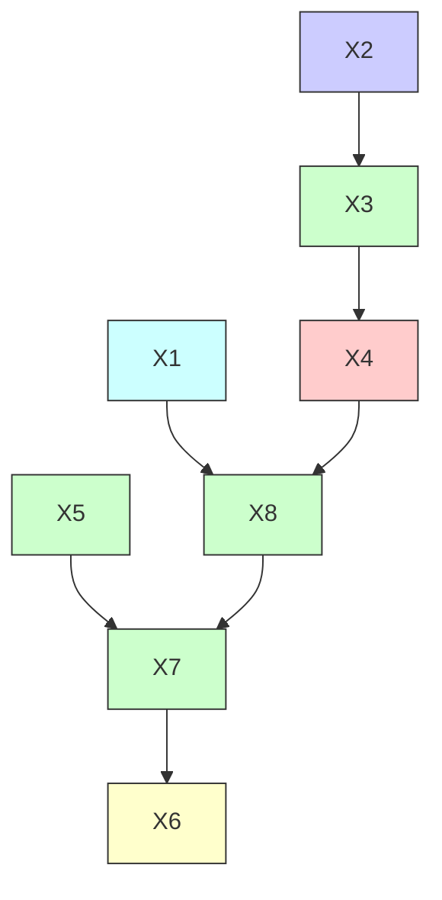
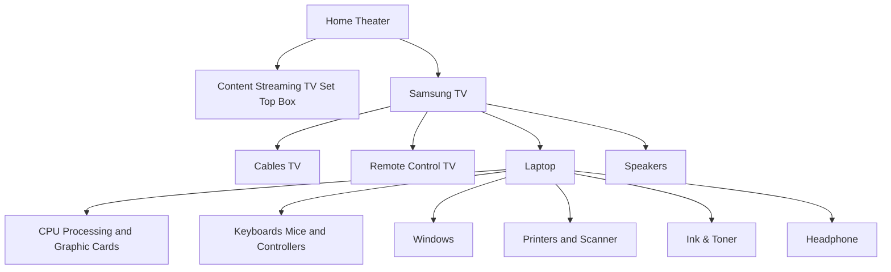
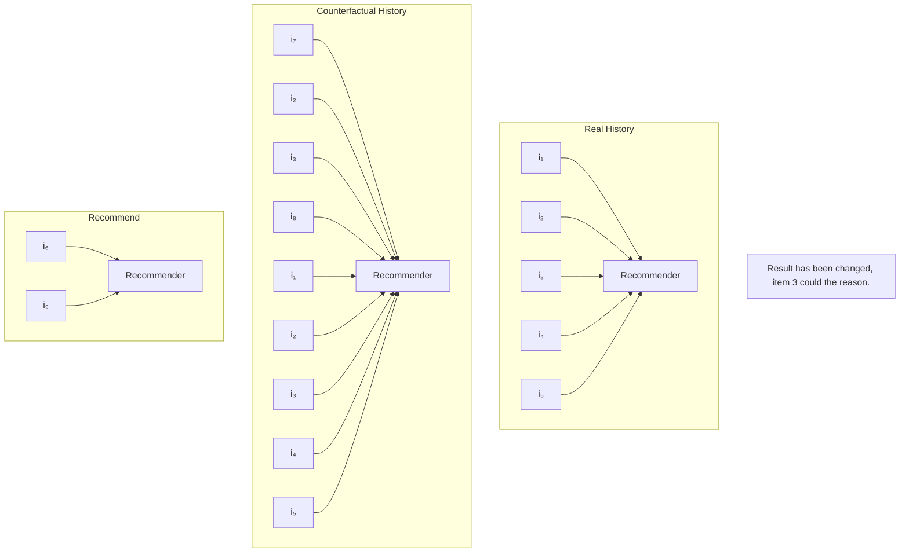
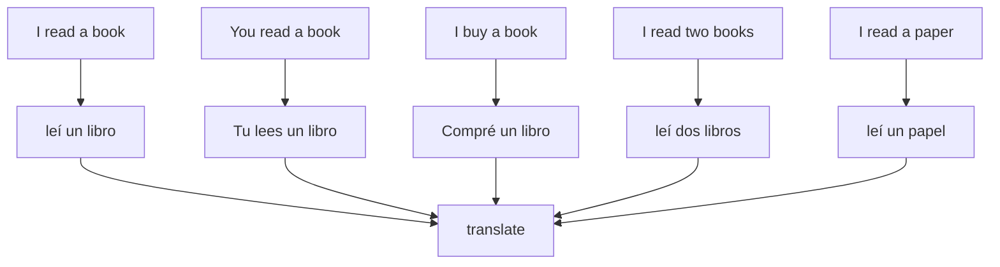
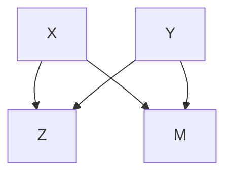

# Chapter 7 Causal Explainable AI

Shuyuan Xu, Yingqiang Ge, and Yongfeng Zhang

## 7.1 Explainable AI

In recent years, the widespread use of AI techniques in real-world services has directly or indirectly affected humans. For example, healthcare AI may affect doctors’ diagnoses; AI agents may decide who gets a job or a loan; self-driving cars are also available to the public in some locations. Among different AI techniques, deep learning has significantly increased the performance of AI applications in various domains. However, as the most successful AI models today, deep learning algorithms are derived from “black box” models, making it difficult to understand why a certain prediction has been made. As AI-powered applications become more and more involved in our daily life, particularly in risk-sensitive areas such as healthcare AI and self-driving cars, the demand for trustworthiness has emerged and gained increasing attention from researchers and industrial practitioners. Generating explanations in a human-comprehensible way is an excellent option to meet such demand. Therefore, it is important and urgent to develop explainable AI (XAI).

Generally, the formal definition of XAI was given by David Gunning [19] as follows:

XAI will create a suite of machine learning techniques that enables human users to understand, appropriately trust, and effectively manage the emerging generation of artificially intelligent partners.

Moreover, XAI is advantageous and beneficial to multiple stakeholders in many ways. We show a few examples in Fig. 7.1. The benefits include, but are not limited to, the following:

Open case containing various electronic components and a highlighted green component (no visible text or symbols)

(a)

Close-up of a person's skateboard with visible wheels and foot, no text or symbols present

Fig. 7.1 Examples with explanations. (a) This is a security inspection X-ray image from the SIXray dataset [26]. The system will alert the security guard to check the bag, and with the explanation provided in the red bounding box, the security guard can quickly identify the prohibited item and further improve the trust in the system. (b) This is an image of the skateboard. An image classifier may correctly identify this image as a skateboard, but the correctness of the underlying reasoning process is unknown without explanations. For example, if the explanation is the red bounding box, then the classifier is highly likely based on the correct reasoning process. Instead, if the explanation is the yellow region, then the classifier is heavily influenced by contextual bias (skateboards often co-occur with human feet), which could help researchers improve the algorithm

• Explanations can help users impacted by the AI to understand the decisions. For example, in healthcare AI, diagnoses with explanations will help doctors decide whether to accept the diagnoses and help patients understand how a diagnosis was made.
• Explanations may be able to help users affected by AI identify directions for future improvement. For example, if a job seeker was rejected by an AI system, an explanation will help the job seeker find deficiencies and improve them for better job hunting in the future.
• Explanations will increase user satisfaction and trustworthiness for application owners. Providing explanations with decisions will enhance user trust and user satisfaction, which may increase profit in the long run.
• Explanations can be used to detect ethical issues for users, industrial practitioners, researchers, and government regulators. For example, if the explanation of a certain decision is related to some sensitive attributes, then the AI model may be unfair.
• Explanations can help researchers and industrial practitioners detect, fix bugs, and identify performance issues to accelerate the pace of development.

Technically, explainable AI can be either model-intrinsic or model-agnostic [43]. The former aims to develop an interpretable model, where the decision-making process is transparent, and the explanations are provided along with the generated decisions. Examples of model-intrinsic approaches include decision trees, linear regression, rule-based models, attention networks, etc. The latter, also known as post-hoc explanation approaches, aims to design a separate explanation model to generate explanations after the decision has been made by a “black-box” decision model [33, 35]. Examples of model-agnostic approaches include local explanations, feature visualizations, example-based explanations, etc. The intuition of these two approaches corresponds to human cognitive psychology [43]. Model-intrinsic approaches are similar to situations where decisions are made through careful, rational reasoning, and the reasoning process explains why a particular decision was made. Model-agnostic approaches correspond to situations where someone makes a decision first and then seeks explanations as evidence to support their decision.

The ultimate goal of explainable AI is to generate explanations in a way that humans can understand. There are two things that need to be clarified in terms of human understanding. The first one is the scope of the explanations, and the second one is the type of data used for explanation and its display style. In terms of the scope of explanations, the generated explanations can be local or global. Local explainable models aim to generate explanations for each individual in the dataset. For instance, given an image and a classifier, a local explainable method would provide information explaining the classification result of that specific image. On the other hand, global explainable approaches consider the model as a whole and generate explanations for the model, which are independent of any particular input.

Regarding the information used for explanations and the display style of explanations, the generated explanations may include but are not limited to the following:

• Text explanations: Text explanations are generated by explainable models from textual information to explain the results obtained by the models. Text explanations are typically displayed as sentences, which can be template-based or generation-based. Template-based explanations first define some sentence templates for explanation and then fill the template with different words. Generation-based explanations are based on natural language generation techniques, which directly generate sentences for explanation without predefined templates.  
Visual explanations: Visual explanations use visual information to explain the model results. For example, it can be an image with a highlighted region where the highlighted region is the explanation.  
• Explanations by entity: It is possible to use an existing entity to explain the decision. The entity includes but is not limited to users, items, words, nodes, edges, graphs, etc. The specific definition of an entity is based on the model scenarios. For example, in recommender systems, the recommended item can be explained by relevant users or items; in graph neural networks (GNN), the results can be explained by related nodes or edges.  
Explanations by feature: Some of the explainable approaches use features as explanations. By identifying the features that contribute the most to the results, the identified features can be considered as the main cause of the prediction results.

Explanations by examples: As proven in the psychology domain [1], it is a promising way to explain complex concepts with experiences and examples. To explain the decision made by the model, some explainable approaches select a particular example from the dataset or generate an example as an explanation.

Most machine learning techniques rely on finding patterns in data that are correlated with certain outcomes. However, these patterns may not necessarily reflect causal relationships, and relying solely on correlative learning can make it unreliable to explain why a particular model is making certain predictions. Therefore, explanations generated from pure correlative learning may include some correlations that are difficult to explain based on common sense. On the contrary, causal relationships involve one event causing another event to happen and can be more easily understood and explained using common sense. As a result, it is important to consider using techniques based on causal learning to address the issues of explainability. Causal learning can help provide more understandable and transparent explanations for machine learning models.

In this chapter, we will primarily focus on discussing causal explanations generated by causal explainable approaches. We will introduce how causal inference can be used to design explainable models and provide in-depth details on several causal explainable approaches for various tasks in AI.

## 7.2 Causal Explanations

In this section, we will first briefly provide an overview of causal explanations and then introduce some techniques for the design of causal explainable models.

## 7.2.1 Correlation vs. Causality

To illustrate the difference between correlation and causality in terms of explainability, consider the following example: there are data showing that ice cream consumption is correlated with the number of shark attacks [20]. Specifically, ice cream consumption and shark attack have the same trend (i.e., the occurrence of two events increases or decreases at the same time). Pure correlative learning may find a strong correlative relation between ice cream consumption and shark attack, which may correctly predict the occurrence of the event. However, this relation is unexplainable according to common sense. It is impossible to explain that consuming ice cream causes shark attacks (or vice versa). Instead, there may be an underlying causal mechanism at play, such as the fact that both ice cream consumption and shark attacks tend to increase in the warmer months when more people are outside enjoying the beach and eating ice cream [20]. This highlights the importance of considering causal explanations in AI, as they can provide a more understandable and transparent understanding of the relationships between different events.

**Observational Data Fig. 7.2 Causal discovery algorithms take observational data as input and return a causal graph**

<table><tr><td> $X_1$ </td><td> $X_2$ </td><td> $\cdots$ </td><td> $X_d$ </td></tr><tr><td> $x_1^1$ </td><td> $x_2^1$ </td><td> $\cdots$ </td><td> $x_d^1$ </td></tr><tr><td> $\vdots$ </td><td> $\vdots$ </td><td> $\ddots$ </td><td> $\vdots$ </td></tr><tr><td> $x_1^n$ </td><td> $x_2^n$ </td><td> $\cdots$ </td><td> $x_d^n$ </td></tr></table>

## 7.2.2 Causal Explainable Methods

As we mentioned before, explainable models can be either model-intrinsic or modelagnostic [43]. Similarly, there are mainly two ways to design a causal explainable model, one for the model-intrinsic approach and another for the model-agnostic approach. More specifically, model-intrinsic approaches are based on the idea of causal discovery, and model-agnostic approaches are based on the idea of the counterfactual. We will briefly introduce these two approaches separately and provide several detailed examples.

## 7.2.2.1 Causal Discovery

Causal discovery aims to extract causal relations between variables based on observational data (some works also include interventional data [6, 24]). The extracted causal relations are usually represented by a causal graph, typically defined as a Directed Acyclic Graph (DAG), where each node represents a random variable in the data and each directed edge represents a causal relation [17]. Suppose that there are d random variables $( X _ { 1 } , X _ { 2 } , \cdots , X _ { d } )$ in the observational data, and $( ( x _ { 1 } ^ { i } , x _ { 2 } ^ { i } , x _ { d } ^ { i } ) _ { i = 1 } ^ { n } )$ discovery algorithms aim to take observational data as input and return a causal graph representing the extracted causal relations between variables [23].

Causal discovery algorithms are able to uncover the underlying mechanisms that drive a system and make predictions based on that understanding. Moreover, since the predictions are made through reasoning on the graph, the explanations can be simultaneously obtained. We show a hypothetical causal model as an example in

<!-- footnote -->

- Y. Wu (-)
- Clemson University, Clemson, SC, USA
- e-mail: yongkaw@clemson.edu
- L. Zhang · X. Wu
- University of Arkansas, Fayetteville, AR, USA
- e-mail: lz006@uark.edu; xintaowu@uark.edu

<!-- footnote end -->

<!-- footnote -->

- S. Xu · Y. Ge · Y. Zhang (-) Rutgers University, New Brunswick, NJ, USA e-mail: shuyuan.xu@rutgers.edu; yingqiang.ge@rutgers.edu; yongfeng.zhang@rutgers.edu

<!-- footnote end -->

Fig. 7.3 A hypothetical causal model to predict lung disease

Fig. 7.3. The hypothetical causal model is used to predict the likelihood of a mine worker developing lung disease. And, the prediction process is reasoning through the graph, and the reasoning process is the explanation for the prediction. If the model predicts that a worker without any genetic risk factors or smoking habits is likely to develop lung disease, the explanation for this prediction might be that the work environment in the mine is highly polluted with dust, increasing the probability of lung disease.

Roughly speaking, causal discovery methods can be broadly divided into three categories [16]: (1) constraint-based, (2) score-based, and (3) functional model based. We introduce each of them as follows:

• Constraint-based approaches: Most constraint-based approaches aim to construct a graph satisfying a set of conditional independencies in the empirical joint distribution [36]. Since there are often multiple graphs satisfying a given set of conditional independencies, constraint-based approaches usually output a graph representing a Markov Equivalence Class. Some representative algorithms include PC [32], FCI [32], etc.
• Score-based approaches: Score-based approaches usually define a scoring function to test the validity of a candidate graph and aim to find the graph with the highest score. Thus the goal can be represented as [30]:

$$
\hat {\mathcal {G}} = \operatorname{argmax} _ {\mathcal {G} \text {   over   } \mathbf {X}} S (\mathcal {D}, \mathcal {G}) \tag {7.1}
$$

where denotes the empirical data with variables X, S is the defined scoring function and $\mathcal { G }$ represents candidate graphs. Some representative methods include GES [8], BC [3], etc.

• Functional model-based approaches: Functional model-based approaches involve additional assumptions about the structural equations to find the causal graph that best fits the observational data. For example, the structural equations are assumed to be linear with Gaussian noise [16].

Recently, some causal discovery approaches have leveraged machine learning techniques to design a differentiable framework [45] that takes advantage of modern gradient-based optimization. Suppose that there are d variables $\mathbf { X } = ( X _ { 1 } , \cdots , X _ { d } )$ , following functional model-based approaches, we represent the structural equations of a causal graph $\mathcal { G }$ as a weighted adjacency matrix $W \in \mathbb { R } ^ { d \times d }$ . Given the loss function $\mathcal { L } ( W ; \mathcal { D } )$ , we seek to solve:

$$
\min _ {W \in \mathbb {R} ^ {d \times d}} \mathcal {L} (W; \mathcal {D}) \tag {7.2}
$$

$\begin{array} { r l } { \mathrm { s . t . } } & { { } \mathcal { G } ( W ) \in \mathrm { D A G s } } \end{array}$

Although the loss function $\mathcal { L } ( W ; \mathcal { D } )$ is continuous and differentiable, the constraint $\mathcal { G } ( W ) \in \operatorname { D A G s }$ is still a challenge. This challenge can be solved based on the following theorem [45].

Theorem 7.1 A matrix $W \in \mathbb { R } ^ { d \times d }$ is a DAG if and only if

$$
h (W) = t r (e ^ {W \odot W}) - d = 0 \tag {7.3}
$$

where $\odot$ is the element wise product and $e ^ { W \odot W }$ is the matrix exponential of $W { \odot } W$ $h ( W )$ has gradient as

$$
\nabla h (W) = \left(e ^ {W \odot W}\right) ^ {T} \odot 2 W \tag {7.4}
$$

Based on above theorem, the optimization in Eq. (7.2) can be rewritten as:

$$
\min _ {W \in \mathbb {R} ^ {d \times d}} \mathcal {L} (W; \mathcal {D}) \tag {7.5}
$$

$\begin{array} { r } { \mathrm { s . t . } \quad h ( W ) = 0 } \end{array}$

It can be solved by constrained optimization techniques, such as the augmented Lagrangian method [45].

## 7.2.2.2 Counterfactual

Counterfactual explanations are usually generated by model-agnostic approaches and involve analyzing what decision would be made under alternative circumstances. While other types of explanations may provide insight into why a decision was made by a model on an observed sample, they fail to show how the model’s decision would change under different conditions. Users may ask “why did the model make this decision instead of another one?” or “did this feature cause the current decision?” or “what would have happened if the situation was different?” Those questions cannot be answered by non-causal explanations because non-causal explainable models cannot estimate how a model would change its decision when altering the input (e.g., changing a feature, removing a component, etc.). Therefore, to answer those questions, counterfactual analysis needs to be leveraged, which allows for the analysis of data in an imaginary world that cannot be observed, enabling the exploration of these types of questions [17].

To provide a vivid example of counterfactual explanations, let’s consider a rejected loan application. Other types of explanations might simply state that the application was rejected due to a low credit score. In contrast, a counterfactual explanation could provide more context and suggest that if the credit score had been 50 points higher, the application would have been approved. This type of explanation provides a more constructive and actionable understanding of the decision-making process, as it considers the decision in alternative circumstances. This demonstrates how counterfactual explainable models are able to produce more nuanced and helpful explanations.

When designing counterfactual explainable models, three key components should be carefully considered. The first component is the counterfactual target, which could be different based on the different tasks. For example, in the recommendation, the counterfactual target could be user/item features, or items; in graph-based models, the counterfactual target could be edges or node features; in NLP tasks, the counterfactual target could be words, etc.

The second component is how to generate counterfactual data. Once the counterfactual target has been settled, the model should decide how to generate counterfactual data. Typically, there are three ways to obtain counterfactual data: (1) generated by heuristic rules, which will pre-define a few heuristic rules and apply them to observed data to generate counterfactual data; (2) generated by a model, which will pre-train a model for counterfactual generation and take observed data as input to return counterfactual data; (3) directly learned, which will directly learn some counterfactual data satisfying some constraints. We will introduce more details with some examples about them in the following sections.

The last component is how to analyze factual and counterfactual data to produce explanations. This component could be a separate step or sometimes be finished during the optimization of learning the counterfactual data. Moreover, counterfactual explanations are usually presented in two ways: identifying the most crucial component (i.e., the component could be features, edges, or entities, depending on the task) or providing an example as the explanation. The former aims to answer questions like “did this component cause the current decision”, the latter aims to answer questions like “why did the model make this decision instead of another one?”

In counterfactual analysis, some properties are taken into consideration during the model design or served as evaluation metrics. We list some of these properties as follows:

• Sparsity/Size: The changes made to the original instance should be minimal and sparse. In other words, the number of altered elements in counterfactual samples should be small.

• Proximity: The counterfactual samples should be as similar as possible to the original instance. Otherwise, the counterfactual explanations may not be convincing enough.
• Speed: In order to apply a counterfactual explainable model in real-world applications, the generation process of counterfactual explanations should be fast enough.
• Diversity: The counterfactual explanations for different instances should be diverse.

In the following sections, we will provide examples of a few causal explainable models to demonstrate how to generate causal explanations. These examples cover typical AI tasks, including recommender system (RS), natural language processing (NLP), computer vision (CV), graph neural networks (GNN), and fairness.

## 7.3 Causal Explainable Recommender Systems

Explainable recommendation [43], as a sub-area of explainable AI, has been a subject of research for over two decades [21]. The explainable recommendation aims to provide explanations to explain why the item was recommended. We will introduce some examples of causal explainable recommendation [38] based on causal discovery and counterfactual. We first define some basic notations in recommendations for better understanding. Suppose we have a user set with m users $\mathcal { U } = \{ u _ { 1 } , u _ { 2 } , \dots , u _ { m } \}$ and an item set with n items $\mathcal { V } = \{ v _ { 1 } , v _ { 2 } , \cdot \cdot \cdot , v _ { n } \}$ . The data consists of a user-item pair and optional user history $\mathcal { D } = \{ ( u , v , H _ { u } ) \}$ , where u is the user, v is the item, $H _ { u } = ( h _ { u 1 } , h _ { u 2 } , \cdot \cdot \cdot , h _ { u | H _ { u } | ) }$ is the user history for user u.

## 7.3.1 Causal Discovery

Causal discovery methods aim to extract causal relations among variables based on the data. So the first thing is to define the variables in the causal graph learned by causal discovery methods. In recommendation, the number of items is extremely large, which could be thousands or even millions. Therefore, it is impractical to directly learn an item-level causal graph. Additionally, due to the high sparsity of recommendation data, the algorithm may fail to capture such underlying mechanisms. Existing work proposes causal discovery-based approaches to extract causal relations on high-level patterns for explanations under the sequential recommendation setting. For example, Wang et al. [37] jointly learn cluster-level causal graph and cluster assignment for items to make an item-level recommendation; Xu et al. [39] directly use product type (PT) information and learn a PT-level causal graph to make PT-level recommendations. We provide an example showing some causal relations learned by [39] in Fig. 7.4, which can be used to explain the PTlevel recommendation and further guide item-level recommendation.

Fig. 7.4 A subgraph of the causal graph learned by [39], which can be used to explain the PT-level recommendation and further guide item-level recommendation

The Causer model [37] learns a cluster-level causal graph jointly with the sequential recommendation model. To make item-level recommendations using the cluster-level causal graph, Causer trains a cluster assignment vector, where each element represents the probability of the item belonging to a certain cluster. The causal relation between two items can be calculated by the cluster-level causal graph and cluster assignment vectors of two items. The causal relations among items are used to mask causally irrelevant items and calculate the likelihood of recommending a certain item v given user history $H _ { u }$ for user u. Suppose that there are d clusters and $W ^ { c } \in \{ 0 , 1 \} ^ { d \times d }$ denotes the adjacency matrix of the cluster-level causal graph, the training loss consists of three losses. The first loss is the recommendation loss $\mathcal { L } _ { r }$ , which is based on binary cross entropy loss. The second loss is the cluster assignment loss $\mathcal { L } _ { c }$ , which measures the distance between the item embedding and a mixture of the clusters (mixed by cluster assignment vector). The third loss is the feature reconstruction loss $\mathcal { L } _ { r e }$ , which expects to reconstruct the item’s raw features (i.e., information in the item profiles, such as descriptions) from item embeddings. The model is learned by the following optimization:

$$
\min \quad \mathcal {L} _ {r} + \mathcal {L} _ {c} + \mathcal {L} _ {r e} \tag {7.6}
$$

$$
s. t. \quad t r (e ^ {W ^ {c} \odot W ^ {c}}) - d = 0
$$

For each item in the user history, the item with the strongest causal relation is used to explain the recommendation.

Another example is the CSL4RS model [39], which predicts the next interacted product type (PT) by learning a PT-level causal graph. CSL4RS considers the recommendation feedback data as the result of a mixture of competing mechanisms, one is a causal mechanism based on user intent, and the other is an intervention mechanism based on deployed recommender systems. The recommender systems recommended an item that may change the user’s original decision. Unfortunately, it is impossible to infer from implicit feedback which item was recommended and whether the recommendation successfully changed the user’s decision.

Suppose that there are $d$ product types $\mathcal { S } = \{ p _ { 1 } , p _ { 2 } , \cdots , p _ { d } \}$ , then the feedback data is converted to the product type level $\mathcal { D } = \{ ( u , p , H _ { u } ) \}$ , where u is the user, $p$ is the product type and $H _ { u } = ( h _ { u 1 } , h _ { u 2 } , \cdot \cdot \cdot , h _ { u | H _ { u } | ) }$ is the user history on the product type for user u. The causal mechanism is represented by a structural causal model, which consists of a causal graph and a set of structural equations [17]. The causal graph is described by an adjacency matrix $W \in \{ 0 , 1 \} ^ { d \times d }$ with structural parameters $\Gamma = \left\{ \gamma _ { i j } \right\} _ { i , j = 1 } ^ { d }$ , where each element $W _ { i j }$ is sampled independently from a Bernoulli distribution parameterized by $\gamma _ { i j }$ (i.e., $W _ { i j } \sim$ Bernoulli(σ (γij )) where $\sigma$ $\{ f _ { j } \} _ { j = 1 } ^ { d }$ independently by linear or nonlinear functions. The intervention mechanism is the deployed recommendation algorithm.

In summary, the CSL4RS model consists of the following components:

• The causal graph $W _ { i j } \sim$ Bernoulli(σ $( \gamma _ { i j } ) )$ , which is simplified as $W \sim \sigma ( \Gamma )$

• Structural equations $f _ { p } ( H _ { u } \odot W _ { \cdot p } )$ where $H _ { u } \odot W _ { \cdot p }$ filters out causally irrelevant history to $p$ .

• The intervention mechanism $g ( p | H _ { u } )$ , which is parameterized by a sequential recommendation model such as GRU4Rec [22].

• The intervention indicator variable $R _ { p , H _ { u } }$ overseeing the two competing mechanism, which is sampled by

$$
P (R _ {p, H _ {u}} = 1) = \Pi_ {i \in H _ {u}} (1 - \sigma (\gamma_ {i p})) \tag {7.7}
$$

We simplify it as $R \sim r ( \Gamma )$

The model aims to maximize the likelihood of the data, which is calculated as:

$$
\mathcal {L} (\mathcal {D}) = \sum_ {(u, p, H _ {u}) \in \mathcal {D}} \mathbb {E} _ {W \sim \sigma (\Gamma), R \sim r (\Gamma)} \log \left[ f _ {p} (H _ {u} \odot W. _ {p}) ^ {1 - R} \cdot g (p | H _ {u}) ^ {R} \right] \tag {7.8}
$$

Combined with the directed acyclic constraint [6], the learning objective becomes:

$$
\max \quad \mathcal {L} (\mathcal {D}) \tag {7.9}
$$

$$
s. t. \quad t r (e ^ {\sigma (\Gamma)}) = d
$$

For each product type in the user history, the product type with the strongest causal relation can explain the recommendation.

## 7.3.2 Counterfactual

Counterfactual-based explainable recommendation models are usually modelagnostic, which include separate explainable mechanisms with given recommendation models. In this section, we introduce two explainable models with counterfactual explanations. They are designed for different types of recommendation models to generate different types of counterfactual explanations.

Xu et al. [40] propose an item-level explainable model for sequential recommendation to extract the most important item for the decision. We show an intuitive example in Fig. 7.5. The counterfactual explanations take the following form: “The system recommends [item A] because you interacted with [item B].” We introduce this work in terms of three key components mentioned in Sect. 7.2.2.2. First, the counterfactual target is items in user history. Therefore, the model generates itemlevel counterfactual explanations for a sequential recommendation. Second, the counterfactual samples are generated by a pre-trained model, which is a Variational Auto-Encoder (VAE). Due to the proximity property, the counterfactual item sequences should be similar to the original item sequences. A well-trained VAE has the ability to reconstruct the item sequences. Meanwhile, variance in the latent space provides VAE the potential to generate similar but slightly different counterfactual item sequences. Therefore, taking the original item sequence as input, the VAE model is able to generate counterfactual item sequences with different variances in the latent space. Given a sequential recommendation model f ( ), the original item sequence and generated counterfactual item sequences will pair corresponding recommended items. For a user u with original item history $H _ { u }$ , the recommended item is denoted as $y _ { u }$ . After generating k counterfactual item sequences and corresponding recommendations, there are k 1 input–output pairs for user u, which $( \hat { H } _ { u } ^ { i } , \hat { y } _ { u } ^ { i } ) _ { i = 1 } ^ { k + 1 }$ model applies logistic regression to extract the causal dependencies $\theta _ { i j }$ from item i to item j. More specifically, the sequence–recommendation pair can be modeled as follows:

Fig. 7.5 An intuitive example of the item-level counterfactual explanation from [40]. If the change of the history will lead to the change of recommendation, then the changed item could be the explanation

$$
P (\hat {y} _ {u} ^ {i} | \hat {H} _ {u} ^ {i}) = \sigma \Big (\sum_ {j = 1} ^ {| \hat {H} _ {u} ^ {i} |} \theta_ {\hat {h} _ {u j} ^ {i}, \hat {y} _ {u} ^ {i}} \cdot \gamma^ {n - j} \Big) \tag {7.10}
$$

where $\sigma ( \cdot )$ is the signoid function and $\gamma$ is the time decay parameter. If the item with the highest $\theta _ { * y _ { u } }$ is in the original item sequence, then this item is the explanation for recommended item $y _ { u } \mathrm { ; }$ ; otherwise, there is no reliable explanation for this recommendation.

Tan et al. [33] designed a feature-based explainable model for the feature-based recommendation. We show an intuitive example in Fig. 7.6. The explanations take the following form: $^ { 6 6 } \mathrm { { \ddot { H } } }$ the item had been slightly worse on [feature X], then it will not be recommended.” The counterfactual target is the item feature of the recommended item. The model designs a learning optimization to generate counterfactual examples and explanations. More specifically, the model aims to generate effective but simple explanations. We denote the change on item features as $\Delta$ as the explanation, and then the complexity is measured by how many features $( | | \Delta | | _ { 0 } )$ were changed and how much change was applied $( | | \Delta | | _ { 2 } ^ { 2 } )$ . It is worth mentioning that the two measurements of explanation complexity correspond to sparsity and proximity properties in counterfactual analysis (mentioned in Sect. 7.2.2.2). The complexity of explanation $\Delta$ is defined as the weighted sum of two components:

$$
C (\Delta) = | | \Delta | | _ {2} ^ {2} + \lambda | | \Delta | | _ {0} \tag {7.11}
$$

The effectiveness of the explanation is defined as how changes affect recommendation results. For the recommended item v, if $\Delta$ removes item v from the top-K recommendation list, then the explanation is effective enough. For a user–item pair $( u , v )$ , suppose $s _ { u v _ { \Delta } }$ is the preference score after the change, and $s _ { u v _ { K + 1 } }$ is the preference score for the item in the K 1 position in the list. Then effective but simple explanations can be obtained by optimizing the following objective:

$$
\min \quad | | \Delta | | _ {2} ^ {2} + \lambda | | \Delta | | _ {0} \tag {7.12}
$$

$$
s. t. \quad s _ {u v _ {\Delta}} \leq s _ {u v _ {K + 1}}
$$

In addition to the two counterfactual explainable recommendation models that apply counterfactual on item and feature separately, there are also some works that apply counterfactual on other targets, such as user’s action [15, 35], etc.

## 7.4 Causal Explainable Natural Language Processing

In this section, we will introduce a model that provides counterfactual explanations for the NLP sequence generation task.

Alvarez-Melis and Jaakkola [2] propose an explainable model based on counterfactual ideas to generate explanations consisting of a set of input and output tokens. We provide an example of an explanation for machine translation in Fig. 7.7. First, the counterfactual target is the tokens in the input sequence. Then, the model designs a Variational Auto-Encoder (VAE) to generate counterfactual input sequences that are similar to the original sequence but have the potential to change the tokens or the ordering. Due to the stochasticity of the VAE in the latent space, the counterfactual input sequences can be obtained by sampling several times from the distribution learned by the encoder of the VAE. Given the pre-trained VAE model on the data from the input domain and the black-box prediction model, for an original input– $\{ ( \tilde { \pmb { x } } _ { i } , \tilde { \pmb { y } } _ { i } ) \} _ { i = 1 } ^ { N }$ which are similar to but slightly different from the original input-output pair.

Fig. 7.7 Here is an example of explaining machine translation tasks using [2]. The example shows the translation from English to Spanish. The first row is the original sentence and original translation, while the remaining rows are counterfactual examples, where red tokens indicate changes from the original sentence and translation. The explanations between input and output tokens are indicated by arrows

After obtaining the counterfactual input–output pairs, the next procedure is to generate counterfactual explanations. The explanation generation process consists of two steps: one is estimating causal dependencies between input and output tokens, and the other is selecting explanations based on the estimated causal dependencies. To estimate the causal dependencies, the model uses logistic regression. Let $\phi _ { x } ( \tilde { x } ) \in$ $\{ 0 , 1 \} ^ { | x | }$ be a binary vector showing the presence of the original tokens of x in the counterfactual sequence $\tilde { \mathbf { x } } .$ . For each original token $y _ { j } \in y$ , the causal dependencies can be estimated as follows:

$$
P (y _ {j} \in \tilde {\mathbf {y}} | \tilde {\mathbf {x}}) = \sigma (\boldsymbol {\theta} _ {j} ^ {T} \phi_ {\mathbf {x}} (\tilde {\mathbf {x}})) \tag {7.13}
$$

where $\theta _ { j }$ represents the causal dependencies between all tokens in the original input and the token $y _ { j }$ in the original output. Thus, the causal dependencies between all tokens in the original input sequence and original output sequence are estimated, which constructs a dense weighted bipartite graph. A graph partitioning approach from [12] is used to select the relevant components of the causal dependency graph as explanations.

## 7.5 Causal Explainable Computer Vision

For causal explainable models in computer vision, a commonly used explanation style is the visual explanation, which can be regions of pixels in images or even whole images. In this section, we will introduce a counterfactual explainable model [18] for the image classification task in detail.

In some cases, we may want explanations that can answer questions like “Why is the prediction A instead of B.” By providing explanations that can answer such questions, users may explicitly learn the significant difference between two decisions, resulting in a better educational effect. Taking the example shown in Fig. 7.8, the classifier may identify the left image as a husky. Given that huskies and wolves can be hard to distinguish in some cases, users may wonder why this image is identified as a husky instead of a wolf. To provide a clear explanation distinguishing between huskies and wolves, Goyal et al. [18] propose a model that modifies the husky image to make the classifier consider it as a wolf. An example of a counterfactual explanation is shown in Fig. 7.8. By exchanging the eye region of a husky and a wolf (the red square region in Fig. 7.8), the classifier may identify the new counterfactual image as a wolf. The explanation would be if the image was modified like this (i.e., husky’s body with wolf’s eyes), then the label would be wolf rather than husky. Based on this explanation, users can identify the key difference between huskies and wolves as being the eyes.

Fig. 7.8 An example of a counterfactual explanation [18] to explain why the left image is identified as a husky rather than a wolf

More specifically, consider an image classifier taking an image $\textit { I } \in \textit { I }$ as input and predicting the probability $P ( C | I )$ over all classes $C .$ . Goyal et al. [18] decomposed the classifier into two functional components, one used for feature extraction (denoted as the $f$ function) and the other used to make a decision based on extracted features (denote as the $g$ function). Therefore, the probability over all class labels can be calculated by $P ( C | I ) = g ( f ( I ) )$ . Given a query image I classified as c and a designated class $c ^ { \prime } \left( c ^ { \prime } \neq c \right)$ , the model generates counterfactual examples $I ^ { c f }$ by designing a transformation based on the original image I and an image $I ^ { \prime }$ classified as $c ^ { \prime }$ . More specifically, the transformation is performed in the latent feature space. Let $\Delta$ as a binary mask vector on features and the feature of the counterfactual image is defined as follows:

$$
f (I ^ {*}) = (\mathbf {1} - \Delta) \odot f (I) + \Delta \odot P f (I ^ {\prime}) \tag {7.14}
$$

where 1 is the all-ones vector, and P is a permutation matrix used to arrange the extracted features. Following the sparsity principle, the counterfactual explanations should be classified as $c ^ { \prime }$ with minimal changes. Therefore, combined with the feature of the counterfactual image shown in Eq. (7.14), the explanation can be learned as follows:

$$
\min _ {\Delta , P} \quad | | \Delta | | _ {1} \tag {7.15}
$$

$$
s. t. \quad c ^ {\prime} = \operatorname{argmax} g ((\mathbf {1} - \Delta) \odot f (I) + \Delta \odot P f (I ^ {\prime}))
$$

## 7.6 Causal Explainable Graph Neural Networks

Graph Neural Networks (GNNs) have achieved great success in machine learning on structural data. In this section, we introduce two existing works that explain the decisions made by GNNs. In general, a GNN model takes graph data as input and outputs the corresponding decision. More specifically, the graph data usually consist of two elements, one is the adjacency matrix $A \in \{ 0 , 1 \} ^ { n \times n }$ presenting the structure of the graph with n variables as nodes, and the other is the feature matrix $\ b X \in \mathbb { R } ^ { n \times r }$ for all variable nodes, where r represents the number of features [34]. We use the graph classification task as an example. A classifier f (·) takes graph data $( A , X )$ as input and returns the class label $c \in C .$ , as shown in Fig. 7.9a.

Molecular structure of a heterocyclic compound with nitrogen and oxygen atoms

Molecular structure of a heterocyclic compound with nitrogen and oxygen atoms

(b)

Molecular structure of a heterocyclic compound with nitrogen and oxygen atoms

（c)

Molecular structure of a heterocyclic compound with nitrogen and oxygen atoms

(d)  
Fig. 7.9 Examples of explanations for GNN in graph classification task using a data sample from MUTAG dataset [10], where the GNN model predicts whether a chemical compound has a mutagenic effect on a bacterium. (a) The original chemical compound, which has a mutagenic effect on a bacterium. (b) Red edges indicate a counterfactual explanation. Removing red edges will change the results. (c) Orange edges indicate an explanation generated based on factual reasoning. Keeping orange edges will not change the decision. (d) Blue edges indicate an explanation generated based on both factual and counterfactual reasoning [34]. Blue edges also indicate the ground-truth explanation since nitrobenzene structure is the cause of mutagen

Lucic et al. [25] design a GNN explainer to generate counterfactual explanations based on graph structure. More specifically, the model aims to find a perturbation ∆ on the graph structure $A _ { c f } = A + \Delta$ such that $f ( A , X ) \neq f ( A ^ { c f } , X )$ ). Following the sparsity and proximity principles, an optimal counterfactual explanation should be the minimal change $\Delta ^ { * }$ that leads to a different result. We provide a simple example in Fig. 7.9b. The model defines the change on the graph structure as $\Delta = 1 - M$ , where $\mathbf { 1 } = \{ 1 \} ^ { n \times n }$ is the all-one matrix and $M \in \{ 0 , 1 \} ^ { n \times n }$ is the mask matrix. Therefore, the counterfactual graph structure is obtained by $A ^ { c f } = A \odot M$ , where ⊙ is the element-wise product. Thus, $M _ { i j } = 0$ indicates the deletion of edge $( i , j )$ . The counterfactual explanations can be generated by following the optimization:

$$
\min \quad \mathcal {L} = \mathcal {L} _ {\text { pred }} (A, A ^ {c f} | f) + \lambda \mathcal {L} _ {\text { dist }} (A, A ^ {c f} | d) \tag {7.16}
$$

where $\mathcal { L } _ { p r e d }$ encourages $f ( A , X ) \neq f ( A ^ { c f } , X )$ , d measures the distance between A and $A ^ { c f } , \mathcal { L } _ { d i s t }$ encourages a small change on the graph structure, and λ is the weight parameter. The counterfactual explanations are shown based on $\Delta$ that the decision will be changed without the edges in ∆.

Traditional explainable models based on factual reasoning aim to find the minimal set of inputs that maintain the original decision, as shown in Fig. 7.9c, while counterfactual explainable models based on counterfactual reasoning aim to find the minimal set of changes that lead to a different decision, as shown in Fig. 7.9b [34]. Tan et al. [34] propose an explainable model based on both factual and counterfactual reasoning. We provide an example in Fig. 7.9d. This model aims to learn an edge mask $M \in \{ 0 , 1 \} ^ { n \times n }$ for the graph structure A and a feature mask $F \in \{ 0 , 1 \} ^ { n \times r }$ for the node features $X .$ . The subgraph A ⊙ M with sub-features $X \odot F$ will be considered as the explanation for the decision of the data (A, X).

Following [33], the explanation should be effective and simple. The effectiveness can be measured using both factual and counterfactual reasoning. Factual reasoning aims to find a subset of edges and features that produce the same decision as the original edges and features. Suppose $P _ { f } ( c | A , X )$ denotes the probability of the data $( A , X )$ being labeled as class c according to classifier $f _ { \cdot }$ , then the effectiveness of factual reasoning can be formulated as follows:

$$
P _ {f} (c | A, X) > P _ {f} (c ^ {*} | A \odot M, X \odot F) \tag {7.17}
$$

where $c$ is the predicted label for the original data $( A , X )$ and $c ^ { * }$ is the label with highest probability except for c. Similarly, counterfactual reasoning aims to remove a set of edges and features to change the decision. Thus, the effectiveness of counterfactual reasoning can be formulated as follows:

$$
P _ {f} (c | A, X) <   P _ {f} (c ^ {*} | A - A \odot M, X - X \odot F) \tag {7.18}
$$

Effective and simple explanations can be learned by optimizing both factual and counterfactual reasoning:

(7.19)

$$
P _ {f} (c | A, X) <   P _ {f} \left(c ^ {*} \mid A - A \odot M, X - X \odot F\right)
$$

This optimization will identify the minimal set of edges and features that explain the decision, where keeping them will maintain the original decision, and removing them will change the decision.

## 7.7 Causal Explainable Fairness

Existing research on fairness has mainly focused on the evaluation of fairness and the development of fair machine learning models [13]. These works usually require manual identification of the reason for model disparity based on expert knowledge to develop a fair model or force the model to reduce certain disparities for fairness. However, it is essential also to understand and explain the underlying reasons for unfairness. In this section, we will discuss various methods for explaining observed disparities.

Zhang and Bareinboim [42] define discriminatory mechanisms by different counterfactual effects and explain the observed disparities of decisions through these mechanisms. In concrete, discrimination can be broadly divided into two categories: direct discrimination and indirect discrimination [9]. Using the language of causality proposed by Pearl [4, 17, 28], direct and indirect discrimination can be expressed by different paths connecting the sensitive feature and the outcome in the causal graph. Direct discrimination is modeled by the direct causal path from sensitive attribute X to the outcome $Y \ ( \mathrm { e . g . } , X  Y$ in Fig. 7.10). Indirect discrimination can be further divided into two mechanisms with two different types of paths in the causal graph: one is indirect causal discrimination, which is captured by directional paths from X to Y except for the direct path $( \mathbf { e . g . } , X \to M \to Y$ in Fig. 7.10), the other is indirect spurious discrimination, which is captured by other paths except for the direct and indirect paths (e.g., $X \left. Z \right. Y$ in Fig. 7.10). Overall, there are three exclusive discrimination mechanisms in the perspective of causal graphs: direct discrimination, indirect discrimination, and spurious discrimination [5].

Fig. 7.10 An example of causal graph where X stands for sensitive feature, Y for the outcome, M for the mediator, and Z for the confounder

To quantitatively detect and distinguish three discrimination mechanisms, Zhang and Bareinboim [42], inspired by mediation analysis [27], define a counterfactual effect for each discrimination mechanism. We first introduce some notations. Following [29], we use, interchangeably, $P ( y _ { x } )$ and $P ( Y ~ = ~ y | d o ( X ~ = ~ x ) )$ to represent the probability of outcome Y under an intervention do $( X = x )$ . Similarly, we use the abbreviation $P ( y | x )$ for the conditional probabilities $P ( Y = y | X = x )$ . For the mediator M, we denote $M _ { x }$ as the value that is naturally attained under the condition $X = x$ . Following [42], we set the advantage group $\mathcal { G } _ { 0 }$ by sensitive attribute $X = x _ { 0 }$ and the disadvantage group $\mathcal { G } _ { 1 }$ by $X = x _ { 1 }$ .

Direct discrimination is defined by the counterfactual direct effect of intervention $X = x _ { 1 }$ on Y (with baseline $x _ { 0 } )$ based on the condition X x [42].

$$
D E _ {x _ {0}, x _ {1}} (y | x) = P (y _ {x _ {1}, M _ {x _ {0}}} | x) - P (y _ {x _ {0}} | x) \tag {7.20}
$$

It is worth mentioning that if there is no direct path connecting X and Y , then $D E _ { x _ { 0 } , x _ { 1 } } ( y | x ) = 0$ for all $x , y , x _ { 0 } \neq x _ { 1 }$ .

Similarly, indirect discrimination is defined by the counterfactual indirect effect of intervention $X = x _ { 1 }$ on Y (with baseline x ) based on the condition $X = x \ [ 4 2 ]$ .

$$
I E _ {x _ {0}, x _ {1}} (y | x) = P (y _ {x _ {0}, M _ {x _ {1}}} | x) - P (y _ {x _ {0}} | x) \tag {7.21}
$$

A similar conclusion can be obtained that if there is no indirect path connecting X and Y , then $I E _ { x _ { 0 } , x _ { 1 } } ( y | x ) = 0$ for all $x , y , x _ { 0 } \neq x _ { 1 }$ .

The spurious discrimination, caused by a spurious association between sensitive attribute X and outcome Y , is captured by the counterfactual spurious effect of event $X = x _ { 1 }$ on $Y = y$ (with baseline x0) [42].

$$
S E _ {x _ {0}, x _ {1}} (y) = P \left(y _ {x _ {0}} \mid x _ {1}\right) - P (y \mid x _ {0}) \tag {7.22}
$$

Similarly, if X has no back-door path connecting Y , then $S E _ { x _ { 0 } , x _ { 1 } } ( y ) = 0$ for any $y , x _ { 0 } \neq x _ { 1 }$ .

Demographic parity [11, 41] is a popular criterion to detect unfairness in observed outcomes, which is defined as the total variation of event $X ~ = ~ x _ { 1 }$ on $Y = y$ (with baseline x0) [42].

$$
V T _ {x _ {0}, x _ {1}} (y) = P (y \mid x _ {1}) - P (y \mid x _ {0}) \tag {7.23}
$$

According to three counterfactual effects representing three discrimination mechanisms, Zhang and Bareinboim [42] decompose the observed unfairness (i.e., total variation) into three defined counterfactual effects:

$$
V T _ {x _ {0}, x _ {1}} (y) = S E _ {x _ {0}, x _ {1}} (y) + I E _ {x _ {0}, x _ {1}} (y \mid x _ {0}) - D E _ {x _ {1}, x _ {0}} (y \mid x _ {1}) \tag {7.24}
$$

Therefore, the observed unfairness can be explained by identifying the discrimination mechanism that contributes the most to the total variation.

In addition to the above example that explains unfairness by the discrimination mechanism, Ge et al. [13] propose to generate feature-based explanation for model parity. Specifically, Ge et al. [13] design a feature-level counterfactual explainable model to explain group unfairness in recommender systems. Using exposure unfairness due to popularity bias as an example, the proposed model aims to generate fairness explanations while considering the fairness–utility trade-off.

Suppose we have a user set with m users $\mathcal { U } = \{ u _ { 1 } , u _ { 2 } , \dots , u _ { m } \}$ and an item set with n items $\mathcal { V } = \{ v _ { 1 } , v _ { 2 } , \boldsymbol { \cdot } \boldsymbol { \cdot } \boldsymbol { \cdot } , v _ { n } \}$ . Following the same method in [7, 33, 44], a user-feature attention matrix $\mathbf { A } \in \mathbb { R } ^ { m \times r }$ and an item-feature attention matrix $\textbf { B } \in$ $\mathbb { R } ^ { n \times r }$ can be extracted from review data, where $A _ { u f }$ indicates how much user u cares about feature $f$ and $B _ { v f }$ indicates how well item v performs on feature $f .$ . For a given feature-based recommendation model $f$ that calculates the preference score of a user–item pair $( u , v )$ as $f ( \mathbf { A } _ { u } , \mathbf { B } _ { v } )$ , the top-K recommendation lists are generated for all users $\mathcal { R } = \{ \mathcal { R } _ { u } \} _ { u \in \mathcal { U } }$ . Given the certain recommendation result ${ \mathcal { R } } ,$ , the model disparity can be measured by splitting items into popular items $\mathcal { G } _ { 0 }$ and long-tail items $\mathcal { G } _ { 1 }$ . Specifically, the disparity $\Phi$ can be measured by the difference between the two groups in terms of Demographic Parity [14, 31] or Exact-K Fairness [14].

The next step is to generate counterfactual samples. The basic idea is to discover a slight change $\Delta$ on each feature by minimizing the disparity. For a certain feature $f _ { : }$ , applying perturbation $\Delta$ will return a counterfactual user–feature matrix $\mathbf { A } ^ { c f }$ and a counterfactual item-feature matrix $\mathbf { A } ^ { c f }$ . The recommendation model with the counterfactual user-feature matrix $\mathbf { A } ^ { c f }$ and counterfactual item–feature matrix $\mathbf { A } ^ { c f }$ will return counterfactual recommendation results $\mathcal { R } ^ { c f }$ and counterfactual disparity $\Phi ^ { c f }$ . The change of feature $f$ can be learned by maximizing the reduction of disparity while minimizing the proximity as follows:

$$
\min \quad | | \Phi^ {c f} | | _ {2} ^ {2} + \lambda | | \Delta | | _ {2} \tag {7.25}
$$

where λ is the weight parameter.

After finding $\Delta$ for every feature, the last step is to generate a feature-based counterfactual explanation. The model calculates a score for each feature in terms of the fairness–utility trade-off. More specifically, the score determines the ability to reduce disparity while keeping the perturbation small. Eventually, the feature with the highest score will be selected as the explanation [13].

## 7.8 Summary

In this chapter, we focus on causal explainable AI. We first introduce the general background of explainable AI (XAI), including the benefits of providing explanations, categories of explainable models, and display styles of explanations. Then, we incorporate causality into explainable AI and introduce two common causal explainable approaches, one based on causal discovery and the other based on counterfactual. After that, we demonstrate how to apply causal explainable methods to different tasks in AI, including recommendation, NLP, CV, GNN, and fairness.

## References

1. A. Aamodt, E. Plaza, Case-based reasoning: foundational issues, methodological variations, and system approaches. AI Commun. 7(1), 39–59 (1994)  
2. D. Alvarez-Melis, T.S. Jaakkola, A causal framework for ex-plaining the predictions of blackbox sequence-to-sequence models. arXiv preprint arXiv:1707.01943 (2017)  
3. O. Banerjee, L. El Ghaoui, A. d’Aspremont, Model selection through sparse maximum likelihood estimation for multivariate Gaussian or binary data. J. Mach. Learn. Res. 9, 485– 516 (2008)  
4. E. Bareinboim, J. Pearl, Causal inference and the data-fusion problem. Proc. Natl. Acad. Sci. 113(27), 7345–7352 (2016)  
5. S. Barocas, M. Hardt, A. Narayanan, Fairness and Machine Learning: Limitations and Opportunities. http://www.fairmlbook.org (2019)  
6. P. Brouillard et al., Differentiable causal discovery from interventional data. Adv. Neural Inf. Process. Syst. 33, 21865–21877 (2020)  
7. T. Chen et al., Try this instead: personalized and interpretable substitute recommendation, in Proceedings of the 43rd International ACM SIGIR Conference on Research and Development in Information Retrieval, 2020, pp. 891–900  
8. D.M. Chickering, Optimal structure identification with greedy search. J. Mach. Learn. Res. 3, 507–554 (2003). ISSN: 1532-4435. https://doi.org/10.1162/153244303321897717  
9. National Research Council et al., Measuring Racial Discrimination, (National Academies Press, Washington, DC 2004)  
10. A.K. Debnath et al., Structure-activity relationship of mutagenic aromatic and heteroaromatic nitro compounds. Correlation with molecular orbital energies and hydrophobicity. J. Med. Chem. 34(2), 786–797 (1991)  
11. C. Dwork et al., Fairness through awareness, in Proceedings of the 3rd Innovations in Theoretical Computer Science Conference, 2012, pp. 214–226  
12. N. Fan, Q.P. Zheng, P.M. Pardalos, Robust optimization of graph partitioning involving interval uncertainty. Theor. Comput. Sci. 447, 53–61 (2012)  
13. Y. Ge et al., Explainable fairness in recommendation, in Proceedings of the 45th International ACM SIGIR Conference on Research and Development in Information Retrieval, 2022, pp. 681–691  
14. Y. Ge et al., Towards long-term fairness in recommendation, in Proceedings of the 14th ACM International Conference on Web Search and Data Mining, 2021, pp. 445–453  
15. A. Ghazimatin et al., PRINCE: provider-side interpretability with counterfactual explanations in recommender systems, in Proceedings of the 13th International Conference on Web Search and Data Mining, 2020, pp. 196–204  
16. C. Glymour, K. Zhang, P. Spirtes, Review of causal discovery methods based on graphical models. Front. Gen. 10, 524 (2019)  
17. J. Pearl, M. Glymour, N.P. Jewell, Causal Inference in Statistics: A Primer, (Wiley, West Sussex, UK, 2016)  
18. Y. Goyal et al., Counterfactual visual explanations, in International Conference on Machine Learning (PMLR, 2019), pp. 2376–2384  
19. D. Gunning, Explainable artificial intelligence (XAI). Defense Adv. Res. Projects Agency (DARPA), nd Web 2(2), 1 (2017)  
20. P. Haden, Descriptive statistics, in The Cambridge Handbook of Computing Education Research , (Cambridge University Press, New York, NY, 2019), pp. 102–132  
21. J.L. Herlocker, J.A. Konstan, J. Riedl, Explaining collaborative filtering recommendations, in Proceedings of the 2000 ACM Conference on Computer Supported Cooperative Work, 2000, pp. 241–250  
22. B. Hidasi et al., Session-based recommendations with recurrent neural networks. arXiv preprint arXiv:1511.06939 (2015)  
23. X. Huang et al., Causal discovery from incomplete data using an encoder and reinforcement learning. arXiv preprint arXiv:2006.05554 (2020)  
24. A. Jaber et al., Causal discovery from soft interventions with unknown targets: characterization and learning. Adv. Neural Inf. Process. Syst. 33, 9551–9561 (2020)  
25. A. Lucic et al., Cf-gnnexplainer: counterfactual explanations for graph neural networks, in International Conference on Artificial Intelligence and Statistics (PMLR, 2022), pp. 4499– 4511  
26. C. Miao et al., Sixray: a large-scale security inspection x-ray benchmark for prohibited item discovery in overlapping images, in Proceedings of the IEEE/CVF Conference on Computer Vision and Pattern Recognition, 2019, pp. 2119–2128  
27. J. Pearl, Direct and Indirect Effects Paper Presented at: Proceedings of the Seventeenth Conference on Uncertainty in Artificial Intelligence (2001)  
28. J. Pearl, Causality (Cambridge University Press, 2009)  
29. J. Pearl, Causality: Models, Reasoning and Inference, vol. 29, (Springer, Cambridge, UK, 2000)  
30. J. Peters, D. Janzing, B. Schölkopf, Elements of CAUSAL Inference: Foundations and Learning Algorithms, (The MIT Press, Cambridge, MA, 2017)  
31. A. Singh, T. Joachims, Fairness of exposure in rankings, in Proceedings of the 24th ACM SIGKDD International Conference on Knowledge Discovery & Data Mining, 2018, pp. 2219– 2228  
32. P. Spirtes et al., Causation, Prediction, and Search, (MIT Press, Cambridge, MA, 2000)  
33. J. Tan et al., Counterfactual explainable recommendation, in Proceedings of the 30th ACM International Conference on Information & Knowledge Management, 2021, pp. 1784–1793  
34. J. Tan et al., Learning and evaluating graph neural network explanations based on counterfactual and factual reasoning, in Proceedings of the ACM Web Conference 2022, 2022, pp. 1018–1027  
35. K.H. Tran, A. Ghazimatin, R.S. Roy, Counterfactual explanations for neural recommenders, in Proceedings of the 44th International ACM SIGIR Conference on Research and Development in Information Retrieval, 2021, pp. 1627–1631  
36. M.J. Vowels, N.C. Camgoz, R. Bowden, D’ya like dags? A survey on structure learning and causal discovery. ACM Comput. Surv. 55(4), 1–36 (2022)  
37. Z. Wang et al., Sequential recommendation with causal behavior discovery. arXiv preprint arXiv:2204.00216 (2022)  
38. S. Xu et al., Causal inference for recommendation: foundations, methods and applications. arXiv preprint arXiv:2301.04016 (2023)  
39. S. Xu et al., Causal structure learning with recommendation system. arXiv preprint arXiv:2210.10256 (2022)  
40. S. Xu et al., Learning causal explanations for recommendation, in The 1st International Workshop on Causality in Search and Recommendation, 2021  
41. M.B. Zafar et al., Fairness constraints: a flexible approach for fair classification. J. Mach. Learn. Res. 20(1), 2737–2778 (2019)  
42. J. Zhang, E. Bareinboim, Fairness in decision-making–the causal explanation formula, in 32nd AAAI Conference on Artificial Intelligence, 2018  
43. Y. Zhang, X. Chen et al., Explainable recommendation: a survey and new perspectives. Found. Trends®Inf. Retrieval 14(1), 1–101 (2020)  
44. Y. Zhang et al., Explicit factor models for explainable recommendation based on phraselevel sentiment analysis, in Proceedings of the 37th International ACM SIGIR Conference on Research & Development in Information Retrieval, 2014, pp. 83–92  
45. X. Zheng et al., Dags with no tears: continuous optimization for structure learning. Adv. Neural Inf. Process. Syst. 31, 9492–9503 (2018)