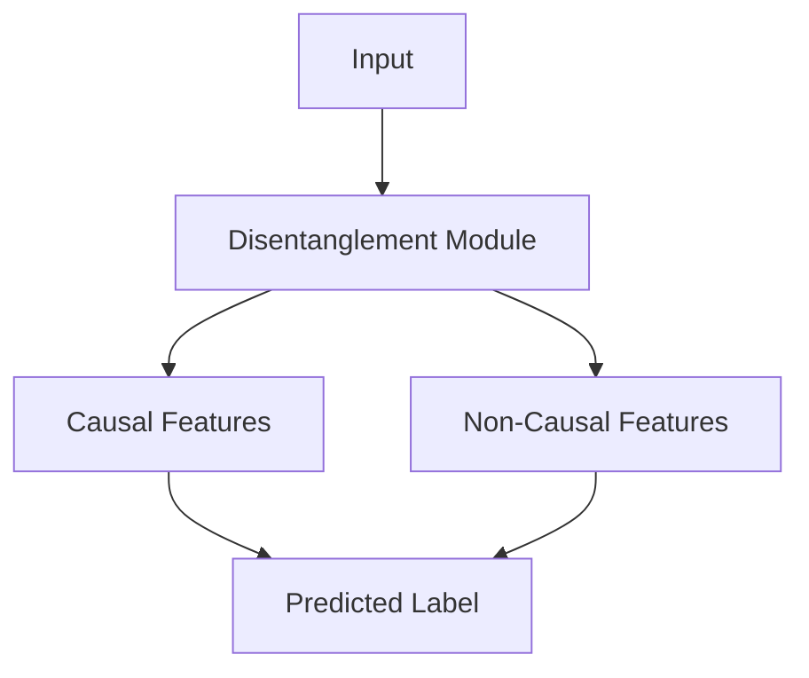

# Chapter 8 Causal Domain Generalization


Paras Sheth and Huan Liu

## 8.1 Introduction

In recent years, machine learning has become increasingly ubiquitous in our lives. Machine learning algorithms are used to make predictions and decisions in various contexts, from the smartphone in our pockets to the recommendations we receive online [25]. In business, machine learning is used to optimize supply chains, predict customer behavior, and improve marketing efforts [11]. In health care, it assists with diagnosis, treatment planning, and predicting disease outbreaks and patient outcomes [24]. Finally, machine learning is used in transportation to improve traffic flow and reduce accidents [2]. Although indispensable, these models suffer from poor generalization capabilities, meaning they cannot accurately make predictions in situations slightly different from the ones on which they were trained.

Machine learning models suffer from poor generalization. Because, as per the i.i.d (independent and identically distributed) assumption in machine learning, the training and test data are drawn independently from an identical distribution. However, in many real-world scenarios, this assumption may not hold. For example, suppose a model is trained on data from a specific period, such as stock prices from a particular year. If the test data are from a different period, the model may not generalize well due to changes in the underlying distribution.

Deploying models with poor generalization in critical situations might yield incorrect and harmful results. For instance, imagine you are building a machine learning model to predict whether a person has a particular disease based on their medical records, as shown in Fig. 8.1. You train the model on a large dataset of medical records from a specific hospital, and it performs very well at predicting the disease status of patients in this hospital. However, you want to deploy the model in a different hospital where the data may differ (e.g., the patients may have different demographics, or the hospital may use different medical equipment). In this case, simply applying the model trained on the original hospital’s data to the new hospital’s data may not work well. This is because the model may not have seen data from the new hospital during training and may be unable to generalize to this new, slightly different domain. To address this issue, we need a model that can generalize beyond the specific data it has been trained on and adapt to new situations that are similar but not identical to the ones it has seen before. This is where domain generalization comes in. By building a model that can perform well in various situations, we can increase its flexibility and applicability in real-world scenarios.


Fig. 8.1 The task of disease prediction from a domain generalization perspective. The machine learning model is first trained on the patient’s medical records, demographics, and equipment used for Hospital A (source domain). Then, the model is deployed for different hospitals (target domains), i.e., Hospitals B and Hospitals C

Now that we understand what domain generalization methods are and how they are helpful, let us understand how causality aids in improving generalizability. For any given problem that deals with Out-Of-Distribution (OOD) scenarios, two sets of features exist: domain-specific and domain-invariant. The domain-specific features are particular to each domain and may vary across the different domains. In contrast, the domain-invariant features are stable and highly predictive w.r.t the problem. Traditionally, machine learning models tend to utilize domain-specific features (as they have high correlations with the target label in the domain), resulting in high accuracies within the domain. However, overtly relying on these features hurts the generalization capabilities of the models. Thus, to attain higher generalization capabilities, a machine learning model should aim to identify and learn these domain-invariant features as they are immune to distribution shifts. Furthermore, it is well established that causality and invariance are tightly linked, i.e., one of the dimensions of causality is invariance [5, 6]. Thus, causality can be a valuable tool in capturing the invariance present in the data.

Depending on which stage of the model pipeline we are at, causality can be leveraged differently. As a result, causality-aware domain generalization methods can be classified into three categories, namely (1) Causal Data Augmentation methods that are leveraged during the preprocessing stage. These methods can help differentiate between spurious and causal features; (2) Causal Representation Learning methods that are leveraged in the representation learning stage. These methods aim to disentangle the input representations into causal and non-causal factors in the latent space; and (3) Causal Mechanisms methods, utilized in the classification stage. These methods focus on transferring the causal mechanisms such that the class conditionals remain invariant across domains.

## 8.2 Domain Generalization Definition and Challenges

Before we discuss the different types of causal domain generalization methods mentioned above, let’s formally define and understand the domain generalization problem, followed by the challenges of domain generalization and how causality can aid in addressing these challenges.

## 8.2.1 Definition

Consider X as the set of features, Y as the set of labels, and D as the set of domain(s) with sample spaces , , and , respectively. A domain is defined as a joint distribution $P _ { X , Y }$ on $\chi \times \mathcal { Y }$ . Let $P _ { X }$ represent X ’s marginal distribution, $P _ { X \mid Y }$ represent the class-conditional distribution of X given Y , and $P _ { Y \mid X }$ represent the posterior distribution of Y given X

The purpose of a domain generalization model is to learn a predictive model $f : X \to y .$ . However, while dealing with domain generalization, the common assumption implies that training data are obtained from a finite subset of the possible domains $D _ { \mathrm { t r a i n } } \subset \mathcal { D }$ . Furthermore, the number of training domains is given by K, and $D _ { \mathrm { t r a i n } } = \{ d _ { i } \} _ { i = 1 } ^ { K } \subset \mathcal { D }$ . As a result, the training data are sampled from a distribution $P \left[ X , Y \mid D = d _ { i } \right] \forall i \in \{ 1 , . . . , K \}$ . The domain generalization model then aims at utilizing only source (train) domain(s) data with the goal of minimizing the prediction error on a previously unseen target (test) domain. The $D _ { \mathrm { t e s t } }$ $P _ { X , Y } ^ { D _ { \mathrm { t e s t } } }$ and $P _ { X , Y } ^ { D _ { \mathrm { t e s t } } } ~ \neq ~ P _ { X Y } ^ { ( k ) } , \forall k ~ \in ~ \{ 1 , \dots , K \}$ . Ideally, the goal is to learn a classifier that is optimal for all domains .

## 8.2.2 Challenges and Causal Solution

There are challenges associated with domain generalization in machine learning:

• Covariate shift: This refers to the difference in the distribution of the input features between the training and test environments. Causal models can help address covariate shifts by identifying and controlling for confounding variables that correlate with input and output variables and could potentially bias the model’s predictions. By controlling for these variables, the model can better account for differences in the input distribution between the training and test environments.

• Concept shift refers to the difference in the underlying concepts or relationships between the training and test environments. Causal models can help address concept shifts by explicitly modeling the underlying causal relationships between variables rather than just modeling the statistical correlations between them. This can make the model more robust to changes in the relationships between variables and allow it to better generalize to new tasks or environments.

• Limited data: In many cases, the training data available for domain generalization may be limited, making it difficult for the model to learn a robust and generalizable data representation. Causal models can help by leveraging domain knowledge to identify the key causal variables and relationships and using more efficient estimation methods less sensitive to the amount of data.

• Overfitting: If the model is too complex or has too many parameters relative to the amount of training data, it may overfit the specific training data and not generalize well to the test data. Causal models can help address the challenge of overfitting by using more straightforward and more interpretable models, which are less prone to overfitting, and by using methods such as regularization to prevent overfitting.

Multitask learning: When dealing with multiple test tasks or environments, the model may need to learn a joint representation that is shared across tasks while also being able to adapt to the specific characteristics of each task. Causal models can help identify and model the common causal structure shared across tasks.

## 8.3 Causal Data Augmentations for Domain Generalization

This section presents frameworks that achieve domain invariance by using causal data augmentation. These frameworks use causal features and augment the data by considering all potential confounding or spurious variables. While the ultimate goal of these methods is to learn causal representations, their techniques (such as identifying features to augment) follow a causal approach, which warrants them being grouped into a distinct category. We classify the frameworks based on different data augmentation techniques leveraged and understand how each technique aids with better generalization.

## 8.3.1 Counterfactual Feature-Based Data Augmentation

Before we understand counterfactual feature-based data augmentation, let us begin by understanding what Data Augmentation is and how it helps improve the generalization in machine learning models.

Data augmentation is a technique that involves generating additional, synthetic training data by modifying the existing training data in some way. Data augmentation aims to improve the generalization performance of a machine learning model, which refers to its ability to make accurate predictions on new, unseen data. One way that data augmentation helps improve generalization is by increasing the diversity of the training data. When trained on a diverse set of training data, a model can better capture the underlying patterns and relationships, improving its ability to generalize to new, unseen data. Another way that data augmentation helps improve generalization is by providing the model with additional opportunities to learn from the training data. For example, when a model is trained on a larger dataset, it has more examples to learn from, which can help it better capture the underlying patterns in the data. Also, by generating additional synthetic training data, data augmentation can help prevent overfitting by providing the model with more opportunities to learn from the training data without memorizing specific examples.

Now, we proceed to counterfactual feature-based data augmentation. Any input data can be decomposed into causal features and non-causal features. When data augmentations are performed on non-causal features, it is called counterfactual feature-based data augmentation. Let us understand this with an example as shown in Fig. 8.2. Consider a model that aims to classify cows and camels. The training dataset contains images of cows on a grass background and camels on a sand background. Since cows dominate the training data on grass, the model may associate the grass background with the cow label, which is a spurious correlation. To overcome this problem, one can perform data augmentations on the non-causal features, i.e., the background features, to generate images of cows in different settings. This process forces the model to rely on the features of the cow to associate it with the cow label. This approach has been leveraged in various research works. These works leverage various tools to disentangle the input into causal and noncausal features. For instance, the authors of [31] aim to improve generalization for human pose detection. To do so, they leverage a GAN-based architecture to learn the distribution of counterfactuals from a ground-truth pose and random noise. They also leverage a feature extractor encoder on the input image to get the observed feature representation distribution. Finally, the counterfactual and observed representations are fed to predictors to ensure high predictive power. Since the counterfactual representation represents the causal features (i.e., the pose), the predictors try to minimize the distance between the observed and the counterfactual representations with the aid of l1-distance. The model is trained by the overall objective function as shown below:


```mermaid
graph LR
  A["Training Data"] --> B["Model"]
  B --> C["Test Data"]
  C --> D["Performance decreases"]
  E["Training Data"] + F["Counterfactual feature based augmented data"] --> G["Model"]
  G --> H["Test Data"]
  H --> I["Performance improves"]
```

Fig. 8.2 When a model is trained on images of cows on a grass background and evaluated on images of cows in space, its performance deteriorates. However, when we generate counterfactual feature-based augmented data and utilize them during the training, and then evaluate images of cows in space, the performance improves

$$
\min _ {\theta_ {f}, \theta_ {h}} \mathbb {E} _ {(x, y, u) \sim (p (x), p (y), p (u)} \mathcal {L} _ {F} (h (f (x)), y) + \tag {8.1}
$$

$$
\lambda_ {1} \mathcal {L} _ {C F} (h (g (u, y)), y) + \lambda_ {2} \mathcal {L} _ {\mathrm{dist}} (f (x), g (u, y)),
$$

where $\mathcal { L } _ { F }$ and $\mathcal { L } _ { C F }$ denote the prediction loss over observed and counterfactual representations, f and $g$ denote the representation layers, $\lambda _ { 1 }$ and $\lambda _ { 2 }$ are hyperparameters. Interested readers can refer to [8, 20, 23, 31] for a better understanding of how different tools are leveraged to perform counterfactual feature-based data augmentation in different real-world problems.

## 8.3.2 Gradient-Based Data Augmentation

Another form of data augmentation technique employed for domain generalization is gradient-based data augmentation. Gradient-based data augmentation is a technique used to artificially increase the size of a dataset by generating new data points from existing ones. This is done by applying small perturbations to the original data points and using the gradients of a machine-learning model to guide the perturbations. This technique uses the model’s gradients to create new data points similar to the original ones but slightly different. This can help improve the model’s generalization performance by providing additional examples similar to those in the training set but not precisely the same.

You must train a machine learning model on a dataset to implement gradientbased data augmentation. You can then use the model’s gradients to generate new data points by perturbing the original data points in a direction that will increase the model’s loss. This can be done by calculating the gradients of the model’s loss with respect to the input data and using them to update the data points to increase the loss.

For example, suppose you have a machine-learning model trained to classify animal images. You can use gradient-based data augmentation to generate new images of animals by applying small perturbations to the original images and using the gradients of the model to guide the perturbations. This can help the model learn to recognize animals in various poses, lighting conditions, and backgrounds, improving its generalization performance. The authors of [4] utilized gradientbased data augmentations to improve models’ robustness and generalization power. The basic idea behind the approach is to decompose the feature representation of a model into several components and use semantic augmentation to enrich each component with additional information. This is done by generating synthetic data points similar to the original data but has been perturbed to increase the model’s loss. The authors use a process called “semantic augmentation” to generate the synthetic data points. This involves calculating the gradients of the model’s loss concerning the input data and using them to update the data points to increase the loss. The resulting synthetic data points are then used to augment the training set, which can help the model learn more robust and generalizable features. The semantic data augmentation is performed by adversarially perturbing the feature space of the context-related features of the original sample as follows:

$$
z _ {i} ^ {c} = z _ {i} ^ {c} + \alpha_ {i} \cdot \epsilon \cdot \frac {\left. \nabla_ {z _ {i} ^ {c}} \left(l \left(h _ {\theta_ {c}}\right) \left(z _ {i} ^ {c} , c _ {i}\right)\right)\right)}{\left\| \nabla_ {z _ {i} ^ {c}} \left(l \left(h _ {\theta_ {c}}\right) \left(z _ {i} ^ {c} , c _ {i}\right)\right)\right) \|}, \tag {8.2}
$$

where $z _ { i } ^ { c }$ is the context feature representation, $h _ { \theta _ { c } }$ is the context feature discriminator, $\epsilon$ is a hyperparameter that controls the maximum length of the augmentation vectors, and $\alpha _ { i }$ is randomly sampled from 0, 1 . This work does not aim to generate counterfactuals to improve generalization; rather, they perform gradientbased augmentation on disentangled context features to eliminate distribution shifts for various generalization tasks.

## 8.4 Causal Representations for Domain Generalization

Causal representation is designed to capture the underlying causal structure of a domain. In other words, they aim to represent the relationships between different variables in a way that reflects their causal influences on one another. One potential application of causal representations is in the area of domain generalization. By representing the causal structure of a domain, it may be possible to build machine learning models that are more robust to changes in the distribution of the data, and that can generalize more effectively to different domains.

There are various methods for learning causal representations, including techniques based on graphical and structural equation models. These methods typically rely on assumptions about the structure of the causal relationships in the domain. They can estimate the strength and direction of the relationships between different variables. First, let us understand graphical models. Graphical causal models are a type of graphical model that represents cause-and-effect relationships between variables in a system. Like structural causal models (SCMs), they can represent the relationships between variables in a domain (such as a particular scientific or social system) in a way that allows for generalizations across different domain instances.

In the context of causal representation for domain generalization, graphical causal models can represent the relationships between variables in a way that allows us to predict the effects of interventions or manipulations on the system. For example, suppose we have a domain consisting of a population interested in understanding the relationships between their diet, exercise habits, and health outcomes. We could use a graphical causal model to represent the causal relationships between these variables in a way that allows us to generalize how diet and exercise habits affect health outcomes in the population.

Graphical causal models typically include variables representing the different attributes or outcomes of interest and directed edges representing the causal relationships between the variables. For example, there might be an edge from diet to health outcomes, indicating that changes in diet can cause changes in health outcomes, and an edge from exercise habits to health outcomes, indicating that changes in exercise habits can also cause changes in health outcomes.

By representing the causal relationships between variables, we can use the graphical causal model to predict the effects of interventions or manipulations on the system, such as how changing people’s diet or exercise habits might affect their health outcomes. In addition, this allows us to generalize the relationships between variables in the domain, which can help us understand and predict the effects of interventions in different instances of the domain.

Similarly, Structural equation models (SEMs) represent a category of statistical models used to represent and test hypotheses about relationships between latent (unobserved) variables and observed variables. SEMs can represent direct and indirect relationships between variables and are often used to test complex theories involving multiple paths of causation.

One of the critical features of SEMs is that they allow researchers to specify a set of relationships between variables that can be tested using data from a sample. This allows researchers to test their hypotheses about the relationships between variables rigorously and objectively and estimate their strength and significance.

SEMs are particularly useful for studying domain generalization because they allow researchers to test the generalizability of their theories across different domains or contexts. For example, a researcher studying the relationship between education and income might use an SEM to test whether their theory applies to different countries or regions. This can help researchers identify any factors specific to a particular domain or context and adjust their theories accordingly.

Now that we understand graphical and Structural Equation Models (SEMs), we move on to how different methods aim to learn causal representations from observational data. One widely used method to differentiate between causal and non-causal factors is disentanglement. The simplest case of disentanglement for better generalization is shown in Fig. 8.3, where the input is decomposed into causal and non-causal features, and only the causal features are utilized in predicting the specific downstream task. The range of works that consider disentanglement can be further divided into two parts: those that consider disentanglement with no causal interactions among the latent factors and those that consider disentanglement with causal interactions among the latent factors. In this section, we discuss these different categories.




Fig. 8.3 The input is decomposed into causal and non-causal factors. Only the causal factors are utilized in predicting the output. This leads to learning causal representations that can generalize better to unseen domains

## 8.4.1 Disentanglement Assuming No Causal Interactions Among the Latent Factors

Disentanglement can help study domain generalization in the context of causal representations. It allows researchers to isolate the specific latent factors driving changes in observed variables across different domains or contexts. By assuming no causal interactions exist among the latent factors, researchers can study the relationships between latent and observed variables in isolation, without interference from other latent factors.

For example, a researcher studying the relationship between education and income might use disentanglement to identify the specific latent factors driving changes in income across different countries or regions. This could help the researcher identify factors specific to a particular domain or context and adjust their theories accordingly. Several methods can disentangle input into causal and non-causal factors in domain generalization, assuming no causal interactions exist among the latent factors. Some of these methods include:

• Variational Autoencoders (VAEs): VAEs are a type of neural network that can be used to learn a compact representation of the input data by learning to reconstruct the data from a set of latent variables. VAEs can be trained to disentangle the input into causal and non-causal factors by imposing constraints on the latent space, such as enforcing independence between the latent variables.

• Adversarial Training: Adversarial training involves training a model to generate indistinguishable samples from real data while simultaneously training another model to distinguish between actual and generated samples. This can disentangle the input into causal and non-causal factors by imposing constraints on the latent space, such as enforcing independence between the latent variables.
• Information Theoretic Approaches: Information-theoretic approaches, such as mutual information maximization, can identify the causal relationships between variables by measuring the degree of statistical dependence between the variables. Furthermore, these approaches can be used to disentangle the input into causal and non-causal factors by identifying the variables that are most strongly correlated with the observed variables.

Furthermore, disentanglement can be achieved under two settings. First, when the researchers can access auxiliary variables to aid the disentanglement. For instance, when the models have access to the label of the background in a given image, it can easily disentangle between the object (causal features) and the background (noncausal features). In contrast, many a time, these auxiliary variables are not available, and as a result, disentanglement happens in their absence.

## 8.4.1.1 Disentanglement When Auxiliary Variables Are Available

Auxiliary variables can be a valuable tool for aiding the disentanglement process in representation learning, particularly in tasks such as image classification, where multiple data sources may vary. In addition, these variables can provide additional cues about the relationships between the latent and observed variables, which can help distinguish between causal and non-causal features.

For example, in the image classification task, auxiliary variables might include additional cues about the depicted object, such as its shape or color. These variables can guide the prediction process and help the model focus on the object’s latent core (causal) characteristics rather than the latent style (non-causal) features. For example, the authors in [13, 19, 28] propose methods that utilize auxiliary variables to separate causal from non-causal features and learn the representations accordingly.

In the case of grouped observations where the same object is seen in multiple situations, the authors of [13] propose a method that groups observations based on their class and ID and penalizes the conditional variance of the prediction or loss when conditioning on these variables. They argue that this conditional variance regularization (CoRe) can protect against shifts in the distribution of style variables and show that it can improve predictive accuracy in settings where domain changes occur in terms of image quality, brightness, and color. So, if $F _ { 0 }$ represents the joint distribution of the $\left( \mathrm { I D } , Y , X ^ { \mathrm { s t y l e } } \right)$ in the training distribution, then intervening on $X ^ { \mathrm { s t y l e } }$ yields a new joint distribution of the (ID $\gamma , \tilde { X } ^ { \mathrm { s t y l e } }$ ) indicated by F . As a result, we obtain the following class of distributions:

$$
\mathcal {F} _ {\xi} = \{F: D _ {\text { style }} (F _ {0}, F) \leq \xi \}, \tag {8.3}
$$

where $D _ { \mathrm { s t y l e } } ~ ( F _ { 0 } , F )$ is the distance between the two distributions. The primary goal is to optimize a worst-case loss over this distribution class. This loss can be formulated as

$$
L _ {\xi} (\theta) = \sup _ {F \in \mathcal {F} _ {\xi}} E _ {F} [ \ell (Y, f _ {\theta} (X)) ]. \tag {8.4}
$$

Minimizing this loss guarantees an accurate prediction that performs well even for significant shifts in the conditional distribution of style features. Rather than pooling over all examples, CoRe exploits the ID variable to penalize the loss function. The overall objective function is given by,

$$
\hat {\theta} ^ {\text { core }} (\lambda) = \operatorname{argmin} _ {\theta} \hat {E} [ \ell (Y, f _ {\theta} (X)) ] + \lambda \cdot \hat {C} _ {\theta}, \tag {8.5}
$$

where $\hat { C } _ { \theta }$ is a conditional variance penalty of the form

$$
\hat {C} _ {f, \nu , \theta} := \hat {E} [ \widehat {\operatorname{Var}} (f _ {\theta} (X) \mid Y, \mathrm{ID}) ^ {\nu} ], \tag {8.6}
$$

where $f _ { \theta } ( X )$ is the representation of the input X, Y is the image label, ID is the identifier label or the object label, and $\nu \in \{ 1 / 2 , 1 \}$ . Other works such as [19, 28] have extended or improved upon the CoRe method or utilized regularization constraints [14].

## 8.4.1.2 Disentanglement When Auxiliary Variables Are Unavailable

Although auxiliary variables can aid with causal disentanglement, these variables are not always readily available. In these situations, it becomes more challenging to identify and separate the different types of latent features that drive the classification task. As a result, a range of research has focused on developing methods for disentangling these features without auxiliary variables. These methods may rely on other techniques, such as imposing certain structural assumptions on the data or using contrastive learning to aid disentanglement [7], using methods such as regularizers that guarantee invariance through distribution matching [9], and characterizing invariant representations as those that have no complete causal influence on the domain variable.

Contrastive learning is a machine learning method that aims to disentangle causal and non-causal features in the presence of multiple domains but in the absence of auxiliary variables. It does this by assuming that non-causal feature representations are similar for instances from the same domain. By guiding the machine learning model to learn non-causal representations, we can learn causal representations by learning orthogonal representations to non-causal representations. In this setting, the objective function is usually represented as a combination of a classification loss and a contrastive loss as follows:

$$
\mathcal {L} = \mathcal {L} ^ {\text { cls }} + \mathcal {L} ^ {\text { con }}, \tag {8.7}
$$

where $\mathcal { L } ^ { c l s }$ represent the classification loss, and $\mathcal { L } ^ { c o n }$ represents the contrastive loss. ${ \mathcal { L } } ^ { c o n }$ is formulated as,

$$
\mathcal {L} _ {i, j} ^ {\text { con }} = - \log \frac {\exp (\text { sim } (z _ {i} , z _ {j}) / \tau)}{\sum_ {k = 1} ^ {2 N} \exp (\text { sim } (z _ {i} , z _ {k}) / \tau)}, \tag {8.8}
$$

where $\tau$ is the temperature normalization factor, and sim is the similarity function. The intuition here is that we want the similar representations $z _ { i }$ and $z j$ to be close to each other and the dissimilar representations $z _ { i }$ and $z _ { k }$ to be more distant. Recent works such as [7] leverage this assumption to identify the causal features. The classification loss aims to predict the image label using the representation of the causal factors. By minimizing the contrastive loss, we can encourage the machine learning model to learn more distinctive and separable representations for instances from different domains, which can help to disentangle the causal and non-causal features.

## 8.4.2 Disentanglement Assuming Causal Interactions Among the Latent Factors

In this section, we will understand methods that assume the latent factors (i.e., the causal and non-causal factors) have a causal interaction with each other. Many of these works assume that the non-causal features act as confounding factors and attempt to use the front-door or back-door criterion to mitigate confounding bias and improve generalization. For example, suppose we have a machine learning model trained to predict the probability of a person having diabetes based on age, BMI, and blood pressure. In this case, age, BMI, and blood pressure are the predictor variables, and the probability of having diabetes is the outcome variable. Suppose we want to use this model to predict the probability of diabetes in a different population. In this case, we want to ensure that the model generalizes well to the new population.

One way to ensure this is by using the front-door criterion. This criterion states that we should adjust for all variables directly affected by the predictor variables and associated with the outcome variable. In our case, this would mean adjusting for variables such as diet, physical activity, and genetics, which are directly affected by age, BMI, and blood pressure and are also associated with the probability of diabetes. Mathematically, suppose we have a treatment variable $T .$ , an outcome variable Y , and a confounding variable $C$ . Then, the front-door criterion can be applied by estimating the effect of $T$ on Y while controlling for C using the following equation:

$$
\frac {\mathrm{P} (Y | d o (T))}{\mathrm{P} (Y | d o (T) , C)} = \frac {\mathrm{P} (Y | T , C)}{\mathrm{P} (Y | C)}, \tag {8.9}
$$

where $d o ( T )$ indicates an intervention on T . The left-hand side of the equation represents the causal effect of T on Y , while the right-hand side represents the observed association between T and Y while controlling for the confounding variable C. By comparing these two quantities, we can adjust for the confounding effect of C and estimate the true causal effect of $T$ on Y . Recent efforts [16] proposed an approach for mitigating confounding bias without identifying the confounders. Using the front-door criteria, the technique simulates interventions among various samples, which involves optimizing the global-scope intervening impact on instance-level interventions. This is the first time the front-door criteria have been used for learning causal visual cues by considering the intervention among samples. The goal of this approach is to address confounding bias in the absence of identifying confounders.

On the other hand, the back-door criterion states that we should adjust for all variables directly affected by the predictor variables, regardless of whether they are associated with the outcome variable. In our case, this would mean adjusting for variables such as diet and physical activity, which are directly affected by age, BMI, and blood pressure, even if they are not directly associated with the probability of having diabetes. To mathematically illustrate the concept of back-door adjustment, consider a study with three variables: the treatment variable T , the outcome variable Y , and the confounder variable C. The goal is to estimate the causal effect of the treatment on the outcome, $P ( Y | d o ( T ) )$ ), where $d o ( T )$ indicates that the treatment is intervened upon. We can estimate the causal effect using the following formula:

$$
P (Y | d o (T)) = \sum_ {C} P (Y | T, C) P (C | d o (T)). \tag {8.10}
$$

This formula states that the causal effect of the treatment on the outcome can be calculated by summing over all possible values of the confounder and multiplying the probability of the outcome given the treatment and confounder by the probability of the confounder given the intervened treatment. To adjust for the confounder using backdoor variables, we can add them to the formula as follows:

$$
P (Y | d o (T)) = \sum_ {C} P (Y | T, C, Z) P (C | d o (T), Z), \tag {8.11}
$$

where Z represents the set of backdoor variables. Various works such as [32] proposed Multi-Domain Disentangled Adversarial Neural Networks (MDANN) to learn two encoders from various datasets, one for embedding identity-specific latent variables and another for embedding domain-specific latent variables. The adversarial learning principle eliminates domain-relevant information from the embedded identity-specific representations and vice versa. The authors introduced a backdoor adjustment block (BA) that uses identity-specific and domain-specific representations to approximate the desired output. The objective function is a combination of the BA and the classification loss.

Overall, causal representations offer a promising approach for improving the generalization performance of machine learning models and have the potential to enable more robust and flexible models that can adapt to new domains and tasks.

## 8.5 Causal Mechanisms for Domain Generalization

We have seen how causal data augmentation and representations improve generalization performance. Aside from these two ways, researchers have also leveraged learning or transferring the causal mechanisms for better generalization. In this context, “causal mechanism” refers to the underlying processes or mechanisms responsible for the relationships between the input and output in the data. These mechanisms are stable and consistent across different domains and can be used to make predictions that generalize well to new domains.

Let us understand this with the help of an example. Imagine you are training a machine learning model to predict the probability of a patient developing a particular disease based on age, gender, and medical history. You have a large dataset of medical records from a specific hospital that you use to train the model. You want the model to generalize to other hospitals, even if the data from these hospitals have slightly different distributions and variations.

One way to achieve this is to focus on learning or transferring causal mechanisms responsible for the relationships between the patient’s age, gender, and medical history and their probability of developing the disease. For example, these causal mechanisms might include factors such as the patient’s family history of the disease, lifestyle habits, and overall health. In addition, these mechanisms are likely to be stable and consistent across different hospitals and, therefore, can be used to make predictions that generalize well to new hospitals.

To achieve this, the model must learn to extract invariant features (or predictors) from the input that captures these causal mechanisms. For example, the model might learn to extract features like the patient’s family history of the disease, lifestyle habits, and overall health. These invariant features can then be used to make predictions about the patient’s probability of developing the disease that is robust and accurate across different hospitals.

This raises the question of how learning causal mechanisms differs from learning causal representations for domain generalization. Learning causal mechanisms for domain generalization involves acquiring knowledge about the underlying causes of the relationships between variables in a domain and using that knowledge to make predictions about other domains. For example, suppose you learn about the causal mechanisms that govern the behavior of a particular type of mechanical system. In that case, you can use that knowledge to predict other mechanical systems’ behavior.

On the other hand, learning causal representations for domain generalization involves learning a representation of the data that captures the underlying causal structure of the domain. This can be used to make predictions about other domains by transferring the learned representation to the new domain and using it to make predictions.

An example of learning causal mechanisms for domain generalization might be a student who learns about car engine mechanics. They can then use this knowledge to predict how other engines (such as airplane engines) behave.

An example of learning causal representations for domain generalization might be a machine learning model trained on a dataset containing information about the weather in a particular region. The model learns a representation of the data that captures the underlying causal relationships between variables such as temperature, humidity, and atmospheric pressure. This representation can then predict the weather in other regions by transferring the learned representation to the new domain.

## 8.5.1 IRM and Its Extensions

One of the pioneering works that leverage causal mechanisms for domain generalization is Invariant Risk Minimization (IRM) [3]. Invariant Risk Minimization (IRM) is a framework for learning from multiple tasks or distributions that maximizes the model’s generalization to unseen tasks or distributions. It does this by using causal mechanisms to identify the factors that are invariant across tasks and distill those invariant factors into a separate model.

The basic idea behind IRM is to find a model invariant to the factors that vary across tasks while still being able to accurately predict the outcomes of those tasks. This is done by minimizing the risk (i.e., the expected prediction error) over a set of tasks, subject to a constraint that the model must be invariant to certain factors. For example, the following equation gives the IRM objective function:

$$
\min _ {f \in \mathcal {F}} \sum_ {i = 1} ^ {n} \sum_ {j = 1} ^ {m} w _ {i, j} \mathcal {L} (f (x _ {i, j}), y _ {i, j}), \tag {8.12}
$$

where $f$ is the model, $\mathcal { F }$ is the set of all models, n is the number of tasks, m is the number of examples in each task, $w _ { i , j }$ is the weight assigned to the j th example in the ith task, $x _ { i , j }$ is the input and $y _ { i , j }$ is the label for the j th example in the ith task.

The constraint that the model must be invariant to certain factors is imposed by adding a regularization term to the objective function:

$$
\min _ {f \in \mathcal {F}} \sum_ {i = 1} ^ {n} \sum_ {j = 1} ^ {m} w _ {i, j} \mathcal {L} (f (x _ {i, j}), y _ {i, j}) + \lambda R (f), \tag {8.13}
$$

where $R ( f )$ is the regularization term that measures the deviation of the model from invariance, and λ is a hyperparameter that controls the strength of the regularization. The specific form of the regularization term depends on the factors that are being made invariant. For example, if the goal is to make the model invariant to the task identity (i.e., the specific task being performed), the regularization term could be given by:

$$
R (f) = \frac {1}{n (n - 1)} \sum_ {i = 1} ^ {n} \sum_ {j = 1} ^ {n} [ f (x _ {i, j}) \neq f (x _ {j, i}) ], \tag {8.14}
$$

where is the indicator function. This regularization term encourages the model to make the same prediction, for example, from different tasks that have the same input (i.e., to be task-invariant).

Overall, the IRM framework allows for the identification and distillation of the invariant factors across tasks, which can improve the generalization capabilities of the model to unseen tasks. A series of works have aimed to improve and extend the IRM framework for better generalization [1, 12, 15, 17].

## 8.5.2 Utilizing Auxiliary Functions to Model Conditional Distributions

Various works utilize auxiliary functions to model the conditional distributions and learn the causal mechanisms. For instance, the authors of [22] present a method for learning robust models that are less prone to distribution shifts by explicitly incorporating the assumption of Independent Causal Mechanisms (ICM). The authors define a causal mechanism as a process that produces an effect given specific causes. They argue that the assumption of independent causal mechanisms can be used to learn more robust models because it allows the model to disentangle the factors that contribute to the outcome.

To learn models that satisfy the assumption of independent causal mechanisms, the authors propose to optimize the following objective function:

$$
\min _ {f \in F} \mathbb {E} _ {(x, y) \sim D} \left[ \frac {1}{2} (y - f (x)) ^ {2} + \lambda R (f) \right], \tag {8.15}
$$

where F is the set of all functions that satisfy the assumption of independent causal mechanisms, D is the training data distribution, f is the model being learned, y is the target variable, and x is the input. $\lambda R ( f )$ is a regularization term that encourages the model to satisfy the assumption of independent causal mechanisms, and λ is a hyperparameter that controls the regularization strength.

## 8.5.3 Graphical Criterion-Based Methods

Graphical criterion-based methods for learning causal mechanisms involve using graphical models, such as Bayesian networks, to represent and learn the relationships between different variables in a system. These methods involve learning the graphical model’s structure and estimating the model’s parameters based on data.

One approach to learning causal mechanisms for domain generalization is to use graphical models that encode the assumption of independent causal mechanisms. This means that the graphical model should represent the relationships between variables in a way that separates the factors contributing to the outcome. For example, in a Bayesian network, independent causal mechanisms would be assumed by a graph with a directed acyclic structure. The variables that contribute to the outcome are connected to the outcome variable through directed edges but are not connected.

One can use a score-based approach to learn a graphical model that satisfies the assumption of independent causal mechanisms. The goal is to find the graphical model that maximizes a score function that measures the model’s fit to the data. For example, one such score function is the log-likelihood of the data given to the model, which measures the probability of the data under the model. Alternatively, one can use a constraint-based approach, where the goal is to find the graphical model that satisfies a set of constraints, such as the assumption of independent causal mechanisms.

Once the graphical model has been learned, one can use it to predict the outcome variable given the values of the other variables in the system. This can be done by using the structure and parameters of the graphical model to perform inference, such as computing the posterior distribution over the outcome variable given the values of the other variables. For instance, the authors of [27] argue that when dealing with sensory-level data such as modeling pixels, it is beneficial to model the problem similar to human perception; i.e., the causal factors of the label Y are related to unobserved abstractions S via a mechanism $f _ { y }$ such that $Y \gets f _ { y } \left( S , \varepsilon _ { y } \right)$ , where ε is a noise term. At the same time, latent variables $Z$ and variables S generate the input image X via mechanism $f _ { x }$ such that $X  f _ { x } ( S , Z , \varepsilon _ { x } )$ . Under this situation, domain shifts occur when variables Z are allowed to correlate to the variables S spuriously. For instance, when dealing with the image classification problem, the background features can be classified as $Z ,$ , and the object-related abstractions, such as shape, can be classified as S. The authors encapsulate this information in a set of causal models. They argue that the generating mechanisms $f _ { x }$ and $f _ { y }$ are invariant across domains. At the same time, the spurious relation between $Z$ and S is allowed to vary. Mathematically, Causal Invariance refers to the condition when $P ( Y \mid d o ( s ) )$ and $P ( X \mid d o ( s ) , d o ( z ) )$ are stable to the shift across domains. The authors finally reformulate the Variational Bayesian method to estimate the Causal Invariance during training and optimize it during testing.

## 8.5.4 Kernel-Based Optimization Methods

Kernel-based optimization methods are machine learning algorithms that apply a kernel function to input data to map it into a higher-dimensional space, where it can be more easily separated into distinct classes. These methods are often used for classification, regression, and clustering tasks.

In learning or transferring causal mechanisms for domain generalization, kernelbased methods can identify data patterns indicative of the underlying causal relationships. For example, suppose we are interested in understanding the relationship between a person’s diet and their risk of developing diabetes. We could use a kernel-based method to analyze data from a set of source domains (e.g., different populations with different dietary patterns) and identify patterns in the data associated with an increased risk of diabetes. These patterns could include factors such as the types of food a person consumes, the frequency with which they eat, and the overall balance of their diet.

By learning these patterns, the kernel-based method can build a model that can be used to make predictions about the causal relationship between a person’s diet and their risk of developing diabetes in new, unseen domains. This means “transferring the causal mechanisms”-the model has learned the patterns indicative of the underlying causal relationship and can use this knowledge to make predictions in new domains.

It is important to note that while kernel-based optimization methods can be used to learn patterns in the data indicative of causal relationships, they cannot directly identify the causal mechanisms. Therefore, combining kernel-based methods with other techniques may be necessary to understand the causal mechanisms underlying a relationship truly. The authors of [21] leveraged kernel-based optimization techniques to learn the causal mechanisms for better generalization. The authors argue that the conditional distribution of the label Y , given an input X, is stable. However, the marginal distribution, i.e., P (X), may fluctuate smoothly. Due to this fluctuation, machine learning models may suffer from model misspecification, i.e., the model fails to account for everything it should. The authors propose Domain-Invariant Component Analysis (DICA) to alleviate this problem. DICA aims to find data transformations that minimize the difference between the marginal distribution of different domains while preserving the stable conditional $P ( Y \mid X )$ . They introduce a domain generalization approach that learns an invariant transformation across domains between inputs and outputs by minimizing the dissimilarities between domains. This work aims to find a transformation that satisfies the following two properties: (1) minimizing the distance between the distribution of the samples transformed via this transformation, and (2) the learned transformation between input and output remains invariant across different domains. To do so, a kernelbased optimization objective is defined as:

$$
\max _ {B \in \mathbb {R} ^ {N} \times M} \frac {\frac {1}{n} \operatorname{Tr} \left(B ^ {T} L (L + n \epsilon I _ {n}) ^ {- 1} K ^ {2} B \right.}{\operatorname{Tr} \left(B ^ {T} K Q K B + B K B\right)}, \tag {8.16}
$$

where K and Q are the block kernel and coefficient matrices, respectively and B is the estimator that satisfies the two desired properties.

## 8.6 Causal Domain Generalization in Graphs

The majority of the works discussed earlier are focused on the vision domain. Although other domains fall under similar categories, this section discusses causal domain generalization in graphs and how it varies from other domains.

Graph and vision data differ in their underlying structures and the type of information they contain. Graph data typically consist of nodes and edges representing relationships or interactions between the nodes. In contrast, vision data consist of images or videos representing arrays of pixel values.

One key difference between causal domain generalization methods for graph data and vision data is the type of dependencies that need to be considered. In the case of graph data, the dependencies are typically more complex and nonlinear, as they involve interactions between multiple nodes and their features. In contrast, the dependencies in vision data are often more straightforward and can be captured by linear transformations. This means that methods for addressing spurious correlations in graph data may need to be more sophisticated and consider more complex dependencies than those used for vision data.

Another difference is the types of techniques that have been developed for causal domain generalization in these two domains. For example, techniques for causal domain generalization in graph data may involve learning causal representations of the data or using causal models to generate synthetic samples for data augmentation. In contrast, techniques for causal domain generalization in vision data may involve using adversarial training or domain adaptation techniques to learn more robust data representations.

Now that we understand how causal domain generalization methods differ for graphs compared to other domains, we discuss some state-of-the-art methods. The authors of [18] proposed a method for improving the generalization ability of machine learning models applied to graph data by identifying and leveraging “rationale” subgraphs. The rationale subgraphs are the graph’s most relevant parts for making predictions, while the remaining parts are considered the “environment” subgraphs.

To identify the rationale subgraphs, the authors use a graph neural network (GNN) to learn node representations and a multilayer perceptron (MLP) to map these representations to a mask vector $\mathbf { m } \in ( 0 , 1 ) ^ { N }$ , where N is the number of nodes in the graph and $\mathbf { m } _ { v }$ is the probability of node v being classified into the rationale subgraph. This is formulated as $\begin{array} { r } { { \bf m } = \sigma \left( { \bf M } { \bf L } { \bf P } _ { 1 } \left( { \bf G } { \bf N } { \bf N } _ { 1 } ( g ) \right) \right) } \end{array}$ ), where $\sigma$ is the sigmoid function.

Once the rationale and environment subgraphs have been identified, the authors propose two augmentation strategies for making predictions. The first strategy combines each rationale subgraph with multiple environment subgraphs to generate augmented samples. The prediction is made using an aggregator function AGG and an MLP as follows:

$$
\hat {y} _ {(i, j)} = \mathrm{MLP} _ {2} \left(\operatorname{AGG} \left(\mathbf {h} _ {i} ^ {(r)}, \mathbf {h} _ {j} ^ {(e)}\right)\right), \tag {8.17}
$$

where $\mathbf { h } _ { ( i , j ) } ~ = ~ \mathbf { h } _ { i } ^ { ( r ) } + \mathbf { h } _ { j } ^ { ( e ) }$ is the representation of the augmented sample and ${ \bf h } _ { i } ^ { ( r ) } , { \bf h } _ { j } ^ { ( e ) } \in \mathbb { R } ^ { d }$ are the representations of the rationale and environment subgraphs, respectively.

The second strategy involves making predictions using only the rationale subgraphs, as follows:

$$
\hat {y} _ {i} ^ {(r)} = \mathrm{MLP} _ {2} \left(\mathbf {h} _ {i} ^ {(r)}\right). \tag {8.18}
$$

The authors argue that these augmentation strategies can help the model learn more robust and generalizable data representations, improving performance in out-of-distribution scenarios. The authors of [26] also proposed to learn causal representations for graph data to improve generalization. The proposed method uses causal attention, a form of attention mechanism that focuses on the causal relationships between the nodes in the graph, to learn more robust and interpretable data representations. The authors argue that traditional attention mechanisms, which focus on the node features and graph structures, can be prone to overfitting and lack interpretability. In contrast, causal attention mechanisms can capture the underlying causal structure of the data and provide more interpretable explanations for the model’s predictions. Interested users can refer to [25] for more works on causalityaware domain generalization methods for graphs.

## 8.7 Causal Domain Generalization in Natural Language Processing

With the advances of large pretrained models, Natural Language Processing models have gained widespread success over multiple applications in the real world. However, these models are brittle to out-of-domain samples. A series of works showcase how language models rely on spurious correlations for classification. For instance, the authors of [29] show that words such as Spielberg are correlated to positive movie reviews.

Although causality-aware models have been proposed to improve the generalization capabilities of NLP models, we first distinguish how domain generalization in NLP differs compared to graph or vision domains. In the natural language processing (NLP) domain, causality-aware domain generalization methods differ from those used in other domains, such as vision or graph, in several key ways.

First, NLP models must consider the complex, nuanced relationships between words and their meanings to understand and interpret language accurately. In contrast, vision models are primarily concerned with recognizing patterns and features in images, and graph models focus on the relationships between nodes and edges in a network.

Second, NLP models often rely on large amounts of annotated data to learn and generalize effectively. This includes written text and spoken language, which require additional considerations such as accents, inflections, and pauses. In comparison, vision models can often be trained on relatively small amounts of data, focusing on identifying patterns and features rather than understanding complex relationships. Graph models also often require fewer data, as they are primarily concerned with relationships between nodes rather than understanding the content of those nodes.

Finally, NLP models must handle the variability and complexity of human language, which includes a wide range of idioms, colloquialisms, and cultural references. In contrast, vision models typically deal with relatively straightforward patterns and features, and graph models focus on the relationships between nodes rather than the content of those nodes.

Overall, causality-aware domain generalization methods in the NLP domain must consider the complex relationships between words and their meanings, require large amounts of annotated data, and be able to handle the variability and complexity of human language. Now that we understand the need for domain generalization in NLP models, we discuss various state-of-the-art methods.

The authors of [30] proposed a method to identify and remove spurious correlations in text classification models to improve robustness and generalization. The authors achieve this by generating and analyzing counterfactual examples, which are modified versions of the original input that preserve the meaning of the text but result in a different prediction from the model.

To generate counterfactual examples, the authors propose the following optimization problem:

$$
x ^ {\prime} = \arg \min _ {x ^ {\prime}} | | x - x ^ {\prime} | | \quad \text { s.t. } \quad f (x) \neq f (x ^ {\prime}), \tag {8.19}
$$

where $x$ is the original input, and $x ^ { \prime }$ is the perturbed input. The goal is to find the perturbed input $x ^ { \prime }$ closest to the original input x while still resulting in a different prediction from the model $f .$ . To limit the perturbation to a subset of the words in the input, the authors use a binary mask m and rewrite the optimization problem as follows:

$$
x ^ {\prime} = \arg \min _ {x ^ {\prime}} | | x \odot (1 - m) - x ^ {\prime} \odot (1 - m) | | \quad \text { s.t. } \quad f (x) \neq f (x ^ {\prime}), \tag {8.20}
$$

where $\odot$ is the element-wise product. To learn the binary mask m that minimizes the difference in performance between the original and perturbed examples, the authors propose the following optimization problem:

$$
m ^ {*} = \arg \min _ {m} L (f (x), y) - L (f (x \odot (1 - m)), y), \tag {8.21}
$$

where L is the loss function, and y is the target label. To identify the specific words or phrases causing the spurious correlations, the authors iteratively remove each word from the input and measure the change in performance. Similarly, the authors of [10] proposed to leverage contrastive learning to learn causal representations for better generalization. The authors aim to utilize contrastive learning to enhance the representations of causal features. The proposed model, $C ^ { 2 } L$ , first aims to identify the causal tokens based on attribution scores. Formally, to identify the important tokens, the authors leverage attribution scores as follows:

$$
g _ {i} = \left\| \nabla_ {\mathbf {w} _ {i} ^ {p}} \mathcal {L} _ {\text {task}} (x, y; \phi) \right\| ^ {2}, \tag {8.22}
$$

where x denotes the input, y denotes the label, $g _ { i }$ denotes the gradient magnitude computed from the classifier $f _ { \phi }$ , and $\mathcal { L } _ { \mathrm { t a s k } }$ denotes the cross-entropy loss. The gradient-based score of token w is aggregated over all the training texts having the token $w .$ . After obtaining the scores for each token, the authors employ a causal validation technique to identify the causal tokens. The main intuition behind this step is that if the masked text can be reconstructed into multiple examples with different classes, we can decide the masked term has a causal effect. To this end, the authors use BERT with a dropout mechanism to identify the top-k substitutions for the token $w$ . The $k$ candidates are then passed through the classifier to obtain the predicted labels $\hat { y } .$ . By testing whether the k labels are evenly distributed into the classes, we can decide the high-attributed token w as causal to its task label $y$ . Finally, the authors leverage contrastive learning better to learn the causal structure of the classification task. After obtaining the causal features, the authors generate causal triplets of the form $( x , x ^ { + } , x ^ { - } ) . x ^ { - }$ denotes the counterfactual pair generated by masking out causal words. In contrast, $x ^ { + }$ denotes the factual pair generated by masking one of the non-causal words that are still recognized as the original label $y _ { : }$ , which helps to learn a model invariant to these features. The contrastive objective aims at mapping the representation of x closer to $x ^ { + }$ and further from $x ^ { - }$ . The objective is given by,

$$
\mathcal {L} _ {c} (x; \theta) = \max \left(0, \Delta_ {m} + \frac {1}{J} \sum_ {j = 1} ^ {J} s _ {\theta} \left(x, x _ {j} ^ {+}\right) - \frac {1}{J} \sum_ {j = 1} ^ {J} s _ {\theta} (x, x _ {j} ^ {-})\right), \tag {8.23}
$$

where J is the number of positive/negative pairs, $\Delta _ { m }$ is a margin value and $s _ { \theta } ( \cdot , \cdot )$ is distance between the representations. The final objective function is given by, $\mathcal { L } =$ $\mathcal { L } _ { \mathrm { t a s k } } + \lambda \mathcal { L } _ { c }$ , where λ is a balancing coefficient for the contrastive objective.

## 8.8 Summary

Domain generalization involves the ability of a machine learning model to make predictions on unseen data that come from different distributions than the training data. This is important in real-world applications, as data distribution can vary significantly across different contexts. This chapter provides a comprehensive overview of approaches to domain generalization from a causal perspective.

For any given supervised learning problem that deals with Out-Of-Distribution (OOD) scenarios, the features of the data can be broadly classified into two types, namely domain-specific features and domain-invariant features. Domain-specific features vary across domains, or in other words, tend to have strong correlations with the target label within the domain but poor correlation outside the domain. In contrast, domain-invariant features are more stable and contain highly predictive capabilities w.r.t the problem. Furthermore, these features strongly correlate with the target label irrespective of the domain. Thus, for a machine learning model to possess high generalization capabilities, the model needs to learn and identify the domain-invariant features. Furthermore, since causality and invariance are tightly linked, we discuss how causality can be leveraged for domain generalization and study causality-aware domain generalization methods in this chapter.

We divide the approaches into three main categories based on their application during the machine learning pipeline: causal data augmentation methods, causal representation learning approaches, and causal mechanisms learning algorithms. Causal data augmentation methods are applied during the preprocessing data phase. They involve adding synthetic samples to the training data to improve the model’s generalization ability to new domains. These approaches can be divided into subcategories: counterfactual feature-based and gradient-based data augmentation.

Invariant causal representation learning approaches are performed during the representation learning stage and aim to learn representations invariant to the underlying causal structure of the data. These approaches can be divided into subcategories: disentangled representation learning, assuming no causal interactions among latent factors, and disentangled representation learning assuming causal interactions among latent factors.

Invariant causal mechanism learning algorithms are applied at the classifier level and involve learning classifiers invariant to the data’s underlying causal mechanisms. These approaches can be further divided into subcategories, IRM and its extensions, utilizing auxiliary functions to model conditional distributions, graphical criterion-based methods, and kernel-based optimization methods.

In addition to examining approaches for image data, we also consider approaches developed for textual and graph data and classify them into the same three main categories. Overall, our review finds that while there has been significant research on causal domain generalization for image data, there are many opportunities for future research on textual and graph data, particularly in causal representation learning and causal invariant mechanism learning.

## References

1. K. Ahuja et al., Invariance principle meets information bottleneck for out-of-distribution generalization. Adv. Neural Informat. Process. Syst. 34, 3438–3450 (2021)  
2. N. Alqudah, Q. Yaseen, Machine learning for traffic analysis: a review. Procedia Comput. Sci. 170, 911–916 (2020)  
3. M. Arjovsky et al., Invariant risk minimization (2019). Preprint arXiv:1907.02893  
4. H. Bai et al., Out-of-distribution generalization via decomposed feature representation and semantic augmentation, in In Proceedings of the AAAI Conference on Artificial Intelligence (2021), pp. 6705–6713  
5. P. Bourrat, Measuring causal invariance formally. Entropy 23(6), 690 (2021)  
6. P. Bühlmann, Invariance, causality and robustness. Statist. Sci. 35(3), 404–426 (2020)  
7. Y. Chen et al., A style and semantic memory mechanism for domain generalization, in Proceedings of the IEEE/CVF International Conference on Computer Vision (2021), pp. 9164– 9173  
8. Y. Chen et al., Towards unbiased visual emotion recognition via causal intervention, in Proceedings of the 30th ACM International Conference on Multimedia (2022), pp. 60–69  
9. M. Chevalley et al., Invariant causal mechanisms through distribution matching (2022). Preprint arXiv: 2206.11646  
10. S. Choi et al., C2L: L: causally contrastive learning for robust text classification, in Proceedings of the AAAI Conference on Artificial Intelligence (2022)  
11. D. Dzyabura, H. Yoganarasimhan, Machine Learning and Marketing (Edward Elgar Publishing, Cheltenham, 2018), pp. 255–279  
12. R. Guo et al., Out-of-distribution prediction with invariant risk minimization: The limitation and an effective fix (2021). Preprint arXiv: 2101.07732  
13. C. Heinze-Deml, N. Meinshausen, Conditional variance penalties and domain shift robustness (2017). Preprint arXiv: 1710.11469  
14. J.N. Kaur, E. Kiciman, A. Sharma, Modeling the data-generating process is necessary for outof-distribution generalization (2022). Preprint arXiv: 2206.07837  
15. D. Krueger et al., Out-of-distribution generalization via risk extrapolation (REx), in International Conference on Machine Learning (2021), pp. 5815–5826  
16. X. Li et al., Confounder Identification-free Causal Visual Feature Learning (2021). Preprint arXiv: 2111.13420  
17. B. Li et al., Invariant information bottleneck for domain generalization, in Proceedings of the AAAI Conference on Artificial Intelligence (2022), pp. 7399–7407  
18. G. Liu et al., Graph Rationalization with Environment-based Augmentations (2022). Preprint arXiv: 2206.02886  
19. D. Mahajan, S. Tople, A. Sharma, Domain generalization using causal matching, in International Conference on Machine Learning, PMLR (2021), pp. 7313–7324  
20. J. Mitrovic et al., Representation learning via invariant causal mechanisms. Preprint arXiv: 2010.07922  
21. K. Muandet, D. Balduzzi, B. Sch”olkopf, Domain generalization via invariant feature representation, in International Conference on Machine Learning, PMLR (2013), pp. 10–18  
22. J. Müller et al., Learning robust models using the principle of independent causal mechanisms, in DAGM German Conference on Pattern Recognition (Springer, Berlin, 2021), pp. 79–110  
23. C. Ouyang et al., Causality-inspired single-source domain generalization for medical image segmentation. IEEE Trans. Med. Imaging. 42(4), pp. 1095–1106, (2021)  
24. K. Shailaja, B. Seetharamulu, M.A. Jabbar, Machine Learning in healthcare: A review, in Second International Conference on Electronics Communication and Aerospace Technology (ICECA) (2018), pp. 910–914  
25. P. Sheth et al., Causal disentanglement with network information for debiased recommendations, in International Conference on Similarity Search and Applications (2022), pp. 265–273  
26. Y. Sui et al., Causal attention for interpretable and generalizable graph classification, in Proceedings of the 28th ACM SIGKDD Conference on Knowledge Discovery and Data Mining (2022), pp. 1696–1705  
27. X. Sun et al., Latent causal invariant model (2020). Preprint arXiv: 2011.02203  
28. C. Trivedi, A. Liapis, G.N. Yannakakis, Contrastive learning of generalized game representations, in IEEE Conference on Games (CoG) (2021), pp. 1–8  
29. Z. Wang, A. Culotta, Identifying spurious correlations for robust text classification (2020). Preprint arXiv: 2010.02458  
30. Z. Wang, A. Culotta, Robustness to spurious correlations in text classification via automatically generated counterfactuals, in Proceedings of the AAAI Conference on Artificial Intelligence, vol. 35 (2021), pp. 14024–14031  
31. X. Zhang et al., Learning causal representation for training cross-domain pose estimator via generative interventions, in Proceedings of the IEEE/CVF International Conference on Computer Vision (2021), pp. 11270–11280  
32. Y.F. Zhang et al., Learning domain invariant representations for generalizable person reidentification. IEEE Trans. Image Process. 32, 509–523 (2022)

## Part IV

## Applications of Causal Inference and Machine Learning