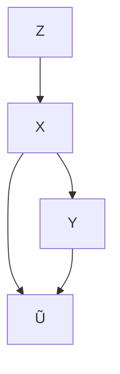
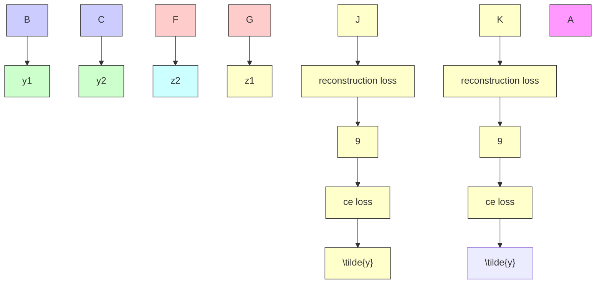

# Chapter 11 Causality Encourages the Identifiability of Instance-Dependent Label Noise

Yu Yao, Tongliang Liu, Mingming Gong, Bo Han, Gang Niu, and Kun Zhang

## 11.1 Introduction

Learning with noisy labels can be dated back to [1], which has recently drawn a lot of attention [5, 15, 27, 36]. In real life, large-scale datasets are likely to contain label noise. Due to the mining process of large-scale datasets, cheap but imperfect methods are wildly employed, for example, querying commercial search engines [12], downloading social media images with tags [16], or leveraging machinegenerated labels [11]. These methods inevitably yield samples with label errors. Training with such datasets can lead to poor generalization abilities of deep neural networks because they can memorize noisy labels [2, 32].

To improve the generalization ability of learning models training with noisy labels, one family of existing label-noise learning methods is to model the label noise [14, 18, 20, 33, 37]. These methods try to reveal the transition relationship from clean labels to noisy labels of instances, i.e., the distribution $P ( \tilde { Y } | Y , X )$ , where $\tilde { Y } , Y$ and X denote the random variable for the noisy label, latent clean label, and instance, respectively. The idea is that the clean class posterior $P ( Y | X )$ can be inferred by using the distribution $P ( \tilde { Y } | Y , X )$ and noisy class posterior $P ( { \tilde { Y } } | X )$ that can be estimated by using noisy data [33]. In other words, given only the noisy data, when the transition relationship is identifiable, classifiers can be learned to converge to the optimal ones defined by the clean data, with theoretical guarantees. However, the transition relationship is not identifiable in general. To make it identifiable, different assumptions have been made about the transition relationship. For example, Natarajan et al. [18] assume that the transition relationship is instanceindependent, i.e., $P ( \tilde { Y } | Y , X ) = P ( \tilde { Y } | Y )$ ; Xia et al. [29] assumes that $P ( \tilde { Y } | Y , X )$ is dependent on different parts of an instance. Cheng et al. [5] assume that the label noise rates are upper-bounded. In practice, these assumptions may not be satisfied and hard to be verified given noisy data alone.

In this chapter, other than making assumptions directly on the transition relationship, we provide a new causal perspective of instance-dependent label-noise learning by exploiting the causal information to further contribute to the identifiability of the transition matrix $P ( \tilde { Y } | Y , X )$ . Specifically, we assume that the instance-dependent label noise is generated according to a causal graph simplified in Fig. 11.1. In real-world applications, many datasets are generated according to this proposed generative process. For example, for the Street View House Number (SVHN) dataset [19], X represents the image containing the digit; Y represents the clean label of the digit shown on the plate; Z represents the latent variable that captures the information affecting the generation of the images, e.g., orientation, lighting, and font style. In this case, Y is a cause of X because the causal generative process can be described in the following way. First, the house plate is generated according to the street number and attached to the front door. Then, the house plate is captured by a camera (installed in a Google street view car) to form X, taking into account other factors such as illumination and viewpoint. Finally, the images containing house numbers are collected and relabeled to form the dataset. Let us denote the annotated label by the noisy label $\tilde { Y }$ as the annotator may not be always reliable, especially when the dataset is very large, but the budget is limited. During the annotation process, noisy labels are typically generated based on the features X and some prior knowledge obtained from a small set of clean examples containing both X and Y . As a result, both X and Y contribute to the generation of and are causes of $\tilde { Y }$ , but it is possible that Y is not a direct cause. For better illustration, we simplify this process in the causal graph. Note that many image datasets are collected with the causal relationship that $Y$ causes X, e.g., the widely used FashionMNIST and CIFAR. When we synthesize label noise based on them, we will have the causal graph illustrated in Fig. 11.1. It is possible that some datasets are generated with the causal relationship that X causes Y . Other than using domain knowledge, the different causal relationships can be verified by employing causal discovery methods [22, 25, 26].

Fig. 11.1 A graphical causal model reveals a generative process of the data that contains instancedependent label noise, where the shaded variables X and $\tilde { Y }$ are observable and the unshaded variables Z and Y are latent

When the latent clean label Y is a cause of X, distributions $P ( X )$ and $P ( Y | X )$ are entangled with each other [23]. In other words, the distribution $P ( X )$ will change if the clean class posterior $P ( Y | X )$ changes, which means that $P ( X )$ contains some information about $P ( Y | X )$ . To help estimate $P ( Y | X )$ with $P ( X )$ , we make use of the causal generative process and estimate the clean class conditional distribution $P ( X | Y )$ by generative modeling $P ( X )$ . The modeling of $P ( X | Y )$ in turn encourages the identifiability of the transition relationship and benefits the learning of $P ( Y | X )$ ). For example, in Fig. 11.2a, we have added instance-dependent label noise with noise rate 45% (i.e., IDLN-45%) to the MOON dataset and employed different methods [7, 35] to solve the label-noise learning problem. As illustrated in Fig. 11.2b and Fig. 11.2c, previous methods fail to infer clean labels. In contrast, by constraining the conditional distribution of the instances, i.e., restricting the data of each class to be on a manifold by setting the dimension of the latent variable $Z$ to be onedimensional and reconstructing X from $Z ,$ , the label transition as well as the clean labels can be successfully recovered (by the proposed method), which is shown in Fig. 11.2d.

Specifically, to make use of the causal graph to contribute to the identifiability of the transition matrix, we propose CausalNL, which is a causally inspired deep generative method that models the causal structure with all the observable and latent variables, i.e., the instance $X ,$ , noisy label $\tilde { Y }$ , latent feature $Z ,$ , and the latent clean label $Y .$ . The proposed generative model captures the variables’ relationship indicated by the causal graph. Furthermore, based on the variational autoencoder (VAE) framework [9], we build an inference network that could efficiently infer the latent variables $Z$ and $Y$ by maximizing the marginal likelihood $p ( X , { \tilde { Y } } )$ on the given noisy data. In the decoder phase, the data will be reconstructed by exploiting the conditional distribution of instances $P ( X | Y , Z )$ and the transition relationship $P ( \tilde { Y } | Y , X )$ , i.e.,

$$
p _ {\theta} (X, \tilde {Y}) = \int_ {z, y} P (Z = z) P (Y = y) p _ {\theta_ {1}} (X | Y = y, Z = z) p _ {\theta_ {2}} (\tilde {Y} | Y = y, X) \mathrm{d} z \mathrm{d} y
$$

will be exploited, where $\theta : = ( \theta _ { 1 } , \theta _ { 2 } )$ are the parameters of the causal generative model (more details can be found in Sect. 11.3). At a high level, according to the equation, given the noisy data and the distributions of $Z$ and $Y .$ , constraining $p _ { \theta _ { 1 } } ( X | Y , Z )$ will also greatly reduce the uncertainty of $p _ { \theta _ { 2 } } ( { \tilde { Y } } | Y , X )$ and thus contribute to the identifiability of the transition matrix. Note that adding a constraint on $p _ { \theta _ { 1 } } ( X | Y , Z )$ is natural, for example, images often have a low-dimensional manifold [3]. We can restrict variable Z to be low dimensional to fulfill the constraint on $p _ { \theta _ { 1 } } ( X | Y , Z )$ . By letting the model capture the causal structure and adding the constraint on instances to better model label noise, the proposed method significantly outperforms the baselines. When the label noise rate is large, the superiority is evidenced by a large gain in the classification performance.

## 11.2 Noisy Labels and Causality

We first describe how to model label noise in this section. After that, we introduce the structural causal model. Then we discuss how to exploit the model to encourage the identifiability of the transition relationship and help learn the classifier.

## 11.2.1 The Transition Relationship

By only employing data with noisy labels to build statistically consistent classifiers, which will converge to the optimal classifiers defined by using clean data, the transition relationship $P ( \tilde { Y } | Y , X )$ has to be identified. Given an instance, the conditional distribution can be written in an $C \times C$ matrix, which is called the transition matrix [20, 28, 29], where C represents the number of classes. Specifically, for each instance x, there is a transition matrix $T ( x )$ . The $i j$ -th entry of the transition matrix is $T _ { i j } ( x ) = P ( \tilde { Y } = j | Y = i , X = x )$ which represents the probability that the instance x with the clean label $Y = i$ will have a noisy label $\tilde { Y } = j$ .

The transition matrix has been widely studied to build statistically consistent classifiers, because the clean class posterior distribution $P ( Y | x ) = [ P ( Y = 1 | X =$ $x ) , . . . , P ( Y = C | X = x ) ] ^ { \intercal }$ can be inferred by using the transition matrix and the noisy class posterior $P ( \tilde { Y } | x ) = [ P ( \tilde { Y } = 1 | X = x ) , \dots , P ( \tilde { Y } = C | X = x ) ] ^ { \top }$ , i.e., we have $P ( \tilde { Y } | x ) = T ( x ) P ( Y | x )$ . Specifically, the transition matrix usually is used to correct loss to build classifier-consistent algorithms. Let $h : X \to \Delta _ { C - 1 }$ models $P ( \pmb { Y } | \boldsymbol { x } )$ , where $\Delta$ denotes a probability simplex. Let $\ell _ { c e }$ be the cross-entropy loss, then

$$
\arg \min _ {h} \mathbb {E} _ {x, y} [ \ell_ {c e} (y, h (x)) ] = \arg \min _ {h} \mathbb {E} _ {x, \tilde {y}} [ \ell_ {c e} (\tilde {y}, T (x) h (x)) ].
$$

The above equation shows that if $T ( x )$ is given, the minimizer of the corrected loss $\ell _ { c e } ( \tilde { y } , T ( x ) h ( x ) )$ under the noisy distribution is the same as the minimizer of the original loss $\ell _ { c e } ( y , h ( x ) )$ under the clean distribution [18, 20, 24]. Additionally, $T ( X )$ has been used to correct hypotheses to build classifier-consistent algorithms, $\mathrm { e . g . , } [ 1 8 , 2 0 , 2 4 ]$ . Moreover, the state-of-the-art statically inconsistent algorithms [7, 8] also use diagonal entries of the transition matrix to help select reliable examples used for training.

However, in general, the distribution $P ( \tilde { Y } | Y , X )$ is not identifiable [27]. To make it identifiable, different assumptions have been made. For example, the classdependent assumption assumes that instances with the same clean labels have the same transition matrices [14]; the bounded noise rate assumption [6] assumes that the noise rate is upper bounded; the part-dependent label noise assumption [29] assumes that the instances with similar parts have similar transition matrices. These assumptions help the methods achieve superior performance, but the assumptions are difficult to verify or fulfill empirically, limiting their applications in practice. For example, the class-dependent assumption is the most widely used assumption. It requires that given clean label Y , the noisy label Y is conditionally independent of instance $X , \mathrm { i . e . , } P ( \tilde { Y } | Y , X ) = P ( \tilde { Y } | Y )$ . Under such an assumption, the transition relationship $P ( \tilde { Y } | Y )$ ) can be successfully identified with the anchor point assumption [13, 14, 33]. However, in real-world scenarios, within the same class, some instances are less likely to be collected and then hard to accurately annotate, whereas some other instances are more likely to be collected and then easy to annotate. It implies that the transition matrix of these instances not only depends on the class but also usually depends on their frequency. Therefore, the class-dependent assumption is hard to fulfill.

## 11.2.2 Structural Causal Models

Motivated by the limitation of the current methods, we provide a new causal perspective to learn the identifiability of instance-dependent label noise. Here we briefly introduce some background knowledge of causality [21] used in this paper. A structural causal model (SCM) consists of a set of variables connected by a set of functions. It represents a flow of information and reveals the causal relationship among all the variables, providing a fine-grained description of the data generation process. The causal structure encoded by SCMs can be represented as a graphical causal model as shown in Fig. 11.1, where each node is a variable and each edge is a function. The SCM corresponding to the graph in Fig. 11.1 can be written as

$$
Z = \epsilon_ {Z}, Y = \epsilon_ {Y}, X = f (Z, Y, \epsilon_ {X}), \tilde {Y} = f (X, Y, \epsilon_ {\tilde {Y}}), \tag {11.1}
$$

where ϵ are independent exogenous variables following some distributions. The occurrence of the exogenous variables makes the generation of X and $\tilde { Y }$ be a stochastic process. Each equation specifies a distribution of a variable conditioned on its parents (could be an empty set).

By observing the SCM, the helpfulness of the instances to learning the classifier can be clearly explained. Specifically, the instance X is a function of its label Y and latent feature $Z ,$ , which means that the instance X is generated according to Y and Z. Therefore, X must contain information about its clean label Y and latent feature Z. That is the reason that $P ( X )$ can help identify $P ( Y | X )$ and also $P ( Z | X )$ . However, since clean labels are not available, it is hard to fully identify $P ( Y | X )$ from $P ( X )$ in the unsupervised setting. For example, on the MOON dataset shown in Fig. 11.2, it is possible to discover the two clusters by enforcing the manifold constraint, but it is impossible to infer which class each cluster belongs.

We discuss in the following that the property of $P ( X | Y )$ can be leveraged to help model label noise, i.e., encouraging the identifiability of the transition relationship and thereby learning a better classifier. Specifically, under the Markov condition [21], which intuitively means the independence of exogenous variables, the joint distribution $P ( \tilde { Y } , X , Y , Z )$ ) specified by the SCM can be factorized into the following

$$
P (X, \tilde {Y}, Y, Z) = P (Y) P (Z) P (X | Y, Z) P (\tilde {Y} | Y, X). \tag {11.2}
$$

The distributions in the equation can be modeled by the generative model VAE [9] inferring latent variables Y and Z by using the noisy data, which will be explained in detail in the next section. In the decoder phase, given the noisy data and the distributions of Z and Y , adding a constraint on $P ( X | Y , Z )$ will reduce the uncertainty of the distribution $P ( \tilde { Y } | Y , X )$ . In other words, modeling $P ( X | Y , Z )$ 号 will encourage the identifiability of the transition relationship and thus better model label noise. Since $P ( \tilde { Y } | Y , X )$ functions as a bridge to connect the noisy labels to clean labels, we therefore can better learn $P ( Y | X )$ or the classifier by only using the noisy data.

There are normally two ways to add constraints on the instances, i.e., assuming a specific parametric generative model or introducing prior knowledge of the instances. In this chapter, since we mainly study the image classification problem with noisy labels, we focus on the manifold property of images and add the lowdimensional manifold constraint to the instances.

## 11.3 Causality Captured Instance-Dependent Label-Noise Learning

In this section, we propose a structural generative method that captures the causal relationship and utilizes $P ( X )$ to help identify the label-noise transition matrix, and therefore, the proposed method leads to a better classifier that assigns more accurate labels [34].

To model the generation process of noisy data and to approximate the distribution of the noisy data, our method is designed to follow the causal factorization (see Eq. 11.2). Specifically, our model contains two decoder networks that jointly model a distribution $p _ { \theta } ( X , { \tilde { Y } } | Y , Z )$ and two encoder (inference) networks that jointly model the posterior distribution $q _ { \phi } ( Z , Y | X )$ . Here we discuss each component of our model in detail.

Let the two decoder networks model the distributions $p _ { \theta _ { 1 } } ( X | Y , Z )$ and $p _ { \theta _ { 2 } } ( { \tilde { Y } } | Y , X )$ , respectively. Let $\theta _ { 1 }$ and $\theta _ { 2 }$ be learnable parameters of the distributions. Without loss of generality, we set $p ( Z )$ to be a standard normal distribution and $p ( Y )$ to be a uniform distribution. Then, modeling the joint distribution in Eq. 11.2 boils down to modeling the distribution $p _ { \theta } ( X , { \tilde { Y } } | Y , Z )$ , which is decomposed as follows:

$$
p _ {\theta} (X, \tilde {Y} | Y, Z) = p _ {\theta_ {1}} (X | Y, Z) p _ {\theta_ {2}} (\tilde {Y} | Y, X). \tag {11.3}
$$

To infer latent variables Z and Y with only observable variables X and $\tilde { Y }$ , we could design an inference network that models the variational distribution $q _ { \phi } ( Z , Y | \tilde { Y } , X )$ . Specifically, let $q _ { \phi _ { 2 } } ( Z | Y , X )$ ) and $q _ { \phi _ { 1 } } ( Y | \tilde { Y } , X )$ be the distributions parameterized by learnable parameters $\phi _ { 1 }$ and $\phi _ { 2 }$ , the posterior distribution can be decomposed as follows:

$$
q _ {\phi} (Z, Y | \tilde {Y}, X) = q _ {\phi_ {2}} (Z | Y, X) q _ {\phi_ {1}} (Y | \tilde {Y}, X), \tag {11.4}
$$

where we do not include $\tilde { Y }$ as a conditioning variable in $q _ { \phi _ { 2 } } ( Z | Y , X )$ because the causal graph implies $Z \perp \perp \tilde { Y } | X , Y$ . One problem with this posterior form is that we cannot directly employ $q _ { \phi _ { 1 } } ( Y | { \tilde { Y } } , X )$ to predict labels on the test data, on which $\tilde { Y }$ is absent.

To allow our method efficiently and accurately infer clean labels, we approximate $q _ { \phi _ { 1 } } ( Y | { \tilde { Y } } , X )$ by assuming that given the instance $X ,$ , the clean label Y is conditionally independent of the noisy label $\tilde { Y }$ , i.e., $q _ { \phi _ { 1 } } ( Y | \tilde { Y } , X ) = q _ { \phi _ { 1 } } ( Y | X )$ . This approximation does not have a large approximation error because the images contain sufficient information to predict the clean labels. Thus, we could simplify Eq. 11.4 as follows

$$
q _ {\phi} (Z, Y | X) = q _ {\phi_ {2}} (Z | Y, X) q _ {\phi_ {1}} (Y | X), \tag {11.5}
$$

such that our encoder networks model $q _ { \phi _ { 2 } } ( Z | Y , X )$ and $q _ { \phi _ { 1 } } ( Y | X )$ , respectively. In such a way, $q _ { \phi _ { 1 } } ( Y | X )$ can be used to infer clean labels efficiently. We also found that the encoder network modeling $q _ { \phi _ { 1 } } ( Y | X )$ acts as a regularizer, which helps to identify $p _ { \theta _ { 2 } } ( { \tilde { Y } } | Y , X )$ . Moreover, to benefit from this, our method can be a general framework that can easily integrate with the current discriminative labelnoise methods [7, 17, 27], and we will showcase it by collaborating co-teaching [7] with our method.

The Evidence Lower Bound (ELBO) Because the marginal distribution $p _ { \theta } ( X , { \tilde { Y } } )$ is usually intractable, to learn the set of parameters $\{ \theta _ { 1 } , \theta _ { 2 } , \phi _ { 1 } , \phi _ { 2 } \}$ given only noisy data, we follow the variational inference framework [4] to minimize the negative evidence lower-bound $- E L B O ( x , \tilde { y } )$ of the marginal likelihood of each data point $( x , { \tilde { y } } )$ instead of maximizing the marginal likelihood itself.

Lemma 11.1 $B y$ ensembling our encoder and decoder networks in $E q s .$ . (11.5) and (11.3), respectively, $E L B O ( x , \tilde { y } )$ can be written as:

$$
\begin{array}{l} E L B O (x, \tilde {y}) = \mathbb {E} _ {(z, y) \sim q _ {\phi} (Z, Y | x)} [ \log p _ {\theta_ {1}} (x | y, z) ] + \mathbb {E} _ {y \sim q _ {\phi_ {1}} (Y | x)} [ \log p _ {\theta_ {2}} (\tilde {y} | y, x) ] \\ - k l \left(q _ {\phi_ {1}} (Y | x) \| p (Y)\right) - \mathbb {E} _ {y \sim q _ {\phi_ {1}} (Y | x)} \left[ k l \left(q _ {\phi} (Z | y, x) \| p (Z)\right) \right], \tag {11.6} \\ \end{array}
$$

where $k l ( \cdot )$ is the Kullback–Leibler divergence between two distributions.

Proof Reminding that our encoders model following distributions

$$
q _ {\phi} (Z, Y | X) = q _ {\phi_ {2}} (Z | Y, X) q _ {\phi_ {1}} (Y | X),
$$

and decoders model following distributions

$$
p _ {\theta} (X, \tilde {Y} | Y, Z) = p _ {\theta_ {1}} (X | Y, Z) p _ {\theta_ {2}} (\tilde {Y} | Y, X).
$$

Maximizing the log-likelihood $p _ { \boldsymbol { \theta } } ( x , \widetilde { y } )$ of each datapoint $( x , \tilde { y } )$ can be written as

$$
\begin{array}{l} \log p _ {\theta} (x, \tilde {y}) = \log \int_ {z} \int_ {y} p _ {\theta} (x, \tilde {y}, z, y) d y d z \\ = \log \int_ {z} \int_ {y} p _ {\theta} (x, \tilde {y}, z, y) \frac {q _ {\phi} (z , y | x)}{q _ {\phi} (z , y | x)} d y d z \\ = \log \mathbb {E} _ {(z, y) \sim q _ {\phi} (Z, Y | x)} \left[ \frac {p _ {\theta} (x , \tilde {y} , z , y)}{q _ {\phi} (z , y | x)} \right] \\ \geq \mathbb {E} _ {(z, y) \sim q _ {\phi} (Z, Y | x)} \left[ \log \frac {p _ {\theta} (x , \tilde {y} , z , y)}{q _ {\phi} (z , y | x)} \right] := \operatorname{ELBO} (x, \tilde {y}) \\ = \mathbb {E} _ {(z, y) \sim q _ {\phi} (Z, Y | x)} \left[ \log \frac {p (z) p (y) p _ {\theta_ {1}} (x | y , z) p _ {\theta_ {2}} (\tilde {y} | y , x))}{q _ {\phi} (z , y | x)} \right] \\ = \mathbb {E} _ {(z, y) \sim q _ {\phi} (Z, Y | x)} \left[ \log \left(p _ {\theta_ {1}} (x | y, z)\right) \right] \\ + \mathbb {E} _ {(z, y) \sim q _ {\phi} (Z, Y | x)} \left[ \log \left(p _ {\theta_ {2}} (\tilde {y} | y, x)\right) \right] \\ + \mathbb {E} _ {(z, y) \sim q _ {\phi} (Z, Y | x)} \left[ \log \left(\frac {p (z) p (y)}{q _ {\phi_ {2}} (z | y , x) q _ {\phi_ {1}} (y | x)}\right) \right]. \tag {11.7} \\ \end{array}
$$

The $\operatorname { E L B O } ( x , \tilde { y } )$ above can be further simplified. Specifically,

$$
\mathbb {E} _ {(z, y) \sim q _ {\phi} (Z, Y | x)} [ \log \big (p _ {\theta_ {2}} (\tilde {y} | y, x) \big) ] = \mathbb {E} _ {y \sim q _ {\phi_ {1}} (Y | x)} \mathbb {E} _ {z \sim q _ {\phi_ {2}} (Z | y, x)} [ \log \big (p _ {\theta_ {2}} (\tilde {y} | y, x) \big) ]
$$

$$
= \mathbb {E} _ {y \sim q _ {\phi_ {1}} (Y | x)} [ \log \big (p _ {\theta_ {2}} (\tilde {y} | y, x) \big) ], \tag {11.8}
$$

and similarly,

$$
\begin{array}{l} \mathbb {E} _ {(z, y) \sim q _ {\phi} (Z, Y | x)} \left[ \log \left(\frac {p (z) p (y)}{q _ {\phi_ {2}} (z | y , x) q _ {\phi_ {1}} (y | x)}\right) \right] \\ = \mathbb {E} _ {y \sim q _ {\phi_ {1}} (Y | x)} \mathbb {E} _ {z \sim q _ {\phi_ {2}} (Z | y, x)} \left[ \log \left(\frac {p (z) p (y)}{q _ {\phi_ {2}} (z | y , x) q _ {\phi_ {1}} (y | x)}\right) \right] \\ = \mathbb {E} _ {y \sim q _ {\phi_ {1}} (Y | x)} \mathbb {E} _ {z \sim q _ {\phi_ {2}} (Z | y, x)} \left[ \log \left(\frac {p (y)}{q _ {\phi_ {1}} (y | x)}\right) \right] \\ + \mathbb {E} _ {y \sim q _ {\phi_ {1}} (Y | x)} \mathbb {E} _ {z \sim q _ {\phi_ {2}} (Z | y, x)} \left[ \log \left(\frac {p (z)}{q _ {\phi_ {2}} (z | y , x)}\right) \right] \\ = \mathbb {E} _ {y \sim q _ {\phi_ {1}} (Y | x)} \left[ \log \left(\frac {p (y)}{q _ {\phi_ {1}} (y | x)}\right) \right] \\ + \mathbb {E} _ {y \sim q _ {\phi_ {1}} (Y | x)} \mathbb {E} _ {z \sim q _ {\phi_ {2}} (Z | y, x)} \left[ \log \left(\frac {p (z)}{q _ {\phi_ {2}} (z | y , x)}\right) \right] \\ \end{array}
$$

$$
= - k l (q _ {\phi_ {1}} (Y | x) \| p (Y)) - \mathbb {E} _ {y \sim q _ {\phi_ {1}} (Y | x)} \left[ k l (q _ {\phi_ {2}} (Z | y, x) \| p (Z)) \right], \tag {11.9}
$$

Algorithm 1 CausalNL

Input: A noisy sample S, Average noise rate $\rho$ , Total epoch $T_{max}$ , Batch size N.

1: For $T = 1, \ldots, T_{max}$ :
2: For mini-batch $\bar{S} = \{x_i\}_{i=0}^N$ , $\tilde{L} = \{\tilde{y}_i\}_{i=0}^N$ in S:
3: Feed $\bar{S}$ to encoders $\hat{q}_{\phi_1^1}$ and $\hat{q}_{\phi_1^2}$ to get clean label sets $L_1$ and $L_2$ , respectively;
4: Feed $(\bar{S}, L_1)$ to encoder $\hat{q}_{\phi_2^1}$ to get a representation set $H_1$ , feed $(\bar{S}, L_2)$ to $\hat{q}_{\phi_2^2}$ to get $H_2$ ;
5: Update $\hat{q}_{\phi_2^1}$ and $\hat{q}_{\phi_2^2}$ with co-teaching loss;
6: Feed $(L_1, H_1)$ to decoder $\hat{p}_{\theta_1^1}$ to get reconstructed dataset $\bar{S}_1$ , feed $(L_2, H_2)$ to $\hat{p}_{\theta_1^2}$ to get $\bar{S}_2$ ;
7: Feed $(\bar{S}_1, L_1)$ to decoder $\hat{p}_{\theta_2^1}$ to get predicted noisy labels $\tilde{L}_1$ , feed $(\bar{S}_2, L_2)$ to $\hat{p}_{\theta_2^2}$ to get $\tilde{L}_2$ ;
8: Update networks $\hat{q}_{\phi_1^1}$ , $\hat{q}_{\phi_2^1}$ , $\hat{p}_{\theta_1^1}$ and $\hat{p}_{\theta_2^1}$ by calculating ELBO on $(\bar{S}, \bar{S}_1, \tilde{L}, \tilde{L}_1)$ , update networks $\hat{q}_{\phi_1^2}$ , $\hat{q}_{\phi_2^2}$ , $\hat{p}_{\theta_1^2}$ and $\hat{p}_{\theta_2^2}$ by calculating ELBO on $(\bar{S}, \bar{S}_2, \tilde{L}, \tilde{L}_2)$ ;
Output: The inference network $\hat{q}_{\phi_1^1}$ .

By substituting Eqs. (11.8) and (11.9) to Eq. (11.7), we get

$$
\begin{array}{l} \operatorname{ELBO} (x, \tilde {y}) = \mathbb {E} _ {(z, y) \sim q _ {\phi} (Z, Y | x)} [ \log p _ {\theta_ {1}} (x | y, z) ] + \mathbb {E} _ {y \sim q _ {\phi_ {1}} (Y | x)} [ \log p _ {\theta_ {2}} (\tilde {y} | y, x) ] \\ - k l \left(q _ {\phi_ {1}} (Y | x) \| p (Y)\right) - \mathbb {E} _ {y \sim q _ {\phi_ {1}} (Y | x)} \left[ k l \left(q _ {\phi_ {2}} (Z | y, x) \| p (Z)\right) \right], \tag {11.10} \\ \end{array}
$$

which completes the proof.

Our model learns the class-conditional distribution $P ( X | Y )$ by maximizing the first expectation in ELBO, which is equivalent to minimizing the reconstruction loss [9]. By learning $P ( X )$ , the inference network $q _ { \phi _ { 1 } } ( Y | X )$ has to select a suitable parameter $\phi ^ { * }$ which samples the y and z to minimize the reconstruction loss $\mathbb { E } _ { ( z , y ) \sim q _ { \phi } ( Z , Y | x ) } \left[ \log p _ { \theta _ { 1 } } ( x | y , z ) \right]$ . When the dimension of Z is chosen to be much smaller than the dimension of X, to obtain a smaller reconstruction error, the decoder has to utilize the information provided by Y and force the value of Y to be useful for prediction. Furthermore, we constrain the Y to be a one-hot vector, then Y could be a cluster ID to which the manifold of the X belongs.

So far, the latent variable Y can be inferred as a cluster ID instead of a clean class id. To further link the clusters to clean labels, a naive approach is to select some reliable examples and keep the cluster numbers to be consistent with the noisy labels on these examples. In such a way, the latent representation Z and clean label Y can be effectively inferred, therefore it encourages the identifiability of the transition relationship $p _ { \theta _ { 2 } } ( { \tilde { Y } } | Y , X )$ . To achieve this, instead of explicitly selecting the reliable example in advance, our method is trained in an end-to-end favor, i.e., the reliable examples are selected dynamically during the update of parameters of our model by using the co-teaching technique [7]. The advantage of this approach is that the selection bias of the reliable example [6] can be greatly reduced. Intuitively, the accurately selected reliable examples can encourage the identifiability of $p _ { \theta _ { 2 } } ( { \tilde { Y } } | Y , X )$ and $p _ { \theta _ { 1 } } ( X | Y , Z )$ , and the accurately estimated $p _ { \theta _ { 2 } } ( { \tilde { Y } } | Y , X )$ and $p _ { \theta _ { 1 } } ( X | Y , Z )$ will encourage the network to select more reliable examples.

Fig. 11.3 A working flow of our method

## 11.3.1 Practical implementation

Our method is summarized in Algorithm 1 and illustrated in Fig. 11.3, Here we introduce the structure of our model and loss functions.

Model structure Because we incorporate co-teaching in our model training, we need to add a copy of the decoder and encoders in our method. As the two branches share the same architectures, we first present the details of the first branch and then briefly introduce the second branch.

For the first branch, we need a set of encoders and decoders to model the distributions in Eqs. 11.3 and 11.5. Specifically, we have two encoder networks

$$
Y _ {1} = \hat {q} _ {\phi_ {1} ^ {1}} (X), Z _ {1} \sim \hat {q} _ {\phi_ {2} ^ {1}} (X, Y _ {1})
$$

for Eq. 11.5 and two decoder networks

$$
X _ {1} = \hat {p} _ {\theta_ {1} ^ {1}} (Y _ {1}, Z _ {1}), \tilde {Y} _ {1} = \hat {p} _ {\theta_ {2} ^ {1}} (X _ {1}, Y _ {1})
$$

for Eq. 11.3. The first encoder ${ \hat { q } } _ { \phi _ { 1 } ^ { 1 } } ( X )$ takes an instance X as input ${ \hat { q } } _ { \phi _ { 1 } ^ { 1 } } ( X )$ and output a predicted clean label $Y _ { 1 }$ . The second encoder $\hat { q } _ { \phi _ { 7 } ^ { 1 } } ( X , Y _ { 1 } )$ takes both the instance X and the generated label $Y _ { 1 }$ as input and outputs a latent feature $Z _ { 1 }$ . Then the generated $Y _ { 1 }$ and $Z _ { 1 }$ are passed to the decoder $\hat { p } _ { \theta _ { 1 } ^ { 1 } } ( Y _ { 1 } , Z _ { 1 } )$ which will generate a reconstructed image $X _ { 1 }$ . Finally, the generated $X _ { 1 }$ and $Y _ { 1 }$ will be the input for another decoder $\hat { p } _ { \theta _ { 7 } ^ { 1 } } ( X _ { 1 } , Y _ { 1 } )$ which returns predicted noisy labels $\tilde { Y } _ { 1 }$ . It is worth mentioning that the reparameterization trick [9] is used for sampling, so as to allow backpropagation in $\hat { q } _ { \phi _ { 7 } ^ { 1 } } ( X , Y _ { 1 } )$ .

Similarly, the encoder and decoder networks in the second branch are defined as follows

$$
Y _ {2} = \hat {q} _ {\phi_ {1} ^ {2}} (X), Z _ {2} \sim \hat {q} _ {\phi_ {2} ^ {2}} (X, Y _ {2}), X _ {2} = \hat {p} _ {\theta_ {1} ^ {2}} (Y _ {2}, Z _ {2}), \tilde {Y} _ {2} = \hat {p} _ {\theta_ {2} ^ {2}} (X _ {2}, Y _ {2}).
$$

During training, we let two encoders $\hat { q } _ { \phi _ { 1 } ^ { 1 } } ( X )$ and $\hat { q } _ { \phi _ { 1 } ^ { 2 } } ( X )$ teach each other given every mini-batch.

Loss functions We divide the loss functions into two parts. The first part is the negative ELBO in Eq. 11.7, and the second part is a co-teaching loss. The detailed formulation will be left in Appendix B.

For the negative ELBO, the first term $- \mathbb { E } _ { ( z , y ) \sim q _ { \phi } ( Z , Y \mid x ) } \left[ \log p _ { \theta _ { 1 } } ( x \mid y , z ) \right]$ is a reconstruction loss, and we use the ?1 loss for reconstruction. The second term is $- \mathbb { E } _ { y \sim q _ { \phi _ { 1 } } ( Y | x ) }$  log $p _ { \theta _ { 2 } } ( \tilde { y } | y , x ) \big ]$ , which aims to learn noisy labels given inference $y$ and x, this can be simply replaced by using cross-entropy loss on outputs of both decoders $\hat { p } _ { \theta _ { \mathrm { 2 } } ^ { 1 } } ( X _ { 1 } , Y _ { 1 } )$ and $\hat { p } _ { \theta _ { 7 } ^ { 2 } } ( X _ { 2 } , Y _ { 2 } )$ with the noisy labels contained in the training data. The additional two terms are two regularizers. To calculate $k l ( q _ { \phi _ { 1 } } ( Y | x ) \| p ( Y ) )$ , we assume that the prior $P ( Y )$ is a uniform distribution. Then minimizing $k l ( q _ { \phi _ { 1 } } ( Y | x ) \| p ( Y ) )$ is equivalent to maximizing the entropy of $q _ { \phi _ { 1 } } ( Y | x )$ for each instance x, i.e., $\textstyle - \sum _ { y } q _ { \phi _ { 1 } } ( y | x )$ log $q _ { \phi _ { 1 } } ( y | x )$ ). The benefit of having this term is that it could reduce the overfitting problem of the inference network. For $\begin{array} { r } { \mathbb { E } _ { y \sim q _ { \phi _ { 1 } } ( Y | x ) } \left[ k l ( q _ { \phi } ( Z | y , x ) \| p ( Z ) ) \right] } \end{array}$ , we let $p ( Z )$ to be a standard multivariate 1 Gaussian distribution. Since, empirically, $q _ { \phi } ( Z | y , x )$ is the encoders ${ \hat { q } } _ { \phi _ { 1 } ^ { 1 } } ( X )$ and $\hat { q } _ { \phi _ { 1 } ^ { 2 } } ( X )$ , and the two encoders are designed to be deterministic mappings. Therefore, the expectation can be removed, and only the kl term $k l ( q _ { \phi } ( Z | y , x ) | | p ( Z ) )$ is left. When $p ( Z )$ is a Gaussian distribution, the kl term could have a closed form solution [9], i.e., $\begin{array} { r } { - \frac { 1 } { 2 } \sum _ { j = 1 } ^ { J } ( 1 + \log ( ( \sigma _ { j } ) ^ { 2 } ) - ( \mu _ { j } ) ^ { 2 } - ( \sigma _ { j } ) ^ { 2 } ) } \end{array}$ , where J is the dimension of a latent representation $z , \sigma _ { j }$ and $\mu _ { j }$ are the encoder outputs. Let S be the noisy training set, and ${ \bar { d } } ^ { 2 }$ be the dimension of an instance x. Let $y _ { 1 }$ and $z _ { 1 }$ be the estimated clean label and latent representation for the instance x, respectively. The empirical version of the ELBO for the first branch is as follows.

$$
\begin{array}{l} \sum_ {(x, \tilde {y}) \in S} \mathrm{ELBO} ^ {1} (x, \tilde {y}) = \sum_ {(x, \tilde {y}) \in S} \left[ \beta_ {0} \frac {1}{d ^ {2}} \| x - \hat {p} _ {\theta_ {1} ^ {1}} (y _ {1}, z _ {1}) \| _ {1} - \beta_ {1} \tilde {y} \log \hat {p} _ {\theta_ {2} ^ {1}} (x _ {1}, y _ {1}) \right. \\ \left. + \beta_ {2} \hat {q} _ {\phi_ {1} ^ {1}} (x) \log \hat {q} _ {\phi_ {1} ^ {1}} (x) + \beta_ {3} \sum_ {j = 1} ^ {J} (1 + \log ((\sigma_ {j}) ^ {2}) - (\mu_ {j}) ^ {2} - (\sigma_ {j}) ^ {2}) \right]. \\ \end{array}
$$

The hyper-parameter $\beta _ { 0 }$ and $\beta _ { 1 }$ are set to 0.1, and $\beta _ { 2 }$ is set to $1 e \mathrm { ~ - ~ } 5$ because encouraging the distribution to be uniform on a small min-batch (i.e., 128) could have a large estimation error. The hyperparameter $\beta _ { 3 }$ is set to 0.01. The empirical version of the ELBO for the second branch shares the same settings as the first branch.

For co-teaching loss, we directly follow Han et al. [7]. Intuitively, in each minibatch, both encoders $\hat { q } _ { \phi _ { 1 } ^ { 1 } } ( X )$ and $\hat { q } _ { \phi _ { 1 } ^ { 2 } } ( X )$ trust small-loss examples and exchange the examples to each other by a cross-entropy loss. The number of the smallloss instances used for training decays with respect to the training epoch. The experimental settings for co-teaching loss are the same as the settings in the original paper [7].

## 11.4 Experiments

In this section, we compare the classification accuracy of the proposed method with the popular label-noise learning algorithms [7, 8, 14, 17, 20, 27, 35] on both synthetic and real-world datasets.

## 11.4.1 Experimental Setup

Datasets We verify the efficacy of our approach on the manually corrupted version of four datasets, i.e., FashionMNIST [30], SVHN [19], CIFAR10, CIFAR100 [10], and one real-world noisy dataset, i.e., Clothing1M [31]. FashionMNIST contains 60,000 training images and 10,000 test images with 10 classes; SVHN contains 73,257 training images and 26,032 test images with 10 classes. CIFAR10 contains 50,000 training images and 10,000 test images. CIFAR10 and CIFAR100 both contain 50,000 training images and 10,000 test images, but the former has 10 classes of images, and the latter has 10 classes of images. The four datasets contain clean data. We add instance-dependent label noise to the training sets manually according to Xia et al. [29]. Clothing1M has 1M images with real-world noisy labels and 10k images with clean labels for testing. For all the synthetic noisy datasets, the experiments have been repeated five times.

Network structure and optimization For a fair comparison, all experiments are conducted on NVIDIA Tesla V100, and all methods are implemented by PyTorch. The dimension of the latent representation Z is set to 25 for all synthetic noisy datasets. For the optimization method, Adam optimizer is employed with the default learning rate $1 e - 3$ in Pytorch. For encoder networks ${ \hat { q } } _ { \phi _ { 1 } ^ { 1 } } ( X )$ and $\hat { q } _ { \phi _ { 1 } ^ { 2 } } ( X )$ , we use the same network structures with baseline method. Specifically, we use a ResNet-18 network for FashionMNIST, a ResNet-34 network for SVHN and CIFAR10. On these four datasets, the same number of hidden layers and feature maps are employed. Specifically, 1). $q _ { \phi _ { 2 } } ( Z | Y , X )$ and $p _ { \theta _ { 2 } } ( { \tilde { Y } } | Y , X )$ are modeled by two 4- hidden-layer convolutional networks, and the corresponding feature maps are 32,64, 128, and 256; 2). $p _ { \theta _ { 1 } } ( X | Y , Z )$ is modeled by a 4-hidden-layer transposedconvolutional network, and the corresponding feature maps are 256, 128, 64, and 32. We ran 150 epochs for each experiment on these datasets.

For Clothing1M [31], we use a ResNet-50 network pretrained on ImageNet, and the clean training data are not used. The dimension of the latent representation Z is set to 100. The distributions $q _ { \phi _ { 2 } } ( Z | Y , X )$ and $p _ { \theta _ { 2 } } ( { \tilde { Y } } | Y , X )$ are modeled by two 5-hidden-layer convolutional networks, and the corresponding feature maps are 32, 64, 128, 256 and 512. The distribution $p _ { \theta _ { 1 } } ( X | Y , Z )$ is modeled by a 5-hidden-layer transposed-convolutional network, and the corresponding feature maps are 512, 256, 128, 64, and 32. We ran 40 epochs on Clothing1M.

Baselines and measurements We compare the proposed method with the following state-of-the-art approaches: (i) CE, which trains the standard deep network with the cross-entropy loss on noisy datasets. (ii) Decoupling [17], which trains two networks on samples whose predictions from the two networks are different. (iii) MentorNet [8], Co-teaching [7], which mainly handles noisy labels by training on instances with small loss values. (iv) Forward [20], Reweight [14], and T-Revision [27]. These approaches utilize a class-dependent transition matrix T to correct the loss function. We report average test accuracy over the last 10 epochs of each model on the clean test set. Higher classification accuracy means that the algorithm is more robust to the label noise.

## 11.4.2 Classification accuracy Evaluation

Results on synthetic noisy datasets Tables 11.1, 11.2, 11.3, and 11.4 report the classification accuracy on the datasets of F-MNIST, SVHN, CIFAR-10, and CIFAR100, respectively. The synthetic experiments reveal that our method is

**Table 11.1 Means and standard deviations (percentage) of classification accuracy on FashionM-NIST with different label noise levels**

<table><tr><td></td><td>IDN-20%</td><td>IDN-30%</td><td>IDN-40%</td><td>IDN-45%</td><td>IDN-50%</td></tr><tr><td>CE</td><td>88.54±0.32</td><td>88.38±0.42</td><td>84.22±0.35</td><td>69.72±0.72</td><td>52.32±0.68</td></tr><tr><td>Co-teaching</td><td>91.21±0.31</td><td>90.30±0.42</td><td>89.10±0.29</td><td>86.78±0.90</td><td>63.22±1.56</td></tr><tr><td>Decoupling</td><td>90.70±0.28</td><td>90.34±0.36</td><td>88.78±0.44</td><td>87.54±0.53</td><td>68.32±1.77</td></tr><tr><td>MentorNet</td><td>91.57±0.29</td><td>90.52±0.41</td><td>88.14±0.76</td><td>85.12±0.76</td><td>61.62±1.42</td></tr><tr><td>Mixup</td><td>88.68±0.37</td><td>88.02±0.37</td><td>85.47±0.55</td><td>79.57±0.75</td><td>66.02±2.58</td></tr><tr><td>Forward</td><td>90.05±0.43</td><td>88.65±0.43</td><td>86.27±0.48</td><td>73.35±1.03</td><td>58.23±3.14</td></tr><tr><td>Reweight</td><td>90.27±0.27</td><td>89.58±0.37</td><td>87.04±0.32</td><td>80.69±0.89</td><td>64.13±1.23</td></tr><tr><td>T-Revision</td><td>91.58±0.31</td><td>90.11±0.61</td><td>89.46±0.42</td><td>84.01±1.14</td><td>68.99±1.04</td></tr><tr><td>CausalNL</td><td>90.84±0.31</td><td>90.68±0.37</td><td>90.01±0.45</td><td>88.75±0.81</td><td>78.19±1.01</td></tr></table>

**Table 11.2 Means and standard deviations (percentage) of classification accuracy on SVHN with different label noise levels**

<table><tr><td></td><td>IDN-20%</td><td>IDN-30%</td><td>IDN-40%</td><td>IDN-45%</td><td>IDN-50%</td></tr><tr><td>CE</td><td>91.51±0.45</td><td>91.21±0.43</td><td>87.87±1.12</td><td>67.15±1.65</td><td>51.01±3.62</td></tr><tr><td>Co-teaching</td><td>93.93±0.31</td><td>92.06±0.31</td><td>91.93±0.81</td><td>89.33±0.71</td><td>67.62±1.99</td></tr><tr><td>Decoupling</td><td>90.02±0.25</td><td>91.59±0.25</td><td>88.27±0.42</td><td>84.57±0.89</td><td>65.14±2.79</td></tr><tr><td>MentorNet</td><td>94.08±0.12</td><td>92.73±0.37</td><td>90.41±0.49</td><td>87.45±0.75</td><td>61.23±2.82</td></tr><tr><td>Mixup</td><td>89.73±0.37</td><td>90.02±0.35</td><td>85.47±0.55</td><td>82.41±0.62</td><td>68.95±2.58</td></tr><tr><td>Forward</td><td>91.89±0.31</td><td>91.59±0.23</td><td>89.33±0.53</td><td>80.15±1.91</td><td>62.53±3.35</td></tr><tr><td>Reweight</td><td>92.44±0.34</td><td>92.32±0.51</td><td>91.31±0.67</td><td>85.93±0.84</td><td>64.13±3.75</td></tr><tr><td>T-Revision</td><td>93.14±0.53</td><td>93.51±0.74</td><td>92.65±0.76</td><td>88.54±1.58</td><td>64.51±3.42</td></tr><tr><td>CausalNL</td><td>94.06±0.23</td><td>93.86±0.37</td><td>93.82±0.45</td><td>93.19±0.81</td><td>85.41±2.95</td></tr></table>

**Table 11.3 Means and standard deviations (percentage) of classification accuracy on CIFAR10 with different label noise levels**

<table><tr><td></td><td>IDN-20%</td><td>IDN-30%</td><td>IDN-40%</td><td>IDN-45%</td><td>IDN-50%</td></tr><tr><td>CE</td><td>75.81±0.26</td><td>69.15±0.65</td><td>62.45±0.86</td><td>51.72±1.34</td><td>39.42±2.52</td></tr><tr><td>Co-teaching</td><td>80.96±0.31</td><td>78.56±0.61</td><td>73.41±0.78</td><td>71.60±0.79</td><td>45.92±2.21</td></tr><tr><td>Decoupling</td><td>78.71±0.15</td><td>75.17±0.58</td><td>61.73±0.34</td><td>58.61±1.73</td><td>50.43±2.19</td></tr><tr><td>MentorNet</td><td>81.03±0.12</td><td>77.22±0.47</td><td>71.83±0.49</td><td>66.18±0.64</td><td>47.89±2.03</td></tr><tr><td>Mixup</td><td>73.17±0.37</td><td>70.02±0.31</td><td>61.56±0.71</td><td>56.45±0.62</td><td>48.95±2.58</td></tr><tr><td>Forward</td><td>74.64±0.32</td><td>69.75±0.56</td><td>60.21±0.75</td><td>48.81±2.59</td><td>46.27±1.30</td></tr><tr><td>Reweight</td><td>76.23±0.25</td><td>70.12±0.72</td><td>62.58±0.46</td><td>51.54±0.92</td><td>45.46±2.56</td></tr><tr><td>T-Revision</td><td>76.15±0.37</td><td>70.36±0.61</td><td>64.09±0.37</td><td>52.42±1.01</td><td>49.02±2.13</td></tr><tr><td>CausalNL</td><td>81.47±0.32</td><td>80.38±0.37</td><td>77.53±0.45</td><td>78.60±0.93</td><td>77.39±1.24</td></tr></table>

**Table 11.4 Means and standard deviations (percentage) of classification accuracy on CIFAR100 with different label noise levels**

<table><tr><td></td><td>IDN-20%</td><td>IDN-30%</td><td>IDN-40%</td><td>IDN-45%</td><td>IDN-50%</td></tr><tr><td>CE</td><td>30.42±0.44</td><td>24.15±0.78</td><td>21.45±0.70</td><td>15.23±1.32</td><td>14.42±2.21</td></tr><tr><td>Co-teaching</td><td>37.96±0.53</td><td>33.43±0.74</td><td>28.04±1.43</td><td>25.60±0.93</td><td>23.97±1.91</td></tr><tr><td>Decoupling</td><td>36.53±0.49</td><td>30.93±0.88</td><td>27.85±0.91</td><td>23.81±1.31</td><td>19.59±2.12</td></tr><tr><td>MentorNet</td><td>38.91±0.54</td><td>34.23±0.73</td><td>31.89±1.19</td><td>27.53±1.23</td><td>24.15±2.31</td></tr><tr><td>Mixup</td><td>32.92±0.76</td><td>29.76±0.87</td><td>25.92±1.26</td><td>23.13±2.15</td><td>21.31±1.32</td></tr><tr><td>Forward</td><td>36.38±0.92</td><td>33.17±0.73</td><td>26.75±0.93</td><td>21.93±1.29</td><td>19.27±2.11</td></tr><tr><td>Reweight</td><td>36.73±0.72</td><td>31.91±0.91</td><td>28.39±1.46</td><td>24.12±1.41</td><td>20.23±1.23</td></tr><tr><td>T-Revision</td><td>37.24±0.85</td><td>36.54±0.79</td><td>27.23±1.13</td><td>25.53±1.94</td><td>22.54±1.95</td></tr><tr><td>CausalNL</td><td>41.47±0.32</td><td>40.98±0.62</td><td>34.02±0.95</td><td>33.34±1.13</td><td>32.129±2.23</td></tr></table>

powerful in handling instance-dependent label noise particularly in the situation of high noise rates. For all datasets, the classification accuracy does not drop too much compared with all baselines, and the advantages of our proposed method increase with the increase of the noise rate. Additionally, it shows that, for all these dataset, Y should be a cause of X, therefore the classification accuracy by using our method can be improved.

**Table 11.5 Classification accuracy on Clothing1M. In the experiments, only noisy samples are exploited to train and validate the deep model**

<table><tr><td>CE</td><td>Decoupling</td><td>MentorNet</td><td>Co-teaching</td><td>Forward</td><td>Reweight</td><td>T-Revision</td><td>caualNL</td></tr><tr><td>68.88</td><td>54.53</td><td>56.79</td><td>60.15</td><td>69.91</td><td>70.40</td><td>70.97</td><td>72.24</td></tr></table>

For noisy F-MNIST, SVHN and CIFAR-10, in the easy case IDN-20%, almost all methods work well. When the noise rate is 30%, the advantages of causalNL begin to show. We surpassed all methods obviously. When the noise rate rises, all the baselines are gradually defeated. Finally, in the hardest case, i.e., IDN-50%, the superiority of causalNL widens the gap of performance. The classification accuracy of causalNL is at least 10% higher than the best baseline method. For noisy CIFAR-100, all the methods do not work well. However, causalNL still overtakes the other methods with clear gaps for all different levels of noise rate.

Results on the real-world noisy dataset On the real-world noisy dataset Clothing1M, our method causalNL outperforms all the baselines as shown in Table 11.5. The experimental results also show that the noise type in Clothing1M is more likely to be instance-dependent label noise, and making the instance-independent assumption on the transition matrix sometimes can be strong.

## 11.5 Summary

In this chapter, we have investigated how to use P (X) to help learn instancedependent label noise. Specifically, the previous assumptions are made on the transition matrix, and the assumptions are hard to be verified and might be violated on real-world datasets. Inspired by a causal perspective, when Y is a cause of X, then P (X) should contain useful information to infer the clean label Y . We propose a novel generative approach called CausalNL for instance-dependent label-noise learning. Our model makes use of the causal graph to contribute to the identifiability of the transition matrix and therefore help learn clean labels. The empirical results on both synthetic and real-world noisy datasets validate the effectiveness of our method. Additionally, the results also tell us that in classification problems, Y can usually be considered as a cause of X, and suggest that the understanding and modeling of the data generative process can help leverage additional information that is useful in solving advanced machine learning problems concerning the relationship between different modules of the data joint distribution.

## References

1. D. Angluin, P. Laird, Learning from noisy examples. Mach. Learn. 2(4), 343–370 (1988)  
2. D. Arpit et al., A closer look at memorization in deep networks, in International Conference on Machine Learning, PMLR (2017), pp. 233–242  
3. M. Belkin, P. Niyogi, V. Sindhwani, Manifold regularization: a geometric framework for learning from labeled and unlabeled examples. J. Mach. Learn. Res. 7, 2399–2434 (2006)  
4. D.M. Blei, A. Kucukelbir, J.D. McAuliffe, Variational inference: a review for statisticians. J. Am. Statist. Assoc. 112(518), 859–877 (2017)  
5. H. Cheng et al., Learning with instance-dependent label noise: a sample sieve approach, in ICLR (2021)  
6. J. Cheng et al., Learning with bounded instance and label-dependent label noise, in ICML (2020)  
7. B. Han et al., Co-teaching: robust training of deep neural networks with extremely noisy labels, in NeurIPS (2018), pp. 8527–8537  
8. L. Jiang et al., MentorNet: learning data-driven curriculum for very deep neural networks on corrupted labels, in ICML (2018), pp. 2309–2318  
9. D.P. Kingma, M. Welling, Auto-encoding variational bayes (2013). arXiv preprint arXiv:1312.6114  
10. A. Krizhevsky, Learning multiple layers of features from tiny images. Technical report, 2009  
11. A. Kuznetsova et al., The open images dataset v4. Int. J. Comput. Vis. 128(7), 1956–1981 (2020)  
12. W. Li et al., Webvision database: visual learning and understanding from web data (2017). arXiv preprint arXiv:1708.02862  
13. X. Li et al., Provably end-to-end label-noise learning without anchor points, in ICML (2021)  
14. T. Liu, D. Tao, Classification with noisy labels by importance reweighting. IEEE Trans. Pattern Anal. Mach. Intell. 38(3), 447–461 (2016)  
15. Y. Liu, The importance of understanding instance-level noisy labels, in ICML (2021)  
16. D. Mahajan et al., Exploring the limits of weakly supervised pretraining, in Proceedings of the European Conference on Computer Vision (ECCV) (2018), pp. 181–196  
17. E. Malach, S. Shalev-Shwartz, Decoupling when to update from how to update, in NeurIPS (2017), pp. 960–970  
18. N. Natarajan et al., Learning with noisy labels, in NeurIPS (2013), pp. 1196–1204  
19. Y. Netzer et al., Reading digits in natural images with unsupervised feature learning, in NIPS Workshop on Deep Learning and Unsupervised Feature Learning (2011)  
20. G. Patrini et al., Making deep neural networks robust to label noise: a loss correction approach, in CVPR (2017), pp. 1944–1952  
21. J. Pearl, Causality (Cambridge University Press, Cambridge, 2009)  
22. J. Peters, D. Janzing, B. Schölkopf, Elements of Causal Inference: Foundations and learning Algorithms (The MIT Press, Cambridge, MA, 2017)  
23. B. Schölkopf et al., On causal and anticausal learning, in 29th International Conference on Machine Learning (ICML 2012) (International Machine Learning Society, 2012), pp. 1255– 12620  
24. C. Scott, A rate of convergence for mixture proportion estimation, with application to learning from noisy labels, in AISTATS (2015), pp. 838–846  
25. P. Spirtes, K. Zhang, Causal discovery and inference: concepts and recent methodological advances, in Applied Informatics, vol. 3 (Springer. 2016), p. 3  
26. P. Spirtes et al., Causation, Prediction, and Search (The MIT Press, Cambridge, MA, 2000)  
27. X. Xia et al., Are anchor points really indispensable in label-noise learning?, in NeurIPS (2019), pp. 6835–6846  
28. X. Xia et al., Are anchor points really indispensable in label-noise Learning?, in: NeurIPS (2019), pp. 6838–6849  
29. X. Xia et al., Part-dependent label noise: towards instance-dependent label noise, in NeurIPS (2020)  
30. H. Xiao, K. Rasul, R. Vollgraf, Fashion-MNIST: a novel image dataset for benchmarking machine learning algorithms (2017). arXiv preprint arXiv:1708.07747  
31. T. Xiao et al., Learning from massive noisy labeled data for image classification, in CVPR (2015), pp. 2691–2699  
32. Q. Yao et al., Searching to exploit memorization effect in learning with noisy labels, in ICML (2020)  
33. Y. Yao et al., Dual T: reducing estimation error for transition matrix in label-noise learning, in NeurIPS (2020)  
34. Y. Yao et al., Instance-dependent label-noise learning under a structural causal model, Advances in Neural Information Processing Systems, 34, 4409–4420 (2021)  
35. H. Zhang et al., Mixup: beyond empirical risk minimization, in ICLR’18 (2018)  
36. Z. Zhu, T. Liu, Y. Liu, A second-order approach to learning with instance-dependent label noise, in CVPR (2021)  
37. Z. Zhu, Y. Song, Y. Liu, Clusterability as an alternative to anchor points when learning with noisy labels (2021). arXiv preprint arXiv:2102.05291