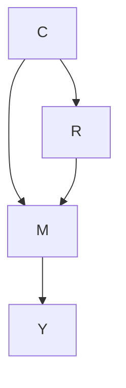
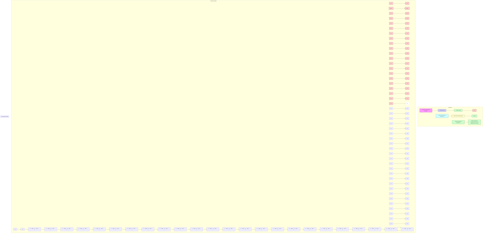

# Chapter 12 Causal Interventional Time Series Forecasting on Multi-horizon and Multi-series Data


Zhixuan Chu, Ruopeng Li, and Sheng Li

## 12.1 Introduction

Multi-horizon and multi-series time series forecasting has become a very intensive field of applications across many domains, such as economics, health care, web mining, electronic commerce, and online advertising. Multi-series forecasting from related time series not only provides richer information by utilizing interrelationships across all time series but also alleviates the labor-intensive feature engineering and model design required for each time series. Compared to one-step-ahead predictions, multi-horizon forecasts provide estimates for multiple future time points, enabling better decision-making beforehand. However, due to the complex dependencies over time in a long sequence and the heterogeneous nature across multiple time series, multi-horizon and multi-series time series forecasting has always faced two major challenges: (1) how to leverage the local knowledge lying in a long sequence and (2) how to effectively take advantage of the global knowledge extracted from multiple related time series.

Recent deep learning methods [22, 24, 28] based on recurrent and convolutional neural networks provide a data-driven manner to deal with time series forecasting tasks and achieve great accuracy in most application fields. Due to the complex dependencies over time of recurrent networks and the limits of convolutional filters, these methods have difficulties in modeling long-term and complex relations in time series data. Considering the dependencies of each time point in a sequence, attention-based methods [5, 13] are proposed by assigning different importance to the different time points. In these models, the local dependencies are effectively utilized for the prediction, but the global information of the relationship among different series is still unexplainable. Matrix factorization methods [33] and Bayesian methods that share information via hierarchical priors [3] are used to learn multiple related time series by leveraging hierarchical structure [11]. However, how to extract and share the right global information across different time series is still not fully exploited.

In this chapter, we approach these two challenges from a novel perspective, i.e., causal inference. Based on the Structural Causal Model [20, 21], the multi-horizon and multi-series forecasting tasks can be abstracted into a causal intervention problem with unobserved confounders. Confounders influence both the dependent variable and independent variable, causing a spurious association between the original input features and outcomes. Therefore, we design a Causal Triple aTtention Time series forecasting model (CTTT) based on a deep encoder–decoder recurrent architecture. We provide an intuitive understanding and causal theoretical proof to shed light on how local and global knowledge is effectively extracted from the data and how the right knowledge is accurately utilized to benefit the prediction of different series.

## 12.2 Preliminary

## 12.2.1 Time Series Forecasting

The multi-horizon and multi-series forecasting task is to predict the multiple future target values for multiple time series. Denoting the target value of time series i at time t by $y _ { i , t }$ , our goal is to model the conditional distribution:

$$
P (\mathbf {y} _ {i, t _ {0}: T} | \mathbf {y} _ {i, 1: t _ {0} - 1}, \mathbf {x} _ {i, 1: T}),
$$

where $t _ { 0 }$ denotes the time point from which we assume $y _ { i , t }$ to be unknown. ${ \bf y } _ { i , t _ { 0 } : T } =$ $\left\{ y _ { i , t _ { 0 } } , y _ { i , t _ { 0 } + 1 } , \ldots , y _ { i , T } \right\}$ denotes the target values of future time from time point $t _ { 0 }$ for series i and $\mathbf { y } _ { i , 1 : t _ { 0 } - 1 } = \{ y _ { i , 1 } , \dots , y _ { i , t _ { 0 } - 2 } , y _ { i , t _ { 0 } - 1 } \}$ denotes the target values of past time before time point $t _ { 0 }$ .

## 12.2.2 Attention Mechanism

The attention mechanism is one of the main frontiers in deep learning methods, which can improve the model’s performance on long input sequences. The attention layers aggregate features with dynamically generated weights while allowing the model to focus on important time steps in the past [15]. Recent work has also demonstrated the performance improvement of applying attention mechanisms to time series forecasting models [6, 14, 16, 17, 25, 29, 30]. These models use the attention mechanism in a conventional way to assign different importance to the different elements of the input sequence in one series, without considering the complex relationship among different time series. In our work, the attention mechanism is adequately incorporated into multi-horizon and multi-series time series forecasting tasks in threefold ways, not only the dependencies within one series but also the connections among multiple series.

## 12.2.3 Causal Graphical Models

The most commonly used framework in causal inference is the Structural Causal Model (SCM) [20]. SCM describes the causal mechanisms of a system where a set of variables and the causal relationship among them are modeled by a set of simultaneous structural equations. In an SCM, if a variable is the common cause of two variables, it is called the confounder. The confounder will induce a spurious correlation between these two variables to disturb the recognition of the causal effect between them. We refer to the confounder as common sense inferred from the time series data that can be seen as the summarized knowledge for a certain part of the series. However, these common senses are usually only applicable for parts of the time points. The goal of such causal models is to remove the confounding effect caused by unrelated common senses.

## 12.3 Our Proposed Framework

We first present the problem statement and analyze the causality involved in the time series forecasting task. Then, we illustrate the details of our proposed framework.

## 12.3.1 Problem Formulation

Our purpose is to predict the multiple future target values for multiple time series, i.e., the conditional distribution $P ( \mathbf { y } _ { i , t _ { 0 } : T } | \mathbf { y } _ { i , 1 : t _ { 0 } - 1 } , \mathbf { x } _ { i , 1 : T } ) . \ \mathbf { x } _ { i , 1 : T } \ \in \ \mathbb { R } ^ { m }$ are covariates that contain observed covariates and known covariates. The observed covariates are only available in the past and are unknown beforehand. Known covariates can be predetermined, and they are known for all time points. The covariates $\mathbf { X } _ { i , 1 : T }$ can be series-dependent, time-dependent, or both. If some covariates do not depend on time, they are repeated along the time dimension. The information about absolute time and series is only available to the model through covariates by time parsing and series embedding. Besides, additional information about the series or time can be added to the covariate vectors, e.g., features about series items, variables predictive of outcome, and special time points (festivals or holidays). Due to the complex dependencies over a long time and the vanishing gradients problem of recurrent networks, we adopt the rolling window procedure to split all of the series, and we keep the total length $T$ for each window, including the conditioning window from 1 to $t _ { 0 } - 1$ and prediction window from $t _ { 0 }$ to $T$ .

Due to the rolling window procedure, we totally obtain n windows and mix them together. Our model opts for using a sequence-to-sequence setup, including one encoder network for the conditioning window and one decoder network for the prediction window. Information about the observations in the conditioning window is transferred to the prediction window by the encoder–decoder framework. We apply our model to each window. During the training stage, both the conditioning and prediction windows have to lie in the past so that $y _ { i , t }$ are observed, but during the prediction stage $y _ { i , t }$ is only available in the conditioning window. Note that the time index t is relative, i.e., $t = 1$ corresponds to a different actual time point for each i.

## 12.3.2 Intuitive Understanding of Causal Triple Attention

Without considering the causality involved in the time series forecasting task, the core of our CTTT model is the combination of three attention modules, i.e., temporal attention, pattern attention, and transformer attention. Prior to providing theoretical support, we first provide an intuitive understanding of each attention module.

Temporal Attention Similar to the self-attention of each sentence in BERT [4], to explore the dependencies of each time point and reveal the trend in each time series window, we apply the temporal attention to each series window relating different positions of a single window. The attention mechanism assigns different importance to the different time points of the input window and gives more attention to the more relevant time points.

Pattern Attention Due to the heterogeneous nature of multiple time series, sharing information across all time series is difficult to accomplish in practice. Worse than that, it may bring extra bias to data, resulting in the reduction of prediction accuracy. Therefore, to effectively capture the shared information across all time series without abusing the extracted global information to the unrelated or inapplicable windows, we apply pattern attention to all windows, so that the more informative windows are given larger weights for the sake of more pattern attention. Therefore, each window can only absorb valuable information for itself, avoiding being misled by irrelevant information.

Transformer Attention Another challenge with recurrent neural networks is that learning long sequences can be difficult due to complex dependencies over time and vanishing gradients [2]. The sequence-to-sequence model sequentially links two RNNs, i.e., an encoder and a decoder, through the last encoder cell state. This can be limiting as it forms a potential bottleneck between the encoder and decoder. Furthermore, earlier inputs have to pass through several layers to reach the decoder [30]. The transformer attention is utilized to associate the decoder with the encoder sequence to determine which parts of the encoder are more engaged for decoder prediction and thus further improve forecast accuracy.

## 12.3.3 Causality Analysis

Based on the Structural Causal Model [20, 21], we provide theoretical support for the temporal attention and pattern attention modules. The predicted target values ${ \bf y } _ { i , t _ { 0 } : T }$ in the prediction window are conditioned by the combination of known target values $\mathbf { y } _ { i , 1 : t _ { 0 } - 1 }$ in the condition window and covariates $\mathbf { X } _ { l , 1 : T }$ in the condition and prediction windows. For convenience, we use $r _ { i }$ to denote this combination of all inputs in the i-th window. In fact, not all of the information (all time points, known target values, and covariates) is useful for the prediction of target values ${ \bf y } _ { i , t _ { 0 } : T }$ . Instead of the direct relationship $R \to Y$ , there exists one mediator M, which refers to the knowledge extracted from the original input R and used for the prediction of target values $Y , \mathrm { i . e . , } R  M  Y$ .

In addition, the heterogeneous nature across different time series brings bias into the dataset. The dataset bias is essentially caused by the confounder C that makes input R and target values Y correlated via C indirectly. In this case, we refer to the confounder C as common sense inferred from the data, e.g., “highvelocity items can exhibit qualitatively different behavior than low-velocity items,” “a type of financial product is sold extraordinarily well at a certain period,” and “the demand for new financial service continues to grow in a short-range due to new launches”. However, these common senses are not applicable for all series windows, so this confounding relationship may cause harmful bias that misleads the time series model to focus on the spurious correlations in data and thus reduce prediction accuracy, e.g., if one window conforms to this extracted common sense, it will enjoy the great benefit; if not, the prediction accuracy of this window will be compromised by this spurious knowledge. In conclusion, we present this causal graph in Fig. 12.1. $R \to M$ denotes the hidden knowledge extracted from the input; $C  R$ denotes that real scenarios are generated by common sense; $M  Y$ denotes the prediction based on the predictive knowledge inferred from input observations. In addition, this Y is also influenced by common sense C.




Fig. 12.1 Causal relationship

In addition to the legitimate causal path from input R via mediator M to Y , the “backdoor” path $R  C  M  Y$ also contributes an effect to Y via confounder C, which will induce spurious correlation between R and Y . Therefore, if we directly train the model based on the correlation $P ( Y | R )$ without intervention on confounders, no matter how large the amount of training data is, the model can never identify the true causal effect from R to Y [19, 23]. To remove the confounding relationship between R and Y , we should block $R \left. C \right. Y$ to obtain the causal effect between R and Y . The backdoor adjustment is the most direct method to eliminate spurious correlations by approximating the “physical intervention” [21, 32]. To use the backdoor adjustment, we need to know the details of the confounder for splitting it into various strata. However, in time series tasks, we have no idea about what common sense constructs the confounders in the dataset, thus we are unable to deploy the backdoor adjustment. Alternatively, we adopt frontdoor adjustment that does not require any knowledge of the confounder. In addition, front-door adjustment can provide a more comprehensible way to understand the mediator, that is, how local and global information is utilized.

Therefore, instead of the likelihood $P ( Y | R )$ , we use the causal intervention $P ( Y | d o ( R ) )$ [18] for time series forecasting to obtain the true causal relationship between R and Y . The front-door adjustment calculates $P ( Y | d o ( R ) )$ along with the front-door path $R \to M \to Y$ , which is constructed from two partially causal effects $P ( M | d o ( R ) )$ and $P ( Y | d o ( M ) ) , \mathrm { i . e . }$ .,

$$
P (Y | d o (R)) = \sum_ {m} P (M = m | d o (R)) P (Y | d o (M = m)).
$$

Similarly, to calculate $P ( M = m | d o ( R ) )$ ), we should block the backdoor path $R \gets$ $C \right. Y \left. M$ between R and M. We can observe there is a collider $( C \to Y  M )$ in this backdoor path. The result of having a collider in the path is that the collider blocks the association between the variables that influence it [18]. Thus, the collider does not generate an unconditional association between the variables that determine it. Therefore, this path is naturally blocked, and we have $P ( M = m | d o ( R ) ) =$ $P ( M = m | R )$ .

For $P ( Y | d o ( M ) )$ , we need to block the backdoor path $M \ \gets \ R \gets \ C \ \to$ Y between M and Y . Since we do not know the details about the confounder C, we have to block this path by intervening R, i.e., $P ( Y | d o ( M \ = \ m ) ) \ =$ $\begin{array} { r } { \sum _ { r } P ( Y | M = m , R = r ) P ( R = r ) } \end{array}$ . Finally, we can obtain:

$$
P (Y | d o (R)) \tag {12.1}
$$

$$
= \sum_ {m} P (M = m | R) \sum_ {r} P (R = r) [ P (Y | M = m, R = r) ]. \tag {12.2}
$$




Fig. 12.2 Our causal triple attention time series forecasting model (CTTT) contains two parts, i.e., the representation model and the prediction model. The representation model is used for learning the representation vector for each time point, which utilizes a gated residual network to select relevant features and gated linear units to suppress unnecessary information. The prediction model is an encoder–decoder recurrent network with LSTM cells to predict the target values based on the representation vectors learned from the representation model. Three attention modules are deployed to help the model capture the local and global information and mitigate the confounding effect

## 12.3.4 Representation Model

As shown in Fig. 12.2, our CTTT consists of two main components, i.e., a representation model and a prediction model. In the following, we present the details of each component.

Most real-world time series datasets contain features with less predictive content. Thus, variable selection is necessary to help with model performance. Inspired by the variable selection network in [17], we propose a representation model, which is independent of the following prediction model and is trained before the training of the prediction model. The covariates X are input into the gated residual network (GRN) with gated linear units (GLUs) to generate the representation vectors R. To make the representation vectors rich with more predictive information, we put them in one supervised learning of target value y in the conditioning window. The purpose of this model is to obtain the representation vector for each time point, which will be used in the prediction model.

This representation model is necessary in two ways. First, it is trained by predicting the observed target values ${ \bf y } _ { i , t _ { 0 } : T }$ , so that we can obtain the representation vectors $\mathbf { r } _ { i , 1 : T }$ that include the information predictive of the target value. Second, it can provide insights into which variables are most significant for the target prediction and also remove any unnecessary noisy inputs that could negatively impact the performance [17].

We use entity embeddings for the series items and categorical variables and linear transformations for continuous variables, so that m covariates and one series item $m + 1$ $e _ { j , t } ^ { ( k ) } \ \in \ \mathbb { R } ^ { d }$ , which denotes the k-th transformed input at time t for window $j$ . Let $\dot { \xi } _ { j , t }$ be the concatenation of flattened transformed inputs e (1)j,t , $\pmb { e } _ { j , t } ^ { ( 1 ) } , \ldots , \pmb { e } _ { j , t } ^ { ( m + 1 ) }$ , e (m+1) . Variable selection weights vj,t are ${ \pmb v } _ { j , t }$ generated by feeding $\xi _ { j , t }$ through a GRN, followed by a Softmax layer, i.e., ${ \pmb v } _ { j , t } =$ Softmax $\left( \mathrm { G R N } _ { v } ( \pmb { \xi } _ { j , t } ) \right)$ . Except for the $\mathrm { G R N } _ { v }$ for the weights, the transformed input $\tilde { \pmb { e } } _ { j , t } ^ { ( k ) } = \mathrm { G R N } _ { e ^ { ( k ) } } \left( \pmb { e } _ { j , t } ^ { ( k ) } \right)$ $k = 1 , \ldots , m + 1$ $\tilde { \pmb { e } } _ { j , t } ^ { ( k ) }$ is the filtered transformed input. $\mathrm { G R N } _ { v }$ and $\mathrm { G R N } _ { e ^ { ( k ) } }$ are shared across all time points t and all windows j . The representation vectors $\boldsymbol { r } _ { j , t }$ are obtained by weighted sum of filtered transformed inputs e˜ (k)j,t $\tilde { \pmb { e } } _ { j , t } ^ { ( k ) }$ and their variable selection weights $v _ { j , t } , \mathrm { i . e . , } r _ { j , t } =$ $\begin{array} { r } { \sum _ { k = 1 } ^ { m + 1 } \pmb { v } _ { j , t } ^ { ( k ) } \tilde { \pmb { e } } _ { j , t } ^ { ( k ) } } \end{array}$ , where $\pmb { v } _ { j , t } ^ { ( k ) }$ is the k-th element of vector $\boldsymbol { v } _ { j , t }$ .

In this representation model, we note that the known covariates are input into both the conditioning window and the prediction window, which are known at all time points. If there are observed covariates in the dataset that are only available in the past and are unknown beforehand, we only input them into the conditioning window. Because each covariate has its own GRN and the final representation $\boldsymbol { r } _ { j , t }$ i s calculated by weighted sum (the dimension is unchanged), we only need to rescale the variable selection weights ${ \pmb v } _ { j , \| }$ t in the prediction window to adapt to the absence of observed covariates. Therefore, there is no limit to the type of covariates in our model.

## 12.3.5 Prediction Model

According to the causality analysis for the imbalanced time series data, we introduce how to utilize the temporal and pattern attention modules to accomplish this front-door adjustment (Eq. (12.1)) in a deep framework. We can parameterize the predictive distribution $P ( Y | M , R )$ as a network $g ( \cdot )$ , which is one encoder-decoder recurrent neural network with LSTM cell, i.e., $P ( Y | M , R ) = g ( M , R )$ . In addition, we need to sample R, i.e., $\textstyle \sum _ { r } P ( R = r )$ ) and M , i.e., $\begin{array} { r } { \sum _ { m } P ( M = m | R ) } \end{array}$ , and feed them into the network to complete $P ( Y | d o ( R ) )$ ) according to the expression of Eq. (12.1). Because the network forward-pass consumption for all of these samples is prohibitively expensive, we apply the Normalized Weighted Geometric Mean (NWGM) approximation [26, 31] to absorb the outer sampling into the feature level and thus only need to forward the “absorbed input” in the network once [10, 32, 34]. By NWGM approximation, $\begin{array} { r } { \sum _ { m } P ( M = m | R ) } \end{array}$ and $\textstyle \sum _ { r } P ( R = r )$ in Eq. (12.1) can be absorbed into the network:

$$
P (Y | d o (R)) \approx g (\hat {\boldsymbol {M}}, \hat {\boldsymbol {R}}),
$$

$$
\hat {M} = \sum_ {m} P (M = m | h (R)) m,
$$

$$
\hat {\boldsymbol {R}} = \sum_ {r} P (R = r | f (R)) r,
$$

where $h ( \cdot )$ and $f ( \cdot )$ denote query embedding functions that can transform the representation vectors R into two query sets.

Following the idea about the attention in [32], the estimations $\hat { \pmb R }$ and $\hat { M }$ in Eq. (12.3.5) are classic attention network calculations. The nature of the attention mechanism can be summarized as the common Q-K-V notation. Attention mechanism scales values V based on relationships between keys K and queries $\varrho$ i.e., Attention $Q , K , V ) = A ( Q , K ) V$ , where $A ( \cdot )$ is a normalization function. A common choice is scaled dot-product attention [27], i.e., $( Q , K ) =$ Softmax $( Q K ^ { T } / \sqrt { d _ { a t t n } } )$ .

To improve the learning capacity of the standard attention mechanism, multihead attention is proposed in [27], employing different heads for different representation subspaces:

$$
\text { MultiHeadAttention } (\boldsymbol {Q}, \boldsymbol {K}, \boldsymbol {V}) = \tilde {\boldsymbol {H}}   \boldsymbol {W} _ {H},
$$

$$
\tilde {\boldsymbol {H}} = \frac {1}{H} \sum_ {h = 1} ^ {H} \text {Attention} (\boldsymbol {Q} \boldsymbol {W} _ {Q} ^ {(h)}, \boldsymbol {K} \boldsymbol {W} _ {K} ^ {(h)}, \boldsymbol {V} \boldsymbol {W} _ {V} ^ {(h)}),
$$

where $h = 1 , \ldots , H$ is the indicator of head, $W _ { H }$ is used for final linear mapping and ${ W } _ { K } ^ { ( h ) } , { W } _ { Q } ^ { ( h ) } , { W } _ { V } ^ { ( h ) }$ are head-specific weights for keys, queries, and values.

Specifically, the estimation of $\hat { M }$ can be expressed as temporal attention, i.e., MultiHeadAttention $( \pmb { Q } _ { T e m } , \pmb { K } _ { T e m } , \pmb { V } _ { T e m } )$ . In this case, all the ${ \pmb K } _ { T e m }$ and $V _ { T e m }$ come from one window and they are the representation vector of each time point $r _ { j , 1 } , \ldots , r _ { j , T }$ . Because this is one self-attention, $\varrho _ { T e m }$ is $h ( R )$ and also comes from the representation vector. For $A _ { T e m } ( \pmb { Q } _ { T e m } , \pmb { K } _ { T e m } )$ , each attention vector $\pmb { a } _ { T e m }$ is the network estimation of the probability $P ( M = m | h ( R ) )$ ). For the estimation $\hat { \pmb R } .$ , it is a pattern attention, i.e., MultiHeadAttention $( Q _ { P a t } , K _ { P a t } , V _ { P a t } )$ , where $K _ { P a t }$ and $V _ { P a t }$ come from the other windows in the data, and $Q _ { P a t }$ comes from $f ( R )$ . In this case, $\pmb { a } P a t$ approximates $P ( R \ = \ r | f ( R ) )$ ). In the implementation, because it is impossible to calculate the pattern attention by using all windows in the data, we set $K _ { P a t }$ and $V _ { P a t }$ as the global dictionaries compressed from the whole dataset. This step can also help to summarize the information and remove the noise. We initialize this dictionary by using K-means over all the $[ \pmb { r } _ { j , 1 } ^ { T } , \dots , \pmb { r } _ { j , T } ^ { T } ] \left( j = 1 , \dots , n \right)$ the concatenated flattened representation vectors of each time point in one window. In this way, $V _ { P a t }$ and $V _ { T e m }$ stay in the same representation space, which guarantees that the estimations of temporal attention and pattern attention: $\hat { M }$ and $\hat { \pmb R }$ in Eq. (12.3.5) have the same distribution.

In summary, as shown in $\mathrm { F i g . } 1 2 . 3 , \hat { m } _ { j , i }$ and $\hat { r } _ { j , t }$ are estimated by temporal attention and pattern attention, respectively. Therefore, we can obtain a new representa-$\mathbf { \boldsymbol { s } } _ { j , t } = C o n c a t e n a t e [ \hat { \pmb { m } } _ { j , t } ^ { T } , \hat { \pmb { r } } _ { j , t } ^ { T } ] ^ { T }$


```mermaid
graph LR
    subgraph Input
  A1["e_{j,t}^{(1)}"] --> B1["GRN"] --> C1["\tilde{e}_{j,t}^{(1)}"]
  A2["e_{j,t}^{(2)}"] --> B2["GRN"] --> C2["\tilde{e}_{j,t}^{(2)}"]
  A3["..."] --> B3["GRN"] --> C3["\tilde{e}_{j,t}^{(m+1)}"]
  A4["ξ_{j,t}"] --> B4["GRN"] --> C4["Softmax"] --> D["v_{j,t}"]
    end

    subgraph Weighted Sum
  E1["r_{j,t}"] --> F1["r_{j,t}"]
  F1 --> G1["concatenate[r_{j,t}^T, ..., v_T^T"]]
  G1 --> H1["Global Distananries"]
    end

    subgraph Temporal Multi-head Attention
  I1["Q_{Tem}"] --> J1["A_{Tem}=Softmax(Q_{Tem}^T V_{Tem})"] --> K1["\hat{Q}=V_{Tem}A_{Tem}"] --> L1["\hat{n}_{j,t}"] --> M1["S_{j,t}"]
  N1["K_{Tem}"] --> O1["V_{Tem}"] --> P1["\hat{P}_{j,t}"] --> Q1["\hat{P}_{j,1}"] --> R1["\hat{P}_{j,2}"] --> S1["\hat{P}_{j,T}"] --> T1["\hat{P}_{j,1}"]
  U1["K_{Pat}"] --> V1["V_{Pat}"] --> W1["\hat{R}=V_{Pat}A_{Pat}"] --> X1["\hat{R}=V_{Pat}A_{Pat}"] --> Y1["\hat{P}_{j,1}"] --> Z1["\hat{P}_{j,2}"] --> AA["\hat{P}_{j,T}"] --> AB["\hat{P}_{j,1}"]
    end

    style Input fill:#f9f,stroke:#333
    style Temporal Multi-head Attention fill:#ccf,stroke:#333
```

Fig. 12.3 The transformed series item and covariates are input to learn the representation vectors and then to estimate the temporal and pattern attention

Now, we can input the S into our encoder–decoder recurrent network g to estimate the $P ( Y | d o ( R ) )$ .

The simplest encoder–decoder model consists of two RNNs based on LSTMs, i.e., one for the encoder and the other for the decoder. The encoder RNN reads the source sentence, and the final state is used as the initial state of the decoder RNN. The goal is that the final encoder state “encodes” all information about the source, and the decoder can generate the target sentence based on this vector. However, its performance degrades with long sentences because it cannot adequately encode a long sequence into the intermediate vector even with LSTM cells. Therefore, we add one transformer attention into the encoder–decoder model. At each decoder step, it decides which encoder parts are more important. In this setting, the encoder does not have to compress the whole source into a single vector; it takes all RNN states into account instead of the last state of the encoder.

## 12.4 Benchmark Experiments

## 12.4.1 Datasets

In line with previous work [13, 17, 22, 24], we choose four real-world datasets, i.e., Electricity, Traffic, Retail, and Volatility. The UCI Electricity Load Diagrams Dataset (Electricity) contains hourly time series of the electricity consumption of 370 customers [24, 33]. The UCI PEM-SF Traffic Dataset (Traffic) contains the hourly occupancy rate, between 0 and 1, of 440 SF Bay Area freeways. For the Electricity and Traffic datasets, we use the past week (i.e., 168 hours) to forecast over the next 24 hours. The Favorite Grocery Sales Dataset (Retail) is from the Kaggle competition [7], which combines metadata for different products and stores. We forecast log product sales in 30 days, using 90 days of past information.

**Table 12.1 Statistics of four real-world datasets**

<table><tr><td>Dataset Details</td><td>Electricity</td><td>Traffic</td><td>Retail</td><td>Volatility</td></tr><tr><td>Target Type</td><td> $\mathbb{R}$ </td><td>[0, 1]</td><td> $\mathbb{R}$ </td><td> $\mathbb{R}$ </td></tr><tr><td>Num. Series</td><td>370</td><td>440</td><td>130k</td><td>41</td></tr><tr><td>Num. Samples</td><td>500k</td><td>500k</td><td>500k</td><td>100k</td></tr><tr><td>Con. Window Size</td><td>168</td><td>168</td><td>90</td><td>252</td></tr><tr><td>Pre. Window Size</td><td>24</td><td>24</td><td>30</td><td>5</td></tr><tr><td>Num. Variables</td><td>5</td><td>5</td><td>20</td><td>8</td></tr></table>

**Table 12.2 Model hyperparameters**

<table><tr><td>Hyperparameters</td><td>Full Search Ranges</td></tr><tr><td>Dropout Rate</td><td>0.1, 0.2, 0.3</td></tr><tr><td>Minibatch Size</td><td>64, 128, 256</td></tr><tr><td>Learning Rate</td><td>0.0001, 0.001, 0.01</td></tr><tr><td>Num. Head</td><td>1, 4</td></tr><tr><td>Num. LSTM Layers</td><td>2,3</td></tr><tr><td>Num. LSTM Nodes</td><td>30, 40</td></tr><tr><td>Representation Size</td><td>10, 20, 30, 40</td></tr></table>

The OMI realized library (Volatility) [9] contains daily realized volatility values of 31 stock indices computed from intraday data, along with their daily returns. We consider forecasting over the next week using information over the past year. Detailed information about the datasets is presented in Table 12.1. For each dataset, we partition all time series into three parts – a training set for learning, a validation set for hyperparameter tuning, and a test set for performance evaluation. To ensure the fairness of evaluation, we followed the feature preprocessing and train/validation/test splits used in previous work [17, 24]. Hyperparameter optimization is conducted via random search using 60 iterations. Full search ranges for all hyperparameters are listed in Table 12.2.

## 12.4.2 Baseline Methods

We compare our model to previous work for multi-series and multi-horizon forecasting, such as the classical methods ARIMA [1] and ETS [8], the recent matrix factorization method TRMF [33], sequence-to-sequence models with global contexts (Seq2Seq), the multi-horizon quantile recurrent forecaster (MQRNN) [28], DeepAR [24], DSSM [22], the transformer-based architecture of [13] with local convolutional processing, and temporal fusion transformers with interpretable attention and variable selection (TFT) [17]. Because iterative models assume that all input covariates are known, we accommodate this by imputing unknown future inputs with their last available values.

## 12.4.3 Quantile Outputs

In line with previous work, CTTT also generates prediction intervals on top of point forecasts. This is achieved by the simultaneous prediction of various percentiles (e.g. 10th, 50th, and 90th) at each time step. Quantile forecasts are generated by one neural network z based on the output from the decoder part, i.e., $\hat { y } ( q , j , t ) =$ $z ( g ( s _ { j , t } ) )$ , where $q$ is the specified quantile. CTTT is trained by jointly minimizing the quantile loss [28], summed across all quantiles, windows, and time points in the prediction window:

$$
\mathcal {L} = \sum_ {j = 1} ^ {n} \sum_ {q \in Q} \sum_ {t = t _ {0}} ^ {T} \frac {Q L (y _ {j , t} , \hat {y} (q , j , t) , q)}{m \tau_ {m a x}},
$$

$$
Q L (y, \hat {y}, q) = q (y - \hat {y}) _ {+} + (1 - q) (\hat {y} - y) _ {+},
$$

where Q is the set of quantiles and $Q = \{ 0 . 1 , 0 . 5 , 0 . 9 \} . \ ( . ) _ { + } = \mathrm { m a x } ( 0 , . )$ . For the out-of-sample test, we define  as the domain of test windows. We evaluate the normalized quantile losses and compare P50 and P90 risk for consistency with previous work [13, 22, 24]:

$$
q \text {-Risk} = \frac {2 \sum_ {j \in \Omega} \sum_ {t = t _ {0}} ^ {T} Q L (y _ {j , t} , \hat {y} (q , j , t) , q)}{\sum_ {j \in \Omega} \sum_ {t = t _ {0}} ^ {T} | y _ {j , t} |}. \tag {12.3}
$$

## 12.4.4 Performance

Table 12.3 shows the performance of our model and baseline methods on the four datasets, i.e., Electricity, Traffic, Retail, and Volatility. We report the results of q-Risk defined in Eq. (12.3) on the test sets. CTTT achieves the best performance concerning P50 and P90 quantile losses in all four datasets. In fact, compared to other deep neural network models, our model has a similar composition: all are based on the sequence-to-sequence network, recurrent structures, and attention module. Compared with other state-of-the-art models, the accuracy improvement of our model has mainly benefited from the causal inference front-door adjustment to help the model effectively utilize the shared global knowledge along with the series and across different series.

To prove the usefulness of each attention module, we perform two ablation studies of CTTT. Because temporal attention and pattern attention share the task of front-door adjustment, we remove them together and create the CTTT (w/o Frontdoor) instead, where the representation vectors learned from the representation model are directly input into the encoder–decoder recurrent network. The second ablation study is CTTT (w/o Trans) where the transformer attention is removed, and there is only one original encoder–decoder network connected via the last encoder cell state. As shown in Fig. 12.4, the performance becomes poor after removing either the transformer attention or the temporal and pattern attention compared to the original CTTT. Therefore, these three attention modules are essential components of our model. In addition, to visualize the importance of each variable, we present the variable selection weights defined in Sect. 12.3.4. Figure 12.5 shows that only a subset of covariates is important for predicting the target value, which is mostly consistent with the results in the interpretable time series forecasting model [17].

**Table 12.3 P50 and P90 quantile losses on four real-world datasets. Lower q-Risk better**

<table><tr><td colspan="2">Electricity</td><td colspan="2">ARIMA</td><td colspan="2">ETS</td><td colspan="2">TRMF</td><td colspan="2">DeepAR</td><td>DSSM</td></tr><tr><td colspan="2">P50 losses</td><td colspan="2">0.154</td><td colspan="2">0.102</td><td colspan="2">0.084</td><td colspan="2">0.075</td><td>0.083</td></tr><tr><td colspan="2">P90 losses</td><td colspan="2">0.102</td><td colspan="2">0.077</td><td colspan="2">-</td><td colspan="2">0.040</td><td>0.056</td></tr><tr><td colspan="2"></td><td colspan="2">ConvTrans</td><td colspan="2">Seq2Seq</td><td colspan="2">MQRNN</td><td colspan="2">TFT</td><td>CTTT (ours)</td></tr><tr><td colspan="2">P50 losses</td><td colspan="2">0.059</td><td colspan="2">0.067</td><td colspan="2">0.077</td><td colspan="2">0.055</td><td>0.052</td></tr><tr><td colspan="2">P90 losses</td><td colspan="2">0.034</td><td colspan="2">0.036</td><td colspan="2">0.036</td><td colspan="2">0.027</td><td>0.025</td></tr><tr><td>Traffic</td><td colspan="2">ARIMA</td><td colspan="2">ETS</td><td colspan="2">TRMF</td><td colspan="2">DeepAR</td><td colspan="2">DSSM</td></tr><tr><td>P50 losses</td><td colspan="2">0.223</td><td colspan="2">0.236</td><td colspan="2">0.186</td><td colspan="2">0.161</td><td colspan="2">0.167</td></tr><tr><td>P90 losses</td><td colspan="2">0.137</td><td colspan="2">0.148</td><td colspan="2">-</td><td colspan="2">0.099</td><td colspan="2">0.113</td></tr><tr><td></td><td colspan="2">ConvTrans</td><td colspan="2">Seq2Seq</td><td colspan="2">MQRNN</td><td colspan="2">TFT</td><td colspan="2">CTTT (ours)</td></tr><tr><td>P50 losses</td><td colspan="2">0.122</td><td colspan="2">0.105</td><td colspan="2">0.117</td><td colspan="2">0.095</td><td colspan="2">0.091</td></tr><tr><td>P90 losses</td><td colspan="2">0.081</td><td colspan="2">0.075</td><td colspan="2">0.082</td><td colspan="2">0.070</td><td colspan="2">0.065</td></tr><tr><td>Volatility</td><td>DeepAR</td><td colspan="2">CovTrans</td><td colspan="2">Seq2Seq</td><td colspan="2">MQRNN</td><td colspan="2">TFT</td><td>CTTT (ours)</td></tr><tr><td>P50 losses</td><td>0.050</td><td colspan="2">0.047</td><td colspan="2">0.042</td><td colspan="2">0.042</td><td colspan="2">0.039</td><td>0.038</td></tr><tr><td>P90 losses</td><td>0.024</td><td colspan="2">0.024</td><td colspan="2">0.021</td><td colspan="2">0.021</td><td colspan="2">0.020</td><td>0.018</td></tr><tr><td>Retail</td><td>DeepAR</td><td colspan="2">CovTrans</td><td colspan="2">Seq2Seq</td><td colspan="2">MQRNN</td><td colspan="2">TFT</td><td>CTTT (ours)</td></tr><tr><td>P50 losses</td><td>0.574</td><td colspan="2">0.429</td><td colspan="2">0.411</td><td colspan="2">0.379</td><td colspan="2">0.354</td><td>0.347</td></tr><tr><td>P90 losses</td><td>0.230</td><td colspan="2">0.192</td><td colspan="2">0.157</td><td colspan="2">0.152</td><td colspan="2">0.147</td><td>0.139</td></tr></table>


Fig. 12.4 The results of ablation studies CTTT (w/o Front-door) and CTTT (w/o Trans)

## 12.5 Real Data Experiments

In addition to the above time series forecasting benchmarks, we also apply our model to the real data collected from Alipay, which is one of the world’s largest mobile payment platforms and offers financial services to billion-scale users. We need to predict approximately 50 cash flows for financial products simultaneously (multi-series forecasting) and provide long-term forecasts (multi-horizon forecasts) to ensure that managers have sufficient time to conduct the corresponding business operations. We use two evaluation metrics, including mean square error (MSE): MSE = 1n ni=1 dj =1 $\begin{array} { r } { M S E = \frac { 1 } { n } \sum _ { i = 1 } ^ { n } \sum _ { j = 1 } ^ { d } \frac { ( y - \hat { y } ) ^ { 2 } } { d } } \end{array}$ and mean absolute error (MAE): $M A E =$ $\begin{array} { r } { \frac { 1 } { n } \sum _ { i = 1 } ^ { n } \sum _ { j = 1 } ^ { d } \frac { \left| y - \hat { y } \right| } { d } } \end{array}$ , where n is the length of the sequence, and d is the dimension of data at each time point. We use these two evaluation metrics on each prediction window to calculate the average of forecasts and roll the whole set with $s t r i d e = 1$ . All experiments were repeated five times. We use the Adam [12] optimizer for optimization with a learning rate starting from $1 e ^ { - 4 }$ , decaying two times smaller every epoch, and the batch size is 64. There is no limit to the total number of epochs, with appropriate early stopping, i.e., when the loss of the validation set does not decrease in three epochs, the training will be stopped. In our real data experiment, fivefold cross-validation is applied. The standard deviation is too small to be noticed.


Electricity
Hour of Day
Power Usage
Day... TL...
Traffic
Hour of Day
Occupancy
Day of Week
Tim...
Volatility
Realised Vol
Time index
Open-to-close Returns
Week of Year
Day of...
D a M o
Item
Store
Log Sales
National Hoi
Class
City
On-promotion
Family
Local Hol
Retail
Month
Perishable
Oil
Open
Cluster
Day of Month
State
Transactions
Open
Reg... D... T

Fig. 12.5 The importance of each variable in Electricity, Traffic, Volatility, and Retail datasets. The size of the square represents the relative importance compared with other variables in the same dataset  
Table 12.4 Time-series forecasting results on real dataset

<table><tr><td>Models</td><td>MSE</td><td>MAE</td></tr><tr><td>Informer</td><td>0.214</td><td>0.385</td></tr><tr><td>Autoformer</td><td>0.201</td><td>0.367</td></tr><tr><td>Scaleformer</td><td>0.171</td><td>0.359</td></tr><tr><td>TFT</td><td>0.187</td><td>0.352</td></tr><tr><td>CTTT</td><td>0.163</td><td>0.339</td></tr></table>

We compare our model to the most recently used and well-behaved Informer [35], Autoformer [29], Scaleformer[25], and TFT [13]. Table 12.4 shows the performance of our model and baseline methods on the real dataset. Our proposed CTTT model achieves the best performance on the real dataset. We also perform a rigorous runtime comparison in Fig. 12.6. During the training phase, our model achieves the best training efficiency.

To understand the causal inference procedure in real data, we visualize the local and global knowledge. As shown in Fig. 12.7, we provide four examples of global patterns for the original target values. Although our structural causal model is based on the learned representation space, we map the global representation dictionary to the original target values to help us discover the real relationships among them. The plot draws each time window one by one while comparing them with the silhouette of the other windows representing the pattern. In addition, to further perceive the confounder, Fig. 12.8 provides three series (1, 2, and 3) at windows a, b, and c. We find that (1) for the same window, series 2 and 3 have the same “common sense” (patterns), but series 1 does not follow their pattern; (2) for series 1, at windows b and c, it has a similar temporal trend that is significantly different from window a; (3) in the zoomed-in plot, the circle part does not strictly follow the cycle in that window. These plots can effectively demonstrate the existence of “spurious common sense”, i.e., confounders in these three series. Therefore, how the local and global knowledge is effectively extracted from the data and how the right knowledge is accurately utilized to benefit the prediction of different series are critical. Finally, in Fig. 12.9, we also provide the distribution of global patterns. There is a total of 32 in our real data, and this uneven distribution proves the necessity to deal with confounders.

## 12.6 Summary

This chapter presents a CTTT method, which is a multi-horizon and multi-series forecasting model based on the deep encoder–decoder recurrent architecture with triple interpretable attention modules, i.e., temporal attention, pattern attention, and transformer attention. Experimental results on four benchmarks and one real dataset show that CTTT is highly adaptable to complicated time series forecasting tasks and has significant forecasting performance improvements.

## References

1. G.E.P. Box, G.M. Jenkins, Some recent advances in forecasting and control. J. R. Statist. Soc. Ser. C (Appl. Statist.) 17(2), 91–109 (1968)  
2. S. Chang et al., Dilated recurrent neural networks (2017). arXiv preprint arXiv:1710.02224  
3. N. Chapados, Effective Bayesian modeling of groups of related count time series, in International Conference on Machine Learning, PMLR (2014), pp. 1395–1403  
4. J. Devlin et al., Bert: pre-training of deep bidirectional transformers for language understanding (2018). arXiv preprint arXiv:1810.04805  
5. C. Fan et al., Multi-horizon time series forecasting with temporal attention learning, in KDD (2019)  
6. C. Fan et al., Multi-horizon time series forecasting with temporal attention learning, in Proceedings of the 25th ACM SIGKDD International Conference on Knowledge Discovery & Data Mining (2019), pp. 2527–2535  
7. C. Favorita. Corporacion Favorita Grocery Sales Forecasting Competition (2018). https:// www.kaggle.com/c/favorita-grocery-sales-forecasting/  
8. E.S. Gardner Jr., Exponential smoothing: the state of the art. J. Forecast. 4(1), 1–28 (1985)  
9. G. Heber et al., Oxford-Man Institute’s Realized Library (2009). https://realized.oxford-man. ox.ac.uk/  
10. X. Hu et al., Distilling causal effect of data in class-incremental learning (2021). arXiv: 2103.01737 [cs.AI]  
11. R.J. Hyndman et al., Optimal combination forecasts for hierarchical time series. Comput. Statist. Data Anal. 55(9), 2579–2589 (2011)  
12. D.P. Kingma, J. Ba, Adam: a method for stochastic optimization (2014). arXiv preprint arXiv:1412.6980  
13. S. Li et al., Enhancing the locality and breaking the memory bottleneck of transformer on time series forecasting, in NeurIPS (2019)  
14. S. Li et al., Enhancing the locality and breaking the memory bottleneck of transformer on time series forecasting, in Proceedings of the 33rd International Conference on Neural Information Processing Systems (2019), pp. 5243–5253  
15. B. Lim, S. Zohren, Time-series forecasting with deep learning: a survey. Philos. Trans. R. Soc. A 379(2194), 20200209 (2021)  
16. B. Lim et al., Temporal fusion transformers for interpretable multi-horizon time series forecasting (2019). arXiv preprint arXiv:1912.09363  
17. B. Lim et al., Temporal fusion transformers for interpretable multi-horizon time series forecasting. Int. J. Forecast. 37(4), 1748–1764 (2021)  
18. J. Pearl, Causal diagrams for empirical research. Biometrika 82(4), 669–688 (1995)  
19. J. Pearl, Models, reasoning and inference (Cambridge, UK: Cambridge University Press) 19.2 (2000) 3  
20. J. Pearl, M. Glymour, N.P. Jewell, Causal inference in statistics: A primer (John Wiley & Sons, 2016)  
21. J. Pearl, D. Mackenzie, The book of why: the new science of cause and effect (Basic books, 2018)  
22. S.S. Rangapuram et al., Deep state space models for time series forecasting, in NIPS (2018)  
23. D.B. Rubin, Causal inference using potential outcomes: design, modeling, decisions. J. Am. Statist. Assoc. 100(469), 322–331 (2005)  
24. D. Salinas et al., DeepAR: probabilistic forecasting with autoregressive recurrent networks. Int. J. Forecast. 36(3), 1181–1191 (2019). ISSN: 0169-2070  
25. A. Shabani et al., Scaleformer: iterative multi-scale refining transformers for time series forecasting (2022). arXiv preprint arXiv:2206.04038  
26. N. Srivastava et al., Dropout: a simple way to prevent neural networks from overfitting. J. Mach. Learn. Res. 15(1), 1929–1958 (2014)  
27. A. Vaswani et al., Attention is all you need, in NIPS (2017)  
28. R. Wen et al., A multi-horizon quantile recurrent forecaster, in NIPS 2017 Time Series Workshop (2017)  
29. H. Wu et al., Autoformer: decomposition transformers with auto-correlation for long-term series forecasting. Adv. Neural Inf. Process. Syst. 34, 22419–22430 (2021)  
30. N. Wu et al., Deep transformer models for time series forecasting: the influenza prevalence case (2020). arXiv preprint arXiv:2001.08317  
31. K. Xu et al., Show, attend and tell: neural image caption generation with visual attention, in International conference on machine learning, PMLR (2015), pp. 2048–2057  
32. X. Yang et al., Causal attention for vision-language tasks, in Proceedings of the IEEE/CVF Conference on Computer Vision and Pattern Recognition (2021), pp. 9847–9857  
33. H.-F. Yu, N. Rao, I.S. Dhillon, Temporal regularized matrix factorization for high-dimensional time series prediction, in NIPS (2016)  
34. Z. Yue et al., Interventional few-shot learning (2020). arXiv preprint arXiv:2009.13000  
35. H. Zhou et al., Informer: beyond efficient transformer for long sequence time-series forecasting. Proc. AAAI Conf. Artif. Intell. 35(12), 11106–11115 (2021)