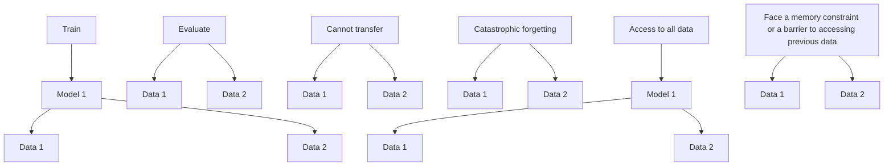

# Chapter 13 Continual Causal Effect Estimation


Zhixuan Chu, Stephen L. Rathbun, and Sheng Li

## 13.1 Introduction

A further understanding of cause and effect within observational data is critical across many domains, such as economics, health care, public policy, web mining, online advertising, and marketing campaigns. Although significant advances have been made to overcome the challenges in causal effect estimation with observational data, such as missing counterfactual outcomes and selection bias between treatment and control groups, the existing methods mainly focus on source-specific and stationary observational data. In particular, such learning strategies assume that all observational data are already available during the training phase and from only one source.

Along with the fast-growing segments of industrial applications, this assumption is unsubstantial in practice. Taking Alipay as an example, which is one of the world’s largest mobile payment platforms and offers financial services to billion-scale users, a tremendous amount of data containing much privacy-related information is produced daily and collected from different sources. In the following, we further elaborate on this problem in two ways. The first is based on the characteristics of observational data, which are incrementally available from nonstationary data distributions. For instance, the electronic financial records for one marketing campaign

Z. Chu

Ant Group, Hangzhou, China

e-mail: chuzhixuan.czx@alibaba-inc.com

S. L. Rathbun

University of Georgia, Athens, GA, USA

e-mail: rathbun@uga.edu

S. Li (-)

University of Virginia, Charlottesville, VA, USA

e-mail: shengli@virginia.eduare growing every day, and they may be collected from different cities or even other countries. This characteristic implies that one cannot have access to all observational data at one time point and from one single source. The second reason is based on the realistic consideration of accessibility. For example, when new observational data are available, one may want to refine the previously trained model using both the new data and original data. However, it is likely that the original training data are no longer accessible for a variety of reasons, e.g., legacy data may be unrecorded, proprietary, sensitive to financial data, too large to store, or subject to privacy constraints of personal information [37]. This practical concern of accessibility is ubiquitous in various academic and industrial applications. That is what it boiled down to in the era of big data; we face new challenges in causal inference with observational data. We first presented the continual causal effect estimation problem in [2], in which we discussed three desired properties of continual causal inference frameworks, i.e., the extensibility for incrementally available observational data, the adaptability for various data sources in new domains, and the accessibility for an enormous amount of data.

In this chapter, we formally define the problem of continual treatment effect estimation, describe its research challenges, and then present possible solutions to this problem. Moreover, we will discuss future research directions on this topic.

## 13.2 Related Work

Instead of randomized controlled trials, observational data are obtained by the researcher simply observing the subjects without any interference. This means that the researchers have no control over the treatment assignments, and they just observe the subjects and record data based on observations [6, 34]. Therefore, from the observational data, directly estimating the treatment effect is challenging due to the missing counterfactual outcomes and the existence of confounders. Recently, powerful machine learning methods such as tree-based methods [1, 32], representation learning [4, 16, 28, 35], meta-learning [15, 24], and generative models [20, 36] have achieved prominent progress in treatment effect estimation.

In addition, the combination of causal inference and other research fields also exhibits complementary strengths, such as computer vision [18, 31], graph learning [3, 22], and natural language processing [9, 19]. The involved causal analysis helps improve the model’s capability of discovering and resolving the underlying system beyond the statistical relationships learned from observational data.

## 13.3 Problem Definition

Suppose that the observational data contain n units collected from d different domains, and $D _ { d } = \{ ( x , y , t ) | x \in X , y \in Y , t \in T \}$ denotes the dataset collected from the d-th domain, which contains $n _ { d }$ units. Let X denote all observed variables, Y denote the outcomes in the observational data, and T be a binary variable. Let $D _ { 1 : d } = \{ D _ { 1 } , D _ { 2 } , . . . , D _ { d } \}$ be the combination of d datasets, separately collected from d different domains. For d datasets $\{ D _ { 1 } , D _ { 2 } , . . . , D _ { d } \}$ , they have the commonly observed variables, but due to the fact that they are collected from different domains, they usually have different distributions with respect to X, Y , and T in each dataset. Each unit in the observational data received one of the two or multiple treatments. Let $t _ { i }$ denote the treatment assignment for unit $i ; i = 1 , . . . , n$ . For binary treatments, $t _ { i } = 1$ is for the treatment group and $t _ { i } = 0$ for the control group. The outcome for unit i is denoted by $y _ { t } ^ { i }$ when treatment t is applied to unit i. For observational data, only one of the potential outcomes is observed. The observed outcome is called the factual outcome, and the remaining unobserved potential outcomes are called counterfactual outcomes.

The potential outcome framework has been widely used for estimating treatment effects [26, 29]. The individual treatment effect (ITE) for unit i is the difference between the potential treated and control outcomes and is defined as:

$$
\mathrm{ITE} _ {i} = y _ {1} ^ {i} - y _ {0} ^ {i}. \tag {13.1}
$$

The average treatment effect (ATE) is the difference between the mean potential treated and control outcomes, which is defined as:

$$
\mathrm{ATE} = \frac {1}{n} \sum_ {i = 1} ^ {n} (y _ {1} ^ {i} - y _ {0} ^ {i}). \tag {13.2}
$$

The success of the potential outcome framework is based on the following assumptions [13], which ensure that the treatment effect can be identified.

Assumption Stable Unit Treatment Value Assumption (SUTVA): The potential outcomes for any unit do not vary with the treatments assigned to other units, and for each unit, there are no different forms or versions of each treatment level, which lead to different potential outcomes. □

Assumption Consistency: The potential outcome of treatment t is equal to the observed outcome if the actual treatment received is t. □

Assumption Positivity: For any value of x, treatment assignment is not deterministic, i.e., $P ( T = t | X = x ) > 0$ , for all t and x. □

Assumption Ignorability: Given covariates, treatment assignment is independent of the potential outcomes, i.e., $( y _ { 1 } , y _ { 0 } ) \perp \perp t | x$ . □

The goal of continual treatment effect estimation is to estimate the causal effect of treatments for all available data, including new data $D _ { d }$ and the previous data $D _ { 1 : ( d - 1 ) }$ , without having access to previous data $D _ { 1 : ( d - 1 ) }$ .




Fig. 13.1 Three straightforward strategies for continual causal effect estimation

## 13.4 Research Challenges

Existing causal effect inference methods, however, are unable to address the aforementioned new challenges in continual treatment effect estimation, i.e., extensibility, adaptability, and accessibility. Although it is possible to adapt existing treatment effect estimation methods to cater to these issues, these modified methods still have inevitable defects. Three straightforward adaptation strategies are described as follows:

1. If we directly apply the model previously trained based on original data to new observational data, the performance on new tasks will be very poor due to the domain shift issues among different data sources;  
2. Suppose we utilize newly available data to retrain the previously learned model to adapt to changes in the data distribution. In that case, old knowledge will be completely or partially overwritten by the new knowledge, which can result in severe performance degradation on old tasks. This is the well-known catastrophic forgetting problem [10, 23];  
3. To overcome the catastrophic forgetting problem, we may rely on the storage of old data and combine the old and new data together and then retrain the model from scratch. However, this strategy is memory inefficient and time-consuming, and it brings practical concerns such as copyright or privacy issues when storing data for a long time [27].

As shown in Fig. 13.1, any of these three strategies, in combination with the existing causal effect inference methods, is deficient.

## 13.5 Potential Solution

To address the continual treatment effect estimation problem, we propose a Continual Causal Effect Representation Learning framework (CERL) for estimating causal effect with incrementally available observational data. Instead of having access to all previous observational data, we only store a limited subset of feature representations learned from previous data. Combining selective and balanced representation learning, feature representation distillation, and feature transformation, our framework preserves the knowledge learned from previous data and updates the knowledge by leveraging new data so that it can achieve continual causal effect estimation for incrementally new data without compromising the estimation capability for previous data. In the following, we will briefly describe the design of our CERL framework. More details of our model, as well as experimental results, can be found at [7].

## 13.5.1 Model Architecture

To estimate the incrementally available observational data, the framework of CERL is mainly composed of two components: (1) the baseline causal effect learning model is only for the first available observational data, and thus, we don’t need to consider the domain shift issue among different data sources. This component is equivalent to the traditional causal effect estimation problem; (2) the continual causal effect learning model is for the sequentially available observational data, where we need to handle more complex issues, such as knowledge transfer, catastrophic forgetting, global representation balance, and memory constraint.

## 13.5.1.1 The Baseline Causal Effect Learning Model

We first describe the baseline causal effect learning model for the initial observational dataset and then bring in subsequent datasets. For causal effect estimation in the initial dataset, it can be transformed into the traditional causal effect estimation problem. Motivated by the empirical success of deep representation learning for counterfactual estimation [5, 28], we propose to learn the selective and balanced feature representations for units in treatment and control groups, then infer the potential outcomes based on learned representation space.

Learning Selective and Balanced Representation Firstly, we adopt a deep feature selection model that enables variable selection in one deep neural network, i.e., $g _ { w _ { 1 } } : X \to R$ , where X denotes the original covariate space, R denotes the representation space, and $w _ { 1 }$ are the learnable parameters in function g. The elastic net regularization term [38] is adopted in our model

$$
L _ {w _ {1}} = \| w _ {1} \| _ {2} ^ {2} + \| w _ {1} \| _ {1}. \tag {13.3}
$$

Elastic net throughout the fully connected representation layers assigns larger weights to important features. This strategy can effectively filter out the irrelevant variables and highlight the important variables.

Due to the selection bias between treatment and control groups and among the sequential different data sources, the magnitudes of confounders may be significantly different. To effectively eliminate the imbalance caused by the significant difference in magnitudes between treatment and control groups and among different data sources, we propose to use cosine normalization in the last representation layer. In multilayer neural networks, we traditionally use dot products between the output vector of the previous layer and the incoming weight vector and then input the products to the activation function. The result of the dot product is unbounded. Cosine normalization uses cosine similarity instead of simple dot products in neural networks, which can bound the pre-activation between 1 and 1. The result could be even smaller when the dimension is high. As a result, the variance can be controlled within a very narrow range [21]. Cosine normalization is defined as

$$
r = \sigma (r _ {n o r m}) = \sigma \big (\cos (w, x) \big) = \sigma (\frac {w \cdot x}{| w |   | x |}), \tag {13.4}
$$

where $r _ { n o r m }$ is the normalized pre-activation, w is the incoming weight vector, x is the input vector, and σ is nonlinear activation function.

Motivated by [28], we adopt integral probability metrics (IPM) when learning the representation space to balance the treatment and control groups. The IPM measures the divergence between the representation distributions of treatment and control groups, so we want to minimize the IPM to make the two distributions more similar. Let $P ( g ( x ) | t = 1 )$ and $Q ( g ( x ) | t = 0 )$ denote the empirical distributions of the representation vectors for the treatment and control groups, respectively. We adopt the IPM defined in the family of 1-Lipschitz functions, which leads to IPM being the Wasserstein distance [28, 30]. In particular, the IPM term with Wasserstein distance is defined as

$$
\operatorname{Wass} (P, Q) = \inf _ {k \in \mathcal {K}} \int_ {g (x)} \| k (g (x)) - g (x) \| P (g (x)) d (g (x)), \tag {13.5}
$$

where $\mathcal { K } = \{ k | Q ( k ( g ( x ) ) ) = P ( g ( x ) ) \}$ defines the set of push-forward functions that transform the representation distribution of the treatment distribution P to that of the control Q and $g ( x ) \in \{ g ( x ) _ { i } \} _ { i : t _ { i } = 1 }$ .

Inferring Potential Outcomes We aim to learn a function $h _ { \theta _ { 1 } } : R \times T  Y$ that maps the representation vectors and treatment assignment to the corresponding observed outcomes, and it can be parameterized by deep neural networks. To overcome the risk of losing the influence of T on $R , h _ { \theta _ { 1 } } ( g _ { w _ { 1 } } ( x ) , t )$ is partitioned into two separate tasks for treatment and control groups, respectively. Each unit is only updated in the task corresponding to its observed treatment. Let $\hat { y } _ { i } = h _ { \theta _ { 1 } } ( g _ { w _ { 1 } } ( x ) , t )$ denote the inferred observed outcome of unit i corresponding to factual treatment $t _ { i }$ . We minimize the mean squared error in predicting factual outcomes

$$
L _ {Y} = \frac {1}{n _ {1}} \sum_ {i = 1} ^ {n _ {1}} (\hat {y} _ {i} - y _ {i}) ^ {2}. \tag {13.6}
$$

Putting all the above together, the objective function of our baseline causal effect learning model is

$$
L = L _ {Y} + \alpha W a s s (P, Q) + \lambda L _ {w _ {1}}, \tag {13.7}
$$

where $\alpha$ and λ denote the hyper-parameters controlling the trade-off among $W a s s ( P , Q ) , L _ { w _ { 1 } }$ , and $L _ { Y }$ in the objective function.

## 13.5.1.2 The Sustainability of Model Learning

By far, we have built the baseline model for causal effect estimation with observational data from a single source. To avoid catastrophic forgetting when learning new data, we propose to preserve a subset of lower-dimensional feature representations rather than all original covariates. We also can adjust the number of preserved feature representations according to the memory constraint.

After the completion of baseline model training, we store a subset of feature representations $R _ { 1 } \ = \ \{ g _ { w _ { 1 } } ( x ) | x \ \in \ D _ { 1 } \}$ and the corresponding $\{ Y , T \} \ \in \ D _ { 1 }$ as memory $M _ { 1 }$ . The size of stored representation vectors can be reduced to satisfy the prespecified memory constraint by a herding algorithm [25, 33]. The herding algorithm can create a representative set of samples from distribution and requires fewer samples to achieve a high approximation quality than random subsampling. We run the herding algorithm separately for treatment and control groups to store the same number of feature representations from treatment and control groups. At this point, we only store the memory set $M _ { 1 }$ and model $g _ { w _ { 1 } }$ , without the original data $D _ { 1 }$ .

## 13.5.1.3 The Continual Causal Effect Learning

We have stored memory $M _ { 1 }$ and the baseline model. To continually estimate the causal effect for incrementally available observational data, we incorporate feature representation distillation and feature representation transformation to estimate the causal effect for all seen data based on a balanced global feature representation space. The framework of CERL is shown in Fig. 13.2.

Feature Representation Distillation For the next available dataset $\begin{array} { r l } { D _ { 2 } } & { { } = } \end{array}$ $\{ ( x , y , t ) | x \ \in \ X , y \ \in \ Y , t \ \in \ T \}$ collected from the second domain, we adopt the same selective representation learning $g _ { w _ { 2 } } \ : \ X \ \to \ R _ { 2 }$ with elastic net regularization $( L _ { w _ { 2 } } )$ on new parameters $w _ { 2 }$ . Because we expect our model can estimate causal effects for both previous and new data, we want the new model to inherit some knowledge from the previous model. In continual learning, knowledge distillation [11, 17] is commonly adopted to alleviate catastrophic forgetting, where knowledge is transferred from one network to another network by encouraging the outputs of the original and new network to be similar. However, for the continual causal effect estimation problem, we focus more on the feature representations, which are required to be balanced between treatment and control and among different data domains. Inspired by [8, 12, 14], we propose feature representation distillation to encourage the representation vector $\{ g _ { w _ { 1 } } ( x ) | x \ \in \ D _ { 2 } \}$ based on baseline model to be similar to the representation vector $\{ g _ { w _ { 2 } } ( x ) | x \ \in \ D _ { 2 } \}$ based on the new model by Euclidean distance. This feature distillation can help prevent the learned representations from drifting too much in the new feature representation space. Because we apply the cosine normalization to feature representations and $\| A - B \| ^ { 2 } = ( A - B ) ^ { \mathsf { T } } ( A - B ) = \| A \| ^ { 2 } + \| B \| ^ { 2 } - 2 A ^ { \mathsf { T } } B = 2 { \bigl ( } 1 - c o s ( A , B ) { \bigr ) }$ , the feature representation distillation is defined as


```mermaid
graph TD
  X1["X₁"] -->|g_{w₁}| R1["R₁"]
  R1 -->|h_{θ₁}| Y1["Y₁"]
  Y1 -->|IPM| X1
  R1 -->|φ_{1→2}| R2["R₂"]
  R2 -->|φ_{1→2}g_{w₁x₂}| R1
  R1 -->|φ_{1→2}| R̃1["Õ"]
  R1["R̃1"] -->|h_{θ₂}| M2["M₂"]
  M2 -->|Herding| X2["X₂"]
  X2 -->|g_{w₂}| R2
  R2 -->|φ_{1→2}g_{w₁x₂}| R1
  R1 -->|IPM| X2
  M2 -->|Herding| Y1,Y2["Y₁,Y₂"]
  Y1Y2["Y1,Y2"] -->|h_{θ₂}| M2
    style X1 fill:#4A90E2,stroke:#333
    style R1 fill:#4A90E2,stroke:#333
    style Y1 fill:#4A90E2,stroke:#333
    style R2 fill:#4A90E2,stroke:#333
    style R̃1 fill:#4A90E2,stroke:#333
    style M2 fill:#4A90E2,stroke:#333
```

Fig. 13.2 The blue part is the baseline causal effect learning model for the first observational data. After baseline model training, store a subset of feature representations $R _ { 1 }$ into $M _ { 1 }$ by herding algorithm. The green part helps to map $R _ { 1 }$ to transformed feature representations $\tilde { R } _ { 1 }$ compatible with new feature representations space $R _ { 2 }$ . Then the red part is used for continual causal effect estimation based on feature distillation and balanced global feature representation learning for ${ \tilde { R } } _ { 1 }$ and $R _ { 2 }$

$$
L _ {F D} (x) = 1 - \cos \bigl (g _ {w _ {1}} (x), g _ {w _ {2}} (x) \bigr), \text { where } x \in D _ {2}. \tag {13.8}
$$

Feature Representation Transformation We have previous feature representations $R _ { 1 }$ stored in $M _ { 1 }$ and new feature representations $R _ { 2 }$ extracted from newly available data. $R _ { 1 }$ and $R _ { 2 }$ lie in different feature representation spaces, and they are not compatible with each other because they are learned from different models. In addition, we cannot learn the feature representations of previous data from the new model $g _ { w _ { 2 } }$ , as we no longer have access to previous data. Therefore, to balance the global feature representation space, including previous and new representations between treatment and control groups, a feature transformation function is needed from previous feature representations $R _ { 1 }$ to transformed feature representations $\tilde { R } _ { 1 }$ compatible with new feature representations space $R _ { 2 }$ . We define a feature transformation function as $\phi _ { 1 \to 2 } : R _ { 1 } \to \tilde { R } _ { 1 }$ . We also input the feature representations of new data $D _ { 2 }$ learned from the old model, i.e., $g _ { w _ { 1 } } ( x )$ , to get the transformed feature representations of new data, i.e., $\phi _ { 1  2 } ( g _ { w _ { 1 } } ( x ) )$ ). To keep the transformed space compatible with the new feature representation space, we train the transformation function $\phi _ { 1  2 }$ by making the $\phi _ { 1  2 } ( g _ { w _ { 1 } } ( x ) )$ and $g _ { w _ { 2 } } ( x )$ similar, where $x \in D _ { 2 }$ . The loss function is defined as

$$
L _ {F T} (x) = 1 - \cos \bigl (\phi_ {1 \rightarrow 2} (g _ {w _ {1}} (x)), g _ {w _ {2}} (x) \bigr), \tag {13.9}
$$

which is used to train the function $\phi _ { 1  2 }$ to transform feature representations between different feature spaces. Then, we can attain the transformed old feature representations ${ \tilde { R } } _ { 1 } = \phi _ { 1  2 } ( R _ { 1 } )$ , which is in the same space as $R _ { 2 }$ .

Balancing Global Feature Representation Space We have obtained a global feature representation space, including the transformed representations of stored old data and new representations of newly available data. We adopt the same integral probability metrics as the baseline model to make sure that the representation distributions are balanced for treatment and control groups in the global feature representation space. In addition, we define a potential outcome function $h _ { \theta _ { 2 } } :$ $( { \tilde { R } } _ { 1 } , R _ { 2 } ) \times T  Y$ . Let $\hat { y } _ { i } ^ { M } \ = \ h _ { \theta _ { 2 } } \big ( \phi _ { 1  2 } ( r _ { i } ) , t \big )$ , where $r _ { i } ~ \in ~ M _ { 1 }$ , and $\hat { y } _ { j } ^ { D } =$ $h _ { \theta _ { 2 } } \big ( g _ { w _ { 2 } } ( x _ { j } ) , t \big )$ , where $x _ { j } \in D _ { 2 }$ denote the inferred observed outcomes. We aim to minimize the mean squared error in predicting factual outcomes for global feature representations including transformed old feature representations and new feature representations

$$
L _ {G} = \frac {1}{\tilde {n} _ {1}} \sum_ {i = 1} ^ {\tilde {n} _ {1}} (\hat {y} _ {i} ^ {M} - y _ {i} ^ {M}) ^ {2} + \frac {1}{n _ {2}} \sum_ {j = 1} ^ {n _ {2}} (\hat {y} _ {j} ^ {D} - y _ {j} ^ {D}) ^ {2}, \tag {13.10}
$$

where $\tilde { n } _ { 1 }$ is the number of units stored in $M _ { 1 }$ by herding algorithm, $y _ { i } ^ { M } \in M _ { 1 }$ , and $y _ { j } ^ { D } \in D _ { 2 }$ .

In summary, the objective function of our continual causal effect learning model is

$$
L = L _ {G} + \alpha \text {Wass} (P, Q) + \lambda L _ {w _ {2}} + \beta L _ {F D} + \delta L _ {F T}, \tag {13.11}
$$

where $\alpha , \lambda , \beta ,$ , and δ denote the hyperparameters controlling the trade-off among $W a s s ( P , Q ) , L _ { w _ { 2 } } , L _ { F D } , L _ { F T }$ , and $L _ { G }$ in the final objective function.

## 13.5.2 Overview of CERL

In the above sections, we have provided the baseline and continual causal effect learning models. When the continual causal effect learning model for the second data is trained, we can extract the $R _ { 2 } = \{ g _ { w _ { 2 } } ( x ) | x \in D _ { 2 } \}$ and $\tilde { R } _ { 1 } = \{ \phi _ { 1  2 } ( r ) | r \in$

**Fig. 13.3 The CERL algorithm**

<table><tr><td colspan="2">Data: Given d incrementally available observational data from D1 to Dd</td></tr><tr><td colspan="2">if {x,y,t} ∈ D1 then
	*** Train baseline causal effect model hθ1(gw1)
	***
	w1, θ1 = OPTIMIZE(LY + αWass(P, Q) + λLw1)
	R1 = {gw1(x)|x ∈ D1}
	M1 = HERDING{R1, Y1, T1}</td></tr><tr><td colspan="2">else
	for {x,y,t} ∈ D2,...,Dd do
	*** Train continual causal effect model
	hθd(gwd) ***
	wd, θd, φd-1→d = OPTIMIZE(LG +
	αWass(P, Q) + λLw2 + βLFD + δLFT)
	̃Rd-1 = φd-1→d(Rd-1)
	Rd = {gwd(x)|x ∈ Dd}
	Md = HERDING({Rd, Yd, Td} ∪
	{Rd-1, Yd-1 ∈ Md-1, Td-1 ∈ Md-1})</td></tr><tr><td colspan="2">end</td></tr><tr><td colspan="2">end</td></tr></table>

$M _ { 1 } \}$ . We define a new memory set as $M _ { 2 } \ = \ \{ R _ { 2 } , Y _ { 2 } , T _ { 2 } \} \cup \phi _ { 1  2 } ( M _ { 1 } )$ , where $\phi _ { 1  2 } ( M _ { 1 } )$ includes $\tilde { R } _ { 1 }$ and the corresponding $\{ Y , T \}$ stored in $M _ { 1 }$ . Similarly, to satisfy the prespecified memory constraint, $M _ { 2 }$ can be reduced by conducting the herding algorithm to store the same number of feature representations from treatment and control groups.

We only store the new memory set $M _ { 2 }$ and new model $g _ { w _ { 2 } }$ , which are used to train the following model and balance the global feature representation space. It is unnecessary to store the original data $D _ { 1 }$ and $D _ { 2 }$ any longer.

We follow the same procedure for the subsequently available observational data. When we obtain the new observational data $D _ { d }$ , we can train $h _ { \theta _ { d } } ( g _ { w _ { d } } )$ and $\phi _ { d - 1 \to d }$ : $R _ { d - 1 }  \tilde { R } _ { d - 1 }$ based on the continual causal effect learning model. Besides, the new memory set is defined as: $M _ { d } = \{ R _ { d } , Y _ { d } , T _ { d } \} \cup \phi _ { d - 1  d } ( M _ { d - 1 } )$ . So far, our model $h _ { \theta _ { d } } ( g _ { w _ { d } } )$ can estimate causal effect for all seen observational data regardless of the data source, and it does not require access to previous data. As shown in Algorithm 1 (Fig. 13.3), we summarize the procedures of CERL.

## 13.6 Summary

Although significant advances have been made to overcome the challenges in causal effect estimation, real-world applications based on observational data are always very complicated. Unlike source-specific and stationary observational data, most real-world data are incrementally available and from nonstationary data distributions. Significantly, we also face the realistic consideration of accessibility. Our work [2] might be the first attempt to investigate the continual causal inference problem, and we proposed the corresponding evaluation criteria. However, constructing comprehensive analytical tools and the theoretical framework derived from this brand-new problem requires nontrivial efforts. Specifically, there are several potential directions for continual causal inference:

• In addition to the distribution shift of the covariates among different domains, there are other potential technical issues for continual effect estimation: for example, perhaps we do not initially observe all the necessary confounding variables and may get access to increasingly more confounders.
• Compared with homogeneous treatment effects (e.g., the magnitude and direction of the treatment effect are the same for all patients, regardless of any other patient characteristics), heterogeneous causal effects could differ for different individuals. This could be another important aspect to consider for the continual treatment effect estimation model.
• The basic assumptions for traditional causal effect estimation may not be completely applicable. New assumptions may be supplemented, or previous assumptions need to be relaxed.
• There exists a natural connection with continual domain adaptation among different times or domains (“continual” causal inference) and between treatment and control groups (continual “causal inference”).
• Compared to traditional causal effect estimation tasks based on relatively small datasets, the continual causal inference method will embrace high-performance computing or cloud computing due to its ambitious objective.
• With increasing public concern over privacy leakage in data, federated learning, which collaboratively trains the machine learning model without directly sharing the raw data among the data holders, may become a potential solution for continual causal inference.

## References

1. S. Athey, G. Imbens, Recursive partitioning for heterogeneous causal effects, Proc. Natl. Acad. Sci. 113(27), 7353–7360 (2016)  
2. Z. Chu, S. Rathbun, S. Li, Continual Lifelong Causal Effect Inference with Real World Evidence (2020)  
3. Z. Chu, S.L. Rathbun, S. Li, Graph infomax adversarial learning for treatment effect estimation with networked observational data, in ACM SIGKDD International Conference on Knowledge Discovery and Data Mining (2021)  
4. Z. Chu, S.L. Rathbun, S. Li, Learning infomax and domain-independent representations for causal effect inference with real-world data, in Proceedings of the 2022 SIAM International Conference on Data Mining (SDM) (SIAM, 2022), pp. 433–441  
5. Z. Chu, S.L. Rathbun, S. Li, Matching in selective and balanced representation space for treatment effects estimation, in Proceedings of the 29th ACM International Conference on Information and Knowledge Management (2020), pp. 205–214  
6. Z. Chu et al., Causal effect estimation: recent advances, challenges, and opportunities (2023). arXiv preprint arXiv:2302.00848  
7. Z. Chu et al., Continual causal inference with incremental observational data, in The 39th IEEE International Conference on Data Engineering (2023)  
8. P. Dhar et al., Learning without memorizing, in Proceedings of the IEEE Conference on Computer Vision and Pattern Recognition (2019), pp. 5138–5146  
9. A. Feder et al., Causal inference in natural language processing: estimation, prediction, interpretation and beyond. Trans. Assoc. Comput. Linguist. 10, 1138–1158 (2022)  
10. R.M. French, Catastrophic forgetting in connectionist networks. Trends Cogn. Sci. 3(4), 128– 135 (1999)  
11. G. Hinton, O. Vinyals, J. Dean, Distilling the knowledge in a neural network (2015). arXiv preprint arXiv:1503.02531  
12. S. Hou et al., Learning a unified classifier incrementally via rebalancing, in Proceedings of the IEEE Conference on Computer Vision and Pattern Recognition (2019), pp. 831–839  
13. G.W. Imbens, D.B. Rubin, Causal Inference in Statistics, Social, and Biomedical Sciences, Cambridge University Press, (2015)  
14. A. Iscen et al., Memory-efficient incremental learning through feature adaptation (2020). arXiv preprint arXiv:2004.00713  
15. S.R. Künzel et al., Metalearners for estimating heterogeneous treatment effects using machine learning. Proc. Natl. Acad. Sci. 116(10), 4156–4165 (2019)  
16. S. Li, Y. Fu, Matching on balanced nonlinear representations for treatment effects estimation, in NIPS (2017)  
17. Y. Li et al., Learning from noisy labels with distillation, in ICCV (2017), pp. 1910–1918  
18. B. Liu et al., Show, deconfound and tell: image captioning with causal inference, in Proceedings of the IEEE/CVF Conference on Computer Vision and Pattern Recognition (2022), pp. 18041–18050  
19. J. Liu et al., Incorporating causal analysis into diversified and logical response generation, in Proceedings of the 29th International Conference on Computational Linguistics. International Committee on Computational Linguistics (2022). https://aclanthology.org/2022.coling-1.30  
20. C. Louizos et al., Causal effect inference with deep latent-variable models, in Advances in Neural Information Processing Systems (2017), pp. 6446–6456  
21. C. Luo et al., Cosine normalization: Using cosine similarity instead of dot product in neural networks, in The 27th International Conference on Artificial Neural Networks, Rhodes, Greece, October 4–7, 2018, Proceedings, Part I, pp. 382-391 (Springe, Cham, 2018)  
22. J. Ma et al., Learning causal effects on hypergraphs, in ACM SIGKDD International Conference on Knowledge Discovery and Data Mining (2022)  
23. M. McCloskey, N.J. Cohen, Catastrophic interference in connectionist networks: the sequential learning problem, Psychology of learning and Motivation, vol. 24 (Elsevier, 1989), pp. 109– 165  
24. X. Nie, S. Wager, Quasi-oracle estimation of heterogeneous treatment effects. Biometrika 108(2), 299–319 (2021)  
25. S.-A. Rebuffi et al., iCaRL: incremental classifier and representation learning, in Proceedings of the IEEE conference on Computer Vision and Pattern Recognition (2017), pp. 2001–2010  
26. D.B. Rubin, Estimating causal effects of treatments in randomized and nonrandomized studies. J. Educ. Psychol. 66(5) 688 (1974)  
27. S. Samet, A. Miri, E. Granger, Incremental learning of privacy-preserving Bayesian networks. Appl. Soft Comput. 13(8), 3657–3667 (2013)  
28. U. Shalit, F.D. Johansson, D. Sontag, Estimating individual treatment effect: generalization bounds and algorithms, in Proceedings of the 34th International Conference on Machine Learning, vol. 70 (2017), pp. 3076–3085  
29. J. Splawa-Neyman, D.M. Dabrowska, T.P. Speed, On the application of probability theory to agricultural experiments. Essay on principles. Section 9, in Statistical Science (1990), pp. 465– 472  
30. B.K. Sriperumbudur et al., On the empirical estimation of integral probability metrics. Electr. J. Statist. 6, 1550–1599 (2012)  
31. K. Tang et al., Unbiased scene graph generation from biased training (2020). arXiv preprint arXiv:2002.11949  
32. S. Wager, S. Athey, Estimation and inference of heterogeneous treatment effects using random forests. J. Am. Statist. Assoc. 113(523), 1228–1242 (2018)  
33. M. Welling, Herding dynamical weights to learn, in Proceedings of the 26th Annual International Conference on Machine Learning (2009), pp. 1121–1128  
34. L. Yao et al., A survey on causal inference. ACM Trans. Knowl. Disc. Data (TKDD) 15(5), 1–46 (2021)  
35. L. Yao et al., Representation learning for treatment effect estimation from observational data, in Advances in Neural Information Processing Systems (2018), pp. 2633–2643  
36. J. Yoon, J. Jordon, M. van der Schaar, GANITE: estimation of individualized treatment effects using generative adversarial nets, in 6th International Conference on Learning Representations (2018)  
37. J. Zhang et al., Class-incremental learning via deep model consolidation, in The IEEE Winter Conference on Applications of Computer Vision (2020), pp. 1131–1140  
38. H. Zou, T. Hastie, Regularization and variable selection via the elastic net. J. R. Statist. Soc.: Ser. B (Statist. Methodol.) 67(2), 301–320 (2005)

<!-- footnote -->

- Y. Yao · T. Liu ()
- School of Computer Science, The University of Sydney, Camperdown, NSW, Australia e-mail: tongliang.liu@sydney.edu.au
- M. Gong
- School of Mathematics and Statistics, University of Melbourne, Parkville, VIC, Australia e-mail: mingming.gong@unimelb.edu.au
- B. Han
- Department of Computer Science, Hong Kong Baptist University, Hong Kong, China e-mail: bhanml@comp.hkbu.edu.hk
- G. Niu
- RIKEN Center for Advanced Intelligence Project, Tokyo, Japan e-mail: gang.niu.ml@gmal.edu.au
- K. Zhang
- Department of Philosophy, Carnegie Mellon University, Pittsburgh, PA, USA e-mail: kunz1@cmu.edu

<!-- footnote end -->

<!-- footnote -->

- Z. Chu (-) · R. Li
- Ant Group, Hangzhou, China
- e-mail: chuzhixuan.czx@alibaba-inc.com; ruopeng.lrp@antgroup.com
- S. Li
- University of Virginia, Charlottesville, VA, USA
- e-mail: shengli@virginia.edu

<!-- footnote end -->