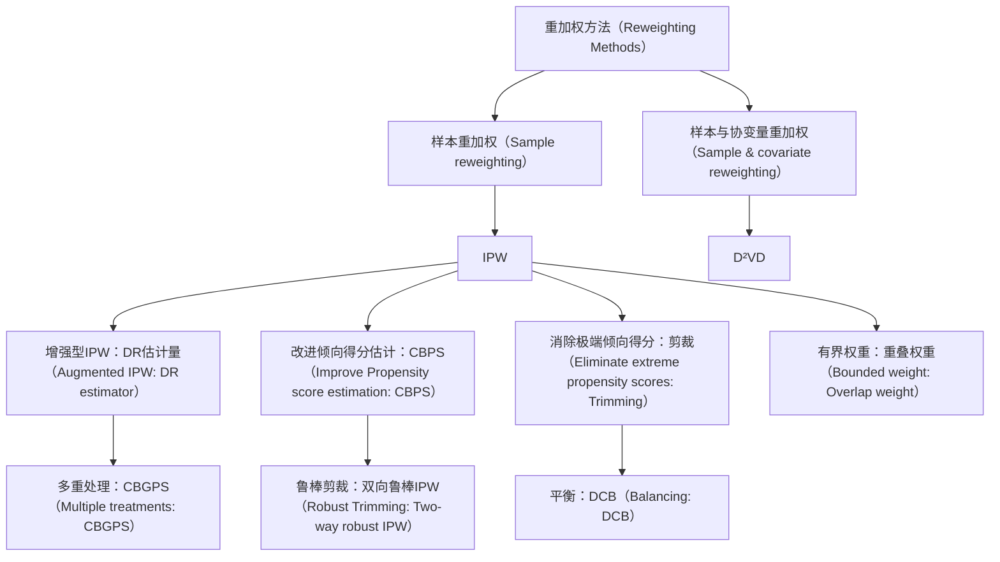
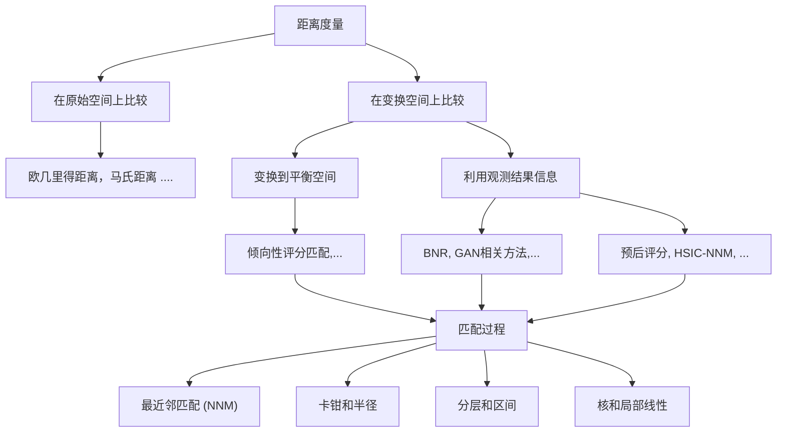

# 第3章 因果效应估计：基本方法论（Chapter 3 Causal Effect Estimation: Basic Methodologies）

刘易瑶（Liuyi Yao），楚志轩（Zhixuan Chu），李亚亮（Yaliang Li），高靖（Jing Gao），张爱东（Aidong Zhang），李晟（Sheng Li）

## 3.1 引言（Introduction）

对于基于观测数据的因果效应估计任务，**潜在结果框架（Potential Outcome Framework）** $[80, 92]$ 是最常用的解决方案，也被称为**内曼-鲁宾潜在结果（Neyman–Rubin Potential Outcomes）**或**鲁宾因果模型（Rubin Causal Model）**。

在本章中，我们全面回顾了潜在结果框架下的因果推断方法。根据是否需要满足潜在结果框架的三个假设，我们将各种因果推断方法分为两大类。首先阐述满足这三个假设的各种因果推断方法，包括**重加权方法（Reweighting Methods）**、**分层方法（Stratification Methods）**、**基于匹配的方法（Matching-based Methods）**、**基于树的方法（Tree-based Methods）**、**基于表征的方法（Representation-based Methods）**、**基于多任务学习的方法（Multi-task Learning-based Methods）**和**元学习方法（Meta-learning Methods）**。在每个类别中，我们提供了代表性方法的详细描述、所提及方法之间的联系与比较以及总体总结。此外，还描述了放松这三个假设的因果效应估计方法，以满足不同场景下的需求。

刘易瑶（L. Yao）· 李亚亮（Y. Li）
阿里巴巴集团，杭州，中国
电子邮箱：yly287738@alibaba-inc.com；yaliang.li@alibaba-inc.com

楚志轩（Z. Chu）
蚂蚁集团，杭州，中国
电子邮箱：chuzhixuan.czx@alibaba-inc.com

高靖（J. Gao）
普渡大学，西拉法叶，印第安纳州，美国
电子邮箱：jinggao@purdue.edu

张爱东（A. Zhang）· 李晟（S. Li）(☒)
弗吉尼亚大学，夏洛茨维尔，弗吉尼亚州，美国
电子邮箱：aidong@virginia.edu；shengli@virginia.edu

## 3.2 依赖三个假设的因果推断方法（Causal Inference Methods Relying on Three Assumptions）

在本节中，我们介绍依赖于第2.2节中引入的三个假设的现有因果推断方法。根据控制混杂变量的方式，我们将这些方法分为以下几类：(1) **重加权方法（Re-weighting Methods）**；(2) **分层方法（Stratification Methods）**；(3) **匹配方法（Matching Methods）**；(4) **基于树的方法（Tree-based Methods）**；(5) **基于表征的方法（Representation-based Methods）**；(6) **多任务方法（Multi-task Methods）**；(7) **元学习方法（Meta-learning Methods）**。

### 3.2.1 重加权方法（Re-weighting Methods）

由于存在混杂变量，处理组和对照组的协变量分布不同，这导致了第2.2.4节所述的选择偏差问题。换句话说，在观测数据中，处理分配与协变量相关。**样本重加权（Sample Re-weighting）**是克服选择偏差的有效方法。通过为观测数据中的每个单元分配适当的权重，可以创建一个伪总体，在该伪总体中处理组和对照组的分布相似。

在样本重加权方法中，一个关键概念是**平衡得分（Balancing Score）**。平衡得分 $b(x)$ 是一个通用的加权得分，它是 $x$ 的函数，满足：$W \perp x |b(x)$ [46]，其中 $W$ 是处理分配，$x$ 是背景变量。平衡得分有多种设计方式，显然，由于可忽略性假设，最平凡的平衡得分设计是 $b(x) = x$。此外，**倾向得分（Propensity Score）**也是平衡得分的一个特例。

**定义 3.1 倾向得分（Propensity Score）：** 倾向得分定义为给定背景变量条件下接受处理的**条件概率（conditional probability）** [76]：

$$
e (x) = \operatorname * {P r} (W = 1 | X = x). \tag {3.1}
$$

具体而言，倾向得分表示在给定一组观测协变量条件下，某个单元被分配到特定处理的概率。结合倾向得分的平衡得分是最常见的方法。

本节所提及算法的总结如图3.1所示。基于倾向得分的样本重加权将在下一节中介绍，随后介绍同时对样本和协变量进行加权的方法。

**图3.1** 重加权方法分类 [107]

#### 3.2.1.1 基于倾向得分的样本重加权（Propensity-Score-Based Sample Re-weighting）

倾向得分可以通过基于这些协变量进行组别均衡来减少选择偏差。**逆概率加权（Inverse Propensity Weighting, IPW）** $[75, 76]$，也称为**逆处理概率加权（Inverse Probability of Treatment Weighting, IPTW）**，为每个样本分配一个权重 $r$：

$$
r = \frac {W}{e (x)} + \frac {1 - W}{1 - e (x)}, \tag {3.2}
$$

其中 $W$ 是处理分配（$W = 1$ 表示处理组；$W = 0$ 表示对照组），$e(x)$ 是公式(3.1)中定义的倾向得分。

经过重加权后，**平均处理效应（Average Treatment Effect, ATE）**的IPW估计量为：

$$
\hat {\mathrm{ATE}} _ {I P W} = \frac {1}{n} \sum_ {i = 1} ^ {n} \frac {W _ {i} Y _ {i} ^ {F}}{\hat {e} (x _ {i})} - \frac {1}{n} \sum_ {i = 1} ^ {n} \frac {(1 - W _ {i}) Y _ {i} ^ {F}}{1 - \hat {e} (x _ {i})}, \tag {3.3}
$$

以及其归一化版本（当倾向得分通过估计获得时，该版本更受青睐 [45]）：

$$
\hat {\mathrm{ATE}} _ {I P W} = \sum_ {i = 1} ^ {n} \frac {W _ {i} Y _ {i} ^ {F}}{\hat {e} (x _ {i})} / \sum_ {i = 1} ^ {n} \frac {W _ {i}}{\hat {e} (x _ {i})} - \sum_ {i = 1} ^ {n} \frac {(1 - W _ {i}) Y _ {i} ^ {F}}{1 - \hat {e} (x _ {i})} / \sum_ {i = 1} ^ {n} \frac {(1 - W _ {i})}{1 - \hat {e} (x _ {i})}. \tag {3.4}
$$

大样本和小样本理论均表明，对标量倾向得分的调整足以消除由所有观测协变量引起的偏差 $[76]$。倾向得分可用于平衡处理组和对照组的协变量，从而通过匹配、分层（子分类）、回归调整或这三者的某种组合来减少偏差。$[25]$ 讨论了使用倾向得分减少偏差的方法，并提供了示例和详细讨论。

然而，在实践中，IPW估计量的正确性高度依赖于倾向得分估计的正确性，倾向得分的轻微误设会导致ATE估计误差显著增大 $[44]$。为了解决这一困境，提出了**双重鲁棒估计量（Doubly Robust Estimator, DR）** $[72]$，也称为**增强型IPW（Augmented IPW, AIPW）**。DR估计量将倾向得分加权与结果回归相结合，使得即使倾向得分或结果回归中有一个不正确（但并非两者均不正确）时，估计量仍然具有鲁棒性。具体而言，DR估计量的形式为：

$$
\begin{array}{l} \hat {\mathrm{ATE}} _ {D R} = \frac {1}{n} \sum_ {i = 1} ^ {n} \left\{\left[ \frac {W _ {i} Y _ {i} ^ {F}}{\hat {e} (x _ {i})} - \frac {W _ {i} - \hat {e} (x _ {i})}{\hat {e} (x _ {i})} \hat {m} (1, x _ {i}) \right] \right. \\ \left. - \left[ \frac {\left(1 - W _ {i}\right) Y _ {i} ^ {F}}{1 - \hat {e} \left(x _ {i}\right)} - \frac {W _ {i} - \hat {e} \left(x _ {i}\right)}{1 - \hat {e} \left(x _ {i}\right)} \hat {m} \left(0, x _ {i}\right) \right] \right\} \tag {3.5} \\ = \frac {1}{n} \sum_ {i = 1} ^ {n} \left\{\hat {m} (1, x _ {i}) + \frac {W _ {i} (Y _ {i} ^ {F} - \hat {m} (1 , x _ {i}))}{\hat {e} (x _ {i})} - \hat {m} (0, x _ {i}) - \right. \\ \left. \frac {(1 - W _ {i}) (Y _ {i} ^ {F} - \hat {m} (0 , x _ {i}))}{1 - \hat {e} (x _ {i})} \right\}, \\ \end{array}
$$

其中 $\hat{m}(1, x_{i})$ 和 $\hat{m}(0, x_{i})$ 分别是处理组和对照组结果的回归模型估计。如果倾向得分正确，或者模型正确反映了暴露和混杂变量与结果之间的真实关系，那么DR估计量是一致的，因此渐近无偏 [28]。实际上，人们无法保证某个模型能否准确解释变量之间的关系。将结果回归与倾向得分加权相结合，可以确保估计量对其中一个模型的误设具有鲁棒性 [6, 72, 73, 84]。

当倾向得分估计不正确时，DR估计量通过参考结果来使IPW估计量具有鲁棒性。另一种改进倾向得分估计的方法是**协变量平衡倾向得分（Covariate Balancing Propensity Score, CBPS）** [44]，它利用倾向得分的双重特性（即既是接受处理的概率，又是协变量平衡得分）。具体而言，CBPS通过求解以下问题来估计倾向得分：

$$
\mathbb {E} \left[ \frac {W _ {i} \tilde {x _ {i}}}{e (x _ {i} ; \beta)} - \frac {(1 - W _ {i}) \tilde {x _ {i}}}{1 - e (x _ {i} ; \beta)} \right] = 0, \tag {3.6}
$$

其中 $\tilde{x}_{i} = f(x_{i})$ 是 $x_{i}$ 的预定义向量值可测函数。通过求解上述问题，CBPS直接从估计的参数化倾向得分中构造协变量平衡得分，从而提高了对倾向得分模型误设的鲁棒性。CBPS的一个扩展是**协变量平衡广义倾向得分（Covariate Balancing Generalized Propensity Score, CBGPS）** [29]，它能够处理连续值处理的情况。由于处理是连续值的，因此很难直接最小化对照组和处理组之间的协变量分布距离。CBGPS通过弱化平衡得分的定义来解决这个问题。基于定义，处理分配在条件上与背景变量独立，CBGPS直接最小化加权后处理分配与协变量之间的相关性。具体而言，CBGPS的目标是学习一个基于倾向得分的权重，使得处理分配与协变量之间的加权相关性最小化：

$$
\mathbb {E} \left(\frac {p (t ^ {*})}{p (t ^ {*} | x ^ {*})} t ^ {*} x ^ {*}\right) = \int \left\{\int \frac {p (t ^ {*})}{p (t ^ {*} | x ^ {*})} t ^ {*} d P (t ^ {*} | x ^ {*}) \right\} x ^ {*} d P (x ^ {*}) \tag {3.7}
$$

$$
= \mathbb {E} (t ^ {*}) \mathbb {E} (x ^ {*}) = 0,
$$

其中 $p(t^{*}|x^{*})$ 是倾向得分，$\frac{p(t^{*})}{p(t^{*}|x^{*})}$ 是平衡权重，$t^{*}$ 和 $x^{*}$ 是经过中心化和正交化（即归一化）后的处理分配和背景变量。总之，CBPS和CBGPS都直接朝着协变量平衡的目标学习基于倾向得分的样本权重，这可以减轻倾向得分模型误设带来的负面影响。

原始IPW估计量的另一个缺点是，如果估计的倾向得分很小，它可能会不稳定。如果任一处理分配的概率很小，逻辑回归模型在尾部附近可能变得不稳定，从而导致IPW也变得不稳定。为了克服这个问题，通常采用**剪裁（Trimming）**作为正则化策略，即剔除倾向得分小于预定义阈值的样本 $[54]$。然而，这种方法对剪裁量非常敏感 $[61]$。此外，$[61]$ 中的理论结果表明，倾向得分的小概率和剪裁过程可能导致IPW估计量产生不同的非高斯渐近分布。基于这一观察，$[61]$ 提出了一种**双向鲁棒IPW估计算法（Two-way Robustness IPW Estimation Algorithm）**。该方法将子采样与基于局部多项式回归的剪裁偏差校正器相结合，从而对小倾向得分和大尺度剪裁阈值都具有鲁棒性。克服小倾向得分下IPW不稳定的另一种替代方法是重新设计样本权重，使权重有界。在 $[58]$ 中，提出了**重叠权重（Overlap Weight）**，其中每个单元的权重与该单元被分配到相反组的概率成正比。具体而言，重叠权重 $h(x)$ 定义为 $h(x) \propto 1 - e(x)$，其中 $e(x)$ 是倾向得分。重叠权重有界于区间 $[0, 0.5]$ 内，因此对倾向得分的极端值不太敏感。最近的理论结果表明，在所有平衡权重中，重叠权重的渐近方差最小 $[58]$。

#### 3.2.1.2 混杂变量平衡（Confounder Balancing）

上述样本重加权方法可以实现平衡，即所有观测变量都被同等视为混杂变量。然而，在实际情况下，并非所有观测变量都是混杂变量。一些变量（称为**调整变量（Adjustment Variables）**）仅对结果具有预测性，而其他变量可能是**无关变量（Irrelevant Variables）** $[51]$。通过Lasso调整调整变量，虽然不能减少偏差，但有助于降低方差 $[11, 83]$。然而，包含无关变量会导致过拟合。

基于观测变量可以分解为混杂变量、调整变量和无关变量的可分离性假设，$[51]$ 提出了**数据驱动变量分解（Data-Driven Variable Decomposition, $D^{2}VD$）**算法，用于区分混杂变量和调整变量，并消除无关变量。具体而言，调整后的结果写为：

$$
Y _ {\mathrm{D} ^ {2} \mathrm{VD}} ^ {*} = \left(Y ^ {F} - \phi (\mathbf {z})\right) \frac {W - p (x)}{p (x) (1 - p (x))}, \tag {3.8}
$$

其中 $\mathbf{z}$ 表示调整变量。因此，$D^{2}VD$ 的ATE估计量为：

$$
\mathrm{ATE} _ {\mathrm{D} ^ {2} \mathrm{VD}} = \mathbb {E} \left[ \left(Y ^ {F} - \phi (\mathbf {z})\right) \frac {W - p (x)}{p (x) (1 - p (x))} \right]. \tag {3.9}
$$

为了获得 $ATE_{D^{2}VD}$，将 $Y_{D^{2}VD}^{*}$ 对所有观测变量进行回归，其中参数 $\alpha$ 用于从所有观测变量中分离出调整变量 $\mathbf{z}$，参数 $\beta$ 用于从所有观测变量中分离出混杂变量，即 $Y_{D^{2}VD}^{*} = (Y^{F} - X\alpha) \odot R(\beta)$，其中 $R(\beta)$ 是权重，且 $R(\beta) = \frac{W - e(X)}{e(X)(1 - e(X))}$，其中 $e(X)$ 由 $\beta$ 参数化。目标函数是 $Y_{D^{2}VD}^{*}$ 与通过线性回归函数对所有观测变量（由 $\gamma$ 参数化）估计的ATE值之间的 $l_{2}$ 损失，同时结合稀疏正则化来区分混杂变量、调整变量和无关变量。具体而言，目标函数定义为：

$$
\text { minimize } | | (Y ^ {F} - X \alpha) \odot R (\beta) - X \gamma | | _ {2} ^ {2},
$$

$$
\text { s.t. } \sum_ {i = 1} ^ {N} \log (1 + \exp (1 - 2 W _ {i}) \cdot X _ {i} \beta)) <   \tau , \tag {3.10}
$$

$$
| | \alpha | | _ {1} \leq \lambda , | | \beta | | _ {1} \leq \delta , | | \gamma | | _ {1} \leq \eta , | | \alpha \odot \beta | | _ {2} ^ {2} = 0,
$$

其中 $R(w)$ 是权重，$\tau, \lambda, \delta$ 和 $\eta$ 是超参数。第一个条件表示倾向得分估计误差，接下来的三个条件鼓励稀疏性。最后一个条件（哈达玛积）确保调整变量和混杂变量的分离。

然而，在实践中，关于观测变量之间相互作用的先验知识很少，而且数据通常是高维且带有噪声的。为了解决这个问题，提出了**差异化混杂变量平衡（Differentiated Confounder Balancing, DCB）算法** $[50]$，用于选择和区分混杂变量以平衡分布。总体而言，DCB通过对样本和混杂变量进行重加权来平衡分布。

### 3.2.2 分层方法（Stratification Methods）

**分层（Stratification）**，也称为**子分类（subclassification）**或**分块（blocking）** $[46]$ ，是一种调整混杂因素的代表性方法。分层的思想是通过将整个群体划分为同质的子组（块）来调整源于处理组和对照组之间差异的偏差。理想情况下，在每个子组中，处理组和对照组在协变量的某些测量下是相似的；因此，同一子组中的单元可以被视为从随机对照试验（Randomized Controlled Trials, RCTs）条件下的数据中采样得到的。基于每个子组的同质性，每个子组内的处理效应（即条件平均处理效应，CATE）可以通过基于随机对照试验数据开发的方法来计算。在获得每个子组的 CATE 后，可以通过组合属于该组的子组的 CATE 来获得感兴趣组的处理效应，如公式 $(2.8)$ 所示。下面，我们以 ATE 的计算为例。具体来说，如果我们将整个数据集分成 J 个块，则 ATE 估计为：

$$
\mathrm{ATE} _ {\text { strat }} = \hat {\tau} ^ {\text { strat }} = \sum_ {j = 1} ^ {J} q (j) \left[ \bar {Y} _ {t} (j) - \bar {Y} _ {c} (j) \right], \tag {3.11}
$$

其中 $\bar{Y}_{t}(j)$ 和 $\bar{Y}_{c}(j)$ 分别是第 j 个块中处理结果和对照结果的平均值。 $q(j) = \frac{N(j)}{N}$ 是第 j 个块中的单元占全体单元的比例。

与差分估计量（ATE 估计为： $ATE_{diff} = \hat{\tau}^{diff} = \frac{1}{N_{i}} \sum_{i:W_{i}=1} Y_{i}^{F} - \frac{1}{N_{c}} \sum_{i:W_{i}=0} Y_{i}^{F}$ ）相比，分层有效地降低了 ATE 估计的偏差。特别地，如果我们假设结果与协变量是线性关系，即 $\mathbb{E}[Y_{i}(w)|X_{i} = x] = \alpha + \tau * w + \beta * x$ 。差分估计量的偏差为：

$$
\mathbb {E} [ \hat {\tau} ^ {\text { diff }} - \tau | X, W ] = (\bar {X} _ {t} - \bar {X} _ {c}) \beta . \tag {3.12}
$$

分层估计量的偏差是块内偏差的加权平均值：

$$
\mathbb {E} [ \hat {\tau} ^ {\text { strat }} - \tau | X, W ] = \left(\sum_ {j = 1} ^ {J} q (j) \left(\bar {X} _ {t} (j) - \bar {X} _ {c} (j)\right)\right) \beta . \tag {3.13}
$$

与差分估计量相比，分层估计量将每个协变量的偏差减少了以下因子：

$$
\gamma_ {k} = \frac {\sum_ {j} q (j) \left(\bar {X} _ {t , k} (j) - \bar {X} _ {c , k} (j)\right)}{\bar {X} _ {t , k} - \bar {X} _ {c , k}}, \tag {3.14}
$$

其中 $\bar{X}_{t,k}(j)$ （ $\bar{X}_{c,k}(j)$ ）是第 j 个块中处理组（对照组）的第 k 个协变量的平均值，而 $\bar{X}_{t,k}$ （ $\bar{X}_{c,k}$ ）是整个处理组（对照组）中第 k 个协变量的平均值。

分层方法的关键组成部分是如何创建块以及如何组合已创建的块。**等频法（Equal frequency）** $[76]$ 是一种常见的创建块的策略。等频法根据出现概率（例如倾向性评分）来分割块，使得在每个子组（块）中协变量具有相同的出现概率（即倾向性评分）。ATE 通过每个块 CATE 的加权平均值来估计，权重为该块中单元的比例。然而，由于在倾向性评分非常高或非常低的块中，处理组和对照组之间的重叠不足，这种方法会遭受高方差的问题。为了降低方差，在 $[42]$ 中，根据倾向性评分划分的块通过块特定处理效应的逆方差进行重新加权。尽管这种方法降低了等频法的方差，但它不可避免地增加了估计偏差。

上述描述的分层方法都是根据处理前变量来分割块。然而，在一些实际应用中，需要比较以某些处理后变量（记为 S）为条件的结果。例如，疾病进展的“替代”标志物（即中间结果），如艾滋病中的 CD4 计数和病毒载量测量值，就是处理后变量 [30]。在比较艾滋病患者药物的研究中，研究人员感兴趣的是艾滋病药物对 CD4 计数低于 200 个细胞/mm $^{3}$ 的群体的效应。然而，直接比较观测到 $S^{obs} < 200$ 的群体的结果并非真实效应，因为所比较的两个子组： $\{i : W_{i} = 1, S^{obs} < 200\}$ 和 $\{j : W_{j} = 0, S^{obs} < 20\}$ （其中 $S^{obs}$ 是观测到的处理后值），如果处理对中间结果有影响，则这两个子组存在巨大差异。为了解决这个问题，**原则分层（principle stratification）** [30] 基于处理前变量的潜在值构建子组。与第 2.2.1 节定义的潜在结果类似，**潜在处理前变量值（potential pre-treatment variables value）**，记为 $S(W = w)$ ，是在处理值为 w 的情况下 S 的潜在值。在 S 的潜在值与处理分配无关的自然假设下，可以通过比较两组的结果来获得子组的处理效应： $\{Y_{i}^{obs} : W_{i} = 1, S_{i}(W_{i} = 1) = v_{1}, S_{i}(W_{i} = 0) = v_{2}\}$ 和 $\{Y_{j}^{obs} : W_{j} = 0, S_{j}(W_{j} = 1) = v_{1}, S_{j}(W_{j} = 0) = v_{2}\}$ ，其中 $v_{1}$ 和 $v_{2}$ 是两个处理后值。基于处理后变量潜在值的比较确保了所比较的两个集合是相似的，从而获得的处理效应是真实效应。

### 3.2.3 匹配方法（Matching Methods）

如前所述，缺失反事实和混杂偏差是处理效应估计中的两个主要挑战。基于匹配的方法提供了一种估计反事实的途径，同时减少了由混杂因素带来的估计偏差。通常，通过匹配估计的第 i 个单元的潜在结果为 $[1]$ ：

$$
\hat {Y} _ {i} (0) = \left\{ \begin{array}{l l} Y _ {i} & \text {   if   } W _ {i} = 0, \\ \frac {1}{\# \mathcal {J} (i)} \sum_ {l \in \mathcal {J} (i)} Y _ {l} & \text {   if   } W _ {i} = 1; \end{array} \right. \quad \hat {Y} _ {i} (1) = \left\{ \begin{array}{l l} \frac {1}{\# \mathcal {J} (i)} \sum_ {l \in \mathcal {J} (i)} Y _ {l} & \text {   if   } W _ {i} = 0, \\ Y _ {i} & \text {   if   } W _ {i} = 1; \end{array} \right. \tag {3.15}
$$

其中 $\hat{Y}_i(0)$ 和 $\hat{Y}_i(1)$ 是估计的对照和处理结果，而 $\mathcal{J}(i)$ 是与单元 i 在相反处理组中的匹配邻居 [5]。

对匹配样本的分析可以模仿随机对照试验（RCT）的分析：可以直接比较匹配样本中处理组和对照组之间的结果。在随机对照试验的背景下，人们期望平均而言，处理组和对照组之间的协变量分布是相似的。因此，在使用观测数据估计处理效应时，匹配可用于减少或消除混杂的影响 $[5]$ 。

#### 3.2.3.1 距离度量（Distance Metric）

已经采用了各种距离来比较单元之间的接近程度 [32]，例如广泛使用的**欧几里得距离（Euclidean distance）** [79] 和**马氏距离（Mahalanobis distance）** [82]。同时，许多匹配方法开发了自己的距离度量，可以抽象为： $D(\mathbf{x}_i, \mathbf{x}_j) = ||f(\mathbf{x}_i) - f(\mathbf{x}_j)||_2$ 。现有的距离度量主要在于它们如何设计变换函数 $f(\cdot)$ 。

**基于倾向性评分的变换（Propensity-Score-Based Transformation）** 单元的原始协变量可以通过倾向性评分来表示。因此，两个单元之间的相似度可以直接计算为： $D(\mathbf{x}_{i}, \mathbf{x}_{j}) = |e_{i} - e_{j}|$ ，其中 $e_{i}$ 和 $e_{j}$ 分别是 $x_{i}$ 和 $x_{j}$ 的倾向性评分。后来，还提出了线性倾向性评分距离度量，定义为 $D(\mathbf{x}_{i}, \mathbf{x}_{j}) = |\operatorname{logit}(e_{i}) - \operatorname{logit}(e_{j})|$ 。推荐使用这种改进版本，因为它能有效减少偏差 [93]。此外，基于倾向性评分的距离度量可以与其他现有的距离度量相结合，从而提供细粒度的比较。在 [82] 中，当两个单元的倾向性评分差异在某个范围内时，会进一步在关键协变量上使用其他距离进行比较。在此度量下，两个单元的接近程度包含两个标准：它们在倾向性评分度量下相对接近，并且在关键协变量的比较下特别相似 [93]。

**其他变换（Other Transformations）** 倾向性评分仅采用协变量信息，而其他一些距离度量则通过利用协变量和结果信息来学习，以便变换后的空间能够保留更多信息。一个代表性的度量是**预后评分（prognosis score）** [36]，它是估计的对照结果。变换函数表示为： $f(x) = \hat{Y}_c$ 。然而，预后评分的性能依赖于对协变量和对照结果之间关系的建模。此外，预后评分只考虑了对照结果，而忽略了处理结果。在 [16] 中提出的基于希尔伯特-施密特独立性准则的最近邻匹配（HSIC-NNM）可以克服预后评分的缺点。HSIC-NNM 分别学习对照结果估计任务和处理结果估计任务的两个线性投影。为了充分利用观测到的对照/处理结果信息，线性投影的参数通过最大化投影子空间与结果之间的非线性依赖性来学习： $M_w = \arg\max_{M_w} \text{HSIC}(\mathbf{X}_w M_w, Y_w^F) - \mathcal{R}(M_w)$ ，其中 $w = 0, 1$ 分别代表对照组和处理组。 $\mathbf{X}_w M_w$ 是变换后的子空间，变换函数为： $f(x) = x M_w$ 。 $Y_w^F$ 是观测到的对照/处理结果，而 $\mathcal{R}$ 是避免过拟合的正则化项。目标函数确保学习到的变换函数将原始协变量投影到一个信息子空间，在该子空间中相似的单元将具有相似的结果。

与侧重于平衡的基于倾向性评分的距离度量相比，预后评分和 HSIC-NNM 侧重于嵌入变换空间与观测结果之间的关系。这两类方法各有优势，最近的一些工作试图整合这些优势。在 $[56]$ 中，提出了**平衡非线性表示（Balanced and Nonlinear Representation, BNR）** 来将协变量投影到一个平衡的低维空间。具体来说，非线性变换函数中的参数通过联合优化以下两个目标来学习：(1) 最大化非连续类散布与类内散布的差异，以便具有相同结果预测的单元在变换后具有相似的表示；(2) 最小化变换后的对照组和结果组之间的最大均值差异（Maximum Mean Discrepancy, MMD），以便在变换后获得平衡空间。已经提出了一系列具有类似目标但在平衡正则化方面有所不同的工作，例如使用条件生成对抗网络来确保变换函数阻断处理分配信息 $[55, 106]$ 。

上述提到的方法对处理组和对照组分别采用一个或两个变换。与现有方法不同，**随机最近邻匹配（Randomized Nearest-Neighbor Matching, RNNM）** $[57]$ 采用多个随机线性投影作为变换函数，处理效应通过在每个变换子空间中进行最近邻匹配获得的中位数处理效应来得到。该方法的理论动机是**约翰逊-林登斯特劳斯引理（Johnson–Lindenstrauss, JL lemma）**，该引理保证了高维空间中点的成对相似性信息可以通过随机线性投影得到保留。在 JL 引理的支持下，RNNM 集成了多个线性随机变换的处理效应估计结果。

图 3.2 匹配方法的分类 [107]

#### 3.2.3.2 选择匹配算法（Choosing a Matching Algorithm）

在定义了相似性度量之后，下一步是寻找邻居。在 $[14]$ 中，现有的匹配算法被分为四种基本方法，包括最近邻匹配、卡钳匹配、分层匹配和核匹配，如图 3.2 所示。最直接的匹配估计量是**最近邻匹配（Nearest-Neighbor Matching, NNM）**。特别地，从对照组中选择一个单元作为处理单元的匹配伙伴，使得它们基于相似性得分（例如倾向性评分）最为接近。NNM 有几种变体，例如有放回 NNM 和无放回 NNM。处理单元匹配到一个对照单元称为**配对匹配（pair matching）**或 1–1 匹配，或者处理单元匹配到两个对照单元称为 1–2 匹配，以此类推。确定邻居的数量是一个权衡，因为大量的邻居可能导致处理效应估计量具有高偏差但低方差，而少量邻居则导致低偏差但高方差。然而，已知最佳结构是完全匹配，其中一个处理单元可以有一个或多个对照单元，或者一个对照单元可以有一个或多个处理单元 $[32]$ 。

如果最近的伙伴距离很远，NNM 可能会产生不良匹配。可以设置一个关于最大倾向性评分距离的容差水平（**卡钳，caliper**）来避免这个问题。因此，**卡钳匹配（caliper matching）** 是施加共同支持条件的一种形式。

**分层匹配（Stratification matching）** 将倾向性评分的共同支持区域划分成一组区间，然后计算每个区间内处理组和对照组结果的平均差异，以计算每个区间内的影响。这种方法也称为**区间匹配（interval matching）**、**分块（blocking）**和**子分类（subclassification）** [78]。

上面讨论的匹配算法有一个共同点，即只使用对照组中的少数观测值来创建处理观测值的反事实结果。**核匹配（Kernel Matching, KM）** 和**局部线性匹配（Local Linear Matching, LLM）** 是非参数匹配方法，它们使用对照组观测值的加权平均值来创建反事实结果。因此，这些方法的一个主要优点是方差较低，因为我们使用了更多信息来创建反事实结果。

这里，我们还想介绍另一种匹配方法，即 [43] 中提出的**粗化精确匹配（Coarsened Exact Matching, CEM）**。由于 1-k 匹配或完全匹配未能考虑外推区域（在另一个处理组中很少或没有合理匹配存在），CEM 被提出用于处理这个问题。CEM 首先粗化选定的重要协变量，即离散化，然后在粗化后的协变量上执行精确匹配。例如，如果选定的协变量是年龄（年龄 > 50 为 1，其他为 0）和性别（女性为 1，男性为 0）。处理组中一位 50 岁的女性患者用粗化协变量表示为 (1, 1)。她只会匹配到处理组中具有完全相同粗化协变量值的患者。精确匹配后，整个数据被分成两个子集。在一个子集中，每个单元都有其精确匹配的邻居；而在另一个子集中，包含外推区域中的单元，情况则相反。外推区域中单元的结果由在匹配子集上训练的结果预测模型来估计。到目前为止，可以分别估计两个子集上的处理效应，最后一步是通过加权平均来组合两个子集上的处理效应。

我们已经提供了几种不同的匹配算法，但最重要的问题是我们应该如何选择一个完美的匹配方法。渐近地，随着样本量的增长，所有匹配方法都应产生相同的结果，并且它们将变得更接近于仅比较精确匹配 $[91]$ 。当我们只有较小的样本量时，这个选择将很重要 $[39]$ 。这涉及到偏差和方差之间的权衡。

#### 3.2.3.3 要包含的变量（Variables to Include）

以上两个小节说明了匹配过程中的关键步骤，在本小节中，我们简要讨论应该将哪些类型的变量包含在匹配中，即**特征选择（feature selection）**，以提高匹配性能。许多研究 [31, 39, 81] 建议尽可能多地包含与处理分配和结果相关的变量，以满足**强可忽略性假设（strong ignorability assumption）**。然而，**处理后变量（post-treatment variables）**，即受处理分配影响的变量，应在匹配过程中排除 [77]。此外，除了处理后变量，研究人员还建议排除**工具变量（instrumental variables）** [68, 103]，因为它们往往会放大处理效应估计量的偏差。

### 3.2.4 基于树的方法（Tree-Based Methods）

因果推断中另一种流行的方法基于**决策树学习（decision tree learning）**，这是一种预测建模方法。决策树是一种用于分类和回归的非参数监督学习方法。其目标是通过学习从数据中推断出的简单决策规则来创建一个预测目标变量值的模型。

目标变量为离散的树模型称为**分类树（classification trees）**，其预测误差基于误分类成本来衡量。在这些树结构中，叶子代表类别标签，分支代表导致这些类别标签的特征的合取。目标变量为连续的决策树称为**回归树（regression trees）**，其预测误差通过观测值与预测值之间的平方差来衡量。术语**分类与回归树（Classification and Regression Tree, CART）** 分析是一个统称，用于指代上述两种过程 $[13]$ 。在 CART 模型中，数据空间被划分，并为每个划分的空间拟合一个简单的预测模型。因此，每个划分都可以图形化地表示为决策树 $[59]$ 。

为了估计因果效应的异质性，提供了一种基于 CART 的数据驱动方法 $[4]$ ，将数据划分为在处理效应大小上不同的子群体。即使存在相对于样本量较多的协变量，并且没有“稀疏性”假设，也可以为处理效应创建有效的置信区间。这种方法在两个方面与传统 CART 不同。首先，它侧重于估计条件平均处理效应，而不是像传统 CART 那样直接预测结果。其次，使用不同的样本来构建划分和估计每个子群体的效应，这被称为**诚实估计（honest estimation）**。然而，在传统的 CART 中，这两个任务使用相同的样本。

在 CART 中，树的构建会一直进行直到达到分裂容差。只有一棵树，并根据需要生长和修剪。然而，**贝叶斯加性回归树（Bayesian Additive Regression Trees, BART）** 是一个树的集成，因此它与随机森林更具可比性。在 $[18, 19]$ 中开发了一个称为 BART 的贝叶斯“树之和”模型。BART 模型中的每棵树都是一个弱学习器，并受到正则化先验的约束。可以通过贝叶斯反向拟合 MCMC 算法从后验中提取信息。BART 是一个非参数贝叶斯回归模型，它使用维度自适应的随机基元。设 W 是一个二叉树，具有一组内部节点决策规则和终端节点，并设 $M = \{\mu_{1}, \mu_{2}, \ldots, \mu_{B}\}$ 是与 W 的 B 个终端节点中的每一个相关联的参数。我们使用 $g(x; W, M)$ 将 $\mu_{b} \in M$ 分配给输入向量 x。树之和模型可以表示为：

$$
Y = g \left(x; W _ {1}, M _ {1}\right) + g \left(x; W _ {2}, M _ {2}\right) + \dots + g \left(x; W _ {m}, M _ {m}\right) + \varepsilon , \tag {3.16}
$$

$$
\varepsilon \sim N (0, \sigma^ {2}). \tag {3.17}
$$

BART 有几个优点。它非常容易实现，只需输入结果、处理分配和混杂协变量。此外，它不需要关于这些变量之间参数关系的任何信息，因此在拟合模型时需要更少的猜测。而且，它可以处理大量的预测变量，生成连贯的不确定性区间，并处理连续处理变量和缺失数据 $[40]$ 。

BART 被提出来估计平均因果效应。事实上，它也可以用来估计个体层面的因果效应。在所检验的非线性模拟情境中，BART 不仅能轻松识别异质性处理效应，而且与其他方法（如倾向性评分匹配、倾向性评分加权和回归调整）相比，能获得更准确的平均处理效应估计 [40]。

在大多数以前的方法中，处理效应的先验分布总是间接引入的，这很难获得。一个灵活的回归树之和（即一个森林）可以通过将响应变量建模为二元处理指示变量和一组控制变量的函数来解决这个问题 $[35]$ 。这种方法在两个极端之间进行插值：完全且分别对处理组和对照组的条件均值进行建模，或者仅将处理分配视为另一个协变量。

**随机森林（Random forest）** 是一个由树预测器组合而成的分类器，其中每棵树依赖于一个独立采样的随机向量，并且对所有树具有相同的分布 [12]。该模型也可以扩展，基于 Breiman 的随机森林算法来估计异质性处理效应 [99]。树和森林可以被视为具有自适应邻域度量的最近邻方法。基于树的方法试图找到接近点 $x$ 的训练样本，但现在接近度是相对于决策树来定义的。与 $x$ 最接近的点是那些与它落在同一个叶子中的点。使用树的优势在于，它们的叶子可以沿着信号变化快的方向变窄，而沿着其他方向变宽，这可能在特征空间维度中等偏大时显著提升能力。

基于树的框架也可以扩展到单维或多维处理 $[100]$ 。每个维度可以是离散的或连续的。树结构用于指定用户特征与相应处理之间的关系。这种基于树的框架对模型错误指定具有鲁棒性，高度灵活，且只需极少的手动调整。

## 3.2.5 表示学习方法（Representation Learning Methods）

**表示学习**旨在通过学习输入数据的表示，通常通过变换原始协变量或从协变量空间中提取特征来实现。特别地，在深度学习中，多个非线性变换的组合能够产生更抽象、最终更有用的表示 $[9]$ 。与因果推断中的传统机器学习方法相比，深度表示学习模型能够自动搜索相关特征并进行组合，从而实现更有效、更精确的反事实估计；而在传统机器学习方法中，特征需要由用户准确识别。同时，深度表示学习也存在一些需要解决的挑战。例如，深度表示学习所需的数据量远高于其他机器学习方法；“黑箱”深度结构的可解释性较差，很难窥探其内部工作原理；当算法利用深度结构学习训练数据中的细节和噪声时，容易发生过拟合，从而对模型在全样本上的性能产生负面影响。迄今为止，基于深度表示学习的方法在克服利用观测数据进行因果效应估计的挑战方面取得了显著进展。我们将基于深度表示学习的方法分为**基于领域自适应的方法**、**基于匹配的方法**和**基于持续学习的方法**。

## 3.2.5.1 基于表示学习的领域自适应（Domain Adaptation Based on Representation Learning）

统计学习理论中使用的最基本假设是训练数据和测试数据来自同一分布。然而，在大多数实际情况下，测试数据来自一个与训练数据分布相关但不完全相同的分布。在因果推断中，这也是一个主要挑战。与随机对照试验不同，观测数据中处理分配机制并不明确。因此，感兴趣的处理并不独立于受试者的属性。例如，在一项关于药物处理效果的观测研究中，药物的分配基于多个因素，包括已知的混杂因素和一些未知的混杂因素。因此，反事实分布通常与事实分布不同。因此，有必要通过从事实数据中学习来预测反事实结果，这便将因果推断问题转化为一个领域自适应问题。

提取有效的特征表示对于领域自适应至关重要。一个具有泛化边界的模型 $[8]$ 被提出，用于从理论上形式化这一直觉，该模型不仅可以显式地最小化源域和目标域之间的差异，还可以最大化训练集的边际。基于此工作 $[8]$ ，分布之间的**差异距离（discrepancy distance）**被调整为适用于具有任意损失函数的自适应问题 $[62]$ 。在接下来的讨论中，差异距离在解决因果推断中的领域自适应问题中扮演着重要角色。

至此，我们可以看出反事实推断与领域自适应之间的明确联系。一个直观的想法是在表示空间中强制不同处理组的分布之间的相似性。学习到的表示权衡了三个目标：(1) 对事实表示的低误差预测；(2) 通过考虑相关事实结果，对反事实结果进行低误差预测；(3) 处理组分布与对照组分布之间的距离 [47]。基于这一动机，[87] 给出了一个简单直观的泛化误差界。它表明，表示的期望个体处理效应（ITE）估计误差受限于该表示的标准泛化误差与基于表示的处理组和对照组分布之间的距离之和。**积分概率度量（Integral Probability Metric, IPM）**用于衡量分布之间的距离，并针对**Wasserstein距离**和**最大均值差异（Maximum Mean Discrepancy, MMD）**推导出了显式边界。目标是找到一个表示 $\Phi : X \to R$ 和假设 $h: X \times \{0, 1\} \to Y$，使得以下目标函数最小化：

$$
\begin{array}{l} \min _ {h, \Phi} \frac {1}{n} \sum_ {i = 1} ^ {n} r _ {i} \cdot L (h (\Phi (x _ {i}), W _ {i}), y _ {i}) \\ + \lambda \cdot R (h) + \alpha \cdot I P M _ {G} (\{\Phi (x _ {i}) \}) _ {i: W _ {i} = 0}, \{\Phi (x _ {i}) \}) _ {i: W _ {i} = 1}), \tag {3.18} \\ \end{array}
$$

其中 $r_{i} = \frac{W_{i}}{2u} + \frac{1-W_{i}}{2(1-u)}$ ， $u = \frac{1}{n} \sum_{i=1}^{n} W_{i}$ ，权重 $r_{i}$ 用于补偿处理组大小的差异。 $R$ 是模型复杂度项。给定定义在 $S \subseteq R^{d}$ 上的两个概率密度函数 $p$、$q$ 以及一个函数族 $G$（函数 $g : S \to R$），IPM 定义为：

$$
I P M _ {G} (p, q) := \sup _ {g \in G} | \int_ {S} g (s) (p (s) - q (s)) d s |. \tag {3.19}
$$

该模型允许学习复杂的非线性表示和具有高度灵活性的假设。当 $\Phi$ 的维度很高时，如果将 $\Phi$ 和 $W$ 的拼接作为输入，则存在丢失 $t$ 对 $h$ 影响的风险。为了解决这个问题，一种方法是将 $h_{1}(\Phi)$ 和 $h_{0}(\Phi)$ 参数化为联合网络的两个独立“头部”。 $h_{1}(\Phi)$ 用于估计处理下的结果， $h_{0}(\Phi)$ 用于对照组。每个样本仅用于更新与观测到的处理相对应的头部。其优点在于统计效力在共同的表示层中共享，而处理的影响则保留在独立的头部中 [87]。该模型也可以扩展到任意数量的处理，如完美匹配（Perfect Match, PM）方法 [85] 所述。遵循这一思路，已经提出并讨论了一些改进模型。例如，[48] 将移位不变表示学习和重加权方法结合起来。[38] 在表示学习的基础上，提出了一种基于重要性采样技术的新的上下文感知加权方案，以减轻 ITE 估计中的选择偏差问题。

现有的 ITE 估计方法主要侧重于平衡对照组和处理组的分布，但忽略了为 ITE 估计提供有意义约束的局部相似性信息。在 $[104, 105]$ 中，提出了一种基于深度表示学习的**局部相似性保持的个体处理效应（SITE）**估计方法。SITE 同时保留局部相似性并平衡数据分布。SITE 的框架包含五个主要组成部分：表示网络、三元组选择、**位置依赖深度度量（PDDM）**、**中点距离最小化（MPDM）**和结果预测网络。为了提高模型效率，SITE 以小批量方式输入单元，并且可以从每个小批量中选择三元组。表示网络为输入单元学习潜在嵌入。通过选定的三元组，PDDM 和 MPDM 可以保留局部相似性信息，同时在潜在空间中实现平衡的分布。

最后，小批量的嵌入被前馈到一个二分结果预测网络，以获得潜在结果。SITE 的损失函数如下：

$$
L = L _ {F L} + \beta L _ {P D D M} + \gamma L _ {M P D M} + \lambda | | M | | _ {2}, \tag {3.20}
$$

其中 $L_{FL}$ 是估计结果与观测到的事实结果之间的事实损失。 $L_{PDDM}$ 和 $L_{MPDM}$ 分别是 PDDM 和 MPDM 的损失函数。最后一项是模型参数 $M$ 上的 $L_{2}$ 正则化（偏置项除外）。

大多数模型关注数值型协变量，而如何处理包含文本信息的协变量以进行处理效应估计仍然是一个悬而未决的问题。一个主要挑战是如何过滤掉**近似工具变量（nearly instrumental variables）**，即那些对处理比结果更具预测性的变量。以这些变量为条件来估计处理效应会放大估计偏差。为了解决这一挑战，在 $[106]$ 中提出了一种基于**条件处理对抗学习的匹配（CTAM）**方法。CTAM 在学习表示时整合了处理对抗学习以过滤掉与近似工具变量相关的信息，然后在学习到的表示中进行匹配以估计处理效应。CTAM 包含三个主要组成部分：文本处理、表示学习和条件处理判别器。通过文本处理组件，原始文本被转换为向量化表示 $S$。之后， $S$ 与非文本协变量 $X$ 拼接，构建一个统一特征向量，然后输入到表示神经网络以获得潜在表示 $Z$。在学习表示后， $Z$ 与潜在结果 $Y$ 一起输入到条件处理判别器。在训练过程中，表示学习器与条件处理判别器进行极小极大博弈：通过阻止判别器分配正确的处理，表示学习器可以过滤掉与近似工具变量相关的信息。最终的匹配过程在表示空间 $Z$ 中执行。条件处理对抗学习有助于减少处理效应估计的偏差。

## 3.2.5.2 基于表示学习的匹配（Matching Based on Representation Learning）

与上述基于表示学习后的回归方法相比，基于表示学习的匹配方法更具可解释性，因为任何样本的反事实结果都直接设置为接受相反处理的组中其最近邻的事实结果。**最近邻匹配（Nearest-Neighbor Matching, NNM）**将任何处理（对照）样本的反事实结果设置为等于其在对照（处理）组中最近邻的事实结果。尽管 NNM 方法简单、灵活且可解释性强，但大多数 NNM 方法容易被不影响结果的变量误导。为了解决这一挑战，可以在对处理组和对照组的结果变量都具有预测性的子空间上进行匹配。在学习到的子空间中应用 NNM 可以更准确地估计反事实结果，从而更准确地估计处理效应。例如，一项工作 [16] 通过学习一个投影矩阵来估计处理样本的反事实结果，该矩阵最大化子空间与对照组结果变量之间的非线性依赖性。然后，它直接将学习到的投影矩阵应用于所有样本，并在子空间中找到每个处理样本的匹配对照样本。此外，另一项工作 [21] 在选择性且平衡的表示空间中进行匹配以估计处理效应。它将深度特征选择和深度表示学习无缝集成到因果推断中。在特征选择和表示学习中，输入层的一对一特征选择层选择哪些变量输入到神经网络，这使得深度神经网络更具可解释性。

## 3.2.5.3 基于表示学习的持续学习（Continual Learning Based on Representation Learning）

尽管在克服利用观测数据进行因果效应估计的挑战方面取得了显著进展，但现有的表示学习方法仅关注特定来源的、平稳的观测数据。此类学习策略假设所有观测数据在训练阶段已经可用，并且仅来自单一来源。这一假设在实践中并不充分，原因有二。首先，基于观测数据的特性，这些数据是从非平稳的数据分布中增量式获取的。例如，某家医院的电子病历数量每天都在增长，或者某种疾病的电子病历可能来自不同的医院甚至不同的国家。这一特性意味着无法在单一时间点从单一来源获取所有观测数据。其次，基于对可访问性的现实考量。例如，当新的观测数据可用时，如果我们想要优化先前由原始数据训练的模型，原始训练数据可能由于各种原因（如丢失、专有、过大无法存储或隐私限制）而不再可访问。这种关于可访问性的实际考量在各种学术和工业应用中普遍存在。一种**持续因果效应表示学习方法** [20, 22, 23] 被提出，用于利用从非平稳数据分布中增量式获取的观测数据来估计因果效应。该方法并非访问所有已见过的观测数据，而是整合了**特征表示蒸馏（feature representation distillation）**来保留从先前观测数据中学到的知识。此外，为了解决处理组和对照组之间的选择偏差，它采用了一个表示变换函数，该函数将部分原始特征表示映射到一个新的特征表示空间，并在处理组和对照组之间平衡全局特征表示空间。

## 3.2.6 多任务学习方法（Multi-task Learning Methods）

处理组和对照组除了各自的特有特征外，总是共享一些共同特征。自然地，因果推断可以被概念化为一个多任务学习问题，其中处理组和对照组共享一组共享层，并各自拥有独立的一组特定层。多任务学习问题中选择偏差的影响可以通过**倾向性丢弃正则化（propensity-dropout regularization）**方案 [3] 来缓解。在该方案中，对于每个训练样本，网络根据一个依赖于相关倾向得分的丢弃概率进行稀疏化。对于特征位于处理组和对照组在特征空间中重叠较差的区域中的受试者，其丢弃概率更高。

贝叶斯方法也可以在多任务模型下扩展。一种**非参数贝叶斯方法** [2] 使用带有**线性协同区域化核（linear coregionalization kernel）**的多任务高斯过程作为向量值再生核希尔伯特空间上的先验。贝叶斯方法允许通过逐点可信区间来计算估计值的个体化置信度度量，这对于实现精准医疗的全部潜力至关重要。通过一种基于风险的**经验贝叶斯（empirical Bayes）**方法来适应多任务高斯过程先验，从而缓解选择偏差的影响，该方法同时最小化事实结果中的经验误差和反事实结果中的不确定性。

多任务模型可以扩展到多种处理，甚至每个处理都有连续参数。**剂量-响应网络（Dose–Response Network, DRNet）**架构 [86] 包含共享基础层、 $N _ { W }$ 个中间处理层以及用于多处理设置（带有相关剂量参数 $s$）的 $N _ { W } \times E$ 个头部。共享基础层在所有样本上进行训练，而处理层仅在其各自处理类别的样本上进行训练。每个处理层进一步细分为 $E$ 个头部层。每个头部层被分配一个剂量层，该层将潜在剂量范围 $[ a _ { t } , b _ { t } ]$ 划分为 $E$ 个等宽分区 $\frac { b - a } { E }$。

## 3.2.7 元学习方法（Meta-Learning Methods）

在设计异质性处理效应估计算法时，应考虑两个关键因素：(1) 控制混杂因素，即消除混杂因素与结果之间的虚假相关性；(2) 给出 CATE 估计的精确表达式 [66]。前面章节提到的方法试图同时满足这两个要求，而基于元学习的算法则将它们分为两步。通常，基于元学习的算法包含以下步骤：(1) 估计条件均值结果 $\mathbb { E } [ Y | X = x ]$ ，此步骤学习到的预测模型称为**基学习器（base learner）**。(2) 基于步骤 (1) 得到的结果的差异推导出 CATE 估计量。现有的元学习方法包括 **T-学习器** [52]、**S-学习器** [52]、**X-学习器** [52]、**U-学习器** [66] 和 **R-学习器** [66]，下面将进行介绍。

具体来说，T-学习器 [52] 采用两个树模型来估计条件处理/对照结果，分别表示为 $\mu _ { 0 } ( x ) \ = \ \mathbb { E } [ Y ( 0 ) | X \ = \ x ]$ 和 $\mu _ { 1 } ( x ) = \mathbb { E } [ Y ( 1 ) | X = x ]$ 。令 $\hat { \mu _ { 0 } } ( x )$ 和 $\hat { \mu _ { 1 } } ( x )$ 表示在对照/处理组上训练好的树模型。则 T-学习器估计的 CATE 为： $\hat { \tau } _ { T } ( x ) = \hat { \mu _ { 1 } } ( x ) - \hat { \mu } _ { 0 } ( x )$ 。T-学习器为对照组和处理组训练了两个基模型（名称中的 "T" 源自两个基模型），而 S-学习器 [52] 将处理分配视为一个特征，并估计组合结果： $\mu ( x , w ) = \mathbb { E } [ Y ^ { F } | X = x , W = w ]$ （名称中的 "S" 表示单一）。 $\mu ( x, w )$ 可以是任何基模型，我们将训练好的模型记为 ${ \hat { \mu } } ( x , w )$ 。S-学习器提供的 CATE 估计量为： $\hat { \tau } _ { S } ( x ) = \hat { \mu } ( x , 1 ) - \hat { \mu } ( x , 0 )$ 。

然而，T-学习器和 S-学习器高度依赖于训练好的基模型的性能。当两组中的单元数量极度不平衡时（即，一组的数量远大于另一组），在少量组上训练的基模型性能会很差。为了解决这个问题，提出了 X-学习器 [52]，它利用对照组的信息为处理组提供更好的估计量，反之亦然。这种跨组信息的使用是 X-学习器名称的来源，其中 "X" 表示“跨组”。具体来说，X-学习器包含三个关键步骤。X-学习器的第一步与 T-学习器相同，训练好的基学习器记为 ${ \hat { \mu } } _ { 0 } ( x )$ 和 $\hat { \mu _ { 1 } } ( x )$ 。在第二步中，X-学习器计算观测结果与估计结果之间的差异作为**插补处理效应（imputed treatment effect）**：在对照组中，该差异是估计的处理结果减去观测到的对照结果，记为 $\hat { D } _ { i } ^ { C } = \hat { \mu _ { 1 } } ( x ) - Y ^ { F }$ ；类似地，在处理组中，该差异表示为 $\hat { D } _ { i } ^ { T } = Y ^ { F } - \hat { \mu _ { 0 } } ( x )$ 。在差异计算之后，数据集被转换为两个带有插补处理效应的组：对照组： $( X _ { C } , \hat { D } ^ { C } )$ 和处理组： $( \bar { X } _ { T } , \hat { D } ^ { T } )$ 。在这两个插补数据集上，以 $X _ { C } ( X _ { T } )$ 为输入， $\hat { D } ^ { C } ( \hat { D } ^ { T } )$ 为输出，训练处理效应的两个基学习器 $\tau _ { 1 } ( x ) ( \tau _ { 0 } ( x ) )$ 。最后一步是通过加权平均来组合两个 CATE 估计量： $\tau _ { X } ( x ) = g ( x ) \hat { \tau } _ { 0 } ( x ) + ( 1 - g ( x ) ) \hat { \tau } _ { 1 } ( x )$ ，其中 $g ( x )$ 是取值范围在 0 到 1 之间的权重函数。总的来说，通过使用跨组信息和对两个 CATE 基估计量进行加权组合，X-学习器可以处理两组单元数量不平衡的情况 [52]。

与 X-学习器中采用的常规损失函数不同，R-学习器，Nie 等人 [66] 基于**罗宾逊变换（Robinson transformation）** [74] 为 CATE 估计量设计了一个损失函数。R-学习器中字符 "R" 表示罗宾逊变换。罗宾逊变换可以通过重写观测结果和条件结果来推导：将观测结果重写为

$$
Y _ {i} (W = w _ {i}) = \hat {\mu} _ {0} (x _ {i}) + w _ {i} * \tau (x _ {i}) + \epsilon_ {i} (w _ {i}), \tag {3.21}
$$

其中 $\hat { \mu } _ { 0 }$ 是已经训练好的对照结果估计器（基学习器）， $\tau ( x _ { i } )$ 是 CATE 估计量，并且 $E [ \epsilon _ { i } ( w _ { i } ) | x _ { i } , w _ { i } ] = 0$ （在可忽略性假设下）。条件均值结果也可以重写为

$$
\hat {m} (x _ {i}) = E [ Y | X ] = \hat {\mu} _ {0} (x _ {i}) + \hat {e} (x _ {i}) * \tau (x _ {i}), \tag {3.22}
$$

其中 $\hat { e } ( x )$ 是已经训练好的倾向得分估计器（基学习器）。通过从方程 (3.21) 中减去方程 (3.22) 得到罗宾逊变换：

$$
Y _ {i} ^ {F} - \hat {m} (x _ {i}) = (w _ {i} - \hat {e} (x _ {i})) \tau (x _ {i}) + \epsilon (w _ {i}). \tag {3.23}
$$

基于罗宾逊变换，一个好的 CATE 估计量应该最小化 $Y _ { i } ^ { F } - \hat { m } ( x _ { i } )$ 与 $( w _ { i } - \hat { e } ( x _ { i } ) ) \tau ( x _ { i } )$ 之间的差异。因此，R-学习器的目标函数如下：

$$
\tau (\cdot) = \operatorname{argmin} _ {\tau} \left\{\frac {1}{n} \sum_ {i = 1} ^ {n} \left(\left(Y _ {i} ^ {F} - \hat {m} (x _ {i})\right) - \left(w _ {i} - \hat {e} (x _ {i})\right) \tau (x _ {i})\right) ^ {2} + \Lambda (\tau (\cdot)) \right\}, \tag {3.24}
$$

其中 $\hat { m } ( x _ { i } )$ 和 $\hat { e } ( x _ { i } )$ 分别是预训练的结果估计器和倾向得分估计器。 $\Lambda ( \tau ( \cdot ) )$ 是对 $\tau ( \cdot )$ 的正则化项。

<!-- footnote -->

- Z. Chu
- Ant Group, Hangzhou, China
- e-mail: chuzhixuan.czx@alibaba-inc.com
- S. Li (✉)
- University of Virginia, Charlottesville, VA, USA
- e-mail: shengli@virginia.edu

<!-- footnote end -->

## 3.3 放宽三种假设的方法（Methods Relaxing Three Assumptions）

在第 3.2 节中，详细介绍了基于三种假设的因果推断方法，即**稳定单元处理值假设（Stable Unit Treatment Value Assumption, SUTVA）**、**可忽略性假设（ignorability assumption）**和** positivity 假设（positivity assumption）**。然而，在实践中，对于某些特定应用，例如涉及依赖网络信息、特殊数据类型（如时间序列数据）或特定条件（如存在未观测混杂因素）的社交媒体分析，这三种假设并不总是成立。本节将讨论试图放宽某些假设的方法。

### 3.3.1 放宽稳定单元处理值假设（Relaxing Stable Unit Treatment Value Assumption, SUTVA）

**稳定单元处理值假设（Stable Unit Treatment Value Assumption, SUTVA）**指出，任何单元的结果潜在值不会随分配给其他单元的处理而变化，并且对于每个单元，每个处理水平不存在导致不同结果潜在值的不同形式或版本。该假设主要关注两个方面：（1）单元是**独立同分布（independent and identically distributed, i.i.d.）**的；（2）每个处理仅存在单一水平。在 SUTVA 下进行因果推断的文献非常丰富，但在考虑许多现实世界场景时，情况可能并非如此。下面将从这两个方面讨论 SUTVA。

独立同分布样本的假设在大多数因果推断方法中普遍存在，但在许多研究领域（如社交媒体分析 [33, 88]、群体免疫和信号处理 [94, 98]）中，该假设无法成立。在非独立同分布（non-i.i.d.）情境下进行因果推断具有挑战性，因为同时存在未观测混杂和数据依赖。例如，在社交网络中，主体之间相互连接并相互影响。

对于此类网络数据，SUTVA 不再成立。在这种情况下，实例通过网络结构本质上是相互关联的，因此其特征并非从某个分布中抽取的独立同分布样本。将**图卷积网络（Graph Convolutional Networks, GCN）**应用于因果推断模型是处理网络数据的一种方法 [33]。具体来说，主体的原始特征和网络结构被映射到一个表示空间，以获得混杂因素的表示。此外，可以使用处理分配和混杂因素表示来推断结果潜在值。

对数据的依赖常常导致干扰，因为某些主体的处理可能影响其他主体的结果 [41, 67]。这一困难可能阻碍感兴趣因果参数的识别。在干扰下的因果参数识别与估计方面已有大量研究工作 [41, 67, 69, 95]。针对此问题，Sherman 和 Shpitser [89] 提出的一种策略是使用**隔离图（segregated graphs）**[90]（一种潜在投影混合图 [97] 的推广）来表示因果模型。

对时间序列数据建模是因果推断中另一个重要问题，它不满足独立同分布假设。现有方法大多使用回归模型来处理此问题，但推断的准确性在很大程度上取决于模型是否拟合数据。因此，选择正确且合适的回归模型至关重要，但在实践中找到完美的模型并不容易。Chikahara 和 Fujino [17] 提出了一种监督学习框架，使用分类器替代回归模型。该框架提出了一种特征表示，利用给定过去变量值条件下的条件分布之间的距离，并通过实验表明，对于具有不同因果关系的不同时间序列，该特征表示能提供充分不同的特征向量。对于时间序列数据，另一个需要考虑的问题是隐藏混杂因素。一种**时间序列去混杂器（time series deconfounder）**[10] 被开发出来，它利用随时间推移的多个处理分配，即使在存在隐藏混杂因素的情况下也能估计处理效应。该时间序列去混杂器使用具有多任务输出的循环神经网络架构来构建随时间推移的因子模型，并推断替代混杂因素，从而使分配的处理条件独立。然后，它使用替代混杂因素进行因果推断。

关于 SUTVA 假设的第二个方向，它假设每个处理只存在一个版本。然而，如果在处理中加入一个连续参数，该假设便不再成立。例如，估计一对处理的个体剂量-反应曲线需要为每个处理添加一个相关的剂量参数（分类或连续）。在这种情况下，对于每个处理，分类剂量参数将存在多个版本，而连续剂量参数则存在无限个版本。解决此问题的一种方法是将连续剂量转换为分类变量，然后将具有特定剂量的每种药物视为一种新处理，从而使其再次满足 SUTVA 假设 [86]。

另一个违反 SUTVA 的例子是**动态处理方案（dynamic treatment regime）**，它由一系列决策规则组成，每个干预阶段对应一条规则 [15]。动态处理的一个有用应用是精准医疗。它包含更多的个性化调整，以决定应使用哪种类型的处理，或多少剂量最适合患者的背景特征、疾病严重程度和其他异质性，旨在获得最优处理策略。这些异质性被称为**定制变量（tailoring variables）**。为了获得有用的动态处理方案，[53] 引入了**有偏硬币适应性受试者内设计（biased coin adaptive within-subject design, BCAWS）**。随后，[64] 提出了此类设计的一个通用框架，该框架使用**序贯多重分配随机试验（sequential multiple assignment randomized trials, SMART）**来制定决策规则，其中每个个体可能被随机分配多次，且多次随机分配随时间依次进行。

为了从观测数据中估计最优动态决策规则，**Q学习（Q-learning）**[101, 102] 和 **A学习（A-learning）**[63, 71] 是估计最优动态处理方案的两种主要方法。Q-learning 中的 Q 代表“质量（quality）”。Q-learning 是一种无模型强化学习算法，它利用假设的回归模型，根据单元信息估计每个决策点的结果。在优势学习（A-learning）中，模型仅针对包含处理间对比的回归部分以及根据单元信息在每个决策点观测到的处理分配概率进行假设。这两种方法都通过一种与动态规划 [7] 相关的后向递归拟合程序来实现。

### 3.3.2 放宽无混杂假设（Relaxing Unconfoundedness Assumption）

**可忽略性假设（ignorability assumption）**也被称为**无混杂假设（unconfoundedness assumption）**。给定背景变量 $X$ ，处理分配 $W$ 与结果潜在值独立，即 $W \perp\!\!\!\perp (Y(W=0), Y(W=1)) \mid X$ 。根据此无混杂假设，对于具有相同背景变量 $X$ 的单元，其处理分配可视为随机的。显然，识别并收集所有背景变量是不可能的，因此该假设很难满足。例如，在一项试图估计药物个体处理效应的观测研究中，药物是基于一系列因素分配给个体的，而非随机实验。某些因素（如社会经济地位）难以测量，因此成为隐藏混杂因素。现有工作绝大多数依赖于所有混杂因素均可测量的无混杂假设。然而，在实践中，该假设可能站不住脚。在上述例子中，单元的人口统计属性（如家庭住址、消费能力或就业状况）可能是社会经济地位的代理变量。利用大数据，有可能找到潜在未观测混杂因素的代理变量。

**变分自编码器（Variational autoencoder, VAE）**已被用于推断观测混杂因素与潜在混杂因素、处理分配和结果的联合分布之间的复杂非线性关系 [60]。可以从观测中近似恢复潜在混杂因素和观测混杂因素的联合分布。另一种方法是通过整合底层网络信息来捕捉其模式并控制其影响。网络信息也是未观测混杂的一个合理代理变量。[33] 对网络信息应用 GCN 以获得隐藏混杂因素的表示。此外，在 [34] 中，通过捕获真实世界网络观测数据中未知的边权重，使用图注意力层将网络观测数据中的观测特征映射到部分潜在混杂因素的 D 维空间。

[96] 中提到的一个有趣见解是，即使观测到了混杂因素，也并不意味着它们包含的所有信息都对推断因果效应有用。相反，只需要估计器实际使用的混杂因素部分就足够了。因此，如果能够为处理建立一个良好的预测模型，则可能只需将输出直接代入因果效应估计中，而无需学习所有真实的混杂因素。在 [96] 中，主要思想是将因果估计问题简化为对处理变量和结果变量的半监督预测。网络允许使用高质量的嵌入模型，这些模型可用于此半监督预测。此外，嵌入方法也可以作为完全指定生成模型的一种替代方案。

仅使用观测数据来解决混杂问题总是很困难。另一种方法是结合实验数据和观测数据。在 [49] 中，使用有限的实验数据来纠正基于更大规模观测数据训练的因果效应模型中的隐藏混杂，即使观测数据与实验数据不完全重叠。该方法做出的假设比现有方法严格更弱。

为了从纵向观测数据中估计处理效应，现有方法通常假设不存在隐藏混杂因素。该假设在实践中是不可检验的，如果不成立，将导致有偏的估计。[10] 推断出使分配的处理条件独立的替代混杂因素。然后，它使用替代混杂因素进行因果推断。该方法有助于在存在隐藏混杂因素的情况下估计时间序列数据的处理效应。

上述方法都旨在解决观测和未观测混杂因素的问题。是否有其他方法可以绕过无混杂假设进行因果推断？一种方法是使用**工具变量（instrumental variables）**，它只影响处理分配，而不影响结果变量。工具变量的变化会导致处理分配的不同。[37] 将工具变量分析分解为两个监督阶段，每个阶段都可以用深度网络来针对性地处理。它建模了在给定工具和协变量条件下处理变量的条件分布，然后使用一个涉及对条件处理分布进行积分的损失函数。深度工具变量框架还利用现有的监督学习技术来估计因果效应。

### 3.3.3 放宽正向性假设（Relaxing Positivity Assumption）

**正向性假设（Positivity assumption）**，也称为**协变量重叠（covariate overlap）**或**共同支撑（common support）**，是在观察性研究中识别处理效应的一个必要假设。然而，很少有文献讨论该假设在高维数据集中的满足情况。[26] 认为，正向性假设是一个强假设，在高维数据集中更难以满足。为支撑这一论点，他们探讨了严格重叠假设的含义，结果表明，严格重叠限制了对照组和处理组协变量之间的总体差异。因此，正向性假设比研究者预期的更强。基于上述含义，建议采用那些在保持**无混淆假设（unconfoundedness assumption）**的同时消除关于处理分配信息的方法，例如**修剪法（trimming）** [24, 70, 76]（该方法丢弃无重叠区域中的记录）以及**工具变量调整方法（instrumental variable adjustment methods）** [27, 65, 68]（该方法从协变量中剔除工具变量）。

### 3.4 总结（Summary）

长期以来，**因果推断（Causal inference）**一直是一个引人入胜的研究课题，因为它为揭示现实世界问题中的因果关系提供了一种有效途径。如今，机器学习的蓬勃发展为该领域注入了新的活力，同时，因果推断领域的精辟思想也推动了机器学习的发展。在本章中，我们对著名的**潜在结果框架（potential outcome framework）**下的方法进行了全面回顾。由于潜在结果框架依赖于三个假设，因此这些方法被分为两类。一类方法依赖于这些假设，而另一类方法则放宽了其中某些假设。对于每一类方法，我们都对所回顾的方法进行了深入的讨论、比较和总结。此外，还列出了这些方法可用的基准数据集和开源代码。最后，介绍了一些具有代表性的因果推断现实世界应用，例如广告、推荐、医学和强化学习。

## 参考文献（References）

1.  A. Abadie et al., Implementing matching estimators for average treatment effects in Stata. Stata J. 4(3), 290–311 (2004)
2.  A.M. Alaa, M. van der Schaar, Bayesian inference of in-dividualized treatment effects using multi-task gaussian processes, in Advances in Neural Information Processing Systems, ed. by I. Guyon et al., vol. 30 (Curran Associates, Red Hook, 2017), pp. 3424–3432
3.  A.M. Alaa, M. Weisz, M. van der Schaar, Deep coun-terfactual networks with propensitydropout. CoRR abs/1706.05966 (2017). arXiv: 1706.05966. http://arxiv.org/abs/1706.05966
4.  S. Athey, G. Imbens, Recursive partitioning for heterogeneous causal effects. Proc. Natl. Acad. Sci. 113(27), 7353–7360 (2016)
5.  P.C. Austin, An introduction to propensity score methods for reducing the effects of confounding in observational studies. Multivariate Behav. Res. 46(3), 399–424 (2011)
6.  H. Bang, J.M. Robins, Doubly robust estimation in missing data and causal inference models. Biometrics 61(4), 962–973 (2005)
7.  J. Bather, Decision Theory: An Introduction to Dynamic Programming and Sequential Decisions (Wiley, Hoboken, 2000)
8.  S. Ben-David et al., Analysis of representations for domain adaptation, in Advances in Neural Information Processing Systems (2007), pp. 137–144
9.  Y. Bengio, A. Courville, P. Vincent, Representation learning: a review and new perspectives. IEEE Trans. Pattern Analy. Mach. Intell. 35(8), 1798–1828 (2013)
10. I. Bica, A. Alaa, M. Van Der Schaar, Time series deconfounder: Estimating treatment effects over time in the presence of hidden confounders, in Proceedings of the 37th International Conference on Machine Learning, vol. 119, PMLR (2020), pp. 884–895
11. A. Bloniarz, et al., Lasso adjustments of treatment effect estimates in randomized experiments. Proc. Natl. Acad. Sci. 113(27), 7383–7390 (2016)
12. L. Breiman, Random forests. Mach. Learn. 45(1), 5–32 (2001)
13. L. Breiman, Classification and Regression Trees (Routledge, Milton Park, 2017)
14. M. Caliendo, S. Kopeinig, Some practical guidance for the implementation of propensity score matching. J. Econ. Surveys 22(1), 31–72 (2008)
15. B. Chakraborty, Statistical Methods for Dynamic Treatment Regimes (Springer, Berlin, 2013)
16. Y. Chang, J.G. Dy, Informative subspace learning for counterfactual inference, in Thirty-First AAAI Conference on Artificial Intelligence (2017)
17. Y. Chikahara, A. Fujino, Causal inference in time series via supervised learning, in IJCAI (2018), pp. 2042–2048
18. H.A. Chipman, E.I. George, R.E. McCulloch, Bayesian ensemble learning, in Advances in Neural Information Processing Systems (2007), pp. 265–272
19. H.A. Chipman, E.I. George, R.E. McCulloch, BART: Bayesian additive regression trees. Ann. Appl. Stat. 4(1), 266–298 (2010)
20. Z. Chu, S. Rathbun, S. Li, Continual Lifelong Causal Effect Inference with Real World Evidence (2020)
21. Z. Chu, S.L. Rathbun, S. Li, Matching in selective and balanced representation space for treatment effects estimation, in Proceedings of the 29th ACM International Conference on Information and Knowledge Management (2020), pp. 205–214
22. Z. Chu et al,. Continual Causal Inference with Incremental Observational Data (2023). Preprint arXiv:2303.01775
23. Z. Chu et al., Continual causal inference with incremental observational data, in The 39th IEEE International Conference on Data Engineering (2023)
24. R.K. Crump et al., Dealing with limited overlap in estimation of average treatment effects. Biometrika 96(1), 187–199 (2009)
25. R.B. D’Agostino Jr., Propensity score methods for bias reduction in the comparison of a treatment to a non-randomized control group. Stat. Med. 17(19), 2265–2281 (1998)
26. A. D’Amour et al., Overlap in observational studies with high-dimensional covariates. J. Econ. 221(2), 644–654 (2021). ISSN: 0304-4076
27. P. Ding, T.J. VanderWeele, J.M. Robins, Instrumental variables as bias amplifiers with general outcome and confounding. Biometrika 104(2), 291–302 (2017)
28. J. Fan et al., Improving covariate balancing propensity score: A doubly robust and efficient approach. Technical Report, Princeton University (2016)
29. C. Fong, C. Hazlett, K. Imai et al., Covariate balancing propensity score for a continuous treatment: application to the efficacy of political advertisements. Ann. Appl. Stat. 12(1), 156– 177 (2018)
30. C.E. Frangakis, D.B. Rubin, Principal stratification in causal inference. Biometrics 58(1), 21– 29 (2002)
31. S. Glazerman, D.M. Levy, D. Myers, Nonexperimental versus experimental estimates of earnings impacts. Ann. Amer. Acad. Polit. Soc. Sci. 589(1), 63–93 (2003)
32. X.S. Gu, P.R. Rosenbaum, Comparison of multivariate match-ing methods: structures, distances, and algorithms. J. Comput. Graph. Stat. 2(4), 405–420 (1993)
33. R. Guo, J. Li, H. Liu, Learning Individual Treat-ment Effects from Networked Observational Data (2019). Preprint arXiv:1906.03485
34. R. Guo, J. Li, H. Liu, Counterfactual evaluation of treatment assignment functions with networked observational data, in Proceedings of the 2020 SIAM International Conference on Data Mining, SDM (SIAM, Philadelphia, 2020), pp. 271–279
35. P.R. Hahn, J.S. Murray, C. Carvalho, Bayesian regression tree models for causal inference: regularization, confounding, and heterogeneous effects. Bayesian Analy. 15(3), 965–1056 (2020)
36. B.B. Hansen, The prognostic analogue of the propensity score. Biometrika 95(2), 481–488 (2008)
37. J. Hartford et al., Deep IV: A flexible approach for counterfactual prediction, in Proceedings of the 34th International Conference on Machine Learning-Volume 70 (2017), pp. 1414–1423
38. N. Hassanpour, R. Greiner, Counterfactual regression with importance sampling weights, in Proceedings of the 28th International Joint Conference on Artificial Intelligence (2019), pp. 5880–5887
39. J.J. Heckman, H. Ichimura, P. Todd, Matching as an econometric evaluation estimator. Rev. Econ. Stud. 65(2), 261–294 (1998)
40. J.L. Hill, Bayesian nonparametric modeling for causal inference. J. Comput. Graph. Stat. 20(1), 217–240 (2011)
41. M.G. Hudgens, M.E. Halloran, Toward causal inference with interference. J. Amer. Stat. Assoc. 103(482), 832–842 (2008)
42. K.H. Hullsiek, T.A. Louis, Propensity score modeling strategies for the causal analysis of observational data. Biostatistics 3(2), 179–193 (2002)
43. S.M. Iacus, G. King, G. Porro, Causal inference without balance checking: coarsened exact matching. Polit. Analy. 20(1), 1–24 (2012)
44. K. Imai, M. Ratkovic, Covariate balancing propensity score. J. Roy. Stat. Soc. Ser. B (Stat. Methodol.) 76(1), 243–263 (2014)
45. G.W. Imbens, Nonparametric estimation of average treatment effects under exogeneity: A review. Rev. Econ. Stat. 86(1), 4–29 (2004)
46. G.W. Imbens, D.B. Rubin, Causal Inference in Statistics, Social, and Biomedical Sciences (Cambridge University Press, Cambridge, 2015)
47. F. Johansson, U. Shalit, D. Sontag, Learning representations for counterfactual inference, in International Conference on Machine Learning (2016), pp. 3020–3029
48. F.D. Johansson et al., Learning weighted representations for generalization across designs (2018). Preprint arXiv:1802.08598
49. N. Kallus, A.M. Puli, U. Shalit, Removing hidden confounding by experimental grounding, in Advances in Neural Information Processing Systems (2018), pp. 10888–10897
50. K. Kuang et al., Estimating treatment effect in the wild via differentiated confounder balancing, in Proceedings of the 23rd ACM SIGKDD International Conference on Knowledge Discovery and Data Mining (2017), pp. 265–274
51. K. Kuang et al., Treatment effect estimation with data-driven variable decomposition, in Thirty-First AAAI Conference on Artificial Intelligence (2017)
52. S.R. Künzel et al., Metalearners for estimating heterogeneous treatment effects using machine learning. Proc. Natl. Acad. Sci. 116(10), 4156–4165 (2019)
53. P.W. Lavori, R. Dawson, A design for testing clinical strategies: biased adaptive withinsubject randomization. J. Roy. Stat. Soc. Ser. A (Stat. Soc.) 163(1), 29–38 (2000)
54. B.K. Lee, J. Lessler, E.A. Stuart, Weight trimming and propensity score weighting. PloS one 6(3), e18174 (2011)
55. C. Lee, N. Mastronarde, M. van der Schaar, Estimation of Individual Treatment Effect in Latent Confounder Models via Adversarial Learning (2018). Preprint arXiv:1811.08943
56. S. Li, Y. Fu, Matching on balanced nonlinear representations for treatment effects estimation, in Advances in Neural Information Processing Systems (2017), pp. 929–939
57. S. Li et al., Matching via dimensionality reduction for estimation of treatment effects in digital marketing campaigns, in Proceedings of the Twenty-Fifth International Joint Conference on Artificial Intelligence (2016), pp. 3768–3774
58. F. Li, K.L. Morgan, A.M. Zaslavsky, Balancing covariates via propensity score weighting. J. Amer. Stat. Assoc. 113(521), 390–400 (2018)
59. W.-Y. Loh, Classification and regression trees. Wiley Interdiscip. Rev. Data Mining Knowl. Discovery 1(1), 14–23 (2011)
60. C. Louizos et al., Causal effect inference with deep latent-variable models, in Advances in Neural Information Processing Systems (2017), pp. 6446–6456
61. X. Ma, J. Wang, Robust inference using inverse probability weighting. J. Amer. Stat. Assoc. 115(532), 1851–1860 (2020)
62. Y. Mansour, M. Mohri, A. Rostamizadeh, Domain adaptation: Learning bounds and algorithms, in The 22nd Conference on Learning Theory (2009)
63. S.A. Murphy, Optimal dynamic treatment regimes. J. Roy. Stat. Soc. Ser. B (Stat. Methodol.) 65(2), 331–355 (2003)
64. S.A. Murphy, An experimental design for the development of adaptive treatment strategies. Stat. Med. 24(10), 1455–1481 (2005)
65. J.A. Myers et al., Effects of adjusting for instrumental variables on bias and precision of effect estimates. Amer. J. Epidemiol. 174(11), 1213–1222 (2011)
66. X. Nie, S. Wager, Quasi-oracle estimation of heterogeneous treatment effects (2017). Preprint arXiv:1712.04912
67. E.L. Ogburn, T.J. VanderWeele et al., Causal diagrams for interference. Stat. Sci. 29(4), 559– 578 (2014)
68. J. Pearl, On a class of bias-amplifying variables that endanger effect estimates, in Proceedings of the Twenty-Sixth Conference on Uncertainty in Artificial Intelligence (2010), pp. 417–424
69. J.M. Pen˜a, Reasoning with alternative acyclic directed mixed graphs. Behaviormetrika 45(2), 389–422 (2018)
70. M.L. Petersen et al., Diagnosing and responding to violations in the positivity assumption. Stat. Methods Med. Res. 21(1), 31–54 (2012)
71. J.M. Robins, Optimal structural nested models for optimal sequential decisions, in Proceedings of the Second Seattle Symposium in Biostatistics (Springer, Berlin, 2004), pp. 189–326
72. J.M. Robins, A. Rotnitzky, L.P. Zhao, Estimation of regression coefficients when some regressors are not always observed. J. Amer. Stat. Assoc. 89(427), 846–866 (1994)
73. J. Robins et al., Comment: performance of double-robust estimators when” inverse probability” weights are highly variable. Stat. Sci. 22(4), 544–559 (2007)
74. P.M. Robinson, Root-N-consistent semiparametric regression. Econ. J. Econ. Soc. 53, 931– 954 (1988)
75. P.R. Rosenbaum, Model-based direct adjustment. J. Amer. Stat. Assoc. 82(398), 387–394 (1987)
76. P.R. Rosenbaum, D.B. Rubin, The central role of the propensity score in observational studies for causal effects. Biometrika 70(1), 41–55 (1983)
77. P.R. Rosenbaum, D.B. Rubin, Reducing bias in observational studies using subclassification on the propensity score. J. Amer. Stat. Assoc. 79(387), 516–524 (1984)
78. P.R. Rosenbaum, D.B. Rubin, Constructing a control group using multivariate matched sampling methods that incorporate the propensity score. Amer. Stat. 39(1), 33–38 (1985)
79. D.B. Rubin, Matching to remove bias in observational studies. Biometrics, 29(1), 159–183 (1973)
80. D.B. Rubin, Estimating causal effects of treatments in randomized and nonrandomized studies. J. Educat. Psychol. 66(5), 688 (1974)
81. D.B. Rubin, N. Thomas, Matching using estimated propensity scores: relating theory to practice. Biometrics 52, 249–264 (1996)
82. D.B. Rubin, N. Thomas, Combining propensity score matching with additional adjustments for prognostic covariates. J. Amer. Stat. Assoc. 95(450), 573–585 (2000)
83. B.C. Sauer et al., A review of covariate selection for non-experimental comparative effectiveness research. Pharmacoepidemiol. Drug Safety 22(11), 1139–1145 (2013)
84. D.O. Scharfstein, A. Rotnitzky, J.M. Robins, Comments and rejoinder. J. Amer. Stat. Assoc. 94(448), 1121–1146 (1999)
85. P. Schwab, L. Linhardt, W. Karlen, Perfect match: A simple method for learning representations for counterfactual inference with neural networks (2018). Preprint arXiv:1810.00656
86. P. Schwab et al., Learning counterfactual representations for estimating individual doseresponse curves, in The Thirty-Fourth AAAI Conference on Artificial Intelligence (AAAI Press, Washington, 2020), pp. 5612–5619
87. U. Shalit, F.D. Johansson, D. Sontag, Estimating individual treatment effect: Generalization bounds and algorithms, in Proceedings of the 34th International Conference on Machine Learning-Volume 70 (2017), pp. 3076–3085
88. C.R. Shalizi, A.C. Thomas, Homophily and contagion are generically confounded in observational social network studies. Sociol. Methods Res. 40(2), 211–239 (2011)
89. E. Sherman, I. Shpitser, Identification and estimation of causal effects from dependent data, in Advances in Neural Information Processing Systems (2018), pp. 9424–9435
90. I. Shpitser, Segregated graphs and marginals of chain graph models, in Advances in Neural Information Processing Systems (2015), pp. 1720–1728
91. J. Smith, A critical survey of empirical methods for evaluating active labor market policies. Technical Report. Research Report (2000)
92. J. Splawa-Neyman, D.M. Dabrowska, T.P. Speed, On the appli-cation of probability theory to agricultural experiments. Essay on principles. Section 9. Stat. Sci. 5, 465–472 (1990)
93. E.A. Stuart, Matching methods for causal inference: a review and a look forward. Stat. Sci. Rev. J. Instit. Math. Stat. 25(1), 1 (2010)
94. I. Sutskever, O. Vinyals, Q.V. Le, Sequence to sequence learning with neural networks, in Advances in Neural Information Processing Systems (2014), pp. 3104–3112
95. E.J. Tchetgen Tchetgen, T.J. VanderWeele, On causal inference in the presence of interference. Stat. Methods Med. Res. 21(1), 55–75 (2012)
96. V. Veitch, Y. Wang, D. Blei, Using embeddings to correct for unobserved confounding in networks, in Advances in Neural Information Processing Systems (2019), pp. 13769–13779
97. T. Verma, J. Pearl, Equivalence and Synthesis of Causal Models UCLA, Computer Science Department (1991)
98. M. Volodymyr et al., Human-level control through deep reinforcement learning. Nature 518(7540), 529–533 (2015)
99. S. Wager, S. Athey, Estimation and inference of heteroge-neous treatment effects using random forests. J. Amer. Stat. Assoc. 113(523) 1228–1242 (2018). https://doi.org/10.1080/ 01621459.2017.1319839. eprint: https://doi.org/10.1080/01621459.2017.1319839
100. P. Wang et al., Robust tree-based causal inference for complex ad effectiveness analysis, in Proceedings of the Eighth ACM International Conference on Web Search and Data Mining (2015), pp. 67–76
101. C. Watkins, Learning From Delayed Rewards. PhD thesis. King’s College, Cambridge, 1989
102. C.J.C.H. Watkins, P. Dayan, Q-learning. Mach. Learn. 8(3–4), 279–292 (1992)
103. J.M. Wooldridge, Should instrumental variables be used as matching variables? Res. Econ. 70(2), 232–237 (2016)
104. L. Yao et al., Representation learning for treatment effect estimation from observational data, in Advances in Neural Information Processing Systems (2018), pp. 2633–2643
105. L. Yao et al., ACE: Adaptively similarity-preserved representation learning for individual treatment effect estimation, in 2019 IEEE International Conference on Data Mining (2019), pp. 1432–1437
106. L. Yao et al., On the estimation of treatment effect with text covariates, in Proceedings of the 28th International Joint Conference on Artificial Intelligence (2019), pp. 4106–4113
107. L. Yao et al., A survey on causal inference. ACM Trans. Knowl. Discovery Data 15(5), 1–46 (2021)