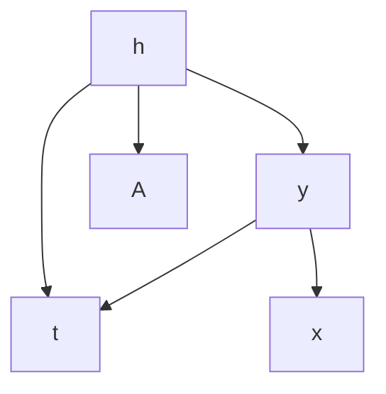
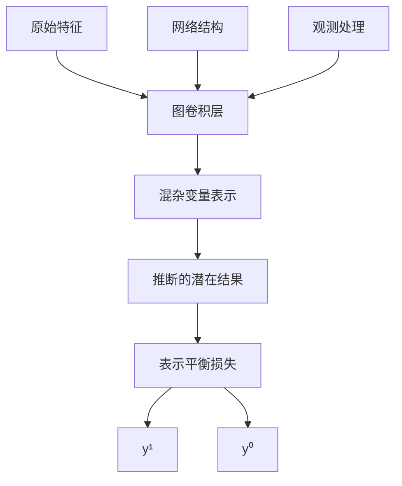
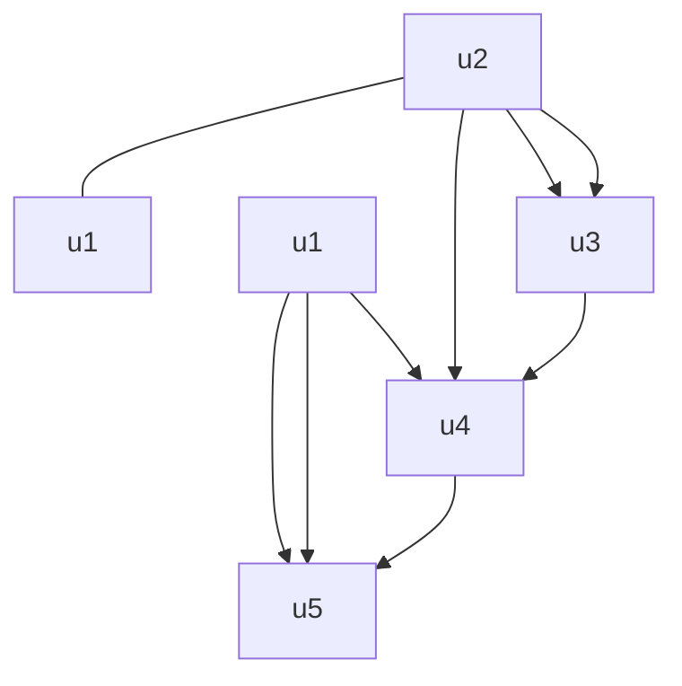
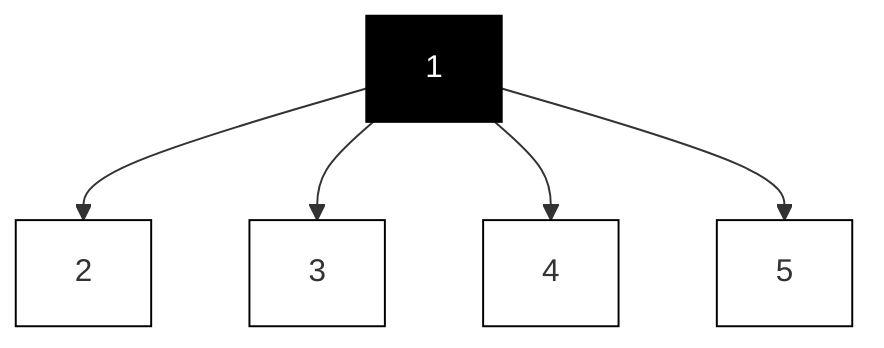
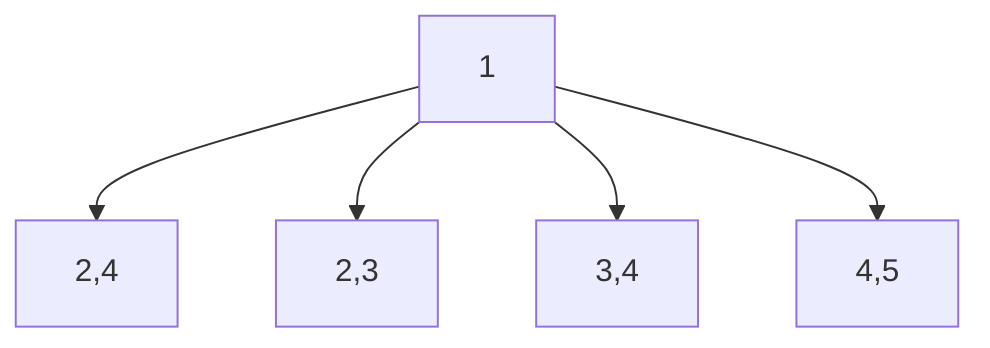
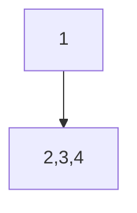
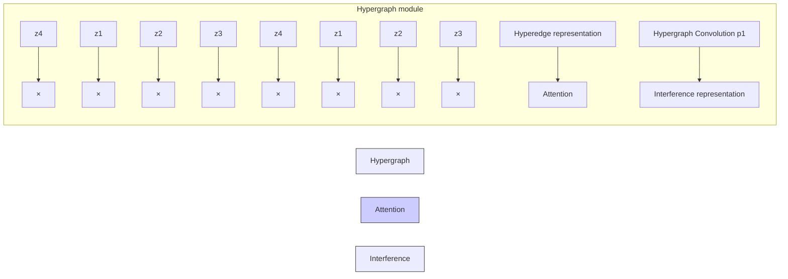

# 第4章 图上的因果推断（Chapter 4 Causal Inference on Graphs）

马静（Jing Ma）、郭若成（Ruocheng Guo）和李俊东（Jundong Li）

## 4.1 图上因果推断概述（Overview of Causal Inference on Graphs）

**图（Graph）**（即网络）是一种普遍存在且不可或缺的工具，用于建模现实世界中由相互连接的单元组成的各种系统，例如**社交网络（social networks）**[5]、**道路网络（road networks）**[19]、**协作网络（collaboration networks）**[49]、**生物网络（biological networks）**[28]和**知识图谱（knowledge graphs）**[72]。图的本质使我们能够以更直观、更高效的方式分析和理解这些复杂系统。因此，**图学习（learning on graphs）**对于科学家、工程师以及广泛学科领域的其他专业人员来说至关重要。近年来，与图相关的学习和分析领域取得了显著进展，特别是在由先进**图神经网络（Graph Neural Networks, GNNs）**[31, 67, 77, 84]驱动的高影响力领域。尽管图学习方法有效，但许多方法被广泛批评为仅捕捉数据系统中变量之间的表面相关性，从而导致在现实应用中缺乏可信度。因此，理解数据系统中存在的**因果关系（causality）**至关重要。

**因果推断（Causal inference）**正是研究系统内部因果关系的学科。**因果效应估计（Causal effect estimation）**作为因果推断的主要研究任务之一，在图相关研究中发挥着重要作用。例如，在物理接触网络中，为了评估口罩佩戴政策在缓解COVID-19传播方面的有效性，有必要评估该政策对COVID-19传播的因果效应，而非它们之间的相关性。然而，大多数传统的因果效应估计研究依赖于强假设，并侧重于**独立同分布（independent and identically distributed, i.i.d.）**数据，而图上的因果效应估计在有效性方面面临着许多独特的障碍。但从另一方面来看，图上的关系信息也可以为因果推断带来额外的好处。关于图上因果推断的研究近年来引起了广泛关注[38]，在经济学[8]、环境科学[51]、医疗保健[40, 47]和推荐系统[14]等多个领域有着广泛的应用。

在本章中，我们介绍图上因果推断的动机、背景和挑战。更具体地说，我们聚焦于以下几篇相关论文的主题：(1) 静态图上带有隐藏混杂变量的因果效应估计。这些研究利用单元间的静态图结构来减少估计因果效应时的混杂偏差。(2) 动态图上带有隐藏混杂变量的因果效应估计。这些工作探索动态网络环境中的因果效应估计问题。(3) 超图上的因果效应估计。这些研究估计超图上的因果效应。**超图（Hypergraph）**是传统图的一种推广，其中一条边（或"超边"）可以连接任意数量的节点，因此可以表示高阶关系信息。在详细介绍这些论文的基础上，我们还总结了其他相关工作及未来的研究方向。

## 4.2 静态图上的因果效应估计（Causal Effect Estimation on Static Graphs）

传统的因果效应估计研究[24, 58, 69]大多基于**强可忽略性假设（strong ignorability assumption）**（又称无混杂假设）[56]，该假设假定不存在未观测到的混杂变量（即**隐藏混杂变量（hidden confounders）**）。然而，这一假设在现实世界中常常被违反。例如，在估计服用药物对人们健康的处理效应时，每个人的社会经济地位可能是一个混杂因素，既影响他们的药物选择，也影响他们的健康状况。然而，社会经济地位通常无法明确观测到。未观测到的混杂变量常常会导致有偏的因果效应估计。近年来，已经提出了各种技术[35, 70]，通过在潜在空间中捕捉未观测到的混杂变量来弱化强可忽略性假设。然而，这些方法仍然需要能够利用神经网络或因子模型从观测数据特征中提取潜在混杂变量。

然而，网络结构在去混杂中的重要性在很大程度上被忽视了，只有少数工作认识到其重要性并将其用于处理效应估计。然而，单元之间的图拓扑结构在各种类型的观测数据中都很常见，包括患者的社交网络、电站的电网以及几何对象的空间网络。此外，在混杂变量难以测量的情况下，一种替代方法是通过纳入网络信息来捕捉其模式并控制其影响。例如，患者的社交网络模式可以反映其社会经济地位。在这项工作中，提出了一种名为**网络去混杂器（Network Deconfounder）**[20]的方法，利用网络结构以及观测特征来最小化**个体处理效应（Individual Treatment Effect, ITE）**估计中的混杂偏差。在此背景下，图结构和观测特征被用作隐藏混杂变量的**代理变量（proxies）**。

### 4.2.1 问题定义（Problem Definition）

首先，我们定义我们旨在估计的因果效应。这里，我们采用**内曼-鲁宾潜在结果框架（Neyman–Rubin potential outcome framework）**[57]。我们考虑来自静态网络的观测数据，也称为**网络化观测数据（networked observational data）**，记为 $( \{ \mathbf { x } _ { i } , t _ { i } , y _ { i } \} _ { i = 1 } ^ { n } , \mathbf { A } )$ ，其中 $\mathbf { X } _ { i }$ 、$t _ { i }$ 和 $y _ { i }$ 分别是个体（即实例）$i$ 的特征向量、观测处理和观测结果（即事实结果）。每个实例表示为静态图中的一个节点。矩阵 $\mathbf { A } \in \{ 0 , 1 \} ^ { n \times n }$ 表示静态网络的邻接矩阵，其中 $\mathbf { A } _ { i , j } = 1$（$\mathbf { A } _ { i , j } = 0$）表示节点 $i$ 和 $j$ 之间存在（不存在）一条边。对于每个节点 $i$ 和二元处理 $t$，存在一个对应于每个处理 $t ~ \in ~ \{ 0 , 1 \}$ 的潜在结果 $y _ { i } ^ { t }$。**个体处理效应（Individual Treatment Effect, ITE）**可以简单地定义为 $\tau _ { i } = y _ { i } ^ { 1 } - y _ { i } ^ { 0 }$。在许多情况下，由于结构因果模型中的噪声项，ITE 是不可识别的[52]。然而，考虑到任何因果估计量总是依赖于潜在结果，而这些潜在结果可能包括根据定义无法从数据中估计的反事实结果，因此在任何因果估计量的估计之前，识别是必要的。相反，当一系列假设成立时，**条件平均处理效应（Conditional Average Treatment Effect, CATE）** $\mathbb {E} [ \tau _ { i } | \mathbf { x } ]$ 成为广泛使用的估计量，其中期望是对所有共享相同特征 $\mathbf{x}$ 的个体求取的。对于独立同分布数据，CATE 可通过以下假设进行识别：

*   **稳定单元处理值假设（Stable Unit Treatment Value Assumption, SUTVA）**：首先，它要求任何单元的结果独立于分配给其他单元的处理，即 $y _ { i }$ 仅依赖于 $t _ { i }$，而与 $t _ { j } , \forall j \neq i$ 无关。该假设通常被称为**无干扰假设（no interference assumption）**。其次，它假设每个处理值对不同单元意味着完全相同的事情。例如，$t = 1$ 不能同时意味着患者 A 每天服用一片阿司匹林，而患者 B 每天服用两片阿司匹林。
*   **强可忽略性假设（Strong ignorability assumption）**：首先，给定所有混杂变量都被观测为特征 $\mathbf{x}$，潜在结果独立于观测处理，即 $y^1, y^0 \perp t | \mathbf{x}$。其次，处理分配不是确定性的，即真实**倾向得分（propensity score）** $P(t | \mathbf{x}) \in (0, 1)$。
*   **一致性假设（Consistency assumption）**：观测结果始终等于相应的潜在结果，即如果 $t_i = 1$，则 $y_i = y_i^1$；如果 $t_i = 0$，则 $y_i = y_i^0$。

利用上述假设可以实现 CATE 的非参数识别。然而，静态网络观测数据中的处理效应估计可能会因隐藏混杂变量而面临问题。幸运的是，在静态网络数据中，网络结构本身通常可以嵌入隐藏混杂变量。例如，通过利用**同质性（homophily）**（即相似的用户更有可能连接在一起）可以更容易地捕捉隐藏混杂变量，这意味着社交网络中连接的个体在其隐藏混杂变量方面更相似。这项工作提出利用网络结构作为代理变量来学习隐藏混杂变量的表示，然后基于它们推断处理效应。在这项工作中，给定静态网络的观测数据 $( \{ \mathbf { x } _ { i } , t _ { i } , y _ { i } \} _ { i = 1 } ^ { n } , \mathbf { A } )$，目标是估计定义为如下的 ITE：

$$
\tau_ {i} = \tau (\mathbf {x} _ {i}, \mathbf {A}) = \mathbb {E} [ y _ {i} ^ {1} | \mathbf {x} _ {i}, \mathbf {A} ] - \mathbb {E} [ y _ {i} ^ {0} | \mathbf {x} _ {i}, \mathbf {A} ]. \tag {4.1}
$$

### 4.2.2 提出方法（Proposed Method）

**网络去混杂器（Network Deconfounder）**[20]基于一个比强可忽略性假设更宽松的假设。它假设特征和网络结构是隐藏混杂变量的代理变量。网络去混杂器假设的因果图如图 4.1 所示。在前述例子中，通常难以直接测量个体的社会经济地位，但仍然可以从可观测特征（如年龄、职业、居住区域和社交关系）中推断出社会经济地位。基于这一直觉，网络去混杂器提出学习隐藏混杂变量的表示，并从观测图数据中对 ITE 进行估计。网络去混杂器的整体工作流程如图 4.2 所示。

**图 4.1** 对应于网络去混杂器假设的因果图 [20]：网络结构 A 和观测特征 x 是隐藏混杂变量 h 的代理变量

**图 4.2** 网络去混杂器的工作流程 [20]

#### 4.2.2.1 混杂变量表示学习（Confounder Representation Learning）

网络去混杂器是第一个利用辅助网络结构来改进混杂变量表示学习的工作。这里，表示学习函数 $g( \cdot )$ 将节点特征和网络结构映射到混杂变量的 $d$ 维潜在空间中。通过这种方式，为每个节点 $i$ 学习一个 $d$ 维表示 $\mathbf{z}_i$ 来编码其混杂变量。函数 $g( \cdot )$ 使用**图卷积网络（Graph Convolutional Network, GCN）**[12, 30]进行参数化，这是处理图相关任务的有效技术。更具体地说，混杂变量表示过程可以表述为：

$$
\mathbf {z} _ {i} = g (\mathbf {x} _ {i}, \mathbf {A}) = \sigma ((\hat {\mathbf {A}} \mathbf {X}) _ {i} \mathbf {U}), \tag {4.2}
$$

其中 $\hat { \bf A }$ 表示归一化邻接矩阵，$( \hat { \mathbf { A } } \mathbf { X } ) _ { i }$ 表示矩阵乘积 $\hat{\mathbf{A}}\mathbf{X}$ 的第 $i$ 行，$\mathbf{U}$ 是 GCN 中待学习的权重矩阵，$\sigma$ 表示 **ReLU 激活函数（ReLU activation function）**[17]。具体地，$\tilde { \textbf { A } } = \textbf { A } + \mathbf { I } _ { n }$ 且 $\tilde { \mathbf { D } } _ { j , j } = \sum _ { j } \tilde { \mathbf { A } } _ { j , j }$，归一化邻接矩阵 $\hat{\mathbf{A}}$ 可以预先使用**重归一化技巧（renormalization trick）**[30]计算：$\hat { \bf A } = \tilde { \bf D } ^ { - \frac { 1 } { 2 } } \tilde { \bf A } \tilde { \bf D } ^ { - \frac { 1 } { 2 } }$。

#### 4.2.2.2 结果预测（Outcome Prediction）

利用混杂变量表示，使用一个输出函数 $f : \mathbb { R } ^ { d } \times \{ 0 , 1 \} \to \mathbb { R }$ 来预测潜在结果。函数 $f$ 将隐藏混杂变量的表示和一个处理作为输入，以预测相应的潜在结果。

$$
f (\mathbf {z} _ {i}, t) = \left\{ \begin{array}{l} f _ {1} (\mathbf {z} _ {i}) \text {   if   } t = 1 \\ f _ {0} (\mathbf {z} _ {i}) \text {   if   } t = 0 \end{array} \right., \tag {4.3}
$$

其中 $f_1$ 和 $f_0$ 分别是处理 $t=1$ 和 $t=0$ 的输出函数。

**目标函数（Objective Function）** 由于缺乏反事实，我们只能使用事实结果作为监督，并最小化预测事实结果的误差：$\min \frac { 1 } { n } \sum _ { i = 1 } ^ { n } ( \hat { y } _ { i } ^ { t _ { i } } - y _ { i } ) ^ { 2 }$。

**表示平衡（Representation Balancing）** 值得注意的是，最小化事实结果 $(y_i)$ 的误差并不一定意味着反事实结果 $(y_i^{CF})$ 的误差也被最小化，因为不同处理组之间通常存在**分布偏移问题（distribution shift problem）**[27, 59]。受 Shalit 等人 [59] 的启发，推断反事实结果的误差上界由两个因素的组合决定：(1) 事实结果预测的误差，以及 (2) 一个**积分概率度量（Integral Probability Metric, IPM）**[48]，用于量化处理组和对照组中混杂变量表示分布之间的差异。换句话说，为了改进我们的反事实推断，我们不仅必须最小化事实结果预测中的误差，还必须减少两组中混杂变量分布之间的差异。令 $P(\mathbf{z}) = Pr(\mathbf{z} | t_i = 1)$ 和 $Q(\mathbf{z}) = Pr(\mathbf{z} | t_i = 0)$ 表示不同处理组中混杂变量表示的分布，则 $\rho_{\mathcal{Z}}(P, Q)$ 表示定义在函数空间 $\mathcal{Z}$ 中的 IPM，用于衡量两个混杂变量表示分布之间的差异。网络去混杂器采用基于 **Wasserstein-1 距离（Wasserstein-1 distance）**[68] 的度量来平衡表示分布：

$$
\rho_ {\mathcal {Z}} (P, Q) = \inf _ {k \in \mathcal {K}} \int_ {\mathbf {z} \in \{\mathbf {z} _ {i} \} _ {i: t _ {i} = 1}} | | k (\mathbf {z}) - \mathbf {z} | | P (\mathbf {z}) d \mathbf {z} \tag {4.4}
$$

其中 $\mathcal { K } = \{ k | k : \mathbb { R } ^ { d } \to \mathbb { R } ^ { d } \text{ s.t. } Q ( k ( \mathbf { z } ) ) = P ( \mathbf { z } ) \}$ 表示能将处理组表示分布 $P(\mathbf{z})$ 转换为对照组表示分布 $Q(\mathbf{z})$ 的推前函数集合。

最后，网络去混杂器的目标函数为：

$$
\mathcal {L} (\{\mathbf {x} _ {i}, t _ {i}, y _ {i} \} _ {i = 1} ^ {n}, \mathbf {A}) = \frac {1}{n} \sum_ {i = 1} ^ {n} (\hat {y} _ {i} ^ {t _ {i}} - y _ {i}) ^ {2} + \alpha \rho_ {\mathcal {Z}} (P, Q) + \lambda | | \boldsymbol {\Theta} | | _ {2} ^ {2}, \tag {4.5}
$$

其中 $\alpha$ 和 $\lambda$ 是超参数，用于控制表示平衡项和模型参数正则化项（以避免过拟合）的权重。

### 4.2.3 实验评估（Experimental Evaluation）

#### 4.2.3.1 数据集与仿真（Dataset and Simulation）

获取真实的处理效应可能具有挑战性，因为通常无法同时观测到给定单元的两个潜在结果。尽管存在这一限制，但有必要拥有带有真实 ITE 的网络化观测数据基准数据集，以评估不同的处理效应估计方法。为了解决这一挑战，遵循因果研究的传统流程，网络去混杂器在**半合成数据集（semisynthetic datasets）**上进行评估。具体来说，使用了两个包含真实世界节点特征和图结构的基准图数据集（BlogCatalog² 和 Flickr³）。基于这些真实世界的图数据，对处理和结果进行仿真。数据集的更多信息如表 4.1 所示。

**表 4.1 数据集描述 [20]**

| 数据集 | 节点数 | 边数 | 特征数 | $\kappa_2$ | ATE 均值 | 标准差 |
| :--- | :--- | :--- | :--- | :--- | :--- | :--- |
| BlogCatalog | 5,196 | 173,468 | 2,173/8,189 | 0.5 | 4.366 | 0.553 |
| | | | | 1 | 7.446 | 0.759 |
| | | | | 2 | 13.534 | 2.309 |
| Flickr | 7,575 | 239,738 | 1,210/12,047 | 0.5 | 6.672 | 3.068 |
| | | | | 1 | 8.487 | 3.372 |
| | | | | 2 | 20.546 | 5.718 |

处理仿真如下：

$$
Pr(t = 1 | \mathbf{x}_i, \mathbf{A}) = \frac{\exp(p_1^i)}{\exp(p_1^i) + \exp(p_0^i)};
$$

$$
\begin{array}{l} p_1^i = \kappa_1 r(\mathbf{x}_i)^\top r_1^c + \kappa_2 \sum_{j \in \mathcal{N}(i)} r(\mathbf{x}_j)^\top r_1^c \\ = \kappa_1 r(\mathbf{x}_i)^\top r_1^c + \kappa_2 (\mathbf{A} r(\mathbf{x}_j))^\top r_1^c; \tag{4.6} \\ \end{array}
$$

$$
p_0^i = \kappa_1 r(\mathbf{x}_i)^\top r_0^c + \kappa_2 \sum_{j \in \mathcal{N}(i)} r(\mathbf{x}_j)^\top r_0^c
$$

$$
= \kappa_1 r(\mathbf{x}_i)^\top r_0^c + \kappa_2 (\mathbf{A} r(\mathbf{x}_j))^\top r_0^c,
$$

其中 $\kappa_1, \kappa_2 \geq 0$ 分别表示来自单元自身及其邻居的混杂偏差大小。$\mathcal{N}(i)$ 是图上第 $i$ 个节点的邻居集合。$r(\mathbf{x}_i)$ 表示第 $i$ 个节点的混杂变量。$r_0^c$ 和 $r_1^c$ 分别表示对照组和处理组中混杂变量的中心点。然后事实结果和反事实结果仿真如下：

$$
y^F(\mathbf{x}_i) = y_i = C(p_0^i + t_i p_1^i) + \epsilon; \tag{4.7}
$$

$$
y^{CF}(\mathbf{x}_i) = C[p_0^i + (1 - t_i)p_1^i] + \epsilon, \tag{4.8}
$$

其中 $C$ 是一个缩放因子。噪声项采样为 $\epsilon \sim \mathcal{N}(0, 1)$。

## 4.2.3.2 评估指标（Metrics）

实验中采用了两种广泛使用的评估指标，包括 **异质性效应估计的根均方精度（Rooted Precision in Estimation of Heterogeneous Effect）** $( \sqrt { \epsilon _ { P E H E } } )$ [24] 和 **平均处理效应（ATE）的均绝对误差（Mean Absolute Error on ATE）** $( \epsilon _ { A T E } )$ [76]。

$$
\sqrt {\epsilon_ {P E H E}} = \sqrt {\frac {1}{n} \sum_ {i = 1} (\hat {\tau} _ {i} - \tau_ {i}) ^ {2}}, \tag {4.9}
$$

$$
\epsilon_ {A T E} = | \frac {1}{n} \sum_ {i = 1} (\hat {\tau} _ {i}) - \frac {1}{n} \sum_ {i = 1} (\tau_ {i}) |,
$$

其中 $\hat { \tau } _ { i } = \hat { y } _ { i } ^ { 1 } - \hat { y } _ { i } ^ { 0 }$ 和 $\tau _ { i } = y _ { i } ^ { 1 } - y _ { i } ^ { 0 }$ 分别表示第 $i$ 个实例的**预测个体处理效应（ITE）**和**真实个体处理效应（ITE）**。

## 4.2.3.3 ITE 估计性能（ITE Estimation Performance）

**网络去混杂器（Network Deconfounder）**与其他最先进基线方法的比较如表 4.2 所示。从表中我们观察到：(1) 在不同设置下的不同数据集上，网络去混杂器始终优于最先进的基线方法。(2) 凭借从图结构中捕获隐藏混杂因素模式的能力，当隐藏混杂因素的影响增大时（从 $\kappa _ { 2 } = 0 . 5 \mathrm { t o } \kappa _ { 2 } = 2 )$ ），网络去混杂器受到的影响最小。

## 4.3 动态图上的因果效应估计（Causal Effect Estimation on Dynamic Graphs）

如上所述，在图结构中，**图拓扑（graph topology）**可以作为隐藏混杂因素代理变量的来源。然而，现有的大多数研究 [20, 22] 都普遍假设观测图数据和隐藏混杂因素是静态的。事实上，在许多现实场景中，所有变量都是自然动态的。例如，在估计佩戴口罩对 COVID-19 感染的处理效应时，居民的警惕性可能是一个隐藏的混杂因素，它无法被明确测量，但可能反映在居民的移动网络中。值得注意的是，随着时间的推移，移动网络、口罩佩戴行为、COVID-19 感染风险以及居民的警惕性在不同时间段都是时变的。在这种情况下，居民的警惕性会受到前几个时间段情况的影响。例如，近期的死亡病例数会影响人们接下来几天的警惕性。另一个典型的例子是在推荐系统中，当估计看到广告活动对用户购买行为的因果效应时，用户偏好可能是隐藏的混杂因素，它既影响用户看到的广告活动，也影响其购买行为。尽管用户偏好难以直接测量，但仍可以从用户的社交网络和其他活动中推断出来。然而，用户的购买偏好会随着时间的推移而演变，受到他们之前的选择以及推荐给他们的产品的影响。此外，他们当前的偏好也会影响他们当前的个人资料和社交关系。在这些场景中，研究在时变环境下利用观测图数据进行去混杂的问题至关重要。

**表 4.2 网络去混杂器与最先进基线方法在 ITE 估计性能上的比较 [20]**

| $\kappa_2$ | \multicolumn{2}{c|}{BlogCatalog} | | \multicolumn{2}{c|}{} | | \multicolumn{2}{c|}{} |
| :--- | :--- | :--- | :--- | :--- | :--- | :--- | :--- |
| | $\sqrt{\epsilon_{PEHE}}$ | $\epsilon_{ATE}$ | $\sqrt{\epsilon_{PEHE}}$ | $\epsilon_{ATE}$ | $\sqrt{\epsilon_{PEHE}}$ | $\epsilon_{ATE}$ |
|  | 0.5 | | 1 | | 2 | |
| NetDeconf | 4.532 | 0.979 | 4.597 | 0.984 | 9.532 | 2.130 |
| CFR-Wass | 10.904 | 4.257 | 11.644 | 5.107 | 34.848 | 13.053 |
| CFR-MMD | 11.536 | 4.127 | 12.332 | 5.345 | 34.654 | 13.785 |
| TARNet | 11.570 | 4.228 | 13.561 | 8.170 | 34.420 | 13.122 |
| CEVAE | 7.481 | 1.279 | 10.387 | 1.998 | 24.215 | 5.566 |
| Causal forest | 7.456 | 1.261 | 7.805 | 1.763 | 19.271 | 4.050 |
| BART | 4.808 | 2.680 | 5.770 | 2.278 | 11.608 | 6.418 |
| $\kappa_2$ | \multicolumn{2}{c|}{Flickr} | | \multicolumn{2}{c|}{} | | \multicolumn{2}{c|}{} |
| | $\sqrt{\epsilon_{PEHE}}$ | $\epsilon_{ATE}$ | $\sqrt{\epsilon_{PEHE}}$ | $\epsilon_{ATE}$ | $\sqrt{\epsilon_{PEHE}}$ | $\epsilon_{ATE}$ |
|  | 0.5 | | 1 | | 2 | |
| NetDeconf | 4.286 | 0.805 | 5.789 | 1.359 | 9.817 | 2.700 |
| CFR-Wass | 13.846 | 3.507 | 27.514 | 5.192 | 53.454 | 13.269 |
| CFR-MMD | 13.539 | 3.350 | 27.679 | 5.416 | 53.863 | 12.115 |
| TARNet | 14.329 | 3.389 | 28.466 | 5.978 | 55.066 | 13.105 |
| CEVAE | 12.099 | 1.732 | 22.496 | 4.415 | 42.985 | 5.393 |
| Causal forest | 8.104 | 1.359 | 14.636 | 3.545 | 26.702 | 4.324 |
| BART | 4.907 | 2.323 | 9.517 | 6.548 | 13.155 | 9.643 |

针对这个问题，已经提出了一个基于**动态图神经网络（dynamic graph neural network）**的框架 **DNDC** [41]，用于估计动态网络环境下的因果效应。通常，DNDC 通过将动态图数据（包括当前图和历史信息）编码到表示空间中，来学习每个时间段的混杂因素表示。DNDC 系统地建模了不同数据模态的演化模式，以实现无偏的 ITE 估计。具体来说，DNDC 使用**循环神经网络（Recurrent Neural Network, RNN）** [25, 46] 来捕获时间信息，并采用基于**图卷积网络（Graph Convolutional Network, GCN）** [31] 的模块来处理关系信息。动态网络中的 ITE 估计具有广泛的应用，例如不同时间段的流行病学、经济学和推荐系统。

## 4.3.1 问题定义（Problem Definition）

假设给定一个数据集，其中包含跨越 $T$ 个不同时间段的随时间演化的网络观测数据，记为 $\{ \mathbf { X } ^ { t } , \mathbf { A } ^ { t } , \mathbf { C } ^ { t } , \mathbf { Y } ^ { t } \} _ { t = 1 } ^ { T }$ 。这里，单元（实例）作为节点连接在一个动态网络中，$( \cdot ) ^ { t }$ 表示第 $t$ 个时间段。$\mathbf { X } ^ { t } ~ = ~ \{ \mathbf { x } _ { 1 } ^ { t } , \ldots , \mathbf { x } _ { n ^ { t } } ^ { t } \}$ 代表时间段 $t$ 的节点属性（特征）。$\mathbf { x } _ { i } ^ { t }$ 表示第 $i$ 个实例的节点特征（例如，用户画像），$n ^ { t }$ 是节点数量，$\mathbf { A } ^ { t }$ 是网络的**邻接矩阵（adjacency matrix）**（例如，用户的社交网络）。为简单起见，假设网络是无向且无权重的，但这项工作可以自然地扩展到更一般的情况，例如有向和加权网络。在时间段 $t$，这 $n ^ { t }$ 个节点的处理变量记为 $\mathbf { C } ^ { t } ~ = ~ \{ c _ { 1 } ^ { t } , \ldots , c _ { n ^ { t } } ^ { t } \}$ ，其中 $c _ { i } ^ { t }$ 为 1 或 0（例如，用户是否收到了特定广告活动的推荐）。时间段 $t$ 所有实例的观测结果记为 $\mathbf { Y } ^ { t } ~ = ~ \{ y _ { 1 } ^ { t } , \ldots , y _ { n ^ { t } } ^ { t } \}$ （例如，用户的购买行为）。$\mathbf Z ^ { t } ~ = ~ \{ \mathbf z _ { 1 } ^ { t } , \ldots , \mathbf z _ { n ^ { t } } ^ { t } \}$ 代表隐藏的混杂因素（例如，用户偏好）。上标 $\dot { ( \cdot ) } ^ { < t }$ 表示时间段 $t$ 之前的历史数据。例如，时间段 $t$ 之前的所有节点特征可以称为 $\mathbf { X } ^ { < t } =$ $\{ \mathbf { X } ^ { 1 } , \mathbf { X } ^ { 2 } , \ldots , \mathbf { X } ^ { t - 1 } \}$ ，$\mathbf { C } ^ { < t } , \mathbf { A } ^ { < t }$ 的定义类似。$\mathbf { H } ^ { t } \ = \ \{ \mathbf { X } ^ { < t } , \mathbf { A } ^ { < t } , \mathbf { C } ^ { < t } \}$ 表示时间段 $t$ 之前的所有历史数据。这项工作基于**潜在结果框架（potential outcome framework）** [50, 56]。第 $i$ 个节点在时间段 $t$ 接受处理 $c$ 下的潜在结果记为 $y _ { c , i } ^ { t } \in \mathbb { R }$ ，这是如果实例 $i$ 在时间段 $t$ 接受了处理 $c$ 将会出现的结果。我们用 $\mathbf { Y } _ { 1 } ^ { t } = \{ y _ { 1 , 1 } ^ { t } , \ldots , y _ { 1 , n ^ { t } } ^ { t } \}$ 和 $\mathbf { Y } _ { 0 } ^ { t } = \{ y _ { 0 , 1 } ^ { t } , \dots , y _ { 0 , n ^ { t } } ^ { t } \}$ 表示时间段 $t$ 所有实例的潜在结果。那么，时变观测图数据上的**个体处理效应（Individual Treatment Effect, ITE）**可以定义为：

$$
\tau_ {i} ^ {t} = \tau^ {t} (\mathbf {x} _ {i} ^ {t}, \mathbf {H} ^ {t}, \mathbf {A} ^ {t}) = \mathbb {E} [ y _ {1, i} ^ {t} - y _ {0, i} ^ {t} | \mathbf {x} _ {i} ^ {t}, \mathbf {H} ^ {t}, \mathbf {A} ^ {t} ]. \tag {4.10}
$$

基于上述 ITE 的定义，时间段 $t$ 的**平均处理效应（Average Treatment Effect, ATE）**定义为 $\begin{array} { r } { \tau _ { A T E } ^ { t } = \frac { 1 } { n ^ { t } } \sum _ { i = 1 } ^ { n ^ { t } } \tau _ { i } ^ { t } } \end{array}$ 。

所研究的利用动态观测图数据学习 ITE 的问题定义如下：

**定义 4.1（在动态观测图数据上学习 ITE）** 给定跨越 $T$ 个不同时间段的动态观测图数据 $\{ \mathbf { X } ^ { t } , \mathbf { A } ^ { t } , \mathbf { C } ^ { t } , \mathbf { Y } ^ { t } \} _ { t = 1 } ^ { T }$ ，目标是估计每个时间段 $t$ 中每个实例 $i$ 的 ITE $\tau _ { i } ^ { t }$ 。

## 4.3.2 提出方法（Proposed Method）

提出了一个框架 **DNDC** [41] 用于动态网络数据中的 ITE 估计。如图 4.3 所示，DNDC 的整体结构由三个关键部分组成：**混杂因素表示学习（confounder representation learning）**、**潜在结果和处理变量预测（potential outcome and treatment prediction）**，以及**表示平衡（representation balancing）**。DNDC 模型通过将当前网络观测数据和历史信息映射到潜在表示空间，来捕获随时间变化的隐藏混杂因素。然后，学习到的表示被用于预测潜在结果和处理变量。为了确保处理组和对照组中隐藏混杂因素表示的平衡，开发了一种基于**对抗学习（adversarial learning）**的平衡技术。

```mermaid
graph TD
    subgraph Time_t
  A["Graph Embedding X₁^t, X₂^t, X₃^t"] --> B["Graph Embedding"]
  B --> C["Z^t"]
  C --> D["GRU layer"]
  D --> E["H^t"]
  E --> F["attention layer"]
  F --> G["\tilde{H}^t"]
    end

    subgraph Time_t_1["Time_t+1"]
  H["Graph Embedding X₁^t, X₂^t, X₃^t"] --> I["Z^t"]
  I --> J["GRU layer"]
  J --> K["H^t"]
  K --> L["attention layer"]
  L --> M["\tilde{H}^t"]
    end

    subgraph Prediction_t
  N["potential outcome prediction"] --> O["\hat{Y}^t"]
  O --> P["ITE estimation"]
  Q["treatment prediction"] --> R["gradient reversal layer"]
        S["\check{C}^t"]
    end

    subgraph Prediction_t_1["Prediction_t+1"]
  T["potential outcome prediction"] --> U["\hat{Y}^{t+1}"]
  U --> V["ITE estimation"]
  W["treatment prediction"] --> X["gradient reversal layer"]
        Y["\check{C}^{t+1}"]
    end

    style Time_t fill:#f9f,stroke:#333
    style Time_t+1 fill:#ccf,stroke:#333
```

**图 4.3 DNDC 框架示意图 [41]**

## 4.3.2.1 混杂因素表示学习（Confounder Representation Learning）

由于隐藏的混杂因素与节点特征、图结构以及历史信息相关，DNDC 在混杂因素表示学习中利用了这些信息。更具体地说，为了很好地处理图数据，在此过程中使用了**图卷积网络（Graph Convolutional Networks, GCNs）** [31]：

$$
\mathbf {z} _ {i} ^ {t} = g (([ \mathbf {X} ^ {t}, \tilde {\mathbf {H}} ^ {t - 1} ]) _ {i}, \mathbf {A} ^ {t}) = \hat {\mathbf {A}} ^ {t} \mathrm{ReLU} ((\hat {\mathbf {A}} ^ {t} [ \mathbf {X} ^ {t}, \tilde {\mathbf {H}} ^ {t - 1} ]) _ {i} \mathbf {U} _ {0}) \mathbf {U} _ {1}, \tag {4.11}
$$

其中 $g ( \cdot )$ 是一个由 GCN 参数化的可学习变换函数。在上式中，堆叠了两个 GCN 层（分别带有参数 $\mathbf { U } _ { 0 }$ 和 $\mathbf { U } _ { 1 }$ ）来捕获隐藏混杂因素与输入之间的非线性依赖关系，但该框架本身对 GCN 层的数量没有任何限制。为了利用前几个时间段的数据，学习了一个历史嵌入 $\tilde { { \bf H } } ^ { t - 1 } \doteq \mathbb { R } ^ { n ^ { t } \times d _ { h } }$ 来编码时间段 $t$ 之前的历史信息，包括先前的隐藏混杂因素和处理分配。$d _ { h }$ 是历史嵌入的维度。这里，$,$ 表示连接操作，$( \cdot ) _ { i }$ 表示矩阵的第 $i$ 行。$\mathbf { z } _ { i } ^ { t } ~ \in ~ \mathbb { R } ^ { d _ { z } }$ 表示时间段 $t$ 实例 $i$ 的混杂因素表示，$d _ { z }$ 是混杂因素表示的维度。$\hat { \mathbf { A } } ^ { t }$ 是根据 $\mathbf { A } ^ { t }$ 并使用**重归一化技巧（re-normalization trick）** [31] 计算得到的归一化邻接矩阵。

为了使历史嵌入能够刻画动态网络数据的演化模式，使用了基于**门控循环单元（Gated Recurrent Unit, GRU）** [10] 的记忆单元。具体来说，在 GRU 中，当前信息 $( \mathbf { Z } ^ { t } , \mathbf { X } ^ { t } , \mathbf { C } ^ { t } )$ 和先前的隐藏状态 $\mathbf { H } ^ { t - 1 }$ 被嵌入到一个新的隐藏状态 $\mathbf { H } ^ { t } \ \in \ \mathbb { R } ^ { n ^ { t } \times d _ { h } } \colon \mathbf { H } ^ { t } \ =$ $\mathrm { G R U } ( \mathbf { H } ^ { t - 1 } , [ \mathbf { Z } ^ { t } , \mathbf { X } ^ { t } , \mathbf { C } ^ { t } ] )$ 。采用 GRU 不同隐藏状态之间的**注意力机制（attention mechanism）** [37, 66] 来建模来自不同时间段的历史影响的重要性。对于任何在时间段 $t$ 具有隐藏状态 $\mathbf { h } ^ { t } \in \mathbb { R } ^ { d _ { h } }$ 的节点，建模时间段 $s$ 的 GRU 隐藏状态对时间段 $t$ $\mathit { \Omega } \cdot \mathit { \Omega } ( s < t )$ 隐藏状态重要性的注意力权重 $\alpha _ { t , s }$ 可以使用不同的注意力得分函数（例如，双线性 [37] 函数或缩放点积 [66] $\mathbf { h } ^ { t }$ $\mathbf { h } ^ { s }$ $\begin{array} { r } { \tilde { \mathbf { h } } ^ { t } = \mathrm { M L P } ( [ \mathbf { h } ^ { t } , \sum _ { s = 1 } ^ { t - 1 } \alpha _ { t , s } \mathbf { h } ^ { s } ] ) } \end{array}$ $\tilde { \mathbf { H } } ^ { t }$ 与所有实例一起计算。

## 4.3.2.2 结果与处理变量预测（Outcome and Treatment Prediction）

基于学习到的混杂因素表示，DNDC 使用两个可学习函数 $f _ { 1 } , f _ { 0 } : \mathbb { R } ^ { d _ { z } }  \mathbb { R }$ 来预测潜在结果，这两个函数分别对应处理变量为 1 或 0 的两种情况，即 $\hat { y } _ { 1 , i } ^ { t } = f _ { 1 } ( \mathbf { z } _ { i } ^ { t } ) , \ \hat { y } _ { 0 , i } ^ { t } = f _ { 0 } ( \mathbf { z } _ { i } ^ { t } )$ 。对于每个实例 $i$，其**事实结果（factual outcome）** $y _ { F , i } ^ { t }$ 和**反事实结果（counterfactual outcome）** $y _ { C F , i } ^ { t }$ （与实际情况不同的处理变量下的未观测结果）都被预测。潜在结果预测的损失函数公式如下：

$$
\mathcal {L} _ {y} = \mathbb {E} _ {t \in [ T ], i \in [ n ^ {t} ]} [ (\hat {y} _ {F, i} ^ {t} - y _ {F, i} ^ {t}) ^ {2} ]. \tag {4.12}
$$

为了更好地学习混杂因素表示，DNDC 也使用处理变量作为监督信号。处理变量预测的损失函数为：

$$
\mathcal {L} _ {c} = - \mathbb {E} _ {t \in [ T ], i \in [ n ^ {t} ]} \left[ \left(c _ {i} ^ {t} \log \left(\hat {s} _ {i} ^ {t}\right) + \left(1 - c _ {i} ^ {t}\right) \log \left(1 - \hat {s} _ {i} ^ {t}\right)\right) \right]. \tag {4.13}
$$

处理变量预测器以混杂因素表示作为输入。它通过一个 MLP 模块和一个 softmax 层实现。$\hat { s } _ { i } ^ { t }$ 是 softmax 层的输出，可以视为实例 $i$ 在时间段 $t$ 的**倾向得分（propensity score）**预测值：$\hat { s } _ { i } ^ { t } = \operatorname { s o f t m a x } ( \mathrm { M L P } ( \mathbf { z } _ { i } ^ { t } ) )$ 。

## 4.3.2.3 表示平衡（Representation Balancing）

如上所述，已有研究表明，最小化处理组混杂因素表示分布与对照组混杂因素表示分布之间的差异，有利于因果效应估计 [58]。DNDC 使用**梯度反转层（gradient reversal layer）** [16] 来实现表示平衡。梯度反转层在前向传播过程中不改变输入，但在反向传播过程中，它会通过将梯度乘以一个负标量来反转梯度。通过这种方式，梯度反转层可以 (1) 通过最小化处理变量预测损失 $\mathcal { L } _ { c }$ 来训练处理变量预测器；以及 (2) 通过相对于混杂因素表示学习的模型参数最大化 $\mathcal { L } _ { c }$ 来实现表示平衡。

## 4.3.2.4 损失函数（Loss Function）

整体损失函数公式如下：

$$
\mathcal {L} \{\{\mathbf {x} _ {i} ^ {t}, y _ {i} ^ {t}, c _ {i} ^ {t} \} _ {1} ^ {n ^ {t}}, \mathbf {A} ^ {t} \} _ {1} ^ {T} = \mathcal {L} _ {y} + \beta \mathcal {L} _ {c} + \gamma | | \boldsymbol {\Theta} | | ^ {2}, \tag {4.14}
$$

其中，$\Theta$ 是该框架中的参数集合，而 $| | \Theta | | ^ { 2 }$ 是一个正则化项。$\beta , \gamma$ 是超参数，分别用于控制治疗预测和模型正则化的权重。

## 4.3.3 实验评估（Experimental Evaluation）

## 4.3.3.1 数据集与模拟（Dataset and Simulation）

由于在真实世界数据集上获取真实因果模型（ground-truth causal models）极其困难，因此评估是在结合了真实世界图结构的半合成数据集上进行的（包括三个数据集：Flickr、BlogCatalog 和 PeerRead4）。在模拟中，混杂因子（confounders）的生成方式如下：

$$
\mathbf {z} _ {i} ^ {t} = \left(\frac {1}{\sum_ {k = 1} ^ {3} \lambda_ {k}}\right) (\lambda_ {1} \boldsymbol {\psi} _ {i} ^ {t} + \lambda_ {2} \sum_ {u \in \mathcal {N} (i)} f (\mathbf {x} _ {u} ^ {t}) + \lambda_ {3} f (\mathbf {x} _ {i} ^ {t})) + \epsilon^ {t}, \tag {4.15}
$$

$$
\psi_ {i, j} ^ {t} = \frac {1}{p} \left(\sum_ {r = 1} ^ {p} \alpha_ {r, j} z _ {i, j} ^ {t - r} + \sum_ {r = 1} ^ {p} \beta_ {r} c _ {i} ^ {t - r}\right), \tag {4.16}
$$

其中，$\mathbf { z } _ { i } ^ { t }$ 表示实例 i 在时间段 t 的隐藏混杂因子。${ \boldsymbol { \psi } } _ { i } ^ { t }$ 表示影响当前混杂因子的历史信息。$z _ { i , j } ^ { t }$ 和 $\psi _ { i , j } ^ { t }$ 分别表示 $\mathbf { z } _ { i } ^ { t }$ 和 ${ \boldsymbol { \psi } } _ { i } ^ { t }$ 的第 j 个维度。$\mathcal {N} (i)$ 表示节点 i 在当前时间段的邻居节点。$\epsilon ^ { t }$ 是一个随机噪声项。$f ( \cdot )$ 是一个变换函数。这里，$\alpha _ { r , j } \sim N ( 1 - ( r / p ) , ( 1 / p ) ^ { 2 } )$ 是一个参数，用于控制时间段 $t - r$ 的先前混杂因子对当前混杂因子的影响。$\beta _ { r } \sim \mathcal { N } ( 0 , 0 . 0 2 ^ { 2 } )$ 控制时间段 $t \mathrm { ~ - ~ } r$ 的先前治疗对当前混杂因子的影响。$p$ 默认设置为 3。参数 $\lambda _ { 1 } , \lambda _ { 2 }$ 和 $\lambda _ { 3 }$ 分别控制历史信息、当前网络结构和当前特征对混杂因子的影响。治疗和结果（treatment and outcome）的模拟方式与第 4.2.3 节介绍的方法类似。

图 4.4 在不同历史信息影响设置下，DNDC 与基线方法的性能比较 [41]

## 4.3.3.2 历史信息影响变化下的 ITE 估计性能（ITE Estimation Performance Under Varying Influence from Historical Information）

为了研究 DNDC 在不同程度的历史信息对混杂因子影响下的性能，设计了一个实验，其中 $\lambda _ { 1 }$ 变化，而 $\lambda _ { 2 }$ 和 $\lambda _ { 3 }$ 固定。图 4.4 展示了 DNDC 与其他基线方法在 ITE 估计性能上的比较。总体而言，我们观察到 DNDC 始终优于所有基线方法，具有更低的 $\sqrt { \epsilon _ { P E H E } }$ 和 $\epsilon _ { A T E }$。当 $\lambda _ { 1 } ~ = ~ 0$ 时，历史信息对当前混杂因子没有影响。在这种情况下，DNDC 和网络去混杂方法（Network Deconfounder, NetDeconf）[20] 由于能够利用网络结构而达到了最佳性能。当 $\lambda _ { 1 }$ 增加时，当前的 ITE 估计更依赖于历史信息，而其他不考虑历史信息的基线方法在这种情况下失效。但 DNDC 由于利用了历史信息，表现稳定且更优。

## 4.3.3.3 网络结构影响变化下的 ITE 估计性能（ITE Estimation Performance Under Varying Influence from Network Structure）

为了评估 DNDC 在利用图中关系信息方面的能力，设计了一个实验，其中 $\lambda _ { 2 }$ 取不同值，而 $\lambda _ { 1 }$ 和 $\lambda _ { 3 }$ 固定。如图 4.5 所示，当 $\lambda _ { 2 } ~ = ~ 0$ 时，隐藏混杂因子与图结构无关，在这种情况下，NetDeconf 相对于其他基线方法失去了优势。但 DNDC 通过捕获历史信息对当前时间段隐藏混杂因子的影响，仍然能够实现更好的 ITE 估计。当 $\lambda _ { 2 }$ 增加时，DNDC 中的混杂因子表示学习组件能够捕获隐藏在图形结构中的混杂因子，从而实现更好的 ITE 估计性能。

图 4.5 在不同网络结构影响设置下，DNDC 与基线方法的性能比较 [41]

## 4.4 超图上的因果效应估计（Causal Effect Estimation on Hypergraphs）

经典的因果效应估计基于**稳定单元处理值假设（Stable Unit Treatment Value Assumption, SUTVA）**，该假设认为不同单元之间不存在干扰（即溢出效应），要求一个单元的处理不会影响另一个单元的结果。然而，在现实场景中，尤其是在像图这样的互联系统中，这一假设可能不成立。例如，一个人感染 COVID-19 的风险可能会受到其社交网络中其他人佩戴口罩行为的影响。未能考虑到这些相互依赖关系可能导致对因果效应的估计出现偏差。

近年来，许多研究工作致力于解决存在干扰情况下的因果效应估计问题。大多数针对此问题的现有研究 [2, 4, 26, 32, 39, 64, 65, 81] 假设干扰仅发生在普通图（ordinary graphs）上成对单元之间（如图 4.6b 所示）。虽然图中传统的成对交互被广泛使用并适用于多种场景（如人与人之间的身体接触或社交网络），但它们无法捕捉群体交互的复杂性，因为每次交互可能涉及两个以上的个体 [3, 15, 79]。可以引入**超图（Hypergraphs）** 来解决这一局限性。与仅连接两个节点的普通边不同，超边可以连接任意数量的节点（如图 4.6a 所示），这反映了群体交互的本质。考虑一个超图示例，其中个体通过线下社交活动相连，每个大型聚集事件可以表示为一个超边。在超图中，可能存在高阶干扰。例如，在一个由超边表示的聚集事件中，个体感染 COVID-19 的风险不仅可能受到事件内其他个体的直接一阶干扰影响，还可能受到参与者之间相互作用产生的间接高阶干扰影响，如图 4.6c 所示。处理超图上存在的高阶干扰至关重要。

u2
u3
u1
u4
u5

(a). 超图

(b). 普通图

二阶

三阶  
(c). 与 $u _ { 1 }$ 相关的一阶、二阶和三阶干扰  
图 4.6 超图、普通图与干扰 [43]。 (a) 一个超图示例； (b) 从该超图投影得到的普通图； (c) 超图上节点 $u _ { 1 }$ 来自其邻居的干扰

为应对这一挑战，提出了一个名为 **HyperSCI** [43] 的框架，用于在超图的高阶干扰下进行治疗效果估计。该框架的核心是通过表示学习来控制混杂因子并建模高阶干扰。HyperSCI 利用**超图神经网络（hypergraph neural network）** 通过学习干扰表示来有效捕获干扰模式，并使用**注意力机制（attention mechanism）** 来建模每个超边内各单元的相对重要性。这些超图神经网络技术赋予了 HyperSCI 高精度和高计算效率。

## 4.4.1 问题定义（Problem Definition）

定义 4.2 (超图) 一个超图 ${ \mathcal { H } } = \{ { \mathcal { V } } , { \mathcal { E } } \}$ 由一组 n 个节点 $\mathcal { V } = \{ v _ { i } \} _ { i = 1 } ^ { n }$ 和一组 m 个超边 $\mathcal { E } = \{ \mathbf { e } _ { k } \} _ { k = 1 } ^ { m }$ 组成。每个超边可以连接任意数量的节点。

在所研究的问题中，给定的观测数据表示为 X、T、Y。这里，$\mathbf { X } = \{ \mathbf { x } _ { i } \} _ { i = 1 } ^ { n } , \mathbf { T } = \{ t _ { i } \} _ { i = 1 } ^ { n }$ 和 $\mathbf { Y } = \{ y _ { i } \} _ { i = 1 } ^ { n }$ 分别代表节点特征、处理分配和观测结果。$\textbf { H } = \ \{ h _ { i , e } \} \ \in \ \mathbb { R } ^ { n \times m }$ 是超图 H 的关联矩阵。这里，如果节点 i 在超边 e 中，则 $h _ { i , e } ~ = ~ 1$，否则 $h _ { i , e } ~ = ~ 0$。每个节点的处理分配是二值的（即 $t _ { i } \in \{ 0 , 1 \} )$。

定义 4.3 (潜在结果) 单元 i 的**潜在结果（Potential Outcome）** [55]（记为 $y _ { i } ^ { 1 }$ 或 $y _ { i } ^ { 0 } )$ 被定义为在治疗 $t _ { i } ~ = ~ 1$ 或 $t _ { i } ~ = ~ 0$ 下单元 i 将会实现的结果。这些潜在结果可以通过一个变换函数 $Y _ { i } ^ { T _ { i } } ~ = ~ \Phi _ { Y } ( T _ { i } , X _ { i } , T _ { - i } , X _ { - i } , { \cal H } )$ 获得。这里，$\Phi _ { Y }$ 是一个（非确定性的）函数，即 $y _ { i } ^ { t _ { i } } = \Phi _ { Y } ( t _ { i } , \mathbf { x } _ { i } , \mathbf { T } _ { - i } , \mathbf { X } _ { - i } , \mathbf { H } )$，其中 $( \cdot ) _ { - i }$ 表示除 i 之外的所有其他节点。

本研究旨在估计超图中的 ITE。基于上述定义，所研究问题中的 ITE 定义如下：

定义 4.4 对于超图 $\mathcal { H }$ 上的每个节点 i，**个体治疗效果（individual treatment effect, ITE）** 由对应 $t _ { i } = 1$ 和 $t _ { i } = 0 $ 的潜在结果之差定义：

$$
\begin{array}{l} \tau (\mathbf {x} _ {i}, \mathbf {T} _ {- i}, \mathbf {X} _ {- i}, \mathbf {H}) = \mathbb {E} [ Y _ {i} ^ {1} - Y _ {i} ^ {0} | X _ {i} = \mathbf {x} _ {i}, T _ {- i} = \mathbf {T} _ {- i}, X _ {- i} = \mathbf {X} _ {- i}, H = \mathbf {H} ] \\ = \mathbb {E} [ \Phi_ {Y} (1, \mathbf {x} _ {i}, \mathbf {T} _ {- i}, \mathbf {X} _ {- i}, \mathbf {H}) - \Phi_ {Y} (0, \mathbf {x} _ {i}, \mathbf {T} _ {- i}, \mathbf {X} _ {- i}, \mathbf {H}) ]. \tag {4.17} \\ \end{array}
$$

## 4.4.2 提出方法（Proposed Method）

**HyperSCI** [43] 是一个为解决所研究问题而提出的框架。如图 4.7 所示，该框架包含三个组件：**混杂因子表示学习（confounder representation learning）**、**干扰建模（interference modeling）** 和**结果预测（outcome prediction）**。

## 4.4.2.1 混淆因子表示学习（Confounder Representation Learning）

HyperSCI 通过使用**多层感知机（multilayer perceptron, MLP）**模块将节点特征 $\mathbf { x } _ { i }$ 映射到一个潜在空间来学习混淆因子的表示，即 $\mathbf { z } _ { i } = \mathbf { M L P } ( \mathbf { x } _ { i } )$ 。所有节点的混淆因子表示记为 $\mathbf { Z } = \{ \mathbf { z } _ { i } \} _ { i = 1 } ^ { n }$ 。与文献 [58] 类似，采用一种基于 **Wasserstein-1 距离 [68]** 的表示平衡方法来最小化处理组和对照组表示分布之间的距离。

```mermaid
graph LR
  A["Confounder Representation Learning"] --> B["Interference Modeling"]
  B --> C["Outcome Prediction"]

    subgraph Confounder Representation Learning
  D["x1"] --> E["MLP"]
  F["x2"] --> E
  G["x3"] --> E
  H["x4"] --> E
  I["z1"] --> J["z2"]
  K["z2"] --> J
  L["z3"] --> M["z4"]
  N["z4"] --> M
  O["z1"] --> P["z2"]
  Q["z3"] --> R["z4"]
  S["z4"] --> R
  T["z1"] --> U["z2"]
  V["z3"] --> W["z4"]
  X["z1"] --> Y["z2"]
  Z["z3"] --> AA["z4"]
  AB["z1"] --> AC["z2"]
  AD["z3"] --> AE["z4"]
  AF["z1"] --> AG["z2"]
  AH["z3"] --> AI["z4"]
  AJ["z1"] --> AK["z2"]
  AL["z3"] --> AM["z4"]
  AN["z1"] --> AO["z2"]
  AP["z3"] --> AQ["z4"]
  AR["z1"] --> AS["z2"]
  AT["z3"] --> AU["z4"]
  AV["z1"] --> AW["z2"]
  AX["z3"] --> AY["z4"]
  AZ["z1"] --> BA["z2"]
  BB["z3"] --> BC["z4"]
  BD["z1"] --> BE["z2"]
  BF["z3"] --> BG["z4"]
  BH["z1"] --> BI["z2"]
  BJ["z3"] --> BK["z4"]
  BL["z1"] --> BM["z2"]
  BN["z3"] --> BO["z4"]
  BP["z1"] --> BQ["z2"]
  BR["z3"] --> BS["z4"]
  BT["z1"] --> BU["z2"]
  BV["z3"] --> BW["z4"]
  BX["z1"] --> BY["z2"]
  BZ["z3"] --> BQ
  CA["z1"] --> CB["z2"]
  CC["z3"] --> CC["z4"]
  DA["z1"] --> DB["z2"]
  DC["z3"] --> DC["z4"]
  DD["z1"] --> EE["z2"]
  EE --> EE
  FF["z1"] --> DG["z2"]
  DG --> DG
  DH["z1"] --> DI["z2"]
  DI --> DI
  DJ["z1"] --> DK["z2"]
  DK --> DK
  LE["z1"] --> MF["z2"]
  MF --> MF
  MG["z1"] --> NG["z2"]
  NG --> NG
  ON["z1"] --> O["Hypergraph module"]
  P["Confounder representation"] --> Q
  R["Interference representation"] --> S
    end

    subgraph Interference Modeling
        S
        T
        U
        V
        W
    end

    subgraph Outcome Prediction
        X["Node (treated)"]
        Y["Node (control)"]
        Z["Hyperedge"]
        AA["Node features"]
        AB["Confounder representation"]
        AC["Interference representation"]
    end
```

**图 4.7** HyperSCI [43] 的示意图，包含三个组件：混淆因子表示学习、干扰建模和结果预测

**图 4.8** HyperSCI [43] 中超图模块的示意图。此处以节点 $v _ { 1 }$ （黄色高亮）为例

## 4.4.2.2 干扰建模（Interference Modeling）

开发了一个干扰建模模块来模拟超图中节点间的高阶干扰。更具体地说，通过一个超图神经网络模块学习一个函数 $\Psi ( \cdot )$ ，以获得每个节点 $i$ 的干扰表示 $\left( \mathbf { p } _ { i } \right)$ ，即 $\mathbf { p } _ { i } = \Psi ( \mathbf { Z } , \mathbf { H } , \mathbf { T } _ { - i } , t _ { i } )$ 。该模块的示意图如图 4.8 所示。该模块基于**超图卷积网络 [3, 79]** 以及**超图注意力机制 [3, 13, 82]** 实现。

为了学习每个节点的干扰表示，处理变量和混淆因子表示通过超图结构进行传播。给定超图 $\mathcal { H }$ 的原始拉普拉斯矩阵可以计算为：

$$
\mathbf {L} = \mathbf {D} ^ {- 1 / 2} \mathbf {H} \mathbf {B} ^ {- 1} \mathbf {H} ^ {\top} \mathbf {D} ^ {- 1 / 2}, \tag {4.18}
$$

其中 $\mathbf { D } \in \mathbb { R } ^ { n \times n }$ 是一个对角矩阵，每个元素代表节点的度（即 $\sum _ { e = 1 } ^ { m } h _ { i , e }$ ），$\mathbf { B } \in \mathbb { R } ^ { m \times m }$ 对应于每个超边的大小（即 $\sum _ { i = 1 } ^ { n } h _ { i , e }$ ）。超图卷积操作定义为：

$$
\mathbf {P} ^ {(l + 1)} = \text { LeakyReLU } \left(\mathbf {L P} ^ {(l)} \mathbf {W} ^ {(l + 1)}\right), \tag {4.19}
$$

其中 $\mathbf { P } ^ { ( l ) }$ 表示超图模块第 $l$ 层的表示。第一层的输入是由处理分配掩码后的混淆因子表示，即 $\mathbf { p } _ { i } ^ { ( 0 ) } = t _ { i } * \mathbf { z } _ { i }$ 。这里， $*$ 表示逐元素乘法。$\mathbf { W } ^ { ( l + 1 ) } \in \mathbb { R } ^ { d ^ { ( l ) } \times d ^ { ( l + 1 ) } }$ 表示超图模块第 $(l+1)$ 层的参数矩阵，其中 $d ^ { ( l ) }$ 和 $d ^ { ( l + 1 ) }$ 分别是第 $l$ 层和第 $(l+1)$ 层的维度。

虽然超图卷积层允许通过超边进行干扰建模，但它缺乏灵活性来考虑通过不同超边对不同节点干扰的显著差异性。为了解决这个问题，利用**超图注意力机制 [3, 13, 82]** 来捕捉节点和超边之间的内在关系。具体来说，为每个节点及其对应的超边学习注意力权重，这有助于更好地理解在超图背景下，某些个体（例如，参加群体活动的个体）如何对这些群体中的其他人产生更大影响或受到更大影响，正如 COVID-19 示例中所见。更具体地说，节点 $i$ 和超边 $e$ 之间的注意力得分计算如下：

$$
\alpha_ {i, e} = \frac {\exp (\sigma (\text { sim } (\mathbf {z} _ {i} \mathbf {W} _ {a} , \mathbf {z} _ {e} \mathbf {W} _ {a})))}{\sum_ {k \in \mathcal {E} _ {i}} \exp (\sigma (\text { sim } (\mathbf {z} _ {i} \mathbf {W} _ {a} , \mathbf {z} _ {k} \mathbf {W} _ {a})))}, \tag {4.20}
$$

其中 $\sigma ( \cdot )$ 是一个激活函数，$\mathcal { E } _ { i }$ 是包含节点 $i$ 的超边集合，$\mathbf { z } _ { e }$ 是每个超边 $e$ 的表示，通过聚合其关联节点的表示得到。$\mathbf { W } _ { a }$ 表示用于计算节点-超边注意力的参数矩阵。$\text{sim}(\cdot)$ 表示一个相似度函数，可以按如下方式实现：

$$
\operatorname{sim} \left(\mathbf {x} _ {i}, \mathbf {x} _ {j}\right) = \mathbf {a} ^ {\top} \left[ \mathbf {x} _ {i}, \mathbf {x} _ {j} \right]. \tag {4.21}
$$

这里，$\mathbf{a}$ 是一个权重向量，$[\cdot, \cdot]$ 是拼接操作。注意力得分用于建模不同的干扰显著性。更具体地说，公式 4.18 中超图的原始关联矩阵 $\mathbf{H}$ 被替换为一个涉及注意力的矩阵 $\tilde{\mathbf{H}} = \{ \tilde{h}_{i,e} \}$ ，其中 $\tilde{h}_{i,e} = \alpha_{i,e} h_{i,e}$ 。

## 4.4.2.3 结果预测（Outcome Prediction）

基于混淆因子表示和干扰表示，潜在结果通过下式预测：

$$
\hat {y} _ {i} ^ {1} = f _ {1} ([ \mathbf {z} _ {i}, \mathbf {p} _ {i} ]), \hat {y} _ {i} ^ {0} = f _ {0} ([ \mathbf {z} _ {i}, \mathbf {p} _ {i} ]), \tag {4.22}
$$

其中 $f _ { 1 } ( \cdot )$ 和 $f _ { 0 } ( \cdot )$ 是可学习的函数，分别被训练用于预测处理分配为 1 和 0 时的潜在结果。然后，每个节点 $i$ 的 **个体处理效应（individual treatment effect, ITE）** 通过 $\hat { \tau } _ { i } = \hat { y } _ { i } ^ { 1 } - \hat { y } _ { i } ^ { 0 }$ 估计。观测结果的预测通过 $\hat { y } _ { i } = \hat { y } _ { i } ^ { t _ { i } }$ 获得。HyperSCI 的最终损失函数为：

$$
\mathcal {L} = \sum_ {i = 1} ^ {n} (y _ {i} - \hat {y} _ {i}) ^ {2} + \alpha \mathcal {L} _ {b} + \lambda \| \boldsymbol {\Theta} \| ^ {2}, \tag {4.23}
$$

其中第一项是结果预测损失，可通过标准均方误差实现。$\mathcal { L } _ { b }$ 是表示平衡损失，如第 4.2.2.2 节所述。$\boldsymbol{\Theta}$ 表示所有模型参数。$\alpha$ 和 $\lambda$ 是超参数，分别控制表示平衡和模型正则化的权重。

## 4.4.3 实验评估（Experimental Evaluation）

## 4.4.3.1 数据集与模拟（Dataset and Simulation）

评估遵循三个数据集（一个物理接触数据集 Contact [6, 45]、一个在线图书数据集 Goodreads [71, 73] 和一个大规模专有网络应用数据集 Microsoft Teams）上的标准半合成流程。这些数据集都基于真实的超图数据和结果生成过程的模拟，以评估真实的个体处理效应。

结果生成函数为：

$$
y _ {i} = f _ {y, 0} \left(\mathbf {x} _ {i}\right) + \overbrace {\gamma f _ {t} \left(t _ {i} , \mathbf {x} _ {i}\right)} + \underbrace {\beta f _ {s} (\mathbf {T} , \mathbf {X} , \mathbf {H})} _ {\text { 超图溢出效应 }} + \epsilon_ {y _ {i}}, \tag {4.24}
$$

其中 $f _ { y , 0 } ( \mathbf { x } _ { i } )$ 是当 $t_i = 0$ 且无干扰时节点 $i$ 的结果，$f_t(\cdot)$ 是计算每个节点 ITE 的函数，$f_s(\cdot)$ 是计算溢出效应的函数。$\epsilon_{y_i}$ 表示来自高斯分布的随机噪声。函数 $f_{y,0}(\mathbf{x}_i)$ 可以指定为不同的函数形式，例如关于 $\mathbf{x}_i$ 的线性函数或非线性（例如，二次）函数。

## 4.4.3.2 ITE 估计性能（ITE Estimation Performance）

超图中 ITE 估计的性能如表 4.3 所示。从该表我们观察到，在结果模拟函数的不同设置下（线性和二次情况），HyperSCI 均优于所有基线方法。至于原因，HyperSCI 可以利用超图中的结构信息来建模高阶干扰。通过这种方式，它减轻了溢出效应对 ITE 估计性能的影响。在基线方法中，有些考虑了成对网络干扰（GCN-HSIC 和 GNN-HSIC [39]）或使用图结构来推断 ITE 估计问题中的隐藏混淆因子（Netdeconf [20]）。这些方法的性能优于那些无法处理图信息的基线方法（LR、CEVAE [35]、CFR [58]）。此外，在模拟中，超参数 $\beta$ 控制结果模拟中超图溢出效应的水平。不同 $\beta$ 值下的 ITE 估计结果如图 4.9 所示。当 $\beta$ 增加时，结果受干扰的影响更强，与基线方法相比，HyperSCI 可以观察到更大的性能增益。

**表 4.3 ITE 估计性能 [43]。“CT”、“GR”和“MS”分别指 Contact、GoodReads 和 Microsoft Teams 数据集**

| 数据 | 方法 | 线性 $\sqrt{\epsilon_{PEHE}}$ | 线性 $\epsilon_{ATE}$ | 二次 $\sqrt{\epsilon_{PEHE}}$ | 二次 $\epsilon_{ATE}$ |
|:---:|:---:|:---:|:---:|:---:|:---:|
| CT | LR | 25.41 ± 0.04 | 9.11 ± 0.09 | 38.22 ± 0.77 | 20.28 ± 0.38 |
| | CEVAE | 22.88 ± 1.07 | 8.29 ± 0.69 | 35.28 ± 0.75 | 18.22 ± 0.76 |
| | CFR | 24.04 ± 0.75 | 7.17 ± 0.43 | 32.24 ± 1.01 | 17.28 ± 0.75 |
| | Netdeconf | 10.22 ± 0.47 | 4.29 ± 0.13 | 21.23 ± 0.72 | 11.39 ± 0.74 |
| | GNN-HSIC | 7.42 ± 0.39 | 2.06 ± 0.03 | 16.28 ± 0.24 | 7.28 ± 0.39 |
| | GCN-HSIC | 7.28 ± 0.44 | 2.08 ± 0.04 | 14.23 ± 0.20 | 6.27 ± 0.15 |
| | **HyperSCI** | **3.45 ± 0.27** | **1.39 ± 0.03** | **9.20 ± 0.09** | **2.24 ± 0.07** |
| GR | LR | 23.01 ± 0.04 | 13.42 ± 0.12 | 48.56 ± 1.02 | 31.19 ± 0.47 |
| | CEVAE | 22.69 ± 0.03 | 12.49 ± 0.06 | 45.21 ± 3.10 | 29.22 ± 0.44 |
| | CFR | 20.30 ± 0.03 | 13.21 ± 0.09 | 41.72 ± 0.72 | 26.28 ± 0.43 |
| | Netdeconf | 18.39 ± 0.19 | 12.20 ± 0.03 | 35.18 ± 0.78 | 21.20 ± 0.76 |
| | GNN-HSIC | 17.20 ± 0.23 | 12.18 ± 0.13 | 27.22 ± 0.78 | 16.87 ± 0.47 |
| | GCN-HSIC | 16.01 ± 0.20 | 12.06 ± 0.15 | 25.42 ± 0.76 | 16.28 ± 0.76 |
| | **HyperSCI** | **15.68 ± 0.21** | **11.81 ± 0.15** | **19.23 ± 0.44** | **13.33 ± 0.27** |
| MS | LR | 22.80 ± 0.64 | 21.41 ± 0.74 | 414.17 ± 3.94 | 192.80 ± 2.97 |
| | CEVAE | 19.36 ± 0.80 | 8.63 ± 0.78 | 315.01 ± 2.53 | 188.47 ± 4.27 |
| | CFR | 25.23 ± 0.01 | 18.28 ± 0.02 | 392.56 ± 4.33 | 189.75 ± 4.80 |
| | Netdeconf | 11.11 ± 0.01 | 9.22 ± 0.03 | 241.02 ± 2.32 | 147.29 ± 1.04 |
| | GNN-HSIC | 9.38 ± 0.44 | 6.91 ± 0.38 | 114.28 ± 3.62 | 81.21 ± 2.53 |
| | GCN-HSIC | 8.27 ± 0.41 | 6.60 ± 0.48 | 109.57 ± 3.85 | 77.75 ± 3.93 |
| | **HyperSCI** | **5.13 ± 0.56** | **4.46 ± 0.61** | **81.08 ± 0.37** | **74.41 ± 0.42** |

## 4.5 其他相关工作（Other Related Work）

在上述章节中，我们对近期专注于估计图上**因果效应（causal effects）** 的几项研究进行了深入介绍。然而，值得注意的是，近年来涌现了大量旨在弥合**因果推断（causal inference）** 与**图学习（graph learning）** 之间差距的研究工作，这是一个更广泛、更具包容性的研究领域。

**图上的因果效应估计（Causal Effect Estimation on Graphs）** 除上述论文外，还有许多其他关于图数据因果效应估计的研究。Chu 等人 [11] 提出了一种**图信息最大对抗学习模型（Graph Infomax Adversarial Learning Model, GIAL）**，用于处理带有网络结构的观测数据的**处理效应（treatment effect）** 估计。GIAL 通过充分利用图信息并识别网络结构中的不平衡性，来识别隐藏**混杂因子（confounders）** 的模式。Guo 等人 [21] 提出了一种基于**极小极大博弈（minimax game）** 的**个体处理效应（Individual Treatment Effect, ITE）** 估计器（IGNITE），该估计器在图上进行 ITE 估计时，同时考虑了个体层面和群体层面。另一条研究路线 [2, 4, 26, 39, 54] 专注于存在**干扰（interference）** 情况下的处理效应估计，其中许多研究利用了（图）神经网络技术。此外，与传统的二元处理分配不同，一些近期研究工作 [23, 29] 研究了具有图结构处理的处理效应估计问题。

**基于图神经网络的因果发现（Causal Discovery with Graph Neural Networks）** 因果推断中的另一个重要问题是**因果发现（causal discovery）** [18, 60]，其目标是识别变量之间的因果关系并恢复潜在的因果模型。传统的因果发现方法包括基于条件独立约束的算法，如 PC 算法 [62] 和**快速因果推断（Fast Causal Inference, FCI）** [61]，以及基于评分的方法，如**贪婪等价搜索（Greedy Equivalence Search, GES）** [9]。近年来，随着**图神经网络（Graph Neural Networks, GNNs）** 的发展以及它们与因果结构之间的天然联系，越来越多的研究人员开始利用 GNNs 来促进因果发现 [33, 36, 75, 80]。

**图学习中的因果性（Causality in Graph Learning）** 因果性在图学习中扮演着至关重要的角色，因为它使我们能够更深入地理解变量之间错综复杂的关系以及它们之间的相互影响。相比之下，仅仅观察变量之间的相关性可能会导致错误的假设和结论。近年来，有许多关于利用因果性改进传统图学习的研究。其中，大量研究工作通过把握图数据中的因果特征并消除由**虚假相关（spurious correlations）** 带来的偏差，来提高图学习模型的**鲁棒性（robustness）** 和**泛化能力（generalizability）** [7, 63, 78, 83]。此外，许多研究 [34, 42, 53, 74] 致力于从因果角度提高图学习模型的**可解释性（explainability）**。更进一步，随着人们越来越关注消除人工智能对弱势群体的歧视，通过追踪**敏感特征（sensitive features）**（如性别）与其他变量之间的因果关系来提高图学习**公平性（fairness）** 的努力也日益增多 [1, 44]。

## 4.6 总结与未来方向（Summary and Future Directions）

**图上的因果推断（Causal inference on graphs）** 是一个不断发展的领域，近年来日益受到关注。该领域有许多有趣的未来方向。一个有前景的方向是在更复杂的图数据上进行因果推断，这些数据包含异质类型的节点和关系（例如，**异构图（heterogeneous graphs）** 和**知识图谱（knowledge graphs）**）。理解异构网络中不同实体之间的因果关系对于许多现实世界的应用（如生物学和物理学）至关重要。此外，图数据中独特的网络结构通常会给因果研究带来额外的挑战，例如由**选择偏差（selection bias）** 或**混杂因子（confounding factors）** 导致的**边稀疏性（edge sparsity）** 和**不平衡性（imbalance）**。由于不同图类型（例如社交网络或分子图）形成过程的自然原因，隐藏在其中的此类偏差通常由不同因素导致。这些现象为消除图结构中的偏差以进行因果学习留下了挑战。此外，当前的因果研究大多局限于具有充足数据样本的观测性图数据集，而现实场景中常常出现数据稀缺问题或在实时系统中连续流动的**流数据（streaming data）**。开发因果推断方法来应对这些挑战是一个重要的研究问题。总的来说，因果推断与图数据的结合为捕捉复杂互联系统的本质基础提供了可能。这一贡献对于构建值得信赖的图学习算法，并将其应用于现实世界中改善未来人类生活至关重要。

## 参考文献（References）

1. C. Agarwal, H. Lakkaraju, M. Zitnik, Towards a unified framework for fair and stable graph representation learning, in Uncertainty in Artificial Intelligence (2021), pp. 2114–2124
2. P.M. Aronow, C. Samii, Estimating average causal effects under general interference, with application to a social network experiment. Ann. Appl. Stat. 11, 1912–1947 (2017)
3. S. Bai, F. Zhang, P.H.S. Torr, Hypergraph convolution and hypergraph attention. Pattern Recogn. 110, 107637 (2021)
4. G. Basse, A. Feller, Analyzing two-stage experiments in the presence of interference. J. Amer. Stat. Assoc. 113, 41–55 (2018)
5. N.N. Bazarova, Y.H. Choi, Self-disclosure in social media: extending the functional approach to disclosure motivations and characteristics on social network sites. J. Commun. 64, 635–657 (2014)
6. A.R. Benson et al., Simplicial closure and higher-order link prediction. Proc. Natl. Acad. Sci. 115(48), E11221–E11230 (2018)
7. B. Bevilacqua, Y. Zhou, B. Ribeiro, Size-invariant graph representations for graph classification extrapolations, in International Conference on Machine Learning. PMLR (2021), pp. 837–851
8. A. Braithwaite, N. Dasandi, D. Hudson, Does poverty cause conflict? Isolating the causal origins of the conflict trap. Conflict Manag. Peace Sci. 33(1), 45–66 (2016)
9. D.M. Chickering, Optimal structure identification with greedy search. J. Mach. Learn. Res. 3(null), 507–554 (2003). ISSN: 1532-4435. https://doi.org/10.1162/153244303321897717
10. K. Cho et al., Learning phrase representations using RNN encoder-decoder for statistical machine translation (2014). arXiv preprint
11. Z. Chu, S.L. Rathbun, S. Li, Graph infomax adversarial learning for treatment effect estimation with networked observational data, in ACM SIGKDD International Conference on Knowledge Discovery and Data Mining (2021)
12. M. Defferrard, X. Bresson, P. Vandergheynst, Convolutional neural networks on graphs with fast localized spectral filtering, in Advances in Neural Information Processing Systems (2016), pp. 3844–3852
13. K. Ding et al., Be more with less: Hypergraph attention networks for inductive text classification (2020). arXiv preprint
14. S. Ding et al., Causal incremental graph convolution for recommender system retraining. IEEE Trans. Neural Netw. Learn. Syst. (2022)
15. Y. Feng et al., Hypergraph neural networks, in Proceedings of the AAAI Conference on Artificial Intelligence, vol. 33, no. 01 (2019), pp. 3558–3565
16. Y. Ganin et al., Domain-adversarial training of neural networks. J. Mach. Learn. Res 17(1), 2096–2030 (2016)
17. X. Glorot, A. Bordes, Y. Bengio, Deep sparse rectifier neural networks, in Proceedings of the Fourteenth International Conference on Artificial Intelligence and Statistics (2011), pp. 315–323
18. C. Glymour, K. Zhang, P. Spirtes, Review of causal discovery methods based on graphical models. Front. Genet. 10, 524 (2019)
19. J.W. Godfrey, The mechanism of a road network. Traffic Eng. Control 8(8), 323–327 (1969)
20. R. Guo, J. Li, H. Liu, Learning individual causal effects from networked observational data, in International Conference on Web Search and Data Mining (2020)
21. R. Guo et al., IGNITE: A minimax game toward learning individual treatment effects from networked observational data, in International Joint Conference on Artificial Intelligence (2020)
22. R. Guo et al., Ignite: A minimax game toward learning individual treatment effects from networked observational data, in Proceedings of the Twenty-Ninth International Conference on International Joint Conferences on Artificial Intelligence (2021), pp. 4534–4540
23. S. Harada, H. Kashima, Graphite: Estimating individual effects of graph-structured treatments, in Proceedings of the 30th ACM International Conference on Information & Knowledge Management (2021), pp. 659–668
24. J.L. Hill, Bayesian nonparametric modeling for causal inference. J. Comput. Graph. Stat. 20(1), 217–240 (2011)
25. S. Hochreiter, J. Schmidhuber, Long short-term memory. Neural Comput. 9(8), 1735–1780 (1997)
26. K. Imai, Z. Jiang, A. Malani, Causal inference with interference and noncompliance in twostage randomized experiments. J. Amer. Stat. Assoc. 116(534), 632–644 (2021)
27. F. Johansson, U. Shalit, D. Sontag, Learning representations for counterfactual inference, in International Conference on Machine Learning (2016), pp. 3020–3029
28. B.H. Junker, F. Schreiber, Analysis of Biological Networks (Wiley, Hoboken, 2011)
29. J. Kaddour et al., Causal effect inference for structured treatments. Adv. Neural Informat. Process. Syst. 34, 24841–24854 (2021)
30. T.N. Kipf, M. Welling, Semi-supervised classification with graph convolutional networks (2016). arXiv preprint
31. T.N. Kipf, M. Welling, Semi-supervised classification with graph convolutional networks, in International Conference on Learning Representations (2017)
32. R. Kohavi et al., Online controlled experiments at large scale, in ACM SIGKDD International Conference on Knowledge Discovery and Data Mining (2013)
33. Y. Li et al., Causal discovery in physical systems from videos. Adv. Neural Informat. Process. Syst. 33, 9180–9192 (2020)
34. W. Lin, H. Lan, B. Li, Generative causal explanations for graph neural networks, in International Conference on Machine Learning. PMLR (2021), pp. 6666–6679
35. C. Louizos et al., Causal effect inference with deep latent-variable models, in Advances in Neural Information Processing Systems (2017)
36. S. Löwe et al., Amortized causal discovery: Learning to infer causal graphs from time-series data, in Conference on Causal Learning and Reasoning. PMLR (2022), pp. 509–525
37. M.-T. Luong, H. Pham, C.D. Manning, Effective approaches to attention-based neural machine translation (2015). arXiv preprint
38. J. Ma, J. Li, Learning causality with graphs. AI Mag. 43(4), 365–375 (2022)
39. Y. Ma, V. Tresp, Causal Inference under networked interfer-ence and intervention policy enhancement, in International Conference on Artificial Intelligence and Statistics (2021)
40. J. Ma et al., Assessing the Causal Impact of COVID-19 Related Policies on Outbreak Dynamics: A Case Study in the US (2021). arXiv preprint
41. J. Ma et al., Deconfounding with networked observational data in a dynamic environment, in ACM International Conference on Web Search and Data Mining (2021)
42. J. Ma et al., CLEAR: Generative counterfactual explanations on graphs, in Neural Information Processing Systems (2022)
43. J. Ma et al., Learning causal effects on hypergraphs, in ACM SIGKDD International Conference on Knowledge Discovery and Data Mining (2022)
44. J. Ma et al., Learning fair node representations with graph counterfactual fairness, in Proceedings of the Fifteenth ACM International Conference on Web Search and Data Mining (2022)
45. R. Mastrandrea, J. Fournet, A. Barrat, Contact patterns in a high school: a comparison between data collected using wearable sensors, contact diaries and friendship surveys. PloS one 10(9), e0136497 (2015)
46. L.R. Medsker, L.C. Jain, Recurrent neural networks. Design Appl. 5, 2 (2001)
47. M.E. Mor-Barak, L.S. Miller, A longitudinal study of the causal relationship between social networks and health of the poor frail elderly. J. Appl. Gerontol. 10(3), 293–310 (1991)
48. A. Müller, Integral probability metrics and their generating classes of functions. Adv. Appl. Probab. 29(2), 429–443 (1997)
49. M.E.J. Newman, The structure of scientific collaboration networks, in Proceedings of the National Academy of Sciences (2001)
50. J. Neyman, Sur les applications de la théorie des probabilités aux experiences agricoles: Essai des principes. Roczniki Nauk Rolniczych 10, 1–51 (1923)
51. D. Niemeijer, R.S. de Groot, Framing environmental indicators: moving from causal chains to causal networks. Environ. Develop. Sustainab. 10, 89–106 (2008)
52. J. Pearl, Causality (Cambridge University Press, Cambridge, 2009)
53. C. Pechsiri, R. Piriyakul, Explanation knowledge graph construction through causality extraction from texts. J. Comput. Sci. Technol. 25(5), 1055–1070 (2010)
54. V. Rakesh et al., Linked causal variational autoencoder for inferring paired spillover effects, in Proceedings of the 27th ACM International Conference on Information and Knowledge Management (2018), pp. 1679–1682
55. D.B. Rubin, Randomization analysis of experimental data: the Fisher randomization test comment. J. Amer. Stat. Assoc. 75(371), 591–593 (1980)
56. D.B. Rubin, Bayesian inference for causal effects, in Handbook of Statistics, vol. 25 (Elsevier, Amsterdam, 2005)
57. D.B. Rubin, Causal inference using potential outcomes: design, modeling, decisions. J. Amer. Stat. Assoc. 100(469), 322–331 (2005)
58. U. Shalit, F.D. Johansson, D. Sontag, Estimating individual treatment effect: Generalization bounds and algorithms, in International Conference on Machine Learning (2017)
59. U. Shalit, F.D. Johansson, D. Sontag, Estimating individual treatment effect: generalization bounds and algorithms, in Proceedings of the 34th International Conference on Machine Learning-Volume 70 (2017), pp. 3076–3085
60. P. Spirtes, K. Zhang, Causal discovery and inference: concepts and recent methodological advances, in Applied Informatics, vol. 3 (Springer, Berlin, 2016), p. 3
61. P. Spirtes et al., Constructing Bayesian network models of gene expression networks from microarray data, in Carnegie Mellon University (2000)
62. P. Spirtes et al., Causation, Prediction, and Search (MIT Press, Cambridge, MA, 2000)
63. Y. Sui et al., Deconfounded training for graph neural networks (2021). arXiv preprint
64. E.J.T. Tchetgen, T.J. VanderWeele, On causal inference in the presence of interference. Stat. Methods Med. Res. 21(1), 55–75 (2012)
65. J. Ugander et al., Graph cluster randomization: Network exposure to multiple universes, in ACM SIGKDD International Conference on Knowledge Discovery and Data Mining (2013)
66. A. Vaswani et al., Attention is all you need, in Advances in Neural Information Processing Systems (2017)
67. P. Velickovi ˇ c et al., Graph attention networks (2017). arXiv preprint ´
68. C. Villani et al., Optimal Transport: Old and New, vol. 338 (Springer, Berlin, 2009)
69. S. Wager, S. Athey, Estimation and inference of heterogeneous treatment effects using random forests. J. Amer. Stat. Assoc. 113(523), 1228–1242 (2018)
70. Y. Wang, D.M. Blei, The blessings of multiple causes (2018). arXiv preprint
71. M. Wan, J. McAuley, Item recommendation on monotonic behavior chains, in Proceedings of the 12th ACM Conference on Recommender Systems (2018), pp. 86–94
72. Z. Wang et al., Knowledge graph embedding by translating on hyperplanes, in Proceedings of the AAAI conference on artificial intelligence, vol. 28, no. 1 (2014)
73. M. Wan et al., Fine-grained spoiler detection from large-scale review corpora, in Proceedings of the 57th Annual Meeting of the Association for Computational Linguistics (2019), pp. 2605–2610
74. X. Wang et al., Reinforced causal explainer for graph neural networks. IEEE Trans. Pattern Analy. Mach. Intell. 45, 2297–2309 (2022)
75. D. Wang et al., Hierarchical Graph Neural Networks for Causal Discovery and Root Cause Localization (2023). arXiv preprint
76. C.J. Willmott, K. Matsuura, Advantages of the mean absolute error (MAE) over the root mean square error (RMSE) in assessing average model performance. Climate Res. 30(1), 79–82 (2005)
77. Z. Wu et al., A comprehensive survey on graph neural networks, in IEEE Transactions on Neural Networks and Learning Systems 32(1), 4–24 (2020)
78. Y.-X. Wu et al., Discovering invariant rationales for graph neural networks (2022). arXiv preprint
79. N. Yadati et al., Hypergcn: Hypergraph convolutional networks for semi-supervised classification (2018). arXiv preprint
80. Y. Yu et al., DAG-GNN: DAG structure learning with graph neural networks, in International Conference on Machine Learning (2019)
81. Y. Yuan, K. Altenburger, F. Kooti, Causal network motifs: Identifying heterogeneous spillover effects in A/B Tests, in The Web Conference (2021)
82. R. Zhang, Y. Zou, J. Ma, Hyper-SAGNN: A self-attention based graph neural network for hypergraphs (2019). arXiv preprint
83. T. Zhang, H.-R. Shan, M.A. Little, Causal GraphSAGE: a robust graph method for classification based on causal sampling. Pattern Recogn. 128, 108696 (2022)
84. J. Zhou et al., Graph neural networks: A review of methods and applications, in AI Open (2020)