# 第5章 因果效应估计：最新进展、挑战与机遇（Causal Effect Estimation: Recent Progress, Challenges, and Opportunities）

朱志轩（Zhixuan Chu）与李晟（Sheng Li）

## 5.1 引言（Introduction）

**因果关系（Causality）** 自然而广泛地应用于各科学学科中，用于发现变量间的因果联系并估计感兴趣的因果效应。推断因果关系最有效的方法是进行**随机对照试验（randomized controlled trial）**，即将参与者随机分配到**处理组（treatment group）** 或**对照组（control group）**。由于随机化研究的进行，对照组与处理组之间唯一预期的差异在于被研究的结果变量。然而，在现实中，随机对照试验往往耗时且昂贵。此外，大多数随机对照试验还需要考虑伦理问题，这从根本上限制了其应用。因此，**观测数据（observational data）** 为替代随机对照试验提供了一条诱人的捷径。观测数据是由研究者在不干预的情况下简单观察受试者获得的。这意味着研究者无法控制处理和受试者，只能通过分析记录的数据来研究受试者。对于因果推断，我们想要回答诸如“如果这位患者接受了不同的药物，是否会得到不同的结果？”这样的问题。回答此类反事实问题具有挑战性，原因有二。首先，我们只能观察到**事实结果（factual outcome）**，而永远无法观察到如果受试者被分配了不同处理时可能发生的**反事实结果（counterfactual outcomes）**。其次，在观测数据中，处理通常不是随机分配的，这可能导致受处理人群与总体人群存在显著差异，即众所周知的**选择偏差（selection bias）** 问题。

近年来，机器学习领域的蓬勃发展促进了因果推断方法的发展。强大的机器学习方法，如**决策树（decision trees）**、**表示学习（representation learning）**、**深度神经网络（deep neural networks）** 和**对抗学习（adversarial learning）**，已被应用于更准确地估计潜在结果。除了改进结果估计模型外，机器学习方法还提供了处理不同类型处理、利用不同类型协变量以及以不同形式缓解选择偏差的新视角。得益于因果推断与机器学习方法的深度融合，**处理效应估计（treatment effect estimation）** 任务取得了巨大进展。然而，鉴于因果推断领域的最新研究成果，我们从处理效应估计任务的核心组成部分（即处理、协变量和结果）总结出三大主要挑战：

- **[处理]（Treatment）**：我们如何处理不同类型的处理，例如（1）二元处理、（2）多重处理、（3）连续标量处理、（4）相互关联的序贯处理，以及（5）结构化处理（如图、图像、文本）？
- **[协变量]（Covariate）**：我们如何通过表示解缠、特征选择等方式处理不同类型的协变量，例如**混杂变量（confounders）**（观测到的和隐藏的）、**调整变量（adjustment variables）**、**工具变量（instrumental variables）** 和**虚假变量（spurious variables）**？
- **[结果]（Outcome）**：在估计事实结果和反事实结果时，我们如何克服不同处理组之间的选择偏差（例如，**分布不变性（distribution invariance）**、**领域自适应（domain adaptation）**、**局部相似性（local similarity）**、**领域重叠（domain overlap）** 和**互信息（mutual information）**）？

如图5.1所示，与以往基于处理效应估计方法学分类的综述不同，据我们所知，本工作可能是首次尝试提供与当前处理效应估计任务学术前沿并行的挑战的全面综述。

在本节中，我们将详细阐述关于处理、协变量和结果的新挑战，介绍针对这些挑战的最新基于机器学习的研究方法，并讨论潜在的研究机遇。

## 5.2 处理（Treatment）

我们首先阐述面对不同类型处理时的困难，例如二元处理、多重处理、连续标量处理、相互关联的序贯处理以及结构化处理（如图、图像、文本）。根据各种处理类型的特征，我们将分两部分进行介绍：（1）二元、多重、连续和相互关联的序贯处理，以及（2）结构化处理。

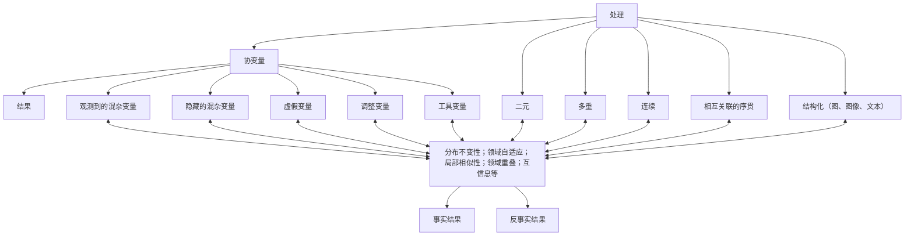

图5.1 处理效应估计任务核心组成部分的三大主要挑战，包括处理、协变量和结果  
图5.2 二元、多重、连续和序贯处理的示意图

```mermaid
graph TD
    subgraph 二元处理
  p1["●"] --> p2["●"]
  p2 --> p3["●"]
  p1 --> p4["●"]
  p4 --> p5["●"]
  p2 --> p6["●"]
  p6 --> p7["●"]
    end

    subgraph 序贯处理
  p1 --> p2
  p2 --> p3
  p3 --> p4
  p4 --> p5
  p5 --> p6
  p6 --> p7
  p1 --> p8["●"]
  p2 --> p9["●"]
  p3 --> p10["●"]
  p4 --> p11["●"]
  p5 --> p12["●"]
  p6 --> p13["●"]
    end

    subgraph 多重处理
  p1 --> p2
  p2 --> p3
  p1 --> p4
  p2 --> p5
  p3 --> p6
  p4 --> p7
  p5 --> p8
  p6 --> p9
  p7 --> p10
  p8 --> p11
  p9 --> p12
    end

    subgraph 连续处理
  response["响应"] --> P1["p1"]
  response --> P2["p2"]
  response --> P3["p3"]
  response --> P4["p4"]
  response --> P5["p5"]
  response --> P6["p6"]
  response --> P7["p7"]
  response --> P8["p8"]
  response --> P9["p9"]
  response --> P10["p10"]
  response --> P11["p11"]
  response --> P12["p12"]
  response --> P13["p13"]
  response --> P14["p14"]
  response --> P15["p15"]
  response --> P16["p16"]
  response --> P17["p17"]
  response --> P18["p18"]
  response --> P19["p19"]
  response --> P20["p20"]
  response --> P21["p21"]
  response --> P22["p22"]
  response --> P23["p23"]
  response --> P24["p24"]
  response --> P25["p25"]
  response --> P26["p26"]
  response --> P27["p27"]
  response --> P28["p28"]
  response --> P29["p29"]
  response --> P30["p30"]
  response --> P31["p31"]
  response --> P32["p32"]
  response --> P33["p33"]
  response --> P34["p34"]
  response --> P35["p35"]
  response --> P36["p36"]
  response --> P37["p37"]
  response --> P38["p38"]
  response --> P39["p39"]
  response --> P40["p40"]
  response --> P41["p41"]
  response --> P42["p42"]
  response --> P43["p43"]
  response --> P44["p44"]
  response --> P45["p45"]
  response --> P46["p46"]
  response --> P47["p47"]
  response --> P48["p48"]
  response --> P49["p49"]
  response --> P50["p50"]
  response --> P51["p51"]
  response --> P52["p52"]
  response --> P53["p53"]
  response --> P54["p54"]
  response --> P55["p55"]
  response --> P56["p56"]
  response --> P57["p57"]
  response --> P58["p58"]
  response --> P59["p59"]
  response --> P60["p60"]
  response --> P61["p61"]
  response --> P62["p62"]
  response --> P63["p63"]
  response --> P64["p64"]
  response --> P65["p65"]
  response --> P66["p66"]
  response --> P67["p67"]
  response --> P68["p68"]
  response --> P69["p69"]
  response --> P70["p70"]
  response --> P71["p71"]
  response --> P72["p72"]
  response --> P73["p73"]
  response --> P74["p74"]
  response --> P75["p75"]
  response --> P76["p76"]
  response --> P77["p77"]
  response --> P78["p78"]
  response --> P79["p79"]
  response --> P80["p80"]
    end
```

如图5.2所示，对于二元、多重、连续和序贯处理场景，我们提供了一个统一的术语体系，使研究人员能够整合和比较现有方法。假设观测数据包含 $n$ 个单元，每个单元经历一条潜在路径，包括若干处理阶段。在每条潜在路径中，单元 $i$ 可以在每个阶段 $S$ 依次选择两种或多种处理 $T$ 中的一种，最终在路径结束时观测到相应的结果 $Y$。令 $\{ t _ { s } ^ { i } ; t _ { s } = 1 , \ldots , n _ { t _ { s } } , i =$ $1 , \ldots , n$ ，且 $s = 1 , \ldots , n _ { s } \}$ 表示单元 $i$ 在阶段 $s$ 的处理分配。总共有 $n _ { s }$ 个处理阶段，以及 $n _ { t _ { s } }$ 个阶段 $s$ 的处理分配。由于每个处理阶段存在不同的处理分配，对于整个总体，我们可以观察到若干条潜在路径 $\{ p ; p = 1 , \ldots , n _ { p } \}$。然而，每个单元只能经历一条潜在路径，包括一系列阶段。因此，根据实际的处理分配，在路径结束时只能观测到其中一个潜在结果。这个被观测到的结果称为**事实结果（factual outcome）**，其余未观测到的潜在结果称为**反事实结果（counterfactual outcomes）**。单元 $i$ 沿实际处理阶段的事实结果记为 $y _ { F } ^ { i }$，反事实结果记为 $y _ { C F } ^ { i }$。令 $X \in \mathbb { R } ^ { d }$ 表示一个单元的 $d$ 个观测变量。观测数据可以记为 $\{ \{ x ^ { i } , ~ t _ { s } ^ { i } , ~ y _ { F } ^ { i } \} _ { s = 1 } ^ { n _ { s } } \} _ { i = 1 } ^ { n }$。

## 5.2.1 二元处理（Binary Treatments）

如果 $n _ { s } = 1$ 且 $n _ { t _ { 1 } } = 2$，则只有一个处理阶段，包含两种处理选择。一个单元只需要在两种处理之间选择一次。这种设置正是传统的**二元处理效应估计（binary treatment effect estimation）** 任务。该传统任务的一个实际例子是评估两种不同药物治疗一种疾病的效果。通过利用包含处理组和对照组的观测数据，我们只能为每位患者获得一个事实结果。因此，核心任务是预测如果患者服用了另一种药物会发生什么。这一传统任务在文献中已被广泛研究，例如 TARNet [28]、CFR [57]、BNR-NNM [36]、CEVAE [41]、SITE [66]、GANITE [69] 和 Dragonnet [58]。

一种广泛使用的解决方案是**匹配方法（matching method）**，其中某个单元缺失的针对某种处理的反事实结果，通过该单元最相似的、已接受该处理的邻居的事实结果来估计。包含匹配样本的数据集模拟了一个**随机对照试验（randomized controlled trial）**，其中处理组和对照组的协变量分布相似。处理组与对照组之间唯一预期的差异在于被研究的结果变量。与基于回归的方法（如**反事实回归（counterfactual regression）** [57] 和**贝叶斯加性回归树（Bayesian additive regression trees）** [10]）相比，匹配方法更具可解释性，且对模型设定的敏感度较低 [25]。

大多数现有的匹配方法在原始协变量空间（例如，**最近邻匹配（Nearest Neighbor Matching）** [51]、**粗化精确匹配（Coarsened Exact Matching）** [23]）或一维**倾向得分（propensity score）** 空间（例如，**倾向得分匹配（Propensity Score Matching）** [50]）中执行。尽管原始协变量空间保留了丰富的信息，但它将面临**维度灾难（curse of dimensionality）**，并且在控制无关变量时会引入更多偏差。理论研究表明，匹配方法的偏差随协变量空间维度的增加而增加 [1]。倾向得分匹配通过在给定一组观测协变量的条件下，匹配一个单元被分配到特定处理的概率，从而克服了直接在原始协变量上进行匹配的维度灾难。然而，一维倾向得分空间会丢失数据中的大部分信息。此外，如果模型没有过度设定，非线性模型通常更能处理复杂的数据分布。

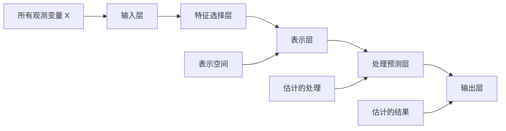

图5.3 基于深度表示学习和表示空间中匹配的特征选择表示匹配方法框架 [11] 其核心思想是将原始协变量空间映射到一个选择性、非线性且平衡的表示空间，该空间能够最佳地预测个体处理结果，缓解选择偏差，并通过同时预测处理分配和结果来最小化无关变量的影响

因此，如图5.3所示，为观测数据学习一个低维、平衡且非线性的表示，而不是高维原始协变量空间或一维倾向得分空间，是一种有前景的解决方案，这在文献 [7, 11, 36] 中已有讨论。

## 5.2.2 多重处理（Multiple Treatments）

如果 $n _ { s } = 1$ 且 $n _ { t _ { 1 } } > 2$，则只有一个处理阶段，包含多种处理。这是传统的**多重处理效应估计（multiple treatment effect estimation）** 任务。通常，二元处理模型可以轻松扩展为多重处理模型 [40]，例如使用**广义提升模型（generalized boosted models）** [43] 进行倾向得分估计、基于在迷你批次内用倾向得分匹配的最近邻增强样本的思想进行反事实推断 [55]、BART [22]，以及带有**任务嵌入（task embedding）** 的深度生成模型 [52]。

例如，一种**多任务对抗学习（multitask adversarial learning）** [14] 包含两个主要组成部分：一个**结果生成器（outcome generator）** 和一个**真/假判别器（true/false discriminator, TF discriminator）**，如图5.4所示。在结果生成器中，他们使用特征选择多任务深度学习来估计所有肿瘤类型中单元的潜在结果。由于不同类型的肿瘤可能具有不同的预测变量，这些变量可能是所有观测协变量的组成部分，因此一个深度特征选择模型（包括（a）输入层与第一个隐藏层之间的稀疏一对一连接层，以及（b）贯穿全连接表示层的弹性网络正则化项）是潜在结果估计的重要基础。

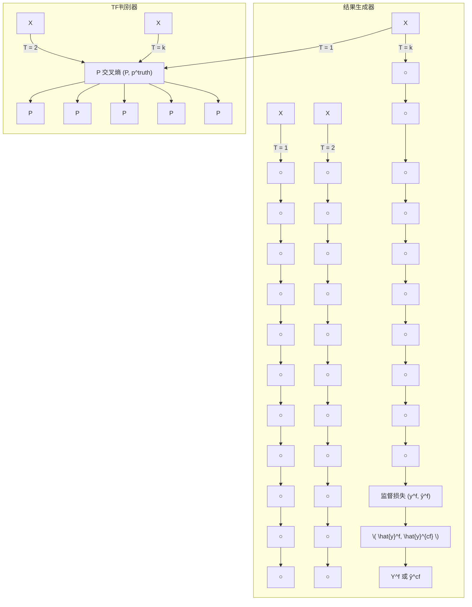

图5.4 我们的多任务对抗学习网络（MTAL）框架 [14]

我们的TF判别器能够判断给定协变量和肿瘤类型下的结果是否为事实结果。起初，TF判别器可以轻松判断哪个结果是事实结果，哪个是我们在这些患者未患的替代肿瘤类型下推断出的反事实结果。结果生成器试图生成反事实结果，使得TF判别器无法轻易判断哪个是事实结果。这两个模型在**零和博弈（zero-sum game）** 中共同训练，它们相互对抗，直到TF判别器模型被生成器欺骗。此时，它们已经消除了肿瘤类型的选择偏差，并为每位患者获得了所有类型肿瘤的所有潜在结果。

## 5.2.3 连续型处理（Continuous Treatments）

如果 $n _ { s } \geq 1$ 且 $t _ { s }$ 是连续的，这就是**连续型处理效应估计（continuous treatment effect estimation）**任务。连续型处理出现在许多领域，包括医疗保健、公共政策和经济。随着观测数据的广泛积累，在纠正**混杂因素（confounders）**的同时估计**平均剂量-反应函数（average dose-response function）**已成为一个关键问题。由于连续型处理的**反事实（counterfactuals）**是无限的，调整**选择偏差（selection bias）**比二元或多值处理要复杂得多。因此，与多值处理不同，用于调整离散处理选择偏差的标准方法无法轻易扩展到处理连续场景中的偏差。

**DRNet** [56] 由一个三级架构组成，包含所有处理的共享层、每个处理的多任务层以及剂量子区间的额外多任务层。具体来说，对于每种处理，剂量区间被细分为几个大小相等的子区间，并为每个子区间添加一个多任务头。DRNets 不会动态确定这些区间，因此这种灵活性在很大程度上丢失了。**SCIGAN** [5] 是灵活的，能够同时估计几种不同连续干预的反事实结果。其关键思想是使用修改后的**生成对抗网络（Generative Adversarial Network, GAN）**模型来生成反事实结果。**VCNet** [45] 提出了一种新颖的**变系数神经网络（varying coefficient neural network）**，它在保持估计的平均剂量-反应函数连续性的同时提高了模型表达能力。其次，为了提高有限样本性能，他们推广了**目标正则化（targeted regularization）**，以获得剂量-反应曲线的**双稳健估计量（doubly robust estimator）**。**CausalEGM** [39] 是一种编码生成模型，可应用于二元和连续处理场景。CausalEGM 模型由一个双向变换模块和两个前馈神经网络组成。由两个生成对抗网络（GANs）组成的双向变换模块用于将协变量投影到低维空间并解耦依赖关系。

此外，为了生成合适的**解缠表示（disentangled representations）**，从而精确调整选择偏差以估计连续处理下的**个体处理效应（Individual Treatment Effect, ITE）**，一项工作（图 5.5）提出了一种名为**解缠与平衡表示网络（Disentangled and Balanced Representation Network, DBRNet）**的新方法，该方法能够获得解缠且平衡的表示，以估计连续处理下的 ITE。具体来说，他们假设协变量由三个潜在因素决定：**工具变量（instrumental factors）**、**混杂因素（confounder factors）**和**调整因素（adjustment factors）**。DBRNet 能够通过学习每个因素的解缠表示来明确识别这三个潜在因素。基于这些分离的表示，他们通过采用一个**重加权函数（reweighting function）**来精确调整选择偏差，该函数从混杂因素中估计“**广义倾向得分（generalized propensity score）**”，在不受调整因素影响的情况下控制处理分配。此外，他们通过一个变系数网络，基于混杂因素和调整因素的表示来预测结果，从而能够估计连续处理下的 ITE。

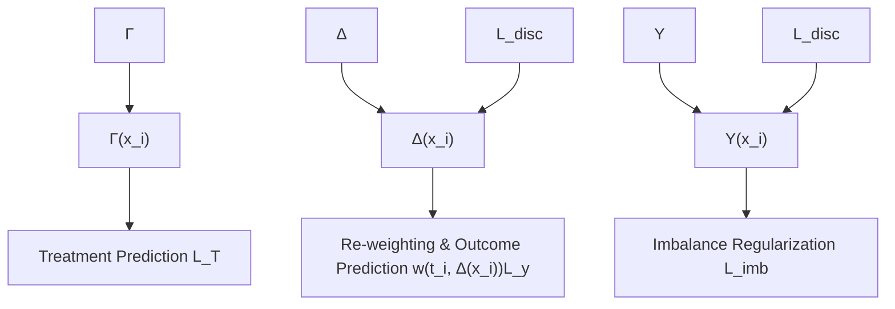

**图 5.5 DBRNet 框架。** 为了从协变量中提取工具因素、混杂因素和调整因素，利用三个收缩的前馈神经网络来获得每个因素的深度表示，即 $\Gamma ( x _ { i } )$、$\Delta ( x _ { i } )$ 和 $\Upsilon ( x _ { i } )$。然后，将表示 $\Gamma ( x _ { i } )$ 和 $\Delta ( x _ { i } )$ 连接起来，使用条件密度估计器 $p ( t _ { i } | \Gamma ( x _ { i } ) , \Delta ( x _ { i } ) )$ 来预测 $t _ { i }$ 的分布。$\Delta ( x _ { i } )$ 和 $\Upsilon ( x _ { i } )$ 用于通过另一个神经网络 $g _ { \theta ( t _ { i } ) } ( \Delta ( x _ { i } ) , \Upsilon ( x _ { i } ) )$ 预测最终结果，而 $\Upsilon ( x _ { i } )$ 则试图编码尽可能少的关于处理的信息。

## 5.2.4 序贯型处理（Sequential Treatments）

如果 $n _ { s } ~ > ~ 1$ 且 $n _ { t _ { s } } ~ \geq ~ 2$ ，则存在多个处理阶段，每个阶段有两个或多个处理。每个单元经历一条路径，并且需要做出 $n _ { s }$ 个处理决策。在路径的末端，我们只能观察到沿实际路径的一个结果。

例如，在 2019 年底开始并持续至今的 COVID-19 疫情期间，大学的教学模式经历了巨大变化。COVID-19 疫情迫使全球大多数教育机构采用“在线 + 线下”的教育交付模式。在一些大学，学生可以选择在线远程学习，或者佩戴口罩并保持社交距离的线下学习。课程讲师可以为学生提供基于实时视频的课程，和/或将课程录制视频上传到在线学习平台供他们观看。此外，在基于实时视频的学习中，学生可以选择打开或关闭摄像头。因此，每个学生将遵循一条序贯行为路径：“线下或在线学习 → 预录视频或实时视频学习 → 摄像头打开或关闭”，如图 5.6 所示。不同的教学模式影响学生的社交、情感和心理健康以及学业成就。每个学生在每个阶段都做出自己的选择，因此存在各种潜在的路径。直观地说，潜在路径是一个单元可能进行的一系列处理选择。每个单元实际上只能经历一条路径，这被记录在观测数据中。然而，在每个干预阶段，单元可以选择两种或多种干预措施中的一种，导致多条潜在路径，包括一条事实路径和几条反事实路径。在因果效应估计任务中，我们需要估计所有潜在路径上的潜在结果。

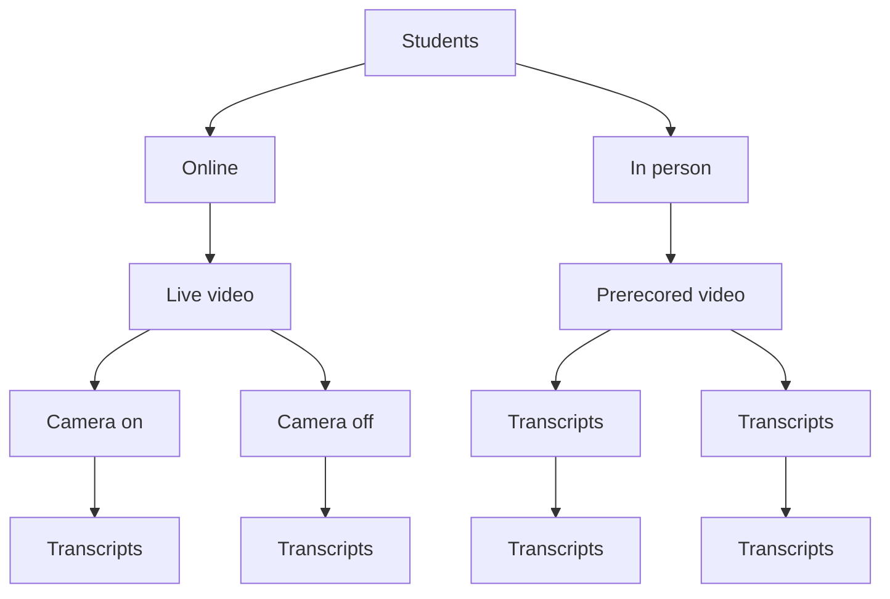

**图 5.6 教学模式示例。** 实线代表每个学生在每个阶段的潜在选择，虚线指代沿相应路径的最终潜在结果。

在这些情况下，选择偏差会在多个阶段累积，使得反事实结果的估计更具挑战性。据我们所知，现有的处理效应估计方法无法有效解决这类问题。对于这个序贯处理的新问题，因果效应估计任务可以转化为基于**异构图（heterogeneous graph）**和**有向无环图（Directed Acyclic Graph, DAG）**的图学习任务。首先，它通过**自监督学习（self-supervised learning）**构建一个包含许多不连通子图的带偏差异构图。每个子图代表一个单元及其所有潜在路径。其次，学习到的异构图是一个典型的有向无环图，这种架构根据偏序定义的流程来处理信息。基于此 DAG 的实际含义，采用了双向处理。一条路径可以按自然顺序处理以估计路径末端的结果，另一条路径则用于按逆序重建原始特征。

## 5.2.5 结构化处理（Structured Treatments）

在许多实际情况下，处理是自然结构化的，例如医疗处方（文本）、蛋白质结构（图）和计算机断层扫描（图像）。传统的处理效应估计方法通常为每个处理选项使用独立的预测头，因此处理指示变量的影响可能在高维网络表示中丢失。将这种想法直接扩展到结构化处理不仅计算代价高昂，而且无法利用处理特征或学习处理表示 [30]。

**GraphITE** [20] 学习用于**条件平均处理效应（Conditional Average Treatment Effect, CATE）**估计的图处理表示。他们提出利用图神经网络，同时通过使用**希尔伯特-施密特独立性准则（Hilbert–Schmidt Independence Criterion）**正则化来减轻观测偏差，这增加了目标表示和处理表示之间的独立性。受**罗宾逊分解（Robinson decomposition）**（该分解实现了二元处理的灵活 CATE 估计）的启发，[30] 提出了**广义罗宾逊分解（Generalized Robinson Decomposition, GRD）**，从中他们提取了一个针对因果效应的**伪结果（pseudo-outcome）**。GRD 对处理的推广可以向量化为一个连续嵌入。这个 GRD 揭示了一个可学习的伪结果目标，该目标通过消除混杂关联来隔离观测信号中的因果成分。

此外，越来越多的方法论文献研究如何在观测数据中整合图像以估计处理效应 [6, 46]。通过使用深度概率建模框架 [26]，提出了一种基于图像的处理效应模型。他们开发了一种方法，通过识别具有相似处理效应分布的图像来估计图像的潜在簇。该模型还强调了一个**图像敏感度因子（image sensitivity factor）**，该因子量化了图像片段在贡献于平均效应簇预测中的重要性，通过使用聚类上的近似后验分布进行蒙特卡洛方法获得。

## 5.3 协变量（Covariate）

不同类型协变量之间的关系，包括处理变量、混杂变量、结果变量、工具变量、调整变量和**虚假变量（spurious variables）**，如图 5.7 所示。在处理效应估计任务中，最大的挑战是选择偏差，即观测到的群体分布不能代表我们感兴趣的群体的现象。**混杂变量（Confounder variables）**影响单元的处理选择，从而导致选择偏差。这种现象加剧了反事实结果估计的难度，因为我们需要基于观测到的对照组来估计处理组中单元的控制结果，并基于观测到的处理组来估计对照组中单元的处理结果。处理选择偏差的过程称为**协变量调整（covariate adjustment）** [68]。

随着观测数据中收集到的协变量越来越多，我们面临着不同类型的协变量，例如混杂变量（观测到的和隐藏的）、调整变量、工具变量和虚假变量。除了数值型协变量，如何处理带有文本信息的协变量以进行因果效应估计仍然是一个悬而未决的问题。因此，在本节中，我们从四个方面讨论这个主题：(1) **特征选择（feature selection）**；(2) **特征表示解耦（feature representation disentanglement）**；(3) **隐藏混杂因素（hidden confounders）**；(4) **文本信息（textual information）**。

## 5.3.1 特征选择（Feature Selection）

协变量调整的一种常用方法是使用**倾向得分（propensity score）**，即在给定背景协变量的情况下，一个单元被分配到特定处理水平的概率 [50]。在协变量调整中，虽然包含所有混杂变量是必要的，但这并不意味着包含更多变量总是更好 [11, 18, 54]。例如，对与处理分配相关但仅通过处理与结果相关的**工具变量（instrumental variables）**进行条件化，会增加估计因果效应的偏差和方差 [44]。对预测结果但与处理分配无关的**调整变量（adjustment variables）**进行条件化，对于消除偏差是不必要的，但可以降低估计因果效应的方差 [53]。因此，包含工具变量会增大标准误差而不改善偏差，而包含调整变量可以提高精度 [37, 59, 63, 74]。

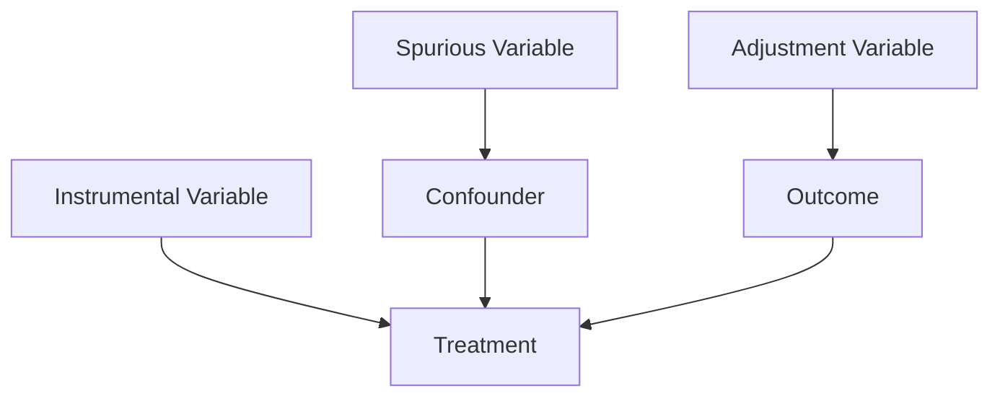

**图 5.7 处理变量、混杂变量、结果变量、工具变量、调整变量和虚假变量之间的关系**

[34] 中提出了一种**数据驱动的变量分解（Data-Driven Variable Decomposition, D2VD）**算法，该算法可以通过数据驱动的方法自动分离混杂变量和调整变量，其中提出了一个正则化集成回归模型，以同时实现混杂变量分离和**平均处理效应（Average Treatment Effect, ATE）**估计。最近，我们基于表示学习和自适应组 LASSO [15] 提出了一种**深度自适应变量选择的倾向得分方法（Deep Adaptive Variable Selection-based Propensity Score method, DAVSPS）**。DAVSPS 的关键思想是结合表示学习的数据驱动学习能力和自适应组 LASSO 的变量选择一致性，通过选择混杂变量和调整变量同时去除工具变量和虚假变量，来改进倾向得分的估计。DAVSPS 的框架包含两个主要步骤：使用组 LASSO 进行结果预测，以及使用自适应组 LASSO 进行倾向得分估计。第一步使用带有组 LASSO 的深度神经网络（DNN）来预测结果，并获得每个协变量的初始权重估计。第二步使用带有自适应组 LASSO 的 DNN 分类模型来估计倾向得分，其中加权惩罚基于从第一步获得的初始权重估计。因此，DAVSPS 可以在倾向得分估计中自动选择预测结果的协变量（即混杂变量和调整变量），同时去除与结果无关的协变量（即工具变量和虚假变量）。

## 5.3.2 特征表示解耦（Feature Representation Disentanglement）

为了进行简单的特征表示解耦，即区分混杂因子（confounders）和非混杂因子（nonconfounders），Wu 等人 [65] 提出了一种协同学习框架，通过学习混杂因子和非混杂因子的分解表示来识别混杂因子，并同时使用样本重加权技术来平衡混杂因子。然后，如图 5.8 所示，一种更详细的解耦表示学习方法 [21] 将协变量分解为三个潜在因子，包括**工具因子（instrumental）** $\Gamma$、**混杂因子（confounding）** $\Delta$ 和**调整因子（adjustment）** $\Upsilon$。他们假设随机变量 $X$ 遵循一个未知的联合概率分布 $Pr(X | \Gamma, \Delta, \Upsilon)$，处理变量 $T$ 遵循 $Pr(T | \Gamma, \Delta)$，结果变量 $Y$ 遵循 $Pr(Y | \Delta, \Upsilon)$，其中 $\Gamma$、$\Delta$ 和 $\Upsilon$ 代表生成观测数据集的三个潜在因子。相应地，选择偏差由因子 $\Gamma$ 和 $\Delta$ 引起，其中 $\Delta$ 代表 $T$ 和 $Y$ 之间的混杂因子。Zhang 等人 [71] 提出了一种变分推断方法，用于同时从观测变量中推断潜在因子，将这些因子解耦为对应于工具因子、混杂因子和调整因子的三个不相交集合，并使用解耦后的因子进行**处理效应估计（treatment effect estimation）**。然而，如何精确地学习底层的解耦因子仍然是一个开放问题。具体来说，以往的方法可能无法获得独立的解耦因子，而这对于识别处理效应是必要的。Cheng 等人提出了**通过互信息最小化进行反事实回归的解耦表示（MIM-DRCFR）** [9]，该方法使用多任务学习框架在学习潜在因子时共享信息，并结合互信息最小化学习准则来确保这些因子的独立性。

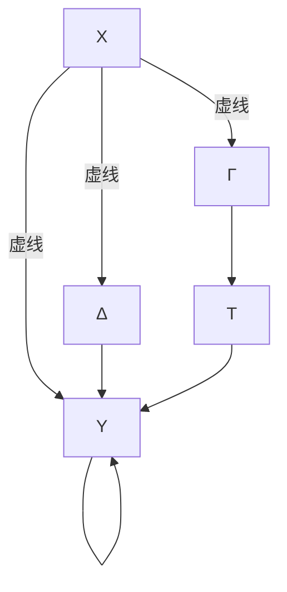

**图 5.8** 包含协变量 (X)、处理变量 (T)、结果变量 (Y)、工具因子 (Γ)、混杂因子 (Δ) 和调整因子 (ϒ) 的因果图示意图。实线表示因果关系，虚线表示从属关系。

## 5.3.3 隐藏混杂因子（Hidden Confounders）

由于在实践中识别所有混杂因子是不可能的，**强可忽略性假设（strong ignorability assumption）** 通常是站不住脚的。如果一个混杂因子是隐藏的或未被测量的，那么在一般情况下，如果没有进一步的假设，就不可能估计出处理对结果的影响 [47]。通过利用大数据，可以通过探索隐藏混杂因子、其代理变量、处理变量和结果变量之间的关系，为隐藏或未测量的混杂因子找到代理变量。例如，**因果效应变分自编码器（Causal Effect Variational Autoencoder, CEVAE）** [41] 基于**变分自编码器（Variational Autoencoders, VAE）**，遵循使用代理变量进行推断的因果结构。它可以同时估计总结混杂因子的未知潜在空间以及因果效应。

此外，最近的研究表明，可以利用数据间的辅助网络信息来减轻混杂偏差。网络信息作为非规则数据的一种高效结构化表示，在现实世界中无处不在。得益于各种**图神经网络（graph neural networks）** 强大的表示能力，网络化数据最近受到了越来越多的关注 [27, 31, 61, 62]。因此，它也可以用来帮助识别隐藏混杂因子的模式。一种**网络去混杂器（network deconfounder）** [19] 被提出，通过结合**图卷积网络（graph convolutional networks）** [31] 和**反事实回归（counterfactual regression）** [57] 来识别隐藏混杂因子。与图学习任务（如节点分类和链接预测）中的传统网络化数据不同，因果推断问题下的网络化数据有其特殊性，即网络结构的不平衡。如图 5.9 所示，我们提出了一种用于处理效应估计的**图互信息最大化对抗学习（Graph Infomax Adversarial Learning, GIAL）** 模型 [12]，该模型充分利用网络结构，通过识别网络结构中的不平衡性来捕获更多信息。

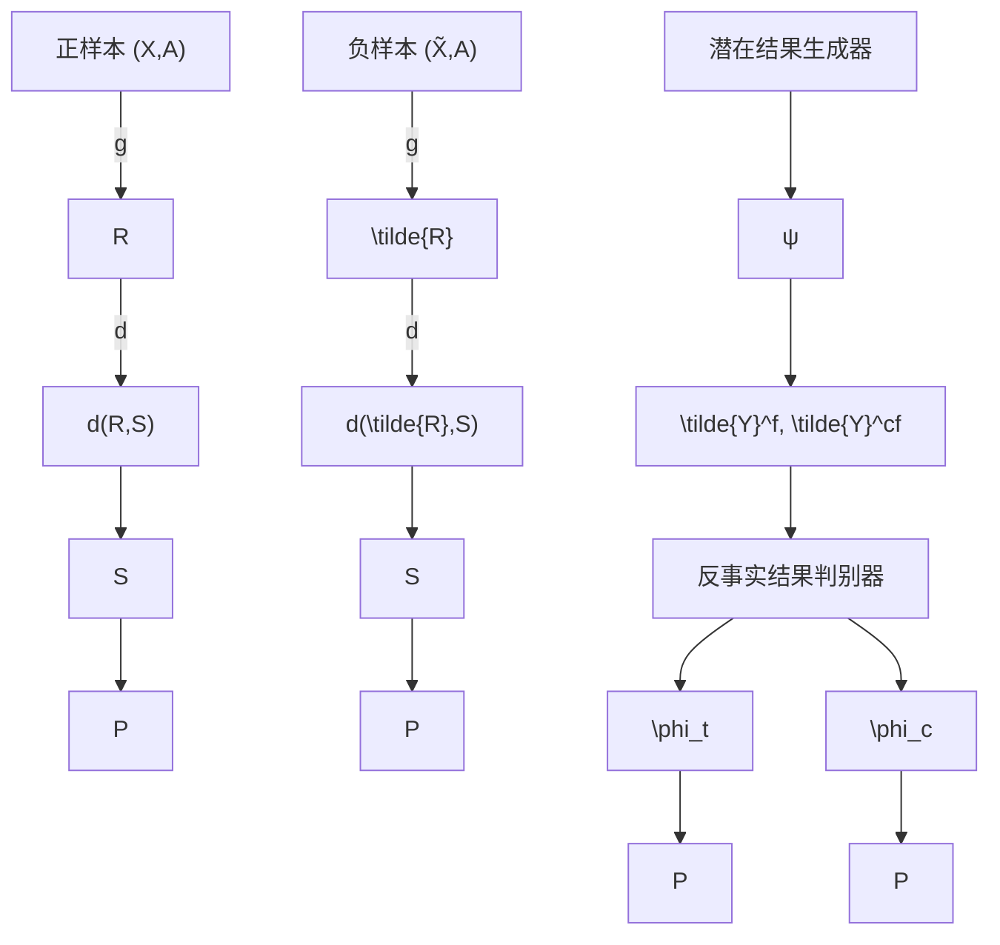

**图 5.9** 我们的图互信息最大化对抗学习方法 (GIAL) 的框架 [12]。利用图神经网络和结构互信息来学习隐藏混杂因子和观测混杂因子的表示。然后，应用潜在结果生成器，基于学习到的表示空间和处理分配，推断处理组和对照组中单元的潜在结果。同时，引入反事实结果判别器，以消除处理组和对照组学习到的表示中的不平衡性。

然而，上述工作假设观测数据及其之间的关系是静态的，而在现实中，两者都会随时间不断演化，即**时间演化的网络化观测数据**。Ma 等人 [42] 提出了一种新颖的因果推断框架——**动态网络化观测数据去混杂器（Dynamic Networked Observational Data Deconfounder, DNDC）**，通过将当前的观测数据和历史信息映射到同一个表示空间，来学习随时间变化的隐藏混杂因子的动态表示。

## 5.3.4 文本协变量（Text Covariates）

大多数现有工作关注于数值型协变量，而很少关注文本协变量。然而，在现实世界中，文本数据几乎无处不在，例如临床记录、电影评论、新闻和社交媒体帖子。与结构化和定义明确的数值型协变量不同，文本协变量包含更丰富的信息，并且可以在不同层次上进行总结，例如词级别、主题级别和语义级别。文本数据的这一特性给使用文本协变量的处理效应估计带来了一些新的挑战。特别是，一些对处理分配具有很强预测性的文本协变量可能对结果的预测性不强。这些协变量被称为**近工具变量（nearly instrumental variables）**。在处理效应估计中，现有工作 [48, 64] 表明，以近工具变量为条件往往会放大因果效应分析中的偏差。因此，在估计处理效应时应排除近工具变量。因此，使用文本协变量估计处理效应的主要挑战是如何过滤掉近工具变量。

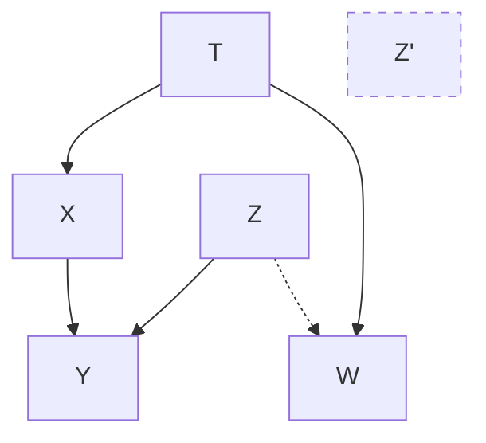

**图 5.10** CTAM [67] 的因果图

在现有方法中，当协变量是数值型时，过滤近工具变量是通过**协变量重加权（covariate reweighting）** [8, 16, 32] 或**特征选择（feature selection）** [33, 49, 60] 来实现的。然而，当协变量包含文本数据时，基于重加权或特征选择的方法的有效性会受到限制，因为这些方法会局限于文本变量中包含的某一特定层面的信息，导致对文本协变量的总结不充分，进而导致在过滤近工具变量方面的不足。

为了应对上述挑战，[67] 受 [72] 中**条件对抗架构（conditional adversarial architecture）** 的启发，提出了**基于条件处理对抗学习的匹配方法（Conditional Treatment-Adversarial learning based Matching method, CTAM）**。

他们提出的方法的潜在因果图如图 5.10 所示。在图中， $Z$ 和 $Z'$ 共同构成了观测到的文本协变量 $T$ 和非文本协变量 $X$ 的潜在表示。在潜在变量中， $Z'$ 表示近工具变量，它对处理分配的预测性比对结果 $Y$ 的预测性更强。如前所述，以近工具变量为条件会放大处理效应估计偏差。我们的目标是学习能够过滤掉与近工具变量相关信息的潜在表示。因此，所提出的方法引入了条件处理对抗学习，以尽可能消除潜在表示中与近工具变量 $Z'$ 相关的信息。

如图 5.11 所示，CTAM 首先学习所有协变量的潜在表示，其中文本变量中包含的信息可以被充分总结。然后，在学习到的表示空间中，他们采用**最近邻匹配（Nearest Neighbor Matching, NNM）**（因其可解释性）来估计如果处理发生改变时的结果。CTAM 的关键特征是条件处理对抗训练过程，其目标是在表示空间中过滤掉与近工具变量相关的信息。在此过程中，处理判别器与表示学习器和结果预测器一起进行一个极小极大博弈。处理判别器被训练来正确预测处理标签，而与结果预测器协同工作的表示学习器则旨在欺骗处理判别器。通过条件处理对抗训练过程，学习到的表示丢弃了特定于处理分配的多余信息，并保留了与结果预测相关的信息。因此，所提出的方法有利于使用文本协变量进行处理效应估计。

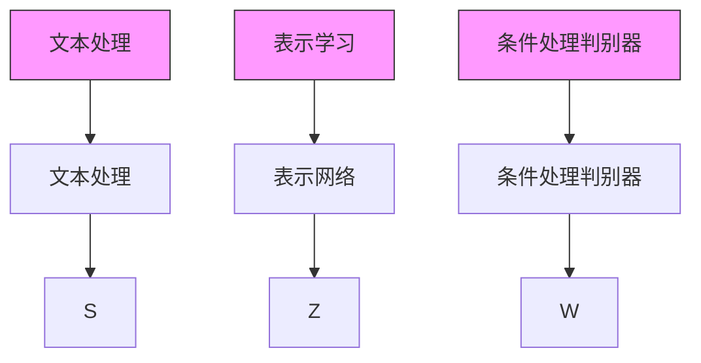

**图 5.11** CTAM 框架 [67]

## 5.4 结果（Outcome）

使用观测数据进行处理效应估计面临的首要挑战是处理由选择偏差引起的、不同处理选项下协变量的不平衡性。最近的因果效应估计方法 [28, 36, 57] 通过使用分布距离（如**Wasserstein 距离（Wasserstein distance）** 和**最大均值差异（maximum mean discrepancy）**）来强制实现域不变性，从而与**域自适应（domain adaptation）** 建立了紧密联系。在 [70] 中，作者认为分布不变性通常是一个过于严格的要求，并提议使用**反事实方差（counterfactual variance）** 来衡量域的重叠程度。

受**度量学习（metric learning）** 的启发，一些方法 [66] 使用困难样本来学习保留局部相似性信息并平衡数据分布的表示。他们假设相似的单元会有相似的结果。这一假设在许多经典的反事实估计方法（如最近邻匹配）中得到了很好的证明。为了在表示学习设置中满足这一假设，在将单元从协变量空间 $\chi$ 映射到潜在空间 $z$ 后，应很好地保留局部相似性信息。一个直接的解决方案是在 $\chi$ 和 $z$ 中构建的相似性矩阵上添加约束。然而，构建相似性矩阵并强制执行这样一个“全局”约束非常耗时和占用空间，尤其是在实践中单元数量庞大时。如图 5.12 所示，他们设计了一种基于三元组对的有效局部相似性保持策略。

```mermaid
graph TD
    subgraph Representation_Space["\"表示空间\""]
  A1["Ẑi"] --> B1["保持"]
  B1 --> C1["Ẑk"]
  C1 --> D1["ẑn"]
  D1 --> E1["Ẑm"]
  E1 --> F1["ẑj"]
  F1 --> G1["接近"]
  G1 --> H1["ẑi"]
  H1 --> I1["ẑk"]
  I1 --> J1["ẑm"]
  J1 --> K1["ẑj"]
  K1 --> L1["ẑi"]
  L1 --> M1["ẑk"]
  M1 --> N1["ẑm"]
  N1 --> O1["ẑj"]
  O1 --> P1["ẑi"]
  P1 --> Q1["ẑk"]
  Q1 --> R1["ẑm"]
  R1 --> S1["ẑj"]
  S1 --> T1["ẑi"]
  T1 --> U1["ẑk"]
  U1 --> V1["ẑm"]
  V1 --> W1["ẑj"]
  W1 --> X1["ẑi"]
  X1 --> Y1["ẑk"]
  Y1 --> Z1["ẑm"]
  Z1 --> AA["ẑj"]
  AA --> AB["ẑi"]
  AB --> AC["ẑk"]
  AC --> AD["ẑm"]
  AD --> AE["ẑj"]
  AE --> AF["ẑi"]
  AF --> AG["ẑk"]
  AG --> AH["ẑm"]
    end

    subgraph Representation_Space_2["\"表示空间\""]
  AI["处理组"] --> AJ["MPDM"]
  AK["对照组"] --> AL["MPDM"]
    end

    style AI fill:#f9f,stroke:#333
    style AK fill:#f9f,stroke:#333
```

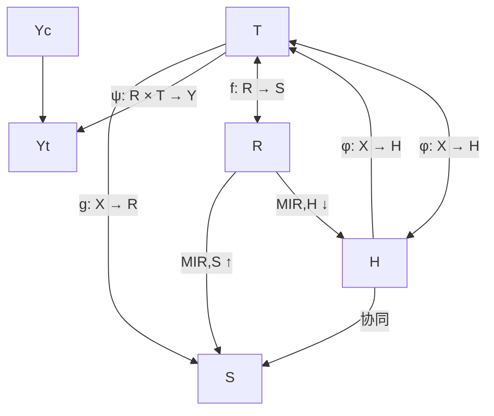

**图 5.12** 使用提出的 SITE 方法 [66] 平衡分布和保持局部相似性的效果  
**图 5.13** 提出的 IDRL [13] 框架包含四个主要组件，包括特征表示学习 $g : X \to R$、信息最大化学习 $MI(R, S)$、域无关学习 $MI(R, H)$ 和潜在结果生成器 $\psi : R \times T \to Y$。IDRL 首先为每个受试者学习一个个体表示向量。同时，信息最大化学习和域无关学习被纳入表示学习过程，以过滤掉域相关信息、解决选择偏差，并保留处理组和对照组的共同预测信息。

受信息论的启发，我们提出了一种**互信息最大化与域无关表示学习（Infomax and Domain-independent Representation Learning, IDRL）** 方法 [13]，通过寻找一个表示空间来估计观测数据的因果效应，该空间不仅包含关于潜在结果估计的共同预测信息，而且排除了域相关信息。如图 5.13 所示，IDRL 依赖于两个互信息结构：一个是最大化全局总结表示与个体特征表示之间的互信息，这可以最大限度地捕获处理组和对照组的共同预测信息，并过滤掉仅针对特定个体或群体的噪声；另一个是最小化特征表示向量与处理选项之间的互信息，这使得特征表示独立于处理选项域。因此，我们的 IDRL 方法不是通过采用各种域散度度量来强制处理组和对照组之间的平衡，而是利用一个互信息模块来排除与域相关的信息，从而我们无法判断它来自哪个域。同时，额外的互信息可以最大限度地保留共同的预测信息。

对于这些基于**潜在结果框架（Potential Outcome Framework, POF）** 的域自适应方法，模型旨在学习**域不变表示（domain-invariant representations）**，即特征的变换，使得处理组和对照组在表示空间中几乎无法区分 [4]。尽管域自适应在 POF 中很流行，但域自适应的**充分支持假设（sufficient support assumption）** [3] 揭示了在域支持发生变化时学习不变表示的内在局限性 [38]。**积极性假设（positivity assumption）** 是因果效应估计中的一个基本假设，它支持域自适应的强充分支持假设 [29, 73]。然而，在实践中，积极性假设绝不能被保证成立，原因如下。首先，高维数据通常包含对预测结果冗余或不相关但仍然有助于区分处理组和对照组的信息。其次，在不同干预组中分布不同的变量通常对预测至关重要。

此外，对于 POF 设置下的域自适应问题，寻找最优度量来衡量处理组和对照组之间的距离仍未解决。距离度量的选择高度依赖于数据分布的特征以及用于减轻不平衡的正则化项的超参数。特别是，即使存在相同的选择偏差，不同的度量在平衡数据分布方面也没有共识 [70]。

最后，我们认为，当域（例如，处理组和对照组）部分重叠时，强制表示具有域不变性过于严格 [70]。一些研究表明，仅在事实数据上进行经验风险最小化优于域不变表示学习算法。因此，无论采用何种类型的域散度度量，强制域不变性很容易移除预测信息并导致预测能力的损失 [2]。这些观察结果促使我们放宽积极性假设，并为处理效应估计开发一个新的统一范式，这样我们可以避免域散度度量的选择困境，并克服预测信息的损失。这是处理效应估计任务中一个充满希望且迫切的方向。

## 5.5 未来方向（Future Directions）

正如前面章节所讨论的，现有工作为因果推断的发展做出了巨大贡献。然而，在因果建模与理论研究以及应用与评估方面，仍然存在许多开放问题。在本节中，我们将讨论未来的研究方向以及潜在的应用。

对于因果建模与理论研究，我们介绍以下几个开放问题。

• **添加或放宽因果模型中的假设**。例如，大多数现有方法考虑二元处理和高维处理，而更实际的、涉及不同层次的多重处理的设置常常被忽略。高维处理在现实生活中很常见。研究因果交互是高维处理的一个热点话题，其目标是识别那些能产生超出各处理单独效应之和的额外效应的处理组合 [17]。  
• **发展不同因果模型之间的形式化联系**。尽管现有框架在逻辑上是相同的，但它们各有优势。建立不同因果模型之间的联系有利于从观测数据中进行因果建模。例如，潜在结果框架和图因果模型之间的相关性已在 [24] 中讨论过。  
• **“用于因果推断的机器学习”与“用于机器学习的因果推断”**。机器学习和因果推断可以相互促进。机器学习为因果效应估计提供了强大的算法，这是本章的重点。因果推断如何帮助改进机器学习算法设计，例如鲁棒性、泛化性和知识迁移，仍然是一个开放问题。  
• **赋予机器学习因果推理能力**。大多数机器学习算法建模的是变量之间的相关性，但因果推理能力非常有限。开发具有因果意识的机器学习模型将有助于揭示复杂观测数据中的底层机制，从而辅助具有因果意识的预测分析和决策制定。  
• **动态环境中的因果推断**。现有工作主要关注静态观测数据。在实践中，数据通常是从动态环境中持续收集的。需要新颖的因果推断方法来建模动态观测数据，从而实现**终身因果推断（lifelong causal inference）**。  
• **因果辅助的可信学习**，例如可解释性、可靠性和公平性。在模型解释领域，因果推断在探索属性对模型预测标签的影响方面具有巨大潜力。此外，在公平性领域，**反事实公平性（counterfactual fairness）** [35] 是一个热门话题，它针对的是现实世界中单元的结果以及该单元拥有不同敏感属性值时的反事实世界中的结果。

随着因果建模的快速发展，探索新的应用和构建用于评估的基准同样重要。

• **在更多领域应用中推广“处理”和“潜在结果”的解释**。前一节提到的一个成功例子是推荐系统，其中向用户展示一个项目类似于对单元施加处理。为了扩展因果推断应用的范围，有必要在更多领域中推广“处理”和“潜在结果”的解释。  
• **（部分）实验研究与观测研究的整合**。在现实世界应用中，有时可以获得实验数据，例如网络开发领域的 A/B 测试数据。整合实验数据，即使是小样本量的实验数据，对于观测研究克服未观测到的混杂因子和纠正有偏的因果效应估计模型有很大帮助。  
• **适用于多模态数据的可扩展因果模型**。多模态数据在现实世界应用中很常见。例如，在医疗保健领域，医生的记录是文本数据，而 fMRI 数据是图像数据。大多数现有的处理效应估计模型专注于一种数据类型，无法处理多模态数据。基于多模态数据估计处理效应仍然是一个开放问题。

## 5.6 小结（Summary）

**因果推断（Causal inference）** 是一个不断发展的学术研究领域，并具有多种工业应用。近年来，**机器学习（machine learning）** 的蓬勃发展给因果推断领域注入了新的活力，不仅在原有问题上取得了卓越进展，还开辟了新的研究潜力与方向。在本章中，我们从三个核心组成部分，即 **处理变量（treatment）**、**协变量（covariates）** 和 **结果变量（outcome）**，全面综述了 **处理效应估计（treatment effect estimation）** 任务的新兴进展、挑战与机遇。

## 参考文献（References）

1. A. Abadie, G.W. Imbens, Large sample properties of matching estimators for average treatment effects. Econometrica 74(1), 235–267 (2006)
2. A. Alaa, M. Schaar, Limits of estimating heterogeneous treatment effects: Guidelines for practical algorithm design, in *International Conference on Machine Learning* (2018), pp. 129–138
3. S. Ben-David, R. Urner, On the hardness of domain adaptation and the utility of unlabeled target samples, in *International Conference on Algorithmic Learning Theory* (Springer, Berlin, 2012), pp. 139–153
4. S. Ben-David et al., Analysis of representations for domain adaptation, in *Advances in Neural Information Processing Systems* (2007), pp. 137–144
5. I. Bica, J. Jordon, M. van der Schaar, Estimating the effects of continuous-valued interventions using generative adversarial networks. *Adv. Neural Informat. Process. Syst.* 33, 16434–16445 (2020)
6. D.C. Castro, I. Walker, B. Glocker, Causality matters in medical imaging. *Nat. Commun.* 11(1), 3673 (2020)
7. Y. Chang, J.G Dy, Informative subspace learning for counterfactual inference, in *Thirty-First AAAI Conference on Artificial Intelligence* (2017)
8. Y. Chang, J.G. Dy, Informative subspace learning for counterfactual inference, in *Proceedings of the AAAI Conference on Artificial Intelligence* (2017), pp. 1770–1776
9. M. Cheng et al., Learning disentangled representations for counterfactual regression via mutual information minimization, in *Proceedings of the 45th International ACM SIGIR Conference on Research and Development in Information Retrieval* (2022), pp. 1802–1806
10. H.A. Chipman, E.I. George, R.E. McCulloch, BART: Bayesian additive regression trees. *Ann. Appl. Statist.* 4(1), 266–298 (2010)
11. Z. Chu, S.L. Rathbun, S. Li, Matching in selective and balanced representation space for treatment effects estimation, in *Proceedings of the 29th ACM International Conference on Information and Knowledge Management* (2020), pp. 205–214
12. Z. Chu, S.L. Rathbun, S. Li, Graph infomax adversarial learning for treatment effect estimation with networked observational data, in *ACM SIGKDD International Conference on Knowledge Discovery and Data Mining* (2021)
13. Z. Chu, S.L. Rathbun, S. Li, Learning infomax and domain-independent representations for causal effect inference with real-world data, in *Proceedings of the 2022 SIAM International Conference on Data Mining (SDM)* (SIAM, Philadelphia, 2022), pp. 433–441
14. Z. Chu, S.L. Rathbun, S. Li, Multi-task adversarial learning for treatment effect estimation in basket trials, in *Conference on Health, Inference, and Learning*, PMLR (2022), pp. 79–91
15. Z. Chu et al., Estimating propensity scores with deep adaptive variable selection, in *Proceedings of the 2023 SIAM International Conference on Data Mining (SDM)* (SIAM, Philadelphia, 2023)
16. A. Diamond, J.S. Sekhon, Genetic matching for estimating causal effects: A general multivariate matching method for achieving balance in observational studies. *Rev. Econ. Statist.* 95(3), 932–945 (2013)
17. N. Egami, K. Imai, Causal interaction in factorial experiments: application to conjoint analysis. *J. Amer. Statist. Assoc.* 114(526), 529–540 (2019)
18. S. Greenland, Invited commentary: variable selection versus shrinkage in the control of multiple confounders. *Amer. J. Epidemiol.* 167(5), 523–529 (2008)
19. R. Guo, J. Li, H. Liu, Learning Individual Treatment Effects from Networked Observational Data (2019). Preprint arXiv:1906.03485
20. S. Harada, H. Kashima, Graphite: Estimating individual effects of graph-structured treatments, in *Proceedings of the 30th ACM International Conference on Information & Knowledge Management* (2021), pp. 659–668
21. N. Hassanpour, R. Greiner, Learning disentangled representations for counterfactual regression, in *International Conference on Learning Representations* (2020)
22. L. Hu et al., Estimation of causal effects of multiple treatments in observational studies with a binary outcome. *Statist. Methods Med. Res.* 29(11), 3218–3234 (2020)
23. S.M. Iacus, G. King, G. Porro, Causal inference without balance checking: coarsened exact matching. *Polit. Analy.* 20(1), 1–24 (2012)
24. G. Imbens, Potential outcome and directed acyclic graph approaches to causality: Relevance for empirical practice in economics (Technical Report, National Bureau of Economic Research, 2019)
25. G.W. Imbens, D.B. Rubin, *Causal Inference in Statistics, Social, and Biomedical Sciences* (Cambridge University Press, Cambridge, 2015)
26. C.T. Jerzak, F. Johansson, A. Daoud, Image-based Treatment Effect Heterogeneity (2022). Preprint arXiv:2206.06417
27. X. Jiang, P. Ji, S. Li, CensNet: Convolution with edge-node switching in graph neural networks, in *International Joint Conference on Artificial Intelligence* (2019), pp. 2656–2662
28. F. Johansson, U. Shalit, D. Sontag, Learning representations for counterfactual inference, in *International Conference on Machine Learning* (2016), pp. 3020–3029
29. F.D. Johansson, D. Sontag, R. Ranganath, Support and invertibility in domain-invariant representations, in *The 22nd International Conference on Artificial Intelligence and Statistics*, PMLR (2019), pp. 527–536
30. J. Kaddour et al., Causal effect inference for structured treatments. *Adv. Neural Informat. Process. Syst.* 34, 24841–24854 (2021)
31. T.N. Kipf, M. Welling, Semi-supervised classification with graph convolutional networks, in *arXiv preprint* (2016)
32. K. Kuang et al., Estimating Treatment Effect in the Wild via Differentiated Confounder Balancing, in *Proceedings of the 23rd ACM SIGKDD International Conference on Knowledge Discovery and Data Mining* (2017), pp. 265–274
33. K. Kuang et al., Treatment effect estimation with data-driven variable decomposition, in *Proceedings of the AAAI Conference on Artificial Intelligence* (2017)
34. K. Kuang et al., Treatment effect estimation with data-driven variable decomposition, in *Proceedings of the Thirty-First AAAI Conference on Artificial Intelligence* (2017)
35. M.J. Kusner et al., Counterfactual fairness, in *Advances in Neural Information Processing Systems* (2017), pp. 4066–4076
36. S. Li, Y. Fu, Matching on balanced nonlinear representations for treatment effects estimation, in *Advances in Neural Information Processing Systems* (2017), pp. 929–939
37. W. Lin, R. Feng, H. Li, Regularization methods for high-dimensional instrumental variables regression with an application to genetical genomics. *J. Amer. Statist. Assoc.* 110(509), 270–288 (2015)
38. H. Liu, J. Wang, M. Long, Cycle Self-Training for Domain Adaptation (2021). Preprint arXiv:2103.03571
39. Q. Liu, Z. Chen, W.H. Wong, CausalEGM: A general causal inference framework by encoding generative modeling (2022). Preprint arXiv:2212.05925
40. M.J. Lopez, R. Gutman, Estimation of causal effects with multiple treatments: A review and new ideas. *Statist. Sci.* 32, 432–454 (2017)
41. C. Louizos et al., Causal effect inference with deep latent-variable models, in *Advances in Neural Information Processing Systems* (2017), pp. 6446–6456
42. J. Ma et al., Deconfounding with networked observational data in a dynamic environment, in *ACM International Conference on Web Search and Data Mining* (2021)
43. D.F. McCaffrey et al., A tutorial on propensity score estimation for multiple treatments using generalized boosted models. *Statist. Med.* 32(19), 3388–3414 (2013)
44. J.A. Myers et al., Effects of adjusting for instrumental variables on bias and precision of effect estimates. *Amer. J. Epidemiol.* 174(11), 1213–1222 (2011)
45. L. Nie et al., Vcnet and functional targeted regularization for learning causal effects of continuous treatments (2021). Preprint arXiv:2103.07861
46. N. Pawlowski, D.C. de Castro, B. Glocker, Deep structural causal models for tractable counterfactual inference. *Adv. Neural Informat. Process. Syst.* 33, 857–869 (2020)
47. J. Pearl, *Causality* (Cambridge University Press, Cambridge, 2009)
48. J. Pearl, On a class of bias-amplifying variables that endanger effect estimates, in *Proceedings of the Twenty-Sixth Conference on Uncertainty in Artificial Intelligence* (2010), pp. 417–424
49. J.A. Rassen et al., Covariate selection in high-dimensional propensity score analyses of treatment effects in small samples. *Amer. J. Epidemiol.* 173(12), 1404–1413 (2011)
50. P.R. Rosenbaum, D.B. Rubin, The central role of the propensity score in observational studies for causal effects. *Biometrika* 70(1), 41–55 (1983)
51. D.B. Rubin, Matching to remove bias in observational studies. *Biometrics*, 29, 159–183 (1973)
52. S.K. Saini et al., Multiple treatment effect estimation using deep generative model with task embedding, in *The World Wide Web Conference* (2019), pp. 1601–1611
53. B.C. Sauer et al., A review of covariate selection for non-experimental comparative effectiveness research. *Pharmacoepidemiol. Drug Safety* 22(11), 1139–1145 (2013)
54. E.F. Schisterman, S.R. Cole, R.W. Platt, Overadjustment bias and unnecessary adjustment in epidemiologic studies. *Epidemiology* 20(4), 488 (2009)
55. P. Schwab, L. Linhardt, W. Karlen, Perfect match: A simple method for learning representations for counterfactual inference with neural networks (2018). Preprint arXiv:1810.00656
56. P. Schwab et al., Learning counterfactual representations for estimating individual doseresponse curves, in *Proceedings of the AAAI Conference on Artificial Intelligence*, vol. 34, no. 04 (2020), pp. 5612–5619
57. U. Shalit, F.D. Johansson, D. Sontag, Estimating individual treatment effect: Generalization bounds and algorithms, in *Proceedings of the 34th International Conference on Machine Learning-Volume 70* (2017), pp. 3076–3085
58. C. Shi, D. Blei, V. Veitch, Adapting neural networks for the estimation of treatment effects, in *Advances in Neural Information Processing Systems*, vol. 32 (2019)
59. S.M. Shortreed, A. Ertefaie, Outcome-adaptive lasso: Variable selection for causal inference. *Biometrics* 73(4), 1111–1122 (2017)
60. R. Tibshirani, Regression shrinkage and selection via the lasso. *J. Roy. Statist. Soc. Ser. B (Methodol.)* 58(1), 267–288 (1996)
61. P. Velickovi ˇ c et al., Graph attention networks (2017). arXiv Preprint´
62. P. Velickovic et al., Deep graph infomax, in *International Conference on Learning Representations (Poster)* (2019)
63. A. Wilson, B.J. Reich, Confounder selection via penalized cred-ible regions. *Biometrics* 70(4), 852–861 (2014)
64. J.M. Wooldridge, Should instrumental variables be used as matching variables? *Res. Econ.* 70(2), 232–237 (2016)
65. A. Wu et al., Learning decomposed representation for counterfactual inference (2020). Preprint arXiv:2006.07040
66. L. Yao et al., Representation learning for treatment effect estimation from observational data, in *Advances in Neural Information Processing Systems* (2018), pp. 2633–2643
67. L. Yao et al., On the estimation of treatment effect with text covariates, in *Proceedings of the 28th International Joint Conference on Artificial Intelligence* (2019), pp. 4106–4113
68. L. Yao et al., A survey on causal inference. *ACM Trans. Knowl. Discov. Data* 15(5), 1–46 (2021)
69. J. Yoon, J. Jordon, M. van der Schaar, GANITE: Estimation of individualized treatment effects using generative adversarial nets, in *6th International Conference on Learning Representations* (2018)
70. Y. Zhang, A. Bellot, M. van der Schaar, Learning overlapping representations for the estimation of individualized treatment effects (2020). Preprint arXiv:2001.04754
71. W. Zhang, L. Liu, J. Li, Treatment effect estimation with disentangled latent factors, in *Proceedings of the AAAI Conference on. Artificial Intelligence*, vol. 35, no. 12 (2021), pp. 10923–10930
72. M. Zhao et al., Learning sleep stages from radio signals: A conditional adversarial architecture, in *International Conference on Machine Learning* (2017)
73. H. Zhao et al., On learning invariant representations for domain adaptation, in *International Conference on Machine Learning*, PMLR (2019), pp. 7523–7532
74. M.C. Zigler, F. Dominici, Uncertainty in propensity score estimation: Bayesian methods for variable selection and model-averaged causal effects. *J. Amer. Statist. Assoc.* 109(505), 95–107 (2014)

## 第三部分（Part III）

## 因果推断与可信机器学习（Causal Inference and Trustworthy Machine Learning）