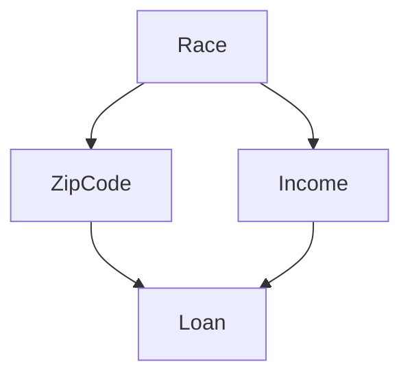
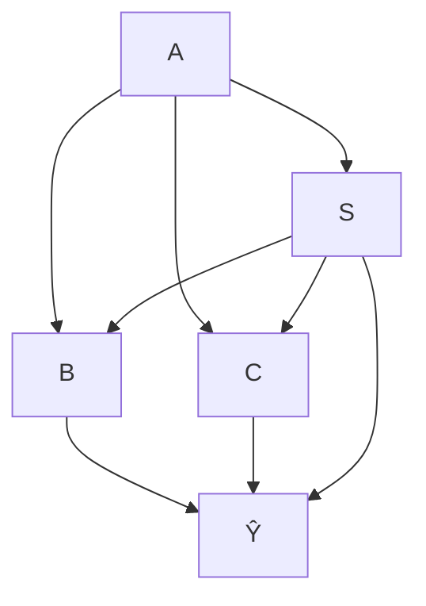
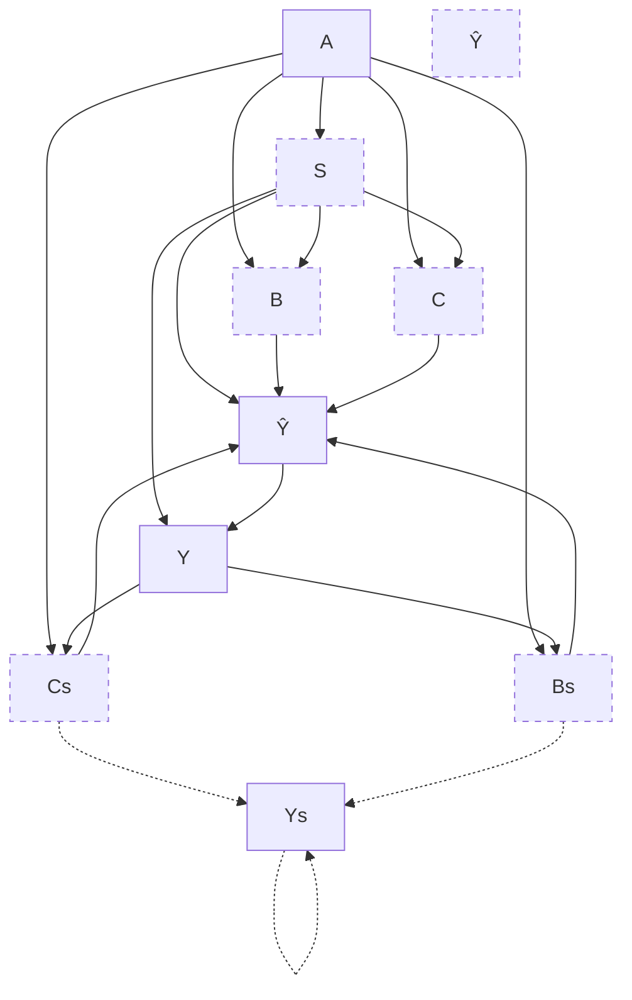
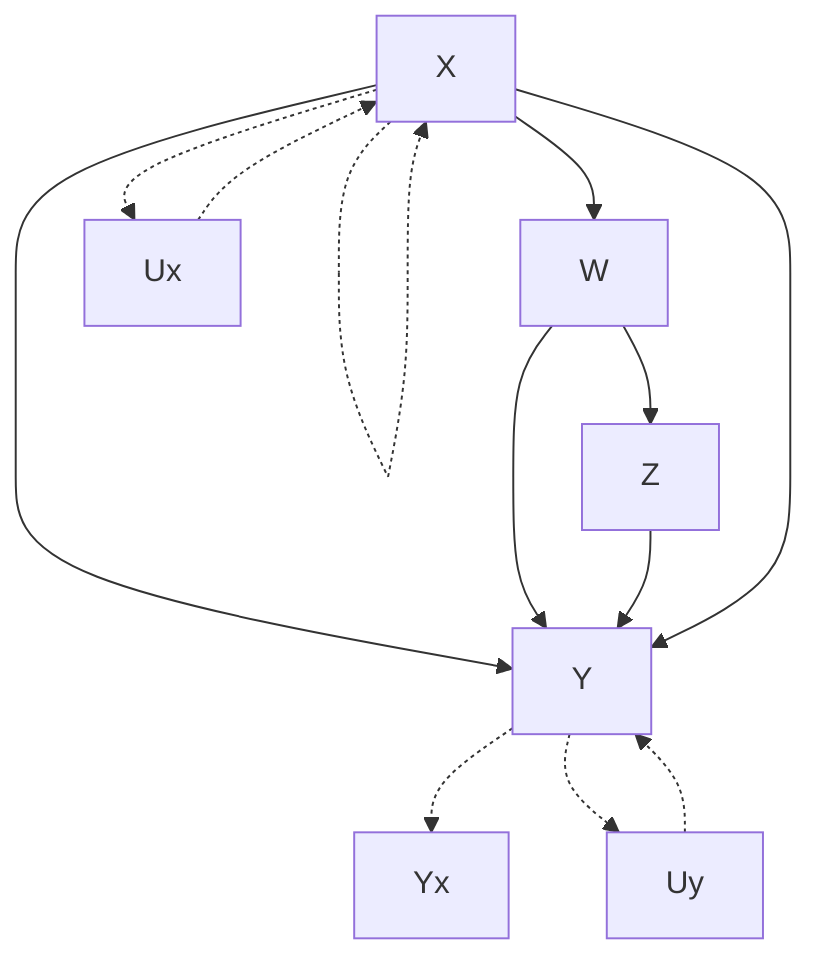
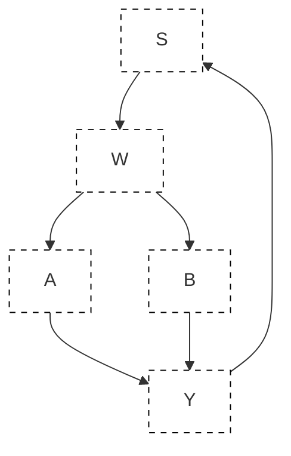
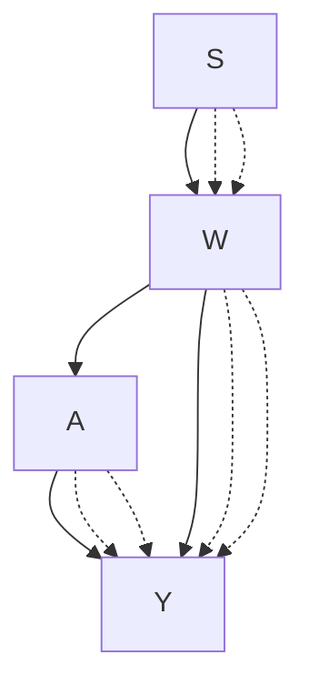

# 第六章 因果视角下的公平机器学习（Chapter 6 Fair Machine Learning Through the Lens of Causality）


吴永凯（Yongkai Wu），张璐（Lu Zhang），吴新涛（Xintao Wu）

## 6.1 引言（Introduction）

机器学习已广泛应用于许多现实应用中的关键决策，例如就业、大学录取和银行贷款。随着其普及，算法偏见（algorithmic bias）和歧视（discrimination）引起了机器学习从业者的关注。算法偏见是指机器学习算法基于个体的人口统计群体成员身份对其做出的不公正区分。许多国家和地区已建立了大量法律法规来禁止不公平行为。例如，在美国，1964年《民权法案》（Civil Rights Act of 1964）禁止基于种族、肤色、宗教、性别或国籍的就业歧视。为了应对算法偏见，公平机器学习（fair machine learning）已成为一个活跃的研究领域。在该领域中，歧视发现（discrimination discovery）是通过分析历史数据或预测模型做出的预测来揭示歧视性做法的任务；而歧视预防（discrimination prevention）旨在通过修改有偏见的数据、调整预测模型或操纵预测结果来消除歧视。

在歧视发现任务中，研究人员提出了各种统计概念。其中最流行的概念之一是**统计均等（statistical parity）**，它意味着受保护群体和非受保护群体获得有利决策的比例应相似。源于统计均等的度量指标包括**风险差（risk difference）**、**风险比（risk ratio）**、**相对变化（relative change）**、**优势比（odds ratio）**等 [70]。另一个概念是**人口统计均等（demographic parity）**，其中人口统计信息（如种族、性别、残疾状况）应与算法决策无关。此外，文献 [57, 101] 中的作者利用了个体层面的概念，即**个体公平（individual fairness）**，其中相似个体应获得相似决策。有关详细信息，我们建议读者参考综述文章，例如 [60, 115]。

现有的歧视预防方法分为三类：**预处理（preprocessing）**、**处理中（in-processing）**和**后处理（postprocessing）**。预处理方法 [23, 27, 34, 87, 116] 在利用历史训练数据训练机器学习模型之前，根据定义的公平概念修改这些数据，以消除潜在的偏见和歧视。常见的预处理方法包括**调整标签（Massaging）**[33]（更改决策边界附近某些个体的标签以消除歧视）、**重新加权（Reweighting）**[10]（为个体分配权重以平衡多数群体和少数群体）以及**偏好采样（Preferential Sampling）**[34]（对子组进行重新采样以使数据集无歧视）。处理中方法 [11, 14, 35, 36, 38, 39, 90, 99, 100] 调整机器学习算法以确保公平预测。一些研究 [14, 36, 38, 39, 90, 100] 在机器学习任务的目标函数中添加了公平约束或正则化项。后处理方法 [4, 28, 37] 修正了原始机器学习模型产生的预测结果。此外，**公平表示（fair representation）**[20, 59, 93, 102] 和**公平生成模型（fair generative models）**[74, 95, 96] 已成为热门的研究趋势。

尽管众所周知关联（association）并不意味着因果（causation），但公平机器学习领域的许多研究人员并未充分关注统计关联与因果之间的差距。大量现有工作仅基于统计概念，导致在歧视评估过程中产生误解和错误量化。因此，歧视预防方法未能消除偏见，甚至加剧了偏见。为了缩小公平与因果之间的差距，我们概述了因果建模和因果公平（causal fairness），包括因果背景、因果公平概念、相关工作和该领域的研究挑战。在本章中，我们介绍了一个统一框架，利用**结构因果模型（Structural Causal Models, SCMs）**[65] 在概念上定义公平并准确衡量机器学习任务中的不公平。为了解决因果推断中最具挑战性的障碍——**不可识别问题（unidentification issue）**，我们提出了实用的**界限方法（bounding methods）**来估计范围，并将有界的因果公平纳入机器学习任务中。因果公平的概念已在不同背景下并行发展。我们讨论了几项工作，其中因果公平以不同的方式制定并应用于各种场景。我们最后讨论了研究挑战和潜在方向，包括因果公平的弱假设、因果公平在序列模型和网络数据中的扩展。

**结构因果模型（Structural Causal Models, SCMs）**[65] 是一种捕获变量间因果关系的数学表示。每个结构因果模型都与一个**因果图（causal graph）**相关联，其中因果关系由从原因变量到结果变量的有向边表示。在 SCM 中，从一个变量到另一个变量的**因果效应（causal effect）**被定义为前一个变量操纵所引起的变化。这种操纵通过**干预（intervention）**表示，该干预被视为对 SCM 中方程的功能性修改，或因果图中边的修改。干预可以沿着任意路径集传播，或应用于由观测条件指定的任意个体群体。我们提出了一个公平机器学习框架，该框架受**路径特定干预（path-specific intervention）**和**反事实干预（counterfactual intervention）**的启发，其中公平被定义为沿着用户指定的路径集传播的因果效应，或基于用户指定的观测条件进行条件化。我们提出了三种因果公平概念：**路径特定公平（Path-specific Fairness）**[106]、**反事实公平（Counterfactual Fairness）**[88] 和**路径特定反事实公平（Path-specific Counterfactual Fairness, PC Fairness）**[92]。其中，路径特定公平将直接歧视和间接歧视衡量为沿直接和间接路径集传播的因果效应；反事实公平捕获群体和个体层面的歧视；而 PC 公平统一了各种因果公平概念。

我们将本章剩余部分组织如下。首先，我们介绍关于统计公平概念的预备知识、结构因果模型概述以及因果推断。然后，我们介绍路径特定公平、反事实公平和路径特定反事实（PC）公平，包括它们的定义、度量指标、用于界定不可识别量的技术、从机器学习模型中消除歧视的算法以及实证评估。之后，我们对与因果公平密切相关的相关工作进行了简短文献综述。最后，我们讨论潜在挑战和未来研究方向，包括放宽因果假设、处理序列设置中的因果公平以及实现网络数据中的因果公平，以此结束本章。

## 6.2 公平与因果推断概述（Overview of Fairness and Causal Inference）

在本节中，我们从统计角度介绍公平的符号表示和度量指标。然后，我们介绍因果公平框架的必要预备知识。

### 6.2.1 统计公平概念与度量指标（Statistical Fairness Notions and Metrics）

我们考虑一个数据集 $\mathcal { D } = \{ S , \mathbf { X } , Y \} \subset \mathcal { P }$ ，其中 $S$ 表示敏感属性（sensitive attribute），$\mathbf { X }$ 表示一组非敏感属性，$Y$ 表示决策。为简单起见，$S$ 和 $Y$ 是二元的，即 $s ^ { + }$ 和 $s ^ { - }$ 分别表示非受保护/有利群体（例如男性）和受保护/不利群体（例如女性），$y ^ { + }$ 和 $y ^ { - }$ 分别表示正向决策（例如被录取）和负向决策（例如被拒绝）。一个预测模型表示为 $f : \mathbf { X } \rightarrow Y$ 。

各种统计概念已被用于定义和量化算法偏见，并在机器学习中做出公平判断。

从技术上讲，这些概念衡量了敏感属性与决策属性之间的统计关联。最常见的概念是**统计均等（statistical parity）**，它意味着受保护群体（记为 $p _ { 1 } = P ( Y = y ^ { + } | S = s ^ { + } )$ ）和非受保护群体（记为 $p _ { 2 } = P ( Y = y ^ { + } | S = s ^ { - } )$ ）获得有利决策的比例应相似。度量指标 $( p _ { 1 } - p _ { 2 } )$ 、$\frac { p _ { 1 } } { p _ { 2 } }$ 、$\frac { 1 - p _ { 1 } } { 1 - p _ { 2 } }$ 和 $\frac { p _ { 1 } ( 1 - p _ { 2 } ) } { p _ { 2 } ( 1 - p _ { 1 } ) }$ 被用于量化差异。**人口统计均等（demographic parity）**概念要求人口统计信息（例如种族、性别、残疾状况）应与算法决策无关。在文献 [38, 39] 中，作者通过训练一个满足分类器预测与敏感信息之间独立性的分类器来定义偏见。在文献 [14, 28, 100] 中，作者在给定真实标签的条件下引入了预测与敏感信息之间的条件独立性。在监督式机器学习中，预测 $\hat { Y }$ 由预测函数做出。在二元分类模型中，如果等式 $P ( \hat { Y } = y ^ { + } | S = s ^ { + } , Y = y ^ { + } ) = P ( \hat { Y } = y ^ { + } | S = s ^ { - } , Y = y ^ { + } )$ 成立，则满足**机会均等（equality of opportunity）**。一个更严格的标准——**均等几率（equality of odds）**——要求所有人口统计群体的**真阳性率（true-positive rate）**和**假阳性率（false-positive rate）**均相等，即 $P ( \hat { Y } = y ^ { + } | S = s ^ { + } , Y = y ) = P ( \hat { Y } = y ^ { + } | S = s ^ { - } , Y = y )$ ，$y \in \{ y ^ { + } , y ^ { - } \}$ 。文献 [57, 101] 中的作者利用了个体层面的概念，其中相似个体应获得相似决策。综述文章 [60, 115] 讨论了各种概念及其联系。详细讨论和比较可在教程 [6, 112] 中找到。

### 6.2.2 结构因果模型与因果推断（Structural Causal Model and Causal Inference）

**朱迪亚·珀尔（Judea Pearl）**在数学上发展了**结构因果模型（Structural Causal Models, SCM）**[65] 的概念，通过一组变量间的结构方程来建模任意系统的机制。

**定义 6.1（结构因果模型（SCM）[65]）** 一个结构因果模型由元组 $\langle \mathbf { U } , \mathbf { V } , \mathbf { F } , P ( \mathbf { U } ) \rangle$ 表示，其中：

*   $\mathbf { U }$ 是一组**外生变量（exogenous variables）**，由模型外部的因素决定。在 $\mathbf { U }$ 中的变量上定义了一个联合概率分布 $P ( \mathbf { U } )$ 。
*   $\mathbf { V }$ 是一组**内生变量（endogenous variables）**，由 $\mathbf { U } \cup \mathbf { V }$ 中的变量决定。
*   $\mathbf { F }$ 是一组从 $\mathbf { U } \cup \mathbf { V }$ 到 $\mathbf { V }$ 的**结构方程（structural equations）**。具体来说，对于每个 $V \in \mathbf { V }$ ，存在一个函数 $f _ { V } \in \mathbf { F }$ ，从 $\mathbf { U } \cup ( \mathbf { V } \backslash V )$ 映射到 $V$ ，即 $v = f _ { V } ( \mathbf { p a } _ { V } , u _ { V } )$ ，其中 $\mathbf { p a } _ { V }$ 是一组直接决定 $V$ 的内生变量 $\mathbf { P a } _ { V } \in \mathbf { V } \backslash V$ 的实现值，$u _ { V }$ 是一组直接决定 $V$ 的外生变量的实现值。

如果 $\mathbf { U }$ 中的所有外生变量相互独立，则该因果模型称为**马尔可夫模型（Markovian model）**。如果 $\mathbf { U }$ 中任意一对外生变量不独立，则该因果模型称为**半马尔可夫模型（semi-Markovian model）**。

结构因果模型与一个图形模型相关联，称为**因果图（causal graph）** $\mathcal { G } = \langle \mathcal { V } , \mathcal { E } \rangle$ ，其中 $\mathcal { V }$ 是节点集，$\mathcal { E }$ 是边集。$\mathcal { V }$ 中的每个节点对应于 $\mathbf { V } \cup \mathbf { U }$ 中的一个变量。$\mathcal { E }$ 中的每条边都是有向的，用单箭头弧表示，并从 $\mathbf { P a } _ { X }$ 的每个成员指向 $X$，以表示该 $\mathbf { P a } _ { X }$ 成员对 $X$ 的直接因果关系。

在因果模型中，**do-算子（do-operator）**[65] 模拟了迫使某些变量 $X$ 取特定常数 $x$ 的物理干预。形式上，将 $X$ 的值设置为 $x$ 的干预记为 $d o ( \mathbf { X } = \mathbf { x } )$ 。干预 $d o ( \mathbf { X } = \mathbf { x } )$ 会操纵结构因果模型和图形因果模型（即因果图）。干预 $d o ( \mathbf { X } = \mathbf { x } )$ 之后的因果模型称为**子模型（sub-model）**，记为 $M _ { \mathbf { X } }$ 。

**因果推断（Causal inference）**是从纯观测数据和因果图中估计因果量（例如干预后的分布，即**干预后分布（post-interventional distribution）**）的过程。例如，在马尔可夫假设 [65] 下，干预后分布 $P ( \mathbf { y } \mid d o ( \mathbf { x } ) )$ 可以表示为**截断因子分解公式（truncated factorization formula）**[65]：$P ( \mathbf { y } \mid d o ( \mathbf { x } ) ) = \prod _ { Y \in \mathbf { Y } } P ( y \mid \mathbf { p a } _ { Y } ) \delta _ { \mathbf { X } = \mathbf { x } }$ ，其中 $\delta _ { \mathbf { X } = \mathbf { x } }$ 表示将前面项中涉及的 $\mathbf { X }$ 变量赋值为 $\mathbf { x }$ 中对应的值。具体来说，对单个变量 $X$ 进行干预后，单个变量 $Y$ 的干预后分布为：$P ( y \mid d o ( x ) ) = \sum _ { \mathbf { v } ^ { \prime } } \prod _ { V \in \mathbf { V } \backslash \{ X \} } P ( v \mid \mathbf { p a } _ { V } ) \delta _ { X = x }$ ，其中求和是对 $\mathbf { V } ^ { \prime } = \mathbf { V } \backslash \{ X , Y \}$ 的所有值组合进行遍历的边缘化。$P ( y \mid d o ( x ) )$ 的分布，也称为在 $d o ( x )$ 下 $Y$ 的干预后分布，记为 $P ( y _ { x } )$ 。等价地，我们可以将 $P ( y _ { x } )$ 表示为 $P _ { x } ( y )$ ，即子模型 $M _ { x }$ 中 $Y$ 的分布。

截断因子分解公式使得在马尔可夫假设下能够从观测数据中估计干预后分布。然而，一个更具挑战性的问题在于半马尔可夫模型，其中双向边暗示存在隐藏混杂变量（hidden confounders），且干预后量不是唯一的。一个因果量能否从观测数据中唯一估计的问题称为**可识别性（identification）**。

### 6.2.3 因果量的可识别性（Identification of Causal Quantities）

可识别性对于因果推断至关重要，因为它决定了因果量（例如 $P ( \mathbf { y } \mid d o ( \mathbf { x } ) )$ ）能否在不指定整个因果模型 $M$ 的情况下从观测数据中一致地推导出来。可识别性的定义如下。

**定义 6.2（可识别性（Identifiability）[65]）** 设 $Q ( \cdot )$ 是某类模型的任何可计算量。如果对于该类模型中的任意一对模型 $M _ { 1 }$ 和 $M _ { 2 }$ ，当 $P _ { M _ { 1 } } ( \mathbf { v } ) = P _ { M _ { 2 } } ( \mathbf { v } )$ 时，总有 $Q ( M _ { 1 } ) = Q ( M _ { 2 } )$ ，则 $Q$ 是可识别的。

在因果推断的背景下，$Q$ 是任意因果量，例如干预后分布 $P ( \mathbf { y } \mid d o ( \mathbf { x } ) )$ 。根据定义 6.2，如果给定与许多潜在矛盾因果模型兼容的观测数据时，估计值是唯一的，则该因果量是可识别的。换句话说，给定观测数据和因果图，一个不可识别的量将得到两个或更多矛盾的值，并且理论上无法区分哪个是真实的。可识别性的这一定义也适用于其他类型的量，例如路径特定量和反事实量。

### 6.2.4 因果效应（Causal Effects）

因果推断的最终任务是揭示变量间的因果关系。借助 do-算子，$X$ 对 $Y$ 的**总因果效应（total causal effect）** 在定义 6.3 [65] 中给出。注意，在该定义中，干预的效果沿着从原因 $X$ 到结果 $Y$ 的所有因果路径传播。

**定义 6.3（总因果效应）** $X$ 从 $x _ { 1 }$ 变为 $x _ { 2 }$ 对 $Y = y$ 的总因果效应 $T E ( x _ { 2 } , x _ { 1 } )$ 衡量了沿着从 $X$ 到 $Y$ 的所有因果路径传播的影响。其公式为：

$$
T E (x _ {2}, x _ {1}) = P \left(y \mid d o (x _ {2})\right) - P \left(y \mid d o (x _ {1})\right).
$$

在总因果效应中，干预对所有个体和所有变量执行，因此效应是在整个群体上聚合的，并通过所有因果路径传播。**路径特定效应（path-specific effect）**是对总因果效应的扩展，即干预的效果仅沿着从 $X$ 到 $Y$ 的因果路径子集传播 [3]。用 $\pi$ 表示因果路径的一个子集。$\pi$ 特定效应考虑一种反事实情况，其中带有干预的 $X$ 对 $Y$ 的效应沿着 $\pi$ 传播，而不带干预的 $X$ 对 $Y$ 的效应则沿着不在 $\pi$ 中的路径（即 $\bar { \pi }$ ）传播。我们用 $P ( y \mid d o ( x _ { 2 } | _ { \pi } , x _ { 1 } | _ { \bar { \pi } } ) )$ 表示在将 $X$ 从 $x _ { 1 }$ 变为 $x _ { 2 }$ 且效应沿 $\pi$ 传播的干预后 $Y$ 的分布。那么，$X$ 对 $Y$ 的 $\pi$ 特定效应描述如下。

**定义 6.4（路径特定效应）** 给定路径集 $\pi$，$\pi$ 特定效应 $P S E _ { \pi } ( x _ { 2 } , x _ { 1 } )$ 衡量了 $X$ 从 $x _ { 1 }$ 变为 $x _ { 2 }$ 对 $Y = y$ 的效应中沿 $\pi$ 传播的部分。其公式为：

$$
P S E _ {\pi} (x _ {2}, x _ {1}) = P \left(y \mid d o (x _ {2} | _ {\pi}, x _ {1} | _ {\bar {\pi}})\right) - P \left(y \mid d o (x _ {1})\right).
$$

路径特定效应 $P S E _ { \pi } ( x _ { 2 } , x _ { 1 } )$ 的可识别性，即它是否可以从观测数据中计算出来，取决于 $P ( y \mid d o ( x _ { 2 } | _ { \pi } , x _ { 1 } | _ { \bar { \pi } } ) )$ 的可识别性。文献 [3] 中的作者给出了 $P ( y \mid d o ( x _ { 2 } | _ { \pi } , x _ { 1 } | _ { \bar { \pi } } ) )$ 可识别的充要条件，即**翻供证人准则（recanting witness criterion）**。

定义 6.3 和 6.4 考虑了没有任何先验观测的整个群体上的平均因果效应。如果人们对属性子集 $\mathbf { O } = \mathbf { o }$ 有某些观测，并在推断因果效应时将其用作事实条件，那么因果推断问题就变成了一个**反事实问题（counterfactual problem）**，这意味着因果推断同时涉及两个反事实世界：真实世界（由因果模型 $M$ 表示）和反事实世界（由子模型 $M _ { x }$ 表示）。符号上，以 $\mathbf { O } = \mathbf { o }$ 为条件的 $Y _ { x }$ 的分布记为 $P ( y _ { x } \mid \mathbf { o } )$ 。注意，$Y _ { x }$ 是子模型 $M _ { x }$ 中的变量，而 $\mathbf { O }$ 是原始因果模型 $M$ 中的变量。

**定义 6.5（反事实效应）** 给定事实条件 $\mathbf { O } = \mathbf { o }$ ，衡量 $X$ 从 $x _ { 1 }$ 变为 $x _ { 2 }$ 对 $Y$ 的影响的反事实效应为：

$$
C E (x _ {2}, x _ {1}) = P \left(y _ {x _ {2}} \mid \mathbf {o}\right) - P \left(y _ {x _ {1}} \mid \mathbf {o}\right).
$$

## 6.3 路径特定公平（Path-Specific Fairness）

在法学和社会科学领域，歧视分为**直接歧视（direct discrimination）**、**间接歧视（indirect discrimination）**和**可解释的差异（explainable distinctions）**。例如，考虑图 6.1 所示的贷款申请系统的简化模型。假设种族（Race）被视为敏感属性，贷款（Loan）被视为决策，邮政编码（ZipCode）被视为引发红线歧视（redlining）的不正当属性。那么，直接歧视沿着路径 Race → Loan 传播，间接歧视沿着路径 Race → ZipCode → Loan 传播。假设收入（Income）的使用可以被客观地证明是合理的，因为如果申请人收入低，拒绝贷款是合理的。在这种情况下，路径 Race → Income → Loan 是可解释的，这意味着不同种族群体在贷款发放方面的部分差异可以通过数据集中某些种族群体倾向于收入较低这一事实来解释。然而，仅考虑种族与收入之间关联的非因果方法，在衡量歧视时无法明确且正确地识别这三种不同的效应。张等人 [106] 开发了一个基于因果模型发现和消除直接和间接歧视的框架。使用因果模型，直接和间接歧视可以分别由敏感属性对决策的因果效应沿着不同因果路径传播来捕获。具体来说，直接歧视被建模为沿着从敏感属性到决策的直接路径传播的因果效应。另一方面，间接歧视被建模为沿着包含任何不正当属性的其他因果路径传播的因果效应。为了处理直接和间接歧视，采用了**路径特定效应（path-specific effect）**[3, 76] 来准确衡量沿路径集的因果效应。

## 6.3.1 将直接/间接歧视建模为路径特定效应（Modeling Direct/Indirect Discrimination as Path-Specific Effects）

给定一个数据集 $\mathcal { D } = \{ \mathbf { X } , S , Y \}$ ，其中 $S$、$Y$ 和 $\mathbf { X }$ 分别表示**敏感属性（sensitive attributes）**、**决策（decision）** 和**非敏感属性（non-sensitive attributes）**。在非敏感属性中，假设存在一组在决策过程中无法客观证明其合理性的属性，称为**红线划定属性（redlining attributes）**，记作 $\mathbf { R }$。假设可以构建一个**因果图（causal graph）** $\mathcal { G }$ 来正确表示数据集的因果结构。Zhang 等人 [106] 将歧视视为敏感属性 $S$ 对决策属性 $Y$ 的**因果效应（causal effect）**。**直接歧视（direct discrimination）** 被建模为沿从 $S$ 到 $Y$ 的直接边传播的因果效应，即 $S \rightarrow Y$。定义 $\pi _ { d }$ 为仅包含 $S \rightarrow Y$ 的路径集。那么，由 $S$ 从 $s ^ { - }$ 变为 $s ^ { + }$ 所引起的上述因果效应由 $\pi _ { d }$**特定效应（$\pi _ { d }$-specific effect）** $P S E _ { \pi _ { d } } ( s ^ { + } , s ^ { - } )$ 给出。类似地，**间接歧视（indirect discrimination）** 被视为沿从 $S$ 到 $Y$ 且包含红线划定属性的间接路径传播的因果效应。给定红线划定属性集 $\mathbf { R }$，定义 $\pi _ { i }$ 为包含所有从 $S$ 到 $Y$ 且经过 $\mathbf { R }$ 的因果路径的路径集，即每条路径至少包含 $\mathbf { R }$ 中的一个节点。因此，上述因果效应由 $\pi _ { i }$ 特定效应 $P S E _ { \pi _ { i } } ( S ^ { + } , S ^ { - } )$ 给出。

为了更好地理解，$P S E _ { \pi _ { d } } ( c ^ { + } , c ^ { - } )$ 的物理含义可以解释为：如果决策者被告知来自受保护群体 $c ^ { - }$ 的个体来自另一群体 $c ^ { + }$，那么这些个体决策的预期变化。应用于图 6.1 中的示例，这意味着如果银行被指示将弱势群体（例如，黑人）的申请者视为来自优势群体（例如，白人），那么该群体贷款审批的预期变化。这表明 $\pi _ { d }$ 特定效应完美地遵循了法律中直接歧视的定义，因此是衡量直接歧视的适当指标。$P S E _ { \pi _ { i } } ( c ^ { + } , c ^ { - } )$ 的物理含义是：如果来自受保护群体 $c ^ { - }$ 个体的个人资料中的红线划定属性值被改变，仿佛他们来自另一群体 $c ^ { + }$，那么这些个体决策的预期变化。应用于图 6.1 中的示例，这意味着如果弱势群体在邮政编码区域中具有与优势群体相同的种族构成，那么该群体贷款审批的预期变化。可以看出，$\pi _ { i }$ 特定效应也遵循间接歧视的定义，并且适用于衡量间接歧视。

基于上述路径特定效应指标，Zhang 等人 [106] 提出了识别直接和间接歧视的标准。如果 $P S E _ { \pi _ { d } } ( c ^ { + } , c ^ { - } ) > \tau$ ，则存在针对受保护群体 $c ^ { - }$ 的直接歧视，其中 $\tau > 0$ 是根据法律定义的、用户指定的歧视阈值。例如，1975 年英国性别歧视立法设定 $\tau = 0.05$ ，即 5% 的差异。类似地，给定红线划定属性 $\mathbf { R }$，如果 $P S E _ { \pi _ { i } } ( c ^ { + } , c ^ { - } ) > \tau$ ，则存在针对受保护群体 $c ^ { - }$ 的间接歧视。




图 6.1 简易模型（Fig. 6.1 The toy model）

## 6.3.2 从数据中移除直接/间接歧视（Removing Direct/Indirect Discrimination from Data）

Zhang 等人 [106] 提出了一种基于路径特定效应的歧视移除（Path-Specific Effect-based Discrimination Removal, PSE-DR）算法，用于移除直接和间接歧视。其总体思路是修改因果图，然后利用修改后的图生成一个新数据集。具体来说，调整 $Y$ 的条件分布，即 $P ( y | \mathbf { p a } _ { Y } )$ ，以获得一个新的条件分布 $P ^ { \prime } ( y | \mathbf { p a } _ { Y } )$ ，使得直接和间接歧视效应低于阈值 $\tau$ 。为了最大化修改后数据集的效用，最小化原始因果图的联合分布（记为 $P ( \mathbf { v } )$ ）与修改后因果图的联合分布（记为 $P ^ { \prime } ( { \bf { v } } )$ ）之间的欧几里得距离。因此，歧视移除方法被表述为一个以 $P ^ { \prime } ( y | \mathbf { p a } _ { Y } )$ 为变量的二次规划问题。

$$
P S E _ {\pi_ {i}} (s ^ {+}, s ^ {-}) \leq \tau , \quad P S E _ {\pi_ {i}} (s ^ {-}, s ^ {+}) \leq \tau ,
$$

$$
\forall \mathbf {p a} _ {Y}, \quad P ^ {\prime} (e ^ {+} \mid \mathbf {p a} _ {Y}) + P ^ {\prime} (y ^ {-} \mid \mathbf {p a} _ {Y}) = 1,
$$

$$
\forall \mathbf {p a} _ {Y}, y, \quad P ^ {\prime} (y \mid \mathbf {p a} _ {Y}) \geq 0,
$$

其中 $P ^ { \prime } ( { \mathbf { v } } )$ 和 $P ( \mathbf { v } )$ 分别根据使用 $P ^ { \prime } ( y | \mathbf { p a } _ { Y } )$ 和 $P ( y | \mathbf { p a } _ { Y } )$ 的**因子分解公式（factorization formula）** [46] 计算得出，而 $P S E _ { \pi _ { d } } ( \cdot )$ 和 $P S E _ { \pi _ { i } } ( \cdot )$ 是直接和间接因果效应，并使用**截断因子分解公式（truncated factorization formula）** [65] 从观测分布中计算得出。

通过求解二次规划问题得到最优解。之后，基于得到的联合分布生成新数据集。

## 6.3.3 处理不可识别的间接歧视（Dealing with Unidentifiable Indirect Discrimination）

Avin 等人 [3] 讨论了可以从观测数据中唯一估计路径特定效应的条件，称为**反悔证人准则（recanting witness criterion）**。Shpitser [76] 表明，当且仅当不满足反悔证人准则时，路径特定效应无法被估计。在满足反悔证人准则的不可识别情况下，Zhang 等人 [106] 为歧视发现和移除提供了可行但粗略的解决方案。例如，在“风筝模式”中，切断从 $W$ 到 $Y$ 的因果路径，其中 $W$ 是间接路径集和非间接路径集的交集。然后，得到的因果模型是可识别的，所提出的发现和移除方法也适用。此外，Zhang 等人 [108] 通过推导不可识别间接歧视的**上界（upper bound）** 和**下界（lower bound）**，开发了精炼的歧视发现方法。这些界限可以作为发现间接歧视的更好指标，即上界 $u b ( S E _ { \pi _ { i } } ( s ^ { + } , s ^ { - } ) )$ 小于 $\tau$ 表示不存在间接歧视，而下界 $l b ( S E _ { \pi _ { i } } ( s ^ { + } , s ^ { - } ) )$ 大于 $\tau$ 则表示存在间接歧视。另一方面，通过将二次规划约束中的 $S E _ { \pi _ { i } } ( s ^ { + } , s ^ { - } )$ 和 $S E _ { \pi _ { i } } ( s ^ { - } , s ^ { + } )$ 替换为 $u b ( S E _ { \pi _ { i } } ( s ^ { + } , s ^ { - } ) )$ 和 $u b ( S E _ { \pi _ { i } } ( s ^ { - } , s ^ { + } ) )$，所推导的界限被用于精炼所提出的 PSE-DR 移除算法。

## 6.3.4 评估（Evaluation）

Zhang 等人 [106, 108] 使用两个真实数据集进行了实验，以评估**歧视发现与消除（discrimination discovery and removal）**的有效性。因果图由 Tetrad [75] 中实现的原始 PC 算法 [80] 构建并呈现。

对于 Adult 数据集，性别被视为敏感属性，收入被视为决策，婚姻状况被视为**红线属性（redlining attribute）**。然后，集合 $\pi _ { d }$ 包含从性别指向收入的边，集合 $\pi _ { i }$ 包含从性别到收入且经过婚姻状况的所有因果路径。通过计算路径特定效应，得到直接歧视 $S E _ { \pi _ { d } } ( s ^ { + } , s ^ { - } ) = 0 . 0 2 5$ 和间接歧视 $S E _ { \pi _ { i } } ( c ^ { + } , c ^ { - } ) = 0 . 1 7 5$ 。通过设定 $\tau \ : = \ : 0 . 0 5$ ，结果表明根据我们的标准，不存在直接歧视，但存在针对女性的显著间接歧视。

对于 2001 年荷兰人口普查数据集，性别被视为敏感属性，职业被视为决策，婚姻状况被视为红线属性。对于该数据集，结果为 $S E _ { \pi _ { d } } ( c ^ { + } , c ^ { - } ) = 0 . 2 2 0$ 和 $S E _ { \pi _ { i } } ( c ^ { + } , c ^ { - } ) = 0 . 0 0 1$ ，表明存在显著的直接歧视，但不存在针对女性的间接歧视。

所提出的消除算法在两个数据集上进行了测试，然后运行发现算法以进一步检查修改后的数据集中是否真正消除了歧视。该消除方法从两个数据集中完全消除了直接歧视和间接歧视。此外，与先前的方法（例如 [116] 中的局部篡改和局部优先采样，以及 [1, 23] 中的**差异性影响消除算法（disparate impact removal algorithm）**）相比，PSE-DR 在 $\chi ^ { 2 }$ 方面产生了相对较小的数据效用损失。

在 Adult 数据集中，Zhang 等人 [108] 研究了在测量和消除间接歧视时处理不可识别情况所提出的方法。特别是，如果教育被视为红线属性，则满足**撤回证人准则（recanting witness criterion）**，即间接歧视是不可识别的。推导出的上限和下限分别为 0.361 和 −0.114。此外，[108] 中改进的歧视消除算法在此设置下进行了评估，并且与 [106] 中提出的原始消除算法相比，保证了在更小的效用损失下，基于边界不存在直接歧视和间接歧视。

## 6.4 反事实公平性（Counterfactual Fairness）

**路径特定公平性（Path-specific fairness）**通常被表述和量化为敏感属性对决策属性的平均因果效应，即在系统层面上。与上述工作不同，Kusner 等人 [48] 引入了基于**反事实推断（counterfactual inference）**的反事实公平性，它考虑了由观测档案属性指定的特定群体/个体内的因果效应。然而，反事实公平性的一个固有局限性是，由于反事实量的不可识别性，在某些情况下无法从观测数据中唯一地量化它。Wu 等人 [88] 通过数学上界定不可识别的反事实量来解决这一局限性，并开发了一种理论上合理的算法来构建反事实公平的分类器。

### 6.4.1 反事实公平性的量化与界定（Quantifying and Bounding Counterfactual Fairness）

Kusner 等人 [48] 将反事实公平性的概念表述为两个反事实量的等价性 $P ( \hat { y } _ { s ^ { \prime } } | s ^ { \prime } , \mathbf { z } ) = P ( \hat { y } _ { s } | s ^ { \prime } , \mathbf { z } )$ ，其中 $\hat { y }$ 是预测值， $s ^ { \prime }$ 和 $s$ 是敏感属性 S 的任意两个值，z 是属性集的任意观测条件。回想一下，带下标的小写字母表示在子模型中分配给相应变量的值，例如，$\hat { y } _ { s }$ 是子模型 $\mathcal { M } _ { s }$ 中 $\hat { Y } _ { s }$ 的一个值。

反事实公平性的物理含义可以解释如下。假设候选人正在申请一份工作，并且使用预测模型来做出决策 $\hat { Y }$ 。我们关注一个来自弱势群体 $s ^ { - }$ 且由档案 z 指定的个体。直接地，该个体获得正向决策的概率是 $P ( \hat { y } | s ^ { - } , \mathbf { z } )$ ，这等价于 $P ( \hat { y } _ { s ^ { - } } | s ^ { - } , \mathbf { z } )$ ，因为干预不会改变该个体的 S 值。现在假设该个体的 S 值从 $s ^ { - }$ 变为 $s ^ { + }$ 。在假设改变后，该个体获得正向决策的概率由 $P ( \hat { y } _ { s ^ { + } } | s ^ { - } , \mathbf { z } )$ 给出。因此，如果两个概率 $P ( \hat { y } _ { s ^ { - } } | s ^ { - } , \mathbf { z } )$ 和 $P ( \hat { y } _ { s ^ { + } } | s ^ { - } , \mathbf { z } )$ 相同，我们可以声称该个体受到了公平对待，就好像他/她来自另一个群体一样。




(a)




(b)  
图 6.2 (a) 因果图 G. (b) 用于 $P ( \hat { y } _ { s } | s ^ { \prime } , { \bf z } )$ 的反事实图 $\mathcal { G } ^ { \prime }$

反事实公平性的概念比基于干预的概念更一般，在基于干预的概念中，档案属性集是空的。因此，由于不可识别的情况 [65]，反事实推断更具挑战性。Wu 等人 [88] 通过数学上界定不可识别的反事实量来解决这种不可识别性的局限性，并开发了一种理论上合理的算法来构建反事实公平的分类器。

考虑图 6.2a 中所示的因果图 $\mathcal { G }$ ，其中有五个属性 $A , B , C , S , \hat { Y }$ ：S 是敏感属性； $\hat { Y }$ 是由任何分类器获得的决策属性的预测值；A 是 $\hat { Y }$ 的祖先但不是 S 的后代；B 是 Y 的祖先与 S 的后代之间的交集；C 是 S 的后代但不是 $\hat { Y }$ 的祖先。 $P ( \hat { y } _ { s } | s ^ { \prime } , { \bf z } )$ 的可识别性是因果公平性的障碍，其中 Z 是 $\{ A , B , C \}$ 的任意子集。在反事实公平性的概念中，概率 $P ( \hat { y } _ { s } | s ^ { \prime } , { \bf z } )$ 涉及两个因果模型 $M _ { s ^ { \prime } }$ 和 $M _ { s }$ 之间的联系。因此，将 make-cg 算法 [77] 应用于因果图 $\mathcal { G }$ （图 6.2a）以构建一个新图 $\mathcal { G } ^ { \prime }$ ，该图描述了 $M _ { s ^ { \prime } }$ 和 $\mathcal { M } _ { s }$ 中所有与分析相关的变量之间的独立关系。然后，make-cg 算法移除那些也不受 $d o ( s )$ 影响的重复内源节点。得到的图就是所谓的反事实图（图 6.2b）。接下来，应用 **c-组件分解（c-component factorization）** [82] 将反事实图 $\mathcal { G } ^ { \prime }$ 分解为称为 c-组件的不相交子图，使得同一 c-组件中的任何两个节点都通过一条双向路径连接。之后，反事实图中所有变量的联合分布可以分解为每个 c-组件条件分布的乘积。理论分析表明，给定图 6.2a 中的因果图，当且仅当 $B \in \mathbf { Z }$ 时， $P ( \hat { y } _ { s } | s ^ { \prime } , { \bf z } )$ 是不可识别的。此外，Wu 等人 [88] 通过消去分解公式中涉及 B 的量，推导出了 $P ( \hat { y } _ { s } | s ^ { \prime } , { \bf z } )$ 的下界和上界。推导出的边界适用于可识别和不可识别两种情况。

Wu 等人 [88] 为反事实公平性定义了一个宽松的量化 $D E ( \hat { y } _ { s ^ { - } \to s ^ { + } } | { \bf z } ) = P ( \hat { y } _ { s ^ { + } } | s ^ { - } , { \bf z } ) - P ( \hat { y } _ { s ^ { - } } | s ^ { - } , \mathbf { z } )$ 。如果 $\left| D E ( \hat { y } _ { s ^ { - } \to s ^ { + } } | \mathbf { z } ) \right|$ 的值小于 $\tau$ ，我们可以声称这个分类器是（反事实）公平的。通过将 $P ( \hat { y } _ { s ^ { + } } | s ^ { - } , \mathbf { z } )$ 的上界和下界分别表示为 $u b ( P ( \hat { y } _ { s ^ { + } } | s ^ { - } , \mathbf { z } ) )$ 和 $l b ( P ( \hat { y } _ { s ^ { + } } | s ^ { - } , \mathbf z ) )$ ，可以得到下界和上界为 $\begin{array} { r l r } { u b \left( D E ( \hat { y } _ { s ^ { - } \to s ^ { + } } | { \bf z } ) \right) } & { { } = } & { u b \left( P ( \hat { y } _ { s ^ { + } } | s ^ { - } , { \bf z } ) \right) - P ( \hat { y } | s ^ { - } , { \bf z } ) } \end{array}$ 和 $l b \left( D E ( \hat { y } _ { s ^ { - } \to s ^ { + } } | \mathbf { z } ) \right) = l b \left( P ( \hat { y } _ { s ^ { + } } | s ^ { - } , \mathbf { z } ) \right) - P ( \hat { y } | s ^ { - } , \mathbf { z } )$ 。具体来说，如果一个分类器满足 $u b ( D E ( \hat { y } _ { s ^ { - } \to s ^ { + } } | \mathbf { z } ) ) ~ \leq ~ \tau$ 和 $l b \left( D E ( \hat { y } _ { s ^ { - } \to s ^ { + } } | \mathbf { z } ) \right) ~ \geq ~ - \tau$ ，那么它被保证为 τ -反事实公平的。

### 6.4.2 构建反事实公平分类器（Building Counterfactually Fair Classifier）

推导出的边界为构建反事实公平的分类器扫清了道路。Wu 等人 [88] 提出了一种后处理方法，用于重构任何分类器以实现反事实公平性。他们考虑在因果模型中从 $\hat { Y }$ 构建一个新的决策变量 $\tilde { Y }$ ，使得关于 $\tilde { Y }$ 的 τ -反事实公平性得到满足。目标是找到一个最优的概率映射函数 $P ( \tilde { y } | \hat { y } , \mathsf { p a } ( \hat { Y } ) _ { \mathcal { G } } )$ ，以最小化 $Y$ 和 $\tilde { Y }$ 之间的差异（由经验损失 $\mathbb { E } _ { \mathcal { D } } [ \ell ( Y , \tilde { Y } ) ]$ 衡量），同时新决策是反事实公平的。该优化问题的公式如下。

给定一个数据集 $\mathcal { D }$ ，其中包含由任意分类器做出的预测 $\hat { Y }$ ，目标是通过求解以下优化问题来学习一个后处理映射函数 $P ( \tilde { y } | \hat { y } , \mathsf { p a } ( \hat { Y } ) _ { \mathcal { G } } )$ ：

$$
\min \mathbb {E} _ {\mathcal {D}} [ \ell (Y, \tilde {Y}) ]
$$

满足对于任何 z ：

$$
\begin{array}{l} u b \left(D E (\tilde {y} _ {s ^ {-} \rightarrow s ^ {+}} | \mathbf {z})\right) \leq \tau , \quad l b \left(D E (\tilde {y} _ {s ^ {+} \rightarrow s ^ {-}} | \mathbf {z})\right) \geq - \tau , \\ \sum_ {\tilde {y}} P (\tilde {y} | \hat {y}, \mathsf {p a} (\hat {Y}) _ {\mathcal {G}}) = 1, \quad 0 \leq P (\tilde {y} | \hat {y}, \mathsf {p a} (\hat {Y}) _ {\mathcal {G}}) \leq 1, \\ \end{array}
$$

其中 $\ell ( Y , { \tilde { Y } } )$ 是 0–1 损失函数。

很容易证明，这个公式是一个以 $P ( \tilde { y } | \hat { y } , \mathsf { p a } ( \hat { Y } ) _ { \mathcal { G } } )$ 为变量的线性规划问题。注意，分布 $P ( \tilde { y } | \mathsf { p a } ( \hat { Y } ) _ { \mathcal { G } } )$ 可以通过 $\begin{array} { r } { P ( \tilde { y } | \mathsf { p a } ( \hat { Y } ) _ { \mathcal { G } } ) = \sum _ { \hat { y } } P ( \hat { y } | \mathsf { p a } ( \hat { Y } ) _ { \mathcal { G } } ) P ( \tilde { y } | \hat { y } , \mathsf { p a } ( \hat { Y } ) _ { \mathcal { G } } ) } \end{array}$ 获得。因此，所有约束条件相对于 $P ( \tilde { y } | \hat { y } , \mathsf { p a } ( \hat { Y } ) _ { \mathcal { G } } )$ 都是线性的。另一方面，对于目标函数，我们有

$$
\mathbb {E} _ {\mathcal {D}} [ \ell (Y, \tilde {Y}) ] = \sum_ {y, \tilde {y} \in \{y ^ {+}, y ^ {-} \}} \ell (y, \tilde {y}) P (\tilde {y}, y) = 2 P (\tilde {y} \neq y)
$$

并且

$$
\begin{array}{l} P (\tilde {y} \neq y) = P (\hat {y} \neq y) P (\tilde {y} = \hat {y}) + P (\hat {y} = y) P (\tilde {y} \neq \hat {y}) \\ = \sum_ {\mathbf {x}, s} P (\mathbf {x}, s) \left\{P (\hat {y} \neq y | \mathbf {x}, s) \left[ \begin{array}{c c} P (\tilde {y} = y ^ {-} | \hat {y} = y ^ {-}, \mathbf {x}, s) & P (\tilde {y} = y ^ {+} | \hat {y} = y ^ {+}, \mathbf {x}, s) \\ P (\hat {y} = y ^ {-} | \mathbf {x}, s) & P (\hat {y} = y ^ {+} | \mathbf {x}, s) \end{array} \right] \right. \\ + P (\hat {y} = y | \mathbf {x}, s) \left[ \begin{array}{c c} P (\tilde {y} = y ^ {+} | \hat {y} = y ^ {-}, \mathbf {x}, s) & P (\tilde {y} = y ^ {-} | \hat {y} = y ^ {+}, \mathbf {x}, s) \\ P (\hat {y} = y ^ {-} | \mathbf {x}, s) & P (\hat {y} = y ^ {+} | \mathbf {x}, s) \end{array} \right] \Bigg \} \\ \end{array}
$$

在上面的表达式中，除了 $P ( \tilde { y } | \hat { y } , \mathbf { x } , s )$ 之外的所有概率都是从训练集中读取的，使其成为 $P ( \tilde { y } | \hat { y } , \mathbf { x } , s )$ 的线性表达式。

## 6.4.3 评估（Evaluation）

Wu 等人 [88] 对所提出的方法进行了评估，并在 **Adult 数据集** [53] 以及一个来自已知因果模型且具有完整知识的合成数据集上，将其与先前的方法进行了比较。他们将所提出的方法（记为 CF）与以下方法进行了对比：(1) 无公平性约束的原始学习算法作为基线（记为 BL），(2) [48] 中的两种方法（记为 A1 和 A3），其中 A1 仅使用 S 的非后代变量来构建分类器，而 A3 则预设加性噪声模型来估计噪声项，并利用这些噪声项构建分类器。

在合成数据集中，对于 $Z$ 的所有值组合，**反事实公平性（counterfactual fairness）**的真实值均落在所提出界限的范围内。随后，将构建反事实公平分类器的方法应用于合成数据。结果表明，A1 和 CF 均能实现公平性，但 CF 的准确率高于 A1，这意味着 A1 损失了更多信息。另一方面，BL 未能实现反事实公平性，因为它在训练过程中忽略了公平性。此外，A3 也未能实现反事实公平性。这表明，当底层因果模型是非线性时，假设加性模型可能会产生有偏的结果。

在真实值未知的 Adult 数据集中，只有 A1 和 CF 能在 $Z$ 的所有值组合下实现反事实公平性，但我们的 CF 始终比 A1 获得更高的准确率。这是符合预期的，因为 A1 在 [48] 中被证明是公平的（并且也是可识别的 [88]），但由于仅使用了 $S$ 的非后代变量，这不可避免地会导致较低的准确率。对于 BL 和 A3，其下限大于 $\tau$ 或上限小于 $\tau$，表明未实现 $\tau$ -反事实公平性。

实证评估表明，[88] 中的 CF 方法保证能在分类中实现反事实公平性，而先前的方法要么无法实现反事实公平性，要么因过于简化的假设而导致性能不佳。

## 6.5 路径特异性反事实公平性（Path-Specific Counterfactual Fairness）

基于 Pearl 的结构因果模型 [65]，研究者提出了多种基于因果关系的公平性概念，以捕捉不同情境下的公平性，包括**总效应（total effect）** [104, 106, 109]、**直接/间接歧视（direct/indirect discrimination）** [62, 104, 106, 109] 和**反事实公平性** [48, 72, 89, 103]。然而，目前缺乏一个能够统一各种基于因果关系的公平性概念的通用框架。基于因果关系的公平性概念的另一个常见挑战是**可识别性（identifiability）** [77]，即能否从观测数据中唯一地对其进行度量。在先前的研究中，研究者提出了简化假设来规避这一问题 [43, 48, 106]。然而，这些简化可能会严重损害预测模型的性能。在 [109] 中，作者提出了一种方法，在不可识别的情况下将间接歧视界定为路径特异性效应；在 [89] 中，提出了一种界定反事实公平性的方法。然而，这些方法的紧致性未得到分析。

Wu 等人 [92] 提出了一个处理不同基于因果关系的公平性概念的**统一框架**。他们首先基于一个统一的公平性概念，即**路径特异性反事实公平性（path-specific counterfactual fairness, PC fairness）**，提出了所有类型因果效应的通用表示形式，即路径特异性反事实效应，该概念涵盖了大多数先前基于因果关系的公平性概念。然后，Wu 等人 [92] 开发了一个用于界定 PC 公平性的约束优化问题，其动机源于 [5] 中提出的用于界定混杂因果效应的方法。其关键思想是使用所谓的**响应函数变量（response-function variables）**对因果模型进行参数化，这些变量的分布捕捉了因果模型中编码的所有随机性，从而可以显式地遍历所有可能的因果模型，以找到尽可能紧的界限。

## 6.5.1 定义路径特异性反事实公平性（Defining Path-Specific Counterfactual Fairness）

路径特异性反事实公平性的关键组成部分是因果效应的通用表示形式。考虑对 $X$ 进行干预，该干预沿因果路径 $\pi$ 的一个子集传播到 $Y$，并以观测值 $\mathbf { O } = \mathbf { 0 }$ 为条件。基于此，$X$ 的值从 $x_0$ 变化到 $x _ { 1 }$ 对 $Y = y$ 通过 $\pi$ 产生的路径特异性反事实效应定义为 $\mathrm { P C E } _ { \pi } ( x _ { 1 } , x _ { 0 } | \mathbf { 0 } ) = P ( y _ { x _ { 1 } | \pi , x _ { 0 } | \bar { \pi } } | \mathbf { 0 } ) - P ( y _ { x _ { 0 } } | \mathbf { 0 } )$，其中 $\mathbf { O } = \mathbf { 0 }$ 是一个事实条件，$\pi$ 是一个因果路径集。

在公平机器学习的背景下，$S ~ \in ~ \{ s ^ { + } , s ^ { - } \}$ 用于表示受保护属性，$Y ~ \in ~ \{ y ^ { + } , y ^ { + } \}$ 用于表示决策，$X$ 用于表示一组非受保护属性。那么，预测器 $\hat { Y }$ 上的路径特异性反事实公平性（PC 公平性）定义为 $\left| \mathrm { P C E } _ { \pi } ( s _ { 1 } , s _ { 0 } | \mathbf { 0 } ) \right| \leq \tau$，其中 $\pi$ 是任意因果路径集，$\mathbf { O } = \mathbf { 0 }$ 是一个事实条件，且 ${ \bf O } \subseteq \{ S , { \bf X } , Y \}$。

**表 6.1 先前公平性概念与 PC 公平性之间的联系**

| 描述 | 参考文献 | 与 PC 公平性的关系 |
|------|----------|-------------------|
| 总效应 | [104, 106] | $\mathbf{O} = \emptyset$ 且 $\pi = \Pi$ |
| (系统级) 直接歧视 | [62, 104, 106] | $\mathbf{O} = \emptyset$ 或 $\{S\}$ 且 $\pi = \pi_d = \{S \to \hat{Y}\}$ |
| (系统级) 间接歧视 | [62, 104, 106] | $\mathbf{O} = \emptyset$ 或 $\{S\}$ 且 $\pi = \pi_i \subset \Pi$ |
| 个体直接歧视 | [111] | $\mathbf{O} = \{S, \mathbf{X}\}$ 且 $\pi = \pi_d = \{S \to \hat{Y}\}$ |
| 群体直接歧视 | [107] | $\mathbf{O} = \mathbf{Q} = \mathsf{PA}_Y \backslash \{S\}$ 且 $\pi = \pi_d = \{S \to \hat{Y}\}$ |
| 反事实公平性 | [48, 72, 89] | $\mathbf{O} = \{S, \mathbf{X}\}$ 且 $\pi = \Pi$ |
| 反事实错误率 | [103] | $\mathbf{O} = \{S, Y\}$ 且 $\pi = \pi_d$ 或 $\pi_i$ |

Wu 等人 [92] 证明，先前基于因果关系的公平性概念可以表示为 PC 公平性的特例。它们之间的联系总结在表 6.1 中，其中 $\Pi$ 是因果图中从 $S$ 到 $\hat { Y }$ 的所有因果路径，$\pi _ { d }$ 包含从 $S$ 到 $\hat { Y }$ 的直接边，$\pi _ { i }$ 是一个路径集，包含所有经过任何**红线属性（redlining attributes）**（即 $X$ 中如果用于决策则无法在法律上合法证明的一组属性）的因果路径。根据 $O$ 是否等于 $\varnothing$，先前的概念可以分为处理系统级 $( \mathbf { O } = { \boldsymbol { \theta } } )$ 的概念和具有特定条件 $( \mathbf { O } \neq { \boldsymbol { \theta } } )$ 的概念。根据 $\pi$ 是否等于 $\Pi$，先前的概念可以分为处理总因果效应 $( \pi = \Pi )$ 的概念、考虑直接歧视 $( \pi = \pi _ { d } )$ 的概念以及考虑间接歧视 $( \pi = \pi _ { i } )$ 的概念。

除了统一现有概念之外，PC 公平性的概念还解决了先前概念无法处理的新型公平性问题。一个例子是**个体间接歧视（individual indirect discrimination）**，即针对特定个体沿间接路径产生的歧视。文献中尚未研究个体间接歧视，这可能是由于定义和识别的困难。然而，通过令 $\mathbf { O } = \{ S , \mathbf { X } \}$ 且 $\pi = \pi _ { i }$，可以直接使用 PC 公平性对其进行定义和分析。

## 6.5.2 测量与界定路径特定反事实公平性（Measuring and Bounding Path-Specific Counterfactual Fairness）

Wu 等人 [92] 开发了一种通用方法，用于在任何不可识别的情况下（如图 6.3–6.5）界定**路径特定反事实效应（path-specific counterfactual effect）**的边界。在因果推断领域，研究人员已经研究了不同情况下不可识别的原因。当 $\mathbf { O } = \theta$ 且 $\pi \subset \Pi$ 时，不可识别的原因可能是因果图中存在“风筝（kite）”图（见图 6.4）[3]。当 $\mathbf { O } \neq \boldsymbol { \theta }$ 且 $\pi = \Pi$ 时，不可识别的原因可能是存在“w”图（见图 6.5）[78]。在任何情况下，只要存在“篱笆（hedge）”图（其中最简单的情况是如图 6.3 所示的“弓（bow）”图），则因果效应是不可识别的 [77]。因果推断中另一种不可识别的情况被称为“隐藏混杂（hidden confounding）”，这是由于存在相关的外生变量（图 6.6 中的 $U _ { X }$ 和 $U _ { Y }$）。显然，所有上述不可识别的情况都可能存在于路径特定反事实效应中。受 [5] 的启发，该研究将边界界定问题表述为一个约束优化问题，Wu 等人 [92] 提出对因果模型进行参数化，并使用观测分布对参数施加约束。然后，将感兴趣的路径特定反事实效应表述为最大化或最小化的目标函数，以估计其上限或下限。当在求解优化问题时遍历所有可能的因果模型，这些边界保证是紧致的。因此，该方法的一个副产品是在可识别情况下对路径特定反事实效应的唯一估计。




图 6.3 “弓”图  
图 6.4 “风筝”图  
图 6.5 “w”图  
图 6.6 半马尔可夫模型（semi-Markovian model）的因果图

**用于模型参数化的响应函数变量（Response-Function Variables for Model Parameterization）** 该方法在 [5] 中被提出用于对因果模型进行参数化。考虑一个任意的内生变量，记为 $V \in \mathbf { V }$ ，其内生父节点记为 $\mathsf { P A } _ { V }$ ，其外生父节点记为 $U _ { V }$ ，其在因果模型中的关联结构函数记为 $v ~ = ~ f _ { V } ( \mathsf { p a } _ { V } , u _ { V } )$ 。通常，$U _ { V }$ 可以是任何类型、任何域大小的变量，$f _ { V }$ 可以是任何函数，这使得因果模型非常难以处理。然而，对于 $U _ { V }$ 的每个特定值 $u _ { V }$ ，从 $\mathsf { P A } _ { V }$ 到 V 的函数映射是一个特定的确定性响应函数。因此，可以将 $U _ { V }$ 的每个值映射到一个确定性响应函数。尽管 $U _ { V }$ 的域大小未知，可能非常大甚至无限，但给定 $\mathsf { P A } _ { V }$ 和 V 的域大小，不同确定性响应函数的数量是已知且有限的。这意味着 $U _ { V }$ 的域可以被划分为几个等价区域，每个区域对应相同的响应函数。因此，可以将原始的非参数化结构函数转换为有限数量的参数化函数。形式上，每个内生变量 V 的等价区域由**响应函数变量（response-function variable）** $R _ { V } =$ $\{ 0 , \cdots , N _ { V } - 1 \}$ 表示，其中 $N _ { V } = | V | ^ { \mathsf { P A } _ { V } | }$ 是从 $\mathsf { P A } _ { V }$ 映射到 V 的不同确定性响应函数的总数（如果 V 没有父节点，则 $N _ { V } = | V |$ ）。每个值 $r _ { V }$ 代表一个预定义的响应函数。从 $U _ { V }$ 到 $R _ { V }$ 的映射记为 $r _ { V } = \ell _ { V } ( u _ { V } )$ 。那么，对于任何 $f _ { V } ( \mathsf { p a } _ { V } , u _ { V } )$ ，它可以重新表述为 $f _ { V } ( \mathsf { p a } _ { V } , u _ { V } ) = f _ { V } ( \mathsf { p a } _ { V } , \ell _ { V } ^ { - 1 } ( r _ { V } ) ) = f _ { V } \circ \ell _ { V } ^ { - 1 } ( \mathsf { p a } _ { V } , r _ { V } ) = g _ { V } ( \mathsf { p a } _ { V } , r _ { V } )$ ，其中 $g _ { V }$ 是 $f _ { V }$ 和 $\ell _ { V } ^ { - 1 }$ 的复合函数，表示由 $r _ { V }$ 代表的响应函数。所有响应函数变量的集合记为 $\mathbf { R } = \{ R _ { V } : V \in \mathbf { V } \}$ 。接下来，联合分布 $P ( \mathbf { v } )$ 可以表示为 $P ( \mathbf { r } )$ 的线性函数。根据 [83]，$P ( \mathbf { v } )$ 可以表示为对满足以下相应要求的 U 的某些值 u 的概率求和：对于每个 $V ~ \in ~ \mathbf { V }$ ，必须有 $f _ { V } ( \mathsf { p a } _ { V } , u _ { V } ) = v$ ，其中 $v , \mathsf { p a } _ { V }$ 由 v 指定，$u _ { V }$ 由 u 指定。换句话说，用 $V ( \mathbf { u } )$ 表示当 $\mathbf { U } = \mathbf { u }$ 时 V 获得的值，则有 $\begin{array} { r } { P ( \mathbf { v } ) = \sum _ { \mathbf { u } : \mathbf { V } ( \mathbf { u } ) = \mathbf { v } } P ( \mathbf { u } ) } \end{array}$ 。然后，通过从 U 到 R 的映射，相应地得到 $\begin{array} { r } { P ( \mathbf { v } ) = \sum _ { \mathbf { r } : \mathbf { V } ( \mathbf { r } ) = \mathbf { V } } P ( \mathbf { r } ) } \end{array}$ ，其中对于每个 $V \in \mathbf { V }$ ，$V ( \mathbf { r } ) = v$ 意味着 $g _ { V } ( \mathsf { p a } _ { V } , r _ { V } ) = v$ 。因此，通过定义一个指示函数

$$
\mathbb {I} (v; \mathsf {p a} _ {V}, r _ {V}) = \left\{ \begin{array}{l l} 1 & \text { 如果 } g _ {V} (\mathsf {p a} _ {V}, r _ {V}) = v, \\ 0 & \text { 否则 }, \end{array} \right.
$$

得到

$$
P (\mathbf {v}) = \sum_ {\mathbf {r}} P (\mathbf {r}) \prod_ {V \in \mathbf {V}} \mathbb {I} (v; \mathsf {p a} _ {V}, r _ {V}), \tag {6.1}
$$

这是 $P ( \mathbf { r } )$ 的一个线性表达式。

**用响应函数变量表达路径特定反事实公平性（Expressing Path-Specific Counterfactual Fairness with Response-Variable Functions）** 为了界定路径特定反事实效应的边界，即 $\mathrm { P C E } _ { \pi } ( s _ { 1 } , s _ { 0 } | \mathbf { 0 } ) =$ $P ( \hat { y } _ { s _ { 1 } | \pi , s _ { 0 } | \bar { \pi } } | \mathbf { 0 } ) \ - P ( \hat { y } _ { s _ { 0 } } | \mathbf { 0 } )$ ，Wu 等人 [92] 应用了响应函数变量来表达它。类似于 [5]，$P ( \hat { y } _ { s _ { 1 } | \pi , s _ { 0 } | \bar { \pi } } | \mathbf { o } )$ 首先被表示为对满足相应要求的 U 的某些值的概率求和。然而，如下所述，由于干预、路径特定效应和反事实的整合，这些要求比以前复杂得多。首先，由于路径特定反事实效应是在事实条件 $\mathbf { O } = \mathbf { 0 } $ 下，值 u 必须满足 $\mathbf { O ( u ) } = \mathbf { o } ,$ ，即对于每个 $O \in \mathbf { O }$ ，必须有 $f _ { O } ( \mathfrak { p a } _ { O } , u _ { O } ) = o$ 。其次，路径特定反事实效应仅沿着某个路径集 $\pi$ 传播。根据 [109]，对于同时位于 $\pi$ 和 $\bar { \pi }$ 上的变量 X，称为**见证变量/节点（witness variables/nodes）** [3]，有必要考虑两组值，一组是通过在 $\pi$ 上处理它们获得的，另一组是通过在 $\bar { \pi }$ 上处理它们获得的。




图 6.7 具有不可识别路径特定反事实公平性的因果图

$$
\pi = \{S \rightarrow W \rightarrow A \rightarrow \hat {Y},
$$

$$
S \rightarrow \hat {Y} \}
$$

形式上，非受保护属性 X 被划分为三个不相交的集合。见证变量集记为 W，$\pi$ 上的非见证变量集记为 A，$\bar { \pi }$ 上的非见证变量集记为 B。图 6.7 给出了一个简单示例，其中 A 的干预变体记为 $\mathbf { A } _ { s _ { 1 } | \pi }$ ，B 的干预变体记为 ${ \bf B } _ { s _ { 0 } | \bar { \pi } }$ ，在 $\pi$ 上处理的 W 的干预变体记为 $\mathbf { W } _ { s _ { 1 } | \pi }$ ，在 $\bar { \pi }$ 上处理的 W 的干预变体记为 $\mathbf { W } _ { s _ { 0 } | \bar { \pi } }$ 。然后，$P ( \hat { y } _ { s _ { 1 } | \pi , s _ { 0 } | \bar { \pi } } | \mathbf { o } )$ 可以写成

$$
\begin{array}{l} P (\hat {y} _ {s _ {1} | \pi , s _ {0} | \bar {\pi}} | \mathbf {o}) = \sum_ {\mathbf {a}, \mathbf {b}, \mathbf {w} _ {1}, \mathbf {w} _ {0}} P (\hat {Y} _ {s _ {1} | \pi , s _ {0} | \bar {\pi}} = y, \mathbf {A} _ {s _ {1} | \pi} = \mathbf {a}, \mathbf {B} _ {s _ {0} | \bar {\pi}} = \mathbf {b}, \mathbf {W} _ {s _ {1} | \pi} \\ = \mathbf {w} _ {1}, \mathbf {W} _ {s _ {0} | \bar {\pi}} = \mathbf {w} _ {0} \mid \mathbf {o}). \\ \end{array}
$$

为了获得上述联合分布，除了 $\mathbf { O } ( \mathbf { u } ) = \mathbf { o } _ { \mathrm { ~ } }$ 之外，值 u 还必须满足：

1. $\mathbf { A } _ { s _ { 1 } | \pi } ( \mathbf { u } ) = \mathbf { a }$ ，这意味着对于每个 $A \in \mathbf { A }$ ，要求有 $f _ { A } ( \pmb { \mathsf { p a } } _ { A } ^ { 1 } , u _ { A } ) =$ $a ,$ ，其中 $\mathsf { p a } _ { A } ^ { 1 }$ 意味着如果 $\mathsf { P A } _ { A }$ 包含 S 或任何见证节点 W ，则如果边 $S / W \to Y$ 属于 $\pi$ 中的某条路径，其值由 $s _ { 1 }$ 或 $w _ { 1 }$ 指定，否则由 $s _ { 0 }$ 或 $w _ { 0 }$ 指定；  
2. ${ \bf B } _ { s _ { 0 } | \bar { \pi } } ( { \bf u } ) = { \bf b } .$ ，这意味着对于每个 $B \in \mathbf { B }$ ，要求有 $f _ { B } ( \mathsf { p a } _ { B } ^ { 0 } , u _ { B } ) =$ $b ,$ ，其中 $\mathsf { p a } _ { B } ^ { 0 }$ 意味着如果 $\mathsf { P A } _ { B }$ 包含 S 或任何见证节点 W ，其值由 $s _ { 0 }$ 或 $w _ { 0 }$ 指定；  
3. $\mathbf { W } _ { s _ { 1 } | \pi } ( \mathbf { u } ) \ = \ \mathbf { w } _ { 1 }$ ，这意味着对于每个 $W ~ \in ~ \textbf { W }$ ，要求有 $f _ { W } ( \mathop { \sf p a _ { W } ^ { 1 } } , u _ { W } ) = w _ { 1 } ;$ ；  
4. ${ \mathbf W } _ { s _ { 0 } | \pi } ( { \mathbf u } ) { \mathbf \ } = { \mathbf \ w } _ { 0 }$ ，这意味着对于每个 $W ~ \in ~ \textbf { W }$ ，要求有 $f _ { W } ( \mathsf { p a } _ { W } ^ { 0 } , u _ { W } ) = w _ { 0 }$ 。

然后，通过从 U 到 R 的映射，可以相应地得到对 R 的要求。最后，用 $\mathbf { r } _ { \mathbf { 0 } }$ 表示满足 $\mathbf { O ( r ) = \ o }$ 的 R 的值，得到

$$
P(\hat{y}_{s_{1}|\pi ,s_{0}|\bar{\pi}}|\mathbf{o}) = \sum_{\substack{\mathbf{a},\mathbf{b},\mathbf{w}_{1}\\ \mathbf{w}_{0},\mathbf{r}\in \mathbf{r}_{\mathbf{0}}}}\left[ \begin{array}{c}\frac{P(\mathbf{r})}{P(\mathbf{o})}\mathbb{I}(\hat{y};\mathsf{pa}_{\hat{Y}}^{1},r_{\hat{Y}}) \prod_{A\in \mathbf{A}}\mathbb{I}(a;\mathsf{pa}_{A}^{1},r_{A}) \prod_{B\in \mathbf{B}}\mathbb{I}(b;\mathsf{pa}_{B}^{0},r_{B})\\ \prod_{W\in \mathbf{W}}\mathbb{I}(w_{1};\mathsf{pa}_{W}^{1},r_{W})\mathbb{I}(w_{0};\mathsf{pa}_{W}^{0},r_{W}) \end{array} \right], \\ (6.2)
$$

这仍然是 $P ( \mathbf { r } )$ 的一个线性表达式。

类似地，可以将路径特定反事实效应表示为 $P ( \mathbf { r } )$ 的线性函数：

$$
P (\hat {y} _ {s _ {0}} | \mathbf {o}) = \sum_ {\mathbf {v} ^ {\prime}, \mathbf {r} \in \mathbf {r} _ {\mathbf {0}}} \frac {P (\mathbf {r})}{P (\mathbf {o})} \mathbb {I} (\hat {y}; \mathsf {p a} _ {\hat {Y}}, r _ {\hat {Y}}) \prod_ {V \in \mathbf {V} ^ {\prime}} \mathbb {I} (v; \mathsf {p a} _ {V}, r _ {V}), \tag {6.3}
$$

其中 $\mathbf { V } ^ { \prime } = \mathbf { V } \backslash \{ S , Y \}$ 。

所有与观测数据 D 的分布一致的因果模型（由不同的 $P ( \mathbf { r } )$ 表示）是无法区分的，在界定 PC 公平性时都应予以考虑。因此，找到路径特定反事实效应的下限或上限等价于找到最小化或最大化该效应的 $P ( \mathbf { r } )$ ，同时满足推导出的联合分布 $P ( \mathbf { v } )$ 与观测分布 $P ( \mathcal { D } )$ 一致。这一事实导致了以下用于推导路径特定反事实效应下界/上界的线性规划问题。

$$
\min / \max \quad P (\hat {y} _ {s _ {1} | \pi , s _ {0} | \bar {\pi}} | \mathbf {o}) - P (\hat {y} _ {s _ {0}} | \mathbf {o}), \tag {6.4}
$$

$$
\text { 约束条件 } \quad P (\mathbf {V}) = P (\mathcal {D}), \quad \sum_ {\mathbf {r}} P (\mathbf {r}) = 1, \quad P (\mathbf {r}) \geq 0,
$$

其中 $P ( \hat { y } _ { s _ { 1 } | \pi , s _ { 0 } | \bar { \pi } } | \mathbf { o } )$ 由公式 (6.2) 给出，$P ( \hat { y } _ { s _ { 0 } } | \mathbf { 0 } )$ 由公式 (6.3) 给出，$P ( \mathbf { v } )$ 由公式 (6.1) 给出。

通过求解上述优化问题得到的下界和上界保证是最紧的，因为响应函数是一个覆盖所有可能因果模型的等价映射；因此可以显式地遍历所有可能的因果模型。

## 6.5.3 评估（Evaluation）

在 [92] 中，Wu 等人在合成数据集和 Adult 数据集上进行了评估。对于合成数据集，使用 Tetrad [75] 根据因果图构建了一个具有外生变量和方程完整知识的因果模型。有两个合成数据集（记为 $\mathcal { D } _ { 1 }$ 和 $\mathcal { D } _ { 2 }$ ）使用两种因果模型生成：（1）一个共享的外生变量，即一个隐藏混杂因子，具有 100 个域值（如图 6.8 所示）；（2）所有外生变量假设相互独立（如图 6.9 所示）。Adult 数据集包含 65,123 条记录，有 11 个属性，包括 edu、sex、income 等。设置与 [89] 类似。




图 6.8 合成数据集 $\mathcal { D } _ { 1 }$ 的因果图  
图 6.9 合成数据集 $\mathcal { D } _ { 2 }$ 的因果图

**界定路径特定反事实公平性（Bounding Path-Specific Counterfactual Fairness）** 给定 $\mathcal { D } _ { 1 }$ 数据集，可以使用完整的因果模型在给定条件下精确执行干预来计算真实值。Wu 等人 [92] 使用路径特定反事实效应的参数化优化来估计上下界。结果表明，对于 O 的所有值组合，$\mathrm { P C E } _ { \pi } ( s ^ { + } , s ^ { - } | \mathbf { 0 } )$ 的真实值都落在我们边界的范围内，这验证了边界方法的有效性。

**与先前边界方法的比较（Comparing with Previous Bounding Methods）** Wu 等人 [92] 使用 $\mathcal { D } _ { 2 }$ 与先前的方法 [89, 109] 进行比较，这些方法是在马尔可夫假设（Markovian assumption）下推导的。具体来说，Wu 等人 [92] 与 [109] 比较了在 $\pi = \{ S \to W \to A \to { \hat { Y } } , S \to { \hat { Y } } \}$ 下界定 $\mathrm { P E } _ { \pi } ( s ^ { + } , s ^ { - } )$ 的方法。他们还与 [89] 比较了在 $\mathbf { O } = \{ S , W , A \}$ 下界定 $\mathbf { C E } ( s ^ { + } , s ^ { - } | \mathbf { o } )$ 的方法。结果表明，所界定的 PC 公平性比先前的方法获得了更紧的边界，可以更准确地检验公平性。此外，他们还使用 Adult 数据集与 [89] 中的方法进行了比较，以在 $\mathbf { O } = \{ \mathsf { a g e } , \mathsf { e d u }$ , marital-status 下界定 CE $( s ^ { + } , s ^ { - } | \mathbf { 0 } )$ ，并获得了类似的结果。

## 6.6 相关工作（Related Work）

在本节中，我们简要回顾了关于基于因果关系的公平性概念及其应用的相关工作。

## 6.6.1 用不同的因果框架建模公平性（Modeling Fairness with Different Causal Frameworks）

在过去几年中，已有一些研究从因果角度分析歧视。我们根据公平性概念所利用的因果框架对现有研究进行了总结。[107, 110, 111] 中的研究建立在 Pearl 的结构因果模型（Structural Causal Models）及相关因果图之上，但无法处理间接歧视。利用相同的结构因果模型，Nabi 等人 [62]、Zhang 和 Bareinboim [104] 以及 Chikahara 等人 [12, 13] 基于**路径特定效应（path-specific effect）** [3] 开发了量化直接和间接歧视的因果公平性概念。Kilbertus 等人 [43] 提出了类似的歧视标准，也考虑了间接歧视。然而，为了规避测量路径特定效应的复杂性，该标准被简化了，所提出的歧视标准只能定性判断歧视的存在，而无法定量测量歧视效应的值。Kusner 等人 [48] 提出了**反事实公平性（counterfactual fairness）** 的概念，旨在评估群体层面和个体层面的公平性。反事实公平性意味着对现实世界中某个个体的决策，与该个体属于不同人口统计群体的反事实世界中的决策相同。然而，量化反事实公平性面临一个由不可识别性带来的关键挑战。Kilbertus 等人 [44] 研究了在未测量混杂情况下的不可识别性挑战，并设计了评估反事实公平性敏感性的工具。

除了结构因果模型，**潜在结果（Potential Outcome）** [71] 框架也被用于定义因果公平性。Li 等人 [51] 使用潜在结果模型中的平均因果效应和条件平均因果效应定义了全局和局部歧视。Qureshi 等人 [67] 利用倾向得分分析来处理因果歧视发现中的混杂偏差。Khademi 等人 [42] 基于潜在结果框架引入了两个公平性定义：**平均效应公平（Fair on Average Effect, FACE）** 和 **处理组平均因果效应公平（Fair on Average Causal Effect on the Treated, FACT）**。Huang 等人 [32] 利用因果建模开发了**努力平等（equality of effort）** 概念，以捕捉为实现相同结果所需努力的差异。Huang 等人 [31] 研究了多原因歧视，其中因果模型中存在多个受保护属性和红线划定属性（redlining attributes）。

## 6.6.2 各类机器学习任务中的因果公平性（Causal Fairness in Various Machine Learning Tasks）

现有基于因果关系的公平性文献大多针对**分类（classification）**任务 [13, 42, 44, 49, 63]，这是机器学习中研究最深入的任务之一。除分类外，还有许多其他机器学习任务，其中歧视带来的不利影响也引发了关注。通常，为分类设计的现有方法无法直接扩展到其他机器学习任务，例如排序、推荐、自然语言处理和生成模型。Wu 等人 [91] 将**路径特定公平性（path-specific fairness）** [106] 从分类扩展到标签为排序位置的排序数据。其思路是将排序位置映射到一个表示候选人资格的连续得分变量，并在混合变量因果模型上测量路径特定效应。Li 等人 [52] 引入了一个框架，通过对抗训练生成与特征无关的用户嵌入，以实现**反事实公平推荐（counterfactually fair recommendations）**。为处理自然语言中的歧视和偏见，Gary 等人 [25] 提出了一种用于文本分类的度量——**反事实词元公平性（counterfactual token fairness）**，并开发了相应方法，例如盲化、反事实增强和反事实 logit 配对，以实现反事实词元公平。Vig 等人 [86] 利用**因果中介分析（causal mediation analysis）** 来解释语言模型中的性别偏见。Yang 和 Feng [98] 提出通过分析和减去非性别定义词向量中的虚假性别信息，来学习**性别去偏词向量（gender-debiased word vectors）**。最近，学习**公平生成模型（fair generative models）** [45, 74, 95, 96] 成为一个热门研究趋势。Xu 等人 [94] 设计了**因果公平感知生成对抗网络（Causal Fairness-aware Generative Adversarial Networks, CFGAN）**，以生成与给定真实数据分布相似且满足多种因果公平性准则的分布。Kim 等人 [45] 提出了**解缠因果效应变分自编码器（Disentangled Causal Effect Variational Autoencoder, DCEVAE）**，以学习与敏感信息无关的表示。Xu 等人 [97] 设计了一种新颖的 VAE 模型，用于学习不含敏感信息但保留因果关系的表示。

## 6.7 未来方向（Future Directions）

从因果关系角度解决机器学习中的歧视问题仍是一个开放性问题。我们将在本节详细阐述潜在的研究方向。

## 6.7.1 放宽因果公平性中的假设（Relaxing Assumptions in Causal Fairness）

因果推断的发展对于建立公平感知学习的原则具有显著益处。然而，在因果推断和公平性领域，仍存在重大的理论和概念挑战，值得进一步探索。

**马尔可夫假设（Markovian assumption）** 代表观察变量 $V$ 之间不存在由隐藏变量 $U$ 引起的依赖关系，即不存在隐藏混淆因子。在这种情况下，隐藏变量的存在不妨碍因果模型中因果效应的可识别性。因此，马尔可夫假设允许研究人员从观测数据中推断出所有干预后分布。然而，当已知系统中存在隐藏混淆因子时，简单地在因果模型中忽略这些变量可能会导致关于内生变量间因果关系的错误结论。为了处理隐藏混淆因子，需要放宽马尔可夫假设，即 $U$ 中的变量不再相互独立。相应的因果模型称为**半马尔可夫模型（semi-Markovian model）** [65]。与半马尔可夫模型关联的因果图通常用**无环有向混合图（Acyclic Directed Mixed Graph, ADMG）** 而非**有向无环图（Directed Acyclic Graph, DAG）** [79] 表示。

与 DAG 不同，ADMG 包含两种类型的边：有向边和虚线双向边。虚线双向边的含义与反事实图中的相同，即指示两个变量共享 $U$ 中的隐藏变量（隐藏混淆因子）。放宽马尔可夫假设将对现有的因果公平性框架以及将该框架应用于构建公平预测模型产生重大影响。研究放宽马尔可夫假设将如何影响因果图的学习至关重要，因为现有因果公平性概念通常需要因果图。

其次，研究放宽马尔可夫假设将如何影响因果公平性估计的可识别性准则非常重要。由于隐藏混淆因子的存在可能给因果推断带来麻烦，某些在马尔可夫模型中可识别的因果效应在半马尔可夫模型中可能变得不可识别。这需要开发新的可识别性准则以适应半马尔可夫模型。此外，放宽马尔可夫假设将影响不可识别情况下的边界方法。Wu 等人 [88] 识别了马尔可夫模型中路径特定效应不可识别性的来源，这可用于开发边界算法。由于隐藏混淆因子引入的复杂性，对应于不可识别性来源的项比马尔可夫模型中的项更为复杂。

除了关于外生变量的假设外，一个常见的预设是因果图是可获取或可学习的，以便定义基于因果关系的公平性概念并开发缓解方法。然而，从观测数据和领域知识构建因果图是困难的。为了将因果公平性概念扩展到各种应用，关键是要能够学习因果图并将其用于任意类型变量（包括混合类型变量）的因果推断。从观测数据学习因果图包括两个步骤：(1) 构建因果图的结构，(2) 指定与每个节点关联的条件分布，以便因果图拟合（可能高维的）观测数据的联合分布。对于第一步，现有方法如 PC 算法 [80] 及其变体仅依赖于属性间的条件（非）依赖性，本质上可扩展到混合类型变量，因为条件独立性检验不限于单一数据类型。然而，对于第二步，先前的工作通常假设所有变量都是同一类型，要么是类别型，要么是数值型。对于类别变量，与每个节点关联的条件概率由条件概率表表示。对于数值变量，通常假设所有变量遵循某种分布模型，如线性高斯模型。一些工作利用**条件高斯分布（conditional Gaussian distributions）** 来处理类别型和数值型变量的混合 [105]。然而，条件高斯分布的局限性在于类别变量不允许有数值父节点。因此，条件高斯分布不能应用于对变量类型没有约束的一般情况。近年来，提出了基于深度学习的方法来进行因果推断（例如，[56, 73, 94]）；然而，这些模型通常需要大量训练数据集，并且存在训练不稳定等问题。

## 6.7.2 序贯决策中的因果公平性（Causal Fairness in Sequential Decision-Making）

大多数关于定义公平性概念和开发用于构建公平决策模型算法的研究都基于静态设置，即预测模型在给定测试数据集后仅做出一次决策。然而，在实际情况下，预测模型学习后，通常会被部署在一段时间内做出序贯决策。在许多情况下，做出的每个决策都可能改变底层人群并影响后续决策。例如，某人向银行申请贷款，银行根据其信用评分评估违约风险。那么，银行对贷款申请的决定（例如，是否批准贷款以及分配的利率）可能会反过来影响违约风险并改变该人的信用评分，从而影响其下一次贷款申请。如果银行的决定导致信用评分长期下降，那么它对该人未来的决策施加了负面的长期影响。因此，**长期公平性（Long-term fairness）** 关心的不是单个决策的公平性，而是决策模型是否能对不同人群施加同等的长期影响，这才是真正关乎社会福祉的问题。

为了将公平机器学习扩展到动态环境，一些工作致力于研究一种称为**流水线（pipeline）** [8, 18, 19, 21] 的复合决策过程。在流水线中，个体可能在任何阶段退出，后续阶段的分类取决于剩余的个体队列。除了流水线之外，对于更具挑战性的序贯环境（其中决策会影响底层人群），最近的一些研究已经证明了静态公平性方法在各种场景中的不足，包括信贷发放 [54]、大学录取 [41]、劳动力市场 [29]、群体代表性 [114] 以及一般情况 [55, 61, 85]。例如，[54] 表明，在贷款环境中，强制银行在人口统计均等或机会均等约束下做出贷款决定，实际上可能导致弱势群体的信用评分下降。[61] 中的研究探讨了在人口统计均等约束下，不同群体的资格如何随时间演变，并同样表明无约束的政策可能不会导致平等，也可能损害资格。与静态环境不同，对人做出的决定可能会改变他们的行为，和/或影响他们的状态（如声誉、资格等），并通过反馈循环影响后续决策。在不知道决策将如何重塑人群的情况下，强制执行任何公平性约束都可能产生负面反馈循环，并最终从长远来看损害公平性。从因果角度正确定义长期公平性的概念并捕捉真实的歧视效应至关重要。尽管有一些初步研究（例如，[30]），但在序贯决策环境中实现因果公平性的研究仍处于起步阶段。

## 6.7.3 非独立同分布网络数据中的因果公平性（Causal Fairness in Non-IID Networked Data）

当前公平机器学习文献中另一个常见的假设是**独立同分布（Independent and Identically Distributed, I.I.D）** 假设。然而，现实生活中的数据，例如社交网络，超越了经典的 I.I.D 学习范式，在更实际的研究中应考虑相关性和依赖性。当存在干扰时，网络中个体间的公平性不仅独立考虑每个个体的敏感信息，还考虑一个个体的敏感信息如何影响其他人。正如最近的一些研究（例如，[17, 24, 40, 58, 113]）所示，不考虑个体间的交互，大多数现有的公平性定义无法准确衡量偏差并有效改善干扰公平性，这给公平机器学习社区提出了一个具有挑战性和紧迫性的问题。

现有的网络数据公平性概念主要分为**个体公平性（individual fairness）** [16, 26, 40, 50]（遵循网络中相似个体应获得相似结果的原则）和**群体公平性（group fairness）** [7, 9, 15, 22, 24, 47, 50, 64, 68, 69, 81, 84]（要求在网络上针对敏感属性实现群体层面的均等）。除了个体和群体公平性，已有工作尝试将**反事实公平性（counterfactual fairness）** 扩展到图数据 [2, 58]，其中要求在图设置中反事实量与事实量相同。然而，如何为依赖数据正确定义公平性尚未得到充分探索。个体相互影响的网络干扰通常在因果公平性概念中被忽略。据我们所知，目前还没有系统、深入的研究能够从因果角度对个体依赖性进行建模，并为网络数据定义干扰公平性，而这对于捕捉真实的歧视效应至关重要。

## 6.8 总结（Summary）

由于对自动化机器学习引起的算法偏差的担忧，公平机器学习变得普遍。研究人员已经探索了预测模型中公平性的定义和度量。然而，从因果角度进行的研究尚不充分。利用**结构因果模型（Structural Causal Models）**，我们提出了一个通用框架，包括用于直接/间接歧视的路径特定公平性、用于群体/个体歧视的反事实公平性，以及用于统一现有因果概念的路径特定反事实（PC）公平性。该框架还解决了因果推断和因果公平性中的关键挑战，即不可识别性问题，并为不可识别的情况提出了几种估计解决方案。我们将提出的概念和边界集成到现有的机器学习模型中，以构建因果公平的预测器。我们还介绍了利用其他框架和在不同应用中的因果公平性公式。讨论了挑战和潜在的研究方向，包括放宽因果假设、序贯决策情境下的因果公平性以及网络数据中的因果公平性。

**致谢（Acknowledgments）** 本工作得到美国国家科学基金会（NSF）资助号 1910284、1946391、2142725 和 2147375 的部分支持。

## 参考文献（References）

1. P. Adler et al., 审计黑盒模型的间接影响（Auditing black-box models for indirect influence），载于 2016 年 IEEE 第 16 届国际数据挖掘大会（ICDM）（IEEE，2016），第 1–10 页
2. C. Agarwal, H. Lakkaraju, M. Zitnik, 迈向公平且稳定的图表示学习统一框架（Towards a unified framework for fair and stable graph representation learning），载于《第 37 届不确定性人工智能大会论文集》，UAI 2021，虚拟会议，2021 年 7 月 27–30 日，由 C.P. de Campos, M.H. Maathuis, E. Quaeghebeur 编辑。机器学习研究论文集，第 161 卷（AUAI Press，2021），第 2114–2124 页。https://proceedings.mlr.press/v161/agarwal21b.html
3. C. Avin, I. Shpitser, J. Pearl, 路径特定效应的可识别性（Identifiability of path-specific effects），载于 IJCAI'05（2005），第 357–363 页
4. P. Awasthi, M. Kleindessner, J. Morgenstern, 不完美群体信息下的等几率后处理（Equalized odds postprocessing under imperfect group information），载于《第 23 届人工智能与统计国际会议》，AISTATS 2020，2020 年 8 月 26–28 日，在线 [巴勒莫，西西里]，由 S. Chiappa, R. Calandra 编辑。机器学习研究论文集，第 108 卷（PMLR，2020），第 1770–1780 页。http://proceedings.mlr.press/v108/awasthi20a.html
5. A. Balke, J. Pearl, 反事实概率：计算方法、界限与应用（Counterfactual probabilities: computational methods, bounds and applications），载于 UAI'94：第 10 届不确定性人工智能年度大会论文集，西雅图，华盛顿，1994 年 7 月 29–31 日，第 46–54 页
6. S. Barocas, M. Hardt, NIPS 2017 机器学习公平性教程（NIPS 2017 Tutorial on Fairness in Machine Learning），2017 年。https://mrtz.org/nips17/
7. A.J. Bose, W.L. Hamilton, 图嵌入的组合公平性约束（Compositional fairness constraints for graph embeddings），载于《第 36 届国际机器学习大会论文集》，ICML 2019，长滩，2019 年 6 月 9–15 日，由 K. Chaudhuri, R. Salakhutdinov 编辑。机器学习研究论文集，第 97 卷（PMLR，2019），第 715–724 页。http://proceedings.mlr.press/v97/bose19a.html
8. A. Bower et al., 公平流水线（Fair pipelines），载于 CoRR abs/1707.00391（2017）。arXiv: 1707.00391。http://arxiv.org/abs/1707.00391
9. M. Buyl, T. De Bie, DeBayes：一种用于去偏网络嵌入的贝叶斯方法（DeBayes: a Bayesian method for debiasing network embeddings），载于《第 37 届国际机器学习大会论文集》，ICML 2020，虚拟会议，2020 年 7 月 13–18 日。机器学习研究论文集，第 119 卷（PMLR，2020），第 1220–1229 页。http://proceedings.mlr.press/v119/buyl20a.html
10. T. Calders, F. Kamiran, M. Pechenizkiy, 构建具有独立性约束的分类器（Building classifiers with independency constraints），载于 ICDM Workshops 2009，IEEE 国际数据挖掘研讨会大会，迈阿密，2009 年 12 月 6 日，由 Y. Saygin 等人编辑（IEEE Computer Society，2009），第 13–18 页。https://doi.org/10.1109/ICDMW.2009.83
11. T. Calders, S. Verwer, 三种用于无歧视分类的朴素贝叶斯方法（Three Naive Bayes approaches for discrimination-free classification）。数据挖掘与知识发现（Data Mining Knowl. Dis.）21(2)，277–292（2010）。https://doi.org/10.1007/s10618-010-0190-x
12. Y. Chikahara et al., 学习具有路径特定因果效应约束的个体公平分类器（Learning individually fair classifier with path specific causal-effect constraint），载于《第 24 届人工智能与统计国际会议》，AISTATS 2021，虚拟会议，2021 年 4 月 13–15 日，由 A. Banerjee, K. Fukumizu 编辑。机器学习研究论文集，第 130 卷（PMLR，2021），第 145–153 页。http://proceedings.mlr.press/v130/chikahara21a.html
13. Y. Chikahara et al., 通过因果路径进行个体公平预测（Making individually fair predictions with causal pathways），载于《数据挖掘与知识发现》（Data Mining and Knowledge Discovery），2022 年 11 月 9 日。ISSN: 1384-5810, 1573-756X。https://doi.org/10.1007/s10618-022-00885-6（访问于 2022 年 11 月 13 日）
14. S. Corbett-Davies et al., 算法决策与公平的成本（Algorithmic decision making and the cost of fairness），载于《第 23 届 ACM SIGKDD 国际知识发现与数据挖掘大会论文集》，哈利法克斯，2017 年 8 月 13–17 日（ACM，2017），第 797–806 页。https://doi.org/10.1145/3097983.3098095
15. E. Dai, S. Wang, 拒绝歧视：在有限敏感属性信息下学习公平图神经网络（Say no to the discrimination: learning fair graph neural networks with limited sensitive attribute information），载于 WSDM'21，第 14 届 ACM 国际网络搜索与数据挖掘大会，虚拟会议，以色列，2021 年 3 月 8–12 日，由 L. Lewin-Eytan 等人编辑（ACM，2021），第 680–688 页。https://doi.org/10.1145/3437963.3441752
16. Y. Dong et al., 图挖掘中的公平性：综述（Fairness in graph mining: a survey），arXiv 预印本（2022）
17. Y. Dong et al., 图神经网络的个体公平性：一种基于排序的方法（Individual fairness for graph neural networks: a ranking based approach），载于 KDD'21：第 27 届 ACM SIGKDD 知识发现与数据挖掘大会，虚拟会议，新加坡，2021 年 8 月 14–18 日，由 F. Zhu, B.C. Ooi, C. Miao 编辑（ACM，2021），第 300–310 页。https://doi.org/10.1145/3447548.3467266
18. C. Dwork, C. Ilvento, 组合下的公平性（Fairness under composition），载于《第 10 届理论计算机科学创新大会》，ITCS 2019，圣地亚哥，2019 年 1 月 10–12 日，由 A. Blum 编辑。LIPIcs。Schloss Dagstuhl – Leibniz-Zentrum für Informatik，第 124 卷，2019，第 33:1–33:20 页。https://doi.org/10.4230/LIPIcs.ITCS.2019.33。arXiv: 1806.06122
19. C. Dwork, C. Ilvento, M. Jagadeesan, 流水线中的个体公平性（Individual fairness in pipelines），载于《第一届负责任计算基础研讨会》，FORC 2020，2020 年 6 月 1–3 日，哈佛大学，剑桥，马萨诸塞州（虚拟会议），由 A. Roth 编辑。LIPIcs。Schloss Dagstuhl – Leibniz-Zentrum für Informatik，第 156 卷，2020，第 7:1–7:22 页。https://doi.org/10.4230/LIPIcs.FORC.2020.7
20. H. Edwards, A.J. Storkey, 用对抗方法审查表示（Censoring representations with an adversary），载于《第 4 届国际学习表征大会》，ICLR 2016，圣胡安，波多黎各，2016 年 5 月 2–4 日，会议记录，由 Y. Bengio, Y. LeCun 编辑（2016）。http://arxiv.org/abs/1511.05897
21. V. Emelianov et al., 多阶段选择中局部公平的代价（The price of local fairness in multistage selection），载于《第 28 届国际人工智能联合大会论文集》，IJCAI 2019，澳门，2019 年 8 月 10–16 日，由 S. Kraus 编辑，2019，第 5836–5842 页。https://doi.org/10.24963/ijcai.2019/809
22. G. Farnadi, B. Babaki, M. Gendreau, 一个用于公平感知影响最大化的统一框架（A unifying framework for fairness-aware influence maximization），载于《2020 年网络大会伴生论文集》2020，台北，2020 年 4 月 20–24 日，由 A. El Fallah Seghrouchni 等人编辑（ACM/IW3C2，2020），第 714–722 页。https://doi.org/10.1145/3366424.3383555
23. M. Feldman et al., 认证与消除差异化影响（Certifying and removing disparate impact），载于《第 21 届 ACM SIGKDD 国际知识发现与数据挖掘大会论文集》（ACM，2015），第 259–268 页
24. J. Fisher et al., 去偏知识图谱嵌入（Debiasing knowledge graph embeddings），载于《2020 年自然语言处理经验方法大会论文集》，EMNLP 2020，在线，2020 年 11 月 16–20 日，由 B. Webber 等人编辑（计算语言学协会，2020），第 7332–7345 页。https://doi.org/10.18653/v1/2020.emnlp-main.595
25. S. Garg et al., 通过鲁棒性实现文本分类中的反事实公平（Counterfactual fairness in text classification through robustness），载于《2019 年 AAAI/ACM 人工智能、伦理与社会大会论文集》，AIES 2019，火奴鲁鲁，2019 年 1 月 27–28 日，由 V. Conitzer, G.K. Hadfield, S. Vallor 编辑（ACM，2019），第 219–226 页。https://doi.org/10.1145/3306618.3317950
26. S. Gupta, A. Dukkipati, 跨聚类保护个体利益：具有保证的谱聚类（Protecting Individual Interests Across Clusters: Spectral Clustering with Guarantees），2021 年 5 月 8 日。arXiv: 2105.03714 [cs, stat]。http://arxiv.org/abs/2105.03714（访问于 2022 年 7 月 1 日）
27. S. Hajian, J. Domingo-Ferrer, 一种用于数据挖掘中直接与间接歧视预防的方法（A methodology for direct and indirect discrimination prevention in data mining）。IEEE 知识与数据工程汇刊（IEEE Trans. Knowl. Data Eng.）25(7)，1445–1459（2013）。ISSN: 1041-4347。https://doi.org/10.1109/TKDE.2012.72。http://ieeexplore.ieee.org/document/6175897/
28. M. Hardt, E. Price, N. Srebro 等人，监督学习中的机会平等（Equality of opportunity in supervised learning），载于《神经信息处理系统进展》，2016，第 3315–3323 页
29. L. Hu, Y. Chen, 劳动力市场中长期公平的短期干预（A short-term intervention for long-term fairness in the labor market），载于《2018 年万维网大会论文集》，2018，第 1389–1398 页
30. Y. Hu, L. Zhang, 在序贯决策中实现长期公平（Achieving long-term fairness in sequential decision making）（2022），arXiv 预印本 arXiv:2204.01819
31. W. Huang, Y. Wu, X. Wu, 使用潜在结果的多原因歧视分析（Multi-cause discrimination analysis using potential outcomes），载于《社会、文化与行为建模》，第 13 届国际会议，SBP-BRiMS 2020，华盛顿特区，2020 年 10 月 18–21 日，会议论文集（Springer，2020）
32. W. Huang et al., 通过努力平等实现公平（Fairness through equality of effort），载于《2020 年网络大会伴生论文集》，2020，第 743–751 页
33. F. Kamiran, T. Calders, 无歧视分类（Classifying without discriminating），载于 2009 年第 2 届国际计算机、控制与通信大会（IEEE，2009），第 1–6 页。ISBN: 978-1-4244-3313-1。https://doi.org/10.1109/IC4.2009.4909197。http://ieeexplore.ieee.org/document/4909197/（访问于 2015 年 3 月 4 日）
34. F. Kamiran, T. Calders, 用于无歧视分类的数据预处理技术（Data preprocessing techniques for classification without discrimination）。知识与信息系统（Knowl. Inf. Syst.）33(1)，1–33（2012）
35. F. Kamiran, T. Calders, M. Pechenizkiy, 歧视感知决策树学习（Discrimination aware decision tree learning），载于 ICDM 2010，第 10 届 IEEE 国际数据挖掘大会，悉尼，2010 年 12 月 14–17 日，由 G.I. Webb 等人编辑（IEEE Computer Society，2010），第 869–874 页。https://doi.org/10.1109/ICDM.2010.50
36. F. Kamiran, T. Calders, M. Pechenizkiy, 歧视感知决策树学习（Discrimination aware decision tree learning），载于 2010 年 IEEE 第 10 届国际数据挖掘大会（ICDM）（IEEE，2010），第 869–874 页
37. F. Kamiran, A. Karim, X. Zhang, 用于歧视感知分类的决策理论（Decision theory for discrimination-aware classification），载于《第 12 届 IEEE 国际数据挖掘大会论文集》（ICDM 2012）（IEEE，2012），第 924–929 页。ISBN: 978-0-7695-4905-7。https://doi.org/10.1109/ICDM.2012.45
38. T. Kamishima, S. Akaho, J. Sakuma, 通过正则化方法进行公平感知学习（Fairness-aware learning through regularization approach），载于 2011 年 IEEE 第 11 届国际数据挖掘研讨会大会（ICDMW），温哥华，2011 年 12 月 11 日，由 M. Spiliopoulou 等人编辑（IEEE Computer Society，2011），第 643–650 页。https://doi.org/10.1109/ICDMW.2011.83
39. T. Kamishima et al., 具有偏见移除正则化器的公平感知分类器（Fairness-aware classifier with prejudice remover regularizer），载于《机器学习与知识发现数据库 – 欧洲会议》，ECML PKDD 2012，布里斯托尔，2012 年 9 月 24–28 日。会议论文集，第二部分，由 P.A. Flach, T. De Bie, N. Cristianini 编辑。计算机科学讲义，第 7524 卷（Springer，2012），第 35–50 页。https://doi.org/10.1007/978-3-642-33486-3\_3
40. J. Kang et al., InFoRM：图挖掘中的个体公平性（InFoRM: individual fairness on graph mining），载于 KDD'20：第 26 届 ACM SIGKDD 知识发现与数据挖掘大会，虚拟会议，2020 年 8 月 23–27 日，由 R. Gupta 等人编辑（ACM，2020），第 379–389 页。https://doi.org/10.1145/3394486.3403080
41. S. Kannan, A. Roth, J. Ziani, 平权行动的后续影响（Downstream effects of affirmative action），载于《公平、问责与透明度大会论文集》，2019，第 240–248 页
42. A. Khademi et al., 算法决策中的公平性：透过因果性视角的探索（Fairness in algorithmic decision making: an excursion through the lens of causality），载于《万维网大会》，WWW 2019，旧金山，2019 年 5 月 13–17 日，由 L. Liu 等人编辑（ACM，2019），第 2907–2914 页。https://doi.org/10.1145/3308558.3313559
43. N. Kilbertus et al., 通过因果推理避免歧视（Avoiding discrimination through causal reasoning），载于《神经信息处理系统进展》（2017），第 656–666 页
44. N. Kilbertus et al., 反事实公平对未测量混杂的敏感性（The sensitivity of counterfactual fairness to unmeasured confounding），载于《第 35 届不确定性人工智能大会论文集》，UAI 2019，特拉维夫，2019 年 7 月 22–25 日，由 A. Globerson, R. Silva 编辑（AUAI Press，2019），第 213 页。http://auai.org/uai2019/proceedings/papers/213.pdf
45. H. Kim et al., 使用解缠因果效应变分自编码器的反事实公平（Counterfactual fairness with disentangled causal effect variational autoencoder），载于《第 35 届 AAAI 人工智能大会》，AAAI 2021，第 33 届人工智能创新应用大会，IAAI 2021，第 11 届人工智能教育进展研讨会，EAAI 2021，虚拟会议，2021 年 2 月 2–9 日（AAAI Press，2021），第 8128–8136 页。https://ojs.aaai.org/index.php/AAAI/article/view/16990
46. D. Koller, N. Friedman, 概率图模型：原理与技术（Probabilistic Graphical Models: Principles and Techniques）（The MIT Press，剑桥，马萨诸塞州，2009）。ISBN: 0-262-01319-3。https://books.google.com/books?id=7dzpHCHzNQ4C&pgis=1
47. E. Krasanakis, S. Papadopoulos, I. Kompatsiaris, 在个性化偏差下对图节点排名应用公平性约束（Applying fairness constraints on graph node ranks under personalization bias），载于《复杂网络及其应用 IX – 第 2 卷》，第 9 届国际复杂网络及其应用大会论文集，COMPLEX NETWORKS 2020，马德里，2020 年 12 月 1–3 日，由 R.M. Benito 等人编辑。计算智能研究，第 944 卷（Springer，2020），第 610–622 页。https://doi.org/10.1007/978-3-030-65351-4\_49
48. M.J. Kusner et al., 反事实公平（Counterfactual fairness），载于《神经信息处理系统进展》（2017），第 4066–4076 页
49. M.J. Kusner et al., 做出减少歧视影响的决策（Making decisions that reduce discriminatory impacts），载于《第 36 届国际机器学习大会论文集》，ICML 2019，长滩，2019 年 6 月 9–15 日，由 K. Chaudhuri, R. Salakhutdinov 编辑。机器学习研究论文集，第 97 卷（PMLR，2019），第 3591–3600 页。http://proceedings.mlr.press/v97/kusner19a.html
50. C. Laclau et al., 使用最优传输实现边预测的全面公平（All of the fairness for edge prediction with optimal transport），载于《第 24 届人工智能与统计国际会议》，AISTATS 2021，虚拟会议，2021 年 4 月 13–15 日，由 A. Banerjee, K. Fukumizu 编辑。机器学习研究论文集，第 130 卷（PMLR，2021），第 1774–1782 页。http://proceedings.mlr.press/v130/laclau21a.html
51. J. Li et al., 通过因果效应估计进行歧视检测（Discrimination detection by causal effect estimation），载于 2017 年 IEEE 国际大数据大会，BigData 2017，波士顿，2017 年 12 月 11–14 日，由 J.-Y. Nie 等人编辑（IEEE Computer Society，2017），第 1087–1094 页。https://doi.org/10.1109/BigData.2017.8258033
52. Y. Li et al., 基于因果概念的个性化公平（Towards personalized fairness based on causal notion），载于 SIGIR'21：第 44 届国际 ACM SIGIR 信息检索研究与发展大会，虚拟会议，2021 年 7 月 11–15 日，由 F. Diaz 等人编辑（ACM，2021），第 1054–1063 页。https://doi.org/10.1145/3404835.3462966
53. M. Lichman, UCI 机器学习库（UCI Machine Learning Repository），2013。http://archive.ics.uci.edu/ml
54. L. Liu et al., 公平机器学习的延迟影响（Delayed impact of fair machine learning），载于《国际机器学习大会》（2018），第 3156–3164 页
55. L.T. Liu et al., 当个体理性投资时算法决策的差异均衡（The disparate equilibria of algorithmic decision making when individuals invest rationally），载于《2020 年公平、问责与透明度大会论文集》（2020），第 381–391 页
56. C. Louizos et al., 使用深度潜变量模型的因果效应推断（Causal effect inference with deep latent-variable models），载于《神经信息处理系统进展》（2017），第 6446–6456 页
57. B.T. Luong, S. Ruggieri, F. Turini, K-NN 作为用于歧视发现与预防的情境测试实现（K-NN as an implementation of situation testing for discrimination discovery and prevention），载于《第 17 届 ACM SIGKDD 国际知识发现与数据挖掘大会论文集 – KDD'11》（ACM Press，纽约，2011），第 502 页。ISBN: 978-1-4503-0813-7。https://doi.org/10.1145/2020408.2020488
58. J. Ma et al., 学习具有图反事实公平的公平节点表示（Learning fair node representations with graph counterfactual fairness），载于 WSDM'22：第 15 届 ACM 国际网络搜索与数据挖掘大会，虚拟会议/坦佩，2022 年 2 月 21–25 日，由 K. Selcuk Candan 等人编辑（ACM，2022），第 695–703 页。https://doi.org/10.1145/3488560.3498391
59. D. Madras et al., 学习对抗性公平且可迁移的表示（Learning adversarially fair and transferable representations），载于《第 35 届国际机器学习大会论文集》，ICML 2018，斯德哥尔摩展览中心，斯德哥尔摩，2018 年 7 月 10–15 日，由 J.G. Dy, A. Krause 编辑。机器学习研究论文集，第 80 卷（PMLR，2018），第 3381–3390 页。http://proceedings.mlr.press/v80/madras18a.html
60. N. Mehrabi et al., 机器学习中的偏差与公平性综述（A survey on bias and fairness in machine learning）。ACM 计算调查（ACM Comput. Surv.）54(6)，115:1–115:35（2021）。https://doi.org/10.1145/3457607
61. H. Mouzannar, M.I. Ohannessian, N. Srebro, 从公平决策到社会平等（From fair decision making to social equality），载于《公平、问责与透明度大会论文集》（2019），第 359–368 页
62. R. Nabi, I. Shpitser, 结果上的公平推断（Fair inference on outcomes），载于 AAAI'18 论文集，第 2018 卷（2018）
63. H. Ogura, A. Takeda, 使用因果效应估计器的凸公平约束模型（Convex fairness constrained model using causal effect estimators），载于《2020 年网络大会伴生论文集》2020，台北，2020 年 4 月 20–24 日，由 A. El Fallah Seghrouchni 等人编辑（ACM/IW3C2，2020），第 723–732 页。https://doi.org/10.1145/3366424.3383556
64. J. Palowitch, B. Perozzi, 通过元数据正交训练去偏图表示（Debiasing graph representations via metadata-orthogonal training），载于 IEEE/ACM 国际社会网络分析与挖掘进展大会，ASONAM 2020，海牙，2020 年 12 月 7–10 日，由 M. Atzmüller, M. Coscia, R. Missaoui 编辑（IEEE，2020），第 435–442 页。https://doi.org/10.1109/ASONAM49781.2020.9381348
65. J. Pearl, 因果关系（Causality），第 2 版（剑桥：剑桥大学出版社，2009）
66. D. Pedreshi, S. Ruggieri, F. Turini, 歧视感知数据挖掘（Discrimination-aware data mining），载于《第 14 届 ACM SIGKDD 国际知识发现与数据挖掘大会论文集 – KDD 08》，纽约（ACM Press，纽约，2008），第 560 页。ISBN: 978-1-60558-193-4。https://doi.org/10.1145/1401890.1401959
67. B. Qureshi et al., 通过倾向得分分析进行因果歧视发现（Causal discrimination discovery through propensity score analysis），CoRR abs/1608.03735（2016）。http://arxiv.org/abs/1608.03735
68. T.A. Rahman et al., Fairwalk：迈向公平图嵌入（Fairwalk: towards fair graph embedding），载于《第 28 届国际人工智能联合大会论文集》，IJCAI 2019，澳门，2019 年 8 月 10–16 日，由 S. Kraus 编辑（2019），第 3289–3295 页。https://doi.org/10.24963/ijcai.2019/456
69. A. Rahmattalabi et al., 探索鲁棒图覆盖问题中的算法公平性（Exploring algorithmic fairness in robust graph covering problems），载于《神经信息处理系统进展 32：2019 年神经信息处理系统年度大会》，NeurIPS 2019，温哥华，2019 年 12 月 8–14 日，由 H.M. Wallach 等人编辑（2019），第 15750–15761 页。http://papers.nips.cc/paper/9707-exploring-algorithmic-fairness-in-robust-graph-covering-problems
70. A. Romei, S. Ruggieri, 歧视分析的多学科综述（A multidisciplinary survey on discrimination analysis）。知识工程评论（Knowl. Eng. Rev.）29(05)，582–638（2014）。ISSN: 0269-8889。https://doi.org/10.1017/S0269888913000039（访问于 2015 年 3 月 4 日）
71. D.B. Rubin, 使用潜在结果的因果推断：设计、建模与决策（Causal inference using potential outcomes: design, modeling, decisions）。美国统计协会杂志（J. Am. Stat. Assoc.）100(469)，322–331（2005）
72. C. Russell et al., 当世界碰撞：在公平性中整合不同反事实假设（When worlds collide: integrating different counterfactual assumptions in fairness），载于《神经信息处理系统进展 30：2017 年神经信息处理系统年度大会》，长滩，2017 年 12 月 4–9 日，第 6414–6423 页
73. P. Sanchez-Martin, M. Rateike, I. Valera, VACA：用于干预性与反事实查询的变分图自编码器设计（VACA: design of variational graph autoencoders for interventional and counterfactual queries）（2021），arXiv 预印本 arXiv:2110.14690
74. P. Sattigeri et al., 公平性 GAN：使用生成对抗网络生成具有公平属性的数据集（Fairness GAN: generating datasets with fairness properties using a generative adversarial network）。IBM 研究与发展杂志（IBM J. Res. Dev.）63，3:1–3:9（2019）。https://doi.org/10.1147/JRD.2019.2945519
75. R. Scheines et al., TETRAD 项目：基于约束的因果模型规范辅助（The TETRAD project: constraint based aids to causal model specification）。多元行为研究（Multivar. Behav. Res.）

```markdown
33(1), 65–117 (1998). ISSN: 0027-3171. https://doi.org/10.1207/ s15327906mbr3301\_3 (访问于 2018年10月26日)
76. I. Shpitser, 具有未观测混杂因素纵向中介分析的反事实图模型 (Counterfactual graphical models for longitudinal mediation analysis with unobserved confounding). Cogn. Sci. 37(6), 1011–1035 (2013). https://doi.org/10.1111/cogs.12058
77. I. Shpitser, J. Pearl, 因果层次的完全识别方法 (Complete identification methods for the causal hierarchy). J. Mach. Learn. Res. 9, 1941–1979 (2008)
78. I. Shpitser, J. Pearl, 哪些反事实可以被检验 (What counterfactuals can be tested), 载于 UAI 2007, Proceedings of the Twenty-Third Conference on Uncertainty in Artificial Intelligence, 温哥华, 2007年7月19–22日, 第352–359页
79. I. Shpitser 等, 嵌套马尔可夫模型导论 (Introduction to nested Markov models). Behaviormetrika 41(1), 3–39 (2014)
80. P. Spirtes 等, 因果关系、预测与搜索 (Causation, Prediction, and Search) (MIT Press, 剑桥, 马萨诸塞州, 2000)
81. X. Tang 等, 图卷积网络中与度相关偏差的调查与缓解 (Investigating and mitigating degree-related biases in graph convoltuional networks), 载于 CIKM’20: The 29th ACM International Conference on Information and Knowledge Management, 虚拟会议, 2020年10月19–23日, 由 M. d’Aquin 等编 (ACM, 2020), 第1435–1444页. https://doi.org/10.1145/3340531.3411872
82. J. Tian, J. Pearl, 因果效应的一般识别条件 (A general identification condition for causal effects), 载于 AAAI/IAAI (2002), 第567–573页
83. J. Tian, J. Pearl, 因果关系概率：界限与识别 (Probabilities of causation: bounds and identification). Ann. Math. Artif. Intell. 28(1–4), 287–313 (2000)
84. S. Tsioutsiouliklis 等, 公平感知的 PageRank (Fairness-aware PageRank), 载于 WWW’21: The Web Conference 2021, 虚拟会议/卢布尔雅那, 2021年4月19–23日, 由 J. Leskovec 等编 (ACM/IW3C2, 2021), 第3815–3826页. https://doi.org/10.1145/3442381.3450065
85. R. Tu 等, 公平决策在长期资格中如何表现？(How do fair decisions fare in long-term qualification?) 载于 Thirty-Fourth Conference on Neural Information Processing Systems (2020)
86. J. Vig 等, 使用因果中介分析调查语言模型中的性别偏见 (Investigating gender bias in language models using causal mediation analysis), 载于 Advances in Neural Information Processing Systems 33: Annual Conference on Neural Information Processing Systems 2020, NeurIPS 2020, 2020年12月6–12日, 虚拟会议, 由 H. Larochelle 等编 (2020). https://proceedings.neurips.cc/paper/2020/hash/ 92650b2e92217715fe312e6fa7b90d82-Abstract.html
87. Y. Wu, X. Wu, 使用对数线性模型进行歧视发现与预防 (Using loglinear model for discrimination discovery and prevention), 载于 2016 IEEE International Conference on Data Science and Advanced Analytics (DSAA) (IEEE, 2016), 第110–119页
88. Y. Wu, L. Zhang, X. Wu, 反事实公平：不可识别性、界限与算法 (Counterfactual fairness: unidentification, bound and algorithm), 载于 Proceedings of the Twenty-Eighth International Joint Conference on Artificial Intelligence, IJCAI 2019, 澳门, 2019年8月10–16日, 由 S. Kraus 编, 2019, 第1438–1444页. https://doi.org/ 10.24963/ijcai.2019/199
89. Y. Wu, L. Zhang, X. Wu, 反事实公平：不可识别性、界限与算法 (Counterfactual fairness: unidentification, bound and algorithm), 载于 Proceedings of the Twenty-Eighth International Joint Conference on Artificial Intelligence, IJCAI (2019), 第10–16页
90. Y. Wu, L. Zhang, X. Wu, 关于公平感知分类的凸性与界限 (On convexity and bounds of fairness-aware classification), 载于 The World Wide Web Conference (ACM, 2019), 第3356–3362页
91. Y. Wu, L. Zhang, X. Wu, 使用因果图在排名数据中进行歧视发现与移除 (On discrimination discovery and removal in ranked data using causal graph), 载于 Proceedings of the 24th ACM SIGKDD International Conference on Knowledge Discovery & Data Mining, KDD 2018, 伦敦, 2018年8月19–23日, 由 Y. Guo, F. Farooq 编 (ACM, 2018), 第2536–2544页. https://doi.org/10.1145/3219819.3220087
92. Y. Wu 等, PC-公平性：衡量基于因果关系的公平性的统一框架 (PC-fairness: a unified framework for measuring causality-based fairness), 载于 Advances in Neural Information Processing Systems 32: Annual Conference on Neural Information Processing Systems 2019, NeurIPS 2019, 温哥华, 2019年12月8–14日, 由 H.M. Wallach 等编 (2019), 第3399–3409页. http://papers.nips.cc/paper/8601-pc-fairness-aunified-framework-for-measuring-causality-based-fairness
93. Q. Xie 等, 通过对抗特征学习实现可控不变性 (Controllable invariance through adversarial feature learning), 载于 Advances in Neural Information Processing Systems 30: Annual Conference on Neural Information Processing Systems 2017, 长滩, 2017年12月4–9日, 由 I. Guyon 等编 (2017), 第585–596页. http://papers.nips.cc/paper/6661-controllable-invariance-through-adversarialfeature-learning
94. D. Xu 等, 通过生成对抗网络实现因果公平 (Achieving causal fairness through generative adversarial networks), 载于 Proceedings of the 28th International Joint Conference on Artificial Intelligence (AAAI Press, 2019), 第1452–1458页
95. D. Xu 等, Fairgan：公平感知生成对抗网络 (Fairgan: fairness-aware generative adversarial networks), 载于 2018 IEEE International Conference on Big Data (Big Data) (IEEE, 2018), 第570–575页
96. D. Xu 等, FairGAN+：通过生成对抗网络实现公平数据生成与分类 (FairGAN+: achieving fair data generation and classification through generative adversarial nets), 载于 2019 IEEE International Conference on Big Data (Big Data), 洛杉矶, 2019年12月9–12日 (IEEE, 2019), 第1401–1406页. https://doi.org/10.1109/BigData47090. 2019.9006322
97. Z. Xu 等, 用于反事实公平的具有因果约束的解耦表示 (Disentangled Representation with Causal Constraints for Counterfactual Fairness) (2022). arXiv: 2208.09147 [cs]. http://arxiv.org/abs/2208.09147 (访问于 2022年8月23日)
98. Z. Yang, J. Feng, 一种减少词嵌入关系中性别偏见的因果推断方法 (A causal inference method for reducing gender bias in word embedding relations), 载于 The Thirty-Fourth AAAI Conference on Artificial Intelligence, AAAI 2020, the Thirty-Second Innovative Applications of Artificial Intelligence Conference, IAAI 2020, the Tenth AAAI Symposium on Educational Advances in Artificial Intelligence, EAAI 2020, 纽约, 2020年2月7–12日 (AAAI Press, 2020), 第9434–9441页. https://aaai.org/ojs/index.php/ AAAI/article/view/6486
99. M.B. Zafar 等, 超越区别对待与区别影响的公平性：学习无区别性虐待的分类 (Fairness beyond disparate treatment & disparate impact: learning classification without disparate mistreatment), 载于 Proceedings of the 26th International Conference on World Wide Web, WWW, 珀斯, 2017年4月3–7日, 由 R. Barrett 等编 (ACM, 2017), 第1171–1180页. https://doi.org/10.1145/3038912.3052660
100. M.B. Zafar 等, 公平性约束：公平分类的机制 (Fairness constraints: mechanisms for fair classification), 载于 Proceedings of the 20th International Conference on Artificial Intelligence and Statistics, AISTATS 2017, 劳德代尔堡, 2017年4月20–22日, 由 A. Singh, X. (Jerry) Zhu 编, Proceedings of Machine Learning Research, 卷 54 (PMLR, 2017), 第962–970页. http://proceedings.mlr.press/v54/ zafar17a.html
101. R.S. Zemel 等, 学习公平表示 (Learning fair representations). ICML 28, 325–333 (2013)
102. B.H. Zhang, B. Lemoine, M. Mitchell, 通过对抗学习缓解不期望的偏见 (Mitigating unwanted biases with adversarial learning), 载于 Proceedings of the 2018 AAAI/ACM Conference on AI, Ethics, and Society, AIES 2018, 新奥尔良, 2018年2月02–03日, 由 J. Furman 等编 (ACM, 2018), 第335–340页. https:// doi.org/10.1145/3278721.3278779
103. J. Zhang, E. Bareinboim, 分类中的机会均等：一种因果方法 (Equality of opportunity in classification: a causal approach), 载于 Advances in Neural Information Processing Systems 31: Annual Conference on Neural Information Processing Systems 2018, NeurIPS 2018, 蒙特利尔, 2018年12月3–8日, 第3675–3685页
104. J. Zhang, E. Bareinboim, 决策中的公平性——因果解释公式 (Fairness in decision-making–the causal explanation formula), 载于 32nd AAAI Conference on Artificial Intelligence (2018)
105. L. Zhang, Q. Pan, X. Wu, 使用 CLG 贝叶斯网络从 GWAS 目录建模 SNP 与数量性状关联 (Modeling SNP and quantitative trait association from GWAS catalog using CLG Bayesian network), 载于 2017 IEEE International Conference on Bioinformatics and Biomedicine (BIBM) (IEEE, 2017), 第266–269页
106. L. Zhang, Y. Wu, X. Wu, 一种发现和移除直接与间接歧视的因果框架 (A causal framework for discovering and removing direct and indirect discrimination), 载于 Proceedings of AAAI’17 (AAAI Press, 2017), 第3929–3935页
107. L. Zhang, Y. Wu, X. Wu, 在数据发布中实现非歧视 (Achieving non-discrimination in data release), 载于 Proceedings of the 23rd ACM SIGKDD International Conference on Knowledge Discovery and Data Mining, 哈利法克斯, 2017年8月13–17日 (ACM, 2017), 第1335–1344页. https://doi.org/10.1145/3097983. 3098167
108. L. Zhang, Y. Wu, X. Wu, 基于因果建模的歧视发现与移除：准则、界限与算法 (Causal modeling-based discrimination discovery and removal: criteria, bounds, and algorithms). IEEE Trans. Knowl. Data Eng. 31(11), 2035–2050 (2019). https://doi.org/10.1109/TKDE.2018.2872988
109. L. Zhang, Y. Wu, X. Wu, 基于因果建模的歧视发现与移除：准则、界限与算法 (Causal modeling-based discrimination discovery and removal: criteria, bounds, and algorithms). IEEE Trans. Knowl. Data Eng. 31(11), (2019)
110. L. Zhang, Y. Wu, X. Wu, 使用因果网络进行歧视发现 (On discrimination discovery using causal networks), 载于 Proceedings of SBP-BRiMS 2016, 2016
111. L. Zhang, Y. Wu, X. Wu, 基于情景测试的歧视发现：一种因果推断方法 (Situation testing-based discrimination discovery: a causal inference approach), 载于 Proceedings of IJCAI’16 (2016)
112. L. Zhang, W. Yongkai, W. Xintao, 教程：反歧视学习：一种基于因果建模的框架 (Tutorial: anti-discrimination learning: a causal modelingbased framework), 载于 KDD (2018)
113. W. Zhang 等, 非独立同分布图数据中的公平性：文献综述 (Fairness Amidst Non-IID Graph Data: A Literature Review), 2022年2月15日. arXiv: 2202.07170. http://arxiv.org/abs/2202.07170 (访问于 2022年2月20日)
114. X. Zhang, M. Khaliligarekani, C. Tekin 等, 在序列决策中使用机器学习时的群体保留：用户动态与公平性之间的相互作用 (Group retention when using machine learning in sequential decision making: the interplay between user dynamics and fairness), 载于 Advances in Neural Information Processing Systems (2019), 第15269–15278页
115. I. Zliobaite, 衡量算法决策中的歧视 (Measuring discrimination in algorithmic decision making). Data Mining Knowl. Dis. 31(4), 1060–1089 (2017). https://doi.org/10.1007/s10618-017-0506-1
116. I. Žliobaite, F. Kamiran, T. Calders, 处理条件歧视 (Handling conditional discrimination), 载于 2011 IEEE 11th International Conference On Data Mining (ICDM) (IEEE, 2011), 第
```