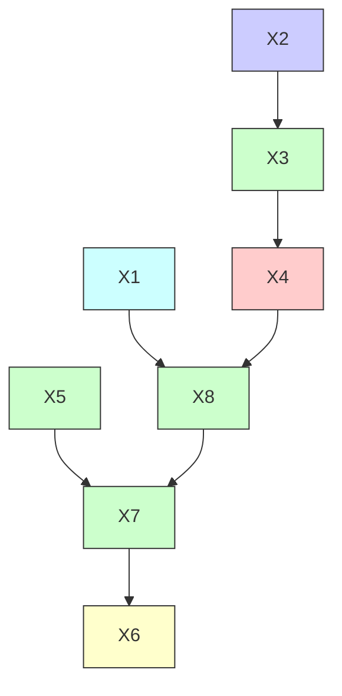
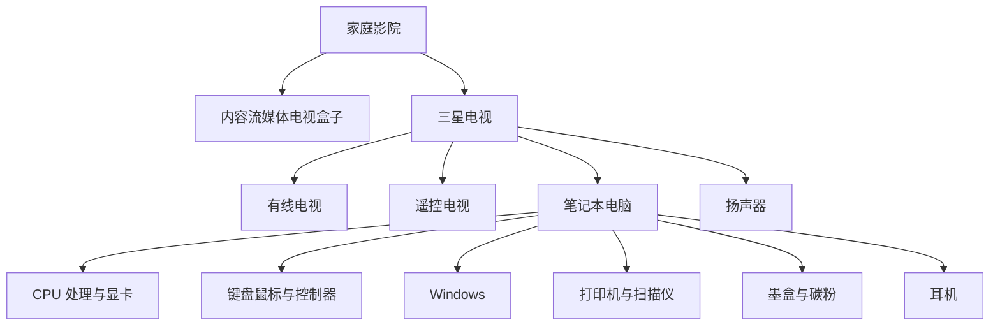
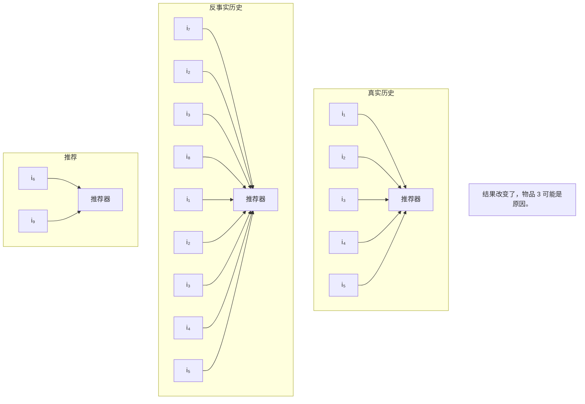
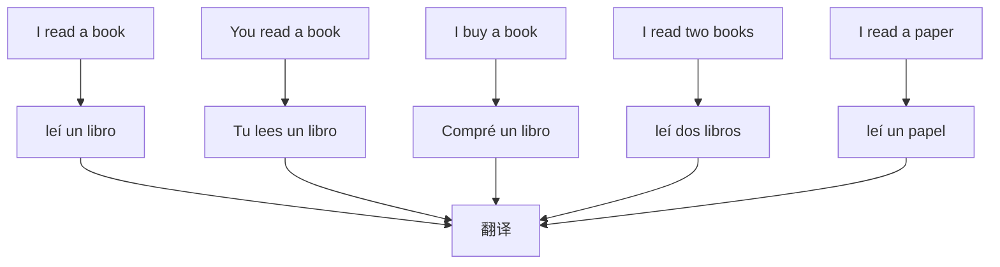
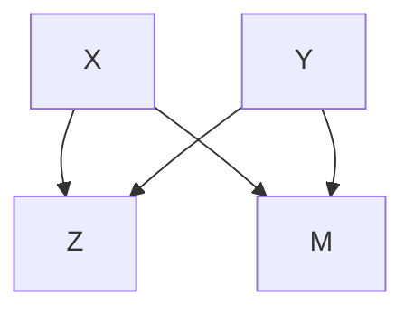

# 第7章 因果可解释人工智能（Causal Explainable AI）

徐舒媛、葛盈强和张永锋

## 7.1 可解释人工智能（Explainable AI）

近年来，人工智能（AI）技术在实际服务中的广泛应用直接或间接地影响了人类。例如，**医疗人工智能（healthcare AI）**可能影响医生的诊断；**AI智能体（AI agents）**可能决定谁获得工作或贷款；自动驾驶汽车也在某些地区向公众开放。在不同的AI技术中，**深度学习（deep learning）**显著提升了AI应用在各个领域的性能。然而，作为当今最成功的AI模型，深度学习算法源于"**黑箱模型（black box models）**"，使得理解为何做出某个预测变得困难。随着AI驱动应用越来越多地融入我们的日常生活，特别是在医疗AI和自动驾驶等风险敏感领域，对**可信赖性（trustworthiness）**的需求已经出现，并日益受到研究人员和工业从业者的关注。以人类可理解的方式生成**解释（explanations）**是满足这一需求的绝佳选择。因此，开发**可解释人工智能（Explainable AI, XAI）**是重要且紧迫的。

一般来说，XAI的正式定义由David Gunning [19]给出如下：

> XAI将创建一套机器学习技术，使人类用户能够理解、适当信任并有效管理新兴一代人工智能伙伴。

此外，XAI在许多方面对多个利益相关者具有优势和益处。我们在图7.1中展示了一些示例。这些益处包括但不限于以下内容：

包含各种电子元件的开放外壳和一个高亮显示的绿色元件（无可见文本或符号）

(a)

一个人滑板的特写，可见轮子和脚，无文本或符号

图7.1 带解释的示例。(a) 这是来自SIXray数据集 [26] 的安全检查X射线图像。系统将提醒安保人员检查行李，通过红色边界框中提供的解释，安保人员可以快速识别违禁物品，并进一步提高对系统的信任。(b) 这是一张滑板图像。图像分类器可能正确地将此图像识别为滑板，但没有解释，底层推理过程的正确性不得而知。例如，如果解释是红色边界框，则分类器极有可能基于正确的推理过程。相反，如果解释是黄色区域，则分类器受到上下文偏差（滑板常与人类脚部同时出现）的严重影响，这可以帮助研究人员改进算法。

• **解释**可以帮助受AI影响的用户理解决策。例如，在医疗AI中，带有解释的诊断将帮助医生决定是否接受诊断，并帮助患者理解诊断是如何做出的。
• 解释可能帮助受AI影响的用户识别未来改进的方向。例如，如果求职者被AI系统拒绝，解释将帮助求职者发现不足并加以改进，以便在未来更好地求职。
• 解释将提高应用所有者的用户满意度和可信赖性。提供带有解释的决策将增强用户信任和用户满意度，从长远来看可能增加利润。
• 解释可用于检测用户、工业从业者、研究人员和政府监管机构的伦理问题。例如，如果某个决策的解释与某些敏感属性相关，那么AI模型可能是不公平的。
• 解释可以帮助研究人员和工业从业者检测、修复错误并识别性能问题，以加速开发步伐。

从技术上讲，可解释人工智能可以是**模型内在（model-intrinsic）**或**模型无关（model-agnostic）**的 [43]。前者旨在开发一个**可解释模型（interpretable model）**，其决策过程是透明的，解释与生成的决策一起提供。模型内在方法的示例包括决策树、线性回归、基于规则的模型、注意力网络等。后者，也称为**事后解释方法（post-hoc explanation approaches）**，旨在设计一个单独的解释模型，在"黑箱"决策模型做出决策后生成解释 [33, 35]。模型无关方法的示例包括局部解释、特征可视化、基于示例的解释等。这两种方法的直觉对应于人类认知心理学 [43]。模型内在方法类似于通过仔细、理性的推理做出决策的情况，推理过程解释了为何做出特定决策。模型无关方法对应于某人先做出决策，然后寻求解释作为支持其决策的证据的情况。

可解释人工智能的最终目标是以人类能够理解的方式生成解释。在人类理解方面，有两件事需要澄清。第一是解释的范围，第二是用于解释的数据类型及其显示方式。就解释的范围而言，生成的解释可以是**局部的（local）**或**全局的（global）**。局部可解释模型旨在为数据集中的每个个体生成解释。例如，给定一张图像和一个分类器，局部可解释方法将提供解释该特定图像分类结果的信息。另一方面，全局可解释方法将模型视为一个整体，为模型生成解释，这些解释独立于任何特定输入。

关于用于解释的信息和解释的显示方式，生成的解释可能包括但不限于以下内容：

• **文本解释（Text explanations）**：可解释模型从文本信息生成文本解释，以解释模型获得的结果。文本解释通常以句子形式显示，可以是**基于模板的（template-based）**或**基于生成的（generation-based）**。基于模板的解释首先定义一些用于解释的句子模板，然后用不同的词语填充模板。基于生成的解释基于自然语言生成技术，无需预定义模板即可直接生成用于解释的句子。
• **视觉解释（Visual explanations）**：视觉解释使用视觉信息来解释模型结果。例如，可以是一张带有高亮区域的图像，其中高亮区域就是解释。
• **基于实体的解释（Explanations by entity）**：可以使用现有实体来解释决策。实体包括但不限于用户、物品、词语、节点、边、图等。实体的具体定义基于模型场景。例如，在推荐系统中，推荐物品可以通过相关用户或物品来解释；在图神经网络（Graph Neural Networks, GNN）中，结果可以通过相关节点或边来解释。
• **基于特征的解释（Explanations by feature）**：一些可解释方法使用特征作为解释。通过识别对结果贡献最大的特征，这些识别的特征可以被视为预测结果的主要原因。
• **基于示例的解释（Explanations by examples）**：正如心理学领域所证明的 [1]，用经验和示例解释复杂概念是一种有前景的方法。为了解释模型做出的决策，一些可解释方法从数据集中选择特定示例或生成一个示例作为解释。

大多数机器学习技术依赖于在数据中寻找与某些结果相关的模式。然而，这些模式不一定反映**因果关系（causal relationships）**，仅仅依赖**相关性学习（correlative learning）**可能使得解释为何特定模型做出某些预测变得不可靠。因此，从纯相关性学习生成的解释可能包括一些基于常识难以解释的相关性。相反，因果关系涉及一个事件导致另一个事件发生，并且可以更容易地使用常识来理解和解释。因此，考虑使用基于**因果学习（causal learning）**的技术来解决可解释性问题非常重要。因果学习可以帮助为机器学习模型提供更易理解和透明的解释。

在本章中，我们将主要讨论由因果可解释方法生成的**因果解释（causal explanations）**。我们将介绍如何使用**因果推断（causal inference）**来设计可解释模型，并详细介绍几种用于AI中各种任务的因果可解释方法。

## 7.2 因果解释（Causal Explanations）

在本节中，我们首先简要概述因果解释，然后介绍一些用于设计因果可解释模型的技术。

### 7.2.1 相关性 vs. 因果关系（Correlation vs. Causality）

为了说明相关性和因果关系在可解释性方面的差异，考虑以下示例：有数据显示冰淇淋消费与鲨鱼袭击次数相关 [20]。具体来说，冰淇淋消费和鲨鱼袭击具有相同的趋势（即两个事件的发生同时增加或减少）。纯相关性学习可能发现冰淇淋消费与鲨鱼袭击之间存在强相关关系，这可能会正确预测事件的发生。然而，这种关系根据常识是无法解释的。无法解释冰淇淋消费导致鲨鱼袭击（或反之亦然）。相反，可能存在一个潜在的因果机制在起作用，例如冰淇淋消费和鲨鱼袭击都在较温暖的月份增加，因为此时有更多人在海滩上享受并吃冰淇淋 [20]。这凸显了在AI中考虑因果解释的重要性，因为它们可以提供对不同事件之间关系更易理解和透明的理解。

**观测数据 图7.2 因果发现算法将观测数据作为输入并返回一个因果图**

| $X_1$ | $X_2$ | $\cdots$ | $X_d$ |
|-------|-------|----------|-------|
| $x_1^1$ | $x_2^1$ | $\cdots$ | $x_d^1$ |
| $\vdots$ | $\vdots$ | $\ddots$ | $\vdots$ |
| $x_1^n$ | $x_2^n$ | $\cdots$ | $x_d^n$ |

### 7.2.2 因果可解释方法（Causal Explainable Methods）

如前所述，可解释模型可以是**模型内在**或**模型无关**的 [43]。类似地，设计因果可解释模型主要有两种方式，一种用于模型内在方法，另一种用于模型无关方法。更具体地说，模型内在方法基于**因果发现（causal discovery）**的思想，模型无关方法基于**反事实（counterfactual）**的思想。我们将分别简要介绍这两种方法，并提供几个详细示例。

#### 7.2.2.1 因果发现（Causal Discovery）

**因果发现（Causal discovery）**旨在基于观测数据（一些工作也包括干预数据 [6, 24]）提取变量之间的因果关系。提取的因果关系通常用**因果图（causal graph）**表示，通常定义为**有向无环图（Directed Acyclic Graph, DAG）**，其中每个节点代表数据中的一个随机变量，每条有向边代表一个因果关系 [17]。假设观测数据中有 $d$ 个随机变量 $(X_1, X_2, \cdots, X_d)$，并且 $((x_1^i, x_2^i, \cdots, x_d^i)_{i=1}^n)$ 是观测值。因果发现算法旨在将观测数据作为输入，并返回一个因果图，表示变量之间提取的因果关系 [23]。

因果发现算法能够揭示驱动系统的底层机制，并基于这种理解进行预测。此外，由于预测是通过在图上的推理进行的，因此可以同时获得解释。我们在图7.3中展示了一个假设的因果模型作为示例。

<!-- 脚注 -->
- Y. Wu (-)
- 克莱姆森大学（Clemson University），南卡罗来纳州克莱姆森，美国
- 电子邮箱：yongkaw@clemson.edu
- L. Zhang · X. Wu
- 阿肯色大学（University of Arkansas），阿肯色州费耶特维尔，美国
- 电子邮箱：lz006@uark.edu；xintaowu@uark.edu
<!-- 脚注结束 -->

<!-- 脚注 -->
- S. Xu · Y. Ge · Y. Zhang (-)
- 罗格斯大学（Rutgers University），新泽西州新不伦瑞克，美国
- 电子邮箱：shuyuan.xu@rutgers.edu；yingqiang.ge@rutgers.edu；yongfeng.zhang@rutgers.edu
<!-- 脚注结束 -->

**图7.3 预测肺病的假设因果模型**

图7.3中的假设因果模型用于预测矿工患肺病的可能性。预测过程是通过图进行推理，而推理过程就是预测的解释。如果模型预测一个没有任何遗传风险因素或吸烟习惯的工人可能患肺病，那么对此预测的解释可能是矿井工作环境灰尘污染严重，增加了患肺病的概率。

粗略地说，因果发现方法可以大致分为三类 [16]：(1) **基于约束的（constraint-based）**，(2) **基于得分的（score-based）**，以及(3) **基于函数模型的（functional model based）**。我们分别介绍如下：

• **基于约束的方法（Constraint-based approaches）**：大多数基于约束的方法旨在构建一个满足经验联合分布中一组条件独立性的图 [36]。由于通常有多个图满足给定的一组条件独立性，基于约束的方法通常输出一个表示**马尔可夫等价类（Markov Equivalence Class）**的图。一些代表性算法包括PC [32]、FCI [32] 等。
• **基于得分的方法（Score-based approaches）**：基于得分的方法通常定义一个**评分函数（scoring function）**来测试候选图的有效性，并旨在找到得分最高的图。因此目标可以表示为 [30]：

$$
\hat {\mathcal {G}} = \operatorname{argmax} _ {\mathcal {G} \text {   over   } \mathbf {X}} S (\mathcal {D}, \mathcal {G}) \tag {7.1}
$$

其中 $\mathcal{D}$ 表示具有变量 $\mathbf{X}$ 的经验数据，$S$ 是定义的评分函数，$\mathcal{G}$ 表示候选图。一些代表性方法包括GES [8]、BC [3] 等。

• **基于函数模型的方法（Functional model-based approaches）**：基于函数模型的方法涉及关于结构方程的额外假设，以找到最符合观测数据的因果图。例如，假设结构方程是线性的且带有高斯噪声 [16]。

最近，一些因果发现方法利用机器学习技术设计了**可微分框架（differentiable framework）** [45]，利用了现代基于梯度的优化。假设有 $d$ 个变量 $\mathbf{X} = (X_1, \cdots, X_d)$，遵循基于函数模型的方法，我们将因果图 $\mathcal{G}$ 的结构方程表示为加权邻接矩阵 $W \in \mathbb{R}^{d \times d}$。给定损失函数 $\mathcal{L}(W; \mathcal{D})$，我们寻求求解：

$$
\min _ {W \in \mathbb {R} ^ {d \times d}} \mathcal {L} (W; \mathcal {D}) \tag {7.2}
$$

$$
\begin{array} { r l } { \mathrm { s . t . } } & { { } \mathcal { G } ( W ) \in \mathrm { D A G s } } \end{array}
$$

尽管损失函数 $\mathcal{L}(W; \mathcal{D})$ 是连续且可微的，但约束条件 $\mathcal{G}(W) \in \mathrm{DAGs}$ 仍然是一个挑战。这个挑战可以基于以下定理 [45] 来解决。

**定理7.1** 矩阵 $W \in \mathbb{R}^{d \times d}$ 是DAG当且仅当

$$
h (W) = t r (e ^ {W \odot W}) - d = 0 \tag {7.3}
$$

其中 $\odot$ 是逐元素乘积，$e^{W \odot W}$ 是 $W \odot W$ 的矩阵指数。$h(W)$ 的梯度为：

$$
\nabla h (W) = \left(e ^ {W \odot W}\right) ^ {T} \odot 2 W \tag {7.4}
$$

基于上述定理，式(7.2)中的优化可以重写为：

$$
\min _ {W \in \mathbb {R} ^ {d \times d}} \mathcal {L} (W; \mathcal {D}) \tag {7.5}
$$

$$
\begin{array} { r } { \mathrm { s . t . } \quad h ( W ) = 0 } \end{array}
$$

这可以通过约束优化技术求解，例如**增广拉格朗日方法（augmented Lagrangian method）** [45]。

#### 7.2.2.2 反事实（Counterfactual）

**反事实解释（Counterfactual explanations）**通常由模型无关方法生成，涉及分析在替代情况下会做出什么决策。虽然其他类型的解释可能提供关于模型在观测样本上为何做出决策的见解，但它们未能显示在不同条件下模型的决策将如何变化。用户可能会问"为什么模型做出这个决策而不是另一个？"或"这个特征导致了当前的决策吗？"或"如果情况不同会发生什么？"这些问题无法通过非因果解释来回答，因为非因果可解释模型无法估计当改变输入（例如，改变特征、移除组件等）时模型将如何改变其决策。因此，为了回答这些问题，需要利用**反事实分析（counterfactual analysis）**，它允许分析无法观测的想象世界中的数据，从而能够探索这些类型的问题 [17]。

为了提供一个生动的反事实解释示例，考虑一个被拒绝的贷款申请。其他类型的解释可能仅仅说明申请因信用评分低而被拒绝。相比之下，反事实解释可以提供更多上下文，并建议如果信用评分高50分，申请就会被批准。这种类型的解释提供了对决策过程更具建设性和可操作性的理解，因为它考虑了在替代情况下的决策。这展示了反事实可解释模型如何能够产生更细致和有用的解释。

在设计反事实可解释模型时，应仔细考虑三个关键组成部分。第一个组成部分是**反事实目标（counterfactual target）**，根据不同的任务可能不同。例如，在推荐中，反事实目标可以是用户/物品特征或物品；在图模型中，反事实目标可以是边或节点特征；在自然语言处理（NLP）任务中，反事实目标可以是词语等。

第二个组成部分是如何生成**反事实数据（counterfactual data）**。一旦确定了反事实目标，模型应决定如何生成反事实数据。通常，有三种获取反事实数据的方式：(1) 通过**启发式规则（heuristic rules）**生成，这将预定义一些启发式规则并将其应用于观测数据以生成反事实数据；(2) 通过**模型（model）**生成，这将预训练一个用于反事实生成的模型，并将观测数据作为输入以返回反事实数据；(3) **直接学习（directly learned）**，这将直接学习一些满足某些约束的反事实数据。我们将在后续章节中通过一些示例介绍更多细节。

最后一个组成部分是如何分析**事实数据（factual data）**和反事实数据以生成解释。这个组成部分可以是一个单独的步骤，有时在学习反事实数据的优化过程中完成。此外，反事实解释通常以两种方式呈现：识别最关键组件（即组件可以是特征、边或实体，取决于任务）或提供一个示例作为解释。前者旨在回答诸如"这个组件导致了当前的决策吗"之类的问题，后者旨在回答诸如"为什么模型做出这个决策而不是另一个"之类的问题。

在反事实分析中，一些属性在模型设计期间被考虑或用作评估指标。我们列出其中一些属性如下：

• **稀疏性/大小（Sparsity/Size）**：对原始实例所做的更改应尽可能少且稀疏。换句话说，反事实样本中改变的元素数量应很小。
• **接近性（Proximity）**：反事实样本应尽可能与原始实例相似。否则，反事实解释可能不够令人信服。
• **速度（Speed）**：为了将反事实可解释模型应用于实际应用，反事实解释的生成过程应足够快。
• **多样性（Diversity）**：不同实例的反事实解释应多样化。

在以下章节中，我们将提供几个因果可解释模型的示例，以演示如何生成因果解释。这些示例涵盖了典型的AI任务，包括**推荐系统（Recommender System, RS）**、**自然语言处理（Natural Language Processing, NLP）**、**计算机视觉（Computer Vision, CV）**、**图神经网络（Graph Neural Networks, GNN）**和**公平性（Fairness）**。

## 7.3 因果可解释推荐系统（Causal Explainable Recommender Systems）

**可解释推荐（Explainable recommendation）** [43] 作为可解释人工智能的一个子领域，已经研究了二十多年 [21]。可解释推荐旨在提供解释来说明为什么推荐了某个物品。我们将基于因果发现和反事实介绍一些因果可解释推荐 [38] 的示例。为了更好理解，我们首先定义推荐中的一些基本符号。假设有一个包含 $m$ 个用户的用户集 $\mathcal{U} = \{u_1, u_2, \dots, u_m\}$ 和一个包含 $n$ 个物品的物品集 $\mathcal{V} = \{v_1, v_2, \cdots, v_n\}$。数据包括用户-物品对和可选的用户历史 $\mathcal{D} = \{(u, v, H_u)\}$，其中 $u$ 是用户，$v$ 是物品，$H_u = (h_{u1}, h_{u2}, \cdots, h_{u|H_u|})$ 是用户 $u$ 的用户历史。

## 7.3.1 因果发现（Causal Discovery）

**因果发现方法（Causal discovery methods）**旨在基于数据提取变量间的因果关系。因此，首要任务是定义因果发现方法所学习的因果图中的变量。在推荐系统中，物品数量极其庞大，可能达到数千甚至数百万。因此，直接学习一个物品级别的因果图是不切实际的。此外，由于推荐数据的高度稀疏性，算法可能无法捕获此类底层机制。现有工作提出了基于因果发现的方法，用于在**序列推荐（sequential recommendation）**场景下提取高层次模式上的因果关系以生成解释。例如，Wang 等人 [37] 联合学习了聚类级别的因果图和物品的聚类分配，以进行物品级别的推荐；Xu 等人 [39] 直接使用产品类型（Product Type, PT）信息，并学习一个产品类型级别的因果图以进行产品类型级别的推荐。我们在图 7.4 中提供了一个示例，展示了 [39] 学习到的一些因果关系，这些关系可用于解释产品类型级别的推荐，并进一步指导物品级别的推荐。

图 7.4 [39] 学习到的因果图的一个子图，可用于解释产品类型级别的推荐，并进一步指导物品级别的推荐

**Causer 模型 [37]** 联合学习了聚类级别的因果图和序列推荐模型。为了利用聚类级别的因果图进行物品级别的推荐，Causer 训练了一个聚类分配向量，其中每个元素代表该物品属于某个特定聚类的概率。两个物品之间的因果关系可以通过聚类级别的因果图和这两个物品的聚类分配向量来计算。物品间的因果关系用于屏蔽因果无关的物品，并计算在给定用户 $u$ 的历史 $H _ { u }$ 时推荐某个特定物品 $v$ 的可能性。假设有 $d$ 个聚类，且 $W ^ { c } \in \{ 0 , 1 \} ^ { d \times d }$ 表示聚类级别因果图的邻接矩阵，训练损失由三个损失组成。第一个损失是推荐损失 $\mathcal { L } _ { r }$ ，基于二元交叉熵损失。第二个损失是聚类分配损失 $\mathcal { L } _ { c }$ ，用于衡量物品嵌入与聚类混合体（按聚类分配向量混合）之间的距离。第三个损失是特征重建损失 $\mathcal { L } _ { r e }$ ，期望从物品嵌入中重建物品的原始特征（即物品画像中的信息，例如描述）。该模型通过以下优化进行学习：

$$
\min \quad \mathcal {L} _ {r} + \mathcal {L} _ {c} + \mathcal {L} _ {r e} \tag {7.6}
$$

$$
s. t. \quad t r (e ^ {W ^ {c} \odot W ^ {c}}) - d = 0
$$

对于用户历史中的每个物品，具有最强因果关系的物品被用来解释该推荐。

另一个例子是 **CSL4RS 模型 [39]**，它通过学习一个产品类型级别的因果图来预测下一个交互的产品类型。CSL4RS 将推荐反馈数据视为混合竞争机制的结果，一种是基于用户意图的因果机制，另一种是基于已部署推荐系统的干预机制。推荐系统推荐了一个物品，这可能会改变用户的原始决策。不幸的是，从隐式反馈中无法推断出哪个物品被推荐了，以及推荐是否成功改变了用户的决策。

假设有 $d$ 个产品类型 $\mathcal { S } = \{ p _ { 1 } , p _ { 2 } , \cdots , p _ { d } \}$ ，则将反馈数据转换为产品类型级别 $\mathcal { D } = \{ ( u , p , H _ { u } ) \}$ ，其中 $u$ 是用户，$p$ 是产品类型，$H _ { u } = ( h _ { u 1 } , h _ { u 2 } , \cdot \cdot \cdot , h _ { u | H _ { u } | ) }$ 是用户 $u$ 在产品类型上的历史。因果机制由一个**结构因果模型（structural causal model）**表示，该模型包含一个因果图和一组结构方程 [17]。因果图由一个邻接矩阵 $W \in \{ 0 , 1 \} ^ { d \times d }$ 描述，并带有结构参数 $\Gamma = \left\{ \gamma _ { i j } \right\} _ { i , j = 1 } ^ { d }$ ，其中每个元素 $W _ { i j }$ 独立地从以 $\gamma _ { i j }$ 为参数的伯努利分布中采样（即 $W _ { i j } \sim$ Bernoulli(σ (γij))，其中 $\sigma$ 是 sigmoid 函数。结构方程 $\{ f _ { j } \} _ { j = 1 } ^ { d }$ 通过线性或非线性函数独立地定义。干预机制是已部署的推荐算法。

总之，CSL4RS 模型包含以下组件：

• 因果图 $W _ { i j } \sim$ Bernoulli(σ $( \gamma _ { i j } ) )$ ，简化为 $W \sim \sigma ( \Gamma )$
• 结构方程 $f _ { p } ( H _ { u } \odot W _ { \cdot p } )$ ，其中 $H _ { u } \odot W _ { \cdot p }$ 过滤掉与 $p$ 因果无关的历史。
• 干预机制 $g ( p | H _ { u } )$ ，由序列推荐模型（如 GRU4Rec [22]）参数化。
• 干预指示变量 $R _ { p , H _ { u } }$ ，监督这两个竞争机制，其采样方式为：

$$
P (R _ {p, H _ {u}} = 1) = \Pi_ {i \in H _ {u}} (1 - \sigma (\gamma_ {i p})) \tag {7.7}
$$

我们将其简化为 $R \sim r ( \Gamma )$

该模型旨在最大化数据的似然，计算方式如下：

$$
\mathcal {L} (\mathcal {D}) = \sum_ {(u, p, H _ {u}) \in \mathcal {D}} \mathbb {E} _ {W \sim \sigma (\Gamma), R \sim r (\Gamma)} \log \left[ f _ {p} (H _ {u} \odot W. _ {p}) ^ {1 - R} \cdot g (p | H _ {u}) ^ {R} \right] \tag {7.8}
$$

结合有向无环约束 [6]，学习目标变为：

$$
\max \quad \mathcal {L} (\mathcal {D}) \tag {7.9}
$$

$$
s. t. \quad t r (e ^ {\sigma (\Gamma)}) = d
$$

对于用户历史中的每个产品类型，具有最强因果关系（即 $W _ { i j }$ 最高）的产品类型可以解释该推荐。

## 7.3.2 反事实（Counterfactual）

基于反事实的可解释推荐模型通常是**模型无关（model-agnostic）**的，它们包含与给定推荐模型分离的可解释机制。在本节中，我们介绍两个具有反事实解释的可解释模型。它们针对不同类型的推荐模型设计，以生成不同类型的反事实解释。

Xu 等人 [40] 提出了一个用于序列推荐的物品级别可解释模型，以提取对决策最重要的物品。我们在图 7.5 中展示了一个直观示例。反事实解释的形式如下：“系统推荐了 [物品 A]，因为您与 [物品 B] 交互过。” 我们根据第 7.2.2.2 节中提到的三个关键组件来介绍这项工作。首先，反事实目标是用户历史中的物品。因此，该模型为序列推荐生成物品级别的反事实解释。其次，反事实样本由一个预训练模型生成，该模型是一个**变分自编码器（Variational Auto-Encoder, VAE）**。由于邻近性（proximity）属性，反事实物品序列应与原始物品序列相似。一个训练良好的 VAE 有能力重建物品序列。同时，潜在空间中的变异性为 VAE 提供了生成相似但略有不同的反事实物品序列的潜力。因此，以原始物品序列作为输入，VAE 模型能够在潜在空间中生成具有不同方差的物品序列。给定一个序列推荐模型 $f ( )$ ，原始物品序列和生成的反事实物品序列将配对相应的推荐物品。对于具有原始物品历史 $H _ { u }$ 的用户 $u$ ，推荐物品记为 $y _ { u }$ 。在生成 $k$ 个反事实物品序列及相应的推荐后，对于用户 $u$ 有 $k+1$ 个输入-输出对，即 $( \hat { H } _ { u } ^ { i } , \hat { y } _ { u } ^ { i } ) _ { i = 1 } ^ { k + 1 }$。模型应用逻辑回归（logistic regression）来提取从物品 $i$ 到物品 $j$ 的因果依赖关系 $\theta _ { i j }$。更具体地说，序列-推荐对可以建模如下：

图 7.5 [40] 中物品级别反事实解释的一个直观示例。如果历史的改变导致推荐的改变，那么被改变的物品可能就是解释

$$
P (\hat {y} _ {u} ^ {i} | \hat {H} _ {u} ^ {i}) = \sigma \Big (\sum_ {j = 1} ^ {| \hat {H} _ {u} ^ {i} |} \theta_ {\hat {h} _ {u j} ^ {i}, \hat {y} _ {u} ^ {i}} \cdot \gamma^ {n - j} \Big) \tag {7.10}
$$

其中 $\sigma ( \cdot )$ 是 sigmoid 函数，$\gamma$ 是时间衰减参数。如果具有最高 $\theta _ { * y _ { u } }$ 的物品在原始物品序列中，则该物品就是推荐物品 $y _ { u }$ 的解释；否则，该推荐没有可靠的解释。

Tan 等人 [33] 为基于特征的推荐设计了一个基于特征的可解释模型。我们在图 7.6 中展示了一个直观示例。解释的形式如下：“如果该物品在 [特征 X] 上稍差一些，那么它就不会被推荐。” 反事实目标是推荐物品的物品特征。该模型设计了一个学习优化过程来生成反事实示例和解释。更具体地说，该模型旨在生成有效但简单的解释。我们将物品特征的变化记为 $\Delta$ 作为解释，那么复杂度通过改变的特征数量 $( | | \Delta | | _ { 0 } )$ 和应用的改变量 $( | | \Delta | | _ { 2 } ^ { 2 } )$ 来衡量。值得一提的是，解释复杂度的两个度量分别对应反事实分析中的稀疏性（sparsity）和邻近性（proximity）属性（见第 7.2.2.2 节）。解释 $\Delta$ 的复杂度定义为两个分量的加权和：

$$
C (\Delta) = | | \Delta | | _ {2} ^ {2} + \lambda | | \Delta | | _ {0} \tag {7.11}
$$

解释的有效性定义为变化如何影响推荐结果。对于推荐物品 $v$ ，如果 $\Delta$ 将物品 $v$ 从 Top-K 推荐列表中移除，那么该解释就足够有效。对于一个用户-物品对 $( u , v )$ ，假设 $s _ { u v _ { \Delta } }$ 是变化后的偏好得分，$s _ { u v _ { K + 1 } }$ 是列表中第 $K+1$ 位置物品的偏好得分。那么，可以通过优化以下目标来获得有效且简单的解释：

$$
\min \quad | | \Delta | | _ {2} ^ {2} + \lambda | | \Delta | | _ {0} \tag {7.12}
$$

$$
s. t. \quad s _ {u v _ {\Delta}} \leq s _ {u v _ {K + 1}}
$$

除了这两个分别对物品和特征应用反事实的可解释推荐模型外，还有一些工作将反事实应用于其他目标，例如用户的行为 [15, 35] 等。

## 7.4 因果可解释自然语言处理（Causal Explainable Natural Language Processing）

在本节中，我们将介绍一个为 NLP 序列生成任务提供反事实解释的模型。

Alvarez-Melis 和 Jaakkola [2] 提出了一个基于反事实思想的可解释模型，用于生成由一组输入和输出词元（tokens）组成的解释。我们在图 7.7 中提供了一个机器翻译解释的示例。首先，反事实目标是输入序列中的词元。然后，该模型设计了一个变分自编码器（VAE）来生成与原始序列相似但有可能改变词元或其顺序的反事实输入序列。由于 VAE 在潜在空间中的随机性，可以通过从 VAE 编码器学习的分布中多次采样来获得反事实输入序列。给定在输入域数据上预训练的 VAE 模型和黑盒预测模型，对于一个原始输入-输出对，可以得到 $N$ 个反事实输入-输出对 $\{ ( \tilde { \pmb { x } } _ { i } , \tilde { \pmb { y } } _ { i } ) \} _ { i = 1 } ^ { N }$，这些对与原始输入-输出对相似但略有不同。

图 7.7 使用 [2] 解释机器翻译任务的一个示例。该示例展示了从英语到西班牙语的翻译。第一行是原始句子和原始翻译，其余行是反事实示例，其中红色词元表示与原始句子和翻译相比的变化。输入和输出词元之间的解释由箭头表示

在获得反事实输入-输出对之后，下一步是生成反事实解释。解释生成过程包括两个步骤：一是估计输入和输出词元之间的因果依赖关系，二是基于估计的因果依赖关系选择解释。为了估计因果依赖关系，模型使用逻辑回归。令 $\phi _ { x } ( \tilde { x } ) \in$ $\{ 0 , 1 \} ^ { | x | }$ 为一个二元向量，指示原始输入 $x$ 的词元是否出现在反事实序列 $\tilde { \mathbf { x } }$ 中。对于每个原始输出词元 $y _ { j } \in y$ ，因果依赖关系可以估计如下：

$$
P (y _ {j} \in \tilde {\mathbf {y}} | \tilde {\mathbf {x}}) = \sigma (\boldsymbol {\theta} _ {j} ^ {T} \phi_ {\mathbf {x}} (\tilde {\mathbf {x}})) \tag {7.13}
$$

其中 $\theta _ { j }$ 表示原始输入中所有词元与原始输出中词元 $y _ { j }$ 之间的因果依赖关系。因此，原始输入序列和原始输出序列中所有词元之间的因果依赖关系都被估计出来，这构建了一个稠密的加权二分图。使用 [12] 中的图划分方法来选择因果依赖图的相关组件作为解释。

## 7.5 因果可解释计算机视觉（Causal Explainable Computer Vision）

对于计算机视觉中的因果可解释模型，一种常用的解释风格是**视觉解释（visual explanation）**，可以是图像中的像素区域，甚至是整张图像。在本节中，我们将详细介绍一个用于图像分类任务的反事实可解释模型 [18]。

在某些情况下，我们可能希望解释能够回答诸如“为什么预测结果是 A 而不是 B”这样的问题。通过提供能够回答此类问题的解释，用户可以明确地了解两个决策之间的显著差异，从而获得更好的教育效果。以图 7.8 所示的例子为例，分类器可能将左侧图像识别为哈士奇。鉴于在某些情况下哈士奇和狼可能难以区分，用户可能会好奇为什么这张图像被识别为哈士奇而不是狼。为了提供区分哈士奇和狼的清晰解释，Goyal 等人 [18] 提出了一个模型，该模型修改哈士奇图像，使分类器将其视为狼。反事实解释的一个示例如图 7.8 所示。通过交换哈士奇和狼的眼睛区域（图 7.8 中的红色方形区域），分类器可能会将新的反事实图像识别为狼。解释会是：如果图像像这样修改（即，哈士奇的身体配上狼的眼睛），那么标签将是狼而不是哈士奇。基于这个解释，用户可以识别出哈士奇和狼之间的关键区别在于眼睛。

图 7.8 一个反事实解释 [18] 的例子，用于解释为什么左侧图像被识别为哈士奇而不是狼

更具体地说，考虑一个图像分类器，它接收图像 $\textit { I } \in \textit { I }$ 作为输入，并预测所有类别 $C$ 上的概率 $P ( C | I )$。Goyal 等人 [18] 将分类器分解为两个功能组件，一个用于特征提取（记为 $f$ 函数），另一个用于基于提取的特征做出决策（记为 $g$ 函数）。因此，所有类别标签上的概率可以通过 $P ( C | I ) = g ( f ( I ) )$ 计算。给定一个被分类为 $c$ 的查询图像 $I$ 和一个指定类别 $c ^ { \prime } \left( c ^ { \prime } \neq c \right)$，该模型通过基于原始图像 $I$ 和被分类为 $c ^ { \prime }$ 的图像 $I ^ { \prime }$ 设计一个变换来生成反事实示例 $I ^ { c f }$。更具体地说，变换是在潜在特征空间中执行的。令 $\Delta$ 为特征上的二元掩码向量，反事实图像的特征定义如下：

$$
f (I ^ {*}) = (\mathbf {1} - \Delta) \odot f (I) + \Delta \odot P f (I ^ {\prime}) \tag {7.14}
$$

其中 $\mathbf{1}$ 是全 1 向量，$P$ 是一个用于排列提取特征的置换矩阵。遵循稀疏性原则，反事实解释应以最小的变化被分类为 $c ^ { \prime }$。因此，结合公式 (7.14) 中反事实图像的特征，解释可以通过以下方式学习：

$$
\min _ {\Delta , P} \quad | | \Delta | | _ {1} \tag {7.15}
$$

$$
s. t. \quad c ^ {\prime} = \operatorname{argmax} g ((\mathbf {1} - \Delta) \odot f (I) + \Delta \odot P f (I ^ {\prime}))
$$

## 7.6 因果可解释图神经网络（Causal Explainable Graph Neural Networks）

**图神经网络（Graph Neural Networks, GNNs）** 在结构化数据的机器学习中取得了巨大成功。在本节中，我们将介绍两种现有的用于解释 GNN 决策的工作。通常，GNN 模型将图数据作为输入，并输出相应的决策。更具体地说，图数据通常包含两个元素：一个是**邻接矩阵（adjacency matrix）** $A \in \{ 0 , 1 \} ^ { n \times n }$，它表示以 n 个变量为节点的图结构；另一个是所有变量节点的**特征矩阵（feature matrix）** $\ b X \in \mathbb { R } ^ { n \times r }$，其中 r 表示特征的数量 [34]。我们以图分类任务为例。分类器 f (·) 将图数据 $( A , X )$ 作为输入，并返回类别标签 $c \in C .$ ，如图 7.9a 所示。

含氮和氧原子的杂环化合物的分子结构

含氮和氧原子的杂环化合物的分子结构

(b)

含氮和氧原子的杂环化合物的分子结构

（c)

含氮和氧原子的杂环化合物的分子结构

(d)  
图 7.9 使用 MUTAG 数据集 [10] 中的数据样本，在图分类任务中对 GNN 进行解释的示例，其中 GNN 模型预测一种化合物是否对细菌具有诱变作用。(a) 原始化合物，对细菌有诱变作用。(b) 红色边表示**反事实解释（counterfactual explanation）**。移除红色边将改变结果。(c) 橙色边表示基于**事实推理（factual reasoning）** 生成的解释。保留橙色边不会改变决策。(d) 蓝色边表示基于事实和反事实推理 [34] 生成的解释。由于硝基苯结构是诱变的原因，蓝色边也表示**真实解释（ground-truth explanation）**。

Lucic 等人 [25] 设计了一个 GNN 解释器，用于基于图结构生成反事实解释。更具体地说，该模型旨在寻找图结构上的一个扰动 $\Delta$ ，使得 $A _ { c f } = A + \Delta$ 且 $f ( A , X ) \neq f ( A ^ { c f } , X )$ )。遵循稀疏性和邻近性原则，最优的反事实解释应该是导致不同结果的最小变化 $\Delta ^ { * }$ 。我们在图 7.9b 中提供了一个简单的例子。该模型将图结构上的变化定义为 $\Delta = 1 - M$ ，其中 $\mathbf { 1 } = \{ 1 \} ^ { n \times n }$ 是全 1 矩阵， $M \in \{ 0 , 1 \} ^ { n \times n }$ 是**掩码矩阵（mask matrix）**。因此，反事实图结构通过 $A ^ { c f } = A \odot M$ 获得，其中 ⊙ 是逐元素乘积。因此， $M _ { i j } = 0$ 表示删除边 $( i , j )$ 。可以通过以下优化生成反事实解释：

$$
\min \quad \mathcal {L} = \mathcal {L} _ {\text { pred }} (A, A ^ {c f} | f) + \lambda \mathcal {L} _ {\text { dist }} (A, A ^ {c f} | d) \tag {7.16}
$$

其中 $\mathcal { L } _ { p r e d }$ 鼓励 $f ( A , X ) \neq f ( A ^ { c f } , X )$ ，d 衡量 A 和 $A ^ { c f }$ 之间的距离， $\mathcal { L } _ { d i s t }$ 鼓励对图结构进行小的改动，λ 是权重参数。反事实解释基于 $\Delta$ 展示，即没有 ∆ 中的边，决策将会改变。

基于事实推理的传统可解释模型旨在找到维持原始决策的最小输入集，如图 7.9c 所示，而基于反事实推理的反事实可解释模型旨在找到导致不同决策的最小变化集，如图 7.9b 所示 [34]。Tan 等人 [34] 提出了一种基于事实和反事实推理的可解释模型。我们在图 7.9d 中提供了一个例子。该模型旨在为图结构 A 学习一个边掩码 $M \in \{ 0 , 1 \} ^ { n \times n }$ ，并为节点特征 $X .$ 学习一个特征掩码 $F \in \{ 0 , 1 \} ^ { n \times r }$ 。具有子特征 $X \odot F$ 的子图 A ⊙ M 将被视为数据 (A, X) 决策的解释。

根据 [33]，解释应该是有效且简洁的。有效性可以使用事实推理和反事实推理来衡量。事实推理旨在找到能够产生与原始边和特征相同决策的边和特征子集。假设 $P _ { f } ( c | A , X )$ 表示根据分类器 $f _ { \cdot }$ 将数据 $( A , X )$ 标记为类别 c 的概率，那么事实推理的有效性可以表述如下：

$$
P _ {f} (c | A, X) > P _ {f} (c ^ {*} | A \odot M, X \odot F) \tag {7.17}
$$

其中 $c$ 是原始数据 $( A , X )$ 的预测标签， $c ^ { * }$ 是除 c 外概率最高的标签。类似地，反事实推理旨在移除一组边和特征以改变决策。因此，反事实推理的有效性可以表述如下：

$$
P _ {f} (c | A, X) <   P _ {f} (c ^ {*} | A - A \odot M, X - X \odot F) \tag {7.18}
$$

可以通过优化事实推理和反事实推理来学习有效且简洁的解释：

(7.19)

$$
P _ {f} (c | A, X) <   P _ {f} \left(c ^ {*} \mid A - A \odot M, X - X \odot F\right)
$$

该优化将识别出解释决策所需的最小边和特征集，保留它们将维持原始决策，移除它们将改变决策。

## 7.7 因果可解释公平性（Causal Explainable Fairness）

现有的公平性研究主要集中在公平性评估和公平机器学习模型的开发上 [13]。这些工作通常需要基于专家知识手动识别模型差异的原因，以开发公平模型或强制模型减少某些差异以实现公平。然而，理解和解释不公平的潜在原因也至关重要。在本节中，我们将讨论解释观察到的差异的各种方法。

Zhang 和 Bareinboim [42] 通过不同的反事实效应定义了**歧视机制（discriminatory mechanisms）**，并通过这些机制解释了观察到的决策差异。具体来说，歧视可以大致分为两类：**直接歧视（direct discrimination）** 和**间接歧视（indirect discrimination）** [9]。使用 Pearl [4, 17, 28] 提出的因果语言，直接和间接歧视可以通过因果图中连接敏感特征和结果的不同路径来表达。直接歧视通过从敏感属性 X 到结果 $Y \ ( \mathrm { e . g . } , X  Y$ in Fig. 7.10) 的直接因果路径建模。间接歧视可以进一步细分为两种机制，对应因果图中的两种不同类型的路径：一种是**间接因果歧视（indirect causal discrimination）**，通过从 X 到 Y 的除直接路径外的有向路径捕获（例如，图 7.10 中的 $X \to M \to Y$ ）；另一种是**间接虚假歧视（indirect spurious discrimination）**，通过除直接和间接路径外的其他路径捕获（例如，图 7.10 中的 $X \left. Z \right. Y$ ）。总的来说，从因果图的角度来看，存在三种互斥的歧视机制：直接歧视、间接歧视和**虚假歧视（spurious discrimination）** [5]。

图 7.10 一个因果图示例，其中 X 代表敏感特征，Y 代表结果，M 代表中介变量，Z 代表混杂因子

为了定量检测和区分三种歧视机制，Zhang 和 Bareinboim [42] 受**中介分析（mediation analysis）** [27] 的启发，为每种歧视机制定义了一个反事实效应。我们首先介绍一些符号。根据 [29]，我们交替使用 $P ( y _ { x } )$ 和 $P ( Y ~ = ~ y | d o ( X ~ = ~ x ) )$ 来表示在干预 do $( X = x )$ 下结果 Y 的概率。类似地，我们使用缩写 $P ( y | x )$ 表示条件概率 $P ( Y = y | X = x )$ 。对于中介变量 M，我们将 $M _ { x }$ 表示为在条件 $X = x$ 下自然达到的值。根据 [42]，我们通过敏感属性 $X = x _ { 0 }$ 设定优势组 $\mathcal { G } _ { 0 }$ ，通过 $X = x _ { 1 }$ 设定劣势组 $\mathcal { G } _ { 1 }$ 。

**直接歧视（Direct discrimination）** 定义为基于条件 X x 的干预 $X = x _ { 1 }$ （以 $x _ { 0 }$ 为基线）对 Y 的反事实直接效应 [42]。

$$
D E _ {x _ {0}, x _ {1}} (y | x) = P (y _ {x _ {1}, M _ {x _ {0}}} | x) - P (y _ {x _ {0}} | x) \tag {7.20}
$$

值得一提的是，如果 X 和 Y 之间没有直接路径，那么对于所有 $x , y , x _ { 0 } \neq x _ { 1 }$ ，有 $D E _ { x _ { 0 } , x _ { 1 } } ( y | x ) = 0$ 。

类似地，**间接歧视（Indirect discrimination）** 定义为基于条件 $X = x \ [ 4 2 ]$ 的干预 $X = x _ { 1 }$ （以 $x _ { 0 }$ 为基线）对 Y 的反事实间接效应 [42]。

$$
I E _ {x _ {0}, x _ {1}} (y | x) = P (y _ {x _ {0}, M _ {x _ {1}}} | x) - P (y _ {x _ {0}} | x) \tag {7.21}
$$

可以得出类似的结论：如果 X 和 Y 之间没有间接路径，那么对于所有 $x , y , x _ { 0 } \neq x _ { 1 }$ ，有 $I E _ { x _ { 0 } , x _ { 1 } } ( y | x ) = 0$ 。

**虚假歧视（Spurious discrimination）** 由敏感属性 X 和结果 Y 之间的虚假关联引起，通过事件 $X = x _ { 1 }$ 对 $Y = y$ （以 $x _ { 0 }$ 为基线）的反事实虚假效应捕获 [42]。

$$
S E _ {x _ {0}, x _ {1}} (y) = P \left(y _ {x _ {0}} \mid x _ {1}\right) - P (y \mid x _ {0}) \tag {7.22}
$$

类似地，如果 X 没有连接 Y 的后门路径，那么对于任何 $y , x _ { 0 } \neq x _ { 1 }$ ，有 $S E _ { x _ { 0 } , x _ { 1 } } ( y ) = 0$ 。

**人口统计均等（Demographic parity）** [11, 41] 是检测观察结果中不公平性的一个流行标准，它被定义为事件 $X ~ = ~ x _ { 1 }$ 对 $Y = y$ （以 $x _ { 0 }$ 为基线）的**总变差（total variation）** [42]。

$$
V T _ {x _ {0}, x _ {1}} (y) = P (y \mid x _ {1}) - P (y \mid x _ {0}) \tag {7.23}
$$

根据代表三种歧视机制的三个反事实效应，Zhang 和 Bareinboim [42] 将观察到的不公平性（即总变差）分解为三个定义的反事实效应：

$$
V T _ {x _ {0}, x _ {1}} (y) = S E _ {x _ {0}, x _ {1}} (y) + I E _ {x _ {0}, x _ {1}} (y \mid x _ {0}) - D E _ {x _ {1}, x _ {0}} (y \mid x _ {1}) \tag {7.24}
$$

因此，可以通过识别对总变差贡献最大的歧视机制来解释观察到的不公平性。

除了上述通过歧视机制解释不公平性的例子外，Ge 等人 [13] 提出为模型均等性生成基于特征的解释。具体来说，Ge 等人 [13] 设计了一个特征级别的反事实可解释模型来解释推荐系统中的群体不公平性。以流行度偏差导致的曝光不公平性为例，所提出的模型旨在生成公平性解释，同时考虑公平性与效用的权衡。

假设我们有一个包含 m 个用户的用户集 $\mathcal { U } = \{ u _ { 1 } , u _ { 2 } , \dots , u _ { m } \}$ 和一个包含 n 个物品的物品集 $\mathcal { V } = \{ v _ { 1 } , v _ { 2 } , \boldsymbol { \cdot } \boldsymbol { \cdot } \boldsymbol { \cdot } , v _ { n } \}$ 。根据 [7, 33, 44] 中的相同方法，可以从评论数据中提取出一个**用户-特征注意力矩阵（user-feature attention matrix）** $\mathbf { A } \in \mathbb { R } ^ { m \times r }$ 和一个**物品-特征注意力矩阵（item-feature attention matrix）** $\textbf { B } \in$ $\mathbb { R } ^ { n \times r }$ ，其中 $A _ { u f }$ 表示用户 u 对特征 $f$ 的关注程度， $B _ { v f }$ 表示物品 v 在特征 $f .$ 上的表现如何。对于一个给定的基于特征的推荐模型 $f$ ，它计算用户-物品对 $( u , v )$ 的偏好得分为 $f ( \mathbf { A } _ { u } , \mathbf { B } _ { v } )$ ，为所有用户生成 Top-K 推荐列表 $\mathcal { R } = \{ \mathcal { R } _ { u } \} _ { u \in \mathcal { U } }$ 。给定特定的推荐结果 ${ \mathcal { R } } ,$ ，可以通过将物品分为流行物品 $\mathcal { G } _ { 0 }$ 和**长尾物品（long-tail items）** $\mathcal { G } _ { 1 }$ 来衡量模型差异。具体来说，差异 $\Phi$ 可以通过两组在**人口统计均等（Demographic Parity）** [14, 31] 或 **Exact-K 公平性（Exact-K Fairness）** [14] 方面的差异来衡量。

下一步是生成反事实样本。基本思想是通过最小化差异来发现每个特征上的微小变化 $\Delta$ 。对于某个特征 $f _ { : }$ ，应用扰动 $\Delta$ 将返回一个反事实的用户-特征矩阵 $\mathbf { A } ^ { c f }$ 和一个反事实的物品-特征矩阵 $\mathbf { A } ^ { c f }$ 。使用反事实用户-特征矩阵 $\mathbf { A } ^ { c f }$ 和反事实物品-特征矩阵 $\mathbf { A } ^ { c f }$ 的推荐模型将返回反事实推荐结果 $\mathcal { R } ^ { c f }$ 和反事实差异 $\Phi ^ { c f }$ 。特征 $f$ 的变化可以通过在最小化邻近性的同时最大化差异的减少来学习，如下所示：

$$
\min \quad | | \Phi^ {c f} | | _ {2} ^ {2} + \lambda | | \Delta | | _ {2} \tag {7.25}
$$

其中 λ 是权重参数。

在为每个特征找到 $\Delta$ 之后，最后一步是生成基于特征的反事实解释。该模型根据公平性-效用权衡为每个特征计算一个分数。更具体地说，该分数决定了在保持扰动较小的同时减少差异的能力。最终，得分最高的特征将被选为解释 [13]。

## 7.8 总结（Summary）

在本章中，我们专注于**因果可解释人工智能（causal explainable AI）**。我们首先介绍了**可解释人工智能（Explainable AI, XAI）** 的一般背景，包括提供解释的好处、可解释模型的类别以及解释的展示风格。然后，我们将因果关系纳入可解释人工智能，并介绍了两种常见的因果可解释方法，一种基于因果发现，另一种基于反事实。之后，我们演示了如何将因果可解释方法应用于人工智能中的不同任务，包括推荐、自然语言处理、计算机视觉、图神经网络和公平性。

## 参考文献（References）

1. A. Aamodt, E. Plaza, Case-based reasoning: foundational issues, methodological variations, and system approaches. AI Commun. 7(1), 39–59 (1994)
2. D. Alvarez-Melis, T.S. Jaakkola, A causal framework for ex-plaining the predictions of blackbox sequence-to-sequence models. arXiv preprint arXiv:1707.01943 (2017)
3. O. Banerjee, L. El Ghaoui, A. d’Aspremont, Model selection through sparse maximum likelihood estimation for multivariate Gaussian or binary data. J. Mach. Learn. Res. 9, 485– 516 (2008)
4. E. Bareinboim, J. Pearl, Causal inference and the data-fusion problem. Proc. Natl. Acad. Sci. 113(27), 7345–7352 (2016)
5. S. Barocas, M. Hardt, A. Narayanan, Fairness and Machine Learning: Limitations and Opportunities. http://www.fairmlbook.org (2019)
6. P. Brouillard et al., Differentiable causal discovery from interventional data. Adv. Neural Inf. Process. Syst. 33, 21865–21877 (2020)
7. T. Chen et al., Try this instead: personalized and interpretable substitute recommendation, in Proceedings of the 43rd International ACM SIGIR Conference on Research and Development in Information Retrieval, 2020, pp. 891–900
8. D.M. Chickering, Optimal structure identification with greedy search. J. Mach. Learn. Res. 3, 507–554 (2003). ISSN: 1532-4435. https://doi.org/10.1162/153244303321897717
9. National Research Council et al., Measuring Racial Discrimination, (National Academies Press, Washington, DC 2004)
10. A.K. Debnath et al., Structure-activity relationship of mutagenic aromatic and heteroaromatic nitro compounds. Correlation with molecular orbital energies and hydrophobicity. J. Med. Chem. 34(2), 786–797 (1991)
11. C. Dwork et al., Fairness through awareness, in Proceedings of the 3rd Innovations in Theoretical Computer Science Conference, 2012, pp. 214–226
12. N. Fan, Q.P. Zheng, P.M. Pardalos, Robust optimization of graph partitioning involving interval uncertainty. Theor. Comput. Sci. 447, 53–61 (2012)
13. Y. Ge et al., Explainable fairness in recommendation, in Proceedings of the 45th International ACM SIGIR Conference on Research and Development in Information Retrieval, 2022, pp. 681–691
14. Y. Ge et al., Towards long-term fairness in recommendation, in Proceedings of the 14th ACM International Conference on Web Search and Data Mining, 2021, pp. 445–453
15. A. Ghazimatin et al., PRINCE: provider-side interpretability with counterfactual explanations in recommender systems, in Proceedings of the 13th International Conference on Web Search and Data Mining, 2020, pp. 196–204
16. C. Glymour, K. Zhang, P. Spirtes, Review of causal discovery methods based on graphical models. Front. Gen. 10, 524 (2019)
17. J. Pearl, M. Glymour, N.P. Jewell, Causal Inference in Statistics: A Primer, (Wiley, West Sussex, UK, 2016)
18. Y. Goyal et al., Counterfactual visual explanations, in International Conference on Machine Learning (PMLR, 2019), pp. 2376–2384
19. D. Gunning, Explainable artificial intelligence (XAI). Defense Adv. Res. Projects Agency (DARPA), nd Web 2(2), 1 (2017)
20. P. Haden, Descriptive statistics, in The Cambridge Handbook of Computing Education Research , (Cambridge University Press, New York, NY, 2019), pp. 102–132
21. J.L. Herlocker, J.A. Konstan, J. Riedl, Explaining collaborative filtering recommendations, in Proceedings of the 2000 ACM Conference on Computer Supported Cooperative Work, 2000, pp. 241–250
22. B. Hidasi et al., Session-based recommendations with recurrent neural networks. arXiv preprint arXiv:1511.06939 (2015)
23. X. Huang et al., Causal discovery from incomplete data using an encoder and reinforcement learning. arXiv preprint arXiv:2006.05554 (2020)
24. A. Jaber et al., Causal discovery from soft interventions with unknown targets: characterization and learning. Adv. Neural Inf. Process. Syst. 33, 9551–9561 (2020)
25. A. Lucic et al., Cf-gnnexplainer: counterfactual explanations for graph neural networks, in International Conference on Artificial Intelligence and Statistics (PMLR, 2022), pp. 4499– 4511
26. C. Miao et al., Sixray: a large-scale security inspection x-ray benchmark for prohibited item discovery in overlapping images, in Proceedings of the IEEE/CVF Conference on Computer Vision and Pattern Recognition, 2019, pp. 2119–2128
27. J. Pearl, Direct and Indirect Effects Paper Presented at: Proceedings of the Seventeenth Conference on Uncertainty in Artificial Intelligence (2001)
28. J. Pearl, Causality (Cambridge University Press, 2009)
29. J. Pearl, Causality: Models, Reasoning and Inference, vol. 29, (Springer, Cambridge, UK, 2000)
30. J. Peters, D. Janzing, B. Schölkopf, Elements of CAUSAL Inference: Foundations and Learning Algorithms, (The MIT Press, Cambridge, MA, 2017)
31. A. Singh, T. Joachims, Fairness of exposure in rankings, in Proceedings of the 24th ACM SIGKDD International Conference on Knowledge Discovery & Data Mining, 2018, pp. 2219– 2228
32. P. Spirtes et al., Causation, Prediction, and Search, (MIT Press, Cambridge, MA, 2000)
33. J. Tan et al., Counterfactual explainable recommendation, in Proceedings of the 30th ACM International Conference on Information & Knowledge Management, 2021, pp. 1784–1793
34. J. Tan et al., Learning and evaluating graph neural network explanations based on counterfactual and factual reasoning, in Proceedings of the ACM Web Conference 2022, 2022, pp. 1018–1027
35. K.H. Tran, A. Ghazimatin, R.S. Roy, Counterfactual explanations for neural recommenders, in Proceedings of the 44th International ACM SIGIR Conference on Research and Development in Information Retrieval, 2021, pp. 1627–1631
36. M.J. Vowels, N.C. Camgoz, R. Bowden, D’ya like dags? A survey on structure learning and causal discovery. ACM Comput. Surv. 55(4), 1–36 (2022)
37. Z. Wang et al., Sequential recommendation with causal behavior discovery. arXiv preprint arXiv:2204.00216 (2022)
38. S. Xu et al., Causal inference for recommendation: foundations, methods and applications. arXiv preprint arXiv:2301.04016 (2023)
39. S. Xu et al., Causal structure learning with recommendation system. arXiv preprint arXiv:2210.10256 (2022)
40. S. Xu et al., Learning causal explanations for recommendation, in The 1st International Workshop on Causality in Search and Recommendation, 2021
41. M.B. Zafar et al., Fairness constraints: a flexible approach for fair classification. J. Mach. Learn. Res. 20(1), 2737–2778 (2019)
42. J. Zhang, E. Bareinboim, Fairness in decision-making–the causal explanation formula, in 32nd AAAI Conference on Artificial Intelligence, 2018
43. Y. Zhang, X. Chen et al., Explainable recommendation: a survey and new perspectives. Found. Trends®Inf. Retrieval 14(1), 1–101 (2020)
44. Y. Zhang et al., Explicit factor models for explainable recommendation based on phraselevel sentiment analysis, in Proceedings of the 37th International ACM SIGIR Conference on Research & Development in Information Retrieval, 2014, pp. 83–92
45. X. Zheng et al., Dags with no tears: continuous optimization for structure learning. Adv. Neural Inf. Process. Syst. 31, 9492–9503 (2018)