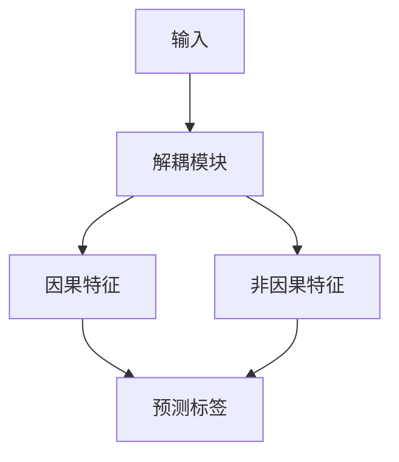

# 第8章 因果域泛化（Causal Domain Generalization）


帕拉斯·谢斯（Paras Sheth）与刘欢（Huan Liu）

## 8.1 引言（Introduction）

近年来，机器学习在我们的生活中变得越来越普遍。从我们口袋里的智能手机到在线收到的推荐，机器学习算法被用于各种场景中的预测和决策 [25]。在商业领域，机器学习用于优化供应链、预测客户行为以及改进营销工作 [11]。在医疗保健领域，它辅助诊断、治疗规划、预测疾病爆发和患者预后 [24]。最后，机器学习还被用于交通运输领域，以改善交通流量并减少事故 [2]。尽管这些模型不可或缺，但它们存在泛化能力差的问题，这意味着它们在与其训练数据略有不同的情况下无法准确进行预测。

机器学习模型存在泛化能力差的问题。这是因为根据机器学习中的**独立同分布（independent and identically distributed, i.i.d）** 假设，训练数据和测试数据是从同一分布中独立抽取的。然而，在许多现实场景中，这一假设可能不成立。例如，假设一个模型是根据特定时期的数据（如某年的股票价格）训练的。如果测试数据来自不同时期，由于底层分布的变化，该模型可能无法很好地泛化。

在关键情况下部署泛化能力差的模型可能会产生错误且有害的结果。例如，假设你正在构建一个机器学习模型，用于根据患者的医疗记录预测其是否患有某种疾病，如图8.1所示。你使用来自某家特定医院的大量医疗记录数据集训练该模型，该模型在预测该医院患者的疾病状态方面表现非常出色。然而，你想将该模型部署到另一家不同的医院，而该医院的数据可能有所不同（例如，患者可能具有不同的人口统计学特征，或者医院可能使用不同的医疗设备）。在这种情况下，直接将基于原医院数据训练的模型应用于新医院的数据可能效果不佳。这是因为模型在训练期间可能没有见过来自新医院的数据，因此无法泛化到这个新的、略有不同的领域。为了解决这个问题，我们需要一个能够泛化到其训练数据之外的特定数据，并适应与之前见过的情况相似但不完全相同的新情况的模型。这就是**域泛化（Domain Generalization）** 发挥作用的地方。通过构建一个能够在各种情况下表现良好的模型，我们可以增加其在现实场景中的灵活性和适用性。


图8.1 从域泛化角度进行疾病预测的任务。机器学习模型首先根据医院A（源域）的患者的医疗记录、人口统计学特征和所使用的设备进行训练。然后，将该模型部署到不同的医院（目标域），即医院B和医院C

现在我们已经理解了什么是域泛化方法及其如何发挥作用，让我们来理解因果关系如何帮助提高泛化能力。对于任何涉及**分布外（Out-Of-Distribution, OOD）** 场景的问题，存在两类特征：**域特定特征（domain-specific features）** 和**域不变特征（domain-invariant features）**。域特定特征对于每个域是特定的，并且可能在不同域之间变化。相比之下，域不变特征是稳定的，并且对于问题具有高度预测性。传统上，机器学习模型倾向于利用域特定特征（因为它们与域内的目标标签具有高相关性），从而在域内实现高精度。然而，过度依赖这些特征会损害模型的泛化能力。因此，为了实现更高的泛化能力，机器学习模型应该致力于识别和学习这些域不变特征，因为它们不受分布偏移的影响。此外，已经充分证实因果关系和不变性是紧密联系的，即因果关系的一个维度就是不变性 [5, 6]。因此，因果关系可以成为捕获数据中存在的不变性的宝贵工具。

根据我们在模型流程中所处的阶段，因果关系可以以不同的方式被利用。因此，**因果感知的域泛化方法（causality-aware domain generalization methods）** 可以分为三类，即：(1) **因果数据增强方法（Causal Data Augmentation methods）**，在预处理阶段使用。这些方法有助于区分虚假特征和因果特征；(2) **因果表示学习方法（Causal Representation Learning methods）**，在表示学习阶段使用。这些方法旨在将输入表示在潜在空间中解耦为因果因素和非因果因素；以及(3) **因果机制方法（Causal Mechanisms methods）**，在分类阶段使用。这些方法侧重于传递因果机制，使得类别条件分布在各个域之间保持不变。

## 8.2 域泛化定义与挑战（Domain Generalization Definition and Challenges）

在讨论上述不同类型的因果域泛化方法之前，让我们正式定义并理解域泛化问题，然后了解域泛化的挑战以及因果关系如何帮助应对这些挑战。

## 8.2.1 定义（Definition）

将 X 视为特征集，Y 视为标签集，D 视为域集，其样本空间分别为 $\chi$、$\mathcal{Y}$ 和 $\mathcal{D}$。一个域被定义为 $\chi \times \mathcal{Y}$ 上的联合分布 $P_{X,Y}$。设 $P_X$ 表示 X 的边缘分布，$P_{X \mid Y}$ 表示给定 Y 条件下 X 的类条件分布，$P_{Y \mid X}$ 表示给定 X 条件下 Y 的后验分布。

域泛化模型的目标是学习一个预测模型 $f : X \to y$。然而，在处理域泛化时，常见的假设意味着训练数据是从可能域 $\mathcal{D}$ 的有限子集 $D_{\mathrm{train}} \subset \mathcal{D}$ 中获得的。此外，训练域的数量由 K 给出，且 $D_{\mathrm{train}} = \{ d_i \}_{i=1}^K \subset \mathcal{D}$。因此，训练数据是从分布 $P[X, Y \mid D = d_i] \forall i \in \{1, ..., K\}$ 中采样的。域泛化模型随后旨在仅利用源（训练）域的数据，以最小化在未见过的目标（测试）域上的预测误差。测试域 $D_{\mathrm{test}}$ 的分布为 $P_{X,Y}^{D_{\mathrm{test}}}$，且 $P_{X,Y}^{D_{\mathrm{test}}} \neq P_{XY}^{(k)}, \forall k \in \{1, \dots, K\}$。理想情况下，目标是学习一个对所有域都最优的分类器。

## 8.2.2 挑战与因果解决方案（Challenges and Causal Solution）

机器学习中的域泛化存在以下挑战：

- **协变量偏移（Covariate shift）**：这指的是训练环境和测试环境之间输入特征分布的差异。因果模型可以通过识别和控制与输入和输出变量相关且可能使模型预测产生偏差的混杂变量，来帮助应对协变量偏移。通过控制这些变量，模型可以更好地解释训练环境和测试环境之间输入分布的差异。

- **概念偏移（Concept shift）**：这指的是训练环境和测试环境之间底层概念或关系的差异。因果模型可以通过显式建模变量之间的底层因果关系（而不仅仅是建模它们之间的统计相关性）来帮助应对概念偏移。这可以使模型对变量之间关系的变化更加鲁棒，并使其能够更好地泛化到新的任务或环境。

- **有限数据（Limited data）**：在许多情况下，可用于域泛化的训练数据可能有限，这使得模型难以学习到鲁棒且可泛化的数据表示。因果模型可以通过利用领域知识来识别关键的因果变量和关系，并使用对数据量不太敏感的更高效的估计方法来提供帮助。

- **过拟合（Overfitting）**：如果模型相对于训练数据量过于复杂或参数过多，它可能会过度拟合特定的训练数据，而无法很好地泛化到测试数据。因果模型可以通过使用更简单、更易解释且不易过拟合的模型，以及使用正则化等方法来防止过拟合，从而帮助应对过拟合的挑战。

- **多任务学习（Multitask learning）**：当处理多个测试任务或环境时，模型可能需要学习一个跨任务共享的联合表示，同时能够适应每个任务的特定特征。因果模型可以帮助识别和建模跨任务共享的常见因果结构。

## 8.3 用于域泛化的因果数据增强（Causal Data Augmentations for Domain Generalization）

本节介绍通过使用**因果数据增强（causal data augmentation）** 来实现域不变性的框架。这些框架使用因果特征，并通过考虑所有潜在的混杂或虚假变量来增强数据。虽然这些方法的最终目标是学习因果表示，但它们的技术（例如识别要增强的特征）遵循因果方法，这使它们被归入一个独立的类别。我们根据所利用的不同数据增强技术对框架进行分类，并理解每种技术如何有助于更好的泛化。

## 8.3.1 基于反事实特征的数据增强（Counterfactual Feature-Based Data Augmentation）

在理解基于反事实特征的数据增强之前，我们首先需要了解什么是数据增强（Data Augmentation），以及它如何帮助提升机器学习模型中的**泛化能力（generalization）**。

数据增强是一种通过以某种方式修改现有训练数据来生成额外的合成训练数据的技术。数据增强旨在提升机器学习模型的泛化性能，即模型对新的、未见过的数据做出准确预测的能力。数据增强有助于提升泛化能力的一种方式是增加训练数据的多样性。当模型在多样化的训练数据上进行训练时，它可以更好地捕捉底层的模式和关系，从而提升其对新的、未见过的数据的泛化能力。数据增强有助于提升泛化能力的另一种方式是，它为模型提供了更多从训练数据中学习的机会。例如，当模型在更大的数据集上进行训练时，它有更多的样本可供学习，这有助于其更好地捕捉数据中的底层模式。此外，通过生成额外的合成训练数据，数据增强可以通过为模型提供更多从训练数据中学习的机会，同时避免记忆特定样本，从而帮助防止**过拟合（overfitting）**。

现在，我们进入基于反事实特征的数据增强。任何输入数据都可以分解为**因果特征（causal features）**和**非因果特征（non-causal features）**。当对非因果特征执行数据增强时，这被称为基于反事实特征的数据增强。让我们通过图 8.2 所示的示例来理解这一点。考虑一个旨在对奶牛和骆驼进行分类的模型。训练数据集包含草地背景上的奶牛图像和沙地背景上的骆驼图像。由于奶牛在草地背景的训练数据中占主导地位，模型可能会将草地背景与奶牛标签关联起来，这是一种**虚假相关性（spurious correlation）**。为了克服这个问题，可以对非因果特征（即背景特征）执行数据增强，以生成不同环境下的奶牛图像。这个过程迫使模型依赖奶牛本身的特征将其与奶牛标签关联起来。这种方法已在各种研究工作中得到应用。这些工作利用各种工具将输入解耦为因果特征和非因果特征。例如，文献 [31] 的作者旨在提升人体姿态检测的泛化能力。为此，他们利用基于**生成对抗网络（GAN-based）**的架构，从真实姿态和随机噪声中学习反事实的分布。他们还利用输入图像上的特征提取器编码器来获取观测到的特征表示分布。最后，将反事实表示和观测表示输入预测器，以确保较高的预测能力。由于反事实表示代表了因果特征（即姿态），预测器借助 $l1$ 距离来最小化观测表示与反事实表示之间的距离。模型通过以下所示的总体目标函数进行训练：


```mermaid
graph LR
  A["训练数据"] --> B["模型"]
  B --> C["测试数据"]
  C --> D["性能下降"]
  E["训练数据"] + F["基于反事实特征的增强数据"] --> G["模型"]
  G --> H["测试数据"]
  H --> I["性能提升"]
```

**图 8.2** 当模型在草地背景上的奶牛图像上进行训练，并在太空背景上的奶牛图像上进行评估时，其性能会下降。然而，当我们生成基于反事实特征的增强数据并在训练过程中使用它们，然后再评估太空背景上的奶牛图像时，性能会得到提升。

$$
\min _ {\theta_ {f}, \theta_ {h}} \mathbb {E} _ {(x, y, u) \sim (p (x), p (y), p (u)} \mathcal {L} _ {F} (h (f (x)), y) + \tag {8.1}
$$

$$
\lambda_ {1} \mathcal {L} _ {C F} (h (g (u, y)), y) + \lambda_ {2} \mathcal {L} _ {\mathrm{dist}} (f (x), g (u, y)),
$$

其中 $\mathcal { L } _ { F }$ 和 $\mathcal { L } _ { C F }$ 分别表示观测表示和反事实表示上的预测损失，$f$ 和 $g$ 表示表示层，$\lambda _ { 1 }$ 和 $\lambda _ { 2 }$ 是超参数。感兴趣的读者可以参考文献 [8, 20, 23, 31]，以更好地理解如何在不同的实际问题中利用不同的工具来执行基于反事实特征的数据增强。

## 8.3.2 基于梯度的数据增强（Gradient-Based Data Augmentation）

另一种用于**域泛化（domain generalization）**的数据增强技术是基于梯度的数据增强。基于梯度的数据增强是一种通过从现有数据点生成新数据点来人为增加数据集大小的技术。这是通过对原始数据点施加小的扰动，并利用机器学习模型的梯度来指导这些扰动来实现的。该技术使用模型的梯度来创建与原始数据点相似但略有不同的新数据点。这可以通过提供与训练集中样本相似但并非完全相同的新样本，来帮助提升模型的泛化性能。

要实现基于梯度的数据增强，您必须在一个数据集上训练一个机器学习模型。然后，您可以使用模型的梯度，通过沿着会增加模型损失的方向扰动原始数据点来生成新的数据点。这可以通过计算模型损失相对于输入数据的梯度，并使用这些梯度来更新数据点以增加损失来实现。

例如，假设您有一个训练用于对动物图像进行分类的机器学习模型。您可以使用基于梯度的数据增强，通过对原始图像施加小的扰动，并利用模型的梯度来指导这些扰动，从而生成新的动物图像。这可以帮助模型学习识别处于各种姿态、光照条件和背景下的动物，从而提升其泛化性能。文献 [4] 的作者利用基于梯度的数据增强来提升模型的鲁棒性和泛化能力。该方法背后的基本思想是将模型的特征表示分解为多个组成部分，并使用**语义增强（semantic augmentation）**来为每个组成部分丰富额外的信息。这是通过生成与原始数据相似但经过扰动以增加模型损失的合成数据点来实现的。作者使用一个称为“语义增强”的过程来生成合成数据点。这包括计算模型损失相对于输入数据的梯度，并使用这些梯度来更新数据点以增加损失。然后，将生成的合成数据点用于扩充训练集，这可以帮助模型学习更鲁棒和更通用的特征。语义数据增强是通过对原始样本的上下文相关特征的特征空间进行对抗性扰动来执行的，如下所示：

$$
z _ {i} ^ {c} = z _ {i} ^ {c} + \alpha_ {i} \cdot \epsilon \cdot \frac {\left. \nabla_ {z _ {i} ^ {c}} \left(l \left(h _ {\theta_ {c}}\right) \left(z _ {i} ^ {c} , c _ {i}\right)\right)\right)}{\left\| \nabla_ {z _ {i} ^ {c}} \left(l \left(h _ {\theta_ {c}}\right) \left(z _ {i} ^ {c} , c _ {i}\right)\right)\right) \|}, \tag {8.2}
$$

其中 $z _ { i } ^ { c }$ 是上下文特征表示，$h _ { \theta _ { c } }$ 是上下文特征判别器，$\epsilon$ 是一个控制增强向量最大长度的超参数，$\alpha _ { i }$ 是从 0, 1 中随机采样的。这项工作并非旨在生成反事实以提升泛化能力；相反，他们对解耦后的上下文特征执行基于梯度的增强，以消除各种泛化任务中的分布偏移。

## 8.4 用于域泛化的因果表示（Causal Representations for Domain Generalization）

**因果表示（Causal representation）**旨在捕获一个域的底层因果结构。换句话说，它们旨在以一种反映变量之间相互因果影响的方式来表示不同变量之间的关系。因果表示的一个潜在应用是在域泛化领域。通过表示一个域的因果结构，可能可以构建对数据分布变化更鲁棒的机器学习模型，并且能够更有效地泛化到不同的域。

有多种学习因果表示的方法，包括基于**图模型（graphical models）**和**结构方程模型（Structural Equation Models, SEMs）**的技术。这些方法通常依赖于关于域中因果关系结构的假设。它们可以估计不同变量之间关系的强度和方向。首先，让我们了解图模型。**图形因果模型（Graphical causal models）**是一种表示系统中变量之间因果关系的图模型。与**结构因果模型（Structural Causal Models, SCMs）**一样，它们可以以一种允许跨不同域实例进行泛化的方式来表示一个域（例如，特定的科学或社会系统）中变量之间的关系。

在用于域泛化的因果表示背景下，图形因果模型可以以一种允许我们预测对系统的干预或操作效果的方式来表示变量之间的关系。例如，假设我们有一个由感兴趣的人群组成的域，我们希望了解他们的饮食、锻炼习惯和健康结果之间的关系。我们可以使用图形因果模型来表示这些变量之间的因果关系，从而让我们能够泛化饮食和锻炼习惯如何影响该人群的健康结果。

图形因果模型通常包括表示不同感兴趣属性或结果的变量，以及表示变量之间因果关系的**有向边（directed edges）**。例如，可能存在一条从饮食到健康结果的边，表明饮食的变化会导致健康结果的变化；以及一条从锻炼习惯到健康结果的边，表明锻炼习惯的变化也会导致健康结果的变化。

通过表示变量之间的因果关系，我们可以使用图形因果模型来预测对系统的干预或操作的效果，例如，改变人们的饮食或锻炼习惯可能会如何影响他们的健康结果。此外，这使我们能够泛化域中变量之间的关系，这有助于我们理解和预测在不同域实例中干预的效果。

类似地，**结构方程模型（Structural equation models, SEMs）**代表了一类用于表示和检验关于**潜变量（latent variables）**（未观测变量）与**观测变量（observed variables）**之间关系的假设的统计模型。SEMs 可以表示变量之间的直接和间接关系，并且通常用于检验涉及多条因果路径的复杂理论。

SEMs 的一个关键特性是，它们允许研究人员指定一组变量之间的关系，这些关系可以使用来自样本的数据进行检验。这使得研究人员能够严格且客观地检验他们关于变量之间关系的假设，并估计这些关系的强度和显著性。

SEMs 对于研究域泛化特别有用，因为它们允许研究人员检验其理论在不同域或上下文中的可泛化性。例如，研究教育与收入之间关系的研究人员可能会使用 SEM 来检验其理论是否适用于不同的国家或地区。这可以帮助研究人员识别特定于某个域或上下文的任何因素，并相应地调整他们的理论。

既然我们已经了解了图形模型和结构方程模型（SEMs），接下来我们将探讨不同的方法如何旨在从观测数据中学习因果表示。一种广泛用于区分因果因素和非因果因素的方法是**解耦（disentanglement）**。为了更好泛化而进行解耦的最简单情况如图 8.3 所示，其中输入被分解为因果特征和非因果特征，并且仅利用因果特征来预测特定的下游任务。考虑解耦的研究工作可以进一步分为两部分：那些假设潜因子之间没有因果交互作用的解耦，以及那些考虑潜因子之间具有因果交互作用的解耦。在本节中，我们将讨论这些不同的类别。




**图 8.3** 输入被分解为因果因素和非因果因素。仅利用因果因素来预测输出。这导致学习到的因果表示能够更好地泛化到未见过的域。

## 8.4.1 假设潜因子之间无因果交互作用的解耦（Disentanglement Assuming No Causal Interactions Among the Latent Factors）

解耦有助于在因果表示的背景下研究域泛化。它允许研究人员隔离那些在不同域或上下文中驱动观测变量变化的特定潜因子。通过假设潜因子之间不存在因果交互作用，研究人员可以在没有其他潜因子干扰的情况下，孤立地研究潜变量和观测变量之间的关系。

例如，研究教育与收入之间关系的研究人员可能会使用解耦来识别在不同国家或地区驱动收入变化的特定潜因子。这可以帮助研究人员识别特定于某个域或上下文的因素，并相应地调整他们的理论。在域泛化中，有几种方法可以将输入解耦为因果因素和非因果因素，前提是假设潜因子之间不存在因果交互作用。其中一些方法包括：

• **变分自编码器（Variational Autoencoders, VAEs）**：VAEs 是一种神经网络，通过学习从一组潜变量重构数据来学习输入数据的紧凑表示。可以通过对潜空间施加约束（例如，强制潜变量之间的独立性）来训练 VAEs 将输入解耦为因果因素和非因果因素。
• **对抗训练（Adversarial Training）**：对抗训练涉及训练一个模型生成与真实数据无法区分的样本，同时训练另一个模型区分真实样本和生成样本。可以通过对潜空间施加约束（例如，强制潜变量之间的独立性）来将输入解耦为因果因素和非因果因素。
• **信息论方法（Information Theoretic Approaches）**：信息论方法，例如**互信息最大化（mutual information maximization）**，可以通过测量变量之间的统计依赖程度来识别变量之间的因果关系。此外，这些方法可以通过识别与观测变量相关性最强的变量，来将输入解耦为因果因素和非因果因素。

此外，解耦可以在两种设置下实现。第一种是研究人员可以访问辅助变量以帮助解耦。例如，当模型可以访问给定图像中背景的标签时，它可以轻松地将物体（因果特征）与背景（非因果特征）解耦。相比之下，很多时候这些辅助变量不可用，因此解耦是在没有它们的情况下进行的。

## 8.4.1.1 存在辅助变量时的解耦（Disentanglement When Auxiliary Variables Are Available）

**辅助变量（Auxiliary variables）**可以成为在表示学习中帮助解耦过程的有价值工具，特别是在图像分类等任务中，其中多个数据源可能会发生变化。此外，这些变量可以提供关于潜变量和观测变量之间关系的额外线索，这有助于区分因果特征和非因果特征。

例如，在图像分类任务中，辅助变量可能包括关于所描绘物体的额外线索，例如其形状或颜色。这些变量可以指导预测过程，并帮助模型关注物体的潜在核心（因果）特征，而不是潜在的风格（非因果）特征。例如，文献 [13, 19, 28] 的作者提出了利用辅助变量将因果特征与非因果特征分开，并相应地学习表示的方法。

在分组观测（同一物体出现在多种情境中）的情况下，文献 [13] 的作者提出了一种方法，该方法根据类别和 ID 对观测进行分组，并在以这些变量为条件时惩罚预测或损失的条件方差。他们认为这种**条件方差正则化（Conditional Variance Regularization, CoRe）**可以防止风格变量分布的变化，并表明它可以提高在图像质量、亮度和颜色等域发生变化的情况下的预测准确性。因此，如果 $F _ { 0 }$ 表示训练分布中 $\left( \mathrm { I D } , Y , X ^ { \mathrm { s t y l e } } \right)$ 的联合分布，那么对 $X ^ { \mathrm { s t y l e } }$ 进行干预会产生一个新的由 $F$ 表示的 (ID $\gamma , \tilde { X } ^ { \mathrm { s t y l e } }$ ) 的联合分布。因此，我们得到以下分布类：

$$
\mathcal {F} _ {\xi} = \{F: D _ {\text { style }} (F _ {0}, F) \leq \xi \}, \tag {8.3}
$$

其中 $D _ { \mathrm { s t y l e } } ~ ( F _ { 0 } , F )$ 是两个分布之间的距离。主要目标是在这个分布类上优化最坏情况损失。这个损失可以表述为：

$$
L _ {\xi} (\theta) = \sup _ {F \in \mathcal {F} _ {\xi}} E _ {F} [ \ell (Y, f _ {\theta} (X)) ]. \tag {8.4}
$$

最小化这个损失可以保证准确的预测，即使在风格特征的条件分布发生显著变化时也能表现良好。CoRe 不是对所有示例进行池化，而是利用 ID 变量来惩罚损失函数。总体目标函数由下式给出：

$$
\hat {\theta} ^ {\text { core }} (\lambda) = \operatorname{argmin} _ {\theta} \hat {E} [ \ell (Y, f _ {\theta} (X)) ] + \lambda \cdot \hat {C} _ {\theta}, \tag {8.5}
$$

其中 $\hat { C } _ { \theta }$ 是如下形式的条件方差惩罚项：

$$
\hat {C} _ {f, \nu , \theta} := \hat {E} [ \widehat {\operatorname{Var}} (f _ {\theta} (X) \mid Y, \mathrm{ID}) ^ {\nu} ], \tag {8.6}
$$

其中 $f _ { \theta } ( X )$ 是输入 X 的表示，Y 是图像标签，ID 是标识符标签或物体标签，$\nu \in \{ 1 / 2 , 1 \}$。其他一些工作，如 [19, 28]，扩展或改进了 CoRe 方法，或者使用了正则化约束 [14]。

## 8.4.1.2 不存在辅助变量时的解耦（Disentanglement When Auxiliary Variables Are Unavailable）

尽管辅助变量有助于因果解耦，但这些变量并不总是容易获得。在这些情况下，识别和分离驱动分类任务的不同类型的潜特征变得更加困难。因此，一系列研究集中在开发无需辅助变量即可解耦这些特征的方法。这些方法可能依赖于其他技术，例如对数据施加某些结构假设，或使用**对比学习（contrastive learning）**来帮助解耦 [7]，使用诸如通过分布匹配来保证不变性的正则化器 [9]，以及将不变表示描述为对域变量没有完全因果影响的表示。

对比学习是一种机器学习方法，旨在存在多个域但缺少辅助变量的情况下解耦因果特征和非因果特征。它通过假设来自同一域的实例的非因果特征表示是相似的来实现这一点。通过引导机器学习模型学习非因果表示，我们可以通过学习与非因果表示正交的表示来学习因果表示。在这种设置下，目标函数通常表示为分类损失和对比损失的组合，如下所示：

$$
\mathcal {L} = \mathcal {L} ^ {\text { cls }} + \mathcal {L} ^ {\text { con }}, \tag {8.7}
$$

其中 $\mathcal { L } ^ { c l s }$ 表示分类损失，$\mathcal { L } ^ { c o n }$ 表示对比损失。${ \mathcal { L } } ^ { c o n }$ 被公式化为：

$$
\mathcal {L} _ {i, j} ^ {\text { con }} = - \log \frac {\exp (\text { sim } (z _ {i} , z _ {j}) / \tau)}{\sum_ {k = 1} ^ {2 N} \exp (\text { sim } (z _ {i} , z _ {k}) / \tau)}, \tag {8.8}
$$

其中 $\tau$ 是温度归一化因子，sim 是相似度函数。这里的直觉是，我们希望相似的表示 $z _ { i }$ 和 $z _ { j }$ 彼此接近，而不相似的表示 $z _ { i }$ 和 $z _ { k }$ 则更远。最近的一些工作，如 [7]，利用这一假设来识别因果特征。分类损失旨在利用因果因素的表示来预测图像标签。通过最小化对比损失，我们可以鼓励机器学习模型为来自不同域的实例学习更具区分性和可分离性的表示，这有助于解耦因果特征和非因果特征。

## 8.4.2 假设潜在因子间存在因果交互的解耦（Disentanglement Assuming Causal Interactions Among the Latent Factors）

在本节中，我们将理解那些假设**潜在因子（latent factors）**（即因果因子和非因果因子）之间存在因果交互的方法。这些工作中的许多都假设非因果特征充当**混杂因子（confounding factors）**，并尝试使用**前门准则（front-door criterion）**或**后门准则（back-door criterion）**来减轻混杂偏差并提高泛化能力。例如，假设我们有一个机器学习模型，用于根据年龄、BMI 和血压预测一个人患糖尿病的概率。在这种情况下，年龄、BMI 和血压是预测变量，而患糖尿病的概率是结果变量。假设我们想用这个模型来预测不同人群中的糖尿病概率。在这种情况下，我们希望确保模型能够很好地泛化到新的人群。

确保这一点的一种方法是使用前门准则。该准则指出，我们应该调整所有直接受预测变量影响且与结果变量相关的变量。在我们的案例中，这意味着要调整饮食、体力活动和遗传等变量，这些变量直接受年龄、BMI 和血压影响，并且也与糖尿病的概率相关。从数学上讲，假设我们有一个**处理变量（treatment variable）** $T$ ，一个**结果变量（outcome variable）** Y ，以及一个**混杂变量（confounding variable）** $C$ 。那么，可以通过使用以下方程在控制 $C$ 的同时估计 $T$ 对 Y 的影响来应用前门准则：

$$
\frac {\mathrm{P} (Y | d o (T))}{\mathrm{P} (Y | d o (T) , C)} = \frac {\mathrm{P} (Y | T , C)}{\mathrm{P} (Y | C)}, \tag {8.9}
$$

其中 $d o ( T )$ 表示对 T 的**干预（intervention）**。等式的左边代表 T 对 Y 的因果效应，而右边代表在控制混杂变量 C 的情况下观察到的 T 和 Y 之间的关联。通过比较这两个量，我们可以调整 C 的混杂效应，并估计 $T$ 对 Y 的真实因果效应。最近的工作 [16] 提出了一种无需识别混杂因子即可减轻混杂偏差的方法。利用前门准则，该技术模拟了不同样本之间的干预，这涉及优化实例级干预上的全局范围干预影响。这是首次通过考虑样本间的干预，将前门准则用于学习因果视觉线索。该方法的目标是在无法识别混杂因子的情况下解决混杂偏差问题。

另一方面，后门准则指出，我们应该调整所有直接受预测变量影响的变量，无论它们是否与结果变量相关。在我们的案例中，这意味着要调整饮食和体力活动等变量，这些变量直接受年龄、BMI 和血压影响，即使它们与患糖尿病的概率没有直接关联。为了从数学上说明后门调整的概念，考虑一个包含三个变量的研究：处理变量 T 、结果变量 Y 和混杂变量 C。目标是估计处理对结果的因果效应，即 $P ( Y | d o ( T ) )$ ，其中 $d o ( T )$ 表示对处理进行了干预。我们可以使用以下公式估计因果效应：

$$
P (Y | d o (T)) = \sum_ {C} P (Y | T, C) P (C | d o (T)). \tag {8.10}
$$

该公式指出，处理对结果的因果效应可以通过对混杂变量的所有可能取值求和，并乘以在给定处理和混杂变量下结果的概率，以及在给定干预处理下混杂变量的概率来计算。为了使用后门变量调整混杂因子，我们可以将它们添加到公式中，如下所示：

$$
P (Y | d o (T)) = \sum_ {C} P (Y | T, C, Z) P (C | d o (T), Z), \tag {8.11}
$$

其中 Z 代表后门变量集。诸如 [32] 等研究提出了**多域解耦对抗神经网络（Multi-Domain Disentangled Adversarial Neural Networks, MDANN）**，以从各种数据集中学习两个编码器，一个用于嵌入**身份特定的潜在变量（identity-specific latent variables）**，另一个用于嵌入**域特定的潜在变量（domain-specific latent variables）**。对抗学习原则从嵌入的身份特定表示中消除与域相关的信息，反之亦然。作者引入了一个**后门调整模块（backdoor adjustment block, BA）**，该模块使用身份特定和域特定的表示来逼近期望的输出。目标函数是 BA 和分类损失的组合。

总的来说，**因果表示（causal representations）**为提高机器学习模型的泛化性能提供了一种有前景的方法，并有可能实现更稳健、更灵活的模型，使其能够适应新的领域和任务。

## 8.5 领域泛化的因果机制（Causal Mechanisms for Domain Generalization）

我们已经了解了**因果数据增强（causal data augmentation）**和**因果表示（causal representations）**如何提高泛化性能。除了这两种方式，研究人员还利用学习或迁移**因果机制（causal mechanisms）**来实现更好的泛化。在此背景下，“因果机制”指的是负责数据中输入和输出之间关系的潜在过程或机制。这些机制在不同领域中是稳定且一致的，可用于做出能很好泛化到新领域的预测。

让我们通过一个例子来理解这一点。假设你正在训练一个机器学习模型，根据年龄、性别和病史来预测患者患上某种特定疾病的概率。你有一个来自特定医院的大型医疗记录数据集，用于训练模型。你希望该模型能够泛化到其他医院，即使这些医院的数据具有略微不同的分布和变化。

实现这一点的一种方法是专注于学习或迁移负责患者年龄、性别、病史与其患病概率之间关系的因果机制。例如，这些因果机制可能包括患者对该疾病的家族史、生活习惯和整体健康状况等因素。此外，这些机制很可能在不同医院之间是稳定且一致的，因此可用于做出能很好泛化到新医院的预测。

为了实现这一点，模型必须学会从输入中提取捕捉这些因果机制的**不变特征（invariant features）**（或预测变量）。例如，模型可能学会提取患者对该疾病的家族史、生活习惯和整体健康状况等特征。然后，这些不变特征可用于预测患者患病的概率，该预测在不同医院之间是稳健且准确的。

这就引出了一个问题：学习因果机制与学习用于领域泛化的因果表示有何不同？学习用于领域泛化的因果机制涉及获取关于一个领域中变量之间关系潜在原因的知识，并利用这些知识对其他领域进行预测。例如，假设你了解了控制特定类型机械系统行为的因果机制。那么，你就可以利用这些知识来预测其他机械系统的行为。

另一方面，学习用于领域泛化的因果表示涉及学习一种数据表示，该表示捕捉了该领域潜在的因果结构。这可以通过将学习到的表示迁移到新领域并利用它进行预测，来对其他领域进行预测。

学习用于领域泛化的因果机制的一个例子是，一个学生学习汽车发动机机械原理。然后，他们可以利用这些知识来预测其他发动机（如飞机发动机）的行为方式。

学习用于领域泛化的因果表示的一个例子是，一个机器学习模型在包含特定地区天气信息的数据集上进行训练。该模型学习了一种数据表示，该表示捕捉了温度、湿度和大气压力等变量之间潜在的因果关系。然后，这种表示可以通过将学习到的表示迁移到新领域来预测其他地区的天气。

## 8.5.1 不变风险最小化（IRM）及其扩展（IRM and Its Extensions）

利用因果机制进行领域泛化的开创性工作之一是**不变风险最小化（Invariant Risk Minimization, IRM）** [3]。不变风险最小化（IRM）是一个从多个任务或分布中学习的框架，它最大化模型对未见任务或分布的泛化能力。它通过使用因果机制来识别跨任务不变的因子，并将这些不变因子提炼到一个单独的模型中来实现这一点。

IRM 背后的基本思想是找到一个模型，该模型对跨任务变化的因子保持不变，同时仍然能够准确预测这些任务的结果。这是通过在一组任务上最小化**风险（risk）**（即期望预测误差）来实现的，同时模型必须对某些因子保持不变。例如，以下方程给出了 IRM 的目标函数：

$$
\min _ {f \in \mathcal {F}} \sum_ {i = 1} ^ {n} \sum_ {j = 1} ^ {m} w _ {i, j} \mathcal {L} (f (x _ {i, j}), y _ {i, j}), \tag {8.12}
$$

其中 $f$ 是模型，$\mathcal { F }$ 是所有模型的集合，n 是任务数量，m 是每个任务中的样本数量，$w _ { i , j }$ 是分配给第 i 个任务中第 j 个样本的权重，$x _ { i , j }$ 是输入，$y _ { i , j }$ 是第 i 个任务中第 j 个样本的标签。

模型必须对某些因子保持不变的约束是通过在目标函数中添加一个正则化项来实现的：

$$
\min _ {f \in \mathcal {F}} \sum_ {i = 1} ^ {n} \sum_ {j = 1} ^ {m} w _ {i, j} \mathcal {L} (f (x _ {i, j}), y _ {i, j}) + \lambda R (f), \tag {8.13}
$$

其中 $R ( f )$ 是衡量模型偏离不变性的正则化项，λ 是控制正则化强度的超参数。正则化项的具体形式取决于被设为不变的因子。例如，如果目标是使模型对任务身份（即正在执行的特定任务）保持不变，则正则化项可以表示为：

$$
R (f) = \frac {1}{n (n - 1)} \sum_ {i = 1} ^ {n} \sum_ {j = 1} ^ {n} [ f (x _ {i, j}) \neq f (x _ {j, i}) ], \tag {8.14}
$$

其中是指示函数。这个正则化项鼓励模型对来自不同任务但具有相同输入的样本做出相同的预测（即，实现任务不变性）。

总的来说，IRM 框架允许识别和提炼跨任务的不变因子，这可以提高模型对未见任务的泛化能力。一系列工作旨在改进和扩展 IRM 框架以实现更好的泛化 [1, 12, 15, 17]。

## 8.5.2 利用辅助函数建模条件分布（Utilizing Auxiliary Functions to Model Conditional Distributions）

各种工作利用辅助函数来建模条件分布并学习因果机制。例如，[22] 的作者提出了一种方法，通过明确纳入**独立因果机制（Independent Causal Mechanisms, ICM）**的假设，来学习更稳健、不易受分布偏移影响的模型。作者将因果机制定义为在给定特定原因下产生一个结果的过程。他们认为，独立因果机制的假设可用于学习更稳健的模型，因为它允许模型解开导致结果的各种因素。

为了学习满足独立因果机制假设的模型，作者提出优化以下目标函数：

$$
\min _ {f \in F} \mathbb {E} _ {(x, y) \sim D} \left[ \frac {1}{2} (y - f (x)) ^ {2} + \lambda R (f) \right], \tag {8.15}
$$

其中 F 是所有满足独立因果机制假设的函数的集合，D 是训练数据分布，f 是正在学习的模型，y 是目标变量，x 是输入。$\lambda R ( f )$ 是一个正则化项，鼓励模型满足独立因果机制的假设，λ 是控制正则化强度的超参数。

## 8.5.3 基于图准则的方法（Graphical Criterion-Based Methods）

基于图准则的学习因果机制的方法涉及使用**图模型（graphical models）**，如**贝叶斯网络（Bayesian networks）**，来表示和学习系统中不同变量之间的关系。这些方法包括学习图模型的结构以及基于数据估计模型的参数。

学习用于领域泛化的因果机制的一种方法是使用编码了独立因果机制假设的图模型。这意味着图模型应该以一种将导致结果的因素分离开的方式来表示变量之间的关系。例如，在贝叶斯网络中，独立因果机制将通过具有有向无环结构的图来假设。对结果有贡献的变量通过有向边连接到结果变量，但它们之间没有连接。

可以使用基于评分的方法来学习满足独立因果机制假设的图模型。目标是找到最大化某个评分函数的图模型，该评分函数衡量模型对数据的拟合程度。例如，一个这样的评分函数是给定模型下数据的对数似然，它衡量了数据在模型下的概率。或者，可以使用基于约束的方法，其目标是找到满足一组约束（例如独立因果机制假设）的图模型。

一旦学习了图模型，就可以用它来根据系统中其他变量的值预测结果变量。这可以通过使用图模型的结构和参数进行推理来实现，例如，在给定其他变量值的情况下，计算结果变量的后验分布。例如，[27] 的作者认为，在处理诸如像素建模等感知层数据时，将问题建模得类似于人类感知是有益的；即，标签 Y 的因果因子通过机制 $f _ { y }$ 与未观察到的抽象 S 相关，使得 $Y \gets f _ { y } \left( S , \varepsilon _ { y } \right)$ ，其中 ε 是噪声项。同时，潜在变量 $Z$ 和变量 S 通过机制 $f _ { x }$ 生成输入图像 X，使得 $X  f _ { x } ( S , Z , \varepsilon _ { x } )$ 。在这种情况下，当允许变量 Z 与变量 S 虚假相关时，就会发生域偏移。例如，在处理图像分类问题时，背景特征可以被归类为 $Z ,$ ，而对象相关的抽象概念，如形状，可以被归类为 S。作者将这些信息封装在一组因果模型中。他们认为，生成机制 $f _ { x }$ 和 $f _ { y }$ 在不同领域之间是不变的。同时，允许 $Z$ 和 S 之间的虚假关系发生变化。从数学上讲，**因果不变性（Causal Invariance）**指的是 $P ( Y \mid d o ( s ) )$ 和 $P ( X \mid d o ( s ) , d o ( z ) )$ 对跨域偏移保持稳定的条件。作者最终重新表述了**变分贝叶斯方法（Variational Bayesian method）**，以在训练期间估计因果不变性，并在测试期间对其进行优化。

## 8.5.4 基于核的优化方法（Kernel-Based Optimization Methods）

基于核的优化方法是机器学习算法，它们将**核函数（kernel function）**应用于输入数据，以将其映射到更高维的空间，在那里可以更容易地将其分离成不同的类别。这些方法通常用于分类、回归和聚类任务。

在学习或迁移用于领域泛化的因果机制时，基于核的方法可以识别数据中指示潜在因果关系的模式。例如，假设我们有兴趣了解一个人的饮食与其患糖尿病风险之间的关系。我们可以使用基于核的方法来分析来自一组源域（例如，具有不同饮食模式的不同人群）的数据，并识别与糖尿病风险增加相关的数据模式。这些模式可能包括诸如一个人消费的食物类型、进食频率以及整体饮食平衡等因素。

通过学习这些模式，基于核的方法可以构建一个模型，该模型可用于在新的、未见过的领域中对一个人的饮食与其患糖尿病风险之间的因果关系进行预测。这意味着“迁移因果机制”——模型已经学习了指示潜在因果关系的模式，并可以利用这些知识在新领域进行预测。

需要注意的是，虽然基于核的优化方法可用于学习数据中指示因果关系的模式，但它们无法直接识别因果机制。因此，可能需要将基于核的方法与其他技术相结合，才能真正理解一个关系背后的因果机制。[21] 的作者利用基于核的优化技术来学习因果机制以实现更好的泛化。作者认为，在给定输入 X 的情况下，标签 Y 的条件分布是稳定的。然而，边际分布，即 P (X)，可能会平滑波动。由于这种波动，机器学习模型可能会遭受**模型设定错误（model misspecification）**，即模型未能考虑其应涵盖的所有因素。作者提出了**域不变成分分析（Domain-Invariant Component Analysis, DICA）**来缓解这个问题。DICA 旨在找到数据变换，以最小化不同域边际分布之间的差异，同时保持稳定的条件分布 $P ( Y \mid X )$ 。他们引入了一种领域泛化方法，通过最小化域之间的不相似性，学习输入和输出之间的跨域不变变换。这项工作旨在找到满足以下两个属性的变换：(1) 最小化通过此变换变换后的样本分布之间的距离，以及 (2) 学习到的输入和输出之间的变换在不同域之间保持不变。为此，定义了一个基于核的优化目标：

$$
\max _ {B \in \mathbb {R} ^ {N} \times M} \frac {\frac {1}{n} \operatorname{Tr} \left(B ^ {T} L (L + n \epsilon I _ {n}) ^ {- 1} K ^ {2} B \right.}{\operatorname{Tr} \left(B ^ {T} K Q K B + B K B\right)}, \tag {8.16}
$$

其中 K 和 Q 分别是块核矩阵和系数矩阵，B 是满足这两个期望属性的估计量。

## 8.6 图中的因果域泛化（Causal Domain Generalization in Graphs）

前文讨论的大多数工作都聚焦于视觉领域。尽管其他领域也属于类似的范畴，但本节将讨论**图中的因果域泛化（Causal Domain Generalization in Graphs）**及其与其他领域的差异。

图数据与视觉数据在底层结构及所含信息类型上有所不同。图数据通常由节点和边组成，表示节点之间的关系或交互。相比之下，视觉数据由图像或视频组成，表示像素值的数组。

针对图数据的因果域泛化方法与针对视觉数据的方法之间的一个关键区别在于需要考虑的依赖关系类型。对于图数据，依赖关系通常更复杂且非线性，因为它们涉及多个节点及其特征之间的交互。相比之下，视觉数据中的依赖关系通常更直接，可以通过线性变换来捕获。这意味着，与用于视觉数据的方法相比，处理图数据中虚假相关性的方法可能需要更复杂，并考虑更复杂的依赖关系。

另一个区别是这两个领域为因果域泛化所开发的技术类型不同。例如，针对图数据的因果域泛化技术可能涉及学习数据的因果表示，或使用因果模型生成合成样本以进行数据增强。相比之下，针对视觉数据的因果域泛化技术可能涉及使用**对抗训练（adversarial training）**或**域自适应（domain adaptation）**技术来学习更鲁棒的数据表示。

现在，我们了解了图数据的因果域泛化方法与其他领域的不同之处，接下来讨论一些最先进的方法。文献 [18] 的作者提出了一种方法，通过识别和利用“**依据子图（rationale subgraphs）**”来提高应用于图数据的机器学习模型的泛化能力。依据子图是图中用于预测最相关的部分，而其余部分被视为“**环境子图（environment subgraphs）**”。

为了识别依据子图，作者使用**图神经网络（Graph Neural Network, GNN）**学习节点表示，并使用**多层感知机（Multilayer Perceptron, MLP）**将这些表示映射到一个掩码向量 $\mathbf { m } \in ( 0 , 1 ) ^ { N }$ ，其中 N 是图中的节点数，$\mathbf { m } _ { v }$ 是节点 v 被分类到依据子图的概率。这被公式化为 $\begin{array} { r } { { \bf m } = \sigma \left( { \bf M } { \bf L } { \bf P } _ { 1 } \left( { \bf G } { \bf N } { \bf N } _ { 1 } ( g ) \right) \right) } \end{array}$ ，其中 $\sigma$ 是 **sigmoid 函数（sigmoid function）**。

一旦识别出依据子图和环境子图，作者提出了两种用于预测的增强策略。第一种策略将每个依据子图与多个环境子图组合以生成增强样本。预测使用聚合器函数 AGG 和一个 MLP 进行，如下所示：

$$
\hat {y} _ {(i, j)} = \mathrm{MLP} _ {2} \left(\operatorname{AGG} \left(\mathbf {h} _ {i} ^ {(r)}, \mathbf {h} _ {j} ^ {(e)}\right)\right), \tag {8.17}
$$

其中 $\mathbf { h } _ { ( i , j ) } ~ = ~ \mathbf { h } _ { i } ^ { ( r ) } + \mathbf { h } _ { j } ^ { ( e ) }$ 是增强样本的表示，${ \bf h } _ { i } ^ { ( r ) } , { \bf h } _ { j } ^ { ( e ) } \in \mathbb { R } ^ { d }$ 分别是依据子图和环境子图的表示。

第二种策略涉及仅使用依据子图进行预测，如下所示：

$$
\hat {y} _ {i} ^ {(r)} = \mathrm{MLP} _ {2} \left(\mathbf {h} _ {i} ^ {(r)}\right). \tag {8.18}
$$

作者认为，这些增强策略可以帮助模型学习更鲁棒、更具泛化能力的数据表示，从而提高在**分布外（Out-Of-Distribution, OOD）**场景中的性能。文献 [26] 的作者也提出学习图数据的因果表示以提高泛化能力。该方法使用**因果注意力（causal attention）**，这是一种关注图中节点间因果关系的注意力机制，以学习更鲁棒和可解释的数据表示。作者认为，传统的注意力机制关注节点特征和图结构，容易过拟合且缺乏可解释性。相比之下，因果注意力机制可以捕获数据的底层因果结构，并为模型的预测提供更可解释的解释。感兴趣的读者可以参考 [25] 了解更多关于图的因果感知域泛化方法的工作。

## 8.7 自然语言处理中的因果域泛化（Causal Domain Generalization in Natural Language Processing）

随着大型预训练模型的进步，**自然语言处理（Natural Language Processing, NLP）**模型在现实世界的多个应用中取得了广泛成功。然而，这些模型对域外样本很脆弱。一系列工作展示了语言模型如何依赖虚假相关性进行分类。例如，文献 [29] 的作者表明，像 Spielberg 这样的词与正面电影评论相关。

尽管已经提出了因果感知模型来提高 NLP 模型的泛化能力，但我们首先区分 NLP 中的域泛化与图或视觉领域有何不同。在自然语言处理（NLP）领域，因果感知的域泛化方法在几个关键方面与视觉或图等其他领域使用的方法不同。

首先，NLP 模型必须考虑词语及其含义之间复杂、微妙的关系，以准确理解和解释语言。相比之下，视觉模型主要关注识别图像中的模式和特征，而图模型则关注网络中节点和边之间的关系。

其次，NLP 模型通常依赖大量标注数据来有效学习和泛化。这包括书面文本和口语，需要考虑口音、语调和停顿等额外因素。相比之下，视觉模型通常可以在相对少量的数据上进行训练，侧重于识别模式和特征，而非理解复杂关系。图模型通常也需要较少的数据，因为它们主要关注节点之间的关系，而非理解这些节点的内容。

最后，NLP 模型必须处理人类语言的变异性和复杂性，包括广泛的习语、口语和文化参照。相比之下，视觉模型通常处理相对直接的模式和特征，而图模型则关注节点之间的关系而非这些节点的内容。

总体而言，NLP 领域的因果感知域泛化方法必须考虑词语及其含义之间的复杂关系，需要大量的标注数据，并且能够处理人类语言的变异性和复杂性。现在，我们理解了 NLP 模型中域泛化的必要性，接下来讨论各种最先进的方法。

文献 [30] 的作者提出了一种方法来识别和消除文本分类模型中的虚假相关性，以提高鲁棒性和泛化能力。作者通过生成和分析**反事实样本（counterfactual examples）**来实现这一点，这些样本是原始输入的修改版本，保留了文本的含义，但导致模型产生不同的预测。

为了生成反事实样本，作者提出了以下优化问题：

$$
x ^ {\prime} = \arg \min _ {x ^ {\prime}} | | x - x ^ {\prime} | | \quad \text { s.t. } \quad f (x) \neq f (x ^ {\prime}), \tag {8.19}
$$

其中 $x$ 是原始输入，$x ^ { \prime }$ 是扰动后的输入。目标是找到最接近原始输入 x 但仍导致模型 $f$ 产生不同预测的扰动输入 $x ^ { \prime }$。为了将扰动限制在输入中的某个词子集，作者使用了一个二值掩码 m，并将优化问题重写如下：

$$
x ^ {\prime} = \arg \min _ {x ^ {\prime}} | | x \odot (1 - m) - x ^ {\prime} \odot (1 - m) | | \quad \text { s.t. } \quad f (x) \neq f (x ^ {\prime}), \tag {8.20}
$$

其中 $\odot$ 是逐元素乘积。为了学习最小化原始样本和扰动样本之间性能差异的二值掩码 m，作者提出了以下优化问题：

$$
m ^ {*} = \arg \min _ {m} L (f (x), y) - L (f (x \odot (1 - m)), y), \tag {8.21}
$$

其中 L 是损失函数，y 是目标标签。为了识别导致虚假相关性的特定词或短语，作者迭代地从输入中移除每个词，并测量性能的变化。类似地，文献 [10] 的作者提出利用**对比学习（contrastive learning）**来学习因果表示，以获得更好的泛化能力。作者旨在利用对比学习增强因果特征的表示。所提出的模型 $C ^ { 2 } L$ 首先基于归因分数识别因果标记。形式上，为了识别重要标记，作者如下利用归因分数：

$$
g _ {i} = \left\| \nabla_ {\mathbf {w} _ {i} ^ {p}} \mathcal {L} _ {\text {task}} (x, y; \phi) \right\| ^ {2}, \tag {8.22}
$$

其中 x 表示输入，y 表示标签，$g _ { i }$ 表示从分类器 $f _ { \phi }$ 计算出的梯度幅度，$\mathcal { L } _ { \mathrm { t a s k } }$ 表示**交叉熵损失（cross-entropy loss）**。标记 w 的基于梯度的分数在所有包含该标记 w 的训练文本上聚合。在获得每个标记的分数后，作者采用因果验证技术来识别因果标记。这一步的主要直觉是，如果被掩码的文本可以重构为多个不同类别的样本，那么我们可以判定被掩码的术语具有因果效应。为此，作者使用带有 dropout 机制的 BERT 来识别标记 w 的 top-k 替代项。然后，这 k 个候选词通过分类器以获得预测标签 $\hat { y }$。通过测试这 k 个标签是否均匀分布在各个类别中，我们可以判定高归因标记 w 对其任务标签 $y$ 具有因果性。最后，作者利用对比学习更好地学习分类任务的因果结构。在获得因果特征后，作者生成形式为 $( x , x ^ { + } , x ^ { - } )$ 的因果三元组。$x ^ { - }$ 表示通过掩码掉因果词生成的反事实对。相比之下，$x ^ { + }$ 表示通过掩码一个仍被识别为原始标签 $y$ 的非因果词生成的事实对，这有助于学习对这些特征不变的模型。对比目标旨在将 x 的表示映射得更接近 $x ^ { + }$，并更远离 $x ^ { - }$。该目标由下式给出：

$$
\mathcal {L} _ {c} (x; \theta) = \max \left(0, \Delta_ {m} + \frac {1}{J} \sum_ {j = 1} ^ {J} s _ {\theta} \left(x, x _ {j} ^ {+}\right) - \frac {1}{J} \sum_ {j = 1} ^ {J} s _ {\theta} (x, x _ {j} ^ {-})\right), \tag {8.23}
$$

其中 J 是正/负对的数量，$\Delta _ { m }$ 是边际值，$s _ { \theta } ( \cdot , \cdot )$ 是表示之间的距离。最终的目标函数由下式给出：$\mathcal { L } =$ $\mathcal { L } _ { \mathrm { t a s k } } + \lambda \mathcal { L } _ { c }$ ，其中 λ 是对比目标的平衡系数。

## 8.8 总结（Summary）

**域泛化（Domain generalization）**涉及机器学习模型对来自与训练数据不同分布的未见数据做出预测的能力。这在现实世界应用中很重要，因为数据分布在不同的上下文中可能有显著差异。本章从因果关系的角度全面概述了域泛化的方法。

对于任何处理**分布外（Out-Of-Distribution, OOD）**场景的监督学习问题，数据的特征可以大致分为两类，即**域特定特征（domain-specific features）**和**域不变特征（domain-invariant features）**。域特定特征在不同域之间变化，或者说，往往在域内与目标标签有很强的相关性，但在域外相关性较差。相比之下，域不变特征更稳定，并且对问题具有高度预测能力。此外，无论域如何，这些特征都与目标标签强相关。因此，要使机器学习模型具有高泛化能力，模型需要学习并识别域不变特征。此外，由于因果关系和不变性紧密相连，我们将在本章讨论如何利用因果关系进行域泛化，并研究因果感知的域泛化方法。

我们根据这些方法在机器学习流程中的应用将其分为三大类：**因果数据增强方法（causal data augmentation methods）**、**因果表示学习方法（causal representation learning approaches）**和**因果机制学习算法（causal mechanisms learning algorithms）**。因果数据增强方法应用于预处理数据阶段。它们涉及向训练数据添加合成样本，以提高模型对新域的泛化能力。这些方法可以细分为子类别：基于反事实特征的数据增强和基于梯度的数据增强。

**不变因果表示学习方法（Invariant causal representation learning approaches）**在表示学习阶段执行，旨在学习对数据底层因果结构不变的表示。这些方法可以细分为子类别：假设潜在因素间无因果交互的**解耦表示学习（disentangled representation learning）**，以及假设潜在因素间存在因果交互的解耦表示学习。

**不变因果机制学习算法（Invariant causal mechanism learning algorithms）**应用于分类器层面，涉及学习对数据底层因果机制不变的分类器。这些方法可以进一步细分为子类别：**不变风险最小化（Invariant Risk Minimization, IRM）**及其扩展、利用辅助函数建模条件分布的方法、基于图准则的方法以及基于核的优化方法。

除了研究针对图像数据的方法外，我们还考虑了针对文本和图数据开发的方法，并将它们归类到相同的三个主要类别中。总体而言，我们的综述发现，尽管关于图像数据的因果域泛化已有大量研究，但针对文本和图数据的未来研究仍有许多机会，特别是在因果表示学习和因果不变机制学习方面。

## 参考文献（References）

1.  K. Ahuja et al., Invariance principle meets information bottleneck for out-of-distribution generalization. Adv. Neural Informat. Process. Syst. 34, 3438–3450 (2021)
2.  N. Alqudah, Q. Yaseen, Machine learning for traffic analysis: a review. Procedia Comput. Sci. 170, 911–916 (2020)
3.  M. Arjovsky et al., Invariant risk minimization (2019). Preprint arXiv:1907.02893
4.  H. Bai et al., Out-of-distribution generalization via decomposed feature representation and semantic augmentation, in In Proceedings of the AAAI Conference on Artificial Intelligence (2021), pp. 6705–6713
5.  P. Bourrat, Measuring causal invariance formally. Entropy 23(6), 690 (2021)
6.  P. Bühlmann, Invariance, causality and robustness. Statist. Sci. 35(3), 404–426 (2020)
7.  Y. Chen et al., A style and semantic memory mechanism for domain generalization, in Proceedings of the IEEE/CVF International Conference on Computer Vision (2021), pp. 9164– 9173
8.  Y. Chen et al., Towards unbiased visual emotion recognition via causal intervention, in Proceedings of the 30th ACM International Conference on Multimedia (2022), pp. 60–69
9.  M. Chevalley et al., Invariant causal mechanisms through distribution matching (2022). Preprint arXiv: 2206.11646
10. S. Choi et al., C2L: L: causally contrastive learning for robust text classification, in Proceedings of the AAAI Conference on Artificial Intelligence (2022)
11. D. Dzyabura, H. Yoganarasimhan, Machine Learning and Marketing (Edward Elgar Publishing, Cheltenham, 2018), pp. 255–279
12. R. Guo et al., Out-of-distribution prediction with invariant risk minimization: The limitation and an effective fix (2021). Preprint arXiv: 2101.07732
13. C. Heinze-Deml, N. Meinshausen, Conditional variance penalties and domain shift robustness (2017). Preprint arXiv: 1710.11469
14. J.N. Kaur, E. Kiciman, A. Sharma, Modeling the data-generating process is necessary for outof-distribution generalization (2022). Preprint arXiv: 2206.07837
15. D. Krueger et al., Out-of-distribution generalization via risk extrapolation (REx), in International Conference on Machine Learning (2021), pp. 5815–5826
16. X. Li et al., Confounder Identification-free Causal Visual Feature Learning (2021). Preprint arXiv: 2111.13420
17. B. Li et al., Invariant information bottleneck for domain generalization, in Proceedings of the AAAI Conference on Artificial Intelligence (2022), pp. 7399–7407
18. G. Liu et al., Graph Rationalization with Environment-based Augmentations (2022). Preprint arXiv: 2206.02886
19. D. Mahajan, S. Tople, A. Sharma, Domain generalization using causal matching, in International Conference on Machine Learning, PMLR (2021), pp. 7313–7324
20. J. Mitrovic et al., Representation learning via invariant causal mechanisms. Preprint arXiv: 2010.07922
21. K. Muandet, D. Balduzzi, B. Sch”olkopf, Domain generalization via invariant feature representation, in International Conference on Machine Learning, PMLR (2013), pp. 10–18
22. J. Müller et al., Learning robust models using the principle of independent causal mechanisms, in DAGM German Conference on Pattern Recognition (Springer, Berlin, 2021), pp. 79–110
23. C. Ouyang et al., Causality-inspired single-source domain generalization for medical image segmentation. IEEE Trans. Med. Imaging. 42(4), pp. 1095–1106, (2021)
24. K. Shailaja, B. Seetharamulu, M.A. Jabbar, Machine Learning in healthcare: A review, in Second International Conference on Electronics Communication and Aerospace Technology (ICECA) (2018), pp. 910–914
25. P. Sheth et al., Causal disentanglement with network information for debiased recommendations, in International Conference on Similarity Search and Applications (2022), pp. 265–273
26. Y. Sui et al., Causal attention for interpretable and generalizable graph classification, in Proceedings of the 28th ACM SIGKDD Conference on Knowledge Discovery and Data Mining (2022), pp. 1696–1705
27. X. Sun et al., Latent causal invariant model (2020). Preprint arXiv: 2011.02203
28. C. Trivedi, A. Liapis, G.N. Yannakakis, Contrastive learning of generalized game representations, in IEEE Conference on Games (CoG) (2021), pp. 1–8
29. Z. Wang, A. Culotta, Identifying spurious correlations for robust text classification (2020). Preprint arXiv: 2010.02458
30. Z. Wang, A. Culotta, Robustness to spurious correlations in text classification via automatically generated counterfactuals, in Proceedings of the AAAI Conference on Artificial Intelligence, vol. 35 (2021), pp. 14024–14031
31. X. Zhang et al., Learning causal representation for training cross-domain pose estimator via generative interventions, in Proceedings of the IEEE/CVF International Conference on Computer Vision (2021), pp. 11270–11280
32. Y.F. Zhang et al., Learning domain invariant representations for generalizable person reidentification. IEEE Trans. Image Process. 32, 509–523 (2022)

## 第四部分（Part IV）

## 因果推断与机器学习的应用（Applications of Causal Inference and Machine Learning）