# 第10章 因果推断与推荐（Chapter 10 Causal Inference and Recommendations）


Yaochen Zhu, Jing Ma, and Jundong Li

## 10.1 引言（Introduction）

随着网络信息呈指数级增长，**推荐系统（Recommender Systems, RSs）** 在现代在线服务中发挥着日益关键的作用，因为它们能够根据用户的个性化兴趣自动向用户推送物品¹。传统的推荐系统主要可分为三类 [53]：**基于协同过滤的方法（Collaborative filtering-based methods）**[29]、**基于内容的方法（Content-based methods）**[39] 和**混合方法（Hybrid methods）**[9]。基于协同过滤的推荐系统通过利用用户过去的活动（如浏览、点击、购买等）来估计用户兴趣并预测其未来行为。另一方面，基于内容的方法通过将用户兴趣与物品内容进行匹配来预测新的推荐。混合方法结合了两者的优势，综合考虑协同信息和用户/物品特征信息，以生成更准确的推荐。

¹ 我们广义地使用“物品”一词，指代任何可推荐给用户的内容，例如新闻 [38]、职位 [47]、文章 [68]、音乐 [95]、电影 [20]、微视频 [84]、兴趣点（Points of Interest, PoIs）[93]、标签 [17] 等。

Y. Zhu
电气与计算机工程系，弗吉尼亚大学，夏洛茨维尔，弗吉尼亚州，美国
电子邮箱：uqp4qh@virginia.edu

J. Ma
计算机科学系，弗吉尼亚大学，夏洛茨维尔，弗吉尼亚州，美国
电子邮箱：jm3mr@virginia.edu

J. Li (通讯作者)
电气与计算机工程系、计算机科学系及数据科学学院，弗吉尼亚大学，夏洛茨维尔，弗吉尼亚州，美国
电子邮箱：jl6qk@virginia.edu; jundong@virginia.edu

尽管近年来上述三类推荐系统都取得了显著成就，但这些方法的一个重大局限在于：它们只能基于观测到的用户历史行为以及用户/物品特征中的**相关性（correlations）** 来估计用户兴趣并预测未来推荐，这无法保证任何因果含义 [15, 24, 92]。例如，一个基于协同过滤的推荐系统可能会发现，某类特定类型的剧情片倾向于获得一群用户的高评分，从而得出结论：我们应该继续向这些用户推荐同类型的剧情片。但这里有一个重要问题：高评分是由于用户确实喜欢这类剧情片，还是因为他们被有限地暴露于同类型的剧情片（即**暴露偏差（exposure bias）**），如果有机会，他们可能更愿意观看一些新内容？此外，一个基于内容的推荐系统可能会观察到，具有某些特征的微视频与更多的点击量相关联，从而得出结论：这些特征可能反映了用户兴趣的当前趋势。但这些点击是否因为这些微视频倾向于使用耸人听闻的标题作为**点击诱饵（clickbait）**，而用户很容易被欺骗？而且，如果这些微视频的标题被改为反映其真实内容，用户还会点击它们吗？上述问题本质上是因果性的，因为它们要么询问干预的效果（例如，如果向用户展示一部新剧情片，评分会是多少），要么询问**反事实结果（counterfactual outcome）**（例如，如果微视频的标题被改为忠实反映其内容，用户还会点击它吗？），而不仅仅是观测数据中的关联。根据 Pearl [50] 的观点，这些问题位于**因果阶梯（Ladder of Causality）** 的第2层和第3层，即**干预推理（interventional reasoning）** 和**反事实推理（counterfactual reasoning）**，而仅通过关联进行推理的传统推荐系统（位于阶梯的第1层）无法回答这些问题。

为什么这些因果问题对推荐系统很重要？第一个原因是，未能解决这些问题很容易在推荐中引入偏差，而这种偏差可能在很长一段时间内不被察觉。如果上述基于协同过滤的推荐系统将暴露偏差误认为是用户兴趣，它们会通过持续向用户推荐相似物品而放大偏差；最终，推荐将失去**意外发现（serendipity）**，用户的在线体验可能会严重下降。类似地，对于基于内容的微视频推荐系统，如果它们无法区分由用户兴趣引起的点击与被点击诱饵欺骗的点击，它们可能会过度推荐具有耸人听闻标题的微视频，这对那些在内容设计上投入大量精力的高质量微视频上传者是不公平的。此外，理解用户活动的原因有助于提高推荐的可解释性。考虑一个因果问题：用户购买某件商品是由于其质量好还是价格低。追求用户行为背后的因果解释可以帮助服务提供商根据用户的个性化偏好改进推荐算法。最后，**因果推断（Causal inference）** 使我们能够识别并基于稳定且不变的因果关系进行推荐，同时摒弃其他不良或易受变化影响的相关性。以餐厅推荐为例。用户可能因为便利性（例如，去附近的快餐店快速吃一口，但他们不一定喜欢，这是一种不稳定的相关性）或因为个人兴趣（例如，长途跋涉去吃火锅店，这是一种稳定的因果关系）而选择某家餐厅。如果推荐系统能够正确解耦**因果性地（causally）** 影响用户过往餐厅光顾行为的用户意图，那么即使不同餐厅的便利程度因各种内部或外部原因（例如用户搬到了新地方）而发生变化，系统仍然能够很好地适应新情况。从这方面来看，因果推荐系统的**泛化能力（generalization ability）** 可以得到显著提升。


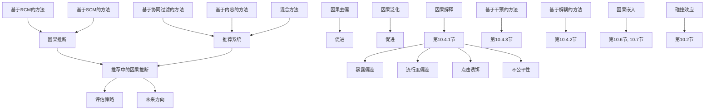

**图 10.1** 本章结构及各节之间联系的概览

本章系统性地概述了因果推荐研究的最新进展。组织方式如图10.1所示。我们从第10.2节中传统推荐系统的基本概念及其相关性推理的局限性开始。然后，第10.3节回顾了机器学习和统计学中的两个重要因果推断范式，并展示了它们与推荐任务的联系。第10.4节深入讨论了如何引入不同的因果推断技术来解决传统推荐系统的局限性，重点在于**去偏（debiasing）**、**提升可解释性（explainability promotion）** 和**改进泛化能力（generalization improvement）**。第10.5节总结了因果推荐系统的**离线评估策略（offline evaluation strategies）**。最后，第10.6节和第10.7节讨论了因果推荐系统的**开放问题（open questions）** 和**未来方向（future directions）**，并对本章进行总结。

## 10.2 推荐系统基础（Recommender System Basics）

为保持本章的紧凑性，我们将讨论限定在具有 $I$ 个用户和 $J$ 个物品的简单推荐系统。推荐系统的主要数据，即用户的历史行为，由一个**用户-物品评分矩阵（user–item rating matrix）** $\textbf { R } \in \mathbb { R } ^ { I \times J }$ 表示，其中非零元素 $r _ { i j }$ 表示用户 $i$ 对物品 $j$ 的评分，而 $r _ { i k } ^ { 0 }$ 表示评分缺失²。为了使推荐系统的讨论与因果推断兼容，我们采用 **$R$ 的概率视角** [46]，其中 $r _ { i j }$ 被视为依赖于用户 $i$ 和物品 $j$ 的随机变量 $R$ 的实现值³。除了 $R$ 之外，推荐系统通常还可以获取辅助信息，例如用户特征 $\dot { \bf f } _ { i } ^ { u } \in \mathbb { R } ^ { K _ { F } ^ { u } }$（如年龄、性别和位置）或物品特征 ${ \bf f } _ { j } ^ { v } \in \mathbb { R } ^ { K _ { F } ^ { v } }$（如内容和文本描述）。$K _ { F } ^ { u }$ 和 $K _ { F } ^ { v }$ 分别是用户和物品特征的维度。推荐系统的主要目的是预测用户对之前未交互物品的评分（即 $r _ { i k } ^ { 0 }$ ），并利用用户和物品辅助信息（如 ${ \bf f } _ { i } ^ { u }$ 和 ${ \bf f } _ { j } ^ { v }$ ）来估计 $r _ { i j }$ ，从而能够根据用户的个性化兴趣推荐新的相关物品。

## 10.2.1 协同过滤（Collaborative Filtering）

基于协同过滤的推荐系统通过利用用户过去的评分来推荐新物品。它们通常认为评分 $r _ { i j }$ 由一个代表用户兴趣的**用户潜变量（user latent variable）** ${ \bf u } _ { i } \in \mathbb { R } ^ { K }$ 和一个编码物品属性的**物品潜变量（item latent variable）** $\mathbf { v } _ { j } \in \mathbb { R } ^ { K }$ 生成，其中 $K$ 是潜空间的维度。这里列出三种广泛使用的基于协同过滤的推荐系统，它们将在本章中经常作为示例使用：

• **矩阵分解（Matrix Factorization, MF）** [28]。MF 使用 $\mathbf { u } _ { i }$ 和 $\mathbf { v } _ { j }$ 之间的内积来建模 $r _ { i j }$ ，其中 $r _ { i j } \sim N ( \mathbf { u } _ { i } ^ { T } \cdot \mathbf { v } _ { j } , \sigma _ { i j } ^ { 2 } )$ ，$\sigma _ { i j } ^ { 2 }$ 是预先确定的方差⁴。
• **深度矩阵分解（Deep Matrix Factorization, DMF）** [89]。DMF 通过将**深度神经网络（Deep Neural Networks, DNNs）** [96] 应用于 $\mathbf { u } _ { i }$ 和 ${ \bf v } _ { j }$ 来扩展 MF，即 $f _ { n n } ^ { u } , f _ { n n } ^ { v } : \mathbb { R } ^ { K } \rightarrow \mathbb { R } ^ { K ^ { \prime } }$ ，其中评分假设生成为 $r _ { i j } \sim N ( f _ { n n } ^ { u } ( \mathbf { u } _ { i } ) ^ { T } \cdot f _ { n n } ^ { v } ( \mathbf { v } _ { j } ) , \dot { \sigma } _ { i j } ^ { 2 } )$ 。
• **基于自编码器（Auto-encoder, AE）的推荐系统** [36, 83] 将用户 $i$ 对所有 $J$ 个物品的评分建模为 $\mathbf { r } _ { i } \sim N ( f _ { n n } ^ { u } ( \mathbf { u } _ { i } ) , \pmb { \sigma } _ { i } ^ { 2 } \cdot \mathbf { I } _ { K } )$ ，其中 $f _ { n n } ^ { u } : \mathbb { R } ^ { K } \rightarrow \mathbb { R } ^ { J }$ 是一个深度神经网络，所有物品的物品潜变量 ${ \bf v } _ { j }$ 隐含在解码器的最后一层权重中 [107]。

在训练阶段，模型通过拟合观测到的评分 $r _ { i j }$ 来学习潜变量 ${ \bf { u } } _ { i } , { \bf { v } } _ { j }$ 和关联函数 $f _ { n n }$ （例如，通过**最大似然估计（maximum likelihood estimation）**，这本质上是从观测数据中估计条件分布 $p ( r _ { i j } | \mathbf { u } _ { i } , \mathbf { v } _ { j } )$ [85]）。之后，我们可以用它们来预测新物品的评分，例如， $\hat { r } _ { i k } ^ { \mathrm { M F } } = \mathbf { u } _ { i } ^ { T } \cdot \mathbf { v } _ { k }$ ， $\hat { r } _ { i k } ^ { \mathrm { D M F } } = f _ { n n } ^ { u } ( \mathbf { u } _ { i } ) ^ { T } \cdot f _ { n n } ^ { v } ( \mathbf { v } _ { k } )$ ， $\hat { r } _ { i k } ^ { \mathrm { A E } } = f _ { n n } ^ { u } ( \mathbf { u } _ { i } ) _ { k }$ ，从而可以选择与用户兴趣最匹配的物品作为推荐。

传统的基于协同过滤的推荐系统基于相关性进行推理。理想情况下，我们希望 ${ \bf u } _ { i } , { \bf v } _ { j }$ 和 $f _ { n n }$ 能够捕捉用户兴趣和物品属性对评分的因果影响，即如果物品 $j$ 被展示给用户 $i$ ，评分会是多少 [85]。然而，由于收集的评分数据是观测性的而非实验性的，$\mathbf { u } _ { i } , \mathbf { v } _ { j }$ 和 $f _ { n n }$ 实际学到的是用户过去行为中的共现模式，这无法保证任何因果含义。因此，模型可能会捕捉到**虚假相关性（spurious correlations）** 和**偏差（biases）**，这些将在未来的推荐中被放大 [73]。此外，学习到的用户潜变量 $\mathbf { u } _ { i }$ 通常纠缠了因果决定用户兴趣的不同因素。从这个角度来看，这些方法的可解释性和泛化能力无法得到保证。

## 10.2.2 基于内容的推荐系统（Content-Based Recommender Systems）

个性化**基于内容的推荐系统（Content-Based Recommender Systems, CBRSs）** 根据用户已交互物品的特征来估计用户兴趣。这些模型通常将用户兴趣编码为用户潜变量 ${ \mathbf { u } } _ { i } \in \mathbb { R } ^ { K }$ ，并假设评分是通过将用户兴趣与物品内容匹配生成的，即 $r _ { i j } \sim N ( f ( \mathbf { u } _ { i } , \mathbf { f } _ { i } ^ { v } ) , \sigma _ { i j } )$ ，其中 $f$ 是一个匹配函数。个性化基于内容的推荐系统的训练遵循与协同过滤类似的步骤，其中 $\mathbf { u } _ { i }$ 和 $f$ 通过拟合观测到的评分来学习（这本质上是从观测数据中估计条件分布 $p ( r _ { i j } | \mathbf { u } _ { i } , \mathbf { f } _ { j } ^ { v } )$ ），并且可以通过 $\hat { r } _ { i k } = f ( \mathbf { u } _ { i } , \bar { \mathbf { f } } _ { k } ^ { v } )$ 预测新评分。构建基于内容的推荐系统的关键步骤是创建能够最好地反映用户兴趣的物品特征 $\mathbf { f } _ { j } ^ { v }$ ，这关键取决于被推荐的物品。例如，对于微视频，会综合考虑视觉、音频和文本模态，以便能够很好地捕捉用户对微视频不同方面的兴趣 [81]。

传统的基于内容的推荐系统无法建模用户兴趣 $\mathbf { u } _ { i }$ 和物品内容 $\mathbf { f } _ { j } ^ { v }$ 对用户评分 $r _ { i j }$ 的因果影响。原因是，除了用户对物品内容的兴趣之外的其他因素，例如用户被点击诱饵欺骗（例如，微视频的耸人听闻标题）[72]，可能会在观测数据集中创建物品内容 $\mathbf { f } _ { j } ^ { v }$ 与用户评分 $r _ { i j }$ 之间不良的关联，这种偏差可以被用户潜变量 $\mathbf { u } _ { i }$ 和匹配函数 $f$ 捕捉到，并持续影响未来的推荐。

## 10.2.3 混合推荐（Hybrid Recommendation）

混合推荐系统将用户/物品辅助信息与协同过滤相结合以增强推荐。一种常用的混合策略是在现有的协同过滤方法中，通过将 $\mathbf { u } _ { i }$ 和 ${ \bf v } _ { j }$ 替换为 $\mathbf { u } _ { i } ^ { + } = [ \mathbf { u } _ { i } | | \mathbf { f } _ { i } ^ { u } ]$ 和 $\mathbf { v } _ { j } ^ { + } = [ \mathbf { v } _ { j } | | \mathbf { f } _ { j } ^ { v } ]$ 来增强用户和物品潜变量 $\mathbf { u } _ { i }$ 和 ${ \bf v } _ { j }$ ，其中 [·||·] 表示向量拼接 [27, 108]。编码协同信息的 $\mathbf { u } _ { i }$ 和 ${ \bf v } _ { j }$ 的维度会相应调整，以使 ${ \mathbf { u } } _ { i } ^ { + }$ 和 $\mathbf { v } _ { j } ^ { + }$ 在模型中兼容。另一类重要的混合推荐系统是**因子分解机（Factorization Machine, FM）** [51] 及其扩展 [21, 31]，这可以视为学习一个双线性函数 $f _ { f m }$ ，其中评分由 $r _ { i j } \sim N ( f _ { f m } ( \mathbf { u } _ { i } , \mathbf { v } _ { j } , \mathbf { f } _ { i } ^ { u } , \mathbf { f } _ { j } ^ { v } ) , \sigma _ { i j } ^ { 2 } )$ 生成。

简单的混合策略无法打破协同过滤和基于内容的推荐系统的相关性推理局限性，因为混合的目标仍然是为了改进模型对观测到的用户历史行为的拟合（即从数据中估计条件分布 $p ( r _ { i j } | \mathbf { u } _ { i } , \mathbf { v } _ { j } , \mathbf { f } _ { i } ^ { u } , \mathbf { f } _ { j } ^ { v } )$ ），而未考虑导致观测用户行为的因果原因。然而，引入额外用户/物品辅助信息的想法对于构建因果推荐系统非常重要。原因是，结合人类专家的领域知识，辅助信息可以帮助在感兴趣的变量之间形成更全面的因果关系，例如用户兴趣、物品属性、历史评分以及其他可能导致虚假相关性和偏差的重要**协变量（covariates）**，这通常是推荐中进行因果推理的关键步骤。

## 10.3 因果推荐系统：预备知识（Causal Recommender Systems: Preliminaries）

在上一节中，我们讨论了传统推荐系统的推荐策略及其由于对观察性用户行为进行相关性推理而导致的局限性。在本节中，我们将在推荐系统的背景下，介绍两种因果推断框架，即鲁宾的潜在结果框架（Rubin's potential outcome framework，也称为鲁宾因果模型，RCM）[23] 和珀尔的**结构因果模型（Structural Causal Model, SCM）** [49]，旨在为推荐中的相关性和因果性推理提供理论严谨的基础。我们表明，RCM 和 SCM 都是构建具有因果推理能力的推荐系统（即因果推荐系统）的强大框架，但它们最适合不同的任务和问题。本节中的讨论为第 10.4 节中更深入地讨论最先进的因果推荐系统模型奠定了基础。

## 10.3.1 鲁宾的潜在结果框架（Rubin's Potential Outcome Framework）

## 10.3.1.1 在推荐系统中应用的动机（Motivation of Applications in RSs）

为了理解传统推荐系统的相关性推理本质，我们注意到，在观察到的评分上朴素地拟合模型只能回答“如果我们观察到某个物品被展示给用户，评分会是多少”这个问题。由于在收集的数据集中物品的展示并非随机化，谓词“该物品被展示给了用户”本身包含了关于该用户-物品对的额外信息（例如，该物品可能比其他未展示的物品更受欢迎），这些信息无法推广到任意用户-物品对的评分预测。因此，推荐系统所问的本质上是一个干预性问题（因此也是一个因果推断问题），即如果某个物品被展示给用户，评分会是多少。为了解决这个问题，基于 RCM 的推荐系统从临床试验中汲取灵感，其中将物品展示给用户类比为对患者进行治疗，而用户评分则类似于患者治疗后的结果 [60, 82]。相应地，基于 RCM 的推荐系统旨在估计治疗（将物品展示给用户）对结果（用户评分）的因果效应，尽管治疗分配与结果观察之间可能存在相关性 [60]。

## 10.3.1.2 定义与目标（Definitions and Objectives）

我们首先介绍必要的符号和定义，以将 RCM 与推荐系统联系起来。我们将单元视为可以接受“将用户 i 暴露于物品 $j ^ { \dag }$”这一处理的用户-物品对 $( i , j )$，并将总体视为所有用户-物品对 $\mathcal { P } O = \{ ( i , j ) , 1 \leq i , j \leq$ $I , J \} [ 6 ]$。我们首先使用一个二元标量 $a _ { i j }$ 来表示物品 j 对用户 i 的展示状态，即分配的处理。我们进一步定义评分潜在结果 $r _ { i j } ( a _ { i j } = 1 )$ 为如果物品被展示给用户时用户 i 对物品 j 的评分，以及 $r _ { i j } ( a _ { i j } = 0 )$ 为如果物品未被展示时的评分 [78]。对于用户 i，如果她对物品 j 进行了评分，我们观察到 $r _ { i j } ( a _ { i j } = 1 ) = r _ { i j }$。否则，我们观察到基线潜在结果 $r _ { i j } ( a _ { i j } = 0 ) = 0$，这在以去偏为导向的因果推荐系统研究中通常被忽略 [60, 65]。6 与临床试验类似，我们可以定义处理组 $\mathcal { T } = \{ ( i , j ) : a _ { i j } = 1 \}$ 为用户 i 被展示物品 j 的用户-物品对集合，并相应地定义非处理组 $N \mathcal { T } = \{ ( i , k ) : a _ { i k } = 0 \}$。在 RCM 框架下，推荐系统的目的可以表述为：利用来自处理组 T 中单元的观察到的评分，来无偏地估计来自总体 PO 中单元的评分潜在结果，尽管收集到的数据中物品展示 $a _ { i j }$ 与用户评分 $r _ { i j }$ 之间可能存在相关性。

## 10.3.1.3 传统推荐系统的因果分析（Causal Analysis of Traditional RSs）

传统推荐系统朴素地训练一个评分预测模型，该模型能最好地拟合处理组 $\mathcal { T }$ 中的评分（例如，通过第 10.2 节中介绍的极大似然估计），以估计非处理组 NT 中未观察到的评分潜在结果 $r _ { i j } ( a _ { i j } = 1 )$ [11]，这忽略了**展示偏差（exposure bias）** 可能导致 $r _ { i j } ( a _ { i j } = 1 )$ 在 T 和 NT 之间分布存在系统性差异的事实。例如，用户倾向于在现实中为他们喜欢的物品评分，这可能导致物品展示 $a _ { i j }$ 与评分潜在结果 $r _ { i j } ( a _ { i j } = 1 )$ 之间存在以下虚假相关性：

$$
p (r _ {i j} (a _ {i j} = 1) \text {   is   high } | a _ {i j} = 1) > p (r _ {i j} (a _ {i j} = 1) \text {   is   high } | a _ {i j} = 0), \tag {10.1}
$$

即，对某物品 j 评过分的用户可能系统性地比尚未评过分的用户给出更高的评分。在这种情况下，传统推荐系统可能倾向于高估 NT 中单元的评分（参见图 10.2 的直观示例）。

从理论上讲，RCM 将收集到的数据集中的展示偏差归因于违反了**无混杂性假设（unconfoundedness assumption）** [23]，其定义如下：

$$
r _ {i j} (a _ {i j} = 1) \perp a _ {i j}. \tag {10.2}
$$

其原理是，如果等式 (10.2) 成立，则用户 i 暴露于物品 $j ~ ( \mathrm { i . e . , } ~ a _ { i j } )$ 与评分潜在结果 $r _ { i j } ( a _ { i j } = 1 )$ 无关，这意味着 $\mathcal { T }$ 和 NT 中的 $r _ { i j } ( a _ { i j } = 1 )$ 遵循相同的分布。因此，物品的展示是随机化的，像等式 (10.1) 这样的展示偏差将不会存在 [78]。

## 10.3.1.4 使用 RCM 框架估计潜在结果（Potential Outcome Estimation with the RCM Framework）

基于 RCM 的框架解决展示偏差的一个经典解决方案是，找到用户和物品的协变量 C，使得在由 $C = \mathbf { c }$ 指定的每个数据层中，用户对物品的展示是随机化的 [23]。协变量 C 的性质可以表述为如下的**条件无混杂性假设（conditional unconfoundedness assumption）**：

$$
r _ {i j} (a _ {i j} = 1) \perp a _ {i j} \mid \mathbf {c}. \tag {10.3}
$$

C 在文献中有时被不严谨地称为**混杂因子（confounder）**，但我们将在下一小节中看到它的正式定义。如果等式 (10.3) 成立，则在由 $C = \mathbf { c }$ 指定的每个数据层中，物品展示与评分潜在结果无关，并且展示偏差可以完全归因于处理组 $\mathcal { T }$ 和总体之间协变量 $C \ = \ \mathbf { c }$ 分布的差异，即 $p ( \mathbf { c } | a _ { i j } = 1 )$ 和 $p ( \mathbf { c } ) ^ { 7 }$ 因此，我们可以基于协变量 C 对观察到的评分进行重新加权以解决偏差，使得它们可以被视为伪随机化样本。这引出了**逆倾向加权（Inverse Propensity Weighting, IPW）**，它从数据的角度消除了展示偏差 [60]。此外，我们还可以在推荐系统模型中调整 C 的影响，从模型侧解决展示偏差 [78]。这两种方法将在第 10.4.1.1 节中讨论。

## •! 注意：大多数基于 RCM 的推荐系统所需的额外假设（Extra Assumptions Required by Most RCM-based RSs）

除了无混杂性之外，大多数基于 RCM 的推荐系统还需要两个额外的假设来识别物品展示对评分的因果效应：(1) **稳定单元处理值假设（Stable Unit Treatment Value Assumption, SUTVA）**，该假设指出，暴露给一个用户的物品不会影响另一个用户的评分。(2) **积极性假设（Positivity assumption）**，该假设指出，每个用户都有正的概率暴露于每个物品 [23]。对于本章介绍的基于 RCM 的因果推荐系统，这两个假设是默认接受的。

## 10.3.2 珀尔的结构因果模型（Pearl's Structural Causal Model）

## 10.3.2.1 在推荐系统中应用的动机（Motivation of Applications in RS）

不同于使用评分潜在结果进行因果推理并将观察到的用户行为中的偏差归因于非随机物品展示的 RCM，珀尔的结构因果模型（SCM）深入研究了产生观察结果（和偏差）的因果机制，并用**因果图（causal graph）** $G = ( N , { \mathcal { E } } )$ 来表示它。节点 N 指定了感兴趣的变量，在推荐系统的背景下，这些变量可以是用户兴趣 U、物品属性 V、观察到的评分 R 以及其他重要的协变量 C，例如物品流行度、用户特征等。8 节点之间的有向边表示由研究者的领域知识确定的它们之间的因果关系。每个节点 $X ~ \in ~ N$ 都与一个**结构方程（structural equation）** $p _ { G } ( X | P a ( X ) )$ 相关联，该方程描述了父节点 $P a ( X )$ 如何因果地影响 X（即，当将 $P a ( X )$ 中的节点设置为特定值时 X 的响应）。

尽管 RCM 和 SCM 通常被认为是基本等价的 [49]，但它们都有各自独特的优势。与 RCM 相比，SCM 的关键优势在于，因果图提供了一种直观且直接的方式来编码和传达研究者的领域知识和实质性假设，即使对基于 RCM 的推荐系统也是有益的 [78]。此外，SCM 更加灵活，因为它可以表示和推理因果图中任意节点子集之间的因果效应（例如，两个原因 U、V 和一个结果 R 之间），以及沿特定路径的因果效应（例如，$U \to R$ 和 $U _ { c } \to R$）。因此，SCM 广泛适用于推荐系统中的多种问题（不限于展示偏差），例如**点击诱饵偏差（clickbait bias）**、**不公平性（unfairness）**、**纠缠（entanglement）** 和**领域自适应（domain adaptation）** [15]。

## •! 注意：基于 SCM 的因果推荐系统的两个注意事项（Two Caveats of SCM-based Causal RSs）

基于 SCM 的因果推荐系统有两个注意事项。(1) 推荐系统的因果图通常涉及编码用户兴趣和物品属性的用户、物品潜在变量 U、V。大多数工作在与结构方程估计的同时推断它们，并在分析因果关系时将其视为已观察到的变量。或者，这可以看作是在因果图中用其 ID（即 i 和 $j$）来表示用户和物品，并将嵌入过程归入结构方程中 [87]。(2) 通常，因果图应该描述生成观察数据的因果机制，因为它使我们能够区分不变的、因果关系与不期望的相关性。例如，我们可能会认为物品流行度 C 应由物品属性 V 决定，即 $V \to C$。但为了描述观察到的评分的生成，通常假设因果关系 $C \to V$，因为物品流行度因果地影响每个物品的曝光概率 [98]。

## 10.3.2.2 因果图的原子结构（Atomic Structures of Causal Graphs）

因果图的结构代表了研究者关于观察数据因果生成过程的领域知识，这是区分稳定的、因果关系与感兴趣的变量之间其他不期望的相关性的关键。这里，我们使用图 10.3a 中一个适用于推荐系统的通用因果图作为运行示例，来说明三种原子图结构（图 10.3b–d）：


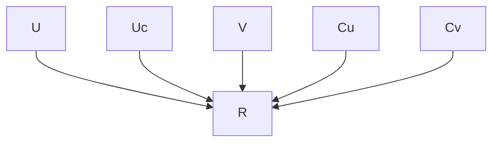

(a) 推荐系统的通用因果图（A generic causal graph for RS）


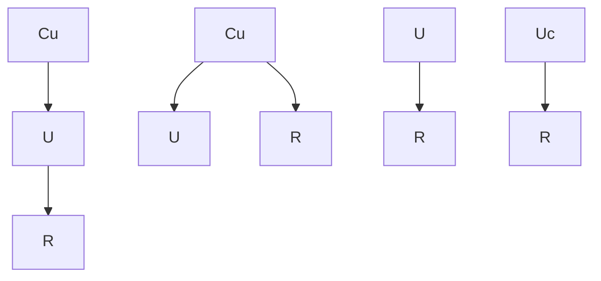

(c) 分叉结构（The fork structure）


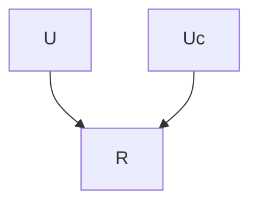

(d) V 形结构（The V-structure）  
**图 10.3** (a): 推荐系统的通用因果图，描述了用户兴趣 U、用户对流行趋势的从众性 $U _ { c }$ 以及物品属性 V 对观察到的评分 R 的因果影响。具体来说，因果路径 $U \to R$ 和 $V \to R$ 分别受到 $C _ { u }$ 和 $C _ { v }$ 的混杂，它们分别代表用户特征和物品流行度。(b)–(d): 从 (a) 中识别出的三种原子结构

• **链（Chain）**，例如 $C _ { u } \to U \to R$。在链中，假设后继节点受到祖先节点的因果影响。在该示例中，U 是 R 的直接原因，而 $C _ { u }$ 通过作为中介的 U 间接影响 R。
• **分叉（Fork）**，例如 $U \leftarrow C _ { u } \to R$。在分叉中，$C _ { u }$ 被称为**混杂因子（confounder）**，因为它因果地影响两个子节点 U 和 R。从概率的角度来看，U 和 R 不是独立的，除非以混杂因子 $C _ { u }$ 为条件 [26]。这导致了分叉结构的棘手部分，即**混杂效应（confounding effect）** [49]，其中未观察到的 $C _ { u }$ 可能导致 U 和 R 之间的虚假相关性。
• **V 形结构（V-structure）**，例如 $U \ \to \ R \ \gets \ U _ { c }$。在 V 形结构中，R 被称为**对撞因子（collider）**，因为它受到两个父节点 U 和 $U _ { c }$ 的因果影响。V 形结构的一个有趣特性是**对撞效应（colliding effects）** [49]，其中观察 R 会在 U 和 $U _ { c }$ 之间产生依赖关系，即使它们边缘独立。

混杂因子可能导致观察数据集中变量之间存在非因果依赖关系。这可能在传统推荐系统中引入偏差，其中混杂效应被误认为是因果关系。**混杂偏差（Confounding bias）** 是推荐系统中的一个普遍问题 [85]，将在以下小节中进一步分析。此外，抽象的 V 形结构通常会导致原因的纠缠，这可能损害推荐系统的可解释性。例如，用户购买某个物品可能是由于她的兴趣（即 U），也可能是由于她对流行趋势的从众性（即 $U _ { c }$）。由于大多数推荐系统将两者都归结为用户潜在变量 $U$，因此 V 形结构 $U \to R \gets U _ { c }$ 被抽象化了，导致无法区分购买的两个原因。

## 10.3.2.3 传统推荐系统的因果分析（Causal Analysis of Traditional RSs）

在本节中，我们研究传统的基于协同过滤的推荐系统对混杂偏差的敏感性。如第 10.2.1 节所述，这些模型的共同点是它们从观察到的评分中估计条件分布 $p ( r _ { i j } | \mathbf { u } _ { i } , \mathbf { v } _ { j } )$，并使用它来预测新的评分。为了使 $p ( r _ { i j } | \mathbf { u } _ { i } , \mathbf { v } _ { j } )$ 表示用户兴趣 $\mathbf { u } _ { i }$ 和物品属性 ${ \bf v } _ { j }$ 对评分 $r _ { i j }$ 的因果影响（在协同过滤的背景下，这意味着任意被展示给用户 i 的物品 j 的评分 [85]），隐含地假设了图 10.4a 的因果图 $G _ { 1 }$，即因果路径 $U \to R$ 和 $V \to R$ 没有未观察到的混杂因子。10

然而，在现实中，$U \to R [ 7 3 , 8 0 ]$ 和 $V \to R$ [3, 10] 都可能受到混杂，其混杂效应可能被 $p ( r _ { i j } | \mathbf { u } _ { i } , \mathbf { v } _ { j } )$ 隐式捕获，从而偏倚未来的推荐。为了揭示这种偏差，我们考虑因果路径 $V \ \to \ R$ 被 $C _ { v }$（例如，物品流行度）混杂的场景。我们假设因果路径 $C _ { v } \to V$ 表示 $C _ { v }$ 对物品 V 曝光概率的因果影响 [98]。在这种情况下，观察到的评分是根据图 10.4b 中的因果图 $G _ { 2 }$ 生成的。利用全概率公式，从混杂数据中估计出的条件分布 $p ( r _ { i j } | \mathbf { u } _ { i } , \mathbf { v } _ { j } )$ 可以计算为：


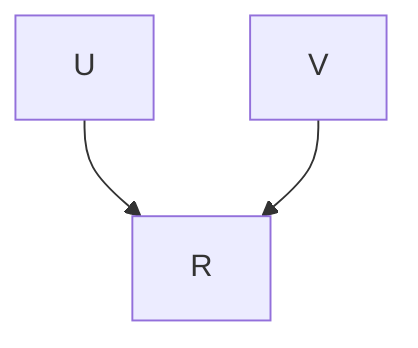

(a) 非因果推荐系统假设的 SCM（SCM assumed by non-causal RS）


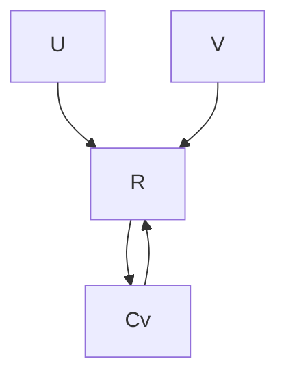

(b) 混杂的真实 SCM（Confounded true SCM）


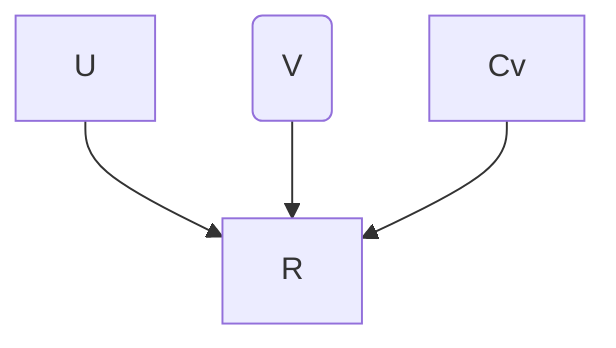

(c) 干预下的 SCM（SCM under intervention）  
**图 10.4** (a): 非因果协同过滤推荐系统假设的 SCM。(b): 描述真实数据生成过程的混杂 SCM。(c): 在干预 do(V) 下的 SCM

$$
p (r _ {i j} | \mathbf {u} _ {i}, \mathbf {v} _ {j}) = \sum_ {\mathbf {c}} p (\mathbf {c} | \mathbf {v} _ {j}) \cdot p _ {G _ {2}} (r _ {i j} | \mathbf {u} _ {i}, \mathbf {v} _ {j}, \mathbf {c}) = \mathbb {E} _ {p (C _ {v} | \mathbf {v} _ {j})} [ p _ {G _ {2}} (r _ {i j} | \mathbf {u} _ {i}, \mathbf {v} _ {j}, C _ {v}) ]. \tag {10.4}
$$

等式 (10.4) 的问题在于，$p ( \mathbf { c } | \mathbf { v } _ { j } )$ 项不是因果性的（因为我们在因果图中只有边 $C _ { v } \ \to \ V$，而没有 $V \to C _ { v }$）。实际上，$p ( \mathbf { c } | \mathbf { v } _ { j } )$ 代表了**溯因推理（abductive reasoning）**，因为它从结果 ${ \bf v } _ { j }$（即物品 $j$ 被展示给用户 i）推断出原因 c（例如，物品流行度），并使用推断出的 c 来支持评分 $r _ { i j }$ 的预测。然而，这种推理不能推广到任意物品 ${ \bf v } _ { j }$（即被展示给用户的物品）的评分预测。换句话说，不受控制的混杂因子 $C _ { v }$ 在 V 和 R 之间留下了一条**后门路径（backdoor path）**（即非因果路径），使得数据中存在 R 对 V 的非因果依赖关系，这可以被传统推荐系统捕获并偏倚未来的推荐。11

## 10.3.2.4 使用 SCM 进行因果推理（Causal Reasoning with SCM）

为了计算 $\mathbf { u } _ { i }$ 和 ${ \bf v } _ { j }$ 对 $r _ { i j }$ 的因果效应，我们应该对 U 和 V 进行**干预（intervention）**。这意味着我们不考虑其父节点在因果图中的值，将 U、V 设置为 ${ \bf u } _ { i } , { \bf v } _ { j }$，包括混杂因子 $C _ { v }$（因为这些节点决定了观察数据中物品 j 对用户 i 的曝光）。SCM 使用 **do-算子（do-operator）** 将干预表示为 $p ( r _ { i j } | d o ( \mathbf { u } _ { i } , \mathbf { v } _ { j } ) )$，以区别于使用观察数据中相关性进行推理的条件分布 $p ( r _ { i j } | \mathbf { u } _ { i } , \mathbf { v } _ { j } )$。再次考虑图 10.4b 中所示的因果图 $G _ { 2 }$。对节点 V 的干预可以通过移除节点 V 的所有入边并将结构方程 $p _ { G _ { 2 } } ( V | C _ { v } )$ 确定性地设置为 $V = \mathbf { v } _ { j }$ 来实现，而其他结构方程保持不变（图 10.4c）。如果混杂因子 $C _ { v }$ 可以被确定并为每个物品测量，则可以通过**后门调整（backdoor adjustment）** [49] 直接从混杂数据计算干预分布 $p ( r _ { i j } | d o ( \mathbf { u } _ { i } , \mathbf { v } _ { j } ) )$，如下所示：

$$
p (r _ {i j} | d o (\mathbf {u} _ {i}, \mathbf {v} _ {j})) = \sum_ {\mathbf {c}} p _ {G _ {2}} (\mathbf {c}) \cdot p _ {G _ {2}} (r _ {i j} | \mathbf {u} _ {i}, \mathbf {v} _ {j}, \mathbf {c}) = \mathbb {E} _ {p _ {G _ {2}} (C _ {v})} [ p _ {G _ {2}} (r _ {i j} | \mathbf {u} _ {i}, \mathbf {v} _ {j}, C _ {v}) ], \tag {10.5}
$$

与等式 (10.4) 相比，该式阻断了从 ${ \bf v } _ { j }$ 对 c 的溯因推理，从而可以正确识别 $\mathbf { u } _ { i } , \mathbf { v } _ { j }$ 对 $r _ { i j }$ 的因果影响。

后门调整要求所有混杂因子事先被确定和测量，但还有其他基于 SCM 的因果推断方法可以在存在未知混杂因子的情况下估计因果效应，详情请参阅 [86, 106]。此外，因果图允许我们基于编码的因果知识进行其他类型的因果推理，例如针对非混杂因子引起的偏差（如点击诱饵偏差和不公平性）的去偏、因果解耦和**因果泛化（causal generalization）** [102]。这些将在下一节中详细讨论。

## 10.4 因果推荐系统：最新进展（Causal Recommender Systems: The State of the Art）

基于前几节讨论的推荐系统和因果推断的预备知识，我们准备介绍最先进的因果推荐系统。具体来说，我们关注三个重要主题，即**偏差缓解（bias mitigation）**、**可解释性提升（explainability promotion）** 和**泛化能力改进（generalization improvement）**，以及它们之间的相互联系，传统推荐系统由于相关性推理而产生的各种局限性在这些主题中可以得到很好的解决。

## 10.4.1 推荐系统的因果去偏（Causal Debiasing for Recommendations）

传统推荐系统（RSs）的**相关性推理**会继承观测用户行为中的多种类型偏差，并在未来的推荐中放大这些偏差 [11]。这些偏差可能导致各种后果，例如**离线评估与在线指标之间的差异**、多样性丧失、推荐质量下降以及令人不适的推荐。**因果推断**能够区分稳定的因果关系与可能对推荐产生负面影响的虚假相关性和偏差，从而提升推荐的鲁棒性。

## 10.4.1.1 曝光偏差（Exposure Bias）

推荐系统中的**曝光偏差（Exposure bias）**广义上指由于**非随机化项目曝光**导致的观测评分中的偏差。从**RCM**的角度来看，曝光偏差可以定义为：用户因其对项目的预期评分（即评分潜在结果）而倾向于接触某些项目所产生的偏差 [65]。曝光偏差由多种原因导致，例如用户的自主搜索或先前推荐系统的推荐 [37]，这会导致**曝光可能性较低的项目被降权**。由于项目曝光在性质上可与临床试验中的处理（treatments）相比较，我们将基于RCM框架讨论去偏策略。

**逆倾向性加权（Inverse Propensity Weighting, IPW）** 基于IPW的因果推荐系统旨在对处理组（即 $\mathcal { T } =$ $\{ ( i , j ) : a _ { i j } = 1 \}$）中用户-项目对的**有偏观测评分** $r _ { i j }$ 进行**重新加权**，以创建**伪随机化样本** [58]，从而对旨在预测总体 $\mathcal { P } O = \{ ( i , j ) , 1 \le i , j \le I , J \}$ 中评分潜在结果 $r _ { i j } ( a _ { i j } = 1 )$ 的推荐模型进行无偏训练。直观地说，我们可以将处理组中 $r _ { i j }$ 的权重设置为项目 $j$ 对用户 $i$ 的曝光概率的倒数，这样**曝光不足的项目**会被**提高权重**，反之亦然。如果对于每个用户-项目对，存在满足公式 (10.3) 中**条件无混杂性假设（conditional unconfoundedness assumption）**的协变量 $\mathbf{c}$，则曝光概率 $e _ { i j }$ 可以通过 $\mathbf{c}$ 进行无偏估计：

$$
e _ {i j} = p (a _ {i j} = 1 | \mathbf {c}) = \mathbb {E} [ a _ {i j} | \mathbf {c} ], \tag {10.6}
$$

这在因果推断文献中正式被称为**倾向性得分（propensity score）** [55]。

## 背景：倾向性得分的平衡性质（The Balancing Property of Propensity Scores）。

倾向性得分具有以下称为**平衡性（balancing）**的性质 [23, 99]，这是证明基于IPW的推荐系统无偏性的关键：

$$
\begin{array}{l} \mathbb {E} \Big [ \frac {r _ {i j}}{e _ {i j}} \Big | a _ {i j} = 1 \Big ] = \mathbb {E} \Big [ \frac {r _ {i j} \cdot a _ {i j}}{e _ {i j}} \Big ] = \mathbb {E} \Big [ \mathbb {E} \Big [ \frac {r _ {i j} \cdot a _ {i j}}{e _ {i j}} \Big | \mathbf {c} \Big ] \Big ] \\ = \mathbb {E} \left[ \mathbb {E} \left[ \frac {r _ {i j} (a _ {i j} = 1) \cdot a _ {i j}}{e _ {i j}} | \mathbf {c} \right] \right] \stackrel {(a)} {=} \mathbb {E} \left[ \frac {\mathbb {E} [ r _ {i j} (a _ {i j} = 1) \mid \mathbf {c} ] \cdot \mathbb {E} [ a _ {i j} \mid \mathbf {c} ]}{e _ {i j}} \right] \tag {10.7} \\ = \mathbb {E} \Big [ \frac {\mathbb {E} [ r _ {i j} (a _ {i j} = 1) \mid \mathbf {c} ] \cdot e _ {i j}}{e _ {i j}} \Big ] = \mathbb {E} [ r _ {i j} (a _ {i j} = 1) ], \\ \end{array}
$$

其中步骤 (a) 遵循公式 (10.3) 中的条件无混杂性假设。

我们首先讨论基于IPW的推荐系统的实现及其无偏性，前提是存在满足公式 (10.3) 的用户和项目协变量 $\mathbf{c}$，并且倾向性得分 $e _ { i j }$ 可以如公式 (10.6) 那样精确计算。我们将旨在预测评分潜在结果 $r _ { i j } ( a _ { i j } = 1 )$ 的推荐系统的评分预测器记为 $\hat { r } _ { i j }$，并假设 $r _ { i j } ( a _ { i j } = 1 )$ 服从**单位方差高斯分布**。理想情况下，我们希望 $\hat { r } _ { i j }$ 能够最大化总体 $\mathcal{P}O$ 中所有用户-项目对的评分潜在结果 $r _ { i j } ( a _ { i j } = 1 )$ 的对数似然，这等价于最小化 $\hat { r } _ { i j }$ 与 $r _ { i j } ( a _ { i j } = 1 )$ 之间的**均方误差（MSE）损失**：

$$
\mathcal {L} ^ {\text { True }} = \frac {1}{I \times J} \sum_ {i, j} (\hat {r} _ {i j} - r _ {i j} (a _ {i j} = 1)) ^ {2}. \tag {10.8}
$$

然而，由于对于**非处理组** $\boldsymbol { N } \boldsymbol { \mathcal { T } }$ 中的用户-项目对，$r _ { i j } ( a _ { i j } = 1 )$ 是不可观测的，因此 $\mathcal { L } ^ { \mathrm { T r u e } }$ 无法计算。因此，传统推荐系统仅最大化处理组中用户-项目对的观测评分的对数似然，这导致了如下**经验MSE损失**：

$$
\mathcal {L} ^ {\text { Obs }} = \frac {1}{| (i , j) : a _ {i j} = 1 |} \sum_ {(i, j): a _ {i j} = 1} (\hat {r} _ {i j} - r _ {i j}) ^ {2}, \tag {10.9}
$$

其中 $| ( i , j ) : a _ { i j } = 1 |$ 是观测评分的数量。当存在曝光偏差时，项目曝光 $a _ { i j }$ 依赖于评分潜在结果 $r _ { i j } ( a _ { i j } = 1 )$。因此，$\mathcal { L } ^ { \mathrm { O b s } }$ 是 $\mathcal { L } ^ { \mathrm { T r u e } }$ 的一个**有偏估计量**，因为处理组 $\mathcal{T}$ 中用户-项目对的观测评分是来自总体 $\mathcal{P}O$ 的评分潜在结果的有偏样本（参见图 10.5a,b 示例）。为了纠正这种偏差，基于IPW的因果推荐系统通过 $\frac {1}{e _ { i j }}$ 的倒数对处理组中的观测评分 $r _ { i j }$ 进行重新加权：

$$
\mathcal {L} ^ {\mathrm{IPW}} = \frac {1}{I \times J} \sum_ {(i, j): a _ {i j} = 1} \frac {1}{e _ {i j}} \cdot (\hat {r} _ {i j} - r _ {i j}) ^ {2}. \tag {10.10}
$$

证明 $\mathcal { L } ^ { \mathrm { I P W } }$ 对于 $\mathcal { L } ^ { \mathrm { T r u e } }$ 的无偏性可以通过利用公式 (10.7) 中倾向性得分的平衡性质来实现，其中我们将公式 (10.7) 左侧的 $r _ { i j }$ 替换为 $( \hat { r } _ { i j } - r _ { i j } ) ^ { 2 }$，并将评分预测器 $\hat { r } _ { i j }$ 视为常数 [60]。我们还在图 10.5 中提供了一个简单示例，直观地展示了 $e _ { i j }$ 的计算、$\mathcal { L } ^ { \mathrm { O b s } }$ 的有偏性以及 $\mathcal { L } ^ { \mathrm { I P W } }$ 的无偏性。公式 (10.10) 中定义的基于IPW的推荐系统的目标是**模型无关的**。因此，它适用于我们在 10.2 节中介绍的所有传统推荐系统。例如，对于基于MF的推荐系统，我们可以代入 $\hat { r } _ { i j } ^ { \mathrm { M F } } = \mathbf { u } _ { i } ^ { T } \cdot \mathbf { v } _ { j }$；对于基于DMF的推荐系统，代入 $\hat { r } _ { i j } ^ { \mathrm { D M F } } = f _ { n n } ^ { u } ( \mathbf { u } _ { i } ) ^ { T } \cdot f _ { n n } ^ { v } ( \mathbf { v } _ { j } )$。

在实践中，由于公式 (10.3) 中的条件无混杂性假设是**不可检验的**，因此通常无法基于满足公式 (10.3) 的用户/项目协变量来计算 $e _ { i j }$ 的精确值。尽管如此，我们仍然可以计算**近似的倾向性得分** $\tilde { e } _ { i j }$，并通过 $1 / \tilde { e } _ { i j }$ 对观测评分进行重新加权，但无法保证公式 (10.10) 在重新加权后的无偏性。这里我们介绍两种近似估计策略。如果用户/项目特征 $\mathbf { f } _ { i } ^ { u }$ 和 $\mathbf { f } _ { j } ^ { v }$ 可用，则可以通过**逻辑回归（logistic regression）** [60] 估计 $\tilde { e } _ { i j }$，如下所示：

$$
\tilde {e} _ {i j} ^ {\mathrm{LR}} = \text { Sigmoid } \left(\left(\sum_ {k} w _ {k} ^ {u} f _ {i k} ^ {u}\right) + \left(\sum_ {k} w _ {k} ^ {v} f _ {j k} ^ {v}\right) + b _ {i} + b _ {j}\right), \tag {10.11}
$$

其中 Sigmoid $( x ) = ( 1 + \exp ( - x ) ) ^ { - 1 }$，$w _ { k } ^ { u }$ 和 $w _ { k } ^ { v }$ 是回归系数，$b _ { i }$ 和 $b _ { j }$ 分别是用户和项目的特定偏移量。如果用户/项目特征 $\mathbf { f } _ { i } ^ { u }$ 和 ${ \bf f } _ { j } ^ { v }$ 不可用，我们可以仅基于曝光数据粗略近似 $e _ { i j }$。例如，我们可以使用**泊松分解（Poisson factorization）** [35] 估计 $\tilde { e } _ { i j }$，如下所示：

$$
\tilde {e} _ {i j} ^ {\mathrm{PF}} \approx 1 - \exp \left(- \boldsymbol {\pi} _ {i} ^ {T} \cdot \boldsymbol {\gamma} _ {j}\right), \tag {10.12}
$$

其中 $\pmb { \pi } _ { i }$ 和 $\gamma _ { j }$ 是具有伽马先验的可训练用户和项目嵌入，并且可以根据曝光数据推断得到，如 [19] 所述。计算倾向性得分的其他策略可以在 [4, 79, 97, 103] 中找到。

IPW 的优点是，如果倾向性得分 $e _ { i j }$ 被正确估计，则可以保证公式 (10.10) 对评分潜在结果估计的**无偏性**。然而，估计的倾向性得分的准确性在很大程度上依赖于领域知识和人类专家的经验。此外，IPW 存在**方差大**和**数值不稳定**的问题，特别是当估计的倾向性得分 $e _ { i j }$ 非常小时。因此，通常会应用诸如**裁剪（clipping）**和**多任务学习（multitask learning）**等方差缩减技术来提高训练动态的稳定性 [7, 57, 112]。IPW 被广泛应用于工业应用，例如**点击率估计**和**转化率估计** [69, 105] 等。

**替代混杂因子调整（Substitute Confounder Adjustment）** 基于IPW的推荐系统从**数据角度**解决曝光偏差：它们对**有偏的观测数据集**进行重新加权，以创建一个**伪随机化数据集**，从而允许对推荐系统进行无偏训练。相比之下，基于**混杂因子调整（Confounder adjustment）**的方法则估计导致曝光偏差的混杂因子 $\mathbf{C}$，并在评分预测模型中调整其影响（一种简单的调整策略是将 $\mathbf{C}$ 作为**额外协变量**进行控制12）。为了使调整无偏，经典因果推断要求公式 (10.3) 中的条件无混杂性假设成立，即**不存在未观测的混杂因子** [23]，这在实践中通常是不可行的。幸运的是，最近在多原因因果推断 [77] 方面的进展表明，我们可以控制从**项目共曝光数据**中估计出的**替代混杂因子（substitute confounders）**，从而在**较弱的假设**下减轻曝光偏差。

我们使用 ${ \bf a } _ { i } ~ = ~ [ a _ { i 1 } , \cdot \cdot \cdot ~ , a _ { i J } ]$ 表示所有 $J$ 个项目对用户 $i$ 的曝光状态，这可以视为临床试验中的**捆绑处理（bundle treatment）** [113]。Wang 等人 [78] 表明，如果我们能够估计出用户特定的潜变量 $\pi _ { i }$，使得在给定 $\pmb { \pi } _ { i }$ 的条件下，不同项目对该用户的曝光是**相互独立的**，那么控制 $\pmb { \pi } _ { i }$ 可以消除**多原因混杂因子** ${ \bf c } _ { i } ^ { m }$ （即影响所有项目曝光和评分的混杂因子）的影响。该论断的一个简单证明是：如果在以 $\pmb { \pi } _ { i }$ 为条件后，${ \bf c } _ { i } ^ { m }$ 仍然能够影响 $\mathbf { a } _ { i }$ 和 $\mathbf { r } _ { i }$，那么由于 ${ \bf c } _ { i } ^ { m }$ 是不同项目曝光的未观测共同原因，$a _ { i j }$ 将无法条件独立（参见 10.3.2.2 节关于叉子结构的讨论），这会产生矛盾。严格的证明可以在 [77] 中找到。Wang 等人进一步假设 $p ( \mathbf { a } _ { i } | \pmb { \pi } _ { i } ) =$ $\Pi _ { j } p ( a _ { i j } | \pmb { \pi } _ { i } ) = \Pi _ { j } \mathrm { P o i s s i o n } ( \pmb { \pi } _ { i } ^ { T } \cdot \pmb { \gamma } _ { j } )$，并使用泊松分解来推断 $\pmb { \pi } _ { i }$ 和 $\gamma _ { j }$。之后，可以通过在推荐模型中将 $\pmb { \pi } _ { i }$ 作为额外协变量进行控制来减轻曝光偏差 [23]。例如，在基于MF的推荐系统中控制 $\pmb { \pi } _ { i }$ 会导致以下调整：

$$
r _ {i j} ^ {\text { adj }} (a _ {i j} = 1) \sim \mathcal {N} \Big (\underbrace {\mathbf {u} _ {i} ^ {T} \cdot \mathbf {v} _ {j}} _ {\text { 用户兴趣 }} + \underbrace {\sum_ {k} w _ {k} \pi_ {i k}} _ {\text { 针对曝光偏差的调整 }}, \sigma_ {i j} ^ {2} \Big). \tag {10.13}
$$

可以利用倾向性得分的性质进一步简化公式 (10.13)：如果公式 (10.3) 中的无混杂性对 $C \ = \ \pi _ { i }$ 成立，那么它对 $C ^ { \prime } =$ $\tilde { e } _ { i j } = p ( a _ { i j } | \pmb { \pi } _ { i } )$ 也成立 [55]。因此，我们可以控制由 $\pmb { \pi } _ { i }$ 估计的近似倾向性得分，即 $\tilde { e } _ { i j } ~ = ~ \pmb { \pi } _ { i } ^ { T } \cdot \pmb { \gamma } _ { j }$，这导致了简化的调整公式：

$$
r _ {i j} ^ {\mathrm{adj}} (a _ {i j} = 1) \sim \mathcal {N} \Big (\mathbf {u} _ {i} ^ {T} \cdot \mathbf {v} _ {j} + w _ {i} \cdot \tilde {e} _ {i j}, \sigma_ {i j} ^ {2} \Big), \tag {10.14}
$$

其中 $w _ { i }$ 是一个用户特定的系数，用于捕捉 $\tilde { e } _ { i j }$ 对评分的影响。

尽管在较弱的假设下成功解决了曝光偏差，但上述方法的一个局限性在于，由于泊松分解是一个**浅层模型**，它可能无法捕捉多原因混杂因子对项目共曝光的复杂影响。为了解决这个问题，最近的工作引入了**深度神经网络（DNNs）** 从捆绑处理 $\mathbf { a } _ { i }$ 中推断用户特定的替代混杂因子 $\pmb { \pi } _ { i }$ [43, 109]。这些方法通常假设 ${ \bf a } _ { i }$ 由 $\pmb { \pi } _ { i }$ 生成，并且 $p ( \mathbf { a } _ { i } | \pmb { \pi } _ { i } )$ 由 $f _ { n n } ^ { \mathrm { e x p } }$ 参数化，如下所示：

$$
p (\mathbf {a} _ {i} | \boldsymbol {\pi} _ {i}) = \Pi_ {j} \text { Bernoulli } (\text { Sigmoid } (f _ {n n} ^ {\exp} (\boldsymbol {\pi} _ {i}) _ {j})), \tag {10.15}
$$

其中 $\pmb { \pi } _ { i }$ 的**难处理后验**随后通过**变分自编码贝叶斯算法（variational auto-encoding Bayes algorithm）** [25] 使用 DNNs 参数化的高斯分布进行近似，即 $q ( \pi _ { i } | \mathbf { a } _ { i } ) ~ = ~ N ( f _ { n n } ^ { \mu } ( \mathbf { a } _ { i } )$ , diag $( f _ { n n } ^ { \sigma ^ { 2 } } ( \mathbf { a } _ { i } ) ) )$，其中 $f _ { n n } ^ { \mu }$ 和 $f _ { n n } ^ { \pmb { \sigma } ^ { 2 } }$ 是两个计算 $\pmb { \pi } _ { i }$ 的后验均值和对角化前方差的 DNNs。通过引入**深度生成模型**来估计替代混杂因子 $\pi _ { i }$，可以在推荐模型中调整多原因混杂因子对项目曝光的**非线性影响**，从而在推荐中进一步减轻曝光偏差。

基于替代混杂因子估计的因果推荐系统的关键优势在于，在潜在结果预测模型中控制混杂因子通常比基于IPW的方法具有**更低的方差** [78]。然而，这些模型需要从项目共曝光中估计替代混杂因子 $\pmb { \pi } _ { i }$，并在推荐模型中引入额外参数来调整其影响，如果混杂因子和参数估计不正确，可能会引入**额外的偏差**。此外，由**单原因混杂因子**引起的曝光偏差无法通过这些方法解决。

## 10.4.1.2 流行度偏差（Popularity Bias）

**流行度偏差**可被视为一种特殊的**曝光偏差（exposure bias）**，即用户过度暴露于流行物品 [2, 64]。因此，它可以通过上一节介绍的技术来解决，尤其是基于**逆概率加权（Inverse Propensity Weighting, IPW）**的方法 [111]。原因是，如果我们将物品的流行度定义为其曝光率：

$$
m _ {j} = \frac {\sum_ {i} a _ {i j}}{\sum_ {j} \sum_ {i} a _ {i j}}, \tag {10.16}
$$

我们可以将 $m _ { j }$ 视为伪倾向得分，并使用 IPW 对观察到的评分进行重新加权。或者，我们也可以使用**结构因果模型（Structural Causal Model, SCM）**来分析和处理流行度偏差，该模型深入研究了在物品流行度影响下产生观察评分的因果机制。

相关讨论主要基于 [98] 中提出的**流行度偏差去混杂（Popularity-bias Deconfounding, PD）**算法。PD 假设用户兴趣 $\mathbf { u } _ { i }$、物品潜在属性 ${ \bf v } _ { j }$、物品流行度 $m _ { j }$ 和观察评分 $r _ { i j }$ 之间的关系可由图 10.6 所示的因果图表示，其中物品流行度可被清晰地识别为一个**混杂因子（confounder）**，它虚假地关联了物品属性和用户评分。PD 旨在通过**后门调整（backdoor adjustment）**消除这种虚假关联，从而正确识别 $\mathbf { u } _ { i }$ 和 ${ \bf v } _ { j }$ 对 $r _ { i j }$（代表用户对物品内在属性的兴趣）的因果影响。回顾一下，使用 SCM 进行后门调整涉及两个阶段：(1) 在训练阶段，根据收集的数据集估计因果图中的相关结构方程。(2) 之后，我们根据公式 (10.5) 调整混杂因子的影响，以去除虚假关联。因此，我们需要利用观察评分 $r _ { i j }$ 和物品流行度 $m _ { j }$ 来估计 $p _ { G } ( r _ { i j } | \mathbf { u } _ { i } , \mathbf { v } _ { j } , m _ { j } )$，并推断潜在变量 $\mathbf { u } _ { i }$ 和 ${ \bf v } _ { j }$。在 PD 中，$p _ { G } ( r _ { i j } | \mathbf { u } _ { i } , \mathbf { v } _ { j } , m _ { j } )$ 被建模为如下 MF 的变体：


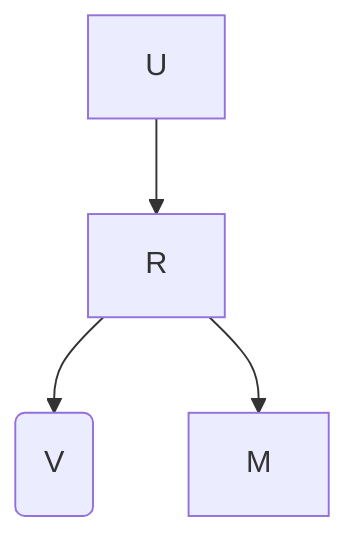

(b) 干预下的 SCM  
图 10.6 (a): 建模物品流行度的 SCM。 (b): 干预 $d o ( V )$ 下的 SCM

$$
p _ {G} (r _ {i j} | \mathbf {u} _ {i}, \mathbf {v} _ {j}, m _ {j}) \propto \underbrace {\mathrm{Elu} (\mathbf {u} _ {i} ^ {T} \cdot \mathbf {v} _ {j})} _ {\text { 用户兴趣 }} \times \underbrace {m _ {j} ^ {\lambda}} _ {\text { 流行度偏差 }}, \tag {10.17}
$$

其中 $\lambda$ 是一个超参数，表示我们对物品流行度影响评分强度的信念；函数 Elu（定义为若 $ { \boldsymbol { { x } } } \_ { } { } < \ 0 \phantom { { . 0 } }$ 则 $\operatorname { E l u } ( x ) ~ = ~ e ( x )$，否则为 $x + 1$）使公式 (10.17) 的右侧成为一个合适的未归一化概率密度函数。在使用公式 (10.17) 从数据集中估计出 ${ \bf u } _ { i } , ~ { \bf v } _ { j }$ 之后，我们对因果图中的物品节点 V 进行干预（参见公式 (10.5)），通过后门调整可以消除由物品流行度引起的虚假关联：

$$
p (r _ {i j} | d o (\mathbf {u} _ {i}, \mathbf {v} _ {j})) \propto \mathbb {E} _ {p (m _ {j})} [ \mathrm{Elu} (\mathbf {u} _ {i} ^ {T} \cdot \mathbf {v} _ {j}) \times m _ {j} ^ {\lambda} ] = \mathrm{Elu} (\mathbf {u} _ {i} ^ {T} \cdot \mathbf {v} _ {j}) \times \mathbb {E} _ {p (m _ {j})} [ m _ {j} ^ {\lambda} ]. \tag {10.18}
$$

由于公式 (10.18) 中的第二项 $\mathbb { E } _ { p ( m _ { j } ) } [ m _ { j } ^ { \lambda } ]$ 是一个常数，并且 Elu 是一个单调递增函数，它们在预测阶段对未交互物品的排序没有影响。因此，我们可以丢弃它们，并使用 $\hat { r } _ { i j } = { \bf u } _ { i } ^ { T } \cdot { \bf v } _ { j }$ 作为无偏评分预测器来生成未来的推荐。

一般来说，PD 的去偏机制在基于后门调整的**因果推荐系统（causal Recommender Systems, RSs）**[73, 85] 中非常直观且普遍：在偏置的训练集上拟合 RS 模型时，我们在公式 (10.17) 中显式引入物品流行度 $m _ { j }$（即混杂因子），以解释物品属性与观察用户评分之间的虚假关联。因此，用于生成未来推荐（即 $\hat { r } _ { i j } = { \bf u } _ { i } ^ { T } \cdot { \bf v } _ { j }$）的用户/物品潜在变量 $\mathbf { u } _ { i }$ 和 ${ \bf v } _ { j }$ 可以专注于估计用户对物品内在属性的真实兴趣。

流行度偏差总是有害的吗？最近，越来越多的研究者开始相信流行度偏差对 RS 并不一定有害，因为有些物品之所以流行，是因为它们本身比其他物品质量更高，或者它们抓住了用户兴趣的当前趋势，因此对这些物品进行更多推荐是合理的 [12, 101]。因此，除了将物品流行度的干预分布设置为 $p ( m _ { j } )$ 之外，上述 PD 以及其他一些方法 [98] 进一步提出使其对应于物品质量或反映未来的流行度预测。我们将在第 10.4.3 节关于 RS 的因果泛化中介绍这些策略。

## 10.4.1.3 点击诱饵偏差（Clickbait Bias）

与之前主要关注基于协同过滤的 RS 的因果去偏策略的各小节不同，本节讨论基于内容的推荐。具体来说，我们讨论**点击诱饵偏差**，它被定义为过度推荐具有吸引人曝光特征（如耸人听闻的标题）但内容质量低的物品的偏差。相关讨论主要基于 [72]。我们假设物品特征 $\mathbf { f } _ { j } ^ { v }$ 可以进一步分解为捕获物品内容信息的**物品内容特征 ${ \bf f } _ { j } ^ { c }$** 和主要目的是吸引用户注意力的**物品曝光特征 $\mathbf { f } _ { j } ^ { b }$**。以微视频为例，物品内容特征 $\mathbf { f } _ { j } ^ { c }$ 可以是视频的视听内容，而物品曝光特征 $\mathbf { f } _ { j } ^ { b }$ 可以是其标题，标题不必忠实地描述其内容。

用户兴趣 $\mathbf { u } _ { i }$、物品曝光特征 $\mathbf { f } _ { j } ^ { b }$、物品内容特征 ${ \bf f } _ { j } ^ { c }$、物品融合特征 ${ \bf v } _ { j }$ 和观察评分 $r _ { i j }$ 之间的关系如图 10.7a 的因果图所示。我们注意到，当用户因为被物品曝光特征 $\mathbf { f } _ { j } ^ { b }$ 欺骗而在查看物品内容 $\mathbf { f } _ { j } ^ { c }$ 之前记录了点击时，就会发生点击诱饵偏差。因此，该偏差可以定义为 $\mathbf { f } _ { j } ^ { b }$ 对评分 $r _ { i j }$ 的直接影响，由因果路径 $F ^ { b } \rightarrow R$ 表示。为了消除点击诱饵偏差，我们需要阻断 $F ^ { b }$ 对评分预测的直接影响，从而在推荐中全面考虑物品内容质量。

与基于 SCM 的因果 RS 一样，我们首先估计因果图中感兴趣的结构方程，即 $p _ { G } ( \mathbf { v } _ { j } | \mathbf { f } _ { j } ^ { b } , \mathbf { f } _ { j } ^ { c } )$ 和 $p _ { G } ( r _ { i j } | \mathbf { u } _ { i } , \mathbf { v } _ { j } , \mathbf { f } _ { i } ^ { b } )$。由于 [72] 中的分布是以确定性的方式（即具有无限精度的**高斯分布（Gaussian distributions）**）推理的，我们保持讨论与其一致。具体来说，我们使用 ${ \bf v } _ { j } ( \bar { { \bf f } } _ { j } ^ { b } , { \bf f } _ { j } ^ { c } ) ~ = ~ f ^ { f f } ( { \bf f } _ { j } ^ { b } , \bar { { \bf f } } _ { j } ^ { c } )$ 来表示结构方程 $p _ { G } ( \mathbf { v } _ { j } | \mathbf { f } _ { j } ^ { b } , \mathbf { f } _ { j } ^ { c } )$，其中 $f ^ { f f }$ 是将 $\mathbf { f } _ { j } ^ { b } , \mathbf { f } _ { j } ^ { c }$ 聚合到 ${ \bf v } _ { j }$ 的特征融合函数，并使用 $r _ { i j } ( \mathbf { u } _ { i } , \mathbf { v } _ { j } , \mathbf { f } _ { j } ^ { b } )$ 来表示结构方程 $p _ { G } ( r _ { i j } | \mathbf { u } _ { i } , \mathbf { v } _ { j } , \mathbf { f } _ { j } ^ { b } )$。为了明确分离物品曝光特征 $\mathbf { f } _ { j } ^ { b }$ 和物品潜在变量 ${ \bf v } _ { j }$ 对观察评分的影响，假设 $r _ { i j } ( \mathbf { u } _ { i } , \mathbf { v } _ { j } , \mathbf { f } _ { j } ^ { b } )$ 分解如下：


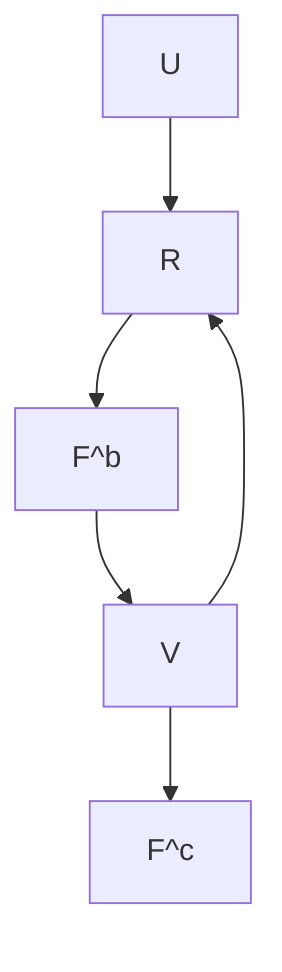


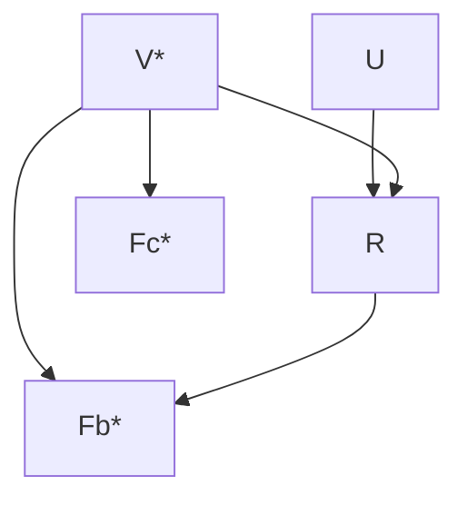

图 10.7 (a): 考虑物品内容特征 $F ^ { c }$ 和物品曝光特征 $F ^ { b }$ 对物品潜在变量 V 的因果影响的 SCM。 (b): 反事实 SCM，其中 $V ^ { * }$ 由基线值 $F ^ { b * }$ 和 $F ^ { c * }$ 决定，以建模 $F ^ { b }$ 的不良直接效应

$$
r _ {i j} (\mathbf {u} _ {i}, \mathbf {v} _ {j}, \mathbf {f} _ {j} ^ {b}) = \underbrace {f _ {n n} ^ {u v} (\mathbf {u} _ {i} , \mathbf {v} _ {j})} _ {\text { 用户兴趣 }} \cdot \underbrace {\text { Sigmoid } \left(f _ {n n} ^ {u f} (\mathbf {u} _ {i} , \mathbf {f} _ {j} ^ {b})\right)} _ {\text { 潜在点击诱饵偏差 }}, \tag {10.19}
$$

其中 Sigmoid 函数在融合过程中提供了必要的非线性。本质上，公式 (10.19) 代表了产生观察评分的因果机制，它同时混合了用户对物品内容的兴趣和点击诱饵偏差。

在从公式 (10.19) 中估计出 $\mathbf { u } _ { i } , \mathbf { v } _ { j }$、$f _ { n n } ^ { u f }$ 和 $f _ { n n } ^ { u v }$ 后，从评分预测中去除点击诱饵偏差并不像 PD 算法那样直接，因为我们应该只消除物品曝光特征 $\mathbf { f } _ { j } ^ { b }$ 对评分 $r _ { i j }$ 的直接影响，同时保留其通过物品潜在变量 ${ \bf v } _ { j }$ 介导的间接影响，以便在推荐中全面考虑所有可用的物品特征。为了实现这一目的，我们首先计算物品曝光特征 $\mathbf { f } _ { j } ^ { b }$ 对评分 $r _ { i j }$ 的**自然直接效应（Natural Direct Effect, NDE）**[48] 如下：

$$
\mathrm{NDE} (\mathbf {u} _ {i}, \mathbf {v} _ {j} ^ {*}, \mathbf {f} _ {j} ^ {b}) = r _ {i j} (\mathbf {u} _ {i}, \mathbf {v} _ {j} ^ {*}, \mathbf {f} _ {j} ^ {b}) - r _ {i j} (\mathbf {u} _ {i}, \mathbf {v} _ {j} ^ {*}, \mathbf {f} _ {j} ^ {b *}), \tag {10.20}
$$

其中 $\mathbf { v } _ { j } ^ { * } = f _ { n n } ^ { f f } ( \mathbf { f } _ { j } ^ { b * } , \mathbf { f } _ { j } ^ { c * } )$，基线值 $\mathbf { f } _ { i } ^ { b * } , \mathbf { f } _ { i } ^ { c * }$ 被视为相应特征从物品中缺失 [72]。由于公式 (10.20) 中的第二项 $r _ { i j } ( \mathbf { u } _ { i } , \mathbf { v } _ { j } ^ { * } , \mathbf { f } _ { j } ^ { b * } )$ 表示用户对一个“空”物品的评分，并且可以被视为一个常数，它不会影响物品的排序。因此，我们只调整公式 (10.20) 的第一项，该第一项在公式 (10.19) 中（图 10.7b）推理了一个反事实世界中的用户 $i$ 对物品 $j$ 的评分，在该反事实世界中，物品 $j$ 只有曝光特征 $\mathbf { f } _ { j } ^ { b }$，而没有内容和融合特征 $\mathbf { f } _ { j } ^ { c * }$ 和 $\mathbf { v } _ { j } ^ { * }$。该调整导致以下估计量：


```mermaid
graph TD
  S((S)) --> R((R))
  F((F)) --> R
  R --> U((U))
  U --> R̂((R̂))
  V((V)) --> R["R̂"]
    style S fill:#ff0000,stroke:#333
    style F fill:#ff0000,stroke:#333
    style R fill:#ff0000,stroke:#333
    style U fill:#ff0000,stroke:#333
    style V fill:#ff0000,stroke:#333
    style R̂ fill:#ff0000,stroke:#333
```

(a) 观察数据集的因果生成过程  
(b) 传统 RS 的因果决策过程  
图 10.8 推理传统 RS 因果决策机制的 SCM。观察到的用户评分 R 可能由用户特征 F（包括敏感特征 S）因果驱动，这随后可能不公平地影响用户潜在变量 U 的推断和新的评分预测 R̂

$$
\hat {r} _ {i j} = r _ {i j} \left(\mathbf {u} _ {i}, \mathbf {v} _ {j}, \mathbf {f} _ {j} ^ {b}\right) - r _ {i j} \left(\mathbf {u} _ {i}, \mathbf {v} _ {j} ^ {*}, \mathbf {f} _ {j} ^ {b}\right) \triangleq \underbrace {r _ {i j} \left(\mathbf {u} _ {i} , \mathbf {v} _ {j} , \mathbf {f} _ {j} ^ {b}\right)} _ {\text { 用户兴趣 + 点击诱饵 }} - \underbrace {r _ {i j} \left(\mathbf {u} _ {i} , \mathbf {v} _ {j} ^ {*} , \mathbf {f} _ {j} ^ {b}\right)} _ {\text { 点击诱饵偏差 }}. \tag {10.21}
$$

公式 (10.21) 去除了 $\mathbf { f } _ { j } ^ { b }$ 对评分预测的直接影响，从而在未来的推荐中可以全面考虑物品内容质量。

## 10.4.1.4 不公平性（Unfairness）

近年来，随着对算法公平性（algorithmic fairness）的关注日益增加，**推荐系统（RSs）** 被期望不对来自特定人口群体的用户表现出歧视 [14, 32, 34]。然而，传统的 RSs 可能会捕捉到用户敏感信息与其历史行为之间不良的关联，从而导致对用户具有潜在冒犯性的推荐。**因果推断（Causal inference）** 可以帮助识别和处理此类不公平关联，从而在未来的推荐中促进公平性。本节重点讨论 [33] 中提出的面向用户的公平性，该公平性被定义为 RSs 对具有某些敏感属性的用户进行区别对待的偏差。

在考虑 RSs 的面向用户公平性时，用户特征 $\mathbf { f } _ { i }$ 的一个子集，我们将其记为 $\mathbf { s } _ { i }$ ，被假定包含用户的敏感信息，例如性别、种族和年龄。特征 $\mathbf { s } _ { i }$ 是敏感的，因为不适当地依赖这些特征的推荐可能会冒犯用户，从而降低他们的在线体验和对系统的信任。图 10.8 [33] 展示了描述大多数传统 RSs 因果决策机制的因果图。从图 10.8 中，我们可以发现用户的历史行为，即观察到的评分 $r _ { i j }$ ，是由用户特征 $\mathbf { f } _ { i }$ （包括用户敏感特征 $\mathbf { s } _ { i }$ ）因果驱动的。因此，从 $r _ { i j }$ 推断出的用户潜在变量 $\mathbf { u } _ { i }$ 可能会捕捉到 $\mathbf { s } _ { i }$ 中的敏感用户信息，这会在未来不公平地影响评分预测 $\hat { r } _ { i j }$ 。

为了解决这个问题，Li 等人 [33] 提出将用户敏感特征 $\mathbf { s } _ { i }$ 从用户潜在变量 $\mathbf { u } _ { i }$ 中解耦，从而在未来的推荐中最大限度地抑制由因果链 $S \to R \to U$ 表示的 $\mathbf { s } _ { i }$ 对 $\mathbf { u } _ { i }$ 的不公平影响。实现解耦的一种常见策略是**对抗训练（adversarial training）** [18]，我们在 RS 的同时训练一个判别器 $f _ { n n } ^ { \mathrm { c l s } } ( \mathbf { u } _ { i } ) ~ \to ~ \mathbf { s } _ { i }$ ，该判别器从用户潜在变量 $\mathbf { u } _ { i }$ 中预测敏感特征 $\mathbf { s } _ { i }$ 。在将 RS 拟合到观察到的评分 $r _ { i j }$ 的同时，我们约束推断出的 $\mathbf { u } _ { i }$ 以欺骗 $f _ { n n } ^ { \mathrm { c l s } }$ ，防止 $\mathbf { u } _ { i }$ 由于与 $\mathbf { s } _ { i }$ 的不公平相关性而从 $r _ { i j }$ 中捕捉敏感信息。这里我们以基于 MF 的 RS 为例来展示细节。我们用 $\mathcal { L } ^ { \mathrm { R e c } }$ 表示基于 MF 的 RS 的原始训练目标，该目标最大化观察评分 $r _ { i j }$ 上的对数似然，并用 $\mathcal { L } ^ { \mathrm { c l s } }$ 表示 $f _ { n n } ^ { \mathrm { c l s } }$ 的损失函数。公平性目标 $\mathcal { L } ^ { \mathrm { F a i r } }$ 变为如下形式：

$$
\mathcal {L} ^ {\text { Fair }} = \underbrace {\mathcal {L} ^ {\text { Rec }} (\mathbf {u} _ {i} ^ {T} \cdot \mathbf {v} _ {j} , r _ {i j})} _ {\text { 用户兴趣 }} - \lambda \cdot \underbrace {\mathcal {L} ^ {\text { cls }} (f _ {n n} ^ {\text { cls }} (\mathbf {u} _ {i}) , \mathbf {s} _ {i})} _ {\text { 公平性约束 }}, \tag {10.22}
$$

其中，$\lambda$ 是一个超参数，用于平衡推荐性能和公平性目标。通常，较高的 $\lambda$ 会带来更好的公平性，但也会限制用户潜在变量 $\mathbf { u } _ { i }$ 的能力，这可能对推荐性能产生负面影响。虽然这里我们以基于 MF 的 RS 为例，但通过将 $\mathbf { u } _ { i } ^ { T } \cdot \bar { \mathbf { v } } _ { j }$ 项替换为相应的评分估计器，可以很容易地将公式 (10.22) 推广到基于 DMF 或 AE 的 RS。

## 10.4.2 推荐中的因果解释（Causal Explanation in Recommendations）

在前面的章节中，我们引入了因果关系来解决传统 RSs 中各种类型的偏差和虚假相关性问题。在本节中，我们使用因果关系来解释用户的决策过程。具体来说，我们讨论一个有趣的问题，旨在解耦能够因果解释用户过去行为的意图，即：用户购买一件商品是因为她顺应了当前的潮流，还是因为她真的喜欢它？这个问题的棘手之处在于：在现实中，我们只能观察到结果，即购买行为，而购买行为可以由这两种原因来解释。

## 10.4.2.1 使用因果嵌入解耦兴趣与从众性（Disentangling Interest and Conformity with Causal Embedding）

本讨论基于 [102] 中提出的 **DICE**。为简化讨论，我们考虑 $r _ { i j }$ 为隐式反馈，并将用户、正例商品 $( j : r _ { i j } = 1)$、负例商品 $( k : r _ { i k } = 0 )$ 三元组的集合定义为 $\mathcal { R } _ { p n } = \{ ( i , j , k ) | r _ { i j } = 1 \wedge r _ { i k } = 0 \}$ 。每个商品 $j$ 的流行度（popularity），即 $m_j$，它反映了当前的潮流，可以通过公式 (10.16) 计算。观察到用户兴趣 $U$、用户从众性 $U _ { c }$ 和观察评分 $R$ 之间的因果关系可以表示为图 10.9a 中的 V-结构，DICE 利用碰撞效应来实现解耦，即，不能被一种原因解释的结果更可能由另一种原因引起（参见第 10.3.2.2 节的讨论）。因此，尽管由于纠缠，用户的兴趣无法直接从其评分 $r _ { i j }$ 中估计，但他们对于潮流的从众性可以通过商品 $j$ 的流行度水平来估计，并且不太可能由从众性引起的正向反馈更有机会反映用户的真实兴趣。

在实现中，DICE 假设观察到的评分 $r _ { i j }$ 可以分解为从众性部分 $r _ { i j } ^ { c } = f ^ { c } ( \mathbf { u } _ { i } ^ { c } , \mathbf { v } _ { j } ^ { c } )$ 和用户兴趣部分 $r _ { i j } ^ { i } = f ^ { i } ( \mathbf { u } _ { i } ^ { i } , \mathbf { v } _ { j } ^ { i } )$ 之和，其中 ${ \bf u } _ { i } ^ { c , i } , { \bf v } _ { j } ^ { c , i }$ 是可学习的用户、商品嵌入，分别反映用户 $i$ 对商品 $j$ 的兴趣（即上标 i）和从众性（即上标 c）。根据因果图的碰撞效应，我们可以将 $\mathcal { R } _ { p n }$ 中的三元组划分成两个不相交的子集。在 $\mathcal { R } _ { p n } ^ { ( 1 ) }$ 中，正例商品 $a$ 具有比负例商品 $b$ 更高的流行度水平，即 $m _ { a } > m _ { b }$ 。在这种情况下，我们可以从这个三元组中得出两个一般性结论：(1) 总体上，用户更喜欢商品 $a$ 而非 $b$；(2) 由于 $a$ 的更高流行度，她更可能从众选择商品 $a$ 而非 $b$。这些结论导致了以下两个不等式：

$$
\forall (i, a, b) \in \mathcal {R} _ {p n} ^ {(1)}, \text { 我们有 } \left\{ \begin{array}{l} r _ {i a} ^ {c} > r _ {i b} ^ {c} (\text { 从众性 }) \\ r _ {i a} ^ {i} + r _ {i a} ^ {c} > r _ {i b} ^ {i} + r _ {i b} ^ {c} (\text { 总体偏好 }), \end{array} \right. \tag {10.23}
$$

其中 $r _ { i \{ a , b \} } ^ { c , i }$ 是 ${ \mathbf { u } } _ { i } ^ { c , i } , { \mathbf { v } } _ { \{ a , b \} } ^ { c , i }$ 的简写。对于 $\mathcal { R } _ { p n } ^ { ( 2 ) }$ 中的每个三元组 $( i , c , d )$，负例商品 $d$ 比正例商品 $c$ 更流行。在这种情况下，用户 $i$ 本可以简单地顺应潮流选择商品 $d$ 进行消费，但她却主动选择了不那么流行的商品 $c$。因此，我们可以得出一个更具体的结论，从而促成用户兴趣与从众性的解耦：选择商品 $c$ 而非 $d$ 更可能是出于用户兴趣。因此，我们可以形成三个不等式：


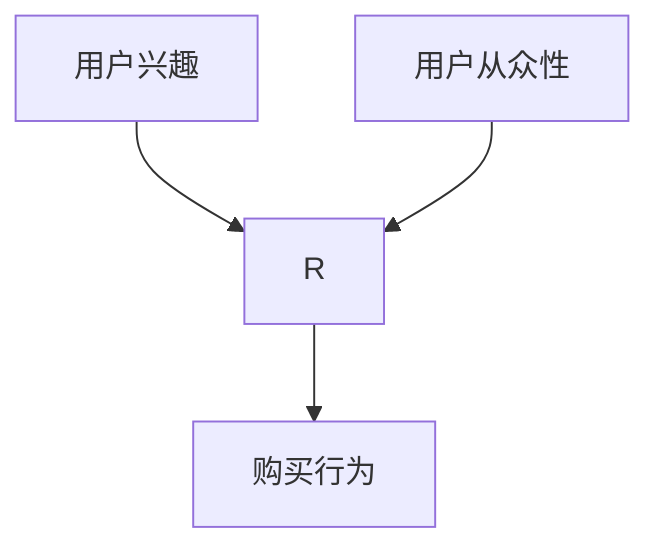

(a) DICE 的因果图


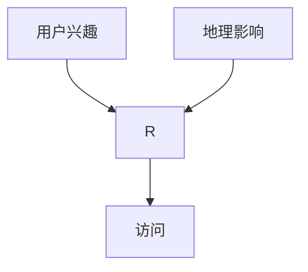

(b) 推广到 PoI 推荐  
图 10.9 DICE 的因果图 (a) 及其推广到 PoI 推荐 (b)

$$
\forall (i, c, d) \in \mathcal {R} _ {p n} ^ {(2)}, \text { 我们有 } \left\{ \begin{array}{l} r _ {i c} ^ {i} > r _ {i d} ^ {i} (\text { 兴趣 }), r _ {i c} ^ {c} <   r _ {i d} ^ {c} (\text { 从众性 }), \\ r _ {i c} ^ {i} + r _ {i c} ^ {c} > r _ {i d} ^ {i} + r _ {i d} ^ {c} (\text { 总体偏好 }). \end{array} \right. \tag {10.24}
$$

公式 (10.23) 和 (10.24) 中的不等式可以通过 RSs 中的基于排序的损失函数（如**贝叶斯个性化排序（Bayesian Personalized Ranking, BPR）** [52]）来求解，其中解耦的嵌入 ${ \bf u } _ { i } ^ { c , i } , { \bf \bar { v } } _ { j } ^ { c , i }$ 和匹配函数 $f ^ { c , i } ( \cdot , \cdot )$ 可以从 $\mathcal { R } _ { p n } ^ { ( 1 ) }$ 和 $\mathcal { R } _ { p n } ^ { ( 2 ) }$ 中学习得到。最终，评分预测为 $\hat { r } _ { i j } = f ^ { i } ( \mathbf { u } _ { i } ^ { i } , \mathbf { v } _ { j } ^ { i } ) + f ^ { c } ( \mathbf { u } _ { i } ^ { c } , \mathbf { v } _ { j } ^ { c } )$。

## 10.4.2.2 DICE 的推广（Generalizations of DICE）

DICE 从数据的角度解耦用户意图并提升 RSs 的可解释性：它将 $\mathcal { R } _ { p n }$ 中的三元组 $( i , j , k )$ 划分为两个不相交的子集 $\mathcal { R } _ { p n } ^ { ( 1 ) }$ 和 $\mathcal { R } _ { p n } ^ { ( 2 ) }$，依据是正例和负例商品相对于其从众的流行度趋势。DICE 的基本思想是可推广的，如果我们能为其他类型的推荐任务找到替代的因果解释，以挑战“这些任务中观察到的正向反馈可以完全归因于用户兴趣”这一假设，就可以提升其可解释性。

例如，在**兴趣点（Point-of-Interests, PoI）推荐**中，目标商品是用户可能觉得有用或有趣去访问的特定地点，如餐馆、杂货店和商场 [93]。在此任务中，PoI 的位置是除用户兴趣之外，对用户访问该 PoI 的另一个重要替代解释，因为附近的 PoI 比远处的 PoI 更方便访问（见图 10.9b）[70]。因此，为了将用户兴趣与可能因果影响用户选择的潜在地理因素解耦，我们可以采取与 DICE 类似的策略，根据正负 PoI 与用户之间的距离来划分用户的历史访问记录。然后，基于划分后的数据集，使用相同的基于排序的方法来估计解耦后的用户兴趣嵌入。

## 10.4.2.3 可解释 RSs 的其他工作（Other Works on Explainable RSs）

可解释推荐是一个广泛的课题 [100]，其中基于数据划分来解耦用户意图只是其中的一小部分。还有大量工作专注于从模型方面提高 RSs 的可解释性，这些工作设计并集成了特定的解耦模块，例如**原型学习（prototype learning）** [40]、**上下文建模（context modeling）** [74] 和**方面建模（aspect modeling）** [67]，以进一步增强传统 RS 模型的透明度和可解释性。我们建议感兴趣的读者查阅相应的论文以及 [63, 88] 以进行更深入的研究。

## 10.4.3 推荐的因果泛化（Causal Generalization of Recommendations）

在从可能存在偏差和纠缠的观测数据集中估计出因果关系后，RSs 的泛化能力可以得到显著增强，因为即使我们进行推荐的上下文（或环境）发生了变化（例如，商品流行度和用户从众性），我们仍然可以基于稳定且不变的因果关系进行推荐，同时丢弃或纠正其他暂时性且易变的不良相关性 [5, 90, 102]。在本节中，我们以用于流行度偏差的 PD 算法和用于因果可解释性的 DICE 算法为例，展示如何通过因果干预和解耦来提高 RSs 的泛化能力。

## 10.4.3.1 基于干预的泛化（Generalization Based on Intervention）

首先，我们以 PD 算法为例，展示因果干预如何提高 RSs 在动态环境中的泛化能力。在 RS 中，通常假设用户兴趣可以在某段时间内保持不变，即图 10.6 中的因果结构 $U \to R \gets V$ 代表了用户对内在商品属性的稳定兴趣。然而，不同商品的流行度（即我们进行推荐的上下文）在同一时期可能会迅速变化 [12]。回顾一下，PD 通过两个项的乘积，即 $\mathrm{Elu}( \mathbf { u } _ { i } ^ { T } \cdot \mathbf { v } _ { j } )$ 和 $m _ { j } ^ { \lambda }$，如公式 (10.17) 所示，来解耦用户兴趣和商品流行度对评分的因果影响。假设 $m _ { j }$ 代表商品 $j$ 当前的流行度水平。如果我们预测商品 $j$ 的流行度在未来会变为 $m _ { j } ^ { \prime }$ [84]，我们可以进行干预，在结构方程 $p _ { G } ( R | U , V , M )$ 中将 $M$ 设置为预测值 $m _ { j } ^ { \prime }$，并通过以下公式预测未来的评分 $r _ { i j } ^ { \prime }$：

$$
p _ {G} (r _ {i j} ^ {\prime} | \mathbf {u} _ {i}, \mathbf {v} _ {j}, d o (m _ {j} ^ {\prime})) \propto \underbrace {\mathrm{Elu} (\mathbf {u} _ {i} ^ {T} \cdot \mathbf {v} _ {j})} _ {\text { 稳定的用户兴趣 }} \times \underbrace {(m _ {j} ^ {\prime}) ^ {\lambda}} _ {\text { 未来流行度 }}, \tag {10.25}
$$

其中，从当前时间步学习到的用户、商品潜在变量 $\mathbf { u } _ { i }$ 和 ${ \bf v } _ { j }$ 保持不变。通过在预测中考虑商品流行度的未来变化对评分的影响，服务提供商可以做出战略性决策，为具有不同流行度潜力的商品分配资源。相比之下，传统的 RSs 可能会错误地将当前商品流行度水平对评分的影响捕捉为用户兴趣。因此，当商品流行度 $m _ { j }$ 由于时间演变而变为不同的水平 $m _ { j }^ { \prime }$ 时，它们将无法很好地泛化。

## 10.4.3.2 基于解耦的泛化（Generalization Based on Disentanglement）

此外，因果解耦可以通过识别并基于对环境中潜在变化更具鲁棒性的原因进行推荐，从而促进 RSs 的泛化能力 [66, 91]。例如，如果用户的从众性和兴趣是基于其历史行为进行解耦的，那么如果用户的从众性由于某些原因降低到较低水平，由于假设用户兴趣在特定时间段内是稳定的，我们仍然可以使用学习到的用户/商品兴趣变量 $\mathbf { u } _ { i } ^ { i } , \mathbf { v } _ { j } ^ { i }$ 基于他们的兴趣进行推荐，同时可以丢弃或降低先前估计的不可靠的用户从众性信息的权重。相比之下，对于传统的 RSs，因果影响其历史行为的不同因素被纠缠为一个单一的用户潜在变量 $u_i$。因此，即使已知用户行为的某些不太稳定的原因发生了变化（例如，在上面介绍的 PoI RS 中，用户可能搬到了新地方，不同 PoI 对该用户的便利程度发生了变化），这些模型仍然会利用过时的原因进行推荐，这可能无法泛化到新环境。

## 10.5 因果 RSs 的评估策略（Evaluation Strategies for Causal RSs）

在前面的章节中，我们讨论了各种有希望解决传统 RSs 中多种类型偏差、纠缠和泛化问题的因果推断技术。然而，如果没有精心设计的模型评估策略，很难判断所提出的因果 RS 模型是否真正有效，也无法保证该模型在部署到真实环境后能够可靠地执行。因果模型的评估尤其困难，因为**真实情况（ground truths）**，即我们感兴趣的因果效应，通常是不可得的。尽管存在挑战，但仍有几种策略可以使用有偏差的真实世界数据可靠地评估因果 RSs，我们将在本节中详细讨论这些策略。此外，我们还整理了现有的、通过进行随机实验来消除曝光偏差的真实世界数据集，以促进未来的因果 RS 研究。

## 10.5.1 传统推荐系统的评估策略（Evaluation Strategies for Traditional RSs）

传统推荐系统的评估通常遵循三个步骤：首先，将评分矩阵 R 中观测到的评分 $r _ { i j }$ 拆分为**无重叠的训练集 $\mathbf { R } _ { t r }$ 和测试集 $\mathbf { R } _ { t e }$**，通常通过随机保留每个用户一定比例的观测评分来实现。然后，在 $\mathbf { R } _ { t r }$ 中的评分上训练所提出的推荐系统，以学习**潜在变量（latent variables）**和相关的**功能模型（functional models）**（参见第 10.2 节）。最后，训练好的推荐系统预测每个用户在 $\mathbf { R } _ { t r }$ 中缺失的评分，并将结果与 $\mathbf { R } _ { t e }$ 中保留的评分进行比较，以评估模型性能。评分预测的质量可以通过基于准确率的指标（如**均方误差（mean squared error, MSE）**和**平均绝对误差（mean absolute error, MAE）**）以及基于排序的指标（如**召回率（recall）**、**精确率（precision）**和**归一化折损累计增益（normalized discounted cumulative gain, NDCG）**）来衡量。关于这些评估指标的更多信息可在 [61] 中找到。

## 10.5.2 因果推荐系统评估面临的挑战（Challenges for the Evaluation of Causal RSs）

然而，上述评估策略并不直接适用于**因果推荐系统（causal RSs）**，因为 $\mathbf { R } _ { t e }$ 中的评分可能与 $\mathbf { R } _ { t r }$ 中的评分具有相同的**虚假相关性（spurious correlation）**和**偏差（bias）**，这使得在 $\mathbf { R } _ { t e }$ 上的评估成为对真实模型性能的有偏度量。因此，为了无偏地评估因果推荐系统的有效性，理想情况下，我们应有一个**有偏/纠缠的训练集 $\mathbf { R } _ { t r } ^ { b }$** 来学习模型，以及一个**无偏/解缠的测试集 $\mathbf { R } _ { t e } ^ { u b }$** 用于模型评估，从而可以直接验证因果去偏/解缠算法的有效性。然而，获取 $\mathbf { R } _ { t e } ^ { u b }$ 成本高昂且难以建立。因此，我们首先介绍用于因果推荐系统评估的常见数据模拟策略。然后，我们讨论如何直接利用真实世界数据集以进一步提升因果推荐系统研究的可信度。

## 10.5.3 基于模拟数据集的评估（Evaluation Based on Simulated Datasets）

一个用于评估因果推荐系统的良好数据集模拟策略应具备以下特性：(1) 待研究的偏差和纠缠的生成机制被清晰识别、可信设计，并能以灵活方式进行调节；(2) 尽可能利用可用的真实世界信息。

### 10.5.3.1 基于生成模型的模拟（Simulation Based on Generative Models）

一种满足上述标准且有前景的数据集模拟策略是使用**深度生成模型（deep generative models）**。这里我们以**曝光偏差（exposure bias）**为例，演示如何从真实世界数据集中模拟该偏差 [109]。模拟分为两个阶段。在训练阶段，在真实世界数据集（例如 MovieLens 数据集 [20]）的曝光数据和评分数据上训练两个**变分自编码器（variational auto-encoders, VAEs）**[25, 36]，从而得到两个解码器网络 $f _ { n n } ^ { a }$ 和 $f _ { n n } ^ { r }$，它们分别从 K 维高斯用户潜在变量 ${ \bf u } _ { i } ^ { a } \sim N ( { \bf 0 } , { \bf I } _ { K } )$ 和 $\mathbf { u } _ { i } ^ { r } \sim { \cal N } ( \mathbf { 0 } , \mathbf { I } _ { K } )$ 生成项目曝光 $\mathbf { a } _ { i } \in \{ 0 , 1 \} ^ { J }$ 和用户评分 $\mathbf { r } _ { i } \in \mathbb { R } ^ { J }$。解码器基于真实用户的数据捕获了项目曝光和用户评分的生成分布，从而有效利用了可用的真实世界信息。在生成阶段，对于每个假设用户 $i ^ { \prime }$，我们抽取一个**混杂因子（confounder）** $\mathbf { c } _ { i ^ { \prime } } \sim { \cal N } ( \mathbf { 0 } , \mathbf { I } _ { K } )$，该因子同时影响 ${ \bf u } _ { i ^ { \prime } } ^ { a }$ 和 $\mathbf { u } _ { i ^ { \prime } } ^ { r }$。然后，为了模拟曝光偏差，我们设置 $ { \mathbf { u } } _ { i ^ { \prime } } ^ { a } =  { \mathbf { c } } _ { i ^ { \prime } }$ 和 $\mathbf { u } _ { i ^ { \prime } } ^ { r } = \lambda \cdot \mathbf { c } _ { i ^ { \prime } } + ( 1 - \lambda ) \mathbf { \epsilon } _ { i ^ { \prime } }$，并使用 $f _ { n n } ^ { a } , f _ { n n } ^ { r }$ 生成模拟的项目曝光 $\mathbf { a } _ { i ^ { \prime } }$ 和评分 $\mathbf { r } _ { i ^ { \prime } }$，其中 $\epsilon _ { i ^ { \prime } } \sim { \cal N } ( \mathbf { 0 } , \mathbf { I } _ { K } )$，超参数 $\lambda$ 控制着混杂偏差的强度。最后，我们用 $\mathbf { a } _ { i ^ { \prime } }$ 对 $\mathbf { r } _ { i ^ { \prime } }$ 进行掩码，形成有偏的训练集 $\mathbf { R } _ { t r } ^ { b }$，并保留生成的评分 $\mathbf { r } _ { i ^ { \prime } }$ 作为无偏测试集 $\mathbf { R } _ { t e } ^ { u b }$。

基于生成模型的数据集模拟策略的优势在于，评估阶段可以获得感兴趣的**真实因果机制（true causal mechanisms）**，例如评分潜在结果，而这对于真实世界数据集通常是不可能的。因此，可以基于模拟的**真实标签（ground truths）**轻松验证因果推荐系统的有效性。此外，模拟是灵活的，因为偏差和纠缠的强度可以设置为不同级别（例如示例中的 $\lambda$），从而可以深入研究因果推荐系统的**敏感性和鲁棒性（sensitivity and robustness）**。

### 10.5.3.2 测试集干预（Test Set Intervention）

另一种可靠的数据集模拟策略是**测试集干预（test set intervention）**，即从原始测试集中创建一个经过干预的测试集，使其具有与训练集不同的偏差/纠缠分布 [35, 102, 110]。例如，为了研究**流行度偏差（popularity bias）**，我们可以先从 R 中选择观测评分，使得 90% 的交互项目是流行的，10% 是不流行的，从而形成训练集 $\mathbf { R } _ { t r }$ [94]。然后，我们从剩余评分（即原始测试集 $\mathbf { R } _ { t e }$）中选择一个流行与不流行项目比例不同的子集（例如 10% 流行和 90% 不流行），形成干预后的测试集 $\mathbf { R } _ { t e } ^ { i n t }$。如果模型在训练集 $\mathbf { R } _ { t r }$ 上表现良好，在干预后的测试集 $\mathbf { R } _ { t e } ^ { i n t }$ 上依然表现良好，则可以支持模型对流行度偏差具有不变性。类似的测试集干预策略可用于评估 DICE [102] 中用户兴趣与从众行为的解缠效果。

基于测试集干预的因果推荐系统评估策略的优势在于，它**最小限度地引入了无法由真实世界信息证明的额外假设**，因为干预通常是通过从原始测试集中选择样本来改变数据分布实现的，这不会引入关于生成机制或假设用户、项目及评分的额外假设。从这个角度来看，基于测试集干预的评估结果可能比基于生成模型的策略更可信。

## 10.5.4 基于真实世界数据集的评估（Evaluation Based on Real-world Datasets）

### 10.5.4.1 随机实验（Randomized Experiments）

对于曝光偏差的研究，建立**无偏的真实世界数据集**是可行的，即从用户子集中收集每个项目或随机选择的项目的评分。这可能极其昂贵且对用户不友好，但近年来，工业界对因果推荐系统研究的兴趣日益增长，建立了更多此类随机数据集并发布，以促进因果推荐系统研究。可用的真实世界数据集汇总如下：

*   **Coat 数据集**13 [60] (2016)。Coat 数据集是一个从 Amazon Mechanical Turkers 平台众包的小规模数据集，包含 300 个用户和 290 个项目。具体来说，每个 Turker 首先被要求**自选 24 件外套进行评分**，这些评分构成了有偏的训练集 $\mathbf { R } _ { t r } ^ { b }$。然后，每个 Turker 被要求对 16 件**随机选择的外套进行评分**，这些评分构成了无偏测试集 $\mathbf { R } _ { t e } ^ { u b }$。
*   **Yahoo! R3 数据集**14 [44, 45] (2009)。Yahoo! R3 数据集是从 Yahoo! Music 平台收集的。有偏训练集 $\mathbf { R } _ { t r } ^ { b }$ 由来自 15,400 个用户对 1,000 个项目的 300,000 个**自供评分（self-supplied ratings）**组成。此外，一个由 5,400 个用户组成的子集被呈现了十个随机选择的项目进行评分，这些评分构成了无偏测试集 $\mathbf { R } _ { t e } ^ { u \bar { b } }$。
*   **KuaiRec 数据集**15 [16] (2022)。KuaiRec 数据集基于中国流行的微视频分享平台快手（国际版称 Kwai）建立。该数据集记录了来自 7,176 个用户对 10,728 个项目的自供评分，构成了有偏训练集 $\mathbf { R } _ { t r } ^ { b }$。此外，它还包含一个由 1,411 个用户和 3,327 个项目组成的子集的无偏测试集 $\mathbf { R } _ { t e } ^ { u b }$，其中这些用户和项目之间的评分几乎是**完全观测的（密度为 99.6%）**。

数据集的统计信息汇总在**表 10.1** 中供参考。还有一些用于相关主题的随机数据集，例如**点击率预测（click-through rate prediction）**[104]，即 Criteo Ads 数据集16 [13]，以及**基于 bandit 的推荐系统（bandit-based RS）**[8]，即 Open Bandit 数据集17 [56]，这里也提供了来源链接，供感兴趣的读者参考。

**表 10.1 当前可用的真实世界因果推荐数据集的特征，其中测试集由于随机项目曝光或完全观测评分而消除了曝光偏差。表中，诸如“24 i/u”之类的术语表示每个用户评价 24 个项目，“300,000 r”表示观测评分的数量，“16.3% r”表示交互的密度**

| 数据集 | # 用户 | # 项目 | 项目类型 | 训练集 | 测试集 |
| :--- | :--- | :--- | :--- | :--- | :--- |
| Coat | 300 | 290 | 外套 | 24 i/u (自供) | 16 i/u (随机) |
| Yahoo! R3 | 15,400 | 1,000 | 音乐 | 300,000 r (自供) | 10 i/u (随机) 针对 5,400 u |
| KuaiRec | 7,176 | 10,728 | 视频 | 16.3% r (自供) | 99.6% r 针对 1,411 u 和 3,327 i |

从表 10.1 中我们可以发现，Coat 数据集规模较小。而对于 Yahoo! R3 数据集，虽然训练集相对较大（15,400 个用户和 1,000 个项目），但用于建立无偏测试集的随机实验规模相对较小（每个用户分别有 16 和 10 个随机暴露的项目）。因此，尽管这些评分由于随机化而无偏，但它们可能无法全面捕捉用户的兴趣，从而导致较高的评估方差。对于最近发布的 KuaiRec 数据集，对用户进行了大规模实验以建立无偏测试集，其中 1,411 个用户对 3,327 个项目的评分几乎是完全收集的。因此，它可能是一个有前景的新基准，允许以更低的方差评估更复杂的因果推荐系统模型。

### 10.5.4.2 定性评估与案例研究（Qualitative Evaluation and Case Study）

对于推荐系统中不能归因于非随机项目曝光（例如**点击诱饵偏差（clickbait bias）**和**不公平性（unfairness）**）的其他类型的偏差，建立无偏测试集更具挑战性。例如，在研究点击诱饵偏差时，很难确定用户点击一个项目是出于兴趣还是因为点击诱饵。类似地，在检查推荐系统的**面向用户的公平性（user-oriented fairness）**时，我们无法知道生成的项目是否对用户具有冒犯性。在这种情况下，我们仍然可以进行**案例研究（case studies）**来进行定性模型评估，即从原始测试集中手动选择一些代表性样本，观察训练好的因果推荐系统模型是否会如预期般对这些样本做出响应 [71]。

考虑评估因果推荐系统对点击诱饵偏差的鲁棒性。我们可以从原始测试集中选择一些**内容质量低但曝光特征极具吸引力**的代表性项目，以及其他**内容质量高但曝光特征正常**的项目。然后，我们获取这两组项目的评分预测并进行比较。如果所研究的因果推荐系统确实将第二组项目排在高于第一组项目的位置，我们很可能可以得出结论，该模型对点击诱饵偏差具有鲁棒性，因为在推荐中优先考虑的是项目内容的质量，而不是其曝光特征。此外，为了评估因果推荐系统的面向用户公平性，我们可以分析针对特定人口群体用户的生成推荐。如果推荐的项目倾向于捕捉与用户敏感特征负相关的社会刻板印象，我们可以得出结论，该模型仍然对用户存在歧视。

## 10.6 未来方向（Future Directions）

尽管近年来在将**因果推断（causal inference）**与传统推荐系统相结合以解决其在观测用户数据上进行相关性推理的各种局限性方面取得了成就，但因果推荐系统研究仍处于**新兴阶段（emerging stage）**。有几个有前景的方向可以进一步推动该领域的发展。在本节中，我们指出了四个未来值得探索的有趣且重要的开放性问题。

首先，现有因果推荐系统所需的**假设（assumptions）**可能过于强烈，在现实中可能不成立。例如，大多数基于 RCM 的因果推荐系统依赖**稳定单元处理值假设（Stable Unit Treatment Value Assumption, SUTVA）**来排除不同用户项目曝光之间的干扰。然而，如果用户通过社交网络连接，他们可能会密切互动或受到网络中**影响者（influencers）**的严重影响 [41]。因此，SUTVA 可能会被违反，因为对一个用户做出的推荐可能会因果性地影响其他用户的评分（即**溢出效应（spill-over effects）**[30, 42]）。此外，如果某些用户从不点击特定类型的项目（即**不依从者（noncompliance）**和**叛逆者（defiers）**[23]），**积极性假设（positivity assumptions）**也可能被违反。因此，进一步弱化因果推荐系统的假设以使其更适用于现实世界应用至关重要。

此外，目前**缺乏一个通用的因果模型**，可以应用于不同的因果推理目的。大多数基于 SCM 的因果推荐系统旨在解决一种特定类型的偏差或纠缠问题，而其他问题则被默认为不存在并从因果图中省略。此外，即使对于解决相同问题的因果推荐系统，也可以假设多种包含不同变量和关系集的因果图，这导致了不同工作之间的不一致性。因此，建立一个**通用且被广泛接受的因果模型**，能够全面解决推荐中的多种类型因果问题，将是有前景且有益的。

此外，推荐系统中的某些类型的偏差是**双刃剑（double-blade swords）**，其积极的一面很少被研究。考虑第 10.4.1.1 节讨论的项目曝光偏差。我们应该注意，某些项目更有可能被曝光，是因为它们比其他项目质量更高。因此，这些项目较高的曝光率是合理的，并且可以用于进一步提升推荐性能。此外，最近的研究还发现，虚假关联项目曝光和用户评分的混杂因子也可能有助于解释不同项目的**共现模式（co-occurrence patterns）**[109]。因此，如何正确识别和利用偏差的积极一面，同时最大限度地抑制其负面影响，至关重要，值得未来进行更深入的研究。

最后，尽管近年来工业界建立并发布了更多用于因果推荐系统研究的真实世界数据集，但许多因果推荐系统模型仍然严重依赖**模拟数据集（simulated datasets）**进行评估。模拟可能导致问题过度简化，并且通常被设计为与所提出模型的去偏/解缠机制完全对应。因此，由于缺乏模型部署和在线测试，这些方法在更复杂的真实场景中的有效性仍然不确定。因此，为了更令人信服地展示因果推荐系统的实际效用，非常期待与工业界进行更多合作。

## 10.7 总结（Summary）

在本章中，我们全面概述了推荐系统中因果推断的最新进展。我们首先指出了依赖观测用户行为和用户/项目特征中相关性的传统推荐系统的问题。然后，我们介绍了两个主流的因果推断框架，即**Rubin 的 RCM** 和 **Pearl 的 SCM**，它们为理解这些问题提供了更深入的见解，并为将传统推荐系统推进到**因果之梯（Ladder of Causality）**的更高层级奠定了基础。具体来说，我们深入讨论了几种最先进的因果推荐系统模型，这些模型增强了对各种偏差的鲁棒性并提高了**可解释性（explainability）**。此外，由于因果推荐系统可以基于**稳定且不变（stable and invariant）**的因果关系进行推荐，我们还展示了它们的**泛化能力（generalization abilities）**可以得到显著提升。最后，我们介绍了因果推荐系统的评估策略，重点是如何基于有偏的真实世界数据可靠地估计模型性能。我们进一步整理了在用户身上进行了昂贵随机实验的真实世界数据集，这反映了工业界对因果推荐系统日益增长的关注。

总体而言，因果推荐系统仍然是一个相对较新且**探索不足的研究课题（under-explored research topic）**。迫切需要更多的努力来系统化现有工作，并进行更深入的研究以取得进一步改进。因此，我们指出了因果推荐系统中四个有趣且具有实际重要性的开放性问题。我们希望本章能帮助读者全面理解将因果性应用于推荐系统的核心思想，并鼓励在这个有前景的领域取得进一步进展。

致谢（Acknowledgments） 这项工作得到了美国国家科学基金会（National Science Foundation）资助（编号 IIS-2006844, IIS-2144209, IIS-2223769, CNS-2154962, BCS-2228534）、摩根大通教职研究奖（JP Morgan Chase Faculty Research Award）以及思科教职研究奖（Cisco Faculty Research Award）的支持。

## 参考文献（References）

1. H. Abdollahpouri, R. Burke, B. Mobasher, Controlling popularity bias in learning-to-rank recommendation, in Proceedings of the 11th ACM Conference on Recommender Systems (2017), pp. 42–46  
2. H. Abdollahpouri et al., The unfairness of popularity bias in recommendation, in RecSys Workshop on Recommendation in Multistakeholder Environments (2019)  
3. A. Agarwal et al., A general framework for counterfactual learning-to-rank, in Proceedings of the 42nd International ACM SIGIR Conference on Research and Development in Information Retrieval (2019), pp. 5–14  
4. Q. Ai et al., Unbiased learning to rank with unbiased propensity estimation, in The 41st International ACM SIGIR Conference on Research and Development in Information Retrieval (2018), pp. 385–394  
5. M. Arjovsky et al., Invariant risk minimization (2019). arXiv preprint  
6. S. Bonner, F. Vasile, Causal embeddings for recommendation, in Proceedings of the 12th ACM Conference on Recommender Systems (2018), pp. 104–112  
7. L. Bottou et al., Counterfactual reasoning and learning systems: the example of computational advertising. J. Mach. Learn. Res. 14(11), 3207–3260 (2013)  
8. D. Bouneffouf, A. Bouzeghoub, A.L. Gançarski, A contextual-bandit algorithm for mobile context-aware recommender system, in International Conference on Neural Information Processing (Springer, 2012), pp. 324–331  
9. E. Çano, M. Morisio, Hybrid recommender systems: a systematic literature review. Intell. Data Anal. 21(6), 1487–1524 (2017)  
10. J. Chen et al., AutoDebias: learning to debias for recommendation, in Proceedings of the 44th International ACM SIGIR Conference on Research and Development in Information Retrieval (2021), pp. 21–30  
11. J. Chen et al., Bias and debias in recommender system: a survey and future directions (2020). arXiv preprint arXiv:2010.03240  
12. Z. Chen et al., Co-training disentangled domain adaptation network for leveraging popularity bias in recommenders, in Proceedings of the 45th International ACM SIGIR Conference on Research and Development in Information Retrieval (2022), pp. 60–69  
13. E. Diemert et al., A large scale benchmark for uplift modeling, in Proceedings of AdKDD and TargetAd Workshop (2018)  
14. Y. Dong et al., fairness in graph mining: a survey (2022). arXiv preprint  
15. C. Gao et al., Causal inference in recommender systems: a survey and future directions (2022). arXiv preprint arXiv:2208.12397  
16. C. Gao et al., KuaiRec: a fully-observed dataset and insights for evaluating recommender systems, in Proceedings of the 31st ACM International Conference on Information and Knowledge Management (2022)  
17. Y. Gong, Q. Zhang, Hashtag recommendation using attention-based convolutional neural network, in Proceedings of the 25th International Joint Conference on Artificial Intelligence (2016), pp. 2782–2788  
18. I. Goodfellow et al., Generative adversarial networks. Commun. ACM 63(11), 139–144 (2020)  
19. P. Gopalan, J.M. Hofman, D.M. Blei, Scalable recommendation with hierarchical Poisson factorization, in Proceedings of the 31th Conference on Uncertainty in Artificial Intelligence (2015), pp. 326–335  
20. F.M. Harper, J.A. Konstan, The MovieLens datasets: history and context. ACM Trans. Interactive Intell. Syst. 5(4), 1–19 (2015)  
21. X. He, T.-S. Chua, Neural factorization machines for sparse predictive analytics, in Proceedings of the 40th International ACM SIGIR Conference on Research and Development in Information Retrieval (2017), pp. 355–364  
22. Y. Hu, Y. Koren, C. Volinsky, Collaborative filtering for implicit feedback datasets, in The 8th IEEE International Conference on Data Mining (2008), pp. 263–272  
23. G.W. Imbens, D.B. Rubin, Causal Inference in Statistics, Social, and Biomedical Sciences (Cambridge University Press, Cambridge, 2015)  
24. J. Kaddour et al., Causal machine learning: a survey and open problems (2022). arXiv preprint arXiv:2206.15475  
25. D.P. Kingma, M. Welling, Auto-encoding variational Bayes, in International Conference on Learning Representations (2014)  
26. D. Koller, N. Friedman, Probabilistic Graphical Models: Principles and Techniques (The MIT Press, Cambridge, MA, 2009). ISBN: 0-262-01319-3, https://books.google.com/books? id=7dzpHCHzNQ4C&pgis=1  
27. Y. Koren, Factorization meets the neighborhood: a multifaceted collaborative filtering model, in Proceedings of the 14th ACM SIGKDD International Conference on Knowledge Discovery and Data Mining (2008), pp. 426–434  
28. Y. Koren, R. Bell, C. Volinsky, Matrix factorization techniques for recommender systems. IEEE Comput. 42(8), 30–37 (2009)  
29. Y. Koren, S. Rendle, R. Bell, Advances in collaborative filtering, in Recommender Systems Handbook (Springer, New York, 2022), pp. 91–142  
30. Q. Li et al., Be causal: de-biasing social network confounding in recommendation. ACM Trans. Knowl. Disc. Data 17(1), 1–23 (2022)  
31. Y. Li et al., Causal factorization machine for robust recommendation, in Proceedings of the 22nd ACM/IEEE Joint Conference on Digital Libraries (2022), pp. 1–9  
32. Y. Li et al., Fairness in recommendation: a survey (2022). arXiv preprint arXiv:2205.13619  
33. Y. Li et al., Towards personalized fairness based on causal notion, in Proceedings of the 44th International ACM SIGIR Conference on Research and Development in Information Retrieval (2021), pp. 1054–1063  
34. Y. Li et al., User-oriented fairness in recommendation, in Proceedings of The Web Conference 2021 (2021), pp. 624–632  
35. D. Liang, L. Charlin, D.M. Blei, Causal inference for recommendation, in Causation: Foundation to Application, Workshop at UAI. AUAI (2016)  
36. D. Liang et al., Variational autoencoders for collaborative filtering, in Proceedings of the World Wide Web Conference (2018), pp. 689–698  
37. D. Liu et al., A general knowledge distillation framework for counterfactual recommendation via uniform data, in Proceedings of the 43rd International ACM SIGIR Conference on Research and Development in Information Retrieval (2020), pp. 831–840  
38. J. Liu, P. Dolan, E.R. Pedersen, Personalized news recommendation based on click behavior, in Proceedings of the 15th International Conference on Intelligent User Interfaces (2010), pp. 31–40  
39. P. Lops, M. de Gemmis, G. Semeraro. Content-based recommender systems: state of the art and trends, in Recommender Systems Handbook (Springer, 2011), pp. 73–105  
40. J. Ma et al., Learning disentangled representations for recommendation, in Advances in Neural Information Processing Systems (2019)  
41. J. Ma, J. Li, Learning causality with graphs. AI Mag. 43(4), 365–375 (2022)  
42. J. Ma et al., Learning causal effects on hypergraphs, in ACM SIGKDD International Conference on Knowledge Discovery and Data Mining (2022)  
43. J. Ma et al., Multi-cause effect estimation with disentangled confounder representation, in International Joint Conference on Artificial Intelligence (2021), pp. 2790–2796  
44. B.M. Marlin, R.S. Zemel, Collaborative prediction and ranking with non-random missing data, in Proceedings of the 3rd ACM Conference on Recommender Systems (2009), pp. 5–12  
45. B.M. Marlin et al. Collaborative filtering and the missing at random assumption, in Proceedings of the 23rd Conference on Uncertainty in Artificial Intelligence (2007), pp. 267–275  
46. A. Mnih, R.R. Salakhutdinov, Probabilistic matrix factorization, in Advances in Neural Information Processing Systems (2007)  
47. I. Paparrizos, B.B. Cambazoglu, A. Gionis, Machine learned job recommendation, in Proceedings of the 5th ACM Conference on Recommender Systems (2011), pp. 325–328  
48. J. Pearl, Direct and indirect effects, in Paper presented at Proceedings of the Seventeenth Conference on Uncertainty in Artificial Intelligence (2001)  
49. J. Pearl, Causality (Cambridge University Press, Cambridge, 2009)  
50. J. Pearl, D. Mackenzie, The Book of Why: The New Science of Cause and Effect (Basic books, New York, 2018)  
51. S. Rendle, Factorization machines, in IEEE International Conference on Data Mining (IEEE, 2010), pp. 995–1000  
52. S. Rendle et al., BPR: Bayesian personalized ranking from implicit feedback, in Proceedings of the 25th Conference on Uncertainty in Artificial Intelligence (2009), pp. 452–461  
53. F. Ricci, L. Rokach, B. Shapira, Introduction to recommender systems handbook, in Recommender Systems Handbook (Springer, New York, 2011), pp. 1–35  
54. T.S. Richardson, J.M. Robins, Single world intervention graphs (SWIGs): a unification of the counterfactual and graphical approaches to causality. Center Statis. Soc. Sci., University of Washington Series 128(30), 2013 (2013)  
55. P.R. Rosenbaum, D.B. Rubin, The central role of the propensity score in observational studies for causal effects. Biometrika 70(1), 41–55 (1983)  
56. Y. Saito et al., Large-scale open dataset, pipeline, and benchmark for bandit algorithms (2020). arXiv preprint arXiv:2008.07146  
57. Y. Saito et al., Unbiased recommender learning from missing-not-at-random implicit feedback, in Proceedings of the 13th International Conference on Web Search and Data Mining (2020), pp. 501–509  
58. M. Sato et al., Unbiased learning for the causal effect of recommendation, in The 14th ACM Conference on Recommender Systems (2020), pp. 378–387  
59. M. Sato et al., Uplift-based evaluation and optimization of recommenders, in Proceedings of the 13th ACM Conference on Recommender Systems (2019), pp. 296–304  
60. T. Schnabel et al., Recommendations as treatments: debiasing learning and evaluation, in International Conference on Machine Learning (2016), pp. 1670–1679  
61. G. Shani, A. Gunawardana, Evaluating recommendation systems, in Recommender Systems Handbook (Springer, New York, 2011), pp. 257–297  
62. A. Sharma, J.M. Hofman, D.J. Watts, Estimating the causal impact of recommendation systems from observational data, in Proceedings of the 16th ACM Conference on Economics and Computation (2015), pp. 453–470  
63. P. Sheth et al., Causal disentanglement with network information for debiased recommendations, in International Conference on Similarity Search and Applications (2022), pp. 265–273  
64. H. Steck, Item popularity and recommendation accuracy, in Proceedings of the 5th ACM Conference on Recommender Systems (2011), pp. 125–132  
65. H. Steck, Training and testing of recommender systems on data missing not at random, in Proceedings of the 16th ACM SIGKDD International Conference on Knowledge Discovery and Data Mining (2010), pp. 713–722  
66. R. Suter et al., Robustly disentangled causal mechanisms: validating deep representations for interventional robustness, in International Conference on Machine Learning (2019), pp. 6056–6065  
67. J. Tan et al., Counterfactual explainable recommendation, in Proceedings of the 30th ACM International Conference on Information & Knowledge Management (2021), pp. 1784–1793  
68. C. Wang, D.M. Blei, Collaborative topic modeling for recommending scientific articles, in Proceedings of the 17th ACM SIGKDD International Conference on Knowledge Discovery and Data Mining (2011), pp. 448–456  
69. H. Wang et al., ESCM2: entire space counterfactual multi-task model for post-click conversion rate estimation, in Proceedings of the 45th International ACM SIGIR Conference on Research and Development in Information Retrieval (2022), pp. 363–372  
70. H. Wang et al., Exploiting POI-specific geographical influence for point-of-interest recommendation, in Proceedings of the 27th International Joint Conference on Artificial Intelligence (2018), pp. 3877–3883  
71. W. Wang et al., Causal representation learning for out-of-distribution recommendation, in Proceedings of the ACM Web Conference 2022 (2022), pp. 3562–3571  
72. W. Wang et al., Clicks can be cheating: counterfactual recommendation for mitigating clickbait issue, in Proceedings of the 44th International ACM SIGIR Conference on Research and Development in Information Retrieval (2021), pp. 1288–1297  
73. W. Wang et al., Deconfounded recommendation for alleviating bias amplification, in Proceedings of the 27th ACM SIGKDD Conference on Knowledge Discovery and Data Mining (2021), pp. 1717–1725  
74. X. Wang et al., Causal disentanglement for semantics-aware intent learning in recommendation, in IEEE Transactions on Knowledge and Data Engineering (2022)  
75. X. Wang et al., Combating selection biases in recommender systems with a few unbiased ratings, in Proceedings of the 14th ACM International Conference on Web Search and Data Mining (2021), pp. 427–435  
76. X. Wang et al., Position bias estimation for unbiased learning to rank in personal search, in Proceedings of the 11th ACM International Conference on Web Search and Data Mining (2018), pp. 610–618  
77. Y. Wang, D.M. Blei, The blessings of multiple causes. J. Am. Statist. Assoc. 114(528), 1574–1596 (2019)  
78. Y. Wang et al., Causal inference for recommender systems, in The 14th ACM Conference on Recommender Systems (2020), pp. 426–431  
79. Z. Wang et al., Unbiased sequential recommendation with latent confounders, in Proceedings of the ACM Web Conference 2022 (2022), pp. 2195–2204  
80. T. Wei et al., Model-agnostic counterfactual reasoning for eliminating popularity bias in recommender system, in Proceedings of the 27th ACM SIGKDD Conference on Knowledge Discovery and Data Mining (2021), pp. 1791–1800  
81. Y. Wei et al., MMGCN: multi-modal graph convolution network for personalized recommendation of micro-video, in Proceedings of the 27th ACM International Conference on Multimedia (2019), pp. 1437–1445  
82. P. Wu et al., On the opportunity of causal learning in recommendation systems: foundation, estimation, prediction and challenges, in Proceedings of the International Joint Conference on Artificial Intelligence, Vienna, Austria (2022), pp. 23–29  
83. Y. Wu et al. Collaborative denoising auto-encoders for top-N recommender systems, in Proceedings of the 9th ACM International Conference on Web Search and Data Mining (2016), pp. 153–162  
84. J. Xie et al., A multimodal variational encoder-decoder framework for micro-video popularity prediction, in Proceedings of the Web Conference 2020 (2020), pp. 2542–2548  
85. S. Xu et al., Causal collaborative filtering (2021). arXiv preprint arXiv:2102.01868  
86. S. Xu et al., Deconfounded causal collaborative filtering (2021). arXiv preprint arXiv:2110.07122  
87. S. Xu et al., Dynamic causal collaborative filtering, in Proceedings of the 31st ACM International Conference on Information and Knowledge Management (2022), pp. 2301–2310  
88. S. Xu et al., Learning causal explanations for recommendation, in The 1st International Workshop on Causality in Search and Recommendation (2021)  
89. H.-J. Xue et al., Deep matrix factorization models for recommender systems. Int. Joint Conf. Artif. Intell. 17, 3203–3209 (2017)  
90. C. Yang et al., Towards out-of-distribution sequential event prediction: a causal treatment, in Advances in Neural Information Processing Systems, 35, 22656–22670 (2022)  
91. M. Yang et al., CausalVAE: disentangled representation learning via neural structural causal models, in Proceedings of the IEEE/CVF Conference on Computer Vision and Pattern Recognition (2021), pp. 9593–9602  
92. L. Yao et al., A survey on causal inference. ACM Trans. Knowl. Disc. Data (TKDD) 15(5), 1–46 (2021)

<!-- 脚注 -->

- 我们使用 **评分（rating）** 来指代任何可以用数值表示的用户-物品交互。这既包括显式反馈（如喜欢/不喜欢），也包括隐式反馈（如浏览和点击）。当 $r _ { i j }$ 表示隐式反馈时，矩阵 $R$ 中的缺失元素 $r _ { i k } ^ { 0 }$ 可能在训练阶段被用作弱负反馈 [22]。这可能会使因果问题复杂化。因此，除非另有说明，我们假设推荐系统（RSs）是基于观测到的评分进行训练的，以简化讨论。
- 然而，在不引起混淆的情况下，我们不对随机变量及其具体实现进行区分。为简化起见，除非另有说明，我们假设 $R$ 服从高斯分布。
- 对于未明确将 $r _ { i j }$ 视为随机变量的工作，我们假设其服从方差为零的高斯分布。此时，生成过程变为 $r _ { i j } = { \bf u } _ { i } ^ { T } \cdot { \bf v } _ { j }$ 。

<!-- 脚注结束 -->

<!-- 脚注 -->

- 这可以归因于多种原因，例如用户的自主搜索 [75]、先前模型的推荐 [37]、物品的展示位置 [76]、物品流行度 [1] 等。通常，基于 **反事实框架（RCM）** 的因果推荐系统对于导致曝光偏差的具体原因是不敏感的。

<!-- 脚注结束 -->

<!-- 脚注 -->

- 在旨在估计推荐如何改变用户行为的**提升度评估（uplift evaluation）** 中 [62]，$r _ { i j } ( a _ { i j } = 0 )$ 可用于表示用户 $i$ 通过自主搜索对物品 $j$ 的评分 [59]。

<!-- 脚注结束 -->

<!-- 脚注 -->

- 我们可以从图 10.2 中获得对此论断的直观理解。假设协变量 $C$ 表示二维特征（用户类型，电影类型）。给定 $C = \mathbf { c }$，式 (10.3) 描述的 $r _ { i j } ( a _ { i j } = 1 ) \perp a _ { i j } \mid c$ 成立，因为在由 $C = \mathbf { c }$（即图 10.2b 中的四个 $2 \times 2$ 块）指定的每个数据层中，$r _ { i j } ( a _ { i j } = 1 )$ 是常数。图 10.2a 显示，对于处理组 $\mathcal { T }$，当 $\mathbf { c } \in C _ { 1 } =$ {(恐怖片爱好者, 恐怖电影), (爱情片爱好者, 爱情电影)} 时，$p ( \mathbf { c } \mid a _ { i j } = 1 ) = 1 / 2$；而当 $\mathbf { c } \in C _ { 2 } =$ {(恐怖片爱好者, 爱情电影), (爱情片爱好者, 恐怖电影)} 时，$p ( \mathbf { c } \mid a _ { i j } = 1 ) = 0$。相比之下，对于总体潜在结果（PO），当 $\mathbf { c } \in C _ { 1 } \cup C _ { 2 }$ 时，$p ( \mathbf { c } ) = 1 / 4$。因此，在处理组 $\mathcal { T }$ 中，协变量属于 $C _ { 1 }$ 的用户-物品对被过度代表，而协变量属于 $C _ { 2 }$ 的则被过低代表。然而，我们也注意到这种情况过于极端，以至于 RCM 无法处理，因为对于 $C \in C _ { 2 }$ 有 $p ( \mathbf { c } \mid a _ { i j } = 1 ) = 0$，这违反了注意框中提到的**积极性假设（positivity assumption）**。

<!-- 脚注结束 -->

<!-- 脚注 -->

- 在因果图中，为简化起见，省略了每个节点的下标 $i, j$。
- 我们还省略了每个节点的相互独立的外生变量，并将其随机性汇总到具有概率分布的结构方程中 [15]。下标 $G$ 用于区分结构方程与可以从 $G$ 推断出的其他条件关系。

<!-- 脚注结束 -->

- 这对应于**项目曝光（item exposures）** 被随机化的情况（参见第 10.3.1.3 节的讨论），因为**用户-项目对（user–item pair）** $(U, V)$ 并非由与 $R$ 相关的其他因素决定 [54]。

- 本节与第 10.3.1.1 节的相似性向我们展示了基于**潜在结果框架（RCM）** 和基于**结构因果模型（SCM）** 的因果推荐系统（Causal RSs）之间的联系，其中，当项目曝光未被随机化时，“观察到某个项目本身已曝光给用户，这包含了关于该用户-项目对的额外信息”这一论断，在数学上被转化为通过 $p ( \mathbf { c } | \mathbf { v } _ { j } )$ 从 $\mathbf { v } _ { j }$ 对 $c$ 进行的**溯因推理（abductive inference）**。

- 再次考虑图 10.5 中的简单示例。如果我们确切地知道每个用户-项目对的用户类型和项目类型 $c$，那么即使项目曝光是非随机化的，预测结果也可以是**无偏的（unbiased）**。

- https://www.cs.cornell.edu/\~schnabts/mnar/
- https://webscope.sandbox.yahoo.com/catalog.php?datatype=r&did=3
- https://github.com/chongminggao/KuaiRec
- http://cail.criteo.com/criteo-uplift-prediction-dataset/

- https://research.zozo.com/data.html

93. M. Ye et al., Exploiting geographical influence for collaborative point-of-interest recommendation, in Proceedings of the 34th International ACM SIGIR Conference on Research and Development in Information Retrieval (2011), pp. 325–334
94. J. Yi, Z. Chen, Debiased cross-modal matching for content-based micro-video background music recommendation (2022). arXiv preprint arXiv:2208.03633
95. J. Yi et al., Cross-modal variational auto-encoder for content-based micro-video background music recommendation, in IEEE Transactions on Multimedia (2021)
96. S. Zhang et al., Deep learning based recommender system: a survey and new perspectives. ACM Comput. Surv. 52(1), 1–38 (2019)
97. W. Zhang et al., Large-scale causal approaches to debiasing post-click conversion rate estimation with multi-task learning, in Proceedings of the Web Conference 2020 (2020), pp. 2775–2781
98. Y. Zhang et al., Causal intervention for leveraging popularity bias in recommendation, in Proceedings of the 44th International ACM SIGIR Conference on Research and Development in Information Retrieval (2021), pp. 11–20
99. Y. Zhang et al., Causal Recommendation: Progresses and Future Directions. Tutorial for The Web Conference 2022. https://causalrec.github.io/file/www2022-tutorial-CausalRec.pdf. 26 Apr 2022
100. Y. Zhang, X. Chen et al., Explainable recommendation: a survey and new perspectives. Found. Trends® Inf. Retr. 14(1), 1–101 (2020)
101. Z. Zhao et al., Popularity bias is not always evil: disentangling benign and harmful bias for recommendation. IEEE Trans. Knowl. Data Eng. 99, 1–13 (2022)
102. Y. Zheng et al., Disentangling user interest and conformity for recommendation with causal embedding, in Proceedings of the Web Conference 2021 (2021), pp. 2980–2991
103. C. Zhou et al., Contrastive learning for debiased candidate generation in large-scale recommender systems, in Proceedings of the 27th ACM SIGKDD Conference on Knowledge Discovery and Data Mining (2021), pp. 3985–3995
104. G. Zhou et al., Deep interest network for click-through rate prediction, in Proceedings of the 24th ACM SIGKDD International Conference on Knowledge Discovery and Data Mining (2018), pp. 1059–1068
105. F. Zhu et al., DCMT: a direct entire-space causal multi-task frame-work for post-click conversion estimation (2023). arXiv preprint arXiv:2302.06141
106. X. Zhu et al., Mitigating hidden confounding effects for causal recommendation (2022). arXiv preprint arXiv:2205.07499
107. Y. Zhu, Z. Chen, Mutually-regularized dual collaborative variational auto-encoder for recommendation systems, in Proceedings of The ACM Web Conference 2022 (2022), pp. 2379–2387
108. Y. Zhu, Z. Chen, Variational bandwidth auto-encoder for hybrid recommender systems, in IEEE Transactions on Knowledge and Data Engineering (2022)
109. Y. Zhu et al., Deep causal reasoning for recommendations (2022). arXiv preprint arXiv:2201.02088
110. Y. Zhu et al., Deep deconfounded content-based tag recommendation for UGC with causal intervention (2022). arXiv preprint arXiv:2205.14380
111. Z. Zhu et al., Popularity bias in dynamic recommendation, in Proceedings of the 27th ACM SIGKDD Conference on Knowledge Discovery and Data Mining (2021), pp. 2439–2449
112. Z. Zhu et al., Unbiased implicit recommendation and propensity estimation via combinational joint learning, in The 14th ACM Conference on Recommender Systems (2020), pp. 551–556
113. H. Zou et al., Counterfactual prediction for bundle treatment, in Advances in Neural Information Processing Systems (2020), pp. 19705–19715