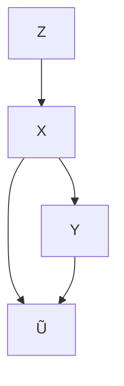
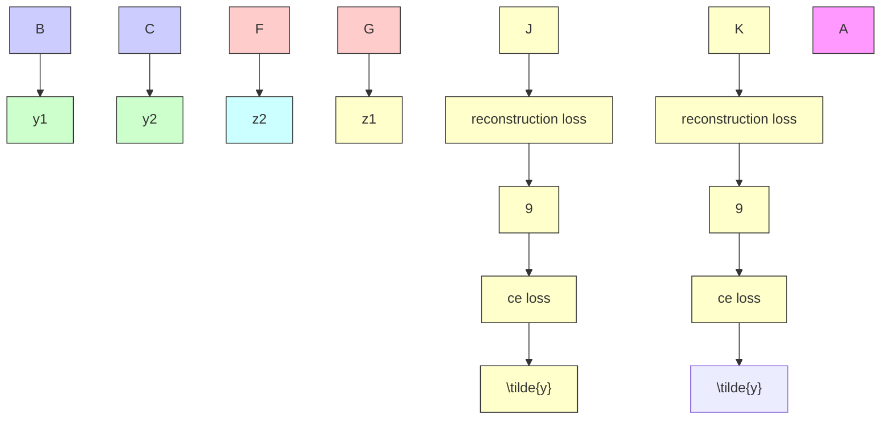

# 第11章 因果关系促进实例相关标签噪声的可识别性

姚宇，刘同亮，龚明鸣，韩波，牛罡，张坤

## 11.1 引言

带噪声标签的学习可以追溯到文献 [1]，近年来引起了广泛关注 [5, 15, 27, 36]。在现实生活中，大规模数据集很可能包含标签噪声。由于大规模数据集的挖掘过程，人们广泛采用廉价但不完善的方法，例如查询商业搜索引擎 [12]、下载带有标签的社交媒体图像 [16] 或利用机器生成的标签 [11]。这些方法不可避免地会产生带有标签错误的样本。使用此类数据集进行训练会导致深度神经网络的泛化能力较差，因为它们可能会记忆噪声标签 [2, 32]。

为了提高使用噪声标签训练的学习模型的泛化能力，现有的一类标签噪声学习方法是对标签噪声进行建模 [14, 18, 20, 33, 37]。这些方法试图揭示从实例的干净标签到噪声标签的转移关系，即分布 $P ( \tilde { Y } | Y , X )$ ，其中 $\tilde { Y }$ 、$Y$ 和 $X$ 分别表示噪声标签、潜在干净标签和实例的随机变量。其思想是，通过使用分布 $P ( \tilde { Y } | Y , X )$ 和可以通过噪声数据估计的噪声类别后验 $P ( { \tilde { Y } } | X )$ 来推断干净类别后验 $P ( Y | X )$ [33]。换句话说，仅给定噪声数据，当转移关系是可识别的时，分类器可以被学习以收敛到由干净数据定义的最优分类器，并具有理论保证。然而，转移关系在一般情况下是不可识别的。为了使其可识别，人们对转移关系做出了不同的假设。例如，Natarajan 等人 [18] 假设转移关系是**实例无关（instance-independent）**的，即 $P ( \tilde { Y } | Y , X ) = P ( \tilde { Y } | Y )$ ；Xia 等人 [29] 假设 $P ( \tilde { Y } | Y , X )$ 依赖于实例的不同部分；Cheng 等人 [5] 假设标签噪声率有上界。在实践中，这些假设可能无法满足，并且仅凭噪声数据难以验证。

在本章中，除了直接对转移关系做出假设外，我们通过利用因果信息进一步促进转移矩阵 $P ( \tilde { Y } | Y , X )$ 的可识别性，为实例相关标签噪声学习提供了一个新的因果视角。具体来说，我们假设实例相关标签噪声是根据图 11.1 中简化的因果图生成的。在现实世界的应用中，许多数据集是根据这个提出的生成过程生成的。例如，对于**街景门牌号（Street View House Number, SVHN）数据集** [19]，$X$ 表示包含数字的图像；$Y$ 表示车牌上显示的数字的干净标签；$Z$ 表示捕捉影响图像生成信息的潜在变量，例如方向、光照和字体样式。在这种情况下，$Y$ 是 $X$ 的原因，因为因果生成过程可以描述如下。首先，根据街道号码生成门牌并安装在前门上。然后，由（安装在谷歌街景车上的）相机捕捉门牌以形成 $X$，同时考虑照明和视角等其他因素。最后，收集包含门牌号码的图像并重新标注以形成数据集。让我们将标注的标签表示为噪声标签 $\tilde { Y }$，因为标注者可能并不总是可靠的，特别是当数据集非常大但预算有限时。在标注过程中，噪声标签通常基于特征 $X$ 和从包含 $X$ 和 $Y$ 的一小部分干净样本中获得的先验知识生成。因此，$X$ 和 $Y$ 都对 $\tilde { Y }$ 的生成有贡献，并且是 $\tilde { Y }$ 的原因，但 $Y$ 可能不是直接原因。为了更好地说明，我们在因果图中简化了这个过程。请注意，许多图像数据集是在 $Y$ 导致 $X$ 的因果关系下收集的，例如广泛使用的 FashionMNIST 和 CIFAR。当我们基于它们合成标签噪声时，我们将得到图 11.1 所示的因果图。一些数据集可能是在 $X$ 导致 $Y$ 的因果关系下生成的。除了使用领域知识外，不同的因果关系可以通过使用**因果发现方法（causal discovery methods）** [22, 25, 26] 进行验证。

**图 11.1** 一个图形化因果模型揭示了包含实例相关标签噪声的数据的生成过程，其中阴影变量 $X$ 和 $\tilde { Y }$ 是可观测的，非阴影变量 $Z$ 和 $Y$ 是潜在的

当潜在干净标签 $Y$ 是 $X$ 的原因时，分布 $P ( X )$ 和 $P ( Y | X )$ 相互纠缠 [23]。换句话说，如果干净类别后验 $P ( Y | X )$ 发生变化，分布 $P ( X )$ 也会发生变化，这意味着 $P ( X )$ 包含关于 $P ( Y | X )$ 的一些信息。为了利用 $P ( X )$ 帮助估计 $P ( Y | X )$ ，我们利用因果生成过程，通过对 $P ( X )$ 进行生成建模来估计干净类别条件分布 $P ( X | Y )$ 。对 $P ( X | Y )$ 的建模反过来促进了转移关系的可识别性，并有利于 $P ( Y | X )$ 的学习。例如，在图 11.2a 中，我们向 MOON 数据集添加了噪声率为 45%（即 IDLN-45%）的实例相关标签噪声，并采用了不同的方法 [7, 35] 来解决标签噪声学习问题。如图 11.2b 和图 11.2c 所示，以前的方法无法推断出干净标签。相比之下，通过约束实例的条件分布，即通过将潜在变量 $Z$ 的维度设置为一维并从 $Z$ 重建 $X$ 来限制每个类别的数据位于一个流形上，标签转移以及干净标签可以被成功恢复（通过所提出的方法），如图 11.2d 所示。

具体来说，为了利用因果图促进转移矩阵的可识别性，我们提出了 **CausalNL**，这是一种受因果启发的深度生成方法，它对所有可观测和潜在变量的因果结构进行建模，即实例 $X$ 、噪声标签 $\tilde { Y }$ 、潜在特征 $Z$ 和潜在干净标签 $Y$ 。所提出的生成模型捕捉了因果图所指示的变量关系。此外，基于**变分自编码器（variational autoencoder, VAE）**框架 [9]，我们构建了一个推理网络，通过最大化给定噪声数据上的边际似然 $p ( X , { \tilde { Y } } )$ 来有效推断潜在变量 $Z$ 和 $Y$ 。在解码器阶段，将利用实例的条件分布 $P ( X | Y , Z )$ 和转移关系 $P ( \tilde { Y } | Y , X )$ 来重建数据，即

$$
p _ {\theta} (X, \tilde {Y}) = \int_ {z, y} P (Z = z) P (Y = y) p _ {\theta_ {1}} (X | Y = y, Z = z) p _ {\theta_ {2}} (\tilde {Y} | Y = y, X) \mathrm{d} z \mathrm{d} y
$$

将被利用，其中 $\theta : = ( \theta _ { 1 } , \theta _ { 2 } )$ 是因果生成模型的参数（更多细节见第 11.3 节）。从高层次来看，根据该方程，给定噪声数据以及 $Z$ 和 $Y$ 的分布，约束 $p _ { \theta _ { 1 } } ( X | Y , Z )$ 也将大大减少 $p _ { \theta _ { 2 } } ( { \tilde { Y } } | Y , X )$ 的不确定性，从而有助于转移矩阵的可识别性。请注意，对 $p _ { \theta _ { 1 } } ( X | Y , Z )$ 施加约束是很自然的，例如，图像通常具有低维流形 [3]。我们可以限制变量 $Z$ 为低维，以满足对 $p _ { \theta _ { 1 } } ( X | Y , Z )$ 的约束。通过让模型捕捉因果结构并对实例施加约束以更好地建模标签噪声，所提出的方法显著优于基线方法。当标签噪声率较大时，这种优越性通过分类性能的大幅提升得以证明。

## 11.2 噪声标签与因果关系

在本节中，我们首先描述如何对标签噪声进行建模。之后，我们介绍结构因果模型。然后我们讨论如何利用该模型来促进转移关系的可识别性并帮助学习分类器。

### 11.2.1 转移关系

仅通过使用带有噪声标签的数据来构建统计一致的分类器，这些分类器将收敛到使用干净数据定义的最优分类器，必须识别出转移关系 $P ( \tilde { Y } | Y , X )$ 。给定一个实例，条件分布可以写成一个 $C \times C$ 矩阵，称为**转移矩阵（transition matrix）** [20, 28, 29]，其中 $C$ 表示类别数。具体来说，对于每个实例 $x$，存在一个转移矩阵 $T ( x )$ 。转移矩阵的第 $i j$ 个元素是 $T _ { i j } ( x ) = P ( \tilde { Y } = j | Y = i , X = x )$ ，它表示具有干净标签 $Y = i$ 的实例 $x$ 将具有噪声标签 $\tilde { Y } = j$ 的概率。

转移矩阵已被广泛研究以构建统计一致的分类器，因为干净类别后验分布 $P ( Y | x ) = [ P ( Y = 1 | X =$ $x ) , . . . , P ( Y = C | X = x ) ] ^ { \intercal }$ 可以通过使用转移矩阵和噪声类别后验 $P ( \tilde { Y } | x ) = [ P ( \tilde { Y } = 1 | X = x ) , \dots , P ( \tilde { Y } = C | X = x ) ] ^ { \top }$ 来推断，即我们有 $P ( \tilde { Y } | x ) = T ( x ) P ( Y | x )$ 。具体来说，转移矩阵通常用于校正损失以构建分类器一致的算法。设 $h : X \to \Delta _ { C - 1 }$ 对 $P ( \pmb { Y } | \boldsymbol { x } )$ 建模，其中 $\Delta$ 表示概率单纯形。设 $\ell _ { c e }$ 为交叉熵损失，则

$$
\arg \min _ {h} \mathbb {E} _ {x, y} [ \ell_ {c e} (y, h (x)) ] = \arg \min _ {h} \mathbb {E} _ {x, \tilde {y}} [ \ell_ {c e} (\tilde {y}, T (x) h (x)) ].
$$

上述方程表明，如果 $T ( x )$ 给定，则在噪声分布下校正损失 $\ell _ { c e } ( \tilde { y } , T ( x ) h ( x ) )$ 的最小化器与干净分布下原始损失 $\ell _ { c e } ( y , h ( x ) )$ 的最小化器相同 [18, 20, 24]。此外，$T ( X )$ 已被用于校正假设以构建分类器一致的算法，例如文献 [18, 20, 24]。此外，最先进的统计不一致算法 [7, 8] 也使用转移矩阵的对角线元素来帮助选择用于训练的可信样本。

然而，一般来说，分布 $P ( \tilde { Y } | Y , X )$ 是不可识别的 [27]。为了使其可识别，人们做出了不同的假设。例如，**类别相关假设（class-dependent assumption）** 假设具有相同干净标签的实例具有相同的转移矩阵 [14]；**有界噪声率假设（bounded noise rate assumption）** [6] 假设噪声率有上界；**部分相关标签噪声假设（part-dependent label noise assumption）** [29] 假设具有相似部分的实例具有相似的转移矩阵。这些假设帮助方法取得了优异的性能，但假设难以在经验上验证或满足，限制了它们在实际中的应用。例如，类别相关假设是最广泛使用的假设。它要求给定干净标签 $Y$，噪声标签 $\tilde { Y }$ 与实例 $X$ 条件独立，即 $P ( \tilde { Y } | Y , X ) = P ( \tilde { Y } | Y )$ 。在这样的假设下，转移关系 $P ( \tilde { Y } | Y )$ 可以借助**锚点假设（anchor point assumption）** [13, 14, 33] 成功识别。然而，在现实场景中，在同一类别内，一些实例不太可能被收集因而难以准确标注，而另一些实例则更容易被收集因而易于标注。这意味着这些实例的转移矩阵不仅取决于类别，通常还取决于它们的频率。因此，类别相关假设很难满足。

## 11.2.2 结构因果模型（Structural Causal Models）

受现有方法局限性的启发，我们提供了一种新的因果视角来学习**实例依赖标签噪声（instance-dependent label noise）**的可识别性。在此，我们简要介绍本文使用的因果理论 [21] 的一些背景知识。**结构因果模型（Structural Causal Model, SCM）**由一组通过函数连接的变量组成。它代表了信息的流动，揭示了所有变量之间的因果关系，提供了对数据生成过程的细粒度描述。由 SCM 编码的因果结构可以表示为一个**图形化因果模型（graphical causal model）**，如图 11.1 所示，其中每个节点是一个变量，每条边是一个函数。与图 11.1 中图形对应的 SCM 可以写成：

$$
Z = \epsilon_ {Z}, Y = \epsilon_ {Y}, X = f (Z, Y, \epsilon_ {X}), \tilde {Y} = f (X, Y, \epsilon_ {\tilde {Y}}), \tag {11.1}
$$

其中 $\epsilon$ 是遵循某些分布的独立**外生变量（exogenous variables）**。外生变量的出现使得 $X$ 和 $\tilde { Y }$ 的生成成为一个随机过程。每个方程指定了一个变量以其父变量（可能为空集）为条件的分布。

通过观察 SCM，可以清晰地解释实例对学习分类器的帮助。具体来说，实例 $X$ 是其标签 $Y$ 和**潜在特征（latent feature）** $Z$ 的函数，这意味着实例 $X$ 是根据 $Y$ 和 $Z$ 生成的。因此，$X$ 必须包含关于其干净标签 $Y$ 和潜在特征 $Z$ 的信息。这就是 $P ( X )$ 可以帮助识别 $P ( Y | X )$ 以及 $P ( Z | X )$ 的原因。然而，由于干净标签不可用，在无监督设置下很难从 $P ( X )$ 中完全识别出 $P ( Y | X )$。例如，在图 11.2 所示的 MOON 数据集上，通过施加流形约束可以发现两个聚类，但无法推断每个聚类属于哪个类别。

我们在下面讨论，可以利用 $P ( X | Y )$ 的性质来帮助建模标签噪声，即，促进**转移关系（transition relationship）**的可识别性，从而学习到更好的分类器。具体来说，在**马尔可夫条件（Markov condition）** [21]（直观上意味着外生变量的独立性）下，由 SCM 指定的联合分布 $P ( \tilde { Y } , X , Y , Z )$ 可以分解为以下形式：

$$
P (X, \tilde {Y}, Y, Z) = P (Y) P (Z) P (X | Y, Z) P (\tilde {Y} | Y, X). \tag {11.2}
$$

等式中的分布可以由生成模型 VAE [9] 建模，该模型通过使用带噪数据推断潜在变量 $Y$ 和 $Z$，这将在下一节中详细解释。在解码器阶段，给定带噪数据以及 $Z$ 和 $Y$ 的分布，对 $P ( X | Y , Z )$ 施加约束将减少分布 $P ( \tilde { Y } | Y , X )$ 的不确定性。换句话说，建模 $P ( X | Y , Z )$ 将促进转移关系的可识别性，从而更好地建模标签噪声。由于 $P ( \tilde { Y } | Y , X )$ 充当连接带噪标签和干净标签的桥梁，因此我们可以仅使用带噪数据更好地学习 $P ( Y | X )$ 或分类器。

通常有两种方法对实例施加约束，即假设一个特定的**参数化生成模型（parametric generative model）**或引入实例的先验知识。在本章中，由于我们主要研究带噪声标签的图像分类问题，我们专注于图像的流形性质，并对实例施加**低维流形约束（low-dimensional manifold constraint）**。

## 11.3 因果关系捕获的实例依赖标签噪声学习（Causality Captured Instance-Dependent Label-Noise Learning）

在本节中，我们提出了一种**结构生成方法（structural generative method）**，该方法捕获因果关系并利用 $P ( X )$ 来帮助识别标签-噪声转移矩阵，因此，所提出的方法产生了一个更好的分类器，能够分配更准确的标签 [34]。

为了建模带噪数据的生成过程并近似带噪数据的分布，我们的方法被设计为遵循因果分解（见公式 11.2）。具体来说，我们的模型包含两个解码器网络，它们联合建模分布 $p _ { \theta } ( X , { \tilde { Y } } | Y , Z )$，以及两个编码器（推断）网络，它们联合建模后验分布 $q _ { \phi } ( Z , Y | X )$。这里我们详细讨论模型的每个组成部分。

让两个解码器网络分别建模分布 $p _ { \theta _ { 1 } } ( X | Y , Z )$ 和 $p _ { \theta _ { 2 } } ( { \tilde { Y } } | Y , X )$。令 $\theta _ { 1 }$ 和 $\theta _ { 2 }$ 为这些分布的可学习参数。不失一般性，我们设 $p ( Z )$ 为标准正态分布，$p ( Y )$ 为均匀分布。那么，对公式 11.2 中的联合分布建模归结为对分布 $p _ { \theta } ( X , { \tilde { Y } } | Y , Z )$ 的建模，该分布分解如下：

$$
p _ {\theta} (X, \tilde {Y} | Y, Z) = p _ {\theta_ {1}} (X | Y, Z) p _ {\theta_ {2}} (\tilde {Y} | Y, X). \tag {11.3}
$$

为了仅使用可观测变量 $X$ 和 $\tilde { Y }$ 来推断潜在变量 $Z$ 和 $Y$，我们可以设计一个推断网络来建模变分分布 $q _ { \phi } ( Z , Y | \tilde { Y } , X )$。具体来说，令 $q _ { \phi _ { 2 } } ( Z | Y , X )$ 和 $q _ { \phi _ { 1 } } ( Y | \tilde { Y } , X )$ 为分别由可学习参数 $\phi _ { 1 }$ 和 $\phi _ { 2 }$ 参数化的分布，后验分布可以分解如下：

$$
q _ {\phi} (Z, Y | \tilde {Y}, X) = q _ {\phi_ {2}} (Z | Y, X) q _ {\phi_ {1}} (Y | \tilde {Y}, X), \tag {11.4}
$$

其中，我们没有在 $q _ { \phi _ { 2 } } ( Z | Y , X )$ 中包含 $\tilde { Y }$ 作为条件变量，因为因果图隐含了 $Z \perp \perp \tilde { Y } | X , Y$。这种后验形式的一个问题是，我们无法直接使用 $q _ { \phi _ { 1 } } ( Y | { \tilde { Y } } , X )$ 来预测测试数据上的标签，因为测试数据上没有 $\tilde { Y }$。

为了使我们的方法能够高效准确地推断干净标签，我们通过假设给定实例 $X$，干净标签 $Y$ 与带噪标签 $\tilde { Y }$ 条件独立，即 $q _ { \phi _ { 1 } } ( Y | \tilde { Y } , X ) = q _ { \phi _ { 1 } } ( Y | X )$，来近似 $q _ { \phi _ { 1 } } ( Y | { \tilde { Y } } , X )$。这种近似的近似误差不大，因为图像包含足够的信息来预测干净标签。因此，我们可以将公式 11.4 简化为如下形式：

$$
q _ {\phi} (Z, Y | X) = q _ {\phi_ {2}} (Z | Y, X) q _ {\phi_ {1}} (Y | X), \tag {11.5}
$$

这样，我们的编码器网络分别建模 $q _ { \phi _ { 2 } } ( Z | Y , X )$ 和 $q _ { \phi _ { 1 } } ( Y | X )$。通过这种方式，$q _ { \phi _ { 1 } } ( Y | X )$ 可以用于高效地推断干净标签。我们还发现，建模 $q _ { \phi _ { 1 } } ( Y | X )$ 的编码器网络充当了**正则化器（regularizer）**，有助于识别 $p _ { \theta _ { 2 } } ( { \tilde { Y } } | Y , X )$。此外，为了从中受益，我们的方法可以作为一个通用框架，能够轻松地与当前的判别式标签噪声方法 [7, 17, 27] 集成，我们将通过将协同教学（co-teaching）[7] 与我们的方法相结合来展示这一点。

**证据下界（Evidence Lower Bound, ELBO）** 由于边际分布 $p _ { \theta } ( X , { \tilde { Y } } )$ 通常是**难处理的（intractable）**，为了仅根据带噪数据学习参数集 $\{ \theta _ { 1 } , \theta _ { 2 } , \phi _ { 1 } , \phi _ { 2 } \}$，我们遵循**变分推断框架（variational inference framework）** [4]，最小化每个数据点 $( x , { \tilde { y } } )$ 的边际似然的负证据下界 $- E L B O ( x , \tilde { y } )$，而不是最大化边际似然本身。

**引理 11.1** 通过分别集成公式 (11.5) 和 (11.3) 中的编码器和解码器网络，$E L B O ( x , \tilde { y } )$ 可以写为：

$$
\begin{array}{l} E L B O (x, \tilde {y}) = \mathbb {E} _ {(z, y) \sim q _ {\phi} (Z, Y | x)} [ \log p _ {\theta_ {1}} (x | y, z) ] + \mathbb {E} _ {y \sim q _ {\phi_ {1}} (Y | x)} [ \log p _ {\theta_ {2}} (\tilde {y} | y, x) ] \\ - k l \left(q _ {\phi_ {1}} (Y | x) \| p (Y)\right) - \mathbb {E} _ {y \sim q _ {\phi_ {1}} (Y | x)} \left[ k l \left(q _ {\phi} (Z | y, x) \| p (Z)\right) \right], \tag {11.6} \\ \end{array}
$$

其中 $k l ( \cdot )$ 是两个分布之间的**库尔贝克-莱布勒散度（Kullback–Leibler divergence）**。

**证明** 回顾我们的编码器建模以下分布：

$$
q _ {\phi} (Z, Y | X) = q _ {\phi_ {2}} (Z | Y, X) q _ {\phi_ {1}} (Y | X),
$$

解码器建模以下分布：

$$
p _ {\theta} (X, \tilde {Y} | Y, Z) = p _ {\theta_ {1}} (X | Y, Z) p _ {\theta_ {2}} (\tilde {Y} | Y, X).
$$

最大化每个数据点 $( x , \tilde { y } )$ 的对数似然 $p _ { \boldsymbol { \theta } } ( x , \widetilde { y } )$ 可以写为：

$$
\begin{array}{l} \log p _ {\theta} (x, \tilde {y}) = \log \int_ {z} \int_ {y} p _ {\theta} (x, \tilde {y}, z, y) d y d z \\ = \log \int_ {z} \int_ {y} p _ {\theta} (x, \tilde {y}, z, y) \frac {q _ {\phi} (z , y | x)}{q _ {\phi} (z , y | x)} d y d z \\ = \log \mathbb {E} _ {(z, y) \sim q _ {\phi} (Z, Y | x)} \left[ \frac {p _ {\theta} (x , \tilde {y} , z , y)}{q _ {\phi} (z , y | x)} \right] \\ \geq \mathbb {E} _ {(z, y) \sim q _ {\phi} (Z, Y | x)} \left[ \log \frac {p _ {\theta} (x , \tilde {y} , z , y)}{q _ {\phi} (z , y | x)} \right] := \operatorname{ELBO} (x, \tilde {y}) \\ = \mathbb {E} _ {(z, y) \sim q _ {\phi} (Z, Y | x)} \left[ \log \frac {p (z) p (y) p _ {\theta_ {1}} (x | y , z) p _ {\theta_ {2}} (\tilde {y} | y , x))}{q _ {\phi} (z , y | x)} \right] \\ = \mathbb {E} _ {(z, y) \sim q _ {\phi} (Z, Y | x)} \left[ \log \left(p _ {\theta_ {1}} (x | y, z)\right) \right] \\ + \mathbb {E} _ {(z, y) \sim q _ {\phi} (Z, Y | x)} \left[ \log \left(p _ {\theta_ {2}} (\tilde {y} | y, x)\right) \right] \\ + \mathbb {E} _ {(z, y) \sim q _ {\phi} (Z, Y | x)} \left[ \log \left(\frac {p (z) p (y)}{q _ {\phi_ {2}} (z | y , x) q _ {\phi_ {1}} (y | x)}\right) \right]. \tag {11.7} \\ \end{array}
$$

上述 $\operatorname { E L B O } ( x , \tilde { y } )$ 可以进一步简化。具体来说：

$$
\mathbb {E} _ {(z, y) \sim q _ {\phi} (Z, Y | x)} [ \log \big (p _ {\theta_ {2}} (\tilde {y} | y, x) \big) ] = \mathbb {E} _ {y \sim q _ {\phi_ {1}} (Y | x)} \mathbb {E} _ {z \sim q _ {\phi_ {2}} (Z | y, x)} [ \log \big (p _ {\theta_ {2}} (\tilde {y} | y, x) \big) ]
$$

$$
= \mathbb {E} _ {y \sim q _ {\phi_ {1}} (Y | x)} [ \log \big (p _ {\theta_ {2}} (\tilde {y} | y, x) \big) ], \tag {11.8}
$$

类似地：

$$
\begin{array}{l} \mathbb {E} _ {(z, y) \sim q _ {\phi} (Z, Y | x)} \left[ \log \left(\frac {p (z) p (y)}{q _ {\phi_ {2}} (z | y , x) q _ {\phi_ {1}} (y | x)}\right) \right] \\ = \mathbb {E} _ {y \sim q _ {\phi_ {1}} (Y | x)} \mathbb {E} _ {z \sim q _ {\phi_ {2}} (Z | y, x)} \left[ \log \left(\frac {p (z) p (y)}{q _ {\phi_ {2}} (z | y , x) q _ {\phi_ {1}} (y | x)}\right) \right] \\ = \mathbb {E} _ {y \sim q _ {\phi_ {1}} (Y | x)} \mathbb {E} _ {z \sim q _ {\phi_ {2}} (Z | y, x)} \left[ \log \left(\frac {p (y)}{q _ {\phi_ {1}} (y | x)}\right) \right] \\ + \mathbb {E} _ {y \sim q _ {\phi_ {1}} (Y | x)} \mathbb {E} _ {z \sim q _ {\phi_ {2}} (Z | y, x)} \left[ \log \left(\frac {p (z)}{q _ {\phi_ {2}} (z | y , x)}\right) \right] \\ = \mathbb {E} _ {y \sim q _ {\phi_ {1}} (Y | x)} \left[ \log \left(\frac {p (y)}{q _ {\phi_ {1}} (y | x)}\right) \right] \\ + \mathbb {E} _ {y \sim q _ {\phi_ {1}} (Y | x)} \mathbb {E} _ {z \sim q _ {\phi_ {2}} (Z | y, x)} \left[ \log \left(\frac {p (z)}{q _ {\phi_ {2}} (z | y , x)}\right) \right] \\ \end{array}
$$

$$
= - k l (q _ {\phi_ {1}} (Y | x) \| p (Y)) - \mathbb {E} _ {y \sim q _ {\phi_ {1}} (Y | x)} \left[ k l (q _ {\phi_ {2}} (Z | y, x) \| p (Z)) \right], \tag {11.9}
$$

**算法 1** CausalNL

**输入**: 带噪样本 S, 平均噪声率 $\rho$ , 总轮数 $T_{max}$ , 批次大小 N。

1: **对于** $T = 1, \ldots, T_{max}$ :
2:   **对于** S 中的小批量 $\bar{S} = \{x_i\}_{i=0}^N$ , $\tilde{L} = \{\tilde{y}_i\}_{i=0}^N$ :
3:     将 $\bar{S}$ 馈送到编码器 $\hat{q}_{\phi_1^1}$ 和 $\hat{q}_{\phi_1^2}$ 以分别获取干净标签集 $L_1$ 和 $L_2$ ;
4:     将 $(\bar{S}, L_1)$ 馈送到编码器 $\hat{q}_{\phi_2^1}$ 以获取表示集 $H_1$ ，将 $(\bar{S}, L_2)$ 馈送到 $\hat{q}_{\phi_2^2}$ 以获取 $H_2$ ;
5:     使用协同教学损失更新 $\hat{q}_{\phi_2^1}$ 和 $\hat{q}_{\phi_2^2}$ ;
6:     将 $(L_1, H_1)$ 馈送到解码器 $\hat{p}_{\theta_1^1}$ 以获取重建数据集 $\bar{S}_1$ ，将 $(L_2, H_2)$ 馈送到 $\hat{p}_{\theta_1^2}$ 以获取 $\bar{S}_2$ ;
7:     将 $(\bar{S}_1, L_1)$ 馈送到解码器 $\hat{p}_{\theta_2^1}$ 以获取预测的带噪标签 $\tilde{L}_1$ ，将 $(\bar{S}_2, L_2)$ 馈送到 $\hat{p}_{\theta_2^2}$ 以获取 $\tilde{L}_2$ ;
8:     通过在 $(\bar{S}, \bar{S}_1, \tilde{L}, \tilde{L}_1)$ 上计算 ELBO 来更新网络 $\hat{q}_{\phi_1^1}$ , $\hat{q}_{\phi_2^1}$ , $\hat{p}_{\theta_1^1}$ 和 $\hat{p}_{\theta_2^1}$ ，通过在 $(\bar{S}, \bar{S}_2, \tilde{L}, \tilde{L}_2)$ 上计算 ELBO 来更新网络 $\hat{q}_{\phi_1^2}$ , $\hat{q}_{\phi_2^2}$ , $\hat{p}_{\theta_1^2}$ 和 $\hat{p}_{\theta_2^2}$ ;
**输出**: 推断网络 $\hat{q}_{\phi_1^1}$ 。

通过将公式 (11.8) 和 (11.9) 代入公式 (11.7)，我们得到：

$$
\begin{array}{l} \operatorname{ELBO} (x, \tilde {y}) = \mathbb {E} _ {(z, y) \sim q _ {\phi} (Z, Y | x)} [ \log p _ {\theta_ {1}} (x | y, z) ] + \mathbb {E} _ {y \sim q _ {\phi_ {1}} (Y | x)} [ \log p _ {\theta_ {2}} (\tilde {y} | y, x) ] \\ - k l \left(q _ {\phi_ {1}} (Y | x) \| p (Y)\right) - \mathbb {E} _ {y \sim q _ {\phi_ {1}} (Y | x)} \left[ k l \left(q _ {\phi_ {2}} (Z | y, x) \| p (Z)\right) \right], \tag {11.10} \\ \end{array}
$$

至此证明完成。

我们的模型通过最大化 ELBO 中的第一个期望来学习**类条件分布（class-conditional distribution）** $P ( X | Y )$，这等价于最小化**重建损失（reconstruction loss）** [9]。通过学习 $P ( X )$，推断网络 $q _ { \phi _ { 1 } } ( Y | X )$ 必须选择一个合适的参数 $\phi ^ { * }$，该参数会采样 $y$ 和 $z$ 以最小化重建损失 $\mathbb { E } _ { ( z , y ) \sim q _ { \phi } ( Z , Y | x ) } \left[ \log p _ { \theta _ { 1 } } ( x | y , z ) \right]$。当 $Z$ 的维度选择得远小于 $X$ 的维度时，为了获得更小的重建误差，解码器必须利用 $Y$ 提供的信息，并强制 $Y$ 的值对预测有用。此外，我们将 $Y$ 约束为**独热向量（one-hot vector）**，那么 $Y$ 可以是一个聚类 ID，$X$ 的流形属于该聚类。

到目前为止，潜在变量 $Y$ 可以被推断为聚类 ID，而不是干净的类别 ID。为了进一步将聚类与干净标签联系起来，一种朴素的方法是选择一些**可靠样本（reliable examples）**，并保持这些样本上的聚类数量与带噪标签一致。通过这种方式，可以有效地推断潜在表示 $Z$ 和干净标签 $Y$，从而促进转移关系 $p _ { \theta _ { 2 } } ( { \tilde { Y } } | Y , X )$ 的可识别性。为了实现这一点，我们的方法并非预先显式选择可靠样本，而是以**端到端（end-to-end）**的方式进行训练，即，在模型参数更新过程中，通过使用**协同教学技术（co-teaching technique）** [7] 动态选择可靠样本。这种方法的好处是可以大大减少可靠样本的选择偏差 [6]。直观上，准确选择的可靠样本可以促进 $p _ { \theta _ { 2 } } ( { \tilde { Y } } | Y , X )$ 和 $p _ { \theta _ { 1 } } ( X | Y , Z )$ 的可识别性，而准确估计的 $p _ { \theta _ { 2 } } ( { \tilde { Y } } | Y , X )$ 和 $p _ { \theta _ { 1 } } ( X | Y , Z )$ 将促使网络选择更多可靠样本。

**图 11.3** 我们方法的工作流程

## 11.3.1 实际实现（Practical implementation）

我们的方法总结在**算法 1（Algorithm 1）**中，并在**图 11.3（Fig. 11.3）**中进行了说明。在此，我们介绍模型的架构和**损失函数（loss functions）**。

**模型结构（Model structure）** 由于我们在模型训练中引入了**协同教学（co-teaching）**，因此需要在方法中添加一组**解码器（decoder）**和**编码器（encoder）**的副本。由于两个分支共享相同的架构，我们首先介绍第一个分支的细节，然后简要介绍第二个分支。

对于第一个分支，我们需要一组编码器和解码器来建模公式 11.3 和 11.5 中的分布。具体来说，我们有两个编码器网络

$$
Y _ {1} = \hat {q} _ {\phi_ {1} ^ {1}} (X), Z _ {1} \sim \hat {q} _ {\phi_ {2} ^ {1}} (X, Y _ {1})
$$

用于公式 11.5，以及两个解码器网络

$$
X _ {1} = \hat {p} _ {\theta_ {1} ^ {1}} (Y _ {1}, Z _ {1}), \tilde {Y} _ {1} = \hat {p} _ {\theta_ {2} ^ {1}} (X _ {1}, Y _ {1})
$$

用于公式 11.3。第一个编码器 ${ \hat { q } } _ { \phi _ { 1 } ^ { 1 } } ( X )$ 接收一个实例 $X$ 作为输入，并输出一个预测的**干净标签（clean label）** $Y _ { 1 }$。第二个编码器 $\hat { q } _ { \phi _ { 7 } ^ { 1 } } ( X , Y _ { 1 } )$ 同时接收实例 $X$ 和生成的标签 $Y _ { 1 }$ 作为输入，并输出一个**潜在特征（latent feature）** $Z _ { 1 }$。然后，生成的 $Y _ { 1 }$ 和 $Z _ { 1 }$ 被传递给解码器 $\hat { p } _ { \theta _ { 1 } ^ { 1 } } ( Y _ { 1 } , Z _ { 1 } )$，该解码器将生成一个**重建图像（reconstructed image）** $X _ { 1 }$。最后，生成的 $X _ { 1 }$ 和 $Y _ { 1 }$ 将成为另一个解码器 $\hat { p } _ { \theta _ { 7 } ^ { 1 } } ( X _ { 1 } , Y _ { 1 } )$ 的输入，该解码器返回预测的**噪声标签（noisy labels）** $\tilde { Y } _ { 1 }$。值得一提的是，采样中使用了**重参数化技巧（reparameterization trick）** [9]，以允许在 $\hat { q } _ { \phi _ { 7 } ^ { 1 } } ( X , Y _ { 1 } )$ 中进行**反向传播（backpropagation）**。

类似地，第二个分支中的编码器和解码器网络定义如下

$$
Y _ {2} = \hat {q} _ {\phi_ {1} ^ {2}} (X), Z _ {2} \sim \hat {q} _ {\phi_ {2} ^ {2}} (X, Y _ {2}), X _ {2} = \hat {p} _ {\theta_ {1} ^ {2}} (Y _ {2}, Z _ {2}), \tilde {Y} _ {2} = \hat {p} _ {\theta_ {2} ^ {2}} (X _ {2}, Y _ {2}).
$$

在训练过程中，对于每个**小批量（mini-batch）**，我们让两个编码器 $\hat { q } _ { \phi _ { 1 } ^ { 1 } } ( X )$ 和 $\hat { q } _ { \phi _ { 1 } ^ { 2 } } ( X )$ 互相教学。

**损失函数（Loss functions）** 我们将损失函数分为两部分。第一部分是公式 11.7 中的**负证据下界（negative ELBO）**，第二部分是**协同教学损失（co-teaching loss）**。详细的公式推导将在**附录 B（Appendix B）**中给出。

对于负 ELBO，第一项 $- \mathbb { E } _ { ( z , y ) \sim q _ { \phi } ( Z , Y \mid x ) } \left[ \log p _ { \theta _ { 1 } } ( x \mid y , z ) \right]$ 是一个**重建损失（reconstruction loss）**，我们使用 $\ell1$ 损失进行重建。第二项是 $- \mathbb { E } _ { y \sim q _ { \phi _ { 1 } } ( Y | x ) }$ log $p _ { \theta _ { 2 } } ( \tilde { y } | y , x ) \big ]$，其目标是在给定推断 $y$ 和 $x$ 的情况下学习噪声标签，这可以简单地通过在两个解码器 $\hat { p } _ { \theta _ { \mathrm { 2 } } ^ { 1 } } ( X _ { 1 } , Y _ { 1 } )$ 和 $\hat { p } _ { \theta _ { 7 } ^ { 2 } } ( X _ { 2 } , Y _ { 2 } )$ 的输出上使用训练数据中包含的噪声标签的**交叉熵损失（cross-entropy loss）** 来替代。另外两项是两个**正则化项（regularizers）**。为了计算 $k l ( q _ { \phi _ { 1 } } ( Y | x ) \| p ( Y ) )$，我们假设先验 $P ( Y )$ 是一个**均匀分布（uniform distribution）**。那么，最小化 $k l ( q _ { \phi _ { 1 } } ( Y | x ) \| p ( Y ) )$ 等价于最大化每个实例 $x$ 的 $q _ { \phi _ { 1 } } ( Y | x )$ 的**熵（entropy）**，即 $\textstyle - \sum _ { y } q _ { \phi _ { 1 } } ( y | x )$ log $q _ { \phi _ { 1 } } ( y | x )$ )。引入这一项的好处是可以减少**推断网络（inference network）** 的**过拟合（overfitting）**问题。对于 $\begin{array} { r } { \mathbb { E } _ { y \sim q _ { \phi _ { 1 } } ( Y | x ) } \left[ k l ( q _ { \phi } ( Z | y , x ) \| p ( Z ) ) \right] } \end{array}$，我们令 $p ( Z )$ 为一个标准的**多元高斯分布（multivariate Gaussian distribution）**。由于经验上 $q _ { \phi } ( Z | y , x )$ 是编码器 ${ \hat { q } } _ { \phi _ { 1 } ^ { 1 } } ( X )$ 和 $\hat { q } _ { \phi _ { 1 } ^ { 2 } } ( X )$，并且这两个编码器被设计为**确定性映射（deterministic mappings）**。因此，可以去掉期望项，仅保留 KL 项 $k l ( q _ { \phi } ( Z | y , x ) | | p ( Z ) )$。当 $p ( Z )$ 是高斯分布时，KL 项可以有一个**闭式解（closed form solution）** [9]，即 $\begin{array} { r } { - \frac { 1 } { 2 } \sum _ { j = 1 } ^ { J } ( 1 + \log ( ( \sigma _ { j } ) ^ { 2 } ) - ( \mu _ { j } ) ^ { 2 } - ( \sigma _ { j } ) ^ { 2 } ) } \end{array}$，其中 $J$ 是潜在表示 $z$ 的维度，$\sigma _ { j }$ 和 $\mu _ { j }$ 是编码器的输出。令 $S$ 为带噪声的训练集，$\bar { d } ^ { 2 }$ 为实例 $x$ 的维度。令 $y _ { 1 }$ 和 $z _ { 1 }$ 分别为实例 $x$ 估计的干净标签和潜在表示。第一个分支的 ELBO 的经验版本如下。

$$
\begin{array}{l} \sum_ {(x, \tilde {y}) \in S} \mathrm{ELBO} ^ {1} (x, \tilde {y}) = \sum_ {(x, \tilde {y}) \in S} \left[ \beta_ {0} \frac {1}{d ^ {2}} \| x - \hat {p} _ {\theta_ {1} ^ {1}} (y _ {1}, z _ {1}) \| _ {1} - \beta_ {1} \tilde {y} \log \hat {p} _ {\theta_ {2} ^ {1}} (x _ {1}, y _ {1}) \right. \\ \left. + \beta_ {2} \hat {q} _ {\phi_ {1} ^ {1}} (x) \log \hat {q} _ {\phi_ {1} ^ {1}} (x) + \beta_ {3} \sum_ {j = 1} ^ {J} (1 + \log ((\sigma_ {j}) ^ {2}) - (\mu_ {j}) ^ {2} - (\sigma_ {j}) ^ {2}) \right]. \\ \end{array}
$$

**超参数（Hyper-parameter）** $\beta _ { 0 }$ 和 $\beta _ { 1 }$ 设置为 0.1，$\beta _ { 2 }$ 设置为 $1e-5$，因为鼓励分布在一个小批量（即 128）上均匀可能会导致较大的估计误差。超参数 $\beta _ { 3 }$ 设置为 0.01。第二个分支的 ELBO 经验版本与第一个分支的设置相同。

对于**协同教学损失（co-teaching loss）**，我们直接遵循 Han 等人 [7] 的方法。直观上，在每个小批量中，两个编码器 $\hat { q } _ { \phi _ { 1 } ^ { 1 } } ( X )$ 和 $\hat { q } _ { \phi _ { 1 } ^ { 2 } } ( X )$ 都信任**小损失样本（small-loss examples）**，并通过交叉熵损失互相交换这些样本。用于训练的小损失实例数量随着训练轮次（epoch）的增加而衰减。协同教学损失的实验设置与原始论文 [7] 中的设置相同。

## 11.4 实验（Experiments）

在本节中，我们在合成数据集和真实世界数据集上，将所提方法的分类准确率与流行的**标签噪声学习算法（label-noise learning algorithms）** [7, 8, 14, 17, 20, 27, 35] 进行比较。

## 11.4.1 实验设置（Experimental Setup）

**数据集（Datasets）** 我们在四个数据集的**人工损坏版本（manually corrupted version）**（即 FashionMNIST [30]、SVHN [19]、CIFAR10、CIFAR100 [10]）以及一个真实世界的噪声数据集 Clothing1M [31] 上验证了我们方法的有效性。FashionMNIST 包含 60,000 张训练图像和 10,000 张测试图像，共 10 个类别；SVHN 包含 73,257 张训练图像和 26,032 张测试图像，共 10 个类别。CIFAR10 包含 50,000 张训练图像和 10,000 张测试图像。CIFAR10 和 CIFAR100 都包含 50,000 张训练图像和 10,000 张测试图像，但前者有 10 个图像类别，后者有 100 个图像类别。这四个数据集包含干净数据。我们根据 Xia 等人 [29] 的方法，手动向训练集中添加**实例依赖的标签噪声（instance-dependent label noise）**。Clothing1M 包含 100 万张带有真实世界噪声标签的图像和 10,000 张带有干净标签的测试图像。对于所有合成的噪声数据集，实验重复了五次。

**网络结构与优化（Network structure and optimization）** 为了公平比较，所有实验均在 NVIDIA Tesla V100 上进行，所有方法均使用 PyTorch 实现。对于所有合成噪声数据集，潜在表示 $Z$ 的维度设置为 25。对于优化方法，采用 **Adam 优化器（Adam optimizer）**，学习率使用 PyTorch 中的默认值 $1e-3$。对于编码器网络 ${ \hat { q } } _ { \phi _ { 1 } ^ { 1 } } ( X )$ 和 $\hat { q } _ { \phi _ { 1 } ^ { 2 } } ( X )$，我们使用与基线方法相同的网络结构。具体来说，对于 FashionMNIST 使用 **ResNet-18** 网络，对于 SVHN 和 CIFAR10 使用 **ResNet-34** 网络。在这四个数据集上，使用了相同数量的隐藏层和**特征图（feature maps）**。具体来说：1). $q _ { \phi _ { 2 } } ( Z | Y , X )$ 和 $p _ { \theta _ { 2 } } ( { \tilde { Y } } | Y , X )$ 由两个 4 隐藏层的**卷积网络（convolutional networks）** 建模，对应的特征图数量分别为 32、64、128 和 256；2). $p _ { \theta _ { 1 } } ( X | Y , Z )$ 由一个 4 隐藏层的**转置卷积网络（transposed-convolutional network）** 建模，对应的特征图数量分别为 256、128、64 和 32。我们在这些数据集上每个实验运行了 150 个**轮次（epochs）**。

对于 Clothing1M [31]，我们使用在 **ImageNet** 上预训练的 **ResNet-50** 网络，并且不使用干净训练数据。潜在表示 $Z$ 的维度设置为 100。分布 $q _ { \phi _ { 2 } } ( Z | Y , X )$ 和 $p _ { \theta _ { 2 } } ( { \tilde { Y } } | Y , X )$ 由两个 5 隐藏层的卷积网络建模，对应的特征图数量分别为 32、64、128、256 和 512。分布 $p _ { \theta _ { 1 } } ( X | Y , Z )$ 由一个 5 隐藏层的转置卷积网络建模，对应的特征图数量分别为 512、256、128、64 和 32。我们在 Clothing1M 上运行了 40 个轮次。

**基线方法与评估指标（Baselines and measurements）** 我们将所提方法与以下最先进的方法进行比较：(i) **CE**，即在噪声数据集上使用交叉熵损失训练标准深度网络。(ii) **Decoupling** [17]，即在两个网络预测不同的样本上训练这两个网络。(iii) **MentorNet** [8]、**Co-teaching** [7]，主要通过在具有小损失值的实例上进行训练来处理噪声标签。(iv) **Forward** [20]、**Reweight** [14] 和 **T-Revision** [27]。这些方法利用**类别依赖的转移矩阵（class-dependent transition matrix）** $T$ 来修正损失函数。我们报告每个模型在干净测试集上最后 10 个轮次的平均测试准确率。更高的分类准确率意味着算法对标签噪声具有更强的**鲁棒性（robustness）**。

## 11.4.2 分类准确率评估（Classification accuracy Evaluation）

在合成噪声数据集上的结果 表 11.1、11.2、11.3 和 11.4 分别报告了在 F-MNIST、SVHN、CIFAR-10 和 CIFAR-100 数据集上的分类准确率。合成实验表明，我们的方法在处理**实例依赖型标签噪声（instance-dependent label noise）**方面表现强大，尤其是在高噪声率的情况下。对于所有数据集，与所有基线方法相比，分类准确率下降幅度不大，并且我们提出的方法的优势随着噪声率的增加而增加。此外，结果表明，对于所有这些数据集，$Y$ 应该是 $X$ 的原因，因此使用我们的方法可以提高分类准确率。

**表 11.1 在不同标签噪声水平下，Fashion-MNIST 上分类准确率的均值与标准差（百分比）**

| | IDN-20% | IDN-30% | IDN-40% | IDN-45% | IDN-50% |
|---|---|---|---|---|---|
| CE | 88.54±0.32 | 88.38±0.42 | 84.22±0.35 | 69.72±0.72 | 52.32±0.68 |
| Co-teaching | 91.21±0.31 | 90.30±0.42 | 89.10±0.29 | 86.78±0.90 | 63.22±1.56 |
| Decoupling | 90.70±0.28 | 90.34±0.36 | 88.78±0.44 | 87.54±0.53 | 68.32±1.77 |
| MentorNet | 91.57±0.29 | 90.52±0.41 | 88.14±0.76 | 85.12±0.76 | 61.62±1.42 |
| Mixup | 88.68±0.37 | 88.02±0.37 | 85.47±0.55 | 79.57±0.75 | 66.02±2.58 |
| Forward | 90.05±0.43 | 88.65±0.43 | 86.27±0.48 | 73.35±1.03 | 58.23±3.14 |
| Reweight | 90.27±0.27 | 89.58±0.37 | 87.04±0.32 | 80.69±0.89 | 64.13±1.23 |
| T-Revision | 91.58±0.31 | 90.11±0.61 | 89.46±0.42 | 84.01±1.14 | 68.99±1.04 |
| CausalNL | 90.84±0.31 | 90.68±0.37 | 90.01±0.45 | 88.75±0.81 | 78.19±1.01 |

**表 11.2 在不同标签噪声水平下，SVHN 上分类准确率的均值与标准差（百分比）**

| | IDN-20% | IDN-30% | IDN-40% | IDN-45% | IDN-50% |
|---|---|---|---|---|---|
| CE | 91.51±0.45 | 91.21±0.43 | 87.87±1.12 | 67.15±1.65 | 51.01±3.62 |
| Co-teaching | 93.93±0.31 | 92.06±0.31 | 91.93±0.81 | 89.33±0.71 | 67.62±1.99 |
| Decoupling | 90.02±0.25 | 91.59±0.25 | 88.27±0.42 | 84.57±0.89 | 65.14±2.79 |
| MentorNet | 94.08±0.12 | 92.73±0.37 | 90.41±0.49 | 87.45±0.75 | 61.23±2.82 |
| Mixup | 89.73±0.37 | 90.02±0.35 | 85.47±0.55 | 82.41±0.62 | 68.95±2.58 |
| Forward | 91.89±0.31 | 91.59±0.23 | 89.33±0.53 | 80.15±1.91 | 62.53±3.35 |
| Reweight | 92.44±0.34 | 92.32±0.51 | 91.31±0.67 | 85.93±0.84 | 64.13±3.75 |
| T-Revision | 93.14±0.53 | 93.51±0.74 | 92.65±0.76 | 88.54±1.58 | 64.51±3.42 |
| CausalNL | 94.06±0.23 | 93.86±0.37 | 93.82±0.45 | 93.19±0.81 | 85.41±2.95 |

**表 11.3 在不同标签噪声水平下，CIFAR-10 上分类准确率的均值与标准差（百分比）**

| | IDN-20% | IDN-30% | IDN-40% | IDN-45% | IDN-50% |
|---|---|---|---|---|---|
| CE | 75.81±0.26 | 69.15±0.65 | 62.45±0.86 | 51.72±1.34 | 39.42±2.52 |
| Co-teaching | 80.96±0.31 | 78.56±0.61 | 73.41±0.78 | 71.60±0.79 | 45.92±2.21 |
| Decoupling | 78.71±0.15 | 75.17±0.58 | 61.73±0.34 | 58.61±1.73 | 50.43±2.19 |
| MentorNet | 81.03±0.12 | 77.22±0.47 | 71.83±0.49 | 66.18±0.64 | 47.89±2.03 |
| Mixup | 73.17±0.37 | 70.02±0.31 | 61.56±0.71 | 56.45±0.62 | 48.95±2.58 |
| Forward | 74.64±0.32 | 69.75±0.56 | 60.21±0.75 | 48.81±2.59 | 46.27±1.30 |
| Reweight | 76.23±0.25 | 70.12±0.72 | 62.58±0.46 | 51.54±0.92 | 45.46±2.56 |
| T-Revision | 76.15±0.37 | 70.36±0.61 | 64.09±0.37 | 52.42±1.01 | 49.02±2.13 |
| CausalNL | 81.47±0.32 | 80.38±0.37 | 77.53±0.45 | 78.60±0.93 | 77.39±1.24 |

**表 11.4 在不同标签噪声水平下，CIFAR-100 上分类准确率的均值与标准差（百分比）**

| | IDN-20% | IDN-30% | IDN-40% | IDN-45% | IDN-50% |
|---|---|---|---|---|---|
| CE | 30.42±0.44 | 24.15±0.78 | 21.45±0.70 | 15.23±1.32 | 14.42±2.21 |
| Co-teaching | 37.96±0.53 | 33.43±0.74 | 28.04±1.43 | 25.60±0.93 | 23.97±1.91 |
| Decoupling | 36.53±0.49 | 30.93±0.88 | 27.85±0.91 | 23.81±1.31 | 19.59±2.12 |
| MentorNet | 38.91±0.54 | 34.23±0.73 | 31.89±1.19 | 27.53±1.23 | 24.15±2.31 |
| Mixup | 32.92±0.76 | 29.76±0.87 | 25.92±1.26 | 23.13±2.15 | 21.31±1.32 |
| Forward | 36.38±0.92 | 33.17±0.73 | 26.75±0.93 | 21.93±1.29 | 19.27±2.11 |
| Reweight | 36.73±0.72 | 31.91±0.91 | 28.39±1.46 | 24.12±1.41 | 20.23±1.23 |
| T-Revision | 37.24±0.85 | 36.54±0.79 | 27.23±1.13 | 25.53±1.94 | 22.54±1.95 |
| CausalNL | 41.47±0.32 | 40.98±0.62 | 34.02±0.95 | 33.34±1.13 | 32.129±2.23 |

对于带噪声的 F-MNIST、SVHN 和 CIFAR-10，在简单情况 IDN-20% 下，几乎所有方法都表现良好。当噪声率为 30% 时，CausalNL 的优势开始显现。我们明显超越了所有方法。当噪声率上升时，所有基线方法逐渐被击败。最后，在困难情况即 IDN-50% 下，CausalNL 的优越性拉大了性能差距。CausalNL 的分类准确率比最佳基线方法至少高出 10%。对于带噪声的 CIFAR-100，所有方法表现均不佳。然而，CausalNL 仍然在所有不同噪声率水平下以明显的差距超越了其他方法。

在真实世界噪声数据集上的结果 在真实世界噪声数据集 Clothing1M 上，如表 11.5 所示，我们的方法 CausalNL 优于所有基线方法。实验结果还表明，Clothing1M 中的噪声类型更可能是**实例依赖型标签噪声（instance-dependent label noise）**，而对**转移矩阵（transition matrix）**做出实例独立假设有时可能过于严格。

**表 11.5 在 Clothing1M 上的分类准确率。实验中仅使用噪声样本来训练和验证深度模型**

| CE | Decoupling | MentorNet | Co-teaching | Forward | Reweight | T-Revision | CausalNL |
|---|---|---|---|---|---|---|---|
| 68.88 | 54.53 | 56.79 | 60.15 | 69.91 | 70.40 | 70.97 | 72.24 |

## 11.5 总结（Summary）

在本章中，我们研究了如何利用 $P(X)$ 来帮助学习**实例依赖型标签噪声（instance-dependent label noise）**。具体来说，先前对转移矩阵的假设难以验证，并且在真实世界数据集上可能被违反。受因果视角的启发，当 $Y$ 是 $X$ 的原因时，$P(X)$ 应包含有助于推断干净标签 $Y$ 的有用信息。我们提出了一种新颖的生成式方法，称为 CausalNL，用于**实例依赖型标签噪声学习（instance-dependent label-noise learning）**。我们的模型利用**因果图（causal graph）**来促进转移矩阵的可识别性，从而帮助学习干净标签。在合成和真实世界噪声数据集上的实验结果验证了我们方法的有效性。此外，结果还告诉我们，在分类问题中，$Y$ 通常可以被视为 $X$ 的原因，并表明理解和建模数据生成过程有助于利用额外的信息，这些信息对于解决涉及数据联合分布不同模块之间关系的高级机器学习问题是有用的。

## 参考文献（References）

1. D. Angluin, P. Laird, Learning from noisy examples. Mach. Learn. 2(4), 343–370 (1988)
2. D. Arpit et al., A closer look at memorization in deep networks, in International Conference on Machine Learning, PMLR (2017), pp. 233–242
3. M. Belkin, P. Niyogi, V. Sindhwani, Manifold regularization: a geometric framework for learning from labeled and unlabeled examples. J. Mach. Learn. Res. 7, 2399–2434 (2006)
4. D.M. Blei, A. Kucukelbir, J.D. McAuliffe, Variational inference: a review for statisticians. J. Am. Statist. Assoc. 112(518), 859–877 (2017)
5. H. Cheng et al., Learning with instance-dependent label noise: a sample sieve approach, in ICLR (2021)
6. J. Cheng et al., Learning with bounded instance and label-dependent label noise, in ICML (2020)
7. B. Han et al., Co-teaching: robust training of deep neural networks with extremely noisy labels, in NeurIPS (2018), pp. 8527–8537
8. L. Jiang et al., MentorNet: learning data-driven curriculum for very deep neural networks on corrupted labels, in ICML (2018), pp. 2309–2318
9. D.P. Kingma, M. Welling, Auto-encoding variational bayes (2013). arXiv preprint arXiv:1312.6114
10. A. Krizhevsky, Learning multiple layers of features from tiny images. Technical report, 2009
11. A. Kuznetsova et al., The open images dataset v4. Int. J. Comput. Vis. 128(7), 1956–1981 (2020)
12. W. Li et al., Webvision database: visual learning and understanding from web data (2017). arXiv preprint arXiv:1708.02862
13. X. Li et al., Provably end-to-end label-noise learning without anchor points, in ICML (2021)
14. T. Liu, D. Tao, Classification with noisy labels by importance reweighting. IEEE Trans. Pattern Anal. Mach. Intell. 38(3), 447–461 (2016)
15. Y. Liu, The importance of understanding instance-level noisy labels, in ICML (2021)
16. D. Mahajan et al., Exploring the limits of weakly supervised pretraining, in Proceedings of the European Conference on Computer Vision (ECCV) (2018), pp. 181–196
17. E. Malach, S. Shalev-Shwartz, Decoupling when to update from how to update, in NeurIPS (2017), pp. 960–970
18. N. Natarajan et al., Learning with noisy labels, in NeurIPS (2013), pp. 1196–1204
19. Y. Netzer et al., Reading digits in natural images with unsupervised feature learning, in NIPS Workshop on Deep Learning and Unsupervised Feature Learning (2011)
20. G. Patrini et al., Making deep neural networks robust to label noise: a loss correction approach, in CVPR (2017), pp. 1944–1952
21. J. Pearl, Causality (Cambridge University Press, Cambridge, 2009)
22. J. Peters, D. Janzing, B. Schölkopf, Elements of Causal Inference: Foundations and learning Algorithms (The MIT Press, Cambridge, MA, 2017)
23. B. Schölkopf et al., On causal and anticausal learning, in 29th International Conference on Machine Learning (ICML 2012) (International Machine Learning Society, 2012), pp. 1255–12620
24. C. Scott, A rate of convergence for mixture proportion estimation, with application to learning from noisy labels, in AISTATS (2015), pp. 838–846
25. P. Spirtes, K. Zhang, Causal discovery and inference: concepts and recent methodological advances, in Applied Informatics, vol. 3 (Springer. 2016), p. 3
26. P. Spirtes et al., Causation, Prediction, and Search (The MIT Press, Cambridge, MA, 2000)
27. X. Xia et al., Are anchor points really indispensable in label-noise learning?, in NeurIPS (2019), pp. 6835–6846
28. X. Xia et al., Are anchor points really indispensable in label-noise Learning?, in: NeurIPS (2019), pp. 6838–6849
29. X. Xia et al., Part-dependent label noise: towards instance-dependent label noise, in NeurIPS (2020)
30. H. Xiao, K. Rasul, R. Vollgraf, Fashion-MNIST: a novel image dataset for benchmarking machine learning algorithms (2017). arXiv preprint arXiv:1708.07747
31. T. Xiao et al., Learning from massive noisy labeled data for image classification, in CVPR (2015), pp. 2691–2699
32. Q. Yao et al., Searching to exploit memorization effect in learning with noisy labels, in ICML (2020)
33. Y. Yao et al., Dual T: reducing estimation error for transition matrix in label-noise learning, in NeurIPS (2020)
34. Y. Yao et al., Instance-dependent label-noise learning under a structural causal model, Advances in Neural Information Processing Systems, 34, 4409–4420 (2021)
35. H. Zhang et al., Mixup: beyond empirical risk minimization, in ICLR’18 (2018)
36. Z. Zhu, T. Liu, Y. Liu, A second-order approach to learning with instance-dependent label noise, in CVPR (2021)
37. Z. Zhu, Y. Song, Y. Liu, Clusterability as an alternative to anchor points when learning with noisy labels (2021). arXiv preprint arXiv:2102.05291