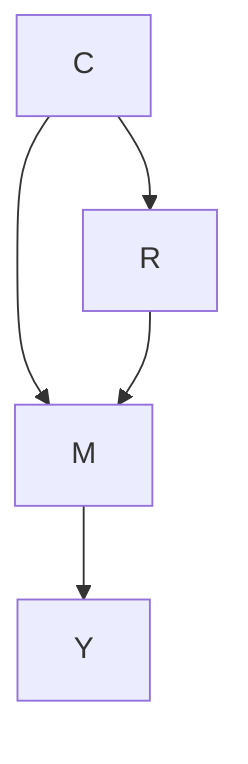
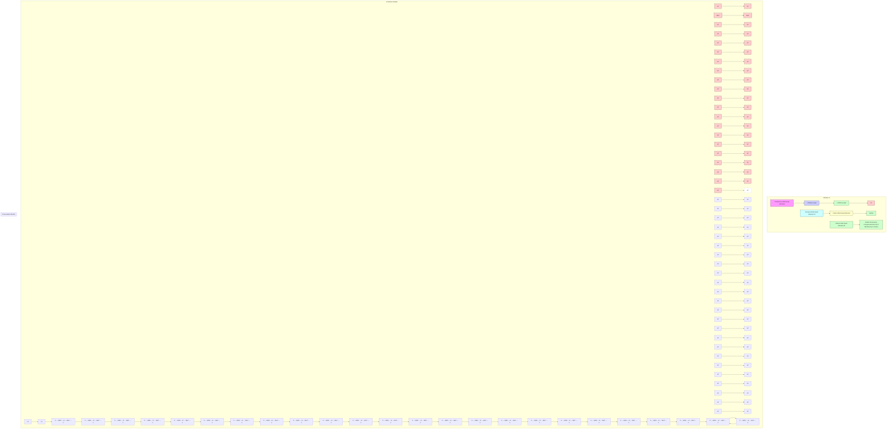

# 第12章 多时间范围与多序列数据的因果干预时间序列预测（Causal Interventional Time Series Forecasting on Multi-horizon and Multi-series Data）


朱志轩（Zhixuan Chu），李若鹏（Ruopeng Li），李晟（Sheng Li）

## 12.1 引言（Introduction）

**多时间范围与多序列时间序列预测（Multi-horizon and multi-series time series forecasting）**已成为许多领域中应用非常密集的研究方向，涵盖经济学、医疗保健、网络挖掘、电子商务和在线广告等多个领域。来自相关时间序列的多序列预测不仅通过利用所有时间序列之间的相互关系提供了更丰富的信息，还减轻了为每个时间序列所需的大量特征工程和模型设计工作。与单步预测相比，多时间范围预测为多个未来时间点提供估计，从而实现更好的预先决策。然而，由于长时间序列中随时间变化的复杂依赖关系以及多个时间序列之间的异质性，多时间范围与多序列时间序列预测始终面临两大挑战：（1）如何利用长序列中的局部知识；（2）如何有效利用从多个相关时间序列中提取的全局知识。

基于循环神经网络和卷积神经网络的最新深度学习方法 [22, 24, 28] 提供了一种数据驱动的方式来处理时间序列预测任务，并在大多数应用领域实现了很高的准确性。由于循环网络随时间变化的复杂依赖关系以及卷积滤波器的限制，这些方法在建模时间序列数据中的长期和复杂关系方面存在困难。考虑到序列中每个时间点的依赖关系，基于注意力机制的方法 [5, 13] 通过为不同时间点分配不同的重要性而被提出。在这些模型中，局部依赖关系被有效用于预测，但不同序列之间关系的全局信息仍然无法解释。矩阵分解方法 [33] 和通过层次先验共享信息的贝叶斯方法 [3] 被用于通过利用层次结构 [11] 来学习多个相关时间序列。然而，如何跨不同时间序列提取和共享正确的全局信息仍未得到充分探索。

在本章中，我们从一种新颖的视角——即**因果推断（causal inference）**——来应对这两个挑战。基于**结构因果模型（Structural Causal Model, SCM）**[20, 21]，多时间范围与多序列预测任务可以被抽象为一个存在未观测混杂因素的因果干预问题。混杂因素既影响因变量也影响自变量，导致原始输入特征与结果之间产生虚假关联。因此，我们设计了一个基于深度编码器-解码器循环架构的**因果三重注意力时间序列预测模型（Causal Triple aTtention Time series forecasting model, CTTT）**。我们提供了直观理解和因果理论证明，以阐明局部知识和全局知识如何被有效从数据中提取，以及如何准确利用正确的知识来促进不同序列的预测。

## 12.2 预备知识（Preliminary）

### 12.2.1 时间序列预测（Time Series Forecasting）

多时间范围与多序列预测任务是预测多个时间序列的多个未来目标值。将时间序列 $i$ 在时间 $t$ 处的目标值记为 $y _ { i , t }$ ，我们的目标是建模条件分布：

$$
P (\mathbf {y} _ {i, t _ {0}: T} | \mathbf {y} _ {i, 1: t _ {0} - 1}, \mathbf {x} _ {i, 1: T}),
$$

其中 $t _ { 0 }$ 表示我们假设 $y _ { i , t }$ 未知的时间点。${ \bf y } _ { i , t _ { 0 } : T } =$ $\left\{ y _ { i , t _ { 0 } } , y _ { i , t _ { 0 } + 1 } , \ldots , y _ { i , T } \right\}$ 表示序列 $i$ 从时间点 $t _ { 0 }$ 开始的未来时间的目标值，而 $\mathbf { y } _ { i , 1 : t _ { 0 } - 1 } = \{ y _ { i , 1 } , \dots , y _ { i , t _ { 0 } - 2 } , y _ { i , t _ { 0 } - 1 } \}$ 表示时间点 $t _ { 0 }$ 之前的过去时间的目标值。

### 12.2.2 注意力机制（Attention Mechanism）

注意力机制是深度学习方法中的主要前沿方向之一，它可以提高模型在长输入序列上的性能。注意力层通过动态生成的权重聚合特征，同时允许模型关注过去的重要时间步 [15]。最近的研究也证明了将注意力机制应用于时间序列预测模型所带来的性能提升 [6, 14, 16, 17, 25, 29, 30]。这些模型以传统方式使用注意力机制，为单个序列中输入序列的不同元素分配不同的重要性，但没有考虑不同时间序列之间的复杂关系。在我们的工作中，注意力机制以三重方式被充分纳入多时间范围与多序列时间序列预测任务中，不仅考虑单个序列内部的依赖关系，还考虑多个序列之间的联系。

### 12.2.3 因果图模型（Causal Graphical Models）

因果推断中最常用的框架是**结构因果模型（Structural Causal Model, SCM）**[20]。SCM 描述了一个系统的因果机制，其中一组变量及其之间的因果关系通过一组联立结构方程进行建模。在 SCM 中，如果一个变量是两个变量的共同原因，则称其为**混杂因素（confounder）**。混杂因素会在这两个变量之间引入虚假相关性，从而干扰对它们之间因果效应的识别。我们将混杂因素称为从时间序列数据中推断出的**常识（common sense）**，可以看作是序列某一部分的总结性知识。然而，这些常识通常仅适用于部分时间点。此类因果模型的目标是消除由不相关常识引起的混杂效应。

## 12.3 我们提出的框架（Our Proposed Framework）

我们首先阐述问题陈述并分析时间序列预测任务中涉及的因果关系。然后，我们说明所提出框架的细节。

### 12.3.1 问题形式化（Problem Formulation）

我们的目标是预测多个时间序列的多个未来目标值，即条件分布 $P ( \mathbf { y } _ { i , t _ { 0 } : T } | \mathbf { y } _ { i , 1 : t _ { 0 } - 1 } , \mathbf { x } _ { i , 1 : T } )$ 。$\mathbf { x } _ { i , 1 : T } \ \in \ \mathbb { R } ^ { m }$ 是**协变量（covariates）**，包含已观测协变量和已知协变量。已观测协变量仅在过去可用，且事先未知。已知协变量可以预先确定，并且在所有时间点上都是已知的。协变量 $\mathbf { X } _ { i , 1 : T }$ 可以是序列相关的、时间相关的，或两者兼有。如果某些协变量不依赖于时间，则它们会沿时间维度重复。关于绝对时间和序列的信息仅通过时间解析和序列嵌入的方式通过协变量提供给模型。此外，关于序列或时间的附加信息可以添加到协变量向量中，例如序列项目的特征、预测结果的变量以及特殊时间点（节日或假日）。由于长时间内的复杂依赖关系和循环网络的梯度消失问题，我们采用**滚动窗口（rolling window）** 程序来分割所有序列，并为每个窗口保持总长度 $T$ ，包括从 1 到 $t _ { 0 } - 1$ 的条件窗口和从 $t _ { 0 }$ 到 $T$ 的预测窗口。

由于滚动窗口程序，我们总共获得 $n$ 个窗口并将它们混合在一起。我们的模型选择使用**序列到序列（sequence-to-sequence）** 设置，包括一个用于条件窗口的编码器网络和一个用于预测窗口的解码器网络。条件窗口中观测值的信息通过编码器-解码器框架传递到预测窗口。我们将模型应用于每个窗口。在训练阶段，条件窗口和预测窗口都必须位于过去，使得 $y _ { i , t }$ 可被观测，但在预测阶段，$y _ { i , t }$ 仅在条件窗口中可用。请注意，时间索引 $t$ 是相对的，即 $t = 1$ 对应每个 $i$ 的不同实际时间点。

### 12.3.2 因果三重注意力的直观理解（Intuitive Understanding of Causal Triple Attention）

在不考虑时间序列预测任务中涉及的因果关系的情况下，我们 CTTT 模型的核心是三个注意力模块的组合，即**时间注意力（temporal attention）**、**模式注意力（pattern attention）** 和**变换器注意力（transformer attention）**。在提供理论支持之前，我们首先对每个注意力模块提供直观理解。

**时间注意力（Temporal Attention）** 类似于 BERT [4] 中每个句子的自注意力，为了探索每个时间点的依赖关系并揭示每个时间序列窗口中的趋势，我们将时间注意力应用于每个序列窗口，关联单个窗口中的不同位置。注意力机制为输入窗口的不同时间点分配不同的重要性，并给予更相关的时间点更多的关注。

**模式注意力（Pattern Attention）** 由于多个时间序列的异质性，跨所有时间序列共享信息在实践中难以实现。更糟糕的是，它可能给数据带来额外偏差，导致预测精度降低。因此，为了有效捕获所有时间序列之间的共享信息，同时避免将提取的全局信息滥用于不相关或不适用的窗口，我们将模式注意力应用于所有窗口，使得信息量更大的窗口获得更大的权重以获得更多的模式注意力。因此，每个窗口只能为自己吸收有价值的信息，避免被无关信息误导。

**变换器注意力（Transformer Attention）** 循环神经网络面临的另一个挑战是，由于随时间变化的复杂依赖关系和梯度消失 [2]，学习长序列可能很困难。序列到序列模型通过最后一个编码器单元状态顺序连接两个 RNN，即编码器和解码器。这可能存在局限性，因为它形成了编码器和解码器之间的潜在瓶颈。此外，较早的输入必须经过多个层才能到达解码器 [30]。变换器注意力用于将解码器与编码器序列关联起来，以确定编码器的哪些部分对解码器预测更为重要，从而进一步提高预测准确性。

### 12.3.3 因果性分析（Causality Analysis）

基于**结构因果模型（Structural Causal Model, SCM）**[20, 21]，我们为时间注意力和模式注意力模块提供理论支持。预测窗口中的预测目标值 ${ \bf y } _ { i , t _ { 0 } : T }$ 受条件窗口中的已知目标值 $\mathbf { y } _ { i , 1 : t _ { 0 } - 1 }$ 以及条件窗口和预测窗口中的协变量 $\mathbf { X } _ { l , 1 : T }$ 的组合所条件约束。为方便起见，我们使用 $r _ { i }$ 来表示第 $i$ 个窗口中所有输入的组合。实际上，并非所有信息（所有时间点、已知目标值和协变量）都对目标值 ${ \bf y } _ { i , t _ { 0 } : T }$ 的预测有用。除了直接的 $R \to Y$ 关系外，还存在一个**中介变量（mediator）** $M$ ，它指的是从原始输入 $R$ 中提取并用于预测目标值 $Y$ 的知识，即 $R \rightarrow M \rightarrow Y$ 。

此外，不同时间序列之间的异质性给数据集带来了偏差。数据集偏差本质上是由**混杂因素（confounder）** $C$ 引起的，它通过 $C$ 间接使输入 $R$ 和目标值 $Y$ 相关联。在这种情况下，我们将混杂因素 $C$ 称为从数据中推断出的常识，例如“高流速项目可能表现出与低流速项目本质上不同的行为”、“某种金融产品在特定时期销售异常火爆”、“由于新产品的推出，对新金融服务的需求在短期内持续增长”。然而，这些常识并不适用于所有序列窗口，因此这种混杂关系可能导致有害偏差，误导时间序列模型关注数据中的虚假相关性，从而降低预测准确性。例如，如果一个窗口符合这种提取出的常识，它将受益良多；如果不符合，该窗口的预测准确性将受到这种虚假知识的损害。总之，我们在图 12.1 中展示了这个因果图。$R \to M$ 表示从输入中提取的隐藏知识；$C \to R$ 表示真实场景由常识生成；$M \to Y$ 表示基于从输入观测中推断出的预测知识进行的预测。此外，$Y$ 也受到常识 $C$ 的影响。




**图 12.1** 因果关系（Causal relationship）

除了从输入 $R$ 通过中介变量 $M$ 到 $Y$ 的合法因果路径外，“后门”路径 $R \leftarrow C \rightarrow M \rightarrow Y$ 也通过混杂因素 $C$ 对 $Y$ 产生效应，这将在 $R$ 和 $Y$ 之间引入虚假相关性。因此，如果我们直接基于相关性 $P ( Y | R )$ 训练模型而不对混杂因素进行干预，无论训练数据量多大，模型都无法识别从 $R$ 到 $Y$ 的真实因果效应 [19, 23]。为了消除 $R$ 和 $Y$ 之间的混杂关系，我们应该阻断 $R \leftarrow C \rightarrow Y$ 以获得 $R$ 和 $Y$ 之间的因果效应。**后门调整（backdoor adjustment）** 是通过近似“物理干预” [21, 32] 来消除虚假相关性最直接的方法。要使用后门调整，我们需要了解混杂因素的细节，以便将其分割成不同的层。然而，在时间序列任务中，我们不知道哪些常识构成了数据集中的混杂因素，因此我们无法部署后门调整。作为替代，我们采用**前门调整（frontdoor adjustment）**，它不需要任何关于混杂因素的知识。此外，前门调整可以提供一种更易于理解的方式来理解中介变量，即局部和全局信息是如何被利用的。

因此，我们使用因果干预 $P ( Y | d o ( R ) )$ [18] 进行时间序列预测，而不是使用似然 $P ( Y | R )$ ，以获得 $R$ 和 $Y$ 之间的真实因果关系。前门调整沿着前门路径 $R \to M \to Y$ 计算 $P ( Y | d o ( R ) )$ ，该路径由两个部分因果效应 $P ( M | d o ( R ) )$ 和 $P ( Y | d o ( M ) )$ 构成，即：

$$
P (Y | d o (R)) = \sum_ {m} P (M = m | d o (R)) P (Y | d o (M = m)).
$$

类似地，为了计算 $P ( M = m | d o ( R ) )$ ，我们应该阻断 $R$ 和 $M$ 之间的后门路径 $R \gets C \to Y \leftarrow M$ 。我们可以观察到在这个后门路径中存在一个**碰撞点（collider）** $( C \to Y \leftarrow M )$ 。路径中存在碰撞点的结果是，碰撞点阻断了影响它的变量之间的关联 [18]。因此，碰撞点不会在决定它的变量之间产生无条件关联。因此，这条路径自然被阻断，我们有 $P ( M = m | d o ( R ) ) = P ( M = m | R )$ 。

对于 $P ( Y | d o ( M ) )$ ，我们需要阻断 $M$ 和 $Y$ 之间的后门路径 $M \gets R \gets C \to Y$ 。由于我们不知道混杂因素 $C$ 的细节，我们必须通过干预 $R$ 来阻断这条路径，即 $P ( Y | d o ( M = m ) ) = \sum _ { r } P ( Y | M = m , R = r ) P ( R = r )$ 。最终，我们可以得到：

$$
P (Y | d o (R)) \tag {12.1}
$$

$$
= \sum_ {m} P (M = m | R) \sum_ {r} P (R = r) [ P (Y | M = m, R = r) ]. \tag {12.2}
$$




**图 12.2** 我们的因果三重注意力时间序列预测模型（CTTT）包含两个部分，即表示模型和预测模型。表示模型用于学习每个时间点的表示向量，它利用门控残差网络选择相关特征，利用门控线性单元抑制不必要的信息。预测模型是一个带有 LSTM 单元的编码器-解码器循环网络，用于基于从表示模型学到的表示向量预测目标值。三个注意力模块被部署以帮助模型捕获局部和全局信息，并减轻混杂效应。

## 12.3.4 表示模型（Representation Model）

如图12.2所示，我们的**因果时间变换器（Causal Time-Series Transformer, CTTT）**由两个主要组件构成，即**表示模型（representation model）**和**预测模型（prediction model）**。下文将详细介绍每个组件的细节。

大多数真实世界的时间序列数据集包含预测性内容较少的特征。因此，**变量选择（variable selection）**对于提升模型性能是必要的。受文献 [17] 中变量选择网络的启发，我们提出了一种表示模型，该模型独立于后续的预测模型，并在预测模型训练之前进行训练。协变量 $X$ 被输入到带有**门控线性单元（Gated Linear Units, GLUs）**的**门控残差网络（Gated Residual Network, GRN）**中，以生成表示向量 $R$。为了使表示向量包含更多预测信息，我们将其置于条件窗口内目标值 $y$ 的监督学习中。该模型的目的是获取每个时间点的表示向量，这些向量将用于预测模型。

这种表示模型在两个方面是必要的。首先，它通过预测观测到的目标值 ${ \bf y } _ { i , t _ { 0 } : T }$ 进行训练，从而我们可以获得包含目标值预测信息的表示向量 $\mathbf { r } _ { i , 1 : T }$。其次，它可以洞察哪些变量对目标预测最为重要，并移除可能对性能产生负面影响的任何不必要的噪声输入 [17]。

我们对序列项和分类变量使用**实体嵌入（entity embeddings）**，对连续变量使用**线性变换（linear transformations）**，从而得到 $m$ 个协变量和一个序列项 $m + 1$ 的 $e _ { j , t } ^ { ( k ) } \ \in \ \mathbb { R } ^ { d }$，它表示窗口 $j$ 在时间 $t$ 的第 $k$ 个变换后的输入。令 $\dot { \xi } _ { j , t }$ 为展平的变换后输入 $e^{(1)}_{j,t}, \pmb { e } _ { j , t } ^ { ( 1 ) } , \ldots , \pmb { e } _ { j , t } ^ { ( m + 1 ) }, e^{(m+1)}$ 的拼接。变量选择权重 $v_{j,t}$ 是通过将 $\xi_{j,t}$ 输入到一个 GRN 后接一个 Softmax 层生成的，即 ${ \pmb v } _ { j , t } = \text{Softmax} \left( \mathrm { G R N } _ { v } ( \pmb { \xi } _ { j , t } ) \right)$。除了用于权重的 $\mathrm { G R N } _ { v }$ 之外，变换后的输入 $\tilde { \pmb { e } } _ { j , t } ^ { ( k ) } = \mathrm { G R N } _ { e ^ { ( k ) } } \left( \pmb { e } _ { j , t } ^ { ( k ) } \right)$，其中 $k = 1 , \ldots , m + 1$，$\tilde { \pmb { e } } _ { j , t } ^ { ( k ) }$ 是过滤后的变换输入。$\mathrm { G R N } _ { v }$ 和 $\mathrm { G R N } _ { e ^ { ( k ) } }$ 在所有时间点 $t$ 和所有窗口 $j$ 上共享。表示向量 $\boldsymbol { r } _ { j , t }$ 通过过滤后的变换输入 $\tilde { \pmb { e } } _ { j , t } ^ { ( k ) }$ 与其变量选择权重 $v_{j,t}$ 的加权求和得到，即 $r_{j,t} = \sum_{k=1}^{m+1} \pmb{v}_{j,t}^{(k)} \tilde{\pmb{e}}_{j,t}^{(k)}$，其中 $\pmb{v}_{j,t}^{(k)}$ 是向量 $\boldsymbol{v}_{j,t}$ 的第 $k$ 个元素。

在这个表示模型中，我们注意到已知的协变量被同时输入到条件窗口和预测窗口中，这些协变量在所有时间点都是已知的。如果数据集中存在仅在过去可用且事先未知的观测协变量，我们只将它们输入到条件窗口中。由于每个协变量都有自己的 GRN，并且最终的表示 $\boldsymbol{r}_{j,t}$ 是通过加权求和计算的（维度不变），我们只需要重新缩放预测窗口中的变量选择权重 ${ \pmb v } _ { j, t }$ 以适应观测协变量的缺失。因此，我们的模型对协变量的类型没有限制。

## 12.3.5 预测模型（Prediction Model）

根据对不平衡时间序列数据的因果分析，我们介绍如何利用**时间注意力（temporal attention）**和**模式注意力（pattern attention）**模块在深度框架中完成这个**前门调整（front-door adjustment）**（公式 (12.1)）。我们可以将预测分布 $P(Y|M,R)$ 参数化为一个网络 $g(\cdot)$，它是一个带有 LSTM 单元的编码器-解码器循环神经网络，即 $P(Y|M,R) = g(M,R)$。此外，我们需要对 $R$（即 $\textstyle \sum_r P(R=r)$）和 $M$（即 $\begin{array}{r} \sum_m P(M=m|R) \end{array}$）进行采样，并将它们输入网络，以根据公式 (12.1) 的表达式完成 $P(Y|do(R))$ 的计算。由于对所有样本进行网络前向传播的计算成本过高，我们应用**归一化加权几何平均（Normalized Weighted Geometric Mean, NWGM）近似** [26, 31] 将外层采样吸收到特征层面，从而只需要在网络中一次性地前向传播“吸收后的输入” [10, 32, 34]。通过 NWGM 近似，公式 (12.1) 中的 $\begin{array}{r} \sum_m P(M=m|R) \end{array}$ 和 $\textstyle \sum_r P(R=r)$ 可以被吸收到网络中：

$$
P(Y|do(R)) \approx g(\hat{\boldsymbol{M}}, \hat{\boldsymbol{R}}),
$$

$$
\hat{M} = \sum_m P(M=m|h(R)) m,
$$

$$
\hat{\boldsymbol{R}} = \sum_r P(R=r|f(R)) r,
$$

其中 $h(\cdot)$ 和 $f(\cdot)$ 表示**查询嵌入函数（query embedding functions）**，可以将表示向量 $R$ 转换为两个查询集。

遵循文献 [32] 中关于注意力的思想，公式 (12.3.5) 中的估计 $\hat{\pmb R}$ 和 $\hat{M}$ 是经典的注意力网络计算。注意力机制的本质可以概括为常见的 Q-K-V 表示法。注意力机制基于键 $K$ 和查询 $\varrho$ 之间的关系来缩放值 $V$，即 $\text{Attention}(Q, K, V) = A(Q, K)V$，其中 $A(\cdot)$ 是一个归一化函数。一个常见的选择是**缩放点积注意力（scaled dot-product attention）** [27]，即 $(Q, K) = \text{Softmax}(QK^T / \sqrt{d_{attn}})$。

为了提高标准注意力机制的学习能力，文献 [27] 提出了**多头注意力（multihead attention）**，为不同的表示子空间使用不同的头：

$$
\text{MultiHeadAttention}(\boldsymbol{Q}, \boldsymbol{K}, \boldsymbol{V}) = \tilde{\boldsymbol{H}} \boldsymbol{W}_H,
$$

$$
\tilde{\boldsymbol{H}} = \frac{1}{H} \sum_{h=1}^{H} \text{Attention}(\boldsymbol{Q} \boldsymbol{W}_Q^{(h)}, \boldsymbol{K} \boldsymbol{W}_K^{(h)}, \boldsymbol{V} \boldsymbol{W}_V^{(h)}),
$$

其中 $h = 1, \ldots, H$ 是头的指示符，$\boldsymbol{W}_H$ 用于最终的线性映射，$\boldsymbol{W}_K^{(h)}, \boldsymbol{W}_Q^{(h)}, \boldsymbol{W}_V^{(h)}$ 是用于键、查询和值的特定于头的权重。

具体来说，$\hat{M}$ 的估计可以表示为时间注意力，即 $\text{MultiHeadAttention}(\pmb{Q}_{Tem}, \pmb{K}_{Tem}, \pmb{V}_{Tem})$。在这种情况下，所有 $\pmb{K}_{Tem}$ 和 $\pmb{V}_{Tem}$ 都来自同一个窗口，它们是每个时间点 $r_{j,1}, \ldots, r_{j,T}$ 的表示向量。由于这是一个自注意力机制，$\varrho_{Tem}$ 是 $h(R)$ 并且也来自表示向量。对于 $A_{Tem}(\pmb{Q}_{Tem}, \pmb{K}_{Tem})$，每个注意力向量 $\pmb{a}_{Tem}$ 是概率 $P(M=m|h(R))$ 的网络估计。对于 $\hat{\pmb R}$ 的估计，它是一个模式注意力，即 $\text{MultiHeadAttention}(\boldsymbol{Q}_{Pat}, \boldsymbol{K}_{Pat}, \boldsymbol{V}_{Pat})$，其中 $\boldsymbol{K}_{Pat}$ 和 $\boldsymbol{V}_{Pat}$ 来自数据中的其他窗口，而 $\boldsymbol{Q}_{Pat}$ 来自 $f(R)$。在这种情况下，$\pmb{a}_{Pat}$ 近似 $P(R=r|f(R))$。在实现中，由于不可能使用数据中的所有窗口来计算模式注意力，我们将 $\boldsymbol{K}_{Pat}$ 和 $\boldsymbol{V}_{Pat}$ 设置为从整个数据集中压缩得到的全局字典。这一步也有助于总结信息和去除噪声。我们通过对所有 $[\pmb{r}_{j,1}^T, \dots, \pmb{r}_{j,T}^T] (j=1,\dots,n)$（即一个窗口中每个时间点的拼接展平表示向量）使用 K-means 来初始化这个字典。通过这种方式，$\boldsymbol{V}_{Pat}$ 和 $\boldsymbol{V}_{Tem}$ 保持在相同的表示空间中，这保证了时间注意力和模式注意力的估计：公式 (12.3.5) 中的 $\hat{M}$ 和 $\hat{\pmb R}$ 具有相同的分布。

总之，如图12.3所示，$\hat{m}_{j,i}$ 和 $\hat{r}_{j,t}$ 分别由时间注意力和模式注意力估计得到。因此，我们可以获得一个新的表示 $\mathbf{\boldsymbol{s}}_{j,t} = \text{Concatenate}[\hat{\pmb{m}}_{j,t}^T, \hat{\pmb{r}}_{j,t}^T]^T$


```mermaid
graph LR
    subgraph Input
  A1["e_{j,t}^{(1)}"] --> B1["GRN"] --> C1["\tilde{e}_{j,t}^{(1)}"]
  A2["e_{j,t}^{(2)}"] --> B2["GRN"] --> C2["\tilde{e}_{j,t}^{(2)}"]
  A3["..."] --> B3["GRN"] --> C3["\tilde{e}_{j,t}^{(m+1)}"]
  A4["ξ_{j,t}"] --> B4["GRN"] --> C4["Softmax"] --> D["v_{j,t}"]
    end

    subgraph Weighted Sum
  E1["r_{j,t}"] --> F1["r_{j,t}"]
  F1 --> G1["concatenate[r_{j,t}^T, ..., v_T^T"]]
  G1 --> H1["Global Distananries"]
    end

    subgraph Temporal Multi-head Attention
  I1["Q_{Tem}"] --> J1["A_{Tem}=Softmax(Q_{Tem}^T V_{Tem})"] --> K1["\hat{Q}=V_{Tem}A_{Tem}"] --> L1["\hat{n}_{j,t}"] --> M1["S_{j,t}"]
  N1["K_{Tem}"] --> O1["V_{Tem}"] --> P1["\hat{P}_{j,t}"] --> Q1["\hat{P}_{j,1}"] --> R1["\hat{P}_{j,2}"] --> S1["\hat{P}_{j,T}"] --> T1["\hat{P}_{j,1}"]
  U1["K_{Pat}"] --> V1["V_{Pat}"] --> W1["\hat{R}=V_{Pat}A_{Pat}"] --> X1["\hat{R}=V_{Pat}A_{Pat}"] --> Y1["\hat{P}_{j,1}"] --> Z1["\hat{P}_{j,2}"] --> AA["\hat{P}_{j,T}"] --> AB["\hat{P}_{j,1}"]
    end

    style Input fill:#f9f,stroke:#333
    style Temporal Multi-head Attention fill:#ccf,stroke:#333
```

**图 12.3** 变换后的序列项和协变量被输入以学习表示向量，然后估计时间和模式注意力

现在，我们可以将 $S$ 输入到我们的编码器-解码器循环网络 $g$ 中，以估计 $P(Y|do(R))$。

最简单的编码器-解码器模型由两个基于 LSTM 的 RNN 组成，即一个用于编码器，另一个用于解码器。编码器 RNN 读取源序列，其最终状态被用作解码器 RNN 的初始状态。目标是最终编码器状态“编码”了关于源的所有信息，解码器可以基于这个向量生成目标序列。然而，其性能在长序列中会下降，因为即使使用 LSTM 单元，它也无法将长序列充分编码到中间向量中。因此，我们在编码器-解码器模型中添加了一个**变换器注意力（transformer attention）**。在每个解码器步骤，它决定哪些编码器部分更为重要。在这种设置下，编码器不必将整个源压缩成一个单一向量；它考虑所有 RNN 状态，而不是编码器的最后一个状态。

## 12.4 基准实验（Benchmark Experiments）

## 12.4.1 数据集（Datasets）

与之前的工作 [13, 17, 22, 24] 一致，我们选择了四个真实世界的数据集，即 Electricity、Traffic、Retail 和 Volatility。UCI 电力负荷图数据集（Electricity）包含 370 个客户的每小时电力消耗时间序列 [24, 33]。UCI PEM-SF 交通数据集（Traffic）包含 440 条旧金山湾区高速公路的每小时占用率，范围在 0 到 1 之间。对于 Electricity 和 Traffic 数据集，我们使用过去一周（即 168 小时）的数据来预测接下来的 24 小时。Favorite 杂货销售数据集（Retail）来自 Kaggle 竞赛 [7]，该数据集结合了不同产品和商店的元数据。我们使用过去 90 天的信息来预测未来 30 天的产品销售额对数。

**表 12.1 四个真实世界数据集的统计信息**

| 数据集详情 | Electricity | Traffic | Retail | Volatility |
| :--- | :--- | :--- | :--- | :--- |
| 目标类型 | $\mathbb{R}$ | [0, 1] | $\mathbb{R}$ | $\mathbb{R}$ |
| 序列数量 | 370 | 440 | 130k | 41 |
| 样本数量 | 500k | 500k | 500k | 100k |
| 条件窗口大小 | 168 | 168 | 90 | 252 |
| 预测窗口大小 | 24 | 24 | 30 | 5 |
| 变量数量 | 5 | 5 | 20 | 8 |

**表 12.2 模型超参数**

| 超参数 | 完整搜索范围 |
| :--- | :--- |
| Dropout 率 | 0.1, 0.2, 0.3 |
| 小批量大小 | 64, 128, 256 |
| 学习率 | 0.0001, 0.001, 0.01 |
| 头数 | 1, 4 |
| LSTM 层数 | 2, 3 |
| LSTM 节点数 | 30, 40 |
| 表示大小 | 10, 20, 30, 40 |

OMI 实现库（Volatility）[9] 包含根据日内数据计算的 31 个股票指数的每日已实现波动率值及其每日收益率。我们考虑使用过去一年的信息来预测未来一周。数据集详细信息见表 12.1。对于每个数据集，我们将所有时间序列分为三部分：用于学习的训练集、用于超参数调优的验证集和用于性能评估的测试集。为确保评估的公平性，我们遵循了先前工作 [17, 24] 中使用的特征预处理和训练/验证/测试划分。超参数优化通过随机搜索进行，迭代 60 次。所有超参数的完整搜索范围列于表 12.2。

## 12.4.2 基线方法（Baseline Methods）

我们将我们的模型与之前的多序列和多步预测工作进行比较，例如经典方法 ARIMA [1] 和 ETS [8]、最近的矩阵分解方法 TRMF [33]、带全局上下文的序列到序列模型（Seq2Seq）、多步分位数循环预测器（MQRNN）[28]、DeepAR [24]、DSSM [22]、基于变换器架构 [13] 并结合局部卷积处理的方法，以及具有可解释注意力和变量选择的时间融合变换器（TFT）[17]。由于迭代模型假设所有输入协变量都是已知的，我们通过用其最后可用值插补未知的未来输入来适应这一点。

## 12.4.3 分位数输出（Quantile Outputs）

与先前工作一致，**CTTT** 还在点预测之上生成**预测区间（prediction intervals）**。这是通过在每个时间步同时预测多个百分位数（例如第10、50和90百分位数）来实现的。分位数预测由一个神经网络 $z$ 基于解码器部分的输出生成，即 $\hat { y } ( q , j , t ) =$ $z ( g ( s _ { j , t } ) )$ ，其中 $q$ 是指定的分位数。CTTT 通过联合最小化**分位数损失（quantile loss）** [28] 进行训练，该损失在预测窗口内的所有分位数、窗口和时间点上求和：

$$
\mathcal {L} = \sum_ {j = 1} ^ {n} \sum_ {q \in Q} \sum_ {t = t _ {0}} ^ {T} \frac {Q L (y _ {j , t} , \hat {y} (q , j , t) , q)}{m \tau_ {m a x}},
$$

$$
Q L (y, \hat {y}, q) = q (y - \hat {y}) _ {+} + (1 - q) (\hat {y} - y) _ {+},
$$

其中 $Q$ 是分位数集合，且 $Q = \{ 0 . 1 , 0 . 5 , 0 . 9 \} . \ ( . ) _ { + } = \mathrm { m a x } ( 0 , . )$ 。对于样本外测试，我们将 $\Omega$ 定义为测试窗口的域。为了与先前工作 [13, 22, 24] 保持一致，我们评估归一化的分位数损失，并比较 P50 和 P90 风险：

$$
q \text {-Risk} = \frac {2 \sum_ {j \in \Omega} \sum_ {t = t _ {0}} ^ {T} Q L (y _ {j , t} , \hat {y} (q , j , t) , q)}{\sum_ {j \in \Omega} \sum_ {t = t _ {0}} ^ {T} | y _ {j , t} |}. \tag {12.3}
$$

## 12.4.4 性能（Performance）

表 12.3 展示了我们的模型和基线方法在四个数据集（即 Electricity、Traffic、Retail 和 Volatility）上的性能。我们报告了在测试集上根据公式 (12.3) 定义的 $q$-Risk 结果。CTTT 在所有四个数据集的 P50 和 P90 分位数损失方面均取得了最佳性能。事实上，与其他深度神经网络模型相比，我们的模型具有相似的构成：都基于**序列到序列网络（sequence-to-sequence network）**、**循环结构（recurrent structures）**和**注意力模块（attention module）**。与其他最先进模型相比，我们模型准确率的提升主要得益于**因果推断（causal inference）**的**前门调整（front-door adjustment）**，这有助于模型有效利用序列内部及跨不同序列共享的全局知识。

为了证明每个注意力模块的有效性，我们对 CTTT 进行了两项消融研究。由于时间注意力和模式注意力共同承担前门调整的任务，我们将它们一起移除，创建了 CTTT (w/o Frontdoor)，其中从表示模型学习到的表示向量直接输入到编码器-解码器循环网络中。第二项消融研究是 CTTT (w/o Trans)，其中移除了 Transformer 注意力，只有一个通过最后一个编码器单元状态连接的原始编码器-解码器网络。如图 12.4 所示，与原始 CTTT 相比，移除 Transformer 注意力或时间与模式注意力后，性能均变差。因此，这三个注意力模块是我们模型的重要组成部分。此外，为了可视化每个变量的重要性，我们展示了在第 12.3.4 节中定义的变量选择权重。图 12.5 显示，只有一部分协变量对于预测目标值至关重要，这与可解释时间序列预测模型 [17] 的结果基本一致。

**表 12.3 四个真实世界数据集上的 P50 和 P90 分位数损失。q-Risk 越低越好**

| | 电力 | | ARIMA | | ETS | | TRMF | | DeepAR | | DSSM |
| :--- | :--- | :--- | :--- | :--- | :--- | :--- | :--- | :--- | :--- | :--- | :--- |
| | P50 损失 | | 0.154 | | 0.102 | | 0.084 | | 0.075 | | 0.083 |
| | P90 损失 | | 0.102 | | 0.077 | | - | | 0.040 | | 0.056 |
| | | | ConvTrans | | Seq2Seq | | MQRNN | | TFT | | CTTT (ours) |
| | P50 损失 | | 0.059 | | 0.067 | | 0.077 | | 0.055 | | 0.052 |
| | P90 损失 | | 0.034 | | 0.036 | | 0.036 | | 0.027 | | 0.025 |
| 交通 | | ARIMA | | ETS | | TRMF | | DeepAR | | DSSM |
| P50 损失 | | 0.223 | | 0.236 | | 0.186 | | 0.161 | | 0.167 |
| P90 损失 | | 0.137 | | 0.148 | | - | | 0.099 | | 0.113 |
| | | ConvTrans | | Seq2Seq | | MQRNN | | TFT | | CTTT (ours) |
| P50 损失 | | 0.122 | | 0.105 | | 0.117 | | 0.095 | | 0.091 |
| P90 损失 | | 0.081 | | 0.075 | | 0.082 | | 0.070 | | 0.065 |
| 波动性 | DeepAR | | CovTrans | | Seq2Seq | | MQRNN | | TFT | | CTTT (ours) |
| P50 损失 | 0.050 | | 0.047 | | 0.042 | | 0.042 | | 0.039 | | 0.038 |
| P90 损失 | 0.024 | | 0.024 | | 0.021 | | 0.021 | | 0.020 | | 0.018 |
| 零售 | DeepAR | | CovTrans | | Seq2Seq | | MQRNN | | TFT | | CTTT (ours) |
| P50 损失 | 0.574 | | 0.429 | | 0.411 | | 0.379 | | 0.354 | | 0.347 |
| P90 损失 | 0.230 | | 0.192 | | 0.157 | | 0.152 | | 0.147 | | 0.139 |


**图 12.4** 消融研究 CTTT (w/o Front-door) 和 CTTT (w/o Trans) 的结果

## 12.5 真实数据实验（Real Data Experiments）

除了上述时间序列预测基准测试外，我们还将我们的模型应用于从支付宝收集的真实数据。支付宝是全球最大的移动支付平台之一，为数十亿用户提供金融服务。我们需要同时预测约50种金融产品的现金流（多序列预测），并提供长期预测（多水平预测），以确保管理者有足够时间进行相应的业务操作。我们使用两个评估指标，包括**均方误差（Mean Square Error, MSE）**： $MSE = \frac { 1 } { n } \sum _ { i = 1 } ^ { n } \sum _ { j = 1 } ^ { d } \frac { ( y - \hat { y } ) ^ { 2 } } { d }$ 和**平均绝对误差（Mean Absolute Error, MAE）**： $MAE = \frac { 1 } { n } \sum _ { i = 1 } ^ { n } \sum _ { j = 1 } ^ { d } \frac { \left| y - \hat { y } \right| } { d }$ ，其中 $n$ 是序列的长度， $d$ 是每个时间点数据的维度。我们在每个预测窗口上使用这两个评估指标来计算预测的平均值，并以步长 $stride = 1$ 滚动整个集合。所有实验重复五次。我们使用 **Adam** [12] 优化器进行优化，初始学习率为 $1e^{-4}$ ，每个 epoch 后衰减为原来的二分之一，批次大小为 64。对总 epoch 数没有限制，采用适当的早停策略，即当验证集损失在三个 epoch 内没有下降时，训练将停止。在我们的真实数据实验中，应用了五折交叉验证。标准差太小，可以忽略不计。


电力
一天中的小时
用电量
日... TL...
交通
一天中的小时
占用率
星期几
时间...
波动性
已实现波动
时间索引
开盘-收盘收益率
一年中的周
日...
D a M o
商品
商店
日志销售额
全国性节假
类别
城市
促销中
系列
地方性节假
零售
月份
易腐品
石油
开盘
聚类
月份中的日期
州
交易
开盘
注册... D... T

**图 12.5** 在 Electricity、Traffic、Volatility 和 Retail 数据集中每个变量的重要性。方块的大小代表与同一数据集中其他变量相比的相对重要性  
**表 12.4** 真实数据集上的时间序列预测结果

| 模型 | MSE | MAE |
| :--- | :--- | :--- |
| Informer | 0.214 | 0.385 |
| Autoformer | 0.201 | 0.367 |
| Scaleformer | 0.171 | 0.359 |
| TFT | 0.187 | 0.352 |
| CTTT | 0.163 | 0.339 |

我们将我们的模型与最近使用且性能良好的 **Informer** [35]、**Autoformer** [29]、**Scaleformer** [25] 和 **TFT** [13] 进行比较。表 12.4 展示了我们的模型和基线方法在真实数据集上的性能。我们提出的 CTTT 模型在真实数据集上取得了最佳性能。我们还在图 12.6 中进行了严格的运行时间比较。在训练阶段，我们的模型实现了最佳的训练效率。

为了理解真实数据中的因果推断过程，我们可视化了局部和全局知识。如图 12.7 所示，我们提供了原始目标值的四个全局模式示例。尽管我们的**结构因果模型（structural causal model）**基于学习到的表示空间，但我们将全局表示字典映射回原始目标值，以帮助我们发现它们之间的真实关系。该图逐一绘制每个时间窗口，同时与代表模式的其他窗口的轮廓进行比较。此外，为了进一步感知**混杂因子（confounder）**，图 12.8 提供了窗口 a、b 和 c 处的三个序列（1、2 和 3）。我们发现：(1) 对于同一窗口，序列 2 和 3 具有相同的“常识”（模式），但序列 1 不遵循它们的模式；(2) 对于序列 1，在窗口 b 和 c 处，它具有与窗口 a 显著不同的相似时间趋势；(3) 在放大图中，圆圈部分并不严格遵循该窗口内的周期。这些图可以有效证明这三个序列中存在“虚假常识”，即混杂因子。因此，如何从数据中有效提取局部和全局知识，以及如何准确利用正确的知识来促进不同序列的预测，是至关重要的。最后，在图 12.9 中，我们还提供了全局模式的分布。在我们的真实数据中总共有 32 种模式，这种不均匀的分布证明了处理混杂因子的必要性。

## 12.6 总结（Summary）

本章介绍了一种 **CTTT** 方法，这是一种基于深度编码器-解码器循环架构的多水平、多序列预测模型，包含三个可解释的注意力模块，即时间注意力、模式注意力和 Transformer 注意力。在四个基准数据集和一个真实数据集上的实验结果表明，CTTT 对复杂的时间序列预测任务具有高度适应性，并且具有显著的预测性能提升。

## 参考文献（References）

1. G.E.P. Box, G.M. Jenkins, Some recent advances in forecasting and control. J. R. Statist. Soc. Ser. C (Appl. Statist.) 17(2), 91–109 (1968)
2. S. Chang et al., Dilated recurrent neural networks (2017). arXiv preprint arXiv:1710.02224
3. N. Chapados, Effective Bayesian modeling of groups of related count time series, in International Conference on Machine Learning, PMLR (2014), pp. 1395–1403
4. J. Devlin et al., Bert: pre-training of deep bidirectional transformers for language understanding (2018). arXiv preprint arXiv:1810.04805
5. C. Fan et al., Multi-horizon time series forecasting with temporal attention learning, in KDD (2019)
6. C. Fan et al., Multi-horizon time series forecasting with temporal attention learning, in Proceedings of the 25th ACM SIGKDD International Conference on Knowledge Discovery & Data Mining (2019), pp. 2527–2535
7. C. Favorita. Corporacion Favorita Grocery Sales Forecasting Competition (2018). https:// www.kaggle.com/c/favorita-grocery-sales-forecasting/
8. E.S. Gardner Jr., Exponential smoothing: the state of the art. J. Forecast. 4(1), 1–28 (1985)
9. G. Heber et al., Oxford-Man Institute’s Realized Library (2009). https://realized.oxford-man. ox.ac.uk/
10. X. Hu et al., Distilling causal effect of data in class-incremental learning (2021). arXiv: 2103.01737 [cs.AI]
11. R.J. Hyndman et al., Optimal combination forecasts for hierarchical time series. Comput. Statist. Data Anal. 55(9), 2579–2589 (2011)
12. D.P. Kingma, J. Ba, Adam: a method for stochastic optimization (2014). arXiv preprint arXiv:1412.6980
13. S. Li et al., Enhancing the locality and breaking the memory bottleneck of transformer on time series forecasting, in NeurIPS (2019)
14. S. Li et al., Enhancing the locality and breaking the memory bottleneck of transformer on time series forecasting, in Proceedings of the 33rd International Conference on Neural Information Processing Systems (2019), pp. 5243–5253
15. B. Lim, S. Zohren, Time-series forecasting with deep learning: a survey. Philos. Trans. R. Soc. A 379(2194), 20200209 (2021)
16. B. Lim et al., Temporal fusion transformers for interpretable multi-horizon time series forecasting (2019). arXiv preprint arXiv:1912.09363
17. B. Lim et al., Temporal fusion transformers for interpretable multi-horizon time series forecasting. Int. J. Forecast. 37(4), 1748–1764 (2021)
18. J. Pearl, Causal diagrams for empirical research. Biometrika 82(4), 669–688 (1995)
19. J. Pearl, Models, reasoning and inference (Cambridge, UK: Cambridge University Press) 19.2 (2000) 3
20. J. Pearl, M. Glymour, N.P. Jewell, Causal inference in statistics: A primer (John Wiley & Sons, 2016)
21. J. Pearl, D. Mackenzie, The book of why: the new science of cause and effect (Basic books, 2018)
22. S.S. Rangapuram et al., Deep state space models for time series forecasting, in NIPS (2018)
23. D.B. Rubin, Causal inference using potential outcomes: design, modeling, decisions. J. Am. Statist. Assoc. 100(469), 322–331 (2005)
24. D. Salinas et al., DeepAR: probabilistic forecasting with autoregressive recurrent networks. Int. J. Forecast. 36(3), 1181–1191 (2019). ISSN: 0169-2070
25. A. Shabani et al., Scaleformer: iterative multi-scale refining transformers for time series forecasting (2022). arXiv preprint arXiv:2206.04038
26. N. Srivastava et al., Dropout: a simple way to prevent neural networks from overfitting. J. Mach. Learn. Res. 15(1), 1929–1958 (2014)
27. A. Vaswani et al., Attention is all you need, in NIPS (2017)
28. R. Wen et al., A multi-horizon quantile recurrent forecaster, in NIPS 2017 Time Series Workshop (2017)
29. H. Wu et al., Autoformer: decomposition transformers with auto-correlation for long-term series forecasting. Adv. Neural Inf. Process. Syst. 34, 22419–22430 (2021)
30. N. Wu et al., Deep transformer models for time series forecasting: the influenza prevalence case (2020). arXiv preprint arXiv:2001.08317
31. K. Xu et al., Show, attend and tell: neural image caption generation with visual attention, in International conference on machine learning, PMLR (2015), pp. 2048–2057
32. X. Yang et al., Causal attention for vision-language tasks, in Proceedings of the IEEE/CVF Conference on Computer Vision and Pattern Recognition (2021), pp. 9847–9857
33. H.-F. Yu, N. Rao, I.S. Dhillon, Temporal regularized matrix factorization for high-dimensional time series prediction, in NIPS (2016)
34. Z. Yue et al., Interventional few-shot learning (2020). arXiv preprint arXiv:2009.13000
35. H. Zhou et al., Informer: beyond efficient transformer for long sequence time-series forecasting. Proc. AAAI Conf. Artif. Intell. 35(12), 11106–11115 (2021)