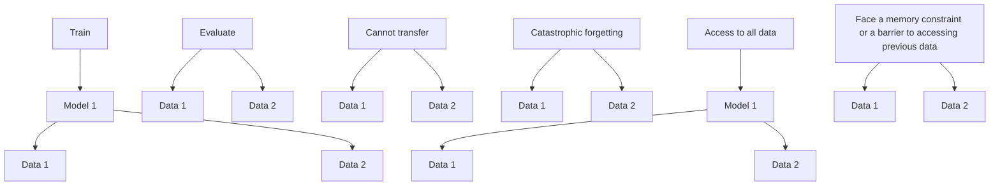

# 第十三章 持续因果效应估计（Chapter 13 Continual Causal Effect Estimation）


褚志轩（Zhixuan Chu），Stephen L. Rathbun，李晟（Sheng Li）

褚志轩  
蚂蚁集团，杭州，中国  
电子邮箱：chuzhixuan.czx@alibaba-inc.com

Stephen L. Rathbun  
佐治亚大学，雅典，佐治亚州，美国  
电子邮箱：rathbun@uga.edu

李晟（通讯作者）  
弗吉尼亚大学，夏洛茨维尔，弗吉尼亚州，美国  
电子邮箱：shengli@virginia.edu

## 13.1 引言（Introduction）

在经济学、医疗保健、公共政策、网络挖掘、在线广告和营销活动等众多领域，深入理解观测数据中的因果关系至关重要。尽管在克服使用观测数据进行因果效应估计所面临的挑战（如缺失反事实结果以及处理组与对照组之间的选择偏差）方面取得了显著进展，但现有方法主要集中在特定来源的静态观测数据上。具体而言，此类学习策略假设所有观测数据在训练阶段即可获得，并且仅来自单一来源。

随着工业应用领域的快速增长，这一假设在实践中并不成立。以支付宝为例，它是全球最大的移动支付平台之一，为数十亿用户提供金融服务，每天都会产生并收集来自不同来源的海量数据，其中包含大量与隐私相关的信息。下面，我们从两个方面进一步阐述这一问题。首先，基于观测数据的特性，这些数据是从非平稳数据分布中增量式获得的。例如，某个营销活动的电子财务记录每天都在增长，并且这些记录可能来自不同的城市甚至其他国家。这一特性意味着无法在单一时间点从单一来源获取所有观测数据。其次，基于可访问性的现实考量。例如，当新的观测数据可用时，人们可能希望利用新数据和原始数据来优化先前训练的模型。然而，由于各种原因（例如，旧数据可能未被记录、涉及专有信息、对财务数据敏感、数据量过大难以存储，或受个人信息隐私约束 [37]），原始训练数据很可能不再可访问。这种关于可访问性的实际关切在各种学术和工业应用中普遍存在。这正是大数据时代我们所面临的现实问题；我们在使用观测数据进行因果推断时遇到了新的挑战。我们首次在 [2] 中提出了**持续因果效应估计（continual causal effect estimation）**问题，并讨论了**持续因果推断框架（continual causal inference frameworks）**的三个期望特性，即对增量式可用观测数据的**可扩展性（extensibility）**、对新领域中各种数据源的**适应性（adaptability）**，以及对海量数据的**可访问性（accessibility）**。

在本章中，我们将正式定义**持续处理效应估计（continual treatment effect estimation）**问题，描述其研究挑战，并介绍该问题的可能解决方案。此外，我们还将讨论该主题未来的研究方向。

## 13.2 相关工作（Related Work）

与随机对照试验不同，**观测数据（observational data）**是研究者通过简单观察受试者而不进行任何干预获得的。这意味着研究者无法控制处理分配，他们只是观察受试者并基于观察记录数据 [6, 34]。因此，由于缺失反事实结果以及**混杂变量（confounders）**的存在，直接根据观测数据估计处理效应具有挑战性。近年来，强大的机器学习方法，如基于树的方法 [1, 32]、**表示学习（representation learning）**[4, 16, 28, 35]、**元学习（meta-learning）**[15, 24] 和**生成模型（generative models）**[20, 36]，在处理效应估计方面取得了显著进展。

此外，因果推断与其他研究领域的结合也展现出互补优势，例如计算机视觉 [18, 31]、**图学习（graph learning）**[3, 22] 和自然语言处理 [9, 19]。所涉及的因果分析有助于提升模型发现和解析观测数据中统计关系之外的底层系统的能力。

## 13.3 问题定义（Problem Definition）

假设观测数据包含从 $d$ 个不同领域收集的 $n$ 个单元，并且 $D _ { d } = \{ ( x , y , t ) | x \in X , y \in Y , t \in T \}$ 表示从第 $d$ 个领域收集的数据集，其中包含 $n _ { d }$ 个单元。设 $X$ 表示所有观测变量，$Y$ 表示观测数据中的结果，$T$ 是一个二元变量。设 $D _ { 1 : d } = \{ D _ { 1 } , D _ { 2 } , . . . , D _ { d } \}$ 是分别从 $d$ 个不同领域收集的 $d$ 个数据集的组合。对于 $d$ 个数据集 $\{ D _ { 1 } , D _ { 2 } , . . . , D _ { d } \}$，它们具有共同的观测变量，但由于它们来自不同领域，因此在每个数据集中，它们通常具有关于 $X$、$Y$ 和 $T$ 的不同分布。观测数据中的每个单元接受两种或多种处理中的一种。设 $t _ { i }$ 表示单元 $i$ 的处理分配；$i = 1 , . . . , n$。对于二元处理，$t _ { i } = 1$ 表示处理组，$t _ { i } = 0$ 表示对照组。当对单元 $i$ 施加处理 $t$ 时，其结果表示为 $y _ { t } ^ { i }$。对于观测数据，**潜在结果（potential outcomes）**中只有一个被观测到。被观测到的结果称为**事实结果（factual outcome）**，而其余未观测到的潜在结果称为**反事实结果（counterfactual outcomes）**。

**潜在结果框架（Potential outcome framework）**已被广泛用于估计处理效应 [26, 29]。单元 $i$ 的**个体处理效应（Individual Treatment Effect, ITE）**是潜在处理结果与对照结果之差，定义为：

$$
\mathrm{ITE} _ {i} = y _ {1} ^ {i} - y _ {0} ^ {i}. \tag {13.1}
$$

**平均处理效应（Average Treatment Effect, ATE）**是平均潜在处理结果与平均对照结果之差，定义为：

$$
\mathrm{ATE} = \frac {1}{n} \sum_ {i = 1} ^ {n} (y _ {1} ^ {i} - y _ {0} ^ {i}). \tag {13.2}
$$

潜在结果框架的成功基于以下假设 [13]，这些假设确保了处理效应的可识别性。

**假设 稳定单元处理值假设（Stable Unit Treatment Value Assumption, SUTVA）**：任何单元的潜在结果不会因分配给其他单元的处理而改变，并且对于每个单元，每个处理水平不存在导致不同潜在结果的不同形式或版本。 □

**假设 一致性假设（Consistency）**：如果实际接受的处理是 $t$，则处理 $t$ 的潜在结果等于观测到的结果。 □

**假设 积极性假设（Positivity）**：对于任何 $x$ 值，处理分配不是确定性的，即对于所有 $t$ 和 $x$，有 $P ( T = t | X = x ) > 0$。 □

**假设 可忽略性假设（Ignorability）**：在给定协变量的条件下，处理分配独立于潜在结果，即 $( y _ { 1 } , y _ { 0 } ) \perp \perp t | x$。 □

**持续处理效应估计（Continual treatment effect estimation）**的目标是在无法访问先前数据 $D _ { 1 : ( d - 1 ) }$ 的情况下，估计所有可用数据（包括新数据 $D _ { d }$ 和先前数据 $D _ { 1 : ( d - 1 ) }$）的处理因果效应。




图 13.1 三种直接的持续因果效应估计策略

## 13.4 研究挑战（Research Challenges）

然而，现有的因果效应推断方法无法应对上述持续处理效应估计中的新挑战，即可扩展性、适应性和可访问性。尽管可以调整现有的处理效应估计方法以适应这些问题，但这些修改后的方法仍存在不可避免的缺陷。下面描述三种直接的适配策略：

1. 如果我们将先前基于原始数据训练的模型直接应用于新的观测数据，由于不同数据源之间的**领域偏移（domain shift）**问题，新任务上的性能将非常差；
2. 假设我们利用新可用的数据重新训练先前学习的模型以适应数据分布的变化，那么旧知识将被新知识完全或部分覆盖，这可能导致旧任务上的性能严重下降。这就是众所周知的**灾难性遗忘（catastrophic forgetting）**问题 [10, 23]；
3. 为了克服灾难性遗忘问题，我们可能依赖于存储旧数据，将新旧数据合并，然后从头开始重新训练模型。然而，这种策略内存效率低下且耗时，并且长期存储数据会带来实际关切，如版权或隐私问题 [27]。

如图 13.1 所示，这三种策略中的任何一种与现有的因果效应推断方法相结合都存在缺陷。

## 13.5 潜在解决方案（Potential Solution）

为了解决持续处理效应估计问题，我们提出了一个**持续因果效应表示学习框架（Continual Causal Effect Representation Learning framework, CERL）**，用于估计增量式可用观测数据的因果效应。我们并非访问所有先前的观测数据，而是仅存储从先前数据中学到的一个有限子集的**特征表示（feature representations）**。通过结合**选择性平衡表示学习（selective and balanced representation learning）**、**特征表示蒸馏（feature representation distillation）**和**特征变换（feature transformation）**，我们的框架保留了从先前数据中学到的知识，并通过利用新数据更新知识，从而能够在不损害对先前数据估计能力的前提下，实现对增量新数据的持续因果效应估计。下面，我们将简要描述 CERL 框架的设计。关于我们模型的更多细节以及实验结果，请参见 [7]。

### 13.5.1 模型架构（Model Architecture）

为了估计增量式可用的观测数据，CERL 框架主要由两个部分组成：（1）**基线因果效应学习模型（baseline causal effect learning model）**仅针对第一个可用的观测数据，因此我们不需要考虑不同数据源之间的领域偏移问题。该部分等同于传统的因果效应估计问题；（2）**持续因果效应学习模型（continual causal effect learning model）**针对顺序可用的观测数据，在此我们需要处理更复杂的问题，例如**知识迁移（knowledge transfer）**、灾难性遗忘、**全局表示平衡（global representation balance）**和**内存约束（memory constraint）**。

## 13.5.1.1 基线因果效应学习模型（The Baseline Causal Effect Learning Model）

我们首先描述用于初始观测数据集的**基线因果效应学习模型（baseline causal effect learning model）**，然后引入后续数据集。对于初始数据集中的因果效应估计，可以将其转化为传统的因果效应估计问题。受深度表示学习（deep representation learning）在反事实估计（counterfactual estimation）中实证成功的启发 [5, 28]，我们提出为处理组（treatment group）和对照组（control group）中的单元学习**选择性且平衡的特征表示（selective and balanced feature representations）**，然后基于学习到的表示空间推断潜在结果（potential outcomes）。

**学习选择性且平衡的表示** 首先，我们采用一个深度特征选择模型，该模型能够在单个深度神经网络中实现变量选择，即 $g _ { w _ { 1 } } : X \to R$ ，其中 $X$ 表示原始协变量空间（original covariate space）， $R$ 表示表示空间， $w _ { 1 }$ 是函数 $g$ 中的可学习参数。我们的模型采用了**弹性网络正则化项（elastic net regularization term）** [38]

$$
L _ {w _ {1}} = \| w _ {1} \| _ {2} ^ {2} + \| w _ {1} \| _ {1}. \tag {13.3}
$$

贯穿全连接表示层的弹性网络为重要特征分配更大的权重。这种策略可以有效过滤掉不相关的变量，并突出重要变量。

由于处理组和对照组之间以及顺序不同数据源之间的**选择偏差（selection bias）**，混杂因子（confounders）的量级可能存在显著差异。为了有效消除由处理组和对照组之间以及不同数据源之间的量级显著差异所造成的不平衡，我们建议在最后一个表示层使用**余弦归一化（cosine normalization）**。在多层的神经网络中，我们传统上使用前一层的输出向量与传入权重向量之间的点积，然后将乘积输入激活函数。点积的结果是无界的。余弦归一化在神经网络中使用余弦相似度（cosine similarity）代替简单的点积，这可以将预激活值（pre-activation）限定在 1 和 -1 之间。当维度较高时，结果可能会更小。因此，方差可以被控制在一个非常窄的范围内 [21]。余弦归一化定义为

$$
r = \sigma (r _ {n o r m}) = \sigma \big (\cos (w, x) \big) = \sigma (\frac {w \cdot x}{| w |   | x |}), \tag {13.4}
$$

其中 $r _ { n o r m }$ 是归一化后的预激活值， $w$ 是传入权重向量， $x$ 是输入向量， $\sigma$ 是非线性激活函数。

受 [28] 启发，我们在学习表示空间时采用**积分概率度量（Integral Probability Metrics, IPM）** 来平衡处理组和对照组。IPM 衡量处理组和对照组表示分布之间的散度（divergence），因此我们希望最小化 IPM 以使这两个分布更加相似。设 $P ( g ( x ) | t = 1 )$ 和 $Q ( g ( x ) | t = 0 )$ 分别表示处理组和对照组表示向量的经验分布。我们采用在 1-Lipschitz 函数族中定义的 IPM，这导致 IPM 成为**沃瑟斯坦距离（Wasserstein distance）** [28, 30]。特别地，具有沃瑟斯坦距离的 IPM 项定义为

$$
\operatorname{Wass} (P, Q) = \inf _ {k \in \mathcal {K}} \int_ {g (x)} \| k (g (x)) - g (x) \| P (g (x)) d (g (x)), \tag {13.5}
$$

其中 $\mathcal { K } = \{ k | Q ( k ( g ( x ) ) ) = P ( g ( x ) ) \}$ 定义了将处理分布 $P$ 的表示分布转换为对照分布 $Q$ 的表示分布的推送函数（push-forward functions）集合，且 $g ( x ) \in \{ g ( x ) _ { i } \} _ { i : t _ { i } = 1 }$ 。

**推断潜在结果** 我们旨在学习一个函数 $h _ { \theta _ { 1 } } : R \times T \to Y$ ，该函数将表示向量和处理分配映射到相应的观测结果，并且可以通过深度神经网络进行参数化。为了克服 $T$ 对 $R$ 的影响可能丢失的风险， $h _ { \theta _ { 1 } } ( g _ { w _ { 1 } } ( x ) , t )$ 被划分为分别针对处理组和对照组的两个独立任务。每个单元仅在其观测到的处理所对应的任务中进行更新。令 $\hat { y } _ { i } = h _ { \theta _ { 1 } } ( g _ { w _ { 1 } } ( x ) , t )$ 表示对应于事实处理（factual treatment） $t _ { i }$ 的单元 $i$ 的推断观测结果。我们最小化预测事实结果（factual outcomes）的均方误差

$$
L _ {Y} = \frac {1}{n _ {1}} \sum_ {i = 1} ^ {n _ {1}} (\hat {y} _ {i} - y _ {i}) ^ {2}. \tag {13.6}
$$

综上所述，我们的基线因果效应学习模型的目标函数为

$$
L = L _ {Y} + \alpha W a s s (P, Q) + \lambda L _ {w _ {1}}, \tag {13.7}
$$

其中 $\alpha$ 和 $\lambda$ 表示控制目标函数中 $W a s s ( P , Q )$ 、 $L _ { w _ { 1 } }$ 和 $L _ { Y }$ 之间权衡的超参数。

## 13.5.1.2 模型学习的可持续性（The Sustainability of Model Learning）

到目前为止，我们已经为来自单一来源的观测数据建立了用于因果效应估计的基线模型。为了避免在学习新数据时发生**灾难性遗忘（catastrophic forgetting）**，我们建议保留较低维特征表示的一个子集，而不是所有原始协变量。我们还可以根据内存限制调整保留的特征表示数量。

基线模型训练完成后，我们将特征表示的一个子集 $R _ { 1 } \ = \ \{ g _ { w _ { 1 } } ( x ) | x \ \in \ D _ { 1 } \}$ 以及相应的 $\{ Y , T \} \ \in \ D _ { 1 }$ 作为记忆 $M _ { 1 }$ 存储起来。可以通过**群体算法（herding algorithm）** [25, 33] 减少存储的表示向量的大小，以满足预先指定的内存限制。群体算法可以从分布中创建一个有代表性的样本集，并且相比随机子采样，需要更少的样本就能达到较高的近似质量。我们对处理组和对照组分别运行群体算法，以存储来自处理组和对照组相同数量的特征表示。此时，我们只存储记忆集 $M _ { 1 }$ 和模型 $g _ { w _ { 1 } }$ ，而不存储原始数据 $D _ { 1 }$ 。

## 13.5.1.3 持续因果效应学习（The Continual Causal Effect Learning）

我们已经存储了记忆 $M _ { 1 }$ 和基线模型。为了持续估计增量可用观测数据的因果效应，我们结合了**特征表示蒸馏（feature representation distillation）**和**特征表示转换（feature representation transformation）**，以便基于一个平衡的全局特征表示空间来估计所有已见数据的因果效应。CERL 的框架如图 13.2 所示。

**特征表示蒸馏** 对于从第二个领域收集的下一个可用数据集 $\begin{array} { r l } { D _ { 2 } } & { { } = } \end{array}$ $\{ ( x , y , t ) | x \ \in \ X , y \ \in \ Y , t \ \in \ T \}$ ，我们在新参数 $w _ { 2 }$ 上采用相同的选择性表示学习 $g _ { w _ { 2 } } \ : \ X \ \to \ R _ { 2 }$ ，并带有弹性网络正则化 $( L _ { w _ { 2 } } )$ 。因为我们期望模型能够同时估计先前数据和新数据的因果效应，所以我们希望新模型从先前模型中继承一些知识。在持续学习中，**知识蒸馏（knowledge distillation）** [11, 17] 通常被用来缓解灾难性遗忘，通过鼓励原始网络和新网络的输出相似，将知识从一个网络迁移到另一个网络。然而，对于持续因果效应估计问题，我们更关注特征表示，这些表示需要在处理组和对照组之间以及不同数据领域之间达到平衡。受 [8, 12, 14] 启发，我们提出**特征表示蒸馏**，通过欧几里得距离（Euclidean distance）鼓励基于基线模型的表示向量 $\{ g _ { w _ { 1 } } ( x ) | x \ \in \ D _ { 2 } \}$ 与基于新模型的表示向量 $\{ g _ { w _ { 2 } } ( x ) | x \ \in \ D _ { 2 } \}$ 相似。这种特征蒸馏有助于防止学习到的表示在新的特征表示空间中发生过大偏移。因为我们应用余弦归一化到特征表示，并且 $\| A - B \| ^ { 2 } = ( A - B ) ^ { \mathsf { T } } ( A - B ) = \| A \| ^ { 2 } + \| B \| ^ { 2 } - 2 A ^ { \mathsf { T } } B = 2 { \bigl ( } 1 - c o s ( A , B ) { \bigr ) }$ ，特征表示蒸馏定义为


```mermaid
graph TD
  X1["X₁"] -->|g_{w₁}| R1["R₁"]
  R1 -->|h_{θ₁}| Y1["Y₁"]
  Y1 -->|IPM| X1
  R1 -->|φ_{1→2}| R2["R₂"]
  R2 -->|φ_{1→2}g_{w₁x₂}| R1
  R1 -->|φ_{1→2}| R̃1["Õ"]
  R1["R̃1"] -->|h_{θ₂}| M2["M₂"]
  M2 -->|Herding| X2["X₂"]
  X2 -->|g_{w₂}| R2
  R2 -->|φ_{1→2}g_{w₁x₂}| R1
  R1 -->|IPM| X2
  M2 -->|Herding| Y1,Y2["Y₁,Y₂"]
  Y1Y2["Y1,Y2"] -->|h_{θ₂}| M2
    style X1 fill:#4A90E2,stroke:#333
    style R1 fill:#4A90E2,stroke:#333
    style Y1 fill:#4A90E2,stroke:#333
    style R2 fill:#4A90E2,stroke:#333
    style R̃1 fill:#4A90E2,stroke:#333
    style M2 fill:#4A90E2,stroke:#333
```

**图 13.2** 蓝色部分是针对第一个观测数据的基线因果效应学习模型。基线模型训练完成后，通过群体算法将特征表示 $R _ { 1 }$ 的一个子集存储到 $M _ { 1 }$ 中。绿色部分有助于将 $R _ { 1 }$ 映射到与新的特征表示空间 $R _ { 2 }$ 兼容的转换后的特征表示 $\tilde { R } _ { 1 }$ 。然后，红色部分用于基于特征蒸馏和针对 ${ \tilde { R } } _ { 1 }$ 和 $R _ { 2 }$ 的平衡全局特征表示学习进行持续因果效应估计。

$$
L _ {F D} (x) = 1 - \cos \bigl (g _ {w _ {1}} (x), g _ {w _ {2}} (x) \bigr), \text { where } x \in D _ {2}. \tag {13.8}
$$

**特征表示转换** 我们有存储在 $M _ { 1 }$ 中的先前特征表示 $R _ { 1 }$ 和从新可用数据中提取的新特征表示 $R _ { 2 }$ 。 $R _ { 1 }$ 和 $R _ { 2 }$ 位于不同的特征表示空间中，并且它们彼此不兼容，因为它们是从不同的模型学习到的。此外，由于我们无法再访问先前的数据，因此无法从新模型 $g _ { w _ { 2 } }$ 学习先前数据的特征表示。因此，为了平衡包括处理组和对照组之间先前和新表示的全局特征表示空间，需要一个从先前特征表示 $R _ { 1 }$ 到与新的特征表示空间 $R _ { 2 }$ 兼容的转换后特征表示 $\tilde { R } _ { 1 }$ 的特征转换函数。我们定义一个特征转换函数为 $\phi _ { 1 \to 2 } : R _ { 1 } \to \tilde { R } _ { 1 }$ 。我们还输入从旧模型学习到的新数据 $D _ { 2 }$ 的特征表示，即 $g _ { w _ { 1 } } ( x )$ ，以获得新数据的转换后特征表示，即 $\phi _ { 1 \to 2 } ( g _ { w _ { 1 } } ( x ) )$ 。为了保持转换后的空间与新的特征表示空间兼容，我们通过使 $\phi _ { 1 \to 2 } ( g _ { w _ { 1 } } ( x ) )$ 和 $g _ { w _ { 2 } } ( x )$ 相似来训练转换函数 $\phi _ { 1 \to 2 }$ ，其中 $x \in D _ { 2 }$ 。损失函数定义为

$$
L _ {F T} (x) = 1 - \cos \bigl (\phi_ {1 \rightarrow 2} (g _ {w _ {1}} (x)), g _ {w _ {2}} (x) \bigr), \tag {13.9}
$$

该函数用于训练函数 $\phi _ { 1 \to 2 }$ 以在不同特征空间之间转换特征表示。然后，我们可以获得转换后的旧特征表示 ${ \tilde { R } } _ { 1 } = \phi _ { 1 \to 2 } ( R _ { 1 } )$ ，它与 $R _ { 2 }$ 处于同一空间。

**平衡全局特征表示空间** 我们已经获得了一个全局特征表示空间，包括存储的旧数据的转换后表示和新可用数据的新表示。我们采用与基线模型相同的**积分概率度量**，以确保在全局特征表示空间中，处理组和对照组的表示分布是平衡的。此外，我们定义一个潜在结果函数 $h _ { \theta _ { 2 } } :$ $( { \tilde { R } } _ { 1 } , R _ { 2 } ) \times T \to Y$ 。令 $\hat { y } _ { i } ^ { M } \ = \ h _ { \theta _ { 2 } } \big ( \phi _ { 1 \to 2 } ( r _ { i } ) , t \big )$ ，其中 $r _ { i } ~ \in ~ M _ { 1 }$ ，并且 $\hat { y } _ { j } ^ { D } =$ $h _ { \theta _ { 2 } } \big ( g _ { w _ { 2 } } ( x _ { j } ) , t \big )$ ，其中 $x _ { j } \in D _ { 2 }$ 表示推断的观测结果。我们的目标是最小化预测全局特征表示（包括转换后的旧特征表示和新特征表示）的事实结果的均方误差

$$
L _ {G} = \frac {1}{\tilde {n} _ {1}} \sum_ {i = 1} ^ {\tilde {n} _ {1}} (\hat {y} _ {i} ^ {M} - y _ {i} ^ {M}) ^ {2} + \frac {1}{n _ {2}} \sum_ {j = 1} ^ {n _ {2}} (\hat {y} _ {j} ^ {D} - y _ {j} ^ {D}) ^ {2}, \tag {13.10}
$$

其中 $\tilde { n } _ { 1 }$ 是通过群体算法存储在 $M _ { 1 }$ 中的单元数量， $y _ { i } ^ { M } \in M _ { 1 }$ ，且 $y _ { j } ^ { D } \in D _ { 2 }$ 。

总之，我们的持续因果效应学习模型的目标函数为

$$
L = L _ {G} + \alpha \text {Wass} (P, Q) + \lambda L _ {w _ {2}} + \beta L _ {F D} + \delta L _ {F T}, \tag {13.11}
$$

其中 $\alpha , \lambda , \beta ,$ 和 $\delta$ 表示控制最终目标函数中 $W a s s ( P , Q )$ 、 $L _ { w _ { 2 } }$ 、 $L _ { F D }$ 、 $L _ { F T }$ 和 $L _ { G }$ 之间权衡的超参数。

## 13.5.2 CERL 概述（Overview of CERL）

在上述章节中，我们介绍了基线和**持续因果效应学习（continual causal effect learning）**模型。当针对第二个数据的持续因果效应学习模型训练完成后，我们可以提取 $R _ { 2 } = \{ g _ { w _ { 2 } } ( x ) | x \in D _ { 2 } \}$ 和 $\tilde { R } _ { 1 } = \{ \phi _ { 1  2 } ( r ) | r \in$

**图 13.3 CERL 算法（The CERL algorithm）**

| 数据：给定从 $D_1$ 到 $D_d$ 的 d 个增量可用的观测数据 |
| :--- |
| 如果 $\{x,y,t\} \in D_1$ 则 <br> &emsp; *** 训练基线因果效应模型 $h_{\theta_1}(g_{w_1})$ *** <br> &emsp; $w_1, \theta_1 = \text{OPTIMIZE}(\mathcal{L}_Y + \alpha \text{Wass}(\mathcal{P}, \mathcal{Q}) + \lambda \mathcal{L}_{w_1})$ <br> &emsp; $R_1 = \{g_{w_1}(x) \mid x \in D_1\}$ <br> &emsp; $M_1 = \text{HERDING}\{R_1, Y_1, T_1\}$ |
| 否则 <br> 对于 $\{x,y,t\} \in D_2, \dots, D_d$ 执行 <br> &emsp; *** 训练持续因果效应模型 $h_{\theta_d}(g_{w_d})$ *** <br> &emsp; $w_d, \theta_d, \phi_{d-1 \to d} = \text{OPTIMIZE}(\mathcal{L}_G + \alpha \text{Wass}(\mathcal{P}, \mathcal{Q}) + \lambda \mathcal{L}_{w_2} + \beta \mathcal{L}_{FD} + \delta \mathcal{L}_{FT})$ <br> &emsp; $\tilde{R}_{d-1} = \phi_{d-1 \to d}(R_{d-1})$ <br> &emsp; $R_d = \{g_{w_d}(x) \mid x \in D_d\}$ <br> &emsp; $M_d = \text{HERDING}(\{R_d, Y_d, T_d\} \cup \{\tilde{R}_{d-1}, Y_{d-1} \in M_{d-1}, T_{d-1} \in M_{d-1}\})$ |
| 结束 |
| 结束 |

$M _ { 1 } \}$ 。我们将新的记忆集定义为 $M _ { 2 } \ = \ \{ R _ { 2 } , Y _ { 2 } , T _ { 2 } \} \cup \phi _ { 1  2 } ( M _ { 1 } )$ ，其中 $\phi _ { 1  2 } ( M _ { 1 } )$ 包含 $\tilde { R } _ { 1 }$ 以及存储在 $M _ { 1 }$ 中的对应 $\{ Y , T \}$ 。类似地，为了满足预设的记忆约束，可以通过执行**群聚算法（herding algorithm）**来缩减 $M _ { 2 }$ ，从而存储来自处理组和控制组的相同数量的特征表示。

我们只存储新的记忆集 $M _ { 2 }$ 和新的模型 $g _ { w _ { 2 } }$ ，它们用于训练后续模型并平衡全局特征表示空间。不再需要存储原始数据 $D _ { 1 }$ 和 $D _ { 2 }$ 。

对于后续可用的观测数据，我们遵循相同的流程。当我们获得新的观测数据 $D _ { d }$ 时，我们可以基于持续因果效应学习模型训练 $h _ { \theta _ { d } } ( g _ { w _ { d } } )$ 和 $\phi _ { d - 1 \to d }$ : $R _ { d - 1 } \rightarrow \tilde { R } _ { d - 1 }$ 。此外，新的记忆集定义为：$M _ { d } = \{ R _ { d } , Y _ { d } , T _ { d } \} \cup \phi _ { d - 1  d } ( M _ { d - 1 } )$ 。至此，我们的模型 $h _ { \theta _ { d } } ( g _ { w _ { d } } )$ 能够为所有已观测到的数据（无论其数据来源）估计因果效应，并且无需访问先前的数据。如算法 1（图 13.3）所示，我们总结了 CERL 的流程。

## 13.6 总结（Summary）

尽管在克服因果效应估计挑战方面已取得显著进展，但基于观测数据的实际应用通常非常复杂。与特定来源的、平稳的观测数据不同，大多数实际数据是增量可用的，并且来自**非平稳数据分布（nonstationary data distributions）**。重要的是，我们还面临着可访问性这一现实考量。我们的工作 [2] 可能是研究**持续因果推断（continual causal inference）**问题的首次尝试，并提出了相应的评估标准。然而，为这个全新问题构建全面的分析工具和理论框架需要付出巨大的努力。具体而言，持续因果推断存在以下几个潜在方向：

* 除了不同领域间协变量的分布偏移之外，持续效应估计还存在其他潜在的技术问题：例如，我们可能最初并未观测到所有必要的混淆变量，而随着时间推移，可能获得越来越多的混淆变量。
* 与**同质处理效应（homogeneous treatment effects）**（例如，无论患者其他特征如何，处理效应的大小和方向对所有患者都相同）相比，**异质因果效应（heterogeneous causal effects）**可能因个体不同而存在差异。这可能是持续处理效应估计模型需要考虑的另一个重要方面。
* 传统因果效应估计的基本假设可能不完全适用。可能需要补充新的假设，或者放宽先前的假设。
* 在不同时间或领域之间的持续域适应（“持续”因果推断）以及处理组与对照组之间（持续的“因果推断”）存在天然的联系。
* 与基于相对较小数据集的传统因果效应估计任务相比，持续因果推断方法由于其宏大的目标，将拥抱**高性能计算（high-performance computing）**或**云计算（cloud computing）**。
* 随着公众对数据隐私泄露问题的日益关注，**联邦学习（federated learning）**——它能在数据持有者之间不直接共享原始数据的情况下协同训练机器学习模型——可能成为持续因果推断的一个潜在解决方案。

## 参考文献（References）

1. S. Athey, G. Imbens, Recursive partitioning for heterogeneous causal effects, Proc. Natl. Acad. Sci. 113(27), 7353–7360 (2016)
2. Z. Chu, S. Rathbun, S. Li, Continual Lifelong Causal Effect Inference with Real World Evidence (2020)
3. Z. Chu, S.L. Rathbun, S. Li, Graph infomax adversarial learning for treatment effect estimation with networked observational data, in ACM SIGKDD International Conference on Knowledge Discovery and Data Mining (2021)
4. Z. Chu, S.L. Rathbun, S. Li, Learning infomax and domain-independent representations for causal effect inference with real-world data, in Proceedings of the 2022 SIAM International Conference on Data Mining (SDM) (SIAM, 2022), pp. 433–441
5. Z. Chu, S.L. Rathbun, S. Li, Matching in selective and balanced representation space for treatment effects estimation, in Proceedings of the 29th ACM International Conference on Information and Knowledge Management (2020), pp. 205–214
6. Z. Chu et al., Causal effect estimation: recent advances, challenges, and opportunities (2023). arXiv preprint arXiv:2302.00848
7. Z. Chu et al., Continual causal inference with incremental observational data, in The 39th IEEE International Conference on Data Engineering (2023)
8. P. Dhar et al., Learning without memorizing, in Proceedings of the IEEE Conference on Computer Vision and Pattern Recognition (2019), pp. 5138–5146
9. A. Feder et al., Causal inference in natural language processing: estimation, prediction, interpretation and beyond. Trans. Assoc. Comput. Linguist. 10, 1138–1158 (2022)
10. R.M. French, Catastrophic forgetting in connectionist networks. Trends Cogn. Sci. 3(4), 128–135 (1999)
11. G. Hinton, O. Vinyals, J. Dean, Distilling the knowledge in a neural network (2015). arXiv preprint arXiv:1503.02531
12. S. Hou et al., Learning a unified classifier incrementally via rebalancing, in Proceedings of the IEEE Conference on Computer Vision and Pattern Recognition (2019), pp. 831–839
13. G.W. Imbens, D.B. Rubin, Causal Inference in Statistics, Social, and Biomedical Sciences, Cambridge University Press, (2015)
14. A. Iscen et al., Memory-efficient incremental learning through feature adaptation (2020). arXiv preprint arXiv:2004.00713
15. S.R. Künzel et al., Metalearners for estimating heterogeneous treatment effects using machine learning. Proc. Natl. Acad. Sci. 116(10), 4156–4165 (2019)
16. S. Li, Y. Fu, Matching on balanced nonlinear representations for treatment effects estimation, in NIPS (2017)
17. Y. Li et al., Learning from noisy labels with distillation, in ICCV (2017), pp. 1910–1918
18. B. Liu et al., Show, deconfound and tell: image captioning with causal inference, in Proceedings of the IEEE/CVF Conference on Computer Vision and Pattern Recognition (2022), pp. 18041–18050
19. J. Liu et al., Incorporating causal analysis into diversified and logical response generation, in Proceedings of the 29th International Conference on Computational Linguistics. International Committee on Computational Linguistics (2022). https://aclanthology.org/2022.coling-1.30
20. C. Louizos et al., Causal effect inference with deep latent-variable models, in Advances in Neural Information Processing Systems (2017), pp. 6446–6456
21. C. Luo et al., Cosine normalization: Using cosine similarity instead of dot product in neural networks, in The 27th International Conference on Artificial Neural Networks, Rhodes, Greece, October 4–7, 2018, Proceedings, Part I, pp. 382-391 (Springe, Cham, 2018)
22. J. Ma et al., Learning causal effects on hypergraphs, in ACM SIGKDD International Conference on Knowledge Discovery and Data Mining (2022)
23. M. McCloskey, N.J. Cohen, Catastrophic interference in connectionist networks: the sequential learning problem, Psychology of learning and Motivation, vol. 24 (Elsevier, 1989), pp. 109–165
24. X. Nie, S. Wager, Quasi-oracle estimation of heterogeneous treatment effects. Biometrika 108(2), 299–319 (2021)
25. S.-A. Rebuffi et al., iCaRL: incremental classifier and representation learning, in Proceedings of the IEEE conference on Computer Vision and Pattern Recognition (2017), pp. 2001–2010
26. D.B. Rubin, Estimating causal effects of treatments in randomized and nonrandomized studies. J. Educ. Psychol. 66(5) 688 (1974)
27. S. Samet, A. Miri, E. Granger, Incremental learning of privacy-preserving Bayesian networks. Appl. Soft Comput. 13(8), 3657–3667 (2013)
28. U. Shalit, F.D. Johansson, D. Sontag, Estimating individual treatment effect: generalization bounds and algorithms, in Proceedings of the 34th International Conference on Machine Learning, vol. 70 (2017), pp. 3076–3085
29. J. Splawa-Neyman, D.M. Dabrowska, T.P. Speed, On the application of probability theory to agricultural experiments. Essay on principles. Section 9, in Statistical Science (1990), pp. 465–472
30. B.K. Sriperumbudur et al., On the empirical estimation of integral probability metrics. Electr. J. Statist. 6, 1550–1599 (2012)
31. K. Tang et al., Unbiased scene graph generation from biased training (2020). arXiv preprint arXiv:2002.11949
32. S. Wager, S. Athey, Estimation and inference of heterogeneous treatment effects using random forests. J. Am. Statist. Assoc. 113(523), 1228–1242 (2018)
33. M. Welling, Herding dynamical weights to learn, in Proceedings of the 26th Annual International Conference on Machine Learning (2009), pp. 1121–1128
34. L. Yao et al., A survey on causal inference. ACM Trans. Knowl. Disc. Data (TKDD) 15(5), 1–46 (2021)
35. L. Yao et al., Representation learning for treatment effect estimation from observational data, in Advances in Neural Information Processing Systems (2018), pp. 2633–2643
36. J. Yoon, J. Jordon, M. van der Schaar, GANITE: estimation of individualized treatment effects using generative adversarial nets, in 6th International Conference on Learning Representations (2018)
37. J. Zhang et al., Class-incremental learning via deep model consolidation, in The IEEE Winter Conference on Applications of Computer Vision (2020), pp. 1131–1140
38. H. Zou, T. Hastie, Regularization and variable selection via the elastic net. J. R. Statist. Soc.: Ser. B (Statist. Methodol.) 67(2), 301–320 (2005)

<!-- footnote -->

- Y. Yao · T. Liu ()
- School of Computer Science, The University of Sydney, Camperdown, NSW, Australia e-mail: tongliang.liu@sydney.edu.au
- M. Gong
- School of Mathematics and Statistics, University of Melbourne, Parkville, VIC, Australia e-mail: mingming.gong@unimelb.edu.au
- B. Han
- Department of Computer Science, Hong Kong Baptist University, Hong Kong, China e-mail: bhanml@comp.hkbu.edu.hk
- G. Niu
- RIKEN Center for Advanced Intelligence Project, Tokyo, Japan e-mail: gang.niu.ml@gmal.edu.au
- K. Zhang
- Department of Philosophy, Carnegie Mellon University, Pittsburgh, PA, USA e-mail: kunz1@cmu.edu

<!-- footnote end -->

<!-- footnote -->

- Z. Chu (-) · R. Li
- Ant Group, Hangzhou, China
- e-mail: chuzhixuan.czx@alibaba-inc.com; ruopeng.lrp@antgroup.com
- S. Li
- University of Virginia, Charlottesville, VA, USA
- e-mail: shengli@virginia.edu

<!-- footnote end -->