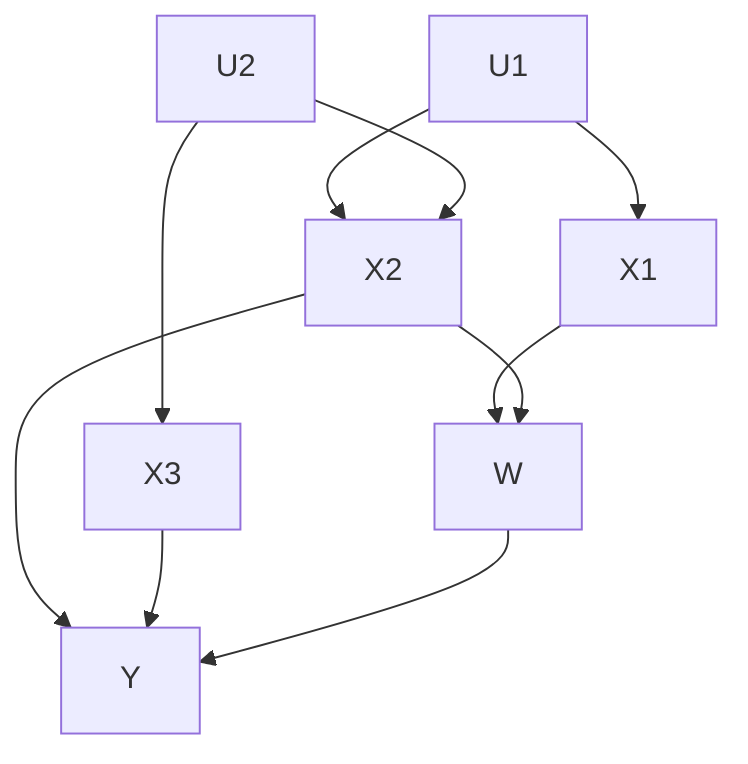
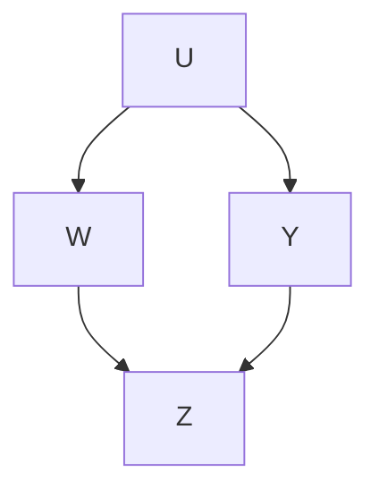
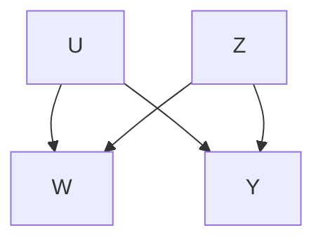

# Causal Inference-A Statistical Learning Approach

Stefan Wager

Stanford University

draft version, comments welcome

September 6, 2024

# Chapter 1 Randomized Controlled Trials

How best to understand and characterize causality is an age-old question in philosophy. As such, one might expect that any discussion of causal inference would need to be framed in terms of subtle and esoteric concepts. However, a ground-breaking line of work starting with Neyman [1923] and Rubin [1974] established that—although causality is in general a delicate and complicated notion—there exists an important class of problems, randomized controlled trials, where it is possible to approach causal questions in a practical and conceptually straight-forward way via careful application of randomization, averaging, and counterfactual reasoning.1

This chapter presents a brief overview of statistical estimation and inference in randomized controlled trials (RCTs). When available, evidence drawn from RCTs is often considered gold standard statistical evidence; and thus methods for studying RCTs form the foundation of the statistical toolkit for causal inference. Furthermore, many widely used observational study designs in, e.g., econometrics or epidemiology are motivated by analogy to RCTs; and so this chapter will also serve as a stepping stone to subsequent discussions of estimation and inference in observational studies.

Average treatment effects Suppose that we have run a RCT with n study participants $i = 1 , \ldots , n$ , where each unit i is assigned a binary treatment $W _ { i } \in \{ 0 , 1 \}$ and we then measure an outcome $Y _ { i } .$ . Our goal is to estimate the effect of the treatment on the outcome. Following the Neyman–Rubin causal model, we define the causal effect of a treatment via potential outcomes: For each treatment level $w \in \{ 0 , 1 \}$ , we define potential outcomes $Y _ { i } ( 1 )$ and $Y _ { i } ( 0 )$ corresponding to the outcome the i-th subject would have experienced had they respectively received the treatment or not, such that $Y _ { i } = Y _ { i } ( W _ { i } )$ .

The individual causal effect of the treatment on the i-th unit is then2

$$
\Delta_ {i} = Y _ {i} (1) - Y _ {i} (0). \tag {1.1}
$$

The fundamental problem in causal inference is that only one treatment can be assigned to a given individual, and so only one of $Y _ { i } ( 0 )$ and $Y _ { i } ( 1 )$ can ever be observed. Thus, $\Delta _ { i }$ can never be observed directly.

Although $\Delta _ { i }$ is itself unknowable, we can (perhaps remarkably) use randomized experiments to learn certain properties of the $\Delta _ { i }$ . In finite samples, without any assumptions on how study participants were generated (or equivalently, conditionally on the potential outcomes of study participants), randomization enables us to get unbiased estimates of the sample average treatment effect (SATE)

$$
\overline {{\Delta}} = \frac {1}{n} \sum_ {i = 1} ^ {n} (Y _ {i} (1) - Y _ {i} (0)). \tag {1.2}
$$

Furthermore, if we assume that study participants are independently drawn from a population $P ,$ , then randomized experiments enable unbiased and largesample consistent estimates of the (population) average treatment effect (ATE)

$$
\tau = \mathbb {E} _ {P} \left[ Y _ {i} (1) - Y _ {i} (0) \right]. \tag {1.3}
$$

This chapter will discuss properties of a number of different estimators for these two quantities.

## 1.1 Difference-in-means estimation

In a randomized controlled trial, there are many ways to estimate the average treatment effect. Perhaps the simplest and most intuitive way of doing so is via the difference-in-means estimator,

$$
\hat {\tau} _ {D M} := \frac {1}{n _ {1}} \sum_ {W _ {i} = 1} Y _ {i} - \frac {1}{n _ {0}} \sum_ {W _ {i} = 0} Y _ {i}, \quad n _ {w} = | \{i: W _ {i} = w \} |. \tag {1.4}
$$

In our setting, this difference in means estimator is unbiased essentially without assumptions, and the average treatment effect is identified directly via randomization. Suppose that the potential outcomes model given above is valid; or, as this is often stated in the literature, that the Stable Unit Treatment Values Assumption (SUTVA) holds:

$$
Y _ {i} = Y _ {i} (W _ {i}), \quad i = 1, \dots , n. \tag {1.5}
$$

Suppose furthermore that the treatment is in fact randomized, i.e., that conditionally all the potential outcomes $\{ Y _ { i } ( 0 ) , Y _ { i } ( 1 ) \} _ { i = 1 } ^ { n }$ and the number of treated units $n _ { 1 }$ , all units are treated with the same probability:3

$$
\mathbb {P} \left[ W _ {i} = 1 \mid \{Y _ {i} (0), Y _ {i} (1) \} _ {i = 1} ^ {n}, n _ {1} \right] = \frac {n _ {1}}{n}, \quad i = 1, \dots , n. \tag {1.6}
$$

Then ${ \hat { \tau } } _ { D M }$ is finite-sample unbiased for the SATE as defined in (1.2).

Theorem 1.1. Under assumptions (1.5) and (1.6),

$$
\mathbb {E} \left[ \hat {\tau} _ {D M} \mid \{Y _ {i} (0), Y _ {i} (1) \} _ {i = 1} ^ {n}, n _ {0} > 0, n _ {1} > 0 \right] = \overline {{\Delta}}. \tag {1.7}
$$

Proof. Whenever $n _ { 1 } > 0$ , i.e., we have at least 1 treated unit,

$$
\begin{array}{l} \mathbb {E} \left[ \frac {1}{n _ {1}} \sum_ {W _ {i} = 1} Y _ {i} \mid \{Y _ {i} (0), Y _ {i} (1) \} _ {i = 1} ^ {n}, n _ {1} \right] \\ = \mathbb {E} \left[ \frac {1}{n _ {1}} \sum_ {i = 1} ^ {n} W _ {i} Y _ {i} \mid \{Y _ {i} (0), Y _ {i} (1) \} _ {i = 1} ^ {n}, n _ {1} \right] \\ = \mathbb {E} \left[ \frac {1}{n _ {1}} \sum_ {i = 1} ^ {n} W _ {i} Y _ {i} (1) \mid \left\{Y _ {i} (0), Y _ {i} (1) \right\} _ {i = 1} ^ {n}, n _ {1} \right] \tag {SUTVA} \\ = \frac {1}{n _ {1}} \sum_ {i = 1} ^ {n} Y _ {i} (1) \mathbb {E} \left[ W _ {i} \mid \{Y _ {i} (0), Y _ {i} (1) \} _ {i = 1} ^ {n}, n _ {1} \right] \\ = \frac {1}{n} \sum_ {i = 1} ^ {n} Y _ {i} (1) \quad (\text { random   assignment }). \\ \end{array}
$$

An analogous result holds for the average of the controls when $n _ { 0 } > 0 .$ .

Population Asymptotics The result in Theorem 1.1 is valuable in its generality: It provides an unbiasedness result under minimal assumptions, and in particular makes no distributional assumptions on the potential outcomes. In practical terms, this means we can apply Theorem 1.1 without making any claims about how the n study participants were recruited.

A limitation of this result, however, is that it does not characterize the sampling error $\hat { \tau } _ { D M } - \overline { { \Delta } }$ , and so doesn’t directly provide a roadmap to statistical inference. In order to make progress, we here make an additional assumption that the study participants (i.e., formally, the pairs of potential outcomes $\{ Y _ { i } ( 0 ) , Y _ { i } ( 1 ) \} )$ are independently drawn from a population P . Such population-sampling assumptions then enable straight-forward distributional results and confidence intervals via standard large-sample analysis. It is also possible to obtain distributional results without making such sampling assumptions, but doing so relies on specialized statistical techniques that we will not pursue for now; we will revisit population-sampling-free methods for inference in the bibliographic notes at the end of this chapter and in Chapter 12.

Example 1. In 2008, Oregon ran a lottery to allocate additional spots in its Medicaid program to low-income adults. As reported in Finkelstein et al. [2012], ∼ 90, 000 people joined the lottery, and of them a (randomly selected) ∼ 35, 000 were allowed to apply for Medicaid. The authors consider a number of outcomes, such as healthcare use and expenditures. Finite-sample analysis following Theorem 1.1 shows that, among lottery participants, the differencein-means estimator is unbiased for the average effect of being allowed to apply for Medicaid on outcomes considered, regardless of how the set of lottery participants was created. The asymptotic tools discussed below make a further assumption that the lottery participants were independently sampled from from a relevant larger population (e.g., able-bodied, low-income, uninsured adults with interest in gaining insurance coverage).

A central limit theorem In addition to IID sampling, we will also be more specific about how treatment is randomized, and assume that we are in a Bernoulli trial with4

$$
W _ {i} \mid \{Y _ {i} (0), Y _ {i} (1) \} \stackrel {\text { iid }} {\sim} \operatorname{Bernoulli} (\pi), \quad 0 <   \pi <   1. \tag {1.8}
$$

The following central limit theorem for the difference-in-means estimator can then be established via simple statistical arguments.

Theorem 1.2. Under the assumptions of Theorem $1 . 2 ,$ suppose furthermore that the potential outcomes are drawn as $\{ Y _ { i } ( 0 ) , Y _ { i } ( 1 ) \} \stackrel { i i d } { \sim } P$ from a distribution P with bounded second moments and that we run a Bernoulli trial as in (1.8). Then,

$$
\sqrt {n} \left(\hat {\tau} _ {D M} - \tau\right) \Rightarrow \mathcal {N} \left(0, V _ {D M}\right), V _ {D M} = \frac {\mathrm{Var} \left[ Y _ {i} (0) \right]}{1 - \pi} + \frac {\mathrm{Var} \left[ Y _ {i} (1) \right]}{\pi}. (1. 9)
$$

Furthermore, the plug-in variance estimate

$$
\widehat {V} _ {D M} := \frac {n}{n _ {0} ^ {2}} \sum_ {W _ {i} = 0} \left(Y _ {i} - \frac {1}{n _ {0}} \sum_ {W _ {i} = 0} Y _ {i}\right) ^ {2} + \frac {n}{n _ {1} ^ {2}} \sum_ {W _ {i} = 1} \left(Y _ {i} - \frac {1}{n _ {1}} \sum_ {W _ {i} = 1} Y _ {i}\right) ^ {2} \tag {1.10}
$$

is consistent, $\widehat { V } _ { D M } \to _ { p } V _ { D M }$ .

Proof. Defining potential outcome residuals $\varepsilon _ { i } ( w ) = Y _ { i } ( w ) - \mathbb { E } _ { P } \left[ Y _ { i } ( w ) \right]$ for $w = 0 , 1$ , we can express our estimation error as

$$
\begin{array}{l} \hat {\tau} _ {D M} - \tau = \frac {1}{n _ {1}} \sum_ {W _ {i} = 1} \varepsilon_ {i} (1) - \frac {1}{n _ {0}} \sum_ {W _ {i} = 1} \varepsilon_ {i} (0) \\ = \frac {n}{n _ {1}} \frac {1}{n} \sum_ {i = 1} ^ {n} W _ {i} \varepsilon_ {i} (1) - \frac {n}{n _ {0}} \frac {1}{n} \sum_ {i = 1} ^ {n} (1 - W _ {i}) \varepsilon_ {i} (0). \\ \end{array}
$$

By randomization, one can verify that E $\begin{array} { r } { [ W _ { i } \varepsilon _ { i } ( 1 ) ] = \mathbb { P } \left[ W _ { i } \right] \mathbb { E } \left[ \varepsilon _ { i } ( 1 ) \big | W _ { i } = 1 \right] = } \end{array}$ $\mathbb { P } \left[ W _ { i } \right] \mathbb { E } \left[ \varepsilon _ { i } ( 1 ) \right] = 0$ and E $[ ( 1 - W _ { i } ) \varepsilon _ { i } ( 0 ) ] = 0$ , and finally

$$
\begin{array}{l} \text {Var} \left[ \binom{W _ {i}   \varepsilon_ {i} (1)}{(1 - W _ {i})   \varepsilon_ {i} (0)} \right] = \mathbb {E} \left[ \binom{W _ {i}   \varepsilon_ {i} (1)}{(1 - W _ {i})   \varepsilon_ {i} (0)} ^ {\otimes 2} \right] \\ = \left( \begin{array}{c c} \pi   \text {Var}   [ \varepsilon_ {i} (1) ] & 0 \\ 0 & (1 - \pi)   \text {Var}   [ \varepsilon_ {i} (0) ] \end{array} \right). \\ \end{array}
$$

Thus, by the standard multivariate central limit theorem

$$
\sqrt {n} \binom{\frac {1}{n} \sum_ {i = 1} ^ {n} W _ {i} \varepsilon_ {i} (1)}{\frac {1}{n} \sum_ {i = 1} ^ {n} (1 - W _ {i}) \varepsilon_ {i} (0)} \Rightarrow \mathcal {N} \left(0, \left( \begin{array}{c c} \pi \operatorname{Var} [ \varepsilon_ {i} (1) ] & 0 \\ 0 & (1 - \pi) \operatorname{Var} [ \varepsilon_ {i} (0) ] \end{array} \right)\right).
$$

The result (1.9) follows by Slutsky’s lemma because the treatment fraction of a Bernoulli trial concentrates, $n _ { 1 } / n \to _ { p } \pi$ . Meanwhile, (1.10) follows similarly via the weak law of large numbers. □

The above central limit theorem for ${ \hat { \tau } } _ { D M }$ immediately enables asymptotically valid Gaussian confidence intervals for τ . For any $0 < \alpha < 1$ ,

$$
\lim _ {n \to \infty} \mathbb {P} \left[ \tau \in \left(\hat {\tau} _ {D M} \pm \Phi^ {- 1} (1 - \alpha / 2) \sqrt {\widehat {V} _ {D M} / n}\right) \right] = 1 - \alpha , \tag {1.11}
$$

where Φ denotes the standard Gaussian cumulative distribution function.

From a certain perspective, one could argue that the above is all that is needed to estimate average treatment effects in randomized trials. The difference in means estimator ${ \hat { \tau } } _ { D M }$ is consistent and allows for valid asymptotic inference; moreover, the estimator is very simple to implement, and hard to “cheat” with (i.e., there is little room for an unscrupulous analyst to try different estimation strategies and report the one that gives the answer closest to the one they want). On the other hand, our discussion so far has not established that ${ \hat { \tau } } _ { D M }$ is an “optimal” way to use the data in any meaningful sense; and in fact, we’ll see below that it’s often possible to design estimators with guarantees that strictly dominate those for ${ \hat { \tau } } _ { D M }$ .

## 1.2 Regression adjustments in randomized trials

When analyzing randomized controlled trials, we often have access to pretreatment covariates $X _ { i }$ observed together with the treatments $W _ { i }$ and outcomes $Y _ { i }$ . In this case, practitioners often choose to estimate treatment effects via a linear regression based approach rather than via the simple difference in means.

There are two standard ways to estimate average treatment effects via linear regression. The first is to fit a simple linear regression5

$$
Y _ {i} \sim \alpha + W _ {i} \tau + X _ {i} \cdot \beta , \tag {1.12}
$$

and then report the resulting coefficient $\hat { \tau } _ { S R E G } : = \hat { \tau }$ as an estimate of the average treatment effect. The second is to add in full treatment-covariate interactions, and to fit the interacted linear regression

$$
Y _ {i} \sim \alpha + W _ {i} \tau + X _ {i} \cdot \beta + W _ {i} X _ {i} \cdot \gamma . \tag {1.13}
$$

One can then estimate the average treatment effect via the average difference in predictions if everyone vs. no one were treated

$$
\begin{array}{l} \hat {\tau} _ {I R E G} = \frac {1}{n} \sum_ {i = 1} ^ {n} \hat {\alpha} + \hat {\tau} + X _ {i} \cdot (\hat {\beta} + \hat {\gamma}) - \frac {1}{n} \sum_ {i = 1} ^ {n} \hat {\alpha} + X _ {i} \cdot \hat {\beta}, \tag {1.14} \\ = \hat {\tau} + \overline {{X}} \cdot \hat {\gamma}, \quad \overline {{X}} := \frac {1}{n} \sum_ {i = 1} ^ {n} X _ {i}. \\ \end{array}
$$

Both the simple and interacted regression can reasonably be deployed in randomized experiments. For the rest of this chapter, we will focus on properties of the interacted regression estimator $\hat { \tau } _ { I R E G }$ because it allows for transparent analysis and is also generally regarded a best practice in the current literature on causal inference; see the bibliographic notes for further discussion.

Regression adjustments under linearity The linear regression estimator (1.13) is a statistical estimator that can be studied under a number of different models for the data. The simplest setting under which to consider the behavior of $\hat { \tau } _ { I R E G }$ (and compare it to that of ${ \hat { \tau } } _ { D M } )$ is under an assumption that the regression model (1.13) is well specified; and this is the setting we will start with here.

Suppose for now that our samples are independently is generated via a Bernoulli randomized trial (1.8) with outcomes $Y _ { i } = Y _ { i } ( W _ { i } )$ and

$$
\begin{array}{l} Y _ {i} (w) = \alpha_ {(w)} + X _ {i} \cdot \beta_ {(w)} + \varepsilon_ {i} (w), \\ \mathbb {T} [ (x) | x ] = 0, \quad \forall x <   [ (x) | x ], \quad 2 \end{array} \tag {1.15}
$$

$$
\mathbb {E} \left[ \varepsilon_ {i} (w) \mid X _ {i} \right] = 0, \mathrm{Var} \left[ \varepsilon_ {i} (w) \mid X _ {i} \right] = \sigma^ {2}.
$$

Under Bernoulli randomization, one can check that the observables $( X _ { i } , Y _ { i } , W _ { i } )$ are independently drawn from a distribution satisfying6

$$
Y _ {i} = \alpha_ {(0)} + W _ {i} (\alpha_ {(1)} - \alpha_ {(0)}) + X _ {i} \cdot \beta_ {(0)} + W _ {i} X _ {i} \cdot (\beta_ {(1)} - \beta_ {(0)}) + \varepsilon_ {i}, \tag {1.16}
$$

with E $\left[ \varepsilon _ { i } \big | X _ { i } , W _ { i } \right] = 0$ and Var $\left[ \varepsilon _ { i } \big | X _ { i } , W _ { i } \right] = \sigma ^ { 2 }$ , i.e., the regression (1.13) is in fact well specified. For simplicity, we will further assume that we are in a balanced randomized trial with $\pi = 5 0 \%$ , and (without loss of generality) E $[ X ] = 0 . ^ { 7 }$As a warm-up, we first study the behavior of ${ \hat { \tau } } _ { D M }$ under this model as a baseline; we will then be able to compare it with $\hat { \tau } _ { I R E G }$ . Given our general result in Theorem 1.2 all that remains to be done is to spell out what $V _ { D M }$ is here; and, writing Var $[ X ] = A$ , we we get (recall that we’re using $\pi = 0 . 5$ for simplicity)

$$
\begin{array}{l} V _ {D M} = \frac {\operatorname{Var} [ Y _ {i} (0) ]}{0 . 5} + \frac {\operatorname{Var} [ Y _ {i} (1) ]}{0 . 5} \\ = 2 \left(\operatorname{Var} \left[ X _ {i} \beta_ {(0)} \right] + \sigma^ {2}\right) + 2 \left(\operatorname{Var} \left[ X _ {i} \beta_ {(1)} \right] + \sigma^ {2}\right) \tag {1.17} \\ = 4 \sigma^ {2} + 2 \left\| \beta_ {(0)} \right\| _ {A} ^ {2} + 2 \left\| \beta_ {(1)} \right\| _ {A} ^ {2} \\ = 4 \sigma^ {2} + \left\| \beta_ {(0)} + \beta_ {(1)} \right\| _ {A} ^ {2} + \left\| \beta_ {(0)} - \beta_ {(1)} \right\| _ {A} ^ {2}, \\ \end{array}
$$

where we used the notation $\| v \| _ { A } ^ { 2 } = v ^ { \prime } A v$ for convenience.

Given that the linear regression model is well specified here, one should expect that $\hat { \tau } _ { I R E G }$ improves over the performance of ${ \hat { \tau } } _ { D M } \mathbf { ; }$ the question is by how much. To study the regression estimator, it is helpful to note that the interacted regression (1.13) is algorithmically equivalent to running separate regressions for the treated and control groups and then taking differences of their predictions on the full study sample:

$$
Y _ {i} \sim \alpha_ {(0)} + X _ {i} \cdot \beta_ {(0)} \text {for all i with W_{i} = 0},
$$

$$
Y _ {i} \sim \alpha_ {(1)} + X _ {i} \cdot \beta_ {(1)} \text {for all} i \text {with} W _ {i} = 0,
$$

$$
\hat {\tau} _ {I R E G} = \hat {\alpha} _ {(1)} - \hat {\alpha} _ {(0)} + \overline {{X}} \left(\hat {\beta} _ {(1)} - \hat {\beta} _ {(0)}\right).
$$

Standard results about linear regression then imply that, under model (1.15) (recall also that, here, we assume that $\mathbb { E } \left[ X \right] = 0 )$

$$
\sqrt {n _ {w}} \left(\binom {\hat {\alpha} _ {(w)}} {\hat {\beta} _ {(w)}} - \binom {\alpha_ {(w)}} {\beta_ {(w)}}\right) \Rightarrow \mathcal {N} \left(0, \sigma^ {2} \left( \begin{array}{c c} 1 & 0 \\ 0 & A ^ {- 1} \end{array} \right)\right), \tag {1.18}
$$

and that $\hat { \alpha } _ { ( 0 ) } , \hat { \alpha } _ { ( 1 ) } , \hat { \beta } _ { ( 0 ) } , \hat { \beta } _ { ( 1 ) }$ and $\overline { { X } }$ are all asymptotically independent. Then, we can write

$$
\hat {\tau} _ {I R E G} - \tau = \underbrace {\hat {\alpha} _ {(1)} - \alpha_ {(1)}} _ {\approx \mathcal {N} (0, \sigma^ {2} / n _ {1})} - \underbrace {\hat {\alpha} _ {(0)} - \alpha_ {(0)}} _ {\approx \mathcal {N} (0, \sigma^ {2} / n _ {0})} + \underbrace {\overline {{X}} \left(\beta_ {(1)} - \beta_ {(0)}\right)} _ {\approx \mathcal {N} \left(0, \left\| \beta_ {(1)} - \beta_ {(0)} \right\| _ {A} ^ {2} / n\right)}
$$

$$
+ \underbrace {\overline {{X}} \left(\hat {\beta} _ {(1)} - \hat {\beta} _ {(0)} - \beta_ {(1)} + \beta_ {(0)}\right)} _ {\mathcal {O} _ {P} (1 / n)},
$$

which leads us to the central limit theorem

$$
\sqrt {n} \left(\hat {\tau} _ {I R E G} - \tau\right) \Rightarrow \mathcal {N} \left(0, V _ {I R E G}\right), \quad V _ {I R E G} = 4 \sigma^ {2} + \left\| \beta_ {(0)} - \beta_ {(1)} \right\| _ {A} ^ {2}. \tag {1.19}
$$

After the dust settles we see that, under the linear model (1.15), the interacted regression estimator also satisfies a central limit theorem, and

$$
V _ {I R E G} = V _ {D M} - \left\| \beta_ {(0)} + \beta_ {(1)} \right\| _ {A} ^ {2} \leq V _ {D M}, \tag {1.20}
$$

i.e., the regression estimator usually has a better (and never has a worse) asymptotic variance than the difference-in-means estimator.

Regression adjustments without linearity We showed above that if we assume that the data is generated following a linear model then, as expected, using an estimator that leverages linearity enables more accurate estimates of the average treatment effect than one that doesn’t. A pessimist might expect that these accuracy gains come at a cost, and that linear regression estimators should face a trade-off whereby they do worse than the difference-in-means estimator when linearity doesn’t hold. Surprisingly, however, no such tradeoff exists. In randomized trials, $\hat { \tau } _ { I R E G }$ is always consistent for $\tau$ and satisfies an asymptotic non-inferiority results of the type (1.20), even when the linear regression underlying $\hat { \tau } _ { I R E G }$ may be misspecified.

We start by establishing a general central limit theorem for $\hat { \tau } _ { I R E G }$ below under an assumption that samples are independently drawn from a population, but no linearity assumption. Throughout, we will use the following notation,

$$
\mu_ {(w)} (x) = \mathbb {E} \left[ Y _ {i} (w) \mid X _ {i} = x \right], \quad \sigma_ {(w)} ^ {2} (x) = \operatorname{Var} \left[ Y _ {i} (w) \mid X _ {i} = x \right], \tag {1.21}
$$

and assume that these quantities are well-defined and finite. The proof of the following result relies on the Huber–White analysis of linear regression whereby—regardless of linearity assumptions—linear regression consistently the best linear projection coefficients

$$
\left(\alpha_ {(w)} ^ {*}, \beta_ {(w)} ^ {*}\right) = \operatorname{argmin} _ {\alpha , \beta} \left\{\mathbb {E} \left[ (Y _ {i} (w) - \alpha - X _ {i} \cdot \beta) ^ {2} \right] \right\}, \tag {1.22}
$$

which characterize the best available linear-in- $X _ { i }$ predictor under mean-squared error.8 The argument below can also be extended to verify that standard non-parametric tools for statistical inference—such as the bootstrap or the jackknife—can be used to build asymptotically valid normal confidence intervals for $\tau$ that are centered at $\hat { \tau } _ { I R E G }$ .

Theorem 1.3. Under the conditions of Theorem 1.2, assume furthermore that $\mathbb { E } \left[ X ^ { \prime } X \right]$ is invertible. Then,

$$
\sqrt {n} \left(\hat {\tau} _ {I R E G} - \tau\right) \Rightarrow \mathcal {N} \left(0, V _ {I R E G}\right),
$$

$$
V _ {I R E G} = \operatorname{Var} \left[ X _ {i} \cdot \left(\beta_ {(1)} ^ {*} - \beta_ {(0)} ^ {*}\right) \right] + \frac {1}{\pi} \mathbb {E} \left[ \left(Y _ {i} (1) - \alpha_ {(1)} ^ {*} - X _ {i} \cdot \beta_ {(1)} ^ {*}\right) ^ {2} \right] \tag {1.23}
$$

$$
+ \frac {1}{1 - \pi} \mathbb {E} \left[ \left(Y _ {i} (0) - \alpha_ {(0)} ^ {*} - X _ {i} \cdot \beta_ {(0)} ^ {*}\right) ^ {2} \right].
$$

Proof. We again assume, without loss of generality, that E $[ X _ { i } ] = 0$ . From the Huber–White analysis of linear regression, we then obtain that9

$$
\sqrt {n _ {w}} \left(\binom {\hat {\alpha} _ {(w)}} {\hat {\beta} _ {(w)}} - \binom {\alpha_ {(w)} ^ {*}} {\beta_ {(w)} ^ {*}}\right) \Rightarrow \mathcal {N} \left(0, \left( \begin{array}{c c} M S E _ {(w)} ^ {*} & 0 \\ 0 & \dots \end{array} \right)\right), \text {where} \tag {1.24}
$$

$$
M S E _ {(w)} ^ {*} = \mathbb {E} \left[ \left(Y _ {i} (w) - X _ {i} \beta_ {(w)} ^ {*} - \hat {\alpha} _ {(w)} ^ {*}\right) ^ {2} \right]
$$

measures the mean-squared error of the best linear predictor. We do not write down the lower corner of the asymptotic variance matrix as it is complicated and does not contribute to first-order behavior; however, we do note that the $\cdots . . , s ,$ term is finite whenever $\mathbb { E } \left[ X ^ { \prime } X \right]$ is invertible.

It now remains to expand out the regression estimator as given in (1.14),

$$
\hat {\tau} _ {I R E G} - \tau = \hat {\alpha} _ {(1)} - \hat {\alpha} _ {(0)} - \tau + \overline {{X}} \cdot \left(\hat {\beta} _ {(1)} - \hat {\beta} _ {(0)}\right).
$$

We start by focusing on the contribution of the first 3 summands. One can immediately verify that the average bias of the optimal linear predictions must be 0, i.e., given $\beta _ { ( w ) } ^ { * }$ , the intercept parameter must be $\alpha _ { ( w ) } ^ { * } = \mathbb { E } \ \big | Y _ { i } ( w ) - X _ { i } \cdot \beta _ { ( 1 ) } ^ { * } \big |$ . Thus, under our assumption that E $\left[ X _ { i } \right] = 0$ , we must have $\alpha _ { ( w ) } ^ { * } = \mathbb { E } \left[ Y _ { i } ( 0 ) \right]$ , and so

$$
\hat {\alpha} _ {(1)} - \hat {\alpha} _ {(0)} - \tau = \hat {\alpha} _ {(1)} - \alpha_ {(1)} ^ {*} - (\hat {\alpha} _ {(0)} - \alpha_ {(0)} ^ {*}).
$$

The central limit theorem (1.24) then implies that

$$
\sqrt {n} \left(\hat {\alpha} _ {(1)} - \hat {\alpha} _ {(0)} - \tau\right) \Rightarrow \mathcal {N} \left(0, \frac {M S E _ {(1)} ^ {*}}{\pi} + \frac {M S E _ {(0)} ^ {*}}{1 - \pi}\right). \tag {1.25}
$$

Now, moving to the last summand, we note that

$$
\overline {{X}} \cdot (\hat {\beta} _ {(1)} - \hat {\beta} _ {(0)}) = \overline {{X}} \cdot (\beta_ {(1)} ^ {*} - \beta_ {(0)} ^ {*}) + \overline {{X}} \cdot (\hat {\beta} _ {(1)} - \beta_ {(1)} ^ {*} - \hat {\beta} _ {(0)} + \beta_ {(0)} ^ {*}).
$$

Again because $\mathbb { E } \left[ X _ { i } \right] = 0$ , the average $\overline { { X } }$ of the covariates is near zero with asymptotically normal fluctuations of order $1 / { \sqrt { n } }$ , and so

$$
\sqrt {n} \overline {{X}} \cdot \left(\beta_ {(1)} ^ {*} - \beta_ {(0)} ^ {*}\right) \Rightarrow \mathcal {N} \left(0, \operatorname{Var} \left[ X _ {i} \cdot \left(\beta_ {(1)} ^ {*} - \beta_ {(0)} ^ {*}\right) \right]\right). \tag {1.26}
$$

Furthermore, one can verify that the terms in (1.25) and (1.26) are asymptotically uncorrelated and thus asymptotically independent.10

Finally, because both X and (thanks to (1.24)) $\hat { \beta } _ { ( 0 ) } - \beta _ { ( 0 ) } ^ { \ast }$ have fluctuations on the order of $1 / \sqrt { n }$ away from 0, their product can only have fluctuations of order $1 / n$ away from $0 ;$ we write this compactly as

$$
\overline {{X}} \cdot \left(\hat {\beta} _ {(1)} - \beta_ {(1)} ^ {*} - \hat {\beta} _ {(0)} + \beta_ {(0)} ^ {*}\right) = \mathcal {O} _ {P} (1 / n).
$$

Thus, by Slutsky’s lemma, this product term can be asymptotically ignored since the leading-order terms (1.25) and (1.26) are of order $1 / \sqrt { n }$ . Putting all the pieces together recovers (1.23). □

With Theorem 1.3 in hand, we are ready to revisit our comparison between $\hat { \tau } _ { I R E G }$ reduces to ${ \hat { \tau } } _ { D M }$ . Does using a regression adjustment help improve precision, even without linearity assumptions? Here, we show that the answer is yes for balanced RCTs, i.e., with $\pi = 0 . 5$ , and under an assumption that the unpredictable noise level is constant, $\sigma _ { ( 1 ) } ^ { 2 } ( x ) = \sigma _ { ( 0 ) } ^ { 2 } ( x ) = \sigma ^ { 2 }$ for all $\boldsymbol { x } . ^ { 1 1 }$ Under these assumptions, and writing Var $\left[ X _ { i } \right] = A$ as before, we can expand out the asymptotic variance from (1.23) as follows:12

$$
\begin{array}{l} V _ {I R E G} = 2 M S E _ {(0)} ^ {*} + 2 M S E _ {(1)} ^ {*} + \left\| \beta_ {(1)} ^ {*} - \beta_ {(0)} ^ {*} \right\| _ {A} ^ {2} \\ = 4 \sigma^ {2} + 2 \operatorname{Var} \left[ \mu_ {(0)} (X) - X \beta_ {(0)} ^ {*} \right] \\ + 2 \operatorname{Var} \left[ \mu_ {(1)} (X) - X \beta_ {(1)} ^ {*} \right] + \left\| \beta_ {(1)} ^ {*} - \beta_ {(0)} ^ {*} \right\| _ {A} ^ {2}. \\ \end{array}
$$

Next, because $X \beta _ { ( w ) } ^ { * }$ is the projection of $\mu _ { ( 0 ) } ( X )$ onto the span of $X$ , thisfurther simplifies

$$
\begin{array}{l} \dots = 4 \sigma^ {2} + 2 \left(\operatorname{Var} \left[ \mu_ {(0)} (X) \right] - \operatorname{Var} \left[ X \beta_ {(0)} ^ {*} \right]\right) \\ + 2 \left(\operatorname{Var} \left[ \mu_ {(1)} (X) \right] - \operatorname{Var} \left[ X \beta_ {(1)} ^ {*} \right]\right) + \left\| \beta_ {(1)} ^ {*} - \beta_ {(0)} ^ {*} \right\| _ {A} ^ {2} \\ = 4 \sigma^ {2} + 2 (\operatorname{Var} [ \mu_ {(0)} (X) ] + \operatorname{Var} [ \mu_ {(1)} (X) ]) \\ + \left\| \beta_ {(1)} ^ {*} - \beta_ {(0)} ^ {*} \right\| _ {A} ^ {2} - 2 \left\| \beta_ {(0)} ^ {*} \right\| _ {A} ^ {2} - 2 \left\| \beta_ {(1)} ^ {*} \right\| _ {A} ^ {2} \\ = 4 \sigma^ {2} + 2 \left(\operatorname{Var} \left[ \mu_ {(0)} (X) \right] + \operatorname{Var} \left[ \mu_ {(1)} (X) \right]\right) - \left\| \beta_ {(0)} ^ {*} + \beta_ {(1)} ^ {*} \right\| _ {A} ^ {2} \\ = V _ {D M} - \left\| \beta_ {(0)} ^ {*} + \beta_ {(1)} ^ {*} \right\| _ {A} ^ {2}. \\ \end{array}
$$

In other words, whether or not the true effect function $\mu _ { w } ( x )$ is linear, interacted linear regression always either reduces or matches the asymptotic variance of the difference-in-means estimator. Moreover, the amount of variance reduction scales by the amount by which linear regression in fact chooses to fit the training data. A worst case for the regression adjustment is when $\beta _ { ( 0 ) } ^ { * } = \beta _ { ( 1 ) } ^ { * } = 0$ , i.e., when OLS asymptotically just does nothing; and in this case ˆτIREG ends up being asymptotically equivalent to ${ \hat { \tau } } _ { D M }$ .

The role of regression adjustments in RCTs The individual treatment effect $\Delta _ { i } = Y _ { i } ( 1 ) - Y _ { i } ( 0 )$ is a central object of interest in causal inference. These effects $\Delta _ { i }$ themselves are fundamentally unknowable; however, a large RCT lets us consistently recover the average treatment effect $\tau = \mathbb { E } \left[ \Delta _ { i } \right]$ . In this chapter, we presented and compared two approaches for doing so: The difference-in-means estimator and the interacted regression adjustment. Perhaps surprisingly we found that, when pre-treatment covariates are available, the regression adjustment is asymptotically at least as precise as (and usually more precise than) the difference-in-means estimator—and this result holds whether or not the linear model underlying the regression adjustment is well specified.

A key point about our analysis of the regression adjustment is that we defined our target estimand, i.e., the average treatment effect $\tau = \mathbb { E } \left[ \Delta _ { i } \right]$ , before (and without) making any parametric (e.g., linear) modeling assumptions. The average treatment effect was defined in terms of non-parametric counterfactual reasoning. Linear regression was then used as an algorithmic tool to estimate $\tau ,$ but linear modeling played no role in framing our original statistical question.

Finally, note that our regression adjustment estimator can effectively beviewed as an average difference in predictions,

$$
\hat {\tau} _ {I R E G} = \frac {1}{n} \sum_ {i = 1} ^ {n} \left(\underbrace {\left(\hat {\alpha} _ {(1)} + X _ {i} \hat {\beta} _ {(1)}\right)} _ {\hat {\mu} _ {(1)} (X _ {i})} - \underbrace {\left(\hat {\alpha} _ {(0)} + X _ {i} \hat {\beta} _ {(0)}\right)} _ {\hat {\mu} _ {(0)} (X _ {i})}\right), \tag {1.27}
$$

where $\hat { \mu } _ { ( w ) } ( x )$ denotes linear regression predictions at x under treatment w. Could we use other methods to estimate $\hat { \mu } _ { ( w ) } ( x )$ (e.g., deep nets, forests) rather than linear regression? How would this affect asymptotic variance? Exercise 2 in Chapter 16 digs deeper on this.

## 1.3 Bibliographic notes

The potential outcomes model for causal inference was first advocated by Neyman [1923] and Rubin [1974]; see Imbens and Rubin [2015] for a modern textbook treatment. One simple yet subtle aspect of the modeling framework used here is our use of SUTVA 1.5 which, through notation, rules out many plausible difficulties Imbens and Rubin [2015, Chapter 1.6]. SUTVA precludes any form of cross-unit interference (i.e., Wi cannot affect $Y _ { j }$ for $i \neq j )$ . Furthermore, SUTVA implicitly requires that there is only 1 “version” of treatment; and this assumption may become problematic if, e.g., we run a multi-site randomized trial where different sites administer treatment in a slightly different way. Thus, whenever invoked in an application, credibility of SUTVA should be carefully assessed.

One distinction question that has received considerable attention in the literature is whether or not one is willing to make any stochastic assumptions on the potential outcomes. The setting without stochastic assumptions on the potential outcomes is referred to as the Neyman model for randomization inference or the finite-population model; whereas the setting with stochastic assumptions is referred to the superpopulation or the IID-sampling model. Here, we stated Theorem 1.1 under the Neyman model, but otherwise worked under a superpopulation sampling model. We will take a closer look at the Neyman model—and also revisit some of the results from this chapter—in the context of our discussion of causal inference under cross-unit interference in Chapter 12.

Statistical inference justified under the Neyman model is sometimes considered the highest standard of rigor in analyzing randomized trials because all inferences are justified by randomization alone: The analyst does not need to reason about how study participants were enrolled (and whether they were randomly drawn from a larger population) in order to rigorously apply results proven under this model. The cost of working under the the Neyman model establishing the sampling distribution of even fairly simple estimators requires more intricate statistical analyses; see Li and Ding [2017] for recent results in this setting. In contrast, studying randomized trials under the superpopulation model generally enables simpler analyses via application of standard statistical and econometric tools; and paves the way for more sophisticated semiparametric estimators in observational study settings. A further discussion and comparison of the SATE (1.2) and ATE (1.3) estimands is given in [Imbens, 2004].

Lin [2013] presents a thorough discussion of the role of linear regression adjustments in improving the precision of average treatment effect estimators, and why using full intereactions as in (1.13) is often considered a best practice relative to the simple regression (1.12). When the covariates $X _ { i }$ are generated via one-hot-encoding of a discrete factor $( \mathrm { i . e . , } X _ { i } \in \{ 0 , 1 \} ^ { K }$ with only one nonzero entry per unit) the interacted regression adjustment estimator is equivalent to (post-)stratification, which is also generally considered a best practice in analyzing data from randomized experiments [Miratrix, Sekhon, and Yu, 2013].

Another feature of Lin [2013] is that he works under the Neyman model for randomization inference, and shows that many of the insights from Theorem 1.3 in fact still holds in this setting. Wager et al. [2016] have a discussion of nonparametric or high-dimensional regression adjustments in randomized trials under superpopulations asymptotics that expands on the results covered here. The study of high-dimensional regression adjustmentin the Neyman model is an ongoing effort, with recent contributions from Bloniarz et al. [2016] and Lei and Ding [2021].

# Chapter 2 Unconfoundedness and the Propensity Score

Randomized controlled trials represent a powerful—yet somewhat rigid—class of settings where we can identify and estimate causal effects. One of the overarching focuses of the literature on statistical causal inference (and also of this book) is on ways in which we relax assumptions made in RCTs while preserving our ability to rigorously estimate causal effects, thus broadening the set of problems where causal inference is possible.

In this chapter, we will consider a first, simple relaxation of the RCT assumptions. We will no longer assume that the treatment $W _ { i }$ is randomized; however, we will assume that we observe pre-treatment covariates $X _ { i }$ such that, after conditioning on $X _ { i } .$ , the treatment is as good as randomized. We will then discuss a number of methods for estimating the average treatment effect that exploit this “unconfoundedness” assumption, including ones based on estimating the propensity score (i.e., the conditional probability of receiving treatment). For simplicitly, throughout this chapter (and the next ones also) we will work exclusively under the assumption that units are independently sampled from a superpopulation.

Beyond a single randomized controlled trial The simplest way to move beyond one RCT is to consider two RCTs. As a concrete example, supposed that we are interested in giving teenagers cash incentives to discourage them from smoking. A random subset of $\sim 5 \%$ of teenagers in Palo Alto, CA, and a random subset of ∼ 20% of teenagers in Geneva, Switzerland are eligible for the study.

<table><tr><td>Palo Alto</td><td>Non-S.</td><td>Smoker</td><td>Geneva</td><td>Non-S.</td><td>Smoker</td></tr><tr><td>Treat.</td><td>152</td><td>5</td><td>Treat.</td><td>581</td><td>350</td></tr><tr><td>Control</td><td>2362</td><td>122</td><td>Control</td><td>2278</td><td>1979</td></tr></table>

Within each city, we have an RCT, and in fact readily see that the treatment helps. However, looking at aggregate data is misleading, and it looks like the treatment hurts; this is an example of what is sometimes called Simpson’s paradox:

<table><tr><td>Palo Alto + Geneva</td><td>Non-Smoker</td><td>Smoker</td></tr><tr><td>Treatment</td><td>733</td><td>401</td></tr><tr><td>Control</td><td>4640</td><td>2101</td></tr></table>

Once we aggregate the data, this is no longer an RCT because Genevans are both more likely to get treated, and more likely to smoke whether or not they get treated. In order to get a consistent estimate of the ATE, we need to estimate treatment effects in each city separately:

$$
\hat {\tau} _ {\mathrm{PA}} = \frac {5}{1 5 2 + 5} - \frac {1 2 2}{2 3 6 2 + 1 2 2} \approx -1.7\% ,
$$

$$
\hat {\tau} _ {\mathrm{GVA}} = \frac {3 5 0}{3 5 0 + 5 8 1} - \frac {1 9 7 9}{2 2 7 8 + 1 9 7 9} \approx -8.9\%
$$

$$
\hat {\tau} = \frac {2 6 4 1}{2 6 4 1 + 5 1 8 8} \hat {\tau} _ {\mathrm{PA}} + \frac {5 1 8 8}{2 6 4 1 + 5 1 8 8} \hat {\tau} _ {\mathrm{GVA}} \approx - 6.5 \%.
$$

What are the statistical properties of this estimator? How does this idea generalize to continuous $x ?$

## 2.1 Stratified estimation

Formalizing the above discussion, suppose that we have covariates $X _ { i }$ that take values in a discrete space $X _ { i } \in { \mathcal { X } }$ , with $| \mathcal { X } | = p < \infty$ . Suppose moreover that the treatment assignment is random conditionally on $X _ { i }$ , (i.e., we have an RCT in each group defined by a level of x):

$$
\left\{Y _ {i} (0), Y _ {i} (1) \right\} \perp W _ {i} \mid X _ {i} = x, \text {   for   all   } x \in \mathcal {X}. \tag {2.1}
$$

Define the conditional average treatment effect as

$$
\tau (x) = \mathbb {E} \left[ Y _ {i} (1) - Y _ {i} (0) \mid X _ {i} = x \right]. \tag {2.2}
$$

Then, the above suggests that ought to be able to estimate the $\mathrm { A T E } ~ \tau$ by aggregating estimates of the conditional average treatment effect,

$$
\hat {\tau} _ {S T R A T} = \sum_ {x \in \mathcal {X}} \frac {n _ {x}}{n} \hat {\tau} (x), \quad \hat {\tau} (x) = \frac {1}{n _ {x 1}} \sum_ {\{X _ {i} = x, W _ {i} = 1 \}} Y _ {i} - \frac {1}{n _ {x 0}} \sum_ {\{X _ {i} = x, W _ {i} = 0 \}} Y _ {i}, \tag {2.3}
$$

where $n _ { x } = | \{ i : X _ { i } = x \} |$ and $n _ { x w } = | \{ i : X _ { i } = x , W _ { i } = w \} |$ . Another way to look as the estimator in (2.3) is that we apply the difference-in-means estimator after stratifying the sample using the covariates $X _ { i } ;$ and for this reason we will refer to it as the stratified estimator.

The following result verifies that the stratified estimator is in fact valid under our assumptions. Remarkably, the asymptotic variance $V _ { S T R A T }$ does not depend on $| { \mathcal { X } } | = p ,$ , the number of groups, or equivalently the number of “parameters” $\tau ( x )$ estimated on the road to forming (2.3). As we’ll see in the next chapter, this fact plays a key role in enabling efficient non-parametric inference of average treatment effects in observational studies.

Theorem 2.1. Suppose that $\{ X _ { i } , Y _ { i } ( 0 ) , Y _ { i } ( 1 ) , W _ { i } \} \stackrel { i i d } { \sim } P$ for some distribution P where $X _ { i }$ takes values in a finite cardinality set X and potential outcomes have bounded second moments conditionally on $X _ { i }$ . Suppose furthermore that both (2.1) and SUTVA hold, and that there is non-trivial treatment variation for each $x \in { \mathcal { X } } , i . e .$ , writing $e ( x ) = \mathbb { P } \left[ W _ { i } = 1 \big | X _ { i } = x \right]$ , we have $0 < e ( x ) < 1$ for all x. Then, using notation as in (1.21),

$$
\sqrt {n} \left(\hat {\tau} _ {S T R A T} - \tau\right) \Rightarrow \mathcal {N} \left(0, V _ {S T R A T}\right)
$$

$$
V _ {S T R A T} = \operatorname{Var} \left[ \tau (X _ {i}) \right] + \mathbb {E} \left[ \frac {\sigma_ {(1)} ^ {2} (X _ {i})}{e (X _ {i})} + \frac {\sigma_ {(0)} ^ {2} (X _ {i})}{1 - e (X _ {i})} \right]. \tag {2.4}
$$

Proof. Write $\lambda ( x ) = \mathbb { P } \left[ X _ { i } = x \right]$ for the prevalence of each level of the covariate $x _ { i }$ and interpret $\ddot { \lambda } ( x ) = n _ { x } / n$ as an estimator for it. We can then expand out the stratified estimator as

$$
\hat {\tau} _ {S T R A T} = \sum_ {x \in \mathcal {X}} \hat {\lambda} (x) \hat {\tau} (x) = \sum_ {x \in \mathcal {X}} \lambda (x) \tau (x) + \sum_ {x \in \mathcal {X}} \left(\hat {\lambda} (x) - \lambda (x)\right) \tau (x)
$$

$$
+ \sum_ {x \in \mathcal {X}} \lambda (x) (\hat {\tau} (x) - \tau (x)) + \sum_ {x \in \mathcal {X}} \left(\hat {\lambda} (x) - \lambda (x)\right) (\hat {\tau} (x) - \tau (x)).
$$

We now study each summand in the expression above. First, note that

$$
\sum_ {x \in \mathcal {X}} \lambda (x) \tau (x) = \mathbb {E} [ \tau (X _ {i}) ] = \tau
$$

is our target estimand. Using simple algebraic manipulations, the second term can be re-expressed as

$$
\sum_ {x \in \mathcal {X}} \left(\hat {\lambda} (x) - \lambda (x)\right) \tau (x) = \frac {1}{n} \sum_ {i = 1} ^ {n} \left(\tau (X _ {i}) - \tau\right),
$$

and so the standard central limit theorem for IID averages implies that

$$
\sqrt {n} \left(\sum_ {x \in \mathcal {X}} \left(\hat {\lambda} (x) - \lambda (x)\right) \tau (x)\right) \Rightarrow \mathcal {N} \left(0, \operatorname{Var} \left[ \tau (X _ {i}) \right]\right).
$$

Next, our assumptions that $\{ X _ { i } , Y _ { i } ( 0 ) , Y _ { i } ( 1 ) , W _ { i } \} \stackrel { \mathrm { i i d } } { \sim } P$ and that (2.1) hold imply that $W _ { i } \vert X _ { i } = x , Y _ { i } ( 0 ) , Y _ { i } ( 1 ) \sim$ Bernoulli $( e ( x ) )$ . Thus, by Theorem 1.2,

$$
\sqrt {n _ {x}} \left(\hat {\tau} (x) - \tau (x)\right) \Rightarrow \mathcal {N} \left(0, \frac {\sigma_ {(1)} ^ {2}}{e (x)} + \frac {\sigma_ {(0)} ^ {2} (x)}{1 - e (x)}\right),
$$

and the sampling errors in ${ \hat { \tau } } ( x )$ are all asymptotically independent of each other and of $n _ { x }$ (and thus the second summand in our decomposition for $\hat { \tau } _ { S T R A T } )$ . Thus, by Slutsky’s lemma,

$$
\sum_ {x \in \mathcal {X}} \lambda (x) (\hat {\tau} (x) - \tau (x)) \Rightarrow \mathcal {N} \left(0, \sum_ {x \in \mathcal {X}} \lambda (x) \left(\frac {\sigma_ {(1)} ^ {2}}{e (x)} + \frac {\sigma_ {(0)} ^ {2} (x)}{1 - e (x)}\right)\right),
$$

and so the sum of the second and third summands above has the limiting distribution claimed in (2.4). Finally, our above argument also implies that

$$
\left(\hat {\lambda} (x) - \lambda (x)\right) (\hat {\tau} (x) - \tau (x)) = \mathcal {O} _ {P} \left(\frac {1}{n}\right) \text {for all} x \in \mathcal {X},
$$

and so the fourth summand is asymptotically negligible.

Continuous X and the propensity score Above, we considered a setting where X is discrete with a finite number levels, and treatment $W _ { i }$ is as good as random conditionally on $X _ { i } ~ = ~ x$ as in (2.1). In this case, we found that we can still accurately estimate the ATE by aggregating group-wise treatment effect estimates, and that the exact number of groups $| { \mathcal { X } } | = p$ does not affect the accuracy of inference. However, if X is continuous (or the cardinality of X is very large), this result does not apply directly—because we won’t be able to get enough samples for each possible value of $x \in \mathcal { X }$ to be able to define ${ \hat { \tau } } ( x )$ as in (2.3).

In order to generalize our analysis beyond the discrete-X case, we’ll need to move beyond literally trying to estimate $\tau ( x )$ for each value of $x$ by simple averaging, and use a more indirect argument instead. To this end, we first need to generalize the $\mathrm { ^ { 6 6 } R C T }$ in each group” assumption. Formally, we just write the same thing,

$$
\left\{Y _ {i} (0), Y _ {i} (1) \right\} \perp W _ {i} \mid X _ {i}, \tag {2.5}
$$

although now $X _ { i }$ may be an arbitrary random variable, and interpretation of this statement may require more care. Qualitatively, one way to think about (2.5) is that we have measured enough covariates to capture any dependence between Wi and the potential outcomes and so, given $X _ { i } , W _ { i }$ cannot “peek” at the $\{ Y _ { i } ( 0 ) , Y _ { i } ( 1 ) \}$ . We call this assumption unconfoundedness.

The assumption (2.5) may seem like a difficult assumption to use in practice, since it involves conditioning on a continuous random variable. However, as shown by Rosenbaum and Rubin [1983], this assumption can be made considerably more tractable by considering the propensity score

$$
e (x) = \mathbb {P} \left[ W _ {i} = 1 \mid X _ {i} = x \right]. \tag {2.6}
$$

Statistically, a key property of the propensity score is that it is a balancing score: If (2.5) holds, then in fact

$$
\left\{Y _ {i} (0), Y _ {i} (1) \right\} \perp W _ {i} \mid e \left(X _ {i}\right), \tag {2.7}
$$

i.e., it actually suffices to control for $e ( X )$ rather than $X$ to remove biases associated with a non-random treatment assignment. We can verify this claim as follows:

$$
\begin{array}{l} \mathbb {P} \left[ W _ {i} = w \mid \{Y _ {i} (0), Y _ {i} (1) \}, e (X _ {i}) \right] \\ = \int_ {\mathcal {X}} \mathbb {P} \left[ W _ {i} = w \mid \left\{Y _ {i} (w) \right\}, X _ {i} = x \right] \mathbb {P} \left[ X _ {i} = x \mid \left\{Y _ {i} (w) \right\}, e (X _ {i}) \right] d x \\ = \int_ {\mathcal {X}} \mathbb {P} \left[ W _ {i} = w \mid X _ {i} = x \right] \mathbb {P} \left[ X _ {i} = x \mid \left\{Y _ {i} (w) \right\}, e \left(X _ {i}\right) \right] d x \quad (\text {unconf.}) \\ = \left\{ \begin{array}{l l} e (X _ {i}) & \text { if   w = 1, } \\ 1 - e (X _ {i}) & \text { else. } \end{array} \right. \\ \end{array}
$$

The implication of (2.7) is that if we can partition our observations into groups with (almost) constant values of the propensity score $e ( x )$ , then we can consistently estimate the average treatment effect via variants of $\scriptstyle { \hat { \tau } } _ { S T R A T }$ .

Propensity stratification One instantiation of this idea is propensity stratification, which proceeds as follows. First obtain an estimate $\hat { e } ( x )$ of the propensity score via non-parametric regression, and choose a number of strata J. Then:

1. Sort the observations according to their propensity scores, such that

$$
\hat {e} \left(X _ {i _ {1}}\right) \leq \hat {e} \left(X _ {i _ {2}}\right) \leq \dots \leq \hat {e} \left(X _ {i _ {n}}\right). \tag {2.8}
$$

2. Split the sample into J evenly size strata using the sorted propensity score and, in each stratum $j = 1 , . . . , J $ , compute the simple differencein-means treatment effect estimator for the stratum:

$$
\hat {\tau} _ {j} = \frac {\sum_ {j = \lfloor (j - 1) n / J \rfloor + 1} ^ {\lfloor j n / J \rfloor} W _ {i} Y _ {i}}{\sum_ {j = \lfloor (j - 1) n / J \rfloor + 1} ^ {\lfloor j n / J \rfloor} W _ {i}} - \frac {\sum_ {j = \lfloor (j - 1) n / J \rfloor + 1} ^ {\lfloor j n / J \rfloor} \left(1 - W _ {i}\right) Y _ {i}}{\sum_ {j = \lfloor (j - 1) n / J \rfloor + 1} ^ {\lfloor j n / J \rfloor} \left(1 - W _ {i}\right)}. \tag {2.9}
$$

3. Estimate the average treatment by applying the idea of (2.3) across strata:

$$
\hat {\tau} _ {P S T R A T} = \frac {1}{J} \sum_ {j = 1} ^ {J} \hat {\tau} _ {j}. \tag {2.10}
$$

The arguments described above immediately imply that, thanks to (2.7), ˆτP ST RAT is consistent for $\tau$ whenever $\hat { e } ( x )$ is uniformly consistent for $e ( x )$ and the number of strata J grows appropriately with $n ;$ see Exercise 4 in Chapter 16 for more details.

## 2.2 Inverse-propensity weighting

Another, algorithmically simpler way of exploiting unconfoundedness is via inverse-propensity weighting (IPW). As before, we start by estimating $\hat { e } ( x )$ via non-parametric regression; however, we then use the outputs of our propensity model to build a re-weighted difference-in-means-type estimator

$$
\hat {\tau} _ {I P W} = \frac {1}{n} \sum_ {i = 1} ^ {n} \left(\frac {W _ {i} Y _ {i}}{\hat {e} (X _ {i})} - \frac {(1 - W _ {i}) Y _ {i}}{1 - \hat {e} (X _ {i})}\right). \tag {2.11}
$$

The intuition behind IPW is that, if some units are very unlikely to get treated, then we should up-weight them on the rare event where they do get treated and down-weight them on the more common event where they don’t, etc., and that this re-weighting weighting allows use to “undo” sampling bias caused by variation in the propensity score.

The simplest way to analyze it is by comparing it to an oracle that actually knows the propensity score:

$$
\hat {\tau} _ {I P W} ^ {*} = \frac {1}{n} \sum_ {i = 1} ^ {n} \left(\frac {W _ {i} Y _ {i}}{e (X _ {i})} - \frac {(1 - W _ {i}) Y _ {i}}{1 - e (X _ {i})}\right). \tag {2.12}
$$

We start by establish asymptotic properties of the oracle IPW estimator below. Once we’ve established consistency of $\hat { \tau } _ { I P W } ^ { * }$ , it follows as an (almost) immediate corollary that ${ \hat { \tau } } _ { I P W }$ is also consistent provided that $\hat { e } ( x )$ is consistent for $e ( x )$ .

Theorem 2.2. Suppose that $\{ X _ { i } , Y _ { i } ( 0 ) , Y _ { i } ( 1 ) , W _ { i } \} \stackrel { i i d } { \sim } P$ , that both (2.5) and SUTVA hold, and that all moments used in the expression for $V _ { I P W } ,$ ∗ below are finite. Then, the oracle IPW estimator is unbiased, E $\left[ \hat { \tau } _ { I P W } ^ { * } \right] = \tau$ , and

$$
\sqrt {n} \left(\hat {\tau} _ {I P W} ^ {*} - \tau\right) \Rightarrow \mathcal {N} \left(0, V _ {I P W ^ {*}}\right)
$$

$$
V _ {I P W ^ {*}} = \operatorname{Var} \left[ \tau (X _ {i}) \right] + \mathbb {E} \left[ \frac {\left(\mu_ {(0)} (X _ {i}) + (1 - e (X _ {i})) \tau (X _ {i})\right) ^ {2}}{e (X _ {i}) (1 - e (X _ {i}))} \right] \tag {2.13}
$$

$$
+ \mathbb {E} \left[ \frac {\sigma_ {(1)} ^ {2} (X _ {i})}{e (X _ {i})} + \frac {\sigma_ {(0)} ^ {2} (X _ {i})}{1 - e (X _ {i})} \right].
$$

Proof. We start by checking the unbiasedness statement as follows:

$$
\begin{array}{l} \mathbb {E} \left[ \hat {\tau} _ {I P W} ^ {*} \right] = \mathbb {E} \left[ \frac {W _ {i} Y _ {i}}{e (X _ {i})} - \frac {(1 - W _ {i}) Y _ {i}}{1 - e (X _ {i})} \right] (IID) \\ = \mathbb {E} \left[ \frac {W _ {i} Y _ {i} (1)}{e \left(X _ {i}\right)} - \frac {\left(1 - W _ {i}\right) Y _ {i} (0)}{1 - e \left(X _ {i}\right)} \right] (SUTVA) \\ = \mathbb {E} \left[ \mathbb {E} \left[ \frac {W _ {i} Y _ {i} (1)}{e (X _ {i})} \mid X _ {i} \right] - \mathbb {E} \left[ \frac {(1 - W _ {i}) Y _ {i} (0)}{1 - e (X _ {i})} \mid X _ {i} \right] \right] \\ = \mathbb {E} \left[ \frac {\mathbb {E} [ W _ {i} | X _ {i} ] \mathbb {E} [ Y _ {i} (1) | X _ {i} ]}{e (X _ {i})} - \frac {\mathbb {E} [ 1 - W _ {i} | X _ {i} ] \mathbb {E} [ Y _ {i} (0) | X _ {i} ]}{1 - e (X _ {i})} \right] (\mathrm{unconf.}) \\ = \mathbb {E} \left[ Y _ {i} (1) - Y _ {i} (0) \right] = \tau . \\ \end{array}
$$

Next, under our IID sampling assumption, (2.13) follows immediately from the central limit theorem for IID averages with

$$
V _ {I P W ^ {*}} = \mathrm{Var} \left[ \frac {W _ {i} Y _ {i}}{e (X _ {i})} - \frac {(1 - W _ {i}) Y _ {i}}{1 - e (X _ {i})} \right],
$$

provided this variance is finite. It remains to derive the claimed alternative expression for $V _ { I P W ^ { * } }$ . To this end, building on notation from (1.21), we introduce an auxiliary function

$$
c (x) = \mu_ {(0)} (x) + (1 - e (x)) \tau (x),
$$

and write $\varepsilon _ { i } ( w ) = Y _ { i } ( w ) - \mu _ { ( w ) } ( X _ { i } )$ . Given these preliminaries, we expand out

$$
\begin{array}{l} \frac {W _ {i} Y _ {i}}{e (X _ {i})} - \frac {(1 - W _ {i}) Y _ {i}}{1 - e (X _ {i})} \\ = \frac {W _ {i} (\mu_ {(1)} (X _ {i}) + \varepsilon_ {i} (1))}{e (X _ {i})} - \frac {(1 - W _ {i}) (\mu_ {(0)} (X _ {i}) + \varepsilon_ {i} (0))}{1 - e (X _ {i})} \\ = \tau (X _ {i}) + \left(\frac {W _ {i}}{e (X _ {i})} - \frac {1 - W _ {i}}{1 - e (X _ {i})}\right) c (X _ {i}) + \frac {W _ {i} \varepsilon_ {i} (1)}{e (X _ {i})} - \frac {(1 - W _ {i}) \varepsilon_ {i} (0)}{1 - e (X _ {i})}. \\ \end{array}
$$

Furthermore, E $\left[ W _ { i } / e ( X _ { i } ) - ( 1 - W _ { i } ) / ( 1 - e ( X _ { i } ) ) \bigm | X _ { i } \right] = 0$ by definition of the propensity score, and E $\left[ \varepsilon _ { i } ( w ) \big | X _ { i } , W _ { i } \right] = 0$ by unconfoundedness, so

$$
\begin{array}{l} \operatorname{Var} \left[ \frac {W _ {i} Y _ {i}}{e (X _ {i})} - \frac {(1 - W _ {i}) Y _ {i}}{1 - e (X _ {i})} \right] = \operatorname{Var} [ \tau (X _ {i}) ] \\ + \mathbb {E} \left[ \left(\left(\frac {W _ {i}}{e (X _ {i})} - \frac {1 - W _ {i}}{1 - e (X _ {i})}\right) c (X _ {i})\right) ^ {2} \right] + \mathbb {E} \left[ \left(\frac {W _ {i} \varepsilon_ {i} (1)}{e (X _ {i})} - \frac {(1 - W _ {i}) \varepsilon_ {i} (0)}{1 - e (X _ {i})}\right) ^ {2} \right]. \\ \end{array}
$$

The claimed expression for $V _ { I P W }$ ∗ follows by simplifying the one above.

One noteworthy assumption made seemingly in passing above is that all moments used in (2.13) are well-defined and finite. This is, however, a highly non-trivial assumption. If the potential outcomes are uniformly bounded, then this condition is essentially equivalent to assuming that

$$
\mathbb {E} \left[ 1 / (e (X _ {i}) (1 - e (X _ {i}))) \right] <   \infty . \tag {2.14}
$$

Meanwhile if we simply assume that the potential outcomes have finite second moments then we need to assume something stronger, e.g., there exists an $\eta > 0$ for which

$$
\eta \leq e (x) \leq 1 - \eta \text {   for   all   } x \in \mathcal {X}. \tag {2.15}
$$

These assumptions are generally known as overlap assumptions, and codify the requirement that there must be non-trivial randomness in treatment assignment conditionally on x. We refer to (2.14) as weak overlap, and (2.15) as strong overlap. Qualitatively an overlap-type assumption must in general be made for non-parametric treatment effect estimation to be possible: If treatment assignment $W _ { i }$ is perfectly predictable from $X _ { i } .$ , then there is no actual randomness in treatment assignment, and so treatment effect estimation justified by treatment randomization cannot be possible.

How accurate is inverse-propensity weighting? We established above that IPW is unbiased and asymptotically normal when implemented with the true propensity scores, and consistent with estimated propensity scores. This is of course a nice result to have given the simple functional form of the IPW estimator. But do these results imply that IPW is any good?

To get a benchmark for our results about IPW, it is helpful to re-visit the setting of the beginning of this lecture where X is discrete, in which case we can use the result in Theorem 2.1 for $\scriptstyle { \hat { \tau } } _ { S T R A T }$ as a point of comparison. When propensity scores are known, both $\hat { \tau } _ { I P W } ^ { * }$ and $\scriptstyle { \hat { \tau } } _ { S T R A T }$ are asymptotically normal, and from (2.4) and (2.13) we see that

$$
V _ {I P W ^ {*}} = V _ {S T R A T} + \mathbb {E} \left[ \frac {\left(\mu_ {(0)} (X _ {i}) + (1 - e (X _ {i})) \tau (X _ {i})\right) ^ {2}}{e (X _ {i}) (1 - e (X _ {i}))} \right]. \tag {2.16}
$$

Thus, unless $\mu _ { ( 0 ) } ( X _ { i } ) + ( 1 - e ( X _ { i } ) ) \tau ( X _ { i } )$ is zero almost surely, $\hat { \tau } _ { I P W } ^ { * }$ has a strictly worse asymptotic variance than $\scriptstyle { \hat { \tau } } _ { S T R A T }$ . Meanwhile, when propensity scores are not known, we here only proved a consistency result for ${ \hat { \tau } } _ { I P W }$ (no central limit theorem), and so we cannot even make a proper comparison. Thus, at first glance, a comparison of Theorems 2.1 and 2.2 makes the behavior of IPW seem somewhat disappointing.

However, on closer look, the picture gets more complicated: It turns out that $\scriptstyle { \hat { \tau } } _ { S T R A T }$ can actually be understood as an implementation of the IPW estimator with a specific choice of estimated propensity score $\hat { e } ( x )$ . In the setting of (2.3) where $\scriptstyle { \hat { \tau } } _ { S T R A T }$ is well defined, we have:

$$
\hat {\tau} _ {S T R A T} = \frac {1}{n} \sum_ {i = 1} ^ {n} \left(\frac {W _ {i} Y _ {i}}{\hat {e} (X _ {i})} - \frac {(1 - W _ {i}) Y _ {i}}{1 - \hat {e} (X _ {i})}\right), \quad \hat {e} (x) = \frac {n _ {x 1}}{n _ {x}}. \tag {2.17}
$$

Thus, when $\mathcal { X }$ is discrete, it turns out that an instance of a feasible IPW estimator, namely $\scriptstyle { \hat { \tau } } _ { S T R A T }$ , is actually more precise than the “oracle” IPW estimator (see also Exercise 1 in Chapter 16).13 Understanding and resolving this seeming paradox lies will be at the heart of understanding how to design accurate estimators of the average treatment effect under unconfoundedness— including with continuous covariates.

Randomized and observational studies One nuance we glossed over is that there are two conceptually distinct ways that one could end up with potential outcomes satisfying (2.5). The first option is that the data was generated by an experiment with variable treatment propensities: Nature generated $\{ X _ { i } , Y _ { i } ( 0 ) , Y _ { i } ( 1 ) \} \sim P$ , and then an experimenter randomly assigned treatments $W _ { i } \sim \mathrm { B e r n o u l l i } ( e ( X _ { i } ) )$ for some function $e ( \cdot )$ of the covariates. Under this setting, the experimenter knows that (2.5) must hold, because they themselves generated treatment in a way that satisfies the assumption. Essentially, the experimenter is running the same Bernoulli trial as considered in (1.8), except with randomization probabilities that vary with the $X _ { i }$ . Although covariate-dependent randomization probabilities require statistical accommodation, such experiments are conceptually akin to the ones discussed in Chapter 1—and provide comparably strong, gold-standard causal evidence.

Example 2. Arceneaux, Gerber, and Green [2006] run a randomized study to measure the effectiveness of voter mobilization phone calls in getting people to vote in midterm elections. The study is run in two states, Michigan and Iowa, and randomization is stratified by both state and by competitiveness of the congressional district, with per-stratum randomization probabilities varying from 1% to 15%. This is a randomized controlled trial; however, properly accounting for variation in the randomization probabilities (e.g., via propensity stratification) is required for a valid analysis, and simply taking a global difference in means would be prone to Simpson’s paradox.

The second option is that there was no experiment: Nature generated $\{ X _ { i } , Y _ { i } ( 0 ) , Y _ { i } ( 1 ) , W _ { i } \} \sim P$ , and we simply posit that (2.5) holds. This marks a much bigger departure from the setting of Chapter 1. There is no analyst who ran an experiment; rather, we posit that data is generated as though someone had run the experiment described in the previous chapter. Such settings are referred to as natural experiments or observational study designs. Because no experiment was actually run, the assumption (2.5) can always be challenged in observational studies—and as such the resulting causal evidence is sometimes considered more tentative than evidence obtained via randomized experiments.

Example 3. LaLonde [1986] considers evaluating the benefits from a jobs training program by comparing post-intervention earnings for people enrolled in a pilot program to members of the general public who were not enrolled in the program. This is not a randomized study design, and members of the general public differ from those in the pilot program along a number of preintervention metrics. The initial assessment of LaLonde [1986] regarding the possibility of getting credible causal estimates out of such observational data was pessimistic. However, in later work, Dehejia and Wahba [1999] showed that approaches that start by modeling the propensity score (i.e., here, the probability of joining the pilot program given pre-intervention characteristics) showed more promising behavior,14 and were often able to match experimental benchmarks.

Another major practical difference between randomized trials with covariatedependent randomization versus observational studies is that, in the former case, the treatment propensities $e ( X _ { i } )$ are usually known (because they were chosen by the experimenter), and so methods such as oracle IPW with guarantees as in Theorem 2.2 are available. In contrast, in the observational study setting, treatment propensities need to be estimated, and thus robustness of methods to errors in the propensity scores is important—particularly in settings as below where propensity scores are hard to estimate accurately. As of now, we have not yet seen estimators that, in a setting with continuous $X _ { i } ,$ can take in estimated propensity scores and output asymptotically normal average treatment effect estimates with $1 / { \sqrt { n } }$ -scale errors. In the next chapter, we will present an improvement to IPW that can achieve asymptotic normality even with estimated propensity scores.

Example 4. Ross et al. [2024] use electronic health record data from the Veterans’ Administration to estimate the benefits of psychiatric hospitalization on suicide prevention among patients with a recent suicide attempt of suicide ideation. There is no randomization, and hospitalized versus non-hospitalized patients differ on pre-treatment characteristics. The authors argue that after controlling for rich medical history available through the electronic health records, it is plausible for unconfoundedness to hold, and proceed to use propensity score methods. However, given that the pre-treatment is high-dimensional with complex structure, it is necessary to use a machine learning approach to get reasonable propensity score estimates—and any down-stream used of these propensity scores should be robust to likely estimation errors in this step.

## 2.3 Bibliographic notes

The central role of the propensity score in estimating causal effects was first emphasized by Rosenbaum and Rubin [1983], while associated methods for estimation such as propensity stratification are discussed in Rosenbaum and Rubin [1984]. Hirano, Imbens, and Ridder [2003] provide a detailed discussion

work of LaLonde [1986] is how we should properly “control $\operatorname { f o r } ^ { \dag }$ pre-intervention covariates in an observational study setting. In informal econometric practice, when an analyst says they have controlled for a set of covariates, they mean that they’ve run a regression where they’ve added the covariates as predictors; e.g., in our setting, they might have sought to estimate a treatment effect via the ˆτ coefficient from the regression $Y _ { i } \sim \alpha + W _ { i } \tau + X _ { i } \cdot \beta .$ . This type of regression, however, is not justified by the unconfoundedness assumption (2.5) and, unlike IPW or other propensity-score methods, is not generally consistent for the average treatment effect under unconfoundedness. The unconfoundedness assumption (2.5) is nonparametric; and thus using it requires adjusting for Xi non-parametrically.

of the asymptotics of IPW-style estimators that expands on the result given in Theorem 2.1. In particular they present conditions with continuous $X _ { i }$ under which IPW with non-parametrically estimated propensity scores can outperform oracle IPW.

Another popular way of leveraging the propensity score in practice is propensity matching, i.e., estimating treatment effects by comparing pairs of units with similar values of ˆe(Xi). For a some recent discussions of matching in causal inference, see Abadie and Imbens [2006, 2016], Diamond and Sekhon [2013], Zubizarreta [2012], and references therein.

# Chapter 3 Doubly Robust Methods

Inverse-propensity weighting (IPW) is a simple and transparent approach to average treatment effect estimation under unconfoundedness. However, as seen in the previous chapter, the large-sample properties of IPW are not particularly good in general, and the way estimation error in the propensity scores affects accuracy of IPW is complex. Our goal here is to move beyond the limitations of IPW and to discuss doubly robust methods, which provide a general recipe for building robust and asymptotically optimal treatment effect estimators under unconfoundedness, and enable us to rigorously and flexibly handle estimation error in the propensity score.15

Throughout this chapter, we will seek to estimate the average treatment effect $\tau = \mathbb { E } \left[ Y _ { i } ( 1 ) - Y _ { i } ( 0 ) \right]$ under the following statistical setting:

Basic setting: SUTVA, unconfoundedness and strong overlap There is a distribution P that generates a stream of tuples $\{ X _ { i } , Y _ { i } ( 0 ) , Y _ { i } ( 1 ) , \bar { W } _ { i } \} \stackrel { \mathrm { i i d } } { \sim } P$ taking values in $\mathcal { X } \times \mathbb { R } \times \mathbb { R } \times \{ 0 , 1 \}$ . We get to observe $( X _ { i } , Y _ { i } , W _ { i } )$ where $Y _ { i } = Y _ { i } ( W _ { i } )$ (SUTVA). We are not necessarily in a randomized controlled trial; however, we have unconfoundedness, i.e., treatment assignment is as good as random conditionally on the features $X _ { i } { \mathrm { : } }$

$$
\left\{Y _ {i} (0), Y _ {i} (1) \right\} \perp W _ {i} \mid X _ {i}, \tag {3.1}
$$

Potential outcomes have bounded second moments, $\mathbb { E } \left[ Y _ { i } ^ { 2 } ( w ) \right] < \infty$ . Strong overlap holds, i.e., for some $\eta > 0$ ,

$$
\eta \leq e (x) \leq 1 - e (x) \quad \text { for   all } \quad x \in \mathcal {X}. \tag {3.2}
$$

We write $e ( x ) = \mathbb { P } \left[ W _ { i } = 1 \big | X _ { i } = x \right]$ for the propensity score, and also use notation $\mu _ { ( w ) } ( x ) = \bar { \mathbb { E } } \left[ Y _ { i } ( w ) \big | X _ { i } = x \right]$ and $\sigma _ { ( w ) } ^ { 2 } ( x ) = \mathrm { V a r } \left[ Y _ { i } ( w ) \big | X _ { i } = x \right]$ .

Two characterizations of the ATE In the previous chapter, we saw that the ATE can be characterized via IPW:

$$
\tau = \mathbb {E} \left[ \hat {\tau} _ {I P W} ^ {*} \right], \quad \hat {\tau} _ {I P W} ^ {*} = \frac {1}{n} \sum_ {i = 1} ^ {n} \left(\frac {W _ {i} Y _ {i}}{e (X _ {i})} - \frac {(1 - W _ {i}) Y _ {i}}{1 - e (X _ {i})}\right). \tag {3.3}
$$

However, $\tau$ can also be characterized in terms of the conditional response surfaces $\mu _ { ( w ) } ( x )$ : Under unconfoundedness (3.1),

$$
\tau (x) := \mathbb {E} \left[ Y _ {i} (1) - Y _ {i} (0) \mid X _ {i} = x \right]
$$

$$
= \mathbb {E} \left[ Y _ {i} (1) \mid X _ {i} = x \right] - \mathbb {E} \left[ Y _ {i} (0) \mid X _ {i} = x \right]
$$

$$
= \mathbb {E} \left[ Y _ {i} (1) \mid X _ {i} = x, W _ {i} = 1 \right] - \mathbb {E} \left[ Y _ {i} (0) \mid X _ {i} = x, W _ {i} = 0 \right] \quad (\text { unconf })
$$

$$
= \mathbb {E} \left[ Y _ {i} \mid X _ {i} = x, W _ {i} = 1 \right] - \mathbb {E} \left[ Y _ {i} \mid X _ {i} = x, W _ {i} = 0 \right] \quad (\text {SUTVA})
$$

$$
= \mu_ {(1)} (x) - \mu_ {(0)} (x),
$$

and so $\tau = \mathbb { E } \left[ \mu _ { ( 1 ) } ( X _ { i } ) - \mu _ { ( 0 ) } ( X _ { i } ) \right]$ . Thus there also exists a simple and consistent (but not necessarily optimal) non-parametric regression estimator for τ : First estimate $\mu _ { ( 0 ) } ( x )$ and $\mu _ { ( 1 ) } ( x )$ non-parametrically, and then set $\begin{array} { r } { \hat { \tau } _ { R E G } = n ^ { - 1 } \sum _ { i = 1 } ^ { n } \bigl ( \hat { \mu } _ { ( 1 ) } ( X _ { i } ) - \hat { \mu } _ { ( 0 ) } ( X _ { i } ) \bigr ) } \end{array}$ .

Augmented IPW Given that the average treatment effect can be estimated in two different ways, i.e., by first non-parametrically estimating $e ( x )$ or by first estimating $\mu _ { ( 0 ) } ( x )$ and $\mu _ { ( 1 ) } ( x )$ , it is natural to ask whether it is possible to combine both strategies. This turns out to be a very good idea, and yields the augmented IPW (AIPW) estimator of Robins, Rotnitzky, and Zhao [1994]:

$$
\hat {\tau} _ {A I P W} = \frac {1}{n} \sum_ {i = 1} ^ {n} \left(\hat {\mu} _ {(1)} (X _ {i}) - \hat {\mu} _ {(0)} (X _ {i}) \right. \tag {3.4}
$$

$$
\left. + W _ {i} \frac {Y _ {i} - \hat {\mu} _ {(1)} (X _ {i})}{\hat {e} (X _ {i})} - (1 - W _ {i}) \frac {Y _ {i} - \hat {\mu} _ {(0)} (X _ {i})}{1 - \hat {e} (X _ {i})}\right).
$$

Qualitatively, AIPW can be seen as first making a best effort attempt at τ by estimating $\mu _ { ( 0 ) } ( x )$ and $\mu _ { ( 1 ) } ( x )$ ; then, it deals with any biases of the $\hat { \mu } _ { ( w ) } ( x )$ by applying IPW to the regression residuals. Statistically, it turns out that AIPW not only inherits robustness properties from both the regression and IPW estimators—it improves on both by (in a sense made rigorous below) using IPW to mitigate errors in the regression estimator and vice-versa.

Weak double robustness A first, simple-to-understand property of AIPW is the following “weak” double robustness property:16 AIPW is consistent if either the $\hat { \mu } _ { ( w ) } ( x )$ are consistent or $\hat { e } ( x )$ is consistent. To see this, first consider the case where $\hat { \mu } _ { ( w ) } ( x )$ is consistent, i.e., $\hat { \mu } _ { ( w ) } ( x ) \approx \mu _ { ( w ) } ( x )$ . Then,

$$
\begin{array}{l} \hat {\tau} _ {A I P W} = \underbrace {\frac {1}{n} \sum_ {i = 1} ^ {n} \left(\hat {\mu} _ {(1)} (X _ {i}) - \hat {\mu} _ {(0)} (X _ {i})\right)} _ {\text {the regression estimator}} \\ + \underbrace {\frac {1}{n} \sum_ {i = 1} ^ {n} \left(\frac {W _ {i}}{\hat {e} (X _ {i})} \left(Y _ {i} - \hat {\mu} _ {(1)} (X _ {i})\right) - \frac {1 - W _ {i}}{1 - \hat {e} (X _ {i})} \left(Y _ {i} - \hat {\mu} _ {(0)} (X _ {i})\right)\right)} _ {\approx \text {mean - zero noise}}, \\ \end{array}
$$

because $\mathbb { E } \left[ Y _ { i } - \hat { \mu } _ { ( W _ { i } ) } ( X _ { i } ) \big | X _ { i } , W _ { i } \right] \approx 0$ under unconfoundedness. Thus even if we use inconsistent propensity score weights $1 / \hat { e } ( X _ { i } )$ and $1 / ( 1 - \hat { e } ( X _ { i } ) )$ , they are multiplied by roughly mean-zero error terms and so asymptotically they do not bias the estimator, and $\hat { \tau } _ { A I P W }$ remains consistent.

Conversely, now suppose that $\hat { e } ( x )$ is consistent, $\mathrm { i . e . , } \hat { e } ( x ) \approx e ( x )$ . Then,

$$
\begin{array}{l} \hat {\tau} _ {A I P W} = \underbrace {\frac {1}{n} \sum_ {i = 1} ^ {n} \left(\frac {W _ {i} Y _ {i}}{\hat {e} (X _ {i})} - \frac {(1 - W _ {i}) Y _ {i}}{1 - \hat {e} (X _ {i})}\right)} _ {\text {the IPW estimator}} \\ + \underbrace {\frac {1}{n} \sum_ {i = 1} ^ {n} \left(\hat {\mu} _ {(1)} (X _ {i}) \left(1 - \frac {W _ {i}}{\hat {e} (X _ {i})}\right) - \hat {\mu} _ {(0)} (X _ {i}) \left(1 - \frac {1 - W _ {i}}{1 - \hat {e} (X _ {i})}\right)\right)} _ {\approx \text {mean - zero noise}}, \\ \end{array}
$$

because E $\left[ 1 - W _ { i } / \hat { e } ( X _ { i } ) \vert X _ { i } \right] \approx 0$ . Thus, even if we use inconsistent regression adjustments $\hat { \mu } _ { ( w ) } ( X _ { i } )$ , they will be multiplied by roughly mean-zero noise terms that asymptotically cancel their contribution. Thus $\hat { \tau } _ { A I P W }$ inherits the consistency of ${ \hat { \tau } } _ { I P W }$ under unconfoundedness.

That being said, although the (weak) double robustness of AIPW is is a nice property to have, its importance should not be overstated. Weak double robustness only guarantees consistency of $\hat { \tau } _ { A I P W }$ , whereas in most treatment effect estimation applications we also care about rates of convergence and confidence intervals. Furthermore, one could also argue that, in a modern setting, one should expect practitioners to use appropriate non-parametric estimators for both $\mu _ { ( w ) } ( x )$ and $e ( x )$ that are consistent for each. In this case both $\hat { \tau } _ { R E G }$ and ${ \hat { \tau } } _ { I P W }$ would already be consistent on their own, and so the above weak double robustness statement (i.e., consistency of ${ \hat { \tau } } _ { A I P W } )$ doesn’t add anything.

Strong double robustness There is also a much more interesting and useful class of “strong” double robustness results for AIPW that quantify the weaker consistency statement given above. At a high level, strong double robustness is a claim that results of the following type exist: If we use estimators $\hat { \mu } _ { ( w ) } ( x )$ and $\hat { e } ( x )$ that are both consistent with root-mean squared error (RMSE) decaying faster than $n ^ { - \alpha \mu }$ and $n ^ { - \alpha _ { e } }$ respectively, and if furthermore $\alpha _ { \mu } + \alpha _ { e } \ge 1 / 2$ , then

$$
\sqrt {n} \left(\hat {\tau} _ {A I P W} - \tau\right) \Rightarrow \mathcal {N} \left(0, V _ {A I P W}\right),
$$

$$
V _ {A I P W} = \operatorname{Var} \left[ \tau (X _ {i}) \right] + \mathbb {E} \left[ \frac {\sigma_ {0} ^ {2} (X _ {i})}{1 - e (X _ {i})} \right] + \mathbb {E} \left[ \frac {\sigma_ {1} ^ {2} (X _ {i})}{e (X _ {i})} \right]. \tag {3.5}
$$

The reason this meta-result holds is that, in general, if the RMSE of $\hat { \mu } _ { ( w ) } ( x )$ decays faster than $n ^ { - \alpha _ { \mu } }$ and the RMSE of $\hat { e } ( x )$ decays faster than $n ^ { - \alpha _ { e } }$ , then the bias of AIPW decays faster than $n ^ { - ( \alpha _ { \mu } + \alpha _ { e } ) }$ ; and, in particular, if $\alpha _ { \mu } + \alpha _ { e } \ge 1 / 2$ then the bias is lower-order on the $1 / \sqrt { n } \mathrm { - s c a l e }$ . What’s remarkable about this result is that, under the same conditions, the bias of the regression estimator would in general only be bounded to order $n ^ { - \alpha _ { \mu } }$ and that of IPW to order $n ^ { - \alpha _ { e } }$ ; and so the AIPW construction succeeds in making bias substantially smaller than what either the regression or IPW estimators could achieve on their own.17

The statement given above is not a theorem—rather it’s a meta-result, and a blueprint for many types of results that hold under further technical assumptions. Below, we will discuss one specific way of constructing AIPW estimators, coined as double machine learning by Chernozhukov et al. [2018], and establish conditions under which it satisfies (3.5). Note that double machine learning is not the only way to get results of this type; and in fact results that are stronger than (3.5) can be obtained in some specialized settings. Thus, our presentation below should be seen as a first step—and not the end point—in understanding and leveraging strong double robustness of AIPW.

## 3.1 Double machine learning

Our study of strong double robustness for AIPW starts by considering the behavior of an “oracle” AIPW estimator that is constructed in terms of true (rather than estimated) values of the conditional regression surfaces and thepropensity score:

$$
\begin{array}{l} \hat {\tau} _ {A I P W} ^ {*} = \frac {1}{n} \sum_ {i = 1} ^ {n} \Gamma_ {i} \\ \Gamma_ {i} = \mu_ {(1)} (X _ {i}) - \mu_ {(0)} (X _ {i}) + W _ {i} \frac {Y _ {i} - \mu_ {(1)} (X _ {i})}{e (X _ {i})} - (1 - W _ {i}) \frac {Y _ {i} - \mu_ {(0)} (X _ {i})}{1 - e (X _ {i})}. \end{array} \tag {3.6}
$$

Proposition 3.1. Under the basic setting with SUTVA, unconfoundedness and strong overlap given at the beginning of this chapter, the oracle AIPW estimator has the limit distribution given in (3.5), i.e.,

$$
\sqrt {n} \left(\hat {\tau} _ {A I P W} ^ {*} - \tau\right) \Rightarrow \mathcal {N} \left(0, V _ {A I P W}\right). \tag {3.7}
$$

Proof. The fact that the oracle AIPW estimator is unbiased follows from the discussions used to establish weak double robustness of AIPW. Furthermore, the oracle estimator is an average of IID terms, so the standard central limit theorem immediately implies that $\sqrt { n } \left( \widehat { \tau } _ { A I P W } ^ { * } - \tau \right) \Rightarrow \mathcal { N } \left( 0 , \mathrm { V a r } \left[ \Gamma _ { i } \right] \right)$ . Finally, under unconfoundedness, we can check that

$$
\begin{array}{l} \operatorname{Var} \left[ \Gamma_ {i} \right] = \operatorname{Var} \left[ \mu_ {(1)} (X _ {i}) - \mu_ {(0)} (X _ {i}) \right] + \mathbb {E} \left[ \left(W _ {i} \frac {Y _ {i} - \mu_ {(1)} (X _ {i})}{e (X _ {i})}\right) ^ {2} \right] \tag {3.8} \\ + \mathbb {E} \left[ \left((1 - W _ {i}) \frac {Y _ {i} - \mu_ {(0)} (X _ {i})}{1 - e (X _ {i})}\right) ^ {2} \right], \\ \end{array}
$$

which matches the expression for $V _ { A I P W }$ given in (3.5). Notice in particular that, by the overlap and bounded-second-moment assumptions in our basic setting, all terms in (3.8) are finite. □

Given this result, establishing (3.5) reduces to showing that, provided $\hat { \mu } _ { ( w ) } ( \cdot )$ and $\hat { e } ( \cdot )$ converge fast enough,

$$
\sqrt {n} \left(\hat {\tau} _ {A I P W} - \hat {\tau} _ {A I P W} ^ {*}\right)\rightarrow_ {p} 0, \tag {3.9}
$$

i.e., the feasible AIPW estimator is asymptotically equivalent to the oracle. The fact that proving results of the type (3.9) is possible under reasonable assumptions is not to be taken for granted, and is a consequence of AIPW having a strong double robustness property. Other estimators we’ve discussed, such as the IPW and regression adjustment estimators, do not in general satisfy this type of oracle equivalence property.

Cross-fitting In order to establish the oracle equivalence result (3.9), it is helpful to consider the following minor algorithmic modification of AIPW using a technique called cross-fitting. At a high level, cross-fitting uses cross-fold estimation to avoid bias due to overfitting; the motivation behind doing so is closely related to the reason why we often use cross-validation when estimating the predictive accuracy of an estimator.

Cross-fitting first splits the data (at random) into two halves $\mathcal { T } _ { 1 }$ and $\mathcal { T } _ { 2 }$ , and then uses an estimator18

$$
\hat {\tau} _ {A I P W} = \frac {| \mathcal {I} _ {1} |}{n} \hat {\tau} ^ {\mathcal {I} _ {1}} + \frac {| \mathcal {I} _ {2} |}{n} \hat {\tau} ^ {\mathcal {I} _ {2}}, \quad \hat {\tau} ^ {\mathcal {I} _ {1}} = \frac {1}{| \mathcal {I} _ {1} |} \sum_ {i \in \mathcal {I} _ {1}} \left(\hat {\mu} _ {(1)} ^ {\mathcal {I} _ {2}} (X _ {i}) - \hat {\mu} _ {(0)} ^ {\mathcal {I} _ {2}} (X _ {i}) \right. \tag {3.10}
$$

$$
\left. + W _ {i} \frac {Y _ {i} - \hat {\mu} _ {(1)} ^ {\mathcal {I} _ {2}} (X _ {i})}{\hat {e} ^ {\mathcal {I} _ {2}} (X _ {i})} - (1 - W _ {i}) \frac {Y _ {i} - \hat {\mu} _ {(0)} ^ {\mathcal {I} _ {2}} (X _ {i})}{1 - \hat {e} ^ {\mathcal {I} _ {2}} (X _ {i})}\right),
$$

where the $\hat { \mu } _ { ( w ) } ^ { \mathcal { Z } _ { 2 } } ( \cdot )$ and $\hat { e } ^ { \pm \tau _ { 2 } } ( \cdot )$ are estimates of $\mu _ { ( w ) } ( \cdot )$ and $e ( \cdot )$ obtained using only the half-sample $\mathcal { T } _ { 2 }$ , and $\hat { \tau } ^ { \mathcal { I } _ { 2 } }$ is defined analogously (with the roles of $\mathcal { T } _ { 1 }$ and $\mathcal { T } _ { 2 }$ swapped). In other words, $\hat { \tau } ^ { \mathcal { I } _ { 1 } }$ is a treatment effect estimator on $\mathcal { T } _ { 1 }$ that uses $\mathcal { T } _ { 2 }$ to estimate its non-parametric components, and vice-versa.

What cross-fitting buys us is that, e.g., if $i \in \mathcal { Z } _ { 1 }$ and $W _ { i } = 0$ , then $Y _ { i } -$ $\hat { \mu } _ { ( 0 ) } ^ { \mathcal { T } _ { 2 } } ( X _ { i } )$ via overfitting. As seen below, by creating such honest residuals, cross-fitting enables us to establish results of the type (3.9) without needing to make detailed assumptions about the algorithms used to estimate $\hat { \mu } _ { ( w ) } ( x )$ and ${ \hat { e } } ( x )$ .

Theorem 3.2. Given our basic setting with SUTVA, unconfoundedness and strong overlap, suppose that we construct $\hat { \tau } _ { A I P W }$ using cross-fitting with estimators satisfying, for $w \in \{ 0 , 1 \}$ and also with the roles of $\mathcal { T } _ { 1 }$ and $\mathcal { T } _ { 2 }$ swapped,

$$
\begin{array}{l} n ^ {- 2 \alpha_ {\mu}} \frac {1}{| \mathcal {I} _ {1} |} \sum_ {i \in \mathcal {I} _ {1}} \left(\hat {\mu} _ {(w)} ^ {\mathcal {I} _ {2}} (X _ {i}) - \mu_ {(w)} (X _ {i})\right) ^ {2} \rightarrow_ {p} 0, \\ n ^ {- 2 \alpha_ {e}} \frac {1}{| \mathcal {I} _ {1} |} \sum_ {i \in \mathcal {I} _ {1}} \left(\frac {1}{\hat {e} ^ {\mathcal {I} _ {2}} (X _ {i})} - \frac {1}{e (X _ {i})}\right) ^ {2} \rightarrow_ {p} 0, \tag {3.11} \\ \end{array}
$$

for some constants with $\alpha _ { \mu } , \alpha _ { e } \geq 0$ and $\alpha _ { \mu } + \alpha _ { e } \ge 1 / 2$ . Then (3.9) and thus also (3.5) hold.

Proof. Note that, because $\hat { \tau } _ { A I P W } ^ { * }$ doesn’t rely on estimated quantities and so is unaffected by cross-fitting, we can write the oracle AIPW estimator as

$$
\hat {\tau} _ {A I P W} ^ {*} = \frac {| \mathcal {I} _ {1} |}{n} \hat {\tau} ^ {\mathcal {I} _ {1}, *} + \frac {| \mathcal {I} _ {2} |}{n} \hat {\tau} ^ {\mathcal {I} _ {2}, *}
$$

analogously to (3.10). Moreover, we can decompose $\hat { \tau } ^ { \mathcal { I } _ { 1 } }$ itself as

$$
\hat {\tau} ^ {\mathcal {I} _ {1}} = \hat {m} _ {(1)} ^ {\mathcal {I} _ {1}} - \hat {m} _ {(0)} ^ {\mathcal {I} _ {1}},
$$

$$
\hat {m} _ {(1)} ^ {\mathcal {I} _ {1}} = \frac {1}{| \mathcal {I} _ {1} |} \sum_ {i \in \mathcal {I} _ {1}} \left(\hat {\mu} _ {(1)} ^ {\mathcal {I} _ {2}} (X _ {i}) + W _ {i} \frac {Y _ {i} - \hat {\mu} _ {(1)} ^ {\mathcal {I} _ {2}} (X _ {i})}{\hat {e} ^ {\mathcal {I} _ {2}} (X _ {i})}\right), \tag {3.12}
$$

$\hat { m } _ { ( 0 ) } ^ { { \cal T } _ { 1 } , * }$ I1,∗ $\hat { m } _ { ( 1 ) } ^ { { \ Z _ { 1 } } , * }$ analogously. Given this setup, in order to verify (3.9), it suffices to show that

$$
\sqrt {n} \left(\hat {m} _ {(1)} ^ {\mathcal {I} _ {1}} - \hat {m} _ {(1)} ^ {\mathcal {I} _ {1}, *}\right)\rightarrow_ {p} 0. \tag {3.13}
$$

The proof can then be completed by carrying out the same argument for different folds and treatment statuses.

To this end, we decompose the error term in (3.13) as follows:

$$
\begin{array}{l} \hat {m} _ {(1)} ^ {\mathcal {I} _ {1}} - \hat {m} _ {(1)} ^ {\mathcal {I} _ {1}, *} \\ = \frac {1}{| \mathcal {I} _ {1} |} \sum_ {i \in \mathcal {I} _ {1}} \left(\hat {\mu} _ {(1)} ^ {\mathcal {I} _ {2}} (X _ {i}) + W _ {i} \frac {Y _ {i} - \hat {\mu} _ {(1)} ^ {\mathcal {I} _ {2}} (X _ {i})}{\hat {e} ^ {\mathcal {I} _ {2}} (X _ {i})} - \mu_ {(1)} (X _ {i}) - W _ {i} \frac {Y _ {i} - \mu_ {(1)} (X _ {i})}{e (X _ {i})}\right) \\ = \frac {1}{| \mathcal {I} _ {1} |} \sum_ {i \in \mathcal {I} _ {1}} \left(\left(\hat {\mu} _ {(1)} ^ {\mathcal {I} _ {2}} (X _ {i}) - \mu_ {(1)} (X _ {i})\right) \left(1 - \frac {W _ {i}}{e (X _ {i})}\right)\right) \\ + \frac {1}{| \mathcal {I} _ {1} |} \sum_ {i \in \mathcal {I} _ {1}} W _ {i} \left(\left(Y _ {i} - \mu_ {(1)} (X _ {i})\right) \left(\frac {1}{\hat {e} ^ {\mathcal {I} _ {2}} (X _ {i})} - \frac {1}{e (X _ {i})}\right)\right) \\ - \frac {1}{| \mathcal {I} _ {1} |} \sum_ {i \in \mathcal {I} _ {1}} W _ {i} \left(\left(\hat {\mu} _ {(1)} ^ {\mathcal {I} _ {2}} (X _ {i}) - \mu_ {(1)} (X _ {i})\right) \left(\frac {1}{\hat {e} ^ {\mathcal {I} _ {2}} (X _ {i})} - \frac {1}{e (X _ {i})}\right)\right) \\ \end{array}
$$

We can then verify that these terms are small for different reasons.

For the first term, we intricately use the fact that, thanks to our cross-fitting construction, ˆµI2(w) $\hat { \mu } _ { ( w ) } ^ { \mathcal { L } _ { 2 } }$ can effectively be treated as deterministic when considering terms on $\mathcal { T } _ { 1 }$ . We first observe that, conditionally on $\mathcal { T } _ { 2 }$ and the observed covariate values, this term can be treated as average of independent mean-zeroterms, and

$$
\begin{array}{l} \mathbb {E} \left[ \left(\frac {1}{| \mathcal {I} _ {1} |} \sum_ {i \in \mathcal {I} _ {1}} \left(\left(\hat {\mu} _ {(1)} ^ {\mathcal {I} _ {2}} (X _ {i}) - \mu_ {(1)} (X _ {i})\right) \left(1 - \frac {W _ {i}}{e (X _ {i})}\right)\right)\right) ^ {2} \mid \mathcal {I} _ {2}, \{X _ {i} \} \right] \\ = \operatorname{Var} \left[ \frac {1}{| \mathcal {I} _ {1} |} \sum_ {i \in \mathcal {I} _ {1}} \left(\left(\hat {\mu} _ {(1)} ^ {\mathcal {I} _ {2}} (X _ {i}) - \mu_ {(1)} (X _ {i})\right) \left(1 - \frac {W _ {i}}{e (X _ {i})}\right)\right) \Big | \mathcal {I} _ {2}, \{X _ {i} \} \right] \\ = \frac {1}{\left| \mathcal {I} _ {1} \right| ^ {2}} \sum_ {i \in \mathcal {I} _ {1}} \mathbb {E} \left[ \left(\hat {\mu} _ {(1)} ^ {\mathcal {I} _ {2}} (X _ {i}) - \mu_ {(1)} (X _ {i})\right) ^ {2} \left(1 - \frac {W _ {i}}{e (X _ {i})}\right) ^ {2} \mid \mathcal {I} _ {2}, \{X _ {i} \} \right] \tag {3.14} \\ = \frac {1}{| \mathcal {I} _ {1} | ^ {2}} \sum_ {i \in \mathcal {I} _ {1}} \frac {1 - e (X _ {i})}{e (X _ {i})} \left(\hat {\mu} _ {(1)} ^ {\mathcal {I} _ {2}} (X _ {i}) - \mu_ {(1)} (X _ {i})\right) ^ {2} \\ \leq \frac {1 - \eta}{\eta} \frac {1}{| \mathcal {I} _ {1} | ^ {2}} \sum_ {i \in \mathcal {I} _ {1}} \left(\hat {\mu} _ {(1)} ^ {\mathcal {I} _ {2}} (X _ {i}) - \mu_ {(1)} (X _ {i})\right) ^ {2} = o _ {P} \left(\frac {1}{n ^ {1 + 2 \alpha_ {\mu}}}\right). \\ \end{array}
$$

The 3 equalities above are all due to cross-fitting, while the two inequalities are due to overlap (3.2) and consistency (3.11). Thus, because $\alpha _ { \mu } \geq 0$ , we can apply Chebyshev’s inequality to verify that the first summand itself is $o _ { P } ( 1 / \sqrt { n } )$ , i.e., as claimed it is negligible in probability on the $1 / { \sqrt { n } } { \mathrm { - s c a l e } }$ . The second summand in our decomposition above can also be bounded by a similar argument.

Finally, for the last summand, we use a Cauchy-Schwarz argument:19

$$
\begin{array}{l} \frac {1}{| \mathcal {I} _ {1} |} \sum_ {\{i: i \in \mathcal {I} _ {1}, W _ {i} = 1 \}} \left(\left(\hat {\mu} _ {(1)} ^ {\mathcal {I} _ {2}} (X _ {i}) - \mu_ {(1)} (X _ {i})\right) \left(\frac {1}{\hat {e} ^ {\mathcal {I} _ {2}} (X _ {i})} - \frac {1}{e (X _ {i})}\right)\right) \\ \leq \sqrt {\frac {1}{| \mathcal {I} _ {1} |} \sum_ {\{i : i \in \mathcal {I} _ {1} , W _ {i} = 1 \}} \left(\hat {\mu} _ {(1)} ^ {\mathcal {I} _ {2}} (X _ {i}) - \mu_ {(1)} (X _ {i})\right) ^ {2}} \tag {3.15} \\ \times \sqrt {\frac {1}{| \mathcal {I} _ {1} |} \sum_ {\{i : i \in \mathcal {I} _ {1} , W _ {i} = 1 \}} \left(\frac {1}{\hat {e} ^ {\mathcal {I} _ {2}} (X _ {i})} - \frac {1}{e (X _ {i})}\right) ^ {2}} = o _ {P} \left(\frac {1}{n ^ {\alpha_ {\mu} + \alpha_ {e}}}\right), \\ \end{array}
$$

by risk decay (3.11). Thus, we find that this term is also $o _ { P } ( 1 / \sqrt { n } )$ , i.e., as claimed it is negligible in probability on the $1 / { \sqrt { n } } .$ -scale.

Condensed notation We will be encountering cross-fit estimators frequently throughout the rest of this book. From now on, we’ll use the following notation: We define the data into K folds (above, $K = 2 )$ , and compute estimators µˆ(w) $\hat { \mu } _ { ( w ) } ^ { ( - k ) } ( x )$ , etc., excluding the k-th fold. Then, writing $k ( i )$ as the mapping that takes an observation and puts it into one of the k folds, we can write

$$
\begin{array}{l} \hat {\tau} _ {A I P W} = \frac {1}{n} \sum_ {i = 1} ^ {n} \left(\hat {\mu} _ {(1)} ^ {(- k (i))} \left(X _ {i}\right) - \hat {\mu} _ {(0)} ^ {(- k (i))} \left(X _ {i}\right) \right. (3.16) \\ \left. + W _ {i} \frac {Y _ {i} - \hat {\mu} _ {(1)} ^ {(- k (i))} \left(X _ {i}\right)}{\hat {e} ^ {(- k (i))} \left(X _ {i}\right)} - \left(1 - W _ {i}\right) \frac {Y _ {i} - \hat {\mu} _ {(0)} ^ {(- k (i))} \left(X _ {i}\right)}{1 - \hat {e} ^ {(- k (i))} \left(X _ {i}\right)}\right). (3.16) \\ \end{array}
$$

Note that the result in Theorem 3.2 applies equally well with any finite number K of cross-fitting folds (and the same proof also works modulo updates to the notation).

Confidence intervals It is also important to be able to quantify uncertainty of treatment effect estimates. Thankfully, with AIPW, this turns out to be reasonably straight-forward. In the proof of Proposition 3.1, we saw that VAIPW matches the variance of the summands Γ used to define the oracle AIPW estimator (3.6). This suggests using the following feasible variance estimate:20

$$
\widehat {V} _ {A I P W} = \frac {1}{n - 1} \sum_ {i = 1} ^ {n} \left(\widehat {\Gamma} _ {i} - \widehat {\tau} _ {A I P W}\right),
$$

$$
\widehat {\Gamma} _ {i} = \hat {\mu} _ {(1)} ^ {(- k (i))} (X _ {i}) - \hat {\mu} _ {(0)} ^ {(- k (i))} (X _ {i}) \tag {3.17}
$$

$$
+ W _ {i} \frac {Y _ {i} - \hat {\mu} _ {(1)} ^ {(- k (i))} (X _ {i})}{\hat {e} ^ {(- k (i))} (X _ {i})} - (1 - W _ {i}) \frac {Y _ {i} - \hat {\mu} _ {(0)} ^ {(- k (i))} (X _ {i})}{1 - \hat {e} ^ {(- k (i))} (X _ {i})}.
$$

The proof of Theorem 3.2 then implies that, under our assumptions, $\widehat { V } _ { A I P W }  _ { p }$ $V _ { A I P W }$ . We can thus produce level-α confidence intervals for τ as

$$
\tau \in \left(\hat {\tau} _ {A I P W} \pm \Phi^ {- 1} \left(1 - \frac {\alpha}{2}\right) \frac {1}{\sqrt {n}} \sqrt {\hat {V} _ {A I P W}}\right), \tag {3.18}
$$

where $\Phi ( \cdot )$ is the standard Gaussian CDF, and these will achieve coverage with probability 1−α in large samples. Similar argument can also be used to justify inference via resampling methods as in Efron [1982].

What if the propensity score is known? One special case worth considering is, what happens when the propensity score is known, and we implement the cross-fit AIPW estimator (3.16) with the true propensity scores $\hat { e } ^ { - k ( i ) } ( X _ { i } ) = e ( X _ { i } )$ . In this case Theorem 3.2 immediately implies the following.

Corollary 3.3. Under our basic setting with SUTVA, unconfoundedness and strong overlap, suppose that we know the true propensity scores and use them to construct the AIPW estimator. Suppose moreover that

$$
\frac {1}{| \mathcal {I} _ {1} |} \sum_ {i \in \mathcal {I} _ {1}} \left(\hat {\mu} _ {(w)} ^ {\mathcal {I} _ {2}} (X _ {i}) - \mu_ {(w)} (X _ {i})\right) ^ {2} \rightarrow_ {p} 0, \tag {3.19}
$$

for $w \in \{ 0 , 1 \}$ and for with the roles of $\mathcal { T } _ { 1 }$ and $\mathcal { T } _ { 2 }$ swapped. Then (3.9) and (3.5) hold; and furthermore $\hat { \tau } _ { A I P W }$ is exactly unbiased, $\mathbb { E } \left[ \hat { \tau } _ { A I P W } \right] = \tau$ .

Proof. The CLT statement follows from applying Theorem 3.2 with $\alpha _ { \mu } = 0$ and $\alpha _ { e } = + \infty$ . The unbiasedness claim follows by noting that, in the decomposition below (3.13), the second and third terms disappear when the true propensity scores are used, while the first term is mean-zero. □

This result is remarkable in that it shows that, if we use AIPW with true propensity scores, then AIPW will achieve the target asymptotic behavior (3.5) as long as we use any regression adjustment that is consistent in the extremely weak sense (3.19). In particular, no rates of convergence are required.

It is well known that there are several machine learning methods, including k-nearest neighbors, that are universally consistent, i.e., they achieve error guarantees (3.19) for any IID data-generating distribution, without any assumptions on the joint distribution of $X _ { i }$ and $Y _ { i } ( w )$ other than E $[ Y _ { i } ^ { 2 } ( w ) ] < \infty$ [Stone, 1977]. Corollary 3.3 implies that if we run AIPW implemented with an universally consistent $\hat { \mu } _ { ( w ) } ( x )$ estimator and the true propensity scores, then it always satisfies (3.5) under our basic setting.

Corollary 3.3 also provides a practical resolution to the apparent paradox highlighted in Chapter 2, whereby IPW with oracle weights could sometimes (in specific settings) be outperformed by IPW with estimated weights. This seemed to lead to a tension where, if propensity scores were known, then we could choose to either use oracle IPW, which is always unbiased but has a larger asymptotic variance, or feasible IPW, which may be more accurate but may fail completely if we accidentally misspecify the propensity model.

The reason Corollary 3.3 helps is that, on inspection, one notices that the asymptotic variance $V _ { A I P W }$ achieved (in considerable generality) in Corollary 3.3 exactly matches the asymptotic variance $V _ { S T R A T }$ achieved by feasible IPW (in the special case where $X _ { i }$ has discrete support). Thus, what Corollary 3.3 shows us is that, if we know the true propensity scores, then we can always (and without really any downsides, at least asymptotically) avoid the excess asymptotic variance of oracle IPW by simply using AIPW with an universally consistent regression adjustment instead.

## 3.2 Efficient estimation under uncounfoundedness

In Chapter 2 we studied average treatment effect estimation under unconfoundedness and when $X _ { i }$ is discrete. In this setting, the stratify-by- $X _ { i }$ estimator is obviously a (or perhaps the) natural thing to do; and in Theorem 2.1 we showed that it achieves an asymptotic variance $V _ { S T R A T }$ . Meanwhile, in this chapter, we studied a seemingly completely different estimator, AIPW, and showed it can also achieve an asymptotic variance $V _ { A I P W } = V _ { S T R A T }$ , but under much more general conditions (and in particular without assuming that $X _ { i }$ is discrete).

These observations suggest that the behavior

$$
\begin{array}{l} \sqrt {n} \left(\hat {\tau} - \tau^ {*}\right) \Rightarrow \mathcal {N} \left(0, V ^ {*}\right) \\ V ^ {*} = \operatorname{Var} \left[ \tau (X _ {i}) \right] + \mathbb {E} \left[ \frac {\sigma_ {0} ^ {2} (X _ {i})}{1 - e (X _ {i})} \right] + \mathbb {E} \left[ \frac {\sigma_ {1} ^ {2} (X _ {i})}{e (X _ {i})} \right], \tag {3.20} \\ \end{array}
$$

may in fact be the optimal behavior we can hope to achieve for any nonparametric average treatment effect estimator $\hat { \tau }$ under unconfoundedness. Theorem 3.2 provides an upper bound, showing that this behavior can in fact be achieved by a practical estimator, $\hat { \tau } _ { A I P W }$ , under considerable generality. Meanwhile, our discussion in Chapter 2 provides a heuristic lower bound; after all, how could one possibly hope to find an estimator that’s more accurate than the strat ${ \mathrm { i f y } } { \mathrm { - b y } } { \mathrm { - } } X _ { i }$ estimator in the setting where $X _ { i }$ is discrete?

The following result establishes this conjecture, using a proof technique from Chamberlain [1992]. Following H´ajek [1972], he defines optimality in terms of a local asymptotic minimax criterion: $V ^ { * }$ is called the efficient variance for estimating $\tau$ if an estimator satisfying (3.20) exists and, for any data-generating distribution $P _ { \mathrm { : } }$ no estimator exists that is more accurate than (3.20) uniformly over a suitably expressive neighborhood of $P . ^ { 2 1 }$ Further, any estimator satisfying (3.20), potentially assuming reasonable regularity conditions, is called efficient.

Theorem 3.4. Under basic setting with SUTVA, unconfoundedness and strong overlap, $V ^ { * }$ is the efficient variance for estimating the average treatment effect.

Proof. We have already established existence of an estimator satisfying (3.20) in Theorem 3.2. For the local optimality statement, we follow the blueprint of Theorem 1 of Chamberlain [1992], and do the following: We start by considering distributions where $( X _ { i } , Y _ { i } ( 0 ) , Y _ { i } ( 0 ) )$ have a distribution P with a jointly discrete support $( \mathrm { i . e . }$ , both $X _ { i }$ and $Y _ { i } ( w )$ have discrete support), and verify that the asymptotic variance of the saturated maximum likelihood estimator of the ATE matches $V ^ { * }$ . We then argue that ATE estimation with a discrete $P$ is a parametric problem and so maximum likelihood estimation must be efficient; and that any continuous distribution is well approximable by a discrete distribution, so this efficiency result carries over to the continuous case. We refer to Chamberlain [1992] for technical details, and for verifying that this blueprint is in fact valid.

Consider now the case where P takes on values on a discrete space $\mathcal { X } \times \mathcal { Y } \times \mathcal { Y }$ with $\mathcal { V } \subset \mathbb { R }$ . For any distribution P let $\tau ( P ) = \mathbb { E } _ { P } \left[ Y _ { i } ( 1 ) - Y _ { i } ( 0 ) \right]$ and note that, under unconfoundedness and with discrete support,

$$
\tau (P) = \sum_ {x \in \mathcal {X}} P (x) \left(\sum_ {y \in \mathcal {Y}} y   P _ {1} (y | x) - \sum_ {y \in \mathcal {Y}} y   P _ {0} (y | x)\right) \tag {3.21}
$$

where $P ( x ) = \mathbb { E } _ { P } \left[ X _ { i } = x \right]$ and $P _ { w } ( y | x ) = \mathbb { E } _ { P } \left[ Y _ { i } = y \vert X _ { i } = x , W _ { i } = w \right]$ . Now, given n draws from P , let $n _ { x } = | \{ i : X _ { i } = x \} | , n _ { x w } \stackrel { \cdot } { = } | \{ i : X _ { i } = x , \bar { W _ { i } } = w \}$ | and $n _ { x y w } = | \{ i : X _ { i } = x , Y _ { i } = y , W _ { i } = w \} |$ . The saturated maximum likelihood estimator for the data-generating distribution $P$ is given by $\widehat { P } ( x ) = n _ { x } / n$ and $\widehat { P } _ { w } ( y | x ) = n _ { x y w } / n _ { x w }$ . The maximum likelihood estimator for τ is then

$$
\hat {\tau} = \tau (\widehat {P}) = \sum_ {x \in \mathcal {X}} \widehat {P} (x) \left(\sum_ {y \in \mathcal {Y}} y   \widehat {P} _ {1} (y | x) - \sum_ {y \in \mathcal {Y}} y   \widehat {P} _ {0} (y | x)\right), \tag {3.22}
$$

which can be algebraically be verified to be equivalent to $\scriptstyle { \hat { \tau } } _ { S T R A T }$ in this setting. Thus, the asymptotic variance of maximum likelihood here is $V _ { S T R A T }$ , which by Theorem 2.1 is equal to $V ^ { * }$ . □

Comparing regularity conditions One ambiguity in the definitions above is that we said that an estimator is efficient if it achieves the behavior (3.20) under “reasonable” regularity conditions—but what does it mean for regularity conditions to be reasonable? We have so far seen 3 results about estimators achieving the behavior (3.20): Corollary 3.3 shows this for AIPW with known propensity scores essentially without assumptions; Theorem 3.2 shows this for AIPW with estimated propensity scores under the (moderately strong?) rate-of-convergence assumption (3.11); while Theorem 2.1 showed this for the stratify-on- $X _ { i }$ estimator under the (very strong) assumption that $X _ { i }$ is discrete.

This ambiguity is intentional, and can be helpful in describing and assessing various proposed estimators of the average treatment effect under unconfoundedness. When considering a candidate estimator, a good first question can be to ask whether it is efficient, i.e., whether it sometimes achieves the behavior (3.11). If an estimator is not efficient (e.g., like the oracle IPW estimator), then it may be worth discarding at this step. Then, among efficient estimators, a good second question to ask is how robust it is, i.e., how strong are the regularity conditions needed for efficiency. This allows to argue, e.g., that $\hat { \tau } _ { A I P W }$ requires much weaker regularity conditions than $\scriptstyle { \hat { \tau } } _ { S T R A T }$ to achieve desirable asymptotic performance, and from this angle $\hat { \tau } _ { A I P W }$ appears preferable.

Is efficiency a realistic goal? Until recently, the perspective taken above, i.e., that efficiency is a criterion that should guide practical choice of average treatment effect estimators, would have been considered controversial by many econometricians and statisticians. Methods that achieved efficiency were often considered fragile, complicated and/or impractical; and, in problems that called for treatment effect estimation under unconfoundedness, econometric practice largely focused on methods that require parametric assumptions and are not consistent under unconfoundedness alone (e.g., linear regression), or non-efficient but conceptually simple methods (e.g., matching).

The critique that early methods designed to achieve efficiency were hard to use in practice is on point: For example, such methods would often rely on specific smoothness assumptions, and then rely on series estimators with specific basis functions (depending on the assumed smoothness class) to form treatment effect estimators.

The double machine learning framework, however, makes widespread use of efficient treatment effect estimators much more practical. The main regularity condition (3.11) doesn’t depend on how we choose to estimate the non-parametric components, and instead only requires that they are accurate enough under squared-error loss. Machine learning methods are often tuned via cross-validation under squared error loss, and this way of tuning predictors is perfectly aligned with making the error terms in (3.11) small. Thus, perhaps surprisingly, although machine learning may at first seem like a glance seem like a technology that should be kept as far away from causal inference as possible, it turns out that—via the double machine learning construction—machine learning (and, more generally, automatic black-box non-parametric prediction)is a key ingredient in making efficient treatment effect estimation practical in a wide variety of settings.

## 3.3 Bibliographic notes

The literature on semiparametrically efficient treatment effect estimation via AIPW was pioneered by Robins, Rotnitzky, and Zhao [1994], and developed in a sequence of papers including Robins and Rotnitzky [1995] and Scharfstein, Rotnitzky, and Robins [1999]. The form of the AIPW estimator is also present in early work by Cassel, S¨arndal, and Wretman [1976] in survey sampling. The effect of knowing the propensity score on the semiparametric efficiency bound for average treatment effect estimation is discussed in Hahn [1998], while the behavior of AIPW with high-dimensional regression adjustments was first considered by Farrell [2015]. These results fit into a broader literature on semiparametrics, including Bickel, Klaassen, Ritov, and Wellner [1993] and Newey [1994].

The approach taken here, with a focus on generic machine learning estimators for non-parametric components and cross-fitting, follows the double machine learning framework of Chernozhukov et al. [2018]. One major strength of this approach is in its generality and its ability to handle arbitrary machine learning estimators for $\hat { \mu } _ { ( w ) } ( x )$ and $\hat { e } ( x )$ . Another, closely related framework is the targeted learning framework of van der Laan and Rubin [2006], which uses a different functional form than AIPW but can also be shown to achieve efficiency using machine learning estimators for non-parametric components [van der Laan and Rose, 2011].

There is a large number of estimators known to achieve efficiency under a variety of regularity conditions. For example, Hahn [1998] showed that non-parametric regression adjustment estimators can be efficient under strong smoothness conditions and specific regression estimators, while Hirano, Imbens, and Ridder [2003] showed this type of result for non-parametric IPW. The efficiency result given in Theorem 3.2 for AIPW is, however, much more robust—in that it allows for use of generic machine learning methods provided they satisfy the relatively mild rate conditions (3.11).

More recently, there has been considerable interest in deriving estimators that achieve efficiency under minimal conditions. In the case where the functions $\mu _ { ( w ) } ( \cdot )$ and $e ( \cdot )$ belong to H¨older smoothness classes Robins et al. [2017] show that, writing $\alpha _ { \mu }$ and $\alpha _ { e }$ for the best constants for which rates of convergence of the type (3.11) can be achieved under the posited smoothness assumptions, the weakest condition under which efficiency is possible is

$$
\frac {\alpha_ {\mu}}{1 - 2 \alpha_ {\mu}} + \frac {\alpha_ {e}}{1 - 2 \alpha_ {e}} \geq \frac {1}{2}, \tag {3.23}
$$

and this rate can be achieved using what Robins et al. [2017] refer to as higherorder influence function (HOIF) estimators. The improvement of the condition (3.23) over the condition $\alpha _ { \mu } + \alpha _ { e } \ge 1 / 2$ in Theorem 3.2 is considerable; for example, when both rates are equal, in Theorem 3.2 we could allow for $\alpha _ { \mu } =$ $\alpha _ { e } \geq 1 / 4$ while (3.23) allows for $\alpha _ { \mu } = \alpha _ { e } \ge 1 / 6$ .

One challenge with the HOIF estimator of Robins et al. [2017], however, is that to date it has been challenging to implement in practical applications; and so there has been work on methods that can improve over AIPW while remaining practically feasible. Hirshberg and Wager [2021] show that a variant of AIPW with a choice of propensity model specifically designed to minimize bias from errors in $\hat { \mu } _ { ( w ) } ( x )$ is efficient under conditions that, in the H¨older case, amount to $\alpha _ { \mu } \geq 1 / 4$ (with no assumptions on $\alpha _ { e } ) ;$ ; note that this corresponds to one extreme point of the optimality surface (3.23). Meanwhile, Newey and Robins [2018] and McClean et al. [2024] show how, in some settings, the use of undersmoothed estimators and 3-way cross-fitting can achieve minimal conditions for efficiency.

# Chapter 4 Estimating Heterogeneous Treatment Effects

In many application areas, there is interest in going beyond average effects, and to understand how treatment effects vary across units. In personalized medicine, we may want to identify groups of patients who are more likely to benefit (or less likely to suffer side effects) from a drug than others; and, in online marketing, one may want to identify groups of customers more likely to respond to an offer. This chapter introduces and compares a variety of methods for estimating heterogeneous treatment effects.

The conditional average treatment effect Throughout this chapter, we will work under the same “basic setting” as considered in the previous chapter, i.e., with SUTVA, unconfoundedness and overlap; however, rather than focusing on the average treatment effect, we now seek to estimate, understand, and eventually act on heterogeneity in how different units respond to treatment. At first glance, one might think that estimating treatment heterogeneity should involve targeting the individual-i specific individual treatment effects (ITEs) $\Delta _ { i } = Y _ { i } ( 1 ) - Y _ { i } ( 0 )$ . The ITEs, however, are generally not point-identified even under strong assumptions, and so methodologies targeting the ITEs themselves are often not practical.

A more practical way to quantify treatment heterogeneity under unconfoundedness is via the conditional average treatment effect (CATE)

$$
\tau (x) = \mathbb {E} \left[ Y _ {i} (1) - Y _ {i} (0) \mid X _ {i} = x \right]. \tag {4.1}
$$

The CATE is still an average effect; but we now consider how this average to varies when conditioning on potential effect modifiers $X _ { i }$ . Note that the definition of the CATE depends on which pre-treatment covariates are used in (4.1): If we condition on a richer set of covariates, then the CATE function will become more expressive (and capture a higher fraction of the variance of the underlying ITEs).

There are many reasons to consider the CATE as a statistical target. It is simple to understand and work with; and, unlike the ITE, it is point-identified. There are also formal, decision theoretic reasons to pay attention to the CATE. For example, the following result (stated here without proof) shows that utilitarian targeting rules can be expressed as thresholding rules on the CATE.

Proposition 4.1. Under the basic setting with SUTVA, unconfoundedness and overlap described in Chapter ${ \mathcal { B } } ,$ suppose a decision maker gets reward $Y _ { i } ( w ) ~ f o r$ assigning treatment arm w to unit i, and needs to pay a cost C every time they assign treatment (the control arm is free). Then, the decision rule that treats units whose CATE is greater than the cost $C , i . e . , 1 \left( \left\{ \tau ( X _ { i } ) > C \right\} \right)$ , maximizes expected rewards among all decision rules that are measurable with respect to observed pre-treatment covariates $X _ { i }$ .

Example 5. Kitagawa and Tetenov [2018] discuss optimal targeting of eligibility to training and job-search assistance under the National Job Training Partnership Act (JTPA). Here, the treatment $W _ { i }$ is program eligibility, the outcome $Y _ { i }$ is earnings within 30 months of treatment assignment, and pretreatment covariates available for targeting are $X _ { i } ~ = ~ \{ \mathrm { e d u c a t i o n }$ , income}. The welfare-maximizing targeting rule then compares the CATE to the cost of treatment.22

Regularization bias Before presenting methods for CATE estimation, it is helpful to review some issues faced by a simple baseline method. Under unconfoundedness, the CATE can be written as a difference in conditional response surfaces,

$$
\tau (x) = \mu_ {(1)} (x) - \mu_ {(0)} (x), \quad \mu_ {(w)} (x) = \mathbb {E} \left[ Y _ {i}   |   X _ {i} = x,   W _ {i} = w \right]. \tag {4.2}
$$

Thus, we could immediately obtain a consistent estimator for $\tau ( \cdot )$ by consistently fitting $\hat { \mu } _ { ( 0 ) } ( \cdot )$ and $\hat { \mu } _ { ( 1 ) } ( \cdot )$ via separate non-parametric regressions on the controls and treated units respectively, and then estimating the CATE as their difference. Following the nomenclature of K¨unzel et al. [2019], the resulting estimator is often referred to as the T-learner:

$$
\hat {\tau} _ {T} (x) = \hat {\mu} _ {(1)} (x) - \hat {\mu} _ {(0)} (x). \tag {4.3}
$$

However, while the T-learner is consistent, it may not perform well in finite samples due to a phenomenon called regularization bias: Given that we fit $\hat { \mu } _ { ( 0 ) } ( \cdot )$ and $\hat { \mu } _ { ( 1 ) } ( \cdot )$ separately, these two functions may end up being regularized in different ways from each other, creating artifacts in the learned CATE estimate ${ \hat { \tau } } _ { T } ( x )$ . This problem is particularly acute if we use methods where the amount of regularization depends on sample size, and if there are many more control than treated units (or vice-versa).23

Figure 4.1, illustrates this issue. There is no treatment effect, so $\mu _ { ( 0 ) } ( x ) =$ $\mu _ { ( 1 ) } ( x )$ and $\tau ( x ) = 0$ , but both regression surfaces oscillate with x. The data is collected via a randomized trial with $\pi = 0 . 1$ , so there are many more controls than treated units. Here, there end up being enough controls for $\hat { \mu } _ { ( 0 ) } ( \cdot )$ to be well estimated and capture the underlying oscillation of the conditional response function. On the other hand, there are very few treated treated units, and so the best we can do with $\hat { \mu } _ { ( 1 ) } ( \cdot )$ is to heavily regularize it, resulting in an estimate that is almost constant in x. Both estimates $\hat { \mu } _ { ( 0 ) } ( \cdot )$ and $\hat { \mu } _ { ( 1 ) } ( \cdot )$ are reasonable on their own; however, once we take their difference as in (4.3), we find strong apparent heterogeneity is ${ \hat { \tau } } _ { T } ( x )$ , which is concerning since in reality $\tau ( x ) = 0$ everywhere in this example.

A second concern with the T-learner, regularization-induced confounding, arises because the T-learner does not explicitly account for variation in the propensity score. If $e ( x )$ varies considerably, then our estimates of $\hat { \mu } _ { ( 0 ) } ( \cdot )$ will be driven by data in areas with more control units (i.e., with $e ( x )$ closer to 0), and those of $\hat { \mu } _ { ( 1 ) } ( \cdot )$ by regions with more treated units (i.e., with $e ( x )$ closer to 1). And if there is covariate shift between the data used to learn $\hat { \mu } _ { ( 0 ) } ( \cdot )$ and $\hat { \mu } _ { ( 1 ) } ( \cdot )$ , this may create biases for their difference ${ \hat { \tau } } _ { T } ( x )$ .

## 4.1 Semiparametric modeling

As our analysis of regularization bias made clear, any good method for estimating the CATE should “focus” on estimating the $\mathrm { C A T E } \tau ( x )$ accurately—and, in a flexible statistical learning setting, this is not necessarily the same thing as simultaneously estimating $\mu _ { ( 0 ) } ( x )$ and $\mu _ { ( 1 ) } ( x )$ accurately. To understand what it takes to successfully target the CATE, it is helpful to start by considering the following semiparametric specification:

$$
\tau (x) = \psi (x) \cdot \beta , \quad \psi : \mathcal {X} \rightarrow \mathbb {R} ^ {d}, \quad \beta \in \mathbb {R} ^ {d}. \tag {4.4}
$$

For example, in the context of Example 5, if X contains unstructured data on income and education, one could set ψ(x) = {income in previous year, has high-school degree, has college degree}.

We refer to this specification as semiparametric because our overall specification is non-parametric (in particular, $\mu _ { ( 0 ) } ( x )$ and $e ( x )$ arbitrary), but we imposed a parametric specification on the key component of interest. Under the model (4.4), estimating the CATE reduces to estimating $\beta$ . Working under the basic setting from Chapter 3 and writing $\varepsilon _ { i } ( w ) = Y _ { i } ( w ) - \mu _ { ( w ) } ( X _ { i } )$ , the addition of the parametric constraint (4.4) lets us re-express our data-generating distribution as a partially linear model,

$$
Y _ {i} (w) = \mu_ {(0)} (X _ {i}) + w   \psi (x) \cdot \beta + \varepsilon_ {i} (w). \tag {4.5}
$$

This class of problems was studied by Robinson [1988] who showed that, for estimating $\beta ,$ it is helpful to re-write (4.5) as

$$
\begin{array}{l} Y _ {i} - m \left(X _ {i}\right) = \left(W _ {i} - e \left(X _ {i}\right)\right) \psi \left(X _ {i}\right) \cdot \beta + \varepsilon_ {i}, \text {where} \\ (.) = \mathbb {E} [ X _ {i} | X _ {i} ] = (X _ {i}) + (Y _ {i}) + (X _ {i}) \cdot \beta . \end{array} \tag {4.6}
$$

$$
m (x) = \mathbb {E} \left[ Y _ {i} \mid X _ {i} = x \right] = \mu_ {(0)} (X _ {i}) + e (X _ {i}) \psi (X _ {i}) \cdot \beta
$$

denotes the conditional expectation of the observed $Y _ { i }$ , marginalizing over $W _ { i }$ and $\varepsilon _ { i } = \varepsilon _ { i } ( W _ { i } )$ .

The expression (4.6) shows that, if we knew $m ( x )$ and $e ( x )$ , then we could estimate $\beta$ via a simple regression algorithm: First define $\widetilde { Y } _ { i } ^ { * } = Y _ { i } - m ( X _ { i } )$ and $\widetilde { Z } _ { i } ^ { * } = \psi ( X _ { i } ) ( W _ { i } - \underset { \sim } { e } ( X _ { i } ) )$ , and then estimate $\hat { \beta } ^ { * }$ by running residual-onresidual regression $\widetilde { Y } _ { i } ^ { * } \sim \widetilde { Z } _ { i } ^ { * }$ . In practice, of course, $e ( x )$ may not be known and $m ( x )$ is essentially never known, and so running the above approach is not feasible.

Our discussion in Chapter 3, however, motivates trying a plug-in approach using the double machine learning framework. We first estimate the unknown components $m ( x )$ and $e ( x )$ via a machine learning method of our choice, and then plug them into (4.6) using cross-fitting:

1. Run non-parametric regressions $Y \sim X$ and $W \sim X$ using a method of our choice to get ${ \hat { m } } ( x )$ and $\hat { e } ( x )$ respectively.  
2. Use cross-fit residuals to define transformed features $\widetilde { Y } _ { i } = Y _ { i } - \hat { m } ^ { ( - k ( i ) ) } ( X _ { i } )$ and $\widetilde { Z } _ { i } = \psi ( X _ { i } ) ( W _ { i } - \hat { e } ^ { ( - k ( i ) ) } ( X _ { i } ) )$ ).  
3. Estimate $\hat { \beta }$ by running a linear regression $\widetilde { Y } _ { i } \sim \widetilde { Z } _ { i }$

As established below, this residual-on-residual regression estimator has a similar special property as established for AIPW in Theorem 3.2: As long as the non-parametric components are reasonably accurately estimated, then $\hat { \beta }$ is asymptotically equivalent to the oracle $\hat { \beta } ^ { * }$ , and satisfies a central limit theorem at the $1 / { \sqrt { n } }$ -scale.24

Theorem 4.2. Under the basic setting with SUTVA, unconfoundedness and overlap described in Chapter ${ \mathcal { B } } ,$ suppose that (4.4) holds, that the regression features are bounded $\| \psi ( X _ { i } ) \| _ { \infty } \leq M$ , and that we estimate $\beta$ via a K-fold

<!-- footnote -->

- See Holland [1986] for one perspective on the work of Neyman [1923] and Rubin [1974] in a historical context.

<!-- footnote end -->

<!-- footnote -->

- One major assumption that’s baked into this notation is that binary counterfactuals exist, i.e., that it makes sense to talk about the effect of choosing to intervene or not on a single unit, without considering the treatments assigned to other units. This may be a reasonable assumption in medicine (i.e., that the treatment prescribed to patient A doesn’t affect patient B), but are less appropriate in some social or economic settings where network effects may arise. We will discuss causal inference under interference in Chapters 11 and 12.

<!-- footnote end -->

<!-- footnote -->

- Here, we’re implicitly assuming that each unit has the same marginal probability of getting treated. Standard experimental designs that satisfy this assumption include the Bernoulli-randomized trial, where each unit is independently treated with probability $0 ~ <$ $\pi < 1 ;$ the completely randomized trial, where each set of $n _ { 1 }$ treated units are equally likely to get chosen for treatment; and the matched-pairs design, where we first pair units according to some algorithm, and then randomly choose one unit in each pair for treatment. Designs that assign different units different marginal treatment probabilities may also be considered; however, as discussed in the next chapter, analyzing them requires more care.

<!-- footnote end -->

<!-- footnote -->

- Note that the Bernoulli trial assumption implies the randomization condition (1.6), but the converse is not true. For example a completely randomized experiment where we give treatment to a set of $\lfloor n _ { 1 } \ = \ n / 2 \rfloor$ units chosen uniformly at random satisfies (1.6) but not (1.8). The reason we consider Bernoulli trials here is that, under this assumption, the treatment assignments $W _ { i }$ across units are independent—thus simplifying the statistical analysis.

<!-- footnote end -->

<!-- footnote -->

- Throughout, we use notation of the type $Y _ { i } \sim X _ { i } \cdot \beta$ to mean that, algorithmically, we have run a regression—here with response $Y _ { i }$ and regressors $X _ { i }$ . In other words, this notation simply means that we assign ${ \hat { \beta } } : = ( \bar { X } ^ { \prime } X ) ^ { - 1 } X ^ { \prime } Y$ . This notation does not imply any implicit model for the data; and in fact, as seen below, one can study the statistical behavior of regression algorithms under different models for the underlying data.

<!-- footnote end -->

<!-- footnote -->

- Despite their similar appearance, we emphasize that (1.13) and (1.16) have completely different meanings: The former describes an algorithm we run on data, while the latter encodes structure we believe the data to satisfy.
- The assumption that $\mathbb { E } \left[ X \right] = 0$ is without loss of generality because all estimators we will consider in this chapter are translation invariant. Of course, however, the analyst cannot be allowed to make use of knowledge that $\mathbb { E } \left[ X \right] = 0$ .

<!-- footnote end -->

<!-- footnote -->

- Under will specification (1.15), the best linear projection coefficients match the parameters of the linear model, i.e., $\alpha _ { ( w ) } ^ { * } = \alpha _ { ( w ) }$ and $\beta _ { ( w ) } ^ { * } = \beta _ { ( w ) }$ .

<!-- footnote end -->

<!-- footnote -->

- For a recent review of asymptotics for linear regression under misspecification, see Buja et al. [2019]; in particular (1.24) follows immediately from Proposition 7.1 of that paper under the assumption that $\dot { \mathbb { E } } \left[ X _ { i } \right] = 0$ .

<!-- footnote end -->

<!-- footnote -->

- Verifying this requires going into details of the proof of (1.24) and so we will not do so here. The key fact leading to these quantities being asymptotically uncorrelated is that, by the first-order condition for the best linear projection coefficients, we must have $\mathrm { C o v } [ Y _ { i } ( w ) - \alpha _ { ( w ) } ^ { * } - X _ { i } \cdot \beta _ { ( w ) } ^ { * } , X _ { i } ] = 0$ .
- The answer is also yes without these assumptions; verifying this is left as an exercise.
- For the third equality, we use the fact that $X \beta _ { ( w ) } ^ { * }$ is the projection of $\mu _ { ( w ) } ( X )$ on to the linear span of the features $X$ , and so $\operatorname { C o v } [ \mu _ { ( w ) } ( X ) , \ddot { X } \beta _ { ( w ) } ^ { * } ] = \operatorname { V a r } [ X \beta _ { ( w ) } ^ { * } ]$ .

<!-- footnote end -->

<!-- footnote -->

- The result stated here should not be over-generalized. We have shown that in one very specific setting—when $X _ { i }$ has discrete support and we use a saturated (and thus trivially well specified) propensity model—then the feasible IPW estimator can outperform the oracle IPW estimator. This result should not be taken to mean that feasible IPW generally beats oracle IPW; and the conditions under which this happens are not present in many important applications (unless, of course, $X _ { i }$ genuinely has low-cardinali $\mathrm { t y , }$ discrete support). In Chapter 3, we will discuss much more robust—and algorithmically generalizable—ways to address the excess asymptotic variance of oracle IPW.

<!-- footnote end -->

<!-- footnote -->

- One question that has received substantial attention in subsequent discussions of the

<!-- footnote end -->

<!-- footnote -->

- In particular, we will be able to handle machine-learning based propensity score estimates as came up in Example 4.

<!-- footnote end -->

<!-- footnote -->

- In the literature, what we here refer to as weak double robustness is often simply referred to as double robustness [Bang and Robins, 2005].

<!-- footnote end -->

<!-- footnote -->

- $^ { 1 7 } \mathrm { A n }$ interesting special case in which this condition holds is when √ $\alpha _ { \mu } , \alpha _ { e } = 1 / 4$ i.e., $\hat { \mu } _ { ( w ) } ( x )$ and $\hat { e } ( x )$ are both $o ( 1 / \sqrt [ 4 ] { n } )$ -consistent in RMSE. In general, parametric models are $\dot { O ( 1 / \sqrt { n } ) }$ -consistent in RMSE; and thus the result (3.5) can accommodate a setting where $\hat { \mu } _ { ( w ) } ( x )$ and $\hat { e } ( x )$ converge an order of magnitude slower than the parametric rate.

<!-- footnote end -->

<!-- footnote -->

- Throughout the rest of the book, whenever AIPW is discussed, we’ll implicitly be using cross-fitting unless specified otherwise. Cross-fitting is also recommended in practice by a number of authors, and is implemented in several software packages for causal inference.

<!-- footnote end -->

<!-- footnote -->

- Note that this application of the Cauchy-Schwarz is somewhat loose. There exist results—albeit with much stronger assumptions—that are able to weaken the rate condition (3.11) by using a stronger argument here.

<!-- footnote end -->

<!-- footnote -->

- Here we make the usual t-distribution degrees-of-freedom adjustment and divide by n−1; however, all statements below would also hold when dividing by n instead.

<!-- footnote end -->

<!-- footnote -->

- This statement is intentionally under-specified; we refer to Chamberlain [1992] for a precise statement.

<!-- footnote end -->

<!-- footnote -->

- $^ { 2 2 } \mathrm { A s }$ always, the value of the CATE depends on the set of covariates $X _ { i }$ used to define it. In this application, one could also try to estimate the treatment effects conditionally on a larger set of covariates, e.g., $X _ { i } =$ {education, income, age, family status, past experience, $\left. \dots \right\}$ , resulting in a more expressive CATE. Proposition 4.1 says that, given a set of measured pre-treatment covariates available for targeting, using the CATE given those covariates is optimal from a welfare maximization point of view. In practice, however, other considerations may also apply; see the next chapter for a further discussion of this topic.

<!-- footnote end -->

<!-- footnote -->

- Throughout this discussion, we assume that the reader is familiar with standard results on bias, variance, regularization, cross-validation, etc., as they arise in statistical learning. A good reference on these topics is Chapter 5 of Hastie, Tibshirani, and Friedman [2009].

<!-- footnote end -->

<!-- footnote -->

- This property is special: For most estimators, cross-fit plug-in versions of the estimator will not be asymptotically equivalent to an oracle version of the estimator under useful conditions. In general, this property requires the estimator to be “Neyman-orthogonal”; in particular, both AIPW and residual-on-residual regression are Neyman-orthogonal. Giving an abstract characterization of Neyman-orthogonality and when it holds is beyond the scope of this book; see Chernozhukov et al. [2022a] for an in-depth study of this topic.

<!-- footnote end -->

cross- $- \mathscr { f } t$ version of residual-on-residual regression as given above. Suppose further that we use estimators for the non-parametric components such that, for all folds k = 1, . . . , K ,

$$
n ^ {- 2 \alpha_ {m}} \frac {1}{| \{i : k (i) = k \} |} \sum_ {\{i: k (i) = k \}} \left(\hat {m} ^ {(- k)} (X _ {i}) - m (X _ {i})\right) ^ {2} \to_ {p} 0,
$$

$$
n ^ {- 2 \alpha_ {e}} \frac {1}{| \{i : k (i) = k \} |} \sum_ {\{i: k (i) = k \}} ^ {\{i: k (i) = k \}} \left(\hat {e} ^ {(- k)} (X _ {i}) - e (X _ {i})\right) ^ {2} \rightarrow_ {p} 0, \tag {4.7}
$$

for some constants satisfying $\alpha _ { m } \geq 0 , \alpha _ { e } \geq 1 / 4$ and $\alpha _ { m } + \alpha _ { e } \ge 1 / 2$ . Then, writing $\widetilde { Z } _ { i } ^ { * }$ and $\widetilde { Z } _ { i } ^ { * }$ are the oracle residuals as defined below (4.6),

$$
\sqrt {n} (\hat {\beta} - \beta) \Rightarrow \mathcal {N} (0, V _ {\beta}), V _ {\beta} = \operatorname{Var} \left[ \widetilde {Z} _ {i} ^ {*} \right] ^ {- 1} \mathbb {E} \left[ \left(\varepsilon_ {i} \widetilde {Z} _ {i} ^ {*}\right) ^ {\otimes 2} \right] \operatorname{Var} \left[ \widetilde {Z} _ {i} ^ {*} \right] ^ {- 1}, \tag {4.8}
$$

provided Var $\left[ \widetilde { Z } _ { i } ^ { * } \right]$ hZ∗i has full rank.

Proof. Under our basic setting and (4.4), the expression (4.6) can be viewed as a well-specified linear model with heteroskedastic errors. Thus, a standard analysis of linear regression under heteroskdasticity [White, 1980] immediately implies that the oracle residual-on-residual regression estimator $\hat { \beta } ^ { * }$ satisfies the limit result (4.8). It thus suffices to show that $\sqrt { n } ( \hat { \beta } - \hat { \beta } ^ { * } ) \to _ { p } 0$ .

We can explicitly write out the feasible and oracle residual-on-residual regression estimators as

$$
\hat {\beta} = \left(\frac {1}{n} \sum_ {i = 1} ^ {n} \widetilde {Z} _ {i} ^ {\otimes 2}\right) ^ {- 1} \frac {1}{n} \sum_ {i = 1} ^ {n} \widetilde {Z} _ {i} \widetilde {Y} _ {i}, \quad \hat {\beta} ^ {*} = \left(\frac {1}{n} \sum_ {i = 1} ^ {n} \widetilde {Z} _ {i} ^ {* \otimes 2}\right) ^ {- 1} \frac {1}{n} \sum_ {i = 1} ^ {n} \widetilde {Z} _ {i} ^ {*} \widetilde {Y} _ {i} ^ {*}. \tag {4.9}
$$

We start showing that, for each fold k

$$
\sqrt {n} \left(\frac {1}{n} \sum_ {\{i: k (i) = k \}} \widetilde {Z} _ {i} \widetilde {Y} _ {i} - \frac {1}{n} \sum_ {\{i: k (i) = k \}} \widetilde {Z} _ {i} ^ {*} \widetilde {Y} _ {i} ^ {*}\right)\rightarrow_ {p} 0.
$$

To do so, we spell out $\widetilde { Y } _ { i } , \widetilde { Z } _ { i }$ , etc., and expand

$$
\begin{array}{l} \sum_ {\{i: k (i) = k \}} \psi (X _ {i}) \left(W _ {i} - \hat {e} ^ {(- k)} (X _ {i})\right) \left(Y _ {i} - \hat {m} ^ {(- k)} (X _ {i})\right) - \psi (X _ {i}) \left(W _ {i} - e (X _ {i})\right) \left(Y _ {i} - m (X _ {i})\right) \\ = \sum_ {\{i: k (i) = k \}} \psi (X _ {i}) \left(W _ {i} - e (X _ {i})\right) \left(m (X _ {i}) - \hat {m} ^ {(- k)} (X _ {i})\right) \\ + \sum_ {\{i: k (i) = k \}} \psi (X _ {i}) \left(e (X _ {i}) - \hat {e} ^ {(- k)} (X _ {i})\right) (Y _ {i} - m (X _ {i})) \\ + \sum_ {\{i: k (i) = k \}} \psi (X _ {i}) \left(e (X _ {i}) - \hat {e} ^ {(- k)} (X _ {i})\right) \left(m (X _ {i}) - \hat {m} ^ {(- k)} (X _ {i})\right). \\ \end{array}
$$

We then bound these terms exactly as in the proof of Theorem 3.2: For the first two terms above we rely on cross-fitting; while for the last we use Cauchy-Schwarz (relying on our assumptions that $\alpha _ { m } + \alpha _ { e } \ge 1 / 2$ and $\| \psi ( X _ { i } ) \| _ { \infty } \leq M )$ . The fact that

$$
\sqrt {n} \left(\frac {1}{n} \sum_ {\{i: k (i) = k \}} \widetilde {Z} _ {i} ^ {\otimes 2} - \frac {1}{n} \sum_ {\{i: k (i) = k \}} \widetilde {Z} _ {i} ^ {* \otimes 2}\right)\rightarrow_ {p} 0
$$

follows by the same argument, except now we need to use $2 \alpha _ { e } \geq 1 / 2$ in the Cauchy-Schwarz bound. Finally, to put everything together, we invoke Slutsky’s lemma, the fact that

$$
\frac {1}{n} \sum_ {i = 1} ^ {n} \widetilde {Z} _ {i} ^ {* \otimes 2} \rightarrow_ {p} \operatorname{Var} \left[ \widetilde {Z} _ {i} ^ {*} \right] \succ 0,
$$

and that the matrix inverse is a continuous function in the neighborhood of full-rank matrices. □

The constant effect model One interesting special case of semiparametric modeling is the constant treatment effect model

$$
\mu_ {(1)} (x) - \mu_ {(0)} (x) = \tau , \tag {4.10}
$$

whereby we assert that treatment effects do not vary with covariates; this is an instance of (4.4) with $\psi ( x ) = 1$ . We can thus also apply the residual-onresidual regression approach developed above in this setting, resulting in the following:

Corollary 4.3. Under the basic setting with SUTVA, unconfoundedness and overlap from Chapter 3, suppose that the constant treatment effect model (4.10) holds, and we estimate τ via a cross-fit plug-in residual-on-residual estimator with non-parametric components satisfying (4.7). Then,

$$
\begin{array}{l} \sqrt {n} (\hat {\tau} - \tau) \Rightarrow \mathcal {N} (0, V _ {\tau}), \\ V _ {\tau} = \frac {\mathbb {E} \left[ e (X _ {i}) (1 - e (X _ {i})) \left((1 - e (X _ {i})) \sigma_ {(1)} ^ {2} (X _ {i}) + e (X _ {i}) \sigma_ {(0)} ^ {2} (X _ {i})\right) \right]}{\mathbb {E} \left[ e (X _ {i}) (1 - e (X _ {i}) \right] ^ {2}}. \tag {4.11} \\ \end{array}
$$

Note that, under the model (4.10), one could also have estimated the parameter τ via methods for the average treatment effect such as AIPW (because, when the treatment effect is constant τ , then the average treatment effect is also τ ). However, AIPW would in this case generally be less accurate than the residual-on-residual regression estimator. In particular, in the special case where (4.10) holds and $\sigma _ { ( 0 ) } ^ { 2 } \bar { ( x ) } = \sigma _ { ( 1 ) } ^ { 2 } ( x ) = \sigma ^ { 2 }$ , then25

$$
V _ {\tau} = \frac {\sigma^ {2}}{\mathbb {E} [ e (X _ {i}) (1 - e (X _ {i}) ]} \leq \sigma^ {2} \mathbb {E} \left[ \frac {1}{e (X _ {i}) (1 - e (X _ {i}))} \right] = V _ {A I P W}, \tag {4.12}
$$

where the inequality above follows from Jensen’s inequality. This observation highlights the fact that efficiency of an estimator for a specific target depends closely on assumptions made. We showed Chapter 3 that AIPW is efficient in our generic non-parametric setting; however, once we add an extra constraint like (4.10), then estimators that exploit this constraint can do better.26

## 4.2 A loss function for treatment heterogeneity

The residual-on-residual regression estimator developed above is helpful if we believe in the semiparametric specification (4.4). In order to meet our original goal of estimating the CATE in a generic setting with unconfoundedness, however, we need to generalize this estimator to a fully non-parametric setting.

As background for how to do this, it is helpful to think in terms of how this generalization was carried out in the context of simple prediction, i.e., predicting a real-valued $Y _ { i }$ from features $X _ { i }$ . The classical approach to doing so is via linear regression, but nowadays methods like decision trees, boosting and neural networks offer compelling non-parametric alternatives. Key insights in this progression include the use of flexible basis expansions to express more complicated signals; penalization to keep the complexity of the learned predictor in check despite the use of high-dimensional basis expansions; cross-validation to tune the amount of penalization; and algorithmic techniques like decision trees and neural networks to adaptively generate basis expansions suited to the task at hand. Hastie, Tibshirani, and Friedman [2009] provide an excellent book-length presentation of these concepts; Chapters 3, 5 and 7 are particularly relevant for understanding the discussion below.

Our task here is to deploy all these concepts to CATE estimation. To this end, we start by writing the residual-on-residual regression from above as a loss-minimization problem. Recall that, in the simple prediction case, the ordinary least-squares solution $\hat { \beta }$ to regressing $Y _ { i }$ on $\psi ( X _ { i } )$ using n samples can be characterized via squared-error loss minimization,

$$
\hat {\beta} = \operatorname{argmin} _ {\beta} \left\{\frac {1}{n} \sum_ {i = 1} ^ {n} \ell_ {r e g} (Y _ {i}; \psi (X _ {i}) \cdot \beta) \right\}, \quad \ell_ {r e g} (y; z) = (y - z) ^ {2}. \tag {4.13}
$$

By the same argument, we can verify that our residual-on-residual regression algorithm also minimizes a certain least-squares objective, namely27

$$
\hat {\beta} = \operatorname{argmin} _ {\beta} \left\{\frac {1}{n} \sum_ {i = 1} ^ {n} \hat {\ell} ^ {(- k (i))} \left(X _ {i}, Y _ {i}, W _ {i}; \psi (X _ {i}) \cdot \beta\right) \right\} \tag {4.14}
$$

$$
\hat {\ell} ^ {(- k)} (x, y, w; z) = \left(\left(y - \hat {m} ^ {(- k)} (x)\right) - (w - \hat {e} ^ {(- k)} (x)) z\right) ^ {2}.
$$

One critical difference between (4.13) and (4.14) is that, in our setting, the $^ {  } \mathrm { l o s s } ^ {  }$ function $\hat { \ell } ^ { ( - k ) }$ is data-dependent, and takes as input our cross-fitted predictions for $m ( \cdot )$ and $e ( \cdot )$ . The fact that our loss function is data-dependent in this way will lead to technical challenges down the road; however, it does not preclude us from proceeding with algorithm development.

We are now ready to apply the statistical learning roadmap to CATE estimation. We still start from the semiparametric specification (4.4); however, we now consider featurizations $\psi : \mathcal { X }  \mathbb { R } ^ { d _ { n } }$ that map our input covariates $X _ { i }$ into increasingly high-dimensional representations as our sample size grows. For example, $\psi$ could consist of a set of polynomial or trigonometric basis functions with increasing numbers of terms. The motivation with this approach is that, once we include enough basis functions, we will be able to accurately represent any reasonable CATE function using this basis, i.e., we have $\tau ( x ) \approx \psi ( x ) \cdot \beta$ for some $\beta \in \mathbb { R } ^ { d _ { n } }$ [Chen, 2007].

The second step in the statistical learning roadmap is to introduce penalization to control the complexity of the learned CATE function because, when $d _ { n }$ is large relative to $n ,$ directly running a residual-on-residual regression with covariates $\psi ( x )$ may be unstable. One choice here is to use the lasso penalty [Tibshirani, 1996], which penalizes the sum of the absolute values of $\beta \colon$

$$
\hat {\tau} (x) = \psi (x) \cdot \hat {\beta},
$$

$$
\hat {\beta} = \operatorname{argmin} _ {\beta} \left\{\frac {1}{n} \sum_ {i = 1} ^ {n} \hat {\ell} ^ {(- k (i))} \left(X _ {i}, Y _ {i}, W _ {i}; \psi (X _ {i}) \cdot \beta\right) + \lambda \sum_ {j = 1} ^ {q} | \beta_ {j} | \right\}, \tag {4.15}
$$

where $\lambda \geq 0$ is a penalty parameter that controls the complexity of the learned function. A judicious choice of λ enables us to still get a good estimate ${ \hat { \tau } } ( x )$ , but protects against the risks of overfitting or numerical instability that occur when $\psi ( x )$ is high-dimensional. Using $\lambda = 0$ corresponds to just running linear regression of $Y _ { i }$ on $\psi ( X _ { i } )$ , while in the limit $\lambda \to \infty$ all coefficients $\hat { \beta }$ get pushed to 0. Another simple choice would be to use a ridge penalty, which adds a term $\lambda \sum _ { j = 1 } ^ { q } \beta _ { j } ^ { 2 }$ to the objective.

In order to make (4.15) actionable, we need a data-driven way to choose the tuning parameter λ. The simplest way to proceed, is using a validation set, i.e., assuming that we have access to $i = 1 , \ldots , n _ { v a l }$ independent datapoints that can be used for validation. To choose λ, we start running (4.15) for a grid of candidate λ values, resulting in a large number of candidate estimates ${ \hat { \tau } } _ { \lambda } ( x )$ . Then, we pick the value of λ that minimizes the validation loss,28

$$
\hat {\lambda} = \operatorname{argmin} _ {\lambda} \left\{\frac {1}{n _ {v a l}} \sum_ {\text { validation   set }} \hat {\ell} (X _ {i}, Y _ {i}, W _ {i}; \hat {\tau} _ {\lambda} (X _ {i})) \right\}, \tag {4.16}
$$

and finally use CATE predictions $\hat { \tau } ( x ) = \hat { \tau } _ { \hat { \lambda } } ( x )$ . Another, similar way of choosing λ that does not require access to an independent validation set is to use cross-validation; see Chapter $7$ of Hastie, Tibshirani, and Friedman [2009] for details.

The last step in moving from our residual-on-residual regression estimator for semiparametric modeling to a fully flexible non-parametric CATE estimator is to use algorithmic techniques like decision trees, boosting, or neural networks to automate the choice of good basis expansions $\psi ( x )$ . Doing so, however, is beyond the scope of this book; we instead refer to Nie and Wager [2021] for a completion of this discussion. The resulting algorithmic approach is called the R-learner. The causal forest algorithm of Athey, Tibshirani, and Wager [2019] instantiates the R-learner framework using random forests [Breiman, 2001].29 Foster and Syrgkanis [2023] provide general formal results showing that, even after moving to a complex non-parametric setting, the R-learner still maintains robustness properties suggested in Theorem 4.2.

A numerical example We now test out the lasso-based R-learner based approach (4.15), and compare it with a lasso-based T-learner approach (4.3)where both $\hat { \mu } _ { ( 0 ) } ( \cdot )$ and $\hat { \mu } _ { ( 1 ) } ( \cdot )$ are fit with a lasso using predictors $\psi ( X _ { i } )$ . We independently generate $n = 4$ , 000 samples as follows:

$$
X \sim \mathcal {N} (0, I _ {1 0 \times 1 0}), W \sim \text { Bernoulli } (e (X)), e (X) = 1 / \left(1 + e ^ {- (X _ {2} + X _ {3})}\right)
$$

$$
Y (w) = 2 \log \left(1 + e ^ {X _ {1} + X _ {2} + X _ {3}}\right) + w   1 \left(X _ {2} + X _ {3} \geq 0\right) + \varepsilon , \varepsilon \sim \mathcal {N} (0, 1).
$$

The original covariates are 10-dimensional, but the signal is obviously nonlinear and so simple linear methods would be inappropriate here. To address this challenge, we expand our covariates into a 2555-dimensional basis expansion $\psi ( X _ { i } )$ that includes both non-linearities and interactions between the covariates.30 We then use lasso penalization with a cross-validated choice of λ to avoid instability due to our use of a high-dimensional basis expansion.

What’s challenging about this setting is that units for which $X _ { 2 } + X _ { 3 }$ is large are simultaneously more likely to be treated, have a larger baseline effect whether or not they get treated, and have a larger treatment effect. This type of situation may arise, e.g., in evaluating educational programs if there exists a class of, say, high-initiative people who are simultaneously more likely to seek out and benefit from the educational resources, but also would have achieved reasonably good outcomes without the resource. In settings like this, in order to avoid regularization-induced confounding, it is important to accurately correct for the correlation between propensity scores and baseline effects.

Results with both the R-learner and T-learner are shown in Figure 4.2. The y-axis of the plot shows CATE estimates $\hat { \tau } ( X _ { i } )$ , while the x-axis shows $X _ { i 2 } + X _ { i 3 }$ . The choice of x-axis reflects that, in reality, we know that the CATE only varies with $X _ { i 2 } + X _ { i 3 }$ . The algorithm, of course, does not know this a-priori—and this is why the actual CATE estimates $\hat { \tau } ( X _ { i } )$ also depend on other aspects of the covariates (and this manifests itself as apparent noise in the estimates). Here, we see that the R-learner has somewhat noisy estimates, but gets the overall order of magnitude of the CATE right. In contrast, the Tlearner appears to suffer from severe regularization-induced confounding here, and vastly overstates the amount by which $\tau ( X _ { i } )$ grows with $X _ { i 2 } + X _ { i 3 }$ .

## 4.3 Bibliographic notes

The literature on non-parametric CATE estimation has received a huge amount of attention in recent years. Some proposed methods for CATE estimation are based on specific machine learning methods, e.g., trees [Athey and Imbens, 2016], random forests [Athey, Tibshirani, and Wager, 2019] or Bayesian tree ensembles [Hahn, Murray, and Carvalho, 2020]. Others are more generic, and can be paired with multiple algorithmic approaches. We here discussed the Rlearner [Nie and Wager, 2021]; other generic approaches to CATE estimation include the X-learner [K¨unzel et al., 2019] and the DR-learner [Kennedy, 2023], and the modified covariate learner [Tian et al., 2014].

One important topic we did not focus today is what to do after we produce a CATE estimate. After fitting a CATE estimator it is generally good practice to seek to formally validate its output and quantify the strength of heterogeneity; some proposals for how to do so are given in Chernozhukov et al. [2017] and Yadlowsky et al. [2021]. Meanwhile, if the goal of fitting a CATE model was to guide treatment choice, then Proposition 4.1 suggests that empirical thresholding rules of the form 1 $( \{ \hat { \tau } ( x ) > C \} )$ are at least worth considering. Manski [2004], Stoye [2009] and Hirano and Porter [2009] study properties of such thresholding learns under the lens of statistical decision theory. Sun et al. [2021] discuss settings where the treatment cost $C _ { i }$ is random and may also vary with covariates $X _ { i }$ .

In terms of formal results, Kennedy et al. [2024] show that a variant of the R-learner is minimax for estimating CATEs under a set of smoothness assumptions, while Foster and Syrgkanis [2023] provide guarantees for machine learning with a class of “orthogonal” loss functions that include the R-loss. Zhao, Small, and Ertefaie [2022] consider post-selection inference for the CATE in a high-dimensional linear specification using an algorithm that builds on the semiparametric estimator from Theorem 4.2.

Finally, we also note some work on treatment heterogeneity based on difference conceptual frameworks. Although the ITE is not generally pointidentified, we can still seek bounds or intervals for it. Lei and Cand\`es [2021] provide one such method for doing this using conformal inference. Ding, Feller, and Miratrix [2019] study heterogeneous treatment effect estimation in a randomized trial under the strict Neyman model for randomization inference discussed in Chapter 1, and examine what can be said about treatment heterogeneity without making any sampling assumptions on the potential outcomes.

# Chapter 5 Policy Learning

So far, we’ve focused on methods for estimating treatments effects. In many application areas, however, the fundamental goal of performing a causal analysis isn’t to estimate treatment effects, but rather to guide decision making: We want to understand treatment effects so that we can effectively prescribe treatment and allocate limited resources.

The problem of learning optimal treatment assignment policies is closely related to—but subtly different from—the problem of estimating treatment heterogeneity. On one hand, policy learning appears easier: All we care about is assigning people to treatment or to control, and we don’t care about accurately estimating treatment effects beyond that. On the other hand, when learning policies, we need to account for considerations that were not present when simply estimating treatment effects: Any policy we actually want to use must be simple enough we can actually deploy it, cannot discriminate on protected characteristics, should not rely on gameable features, etc.

Policy value For our purposes, a treatment assignment policy $\pi ( x )$ is a mapping31

$$
\pi : \mathcal {X} \rightarrow \{0, 1 \}, \tag {5.1}
$$

such that individuals with features $X _ { i } = x$ get treated if and only if $\pi ( x ) = 1$ . Under the potential outcome specification, the expected realized outcome when treatment is chosen according to the policy $\pi$ is

$$
V (\pi) = \mathbb {E} \left[ Y _ {i} \left(\pi (X _ {i})\right) \right]. \tag {5.2}
$$

We refer to $V ( \pi )$ as the value of the policy π, and assume that the decision maker wants to use data to learn a policy $\hat { \pi }$ such that $V ( \hat { \pi } )$ large. This framework relies on an implicit assumption that the outcome $Y _ { i }$ captures the relevant benefit or reward the decision maker wants to optimize, and that the decision maker is utilitarian in the sense that their objective is to maximize the average reward across units.

Workflow Conceptually, there are three key phases in the policy learning workflow. First, we need to collect data with random or quasi-random treatment assignments $W _ { i }$ to learn a policy $\hat { \pi } ;$ throughout this chapter, we will assume that the treatment in this first stage is unconfounded and that data is drawn as in the basic setting from Chapter 3. In a second (optional) phase, we may want to evaluate the quality of the learned policy, i.e., estimate $V ( \hat { \pi } )$ . This requires a second dataset (often referred to as a test set) with random or quasi-random treatment assignment. Finally, once we’re done learning, we enter the last phase where we may choose to deploy the learned policy, i.e., we may choose to set $W _ { i } = \hat { \pi } ( X _ { i } )$ with the hope that the expected outcome $\mathbb { E } \left[ Y _ { i } \right]$ obtained via $Y _ { i } = Y _ { i } ( \hat { \pi } ( X _ { i } ) )$ will be large. In this third stage, there is no more randomness in treatment effects, so we cannot (non-parametrically) learn anything about causal effects anymore.

As noted earlier in Proposition 4.1, if we place no restrictions on $\pi ,$ then the maximizer of $V ( \pi )$ is the policy that thresholds the CATE:

$$
\pi^ {*} \in \operatorname{argmax} _ {\pi} \left\{V (\pi) \right\}, \quad \pi^ {*} (x) = 1 \left(\{\tau (x) > 0 \}\right). \tag {5.3}
$$

Thus, one possible approach to learning policies is to apply the plug-in principle to (5.3): One can first use methods discussed in the previous chapter to generate an estimate $\hat { \tau } ( \cdot )$ of the CATE, and then set $\hat { \pi } ( x ) ~ = ~ 1 ( \{ \hat { \tau } ( x ) > 0 \} )$ . This approach may be reasonable in some applications, but may result in policies that are hard to interpret or may not respect other practical constraints that are called for in the application. The focus of this chapter will be on developing methods for learning policies that do respect such constraints; we will present such methods in Section 5.2 after first discussing some preliminaries on policy evaluation below.

Example 5 (Continued). In the previous chapter, we introduced an example from Kitagawa and Tetenov [2018] where the authors seek to target JTPA eligibility based on education and income. The optimal, unrestricted targeting rule would just threshold the CATE. For feasibility reasons, however, they are most interested in linear treatment rules of the form32

$$
\tau (x) = 1 \left(\{\text {prior earnings} \cdot \alpha_ {1} + \text {education} \cdot \alpha_ {2} > c \}\right).
$$

Learning welfare-maximizing rules of this type requires new methods, introduced in this chapter.

## 5.1 Policy evaluation

The key focus of this chapter is on the first “learning” part of the policy learning workflow, $\mathrm { i . e . , }$ on how to use data to choose a good policy ˆπ. Methodologically, however, we first need to discuss the second “evaluation” part of the workflow: If someone gives us a policy $\hat { \pi }$ , how can we estimate $V ( \hat { \pi } ) \ ?$

For the purpose of this section, we will assume that we have access to test set of n samples with unconfounded treatment assignment as in the basic setting from Chapter 3, and that this test set is independent of the data used to learn the candidate policy ${ \hat { \pi } } _ { ; }$ , i.e., the training set. We will then discuss evaluation of $\hat { \pi }$ conditionally on the training set: Here, we are not trying to estimate E $\left[ V ( \hat { \pi } ) \right] \ ( \mathrm { i . e . } ,$ to integrate over randomness in $\hat { \pi } )$ , but simply to estimate $V ( \hat { \pi } )$ for the specific realization of $\hat { \pi }$ on hand. Because the test set and training sets are independent of each other, this task is equivalent to using the test set to estimate $V ( \pi )$ for an arbitrary fixed policy $\pi ;$ and for simplicity we will present the rest of this section in terms of this latter task.

Inverse-propensity weighting Consider evaluating a given deterministic policy π under unconfoundedness. If we further know the treatment propensities $e ( x )$ , then we can obtain a simple estimate of $V ( \pi )$ via inverse-propensity weighting (IPW):

$$
\widehat {V} _ {I P W} (\pi) = \frac {1}{n} \sum_ {i = 1} ^ {n} \frac {1 \left(\left\{W _ {i} = \pi (X _ {i}) \right\}\right) Y _ {i}}{\mathbb {P} \left[ W _ {i} = \pi (X _ {i})   |   X _ {i} \right]}, \tag {5.4}
$$

where P $\lceil W _ { i } = \pi ( X _ { i } ) \mid X _ { i } = x \rceil = e ( x )$ when $\pi ( x ) = 1$ and $1 - e ( x )$ else. Qualitatively, this approach averages outcomes across those observations for which the sampled treatment $W _ { i }$ matches the policy prescription $\pi ( X _ { i } )$ , and uses inverse-propensity weighting to account for the fact that some relevant potential outcomes remain unobserved.

When the treatment propensities are known, we can use the same argument as in Theorem 2.2 to check that, for any given policy $\pi .$ , the IPW estimateVIP W (π) is unbiased for V (π),

$$
\begin{array}{l} \mathbb {E} \left[ \widehat {V} (\pi) \right] = \mathbb {E} \left[ \frac {1 \left(\{W _ {i} = \pi (X _ {i}) \}\right) Y _ {i}}{\mathbb {P} \left[ W _ {i} = \pi (X _ {i}) \mid X _ {i} \right]} \right] \\ = \mathbb {E} \left[ \frac {1 \left(\left\{W _ {i} = \pi (X _ {i}) \right\}\right) Y _ {i} (\pi (X _ {i}))}{\mathbb {P} \left[ W _ {i} = \pi (X _ {i}) \mid X _ {i} \right]} \right] \tag {5.5} \\ = \mathbb {E} \left[ \mathbb {E} \left[ \frac {1 \left(\left\{W _ {i} = \pi (X _ {i}) \right\}\right)}{\mathbb {P} \left[ W _ {i} = \pi (X _ {i}) \mid X _ {i} \right]} \mid X _ {i} \right] \mathbb {E} \left[ Y _ {i} (\pi (X _ {i})) \mid X _ {i} \right] \right] \\ = \mathbb {E} \left[ Y _ {i} (\pi (X _ {i})) \right] = V (\pi), \\ \end{array}
$$

where the second equality follows by consistency of potential outcomes and the third by unconfoundedness.

Augmented IPW In Chapter 3, we discussed how IPW-based estimators for the average treatment effect introduced in Chapter 2 are generally inefficient (at least when run with the true propensity scores) and are not robust to estimation error in $e ( x )$ ; and how the augmented IPW (AIPW) construction can be used to address both of these shortcomings. Similar considerations apply with policy evaluation. For conciseness, we do not repeat the development from Chapter 3 here, and instead simply state the AIPW estimator and its key properties.

As usual, forming the AIPW requires estimates $\hat { \mu } _ { w } ( x )$ for the conditional response functions and $\hat { e } ( x )$ for the propensity score. Given such estimates, the plug-in non-parametric regression estimator for $V ( \pi )$ is obtained by averaging predictions we would get by following the policy π, i.e.,

$$
\widehat {V} _ {R E G} (\pi) = \frac {1}{n} \sum_ {i = 1} ^ {n} \hat {\mu} _ {\pi (X _ {i})} (X _ {i}). \tag {5.6}
$$

AIPW is obtained by using IPW to debias this estimator by extracting any remaining signal from the regression residuals,

$$
\widehat {V} _ {A I P W} (\pi) = \frac {1}{n} \sum_ {i = 1} ^ {n} \hat {\mu} _ {\pi (X _ {i})} (X _ {i}) + \frac {1 \left(\{W _ {i} = \pi (X _ {i}) \}\right)}{\mathbb {P} \left[ W _ {i} = \pi (X _ {i}) \mid X _ {i} \right]} \left(Y _ {i} - \hat {\mu} _ {\pi (X _ {i})} (X _ {i})\right). \tag {5.7}
$$

As always with AIPW-type estimators, cross-fitting is recommended when forming the AIPW estimator. If we use cross-fitting and use estimates for $\hat { \mu } _ { w } ( x )$ and ${ \hat { e } } ( x )$ that converge at the rates assumed in Theorem 3.2, then

$$
\begin{array}{l} \sqrt {n} \left(\widehat {V} _ {A I P W} (\pi) - V (\pi)\right) \\ \Rightarrow \mathcal {N} \left(0, \operatorname{Var} \left[ \mu_ {\pi (X _ {i})} (X _ {i}) \right] + \mathbb {E} \left[ \frac {\sigma_ {\pi (X _ {i})} ^ {2} (X _ {i})}{\mathbb {P} \left[ W _ {i} = \pi (X _ {i}) \mid X _ {i} \right]} \right]\right), \tag {5.8} \\ \end{array}
$$

and the AIPW estimator is efficient. The proof of these results exactly mirrors the arguments used in Chapter 3.

Policy comparison It is often of interest to compare two policies $\pi _ { 1 }$ and $\pi _ { 2 }$ by estimating the difference in their values

$$
\Delta (\pi_ {1}, \pi_ {2}) = V (\pi_ {1}) - V (\pi_ {2}). \tag {5.9}
$$

For example, if $\pi _ { 0 }$ is a status-quo treatment-assignment rules, and $\hat { \pi }$ is a new proposed data-driven rule, then the difference $\Delta ( \hat { \pi } , \pi _ { 0 } )$ directly quantifies the benefit of adopting the data-driven rule relative to the status quo.

Given the above discussion, a natural way to estimate the value difference between to policies is to take the difference between their AIPW value estimates. A direct algebraic manipulation can be used to re-express the resulting estimator in condensed form as,

$$
\widehat {\Delta} _ {A I P W} (\pi_ {1}, \pi_ {2}) = \frac {1}{n} \sum_ {i = 1} ^ {n} \left(\pi_ {1} (X _ {i}) - \pi_ {2} (X _ {i})\right) \widehat {\Gamma} _ {i},
$$

$$
\widehat {\Gamma} _ {i} = \hat {\mu} _ {(1)} (X _ {i}) - \hat {\mu} _ {(0)} (X _ {i}) + \frac {W _ {i}}{\hat {e} (X _ {i})} \left(Y _ {i} - \hat {\mu} _ {(1)} (X _ {i})\right) \tag {5.10}
$$

$$
- \frac {1 - W _ {i}}{1 - \hat {e} (X _ {i})} \left(Y _ {i} - \hat {\mu} _ {(0)} (X _ {i})\right),
$$

and under the conditions of Theorem 3.2

$$
\begin{array}{l} \sqrt {n} \left(\widehat {\Delta} _ {A I P W} (\pi_ {1}, \pi_ {2}) - \Delta (\pi_ {1}, \pi_ {2})\right) \\ \Rightarrow \mathcal {N} \left(0, \operatorname{Var} \left[ \left(\pi_ {1} \left(X _ {i}\right) - \pi_ {2} \left(X _ {i}\right)\right) \tau \left(X _ {i}\right) \right] \right. \tag {5.11} \\ + \mathbb {E} \left[ 1 \left(\{\pi_ {1} (X _ {i}) \neq \pi_ {2} (X _ {i}) \}\right) \left(\frac {\sigma_ {0} ^ {2} (X _ {i})}{1 - e (X _ {i})} + \frac {\sigma_ {1} ^ {2} (X _ {i})}{e (X _ {i})}\right) \right]. \\ \end{array}
$$

When $\pi _ { 1 }$ and $\pi _ { 2 }$ often agree on the action to take, then $\widehat { \Delta } _ { A I P W } ( \pi _ { 1 } , \pi _ { 2 } )$ only needs to consider outcomes in the smaller region where their recommendations differ—thus enabling a considerable improvement in precision.

One specific policy contrast that is often of interest is the comparison of a given policy $\pi$ to the never-treat policy. We use short-hand $\Delta ( \pi ) = \Delta ( \pi , 0 )$ for this quantity, and refer to it as the benefit of the policy $\pi .$ . We also note that the benefit of the always-treat policy, $\Delta ( 1 )$ , corresponds exactly to the average treatment effect, and as a sanity check we can verify that in this case (5.11) is just a re-statement of the result in Theorem 3.2.

Aside: Treatment prioritization rules One type of policy that often arises in practice is treatment prioritization rules. Such policies start with a priority function $S : \mathcal { X }  \mathbb { R }$ , and then assign treatment to the top q-th fraction of units as ranked by the priority $S ( X _ { i } )$ :

$$
\pi_ {S} ^ {q} = 1 \left(\left\{S (X _ {i}) \geq F _ {S} ^ {- 1} (1 - q) \right\}\right), \tag {5.12}
$$

where $F _ { S }$ is the the cumulative distribution function of the priorities $S ( X _ { i } )$ . Here, the priority function could be a CATE estimate obtained using a separate training set, a risk measure quantifying who’s most at risk of a bad outcome without treatment, or some other application-relevant notion of priority.

We can use policy evaluation to quantify the extent to which the priority function succeeds in allocating treatment to those who benefit most from it. The QINI curve estimates the benefit $\Delta ( \pi _ { S } ^ { q } )$ of treating the top q-th fraction of units for different values of $q ,$ and then plots $\Delta ( \pi _ { S } ^ { q } )$ on the Y -axis against $q$ on the X-axis. In settings where each unit has a constant cost of treatment, the QINI curve quantifies a cost-benefit exercise where we measure how the obtained benefit changes as we spend more.

Meanwhile, the TOC curve considers $q ^ { - 1 } \Delta ( \pi _ { S } ^ { q } ) - \Delta ( 1 )$ , and plots this quantity against $q .$ This curve quantifies the extent to which the top q-th fraction of units as prioritized by $S ( \cdot )$ benefit more from the treatment than randomly selected units. These quantities are discussed in Yadlowsky et al. [2021]; the paper also advocates considering the area under the TOC curve with units prioritized by estimated CATE as a useful measure of overall detected treatment heterogeneity.

The value of treatment prioritization rules can again be estimated using the doubly robust approach:

$$
\widehat {\Delta} _ {A I P W} \left(\pi_ {S} ^ {q}\right) = \frac {1}{n} \sum_ {k = 1} ^ {\lfloor q n \rfloor} \widehat {\Gamma} _ {i (k)}, S \left(X _ {i (1)}\right) \geq S \left(X _ {i (2)}\right) \geq \ldots \geq S \left(X _ {i (n)}\right). (5. 1 3)
$$

One statistical challenge in studying the large-sample properties of this estimator is that it depends on the empirical q-th quantile of $S ( X _ { i } )$ , which results in an inflated asymptotic variance relative to (5.8). Yadlowsky et al. [2021] provide a central limit theorem for the value estimate in (5.13) as well as for induced area-under-the-curve metrics for QINI and TOC curve estimates; they also discuss resampling-based methods for these quantities.

## 5.2 Empirical-welfare maximization

We now return to the task of learning a policy, i.e., using experimental or quasiexperimental data to choose a good treatment assignment rule $\hat { \pi } ( \cdot )$ . Throughout, we assume that the policymaker is constrained to choose a policy π belonging to some class Π of acceptable policies; for example, Π may encode restrictions on the functional form the policy is allowed to take or on which variables it is allowed to use. Simple examples of policy classes one might consider include the class of linear thresholding rules $\tau ( x ) = 1 ( \{ a \cdot x \geq c \} )$ for some vector a and threshold $c ,$ or the class of fixed-depth decision trees.

Given this setting, the optimal policy—or policies—are those that maximize policy value among all acceptable policies:

$$
\pi^ {*} \in \operatorname{argmax} \left\{V (\pi^ {\prime}): \pi^ {\prime} \in \Pi \right\}. \tag {5.14}
$$

Any non-optimal (but acceptable) policy $\pi$ falls short of this best possible policy value, and suffers regret

$$
R (\pi) = \sup _ {\pi} \left\{V (\pi^ {\prime}): \pi^ {\prime} \in \Pi \right\} - V (\pi). \tag {5.15}
$$

Our goal is to learn a policy with guaranteed worst-case bounds on the regret $R ( { \hat { \pi } } )$ . We refer this task as a learning (rather than estimation) task because the performance of $\hat { \pi }$ is only assessed in terms of its regret. No requirements will be made on $\hat { \pi }$ converging to $\pi ^ { * }$ in terms of its functional form (and in fact no assumption is made that there is a unique optimal policy $\pi ^ { * } )$ .

If the optimal policy $\pi ^ { * }$ is a maximizer of the true value function $V ( \pi )$ over $\pi \in \Pi$ , then it is natural to attempt learn ˆπ by maximizing an estimated value function:

$$
\hat {\pi} = \operatorname{argmax} \left\{\widehat {V} (\pi): \pi \in \Pi \right\}. \tag {5.16}
$$

This approach was coined as empirical-welfare maximization by Kitagawa and Tetenov [2018]. In the previous section we already discussed two estimators of $V ( \pi )$ using data with randomized or unconfounded treatment assignment, namely the IPW and AIPW estimators, and both can be used to learn following (5.16). We refer to the maximizer of $\widehat { V } _ { I P W } ( \pi )$ over $\pi \in \Pi$ as ${ \hat { \pi } } _ { I P W }$ , and to the maximizer of $\widehat { V } _ { A I P W } ( \pi )$ as ${ \hat { \pi } } _ { A I P W }$ .

Regret bounds Proving that the empirical-welfare maximization approach achieves low regret is beyond the scope of this book; however, we here sketch the starting point of an argument for doing so. Let $\pi ^ { * }$ be any policy achieving the maximal policy value, and let $\hat { \pi }$ be a maximizer of the estimated value as in (5.16). Then,

$$
\begin{array}{l} R (\hat {\pi}) = V \left(\pi^ {*}\right) - V (\hat {\pi}) \tag {5.17} \\ = V \left(\pi^ {*}\right) - \widehat {V} \left(\pi^ {*}\right) + \widehat {V} \left(\pi^ {*}\right) - \widehat {V} (\hat {\pi}) + \widehat {V} (\hat {\pi}) - V (\hat {\pi}). \\ \end{array}
$$

Because $\hat { \pi }$ is a maximizer of the estimated value we have $\widehat { V } \left( \pi ^ { * } \right) - \widehat { V } \left( \widehat { \pi } \right) \leq 0$ , so we can further get

$$
\begin{array}{l} \begin{array}{l} R (\hat {\pi}) \leq V \left(\pi^ {*}\right) - \widehat {V} \left(\pi^ {*}\right) + \widehat {V} (\hat {\pi}) - V (\hat {\pi}) \\ 1. 2 \quad \left\{\left| \widehat {V} (x) - V (x) \right|, \dots , \Pi \right\} \end{array} (5.18) \\ \leq 2 \sup \left\{\left| \widehat {V} (\pi) - V (\pi) \right|: \pi \in \Pi \right\}, (5.18) \\ \end{array}
$$

and in particular

$$
\mathbb {E} \left[ R (\hat {\pi}) \right] \leq 2 \mathbb {E} \left[ \sup \left\{\left| \widehat {V} (\pi) - V (\pi) \right|: \pi \in \Pi \right\} \right]. \tag {5.19}
$$

Thus, proving regret bounds for any empirical-welfare maximization approach reduces to proving uniform bounds on the error of $\widehat V ( \pi )$ that hold simultaneously for all acceptable policies $\pi \in \Pi$ .

One can use tools from empirical process theory to bound the term on the right-hand-side of (5.19); however, doing so relies on technical results beyond the scope of this presentation. To state one concrete version of a result obtained by following this path, let VC(Π) denote the Vapnik-Chervonenkis dimension of Π (in many practical cases, one can essentially think of VC(Π) as capturing the number of parameters needed to specify an element of Π), and assume that VC(Π) is finite. Then, Athey and Wager [2021] show that—under the conditions of Theorem 3.2 along with further regularity conditions—the policy learned by maximizing the AIPW value estimate (5.7) satisfies

$$
\begin{array}{l} \limsup _ {n} \sqrt {n} \mathbb {E} \left[ R (\hat {\pi} _ {A I P W}) \right] \\ \leq 6 0 \sqrt {\operatorname{VC} (\Pi) \left(\operatorname{Var} \left[ \tau (X _ {i}) \right] + \mathbb {E} \left[ \frac {\sigma_ {0} ^ {2} (X _ {i})}{1 - e (X _ {i})} + \frac {\sigma_ {1} ^ {2} (X _ {i})}{e (X _ {i})} \right]\right)}. \tag {5.20} \\ \end{array}
$$

What’s meaningful about this bound is that it connects how the worst-case regret of empirical-welfare maximization scales with various problem primitives. Specifically, we see that the bound increases with the square root of the dimension of the Π (larger policy spaces are harder to learn over) and the variance of the AIPW scores (learning is harder when ATE estimation is harder), and decreases with the square root of the sample size (more data helps). The constant 60 is likely loose here, though.33Policy learning as weighted classification The above discussion on regret shows that empirical-welfare maximization is in principle a promising approach to policy learning. However, in order to use this approach in practice, one needs to be able to carry out the optimization problem (5.16) in a computationally tractable manner. This is in general a challenging (non-convex) optimization problem; thankfully, however, it turns out that the empirical-welfare maximization problem is in many cases equivalent to a weighted classification problem, thus allowing us to leverage computational insights from that literature.

Here, we focus on maximizing the AIPW value estimate (5.7). As a first helpful step, we symmetrize the objective by defining

$$
\widehat {A} _ {A I P W} (\pi) = \widehat {V} _ {A I P W} (\pi) - \widehat {V} _ {A I P W} (1 - \pi), \tag {5.21}
$$

i.e., the estimated improvement from following π relative to always doing the opposite of $\pi .$ Clearly, $\pi$ is a maximizer of $\widehat { V } _ { A I P W } ( \pi )$ if and only if it is a maximizer of $\hat { A } _ { A I P W } ( \pi )$ ; thus, we can equivalently write

$$
\hat {\pi} _ {A I P W} = \operatorname{argmax} \left\{\widehat {A} _ {A I P W} (\pi): \pi \in \Pi \right\}. \tag {5.22}
$$

Furthermore, following our discussion on policy comparisons, we can check that check that

$$
\widehat {A} _ {A I P W} (\pi) = \frac {1}{n} \sum_ {i = 1} ^ {n} (2 \pi (X _ {i}) - 1) \widehat {\Gamma} _ {i}, \tag {5.23}
$$

where $\widehat { \Gamma } _ { i }$ is as defined in (5.10).

For the purpose of optimization, the upshot is that we can now re-write our empirical-welfare maximization problem as a weighted classification problem:

$$
\hat {\pi} _ {A I P W} = \operatorname{argmax} \left\{\frac {1}{n} \sum_ {i = 1} ^ {n} \underbrace {(2 \pi (X _ {i}) - 1) \operatorname{sign} (\widehat {\Gamma} _ {i})} _ {\text {classification objective}} \underbrace {| \widehat {\Gamma} _ {i} |} _ {\text {sample weight}}: \pi \in \Pi \right\}. \tag {5.24}
$$

Qualitatively, the intuition here, policy learning is equivalent to trying to choose a policy that matches the sign of the AIPW scores as well as possible, with weight corresponding to the magnitude of the AIPW scores. Practically, this result means that we can use any software package for weighted classification to optimize our target objective and learn ${ \hat { \pi } } _ { A I P W }$ .

The weighted classification formulation (5.24) is valuable from a computational perspective; however, one should be careful not to read into it too much. In typical signal-to-noise regimes, the signs of the AIPW scores $\widehat { \Gamma } _ { i }$ will be fairly random, and actually predicting these signs with any reliability is impossible. Even an optimal policy $\pi ^ { * }$ will make many “errors” according to the classification formulation; and trying to get high accuracy according to the classification metric will only result in overfitting. It is possible to have problems where empirical-welfare maximization works very well (in terms of improving value relative to a status quo), but where standard classification diagnostics applied to the formulation (5.24) would suggest poor performance.34

The role of the policy class Π We started with a non-parametric model $( \mathrm { i . e . , ~ } \mu _ { ( w ) } ( x )$ and $e ( x )$ can be generic), where the welfare-maximizing unrestricted treatment assignment rule is simply $\pi _ { u n r e s t r } ^ { * } ( x ) = 1 \left( \{ \tau ( x ) > 0 \} \right)$ . However, our goal in this chapter was not to find a way to approximate $\pi _ { u n r e s t r } ^ { * } ( \cdot )$ ; rather, given a pre-specified class of policies Π, we sought to learn a nearly regret-optimal policy from Π. For example, Π could consist of linear decision rules, k-sparse decision rules, depth-\` decision trees, etc. Note, in particular, that we never assumed that $\pi _ { u n r e s t r } ^ { * } ( \cdot ) \in \Pi$ .

This problem setting may appear surprising at first glance. However, in many applications, it’s important to consider learning over restricted policy classes. A key reason for this is that, in policy learning problems, the features $X _ { i }$ can play multiple distinct roles. First, the $X _ { i }$ may be needed to achieve unconfoundedness

$$
\left\{Y _ {i} (0), Y _ {i} (1) \right\} \perp W _ {i} \mid X _ {i}.
$$

In general, the more pre-treatment variables we have access to, the more plausible unconfoundedness becomes. In order to have a credible model of nature, it’s good to have flexible, non-parametric models for $e ( x )$ and $\mu _ { ( w ) } ( x )$ using a wide variety of features.

On the other hand, when we want to deploy a policy $\pi ( \cdot )$ , we should be much more careful about what features we use to make decisions and the form of the policy $\pi ( \cdot )$ . Depending on the application, there may be some features that are required to achieve unconfoundedness, but are problematic when used for treatment choice. This includes features that are difficult to measure in a deployed system, features that are gameable by participants in the system, or features that correspond to legally protected classes. In cases like this, these features need to be kept in the dataset to identify causal effects, but the set Π should only contain policies $\pi$ that do not depend on them. Furthermore, many applications involve functional form constraints on $\pi ( \cdot )$ that could reasonably be deployed $( \mathrm { e . g . }$ , if the policy needs to be communicated to employees in a non-electronic format, or audited using non-quantitative methods). Thus, when learning policies, it’s important to be able to respond to applicationdriven constraints as codified by the use of a restricted class Π of allowable policies.

## 5.3 Bibliographic notes

The idea behind our discussion today was that, when learning policies, the natural quantity to focus on is regret as opposed to, e.g., squared-error loss on the conditional average treatment effect function. This point is argued for in Manski [2004]. Stoye [2009] provides a discussion of exact minimax regret policy learning with discrete covariates, while Hirano and Porter [2009] consider asymptotic analysis in the limits-of-experiments framework.

The insight that policy learning under unconfoundedness can be framed as a weighted classification problem—and that we can adapt well known result results from empirical risk minimization to to derive useful regret bounds— appears to have been independently discovered in statistics [Zhao et al., 2012], computer science [Swaminathan and Joachims, 2015], and economics [Kitagawa and Tetenov, 2018]. Properties of policy learning with doubly robust scoring rules are derived in Athey and Wager [2021]. The latter paper also considers policy learning in more general settings, such as with “nudge” interventions to continuous treatments or with instruments used to identify the effects of endogenous treatments. Mbakop and Tabord-Meehan [2021] consider model selection for empirical-welfare maximization to handle policy classes with infinite VC dimension, while Zhou, Athey, and Wager [2023] consider structured treatment choice with multiple possible actions.

In this chapter, we’ve discussed rates of convergence that scale as $\sqrt { \mathrm { V C } ( \Pi ) / n }$ This is the optimal rate of convergence we can get if seek guarantees that are uniform over $\tau ( x )$ ; and the rates are sharp when the strength of the treatment effects decays with sample size at rate $1 / \sqrt { n }$ . However, if we consider asymptotics for fixed choices of $\tau ( x )$ , then super-efficiency phenomena appear and we can obtain faster than $1 / \sqrt { n }$ rates [Luedtke and Chambaz, 2020]; this phenomenon is closely related to “large margin” improvements to regret bounds for classification via empirical risk minimization.

QINI curves for evaluating treatment prioritization rules were first introduced in the marketing literature to quantify the value of targeted marketing campaigns. Imai and Li [2023] provide a modern statistical treatment of QINI curves in randomized controlled trial under the Neyman model. Yadlowsky et al. [2021] provide a unified analysis of different methods for evaluating treatment prioritization rules—including both the QINI and TOC curves—in a general observational study setting that accommodates double machine learning. Sun et al. [2021] use QINI curves to quantify cost-benefit exercises in settings where treatment cost is also unknown and needs to be estimated, while Sverdrup et al. [2023] do so in the case of treatment prioritization rules that allow for multiple actions.

The topic of policy learning is an active area with many recent advances. For example, Bertsimas and Kallus [2020] extend the principle of learning policies by optimizing a problem-specific empirical value function to a wide variety of settings, e.g., inventory management; Luedtke and van der Laan [2016] discuss inference for the value of the optimal policy; while Kallus and Zhou [2021] consider the problem of learning policies in a way that is robust to potential failures of unconfoundedness.

# Chapter 6 Adaptive Experiments

In the previous chapter, we considered policy learning under a two-phase model. In the first “exploration” phase, we had data from an experiment or an observational study that could be used to identify the effect of an intervention and choose a policy. Then, in the second “exploitation” phase, we could deploy the chosen policy—and reap rewards if we chose well.

This two-phase model, also called the batch learning model in the engineering literature, is attractive for its conceptual and operational simplicity. However, in many settings where units naturally arrive in a stream and there is a cost to experimentation, using a two-phase design with pre-specified exploration and exploitation phases may seem too rigid—and instead we may want to exploit any knowledge gained during the exploration phase as soon as it’s available. For example, if at some point in the exploration phase we become confident we’ve already uncovered the best policy for some subgroup of study participants, then why not just immediately use this information instead of waiting for a pre-specified end of the exploration phase? Or, in a multi-armed trial, if it becomes apparent that one of the arms is clearly inferior, why not discard it and re-focus available exploration resources on the other arms?

Example 6. Schwartz, Bradlow, and Fader [2017] describe a setting where a financial institution seeks to acquire new customers via online advertising. The advertiser needs to choose where to advertise (e.g., on which type of websites) and what type of ads to use, and is interested in using experimentation to optimize these choices. The authors show how an adaptive experimentation model enables the advertiser to seamlessly move from exploring to exploiting information about what ads work best during the same campaign, without needing to pre-commit to a rigid experimental sample size up front. One should also note that, in this setting, there’s less value in having access to standard inferential outputs from a randomized trial (e.g., in terms of confidence intervals and summary statistics), since any learnings would likely be specific to the given advertising campaign and may not generalize to other campaigns.

This chapter provides a brief introduction to the design of adaptive experiments, also known as multi-armed bandit algorithms in the engineering literature. Such experiments enable the researcher to modify their data collection scheme in response to preliminary findings, with the goal improving the quality of the collected data and/or improving the welfare of study participants. A major challenge when working with adaptive experiments is that the samples we’re using for learning are longer independent of each other because past outcomes affect future treatment assignments; and thus methods developed for non-adaptive experiments are no longer formally justified (and in fact may fail badly).

Setting and notation As is standard when analyzing multi-armed adaptive experiments, we assume that we have access to a stream of $t = 1 , \dots , T$ experimental subjects that can each be assigned one among $k = 1 , \ldots , K$ candidate actions. We write $W _ { t } \in \{ 1 , \ldots , K \}$ for the action taken at time t and $Y _ { t }$ for the observed outcome (or reward), and will consider settings where $W _ { t }$ is a (potentially randomized) function of past data. Following the potential outcomes $\{ Y _ { t } ( k ) \} _ { k = 1 } ^ { K }$ that $Y _ { t } = Y _ { t } ( W _ { t } )$ .

Throughout this chapter, we will also make the following. We have access to a stream of $t = 1 , \dots , T$ experimental subjects such that:

• The potential outcomes are independent and identically distributed across $\{ Y _ { t } ( k ) \} _ { k = 1 } ^ { K } \overset { \mathrm { i i d } } { \sim } F$ on t. We write $\mu _ { k } = \mathbb { E } _ { F } \left[ Y _ { t } ( k ) \right]$ for the mean reward of the k-th arm.
• There are no covariates $X _ { t }$ that can be used to for targeting, and assigned actions can only depend on past actions and outcomes.

Both of these assumptions can (and often are) relaxed in the literature. There exist algorithms that can handle non-stationary and even non-stochastic potential outcomes, and also algorithms that allow use of covariates for targeting (in the engineering literature this is called the contextual bandit setting); see the bibliographic notes section for references. Here, however, we only have time to briefly scratch the surface of the literature on adaptive experiments—and will do so in the context of the restricted setting described above.

## 6.1 Low-regret data collection

There are multiple objectives one can target when designing adaptive datacollections algorithms. We will start by considering methods guided by the simple principle of getting high cumulative rewards (and avoiding low-reward actions) for the $t = 1 , \dots , T$ in-sample experimental subjects. The highest possible expected reward one can get using any data collection procedure is $T \mu ^ { * }$ , where µ∗ = max $\{ \mu _ { k } : 1 \le k \le K \}$ is the mean reward of the best arm in terms of mean reward. We will assess the quality of an adaptive data-collection procedure in terms of its regret

$$
R _ {T} = \sum_ {t = 1} ^ {T} \left(\mu^ {*} - \mu_ {W _ {t}}\right), \tag {6.1}
$$

which quantifies the shortfall in rewards relative to always playing the best arm.35 In a non-adaptive trial where $W _ { t }$ is uniformly distributed on $\{ 1 , \ldots , K \}$ , $\begin{array} { r } { { \cal { R } } _ { T } \sim T \sum _ { k = 1 } ^ { K } \left( \mu ^ { * } - \mu _ { k } \right) / K } \end{array}$ tive experimentation schemes is to do better, and achieve sub-linear regret. In order to do so, any algorithm will first need to explore the sampling distribution to figure out which arms $k = 1 , \ldots , K$ are the most promising, and then exploit this knowledge to attain low regret.

The upper confidence band method One notable early solution to the explore-exploit trade-off problem in adaptive experiments in the upper confidence band (UCB) algorithm of Lai and Robbins [1985]. The algorithm proceeds as follows. First, initialize each arm using $t _ { 0 }$ draws and then,

• At each time $t = K t _ { 0 } + 1 , K t _ { 0 } + 2 , . . . ,$ construct a confidence interval $\widehat { U } _ { k , t }$ for $\mu _ { k }$ based on data collected up to time $t - 1$ , and
• Pick action $W _ { t }$ corresponding to the confidence interval $\widehat { U } _ { k , t }$ with the largest upper endpoint, and observe $Y _ { t } = Y _ { t } ( W _ { t } )$ .

At a high level, the motivation behind UCB is that we always want to explore the arm with the most upside, i.e., UCB is optimistic in the face of uncertainty about arm rewards. If we have yet to learn much about a given arm, it will have a long confidence interval and UCB will optimistically sample it more. Over time, however, we’ll collect enough data from the bad arms to be fairly sure they’re suboptimal in the sense that even the upper endpoint of their confidence intervals isn’t competitive with rewards we could get from other arms—and at that point UCB will stop sampling them.

There are many different variants of UCB considered in practice that arise from different constructions for the confidence interval $\widehat { U } _ { k , t }$ used for arm selection. To get an understanding of why UCB controls regret, we here consider a simple UCB variant tailored to a Gaussian sampling model, i.e.,

$$
Y _ {t} (k) \sim \mathcal {N} \left(\mu_ {k}, \sigma^ {2}\right), \tag {6.2}
$$

where $\sigma ^ { 2 }$ is known. The Gaussianity and known $\sigma$ and $T$ assumptions help simplify the analysis; one can get rid of them at the expense of a slightly more delicate algorithm and argument.

We write the cumulative number of times the k-th arm has been drawn and the current running average of rewards from it as

$$
n _ {k, t} = \sum_ {j = 1} ^ {t} 1 \left(\{W _ {j} = k \}\right), \quad \hat {\mu} _ {k, t} = \frac {1}{n _ {k , t}} \sum_ {j = 1} ^ {t} 1 \left(\{W _ {j} = k \}\right) Y _ {j}, \tag {6.3}
$$

and select actions as

$$
W _ {t} \in \operatorname{argmax} \left\{\widehat {U} _ {k, t} \right\}, \quad \widehat {U} _ {k, t} = \hat {\mu} _ {k, t - 1} + \sigma \sqrt {4 \log (T) / n _ {k , t - 1}}. \tag {6.4}
$$

This choice is induced by the UCB construction with confidence intervals for $\mu _ { k , t }$ whose width is $\sqrt { 4 \log ( T ) }$ times the standard error of the estimate. The following result shows that this algorithm in-fact achieves low regret with high probability. The variant of UCB considered here was proposed by Auer, Cesa-Bianchi, and Fischer [2002], who refer to this algorithm as the UCB1 algorithm.

Theorem 6.1. Under our sampling assumptions and with Gaussian36 IID potential outcomes (6.2), UCB with intervals (6.4) and $t _ { 0 } = 1$ initial draws has regret bounded as

$$
R _ {T} \leq 1 6 \sigma^ {2} \log (T) \sum_ {\{k: \mu_ {k} \neq \mu^ {*} \}} \frac {1}{\mu^ {*} - \mu_ {k}} + \sum_ {\{k: \mu_ {k} \neq \mu^ {*} \}} (\mu^ {*} - \mu_ {k}), \tag {6.5}
$$

with probability at least $1 - K / T$ .

Proof. For simplicity, we assume that there is a unique best arm with $k ^ { * }$ with $\mu _ { k ^ { * } } = \mu ^ { * } . ^ { 3 7 }$ Under our sampling model, regret $R _ { T }$ can be expressed as

$$
R _ {T} = \sum_ {k \neq k ^ {*}} n _ {k, T} \left(\mu_ {k ^ {*}} - \mu_ {k}\right). \tag {6.6}
$$

Our main task is thus to bound $n _ { k , T } , \mathrm { i . e . }$ , the number of times UCB may pull any sub-optimal arm; and it turns out that UCB is essentially an algorithm reverse-engineered to make such an argument go through.

To this end, the first thing to check is that, for each arm $k \neq k ^ { * }$ , we have

$$
\hat {\mu} _ {k, t - 1} \leq \mu_ {k} + \sigma \sqrt {4 \log (T) / n _ {k , t - 1}} \tag {6.7}
$$

for all $t = K + 1 , \ldots , T$ with probability $1 - 1 / T$ . This is true because, writing $\zeta _ { k , j }$ for the j-th time arm k was pulled, we have

$$
\begin{array}{l} \mathbb {P} \left[ \sup _ {K <   t \leq T} \left\{\mu_ {k} - \hat {\mu} _ {k, t - 1} - \sigma \sqrt {4 \log (T) / n _ {k , t - 1}} \geq 0 \right\} \right] \\ \leq \mathbb {P} \left[ \sup _ {1 \leq j \leq n _ {k, T}} \left\{\mu_ {k} - \hat {\mu} _ {k, \zeta_ {k, j}} - \sigma \sqrt {4 \log (T) / j} \geq 0 \right\} \right] \\ = \mathbb {P} \left[ \sup _ {1 \leq j \leq n _ {k, T}} \left\{\mu_ {k} - \frac {1}{j} \sum_ {l = 1} ^ {j} Y _ {l} ^ {\prime} (0) - \sigma \sqrt {4 \log (T) / j} \geq 0 \right\} \right] \\ \leq \mathbb {P} \left[ \sup _ {1 \leq j \leq T} \left\{\mu_ {k} - \frac {1}{j} \sum_ {l = 1} ^ {j} Y _ {l} ^ {\prime} (0) - \sigma \sqrt {4 \log (T) / j} \geq 0 \right\} \right] \\ \leq T \exp (- 2 \log (T)) = 1 / T, \\ \end{array}
$$

where the equality follows by stationarity of the data-generating process (here, $Y _ { l } ^ { \prime } ( k )$ are independent draws from $\mathcal { N } \left( \mu _ { k } , \sigma ^ { 2 } \right) )$ , and the last line is an application of a sub-Gaussian tail bound with a union bound. By a repeat of the same argument and another union bound we see that with probability at least $1 - K / T$ ,

$$
\mu_ {k ^ {*}} \leq \hat {\mu} _ {k ^ {*}, t - 1} + \sigma \sqrt {4 \log (T) / n _ {k ^ {*} , t - 1}} \tag {6.8}
$$

for all $t = K + 1 , \ldots , T$ , and (6.7) holds simultaneously for all $k \neq k ^ { * }$ .

When (6.7) and (6.8) hold, we can only pull any sub-optimal arm $k \neq k ^ { * }$ under the following (necessary but not sufficient) conditions:

$$
\begin{array}{l} W _ {t} = k \implies \hat {\mu} _ {k, t - 1} + \sigma \sqrt {4 \log (T) / n _ {k , t - 1}} \geq \hat {\mu} _ {k ^ {*}, t - 1} + \sigma \sqrt {4 \log (T) / n _ {k ^ {*} , t - 1}} \\ \Longrightarrow \hat {\mu} _ {k, t - 1} + \sigma \sqrt {4 \log (T) / n _ {k , t - 1}} \geq \mu_ {k ^ {*}} \\ \Longrightarrow \mu_ {k} + 2 \sigma \sqrt {4 \log (T) / n _ {k , t - 1}} \geq \mu_ {k ^ {*}} \\ \Longrightarrow n _ {k, t - 1} \leq 1 6 \sigma^ {2} \log (T) / (\mu_ {k ^ {*}} - \mu_ {k}) ^ {2}. \\ \end{array}
$$

Thus, when (6.7) and (6.8) hold, pulling the k-th arm for some $k \neq k ^ { * }$ simply becomes impossible once $n _ { k , t - 1 }$ passes a certain cutoff, and so

$$
n _ {k, T} \leq 1 6 \sigma^ {2} \log (T) / (\mu_ {k ^ {*}} - \mu_ {k}) ^ {2} + 1.
$$

Plugging this into the regret expression (6.6), we obtain (6.5).

Theorem 6.1 immediately implies that UCB in fact succeeds in finding and effectively retiring sub-optimal arms reasonably fast, thus resulting in regret that only scales logarithmically in the regret. Interestingly, the dominant term in (6.5) is due to “good” arms for which $\mu ^ { * } - \mu _ { k }$ is small; intuitively, the reason these arms are difficult to work with is that it takes longer to be sure that they’re sub-optimal. This implies that the cost of including some very bad arms in an adaptive experiment may be limited, since an algorithm like UCB will be able to discard them quickly.

Finally, one should note that the upper bound (6.5) appears to allow for unbounded regret due to quasi-optimal arms for which $\mu _ {  { k ^ { * } } } - \mu _ {  { k } }$ is very small. This is simply an artifact of the proof strategy that focused on the case where effects are strong. When effects may be weak, one can simply note that the worst-case regret due to any given arm $k$ is upper bounded by $T \left( \mu _ { k ^ { * } } - \mu _ { k } \right)$ ; and, combining this bound with the bound implied by (6.5), we find that the worst-case regret for any combination of arms $\mu _ { k }$ is bounded on the order of $K { \sqrt { T \log ( T ) } }$ .

Thompson sampling UCB is a simple approach to adaptive experimentation with strong bounds on excess regret from sampling sub-optimal arms. However, the algorithm is sensitive to a number of seemingly ad-hoc choices that are more tied to proof strategies than transparent methodological considerations, and this can lead to suboptimal performance in practice. For example, the version of the UCB algorithm given above uses relatively wide confidence intervals with a half-length of $\sqrt { 4 \log ( T ) }$ standard errors; and so qualitatively, if we understand UCB as always choosing the arm with the most upside, then this version of UCB is extremely optimistic in assessing upside. What would happen if we ran UCB with intervals with a half-length of 1.96 standard errors instead, i.e., with a more conventional amount of optimism regarding the upside from each arm? In practice, this might (and often does) work well (perhaps even better), but the proof of Theorem 6.1 would no longer go through (because the events (6.7) and (6.8) hold would no longer uniformly hold across all time with high probability).

Current empirical practice suggests that we can side-step this brittleness of UCB by using algorithms that are still driven by the general principle of optimism in the face of uncertainty, but that operationalize their optimism in terms of Bayesian rather than frequentist reasoning. Thompson sampling [Thompson, 1933] is one example of a simple and widely used algorithm that does so. To implement this algorithm, we start by picking a prior $\Pi _ { 0 }$ for the potential outcome distribution $F .$ . Then, for each time $t = 1 , \dots , T$ , we

• Compute probabilities $e _ { k , t - 1 }$ that each arm k is the best arm, i.e.,

$$
e _ {k, t - 1} = \mathbb {P} _ {\Pi_ {t - 1}} \left[ \mu_ {k} = \mu_ {*} \right], \tag {6.9}
$$

• Randomly choose an action $W _ { t } \sim \mathrm { M u l t i n o m i a l } ( e _ { \cdot , t - 1 } )$ , and
• Observe $Y _ { t } = Y _ { t } ( W _ { t } )$ and update the posterior $\Pi _ { t }$

One can efficiently implement this algorithm via posterior sampling: First draw a joint sample $( \mu _ { 1 } ^ { \prime } , . . . , \mu _ { K } ^ { \prime } ) \sim \Pi _ { t - 1 }$ , and then set $W _ { t } = \mathrm { a r g m a x } \left. \mu _ { k } ^ { \prime } \right.$ .

Although Thompson sampling looks superficially very different from UCB, it ends up having a similar statistical intuition behind it. Just like UCB, Thompson sampling regularly explores every arm until it becomes effectively sure that the arm is not good (i.e., the posterior probability of the arm being best drops below $1 / T )$ ; and intuition from, say, the Bernstein–von Mises theorem suggests that this should happen with roughly the same amount of information as when the upper confidence band of an arm falls below the whole confidence interval of some better arm. Proving an analogue to Theorem 6.1 is however beyond the scope of this presentation, and we instead refer to Agrawal and Goyal [2017] for such a result.

From a practical perspective, Thompson sampling presents a number of advantages relative to UCB. Thompson sampling is less sensitive to implementation choices than UCB; in fact, if one is willing to initialize the algorithm by taking 1 draw from each arm, then one can run Thompson sampling with $\Pi _ { 0 }$ set to be an improper flat prior over the real line, resulting in an algorithm with no tuning parameters.38 And, in empirical evaluations, Thompson sampling often proves itself more resilient than UCB and related algorithms [Chapelle and Li, 2011, Wu and Wager, 2022].

## 6.2 Inference after adaptive data collection

After collecting data in an adaptive trial, it may also be of interest to perform statistical inference and, e.g., give confidence intervals for the mean arm reward parameters $\mu _ { k }$ . Doing so, however, requires caution as adaptive data collection yields non-IID data and can thus void guarantees for standard approaches to inference. For example, in the case of estimating $\mu _ { k }$ , two natural estimators that immediately come to mind include the sample mean

$$
\hat {\mu} _ {k} ^ {A V G} = \hat {\mu} _ {k, T} = \frac {1}{n _ {k , T} ^ {- 1}} \sum_ {j = 1} ^ {t} 1 \left(\{W _ {j} = k \}\right) Y _ {j} \tag {6.10}
$$

and, in the case of Thompson sampling, the inverse-propensity weighted estimator

$$
\hat {\mu} _ {k} ^ {I P W} = \frac {1}{T} \sum_ {t = 1} ^ {T} \frac {1 \left(\{W _ {t} = k \}\right) Y _ {t}}{e _ {t , k}}. \tag {6.11}
$$

However, due to the adaptive data-collection scheme, neither of these estimators has an asymptotically normal limiting distribution, thus hindering their use for making confidence intervals.

The following simple illustrates the failure of the classical central limit theorem when working with adaptively collected data:

• We can sample outcome $Y _ { t } \sim \mathcal { N } ( \mu , 1 )$ for a single arm with unknown mean $\mu .$ .
• We first run a pilot study on $n _ { 0 }$ samples and say that the pilot study passed if the sample average of the first $n _ { 0 }$ samples is positive (and that it failed else).
• If the pilot study passed, we collect a further $1 0 n _ { 0 }$ samples, whereas if it failed we only collect $n _ { 0 }$ further samples.

This example is intended to capture, using a simple one-arm design, the qualitative behavior of Thompson sampling whereby the higher the current sample average of an arm the more likely we are to draw from it. Figure 6.1 displays the scaled distribution of the resulting sample average when $\mu = 0$ . We readily see that the scaled distribution of $\hat { \mu } ^ { A \bar { V } G }$ is both non-Gaussian and biased downwards, and so normal confidence intervals centered at $\hat { \mu } ^ { A V G }$ would not be valid here. Nie et al. [2018] provide a general result showing that sample averages for regret-minimizing algorithms are biased downwards in considerable generality.

Meanwhile, $\hat { \mu } ^ { I P W }$ is unbiased when available (e.g., with Thompson sampling). However, as discussed in Hadad et al. [2021], it still has a non-Gaussian— and often heavy-tailed—sampling distribution. Thus, it again cannot be used for normal inference.

The topic how best to do inference with adaptively collected collected data is still an active research topic, and a comprehensive review of the literature is beyond the scope of this presentation. However, as a pointer to available solutions, we here show how careful re-weighting of the data can avoid the non-Gaussianity issues with ˆµAV G and ˆµIPW . $\hat { \mu } ^ { A V G }$ $\hat { \mu } ^ { I P W }$Consider a sequentially randomized experiment, where the treatment probabilities $e _ { t }$ can depend on past data; Thompson sampling is an example of a sequentially randomized experiment. Then, we define the adaptively weighted estimate of $\mu _ { k }$ as

$$
\hat {\mu} _ {k} ^ {A W} = \sum_ {t = 1} ^ {T} \frac {1 (\{W _ {t} = k \}) Y _ {t}}{\sqrt {e _ {t , k}}} / \sum_ {t = 1} ^ {T} \frac {1 (\{W _ {t} = k \})}{\sqrt {e _ {t , k}}}. \tag {6.12}
$$

The specification of this estimator may appear surprising, as units are weighted by $1 / \sqrt { e _ { t , k } }$ rather than the more familiar $1 / e _ { t , k }$ inverse-propensity weights. However, as shown below, this weighting scheme yields an asymptotic normality result. We note that the regularity condition (6.14) reduces to the familiar Lindeberg condition in the case of randomized trials with constant treatment propensities; this condition is weak provided the $e _ { t , k }$ cannot decay too fast.

Theorem 6.2. In a sequentially randomized experiment with IID potential outcomes, suppose that

$$
0 <   \sigma_ {k} ^ {2} := \operatorname{Var} \left[ Y _ {t} (k) \right] <   \infty \tag {6.13}
$$

for all arms $k = 1 , \ldots , K$ , that $e _ { t , k } > 0$ almost surely39 and that, for all $\varepsilon > 0$

$$
\lim _ {T \to \infty} \frac {1}{T} \sum_ {t = 1} ^ {T} \mathbb {E} \left[ (Y _ {t} - \mu_ {k}) ^ {2}   {\bf 1} \left(\left\{(Y _ {t} - \mu_ {k}) ^ {2} \geq \varepsilon   e _ {t, k}   T \right\}\right) \big |   {\cal F} _ {t - 1} \right] = 0, \tag {6.14}
$$

where $\mathcal { F } _ { t - 1 }$ denotes information collected up to time $t - 1$ . Then,

$$
\widehat {V} _ {k} ^ {- 1 / 2} \left(\widehat {\mu} _ {k} ^ {A W} - \mu_ {k}\right) \Rightarrow \mathcal {N} (0, 1),
$$

$$
\widehat {V} _ {k} = \sum_ {t = 1} ^ {T} \left(\frac {1 \left(\left\{W _ {t} = k \right\}\right) \left(Y _ {t} - \hat {\mu} _ {k} ^ {A W}\right)}{\sqrt {e _ {t , k}}}\right) ^ {2} / \left(\sum_ {t = 1} ^ {T} \frac {1 \left(\left\{W _ {t} = k \right\}\right)}{\sqrt {e _ {t , k}}}\right) ^ {2}. \tag {6.15}
$$

Proof. We start by stating a technical result, the proof of which is deferred to the end of this section: Under (6.13) and (6.14),

$$
\sum_ {t = 1} ^ {T} \frac {1 \left(\{W _ {t} = k \}\right)}{\sqrt {e _ {t , k}}} / \sqrt {T} \rightarrow_ {p} \infty , \tag {6.16}
$$

i.e., the denominator in (6.12) grows faster than $\sqrt { T } .$ . Qualitatively, (6.16) means that our adaptive sampling scheme collects an increasing amount of data over time under the adaptive weighting scheme used in (6.12).

Now, to obtain a central limit theorem, we note that

$$
\hat {\mu} _ {k} ^ {A W} - \mu_ {k} = \sum_ {t = 1} ^ {T} \frac {1 (\{W _ {t} = k \}) (Y _ {t} - \mu_ {k})}{\sqrt {e _ {t , k}}} / \sum_ {t = 1} ^ {T} \frac {1 (\{W _ {t} = k \})}{\sqrt {e _ {t , k}}}, \tag {6.17}
$$

and start by focusing on the numerator of the above expression. Let

$$
M _ {t} = \sum_ {j = 1} ^ {t} \frac {1 \left(\left\{W _ {j} = k \right\}\right) \left(Y _ {j} - \mu_ {k}\right)}{\sqrt {e _ {j , k}}} \tag {6.18}
$$

be its partial sum. Because $W _ { t }$ is randomly chosen given information up to time $t ,$ we see that $W _ { t }$ is independent of $Y _ { t } ( k )$ conditionally on information collected up to time $t - 1$ , and thus $M _ { t }$ is a martingale:

$$
\mathbb {E} \left[ M _ {t} \mid \mathcal {F} _ {t - 1} \right] = M _ {t - 1}. \tag {6.19}
$$

Furthermore, thanks to our weighting scheme, we can check that the conditional variance of each martingale step is non-random despite our use of adaptive sampling probabilities:

$$
\operatorname{Var} \left[ M _ {t} \mid \mathcal {F} _ {t - 1} \right] = \sigma_ {k} ^ {2}. \tag {6.20}
$$

Given these two facts, the martingale central limit theorem [Helland, 1982, Theorem 2.5(a)] implies that

$$
M _ {T} / \sqrt {T \sigma_ {k} ^ {2}} \Rightarrow \mathcal {N} (0, 1) \tag {6.21}
$$

whenever

$$
\lim _ {T \to \infty} \frac {1}{T} \sum_ {t = 1} ^ {T} \mathbb {E} \left[ (M _ {t} - M _ {t - 1}) ^ {2} 1 \left(\left\{(M _ {t} - M _ {t - 1}) ^ {2} > \varepsilon T \right\}\right) \big | \mathcal {F} _ {t - 1} \right] = 0 \tag {6.22}
$$

for all $\varepsilon > 0$ . In our setting

$$
\begin{array}{l} \mathbb {E} \left[ \frac {1 \left(\left\{W _ {j} = k \right\}\right) \left(Y _ {j} - \mu_ {k}\right) ^ {2}}{e _ {j , k}} 1 \left(\left\{\frac {1 \left(\left\{W _ {j} = k \right\}\right) \left(Y _ {j} - \mu_ {k}\right) ^ {2}}{e _ {j , k}} > \varepsilon T \right\}\right) \mid \mathcal {F} _ {t - 1} \right] \\ = \mathbb {E} \left[ \frac {1 \left(\{W _ {j} = k \}\right) (Y _ {j} - \mu_ {k}) ^ {2}}{e _ {j , k}} 1 \left(\left\{\frac {(Y _ {j} - \mu_ {k}) ^ {2}}{e _ {j , k}} > \varepsilon T \right\}\right) \mid \mathcal {F} _ {t - 1} \right] \\ = \mathbb {E} \left[ (Y _ {j} - \mu_ {k}) ^ {2} 1 \left(\left\{(Y _ {j} - \mu_ {k}) ^ {2} > \varepsilon e _ {j, k} T \right\}\right) \mid \mathcal {F} _ {t - 1} \right], \\ \end{array}
$$

meaning that (6.14) is equivalent to (6.22) and thus (6.21) holds.

$\hat { \mu } _ { k } ^ { A W }$ $\mu _ { k }$ thanks to (6.16) and (6.21). Meanwhile, under (6.14), we also have that

$$
\sum_ {t = 1} ^ {T} \left(\frac {1 \left(\{W _ {t} = k \}\right) (Y _ {t} - \mu_ {k})}{\sqrt {e _ {t , k}}}\right) ^ {2} / \left(T \sigma_ {k} ^ {2}\right)\rightarrow_ {p} 1 \tag {6.23}
$$

by martingale concentration [Helland, 1982, Lemma 2.3]; the same holds with $\mu _ { k }$ replaced with $\hat { \mu } _ { k } ^ { A W }$ by consistency. Thus, by (6.21) and Slutsky’s lemma,

$$
M _ {T} \Big / \sqrt {\sum_ {t = 1} ^ {T} \left(\frac {1 \left(\left\{W _ {t} = k \right\}\right) \left(Y _ {t} - \hat {\mu} _ {k} ^ {A W}\right)}{\sqrt {e _ {t , k}}}\right) ^ {2}} \Rightarrow \mathcal {N} (0, 1). \tag {6.24}
$$

$\hat { \mu } _ { k } ^ { A W }$ and V 1/2 $\widehat { V } _ { k } ^ { 1 / 2 }$ cancel out.

The proof of Theorem 6.2 reveals why the adaptively weighted estimator $\hat { \mu } _ { k } ^ { A W }$ $\hat { \mu } _ { k } ^ { A V G }$ $\hat { \mu } _ { k } ^ { I P W }$ may not. The weighting scheme for the adaptively weighted estimator was essentially reverse-engineered for the predictable variance condition (6.20) to go through and thus enable application of a martingale central limit theorem. $\hat { \mu } _ { k } ^ { A V G }$ $\hat { \mu } _ { k } ^ { I P W }$ do not in general have this property in adaptive experiments. Hadad et al. [2021] refer to weights that allow for application of a martingale central limit theorem as “variance stabilizing”, and study a family of variance stabilized estimators that include $\hat { \mu } _ { k } ^ { A W }$ as a special case.

Proof of (6.16). It now remains to establish the remaining technical claim in the proof of Theorem 6.2. Our first task is to check that

$$
E _ {T, k} / \sqrt {T} \rightarrow_ {p} \infty , \quad E _ {T, k} = \sum_ {t = 1} ^ {T} \sqrt {e _ {t , k}}. \tag {6.25}
$$

Under (6.13), we can choose an $\alpha _ { k } > 0$ be such that

$$
\mathbb {E} \left[ (Y _ {t} - \mu_ {k}) ^ {2} {\bf 1} \left(\left\{(Y _ {t} - \mu_ {k}) ^ {2} \geq \alpha_ {k} \right\}\right) \right] \geq \frac {\sigma_ {k} ^ {2}}{2}.
$$

Then, by repeatedly applying Markov’s inequality conditionally on past data, we see that the key sum in (6.14) can be bounded from below as

$$
\begin{array}{l} \frac {1}{T} \sum_ {t = 1} ^ {T} \mathbb {E} \left[ (Y _ {t} - \mu_ {k}) ^ {2} {\bf 1} \left(\{(Y _ {t} - \mu_ {k}) ^ {2} \geq \varepsilon e _ {t, k} T \}\right) \big | \mathcal {F} _ {t - 1} \right] \\ \geq \frac {\sigma_ {k} ^ {2}}{2} \frac {1}{T} \sum_ {t = 1} ^ {T} 1 \left(\{\varepsilon e _ {t, k} T \leq \alpha_ {k} \}\right) \geq \frac {\sigma_ {k} ^ {2}}{2} \frac {1}{T} \sum_ {t = 1} ^ {T} 1 \left(\left\{\sqrt {e _ {t , k}} \leq \sqrt {\alpha_ {k} / (\varepsilon T)} \right\}\right). \\ \end{array}
$$

By (6.14), this expression must converge to 0 in probability for every $\varepsilon > 0$ Thus, for any $\varepsilon > 0$ , we have $\sqrt { e _ { t , k } } \ge \sqrt { \alpha _ { k } / ( \varepsilon T ) }$ for all but a vanishing fraction of units with high probability, and so $\left( 6 . 2 5 \right)$ must hold.

For our next step, we form another $\mathcal { F } _ { t } .$ -martingale $X _ { t }$ with differences

$$
X _ {t} - X _ {t - 1} = \sqrt {e _ {t , k}} - \frac {1 (\{W _ {t} = k \})}{\sqrt {e _ {t , k}}}.
$$

This martingale has increments bounded from above, $X _ { t } ~ - ~ X _ { t - t } ~ \le ~ 1$ , and variance increments Var $\left[ X _ { t } \middle | \mathcal { F } _ { t - 1 } \right] = 1 - e _ { t , k } \leq 1$ . Freedman [1975, Theorem 4.1] then shows that, for any $a > 0$ ,

$$
\mathbb {P} \left[ X _ {T} \geq a \right] \leq \exp \left[ - \frac {a ^ {2}}{2 (a + T)} \right]. \tag {6.26}
$$

Now, given (6.25), we know that there exists a function √ √ $r ( T )$ such that $r ( T ) $ ∞ and $\mathbb { P } [ E _ { T , k } / ( 2 r ( T ) \sqrt { T } ) ] \to 1$ . Plugging $a = r ( T ) \sqrt { T }$ into the above expression, we then get

$$
\lim _ {T \to \infty} \mathbb {P} \left[ \sum_ {t = 1} ^ {T} \frac {1 (\{W _ {t} = k \})}{\sqrt {e _ {t , k}}} \leq \sum_ {t = 1} ^ {T} \sqrt {e _ {t , k}} - r (T) \sqrt {T} \right] = 0,
$$

which, because $E _ { T , k } \ge 2 r ( T ) \sqrt { T }$ with high probability, implies (6.16).

Trade-offs in adaptive study design In this chapter, we have considered two high-level questions pertaining to adaptive experiments. First, we asked how to collect data such as to minimize in-sample regret; and then we asked how to build confidence intervals for mean arm rewards using adaptively collected data. Given this this background, it’s natural to ask whether it’s possible to align these two tasks—and simultaneously achieve low in-sample regret and powerful post-experiment inference.

Here, however, the answer is unfortunately an unequivocal no: Data collection schemes that aggressively optimize for in-sample regret as in (6.1) will result in fragile post-experiment inference. Bubeck, Munos, and Stoltz [2009] provide a formal trade-off in terms of the in-sample regret achieved using a data-collection scheme, and the post-experiment regret one could get by deploying the best arm from the experiment on future data. Fan and Glynn [2021] show that any adaptive algorithm that achieves optimal in-sample expected regret will necessarily have a heavy-tailed regret distribution (i.e., the algorithm has a small but non-negligible probability of failing completely and incurring large regret). Finally, on a technical note, algorithms that aggressively taper propensities $e _ { t , k }$ for poorly performing arms are likely to not satisfy the Lindeberg condition (6.14), and thus may not allow for valid post-experiment inference via the proposed method.

There are thus unavoidable trade-offs in the design of adaptive experiments, and researchers should choose relevant data-collection strategies based on their goals. If the goal is to quickly roll out a policy and to immediately minimize in-sample regret for study participants, then algorithms like Thompson sampling provide a natural choice. If, however, a researcher also wants to use the collected data to guide future policy, then using algorithms that are less aggressive in how fast they taper the use of suboptimal arms is preferable [Bubeck et al., 2009, Fan and Glynn, 2021]. We also note a large literature on designing adaptive experiments such as to maximize our chance of identifying either the best arm [Russo, 2020] or a quasi-optimal arm [Kasy and Sautmann, 2021] after T time-steps.

## 6.3 Bibliographic notes

This line of work on bandit algorithms builds on early results from Lai and Robbins [1985] on the UCB algorithm. Lai and Robbins [1985] showed that a variant of UCB achieves regret scaling of the form (6.5), and that this behavior is asymptotically optimal. Finite-sample bounds of the type given in Theorem 6.1 are established in Auer, Cesa-Bianchi, and Fischer [2002], while Agrawal and Goyal [2017] provide analogous bounds for Thompson sampling. Thanks to its Bayesian specification, Thompson sampling can be generalized to a wide variety of adaptive learning problems; see Russo et al. [2018] for a recent survey. We also note that UCB and Thompson sampling are by far not the only available algorithms for this task; for example, Russo and Van Roy [2018] propose information-directed sampling, another Bayesian heuristic which they argue presents an attractive alternative to Thompson sampling.

In Section 6.1, we considered adaptive experiments that can quickly converge on sampling the best of K available actions. The econometric setting we used made 3 major assumptions that may not hold in applications: We did not consider covariates $X _ { t }$ that can be used to guide decision making; we only considered in-sample regret as an objective; and we assumed that the sampling distribution is stable over time. Each of these assumptions has been relaxed in the literature. The literature on contextual bandits allows linking potential outcomes with covariates $X _ { t }$ via either a parametric [Bastani and Bayati, 2020, Goldenshluger and Zeevi, 2013] or non-parametric [Gur, Momeni, and Wager, 2022, Hu, Kallus, and Mao, 2022a, Perchet and Rigollet, 2013] specification. The literature on best-arm selection was already discussed above [Bubeck et al., 2009, Kasy and Sautmann, 2021, Russo, 2020]. Finally, Besbes, Gur, and Zeevi [2019], Liu, Van Roy, and Xu [2023] and Qin and Russo [2022] consider different models for how the reward distribution may change over time, and propose algorithms tailored to this setting. There is also a large literature on the adversarial model where, by analogy to the Neyman model, no sampling assumptions are made on the potential outcomes and the only source of randomness is in randomized action choice; see Bubeck and Cesa-Bianchi [2012] for a review and references.

The line of work on inference with adaptively collected data via variancestabilizing weighting is pursued by a number of authors including Luedtke and van der Laan [2016], Hadad et al. [2021] and Zhang, Janson, and Murphy [2020]. One should note that this is not the only possible approach to inference in adaptive experiments. In particular, a classical alternative to inference in this setting starts from confidence-bands based on the law of the iterated logarithm and its generalizations that hold simultaneously for every value of $t ;$ see Robbins [1970] for a landmark survey and Howard et al. [2021] for recent advances. One can also build confidence intervals using diffusion approximations for adaptive experiments motivated by weak-signal asymptotics [Hirano and Porter, 2023, Kuang and Wager, 2024].

Finally, all approaches to adaptive experimentation discussed today are essentially heuristic algorithms that can be shown to have good asymptotic behavior (i.e., neither UCB nor Thompson sampling can be derived directly from an optimality principle). In the Bayesian case (i.e., where we have an actual subjective prior for F rather than just a convenience prior as used by Thompson sampling to power an algorithm with frequentist guarantees), it is possible to solve for the optimal regret-minimizing experimental design via dynamic programming [Gittins, 1979].

# Chapter 7 Balancing Estimators

The propensity score has played a central role in our presentation so far, including in understanding identification of average treatment effects under unconfoundedness, construction of efficient estimators of the average treatment effect, and the design of adaptive experiments. However, although this presentation makes it clear that the propensity score is important for causal inference, it may still remain somewhat unclear why this is true.

Here, we will re-visit the propensity score as a statistical object, and argue that a key function of the propensity score is to balance out—and thus eliminate bias captured by—observed pre-treatment confounders. This perspective will motivate the development of new propensity score estimators with better end-to-end behavior when used for treatment effect estimation, and elucidate connections between methods for average treatment effect estimation under unconfoundedness and the broader literature on non-parametric and/or highdimensional inference. Note that this chapter will not consider any new tasks in causal inference—rather, we will focus on the problem of average treatment effect estimation under unconfoundedness and revisit the statistical principles underlying the task. As such, this chapter may be skipped on a first reading.

The role of balance Working under our familiar basic unconfoundedness setting from Chapter 3, recall the (oracle) inverse-propensity weighted (IPW) estimator of the average treatment effect (ATE):

$$
\hat {\tau} _ {I P W} ^ {*} = \frac {1}{n} \sum_ {i = 1} ^ {n} \left(\frac {W _ {i} Y _ {i}}{e (X _ {i})} - \frac {(1 - W _ {i}) Y _ {i}}{1 - e (X _ {i})}\right), \quad e (x) = \mathbb {P} \left[ W _ {i} = 1 \mid X _ {i} = x \right]. \tag {7.1}
$$

In Chapter 2, we showed that the oracle IPW estimator is unbiased for the ATE, E $\left[ \hat { \tau } _ { I P W } ^ { * } \right] = \tau$ where $\tau = \mathbb { E } \left[ Y _ { i } ( 1 ) - Y _ { i } ( 0 ) \right]$ . The proof given in Theorem 2.2 was an abstract application of conditional independence and the chain rule for expectations that immediately implied unbiasedness.

In an effort to get a better understanding of the statistical function of the propensity score, we start by revisiting the unbiasedness of IPW using a less elegant—but more algorithmically explicit—argument. To this end, suppose we can write the conditional expectation functions $\mu _ { ( w ) } ( x )$ in terms of a basis expansion, i.e.,40

$$
\mu_ {(w)} (x) = \sum_ {j = 1} ^ {\infty} \beta_ {j} (w) \psi_ {j} (x) \tag {7.2}
$$

for some pre-defined set of basis function $\psi _ { j } ( \cdot )$ . Under reasonable regularity conditions (and assuming unconfoundedness), we then have

$$
\tau = m _ {(1)} - m _ {(0)}, \quad m _ {(w)} = \sum_ {j = 1} ^ {\infty} \beta_ {j} (w)   \mathbb {E} \left[ \psi_ {j} (X _ {i}) \right]. \tag {7.3}
$$

Given this setup, we can argue that IPW is unbiased as follows. Under uncondoundedness, $Y _ { i } = \mu _ { ( W _ { i } ) } ( X _ { i } ) + \varepsilon _ { i }$ with E $\left[ \varepsilon _ { i } \big | X _ { i } , W _ { i } \right] = 0$ , and so (again under regularity conditions)

$$
\mathbb {E} \left[ \frac {W _ {i} Y _ {i}}{e \left(X _ {i}\right)} \right] = \mathbb {E} \left[ \frac {W _ {i}}{e \left(X _ {i}\right)} \sum_ {j = 1} ^ {\infty} \beta_ {j} (w) \psi_ {j} \left(X _ {i}\right) \right] + \mathbb {E} \left[ \frac {W _ {i} \varepsilon_ {i}}{e \left(X _ {i}\right)} \right] \tag {7.4}
$$

$$
= \sum_ {j = 1} ^ {\infty} \beta_ {j} (w) \mathbb {E} \left[ \frac {W _ {i} \psi_ {j} (X _ {i})}{e (X _ {i})} \right] = \sum_ {j = 1} ^ {\infty} \beta_ {j} (w) \mathbb {E} \left[ \psi_ {j} (X _ {i}) \right] = m _ {(1)},
$$

and similarly E $[ ( 1 - W _ { i } ) Y _ { i } / ( 1 - e ( X _ { i } ) ) ] = m _ { ( 0 ) }$ . This argument reveals that IPW works by re-weighting both the treated and control samples so that the weighted average of the basis functions $\psi _ { j } ( X _ { i } )$ exactly matches the relevant population averages.

Population vs. sample balance Oracle IPW achieves unbiasedness by creating population balance across the treated and control groups for all basis functions $\psi _ { j } ( X _ { i } )$ :

$$
\mathbb {E} \left[ \frac {W _ {i}   \psi_ {j} (X _ {i})}{e (X _ {i})} \right] = \mathbb {E} \left[ \psi_ {j} (X _ {i}) \right], \quad \mathbb {E} \left[ \frac {(1 - W _ {i})   \psi_ {j} (X _ {i})}{1 - e (X _ {i})} \right] = \mathbb {E} \left[ \psi_ {j} (X _ {i}) \right]. \tag {7.5}
$$

In practice, we need to work with finite samples and need to estimate propensity scores. However, following (7.5), if the sample size n is large enough and the propensity score estimates $\hat { e } ( X _ { i } )$ are accurate enough, then we may hope to achieve approximate sample balance,

$$
\frac {1}{n} \sum_ {i = 1} ^ {n} \frac {W _ {i} \psi_ {j} (X _ {i})}{\hat {e} (X _ {i})} \approx \frac {1}{n} \sum_ {i = 1} ^ {n} \psi_ {j} (X _ {i}), \tag {7.6}
$$

$$
\frac {1}{n} \sum_ {i = 1} ^ {n} \frac {(1 - W _ {i}) \psi_ {j} (X _ {i})}{1 - \hat {e} (X _ {i})} \approx \frac {1}{n} \sum_ {i = 1} ^ {n} \psi_ {j} (X _ {i}),
$$

and for such sample balance in turn to imply consistency of IPW. This class of arguments can be used to show that IPW is consistent for a wide variety to consistent propensity score estimates $\hat { e } ( X _ { i } )$ .

The above argument is, however, incredibly loose. On the one hand, we claim that IPW achieves consistency by creating balance in the $\psi _ { j } ( X _ { i } )$ ; but on the other hand, the above argument lets sample balance (7.6) emerge indirectly as a consequence of consistent propensity score estimation. If we believe that good sample balance is important, shouldn’t we put more thought into how we estimate propensity scores and optimize for sample balance as in $( 7 . 6 ) ?$ The answer to this question is affirmative; and the covariate-balancing propensity score methods that emerge from seeking to answer it provide a major improvement over basic IPW methods that do not consider balance.

## 7.1 Covariate-balancing propensity scores

We start by considering propensity score methods tailored to target covariate balance under a finite-dimensional parametric specification. Suppose that $X _ { i } \in$ $\mathbb { R } ^ { p }$ take values in a finite-dimensional space, and that we have a linear outcome model $\mu _ { ( w ) } ( x ) = x \cdot \beta ( w )$ and a logistic propensity model $e ( x ) = 1 / ( 1 + e ^ { - x \cdot \theta } )$ . Because we have a linear outcome model, achieving sample balance just involves balancing the raw covariates $X _ { i }$ .

The sample balance condition (7.6) involves the “≈” relation that we need to disambiguate in order to proceed. Here, given that we’re in a low-dimensional setting, it’s reasonable to ask for exact balance, i.e., for (7.6) to hold with equality. Then, using our logistic specification $\hat { e } ( x ) = 1 / ( 1 + e ^ { - x \cdot \hat { \theta } } )$ , (7.6) becomes:

$$
\frac {1}{n} \sum_ {i = 1} ^ {n} \left(1 + e ^ {- X _ {i} \hat {\theta}}\right) W _ {i} X _ {i} = \frac {1}{n} \sum_ {i = 1} ^ {n} X _ {i}, \tag {7.7}
$$

$$
\frac {1}{n} \sum_ {i = 1} ^ {n} \left(1 + e ^ {X _ {i} \hat {\theta}}\right) (1 - W _ {i}) X _ {i} = \frac {1}{n} \sum_ {i = 1} ^ {n} X _ {i}. \tag {7.8}
$$

Can we learn a parameter vector $\hat { \theta }$ for the propensity model such that the balance conditions (7.7) and (7.8) hold?

These balance conditions are non-linear systems of equations that may at first glance seem challenging to solve. However, it turns out that—under nondegeneracy conditions—the solution to (7.7) can equivalently be written as the optimum of the following convex minimization problem,

$$
\hat {\theta} = \operatorname{argmin} _ {\theta} \left\{\frac {1}{n} \sum_ {i = 1} ^ {n} \ell_ {\theta} ^ {(1)} \left(X _ {i}, Y _ {i}, W _ {i}\right) \right\}, \tag {7.9}
$$

$$
\ell_ {\theta} ^ {(1)} (X _ {i}, Y _ {i}, W _ {i}) = W _ {i} e ^ {- X _ {i} \theta} + (1 - W _ {i}) X _ {i} \theta ,
$$

so it can readily be solved via numerical methods such as Newton descent. Meanwhile, the solution to (7.8) is equivalent to

$$
\hat {\theta} = \operatorname{argmin} _ {\theta} \left\{\frac {1}{n} \sum_ {i = 1} ^ {n} \ell_ {\theta} ^ {(0)} \left(X _ {i}, Y _ {i}, W _ {i}\right) \right\}, \tag {7.10}
$$

$$
\ell_ {\theta} ^ {(0)} (X _ {i}, Y _ {i}, W _ {i}) = (1 - W _ {i}) e ^ {X _ {i} \theta} - W _ {i} X _ {i} \theta .
$$

Now, one subtlety here is that we may be interested in a parameter vector $\hat { \theta }$ that solves both (7.7) and (7.8) simultaneously. This, however, is not in general possible (because it would require solving $2 p$ equation using p free parameters), but neither is it necessary: If the role of the propensity model is simply to create balance, then if it’s convenient there’s no strong reason not to use two different propensity models in the context of a single ATE estimator.

Putting all these pieces together to create an IPW estimator of the ATE results in a covariate-balancing propensity score (CBPS) estimator:

$$
\hat {\theta} _ {(w)} = \operatorname{argmin} _ {\theta} \left\{\frac {1}{n} \sum_ {i = 1} ^ {n} \ell_ {\theta} ^ {(w)} \left(X _ {i}, Y _ {i}, W _ {i}\right) \right\}, \quad \text { for } \quad w = 0, 1 \tag {7.11}
$$

$$
\hat {\tau} _ {C B P S} = \frac {1}{n} \sum_ {i = 1} ^ {n} \left(1 + e ^ {- X _ {i} \hat {\theta} _ {(1)}}\right) W _ {i} Y _ {i} - \frac {1}{n} \sum_ {i = 1} ^ {n} \left(1 + e ^ {X _ {i} \hat {\theta} _ {(0)}}\right) (1 - W _ {i}) Y _ {i}.
$$

The following result shows that, unlike the oracle IPW estimator which is unbiased but with unnecessarily large variance (Theorem 2.2) or generic IPW with estimated propensity scores which is consistent but doesn’t necessarily have a good rate of convergence, the above CBPS estimator has excellent statistical properties: It is ${ \sqrt { n } } { \mathrm { - c o n s i s t e n t } }$ with and asymptotically normal sampling distribution, and achieves the same asymptotic variance as the AIPW estimator studied in Chapter 3.

Theorem 7.1. We have samples $\{ X _ { i } , Y _ { i } ( 0 ) , Y _ { i } ( 1 ) , W _ { i } \} \stackrel { i i d } { \sim } P$ taking values in $\mathbb { R } ^ { p } \times \mathbb { R } \times \mathbb { R } \times \{ 0 , 1 \}$ such that we get to observe $( X _ { i } , Y _ { i } , W _ { i } )$ where $Y _ { i } = Y _ { i } ( W _ { i } )$ , and that unconfoundedness holds, $\{ Y _ { i } ( 0 ) , Y _ { i } ( 1 ) \} \perp W _ { i } \mid X _ { i }$ . Suppose there is a $c > 0$ for which the following exponential moments are finite,41

$$
\mathbb {E} \left[ \frac {e ^ {c \| X _ {i} \| _ {2}}}{e (X _ {i})} \right] <   \infty , \quad \mathbb {E} \left[ \frac {e ^ {c \| X _ {i} \| _ {2}}}{1 - e (X _ {i})} \right] <   \infty , \tag {7.12}
$$

and that the feature covariance matrix has full rank, E $\left\lceil X _ { i } ^ { \otimes 2 } \right\rceil \succ 0$ . Suppose furthermore that both the linear outcome model $\bar { \mu _ { ( w ) } ( x ) \bar { \ } } = \bar { x \ } \cdot \beta ( w )$ and the logistic propensity model $e ( x ) = 1 / ( 1 + e ^ { - x \cdot \theta } )$ are well specified with $\left\| \theta \right\| _ { 2 } < \infty$ , and that the conditional variances $\sigma _ { w } ^ { 2 } ( x ) = \operatorname { V a r } \left[ Y _ { i } ( w ) \big | X _ { i } = x \right]$ are uniformly bounded, $\sigma _ { w } ^ { 2 } ( x ) \le M$ . Then $\hat { \tau } _ { C B P S }$ is consistent and

$$
\sqrt {n} \left(\hat {\tau} _ {C B P S} - \tau\right) \Rightarrow \mathcal {N} \left(0, \operatorname{Var} \left[ \tau (X _ {i}) \right] + \mathbb {E} \left[ \frac {\sigma_ {0} ^ {2} (X _ {i})}{1 - e (X _ {i})} + \frac {\sigma_ {1} ^ {2} (X _ {i})}{e (X _ {i})} \right]\right). (7. 1 3)
$$

Proof. We start by examining the loss functions $\ell _ { \theta } ^ { ( 1 ) } ( x , y , w )$ given above, and its expectation

$$
L _ {(1)} (\theta) = \mathbb {E} \left[ \ell_ {\theta} ^ {(1)} \left(X _ {i}, Y _ {i}, W _ {i}\right)) \right].
$$

The analysis of $\ell _ { \theta } ^ { ( 0 ) } ( x , y , w )$ and $L _ { ( 0 ) } ( \cdot )$ is essentially identical, and so we do not carry it out here. First, note that

$$
\nabla^ {2} \ell_ {\theta} ^ {(1)} (x, y, w) = w e ^ {- \theta \cdot x} x ^ {\otimes 2} \succeq 0,
$$

i.e., this loss functions are convex as claimed. Next, assuming that the logistic propensity model is well specified (with true parameter value $\theta )$ , we see that for any $\theta ^ { \prime }$

$$
L _ {(1)} (\theta^ {\prime}) = \mathbb {E} \left[ \frac {e ^ {- X _ {i} \theta}}{1 + e ^ {- X _ {i} \theta}} e ^ {X _ {i} (\theta - \theta^ {\prime})} + \frac {1}{1 + e ^ {X _ {i} \theta}} X _ {i} \theta^ {\prime} \right],
$$

which, because $\mathbb { E } \left[ e ^ { c \| x \| _ { 2 } } \right] < \infty$ thanks to (7.12), is finite for any $\theta ^ { \prime }$ such that $\begin{array} { r } { \| \theta - \theta ^ { \prime } \| _ { 2 } \leq c } \end{array}$ . Finally, at the true parameter value $\theta , ^ { 4 2 }$

$$
\nabla L _ {(1)} (\theta) = 0, \quad \nabla^ {2} L _ {(1)} (\theta) = \mathbb {E} \left[ e (X _ {i}) X _ {i} ^ {\otimes 2} \right] \succ 0,
$$

$\mathrm { i . e . , ~ } \theta$ is in fact a minimizer of $L _ { ( 1 ) } ( \cdot ) ;$ ; and, by convexity of ${ \cal L } _ { \theta } ^ { ( 1 ) }$ and strong convexity at $\theta ,$ it is the unique minimizer $L _ { ( 1 ) } ( \cdot )$ .

Given these preliminaries, we can use standard results for convex empirical risk minimization [e.g., Van der Vaart, 1998, Theorem 5.7 and Example 19.8] to check that $\hat { \theta } _ { ( 1 ) }$ is consistent, i.e., $\hat { \theta } _ { ( 1 ) } \to _ { p } \theta$ . Thus, in particular, we see that $\hat { \theta } _ { ( 1 ) }$ must be finite with probability going to 1. It must thus (with probability going to 1) be a critical point of the loss function,

$$
\nabla \left(\frac {1}{n} \sum_ {i = 1} ^ {n} W _ {i} e ^ {- X _ {i} \hat {\theta} _ {(1)}} + (1 - W _ {i}) X _ {i} \hat {\theta} _ {(1)}\right) = 0,
$$

which in turn is equivalent to $\hat { \theta } _ { ( 1 ) }$ solving (7.7).

Applying an analogous analysis to $\ddot { \theta } _ { ( 0 ) }$ and plugging these balance conditions into (7.11), we can use well-specification of the linear outcome model to verify that on the with-probability-tending-to-1 event where $\hat { \theta } _ { ( 1 ) }$ solves (7.7) and $\hat { \theta } _ { ( 0 ) }$ solves (7.8),

$$
\begin{array}{l} \hat {\tau} _ {C B P S} = \frac {1}{n} \sum_ {i = 1} ^ {n} \left(X _ {i} \left(\beta_ {(1)} - \beta_ {(0)}\right) + (2 W _ {i} - 1) \left(1 + e ^ {- (2 W _ {i} - 1) X _ {i} \hat {\theta} _ {(W _ {i})}}\right) \varepsilon_ {i}\right), \\ = \frac {1}{n} \sum_ {i = 1} ^ {n} \left(\tau (X _ {i}) + \frac {W _ {i}}{e (X _ {i})} \varepsilon_ {i} - \frac {1 - W _ {i}}{1 - e (X _ {i})} \varepsilon_ {i}\right) \\ + \frac {1}{n} \sum_ {i = 1} ^ {n} \left(e ^ {- X _ {i} \hat {\theta} _ {(1)}} - e ^ {- X _ {i} \theta}\right) W _ {i} \varepsilon_ {i} - \frac {1}{n} \sum_ {i = 1} ^ {n} \left(e ^ {X _ {i} \hat {\theta} _ {(0)}} - e ^ {X _ {i} \theta}\right) (1 - W _ {i}) \varepsilon_ {i}, \\ \end{array}
$$

where $\varepsilon _ { i } = Y _ { i } - X _ { i } \beta _ { ( W _ { i } ) }$ . Now, the first summand above is familiar from our earlier discussions (e.g., in Chapter 2), and satisfies (7.13).

It remains to check that the last two terms are asymptotically negligible on the $1 / \sqrt { n }$ scale. To this end, note that this term is mean-zero conditionally on $\{ X _ { i } , W _ { i } \}$ (and thus also the $\hat { \theta } _ { ( w ) } )$ , and that

$$
\begin{array}{l} n \mathbb {E} \left[ \left(\frac {1}{n} \sum_ {i = 1} ^ {n} \left(e ^ {- X _ {i} \hat {\theta} _ {(1)}} - e ^ {- X _ {i} \theta}\right) W _ {i} \varepsilon_ {i}\right) ^ {2} | \{X _ {i}, W _ {i} \} \right] \\ = \frac {1}{n} \sum_ {i = 1} ^ {n} \left(e ^ {- X _ {i} \hat {\theta} _ {(1)}} - e ^ {- X _ {i} \theta}\right) ^ {2} W _ {i} \sigma_ {1} ^ {2} (X _ {i}) \\ \leq \frac {M}{n} \sum_ {i = 1} ^ {n} \left(e ^ {- X _ {i} \hat {\theta} _ {(1)}} - e ^ {- X _ {i} \theta}\right) ^ {2} W _ {i} \\ = \frac {M}{n} \sum_ {i = 1} ^ {n} \left(e ^ {X _ {i} (\theta - \hat {\theta} _ {(1)})} - 1\right) ^ {2} e ^ {- 2 X _ {i} \theta} W _ {i}. \\ \end{array}
$$

We know that, by consistency, $\lVert \theta - \hat { \theta } _ { ( 1 ) } \rVert _ { 2 } \leq \delta / 2$ with probability tending to 1 for any $\delta > 0$ , and so, again with probability tending to 1, the above expression is bounded by

$$
\begin{array}{l} \dots \leq \frac {2 M}{n} \sum_ {i = 1} ^ {n} \left(e ^ {\delta \| X _ {i} \| _ {2}} + 1\right) e ^ {- 2 X _ {i} \theta} W _ {i} \\ = \mathcal {O} _ {P} \left(\mathbb {E} \left[ \left(e ^ {\delta \| X _ {i} \| _ {2}} + 1\right) e ^ {- 2 X _ {i} \theta} / \left(1 + e ^ {- X _ {i} \theta}\right) \right]\right) \\ = \mathcal {O} _ {P} \left(\mathbb {E} \left[ e ^ {\delta \| X _ {i} \| _ {2}} \left(1 + e ^ {- X _ {i} \theta}\right) \right]\right), \\ \end{array}
$$

where the steps above were by Markov’s inequality on the 2nd line and by direct algebraic manipulations on the 3rd line. This expression is finite for any $\delta \leq c$ by (7.12); and tends to 0 as $\delta  0$ by continuity. Thus, by consistency of $\ddot { \theta } _ { ( 1 ) }$ ,

$$
n \mathbb {E} \left[\left(\frac {1}{n} \sum_ {i = 1} ^ {n} \left(e ^ {- X _ {i} \hat {\theta} _ {(1)}} - e ^ {- X _ {i} \theta}\right) W _ {i} \varepsilon_ {i}\right) ^ {2} | \{X _ {i}, W _ {i} \} \right]\rightarrow_ {p} 0,
$$

and so by Chebyshev’s inequality this term is on the $1 / \sqrt { n }$ scale as we sought to show. Applying an analogous argument to the term involving $\hat { \theta } _ { ( 0 ) }$ completes the proof. □

Thus, if we believe in a linear-logistic specification and want to use an IPW estimator, then we should learn the propensity model by minimizing the covariate-balancing loss function rather than by the usual maximum likelihood loss used for logistic regression. Maximum likelihood is asymptotically optimal from the perspective of estimating the logistic regression parameters θ, but that’s not what matters here. When estimating the ATE via IPW, what we need from the inverse-propensity weights is for them to create balance as in (7.6); and we achieve good results with IPW when using covariate-balancing propensity scores that directly target this goal.

Exercise 8 in Chapter 16 expands on the result given above, and also establishes double-robustness properties for $\hat { \tau } _ { C B P S }$ that hold if only one of the linear or logistic models is well specified. Exercise 9 studies a covariate-balancing propensity score estimator that targets the average treatment effect on the treated.

Remark 7.1. The estimator (7.11) is not the first covariate-balancing propensity score estimator encountered in this book. In Chapter 2, we considered a setting where the feature space X is discrete, and found that the natural stratified estimator $\scriptstyle { \hat { \tau } } _ { S T R A T }$ could be interpreted as an IPW-estimator with a smart choice of estimated propensities that enable efficient large sample behavior; see Theorem 2.1 and (2.17). Further examination reveals that the propensity scores underlying $\scriptstyle { \hat { \tau } } _ { S T R A T }$ achieve exact sample balance for indicators 1 $( \{ X _ { i } = x \} )$ for all $x \in \mathcal { X }$ , and that $\scriptstyle { \hat { \tau } } _ { S T R A T }$ is equivalent to $\hat { \tau } _ { C B P S }$ for a saturated model. Thus, conceptually, we can think of covariate-balancing propensity score methods as the natural generalization of stratified treatment effect estimation for when X takes on continuous values.

## 7.2 Approximate balance and augmented estimators

We established above that, when working in a low-dimensional parametric setting, propensity score methods that target exact finite-sample balance as in (7.7) and (7.8) have a number of good statistical properties. In some settings, however, achieving exact balance may not be realistic. In some modern applications, the covariates $X _ { i } ~ \in ~ \mathbb { R } ^ { p }$ may take values in a high-dimensional space with $p \gg n \ ( \mathrm { e . g . , } \ X _ { i }$ may represent a patient’s genome); and in this case it’s generally not possible to find weights on n samples that exactly solve p covariate-balancing moment conditions. Or, as in our motivating example 7.2, we may be interested in a setting where we use an infinite sieve to approximate a non-parametric function, and in this case we have infinitely many covariate-balancing moment conditions to worry about.

Thankfully, even when exact balance is unachievable, we can still obtain good results via propensity-score methods that aim for approximate balance

$$
\sup _ {j = 1, 2, \dots} \left| \frac {1}{n} \sum_ {i = 1} ^ {n} \frac {W _ {i} \psi_ {j} (X _ {i})}{\hat {e} (X _ {i})} - \psi_ {j} (X _ {i}) \right| \leq t, \tag {7.14}
$$

$$
\sup _ {j = 1, 2, \dots} \left| \frac {1}{n} \sum_ {i = 1} ^ {n} \frac {(1 - W _ {i})   \psi_ {j} (X _ {i})}{1 - \hat {e} (X _ {i})} - \psi_ {j} (X _ {i}) \right| \leq t,
$$

for some small tolerance parameter t. When working with approximate balance, plain IPW-type estimator as considered above may dominated by bias and no longer work well; however, using augmented IPW-type estimators can address the issue. The reason augmented estimators help with approximate balance is closely tied to the (strong) double robustness of augmented IPW discussed in Chapter 3: A reasonably accurate regression adjustment can mitigate the bias due to non-exact balance without introducing excess errors in doing so.

A comprehensive review of approximately balancing methods for highdimensional and/or non-parametric treatment effect estimation problems is beyond the scope of this presentation. Instead, we will here summarize one approach tailored to the high-dimensional setting with a sparse, linear outcome model, and present references for further reading at the end of the chapter.

Suppose that the basic unconfoundedness model from Chapter 3 holds with high-dimensional controls $X _ { i } \in \mathbb { R } ^ { p }$ , where $p$ may be much larger than n. Suppose furthermore that the outcome model is sparse and linear, $\mu _ { ( w ) } ( x ) = x \cdot \beta _ { ( w ) }$ with $\| \beta _ { ( w ) } \| _ { 0 } \leq k$ for some reasonably small bound on the number of non-zero parameters $k$ , where $\lVert \boldsymbol { v } \rVert _ { 0 }$ counts the number of non-zero entries in 0. Note that we are not making any parametric assumptions on the propensity model here, and simply assume strong overlap $\eta \leq e ( X _ { i } ) \leq 1 - \eta$ .

Given this setup, Athey, Imbens, and Wager [2018b] consider learning weights $\hat { \gamma } _ { i }$ by directly minimizing an approximate balance criterion:

$$
\hat {\gamma} ^ {(1)} = \operatorname{argmin} _ {\substack {\gamma_ {i} \geq 0, t \geq 0 \\ | 1, n}} \frac {1}{n} \sum_ {W _ {i} = 1} \gamma_ {i} ^ {2} + \zeta n t ^ {2} \tag{7.15}
$$

${ \mathrm { s u b j e c t ~ t o } } \left| { \frac { 1 } { n } } \sum _ { i = 1 } \left( \gamma _ { i } W _ { i } - 1 \right) X _ { i } \right| \leq t { \mathrm { ~ f o r ~ a l l ~ } } j = 1 , \ldots , p ,$

and $\hat { \gamma } _ { ( 0 ) }$ is derived analogously. Conceptually, we can interpret these weights ${ } ^ { \mathfrak { a } } 1 / \hat { e } ( X _ { i } ) = \hat { \gamma } _ { i } ^ { ( 1 ) , }$ ric propensity model. We can then use these approximate balancing weights to derive an augmented balancing estimator modeled after the AIPW construction,

$$
\hat {\tau} _ {A B} = \frac {1}{n} \sum_ {i = 1} ^ {n} X _ {i} \left(\hat {\beta} _ {(1)} - \hat {\beta} _ {(0)}\right) + W _ {i} \hat {\gamma} _ {i} ^ {(1)} \left(Y _ {i} - X _ {i} \hat {\beta} _ {(1)}\right) \tag {7.16}
$$

$$
- (1 - W _ {i}) \hat {\gamma} _ {i} ^ {(0)} \left(Y _ {i} - X _ {i} \hat {\beta} _ {(0)}\right),
$$

where the $\hat { \beta } _ { ( w ) }$ are estimated via some method applicable to sparse, highdimensional data such as the lasso [Tibshirani, 1996]. The key motivation behind this construction is the following lemma.

Lemma 7.2. Under unconfoundedness and SUTVA, suppose furthermore that $\mu _ { ( w ) } ( x ) = x \cdot \beta _ { ( w ) }$ , and that $\hat { \beta } _ { ( w ) }$ is an estimator of $\beta _ { ( w ) }$ with $L _ { 1 } – n o r m$ estimation error bounded by $C _ { ( w ) } ~ f o r ~ w = 0 , 1$ :

$$
\left\| \hat {\beta} _ {(w)} - \beta_ {(w)} \right\| _ {1} \leq C _ {(w)}, \quad \| v \| _ {1} = \sum_ {j = 1} ^ {p} | v _ {j} |. \tag {7.17}
$$

Then, the augmented balancing estimator (7.16) satisfies

$$
\hat {\tau} _ {A B} = \frac {1}{n} \sum_ {i = 1} ^ {n} X _ {i} \left(\beta_ {(1)} - \beta_ {(0)}\right) + W _ {i} \hat {\gamma} _ {i} ^ {(1)} \varepsilon_ {i} - (1 - W _ {i}) \hat {\gamma} _ {i} ^ {(0)} \varepsilon_ {i} + E, \tag {7.18}
$$

$$
| E | \leq C _ {(0)} \hat {t} ^ {(0)} + C _ {(1)} \hat {t} ^ {(1)},
$$

where $t h e \hat { t } ^ { ( w ) }$ are the bias parameters in the solution to the optimization problem (7.15) and $\varepsilon _ { i } = Y _ { i } - X _ { i } \beta _ { ( W _ { i } ) }$ .

Proof. Thanks to linearity of $\mu _ { ( w ) } ( x )$ , we immediately get that the first line of (7.18) holds with error term

$$
\begin{array}{l} E = \frac {1}{n} \sum_ {i = 1} ^ {n} X _ {i} \left(\hat {\beta} _ {(1)} - \hat {\beta} _ {(0)}\right) - X _ {i} \left(\beta_ {(1)} - \beta_ {(0)}\right) \\ + W _ {i} \hat {\gamma} _ {i} ^ {(1)} X _ {i} (\beta_ {(1)} - \hat {\beta} _ {(1)}) - (1 - W _ {i}) \hat {\gamma} _ {i} ^ {(0)} X _ {i} (\beta_ {(0)} - \hat {\beta} _ {(0)}) \\ = \frac {1}{n} \sum_ {i = 1} ^ {n} \left(1 - W _ {i} \hat {\gamma} _ {i} ^ {(1)}\right) X _ {i} \left(\hat {\beta} _ {(1)} - \beta_ {(1)}\right) \\ - \frac {1}{n} \sum_ {i = 1} ^ {n} \left(1 - (1 - W _ {i}) \hat {\gamma} _ {i} ^ {(0)}\right) X _ {i} \left(\hat {\beta} _ {(0)} - \beta_ {(0)}\right) \\ \end{array}
$$

An application of H¨older’s inequality then gives

$$
\begin{array}{l} | E | \leq \left\| \frac {1}{n} \sum_ {i = 1} ^ {n} \left(1 - W _ {i} \hat {\gamma} _ {i} ^ {(1)}\right) X _ {i} \right\| _ {\infty} \left\| \hat {\beta} _ {(1)} - \beta_ {(1)} \right\| _ {1} \\ + \left\| \frac {1}{n} \sum_ {i = 1} ^ {n} \left(1 - (1 - W _ {i}) \hat {\gamma} _ {i} ^ {(0)}\right) X _ {i} \right\| _ {\infty} \left\| \hat {\beta} _ {(0)} - \beta_ {(0)} \right\| _ {1}, \\ \end{array}
$$

which is equivalent to the bound we seek to show.

The upshot is that, ignoring the error term E, the expression for $\hat { \tau } _ { A B }$ given in (7.18) has the familiar form obtained with efficient estimators of the ATE in Chapter 3. Thus, if we can show that E is negligible on the $1 / \sqrt { n } -$ -scale, this result strongly suggests that we should expect good statistical behavior from $\hat { \tau } _ { A B }$ . One wrinkle that’s beyond the scope of this presentation is to provide a precise characterization of what the $\hat { \gamma } ^ { ( w ) }$ converge $\mathrm { t o } ; ^ { 4 3 }$ however, one simple observation is that if we can control the average second moment of the $\hat { \gamma } ^ { ( w ) }$ (as will be done below), then (7.18) together with an error bound $| E | \ll 1 / \sqrt { n }$ implies that $\hat { \tau } _ { A B }$ is ${ \sqrt { n } } .$ -consistent and asymptotically unbiased.

It now remains to establish conditions under which $E$ is bounded. Under a widely used assumption on the covariate distribution called the “restricted eigenvalue condition” and under a sparsity bound $\| \beta _ { ( w ) } \| _ { 0 } \leq k \ ( \mathrm { i . e }$ ., and assumption that the true parameter vector has at most k non-zero entries), the lasso can achieve 1-norm error [e.g., Negahban et al., 2012]

$$
\left\| \hat {\beta} _ {(w)} - \beta_ {(w)} \right\| _ {1} = \mathcal {O} _ {P} \left(k \sqrt {\frac {\log (p)}{n}}\right). \tag {7.19}
$$

Meanwhile, the imbalance of approximate balancing weights can be controlled via the following result.

Lemma 7.3. Suppose that strong overlap holds, $\eta \leq e ( X _ { i } ) \leq 1 - \eta$ for some $\eta > 0$ , that the features $X _ { i }$ are bounded $| X _ { i } | \le M$ . Then, with probability at least $1 - \delta$ , the solution to the approximate balancing program (7.15) with tuning parameter $\zeta = 1 / ( 4 \log ( p ) )$ has a solution satisfying

$$
\frac {1}{n} \sum_ {W _ {i} = 1} \left(\hat {\gamma} _ {i} ^ {(1)}\right) ^ {2} = \mathcal {O} _ {P} (1), \quad \hat {t} ^ {(1)} = \mathcal {O} _ {P} \left(\sqrt {\frac {\log (p)}{n}}\right). \tag {7.20}
$$

Proof. Consider the value of the objective function in (7.15) if we were to plug-in the true propensity scores $\gamma _ { i } ^ { * } = 1 / e ( X _ { i } )$ . This choice would induce a worst-case imbalance

$$
t ^ {*} = \left\| \frac {1}{n} \sum_ {i = 1} ^ {n} \left(\frac {W _ {i}}{e (X _ {i})} - 1\right) X _ {i} \right\| _ {\infty}.
$$

Now, for every $j = 1 , \ldots , p ,$ we have E $[ ( W _ { i } / e ( X _ { i } ) - 1 ) X _ { i j } ] = 0$ and, thanks to strong overlap and boundedness, we have $| ( W _ { i } / e ( X _ { i } ) - 1 ) X _ { i j } | \le M / \eta$ . Thus, we can use Hoeffding’s inequality and a union bound to verify that,

$$
\mathbb {P} \left[ | t ^ {*} | \geq \frac {M}{\eta} \sqrt {\frac {4 \log (p)}{n}} \right] \leq \frac {2}{p}.
$$

A second application of Hoeffding’s inequality to the first part of the objective and plugging in our choice for $\zeta$ then shows that,

$$
\mathbb {P} \left[ \frac {1}{n} \sum_ {i = 1} ^ {n} \frac {W _ {i}}{e ^ {2} (X _ {i})} + n \zeta (t ^ {*}) ^ {2} \geq \mathbb {E} \left[ \frac {1}{e (X _ {i})} \right] + \frac {1}{\eta^ {2}} \sqrt {\frac {2 \log (p)}{n}} + \frac {M ^ {2}}{\eta^ {2}} \right] \leq \frac {4}{p}.
$$

Now, the true inverse-propensity scores $\gamma _ { i } ^ { * }$ are simply one feasible solution to the optimization problem (7.15), whereas $\hat { \gamma } ^ { ( 1 ) }$ was chosen such as to make the optimization objective as small as possible. Thus, by monotonicity, we must also have

$$
\mathbb {P} \left[ \frac {1}{n} \sum_ {W _ {i} = 1} \left(\hat {\gamma} _ {i} ^ {(1)}\right) ^ {2} + n \zeta \left(\hat {t} ^ {(1)}\right) ^ {2} \geq \mathbb {E} \left[ \frac {1}{e (X _ {i})} \right] + \frac {1}{\eta^ {2}} \sqrt {\frac {2 \log (p)}{n}} + \frac {M ^ {2}}{\eta^ {2}} \right] \leq \frac {4}{p}.
$$

The desired conclusion follows by noting that all terms in the objective are non-negative, and so must also be individually controlled by the given upper bound. □

Putting together the pieces, we can use (7.19) and (7.20) to show that, under a sparsity bound $\| \beta _ { ( w ) } \| _ { 0 } \leq k$ , the error term E in Lemma 7.2 is bounded to order $| E | = \mathcal { O } _ { P } \left( k \log ( p ) / n \right)$ . It is thus negligible on the $1 / { \sqrt { n } } .$ -scale whenever the sparsity level is controlled as $k \ll \sqrt { n } / \log ( p )$ . This sparsity condition is familiar from the literature on high-dimensional inference [Javanmard and Montanari, 2014, Zhang and Zhang, 2014], and corresponds to the weakest sparsity condition under which debiased lasso methods enable valid inference without further assumptions knowledge about the distribution of the covariates $X _ { i }$ . This connection is not an accident, and the augmented balancing method presented here is in fact closely connected to debiased lasso methods for high dimensional inference; see Athey, Imbens, and Wager [2018b] for a discussion and further references.

Remark 7.2. We earlier made a claim that, when we have weights that achieve approximate (but not exact) balance, augmented estimators of the form (7.16) should be used. We are now in a position to substantiate this claim: Suppose that we are in a high-dimensional setting and use weights (7.15) to form an IPW-type estimator

$$
\hat {\tau} = \frac {1}{n} \sum_ {i = 1} ^ {n} \left(W _ {i} \hat {\gamma} _ {i} ^ {(1)} Y _ {i} - (1 - W _ {i}) \hat {\gamma} _ {i} ^ {(0)} Y _ {i}\right). \tag {7.21}
$$

We can then use Lemma 7.3 to control the bias of this estimator; however, the resulting bias bound will generally be of order $\sqrt { \log ( p ) / n }$ , and this bound dominates the error of the estimator when $p$ can grow with $n .$ . Thus, our analysis only yields ${ \sqrt { n } } .$ -consistency in high dimensions when approximately balancing weights are used in an augmented estimator.

Remark 7.3. In comparing different methods discussed in this chapter, one natural question to ask is: What happens if we apply the direct balance-seeking strategy (7.15) in a low-dimensional setting, and target exact rather than approximate balance? This results in treated weights

$$
\hat {\gamma} ^ {(1)} = \operatorname{argmin} _ {\gamma_ {i} \geq 0} \left\{\frac {1}{n} \sum_ {W _ {i} = 1} \gamma_ {i} ^ {2}: \frac {1}{n} \sum_ {i = 1} ^ {n} \left(\gamma_ {i} W _ {i} - 1\right) X _ {i} = 0 \right\}, \tag {7.22}
$$

and analogous control weights; note that this optimization problem will generally only be feasible when both the number of treated units and the number of control units is greater than p. If we have exact balance, then using an augmented form as in (7.16) is no longer necessary; in fact, exact balance means that the regression adjustment term gets exactly canceled out and so the augmented estimator is numerically equal to a non-augmented one [Robins et al., 2007].44

## 7.3 Bibliographic notes

The key role of covariate balance for average treatment effect estimation under unconfoundedness has long been recognized, and a standard operation procedure when working with any weighted or matching-type estimators is to use balance as a goodness of fit check [Imbens and Rubin, 2015]. For example, after fitting a propensity model by logistic regression, one could check that the induced propensity weights satisfy a sample balance condition of the type (7.6) with reasonable accuracy. If the balance condition is not satisfied, one could try fitting a different (better) propensity model.

The idea of using covariate balance as an idea to guide propensity estimation (rather than simply as a post-hoc sanity check) is more recent. Early proposals from different communities include Graham, Pinto, and Egel [2012] Hainmueller [2012] and Imai and Ratkovic [2014]; a unifying perspective on these methods via covariate-balancing loss functions is provided by Zhao [2019]. Zubizarreta [2015] proposed learning weights that achieve balance without going via an explicit application of IPW in the context of a parametric propensity model. Iacus, King, and Porro [2012] proposed coarsening a continuous covariate space into a finite number of regions, and then applying a stratified estimator over these regions to achieve balance.45 The term “covariate-balancing propensity score” was coined by Imai and Ratkovic [2014], while our presentation given in Chapter 7.1 most closely builds on Graham, Pinto, and Egel [2012] and Zhao [2019].

Our presentation in Chapter 7.2 was adapted from Athey, Imbens, and Wager [2018b], who showed that approximately balancing weights and augmented estimators can be used for inference about average treatment effects with high-dimensional controls under a sparse, linear outcome model. Tan [2020] pairs an augmented construction with a lasso-penalized variant of the covariate-balancing propensity score estimator (7.10) to estimate average treatment effects in a high-dimensional linear-logistic specification. Kallus [2020] and Hirshberg and Wager [2021] consider balancing (and augmented balancing) methods in a non-parametric setting, and derive weights that approximately balance all functions in an infinite-dimensional space $( \mathrm { e . g . }$ , all functions in a given smoothness class). In particular, Hirshberg and Wager [2021] show that if the class of balanced functions is not too large and spans the true inverse-propensity weightin functions $1 / e ( \cdot )$ and $1 / ( 1 + e ( \cdot ) )$ , then augmented approximately balancing estimators of the average treatment effect are efficient in the sense of Chapter 3.2 under weak conditions.

Finally, the principles behind balanced estimation apply more broadly than to average treatment effect estimation, and can in fact be used to estimate a wide class of econometric targets. The Riesz representer theorem gives conditions under which estimands θ that depend linearly on the sampling distribution—this includes quantities such as average derivatives and average partial effects—can be characterized as weighted averages $\theta = \mathbb { E } \left[ \gamma ( X _ { i } , W _ { i } ) Y _ { i } \right]$ for a weight function $\gamma ( \cdot )$ called the Riesz representer. In the case of ATE estimation under unconfoundedness and with a binary treatment, the Riesz representer is $\gamma ( x , w ) = w / e ( x ) - ( 1 - w ) / ( 1 - e ( x ) )$ , and thus IPW for ATE estimation is in fact a special case of Riesz-representer weighting. Chernozhukov et al. [2022a] use this perspective to develop doubly robust estimators for a wide class of targets by replacing the propensity-estimation step with estimation of the Riesz representer. Hirshberg and Wager [2021] show that the balancing weights construction (7.15) effectively yields a penalized empirical Riesz representer, and thus their method (and results) directly extend to the general setting of Chernozhukov et al. [2022a]. Chernozhukov, Newey, and Singh [2022b] provide a general recipe for machine-learning based estimation of Riesz representers that can be used to automate the construction of double machine learning estimators for generic linear targets.

# Chapter 8 Regression Discontinuity Designs

The cleanest and most straight-forward approach to treatment effect estimation is using approaches justified by random treatment assignment—where randomization can either be explicit (as in randomized controlled trials) or implicit (as in observational study analyses under an unconfoundedness assumption). All methods discussed in the book so far fall within this category.

In applied work, however, there’s also often interest in drawing causal inferences using data where it is not realistic to assume that treatment is as good as random (even after controlling for observed pre-treatment covariates), and there exist a number of widely used econometric methods for identifying and estimating causal effects in settings without random treatment assignment. This chapter—as well as the following ones—will provide a brief introduction to such quasi-experimental approaches to causal inference. We use the term “quasi experimental” to emphasize that these approaches are still framed using concepts from randomized experiments—such as potential outcomes and average treatment effects—but require econometric innovations to compensate for the lack of random treatment assignment.

Setting and notation This chapter is about the regression discontinuity design (RDD), which is a simple and widely used quasi-experimental design. In a simple RDD, we are interested in the effect of a binary treatment $W _ { i }$ on a real-valued outcome $Y _ { i } ,$ and posit potential outcomes $\{ Y _ { i } ( 0 ) , Y _ { i } ( 1 ) \}$ such that $Y _ { i } = Y _ { i } ( W _ { i } )$ . However, unlike in a randomized trial, we do not take the treatment assignment $W _ { i }$ to be random. Instead, we assume there is a running variable $Z _ { i } \in \mathbb { R }$ and a cutoff $c ,$ such that $W _ { i } = 1 \left( \left\{ Z _ { i } \geq c \right\} \right)$ . This setting could arise, $\mathrm { e . g . }$ , in education, where $Z _ { i }$ is a standardized test score and students with $Z _ { i } \geq c$ are eligible to enroll in an honors program, or in medicine, where $Z _ { i }$ is a severity score, and patients are prescribed an intervention once $Z _ { i } \geq c$ .

Qualitatively, the main idea of a regression discontinuity is that although treatment assignment $W _ { i }$ is not randomized, it’s almost as good as random

<!-- footnote -->

- The term Var $\left[ \tau ( X _ { i } ) \right]$ in $V _ { A I P W }$ (3.5) vanishes here because the CATE is constant.
- A risk of using the residual-on-residual estimator, of course, is that the constant treatment effect model (4.10) may be misspecified. We examine what happens to the residualon-residual estimator under misspecification in Exercise 5 in Chapter 16.

<!-- footnote end -->

<!-- footnote -->

- If true propensity scores $e ( x )$ are known, they can (and should) be used instead of the cross-fitted estimates $\hat { e } ^ { ( - k ) } ( x )$ .

<!-- footnote end -->

<!-- footnote -->

- Here, since we are evaluating our loss-function $\hat { \ell } ( \cdot )$ on fresh data, we no longer need cross-fitting to avoid overfitting problems. In practice, of course, one needs to choose which version of $\hat { \ell } ( \cdot )$ one uses on the development set; one simple and reasonable approach is $\begin{array} { r } { \hat { \ell } ( \cdot ) = K ^ { - 1 } \sum _ { k = 1 } ^ { K } \hat { \ell } ^ { ( - k ) } ( \cdot ) } \end{array}$ dual cross-fit loss functions produced on the training set, and use.
- For a presentation that explicitly presents causal forests as a type of R-learner, see Athey and Wager [2019].

<!-- footnote end -->

<!-- footnote -->

- We expand all features into 7th order natural cubic splines using the R-command ns, and then take full 2nd order interactions between these spline terms.

<!-- footnote end -->

<!-- footnote -->

- In some applications $( \mathrm { e . g . }$ when a budget constraint needs to be satisfied exactly) it is helpful to consider randomized policies $\pi : \mathcal { X }  [ 0 , 1 ]$ , where a non-integer value of $\pi ( x )$ is interpreted as a treatment probability. Results discussed here extend directly to this setting.

<!-- footnote end -->

<!-- footnote -->

- We recognize that the CATE likely non-linear here, but for practical reasons we still seek the welfare-maximizing linear thresholding rule (that is learned in a way that allows for non-linearity in the CATE).

<!-- footnote end -->

<!-- footnote -->

- The authors prove that the functional dependence of the bound (5.20) on the problem primitives is the best possible, and the constant is loose by a factor at most 200.

<!-- footnote end -->

<!-- footnote -->

- As a further note of caution: We’ve shown that policy learning via empirical maximization is computationally equivalent to weighted optimization of a classification objective. In many applications, however, practitioners carry out classification by optimization a surrogate objective (rather than the original classification objective), $\mathrm { e . g . }$ , using the hinge or logistic loss, and it may be tempting to also apply similar approximations to (5.24). The guarantees presented here, however, do not in general extend to surrogate objectives. For example, it’s possible to design situations where learning with a “logistic” surrogate for (5.24) makes us prioritize people who would benefit the least from treatment (rather than the most); see Wager [2019] for a discussion.

<!-- footnote end -->

<!-- footnote -->

- $\begin{array} { r } { R _ { T } ^ { Y } = \sum _ { t = 1 } ^ { T } \left( Y _ { t } ( k ^ { * } ) - Y _ { t } \right) } \end{array}$ $k ^ { * }$ with $\mu _ { k ^ { * } } = \mu ^ { * }$ . However, because the actions $W _ { t }$ only depend on past data, the difference in summands $Y _ { t } ( k ^ { * } ) - Y _ { t } - \left( \mu ^ { * } - \mu _ { W _ { t } } \right)$ form a martingale difference sequence—and so $R _ { T }$ and $R _ { T } ^ { Y }$ have the same expectation. By the same argument, one can see that the difference between $R _ { T } ^ { Y } - R _ { T }$ is pure noise that is not under the experimenter’s control. In our discussion here, we will focus on $R _ { T }$ and call it “regret”, as this most accurately quantifies the consequences of the actions taken by the experimenter.

<!-- footnote end -->

<!-- footnote -->

- The argument remains valid for sub-Gaussian outcomes with known scale parameter σ.

<!-- footnote end -->

<!-- footnote -->

- The argument is exactly the same—but just with more notation—if we allow for multiple optimal arms.

<!-- footnote end -->

<!-- footnote -->

- On careful examination, it turns out that using an improper prior for Thompson sampling is not just a simple generic choice, but can be a quasi-optimal choice from the perspective of regret minimization [Kuang and Wager, 2024].

<!-- footnote end -->

<!-- footnote -->

- Note that the condition that $e _ { t , k } > 0$ can in fact be omitted from the theorem statement at the cost of some extra bookkeeping in the proof and under the convention that $0 / 0 = 0$ . The Lindeberg-type condition (6.14) on its own already provides sufficient control on the decay of the treatment assignment probabilities.

<!-- footnote end -->

<!-- footnote -->

- The existence of such basis representations is well known in many contexts; for example, functions of bounded variation on a compact interval can be represented in terms of a Fourier series. Here we will not review when such representations are available; instead, we assume that an appropriate series representation is given.

<!-- footnote end -->

<!-- footnote -->

- This exponential moment condition is generally weaker than the strong overlap assumption made in Chapter 3. Note that, under the propensity model used here, strong overlap would follow from assuming that $\| X _ { i } \|$ is uniformly bounded.
- The fact that E $\left[ e ( X _ { i } ) X _ { i } ^ { \otimes 2 } \right] ~ \succ ~ 0$ follows immediately from our assumption that E $[ X _ { i } ^ { \otimes 2 } ] \succ 0$ and the fact that $0 < e ( X _ { i } ) < 1$ almost surely in our setting.

<!-- footnote end -->

<!-- footnote -->

- See Hirshberg and Wager [2021] for conditions under which the $\hat { \gamma } ^ { ( w ) }$ are consistent for the inverse-propensity weights, and thus $| E | \ll 1 / \sqrt { n }$ together with Lemma 7.2 imply efficiency in the sense discussed in Chapter 3.

<!-- footnote end -->

<!-- footnote -->

- It is also interesting to note that, if we use the exact balancing construction (7.22) and omit the positivity constraint $\gamma _ { i } \geq 0$ , then the induced IPW-type estimator (7.21) is numerically equivalent to the interacted OLS regression estimator (1.14). This connection can be proven directly using elementary techniques; one can also argue for this connection by noting that it is equivalent to the Gauss-Markov theorem.
- One finite-sample consideration with this approach is that one may end up with regions

<!-- footnote end -->

<!-- footnote -->

- with only treated (or control) observations, and such regions cannot be balanced. Thus, data in such regions needs to be discarded, resulting in a loss of power—and potentially also bias.

<!-- footnote end -->

when $Z _ { i }$ is in the vicinity of the cutoff $c .$ People with $Z _ { i }$ close to $c$ ought to all be similar to each other on average, but only those with $Z _ { i } \geq c$ get treated, and so we can estimate a treatment effect by comparing people with $Z _ { i }$ right above versus right below 0.

Example 7. Lee [2008] studies incumbency advantage in US House elections by examining close elections. He compares the probability that a given political party wins a House seat in an election cycle when they just barely won that seat in the previous cycle vs. when they just barely lost. Validity of this approach hinges on an understanding that results of close elections are unpredictable and subject to idiosyncratic factors (e.g., perhaps a rain storm on election day caused differential attrition in turnout that moved the two-party vote share by a small amount), and that congressional districts where one party won, say, 51% vs. 49% of the two-party vote should have roughly the same distribution of potential confounding factors. Then, once we’ve established that such congressional districts are ex-ante comparable, we can obtain valid causal estimates via the regression-discontinuity approach.

Why propensity score methods can’t be used in RDDs Before discussing methods for estimation in regression discontinuity designs, it’s helpful to consider why our previously considered approaches (such as IPW) don’t apply. As emphasized in our discussion so far, the two assumptions invariably required for propensity-score methods to work are:

$$
\left\{Y _ {i} (0), Y _ {i} (1) \right\} \perp W _ {i} \mid Z _ {i}, \quad \text { unconfoundedness,   and } \tag {8.1}
$$

$$
0 <   \mathbb {P} \left[ W _ {i} = 1 \mid Z _ {i} \right] <   1, \quad \text { overlap. } \tag {8.2}
$$

Taken together, unconfoundedness and overlap mean that we can view our dataset as formed by pooling many small randomized trials indexed by different values of $Z _ { i } ;$ then, unconfoundedness means that treatment assignment is exogenous given $Z _ { i } .$ , while overlap means that randomization in fact occurred (one can’t learn anything from a randomized trial where everyone is assigned to to the same treatment arm).

In a regression discontinuity design, we have $W _ { i } = 1 \left( \left\{ Z _ { i } \geq c \right\} \right)$ , and so unconfoundedness holds trivially (because $W _ { i }$ is a deterministic function of $Z _ { i } )$ . However, overlap clearly doesn’t hold: $\mathbb { P } \left[ W _ { i } = 1 \big | Z _ { i } = z \right]$ is always either 0 or 1. Thus, methods like IPW that involve division by $\mathbb { P } \left[ W _ { i } \overline { { = } } 1 | Z _ { i } \right]$ , etc., are not applicable. Instead, we’ll need to compare units with $Z _ { i }$ straddling the cutoff c that are similar to each other—but do not have contiguous distributions.

## 8.1 Local linear regression

The most prevalent way to formalize the qualitative argument underlying RDD is by invoking continuity. Let $\mu _ { ( w ) } ( z ) = \mathbb { E } \left[ Y _ { i } ( w ) \big | Z _ { i } \right]$ . Then, if $\mu _ { ( 0 ) } ( z )$ and $\mu _ { ( 1 ) } ( z )$ are both continuous, we can identify the conditional average treatment effect at $z = c , { \mathrm { i . e . , } } \tau _ { c } = \mu _ { ( 1 ) } ( c ) - \mu _ { ( 0 ) } ( c )$ , via

$$
\tau_ {c} = \lim _ {z \downarrow c} \mathbb {E} \left[ Y _ {i} \mid Z _ {i} = z \right] - \lim _ {z \uparrow c} \mathbb {E} \left[ Y _ {i} \mid Z _ {i} = z \right], \tag {8.3}
$$

provided that the running variable $Z _ { i }$ has support around the cutoff $c .$ In other words, we identify $\tau _ { c }$ as the difference between the endpoints of two different regression curves; the above figure provides an illustration.

Estimation via local linear regression A simple and robust approach to estimation based on (8.3) is to use local linear regression, as illustrated in Figure 8.1. We pick a small bandwidth $h _ { n } \to 0$ and a symmetric weighting function $K ( \cdot )$ , and then fit $\mu _ { ( w ) } ( z )$ via weighted linear regression on each side of the boundary,

$$
\begin{array}{l} \hat {\tau} _ {c} = \operatorname{argmin} \left\{\sum_ {i = 1} ^ {n} K \left(\frac {| Z _ {i} - c |}{h _ {n}}\right) \right. \tag {8.4} \\ \left. \times \left(Y _ {i} - a - \tau W _ {i} - \beta_ {(0)} (Z _ {i} - c) _ {-} - \beta_ {(1)} (Z _ {i} - c) _ {+}\right) ^ {2} \right\}, \\ \end{array}
$$

where the overall intercept a and slope parameters $\beta _ { ( w ) }$ are nuisance parameters. Popular choices for the weighting function $K ( x )$ include the window function $K ( x ) = 1 \left( \left\{ | x | \leq 1 \right\} \right)$ , or the triangular kernel $K ( x ) = ( 1 - | x | ) _ { + }$ .

Consistency, asymptotics and rates of convergence It is not hard to see that, under continuity assumptions as in (8.3), the local linear regression estimator (8.4) must be consistent for reasonable choices of the bandwidth sequence $h _ { n }$ . However, in order to move beyond such a high-level statement and get any quantitative guarantees, we need to be more specific about the continuity assumptions made on $\mu _ { ( 0 ) } ( z )$ and $\mu _ { ( 1 ) } ( z )$ .

There are many ways of quantifying smoothness, but one of the most widely used assumptions in practice—and the one we’ll focus on today—is that the $\mu _ { ( w ) } ( z )$ are twice differentiable with a uniformly bounded second derivative

$$
\left| \frac {d ^ {2}}{d z ^ {2}} \mu_ {(w)} (z) \right| \leq B \text {   for   all   } z \in \mathbb {R} \text {   and   } w \in \{0, 1 \}. \tag {8.5}
$$

One motivation for the assumption (8.5) is that it justifies local linear regression as in (8.4): If we had less smoothness $( \mathrm { e . g . } , \mu _ { ( w ) } ( z )$ is just taken to be Lipschitz) then there would be no point doing local linear regression as opposed to local averaging, whereas if we had more smoothness (e.g., bounds on the k-th order derivative of $\mu _ { ( w ) } ( z )$ for $k \geq 3 )$ ) then we could improve rates of convergence via local regression with higher-order polynomials.

Given this assumption, we can directly bound the error rate of (8.4). The following result gives the rate of convergence of local linear regression along with a proof sketch. We refer to Imbens and Kalyanaraman [2012] for a more precise argument, along with guidance on how to choose the scale parameter κ for the bandwidth $h _ { n }$ .

Proposition 8.1. Consider an RDD where the running variable has a continuous distribution around the cutoff, and Var $\left\lceil Y _ { i } \right\rceil Z _ { i } = z ] \leq \sigma ^ { 2 }$ for all z. Suppose furthermore that (8.5) holds for some $B > 0$ . Then, the local linear regression estimator (8.4) with bandwidth $h _ { n } = \kappa n ^ { - 1 / 5 }$ for some $\kappa > 0$ is consistent, andhas errors scaling as

$$
\hat {\tau} _ {c} = \tau_ {c} + \mathcal {O} _ {P} \left(n ^ {- 2 / 5}\right). \tag {8.6}
$$

Proof sketch. We start by taking a Taylor expansion around c, which yields

$$
\mu_ {(w)} (z) = a _ {(w)} + \beta_ {(w)} (z - c) + \frac {1}{2} \rho_ {(w)} (z - c), \quad \left| \rho_ {(w)} (x) \right| \leq B x ^ {2}, \tag {8.7}
$$

while noting that $\tau _ { c } = a _ { ( 1 ) } - a _ { ( 0 ) }$ . Moreover, by inspection of the problem (8.4), we see that it factors into two separate regression problems on the treated and control samples, namely

$$
\hat {a} _ {(1)}, \hat {\beta} _ {(1)} = \operatorname{argmin} _ {a, \beta} \left\{\sum_ {Z _ {i} \geq c} K \left(\frac {| Z _ {i} - c |}{h _ {n}}\right) (Y _ {i} - a - \beta (Z _ {i} - c)) ^ {2} \right\}, \tag {8.8}
$$

for the treated units and an analogous problem for the controls, such that $\hat { \tau } = \hat { a } _ { ( 1 ) } - \hat { a } _ { ( 0 ) }$ .

Now, for simplicity, we focus on local linear regression with the basic window kernel $K ( x ) = 1 ( \{ | x | \leq 1 \} )$ . The linear regression problem (8.8) can then be solved in closed form, and we get

$$
\hat {a} _ {(1)} = \sum_ {c \leq Z _ {i} \leq c + h _ {n}} \gamma_ {i} Y _ {i}, \quad \gamma_ {i} = \frac {\widehat {\mathbb {E}} _ {(1)} \left[ (Z _ {i} - c) ^ {2} \right] - \widehat {\mathbb {E}} _ {(1)} [ Z _ {i} - c ] \cdot (Z _ {i} - c)}{\widehat {\mathbb {E}} _ {(1)} \left[ (Z _ {i} - c) ^ {2} \right] - \widehat {\mathbb {E}} _ {(1)} [ Z _ {i} - c ] ^ {2}}, \tag {8.9}
$$

where $\begin{array} { r } { \widehat { \mathbb { E } } _ { ( 1 ) } \left[ Z _ { i } - c \right] = \sum _ { c < Z _ { i } < c + h _ { n } } ( Z _ { i } - c ) / \left| \{ i : c \leq Z _ { i } \leq c + h _ { n } \} \right| } \end{array}$ , etc., denote sample averages over the regression window. Direct calculation reveals that $\begin{array} { r } { \sum _ { c \leq Z _ { i } \leq c + h _ { n } } \gamma _ { i } = 1 } \end{array}$ and $\begin{array} { r } { \sum _ { c \leq Z _ { i } \leq c + h _ { n } } \gamma _ { i } ( Z _ { i } - c ) = 0 } \end{array}$ , and so by (8.7)

$$
\hat {a} _ {(1)} = a _ {(1)} + \underbrace {\sum_ {c \leq Z _ {i} \leq c + h _ {n}} \gamma_ {i} \rho_ {(1)} (Z _ {i} - c)} _ {\text {curvature bias}} + \underbrace {\sum_ {c \leq Z _ {i} \leq c + h _ {n}} \gamma_ {i} \left(Y _ {i} - \mu_ {(1)} (Z _ {i})\right)} _ {\text {sampling noise}}, \tag {8.10}
$$

and a similar expansion holds for $\hat { a } _ { ( 0 ) }$ . Thus, recalling that our estimator is $\hat { \tau } = \hat { a } _ { ( 1 ) } - \hat { a } _ { ( 0 ) }$ and out target estimand is $\tau _ { c } = a _ { ( 1 ) } - a _ { ( 0 ) }$ , we see that it suffices to bound the error terms in (8.10).

Given our bias on the curvature, we immediately see that the “curvature bias” term is bounded by $B h _ { n } ^ { 2 }$ . Meanwhile, the sampling noise term is meanzero and, provided that Var $\left[ \ddot { Y _ { i } } | Z _ { i } \right] \le \sigma ^ { 2 }$ , has variance bounded on the order of $\begin{array} { r } { \sigma ^ { 2 } \sum _ { c \leq Z _ { i } \leq c + h _ { n } } \gamma _ { i } ^ { 2 } } \end{array}$ . Finally, assuming that $Z _ { i }$ has a continuous non-zero density function $f ( z )$ in a neighborhood of $z ,$ , one can check that

$$
\sigma^ {2} \sum_ {c \leq Z _ {i} \leq c + h _ {n}} \gamma_ {i} ^ {2} \approx \frac {4 \sigma^ {2}}{| \{i : c \leq Z _ {i} \leq c + h _ {n} \} |} \approx \frac {4 \sigma^ {2}}{f (c)} \frac {1}{n h _ {n}}. \tag {8.11}
$$

The squared bias of $\hat { \tau }$ thus scales as $h _ { n } ^ { 4 }$ , while its variance scales as $1 / ( h _ { n } n )$ . The bias-variance trade-off is minimized at $h _ { n } \sim n ^ { - 1 / 5 }$ , resulting in (8.6).

Remark 8.1. The $n ^ { - 2 / 5 }$ rate is a consequence of working with bounds on the 2nd derivative of $\mu _ { ( w ) } ( z )$ . In general, if we assume that $\mu _ { ( w ) } ( z )$ has a bounded k-th order derivative, then we can achieve an $n ^ { - k / ( 2 k + \dot { 1 } ) }$ rate of convergence for $\tau _ { c }$ by using local polynomial regression of order $( k - 1 )$ with a bandwidth scaling as $h _ { n } \sim n ^ { - 1 / ( 2 k + 1 ) }$ .46 Local linear regression never achieves a parametric rate of convergence, but can get close if $\mu _ { ( w ) } ( z )$ is very smooth.

Remark 8.2. While Proposition 8.1 provides bounds on the estimation error of local linear regression, it does not directly induce a method for inference about $\tau _ { c }$ . This is because, when using a bandwidth that scales at the estimation-erroroptimal rate $h _ { n } \sim n ^ { - 1 / 5 }$ , both the bias and standard error of $\hat { \tau } _ { c }$ . This means that standard tools for building confidence intervals using linear regression— which only account for variance but not bias—will understate the size of the errors in $\hat { \tau } _ { c }$ and generally not achieve nominal coverage rates. One simple way to address this challenges is to rely on “undersmoothing”, and pick $h _ { n } \ll n ^ { - 1 / 5 }$ so that variance dominates bias. This strategy, however, is generally not recommended, as undersmoothing results in larger-than-optimal estimation error; and furthermore it is challenging to choose an undersmoothing bandwidth in such a way as to credibly get good coverage in finite samples. A better approach is to use bias-corrections that leverage higher-order smoothness; discussing how to do so is however beyond the scope of this presentation, and we instead refer to Calonico, Cattaneo, and Titiunik [2014] for details on this approach.

## 8.2 Optimized estimation and bias-aware inference

We showed above that the conditional expectation functions have bounded curvature as in (8.5) and $Z _ { i }$ has a continuous non-zero density around c (meaning that there will asymptotically be datapoints with $Z _ { i }$ arbitrarily close to c), then local linear regression can estimate $\tau _ { c }$ in an RDD with errors that decay as $n ^ { - 2 / 5 }$ . Now, while this result is helpful conceptually and also motivates a simple estimator, some applications have features that preclude direct application of this result. First, the asymptotic argument underlying (8.3) relies on observing data $Z _ { i }$ arbitrarily close to the cutoff $c .$ In practice, however, we often have to work with discrete running variables $\left( \mathrm { e . g . , ~ } Z _ { i } \right.$ is a test score that takes integers value between 0 and 100), and in these cases the asymptotics underlying Proposition 8.1 do not apply. Moreover, in many applications, we need to work with more complicated cutoff functions (e.g., a student needs to pass 2 out of 3 tests to be eligible for a program), and it is not immediately clear how to adapt local linear regression to such settings in a way that preserves statistical power.

Linear estimators for RDD In order to address these challenges and develop estimators for a more general class of RDDs, we start with an abstract observation. In the proof of Proposition 8.1, we noted that we can write the local linear estimator as

$$
\hat {\tau} _ {c} (\gamma) = \sum_ {i = 1} ^ {n} \gamma_ {i} Y _ {i}. \tag {8.12}
$$

for some weights $\gamma _ { i }$ that only depend on the running variable $Z _ { i } ;$ ; the specific form of the weights induced by local linear regession with a window kernel $K ( x ) = 1 ( \{ | x | \leq 1 \} )$ ) is given in (8.9). We refer to estimators of this form as linear estimators because they are linear functions of the outome vector Y .47

Now, although the local linear regression estimator (8.4) was motivated by a regression problem, we didn’t make much use of this regression formulation in studying $\hat { \tau } _ { c }$ . Instead, for our formal discussion, we just used general properties of that hold for all linear estimators of the form (8.12).

For simplicity, consider for now a setting with homoskedatic and Gaussian errors, such that $Y _ { i } ( w ) = \mu _ { ( w ) } ( Z _ { i } ) + \varepsilon _ { i } ( w )$ with $\varepsilon _ { i } ( w ) \mid Z _ { i } \sim \mathcal { N } \left( 0 , \sigma ^ { 2 } \right)$ . Then, any linear estimator (8.12) whose weights $\gamma _ { i }$ are only functions of the $Z _ { i }$ satisfies

$$
\hat {\tau} _ {c} (\gamma) \mid \{Z _ {1}, \dots , Z _ {n} \} \sim \mathcal {N} \left(\hat {\tau} _ {c} ^ {*} (\gamma), \sigma^ {2} \| \gamma \| _ {2} ^ {2}\right),
$$

$$
\hat {\tau} _ {c} ^ {*} (\gamma) = \sum_ {i = 1} ^ {n} \gamma_ {i} \mu_ {W _ {i}} (Z _ {i}), \tag {8.13}
$$

where $W _ { i } = 1 \left( \left\{ Z _ { i } \geq c \right\} \right)$ . Thus, we immediately see that any linear estimator as in (8.12) will be an accurate estimator for $\tau _ { c }$ provided we can guarantee that $\hat { \tau } _ { c } ^ { * } \left( \gamma \right) \approx \tau _ { c }$ and $\| \gamma \| _ { 2 } ^ { 2 }$ is small.

Minimax linear estimation Motivated by this observation, it’s natural to ask: If the salient fact about local linear regression (8.4) is that we can write it as an linear estimator of the form (8.12), then is local linear regression the best estimator in this class? As we’ll see below, the answer is no; however, the best estimator of the form (8.12) can readily be derived in practice via numerical convex optimization.

As noted in (8.13), the conditional variance of any linear estimator can directly be observed: it’s just $\sigma ^ { 2 } \left\| \gamma \right\| _ { 2 } ^ { 2 }$ (again, for simplicity, we’re working with homoskedatic errors for most of today). In contrast, the bias of linear estimators depends on the unknown functions $\mu _ { ( w ) } ( z )$ , and so cannot be observed:

$$
\operatorname{Bias} \left(\hat {\tau} _ {c} (\gamma) \mid \{Z _ {1},..., Z _ {n} \}\right) = \sum_ {i = 1} ^ {n} \gamma_ {i} \mu_ {W _ {i}} (Z _ {i}) - \left(\mu_ {(1)} (c) - \mu_ {(0)} (c)\right). \tag {8.14}
$$

However, although, this bias is unknown, it can still readily be bounded given smoothness assumptions on the $\mu _ { ( w ) } ( z )$ . For example, if the curvature of $\mu _ { ( w ) } ( z )$ is assumed to be bounded by B as in (8.5), then48

$$
\begin{array}{l} \left| \operatorname{Bias} \left(\hat {\tau} _ {c} (\gamma) \mid \{Z _ {1}, \dots , Z _ {n} \}\right) \right| \leq I _ {B} (\gamma) \\ I _ {B} (\gamma) = \sup \left\{\sum_ {i = 1} ^ {n} \gamma_ {i} \mu_ {W _ {i}} (Z _ {i}) - \left(\mu_ {(1)} (c) - \mu_ {(0)} (c)\right): \left| \mu_ {(w)} ^ {\prime \prime} (z) \right| \leq B \right\}. \tag {8.15} \\ \end{array}
$$

Now, recall that the mean-squared error of an estimator is just the sum of its variance and squared bias. Because the variance term $\sigma ^ { 2 } \left\| \gamma \right\| _ { 2 } ^ { 2 }$ doesn’t depend on the conditional response functions, we thus see that the worst-case mean squared error of any linear estimator over all problems with $| \mu _ { ( w ) } ^ { \prime \prime } ( z ) | \le B$ is just the sum of its variance and worst-case bias squared, i.e.,

$$
\mathrm{MSE} \left(\hat {\tau} _ {c} (\gamma) \mid \{Z _ {1},..., Z _ {n} \}\right) \leq \sigma^ {2} \| \gamma \| _ {2} ^ {2} + I _ {B} ^ {2} (\gamma), \tag {8.16}
$$

with equality at any function that attains the worst-case bias (8.15).

It follows that, under an assumption that $| \mu _ { ( w ) } ^ { \prime \prime } ( z ) | \le B$ and conditionally on $\left\{ Z _ { 1 } , . . . , Z _ { n } \right\}$ , the minimax linear estimator of the form (8.12) is the one that minimizes (8.16):

$$
\hat {\tau} _ {c} \left(\gamma^ {B}\right) = \sum_ {i = 1} ^ {n} \gamma_ {i} ^ {B} Y _ {i}, \quad \gamma^ {B} = \operatorname{argmin} \left\{\sigma^ {2} \| \gamma \| _ {2} ^ {2} + I _ {B} ^ {2} (\gamma) \right\}. \tag {8.17}
$$

One can check numerically that the weights implied by local linear regression do not solve this optimization problem, and so the estimator (8.17) dominates local linear regression in terms of worst-case MSE.

Deriving the minimax linear weights Of course, the estimator (8.17) is not of much use unless we can solve for the weights $\gamma _ { i } ^ { B }$ in practice. Luckily, we can do so via routine quadratic programming. To do so, it is helpful to write

$$
\mu_ {(w)} (z) = a _ {(w)} + \beta_ {(w)} (z - c) + \rho_ {(w)} (z), \tag {8.18}
$$

where $\rho _ { ( w ) } ( z )$ is a function with $\rho _ { ( w ) } ( c ) = \rho _ { ( w ) } ^ { \prime } ( c ) = 0$ and whose second derivative is bounded by $B ;$ given this representation $\tau _ { c } = a _ { ( 1 ) } - a _ { ( 0 ) }$ .

Now, the first thing to note in (8.18) is that the coefficients $a _ { ( w ) }$ and $\beta _ { ( w ) }$ are unrestricted. Thus, unless the weights $\gamma _ { i }$ account for them exactly, such that

$$
\sum_ {i = 1} ^ {n} \gamma_ {i} W _ {i} = 1, \sum_ {i = 1} ^ {n} \gamma_ {i} = 0, \sum_ {i = 1} ^ {n} \gamma_ {i} (Z _ {i} - c) _ {+} = 0, \sum_ {i = 1} ^ {n} \gamma_ {i} (Z _ {i} - c) _ {-} = 0,
$$

we can choose $a _ { ( w ) }$ and $\beta _ { ( w ) }$ to make the bias of $\hat { \tau } _ { c } ( \gamma )$ arbitrarily bad $( \mathrm { i . e . }$ , $I _ { B } ( \gamma ) = \infty )$ . Meanwhile, once we enforce these constraints, it only remains to bound the bias due to $\rho _ { ( w ) } ( z )$ , and so we can re-write (8.17) as

$$
\left\{\gamma^ {B}, t \right\} = \mathrm{argmin} \quad \sigma^ {2} \left\| \gamma \right\| _ {2} ^ {2} + B ^ {2} t ^ {2}
$$

$$
\text { subject   to: } \sum_ {i = 1} ^ {n} \gamma_ {i} W _ {i} \rho_ {(1)} (Z _ {i}) + \sum_ {i = 1} ^ {n} \gamma_ {i} (1 - W _ {i}) \rho_ {(0)} (Z _ {i}) \leq t
$$

$$
\text { for   all } \rho_ {(w)} (\cdot) \text { with } \rho_ {(w)} (c) = \rho_ {(w)} ^ {\prime} (c) = 0
$$

$$
\text { and } \left| \rho_ {(w)} ^ {\prime \prime} (z) \right| \leq 1 \tag {8.19}
$$

$$
\sum_ {i = 1} ^ {n} \gamma_ {i} W _ {i} = 1, \sum_ {i = 1} ^ {n} \gamma_ {i} = 0,
$$

$$
\sum_ {i = 1} ^ {n} \gamma_ {i} W _ {i} (Z _ {i} - c) = 0, \sum_ {i = 1} ^ {n} \gamma_ {i} (Z _ {i} - c) = 0.
$$

Given this form, the optimization should hopefully look like a tractable one. And in fact it is: The problem simplifies once we take its dual, and it can then be well approximated by a finite-dimensional quadratic program where we use a discrete approximation to the set of functions with second derivative bounded by 1; see Imbens and Wager [2019, Section II.B] for details.

Bias-aware inference The above discussion suggests that using an estima-$\begin{array} { r } { \hat { \tau } _ { c } \left( \gamma ^ { B } \right) = \sum _ { i = 1 } ^ { n } \gamma _ { i } ^ { B } Y _ { i } } \end{array}$ estimate for for $\tau _ { c }$ if all we know is that $| \mu _ { ( w ) } ^ { \prime \prime } ( z ) | \le B$ . In particular, under this assumption and conditionally on $\left\{ Z _ { 1 } , . . . , Z _ { n } \right\}$ , it attains minimax meansquared error among all linear estimators. Because local linear regression is also a linear estimator, we thus find that $\hat { \tau } _ { c } \left( \gamma ^ { B } \right)$ dominates local linear regression in a minimax sense.

If we want to use $\hat { \tau } _ { c } \left( \gamma ^ { B } \right)$ in practice, though, it’s important to be able to also provide confidence intervals for $\tau _ { c } .$ . And, since $\hat { \tau } _ { c } \left( \gamma ^ { B } \right)$ balances out bias and variance by construction, we should not expect our estimator to be variance dominated—and any inferential procedure should account for bias.

To this end, recall (8.13), whereby conditionally on $\left\{ Z _ { 1 } , . . . , Z _ { n } \right\}$ , the errors of our estimator, err $: = \hat { \tau } _ { c } - \tau _ { c }$ , are distributed as

$$
\operatorname{err} \left| \left\{Z _ {1}, \dots , Z _ {n} \right\} \sim \mathcal {N} \left(\text { bias }, \sigma^ {2} \| \gamma^ {B} \| _ {2} ^ {2}\right). \right. \tag {8.20}
$$

Furthermore, the optimization problem (8.19) yields as a by-product an upper bound for the bias in terms of the optimization variable t, namely $| \mathrm { b i a s } | \le B t$ .

We can then use these facts to build confidence intervals as follows. Because the Gaussian distribution is unimodal and symmetric,

$$
\mathbb {P} \left[ | \mathrm{err} | \geq \zeta \right] \leq \mathbb {P} \left[ \left| B t + \sigma \left\| \gamma^ {B} \right\| _ {2} S \right| \geq \zeta \right], \quad S \sim \mathcal {N} (0, 1). \tag {8.21}
$$

Thus, we obtain level-α confidence intervals as follows:

$$
\mathbb {P} \left[ \tau_ {c} \in \mathcal {I} _ {\alpha} \mid \{Z _ {1}, \dots , Z _ {n} \} \right] \geq 1 - \alpha ,
$$

$$
\mathcal {I} _ {\alpha} = \left(\hat {\tau} _ {c} (\gamma^ {B}) - \zeta_ {\alpha} ^ {B}, \hat {\tau} _ {c} (\gamma^ {B}) + \zeta_ {\alpha} ^ {B}\right), \tag {8.22}
$$

$$
\zeta_ {\alpha} ^ {B} = \inf \left\{\zeta : \mathbb {P} \left[ \left| B t + \sigma \left\| \gamma^ {B} \right\| _ {2} S \right| > \zeta \right] \leq \alpha , S \sim \mathcal {N} (0, 1) \right\}.
$$

In addition to formally accounting for bias, note that these intervals hold conditionally on $Z _ { i } .$ , and so hold without any distributional assumptions on the running variable. This is useful when considering regression discontinuities in non-standard settings.

Application: Discrete running variable A first example of the usefulness of having conditional-on-Zi guarantees is when the running variable $Z _ { i }$ has discrete support. In this case, the regression-discontinuity parameter $\tau _ { c }$ is in general not point-identified under only the assumption $| \mu _ { ( w ) } ^ { \prime \prime } ( z ) | \le B$ because there may not be any data arbitrarily close to the boundary.49 And, without point identification, any approach to inference that relies on asymptotics with specific rates of convergence for $\hat { \tau } _ { c }$ as discussed in the previous lecture clearly is not applicable.

In contrast, in our case, the fact that $Z _ { i }$ may have discrete support changes nothing. The confidence intervals (8.22) have coverage conditionally on $\left\{ Z _ { 1 } , . . . , Z _ { n } \right\}$ , and the empirical support $\left\{ Z _ { 1 } , . . . , Z _ { n } \right\}$ of the running variable is always discrete, so the question of whether the $Z _ { i }$ have a density in the population is irrelevant when working with (8.22). The relevance of a discrete $Z _ { i }$ only comes up asymptotically: If $Z _ { i }$ has a continuous density, then the confidence intervals (8.22) will shrink asymptotically at the optimal rate discussed in last lecture, namely $n ^ { - 2 / 5 }$ . Conversely, if the $Z _ { i }$ has discrete support, the length of the confidence intervals will not go to $0 ;$ rather, we end up in a partial identification problem. In this context, we also note that the bias-aware intervals (8.22) corresponds exactly to a type of confidence interval for partially identified parameters proposed in Imbens and Manski [2004].

Application: Multivariate running variable So far, we have focused on regression discontinuity designs where treatment is determined by a single threshold: $W _ { i } = 1 \left( \left\{ Z _ { i } \geq c \right\} \right)$ for some $Z _ { i } \in \mathbb { R }$ . However, the ideas discussed here apply in considerably more generality: One can let the running variable $Z _ { i } ~ \in ~ \mathbb { R } ^ { k }$ be multivariate, and the treatment region be generic, i.e., $W _ { i } \ =$ 1 $( \{ Z _ { i } \in \mathcal { A } \} )$ for some set $\mathcal { A } \subset \mathbb { R } ^ { k }$ . For example, in an educational setting, $Z _ { i } \in \mathbb { R } ^ { 3 }$ could measure test results in 3 separate subjects, and A could denote the set of overall “passing” results given by, e.g., 2 out of 3 tests clearing a pass/fail cutoff. Or in a geographic regression discontinuity design, $Z _ { i } \in \mathbb { R } ^ { 2 }$ could denote the location of one’s household and A the boundary of some administrative region that deployed a specific policy.

The crux of a regression discontinuity design is that we seek to identify causal effects via sharp changes to an existing treatment assignment policy; and we can then apply the same reasoning as before to identify treatment effects along the boundary of the treatment region A. That being said, while the extension of regression discontinuity designs to general multivariate settings is conceptually straight-forward, the methodological extensions require some more care. In particular, it is not always clear what the best way is to generalize local linear regression to a geographic regression discontinuity design.50

The minimax linear approach, however, extends direction to a multivariate setting. When working with a multivariate running variable, one can essentially write down (8.19) verbatim, and interpret the resulting weighted estimator similarly to before. The resulting optimization problem is harder (one needs to optimize over multivariate non-parametric functions with bounded curvature), but nothing changes conceptually.

Beyond homoskedaticity So far, we have focused on estimation and inference in the case where the noise $\varepsilon _ { i } = Y _ { i } - \mu _ { ( W _ { i } ) } ( Z _ { i } )$ was Gaussian with a known constant variance parameter $\sigma ^ { 2 }$ . In practice, of course, neither of these assumptions is likely to hold. The upshot is that the conditional Gaussianity result (8.20) no longer holds exactly; rather, we need to invoke a central limit theorem to argue that

$$
\hat {\tau} _ {c} (\gamma) \mid \{Z _ {1}, \dots , Z _ {n} \} \approx \mathcal {N} \left(\hat {\tau} _ {c} ^ {*} (\gamma), \sum_ {i = 1} ^ {n} \gamma_ {i} ^ {2} \operatorname{Var} \left[ Y _ {i} \mid Z _ {i}, W _ {i} \right]\right). \tag {8.23}
$$

However, provided we’re willing to make assumptions under which the Gaussian approximation above is valid, we can still proceed as above to get confidence intervals. Meanwhile, we can (conservatively) estimate the conditional variance in (8.23) via

$$
\widehat {V} _ {n} = \sum_ {i = 1} ^ {n} \gamma_ {i} ^ {2} \left(Y _ {i} - \hat {\mu} _ {(W _ {i})} (Z _ {i})\right) ^ {2}, \tag {8.24}
$$

where, $\mathrm { e . g . } , \hat { \mu } _ { ( W _ { i } ) } ( Z _ { i } )$ is derived via local linear regression; note that this bound is conservative if $\hat { \mu } _ { ( W _ { i } ) } ( Z _ { i } )$ is misspecified, since then the misspecifiaction error will inflate the residuals.

That being said, one should emphasize that the estimator (8.17) is only minimax under homoskedastic errors with variance $\sigma ^ { 2 } \mathopen { } \mathclose \bgroup \left. \begin{array} { r l r l } \end{array} \aftergroup \egroup \right.$ ; if we really wanted to be minimax under heteroskedasticity then we’d need to use per-parameter variances $\sigma _ { i } ^ { 2 }$ in (8.19). Thus, one could argue that an analyst who uses the estimator (8.17) but builds confidence intervals via (8.23) and (8.24) is using an oversimplified homoskedastic model to motivate a good estimator, but then out of caution and rigor uses confidence intervals that allow for heteroskedasticity when building confidence intervals. This is generally a good idea, and in fact something that’s quite common in practice (from a certain perspective, anyone who runs OLS for point estimation but then gets confidence intervals via the bootstrap is doing the same thing); however, it’s important to be aware that one is making this choice.

Remark 8.3. Throughout this section, we assumed that the researcher knows that (8.5) holds with some specific B, and proceeded accordingly. In practice, however, the researcher needs to choose B, and this is a delicate task. The data itself cannot be used to learn B unless one makes further smoothness assumptions [Armstrong and Koles´ar, 2018]. Armstrong and Koles´ar [2020] and Imbens and Wager [2019] propose some heuristics for conservative choices of B that rely on global estimation of higher-order polynomials. Eckles et al. [2020] consider a structural model for the running variable that, among other things, implies a theory-driven bound B that can be used in (8.5).

## 8.3 Bibliographic notes

The idea of using regression discontinuity designs for treatment effect estimation goes back to Thistlethwaite and Campbell [1960]; however, most formal work in this area is more recent. The framework of identification in regression discontinuity designs via continuity arguments and local linear regression is laid out by Hahn, Todd, and van der Klaauw [2001]. Other references on regressiondiscontinuity analysis via local linear regression include Cheng, Fan, and Marron [1997] who discuss optimal choices for the kernel weighting function, Imbens and Kalyanaraman [2012] who discuss bandwidth choice, and Calonico, Cattaneo, Farrell, and Titiunik [2019] who discuss the role of covariate adjustments. Imbens and Lemieux [2008] provide an overview of local linear regression methods in this setting, and discuss alternative specifications such as the “fuzzy” regression discontinuities where $W _ { i }$ is random but $\mathbb { P } \left[ W _ { i } = 1 \big | Z _ { i } = z \right]$ has a jump at the cutoff c.

As noted in Remark 8.2, the construction of confidence intervals via local linear regression is challenging because, when tuned for optimal mean-squared error, the bias and sampling error of the local linear regression estimator are of the same order—and so basic delta-method or bootstrap based inference fails (because it doesn’t capture bias). Several authors have considered solutions to the problem that rely on asymptotics. Calonico, Cattaneo, and Titiunik [2014] and Calonico, Cattaneo, and Farrell [2018] proposed bias-corrections to local linear regression to obtain valid confidence intervals. Meanwhile, Armstrong and Koles´ar [2020] showed that uncorrected local linear regression point estimates can also be used for valid inference provided we inflate the length of the confidence intervals by a pre-determined amount; for example, in the setting of Proposition 8.1 with an mean-square-optimal bandwidth, their proposal would involve building 95% confidence intervals for $\tau _ { c }$ as $\hat { \tau } _ { c } \pm 2 . 1 8$ standard errors (rather than the familiar ±1.96 standard errors).

The study of minimax linear estimators as considered in Chapter 8.2 goes back to Donoho [1994], who showed to following result. Suppose that we want to estimate θ using a Gaussian random vector Y ,

$$
Y = K v + \varepsilon , \quad \varepsilon \sim \mathcal {N} (0, \sigma I), \quad \theta = a \cdot v, \tag {8.25}
$$

where the matrix K and vector a are know, but v is unknown. Suppose moreover that v is known to belong to a convex set V. Then, there exists a linear $\begin{array} { r } { \hat { \theta } = \sum _ { i = 1 } ^ { n } \gamma _ { i } Y _ { i } } \end{array}$ a factor 1.25 of the minimax risk among all estimators (including non-linear ones), and the weights $\gamma _ { i }$ for the minimax linear estimator can be derived via convex optimization. From this perspective, the minimax RDD estimator (8.17) is a special case of the estimators studied by Donoho [1994], and in fact his results imply that this estimator is nearly minimax among all estimators (not just linear ones).

In a first application of this principle to regression discontinuity designs, Armstrong and Koles´ar [2018] study minimax linear estimation over a class of function proposed by Sacks and Ylvisaker [1978] for which Taylor approximations around the cutoff c are nearly sharp. Our presentation in Chapter 8.2 is adapted from Imbens and Wager [2019], who consider numerical convex optimization for flexible inference in generic regression discontinuity designs. Koles´ar and Rothe [2018] advocate worst-case bias measures of the form (8.15) as a way of avoiding asymptotics and providing credible confidence intervals in regression discontinuity designs with a discrete running variable. Noack and Rothe [2024] extend methods for bias-aware inference to fuzzy regression discontinuities.

# Chapter 9 Causal Inference with Endogenous Treatments

When discussing methods for treatment effect estimation under unconfoundedness, we have effectively assumed that—potentially after conditioning on observed covariates—the treatment assignment is determined by as-good-asrandom factors that are irrelevant to the causal inference question at hand. In other words, we have effectively assumed treatment assignment is exogenous to the system we are studying.

In some applications, however, such exogeneity assumptions are simply not plausible. For example, when studying the effect of prices on demand, it is unrealistic to assume that potential outcomes of demand (i.e., what demand would have been at given prices) are independent of what prices actually were. Instead, it’s much more plausible to assume that prices and demand both respond to each other until a supply-demand equilibrium is reached.

This chapter—and the next one—present basic methods and concepts for causal inference in settings where unconfoundedness does not hold and treatment assignment is instead endogenous, i.e., treatments are assigned in a way that depends on the interplay of other variables within the system. We start by introducing non-parametric structural equation models (SEMs) as a general tool for reasoning about causal inference with endogenous treatment. In some settings, SEMs can be used to prove that unconfoundedness holds (although it may not have been obvious that it does a-priori), while in other settings SEMs can be used to motivate new methods for causal inference without unconfoundedness. Then, in Section 9.2, we consider a class of semiparametric SEMs where treatment effects are assumed to be constant, and introduce instrumental variables regression as a powerful and flexible method for causal inference in such settings. Finally, in Chapter 10, we revisit instrumental variables using a potential outcomes specification that’s more explicitly related to the causal models we’ve used so far.

## 9.1 Structural equation models and do-calculus

It is convenient to describe structural equation models using directed acyclic graphs (DAGs). A directed graph with nodes indexed $j = 1 , \ldots , p$ is characterized by a set of edges $\{ E _ { i j } \}$ where $E _ { i j } = 1$ denotes the presence of an edge from node i to node $j$ and $E _ { i j } ~ = ~ 0$ denotes lack of such an edge. Within a directed graph, a directed path is an ordered set of at least two nodes $i _ { 1 } , i _ { 2 } , \ldots , i _ { k } \in \left\{ 1 , \ldots , p \right\}$ such that $E _ { i _ { 1 } i _ { 2 } } = E _ { i _ { 2 } i _ { 3 } } = . . . = E _ { i _ { k - 1 } i _ { k } } = 1$ ; the definition of an undirected path is analogous except it only requires that either $E _ { i _ { j } i _ { j + 1 } } = 1 \mathrm { ~ o r ~ } E _ { i _ { j + 1 } i _ { j } } = 1$ along the path. A directed graph is acyclic $( \mathrm { i . e . , \ a }$ DAG) if it contains no directed cycles, i.e., directed paths with $i _ { 1 } = i _ { k }$ . Within a DAG, we say that that a node i is upstream of $j$ (and that $j$ is downstream of $i )$ if there exists a directed path starting at i and ending at $j$ . We define the set of parents of node $j$ as the set of nodes i with $E _ { i j } = 1$

Now, let $( Z _ { 1 } , . . . , Z _ { p } )$ denote a set of $p$ random variables relevant to a system we want to make causal queries in. Some of the variables $Z _ { j }$ may be observed by the researcher, while others may not. We say that Z is generated by a structural equation model (SEM) if there exists a DAG G with nodes corresponding to $Z _ { 1 } , \ldots , Z _ { p }$ and with edge set $\{ E _ { i j } \}$ such that

$$
Z _ {j} = f _ {j} \left(p a _ {j}, \varepsilon_ {j}\right), \tag {9.1}
$$

where $p a _ { j }$ stands for the parents of $Z _ { j }$ in the graph $G \left( { \mathrm { i . e . , } p a _ { j } = \{ Z _ { i } : E _ { i j } = 1 \} } \right)$ and the $\varepsilon _ { j } \sim F _ { j }$ are mutually independent noise terms. The key assumption here is that relationship (9.1) holds regardless of the distribution of the $\varepsilon _ { j } , \mathrm { i . e . }$ , that this model describes the structure of the data-generation process and not just its correlational structure.

Given a SEM (9.1), a causal query involves exogenously setting the values of some nodes of the graph $G ,$ and seeing how this affects the distribution of other nodes. Given two disjoint sets of nodes W, $Y \subset Z .$ , the causal effect of setting W to w on Y is written $\mathbb { P } \left\lceil Y \right\rceil d o ( W = w ) \rceil$ , and corresponds to deleting all equations used to generate W in (9.1) and plugging in w for W in the rest.51

In the case where we intervene on a single node $Z _ { j }$ , one can verify that

$$
\mathbb {P} \left[ Z \mid d o (Z _ {j} = z _ {j}) \right] = \left\{ \begin{array}{l l} \mathbb {P} [ Z ] / \mathbb {P} \left[ Z _ {j} = z _ {j} \mid p a _ {j} \right] & \text { if } Z _ {j} = z _ {j} \\ 0 & \text { else. } \end{array} \right. \tag {9.2}
$$

One of the major goals of (non-parametric) structural equation modeling is to provide general methods for answering causal queries in terms of the observed distribution of X using only information provided by the structural model (9.1). For now, we’ll not make any functional form assumptions on the model (9.1); and, for concreteness, one may always assume that $Z _ { j }$ is discrete and $f _ { j }$ indexes over distributions for $Z _ { j }$ in terms of the values of its parents $p a _ { j }$ . In Chapter 9.2 we’ll discuss how adding further semi-parametric structure to a SEM can be used to justify instrumental variable methods.

Example 8. Meinshausen et al. [2016] use structural equation models to study the relationship between the expression of different genes in the yeast saccharomyces cerevisiae. The authors have access to expression levels for 6,170 genes and are interested in questions of the type: How will the expression of gene i in the yeast be affected by inactivating gene $j ?$ To formalize this question, they posit that gene expressions can be modeled using a DAG, and posit a linear SEM

$$
Z _ {i} = \sum_ {j \in p a _ {i}} \beta_ {i j} Z _ {j} + \varepsilon_ {i},
$$

where $Z _ { i }$ measures the expression level of the i-th gene; the statistical task then reduces to estimating $\beta _ { i j }$ in this model. They estimate these quantities using the method of Peters, B¨uhlmann, and Meinshausen [2016] which assumes cross-environment invariance of the SEM coefficients to identify causal effects.

The do-calculus One nice fact about non-parametric SEM is that there exist powerful abstract tools for reasoning about causal queries. In particular, Pearl [1995] introduced a set of rules, called the do-calculus, which lets us verify whether causal queries are answerable based on the graph G underlying (9.1).

To understand do-calculus, we first need to formalize how graphs encode conditional independence statements in terms of d-separation. Let X, Y and Z denote disjoint sets of nodes, and let $\xi$ be any undirected path from a node in X to a node in Y . We say that Z blocks ξ if there is a node W on ξ such that either (i) W is a collider on p (i.e., W has two incoming edges along ξ) and neither W nor any of its descendants are in Z, or (ii) W is not a collider and W is in $Z .$ . We say that Z d-separates X and Y if it blocks every path between X and Y . The motivation behind this definition is that, if the joint distribution P of Z can be factored in a way that respects a DAG G, i.e.,

$$
\mathbb {P} \left[ Z \right] = \prod_ {j = 1} ^ {p} \mathbb {P} \left[ Z _ {j} \mid p a _ {j} (G) \right], \tag {9.3}
$$

then we can deduce $X \perp Y \mid Z$ from (9.3) if and only if Z d-separates X and Y in the graph G [Geiger, Verma, and Pearl, 1990]. Motivated by this fact, we write d-separation as $( X \perp Y \mid Z ) _ { G }$ .

Do-calculus provides a way to simplify causal queries by referring to $d -$ separation on various sub-graphs of G. To this end define $G _ { \overline { { X } } }$ the subgraph of G with all edges incoming to X deleted, $G _ { \underline { { X } } }$ the subgraph of G with all outgoing edges from X deleted, $G _ { X { \overline { { Z } } } }$ the subgraph of G with all outgoing edges from X and incoming edges to Z deleted, etc. Then, for any disjoint sets of edges X, Y, Z, W the following equivalence statements hold.

1. Insertion/deletion of observations: If Y ⊥⊥ Z  W, XG $( Y \perp Z | W , X ) _ { G _ { \overline { { { W } } } } }$ then

$$
\begin{array}{l} \begin{array}{l} \mathbb {P} [ Y \mid d o (W = w), Z = z, X = x ] \\ \mathbb {P} [ Y \mid J (W = x), X = x ] \end{array} \tag {9.4} \\ = \mathbb {P} \left[ Y \mid d o (W = w), X = x \right]. \\ \end{array}
$$

$\left( Y \perp W \vert X , Z \right) _ { G _ { W } \overline { { { z } } } }$ then

$$
\begin{array}{l} \begin{array}{l} \mathbb {P} [ Y \mid d o (W = w), X = x, d o (Z = z) ] \\ \mathbb {P} [ Y \mid W = X = x, d o (Z = z) ] \end{array} \tag {9.5} \\ = \mathbb {P} \left[ Y \mid W = w, X = x, d o (Z = z) \right]. \\ \end{array}
$$

$\left( Y \perp W \big | X , Z \right) _ { G _ { \overline { { { W ( X ) Z } } } } }$ where $W ( X )$ is the set of W nodes that are not ancestors of any X node in $G _ { \overline { { Z } } }$ , then

$$
\begin{array}{l} \begin{array}{l} \mathbb {P} [ Y \mid d o (W = w), X = x, d o (Z = z) ] \\ \mathbb {P} [ Y \mid Y _ {\text {max}} - 1 (Z _ {\text {max}}) ] \end{array} \tag {9.6} \\ = \mathbb {P} \left[ Y \mid X = x, d o (Z = z) \right]. \\ \end{array}
$$

When applying the do-calculus, our goal is to apply these 3 rules of inference until we’ve reduced a causal query to a query about observable moments of P, i.e., conditional expectations that do not involve the do-operator and that only depend on observed random variables. As shown in subsequent work, the docalculus is complete, i.e., if we cannot use the do-calculus to simply a causal query then it is not non-parametrically identified in terms of the structural equation model; see Pearl [2009] for a discussion and references.

Back-door identification Suppose have disjoint sets of nodes X, Y, W , and want to query P $\left[ Y \mid d o ( W = w ) \right]$ . Suppose moreover that X contains no nodes that are downstream for W , and that X d-separates W and Y once we block all downstream edges from W , i.e., that

$$
\left(Y \perp W \mid X\right) _ {G _ {\underline {{W}}}}. \tag {9.7}
$$

Then, we can identify the effect of W on Y via

$$
\mathbb {P} \left[ Y \mid d o (W = w) \right] = \sum_ {x} \mathbb {P} [ X = x ] \mathbb {P} \left[ Y \mid X = x, W = w \right]. \tag {9.8}
$$

To verify (9.8), we can use the rules of do-calculus as follows:

$$
\begin{array}{l} \mathbb {P} \left[ Y \mid d o (W = w) \right] = \sum_ {x} \mathbb {P} \left[ X = x \mid d o (W = w) \right] \mathbb {P} \left[ Y \mid X = x, d o (W = w) \right] \\ = \sum_ {x} \mathbb {P} [ X = x ] \mathbb {P} [ Y | X = x, d o (W = w) ] \\ = \sum_ {x} \mathbb {P} [ X = x ] \mathbb {P} [ Y | X = x, W = w ], \\ \end{array}
$$

where the first equality is just the chain rule, the second equality follows from rule $\# 3$ because X is upstream from $W$ and so $( X \perp W ) _ { G _ { \overline { { { W } } } } }$ , and the third equality follows from rule $\# 2$ by (9.7).

The back-door criterion is of course closely related to unconfoundedness, and the identification strategy (9.8) exactly matches the standard regression adjustment under unconfoundedness. To understand the connection between (9.7) and unconfoundedness, consider the case where $Y$ and $W$ are both singletons and W has no other downstream variables in G other than $Y .$ . Then, blocking downstream arrows from $W$ can be interpreted as leaving the effect of W on $Y$ unspecified, and (9.7) becomes

$$
F _ {Y} (w) \perp W | X, \tag {9.9}
$$

where $F _ { Y } ( w ) = f _ { Y } ( w , p a _ { Y } ^ { - } , \varepsilon _ { Y } )$ leaves all but the contribution of $w$ unspecified in (9.1) and $p a _ { Y } ^ { - }$ denotes the parents of $Y$ in $G _ { \underline { { W } } }$ . The condition is clearly analogous to unconfoundedness (although the underlying causal model is different).

One useful consequence of this back-door criterion result is that we can now reason about the main conditional independence condition (9.7) via the graphical d-separation rule. Consider, the example given in Figure 9.1. By applying d-separation above, one immediately sees that (9.7) holds if we condition on $\{ X _ { 1 } , X _ { 2 } \}$ or $\{ X _ { 2 } , X _ { 3 } \}$ , but not if we only condition on $X _ { 2 }$ . In contrast, the classical presentation based on unconfoundedness asks the scientist to simply assert a conditional independence statement of the type (9.9), and does not provide tools like d-separation that could be used to reason about when such a condition might hold in the context of slightly more complicated stochastic models.

Front-door identification Another simple application of do-calculus arises in the graph illustrated in Figure 9.2. We still want to compute $\mathbb { P } \left[ Y | d o \hat { ( W = w ) } \right]$ , but now do not observe $U$ and so cannot apply the backdoor criterion. However, if there exists a variable Z which, like in the graph below, fully mediates the effect of W on Y without being affected by U, we can use it for identification.

Figure 9.1: In this DAG, X, Y and W are observed but U is unobserved.  
Figure 9.2: A DAG where front-door identification can by used. W , Z and Y are observed, but U is not.

We proceed as follows. First, following the same line of argumentation as before, we see that

$$
\begin{array}{l} \mathbb {P} \left[ Y \mid d o (W = w) \right] = \sum_ {z} \mathbb {P} \left[ Z = z \mid d o (W = w) \right] \mathbb {P} \left[ Y \mid Z = z, d o (W = w) \right] \\ = \sum_ {z} \mathbb {P} \left[ Z = z \mid W = w \right] \mathbb {P} \left[ Y \mid Z = z, d o (W = w) \right], \\ \end{array}
$$

where the first equality is the chain rule and the second equality is from the back-door. We have to work a little harder to resolve the second term, however. Here, the main idea is to start by taking one step backwards before proceeding further:

$$
\begin{array}{l} \mathbb {P} \left[ Y \mid Z = z, d o (W = w) \right] = \mathbb {P} \left[ Y \mid d o (Z = z), d o (W = w) \right] \\ = \mathbb {P} \left[ Y \mid d o (Z = z) \right] \\ = \sum_ {w ^ {\prime}} \mathbb {P} \left[ W = w ^ {\prime} \right] \mathbb {P} \left[ Y \mid Z = z, W = w ^ {\prime} \right], \\ \end{array}
$$

Figure 9.3: A DAG representing a setting where instrumental variable methods may be used. An instrument $Z ,$ a treatment $W _ { i }$ , and an outcome $Y$ are all observed; but a confounder U remains unobserved.

where the first equality follows from rule $\# 2$ , the second equality follows from rule $\# 3 .$ , and the last is just the backdoor adjustment again. Plugging this in, we find that

$$
\begin{array}{l} \mathbb {P} \left[ Y \mid d o (W = w) \right] \\ = \sum_ {z} \mathbb {P} [ Z = z | W = w ] \sum_ {w ^ {\prime}} \mathbb {P} [ W = w ^ {\prime} ] \mathbb {P} [ Y | Z = z, W = w ^ {\prime} ]. \tag {9.10} \\ \end{array}
$$

This result is called the front-door formula, and it allows for identification of causal effects in the DAG given in Figure 9.2 even though nothing resembling unconfoundedness holds. Interestingly, even though it queries about a $d o ( W =$ $w )$ intervention, it still integrates over the observed distribution of P $[ W = w ^ { \prime } ]$ .

## 9.2 Instrumental variables regression

One of the most widely used structural equation models in economics is represented by the DAG in Figure 9.3. We want to measure the effect of a treatment $W$ on an outcome $Y$ . There’s an unobserved confounder $U$ that rules out the use of unconfoundedness-based methods. However, we do have access to an exogenous (effectively randomized) variable $Z ,$ called an instrument, that nudges the treatment W without being affected by the confounder $U .$ .

Example 9. Angrist, Graddy, and Imbens [2000] consider a demand estimation problem where $W _ { i }$ is the price of fish and $Y _ { i }$ is demand, and we are concerned that the association between $W _ { i }$ and $Y _ { i }$ may be confounded by unobserved market factors. They then propose using weather conditions as an instrument $Z _ { i } { \mathrm { : } }$ : Stormy weather makes it harder to fish (and thus raises prices), but presumably is unrelated to the confounding market factors.

The goal of instrumental variables methods is to use the effective randomization provided by the instrument to identify the causal effect of W on $Y$ .

Doing so, however, will require making further assumptions than those implicit in the SEM in Figure 9.3, as the rules of do-calculus do not enable us to identify $\mathbb { P } \left[ Y | d o ( W = w ) \right]$ in this non-parametric SEM. To see this, note that if we omit the instrument $Z$ from the SEM then $\mathbb { P } \left[ Y | d o ( W = w ) \right]$ is clearly not identified; and adding more nodes to a graph cannot help achieve identification using do-calculus (since adding nodes can only make it harder to satisfy the d-separation condition).

In order to enable progress, we further make the assumption that the structural equation for $Y$ as in (9.1) is linear:

$$
Y = f _ {Y} (W, U, \varepsilon_ {Y}) = \alpha + W \tau + \varepsilon , \tag {9.11}
$$

where $\varepsilon$ is an error term that captures the contribution of both U and $\varepsilon _ { Y }$ . This is a semiparametric specification, in that we impose a linear relation between W and $Y$ but let the rest of the SEM (9.1) be non-parametric. Instrumental variables as illustrated in Figure 9.3 will prove to be very helpful in identifying $\tau$ in the linear model $\tau . ^ { 5 2 }$

Linear structural modeling The easiest way to understand instrumental variables regression is to work with a fully linear version of the SEM (9.1) adapted to the DAG illustrated in Figure 9.3:

$$
\begin{array}{l} Y = \alpha + W \tau + \varepsilon , \quad \varepsilon \perp Z \\ W = Z, \end{array} \tag {9.12}
$$

$$
W = Z \gamma + \eta .
$$

The fact that Z is uncorrelated with $\varepsilon \ ( \mathrm { o r }$ , in other words, that $Z$ is exogenous) then implies that

$$
\operatorname{Cov} [ Y, Z ] = \operatorname{Cov} [ \tau W + \varepsilon , Z ] = \tau \operatorname{Cov} [ W, Z ], \tag {9.13}
$$

and so the treatment effect parameter $\tau$ is identified as

$$
\tau = \operatorname{Cov} [ Y, Z ] / \operatorname{Cov} [ W, Z ], \tag {9.14}
$$

provided the denominator is non-zero.

The relation (9.14) also suggests a simple instrumental variables (IV) regression approach to estimating τ as a ratio of sample covariances,

$$
\hat {\tau} _ {I V} = \widehat {\operatorname{Cov}} \left[ Y _ {i}, Z _ {i} \right] / \widehat {\operatorname{Cov}} \left[ W _ {i}, Z _ {i} \right]. \tag {9.15}
$$

To interpret this estimator, note that the simple linear regressions of Y and $W$ on $Z$ respectively yield fitted regression coefficients

$$
\hat {\beta} _ {Y Z} = \widehat {\operatorname{Cov}} \left[ Y _ {i}, Z _ {i} \right] / \widehat {\operatorname{Var}} \left[ Z _ {i} \right], \quad \hat {\beta} _ {W Z} = \widehat {\operatorname{Cov}} \left[ W _ {i}, Z _ {i} \right] / \widehat {\operatorname{Var}} \left[ Z _ {i} \right],
$$

and so $\hat { \tau } _ { I V } = \hat { \beta } _ { Y Z } / \hat { \beta } _ { W Z }$ can be interpreted as the ratio of the linear regression coefficients of $Y$ on $Z$ over that of $W$ on Z .

Identifying assumptions The derivation of $\hat { \tau } _ { I V }$ from the model (9.12) was so simple that it’s easy to miss some important assumptions made. Before proceeding further, we here summarize three substantively meaningful assumptions backed into this identification strategy:

• The instrument $Z _ { i }$ must be exogenous, which here means $\varepsilon _ { i } \perp \perp Z _ { i }$ .
• The instrument $Z _ { i }$ must be relevant, such that Cov $[ W _ { i } , Z _ { i } ] \neq 0$ .
• The instrument $Z _ { i }$ must satisfy the exclusion restriction, meaning that any effect of $Z _ { i }$ on $Y _ { i }$ must be mediated via the treatment $W _ { i }$ .

These three conditions can immediately be verified in the setting used here. However, when we seek to use instrumental variables methods to identify treatment effects in more complex settings, these conditions will prove to be helpful guiding principles to understanding when instrumental variables methods work.

Optimal instruments The full linear structural model (9.12) may be restrictive in practice: It not only specifies a linear relationship between W and $Y$ , but also asks the instrument $Z$ to have a linear effect on $W$ . This may be problematic if we have potential access to multiple instruments that may all nudge our target treatment variable, or believe that our instrument may act non-linearly.53 Thankfully, however, the above results on instrumental variables regression extend immediately to the following more general specification,

$$
Y = \tau W + \varepsilon , \quad \varepsilon \perp Z, \quad Y, W \in \mathbb {R}, \quad Z \in \mathcal {Z}, \tag {9.16}
$$

where $\mathcal { Z }$ may be, e.g., a high-dimensional space. By the same argument as in (9.13), we see that given any function $w : \mathcal { Z } \to$ R that maps $Z _ { i }$ to the real line

$$
\tau = \frac {\operatorname{Cov} [ Y , w (Z) ]}{\operatorname{Cov} [ W , w (Z) ]} \tag {9.17}
$$

provided the denominator is non-zero (i.e., provided $w ( Z )$ in fact “nudges” the treatment), resulting in a feasible estimator

$$
\hat {\tau} _ {I V} = \frac {\widehat {\operatorname{Cov}} \left[ Y _ {i} , w (Z _ {i}) \right]}{\widehat {\operatorname{Cov}} \left[ W _ {i} , w (Z _ {i}) \right]} = \frac {\frac {1}{n} \sum_ {i = 1} ^ {n} \left(Y _ {i} - \overline {{Y}}\right) \left(w (Z _ {i}) - \overline {{w (Z)}}\right)}{\frac {1}{n} \sum_ {i = 1} ^ {n} \left(W _ {i} - \overline {{W}}\right) \left(w (Z _ {i}) - \overline {{w (Z)}}\right)} \tag {9.18}
$$

where $\begin{array} { r } { \overline { { Y } } = \frac { 1 } { n } \sum _ { i = 1 } ^ { n } Y _ { i } . } \end{array}$ , etc. In other words, if one has access to many valid instruments, the analyst is free to compress them into any univariate instrument of their choice without worrying about linearity in the relationship between W and $w ( Z )$ . The following result verifies consistency and asymptotic properties.

Theorem 9.1. Suppose $( X _ { i } , W _ { i } , Y _ { i } , Z _ { i } )$ are IID draws from a distribution satisfying (9.16), and let $w : \mathcal { Z }  \mathbb { R }$ be such that Cov $[ W , w ( Z ) ] \neq 0$ . Then, $\hat { \tau } _ { I V }$ as given in (9.18) is consistent $f o r \tau$ , and

$$
\sqrt {n} \left(\hat {\tau} _ {I V} - \tau\right) \Rightarrow \mathcal {N} \left(0, V _ {w}\right), \quad V _ {w} = \frac {\operatorname{Var} \left[ \varepsilon_ {i} \right] \operatorname{Var} \left[ w (Z _ {i}) \right]}{\operatorname{Cov} \left[ W _ {i} , w (Z _ {i}) \right] ^ {2}}. \tag {9.19}
$$

Proof. The estimator (9.18) can be written as a Z-estimator, $\mathrm { i . e . , }$ as the solution to $\textstyle n ^ { - 1 } \sum _ { i = 1 } ^ { n } \psi _ { i } ( { \hat { \theta } } ) = 0$ with

$$
\psi_ {i} (\hat {\theta}) = \left( \begin{array}{c} (w (Z _ {i}) - \hat {\mu} _ {Z}) (Y _ {i} - \hat {\mu} _ {Y} - \hat {\tau} (W _ {i} - \hat {\mu} _ {W})) \\ Y _ {i} - \hat {\mu} _ {Y} \\ W _ {i} - \hat {\mu} _ {W} \\ w (Z _ {i}) - \hat {\mu} _ {Z} \end{array} \right), \tag {9.20}
$$

where $\hat { \theta } = ( \hat { \tau } , \hat { \mu } _ { W } , \hat { \mu } _ { W } , \hat { \mu } _ { Z } )$ contains both our target parameter and the sample means used to construct $\hat { \tau } _ { I V }$ . Standard results for Z-estimation can then be used to verify that54

$$
\sqrt {n} (\hat {\theta} - \theta) \Rightarrow \mathcal {N} (0, V), \quad V = \mathbb {E} [ \nabla \psi_ {i} (\theta) ] ^ {- 1} \operatorname{Var} [ \psi_ {i} (\theta) ] \mathbb {E} [ \nabla \psi_ {i} ^ {\prime} (\theta) ] ^ {- 1}. \tag {9.21}
$$

In our setting, we have $\mathbb { E } \left[ \nabla \psi _ { i } ( \boldsymbol { \theta } ) \right] = - \mathrm { d i a g } \left( \mathrm { C o v } \left[ \boldsymbol { w } ( \boldsymbol { Z } _ { i } ) , { W } _ { i } \right] , 1 , 1 , 1 \right)$ , and so (9.21) implies that (9.19) holds with

$$
\begin{array}{l} V _ {w} = \frac {\operatorname{Var} \left[ (w (Z _ {i}) - \mu_ {Z}) (Y _ {i} - \mu_ {Y} - \tau (W _ {i} - \mu_ {W})) \right]}{\operatorname{Cov} [ w (Z _ {i}) , W _ {i} ] ^ {2}} \\ = \frac {\mathrm{Var} [ (w (Z _ {i}) - \mathbb {E} [ w (Z _ {i}) ]) \varepsilon_ {i} ]}{\mathrm{Cov} [ w (Z _ {i}) , W _ {i} ] ^ {2}} = \frac {\mathrm{Var} [ w (Z _ {i}) ] \mathrm{Var} [ \varepsilon_ {i} ]}{\mathrm{Cov} [ w (Z _ {i}) , W _ {i} ] ^ {2}}, \\ \end{array}
$$

where the last step follows from independence of $Z _ { i }$ and $\varepsilon _ { i }$

Now, since essentially any transformation $w : \mathcal { Z }  \mathbb { R }$ yields a valid IV estimator, it’s natural to ask which such transformation maximized the precision of the resulting estimator, i.e., minimizes the variance in (9.19). It turns out that the optimal instrument has a simple form,

$$
w ^ {*} (z) = \mathbb {E} \left[ W _ {i} \mid Z _ {i} = z \right], \tag {9.22}
$$

i.e., $w ^ { * } ( Z _ { i } )$ is the best prediction of $W _ { i }$ from $Z _ { i }$ .

Theorem 9.2. In the setting of Theorem 9.1, suppose there exists a function $w ( z )$ such that Cov $[ W , w ( Z ) ] \ne 0$ . Then, the variance $V _ { w }$ in $\left( 9 . 1 9 \right)$ is minimized by setting $w ( \cdot )$ to be $w ^ { \ast } ( \cdot )$ , or an affine transformation thereof. Furthermore, writing τˆIV ∗ for the IV estimator with an optimal instrument,

$$
\sqrt {n} \left(\hat {\tau} _ {I V ^ {*}} - \tau\right) \Rightarrow \mathcal {N} \left(0, V _ {w ^ {*}}\right), \quad V _ {w ^ {*}} = \frac {\operatorname{Var} \left[ \varepsilon_ {i} \right]}{\operatorname{Var} \left[ \mathbb {E} \left[ W _ {i} \mid Z _ {i} \right] \right]}. \tag {9.23}
$$

Proof. For any instrument choice $w : \mathcal { Z }  \mathbb { R }$ , we have Cov $[ W _ { i } , w ( Z _ { i } ) ] =$ Cov $\mathbb { \tilde { [ E \left[ W _ { i } \mid Z _ { i } \right] , w ( Z _ { i } ) ] } }$ . Thus, any optimal instrument must solve

$$
w (\cdot) \in \operatorname{argmax} _ {w ^ {\prime}} \left\{\operatorname{Cov} \left[ \mathbb {E} \left[ W _ {i} \mid Z _ {i} \right], w ^ {\prime} (Z _ {i}) \right] ^ {2} / \operatorname{Var} \left[ w ^ {\prime} (Z _ {i}) \right] \right\}. \tag {9.24}
$$

By Cauchy-Schwarz, this expression is maximized whenever $w ( \cdot )$ is taken to be (potentially an affine transformation of) $\mathbb { E } \lceil W _ { i } \rceil Z _ { i } ]$ . When $w ( \cdot ) \ =$ $\alpha + \beta \mathbb { E } \left[ W _ { i } \mid Z _ { i } \right]$ , we have Cov $\left[ \mathbb { E } \left[ W _ { i } \mid Z _ { i } \right] , w ( \bar { Z } _ { i } ) \right] \stackrel { \circ } { = } \beta \mathrm { \dot { V a } }$ r $\left[ \mathbb { E } \left[ W _ { i } \mid Z _ { i } \right] \right]$ , and (9.23) then follows from (9.19). □

Cross-fitting and feasible estimation Given the optimal instrument is the solution to a non-parametric prediction problem, $w ^ { * } ( z ) = \mathbb { E } \left[ W _ { i } \vert Z _ { i } = z \right]$ , one might be tempted to apply the following two-stage strategy:

1. Fit a non-parametric first stage regression, resulting in estimate $\hat { w } ( \cdot )$ of E $\left[ W _ { i } \mid Z _ { i } \stackrel { - } { = } z \right]$ , and then2. Run (9.18) with $\hat { w } ( \cdot )$ as an instrument.

This approach almost works, but may suffer from striking overfitting bias when the instrument is weak, i.e., Var $\left[ \mathbb { E } \left[ W _ { i } \mid Z _ { i } \right] \right]$ is small. The main problem is that, if $\hat { w } ( Z _ { i } )$ is fit on the training data, then we no longer have $\hat { w } ( Z _ { i } ) \perp \perp \varepsilon _ { i }$ (because $\hat { w } ( Z _ { i } )$ depends on $W _ { i }$ , which in turn is dependent on $\varepsilon _ { i } )$ . This may seem like a subtle issue but, as pointed out by Bound, Jaeger, and Baker [1995], can in fact be $\mathrm { a }$ major problem in practice. They exhibit an example where the instrument $Z _ { i }$ is pure noise, yet $\hat { \tau } _ { I V }$ with instrument $\hat { w } ( Z _ { i } )$ converges to an inconsistent limit, namely the simple regression coefficient $\mathrm { O L S } ( Y _ { i } \sim$ $W _ { i } )$ which—because of lack of unconfoundedness—does not match the target parameter τ .

Thankfully, however, we can again use cross-fitting to address this issue. We randomly split data into folds $k = 1 , . . . , K$ and, for each $k ,$ fit a regression $\hat { w } ^ { ( - k ) } ( z )$ on all but the k-th fold. We then run

$$
\hat {\tau} _ {I V} ^ {C F} = \widehat {\operatorname{Cov}} \left[ Y _ {i}, \hat {w} ^ {(- k (i))} (Z _ {i}) \right] / \widehat {\operatorname{Cov}} \left[ W _ {i}, \hat {w} ^ {(- k (i))} (Z _ {i}) \right], \tag {9.25}
$$

where $k ( i )$ picks out the data fold containing the i-th observation. Now, by cross-fitting we directly see that $\hat { w } ^ { ( - k ( i ) ) } ( Z _ { i } ) \perp \varepsilon _ { i }$ , and so this approach recovers a valid estimate of $\tau .$ In particular, as shown below, if the regressions $\hat { w } ^ { ( - k ( i ) ) } ( z )$ are consistent for E $\left[ W _ { i } \mid Z _ { i } = z \right]$ in mean-squared error, then the feasible estimator (9.25) is first-order equivalent to (9.18) with an optimal instrument.

Theorem 9.3. Under the conditions of Theorem 9.2, let $\hat { w } ^ { ( - k ) } ( \cdot )$ be cross- $- \mathscr { f } t$ estimates of the optimal instrument with

$$
\frac {1}{n} \sum_ {k (i) = k} \left(\hat {w} ^ {(- k)} (Z _ {i}) - w ^ {*} (Z _ {i})\right) ^ {2} \rightarrow_ {p} 0. \tag {9.26}
$$

Then, $\hat { \tau } _ { I V } ^ { C F }$ also satisfies the central limit theorem (9.25).

Proof. Starting from the explicit form (9.18), we can write

$$
\hat {\tau} _ {I V} ^ {C F} = \frac {\widehat {\mathrm{Cov}} [ Y _ {i} , \hat {w} ^ {(- k (i))} (Z _ {i}) ]}{\widehat {\mathrm{Cov}} [ W _ {i} , \hat {w} ^ {(- k (i))} (Z _ {i}) ]} = \frac {\frac {1}{n} \sum_ {i = 1} ^ {n} (Y _ {i} - \hat {\mu} _ {Y}) \hat {w} ^ {(- k (i))} (Z _ {i})}{\frac {1}{n} \sum_ {i = 1} ^ {n} (W _ {i} - \hat {\mu} _ {W}) \hat {w} ^ {(- k (i))} (Z _ {i})}.
$$

Furthermore, by (9.11), we can continue

$$
\begin{array}{l} \ldots = \frac {\frac {1}{n} \sum_ {i = 1} ^ {n} \left(\left(W _ {i} - \hat {\mu} _ {W}\right) \tau + \left(\varepsilon_ {i} - \hat {\mu} _ {\varepsilon}\right)\right) \hat {w} ^ {(- k (i))} (Z _ {i})}{\frac {1}{n} \sum_ {i = 1} ^ {n} \left(W _ {i} - \hat {\mu} _ {W}\right) \hat {w} ^ {(- k (i))} (Z _ {i})} \\ = \tau + \frac {\frac {1}{n} \sum_ {i = 1} ^ {n} \left(\varepsilon_ {i} - \hat {\mu} _ {\varepsilon}\right) \hat {w} ^ {(- k (i))} (Z _ {i})}{\frac {1}{n} \sum_ {i = 1} ^ {n} \left(W _ {i} - \hat {\mu} _ {W}\right) \hat {w} ^ {(- k (i))} (Z _ {i})}, \\ \end{array}
$$

where $\hat { \mu } _ { Y } , \hat { \mu } _ { W }$ and $\hat { \mu } _ { \varepsilon }$ are sample averages of $Y _ { i } , \ W _ { i }$ and $\varepsilon _ { i }$ respectively. The above identity holds algebraically for any estimator $\hat { w } ^ { ( - k ) } ( \cdot )$ , including the perfect estimator $\hat { w } ^ { ( - k ) } ( \cdot ) = w ^ { \ast } ( \cdot )$ , and so we only need to show that errors from an estimator $\hat { w } ^ { ( - k ) } ( \cdot )$ that is consistent estimator in the sense of (9.26) have a negligible effect on the final expression above. To this end, it suffices to verify that

$$
\frac {1}{n} \sum_ {i = 1} ^ {n} \left(\varepsilon_ {i} - \hat {\mu} _ {\varepsilon}\right) \left(\hat {w} ^ {(- k (i))} \left(Z _ {i}\right) - w ^ {*} \left(Z _ {i}\right)\right) = o _ {P} \left(\frac {1}{\sqrt {n}}\right) \tag {9.27}
$$

$$
\frac {1}{n} \sum_ {i = 1} ^ {n} \left(W _ {i} - \hat {\mu} _ {W}\right) \left(\hat {w} ^ {(- k (i))} (Z _ {i}) - w ^ {*} (Z _ {i})\right) = o _ {P} \left(\frac {1}{\sqrt {n}}\right),
$$

which follows from cross-fitting and (9.26) by the same argument as used in (3.14) in the proof of Theorem 3.2. □

Non-parametric instrumental variables regression At the beginning of Chapter 9.2 we noted that instrumental variables methods cannot be justified via do-calculus alone, and so further structural assumptions are required. Here, we have mostly focused on methods that are valid under the linearity assumption (9.11); however, we emphasize that this is not the weakest assumption under which instrumental variable methods can be justified. One notable generalization is the non-parametric instrumental variables problem,

$$
Y _ {i} = \alpha + g (W _ {i}) + \varepsilon_ {i}, Z _ {i} \perp \varepsilon_ {i}, Y _ {i}, W _ {i} \in \mathbb {R}, Z _ {i} \in \mathcal {Z}, \tag {9.28}
$$

where $g ( \cdot )$ is some generic smooth function we want to estimate.55 The model (9.28) is still stronger than the generic SEM (9.1) because it requires the effect of $W _ { i }$ on $Y _ { i }$ to be additive; however, unlike (9.16), it now allows this additive effect to be modified by a non-linearity $g ( \cdot )$ .

Because $Z _ { i } \perp \perp \varepsilon _ { i }$ and assuming without loss of generality that E $[ \varepsilon _ { i } ] = 0$ , we can directly verify that

$$
\begin{array}{l} \mathbb {E} \left[ Y _ {i} \mid Z _ {i} = z \right] = \mathbb {E} \left[ \alpha + g (W _ {i}) + \varepsilon_ {i} \mid Z _ {i} = z \right] \\ = \alpha + \mathbb {E} [ g (W _ {i}) | Z _ {i} = z ] \tag {9.29} \\ = \alpha + \int_ {\mathbb {R}} g (w) f (w | z) d w, \\ \end{array}
$$

where $f ( w \mid z )$ denotes the conditional density of $W _ { i }$ given $Z _ { i } = z$ . This relationship suggests a two-stage scheme for learning $g ( \cdot )$ , whereby we $( 1 )$ fit a non-parametric model $\hat { f } ( w \mid z )$ for the conditional density $f ( w \mid z )$ , preferably using cross-fitting, and $( { \mathcal { Q } } )$ estimate $g ( w )$ via a empirical minimization over a suitably chosen function class $\mathcal { G }$ ,

$$
\hat {g} (\cdot) = \operatorname{argmin} _ {g \in \mathcal {G}, \alpha} \left\{\frac {1}{n} \sum_ {i = 1} ^ {n} \left(Y _ {i} - \int_ {\mathbb {R}} g (w) \hat {f} ^ {(- k (i))} \left(w \mid Z _ {i}\right) d w - \alpha\right) ^ {2} \right\}. \tag {9.30}
$$

In order to solve the inverse problem (9.30) in practice, one approach is to approximate $g ( w )$ in terms of a basis expansion, $\begin{array} { r } { g _ { J } ( w ) = \sum _ { j = 1 } ^ { J } \beta _ { j } \psi _ { j } ( w ) } \end{array}$ , where the $\psi _ { j } ( \cdot )$ are a set of pre-determined basis functions and $g _ { J } ( w )$ provides an increasingly good approximation to $g ( w )$ as $J$ gets large. Then, (9.30) becomes

$$
\hat {\beta} = \operatorname{argmin} _ {\alpha , \beta} \left\{\frac {1}{n} \sum_ {i = 1} ^ {n} \left(Y _ {i} - \sum_ {j = 1} ^ {J} \hat {m} _ {j} ^ {(- k (i))} (Z _ {i}) \beta_ {j} - \alpha\right) ^ {2} \right\}, \text {   where } \tag {9.31}
$$

$$
\hat {m} _ {j} ^ {(- k (i))} (Z _ {i}) = \int_ {\mathbb {R}} \psi_ {j} (w) \hat {f} ^ {(- k (i))} \left(w \mid Z _ {i}\right) d w.
$$

Conditions under which this type of approach yields a consistent estimate of $g ( \cdot )$ are discussed in Newey and Powell [2003]. In general, however, one should note that solving the integral equation (9.29) is a difficult inverse problem, and so getting (9.31) to work in practice requires careful regularization—and, even so, one should expect rates of convergence to be slow.

## 9.3 Bibliographic notes

The use of structural models for reasoning about observed data has a long tradition; early examples include the work of Wright [1934] on path models motivated by genetics and that of Haavelmo [1943] for reasoning about simultaneous equation models $( \mathrm { e . g . }$ , for joint modeling of supply and demand).

Our presentation of non-parametric SEMs in Chapter 9.1, including the examples of the front- and back-door identification formulas, is adapted from Pearl [1995]. The do-calculus was proposed by Pearl [1995]; a recent overview of the literature on non-parametric SEM is given in Pearl [2009]. One should note that SEMs are not the only way of representing causal effects in complex sampling designs using DAGs; other approaches have also been developed by Robins [1986] and Spirtes, Glymour, and Scheines [1993]. In particular, the approach of Robins [1986] builds on the potential outcomes framework; see Robins and Richardson [2010] for further discussion. For a broader discussion of the role of non-parametric SEMs in econometrics see Imbens [2019], Pearl and Mackenzie [2018], and references therein.

Instrumental variable methods are widely used in modern applied econometrics. The literature on efficient estimation with instrumental variables goes back to Amemiya [1974], Chamberlain [1987], and others. Newey [1990] showed that the optimal instruments in model (9.16) can be understood as the solution to a prediction problem, thus opening the door to deriving optimal instruments via non-parametric prediction. The role of sample splitting in mitigating overfitting bias with instrumental variable methods was recognized by Angrist and Krueger [1995], who refer to this technique as split-sample instrumental variable estimation.

One question we’ve ignored today is the role of covariates for instrumental variables regression. Following our approach to unconfoundedness, one can extend (9.16) such that $\varepsilon _ { i } \perp \perp Z _ { i } \mid X _ { i } ,$ , i.e., the instrument is only exogenous after conditioning on $X _ { i }$ , and we have a heterogeneous treatment effect function identified as $\tau ( x ) = \mathrm { C o v } \left[ Y _ { i } , w ( Z _ { i } ) \vert X _ { i } = \stackrel { \sim } { x } \right] / \mathrm { C o v } \left[ W _ { i } , w ( Z _ { i } ) \vert X _ { i } = x \right]$ ; see Abadie [2003] and Aronow and Carnegie [2013] for a further discussion. Given this setting, one can then re-visit many of the questions we considered under unconfoundedness. Chernozhukov et al. [2022a] show how to build a doubly robust estimator of the average effect $\tau = \mathbb { E } \left[ \tau ( X ) \right]$ while Athey, Tibshirani, and Wager [2019] propose a random forest estimator of $\tau ( \cdot )$ ; see also Exercise 11 in Chapter 16.

# Chapter 10 Local Average Treatment Effects

Instrumental variable regression is commonly used to estimate the effect of an endogenous treatment. In the previous chapter we saw how, given the structural equation model depicted in Figure 9.3 and a linear specification (9.11) governing the effect of the treatment $W _ { i }$ and the outcome $Y _ { i } ,$ we can use an instrument $Z _ { i }$ to identify the treatment effect parameter τ as a ratio of covariances,

$$
\tau = \operatorname{Cov} \left[ Y _ {i}, Z _ {i} \right] / \operatorname{Cov} \left[ W _ {i}, Z _ {i} \right], \tag {10.1}
$$

and consistently estimate τ via

$$
\hat {\tau} _ {I V} = \widehat {\mathrm{Cov}} \left[ Y _ {i}, Z _ {i} \right] / \widehat {\mathrm{Cov}} \left[ W _ {i}, Z _ {i} \right]. \tag {10.2}
$$

In general, however, researchers in causal inference are often skeptical of interpreting target estimands that are only defined and understood as parameters in a linear model; and ${ \mathrm { s o } } ,$ in this chapter, we will revisit our analysis of the instrumental variable estimator $\hat { \tau } _ { I V }$ without assuming linearity—or, equivalently, under an assumption that (9.11) may be misspecified.

Without linearity, the estimator $\hat { \tau } _ { I V }$ still converges to a large-sample limit

$$
\hat {\tau} _ {I V} \rightarrow \tau_ {L A T E} := \operatorname{Cov} \left[ Y _ {i}, Z _ {i} \right] / \operatorname{Cov} \left[ W _ {i}, Z _ {i} \right] \tag {10.3}
$$

whenever Cov $[ W _ { i } , Z _ { i } ] \neq 0 $ ; however, it is no longer immediately clear how to interpret this limit. In this chapter, we will study what this limit quantity is, and when it can be understood as a causal quantity. We will survey a number of economic models where endogenous selection into treatment may be a concern and find that—under fairly weak assumptions—this limit is a weighted treatment effect with weights depending on (unobserved) attributes that control how responsive each unit is to the nudge given by the instrument. Following Imbens and Angrist [1994], when these conditions hold, we refer to this limit as the local average treatment effect (LATE), i.e., the treatment effect “local” to those responsive to the instrument.

## 10.1 Non-compliance in randomized trials

The simplest setting in which we can discuss non-parametric identification using instrumental variables is when estimating the effect of a binary treatment under non-compliance. Suppose, for example, that we’ve set up a randomized study to examine the effect of taking a drug to lower cholesterol. But, although we randomly assigned treatment, some people don’t obey the randomization: Some subjects given the drugs may fail to take them, while others who were assigned control may procure cholesterol lowering drugs on their own. In this case, we have56

• An outcome $Y _ { i } \in \mathbb { R }$ , with the usual interpretation;
• The treatment $W _ { i } \in \{ 0 , 1 \}$ that was actually received (i.e., did the subject take the drug), which is not random because of non-compliance; and
• The assigned treatment $Z _ { i } \in \{ 0 , 1 \}$ which is random.

A popular way to analyze this type of data is using instrumental variables, where we interpret treatment assignment $Z _ { i }$ as an exogenous “nudge” on the treatment $W _ { i }$ that was actually received.57

If one believes in the partially linear structural model (9.11) considered in the previous chapter, then one can consistently estimate τ via (10.3) provided that assigned treatment in fact nudges the received treatment, i.e., Cov $[ W _ { i } , Z _ { i } ] \neq 0$ . In practice, however, one may doubt the validity the constant treatment effect assumption (9.11), and suspect that people who comply with the treatment respond differently to the treatment than those who don’t comply. For example, there may exists a class of patients who chose to comply because they knew they’d benefit a lot from the treatment; or conversely other patients may have chosen not to comply because they knew they had a disproportionate risk of being hurt by it.

Potential outcomes under non-compliance A more careful approach starts by writing down potential outcomes. First, because $W _ { i }$ is non-random and may respond to $Z _ { i } ,$ we need to have potential outcomes for the treatment variable in terms of the instrument, i.e., there are $\{ W _ { i } ( 0 ) , W _ { i } ( 1 ) \}$ such that $W _ { i } = W _ { i } ( Z _ { i } )$ . Second, of course, we need to define potential outcomes for the outcome, which may in principle respond to both $W _ { i }$ and $Z _ { i } { \mathrm { : } }$ we have $\{ Y _ { i } ( w , z ) \} _ { w , z \in \{ 0 , 1 \} }$ such that $Y _ { i } = Y _ { i } ( W _ { i } , Z _ { i } )$ .

Given this notation, we now revisit our assumptions for what makes a valid instrument:

• Exclusion restriction. Treatment assignment only affects outcomes via receipt of treatment, i.e., $Y _ { i } ( w , z ) = Y _ { i } ( w )$ for all w and z.
• Exogeneity. The treatment assignment is randomized, meaning that $\{ Y _ { i } ( 0 ) , Y _ { i } ( 1 ) , W _ { i } ( 0 ) , W _ { i } ( 1 ) \} \perp Z _ { i }$ .
• Relevance. The treatment assignment affects receipt of treatment, meaning that E $[ W _ { i } ( 1 ) - W _ { i } ( 0 ) ] \neq 0$ .

Finally, we make one last assumption about how people respond to treatment. Defining each subject’s compliance type as $C _ { i } = \{ W _ { i } ( 0 ) , W _ { i } ( 1 ) \}$ , we note that there are only 4 possible compliance types here:

<table><tr><td></td><td> $W_{i}(1) = 0$ </td><td> $W_{i}(1) = 1$ </td></tr><tr><td> $W_{i}(0) = 0$ </td><td>never taker</td><td>complier</td></tr><tr><td> $W_{i}(0) = 1$ </td><td>defier</td><td>always taker</td></tr></table>

Our last assumption is that there are no defiers, i.e., $\mathbb { P } \left[ C _ { i } = \{ 1 , 0 \} \right] = 0 ;$ this assumption is often also called monotonicity. Given these 4 assumptions, we obtain the following simple characterization of the IV estimand (10.3).

Theorem 10.1. Consider a sampling distribution with a binary treatment $W _ { i }$ and a binary instrument $Z _ { i }$ , and satisfying the 4 assumptions given above (exogeneity, relevance, monotonicity, and the exclusion restriction). Then,

$$
\tau_ {L A T E} = \mathbb {E} \left[ Y _ {i} (1) - Y _ {i} (0)   |   C _ {i} = \text { complier } \right]. \tag {10.4}
$$

Proof. With a binary treatment and instrument, the IV estimand (10.3) can be written as

$$
\tau_ {L A T E} = \frac {\mathbb {E} \left[ Y _ {i} \mid Z _ {i} = 1 \right] - \mathbb {E} \left[ Y _ {i} \mid Z _ {i} = 0 \right]}{\mathbb {E} \left[ W _ {i} \mid Z _ {i} = 1 \right] - \mathbb {E} \left[ W _ {i} \mid Z _ {i} = 0 \right]},
$$

and this ratio is well defined thanks to the relevance assumption. Furthermore,

$$
\begin{array}{l} \mathbb {E} \left[ Y _ {i} \mid Z _ {i} = 1 \right] - \mathbb {E} \left[ Y _ {i} \mid Z _ {i} = 0 \right] \\ = \mathbb {E} \left[ Y _ {i} \left(W _ {i} (1)\right) \mid Z _ {i} = 1 \right] - \mathbb {E} \left[ Y _ {i} \left(W _ {i} (0)\right) \mid Z _ {i} = 0 \right] \quad (\text { exclusion }) \\ = \mathbb {E} \left[ Y _ {i} (W _ {i} (1)) - Y _ {i} (W _ {i} (0)) \right] \quad (\text { exogeneity }) \\ = \mathbb {E} \left[ 1 \left(\left\{C _ {i} = \text { complier } \right\}\right) \left(Y _ {i} (1) - Y _ {i} (0)\right) \right], \quad \text {(monotonicity)} \\ \end{array}
$$

and similarly that

$$
\mathbb {E} \left[ W _ {i} \mid Z _ {i} = 1 \right] - \mathbb {E} \left[ W _ {i} \mid Z _ {i} = 0 \right] = \mathbb {P} \left[ \{C _ {i} = \text {complier} \} \right].
$$

The result (10.4) then follows by Bayes’ rule.

Although this is a very simple result, it already gives us some encouragement that IV methods can be interpreted in a non-parametric setting: When the constant treatment effect model (9.11) doesn’t hold, the average treatment effect $\tau _ { A T E } ~ = ~ \mathbb { E } \left[ Y _ { i } ( 1 ) - Y _ { i } ( 0 ) \right]$ is clearly not identified without more data, because we don’t have any observations on treated never takers, etc. However, under reasonable assumptions, IV methods let us estimate the most meaningful quantity we can identify here, namely the average treatment effect among those who comply with the treatment as assigned by the experimenter.

Example 1 (Continued). In the example of Finkelstein et al. [2012] on the Oregon Medicaid lottery, introduced in Chapter 1, roughly 35,000 of 90,000 lottery participants were allowed to apply for Medicaid. However, of the 35,000 lottery winners, only about 30% in fact enrolled for Medicaid: Some didn’t complete the application, and some hadn’t met the requirements for joining the lottery to begin with (e.g., their income was too high). The average treatment effect measured via the difference-in-means estimator thus does not directly quantify the benefit of Medicaid enrollment here. But, because there are plausibly no defiers here, we can divide the raw difference-in-means by 0.3 to get a local average treatment effect, i.e., an estimate of the average benefit for those who would in fact enroll for Medicaid if they win the lottery.

Multiple instruments In some applications, we may have access to data from multiple randomized trials that can be used to study a treatment effect via a non-compliance analysis. Consider, for example, a marketing application where a company wants to study the effect of subscription to a loyalty program (Wi) on long-term customer revenue (Yi), and has access to multiple randomized trials whose treatments $\left( Z _ { i } \right)$ effectively nudge customers to join the loyalty program and can thus be used as instruments. For example, one randomized trial may offer discounts for joining the loyalty program $( Z _ { i } = 1$ ({customer received a discount})) while another may show advertisements $( Z _ { i } = 1$ ({customer was shown an ad for the program})).

If we just focus on one of the instruments, then the methods developed above can be applied directly. However, one may also be tempted to somehow pool the instruments. In the previous chapter we saw that, under the linear treatment effect model, multiple instruments could be combined into a single optimal instrument, and the optimal instrument corresponds to the summary of all the instruments that best predicts the treatment (Theorem 9.2).

Without the linear treatment effect model, however, we caution that no such result is available. Different instruments may induce difference compliance patterns, and so the LATEs identified different instruments may not be the same; and a pooled instrument produced using the construction in Theorem 9.2 may induce yet another compliance pattern. For example, in our marketing example, the ATE for customers who respond to a discount may be different from the ATE for customers who respond to an advertisement.

As such, when working without the linear treatment assumption (9.11), if there are multiple instruments to choose from a researcher may prefer to simply use the instrument whose LATE most closely matches a policy-relevant effect of interest. One could also run separate IV analyses using different instruments, and use discrepancies between the resulting estimates to argue for heterogeneity in treatment effects across different compliance groups.

## 10.2 Latent choice models

Instrumental variables regression is also used in many applications that go beyond the binary-treatment-binary-instrument setting considered above. In economics, there has been longstanding interest in models where agents make choices (e.g., take a job, go to college, start a company) in a way that is determined by latent and often unobserved attributes (e.g., skills, motivation, risk tolerance), and these latent attributes also influence economic outcome variables of interest (e.g., lifetime income) [Heckman, 1979, Roy, 1951].

Without access to further data or assumptions, it is generally impossible to measure the causal effect of such choices because of the inherent endogeneity (i.e., the dependence of treatment selection on latent attributes). Instrumental variable methods, however, can provide a path forward in settings where we have access to data on exogenous shocks that can be argued to nudge selection into treatment in a quasi-random manner. We will here study the behavior of IV regression in a number of such choice models, again without making the constant treatment effect assumption (9.11) and instead allowing treatment effects to depend on unobserved latent attributes.

Supply and demand In many settings, it is of considerable interest to know the price elasticity of demand, i.e., how demand would respond to price changes. In a typical marketplace, prices are not exogenous—rather, they arise from an interplay of supply and demand—and so estimating the elasticity requires an instrument. This is an example of a latent choice model, as both supply and demand are determined by individual choices shaped by market prices together with unobserved factors (e.g., willingness to pay or production costs).

One can formalize the relationship of supply and demand via potential outcomes as follows. For each marketplace $i = 1 , . . . , n .$ , there is a supply curve $S _ { i } ( p , z )$ and a demand curve $Q _ { i } ( p , z )$ , corresponding to the supply (and respectively demand) that would arise given price $p \in \mathbb R$ and some instrument $z \in \{ 0 , 1 \}$ that may affect the marketplace (the instrument could, e.g., capture the presence of supply chain events that make production harder and thus reduce supply). For simplicity, we may take $S _ { i } ( \cdot , z )$ to be continuous and increasing and $Q _ { i } ( \cdot , z )$ to be continuous and decreasing.

Example 9 (Continued). In the setting of Angrist, Graddy, and Imbens [2000] one may argue that, on closer inspection, the DAG given in Figure 9.3 does not present a complete structural explanation for the interplay of supply, demand, prices and weather; and that the above market equilibrium model (with weather as the instrument) provides a better fit. The discussion below will show how we can still make sense of the basic IV estimator $\hat { \tau } _ { I V }$ while framing causal effects in terms of this equilibrium model.

Given this setting, suppose that first the instrument $Z _ { i }$ gets realized; then prices $P _ { i }$ arise by matching supply and demand, such that $P _ { i }$ is the unique solution to the market equilibrium condition $^ { 5 8 } \ S _ { i } ( P _ { i } , Z _ { i } ) = Q _ { i } ( P _ { i } , Z _ { i } )$ . The researcher observes the instrument $Z _ { i }$ , the market clearing price $P _ { i }$ (“the treatment”) and the realized demand $Q _ { i } = Q _ { i } ( P _ { i } , Z _ { i } )$ (“the outcome”). We say that $Z _ { i }$ is a valid instrument for measuring the effect of prices on demand if the following conditions hold:

• Exclusion restriction. The instrument only affects demand via supply, and cannot have a direct effect on it: $Q _ { i } ( p , z ) = Q _ { i } ( p )$ for all p and z.
• Exogeneity. The instrument is as good as random, $\{ Q _ { i } ( p ) , S _ { i } ( p , z ) \}$ ⊥⊥ $Z _ { i }$ .
• Relevance. The instrument affects prices, Cov $[ P _ { i } , Z _ { i } ] \neq 0$ .

• Monotonicity. The instrument never increases supply, i.e., $S _ { i } ( P _ { i } , 1 ) \leq$ $S _ { i } ( P _ { i } , 0 )$ almost surely.

Given this setting, we seek to estimate demand elasticity via (10.3).59

Now, although this may seem like a complicated setting, it turns out that the IV estimand where we use $Z _ { i }$ as an instrument to measure the effect of $P _ { i }$ on $Q _ { i }$ is well behaved—and admits a characterization as a weighted average of the derivative of $Q _ { i } ( p )$ .

Theorem 10.2. In the above supply-demand model, suppose furthermore that $Q _ { i } ( p )$ is differentiable and write $Q _ { i } ^ { \prime } ( p )$ for its derivative.60 Then,

$$
\tau_ {L A T E} = \frac {\int \mathbb {E} \left[ Q _ {i} ^ {\prime} (p) \mid P _ {i} (0) \leq p \leq P _ {i} (1) \right] \mathbb {P} \left[ P _ {i} (0) \leq p \leq P _ {i} (1) \right] d p}{\int \mathbb {P} \left[ P _ {i} (0) \leq p \leq P _ {i} (1) \right] d p}, \tag {10.5}
$$

Proof. Because $Z _ { i }$ is binary, we can write

$$
\tau_ {L A T E} = \frac {\mathbb {E} \left[ Q _ {i} \mid Z _ {i} = 1 \right] - \mathbb {E} \left[ Q _ {i} \mid Z _ {i} = 0 \right]}{\mathbb {E} \left[ P _ {i} \mid Z _ {i} = 1 \right] - \mathbb {E} \left[ P _ {i} \mid Z _ {i} = 0 \right]}.
$$

Now, under the assumptions made here, i.e., that the instrument suppresses supply and that the supply and demand curves are monotone increasing and decreasing respectively, the instrument must have a monotone increasing effect on prices: $P _ { i } ( 1 ) \ge P _ { i } ( 0 )$ . Then,

$$
\mathbb {E} \left[ Q _ {i} \mid Z _ {i} = 1 \right] - \mathbb {E} \left[ Q _ {i} \mid Z _ {i} = 0 \right]
$$

$$
= \mathbb {E} \left[ Q _ {i} (P _ {i} (1)) \mid Z _ {i} = 1 \right] - \mathbb {E} \left[ Q _ {i} (P _ {i} (0)) \mid Z _ {i} = 0 \right] \quad (\text { exclusion })
$$

$$
= \mathbb {E} \left[ Q _ {i} (P _ {i} (1)) - Q _ {i} (P _ {i} (0)) \right] \quad (\text { exogen. })
$$

$$
= \mathbb {E} \left[ \int_ {P _ {i} (0)} ^ {P _ {i} (1)} Q _ {i} ^ {\prime} (p) d p \right] \quad (\text { monot. })
$$

$$
= \int \mathbb {E} \left[ Q _ {i} ^ {\prime} (p) \mid P _ {i} (0) \leq p \leq P _ {i} (1) \right] \mathbb {P} \left[ P _ {i} (0) \leq p \leq P _ {i} (1) \right] d p, \quad (\text { Fubini })
$$

and the denominator in (10.5) can be characterized via similar means to obtain (10.5). □

The above result is not quite as interpretable as the one obtained in Theorem 10.1, where the LATE was founds to exactly match the average treatment effect for the compliers. However, as seen in the remarks below, the characterization (10.5) can still be helpful in understanding the practical behavior of IV methods in applications involving supply-demand equilibrium formation.

Remark 10.1. Under the setting of Theorem 10.2, if individual demand functions are linear in prices, $Q _ { i } ^ { \prime } ( p ) = \alpha _ { i } + \beta _ { i } p .$ , then

$$
\tau_ {L A T E} = \mathbb {E} \left[ \beta_ {i} \left(P _ {i} (1) - P _ {i} (0)\right) \right] / \mathbb {E} \left[ P _ {i} (1) - P _ {i} (0) \right], \tag {10.6}
$$

i.e., the LATE matches the average price parameter weighted by how much the price responds to the instrument. Furthermore, if we have approximate linearity then Theorem 10.2 implies that (10.6) also still holds approximately— and can be used to quantitatively assess the effect of deviations from linearity.

Remark 10.2. Under the setting of Theorem 10.2, if individual demand functions $Q _ { i } ( p )$ are smooth and if the instrument only has a small effect on prices, i.e., $P _ { i } ( 0 ) , P _ { i } ( 1 ) \ \approx \ p _ { 0 }$ for some stable price $p _ { 0 }$ , then $\tau _ { L A T E } \approx \mathbb { E } \left[ Q _ { i } ^ { \prime } ( p _ { 0 } ) ( P _ { i } ( 1 ) - P _ { i } ( 0 ) ) \right] / \mathbb { E } \left[ P _ { i } ( 1 ) - P _ { i } ( 0 ) \right]$ .

Threshold crossing models Another widely used class of choice models arises when agents take a certain action $W _ { i } \ { \mathrm { ( e . g . } } $ , attend college) if their (unobserved) utility $U _ { i }$ from doing so exceeds the cost of taking the action. In settings such as these, if we have an exogenous instrument $Z _ { i }$ that can modify the cost of taking the action $( \mathrm { e . g . }$ , in the case of college attendance, a randomly assigned tuition subsidy), then we may again seek to use this instrument to estimate the effect of $W _ { i }$ on a downstream outcome $Y _ { i } \ { \mathrm { ( e . g . } }$ , lifetime income).

The standard way to model this setting is via a threshold crossing model: We assume that each subject has a latent and endogenous variable $U _ { i }$ such that

$$
W _ {i} = 1 \left(\{U _ {i} \geq c (Z _ {i}) \}\right), \tag {10.7}
$$

where $c ( z )$ gives the cost of treatment as a function of the instrument z, which we will here allow to be continuous valued. This boundary crossing structure yields a valid instrument under analogues to our usual assumptions:

• Exclusion restriction. There are potential outcomes $\{ Y _ { i } ( 0 ) , Y _ { i } ( 1 ) \}$ such that $Y _ { i } = Y _ { i } ( W _ { i } )$
• Exogeneity. The treatment assignment is randomized, meaning that $\{ Y _ { i } ( 0 ) , Y _ { i } ( 1 ) , U _ { i } \} \perp Z _ { i }$ .

• Relevance. The threshold function $c ( Z _ { i } )$ has non-trivial variation, i.e., $\mathbb { P } \left[ U _ { i } \ge c ( Z _ { i } ) \vert Z _ { i } = z \right]$ is not constant in z.
• Monotonicity. The threshold function $c ( z )$ is non-increasing in $z .$

Finally, define the marginal treatment effect

$$
\tau (u) = \mathbb {E} \left[ Y _ {i} (1) - Y _ {i} (0) \mid U _ {i} = u \right]. \tag {10.8}
$$

Our goal is to show that IV methods recover a weighted average of the marginal treatment effect $\tau ( u )$ . Below, for convenience, we assume that the instrument is Gaussian, ${ \mathrm { i . e . , ~ } } Z _ { i } \sim { \mathcal { N } } \left( 0 , 1 \right)$ , as this allows us to apply Stein’s lemma; more general results without assuming such Gaussianity are given in Heckman and Vytlacil [2005].

Theorem 10.3. Given the threshold crossing model discussed above, suppose that $U _ { i }$ has a distribution with density $f ( u )$ and $C D F 1 - G ( u )$ , that $\tau ( u )$ is uniformly bounded, and that $Z _ { i }$ has a Gaussian distribution, $Z _ { i } \sim \mathcal { N } ( 0 , 1 )$ . Suppose furthermore that the threshold function $c ( \cdot )$ is cadlag, $i . e . , \ c ( z ) \ =$ $\operatorname* { l i m } _ { a \downarrow z } c ( a )$ for all $z ,$ and write $c _ { - } ( z ) = \operatorname* { l i m } _ { a \uparrow z } c ( a )$ . Then, there exists a nonnegative, Lebesgue-measurable function $c ^ { \prime } ( z )$ such that $c ( z ) = c _ { 0 } + \textstyle \int _ { - \infty } ^ { z } c ^ { \prime } ( a )$ da, and

$$
\tau_ {L A T E} = \frac {\sum_ {z \in \mathcal {S}} \left(\int_ {c (z)} ^ {c _ {-} (z)} \tau (u) f (u) d u\right) \varphi (z) - \int_ {\mathbb {R} \backslash \mathcal {S}} \tau (c (z)) f (c (z)) c ^ {\prime} (z) \varphi (z) d z}{\sum_ {z \in \mathcal {S}} \left(G (c (z)) - G (c _ {-} (z))\right) \varphi (z) - \int_ {\mathbb {R} \backslash \mathcal {S}} f (c (z)) c ^ {\prime} (z) \varphi (z) d z},
$$

where ${ \mathcal { S } } \subset \mathbb { R }$ is the set of discontinuity points of $c ( \cdot )$ and $\varphi ( \cdot )$ is the standard Gaussian density.

Proof. The fact that $c ( z )$ has a distributional derivative follows immediately from the fact that it is monotone (and thus has bounded variation). Now, in order to establish the desired result, the key task is in characterizing Cov $[ Y _ { i } , Z _ { i } ]$ ; an expression for the denominator of (10.3) can then be obtained via the same argument. First, note that

$$
\begin{array}{l} \operatorname{Cov} \left[ Y _ {i}, Z _ {i} \right] = \operatorname{Cov} \left[ Y _ {i} (0) + (Y _ {i} (1) - Y _ {i} (0)) W _ {i}, Z _ {i} \right] \\ = \operatorname{Cov} \left[ \left(Y _ {i} (1) - Y _ {i} (0)\right) W _ {i}, Z _ {i} \right] \\ = \operatorname{Cov} \left[ \left(Y _ {i} (1) - Y _ {i} (0)\right) 1 \left(\left\{U _ {i} \geq c \left(Z _ {i}\right) \right\}\right), Z _ {i} \right] \\ = \operatorname{Cov} \left[ \tau (U _ {i}) 1 \left(\left\{U _ {i} \geq c (Z _ {i}) \right\}\right), Z _ {i} \right], \\ \end{array}
$$

where the first equality follows from the exclusion restriction, while the second and fourth follow from exogeneity.

Now, write $H ( z ) = \mathbb { E } \left[ \tau ( U _ { i } ) 1 \left( \{ U _ { i } \geq c ( z ) \} \right) \right]$ . Because $Z _ { i }$ is standard Gaussian, Lemma 1 of Stein [1981] implies that

$$
\operatorname{Cov} \left[ H (Z _ {i}), Z _ {i} \right] = \mathbb {E} \left[ H ^ {\prime} (Z _ {i}) \right], \tag {10.9}
$$

where $H ^ { \prime } ( Z _ { i } )$ denotes the distributional derivative of $H ( \cdot )$ . Furthermore, by the chain rule [Ambrosio and Dal Maso, 1990, Corollary 3.1],

$$
H ^ {\prime} (z) = \left\{ \begin{array}{l l} \left(\int_ {c (z)} ^ {c _ {-} (z)} \tau (u) f (u) d u\right) \delta_ {z} & \text { for } z \in \mathcal {S}, \\ - \tau (c (z)) f (c (z)) c ^ {\prime} (z) & \text { else }, \end{array} \right. \tag {10.10}
$$

where $\delta _ { z }$ is the Dirac delta-function at z. The desired result follows.

Remark 10.3. Under the setting of Theorem 10.3, suppose that the threshold function $c ( z )$ is constant with a single jump, i.e., $c ( z ) = c _ { 0 } - \delta _ { 1 } 1 \left( \left\{ z \geq z _ { 1 } \right\} \right)$ . Then compliance types collapse into three principal strata: Never-takers with $U _ { i } < c _ { 0 } - \delta _ { 1 }$ , compliers with $c _ { 0 } - \delta _ { 1 } \leq U _ { i } < c _ { 0 }$ , and always takers with $U _ { i } \geq c _ { 0 }$ . Furthermore, just as before, our estimand corresponds to the average treatment effect over the compliers as in Theorem 10.1,

$$
\tau_ {L A T E} = \mathbb {E} \left[ \tau (U _ {i}) \mid c _ {0} - \delta_ {1} \leq U _ {i} <   c _ {0} \right] \tag {10.11}
$$

Remark 10.4. Building on the previous example, now suppose there are K jumps, with cutoff function given by $\begin{array} { r } { c ( z ) = c _ { 0 } - \sum _ { k = 1 } ^ { K } \delta _ { k } 1 \left( \left\{ z \geq z _ { k } \right\} \right) } \end{array}$ ). Then,

$$
\tau_ {L A T E} = \sum_ {k = 1} ^ {K} \mathbb {E} \left[ \tau (U _ {i}) \mid c (z _ {k}) \leq U _ {i} <   c _ {-} (z _ {k}) \right] \gamma_ {k} / \sum_ {k = 1} ^ {K} \gamma_ {k}, \tag {10.12}
$$

$$
\gamma_ {k} = \big (G (c (z _ {k})) - G (c _ {-} (z _ {k})) \big) \varphi (z _ {k}).
$$

In other words, we recover a convex combination of average treatment effects over compliance strata defined by the jumps in $c ( \cdot )$ . These weights depend on the size of the stratum and the density function of the instrument at $z _ { k }$ .

Remark 10.5. Under the setting of Theorem 10.3, suppose $c ( z )$ has no jumps. Then, the LATE corresponds to a weighted average of $\tau ( c ( Z _ { i } ) )$ ),

$$
\tau_ {L A T E} = \int_ {\mathbb {R}} \tau (c (z)) f (c (z)) c ^ {\prime} (z) \varphi (z) d z / \int_ {\mathbb {R}} f (c (z)) c ^ {\prime} (z) \varphi (z) d z. \tag {10.13}
$$

The weights can be interpreted via $f ( c ( z ) ) c ^ { \prime } ( z ) = d / d z \ \mathbb { P } \left[ U _ { i } \geq c ( z ) \right]$ , i.e., they are proportional to the local strength of the instrument.

Estimating the marginal treatment effect Throughout this chapter, we’ve taken it as a given that we’re going to target the estimand (10.3), and then have sought to interpret it in different settings. However, when we get to work with a continuous instrument, it’s possible to target a wider variety of estimands. A first key result is that, in the threshold-crossing model considered above, the marginal treatment effect (10.8) is identified at continuity points of $c ( z )$ via a simple “local $\operatorname { I V } ^ { \prime \prime }$ construction.

Theorem 10.4. Under the setting of Theorem 10.3, suppose that $c ( z )$ is continuously differentiable at z with $c ^ { \prime } ( z ) < 0$ and $U _ { i }$ has a density satisfying $f ( c ( z ) ) > 0$ . Then, the marginal treatment effec $\tau ( u )$ from (10.8) is identified as

$$
\tau (c (z)) = \frac {\frac {d}{d z} \mathbb {E} \left[ Y _ {i} \mid Z _ {i} = z \right]}{\frac {d}{d z} \mathbb {P} \left[ W _ {i} = 1 \mid Z _ {i} = z \right]}. \tag {10.14}
$$

Proof. Under our threshold-crossing model,

$$
\begin{array}{l} \mathbb {E} \left[ Y _ {i} \mid Z _ {i} = z \right] = \mathbb {E} \left[ Y _ {i} (0) + 1 \left(\{U _ {i} \geq c (Z _ {i}) \}\right) (Y _ {i} (1) - Y _ {i} (0)) \mid Z _ {i} = z \right] \\ = \mathbb {E} \left[ Y _ {i} (0) + 1 \left(\{U _ {i} \geq c (z) \}\right) \left(Y _ {i} (1) - Y _ {i} (0)\right) \right] \\ = \mathbb {E} \left[ Y _ {i} (0) \right] + \int_ {c (z)} ^ {1} \tau (u) f (u) d u, \\ \end{array}
$$

where the first equality is due to (10.7) and the exclusion restriction, the second is due to exogeneity, and the third is an application of Fubini’s theorem. Next, given that $c ( z )$ is continuously differentiable at z, we can use the chain rule to check that

$$
\frac {d}{d z} \mathbb {E} \left[ Y _ {i} \mid Z _ {i} = z \right] = - \tau (c (z)) f (c (z)) c ^ {\prime} (z). \tag {10.15}
$$

Finally, applying the same calculation to the denominator yields (10.14).

Once we have access to the marginal treatment effect, we can use it to build estimators for weighted averages of E $[ \gamma ( u ) \tau ( u ) ]$ , provided the weights $\gamma ( u )$ only take positive values at points $u = c ( z )$ at which $c ( z )$ is continuous. Heckman and Vytlacil [2005] consider a variety of estimands of this type.

Example 10. Carneiro, Heckman, and Vytlacil [2011] use the local IV method to estimate returns to college attendance. The authors use data from the 1979 cohort from the National Longitudinal Survey of Youth (consisting of people born between 1957 and 1964), set their outcome variable $Y _ { i }$ to be log-income in 1991, and set their treatment variable $W _ { i }$ to be ever-enrollment in college by 1991. They identify marginal treatment effects via instruments $Z _ { i }$ that shift the desirability of attending college, including the presence of a nearby college, tuition at nearby colleges, and local employment conditions at the time when people turn 17. Their main finding is that, using our notation, $\tau ( u )$ is increasing in u, and that people who are more likely to attend college in the face of adverse nudges (i.e., abstractly, with a higher willingness to pay for college) in fact benefit more from college. Their results thus suggest that peoples’ choices under the model (10.7) can at least directionally be rationalized via private forecasts of future income benefits from college attendance.

## 10.3 Bibliographic notes

The idea of interpreting the results of instrumental variables analyses in terms of the local average treatment effect goes back to Imbens and Angrist [1994]. Our presentation of the analysis of clinical trials under non-compliance follows Angrist, Imbens, and Rubin [1996]. We refer to Imbens [2014] for a review.

Latent choice models, where people make choices if their (private) value from making that choice exceeds the cost, have a long tradition in economics. In an early example, Roy [1951] considered a model where workers pick a profession by considering their skills at different jobs and then choose the profession that enables them to maximize their wages—and used it to argue that, if worker skills are correlated across professions but productivity is more responsive to skill in some professions than in others, then we should expect higher average wages in professions with higher returns to skills. It has long been understood that such models cannot be fit via standard linear regression; however, in the early literature, such models were often approached via ad-hoc econometric strategies rather than IV methods. For example, Heckman [1979] considered a parametric latent choice model, and achieved identification via joint normality of latent variable $U _ { i }$ and potential outcomes (as opposed to using an auxiliary source of exogenous variation).

More recently, Heckman and Vytlacil [2005] have advocated for latent choice models as a natural framework for understanding instrumental variables methods, and have studied methods that target a wide variety estimands beyond the LATE that may be more helpful in setting policy. The identification result (10.14) for the marginal treatment effect via the local IV construction is due to Heckman and Vytlacil [1999]. Kennedy, Lorch, and Small [2019] studies semiparametrically efficient estimation of functions of the marginal treatment effect. The goal of estimating average treatment effects over subpopulations defined by conditioning on unobservables also arises in the literature on principal stratification developed in biostatistics [Frangakis and Rubin, 2002]. Our presentation of the local average treatment effect under supply-demand equilibrium is adapted from Angrist, Graddy, and Imbens [2000].

# Chapter 11 Spillovers and Interference

Throughout our discussions so far, we have relied on the SUTVA assumption whereby the treatment given to one person only affects the targeted person and not others. This assumption is reasonable in a number of setting, including when, in medicine, we want to assess the benefits of a cancer treatment or when, in marketing, we want to assess the effectiveness of a customer-retention program. In other settings, however, this assumption is obviously fraught, and cross-unit treatment spillovers are a first-order concern.

Example 11. Cai, Janvry, and Sadoulet [2015] ran a randomized experiment in rural China to understand whether take-up of government-subsidized weather insurance could be promoted via information sessions that give a detailed presentation on how the insurance product works. The authors were interested in both direct effects of the intervention on people who attend the information sessions, and in spillovers onto the friends of those who attended. Asking about spillovers reflects an underlying belief that information given to some people may affect insurance take-up by others (namely their friends).

Example 12. Blattman et al. [2021] report results on a randomized evaluation of crime-reduction measures in Bogot´a, Colombia. The city identified 1,919 streets as crime hot spots, and randomized them to receive either increased police patrolling, increased municipal services, both interventions or neither; the authors were interested in measuring any effect of these measures on both violent crime or property crime. A concern in the analysis was that, instead of suppressing crime, some localized interventions may only displace it to neighboring streets; and the authors develop techniques for evaluating such spillovers.

Example 13. Ride-sharing platforms seek to connect potential riders with freelance drivers. Many existing platforms propose prices up front, i.e., they first advertise trips to riders at a given price and then seek to connect with a driver once a trip request is made. It is natural to run experiments to fine-tune these prices for healthy market behavior, but properly accounting for spillovers is crucial in doing so. For example, if one were to randomize access to driver incentives, it is expected that drivers with access to such incentives would earn more per hour than those who don’t. However, as reported by Hall, Horton, and Knoepfle [2023], giving such incentives to everyone may not increase hourly earnings for drivers—because the incentives may draw more drivers to work for the platform, thus reducing utilization levels of existing drivers (i.e., existing drivers might earn more per hour while actively transporting a driver, but have this benefit be canceled out by an increased amount of time spent idle). In other words, spillovers arise via market re-equilibriation.

Example 14. Infectious-disease vaccines provide two types of protection against disease spread: Vaccinated people may be less likely to get infected than unvaccinated people given comparable circumstances, and vaccinating a large enough fraction of the population may create a herd-immunity phenomenon that unvaccinated people also benefit from. The emergence of herd immunity is a type of spillover that is relevant to assessing public-health benefits of vaccination; Ogburn and VanderWeele [2017] discuss a modeling framework for estimating these effects.

The spillover mechanisms in all examples above are different. The end result, however, is the same: SUTVA fails, and new ideas are needed to assess the effects of an intervention. This chapter will introduce methods for modeling and testing for the presence of spillovers and, more broadly, cross-unit interference (i.e., treatment given to one person affects others); in the next chapter, we will then turn to questions of estimation and building confidence intervals. For simplicity, we will focus on randomized controlled trial (RCT) settings in this chapter and the next.

## 11.1 Exposure mappings

As in Chapter 1, we assume that we have data on $i = 1 , \dots , n$ people, each of whom receives a randomized binary treatment $W _ { i } \in \{ 0 , 1 \}$ and then experiences an outcome $Y _ { i } \in \mathbb { R }$ . Under interference, however, it no longer makes sense to only define two potential outcomes per unit; rather, each unit can now have up to $2 ^ { n }$ potential outcomes $\{ Y _ { i } ( \mathbf { w } ) : \mathbf { w } \in \{ 0 , 1 \} ^ { n } \}$ , corresponding to each possible treatment assignment for the whole study. The associated potential-outcome consistency assumption $\mathrm { i s ^ { 6 1 } }$

$$
Y _ {i} = Y _ {i} (\mathbf {W}), \quad \mathbf {W} = (W _ {i}) _ {i = 1} ^ {n}. \tag {11.1}
$$

While this notation is similar to that used in Chapter 1, the problem is now substantively much harder and we have an apparent curse of dimensionality to deal with, whereby the number of potential outcomes grows exponentially faster than the study size.

Any approach to causal inference under interference needs to put some structure on the potential outcomes in order to enable accurate treatment effect estimation. Here, we will do so by assuming an exposure mapping: Each unit has an exposure function $H _ { i } : \{ 0 , 1 \} ^ { n } \to \{ \mathcal { H } _ { i }$ with the property that $Y _ { i }$ only depends on the full potential outcome vector W through $H _ { i } ( \mathbf { W } )$ .

Assumption 11.1. An exposure mapping is a set of unit-specific functions $H _ { i } : \{ 0 , 1 \} ^ { n } \to \{ \mathcal { H } _ { i }$ . The assumption that this this exposure mapping is well specified is a claim that, for all pairs w, $\mathbf { w } ^ { \prime } \in \{ 0 , 1 \} ^ { n }$ , we have

$$
Y _ {i} (\mathbf {w}) = Y _ {i} \left(\mathbf {w} ^ {\prime}\right) \text { whenever } H _ {i} (\mathbf {w}) = H _ {i} \left(\mathbf {w} ^ {\prime}\right). \tag {11.2}
$$

When there is no risk of confusion, we use overloaded notation such as $Y _ { i } =$ $Y _ { i } ( H _ { i } ( \mathbf { W } ) )$ or $Y _ { i } = Y _ { i } ( H _ { i } )$ .

The simplest type of exposure mapping to work with statistically is the cluster-interference model. Under cluster interference, experimental units are divided into non-overlapping clusters, such that spillovers can be essentially arbitrary within cluster but there are no spillovers across clusters. Formally, in the context of Assumption 11.1, cluster interference posits $H _ { i } ( \mathbf { w } ) = ( w ) _ { j \in C _ { i } }$ , where $C _ { i }$ is the set of units in the same cluster as the i-th unit. The reason cluster interference is easy to work with statistically is that we can simply redefine these clusters as our experimental units of interest. Then, the fact that there is no cross-cluster interference means that SUTVA holds at the level of cluster; we can thus run a cluster-randomized experiment that we then analyze using standard techniques.

Example 15. Cr´epon et al. [2013] study community-level effects of job-search assistance programs. Such job-search programs help program participants find jobs; but the authors are concerned that they may be doing so at the expense of non-participants. To measure community effects, they identify 235 independent labor markets (e.g., cities), and randomize each market to receive different saturation levels (0%, 25%, 50%, 75%, or 100%) of job-search assistance for active job seekers. The authors then run an analysis where they compare community-level outcomes across markets with different saturation levels, i.e., they analyze the data as an RCT where each labor market is a unit and the treatment given to the unit is the saturation level of job-search assistance. The exposure mapping underlying this analysis is the cluster-interference model, with job seekers clustered by labor market.

Other applications call for more complex exposure mappings. For example, in the setting of Example 11, the authors posit that a given farmers’ insurance decisions may be affected by information received by their friends as well as by them directly. This suggests using the framers’ social network to define an exposure mapping, e.g., via the network-interference model below (with friends acting as network neighbors).

Definition 11.1. Under the network-interference model, we assume that each unit $i = 1 , \ldots , n$ has a set of network neighbors $\mathcal { N } _ { i } \subset \{ 1 , \ldots , n \}$ , with a convention that $i \not \in \mathcal { N } _ { i }$ , such that the following exposure mapping holds:

$$
Y _ {i} = Y _ {i} (H _ {i} (\mathbf {W})), \quad H _ {i} (\mathbf {w}) = (w _ {j}) _ {j \in \{i \} \cup \mathcal {N} _ {i}}. \tag {11.3}
$$

In other words, the network-interference model is a generalization of the cluster-interference model that allows for non-transitivity of spillovers, and the network interference model reduces to the cluster interference model if we impose transitivity $\{ i \} \cup \mathcal { N } _ { i } = \{ j \} \cup \mathcal { N } _ { j }$ for all $j \in \mathcal N _ { i }$ . Under network interference, we can in general no longer eliminate all spillovers via clustering (because the underlying network may be fully connected); and more careful inferential techniques are thus needed. We will return to the question of estimating treatment effects under network interference in Chapter 12. Before doing so, however, we will first discuss how to test for the presence of interference below.

## 11.2 Permutation tests

In Example 11, Cai, Janvry, and Sadoulet [2015] were interested in measuring spillovers from information sharing in a social network. Suppose that for each unit i we know the friends ${ \mathcal { N } } _ { i }$ who could plausibly affect their insurance choices. What might the most parsimonious model for spillovers look like? The network interference model from Definition 11.1 provides one possible answer, but is there evidence that the full generality of this model is needed?

In this setting, one could easily imagine a hierarchy of alternative exposure mappings as follows::

• $H _ { 0 } { \mathrm { : } }$ No causal effects. $H _ { i } ( \mathbf { w } ) = \varnothing$ , and $Y _ { i } = Y _ { i } ( \emptyset )$ regardless of treatment.
• $H _ { 1 } { \mathrm { : } }$ No spillovers. $H _ { i } ( \mathbf { w } ) = w _ { i }$ , and $Y _ { i } = Y _ { i } ( W _ { i } )$ like in Chapter 1.
• $H _ { 2 } ;$ Anonymous network interference. $H _ { i } ( \mathbf { w } ) ~ = ~ ( w _ { i } , z _ { i } )$ , where $z _ { i } =$ $\textstyle \sum _ { j \in { \mathcal { N } } _ { i } } w _ { i } / \left| \{ { \mathcal { N } } _ { i } \} \right|$ | is the fraction of treated friends and $Y _ { i } = Y _ { i } ( W _ { i } , Z _ { i } )$ .
• $H _ { 3 } { \mathrm { : } }$ Network interference. $H _ { i } ( \mathbf { w } ) = ( w _ { j } ) _ { j \in \{ i \} \cup N _ { i } }$ , and $Y _ { i } = Y _ { i } ( H _ { i } )$ .

• $H _ { 4 } { \mathrm { : } }$ Generic spillovers. $H _ { i } ( \mathbf { w } ) = \mathbf { w }$ , and $Y _ { i } = Y _ { i } ( \mathbf { W } )$ .

The questions about the structure of treatment effects asked in the previous paragraph can then be formalized via null-hypothesis testing. For example, one might first want to test the null ${ } ^ { 6 6 } H _ { 0 }$ : no causal effects” and then, if that test rejects, test ${ } ^ { 6 6 } H _ { 1 }$ : no spillovers”, etc., until one finds an exposure mapping that is not rejected given the data at hand.

Our task is to develop methods for testing each of these nulls. Here, we will do so via permutation testing. We will propose specific tests for $H _ { 0 }$ and $H _ { 1 }$ , and give a general result that can also be used to design tests more the subsequent hypotheses.

The main idea of a permutation test is pick a test statistic, and then scramble the treatment assignment in a way that shouldn’t affect the test statistic under the posited null hypothesis. By construction, we should expect that—if the null holds—then the test statistic evaluated on the original data should fit comfortably within the range on test statistics obtained after scrambling; and if the original test statistic is in fact an outlier we take this as evidence against the null.

Remark 11.1. In our discussion below, we will develop tests for individual hypotheses. It might seem that the program outlined above, i.e., where we sequentially test hypotheses until one fails to reject, would require a multiple testing correction. However, there is in fact no issue with multiple testing here because all null hypotheses are nested, and sequentially running tests on the most-to-least restrictive nulls until one of them fails to reject (and then stopping) is simultaneously be valid against all nulls thanks to the closed testing principle [Marcus, Peritz, and Gabriel, 1976].

Testing the sharp null We first consider the design of a permutation test against the no-causal-effect null $H _ { 0 }$ . This is a “sharp” null in that it fully specifies how treatment affects outcomes (i.e., in no way whatsoever), and so it can be approached using the classical approach of Fisher [1935]: We first choose a test statistic that is likely to take on a large value when the null doesn’t hold, e.g.,62

$$
T \left(\mathbf {Y}, \mathbf {w}\right) = \left| \frac {\sum_ {\{i : w _ {i} = 1 \}} Y _ {i}}{| \{i : w _ {i} = 1 \} |} - \frac {\sum_ {\{i : w _ {i} = 0 \}} Y _ {i}}{| \{i : w _ {i} = 0 \} |} \right|, \tag {11.4}
$$

and then reject the null if the test statistic as computed on the realized treatment vector is unusually large relative to values it takes on alternative treatment randomizations we could have (but didn’t) get. An important fact in enabling this approach is that, under $H _ { 0 }$ , treatment has no effect on outcomes, and so

$$
T \left(\mathbf {Y}, \mathbf {w}\right) = T \left(\mathbf {Y} (\mathbf {w}), \mathbf {w}\right) \text {for all} \mathbf {w} \in \{0, 1 \} ^ {n}, \tag {11.5}
$$

meaning that—again under the null—we are able impute the actual test statistic we would have computed under different treatment randomizations.

Assumption 11.2. Treatment is assigned according to a completely randomized design: There is a set of possible treatment vectors w over $\{ 0 , 1 \} ^ { n }$ such that P $[ \mathbf { W } = \mathbf { w } ] = 1 / \left| \boldsymbol { \mathcal { W } } \right|$ for all $\mathbf { w } \in \mathcal { W }$ , independently of potential outcomes.

Theorem 11.1. Suppose that Assumption 11.2 holds. Pick any test statistic $T \left( \mathbf { Y } , \mathbf { W } \right)$ and a number of permutations $B \leq | \mathcal { W } | - 1$ , and let $\mathbf { W } _ { 1 } ^ { \prime } , \ldots , \mathbf { W } _ { B } ^ { \prime }$ be drawn uniformly at random and without replacement from ${ \mathcal { W } } \backslash \mathbf { W }$ . Then, the permutation $p { - } v a l u e ^ { 6 3 }$

$$
p = \frac {1}{1 + B} \left(1 + \sum_ {b = 1} ^ {B} 1 \left(\{T (\mathbf {Y}, \mathbf {W}) \leq T (\mathbf {Y}, \mathbf {W} _ {b} ^ {\prime}) \}\right)\right) \tag {11.6}
$$

is valid against the null, i.e., under $H _ { 0 } , \mathbb { P } \left[ p \leq \alpha \right] \leq \alpha$ for all $0 \leq \alpha \leq 1$ .

Proof. Let ${ \mathcal { W } } ^ { \prime } = \{ \mathbf { W } , \mathbf { W } _ { 1 } ^ { \prime } , \dots , \mathbf { W } _ { B } ^ { \prime } \}$ be the unordered set of considered permutations. By Assumption 11.2, under $H _ { 0 }$ ,

$$
\mathbb {P} \left[ \mathbf {W} = \mathbf {w}   |   \mathbf {W} \in \mathcal {W} ^ {\prime},   \mathbf {Y} \right] = \frac {1}{1 + B} \text { for all } \mathbf {w} \in \mathcal {W} ^ {\prime}. \tag {11.7}
$$

Thus, writing $\mathcal { T } ^ { \prime } = \{ T ( \mathbf { Y } , \mathbf { w } ) : \mathbf { w } \in \mathcal { W } ^ { \prime } \}$ for the set of considered test statistics we see that, conditionally on Y and the fact that $\mathbf { W } \in \mathcal { W } ^ { \prime }$ , the realized test statistic value $T \left( \mathbf { Y } , \mathbf { W } \right)$ is takes values uniformly at value within $\tau ^ { \prime }$ . It follows that, under Assumption 11.2 and $H _ { 0 } , p$ from (11.6) takes values uniformly at random over $\{ 1 / ( 1 + B ) , 2 / ( 1 + B ) , \ldots , 1 \}$ if there are no ties in $\tau ^ { \prime }$ , and ties can only make p strictly larger. □

Testing for interference The next question is to design a test for $H _ { 1 }$ , i.e., to test whether SUTVA holds or instead there is evidence of spillovers. To start, we again need to choose a test statistic that will have power to measure deviations from the null—and there are many ways of doing so. Following Aronow [2012], we here consider test statistics that first choose a set of focal units ${ \mathcal { F } } \subset \{ 1 , \ldots , n \}$ , and set $T = T _ { \mathcal { F } } \left( \mathbf { Y } , \mathbf { w } \right)$ to be some pre-specified functional that only considers outcomes within the focal set. For example, in settings where we believe that spillovers will only really manifest themselves on untreated units (e.g., with informational intervention as in Example 11), one natural choice for T would be use the z-coefficient in the regression

$$
T _ {\mathcal {F}} \left(\mathbf {Y}, \mathbf {w}\right) = \operatorname{OLS} \left(Y _ {i} \sim z _ {i}: i \in \mathcal {F}, w _ {i} = 0\right), \quad z _ {i} = \sum_ {j \in \mathcal {N} _ {i}} w _ {j} / | \{\mathcal {N} _ {i} \} | \tag {11.8}
$$

as our test statistic.

At this point, however, we face a challenge. When testing the sharp null, (11.5) enabled us to compute counterfactual test statistics for any treatment assignment w under $H _ { 0 }$ . Now, however, treatment can affect outcomes under $H _ { 1 }$ (via the direct effect), and so we only have access to the weaker guarantee

$$
T _ {\mathcal {F}} (\mathbf {Y}, \mathbf {w}) = T _ {\mathcal {F}} (\mathbf {Y} (\mathbf {w}), \mathbf {w}) \text {if} w _ {i} = W _ {i} \text {for all} i \in \mathcal {F}. \tag {11.9}
$$

Thus, when designing a permutation test for $H _ { 1 }$ , we can only consider those treatment assignments w which match to realized treatment W on the focal set. Doing so requires more delicate methods, which will follow from the general result given below.

Remark 11.2. With any focal unit based approach, we need the set $\mathcal { F }$ of focal units not to be either too big or too small in order for $T$ to have power. If the set of focal units $\mathcal { F }$ is too small the regression (11.8) will be noisy; whereas if the set of focal units $\mathcal { F }$ is too large the set of allowed permutations that preserve treatment assignment over $\mathcal { F }$ will be too small, thus again resulting in a loss of power. The optimal size of $\mathcal { F }$ will depend on the application.

Permutation tests for composite nulls In our setting, a composite null is any null hypothesis that allows W to have some effect on Y, but restricts how these effects can manifest themselves. To understand how to design permutation tests for composite nulls, it is helpful to review the ingredients that made our test for $H _ { 0 }$ work:

1. Our knowledge of the randomization design enabled us to create a set $\mathcal { W } ^ { \prime }$ of possible treatment assignments (which includes the realized one).

2. Under the null hypothesis, $T ( \mathbf { Y } ( \mathbf { w } ) , \mathbf { w } ) \ = \ T ( \mathbf { Y } ( \mathbf { W } ) , \mathbf { w } )$ for all ${ \textbf { w } } \in$ $\mathcal { W } ^ { \prime }$ , and so we can impute the counterfactual test statistics $T ( \mathbf { Y } ( \mathbf { w } )$ , w) we would have observed under alternate randomizations using only the observed outcomes $\mathbf { Y } = \mathbf { Y } ( \mathbf { W } )$ .  
3. Conditionally on knowing that we chose the set $\mathcal { W } ^ { \prime }$ in step 1, the distribution of W is uniformly random over $\mathcal { W } ^ { \prime }$ .

The key step here is step 2; and, under the sharp null $H _ { 0 }$ , it is easy to see that we can always impute $T ( \mathbf { Y } ( \mathbf { w } ) , \mathbf { w } )$ from Y for any test statistic $T$ and any treatment vector w.

In contrast, under composite nulls, we will no longer be able to impute any and all test statistics for all w because the treatment now can have some (restricted) effects on the outcomes. We will still be able to make progress by being more careful in our choice of T and set $\mathcal { W } ^ { \prime }$ of considered treatments; doing so, however, leads to subtle challenges in step 3 above.

The general roadmap for designing permutation tests for a generic composite null H involves first observing the realized treatment W, and then choosing a set of alternate treatment assignments $\mathcal { W } ^ { \prime }$ that allows us to impute test statistic T under H. The following result gives general guarantees for permutation tests of this type.

Theorem 11.2. Suppose that we want to test a composite null hypothesis H and that Assumption 11.2 holds. After observing W, we choose a (potentially random) set of treatment vectors $\warrow \subseteq \warrow$ with $\mathbf { W } \in \mathcal { W } ^ { \prime }$ , and a (potentially random) test statistic with the property that, under H, $T ( \mathbf { Y } ( \mathbf { w } ) , \mathbf { w } ) =$ $T ( \mathbf { Y } ( \mathbf { W } ) , \mathbf { w } )$ for all $\mathbf { w } \in \mathbf { W }$ . Let

$$
\varphi_ {\mathbf {w}} \left(\mathcal {W} ^ {\prime}, T\right) = \mathbb {P} \left[ \mathcal {W} ^ {\prime}, T \mid \mathbf {W} = \mathbf {w} \right] \tag {11.10}
$$

denote the probability of selecting the treatment set $\mathcal { W } ^ { \prime }$ and test statistic T given that the realized treatment vector was w. Then, the re-weighted permutation p-value

$$
p = \frac {\sum_ {\mathbf {w} \in \mathcal {W} ^ {\prime}} \varphi_ {\mathbf {w}} \left(\mathcal {W} ^ {\prime} , T\right) 1 \left(\left\{T (\mathbf {Y} , \mathbf {W}) \leq T (\mathbf {Y} , \mathbf {w}) \right\}\right)}{\sum_ {\mathbf {w} \in \mathcal {W} ^ {\prime}} \varphi_ {\mathbf {w}} \left(\mathcal {W} ^ {\prime} , T\right)} \tag {11.11}
$$

is valid against the null, i.e., under H, $\mathbb { P } \left[ p \leq \alpha \right] \leq \alpha$ for all $0 \leq \alpha \leq 1$ .

Proof. The pair $( \mathcal { W } , T )$ is chosen only based on knowledge of W, and under a constraint that we must have $\mathbf { W } \in \mathcal { W } ^ { \prime }$ . Thus, under Assumption 11.2, we can use Bayes’ rule to verify that, conditionally on knowing that $\mathcal { W } ^ { \prime }$ was selected as the set of considered randomizations and that Y was observed,

$$
\mathbb {P} \left[ \mathbf {W} = \mathbf {w} \mid \mathcal {W} ^ {\prime}, \mathbf {Y} \right] = \varphi_ {\mathbf {w}} \left(\mathcal {W} ^ {\prime}, T\right) / \sum_ {\mathbf {w} ^ {\prime} \in \mathcal {W} ^ {\prime}} \varphi_ {\mathbf {w} ^ {\prime}} \left(\mathcal {W} ^ {\prime}, T\right) \tag {11.12}
$$

for all $\mathbf { w } \in \mathcal { W } ^ { \prime }$ . The proof then follows exactly the same argument as used in Theorem 11.1. Let T be as defined in the proof of Theorem 11.1, and let $S _ { ( 1 ) } \geq S _ { ( 2 ) } \geq . . . \geq S _ { ( | \mathcal { W } ^ { \prime } | ) }$ be order statistics of the test statistics, with associated weights $\varphi _ { ( 1 ) } , \ldots , \varphi _ { ( | \mathcal { W } ^ { \prime } | ) }$ used in (11.11). If there are no ties in $\tau$

$$
\mathbb {P} \left[ p \leq \alpha   |   \mathcal {W} ^ {\prime},   \mathbf {Y} \right] = \max \left\{t = \sum_ {j = 1} ^ {k} \varphi_ {(j)} / \sum_ {j = 1} ^ {| \mathcal {W} ^ {\prime} |} \varphi_ {(j)}: t \leq \alpha \right\}, \tag {11.13}
$$

and the presence of ties will again only make p strictly larger.

Application: Testing $H _ { 1 }$ We now return to the question of how to design a permutation test for the presence of interference using the test statistic (11.8). Using notation from Theorem 11.2, the imputability property (11.9) for focal unit based test statistics implies that we can use them together with the permutation set

$$
\mathcal {W} ^ {\prime} \left(\mathcal {F}\right) = \left\{w \in \mathcal {W}: w _ {i} = W _ {i} \text {   for   all   } i \in \mathcal {F} \right\}. \tag {11.14}
$$

Theorem 11.2 then applies directly. The remaining challenge is that we now need to account for the weights $\varphi _ { \mathbf { w } } ( \mathcal { F } ) = \mathbb { P } \lceil \mathcal { F } \rceil \mathbf { W } = \mathbf { w } \rceil$ , which measure dependence between our choice of focal units and the realized randomization. In principle, one could compute these quantities and apply (11.11) directly; however, in the existing literature, most proposals have sought choices of $\mathcal { F }$ obviate the need to consider weights by construction.

One way to side-step this challenge, discussed by Athey, Eckles, and Imbens [2018a], is to choose the set of focal units $\mathcal { F }$ deterministically, without looking at W. In this case, $\mathbb { P } \lceil \mathcal { F } \rceil \mathbf { W } = \mathbf { w } \rceil = 1$ , and the weights vanish and can thus be ignored. Such an approach, however, may not be optimal in terms of power; e.g., if we use (11.8) as our test statistic, then there’s seemingly no value from including any treated units in $\mathcal { F }$ (since they are ignored by the test statistic).

Basse, Feller, and Toulis [2019] noted that in some settings we can also construct randomized choices F for which the weights $\varphi _ { \mathbf { w } } ( \mathcal { F } )$ vanish—and that this can help with power. The main idea is that if we can guarantee that $\varphi _ { \mathbf { w } } ( \mathcal { F } )$ is constant for all $\mathbf { w } \in \mathcal { W } ^ { \prime }$ , the we can ignore the weights because they cancel out in (11.11). Consider, for example, a design where all units are first divided into equally sized clusters $C _ { k }$ for $k = 1 , \ldots , K$ , and then we randomize $n _ { 1 }$ units to treatment such that at most one person per cluster is treated, i.e., we run a completely randomized experiment over64

$$
\mathcal {W} = \left\{\mathbf {w} \in \{0, 1 \} ^ {n}: \sum_ {i} w _ {i} = n _ {1}, \sum_ {\{i \in C _ {k} \}} w _ {i} \leq 1 \text { for all } 1 \leq k \leq K \right\}. \tag {11.15}
$$

Then, if we construct F by selecting exactly one control unit per cluster, one can check that in fact $\varphi _ { \mathbf { w } } ( \mathcal { F } )$ is constant for all $\mathbf { w } \in \mathcal { W } ^ { \prime }$ .

## 11.3 Bibliographic notes

The general approach of modeling causal effects under interference using an extended set of potential outcomes goes back to early work by Halloran and Struchiner [1995], Hudgens and Halloran [2008] and Sobel [2006]. The use of exposure mappings to mitigate the curse of dimensionality was introduced by Aronow and Samii [2017] and Manski [2013].

The paradigm for causal inference used in Chapter 11.2, i.e., one focused on testing various null hypotheses that restrict how treatment can affect potential outcomes, is often called the “Fisherian approach” in recognition of the seminal work of Fisher [1935] on permutation testing. The Fisherian approach is then contrasted with the “Neymanian approach”, which is focused on estimating average treatment effects (as opposed to exact restrictions on the potential outcomes)—and is also the approach we have focused on in most of this book. When the distinction needs to be made, the sharp null $( \mathrm { e . g . , } Y _ { i } ( 0 ) = Y _ { i } ( 1 )$ for all i) is often referred to as the Fisher null, while the usual (or weak) null (e.g., $\begin{array} { r } { \sum _ { i } \left( Y _ { i } ( 1 ) - Y _ { i } ( 0 ) \right) = 0 ) } \end{array}$ is referred to as the Neyman null; see Ding [2017] for further discussion.

Our discussion of permutation tests under interference is adapted from Athey, Eckles, and Imbens [2018a] and Basse, Feller, and Toulis [2019]. One aspect of permutation testing that we have not put much emphasis on in this chapter is the choice of test statistic: We simply used point estimates of various quantities likely to be non-zero under the alternative, e.g., the difference in means in (11.4). Permutation tests are exact under the sharp null, regardless

<!-- footnote -->

- This is an asymptotic scaling result, and not a finite-sample result. Gelman and Imbens [2019] consider practical, finite-sample behavior of higher-order local regression adjustments and, based on their findings, caution against using such higher-order adjustments.

<!-- footnote end -->

<!-- footnote -->

- We note an unfortunate naming collision: When we say that local linear regression (8.4) is a linear estimator (8.12), we use the descriptor “linear” with two different meanings.

<!-- footnote end -->

<!-- footnote -->

- There is no need for an absolute value inside the sup-term used to define $I _ { B } ( \gamma )$ because the class of twice differentiable functions is symmetric around zero. This fact will prove to be useful down the road.

<!-- footnote end -->

<!-- footnote -->

- When $Z _ { i }$ has a discrete distribution, the definition of $\tau _ { c }$ via (8.3) needs careful interpretation—as we need to be able to talk about $\mu _ { ( w ) } ( z )$ at values of $z$ that do not belong to the support of the running variable. All guarantees provided here hold if we define $\mu _ { ( w ) } ( z )$ outside of the support of z to be an arbitrary function that interpolates between the support points of z while satisfying $| \mu _ { ( w ) } ^ { \prime \prime } ( z ) | \le B$ .

<!-- footnote end -->

<!-- footnote -->

- When working with geographic regression discontinuities, some authors have tried to collapse the problem by only considering a univariate running variable that codes distance to the boundary of ${ \mathcal { A } } .$ Such an approach, however, is sub-optimal from a statistical point of view as it throws away relevant information.

<!-- footnote end -->

<!-- footnote -->

- There is a slight abuse of notation here: $\mathbb { P } \left[ Y | d o ( W = w ) \right]$ is strictly speaking not a conditional distribution; rather, again, it is the unconditional distribution of $\bar { Y }$ in the SEM where we’ve replaced the equations for W with hard-coded values.

<!-- footnote end -->

<!-- footnote -->

- Although the linear form (9.11) may look familiar, the standard linear regression estimator is not consistent for $\tau$ here. In the setting of Figure 9.3, U affects both W and the error term $\varepsilon ,$ and so Cov $[ \varepsilon _ { i } , W _ { i } ] \neq 0$ in general. Thus, in large samples, the linear regression estimator will not in general be equal to τ :
- $\widehat { \tau } _ { O L S }  _ { p } \frac { \mathrm { C o v } [ Y _ { i } , W _ { i } ] } { \mathrm { V a r } [ W _ { i } ] } = \frac { \mathrm { C o v } [ \tau W _ { i } + \varepsilon _ { i } , W _ { i } ] } { \mathrm { V a r } [ W _ { i } ] } = \tau + \frac { \mathrm { C o v } [ \varepsilon _ { i } , W _ { i } ] } { \mathrm { V a r } [ W _ { i } ] } \neq \tau .$ τˆOLS →p Var [W ] = τ +

<!-- footnote end -->

<!-- footnote -->

- For example, in the setting of Example 9, we may be interested in using both wind speed and precipitation as “storminess” instruments that can nudge prices. Furthermore, we may believe that these instruments act non-linearly $( \mathrm { e . g . }$ , below a certain threshold there’s no effect, and above another threshold fishing becomes impossible).

<!-- footnote end -->

<!-- footnote -->

- For example, this can be verified by applying Theorems 5.41 and 5.42 in Van der Vaart [1998], and noting that the moment condition (9.20) has a unique solution with probability tending to 1 whenever Cov $[ W , w ( Z ) ] \neq 0$ .

<!-- footnote end -->

<!-- footnote -->

- As before, because $W _ { i }$ is not independent of $\varepsilon _ { i } ,$ we cannot learn $g ( \cdot )$ by simply doing a (non-parametric) regression of $Y _ { i }$ on $W _ { i } , \mathrm { i . e . , } g ( w ) \neq \mathbb { E } \left. \left\lceil Y _ { i } \right\rceil W _ { i } = w \right\rceil$ .

<!-- footnote end -->

<!-- footnote -->

- Note that the available data is richer if the trial design involves assigning placebo drugs to the controls, as in this case compliance can be measured for both the treated units (did they take the drug?) and controls (did they take the placebo?) [Efron and Feldman, 1991].
- Similar statistical patters can also arise outside of randomized trials. For example, in order to study the effect of military service on long-term income, Angrist [1990] uses the draft lottery as an instrument for the treatment of interest, i.e., military service. Both the instrument and treatment are binary here, and so methods developed to understand non-compliance in randomized trials can be directly applied to this setting.

<!-- footnote end -->

<!-- footnote -->

- This type of model is also referred to as a simultaneous equation model, as $P _ { i }$ is determined by simultaneously considering the supply and demand “equations” $S _ { i } = S _ { i } ( P _ { i } , Z _ { i } )$ and $Q _ { i } = Q _ { i } ( P _ { i } , Z _ { i } )$ .

<!-- footnote end -->

<!-- footnote -->

- To be precise, when studying demand elasticity we’d actually run this analysis with outcome $\log ( Q _ { i } )$ and treatment log(Pi). Here we’ll ignore the logs for simplicity; introducing logs doesn’t add any conceptual difficulties.
- The differentiability assumption on $Q _ { i } ( \cdot )$ is only made for simplicity and is not actually needed here: We’ve assumed that $Q _ { i } ( \cdot )$ is monotone increasing so that the distributional derivative must exist, and all arguments in the proof can be generalized to work with a distributional derivative.

<!-- footnote end -->

<!-- footnote -->

- In this chapter and the next, we will render vectors of observables across units in bold.

<!-- footnote end -->

<!-- footnote -->

- This test statistic is simple, but from a large-sample theory point of view others may be preferable; see the bibliographic notes at the end of this chapter for a discussion.

<!-- footnote end -->

<!-- footnote -->

- The use of randomization is optional. Setting $B = | \mathcal { W } | - 1$ will result in running a permutation over all possible randomizations $\mathcal { W } _ { : }$ , and recovers Fisher’s exact test.

<!-- footnote end -->

<!-- footnote -->

- Basse, Feller, and Toulis [2019] considered a different, two-stage design where we first choose which clusters give to the treatments to uniformly at random, and then pick one treated unit from each of these clusters—again uniformly at random. However, in the case of equally sized clusters, their design matches the completely randomized one considered here.

<!-- footnote end -->

of our choice of test statistic. However, the choice of test statistic matters in terms of the power we get under various alternatives of interest, and here test statistics based on point estimates of treatment effects, e.g., the difference in means used in (11.4), can perform unexpectedly poorly.

To understand the power issue, consider the large-sample behavior of a permutation test in a setting with

$$
\binom {Y _ {i} (0)} {Y _ {i} (1)} \sim \mathcal {N} \left(\binom {\mu_ {0}} {\mu_ {1}}, \left( \begin{array}{c c} \sigma_ {0} ^ {2} & 0 \\ 0 & \sigma_ {1} ^ {2} \end{array} \right)\right), \tag {11.16}
$$

and $n _ { 1 } / n = \pi \in ( 0 , 1 )$ . The difference in means test static on the original data has distribution $T _ { 0 } = \mathcal { N } \left( \mu _ { 1 } - \mu _ { 0 } , \sigma _ { T } ^ { 2 } / n \right)$ with $\sigma _ { T } ^ { 2 } = \sigma _ { 0 } ^ { 2 } / ( 1 - \pi ) + \sigma _ { 1 } ^ { 2 } / \pi$ . The usual t-test would then reject the null when the ratio $\sqrt { n } T _ { 0 } / \sigma _ { T }$ is far from 0. On the other hand, because the permutation test jumbles the data, one can check that the behavior of $T _ { b } ^ { \prime }$ depends on moments of the pooled data instead, and the permutation distribution can be approximated as [Romano, 1990]

$$
\mathcal {L} \left(T _ {b} ^ {\prime}\right) \approx \mathcal {N} \left(0, \sigma_ {Y} ^ {2} / n\right), \sigma_ {Y} ^ {2} = \pi (1 - \pi) \left(\mu_ {1} - \mu_ {0}\right) ^ {2} + \frac {(1 - \pi) \sigma_ {0} ^ {2} + \pi \sigma_ {1} ^ {2}}{\pi (1 - \pi)}, (1 1. 1 7)
$$

thus implying that, effectively, the permutation test rejects the null when $\sqrt { n } T _ { 0 } / \sigma _ { Y }$ is far from 0. We can then directly read out several unexpected behaviors of the permutation test from this comparison. If $\sigma _ { 0 } ^ { 2 } = \sigma _ { 1 } ^ { 2 }$ and $\mu _ { 1 } \neq \mu _ { 0 }$ (i.e., the treatment shifts the mean but not that variance), then $\sigma _ { Y } ^ { 2 } > \sigma _ { T } ^ { 2 }$ and so the permutation test will be less powerful than the usual t-test. On the other hand, permutation tests with a difference in means test statistic can have non-trivial power in settings where the Neymanian null of zero average effect holds, i.e., they are generally not valid (even asymptotically) against the Neymanian null. To see this, note that when if $\mu _ { 1 } = \mu _ { 0 } , \pi < 0 . 5$ and $\sigma _ { 1 } ^ { 2 } > \sigma _ { 0 } ^ { 2 } .$ then $\sigma _ { Y } ^ { 2 } < \sigma _ { T } ^ { 2 }$ and so the permutation test must have more power than the usual t-test (which in turn has the nominal level here).

One can solve this problem—and generally improve the large-sample behavior of permutation tests—by using studentized test statistics, e.g., a two-sample t-statistic instead of (11.4), or a heteroskedasticity-robust regression t-statistic instead of (11.8). Chung and Romano [2013] provide results implying that, at least in the setting of Theorem 11.1, a permutation test using a studentized test statistic pairs finite-sample validity against the sharp (Fisher) null hypothesis while matching the behavior of the usual test against the Neymanian null of a zero average treatment effect in large samples. Cohen and Fogarty [2022] discusses further results on unifying Neymanian and Fisherian approaches to testing for the presence of causal effects.

# Chapter 12 Estimating Treatment Effects under Interference

In the previous chapter, we introduced exposure mappings as a tool for modeling cross-unit interference, and permutation-based methods for testing for the presence of interference. The next natural question—and our focus in this chapter—is: Once we’ve accepted that interference exists, how can we estimate relevant treatment effects that account for interference?

Exposure effects For simplicity, we will here focus on a setting here Assumption 11.1 holds with a finite-cardinality exposure with a shared domain. Specifically, we will consider a setting where we have $i = 1 , \ldots , n$ units with outcomes $Y _ { i } \in \mathbb { R }$ and treatment $W _ { i } \in \{ 0 , 1 \}$ . There can be cross-unit interference; however, this interference can be captured in terms of an exposure mapping $\displaystyle H _ { i } : \{ 0 , 1 \} ^ { n }  \mathcal { H }$ with a shared domain H with $| { \mathcal { H } } | < \infty$ . We thus have potential outcomes with a consistency condition

$$
\{Y _ {i} (h) \} _ {h \in \mathcal {H}}, \quad Y _ {i} = Y _ {i} (H _ {i} (\mathbf {W})). \tag {12.1}
$$

Given this assumption, we can define various sample-average treatment effects by comparing mean potential outcomes across exposure levels h, $h ^ { \prime } \in \mathcal { H }$ ,

$$
\bar {\tau} (h, h ^ {\prime}) = \frac {1}{n} \sum_ {i = 1} ^ {n} \left(Y _ {i} (h ^ {\prime}) - Y _ {i} (h)\right). \tag {12.2}
$$

Our goal is to estimate these quantities and provide confidence intervals for them.

Example 16. Rogers and Feller [2018] reports results on a randomized trial to improve school attendance among students with high risk of absenteeism by sending attendance information to parents. In some settings, a family had multiple students eligible for the study, and the authors were interested in spillovers: Did sending attendance information about one student also affect their siblings’ behavior? To study this question, the authors posited an exposure mapping with 3 exposure levels: $( 1 )$ student received treatment; (2) student untreated by with treated sibling; and (3) student in family with no treatment. Then, one can define a number of natural estimands of the form (12.2), such as a direct effect $( 1 ) \ \mathrm { v s . } \ ( 3 )$ , and a spillover effect (2) vs. (3).

Unbiased estimation The setup considered here, i.e., with a randomized trial executed on a set of n unspecified study participants, is closely related to the setting of Theorem 1.1, except that now of course SUTVA no longer holds and we instead need to rely on a more complex exposure mapping to capture interference. And it turns out that an analogue to Theorem 1.1 still holds: We can get unbiased estimates for the exposure contrasts (12.2) essentially without further assumptions.

The simplest way to construct unbiased estimators here is via inversepropensity weighting (IPW). Suppose that treatment is Bernoullirandomized,

$$
W _ {i} \sim \mathrm{Bernoulli} (e _ {i}), \quad 0 <   e _ {i} <   1, \tag {12.3}
$$

independently for all $i = 1 , \ldots , n .$ , and let $e _ { i } ( h ) = \mathbb { P } \left[ H _ { i } ( \mathbf { W } ) = h \right]$ with treatment generated according to (12.3). The, the natural IPW estimator,

$$
\hat {\tau} _ {I P W} (h, h ^ {\prime}) = \frac {1}{n} \sum_ {i = 1} ^ {n} \left(\frac {1 (\{H _ {i} (\mathbf {W}) = h ^ {\prime} \}) Y _ {i}}{e _ {i} (h ^ {\prime})} - \frac {1 (\{H _ {i} (\mathbf {W}) = h \}) Y _ {i}}{e _ {i} (h)}\right), \tag {12.4}
$$

is unbiased for $\bar { \tau } ( h , h ^ { \prime } )$ . We use the notation of the type

$$
\mathbb {E} _ {W} \left[ \hat {\tau} _ {I P W} (h, h ^ {\prime}) \right] = \mathbb {E} \left[ \hat {\tau} _ {I P W} (h, h ^ {\prime}) \mid \{Y _ {i} (h) \} _ {i = 1, \dots , n; h \in \mathcal {H}} \right], \tag {12.5}
$$

i.e., where $\mathbb { E } _ { W }$ denotes expectations over random treatment assignment while holding potential outcomes fixed.

Theorem 12.1. Under assumptions (12.1) and (12.3), suppose furthermore that $e _ { i } ( h ) , e _ { i } ( h ^ { \prime } ) > 0$ for all $i = 1 , \ldots , n$ . Then

$$
\mathbb {E} _ {W} \left[ \hat {\tau} _ {I P W} (h, h ^ {\prime}) \right] = \bar {\tau} (h, h ^ {\prime}). \tag {12.6}
$$

Proof. Invoking (12.1) and randomization yields

$$
\mathbb {E} _ {W} \left[ \hat {\tau} _ {I P W} (h, h ^ {\prime}) \right]
$$

$$
= \mathbb {E} _ {W} \left[ \frac {1}{n} \sum_ {i = 1} ^ {n} \left(\frac {1 \left(\{H _ {i} (\mathbf {W}) = h ^ {\prime} \}\right) Y _ {i} (h ^ {\prime})}{e _ {i} (h ^ {\prime})} - \frac {1 \left(\{H _ {i} (\mathbf {W}) = h \}\right) Y _ {i} (h)}{e _ {i} (h)}\right) \right]
$$

$$
= \frac {1}{n} \sum_ {i = 1} ^ {n} \left(\frac {\mathbb {E} _ {W} \left[ 1 \left(\{H _ {i} (\mathbf {W}) = h ^ {\prime} \}\right) \right] Y _ {i} (h ^ {\prime})}{e _ {i} (h ^ {\prime})} - \frac {\mathbb {E} _ {W} \left[ 1 \left(\{H _ {i} (\mathbf {W}) = h \}\right) Y _ {i} (h) \right]}{e _ {i} (h)}\right)
$$

$$
= \frac {1}{n} \sum_ {i = 1} ^ {n} \left(Y _ {i} (h ^ {\prime}) - Y _ {i} (h)\right).
$$

For the last equality we also used (12.3) and the fact that $e _ { i } ( h ) , e _ { i } ( h ^ { \prime } ) > 0$ .

Inference and uncertainty quantification Where things get more challenging is in seeking confidence intervals. The result above was a generalization of Theorem 1.1 to settings with interference, with a proof following exactly the same blueprint. In Chapter 1, when we sought to move past unbiasedness and establish inferential results, we added an extra assumption that potential outcomes are independently sampled from a broader population (see, e.g., Theorem 1.2). However, while such an IID-sampling assumption is easy to make under SUTVA, it is much more challenging to posit general sampling assumptions for potential outcomes under interference. Units now interact with each other (e.g., they are friends in a social network), and writing down credible generative models that capture such cross-unit relationships (e.g., writing down credible generative models for friendship networks) is something that requires deep subject matter knowledge and cannot easily be done at the level of abstraction sought here.

In this chapter, we will pursue an alternate route and seek to establish inference results that only depend on random treatment assignment—and do not make any sampling assumptions on the potential outcomes. In the causal inference literature, this approach is often referred to as the finite-population approach, as it does not appeal to the existence of a superpopulation from which units were drawn. We will start, in Section 12.1, by reviewing finite-population methods under SUTVA—and revisiting our discussion from Chapter 1 without the IID sampling assumption. Then, in Section 12.2, we will extend this discussion to settings with interference.

## 12.1 Finite-population methods

Our goal here is to provide an alternative to Theorem 1.2 that enables inference in randomized-controlled trials under SUTVA without relying on superpopulation-sampling assumption. Finite-population analysis of randomized trials, including the results given here, go back to Neyman [1923]. The following result presents what’s often called the Neyman-variance analysis in the case of a Bernoulli design.65 Under SUTVA, we are only interested in the treatment-control contrast, and so will use short-hand $\bar { \tau } : = \bar { \tau } ( 0 , 1 )$ for the sample-average treatment effect (SATE), $\hat { \tau } _ { I P W } : = \hat { \tau } _ { I P W } ( 0 , 1 )$ for the estimated treatment effect, and $e _ { i } = e _ { i } ( 1 )$ for the propensity score.

Theorem 12.2. Under the setting of Theorem ${ \it 1 2 . 1 , }$ suppose furthermore that SUTVA holds, i.e., $H _ { i } ( \mathbf { w } ) = w _ { i }$ . Then

$$
n \operatorname{Var} _ {W} \left[ \hat {\tau} _ {I P W} \right] = \bar {\sigma} ^ {2} \leq \sigma^ {2},
$$

$$
\bar {\sigma} ^ {2} = \frac {1}{n} \sum_ {i = 1} ^ {n} \left(\frac {Y _ {i} (0) ^ {2}}{1 - e _ {i}} + \frac {Y _ {i} (1) ^ {2}}{e _ {i}} - \left(Y _ {i} (1) - Y _ {i} (0)\right) ^ {2}\right), \tag {12.7}
$$

$$
\sigma^ {2} = \frac {1}{n} \sum_ {i = 1} ^ {n} \left(\frac {Y _ {i} (0) ^ {2}}{1 - e _ {i}} + \frac {Y _ {i} (1) ^ {2}}{e _ {i}}\right).
$$

Furthermore, $\sigma ^ { 2 }$ admits an unbiased estimator,

$$
\mathbb {E} _ {W} \left[ \widehat {V} \right] = \sigma^ {2}, \widehat {V} = \frac {1}{n} \sum_ {i = 1} ^ {n} \left(\frac {(1 - W _ {i}) Y _ {i} ^ {2}}{(1 - e _ {i}) ^ {2}} + \frac {W _ {i} Y _ {i} ^ {2}}{e _ {i} ^ {2}}\right). (1 2. 8)
$$

Proof. Thanks to Theorem 12.1, we have

$$
\begin{array}{l} n \operatorname{Var} _ {W} \left[ \hat {\tau} _ {I P W} \right] = n \mathbb {E} _ {W} \left[ \left(\hat {\tau} _ {I P W} - \bar {\tau}\right) ^ {2} \right] \\ = n \mathbb {E} _ {W} \left[ \left(\frac {1}{n} \sum_ {i = 1} ^ {n} \left(\frac {W _ {i}}{e _ {i}} - \frac {1 - W _ {i}}{1 - e _ {i}}\right) Y _ {i} - \frac {1}{n} \sum_ {i = 1} ^ {n} (Y _ {i} (1) - Y _ {i} (0))\right) ^ {2} \right]. \\ \end{array}
$$

By SUTVA and because the $W _ { i }$ are independent of each other, we can furtherexpand this expression as

$$
n \mathbb {E} _ {W} \left[ \left(\frac {1}{n} \sum_ {i = 1} ^ {n} \left(\frac {W _ {i}}{e _ {i}} - 1\right) Y _ {i} (1) - \left(\frac {1 - W _ {i}}{1 - e _ {i}} - 1\right) Y _ {i} (0)\right) ^ {2} \right]
$$

$$
= \frac {1}{n} \sum_ {i = 1} ^ {n} \mathbb {E} _ {W} \left[ \left(\left(\frac {W _ {i}}{e _ {i}} - 1\right) Y _ {i} (1) - \left(\frac {1 - W _ {i}}{1 - e _ {i}} - 1\right) Y _ {i} (0)\right) ^ {2} \right]
$$

$$
= \frac {1}{n} \sum_ {i = 1} ^ {n} \left(\left(\frac {1}{e _ {i}} - 1\right) Y _ {i} (1) ^ {2} + \left(\frac {1}{1 - e _ {i}} - 1\right) Y _ {i} (0) ^ {2} + 2 Y _ {i} (0) Y _ {i} (1)\right)
$$

$$
= \frac {1}{n} \sum_ {i = 1} ^ {n} \left(\frac {Y _ {i} (1) ^ {2}}{e _ {i}} + \frac {Y _ {i} (0) ^ {2}}{1 - e _ {i}} - (Y _ {i} (1) - Y _ {i} (0)) ^ {2}\right),
$$

where the second equality above follows by computing binomial probabilities and the third by expanding out the square $( Y _ { i } ( 1 ) - Y _ { i } ( 0 ) ) ^ { 2 }$ . This establishes (12.7). Finally, (12.8) can be proven by following the argument used in Theorem 12.1. □

The main observation is that, under the finite-population model, the variance $\bar { \sigma } ^ { 2 }$ depends on differences of potential outcomes, and cannot generally be estimated from data without further assumptions. However, the variance admits a simple upper bound $\sigma ^ { 2 }$ that is identified from data—and in fact this variance estimate corresponds to the usual variance estimate for ${ \hat { \tau } } _ { I P W }$ under IID sampling. Thus, exact inference for the ATE under IID sampling provides conservative inference for the SATE in the finite-population model. This fact will also show up under interference.

It remains to establish a construction for confidence intervals. Since we no longer have access to an IID stream of data, we will no longer be able to invoke a classical central-limit theorem; rather, we will need to rely on finite-sample Gaussian approximation results. In the result below, we will also consider a self-normalized version of IPW,

$$
\hat {\tau} _ {S I P W} = \frac {\sum_ {i = 1} ^ {n} W _ {i} Y _ {i} / e _ {i}}{\sum_ {i = 1} ^ {n} W _ {i} / e _ {i}} - \frac {\sum_ {i = 1} ^ {n} (1 - W _ {i}) Y _ {i} / (1 - e _ {i})}{\sum_ {i = 1} ^ {n} (1 - W _ {i}) / (1 - e _ {i})}, \tag {12.9}
$$

as this generally improves large-sample performance (see, e.g., Exercise 1).

Theorem 12.3. Suppose we have a sequence of randomized trials with growing sample size n that all satisfy the conditions of Theorem 12.2, and write $\bar { \tau } _ { n }$ for the SATE in each of these randomized trials. Suppose furthermore that there are constants $\eta , M < \infty$ such that $\eta \le e _ { i } \le 1 - \eta$ and $\left| Y _ { i } ( 0 ) \right| , \left| Y _ { i } ( 1 ) \right| \leq M$ for all units, and that lim in $\mathrm { f } _ { n  \infty } \bar { \sigma } _ { n } ^ { 2 } > 0$ with $\bar { \sigma } _ { n } ^ { 2 }$ as defined below. Then,

$$
\sqrt {n} \left(\frac {\hat {\tau} _ {S I P W} - \bar {\tau} _ {n}}{\bar {\sigma} _ {n}}\right) \Rightarrow \mathcal {N} (0, 1), \quad \bar {\mu} _ {n} (w) = \frac {1}{n} \sum_ {i = 1} ^ {n} Y _ {i} (w), \tag {12.10}
$$

$$
\bar {\sigma} _ {n} ^ {2} = \frac {1}{n} \sum_ {i = 1} ^ {n} \left(\frac {(Y _ {i} (0) - \bar {\mu} _ {n} (0)) ^ {2}}{1 - e _ {i}} + \frac {(Y _ {i} (1) - \bar {\mu} _ {n} (1)) ^ {2}}{e _ {i}} - (Y _ {i} (1) - Y _ {i} (0)) ^ {2}\right),
$$

Furthermore, the following variance estimator

$$
\hat {\mu} _ {n} (0) = \frac {1}{n} \sum_ {i = 1} ^ {n} \frac {(1 - W _ {i}) Y _ {i}}{1 - e _ {i}}, \quad \hat {\mu} _ {n} (1) = \frac {1}{n} \sum_ {i = 1} ^ {n} \frac {W _ {i} Y _ {i}}{e _ {i}}, \tag {12.11}
$$

$$
\hat {\sigma} _ {n} ^ {2} = \frac {1}{n} \sum_ {i = 1} ^ {n} \left(\frac {(1 - W _ {i}) (Y _ {i} - \hat {\mu} _ {n} (0)) ^ {2}}{(1 - e _ {i}) ^ {2}} + \frac {W _ {i} (Y _ {i} - \hat {\mu} _ {n} (1)) ^ {2}}{e _ {i} ^ {2}}\right),
$$

is asymptotically conservative, lim $\mathrm { s u p } _ { n \to \infty } \bar { \sigma } _ { n } / \hat { \sigma } _ { n } \le _ { p } 1$ , and usual normal confidence intervals are valid

$$
\limsup _ {n \to \infty} \mathbb {P} \left[ | \hat {\tau} _ {S I P W} - \bar {\tau} _ {n} | \leq \hat {\sigma} _ {n} / \sqrt {n}   \Phi^ {- 1} (1 - \alpha / 2) \right] \leq 1 - \alpha , \tag {12.12}
$$

for any $0 < \alpha < 1$ .

Proof. Thanks to self-normalization and SUTVA, we have an error decomposition

$$
\begin{array}{l} \hat {\tau} _ {S I P W} - \bar {\tau} _ {n} = \Delta (1) \left/ \frac {1}{n} \sum_ {i = 1} ^ {n} \frac {W _ {i}}{e _ {i}} - \Delta (0) \left. \right/ \frac {1}{n} \sum_ {i = 1} ^ {n} \frac {1 - W _ {i}}{1 - e _ {i}}, \\ \Delta (0) = \frac {1}{n} \sum_ {i = 1} ^ {n} \frac {(1 - W _ {i}) (Y _ {i} (0) - \bar {\mu} _ {n} (0))}{1 - e _ {i}}, \Delta (1) = \frac {1}{n} \sum_ {i = 1} ^ {n} \frac {W _ {i} (Y _ {i} (1) - \bar {\mu} _ {n} (1))}{e _ {i}}. \\ \end{array}
$$

By Theorems 12.1 and 12.2, we immediately get

$$
\mathbb {E} _ {W} \left[ \Delta (1) - \Delta (0) \right] = 0, n \operatorname{Var} _ {W} \left[ \Delta (1) - \Delta (0) \right] = \bar {\sigma} _ {n} ^ {2}.
$$

Furthermore, our boundedness assumptions imply that all summands comprising $\Delta ( 0 )$ and $\Delta ( 1 )$ are bounded by $2 M / \eta$ , and so the Berry–Esseen bound implies that

$$
\sup _ {z \in \mathbb {R}} \left| \mathbb {P} \left[ \frac {\sqrt {n} (\Delta (1) - \Delta (0))}{\bar {\sigma} _ {n}} \leq z \right] - \Phi (z) \right| \leq \frac {8 C M ^ {3} / \eta^ {3}}{\bar {\sigma} _ {n} ^ {3} \sqrt {n}}, \tag {12.13}
$$

where $\Phi ( \cdot )$ is the standard Gaussian cumulative distribution function and C is the Berry–Esseen constant; we also note that the right-hand side term of (12.13) goes to 0 with n because we have assumed that lim in $\mathrm { f } _ { n  \infty } \bar { \sigma } _ { n } ^ { 2 } > 0$ .

Meanwhile, again thanks to our overlap and boundedness assumptions, we can use standard concentration arguments to verify that

$$
\frac {1}{n} \sum_ {i = 1} ^ {n} \frac {1 - W _ {i}}{1 - e _ {i}} - 1, \frac {1}{n} \sum_ {i = 1} ^ {n} \frac {W _ {i}}{e _ {i}} - 1 = \mathcal {O} _ {P} \left(\frac {1}{\sqrt {n}}\right),
$$

and also that

$$
\Delta (0), \Delta (1) = \mathcal {O} _ {P} \left(\frac {1}{\sqrt {n}}\right).
$$

This implies that

$$
\hat {\tau} _ {S I P W} - \bar {\tau} _ {n} = \Delta (1) - \Delta (0) + \mathcal {O} _ {P} \left(\frac {1}{n}\right),
$$

and so (12.10) follows from (12.13). Finally, we can again use concentration arguments to verify that

$$
\lim _ {n \to \infty} \hat {\sigma} _ {n} ^ {2} - \sigma_ {n} ^ {2} = _ {p} 0, \quad \sigma_ {n} ^ {2} = \frac {1}{n} \sum_ {i = 1} ^ {n} \left(\frac {(Y _ {i} - \bar {\mu} _ {n} (0)) ^ {2}}{1 - e _ {i}} + \frac {(Y _ {i} - \bar {\mu} _ {n} (1)) ^ {2}}{e _ {i}}\right),
$$

and by Theorem 12.2 we also get $\sigma _ { n } ^ { 2 } \geq \bar { \sigma } _ { n } ^ { 2 }$ . The claimed result then follows because lim in $\mathrm { f } _ { n  \infty } \bar { \sigma } _ { n } ^ { 2 } > 0$ . □

Note that in the case of uniformly randomized trials $( \mathrm { i . e . , } ~ e _ { i } = \pi$ is the same for all units), the final obtained confidence interval construction (12.12) is exactly the same as (1.11) from Chapter 1.66 Earlier, we had shown (via a simple argument) that (1.11) is asymptotically exact for the ATE under IID sampling assumptions. It’s somewhat remarkable that, as found here, the same confidence interval is also asymptotically conservative for the SATE without making any sampling assumptions.

## 12.2 Confidence intervals for exposure effects

We now return to our main task of interest, i.e., inference for exposure effects as defined in (12.2). In addition to assuming a finite-cardinality exposure mapping, we will also assume network interference structure as in Definition 11.1, i.e., that each unit i has a known set $\mathcal { N } _ { i }$ of influencer units (or, informally friends), with $i \not \subset \mathcal { N } _ { i } \subset \{ 1 , . . . , n \}$ , such that

$$
Y _ {i} (\mathbf {w}) = Y _ {i} \left(\mathbf {w} ^ {\prime}\right) \text { whenever } w _ {i} = w _ {i} ^ {\prime} \text { and } w _ {j} = w _ {j} ^ {\prime} \text { for all } j \in \mathcal {N} _ {i}. \tag {12.14}
$$

In conjunction with (12.1), the condition (12.14) can be simplified to a requirement that $H _ { i }$ only depends on $w _ { i }$ and $\mathbf { w } _ { \mathcal { N } _ { i } }$ .

The two assumptions we make on the exposure mapping, (12.1) and (12.14), play different roles: (12.1) is primarily used to justify the estimands (and we will invoke it in a SUTVA-like manner), whereas (12.14) is used to control correlations and establish convergence properties for sample averages. In particular, the network interference model induces a natural randomization dependency graph G ∈ {0, 1}n×n $G \in \{ 0 , 1 \} ^ { n \times n }$ on potential outcomes,

$$
G _ {i j} = 1 \left(\{\mathcal {N} _ {i} \cup \{i \} \} \cap \{\mathcal {N} _ {j} \cup \{j \} \}\right) \neq \emptyset , \tag {12.15}
$$

i.e., $G _ { i j } = 1$ if and only if there is a unit $k \in \{ 1 , \ldots , n \}$ whose treatment can affect both $Y _ { i }$ and $Y _ { j }$ under (12.14).

Under Bernoulli randomization (12.3) and the network restriction (12.14), one can immediately verify that whenever $G _ { i j } = 0$ ,

$$
H _ {i} (\mathbf {W}) \perp H _ {j} (\mathbf {W}) \quad \text { and   so } \quad Y _ {i} \perp_ {W} Y _ {j}, \tag {12.16}
$$

where the latter statement means that $Y _ { i }$ is independent of $Y _ { j }$ under randomness from the treatment assignment (and either conditionally on potential outcomes or treating potential outcomes as fixed).

Given these ingredients, we are now ready to generalize the results from Section 12.1 to settings with interference, and provide both an exact expression for the variance of $\hat { \tau } _ { I P W } ( h , h ^ { \prime } )$ and a conservative but estimable bound for it. Here, we will start down by writing our variance estimator; our target variances will then be readily expressible in terms of moments of the variance estimator.

For any $ { \boldsymbol { h } } _ { \mathbf { \lambda } } \in  { \mathcal { H } }$ , define inverse-propensity weights as $\begin{array} { r l } { \Gamma _ { i } ( h ) } & { { } = } \end{array}$ $1 \left( \left\{ H _ { i } ( \mathbf { W } ) = h \right\} \right) / e _ { i } ( h )$ , and let $\mathbf { { \cal { F } } } ( h ) \in \mathbb { R } ^ { n }$ be the vector of these weights for all units. Given this notation and our exposure mapping,

$$
\hat {\tau} _ {I P W} (h, h ^ {\prime}) = \frac {1}{n} \sum_ {i = 1} ^ {n} (\Gamma_ {i} (h ^ {\prime}) Y _ {i} (h ^ {\prime}) - \Gamma_ {i} (h) Y _ {i} (h)), \tag {12.17}
$$

where only the weights $\Gamma _ { i }$ are taken to be random. This formulation, as well as the network independence property of the $\Gamma _ { i }$ established in (12.16), then suggests estimating the variance of the IPW estimator via the following a “heteroskedasticity and autocorrelation consistent” (HAC) construction:67

$$
\hat {\sigma} ^ {2} (h, h ^ {\prime}) = \frac {1}{n} \left(\boldsymbol {\Gamma} (h ^ {\prime}) \odot \mathbf {Y} - \boldsymbol {\Gamma} (h) \odot \mathbf {Y}\right) ^ {\top} G \left(\boldsymbol {\Gamma} (h ^ {\prime}) \odot \mathbf {Y} - \boldsymbol {\Gamma} (h) \odot \mathbf {Y}\right), (1 2. 1 8)
$$

where $\odot$ denotes elementwise product.68 The following result establishes that this variance estimate is in fact conservative.

Theorem 12.4. Under the setting of Theorem 12.1, suppose furthermore that (12.14) holds and that we consider a pair of exposure h, $h ^ { \prime } \in \mathcal { H }$ with $e _ { i } ( h ) , e _ { i } ( h ^ { \prime } ) > 0$ for all $i = 1 , \ldots , n$ . Write $\sigma ^ { 2 } ( h , h ^ { \prime } ) : = \mathbb { E } _ { W } \left[ \hat { \sigma } ^ { 2 } ( h , h ^ { \prime } ) \right]$ for the variance estimate given in (12.18), and $\bar { \sigma } ^ { 2 } ( h , h ^ { \prime } ) : = n \mathrm { V a r } _ { W } [ \hat { \tau } _ { I P W } ( h , h ^ { \prime } ) ]$ for the scaled randomization variance of the IPW estimator. Then,

$$
\bar {\sigma} ^ {2} (h, h ^ {\prime}) = \sigma^ {2} (h, h ^ {\prime}) - n ^ {- 1} (\mathbf {Y} (h ^ {\prime}) - \mathbf {Y} (h)) ^ {\top} G (\mathbf {Y} (h ^ {\prime}) - \mathbf {Y} (h)), \tag {12.19}
$$

and in particular $\bar { \sigma } ^ { 2 } ( h , h ^ { \prime } ) \leq \sigma ^ { 2 } ( h , h ^ { \prime } )$ .

Proof. Throughout this proof, we will use the shorthand $\begin{array} { r l } { \Gamma _ { i } ( h ) } & { { } = } \end{array}$ $1 \left( \left\{ H _ { i } ( \mathbf { W } ) = h \right\} \right) / e _ { i } ( h )$ for the inverse-propensity weights. Thanks to Theorem 12.1 and (12.1), we have

$$
\bar {\sigma} ^ {2} (h, h ^ {\prime}) := n \operatorname{Var} _ {W} \left[ \hat {\tau} _ {I P W} (h, h ^ {\prime}) \right] = n \mathbb {E} _ {W} \left[ \left(\hat {\tau} _ {I P W} (h, h ^ {\prime}) - \bar {\tau} (h, h ^ {\prime})\right) ^ {2} \right]
$$

$$
= n \mathbb {E} _ {W} \left[ \left(\left(\frac {1}{n} \sum_ {i = 1} ^ {n} \left(\Gamma_ {i} (h ^ {\prime}) - \Gamma_ {i} (h)\right) Y _ {i} - \frac {1}{n} \sum_ {i = 1} ^ {n} \left(Y _ {i} (h ^ {\prime}) - Y _ {i} (h)\right)\right) ^ {2} \right] \right.
$$

$$
= n \mathbb {E} _ {W} \left[ \left(\frac {1}{n} \sum_ {i = 1} ^ {n} \left(\Gamma_ {i} (h ^ {\prime}) - 1\right) Y _ {i} (h ^ {\prime}) - \frac {1}{n} \sum_ {i = 1} ^ {n} \left(\Gamma_ {i} (h) - 1\right) Y _ {i} (h)\right) ^ {2} \right].
$$

We can simplify this expression in terms of the exposure-covariance matrices

$$
U _ {i j} (h, h ^ {\prime}) = \mathbb {E} \left[ (\Gamma_ {i} (h) - 1) (\Gamma_ {j} (h ^ {\prime}) - 1) \right] = \mathbb {E} \left[ \Gamma_ {i} (h) \Gamma_ {j} (h ^ {\prime}) \right] - 1
$$

and $U ( h ) = U ( h , h )$ , etc., resulting in

$$
\begin{array}{l} \bar {\sigma} ^ {2} (h, h ^ {\prime}) = = n ^ {- 1} \mathbf {Y} (h) ^ {\top} U (h) \mathbf {Y} (h) + n ^ {- 1} \mathbf {Y} (h ^ {\prime}) ^ {\top} U (h ^ {\prime}) \mathbf {Y} (h ^ {\prime}) \\ - 2 n ^ {- 1} \mathbf {Y} (h) ^ {\top} U (h, h ^ {\prime}) \mathbf {Y} (h ^ {\prime}). \\ \end{array}
$$

We next turn to studying the expectation of the proposed variance estimate $\hat { \sigma } ^ { 2 } ( h , h ^ { \prime } )$ . A direct calculation shows that

$$
\sigma^ {2} (h, h ^ {\prime}) := \mathbb {E} _ {W} \left[ \hat {\sigma} ^ {2} (h, h ^ {\prime}) \right] = n ^ {- 1} \mathbf {Y} (h) ^ {\top} \mathbb {E} \left[ \boldsymbol {\Gamma} (h) ^ {\top} G \boldsymbol {\Gamma} (h) \right] \mathbf {Y} (h)
$$

$$
n ^ {- 1} \mathbf {Y} (h ^ {\prime}) ^ {\top} \mathbb {E} \left[ \boldsymbol {\Gamma} (h ^ {\prime}) ^ {\top} G \boldsymbol {\Gamma} (h ^ {\prime}) \right] \mathbf {Y} (h ^ {\prime}) + 2 n ^ {- 1} \mathbf {Y} (h) ^ {\top} \mathbb {E} \left[ \boldsymbol {\Gamma} (h) ^ {\top} G \boldsymbol {\Gamma} (h ^ {\prime}) \right] \mathbf {Y} (h ^ {\prime}).
$$

Furthermore, we see from (12.16) that

$$
U _ {i j} (h) = U _ {i j} (h ^ {\prime}) = U _ {i j} (h, h ^ {\prime}) = 0 \quad \text { whenever } \quad G _ {i j} = 0,
$$

and so we can re-express $\sigma ^ { 2 } ( h , h ^ { \prime } )$ in terms the exposure-covariance matrices used above as follows.

$$
\begin{array}{l} \sigma^ {2} (h, h ^ {\prime}) = = n ^ {- 1} \mathbf {Y} (h) ^ {\top} (U (h) + G) \mathbf {Y} (h) + n ^ {- 1} \mathbf {Y} \left(h ^ {\prime}\right) ^ {\top} (U \left(h ^ {\prime}\right) + G) \mathbf {Y} \left(h ^ {\prime}\right) \\ - 2 n ^ {- 1} \mathbf {Y} (h) ^ {\top} \left(U (h, h ^ {\prime}) + G\right) \mathbf {Y} (h ^ {\prime}). \\ \end{array}
$$

We can now compare our expressions for $\sigma ^ { 2 } ( h , h ^ { \prime } )$ and $\bar { \sigma } ^ { 2 } ( h , h ^ { \prime } )$ ,

$$
\sigma^ {2} (h, h ^ {\prime}) - \bar {\sigma} ^ {2} (h, h ^ {\prime}) = = n ^ {- 1} \mathbf {Y} (h) ^ {\top} G \mathbf {Y} (h) + n ^ {- 1} \mathbf {Y} (h ^ {\prime}) ^ {\top} G \mathbf {Y} (h ^ {\prime})
$$

$$
- 2 n ^ {- 1} \mathbf {Y} (h) ^ {\top} G \mathbf {Y} (h ^ {\prime})
$$

$$
= n ^ {- 1} \left(\mathbf {Y} (h ^ {\prime}) - \mathbf {Y} (h)\right) ^ {\top} G \left(\mathbf {Y} (h ^ {\prime}) - \mathbf {Y} (h)\right),
$$

and this quantity is non-negative because G is positive semi-definite.

Following our approach in the SUTVA case, we next consider the selfnormalized estimator,

$$
\hat {\tau} _ {S I P W} (h, h ^ {\prime}) = \frac {\sum_ {i = 1} ^ {n} \Gamma_ {i} (h ^ {\prime}) Y _ {i}}{\sum_ {i = 1} ^ {n} \Gamma_ {i} (h ^ {\prime})} - \frac {\sum_ {i = 1} ^ {n} \Gamma_ {i} (h) Y _ {i}}{\sum_ {i = 1} ^ {n} \Gamma_ {i} (h)}, \tag {12.20}
$$

and seek to establish a central limit theorem for it. As before, we work under a sequence of randomized trials with growing sample size n, and write

$$
\bar {\mu} _ {n} (h) = \frac {1}{n} \sum_ {i = 1} ^ {n} Y _ {i} (h), \quad \bar {\tau} _ {n} (h, h ^ {\prime}) = \bar {\mu} _ {n} (h ^ {\prime}) - \bar {\mu} _ {n} (h). \tag {12.21}
$$

We will also use a modified variance estimator that accounts for selfnormalization:

$$
\begin{array}{l} \hat {\mu} _ {n} (h) = \frac {1}{n} \sum_ {i = 1} ^ {n} \Gamma_ {i} (h) Y _ {i}, \\ \hat {\sigma} _ {n} ^ {2} (h, h ^ {\prime}) = (\boldsymbol {\Gamma} (h ^ {\prime}) \odot (\mathbf {Y} - \hat {\mu} _ {n} (h ^ {\prime})) - \boldsymbol {\Gamma} (h) \odot (\mathbf {Y} - \hat {\mu} _ {n} (h))) ^ {\top} G _ {n} \tag {12.22} \\ \left(\boldsymbol {\Gamma} \left(h ^ {\prime}\right) \odot \left(\mathbf {Y} - \hat {\mu} _ {n} \left(h ^ {\prime}\right)\right) - \boldsymbol {\Gamma} \left(h ^ {\prime}\right) \odot \left(\mathbf {Y} - \hat {\mu} _ {n} (h)\right)\right), \\ \end{array}
$$

where ${ \bf Y } - \hat { \mu } _ { n } ( h )$ subtracts the scalar $\hat { \mu } _ { n } ( h )$ from all entries of Y.

Theorem 12.5. Suppose we have a sequence of randomized trials with growing sample size n that all satisfy the conditions of Theorem $1 \mathcal { Q } . 4$ . Write $d e g ( G _ { n } )$ for the maximal degree of the randomization dependency graph in the n-th problem, and assume that lim $\iota _ { n \to \infty } n ^ { - 1 / 4 } d e g ( G _ { n } ) = 0$ . Suppose furthermore that there are constants $0 < \eta , M , s _ { 0 } ^ { 2 } < \infty$ such that $e _ { i } ( h ) , e _ { i } ( h ^ { \prime } ) \geq \eta$ and $| Y _ { i } ( h ) | , | Y _ { i } ( h ^ { \prime } ) | \leq$ M for all units throughout the sequence of problems, and that, using notation from (12.23), we have $\bar { \sigma } _ { n } ^ { 2 } ( h , h ^ { \prime } ) \geq s _ { 0 } ^ { 2 }$ for all n. Then,

$$
\begin{array}{l} \sqrt {n} \left(\frac {\hat {\tau} _ {S I P W} (h , h ^ {\prime}) - \bar {\tau} _ {n} (h , h ^ {\prime})}{\bar {\sigma} _ {n} (h , h ^ {\prime})}\right) \Rightarrow \mathcal {N} (0, 1) \\ \bar {\sigma} _ {n} ^ {2} \left(h, h ^ {\prime}\right) = \sigma_ {n} ^ {2} \left(h, h ^ {\prime}\right) - \left(\mathbf {Y} \left(h ^ {\prime}\right) - \bar {\mu} \left(h ^ {\prime}\right) - \mathbf {Y} (h) + \bar {\mu} (h)\right) ^ {\top} G _ {n} \tag {12.23} \\ \left(\mathbf {Y} \left(h ^ {\prime}\right) - \bar {\mu} \left(h ^ {\prime}\right) - \mathbf {Y} (h) + \bar {\mu} (h)\right), \\ \end{array}
$$

where $\sigma _ { n } ^ { 2 } ( h , h ^ { \prime } )$ denotes the randomization-expectation of an oracle version of $\hat { \sigma } _ { n } ^ { 2 } ( h , h ^ { \prime } )$ from (12.22) with $\hat { \mu } _ { n } ( h )$ replaced with $\bar { \mu } _ { n } ( h )$ , etc. Furthermore, our variance estimator is asymptotically conservative, lim $\mathrm { s u p } _ { n \to \infty } \bar { \sigma } _ { n } / \hat { \sigma } _ { n } \le _ { p } 1$ , and usual normal confidence intervals are valid

$$
\operatorname * {l i m s u p} _ {n \to \infty} \mathbb {P} \Big [ | \hat {\tau} _ {S I P W} (h, h ^ {\prime}) - \bar {\tau} _ {n} (h, h ^ {\prime}) | \tag {12.24}
$$

$$
\left. \leq \hat {\sigma} _ {n} (h, h ^ {\prime}) / \sqrt {n} \Phi^ {- 1} (1 - \alpha / 2) \right] \leq 1 - \alpha ,
$$

for any $0 < \alpha < 1$ .

Proof. We again start by noting that, thanks to self-normalization and our assumed exposure mapping,

$$
\hat {\tau} _ {S I P W} (h, h ^ {\prime}) = \bar {\tau} _ {n} (h, h ^ {\prime}) + \Delta (h ^ {\prime}) / \frac {1}{n} \sum_ {i = 1} ^ {n} \Gamma_ {i} (h ^ {\prime}) - \Delta (h) / \frac {1}{n} \sum_ {i = 1} ^ {n} \Gamma_ {i} (h)
$$

$$
\Delta (h) = \frac {1}{n} \sum_ {i = 1} ^ {n} \Gamma_ {i} (h) \left(Y _ {i} - \bar {\mu} _ {n} (h)\right).
$$

Theorems 12.1 and 12.4 immediately imply that, for all $n ,$

$$
\mathbb {E} _ {W} \left[ \Delta (h ^ {\prime}) - \Delta (h) \right] = 0, \quad \mathrm{Var} _ {W} \left[ \Delta (h ^ {\prime}) - \Delta (h) \right] = \frac {\bar {\sigma} _ {n} ^ {2} (h , h ^ {\prime})}{n}.
$$

Furthermore, Baldi and Rinott [1989, Corollary 2] provide a Berry–Esseen result for normal approximation of network-correlated random variables, which in our setting implies that

$$
\sup _ {z \in \mathbb {R}} \left| \mathbb {P} \left[ \frac {\sqrt {n} (\Delta (h ^ {\prime}) - \Delta (h))}{\bar {\sigma} _ {n} (h , h ^ {\prime})} \leq z \right] - \Phi (z) \right| \leq 3 2 \left(1 + \sqrt {6}\right) \sqrt {\frac {2 M}{\eta s _ {0} ^ {3}}} \frac {\deg (G _ {n})}{n ^ {1 / 4}}.
$$

Our assumption on the degree of $G _ { n }$ makes the right-hand side go to zero, and thus

$$
\frac {\sqrt {n} (\Delta (h ^ {\prime}) - \Delta (h))}{\bar {\sigma} _ {n} (h , h ^ {\prime})} \Rightarrow \mathcal {N} (0, 1).
$$

The remainder of the proof follows the blueprint of Theorem 12.3 and so is omitted; in particular, we note that our overlap assumption immediately implies that $\begin{array} { r } { \frac { 1 } { n } \sum _ { i = 1 } ^ { n } \Gamma _ { i } ( h ) \to _ { p } 1 } \end{array}$ . □

Remark 12.1. When G has block structure, the variance estimator (12.22) is equivalent to usual cluster-robust inference variance estimator that is typically motivated using IID sampling assumptions (i.e., that clusters are sampled IID); see also Abadie et al. [2023]. Thus, we have recovered a conservativeness phenomenon analogous to the one derived by Neyman [1923] under SUTVA: Standard variance estimators motivated by IID sampling (here, of clusters) is conservative for the finite-population variance that arises from treatment randomization alone in the setting where potential outcomes are considered as deterministic.

Remark 12.2. The overlap assumption $e _ { i } ( h ) \geq \eta$ used in Theorem 12.5 essentially requires $\mathcal { N } _ { i }$ to be finite, even as the network grows (i.e., each unit is only influenced by the treatment given to a finite number of other units). However, even in this setting, the degree of $G$ can grow large: This can happen if there are some nodes that are very “popular”, in the sense that they influence many other nodes (i.e., they belong to ${ \mathcal { N } } _ { j }$ for many other units $j )$ . In this context, our assumption on $\deg ( G _ { n } )$ is essentially an upper bound on the strength of outward influence: We do not allow there to be a node whose treatment affects outcomes for more than $n ^ { 1 / 4 }$ other units.

## 12.3 Bibliographic notes

The finite-population model used in this chapter—as well as the approach to inference via conservative, identifiable variance bounds—goes back to Neyman [1923]. Here, we studied finite-population inference under Bernoulli trials; results under a number of different experimental designs is given in Li and Ding [2017]. We note that the variance bound used in Theorem 12.2 is not the only available bound; see Aronow, Green, and Lee [2014] for alternate proposals. Furthermore, the finite-population approach discussed here can also be extended to much more complex randomization designs, e.g., rerandomization as in Morgan and Rubin [2012].

Our approach to defining causal effects in terms of average outcomes under different exposure types builds on Aronow and Samii [2017]. Aronow and Samii [2017] also provided bounds on the variance of treatment effect estimators under the Neyman model; the bound we use in Theorem 12.4 is due to Leung [2022]. Building on this line of work, S¨avje [2024] discusses interpretation of exposure-averaging estimands when the exposure mapping may be misspecified, while Leung [2022] provides inference results under an approximate network interference model, where interference effects decay (but do not vanish) as units get farther from each other in a network. Viviano [2024] considers policy learning with interference under an exposure mapping assumption. Ogburn et al. [2024] consider inference from observational data under network interference. Harshaw, S¨avje, and Wang [2022] propose an algorithmic framework for producing IPW-like estimators for a number of causal target under wide variety models for interference.

Finally, we also note that there exist alternative ways of defining causal effects under interference that do not rely on well-specified exposure mappings. One such approach involves defining average direct and indirect effects of a treatment, which effectively measure how a unit getting treated affects the unit itself or others, while marginalizing over the treatment received by others [Halloran and Struchiner, 1995, Hu, Li, and Wager, 2022b, S¨avje, Aronow, and Hudgens, 2021]

$$
\tau_ {A D E} = \frac {1}{n} \sum_ {i = 1} ^ {n} \mathbb {E} _ {W} \left[ Y _ {i} \left(w _ {i} = 1, W _ {- i}\right) - Y _ {i} \left(w _ {i} = 1, W _ {- i}\right) \right], \tag {12.25}
$$

$$
\tau_ {A I E} = \frac {1}{n} \sum_ {i = 1} ^ {n} \sum_ {j \neq i} \mathbb {E} _ {W} \left[ Y _ {j} \left(w _ {i} = 1, W _ {- i}\right) - Y _ {j} \left(w _ {i} = 1, W _ {- i}\right) \right],
$$

where $Y _ { j } \left( w _ { i } = 1 , W _ { - i } \right)$ denotes the outcome we observe for the j-th unit by setting the i-th treatment to 1 but letting others be as they are under the randomization distribution. Hu, Li, and Wager [2022b] interpret these estimands in the context of a number of models for interference, and connect them to notions of total treatment effects. S¨avje, Aronow, and Hudgens [2021] provide bounds for the average direct effect under a generic interference model, while Li and Wager [2022] give exact large-sample asymptotics for the average direct and indirect effects under a random graph generative model. Munro, Kuang, and Wager [2021] consider large-sample behavior of the average direct and indirect effects in a model where interference arises via equilibrium effects where in a marketplace where prices align supply and demand; they also propose CATElike measures for treatment heterogeneity that can be used for spillover-aware targeting.

# Chapter 13 Event-Study Designs

All examples considered in this book so far involve settings where we observe a unit, they receive some treatment exposure (or not), and then reveal an outcome. In applications, however, it is common to follow units over time and to obtain multiple measurements from each unit. For example, when studying the effect of a tax policy, we will often be able to follow a country over time— and under different tax policies. Or, in medicine, we often follow a patient over time as they go through a potentially complex treatment regimen.

This chapter—as well as the following two—will introduce methods for causal inference in settings where units are followed over time. Data collected in such settings is often referred to as panel data or longitudinal data. Incorporating full treatment dynamics—where treatment can toggle on and off, and we need to reason about both long- and short-term effects of actions—will be deferred to subsequent chapters. Here, instead, we will focus on the simpler case of event studies where all units start in the control condition and then, if they ever start treatment, they never stop. Our focus on event studies will enable a gradual ramp-up in the technical tools required to work with panel data, and allow us to introduce some widely used econometric methods.

Example 17. In 1990, all but one of 477 municipalities in Argentina had water services that were either public or owned by non-profit cooperatives. By the end of the decade, 137 of these municipalities privatized their water systems, and transferred ownership to private for-profit entities. Galiani, Gertler, and Schargrodsky [2005] use this panel dataset—and exploit the fact that some municipalities are observed in the transition from public to private ownership— to study potential community health effects from privatizing water resources.

Suppose we observe a panel of $i = 1 , \ldots , n$ units across $t = 1 , \dots , T$ time periods. In each $( i , t )$ pair the is in treatment condition $W _ { i t } \in \{ 0 , 1 \}$ and we observe an outcome $Y _ { i t } \in \mathbb { R }$ . Our event study assumption requires that treatment can only ever switch off-to-on, i.e., that $W _ { i t } \leq W _ { i t ^ { \prime } }$ for all $t \leq t ^ { \prime }$ .

There are two treatment patterns that fall under the event study umbrella.

Definition 13.1. In the block-adoption design, there is a shared event time $1 \leq H < T$ such that each unit either starts treatment right after H or never does. Each unit as an adoption indicator $D _ { i } \in \{ 0 , 1 \}$ such that $W _ { i t } = D _ { i } 1 \left( \{ t > H \} \right)$ .

Definition 13.2. In the staggered-adoption design, each unit either has its own event time $1 \leq H _ { i } \leq T - 1$ after which it starts treatment, or it never starts treatment in which case we write $H _ { i } = \infty$ . We then have $W _ { i t } = 1 ( \{ t > H _ { i } \} )$ .

As usual, we will define our causal estimands in terms of potential outcomes. As discussed in Chapter 11, defining potential outcomes for general causal inferefence problems requires considering the different possible treatment exposures a unit may face. Without any restrictions, a unit who receives a binary intervention in each of $T$ time periods could experience $2 ^ { T }$ different treatment trajectories, and one would then need to either define $2 ^ { T }$ potential outcomes for each unit or define an exposure mapping for dimensionality restriction. In event study designs, however, the off-to-on restriction on treatment assignment restricts the number of possible treatment trajectories and simplifies the definition of potential outcomes.

In the block-adoption design, a unit’s treatment trajectory is fully defined by its adoption indicator, and so we can write potential outcomes

$$
Y _ {i t} (d) \text {   for   } d = 0, 1, \tag {13.1}
$$

with a SUTVA assumption that $Y _ { i t } = Y _ { i t } ( D _ { i } )$ . In the staggered-adoption design there’s a little more flexibility as there are now $T$ possible treatment-start times; natural potential outcomes are then

$$
Y _ {i t} (h) \text {   for   } h = 1, 2, \dots , T - 1, \infty , \tag {13.2}
$$

with a SUTVA assumption $Y _ { i t } = Y _ { i t } ( H _ { i } )$ . Throughout, we will assume temporal consistency of actions, i.e., that future actions cannot affect past outcomes.

Assumption 13.1. We assume that potential outcomes do not anticipate treatment. Specifically, in the block-adoption design case, we assume that

$$
Y _ {i t} (0) = Y _ {i t} (1) \text {   for   } t = 1, \dots , H, \tag {13.3}
$$

while in the staggered-adoption design case, we assume that

$$
Y _ {i t} (h) = Y _ {i t} (h ^ {\prime}) \text {   for   } t = 1, \ldots , \min \{h, h ^ {\prime} \}. \tag {13.4}
$$

Assuming temporal consistency may seem innocuous when presented abstractly, but this is in fact an assumption that may easily fail to hold in some applications. For example, if we want to study the effect of a policy started by a country i at time $H _ { i } .$ but some people were able to anticipate this policy change and adapt their behavior in advance of it, then this non-anticipation assumption would not hold. The non-anticipation assumption should thus be carefully assessed before using any of the methods presented in this chapter.

## 13.1 Difference in differences

Under the block-adoption design, one natural estimand to target is the average treatment effect on the treated (ATT). Assuming that units i are independently drawn from a population of units, the average per-time-period effect of receiving treatment among treated units is

$$
\tau_ {A T T} = \mathbb {E} \left[ \frac {1}{T - H} \sum_ {t = H + 1} ^ {T} Y _ {i t} (1) - Y _ {i t} (0) \right]. \tag {13.5}
$$

How should we go about estimating this quantity?

A first natural estimator to try is the simple difference-in-means comparison in the post-event periods,

$$
\hat {\tau} _ {D M} = \frac {\sum_ {\{i : D _ {i} = 1 \}} \sum_ {t = H + 1} ^ {T} Y _ {i t}}{| \{i : D _ {i} = 1 \} | (T - H)} - \frac {\sum_ {\{i : D _ {i} = 0 \}} \sum_ {t = H + 1} ^ {T} Y _ {i t}}{| \{i : D _ {i} = 0 \} | (T - H)}. \tag {13.6}
$$

This estimator, however, may seem wasteful in that it completely ignores available data from the pre-event periods. One popular way to leverage pre-event data available in a panel is using the difference-in-differences (DID) estimator:

$$
\begin{array}{l} \hat {\tau} _ {D I D} = \frac {1}{| \{i : D _ {i} = 1 \} |} \sum_ {\{i: D _ {i} = 1 \}} \left(\frac {1}{T - H} \sum_ {t = H + 1} ^ {T} Y _ {i t} - \frac {1}{H} \sum_ {t = 1} ^ {H} Y _ {i t}\right) \\ - \frac {1}{| \{i : D _ {i} = 0 \} |} \sum_ {\{i: D _ {i} = 0 \}} \left(\frac {1}{T - H} \sum_ {t = H + 1} ^ {T} Y _ {i t} - \frac {1}{H} \sum_ {t = 1} ^ {H} Y _ {i t}\right). \tag {13.7} \\ \end{array}
$$

In words, the DID estimator first uses pre-event data to construct a baseline outcome that is subtracted from post-event outcomes, and then compares these post-minus-pre differences across adopters and non-adopters.

As a first sanity check, both the simple difference and difference-indifferences estimators can immediately be verified to be unbiased when adoption is randomized.

Proposition 13.1. If adoption is randomized, then $\mathbb { E } \left[ \hat { \tau } _ { D M } \right] = \tau$ . Furthermore, if Assumption 13.1 holds, then $\mathbb { E } \left[ \hat { \tau } _ { D I D } \right] = \tau$ .

Proof. The first statement follows immediately from Theorem 1.1. The second statement follows by noting that, under Assumption 13.1, incorporating the pre-event data into the estimator has a mean-zero effect under randomized adoption. □

In many practical event study applications, however, treatment cannot credibly be taken to be randomized. Consider, for example, a setting where our units correspond to the $n = 5 0$ states in the United States. Some states choose to adopt a policy (e.g., to accept Federal subsidies to expand Medicaid coverage) while others don’t. We would like to use difference in differences, but treatment here is clearly not randomized, and in fact the sampling assumptions used to define the ATT in (13.5) don’t really make sense either—and so Proposition 13.1 does not apply.

Thankfully, it turns out that the difference-in-differences estimator has a double-robustness-type property whereby it can also be justified via a functional form assumption, namely parallel trends. The parallel trends assumption, made formal in Assumption 13.2, states that all non-adopter potential outcomes must evolve in parallel (but may start at different levels). When parallel trends holds, DID can be verified to be on average unbiased for the following sample average treatment effect on the treated (SATT),

$$
\tau_ {S A T T} = \frac {\sum_ {\{i : D _ {i} = 1 \}} \sum_ {t = H + 1} ^ {T} (Y _ {i t} (1) - Y _ {i t} (0))}{| \{i : D _ {i} = 1 \} | (T - H)}, \tag {13.8}
$$

without requiring any reference to population sampling assumptions.

Assumption 13.2. There exist $\beta _ { 2 } , . . . , \beta _ { T } \in \mathbb { R }$ such that, for all units $i =$ $1 , \ldots , n ,$ , never-treated potential outcomes satisfy

$$
\mathbb {E} \left[ Y _ {i t} (0 / \infty) - Y _ {i 1} (0 / \infty) \right] = \beta_ {t}, \quad t = 2, \dots , T. \tag {13.9}
$$

Recall that we write never-treated potential outcomes as $Y _ { i t } ( 0 )$ under block adoption and $Y _ { i t } ( \infty )$ under staggered adoption.

Theorem 13.2. In the block-adoption design suppose that some—but not $a l l -$ units are exposed to treatment $( i . e .$ , have $D _ { i } = 1 )$ . Then, under Assumptions 13.1 and 13.2, E $\left[ \hat { \tau } _ { D I D } - \tau _ { S A T T } \right] = 0$ .

Proof. A comparison of (13.7) and (13.8) reveals that, under Assumption 13.1,

$$
\begin{array}{l} \hat {\tau} _ {D I D} - \tau_ {S A T T} = \frac {1}{| \{i : D _ {i} = 1 \} |} \sum_ {\{i: D _ {i} = 1 \}} \left(\frac {1}{T - H} \sum_ {t = H + 1} ^ {T} Y _ {i t} (0) - \frac {1}{H} \sum_ {t = 1} ^ {H} Y _ {i t} (0)\right) \\ - \frac {1}{| \{i : D _ {i} = 0 \} |} \sum_ {\{i: D _ {i} = 0 \}} \left(\frac {1}{T - H} \sum_ {t = H + 1} ^ {T} Y _ {i t} (0) - \frac {1}{H} \sum_ {t = 1} ^ {H} Y _ {i t} (0)\right). \\ \end{array}
$$

Furthermore, under Assumption 13.2,

$$
\mathbb {E} \left[ \frac {1}{T - H} \sum_ {t = H + 1} ^ {T} Y _ {i t} (0) - \frac {1}{H} \sum_ {t = 1} ^ {H} Y _ {i t} (0) \right] = \frac {1}{T - H} \sum_ {t = H + 1} ^ {T} \beta_ {t} - \frac {1}{H} \sum_ {t = 2} ^ {H} \beta_ {t}
$$

is the same for each i = 1, . . . , n. The contributions of the $\beta _ { t }$ then cancel out perfectly. □

The parallel trend assumption is a fairly strong functional form assumption, and so guarantees obtained under this assumption are not generally comparable to guarantees for causal inference available in randomized controlled trials. They are, however, still valuable in practice, and DID type analyses have been hugely influential in applied work. For example, in one early and influential study of the empirical effects of raising the minimum wage on employment, Card and Krueger [1994] conducted a DID study comparing employment outcomes across time in New Jersey, which raised its minimum wage during the study period, to those in Pennsylvania, where the minimum wage remained fixed. This study identified treatment effects by assuming parallel trends— and still to date much of the empirical literature on minimum wage effects is justified by various parallel-trends-type assumptions.

Staggered adoption Under the block-adoption design, all units who ever get treatment start treatment at the same time. In practice, however, it is often of interest to also consider the staggered-adoption design where units may begin treatment at different times. For example, in the setting of Example 17, municipalities actually privatized water systems at different times throughout the 1990s: The privatization rate was essentially 0% in 1990, 10% in 1995, and almost 30% by 1999.

The basic DID formula (13.7) is no longer applicable under staggered adoption. However, the parallel trends assumption (Assumption 13.2) used to justify it is still a natural assumption to make; and furthermore the SATT from (13.8)generalizes to

$$
\tau_ {S A T T} = \sum_ {\{i: D _ {i} = 1 \}} \sum_ {t = H _ {i} + 1} ^ {T} (Y _ {i t} (H _ {i}) - Y _ {i t} (\infty)) / \sum_ {\{i: D _ {i} = 1 \}} (T - H _ {i}), \tag {13.10}
$$

which measures the average difference between realized potential outcomes and never-treated potential outcomes for $( i , t )$ affected by treatment. It is then natural to ask: How can we estimate $\tau _ { S A T T }$ under parallel trends in a staggered-adoption design? Before presenting a valid approach, we start by discussing an alluring idea with unintuitive but notable failure modes.

Two-way fixed-effects regression One can readily verify that, under block adoption, the DID estimator $\hat { \tau } _ { D I D }$ from (13.7) is equivalent to the $\hat { \tau }$ coefficient obtained by running a two-way fixed-effects linear regression:

$$
Y _ {i t} \sim \alpha_ {i} + \beta_ {t} + W _ {i t} \tau . \tag {13.11}
$$

This connection is purely algorithmic, and does not rely on well-specification of the linear model associated with (13.11). Mechanistically, we see that the unit fixed effects $\alpha _ { i }$ absorb any additive unit-level baseline effects, and the time fixed effects $\beta _ { t }$ absorb any additive time trends.

Now what’s interesting is that, while the original DID construction (13.7) does not immediately extend to the staggered adoption setting, the two-way regression (13.11) is something that can immediately be run with under any treatment adoption design. Unfortunately, however, this simple idea does not work under the potential outcome specification considered here. Under staggered adoption, the coefficient $\hat { \tau }$ from the two-way regression is in general not consistent for $\tau _ { S A T T } ;$ and, in fact, it’s possible to construct settings where $Y _ { i t } ( H _ { i } ) > Y _ { i t } ( \infty )$ for all pairs $( i , t )$ with $t > H _ { i }$ (i.e., starting treatment always strictly increases outcomes), and yet the regression coefficient $\hat { \tau }$ from the two-way model converges to a negative limit.

To understand the issue here, it is helpful to return to our discussions from Chapter 8, where we observed that the output of any linear regression estimator can always be written as a weighted average of the outcomes, $\begin{array} { r } { \hat { \tau } = \sum _ { i , t } \gamma _ { i t } Y _ { i t } . } \end{array}$ , with the weights $\gamma _ { i t }$ that encode the regression model. The first two panels of Figure 13.1 plot the weights resulting from (13.11) for both a block design (in which case we already have an explicit expression for the weights thanks to (13.7)), and for a staggered adoption design. The seeming paradox from the previous paragraph arises because $\gamma _ { i t }$ can be negative for some treated $( i , t )$ pairs, and thus large positive values of $Y _ { i t } ( H _ { i } ) - Y _ { i t } ( \infty )$ for those $( i , t )$ may push $\hat { \tau }$ to be negative.

Averaged saturated regression There is, however, a simple fix to this issue, recently proposed by Borusyak, Jaravel, and Spiess [2024]. Instead of running the simple two-way regression (13.11), one can run fit a saturated twoway model where each (i, t)-cell under treatment gets its own $\theta _ { i t }$ coefficient,

$$
Y _ {i t} \sim \alpha_ {i} + \beta_ {t} + W _ {i t} \theta_ {i t}. \tag {13.12}
$$

Then, in a second step, one estimates

$$
\hat {\tau} _ {B J S} = \sum_ {W _ {i t} = 1} \hat {\tau} _ {i t} / | \{W _ {i t} = 1 \} |. \tag {13.13}
$$

The individual $\hat { \tau } _ { i t }$ coefficients in this regression will in general not be consistent; however, their aggregate $\hat { \tau } _ { B J S }$ is able to average out these errors in a way that recovers consistency.69 The following result verifies that the $\hat { \tau } _ { B J S }$ in fact has similar properties under staggered adoption as those established for $\hat { \tau } _ { D I D }$ under block adoption.

Because $\hat { \tau } _ { B J S }$ is a linear combination of regression coefficients, it can also be expressed as a weighted average $\begin{array} { r } { \hat { \tau } _ { B J S } = \sum _ { i , t } \gamma _ { i t } Y _ { i t } ; } \end{array}$ and examining these weights can yield further insights about the behavior of the estimator. As seen in the 3rd panel of Figure 13.1, the weights $\gamma _ { i t }$ show that $\hat { \tau } _ { B J S }$ does in fact average information from throughout the panel in a stable-looking way. Furthermore, we see that the weights for all treated time periods are equal (and positive).

Theorem 13.3. In the staggered-adoption design, suppose that some—but not all—units are never treated $( i . e .$ , have $H _ { i } = \infty )$ . Then, under Assumptions 13.1 and 13.2, E $\left[ \hat { \tau } _ { B J S } - \tau _ { S A T T } \right] = 0$ .

Proof. Consider the well-specified linear regression model associated with (13.12) with homoskedastic errors,

$$
Y _ {i t} = \alpha_ {i} + \beta_ {t} + W _ {i t} \theta_ {i t} + \varepsilon_ {i t}, \quad \varepsilon_ {i t} \left| W \sim \mathcal {N} (0, \sigma^ {2}) \right.. \tag {13.14}
$$

Write $\begin{array} { r } { \hat { \tau } _ { B J S } = \sum _ { i , t } \gamma _ { i t } Y _ { i t } } \end{array}$ , with the weights $\gamma _ { i t }$ left implicit for now. By the Gauss-Markov theorem, $\hat { \tau } _ { B J S }$ is the minimum-variance unbiased estimator for $\begin{array} { r } { \theta = \sum _ { i , t } W _ { i t } \theta _ { i t } / \sum _ { i , t } W _ { i t } } \end{array}$ in this model. Now, one can check that any weighted estimator will be unbiased for θ here if and only if

$$
\sum_ {t = 1} ^ {T} \gamma_ {i t} = 0 \text {for all} i = 1, \ldots , n \qquad (\text {so there's no contamination from} \alpha_ {i}),
$$

$$
\sum_ {i = 1} ^ {n} \gamma_ {i t} = 0 \text { for all } t = 1, \dots , T \quad \text {(so there's no contamination from} \beta_ {t}),
$$

$$
\gamma_ {i t} = 1 / \sum_ {i, t} W _ {i t} \text { whenever } W _ {i t} = 1 \quad \text {(to correctly capture the target),}
$$

and so by the Gauss-Markov theorem these equality constraints must in particular be satisfied by the weights underlying $\hat { \tau } _ { B J S }$ . The assumption that some but not all units have $H _ { i } = \infty$ is necessary and sufficient for weights with these properties to exist (and thus for $\hat { \tau } _ { B J S }$ to be feasible) under staggered adoption.

We now argue that these constraints imply our desired result. (We proceed under our originally stated assumptions; the normal errors assumption (13.14) was only used to derive the equality constraints above via the Gauss-Markov theorem). First, the fact that $\gamma _ { i t } = 1 / \sum _ { i , t } W _ { i t }$ for all treated units immediately implies that, under Assumption 13.1,

$$
\hat {\tau} _ {B J S} - \tau_ {S A T T} = \sum_ {i = 1} ^ {n} \sum_ {t = 1} ^ {T} \gamma_ {i t} Y _ {i t} (\infty).
$$

$\begin{array} { r } { \sum _ { t = 1 } ^ { T } \gamma _ { i t } = 0 } \end{array}$ all terms in the sum above without changing the final result,

$$
\hat {\tau} _ {B J S} - \tau_ {S A T T} = \sum_ {i = 1} ^ {n} \sum_ {t = 2} ^ {T} \gamma_ {i t} \left(Y _ {i t} (\infty) - Y _ {i 1} (\infty)\right).
$$

Then, by Assumption 13.2, we get that

$$
\mathbb {E} \left[ \hat {\tau} _ {B J S} - \tau_ {S A T T} \right] = \sum_ {i = 1} ^ {n} \sum_ {t = 2} ^ {T} \gamma_ {i t} \beta_ {t}.
$$

Finally, swapping the order of summation and invoking the fact that $\textstyle \sum _ { i = 1 } ^ { n } \gamma _ { i t } =$ 0 for all t verifies the desired claim. □

Going beyond Theorem 13.3 to also prove consistency requires having the number of units n grow so that the random error term in the proof above, i.e.,

$$
\sum_ {i = 1} ^ {n} \sum_ {t = 2} ^ {T} \gamma_ {i t} \left(Y _ {i t} (\infty) - Y _ {i 0} (\infty) - \beta_ {t}\right) \tag {13.15}
$$

concentrates out; we omit details here. Finally, for inference—as with all DIDtype methods—it is recommended to use algorithms that treat all observations from the same unit as dependent, e.g., the unit-clustered jackknife; see Bertrand, Duflo, and Mullainathan [2004] for a discussion and examples.

## 13.2 Synthetic-control methods

Under the block-adoption setting, difference-in-differences provides a simple estimator of the SATT provided that non-anticipation and parallel trends hold. The parallel trends assumption, however, is a fairly strong function form assumption that can often fail to hold in applications. In this section, we will briefly discuss synthetic-control methods, a class of methods introduced by Abadie, Diamond, and Hainmueller [2010] that allow extension of differencein-differences type methods to settings without parallel trends.

One observable implication of the parallel trends assumption paired with Assumption 13.1 is that, until the event time H, both adopting (or exposed) and non-adopting (or control) units should on average evolve in parallel: Subject to a potential offset parameter $\alpha \in \mathbb { R }$ , we should have

$$
\frac {1}{| \{D _ {i} = 0 \} |} \sum_ {\{D _ {i} = 0 \}} Y _ {i t} \approx \alpha + \frac {1}{| \{D _ {i} = 1 \} |} \sum_ {\{D _ {i} = 1 \}} Y _ {i t}, \quad t = 1, \dots , H. \tag {13.16}
$$

Synthetic control methods are focused on settings where we observe that in fact parallel trends do not hold pre-event, yet would still like to proceed with an event-study analysis. Generally, synthetic control methods seek to mitigate bias from failures of parallel trends by carefully reweighting the control units.

Synthetic difference in differences (SDID) [Arkhangelsky et al., 2021] is a synthetic control method that makes connections to DID explicit—and so this is the variant of synthetic controls we will discuss here. The main idea of SDID is to find non-negative weights $\gamma _ { i }$ with $\textstyle \sum _ { D _ { i } = 0 } \gamma _ { i } = 1$ that restore average parallel trends in the sense of (13.16),

$$
\sum_ {\{D _ {i} = 0 \}} \gamma_ {i} Y _ {i t} \approx \alpha + \frac {1}{| \{D _ {i} = 1 \} |} \sum_ {\{D _ {i} = 1 \}} Y _ {i t}, \quad t = 1, \dots , H, \tag {13.17}
$$

and then estimate the SATT via weighted difference-in-differences

$$
\begin{array}{l} \hat {\tau} _ {S D I D} = \frac {1}{| \{i : D _ {i} = 1 \} |} \sum_ {\left\{i: D _ {i} = 1 \right\}} \left(\frac {1}{T - H} \sum_ {t = H + 1} ^ {T} Y _ {i t} - \frac {1}{H} \sum_ {t = 1} ^ {H} Y _ {i t}\right) \tag {13.18} \\ - \sum_ {\{i: D _ {i} = 0 \}} \gamma_ {i} \left(\frac {1}{T - H} \sum_ {t = H + 1} ^ {T} Y _ {i t} - \frac {1}{H} \sum_ {t = 1} ^ {H} Y _ {i t}\right). \\ \end{array}
$$

There are a number of ways one could seek weights that achieve balance as in (13.17); one simple approach is to choose $\gamma _ { i }$ by minimizing squared-error loss:

$$
\begin{array}{l} \gamma = \operatorname{argmin} _ {\gamma^ {\prime}, \alpha} \left\{\left\| \sum_ {\{D _ {i} = 0 \}} \gamma_ {i} ^ {\prime} Y _ {i (1: H)} - \frac {1}{| \{D _ {i} = 1 \} |} \sum_ {\{D _ {i} = 1 \}} ^ {n} Y _ {i (1: H)} - \alpha \right\| _ {2} ^ {2}: \right. \tag {13.19} \\ \left. \sum_ {\{D _ {i} = 0 \}} \gamma_ {i} ^ {\prime} = 1, \gamma_ {i} ^ {\prime} \geq 0 \right\}. \\ \end{array}
$$

Arkhangelsky et al. [2021] also consider re-weighting pre-event time periods for improved robustness; however, we omit this step here for simplicity, and refer to their paper for a full discussion.

To understand the motivation behind SDID note that, just like in the proofof Theorem 13.2, under non-anticipation,

$$
\begin{array}{l} \hat {\tau} _ {S D I D} - \tau_ {S A T T} \\ = \frac {1}{T - H} \sum_ {t = H + 1} ^ {T} \left(\frac {1}{| \{i : D _ {i} = 1 \} |} \sum_ {\{i: D _ {i} = 1 \}} Y _ {i t} (0) - \sum_ {\{i: D _ {i} = 0 \}} \gamma_ {i} Y _ {i t} (0)\right) \tag {13.20} \\ - \frac {1}{H} \sum_ {t = 1} ^ {H} \left(\frac {1}{| \{i : D _ {i} = 1 \} |} \sum_ {\{i: D _ {i} = 1 \}} Y _ {i t} (0) - \sum_ {\{i: D _ {i} = 0 \}} \gamma_ {i} Y _ {i t} (0)\right). \\ \end{array}
$$

Now, by the re-weighting (13.17), we know that the summands in the pre-event term of the right-hand-side expression are all roughly $\alpha .$ . If similar balance also extends post-event to the unexposed potential outcomes, then summands in the first term above should also all be roughly $\alpha ,$ thus making the error of $\hat { \tau } _ { S D I D }$ . The big question, of course, is in understanding when—and under what conditions—weights obtained via (13.19) will also balance post-event unexposed potential outcomes. The technical tools for doing so are beyond the scope of this presentation. We instead refer to Abadie et al. [2010] and Arkhangelsky et al. [2021] for results of this type; see also Arkhangelsky and Hirshberg [2023] for recent advances.

Numerical example We illustrate the relationship between basic difference in differences and the synthetic control approach via a simple numerical example. We simulate data for $n = 5 0$ units and $T = 2 0$ time periods under block adoption with $H = 1 0$ . Each unit has IID latent parameters $\alpha _ { i }$ and $\beta _ { i }$ that inform trajectory evolution as follows:

$$
\begin{array}{l} \alpha_ {i}, \beta_ {i} \sim \mathcal {N} (0, 1), D _ {i} \sim \text {Bernoulli} \left(1 / \left(1 + e ^ {1 - \beta_ {i}}\right)\right), \\ Y _ {i t} (d) = \alpha_ {i} + \frac {\beta_ {i}   t}{1 0} - d \frac {(t - H) _ {+}}{1 0} + \varepsilon_ {i t}, \quad \varepsilon_ {i t} \sim \mathcal {N} \left(0, \frac {1}{1 0 ^ {2}}\right). \tag {13.21} \\ \end{array}
$$

This design satisfies non-anticipation as in Assumption 13.1. However, it does not have random treatment assignment or parallel trends as in Assumption 13.2: Units with large values of $\beta _ { i }$ both have more positive baseline trends, and are more likely to take up treatment. The DID estimator is thus not expected to be consistent here.

Figure 13.2 shows results from applying both the DID estimator (13.7) and the SDID implementation of the synthetic control approach as in (13.18) on one draw of data following (13.21). The DID estimator is confounded because exposure $D _ { i }$ is correlated with the latent factor $\beta _ { i }$ that also affects trends;and in fact we observe that the average outcomes for exposed and unexposed units do not evolve in parallel even before treatment. In contrast, SDID reweights unexposed units with the aim of restoring parallel trends. In our setting the treatment effect is negative; and SDID correctly recovers the sign of the treatment effect here whereas DID does not.

## 13.3 Bibliographic notes

Our presentation of event study designs fits within the tradition a broad literature on panel data methods in econometrics whose surface we’ve only scratched here. Arellano [2003] and Wooldridge [2010] provide broad textbook overviews of the area. Arkhangelsky and Imbens [2023] provide an extensive review of recent developments in the area. The approach used here to define potential outcomes and causal estimands is adapted from Athey and Imbens [2022].

The topic of treatment heterogeneity in the context of two-way models has been the focus of a considerable amount of discussion in recent years; see de Chaisemartin and D’Haultfoeuille [2018] for an early paper drawing attention to the phenomenon and Chiu et al. [2023] for a recent discussion and review. Here, we restricted our analysis on estimating $\tau _ { S A T T }$ as in (13.10). However, under staggered adoption, parallel trends allow for identification of a broader family of cohort-wise treatment effect estimates that may be relevant in applications [Borusyak, Jaravel, and Spiess, 2024, Callaway and Sant’Anna, 2021, Sun and Abraham, 2021]:

$$
\tau_ {S A T T} ^ {h, t} = \sum_ {\{i: H _ {i t} = h \}} (Y _ {i t} (h) - Y _ {i t} (\infty)) / | \{i: H _ {i t} = h \} |. \tag {13.22}
$$

In particular, when there are no never-treated units as required in Theorem 13.3, then $\tau _ { S A T T }$ is not identified under parallel trends, but some cohort-wise effects will still be identifiable as long as there’s some variation in the treatment start time.

The synthetic control method was introduced by Abadie and Gardeazabal [2003] and formalized by Abadie, Diamond, and Hainmueller [2010]. Extensions of synthetic controls with double-differencing structure—including the SDID method presented here—are discussed in Arkhangelsky et al. [2021], Ben-Michael, Feller, and Rothstein [2021] and Shen et al. [2023]. Arkhangelsky and Hirshberg [2023] study large-sample properties of synthetic control estimators when exposure is non-random and depends on unobservables.

From a formal perspective, synthetic control methods are often studied under an interactive fixed-effects model, where we posit

$$
Y _ {i t} = A _ {i.} \cdot B _ {t.} + W _ {i t} \tau + \varepsilon_ {i t}, \quad A \in \mathbb {R} ^ {n \times k}, \quad B \in \mathbb {R} ^ {T \times k}, \quad \mathbb {E} [ \varepsilon_ {i t} | W ] = 0. (1 3. 2 3)
$$

Here, unlike in the standard two-way specification (13.11), the i-th unit has a k-dimensional “type” $A _ { i } .$ that interacts with $B _ { t }$ · in the t-th time period. In the context of this model, showing that synthetic controls work involves proving that the γ-weighting effectively eliminate bias due to imbalance in the unobserved types $A _ { i } .$ ; see Arkhangelsky et al. [2021] for formal results within this paradigm.

An alternative approach to estimating τ under the interactive fixed-effects model involves fitting the full model (13.23)—including the unobserved baseline term $A B ^ { \prime } .$ —via low-rank matrix estimation methods. Examples of this approach include Bai [2009], who use least-squares estimation, and Athey et al. [2021], who use nuclear-norm penalization. Agarwal et al. [2021], Lei and Ross [2023] and Xu [2017] consider a setting where a low-rank structure is assumed on the never-treated potential outcomes, but we don’t assume additive treatment effects as in (13.23). They then use matrix completion methods to estimate this low-rank structure and impute never-treated potential outcomes in the post-event periods; the SATT is finally estimated by comparing realized and imputed outcomes in these periods.

# Chapter 14 Evaluating Dynamic Policies

In the previous chapter, we considered methods for event studies where some units adopted a treatment (i.e., switched their treatment status from off-toon), and we wanted to measure the effect of making this switch. Results from event studies can be helpful in informing whether other units might also benefit from adopting the treatment. However, event-study designs—and associated methods such as difference in differences and synthetic controls—are less helpful for is in guiding dynamic decision making. Their limitations are perhaps best understood in the context of examples.

Example 18. During a financial downturn, central banks sometimes use quantitative easing to mitigate the risks of a long-term recession. During quantitative easing, the central bank seeks to increase market liquidity by purchasing government bonds and other assets. Some quantitative easing may help stimulate the economy and avoid a recession; however, too much quantitative easing—or quantitative easing that lasts for too long—may lead to problems with excessive inflation [Boehl, Goy, and Strobel, 2024].

Example 19. Antiretroviral therapy (ART) is a crucial drug in caring for HIV-positive patients. It is understood that HIV reduces CD4 white blood cell count, and that patients are at risk of contracting AIDS-defined illnesses once CD4 count is low. The use of ART can help preserve CD4 counts and thus prevent AIDS, but it is a very intensive form of medication with a number of side effects. The topic of when to start ART has thus received considerable attention in the medical literature. Traditional guidelines for treating HIV recommend beginning ART only once CD4 count fall below a given threshold; but recent evidence is in favor of starting ART as soon as HIV is diagnosed [Group, 2015].

It is clear that a successful application of quantitative easing requires judicious consideration of when to start the intervention, how much liquidity to provide, and when to stop. However, event-study methods provide very little guidance on questions of this type. The parallel trends assumption underlying difference-in-differences methods effectively rules out the possibility that, during a given crisis, there may be some countries that need quantitative easing (i.e., they would fall into a recession without intervention) and others that don’t (i.e., even without intervention they would be OK). Synthetic control methods could be used to study the effect of ART— or the initial effect of quantitative easing—but do not readily give guidance as to when to start or stop the interventions.

This chapter presents a fully flexible, potential-outcome based approach to modeling causal effects over time that allows for arbitrary treatment assignment dynamics and carryover effects. Throughout, we will assume that we have data on $i = 1 , \ldots , n$ patients, observed at times $t = 1 , \dots , T$ . At each time point, we observe a set of (time-varying) covariates $X _ { i t }$ as well as a treatment assignment $W _ { i t } \in \{ 0 , 1 \}$ . Finally, once we reach time $T .$ , we also observe an outcome $Y _ { i } \in \mathbb { R }$ . Throughout this chapter, we will take units i to be sampled IID from a superpopulation.

We model causal effects using the potential outcome specification below that allows for arbitrary treatment dynamics. Note that this model implicitly encodes the fact that time-t observables are only affected by actions taken up to time $t ,$ and not future actions, thus generalizing the non-anticipation condition (Assumption 13.1) used in the event-study setting.

Definition 14.1. A dynamic decision process with time-horizon $T$ is characterized by outcomes time-varying covariates $X _ { i t } \in \mathcal { X } _ { t }$ and outcomes $Y _ { i } \in \mathbb { R }$ , with potential outcomes that make each observable responsive to all past treatment assignments. For each $X _ { i t }$ , we define $2 ^ { t - 1 }$ potential outcomes $X _ { i t } ( w _ { 1 : ( t - 1 ) } )$ such that $X _ { i t } = X _ { i t } ( W _ { i ( 1 : ( t - 1 ) ) } )$ , while for the final outcome we have $2 ^ { T }$ potential outcomes $Y _ { i } ( w _ { 1 : T } )$ such that $Y _ { i } = X _ { i t } ( W _ { i ( 1 : T ) } )$ .

Next, we need to define an estimand. In the dynamic setting, the number of potential treatment allocation rules grows exponentially with the horizon $T .$ , and so does the number of questions we can ask. One simple estimand to consider is the expected outcome under some pre-specified treatment rule $w \in \left\{ 0 , 1 \right\} ^ { T } , \mathrm { i . e . , } V ( w ) = \mathbb { E } \left[ Y _ { i } ( w ) \right]$ . Such estimands, however, are often not relevant to practice as they rule out dynamic decision making. Suppose, for example, that we’re studying cancer therapy and are asking to estimate $V ( w )$ for the treatment rule that starts chemotherapy one year after cancer diagnosis. Then, if some patients enter remission through other means before they reach the one-year mark, evaluating $V ( w )$ would still require starting chemotherapy at this point—even if it doesn’t make clinical sense.

In practice, it is often more relevant evaluate treatment rules that take into account time-varying covariates. For example, we might ask about the benefit of starting chemotherapy one year after diagnosis among patients who have not yet entered remission, or we might ask about starting quantitative easing at a point when interest rates have hit 0 but economic activity is still weak. We can define a number of relevant estimands of this type via the lens of policy evaluation, in a generalization of our discussion from Chapter 5.1.

Definition 14.2. A dynamic policy is a set of mappings $\pi _ { t } : \mathcal { X } _ { t }  \{ 0 , 1 \}$ that prescribe a treatment $\pi _ { t } ( X _ { i t } )$ given the current state $X _ { i t }$ . The value of the policy π is

$$
V (\pi) = \mathbb {E} \left[ Y _ {i} (\pi_ {1} (X _ {i 1}),   \pi_ {2} (X _ {i 1},   \pi_ {1} (X _ {i 1}),   X _ {i 2} (\pi_ {1} (X _ {i 1})),   \ldots) \right], \tag {14.1}
$$

i.e., it captures the expected reward from choosing treatment according to $\pi$ in a dynamic decision process.

The intricate notation in (14.1) highlights the complex causal structure inherent to dynamic decision-making problems: The treatment decision taken at time t depends on $X _ { i t } .$ which in turn depends on the treatment decision taken at time $t - 1$ and thus $X _ { i ( t - 1 ) }$ , etc., until we get back to the initial state $X _ { i 1 }$ . Thankfully, these statistical objects are amenable to tractable analysis via a recursive, dynamic-programming-style approach.

## 14.1 Sequential unconfoundedness

In order to estimate the quantities defined above we need to collect data, and to make assumptions on how the treatment is assigned in the experiment in order to identify the estimands. Here, we will do so using a sequential unconfoundedness (or sequential ignorability) which posits that, at every time point, treatment is as good as random given the data observed at the time:

$$
\left\{\text {(potential outcomes after time} t) \right\} \perp W _ {i t} \mid \left\{\text {(history up to time} t) \right\}. \tag {14.2}
$$

This condition is formalized below. Here, and throughout the rest of this chapter, we will use the notational short-hand $X _ { i ( T + 1 ) } : = Y _ { i }$ (i.e., the outcome is the state variable measured after we cross the time-horizon T ) in order to simplify expressions.

Assumption 14.1. Given a dynamic decision process, we further assume that our treatment sequence is sequentially unconfounded such that, for all $t =$1, . . . , T ,70

$$
\left[ \left\{X _ {i (t + 1)} (W _ {i (1: (t - 1))}, w) \right\} _ {w = 0, 1} \perp W _ {i t} \right] \mid \left\{X _ {i 1}, W _ {i 1}, \dots W _ {i (t - 1)}, X _ {i t} \right\}. \tag {14.3}
$$

Remark 14.1. In principle, one might also be interested in a design more directly comparable to a standard randomized controlled trial where treatment is fully randomized,

$$
\left\{\text {(all potential outcomes)} \right\} \perp W _ {1: T}. \tag {14.4}
$$

This, however, can again lead to non-sense treatment assignments $( \mathrm { e . g . }$ , again in the case of a cancer trial, assigning a patient to chemotherapy after they have already reached remission), and so the literature on dynamic treatment rules has mostly focused on methods that work under the more flexible sequential unconfoundedness setting.

The statistical consequences of sequential unconfoundedness are perhaps easiest to express in terms of properties of a sequential factorization of the joint distribution of $( X _ { i 1 } , \dots , X _ { i T } , X _ { i ( T + 1 ) } )$ under the policy $\pi _ { : }$ , where as discussed above we write $X _ { i ( T + 1 ) } = Y _ { i }$ . As usual, we write $\mathbb { E } \left[ \cdot \right]$ and $\mathbb { P } \left[ \cdot \right]$ to denote expectations and probabilities for the distribution we collect data from. We can always sequentially factor this distribution as

$$
\mathbb {P} \left[ X _ {1}, W _ {1}, \dots , W _ {T}, X _ {T + 1} \right] = \mathbb {P} \left[ X _ {1} \right] \prod_ {t = 1} ^ {T} \mathbb {P} \left[ W _ {t} \mid S _ {t} \right] \mathbb {P} \left[ X _ {t + 1} \mid W _ {t}, S _ {t} \right], \tag {14.5}
$$

where $S _ { t } = \{ X _ { 1 } , W _ { 1 } , \ldots , W _ { t - 1 } , X _ { t } \}$ denotes all information until the period-t treatment is chosen. For the purpose of policy evaluation, it is convenient to also introduce off-policy measures $\mathbb { E } _ { \pi } \left[ \cdot \right]$ and $\mathbb { P } _ { \pi } \left[ \cdot \right]$ to describe distributions that would instead arise from assigning treatment according to $\pi$ as in Definition 14.2. Given this notation, we can concisely write the policy value as $V ( \pi ) = \mathbb { E } _ { \pi } \left[ X _ { T + 1 } \right]$ . We can also again sequentially factor the distribution

$$
\mathbb {P} _ {\pi} \left[ X _ {1}, W _ {1}, \ldots , W _ {T}, X _ {T + 1} \right]
$$

$$
= \mathbb {P} _ {\pi} \left[ X _ {1} \right] \prod_ {t = 1} ^ {T} \mathbb {P} _ {\pi} \left[ W _ {t} \mid S _ {t} \right] \mathbb {P} _ {\pi} \left[ X _ {t + 1} \mid W _ {t}, S _ {t} \right]. \tag {14.6}
$$

A key implication of sequential unconfoundedess is that it allows us to simplify (14.6) by guaranteeing that some terms in the factorization do not depend on the policy $\pi$ of interest. The result below follows immediately from (14.3).

**Table 14.1: A synthetic two-period example reproduced from Hern´an and Robins [2020, Table 20.1].**

<table><tr><td>n</td><td> $X_{i1}$ </td><td> $W_{i1}$ </td><td> $X_{i2}$ </td><td> $W_{i2}$ </td><td>Mean Y</td></tr><tr><td>2400</td><td>0</td><td>0</td><td>0</td><td>0</td><td>84</td></tr><tr><td>1600</td><td>0</td><td>0</td><td>0</td><td>1</td><td>84</td></tr><tr><td>2400</td><td>0</td><td>0</td><td>1</td><td>0</td><td>52</td></tr><tr><td>9600</td><td>0</td><td>0</td><td>1</td><td>1</td><td>52</td></tr><tr><td>4800</td><td>0</td><td>1</td><td>0</td><td>0</td><td>76</td></tr><tr><td>3200</td><td>0</td><td>1</td><td>0</td><td>1</td><td>76</td></tr><tr><td>1600</td><td>0</td><td>1</td><td>1</td><td>0</td><td>44</td></tr><tr><td>6400</td><td>0</td><td>1</td><td>1</td><td>1</td><td>44</td></tr></table>

Proposition 14.1. Under sequential unconfoundedness, terms in the factorization that don’t integrate over Wt don’t depend on the policy π, i.e.,

$$
\mathbb {P} _ {\pi} \left[ X _ {1} \right] = \mathbb {P} \left[ X _ {1} \right] \quad \mathbb {P} _ {\pi} \left[ X _ {t + 1} \mid S _ {t}, W _ {t} \right] = \mathbb {P} \left[ X _ {t + 1} \mid S _ {t}, W _ {t} \right]. \tag {14.7}
$$

Treatment-confounder feedback Before introducing methods that work under sequential unconfoundedness, it is worth highlighting a subtle difficulty that arises in this setting not present in the basic (single-period) design, namely treatment-confounder feedback [Robins, 1986]. To see what may go wrong, consider the following simple example adapted from Hern´an and Robins [2020], modeled after an ART trial with $T = 2$ time periods. Here, $X _ { i t } ~ \in ~ \{ 0 , 1 \}$ denotes CD4 count (1 is low, i.e., bad), and suppose that $X _ { i 1 } = 0$ for everyone (no one enters the trial very sick), and $X _ { i 1 }$ is randomized with probability 0.5 of receiving treatment. Then, at time period 2, we observe $X _ { i 2 }$ and assign treatment $X _ { i 2 } = 1$ with probability 0.4 if $X _ { i 2 } = 0$ and with probability 0.8 if $X _ { i 2 } = 1$ . In the end, we collect a health outcome Y . This is a sequential randomized experiment.

We observe data as in Table 14.1, wherethe last column is the mean outcome for everyone in that row. Our goal is to estimate $\tau = \mathbb { E } \left[ Y \left( \underline { { 1 } } \right) - Y \left( \underline { { 0 } } \right) \right]$ , i.e., the difference between the always treat and never treat rules. How should we do this? As a preliminary, it’s helpful to note that the treatment obviously does nothing. In the first time period,

$$
\mathbb {E} \left[ Y _ {i} \mid W _ {i 1} = 0 \right] = \mathbb {E} \left[ Y _ {i} \mid W _ {i 1} = 1 \right] = 6 0,
$$

and this is obviously a causal quantity (since $W _ { i 1 }$ was randomized). Moreover, in the second time period we see by inspection that

$$
\mathbb {E} \left[ Y _ {i} \mid W _ {i 2} = 0, W _ {i 1} = w _ {1}, X _ {i 2} = x \right] = \mathbb {E} \left[ Y _ {i} \mid W _ {i 2} = 1, W _ {i 1} = w _ {1}, X _ {i 2} = x \right],
$$

**Table 14.2: Responder types in the setting of Table 14.1.**

<table><tr><td></td><td>$ W_{i1}=0 $</td><td>$ W_{i1}=1 $</td></tr><tr><td>stable</td><td>$ X_{i2}=0 $</td><td>$ X_{i2}=0 $</td></tr><tr><td>responder</td><td>$ X_{i2}=1 $</td><td>$ X_{i2}=0 $</td></tr><tr><td>acute</td><td>$ X_{i2}=1 $</td><td>$ X_{i2}=1 $</td></tr></table>

for all values of $w _ { 1 }$ and x, and again the treatment does nothing.

However, when targeting the total effect of always treatment vs. never treatment, some simple estimation strategies that served us well in the non-dynamic setting do not get the right answer. In particular, here are some strategies that do not get the right answer:

• Ignore adaptive sampling, and use

$$
\begin{array}{l} \hat {\tau} = \widehat {\mathbb {E}} [ Y | W = \underline {{1}} ] - \widehat {\mathbb {E}} [ Y | W = \underline {{0}} ] \\ = \frac {6 4 0 0 \times 4 4 + 3 2 0 0 \times 7 6}{6 4 0 0 + 3 2 0 0} - \frac {2 4 0 0 \times 5 2 + 2 4 0 0 \times 8 4}{2 4 0 0 + 2 4 0 0} \\ = 5 4. 7 - 6 8 = - 1 3. 3. \\ \end{array}
$$

• Stratify by CD4 count at time 2, to control for adaptive sampling:

$$
\hat {\tau} _ {0} = \mathbb {E} \left[ Y \mid W = \underline {{1}}, X _ {i 2} = 0 \right] - \mathbb {E} \left[ Y \mid W = \underline {{0}}, X _ {i 2} = 0 \right] = 7 6 - 8 4 = - 8
$$

$$
\hat {\tau} _ {1} = \mathbb {E} \left[ Y \mid W = \underline {{1}}, X _ {i 2} = 1 \right] - \mathbb {E} \left[ Y \mid W = \underline {{0}}, X _ {i 2} = 1 \right] = 4 4 - 5 2 = - 8
$$

$$
\hat {\tau} = \frac {(3 2 0 0 + 2 4 0 0) \hat {\tau} _ {0} + (6 4 0 0 + 2 4 0 0) \hat {\tau} _ {1}}{3 2 0 0 + 2 4 0 0 + 6 4 0 0 + 2 4 0 0} = - 8.
$$

The problem with the first strategy is obvious (we need to correct for biased sampling). But the problem with the second strategy is more subtle. We know via sequantial randomization that

$$
Y _ {i} (\dots) \perp W _ {i 2} \mid X _ {i 2},
$$

and this seems to justify stratification. But what we’d actually need for stratification is:

$$
Y _ {i} (\dots) \perp (W _ {i 1}, W _ {i 2}) \mid X _ {i 2},
$$

and this is not true by design.

To see what could go wrong, imagine that there are 3 types of people (stable, responder, acute), and tabulate their time-2 CD4 values as in Table14.2. These types—often called principal strata—are are unobservable but can still provide insights.71 For example:

• E $\left\lceil Y \right\rceil W = \underline { { 1 } } , X _ { i 2 } = 0 \rceil$ is an average over stable or responder patients, whereas $\mathbb { E } \left[ Y \big | W = \underline { { \bar { 0 } } } , X _ { i 2 } = 0 \right]$ is simply an average over stable patients. So the difference $\hat { \tau } _ { 0 }$ is not estimating a proper causal quantity.

• E $\lceil Y \mid W = \underline { { 1 } } , X _ { i 2 } = 1 \rceil$ is an average over acute patients, whereas in contrast $\mathbb { E } \left[ Y \vert W = \underline { { 0 } } , X _ { i 2 } ^ { \overline { { } } } = 1 \right]$ is an average over responder or acute patients. So the difference $\hat { \tau } _ { 1 }$ is not estimating a proper causal quantity.

In other words, in sequentially randomized trials, simple stratification estimators do not successfully control for confounding.

Sequential inverse-propensity weighting Since stratification doesn’t work, we now move to study a family of approaches that do. Here, we focus on estimating the value of a policy $V ( \pi )$ as in (14.1); note that evaluating a fixed treatment sequence is a special case of this strategy. To this end, it’s helpful to define some more notation: Writing $S _ { t }$ for the information available at time t as before, we define the value function72

$$
V _ {\pi , t} (S _ {t}) = \mathbb {E} _ {\pi} [ Y | S _ {t} ] \tag {14.8}
$$

that measures the expected reward we’d get if we were to start following π given our current state as captured by $S _ { t }$ .

This notation lets us concisely express a helpful principle behind fruitful estimation of $V ( \pi )$ : By the chain rule, we see that

$$
\begin{array}{l} \begin{array}{r l} \mathbb {E} _ {\pi} \left[ V _ {\pi , t + 1} (S _ {t + 1}) \mid S _ {t} \right] & = \mathbb {E} _ {\pi} \left[ \mathbb {E} _ {\pi} \left[ Y \mid S _ {t + 1} \right] \mid S _ {t} \right] \\ & \quad \mathbb {E} _ {\pi} \left[ Y \mid S _ {t} \right] - \mathbb {E} _ {\pi} (S) \end{array} \tag {14.9} \\ = \mathbb {E} _ {\pi} \left[ Y \mid S _ {t} \right] = V _ {\pi , t} (S _ {t}). \\ \end{array}
$$

The implication is that, given a good estimate of $V _ { \pi , t + 1 }$ , all we need to be able to do is to get a good estimate of $V _ { \pi , t } ;$ then we can recurse our way backwards to $V ( \pi )$ . The question is then how we choose to act on this insight.

One simple way to do so is via an inverse-propensity weighting (IPW) construction. If we had access to $V _ { \pi , t + 1 } \big ( S _ { i ( t + 1 ) } \big )$ and many samples with $S _ { i t } = s _ { t }$ , then applying the basic IPW construction from Chapter 2 under (14.3) would suggest using

$$
\widehat {V} _ {\pi , t} (s _ {t}) = \frac {1}{| \{i : S _ {i t} = s _ {t} \} |} \sum_ {\{i: S _ {i t} = s _ {t} \}} \frac {1 (\{W _ {i t} = \pi (s _ {t}) \})}{\mathbb {P} [ W _ {i t} = \pi (s _ {t}) | S _ {i t} = s _ {t} ]} V _ {\pi , t + 1} (S _ {i (t + 1)}).
$$

A recursive application of this principle results in the IPW estimator of the policy value,

$$
\widehat {V} _ {I P W} (\pi) = \frac {1}{n} \sum_ {i = 1} ^ {n} \gamma_ {i T} (\pi) Y _ {i}, \tag {14.10}
$$

$$
\gamma_ {i t} (\pi) = \gamma_ {i (t - 1)} (\pi) \frac {1 \left(\{W _ {t} = \pi_ {t} (S _ {t}) \}\right)}{\mathbb {P} \left[ W _ {t} = \pi_ {t} (S _ {t}) \mid S _ {t} \right]},
$$

where $\gamma _ { i 0 } ( \pi ) = 1$ . This estimator averages outcomes whose treatment trajectory exactly matches π, while applying an IPW correction for selection effects due to measured (time-varying) confounders. We show below that the IPW estimator is unbiased if we know the inverse-propensity weights $\gamma _ { i T }$ exactly, and give an expression for its asymptotic variance.

Theorem 14.2. Consider a dynamic decision process as in Definition $1 \llangle . 1$ with data collected under sequential unconfoundedness as in Assumption 14.1. Suppose furthermore that we seek to evaluate a policy π for which strong overlap holds, i.e.,

$$
\mathbb {P} \left[ W _ {t} = \pi_ {t} (S _ {t})   |   S _ {t} \right] \geq_ {a. s.} \eta , \tag {14.11}
$$

and that our outcomes are almost surely bounded, $| Y | \le _ { a . s }$ . M for some $M <$ ∞. Then, the IPW estimator from (14.10) is unbiased with and asymptotically normal sampling distribution,73

$$
\begin{array}{l} \mathbb {E} \left[ \widehat {V} _ {I P W} (\pi) \right] = V (\pi), \quad \sqrt {n} \left(\widehat {V} _ {I P W} (\pi) - V (\pi)\right) \Rightarrow \mathcal {N} \left(0, \sigma_ {I P W} ^ {2}\right) \\ \sigma_ {I P W} ^ {2} = \mathbb {E} _ {\pi} \left[ Y ^ {2} / \prod_ {t = 1} ^ {T} \mathbb {P} \left[ W _ {t} = \pi_ {t} (S _ {t}) \mid S _ {t} \right] \right] - V ^ {2} (\pi). \tag {14.12} \\ \end{array}
$$

Proof. We verify unbiasedness via backwards induction, starting from $t = T$ , and argue that

$$
V _ {\pi , t} (S _ {t}) = \mathbb {E} \left[ \frac {\gamma_ {T} (\pi)}{\gamma_ {t - 1} (\pi)} Y \mid S _ {t} \right] \tag {14.13}
$$

for all $t = 0 , \ldots , T$ , where we use $S _ { 0 } = \emptyset$ and $\gamma _ { - 1 } ( \pi ) = \gamma _ { 0 } ( \pi ) = 1$ . The base case, with $t = T$ , corresponds exactly to the unbiasedness result in Theorem 2.2, while the final step with $t = 0$ corresponds to our desired claim. For the inductive step, suppose that (14.13) holds for $t + 1$ . Then, we can verify that

$$
\mathbb {E} \left[ \frac {\gamma_ {T} (\pi)}{\gamma_ {t - 1} (\pi)} Y \mid S _ {t} \right] = \mathbb {E} \left[ \frac {\gamma_ {t} (\pi)}{\gamma_ {t - 1} (\pi)} \mathbb {E} \left[ \frac {\gamma_ {T} (\pi)}{\gamma_ {t} (\pi)} Y \mid S _ {t + 1} \right] \mid S _ {t} \right]
$$

$$
= \mathbb {E} \left[ \frac {1 \left(\{W _ {t} = \pi_ {t} (S _ {t}) \}\right)}{\mathbb {P} \left[ W _ {t} = \pi_ {t} (S _ {t}) \mid S _ {t} \right]} V _ {\pi , t + 1} (S _ {t + 1}) \right]
$$

$$
= \mathbb {E} \left[ \frac {1 \left(\left\{W _ {t} = \pi_ {t} (S _ {t}) \right\}\right)}{\mathbb {P} \left[ W _ {t} = \pi_ {t} (S _ {t}) \mid S _ {t} \right]} \mathbb {E} _ {\pi} \left[ Y _ {T} \mid S _ {t + 1} \right] \right]
$$

$$
= \mathbb {E} _ {\pi} \left[ \mathbb {E} _ {\pi} \left[ Y _ {T} \mid S _ {t} \right] \right] = V _ {\pi , t} (S _ {t}),
$$

where the first equality follows because $\gamma _ { t } ( \pi ) / \gamma _ { t - 1 } ( \pi )$ is St-measurable, the second follows by invoking the inductive hypothesis and by definition of $\gamma _ { t } ( \pi ) / \gamma _ { t - 1 } ( \pi )$ , the fourth equality follows by sequential unconfoundedness, and the third and last are just (14.9).

Given unbiasedness and IID sampling of units, the central limit theorem immediately follows with

$$
\sigma_ {I P W} ^ {2} = \mathbb {E} \left[ \gamma_ {T} ^ {2} (\pi) Y ^ {2} \right] - V ^ {2} (\pi),
$$

and it only remains to derive an explicit expression for the 2nd moment term above. Now, by repeating the same IPW argument as used above,

$$
\mathbb {E} \left[ \gamma_ {T} ^ {2} (\pi) Y ^ {2} \right] = \mathbb {E} _ {\pi} \left[ \gamma_ {T} (\pi) Y ^ {2} \right].
$$

Under the off-policy measure $\mathbb { E } _ { \pi } \left[ \cdot \right]$ , we always have $W _ { t } = \pi _ { t } ( S _ { t } )$ , and so

$$
\gamma_ {T} (\pi) = 1 \Big / \prod_ {t = 1} ^ {T} \mathbb {P} \left[ W _ {t} = \pi_ {t} (S _ {t}) \mid S _ {t} \right]
$$

almost surely, thus providing the expression claimed.

Remark 14.2. As discussed in Chapter 12, we can often improve the asymptotic precision of IPW via self-normalization:

$$
\widehat {V} _ {S I P W} (\pi) = \sum_ {i = 1} ^ {n} \gamma_ {i T} (\pi) Y _ {i} / \sum_ {i = 1} ^ {n} \gamma_ {i T} (\pi). \tag {14.14}
$$

Under the conditions of Theorem 14.2,

$$
\sqrt {n} \left(\widehat {V} _ {S I P W} (\pi) - V (\pi)\right) \Rightarrow \mathcal {N} \left(0, \sigma_ {S I P W} ^ {2}\right)
$$

$$
\sigma_ {S I P W} ^ {2} = \mathbb {E} _ {\pi} \left[ (Y - V (\pi)) ^ {2} / \prod_ {t = 1} ^ {T} \mathbb {P} \left[ W _ {t} = \pi_ {t} (S _ {t}) \mid S _ {t} \right] \right]. \tag {14.15}
$$

This result can be established by following the same proof strategy as in, e.g., Theorem 12.3. The change in precision from self-normalization is

$$
\begin{array}{l} \sigma_ {I P W} ^ {2} - \sigma_ {S I P W} ^ {2} = \left(\mathbb {E} _ {\pi} \left[ \left(\prod_ {t = 1} ^ {T} \mathbb {P} \left[ W _ {t} = \pi_ {t} \left(S _ {t}\right) \mid S _ {t} \right]\right) ^ {- 1} \right] - 1\right) V ^ {2} (\pi) \tag {14.16} \\ + 2 \operatorname{Cov} _ {\pi} \left[ Y, \left(\prod_ {t = 1} ^ {T} \mathbb {P} \left[ W _ {t} = \pi_ {t} (S _ {t}) \mid S _ {t} \right]\right) ^ {- 1} \right]. \\ \end{array}
$$

The first summand is always positive (and often large); however, the second summand can be negative—and could in principle be negative enough to make self-normalized IPW less precise than the basic IPW estimator.

## 14.2 Doubly robust estimation

Like in the single-period case discussed in Chapter 3, it is possible to improve the precision and robustness of IPW by augmenting it with a regression adjustment. Here, we show how to construct an augmented estimator for dynamic treatment rules, and verify that the resulting estimator is has a strong double robustness property: It can trade off accuracy of the regression and propensityscore models and achieve the parametric $1 / \sqrt { n } \mathrm { - r a t e }$ of convergence even if input non-parametric regressions converge at slower rates.

Backwards regression adjustment Like in Chapter 3, our doubly robust construction starts by using sequential unconfoundedness to motivate an alternative, regression-based approach to estimating the value of a policy π. By combining sequential unconfoundedness (and in particular its implication highlighted in Proposition 14.1) with (14.9), we see that

$$
V _ {\pi , t} (s) = \mathbb {E} \left[ V _ {\pi , t + 1} (S _ {t + 1})   \big |   S _ {t} = s,   W _ {t} = \pi_ {t} (s) \right]. \tag {14.17}
$$

Thus, if we know $V _ { \pi , t + 1 } ( \cdot )$ or have a reasonably accurate estimate of it, we can estimate $V _ { \pi , t } ( \cdot )$ via non-parametric regression with $V _ { \pi , t + 1 } ( \cdot )$ as the outcome.

This structure suggests the following backward regression approach to estimating the policy value:

• First, using samples i that exactly follow the target policy, i.e., with $W _ { i t } =$ $\pi ( S _ { i t } )$ for all $t = 1 , \dots , T$ , learn $\widehat { V } _ { \pi , T } ( \cdot )$ via non-parametric regression $Y _ { i } \sim V _ { \pi , T } ( S _ { i T } )$ .

• Next, iteratively for $t = T - 1 , T - 2 , . . . , 1$

– Using samples i that exactly follow the target policy up to time $t ,$ i.e., with $W _ { i t ^ { \prime } } = \pi ( S _ { i t ^ { \prime } } )$ for all $t ^ { \prime } = 1 , \ldots , t .$ , learn $\widehat { V } _ { \pi , t } ( \cdot )$ via nonparametric regression $\hat { V } _ { \pi , t + 1 } ( S _ { i ( t + 1 ) } ) \sim V _ { \pi , t } ( S _ { i t } )$ .

• Finally, form the regression estimator for the value of π

$$
\widehat {V} _ {R E G} (\pi) = \frac {1}{n} \sum_ {i = 1} ^ {n} \widehat {V} _ {\pi , 1} (S _ {i 1}). \tag {14.18}
$$

This backwards-regression approach can be implemented via generic machine learning. However, tailored models may also be helpful; for example, structural nested mean models [Robins, 1994] are designed to avoid spurious detection of causal effects under a null where the intervention has no effect.

A regression-augmented estimator Where there’s an IPW and a regression based estimator, there’s going to be a doubly robust estimator also. In the the last step of the backward-regression estimator (14.17), we averaged time-1 value-function estimates $\widehat { V } _ { \pi , 1 } ( \bar { X } _ { 1 } )$ to obtain $\widehat { V } _ { R E G } ( \pi )$ . Now, given the backward-regression construction, it’s likely we trust the time-2 value function estimates $\widehat { V } _ { \pi , 2 }$ a little more than the time-1 estimates; and in this case we may consider using the basic augmented IPW (AIPW) construction from Chapter 3 to leverage these $\widehat { V } _ { \pi , 2 }$ estimates for improved precision:

$$
\widehat {V} (\pi) = \frac {1}{n} \sum_ {i = 1} ^ {n} \left(\widehat {V} _ {\pi , 1} (X _ {i 1}) + \gamma_ {i 1} (\pi) \left(\widehat {V} _ {\pi , 2} (X _ {i 1}, W _ {i 1}, X _ {i 2}) - \widehat {V} _ {\pi , 1} (X _ {i 1})\right)\right).
$$

Qualitatively, the idea here is that on the event where $W _ { i 1 }$ matches $\pi$ in the first step, we can use $\widehat { V } _ { \pi , 2 }$ to debias $\widehat { V } _ { \pi , 1 } .$ ; here, the $\gamma _ { i t }$ are the inverse-propensity weights as in (14.10).

Then next natural question, of course, is why not debias $\widehat { V } _ { \pi , 2 }$ using $\widehat { V } _ { \pi , 3 }$ when $W _ { i 2 }$ also matches $\pi$ in the second step? And once we do so, why not proceed until the end of the time-horizon when we can observe the realized outcome $Y ?$ This recursive construction in fact works, and yields a natural generalization of the AIPW estimator of Robins, Rotnitzky, and Zhao [1994] discussed in Chapter 3 to the dynamic setting:

$$
\begin{array}{l} \widehat {V} _ {A I P W} (\pi) = \frac {1}{n} \sum_ {i = 1} ^ {n} \left(\widehat {V} _ {\pi , 1} (X _ {i 1}) \right. \tag {14.19} \\ \left. + \sum_ {t = 1} ^ {T} \hat {\gamma} _ {i t} (\pi) \left(\widehat {V} _ {\pi , t + 1} (S _ {i (t + 1)}) - \widehat {V} _ {\pi , t} (S _ {i t})\right)\right), \\ \end{array}
$$

where we used a notational convention that $\widehat { V } _ { \pi , T + 1 } ( S _ { i ( T + 1 ) } ) = Y _ { i }$ since by time $T + 1$ the final outcome has been revealed.

Below, we analyze large-sample properties of this estimator under the double machine learning framework, and see that it preserves the strong double robustness property discussed in Chapter 3: The estimator has good properties if the product of the mean-squared errors for the $\hat { \gamma } _ { t } ( \pi )$ model and for the $\widehat { V } _ { \pi , t }$ decay fast enough. For simplicity, we assume that that the estimators for these nuisance components are obtained using independent training data; however, as in Chapter 3, the argument generalizes immediately to K-fold cross-fitting at the cost of some extra notation.

Theorem 14.3. Under the conditions of Theorem $\it { 1 4 . 2 } ,$ suppose furthermore that we estimate the nuisance components in (14.19) on independent training $t = 1 , \ldots , T , ^ { 7 4 }$

$$
\mathbb {E} \left[ (\hat {\gamma} _ {i t} (\pi) - \gamma_ {i t} (\pi)) ^ {2} \right] = o _ {P} \left(n ^ {- 2 \alpha_ {\gamma}}\right),
$$

$$
\mathbb {E} \left[ \left(\widehat {V} _ {\pi , t} (S _ {i t}) - V _ {\pi , t} (S _ {i t})\right) ^ {2} \right] = o _ {P} \left(n ^ {- 2 \alpha_ {V}}\right) \tag {14.20}
$$

for constants $\alpha _ { \gamma } , \alpha _ { V } \geq 0$ with $\alpha _ { \gamma } + \alpha _ { V } \ge 1 / 2$ . Then,

$$
\sqrt {n} \left(\widehat {V} _ {A I P W} (\pi) - V (\pi)\right) \Rightarrow \mathcal {N} \left(0, \sigma_ {A I P W} ^ {2}\right)
$$

$$
\sigma_ {A I P W} ^ {2} = \operatorname{Var} \left[ \mathbb {E} _ {\pi} [ Y | X _ {1} ] \right] \tag {14.21}
$$

$$
+ \sum_ {t = 1} ^ {T} \mathbb {E} _ {\pi} \left[ \operatorname{Var} _ {\pi} \left[ \mathbb {E} _ {\pi} \left[ Y \mid S _ {t + 1} \right] \mid S _ {t} \right] \Big / \prod_ {t ^ {\prime} = 1} ^ {t} \mathbb {P} \left[ W _ {t ^ {\prime}} = \pi_ {t ^ {\prime}} (S _ {t ^ {\prime}}) \mid S _ {t ^ {\prime}} \right] \right].
$$

Proof. As in the proof of the single time-step AIPW result in Chapter 3, we first consider properties of an oracle estimator with correct nuisance estimates, and then show asymptotic equivalence of the feasible and oracle AIPW estimators under rate-of-convergence assumptions and with exogenous nuisance estimators. In our setting, the oracle is

$$
\widehat {V} _ {A I P W} ^ {*} (\pi) = \frac {1}{n} \sum_ {i = 1} ^ {n} \left(V _ {\pi , 1} (X _ {i 1}) \right. \tag {14.22}
$$

$$
\left. + \sum_ {t = 1} ^ {T} \gamma_ {i t} (\pi) \left(V _ {\pi , t + 1} (S _ {i (t + 1)}) - V _ {\pi , t} (S _ {i t})\right)\right),
$$

with $V _ { \pi , t } ( S _ { i ( T + 1 ) } ) = Y _ { i }$ . Now, by (14.9) we know that $\begin{array} { r l } { \mathbb { E } _ { \boldsymbol { \pi } } \left[ V _ { \boldsymbol { \pi } , t + 1 } ( S _ { i ( t + 1 ) } ) \big | \ S _ { i t } \right] = } \end{array}$ $V _ { \pi , t } ( S _ { i t } )$ . By sequential unconfoundedness (and in particularly the property highlighted in Proposition 14.1), this implies that under the data-collection measure,

$$
\mathbb {E} \left[ V _ {\pi , t + 1} (S _ {i (t + 1)})   |   S _ {i t},   W _ {i t} = \pi (S _ {i t}) \right] = V _ {\pi , t} (S _ {i t}). \tag {14.23}
$$

Furthermore, recalling that $\gamma _ { i t } ( \pi )$ is a function of $S _ { i t }$ and $W _ { i t }$ , and $\gamma _ { i t } ( \pi ) \neq 0$ only when $W _ { i t } = \pi ( S _ { i t } )$ , we see that

$$
\mathbb {E} \left[ \gamma_ {i t} (\pi) \left(V _ {\pi , t + 1} (S _ {i (t + 1)}) - V _ {\pi , t} (S _ {i t})\right) \big | S _ {i t} \right] = 0, \tag {14.24}
$$

i.e., the terms $\gamma _ { i t } ( \pi ) \left( V _ { \pi , t + 1 } ( S _ { i ( t + 1 ) } ) - V _ { \pi , t } ( S _ { i t } ) \right)$ for a given unit i form a martingale difference sequence. Thus

$$
\begin{array}{l} \mathrm{Var} \left[ V _ {\pi , 1} (X _ {i 1}) + \sum_ {t = 1} ^ {T} \gamma_ {i t} (\pi) \left(V _ {\pi , t + 1} (S _ {i (t + 1)}) - V _ {\pi , t} (S _ {i t})\right) \right] \\ = \operatorname{Var} \left[ V _ {\pi , 1} (X _ {i 1}) \right] + \sum_ {t = 1} ^ {T} \operatorname{Var} \left[ \gamma_ {i t} (\pi) \left(V _ {\pi , t + 1} (S _ {i (t + 1)}) - V _ {\pi , t} (S _ {i t})\right) \right]. \\ \end{array}
$$

One recovers the variance expression in (14.21) by moving to the off-policy measure as in the proof of Theorem 14.2 and then plugging in the definition of the value function from (14.8). Finally, given IID sampling of units $i = 1 , \ldots , n$ our strong overlap and boundedness assumptions, the central limit theorem 14.21 follows immediately for the oracle estimator (14.22).

Now, to show asymptotic equivalence of the feasible and oracle AIPW estimators, we introduce some convenient short-hand. We write the time-t value function updates as

$$
\varepsilon_ {i t} := V _ {\pi , t + 1} (S _ {i (t + 1)}) - V _ {\pi , t} (S _ {i t})
$$

for $t = 0 , \ldots , T$ , and the value function errors as

$$
\hat {\delta} _ {i t} = \widehat {V} _ {\pi , t} (S _ {i t}) - V _ {\pi , t} (S _ {i t})
$$

for $t = 1 , \dots , T$ . We also drop the explicit π dependence in $\gamma _ { i t } ( \pi )$ . Given this notation, we have

$$
\widehat {V} _ {A I P W} ^ {*} (\pi) - V (\pi) = \frac {1}{n} \sum_ {i = 1} ^ {n} \sum_ {t = 0} ^ {T} \gamma_ {i t} \varepsilon_ {i t}
$$

$$
\widehat {V} _ {A I P W} (\pi) - V (\pi) = \frac {1}{n} \sum_ {i = 1} ^ {n} \sum_ {t = 0} ^ {T} \hat {\gamma} _ {i t} \left(\varepsilon_ {i t} + \hat {\delta} _ {i (t + 1)} - \hat {\delta} _ {i t}\right),
$$

where we have $\hat { \delta } _ { i 0 } = 0$ (because $\widehat { V } _ { 0 , \pi }$ doesn’t appear in the construction of $\widehat { V } _ { A I P W } ( \pi )$ so without loss of generality we make no errors there) and $\hat { \delta } _ { i ( T + 1 ) } = 0$ (because $\widehat { V } _ { \pi , T + 1 } ( S _ { i ( T + 1 ) } ) = Y _ { i } )$ . Thus,

$$
\begin{array}{l} \widehat {V} _ {A I P W} (\pi) - \widehat {V} _ {A I P W} ^ {*} (\pi) = \frac {1}{n} \sum_ {i = 1} ^ {n} \sum_ {t = 0} ^ {T} \left(\widehat {\gamma} _ {i t} - \gamma_ {i t}\right) \varepsilon_ {i t} \\ + \frac {1}{n} \sum_ {i = 1} ^ {n} \sum_ {t = 0} ^ {T} \gamma_ {i t} \left(\hat {\delta} _ {i (t + 1)} - \hat {\delta} _ {i t}\right) + \frac {1}{n} \sum_ {i = 1} ^ {n} \sum_ {t = 0} ^ {T} \left(\hat {\gamma} _ {i t} - \gamma_ {i t}\right) \left(\hat {\delta} _ {i (t + 1)} - \hat {\delta} _ {i t}\right). \\ \end{array}
$$

We now bound each term separately as in the proof of Theorem 3.2. The first term is a martingale in t by the same argument as used above, and so by IID sampling of units

$$
\begin{array}{l} \mathrm{Var} \left[ \frac {1}{n} \sum_ {i = 1} ^ {n} \sum_ {t = 0} ^ {T} \left(\hat {\gamma} _ {i t} - \gamma_ {i t}\right) \varepsilon_ {i t} \right] = \frac {1}{n} \sum_ {t = 1} ^ {T} \mathbb {E} \left[ \left(\hat {\gamma} _ {i t} - \gamma_ {i t}\right) ^ {2} \mathrm{Var} _ {\pi} \left[ \varepsilon_ {i t} \mid S _ {i t} \right] \right] \\ = \mathcal {O} \left(\frac {1}{n} \sum_ {t = 1} ^ {T} \mathbb {E} \left[ (\hat {\gamma} _ {i t} - \gamma_ {i t}) ^ {2} \right]\right), \\ \end{array}
$$

$\begin{array} { r } { \frac { 1 } { n } \sum _ { i = 1 } ^ { n } \sum _ { t = 0 } ^ { T } \left( \widehat { \gamma } _ { i t } - \gamma _ { i t } \right) \varepsilon _ { i t } = o _ { p } \left( 1 / \sqrt { n } \right) } \end{array}$ we can rearrange the sum:

$$
\frac {1}{n} \sum_ {i = 1} ^ {n} \sum_ {t = 0} ^ {T} \gamma_ {i t} \left(\hat {\delta} _ {i (t + 1)} - \hat {\delta} _ {i t}\right) = \frac {1}{n} \sum_ {i = 1} ^ {n} \left(\sum_ {t = 1} ^ {T} \left(\gamma_ {i (t - 1)} - \gamma_ {i t}\right) \hat {\delta} _ {i t} + \gamma_ {i T} \hat {\delta} _ {i (T + 1)} - \gamma_ {i 0} \hat {\delta} _ {i 0}\right),
$$

where the last two terms can be ignored because $\hat { \delta } _ { i 0 } = \hat { \delta } _ { i ( T + 1 ) } = 0$ . Given the definitions of $\gamma _ { i t }$ and $\hat { \delta } _ { i t }$ , this term can be further simplified as

$$
\ldots = \frac {1}{n} \sum_ {i = 1} ^ {n} \sum_ {t = 1} ^ {T} \gamma_ {i (t - 1)} \left(1 - \frac {1 \left(\{W _ {i t} = \pi (S _ {i t}) \}\right)}{\mathbb {P} \left[ W _ {i t} = \pi (S _ {i t}) \mid S _ {i t} \right]}\right) \left(\widehat {V} _ {\pi , t} (S _ {i t}) - V _ {\pi , t} (S _ {i t})\right).
$$

By sequential unconfoundedness, the inner sum is again a martingale in $t ,$ so

$$
\begin{array}{l} \mathbb {E} \left[ \left(\frac {1}{n} \sum_ {i = 1} ^ {n} \sum_ {t = 0} ^ {T} \gamma_ {i t} \left(\hat {\delta} _ {i (t + 1)} - \hat {\delta} _ {i t}\right)\right) ^ {2} \right] \\ = \frac {1}{n} \sum_ {t = 1} ^ {T} \mathbb {E} \left[ \gamma_ {i (t - 1)} ^ {2} \frac {1 - \mathbb {P} \left[ W _ {i t} = \pi \left(S _ {i t}\right) \mid S _ {i t} \right]}{\mathbb {P} \left[ W _ {i t} = \pi \left(S _ {i t}\right) \mid S _ {i t} \right]} \left(\widehat {V} _ {\pi , t} \left(S _ {i t}\right) - V _ {\pi , t} \left(S _ {i t}\right)\right) ^ {2} \right] \\ = \frac {1}{n} \sum_ {t = 1} ^ {T} \eta^ {1 - 2 t} \mathbb {E} \left[ \left(\widehat {V} _ {\pi , t} (S _ {i t}) - V _ {\pi , t} (S _ {i t})\right) ^ {2} \right] = o _ {p} (1 / n) \\ \end{array}
$$

by (14.20), and the term itself is again $o _ { p } ( 1 / \sqrt { n } )$ . Finally, for the 3rd term, we can swap the order of summation and apply Cauchy-Schwarz:

$$
\begin{array}{l} \frac {1}{n} \sum_ {i = 1} ^ {n} \sum_ {t = 0} ^ {T} \left(\hat {\gamma} _ {i t} - \gamma_ {i t}\right) \left(\hat {\delta} _ {i (t + 1)} - \hat {\delta} _ {i t}\right) \\ \leq \sum_ {t = 0} ^ {T} \sqrt {\frac {1}{n} \sum_ {i = 1} ^ {n} \left(\hat {\gamma} _ {i t} - \gamma_ {i t}\right) ^ {2}} \sqrt {\frac {1}{n} \sum_ {i = 1} ^ {n} \left(\hat {\delta} _ {i (t + 1)} - \hat {\delta} _ {i t}\right) ^ {2}} = o _ {P} \left(n ^ {- (\alpha_ {\gamma} + \alpha_ {V})}\right). \\ \end{array}
$$

This establishes that

$$
\widehat {V} _ {A I P W} (\pi) - \widehat {V} _ {A I P W} ^ {*} (\pi) = o _ {P} \left(1 / \sqrt {n}\right),
$$

thus concluding the proof.

## 14.3 Bibliographic notes

The approach evaluating dynamic decision rules presented here, i.e., with nested potential outcomes and with identification obtained via under sequential unconfoundedness, goes back to Robins [1986]; see Richardson and Rotnitzky [2014] for a survey of this line of work, and Hern´an and Robins [2020] for a textbook treatment. One of the most widely used algorithms from this line of work, called marginal structural modeling, involves estimating the value of a parametrized policy class via inverse-propensity weighted linear regression [see Robins, 1999, for an overview]. The AIPW estimator (14.19) is discussed in Jiang and Li [2016], Thomas and Brunskill [2016] and Zhang, Tsiatis, Laber, and Davidian [2013].

Causal inference in dynamic settings is a broad topic, a comprehensive discussion of which would go beyond the scope of this book. Van der Laan and Robins [2003] and Tsiatis [2006] offer comprehensive textbook treatments, including discussions of efficiency. In particular, one consideration that’s important in many applications is the problem of censoring: Some units may leave the study before we get to observe the final outcome, and the methods discussed in this chapter need to be extended to accommodate such censoring (see Exercise 14 in Chapter 16 for one example of a result with censoring). Another interesting direction is the extension of our discussion on policy learning from Chapter 5 to the dynamic setting [Robins, 2004]. Finally, our discussion of dynamic policy evaluation is closely related to the literature on reinforcement learning; see Sutton and Barto [2018] for a textbook treatment.

# Chapter 15 Markov Decision Processes

In the previous chapter, we considered dynamic treatment rules in a general setting without modeling assumptions on how treatment effects play out over time, and introduced a set of methods for policy evaluation that only required sequential unconfoundedness for identification. The flexibility of these methods, however, comes at a cost of precision. The discussed inverse-propensity weighted method can only leverage trajectories whose assigned treatment matches the policy prescription in all T time periods and involves weights whose magnitude generally scales exponentially in the time horizon T ; and the augmented method faces a similar “curse of horizon”.

Here, we will study how judicious use of modeling assumptions can help mitigate this curse of horizon. The key insight is that, in many applications, any intervention we take is relevant for some amount of time, but its effect eventually washes out. And, if we believe that actions taken long ago are no longer relevant, then one may hope that it’s possible to meaningfully use trajectories for policy evaluation even if they deviated from the target policy at some point in the far past. The following example has this structure.

Example 20. Many ride-sharing platforms implement some kind of surge pricing mechanism, which involves temporarily raising prices in areas experiencing localized demand spikes [Castillo, Knoepfle, and Weyl, 2024]. Activating surge pricing at a given location allows the platform to rapidly shed demand at that location, and also to increase supply by encouraging idle drivers to relocate to the area with surge pricing. This helps the market rebalance itself, and avoids a situation where the platform is unable to fulfill ride requests at posted prices. In order to choose between algorithms and/or calibrate the parameters of a given algorithm, platforms often run experiments that toggle between surge algorithms in a given market.75How should we analyze data from an experiment as described in the above example? This problem clearly involves complex treatment dynamics, and so event-study methods are not applicable. On the other hand, while surge pricing algorithms obviously have intricate short-term effects (e.g., by moving the distribution of drivers in the system), one should expect any such effects wash out (after temporarily suppressed demand has been able to re-emerge and drivers have a chance to return to their usual configuration). This suggests we should be able to develop analytic techniques that can extract meaningful insights from a long-horizon (say, multi-week) surge pricing experiment without suffering the curse-of-horizon phenomenon incurred my methods from the previous chapter.

The question, then, is how to specify a flexible and credible model that enables this type of forgetting. Here, we will do so by assuming Markovian structure. We assume that we observe a single unit over a long trajectory $t = 1 , 2 , . . . , T$ , with a state variable $X _ { t }$ , actions $W _ { t }$ and outcomes $Y _ { t }$ . Our Markovian assumption, formalized below, is that at time $t ,$ any effect of past actions on future observables is mediated by the current state $X _ { t }$ . Such Markovian structure induces forgetting—and enables consistent policy evaluation from a single trajectory—as long as the state variable $X _ { t }$ has relevant “mixing” properites that prevent it from holding information about past treatment assignments for excessively long times.

Definition 15.1. A Markov decision process (MDP) is characterized by a series of state-transition distribution $P _ { t }$ such that, for all $t ,$

$$
X _ {t + 1}, Y _ {t} \sim P _ {t} (X _ {t}, W _ {t}) \tag {15.1}
$$

conditionally on all information available up to time t, i.e., conditionally on $X _ { 1 } , W _ { 1 } , Y _ { 1 } , X _ { 2 } , . . . , X _ { t } , W _ { t }$ .

In the context of the ride-sharing example, one could define $X _ { t }$ as the current number of drivers in each neighborhood, and $W _ { t }$ as whether an experimental surge algorithm is currently active downtown. Then, our Markovian assumption would require positing that the effect of any past surge-pricing decisions is mediated by the current driver distribution, while a mixing assumption will essentially imply that, if we return to our default algorithm for a long enough period of time, drivers return to their usual patterns.

## 15.1 The long-run average value

We start our study of MDPs by revisiting the setting of policy evaluation under sequential randomization, and see how Markovian modeling assumption can enable precision improvements relative to methods from the previous chapter. We work under the long-horizon, $T \to \infty$ seek to estimate the long-run average value produced under a time-homogeneous target policy

$$
V (\pi) = \lim _ {T \to \infty} \mathbb {E} _ {\pi} \left[ \frac {1}{T} \sum_ {t = 1} ^ {T} Y _ {t} \right], \quad \pi : \mathcal {X} \to \{0, 1 \}, \tag {15.2}
$$

under an assumption that this limit exists. We assumption that we have data collected under a sequentially unconfounded design,

$$
W _ {t} \sim e (X _ {t}), \quad e: \mathcal {X} \rightarrow (0, 1), \tag {15.3}
$$

conditionally on all past information, and we will assume that $e ( x )$ is known. We also make the following regularity assumptions on the MDP throughout:

• The MDP is time homogeneous, i.e., the state-transition distributions $P _ { t }$ from Definition 15.1 satisfy $P _ { t } = P$ for all t.
• The state-variables $X _ { t }$ observed in our study, i.e., with treatment generated following (15.3), form an irreducible, aperiodic Markov chain with stationary distribution F . The process is initialized from this stationary distribution, i.e., $X _ { 1 } \sim F$ .
• The $X _ { t }$ observed in our study satisfy the ρ-mixing condition [see Bradley, 2005, for a survey of mixing conditions and their relationships],

$$
\sum_ {t = 1} ^ {\infty} \sup _ {f, g \in L _ {2} (F)} | \operatorname{Corr} (f (X _ {1}), g (X _ {t})) | <   \infty . \tag {15.4}
$$

• The state-variables $X _ { t }$ generated from the MDP under our target policy π converge weakly to a stationary distribution $F _ { \pi }$ , and also satisfies the ρ-mixing condition (15.4).
• The distributions F and $F _ { \pi }$ are equivalent measures.

Notice that, writing $\mu _ { \pi } ( x ) = \mathbb { E } _ { P } \left\lceil Y _ { t } \right\rceil X _ { t } = x , W _ { t } = \pi ( x ) \rceil$ , the second-tolast assumption implies that our target exists and can be expressed as $V ( \pi ) = \mathbb { E } _ { F _ { \pi } } \left[ \mu _ { \pi } ( X ) \right]$ .

Given this setup, we can write down a doubly robust estimator for $V ( \pi )$ in terms of the excess reward function

$$
Q _ {\pi} (x) = \lim _ {T \rightarrow \infty} \mathbb {E} _ {\pi} \left[ \sum_ {t = 1} ^ {T} \left(Y _ {t} - V (\pi)\right) \mid X _ {1} = x \right], \tag {15.5}
$$

which measures the size of the expected (non-scaled) excess reward under π from starting from a specific state x rather than from a random draw from $F _ { \pi }$ and the stationary distribution ratio

$$
\omega_ {\pi} (x) = d F _ {\pi} (x) / d F (x). \tag {15.6}
$$

Given estimates of these two quantities, and assuming that $e ( \cdot )$ is known (as it would be in a sequentially randomized experiment), then the estimator

$$
\widehat {V} _ {D R} (\pi) = \frac {\sum_ {t = 1} ^ {T - 1} \left(Y _ {t} + \widehat {Q} _ {\pi} (X _ {t + 1}) - \widehat {Q} _ {\pi} (X _ {t})\right) \hat {\omega} _ {\pi} (X _ {t}) \frac {\mathbf {1} (\{W _ {t} = \pi (X _ {t}) \})}{e _ {\pi} (X _ {t})}}{\sum_ {t = 1} ^ {T - 1} \hat {\omega} _ {\pi} (X _ {t}) \frac {\mathbf {1} (\{W _ {t} = \pi (X _ {t}) \})}{e _ {\pi} (X _ {t})}} \tag {15.7}
$$

is consistent for $V ( \pi )$ and (strongly) doubly robust in the sense discussed in Chapter 3. Above, we have used the notational short-hand $e _ { \pi } ( x ) = \pi ( x ) e ( x ) +$ $( 1 - \pi ( x ) ) ( 1 - e ( x ) )$ to denote the conditional probability of following $\pi ( \cdot )$ .

The remainder of this section will be devoted to proving this result. For simplicity, we will not rely on cross-fitting, and will instead assume that the estimates $\hat { \omega } _ { \pi } ( \cdot )$ and $\widehat { Q } _ { \pi } ( \cdot )$ have been obtained on a separate training set; however, we do note that given appropriate mixing assumptions a cross-fitting argument across long, consecutive segments of the time series $\left( { { X } _ { t } } , { { Y } _ { t } } , \ { { W } _ { t } } \right)$ would also be possible. Finally, as in the rest of the book, we will defer to the statistical learning literature for methods on estimating the functions $\hat { \omega } _ { \pi } ( \cdot )$ and $\widehat { Q } _ { \pi } ( \cdot )$ ; see Liao et al. [2022] and Uehara, Huang, and Jiang [2020] for recent proposals.

We start establishing two results motivating the form of the estimator (15.7). Note that these two results together already imply weak double robustness of the estimator.

Lemma 15.1. Under our stated assumptions and with VarFπ $\left[ \mu _ { \pi } ( X ) \right] < \infty$ , the excess reward function $Q _ { \pi } ( X _ { t } )$ is absolutely integrable under $F _ { \pi }$ , almost surely finite under $X _ { t } \sim F$ , and satisfies the Bellman conditions

$$
\begin{array}{l} \mathbb {E} _ {\pi} \left[ Y _ {t} + Q _ {\pi} (X _ {t + 1}) \mid X _ {t} \right] - Q _ {\pi} (X _ {t}) = V (\pi), \\ \mathbb {E} _ {0} \left[ \frac {1 \left(\{W _ {t} = \pi (X _ {t}) \}\right)}{e _ {\pi} (X _ {t})} \left(Y _ {t} + Q _ {\pi} (X _ {t + 1})\right) \mid X _ {t} \right] - Q _ {\pi} (X _ {t}) = V (\pi), \tag {15.8} \\ \end{array}
$$

almost surely.

Proof. Given time-homogeneity of our system, an application of the chain rule to (15.5) implies that

$$
\mathbb {E} _ {\pi} \left[ Q _ {\pi} (X _ {t + 1}) \mid X _ {t} = x \right] = \lim _ {T \to \infty} \mathbb {E} _ {\pi} \left[ \sum_ {t = 2} ^ {T} \left(Y _ {t} - V (\pi)\right) \mid X _ {1} = x \right].
$$

The first Bellman equation then follows immediately from basic algebraic manipulations—provided we can show that $Q _ { \pi } ( X _ { t } )$ is almost surely finite under $X _ { t } \sim F$ . In order to verify this, we will show below that

$$
\sum_ {t = 1} ^ {\infty} \mathbb {E} _ {X _ {1} \sim F _ {\pi}} \left[ \left| \mathbb {E} _ {\pi} \left[ Y _ {t} - V (\pi) \mid X _ {1} \right] \right| \right] <   \infty ; \tag {15.9}
$$

it then follows from Fubini’s theorem that $Q _ { \pi } ( X _ { t } )$ is absolutely integrable under $F _ { \pi } , \mathbb { E } _ { X _ { 1 } \sim F _ { \pi } } \left[ \vert Q _ { \pi } ( X _ { 1 } ) \vert \right] < \infty$ . This also implies that $Q _ { \pi } ( X _ { t } )$ is almost surely finite under $X _ { t } \sim F$ since F and $F _ { \pi }$ are equivalent measures. Meanwhile, the second Bellman equation follows from the first by the standard IPW argument under sequential unconfoundedness as used in the proof of Theorem 14.2.

We now turn to verifying (15.9) under our ρ-mixing assumption. Write

$$
\rho_ {\pi} ^ {t} = \sup _ {f, g \in L _ {2} (F _ {\pi})} | \mathrm{Corr} _ {\pi} (f (X _ {1}), g (X _ {t})) |,
$$

and recall that our assumption is that these $\textstyle \sum _ { t = 1 } ^ { \infty } \rho _ { \pi } ^ { t } < \infty$ . Now, by applying Jensen’s inequality

$$
\mathbb {E} _ {\pi} \left[ \left| \mathbb {E} _ {\pi} \left[ Y _ {t} - V (\pi) \mid X _ {1} \right] \right| \right] \leq \mathbb {E} _ {\pi} \left[ \mathbb {E} _ {\pi} \left[ Y _ {t} - V (\pi) \mid X _ {1} \right] ^ {2} \right] ^ {\frac {1}{2}} = \mathrm{Var} _ {\pi} \left[ \mathbb {E} _ {\pi} \left[ Y _ {t} \mid X _ {1} \right] \right] ^ {\frac {1}{2}},
$$

where we have left the fact that $X _ { 1 } \sim F _ { \pi }$ implicit. Furthermore,

$$
\begin{array}{l} \mathrm{Var} _ {\pi} \left[ \mathbb {E} _ {\pi} \left[ Y _ {t} \mid X _ {1} \right] \right] = \mathrm{Cov} _ {\pi} \left[ \mu_ {\pi} (X _ {t}), \mathbb {E} _ {\pi} \left[ Y _ {t} \mid X _ {1} \right] \right] \\ = \operatorname{Corr} _ {\pi} \left(\mu_ {\pi} (X _ {t}), \mathbb {E} _ {\pi} \left[ Y _ {t} \mid X _ {1} \right]\right) \\ \times \operatorname{Var} _ {\pi} \left[ \mu_ {\pi} (X _ {t}) \right] ^ {1 / 2} \operatorname{Var} _ {\pi} \left[ \mathbb {E} _ {\pi} \left[ Y _ {t} \mid X _ {1} \right] \right] ^ {1 / 2}, \\ \end{array}
$$

and so

$$
\mathrm{Var} _ {\pi} \left[ \mathbb {E} _ {\pi} \left[ Y _ {t} \mid X _ {1} \right] \right] ^ {1 / 2} \leq \rho_ {\pi} ^ {t} \mathrm{Var} _ {F _ {\pi}} \left[ \mu_ {\pi} (X) \right] ^ {1 / 2}.
$$

Putting everything together, we get

$$
\sum_ {t = 1} ^ {\infty} \mathbb {E} _ {X _ {1} \sim F _ {\pi}} \left[ \left| \mathbb {E} _ {\pi} \left[ Y _ {t} - V (\pi) \mid X _ {1} \right] \right| \right] \leq \mathrm{Var} _ {F _ {\pi}} \left[ \mu_ {\pi} (X) \right] ^ {1 / 2} \sum_ {t = 1} ^ {\infty} \rho_ {\pi} ^ {t} <   \infty ,
$$

as claimed.

Lemma 15.2. Under our stated assumptions, for any time t and any measurable function h(X),

$$
\mathbb {E} _ {0} \left[ \omega_ {\pi} \left(X _ {t}\right) h \left(X _ {t + 1}\right) \frac {1 \left(\left\{W _ {t} = \pi (X _ {t}) \right\}\right)}{e _ {\pi} (X _ {t})} \right] = \mathbb {E} _ {0} \left[ \omega_ {\pi} \left(X _ {t}\right) h \left(X _ {t}\right) \right], \tag {15.10}
$$

provided all stated expectations exist and are finite.

Proof. Starting with the right-hand side expression, we can invoke stationarity as well as a change-of-measure argument to check that

$$
\mathbb {E} _ {0} \left[ \omega_ {\pi} (X _ {t}) h (X _ {t}) \right] = \mathbb {E} _ {F} \left[ \omega_ {\pi} (X) h (X) \right] = \mathbb {E} _ {F _ {\pi}} [ h (X) ].
$$

Meanwhile, for the left-hand-side, we the standard IPW argument under sequential unconfoundedness implies that

$$
\mathbb {E} _ {0} \left[ h \left(X _ {t + 1}\right) \frac {1 \left(\left\{W _ {t} = \pi (X _ {t}) \right\}\right)}{e _ {\pi} (X _ {t})} \mid X _ {t} \right] = \mathbb {E} _ {\pi} \left[ h \left(X _ {t + 1}\right) \mid X _ {t} \right],
$$

and so an application of the chain rule yields

$$
\begin{array}{l} \mathbb {E} _ {0} \left[ \omega_ {\pi} (X _ {t}) h (X _ {t + 1}) \frac {1 (\{W _ {t} = \pi (X _ {t}) \})}{e _ {\pi} (X _ {t})} \right] \\ = \mathbb {E} _ {0} \left[ \omega_ {\pi} (X _ {t}) \mathbb {E} _ {0} \left[ h (X _ {t + 1}) \frac {1 (\{W _ {t} = \pi (X _ {t}) \})}{e _ {\pi} (X _ {t})} | X _ {t} \right] \right] \\ = \mathbb {E} _ {0} \left[ \omega_ {\pi} \left(X _ {t}\right) \mathbb {E} _ {\pi} \left[ h \left(X _ {t + 1}\right) \mid X _ {t} \right] \right] \\ = \mathbb {E} _ {X _ {t} \sim F} \left[ \omega_ {\pi} (X _ {t}) \mathbb {E} _ {\pi} \left[ h (X _ {t + 1}) \mid X _ {t} \right] \right] \\ = \mathbb {E} _ {X _ {t} \sim F _ {\pi}} \left[ \mathbb {E} _ {\pi} \left[ h \left(X _ {t + 1}\right) \mid X _ {t} \right] \right] = \mathbb {E} _ {F _ {\pi}} \left[ h (X) \right], \\ \end{array}
$$

where the 3rd and 5th equalities leveraged stationarity.

Theorem 15.3. Under our stated assumptions, suppose furthermore that we estimate the nuisance components in (15.7) on independent training data such that, for all t = 1, . . . , T ,76

$$
\mathbb {E} _ {F} \left[ \left(\widehat {Q} _ {\pi} (X) - Q _ {\pi} (X)\right) ^ {2} \right] = o _ {P} \left(T ^ {- 2 \alpha_ {Q}}\right), \tag {15.11}
$$

$$
\mathbb {E} _ {F} \left[ \left(\hat {\omega} _ {\pi} (X) - \omega_ {\pi} (X)\right) ^ {2} \right] = o _ {P} \left(T ^ {- 2 \alpha_ {\omega}}\right)
$$

for constants αQ, $\alpha _ { \omega } \geq 0$ with $\alpha _ { \omega } + \alpha _ { Q } \ge 1 / 2$ . $T h e n ,$

$$
\begin{array}{l} \sqrt {T} \left(\widehat {V} _ {D R} (\pi) - V (\pi)\right) \Rightarrow \mathcal {N} (0, \Sigma) \\ \Sigma = \mathbb {E} _ {F} \left[ \frac {\omega_ {\pi} ^ {2} (X _ {1})}{e _ {\pi} (X _ {1})} \mathbb {E} _ {\pi} \left[ (Y _ {1} + Q _ {\pi} (X _ {2}) - Q _ {\pi} (X _ {1}) - V (\pi)) ^ {2} \mid X _ {1} \right] \right], \tag {15.12} \\ \end{array}
$$

provided that Σ is finite.

Proof. Our estimator has a self-normalized form, and so its errors can be expressed as

$$
\widehat {V} _ {D R} (\pi) - V (\pi) = \frac {\sum_ {t = 1} ^ {T - 1} \left(Y _ {t} + \widehat {Q} _ {\pi} (X _ {t + 1}) - \widehat {Q} _ {\pi} (X _ {t}) - V (\pi)\right) \hat {\omega} _ {\pi} (X _ {t}) \frac {\mathbf {1} (\{W _ {t} = \pi (X _ {t}) \})}{e _ {\pi} (X _ {t})}}{\sum_ {t = 1} ^ {T - 1} \hat {\omega} _ {\pi} (X _ {t}) \frac {\mathbf {1} (\{W _ {t} = \pi (X _ {t}) \})}{e _ {\pi} (X _ {t})}}.
$$

We start by considering the denominator. By stationarity,

$$
\begin{array}{l} \mathbb {E} _ {0} \left[ \omega_ {\pi} (X _ {t}) \frac {\mathbf {1} (\{W _ {t} = \pi (X _ {t}) \})}{e _ {\pi} (X _ {t})} \right] = \mathbb {E} _ {0} \left[ \omega_ {\pi} (X _ {t}) \mathbb {E} _ {0} \left[ \frac {\mathbf {1} (\{W _ {t} = \pi (X _ {t}) \})}{e _ {\pi} (X _ {t})} | X _ {t} \right] \right] \\ = \mathbb {E} _ {0} [ \omega_ {\pi} (X _ {t}) ] = \mathbb {E} _ {F} [ \omega_ {\pi} (X) ] = 1, \\ \end{array}
$$

and so we can apply the ergodic theorem $[ \mathrm { e . g . }$ , Durrett, 2019, Chapter 6.2] to verify that

$$
\frac {1}{T - 1} \sum_ {t = 1} ^ {T - 1} \omega_ {\pi} (X _ {t}) \frac {\mathbf {1} \left(\{W _ {t} = \pi (X _ {t}) \}\right)}{e _ {\pi} (X _ {t})} \rightarrow_ {p} 1. \tag {15.13}
$$

Furthermore, we see that

$$
\begin{array}{l} \mathbb {E} _ {0} \left[ \left| \frac {1}{T - 1} \sum_ {t = 1} ^ {T - 1} \left(\hat {\omega} _ {\pi} (X _ {t}) - \omega_ {\pi} (X _ {t})\right) \frac {\mathbf {1} \left(\{W _ {t} = \pi (X _ {t}) \}\right)}{e _ {\pi} (X _ {t})} \right| \right] \\ \leq \frac {1}{\eta^ {2}} \sqrt {\mathbb {E} _ {0} \left[ \frac {1}{T - 1} \sum_ {t = 1} ^ {T - 1} \left(\hat {\omega} _ {\pi} (X _ {t}) - \omega_ {\pi} (X _ {t})\right) ^ {2} \right]} \\ = \frac {1}{\eta^ {2}} \sqrt {\mathbb {E} _ {F} \left[ (\hat {\omega} _ {\pi} (X) - \omega_ {\pi} (X)) ^ {2} \right]} = o _ {p} (1) \\ \end{array}
$$

by respectively invoking Cauchy-Schwarz, overlap, stationarity, and $L _ { 2 ^ { - } }$ consistency of $\hat { \omega } ( \cdot )$ , thus implying that (15.13) also holds for $\omega ( \cdot )$ replaced with $\hat { \omega } ( \cdot )$ .

<!-- footnote -->

- Neyman [1923] worked under complete randomization, i.e., where the number of treated units is fixed a-priori; however, all the key insights are the same.

<!-- footnote end -->

<!-- footnote -->

- $^ { 6 6 } \mathrm { I n }$ the variance estimate $\widehat { V } _ { D M }$ in (1.10) we used a normalizations $n _ { 0 } / n$ and $n _ { 1 } / n$ which in (12.11) are replaced with $1 - \pi$ and π respectively; however, this distinction is immaterial under 1st-order analysis. The variance estimates are asymptotically equivalent, and either of them can be used for confidence intervals when in the uniformly randomized setting with $e _ { i } = \pi$ for all units.

<!-- footnote end -->

<!-- footnote -->

- The HAC construction is only used to motivate the functional form of the variance estimator below; its consistency in our setting will be established from first principles below. See White [1984, Chapter VI.4] for a general discussion of HAC estimators for correlated random variables, and Kojevnikov, Marmer, and Song [2021] for recent results on HAC estimators in a model with network correlation.
- As a sanity check one can verify that, under SUTVA $( \mathrm { i . e . }$ , with $\boldsymbol { G } = \boldsymbol { I } _ { n \times n } )$ , (12.18) exactly matches (12.8).

<!-- footnote end -->

<!-- footnote -->

- This phenomenon is conceptually related to what we observed in Theorem 2.1, where the asymptotic variance of the stratified estimator of the ATE did not get worse as we increased the number of strata.

<!-- footnote end -->

<!-- footnote -->

- Note that, here, we are only enforcing unconfoundedness for potential outcomes consistent with the trajectory we are already on, i.e., with $w _ { i ( 1 : ( t - 1 ) ) } = W _ { i ( 1 : ( t - 1 ) ) }$ . The other potential outcomes can no longer be reached, and so their distribution no longer matters for policy evaluation given that $w _ { i ( 1 : ( t - 1 ) ) } = W _ { i ( 1 : ( t - 1 ) ) }$ .

<!-- footnote end -->

<!-- footnote -->

- There is a close conceptual connection between these principal strata and the compliance types for IV analyses discussed in Chapter 10.1.
- Given this notation, the policy value itself can also be written as $V _ { \pi , 0 } = V ( \pi )$ .

<!-- footnote end -->

<!-- footnote -->

- Unlike in the rest of the book, we here use $\sigma ^ { 2 }$ instead of $V ^ { * }$ for the asymptotic variance as we follow the standard convention in the reinforcement learning literature of writing the value function as V .

<!-- footnote end -->

<!-- footnote -->

- The expectations below are taken over the test data; and the requirement is the training produces on separate data achieve, with high probability, estimates with good test-set meansquared error.

<!-- footnote end -->

<!-- footnote -->

- When a platform runs a number of independent markets, they can also run experiments by randomly assigning treatment across markets. However, the effective sample size (i.e.,

<!-- footnote end -->

<!-- footnote -->

- the number of treatment randomizations) with this strategy is the number of markets, and so this approach is usually only attractive when it’s possible to experiment across a large number of markets.

<!-- footnote end -->

<!-- footnote -->

- The expectations below are taken over the test data; and the requirement is the training produces on separate data achieve, with high probability, estimates with good test-set meansquared error.

<!-- footnote end -->

Meanwhile, the numerator can be decomposed as $A + B + C + D$ with

$$
A = \sum_ {t = 1} ^ {T - 1} \left(Y _ {t} + Q _ {\pi} (X _ {t + 1}) - Q _ {\pi} (X _ {t}) - V (\pi)\right) \omega_ {\pi} (X _ {t}) \frac {\mathbf {1} \left(\{W _ {t} = \pi (X _ {t}) \}\right)}{e _ {\pi} (X _ {t})},
$$

$$
B = \sum_ {t = 1} ^ {T - 1} \left(Y _ {t} + Q _ {\pi} (X _ {t + 1}) - Q _ {\pi} (X _ {t}) - V (\pi)\right) \left(\hat {\omega} _ {\pi} (X _ {t}) - \omega_ {\pi} (X _ {t})\right) \frac {\mathbf {1} \left(\{W _ {t} = \pi (X _ {t}) \}\right)}{e _ {\pi} (X _ {t})},
$$

$$
C = \sum_ {t = 1} ^ {T - 1} \left(\widehat {Q} _ {\pi} (X _ {t + 1}) - Q _ {\pi} (X _ {t + 1}) - \left(\widehat {Q} _ {\pi} (X _ {t}) - Q _ {\pi} (X _ {t})\right)\right) \omega_ {\pi} (X _ {t}) \frac {\mathbf {1} \left(\{W _ {t} = \pi (X _ {t}) \}\right)}{e _ {\pi} (X _ {t})},
$$

$$
D = \sum_ {t = 1} ^ {T - 1} \left(\widehat {Q} _ {\pi} (X _ {t + 1}) - Q _ {\pi} (X _ {t + 1}) - \left(\widehat {Q} _ {\pi} (X _ {t}) - Q _ {\pi} (X _ {t})\right)\right)
$$

$$
\times (\hat {\omega} _ {\pi} (X _ {t}) - \omega_ {\pi} (X _ {t})) \frac {\mathbf {1} (\{W _ {t} = \pi (X _ {t}) \})}{e _ {\pi} (X _ {t})}.
$$

We will show below that

$$
A / \sqrt {T} \Rightarrow \mathcal {N} (0, \Sigma), \quad | B |, | C |, | D | = o _ {P} (\sqrt {T}). \tag {15.14}
$$

Thus, given what was shown about the denominator above, we can establish (15.12) via Slutsky’s lemma.

Now, starting with the (dominant) term A, we note that the second Bellman equation in Lemma 15.1 immediately implies that

$$
\mathbb {E} _ {0} \left[ (Y _ {t} + Q _ {\pi} (X _ {t + 1}) - Q _ {\pi} (X _ {t}) - V (\pi)) \omega_ {\pi} (X _ {t}) \frac {\mathbf {1} (\{W _ {t} = \pi (X _ {t}) \})}{e _ {\pi} (X _ {t})} | X _ {t} \right] = 0
$$

almost surely for all t, and so the term A is mean zero. Furthermore, by our assumed Markov property, the summands forming A are a martingale difference sequence, because conditioning on $X _ { t }$ is equivalent to conditioning on the full past. Given this set up, we can study large-sample behavior of A via the martingale central limit theorem. A key ingredient in doing so is to study the conditional variance of the individual martingale difference terms. We can again apply the ergodic theorem to verify that

$$
\frac {1}{T - 1} \sum_ {t = 1} ^ {T - 1} \operatorname{Var} _ {0} \left[ \Delta_ {t, t + 1} \mid X _ {t} \right]\rightarrow_ {p} \mathbb {E} _ {X _ {1} \sim F} \left[ \operatorname{Var} _ {0} \left[ \Delta_ {1, 2} \mid X _ {1} \right]\right],
$$

$$
\Delta_ {t, t + 1} = (Y _ {t} + Q _ {\pi} (X _ {t + 1}) - Q _ {\pi} (X _ {t}) - V (\pi)) \omega_ {\pi} (X _ {t}) \frac {\mathbf {1} (\{W _ {t} = \pi (X _ {t}) \})}{e _ {\pi} (X _ {t})},
$$

provided the right-hand side limit is finite. Furthermore,

$$
\begin{array}{l} \mathbb {E} _ {F} \left[ \operatorname{Var} _ {0} \left[ \Delta_ {1, 2} \mid X _ {1} \right] \right] = \mathbb {E} _ {F} \left[ \mathbb {E} _ {0} \left[ \Delta_ {1, 2} ^ {2} \mid X _ {1} \right] \right] \\ = \mathbb {E} _ {F} \left[ \mathbb {E} _ {0} \left[ 1 \left(\left\{W _ {1} = \pi (X _ {1}) \right\}\right) \Delta_ {1, 2} ^ {2} \mid X _ {1} \right] \right] \\ = \mathbb {E} _ {F} \left[ e _ {\pi} (X _ {1}) \mathbb {E} _ {\pi} \left[ \Delta_ {1, 2} ^ {2} \mid X _ {1} \right] \right] = \Sigma , \\ \end{array}
$$

where the 2nd equality is true because $\Delta _ { 1 , 2 } ^ { 2 } = 0$ whenever $W _ { 1 } \neq \pi ( X _ { 1 } )$ , the 3rd equality is true by sequential unconfoundedness, and the 4th follows by direct algebraic manipulation. Now, we have assumed that $\Sigma \ < \ \infty$ in the theorem statement; thus the ergodic theorem in fact applies. The fact that√ $A / \sqrt { T } \Rightarrow \mathcal { N } ( 0 , \Sigma )$ then follows from the martingale central limit theorem [e.g., Durrett, 2019, Theorem 8.2.8].

Next, moving to the lower-order terms, Lemma 15.1 implies that

$$
\begin{array}{l} \mathbb {E} _ {0} \left[ \left(Y _ {t} + Q _ {\pi} \left(X _ {t + 1}\right) - Q _ {\pi} \left(X _ {t}\right) - V (\pi)\right) \right. \\ \times \left. (\hat {\omega} _ {\pi} (X _ {t}) - \omega_ {\pi} (X _ {t})) \frac {\mathbf {1} \left(\{W _ {t} = \pi (X _ {t}) \}\right)}{e _ {\pi} (X _ {t})} \big | X _ {t} \right] = 0, \\ \end{array}
$$

and so the term B is mean-zero. Furthermore, it is again a martingale, and so its variance is equal to the sum of the expected variance of each martingale difference term; thus, by stationarity,

$$
\begin{array}{l} \operatorname{Var} [ B ] = (T - 1) \mathbb {E} _ {F} \left[ \operatorname{Var} _ {0} \left[ \left(Y _ {1} + Q _ {\pi} \left(X _ {2}\right) - Q _ {\pi} \left(X _ {1}\right) - V (\pi)\right) \right. \right. \\ \left. \times \left(\hat {\omega} _ {\pi} (X _ {1}) - \omega_ {\pi} (X _ {1})\right) \frac {\mathbf {1} \left(\{W _ {1} = \pi (X _ {1}) \}\right)}{e _ {\pi} (X _ {1})} \mid X _ {1} \right] \\ = (T - 1) \mathbb {E} _ {F} \left[ \frac {\left(\hat {\omega} _ {\pi} \left(X _ {1}\right) - \omega_ {\pi} \left(X _ {1}\right)\right) ^ {2}}{e _ {\pi} \left(X _ {1}\right)} \operatorname{Var} _ {\pi} \left[ Y _ {1} + Q _ {\pi} \left(X _ {2}\right) \mid X _ {1} \right] \right] \\ = \mathcal {O} \left((T - 1) \mathbb {E} _ {F} \left[ (\hat {\omega} _ {\pi} (X _ {1}) - \omega_ {\pi} (X _ {1})) ^ {2} \right]\right) = o _ {p} (T), \\ \end{array}
$$

and so $B = o _ { p } ( { \sqrt { T } } )$

Meanwhile, we can verify that the term C is mean zero using Lemma 15.2:

$$
\begin{array}{l} \mathbb {E} _ {0} \left[ \left(\widehat {Q} _ {\pi} (X _ {t + 1}) - Q _ {\pi} (X _ {t + 1}) - \left(\widehat {Q} _ {\pi} (X _ {t}) - Q _ {\pi} (X _ {t})\right)\right) \omega_ {\pi} (X _ {t}) \frac {\mathbf {1} \left(\{W _ {t} = \pi (X _ {t}) \}\right)}{e _ {\pi} (X _ {t})} \right] \\ = \mathbb {E} _ {0} \left[ \left(\widehat {Q} _ {\pi} (X _ {t + 1}) - Q _ {\pi} (X _ {t + 1})\right) \omega_ {\pi} (X _ {t}) \frac {\mathbf {1} (\{W _ {t} = \pi (X _ {t}) \})}{e _ {\pi} (X _ {t})} \right] \\ - \mathbb {E} _ {0} \left[ \left(\widehat {Q} _ {\pi} (X _ {t}) - Q _ {\pi} (X _ {t})\right) \omega_ {\pi} (X _ {t}) \right] = 0. \\ \end{array}
$$

To calculate the variance of C, it is helpful to split it into two parts:

$$
\begin{array}{l} C _ {1} = \sum_ {t = 1} ^ {T - 1} \left(\mathbb {E} \left[ \widehat {Q} _ {\pi} (X _ {t + 1}) - Q _ {\pi} (X _ {t + 1}) \mid X _ {t}, W _ {t} \right] - \left(\widehat {Q} _ {\pi} (X _ {t}) - Q _ {\pi} (X _ {t})\right)\right) \\ \times \omega_ {\pi} (X _ {t}) \frac {\mathbf {1} (\{W _ {t} = \pi (X _ {t}) \})}{e _ {\pi} (X _ {t})}, \\ C _ {2} = \sum_ {t = 1} ^ {T - 1} \left(\widehat {Q} _ {\pi} (X _ {t + 1}) - Q _ {\pi} (X _ {t + 1}) - \mathbb {E} \left[ \widehat {Q} _ {\pi} (X _ {t + 1}) - Q _ {\pi} (X _ {t + 1}) \mid X _ {t}, W _ {t} \right]\right) \\ \times \omega_ {\pi} (X _ {t}) \frac {\mathbf {1} (\{W _ {t} = \pi (X _ {t}) \})}{e _ {\pi} (X _ {t})}. \\ \end{array}
$$

The latter term, $C _ { 2 }$ is a martingale and so can be can be shown to be $o _ { p } ( \sqrt { T } )$ by a similar argument as used with $B .$ . The term $C _ { 1 }$ , however, is not a martingale, and so cross-terms matter. By stationarity,

$$
\begin{array}{l} \operatorname{Var} \left[ C _ {1} \right] = (T - 1) \operatorname{Var} _ {F} \left[ \omega_ {\pi} \left(X _ {1}\right) \frac {\mathbf {1} \left(\left\{W _ {1} = \pi \left(X _ {1}\right) \right\}\right)}{e _ {\pi} \left(X _ {1}\right)} \right. \\ \times \left(\mathbb {E} \left[ \widehat {Q} _ {\pi} (X _ {2}) - Q _ {\pi} (X _ {2}) \mid X _ {1}, W _ {1} \right] - \left(\widehat {Q} _ {\pi} (X _ {1}) - Q _ {\pi} (X _ {1})\right)\right) \\ + (T - 2) \operatorname{Cov} _ {F} \left[ \omega_ {\pi} \left(X _ {1}\right) \frac {\mathbf {1} \left(\left\{W _ {1} = \pi \left(X _ {1}\right) \right\}\right)}{e _ {\pi} \left(X _ {1}\right)} \right. \\ \times \left(\mathbb {E} \left[ \widehat {Q} _ {\pi} (X _ {2}) - Q _ {\pi} (X _ {2})   |   X _ {1},   W _ {1} \right] - \left(\widehat {Q} _ {\pi} (X _ {1}) - Q _ {\pi} (X _ {1})\right)\right), \\ \omega_ {\pi} (X _ {2}) \frac {\mathbf {1} (\{W _ {2} = \pi (X _ {2}) \})}{e _ {\pi} (X _ {2})} \\ \times \left(\mathbb {E} \left[ \widehat {Q} _ {\pi} (X _ {3}) - Q _ {\pi} (X _ {3}) \mid X _ {2}, W _ {2} \right] - \left(\widehat {Q} _ {\pi} (X _ {2}) - Q _ {\pi} (X _ {2})\right)\right) \\ + (T - 3) \dots \\ \end{array}
$$

Then, given our $\rho -$ mixing assumption, we can upper-bound this term as

$$
\mathrm{Var} \left[ C _ {1} \right] \leq (T - 1) \sum_ {t = 1} ^ {\infty} \rho_ {t} \mathrm{Var} _ {F} \bigg [ \omega_ {\pi} (X _ {1}) \frac {\mathbf {1} \left(\{W _ {1} = \pi (X _ {1}) \}\right)}{e _ {\pi} (X _ {1})}
$$

$$
\times \left(\mathbb {E} \left[ \widehat {Q} _ {\pi} (X _ {2}) - Q _ {\pi} (X _ {2})   |   X _ {1},   W _ {1} \right] - \left(\widehat {Q} _ {\pi} (X _ {1}) - Q _ {\pi} (X _ {1})\right)\right),
$$

recalling that we’ve assumed $\textstyle \sum _ { t = 1 } ^ { \infty } \rho _ { t } < \infty$ . Given our L2-consistency assumption on $\widehat { Q }$ and boundedness assumptions on $\omega ( X _ { t } )$ and $1 / e _ { \pi } ( X _ { t } )$ , this implies that $C _ { 1 } = o _ { p } ( \sqrt { T } )$ .

Finally, as already done in many proofs term D can be bounded via Cauchy-Schwarz,

$$
\begin{array}{l} | D | \leq \frac {1}{\eta} \sqrt {\sum_ {t = 1} ^ {T - 1} \left(\widehat {Q} _ {\pi} (X _ {t + 1}) - Q _ {\pi} (X _ {t + 1}) - \left(\widehat {Q} _ {\pi} (X _ {t}) - Q _ {\pi} (X _ {t})\right)\right) ^ {2}} \\ \times \sqrt {\sum_ {t = 1} ^ {T - 1} (\hat {\omega} _ {\pi} (X _ {t}) - \omega_ {\pi} (X _ {t})) ^ {2}} \\ = \mathcal {O} _ {P} \left((T - 1) \mathbb {E} _ {F} \left[ \left(\widehat {Q} _ {\pi} (X) - Q _ {\pi} (X)\right) ^ {2} \right] ^ {\frac {1}{2}} \mathbb {E} _ {F} \left[ \left(\hat {\omega} _ {\pi} (X) - \omega_ {\pi} (X)\right) ^ {2} \right] ^ {\frac {1}{2}}\right) \\ = o _ {p} (\sqrt {T}), \\ \end{array}
$$

where the second line follows by stationarity along with Markov’s inequality and the last line follows by (15.11). □

## 15.2 Switchback experiments

We showed above how—at the expense of some mathematical complexity—it is possible to estimate policy values in Markov decision processes using data collected under a generic sequentially randomized design. In practice, however, it may be easier to change the data-collection procedure to more directly accommodate the problem structure, thus enabling more straight-forward analyses.

One such design is the switchback experiment. In principle, any experiment that measures treatment effects by repeatedly toggling treatment on-and-off at the system level can be referred to a switchback. In systems with temporal carryovers, however, switchbacks are typically understood to be experiments that set treatment to a given level, wait for the system to re-equilibriate, and only then toggle it again. When running switchback experiments, the goal is typically to estimate the total treatment effect,

$$
\tau_ {T O T} = V (1) - V (0) \tag {15.15}
$$

i.e., the long-run average difference between the always-treat and never-treat policies.

There are a variety of switchback designs considered in practice. The simplest (and most widely used) switchback design has a fixed treatment window of length L, and toggles treatment after every L time periods [Bojinov, Simchi-Levi, and Zhao, 2023]. Here, we will consider an alternative “memoryless”switchback design, as it allows for a particularly simple analysis in the context of the Markovian model used in this chapter. See Hu and Wager [2022] for a discussion of standard (i.e., fixed-length) switchbacks under the Markovian model, as well as results in a time-varying setting $( \mathrm { i . e . }$ , with the $P _ { t }$ in Definition 15.1 changing over time).

Definition 15.2. A memoryless switchback with switch rate $0 < \lambda < 1$ is a design that sequentially assigns treatment $W _ { t } \in \{ 0 , 1 \}$ for $t = 1 , 2 , . . .$ . such that $W _ { 1 } \sim \mathrm { B e r n o u l l i } ( 0 . 5 )$ and, for $t \geq 1$ ,

$$
W _ {t + 1} \sim \text { Bernoulli } \left((1 - \lambda) W _ {t} + \lambda (1 - W _ {t})\right). \tag {15.16}
$$

The core fact about switchback experiments is that, if the typical amount of time between treatment switches is long enough $( \mathrm { i . e . }$ , in the case of memoryless switchbacks, if the switch rate λ is low enough), then the raw difference in means estimator

$$
\hat {\tau} _ {S B} = \frac {1}{| W _ {t} = 1 |} \sum_ {\{t: W _ {t} = 1 \}} Y _ {t} - \frac {1}{| W _ {t} = 0 |} \sum_ {\{t: W _ {t} = 0 \}} Y _ {t} \tag {15.17}
$$

is consistent for the total effect. In practice, the behavior of this estimator can be improved by removing burn-in samples right after a switch and other algorithmic modifications [Bojinov, Simchi-Levi, and Zhao, 2023, Hu and Wager, 2022]; here, however, we will focus on the basic estimator (15.17).

To study switchback estimators, we will work in the “tabular” setting where the covariates $X _ { t } \in \mathcal { X }$ take values in a discrete space with $| { \mathcal { X } } | = k$ , meaning that we can write the full treatment-dependent state-transition matrices as $P ^ { w } \in \mathbb { R } ^ { k \times k }$ where $P _ { x x ^ { \prime } } ^ { w } = \mathbb { P } \left[ X _ { t + 1 } = x \middle | X _ { t } = x ^ { \prime } , W _ { t } = w \right]$ . Our analysis also applies directly to non-tabular settings; however, the discrete setting considerably simplifies notation.

We will further assume geometric mixing whereby the state-transition operator is a contraction:

$$
\left\| P ^ {w} \left(\nu^ {\prime} - \nu\right) \right\| _ {1} \leq e ^ {- 1 / t _ {0}} \left\| \nu^ {\prime} - \nu \right\| _ {1} \tag {15.18}
$$

for any measures $\nu , \nu ^ { \prime }$ over X , i.e., for vectors over $[ 0 , 1 ] ^ { k }$ with $\textstyle \sum _ { x } \nu _ { x } = 1$ and likewise for $\nu ^ { \prime } ;$ this condition immediately implies existence of a unique stationary distribution and geometric convergence to the stationary distribution with a mixing time $t _ { 0 }$ .

Theorem 15.4. Consider a time-homogenous Markov decision process satisfying (15.18), and suppose furthermore that $| Y _ { t } | \le M$ almost surely. Then, writing $\tau _ { S B } ( \lambda )$ for the long-run average of $\hat { \tau } _ { S B }$ under a Markovian switchback with switcha rate λ, we have

$$
\left| \tau_ {S B} (\lambda) - \tau_ {T O T} \right| \leq 4 M \lambda \left(1 + t _ {0}\right). \tag {15.19}
$$

Furthermore, if we run a sequence of memoryless switchbacks with horizon T and switch rate $\lambda _ { T } ,$ then $\hat { \tau } _ { S B }  _ { p } \tau _ { T O T }$ whenever $\lambda _ { T } \to 0$ and $T \lambda _ { T } \to \infty$ .

Proof. First, as a preliminary, we note that the mixing condition (15.18) implies that there are stationary distributions $\nu ^ { 0 }$ and $\nu ^ { 1 }$ that can be characterized as the unique solutions to $P ^ { w } \nu ^ { w } = \nu ^ { w }$ over the k-dimensional simplex; and that the long-run average value of the always- and never-treat policies are $\begin{array} { r } { V ( w ) = \sum _ { x } \nu _ { x } ^ { w } \mathbb { E } \lceil Y _ { t } \rceil X _ { t } = x , W _ { t } = w ] } \end{array}$ .

Now, moving to the switchback: Our assumptions that $( X _ { t } , Y _ { t } )$ are from a Markov decision process while $W _ { t }$ is randomized in a memoryless way as given in (15.16) imply that $\left( { { X } _ { t } } , { { Y } _ { t } } , \ { { W } _ { t } } \right)$ together form a Markov chain. Writing $\nu ^ { w } ( \lambda )$ for the distribution of $X _ { t }$ conditionally on $W _ { t } = w$ under stationarity, the fixedpoint condition underlying the stationary joint distribution of $( X _ { t } , W _ { t } )$ is

$$
\binom{\nu^ {0} (\lambda)}{\nu^ {1} (\lambda)} = \left( \begin{array}{c c} (1 - \lambda) P ^ {0} & \lambda P ^ {1} \\ \lambda P ^ {0} & (1 - \lambda) P ^ {1} \end{array} \right) \binom{\nu^ {0} (\lambda)}{\nu^ {1} (\lambda)}. \tag {15.20}
$$

Furthermore, the long-run average expectation of the difference-in-means estimator is

$$
\begin{array}{l} \tau_ {S B} (\lambda) = \sum_ {x \in \mathcal {X}} \nu_ {x} ^ {1} (\lambda) \mathbb {E} \left[ Y _ {t} \mid X _ {t} = x, W _ {t} = 1 \right] \tag {15.21} \\ - \sum_ {x \in \mathcal {X}} \nu_ {x} ^ {0} (\lambda) \mathbb {E} \left[ Y _ {t} \mid X _ {t} = x, W _ {t} = 0 \right], \\ \end{array}
$$

and so by boundedness we immediately see that

$$
\left| \tau_ {S B} (\lambda) - \tau_ {T O T} \right| \leq M \left(\left\| \nu^ {0} (\lambda) - \nu^ {0} \right\| _ {1} + \left\| \nu^ {1} (\lambda) - \nu^ {1} \right\| _ {1}\right). \tag {15.22}
$$

It remains to bound the right-hand side of the above expression, and we use mixing for this.

Focusing on the case $w = 0$ , the top half of (15.20) can be re-written as

$$
\left(I - P ^ {0}\right) \nu^ {0} (\lambda) = \lambda \left(P ^ {1} \nu^ {1} (\lambda) - P ^ {0} \nu^ {0} (\lambda)\right),
$$

and because $\nu ^ { 0 }$ is a fixed point of $P ^ { 0 }$ we thus also have

$$
\left(I - P ^ {0}\right) \left(\nu^ {0} (\lambda) - \nu^ {0}\right) = \lambda \left(P ^ {1} \nu^ {1} (\lambda) - P ^ {0} \nu^ {0} (\lambda)\right).
$$

Combining this expression with (15.18), we get

$$
\begin{array}{l} \left\| \nu^ {0} (\lambda) - \nu^ {0} - \lambda \left(P ^ {1} \nu^ {1} (\lambda) - P ^ {0} \nu^ {0} (\lambda)\right) \right\| _ {1} = \left\| P ^ {0} \left(\nu^ {0} (\lambda) - \nu^ {0}\right) \right\| _ {1} \\ \leq e ^ {- 1 / t _ {0}} \left\| \nu^ {0} (\lambda) - \nu^ {0} \right\| _ {1}, \\ \end{array}
$$

and so by the triangle inequality

$$
\left(1 - e ^ {- 1 / t _ {0}}\right) \left\| \nu^ {0} (\lambda) - \nu^ {0} \right\| _ {1} \leq \lambda \left\| P ^ {1} \nu^ {1} (\lambda) - P ^ {0} \nu^ {0} (\lambda) \right\| _ {1}.
$$

The statement (15.19) follows by noting that $\left( 1 - e ^ { - 1 / t _ { 0 } } \right) ^ { - 1 } \leq 1 + t _ { 0 }$ and $\| P ^ { 1 } \nu ^ { 1 } ( \lambda ) - P ^ { 0 } \nu ^ { 0 } ( \lambda ) \| _ { 1 } \ \le \ 2$ . Finally, the consistency claim follows because $\lambda _ { T } \to 0$ implies that bias goes to 0 by the above, while the condition $\lambda _ { T } T  \infty$ implies that there are a diverging number of switches, and so $\hat { \tau } _ { S B } - \tau ( \lambda _ { T } ) \to _ { p } 0$ thanks to mixing as in (15.18). □

## 15.3 Bibliographic notes

Markov decision processes have been an object of sustained study in the reinforcement learning literature for decades. Our discussion in this chapter fits within the area often referred to as off-policy learning in that literature, as we seek to use data collected under one (randomized) design to predict rewards under a different (target) policy. The off-policy setting is contrasted with the on-policy setting, where we have access to a simulator that can be used to explore states on demand [Sutton and Barto, 2018]. Some notable off-policy algorithms developed in this literature include the temporal-difference learning algorithm which seeks to estimate the discounted value function

$$
V _ {\pi , \gamma} (x) = \mathbb {E} _ {\pi} \left[ \sum_ {t = 0} ^ {\infty} \gamma^ {t} Y _ {t} \mid X _ {0} = x \right], \quad 0 <   \gamma <   1, \tag {15.23}
$$

of a target policy by focusing Bellman equations like those given in Lemma 15.1 [Sutton, 1988, Tsitsiklis and Van Roy, 1997],77 and the Q-learning algorithm for finding the welfare-maximizing policy [Watkins and Dayan, 1992, Murphy, 2005].

The approach taken in this chapter builds on a line of work by Kallus and Uehara [2020] who emphasized the role of Markovian assumptions in mitigating the curse of dimensionality that affects the generic methods for dynamic policy evaluation discussed in the previous chapter, and Liao, Klasnja, and Murphy [2021] who showed how Markov decision processes enable identification of the long-run average value from sequentially unconfounded data. The approach to doubly robust estimation of the long-run average value presented here is adapted from Liao et al. [2022]; a similar approach to estimating discounted policy values (rather than long-run average values) is discussed in Kallus and Uehara [2022]. Setting where the density ratio $\omega _ { \pi } ( X )$ may be heavy tailed and Σ as given in Theorem 15.3 is infinite is considered by Mehrabi and Wager√ [2024]; the authors show that $1 / { \sqrt { T } } .$ -consistent estimation is no longer possible in this setting, but a properly truncated version of the doubly robust estimator from Theorem 15.3 can still achieve the minimax rate of convergence.

Switchback experiments are increasingly becoming a core part of the standard toolkit for causal inference in dynamic systems; Bojinov, Simchi-Levi, and Zhao [2023] provides a comprehensive overview of the design. The analysis presented here, i.e., with switchbacks used for policy evaluation in Markov decision processes, is adapted from Hu and Wager [2022]. One important practical distinction between the doubly robust estimators from Section 15.1 and switchback experiments is that the former require observing (and use of) the state variables $X _ { t } .$ , whereas switchbacks do not. One can ask what happens to optimal inference in the setting of Section 15.1 if we no longer get to observe $X _ { t }$ and instead need to just rely on mixing (15.18) as we did for switchbacks. This setting is considered in Hu and Wager [2023], who show that $1 / { \sqrt { T } } .$ -consistent estimation is in general not possible in this setting, and that switchback-like√ truncated IPW estimators achieve the minimax (slower-than-1 $/ \sqrt { T } )$ rate.

# Chapter 16 Exercises

Exercise 1. Consider a randomized controlled trial under the assumptions of Theorem 1.2. We already know that the difference-in-means estimator,

$$
\hat {\tau} _ {D M} = \frac {1}{| \{i : W _ {i} = 1 \} |} \sum_ {\{i: W _ {i} = 1 \}} Y _ {i} - \frac {1}{| \{i : W _ {i} = 0 \} |} \sum_ {\{i: W _ {i} = 0 \}} Y _ {i}, \tag {16.1}
$$

is consistent and satisfies a central limit theorem in this setting. However, following our discussion in Chapter 2, one might also consider the inversepropensity weighted estimator for τ ,

$$
\hat {\tau} _ {I P W} = \frac {1}{n} \sum_ {i = 1} ^ {n} \frac {W _ {i} Y _ {i}}{\pi} - \frac {(1 - W _ {i}) Y _ {i}}{1 - \pi}. \tag {16.2}
$$

The purpose of this question is to understand the relationship and relative benefits of these two estimators.

(a) State and prove a central limit theorem for ${ \hat { \tau } } _ { I P W }$ (you may make any regularity assumptions that are convenient for this purpose). Compare the variance of ${ \hat { \tau } } _ { I P W }$ to the asymptotic variance of ${ \hat { \tau } } _ { D M }$ given in Theorem 1.2.  
(b) What is the joint distribution of ${ \hat { \tau } } _ { D M }$ and ${ \hat { \tau } } _ { I P W } ?$ Based on your findings, would you recommend using ${ \hat { \tau } } _ { I P W }$ in a randomized study?

Exercise 2. Chapter 1 discussed the behavior of linear regression adjustments in randomized trials, and showed that such adjustments can be used to improve asymptotic precision whether or not the data follows a linear specification. The goal of this question is to extend these results to the case of generic nonparametric (or machine learning based) regression adjustments. For all parts below, you should work under the assumptions of Theorem 1.3.

(a) As shown in (1.27), the interacted regression estimator can be written as an average difference in predictions. Suppose now that we set

$$
\hat {\tau} = \frac {1}{n} \sum_ {i = 1} ^ {n} \left(\hat {\mu} _ {(1)} (X _ {i}) - \hat {\mu} _ {(0)} (X _ {i})\right), \tag {16.3}
$$

but rather than using linear regression, we get $\hat { \mu } _ { ( w ) } ( x )$ from a machine learning method that is consistent (under squared-error loss) for $\mu _ { ( w ) } ( x )$ as defined in (1.21). Are the following two statements true or false? If true, give a proof; if false, give a counterexample.

• The estimator $\hat { \tau }$ is consistent.
• The estimator $\hat { \tau }$ is asymptotically normal, i.e., ${ \sqrt { n } } ( \hat { \tau } - \tau ) \Rightarrow { \mathcal { N } } ( 0 , V )$ for some finite asymptotic variance $V$ .

We now consider an improvement to the basic estimator that debiases (16.3) by considering regression residuals, and uses “cross-fitting” to avoid overfitting. We first split the data (at random) into two halves $\mathcal { T } _ { 1 }$ and $\mathcal { T } _ { 2 }$ , and then use

$$
\begin{array}{l} \hat {\tau} _ {C F} = \frac {\hat {\tau} ^ {\mathcal {I} _ {1}} + \hat {\tau} ^ {\mathcal {I} _ {2}}}{2}, \quad \hat {\tau} ^ {\mathcal {I} _ {1}} = \frac {1}{| \mathcal {I} _ {1} |} \sum_ {i \in \mathcal {I} _ {1}} \left(\hat {\mu} _ {(1)} ^ {\mathcal {I} _ {2}} (X _ {i}) - \hat {\mu} _ {(0)} ^ {\mathcal {I} _ {2}} (X _ {i}) \right. \tag {16.4} \\ \left. + \frac {W _ {i}}{\pi} \left(Y _ {i} - \hat {\mu} _ {(1)} ^ {\mathcal {I} _ {2}} (X _ {i})\right) - \frac {1 - W _ {i}}{1 - \pi} \left(Y _ {i} - \hat {\mu} _ {(0)} ^ {\mathcal {I} _ {2}} (X _ {i})\right)\right), \\ \end{array}
$$

$\hat { \mu } _ { ( w ) } ^ { \mathcal { Z } _ { 2 } } ( \cdot )$ $\mu _ { ( w ) } ( \cdot )$ sample $\mathcal { T } _ { 2 }$ , and $\hat { \tau } ^ { \mathcal { I } _ { 2 } }$ is defined analogously (with the roles of $\mathcal { T } _ { 1 }$ and $\mathcal { T } _ { 2 }$ swapped). In other words, $\hat { \tau } ^ { \mathcal { I } _ { 1 } }$ is a treatment effect estimator on $\mathcal { T } _ { 1 }$ that uses $\mathcal { T } _ { 2 }$ to estimate its regression adjustments, and vice-versa.

(b) What is the bias of the estimator (16.4), i.e., what is $\mathbb { E } \left[ \hat { \tau } _ { C F } \right] - \tau$ , where $\tau$ denotes the ATE?  
(c) Assume that our non-parametric regression adjustments $\hat { \mu } _ { ( w ) } ^ { \perp _ { 2 } } ( \cdot )$ are riskconsistent, i.e.,

$$
\lim _ {n \to \infty} \mathbb {E} \left[ \frac {1}{| \mathcal {I} _ {1} |} \sum_ {i \in \mathcal {I} _ {1}} \left(\hat {\mu} _ {(w)} ^ {\mathcal {I} _ {2}} (X _ {i}) - \mu_ {(w)} (X _ {i})\right) ^ {2} \right] = 0, \tag {16.5}
$$

and similarly with $\mathcal { T } _ { 1 }$ and $\mathcal { T } _ { 2 }$ swapped. Prove a central limit theorem for $\hat { \tau } _ { C F } .$ , i.e., show that $\sqrt { n } ( \hat { \tau } _ { C F } - \tau ) \Rightarrow \mathcal { N } \left( 0 , V _ { C F } \right)$ for some asymptotic variance $V _ { C F }$ , and characterize $V _ { C F }$ . Compare $V _ { C F }$ to the asymptotic variance VIREG given in (1.23).

(d) Consider the setting discussed in Chapter 1 where a linear model is wellspecified,

$$
Y _ {i} (w) = X _ {i} \beta_ {(w)} + \varepsilon_ {i} (w), \varepsilon_ {i} (w) \sim \mathcal {N} \left(0, \sigma^ {2}\right), \tag {16.6}
$$

and compare the asymptotic behavior of (16.4) under assumption (16.5) with the asymptotic behavior of the OLS estimator discussed in Chapter 1. Does one estimator dominate the other? (You may assume $\pi = 0 . 5$ , etc., for convenience.)Exercise 3. A common issue in applying the IPW estimator discussed in Chapter 2 arises when there are some units who are a-priori very unlikely to get treated, and have $e ( X _ { i } ) \approx 0$ . This situation could arise, for example, in a medical application where $W _ { i }$ denotes a candidate intervention and some patients are obviously healthy based on their $X _ { i }$ and so will never get treated. And, when $e ( X _ { i } )$ may get close to 0, the IPW estimator (which involves dividing by $e ( X _ { i } ) )$ may be unstable.

One solution to this difficulty is to change statistical targets, and to focus on the average treatment effect on the treated instead:

$$
\tau_ {A T T} = \mathbb {E} \left[ Y _ {i} (1) - Y _ {i} (0) \mid W _ {i} = 1 \right]. \tag {16.7}
$$

In many applications, focusing on the ATT can improve the precision of the available estimators—and can also improve be of substantive interest (since the ATT measures average the value of the treatment among people who got the treatment in the sampling distribution). Throughout this question, you may assume that the propensity scores $e ( X _ { i } )$ are known a-priori and can be used for estimation, and that $e ( X _ { i } ) \leq 1 - \eta$ for some $\eta > 0$ . You may also take $\mathbb { P } \left[ W _ { i } = 1 \right] = \pi$ to be known.

(a) Propose an IPW-style estimator for the ATT (using the true propensity scores), and prove that it is unbiased.  
(b) Derive the asymptotic variance of estimator derived in part (a), and state a central limit theorem for it.  
(c) Compare the asymptotic variance of the oracle IPW estimators for the ATE and the ATT in a setting where $e ( X _ { i } )$ may get very small, and discuss the robustness of both estimators to small propensity scores.

Exercise 4. In Chapter 2, we defined a propensity-stratified estimator $\hat { \tau } _ { P S T R A T } .$ The purpose of this question is to flesh out our study of this estimator. You may assume that the assumptions of Theorem 2.2 hold, that we have overlap in the sense that $\eta \le e ( x ) \le 1 - \eta$ for all $x \in \mathcal { X }$ , that the distribution of the propensity scores $e ( X )$ admits a density $f _ { e } ( \cdot )$ that is bounded away from 0 on the interval $[ \eta , 1 - \eta ]$ , and that the outcomes are bounded $| Y _ { i } | \le M$ for some large constant M.

(a) Show that if $J \ = \ n ^ { \rho }$ for some constant $0 ~ < ~ \rho ~ < ~ 1$ , then the estimator $\hat { \tau } _ { P S T R A T }$ implemented using the true propensity scores is consistent, i.e., $\hat { \tau } _ { P S T R A T }  _ { p } \tau$ where τ is the average treatment effect.

(b) Conduct a simulation study to evaluate the pros and cons of inversepropensity weighting and stratification. Generate data in R as follows, for n = 100, 200, 400, 800, 1600, 3200 and $p = 1 0 !$ :

$$
\begin{array}{l} X = \text { matrix } (\text { runif } (n * p, - 1, 1), n, p) \\ \text { propensity } = 0. 1 + 0. 8 5 * \operatorname{sqrt} (\operatorname{pmax} (0, 1 + X [, 1 ] + X [, 2 ]) / 3) \\ W = \text { r   b   i   n   o   m } (n, 1, \text { p   r   o   p   e   n   s   i   t   y }) \\ Y = W * \operatorname{pmax} (0, X [, 1 ]) + \exp (X [, 2 ] + X [, 3 ]) \\ \end{array}
$$

Fit propensities $\hat { e }$ via logistic regression, and then estimate $\tau$ via ${ \hat { \tau } } _ { I P W }$ and $\hat { \tau } _ { P S T R A T }$ using the fitted propensities.

What is the average treatment effect τ in this simulation design? What is a good choice for $J ?$ How does the performance of ${ \hat { \tau } } _ { I P W }$ compare to that of $\hat { \tau } _ { P S T R A T }$ in terms of bias? What about in terms of mean-squared error? A good analysis will rely on enough simulation replications to mitigate uncertainty due to Monte Carlo effects, and convey results via appropriate visual displays.

(c) Show that, for a properly chosen sequence $J ( n )$ , the propensity-stratified estimator (now again implemented using the true propensities) is asymptotically unbiased and Gaussian, i.e., $\sqrt { n } ( \hat { \tau } _ { P S T R A T } - \tau ) \Rightarrow \mathcal { N } ( 0 , V _ { P S T R A T } )$ . Propose a consistent variance estimator for $\acute { V } _ { P S T R A T }$ for $V _ { P S T R A T }$ , such that $\widehat { V } _ { P S T R A T } / V _ { P S T R A T } \to _ { p } 1$ . Discuss how these results can be used to build a confidence interval for τ centered at $\hat { \tau } _ { P S T R A T }$ .

(d) In Chapter 3, we showed how to “augment” the inverse-propensity weighted ATE estimator with a regression adjustment, and showed that the resulting AIPW estimator had improved robustness and precision properties relative to the basic IPW estimator. How would you analogously “augment” the propensity stratified estimator studied here? Propose an estimator, and argue for it. (Note: Your argument doesn’t need to be formal; a short qualitative argument is enough.)

Exercise 5. In Corollary 4.3, we gave asymptotic properties of the residualon-residual estimator,

$$
\hat {\tau} _ {R} = \frac {\sum_ {i = 1} ^ {n} \left(Y _ {i} - \hat {m} ^ {(- k (i))} (X _ {i})\right) \left(W _ {i} - \hat {e} ^ {(- k (i))} (X _ {i})\right)}{\sum_ {i = 1} ^ {n} \left(W _ {i} - \hat {e} ^ {(- k (i))} (X _ {i})\right) ^ {2}}, \tag {16.8}
$$

for estimating the treatment parameter τ under the constant treatment effect model $Y _ { i } ( w ) = f ( X _ { i } ) + w \tau + \varepsilon _ { i }$ . The purpose of this question is to study this same residual-on-residual estimator under misspecification of the constant treatment effect hypothesis. Assume that data is independently generated as

$$
\begin{array}{l} Y _ {i} (w) = \mu_ {(w)} \left(X _ {i}\right) + \varepsilon_ {i} (w), \quad \mathbb {E} \left[ \varepsilon_ {i} (w) \mid X _ {i} = x, W _ {i} = w \right] = 0, \\ \mathrm{Y} _ {i} [ \text {一} (\text {一}) \mid X _ {i} = W _ {i} ] = 2 \end{array} \tag {16.9}
$$

$$
\mathrm{Var} \left[ \varepsilon_ {i} (w) \mid X _ {i} = x, W _ {i} = w \right] = \sigma^ {2},
$$

and write $\tau ( x ) = \mu _ { ( 1 ) } ( x ) - \mu _ { ( 0 ) } ( x )$ . Our goal is to characterize asymptotic behavior of $\hat { \tau } _ { R }$ under model (16.9). Throughout this problem you may assume that $e ( x ) \in ( 0 , 1 )$ ; however, overlap is not required.

(a) Let $\hat { \tau } _ { R } ^ { * }$ be the “oracle” version of the estimator (16.8), computed using the true $m ( x )$ and $e ( x )$ . Show that $\hat { \tau } _ { R } ^ { * }$ converges in probability to a limit $\tau _ { R }$ that is a non-negative weighted average of the conditional average treatment effect $\tau ( x )$ , i.e., $\tau _ { R } = \mathbb { E } \left[ \gamma ( X _ { i } ) \tau ( X _ { i } ) \right]$ for some function with $\gamma ( \boldsymbol { x } ) \ge 0$ and $\mathbb { E } \left[ \gamma ( X _ { i } ) \right] = 1$ .  
(b) Show that this oracle estimator satisfies a central limit theorem $\sqrt { n } ( \hat { \tau } _ { R } ^ { * } -$ $\tau _ { R } ) \Rightarrow \mathcal { N } \left( 0 , V _ { R } \right)$ , and provide an expression for $V _ { R }$ . How does $V _ { R }$ compare to the semiparametric efficient variance for average treatment effect estimation?  
(c) Suppose that $\hat { m } ( X _ { i } )$ and $\hat { e } ( X _ { i } )$ satisfy the rate conditions (4.7). Show that $\sqrt { n } ( \hat { \tau } _ { R } - \hat { \tau } _ { R } ^ { * } ) \to _ { p } 0$ , and so the feasible estimator (16.8) also satisfies the central limit theorem established in part (b).

Exercise 6. Consider a hypothetical company that has a phone app that they use to offer $K > 3$ different products that customers can choose to purchase. However, given the size of a phone screen, it can only show 3 (ranked) recommendations to a user at any given time. Your goal is to help the platform evaluate how different ranking strategies affect performance.

You have data on $i = 1 , \dots , n$ IID customers who have interacted with the platform. For each customer, the platform:

• Computes scores $S _ { i 1 } , \ldots , S _ { i K } > 0$ reflecting how well each product is suited to the i-th customer. (These scores are computed by some blackbox algorithm you don’t have access to, but they are recorded and are included in your dataset.)

• Randomly chooses a product $A _ { i } ^ { ( 1 ) }$ to display first, such that

$$
\mathbb {P} \left[ A _ {i} ^ {(1)} = k \right] = e ^ {S _ {i, k}} / \sum_ {\ell = 1} ^ {K} e ^ {S _ {i, \ell}} \text {for all} k = 1, \ldots , K.
$$

• Randomly chooses a product $A _ { i } ^ { ( 2 ) }$ to display second, such that

$$
\mathbb {P} \left[ A _ {i} ^ {(2)} = k \right] = e ^ {S _ {i, k}} \big / \sum_ {\ell \neq A _ {i} ^ {(1)}} e ^ {S _ {i, \ell}} \text {for all} k \neq A _ {i} ^ {(1)}.
$$

• Randomly chooses a product $A _ { i } ^ { ( 3 ) }$ to display second, such that

$$
\mathbb {P} \left[ A _ {i} ^ {(3)} = k \right] = e ^ {S _ {i, k}} \big / \sum_ {\ell \neq A _ {i} ^ {(1)}, A _ {i} ^ {(2)}} e ^ {S _ {i, \ell}} \text {for all} k \neq A _ {i} ^ {(1)}, A _ {i} ^ {(2)}.
$$

• Observes a reward $Y _ { i } .$

For the purpose of the questions below, you should assume that the exact ranking ${ \bf \bar { \chi } } _ { i } ^ { ( 1 ) ^ { \scriptstyle \bullet } } , { \bf \Phi } _ { A _ { i } } ^ { ( 2 ) } , { \bf \Phi } _ { A _ { i } } ^ { ( 3 ) }$ shown to the user matters. Note that the platform does not rank the other products (you may assume, e.g., that if the customer wants to select one of the other products, they need to do so by navigating to a separate static list that shows products in alphabetical order).

We will refer to (both random and deterministic) methods for ranking products as policies, and to the expected reward the platform would achieve by deploying a policy as the value V of the policy. The available data

$$
\mathcal {D} _ {n} = \left\{S _ {i}, A _ {i} ^ {(1)}, A _ {i} ^ {(2)}, A _ {i} ^ {(3)}, Y _ {i} \right\} _ {i = 1} ^ {n}
$$

generated as described above, is the same for all 4 parts below. An unbiased estimator of policy value V is a (measurable) function $\widehat { V }$ of the observed data $\mathcal { D } _ { n }$ for which $\mathbb { E } [ \tilde { V } ] = V$ . We assume that each unit has potential outcomes $Y _ { i } ( a _ { 1 } , a _ { 2 } , a _ { 3 } )$ such that the observed reward is

$$
Y _ {i} = Y _ {i} \left(A _ {i} ^ {(1)}, A _ {i} ^ {(2)}, A _ {i} ^ {(3)}\right),
$$

and the value of a policy $\pi$ is

$$
V (\pi) = \mathbb {E} _ {A _ {i} \sim \pi (S _ {i})} \left[ Y _ {i} (A _ {i}) \right], \quad A _ {i} = \left(A _ {i} ^ {(1)}, A _ {i} ^ {(2)}, A _ {i} ^ {(3)}\right),
$$

where $A _ { i } \ \sim \ \pi ( S _ { i } )$ means that $A _ { i }$ is generated via the (potentially random) function π of $S _ { i }$ .

(a) Propose an estimator that, given the available data $\mathcal { D } _ { n }$ , gives an unbiased estimate of the value of the current randomized policy (i.e., the policy used in data collection).  
(b) Propose an estimator that, given the available data $\mathcal { D } _ { n } .$ gives an unbiased estimate of the value of a policy that always uses a fixed ranking $a _ { 1 }$ , a2, a3 (i.e., sets $A _ { i } ^ { ( 1 ) } = a _ { 1 } , A _ { i } ^ { ( 2 ) } = \stackrel { \cdot } { a } _ { 2 } , \stackrel { \cdot } { A } _ { i } ^ { ( c ) } = a _ { 3 }$ for some $1 \leq a _ { 1 } \neq a _ { 2 } \neq a _ { 3 } \leq K )$ .  
(c) Propose an estimator that, given the available data ${ \mathcal { D } } _ { n } ,$ gives an unbiased estimate of the value of a randomized policy that always shows some product

$a _ { 1 }$ first $( \mathrm { i . e . }$ , deterministically sets $A _ { i } ^ { ( 1 ) } = a _ { 1 }$ for some $1 \leq a _ { 1 } \leq K )$ , but then randomly chooses A(2)i $A _ { i } ^ { ( 2 ) }$ and A(3)i $\check { A } _ { i } ^ { ( 3 ) }$ using the available scores in the same way as with the data collection policy.

(d) Propose an estimator that, given the available data $\mathcal { D } _ { n } .$ gives an unbiased estimate of the value of a randomized policy that never shows some product $a _ { 0 }$ with $1 \le a _ { 0 } \le K$ , but otherwise randomly draws random products using scores as with the data collection policy (operationally, you could assume that $A _ { i } ^ { ( \ell ) } = \bar { a _ { 0 } }$ the same distribution until $A _ { i } ^ { \overline { { ( \ell ) } } } \neq a _ { 0 } )$ .

Exercise 7. Consider the following model for adaptive data-collection $( \eta > 0$ is a tuning parameter): For $t = 1 , \dots , T$ time steps, we

• Choose a probability $\omega _ { t } \in [ \eta , 1 ]$ , potentially using past data.
• Draw a Bernoulli random variable $Z _ { t } \sim \mathrm { B e r n } ( \omega _ { t } )$
• If $Z _ { t } = 1$ , we observe a draw $Y _ { t } \sim F ;$ ; while if $Z _ { t } = 0$ , we cannot make an observation (equivalently, we hard-code $Y _ { t } = 0 )$ .

Our goal is to estimate the mean $\mu = \mathbb { E } _ { F } [ Y ]$ , and are considering 3 different estimators:

1. Sample average: $\begin{array} { r } { \hat { \mu } _ { 1 } = \sum _ { \{ t : Z _ { t } = 1 \} } Y _ { t } / \left| \left\{ t : Z _ { t } = 1 \right\} \right| } \end{array}$

2. Inverse-propensity weighting: $\begin{array} { r } { \hat { \mu } _ { 2 } = T ^ { - 1 } \sum _ { t = 1 } ^ { T } Z _ { t } Y _ { t } / \omega _ { t } } \end{array}$

3. Stabilized inverse-propensity weighting: $\hat { \mu } _ { 3 }$ $\begin{array} { r } { \sum _ { t = 1 } ^ { T } Z _ { t } Y _ { t } / \omega _ { t } \ : / \ : \sum _ { t = 1 } ^ { T } \dot { Z } _ { t } \dot { / } \omega _ { t } . } \end{array}$

Answer the following questions. To avoid degenerate cases, you may assume that $\omega _ { 1 } = 1 , \mathrm { i . e . }$ , we always collect at least 1 sample. You may also make any regularity assumption you find to be convenient $( \mathrm { e . g . }$ , that the $Y _ { t }$ have bounded support).

(a) Which of the 3 estimators above are unbiased, i.e., satisfy $\mathbb { E } \left[ \hat { \mu } \right] = \mu ?$ Provide a proof or counterexample.

(b) Now consider a large-sample limit, with $T \to \infty$ . In this setting, we say that an estimator is asymptotically unbiased if

$$
\lim _ {T \to \infty} \sqrt {T} \left(\mathbb {E} [ \hat {\mu} ] - \mu\right) = 0.
$$

Which of the 3 estimators above are asymptotically unbiased? Provide a proof or counterexample.

Exercise 8. Theorem 7.1 provides the asymptotic distribution of the covariatebalancing propensity score estimator $\hat { \tau } _ { C B P S }$ under a linear-logistic specification where both

$$
\mu_ {(w)} = x \cdot \beta_ {(w)}, \quad \beta_ {(w)} \in \mathbb {R} ^ {p} \quad \text { for } w = 0, 1, \tag {16.10}
$$

$$
e (x) = 1 / \left(1 + e ^ {- x \cdot \theta}\right), \quad \theta \in \mathbb {R} ^ {p}, \quad \| \theta \| _ {2} <   \infty . \tag {16.11}
$$

The goal of this question is to study double robustness properties of $\hat { \tau } _ { C B P S }$ . 78 In answering this question, you may replace the exponential moment condition (7.12) with the stronger boundedness condition $\| X _ { i } \| _ { 2 } \leq M$ .

(a) Under the setting of Theorem 7.1, suppose that (16.10) holds but that (16.11) may not hold. Prove that $\hat { \tau } _ { C P B S } \to _ { p } \tau$ , where τ denotes the ATE. You may assume that strong overlap holds, $\eta \leq e ( X _ { i } ) \leq 1 - \eta$ , if convenient.  
(b) Under the setting of Theorem 7.1, suppose conversely that (16.11) holds but that (16.10) may not hold. Prove that $\hat { \tau } _ { C P B S }  _ { p } \tau .$ . You may assume that outcomes are bounded, $| Y _ { i } | \le M$ , if convenient.

Exercise 9. Under the conditions of Theorem 7.1 suppose that, rather than the ATE, we want to estimate the average treatment effect on the treated (ATT) as in Exercise 3, $\tau _ { A T T } = \mathbb { E } \left[ Y _ { i } ( 1 ) - Y _ { i } ( 0 ) \big | W _ { i } = 1 \right]$ . We claim that

$$
\hat {\theta} = \operatorname{argmin} _ {\theta} \left\{\frac {1}{n _ {1}} \sum_ {i = 1} ^ {n} \left(\left(1 - W _ {i}\right) e ^ {X _ {i} \theta} - W _ {i} X _ {i} \theta\right) \right\}, \tag {16.12}
$$

$$
\hat {\tau} _ {C B P S - A T T} = \frac {1}{n _ {1}} \sum_ {i = 1} ^ {n} \left(W _ {i} Y _ {i} - (1 - W _ {i}) e ^ {X _ {i} \hat {\theta}} Y _ {i}\right), \tag {16.13}
$$

is the natural CBPS estimator for this task, and has good statistical properties.

(a) Verify that (16.12) is a convex minimization problem.  
(b) Verify that (16.13) is in fact a CBPS estimator, i.e., that it is the IPW estimator for some specific choice $\hat { e } ( x ) = 1 / \left( 1 + e ^ { x \hat { \theta } } \right)$ , and that $\hat { \theta }$ satisfies a relevant sample-balance condition whenever the minimization problem (16.12) has an interior solution $( \mathrm { i . e . , ~ } \lVert \hat { { \boldsymbol { \theta } } } \rVert < \infty )$ .  
(c) Prove that $\hat { \tau } _ { C B P S - A T T }$ is consistent for $\tau _ { A T T }$ , and establish a central limit theorem. For simplicity, you may assume that $\| X _ { i } \| _ { 2 } \leq M$ uniformly.

Exercise 10. Consider an IID sequence $( X _ { i } , U _ { i } , Y _ { i } , W _ { i } ) \in \mathcal { X } \times \mathcal { U } \times \mathbb { R } \times \{ 0 , 1 \}$ , where $Y _ { i } = Y _ { i } ( W _ { i } )$ for a pair of potential outcomes $\{ Y _ { i } ( 0 ) , Y _ { i } ( 1 ) \}$ . Unconfoundedness holds conditionally on $X _ { i }$ and $U _ { i }$ , i.e.,

$$
\{Y _ {i} (0), Y _ {i} (1) \} \perp W _ {i} \mid X _ {i}, U _ {i}. \tag {16.14}
$$

However, only $X _ { i }$ is observed, whereas $U _ { i }$ is an unobserved confounder. In this question, we’ll study the behavior of (stabilized) IPW estimators of $\mu ( 1 ) =$ $\mathbb { E } \left[ Y _ { i } ( 1 ) \right]$ in the presence of unobserved confounding. To this end, define both the feasible and infeasible IPW estimators, the latter of which makes use of the unobserved $U _ { i } { \mathbf { : } }$

$$
\hat {\mu} _ {S I P W} (1) = \sum_ {i = 1} ^ {n} \frac {W _ {i} Y _ {i}}{e \left(X _ {i}\right)} / \sum_ {i = 1} ^ {n} \frac {W _ {i}}{e \left(X _ {i}\right)}, \tag {16.15}
$$

$$
\tilde {\mu} _ {S I P W} (1) = \sum_ {i = 1} ^ {n} \frac {W _ {i} Y _ {i}}{e (X _ {i} , U _ {i})} \Bigg / \sum_ {i = 1} ^ {n} \frac {W _ {i}}{e (X _ {i} , U _ {i})},
$$

where $e ( x ) = \mathbb { P } \left[ W _ { i } = 1 \big | X _ { i } = x \right]$ and $e ( x , u ) \ : = \ : \mathbb { P } \lceil W _ { i } = 1 \rceil X _ { i } = x , U _ { i } = u \rceil$ . Under the unconfoundedness condition (16.14), ˜µSIPW (1) is clearly consistent for $\mu ( 1 )$ , but ${ \hat { \mu } } _ { S I P W } ( 1 )$ may not be.

In general, it’s not possible to say much about the bias of ${ \hat { \mu } } _ { S I P W } ( 1 )$ . Thus, we’ll make a further assumption about how the unobserved $U _ { i }$ may affect sampling probabilities, and assume that we know a constant $\Gamma \geq 1$ such that

$$
\frac {1}{\Gamma} \leq \frac {e (X _ {i} , U _ {i})}{e (X _ {i})} \leq \Gamma \text {   for   all   } i = 1,..., n, \tag {16.16}
$$

almost surely. This assumption is commonly known as the marginal sensitivity model, and can be used to assess the sensitivity of IPW to hidden confounding.

(a) Under (16.16), show that there exist weights $\Gamma _ { i } ^ { - 1 } \leq \gamma _ { i } \leq \Gamma _ { i }$ such that

$$
\tilde {\mu} _ {S I P W} (1) = \hat {\mu} _ {S I P W} (1; \gamma) := \sum_ {i = 1} ^ {n} \gamma_ {i} \frac {W _ {i} Y _ {i}}{e (X _ {i})} / \sum_ {i = 1} ^ {n} \gamma_ {i} \frac {W _ {i}}{e (X _ {i})}. \tag {16.17}
$$

(b) Given (16.17), we have the following upper bound for $\tilde { \mu } _ { S I P W } ( 1 )$ :

$$
\hat {\mu} _ {S I P W} ^ {+} (1) = \sup \left\{\hat {\mu} _ {S I P W} (1; \gamma): \Gamma_ {i} ^ {- 1} \leq \gamma_ {i} \leq \Gamma_ {i} \right\}. \tag {16.18}
$$

Show that the above optimization program can be solved by linear programming, and express the problem in a way that could be plugged into standard linear programming software, i.e., in format “maximize $c ^ { \prime } x$ subject to $A x \le b ^ { \prime }$ , where we optimize over the vector x and take $A ,$ b and c as given.

Hint. Consider the Charnes-Cooper transformation for linear-fractional programming.

(c) Using the construction in (16.18), propose an interval

$$
\widehat {I} _ {S I P W} (1) = \left[ \hat {\mu} _ {S I P W} ^ {-} (1), \hat {\mu} _ {S I P W} ^ {+} (1) \right] \tag {16.19}
$$

that does not use the unobserved $U _ { i } .$ , but has the property that $\tilde { \mu } _ { S I P W } ( 1 ) \in \widehat { I } _ { S I P W } ( 1 )$ almost surely. Show that the interval $\hat { I } _ { S I P W } ( \bar { 1 } )$ is consistent for $\mu ( 1 )$ in the following sense: For any $\varepsilon > 0$

$$
\lim _ {n \rightarrow \infty} \mathbb {P} [ \mu (1) \in (\hat {\mu} _ {S I P W} ^ {-} (1) - \varepsilon , \hat {\mu} _ {S I P W} ^ {+} (1) + \varepsilon) ] = 1. \tag {16.20}
$$

In doing so, you may make any regularity assumptions you find to be convenient (e.g., bounds on moments).

(d) Discuss how the intervals (16.19) could be used in practical data analysis to assess the sensitivity of IPW to the potential presence of unobserved confounders.

Exercise 11. Consider the following structural model, where $( X _ { i } , Y _ { i } , W _ { i } , Z _ { i } ) \in \mathcal { X } \times \mathbb { R } \times \{ 0 , 1 \} \times \{ 0 , 1 \}$ are taken to be IID:

$$
\begin{array}{l} Y _ {i} = \alpha \left(X _ {i}\right) + W _ {i} \tau \left(X _ {i}\right) + \varepsilon_ {i}, \quad \varepsilon_ {i} \perp Z _ {i} \mid X _ {i}, \quad \mathbb {E} \left[ \varepsilon_ {i} \mid X _ {i} \right] = 0 \\ C = \left[ W _ {i} - Z _ {i} \mid X _ {i} - \dots \right] > 0, f (x) = 1, \dots , y. \end{array} \tag {16.21}
$$

$\mathrm { ~ \mathsf { C o v } ~ } \lfloor W _ { i } , \mathrm { ~ } Z _ { i } \rfloor \lambda _ { i } = x \rfloor \ge \eta > 0 \mathrm { ~ \quad ~ f o r ~ a u l ~ } x \in \mathcal { A } .$

In other words, conditionally on covariates $X _ { i } .$ , this is the same structural model as used in Chapter $9 . 2 ;$ now, however, all problem primitives may also vary with x. Furthermore, we assumed that the effect of the instrument on the outcome is always positive and uniformly bounded from below.

Your goal is to develop methods to estimate the average treatment effect parameter $\tau = \mathbb { E } \left[ \tau ( X ) \right]$ . In all parts below, you may make any regularity assumptions you find to be helpful (e.g., boundedness of outcomes).

(a) Define the “compliance score” $\Delta ( x )$ and the associated inverse-compliance weighted estimator,

$$
\Delta (x) = \mathbb {P} \left[ W _ {i} = 1 \mid Z _ {i} = 1, X _ {i} = x \right] - \mathbb {P} \left[ W _ {i} = 1 \mid Z _ {i} = 0, X _ {i} = x \right],
$$

$$
\hat {\tau} _ {I C W} = \frac {1}{n} \sum_ {i = 1} ^ {n} \frac {1}{\Delta (X _ {i})} \left(\frac {Z _ {i} Y _ {i}}{z (X _ {i})} - \frac {(1 - Z _ {i}) Y _ {i}}{1 - z (X _ {i})}\right), \tag {16.22}
$$

where $z ( x ) = \mathbb { P } \left[ Z _ { i } = 1 \big | X _ { i } = x \right]$ is an analogue to the propensity score for the instrument $Z _ { i }$ . Prove that the oracle inverse-compliance weighted estimator (i.e., using the true values of $z ( \cdot )$ and $\Delta ( \cdot ) )$ is unbiased and consistent for τ .

(b) Now suppose you obtain estimates ${ \hat { \alpha } } ( x )$ and ${ \hat { \tau } } ( x )$ for the structural parameters in (16.21). Propose an augmented inverse-compliance weighted (AICW) estimator. Argue that your AICW estimator is (weakly) doubly robust, i.e., it is consistent if either ${ \hat { \alpha } } ( x )$ and $\hat { \tau } ( x )$ are sup-norm consistent, or $\widehat { \Delta } ( x )$ and $\hat { z } ( x )$ are sup-norm consistent (where $\widehat { \Delta } ( x )$ and $\hat { z } ( x )$ are feasible estimates of the nuisance components in (16.22)). A high-level argument is enough here; no need to go into details.79  
(c) Show that if all the nuisance components $\hat { \alpha } ( x ) , \hat { \tau } ( x ) , \hat { \Delta } ( x )$ and $\hat { z } ( x )$ are both sup-norm consistent and $o _ { p } ( n ^ { - 1 / 4 } )$ consistent in root-mean squared error, then AICW with cross-fitting is n-consistent for τ and asymptotically normal. Write down a central limit theorem, and provide an expression for the limiting variance of AICW.

Exercise 12. In Chapter 10.1, we studied instrumental variables regression with a binary treatment and binary instrument. We showed that under a “no defiers” assumption, i.e.,

$$
\mathbb {P} \left[ W _ {i} (0) <   W _ {i} (1) \right] = 0, \tag {16.23}
$$

the instrumental variables estimator converges to the average treatment effect estimator for the compliers. Your goal in this question is to understand what happens when we relax this assumption.

Under the setting of Theorem 10.1, suppose now that we may have defiers, but there exist unobserved latent factors $U _ { i }$ for which

$$
\mathbb {P} \left[ W _ {i} = 1 \mid Z _ {i} = 1, U _ {i} = u \right] > \mathbb {P} \left[ W _ {i} = 1 \mid Z _ {i} = 0, U _ {i} = u \right], \tag {16.24}
$$

$$
\left\{Y _ {i} (0), Y _ {i} (1) \right\} \perp C _ {i} \mid U _ {i} = u, \text {for all} u,
$$

i.e., given the unobserved latent factors, we assume that the treatment effect is independent of compliance type, and that all latent types are more likely to comply than to defy. Also assume that $Z _ { i }$ is still exogenous once we include the $U _ { i }$ into the model,

$$
Z _ {i} \perp \left\{U _ {i}, Y _ {i} (0), Y _ {i} (1), W _ {i} (0), W _ {i} (1) \right\}.
$$

Write an expression for $\tau _ { L A T E }$ in terms of

$$
\tau (u) = \mathbb {E} \left[ Y _ {i} (1) - Y _ {i} (0) \mid U _ {i} = u \right],
$$

$$
\kappa (u) = \mathbb {P} \left[ C _ {i} = \text {complier} \mid U _ {i} = u \right], \text {and}
$$

$$
\delta (u) = \mathbb {P} \left[ C _ {i} = \text { defier } \mid U _ {i} = u \right].
$$

Show that, if $\tau ( u ) \geq 0$ for all u, then $\tau _ { L A T E } \geq 0$

Exercise 13. Consider a set of n random variables $( W _ { i } , Y _ { i } ) \in \{ 0 , 1 \} \times \mathbb { R }$ Assume that the data is generated as follows:

• Each unit $i = 1 , \ldots , n$ is characterized by (deterministic) parameters $\alpha _ { i } .$ $\beta _ { i } , \gamma _ { i } \in \mathbb { R }$ .
• We choose a treatment probability $\pi \in [ 0 , 1 ]$ , and independently generate $W _ { i } \sim \mathrm { B e r n o u l l i } ( \pi )$ for each $i = 1 , \ldots , n$ .
• We observe the following, where $\varepsilon _ { i } \sim \mathcal { N } \left( 0 , \sigma ^ { 2 } \right)$ independently of everything else:

$$
Y _ {i} = \alpha_ {i} + \beta_ {i} W _ {i} + \gamma_ {i} \frac {\sum_ {j \neq i} W _ {j}}{n - 1} + \varepsilon_ {i}
$$

We use the notation $\mathbb { E } _ { \pi } \left[ Y _ { i } \right]$ for the expectation of the i-th outcome under this model (with treatment probability $\pi )$ , as well as immediate generalizations of this notation. Note: Qualitatively, $\alpha _ { i }$ captures the i-th unit’s baseline effect, $\beta _ { i }$ its sensitivity to its own treatment, and $\gamma _ { i }$ its sensitivity to the fraction of other units who are treated.

(a) What is the total effect, i.e., the expected difference in average outcomes when everyone is treated vs. when no one is:

$$
\tau_ {T O T} = \frac {1}{n} \sum_ {i = 1} ^ {n} \mathbb {E} _ {1} [ Y _ {i} ] - \frac {1}{n} \sum_ {i = 1} ^ {n} \mathbb {E} _ {0} [ Y _ {i} ].
$$

(b) Now suppose we are able to collect observations at a single $\pi \in ( 0 , 1 )$ , and seek to estimate the effect of the treatment via the na¨ıve inverse-propensity weighted estimator that ignores spillovers,

$$
\hat {\tau} _ {I P W} = \frac {1}{n} \sum_ {i = 1} ^ {n} \left(\frac {W _ {i} Y _ {i}}{\pi} - \frac {(1 - W _ {i}) Y _ {i}}{1 - \pi}\right).
$$

What is $\mathbb { E } _ { \pi } \left[ \hat { \tau } _ { I P W } \right] ?$

(c) In the same setting as above, what is $\operatorname { V a r } _ { \boldsymbol { \pi } } \left[ \hat { \tau } _ { I P W } \right] ?$  
(d) Is ${ \hat { \tau } } _ { I P W }$ a good estimator of $\tau _ { T O T }$ in this model? Can ${ \hat { \tau } } _ { I P W }$ be used to learn anything interesting in this model?

Exercise 14. One important question in survival analysis is to assess prognosis given a diagnosis. We have data on $i = 1 , \dots , n$ people who are diagnosed with a condition at time $t = 0 ;$ at this time, we also measure time-invariant convariates $X _ { i } \in { \mathcal { X } }$ . We write $Y _ { i }$ for the length of time the i-th person survives post-diagnosis, and are interested in estimating $\theta = \mathbb { P } \left[ Y _ { i } > T \right]$ for some targethorizon $T$ .

The challenge, however, is that we may lose track of some patients in our study before we get to see whether they live past time $T .$ . Specifically, we will assume that we follow-up with each patient at a set of pre-determined times $t = 1 , \dots , T$ , and at each of these follow-ups we either are able track down the patient (in which case we can observe whether the patient is still alive, i.e., whether $Y _ { i } > t )$ , or we are unable to track down the patient and deem them to be censored at time t (and we cease further follow-up attempts).

Formally, we assume that each unit has a (potentially non-realized) censoring time $C _ { i } \in \{ 1 , 2 , . . . , T , + \infty \}$ , where $C _ { i } = + \infty$ means the unit is never censored. We then assume that, rather than getting to directly observe survival time $Y _ { i }$ , we only have access to

$$
U _ {i} = \min \left\{C _ {i}, Y _ {i} \right\}, \quad \Delta_ {i} = 1 \left(Y _ {i} <   C _ {i}\right), \tag {16.25}
$$

which we refer to as the observation time and the non-censoring indicator respectively. Let

$$
\overline {{U}} _ {i} = \inf \left\{t \in \{1, 2, \dots , T, + \infty \}: t \geq U _ {i} \right\}, \quad H _ {i} = \min \left\{\overline {{U}} _ {i}, T \right\}, \tag {16.26}
$$

respectively denote the time of the follow-up time at which the observation is recorded (e.g., if someone dies at time 1.5, we only learn about this at the time $t = 2 \mathrm { f o l l o w \mathrm { - } u p } )$ , and the time of the last visit $( \mathrm { i . e . , } \ H _ { i } = T$ even if the patient is still alive and uncensored at that point).

We also make the following statistical assumptions:

• Censoring is ignorable, i.e.,

$$
Y _ {i} \perp C _ {i} \mid X _ {i}; \tag {16.27}
$$

• Some patients are never censored, i.e., there is an $\eta > 0$ such that

$$
\mathbb {P} \left[ C _ {i} > T \mid X _ {i} = x \right] \geq \eta \text {   for   all   } x \in \mathcal {X}. \tag {16.28}
$$

Note that these assumptions are closely related to our familiar assumptions of unconfoundedness and overlap for treatment effect estimation.

We define the conditional survival functions

$$
S _ {Y} (t; x) = \mathbb {P} \left[ Y _ {i} > t \mid X _ {i} = x \right], \quad S _ {C} (t; x) = \mathbb {P} \left[ C _ {i} > t \mid X _ {i} = x \right], \tag {16.29}
$$

with a convention that $S _ { Y } ( 0 ; x ) = S _ { C } ( 0 ; x ) = 1$ . We will assume that we have access to estimates for these objects using a separate training set.80

(a) Suppose that the survival function for the censoring distribution $S _ { C } ( t ; x )$ is known. Show that, under our assumptions, the following inverse-probability of censoring (IPCW) estimator is unbiased for θ:

$$
\hat {\theta} _ {I P C W} = \frac {1}{n} \sum_ {i = 1} ^ {n} \frac {\Delta_ {i} 1 (\{U _ {i} > T \})}{S _ {C} (U _ {i} ; X _ {i})}. \tag {16.30}
$$

(b) Now, consider a setting where we have access to estimates $\widehat { S } _ { Y } ( t ; x )$ and $\widehat { S } _ { C } ( t ; x )$ obtained using a separate training set, and consider the following augmented IPCW (AIPCW) estimator:81

$$
\hat {\theta} _ {A I P C W} = \frac {1}{n} \sum_ {i = 1} ^ {n} \widehat {S} _ {Y} (T; X _ {i})
$$

$$
+ \sum_ {t = 1} ^ {H _ {i} - 1} \frac {1}{\widehat {S} _ {C} (t ; X _ {i})} \left(\frac {\widehat {S} _ {Y} (T ; X _ {i})}{\widehat {S} _ {Y} (t ; X _ {i})} - \frac {\widehat {S} _ {Y} (T ; X _ {i})}{\widehat {S} _ {Y} (t - 1 ; X _ {i})}\right) \tag {16.31}
$$

$$
+ \frac {\Delta_ {i}}{\widehat {S} _ {C} (H _ {i} ; X _ {i})} \left(1 (\{U _ {i} > T \}) - \frac {\widehat {S} _ {Y} (T ; X _ {i})}{\widehat {S} _ {Y} (H _ {i} - 1 ; X _ {i})}\right),
$$

where $H _ { i }$ is as defined in (16.26). Show that, under our setting, if furthermore

$$
\mathbb {E} \left[ \left(1 / \widehat {S} _ {C} (t; X _ {i}) - 1 / S _ {C} (t; X _ {i})\right) ^ {2} \right] = o _ {P} \left(n ^ {- 2 \alpha_ {C}}\right), \tag {16.32}
$$

$$
\mathbb {E} \left[ \left(1 / \widehat {S} _ {Y} (t; X _ {i}) - 1 / S _ {Y} (t; X _ {i})\right) ^ {2} \right] = o _ {P} \left(n ^ {- 2 \alpha_ {Y}}\right)
$$

for constants $\alpha _ { C } , \alpha _ { Y } \ge 0$ with $\alpha _ { C } + \alpha _ { Y } \ge 1 / 2$ , then

$$
\sqrt {n} \left(\hat {\theta} _ {A I P C W} - \theta\right) \Rightarrow \mathcal {N} \left(0, \sigma_ {A I P C W} ^ {2}\right)
$$

$$
\sigma_ {A I P C W} ^ {2} = \operatorname{Var} \left[ S _ {Y} (T; X _ {i}) \right] \tag {16.33}
$$

$$
+ \sum_ {t = 1} ^ {T} \mathbb {E} \left[ \frac {S _ {Y} ^ {2} (T ; X _ {i})}{S _ {C} (t ; X _ {i})} \frac {S _ {Y} (t - 1 ; X _ {i}) - S _ {Y} (t ; X _ {i})}{S _ {Y} (t - 1 ; X _ {i}) S _ {Y} (t ; X _ {i})} \right].
$$

Hint: This result is a corollary of Theorem 14.3. To establish this, imagine an analogous dynamic policy evaluation problem where there is no censoring; however, all units start under the status-quo treatment, but then transition to an experimental treatment at time $C _ { i }$ if they are still alive. Argue that estimating θ in the setting of this question is equivalent to estimating $\mathbb { P } _ { \pi _ { 0 } } \left[ Y _ { i } > T \right]$ for the analogous dynamic policy evaluation setting with $\pi _ { 0 }$ corresponding to the policy that never starts the experimental treatment; and that $\hat { \theta } _ { A I P C W }$ is equivalent to the doubly robust estimator $\widehat { V } _ { A I P W } ( \pi _ { 0 } )$ derived in Chapter 14. Thus statistical properties of $\hat { \theta } _ { A I P C W }$ can be derived from Theorem 14.3.

## Bibliography

Alberto Abadie. Semiparametric instrumental variable estimation of treatment response models. Journal of Econometrics, 113(2):231–263, 2003.  
Alberto Abadie and Javier Gardeazabal. The economic costs of conflict: A case study of the Basque country. American Economic Review, 93(1):113– 132, 2003.  
Alberto Abadie and Guido W Imbens. Large sample properties of matching estimators for average treatment effects. Econometrica, 74(1):235–267, 2006.  
Alberto Abadie and Guido W Imbens. Matching on the estimated propensity score. Econometrica, 84(2):781–807, 2016.  
Alberto Abadie, Alexis Diamond, and Jens Hainmueller. Synthetic control methods for comparative case studies: Estimating the effect of california’s tobacco control program. Journal of the American Statistical Association, 105(490):493–505, 2010.  
Alberto Abadie, Susan Athey, Guido W Imbens, and Jeffrey M Wooldridge. When should you adjust standard errors for clustering? The Quarterly Journal of Economics, 138(1):1–35, 2023.  
Anish Agarwal, Devavrat Shah, Dennis Shen, and Dogyoon Song. On robustness of principal component regression. Journal of the American Statistical Association, 116(536):1731–1745, 2021.  
Shipra Agrawal and Navin Goyal. Near-optimal regret bounds for Thompson sampling. Journal of the ACM, 64(5):1–24, 2017.  
Luigi Ambrosio and Gianni Dal Maso. A general chain rule for distributional derivatives. Proceedings of the American Mathematical Society, 108(3):691– 702, 1990.  
Takeshi Amemiya. The nonlinear two-stage least-squares estimator. Journal of Econometrics, 2(2):105–110, 1974.  
Joshua D Angrist. Lifetime earnings and the Vietnam era draft lottery: Evidence from social security administrative records. American Economic Review, 80(3):313–336, 1990.  
Joshua D Angrist and Alan B Krueger. Split-sample instrumental variables estimates of the return to schooling. Journal of Business & Economic Statistics, 13(2):225–235, 1995.  
Joshua D Angrist, Guido W Imbens, and Donald B Rubin. Identification of causal effects using instrumental variables. Journal of the American Statistical Association, 91(434):444–455, 1996.  
Joshua D Angrist, Kathryn Graddy, and Guido W Imbens. The interpretation of instrumental variables estimators in simultaneous equations models with an application to the demand for fish. The Review of Economic Studies, 67 (3):499–527, 2000.  
Kevin Arceneaux, Alan S Gerber, and Donald P Green. Comparing experimental and matching methods using a large-scale voter mobilization experiment. Political Analysis, 14(1):37–62, 2006.  
Manuel Arellano. Panel Data Econometrics. Oxford university press, 2003.  
Dmitry Arkhangelsky and David Hirshberg. Large-sample properties of the synthetic control method under selection on unobservables. arXiv preprint arXiv:2311.13575, 2023.  
Dmitry Arkhangelsky and Guido Imbens. Causal models for longitudinal and panel data: A survey. arXiv preprint arXiv:2311.15458, 2023.  
Dmitry Arkhangelsky, Susan Athey, David A Hirshberg, Guido W Imbens, and Stefan Wager. Synthetic difference-in-differences. American Economic Review, 111(12):4088–4118, 2021.  
Timothy B Armstrong and Michal Koles´ar. Optimal inference in a class of regression models. Econometrica, 86(2):655–683, 2018.  
Timothy B Armstrong and Michal Koles´ar. Simple and honest confidence intervals in nonparametric regression. Quantitative Economics, 11(1):1–39, 2020.  
Peter M Aronow. A general method for detecting interference between units in randomized experiments. Sociological Methods & Research, 41(1):3–16, 2012.  
Peter M Aronow and Allison Carnegie. Beyond LATE: Estimation of the average treatment effect with an instrumental variable. Political Analysis, 21 (4):492–506, 2013.  
Peter M Aronow and Cyrus Samii. Estimating average causal effects under general interference, with application to a social network experiment. The Annals of Applied Statistics, 11(4):1912–1947, 2017.  
Peter M Aronow, Donald P Green, and Donald KK Lee. Sharp bounds on the variance in randomized experiments. The Annals of Statistics, 42(3): 850–871, 2014.  
Susan Athey and Guido W Imbens. Recursive partitioning for heterogeneous causal effects. Proceedings of the National Academy of Sciences, 113(27): 7353–7360, 2016.  
Susan Athey and Guido W Imbens. Design-based analysis in difference-indifferences settings with staggered adoption. Journal of Econometrics, 226 (1):62–79, 2022.  
Susan Athey and Stefan Wager. Estimating treatment effects with causal forests: An application. Observational Studies, 5:36–51, 2019.  
Susan Athey and Stefan Wager. Policy learning with observational data. Econometrica, 89(1):133–161, 2021.  
Susan Athey, Dean Eckles, and Guido W Imbens. Exact p-values for network interference. Journal of the American Statistical Association, 113(521):230– 240, 2018a.  
Susan Athey, Guido W Imbens, and Stefan Wager. Approximate residual balancing: Debiased inference of average treatment effects in high dimensions. Journal of the Royal Statistical Society: Series B (Statistical Methodology), 80(4):597–623, 2018b.  
Susan Athey, Julie Tibshirani, and Stefan Wager. Generalized random forests. The Annals of Statistics, 47(2):1148–1178, 2019.  
Susan Athey, Mohsen Bayati, Nikolay Doudchenko, Guido Imbens, and Khashayar Khosravi. Matrix completion methods for causal panel data models. Journal of the American Statistical Association, 116(536):1716–1730, 2021.  
Peter Auer, Nicolo Cesa-Bianchi, and Paul Fischer. Finite-time analysis of the multiarmed bandit problem. Machine Learning, 47(2-3):235–256, 2002.  
Jushan Bai. Panel data models with interactive fixed effects. Econometrica, 77(4):1229–1279, 2009.  
Pierre Baldi and Yosef Rinott. On normal approximations of distributions in terms of dependency graphs. The Annals of Probability, 17(4):1646–1650, 1989.  
Heejung Bang and James M Robins. Doubly robust estimation in missing data and causal inference models. Biometrics, 61(4):962–973, 2005.  
Guillaume W Basse, Avi Feller, and Panos Toulis. Randomization tests of causal effects under interference. Biometrika, 106(2):487–494, 2019.  
Hamsa Bastani and Mohsen Bayati. Online decision making with highdimensional covariates. Operations Research, 68(1):276–294, 2020.  
Eli Ben-Michael, Avi Feller, and Jesse Rothstein. The augmented synthetic control method. Journal of the American Statistical Association, 116(536): 1789–1803, 2021.  
Marianne Bertrand, Esther Duflo, and Sendhil Mullainathan. How much should we trust differences-in-differences estimates? The Quarterly Journal of Economics, 119(1):249–275, 2004.  
Dimitris Bertsimas and Nathan Kallus. From predictive to prescriptive analytics. Management Science, 66(3):1025–1044, 2020.  
Omar Besbes, Yonatan Gur, and Assaf Zeevi. Optimal exploration–exploitation in a multi-armed bandit problem with non-stationary rewards. Stochastic Systems, 9(4):319–337, 2019.  
Peter J Bickel, Chris AJ Klaassen, Ya’acov Ritov, and Jon A Wellner. Efficient and adaptive estimation for semiparametric models. Johns Hopkins University Press Baltimore, 1993.  
Christopher Blattman, Donald P Green, Daniel Ortega, and Santiago Tob´on. Place-based interventions at scale: The direct and spillover effects of policing and city services on crime. Journal of the European Economic Association, 19(4):2022–2051, 2021.  
Adam Bloniarz, Hanzhong Liu, Cun-Hui Zhang, Jasjeet S Sekhon, and Bin Yu. Lasso adjustments of treatment effect estimates in randomized experiments. Proceedings of the National Academy of Sciences, 113(27):7383–7390, 2016.  
Gregor Boehl, Gavin Goy, and Felix Strobel. A structural investigation of quantitative easing. Review of Economics and Statistics, 106(4):1028–1044, 2024.  
Iavor Bojinov, David Simchi-Levi, and Jinglong Zhao. Design and analysis of switchback experiments. Management Science, 69(7):3759–3777, 2023.  
Kirill Borusyak, Xavier Jaravel, and Jann Spiess. Revisiting event study designs: Robust and efficient estimation. Review of Economic Studies, forthcoming, 2024.  
John Bound, David A Jaeger, and Regina M Baker. Problems with instrumental variables estimation when the correlation between the instruments and the endogenous explanatory variable is weak. Journal of the American Statistical Association, 90(430):443–450, 1995.  
Richard C Bradley. Basic properties of strong mixing conditions: A survey and some open questions. Probability Surveys, 2:107–144, 2005.  
Leo Breiman. Random forests. Machine Learning, 45(1):5–32, 2001.  
S´ebastien Bubeck and Nicolo Cesa-Bianchi. Regret analysis of stochastic and nonstochastic multi-armed bandit problems. Foundations and Trends® in Machine Learning, 5(1):1–122, 2012.  
S´ebastien Bubeck, R´emi Munos, and Gilles Stoltz. Pure exploration in multiarmed bandits problems. In Proceedings of the 20th International Conference Algorithmic Learning Theory, pages 23–37. Springer, 2009.  
Andreas Buja, Lawrence Brown, Richard Berk, Edward George, Emil Pitkin, Mikhail Traskin, Kai Zhang, and Linda Zhao. Models as approximations I: Consequences illustrated with linear regression. Statistical Science, 34(4): 523–544, 2019.  
Jing Cai, Alain De Janvry, and Elisabeth Sadoulet. Social networks and the decision to insure. American Economic Journal: Applied Economics, 7(2): 81–108, 2015.  
Brantly Callaway and Pedro HC Sant’Anna. Difference-in-differences with multiple time periods. Journal of Econometrics, 225(2):200–230, 2021.  
Sebastian Calonico, Matias D Cattaneo, and Rocio Titiunik. Robust nonparametric confidence intervals for regression-discontinuity designs. Econometrica, 82(6):2295–2326, 2014.  
Sebastian Calonico, Matias D Cattaneo, and Max H Farrell. On the effect of bias estimation on coverage accuracy in nonparametric inference. Journal of the American Statistical Association, 113(522):767–779, 2018.  
Sebastian Calonico, Matias D Cattaneo, Max H Farrell, and Rocio Titiunik. Regression discontinuity designs using covariates. Review of Economics and Statistics, 101(3):442–451, 2019.  
David Card and Alan B Krueger. Minimum wages and employment: A case study of the fast-food industry in New Jersey and Pennsylvania. The American Economic Review, 84(4):772–793, 1994.  
Pedro Carneiro, James J Heckman, and Edward J Vytlacil. Estimating marginal returns to education. American Economic Review, 101(6):2754– 2781, 2011.  
Claes M Cassel, Carl E S¨arndal, and Jan H Wretman. Some results on generalized difference estimation and generalized regression estimation for finite populations. Biometrika, 63(3):615–620, 1976.  
Juan Camilo Castillo, Dan Knoepfle, and Glen Weyl. Matching and pricing in ride hailing: Wild goose chases and how to solve them. Management Science, forthcoming, 2024.  
Gary Chamberlain. Asymptotic efficiency in estimation with conditional moment restrictions. Journal of Econometrics, 34(3):305–334, 1987.  
Gary Chamberlain. Efficiency bounds for semiparametric regression. Econometrica, 60(3):567–596, 1992.  
Olivier Chapelle and Lihong Li. An empirical evaluation of Thompson sampling. Advances in Neural Information Processing Systems, 24, 2011.  
Xiaohong Chen. Large sample sieve estimation of semi-nonparametric models. Handbook of Econometrics, 6:5549–5632, 2007.  
Ming-Yen Cheng, Jianqing Fan, and James S Marron. On automatic boundary corrections. The Annals of Statistics, 25(4):1691–1708, 1997.  
Victor Chernozhukov, Mert Demirer, Esther Duflo, and Iv´an Fern´andez-Val. Generic machine learning inference on heterogenous treatment effects in randomized experiments. arXiv preprint arXiv:1712.04802, 2017.  
Victor Chernozhukov, Denis Chetverikov, Mert Demirer, Esther Duflo, Christian Hansen, Whitney Newey, and James Robins. Double/debiased machine learning for treatment and structural parameters. The Econometrics Journal, 21(1):1–68, 2018.  
Victor Chernozhukov, Juan Carlos Escanciano, Hidehiko Ichimura, Whitney K Newey, and James M Robins. Locally robust semiparametric estimation. Econometrica, 90(4):1501–1535, 2022a.  
Victor Chernozhukov, Whitney K Newey, and Rahul Singh. Automatic debiased machine learning of causal and structural effects. Econometrica, 90(3): 967–1027, 2022b.  
Albert Chiu, Xingchen Lan, Ziyi Liu, and Yiqing Xu. What to do (and not to do) with causal panel analysis under parallel trends: Lessons from a large reanalysis study. arXiv preprint arXiv:2309.15983, 2023.  
Eunyi Chung and Joseph P Romano. Exact and asymptotically robust permutation tests. The Annals of Statistics, 41(2):484–507, 2013.  
Peter L Cohen and Colin B Fogarty. Gaussian prepivoting for finite population causal inference. Journal of the Royal Statistical Society Series B: Statistical Methodology, 84(2):295–320, 2022.  
Bruno Cr´epon, Esther Duflo, Marc Gurgand, Roland Rathelot, and Philippe Zamora. Do labor market policies have displacement effects? evidence from a clustered randomized experiment. The Quarterly Journal of Economics, 128(2):531–580, 2013.  
Yifan Cui, Michael R Kosorok, Erik Sverdrup, Stefan Wager, and Ruoqing Zhu. Estimating heterogeneous treatment effects with right-censored data via causal survival forests. Journal of the Royal Statistical Society Series B: Statistical Methodology, 85(2):179–211, 2023.  
Cl´ement de Chaisemartin and Xavier D’Haultfoeuille. Two-way fixed effects estimators with heterogeneous treatment effects. arXiv preprint arXiv:1803.08807, 2018.  
Rajeev H Dehejia and Sadek Wahba. Causal effects in nonexperimental studies: Reevaluating the evaluation of training programs. Journal of the American Statistical Association, 94(448):1053–1062, 1999.  
Alexis Diamond and Jasjeet S Sekhon. Genetic matching for estimating causal effects: A general multivariate matching method for achieving balance in observational studies. Review of Economics and Statistics, 95(3):932–945, 2013.  
Peng Ding. A paradox from randomization-based causal inference. Statistical Science, 32(3):331–345, 2017.  
Peng Ding, Avi Feller, and Luke Miratrix. Decomposing treatment effect variation. Journal of the American Statistical Association, 114(525):304–317, 2019.  
David L Donoho. Statistical estimation and optimal recovery. The Annals of Statistics, 22(1):238–270, 1994.  
Rick Durrett. Probability: Theory and Examples. Cambridge University Press, Cambridge, United Kingdom, 5th edition, 2019.  
Dean Eckles, Nikolaos Ignatiadis, Stefan Wager, and Han Wu. Noiseinduced randomization in regression discontinuity designs. arXiv preprint arXiv:2004.09458, 2020.  
Bradley Efron. The Jackknife, the Bootstrap, and other Resampling Plans. Siam, 1982.  
Bradley Efron and David Feldman. Compliance as an explanatory variable in clinical trials. Journal of the American Statistical Association, 86(413):9–17, 1991.  
Lin Fan and Peter W Glynn. The fragility of optimized bandit algorithms. arXiv preprint arXiv:2109.13595, 2021.  
Max H Farrell. Robust inference on average treatment effects with possibly more covariates than observations. Journal of Econometrics, 189(1):1–23, 2015.  
Amy Finkelstein, Sarah Taubman, Bill Wright, Mira Bernstein, Jonathan Gruber, Joseph P Newhouse, Heidi Allen, Katherine Baicker, and the Oregon Health Study Group. The oregon health insurance experiment: evidence from the first year. The Quarterly Journal of Economics, 127(3):1057–1106, 2012.  
Ronald A Fisher. The Design of Experiments. Oliver and Boyd, Edinburgh, 1935.  
Dylan J Foster and Vasilis Syrgkanis. Orthogonal statistical learning. The Annals of Statistics, 51(3):879–908, 2023.  
Constantine E Frangakis and Donald B Rubin. Principal stratification in causal inference. Biometrics, 58(1):21–29, 2002.  
David A Freedman. On tail probabilities for martingales. The Annals of Probability, 3(1):100–118, 1975.  
Sebastian Galiani, Paul Gertler, and Ernesto Schargrodsky. Water for life: The impact of the privatization of water services on child mortality. Journal of Political Economy, 113(1):83–120, 2005.  
Dan Geiger, Thomas Verma, and Judea Pearl. Identifying independence in Bayesian networks. Networks, 20(5):507–534, 1990.  
Andrew Gelman and Guido W Imbens. Why high-order polynomials should not be used in regression discontinuity designs. Journal of Business & Economic Statistics, 37(3):447–456, 2019.  
John C Gittins. Bandit processes and dynamic allocation indices. Journal of the Royal Statistical Society: Series B (Methodological), 41(2):148–164, 1979.  
Alexander Goldenshluger and Assaf Zeevi. A linear response bandit problem. Stochastic Systems, 3(1):230–261, 2013.  
Bryan S Graham, Cristine Campos de Xavier Pinto, and Daniel Egel. Inverse probability tilting for moment condition models with missing data. The Review of Economic Studies, 79(3):1053–1079, 2012.  
The INSIGHT START Study Group. Initiation of antiretroviral therapy in early asymptomatic HIV infection. The New England Journal of Medicine, 373(9):795–807, 2015.  
Yonatan Gur, Ahmadreza Momeni, and Stefan Wager. Smoothness-adaptive contextual bandits. Operations Research, 70(6):3198–3216, 2022.  
Trygve Haavelmo. The statistical implications of a system of simultaneous equations. Econometrica, 11(1):1–12, 1943.  
Vitor Hadad, David A Hirshberg, Ruohan Zhan, Stefan Wager, and Susan Athey. Confidence intervals for policy evaluation in adaptive experiments. Proceedings of the National Academy of Sciences, 118(15), 2021.  
Jinyong Hahn. On the role of the propensity score in efficient semiparametric estimation of average treatment effects. Econometrica, 66(2):315–331, 1998.  
Jinyong Hahn, Petra Todd, and Wilbert van der Klaauw. Identification and estimation of treatment effects with a regression-discontinuity design. Econometrica, 69(1):201–209, 2001.  
P Richard Hahn, Jared S Murray, and Carlos M Carvalho. Bayesian regression tree models for causal inference: Regularization, confounding, and heterogeneous effects. Bayesian Analysis, 15(3):965–1056, 2020.  
Jens Hainmueller. Entropy balancing for causal effects: A multivariate reweighting method to produce balanced samples in observational studies. Political Analysis, 20(1):25–46, 2012.  
Jaroslav H´ajek. Local asymptotic minimax and admissibility in estimation. In Proceedings of the Sixth Berkeley Symposium on Mathematical Statistics and Probability, Volume 1: Theory of Statistics, volume 6, pages 175–195. University of California Press, 1972.  
Jonathan V Hall, John J Horton, and Daniel T Knoepfle. Ride-sharing markets re-equilibrate. Technical report, National Bureau of Economic Research, 2023.  
M Elizabeth Halloran and Claudio J Struchiner. Causal inference in infectious diseases. Epidemiology, 6(2):142–151, 1995.  
Christopher Harshaw, Fredrik S¨avje, and Yitan Wang. A design-based riesz representation framework for randomized experiments. arXiv preprint arXiv:2210.08698, 2022.  
Trevor Hastie, Robert Tibshirani, and Jerome H Friedman. The Elements of Statistical Learning: Data Mining, Inference, and Prediction. Springer, 2 edition, 2009.  
James J Heckman. Sample selection bias as a specification error. Econometrica, 47(1):153–161, 1979.  
James J Heckman and Edward J Vytlacil. Local instrumental variables and latent variable models for identifying and bounding treatment effects. Proceedings of the National Academy of Sciences, 96(8):4730–4734, 1999.  
James J Heckman and Edward J Vytlacil. Structural equations, treatment effects, and econometric policy evaluation. Econometrica, 73(3):669–738, 2005.  
Inge S Helland. Central limit theorems for martingales with discrete or continuous time. Scandinavian Journal of Statistics, 9(2):79–94, 1982.  
Miguel A Hern´an and James M Robins. Causal Inference: What If. Chapman & Hall/CRC, Boca Raton, 2020.  
Keisuke Hirano and Jack R Porter. Asymptotics for statistical treatment rules. Econometrica, 77(5):1683–1701, 2009.  
Keisuke Hirano and Jack R Porter. Asymptotic representations for sequential decisions, adaptive experiments, and batched bandits. arXiv preprint arXiv:2302.03117, 2023.  
Keisuke Hirano, Guido W Imbens, and Geert Ridder. Efficient estimation of average treatment effects using the estimated propensity score. Econometrica, 71(4):1161–1189, 2003.  
David A Hirshberg and Stefan Wager. Augmented minimax linear estimation. The Annals of Statistics, 49(6):3206–3227, 2021.  
Paul W Holland. Statistics and causal inference. Journal of the American Statistical Association, 81(396):945–960, 1986.  
Steven R Howard, Aaditya Ramdas, Jon McAuliffe, and Jasjeet Sekhon. Timeuniform, nonparametric, nonasymptotic confidence sequences. The Annals of Statistics, 49(2):1055–1080, 2021.  
Yichun Hu, Nathan Kallus, and Xiaojie Mao. Smooth contextual bandits: Bridging the parametric and nondifferentiable regret regimes. Operations Research, 70(6):3261–3281, 2022a.  
Yuchen Hu and Stefan Wager. Switchback experiments under geometric mixing. arXiv preprint arXiv:2209.00197, 2022.  
Yuchen Hu and Stefan Wager. Off-policy evaluation in partially observed Markov decision processes under sequential ignorability. The Annals of Statistics, 51(4):1561–1585, 2023.  
Yuchen Hu, Shuangning Li, and Stefan Wager. Average direct and indirect causal effects under interference. Biometrika, 109(4):1165–1172, 2022b.  
Michael G Hudgens and M Elizabeth Halloran. Toward causal inference with interference. Journal of the American Statistical Association, 103(482):832– 842, 2008.  
Stefano M Iacus, Gary King, and Giuseppe Porro. Causal inference without balance checking: Coarsened exact matching. Political Analysis, 20(1):1–24, 2012.  
Kosuke Imai and Michael Lingzhi Li. Experimental evaluation of individualized treatment rules. Journal of the American Statistical Association, 118(541): 242–256, 2023.  
Kosuke Imai and Marc Ratkovic. Covariate balancing propensity score. Journal of the Royal Statistical Society: Series B (Statistical Methodology), 76(1): 243–263, 2014.  
Guido W Imbens. Nonparametric estimation of average treatment effects under exogeneity: A review. Review of Economics and Statistics, 86(1):4–29, 2004.  
Guido W Imbens. Instrumental variables: An econometrician’s perspective. Statistical Science, 29(3):323–358, 2014.  
Guido W Imbens. Potential outcome and directed acyclic graph approaches to causality: Relevance for empirical practice in economics. arXiv preprint arXiv:1907.07271, 2019.  
Guido W Imbens and Joshua D Angrist. Identification and estimation of local average treatment effects. Econometrica, 62(2):467–475, 1994.  
Guido W Imbens and Karthik Kalyanaraman. Optimal bandwidth choice for the regression discontinuity estimator. The Review of Economic Studies, 79 (3):933–959, 2012.  
Guido W Imbens and Thomas Lemieux. Regression discontinuity designs: A guide to practice. Journal of Econometrics, 142(2):615–635, 2008.  
Guido W Imbens and Charles F Manski. Confidence intervals for partially identified parameters. Econometrica, 72(6):1845–1857, 2004.  
Guido W Imbens and Donald B Rubin. Causal Inference in Statistics, Social, and Biomedical Sciences. Cambridge University Press, 2015.  
Guido W Imbens and Stefan Wager. Optimized regression discontinuity designs. Review of Economics and Statistics, 101(2):264–278, 2019.  
Hemant Ishwaran, Udaya B Kogalur, Eugene H Blackstone, and Michael S Lauer. Random survival forests. The Annals of Applied Statistics, pages 841–860, 2008.  
Adel Javanmard and Andrea Montanari. Confidence intervals and hypothesis testing for high-dimensional regression. The Journal of Machine Learning Research, 15(1):2869–2909, 2014.  
Nan Jiang and Lihong Li. Doubly robust off-policy value evaluation for reinforcement learning. In International Conference on Machine Learning, 2016.  
Nathan Kallus. Generalized optimal matching methods for causal inference. Journal of Machine Learning Research, 21(62):1–54, 2020.  
Nathan Kallus and Masatoshi Uehara. Double reinforcement learning for efficient off-policy evaluation in Markov decision processes. Journal of Machine Learning Research, 21(167):1–63, 2020.  
Nathan Kallus and Masatoshi Uehara. Efficiently breaking the curse of horizon in off-policy evaluation with double reinforcement learning. Operations Research, 70(6):3282–3302, 2022.  
Nathan Kallus and Angela Zhou. Minimax-optimal policy learning under unobserved confounding. Management Science, 67(5):2870–2890, 2021.  
Edward L Kaplan and Paul Meier. Nonparametric estimation from incomplete observations. Journal of the American Statistical Association, 53(282):457– 481, 1958.  
Maximilian Kasy and Anja Sautmann. Adaptive treatment assignment in experiments for policy choice. Econometrica, 89(1):113–132, 2021.  
Edward H Kennedy. Towards optimal doubly robust estimation of heterogeneous causal effects. Electronic Journal of Statistics, 17(2):3008–3049, 2023.  
Edward H Kennedy, Scott Lorch, and Dylan S Small. Robust causal inference with continuous instruments using the local instrumental variable curve. Journal of the Royal Statistical Society: Series B (Statistical Methodology), 81(1):121–143, 2019.  
Edward H Kennedy, Sivaraman Balakrishnan, James M Robins, and Larry Wasserman. Minimax rates for heterogeneous causal effect estimation. The Annals of Statistics, 52(2):793–816, 2024.  
Toru Kitagawa and Aleksey Tetenov. Who should be treated? empirical welfare maximization methods for treatment choice. Econometrica, 86(2):591–616, 2018.  
Denis Kojevnikov, Vadim Marmer, and Kyungchul Song. Limit theorems for network dependent random variables. Journal of Econometrics, 222(2):882– 908, 2021.  
Michal Koles´ar and Christoph Rothe. Inference in regression discontinuity designs with a discrete running variable. American Economic Review, 108 (8):2277–2304, 2018.  
X. Kuang and Stefan Wager. Weak signal asymptotics for sequentially randomized experiments. Management Science, forthcoming, 2024.  
S¨oren R K¨unzel, Jasjeet S Sekhon, Peter J Bickel, and Bin Yu. Metalearners for estimating heterogeneous treatment effects using machine learning. Proceedings of the National Academy of Sciences, 116(10):4156–4165, 2019.  
Tze Leung Lai and Herbert Robbins. Asymptotically efficient adaptive allocation rules. Advances in Applied Mathematics, 6(1):4–22, 1985.  
Robert J LaLonde. Evaluating the econometric evaluations of training programs with experimental data. American Economic Review, pages 604–620, 1986.  
David S Lee. Randomized experiments from non-random selection in US House elections. Journal of Econometrics, 142(2):675–697, 2008.  
Lihua Lei and Emmanuel J Cand\`es. Conformal inference of counterfactuals and individual treatment effects. Journal of the Royal Statistical Society Series B: Statistical Methodology, 83(5):911–938, 2021.  
Lihua Lei and Peng Ding. Regression adjustment in completely randomized experiments with a diverging number of covariates. Biometrika, 108(4):815– 828, 2021.  
Lihua Lei and Brad Ross. Estimating counterfactual matrix means with short panel data. arXiv preprint arXiv:2312.07520, 2023.  
Michael P Leung. Causal inference under approximate neighborhood interference. Econometrica, 90(1):267–293, 2022.  
Shuangning Li and Stefan Wager. Random graph asymptotics for treatment effect estimation under network interference. The Annals of Statistics, 50 (4):2334–2358, 2022.  
Xinran Li and Peng Ding. General forms of finite population central limit theorems with applications to causal inference. Journal of the American Statistical Association, 112(520):1759–1769, 2017.  
Peng Liao, Predrag Klasnja, and Susan Murphy. Off-policy estimation of longterm average outcomes with applications to mobile health. Journal of the American Statistical Association, 116(533):382–391, 2021.  
Peng Liao, Zhengling Qi, Runzhe Wan, Predrag Klasnja, and Susan A Murphy. Batch policy learning in average reward Markov decision processes. The Annals of Statistics, 50(6):3364–3387, 2022.  
Winston Lin. Agnostic notes on regression adjustments to experimental data: Reexamining Freedman’s critique. The Annals of Applied Statistics, 7(1): 295–318, 2013.  
Yueyang Liu, Benjamin Van Roy, and Kuang Xu. Nonstationary bandit learning via predictive sampling. In Proceedings of the International Conference on Artificial Intelligence and Statistics, pages 6215–6244. PMLR, 2023.  
Alex Luedtke and Antoine Chambaz. Performance guarantees for policy learning. Annales de l’Institut Henri Poincar´e, Probabilit´es et Statistiques, 56(3): 2162–2188, 2020.  
Alexander R Luedtke and Mark J van der Laan. Statistical inference for the mean outcome under a possibly non-unique optimal treatment strategy. The Annals of Statistics, 44(2):713, 2016.  
Charles F Manski. Statistical treatment rules for heterogeneous populations. Econometrica, 72(4):1221–1246, 2004.  
Charles F Manski. Identification of treatment response with social interactions. The Econometrics Journal, 16(1):S1–S23, 2013.  
Ruth Marcus, Eric Peritz, and K R Gabriel. On closed testing procedures with special reference to ordered analysis of variance. Biometrika, 63(3):655–660, 1976.  
Eric Mbakop and Max Tabord-Meehan. Model selection for treatment choice: Penalized welfare maximization. Econometrica, 89(2):825–848, 2021.  
Alec McClean, Sivaraman Balakrishnan, Edward H Kennedy, and Larry Wasserman. Double cross-fit doubly robust estimators: Beyond series regression. arXiv preprint arXiv:2403.15175, 2024.  
Mohammad Mehrabi and Stefan Wager. Off-policy evaluation in markov decision processes under weak distributional overlap. arXiv preprint arXiv:2402.08201, 2024.  
Nicolai Meinshausen, Alain Hauser, Joris M Mooij, Jonas Peters, Philip Versteeg, and Peter B¨uhlmann. Methods for causal inference from gene perturbation experiments and validation. Proceedings of the National Academy of Sciences, 113(27):7361–7368, 2016.  
Luke W Miratrix, Jasjeet S Sekhon, and Bin Yu. Adjusting treatment effect estimates by post-stratification in randomized experiments. Journal of the Royal Statistical Society Series B: Statistical Methodology, 75(2):369–396, 2013.  
Kari Lock Morgan and Donald B Rubin. Rerandomization to improve covariate balance in experiments. Annals of Statistics, 40(2):1263–1282, 2012.  
Evan Munro, X. Kuang, and Stefan Wager. Treatment effects in market equilibrium. arXiv preprint arXiv:2109.11647, 2021.  
Susan A Murphy. A generalization error for Q-learning. Journal of Machine Learning Research, 6(Jul):1073–1097, 2005.  
Sahand N Negahban, Pradeep Ravikumar, Martin J Wainwright, and Bin Yu. A unified framework for high-dimensional analysis of M-estimators with decomposable regularizers. Statistical Science, 27(4):538–557, 2012.  
Whitney K Newey. Efficient instrumental variables estimation of nonlinear models. Econometrica, 58(4):809–837, 1990.  
Whitney K Newey. The asymptotic variance of semiparametric estimators. Econometrica, 62(6):1349–1382, 1994.  
Whitney K Newey and James L Powell. Instrumental variable estimation of nonparametric models. Econometrica, 71(5):1565–1578, 2003.  
Whitney K Newey and James R Robins. Cross-fitting and fast remainder rates for semiparametric estimation. arXiv preprint arXiv:1801.09138, 2018.  
Jersey Neyman. Sur les applications de la th´eorie des probabilit´es aux experiences agricoles: Essai des principes. Roczniki Nauk Rolniczych, 10:1–51, 1923.  
Xinkun Nie and Stefan Wager. Quasi-oracle estimation of heterogeneous treatment effects. Biometrika, 108(2):299–319, 2021.  
Xinkun Nie, Xiaoying Tian, Jonathan Taylor, and James Zou. Why adaptively collected data have negative bias and how to correct for it. In International Conference on Artificial Intelligence and Statistics, pages 1261–1269. PMLR, 2018.  
Claudia Noack and Christoph Rothe. Bias-aware inference in fuzzy regression discontinuity designs. Econometrica, forthcoming, 2024.  
Elizabeth L Ogburn and Tyler J VanderWeele. Vaccines, contagion, and social networks. Annals of Applied Statistics, 11(2):919–948, 2017.  
Elizabeth L Ogburn, Oleg Sofrygin, Ivan Diaz, and Mark J Van der Laan. Causal inference for social network data. Journal of the American Statistical Association, 119(545):597–611, 2024.  
Judea Pearl. Causal diagrams for empirical research. Biometrika, 82(4):669– 688, 1995.  
Judea Pearl. Causality. Cambridge University Press, 2009.  
Judea Pearl and Dana Mackenzie. The Book of Why: The New Science of Cause and Effect. Basic Books, 2018.  
Vianney Perchet and Philippe Rigollet. The multi-armed bandit problem with covariates. The Annals of Statistics, 41(2):693–721, 2013.  
Jonas Peters, Peter B¨uhlmann, and Nicolai Meinshausen. Causal inference by using invariant prediction: identification and confidence intervals. Journal of the Royal Statistical Society Series B: Statistical Methodology, 78(5):947– 1012, 2016.  
Chao Qin and Daniel Russo. Adaptive experimentation in the presence of exogenous nonstationary variation. arXiv preprint arXiv:2202.09036, 2022.  
Thomas S Richardson and Andrea Rotnitzky. Causal etiology of the research of James M. Robins. Statistical Science, 29(4):459–484, 2014.  
Herbert Robbins. Statistical methods related to the law of the iterated logarithm. The Annals of Mathematical Statistics, 41(5):1397–1409, 1970.  
James Robins, Mariela Sued, Quanhong Lei-Gomez, and Andrea Rotnitzky. Comment: Performance of double-robust estimators when “inverse probability” weights are highly variable. Statistical Science, 22(4):544–559, 2007.  
James M Robins. A new approach to causal inference in mortality studies with a sustained exposure period: Application to control of the healthy worker survivor effect. Mathematical Modelling, 7(9-12):1393–1512, 1986.  
James M Robins. Correcting for non-compliance in randomized trials using structural nested mean models. Communications in Statistics: Theory and Methods, 23(8):2379–2412, 1994.  
James M Robins. Association, causation, and marginal structural models. Synthese, 121(1/2):151–179, 1999.  
James M Robins. Optimal structural nested models for optimal sequential decisions. In Proceedings of the second seattle Symposium in Biostatistics, pages 189–326. Springer, 2004.  
James M Robins and Thomas S Richardson. Alternative graphical causal models and the identification of direct effects. Causality and Psychopathology: Finding the Determinants of Disorders and their Cures, pages 103–158, 2010.  
James M Robins and Andrea Rotnitzky. Semiparametric efficiency in multivariate regression models with missing data. Journal of the American Statistical Association, 90(429):122–129, 1995.  
James M Robins, Andrea Rotnitzky, and Lue Ping Zhao. Estimation of regression coefficients when some regressors are not always observed. Journal of the American Statistical Association, 89(427):846–866, 1994.  
James M Robins, Lingling Li, Rajarshi Mukherjee, Eric Tchetgen Tchetgen, and Aad van der Vaart. Minimax estimation of a functional on a structured high-dimensional model. The Annals of Statistics, 45(5):1951–1987, 2017.  
Peter M Robinson. Root-n-consistent semiparametric regression. Econometrica, 56(4):931–954, 1988.  
Todd Rogers and Avi Feller. Reducing student absences at scale by targeting parents’ misbeliefs. Nature Human Behaviour, 2(5):335–342, 2018.  
Joseph P Romano. On the behavior of randomization tests without a group invariance assumption. Journal of the American Statistical Association, 85 (411):686–692, 1990.  
Paul R Rosenbaum and Donald B Rubin. The central role of the propensity score in observational studies for causal effects. Biometrika, 70(1):41–55, 1983.  
Paul R Rosenbaum and Donald B Rubin. Reducing bias in observational studies using subclassification on the propensity score. Journal of the American Statistical Association, 79(387):516–524, 1984.  
Eric L Ross, Robert M Bossarte, Steven K Dobscha, Sarah M Gildea, Irving Hwang, Chris J Kennedy, Howard Liu, Alex Luedtke, Brian P Marx, Matthew K Nock, et al. Estimated average treatment effect of psychiatric hospitalization in patients with suicidal behaviors: a precision treatment analysis. JAMA psychiatry, 81(2):135–143, 2024.  
Andrew D Roy. Some thoughts on the distribution of earnings. Oxford Economic Papers, 3(2):135–146, 1951.  
Daniel Rubin and Mark J van der Laan. A doubly robust censoring unbiased transformation. The International Journal of Biostatistics, 3(1), 2007.  
Donald B Rubin. Estimating causal effects of treatments in randomized and nonrandomized studies. Journal of Educational Psychology, 66(5):688, 1974.  
Daniel Russo. Simple Bayesian algorithms for best-arm identification. Operations Research, 68(6):1625–1647, 2020.  
Daniel Russo and Benjamin Van Roy. Learning to optimize via informationdirected sampling. Operations Research, 66(1):230–252, 2018.  
Daniel J Russo, Benjamin Van Roy, Abbas Kazerouni, Ian Osband, and Zheng Wen. A tutorial on Thompson sampling. Foundations and Trends in Machine Learning, 11(1):1–96, 2018.  
Jerome Sacks and Donald Ylvisaker. Linear estimation for approximately linear models. The Annals of Statistics, 6(5):1122–1137, 1978.  
Fredrik S¨avje. Causal inference with misspecified exposure mappings: Separating definitions and assumptions. Biometrika, 111(1):1–15, 2024.  
Fredrik S¨avje, Peter Aronow, and Michael Hudgens. Average treatment effects in the presence of unknown interference. The Annals of Statistics, 49(2):673, 2021.  
Daniel O Scharfstein, Andrea Rotnitzky, and James M Robins. Adjusting for nonignorable drop-out using semiparametric nonresponse models. Journal of the American Statistical Association, 94(448):1096–1120, 1999.  
Eric M Schwartz, Eric T Bradlow, and Peter S Fader. Customer acquisition via display advertising using multi-armed bandit experiments. Marketing Science, 36(4):500–522, 2017.  
Dennis Shen, Peng Ding, Jasjeet Sekhon, and Bin Yu. Same root different leaves: Time series and cross-sectional methods in panel data. Econometrica, 91(6):2125–2154, 2023.  
Michael E Sobel. What do randomized studies of housing mobility demonstrate? causal inference in the face of interference. Journal of the American Statistical Association, 101(476):1398–1407, 2006.  
Peter Spirtes, Clark N Glymour, and Richard Scheines. Causation, Prediction, and Search. Springer-Verlag, New York, 1993.  
Charles M Stein. Estimation of the mean of a multivariate normal distribution. The Annals of Statistics, 9(6):1135–1151, 1981.  
Charles J Stone. Consistent nonparametric regression. The Annals of Statistics, 5(4):595–620, 1977.  
J¨org Stoye. Minimax regret treatment choice with finite samples. Journal of Econometrics, 151(1):70–81, 2009.  
Hao Sun, Evan Munro, Georgy Kalashnov, Shuyang Du, and Stefan Wager. Treatment allocation under uncertain costs. arXiv preprint arXiv:2103.11066, 2021.  
Liyang Sun and Sarah Abraham. Estimating dynamic treatment effects in event studies with heterogeneous treatment effects. Journal of Econometrics, 225 (2):175–199, 2021.  
Richard S Sutton. Learning to predict by the methods of temporal differences. Machine Learning, 3:9–44, 1988.  
Richard S Sutton and Andrew G Barto. Reinforcement Learning: An Introduction. MIT Press, Cambridge, MA, 2nd edition, 2018.  
Erik Sverdrup, Han Wu, Susan Athey, and Stefan Wager. Qini curves for multi-armed treatment rules. arXiv preprint arXiv:2306.11979, 2023.  
Adith Swaminathan and Thorsten Joachims. Batch learning from logged bandit feedback through counterfactual risk minimization. The Journal of Machine Learning Research, 16(1):1731–1755, 2015.  
Zhiqiang Tan. Model-assisted inference for treatment effects using regularized calibrated estimation with high-dimensional data. The Annals of Statistics, 48(2):811–837, 2020.  
Donald L Thistlethwaite and Donald T Campbell. Regression-discontinuity analysis: An alternative to the ex post facto experiment. Journal of Educational Psychology, 51(6):309–317, 1960.  
Philip Thomas and Emma Brunskill. Data-efficient off-policy policy evaluation for reinforcement learning. In International Conference on Machine Learning, pages 2139–2148, 2016.  
William R Thompson. On the likelihood that one unknown probability exceeds another in view of the evidence of two samples. Biometrika, 25(3/4):285–294, 1933.  
Lu Tian, Ash A Alizadeh, Andrew J Gentles, and Robert Tibshirani. A simple method for estimating interactions between a treatment and a large number of covariates. Journal of the American Statistical Association, 109(508): 1517–1532, 2014.  
Robert Tibshirani. Regression shrinkage and selection via the lasso. Journal of the Royal Statistical Society Series B: Statistical Methodology, 58(1):267–288, 1996.  
Anastasios A Tsiatis. Semiparametric theory and missing data. Springer, New York, 2006.  
John N Tsitsiklis and Benjamin Van Roy. An analysis of temporal-difference learning with function approximation. IEEE Transactions on Automatic Control, 42(5):674–690, 1997.  
Masatoshi Uehara, Jiawei Huang, and Nan Jiang. Minimax weight and qfunction learning for off-policy evaluation. In Hal Daum´e III and Aarti Singh, editors, Proceedings of the 37th International Conference on Machine Learning, volume 119 of Proceedings of Machine Learning Research, pages 9659–9668. PMLR, 2020.  
Mark J van der Laan and James M Robins. Unified methods for censored longitudinal data and causality. Springer, New York, 2003.  
Mark J van der Laan and Sherri Rose. Targeted learning: Causal inference for observational and experimental data. Springer Science & Business Media, 2011.  
Mark J van der Laan and Daniel Rubin. Targeted maximum likelihood learning. The International Journal of Biostatistics, 2(1), 2006.  
Aad W Van der Vaart. Asymptotic Statistics. Cambridge University Press, 1998.  
Davide Viviano. Policy targeting under network interference. Review of Economic Studies, forthcoming, 2024.  
Stefan Wager. On regression tables for policy learning: Comment on a paper by Jiang, Song, Li and Zeng. Statistica Sinica, 29(4):1678–1685, 2019.  
Stefan Wager, Wenfei Du, Jonathan Taylor, and Robert J Tibshirani. Highdimensional regression adjustments in randomized experiments. Proceedings of the National Academy of Sciences, 113(45):12673–12678, 2016.  
Christopher JCH Watkins and Peter Dayan. Q-learning. Machine learning, 8: 279–292, 1992.  
Halbert White. A heteroskedasticity-consistent covariance matrix estimator and a direct test for heteroskedasticity. Econometrica, 48(4):817–838, 1980.  
Halbert White. Asymptotic Theory for Econometricians. Economic Theory, Econometrics, and Mathematical Economics. Academic Press, Orlando, Florida, 1984.  
Jeffrey M Wooldridge. Econometric Analysis of Cross Section and Panel Data. MIT press, 2010.  
Sewall Wright. The method of path coefficients. The Annals of Mathematical Statistics, 5(3):161–215, 1934.  
Han Wu and Stefan Wager. Thompson sampling with unrestricted delays. In Proceedings of the 23rd ACM Conference on Economics and Computation, pages 937–955, 2022.  
Yiqing Xu. Generalized synthetic control method: Causal inference with interactive fixed effects models. Political Analysis, 25(1):57–76, 2017.  
Steve Yadlowsky, Scott Fleming, Nigam Shah, Emma Brunskill, and Stefan Wager. Evaluating treatment prioritization rules via rank-weighted average treatment effects. arXiv preprint arXiv:2111.07966, 2021.  
Baqun Zhang, Anastasios A Tsiatis, Eric B Laber, and Marie Davidian. Robust estimation of optimal dynamic treatment regimes for sequential treatment decisions. Biometrika, 100(3):681–694, 2013.  
Cun-Hui Zhang and Stephanie S Zhang. Confidence intervals for low dimensional parameters in high dimensional linear models. Journal of the Royal Statistical Society: Series B (Statistical Methodology), 76(1):217–242, 2014.  
Kelly Zhang, Lucas Janson, and Susan Murphy. Inference for batched bandits. Advances in Neural Information Processing Systems, 33:9818–9829, 2020.  
Qingyuan Zhao. Covariate balancing propensity score by tailored loss functions. The Annals of Statistics, 47(2):965–993, 2019.  
Qingyuan Zhao, Dylan S Small, and Ashkan Ertefaie. Selective inference for effect modification via the lasso. Journal of the Royal Statistical Society Series B: Statistical Methodology, 84(2):382–413, 2022.  
Yingqi Zhao, Donglin Zeng, A John Rush, and Michael R Kosorok. Estimating individualized treatment rules using outcome weighted learning. Journal of the American Statistical Association, 107(499):1106–1118, 2012.  
Zhengyuan Zhou, Susan Athey, and Stefan Wager. Offline multi-action policy learning: Generalization and optimization. Operations Research, 71(1):148– 183, 2023.

Jos´e R Zubizarreta. Using mixed integer programming for matching in an observational study of kidney failure after surgery. Journal of the American Statistical Association, 107(500):1360–1371, 2012. Jos´e R Zubizarreta. Stable weights that balance covariates for estimation with incomplete outcome data. Journal of the American Statistical Association, 110(511):910–922, 2015.

<!-- footnote -->

- Working with γ-discounted rewards rather than long-run average rewards results in similar but different Bellman equations.

<!-- footnote end -->

<!-- footnote -->

- Following the nomenclature in Chapter 3, we are here focused on weak double robustness.

<!-- footnote end -->

<!-- footnote -->

- You also do not need to elaborate on how to construct the estimates $\hat { \alpha } ( \cdot ) , \hat { \tau } ( \cdot )$ , etc.

<!-- footnote end -->

<!-- footnote -->

- We will not investigate how to estimate these quantities here; however, we note that one popular way to estimate unconditional survival functions is via the Kaplan–Meier estimator [Kaplan and Meier, 1958]; and this method can be made conditional on covariates $X _ { i }$ via, $\mathrm { e . g . }$ , the random survival forest construction [Ishwaran et al., 2008].
- There is also an analogous continuous-time AIPCW estimator; see, e.g., Rubin and van der Laan [2007] and Cui et al. [2023]. To see the connection between the expression in $\hat { \theta } _ { A I P C W }$ and the standard continuous-time formula, it is helpful to first apply the Abel transformation to the sum in (16.31).

<!-- footnote end -->