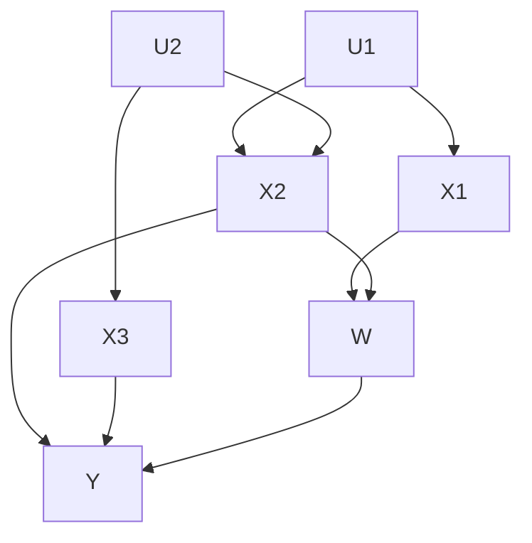
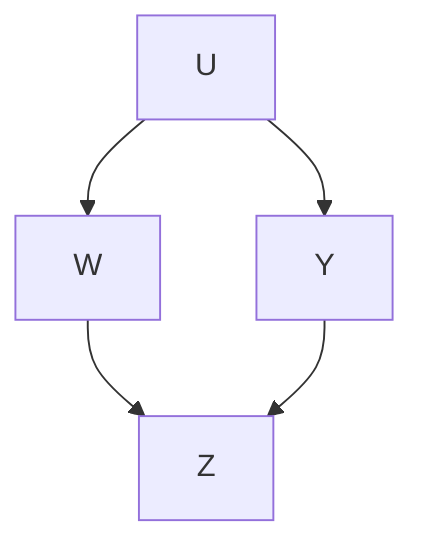
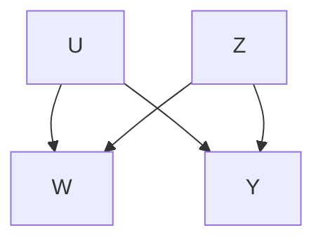

# Chapter 9 Causal Inference with Endogenous Treatments

When discussing methods for treatment effect estimation under unconfoundedness, we have effectively assumed that—potentially after conditioning on observed covariates—the treatment assignment is determined by as-good-asrandom factors that are irrelevant to the causal inference question at hand. In other words, we have effectively assumed treatment assignment is exogenous to the system we are studying.

In some applications, however, such exogeneity assumptions are simply not plausible. For example, when studying the effect of prices on demand, it is unrealistic to assume that potential outcomes of demand (i.e., what demand would have been at given prices) are independent of what prices actually were. Instead, it’s much more plausible to assume that prices and demand both respond to each other until a supply-demand equilibrium is reached.

This chapter—and the next one—present basic methods and concepts for causal inference in settings where unconfoundedness does not hold and treatment assignment is instead endogenous, i.e., treatments are assigned in a way that depends on the interplay of other variables within the system. We start by introducing non-parametric structural equation models (SEMs) as a general tool for reasoning about causal inference with endogenous treatment. In some settings, SEMs can be used to prove that unconfoundedness holds (although it may not have been obvious that it does a-priori), while in other settings SEMs can be used to motivate new methods for causal inference without unconfoundedness. Then, in Section 9.2, we consider a class of semiparametric SEMs where treatment effects are assumed to be constant, and introduce instrumental variables regression as a powerful and flexible method for causal inference in such settings. Finally, in Chapter 10, we revisit instrumental variables using a potential outcomes specification that’s more explicitly related to the causal models we’ve used so far.

## 9.1 Structural equation models and do-calculus

It is convenient to describe structural equation models using directed acyclic graphs (DAGs). A directed graph with nodes indexed $j = 1 , \ldots , p$ is characterized by a set of edges $\{ E _ { i j } \}$ where $E _ { i j } = 1$ denotes the presence of an edge from node i to node $j$ and $E _ { i j } ~ = ~ 0$ denotes lack of such an edge. Within a directed graph, a directed path is an ordered set of at least two nodes $i _ { 1 } , i _ { 2 } , \ldots , i _ { k } \in \left\{ 1 , \ldots , p \right\}$ such that $E _ { i _ { 1 } i _ { 2 } } = E _ { i _ { 2 } i _ { 3 } } = . . . = E _ { i _ { k - 1 } i _ { k } } = 1$ ; the definition of an undirected path is analogous except it only requires that either $E _ { i _ { j } i _ { j + 1 } } = 1 \mathrm { ~ o r ~ } E _ { i _ { j + 1 } i _ { j } } = 1$ along the path. A directed graph is acyclic $( \mathrm { i . e . , \ a }$ DAG) if it contains no directed cycles, i.e., directed paths with $i _ { 1 } = i _ { k }$ . Within a DAG, we say that that a node i is upstream of $j$ (and that $j$ is downstream of $i )$ if there exists a directed path starting at i and ending at $j$ . We define the set of parents of node $j$ as the set of nodes i with $E _ { i j } = 1$

Now, let $( Z _ { 1 } , . . . , Z _ { p } )$ denote a set of $p$ random variables relevant to a system we want to make causal queries in. Some of the variables $Z _ { j }$ may be observed by the researcher, while others may not. We say that Z is generated by a structural equation model (SEM) if there exists a DAG G with nodes corresponding to $Z _ { 1 } , \ldots , Z _ { p }$ and with edge set $\{ E _ { i j } \}$ such that

$$
Z _ {j} = f _ {j} \left(p a _ {j}, \varepsilon_ {j}\right), \tag {9.1}
$$

where $p a _ { j }$ stands for the parents of $Z _ { j }$ in the graph $G \left( { \mathrm { i . e . , } p a _ { j } = \{ Z _ { i } : E _ { i j } = 1 \} } \right)$ and the $\varepsilon _ { j } \sim F _ { j }$ are mutually independent noise terms. The key assumption here is that relationship (9.1) holds regardless of the distribution of the $\varepsilon _ { j } , \mathrm { i . e . }$ , that this model describes the structure of the data-generation process and not just its correlational structure.

Given a SEM (9.1), a causal query involves exogenously setting the values of some nodes of the graph $G ,$ and seeing how this affects the distribution of other nodes. Given two disjoint sets of nodes W, $Y \subset Z .$ , the causal effect of setting W to w on Y is written $\mathbb { P } \left\lceil Y \right\rceil d o ( W = w ) \rceil$ , and corresponds to deleting all equations used to generate W in (9.1) and plugging in w for W in the rest.51

In the case where we intervene on a single node $Z _ { j }$ , one can verify that

$$
\mathbb {P} \left[ Z \mid d o (Z _ {j} = z _ {j}) \right] = \left\{ \begin{array}{l l} \mathbb {P} [ Z ] / \mathbb {P} \left[ Z _ {j} = z _ {j} \mid p a _ {j} \right] & \text { if } Z _ {j} = z _ {j} \\ 0 & \text { else. } \end{array} \right. \tag {9.2}
$$

One of the major goals of (non-parametric) structural equation modeling is to provide general methods for answering causal queries in terms of the observed distribution of X using only information provided by the structural model (9.1). For now, we’ll not make any functional form assumptions on the model (9.1); and, for concreteness, one may always assume that $Z _ { j }$ is discrete and $f _ { j }$ indexes over distributions for $Z _ { j }$ in terms of the values of its parents $p a _ { j }$ . In Chapter 9.2 we’ll discuss how adding further semi-parametric structure to a SEM can be used to justify instrumental variable methods.

Example 8. Meinshausen et al. [2016] use structural equation models to study the relationship between the expression of different genes in the yeast saccharomyces cerevisiae. The authors have access to expression levels for 6,170 genes and are interested in questions of the type: How will the expression of gene i in the yeast be affected by inactivating gene $j ?$ To formalize this question, they posit that gene expressions can be modeled using a DAG, and posit a linear SEM

$$
Z _ {i} = \sum_ {j \in p a _ {i}} \beta_ {i j} Z _ {j} + \varepsilon_ {i},
$$

where $Z _ { i }$ measures the expression level of the i-th gene; the statistical task then reduces to estimating $\beta _ { i j }$ in this model. They estimate these quantities using the method of Peters, B¨uhlmann, and Meinshausen [2016] which assumes cross-environment invariance of the SEM coefficients to identify causal effects.

The do-calculus One nice fact about non-parametric SEM is that there exist powerful abstract tools for reasoning about causal queries. In particular, Pearl [1995] introduced a set of rules, called the do-calculus, which lets us verify whether causal queries are answerable based on the graph G underlying (9.1).

To understand do-calculus, we first need to formalize how graphs encode conditional independence statements in terms of d-separation. Let X, Y and Z denote disjoint sets of nodes, and let $\xi$ be any undirected path from a node in X to a node in Y . We say that Z blocks ξ if there is a node W on ξ such that either (i) W is a collider on p (i.e., W has two incoming edges along ξ) and neither W nor any of its descendants are in Z, or (ii) W is not a collider and W is in $Z .$ . We say that Z d-separates X and Y if it blocks every path between X and Y . The motivation behind this definition is that, if the joint distribution P of Z can be factored in a way that respects a DAG G, i.e.,

$$
\mathbb {P} \left[ Z \right] = \prod_ {j = 1} ^ {p} \mathbb {P} \left[ Z _ {j} \mid p a _ {j} (G) \right], \tag {9.3}
$$

then we can deduce $X \perp Y \mid Z$ from (9.3) if and only if Z d-separates X and Y in the graph G [Geiger, Verma, and Pearl, 1990]. Motivated by this fact, we write d-separation as $( X \perp Y \mid Z ) _ { G }$ .

Do-calculus provides a way to simplify causal queries by referring to $d -$ separation on various sub-graphs of G. To this end define $G _ { \overline { { X } } }$ the subgraph of G with all edges incoming to X deleted, $G _ { \underline { { X } } }$ the subgraph of G with all outgoing edges from X deleted, $G _ { X { \overline { { Z } } } }$ the subgraph of G with all outgoing edges from X and incoming edges to Z deleted, etc. Then, for any disjoint sets of edges X, Y, Z, W the following equivalence statements hold.

1. Insertion/deletion of observations: If Y ⊥⊥ Z  W, XG $( Y \perp Z | W , X ) _ { G _ { \overline { { { W } } } } }$ then

$$
\begin{array}{l} \begin{array}{l} \mathbb {P} [ Y \mid d o (W = w), Z = z, X = x ] \\ \mathbb {P} [ Y \mid J (W = x), X = x ] \end{array} \tag {9.4} \\ = \mathbb {P} \left[ Y \mid d o (W = w), X = x \right]. \\ \end{array}
$$

$\left( Y \perp W \vert X , Z \right) _ { G _ { W } \overline { { { z } } } }$ then

$$
\begin{array}{l} \begin{array}{l} \mathbb {P} [ Y \mid d o (W = w), X = x, d o (Z = z) ] \\ \mathbb {P} [ Y \mid W = X = x, d o (Z = z) ] \end{array} \tag {9.5} \\ = \mathbb {P} \left[ Y \mid W = w, X = x, d o (Z = z) \right]. \\ \end{array}
$$

$\left( Y \perp W \big | X , Z \right) _ { G _ { \overline { { { W ( X ) Z } } } } }$ where $W ( X )$ is the set of W nodes that are not ancestors of any X node in $G _ { \overline { { Z } } }$ , then

$$
\begin{array}{l} \begin{array}{l} \mathbb {P} [ Y \mid d o (W = w), X = x, d o (Z = z) ] \\ \mathbb {P} [ Y \mid Y _ {\text {max}} - 1 (Z _ {\text {max}}) ] \end{array} \tag {9.6} \\ = \mathbb {P} \left[ Y \mid X = x, d o (Z = z) \right]. \\ \end{array}
$$

When applying the do-calculus, our goal is to apply these 3 rules of inference until we’ve reduced a causal query to a query about observable moments of P, i.e., conditional expectations that do not involve the do-operator and that only depend on observed random variables. As shown in subsequent work, the docalculus is complete, i.e., if we cannot use the do-calculus to simply a causal query then it is not non-parametrically identified in terms of the structural equation model; see Pearl [2009] for a discussion and references.

Back-door identification Suppose have disjoint sets of nodes X, Y, W , and want to query P $\left[ Y \mid d o ( W = w ) \right]$ . Suppose moreover that X contains no nodes that are downstream for W , and that X d-separates W and Y once we block all downstream edges from W , i.e., that

$$
\left(Y \perp W \mid X\right) _ {G _ {\underline {{W}}}}. \tag {9.7}
$$

Then, we can identify the effect of W on Y via

$$
\mathbb {P} \left[ Y \mid d o (W = w) \right] = \sum_ {x} \mathbb {P} [ X = x ] \mathbb {P} \left[ Y \mid X = x, W = w \right]. \tag {9.8}
$$

To verify (9.8), we can use the rules of do-calculus as follows:

$$
\begin{array}{l} \mathbb {P} \left[ Y \mid d o (W = w) \right] = \sum_ {x} \mathbb {P} \left[ X = x \mid d o (W = w) \right] \mathbb {P} \left[ Y \mid X = x, d o (W = w) \right] \\ = \sum_ {x} \mathbb {P} [ X = x ] \mathbb {P} [ Y | X = x, d o (W = w) ] \\ = \sum_ {x} \mathbb {P} [ X = x ] \mathbb {P} [ Y | X = x, W = w ], \\ \end{array}
$$

where the first equality is just the chain rule, the second equality follows from rule $\# 3$ because X is upstream from $W$ and so $( X \perp W ) _ { G _ { \overline { { { W } } } } }$ , and the third equality follows from rule $\# 2$ by (9.7).

The back-door criterion is of course closely related to unconfoundedness, and the identification strategy (9.8) exactly matches the standard regression adjustment under unconfoundedness. To understand the connection between (9.7) and unconfoundedness, consider the case where $Y$ and $W$ are both singletons and W has no other downstream variables in G other than $Y .$ . Then, blocking downstream arrows from $W$ can be interpreted as leaving the effect of W on $Y$ unspecified, and (9.7) becomes

$$
F _ {Y} (w) \perp W | X, \tag {9.9}
$$

where $F _ { Y } ( w ) = f _ { Y } ( w , p a _ { Y } ^ { - } , \varepsilon _ { Y } )$ leaves all but the contribution of $w$ unspecified in (9.1) and $p a _ { Y } ^ { - }$ denotes the parents of $Y$ in $G _ { \underline { { W } } }$ . The condition is clearly analogous to unconfoundedness (although the underlying causal model is different).

One useful consequence of this back-door criterion result is that we can now reason about the main conditional independence condition (9.7) via the graphical d-separation rule. Consider, the example given in Figure 9.1. By applying d-separation above, one immediately sees that (9.7) holds if we condition on $\{ X _ { 1 } , X _ { 2 } \}$ or $\{ X _ { 2 } , X _ { 3 } \}$ , but not if we only condition on $X _ { 2 }$ . In contrast, the classical presentation based on unconfoundedness asks the scientist to simply assert a conditional independence statement of the type (9.9), and does not provide tools like d-separation that could be used to reason about when such a condition might hold in the context of slightly more complicated stochastic models.

Front-door identification Another simple application of do-calculus arises in the graph illustrated in Figure 9.2. We still want to compute $\mathbb { P } \left[ Y | d o \hat { ( W = w ) } \right]$ , but now do not observe $U$ and so cannot apply the backdoor criterion. However, if there exists a variable Z which, like in the graph below, fully mediates the effect of W on Y without being affected by U, we can use it for identification.

Figure 9.1: In this DAG, X, Y and W are observed but U is unobserved.  
Figure 9.2: A DAG where front-door identification can by used. W , Z and Y are observed, but U is not.

We proceed as follows. First, following the same line of argumentation as before, we see that

$$
\begin{array}{l} \mathbb {P} \left[ Y \mid d o (W = w) \right] = \sum_ {z} \mathbb {P} \left[ Z = z \mid d o (W = w) \right] \mathbb {P} \left[ Y \mid Z = z, d o (W = w) \right] \\ = \sum_ {z} \mathbb {P} \left[ Z = z \mid W = w \right] \mathbb {P} \left[ Y \mid Z = z, d o (W = w) \right], \\ \end{array}
$$

where the first equality is the chain rule and the second equality is from the back-door. We have to work a little harder to resolve the second term, however. Here, the main idea is to start by taking one step backwards before proceeding further:

$$
\begin{array}{l} \mathbb {P} \left[ Y \mid Z = z, d o (W = w) \right] = \mathbb {P} \left[ Y \mid d o (Z = z), d o (W = w) \right] \\ = \mathbb {P} \left[ Y \mid d o (Z = z) \right] \\ = \sum_ {w ^ {\prime}} \mathbb {P} \left[ W = w ^ {\prime} \right] \mathbb {P} \left[ Y \mid Z = z, W = w ^ {\prime} \right], \\ \end{array}
$$

Figure 9.3: A DAG representing a setting where instrumental variable methods may be used. An instrument $Z ,$ a treatment $W _ { i }$ , and an outcome $Y$ are all observed; but a confounder U remains unobserved.

where the first equality follows from rule $\# 2$ , the second equality follows from rule $\# 3 .$ , and the last is just the backdoor adjustment again. Plugging this in, we find that

$$
\begin{array}{l} \mathbb {P} \left[ Y \mid d o (W = w) \right] \\ = \sum_ {z} \mathbb {P} [ Z = z | W = w ] \sum_ {w ^ {\prime}} \mathbb {P} [ W = w ^ {\prime} ] \mathbb {P} [ Y | Z = z, W = w ^ {\prime} ]. \tag {9.10} \\ \end{array}
$$

This result is called the front-door formula, and it allows for identification of causal effects in the DAG given in Figure 9.2 even though nothing resembling unconfoundedness holds. Interestingly, even though it queries about a $d o ( W =$ $w )$ intervention, it still integrates over the observed distribution of P $[ W = w ^ { \prime } ]$ .

## 9.2 Instrumental variables regression

One of the most widely used structural equation models in economics is represented by the DAG in Figure 9.3. We want to measure the effect of a treatment $W$ on an outcome $Y$ . There’s an unobserved confounder $U$ that rules out the use of unconfoundedness-based methods. However, we do have access to an exogenous (effectively randomized) variable $Z ,$ called an instrument, that nudges the treatment W without being affected by the confounder $U .$ .

Example 9. Angrist, Graddy, and Imbens [2000] consider a demand estimation problem where $W _ { i }$ is the price of fish and $Y _ { i }$ is demand, and we are concerned that the association between $W _ { i }$ and $Y _ { i }$ may be confounded by unobserved market factors. They then propose using weather conditions as an instrument $Z _ { i } { \mathrm { : } }$ : Stormy weather makes it harder to fish (and thus raises prices), but presumably is unrelated to the confounding market factors.

The goal of instrumental variables methods is to use the effective randomization provided by the instrument to identify the causal effect of W on $Y$ .

Doing so, however, will require making further assumptions than those implicit in the SEM in Figure 9.3, as the rules of do-calculus do not enable us to identify $\mathbb { P } \left[ Y | d o ( W = w ) \right]$ in this non-parametric SEM. To see this, note that if we omit the instrument $Z$ from the SEM then $\mathbb { P } \left[ Y | d o ( W = w ) \right]$ is clearly not identified; and adding more nodes to a graph cannot help achieve identification using do-calculus (since adding nodes can only make it harder to satisfy the d-separation condition).

In order to enable progress, we further make the assumption that the structural equation for $Y$ as in (9.1) is linear:

$$
Y = f _ {Y} (W, U, \varepsilon_ {Y}) = \alpha + W \tau + \varepsilon , \tag {9.11}
$$

where $\varepsilon$ is an error term that captures the contribution of both U and $\varepsilon _ { Y }$ . This is a semiparametric specification, in that we impose a linear relation between W and $Y$ but let the rest of the SEM (9.1) be non-parametric. Instrumental variables as illustrated in Figure 9.3 will prove to be very helpful in identifying $\tau$ in the linear model $\tau . ^ { 5 2 }$

Linear structural modeling The easiest way to understand instrumental variables regression is to work with a fully linear version of the SEM (9.1) adapted to the DAG illustrated in Figure 9.3:

$$
\begin{array}{l} Y = \alpha + W \tau + \varepsilon , \quad \varepsilon \perp Z \\ W = Z, \end{array} \tag {9.12}
$$

$$
W = Z \gamma + \eta .
$$

The fact that Z is uncorrelated with $\varepsilon \ ( \mathrm { o r }$ , in other words, that $Z$ is exogenous) then implies that

$$
\operatorname{Cov} [ Y, Z ] = \operatorname{Cov} [ \tau W + \varepsilon , Z ] = \tau \operatorname{Cov} [ W, Z ], \tag {9.13}
$$

and so the treatment effect parameter $\tau$ is identified as

$$
\tau = \operatorname{Cov} [ Y, Z ] / \operatorname{Cov} [ W, Z ], \tag {9.14}
$$

provided the denominator is non-zero.

The relation (9.14) also suggests a simple instrumental variables (IV) regression approach to estimating τ as a ratio of sample covariances,

$$
\hat {\tau} _ {I V} = \widehat {\operatorname{Cov}} \left[ Y _ {i}, Z _ {i} \right] / \widehat {\operatorname{Cov}} \left[ W _ {i}, Z _ {i} \right]. \tag {9.15}
$$

To interpret this estimator, note that the simple linear regressions of Y and $W$ on $Z$ respectively yield fitted regression coefficients

$$
\hat {\beta} _ {Y Z} = \widehat {\operatorname{Cov}} \left[ Y _ {i}, Z _ {i} \right] / \widehat {\operatorname{Var}} \left[ Z _ {i} \right], \quad \hat {\beta} _ {W Z} = \widehat {\operatorname{Cov}} \left[ W _ {i}, Z _ {i} \right] / \widehat {\operatorname{Var}} \left[ Z _ {i} \right],
$$

and so $\hat { \tau } _ { I V } = \hat { \beta } _ { Y Z } / \hat { \beta } _ { W Z }$ can be interpreted as the ratio of the linear regression coefficients of $Y$ on $Z$ over that of $W$ on Z .

Identifying assumptions The derivation of $\hat { \tau } _ { I V }$ from the model (9.12) was so simple that it’s easy to miss some important assumptions made. Before proceeding further, we here summarize three substantively meaningful assumptions backed into this identification strategy:

• The instrument $Z _ { i }$ must be exogenous, which here means $\varepsilon _ { i } \perp \perp Z _ { i }$ .
• The instrument $Z _ { i }$ must be relevant, such that Cov $[ W _ { i } , Z _ { i } ] \neq 0$ .
• The instrument $Z _ { i }$ must satisfy the exclusion restriction, meaning that any effect of $Z _ { i }$ on $Y _ { i }$ must be mediated via the treatment $W _ { i }$ .

These three conditions can immediately be verified in the setting used here. However, when we seek to use instrumental variables methods to identify treatment effects in more complex settings, these conditions will prove to be helpful guiding principles to understanding when instrumental variables methods work.

Optimal instruments The full linear structural model (9.12) may be restrictive in practice: It not only specifies a linear relationship between W and $Y$ , but also asks the instrument $Z$ to have a linear effect on $W$ . This may be problematic if we have potential access to multiple instruments that may all nudge our target treatment variable, or believe that our instrument may act non-linearly.53 Thankfully, however, the above results on instrumental variables regression extend immediately to the following more general specification,

$$
Y = \tau W + \varepsilon , \quad \varepsilon \perp Z, \quad Y, W \in \mathbb {R}, \quad Z \in \mathcal {Z}, \tag {9.16}
$$

where $\mathcal { Z }$ may be, e.g., a high-dimensional space. By the same argument as in (9.13), we see that given any function $w : \mathcal { Z } \to$ R that maps $Z _ { i }$ to the real line

$$
\tau = \frac {\operatorname{Cov} [ Y , w (Z) ]}{\operatorname{Cov} [ W , w (Z) ]} \tag {9.17}
$$

provided the denominator is non-zero (i.e., provided $w ( Z )$ in fact “nudges” the treatment), resulting in a feasible estimator

$$
\hat {\tau} _ {I V} = \frac {\widehat {\operatorname{Cov}} \left[ Y _ {i} , w (Z _ {i}) \right]}{\widehat {\operatorname{Cov}} \left[ W _ {i} , w (Z _ {i}) \right]} = \frac {\frac {1}{n} \sum_ {i = 1} ^ {n} \left(Y _ {i} - \overline {{Y}}\right) \left(w (Z _ {i}) - \overline {{w (Z)}}\right)}{\frac {1}{n} \sum_ {i = 1} ^ {n} \left(W _ {i} - \overline {{W}}\right) \left(w (Z _ {i}) - \overline {{w (Z)}}\right)} \tag {9.18}
$$

where $\begin{array} { r } { \overline { { Y } } = \frac { 1 } { n } \sum _ { i = 1 } ^ { n } Y _ { i } . } \end{array}$ , etc. In other words, if one has access to many valid instruments, the analyst is free to compress them into any univariate instrument of their choice without worrying about linearity in the relationship between W and $w ( Z )$ . The following result verifies consistency and asymptotic properties.

Theorem 9.1. Suppose $( X _ { i } , W _ { i } , Y _ { i } , Z _ { i } )$ are IID draws from a distribution satisfying (9.16), and let $w : \mathcal { Z }  \mathbb { R }$ be such that Cov $[ W , w ( Z ) ] \neq 0$ . Then, $\hat { \tau } _ { I V }$ as given in (9.18) is consistent $f o r \tau$ , and

$$
\sqrt {n} \left(\hat {\tau} _ {I V} - \tau\right) \Rightarrow \mathcal {N} \left(0, V _ {w}\right), \quad V _ {w} = \frac {\operatorname{Var} \left[ \varepsilon_ {i} \right] \operatorname{Var} \left[ w (Z _ {i}) \right]}{\operatorname{Cov} \left[ W _ {i} , w (Z _ {i}) \right] ^ {2}}. \tag {9.19}
$$

Proof. The estimator (9.18) can be written as a Z-estimator, $\mathrm { i . e . , }$ as the solution to $\textstyle n ^ { - 1 } \sum _ { i = 1 } ^ { n } \psi _ { i } ( { \hat { \theta } } ) = 0$ with

$$
\psi_ {i} (\hat {\theta}) = \left( \begin{array}{c} (w (Z _ {i}) - \hat {\mu} _ {Z}) (Y _ {i} - \hat {\mu} _ {Y} - \hat {\tau} (W _ {i} - \hat {\mu} _ {W})) \\ Y _ {i} - \hat {\mu} _ {Y} \\ W _ {i} - \hat {\mu} _ {W} \\ w (Z _ {i}) - \hat {\mu} _ {Z} \end{array} \right), \tag {9.20}
$$

where $\hat { \theta } = ( \hat { \tau } , \hat { \mu } _ { W } , \hat { \mu } _ { W } , \hat { \mu } _ { Z } )$ contains both our target parameter and the sample means used to construct $\hat { \tau } _ { I V }$ . Standard results for Z-estimation can then be used to verify that54

$$
\sqrt {n} (\hat {\theta} - \theta) \Rightarrow \mathcal {N} (0, V), \quad V = \mathbb {E} [ \nabla \psi_ {i} (\theta) ] ^ {- 1} \operatorname{Var} [ \psi_ {i} (\theta) ] \mathbb {E} [ \nabla \psi_ {i} ^ {\prime} (\theta) ] ^ {- 1}. \tag {9.21}
$$

In our setting, we have $\mathbb { E } \left[ \nabla \psi _ { i } ( \boldsymbol { \theta } ) \right] = - \mathrm { d i a g } \left( \mathrm { C o v } \left[ \boldsymbol { w } ( \boldsymbol { Z } _ { i } ) , { W } _ { i } \right] , 1 , 1 , 1 \right)$ , and so (9.21) implies that (9.19) holds with

$$
\begin{array}{l} V _ {w} = \frac {\operatorname{Var} \left[ (w (Z _ {i}) - \mu_ {Z}) (Y _ {i} - \mu_ {Y} - \tau (W _ {i} - \mu_ {W})) \right]}{\operatorname{Cov} [ w (Z _ {i}) , W _ {i} ] ^ {2}} \\ = \frac {\mathrm{Var} [ (w (Z _ {i}) - \mathbb {E} [ w (Z _ {i}) ]) \varepsilon_ {i} ]}{\mathrm{Cov} [ w (Z _ {i}) , W _ {i} ] ^ {2}} = \frac {\mathrm{Var} [ w (Z _ {i}) ] \mathrm{Var} [ \varepsilon_ {i} ]}{\mathrm{Cov} [ w (Z _ {i}) , W _ {i} ] ^ {2}}, \\ \end{array}
$$

where the last step follows from independence of $Z _ { i }$ and $\varepsilon _ { i }$

Now, since essentially any transformation $w : \mathcal { Z }  \mathbb { R }$ yields a valid IV estimator, it’s natural to ask which such transformation maximized the precision of the resulting estimator, i.e., minimizes the variance in (9.19). It turns out that the optimal instrument has a simple form,

$$
w ^ {*} (z) = \mathbb {E} \left[ W _ {i} \mid Z _ {i} = z \right], \tag {9.22}
$$

i.e., $w ^ { * } ( Z _ { i } )$ is the best prediction of $W _ { i }$ from $Z _ { i }$ .

Theorem 9.2. In the setting of Theorem 9.1, suppose there exists a function $w ( z )$ such that Cov $[ W , w ( Z ) ] \ne 0$ . Then, the variance $V _ { w }$ in $\left( 9 . 1 9 \right)$ is minimized by setting $w ( \cdot )$ to be $w ^ { \ast } ( \cdot )$ , or an affine transformation thereof. Furthermore, writing τˆIV ∗ for the IV estimator with an optimal instrument,

$$
\sqrt {n} \left(\hat {\tau} _ {I V ^ {*}} - \tau\right) \Rightarrow \mathcal {N} \left(0, V _ {w ^ {*}}\right), \quad V _ {w ^ {*}} = \frac {\operatorname{Var} \left[ \varepsilon_ {i} \right]}{\operatorname{Var} \left[ \mathbb {E} \left[ W _ {i} \mid Z _ {i} \right] \right]}. \tag {9.23}
$$

Proof. For any instrument choice $w : \mathcal { Z }  \mathbb { R }$ , we have Cov $[ W _ { i } , w ( Z _ { i } ) ] =$ Cov $\mathbb { \tilde { [ E \left[ W _ { i } \mid Z _ { i } \right] , w ( Z _ { i } ) ] } }$ . Thus, any optimal instrument must solve

$$
w (\cdot) \in \operatorname{argmax} _ {w ^ {\prime}} \left\{\operatorname{Cov} \left[ \mathbb {E} \left[ W _ {i} \mid Z _ {i} \right], w ^ {\prime} (Z _ {i}) \right] ^ {2} / \operatorname{Var} \left[ w ^ {\prime} (Z _ {i}) \right] \right\}. \tag {9.24}
$$

By Cauchy-Schwarz, this expression is maximized whenever $w ( \cdot )$ is taken to be (potentially an affine transformation of) $\mathbb { E } \lceil W _ { i } \rceil Z _ { i } ]$ . When $w ( \cdot ) \ =$ $\alpha + \beta \mathbb { E } \left[ W _ { i } \mid Z _ { i } \right]$ , we have Cov $\left[ \mathbb { E } \left[ W _ { i } \mid Z _ { i } \right] , w ( \bar { Z } _ { i } ) \right] \stackrel { \circ } { = } \beta \mathrm { \dot { V a } }$ r $\left[ \mathbb { E } \left[ W _ { i } \mid Z _ { i } \right] \right]$ , and (9.23) then follows from (9.19). □

Cross-fitting and feasible estimation Given the optimal instrument is the solution to a non-parametric prediction problem, $w ^ { * } ( z ) = \mathbb { E } \left[ W _ { i } \vert Z _ { i } = z \right]$ , one might be tempted to apply the following two-stage strategy:

1. Fit a non-parametric first stage regression, resulting in estimate $\hat { w } ( \cdot )$ of E $\left[ W _ { i } \mid Z _ { i } \stackrel { - } { = } z \right]$ , and then2. Run (9.18) with $\hat { w } ( \cdot )$ as an instrument.

This approach almost works, but may suffer from striking overfitting bias when the instrument is weak, i.e., Var $\left[ \mathbb { E } \left[ W _ { i } \mid Z _ { i } \right] \right]$ is small. The main problem is that, if $\hat { w } ( Z _ { i } )$ is fit on the training data, then we no longer have $\hat { w } ( Z _ { i } ) \perp \perp \varepsilon _ { i }$ (because $\hat { w } ( Z _ { i } )$ depends on $W _ { i }$ , which in turn is dependent on $\varepsilon _ { i } )$ . This may seem like a subtle issue but, as pointed out by Bound, Jaeger, and Baker [1995], can in fact be $\mathrm { a }$ major problem in practice. They exhibit an example where the instrument $Z _ { i }$ is pure noise, yet $\hat { \tau } _ { I V }$ with instrument $\hat { w } ( Z _ { i } )$ converges to an inconsistent limit, namely the simple regression coefficient $\mathrm { O L S } ( Y _ { i } \sim$ $W _ { i } )$ which—because of lack of unconfoundedness—does not match the target parameter τ .

Thankfully, however, we can again use cross-fitting to address this issue. We randomly split data into folds $k = 1 , . . . , K$ and, for each $k ,$ fit a regression $\hat { w } ^ { ( - k ) } ( z )$ on all but the k-th fold. We then run

$$
\hat {\tau} _ {I V} ^ {C F} = \widehat {\operatorname{Cov}} \left[ Y _ {i}, \hat {w} ^ {(- k (i))} (Z _ {i}) \right] / \widehat {\operatorname{Cov}} \left[ W _ {i}, \hat {w} ^ {(- k (i))} (Z _ {i}) \right], \tag {9.25}
$$

where $k ( i )$ picks out the data fold containing the i-th observation. Now, by cross-fitting we directly see that $\hat { w } ^ { ( - k ( i ) ) } ( Z _ { i } ) \perp \varepsilon _ { i }$ , and so this approach recovers a valid estimate of $\tau .$ In particular, as shown below, if the regressions $\hat { w } ^ { ( - k ( i ) ) } ( z )$ are consistent for E $\left[ W _ { i } \mid Z _ { i } = z \right]$ in mean-squared error, then the feasible estimator (9.25) is first-order equivalent to (9.18) with an optimal instrument.

Theorem 9.3. Under the conditions of Theorem 9.2, let $\hat { w } ^ { ( - k ) } ( \cdot )$ be cross- $- \mathscr { f } t$ estimates of the optimal instrument with

$$
\frac {1}{n} \sum_ {k (i) = k} \left(\hat {w} ^ {(- k)} (Z _ {i}) - w ^ {*} (Z _ {i})\right) ^ {2} \rightarrow_ {p} 0. \tag {9.26}
$$

Then, $\hat { \tau } _ { I V } ^ { C F }$ also satisfies the central limit theorem (9.25).

Proof. Starting from the explicit form (9.18), we can write

$$
\hat {\tau} _ {I V} ^ {C F} = \frac {\widehat {\mathrm{Cov}} [ Y _ {i} , \hat {w} ^ {(- k (i))} (Z _ {i}) ]}{\widehat {\mathrm{Cov}} [ W _ {i} , \hat {w} ^ {(- k (i))} (Z _ {i}) ]} = \frac {\frac {1}{n} \sum_ {i = 1} ^ {n} (Y _ {i} - \hat {\mu} _ {Y}) \hat {w} ^ {(- k (i))} (Z _ {i})}{\frac {1}{n} \sum_ {i = 1} ^ {n} (W _ {i} - \hat {\mu} _ {W}) \hat {w} ^ {(- k (i))} (Z _ {i})}.
$$

Furthermore, by (9.11), we can continue

$$
\begin{array}{l} \ldots = \frac {\frac {1}{n} \sum_ {i = 1} ^ {n} \left(\left(W _ {i} - \hat {\mu} _ {W}\right) \tau + \left(\varepsilon_ {i} - \hat {\mu} _ {\varepsilon}\right)\right) \hat {w} ^ {(- k (i))} (Z _ {i})}{\frac {1}{n} \sum_ {i = 1} ^ {n} \left(W _ {i} - \hat {\mu} _ {W}\right) \hat {w} ^ {(- k (i))} (Z _ {i})} \\ = \tau + \frac {\frac {1}{n} \sum_ {i = 1} ^ {n} \left(\varepsilon_ {i} - \hat {\mu} _ {\varepsilon}\right) \hat {w} ^ {(- k (i))} (Z _ {i})}{\frac {1}{n} \sum_ {i = 1} ^ {n} \left(W _ {i} - \hat {\mu} _ {W}\right) \hat {w} ^ {(- k (i))} (Z _ {i})}, \\ \end{array}
$$

where $\hat { \mu } _ { Y } , \hat { \mu } _ { W }$ and $\hat { \mu } _ { \varepsilon }$ are sample averages of $Y _ { i } , \ W _ { i }$ and $\varepsilon _ { i }$ respectively. The above identity holds algebraically for any estimator $\hat { w } ^ { ( - k ) } ( \cdot )$ , including the perfect estimator $\hat { w } ^ { ( - k ) } ( \cdot ) = w ^ { \ast } ( \cdot )$ , and so we only need to show that errors from an estimator $\hat { w } ^ { ( - k ) } ( \cdot )$ that is consistent estimator in the sense of (9.26) have a negligible effect on the final expression above. To this end, it suffices to verify that

$$
\frac {1}{n} \sum_ {i = 1} ^ {n} \left(\varepsilon_ {i} - \hat {\mu} _ {\varepsilon}\right) \left(\hat {w} ^ {(- k (i))} \left(Z _ {i}\right) - w ^ {*} \left(Z _ {i}\right)\right) = o _ {P} \left(\frac {1}{\sqrt {n}}\right) \tag {9.27}
$$

$$
\frac {1}{n} \sum_ {i = 1} ^ {n} \left(W _ {i} - \hat {\mu} _ {W}\right) \left(\hat {w} ^ {(- k (i))} (Z _ {i}) - w ^ {*} (Z _ {i})\right) = o _ {P} \left(\frac {1}{\sqrt {n}}\right),
$$

which follows from cross-fitting and (9.26) by the same argument as used in (3.14) in the proof of Theorem 3.2. □

Non-parametric instrumental variables regression At the beginning of Chapter 9.2 we noted that instrumental variables methods cannot be justified via do-calculus alone, and so further structural assumptions are required. Here, we have mostly focused on methods that are valid under the linearity assumption (9.11); however, we emphasize that this is not the weakest assumption under which instrumental variable methods can be justified. One notable generalization is the non-parametric instrumental variables problem,

$$
Y _ {i} = \alpha + g (W _ {i}) + \varepsilon_ {i}, Z _ {i} \perp \varepsilon_ {i}, Y _ {i}, W _ {i} \in \mathbb {R}, Z _ {i} \in \mathcal {Z}, \tag {9.28}
$$

where $g ( \cdot )$ is some generic smooth function we want to estimate.55 The model (9.28) is still stronger than the generic SEM (9.1) because it requires the effect of $W _ { i }$ on $Y _ { i }$ to be additive; however, unlike (9.16), it now allows this additive effect to be modified by a non-linearity $g ( \cdot )$ .

Because $Z _ { i } \perp \perp \varepsilon _ { i }$ and assuming without loss of generality that E $[ \varepsilon _ { i } ] = 0$ , we can directly verify that

$$
\begin{array}{l} \mathbb {E} \left[ Y _ {i} \mid Z _ {i} = z \right] = \mathbb {E} \left[ \alpha + g (W _ {i}) + \varepsilon_ {i} \mid Z _ {i} = z \right] \\ = \alpha + \mathbb {E} [ g (W _ {i}) | Z _ {i} = z ] \tag {9.29} \\ = \alpha + \int_ {\mathbb {R}} g (w) f (w | z) d w, \\ \end{array}
$$

where $f ( w \mid z )$ denotes the conditional density of $W _ { i }$ given $Z _ { i } = z$ . This relationship suggests a two-stage scheme for learning $g ( \cdot )$ , whereby we $( 1 )$ fit a non-parametric model $\hat { f } ( w \mid z )$ for the conditional density $f ( w \mid z )$ , preferably using cross-fitting, and $( { \mathcal { Q } } )$ estimate $g ( w )$ via a empirical minimization over a suitably chosen function class $\mathcal { G }$ ,

$$
\hat {g} (\cdot) = \operatorname{argmin} _ {g \in \mathcal {G}, \alpha} \left\{\frac {1}{n} \sum_ {i = 1} ^ {n} \left(Y _ {i} - \int_ {\mathbb {R}} g (w) \hat {f} ^ {(- k (i))} \left(w \mid Z _ {i}\right) d w - \alpha\right) ^ {2} \right\}. \tag {9.30}
$$

In order to solve the inverse problem (9.30) in practice, one approach is to approximate $g ( w )$ in terms of a basis expansion, $\begin{array} { r } { g _ { J } ( w ) = \sum _ { j = 1 } ^ { J } \beta _ { j } \psi _ { j } ( w ) } \end{array}$ , where the $\psi _ { j } ( \cdot )$ are a set of pre-determined basis functions and $g _ { J } ( w )$ provides an increasingly good approximation to $g ( w )$ as $J$ gets large. Then, (9.30) becomes

$$
\hat {\beta} = \operatorname{argmin} _ {\alpha , \beta} \left\{\frac {1}{n} \sum_ {i = 1} ^ {n} \left(Y _ {i} - \sum_ {j = 1} ^ {J} \hat {m} _ {j} ^ {(- k (i))} (Z _ {i}) \beta_ {j} - \alpha\right) ^ {2} \right\}, \text {   where } \tag {9.31}
$$

$$
\hat {m} _ {j} ^ {(- k (i))} (Z _ {i}) = \int_ {\mathbb {R}} \psi_ {j} (w) \hat {f} ^ {(- k (i))} \left(w \mid Z _ {i}\right) d w.
$$

Conditions under which this type of approach yields a consistent estimate of $g ( \cdot )$ are discussed in Newey and Powell [2003]. In general, however, one should note that solving the integral equation (9.29) is a difficult inverse problem, and so getting (9.31) to work in practice requires careful regularization—and, even so, one should expect rates of convergence to be slow.

## 9.3 Bibliographic notes

The use of structural models for reasoning about observed data has a long tradition; early examples include the work of Wright [1934] on path models motivated by genetics and that of Haavelmo [1943] for reasoning about simultaneous equation models $( \mathrm { e . g . }$ , for joint modeling of supply and demand).

Our presentation of non-parametric SEMs in Chapter 9.1, including the examples of the front- and back-door identification formulas, is adapted from Pearl [1995]. The do-calculus was proposed by Pearl [1995]; a recent overview of the literature on non-parametric SEM is given in Pearl [2009]. One should note that SEMs are not the only way of representing causal effects in complex sampling designs using DAGs; other approaches have also been developed by Robins [1986] and Spirtes, Glymour, and Scheines [1993]. In particular, the approach of Robins [1986] builds on the potential outcomes framework; see Robins and Richardson [2010] for further discussion. For a broader discussion of the role of non-parametric SEMs in econometrics see Imbens [2019], Pearl and Mackenzie [2018], and references therein.

Instrumental variable methods are widely used in modern applied econometrics. The literature on efficient estimation with instrumental variables goes back to Amemiya [1974], Chamberlain [1987], and others. Newey [1990] showed that the optimal instruments in model (9.16) can be understood as the solution to a prediction problem, thus opening the door to deriving optimal instruments via non-parametric prediction. The role of sample splitting in mitigating overfitting bias with instrumental variable methods was recognized by Angrist and Krueger [1995], who refer to this technique as split-sample instrumental variable estimation.

One question we’ve ignored today is the role of covariates for instrumental variables regression. Following our approach to unconfoundedness, one can extend (9.16) such that $\varepsilon _ { i } \perp \perp Z _ { i } \mid X _ { i } ,$ , i.e., the instrument is only exogenous after conditioning on $X _ { i }$ , and we have a heterogeneous treatment effect function identified as $\tau ( x ) = \mathrm { C o v } \left[ Y _ { i } , w ( Z _ { i } ) \vert X _ { i } = \stackrel { \sim } { x } \right] / \mathrm { C o v } \left[ W _ { i } , w ( Z _ { i } ) \vert X _ { i } = x \right]$ ; see Abadie [2003] and Aronow and Carnegie [2013] for a further discussion. Given this setting, one can then re-visit many of the questions we considered under unconfoundedness. Chernozhukov et al. [2022a] show how to build a doubly robust estimator of the average effect $\tau = \mathbb { E } \left[ \tau ( X ) \right]$ while Athey, Tibshirani, and Wager [2019] propose a random forest estimator of $\tau ( \cdot )$ ; see also Exercise 11 in Chapter 16.