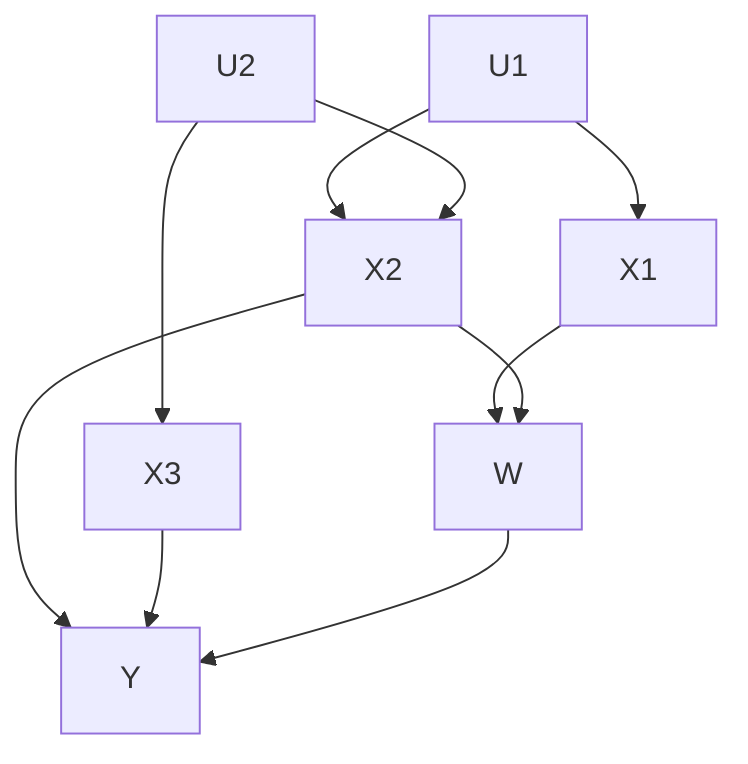
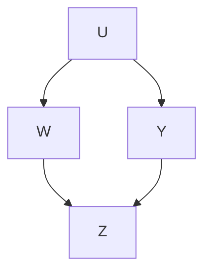
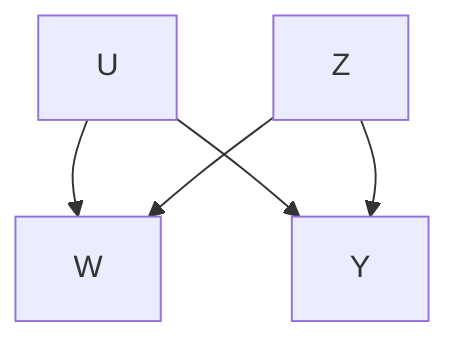

# 第9章 内生处理下的因果推断（Chapter 9 Causal Inference with Endogenous Treatments）

在讨论无混淆假设下的处理效应估计方法时，我们实际上已经假设——在可能对观测协变量进行条件调整之后——处理分配是由与当前因果推断问题无关的"近似随机"因素决定的。换句话说，我们实际上假设处理分配对于我们正在研究的系统是**外生的（exogenous）**。

然而，在某些应用中，这种外生性假设根本不可信。例如，在研究价格对需求的影响时，假设需求的潜在结果（即在给定价格下需求会是多少）与实际价格独立是不现实的。相反，更合理的假设是价格和需求相互响应，直到达到供需均衡。

本章——以及下一章——将介绍在无混淆假设不成立且处理分配是**内生的（endogenous）**（即，处理分配方式取决于系统内其他变量的相互作用）的情况下进行因果推断的基本方法和概念。我们首先介绍**非参数结构方程模型（non-parametric structural equation models, SEMs）**，将其作为处理内生处理下因果推断推理的通用工具。在某些情况下，SEM可用于证明无混淆假设成立（尽管先验上可能并不明显），而在其他情况下，SEM可用于激发无需无混淆假设的因果推断新方法。然后，在第9.2节中，我们考虑一类**半参数结构方程模型（semiparametric SEMs）**，其中假设处理效应是恒定的，并介绍**工具变量回归（instrumental variables regression）**作为此类情况下强大且灵活的因果推断方法。最后，在第10章中，我们将使用与我们迄今为止使用的因果模型更明确相关的潜在结果规范重新审视工具变量。

## 9.1 结构方程模型与do-演算（Structural equation models and do-calculus）

使用**有向无环图（directed acyclic graphs, DAGs）**来描述结构方程模型是方便的。一个节点索引为 $j = 1 , \ldots , p$ 的有向图由一组边 $\{ E _ { i j } \}$ 来刻画，其中 $E _ { i j } = 1$ 表示存在一条从节点 $i$ 到节点 $j$ 的边，而 $E _ { i j } ~ = ~ 0$ 表示不存在这样的边。在有向图中，**有向路径（directed path）**是一个至少包含两个节点的有序集合 $i _ { 1 } , i _ { 2 } , \ldots , i _ { k } \in \left\{ 1 , \ldots , p \right\}$，使得 $E _ { i _ { 1 } i _ { 2 } } = E _ { i _ { 2 } i _ { 3 } } = . . . = E _ { i _ { k - 1 } i _ { k } } = 1$；**无向路径（undirected path）**的定义类似，只是要求路径上的每对节点满足 $E _ { i _ { j } i _ { j + 1 } } = 1 \mathrm { ~ o r ~ } E _ { i _ { j + 1 } i _ { j } } = 1$。如果一个有向图不包含有向环（即满足 $i _ { 1 } = i _ { k }$ 的有向路径），则它是**无环的（acyclic）**，即一个DAG。在DAG中，如果存在一条从节点 $i$ 开始到节点 $j$ 结束的有向路径，我们说节点 $i$ 在 $j$ 的**上游（upstream）**（且 $j$ 在 $i$ 的**下游（downstream）**）。我们将节点 $j$ 的**父节点集（set of parents）**定义为满足 $E _ { i j } = 1$ 的节点 $i$ 的集合。

现在，令 $( Z _ { 1 } , . . . , Z _ { p } )$ 表示与我们想要进行因果查询的系统相关的 $p$ 个随机变量。其中一些变量 $Z _ { j }$ 可能被研究者观测到，而其他变量则可能未被观测到。我们说 $Z$ 由一个**结构方程模型（structural equation model, SEM）**生成，如果存在一个DAG $G$，其节点对应于 $Z _ { 1 } , \ldots , Z _ { p }$，边集为 $\{ E _ { i j } \}$，并且满足

$$
Z _ {j} = f _ {j} \left(p a _ {j}, \varepsilon_ {j}\right), \tag {9.1}
$$

其中 $p a _ { j }$ 表示图 $G$ 中 $Z _ { j }$ 的父节点（即 $p a _ { j } = \{ Z _ { i } : E _ { i j } = 1 \}$），而 $\varepsilon _ { j } \sim F _ { j }$ 是相互独立的噪声项。这里的关键假设是，关系式 (9.1) 在 $\varepsilon _ { j }$ 的任何分布下都成立，即，该模型描述了数据生成过程的结构，而不仅仅是其相关结构。

给定一个SEM (9.1)，因果查询涉及**外生地（exogenously）**设定图 $G$ 中某些节点的值，并观察这如何影响其他节点的分布。给定两个不相交的节点集 $W$, $Y \subset Z$，将 $W$ 设定为 $w$ 对 $Y$ 的因果效应记为 $\mathbb { P } \left\lceil Y \right\rceil d o ( W = w ) \rceil$，对应于删除 (9.1) 中用于生成 $W$ 的所有方程，并在其余方程中将 $W$ 替换为 $w$。51

当我们干预单个节点 $Z _ { j }$ 时，可以验证

$$
\mathbb {P} \left[ Z \mid d o (Z _ {j} = z _ {j}) \right] = \left\{ \begin{array}{l l} \mathbb {P} [ Z ] / \mathbb {P} \left[ Z _ {j} = z _ {j} \mid p a _ {j} \right] & \text { if } Z _ {j} = z _ {j} \\ 0 & \text { else. } \end{array} \right. \tag {9.2}
$$

（非参数）结构方程建模的主要目标之一，是提供通用方法，仅使用结构模型 (9.1) 提供的信息，根据 $X$ 的观测分布来回答因果查询。目前，我们不对模型 (9.1) 做任何函数形式假设；为了具体起见，可以始终假设 $Z _ { j }$ 是离散的，并且 $f _ { j }$ 根据其父节点 $p a _ { j }$ 的值索引 $Z _ { j }$ 的分布。在第9.2节中，我们将讨论如何向SEM添加进一步的半参数结构来证明工具变量方法的合理性。

**示例 8.** Meinshausen 等人 [2016] 使用结构方程模型研究酿酒酵母（saccharomyces cerevisiae）中不同基因表达之间的关系。作者可以获取 6,170 个基因的表达水平，并且对以下类型的问题感兴趣：使基因 $j$ 失活将如何影响酵母中基因 $i$ 的表达？为了形式化这个问题，他们假设基因表达可以使用DAG建模，并假设一个线性SEM

$$
Z _ {i} = \sum_ {j \in p a _ {i}} \beta_ {i j} Z _ {j} + \varepsilon_ {i},
$$

其中 $Z _ { i }$ 测量第 $i$ 个基因的表达水平；统计任务随后简化为估计该模型中的 $\beta _ { i j }$。他们使用 Peters, B¨uhlmann, and Meinshausen [2016] 的方法估计这些量，该方法假设SEM系数的跨环境不变性来识别因果效应。

**do-演算（The do-calculus）** 关于非参数SEM的一个优点是，存在用于推理因果查询的强大抽象工具。特别地，Pearl [1995] 引入了一组规则，称为**do-演算（do-calculus）**，它使我们能够验证基于 (9.1) 底层的图 $G$ 是否可以回答因果查询。

要理解do-演算，我们首先需要形式化图如何通过 **d-分离（d-separation）** 来编码条件独立性陈述。令 $X$, $Y$ 和 $Z$ 表示不相交的节点集，令 $\xi$ 是从 $X$ 中的节点到 $Y$ 中的节点的任意无向路径。我们说 $Z$ **阻断（blocks）** $\xi$，如果 $\xi$ 上存在一个节点 $W$，使得要么 (i) $W$ 是 $\xi$ 上的一个**对撞节点（collider）**（即，$W$ 沿 $\xi$ 有两条入边）且 $W$ 及其任何后代都不在 $Z$ 中，要么 (ii) $W$ 不是对撞节点且 $W$ 在 $Z$ 中。我们说 $Z$ **d-分离（d-separates）** $X$ 和 $Y$，如果它阻断了 $X$ 和 $Y$ 之间的每一条路径。这个定义背后的动机是，如果 $Z$ 的联合分布 $\mathbb{P}$ 可以按照尊重DAG $G$ 的方式分解，即

$$
\mathbb {P} \left[ Z \right] = \prod_ {j = 1} ^ {p} \mathbb {P} \left[ Z _ {j} \mid p a _ {j} (G) \right], \tag {9.3}
$$

那么，从 (9.3) 我们可以推导出 $X \perp Y \mid Z$ 当且仅当在图 $G$ 中 $Z$ d-分离了 $X$ 和 $Y$ [Geiger, Verma, and Pearl, 1990]。受此事实启发，我们将 d-分离记为 $( X \perp Y \mid Z ) _ { G }$。

Do-演算提供了一种通过引用 $G$ 的各种子图上的 $d-$ 分离来简化因果查询的方法。为此，定义 $G _ { \overline { { X } } }$ 为删除所有指向 $X$ 的边后 $G$ 的子图，$G _ { \underline { { X } } }$ 为删除所有从 $X$ 出发的边后 $G$ 的子图，$G _ { X { \overline { { Z } } } }$ 为删除所有从 $X$ 出发的边和所有指向 $Z$ 的边后 $G$ 的子图，等等。那么，对于任意不相交的边集 $X$, $Y$, $Z$, $W$，以下等价陈述成立。

1. 观测的插入/删除：如果 $( Y \perp Z | W , X ) _ { G _ { \overline { { { W } } } } }$，则

$$
\begin{array}{l} \begin{array}{l} \mathbb {P} [ Y \mid d o (W = w), Z = z, X = x ] \\ = \mathbb {P} [ Y \mid d o (W = w), X = x ] \end{array} \tag {9.4} \\ \end{array}
$$

2. 如果 $( Y \perp W \vert X , Z ) _ { G _ { \underline { { W } } \overline { { { z } } } } }$，则

$$
\begin{array}{l} \begin{array}{l} \mathbb {P} [ Y \mid d o (W = w), X = x, d o (Z = z) ] \\ = \mathbb {P} [ Y \mid W = w, X = x, d o (Z = z) ] \end{array} \tag {9.5} \\ \end{array}
$$

3. 如果 $( Y \perp W \big | X , Z ) _ { G _ { \overline { { { W ( X ) Z } } } } }$，其中 $W ( X )$ 是在 $G _ { \overline { { Z } } }$ 中不是任何 $X$ 节点祖先的 $W$ 节点集，则

$$
\begin{array}{l} \begin{array}{l} \mathbb {P} [ Y \mid d o (W = w), X = x, d o (Z = z) ] \\ = \mathbb {P} [ Y \mid X = x, d o (Z = z) ] \end{array} \tag {9.6} \\ \end{array}
$$

在应用do-演算时，我们的目标是应用这3条推理规则，直到我们将一个因果查询简化为关于 $\mathbb{P}$ 的可观测矩的查询，即不涉及do算子且仅依赖于观测随机变量的条件期望。如后续工作所示，do-演算是**完备的（complete）**，即如果我们无法使用do-演算简化因果查询，那么它就无法根据结构方程模型进行非参数识别；参见 Pearl [2009] 的讨论和参考文献。

**后门识别（Back-door identification）** 假设我们有不交的节点集 $X$, $Y$, $W$，并且想要查询 $\mathbb{P} \left[ Y \mid d o ( W = w ) \right]$。进一步假设 $X$ 不包含 $W$ 下游的任何节点，并且一旦我们阻断所有来自 $W$ 的下游边，$X$ 就能 d-分离 $W$ 和 $Y$，即

$$
\left(Y \perp W \mid X\right) _ {G _ {\underline {{W}}}}. \tag {9.7}
$$

那么，我们可以通过下式识别 $W$ 对 $Y$ 的效应：

$$
\mathbb {P} \left[ Y \mid d o (W = w) \right] = \sum_ {x} \mathbb {P} [ X = x ] \mathbb {P} \left[ Y \mid X = x, W = w \right]. \tag {9.8}
$$

要验证 (9.8)，我们可以如下使用do-演算规则：

$$
\begin{array}{l} \mathbb {P} \left[ Y \mid d o (W = w) \right] = \sum_ {x} \mathbb {P} \left[ X = x \mid d o (W = w) \right] \mathbb {P} \left[ Y \mid X = x, d o (W = w) \right] \\ = \sum_ {x} \mathbb {P} [ X = x ] \mathbb {P} [ Y | X = x, d o (W = w) ] \\ = \sum_ {x} \mathbb {P} [ X = x ] \mathbb {P} [ Y | X = x, W = w ], \\ \end{array}
$$

其中第一个等式只是链式法则，第二个等式遵循规则 $\# 3$，因为 $X$ 在 $W$ 的上游，所以 $( X \perp W ) _ { G _ { \overline { { { W } } } } }$，第三个等式由 (9.7) 遵循规则 $\# 2$。

**后门准则（back-door criterion）** 当然与无混淆假设密切相关，并且识别策略 (9.8) 完全匹配无混淆假设下的标准回归调整。要理解 (9.7) 与无混淆假设之间的联系，考虑 $Y$ 和 $W$ 都是单元素且 $W$ 在图 $G$ 中没有除 $Y$ 之外的其他下游变量的情况。那么，阻断来自 $W$ 的下游箭头可以解释为不指定 $W$ 对 $Y$ 的效应，并且 (9.7) 变为

$$
F _ {Y} (w) \perp W | X, \tag {9.9}
$$

其中 $F _ { Y } ( w ) = f _ { Y } ( w , p a _ { Y } ^ { - } , \varepsilon _ { Y } )$ 在 (9.1) 中保留除了 $w$ 贡献之外的所有部分未指定，而 $p a _ { Y } ^ { - }$ 表示 $Y$ 在 $G _ { \underline { { W } } }$ 中的父节点。这个条件显然类似于无混淆假设（尽管底层的因果模型不同）。

这个后门准则结果的一个有用推论是，我们现在可以通过图上的 d-分离规则来推理主要的条件独立性条件 (9.7)。考虑图9.1中给出的示例。通过应用上述 d-分离，可以立即看出，如果我们对 $\{ X _ { 1 } , X _ { 2 } \}$ 或 $\{ X _ { 2 } , X _ { 3 } \}$ 进行条件调整，则 (9.7) 成立，但如果仅对 $X _ { 2 }$ 进行条件调整则不成立。相比之下，基于无混淆假设的经典表述要求科学家简单地断言一个类似 (9.9) 的条件独立性陈述，并且不提供像 d-分离这样的工具，这些工具可用于推理在稍微更复杂的随机模型背景下何时可能满足这样的条件。

**前门识别（Front-door identification）** Do-演算的另一个简单应用出现在图9.2所示的图中。我们仍然想要计算 $\mathbb { P } \left[ Y | d o \hat { ( W = w ) } \right]$，但现在无法观测到 $U$，因此无法应用后门准则。然而，如果存在一个变量 $Z$，如下图中所示，它完全中介了 $W$ 对 $Y$ 的效应而不受 $U$ 影响，我们可以用它来进行识别。

**图 9.1:** 在此DAG中，$X$, $Y$ 和 $W$ 是可观测的，但 $U$ 不可观测。  
**图 9.2:** 一个可以使用前门识别的DAG。$W$, $Z$ 和 $Y$ 是可观测的，但 $U$ 不可观测。

我们按如下步骤进行。首先，遵循与之前相同的论证思路，我们看到

$$
\begin{array}{l} \mathbb {P} \left[ Y \mid d o (W = w) \right] = \sum_ {z} \mathbb {P} \left[ Z = z \mid d o (W = w) \right] \mathbb {P} \left[ Y \mid Z = z, d o (W = w) \right] \\ = \sum_ {z} \mathbb {P} \left[ Z = z \mid W = w \right] \mathbb {P} \left[ Y \mid Z = z, d o (W = w) \right], \\ \end{array}
$$

其中第一个等式是链式法则，第二个等式来自后门准则。然而，我们需要更努力地解决第二项。这里，主要思想是在进一步进行之前先退一步：

$$
\begin{array}{l} \mathbb {P} \left[ Y \mid Z = z, d o (W = w) \right] = \mathbb {P} \left[ Y \mid d o (Z = z), d o (W = w) \right] \\ = \mathbb {P} \left[ Y \mid d o (Z = z) \right] \\ = \sum_ {w ^ {\prime}} \mathbb {P} \left[ W = w ^ {\prime} \right] \mathbb {P} \left[ Y \mid Z = z, W = w ^ {\prime} \right], \\ \end{array}
$$

**图 9.3:** 一个表示可能使用工具变量方法的设置的DAG。工具 $Z$、处理 $W _ { i }$ 和结果 $Y$ 都是可观测的；但混淆因子 $U$ 仍然不可观测。

其中第一个等式遵循规则 $\# 2$，第二个等式遵循规则 $\# 3$，最后一个只是再次应用后门调整。将其代入，我们得到

$$
\begin{array}{l} \mathbb {P} \left[ Y \mid d o (W = w) \right] \\ = \sum_ {z} \mathbb {P} [ Z = z | W = w ] \sum_ {w ^ {\prime}} \mathbb {P} [ W = w ^ {\prime} ] \mathbb {P} [ Y | Z = z, W = w ^ {\prime} ]. \tag {9.10} \\ \end{array}
$$

这个结果称为**前门公式（front-door formula）**，它允许在图9.2给出的DAG中识别因果效应，即使没有任何类似于无混淆假设的条件成立。有趣的是，尽管它查询的是关于 $d o ( W = w )$ 干预的效应，但它仍然对 $\mathbb{P} [ W = w ^ { \prime } ]$ 的观测分布进行积分。

## 9.2 工具变量回归（Instrumental Variables Regression）

经济学中最广泛使用的结构方程模型之一由图 9.3 中的**有向无环图（Directed Acyclic Graph, DAG）** 表示。我们希望衡量处理变量 $W$ 对结果变量 $Y$ 的因果效应。存在一个未观测到的混杂变量 $U$，这排除了使用基于无混杂性方法（unconfoundedness-based methods）的可能性。然而，我们确实可以访问一个外生的（即有效随机化的）变量 $Z$，称为**工具变量（instrument）**，它能够推动处理变量 $W$ 发生变化，同时不受混杂变量 $U$ 的影响。

**示例 9.** Angrist、Graddy 和 Imbens [2000] 考虑了一个需求估计问题，其中 $W _ { i }$ 是鱼的价格，$Y _ { i }$ 是需求量，他们担心 $W _ { i }$ 和 $Y _ { i }$ 之间的关联可能受到未观测到的市场因素的混杂。因此，他们提议使用天气状况作为工具变量 $Z _ { i }$：暴风雨天气使得捕鱼更加困难（从而推高价格），但据推测，这与混杂的市场因素无关。

工具变量方法的目标是利用工具变量提供的有效随机化来识别 $W$ 对 $Y$ 的因果效应。

然而，这样做需要做出比图 9.3 中**结构方程模型（Structural Equation Model, SEM）** 隐含的假设更多的假设，因为在这个非参数 SEM 中，**do-演算（do-calculus）** 的规则无法使我们识别 $\mathbb { P } \left[ Y | d o ( W = w ) \right]$。要理解这一点，请注意，如果我们从 SEM 中省略工具变量 $Z$，那么 $\mathbb { P } \left[ Y | d o ( W = w ) \right]$ 显然是无法识别的；而向图中添加更多节点并不能帮助使用 do-演算实现识别（因为添加节点只会使满足 **d-分离（d-separation）** 条件变得更加困难）。

为了取得进展，我们进一步假设 $Y$ 的结构方程如 (9.1) 所示是线性的：

$$
Y = f _ {Y} (W, U, \varepsilon_ {Y}) = \alpha + W \tau + \varepsilon , \tag {9.11}
$$

其中 $\varepsilon$ 是一个误差项，它捕捉了 $U$ 和 $\varepsilon _ { Y }$ 的共同贡献。这是一个**半参数（semiparametric）** 设定，因为我们施加了 $W$ 和 $Y$ 之间的线性关系，但允许 SEM (9.1) 的其余部分是非参数的。如图 9.3 所示的工具变量将被证明对于识别线性模型中的 $\tau$ 非常有帮助 $^ { 5 2 }$。

**线性结构建模** 理解工具变量回归最简单的方法是使用 SEM (9.1) 的一个完全线性版本，该版本适用于图 9.3 所示的 DAG：

$$
\begin{array}{l} Y = \alpha + W \tau + \varepsilon , \quad \varepsilon \perp Z \\ W = Z, \end{array} \tag {9.12}
$$

$$
W = Z \gamma + \eta .
$$

$Z$ 与 $\varepsilon$ 不相关（或者换句话说，$Z$ 是外生的）这一事实意味着

$$
\operatorname{Cov} [ Y, Z ] = \operatorname{Cov} [ \tau W + \varepsilon , Z ] = \tau \operatorname{Cov} [ W, Z ], \tag {9.13}
$$

因此，只要分母非零，处理效应参数 $\tau$ 就被识别为

$$
\tau = \operatorname{Cov} [ Y, Z ] / \operatorname{Cov} [ W, Z ], \tag {9.14}
$$

关系式 (9.14) 也提出了一种简单的**工具变量（Instrumental Variables, IV）** 回归方法来估计 $\tau$，即作为样本协方差之比：

$$
\hat {\tau} _ {I V} = \widehat {\operatorname{Cov}} \left[ Y _ {i}, Z _ {i} \right] / \widehat {\operatorname{Cov}} \left[ W _ {i}, Z _ {i} \right]. \tag {9.15}
$$

为了解释这个估计量，请注意 $Y$ 和 $W$ 分别对 $Z$ 的简单线性回归得到的拟合回归系数为：

$$
\hat {\beta} _ {Y Z} = \widehat {\operatorname{Cov}} \left[ Y _ {i}, Z _ {i} \right] / \widehat {\operatorname{Var}} \left[ Z _ {i} \right], \quad \hat {\beta} _ {W Z} = \widehat {\operatorname{Cov}} \left[ W _ {i}, Z _ {i} \right] / \widehat {\operatorname{Var}} \left[ Z _ {i} \right],
$$

因此，$\hat { \tau } _ { I V } = \hat { \beta } _ { Y Z } / \hat { \beta } _ { W Z }$ 可以解释为 $Y$ 对 $Z$ 的线性回归系数与 $W$ 对 $Z$ 的线性回归系数之比。

**识别假设** 从模型 (9.12) 推导 $\hat { \tau } _ { I V }$ 的过程非常简单，以至于很容易忽略所做出的一些重要假设。在进一步讨论之前，我们在此总结嵌入该识别策略中的三个具有实质性意义的假设：

*   **工具变量 $Z _ { i }$ 必须是外生的**，这里指 $\varepsilon _ { i } \perp \perp Z _ { i }$。
*   **工具变量 $Z _ { i }$ 必须是相关的**，即 Cov $[ W _ { i } , Z _ { i } ] \neq 0$。
*   **工具变量 $Z _ { i }$ 必须满足排他性约束（exclusion restriction）**，这意味着 $Z _ { i }$ 对 $Y _ { i }$ 的任何影响都必须通过处理变量 $W _ { i }$ 来传导。

这三个条件可以立即在我们使用的设定中得到验证。然而，当我们试图在更复杂的设定中使用工具变量方法来识别处理效应时，这些条件将被证明是有用的指导原则，有助于理解工具变量方法何时有效。

**最优工具变量** 完整的线性结构模型 (9.12) 在实践中可能具有限制性：它不仅规定了 $W$ 和 $Y$ 之间的线性关系，还要求工具变量 $Z$ 对 $W$ 具有线性效应。如果我们有可能访问多个工具变量，这些变量都可能推动我们的目标处理变量，或者我们相信工具变量可能以非线性方式起作用，那么这可能会产生问题。 $^{53}$ 幸运的是，上述关于工具变量回归的结果可以立即推广到以下更一般的设定：

$$
Y = \tau W + \varepsilon , \quad \varepsilon \perp Z, \quad Y, W \in \mathbb {R}, \quad Z \in \mathcal {Z}, \tag {9.16}
$$

其中 $\mathcal { Z }$ 可能是一个高维空间。通过与 (9.13) 相同的论证，我们看到，对于任何将 $Z _ { i }$ 映射到实数的函数 $w : \mathcal { Z } \to \mathbb {R}$，有

$$
\tau = \frac {\operatorname{Cov} [ Y , w (Z) ]}{\operatorname{Cov} [ W , w (Z) ]} \tag {9.17}
$$

只要分母非零（即 $w ( Z )$ 确实“推动”了处理变量），就会得到一个可行的估计量：

$$
\hat {\tau} _ {I V} = \frac {\widehat {\operatorname{Cov}} \left[ Y _ {i} , w (Z _ {i}) \right]}{\widehat {\operatorname{Cov}} \left[ W _ {i} , w (Z _ {i}) \right]} = \frac {\frac {1}{n} \sum_ {i = 1} ^ {n} \left(Y _ {i} - \overline {{Y}}\right) \left(w (Z _ {i}) - \overline {{w (Z)}}\right)}{\frac {1}{n} \sum_ {i = 1} ^ {n} \left(W _ {i} - \overline {{W}}\right) \left(w (Z _ {i}) - \overline {{w (Z)}}\right)} \tag {9.18}
$$

其中 $\begin{array} { r } { \overline { { Y } } = \frac { 1 } { n } \sum _ { i = 1 } ^ { n } Y _ { i } . } \end{array}$ 等。换句话说，如果研究者可以访问许多有效的工具变量，他们可以自由地将这些变量压缩成任何他们选择的单变量工具变量，而无需担心 $W$ 和 $w ( Z )$ 之间关系的线性形式。以下结果验证了一致性和渐近性质。

**定理 9.1.** 假设 $( X _ { i } , W _ { i } , Y _ { i } , Z _ { i } )$ 是来自满足 (9.16) 的分布的独立同分布（IID）样本，并且令 $w : \mathcal { Z } \to \mathbb { R }$ 满足 Cov $[ W , w ( Z ) ] \neq 0$。那么，由 (9.18) 给出的 $\hat { \tau } _ { I V }$ 是 $\tau$ 的一致估计量，并且

$$
\sqrt {n} \left(\hat {\tau} _ {I V} - \tau\right) \Rightarrow \mathcal {N} \left(0, V _ {w}\right), \quad V _ {w} = \frac {\operatorname{Var} \left[ \varepsilon_ {i} \right] \operatorname{Var} \left[ w (Z _ {i}) \right]}{\operatorname{Cov} \left[ W _ {i} , w (Z _ {i}) \right] ^ {2}}. \tag {9.19}
$$

**证明.** 估计量 (9.18) 可以写成一个 **Z-估计量（Z-estimator）**，即作为方程 $\textstyle n ^ { - 1 } \sum _ { i = 1 } ^ { n } \psi _ { i } ( { \hat { \theta } } ) = 0$ 的解，其中

$$
\psi_ {i} (\hat {\theta}) = \left( \begin{array}{c} (w (Z _ {i}) - \hat {\mu} _ {Z}) (Y _ {i} - \hat {\mu} _ {Y} - \hat {\tau} (W _ {i} - \hat {\mu} _ {W})) \\ Y _ {i} - \hat {\mu} _ {Y} \\ W _ {i} - \hat {\mu} _ {W} \\ w (Z _ {i}) - \hat {\mu} _ {Z} \end{array} \right), \tag {9.20}
$$

这里 $\hat { \theta } = ( \hat { \tau } , \hat { \mu } _ { W } , \hat { \mu } _ { W } , \hat { \mu } _ { Z } )$ 既包含我们的目标参数，也包含用于构造 $\hat { \tau } _ { I V }$ 的样本均值。然后可以使用 Z-估计的标准结果来验证 $^{54}$：

$$
\sqrt {n} (\hat {\theta} - \theta) \Rightarrow \mathcal {N} (0, V), \quad V = \mathbb {E} [ \nabla \psi_ {i} (\theta) ] ^ {- 1} \operatorname{Var} [ \psi_ {i} (\theta) ] \mathbb {E} [ \nabla \psi_ {i} ^ {\prime} (\theta) ] ^ {- 1}. \tag {9.21}
$$

在我们的设定中，我们有 $\mathbb { E } \left[ \nabla \psi _ { i } ( \boldsymbol { \theta } ) \right] = - \mathrm { d i a g } \left( \mathrm { C o v } \left[ \boldsymbol { w } ( \boldsymbol { Z } _ { i } ) , { W } _ { i } \right] , 1 , 1 , 1 \right)$ ，因此 (9.21) 表明 (9.19) 成立，其中

$$
\begin{array}{l} V _ {w} = \frac {\operatorname{Var} \left[ (w (Z _ {i}) - \mu_ {Z}) (Y _ {i} - \mu_ {Y} - \tau (W _ {i} - \mu_ {W})) \right]}{\operatorname{Cov} [ w (Z _ {i}) , W _ {i} ] ^ {2}} \\ = \frac {\mathrm{Var} [ (w (Z _ {i}) - \mathbb {E} [ w (Z _ {i}) ]) \varepsilon_ {i} ]}{\mathrm{Cov} [ w (Z _ {i}) , W _ {i} ] ^ {2}} = \frac {\mathrm{Var} [ w (Z _ {i}) ] \mathrm{Var} [ \varepsilon_ {i} ]}{\mathrm{Cov} [ w (Z _ {i}) , W _ {i} ] ^ {2}}, \\ \end{array}
$$

最后一步由 $Z _ { i }$ 与 $\varepsilon _ { i }$ 的独立性得出。

现在，由于基本上任何变换 $w : \mathcal { Z } \rightarrow \mathbb { R }$ 都能产生一个有效的工具变量（IV）估计量，因此自然会问，哪种这样的变换能最大化所得估计量的精度，即最小化 (9.19) 中的方差。结果表明，最优工具（optimal instrument）具有一个简单的形式，

$$
w ^ {*} (z) = \mathbb {E} \left[ W _ {i} \mid Z _ {i} = z \right], \tag {9.22}
$$

即，$w ^ { * } ( Z _ { i } )$ 是从 $Z _ { i }$ 对 $W _ { i }$ 的最佳预测。

**定理 9.2.** 在定理 9.1 的设定下，假设存在一个函数 $w ( z )$ 使得 Cov $[ W , w ( Z ) ] \ne 0$ 。那么，通过将 $w ( \cdot )$ 设为 $w ^ { \ast } ( \cdot )$ 或其仿射变换，可以最小化 $( 9 . 1 9 )$ 中的方差 $V _ { w }$ 。此外，记 $\hat {\tau}_{I V^{*}}$ 为使用最优工具的工具变量估计量，

$$
\sqrt {n} \left(\hat {\tau} _ {I V ^ {*}} - \tau\right) \Rightarrow \mathcal {N} \left(0, V _ {w ^ {*}}\right), \quad V _ {w ^ {*}} = \frac {\operatorname{Var} \left[ \varepsilon_ {i} \right]}{\operatorname{Var} \left[ \mathbb {E} \left[ W _ {i} \mid Z _ {i} \right] \right]}. \tag {9.23}
$$

**证明.** 对于任意工具选择 $w : \mathcal { Z } \rightarrow \mathbb { R }$ ，我们有 Cov $[ W _ { i } , w ( Z _ { i } ) ] =$ Cov $\left[ \mathbb { E } \left[ W _ { i } \mid Z _ { i } \right] , w ( Z _ { i } ) \right]$ 。因此，任何最优工具必须求解

$$
w (\cdot) \in \operatorname{argmax} _ {w ^ {\prime}} \left\{\operatorname{Cov} \left[ \mathbb {E} \left[ W _ {i} \mid Z _ {i} \right], w ^ {\prime} (Z _ {i}) \right] ^ {2} / \operatorname{Var} \left[ w ^ {\prime} (Z _ {i}) \right] \right\}. \tag {9.24}
$$

根据柯西-施瓦茨不等式（Cauchy-Schwarz），当 $w ( \cdot )$ 取为 $\mathbb { E } \left[ W _ { i } \mid Z _ { i } \right]$（或其仿射变换）时，该表达式达到最大。当 $w ( \cdot ) = \alpha + \beta \mathbb { E } \left[ W _ { i } \mid Z _ { i } \right]$ 时，我们有 Cov $\left[ \mathbb { E } \left[ W _ { i } \mid Z _ { i } \right] , w ( Z _ { i } ) \right] = \beta \operatorname{Var} \left[ \mathbb { E } \left[ W _ { i } \mid Z _ { i } \right] \right]$ ，然后 (9.23) 由 (9.19) 得出。□

**交叉拟合与可行估计** 鉴于最优工具是一个非参数预测问题的解，$w ^ { * } ( z ) = \mathbb { E } \left[ W _ { i } \vert Z _ { i } = z \right]$ ，人们可能会倾向于应用以下两阶段策略：

1. 拟合一个非参数的第一阶段回归，得到 $\mathbb { E } \left[ W _ { i } \mid Z _ { i } = z \right]$ 的估计 $\hat { w } ( \cdot )$ ，然后
2. 使用 $\hat { w } ( \cdot )$ 作为工具，运行 (9.18)。

这种方法几乎可行，但当工具较弱时，即 Var $\left[ \mathbb { E } \left[ W _ { i } \mid Z _ { i } \right] \right]$ 很小时，可能会遭受严重的过拟合偏差。主要问题是，如果 $\hat { w } ( Z _ { i } )$ 是在训练数据上拟合的，那么我们将不再有 $\hat { w } ( Z _ { i } ) \perp \perp \varepsilon _ { i }$ （因为 $\hat { w } ( Z _ { i } )$ 依赖于 $W _ { i }$ ，而 $W _ { i }$ 又依赖于 $\varepsilon _ { i }$ ）。这可能看起来是一个微妙的问题，但正如 Bound, Jaeger, 和 Baker [1995] 所指出的，在实践中实际上可能是一个重大问题。他们展示了一个例子，其中工具 $Z _ { i }$ 是纯噪声，然而使用工具 $\hat { w } ( Z _ { i } )$ 的 $\hat { \tau } _ { I V }$ 却收敛到一个不一致的极限，即简单回归系数 $\mathrm { O L S } ( Y _ { i } \sim W _ { i } )$ ——由于缺乏无混杂性（unconfoundedness）——该系数与目标参数 $\tau$ 并不匹配。

幸运的是，我们可以再次使用**交叉拟合（cross-fitting）**来解决这个问题。我们将数据随机分成 $k = 1 , . . . , K$ 个折（folds），并且对于每个 $k$ ，在所有除了第 $k$ 折的数据上拟合一个回归 $\hat { w } ^ { ( - k ) } ( z )$ 。然后我们运行

$$
\hat {\tau} _ {I V} ^ {C F} = \widehat {\operatorname{Cov}} \left[ Y _ {i}, \hat {w} ^ {(- k (i))} (Z _ {i}) \right] / \widehat {\operatorname{Cov}} \left[ W _ {i}, \hat {w} ^ {(- k (i))} (Z _ {i}) \right], \tag {9.25}
$$

其中 $k ( i )$ 选出包含第 $i$ 个观测值的数据折。现在，通过交叉拟合，我们直接看到 $\hat { w } ^ { ( - k ( i ) ) } ( Z _ { i } ) \perp \varepsilon _ { i }$ ，因此这种方法恢复了对 $\tau$ 的有效估计。特别地，如下所示，如果回归 $\hat { w } ^ { ( - k ( i ) ) } ( z )$ 在均方误差意义下对 $\mathbb { E } \left[ W _ { i } \mid Z _ { i } = z \right]$ 是一致的，那么可行估计量 (9.25) 与使用最优工具的 (9.18) 是一阶等价的。

**定理 9.3.** 在定理 9.2 的条件下，令 $\hat { w } ^ { ( - k ) } ( \cdot )$ 是最优工具的交叉拟合估计，且满足

$$
\frac {1}{n} \sum_ {k (i) = k} \left(\hat {w} ^ {(- k)} (Z _ {i}) - w ^ {*} (Z _ {i})\right) ^ {2} \rightarrow_ {p} 0. \tag {9.26}
$$

那么，$\hat { \tau } _ { I V } ^ { C F }$ 也满足中心极限定理 (9.25)。

**证明.** 从显式形式 (9.18) 出发，我们可以写出

$$
\hat {\tau} _ {I V} ^ {C F} = \frac {\widehat {\mathrm{Cov}} [ Y _ {i} , \hat {w} ^ {(- k (i))} (Z _ {i}) ]}{\widehat {\mathrm{Cov}} [ W _ {i} , \hat {w} ^ {(- k (i))} (Z _ {i}) ]} = \frac {\frac {1}{n} \sum_ {i = 1} ^ {n} (Y _ {i} - \hat {\mu} _ {Y}) \hat {w} ^ {(- k (i))} (Z _ {i})}{\frac {1}{n} \sum_ {i = 1} ^ {n} (W _ {i} - \hat {\mu} _ {W}) \hat {w} ^ {(- k (i))} (Z _ {i})}.
$$

此外，根据 (9.11)，我们可以继续

$$
\begin{array}{l} \ldots = \frac {\frac {1}{n} \sum_ {i = 1} ^ {n} \left(\left(W _ {i} - \hat {\mu} _ {W}\right) \tau + \left(\varepsilon_ {i} - \hat {\mu} _ {\varepsilon}\right)\right) \hat {w} ^ {(- k (i))} (Z _ {i})}{\frac {1}{n} \sum_ {i = 1} ^ {n} \left(W _ {i} - \hat {\mu} _ {W}\right) \hat {w} ^ {(- k (i))} (Z _ {i})} \\ = \tau + \frac {\frac {1}{n} \sum_ {i = 1} ^ {n} \left(\varepsilon_ {i} - \hat {\mu} _ {\varepsilon}\right) \hat {w} ^ {(- k (i))} (Z _ {i})}{\frac {1}{n} \sum_ {i = 1} ^ {n} \left(W _ {i} - \hat {\mu} _ {W}\right) \hat {w} ^ {(- k (i))} (Z _ {i})}, \\ \end{array}
$$

其中 $\hat { \mu } _ { Y } , \hat { \mu } _ { W }$ 和 $\hat { \mu } _ { \varepsilon }$ 分别是 $Y _ { i } , W _ { i }$ 和 $\varepsilon _ { i }$ 的样本均值。上述恒等式对于任何估计量 $\hat { w } ^ { ( - k ) } ( \cdot )$ 都代数成立，包括完美估计量 $\hat { w } ^ { ( - k ) } ( \cdot ) = w ^ { \ast } ( \cdot )$ ，因此我们只需要证明，来自一个在 (9.26) 意义下一致的估计量 $\hat { w } ^ { ( - k ) } ( \cdot )$ 的误差，对上述最终表达式的影响可以忽略不计。为此，只需验证

$$
\frac {1}{n} \sum_ {i = 1} ^ {n} \left(\varepsilon_ {i} - \hat {\mu} _ {\varepsilon}\right) \left(\hat {w} ^ {(- k (i))} \left(Z _ {i}\right) - w ^ {*} \left(Z _ {i}\right)\right) = o _ {P} \left(\frac {1}{\sqrt {n}}\right) \tag {9.27}
$$

$$
\frac {1}{n} \sum_ {i = 1} ^ {n} \left(W _ {i} - \hat {\mu} _ {W}\right) \left(\hat {w} ^ {(- k (i))} (Z _ {i}) - w ^ {*} (Z _ {i})\right) = o _ {P} \left(\frac {1}{\sqrt {n}}\right),
$$

这由交叉拟合和 (9.26) 通过定理 3.2 证明中 (3.14) 所使用的相同论证得出。□

**非参数工具变量回归** 在第 9.2 章的开头，我们注意到工具变量方法不能仅通过 do-演算（do-calculus）来证明其合理性，因此需要进一步的结构性假设。在这里，我们主要关注在线性假设 (9.11) 下有效的方法；然而，我们强调，这并不是可以证明工具变量方法合理的最弱假设。一个显著的推广是**非参数工具变量问题（non-parametric instrumental variables problem）**，

$$
Y _ {i} = \alpha + g (W _ {i}) + \varepsilon_ {i}, Z _ {i} \perp \varepsilon_ {i}, Y _ {i}, W _ {i} \in \mathbb {R}, Z _ {i} \in \mathcal {Z}, \tag {9.28}
$$

其中 $g ( \cdot )$ 是我们想要估计的某个通用光滑函数。模型 (9.28) 仍然比一般的**结构方程模型（Structural Equation Model, SEM）** (9.1) 更强，因为它要求 $W _ { i }$ 对 $Y _ { i }$ 的影响是可加的；然而，与 (9.16) 不同，它现在允许这种可加效应通过一个非线性函数 $g ( \cdot )$ 进行修改。

由于 $Z _ { i } \perp \perp \varepsilon _ { i }$ 并且不失一般性地假设 $\mathbb { E } [ \varepsilon _ { i } ] = 0$ ，我们可以直接验证

$$
\begin{array}{l} \mathbb {E} \left[ Y _ {i} \mid Z _ {i} = z \right] = \mathbb {E} \left[ \alpha + g (W _ {i}) + \varepsilon_ {i} \mid Z _ {i} = z \right] \\ = \alpha + \mathbb {E} [ g (W _ {i}) | Z _ {i} = z ] \tag {9.29} \\ = \alpha + \int_ {\mathbb {R}} g (w) f (w | z) d w, \\ \end{array}
$$

其中 $f ( w \mid z )$ 表示给定 $Z _ { i } = z$ 时 $W _ { i }$ 的条件密度。这个关系暗示了一个学习 $g ( \cdot )$ 的两阶段方案，即我们 $( 1 )$ 为条件密度 $f ( w \mid z )$ 拟合一个非参数模型 $\hat { f } ( w \mid z )$ ，最好使用交叉拟合，并且 $( 2 )$ 通过在适当选择的函数类 $\mathcal { G }$ 上进行经验最小化来估计 $g ( w )$ ，

$$
\hat {g} (\cdot) = \operatorname{argmin} _ {g \in \mathcal {G}, \alpha} \left\{\frac {1}{n} \sum_ {i = 1} ^ {n} \left(Y _ {i} - \int_ {\mathbb {R}} g (w) \hat {f} ^ {(- k (i))} \left(w \mid Z _ {i}\right) d w - \alpha\right) ^ {2} \right\}. \tag {9.30}
$$

为了在实践中求解逆问题 (9.30)，一种方法是用基展开来近似 $g ( w )$ ，$\begin{array} { r } { g _ { J } ( w ) = \sum _ { j = 1 } ^ { J } \beta _ { j } \psi _ { j } ( w ) } \end{array}$ ，其中 $\psi _ { j } ( \cdot )$ 是一组预先确定的基函数，并且随着 $J$ 变大，$g _ { J } ( w )$ 越来越接近 $g ( w )$ 的良好近似。那么，(9.30) 变为

$$
\hat {\beta} = \operatorname{argmin} _ {\alpha , \beta} \left\{\frac {1}{n} \sum_ {i = 1} ^ {n} \left(Y _ {i} - \sum_ {j = 1} ^ {J} \hat {m} _ {j} ^ {(- k (i))} (Z _ {i}) \beta_ {j} - \alpha\right) ^ {2} \right\}, \text {  其中 } \tag {9.31}
$$

$$
\hat {m} _ {j} ^ {(- k (i))} (Z _ {i}) = \int_ {\mathbb {R}} \psi_ {j} (w) \hat {f} ^ {(- k (i))} \left(w \mid Z _ {i}\right) d w.
$$

关于此类方法在何种条件下能产生 $g ( \cdot )$ 的一致估计的讨论，参见 Newey 和 Powell [2003]。然而，一般来说，应该注意求解积分方程 (9.29) 是一个困难的逆问题，因此在实践中要使 (9.31) 生效需要仔细的正则化——即使如此，也应当预期收敛速度会很慢。

## 9.3 参考文献注释（Bibliographic notes）

使用结构模型（structural models）来推理观测数据有着悠久的传统；早期的例子包括 Wright [1934] 受遗传学启发的关于路径模型（path models）的工作，以及 Haavelmo [1943] 关于推理联立方程模型（simultaneous equation models）（例如，用于供需联合建模）的工作。

我们在第 9.1 章中关于非参数结构方程模型的介绍，包括前门和后门识别公式的例子，改编自 Pearl [1995]。**do-演算（do-calculus）** 由 Pearl [1995] 提出；关于非参数结构方程模型文献的最新综述见 Pearl [2009]。应该注意的是，结构方程模型并不是使用有向无环图（DAGs）在复杂抽样设计中表示因果效应的唯一方式；Robins [1986] 以及 Spirtes, Glymour, 和 Scheines [1993] 也发展了其他方法。特别是，Robins [1986] 的方法建立在**潜在结果框架（potential outcomes framework）**之上；进一步的讨论见 Robins 和 Richardson [2010]。关于非参数结构方程模型在计量经济学中作用的更广泛讨论，参见 Imbens [2019], Pearl 和 Mackenzie [2018] 及其中的参考文献。

**工具变量方法（Instrumental variable methods）** 广泛应用于现代应用计量经济学中。关于工具变量有效估计的文献可追溯到 Amemiya [1974], Chamberlain [1987] 等人。Newey [1990] 表明，模型 (9.16) 中的最优工具可以理解为一个预测问题的解，从而为通过非参数预测推导最优工具打开了大门。Angrist 和 Krueger [1995] 认识到样本分割在减轻工具变量方法过拟合偏差中的作用，他们将此技术称为**分割样本工具变量估计（split-sample instrumental variable estimation）**。

我们今天忽略的一个问题是协变量在工具变量回归中的作用。遵循我们处理无混杂性的方法，可以将 (9.16) 扩展为 $\varepsilon _ { i } \perp \perp Z _ { i } \mid X _ { i }$ ，即工具变量只有在以 $X _ { i }$ 为条件时才是外生的，并且我们有一个异质性处理效应函数，识别为 $\tau ( x ) = \mathrm { C o v } \left[ Y _ { i } , w ( Z _ { i } ) \vert X _ { i } = x \right] / \mathrm { C o v } \left[ W _ { i } , w ( Z _ { i } ) \vert X _ { i } = x \right]$ ；进一步的讨论参见 Abadie [2003] 以及 Aronow 和 Carnegie [2013]。给定这个设定，我们可以重新审视我们在无混杂性下考虑的许多问题。Chernozhukov 等人 [2022a] 展示了如何构建平均效应 $\tau = \mathbb { E } \left[ \tau ( X ) \right]$ 的双重稳健估计量，而 Athey, Tibshirani, 和 Wager [2019] 则提出了 $\tau ( \cdot )$ 的随机森林估计量；另见第 16 章的练习 11。