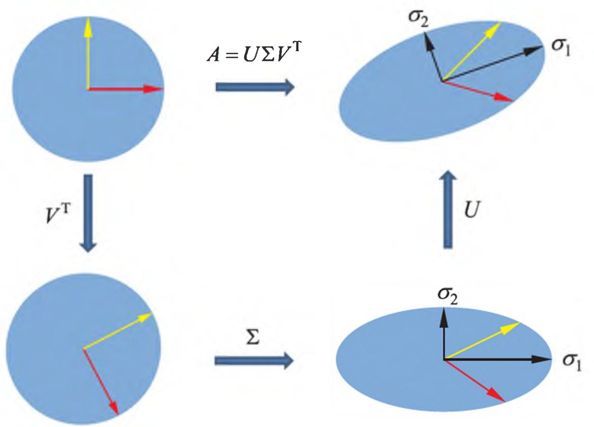
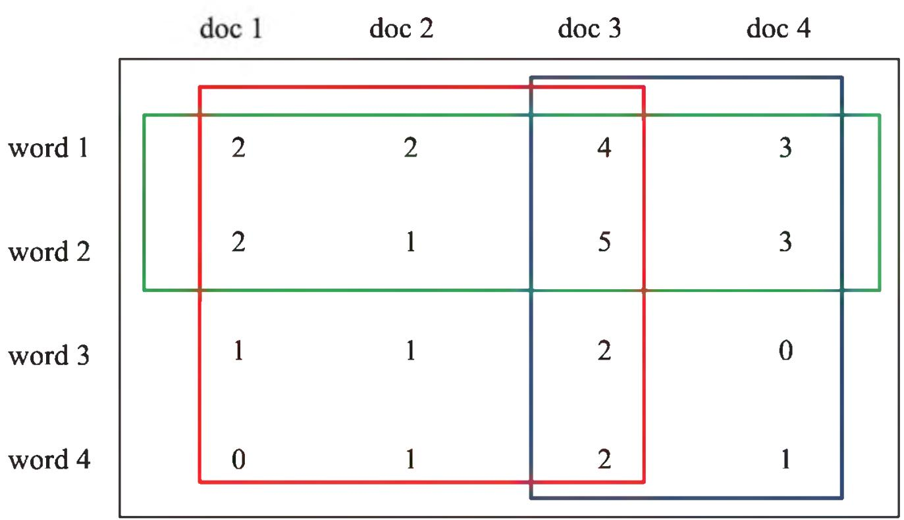
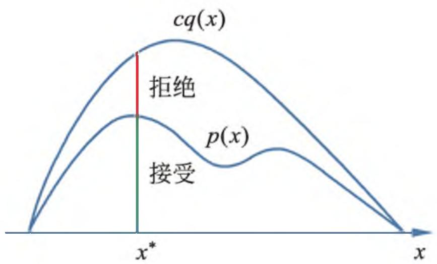
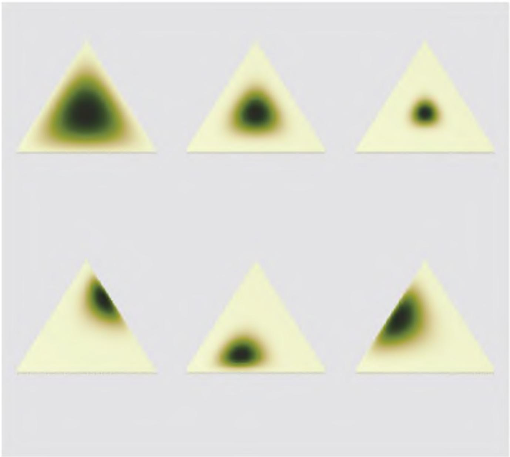
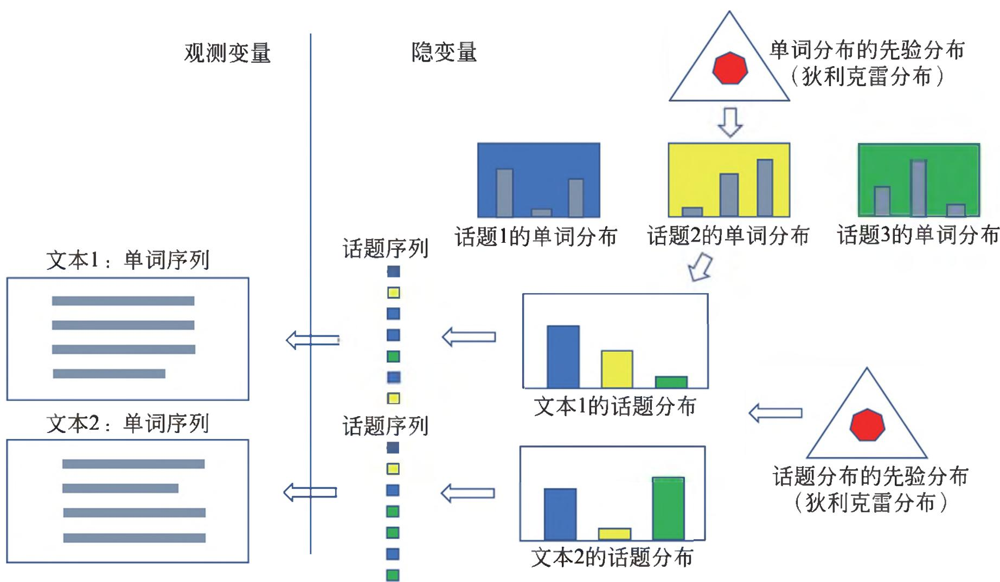

# 统计学系方法

(第 2 版)李航著

## 内容简介

统计学习方法即机器学习方法，是计算机及其应用领域的一门重要学科。本书分为监督学习和无监督学习两篇，全面系统地介绍了统计学习的主要方法。包括感知机、 $k$ 近邻法、朴素贝叶斯法、决策树、逻辑斯谛回归与最大熵模型、支持向量机、提升方法、EM 算法、隐马尔可夫模型和条件随机场，以及聚类方法、奇异值分解、主成分分析、潜在语义分析、概率潜在语义分析、马尔可夫链蒙特卡罗法、潜在狄利克雷分配和 PageRank 算法等。

本书是统计机器学习及相关课程的教学参考书，适用于高等院校文本数据挖掘、信息检索及自然语言处理等专业的大学生、研究生，也可供计算机应用等专业的研发人员参考。

本书封面贴有清华大学出版社防伪标签，无标签者不得销售。

版权所有，侵权必究。侵权举报电话：010-62782989 13701121933

> 彩图 15.1 奇异值分解的几何解释

> 彩图 18.1 概率潜在语义分析的直观解释

> 彩图 19.1 接受-拒绝抽样法

> 彩图 20.1 狄利克雷分布例

> 彩图 20.3 LDA 的文本生成过程

## 献给我的母亲

## 第 2 版序言

《统计学习方法》第 1 版于 2012 年出版，讲述了统计机器学习方法，主要是一些常用的监督学习方法。第 2 版增加了一些常用的无监督学习方法，由此本书涵盖了传统统计机器学习方法的主要内容。

在撰写《统计学习方法》伊始，对全书内容做了初步规划。第 1 版出版之后，即着手无监督学习方法的写作。由于写作是在业余时间进行，常常被主要工作打断，历经六年多时间才使这部分工作得以完成。犹未能加入深度学习和强化学习等重要内容，希望今后能够增补，完成整本书的写作计划。

《统计学习方法》第 1 版的出版正值大数据和人工智能的热潮，生逢其时，截至 2019 年 4 月本书共印刷 25 次，152000 册，得到了广大读者的欢迎和支持。有许多读者指出本书对学习和掌握机器学习技术有极大的帮助，也有许多读者通过电子邮件、微博等方式指出书中的错误，提出改进的建议和意见。一些高校将本书作为机器学习课程的教材或参考书。有的同学在网上发表了读书笔记，有的同学将本书介绍的方法在计算机上实现。清华大学深圳研究生院袁春老师精心制作了第 1 版十二章的课件，在网上公布，为大家提供教学之便。众多老师、同学、读者的支持和鼓励，让作者深受感动和鼓舞。在这里向所有的老师、同学、读者致以诚挚的谢意！

能为中国的计算机科学、人工智能领域做出一点微薄的贡献，感到由衷的欣慰，同时也感受到作为知识传播者的重大责任，让作者决意把本书写好。也希望大家今后不吝指教，多提宝贵意见，以帮助继续提高本书的质量。在写作中作者也深切体会到教学相长的道理，经常发现自己对基础知识的掌握不够扎实，通过写作得以对相关知识进行了深入的学习，受益匪浅。

本书是一部机器学习的基本读物，要求读者拥有高等数学、线性代数和概率统计的基础知识。书中主要讲述统计机器学习的方法，力求系统全面又简明扼要地阐述这些方法的理论、算法和应用，使读者能对这些机器学习的基本技术有很好的掌握。针对每个方法，详细介绍其基本原理、基础理论、实际算法，给出细致的数学推导和具体实例，既帮助读者理解，也便于日后复习。

第 2 版增加的无监督学习方法，王泉、陈嘉怡、柴琛林、赵程绮等帮助做了认真细致的校阅，提出了许多宝贵意见，在此谨对他们表示衷心的感谢。清华大学出版社的薛慧编辑一直对本书的写作给予非常专业的指导和帮助，在此对她表示衷心的感谢！

由于本人水平有限，本书一定存在不少错误，恳请各位专家、老师和同学批评指正。

李航 2019 年 4 月

## 第 1 版序言

计算机与网络已经融入人们的日常学习、工作和生活之中，成为人们不可或缺的助手和伙伴。计算机与网络的飞速发展完全改变了人们的学习、工作和生活方式。智能化是计算机研究与开发的一个主要目标。近几十年来的实践表明，统计机器学习方法是实现这一目标的最有效手段，尽管它还存在着一定的局限性。

本人一直从事利用统计学习方法对文本数据进行各种智能性处理的研究，包括自然语言处理、信息检索、文本数据挖掘。近 20 年来，这些领域发展之快，应用之广，实在令人惊叹！可以说，统计机器学习是这些领域的核心技术，在这些领域的发展及应用中起着决定性的作用。

本人在日常的研究工作中经常指导学生，并在国内外一些大学及讲习班上多次做过关于统计学习的报告和演讲。在这一过程中，同学们学习热情很高，希望得到指导，这使作者产生了撰写本书的想法。

国内外已出版了多本关于统计机器学习的书籍，比如，Hastie 等人的《统计学习基础》，该书对统计学习的诸多问题有非常精辟的论述，但对初学者来说显得有些深奥。统计学习范围甚广，一两本书很难覆盖所有问题。本书主要是面向将统计学习方法作为工具的科研人员与学生，特别是从事信息检索、自然语言处理、文本数据挖掘及相关领域的研究与开发的科研人员与学生。

本书力求系统而详细地介绍统计学习的方法。在内容选取上，侧重介绍那些最重要、最常用的方法，特别是关于分类与标注问题的方法。对其他问题及方法，如聚类等，计划在今后的写作中再加以介绍。在叙述方式上，每一章讲述一种方法，各章内容相对独立、完整；同时力图用统一框架来论述所有方法，使全书整体不失系统性，读者可以从头到尾通读，也可以选择单个章节细读。对每一种方法的讲述力求深入浅出，给出必要的推导证明，提供简单的实例，使初学者易于掌握该方法的基本内容，领会方法的本质，并准确地使用方法。对相关的深层理论，则予以简述。在每章后面，给出一些习题，介绍一些相关的研究动向和阅读材料，列出参考文献，以满足读者进一步学习的需求。本书第 1 章简要叙述统计学习方法的基本概念，最后一章对统计学习方法进行比较与总结。此外，在附录中简要介绍一些共用的最优化理论与方法。

本书可以作为统计机器学习及相关课程的教学参考书，适用于信息检索及自然语言处理等专业的大学生、研究生。

本书初稿完成后，田飞、王佳磊、武威、陈凯、伍浩铖、曹正、陶宇等人分别审阅了全部或部分章节，提出了许多宝贵意见，对本书质量的提高有很大帮助，在此向他们表示衷心的感谢。在本书写作和出版过程中，清华大学出版社的责任编辑薛慧给予了很多帮助，在此特向她致谢。

由于本人水平所限，书中难免有错误和不当之处，欢迎各位专家和读者给予批评指正。

李航 2011 年 4 月 23 日

## 目录

- **第 1 篇 监督学习**

  - **第 1 章 统计学习及监督学习概论** (3)
    - 1.1 统计学习 (3)
    - 1.2 统计学习的分类 (5)
      - 1.2.1 基本分类 (6)
      - 1.2.2 按模型分类 (11)
      - 1.2.3 按算法分类 (13)
      - 1.2.4 按技巧分类 (13)
    - 1.3 统计学习方法三要素 (15)
      - 1.3.1 模型 (15)
      - 1.3.2 策略 (16)
      - 1.3.3 算法 (19)
    - 1.4 模型评估与模型选择 (19)
      - 1.4.1 训练误差与测试误差 (19)
      - 1.4.2 过拟合与模型选择 (20)
    - 1.5 正则化与交叉验证 (23)
      - 1.5.1 正则化 (23)
      - 1.5.2 交叉验证 (24)
    - 1.6 泛化能力 (24)
      - 1.6.1 泛化误差 (24)
      - 1.6.2 泛化误差上界 (25)
    - 1.7 生成模型与判别模型 (27)
    - 1.8 监督学习应用 (28)
      - 1.8.1 分类问题 (28)
      - 1.8.2 标注问题 (30)
      - 1.8.3 回归问题 (32)
    - 本章概要 (33)
    - 继续阅读 (33)
    - 习题 (33)
    - 参考文献 (34)
  - **第 2 章 感知机** (35)
    - 2.1 感知机模型 (35)
    - 2.2 感知机学习策略 (36)
      - 2.2.1 数据集的线性可分性 (36)
      - 2.2.2 感知机学习策略 (37)
    - 2.3 感知机学习算法 (38)
      - 2.3.1 感知机学习算法的原始形式 (38)
      - 2.3.2 算法的收敛性 (41)
      - 2.3.3 感知机学习算法的对偶形式 (43)
    - 本章概要 (46)
    - 继续阅读 (46)
    - 习题 (46)
    - 参考文献 (47)
  - **第 3 章 $k$ 近邻法** (49)
    - 3.1 $k$ 近邻算法 (49)
    - 3.2 $k$ 近邻模型 (50)
      - 3.2.1 模型 (50)
    - 4.1 朴素贝叶斯法的学习与分类 (59)
      - 4.1.1 基本方法 (59)
      - 4.1.2 后验概率最大化的含义 (61)
    - 4.2 朴素贝叶斯法的参数估计 (62)
      - 4.2.1 极大似然估计 (62)
      - 4.2.2 学习与分类算法 (62)
      - 4.2.3 贝叶斯估计 (64)
    - 本章概要 (65)
    - 继续阅读 (66)
    - 习题 (66)
    - 参考文献 (66)
  - **第 5 章 决策树** (67)
    - 5.1 决策树模型与学习 (67)
      - 5.1.1 决策树模型 (67)
      - 5.1.2 决策树与 if-then 规则 (68)
      - 5.1.3 决策树与条件概率分布 (68)
      - 5.1.4 决策树学习 (69)
    - 5.2 特征选择 (71)
      - 5.2.1 特征选择问题 (71)
      - 5.2.2 信息增益 (72)
      - 5.2.3 信息增益比 (76)
    - 5.3 决策树的生成 (76)
      - 5.3.1 ID3 算法 (76)
      - 5.3.2 C4.5 的生成算法 (78)
    - 5.4 决策树的剪枝 (78)
    - 5.5 CART 算法 (80)
      - 5.5.1 CART 生成 (81)
      - 5.5.2 CART 剪枝 (85)
    - 本章概要 (87)
    - 继续阅读 (88)
    - 习题 (89)
    - 参考文献 (89)
  - **第 6 章 逻辑斯谛回归与最大熵模型** (91)
    - 6.1 逻辑斯谛回归模型 (91)
      - 6.1.1 逻辑斯谛分布 (91)
      - 6.1.2 二项逻辑斯谛回归模型 (92)
      - 6.1.3 模型参数估计 (93)
      - 6.1.4 多项逻辑斯谛回归 (94)
    - 6.2 最大熵模型 (94)
      - 6.2.1 最大熵原理 (94)
      - 6.2.2 最大熵模型的定义 (96)
      - 6.2.3 最大熵模型的学习 (98)
      - 6.2.4 极大似然估计 (102)
    - 6.3 模型学习的最优化算法 (103)
      - 6.3.1 改进的迭代尺度法 (103)
      - 6.3.2 拟牛顿法 (107)
    - 本章概要 (108)
    - 继续阅读 (109)
    - 习题 (109)
    - 参考文献 (109)
  - **第 7 章 支持向量机** (111)
    - 7.1 线性可分支持向量机与硬间隔最大化 (112)
      - 7.1.1 线性可分支持向量机 (112)
      - 7.1.2 函数间隔和几何间隔 (113)
      - 7.1.3 间隔最大化 (115)
      - 7.1.4 学习的对偶算法 (120)
    - 7.2 线性支持向量机与软间隔最大化 (125)
      - 7.2.1 线性支持向量机 (125)
      - 7.2.2 学习的对偶算法 (127)
      - 7.2.3 支持向量 (130)
      - 7.2.4 合页损失函数 (131)
    - 7.3 非线性支持向量机与核函数 (133)
      - 7.3.1 核技巧 (133)
      - 7.3.2 正定核 (136)
      - 7.3.3 常用核函数 (140)
      - 7.3.4 非线性支持向量分类机 (141)
    - 7.4 序列最小最优化算法 (142)
      - 7.4.1 两个变量二次规划的求解方法 (143)
      - 7.4.2 变量的选择方法 (147)
      - 7.4.3 SMO 算法 (149)
    - 本章概要 (149)
    - 继续阅读 (152)
    - 习题 (152)
    - 参考文献 (153)
  - **第 8 章 提升方法** (155)
    - 8.1 提升方法 AdaBoost 算法 (155)
      - 8.1.1 提升方法的基本思路 (155)
      - 8.1.2 AdaBoost 算法 (156)
      - 8.1.3 AdaBoost 的例子 (158)
    - 8.2 AdaBoost 算法的训练误差分析 (160)
    - 8.3 AdaBoost 算法的解释 (162)
      - 8.3.1 前向分步算法 (162)
      - 8.3.2 前向分步算法与 AdaBoost (164)
    - 8.4 提升树 (166)
      - 8.4.1 提升树模型 (166)
      - 8.4.2 提升树算法 (166)
      - 8.4.3 梯度提升 (170)
    - 本章概要 (172)
    - 继续阅读 (172)
    - 习题 (173)
    - 参考文献 (173)
  - **第 9 章 EM 算法及其推广** (175)
    - 9.1 EM 算法的引入 (175)
      - 9.1.1 EM 算法 (175)
      - 9.1.2 EM 算法的导出 (179)
      - 9.1.3 EM 算法在无监督学习中的应用 (181)
    - 9.2 EM 算法的收敛性 (181)
    - 9.3 EM 算法在高斯混合模型学习中的应用 (183)
      - 9.3.1 高斯混合模型 (183)
      - 9.3.2 高斯混合模型参数估计的 EM 算法 (183)
    - 9.4 EM 算法的推广 (187)
      - 9.4.1 F 函数的极大-极大算法 (187)
      - 9.4.2 GEM 算法 (189)
    - 本章概要 (191)
    - 继续阅读 (192)
    - 习题 (192)
    - 参考文献 (192)
  - **第 10 章 隐马尔可夫模型** (193)
    - 10.1 隐马尔可夫模型的基本概念 (193)
      - 10.1.1 隐马尔可夫模型的定义 (193)
      - 10.1.2 观测序列的生成过程 (196)
      - 10.1.3 隐马尔可夫模型的 3 个基本问题 (196)
    - 10.2 概率计算算法 (197)
      - 10.2.1 直接计算法 (197)
      - 10.2.2 前向算法 (198)
      - 10.2.3 后向算法 (201)
      - 10.2.4 一些概率与期望值的计算 (202)
    - 10.3 学习算法 (203)
      - 10.3.1 监督学习方法 (203)
      - 10.3.2 Baum-Welch 算法 (204)
      - 10.3.3 Baum-Welch 模型参数估计公式 (206)
    - 10.4 预测算法 (207)
      - 10.4.1 近似算法 (208)
      - 10.4.2 维特比算法 (208)
    - 本章概要 (212)
    - 继续阅读 (212)
    - 习题 (213)
    - 参考文献 (213)
  - **第 11 章 条件随机场** (215)
    - 11.1 概率无向图模型 (215)
      - 11.1.1 模型定义 (215)
      - 11.1.2 概率无向图模型的因子分解 (217)
    - 11.2 条件随机场的定义与形式 (218)
      - 11.2.1 条件随机场的定义 (218)
      - 11.2.2 条件随机场的参数化形式 (220)
      - 11.2.3 条件随机场的简化形式 (221)
      - 11.2.4 条件随机场的矩阵形式 (223)
    - 11.3 条件随机场的概率计算问题 (224)
      - 11.3.1 前向-后向算法 (225)
      - 11.3.2 概率计算 (225)
      - 11.3.3 期望值的计算 (226)
    - 11.4 条件随机场的学习算法 (227)
      - 11.4.1 改进的迭代尺度法 (227)
      - 11.4.2 拟牛顿法 (230)
    - 11.5 条件随机场的预测算法 (231)
    - 本章概要 (235)
    - 继续阅读 (235)
    - 习题 (236)
    - 参考文献 (236)
  - **第 12 章 监督学习方法总结** (237)

- **第 2 篇 无监督学习**
  - **第 13 章 无监督学习概论** (245)
    - 13.1 无监督学习基本原理 (245)
    - 13.2 基本问题 (246)
    - 13.3 机器学习三要素 (249)
    - 13.4 无监督学习方法 (249)
    - 本章概要 (253)
    - 继续阅读 (254)
    - 参考文献 (254)
  - **第 14 章 聚类方法** (255)
    - 14.1 聚类的基本概念 (255)
      - 14.1.1 相似度或距离 (255)
      - 14.1.2 类或簇 (258)
      - 14.1.3 类与类之间的距离 (260)
    - 14.2 层次聚类 (261)
    - 14.3 $k$均值聚类 (263)
      - 14.3.1 模型 (263)
      - 14.3.2 策略 (263)
      - 14.3.3 算法 (264)
      - 14.3.4 算法特性 (266)
    - 本章概要 (267)
    - 继续阅读 (268)
    - 习题 (269)
    - 参考文献 (269)
  - **第 15 章 奇异值分解** (271)
    - 15.1 奇异值分解的定义与性质 (271)
      - 15.1.1 定义与定理 (271)
      - 15.1.2 紧奇异值分解与截断奇异值分解 (276)
      - 15.1.3 几何解释 (279)
      - 15.1.4 主要性质 (280)
    - 15.2 奇异值分解的计算 (282)
    - 15.3 奇异值分解与矩阵近似 (286)
      - 15.3.1 弗罗贝尼乌斯范数 (286)
      - 15.3.2 矩阵的最优近似 (287)
      - 15.3.3 矩阵的外积展开式 (290)
    - 本章概要 (292)
    - 继续阅读 (294)
    - 习题 (294)
    - 参考文献 (295)
  - **第 16 章 主成分分析** (297)
    - 16.1 总体主成分分析 (297)
      - 16.1.1 基本想法 (297)
      - 16.1.2 定义和导出 (299)
      - 16.1.3 主要性质 (301)
      - 16.1.4 主成分的个数 (306)
      - 16.1.5 规范化变量的总体主成分 (309)
    - 16.2 样本主成分分析 (310)
      - 16.2.1 样本主成分的定义和性质 (310)
      - 16.2.2 相关矩阵的特征值分解算法 (312)
      - 16.2.3 数据矩阵的奇异值分解算法 (315)
    - 本章概要 (317)
    - 继续阅读 (319)
    - 习题 (320)
    - 参考文献 (320)
  - **第 17 章 潜在语义分析** (321)
    - 17.1 单词向量空间与话题向量空间 (321)
      - 17.1.1 单词向量空间 (321)
      - 17.1.2 话题向量空间 (324)
    - 17.2 潜在语义分析算法 (327)
      - 17.2.1 矩阵奇异值分解算法 (327)
      - 17.2.2 例子 (329)
    - 17.3 非负矩阵分解算法 (331)
      - 17.3.1 非负矩阵分解 (331)
      - 17.3.2 潜在语义分析模型 (332)
      - 17.3.3 非负矩阵分解的形式化 (332)
      - 17.3.4 算法 (333)
    - 本章概要 (335)
    - 继续阅读 (337)
    - 习题 (337)
    - 参考文献 (337)
  - **第 18 章 概率潜在语义分析** (339)
    - 18.1 概率潜在语义分析模型 (339)
      - 18.1.1 基本想法 (339)
      - 18.1.2 生成模型 (340)
      - 18.1.3 共现模型 (341)
      - 18.1.4 模型性质 (342)
    - 18.2 概率潜在语义分析的算法 (345)
    - 本章概要 (347)
    - 继续阅读 (348)
    - 习题 (348)
    - 参考文献 (349)
  - **第 19 章 马尔可夫链蒙特卡罗法** (351)
    - 19.1 蒙特卡罗法 (351)
      - 19.1.1 随机抽样 (351)
      - 19.1.2 数学期望估计 (353)
      - 19.1.3 积分计算 (353)
    - 19.2 马尔可夫链 (355)
      - 19.2.1 基本定义 (355)
      - 19.2.2 离散状态马尔可夫链 (356)
      - 19.2.3 连续状态马尔可夫链 (362)
      - 19.2.4 马尔可夫链的性质 (363)
    - 19.3 马尔可夫链蒙特卡罗法 (367)
      - 19.3.1 基本想法 (367)
      - 19.3.2 基本步骤 (369)
      - 19.3.3 马尔可夫链蒙特卡罗法与统计学习 (369)
    - 19.4 Metropolis-Hastings 算法 (370)
      - 19.4.1 基本原理 (370)
      - 19.4.2 Metropolis-Hastings 算法 (373)
      - 19.4.3 单分量 Metropolis-Hastings 算法 (374)
    - 19.5 吉布斯抽样 (375)
      - 19.5.1 基本原理 (376)
      - 19.5.2 吉布斯抽样算法 (377)
      - 19.5.3 抽样计算 (378)
    - 本章概要 (379)
    - 继续阅读 (381)
    - 习题 (381)
    - 参考文献 (383)
  - **第 20 章 潜在狄利克雷分配** (385)
    - 20.1 狄利克雷分布 (385)
      - 20.1.1 分布定义 (385)
      - 20.1.2 共轭先验 (389)
    - 20.2 潜在狄利克雷分配模型 (390)
      - 20.2.1 基本想法 (390)
      - 20.2.2 模型定义 (391)
      - 20.2.3 概率图模型 (393)
      - 20.2.4 随机变量序列的可交换性 (394)
      - 20.2.5 概率公式 (395)
    - 20.3 LDA 的吉布斯抽样算法 (396)
      - 20.3.1 基本想法 (396)
      - 20.3.2 算法的主要部分 (397)
      - 20.3.3 算法的后处理 (399)
      - 20.3.4 算法 (399)
    - 20.4 LDA 的变分 EM 算法 (401)
      - 20.4.1 变分推理 (401)
      - 20.4.2 变分 EM 算法 (403)
      - 20.4.3 算法推导 (404)
      - 20.4.4 算法总结 (411)
    - 本章概要 (411)
    - 继续阅读 (413)
    - 习题 (413)
    - 参考文献 (413)
  - **第 21 章 PageRank 算法** (415)
    - 21.1 PageRank 的定义 (415)
      - 21.1.1 基本想法 (415)
      - 21.1.2 有向图和随机游走模型 (416)
      - 21.1.3 PageRank 的基本定义 (418)
      - 21.1.4 PageRank 的一般定义 (421)
    - 21.2 PageRank 的计算 (423)
      - 21.2.1 迭代算法 (423)
      - 21.2.2 幂法 (425)
      - 21.2.3 代数算法 (430)
    - 本章概要 (430)
    - 继续阅读 (432)
    - 习题 (432)
    - 参考文献 (432)
  - **第 22 章 无监督学习方法总结** (435)
    - 22.1 无监督学习方法的关系和特点 (435)
      - 22.1.1 各种方法之间的关系 (435)
      - 22.1.2 无监督学习方法 (436)
      - 22.1.3 基础机器学习方法 (437)
    - 22.2 话题模型之间的关系和特点 (437)
  - 参考文献 (438)
  - 附录 A 梯度下降法 (439)
  - 附录 B 牛顿法和拟牛顿法 (441)
  - 附录 C 拉格朗日对偶性 (447)
  - 附录 D 矩阵的基本子空间 (451)
  - 附录 E KL 散度的定义和狄利克雷分布的性质 (455)
  - 索引 (457)