# 第1章 统计学习及监督学习概论

本书第1篇讲述监督学习方法。监督学习是从标注数据中学习模型的机器学习问题，是统计学习或机器学习的重要组成部分。

本章简要叙述统计学习及监督学习的一些基本概念。使读者对统计学习及监督学习有初步了解。

本章1.1节叙述统计学习或机器学习的定义、研究对象与方法；1.2节叙述统计学习的分类，基本分类是监督学习、无监督学习、强化学习；1.3节叙述统计学习方法的三要素：模型、策略和算法；1.4节至1.7节相继介绍监督学习的几个重要概念，包括模型评估与模型选择、正则化与交叉验证、学习的泛化能力、生成模型与判别模型；最后1.8节介绍监督学习的应用：分类问题，标注问题与回归问题。

## 1.1 统计学习

### 1. 统计学习的特点

统计学习（statistical learning）是关于计算机基于数据构建概率统计模型并运用模型对数据进行预测与分析的一门学科。统计学习也称为统计机器学习（statistical machine learning）。

统计学习的主要特点是：（1）统计学习以计算机及网络为平台，是建立在计算机及网络上的；（2）统计学习以数据为研究对象，是数据驱动的学科；（3）统计学习的目的是对数据进行预测与分析；（4）统计学习以方法为中心，统计学习方法构建模型并应用模型进行预测与分析；（5）统计学习是概率论、统计学、信息论、计算理论、最优化理论及计算机科学等多个领域的交叉学科，并且在发展中逐步形成独自的理论体系与方法论。

赫尔伯特·西蒙（Herbert A. Simon）曾对“学习”给出以下定义：“如果一个系统能够通过执行某个过程改进它的性能，这就是学习。”按照这一观点，统计学习就是计算机系统通过运用数据及统计方法提高系统性能的机器学习。现在，当人们提及机器学习时，往往是指统计机器学习。所以可以认为本书介绍的是机器学习方法。

### 2. 统计学习的对象

统计学习研究的对象是数据（data）。它从数据出发，提取数据的特征，抽象出数据的模型，发现数据中的知识，又回到对数据的分析与预测中去。作为统计学习的对象，数据是多样的，包括存在于计算机及网络上的各种数字、文字、图像、视频、音频数据以及它们的组合。

统计学习关于数据的基本假设是同类数据具有一定的统计规律性，这是统计学习的前提。这里的同类数据是指具有某种共同性质的数据，例如英文文章、互联网网页、数据库中的数据等。由于它们具有统计规律性，所以可以用概率统计方法处理它们。比如，可以用随机变量描述数据中的特征，用概率分布描述数据的统计规律。在统计学习中，以变量或变量组表示数据。数据分为由连续变量和离散变量表示的类型。本书以讨论离散变量的方法为主。另外，本书只涉及利用数据构建模型及利用模型对数据进行分析与预测，对数据的观测和收集等问题不作讨论。

### 3. 统计学习的目的

统计学习用于对数据的预测与分析，特别是对未知新数据的预测与分析。对数据的预测可以使计算机更加智能化，或者说使计算机的某些性能得到提高；对数据的分析可以让人们获取新的知识，给人们带来新的发现。

对数据的预测与分析是通过构建概率统计模型实现的。统计学习总的目标就是考虑学习什么样的模型和如何学习模型，以使模型能对数据进行准确的预测与分析，同时也要考虑尽可能地提高学习效率。

### 4. 统计学习的方法

统计学习的方法是基于数据构建概率统计模型从而对数据进行预测与分析。统计学习由监督学习（supervised learning）、无监督学习（unsupervised learning）和强化学习（reinforcement learning）等组成。

本书第1篇讲述监督学习，第2篇讲述无监督学习。可以说监督学习、无监督学习方法是最主要的统计学习方法。

统计学习方法可以概括如下：从给定的、有限的、用于学习的训练数据（training data）集合出发，假设数据是独立同分布产生的；并且假设要学习的模型属于某个函数的集合，称为假设空间（hypothesis space）；应用某个评价准则（evaluation criterion），从假设空间中选取一个最优模型，使它对已知的训练数据及未知的测试数据（test data）在给定的评价准则下有最优的预测；最优模型的选取由算法实现。这样，统计学习方法包括模型的假设空间、模型选择的准则以及模型学习的算法。称其为统计学习方法的三要素，简称为模型（model）、策略（strategy）和算法（algorithm）。

实现统计学习方法的步骤如下：

（1）得到一个有限的训练数据集合；

- （2）确定包含所有可能的模型的假设空间，即学习模型的集合；
- （3）确定模型选择的准则，即学习的策略；
- （4）实现求解最优模型的算法，即学习的算法；
- （5）通过学习方法选择最优模型；
- （6）利用学习的最优模型对新数据进行预测或分析。

本书第1篇介绍监督学习方法，主要包括用于分类、标注与回归问题的方法。这些方法在自然语言处理、信息检索、文本数据挖掘等领域中有着极其广泛的应用。

### 5. 统计学习的研究

统计学习研究一般包括统计学习方法、统计学习理论及统计学习应用三个方面。统计学习方法的研究旨在开发新的学习方法；统计学习理论的研究在于探求统计学习方法的有效性与效率，以及统计学习的基本理论问题；统计学习应用的研究主要考虑将统计学习方法应用到实际问题中去，解决实际问题。

### 6. 统计学习的重要性

近二十年来，统计学习无论是在理论还是在应用方面都得到了巨大的发展，有许多重大突破，统计学习已被成功地应用到人工智能、模式识别、数据挖掘、自然语言处理、语音处理、计算视觉、信息检索、生物信息等许多计算机应用领域中，并且成为这些领域的核心技术。人们确信，统计学习将会在今后的科学发展和技术应用中发挥越来越大的作用。

统计学习学科在科学技术中的重要性主要体现在以下几个方面：

- （1）统计学习是处理海量数据的有效方法。我们处于一个信息爆炸的时代，海量数据的处理与利用是人们必然的需求。现实中的数据不但规模大，而且常常具有不确定性，统计学习往往是处理这类数据最强有力的工具。
- （2）统计学习是计算机智能化的有效手段。智能化是计算机发展的必然趋势，也是计算机技术研究与开发的主要目标。近几十年来，人工智能等领域的研究证明，利用统计学习模仿人类智能的方法，虽有一定的局限性，还是实现这一目标的最有效手段。
- （3）统计学习是计算机科学发展的一个重要组成部分。可以认为计算机科学由三维组成：系统、计算、信息。统计学习主要属于信息这一维，并在其中起着核心作用。

## 1.2 统计学习的分类

统计学习或机器学习是一个范围宽阔、内容繁多、应用广泛的领域，并不存在（至少现在不存在）一个统一的理论体系涵盖所有内容。下面从几个角度对统计学习方法进行分类。

### 1.2.1 基本分类

统计学习或机器学习一般包括监督学习、无监督学习、强化学习。有时还包括半监督学习、主动学习。

#### 1. 监督学习

监督学习（supervised learning）是指从标注数据中学习预测模型的机器学习问题。标注数据表示输入输出的对应关系，预测模型对给定的输入产生相应的输出。监督学习的本质是学习输入到输出的映射的统计规律。

##### (1) 输入空间、特征空间和输出空间

在监督学习中，将输入与输出所有可能取值的集合分别称为输入空间（input space）与输出空间（output space）。输入与输出空间可以是有限元素的集合，也可以是整个欧氏空间。输入空间与输出空间可以是同一个空间，也可以是不同的空间；但通常输出空间远远小于输入空间。

每个具体的输入是一个实例（instance），通常由特征向量（feature vector）表示。这时，所有特征向量存在的空间称为特征空间（feature space）。特征空间的每一维对应于一个特征。有时假设输入空间与特征空间为相同的空间，对它们不予区分；有时假设输入空间与特征空间为不同的空间，将实例从输入空间映射到特征空间。模型实际上都是定义在特征空间上的。

在监督学习中，将输入与输出看作是定义在输入（特征）空间与输出空间上的随机变量的取值。输入输出变量用大写字母表示，习惯上输入变量写作 $X$ ，输出变量写作 $Y$ 。输入输出变量的取值用小写字母表示，输入变量的取值写作 $x$ ，输出变量的取值写作 $y$ 。变量可以是标量或向量，都用相同类型字母表示。除特别声明外，本书中向量均为列向量。输入实例 $x$ 的特征向量记作

$$
\boldsymbol {x} = \left(x ^ {(1)}, x ^ {(2)}, \dots , x ^ {(i)}, \dots , x ^ {(n)}\right) ^ {\mathrm {T}}
$$

$x^{(i)}$ 表示 $x$ 的第 $i$ 个特征。注意 $x^{(i)}$ 与 $x_{i}$ 不同，本书通常用 $x_{i}$ 表示多个输入变量中的第 $i$ 个变量，即

$$
\boldsymbol {x} _ {i} = \left(x _ {i} ^ {(1)}, x _ {i} ^ {(2)}, \dots , x _ {i} ^ {(n)}\right) ^ {\mathrm {T}}
$$

监督学习从训练数据（training data）集合中学习模型，对测试数据（test data）进行预测。训练数据由输入（或特征向量）与输出对组成，训练集通常表示为

$$
T = \left\{\left(x _ {1}, y _ {1}\right), \left(x _ {2}, y _ {2}\right), \dots , \left(x _ {N}, y _ {N}\right) \right\}
$$

测试数据也由输入与输出对组成。输入与输出对又称为样本（sample）或样本点。

输入变量 $X$ 和输出变量 $Y$ 有不同的类型，可以是连续的，也可以是离散的。人们根据输入输出变量的不同类型，对预测任务给予不同的名称：输入变量与输出变量均为连续变量的预测问题称为回归问题；输出变量为有限个离散变量的预测问题称为分类问题；输入变量与输出变量均为变量序列的预测问题称为标注问题。

##### (2) 联合概率分布

监督学习假设输入与输出的随机变量 $X$ 和 $Y$ 遵循联合概率分布 $P(X,Y)$ 。 $P(X,Y)$ 表示分布函数，或分布密度函数。注意在学习过程中，假定这一联合概率分布存在，但对学习系统来说，联合概率分布的具体定义是未知的。训练数据与测试数据被看作是依联合概率分布 $P(X,Y)$ 独立同分布产生的。统计学习假设数据存在一定的统计规律， $X$ 和 $Y$ 具有联合概率分布就是监督学习关于数据的基本假设。

##### （3）假设空间

监督学习的目的在于学习一个由输入到输出的映射，这一映射由模型来表示。换句话说，学习的目的就在于找到最好的这样的模型。模型属于由输入空间到输出空间的映射的集合，这个集合就是假设空间（hypothesis space）。假设空间的确定意味着学习的范围的确定。

监督学习的模型可以是概率模型或非概率模型，由条件概率分布 $P(Y|X)$ 或决策函数（decision function） $Y = f(X)$ 表示，随具体学习方法而定。对具体的输入进行相应的输出预测时，写作 $P(y|x)$ 或 $y = f(x)$ 。

##### （4）问题的形式化

监督学习利用训练数据集学习一个模型，再用模型对测试样本集进行预测。由于在这个过程中需要标注的训练数据集，而标注的训练数据集往往是人工给出的，所以称为监督学习。监督学习分为学习和预测两个过程，由学习系统与预测系统完成，可用图1.1来描述。

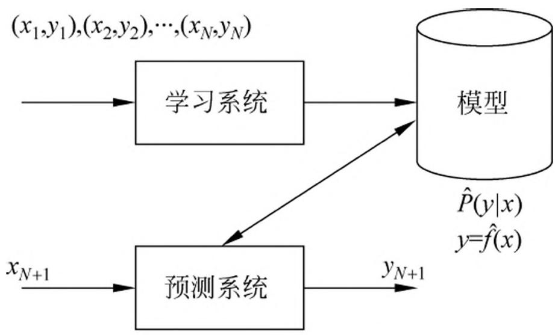

> 图1.1 监督学习

首先给定一个训练数据集

$$
T = \left\{\left(x _ {1}, y _ {1}\right), \left(x _ {2}, y _ {2}\right), \dots , \left(x _ {N}, y _ {N}\right) \right\}
$$

其中 $(x_{i},y_{i})$ ， $i = 1,2,\dots ,N$ ，称为样本或样本点。 $x_{i}\in \mathcal{X}\subseteq \mathbf{R}^{n}$ 是输入的观测值，也称为输入或实例， $y_{i}\in \mathcal{V}$ 是输出的观测值，也称为输出。

监督学习分为学习和预测两个过程，由学习系统与预测系统完成。在学习过程中，学习系统利用给定的训练数据集，通过学习（或训练）得到一个模型，表示为条件概率分布 $\hat{P}(Y|X)$ 或决策函数 $Y = \hat{f}(X)$ 。条件概率分布 $\hat{P}(Y|X)$ 或决策函数 $Y = \hat{f}(X)$ 描述输入与输出随机变量之间的映射关系。在预测过程中，预测系统对于给定的测试样本集中的输入 $x_{N+1}$ ，由模型 $y_{N+1} = \arg\max_{y} \hat{P}(y|x_{N+1})$ 或 $y_{N+1} = \hat{f}(x_{N+1})$ 给出相应的输出 $y_{N+1}$ 。

在监督学习中，假设训练数据与测试数据是依联合概率分布 $P(X,Y)$ 独立同分布产生的。

学习系统（也就是学习算法）试图通过训练数据集中的样本 $(x_{i},y_{i})$ 带来的信息学习模型。具体地说，对输入 $x_{i}$ ，一个具体的模型 $y = f(x)$ 可以产生一个输出 $f(x_{i})$ 而训练数据集中对应的输出是 $y_{i}$ 。如果这个模型有很好的预测能力，训练样本输出 $y_{i}$ 和模型输出 $f(x_{i})$ 之间的差就应该足够小。学习系统通过不断地尝试，选取最好的模型，以便对训练数据集有足够好的预测，同时对未知的测试数据集的预测也有尽可能好的推广。

#### 2. 无监督学习

无监督学习①（unsupervised learning）是指从无标注数据中学习预测模型的机器学习问题。无标注数据是自然得到的数据，预测模型表示数据的类别、转换或概率。无监督学习的本质是学习数据中的统计规律或潜在结构。

> - ① 也译作非监督学习。

模型的输入与输出的所有可能取值的集合分别称为输入空间与输出空间。输入空间与输出空间可以是有限元素集合，也可以是欧氏空间。每个输入是一个实例，由特征向量表示。每一个输出是对输入的分析结果，由输入的类别、转换或概率表示。模型可以实现对数据的聚类、降维或概率估计。

假设 $\mathcal{X}$ 是输入空间， $\mathcal{Z}$ 是隐式结构空间。要学习的模型可以表示为函数 $z = g(x)$ ，条件概率分布 $P(z|x)$ ，或者条件概率分布 $P(x|z)$ 的形式，其中 $x \in \mathcal{X}$ 是输入， $z \in \mathcal{Z}$ 是输出。包含所有可能的模型的集合称为假设空间。无监督学习旨在从假设空间中选出在给定评价标准下的最优模型。

无监督学习通常使用大量的无标注数据学习或训练，每一个样本是一个实例。训练数据表示为 $U = \{x_{1}, x_{2}, \dots, x_{N}\}$ ，其中 $x_{i}, i = 1, 2, \dots, N,$ 是样本。

无监督学习可以用于对已有数据的分析，也可以用于对未来数据的预测。分析时使用学习得到的模型，即函数 $z = \hat{g}(x)$ ，条件概率分布 $\hat{P}(z|x)$ ，或者条件概率分布 $\hat{P}(x|z)$ 。预测时，和监督学习有类似的流程。由学习系统与预测系统完成，如图1.2所示。在学习过程中，学习系统从训练数据集学习，得到一个最优模型，表示为函数 $z = \hat{g}(x)$ ，条件概率分布 $\hat{P}(z|x)$ 或者条件概率分布 $\hat{P}(x|z)$ 。在预测过程中，预测系统对于给定的输入 $x_{N+1}$ ，由模型 $z_{N+1} = \hat{g}(x_{N+1})$ 或 $z_{N+1} = \arg\max_{z} \hat{P}(z|x_{N+1})$ 给出相应的输出 $z_{N+1}$ ，进行聚类或降维，或者由模型 $\hat{P}(x|z)$ 给出输入的概率 $\hat{P}(x_{N+1}|z_{N+1})$ ，进行概率估计。

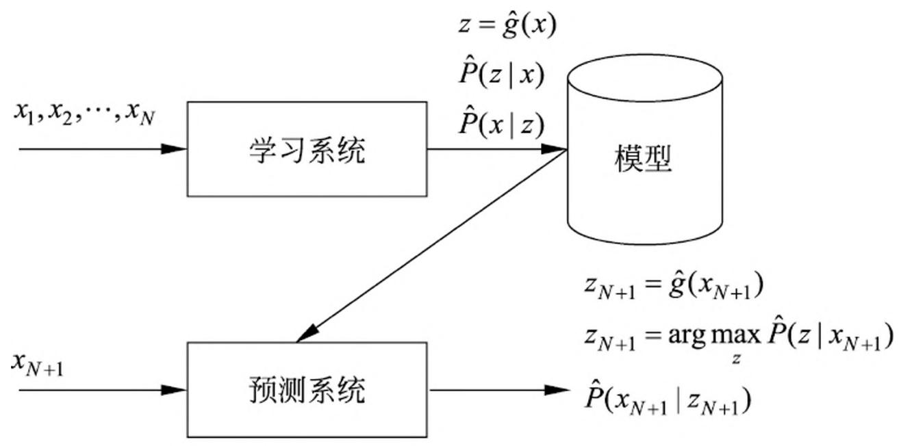

> 图1.2 无监督学习

#### 3. 强化学习

强化学习（reinforcement learning）是指智能系统在与环境的连续互动中学习最优行为策略的机器学习问题。假设智能系统与环境的互动基于马尔可夫决策过程（Markov decision process），智能系统能观测到的是与环境互动得到的数据序列。强化学习的本质是学习最优的序贯决策。

智能系统与环境的互动如图1.3所示。在每一步 $t$ ，智能系统从环境中观测到一个状态（state） $s_t$ 与一个奖励（reward） $r_t$ ，采取一个动作（action） $a_t$ 。环境根据智能系统选择的动作，决定下一步 $t + 1$ 的状态 $s_{t + 1}$ 与奖励 $r_{t + 1}$ 。要学习的策略表示为给定的状态下采取的动作。智能系统的目标不是短期奖励的最大化，而是长期累积奖励的最大化。强化学习过程中，系统不断地试错（trial and error），以达到学习最优策略的目的。

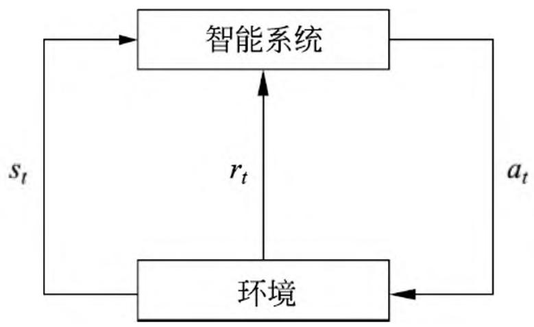

> 图1.3 智能系统与环境的互动

强化学习的马尔可夫决策过程是状态、奖励、动作序列上的随机过程，由五元组 $\langle S, A, P, r, \gamma \rangle$ 组成。

- - $S$ 是有限状态（state）的集合
- - $A$ 是有限动作（action）的集合
- - $P$ 是状态转移概率（transition probability）函数：

$$
P (s ^ {\prime} | s, a) = P (s _ {t + 1} = s ^ {\prime} | s _ {t} = s, a _ {t} = a)
$$

- - $r$ 是奖励函数（reward function）： $r(s, a) = E(r_{t+1} | s_t = s, a_t = a)$
- - $\gamma$ 是衰减系数（discount factor）： $\gamma \in [0,1]$

马尔可夫决策过程具有马尔可夫性，下一个状态只依赖于前一个状态与动作，由状态转移概率函数 $P(s'|s,a)$ 表示。下一个奖励依赖于前一个状态与动作，由奖励函数 $r(s,a)$ 表示。

策略 $\pi$ 定义为给定状态下动作的函数 $a = f(s)$ 或者条件概率分布 $P(a|s)$ 。给定一个策略 $\pi$ ，智能系统与环境互动的行为就已确定（或者是确定性的或者是随机性的）。

价值函数（value function）或状态价值函数（state value function）定义为策略 $\pi$ 从某一个状态 $s$ 开始的长期累积奖励的数学期望：

$$
v _ {\pi} (s) = E _ {\pi} [ r _ {t + 1} + \gamma r _ {t + 2} + \gamma^ {2} r _ {t + 3} + \dots | s _ {t} = s ] \qquad \qquad (1. 1)
$$

动作价值函数（action value function）定义为策略 $\pi$ 的从某一个状态 $s$ 和动作 $a$ 开始的长期累积奖励的数学期望：

$$
q _ {\pi} (s, a) = E _ {\pi} [ r _ {t + 1} + \gamma r _ {t + 2} + \gamma^ {2} r _ {t + 3} + \dots | s _ {t} = s, a _ {t} = a ] \qquad (1. 2)
$$

强化学习的目标就是在所有可能的策略中选出价值函数最大的策略 $\pi^{*}$ ，而在实际学习中往往从具体的策略出发，不断优化已有策略。这里 $\gamma$ 表示未来的奖励会有衰减。

强化学习方法中有基于策略的（policy-based）、基于价值的（value-based），这两者属于无模型的（model-free）方法，还有有模型的（model-based）方法。

有模型的方法试图直接学习马尔可夫决策过程的模型，包括转移概率函数 $P(s'|s,a)$ 和奖励函数 $r(s,a)$ 。这样可以通过模型对环境的反馈进行预测，求出价值函数最大的策略 $\pi^*$ 。

无模型的、基于策略的方法不直接学习模型，而是试图求解最优策略 $\pi^{*}$ ，表示为函数 $a = f^{*}(s)$ 或者是条件概率分布 $P^{*}(a|s)$ ，这样也能达到在环境中做出最优决策的目的。学习通常从一个具体策略开始，通过搜索更优的策略进行。

无模型的、基于价值的方法也不直接学习模型，而是试图求解最优价值函数，特别是最优动作价值函数 $q^{*}(s,a)$ 。这样可以间接地学到最优策略，根据该策略在给定的状态下做出相应的动作。学习通常从一个具体价值函数开始，通过搜索更优的价值函数进行。

#### 4. 半监督学习与主动学习

半监督学习（semi-supervised learning）是指利用标注数据和未标注数据学习预测模型的机器学习问题。通常有少量标注数据、大量未标注数据，因为标注数据的构建往往需要人工，成本较高，未标注数据的收集不需太多成本。半监督学习旨在利用未标注数据中的信息，辅助标注数据，进行监督学习，以较低的成本达到较好的学习效果。

主动学习（active learning）是指机器不断主动给出实例让教师进行标注，然后利用标注数据学习预测模型的机器学习问题。通常的监督学习使用给定的标注数据，往往是随机得到的，可以看作是“被动学习”，主动学习的目标是找出对学习最有帮助的实例让教师标注，以较小的标注代价，达到较好的学习效果。

半监督学习和主动学习更接近监督学习。

### 1.2.2 按模型分类

统计学习或机器学习方法可以根据其模型的种类进行分类。

#### 1. 概率模型与非概率模型

统计学习的模型可以分为概率模型（probabilistic model）和非概率模型（non-probabilistic model）或者确定性模型（deterministic model）。在监督学习中，概率模型取条件概率分布形式 $P(y|x)$ ，非概率模型取函数形式 $y = f(x)$ ，其中 $x$ 是输入， $y$ 是输出。在无监督学习中，概率模型取条件概率分布形式 $P(z|x)$ 或 $P(x|z)$ ，非概率模型取函数形式 $z = g(x)$ ，其中 $x$ 是输入， $z$ 是输出。在监督学习中，概率模型是生成模型，非概率模型是判别模型。

本书介绍的决策树、朴素贝叶斯、隐马尔可夫模型、条件随机场、概率潜在语义分析、潜在狄利克雷分配、高斯混合模型是概率模型。感知机、支持向量机、 $k$ 近邻、AdaBoost、 $k$ 均值、潜在语义分析，以及神经网络是非概率模型。逻辑斯谛回归既可看作是概率模型，又可看作是非概率模型。

条件概率分布 $P(y|x)$ 和函数 $y = f(x)$ 可以相互转化（条件概率分布 $P(z|x)$ 和函数 $z = g(x)$ 同样可以）。具体地，条件概率分布最大化后得到函数，函数归一化后得到条件概率分布。所以，概率模型和非概率模型的区别不在于输入与输出之间的映射关系，而在于模型的内在结构。概率模型一定可以表示为联合概率分布的形式，其中的变量表示输入、输出、隐变量甚至参数。而针对非概率模型则不一定存在这样的联合概率分布。

概率模型的代表是概率图模型（probabilistic graphical model），概率图模型是联合概率分布由有向图或者无向图表示的概率模型，而联合概率分布可以根据图的结构分解为因子乘积的形式。贝叶斯网络、马尔可夫随机场、条件随机场是概率图模型。无论模型如何复杂，均可以用最基本的加法规则和乘法规则（参照图1.4）进行概率推理。

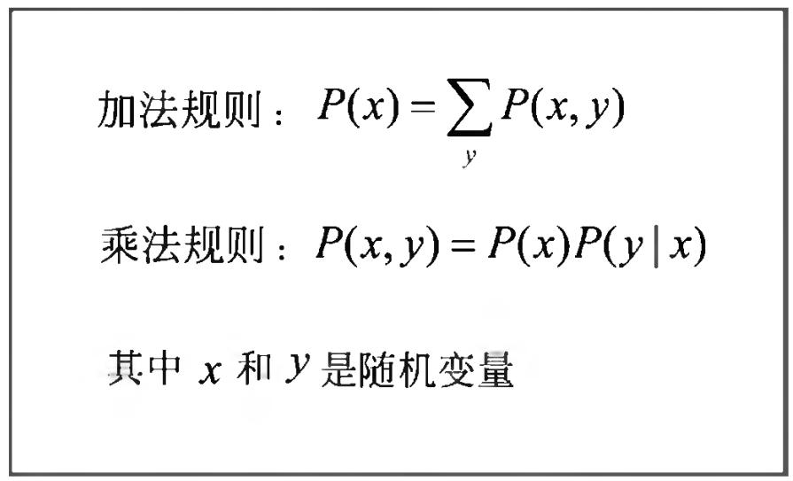

> 图1.4 基本概率公式

#### 2. 线性模型与非线性模型

统计学习模型，特别是非概率模型，可以分为线性模型（linear model）和非线性模型（non-linear model）。如果函数 $y = f(x)$ 或 $z = g(x)$ 是线性函数，则称模型是线性模型，否则称模型是非线性模型。

本书介绍的感知机、线性支持向量机、 $k$ 近邻、 $k$ 均值、潜在语义分析是线性模型。核函数支持向量机、AdaBoost、神经网络是非线性模型。

深度学习（deep learning）实际是复杂神经网络的学习，也就是复杂的非线性模型的学习。

#### 3. 参数化模型与非参数化模型

统计学习模型又可以分为参数化模型（parametric model）和非参数化模型（non-parametric model）。参数化模型假设模型参数的维度固定，模型可以由有限维参数完全刻画；非参数化模型假设模型参数的维度不固定或者说无穷大，随着训练数据量的增加而不断增大。

本书介绍的感知机、朴素贝叶斯、逻辑斯谛回归、 $k$ 均值、高斯混合模型是参数化模型。决策树、支持向量机、AdaBoost、 $k$ 近邻、潜在语义分析、概率潜在语义分析、潜在狄利克雷分配是非参数化模型。

参数化模型适合问题简单的情况，现实中问题往往比较复杂，非参数化模型更加有效。

### 1.2.3 按算法分类

统计学习根据算法，可以分为在线学习（online learning）与批量学习（batch learning）。在线学习是指每次接受一个样本，进行预测，之后学习模型，并不断重复该操作的机器学习。与之对应，批量学习一次接受所有数据，学习模型，之后进行预测。有些实际应用的场景要求学习必须是在线的。比如，数据依次达到无法存储，系统需要及时做出处理；数据规模很大，不可能一次处理所有数据；数据的模式随时间动态变化，需要算法快速适应新的模式（不满足独立同分布假设）。

在线学习可以是监督学习，也可以是无监督学习，强化学习本身就拥有在线学习的特点。以下只考虑在线的监督学习。

学习和预测在一个系统，每次接受一个输入 $x_{t}$ ，用已有模型给出预测 $\hat{f}(x_{t})$ ，之后得到相应的反馈，即该输入对应的输出 $y_{t}$ ；系统用损失函数计算两者的差异，更新模型；并不断重复以上操作。见图1.5。

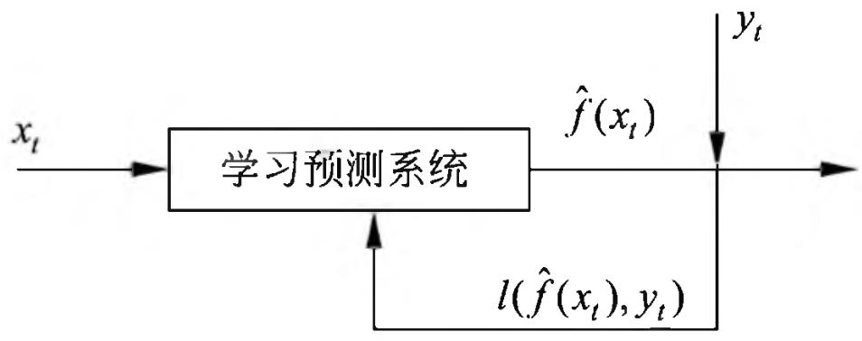

> 图1.5 在线学习

利用随机梯度下降的感知机学习算法就是在线学习算法。

在线学习通常比批量学习更难，很难学到预测准确率更高的模型，因为每次模型更新中，可利用的数据有限。

### 1.2.4 按技巧分类

统计学习方法可以根据其使用的技巧进行分类。

#### 1. 贝叶斯学习

贝叶斯学习（Bayesian learning），又称为贝叶斯推理（Bayesian inference），是统计学、机器学习中重要的方法。其主要想法是，在概率模型的学习和推理中，利用贝叶斯定理，计算在给定数据条件下模型的条件概率，即后验概率，并应用这个原理进行模型的估计，以及对数据的预测。将模型、未观测要素及其参数用变量表示，使用模型的先验分布是贝叶斯学习的特点。贝叶斯学习中也使用基本概率公式（图1.4）。

本书介绍的朴素贝叶斯、潜在狄利克雷分配的学习属于贝叶斯学习。

假设随机变量 $D$ 表示数据，随机变量 $\theta$ 表示模型参数。根据贝叶斯定理，可以用以下公式计算后验概率 $P(\theta | D)$ ：

$$
P (\theta | D) = \frac {P (\theta) P (D | \theta)}{P (D)} \tag {1.3}
$$

其中 $P(\theta)$ 是先验概率， $P(D|\theta)$ 是似然函数。

模型估计时，估计整个后验概率分布 $P(\theta |D)$ 。如果需要给出一个模型，通常取后验概率最大的模型。

预测时，计算数据对后验概率分布的期望值：

$$
P (x \mid D) = \int P (x \mid \theta , D) P (\theta \mid D) \mathrm {d} \theta \tag {1.4}
$$

这里 $x$ 是新样本。

贝叶斯估计与极大似然估计在思想上有很大的不同，代表着统计学中贝叶斯学派和频率学派对统计的不同认识。其实，可以简单地把两者联系起来，假设先验分布是均匀分布，取后验概率最大，就能从贝叶斯估计得到极大似然估计。图1.6对贝叶斯估计和极大似然估计进行比较。

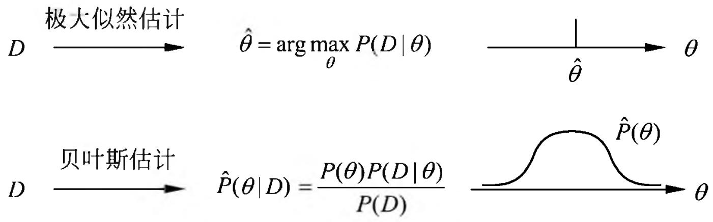

> 图1.6 贝叶斯估计与极大似然估计

#### 2. 核方法

核方法（kernel method）是使用核函数表示和学习非线性模型的一种机器学习方法，可以用于监督学习和无监督学习。有一些线性模型的学习方法基于相似度计算，更具体地，向量内积计算。核方法可以把它们扩展到非线性模型的学习，使其应用范围更广泛。

本书介绍的核函数支持向量机，以及核PCA、核 $k$ 均值属于核方法。

把线性模型扩展到非线性模型，直接的做法是显式地定义从输入空间（低维空间）到特征空间（高维空间）的映射，在特征空间中进行内积计算。比如，支持向量机，把输入空间的线性不可分问题转化为特征空间的线性可分问题，如图1.7所示。核方法的技巧在于不显式地定义这个映射，而是直接定义核函数，即映射之后在特征空间的内积。这样可以简化计算，达到同样的效果。

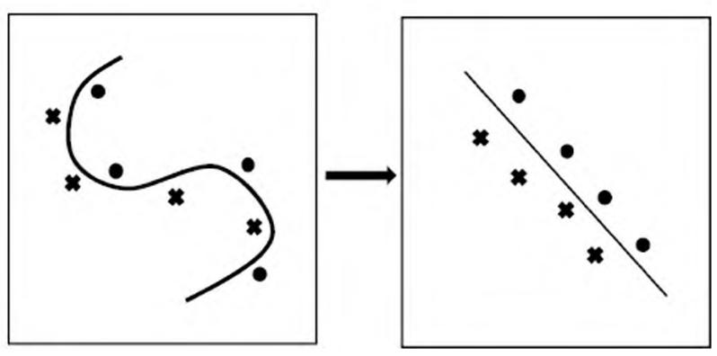

> 图1.7 输入空间到特征空间的映射

假设 $x_{1}$ 和 $x_{2}$ 是输入空间的任意两个实例（向量），其内积是 $\langle x_1,x_2\rangle$ 。假设从输入空间到特征空间的映射是 $\varphi$ ，于是 $x_{1}$ 和 $x_{2}$ 在特征空间的映像是 $\varphi (x_{1})$ 和 $\varphi (x_{2})$ 其内积是 $\langle \varphi (x_1),\varphi (x_2)\rangle$ 。核方法直接在输入空间中定义核函数 $K(x_{1},x_{2})$ ，使其满足 $K(x_{1},x_{2}) = \langle \varphi (x_{1}),\varphi (x_{2})\rangle$ 。表示定理给出核函数技巧成立的充要条件。

## 1.3 统计学习方法三要素

统计学习方法都是由模型、策略和算法构成的，即统计学习方法由三要素构成，可以简单地表示为：

$$
\text {方 法} = \text {模 型} + \text {策 略} + \text {算 法}
$$

下面论述监督学习中的统计学习三要素。非监督学习、强化学习也同样拥有这三要素。可以说构建一种统计学习方法就是确定具体的统计学习三要素。

### 1.3.1 模型

统计学习首要考虑的问题是学习什么样的模型。在监督学习过程中，模型就是所要学习的条件概率分布或决策函数。模型的假设空间（hypothesis space）包含所有可能的条件概率分布或决策函数。例如，假设决策函数是输入变量的线性函数，那么模型的假设空间就是所有这些线性函数构成的函数集合。假设空间中的模型一般有无穷多个。

假设空间用 $\mathcal{F}$ 表示。假设空间可以定义为决策函数的集合：

$$
\mathcal {F} = \{f | Y = f (X) \} \tag {1.5}
$$

其中， $X$ 和 $Y$ 是定义在输入空间 $\mathcal{X}$ 和输出空间 $\mathcal{Y}$ 上的变量。这时 $\mathcal{F}$ 通常是由一个参数向量决定的函数族：

$$
\mathcal {F} = \{f | Y = f _ {\theta} (X), \theta \in \mathbf {R} ^ {n} \} \tag {1.6}
$$

参数向量 $\theta$ 取值于 $n$ 维欧氏空间 $\mathbf{R}^n$ ，称为参数空间（parameter space）。

假设空间也可以定义为条件概率的集合：

$$
\mathcal {F} = \{P | P (Y | X) \} \tag {1.7}
$$

其中， $X$ 和 $Y$ 是定义在输入空间 $\mathcal{X}$ 和输出空间 $\mathcal{Y}$ 上的随机变量。这时 $\mathcal{F}$ 通常是由一个参数向量决定的条件概率分布族：

$$
\mathcal {F} = \left\{P \mid P _ {\theta} (Y | X), \theta \in \mathbf {R} ^ {n} \right\} \tag {1.8}
$$

参数向量 $\theta$ 取值于 $n$ 维欧氏空间 $\mathbf{R}^n$ ，也称为参数空间。

本书中称由决策函数表示的模型为非概率模型，由条件概率表示的模型为概率模型。为了简便起见，当论及模型时，有时只用其中一种模型。

### 1.3.2 策略

有了模型的假设空间，统计学习接着需要考虑的是按照什么样的准则学习或选择最优的模型。统计学习的目标在于从假设空间中选取最优模型。

首先引入损失函数与风险函数的概念。损失函数度量模型一次预测的好坏，风险函数度量平均意义下模型预测的好坏。

#### 1. 损失函数和风险函数

监督学习问题是在假设空间 $\mathcal{F}$ 中选取模型 $f$ 作为决策函数，对于给定的输入 $X$ ，由 $f(X)$ 给出相应的输出 $Y$ ，这个输出的预测值 $f(X)$ 与真实值 $Y$ 可能一致也可能不一致，用一个损失函数（loss function）或代价函数（cost function）来度量预测错误的程度。损失函数是 $f(X)$ 和 $Y$ 的非负实值函数，记作 $L(Y, f(X))$ 。

统计学习常用的损失函数有以下几种：

(1) 0-1 损失函数 (0-1 loss function)

$$
L (Y, f (X)) = \left\{ \begin{array}{l l} 1, & Y \neq f (X) \\ 0, & Y = f (X) \end{array} \right. \tag {1.9}
$$

(2) 平方损失函数 (quadratic loss function)

$$
L (Y, f (X)) = \left(Y - f (X)\right) ^ {2} \tag {1.10}
$$

（3）绝对损失函数（absolute loss function）

$$
L (Y, f (X)) = | Y - f (X) | \tag {1.11}
$$

（4）对数损失函数（logarithmic loss function）或对数似然损失函数（log-likelihood loss function）

$$
L (Y, P (Y | X)) = - \log P (Y | X) \tag {1.12}
$$

损失函数值越小，模型就越好。由于模型的输入、输出 $(X,Y)$ 是随机变量，遵循联合分布 $P(X,Y)$ ，所以损失函数的期望是

$$
\begin{array}{l} R _ {\mathrm {e x p}} (f) = E _ {P} [ L (Y, f (X)) ] \\ = \int_ {\mathcal {X} \times \mathcal {Y}} L (y, f (x)) P (x, y) \mathrm {d} x \mathrm {d} y \tag {1.13} \\ \end{array}
$$

这是理论上模型 $f(X)$ 关于联合分布 $P(X,Y)$ 的平均意义下的损失，称为风险函数（risk function）或期望损失（expected loss）。

学习的目标就是选择期望风险最小的模型。由于联合分布 $P(X,Y)$ 是未知的， $R_{\mathrm{exp}}(f)$ 不能直接计算。实际上，如果知道联合分布 $P(X,Y)$ ，可以从联合分布直接求出条件概率分布 $P(Y|X)$ ，也就不需要学习了。正因为不知道联合概率分布，所以才需要进行学习。这样一来，一方面根据期望风险最小学习模型要用到联合分布，另一方面联合分布又是未知的，所以监督学习就成为一个病态问题（ill-formed problem）。

给定一个训练数据集

$$
T = \{(x _ {1}, y _ {1}), (x _ {2}, y _ {2}), \dots , (x _ {N}, y _ {N}) \}
$$

模型 $f(X)$ 关于训练数据集的平均损失称为经验风险（empirical risk）或经验损失（empirical loss），记作 $R_{\mathrm{emp}}$

$$
R _ {\mathrm {e m p}} (f) = \frac {1}{N} \sum_ {i = 1} ^ {N} L \left(y _ {i}, f \left(x _ {i}\right)\right) \tag {1.14}
$$

期望风险 $R_{\mathrm{exp}}(f)$ 是模型关于联合分布的期望损失，经验风险 $R_{\mathrm{emp}}(f)$ 是模型关于训练样本集的平均损失。根据大数定律，当样本容量 $N$ 趋于无穷时，经验风险 $R_{\mathrm{emp}}(f)$ 趋于期望风险 $R_{\mathrm{exp}}(f)$ 。所以一个很自然的想法是用经验风险估计期望风险。但是，由于现实中训练样本数目有限，甚至很小，所以用经验风险估计期望风险常常并不理想，要对经验风险进行一定的矫正。这就关系到监督学习的两个基本策略：经验风险最小化和结构风险最小化。

#### 2. 经验风险最小化与结构风险最小化

在假设空间、损失函数以及训练数据集确定的情况下，经验风险函数式(1.14)就可以确定。经验风险最小化（empirical risk minimization，ERM）的策略认为，经验风险最小的模型是最优的模型。根据这一策略，按照经验风险最小化求最优模型就是求解最优化问题：

$$
\min  _ {f \in \mathcal {F}} \frac {1}{N} \sum_ {i = 1} ^ {N} L \left(y _ {i}, f \left(x _ {i}\right)\right) \tag {1.15}
$$

其中， $\mathcal{F}$ 是假设空间。

当样本容量足够大时，经验风险最小化能保证有很好的学习效果，在现实中被广泛采用。比如，极大似然估计（maximum likelihood estimation）就是经验风险最小化的一个例子。当模型是条件概率分布、损失函数是对数损失函数时，经验风险最小化就等价于极大似然估计。

但是，当样本容量很小时，经验风险最小化学习的效果就未必很好，会产生“过拟合”（over-fitting）现象。

结构风险最小化（structural risk minimization，SRM）是为了防止过拟合而提出来的策略。结构风险最小化等价于正则化（regularization）。结构风险在经验风险上加上表示模型复杂度的正则化项（regularizer）或罚项（penalty term）。在假设空间、损失函数以及训练数据集确定的情况下，结构风险的定义是：

$$
R _ {\operatorname {s r m}} (f) = \frac {1}{N} \sum_ {i = 1} ^ {N} L \left(y _ {i}, f \left(x _ {i}\right)\right) + \lambda J (f) \tag {1.16}
$$

其中 $J(f)$ 为模型的复杂度，是定义在假设空间 $\mathcal{F}$ 上的泛函。模型 $f$ 越复杂，复杂度 $J(f)$ 就越大；反之，模型 $f$ 越简单，复杂度 $J(f)$ 就越小。也就是说，复杂度表示了对复杂模型的惩罚。 $\lambda \geqslant 0$ 是系数，用以权衡经验风险和模型复杂度。结构风险小需要经验风险与模型复杂度同时小。结构风险小的模型往往对训练数据以及未知的测试数据都有较好的预测。

比如，贝叶斯估计中的最大后验概率估计（maximum posterior probability estimation，MAP）就是结构风险最小化的一个例子。当模型是条件概率分布、损失函数是对数损失函数、模型复杂度由模型的先验概率表示时，结构风险最小化就等价于最大后验概率估计。

结构风险最小化的策略认为结构风险最小的模型是最优的模型。所以求最优模型，就是求解最优化问题：

$$
\min  _ {f \in \mathcal {F}} \frac {1}{N} \sum_ {i = 1} ^ {N} L \left(y _ {i}, f \left(x _ {i}\right)\right) + \lambda J (f) \tag {1.17}
$$

这样，监督学习问题就变成了经验风险或结构风险函数的最优化问题(1.15)和(1.17)。这时经验或结构风险函数是最优化的目标函数。

### 1.3.3 算法

算法是指学习模型的具体计算方法。统计学习基于训练数据集，根据学习策略，从假设空间中选择最优模型，最后需要考虑用什么样的计算方法求解最优模型。

这时，统计学习问题归结为最优化问题，统计学习的算法成为求解最优化问题的算法。如果最优化问题有显式的解析解，这个最优化问题就比较简单。但通常解析解不存在，这就需要用数值计算的方法求解。如何保证找到全局最优解，并使求解的过程非常高效，就成为一个重要问题。统计学习可以利用已有的最优化算法，有时也需要开发独自的最优化算法。

统计学习方法之间的不同，主要来自其模型、策略、算法的不同。确定了模型、策略、算法，统计学习的方法也就确定了。这就是将其称为统计学习方法三要素的原因。以下介绍监督学习的几个重要概念。

## 1.4 模型评估与模型选择

### 1.4.1 训练误差与测试误差

统计学习的目的是使学到的模型不仅对已知数据而且对未知数据都能有很好的预测能力。不同的学习方法会给出不同的模型。当损失函数给定时，基于损失函数的模型的训练误差（training error）和模型的测试误差（test error）就自然成为学习方法评估的标准。注意，统计学习方法具体采用的损失函数未必是评估时使用的损失函数。当然，让两者一致是比较理想的。

假设学习到的模型是 $Y = \hat{f}(X)$ ，训练误差是模型 $Y = \hat{f}(X)$ 关于训练数据集的平均损失：

$$
R _ {\mathrm {e m p}} (\hat {f}) = \frac {1}{N} \sum_ {i = 1} ^ {N} L \left(y _ {i}, \hat {f} \left(x _ {i}\right)\right) \tag {1.18}
$$

其中 $N$ 是训练样本容量。

测试误差是模型 $Y = \hat{f}(X)$ 关于测试数据集的平均损失：

$$
e _ {\text {t e s t}} = \frac {1}{N ^ {\prime}} \sum_ {i = 1} ^ {N ^ {\prime}} L \left(y _ {i}, \hat {f} \left(x _ {i}\right)\right) \tag {1.19}
$$

其中 $N^{\prime}$ 是测试样本容量。

例如，当损失函数是0-1损失时，测试误差就变成了常见的测试数据集上的误差率（error rate）：

$$
e _ {\text {t e s t}} = \frac {1}{N ^ {\prime}} \sum_ {i = 1} ^ {N ^ {\prime}} I \left(y _ {i} \neq \hat {f} \left(x _ {i}\right)\right) \tag {1.20}
$$

这里 $I$ 是指示函数（indicator function），即 $y \neq \hat{f}(x)$ 时为1，否则为0。

相应地，常见的测试数据集上的准确率（accuracy）为

$$
r _ {\text {t e s t}} = \frac {1}{N ^ {\prime}} \sum_ {i = 1} ^ {N ^ {\prime}} I \left(y _ {i} = \hat {f} \left(x _ {i}\right)\right) \tag {1.21}
$$

显然，

$$
r _ {\mathrm {t e s t}} + e _ {\mathrm {t e s t}} = 1
$$

训练误差的大小，对判断给定的问题是不是一个容易学习的问题是有意义的，但本质上不重要。测试误差反映了学习方法对未知的测试数据集的预测能力，是学习中的重要概念。显然，给定两种学习方法，测试误差小的方法具有更好的预测能力，是更有效的方法。通常将学习方法对未知数据的预测能力称为泛化能力（generalization ability），这个问题将在1.6节继续论述。

### 1.4.2 过拟合与模型选择

当假设空间含有不同复杂度（例如，不同的参数个数）的模型时，就要面临模型选择（model selection）的问题。我们希望选择或学习一个合适的模型。如果在假设空间中存在“真”模型，那么所选择的模型应该逼近真模型。具体地，所选择的模型要与真模型的参数个数相同，所选择的模型的参数向量与真模型的参数向量相近。

如果一味追求提高对训练数据的预测能力，所选模型的复杂度则往往会比真模型更高。这种现象称为过拟合（over-fitting）。过拟合是指学习时选择的模型所包含的参数过多，以至出现这一模型对已知数据预测得很好，但对未知数据预测得很差的现象。可以说模型选择旨在避免过拟合并提高模型的预测能力。

下面，以多项式函数拟合问题为例，说明过拟合与模型选择。这是一个回归问题。

例1.1 假设给定一个训练数据集①：

> - ① 本例来自参考文献 [2]。

$$
T = \{(x _ {1}, y _ {1}), (x _ {2}, y _ {2}), \dots , (x _ {N}, y _ {N}) \}
$$

其中， $x_{i}\in \mathbf{R}$ 是输入 $x$ 的观测值， $y_{i}\in \mathbf{R}$ 是相应的输出 $y$ 的观测值， $i = 1,2,\dots ,N$ 。

多项式函数拟合的任务是假设给定数据由 $M$ 次多项式函数生成，选择最有可能产生这些数据的 $M$ 次多项式函数，即在 $M$ 次多项式函数中选择一个对已知数据以及未知数据都有很好预测能力的函数。

假设给定如图1.8所示的10个数据点，用 $0 \sim 9$ 次多项式函数对数据进行拟合。图中画出了需要用多项式函数曲线拟合的数据。

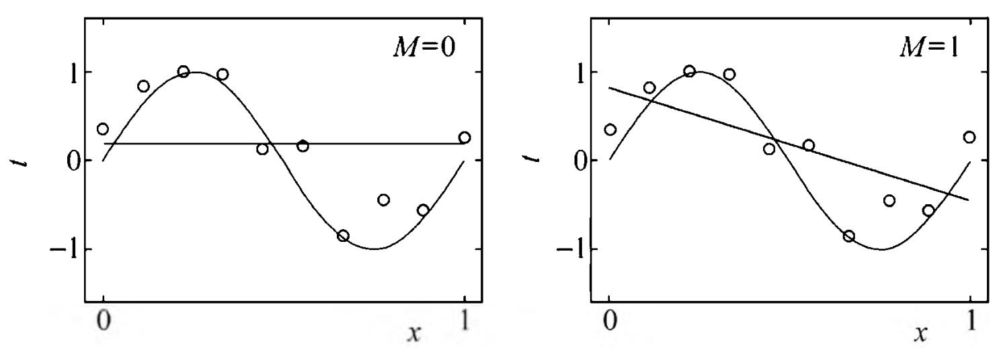

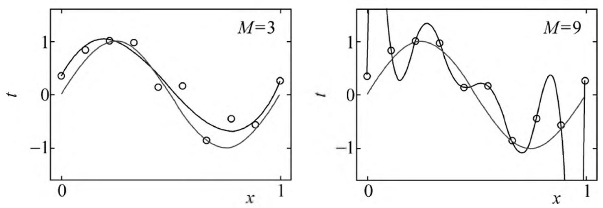

> 图1.8 $M$ 次多项式函数拟合问题的例子

设 $M$ 次多项式为

$$
f _ {M} (x, w) = w _ {0} + w _ {1} x + w _ {2} x ^ {2} + \dots + w _ {M} x ^ {M} = \sum_ {j = 0} ^ {M} w _ {j} x ^ {j} \tag {1.22}
$$

式中 $x$ 是单变量输入， $w_0, w_1, \dots, w_M$ 是 $M + 1$ 个参数。

解决这一问题的方法可以是这样的。首先确定模型的复杂度，即确定多项式的次数；然后在给定的模型复杂度下，按照经验风险最小化的策略，求解参数，即多项式的系数。具体地，求以下经验风险最小化：

$$
L (w) = \frac {1}{2} \sum_ {i = 1} ^ {N} \left(f \left(x _ {i}, w\right) - y _ {i}\right) ^ {2} \tag {1.23}
$$

这时，损失函数为平方损失，系数 $\frac{1}{2}$ 是为了计算方便。

这是一个简单的最优化问题。将模型与训练数据代入式 (1.23) 中，有

$$
L (w) = \frac {1}{2} \sum_ {i = 1} ^ {N} \left(\sum_ {j = 0} ^ {M} w _ {j} x _ {i} ^ {j} - y _ {i}\right) ^ {2}
$$

这一问题可用最小二乘法求得拟合多项式系数的唯一解，记作 $w_0^*, w_1^*, \dots, w_M^*$ 。求解过程这里不予叙述，读者可参阅有关材料。

图1.8给出了 $M = 0$ ， $M = 1$ ， $M = 3$ 及 $M = 9$ 时多项式函数拟合的情况。如果 $M = 0$ ，多项式曲线是一个常数，数据拟合效果很差。如果 $M = 1$ ，多项式曲线是一条直线，数据拟合效果也很差。相反，如果 $M = 9$ ，多项式曲线通过每个数据点，训练误差为0。从对给定训练数据拟合的角度来说，效果是最好的。但是，因为训练数据本身存在噪声，这种拟合曲线对未知数据的预测能力往往并不是最好的，在实际学习中并不可取。这时过拟合现象就会发生。这就是说，模型选择时，不仅要考虑对已知数据的预测能力，而且还要考虑对未知数据的预测能力。当 $M = 3$ 时，多项式曲线对训练数据拟合效果足够好，模型也比较简单，是一个较好的选择。

在多项式函数拟合中可以看到，随着多项式次数（模型复杂度）的增加，训练误差会减小，直至趋向于0，但是测试误差却不如此，它会随着多项式次数（模型复杂度）的增加先减小而后增大。而最终的目的是使测试误差达到最小。这样，在多项式函数拟合中，就要选择合适的多项式次数，以达到这一目的。这一结论对一般的模型选择也是成立的。

图1.9描述了训练误差和测试误差与模型的复杂度之间的关系。当模型的复杂度增大时，训练误差会逐渐减小并趋向于0；而测试误差会先减小，达到最小值后又增大。当选择的模型复杂度过大时，过拟合现象就会发生。这样，在学习时就要防止过

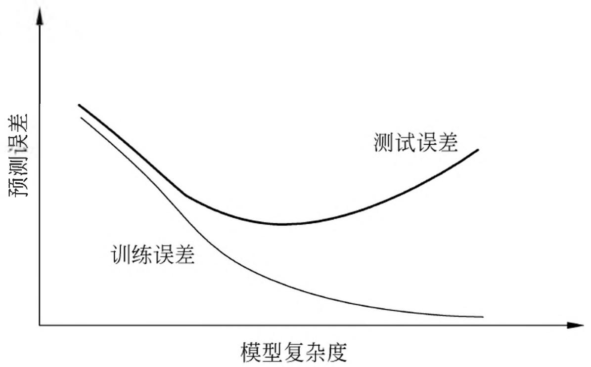

> 图1.9 训练误差和测试误差与模型复杂度的关系

拟合，进行最优的模型选择，即选择复杂度适当的模型，以达到使测试误差最小的学习目的。下面介绍两种常用的模型选择方法：正则化与交叉验证。

## 1.5 正则化与交叉验证

### 1.5.1 正则化

模型选择的典型方法是正则化（regularization）。正则化是结构风险最小化策略的实现，是在经验风险上加一个正则化项（regularizer）或罚项（penalty term）。正则化项一般是模型复杂度的单调递增函数，模型越复杂，正则化值就越大。比如，正则化项可以是模型参数向量的范数。

正则化一般具有如下形式：

$$
\min  _ {f \in \mathcal {F}} \frac {1}{N} \sum_ {i = 1} ^ {N} L \left(y _ {i}, f \left(x _ {i}\right)\right) + \lambda J (f) \tag {1.24}
$$

其中，第1项是经验风险，第2项是正则化项， $\lambda \geqslant 0$ 为调整两者之间关系的系数。

正则化项可以取不同的形式。例如，回归问题中，损失函数是平方损失，正则化项可以是参数向量的 $L_{2}$ 范数：

$$
L (w) = \frac {1}{N} \sum_ {i = 1} ^ {N} \left(f \left(x _ {i}; w\right) - y _ {i}\right) ^ {2} + \frac {\lambda}{2} \| w \| ^ {2} \tag {1.25}
$$

这里， $\| w\|$ 表示参数向量 $w$ 的 $L_{2}$ 范数。

正则化项也可以是参数向量的 $L_{1}$ 范数：

$$
L (w) = \frac {1}{N} \sum_ {i = 1} ^ {N} \left(f \left(x _ {i}; w\right) - y _ {i}\right) ^ {2} + \lambda \| w \| _ {1} \tag {1.26}
$$

这里， $\| w \|_1$ 表示参数向量 $w$ 的 $L_1$ 范数。

第1项的经验风险较小的模型可能较复杂（有多个非零参数），这时第2项的模型复杂度会较大。正则化的作用是选择经验风险与模型复杂度同时较小的模型。

正则化符合奥卡姆剃刀（Occam's razor）原理。奥卡姆剃刀原理应用于模型选择时变为以下想法：在所有可能选择的模型中，能够很好地解释已知数据并且十分简单才是最好的模型，也就是应该选择的模型。从贝叶斯估计的角度来看，正则化项对应于模型的先验概率。可以假设复杂的模型有较小的先验概率，简单的模型有较大的先验概率。

### 1.5.2 交叉验证

另一种常用的模型选择方法是交叉验证（cross validation）。

如果给定的样本数据充足，进行模型选择的一种简单方法是随机地将数据集切分成三部分，分别为训练集（training set）、验证集（validation set）和测试集（test set）。训练集用来训练模型，验证集用于模型的选择，而测试集用于最终对学习方法的评估。在学习到的不同复杂度的模型中，选择对验证集有最小预测误差的模型。由于验证集有足够多的数据，用它对模型进行选择也是有效的。

但是，在许多实际应用中数据是不充足的。为了选择好的模型，可以采用交叉验证方法。交叉验证的基本想法是重复地使用数据；把给定的数据进行切分，将切分的数据集组合为训练集与测试集，在此基础上反复地进行训练、测试以及模型选择。

#### 1. 简单交叉验证

简单交叉验证方法是：首先随机地将已给数据分为两部分，一部分作为训练集，另一部分作为测试集（例如， $70\%$ 的数据为训练集， $30\%$ 的数据为测试集）；然后用训练集在各种条件下（例如，不同的参数个数）训练模型，从而得到不同的模型；在测试集上评价各个模型的测试误差，选出测试误差最小的模型。

#### 2. $S$ 折交叉验证

应用最多的是 $S$ 折交叉验证（ $S$ -fold cross validation），方法如下：首先随机地将已给数据切分为 $S$ 个互不相交、大小相同的子集；然后利用 $S - 1$ 个子集的数据训练模型，利用余下的子集测试模型；将这一过程对可能的 $S$ 种选择重复进行；最后选出 $S$ 次评测中平均测试误差最小的模型。

#### 3. 留一交叉验证

$S$ 折交叉验证的特殊情形是 $S = N$ ，称为留一交叉验证（leave-one-out cross validation），往往在数据缺乏的情况下使用。这里， $N$ 是给定数据集的容量。

## 1.6 泛化能力

### 1.6.1 泛化误差

学习方法的泛化能力（generalization ability）是指由该方法学习到的模型对未知数据的预测能力，是学习方法本质上重要的性质。现实中采用最多的办法是通过测试误差来评价学习方法的泛化能力。但这种评价是依赖于测试数据集的。因为测试数据集是有限的，很有可能由此得到的评价结果是不可靠的。统计学习理论试图从理论上对学习方法的泛化能力进行分析。

首先给出泛化误差的定义。如果学到的模型是 $\hat{f}$ ，那么用这个模型对未知数据预测的误差即为泛化误差（generalization error）：

$$
\begin{array}{l} R _ {\exp} (\hat {f}) = E _ {P} \left[ L (Y, \hat {f} (X)) \right] \\ = \int_ {\mathcal {X} \times \mathcal {Y}} L (y, \hat {f} (x)) P (x, y) d x d y \tag {1.27} \\ \end{array}
$$

泛化误差反映了学习方法的泛化能力，如果一种方法学习的模型比另一种方法学习的模型具有更小的泛化误差，那么这种方法就更有效。事实上，泛化误差就是所学习到的模型的期望风险。

### 1.6.2 泛化误差上界

学习方法的泛化能力分析往往是通过研究泛化误差的概率上界进行的，简称为泛化误差上界（generalization error bound）。具体来说，就是通过比较两种学习方法的泛化误差上界的大小来比较它们的优劣。泛化误差上界通常具有以下性质：它是样本容量的函数，当样本容量增加时，泛化上界趋于0；它是假设空间容量（capacity）的函数，假设空间容量越大，模型就越难学，泛化误差上界就越大。

下面给出一个简单的泛化误差上界的例子：二类分类问题的泛化误差上界。

考虑二类分类问题。已知训练数据集 $T = \{(x_{1},y_{1}),(x_{2},y_{2}),\dots ,(x_{N},y_{N})\}$ ， $N$ 是样本容量， $T$ 是从联合概率分布 $P(X,Y)$ 独立同分布产生的， $X\in \mathbf{R}^n$ ， $Y\in \{-1, + 1\}$ 。假设空间是函数的有限集合 $\mathcal{F} = \{f_1,f_2,\dots ,f_d\}$ ， $d$ 是函数个数。设 $f$ 是从 $\mathcal{F}$ 中选取的函数。损失函数是0-1损失。关于 $f$ 的期望风险和经验风险分别是

$$
R (f) = E [ L (Y, f (X)) ] \tag {1.28}
$$

$$
\hat {R} (f) = \frac {1}{N} \sum_ {i = 1} ^ {N} L \left(y _ {i}, f \left(x _ {i}\right)\right) \tag {1.29}
$$

经验风险最小化函数是

$$
f _ {N} = \arg \min  _ {f \in \mathcal {F}} \hat {R} (f) \tag {1.30}
$$

$f_{N}$ 依赖训练数据集的样本容量 $N$ 。人们更关心的是 $f_{N}$ 的泛化能力

$$
R \left(f _ {N}\right) = E \left[ L \left(Y, f _ {N} (X)\right) \right] \tag {1.31}
$$

下面讨论从有限集合 $\mathcal{F} = \{f_1, f_2, \dots, f_d\}$ 中任意选出的函数 $f$ 的泛化误差上界。

定理1.1（泛化误差上界）对二类分类问题，当假设空间是有限个函数的集合 $\mathcal{F} = \{f_1,f_2,\dots ,f_d\}$ 时，对任意一个函数 $f\in \mathcal{F}$ ，至少以概率 $1 - \delta$ ， $0 <   \delta <  1$ ，以下不等式成立：

$$
R (f) \leqslant \hat {R} (f) + \varepsilon (d, N, \delta) \tag {1.32}
$$

其中，

$$
\varepsilon (d, N, \delta) = \sqrt {\frac {1}{2 N} \left(\log d + \log \frac {1}{\delta}\right)} \tag {1.33}
$$

不等式 (1.32) 左端 $R(f)$ 是泛化误差，右端即为泛化误差上界。在泛化误差上界中，第 1 项是训练误差，训练误差越小，泛化误差也越小。第 2 项 $\varepsilon(d, N, \delta)$ 是 $N$ 的单调递减函数，当 $N$ 趋于无穷时趋于 0；同时它也是 $\sqrt{\log d}$ 阶的函数，假设空间 $\mathcal{F}$ 包含的函数越多，其值越大。

证明 在证明中要用到Hoeffding不等式，先叙述如下。

设 $X_{1}, X_{2}, \dots, X_{N}$ 是独立随机变量，且 $X_{i} \in [a_{i}, b_{i}]$ ， $i = 1, 2, \dots, N$ ； $\bar{X}$ 是 $X_{1}, X_{2}, \dots, X_{N}$ 的经验均值，即 $\bar{X} = \frac{1}{N} \sum_{i=1}^{N} X_{i}$ ，则对任意 $t > 0$ ，以下不等式成立：

$$
P \left[ \bar {X} - E (\bar {X}) \geqslant t \right] \leqslant \exp \left(- \frac {2 N ^ {2} t ^ {2}}{\sum_ {i = 1} ^ {N} \left(b _ {i} - a _ {i}\right) ^ {2}}\right) \tag {1.34}
$$

$$
P \left[ E (\bar {X}) - \bar {X} \geqslant t \right] \leqslant \exp \left(- \frac {2 N ^ {2} t ^ {2}}{\sum_ {i = 1} ^ {N} \left(b _ {i} - a _ {i}\right) ^ {2}}\right) \tag {1.35}
$$

Hoeffding 不等式的证明省略了，这里用来推导泛化误差上界。

对任意函数 $f \in \mathcal{F}$ , $\hat{R}(f)$ 是 $N$ 个独立的随机变量 $L(Y, f(X))$ 的样本均值, $R(f)$ 是随机变量 $L(Y, f(X))$ 的期望值。如果损失函数取值于区间 $[0,1]$ , 即对所有 $i$ , $[a_i, b_i] = [0,1]$ , 那么由Hoeffding不等式(1.35)不难得知, 对 $\varepsilon > 0$ , 以下不等式成立:

$$
P (R (f) - \hat {R} (f) \geqslant \varepsilon) \leqslant \exp (- 2 N \varepsilon^ {2}) \tag {1.36}
$$

由于 $\mathcal{F} = \{f_1, f_2, \dots, f_d\}$ 是一个有限集合，故

$$
\begin{array}{l} P (\exists f \in \mathcal {F}: R (f) - \hat {R} (f) \geqslant \varepsilon) = P \Big (\bigcup_ {f \in \mathcal {F}} \{R (f) - \hat {R} (f) \geqslant \varepsilon \} \Big) \\ \leqslant \sum_ {f \in \mathcal {F}} P (R (f) - \hat {R} (f) \geqslant \varepsilon) \\ \leqslant d \exp (- 2 N \varepsilon^ {2}) \\ \end{array}
$$

或者等价的，对任意 $f\in \mathcal{F}$ ，有

$$
P (R (f) - \hat {R} (f) <   \varepsilon) \geqslant 1 - d \exp (- 2 N \varepsilon^ {2}) \tag {1.37}
$$

令

$$
\delta = d \exp \left(- 2 N \varepsilon^ {2}\right) \tag {1.38}
$$

则

$$
P (R (f) <   \hat {R} (f) + \varepsilon) \geqslant 1 - \delta
$$

即至少以概率 $1 - \delta$ 有 $R(f) < \hat{R}(f) + \varepsilon$ ，其中 $\varepsilon$ 由式 (1.38) 得到，即为式 (1.33)。从泛化误差上界可知，

$$
R \left(f _ {N}\right) \leqslant \hat {R} \left(f _ {N}\right) + \varepsilon (d, N, \delta) \tag {1.39}
$$

其中， $\varepsilon(d, N, \delta)$ 由式 (1.33) 定义， $f_N$ 由式 (1.30) 定义。

以上讨论的只是假设空间包含有限个函数情况下的泛化误差上界，对一般的假设空间要找到泛化误差界就没有这么简单，这里不作介绍。

## 1.7 生成模型与判别模型

监督学习的任务就是学习一个模型，应用这一模型，对给定的输入预测相应的输出。这个模型的一般形式为决策函数：

$$
Y = f (X)
$$

或者条件概率分布：

$$
P (Y | X)
$$

监督学习方法又可以分为生成方法(generative approach)和判别方法(discriminative approach)。所学到的模型分别称为生成模型（generative model）和判别模型（discriminative model）。

生成方法由数据学习联合概率分布 $P(X,Y)$ ，然后求出条件概率分布 $P(Y|X)$ 作为预测的模型，即生成模型：

$$
P (Y | X) = \frac {P (X , Y)}{P (X)} \tag {1.40}
$$

这样的方法之所以称为生成方法，是因为模型表示了给定输入 $X$ 产生输出 $Y$ 的生成关系。典型的生成模型有朴素贝叶斯法和隐马尔可夫模型，将在后面章节进行相关讲述。

判别方法由数据直接学习决策函数 $f(X)$ 或者条件概率分布 $P(Y|X)$ 作为预测的模型，即判别模型。判别方法关心的是对给定的输入 $X$ ，应该预测什么样的输出 $Y$ 。典型的判别模型包括： $k$ 近邻法、感知机、决策树、逻辑斯谛回归模型、最大熵模型、支持向量机、提升方法和条件随机场等，将在后面章节讲述。

在监督学习中，生成方法和判别方法各有优缺点，适合于不同条件下的学习问题。

生成方法的特点：生成方法可以还原出联合概率分布 $P(X,Y)$ ，而判别方法则不能；生成方法的学习收敛速度更快，即当样本容量增加的时候，学到的模型可以更快地收敛于真实模型；当存在隐变量时，仍可以用生成方法学习，此时判别方法就不能用。

判别方法的特点：判别方法直接学习的是条件概率 $P(Y|X)$ 或决策函数 $f(X)$ ，直接面对预测，往往学习的准确率更高；由于直接学习 $P(Y|X)$ 或 $f(X)$ ，可以对数据进行各种程度上的抽象、定义特征并使用特征，因此可以简化学习问题。

## 1.8 监督学习应用

监督学习的应用主要在三个方面：分类问题、标注问题和回归问题。

### 1.8.1 分类问题

分类是监督学习的一个核心问题。在监督学习中，当输出变量 $Y$ 取有限个离散值时，预测问题便成为分类问题。这时，输入变量 $X$ 可以是离散的，也可以是连续的。监督学习从数据中学习一个分类模型或分类决策函数，称为分类器（classifier）。分类器对新的输入进行输出的预测，称为分类（classification）。可能的输出称为类别（class）。分类的类别为多个时，称为多类分类问题。本书主要讨论二类分类问题。

分类问题包括学习和分类两个过程。在学习过程中，根据已知的训练数据集利用有效的学习方法学习一个分类器；在分类过程中，利用学习的分类器对新的输入实例进行分类。分类问题可用图1.10描述。图中 $(x_{1},y_{1}),(x_{2},y_{2}),\dots ,(x_{N},y_{N})$ 是训练数据集，学习系统由训练数据学习一个分类器 $P(Y|X)$ 或 $Y = f(X)$ ；分类系统通过学到的分类器 $P(Y|X)$ 或 $Y = f(X)$ 对于新的输入实例 $x_{N + 1}$ 进行分类，即预测其输出的类标记 $y_{N + 1}$ 。

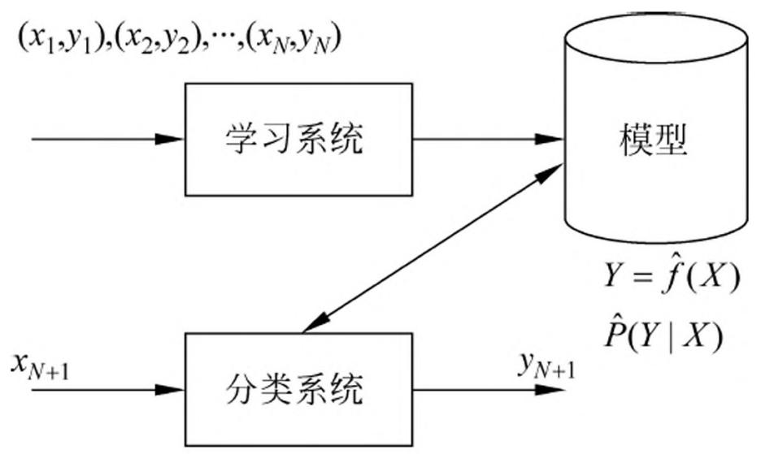

> 图1.10 分类问题

评价分类器性能的指标一般是分类准确率（accuracy），其定义是：对于给定的测试数据集，分类器正确分类的样本数与总样本数之比。也就是损失函数是0-1损失时测试数据集上的准确率（见式(1.21)）。

对于二类分类问题常用的评价指标是精确率（precision）与召回率（recall）。通常以关注的类为正类，其他类为负类，分类器在测试数据集上的预测或正确或不正确，4种情况出现的总数分别记作：

TP——将正类预测为正类数；

FN——将正类预测为负类数；

FP——将负类预测为正类数；

TN——将负类预测为负类数。

精确率定义为

$$
P = \frac {\mathrm {T P}}{\mathrm {T P} + \mathrm {F P}} \tag {1.41}
$$

召回率定义为

$$
R = \frac {\mathrm {T P}}{\mathrm {T P} + \mathrm {F N}} \tag {1.42}
$$

此外，还有 $F_{1}$ 值，是精确率和召回率的调和均值，即

$$
\frac {2}{F _ {1}} = \frac {1}{P} + \frac {1}{R} \tag {1.43}
$$

$$
F _ {1} = \frac {2 \mathrm {T P}}{2 \mathrm {T P} + \mathrm {F P} + \mathrm {F N}} \tag {1.44}
$$

精确率和召回率都高时， $F_{1}$ 值也会高。

许多统计学习方法可以用于分类，包括 $k$ 近邻法、感知机、朴素贝叶斯法、决策树、决策列表、逻辑斯谛回归模型、支持向量机、提升方法、贝叶斯网络、神经网络、Winnow 等。本书将讲述其中一些主要方法。

分类在于根据其特性将数据“分门别类”，所以在许多领域都有广泛的应用。例如，在银行业务中，可以构建一个客户分类模型，对客户按照贷款风险的大小进行分类；在网络安全领域，可以利用日志数据的分类对非法入侵进行检测；在图像处理中，分类可以用来检测图像中是否有人脸出现；在手写识别中，分类可以用于识别手写的数字；在互联网搜索中，网页的分类可以帮助网页的抓取、索引与排序。

举一个分类应用的例子——文本分类 (text classification)。这里的文本可以是新闻报道、网页、电子邮件、学术论文等。类别往往是关于文本内容的，例如政治、经济、体育等；也有关于文本特点的，如正面意见、反面意见；还可以根据应用确定，如垃圾邮件、非垃圾邮件等。文本分类是根据文本的特征将其划分到已有的类中。输入是文本的特征向量，输出是文本的类别。通常把文本中的单词定义为特征，每个单词对应一个特征。单词的特征可以是二值的，如果单词在文本中出现则取值是1，否则是0；也可以是多值的，表示单词在文本中出现的频率。直观地，如果“股票”“银行”“货币”这些词出现很多，这个文本可能属于经济类；如果“网球”“比赛”“运动员”这些词频繁出现，这个文本可能属于体育类。

### 1.8.2 标注问题

标注（tagging）也是一个监督学习问题。可以认为标注问题是分类问题的一个推广，标注问题又是更复杂的结构预测（structure prediction）问题的简单形式。标注问题的输入是一个观测序列，输出是一个标记序列或状态序列。标注问题的目标在于学习一个模型，使它能够对观测序列给出标记序列作为预测。注意，可能的标记个数是有限的，但其组合所成的标记序列的个数是依序列长度呈指数级增长的。

标注问题分为学习和标注两个过程（如图1.11所示）。首先给定一个训练数据集

$$
T = \left\lbrace (x _ {1}, y _ {1}), (x _ {2}, y _ {2}), \dots , (x _ {N}, y _ {N}) \right\rbrace
$$

这里， $x_{i} = (x_{i}^{(1)},x_{i}^{(2)},\dots ,x_{i}^{(n)})^{\mathrm{T}}$ ， $i = 1,2,\dots ,N$ ，是输入观测序列； $y_{i} = (y_{i}^{(1)},y_{i}^{(2)},\dots ,y_{i}^{(n)})^{\mathrm{T}}$ 是相应的输出标记序列； $n$ 是序列的长度，对不同样本可以有不同的值。学习系统基于训练数据集构建一个模型，表示为条件概率分布：

$$
P \left(Y ^ {(1)}, Y ^ {(2)}, \dots , Y ^ {(n)} \mid X ^ {(1)}, X ^ {(2)}, \dots , X ^ {(n)}\right)
$$

这里，每一个 $X^{(i)} (i = 1,2,\dots ,n)$ 取值为所有可能的观测，每一个 $Y^{(i)} (i = 1,2,\dots ,n)$ 取值为所有可能的标记，一般 $n \ll N$ 。标注系统按照学习得到的条件概率分布模型，对新的输入观测序列找到相应的输出标记序列。具体地，对一个观测序列 $x_{N + 1} = (x_{N + 1}^{(1)},x_{N + 1}^{(2)},\dots ,x_{N + 1}^{(n)})^{\mathrm{T}}$ 找到使条件概率 $P((y_{N + 1}^{(1)},y_{N + 1}^{(2)},\dots ,y_{N + 1}^{(n)})^{\mathrm{T}}|(x_{N + 1}^{(1)},x_{N + 1}^{(2)},\dots ,x_{N + 1}^{(n)})^{\mathrm{T}})$ 最大的标记序列 $y_{N + 1} = (y_{N + 1}^{(1)},y_{N + 1}^{(2)},\dots ,y_{N + 1}^{(n)})^{\mathrm{T}}$ 。

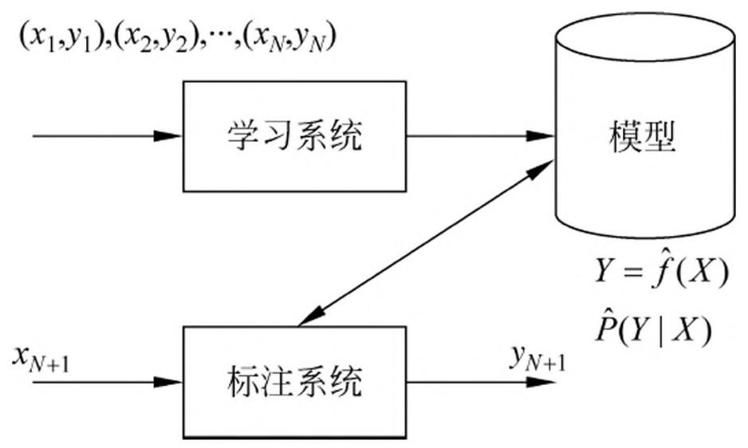

> 图1.11 标注问题

评价标注模型的指标与评价分类模型的指标一样，常用的有标注准确率、精确率和召回率。其定义与分类模型相同。

标注常用的统计学习方法有：隐马尔可夫模型、条件随机场。

标注问题在信息抽取、自然语言处理等领域被广泛应用，是这些领域的基本问题。例如，自然语言处理中的词性标注（part of speech tagging）就是一个典型的标注问题：给定一个由单词组成的句子，对这个句子中的每一个单词进行词性标注，即对一个单词序列预测其对应的词性标记序列。

举一个信息抽取的例子。从英文文章中抽取基本名词短语（base noun phrase）。为此，要对文章进行标注。英文单词是一个观测，英文句子是一个观测序列，标记表示名词短语的“开始”、“结束”或“其他”（分别以B，E，O表示），标记序列表示英文句子中基本名词短语的所在位置。信息抽取时，将标记“开始”到标记“结束”的单词作为名词短语。例如，给出以下的观测序列，即英文句子，标注系统产生相应的标记序列，即给出句子中的基本名词短语。

输入: At Microsoft Research, we have an insatiable curiosity and the desire to create new technology that will help define the computing experience.输出: At/O Microsoft/B Research/E, we/O have/O an/O insatiable/B curiosity/E and/O the/O desire/BE to/O create/O new/B technology/E that/O will/O help/O define/O the/O computing/B experience/E.

### 1.8.3 回归问题

回归（regression）是监督学习的另一个重要问题。回归用于预测输入变量（自变量）和输出变量（因变量）之间的关系，特别是当输入变量的值发生变化时，输出变量的值随之发生的变化。回归模型正是表示从输入变量到输出变量之间映射的函数。回归问题的学习等价于函数拟合：选择一条函数曲线使其很好地拟合已知数据且很好地预测未知数据（参照1.4.2节）。

回归问题分为学习和预测两个过程（如图1.12所示）。首先给定一个训练数据集：

$$
T = \left\lbrace (x _ {1}, y _ {1}), (x _ {2}, y _ {2}), \dots , (x _ {N}, y _ {N}) \right\rbrace
$$

这里， $x_{i} \in \mathbf{R}^{n}$ 是输入， $y \in \mathbf{R}$ 是对应的输出， $i = 1,2,\dots ,N$ 。学习系统基于训练数据构建一个模型，即函数 $Y = f(X)$ ；对新的输入 $x_{N + 1}$ ，预测系统根据学习的模型 $Y = f(X)$ 确定相应的输出 $y_{N + 1}$ 。

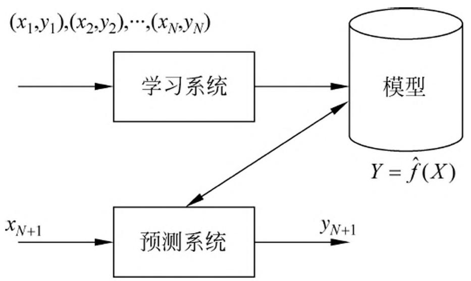

> 图1.12 回归问题

回归问题按照输入变量的个数，分为一元回归和多元回归；按照输入变量和输出变量之间关系的类型即模型的类型，分为线性回归和非线性回归。

回归学习最常用的损失函数是平方损失函数，在此情况下，回归问题可以由著名的最小二乘法（least squares）求解。

许多领域的任务都可以形式化为回归问题，比如，回归可以用于商务领域，作为市场趋势预测、产品质量管理、客户满意度调查、投资风险分析的工具。作为例子，简单介绍股价预测问题。假设知道某一公司在过去不同时间点（比如，每天）的市场上的股票价格（比如，股票平均价格），以及在各个时间点之前可能影响该公司股价的信息（比如，该公司前一周的营业额、利润）。目标是从过去的数据学习一个模型，使它可以基于当前的信息预测该公司下一个时间点的股票价格。可以将这个问题作为回归问题解决。具体地，将影响股价的信息视为自变量（输入的特征），而将股价视为因变量（输出的值）。将过去的数据作为训练数据就可以学习一个回归模型，并对未来的股价进行预测。可以看出这是一个困难的预测问题，因为影响股价的因素非常多，我们未必能判断到哪些信息（输入的特征）有用并能得到这些信息。

## 本章概要

- 1. 统计学习或机器学习是关于计算机基于数据构建概率统计模型并运用模型对数据进行分析与预测的一门学科。统计学习包括监督学习、无监督学习和强化学习。
- 2. 统计学习方法三要素——模型、策略、算法，对理解统计学习方法起到提纲挈领的作用。
- 3. 本书第1篇主要讨论监督学习，监督学习可以概括如下：从给定有限的训练数据出发，假设数据是独立同分布的，而且假设模型属于某个假设空间，应用某一评价准则，从假设空间中选取一个最优的模型，使它对已给训练数据及未知测试数据在给定评价标准意义下有最准确的预测。
- 4. 统计学习中，进行模型选择或者说提高学习的泛化能力是一个重要问题。如果只考虑减少训练误差，就可能产生过拟合现象。模型选择的方法有正则化与交叉验证。学习方法泛化能力的分析是统计学习理论研究的重要课题。
- 5. 分类问题、标注问题和回归问题都是监督学习的重要问题。本书第1篇介绍的统计学习方法包括感知机、 $k$ 近邻法、朴素贝叶斯法、决策树、逻辑斯谛回归与最大熵模型、支持向量机、提升方法、EM算法、隐马尔可夫模型和条件随机场。这些方法是主要的分类、标注以及回归方法。它们又可以归类为生成方法与判别方法。

## 继续阅读

关于统计学习或机器学习方法一般介绍的书籍可以参阅文献[1-8]。

## 习题

- 1.1 说明伯努利模型的极大似然估计以及贝叶斯估计中的统计学习方法三要素。伯努利模型是定义在取值为0与1的随机变量上的概率分布。假设观测到伯努利模型 $n$ 次独立的数据生成结果，其中 $k$ 次的结果为1，这时可以用极大似然估计或贝叶斯估计来估计结果为1的概率。
- 1.2 通过经验风险最小化推导极大似然估计。证明模型是条件概率分布，当损失函数是对数损失函数时，经验风险最小化等价于极大似然估计。

## 参考文献

- [1] Hastie T, Tibshirani R, Friedman J. The elements of statistical learning: data mining, inference, and prediction. Springer. 2001. (中译本: 统计学习基础——数据挖掘、推理与预测. 范明, 柴玉梅, 晋红英等译. 北京: 电子工业出版社, 2004.)
- [2] Bishop M. Pattern recognition and machine learning. Springer, 2006.
- [3] Daphne Koller, Nir Friedman. Probabilistic graphical models: principles and techniques. MIT Press, 2009.
- [4] Ian Goodfellow, Yoshua Bengio, Aaron Courville, et al. Deep learning. MIT Press, 2016.
- [5] Tom M. Michelle. Machine learning. McGraw-Hill Companies, Inc. 1997. (中译本: 机器学习. 北京: 机械工业出版社, 2003.)
- [6] David Barber. Bayesian reasoning and machine learning. Cambridge University Press, 2012.
- [7] Richard S Sutton, Andrew G Barto. Reinforcement learning: an introduction. MIT Press, 1998.
- [8] 周志华. 机器学习. 北京: 清华大学出版社, 2017.