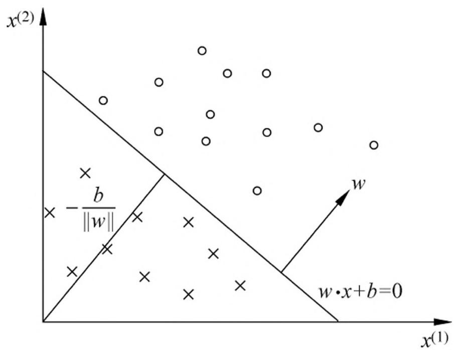
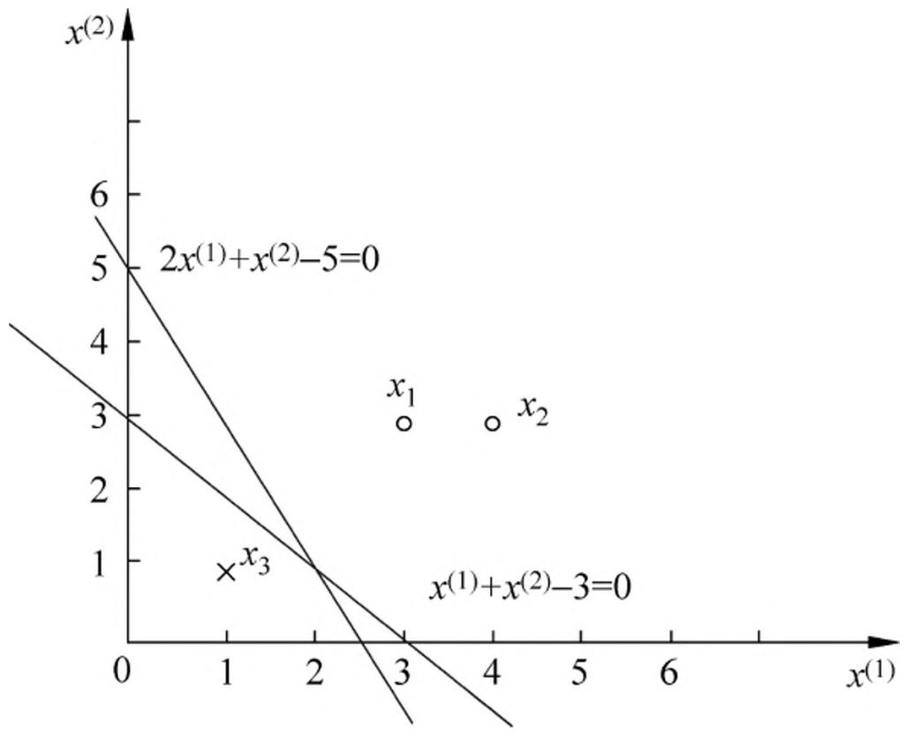

# 第 2 章 感知机

感知机（perceptron）是二类分类的线性分类模型，其输入为实例的特征向量，输出为实例的类别，取 $+1$ 和 $-1$ 二值。感知机对应于输入空间（特征空间）中将实例划分为正负两类的分离超平面，属于判别模型。感知机学习旨在求出将训练数据进行线性划分的分离超平面，为此，导入基于误分类的损失函数，利用梯度下降法对损失函数进行极小化，求得感知机模型。感知机学习算法具有简单而易于实现的优点，分为原始形式和对偶形式。感知机预测是用学习得到的感知机模型对新的输入实例进行分类。感知机 1957 年由 Rosenblatt 提出，是神经网络与支持向量机的基础。

本章首先介绍感知机模型；然后叙述感知机的学习策略，特别是损失函数；最后介绍感知机学习算法，包括原始形式和对偶形式，并证明算法的收敛性。

## 2.1 感知机模型

定义 2.1（感知机）假设输入空间（特征空间）是 $\mathcal{X} \subseteq \mathbf{R}^n$ ，输出空间是 $\mathcal{Y} = \{+1, -1\}$ 。输入 $x \in \mathcal{X}$ 表示实例的特征向量，对应于输入空间（特征空间）的点；输出 $y \in \mathcal{Y}$ 表示实例的类别。由输入空间到输出空间的如下函数：

$$
f (x) = \operatorname {s i g n} (w \cdot x + b) \tag {2.1}
$$

称为感知机。其中， $w$ 和 $b$ 为感知机模型参数， $w \in \mathbf{R}^n$ 叫作权值（weight）或权值向量（weight vector）， $b \in \mathbf{R}$ 叫作偏置（bias）， $w \cdot x$ 表示 $w$ 和 $x$ 的内积。sign 是符号函数，即

$$
\operatorname {s i g n} (x) = \left\{ \begin{array}{l l} + 1, & x \geqslant 0 \\ - 1, & x <   0 \end{array} \right. \tag {2.2}
$$

感知机是一种线性分类模型，属于判别模型。感知机模型的假设空间是定义在特征空间中的所有线性分类模型（linear classification model）或线性分类器（linear classifier），即函数集合 $\{f|f(x) = w\cdot x + b\}$ 。

感知机有如下几何解释：线性方程

$$
w \cdot x + b = 0 \tag {2.3}
$$

对应于特征空间 $\mathbf{R}^n$ 中的一个超平面 $S$ ，其中 $w$ 是超平面的法向量， $b$ 是超平面的截距。这个超平面将特征空间划分为两个部分。位于两部分的点（特征向量）分别被分为正、负两类。因此，超平面 $S$ 称为分离超平面（separating hyperplane），如图 2.1 所示。

> 图 2.1 感知机模型

感知机学习，由训练数据集（实例的特征向量及类别）

$$
T = \left\{\left(x _ {1}, y _ {1}\right), \left(x _ {2}, y _ {2}\right), \dots , \left(x _ {N}, y _ {N}\right) \right\}
$$

其中， $x_{i}\in \mathcal{X} = \mathbf{R}^{n},y_{i}\in \mathcal{Y} = \{+1, - 1\} ,i = 1,2,\dots ,N$ ，求得感知机模型（2.1)，即求得模型参数 $w,b$ 。感知机预测，通过学习得到的感知机模型，对于新的输入实例给出其对应的输出类别。

## 2.2 感知机学习策略

### 2.2.1 数据集的线性可分性

定义 2.2（数据集的线性可分性） 给定一个数据集

$$
T = \left\{\left(x _ {1}, y _ {1}\right), \left(x _ {2}, y _ {2}\right), \dots , \left(x _ {N}, y _ {N}\right) \right\}
$$

其中， $x_{i}\in \mathcal{X} = \mathbf{R}^{n},y_{i}\in \mathcal{Y} = \{+1, - 1\} ,i = 1,2,\dots ,N,$ ，如果存在某个超平面 $S$

$$
w \cdot x + b = 0
$$

能够将数据集的正实例点和负实例点完全正确地划分到超平面的两侧，即对所有 $y_{i} = +1$ 的实例 $i$ ，有 $w \cdot x_{i} + b > 0$ ，对所有 $y_{i} = -1$ 的实例 $i$ ，有 $w \cdot x_{i} + b < 0$ ，则称数据集 $T$ 为线性可分数据集（linearly separable data set）；否则，称数据集 $T$ 线性不可分。

### 2.2.2 感知机学习策略

假设训练数据集是线性可分的，感知机学习的目标是求得一个能够将训练集正实例点和负实例点完全正确分开的分离超平面。为了找出这样的超平面，即确定感知机模型参数 $w, b$ ，需要确定一个学习策略，即定义（经验）损失函数并将损失函数极小化。

损失函数的一个自然选择是误分类点的总数。但是，这样的损失函数不是参数 $w$ ， $b$ 的连续可导函数，不易优化。损失函数的另一个选择是误分类点到超平面 $S$ 的总距离，这是感知机所采用的。为此，首先写出输入空间 $\mathbf{R}^n$ 中任一点 $x_0$ 到超平面 $S$ 的距离：

$$
\frac {1}{\| w \|} \left| w \cdot x _ {0} + b \right|
$$

这里， $\| w\|$ 是 $w$ 的 $L_{2}$ 范数。

其次，对于误分类的数据 $(x_{i},y_{i})$ 来说，

$$
- y _ {i} (w \cdot x _ {i} + b) > 0
$$

成立。因为当 $w \cdot x_{i} + b > 0$ 时， $y_{i} = -1$ ；而当 $w \cdot x_{i} + b < 0$ 时， $y_{i} = +1$ 。因此，误分类点 $x_{i}$ 到超平面 $S$ 的距离是

$$
- \frac {1}{\| w \|} y _ {i} (w \cdot x _ {i} + b)
$$

这样，假设超平面 $S$ 的误分类点集合为 $M$ ，那么所有误分类点到超平面 $S$ 的总距离为

$$
- \frac {1}{\| w \|} \sum_ {x _ {i} \in M} y _ {i} (w \cdot x _ {i} + b)
$$

不考虑 $\frac{1}{\|w\|}$ ，就得到感知机学习的损失函数 ①。

> - ① 第 7 章中会介绍 $y(w \cdot x + b)$ 称为样本点的函数间隔。

给定训练数据集

$$
T = \left\{\left(x _ {1}, y _ {1}\right), \left(x _ {2}, y _ {2}\right), \dots , \left(x _ {N}, y _ {N}\right) \right\}
$$

其中， $x_{i}\in \mathcal{X} = \mathbf{R}^{n},y_{i}\in \mathcal{Y} = \{+1, - 1\} ,i = 1,2,\dots ,N.$ 感知机 $\mathrm{sign}(w\bullet x + b)$ 学习的损失函数定义为

$$
L (w, b) = - \sum_ {x _ {i} \in M} y _ {i} (w \cdot x _ {i} + b) \tag {2.4}
$$

其中 $M$ 为误分类点的集合。这个损失函数就是感知机学习的经验风险函数。

显然，损失函数 $L(w, b)$ 是非负的。如果没有误分类点，损失函数值是 0。而且，误分类点越少，误分类点离超平面越近，损失函数值就越小。一个特定的样本点的损失函数：在误分类时是参数 $w, b$ 的线性函数，在正确分类时是 0。因此，给定训练数据集 $T$ ，损失函数 $L(w, b)$ 是 $w, b$ 的连续可导函数。

感知机学习的策略是在假设空间中选取使损失函数式（2.4）最小的模型参数 $w, b$ ，即感知机模型。

## 2.3 感知机学习算法

感知机学习问题转化为求解损失函数式（2.4）的最优化问题，最优化的方法是随机梯度下降法。本节叙述感知机学习的具体算法，包括原始形式和对偶形式，并证明在训练数据线性可分条件下感知机学习算法的收敛性。

### 2.3.1 感知机学习算法的原始形式

感知机学习算法是对以下最优化问题的算法。给定一个训练数据集

$$
T = \left\{\left(x _ {1}, y _ {1}\right), \left(x _ {2}, y _ {2}\right), \dots , \left(x _ {N}, y _ {N}\right) \right\}
$$

其中， $x_{i}\in \mathcal{X} = \mathbf{R}^{n},y_{i}\in \mathcal{Y} = \{-1,1\}$ ， $i = 1,2,\dots ,N$ ，求参数 $w,b$ ，使其为以下损失函数极小化问题的解

$$
\min  _ {w, b} L (w, b) = - \sum_ {x _ {i} \in M} y _ {i} (w \cdot x _ {i} + b) \tag {2.5}
$$

其中 $M$ 为误分类点的集合。

感知机学习算法是误分类驱动的，具体采用随机梯度下降法（stochastic gradientdescent）。首先，任意选取一个超平面 $w_0, b_0$ ，然后用梯度下降法不断地极小化目标函数（2.5）。极小化过程中不是一次使 $M$ 中所有误分类点的梯度下降，而是一次随机选取一个误分类点使其梯度下降。

假设误分类点集合 $M$ 是固定的，那么损失函数 $L(w, b)$ 的梯度由

$$
\nabla_ {w} L (w, b) = - \sum_ {x _ {i} \in M} y _ {i} x _ {i}
$$

$$
\nabla_ {b} L (w, b) = - \sum_ {x _ {i} \in M} y _ {i}
$$

给出。

随机选取一个误分类点 $(x_{i},y_{i})$ ，对 $w,b$ 进行更新：

$$
w \leftarrow w + \eta y _ {i} x _ {i} \tag {2.6}
$$

$$
b \leftarrow b + \eta y _ {i} \tag {2.7}
$$

式中 $\eta (0 < \eta \leqslant 1)$ 是步长，在统计学习中又称为学习率（learning rate）。这样，通过迭代可以期待损失函数 $L(w,b)$ 不断减小，直到为 0。综上所述，得到如下算法：

#### 算法 2.1（感知机学习算法的原始形式）

输入：训练数据集 $T = \{(x_{1},y_{1}),(x_{2},y_{2}),\dots ,(x_{N},y_{N})\}$ ，其中 $x_{i}\in \mathcal{X} = \mathbf{R}^{n}$ ， $y_{i}\in$ $\mathcal{V} = \{-1, + 1\}$ ， $i = 1,2,\dots ,N$ ；学习率 $\eta (0 <   \eta \leqslant 1)$输出: $w, b$ ; 感知机模型 $f(x) = \operatorname{sign}(w \cdot x + b)$ 。

- （1）选取初值 $w_0, b_0$
- (2) 在训练集中选取数据 $(x_{i}, y_{i})$ ;
- （3）如果 $y_{i}(w\bullet x_{i} + b)\leqslant 0,$

$$
w \leftarrow w + \eta y _ {i} x _ {i}
$$

$$
b \gets b + \eta y _ {i}
$$

(4) 转至 (2), 直至训练集中没有误分类点。

这种学习算法直观上有如下解释：当一个实例点被误分类，即位于分离超平面的错误一侧时，则调整 $w, b$ 的值，使分离超平面向该误分类点的一侧移动，以减少该误分类点与超平面间的距离，直至超平面越过该误分类点使其被正确分类。

算法 2.1 是感知机学习的基本算法，对应于后面的对偶形式，称为原始形式。感知机学习算法简单且易于实现。

例 2.1 如图 2.2 所示的训练数据集，其正实例点是 $x_{1} = (3,3)^{\mathrm{T}}$ ， $x_{2} = (4,3)^{\mathrm{T}}$ 负实例点是 $x_{3} = (1,1)^{\mathrm{T}}$ ，试用感知机学习算法的原始形式求感知机模型 $f(x) = \operatorname{sign}(w\bullet x + b)$ 。这里， $w = (w^{(1)},w^{(2)})^{\mathrm{T}}$ ， $x = (x^{(1)},x^{(2)})^{\mathrm{T}}$ 。

> 图 2.2 感知机示例

解 构建最优化问题：

$$
\min  _ {w, b} L (w, b) = - \sum_ {x _ {i} \in M} y _ {i} (w \cdot x _ {i} + b)
$$

按照算法 2.1 求解 $w, b \circ \eta = 1$ 。

- （1）取初值 $w_0 = 0$ ， $b_{0} = 0$
- (2) 对 $x_{1} = (3, 3)^{\mathrm{T}}$ , $y_{1}(w_{0} \cdot x_{1} + b_{0}) = 0$ , 未能被正确分类, 更新 $w, b$

$$
w _ {1} = w _ {0} + y _ {1} x _ {1} = (3, 3) ^ {\mathrm {T}}, b _ {1} = b _ {0} + y _ {1} = 1
$$

得到线性模型

$$
w _ {1} \bullet x + b _ {1} = 3 x ^ {(1)} + 3 x ^ {(2)} + 1
$$

（3）对 $x_{1}, x_{2}$ ，显然， $y_{i}(w_{1} \cdot x_{i} + b_{1}) > 0$ ，被正确分类，不修改 $w, b$ ；

对 $x_{3} = (1,1)^{\mathrm{T}}$ ， $y_{3}(w_{1}\bullet x_{3} + b_{1}) < 0$ ，被误分类，更新 $w,b_{\circ}$

$$
w _ {2} = w _ {1} + y _ {3} x _ {3} = (2, 2) ^ {\mathrm {T}}, b _ {2} = b _ {1} + y _ {3} = 0
$$

得到线性模型

$$
w _ {2} \cdot x + b _ {2} = 2 x ^ {(1)} + 2 x ^ {(2)}
$$

如此继续下去，直到

$$
w _ {7} = (1, 1) ^ {\mathrm {T}}, b _ {7} = - 3
$$

$$
w _ {7} \cdot x + b _ {7} = x ^ {(1)} + x ^ {(2)} - 3
$$

对所有数据点 $y_{i}(w_{7} \cdot x_{i} + b_{7}) > 0$ ，没有误分类点，损失函数达到极小。

分离超平面为: $x^{(1)} + x^{(2)} - 3 = 0$感知机模型为： $f(x) = \mathrm{sign}(x^{(1)} + x^{(2)} - 3)$迭代过程见表 2.1。

**表 2.1 例 2.1 求解的迭代过程**

<table><tr><td>迭代次数</td><td>误分类点</td><td>w</td><td>b</td><td>w·x+b</td></tr><tr><td>0</td><td></td><td>0</td><td>0</td><td>0</td></tr><tr><td>1</td><td>x1</td><td>(3,3)T</td><td>1</td><td>3x(1)+3x(2)+1</td></tr><tr><td>2</td><td>x3</td><td>(2,2)T</td><td>0</td><td>2x(1)+2x(2)</td></tr><tr><td>3</td><td>x3</td><td>(1,1)T</td><td>-1</td><td>x(1)+x(2)-1</td></tr><tr><td>4</td><td>x3</td><td>(0,0)T</td><td>-2</td><td>-2</td></tr><tr><td>5</td><td>x1</td><td>(3,3)T</td><td>-1</td><td>3x(1)+3x(2)-1</td></tr><tr><td>6</td><td>x3</td><td>(2,2)T</td><td>-2</td><td>2x(1)+2x(2)-2</td></tr><tr><td>7</td><td>x3</td><td>(1,1)T</td><td>-3</td><td>x(1)+x(2)-3</td></tr><tr><td>8</td><td>0</td><td>(1,1)T</td><td>-3</td><td>x(1)+x(2)-3</td></tr></table>

这是在计算中误分类点先后取 $x_{1}, x_{3}, x_{3}, x_{3}, x_{1}, x_{3}, x_{3}$ 得到的分离超平面和感知机模型。如果在计算中误分类点依次取 $x_{1}, x_{3}, x_{3}, x_{3}, x_{2}, x_{3}, x_{3}, x_{3}, x_{1}, x_{3}, x_{3}$ ，那么得到的分离超平面是 $2x^{(1)} + x^{(2)} - 5 = 0$ 。

可见，感知机学习算法由于采用不同的初值或选取不同的误分类点，解可以不同。

### 2.3.2 算法的收敛性

现在证明，对于线性可分数据集感知机学习算法原始形式收敛，即经过有限次迭代可以得到一个将训练数据集完全正确划分的分离超平面及感知机模型。

为了便于叙述与推导，将偏置 $b$ 并入权重向量 $\boldsymbol{w}$ ，记作 $\hat{w} = (w^{\mathrm{T}}, b)^{\mathrm{T}}$ ，同样也将输入向量加以扩充，加进常数 1，记作 $\hat{x} = (x^{\mathrm{T}}, 1)^{\mathrm{T}}$ 。这样， $\hat{x} \in \mathbf{R}^{n+1}$ ， $\hat{w} \in \mathbf{R}^{n+1}$ 。显然， $\hat{w} \cdot \hat{x} = w \cdot x + b$ 。

定理 2.1（Novikoff）设训练数据集 $T = \{(x_{1},y_{1}),(x_{2},y_{2}),\dots ,(x_{N},y_{N})\}$ 是线性可分的，其中 $x_{i}\in \mathcal{X} = \mathbf{R}^{n}$ ， $y_{i}\in \mathcal{V} = \{-1, + 1\}$ ， $i = 1,2,\dots ,N$ ，则(1) 存在满足条件 $\| \hat{w}_{\mathrm{opt}} \| = 1$ 的超平面 $\hat{w}_{\mathrm{opt}} \cdot \hat{x} = w_{\mathrm{opt}} \cdot x + b_{\mathrm{opt}} = 0$ 将训练数据集完全正确分开；且存在 $\gamma > 0$ ，对所有 $i = 1,2,\dots,N$

$$
y _ {i} \left(\hat {w} _ {\text {o p t}} \cdot \hat {x} _ {i}\right) = y _ {i} \left(w _ {\text {o p t}} \cdot x _ {i} + b _ {\text {o p t}}\right) \geqslant \gamma \tag {2.8}
$$

(2) 令 $R = \max_{1 \leqslant i \leqslant N} \| \hat{x}_i \|$ ，则感知机算法 2.1 在训练数据集上的误分类次数 $k$ 满足不等式

$$
k \leqslant \left(\frac {R}{\gamma}\right) ^ {2} \tag {2.9}
$$

证明（1）由于训练数据集是线性可分的，按照定义 2.2，存在超平面可将训练数据集完全正确分开，取此超平面为 $\hat{w}_{\mathrm{opt}}\cdot \hat{x} = w_{\mathrm{opt}}\cdot x + b_{\mathrm{opt}} = 0$ ，使 $\| \hat{w}_{\mathrm{opt}}\| = 1$ 。由于对有限的 $i = 1,2,\dots ,N$ ，均有

$$
y _ {i} (\hat {w} _ {\mathrm {o p t}} \bullet \hat {x} _ {i}) = y _ {i} (w _ {\mathrm {o p t}} \bullet x _ {i} + b _ {\mathrm {o p t}}) > 0
$$

所以存在

$$
\gamma = \operatorname * {m i n} _ {i} \{y _ {i} (w _ {\mathrm {o p t}} \bullet x _ {i} + b _ {\mathrm {o p t}}) \}
$$

使

$$
y _ {i} (\hat {w} _ {\mathrm {o p t}} \bullet \hat {x} _ {i}) = y _ {i} (w _ {\mathrm {o p t}} \bullet x _ {i} + b _ {\mathrm {o p t}}) \geqslant \gamma
$$

（2）感知机算法从 $\hat{w}_0 = 0$ 开始，如果实例被误分类，则更新权重。令 $\hat{w}_{k - 1}$ 是第 $k$ 个误分类实例之前的扩充权重向量，即

$$
\hat {w} _ {k - 1} = \left(w _ {k - 1} ^ {\mathrm {T}}, b _ {k - 1}\right) ^ {\mathrm {T}}
$$

则第 $k$ 个误分类实例的条件是

$$
y _ {i} \left(\hat {w} _ {k - 1} \cdot \hat {x} _ {i}\right) = y _ {i} \left(w _ {k - 1} \cdot x _ {i} + b _ {k - 1}\right) \leqslant 0 \tag {2.10}
$$

若 $(x_{i},y_{i})$ 是被 $\hat{w}_{k - 1} = (w_{k - 1}^{\mathrm{T}},b_{k - 1})^{\mathrm{T}}$ 误分类的数据，则 $w$ 和 $b$ 的更新是

$$
w _ {k} \leftarrow w _ {k - 1} + \eta y _ {i} x _ {i}
$$

$$
b _ {k} \leftarrow b _ {k - 1} + \eta y _ {i}
$$

即

$$
\hat {w} _ {k} = \hat {w} _ {k - 1} + \eta y _ {i} \hat {x} _ {i} \tag {2.11}
$$

下面推导两个不等式 (2.12) 及 (2.13):

$$
\hat {w} _ {k} \cdot \hat {w} _ {\text {o p t}} \geqslant k \eta \gamma \tag {2.12}
$$

由式 (2.11) 及式 (2.8) 得

$$
\begin{array}{l} \hat {w} _ {k} \bullet \hat {w} _ {\mathrm {o p t}} = \hat {w} _ {k - 1} \bullet \hat {w} _ {\mathrm {o p t}} + \eta y _ {i} \hat {w} _ {\mathrm {o p t}} \bullet \hat {x} _ {i} \\ \geqslant \hat {w} _ {k - 1} \cdot \hat {w} _ {\mathrm {o p t}} + \eta \gamma \\ \end{array}
$$

由此递推即得不等式 (2.12)

$$
\begin{array}{l} \hat {w} _ {k} \bullet \hat {w} _ {\mathrm {o p t}} \geqslant \hat {w} _ {k - 1} \bullet \hat {w} _ {\mathrm {o p t}} + \eta \gamma \geqslant \hat {w} _ {k - 2} \bullet \hat {w} _ {\mathrm {o p t}} + 2 \eta \gamma \geqslant \dots \geqslant k \eta \gamma \\ \left\| \hat {w} _ {k} \right\| ^ {2} \leqslant k \eta^ {2} R ^ {2} \tag {2.13} \\ \end{array}
$$

由式 (2.11) 及式 (2.10) 得

$$
\begin{array}{l} \left\| \hat {w} _ {k} \right\| ^ {2} = \left\| \hat {w} _ {k - 1} \right\| ^ {2} + 2 \eta y _ {i} \hat {w} _ {k - 1} \cdot \hat {x} _ {i} + \eta^ {2} \left\| \hat {x} _ {i} \right\| ^ {2} \\ \leqslant \left\| \hat {w} _ {k - 1} \right\| ^ {2} + \eta^ {2} \left\| \hat {x} _ {i} \right\| ^ {2} \\ \leqslant \left\| \hat {w} _ {k - 1} \right\| ^ {2} + \eta^ {2} R ^ {2} \\ \leqslant \left\| \hat {w} _ {k - 2} \right\| ^ {2} + 2 \eta^ {2} R ^ {2} \leqslant \cdot \cdot \cdot \\ \leqslant k \eta^ {2} R ^ {2} \\ \end{array}
$$

结合不等式 (2.12) 及式 (2.13) 即得

$$
k \eta \gamma \leqslant \hat {w} _ {k} \cdot \hat {w} _ {\text {o p t}} \leqslant \| \hat {w} _ {k} \| \| \hat {w} _ {\text {o p t}} \| \leqslant \sqrt {k} \eta R
$$

$$
k ^ {2} \gamma^ {2} \leqslant k R ^ {2}
$$

于是

$$
k \leqslant \left(\frac {R}{\gamma}\right) ^ {2}
$$

定理表明，误分类的次数 $k$ 是有上界的，经过有限次搜索可以找到将训练数据完全正确分开的分离超平面。也就是说，当训练数据集线性可分时，感知机学习算法原始形式迭代是收敛的。但是例 2.1 说明，感知机学习算法存在许多解，这些解既依赖于初值的选择，也依赖于迭代过程中误分类点的选择顺序。为了得到唯一的超平面，需要对分离超平面增加约束条件。这就是第 7 章将要讲述的线性支持向量机的想法。当训练集线性不可分时，感知机学习算法不收敛，迭代结果会发生震荡。

### 2.3.3 感知机学习算法的对偶形式

现在考虑感知机学习算法的对偶形式。感知机学习算法的原始形式和对偶形式与第 7 章中支持向量机学习算法的原始形式和对偶形式相对应。

对偶形式的基本想法是，将 $w$ 和 $b$ 表示为实例 $x_{i}$ 和标记 $y_{i}$ 的线性组合的形式，通过求解其系数而求得 $w$ 和 $b$ 。不失一般性，在算法 2.1 中可假设初始值 $w_{0}, b_{0}$ 均为 0。对误分类点 $(x_{i}, y_{i})$ 通过

$$
w \leftarrow w + \eta y _ {i} x _ {i}
$$

$$
b \gets b + \eta y _ {i}
$$

逐步修改 $w, b$ ，设修改 $n$ 次，则 $w, b$ 关于 $(x_i, y_i)$ 的增量分别是 $\alpha_i y_i x_i$ 和 $\alpha_i y_i$ ，这里 $\alpha_i = n_i \eta$ 。这样，从学习过程不难看出，最后学习到的 $w, b$ 可以分别表示为

$$
w = \sum_ {i = 1} ^ {N} \alpha_ {i} y _ {i} x _ {i} \tag {2.14}
$$

$$
b = \sum_ {i = 1} ^ {N} \alpha_ {i} y _ {i} \tag {2.15}
$$

这里， $\alpha_{i} \geqslant 0, i = 1,2,\dots,N$ ，当 $\eta = 1$ 时，表示第 $i$ 个实例点由于误分而进行更新的次数。实例点更新次数越多，意味着它距离分离超平面越近，也就越难正确分类。换句话说，这样的实例对学习结果影响最大。

下面对照原始形式来叙述感知机学习算法的对偶形式。

#### 算法 2.2（感知机学习算法的对偶形式）

输入：线性可分的数据集 $T = \{(x_{1},y_{1}),(x_{2},y_{2}),\dots ,(x_{N},y_{N})\}$ ，其中 $x_{i}\in \mathbf{R}^{n}$ ， $y_{i}\in$ $\{-1, + 1\}$ ， $i = 1,2,\dots ,N$ ；学习率 $\eta (0 <   \eta \leqslant 1)$输出： $\alpha, b$ ；感知机模型 $f(x) = \operatorname{sign}\left(\sum_{j=1}^{N} \alpha_j y_j x_j \cdot x + b\right)$ ，其中 $\alpha = (\alpha_1, \alpha_2, \dots, \alpha_N)^{\mathrm{T}}$ 。

- (1) $\alpha \gets 0, b \gets 0$ ;
- (2) 在训练集中选取数据 $(x_{i}, y_{i})$ ;
- (3) 如果 $y_{i} \left(\sum_{j=1}^{N} \alpha_{j} y_{j} x_{j} \cdot x_{i} + b\right) \leqslant 0,$

$$
\alpha_ {i} \leftarrow \alpha_ {i} + \eta
$$

$$
b \gets b + \eta y _ {i}
$$

（4）转至（2）直到没有误分类数据。

对偶形式中训练实例仅以内积的形式出现。为了方便，可以预先将训练集中实例间的内积计算出来并以矩阵的形式存储，这个矩阵就是所谓的 Gram 矩阵（Gram matrix）

$$
\boldsymbol {G} = \left[ x _ {i} \cdot x _ {j} \right] _ {N \times N}
$$

例 2.2 数据同例 2.1，正样本点是 $x_{1} = (3,3)^{\mathrm{T}}$ ， $x_{2} = (4,3)^{\mathrm{T}}$ ，负样本点是 $x_{3} = (1,1)^{\mathrm{T}}$ ，试用感知机学习算法对偶形式求感知机模型。

解 按照算法 2.2，

- （1）取 $\alpha_{i} = 0$ ， $i = 1,2,3$ ， $b = 0$ ， $\eta = 1$
- (2) 计算 Gram 矩阵

$$
\boldsymbol {G} = \left[ \begin{array}{c c c} 1 8 & 2 1 & 6 \\ 2 1 & 2 5 & 7 \\ 6 & 7 & 2 \end{array} \right]
$$

（3）误分条件

$$
y _ {i} \left(\sum_ {j = 1} ^ {N} \alpha_ {j} y _ {j} x _ {j} \cdot x _ {i} + b\right) \leqslant 0
$$

参数更新

$$
\alpha_ {i} \leftarrow \alpha_ {i} + 1, b \leftarrow b + y _ {i}
$$

（4）迭代。过程从略，结果列于表 2.2；

(5)

$$
w = 2 x _ {1} + 0 x _ {2} - 5 x _ {3} = (1, 1) ^ {\mathrm {T}}
$$

$$
b = - 3
$$

分离超平面

$$
x ^ {(1)} + x ^ {(2)} - 3 = 0
$$

感知机模型

$$
f (x) = \operatorname {s i g n} (x ^ {(1)} + x ^ {(2)} - 3)
$$

**表 2.2 例 2.2 求解的迭代过程**

<table><tr><td>k</td><td>0</td><td>1</td><td>2</td><td>3</td><td>4</td><td>5</td><td>6</td><td>7</td></tr><tr><td></td><td></td><td>x1</td><td>x3</td><td>x3</td><td>x3</td><td>x1</td><td>x3</td><td>x3</td></tr><tr><td>α1</td><td>0</td><td>1</td><td>1</td><td>1</td><td>1</td><td>2</td><td>2</td><td>2</td></tr><tr><td>α2</td><td>0</td><td>0</td><td>0</td><td>0</td><td>0</td><td>0</td><td>0</td><td>0</td></tr><tr><td>α3</td><td>0</td><td>0</td><td>1</td><td>2</td><td>3</td><td>3</td><td>4</td><td>5</td></tr><tr><td>b</td><td>0</td><td>1</td><td>0</td><td>-1</td><td>-2</td><td>-1</td><td>-2</td><td>-3</td></tr></table>

对照例 2.1，结果一致，迭代步骤也是互相对应的。

与原始形式一样，感知机学习算法的对偶形式迭代是收敛的，存在多个解。

## 本章概要

1. 感知机是根据输入实例的特征向量 $x$ 对其进行二类分类的线性分类模型：

$$
f (x) = \operatorname {s i g n} (w \cdot x + b)
$$

感知机模型对应于输入空间（特征空间）中的分离超平面 $w \cdot x + b = 0$ 。

2. 感知机学习的策略是极小化损失函数：

$$
\min  _ {w, b} L (w, b) = - \sum_ {x _ {i} \in M} y _ {i} (w \cdot x _ {i} + b)
$$

损失函数对应于误分类点到分离超平面的总距离。

- 3. 感知机学习算法是基于随机梯度下降法的对损失函数的最优化算法，有原始形式和对偶形式。算法简单且易于实现。原始形式中，首先任意选取一个超平面，然后用梯度下降法不断极小化目标函数。在这个过程中一次随机选取一个误分类点使其梯度下降。
- 4. 当训练数据集线性可分时，感知机学习算法是收敛的。感知机算法在训练数据集上的误分类次数 $k$ 满足不等式：

$$
k \leqslant \left(\frac {R}{\gamma}\right) ^ {2}
$$

当训练数据集线性可分时，感知机学习算法存在无穷多个解，其解由于不同的初值或不同的迭代顺序而可能有所不同。

## 继续阅读

感知机最早在 1957 年由 Rosenblatt 提出[1]。Novikoff[2], Minsky 与 Papert[3]等人对感知机进行了一系列理论研究。感知机的扩展学习方法包括口袋算法（pocket algorithm）[4]、表决感知机（voted perceptron）[5]、带边缘感知机（perceptron with margin）[6]。关于感知机的介绍可进一步参考文献[7,8]。

## 习题

2.1 Minsky 与 Papert 指出：感知机因为是线性模型，所以不能表示复杂的函数，如异或（XOR）。验证感知机为什么不能表示异或。

- 2.2 模仿例题 2.1，构建从训练数据集求解感知机模型的例子。
- 2.3 证明以下定理：样本集线性可分的充分必要条件是正实例点集所构成的凸壳 ① 与负实例点集所构成的凸壳互不相交。

> - ① 设集合 $S \subset \mathbf{R}^n$ 是由 $\mathbf{R}^n$ 中的 $k$ 个点所组成的集合，即 $S = \{x_1, x_2, \dots, x_k\}$ 。定义 $S$ 的凸壳 $\operatorname{conv}(S)$ 为

## 参考文献

- [1] Rosenblatt F. The Perceptron: a probabilistic model for information storage and organization in the Brain. Cornell Aeronautical Laboratory. Psychological Review, 1958, 65 (6): 386-408.
- [2] Novikoff A B. On convergence proofs on perceptrons. Symposium on the Mathematical Theory of Automata, Polytechnic Institute of Brooklyn, 1962, 12, 615-622.
- [3] Minsky M L, Papert S A. Perceptrons. Cambridge, MA: MIT Press. 1969.
- [4] Gallant SI. Perceptron-based learning algorithms. IEEE Transactions on Neural Networks, 1990, 1(2): 179-191.
- [5] Freund Y, Schapire R E. Large margin classification using the perceptron algorithm. In: Proceedings of the 11th Annual Conference on Computational Learning Theory (COLT'98). ACM Press, 1998.
- [6] Li Y Y, Zaragoza H, Herbrich R, et al. The Perceptron algorithm with uneven margins. In: Proceedings of the 19th International Conference on Machine Learning. 2002, 379-386.
- [7] Widrow B, Lehr M A. 30 years of adaptive neural networks: perceptron, madaline, and backpropagation. Proc. IEEE, 1990, 78(9): 1415-1442.
- [8] Cristianini N, Shawe-Taylor J. An introduction to support vector machines and other kernel-based learning methods. Cambridge University Press, 2000.