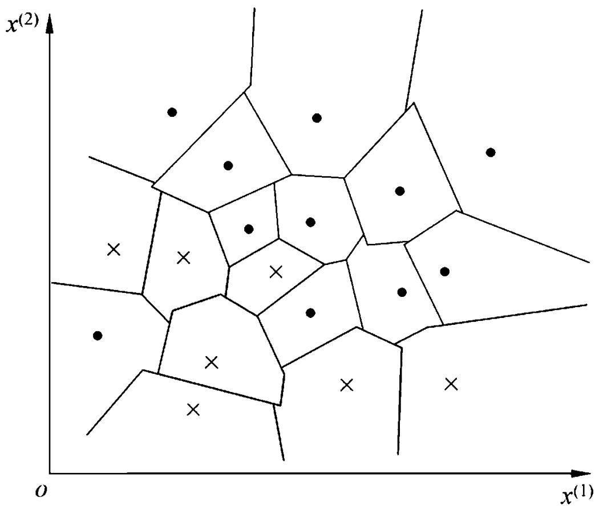
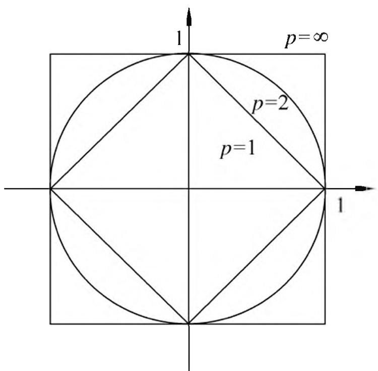
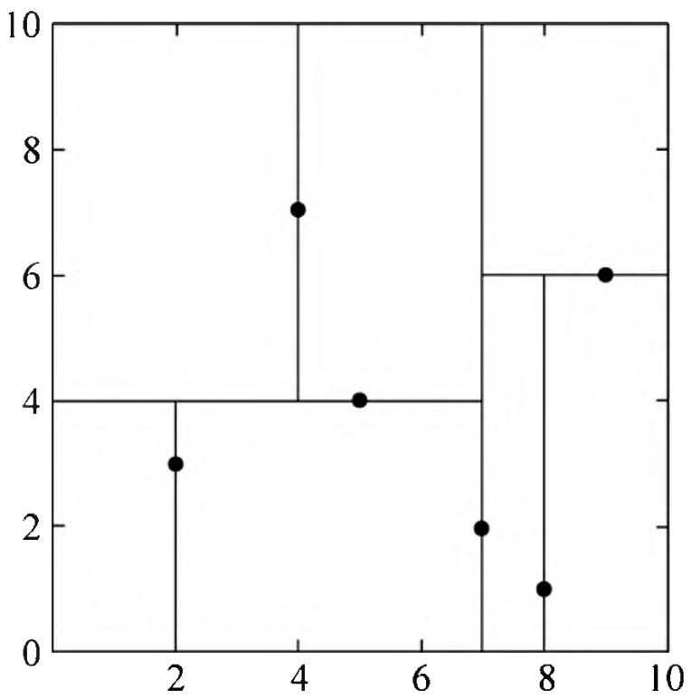
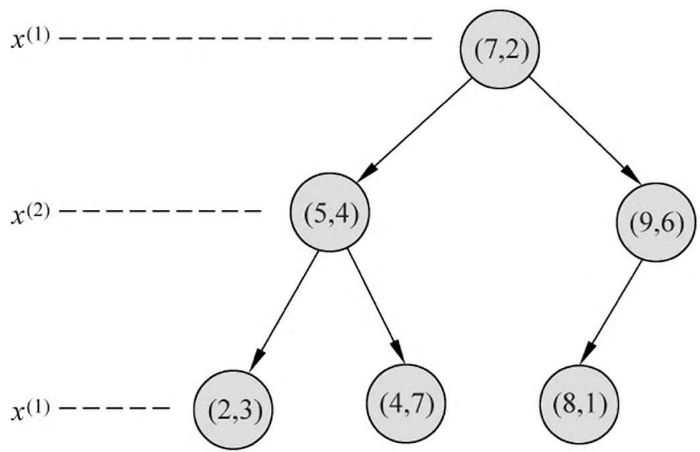
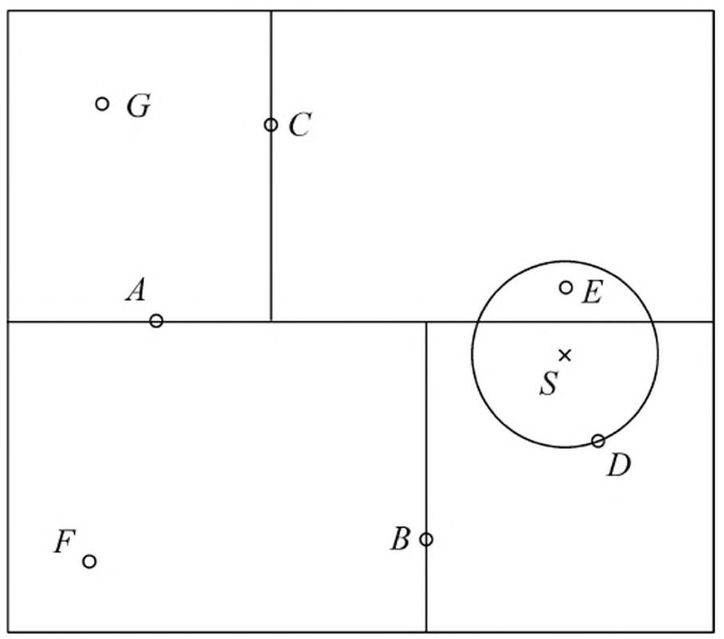

# 第 3 章 $k$ 近邻法

$k$ 近邻法（ $k$ -nearest neighbor, $k$ -NN）是一种基本分类与回归方法。本书只讨论分类问题中的 $k$ 近邻法。 $k$ 近邻法的输入为实例的特征向量，对应于特征空间的点；输出为实例的类别，可以取多类。 $k$ 近邻法假设给定一个训练数据集，其中的实例类别已定。分类时，对新的实例，根据其 $k$ 个最近邻的训练实例的类别，通过多数表决等方式进行预测。因此， $k$ 近邻法不具有显式的学习过程。 $k$ 近邻法实际上利用训练数据集对特征向量空间进行划分，并作为其分类的“模型”。 $k$ 值的选择、距离度量及分类决策规则是 $k$ 近邻法的三个基本要素。 $k$ 近邻法 1968 年由 Cover 和 Hart 提出。

本章首先叙述 $k$ 近邻算法，然后讨论 $k$ 近邻法的模型及三个基本要素，最后讲述 $k$ 近邻法的一个实现方法—— $kd$ 树，介绍构造 $kd$ 树和搜索 $kd$ 树的算法。

## 3.1 $k$ 近邻算法

$k$ 近邻算法简单、直观：给定一个训练数据集，对新的输入实例，在训练数据集中找到与该实例最邻近的 $k$ 个实例，这 $k$ 个实例的多数属于某个类，就把该输入实例分为这个类。下面先叙述 $k$ 近邻算法，然后再讨论其细节。

算法 3.1（ $\pmb{k}$ 近邻法）输入：训练数据集

$$
T = \left\lbrace (x _ {1}, y _ {1}), (x _ {2}, y _ {2}), \dots , (x _ {N}, y _ {N}) \right\rbrace
$$

其中， $x_{i}\in \mathcal{X}\subseteq \mathbf{R}^{n}$ 为实例的特征向量， $y_{i}\in \mathcal{V} = \{c_{1},c_{2},\dots ,c_{K}\}$ 为实例的类别， $i = 1,2,\dots ,N$ ；实例特征向量 $\pmb{x}$输出：实例 $x$ 所属的类 $y$ 。

- （1）根据给定的距离度量，在训练集 $T$ 中找出与 $\pmb{x}$ 最邻近的 $k$ 个点，涵盖这 $k$ 个点的 $\pmb{x}$ 的邻域记作 $N_{k}(x)$
- （2）在 $N_{k}(x)$ 中根据分类决策规则（如多数表决）决定 $\pmb{x}$ 的类别 $\pmb{y}$

$$
y = \arg \max  _ {c _ {j}} \sum_ {x _ {i} \in N _ {k} (x)} I \left(y _ {i} = c _ {j}\right), \quad i = 1, 2, \dots , N; j = 1, 2, \dots , K \tag {3.1}
$$

式(3.1)中， $I$ 为指示函数，即当 $y_{i} = c_{j}$ 时 $I$ 为 1，否则 $I$ 为 0。

$k$ 近邻法的特殊情况是 $k = 1$ 的情形，称为最近邻算法。对于输入的实例点（特征向量） $x$ ，最近邻法将训练数据集中与 $x$ 最邻近点的类作为 $x$ 的类。

$k$ 近邻法没有显式的学习过程。

## 3.2 $k$ 近邻模型

$k$ 近邻法使用的模型实际上对应于对特征空间的划分。模型由三个基本要素——距离度量、 $k$ 值的选择和分类决策规则决定。

## 3.2.1 模型

$k$ 近邻法中，当训练集、距离度量（如欧氏距离）、 $k$ 值及分类决策规则（如多数表决）确定后，对于任何一个新的输入实例，它所属的类唯一地确定。这相当于根据上述要素将特征空间划分为一些子空间，确定子空间里的每个点所属的类。这一事实从最近邻算法中可以看得很清楚。

特征空间中，对每个训练实例点 $x_{i}$ ，距离该点比其他点更近的所有点组成一个区域，叫作单元（cell）。每个训练实例点拥有一个单元，所有训练实例点的单元构成对特征空间的一个划分。最近邻法将实例 $x_{i}$ 的类 $y_{i}$ 作为其单元中所有点的类标记（class label）。这样，每个单元的实例点的类别是确定的。图 3.1 是二维特征空间划分的一个例子。

## 3.2.2 距离度量

特征空间中两个实例点的距离是两个实例点相似程度的反映。 $k$ 近邻模型的特征空间一般是 $n$ 维实数向量空间 $\mathbf{R}^n$ 。使用的距离是欧氏距离，但也可以是其他距离，如更一般的 $L_{p}$ 距离（ $L_{p}$ distance）或 Minkowski 距离（Minkowskidistance）。

设特征空间 $\mathcal{X}$ 是 $n$ 维实数向量空间 $\mathbf{R}^n$ , $x_i, x_j \in \mathcal{X}$ , $x_i = (x_i^{(1)}, x_i^{(2)}, \dots, x_i^{(n)})^{\mathrm{T}}$ , $x_j = (x_j^{(1)}, x_j^{(2)}, \dots, x_j^{(n)})^{\mathrm{T}}$ , $x_i, x_j$ 的 $L_p$ 距离定义为

$$
L _ {p} (x _ {i}, x _ {j}) = \left(\sum_ {l = 1} ^ {n} | x _ {i} ^ {(l)} - x _ {j} ^ {(l)} | ^ {p}\right) ^ {\frac {1}{p}} \tag {3.2}
$$

> 图 3.1 $k$ 近邻法的模型对应特征空间的一个划分

这里 $p \geqslant 1$ 。当 $p = 2$ 时，称为欧氏距离（Euclidean distance），即

$$
L _ {2} \left(x _ {i}, x _ {j}\right) = \left(\sum_ {l = 1} ^ {n} \left| x _ {i} ^ {(l)} - x _ {j} ^ {(l)} \right| ^ {2}\right) ^ {\frac {1}{2}} \tag {3.3}
$$

当 $p = 1$ 时，称为曼哈顿距离（Manhattan distance），即

$$
L _ {1} \left(x _ {i}, x _ {j}\right) = \sum_ {l = 1} ^ {n} \left| x _ {i} ^ {(l)} - x _ {j} ^ {(l)} \right| \tag {3.4}
$$

当 $p = \infty$ 时，它是各个坐标距离的最大值，即

$$
L _ {\infty} (x _ {i}, x _ {j}) = \max _ {l} | x _ {i} ^ {(l)} - x _ {j} ^ {(l)} | \qquad \qquad \qquad (3. 5)
$$

图 3.2 给出了二维空间中 $p$ 取不同值时，与原点的 $L_{p}$ 距离为 $1(L_{p} = 1)$ 的点的图形。

> 图 3.2 $L_{p}$ 距离间的关系

下面的例子说明，由不同的距离度量所确定的最近邻点是不同的。

例 3.1 已知二维空间的 3 个点 $x_{1} = (1,1)^{\mathrm{T}}$ ， $x_{2} = (5,1)^{\mathrm{T}}$ ， $x_{3} = (4,4)^{\mathrm{T}}$ ，试求在 $p$ 取不同值时， $L_{p}$ 距离下 $x_{1}$ 的最近邻点。

解 因为 $x_{1}$ 和 $x_{2}$ 只有第一维的值不同，所以 $p$ 为任何值时， $L_{p}(x_{1}, x_{2}) = 4$ 。而

$$
L _ {1} (x _ {1}, x _ {3}) = 6, \quad L _ {2} (x _ {1}, x _ {3}) = 4. 2 4, \quad L _ {3} (x _ {1}, x _ {3}) = 3. 7 8, \quad L _ {4} (x _ {1}, x _ {3}) = 3. 5 7
$$

于是得到： $p$ 等于 1 或 2 时， $x_{2}$ 是 $x_{1}$ 的最近邻点； $p$ 大于等于 3 时， $x_{3}$ 是 $x_{1}$ 的最近邻点。

## 3.2.3 $k$ 值的选择

$k$ 值的选择会对 $k$ 近邻法的结果产生重大影响。

如果选择较小的 $k$ 值，就相当于用较小的邻域中的训练实例进行预测，“学习”的近似误差（approximation error）会减小，只有与输入实例较近的（相似的）训练实例才会对预测结果起作用。但缺点是“学习”的估计误差（estimation error）会增大，预测结果会对近邻的实例点非常敏感[2]。如果邻近的实例点恰巧是噪声，预测就会出错。换句话说， $k$ 值的减小就意味着整体模型变得复杂，容易发生过拟合。

如果选择较大的 $k$ 值，就相当于用较大邻域中的训练实例进行预测。其优点是可以减少学习的估计误差，但缺点是学习的近似误差会增大。这时与输入实例较远的（不相似的）训练实例也会对预测起作用，使预测发生错误。 $k$ 值的增大就意味着整体的模型变得简单。

如果 $k = N$ ，那么无论输入实例是什么，都将简单地预测它属于在训练实例中最多的类。这时，模型过于简单，完全忽略训练实例中的大量有用信息，是不可取的。

在应用中， $k$ 值一般取一个比较小的数值。通常采用交叉验证法来选取最优的 $k$ 值。

## 3.2.4 分类决策规则

$k$ 近邻法中的分类决策规则往往是多数表决，即由输入实例的 $k$ 个邻近的训练实例中的多数类决定输入实例的类。

多数表决规则（majority voting rule）有如下解释：如果分类的损失函数为 0-1 损失函数，分类函数为

$$
f: \mathbf {R} ^ {n} \rightarrow \left\{c _ {1}, c _ {2}, \dots , c _ {K} \right\}
$$

那么误分类的概率是

$$
P (Y \neq f (X)) = 1 - P (Y = f (X))
$$

对给定的实例 $x \in \mathcal{X}$ , 其最近邻的 $k$ 个训练实例点构成集合 $N_{k}(x)$ 。如果涵盖 $N_{k}(x)$ 的区域的类别是 $c_{j}$ , 那么误分类率是

$$
\frac {1}{k} \sum_ {x _ {i} \in N _ {k} (x)} I (y _ {i} \neq c _ {j}) = 1 - \frac {1}{k} \sum_ {x _ {i} \in N _ {k} (x)} I (y _ {i} = c _ {j})
$$

要使误分类率最小即经验风险最小，就要使 $\sum_{x_i\in N_k(x)}I(y_i = c_j)$ 最大，所以多数表决规则等价于经验风险最小化。

## 3.3 $k$ 近邻法的实现：kd 树

实现 $k$ 近邻法时，主要考虑的问题是如何对训练数据进行快速 $k$ 近邻搜索。这点在特征空间的维数大及训练数据容量大时尤其必要。

$k$ 近邻法最简单的实现方法是线性扫描（linear scan）。这时要计算输入实例与每一个训练实例的距离。当训练集很大时，计算非常耗时，这种方法是不可行的。

为了提高 $k$ 近邻搜索的效率，可以考虑使用特殊的结构存储训练数据，以减少计算距离的次数。具体方法很多，下面介绍其中的 $kd$ 树（ $kd$ tree）方法 ①。

> - ① $kd$ 树是存储 $k$ 维空间数据的树结构，这里的 $k$ 与 $k$ 近邻法的 $k$ 意义不同，为了与习惯一致，本书仍用 $kd$ 树的名称。

## 3.3.1 构造 $kd$ 树

$kd$ 树是一种对 $k$ 维空间中的实例点进行存储以便对其进行快速检索的树形数据结构。 $kd$ 树是二叉树，表示对 $k$ 维空间的一个划分（partition）。构造 $kd$ 树相当于不断地用垂直于坐标轴的超平面将 $k$ 维空间切分，构成一系列的 $k$ 维超矩形区域。 $kd$ 树的每个结点对应于一个 $k$ 维超矩形区域。

构造 $kd$ 树的方法如下：构造根结点，使根结点对应于 $k$ 维空间中包含所有实例点的超矩形区域；通过下面的递归方法，不断地对 $k$ 维空间进行切分，生成子结点。在超矩形区域（结点）上选择一个坐标轴和在此坐标轴上的一个切分点，确定一个超平面，这个超平面通过选定的切分点并垂直于选定的坐标轴，将当前超矩形区域切分为左右两个子区域（子结点）；这时，实例被分到两个子区域。这个过程直到子区域内没有实例时终止（终止时的结点为叶结点）。在此过程中，将实例保存在相应的结点上。

通常，依次选择坐标轴对空间切分，选择训练实例点在选定坐标轴上的中位数（median）① 为切分点，这样得到的 $kd$ 树是平衡的。注意，平衡的 $kd$ 树搜索时的效率未必是最优的。

> - ① 一组数据按大小顺序排列起来，处在中间位置的一个数或最中间两个数的平均值。

下面给出构造 $kd$ 树的算法。

## 算法 3.2（构造平衡 $kd$ 树）

输入: $k$ 维空间数据集 $T = \{x_{1}, x_{2}, \dots, x_{N}\}$ , 其中 $x_{i} = (x_{i}^{(1)}, x_{i}^{(2)}, \dots, x_{i}^{(k)})^{\mathrm{T}}$ , $i = 1, 2, \dots, N$ ;输出：kd 树。

（1）开始：构造根结点，根结点对应于包含 $T$ 的 $k$ 维空间的超矩形区域。

选择 $x^{(1)}$ 为坐标轴，以 $T$ 中所有实例的 $x^{(1)}$ 坐标的中位数为切分点，将根结点对应的超矩形区域切分为两个子区域。切分由通过切分点并与坐标轴 $x^{(1)}$ 垂直的超平面实现。

由根结点生成深度为 1 的左、右子结点：左子结点对应坐标 $x^{(1)}$ 小于切分点的子区域，右子结点对应于坐标 $x^{(1)}$ 大于切分点的子区域。

将落在切分超平面上的实例点保存在根结点。

（2）重复：对深度为 $j$ 的结点，选择 $x^{(l)}$ 为切分的坐标轴， $l = j(\bmod k) + 1$ ，以该结点的区域中所有实例的 $x^{(l)}$ 坐标的中位数为切分点，将该结点对应的超矩形区域切分为两个子区域。切分由通过切分点并与坐标轴 $x^{(l)}$ 垂直的超平面实现。

由该结点生成深度为 $j + 1$ 的左、右子结点：左子结点对应坐标 $x^{(l)}$ 小于切分点的子区域，右子结点对应坐标 $x^{(l)}$ 大于切分点的子区域。

将落在切分超平面上的实例点保存在该结点。

（3）直到两个子区域没有实例存在时停止。从而形成 $kd$ 树的区域划分。

例 3.2 给定一个二维空间的数据集：

$$
T = \left\{\left(2, 3\right) ^ {\mathrm {T}}, \left(5, 4\right) ^ {\mathrm {T}}, \left(9, 6\right) ^ {\mathrm {T}}, \left(4, 7\right) ^ {\mathrm {T}}, \left(8, 1\right) ^ {\mathrm {T}}, \left(7, 2\right) ^ {\mathrm {T}} \right\}
$$

构造一个平衡 $kd$ 树 ②。

> - ② 取自 Wikipedia。

解 根结点对应包含数据集 $T$ 的矩形，选择 $x^{(1)}$ 轴，6 个数据点的 $x^{(1)}$ 坐标的中位数是 $7 \text{③}$ ，以平面 $x^{(1)} = 7$ 将空间分为左、右两个子矩形（子结点）；接着，左矩形以 $x^{(2)} = 4$ 分为两个子矩形，右矩形以 $x^{(2)} = 6$ 分为两个子矩形，如此递归，最后得到如图 3.3 所示的特征空间划分和如图 3.4 所示的 $kd$ 树。

> - ③ $x^{(1)} = 6$ 是中位数，但 $x^{(1)} = 6$ 上没有数据点，故选 $x^{(1)} = 7$ 。

> 图 3.3 特征空间划分

> 图 3.4 kd 树示例

## 3.3.2 搜索 $kd$ 树

下面介绍如何利用 $kd$ 树进行 $k$ 近邻搜索。可以看到，利用 $kd$ 树可以省去对大部分数据点的搜索，从而减少搜索的计算量。这里以最近邻为例加以叙述，同样的方法可以应用到 $k$ 近邻。

给定一个目标点，搜索其最近邻。首先找到包含目标点的叶结点；然后从该叶结点出发，依次回退到父结点；不断查找与目标点最邻近的结点，当确定不可能存在更近的结点时终止。这样搜索就被限制在空间的局部区域上，效率大为提高。

包含目标点的叶结点对应包含目标点的最小超矩形区域。以此叶结点的实例点作为当前最近点。目标点的最近邻一定在以目标点为中心并通过当前最近点的超球体的内部（参阅图 3.5）。然后返回当前结点的父结点，如果父结点的另一子结点的超矩形区域与超球体相交，那么在相交的区域内寻找与目标点更近的实例点。如果存在这样的点，将此点作为新的当前最近点。算法转到更上一级的父结点，继续上述过程。如果父结点的另一子结点的超矩形区域与超球体不相交，或不存在比当前最近点更近的点，则停止搜索。

下面叙述用 $kd$ 树的最近邻搜索算法。

## 算法 3.3（用 $kd$ 树的最近邻搜索）

输入：已构造的 $kd$ 树，目标点 $\pmb{x}$输出： $x$ 的最近邻。

- （1）在 $kd$ 树中找出包含目标点 $x$ 的叶结点：从根结点出发，递归地向下访问 $kd$ 树。若目标点 $x$ 当前维的坐标小于切分点的坐标，则移动到左子结点，否则移动到右子结点。直到子结点为叶结点为止。
- （2）以此叶结点为“当前最近点”。
- （3）递归地向上回退，在每个结点进行以下操作：

- （a）如果该结点保存的实例点比当前最近点距离目标点更近，则以该实例点为“当前最近点”。
- (b) 当前最近点一定存在于该结点一个子结点对应的区域。检查该子结点的父结点的另一子结点对应的区域是否有更近的点。具体地，检查另一子结点对应的区域是否与以目标点为球心、以目标点与“当前最近点”间的距离为半径的超球体相交。

如果相交，可能在另一个子结点对应的区域内存在距目标点更近的点，移动到另一个子结点。接着，递归地进行最近邻搜索；

如果不相交，向上回退。

（4）当回退到根结点时，搜索结束。最后的“当前最近点”即为 $x$ 的最近邻点。

如果实例点是随机分布的， $kd$ 树搜索的平均计算复杂度是 $O(\log N)$ ，这里 $N$ 是训练实例数。 $kd$ 树更适用于训练实例数远大于空间维数时的 $k$ 近邻搜索。当空间维数接近训练实例数时，它的效率会迅速下降，几乎接近线性扫描。

下面通过一个例题来说明搜索方法。

例 3.3 给定一个如图 3.5 所示的 $kd$ 树，根结点为 $A$ ，其子结点为 $B, C$ 等。树上共存储 7 个实例点；另有一个输入目标实例点 $S$ ，求 $S$ 的最近邻。

解 首先在 $kd$ 树中找到包含点 $S$ 的叶结点 $D$ （图中的右下区域），以点 $D$ 作为近似最近邻。真正最近邻一定在以点 $S$ 为中心通过点 $D$ 的圆的内部。然后返回结点 $D$ 的父结点 $B$ ，在结点 $B$ 的另一子结点 $F$ 的区域内搜索最近邻。结点 $F$ 的区域与圆不相交，不可能有最近邻点。继续返回上一级父结点 $A$ ，在结点 $A$ 的另一子结点 $C$ 的区域内搜索最近邻。结点 $C$ 的区域与圆相交；该区域在圆内的实例点有点 $E$ ，点 $E$ 比点 $D$ 更近，成为新的最近邻近似。最后得到点 $E$ 是点 $S$ 的最近邻。

> 图 3.5 通过 $kd$ 树搜索最近邻

## 本章概要

- 1. $k$ 近邻法是基本且简单的分类与回归方法。 $k$ 近邻法的基本做法是：对给定的训练实例点和输入实例点，首先确定输入实例点的 $k$ 个最近邻训练实例点，然后利用这 $k$ 个训练实例点的类的多数来预测输入实例点的类。
- 2. $k$ 近邻模型对应于基于训练数据集对特征空间的一个划分。 $k$ 近邻法中，当训练集、距离度量、 $k$ 值及分类决策规则确定后，其结果唯一确定。
- 3. $k$ 近邻法三要素：距离度量、 $k$ 值的选择和分类决策规则。常用的距离度量是欧氏距离及更一般的 $L_{p}$ 距离。 $k$ 值小时， $k$ 近邻模型更复杂； $k$ 值大时， $k$ 近邻模型更简单。 $k$ 值的选择反映了对近似误差与估计误差之间的权衡，通常由交叉验证选择最优的 $k$ 。常用的分类决策规则是多数表决，对应于经验风险最小化。
- 4. $k$ 近邻法的实现需要考虑如何快速搜索 $k$ 个最近邻点。 $kd$ 树是一种便于对 $k$ 维空间中的数据进行快速检索的数据结构。 $kd$ 树是二叉树，表示对 $k$ 维空间的一个划分，其每个结点对应于 $k$ 维空间划分中的一个超矩形区域。利用 $kd$ 树可以省去对大部分数据点的搜索，从而减少搜索的计算量。

## 继续阅读

$k$ 近邻法由 Cover 与 Hart 提出 [1]。 $k$ 近邻法相关的理论在文献 [2,3] 中已有论述。 $k$ 近邻法的扩展可参考文献 [4]。 $kd$ 树及其他快速搜索算法可参见文献 [5]。关于 $k$ 近邻法的介绍可参考文献 [2]。

## 习题

- 3.1 参照图 3.1，在二维空间中给出实例点，画出 $k$ 为 1 和 2 时的 $k$ 近邻法构成的空间划分，并对其进行比较，体会 $k$ 值选择与模型复杂度及预测准确率的关系。
- 3.2 利用例题 3.2 构造的 $kd$ 树求点 $x = (3,4.5)^{\mathrm{T}}$ 的最近邻点。
- 3.3 参照算法 3.3, 写出输出为 $x$ 的 $k$ 近邻的算法。

## 参考文献

- [1] Cover T, Hart P. Nearest neighbor pattern classification. IEEE Transactions on Information Theory, 1967, 13(1): 21-27.
- [2] Hastie T, Tibshirani R, Friedman J. The elements of statistical learning: data mining, inference, and prediction, 2001. (中译本: 统计学习基础——数据挖掘、推理与预测. 范明, 柴玉梅, 晋红英等译. 北京: 电子工业出版社, 2004.)
- [3] Friedman J. Flexible metric nearest neighbor classification. Technical Report, 1994.
- [4] Weinberger K Q, Blitzer J, Saul L K. Distance metric learning for large margin nearest neighbor classification. In: Proceedings of the NIPS. 2005.
- [5] Samet H. The design and analysis of spatial data structures. Reading, MA: Addison-Wesley, 1990.