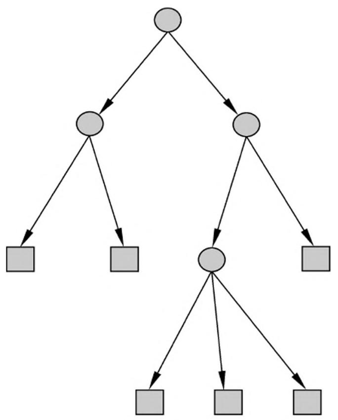
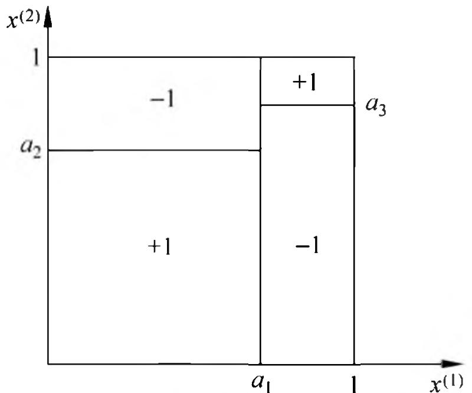
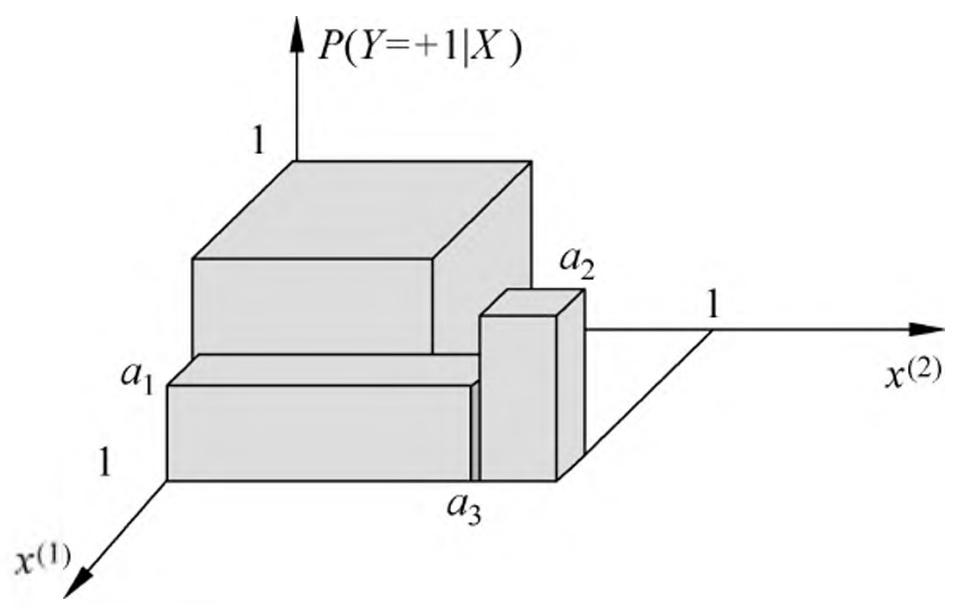
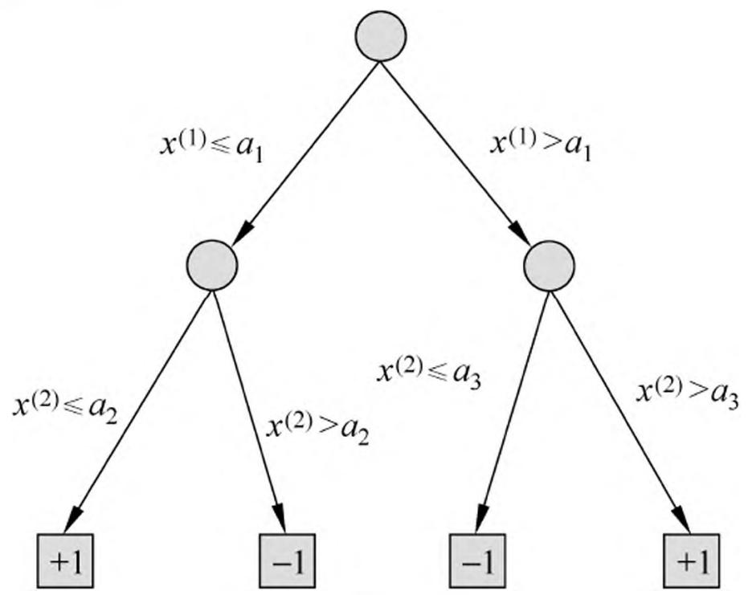
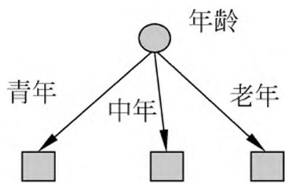
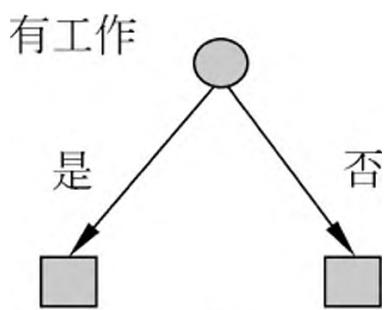
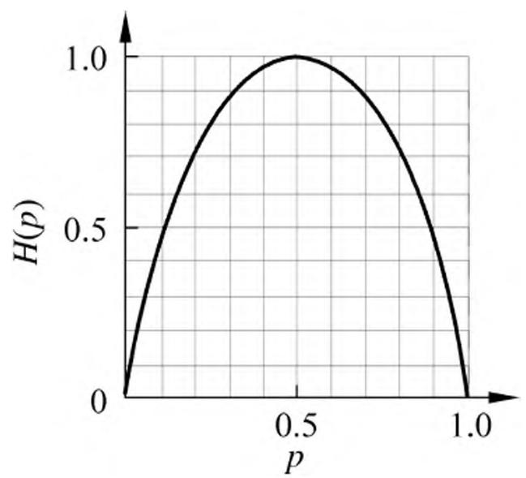
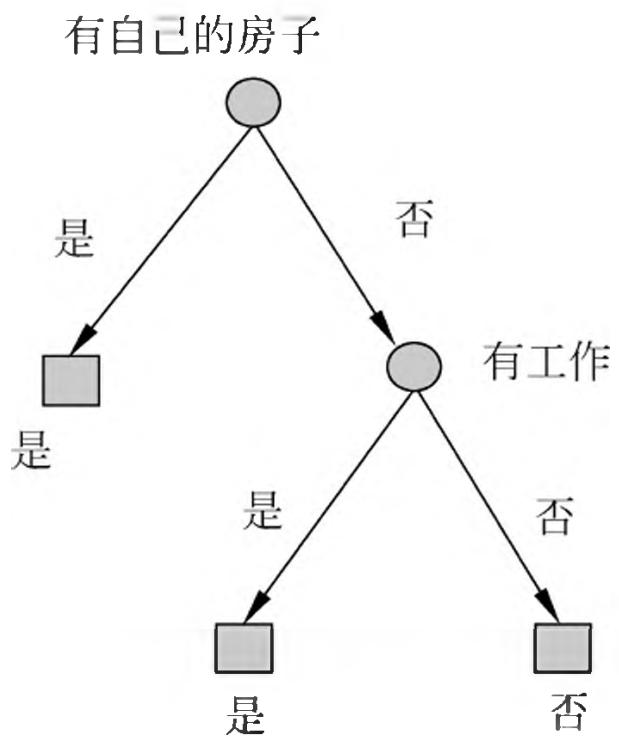
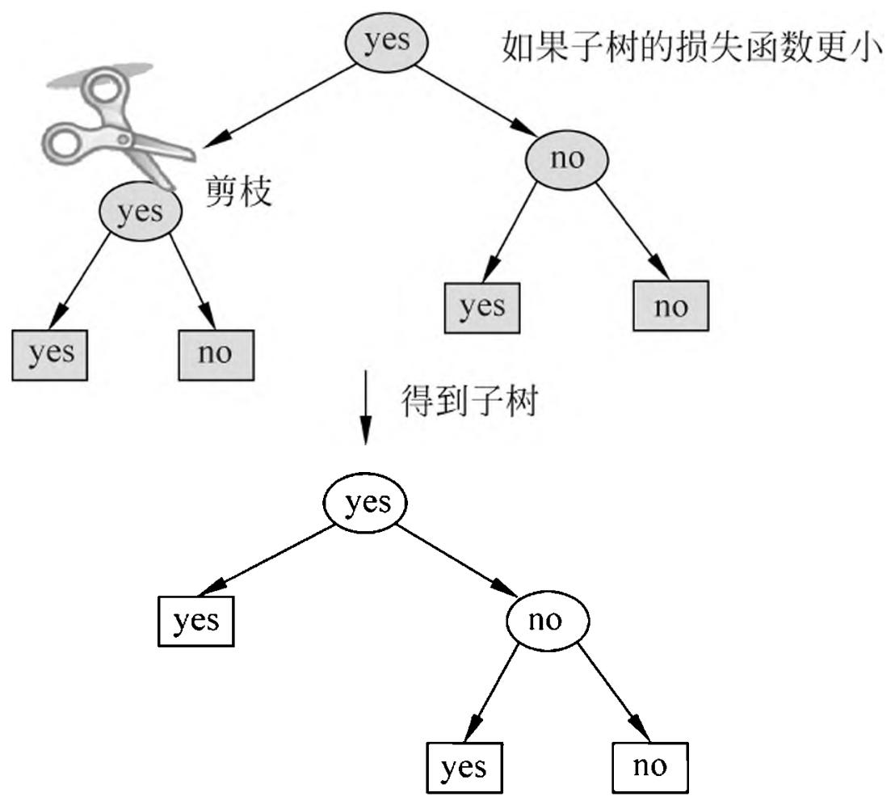
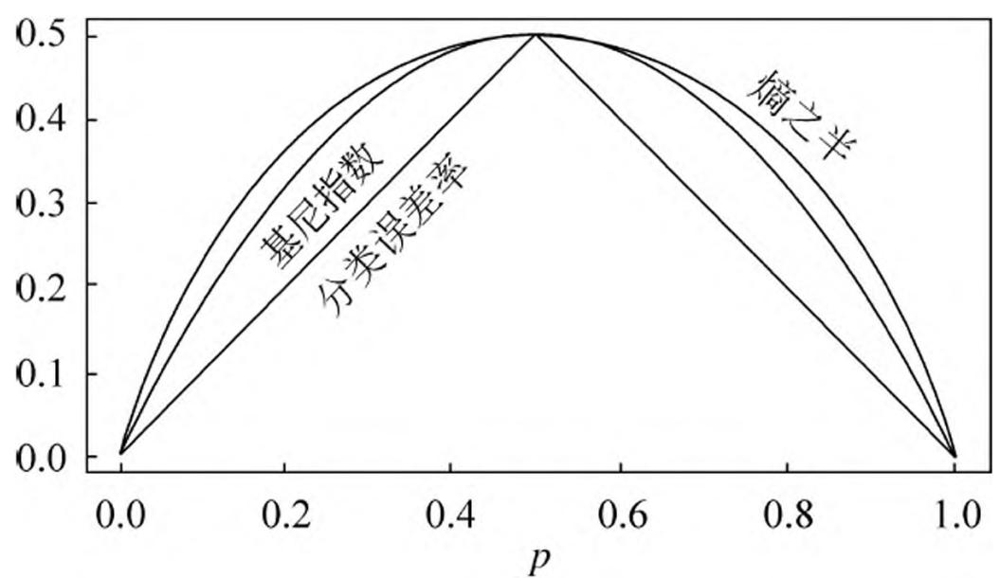

# 第 5 章 决策树

决策树（decision tree）是一种基本的分类与回归方法。本章主要讨论用于分类的决策树。决策树模型呈树形结构，在分类问题中，表示基于特征对实例进行分类的过程。它可以认为是 if-then 规则的集合，也可以认为是定义在特征空间与类空间上的条件概率分布。其主要优点是模型具有可读性，分类速度快。学习时，利用训练数据，根据损失函数最小化的原则建立决策树模型。预测时，对新的数据，利用决策树模型进行分类。决策树学习通常包括 3 个步骤：特征选择、决策树的生成和决策树的修剪。这些决策树学习的思想主要来源于由 Quinlan 在 1986 年提出的 ID3 算法和 1993 年提出的 C4.5 算法，以及由 Breiman 等人在 1984 年提出的 CART 算法。

本章首先介绍决策树的基本概念，然后通过 ID3 和 C4.5 介绍特征的选择、决策树的生成以及决策树的修剪，最后介绍 CART 算法。

## 5.1 决策树模型与学习

### 5.1.1 决策树模型

定义 5.1（决策树）分类决策树模型是一种描述对实例进行分类的树形结构。决策树由结点（node）和有向边（directed edge）组成。结点有两种类型：内部结点（internal node）和叶结点（leaf node）。内部结点表示一个特征或属性，叶结点表示一个类。

用决策树分类，从根结点开始，对实例的某一特征进行测试，根据测试结果，将实例分配到其子结点；这时，每一个子结点对应着该特征的一个取值。如此递归地对实例进行测试并分配，直至达到叶结点。最后将实例分到叶结点的类中。

图 5.1 是一个决策树的示意图。图中圆和方框分别表示内部结点和叶结点。

> 图 5.1 决策树模型

### 5.1.2 决策树与 if-then 规则

可以将决策树看成一个 if-then 规则的集合。将决策树转换成 if-then 规则的过程是这样的：由决策树的根结点到叶结点的每一条路径构建一条规则；路径上内部结点的特征对应着规则的条件，而叶结点的类对应着规则的结论。决策树的路径或其对应的 if-then 规则集合具有一个重要的性质：互斥并且完备。这就是说，每一个实例都被一条路径或一条规则所覆盖，而且只被一条路径或一条规则所覆盖。这里所谓覆盖是指实例的特征与路径上的特征一致或实例满足规则的条件。

### 5.1.3 决策树与条件概率分布

决策树还表示给定特征条件下类的条件概率分布。这一条件概率分布定义在特征空间的一个划分（partition）上。将特征空间划分为互不相交的单元（cell）或区域（region），并在每个单元定义一个类的概率分布就构成了一个条件概率分布。决策树的一条路径对应于划分中的一个单元。决策树所表示的条件概率分布由各个单元给定条件下类的条件概率分布组成。假设 $X$ 为表示特征的随机变量， $Y$ 为表示类的随机变量，那么这个条件概率分布可以表示为 $P(Y|X)$ 。 $X$ 取值于给定划分下单元的集合， $Y$ 取值于类的集合。各叶结点（单元）上的条件概率往往偏向某一个类，即属于某一类的概率较大。决策树分类时将该结点的实例强行分到条件概率大的那一类去。

图 5.2（a）示意地表示了特征空间的一个划分。图中的大正方形表示特征空间。这个大正方形被若干个小矩形分割，每个小矩形表示一个单元。特征空间划分上的单元构成了一个集合， $X$ 取值为单元的集合。为简单起见，假设只有两类：正类和负类，即 $Y$ 取值为 $+1$ 和 $-1$ 。小矩形中的数字表示单元的类。图 5.2（b）示意地表示特征空间划分确定时，特征（单元）给定条件下类的条件概率分布。图 5.2（b）中条件概率分布对应于图 5.2（a）的划分。当某个单元 $c$ 的条件概率满足 $P(Y = +1|X = c) > 0.5$ 时，则认为这个单元属于正类，即落在这个单元的实例都被视为正例。图 5.2（c）为对应于图 5.2（b）中条件概率分布的决策树。

> (a) 特征空间划分

> (b) 条件概率分布

> (c) 决策树 图 5.2 决策树对应于条件概率分布

### 5.1.4 决策树学习

假设给定训练数据集

$$
D = \left\{\left(x _ {1}, y _ {1}\right), \left(x _ {2}, y _ {2}\right), \dots , \left(x _ {N}, y _ {N}\right) \right\}
$$

其中， $x_{i} = (x_{i}^{(1)},x_{i}^{(2)},\dots ,x_{i}^{(n)})^{\mathrm{T}}$ 为输入实例（特征向量)， $n$ 为特征个数， $y_{i}\in \{1,2,\dots ,K\}$ 为类标记， $i = 1,2,\dots ,N$ ， $N$ 为样本容量。决策树学习的目标是根据给定的训练数据集构建一个决策树模型，使它能够对实例进行正确的分类。

决策树学习本质上是从训练数据集中归纳出一组分类规则。与训练数据集不相矛盾的决策树（即能对训练数据进行正确分类的决策树）可能有多个，也可能一个都没有。我们需要的是一个与训练数据矛盾较小的决策树，同时具有很好的泛化能力。从另一个角度看，决策树学习是由训练数据集估计条件概率模型。基于特征空间划分的类的条件概率模型有无穷多个。我们选择的条件概率模型应该不仅对训练数据有很好的拟合，而且对未知数据有很好的预测。

决策树学习用损失函数表示这一目标。如下所述，决策树学习的损失函数通常是正则化的极大似然函数。决策树学习的策略是以损失函数为目标函数的最小化。

当损失函数确定以后，学习问题就变为在损失函数意义下选择最优决策树的问题。因为从所有可能的决策树中选取最优决策树是 NP 完全问题，所以现实中决策树学习算法通常采用启发式方法，近似求解这一最优化问题。这样得到的决策树是次最优（sub-optimal）的。

决策树学习的算法通常是一个递归地选择最优特征，并根据该特征对训练数据进行分割，使得对各个子数据集有一个最好的分类的过程。这一过程对应着对特征空间的划分，也对应着决策树的构建。开始，构建根结点，将所有训练数据都放在根结点。选择一个最优特征，按照这一特征将训练数据集分割成子集，使得各个子集有一个在当前条件下最好的分类。如果这些子集已经能够被基本正确分类，那么构建叶结点，并将这些子集分到所对应的叶结点中去；如果还有子集不能被基本正确分类，那么就对这些子集选择新的最优特征，继续对其进行分割，构建相应的结点。如此递归地进行下去，直至所有训练数据子集被基本正确分类，或者没有合适的特征为止。最后每个子集都被分到叶结点上，即都有了明确的类。这就生成了一棵决策树。

以上方法生成的决策树可能对训练数据有很好的分类能力，但对未知的测试数据却未必有很好的分类能力，即可能发生过拟合现象。我们需要对已生成的树自下而上进行剪枝，将树变得更简单，从而使它具有更好的泛化能力。具体地，就是去掉过于细分的叶结点，使其回退到父结点，甚至更高的结点，然后将父结点或更高的结点改为新的叶结点。

如果特征数量很多，也可以在决策树学习开始的时候，对特征进行选择，只留下对训练数据有足够分类能力的特征。

可以看出，决策树学习算法包含特征选择、决策树的生成与决策树的剪枝过程。由于决策树表示一个条件概率分布，所以深浅不同的决策树对应着不同复杂度的概率模型。决策树的生成对应于模型的局部选择，决策树的剪枝对应于模型的全局选择。决策树的生成只考虑局部最优，相对地，决策树的剪枝则考虑全局最优。

决策树学习常用的算法有 ID3、C4.5 与 CART，下面结合这些算法分别叙述决策树学习的特征选择、决策树的生成和剪枝过程。

## 5.2 特征选择

### 5.2.1 特征选择问题

特征选择在于选取对训练数据具有分类能力的特征。这样可以提高决策树学习的效率。如果利用一个特征进行分类的结果与随机分类的结果没有很大差别，则称这个特征是没有分类能力的。经验上扔掉这样的特征对决策树学习的精度影响不大。通常特征选择的准则是信息增益或信息增益比。

首先通过一个例子来说明特征选择问题。

例 5.1① 表 5.1 是一个由 15 个样本组成的贷款申请训练数据。数据包括贷款申请人的 4 个特征（属性）：第 1 个特征是年龄，有 3 个可能值：青年，中年，老年；第 2 个特征是有工作，有 2 个可能值：是，否；第 3 个特征是有自己的房子，有 2 个可能值：是，否；第 4 个特征是信贷情况，有 3 个可能值：非常好，好，一般。表的最后一列是类别，是否同意贷款，取 2 个值：是，否。

> - ① 此例取自参考文献 [5]。

**表 5.1 贷款申请样本数据表**

<table><tr><td>ID</td><td>年龄</td><td>有工作</td><td>有自己的房子</td><td>信贷情况</td><td>类别</td></tr><tr><td>1</td><td>青年</td><td>否</td><td>否</td><td>一般</td><td>否</td></tr><tr><td>2</td><td>青年</td><td>否</td><td>否</td><td>好</td><td>否</td></tr><tr><td>3</td><td>青年</td><td>是</td><td>否</td><td>好</td><td>是</td></tr><tr><td>4</td><td>青年</td><td>是</td><td>是</td><td>一般</td><td>是</td></tr><tr><td>5</td><td>青年</td><td>否</td><td>否</td><td>一般</td><td>否</td></tr><tr><td>6</td><td>中年</td><td>否</td><td>否</td><td>一般</td><td>否</td></tr><tr><td>7</td><td>中年</td><td>否</td><td>否</td><td>好</td><td>否</td></tr><tr><td>8</td><td>中年</td><td>是</td><td>是</td><td>好</td><td>是</td></tr><tr><td>9</td><td>中年</td><td>否</td><td>是</td><td>非常好</td><td>是</td></tr><tr><td>10</td><td>中年</td><td>否</td><td>是</td><td>非常好</td><td>是</td></tr><tr><td>11</td><td>老年</td><td>否</td><td>是</td><td>非常好</td><td>是</td></tr><tr><td>12</td><td>老年</td><td>否</td><td>是</td><td>好</td><td>是</td></tr><tr><td>13</td><td>老年</td><td>是</td><td>否</td><td>好</td><td>是</td></tr><tr><td>14</td><td>老年</td><td>是</td><td>否</td><td>非常好</td><td>是</td></tr><tr><td>15</td><td>老年</td><td>否</td><td>否</td><td>一般</td><td>否</td></tr></table>

希望通过所给的训练数据学习一个贷款申请的决策树，用以对未来的贷款申请进行分类，即当新的客户提出贷款申请时，根据申请人的特征利用决策树决定是否批准贷款申请。

特征选择是决定用哪个特征来划分特征空间。

图 5.3 表示从表 5.1 数据学习到的两个可能的决策树，分别由两个不同特征的根结点构成。图 5.3（a）所示的根结点的特征是年龄，有 3 个取值，对应于不同的取值有不同的子结点。图 5.3（b）所示的根结点的特征是有工作，有 2 个取值，对应于不同的取值有不同的子结点。两个决策树都可以从此延续下去。问题是：究竟选择哪个特征更好些？这就要求确定选择特征的准则。直观上，如果一个特征具有更好的分类能力，或者说，按照这一特征将训练数据集分割成子集，使得各个子集在当前条件下有最好的分类，那么就更应该选择这个特征。信息增益（information gain）就能够很好地表示这一直观的准则。

> (a)

> (b) 图 5.3 不同特征决定的不同决策树

### 5.2.2 信息增益

为了便于说明，先给出熵与条件熵的定义。

在信息论与概率统计中，熵（entropy）是表示随机变量不确定性的度量。设 $X$ 是一个取有限个值的离散随机变量，其概率分布为

$$
P (X = x _ {i}) = p _ {i}, \quad i = 1, 2, \dots , n
$$

则随机变量 $X$ 的熵定义为

$$
H (X) = - \sum_ {i = 1} ^ {n} p _ {i} \log p _ {i} \tag {5.1}
$$

在式 (5.1) 中, 若 $p_i = 0$ , 则定义 $0 \log 0 = 0$ 。通常, 式 (5.1) 中的对数以 2 为底或以 e 为底 (自然对数), 这时熵的单位分别称作比特 (bit) 或纳特 (nat)。由定义可知, 熵只依赖于 $X$ 的分布, 而与 $X$ 的取值无关, 所以也可将 $X$ 的熵记作 $H(p)$ , 即

$$
H (p) = - \sum_ {i = 1} ^ {n} p _ {i} \log p _ {i} \tag {5.2}
$$

熵越大，随机变量的不确定性就越大。从定义可验证

$$
0 \leqslant H (p) \leqslant \log n \tag {5.3}
$$

当随机变量只取两个值，例如 1，0 时，即 $X$ 的分布为

$$
P (X = 1) = p, \quad P (X = 0) = 1 - p, \quad 0 \leqslant p \leqslant 1
$$

熵为

$$
H (p) = - p \log_ {2} p - (1 - p) \log_ {2} (1 - p) \tag {5.4}
$$

这时，熵 $H(p)$ 随概率 $p$ 变化的曲线如图 5.4 所示（单位为比特）。

> 图 5.4 分布为伯努利分布时熵与概率的关系

当 $p = 0$ 或 $p = 1$ 时 $H(p) = 0$ ，随机变量完全没有不确定性。当 $p = 0.5$ 时， $H(p) = 1$ ，熵取值最大，随机变量不确定性最大。

设有随机变量 $(X,Y)$ , 其联合概率分布为

$$
P (X = x _ {i}, Y = y _ {j}) = p _ {i j}, \quad i = 1, 2, \dots , n; \quad j = 1, 2, \dots , m
$$

条件熵 $H(Y|X)$ 表示在已知随机变量 $X$ 的条件下随机变量 $Y$ 的不确定性。随机变量 $X$ 给定的条件下随机变量 $Y$ 的条件熵（conditional entropy） $H(Y|X)$ ，定义为 $X$ 给定条件下 $Y$ 的条件概率分布的熵对 $X$ 的数学期望

$$
H (Y | X) = \sum_ {i = 1} ^ {n} p _ {i} H (Y | X = x _ {i}) \tag {5.5}
$$

这里， $p_i = P(X = x_i)$ ， $i = 1,2,\dots ,n$ 。

当熵和条件熵中的概率由数据估计（特别是极大似然估计）得到时，所对应的熵与条件熵分别称为经验熵（empirical entropy）和经验条件熵（empirical conditional entropy）。此时，如果有 0 概率，令 $0 \log 0 = 0$ 。

信息增益（information gain）表示得知特征 $X$ 的信息而使得类 $Y$ 的信息的不确定性减少的程度。

定义 5.2（信息增益）特征 $A$ 对训练数据集 $D$ 的信息增益 $g(D,A)$ ，定义为集合 $D$ 的经验熵 $H(D)$ 与特征 $A$ 给定条件下 $D$ 的经验条件熵 $H(D|A)$ 之差，即

$$
g (D, A) = H (D) - H (D | A) \tag {5.6}
$$

一般地，熵 $H(Y)$ 与条件熵 $H(Y|X)$ 之差称为互信息（mutual information）。决策树学习中的信息增益等价于训练数据集中类与特征的互信息。

决策树学习应用信息增益准则选择特征。给定训练数据集 $D$ 和特征 $A$ ，经验熵 $H(D)$ 表示对数据集 $D$ 进行分类的不确定性。而经验条件熵 $H(D|A)$ 表示在特征 $A$ 给定的条件下对数据集 $D$ 进行分类的不确定性。那么它们的差，即信息增益，就表示由于特征 $A$ 而使得对数据集 $D$ 的分类的不确定性减少的程度。显然，对于数据集 $D$ 而言，信息增益依赖于特征，不同的特征往往具有不同的信息增益。信息增益大的特征具有更强的分类能力。

根据信息增益准则的特征选择方法是：对训练数据集（或子集） $D$ ，计算其每个特征的信息增益，并比较它们的大小，选择信息增益最大的特征。

设训练数据集为 $D$ ， $|D|$ 表示其样本容量，即样本个数。设有 $K$ 个类 $C_k$ ， $k = 1,2,\dots,K$ ， $|C_k|$ 为属于类 $C_k$ 的样本个数， $\sum_{k=1}^{K} |C_k| = |D|$ 。设特征 $A$ 有 $n$ 个不同的取值 $\{a_1,a_2,\dots,a_n\}$ ，根据特征 $A$ 的取值将 $D$ 划分为 $n$ 个子集 $D_1,D_2,\dots,D_n$ ， $|D_i|$ 为 $D_i$ 的样本个数， $\sum_{i=1}^{n} |D_i| = |D|$ 。记子集 $D_i$ 中属于类 $C_k$ 的样本的集合为 $D_{ik}$ ，即 $D_{ik} = D_i \cap C_k$ ， $|D_{ik}|$ 为 $D_{ik}$ 的样本个数。于是信息增益的算法如下。

#### 算法 5.1（信息增益的算法）

输入：训练数据集 $D$ 和特征 $A$输出：特征 $A$ 对训练数据集 $D$ 的信息增益 $g(D, A)$ 。

（1）计算数据集 $D$ 的经验熵 $H(D)$

$$
H (D) = - \sum_ {k = 1} ^ {K} \frac {\left| C _ {k} \right|}{| D |} \log_ {2} \frac {\left| C _ {k} \right|}{| D |} \tag {5.7}
$$

（2）计算特征 $A$ 对数据集 $D$ 的经验条件熵 $H(D|A)$

$$
H (D | A) = \sum_ {i = 1} ^ {n} \frac {\left| D _ {i} \right|}{\left| D \right|} H \left(D _ {i}\right) = - \sum_ {i = 1} ^ {n} \frac {\left| D _ {i} \right|}{\left| D \right|} \sum_ {k = 1} ^ {K} \frac {\left| D _ {i k} \right|}{\left| D _ {i} \right|} \log_ {2} \frac {\left| D _ {i k} \right|}{\left| D _ {i} \right|} \tag {5.8}
$$

(3) 计算信息增益

$$
g (D, A) = H (D) - H (D | A) \tag {5.9}
$$

例 5.2 对表 5.1 所给的训练数据集 $D$ ，根据信息增益准则选择最优特征。

解 首先计算经验熵 $H(D)$ 。

$$
H (D) = - \frac {9}{1 5} \log_ {2} {\frac {9}{1 5}} - \frac {6}{1 5} \log_ {2} {\frac {6}{1 5}} = 0. 9 7 1
$$

然后计算各特征对数据集 $D$ 的信息增益。分别以 $A_{1}$ , $A_{2}$ , $A_{3}$ , $A_{4}$ 表示年龄、有工作、有自己的房子和信贷情况 4 个特征，则(1)

$$
\begin{array}{l} g (D, A _ {1}) = H (D) - \left[ \frac {5}{1 5} H (D _ {1}) + \frac {5}{1 5} H (D _ {2}) + \frac {5}{1 5} H (D _ {3}) \right] \\ = 0. 9 7 1 - \left[ \frac {5}{1 5} \left(- \frac {2}{5} \log_ {2} \frac {2}{5} - \frac {3}{5} \log_ {2} \frac {3}{5}\right) + \right. \\ \frac {5}{1 5} \left(- \frac {3}{5} \log_ {2} {\frac {3}{5}} - \frac {2}{5} \log_ {2} {\frac {2}{5}}\right) + \frac {5}{1 5} \left(- \frac {4}{5} \log_ {2} {\frac {4}{5}} - \frac {1}{5} \log_ {2} {\frac {1}{5}}\right) ] \\ = 0. 9 7 1 - 0. 8 8 8 = 0. 0 8 3 \\ \end{array}
$$

这里 $D_{1}, D_{2}, D_{3}$ 分别是 $D$ 中 $A_{1}$ （年龄）取值为青年、中年和老年的样本子集。类似地，(2)

$$
\begin{array}{l} g (D, A _ {2}) = H (D) - \left[ \frac {5}{1 5} H (D _ {1}) + \frac {1 0}{1 5} H (D _ {2}) \right] \\ = 0. 9 7 1 - \left[ \frac {5}{1 5} \times 0 + \frac {1 0}{1 5} \left(- \frac {4}{1 0} \log_ {2} \frac {4}{1 0} - \frac {6}{1 0} \log_ {2} \frac {6}{1 0}\right) \right] = 0. 3 2 4 \\ \end{array}
$$

(3)

$$
\begin{array}{l} g (D, A _ {3}) = 0. 9 7 1 - \left[ \frac {6}{1 5} \times 0 + \frac {9}{1 5} \left(- \frac {3}{9} \log_ {2} \frac {3}{9} - \frac {6}{9} \log_ {2} \frac {6}{9}\right) \right] \\ = 0. 9 7 1 - 0. 5 5 1 = 0. 4 2 0 \\ \end{array}
$$

(4)

$$
g (D, A _ {4}) = 0. 9 7 1 - 0. 6 0 8 = 0. 3 6 3
$$

最后，比较各特征的信息增益值。由于特征 $A_{3}$ （有自己的房子）的信息增益值最大，所以选择特征 $A_{3}$ 作为最优特征。

### 5.2.3 信息增益比

以信息增益作为划分训练数据集的特征，存在偏向于选择取值较多的特征的问题。使用信息增益比（information gain ratio）可以对这一问题进行校正。这是特征选择的另一准则。

定义 5.3（信息增益比）特征 $A$ 对训练数据集 $D$ 的信息增益比 $g_{R}(D,A)$ 定义为其信息增益 $g(D,A)$ 与训练数据集 $D$ 关于特征 $A$ 的值的熵 $H_{A}(D)$ 之比，即

$$
g _ {R} (D, A) = \frac {g (D , A)}{H _ {A} (D)} \tag {5.10}
$$

其中， $H_{A}(D) = -\sum_{i = 1}^{n}\frac{|D_{i}|}{|D|}\log_{2}\frac{|D_{i}|}{|D|}, n$ 是特征 $A$ 取值的个数。

## 5.3 决策树的生成

本节将介绍决策树学习的生成算法。首先介绍 ID3 的生成算法，然后再介绍 C4.5 中的生成算法。这些都是决策树学习的经典算法。

### 5.3.1 ID3 算法

ID3 算法的核心是在决策树各个结点上应用信息增益准则选择特征，递归地构建决策树。具体方法是：从根结点（root node）开始，对结点计算所有可能的特征的信息增益，选择信息增益最大的特征作为结点的特征，由该特征的不同取值建立子结点；再对子结点递归地调用以上方法，构建决策树；直到所有特征的信息增益均很小或没有特征可以选择为止。最后得到一棵决策树。ID3 相当于用极大似然法进行概率模型的选择。

#### 算法 5.2（ID3 算法）

输入：训练数据集 $D$ ，特征集 $A$ 阈值 $\varepsilon$输出：决策树 $T$ 。

- （1）若 $D$ 中所有实例属于同一类 $C_k$ ，则 $T$ 为单结点树，并将类 $C_k$ 作为该结点的类标记，返回 $T$
- (2) 若 $A = \varnothing$ , 则 $T$ 为单结点树, 并将 $D$ 中实例数最大的类 $C_k$ 作为该结点的类标记, 返回 $T$ ;
- （3）否则，按算法 5.1 计算 $A$ 中各特征对 $D$ 的信息增益，选择信息增益最大的特征 $A_{g}$

- （4）如果 $A_{g}$ 的信息增益小于阈值 $\varepsilon$ ，则置 $T$ 为单结点树，并将 $D$ 中实例数最大的类 $C_k$ 作为该结点的类标记，返回 $T$
- (5) 否则, 对 $A_{g}$ 的每一可能值 $a_{i}$ , 依 $A_{g} = a_{i}$ 将 $D$ 分割为若干非空子集 $D_{i}$ , 将 $D_{i}$ 中实例数最大的类作为标记, 构建子结点, 由结点及其子结点构成树 $T$ , 返回 $T$ ;
- (6) 对第 $i$ 个子结点, 以 $D_{i}$ 为训练集, 以 $A - \{A_{g}\}$ 为特征集, 递归地调用步 (1)~步 (5), 得到子树 $T_{i}$ , 返回 $T_{i}$ 。

例 5.3 对表 5.1 的训练数据集，利用 ID3 算法建立决策树。

解 利用例 5.2 的结果，由于特征 $A_{3}$ （有自己的房子）的信息增益值最大，所以选择特征 $A_{3}$ 作为根结点的特征。它将训练数据集 $D$ 划分为两个子集 $D_{1}$ （ $A_{3}$ 取值为“是”）和 $D_{2}$ （ $A_{3}$ 取值为“否”）。由于 $D_{1}$ 只有同一类的样本点，所以它成为一个叶结点，结点的类标记为“是”。

对 $D_{2}$ 则需从特征 $A_{1}$ （年龄）， $A_{2}$ （有工作）和 $A_{4}$ （信贷情况）中选择新的特征。计算各个特征的信息增益：

$$
\begin{array}{l} g \left(D _ {2}, A _ {1}\right) = H \left(D _ {2}\right) - H \left(D _ {2} \mid A _ {1}\right) = 0. 9 1 8 - 0. 6 6 7 = 0. 2 5 1 \\ g (D _ {2}, A _ {2}) = H (D _ {2}) - H (D _ {2} | A _ {2}) = 0. 9 1 8 \\ g (D _ {2}, A _ {4}) = H (D _ {2}) - H (D _ {2} | A _ {4}) = 0. 4 7 4 \\ \end{array}
$$

选择信息增益最大的特征 $A_{2}$ （有工作）作为结点的特征。由于 $A_{2}$ 有两个可能取值，从这一结点引出两个子结点：一个对应“是”（有工作）的子结点，包含 3 个样本，它们属于同一类，所以这是一个叶结点，类标记为“是”；另一个是对应“否”（无工作）的子结点，包含 6 个样本，它们也属于同一类，所以这也是一个叶结点，类标记为“否”。

这样生成一棵如图 5.5 所示的决策树。该决策树只用了两个特征（有两个内部结点）。

> 图 5.5 决策树的生成

ID3 算法只有树的生成，所以该算法生成的树容易产生过拟合。

### 5.3.2 C4.5 的生成算法

C4.5 算法与 ID3 算法相似，C4.5 算法对 ID3 算法进行了改进。C4.5 在生成的过程中，用信息增益比来选择特征。

#### 算法 5.3（C4.5 的生成算法）

输入：训练数据集 $D$ ，特征集 $A$ 阈值 $\varepsilon$输出：决策树 $T$ 。

- （1）如果 $D$ 中所有实例属于同一类 $C_k$ ，则置 $T$ 为单结点树，并将 $C_k$ 作为该结点的类，返回 $T$
- （2）如果 $A = \emptyset$ ，则置 $T$ 为单结点树，并将 $D$ 中实例数最大的类 $C_k$ 作为该结点的类，返回 $T$
- (3) 否则, 按式 (5.10) 计算 $A$ 中各特征对 $D$ 的信息增益比, 选择信息增益比最大的特征 $A_{g}$ ;
- （4）如果 $A_{g}$ 的信息增益比小于阈值 $\varepsilon$ ，则置 $T$ 为单结点树，并将 $D$ 中实例数最大的类 $C_k$ 作为该结点的类，返回 $T$
- （5）否则，对 $A_{g}$ 的每一可能值 $a_{i}$ ，依 $A_{g} = a_{i}$ 将 $D$ 分割为子集若干非空 $D_{i}$ ，将 $D_{i}$ 中实例数最大的类作为标记，构建子结点，由结点及其子结点构成树 $T$ ，返回 $T$ ；
- (6) 对结点 $i$ , 以 $D_{i}$ 为训练集, 以 $A - \{A_{g}\}$ 为特征集, 递归地调用步 (1)~步 (5), 得到子树 $T_{i}$ , 返回 $T_{i}$ 。

## 5.4 决策树的剪枝

决策树生成算法递归地产生决策树，直到不能继续下去为止。这样产生的树往往对训练数据的分类很准确，但对未知的测试数据的分类却没有那么准确，即出现过拟合现象。过拟合的原因在于学习时过多地考虑如何提高对训练数据的正确分类，从而构建出过于复杂的决策树。解决这个问题的办法是考虑决策树的复杂度，对已生成的决策树进行简化。

在决策树学习中将已生成的树进行简化的过程称为剪枝（pruning）。具体地，剪枝从已生成的树上裁掉一些子树或叶结点，并将其根结点或父结点作为新的叶结点，从而简化分类树模型。

本节介绍一种简单的决策树学习的剪枝算法。

决策树的剪枝往往通过极小化决策树整体的损失函数（loss function）或代价函数（cost function）来实现。设树 $T$ 的叶结点个数为 $|T|$ ， $t$ 是树 $T$ 的叶结点，该叶结点有 $N_{t}$ 个样本点，其中 $k$ 类的样本点有 $N_{tk}$ 个， $k = 1,2,\dots,K$ ， $H_{t}(T)$ 为叶结点 $t$ 上的经验熵， $\alpha \geqslant 0$ 为参数，则决策树学习的损失函数可以定义为

$$
C _ {\alpha} (T) = \sum_ {t = 1} ^ {| T |} N _ {t} H _ {t} (T) + \alpha | T | \tag {5.11}
$$

其中经验熵为

$$
H _ {t} (T) = - \sum_ {k} \frac {N _ {t k}}{N _ {t}} \log \frac {N _ {t k}}{N _ {t}} \tag {5.12}
$$

在损失函数中，将式(5.11)右端的第 1 项记作

$$
C (T) = \sum_ {t = 1} ^ {| T |} N _ {t} H _ {t} (T) = - \sum_ {t = 1} ^ {| T |} \sum_ {k = 1} ^ {K} N _ {t k} \log \frac {N _ {t k}}{N _ {t}} \tag {5.13}
$$

这时有

$$
C _ {\alpha} (T) = C (T) + \alpha | T | \tag {5.14}
$$

式 (5.14) 中, $C(T)$ 表示模型对训练数据的预测误差, 即模型与训练数据的拟合程度, $|T|$ 表示模型复杂度, 参数 $\alpha \geqslant 0$ 控制两者之间的影响。较大的 $\alpha$ 促使选择较简单的模型 (树), 较小的 $\alpha$ 促使选择较复杂的模型 (树)。 $\alpha = 0$ 意味着只考虑模型与训练数据的拟合程度, 不考虑模型的复杂度。

剪枝，就是当 $\alpha$ 确定时，选择损失函数最小的模型，即损失函数最小的子树。当 $\alpha$ 值确定时，子树越大，往往与训练数据的拟合越好，但是模型的复杂度就越高；相反，子树越小，模型的复杂度就越低，但是往往与训练数据的拟合不好。损失函数正好表示了对两者的平衡。

可以看出，决策树生成只考虑了通过提高信息增益（或信息增益比）对训练数据进行更好的拟合。而决策树剪枝通过优化损失函数还考虑了减小模型复杂度。决策树生成学习局部的模型，而决策树剪枝学习整体的模型。

式（5.11）或式（5.14）定义的损失函数的极小化等价于正则化的极大似然估计。所以，利用损失函数最小原则进行剪枝就是用正则化的极大似然估计进行模型选择。

图 5.6 是决策树剪枝过程的示意图。下面介绍剪枝算法。

#### 算法 5.4（树的剪枝算法）

输入：生成算法产生的整个树 $T$ ，参数 $\alpha$输出：修剪后的子树 $T_{\alpha}$ 。

- （1）计算每个结点的经验熵。
- (2) 递归地从树的叶结点向上回缩。

> 图 5.6 决策树的剪枝

设一组叶结点回缩到其父结点之前与之后的整体树分别为 $T_B$ 与 $T_A$ ，其对应的损失函数值分别是 $C_{\alpha}(T_B)$ 与 $C_{\alpha}(T_A)$ ，如果

$$
C _ {\alpha} \left(T _ {A}\right) \leqslant C _ {\alpha} \left(T _ {B}\right) \tag {5.15}
$$

则进行剪枝，即将父结点变为新的叶结点。

(3) 返回 (2), 直至不能继续为止, 得到损失函数最小的子树 $T_{\alpha}$ 。

注意，式（5.15）只需考虑两个树的损失函数的差，其计算可以在局部进行。所以，决策树的剪枝算法可以由一种动态规划的算法实现。类似的动态规划算法可参见文献[10]。

## 5.5 CART 算法

分类与回归树（classification and regression tree，CART）模型由 Breiman 等人在 1984 年提出，是应用广泛的决策树学习方法。CART 同样由特征选择、树的生成及剪枝组成，既可以用于分类也可以用于回归。以下将用于分类与回归的树统称为决策树。

CART 是在给定输入随机变量 $X$ 条件下输出随机变量 $Y$ 的条件概率分布的学习方法。CART 假设决策树是二叉树，内部结点特征的取值为“是”和“否”，左分支是取值为“是”的分支，右分支是取值为“否”的分支。这样的决策树等价于递归地二分每个特征，将输入空间即特征空间划分为有限个单元，并在这些单元上确定预测的概率分布，也就是在输入给定的条件下输出的条件概率分布。

CART 算法由以下两步组成：

- (1) 决策树生成: 基于训练数据集生成决策树, 生成的决策树要尽量大;
- （2）决策树剪枝：用验证数据集对已生成的树进行剪枝并选择最优子树，这时用损失函数最小作为剪枝的标准。

### 5.5.1 CART 生成

决策树的生成就是递归地构建二叉决策树的过程。对回归树用平方误差最小化准则，对分类树用基尼指数（Gini index）最小化准则，进行特征选择，生成二叉树。

#### 1. 回归树的生成

假设 $X$ 与 $Y$ 分别为输入和输出变量，并且 $Y$ 是连续变量，给定训练数据集

$$
D = \left\{\left(x _ {1}, y _ {1}\right), \left(x _ {2}, y _ {2}\right), \dots , \left(x _ {N}, y _ {N}\right) \right\}
$$

考虑如何生成回归树。

一棵回归树对应着输入空间（即特征空间）的一个划分以及在划分的单元上的输出值。假设已将输入空间划分为 $M$ 个单元 $R_{1}, R_{2}, \dots, R_{M}$ ，并且在每个单元 $R_{m}$ 上有一个固定的输出值 $c_{m}$ ，于是回归树模型可表示为

$$
f (x) = \sum_ {m = 1} ^ {M} c _ {m} I (x \in R _ {m}) \tag {5.16}
$$

当输入空间的划分确定时，可以用平方误差 $\sum_{x_i\in R_m}(y_i - f(x_i))^2$ 来表示回归树对于训练数据的预测误差，用平方误差最小的准则求解每个单元上的最优输出值。易知，单元 $R_{m}$ 上的 $c_{m}$ 的最优值 $\hat{c}_m$ 是 $R_{m}$ 上的所有输入实例 $x_{i}$ 对应的输出 $y_{i}$ 的均值，即

$$
\hat {c} _ {m} = \operatorname {a v e} \left(y _ {i} \mid x _ {i} \in R _ {m}\right) \tag {5.17}
$$

问题是怎样对输入空间进行划分。这里采用启发式的方法，选择第 $j$ 个变量 $x^{(j)}$ 和它取的值 $s$ ，作为切分变量（splitting variable）和切分点（splitting point），并定义两个区域：

$$
R _ {1} (j, s) = \{x | x ^ {(j)} \leqslant s \} \quad {\text {和}} \quad R _ {2} (j, s) = \{x | x ^ {(j)} > s \} \tag {5.18}
$$

然后寻找最优切分变量 $j$ 和最优切分点 $s$ 。具体地，求解

$$
\min  _ {j, s} \left[ \min  _ {c _ {1}} \sum_ {x _ {i} \in R _ {1} (j, s)} \left(y _ {i} - c _ {1}\right) ^ {2} + \min  _ {c _ {2}} \sum_ {x _ {i} \in R _ {2} (j, s)} \left(y _ {i} - c _ {2}\right) ^ {2} \right] \tag {5.19}
$$

对固定输入变量 $j$ 可以找到最优切分点 $s$ 。

$$
\hat {c} _ {1} = \operatorname {a v e} (y _ {i} | x _ {i} \in R _ {1} (j, s)) \quad \text {和} \quad \hat {c} _ {2} = \operatorname {a v e} (y _ {i} | x _ {i} \in R _ {2} (j, s)) \qquad \qquad (5. 2 0)
$$

遍历所有输入变量，找到最优的切分变量 $j$ ，构成一个对 $(j,s)$ 。依此将输入空间划分为两个区域。接着，对每个区域重复上述划分过程，直到满足停止条件为止。这样就生成一棵回归树。这样的回归树通常称为最小二乘回归树（least squares regression tree），现将算法叙述如下。

##### 算法 5.5（最小二乘回归树生成算法）

输入：训练数据集 $D$输出：回归树 $f(x)$ 。

在训练数据集所在的输入空间中，递归地将每个区域划分为两个子区域并决定每个子区域上的输出值，构建二叉决策树：

（1）选择最优切分变量 $j$ 与切分点 $s$ ，求解

$$
\min  _ {j, s} \left[ \min  _ {c _ {1}} \sum_ {x _ {i} \in R _ {1} (j, s)} \left(y _ {i} - c _ {1}\right) ^ {2} + \min  _ {c _ {2}} \sum_ {x _ {i} \in R _ {2} (j, s)} \left(y _ {i} - c _ {2}\right) ^ {2} \right] \tag {5.21}
$$

遍历变量 $j$ ，对固定的切分变量 $j$ 扫描切分点 $s$ ，选择使式(5.21)达到最小值的对 $(j,s)$ 。

（2）用选定的对 $(j,s)$ 划分区域并决定相应的输出值：

$$
R _ {1} (j, s) = \{x | x ^ {(j)} \leqslant s \}, R _ {2} (j, s) = \{x | x ^ {(j)} > s \}
$$

$$
\hat {c} _ {m} = \frac {1}{N _ {m}} \sum_ {x _ {i} \in R _ {m} (j, s)} y _ {i}, \quad x \in R _ {m}, \quad m = 1, 2
$$

（3）继续对两个子区域调用步骤(1)，(2)，直至满足停止条件。

（4）将输入空间划分为 $M$ 个区域 $R_{1}, R_{2}, \dots, R_{M}$ ，生成决策树：

$$
f (x) = \sum_ {m = 1} ^ {M} \hat {c} _ {m} I (x \in R _ {m})
$$

#### 2. 分类树的生成

分类树用基尼指数选择最优特征，同时决定该特征的最优二值切分点。

定义 5.4（基尼指数）分类问题中，假设有 $K$ 个类，样本点属于第 $k$ 类的概率为 $p_k$ ，则概率分布的基尼指数定义为

$$
\operatorname {G i n i} (p) = \sum_ {k = 1} ^ {K} p _ {k} \left(1 - p _ {k}\right) = 1 - \sum_ {k = 1} ^ {K} p _ {k} ^ {2} \tag {5.22}
$$

对于二类分类问题，若样本点属于第 1 个类的概率是 $p$ ，则概率分布的基尼指数为

$$
\operatorname {G i n i} (p) = 2 p (1 - p) \tag {5.23}
$$

对于给定的样本集合 $D$ ，其基尼指数为

$$
\operatorname {G i n i} (D) = 1 - \sum_ {k = 1} ^ {K} \left(\frac {\left| C _ {k} \right|}{| D |}\right) ^ {2} \tag {5.24}
$$

这里， $C_k$ 是 $D$ 中属于第 $k$ 类的样本子集， $K$ 是类的个数。

如果样本集合 $D$ 根据特征 $A$ 是否取某一可能值 $a$ 被分割成 $D_{1}$ 和 $D_{2}$ 两部分，即

$$
D _ {1} = \left\{(x, y) \in D | A (x) = a \right\}, \quad D _ {2} = D - D _ {1}
$$

则在特征 $A$ 的条件下，集合 $D$ 的基尼指数定义为

$$
\operatorname {G i n i} (D, A) = \frac {\left| D _ {1} \right|}{\left| D \right|} \operatorname {G i n i} \left(D _ {1}\right) + \frac {\left| D _ {2} \right|}{\left| D \right|} \operatorname {G i n i} \left(D _ {2}\right) \tag {5.25}
$$

基尼指数 $\operatorname{Gini}(D)$ 表示集合 $D$ 的不确定性，基尼指数 $\operatorname{Gini}(D, A)$ 表示经 $A = a$ 分割后集合 $D$ 的不确定性。基尼指数值越大，样本集合的不确定性也就越大，这一点与熵相似。

图 5.7 显示二类分类问题中基尼指数 $\operatorname{Gini}(p)$ 、熵（单位比特）之半 $H(p)/2$ 和分类误差率的关系。横坐标表示概率 $p$ ，纵坐标表示损失。可以看出基尼指数和熵之半

> 图 5.7 二类分类中基尼指数、熵之半和分类误差率的关系

的曲线很接近，都可以近似地代表分类误差率。

##### 算法 5.6（CART 生成算法）

输入：训练数据集 $D$ ，停止计算的条件；

输出：CART 决策树。

根据训练数据集，从根结点开始，递归地对每个结点进行以下操作，构建二叉决策树：

（1）设结点的训练数据集为 $D$ ，计算现有特征对该数据集的基尼指数。此时，对每一个特征 $A$ ，对其可能取的每个值 $a$ ，根据样本点对 $A = a$ 的测试为“是”或“否”将 $D$ 分割成 $D_{1}$ 和 $D_{2}$ 两部分，利用式（5.25）计算 $A = a$ 时的基尼指数。

（2）在所有可能的特征 $A$ 以及它们所有可能的切分点 $a$ 中，选择基尼指数最小的特征及其对应的切分点作为最优特征与最优切分点。依最优特征与最优切分点，从现结点生成两个子结点，将训练数据集依特征分配到两个子结点中去。

（3）对两个子结点递归地调用（1），（2），直至满足停止条件。

（4）生成 CART 决策树。

算法停止计算的条件是结点中的样本个数小于预定阈值，或样本集的基尼指数小于预定阈值（样本基本属于同一类），或者没有更多特征。

例 5.4 根据表 5.1 所给训练数据集，应用 CART 算法生成决策树。

解 首先计算各特征的基尼指数，选择最优特征以及其最优切分点。仍采用例 5.2 的记号，分别以 $A_{1}, A_{2}, A_{3}, A_{4}$ 表示年龄、有工作、有自己的房子和信贷情况 4 个特征，并以 1，2，3 表示年龄的值为青年、中年和老年，以 1，2 表示有工作和有自己的房子的值为是和否，以 1，2，3 表示信贷情况的值为非常好、好和一般。

求特征 $A_{1}$ 的基尼指数：

$$
\operatorname {G i n i} (D, A _ {1} = 1) = \frac {5}{1 5} \left(2 \times \frac {2}{5} \times \left(1 - \frac {2}{5}\right)\right) + \frac {1 0}{1 5} \left(2 \times \frac {7}{1 0} \times \left(1 - \frac {7}{1 0}\right)\right) = 0. 4 4
$$

$$
\operatorname {G i n i} (D, A _ {1} = 2) = 0. 4 8
$$

$$
\operatorname {G i n i} (D, A _ {1} = 3) = 0. 4 4
$$

由于 $\operatorname{Gini}(D, A_1 = 1)$ 和 $\operatorname{Gini}(D, A_1 = 3)$ 相等，且最小，所以 $A_1 = 1$ 和 $A_1 = 3$ 都可以选作 $A_1$ 的最优切分点。

求特征 $A_{2}$ 和 $A_{3}$ 的基尼指数：

$$
\operatorname {G i n i} (D, A _ {2} = 1) = 0. 3 2
$$

$$
\operatorname {G i n i} (D, A _ {3} = 1) = 0. 2 7
$$

由于 $A_{2}$ 和 $A_{3}$ 只有一个切分点，所以它们就是最优切分点。

求特征 $A_{4}$ 的基尼指数：

$$
\operatorname {G i n i} (D, A _ {4} = 1) = 0. 3 6
$$

$$
\operatorname {G i n i} (D, A _ {4} = 2) = 0. 4 7
$$

$$
\operatorname {G i n i} (D, A _ {4} = 3) = 0. 3 2
$$

$\operatorname{Gini}(D, A_4 = 3)$ 最小，所以 $A_4 = 3$ 为 $A_4$ 的最优切分点。

在 $A_{1}, A_{2}, A_{3}, A_{4}$ 几个特征中， $\operatorname{Gini}(D, A_{3} = 1) = 0.27$ 最小，所以选择特征 $A_{3}$ 为最优特征， $A_{3} = 1$ 为其最优切分点。于是根结点生成两个子结点，一个是叶结点。对另一个结点继续使用以上方法在 $A_{1}, A_{2}, A_{4}$ 中选择最优特征及其最优切分点，结果是 $A_{2} = 1$ 。依此计算得知，所得结点都是叶结点。

对于本问题，按照 CART 算法所生成的决策树与按照 ID3 算法所生成的决策树完全一致。

### 5.5.2 CART 剪枝

CART 剪枝算法从“完全生长”的决策树的底端剪去一些子树，使决策树变小（模型变简单），从而能够对未知数据有更准确的预测。CART 剪枝算法由两步组成：首先从生成算法产生的决策树 $T_{0}$ 底端开始不断剪枝，直到 $T_{0}$ 的根结点，形成一个子树序列 $\{T_0,T_1,\dots ,T_n\}$ ；然后通过交叉验证法在独立的验证数据集上对子树序列进行测试，从中选择最优子树。

#### 1. 剪枝，形成一个子树序列

在剪枝过程中，计算子树的损失函数：

$$
C _ {\alpha} (T) = C (T) + \alpha | T | \tag {5.26}
$$

其中， $T$ 为任意子树， $C(T)$ 为对训练数据的预测误差（如基尼指数）， $|T|$ 为子树的叶结点个数， $\alpha \geqslant 0$ 为参数， $C_{\alpha}(T)$ 为参数是 $\alpha$ 时的子树 $T$ 的整体损失。参数 $\alpha$ 权衡训练数据的拟合程度与模型的复杂度。

对固定的 $\alpha$ ，一定存在使损失函数 $C_{\alpha}(T)$ 最小的子树，将其表示为 $T_{\alpha}$ 。 $T_{\alpha}$ 在损失函数 $C_{\alpha}(T)$ 最小的意义下是最优的。容易验证这样的最优子树是唯一的。当 $\alpha$ 大的时候，最优子树 $T_{\alpha}$ 偏小；当 $\alpha$ 小的时候，最优子树 $T_{\alpha}$ 偏大。极端情况，当 $\alpha = 0$ 时，整体树是最优的。当 $\alpha \to \infty$ 时，根结点组成的单结点树是最优的。

Breiman 等人证明: 可以用递归的方法对树进行剪枝。将 $\alpha$ 从小增大, $0 = \alpha_{0} < \alpha_{1} < \dots < \alpha_{n} < +\infty$ , 产生一系列的区间 $[\alpha_{i}, \alpha_{i+1}), i = 0, 1, \dots, n$ ; 剪枝得到的子树序列对应着区间 $\alpha \in [\alpha_{i},\alpha_{i + 1})$ ， $i = 0,1,\dots ,n$ 的最优子树序列 $\{T_0,T_1,\dots ,T_n\}$ ，序列中的子树是嵌套的。

具体地，从整体树 $T_{0}$ 开始剪枝。对 $T_{0}$ 的任意内部结点 $t$ ，以 $t$ 为单结点树的损失函数是

$$
C _ {\alpha} (t) = C (t) + \alpha \tag {5.27}
$$

以 $t$ 为根结点的子树 $T_{t}$ 的损失函数是

$$
C _ {\alpha} \left(T _ {t}\right) = C \left(T _ {t}\right) + \alpha \left| T _ {t} \right| \tag {5.28}
$$

当 $\alpha = 0$ 及 $\alpha$ 充分小时，有不等式

$$
C _ {\alpha} \left(T _ {t}\right) <   C _ {\alpha} (t) \tag {5.29}
$$

当 $\alpha$ 增大时，在某一 $\alpha$ 有

$$
C _ {\alpha} (T _ {t}) = C _ {\alpha} (t) \tag {5.30}
$$

当 $\alpha$ 再增大时，不等式(5.29)反向。只要 $\alpha = \frac{C(t) - C(T_t)}{|T_t| - 1}$ ， $T_{t}$ 与 $t$ 有相同的损失函数值，而 $t$ 的结点少，因此 $t$ 比 $T_{t}$ 更可取，对 $T_{t}$ 进行剪枝。

为此，对 $T_{0}$ 中每一内部结点 $t$ ，计算

$$
g (t) = \frac {C (t) - C \left(T _ {t}\right)}{\left| T _ {t} \right| - 1} \tag {5.31}
$$

它表示剪枝后整体损失函数减少的程度。在 $T_{0}$ 中剪去 $g(t)$ 最小的 $T_{t}$ ，将得到的子树作为 $T_{1}$ ，同时将最小的 $g(t)$ 设为 $\alpha_{1}$ 。 $T_{1}$ 为区间 $[\alpha_{1},\alpha_{2})$ 的最优子树。

如此剪枝下去，直至得到根结点。在这一过程中，不断地增加 $\alpha$ 的值，产生新的区间。

2. 在剪枝得到的子树序列 $T_{0}, T_{1}, \dots, T_{n}$ 中通过交叉验证选取最优子树 $T_{\alpha}$具体地，利用独立的验证数据集，测试子树序列 $T_{0}, T_{1}, \dots, T_{n}$ 中各棵子树的平方误差或基尼指数。平方误差或基尼指数最小的决策树被认为是最优的决策树。在子树序列中，每棵子树 $T_{1}, T_{2}, \dots, T_{n}$ 都对应于一个参数 $\alpha_{1}, \alpha_{2}, \dots, \alpha_{n}$ 。所以，当最优子树 $T_{k}$ 确定时，对应的 $\alpha_{k}$ 也确定了，即得到最优决策树 $T_{\alpha}$ 。

现在写出 CART 剪枝算法。

##### 算法 5.7（CART 剪枝算法）

输入：CART 算法生成的决策树 $T_{0}$输出：最优决策树 $T_{\alpha}$ 。

- （1）设 $k = 0$ ， $T = T_{0}$ 。
- (2) 设 $\alpha = +\infty$ 。
- （3）自下而上地对各内部结点 $t$ 计算 $C(T_{t})$ ， $|T_{t}|$ 以及

$$
g (t) = \frac {C (t) - C (T _ {t})}{| T _ {t} | - 1}
$$

$$
\alpha = \min  (\alpha , g (t))
$$

这里， $T_{t}$ 表示以 $t$ 为根结点的子树， $C(T_{t})$ 是对训练数据的预测误差， $|T_{t}|$ 是 $T_{t}$ 的叶结点个数。

- （4）对 $g(t) = \alpha$ 的内部结点 $t$ 进行剪枝，并对叶结点 $t$ 以多数表决法决定其类，得到树 $T$ 。
- （5）设 $k = k + 1$ ， $\alpha_{k} = \alpha$ ， $T_{k} = T$ 。
- （6）如果 $T_{k}$ 不是由根结点及两个叶结点构成的树，则回到步骤(2)；否则令 $T_{k} = T_{n}$ 。
- （7）采用交叉验证法在子树序列 $T_0, T_1, \dots, T_n$ 中选取最优子树 $T_\alpha$ 。

## 本章概要

- 1. 分类决策树模型是表示基于特征对实例进行分类的树形结构。决策树可以转换成一个 if-then 规则的集合，也可以看作是定义在特征空间划分上的类的条件概率分布。
- 2. 决策树学习旨在构建一个与训练数据拟合很好，并且复杂度小的决策树。因为从可能的决策树中直接选取最优决策树是 NP 完全问题。现实中采用启发式方法学习次优的决策树。

决策树学习算法包括 3 部分：特征选择、树的生成和树的剪枝。常用的算法有 ID3、C4.5 和 CART。

3. 特征选择的目的在于选取对训练数据能够分类的特征。特征选择的关键是其准则。常用的准则如下：

（1）样本集合 $D$ 对特征 $A$ 的信息增益（ID3）

$$
g (D, A) = H (D) - H (D | A)
$$

$$
H (D) = - \sum_ {k = 1} ^ {K} \frac {\left| C _ {k} \right|}{| D |} \log_ {2} \frac {\left| C _ {k} \right|}{| D |}
$$

$$
H (D | A) = \sum_ {i = 1} ^ {n} \frac {\left| D _ {i} \right|}{\left| D \right|} H \left(D _ {i}\right)
$$

其中， $H(D)$ 是数据集 $D$ 的熵， $H(D_{i})$ 是数据集 $D_{i}$ 的熵， $H(D|A)$ 是数据集 $D$ 对特征 $A$ 的条件熵。 $D_{i}$ 是 $D$ 中特征 $A$ 取第 $i$ 个值的样本子集， $C_k$ 是 $D$ 中属于第 $k$ 类的样本子集。 $n$ 是特征 $A$ 取值的个数， $K$ 是类的个数。

（2）样本集合 $D$ 对特征 $A$ 的信息增益比（C4.5）

$$
g _ {R} (D, A) = \frac {g (D , A)}{H _ {A} (D)}
$$

其中， $g(D, A)$ 是信息增益， $H_A(D)$ 是 $D$ 关于特征 $A$ 的值的熵。

（3）样本集合 $D$ 的基尼指数（CART）

$$
\operatorname {G i n i} (D) = 1 - \sum_ {k = 1} ^ {K} \left(\frac {| C _ {k} |}{| D |}\right) ^ {2}
$$

特征 $A$ 条件下集合 $D$ 的基尼指数：

$$
\operatorname {G i n i} (D, A) = \frac {| D _ {1} |}{| D |} \operatorname {G i n i} (D _ {1}) + \frac {| D _ {2} |}{| D |} \operatorname {G i n i} (D _ {2})
$$

- 4. 决策树的生成。通常使用信息增益最大、信息增益比最大或基尼指数最小作为特征选择的准则。决策树的生成往往通过计算信息增益或其他指标，从根结点开始，递归地产生决策树。这相当于用信息增益或其他准则不断地选取局部最优的特征，或将训练集分割为能够基本正确分类的子集。
- 5. 决策树的剪枝。由于生成的决策树存在过拟合问题，需要对它进行剪枝，以简化学到的决策树。决策树的剪枝，往往从已生成的树上剪掉一些叶结点或叶结点以上的子树，并将其父结点或根结点作为新的叶结点，从而简化生成的决策树。

## 继续阅读

介绍决策树学习方法的文献很多，关于 ID3 可见文献[1]，C4.5 可见文献[2]，CART 可见文献[3,4]。决策树学习一般性介绍可见文献 $[5\sim 7]$ 。与决策树类似的分类方法还有决策列表（decision list）。决策列表与决策树可以相互转换[8]，决策列表的学习方法可参见文献[9]。

## 习题

- 5.1 根据表 5.1 所给的训练数据集，利用信息增益比（C4.5 算法）生成决策树。
- 5.2 已知如表 5.2 所示的训练数据，试用平方误差损失准则生成一个二叉回归树。

**表 5.2 训练数据表**

<table><tr><td>xi</td><td>1</td><td>2</td><td>3</td><td>4</td><td>5</td><td>6</td><td>7</td><td>8</td><td>9</td><td>10</td></tr><tr><td>yi</td><td>4.50</td><td>4.75</td><td>4.91</td><td>5.34</td><td>5.80</td><td>7.05</td><td>7.90</td><td>8.23</td><td>8.70</td><td>9.00</td></tr></table>

- 5.3 证明 CART 剪枝算法中，当 $\alpha$ 确定时，存在唯一的最小子树 $T_{\alpha}$ 使损失函数 $C_{\alpha}(T)$ 最小。
- 5.4 证明 CART 剪枝算法中求出的子树序列 $\{T_0, T_1, \dots, T_n\}$ 分别是区间 $\alpha \in [\alpha_i, \alpha_{i+1})$ 的最优子树 $T_\alpha$ ，这里 $i = 0, 1, \dots, n$ ， $0 = \alpha_0 < \alpha_1 < \dots < \alpha_n < +\infty$ 。

## 参考文献

- [1] Olshen R A, Quinlan J R. Induction of decision trees. Machine Learning, 1986, 1(1): 81-106.
- [2] Olshen R A, Quinlan J R. C4. 5: programs for machine learning. Morgan Kaufmann, 1992.
- [3] Olshen R A, Breiman L, Friedman J, Stone C. Classification and regression trees. Wadsworth, 1984.
- [4] Ripley B. Pattern recognition and neural networks. Cambridge University Press, 1996.
- [5] Liu B. Web data mining: exploring hyperlinks, contents and usage data. Springer-Verlag, 2006.
- [6] Hyafil L, Rivest R L. Constructing optimal binary decision trees is NP-complete. Information Processing Letters, 1976, 5(1): 15-17.
- [7] Hastie T, Tibshirani R, Friedman J. The elements of statistical learning: data mining, inference, and prediction. Springer-Verlag, 2001. (中译本：统计学习基础——数据挖掘、推理与预测. 范明，柴玉梅，智红英等译，北京：电子工业出版社，2004.)
- [8] Yamanishi K. A learning criterion for stochastic rules. Machine Learning, 1992, 9(2-3): 165-203.
- [9] Li H, Yamanishi K. Text classification using ESC-based stochastic decision lists. Information Processing & Management, 2002, 38(3): 343-361.